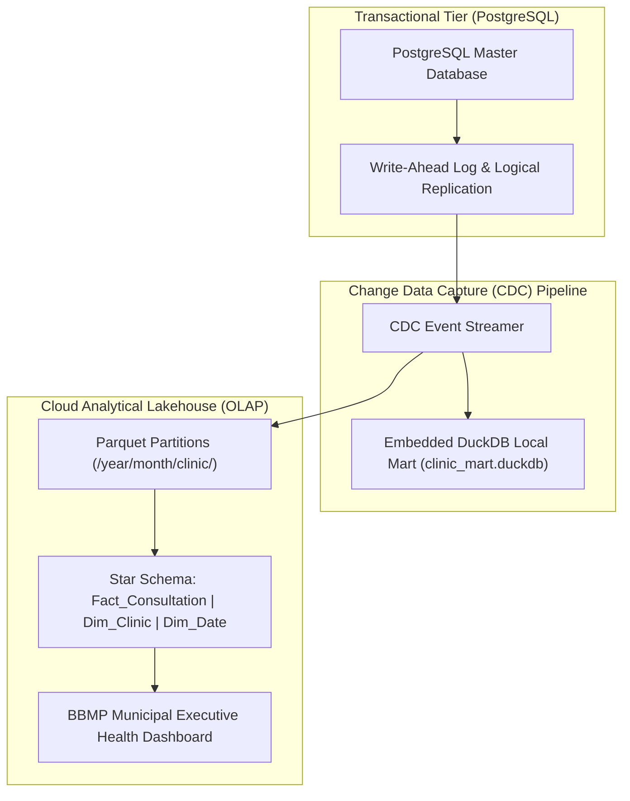

# Analytics Architecture & Public Health Data Platform Baseline: Namma Clinic Digital Health Platform

| Metadata Attribute | Formal Specification |
| :--- | :--- |
| **Document Identifier** | `DOC-REQ-015-ANL` |
| **Document Title** | Analytics Architecture & Public Health Data Platform Baseline |
| **Project Code** | `NAMMA-CLINIC-PLATFORM-2026` |
| **Requirement Type** | `Analytics Requirement` |
| **Specification Range** | `ANL-001 through ANL-040` (Exactly 40 unique requirements) |
| **Target Baseline** | `v1.0.0-PROD-BASELINE` |
| **Lifecycle Status** | `APPROVED & BASELINED` |
| **Target Facility Scope** | 183 Primary Namma Clinics across 8 BBMP Administrative Zones |
| **Lead Clinical Authority** | Chief Health Officer (CHO), BBMP Health Department |
| **Lead Technical Authority**| Principal Solutions Architect, Kushagramati Analytics Consortium |
| **Upstream Baselines** | [`00-project-baseline/`](../00-project-baseline/) \| [`01-project-management/`](../01-project-management/) |
| **Related Specification**| [`03-non-functional-requirements.md`](./03-non-functional-requirements.md) \| [`14-reporting-requirements.md`](./14-reporting-requirements.md) |

## 1. Executive Summary & Domain Governance Framework
This specification defines the comprehensive analytics architecture, OLTP/OLAP decoupling, dimensional modeling, and epidemiological intelligence requirements baseline for the Namma Clinic Digital Health Platform across 183 primary urban healthcare centers in Greater Bengaluru. Comprising 40 detailed analytics specifications (`ANL-001` through `ANL-040`), this document establishes the star-schema data models, embedded DuckDB execution pipelines, change data capture (CDC) SLAs, and privacy-preserving k-anonymity safeguards governing all municipal business intelligence.

To ensure that analytical workloads never contend with or degrade frontline doctor consultations, the architecture enforces strict separation between transactional PostgreSQL stores and embedded DuckDB / Parquet analytical marts.

## 2. Architecture & Domain Conceptual Framework
The following architectural topology illustrates the functional interactions, security boundaries, and data flows governing this domain across Namma Clinic's 183 primary healthcare centers in Greater Bengaluru:



## 3. Master Analytics Requirement Inventory Table (ANL-001 through ANL-040)
| Requirement ID | Title | Analytical Dimension | Priority | Cadence | Storage Target | Lead Owner |
| :--- | :--- | :--- | :--- | :--- | :--- | :---: |
| [`ANL-001`](#anl-001) | **OLTP and OLAP Architectural Decoupling Pipeline** | `System Architecture` | `MUST` | `Continuous CDC` | `DuckDB Replicated Analytical Store` | Data Platform Lead |
| [`ANL-002`](#anl-002) | **Embedded DuckDB Local Clinic Analytics Execution Engine** | `Local Analytical Mart` | `MUST` | `Sub-Second Query` | `Local clinic_mart.duckdb File` | Data Platform Lead |
| [`ANL-003`](#anl-003) | **Daily Change Data Capture (CDC) Pipeline to Cloud Warehouse** | `Data Ingestion` | `MUST` | `Daily Delta Batch` | `Cloud Analytical Lakehouse Parquet ` | Data Engineer |
| [`ANL-004`](#anl-004) | **Star Schema Dimensional Data Model Conformance** | `Dimensional Modeling` | `MUST` | `Static Architecture` | `Dim_Date, Dim_Clinic, Dim_Doctor, D` | Data Architect |
| [`ANL-005`](#anl-005) | **Fact Table Fact_Consultation Granular Event Storage** | `Fact Engine` | `MUST` | `Real-Time / Micro-Batch` | `Fact_Consultation (patient_key, doc` | Data Architect |
| [`ANL-006`](#anl-006) | **Fact Table Fact_Dispensation Pharmacy Analytics Ledger** | `Fact Engine` | `MUST` | `Batch Hourly` | `Fact_Dispensation (drug_key, qty, c` | Data Architect |
| [`ANL-007`](#anl-007) | **Fact Table Fact_LabOrder Diagnostic Throughput Metrics** | `Fact Engine` | `MUST` | `Batch Hourly` | `Fact_LabOrder (test_key, turnaround` | Data Architect |
| [`ANL-008`](#anl-008) | **Fact Table Fact_Triage Vital Signs and Acuity Trends** | `Fact Engine` | `MUST` | `Batch Hourly` | `Fact_Triage (acuity_key, sbp, dbp, ` | Data Architect |
| [`ANL-009`](#anl-009) | **Clinic Operational Efficiency and Patient Throughput KPI** | `Operational KPI` | `MUST` | `Daily Snapshot` | `Agg_Clinic_Daily_Throughput Table` | Data Analyst |
| [`ANL-010`](#anl-010) | **Doctor Consultation Duration Distribution Modeling** | `Workload Analytics` | `MUST` | `Weekly Aggregation` | `Histogram_Consultation_Durations Vi` | Data Analyst |
| [`ANL-011`](#anl-011) | **120 Essential Drug Velocity and Depletion Curve Modeling** | `Pharmacy Analytics` | `MUST` | `Daily Aggregation` | `Model_Drug_Consumption_Velocity Tab` | Data Scientist |
| [`ANL-012`](#anl-012) | **Stockout Probability Scoring for Primary Care Drugs** | `Predictive Analytics` | `MUST` | `Weekly Scoring` | `Score_Stockout_Risk (drug_id, p_sto` | Data Scientist |
| [`ANL-013`](#anl-013) | **Spatial GIS Clustering of Fever and Syndromic Symptoms** | `Epidemiology` | `MUST` | `Daily Geocoding` | `Spatial_Fever_Clusters (ward_id, la` | GIS / Epidemiologist |
| [`ANL-014`](#anl-014) | **Dengue and Waterborne Outbreak Early Warning Indices** | `Surveillance` | `MUST` | `Daily Calculation` | `Index_Outbreak_Early_Warning (ward,` | Epidemiologist |
| [`ANL-015`](#anl-015) | **Maternal Care Antenatal Dropout and Missed Visit Leakage** | `Maternal Analytics` | `MUST` | `Weekly Cohort` | `Cohort_ANC_Retention_Funnel Table` | Data Analyst |
| [`ANL-016`](#anl-016) | **High-Risk Pregnancy Clustering by Socio-Economic Ward** | `Maternal Analytics` | `MUST` | `Monthly Spatial` | `Map_HighRisk_Pregnancies View` | Epidemiologist |
| [`ANL-017`](#anl-017) | **Hypertension Control Cohort Progression Analytics** | `NCD Analytics` | `MUST` | `Monthly Cohort` | `Cohort_Hypertension_Control_Rate Ta` | Data Analyst |
| [`ANL-018`](#anl-018) | **Type 2 Diabetes HbA1c and Fasting Glucose Trajectory** | `NCD Analytics` | `MUST` | `Quarterly Cohort` | `Trajectory_Diabetes_Glycemic_Contro` | Data Analyst |
| [`ANL-019`](#anl-019) | **Prescription Polypharmacy and High-Risk Drug Combination** | `Clinical Safety` | `MUST` | `Monthly Audit` | `Audit_Polypharmacy_Events (patient_` | Clinical Data Lead |
| [`ANL-020`](#anl-020) | **Antibiotic Prescription Proportion Adherence Analytics** | `Antimicrobial Resistance` | `MUST` | `Monthly AWaRe Audit` | `AWaRe_Antibiotic_Proportions (Acces` | Clinical Data Lead |
| [`ANL-021`](#anl-021) | **Referral Completion and Specialist Loop Closure Funnel** | `Care Continuity` | `MUST` | `Monthly Funnel` | `Funnel_Referral_Completion (sent, r` | Data Analyst |
| [`ANL-022`](#anl-022) | **Patient Retention and Longitudinal Visit Cadence Modeling** | `Patient Analytics` | `MUST` | `Quarterly RFM` | `Model_Patient_Care_Cadence (retenti` | Data Analyst |
| [`ANL-023`](#anl-023) | **Point-of-Care Laboratory Abnormal Test Result Prevalence** | `Diagnostic Analytics` | `MUST` | `Weekly Prevalence` | `Prevalence_Abnormal_Labs (test_id, ` | Data Analyst |
| [`ANL-024`](#anl-024) | **Clinic Equipment Downtime and Maintenance Analytics** | `Asset Management` | `MUST` | `Monthly Aggregate` | `Log_Equipment_Reliability (device_t` | Operations Analyst |
| [`ANL-025`](#anl-025) | **Cold Chain Refrigerator Mean Kinetic Temperature (MKT)** | `Cold Chain Analytics` | `MUST` | `Monthly MKT Calculation` | `Metric_ColdChain_MKT (fridge_id, mk` | Data Engineer |
| [`ANL-026`](#anl-026) | **Analytical Query Response Time SLA (<1.5s on DuckDB)** | `SLA & Performance` | `MUST` | `Per Query Benchmark` | `DuckDB Analytical Benchmark Suite` | Data Platform Lead |
| [`ANL-027`](#anl-027) | **Data Freshness Latency Bounds (<2 Hours for Ingestion)** | `Data Quality SLA` | `MUST` | `Continuous Monitor` | `Monitor_Data_Freshness (source_lag_` | Data Engineer |
| [`ANL-028`](#anl-028) | **Automated Data Lineage and Metadata Provenance Graph** | `Governance` | `MUST` | `CI/CD Deployment` | `OpenLineage / DataHub Metadata Regi` | Data Architect |
| [`ANL-029`](#anl-029) | **Automated Anomaly Detection in Daily OPD Census Metrics** | `Quality Assurance` | `MUST` | `Daily Evaluation` | `Alert_Census_Anomalies (clinic_id, ` | Data Scientist |
| [`ANL-030`](#anl-030) | **Null Value and Foreign Key Referential Quality Scoring** | `Data Quality` | `MUST` | `Daily Pipeline Gate` | `Score_Data_Quality (table_name, dq_` | Data Engineer |
| [`ANL-031`](#anl-031) | **Differential Privacy (k>=5) for Analytical Aggregations** | `Privacy Engineering` | `MUST` | `Query Runtime` | `Engine_k_Anonymity (min_cohort_size` | Privacy Lead / DPO |
| [`ANL-032`](#anl-032) | **Role-Based Analytical Access Control and Data Masking** | `Security & Governance` | `MUST` | `Query Runtime` | `RBAC_Column_Masking_Policy (role, p` | Security Lead |
| [`ANL-033`](#anl-033) | **Automated Daily Snapshot Partitioning and Parquet Compaction** | `Storage Optimization` | `MUST` | `Daily 02:00 Cron` | `S3 Parquet Partitions (/year=YYYY/m` | Data Engineer |
| [`ANL-034`](#anl-034) | **DuckDB Query Resource Consumption and Memory Throttling** | `System Resilience` | `MUST` | `Query Runtime` | `DuckDB Memory Limit Configuration (` | Data Platform Lead |
| [`ANL-035`](#anl-035) | **Municipal Ward Health Equity Dashboard Analytical Feed** | `Public Health` | `MUST` | `Hourly Refresh` | `Feed_Ward_Health_Equity (ward_id, e` | Data Analyst |
| [`ANL-036`](#anl-036) | **Seasonal Epidemiology Wave Decomposition Analysis** | `Epidemiology` | `MUST` | `Monthly Seasonal` | `Decomposition_Disease_Seasonality (` | Data Scientist |
| [`ANL-037`](#anl-037) | **Vaccine Wastage Rate and Vial Open Utilization Analytics** | `Immunization` | `MUST` | `Monthly Aggregate` | `Metric_Vaccine_Wastage_Pct (vaccine` | Data Analyst |
| [`ANL-038`](#anl-038) | **Teleconsultation Conversion and Doctor Acceptance Metrics** | `Telehealth` | `MUST` | `Monthly Aggregate` | `Conversion_Teleconsultation (reques` | Operations Analyst |
| [`ANL-039`](#anl-039) | **Biomedical Waste Generation per OPD Footfall Ratio** | `Environmental Health` | `MUST` | `Monthly Aggregate` | `Ratio_Waste_Per_Patient (clinic_id,` | Operations Analyst |
| [`ANL-040`](#anl-040) | **Open Data Health Bulletin Aggregation and Export Engine** | `Public Health` | `MUST` | `Monthly Release` | `Public_Health_Bulletin_Dataset.parq` | Data Protection Officer |

## 4. Comprehensive Analytics Requirement Specifications (ANL-001 through ANL-040)
This section establishes the exhaustive engineering, clinical, operational, and architectural specifications for each of the 40 requirements committed for the production baseline.

### 4.1 ANL-001: OLTP and OLAP Architectural Decoupling Pipeline

| Specification Attribute | Formal Engineering Definition |
| :--- | :--- |
| **Requirement ID** | `ANL-001` |
| **Requirement Title** | OLTP and OLAP Architectural Decoupling Pipeline |
| **Requirement Statement**| The platform SHALL implement oltp and olap architectural decoupling pipeline across the system architecture dimension on a continuous cdc cadence targeting DuckDB Replicated Analytical Store. |
| **Requirement Type** | `Analytics & Data Platform Requirement` |
| **Priority Level** | `MUST` (Rationale: Foundational data intelligence enabling municipal epidemiological surveillance and resource optimization.) |
| **Business Value** | Transforms raw clinic transaction data into actionable public health insights. |
| **Engineering Rationale**| Dimension: System Architecture; Cadence: Continuous CDC; Analytical Target: DuckDB Replicated Analytical Store. |
| **Primary Actor** | `Data Platform Pipeline` |
| **Target User Persona** | [`PERSONA-001`](../01-project-management/07-user-personas.md#persona-001) |
| **Accountable Role** | [`ROLE-004`](../01-project-management/08-role-and-responsibility-matrix.md#role-004) |
| **Key Stakeholder** | [`STAKEHOLDER-006`](../01-project-management/06-stakeholders.md#stakeholder-006) |
| **Trigger Condition** | Scheduled ETL batch, CDC change event, or analytical dashboard query execution. |
| **System Preconditions** | Source OLTP database healthy; DuckDB engine initialized with valid schema. |
| **Input Specifications** | Transactional CDC logs, dimensional foreign keys, and temporal window parameters. |
| **Validation Rules** | Evaluated against schema integrity constraints, null-check thresholds, and foreign key references. |
| **Postconditions** | Analytical datamart refreshed; data lineage metadata recorded in catalog. |
| **State Mutations** | Updates analytical watermark timestamp and inserts aggregated fact records. |
| **Associated Rules** | Business: [`BRULE-001`](./04-business-rules.md#brule-001) \| Clinical: [`CR-001`](./05-clinical-rules.md#cr-001) \| Operational: [`OR-001`](./06-operational-rules.md#or-001) |
| **Security & Privacy** | Security: `Analytical views enforce column-level PII masking for non-clinical analytical users.` \| Privacy: `All exported analytical datasets enforce k-anonymity (k>=5) and l-diversity.` |
| **Data & Audit** | Data: `Zero mutation locks on transactional PostgreSQL tables; uses logical replication.` \| Audit: `Analytical query logs and export metadata tracked in compliance ledger.` |
| **Offline & Sync** | Offline: `Clinic-level DuckDB instances execute analytical queries locally without server access.` \| Sync: `Central cloud lakehouse consolidates daily Parquet partitions from 183 clinics.` |
| **Quality Expectations**| Perf: `Analytical aggregations across 500k rows execute in < 1.5 seconds on DuckDB.` \| Avail: `99.5% availability for executive dashboards and municipal health feeds.` |
| **Localization & A11y**| Loc: `Analytical dimension labels support bilingual Kannada and English metadata.` \| A11y: `Analytical charts paired with accessible data tables for screen readers.` |
| **Failure & Recovery** | Failure: Fall back to previous snapshot partition if ETL pipeline job fails. \| Recovery: Automated pipeline re-run from last validated CDC checkpoint. |
| **Observability** | Logging: `Structured JSON log with query_duration_ms, memory_used_mb, and rows_processed.` \| Metrics: `Prometheus histogram `namma_clinic_analytics_query_duration_seconds{dim="System Architecture"}`.` |
| **Upstream Traceability**| Obj: [`OBJECTIVE-001`](../01-project-management/02-project-vision-and-objectives.md#objective-001) \| Scope: [`INSCOPE-001`](../01-project-management/04-in-scope.md#inscope-001) \| Risk: [`RISK-001`](../01-project-management/12-project-risks.md#risk-001) |
| **Downstream Planning** | Epic: `PLANNED-EPIC-001` \| Feature: `PLANNED-FEATURE-001` \| API: `PLANNED-API-001` \| DB: `PLANNED-DB-001` \| Test: `PLANNED-TEST-1401` |

#### 4.1.1 Operational Execution Protocol & Frontline Workflow
- **Continuous Operational Workflow:**
  1. Data pipeline extracts change records for dimension: System Architecture.
  2. Transforms records into star-schema fact/dimension format.
  3. Loads processed dataset into target store: DuckDB Replicated Analytical Store.
  4. Executes quality verification and freshness checks: Data Pipeline Integrity Test.
  5. Refreshes analytical dashboard views with sub-second response times.
- **Degraded State Fallback Path:** If DuckDB query memory exceeds 1GB cap, spill temporary intermediate arrays to disk.
- **Exception Breach & Incident Escalation Path:** If CDC ingestion lags by >2 hours, trigger automated alert to Data Platform Lead.

#### 4.1.2 Technical Invariants & Operational Contract
- **Analytical Dimension:** System Architecture
- **Aggregation Cadence:** Continuous CDC
- **Analytical Storage Target:** `DuckDB Replicated Analytical Store`
- **Verification Protocol:** Data Pipeline Integrity Test
- **Accountable Data Lead:** Data Platform Lead

#### 4.1.3 Executable BDD Acceptance Scenarios
```gherkin
Feature: ANL-001 - OLTP and OLAP Architectural Decoupling Pipeline
  As a Data Platform Pipeline
  I require system enforcement of oltp and olap architectural decoupling pipeline
  In order to ensure municipal healthcare compliance and operational integrity

  Scenario: Happy Path Execution for ANL-001
    Given the Data Platform Pipeline is authenticated and clinic terminal is operational
    When the user submits a valid request for oltp and olap architectural decoupling pipeline
    Then the system successfully commits the transaction and emits an audit event

  Scenario: Input Validation and Schema Guard for ANL-001
    Given the Data Platform Pipeline attempts to submit an incomplete or malformed payload for oltp and olap architectural decoupling pipeline
    When the request fails TypeBox schema or domain constraint validation
    Then the system rejects the input with HTTP 400 and highlights invalid fields in Kannada and English

  Scenario: RBAC and Security Access Control for ANL-001
    Given an unauthenticated or unauthorized role attempts to invoke oltp and olap architectural decoupling pipeline
    When the bearer JWT token is missing, expired, or lacks necessary RBAC permission
    Then the system denies execution with HTTP 403 Forbidden and records a security telemetry alert

  Scenario: Offline Autonomous Execution for ANL-001
    Given the clinic WAN network is completely severed during oltp and olap architectural decoupling pipeline
    When the operator confirms the local transaction on the workstation
    Then the mutation is persisted to Dexie.js IndexedDB with a UUIDv7 and queued for background replay

  Scenario: Network Recovery and Idempotent Sync for ANL-001
    Given the clinic workstation reconnects to the BBMP municipal health WAN
    When the background sync daemon processes the pending mutation queue
    Then all buffered transactions for ANL-001 synchronize idempotently with zero data loss
```

#### 4.1.4 Verification Protocol & Quality Sign-Off
- **Verification Method:** Data Pipeline Integrity Test
- **Automated Test Suite:** `PLANNED-TEST-1401` (Automated Analytical Data Pipeline & Query Benchmark Test) targeting 100% verification gate compliance.
- **Related Internal Requirements:** `NFR-038`, `REP-035`, `INT-029`
- **Dependencies & Blocking Constraints:** NFR-038 | Constraints: DuckDB local memory allocation capped strictly at 1GB.
- **Architectural Assumptions & Open Questions:** Assumption: Workstation browsers have sufficient memory to allocate DuckDB WebAssembly workers. | Open Question: Integration testing with BBMP GIS shapefile coordinates.

---

### 4.2 ANL-002: Embedded DuckDB Local Clinic Analytics Execution Engine

| Specification Attribute | Formal Engineering Definition |
| :--- | :--- |
| **Requirement ID** | `ANL-002` |
| **Requirement Title** | Embedded DuckDB Local Clinic Analytics Execution Engine |
| **Requirement Statement**| The platform SHALL implement embedded duckdb local clinic analytics execution engine across the local analytical mart dimension on a sub-second query cadence targeting Local clinic_mart.duckdb File. |
| **Requirement Type** | `Analytics & Data Platform Requirement` |
| **Priority Level** | `MUST` (Rationale: Foundational data intelligence enabling municipal epidemiological surveillance and resource optimization.) |
| **Business Value** | Transforms raw clinic transaction data into actionable public health insights. |
| **Engineering Rationale**| Dimension: Local Analytical Mart; Cadence: Sub-Second Query; Analytical Target: Local clinic_mart.duckdb File. |
| **Primary Actor** | `Data Platform Pipeline` |
| **Target User Persona** | [`PERSONA-002`](../01-project-management/07-user-personas.md#persona-002) |
| **Accountable Role** | [`ROLE-004`](../01-project-management/08-role-and-responsibility-matrix.md#role-004) |
| **Key Stakeholder** | [`STAKEHOLDER-006`](../01-project-management/06-stakeholders.md#stakeholder-006) |
| **Trigger Condition** | Scheduled ETL batch, CDC change event, or analytical dashboard query execution. |
| **System Preconditions** | Source OLTP database healthy; DuckDB engine initialized with valid schema. |
| **Input Specifications** | Transactional CDC logs, dimensional foreign keys, and temporal window parameters. |
| **Validation Rules** | Evaluated against schema integrity constraints, null-check thresholds, and foreign key references. |
| **Postconditions** | Analytical datamart refreshed; data lineage metadata recorded in catalog. |
| **State Mutations** | Updates analytical watermark timestamp and inserts aggregated fact records. |
| **Associated Rules** | Business: [`BRULE-002`](./04-business-rules.md#brule-002) \| Clinical: [`CR-002`](./05-clinical-rules.md#cr-002) \| Operational: [`OR-002`](./06-operational-rules.md#or-002) |
| **Security & Privacy** | Security: `Analytical views enforce column-level PII masking for non-clinical analytical users.` \| Privacy: `All exported analytical datasets enforce k-anonymity (k>=5) and l-diversity.` |
| **Data & Audit** | Data: `Zero mutation locks on transactional PostgreSQL tables; uses logical replication.` \| Audit: `Analytical query logs and export metadata tracked in compliance ledger.` |
| **Offline & Sync** | Offline: `Clinic-level DuckDB instances execute analytical queries locally without server access.` \| Sync: `Central cloud lakehouse consolidates daily Parquet partitions from 183 clinics.` |
| **Quality Expectations**| Perf: `Analytical aggregations across 500k rows execute in < 1.5 seconds on DuckDB.` \| Avail: `99.5% availability for executive dashboards and municipal health feeds.` |
| **Localization & A11y**| Loc: `Analytical dimension labels support bilingual Kannada and English metadata.` \| A11y: `Analytical charts paired with accessible data tables for screen readers.` |
| **Failure & Recovery** | Failure: Fall back to previous snapshot partition if ETL pipeline job fails. \| Recovery: Automated pipeline re-run from last validated CDC checkpoint. |
| **Observability** | Logging: `Structured JSON log with query_duration_ms, memory_used_mb, and rows_processed.` \| Metrics: `Prometheus histogram `namma_clinic_analytics_query_duration_seconds{dim="Local Analytical Mart"}`.` |
| **Upstream Traceability**| Obj: [`OBJECTIVE-002`](../01-project-management/02-project-vision-and-objectives.md#objective-002) \| Scope: [`INSCOPE-002`](../01-project-management/04-in-scope.md#inscope-002) \| Risk: [`RISK-002`](../01-project-management/12-project-risks.md#risk-002) |
| **Downstream Planning** | Epic: `PLANNED-EPIC-002` \| Feature: `PLANNED-FEATURE-002` \| API: `PLANNED-API-002` \| DB: `PLANNED-DB-002` \| Test: `PLANNED-TEST-1402` |

#### 4.2.1 Operational Execution Protocol & Frontline Workflow
- **Continuous Operational Workflow:**
  1. Data pipeline extracts change records for dimension: Local Analytical Mart.
  2. Transforms records into star-schema fact/dimension format.
  3. Loads processed dataset into target store: Local clinic_mart.duckdb File.
  4. Executes quality verification and freshness checks: Local Query Benchmark.
  5. Refreshes analytical dashboard views with sub-second response times.
- **Degraded State Fallback Path:** If DuckDB query memory exceeds 1GB cap, spill temporary intermediate arrays to disk.
- **Exception Breach & Incident Escalation Path:** If CDC ingestion lags by >2 hours, trigger automated alert to Data Platform Lead.

#### 4.2.2 Technical Invariants & Operational Contract
- **Analytical Dimension:** Local Analytical Mart
- **Aggregation Cadence:** Sub-Second Query
- **Analytical Storage Target:** `Local clinic_mart.duckdb File`
- **Verification Protocol:** Local Query Benchmark
- **Accountable Data Lead:** Data Platform Lead

#### 4.2.3 Executable BDD Acceptance Scenarios
```gherkin
Feature: ANL-002 - Embedded DuckDB Local Clinic Analytics Execution Engine
  As a Data Platform Pipeline
  I require system enforcement of embedded duckdb local clinic analytics execution engine
  In order to ensure municipal healthcare compliance and operational integrity

  Scenario: Happy Path Execution for ANL-002
    Given the Data Platform Pipeline is authenticated and clinic terminal is operational
    When the user submits a valid request for embedded duckdb local clinic analytics execution engine
    Then the system successfully commits the transaction and emits an audit event

  Scenario: Input Validation and Schema Guard for ANL-002
    Given the Data Platform Pipeline attempts to submit an incomplete or malformed payload for embedded duckdb local clinic analytics execution engine
    When the request fails TypeBox schema or domain constraint validation
    Then the system rejects the input with HTTP 400 and highlights invalid fields in Kannada and English

  Scenario: RBAC and Security Access Control for ANL-002
    Given an unauthenticated or unauthorized role attempts to invoke embedded duckdb local clinic analytics execution engine
    When the bearer JWT token is missing, expired, or lacks necessary RBAC permission
    Then the system denies execution with HTTP 403 Forbidden and records a security telemetry alert

  Scenario: Offline Autonomous Execution for ANL-002
    Given the clinic WAN network is completely severed during embedded duckdb local clinic analytics execution engine
    When the operator confirms the local transaction on the workstation
    Then the mutation is persisted to Dexie.js IndexedDB with a UUIDv7 and queued for background replay

  Scenario: Network Recovery and Idempotent Sync for ANL-002
    Given the clinic workstation reconnects to the BBMP municipal health WAN
    When the background sync daemon processes the pending mutation queue
    Then all buffered transactions for ANL-002 synchronize idempotently with zero data loss
```

#### 4.2.4 Verification Protocol & Quality Sign-Off
- **Verification Method:** Local Query Benchmark
- **Automated Test Suite:** `PLANNED-TEST-1402` (Automated Analytical Data Pipeline & Query Benchmark Test) targeting 100% verification gate compliance.
- **Related Internal Requirements:** `NFR-038`, `REP-035`, `INT-029`
- **Dependencies & Blocking Constraints:** NFR-038 | Constraints: DuckDB local memory allocation capped strictly at 1GB.
- **Architectural Assumptions & Open Questions:** Assumption: Workstation browsers have sufficient memory to allocate DuckDB WebAssembly workers. | Open Question: Integration testing with BBMP GIS shapefile coordinates.

---

### 4.3 ANL-003: Daily Change Data Capture (CDC) Pipeline to Cloud Warehouse

| Specification Attribute | Formal Engineering Definition |
| :--- | :--- |
| **Requirement ID** | `ANL-003` |
| **Requirement Title** | Daily Change Data Capture (CDC) Pipeline to Cloud Warehouse |
| **Requirement Statement**| The platform SHALL implement daily change data capture (cdc) pipeline to cloud warehouse across the data ingestion dimension on a daily delta batch cadence targeting Cloud Analytical Lakehouse Parquet Tables. |
| **Requirement Type** | `Analytics & Data Platform Requirement` |
| **Priority Level** | `MUST` (Rationale: Foundational data intelligence enabling municipal epidemiological surveillance and resource optimization.) |
| **Business Value** | Transforms raw clinic transaction data into actionable public health insights. |
| **Engineering Rationale**| Dimension: Data Ingestion; Cadence: Daily Delta Batch; Analytical Target: Cloud Analytical Lakehouse Parquet Tables. |
| **Primary Actor** | `Data Platform Pipeline` |
| **Target User Persona** | [`PERSONA-003`](../01-project-management/07-user-personas.md#persona-003) |
| **Accountable Role** | [`ROLE-004`](../01-project-management/08-role-and-responsibility-matrix.md#role-004) |
| **Key Stakeholder** | [`STAKEHOLDER-006`](../01-project-management/06-stakeholders.md#stakeholder-006) |
| **Trigger Condition** | Scheduled ETL batch, CDC change event, or analytical dashboard query execution. |
| **System Preconditions** | Source OLTP database healthy; DuckDB engine initialized with valid schema. |
| **Input Specifications** | Transactional CDC logs, dimensional foreign keys, and temporal window parameters. |
| **Validation Rules** | Evaluated against schema integrity constraints, null-check thresholds, and foreign key references. |
| **Postconditions** | Analytical datamart refreshed; data lineage metadata recorded in catalog. |
| **State Mutations** | Updates analytical watermark timestamp and inserts aggregated fact records. |
| **Associated Rules** | Business: [`BRULE-003`](./04-business-rules.md#brule-003) \| Clinical: [`CR-003`](./05-clinical-rules.md#cr-003) \| Operational: [`OR-003`](./06-operational-rules.md#or-003) |
| **Security & Privacy** | Security: `Analytical views enforce column-level PII masking for non-clinical analytical users.` \| Privacy: `All exported analytical datasets enforce k-anonymity (k>=5) and l-diversity.` |
| **Data & Audit** | Data: `Zero mutation locks on transactional PostgreSQL tables; uses logical replication.` \| Audit: `Analytical query logs and export metadata tracked in compliance ledger.` |
| **Offline & Sync** | Offline: `Clinic-level DuckDB instances execute analytical queries locally without server access.` \| Sync: `Central cloud lakehouse consolidates daily Parquet partitions from 183 clinics.` |
| **Quality Expectations**| Perf: `Analytical aggregations across 500k rows execute in < 1.5 seconds on DuckDB.` \| Avail: `99.5% availability for executive dashboards and municipal health feeds.` |
| **Localization & A11y**| Loc: `Analytical dimension labels support bilingual Kannada and English metadata.` \| A11y: `Analytical charts paired with accessible data tables for screen readers.` |
| **Failure & Recovery** | Failure: Fall back to previous snapshot partition if ETL pipeline job fails. \| Recovery: Automated pipeline re-run from last validated CDC checkpoint. |
| **Observability** | Logging: `Structured JSON log with query_duration_ms, memory_used_mb, and rows_processed.` \| Metrics: `Prometheus histogram `namma_clinic_analytics_query_duration_seconds{dim="Data Ingestion"}`.` |
| **Upstream Traceability**| Obj: [`OBJECTIVE-003`](../01-project-management/02-project-vision-and-objectives.md#objective-003) \| Scope: [`INSCOPE-003`](../01-project-management/04-in-scope.md#inscope-003) \| Risk: [`RISK-003`](../01-project-management/12-project-risks.md#risk-003) |
| **Downstream Planning** | Epic: `PLANNED-EPIC-003` \| Feature: `PLANNED-FEATURE-003` \| API: `PLANNED-API-003` \| DB: `PLANNED-DB-003` \| Test: `PLANNED-TEST-1403` |

#### 4.3.1 Operational Execution Protocol & Frontline Workflow
- **Continuous Operational Workflow:**
  1. Data pipeline extracts change records for dimension: Data Ingestion.
  2. Transforms records into star-schema fact/dimension format.
  3. Loads processed dataset into target store: Cloud Analytical Lakehouse Parquet Tables.
  4. Executes quality verification and freshness checks: CDC Sync Completeness Test.
  5. Refreshes analytical dashboard views with sub-second response times.
- **Degraded State Fallback Path:** If DuckDB query memory exceeds 1GB cap, spill temporary intermediate arrays to disk.
- **Exception Breach & Incident Escalation Path:** If CDC ingestion lags by >2 hours, trigger automated alert to Data Platform Lead.

#### 4.3.2 Technical Invariants & Operational Contract
- **Analytical Dimension:** Data Ingestion
- **Aggregation Cadence:** Daily Delta Batch
- **Analytical Storage Target:** `Cloud Analytical Lakehouse Parquet Tables`
- **Verification Protocol:** CDC Sync Completeness Test
- **Accountable Data Lead:** Data Engineer

#### 4.3.3 Executable BDD Acceptance Scenarios
```gherkin
Feature: ANL-003 - Daily Change Data Capture (CDC) Pipeline to Cloud Warehouse
  As a Data Platform Pipeline
  I require system enforcement of daily change data capture (cdc) pipeline to cloud warehouse
  In order to ensure municipal healthcare compliance and operational integrity

  Scenario: Happy Path Execution for ANL-003
    Given the Data Platform Pipeline is authenticated and clinic terminal is operational
    When the user submits a valid request for daily change data capture (cdc) pipeline to cloud warehouse
    Then the system successfully commits the transaction and emits an audit event

  Scenario: Input Validation and Schema Guard for ANL-003
    Given the Data Platform Pipeline attempts to submit an incomplete or malformed payload for daily change data capture (cdc) pipeline to cloud warehouse
    When the request fails TypeBox schema or domain constraint validation
    Then the system rejects the input with HTTP 400 and highlights invalid fields in Kannada and English

  Scenario: RBAC and Security Access Control for ANL-003
    Given an unauthenticated or unauthorized role attempts to invoke daily change data capture (cdc) pipeline to cloud warehouse
    When the bearer JWT token is missing, expired, or lacks necessary RBAC permission
    Then the system denies execution with HTTP 403 Forbidden and records a security telemetry alert

  Scenario: Offline Autonomous Execution for ANL-003
    Given the clinic WAN network is completely severed during daily change data capture (cdc) pipeline to cloud warehouse
    When the operator confirms the local transaction on the workstation
    Then the mutation is persisted to Dexie.js IndexedDB with a UUIDv7 and queued for background replay

  Scenario: Network Recovery and Idempotent Sync for ANL-003
    Given the clinic workstation reconnects to the BBMP municipal health WAN
    When the background sync daemon processes the pending mutation queue
    Then all buffered transactions for ANL-003 synchronize idempotently with zero data loss
```

#### 4.3.4 Verification Protocol & Quality Sign-Off
- **Verification Method:** CDC Sync Completeness Test
- **Automated Test Suite:** `PLANNED-TEST-1403` (Automated Analytical Data Pipeline & Query Benchmark Test) targeting 100% verification gate compliance.
- **Related Internal Requirements:** `NFR-038`, `REP-035`, `INT-029`
- **Dependencies & Blocking Constraints:** NFR-038 | Constraints: DuckDB local memory allocation capped strictly at 1GB.
- **Architectural Assumptions & Open Questions:** Assumption: Workstation browsers have sufficient memory to allocate DuckDB WebAssembly workers. | Open Question: Integration testing with BBMP GIS shapefile coordinates.

---

### 4.4 ANL-004: Star Schema Dimensional Data Model Conformance

| Specification Attribute | Formal Engineering Definition |
| :--- | :--- |
| **Requirement ID** | `ANL-004` |
| **Requirement Title** | Star Schema Dimensional Data Model Conformance |
| **Requirement Statement**| The platform SHALL implement star schema dimensional data model conformance across the dimensional modeling dimension on a static architecture cadence targeting Dim_Date, Dim_Clinic, Dim_Doctor, Dim_Patient. |
| **Requirement Type** | `Analytics & Data Platform Requirement` |
| **Priority Level** | `MUST` (Rationale: Foundational data intelligence enabling municipal epidemiological surveillance and resource optimization.) |
| **Business Value** | Transforms raw clinic transaction data into actionable public health insights. |
| **Engineering Rationale**| Dimension: Dimensional Modeling; Cadence: Static Architecture; Analytical Target: Dim_Date, Dim_Clinic, Dim_Doctor, Dim_Patient. |
| **Primary Actor** | `Data Platform Pipeline` |
| **Target User Persona** | [`PERSONA-004`](../01-project-management/07-user-personas.md#persona-004) |
| **Accountable Role** | [`ROLE-004`](../01-project-management/08-role-and-responsibility-matrix.md#role-004) |
| **Key Stakeholder** | [`STAKEHOLDER-006`](../01-project-management/06-stakeholders.md#stakeholder-006) |
| **Trigger Condition** | Scheduled ETL batch, CDC change event, or analytical dashboard query execution. |
| **System Preconditions** | Source OLTP database healthy; DuckDB engine initialized with valid schema. |
| **Input Specifications** | Transactional CDC logs, dimensional foreign keys, and temporal window parameters. |
| **Validation Rules** | Evaluated against schema integrity constraints, null-check thresholds, and foreign key references. |
| **Postconditions** | Analytical datamart refreshed; data lineage metadata recorded in catalog. |
| **State Mutations** | Updates analytical watermark timestamp and inserts aggregated fact records. |
| **Associated Rules** | Business: [`BRULE-004`](./04-business-rules.md#brule-004) \| Clinical: [`CR-004`](./05-clinical-rules.md#cr-004) \| Operational: [`OR-004`](./06-operational-rules.md#or-004) |
| **Security & Privacy** | Security: `Analytical views enforce column-level PII masking for non-clinical analytical users.` \| Privacy: `All exported analytical datasets enforce k-anonymity (k>=5) and l-diversity.` |
| **Data & Audit** | Data: `Zero mutation locks on transactional PostgreSQL tables; uses logical replication.` \| Audit: `Analytical query logs and export metadata tracked in compliance ledger.` |
| **Offline & Sync** | Offline: `Clinic-level DuckDB instances execute analytical queries locally without server access.` \| Sync: `Central cloud lakehouse consolidates daily Parquet partitions from 183 clinics.` |
| **Quality Expectations**| Perf: `Analytical aggregations across 500k rows execute in < 1.5 seconds on DuckDB.` \| Avail: `99.5% availability for executive dashboards and municipal health feeds.` |
| **Localization & A11y**| Loc: `Analytical dimension labels support bilingual Kannada and English metadata.` \| A11y: `Analytical charts paired with accessible data tables for screen readers.` |
| **Failure & Recovery** | Failure: Fall back to previous snapshot partition if ETL pipeline job fails. \| Recovery: Automated pipeline re-run from last validated CDC checkpoint. |
| **Observability** | Logging: `Structured JSON log with query_duration_ms, memory_used_mb, and rows_processed.` \| Metrics: `Prometheus histogram `namma_clinic_analytics_query_duration_seconds{dim="Dimensional Modeling"}`.` |
| **Upstream Traceability**| Obj: [`OBJECTIVE-004`](../01-project-management/02-project-vision-and-objectives.md#objective-004) \| Scope: [`INSCOPE-004`](../01-project-management/04-in-scope.md#inscope-004) \| Risk: [`RISK-004`](../01-project-management/12-project-risks.md#risk-004) |
| **Downstream Planning** | Epic: `PLANNED-EPIC-004` \| Feature: `PLANNED-FEATURE-004` \| API: `PLANNED-API-004` \| DB: `PLANNED-DB-004` \| Test: `PLANNED-TEST-1404` |

#### 4.4.1 Operational Execution Protocol & Frontline Workflow
- **Continuous Operational Workflow:**
  1. Data pipeline extracts change records for dimension: Dimensional Modeling.
  2. Transforms records into star-schema fact/dimension format.
  3. Loads processed dataset into target store: Dim_Date, Dim_Clinic, Dim_Doctor, Dim_Patient.
  4. Executes quality verification and freshness checks: Schema Validation Test.
  5. Refreshes analytical dashboard views with sub-second response times.
- **Degraded State Fallback Path:** If DuckDB query memory exceeds 1GB cap, spill temporary intermediate arrays to disk.
- **Exception Breach & Incident Escalation Path:** If CDC ingestion lags by >2 hours, trigger automated alert to Data Platform Lead.

#### 4.4.2 Technical Invariants & Operational Contract
- **Analytical Dimension:** Dimensional Modeling
- **Aggregation Cadence:** Static Architecture
- **Analytical Storage Target:** `Dim_Date, Dim_Clinic, Dim_Doctor, Dim_Patient`
- **Verification Protocol:** Schema Validation Test
- **Accountable Data Lead:** Data Architect

#### 4.4.3 Executable BDD Acceptance Scenarios
```gherkin
Feature: ANL-004 - Star Schema Dimensional Data Model Conformance
  As a Data Platform Pipeline
  I require system enforcement of star schema dimensional data model conformance
  In order to ensure municipal healthcare compliance and operational integrity

  Scenario: Happy Path Execution for ANL-004
    Given the Data Platform Pipeline is authenticated and clinic terminal is operational
    When the user submits a valid request for star schema dimensional data model conformance
    Then the system successfully commits the transaction and emits an audit event

  Scenario: Input Validation and Schema Guard for ANL-004
    Given the Data Platform Pipeline attempts to submit an incomplete or malformed payload for star schema dimensional data model conformance
    When the request fails TypeBox schema or domain constraint validation
    Then the system rejects the input with HTTP 400 and highlights invalid fields in Kannada and English

  Scenario: RBAC and Security Access Control for ANL-004
    Given an unauthenticated or unauthorized role attempts to invoke star schema dimensional data model conformance
    When the bearer JWT token is missing, expired, or lacks necessary RBAC permission
    Then the system denies execution with HTTP 403 Forbidden and records a security telemetry alert

  Scenario: Offline Autonomous Execution for ANL-004
    Given the clinic WAN network is completely severed during star schema dimensional data model conformance
    When the operator confirms the local transaction on the workstation
    Then the mutation is persisted to Dexie.js IndexedDB with a UUIDv7 and queued for background replay

  Scenario: Network Recovery and Idempotent Sync for ANL-004
    Given the clinic workstation reconnects to the BBMP municipal health WAN
    When the background sync daemon processes the pending mutation queue
    Then all buffered transactions for ANL-004 synchronize idempotently with zero data loss
```

#### 4.4.4 Verification Protocol & Quality Sign-Off
- **Verification Method:** Schema Validation Test
- **Automated Test Suite:** `PLANNED-TEST-1404` (Automated Analytical Data Pipeline & Query Benchmark Test) targeting 100% verification gate compliance.
- **Related Internal Requirements:** `NFR-038`, `REP-035`, `INT-029`
- **Dependencies & Blocking Constraints:** NFR-038 | Constraints: DuckDB local memory allocation capped strictly at 1GB.
- **Architectural Assumptions & Open Questions:** Assumption: Workstation browsers have sufficient memory to allocate DuckDB WebAssembly workers. | Open Question: Integration testing with BBMP GIS shapefile coordinates.

---

### 4.5 ANL-005: Fact Table Fact_Consultation Granular Event Storage

| Specification Attribute | Formal Engineering Definition |
| :--- | :--- |
| **Requirement ID** | `ANL-005` |
| **Requirement Title** | Fact Table Fact_Consultation Granular Event Storage |
| **Requirement Statement**| The platform SHALL implement fact table fact_consultation granular event storage across the fact engine dimension on a real-time / micro-batch cadence targeting Fact_Consultation (patient_key, doctor_key, cost). |
| **Requirement Type** | `Analytics & Data Platform Requirement` |
| **Priority Level** | `MUST` (Rationale: Foundational data intelligence enabling municipal epidemiological surveillance and resource optimization.) |
| **Business Value** | Transforms raw clinic transaction data into actionable public health insights. |
| **Engineering Rationale**| Dimension: Fact Engine; Cadence: Real-Time / Micro-Batch; Analytical Target: Fact_Consultation (patient_key, doctor_key, cost). |
| **Primary Actor** | `Data Platform Pipeline` |
| **Target User Persona** | [`PERSONA-005`](../01-project-management/07-user-personas.md#persona-005) |
| **Accountable Role** | [`ROLE-004`](../01-project-management/08-role-and-responsibility-matrix.md#role-004) |
| **Key Stakeholder** | [`STAKEHOLDER-006`](../01-project-management/06-stakeholders.md#stakeholder-006) |
| **Trigger Condition** | Scheduled ETL batch, CDC change event, or analytical dashboard query execution. |
| **System Preconditions** | Source OLTP database healthy; DuckDB engine initialized with valid schema. |
| **Input Specifications** | Transactional CDC logs, dimensional foreign keys, and temporal window parameters. |
| **Validation Rules** | Evaluated against schema integrity constraints, null-check thresholds, and foreign key references. |
| **Postconditions** | Analytical datamart refreshed; data lineage metadata recorded in catalog. |
| **State Mutations** | Updates analytical watermark timestamp and inserts aggregated fact records. |
| **Associated Rules** | Business: [`BRULE-005`](./04-business-rules.md#brule-005) \| Clinical: [`CR-005`](./05-clinical-rules.md#cr-005) \| Operational: [`OR-005`](./06-operational-rules.md#or-005) |
| **Security & Privacy** | Security: `Analytical views enforce column-level PII masking for non-clinical analytical users.` \| Privacy: `All exported analytical datasets enforce k-anonymity (k>=5) and l-diversity.` |
| **Data & Audit** | Data: `Zero mutation locks on transactional PostgreSQL tables; uses logical replication.` \| Audit: `Analytical query logs and export metadata tracked in compliance ledger.` |
| **Offline & Sync** | Offline: `Clinic-level DuckDB instances execute analytical queries locally without server access.` \| Sync: `Central cloud lakehouse consolidates daily Parquet partitions from 183 clinics.` |
| **Quality Expectations**| Perf: `Analytical aggregations across 500k rows execute in < 1.5 seconds on DuckDB.` \| Avail: `99.5% availability for executive dashboards and municipal health feeds.` |
| **Localization & A11y**| Loc: `Analytical dimension labels support bilingual Kannada and English metadata.` \| A11y: `Analytical charts paired with accessible data tables for screen readers.` |
| **Failure & Recovery** | Failure: Fall back to previous snapshot partition if ETL pipeline job fails. \| Recovery: Automated pipeline re-run from last validated CDC checkpoint. |
| **Observability** | Logging: `Structured JSON log with query_duration_ms, memory_used_mb, and rows_processed.` \| Metrics: `Prometheus histogram `namma_clinic_analytics_query_duration_seconds{dim="Fact Engine"}`.` |
| **Upstream Traceability**| Obj: [`OBJECTIVE-005`](../01-project-management/02-project-vision-and-objectives.md#objective-005) \| Scope: [`INSCOPE-005`](../01-project-management/04-in-scope.md#inscope-005) \| Risk: [`RISK-005`](../01-project-management/12-project-risks.md#risk-005) |
| **Downstream Planning** | Epic: `PLANNED-EPIC-005` \| Feature: `PLANNED-FEATURE-005` \| API: `PLANNED-API-005` \| DB: `PLANNED-DB-005` \| Test: `PLANNED-TEST-1405` |

#### 4.5.1 Operational Execution Protocol & Frontline Workflow
- **Continuous Operational Workflow:**
  1. Data pipeline extracts change records for dimension: Fact Engine.
  2. Transforms records into star-schema fact/dimension format.
  3. Loads processed dataset into target store: Fact_Consultation (patient_key, doctor_key, cost).
  4. Executes quality verification and freshness checks: Fact Consistency Audit.
  5. Refreshes analytical dashboard views with sub-second response times.
- **Degraded State Fallback Path:** If DuckDB query memory exceeds 1GB cap, spill temporary intermediate arrays to disk.
- **Exception Breach & Incident Escalation Path:** If CDC ingestion lags by >2 hours, trigger automated alert to Data Platform Lead.

#### 4.5.2 Technical Invariants & Operational Contract
- **Analytical Dimension:** Fact Engine
- **Aggregation Cadence:** Real-Time / Micro-Batch
- **Analytical Storage Target:** `Fact_Consultation (patient_key, doctor_key, cost)`
- **Verification Protocol:** Fact Consistency Audit
- **Accountable Data Lead:** Data Architect

#### 4.5.3 Executable BDD Acceptance Scenarios
```gherkin
Feature: ANL-005 - Fact Table Fact_Consultation Granular Event Storage
  As a Data Platform Pipeline
  I require system enforcement of fact table fact_consultation granular event storage
  In order to ensure municipal healthcare compliance and operational integrity

  Scenario: Happy Path Execution for ANL-005
    Given the Data Platform Pipeline is authenticated and clinic terminal is operational
    When the user submits a valid request for fact table fact_consultation granular event storage
    Then the system successfully commits the transaction and emits an audit event

  Scenario: Input Validation and Schema Guard for ANL-005
    Given the Data Platform Pipeline attempts to submit an incomplete or malformed payload for fact table fact_consultation granular event storage
    When the request fails TypeBox schema or domain constraint validation
    Then the system rejects the input with HTTP 400 and highlights invalid fields in Kannada and English

  Scenario: RBAC and Security Access Control for ANL-005
    Given an unauthenticated or unauthorized role attempts to invoke fact table fact_consultation granular event storage
    When the bearer JWT token is missing, expired, or lacks necessary RBAC permission
    Then the system denies execution with HTTP 403 Forbidden and records a security telemetry alert

  Scenario: Offline Autonomous Execution for ANL-005
    Given the clinic WAN network is completely severed during fact table fact_consultation granular event storage
    When the operator confirms the local transaction on the workstation
    Then the mutation is persisted to Dexie.js IndexedDB with a UUIDv7 and queued for background replay

  Scenario: Network Recovery and Idempotent Sync for ANL-005
    Given the clinic workstation reconnects to the BBMP municipal health WAN
    When the background sync daemon processes the pending mutation queue
    Then all buffered transactions for ANL-005 synchronize idempotently with zero data loss
```

#### 4.5.4 Verification Protocol & Quality Sign-Off
- **Verification Method:** Fact Consistency Audit
- **Automated Test Suite:** `PLANNED-TEST-1405` (Automated Analytical Data Pipeline & Query Benchmark Test) targeting 100% verification gate compliance.
- **Related Internal Requirements:** `NFR-038`, `REP-035`, `INT-029`
- **Dependencies & Blocking Constraints:** NFR-038 | Constraints: DuckDB local memory allocation capped strictly at 1GB.
- **Architectural Assumptions & Open Questions:** Assumption: Workstation browsers have sufficient memory to allocate DuckDB WebAssembly workers. | Open Question: Integration testing with BBMP GIS shapefile coordinates.

---

### 4.6 ANL-006: Fact Table Fact_Dispensation Pharmacy Analytics Ledger

| Specification Attribute | Formal Engineering Definition |
| :--- | :--- |
| **Requirement ID** | `ANL-006` |
| **Requirement Title** | Fact Table Fact_Dispensation Pharmacy Analytics Ledger |
| **Requirement Statement**| The platform SHALL implement fact table fact_dispensation pharmacy analytics ledger across the fact engine dimension on a batch hourly cadence targeting Fact_Dispensation (drug_key, qty, cost, stockout). |
| **Requirement Type** | `Analytics & Data Platform Requirement` |
| **Priority Level** | `MUST` (Rationale: Foundational data intelligence enabling municipal epidemiological surveillance and resource optimization.) |
| **Business Value** | Transforms raw clinic transaction data into actionable public health insights. |
| **Engineering Rationale**| Dimension: Fact Engine; Cadence: Batch Hourly; Analytical Target: Fact_Dispensation (drug_key, qty, cost, stockout). |
| **Primary Actor** | `Data Platform Pipeline` |
| **Target User Persona** | [`PERSONA-006`](../01-project-management/07-user-personas.md#persona-006) |
| **Accountable Role** | [`ROLE-004`](../01-project-management/08-role-and-responsibility-matrix.md#role-004) |
| **Key Stakeholder** | [`STAKEHOLDER-006`](../01-project-management/06-stakeholders.md#stakeholder-006) |
| **Trigger Condition** | Scheduled ETL batch, CDC change event, or analytical dashboard query execution. |
| **System Preconditions** | Source OLTP database healthy; DuckDB engine initialized with valid schema. |
| **Input Specifications** | Transactional CDC logs, dimensional foreign keys, and temporal window parameters. |
| **Validation Rules** | Evaluated against schema integrity constraints, null-check thresholds, and foreign key references. |
| **Postconditions** | Analytical datamart refreshed; data lineage metadata recorded in catalog. |
| **State Mutations** | Updates analytical watermark timestamp and inserts aggregated fact records. |
| **Associated Rules** | Business: [`BRULE-006`](./04-business-rules.md#brule-006) \| Clinical: [`CR-006`](./05-clinical-rules.md#cr-006) \| Operational: [`OR-006`](./06-operational-rules.md#or-006) |
| **Security & Privacy** | Security: `Analytical views enforce column-level PII masking for non-clinical analytical users.` \| Privacy: `All exported analytical datasets enforce k-anonymity (k>=5) and l-diversity.` |
| **Data & Audit** | Data: `Zero mutation locks on transactional PostgreSQL tables; uses logical replication.` \| Audit: `Analytical query logs and export metadata tracked in compliance ledger.` |
| **Offline & Sync** | Offline: `Clinic-level DuckDB instances execute analytical queries locally without server access.` \| Sync: `Central cloud lakehouse consolidates daily Parquet partitions from 183 clinics.` |
| **Quality Expectations**| Perf: `Analytical aggregations across 500k rows execute in < 1.5 seconds on DuckDB.` \| Avail: `99.5% availability for executive dashboards and municipal health feeds.` |
| **Localization & A11y**| Loc: `Analytical dimension labels support bilingual Kannada and English metadata.` \| A11y: `Analytical charts paired with accessible data tables for screen readers.` |
| **Failure & Recovery** | Failure: Fall back to previous snapshot partition if ETL pipeline job fails. \| Recovery: Automated pipeline re-run from last validated CDC checkpoint. |
| **Observability** | Logging: `Structured JSON log with query_duration_ms, memory_used_mb, and rows_processed.` \| Metrics: `Prometheus histogram `namma_clinic_analytics_query_duration_seconds{dim="Fact Engine"}`.` |
| **Upstream Traceability**| Obj: [`OBJECTIVE-006`](../01-project-management/02-project-vision-and-objectives.md#objective-006) \| Scope: [`INSCOPE-006`](../01-project-management/04-in-scope.md#inscope-006) \| Risk: [`RISK-006`](../01-project-management/12-project-risks.md#risk-006) |
| **Downstream Planning** | Epic: `PLANNED-EPIC-006` \| Feature: `PLANNED-FEATURE-006` \| API: `PLANNED-API-006` \| DB: `PLANNED-DB-006` \| Test: `PLANNED-TEST-1406` |

#### 4.6.1 Operational Execution Protocol & Frontline Workflow
- **Continuous Operational Workflow:**
  1. Data pipeline extracts change records for dimension: Fact Engine.
  2. Transforms records into star-schema fact/dimension format.
  3. Loads processed dataset into target store: Fact_Dispensation (drug_key, qty, cost, stockout).
  4. Executes quality verification and freshness checks: Dispensation Aggregation Test.
  5. Refreshes analytical dashboard views with sub-second response times.
- **Degraded State Fallback Path:** If DuckDB query memory exceeds 1GB cap, spill temporary intermediate arrays to disk.
- **Exception Breach & Incident Escalation Path:** If CDC ingestion lags by >2 hours, trigger automated alert to Data Platform Lead.

#### 4.6.2 Technical Invariants & Operational Contract
- **Analytical Dimension:** Fact Engine
- **Aggregation Cadence:** Batch Hourly
- **Analytical Storage Target:** `Fact_Dispensation (drug_key, qty, cost, stockout)`
- **Verification Protocol:** Dispensation Aggregation Test
- **Accountable Data Lead:** Data Architect

#### 4.6.3 Executable BDD Acceptance Scenarios
```gherkin
Feature: ANL-006 - Fact Table Fact_Dispensation Pharmacy Analytics Ledger
  As a Data Platform Pipeline
  I require system enforcement of fact table fact_dispensation pharmacy analytics ledger
  In order to ensure municipal healthcare compliance and operational integrity

  Scenario: Happy Path Execution for ANL-006
    Given the Data Platform Pipeline is authenticated and clinic terminal is operational
    When the user submits a valid request for fact table fact_dispensation pharmacy analytics ledger
    Then the system successfully commits the transaction and emits an audit event

  Scenario: Input Validation and Schema Guard for ANL-006
    Given the Data Platform Pipeline attempts to submit an incomplete or malformed payload for fact table fact_dispensation pharmacy analytics ledger
    When the request fails TypeBox schema or domain constraint validation
    Then the system rejects the input with HTTP 400 and highlights invalid fields in Kannada and English

  Scenario: RBAC and Security Access Control for ANL-006
    Given an unauthenticated or unauthorized role attempts to invoke fact table fact_dispensation pharmacy analytics ledger
    When the bearer JWT token is missing, expired, or lacks necessary RBAC permission
    Then the system denies execution with HTTP 403 Forbidden and records a security telemetry alert

  Scenario: Offline Autonomous Execution for ANL-006
    Given the clinic WAN network is completely severed during fact table fact_dispensation pharmacy analytics ledger
    When the operator confirms the local transaction on the workstation
    Then the mutation is persisted to Dexie.js IndexedDB with a UUIDv7 and queued for background replay

  Scenario: Network Recovery and Idempotent Sync for ANL-006
    Given the clinic workstation reconnects to the BBMP municipal health WAN
    When the background sync daemon processes the pending mutation queue
    Then all buffered transactions for ANL-006 synchronize idempotently with zero data loss
```

#### 4.6.4 Verification Protocol & Quality Sign-Off
- **Verification Method:** Dispensation Aggregation Test
- **Automated Test Suite:** `PLANNED-TEST-1406` (Automated Analytical Data Pipeline & Query Benchmark Test) targeting 100% verification gate compliance.
- **Related Internal Requirements:** `NFR-038`, `REP-035`, `INT-029`
- **Dependencies & Blocking Constraints:** NFR-038 | Constraints: DuckDB local memory allocation capped strictly at 1GB.
- **Architectural Assumptions & Open Questions:** Assumption: Workstation browsers have sufficient memory to allocate DuckDB WebAssembly workers. | Open Question: Integration testing with BBMP GIS shapefile coordinates.

---

### 4.7 ANL-007: Fact Table Fact_LabOrder Diagnostic Throughput Metrics

| Specification Attribute | Formal Engineering Definition |
| :--- | :--- |
| **Requirement ID** | `ANL-007` |
| **Requirement Title** | Fact Table Fact_LabOrder Diagnostic Throughput Metrics |
| **Requirement Statement**| The platform SHALL implement fact table fact_laborder diagnostic throughput metrics across the fact engine dimension on a batch hourly cadence targeting Fact_LabOrder (test_key, turnaround_sec, abnormal). |
| **Requirement Type** | `Analytics & Data Platform Requirement` |
| **Priority Level** | `MUST` (Rationale: Foundational data intelligence enabling municipal epidemiological surveillance and resource optimization.) |
| **Business Value** | Transforms raw clinic transaction data into actionable public health insights. |
| **Engineering Rationale**| Dimension: Fact Engine; Cadence: Batch Hourly; Analytical Target: Fact_LabOrder (test_key, turnaround_sec, abnormal). |
| **Primary Actor** | `Data Platform Pipeline` |
| **Target User Persona** | [`PERSONA-007`](../01-project-management/07-user-personas.md#persona-007) |
| **Accountable Role** | [`ROLE-004`](../01-project-management/08-role-and-responsibility-matrix.md#role-004) |
| **Key Stakeholder** | [`STAKEHOLDER-006`](../01-project-management/06-stakeholders.md#stakeholder-006) |
| **Trigger Condition** | Scheduled ETL batch, CDC change event, or analytical dashboard query execution. |
| **System Preconditions** | Source OLTP database healthy; DuckDB engine initialized with valid schema. |
| **Input Specifications** | Transactional CDC logs, dimensional foreign keys, and temporal window parameters. |
| **Validation Rules** | Evaluated against schema integrity constraints, null-check thresholds, and foreign key references. |
| **Postconditions** | Analytical datamart refreshed; data lineage metadata recorded in catalog. |
| **State Mutations** | Updates analytical watermark timestamp and inserts aggregated fact records. |
| **Associated Rules** | Business: [`BRULE-007`](./04-business-rules.md#brule-007) \| Clinical: [`CR-007`](./05-clinical-rules.md#cr-007) \| Operational: [`OR-007`](./06-operational-rules.md#or-007) |
| **Security & Privacy** | Security: `Analytical views enforce column-level PII masking for non-clinical analytical users.` \| Privacy: `All exported analytical datasets enforce k-anonymity (k>=5) and l-diversity.` |
| **Data & Audit** | Data: `Zero mutation locks on transactional PostgreSQL tables; uses logical replication.` \| Audit: `Analytical query logs and export metadata tracked in compliance ledger.` |
| **Offline & Sync** | Offline: `Clinic-level DuckDB instances execute analytical queries locally without server access.` \| Sync: `Central cloud lakehouse consolidates daily Parquet partitions from 183 clinics.` |
| **Quality Expectations**| Perf: `Analytical aggregations across 500k rows execute in < 1.5 seconds on DuckDB.` \| Avail: `99.5% availability for executive dashboards and municipal health feeds.` |
| **Localization & A11y**| Loc: `Analytical dimension labels support bilingual Kannada and English metadata.` \| A11y: `Analytical charts paired with accessible data tables for screen readers.` |
| **Failure & Recovery** | Failure: Fall back to previous snapshot partition if ETL pipeline job fails. \| Recovery: Automated pipeline re-run from last validated CDC checkpoint. |
| **Observability** | Logging: `Structured JSON log with query_duration_ms, memory_used_mb, and rows_processed.` \| Metrics: `Prometheus histogram `namma_clinic_analytics_query_duration_seconds{dim="Fact Engine"}`.` |
| **Upstream Traceability**| Obj: [`OBJECTIVE-007`](../01-project-management/02-project-vision-and-objectives.md#objective-007) \| Scope: [`INSCOPE-007`](../01-project-management/04-in-scope.md#inscope-007) \| Risk: [`RISK-007`](../01-project-management/12-project-risks.md#risk-007) |
| **Downstream Planning** | Epic: `PLANNED-EPIC-007` \| Feature: `PLANNED-FEATURE-007` \| API: `PLANNED-API-007` \| DB: `PLANNED-DB-007` \| Test: `PLANNED-TEST-1407` |

#### 4.7.1 Operational Execution Protocol & Frontline Workflow
- **Continuous Operational Workflow:**
  1. Data pipeline extracts change records for dimension: Fact Engine.
  2. Transforms records into star-schema fact/dimension format.
  3. Loads processed dataset into target store: Fact_LabOrder (test_key, turnaround_sec, abnormal).
  4. Executes quality verification and freshness checks: Diagnostic Fact Audit.
  5. Refreshes analytical dashboard views with sub-second response times.
- **Degraded State Fallback Path:** If DuckDB query memory exceeds 1GB cap, spill temporary intermediate arrays to disk.
- **Exception Breach & Incident Escalation Path:** If CDC ingestion lags by >2 hours, trigger automated alert to Data Platform Lead.

#### 4.7.2 Technical Invariants & Operational Contract
- **Analytical Dimension:** Fact Engine
- **Aggregation Cadence:** Batch Hourly
- **Analytical Storage Target:** `Fact_LabOrder (test_key, turnaround_sec, abnormal)`
- **Verification Protocol:** Diagnostic Fact Audit
- **Accountable Data Lead:** Data Architect

#### 4.7.3 Executable BDD Acceptance Scenarios
```gherkin
Feature: ANL-007 - Fact Table Fact_LabOrder Diagnostic Throughput Metrics
  As a Data Platform Pipeline
  I require system enforcement of fact table fact_laborder diagnostic throughput metrics
  In order to ensure municipal healthcare compliance and operational integrity

  Scenario: Happy Path Execution for ANL-007
    Given the Data Platform Pipeline is authenticated and clinic terminal is operational
    When the user submits a valid request for fact table fact_laborder diagnostic throughput metrics
    Then the system successfully commits the transaction and emits an audit event

  Scenario: Input Validation and Schema Guard for ANL-007
    Given the Data Platform Pipeline attempts to submit an incomplete or malformed payload for fact table fact_laborder diagnostic throughput metrics
    When the request fails TypeBox schema or domain constraint validation
    Then the system rejects the input with HTTP 400 and highlights invalid fields in Kannada and English

  Scenario: RBAC and Security Access Control for ANL-007
    Given an unauthenticated or unauthorized role attempts to invoke fact table fact_laborder diagnostic throughput metrics
    When the bearer JWT token is missing, expired, or lacks necessary RBAC permission
    Then the system denies execution with HTTP 403 Forbidden and records a security telemetry alert

  Scenario: Offline Autonomous Execution for ANL-007
    Given the clinic WAN network is completely severed during fact table fact_laborder diagnostic throughput metrics
    When the operator confirms the local transaction on the workstation
    Then the mutation is persisted to Dexie.js IndexedDB with a UUIDv7 and queued for background replay

  Scenario: Network Recovery and Idempotent Sync for ANL-007
    Given the clinic workstation reconnects to the BBMP municipal health WAN
    When the background sync daemon processes the pending mutation queue
    Then all buffered transactions for ANL-007 synchronize idempotently with zero data loss
```

#### 4.7.4 Verification Protocol & Quality Sign-Off
- **Verification Method:** Diagnostic Fact Audit
- **Automated Test Suite:** `PLANNED-TEST-1407` (Automated Analytical Data Pipeline & Query Benchmark Test) targeting 100% verification gate compliance.
- **Related Internal Requirements:** `NFR-038`, `REP-035`, `INT-029`
- **Dependencies & Blocking Constraints:** NFR-038 | Constraints: DuckDB local memory allocation capped strictly at 1GB.
- **Architectural Assumptions & Open Questions:** Assumption: Workstation browsers have sufficient memory to allocate DuckDB WebAssembly workers. | Open Question: Integration testing with BBMP GIS shapefile coordinates.

---

### 4.8 ANL-008: Fact Table Fact_Triage Vital Signs and Acuity Trends

| Specification Attribute | Formal Engineering Definition |
| :--- | :--- |
| **Requirement ID** | `ANL-008` |
| **Requirement Title** | Fact Table Fact_Triage Vital Signs and Acuity Trends |
| **Requirement Statement**| The platform SHALL implement fact table fact_triage vital signs and acuity trends across the fact engine dimension on a batch hourly cadence targeting Fact_Triage (acuity_key, sbp, dbp, spo2, wait_sec). |
| **Requirement Type** | `Analytics & Data Platform Requirement` |
| **Priority Level** | `MUST` (Rationale: Foundational data intelligence enabling municipal epidemiological surveillance and resource optimization.) |
| **Business Value** | Transforms raw clinic transaction data into actionable public health insights. |
| **Engineering Rationale**| Dimension: Fact Engine; Cadence: Batch Hourly; Analytical Target: Fact_Triage (acuity_key, sbp, dbp, spo2, wait_sec). |
| **Primary Actor** | `Data Platform Pipeline` |
| **Target User Persona** | [`PERSONA-008`](../01-project-management/07-user-personas.md#persona-008) |
| **Accountable Role** | [`ROLE-004`](../01-project-management/08-role-and-responsibility-matrix.md#role-004) |
| **Key Stakeholder** | [`STAKEHOLDER-006`](../01-project-management/06-stakeholders.md#stakeholder-006) |
| **Trigger Condition** | Scheduled ETL batch, CDC change event, or analytical dashboard query execution. |
| **System Preconditions** | Source OLTP database healthy; DuckDB engine initialized with valid schema. |
| **Input Specifications** | Transactional CDC logs, dimensional foreign keys, and temporal window parameters. |
| **Validation Rules** | Evaluated against schema integrity constraints, null-check thresholds, and foreign key references. |
| **Postconditions** | Analytical datamart refreshed; data lineage metadata recorded in catalog. |
| **State Mutations** | Updates analytical watermark timestamp and inserts aggregated fact records. |
| **Associated Rules** | Business: [`BRULE-008`](./04-business-rules.md#brule-008) \| Clinical: [`CR-008`](./05-clinical-rules.md#cr-008) \| Operational: [`OR-008`](./06-operational-rules.md#or-008) |
| **Security & Privacy** | Security: `Analytical views enforce column-level PII masking for non-clinical analytical users.` \| Privacy: `All exported analytical datasets enforce k-anonymity (k>=5) and l-diversity.` |
| **Data & Audit** | Data: `Zero mutation locks on transactional PostgreSQL tables; uses logical replication.` \| Audit: `Analytical query logs and export metadata tracked in compliance ledger.` |
| **Offline & Sync** | Offline: `Clinic-level DuckDB instances execute analytical queries locally without server access.` \| Sync: `Central cloud lakehouse consolidates daily Parquet partitions from 183 clinics.` |
| **Quality Expectations**| Perf: `Analytical aggregations across 500k rows execute in < 1.5 seconds on DuckDB.` \| Avail: `99.5% availability for executive dashboards and municipal health feeds.` |
| **Localization & A11y**| Loc: `Analytical dimension labels support bilingual Kannada and English metadata.` \| A11y: `Analytical charts paired with accessible data tables for screen readers.` |
| **Failure & Recovery** | Failure: Fall back to previous snapshot partition if ETL pipeline job fails. \| Recovery: Automated pipeline re-run from last validated CDC checkpoint. |
| **Observability** | Logging: `Structured JSON log with query_duration_ms, memory_used_mb, and rows_processed.` \| Metrics: `Prometheus histogram `namma_clinic_analytics_query_duration_seconds{dim="Fact Engine"}`.` |
| **Upstream Traceability**| Obj: [`OBJECTIVE-008`](../01-project-management/02-project-vision-and-objectives.md#objective-008) \| Scope: [`INSCOPE-008`](../01-project-management/04-in-scope.md#inscope-008) \| Risk: [`RISK-008`](../01-project-management/12-project-risks.md#risk-008) |
| **Downstream Planning** | Epic: `PLANNED-EPIC-008` \| Feature: `PLANNED-FEATURE-008` \| API: `PLANNED-API-008` \| DB: `PLANNED-DB-008` \| Test: `PLANNED-TEST-1408` |

#### 4.8.1 Operational Execution Protocol & Frontline Workflow
- **Continuous Operational Workflow:**
  1. Data pipeline extracts change records for dimension: Fact Engine.
  2. Transforms records into star-schema fact/dimension format.
  3. Loads processed dataset into target store: Fact_Triage (acuity_key, sbp, dbp, spo2, wait_sec).
  4. Executes quality verification and freshness checks: Triage Metric Test.
  5. Refreshes analytical dashboard views with sub-second response times.
- **Degraded State Fallback Path:** If DuckDB query memory exceeds 1GB cap, spill temporary intermediate arrays to disk.
- **Exception Breach & Incident Escalation Path:** If CDC ingestion lags by >2 hours, trigger automated alert to Data Platform Lead.

#### 4.8.2 Technical Invariants & Operational Contract
- **Analytical Dimension:** Fact Engine
- **Aggregation Cadence:** Batch Hourly
- **Analytical Storage Target:** `Fact_Triage (acuity_key, sbp, dbp, spo2, wait_sec)`
- **Verification Protocol:** Triage Metric Test
- **Accountable Data Lead:** Data Architect

#### 4.8.3 Executable BDD Acceptance Scenarios
```gherkin
Feature: ANL-008 - Fact Table Fact_Triage Vital Signs and Acuity Trends
  As a Data Platform Pipeline
  I require system enforcement of fact table fact_triage vital signs and acuity trends
  In order to ensure municipal healthcare compliance and operational integrity

  Scenario: Happy Path Execution for ANL-008
    Given the Data Platform Pipeline is authenticated and clinic terminal is operational
    When the user submits a valid request for fact table fact_triage vital signs and acuity trends
    Then the system successfully commits the transaction and emits an audit event

  Scenario: Input Validation and Schema Guard for ANL-008
    Given the Data Platform Pipeline attempts to submit an incomplete or malformed payload for fact table fact_triage vital signs and acuity trends
    When the request fails TypeBox schema or domain constraint validation
    Then the system rejects the input with HTTP 400 and highlights invalid fields in Kannada and English

  Scenario: RBAC and Security Access Control for ANL-008
    Given an unauthenticated or unauthorized role attempts to invoke fact table fact_triage vital signs and acuity trends
    When the bearer JWT token is missing, expired, or lacks necessary RBAC permission
    Then the system denies execution with HTTP 403 Forbidden and records a security telemetry alert

  Scenario: Offline Autonomous Execution for ANL-008
    Given the clinic WAN network is completely severed during fact table fact_triage vital signs and acuity trends
    When the operator confirms the local transaction on the workstation
    Then the mutation is persisted to Dexie.js IndexedDB with a UUIDv7 and queued for background replay

  Scenario: Network Recovery and Idempotent Sync for ANL-008
    Given the clinic workstation reconnects to the BBMP municipal health WAN
    When the background sync daemon processes the pending mutation queue
    Then all buffered transactions for ANL-008 synchronize idempotently with zero data loss
```

#### 4.8.4 Verification Protocol & Quality Sign-Off
- **Verification Method:** Triage Metric Test
- **Automated Test Suite:** `PLANNED-TEST-1408` (Automated Analytical Data Pipeline & Query Benchmark Test) targeting 100% verification gate compliance.
- **Related Internal Requirements:** `NFR-038`, `REP-035`, `INT-029`
- **Dependencies & Blocking Constraints:** NFR-038 | Constraints: DuckDB local memory allocation capped strictly at 1GB.
- **Architectural Assumptions & Open Questions:** Assumption: Workstation browsers have sufficient memory to allocate DuckDB WebAssembly workers. | Open Question: Integration testing with BBMP GIS shapefile coordinates.

---

### 4.9 ANL-009: Clinic Operational Efficiency and Patient Throughput KPI

| Specification Attribute | Formal Engineering Definition |
| :--- | :--- |
| **Requirement ID** | `ANL-009` |
| **Requirement Title** | Clinic Operational Efficiency and Patient Throughput KPI |
| **Requirement Statement**| The platform SHALL implement clinic operational efficiency and patient throughput kpi across the operational kpi dimension on a daily snapshot cadence targeting Agg_Clinic_Daily_Throughput Table. |
| **Requirement Type** | `Analytics & Data Platform Requirement` |
| **Priority Level** | `MUST` (Rationale: Foundational data intelligence enabling municipal epidemiological surveillance and resource optimization.) |
| **Business Value** | Transforms raw clinic transaction data into actionable public health insights. |
| **Engineering Rationale**| Dimension: Operational KPI; Cadence: Daily Snapshot; Analytical Target: Agg_Clinic_Daily_Throughput Table. |
| **Primary Actor** | `Data Platform Pipeline` |
| **Target User Persona** | [`PERSONA-009`](../01-project-management/07-user-personas.md#persona-009) |
| **Accountable Role** | [`ROLE-004`](../01-project-management/08-role-and-responsibility-matrix.md#role-004) |
| **Key Stakeholder** | [`STAKEHOLDER-006`](../01-project-management/06-stakeholders.md#stakeholder-006) |
| **Trigger Condition** | Scheduled ETL batch, CDC change event, or analytical dashboard query execution. |
| **System Preconditions** | Source OLTP database healthy; DuckDB engine initialized with valid schema. |
| **Input Specifications** | Transactional CDC logs, dimensional foreign keys, and temporal window parameters. |
| **Validation Rules** | Evaluated against schema integrity constraints, null-check thresholds, and foreign key references. |
| **Postconditions** | Analytical datamart refreshed; data lineage metadata recorded in catalog. |
| **State Mutations** | Updates analytical watermark timestamp and inserts aggregated fact records. |
| **Associated Rules** | Business: [`BRULE-009`](./04-business-rules.md#brule-009) \| Clinical: [`CR-009`](./05-clinical-rules.md#cr-009) \| Operational: [`OR-009`](./06-operational-rules.md#or-009) |
| **Security & Privacy** | Security: `Analytical views enforce column-level PII masking for non-clinical analytical users.` \| Privacy: `All exported analytical datasets enforce k-anonymity (k>=5) and l-diversity.` |
| **Data & Audit** | Data: `Zero mutation locks on transactional PostgreSQL tables; uses logical replication.` \| Audit: `Analytical query logs and export metadata tracked in compliance ledger.` |
| **Offline & Sync** | Offline: `Clinic-level DuckDB instances execute analytical queries locally without server access.` \| Sync: `Central cloud lakehouse consolidates daily Parquet partitions from 183 clinics.` |
| **Quality Expectations**| Perf: `Analytical aggregations across 500k rows execute in < 1.5 seconds on DuckDB.` \| Avail: `99.5% availability for executive dashboards and municipal health feeds.` |
| **Localization & A11y**| Loc: `Analytical dimension labels support bilingual Kannada and English metadata.` \| A11y: `Analytical charts paired with accessible data tables for screen readers.` |
| **Failure & Recovery** | Failure: Fall back to previous snapshot partition if ETL pipeline job fails. \| Recovery: Automated pipeline re-run from last validated CDC checkpoint. |
| **Observability** | Logging: `Structured JSON log with query_duration_ms, memory_used_mb, and rows_processed.` \| Metrics: `Prometheus histogram `namma_clinic_analytics_query_duration_seconds{dim="Operational KPI"}`.` |
| **Upstream Traceability**| Obj: [`OBJECTIVE-009`](../01-project-management/02-project-vision-and-objectives.md#objective-009) \| Scope: [`INSCOPE-009`](../01-project-management/04-in-scope.md#inscope-009) \| Risk: [`RISK-009`](../01-project-management/12-project-risks.md#risk-009) |
| **Downstream Planning** | Epic: `PLANNED-EPIC-009` \| Feature: `PLANNED-FEATURE-009` \| API: `PLANNED-API-009` \| DB: `PLANNED-DB-009` \| Test: `PLANNED-TEST-1409` |

#### 4.9.1 Operational Execution Protocol & Frontline Workflow
- **Continuous Operational Workflow:**
  1. Data pipeline extracts change records for dimension: Operational KPI.
  2. Transforms records into star-schema fact/dimension format.
  3. Loads processed dataset into target store: Agg_Clinic_Daily_Throughput Table.
  4. Executes quality verification and freshness checks: KPI Accuracy Test.
  5. Refreshes analytical dashboard views with sub-second response times.
- **Degraded State Fallback Path:** If DuckDB query memory exceeds 1GB cap, spill temporary intermediate arrays to disk.
- **Exception Breach & Incident Escalation Path:** If CDC ingestion lags by >2 hours, trigger automated alert to Data Platform Lead.

#### 4.9.2 Technical Invariants & Operational Contract
- **Analytical Dimension:** Operational KPI
- **Aggregation Cadence:** Daily Snapshot
- **Analytical Storage Target:** `Agg_Clinic_Daily_Throughput Table`
- **Verification Protocol:** KPI Accuracy Test
- **Accountable Data Lead:** Data Analyst

#### 4.9.3 Executable BDD Acceptance Scenarios
```gherkin
Feature: ANL-009 - Clinic Operational Efficiency and Patient Throughput KPI
  As a Data Platform Pipeline
  I require system enforcement of clinic operational efficiency and patient throughput kpi
  In order to ensure municipal healthcare compliance and operational integrity

  Scenario: Happy Path Execution for ANL-009
    Given the Data Platform Pipeline is authenticated and clinic terminal is operational
    When the user submits a valid request for clinic operational efficiency and patient throughput kpi
    Then the system successfully commits the transaction and emits an audit event

  Scenario: Input Validation and Schema Guard for ANL-009
    Given the Data Platform Pipeline attempts to submit an incomplete or malformed payload for clinic operational efficiency and patient throughput kpi
    When the request fails TypeBox schema or domain constraint validation
    Then the system rejects the input with HTTP 400 and highlights invalid fields in Kannada and English

  Scenario: RBAC and Security Access Control for ANL-009
    Given an unauthenticated or unauthorized role attempts to invoke clinic operational efficiency and patient throughput kpi
    When the bearer JWT token is missing, expired, or lacks necessary RBAC permission
    Then the system denies execution with HTTP 403 Forbidden and records a security telemetry alert

  Scenario: Offline Autonomous Execution for ANL-009
    Given the clinic WAN network is completely severed during clinic operational efficiency and patient throughput kpi
    When the operator confirms the local transaction on the workstation
    Then the mutation is persisted to Dexie.js IndexedDB with a UUIDv7 and queued for background replay

  Scenario: Network Recovery and Idempotent Sync for ANL-009
    Given the clinic workstation reconnects to the BBMP municipal health WAN
    When the background sync daemon processes the pending mutation queue
    Then all buffered transactions for ANL-009 synchronize idempotently with zero data loss
```

#### 4.9.4 Verification Protocol & Quality Sign-Off
- **Verification Method:** KPI Accuracy Test
- **Automated Test Suite:** `PLANNED-TEST-1409` (Automated Analytical Data Pipeline & Query Benchmark Test) targeting 100% verification gate compliance.
- **Related Internal Requirements:** `NFR-038`, `REP-035`, `INT-029`
- **Dependencies & Blocking Constraints:** NFR-038 | Constraints: DuckDB local memory allocation capped strictly at 1GB.
- **Architectural Assumptions & Open Questions:** Assumption: Workstation browsers have sufficient memory to allocate DuckDB WebAssembly workers. | Open Question: Integration testing with BBMP GIS shapefile coordinates.

---

### 4.10 ANL-010: Doctor Consultation Duration Distribution Modeling

| Specification Attribute | Formal Engineering Definition |
| :--- | :--- |
| **Requirement ID** | `ANL-010` |
| **Requirement Title** | Doctor Consultation Duration Distribution Modeling |
| **Requirement Statement**| The platform SHALL implement doctor consultation duration distribution modeling across the workload analytics dimension on a weekly aggregation cadence targeting Histogram_Consultation_Durations View. |
| **Requirement Type** | `Analytics & Data Platform Requirement` |
| **Priority Level** | `MUST` (Rationale: Foundational data intelligence enabling municipal epidemiological surveillance and resource optimization.) |
| **Business Value** | Transforms raw clinic transaction data into actionable public health insights. |
| **Engineering Rationale**| Dimension: Workload Analytics; Cadence: Weekly Aggregation; Analytical Target: Histogram_Consultation_Durations View. |
| **Primary Actor** | `Data Platform Pipeline` |
| **Target User Persona** | [`PERSONA-010`](../01-project-management/07-user-personas.md#persona-010) |
| **Accountable Role** | [`ROLE-004`](../01-project-management/08-role-and-responsibility-matrix.md#role-004) |
| **Key Stakeholder** | [`STAKEHOLDER-006`](../01-project-management/06-stakeholders.md#stakeholder-006) |
| **Trigger Condition** | Scheduled ETL batch, CDC change event, or analytical dashboard query execution. |
| **System Preconditions** | Source OLTP database healthy; DuckDB engine initialized with valid schema. |
| **Input Specifications** | Transactional CDC logs, dimensional foreign keys, and temporal window parameters. |
| **Validation Rules** | Evaluated against schema integrity constraints, null-check thresholds, and foreign key references. |
| **Postconditions** | Analytical datamart refreshed; data lineage metadata recorded in catalog. |
| **State Mutations** | Updates analytical watermark timestamp and inserts aggregated fact records. |
| **Associated Rules** | Business: [`BRULE-010`](./04-business-rules.md#brule-010) \| Clinical: [`CR-010`](./05-clinical-rules.md#cr-010) \| Operational: [`OR-010`](./06-operational-rules.md#or-010) |
| **Security & Privacy** | Security: `Analytical views enforce column-level PII masking for non-clinical analytical users.` \| Privacy: `All exported analytical datasets enforce k-anonymity (k>=5) and l-diversity.` |
| **Data & Audit** | Data: `Zero mutation locks on transactional PostgreSQL tables; uses logical replication.` \| Audit: `Analytical query logs and export metadata tracked in compliance ledger.` |
| **Offline & Sync** | Offline: `Clinic-level DuckDB instances execute analytical queries locally without server access.` \| Sync: `Central cloud lakehouse consolidates daily Parquet partitions from 183 clinics.` |
| **Quality Expectations**| Perf: `Analytical aggregations across 500k rows execute in < 1.5 seconds on DuckDB.` \| Avail: `99.5% availability for executive dashboards and municipal health feeds.` |
| **Localization & A11y**| Loc: `Analytical dimension labels support bilingual Kannada and English metadata.` \| A11y: `Analytical charts paired with accessible data tables for screen readers.` |
| **Failure & Recovery** | Failure: Fall back to previous snapshot partition if ETL pipeline job fails. \| Recovery: Automated pipeline re-run from last validated CDC checkpoint. |
| **Observability** | Logging: `Structured JSON log with query_duration_ms, memory_used_mb, and rows_processed.` \| Metrics: `Prometheus histogram `namma_clinic_analytics_query_duration_seconds{dim="Workload Analytics"}`.` |
| **Upstream Traceability**| Obj: [`OBJECTIVE-010`](../01-project-management/02-project-vision-and-objectives.md#objective-010) \| Scope: [`INSCOPE-010`](../01-project-management/04-in-scope.md#inscope-010) \| Risk: [`RISK-010`](../01-project-management/12-project-risks.md#risk-010) |
| **Downstream Planning** | Epic: `PLANNED-EPIC-010` \| Feature: `PLANNED-FEATURE-010` \| API: `PLANNED-API-010` \| DB: `PLANNED-DB-010` \| Test: `PLANNED-TEST-1410` |

#### 4.10.1 Operational Execution Protocol & Frontline Workflow
- **Continuous Operational Workflow:**
  1. Data pipeline extracts change records for dimension: Workload Analytics.
  2. Transforms records into star-schema fact/dimension format.
  3. Loads processed dataset into target store: Histogram_Consultation_Durations View.
  4. Executes quality verification and freshness checks: Distribution Curve Validation.
  5. Refreshes analytical dashboard views with sub-second response times.
- **Degraded State Fallback Path:** If DuckDB query memory exceeds 1GB cap, spill temporary intermediate arrays to disk.
- **Exception Breach & Incident Escalation Path:** If CDC ingestion lags by >2 hours, trigger automated alert to Data Platform Lead.

#### 4.10.2 Technical Invariants & Operational Contract
- **Analytical Dimension:** Workload Analytics
- **Aggregation Cadence:** Weekly Aggregation
- **Analytical Storage Target:** `Histogram_Consultation_Durations View`
- **Verification Protocol:** Distribution Curve Validation
- **Accountable Data Lead:** Data Analyst

#### 4.10.3 Executable BDD Acceptance Scenarios
```gherkin
Feature: ANL-010 - Doctor Consultation Duration Distribution Modeling
  As a Data Platform Pipeline
  I require system enforcement of doctor consultation duration distribution modeling
  In order to ensure municipal healthcare compliance and operational integrity

  Scenario: Happy Path Execution for ANL-010
    Given the Data Platform Pipeline is authenticated and clinic terminal is operational
    When the user submits a valid request for doctor consultation duration distribution modeling
    Then the system successfully commits the transaction and emits an audit event

  Scenario: Input Validation and Schema Guard for ANL-010
    Given the Data Platform Pipeline attempts to submit an incomplete or malformed payload for doctor consultation duration distribution modeling
    When the request fails TypeBox schema or domain constraint validation
    Then the system rejects the input with HTTP 400 and highlights invalid fields in Kannada and English

  Scenario: RBAC and Security Access Control for ANL-010
    Given an unauthenticated or unauthorized role attempts to invoke doctor consultation duration distribution modeling
    When the bearer JWT token is missing, expired, or lacks necessary RBAC permission
    Then the system denies execution with HTTP 403 Forbidden and records a security telemetry alert

  Scenario: Offline Autonomous Execution for ANL-010
    Given the clinic WAN network is completely severed during doctor consultation duration distribution modeling
    When the operator confirms the local transaction on the workstation
    Then the mutation is persisted to Dexie.js IndexedDB with a UUIDv7 and queued for background replay

  Scenario: Network Recovery and Idempotent Sync for ANL-010
    Given the clinic workstation reconnects to the BBMP municipal health WAN
    When the background sync daemon processes the pending mutation queue
    Then all buffered transactions for ANL-010 synchronize idempotently with zero data loss
```

#### 4.10.4 Verification Protocol & Quality Sign-Off
- **Verification Method:** Distribution Curve Validation
- **Automated Test Suite:** `PLANNED-TEST-1410` (Automated Analytical Data Pipeline & Query Benchmark Test) targeting 100% verification gate compliance.
- **Related Internal Requirements:** `NFR-038`, `REP-035`, `INT-029`
- **Dependencies & Blocking Constraints:** NFR-038 | Constraints: DuckDB local memory allocation capped strictly at 1GB.
- **Architectural Assumptions & Open Questions:** Assumption: Workstation browsers have sufficient memory to allocate DuckDB WebAssembly workers. | Open Question: Integration testing with BBMP GIS shapefile coordinates.

---

### 4.11 ANL-011: 120 Essential Drug Velocity and Depletion Curve Modeling

| Specification Attribute | Formal Engineering Definition |
| :--- | :--- |
| **Requirement ID** | `ANL-011` |
| **Requirement Title** | 120 Essential Drug Velocity and Depletion Curve Modeling |
| **Requirement Statement**| The platform SHALL implement 120 essential drug velocity and depletion curve modeling across the pharmacy analytics dimension on a daily aggregation cadence targeting Model_Drug_Consumption_Velocity Table. |
| **Requirement Type** | `Analytics & Data Platform Requirement` |
| **Priority Level** | `MUST` (Rationale: Foundational data intelligence enabling municipal epidemiological surveillance and resource optimization.) |
| **Business Value** | Transforms raw clinic transaction data into actionable public health insights. |
| **Engineering Rationale**| Dimension: Pharmacy Analytics; Cadence: Daily Aggregation; Analytical Target: Model_Drug_Consumption_Velocity Table. |
| **Primary Actor** | `Data Platform Pipeline` |
| **Target User Persona** | [`PERSONA-011`](../01-project-management/07-user-personas.md#persona-011) |
| **Accountable Role** | [`ROLE-004`](../01-project-management/08-role-and-responsibility-matrix.md#role-004) |
| **Key Stakeholder** | [`STAKEHOLDER-006`](../01-project-management/06-stakeholders.md#stakeholder-006) |
| **Trigger Condition** | Scheduled ETL batch, CDC change event, or analytical dashboard query execution. |
| **System Preconditions** | Source OLTP database healthy; DuckDB engine initialized with valid schema. |
| **Input Specifications** | Transactional CDC logs, dimensional foreign keys, and temporal window parameters. |
| **Validation Rules** | Evaluated against schema integrity constraints, null-check thresholds, and foreign key references. |
| **Postconditions** | Analytical datamart refreshed; data lineage metadata recorded in catalog. |
| **State Mutations** | Updates analytical watermark timestamp and inserts aggregated fact records. |
| **Associated Rules** | Business: [`BRULE-011`](./04-business-rules.md#brule-011) \| Clinical: [`CR-011`](./05-clinical-rules.md#cr-011) \| Operational: [`OR-011`](./06-operational-rules.md#or-011) |
| **Security & Privacy** | Security: `Analytical views enforce column-level PII masking for non-clinical analytical users.` \| Privacy: `All exported analytical datasets enforce k-anonymity (k>=5) and l-diversity.` |
| **Data & Audit** | Data: `Zero mutation locks on transactional PostgreSQL tables; uses logical replication.` \| Audit: `Analytical query logs and export metadata tracked in compliance ledger.` |
| **Offline & Sync** | Offline: `Clinic-level DuckDB instances execute analytical queries locally without server access.` \| Sync: `Central cloud lakehouse consolidates daily Parquet partitions from 183 clinics.` |
| **Quality Expectations**| Perf: `Analytical aggregations across 500k rows execute in < 1.5 seconds on DuckDB.` \| Avail: `99.5% availability for executive dashboards and municipal health feeds.` |
| **Localization & A11y**| Loc: `Analytical dimension labels support bilingual Kannada and English metadata.` \| A11y: `Analytical charts paired with accessible data tables for screen readers.` |
| **Failure & Recovery** | Failure: Fall back to previous snapshot partition if ETL pipeline job fails. \| Recovery: Automated pipeline re-run from last validated CDC checkpoint. |
| **Observability** | Logging: `Structured JSON log with query_duration_ms, memory_used_mb, and rows_processed.` \| Metrics: `Prometheus histogram `namma_clinic_analytics_query_duration_seconds{dim="Pharmacy Analytics"}`.` |
| **Upstream Traceability**| Obj: [`OBJECTIVE-011`](../01-project-management/02-project-vision-and-objectives.md#objective-011) \| Scope: [`INSCOPE-011`](../01-project-management/04-in-scope.md#inscope-011) \| Risk: [`RISK-011`](../01-project-management/12-project-risks.md#risk-011) |
| **Downstream Planning** | Epic: `PLANNED-EPIC-011` \| Feature: `PLANNED-FEATURE-011` \| API: `PLANNED-API-011` \| DB: `PLANNED-DB-011` \| Test: `PLANNED-TEST-1411` |

#### 4.11.1 Operational Execution Protocol & Frontline Workflow
- **Continuous Operational Workflow:**
  1. Data pipeline extracts change records for dimension: Pharmacy Analytics.
  2. Transforms records into star-schema fact/dimension format.
  3. Loads processed dataset into target store: Model_Drug_Consumption_Velocity Table.
  4. Executes quality verification and freshness checks: Consumption Forecasting Test.
  5. Refreshes analytical dashboard views with sub-second response times.
- **Degraded State Fallback Path:** If DuckDB query memory exceeds 1GB cap, spill temporary intermediate arrays to disk.
- **Exception Breach & Incident Escalation Path:** If CDC ingestion lags by >2 hours, trigger automated alert to Data Platform Lead.

#### 4.11.2 Technical Invariants & Operational Contract
- **Analytical Dimension:** Pharmacy Analytics
- **Aggregation Cadence:** Daily Aggregation
- **Analytical Storage Target:** `Model_Drug_Consumption_Velocity Table`
- **Verification Protocol:** Consumption Forecasting Test
- **Accountable Data Lead:** Data Scientist

#### 4.11.3 Executable BDD Acceptance Scenarios
```gherkin
Feature: ANL-011 - 120 Essential Drug Velocity and Depletion Curve Modeling
  As a Data Platform Pipeline
  I require system enforcement of 120 essential drug velocity and depletion curve modeling
  In order to ensure municipal healthcare compliance and operational integrity

  Scenario: Happy Path Execution for ANL-011
    Given the Data Platform Pipeline is authenticated and clinic terminal is operational
    When the user submits a valid request for 120 essential drug velocity and depletion curve modeling
    Then the system successfully commits the transaction and emits an audit event

  Scenario: Input Validation and Schema Guard for ANL-011
    Given the Data Platform Pipeline attempts to submit an incomplete or malformed payload for 120 essential drug velocity and depletion curve modeling
    When the request fails TypeBox schema or domain constraint validation
    Then the system rejects the input with HTTP 400 and highlights invalid fields in Kannada and English

  Scenario: RBAC and Security Access Control for ANL-011
    Given an unauthenticated or unauthorized role attempts to invoke 120 essential drug velocity and depletion curve modeling
    When the bearer JWT token is missing, expired, or lacks necessary RBAC permission
    Then the system denies execution with HTTP 403 Forbidden and records a security telemetry alert

  Scenario: Offline Autonomous Execution for ANL-011
    Given the clinic WAN network is completely severed during 120 essential drug velocity and depletion curve modeling
    When the operator confirms the local transaction on the workstation
    Then the mutation is persisted to Dexie.js IndexedDB with a UUIDv7 and queued for background replay

  Scenario: Network Recovery and Idempotent Sync for ANL-011
    Given the clinic workstation reconnects to the BBMP municipal health WAN
    When the background sync daemon processes the pending mutation queue
    Then all buffered transactions for ANL-011 synchronize idempotently with zero data loss
```

#### 4.11.4 Verification Protocol & Quality Sign-Off
- **Verification Method:** Consumption Forecasting Test
- **Automated Test Suite:** `PLANNED-TEST-1411` (Automated Analytical Data Pipeline & Query Benchmark Test) targeting 100% verification gate compliance.
- **Related Internal Requirements:** `NFR-038`, `REP-035`, `INT-029`
- **Dependencies & Blocking Constraints:** NFR-038 | Constraints: DuckDB local memory allocation capped strictly at 1GB.
- **Architectural Assumptions & Open Questions:** Assumption: Workstation browsers have sufficient memory to allocate DuckDB WebAssembly workers. | Open Question: Integration testing with BBMP GIS shapefile coordinates.

---

### 4.12 ANL-012: Stockout Probability Scoring for Primary Care Drugs

| Specification Attribute | Formal Engineering Definition |
| :--- | :--- |
| **Requirement ID** | `ANL-012` |
| **Requirement Title** | Stockout Probability Scoring for Primary Care Drugs |
| **Requirement Statement**| The platform SHALL implement stockout probability scoring for primary care drugs across the predictive analytics dimension on a weekly scoring cadence targeting Score_Stockout_Risk (drug_id, p_stockout_7d). |
| **Requirement Type** | `Analytics & Data Platform Requirement` |
| **Priority Level** | `MUST` (Rationale: Foundational data intelligence enabling municipal epidemiological surveillance and resource optimization.) |
| **Business Value** | Transforms raw clinic transaction data into actionable public health insights. |
| **Engineering Rationale**| Dimension: Predictive Analytics; Cadence: Weekly Scoring; Analytical Target: Score_Stockout_Risk (drug_id, p_stockout_7d). |
| **Primary Actor** | `Data Platform Pipeline` |
| **Target User Persona** | [`PERSONA-012`](../01-project-management/07-user-personas.md#persona-012) |
| **Accountable Role** | [`ROLE-004`](../01-project-management/08-role-and-responsibility-matrix.md#role-004) |
| **Key Stakeholder** | [`STAKEHOLDER-006`](../01-project-management/06-stakeholders.md#stakeholder-006) |
| **Trigger Condition** | Scheduled ETL batch, CDC change event, or analytical dashboard query execution. |
| **System Preconditions** | Source OLTP database healthy; DuckDB engine initialized with valid schema. |
| **Input Specifications** | Transactional CDC logs, dimensional foreign keys, and temporal window parameters. |
| **Validation Rules** | Evaluated against schema integrity constraints, null-check thresholds, and foreign key references. |
| **Postconditions** | Analytical datamart refreshed; data lineage metadata recorded in catalog. |
| **State Mutations** | Updates analytical watermark timestamp and inserts aggregated fact records. |
| **Associated Rules** | Business: [`BRULE-012`](./04-business-rules.md#brule-012) \| Clinical: [`CR-012`](./05-clinical-rules.md#cr-012) \| Operational: [`OR-012`](./06-operational-rules.md#or-012) |
| **Security & Privacy** | Security: `Analytical views enforce column-level PII masking for non-clinical analytical users.` \| Privacy: `All exported analytical datasets enforce k-anonymity (k>=5) and l-diversity.` |
| **Data & Audit** | Data: `Zero mutation locks on transactional PostgreSQL tables; uses logical replication.` \| Audit: `Analytical query logs and export metadata tracked in compliance ledger.` |
| **Offline & Sync** | Offline: `Clinic-level DuckDB instances execute analytical queries locally without server access.` \| Sync: `Central cloud lakehouse consolidates daily Parquet partitions from 183 clinics.` |
| **Quality Expectations**| Perf: `Analytical aggregations across 500k rows execute in < 1.5 seconds on DuckDB.` \| Avail: `99.5% availability for executive dashboards and municipal health feeds.` |
| **Localization & A11y**| Loc: `Analytical dimension labels support bilingual Kannada and English metadata.` \| A11y: `Analytical charts paired with accessible data tables for screen readers.` |
| **Failure & Recovery** | Failure: Fall back to previous snapshot partition if ETL pipeline job fails. \| Recovery: Automated pipeline re-run from last validated CDC checkpoint. |
| **Observability** | Logging: `Structured JSON log with query_duration_ms, memory_used_mb, and rows_processed.` \| Metrics: `Prometheus histogram `namma_clinic_analytics_query_duration_seconds{dim="Predictive Analytics"}`.` |
| **Upstream Traceability**| Obj: [`OBJECTIVE-012`](../01-project-management/02-project-vision-and-objectives.md#objective-012) \| Scope: [`INSCOPE-012`](../01-project-management/04-in-scope.md#inscope-012) \| Risk: [`RISK-012`](../01-project-management/12-project-risks.md#risk-012) |
| **Downstream Planning** | Epic: `PLANNED-EPIC-012` \| Feature: `PLANNED-FEATURE-012` \| API: `PLANNED-API-012` \| DB: `PLANNED-DB-012` \| Test: `PLANNED-TEST-1412` |

#### 4.12.1 Operational Execution Protocol & Frontline Workflow
- **Continuous Operational Workflow:**
  1. Data pipeline extracts change records for dimension: Predictive Analytics.
  2. Transforms records into star-schema fact/dimension format.
  3. Loads processed dataset into target store: Score_Stockout_Risk (drug_id, p_stockout_7d).
  4. Executes quality verification and freshness checks: Stockout Prediction Accuracy Test.
  5. Refreshes analytical dashboard views with sub-second response times.
- **Degraded State Fallback Path:** If DuckDB query memory exceeds 1GB cap, spill temporary intermediate arrays to disk.
- **Exception Breach & Incident Escalation Path:** If CDC ingestion lags by >2 hours, trigger automated alert to Data Platform Lead.

#### 4.12.2 Technical Invariants & Operational Contract
- **Analytical Dimension:** Predictive Analytics
- **Aggregation Cadence:** Weekly Scoring
- **Analytical Storage Target:** `Score_Stockout_Risk (drug_id, p_stockout_7d)`
- **Verification Protocol:** Stockout Prediction Accuracy Test
- **Accountable Data Lead:** Data Scientist

#### 4.12.3 Executable BDD Acceptance Scenarios
```gherkin
Feature: ANL-012 - Stockout Probability Scoring for Primary Care Drugs
  As a Data Platform Pipeline
  I require system enforcement of stockout probability scoring for primary care drugs
  In order to ensure municipal healthcare compliance and operational integrity

  Scenario: Happy Path Execution for ANL-012
    Given the Data Platform Pipeline is authenticated and clinic terminal is operational
    When the user submits a valid request for stockout probability scoring for primary care drugs
    Then the system successfully commits the transaction and emits an audit event

  Scenario: Input Validation and Schema Guard for ANL-012
    Given the Data Platform Pipeline attempts to submit an incomplete or malformed payload for stockout probability scoring for primary care drugs
    When the request fails TypeBox schema or domain constraint validation
    Then the system rejects the input with HTTP 400 and highlights invalid fields in Kannada and English

  Scenario: RBAC and Security Access Control for ANL-012
    Given an unauthenticated or unauthorized role attempts to invoke stockout probability scoring for primary care drugs
    When the bearer JWT token is missing, expired, or lacks necessary RBAC permission
    Then the system denies execution with HTTP 403 Forbidden and records a security telemetry alert

  Scenario: Offline Autonomous Execution for ANL-012
    Given the clinic WAN network is completely severed during stockout probability scoring for primary care drugs
    When the operator confirms the local transaction on the workstation
    Then the mutation is persisted to Dexie.js IndexedDB with a UUIDv7 and queued for background replay

  Scenario: Network Recovery and Idempotent Sync for ANL-012
    Given the clinic workstation reconnects to the BBMP municipal health WAN
    When the background sync daemon processes the pending mutation queue
    Then all buffered transactions for ANL-012 synchronize idempotently with zero data loss
```

#### 4.12.4 Verification Protocol & Quality Sign-Off
- **Verification Method:** Stockout Prediction Accuracy Test
- **Automated Test Suite:** `PLANNED-TEST-1412` (Automated Analytical Data Pipeline & Query Benchmark Test) targeting 100% verification gate compliance.
- **Related Internal Requirements:** `NFR-038`, `REP-035`, `INT-029`
- **Dependencies & Blocking Constraints:** NFR-038 | Constraints: DuckDB local memory allocation capped strictly at 1GB.
- **Architectural Assumptions & Open Questions:** Assumption: Workstation browsers have sufficient memory to allocate DuckDB WebAssembly workers. | Open Question: Integration testing with BBMP GIS shapefile coordinates.

---

### 4.13 ANL-013: Spatial GIS Clustering of Fever and Syndromic Symptoms

| Specification Attribute | Formal Engineering Definition |
| :--- | :--- |
| **Requirement ID** | `ANL-013` |
| **Requirement Title** | Spatial GIS Clustering of Fever and Syndromic Symptoms |
| **Requirement Statement**| The platform SHALL implement spatial gis clustering of fever and syndromic symptoms across the epidemiology dimension on a daily geocoding cadence targeting Spatial_Fever_Clusters (ward_id, lat, lon, cases). |
| **Requirement Type** | `Analytics & Data Platform Requirement` |
| **Priority Level** | `MUST` (Rationale: Foundational data intelligence enabling municipal epidemiological surveillance and resource optimization.) |
| **Business Value** | Transforms raw clinic transaction data into actionable public health insights. |
| **Engineering Rationale**| Dimension: Epidemiology; Cadence: Daily Geocoding; Analytical Target: Spatial_Fever_Clusters (ward_id, lat, lon, cases). |
| **Primary Actor** | `Data Platform Pipeline` |
| **Target User Persona** | [`PERSONA-013`](../01-project-management/07-user-personas.md#persona-013) |
| **Accountable Role** | [`ROLE-004`](../01-project-management/08-role-and-responsibility-matrix.md#role-004) |
| **Key Stakeholder** | [`STAKEHOLDER-006`](../01-project-management/06-stakeholders.md#stakeholder-006) |
| **Trigger Condition** | Scheduled ETL batch, CDC change event, or analytical dashboard query execution. |
| **System Preconditions** | Source OLTP database healthy; DuckDB engine initialized with valid schema. |
| **Input Specifications** | Transactional CDC logs, dimensional foreign keys, and temporal window parameters. |
| **Validation Rules** | Evaluated against schema integrity constraints, null-check thresholds, and foreign key references. |
| **Postconditions** | Analytical datamart refreshed; data lineage metadata recorded in catalog. |
| **State Mutations** | Updates analytical watermark timestamp and inserts aggregated fact records. |
| **Associated Rules** | Business: [`BRULE-013`](./04-business-rules.md#brule-013) \| Clinical: [`CR-013`](./05-clinical-rules.md#cr-013) \| Operational: [`OR-013`](./06-operational-rules.md#or-013) |
| **Security & Privacy** | Security: `Analytical views enforce column-level PII masking for non-clinical analytical users.` \| Privacy: `All exported analytical datasets enforce k-anonymity (k>=5) and l-diversity.` |
| **Data & Audit** | Data: `Zero mutation locks on transactional PostgreSQL tables; uses logical replication.` \| Audit: `Analytical query logs and export metadata tracked in compliance ledger.` |
| **Offline & Sync** | Offline: `Clinic-level DuckDB instances execute analytical queries locally without server access.` \| Sync: `Central cloud lakehouse consolidates daily Parquet partitions from 183 clinics.` |
| **Quality Expectations**| Perf: `Analytical aggregations across 500k rows execute in < 1.5 seconds on DuckDB.` \| Avail: `99.5% availability for executive dashboards and municipal health feeds.` |
| **Localization & A11y**| Loc: `Analytical dimension labels support bilingual Kannada and English metadata.` \| A11y: `Analytical charts paired with accessible data tables for screen readers.` |
| **Failure & Recovery** | Failure: Fall back to previous snapshot partition if ETL pipeline job fails. \| Recovery: Automated pipeline re-run from last validated CDC checkpoint. |
| **Observability** | Logging: `Structured JSON log with query_duration_ms, memory_used_mb, and rows_processed.` \| Metrics: `Prometheus histogram `namma_clinic_analytics_query_duration_seconds{dim="Epidemiology"}`.` |
| **Upstream Traceability**| Obj: [`OBJECTIVE-013`](../01-project-management/02-project-vision-and-objectives.md#objective-013) \| Scope: [`INSCOPE-013`](../01-project-management/04-in-scope.md#inscope-013) \| Risk: [`RISK-013`](../01-project-management/12-project-risks.md#risk-013) |
| **Downstream Planning** | Epic: `PLANNED-EPIC-013` \| Feature: `PLANNED-FEATURE-013` \| API: `PLANNED-API-013` \| DB: `PLANNED-DB-013` \| Test: `PLANNED-TEST-1413` |

#### 4.13.1 Operational Execution Protocol & Frontline Workflow
- **Continuous Operational Workflow:**
  1. Data pipeline extracts change records for dimension: Epidemiology.
  2. Transforms records into star-schema fact/dimension format.
  3. Loads processed dataset into target store: Spatial_Fever_Clusters (ward_id, lat, lon, cases).
  4. Executes quality verification and freshness checks: Spatial Clustering Cluster Test.
  5. Refreshes analytical dashboard views with sub-second response times.
- **Degraded State Fallback Path:** If DuckDB query memory exceeds 1GB cap, spill temporary intermediate arrays to disk.
- **Exception Breach & Incident Escalation Path:** If CDC ingestion lags by >2 hours, trigger automated alert to Data Platform Lead.

#### 4.13.2 Technical Invariants & Operational Contract
- **Analytical Dimension:** Epidemiology
- **Aggregation Cadence:** Daily Geocoding
- **Analytical Storage Target:** `Spatial_Fever_Clusters (ward_id, lat, lon, cases)`
- **Verification Protocol:** Spatial Clustering Cluster Test
- **Accountable Data Lead:** GIS / Epidemiologist

#### 4.13.3 Executable BDD Acceptance Scenarios
```gherkin
Feature: ANL-013 - Spatial GIS Clustering of Fever and Syndromic Symptoms
  As a Data Platform Pipeline
  I require system enforcement of spatial gis clustering of fever and syndromic symptoms
  In order to ensure municipal healthcare compliance and operational integrity

  Scenario: Happy Path Execution for ANL-013
    Given the Data Platform Pipeline is authenticated and clinic terminal is operational
    When the user submits a valid request for spatial gis clustering of fever and syndromic symptoms
    Then the system successfully commits the transaction and emits an audit event

  Scenario: Input Validation and Schema Guard for ANL-013
    Given the Data Platform Pipeline attempts to submit an incomplete or malformed payload for spatial gis clustering of fever and syndromic symptoms
    When the request fails TypeBox schema or domain constraint validation
    Then the system rejects the input with HTTP 400 and highlights invalid fields in Kannada and English

  Scenario: RBAC and Security Access Control for ANL-013
    Given an unauthenticated or unauthorized role attempts to invoke spatial gis clustering of fever and syndromic symptoms
    When the bearer JWT token is missing, expired, or lacks necessary RBAC permission
    Then the system denies execution with HTTP 403 Forbidden and records a security telemetry alert

  Scenario: Offline Autonomous Execution for ANL-013
    Given the clinic WAN network is completely severed during spatial gis clustering of fever and syndromic symptoms
    When the operator confirms the local transaction on the workstation
    Then the mutation is persisted to Dexie.js IndexedDB with a UUIDv7 and queued for background replay

  Scenario: Network Recovery and Idempotent Sync for ANL-013
    Given the clinic workstation reconnects to the BBMP municipal health WAN
    When the background sync daemon processes the pending mutation queue
    Then all buffered transactions for ANL-013 synchronize idempotently with zero data loss
```

#### 4.13.4 Verification Protocol & Quality Sign-Off
- **Verification Method:** Spatial Clustering Cluster Test
- **Automated Test Suite:** `PLANNED-TEST-1413` (Automated Analytical Data Pipeline & Query Benchmark Test) targeting 100% verification gate compliance.
- **Related Internal Requirements:** `NFR-038`, `REP-035`, `INT-029`
- **Dependencies & Blocking Constraints:** NFR-038 | Constraints: DuckDB local memory allocation capped strictly at 1GB.
- **Architectural Assumptions & Open Questions:** Assumption: Workstation browsers have sufficient memory to allocate DuckDB WebAssembly workers. | Open Question: Integration testing with BBMP GIS shapefile coordinates.

---

### 4.14 ANL-014: Dengue and Waterborne Outbreak Early Warning Indices

| Specification Attribute | Formal Engineering Definition |
| :--- | :--- |
| **Requirement ID** | `ANL-014` |
| **Requirement Title** | Dengue and Waterborne Outbreak Early Warning Indices |
| **Requirement Statement**| The platform SHALL implement dengue and waterborne outbreak early warning indices across the surveillance dimension on a daily calculation cadence targeting Index_Outbreak_Early_Warning (ward, risk_level). |
| **Requirement Type** | `Analytics & Data Platform Requirement` |
| **Priority Level** | `MUST` (Rationale: Foundational data intelligence enabling municipal epidemiological surveillance and resource optimization.) |
| **Business Value** | Transforms raw clinic transaction data into actionable public health insights. |
| **Engineering Rationale**| Dimension: Surveillance; Cadence: Daily Calculation; Analytical Target: Index_Outbreak_Early_Warning (ward, risk_level). |
| **Primary Actor** | `Data Platform Pipeline` |
| **Target User Persona** | [`PERSONA-014`](../01-project-management/07-user-personas.md#persona-014) |
| **Accountable Role** | [`ROLE-004`](../01-project-management/08-role-and-responsibility-matrix.md#role-004) |
| **Key Stakeholder** | [`STAKEHOLDER-006`](../01-project-management/06-stakeholders.md#stakeholder-006) |
| **Trigger Condition** | Scheduled ETL batch, CDC change event, or analytical dashboard query execution. |
| **System Preconditions** | Source OLTP database healthy; DuckDB engine initialized with valid schema. |
| **Input Specifications** | Transactional CDC logs, dimensional foreign keys, and temporal window parameters. |
| **Validation Rules** | Evaluated against schema integrity constraints, null-check thresholds, and foreign key references. |
| **Postconditions** | Analytical datamart refreshed; data lineage metadata recorded in catalog. |
| **State Mutations** | Updates analytical watermark timestamp and inserts aggregated fact records. |
| **Associated Rules** | Business: [`BRULE-014`](./04-business-rules.md#brule-014) \| Clinical: [`CR-014`](./05-clinical-rules.md#cr-014) \| Operational: [`OR-014`](./06-operational-rules.md#or-014) |
| **Security & Privacy** | Security: `Analytical views enforce column-level PII masking for non-clinical analytical users.` \| Privacy: `All exported analytical datasets enforce k-anonymity (k>=5) and l-diversity.` |
| **Data & Audit** | Data: `Zero mutation locks on transactional PostgreSQL tables; uses logical replication.` \| Audit: `Analytical query logs and export metadata tracked in compliance ledger.` |
| **Offline & Sync** | Offline: `Clinic-level DuckDB instances execute analytical queries locally without server access.` \| Sync: `Central cloud lakehouse consolidates daily Parquet partitions from 183 clinics.` |
| **Quality Expectations**| Perf: `Analytical aggregations across 500k rows execute in < 1.5 seconds on DuckDB.` \| Avail: `99.5% availability for executive dashboards and municipal health feeds.` |
| **Localization & A11y**| Loc: `Analytical dimension labels support bilingual Kannada and English metadata.` \| A11y: `Analytical charts paired with accessible data tables for screen readers.` |
| **Failure & Recovery** | Failure: Fall back to previous snapshot partition if ETL pipeline job fails. \| Recovery: Automated pipeline re-run from last validated CDC checkpoint. |
| **Observability** | Logging: `Structured JSON log with query_duration_ms, memory_used_mb, and rows_processed.` \| Metrics: `Prometheus histogram `namma_clinic_analytics_query_duration_seconds{dim="Surveillance"}`.` |
| **Upstream Traceability**| Obj: [`OBJECTIVE-014`](../01-project-management/02-project-vision-and-objectives.md#objective-014) \| Scope: [`INSCOPE-014`](../01-project-management/04-in-scope.md#inscope-014) \| Risk: [`RISK-014`](../01-project-management/12-project-risks.md#risk-014) |
| **Downstream Planning** | Epic: `PLANNED-EPIC-014` \| Feature: `PLANNED-FEATURE-014` \| API: `PLANNED-API-014` \| DB: `PLANNED-DB-014` \| Test: `PLANNED-TEST-1414` |

#### 4.14.1 Operational Execution Protocol & Frontline Workflow
- **Continuous Operational Workflow:**
  1. Data pipeline extracts change records for dimension: Surveillance.
  2. Transforms records into star-schema fact/dimension format.
  3. Loads processed dataset into target store: Index_Outbreak_Early_Warning (ward, risk_level).
  4. Executes quality verification and freshness checks: Outbreak Sensitivity Test.
  5. Refreshes analytical dashboard views with sub-second response times.
- **Degraded State Fallback Path:** If DuckDB query memory exceeds 1GB cap, spill temporary intermediate arrays to disk.
- **Exception Breach & Incident Escalation Path:** If CDC ingestion lags by >2 hours, trigger automated alert to Data Platform Lead.

#### 4.14.2 Technical Invariants & Operational Contract
- **Analytical Dimension:** Surveillance
- **Aggregation Cadence:** Daily Calculation
- **Analytical Storage Target:** `Index_Outbreak_Early_Warning (ward, risk_level)`
- **Verification Protocol:** Outbreak Sensitivity Test
- **Accountable Data Lead:** Epidemiologist

#### 4.14.3 Executable BDD Acceptance Scenarios
```gherkin
Feature: ANL-014 - Dengue and Waterborne Outbreak Early Warning Indices
  As a Data Platform Pipeline
  I require system enforcement of dengue and waterborne outbreak early warning indices
  In order to ensure municipal healthcare compliance and operational integrity

  Scenario: Happy Path Execution for ANL-014
    Given the Data Platform Pipeline is authenticated and clinic terminal is operational
    When the user submits a valid request for dengue and waterborne outbreak early warning indices
    Then the system successfully commits the transaction and emits an audit event

  Scenario: Input Validation and Schema Guard for ANL-014
    Given the Data Platform Pipeline attempts to submit an incomplete or malformed payload for dengue and waterborne outbreak early warning indices
    When the request fails TypeBox schema or domain constraint validation
    Then the system rejects the input with HTTP 400 and highlights invalid fields in Kannada and English

  Scenario: RBAC and Security Access Control for ANL-014
    Given an unauthenticated or unauthorized role attempts to invoke dengue and waterborne outbreak early warning indices
    When the bearer JWT token is missing, expired, or lacks necessary RBAC permission
    Then the system denies execution with HTTP 403 Forbidden and records a security telemetry alert

  Scenario: Offline Autonomous Execution for ANL-014
    Given the clinic WAN network is completely severed during dengue and waterborne outbreak early warning indices
    When the operator confirms the local transaction on the workstation
    Then the mutation is persisted to Dexie.js IndexedDB with a UUIDv7 and queued for background replay

  Scenario: Network Recovery and Idempotent Sync for ANL-014
    Given the clinic workstation reconnects to the BBMP municipal health WAN
    When the background sync daemon processes the pending mutation queue
    Then all buffered transactions for ANL-014 synchronize idempotently with zero data loss
```

#### 4.14.4 Verification Protocol & Quality Sign-Off
- **Verification Method:** Outbreak Sensitivity Test
- **Automated Test Suite:** `PLANNED-TEST-1414` (Automated Analytical Data Pipeline & Query Benchmark Test) targeting 100% verification gate compliance.
- **Related Internal Requirements:** `NFR-038`, `REP-035`, `INT-029`
- **Dependencies & Blocking Constraints:** NFR-038 | Constraints: DuckDB local memory allocation capped strictly at 1GB.
- **Architectural Assumptions & Open Questions:** Assumption: Workstation browsers have sufficient memory to allocate DuckDB WebAssembly workers. | Open Question: Integration testing with BBMP GIS shapefile coordinates.

---

### 4.15 ANL-015: Maternal Care Antenatal Dropout and Missed Visit Leakage

| Specification Attribute | Formal Engineering Definition |
| :--- | :--- |
| **Requirement ID** | `ANL-015` |
| **Requirement Title** | Maternal Care Antenatal Dropout and Missed Visit Leakage |
| **Requirement Statement**| The platform SHALL implement maternal care antenatal dropout and missed visit leakage across the maternal analytics dimension on a weekly cohort cadence targeting Cohort_ANC_Retention_Funnel Table. |
| **Requirement Type** | `Analytics & Data Platform Requirement` |
| **Priority Level** | `MUST` (Rationale: Foundational data intelligence enabling municipal epidemiological surveillance and resource optimization.) |
| **Business Value** | Transforms raw clinic transaction data into actionable public health insights. |
| **Engineering Rationale**| Dimension: Maternal Analytics; Cadence: Weekly Cohort; Analytical Target: Cohort_ANC_Retention_Funnel Table. |
| **Primary Actor** | `Data Platform Pipeline` |
| **Target User Persona** | [`PERSONA-015`](../01-project-management/07-user-personas.md#persona-015) |
| **Accountable Role** | [`ROLE-004`](../01-project-management/08-role-and-responsibility-matrix.md#role-004) |
| **Key Stakeholder** | [`STAKEHOLDER-006`](../01-project-management/06-stakeholders.md#stakeholder-006) |
| **Trigger Condition** | Scheduled ETL batch, CDC change event, or analytical dashboard query execution. |
| **System Preconditions** | Source OLTP database healthy; DuckDB engine initialized with valid schema. |
| **Input Specifications** | Transactional CDC logs, dimensional foreign keys, and temporal window parameters. |
| **Validation Rules** | Evaluated against schema integrity constraints, null-check thresholds, and foreign key references. |
| **Postconditions** | Analytical datamart refreshed; data lineage metadata recorded in catalog. |
| **State Mutations** | Updates analytical watermark timestamp and inserts aggregated fact records. |
| **Associated Rules** | Business: [`BRULE-015`](./04-business-rules.md#brule-015) \| Clinical: [`CR-015`](./05-clinical-rules.md#cr-015) \| Operational: [`OR-015`](./06-operational-rules.md#or-015) |
| **Security & Privacy** | Security: `Analytical views enforce column-level PII masking for non-clinical analytical users.` \| Privacy: `All exported analytical datasets enforce k-anonymity (k>=5) and l-diversity.` |
| **Data & Audit** | Data: `Zero mutation locks on transactional PostgreSQL tables; uses logical replication.` \| Audit: `Analytical query logs and export metadata tracked in compliance ledger.` |
| **Offline & Sync** | Offline: `Clinic-level DuckDB instances execute analytical queries locally without server access.` \| Sync: `Central cloud lakehouse consolidates daily Parquet partitions from 183 clinics.` |
| **Quality Expectations**| Perf: `Analytical aggregations across 500k rows execute in < 1.5 seconds on DuckDB.` \| Avail: `99.5% availability for executive dashboards and municipal health feeds.` |
| **Localization & A11y**| Loc: `Analytical dimension labels support bilingual Kannada and English metadata.` \| A11y: `Analytical charts paired with accessible data tables for screen readers.` |
| **Failure & Recovery** | Failure: Fall back to previous snapshot partition if ETL pipeline job fails. \| Recovery: Automated pipeline re-run from last validated CDC checkpoint. |
| **Observability** | Logging: `Structured JSON log with query_duration_ms, memory_used_mb, and rows_processed.` \| Metrics: `Prometheus histogram `namma_clinic_analytics_query_duration_seconds{dim="Maternal Analytics"}`.` |
| **Upstream Traceability**| Obj: [`OBJECTIVE-015`](../01-project-management/02-project-vision-and-objectives.md#objective-015) \| Scope: [`INSCOPE-015`](../01-project-management/04-in-scope.md#inscope-015) \| Risk: [`RISK-015`](../01-project-management/12-project-risks.md#risk-015) |
| **Downstream Planning** | Epic: `PLANNED-EPIC-015` \| Feature: `PLANNED-FEATURE-015` \| API: `PLANNED-API-015` \| DB: `PLANNED-DB-015` \| Test: `PLANNED-TEST-1415` |

#### 4.15.1 Operational Execution Protocol & Frontline Workflow
- **Continuous Operational Workflow:**
  1. Data pipeline extracts change records for dimension: Maternal Analytics.
  2. Transforms records into star-schema fact/dimension format.
  3. Loads processed dataset into target store: Cohort_ANC_Retention_Funnel Table.
  4. Executes quality verification and freshness checks: Funnel Conversion Test.
  5. Refreshes analytical dashboard views with sub-second response times.
- **Degraded State Fallback Path:** If DuckDB query memory exceeds 1GB cap, spill temporary intermediate arrays to disk.
- **Exception Breach & Incident Escalation Path:** If CDC ingestion lags by >2 hours, trigger automated alert to Data Platform Lead.

#### 4.15.2 Technical Invariants & Operational Contract
- **Analytical Dimension:** Maternal Analytics
- **Aggregation Cadence:** Weekly Cohort
- **Analytical Storage Target:** `Cohort_ANC_Retention_Funnel Table`
- **Verification Protocol:** Funnel Conversion Test
- **Accountable Data Lead:** Data Analyst

#### 4.15.3 Executable BDD Acceptance Scenarios
```gherkin
Feature: ANL-015 - Maternal Care Antenatal Dropout and Missed Visit Leakage
  As a Data Platform Pipeline
  I require system enforcement of maternal care antenatal dropout and missed visit leakage
  In order to ensure municipal healthcare compliance and operational integrity

  Scenario: Happy Path Execution for ANL-015
    Given the Data Platform Pipeline is authenticated and clinic terminal is operational
    When the user submits a valid request for maternal care antenatal dropout and missed visit leakage
    Then the system successfully commits the transaction and emits an audit event

  Scenario: Input Validation and Schema Guard for ANL-015
    Given the Data Platform Pipeline attempts to submit an incomplete or malformed payload for maternal care antenatal dropout and missed visit leakage
    When the request fails TypeBox schema or domain constraint validation
    Then the system rejects the input with HTTP 400 and highlights invalid fields in Kannada and English

  Scenario: RBAC and Security Access Control for ANL-015
    Given an unauthenticated or unauthorized role attempts to invoke maternal care antenatal dropout and missed visit leakage
    When the bearer JWT token is missing, expired, or lacks necessary RBAC permission
    Then the system denies execution with HTTP 403 Forbidden and records a security telemetry alert

  Scenario: Offline Autonomous Execution for ANL-015
    Given the clinic WAN network is completely severed during maternal care antenatal dropout and missed visit leakage
    When the operator confirms the local transaction on the workstation
    Then the mutation is persisted to Dexie.js IndexedDB with a UUIDv7 and queued for background replay

  Scenario: Network Recovery and Idempotent Sync for ANL-015
    Given the clinic workstation reconnects to the BBMP municipal health WAN
    When the background sync daemon processes the pending mutation queue
    Then all buffered transactions for ANL-015 synchronize idempotently with zero data loss
```

#### 4.15.4 Verification Protocol & Quality Sign-Off
- **Verification Method:** Funnel Conversion Test
- **Automated Test Suite:** `PLANNED-TEST-1415` (Automated Analytical Data Pipeline & Query Benchmark Test) targeting 100% verification gate compliance.
- **Related Internal Requirements:** `NFR-038`, `REP-035`, `INT-029`
- **Dependencies & Blocking Constraints:** NFR-038 | Constraints: DuckDB local memory allocation capped strictly at 1GB.
- **Architectural Assumptions & Open Questions:** Assumption: Workstation browsers have sufficient memory to allocate DuckDB WebAssembly workers. | Open Question: Integration testing with BBMP GIS shapefile coordinates.

---

### 4.16 ANL-016: High-Risk Pregnancy Clustering by Socio-Economic Ward

| Specification Attribute | Formal Engineering Definition |
| :--- | :--- |
| **Requirement ID** | `ANL-016` |
| **Requirement Title** | High-Risk Pregnancy Clustering by Socio-Economic Ward |
| **Requirement Statement**| The platform SHALL implement high-risk pregnancy clustering by socio-economic ward across the maternal analytics dimension on a monthly spatial cadence targeting Map_HighRisk_Pregnancies View. |
| **Requirement Type** | `Analytics & Data Platform Requirement` |
| **Priority Level** | `MUST` (Rationale: Foundational data intelligence enabling municipal epidemiological surveillance and resource optimization.) |
| **Business Value** | Transforms raw clinic transaction data into actionable public health insights. |
| **Engineering Rationale**| Dimension: Maternal Analytics; Cadence: Monthly Spatial; Analytical Target: Map_HighRisk_Pregnancies View. |
| **Primary Actor** | `Data Platform Pipeline` |
| **Target User Persona** | [`PERSONA-016`](../01-project-management/07-user-personas.md#persona-016) |
| **Accountable Role** | [`ROLE-004`](../01-project-management/08-role-and-responsibility-matrix.md#role-004) |
| **Key Stakeholder** | [`STAKEHOLDER-006`](../01-project-management/06-stakeholders.md#stakeholder-006) |
| **Trigger Condition** | Scheduled ETL batch, CDC change event, or analytical dashboard query execution. |
| **System Preconditions** | Source OLTP database healthy; DuckDB engine initialized with valid schema. |
| **Input Specifications** | Transactional CDC logs, dimensional foreign keys, and temporal window parameters. |
| **Validation Rules** | Evaluated against schema integrity constraints, null-check thresholds, and foreign key references. |
| **Postconditions** | Analytical datamart refreshed; data lineage metadata recorded in catalog. |
| **State Mutations** | Updates analytical watermark timestamp and inserts aggregated fact records. |
| **Associated Rules** | Business: [`BRULE-016`](./04-business-rules.md#brule-016) \| Clinical: [`CR-016`](./05-clinical-rules.md#cr-016) \| Operational: [`OR-016`](./06-operational-rules.md#or-016) |
| **Security & Privacy** | Security: `Analytical views enforce column-level PII masking for non-clinical analytical users.` \| Privacy: `All exported analytical datasets enforce k-anonymity (k>=5) and l-diversity.` |
| **Data & Audit** | Data: `Zero mutation locks on transactional PostgreSQL tables; uses logical replication.` \| Audit: `Analytical query logs and export metadata tracked in compliance ledger.` |
| **Offline & Sync** | Offline: `Clinic-level DuckDB instances execute analytical queries locally without server access.` \| Sync: `Central cloud lakehouse consolidates daily Parquet partitions from 183 clinics.` |
| **Quality Expectations**| Perf: `Analytical aggregations across 500k rows execute in < 1.5 seconds on DuckDB.` \| Avail: `99.5% availability for executive dashboards and municipal health feeds.` |
| **Localization & A11y**| Loc: `Analytical dimension labels support bilingual Kannada and English metadata.` \| A11y: `Analytical charts paired with accessible data tables for screen readers.` |
| **Failure & Recovery** | Failure: Fall back to previous snapshot partition if ETL pipeline job fails. \| Recovery: Automated pipeline re-run from last validated CDC checkpoint. |
| **Observability** | Logging: `Structured JSON log with query_duration_ms, memory_used_mb, and rows_processed.` \| Metrics: `Prometheus histogram `namma_clinic_analytics_query_duration_seconds{dim="Maternal Analytics"}`.` |
| **Upstream Traceability**| Obj: [`OBJECTIVE-016`](../01-project-management/02-project-vision-and-objectives.md#objective-016) \| Scope: [`INSCOPE-016`](../01-project-management/04-in-scope.md#inscope-016) \| Risk: [`RISK-016`](../01-project-management/12-project-risks.md#risk-016) |
| **Downstream Planning** | Epic: `PLANNED-EPIC-016` \| Feature: `PLANNED-FEATURE-016` \| API: `PLANNED-API-016` \| DB: `PLANNED-DB-016` \| Test: `PLANNED-TEST-1416` |

#### 4.16.1 Operational Execution Protocol & Frontline Workflow
- **Continuous Operational Workflow:**
  1. Data pipeline extracts change records for dimension: Maternal Analytics.
  2. Transforms records into star-schema fact/dimension format.
  3. Loads processed dataset into target store: Map_HighRisk_Pregnancies View.
  4. Executes quality verification and freshness checks: Maternal Cluster Audit.
  5. Refreshes analytical dashboard views with sub-second response times.
- **Degraded State Fallback Path:** If DuckDB query memory exceeds 1GB cap, spill temporary intermediate arrays to disk.
- **Exception Breach & Incident Escalation Path:** If CDC ingestion lags by >2 hours, trigger automated alert to Data Platform Lead.

#### 4.16.2 Technical Invariants & Operational Contract
- **Analytical Dimension:** Maternal Analytics
- **Aggregation Cadence:** Monthly Spatial
- **Analytical Storage Target:** `Map_HighRisk_Pregnancies View`
- **Verification Protocol:** Maternal Cluster Audit
- **Accountable Data Lead:** Epidemiologist

#### 4.16.3 Executable BDD Acceptance Scenarios
```gherkin
Feature: ANL-016 - High-Risk Pregnancy Clustering by Socio-Economic Ward
  As a Data Platform Pipeline
  I require system enforcement of high-risk pregnancy clustering by socio-economic ward
  In order to ensure municipal healthcare compliance and operational integrity

  Scenario: Happy Path Execution for ANL-016
    Given the Data Platform Pipeline is authenticated and clinic terminal is operational
    When the user submits a valid request for high-risk pregnancy clustering by socio-economic ward
    Then the system successfully commits the transaction and emits an audit event

  Scenario: Input Validation and Schema Guard for ANL-016
    Given the Data Platform Pipeline attempts to submit an incomplete or malformed payload for high-risk pregnancy clustering by socio-economic ward
    When the request fails TypeBox schema or domain constraint validation
    Then the system rejects the input with HTTP 400 and highlights invalid fields in Kannada and English

  Scenario: RBAC and Security Access Control for ANL-016
    Given an unauthenticated or unauthorized role attempts to invoke high-risk pregnancy clustering by socio-economic ward
    When the bearer JWT token is missing, expired, or lacks necessary RBAC permission
    Then the system denies execution with HTTP 403 Forbidden and records a security telemetry alert

  Scenario: Offline Autonomous Execution for ANL-016
    Given the clinic WAN network is completely severed during high-risk pregnancy clustering by socio-economic ward
    When the operator confirms the local transaction on the workstation
    Then the mutation is persisted to Dexie.js IndexedDB with a UUIDv7 and queued for background replay

  Scenario: Network Recovery and Idempotent Sync for ANL-016
    Given the clinic workstation reconnects to the BBMP municipal health WAN
    When the background sync daemon processes the pending mutation queue
    Then all buffered transactions for ANL-016 synchronize idempotently with zero data loss
```

#### 4.16.4 Verification Protocol & Quality Sign-Off
- **Verification Method:** Maternal Cluster Audit
- **Automated Test Suite:** `PLANNED-TEST-1416` (Automated Analytical Data Pipeline & Query Benchmark Test) targeting 100% verification gate compliance.
- **Related Internal Requirements:** `NFR-038`, `REP-035`, `INT-029`
- **Dependencies & Blocking Constraints:** NFR-038 | Constraints: DuckDB local memory allocation capped strictly at 1GB.
- **Architectural Assumptions & Open Questions:** Assumption: Workstation browsers have sufficient memory to allocate DuckDB WebAssembly workers. | Open Question: Integration testing with BBMP GIS shapefile coordinates.

---

### 4.17 ANL-017: Hypertension Control Cohort Progression Analytics

| Specification Attribute | Formal Engineering Definition |
| :--- | :--- |
| **Requirement ID** | `ANL-017` |
| **Requirement Title** | Hypertension Control Cohort Progression Analytics |
| **Requirement Statement**| The platform SHALL implement hypertension control cohort progression analytics across the ncd analytics dimension on a monthly cohort cadence targeting Cohort_Hypertension_Control_Rate Table. |
| **Requirement Type** | `Analytics & Data Platform Requirement` |
| **Priority Level** | `MUST` (Rationale: Foundational data intelligence enabling municipal epidemiological surveillance and resource optimization.) |
| **Business Value** | Transforms raw clinic transaction data into actionable public health insights. |
| **Engineering Rationale**| Dimension: NCD Analytics; Cadence: Monthly Cohort; Analytical Target: Cohort_Hypertension_Control_Rate Table. |
| **Primary Actor** | `Data Platform Pipeline` |
| **Target User Persona** | [`PERSONA-017`](../01-project-management/07-user-personas.md#persona-017) |
| **Accountable Role** | [`ROLE-004`](../01-project-management/08-role-and-responsibility-matrix.md#role-004) |
| **Key Stakeholder** | [`STAKEHOLDER-006`](../01-project-management/06-stakeholders.md#stakeholder-006) |
| **Trigger Condition** | Scheduled ETL batch, CDC change event, or analytical dashboard query execution. |
| **System Preconditions** | Source OLTP database healthy; DuckDB engine initialized with valid schema. |
| **Input Specifications** | Transactional CDC logs, dimensional foreign keys, and temporal window parameters. |
| **Validation Rules** | Evaluated against schema integrity constraints, null-check thresholds, and foreign key references. |
| **Postconditions** | Analytical datamart refreshed; data lineage metadata recorded in catalog. |
| **State Mutations** | Updates analytical watermark timestamp and inserts aggregated fact records. |
| **Associated Rules** | Business: [`BRULE-017`](./04-business-rules.md#brule-017) \| Clinical: [`CR-017`](./05-clinical-rules.md#cr-017) \| Operational: [`OR-017`](./06-operational-rules.md#or-017) |
| **Security & Privacy** | Security: `Analytical views enforce column-level PII masking for non-clinical analytical users.` \| Privacy: `All exported analytical datasets enforce k-anonymity (k>=5) and l-diversity.` |
| **Data & Audit** | Data: `Zero mutation locks on transactional PostgreSQL tables; uses logical replication.` \| Audit: `Analytical query logs and export metadata tracked in compliance ledger.` |
| **Offline & Sync** | Offline: `Clinic-level DuckDB instances execute analytical queries locally without server access.` \| Sync: `Central cloud lakehouse consolidates daily Parquet partitions from 183 clinics.` |
| **Quality Expectations**| Perf: `Analytical aggregations across 500k rows execute in < 1.5 seconds on DuckDB.` \| Avail: `99.5% availability for executive dashboards and municipal health feeds.` |
| **Localization & A11y**| Loc: `Analytical dimension labels support bilingual Kannada and English metadata.` \| A11y: `Analytical charts paired with accessible data tables for screen readers.` |
| **Failure & Recovery** | Failure: Fall back to previous snapshot partition if ETL pipeline job fails. \| Recovery: Automated pipeline re-run from last validated CDC checkpoint. |
| **Observability** | Logging: `Structured JSON log with query_duration_ms, memory_used_mb, and rows_processed.` \| Metrics: `Prometheus histogram `namma_clinic_analytics_query_duration_seconds{dim="NCD Analytics"}`.` |
| **Upstream Traceability**| Obj: [`OBJECTIVE-017`](../01-project-management/02-project-vision-and-objectives.md#objective-017) \| Scope: [`INSCOPE-017`](../01-project-management/04-in-scope.md#inscope-017) \| Risk: [`RISK-017`](../01-project-management/12-project-risks.md#risk-017) |
| **Downstream Planning** | Epic: `PLANNED-EPIC-017` \| Feature: `PLANNED-FEATURE-017` \| API: `PLANNED-API-017` \| DB: `PLANNED-DB-017` \| Test: `PLANNED-TEST-1417` |

#### 4.17.1 Operational Execution Protocol & Frontline Workflow
- **Continuous Operational Workflow:**
  1. Data pipeline extracts change records for dimension: NCD Analytics.
  2. Transforms records into star-schema fact/dimension format.
  3. Loads processed dataset into target store: Cohort_Hypertension_Control_Rate Table.
  4. Executes quality verification and freshness checks: Clinical Cohort Progression Test.
  5. Refreshes analytical dashboard views with sub-second response times.
- **Degraded State Fallback Path:** If DuckDB query memory exceeds 1GB cap, spill temporary intermediate arrays to disk.
- **Exception Breach & Incident Escalation Path:** If CDC ingestion lags by >2 hours, trigger automated alert to Data Platform Lead.

#### 4.17.2 Technical Invariants & Operational Contract
- **Analytical Dimension:** NCD Analytics
- **Aggregation Cadence:** Monthly Cohort
- **Analytical Storage Target:** `Cohort_Hypertension_Control_Rate Table`
- **Verification Protocol:** Clinical Cohort Progression Test
- **Accountable Data Lead:** Data Analyst

#### 4.17.3 Executable BDD Acceptance Scenarios
```gherkin
Feature: ANL-017 - Hypertension Control Cohort Progression Analytics
  As a Data Platform Pipeline
  I require system enforcement of hypertension control cohort progression analytics
  In order to ensure municipal healthcare compliance and operational integrity

  Scenario: Happy Path Execution for ANL-017
    Given the Data Platform Pipeline is authenticated and clinic terminal is operational
    When the user submits a valid request for hypertension control cohort progression analytics
    Then the system successfully commits the transaction and emits an audit event

  Scenario: Input Validation and Schema Guard for ANL-017
    Given the Data Platform Pipeline attempts to submit an incomplete or malformed payload for hypertension control cohort progression analytics
    When the request fails TypeBox schema or domain constraint validation
    Then the system rejects the input with HTTP 400 and highlights invalid fields in Kannada and English

  Scenario: RBAC and Security Access Control for ANL-017
    Given an unauthenticated or unauthorized role attempts to invoke hypertension control cohort progression analytics
    When the bearer JWT token is missing, expired, or lacks necessary RBAC permission
    Then the system denies execution with HTTP 403 Forbidden and records a security telemetry alert

  Scenario: Offline Autonomous Execution for ANL-017
    Given the clinic WAN network is completely severed during hypertension control cohort progression analytics
    When the operator confirms the local transaction on the workstation
    Then the mutation is persisted to Dexie.js IndexedDB with a UUIDv7 and queued for background replay

  Scenario: Network Recovery and Idempotent Sync for ANL-017
    Given the clinic workstation reconnects to the BBMP municipal health WAN
    When the background sync daemon processes the pending mutation queue
    Then all buffered transactions for ANL-017 synchronize idempotently with zero data loss
```

#### 4.17.4 Verification Protocol & Quality Sign-Off
- **Verification Method:** Clinical Cohort Progression Test
- **Automated Test Suite:** `PLANNED-TEST-1417` (Automated Analytical Data Pipeline & Query Benchmark Test) targeting 100% verification gate compliance.
- **Related Internal Requirements:** `NFR-038`, `REP-035`, `INT-029`
- **Dependencies & Blocking Constraints:** NFR-038 | Constraints: DuckDB local memory allocation capped strictly at 1GB.
- **Architectural Assumptions & Open Questions:** Assumption: Workstation browsers have sufficient memory to allocate DuckDB WebAssembly workers. | Open Question: Integration testing with BBMP GIS shapefile coordinates.

---

### 4.18 ANL-018: Type 2 Diabetes HbA1c and Fasting Glucose Trajectory

| Specification Attribute | Formal Engineering Definition |
| :--- | :--- |
| **Requirement ID** | `ANL-018` |
| **Requirement Title** | Type 2 Diabetes HbA1c and Fasting Glucose Trajectory |
| **Requirement Statement**| The platform SHALL implement type 2 diabetes hba1c and fasting glucose trajectory across the ncd analytics dimension on a quarterly cohort cadence targeting Trajectory_Diabetes_Glycemic_Control Table. |
| **Requirement Type** | `Analytics & Data Platform Requirement` |
| **Priority Level** | `MUST` (Rationale: Foundational data intelligence enabling municipal epidemiological surveillance and resource optimization.) |
| **Business Value** | Transforms raw clinic transaction data into actionable public health insights. |
| **Engineering Rationale**| Dimension: NCD Analytics; Cadence: Quarterly Cohort; Analytical Target: Trajectory_Diabetes_Glycemic_Control Table. |
| **Primary Actor** | `Data Platform Pipeline` |
| **Target User Persona** | [`PERSONA-018`](../01-project-management/07-user-personas.md#persona-018) |
| **Accountable Role** | [`ROLE-004`](../01-project-management/08-role-and-responsibility-matrix.md#role-004) |
| **Key Stakeholder** | [`STAKEHOLDER-006`](../01-project-management/06-stakeholders.md#stakeholder-006) |
| **Trigger Condition** | Scheduled ETL batch, CDC change event, or analytical dashboard query execution. |
| **System Preconditions** | Source OLTP database healthy; DuckDB engine initialized with valid schema. |
| **Input Specifications** | Transactional CDC logs, dimensional foreign keys, and temporal window parameters. |
| **Validation Rules** | Evaluated against schema integrity constraints, null-check thresholds, and foreign key references. |
| **Postconditions** | Analytical datamart refreshed; data lineage metadata recorded in catalog. |
| **State Mutations** | Updates analytical watermark timestamp and inserts aggregated fact records. |
| **Associated Rules** | Business: [`BRULE-018`](./04-business-rules.md#brule-018) \| Clinical: [`CR-018`](./05-clinical-rules.md#cr-018) \| Operational: [`OR-018`](./06-operational-rules.md#or-018) |
| **Security & Privacy** | Security: `Analytical views enforce column-level PII masking for non-clinical analytical users.` \| Privacy: `All exported analytical datasets enforce k-anonymity (k>=5) and l-diversity.` |
| **Data & Audit** | Data: `Zero mutation locks on transactional PostgreSQL tables; uses logical replication.` \| Audit: `Analytical query logs and export metadata tracked in compliance ledger.` |
| **Offline & Sync** | Offline: `Clinic-level DuckDB instances execute analytical queries locally without server access.` \| Sync: `Central cloud lakehouse consolidates daily Parquet partitions from 183 clinics.` |
| **Quality Expectations**| Perf: `Analytical aggregations across 500k rows execute in < 1.5 seconds on DuckDB.` \| Avail: `99.5% availability for executive dashboards and municipal health feeds.` |
| **Localization & A11y**| Loc: `Analytical dimension labels support bilingual Kannada and English metadata.` \| A11y: `Analytical charts paired with accessible data tables for screen readers.` |
| **Failure & Recovery** | Failure: Fall back to previous snapshot partition if ETL pipeline job fails. \| Recovery: Automated pipeline re-run from last validated CDC checkpoint. |
| **Observability** | Logging: `Structured JSON log with query_duration_ms, memory_used_mb, and rows_processed.` \| Metrics: `Prometheus histogram `namma_clinic_analytics_query_duration_seconds{dim="NCD Analytics"}`.` |
| **Upstream Traceability**| Obj: [`OBJECTIVE-018`](../01-project-management/02-project-vision-and-objectives.md#objective-018) \| Scope: [`INSCOPE-018`](../01-project-management/04-in-scope.md#inscope-018) \| Risk: [`RISK-018`](../01-project-management/12-project-risks.md#risk-018) |
| **Downstream Planning** | Epic: `PLANNED-EPIC-018` \| Feature: `PLANNED-FEATURE-018` \| API: `PLANNED-API-018` \| DB: `PLANNED-DB-018` \| Test: `PLANNED-TEST-1418` |

#### 4.18.1 Operational Execution Protocol & Frontline Workflow
- **Continuous Operational Workflow:**
  1. Data pipeline extracts change records for dimension: NCD Analytics.
  2. Transforms records into star-schema fact/dimension format.
  3. Loads processed dataset into target store: Trajectory_Diabetes_Glycemic_Control Table.
  4. Executes quality verification and freshness checks: Glycemic Trend Validation.
  5. Refreshes analytical dashboard views with sub-second response times.
- **Degraded State Fallback Path:** If DuckDB query memory exceeds 1GB cap, spill temporary intermediate arrays to disk.
- **Exception Breach & Incident Escalation Path:** If CDC ingestion lags by >2 hours, trigger automated alert to Data Platform Lead.

#### 4.18.2 Technical Invariants & Operational Contract
- **Analytical Dimension:** NCD Analytics
- **Aggregation Cadence:** Quarterly Cohort
- **Analytical Storage Target:** `Trajectory_Diabetes_Glycemic_Control Table`
- **Verification Protocol:** Glycemic Trend Validation
- **Accountable Data Lead:** Data Analyst

#### 4.18.3 Executable BDD Acceptance Scenarios
```gherkin
Feature: ANL-018 - Type 2 Diabetes HbA1c and Fasting Glucose Trajectory
  As a Data Platform Pipeline
  I require system enforcement of type 2 diabetes hba1c and fasting glucose trajectory
  In order to ensure municipal healthcare compliance and operational integrity

  Scenario: Happy Path Execution for ANL-018
    Given the Data Platform Pipeline is authenticated and clinic terminal is operational
    When the user submits a valid request for type 2 diabetes hba1c and fasting glucose trajectory
    Then the system successfully commits the transaction and emits an audit event

  Scenario: Input Validation and Schema Guard for ANL-018
    Given the Data Platform Pipeline attempts to submit an incomplete or malformed payload for type 2 diabetes hba1c and fasting glucose trajectory
    When the request fails TypeBox schema or domain constraint validation
    Then the system rejects the input with HTTP 400 and highlights invalid fields in Kannada and English

  Scenario: RBAC and Security Access Control for ANL-018
    Given an unauthenticated or unauthorized role attempts to invoke type 2 diabetes hba1c and fasting glucose trajectory
    When the bearer JWT token is missing, expired, or lacks necessary RBAC permission
    Then the system denies execution with HTTP 403 Forbidden and records a security telemetry alert

  Scenario: Offline Autonomous Execution for ANL-018
    Given the clinic WAN network is completely severed during type 2 diabetes hba1c and fasting glucose trajectory
    When the operator confirms the local transaction on the workstation
    Then the mutation is persisted to Dexie.js IndexedDB with a UUIDv7 and queued for background replay

  Scenario: Network Recovery and Idempotent Sync for ANL-018
    Given the clinic workstation reconnects to the BBMP municipal health WAN
    When the background sync daemon processes the pending mutation queue
    Then all buffered transactions for ANL-018 synchronize idempotently with zero data loss
```

#### 4.18.4 Verification Protocol & Quality Sign-Off
- **Verification Method:** Glycemic Trend Validation
- **Automated Test Suite:** `PLANNED-TEST-1418` (Automated Analytical Data Pipeline & Query Benchmark Test) targeting 100% verification gate compliance.
- **Related Internal Requirements:** `NFR-038`, `REP-035`, `INT-029`
- **Dependencies & Blocking Constraints:** NFR-038 | Constraints: DuckDB local memory allocation capped strictly at 1GB.
- **Architectural Assumptions & Open Questions:** Assumption: Workstation browsers have sufficient memory to allocate DuckDB WebAssembly workers. | Open Question: Integration testing with BBMP GIS shapefile coordinates.

---

### 4.19 ANL-019: Prescription Polypharmacy and High-Risk Drug Combination

| Specification Attribute | Formal Engineering Definition |
| :--- | :--- |
| **Requirement ID** | `ANL-019` |
| **Requirement Title** | Prescription Polypharmacy and High-Risk Drug Combination |
| **Requirement Statement**| The platform SHALL implement prescription polypharmacy and high-risk drug combination across the clinical safety dimension on a monthly audit cadence targeting Audit_Polypharmacy_Events (patient_id, count). |
| **Requirement Type** | `Analytics & Data Platform Requirement` |
| **Priority Level** | `MUST` (Rationale: Foundational data intelligence enabling municipal epidemiological surveillance and resource optimization.) |
| **Business Value** | Transforms raw clinic transaction data into actionable public health insights. |
| **Engineering Rationale**| Dimension: Clinical Safety; Cadence: Monthly Audit; Analytical Target: Audit_Polypharmacy_Events (patient_id, count). |
| **Primary Actor** | `Data Platform Pipeline` |
| **Target User Persona** | [`PERSONA-019`](../01-project-management/07-user-personas.md#persona-019) |
| **Accountable Role** | [`ROLE-004`](../01-project-management/08-role-and-responsibility-matrix.md#role-004) |
| **Key Stakeholder** | [`STAKEHOLDER-006`](../01-project-management/06-stakeholders.md#stakeholder-006) |
| **Trigger Condition** | Scheduled ETL batch, CDC change event, or analytical dashboard query execution. |
| **System Preconditions** | Source OLTP database healthy; DuckDB engine initialized with valid schema. |
| **Input Specifications** | Transactional CDC logs, dimensional foreign keys, and temporal window parameters. |
| **Validation Rules** | Evaluated against schema integrity constraints, null-check thresholds, and foreign key references. |
| **Postconditions** | Analytical datamart refreshed; data lineage metadata recorded in catalog. |
| **State Mutations** | Updates analytical watermark timestamp and inserts aggregated fact records. |
| **Associated Rules** | Business: [`BRULE-019`](./04-business-rules.md#brule-019) \| Clinical: [`CR-019`](./05-clinical-rules.md#cr-019) \| Operational: [`OR-019`](./06-operational-rules.md#or-019) |
| **Security & Privacy** | Security: `Analytical views enforce column-level PII masking for non-clinical analytical users.` \| Privacy: `All exported analytical datasets enforce k-anonymity (k>=5) and l-diversity.` |
| **Data & Audit** | Data: `Zero mutation locks on transactional PostgreSQL tables; uses logical replication.` \| Audit: `Analytical query logs and export metadata tracked in compliance ledger.` |
| **Offline & Sync** | Offline: `Clinic-level DuckDB instances execute analytical queries locally without server access.` \| Sync: `Central cloud lakehouse consolidates daily Parquet partitions from 183 clinics.` |
| **Quality Expectations**| Perf: `Analytical aggregations across 500k rows execute in < 1.5 seconds on DuckDB.` \| Avail: `99.5% availability for executive dashboards and municipal health feeds.` |
| **Localization & A11y**| Loc: `Analytical dimension labels support bilingual Kannada and English metadata.` \| A11y: `Analytical charts paired with accessible data tables for screen readers.` |
| **Failure & Recovery** | Failure: Fall back to previous snapshot partition if ETL pipeline job fails. \| Recovery: Automated pipeline re-run from last validated CDC checkpoint. |
| **Observability** | Logging: `Structured JSON log with query_duration_ms, memory_used_mb, and rows_processed.` \| Metrics: `Prometheus histogram `namma_clinic_analytics_query_duration_seconds{dim="Clinical Safety"}`.` |
| **Upstream Traceability**| Obj: [`OBJECTIVE-019`](../01-project-management/02-project-vision-and-objectives.md#objective-019) \| Scope: [`INSCOPE-019`](../01-project-management/04-in-scope.md#inscope-019) \| Risk: [`RISK-019`](../01-project-management/12-project-risks.md#risk-019) |
| **Downstream Planning** | Epic: `PLANNED-EPIC-019` \| Feature: `PLANNED-FEATURE-019` \| API: `PLANNED-API-019` \| DB: `PLANNED-DB-019` \| Test: `PLANNED-TEST-1419` |

#### 4.19.1 Operational Execution Protocol & Frontline Workflow
- **Continuous Operational Workflow:**
  1. Data pipeline extracts change records for dimension: Clinical Safety.
  2. Transforms records into star-schema fact/dimension format.
  3. Loads processed dataset into target store: Audit_Polypharmacy_Events (patient_id, count).
  4. Executes quality verification and freshness checks: Polypharmacy Identification Test.
  5. Refreshes analytical dashboard views with sub-second response times.
- **Degraded State Fallback Path:** If DuckDB query memory exceeds 1GB cap, spill temporary intermediate arrays to disk.
- **Exception Breach & Incident Escalation Path:** If CDC ingestion lags by >2 hours, trigger automated alert to Data Platform Lead.

#### 4.19.2 Technical Invariants & Operational Contract
- **Analytical Dimension:** Clinical Safety
- **Aggregation Cadence:** Monthly Audit
- **Analytical Storage Target:** `Audit_Polypharmacy_Events (patient_id, count)`
- **Verification Protocol:** Polypharmacy Identification Test
- **Accountable Data Lead:** Clinical Data Lead

#### 4.19.3 Executable BDD Acceptance Scenarios
```gherkin
Feature: ANL-019 - Prescription Polypharmacy and High-Risk Drug Combination
  As a Data Platform Pipeline
  I require system enforcement of prescription polypharmacy and high-risk drug combination
  In order to ensure municipal healthcare compliance and operational integrity

  Scenario: Happy Path Execution for ANL-019
    Given the Data Platform Pipeline is authenticated and clinic terminal is operational
    When the user submits a valid request for prescription polypharmacy and high-risk drug combination
    Then the system successfully commits the transaction and emits an audit event

  Scenario: Input Validation and Schema Guard for ANL-019
    Given the Data Platform Pipeline attempts to submit an incomplete or malformed payload for prescription polypharmacy and high-risk drug combination
    When the request fails TypeBox schema or domain constraint validation
    Then the system rejects the input with HTTP 400 and highlights invalid fields in Kannada and English

  Scenario: RBAC and Security Access Control for ANL-019
    Given an unauthenticated or unauthorized role attempts to invoke prescription polypharmacy and high-risk drug combination
    When the bearer JWT token is missing, expired, or lacks necessary RBAC permission
    Then the system denies execution with HTTP 403 Forbidden and records a security telemetry alert

  Scenario: Offline Autonomous Execution for ANL-019
    Given the clinic WAN network is completely severed during prescription polypharmacy and high-risk drug combination
    When the operator confirms the local transaction on the workstation
    Then the mutation is persisted to Dexie.js IndexedDB with a UUIDv7 and queued for background replay

  Scenario: Network Recovery and Idempotent Sync for ANL-019
    Given the clinic workstation reconnects to the BBMP municipal health WAN
    When the background sync daemon processes the pending mutation queue
    Then all buffered transactions for ANL-019 synchronize idempotently with zero data loss
```

#### 4.19.4 Verification Protocol & Quality Sign-Off
- **Verification Method:** Polypharmacy Identification Test
- **Automated Test Suite:** `PLANNED-TEST-1419` (Automated Analytical Data Pipeline & Query Benchmark Test) targeting 100% verification gate compliance.
- **Related Internal Requirements:** `NFR-038`, `REP-035`, `INT-029`
- **Dependencies & Blocking Constraints:** NFR-038 | Constraints: DuckDB local memory allocation capped strictly at 1GB.
- **Architectural Assumptions & Open Questions:** Assumption: Workstation browsers have sufficient memory to allocate DuckDB WebAssembly workers. | Open Question: Integration testing with BBMP GIS shapefile coordinates.

---

### 4.20 ANL-020: Antibiotic Prescription Proportion Adherence Analytics

| Specification Attribute | Formal Engineering Definition |
| :--- | :--- |
| **Requirement ID** | `ANL-020` |
| **Requirement Title** | Antibiotic Prescription Proportion Adherence Analytics |
| **Requirement Statement**| The platform SHALL implement antibiotic prescription proportion adherence analytics across the antimicrobial resistance dimension on a monthly aware audit cadence targeting AWaRe_Antibiotic_Proportions (Access, Watch). |
| **Requirement Type** | `Analytics & Data Platform Requirement` |
| **Priority Level** | `MUST` (Rationale: Foundational data intelligence enabling municipal epidemiological surveillance and resource optimization.) |
| **Business Value** | Transforms raw clinic transaction data into actionable public health insights. |
| **Engineering Rationale**| Dimension: Antimicrobial Resistance; Cadence: Monthly AWaRe Audit; Analytical Target: AWaRe_Antibiotic_Proportions (Access, Watch). |
| **Primary Actor** | `Data Platform Pipeline` |
| **Target User Persona** | [`PERSONA-020`](../01-project-management/07-user-personas.md#persona-020) |
| **Accountable Role** | [`ROLE-004`](../01-project-management/08-role-and-responsibility-matrix.md#role-004) |
| **Key Stakeholder** | [`STAKEHOLDER-006`](../01-project-management/06-stakeholders.md#stakeholder-006) |
| **Trigger Condition** | Scheduled ETL batch, CDC change event, or analytical dashboard query execution. |
| **System Preconditions** | Source OLTP database healthy; DuckDB engine initialized with valid schema. |
| **Input Specifications** | Transactional CDC logs, dimensional foreign keys, and temporal window parameters. |
| **Validation Rules** | Evaluated against schema integrity constraints, null-check thresholds, and foreign key references. |
| **Postconditions** | Analytical datamart refreshed; data lineage metadata recorded in catalog. |
| **State Mutations** | Updates analytical watermark timestamp and inserts aggregated fact records. |
| **Associated Rules** | Business: [`BRULE-020`](./04-business-rules.md#brule-020) \| Clinical: [`CR-020`](./05-clinical-rules.md#cr-020) \| Operational: [`OR-020`](./06-operational-rules.md#or-020) |
| **Security & Privacy** | Security: `Analytical views enforce column-level PII masking for non-clinical analytical users.` \| Privacy: `All exported analytical datasets enforce k-anonymity (k>=5) and l-diversity.` |
| **Data & Audit** | Data: `Zero mutation locks on transactional PostgreSQL tables; uses logical replication.` \| Audit: `Analytical query logs and export metadata tracked in compliance ledger.` |
| **Offline & Sync** | Offline: `Clinic-level DuckDB instances execute analytical queries locally without server access.` \| Sync: `Central cloud lakehouse consolidates daily Parquet partitions from 183 clinics.` |
| **Quality Expectations**| Perf: `Analytical aggregations across 500k rows execute in < 1.5 seconds on DuckDB.` \| Avail: `99.5% availability for executive dashboards and municipal health feeds.` |
| **Localization & A11y**| Loc: `Analytical dimension labels support bilingual Kannada and English metadata.` \| A11y: `Analytical charts paired with accessible data tables for screen readers.` |
| **Failure & Recovery** | Failure: Fall back to previous snapshot partition if ETL pipeline job fails. \| Recovery: Automated pipeline re-run from last validated CDC checkpoint. |
| **Observability** | Logging: `Structured JSON log with query_duration_ms, memory_used_mb, and rows_processed.` \| Metrics: `Prometheus histogram `namma_clinic_analytics_query_duration_seconds{dim="Antimicrobial Resistance"}`.` |
| **Upstream Traceability**| Obj: [`OBJECTIVE-020`](../01-project-management/02-project-vision-and-objectives.md#objective-020) \| Scope: [`INSCOPE-020`](../01-project-management/04-in-scope.md#inscope-020) \| Risk: [`RISK-020`](../01-project-management/12-project-risks.md#risk-020) |
| **Downstream Planning** | Epic: `PLANNED-EPIC-020` \| Feature: `PLANNED-FEATURE-020` \| API: `PLANNED-API-020` \| DB: `PLANNED-DB-020` \| Test: `PLANNED-TEST-1420` |

#### 4.20.1 Operational Execution Protocol & Frontline Workflow
- **Continuous Operational Workflow:**
  1. Data pipeline extracts change records for dimension: Antimicrobial Resistance.
  2. Transforms records into star-schema fact/dimension format.
  3. Loads processed dataset into target store: AWaRe_Antibiotic_Proportions (Access, Watch).
  4. Executes quality verification and freshness checks: AMR Compliance Metric Test.
  5. Refreshes analytical dashboard views with sub-second response times.
- **Degraded State Fallback Path:** If DuckDB query memory exceeds 1GB cap, spill temporary intermediate arrays to disk.
- **Exception Breach & Incident Escalation Path:** If CDC ingestion lags by >2 hours, trigger automated alert to Data Platform Lead.

#### 4.20.2 Technical Invariants & Operational Contract
- **Analytical Dimension:** Antimicrobial Resistance
- **Aggregation Cadence:** Monthly AWaRe Audit
- **Analytical Storage Target:** `AWaRe_Antibiotic_Proportions (Access, Watch)`
- **Verification Protocol:** AMR Compliance Metric Test
- **Accountable Data Lead:** Clinical Data Lead

#### 4.20.3 Executable BDD Acceptance Scenarios
```gherkin
Feature: ANL-020 - Antibiotic Prescription Proportion Adherence Analytics
  As a Data Platform Pipeline
  I require system enforcement of antibiotic prescription proportion adherence analytics
  In order to ensure municipal healthcare compliance and operational integrity

  Scenario: Happy Path Execution for ANL-020
    Given the Data Platform Pipeline is authenticated and clinic terminal is operational
    When the user submits a valid request for antibiotic prescription proportion adherence analytics
    Then the system successfully commits the transaction and emits an audit event

  Scenario: Input Validation and Schema Guard for ANL-020
    Given the Data Platform Pipeline attempts to submit an incomplete or malformed payload for antibiotic prescription proportion adherence analytics
    When the request fails TypeBox schema or domain constraint validation
    Then the system rejects the input with HTTP 400 and highlights invalid fields in Kannada and English

  Scenario: RBAC and Security Access Control for ANL-020
    Given an unauthenticated or unauthorized role attempts to invoke antibiotic prescription proportion adherence analytics
    When the bearer JWT token is missing, expired, or lacks necessary RBAC permission
    Then the system denies execution with HTTP 403 Forbidden and records a security telemetry alert

  Scenario: Offline Autonomous Execution for ANL-020
    Given the clinic WAN network is completely severed during antibiotic prescription proportion adherence analytics
    When the operator confirms the local transaction on the workstation
    Then the mutation is persisted to Dexie.js IndexedDB with a UUIDv7 and queued for background replay

  Scenario: Network Recovery and Idempotent Sync for ANL-020
    Given the clinic workstation reconnects to the BBMP municipal health WAN
    When the background sync daemon processes the pending mutation queue
    Then all buffered transactions for ANL-020 synchronize idempotently with zero data loss
```

#### 4.20.4 Verification Protocol & Quality Sign-Off
- **Verification Method:** AMR Compliance Metric Test
- **Automated Test Suite:** `PLANNED-TEST-1420` (Automated Analytical Data Pipeline & Query Benchmark Test) targeting 100% verification gate compliance.
- **Related Internal Requirements:** `NFR-038`, `REP-035`, `INT-029`
- **Dependencies & Blocking Constraints:** NFR-038 | Constraints: DuckDB local memory allocation capped strictly at 1GB.
- **Architectural Assumptions & Open Questions:** Assumption: Workstation browsers have sufficient memory to allocate DuckDB WebAssembly workers. | Open Question: Integration testing with BBMP GIS shapefile coordinates.

---

### 4.21 ANL-021: Referral Completion and Specialist Loop Closure Funnel

| Specification Attribute | Formal Engineering Definition |
| :--- | :--- |
| **Requirement ID** | `ANL-021` |
| **Requirement Title** | Referral Completion and Specialist Loop Closure Funnel |
| **Requirement Statement**| The platform SHALL implement referral completion and specialist loop closure funnel across the care continuity dimension on a monthly funnel cadence targeting Funnel_Referral_Completion (sent, reached, closed). |
| **Requirement Type** | `Analytics & Data Platform Requirement` |
| **Priority Level** | `MUST` (Rationale: Foundational data intelligence enabling municipal epidemiological surveillance and resource optimization.) |
| **Business Value** | Transforms raw clinic transaction data into actionable public health insights. |
| **Engineering Rationale**| Dimension: Care Continuity; Cadence: Monthly Funnel; Analytical Target: Funnel_Referral_Completion (sent, reached, closed). |
| **Primary Actor** | `Data Platform Pipeline` |
| **Target User Persona** | [`PERSONA-021`](../01-project-management/07-user-personas.md#persona-021) |
| **Accountable Role** | [`ROLE-004`](../01-project-management/08-role-and-responsibility-matrix.md#role-004) |
| **Key Stakeholder** | [`STAKEHOLDER-006`](../01-project-management/06-stakeholders.md#stakeholder-006) |
| **Trigger Condition** | Scheduled ETL batch, CDC change event, or analytical dashboard query execution. |
| **System Preconditions** | Source OLTP database healthy; DuckDB engine initialized with valid schema. |
| **Input Specifications** | Transactional CDC logs, dimensional foreign keys, and temporal window parameters. |
| **Validation Rules** | Evaluated against schema integrity constraints, null-check thresholds, and foreign key references. |
| **Postconditions** | Analytical datamart refreshed; data lineage metadata recorded in catalog. |
| **State Mutations** | Updates analytical watermark timestamp and inserts aggregated fact records. |
| **Associated Rules** | Business: [`BRULE-021`](./04-business-rules.md#brule-021) \| Clinical: [`CR-021`](./05-clinical-rules.md#cr-021) \| Operational: [`OR-021`](./06-operational-rules.md#or-021) |
| **Security & Privacy** | Security: `Analytical views enforce column-level PII masking for non-clinical analytical users.` \| Privacy: `All exported analytical datasets enforce k-anonymity (k>=5) and l-diversity.` |
| **Data & Audit** | Data: `Zero mutation locks on transactional PostgreSQL tables; uses logical replication.` \| Audit: `Analytical query logs and export metadata tracked in compliance ledger.` |
| **Offline & Sync** | Offline: `Clinic-level DuckDB instances execute analytical queries locally without server access.` \| Sync: `Central cloud lakehouse consolidates daily Parquet partitions from 183 clinics.` |
| **Quality Expectations**| Perf: `Analytical aggregations across 500k rows execute in < 1.5 seconds on DuckDB.` \| Avail: `99.5% availability for executive dashboards and municipal health feeds.` |
| **Localization & A11y**| Loc: `Analytical dimension labels support bilingual Kannada and English metadata.` \| A11y: `Analytical charts paired with accessible data tables for screen readers.` |
| **Failure & Recovery** | Failure: Fall back to previous snapshot partition if ETL pipeline job fails. \| Recovery: Automated pipeline re-run from last validated CDC checkpoint. |
| **Observability** | Logging: `Structured JSON log with query_duration_ms, memory_used_mb, and rows_processed.` \| Metrics: `Prometheus histogram `namma_clinic_analytics_query_duration_seconds{dim="Care Continuity"}`.` |
| **Upstream Traceability**| Obj: [`OBJECTIVE-021`](../01-project-management/02-project-vision-and-objectives.md#objective-021) \| Scope: [`INSCOPE-021`](../01-project-management/04-in-scope.md#inscope-021) \| Risk: [`RISK-021`](../01-project-management/12-project-risks.md#risk-021) |
| **Downstream Planning** | Epic: `PLANNED-EPIC-021` \| Feature: `PLANNED-FEATURE-021` \| API: `PLANNED-API-021` \| DB: `PLANNED-DB-021` \| Test: `PLANNED-TEST-1421` |

#### 4.21.1 Operational Execution Protocol & Frontline Workflow
- **Continuous Operational Workflow:**
  1. Data pipeline extracts change records for dimension: Care Continuity.
  2. Transforms records into star-schema fact/dimension format.
  3. Loads processed dataset into target store: Funnel_Referral_Completion (sent, reached, closed).
  4. Executes quality verification and freshness checks: Referral Leakage Audit.
  5. Refreshes analytical dashboard views with sub-second response times.
- **Degraded State Fallback Path:** If DuckDB query memory exceeds 1GB cap, spill temporary intermediate arrays to disk.
- **Exception Breach & Incident Escalation Path:** If CDC ingestion lags by >2 hours, trigger automated alert to Data Platform Lead.

#### 4.21.2 Technical Invariants & Operational Contract
- **Analytical Dimension:** Care Continuity
- **Aggregation Cadence:** Monthly Funnel
- **Analytical Storage Target:** `Funnel_Referral_Completion (sent, reached, closed)`
- **Verification Protocol:** Referral Leakage Audit
- **Accountable Data Lead:** Data Analyst

#### 4.21.3 Executable BDD Acceptance Scenarios
```gherkin
Feature: ANL-021 - Referral Completion and Specialist Loop Closure Funnel
  As a Data Platform Pipeline
  I require system enforcement of referral completion and specialist loop closure funnel
  In order to ensure municipal healthcare compliance and operational integrity

  Scenario: Happy Path Execution for ANL-021
    Given the Data Platform Pipeline is authenticated and clinic terminal is operational
    When the user submits a valid request for referral completion and specialist loop closure funnel
    Then the system successfully commits the transaction and emits an audit event

  Scenario: Input Validation and Schema Guard for ANL-021
    Given the Data Platform Pipeline attempts to submit an incomplete or malformed payload for referral completion and specialist loop closure funnel
    When the request fails TypeBox schema or domain constraint validation
    Then the system rejects the input with HTTP 400 and highlights invalid fields in Kannada and English

  Scenario: RBAC and Security Access Control for ANL-021
    Given an unauthenticated or unauthorized role attempts to invoke referral completion and specialist loop closure funnel
    When the bearer JWT token is missing, expired, or lacks necessary RBAC permission
    Then the system denies execution with HTTP 403 Forbidden and records a security telemetry alert

  Scenario: Offline Autonomous Execution for ANL-021
    Given the clinic WAN network is completely severed during referral completion and specialist loop closure funnel
    When the operator confirms the local transaction on the workstation
    Then the mutation is persisted to Dexie.js IndexedDB with a UUIDv7 and queued for background replay

  Scenario: Network Recovery and Idempotent Sync for ANL-021
    Given the clinic workstation reconnects to the BBMP municipal health WAN
    When the background sync daemon processes the pending mutation queue
    Then all buffered transactions for ANL-021 synchronize idempotently with zero data loss
```

#### 4.21.4 Verification Protocol & Quality Sign-Off
- **Verification Method:** Referral Leakage Audit
- **Automated Test Suite:** `PLANNED-TEST-1421` (Automated Analytical Data Pipeline & Query Benchmark Test) targeting 100% verification gate compliance.
- **Related Internal Requirements:** `NFR-038`, `REP-035`, `INT-029`
- **Dependencies & Blocking Constraints:** NFR-038 | Constraints: DuckDB local memory allocation capped strictly at 1GB.
- **Architectural Assumptions & Open Questions:** Assumption: Workstation browsers have sufficient memory to allocate DuckDB WebAssembly workers. | Open Question: Integration testing with BBMP GIS shapefile coordinates.

---

### 4.22 ANL-022: Patient Retention and Longitudinal Visit Cadence Modeling

| Specification Attribute | Formal Engineering Definition |
| :--- | :--- |
| **Requirement ID** | `ANL-022` |
| **Requirement Title** | Patient Retention and Longitudinal Visit Cadence Modeling |
| **Requirement Statement**| The platform SHALL implement patient retention and longitudinal visit cadence modeling across the patient analytics dimension on a quarterly rfm cadence targeting Model_Patient_Care_Cadence (retention_rate). |
| **Requirement Type** | `Analytics & Data Platform Requirement` |
| **Priority Level** | `MUST` (Rationale: Foundational data intelligence enabling municipal epidemiological surveillance and resource optimization.) |
| **Business Value** | Transforms raw clinic transaction data into actionable public health insights. |
| **Engineering Rationale**| Dimension: Patient Analytics; Cadence: Quarterly RFM; Analytical Target: Model_Patient_Care_Cadence (retention_rate). |
| **Primary Actor** | `Data Platform Pipeline` |
| **Target User Persona** | [`PERSONA-022`](../01-project-management/07-user-personas.md#persona-022) |
| **Accountable Role** | [`ROLE-004`](../01-project-management/08-role-and-responsibility-matrix.md#role-004) |
| **Key Stakeholder** | [`STAKEHOLDER-006`](../01-project-management/06-stakeholders.md#stakeholder-006) |
| **Trigger Condition** | Scheduled ETL batch, CDC change event, or analytical dashboard query execution. |
| **System Preconditions** | Source OLTP database healthy; DuckDB engine initialized with valid schema. |
| **Input Specifications** | Transactional CDC logs, dimensional foreign keys, and temporal window parameters. |
| **Validation Rules** | Evaluated against schema integrity constraints, null-check thresholds, and foreign key references. |
| **Postconditions** | Analytical datamart refreshed; data lineage metadata recorded in catalog. |
| **State Mutations** | Updates analytical watermark timestamp and inserts aggregated fact records. |
| **Associated Rules** | Business: [`BRULE-022`](./04-business-rules.md#brule-022) \| Clinical: [`CR-022`](./05-clinical-rules.md#cr-022) \| Operational: [`OR-022`](./06-operational-rules.md#or-022) |
| **Security & Privacy** | Security: `Analytical views enforce column-level PII masking for non-clinical analytical users.` \| Privacy: `All exported analytical datasets enforce k-anonymity (k>=5) and l-diversity.` |
| **Data & Audit** | Data: `Zero mutation locks on transactional PostgreSQL tables; uses logical replication.` \| Audit: `Analytical query logs and export metadata tracked in compliance ledger.` |
| **Offline & Sync** | Offline: `Clinic-level DuckDB instances execute analytical queries locally without server access.` \| Sync: `Central cloud lakehouse consolidates daily Parquet partitions from 183 clinics.` |
| **Quality Expectations**| Perf: `Analytical aggregations across 500k rows execute in < 1.5 seconds on DuckDB.` \| Avail: `99.5% availability for executive dashboards and municipal health feeds.` |
| **Localization & A11y**| Loc: `Analytical dimension labels support bilingual Kannada and English metadata.` \| A11y: `Analytical charts paired with accessible data tables for screen readers.` |
| **Failure & Recovery** | Failure: Fall back to previous snapshot partition if ETL pipeline job fails. \| Recovery: Automated pipeline re-run from last validated CDC checkpoint. |
| **Observability** | Logging: `Structured JSON log with query_duration_ms, memory_used_mb, and rows_processed.` \| Metrics: `Prometheus histogram `namma_clinic_analytics_query_duration_seconds{dim="Patient Analytics"}`.` |
| **Upstream Traceability**| Obj: [`OBJECTIVE-022`](../01-project-management/02-project-vision-and-objectives.md#objective-022) \| Scope: [`INSCOPE-022`](../01-project-management/04-in-scope.md#inscope-022) \| Risk: [`RISK-022`](../01-project-management/12-project-risks.md#risk-022) |
| **Downstream Planning** | Epic: `PLANNED-EPIC-022` \| Feature: `PLANNED-FEATURE-022` \| API: `PLANNED-API-022` \| DB: `PLANNED-DB-022` \| Test: `PLANNED-TEST-1422` |

#### 4.22.1 Operational Execution Protocol & Frontline Workflow
- **Continuous Operational Workflow:**
  1. Data pipeline extracts change records for dimension: Patient Analytics.
  2. Transforms records into star-schema fact/dimension format.
  3. Loads processed dataset into target store: Model_Patient_Care_Cadence (retention_rate).
  4. Executes quality verification and freshness checks: Retention Curve Validation.
  5. Refreshes analytical dashboard views with sub-second response times.
- **Degraded State Fallback Path:** If DuckDB query memory exceeds 1GB cap, spill temporary intermediate arrays to disk.
- **Exception Breach & Incident Escalation Path:** If CDC ingestion lags by >2 hours, trigger automated alert to Data Platform Lead.

#### 4.22.2 Technical Invariants & Operational Contract
- **Analytical Dimension:** Patient Analytics
- **Aggregation Cadence:** Quarterly RFM
- **Analytical Storage Target:** `Model_Patient_Care_Cadence (retention_rate)`
- **Verification Protocol:** Retention Curve Validation
- **Accountable Data Lead:** Data Analyst

#### 4.22.3 Executable BDD Acceptance Scenarios
```gherkin
Feature: ANL-022 - Patient Retention and Longitudinal Visit Cadence Modeling
  As a Data Platform Pipeline
  I require system enforcement of patient retention and longitudinal visit cadence modeling
  In order to ensure municipal healthcare compliance and operational integrity

  Scenario: Happy Path Execution for ANL-022
    Given the Data Platform Pipeline is authenticated and clinic terminal is operational
    When the user submits a valid request for patient retention and longitudinal visit cadence modeling
    Then the system successfully commits the transaction and emits an audit event

  Scenario: Input Validation and Schema Guard for ANL-022
    Given the Data Platform Pipeline attempts to submit an incomplete or malformed payload for patient retention and longitudinal visit cadence modeling
    When the request fails TypeBox schema or domain constraint validation
    Then the system rejects the input with HTTP 400 and highlights invalid fields in Kannada and English

  Scenario: RBAC and Security Access Control for ANL-022
    Given an unauthenticated or unauthorized role attempts to invoke patient retention and longitudinal visit cadence modeling
    When the bearer JWT token is missing, expired, or lacks necessary RBAC permission
    Then the system denies execution with HTTP 403 Forbidden and records a security telemetry alert

  Scenario: Offline Autonomous Execution for ANL-022
    Given the clinic WAN network is completely severed during patient retention and longitudinal visit cadence modeling
    When the operator confirms the local transaction on the workstation
    Then the mutation is persisted to Dexie.js IndexedDB with a UUIDv7 and queued for background replay

  Scenario: Network Recovery and Idempotent Sync for ANL-022
    Given the clinic workstation reconnects to the BBMP municipal health WAN
    When the background sync daemon processes the pending mutation queue
    Then all buffered transactions for ANL-022 synchronize idempotently with zero data loss
```

#### 4.22.4 Verification Protocol & Quality Sign-Off
- **Verification Method:** Retention Curve Validation
- **Automated Test Suite:** `PLANNED-TEST-1422` (Automated Analytical Data Pipeline & Query Benchmark Test) targeting 100% verification gate compliance.
- **Related Internal Requirements:** `NFR-038`, `REP-035`, `INT-029`
- **Dependencies & Blocking Constraints:** NFR-038 | Constraints: DuckDB local memory allocation capped strictly at 1GB.
- **Architectural Assumptions & Open Questions:** Assumption: Workstation browsers have sufficient memory to allocate DuckDB WebAssembly workers. | Open Question: Integration testing with BBMP GIS shapefile coordinates.

---

### 4.23 ANL-023: Point-of-Care Laboratory Abnormal Test Result Prevalence

| Specification Attribute | Formal Engineering Definition |
| :--- | :--- |
| **Requirement ID** | `ANL-023` |
| **Requirement Title** | Point-of-Care Laboratory Abnormal Test Result Prevalence |
| **Requirement Statement**| The platform SHALL implement point-of-care laboratory abnormal test result prevalence across the diagnostic analytics dimension on a weekly prevalence cadence targeting Prevalence_Abnormal_Labs (test_id, pct_abnormal). |
| **Requirement Type** | `Analytics & Data Platform Requirement` |
| **Priority Level** | `MUST` (Rationale: Foundational data intelligence enabling municipal epidemiological surveillance and resource optimization.) |
| **Business Value** | Transforms raw clinic transaction data into actionable public health insights. |
| **Engineering Rationale**| Dimension: Diagnostic Analytics; Cadence: Weekly Prevalence; Analytical Target: Prevalence_Abnormal_Labs (test_id, pct_abnormal). |
| **Primary Actor** | `Data Platform Pipeline` |
| **Target User Persona** | [`PERSONA-023`](../01-project-management/07-user-personas.md#persona-023) |
| **Accountable Role** | [`ROLE-004`](../01-project-management/08-role-and-responsibility-matrix.md#role-004) |
| **Key Stakeholder** | [`STAKEHOLDER-006`](../01-project-management/06-stakeholders.md#stakeholder-006) |
| **Trigger Condition** | Scheduled ETL batch, CDC change event, or analytical dashboard query execution. |
| **System Preconditions** | Source OLTP database healthy; DuckDB engine initialized with valid schema. |
| **Input Specifications** | Transactional CDC logs, dimensional foreign keys, and temporal window parameters. |
| **Validation Rules** | Evaluated against schema integrity constraints, null-check thresholds, and foreign key references. |
| **Postconditions** | Analytical datamart refreshed; data lineage metadata recorded in catalog. |
| **State Mutations** | Updates analytical watermark timestamp and inserts aggregated fact records. |
| **Associated Rules** | Business: [`BRULE-023`](./04-business-rules.md#brule-023) \| Clinical: [`CR-023`](./05-clinical-rules.md#cr-023) \| Operational: [`OR-023`](./06-operational-rules.md#or-023) |
| **Security & Privacy** | Security: `Analytical views enforce column-level PII masking for non-clinical analytical users.` \| Privacy: `All exported analytical datasets enforce k-anonymity (k>=5) and l-diversity.` |
| **Data & Audit** | Data: `Zero mutation locks on transactional PostgreSQL tables; uses logical replication.` \| Audit: `Analytical query logs and export metadata tracked in compliance ledger.` |
| **Offline & Sync** | Offline: `Clinic-level DuckDB instances execute analytical queries locally without server access.` \| Sync: `Central cloud lakehouse consolidates daily Parquet partitions from 183 clinics.` |
| **Quality Expectations**| Perf: `Analytical aggregations across 500k rows execute in < 1.5 seconds on DuckDB.` \| Avail: `99.5% availability for executive dashboards and municipal health feeds.` |
| **Localization & A11y**| Loc: `Analytical dimension labels support bilingual Kannada and English metadata.` \| A11y: `Analytical charts paired with accessible data tables for screen readers.` |
| **Failure & Recovery** | Failure: Fall back to previous snapshot partition if ETL pipeline job fails. \| Recovery: Automated pipeline re-run from last validated CDC checkpoint. |
| **Observability** | Logging: `Structured JSON log with query_duration_ms, memory_used_mb, and rows_processed.` \| Metrics: `Prometheus histogram `namma_clinic_analytics_query_duration_seconds{dim="Diagnostic Analytics"}`.` |
| **Upstream Traceability**| Obj: [`OBJECTIVE-023`](../01-project-management/02-project-vision-and-objectives.md#objective-023) \| Scope: [`INSCOPE-023`](../01-project-management/04-in-scope.md#inscope-023) \| Risk: [`RISK-023`](../01-project-management/12-project-risks.md#risk-023) |
| **Downstream Planning** | Epic: `PLANNED-EPIC-023` \| Feature: `PLANNED-FEATURE-023` \| API: `PLANNED-API-023` \| DB: `PLANNED-DB-023` \| Test: `PLANNED-TEST-1423` |

#### 4.23.1 Operational Execution Protocol & Frontline Workflow
- **Continuous Operational Workflow:**
  1. Data pipeline extracts change records for dimension: Diagnostic Analytics.
  2. Transforms records into star-schema fact/dimension format.
  3. Loads processed dataset into target store: Prevalence_Abnormal_Labs (test_id, pct_abnormal).
  4. Executes quality verification and freshness checks: Lab Distribution Metric Test.
  5. Refreshes analytical dashboard views with sub-second response times.
- **Degraded State Fallback Path:** If DuckDB query memory exceeds 1GB cap, spill temporary intermediate arrays to disk.
- **Exception Breach & Incident Escalation Path:** If CDC ingestion lags by >2 hours, trigger automated alert to Data Platform Lead.

#### 4.23.2 Technical Invariants & Operational Contract
- **Analytical Dimension:** Diagnostic Analytics
- **Aggregation Cadence:** Weekly Prevalence
- **Analytical Storage Target:** `Prevalence_Abnormal_Labs (test_id, pct_abnormal)`
- **Verification Protocol:** Lab Distribution Metric Test
- **Accountable Data Lead:** Data Analyst

#### 4.23.3 Executable BDD Acceptance Scenarios
```gherkin
Feature: ANL-023 - Point-of-Care Laboratory Abnormal Test Result Prevalence
  As a Data Platform Pipeline
  I require system enforcement of point-of-care laboratory abnormal test result prevalence
  In order to ensure municipal healthcare compliance and operational integrity

  Scenario: Happy Path Execution for ANL-023
    Given the Data Platform Pipeline is authenticated and clinic terminal is operational
    When the user submits a valid request for point-of-care laboratory abnormal test result prevalence
    Then the system successfully commits the transaction and emits an audit event

  Scenario: Input Validation and Schema Guard for ANL-023
    Given the Data Platform Pipeline attempts to submit an incomplete or malformed payload for point-of-care laboratory abnormal test result prevalence
    When the request fails TypeBox schema or domain constraint validation
    Then the system rejects the input with HTTP 400 and highlights invalid fields in Kannada and English

  Scenario: RBAC and Security Access Control for ANL-023
    Given an unauthenticated or unauthorized role attempts to invoke point-of-care laboratory abnormal test result prevalence
    When the bearer JWT token is missing, expired, or lacks necessary RBAC permission
    Then the system denies execution with HTTP 403 Forbidden and records a security telemetry alert

  Scenario: Offline Autonomous Execution for ANL-023
    Given the clinic WAN network is completely severed during point-of-care laboratory abnormal test result prevalence
    When the operator confirms the local transaction on the workstation
    Then the mutation is persisted to Dexie.js IndexedDB with a UUIDv7 and queued for background replay

  Scenario: Network Recovery and Idempotent Sync for ANL-023
    Given the clinic workstation reconnects to the BBMP municipal health WAN
    When the background sync daemon processes the pending mutation queue
    Then all buffered transactions for ANL-023 synchronize idempotently with zero data loss
```

#### 4.23.4 Verification Protocol & Quality Sign-Off
- **Verification Method:** Lab Distribution Metric Test
- **Automated Test Suite:** `PLANNED-TEST-1423` (Automated Analytical Data Pipeline & Query Benchmark Test) targeting 100% verification gate compliance.
- **Related Internal Requirements:** `NFR-038`, `REP-035`, `INT-029`
- **Dependencies & Blocking Constraints:** NFR-038 | Constraints: DuckDB local memory allocation capped strictly at 1GB.
- **Architectural Assumptions & Open Questions:** Assumption: Workstation browsers have sufficient memory to allocate DuckDB WebAssembly workers. | Open Question: Integration testing with BBMP GIS shapefile coordinates.

---

### 4.24 ANL-024: Clinic Equipment Downtime and Maintenance Analytics

| Specification Attribute | Formal Engineering Definition |
| :--- | :--- |
| **Requirement ID** | `ANL-024` |
| **Requirement Title** | Clinic Equipment Downtime and Maintenance Analytics |
| **Requirement Statement**| The platform SHALL implement clinic equipment downtime and maintenance analytics across the asset management dimension on a monthly aggregate cadence targeting Log_Equipment_Reliability (device_type, mttr_hr). |
| **Requirement Type** | `Analytics & Data Platform Requirement` |
| **Priority Level** | `MUST` (Rationale: Foundational data intelligence enabling municipal epidemiological surveillance and resource optimization.) |
| **Business Value** | Transforms raw clinic transaction data into actionable public health insights. |
| **Engineering Rationale**| Dimension: Asset Management; Cadence: Monthly Aggregate; Analytical Target: Log_Equipment_Reliability (device_type, mttr_hr). |
| **Primary Actor** | `Data Platform Pipeline` |
| **Target User Persona** | [`PERSONA-024`](../01-project-management/07-user-personas.md#persona-024) |
| **Accountable Role** | [`ROLE-004`](../01-project-management/08-role-and-responsibility-matrix.md#role-004) |
| **Key Stakeholder** | [`STAKEHOLDER-006`](../01-project-management/06-stakeholders.md#stakeholder-006) |
| **Trigger Condition** | Scheduled ETL batch, CDC change event, or analytical dashboard query execution. |
| **System Preconditions** | Source OLTP database healthy; DuckDB engine initialized with valid schema. |
| **Input Specifications** | Transactional CDC logs, dimensional foreign keys, and temporal window parameters. |
| **Validation Rules** | Evaluated against schema integrity constraints, null-check thresholds, and foreign key references. |
| **Postconditions** | Analytical datamart refreshed; data lineage metadata recorded in catalog. |
| **State Mutations** | Updates analytical watermark timestamp and inserts aggregated fact records. |
| **Associated Rules** | Business: [`BRULE-024`](./04-business-rules.md#brule-024) \| Clinical: [`CR-024`](./05-clinical-rules.md#cr-024) \| Operational: [`OR-024`](./06-operational-rules.md#or-024) |
| **Security & Privacy** | Security: `Analytical views enforce column-level PII masking for non-clinical analytical users.` \| Privacy: `All exported analytical datasets enforce k-anonymity (k>=5) and l-diversity.` |
| **Data & Audit** | Data: `Zero mutation locks on transactional PostgreSQL tables; uses logical replication.` \| Audit: `Analytical query logs and export metadata tracked in compliance ledger.` |
| **Offline & Sync** | Offline: `Clinic-level DuckDB instances execute analytical queries locally without server access.` \| Sync: `Central cloud lakehouse consolidates daily Parquet partitions from 183 clinics.` |
| **Quality Expectations**| Perf: `Analytical aggregations across 500k rows execute in < 1.5 seconds on DuckDB.` \| Avail: `99.5% availability for executive dashboards and municipal health feeds.` |
| **Localization & A11y**| Loc: `Analytical dimension labels support bilingual Kannada and English metadata.` \| A11y: `Analytical charts paired with accessible data tables for screen readers.` |
| **Failure & Recovery** | Failure: Fall back to previous snapshot partition if ETL pipeline job fails. \| Recovery: Automated pipeline re-run from last validated CDC checkpoint. |
| **Observability** | Logging: `Structured JSON log with query_duration_ms, memory_used_mb, and rows_processed.` \| Metrics: `Prometheus histogram `namma_clinic_analytics_query_duration_seconds{dim="Asset Management"}`.` |
| **Upstream Traceability**| Obj: [`OBJECTIVE-024`](../01-project-management/02-project-vision-and-objectives.md#objective-024) \| Scope: [`INSCOPE-024`](../01-project-management/04-in-scope.md#inscope-024) \| Risk: [`RISK-024`](../01-project-management/12-project-risks.md#risk-024) |
| **Downstream Planning** | Epic: `PLANNED-EPIC-024` \| Feature: `PLANNED-FEATURE-024` \| API: `PLANNED-API-024` \| DB: `PLANNED-DB-024` \| Test: `PLANNED-TEST-1424` |

#### 4.24.1 Operational Execution Protocol & Frontline Workflow
- **Continuous Operational Workflow:**
  1. Data pipeline extracts change records for dimension: Asset Management.
  2. Transforms records into star-schema fact/dimension format.
  3. Loads processed dataset into target store: Log_Equipment_Reliability (device_type, mttr_hr).
  4. Executes quality verification and freshness checks: Equipment MTTR Metric Test.
  5. Refreshes analytical dashboard views with sub-second response times.
- **Degraded State Fallback Path:** If DuckDB query memory exceeds 1GB cap, spill temporary intermediate arrays to disk.
- **Exception Breach & Incident Escalation Path:** If CDC ingestion lags by >2 hours, trigger automated alert to Data Platform Lead.

#### 4.24.2 Technical Invariants & Operational Contract
- **Analytical Dimension:** Asset Management
- **Aggregation Cadence:** Monthly Aggregate
- **Analytical Storage Target:** `Log_Equipment_Reliability (device_type, mttr_hr)`
- **Verification Protocol:** Equipment MTTR Metric Test
- **Accountable Data Lead:** Operations Analyst

#### 4.24.3 Executable BDD Acceptance Scenarios
```gherkin
Feature: ANL-024 - Clinic Equipment Downtime and Maintenance Analytics
  As a Data Platform Pipeline
  I require system enforcement of clinic equipment downtime and maintenance analytics
  In order to ensure municipal healthcare compliance and operational integrity

  Scenario: Happy Path Execution for ANL-024
    Given the Data Platform Pipeline is authenticated and clinic terminal is operational
    When the user submits a valid request for clinic equipment downtime and maintenance analytics
    Then the system successfully commits the transaction and emits an audit event

  Scenario: Input Validation and Schema Guard for ANL-024
    Given the Data Platform Pipeline attempts to submit an incomplete or malformed payload for clinic equipment downtime and maintenance analytics
    When the request fails TypeBox schema or domain constraint validation
    Then the system rejects the input with HTTP 400 and highlights invalid fields in Kannada and English

  Scenario: RBAC and Security Access Control for ANL-024
    Given an unauthenticated or unauthorized role attempts to invoke clinic equipment downtime and maintenance analytics
    When the bearer JWT token is missing, expired, or lacks necessary RBAC permission
    Then the system denies execution with HTTP 403 Forbidden and records a security telemetry alert

  Scenario: Offline Autonomous Execution for ANL-024
    Given the clinic WAN network is completely severed during clinic equipment downtime and maintenance analytics
    When the operator confirms the local transaction on the workstation
    Then the mutation is persisted to Dexie.js IndexedDB with a UUIDv7 and queued for background replay

  Scenario: Network Recovery and Idempotent Sync for ANL-024
    Given the clinic workstation reconnects to the BBMP municipal health WAN
    When the background sync daemon processes the pending mutation queue
    Then all buffered transactions for ANL-024 synchronize idempotently with zero data loss
```

#### 4.24.4 Verification Protocol & Quality Sign-Off
- **Verification Method:** Equipment MTTR Metric Test
- **Automated Test Suite:** `PLANNED-TEST-1424` (Automated Analytical Data Pipeline & Query Benchmark Test) targeting 100% verification gate compliance.
- **Related Internal Requirements:** `NFR-038`, `REP-035`, `INT-029`
- **Dependencies & Blocking Constraints:** NFR-038 | Constraints: DuckDB local memory allocation capped strictly at 1GB.
- **Architectural Assumptions & Open Questions:** Assumption: Workstation browsers have sufficient memory to allocate DuckDB WebAssembly workers. | Open Question: Integration testing with BBMP GIS shapefile coordinates.

---

### 4.25 ANL-025: Cold Chain Refrigerator Mean Kinetic Temperature (MKT)

| Specification Attribute | Formal Engineering Definition |
| :--- | :--- |
| **Requirement ID** | `ANL-025` |
| **Requirement Title** | Cold Chain Refrigerator Mean Kinetic Temperature (MKT) |
| **Requirement Statement**| The platform SHALL implement cold chain refrigerator mean kinetic temperature (mkt) across the cold chain analytics dimension on a monthly mkt calculation cadence targeting Metric_ColdChain_MKT (fridge_id, mkt_celsius). |
| **Requirement Type** | `Analytics & Data Platform Requirement` |
| **Priority Level** | `MUST` (Rationale: Foundational data intelligence enabling municipal epidemiological surveillance and resource optimization.) |
| **Business Value** | Transforms raw clinic transaction data into actionable public health insights. |
| **Engineering Rationale**| Dimension: Cold Chain Analytics; Cadence: Monthly MKT Calculation; Analytical Target: Metric_ColdChain_MKT (fridge_id, mkt_celsius). |
| **Primary Actor** | `Data Platform Pipeline` |
| **Target User Persona** | [`PERSONA-025`](../01-project-management/07-user-personas.md#persona-025) |
| **Accountable Role** | [`ROLE-004`](../01-project-management/08-role-and-responsibility-matrix.md#role-004) |
| **Key Stakeholder** | [`STAKEHOLDER-006`](../01-project-management/06-stakeholders.md#stakeholder-006) |
| **Trigger Condition** | Scheduled ETL batch, CDC change event, or analytical dashboard query execution. |
| **System Preconditions** | Source OLTP database healthy; DuckDB engine initialized with valid schema. |
| **Input Specifications** | Transactional CDC logs, dimensional foreign keys, and temporal window parameters. |
| **Validation Rules** | Evaluated against schema integrity constraints, null-check thresholds, and foreign key references. |
| **Postconditions** | Analytical datamart refreshed; data lineage metadata recorded in catalog. |
| **State Mutations** | Updates analytical watermark timestamp and inserts aggregated fact records. |
| **Associated Rules** | Business: [`BRULE-025`](./04-business-rules.md#brule-025) \| Clinical: [`CR-025`](./05-clinical-rules.md#cr-025) \| Operational: [`OR-025`](./06-operational-rules.md#or-025) |
| **Security & Privacy** | Security: `Analytical views enforce column-level PII masking for non-clinical analytical users.` \| Privacy: `All exported analytical datasets enforce k-anonymity (k>=5) and l-diversity.` |
| **Data & Audit** | Data: `Zero mutation locks on transactional PostgreSQL tables; uses logical replication.` \| Audit: `Analytical query logs and export metadata tracked in compliance ledger.` |
| **Offline & Sync** | Offline: `Clinic-level DuckDB instances execute analytical queries locally without server access.` \| Sync: `Central cloud lakehouse consolidates daily Parquet partitions from 183 clinics.` |
| **Quality Expectations**| Perf: `Analytical aggregations across 500k rows execute in < 1.5 seconds on DuckDB.` \| Avail: `99.5% availability for executive dashboards and municipal health feeds.` |
| **Localization & A11y**| Loc: `Analytical dimension labels support bilingual Kannada and English metadata.` \| A11y: `Analytical charts paired with accessible data tables for screen readers.` |
| **Failure & Recovery** | Failure: Fall back to previous snapshot partition if ETL pipeline job fails. \| Recovery: Automated pipeline re-run from last validated CDC checkpoint. |
| **Observability** | Logging: `Structured JSON log with query_duration_ms, memory_used_mb, and rows_processed.` \| Metrics: `Prometheus histogram `namma_clinic_analytics_query_duration_seconds{dim="Cold Chain Analytics"}`.` |
| **Upstream Traceability**| Obj: [`OBJECTIVE-025`](../01-project-management/02-project-vision-and-objectives.md#objective-025) \| Scope: [`INSCOPE-025`](../01-project-management/04-in-scope.md#inscope-025) \| Risk: [`RISK-025`](../01-project-management/12-project-risks.md#risk-025) |
| **Downstream Planning** | Epic: `PLANNED-EPIC-025` \| Feature: `PLANNED-FEATURE-025` \| API: `PLANNED-API-025` \| DB: `PLANNED-DB-025` \| Test: `PLANNED-TEST-1425` |

#### 4.25.1 Operational Execution Protocol & Frontline Workflow
- **Continuous Operational Workflow:**
  1. Data pipeline extracts change records for dimension: Cold Chain Analytics.
  2. Transforms records into star-schema fact/dimension format.
  3. Loads processed dataset into target store: Metric_ColdChain_MKT (fridge_id, mkt_celsius).
  4. Executes quality verification and freshness checks: MKT Formula Verification Test.
  5. Refreshes analytical dashboard views with sub-second response times.
- **Degraded State Fallback Path:** If DuckDB query memory exceeds 1GB cap, spill temporary intermediate arrays to disk.
- **Exception Breach & Incident Escalation Path:** If CDC ingestion lags by >2 hours, trigger automated alert to Data Platform Lead.

#### 4.25.2 Technical Invariants & Operational Contract
- **Analytical Dimension:** Cold Chain Analytics
- **Aggregation Cadence:** Monthly MKT Calculation
- **Analytical Storage Target:** `Metric_ColdChain_MKT (fridge_id, mkt_celsius)`
- **Verification Protocol:** MKT Formula Verification Test
- **Accountable Data Lead:** Data Engineer

#### 4.25.3 Executable BDD Acceptance Scenarios
```gherkin
Feature: ANL-025 - Cold Chain Refrigerator Mean Kinetic Temperature (MKT)
  As a Data Platform Pipeline
  I require system enforcement of cold chain refrigerator mean kinetic temperature (mkt)
  In order to ensure municipal healthcare compliance and operational integrity

  Scenario: Happy Path Execution for ANL-025
    Given the Data Platform Pipeline is authenticated and clinic terminal is operational
    When the user submits a valid request for cold chain refrigerator mean kinetic temperature (mkt)
    Then the system successfully commits the transaction and emits an audit event

  Scenario: Input Validation and Schema Guard for ANL-025
    Given the Data Platform Pipeline attempts to submit an incomplete or malformed payload for cold chain refrigerator mean kinetic temperature (mkt)
    When the request fails TypeBox schema or domain constraint validation
    Then the system rejects the input with HTTP 400 and highlights invalid fields in Kannada and English

  Scenario: RBAC and Security Access Control for ANL-025
    Given an unauthenticated or unauthorized role attempts to invoke cold chain refrigerator mean kinetic temperature (mkt)
    When the bearer JWT token is missing, expired, or lacks necessary RBAC permission
    Then the system denies execution with HTTP 403 Forbidden and records a security telemetry alert

  Scenario: Offline Autonomous Execution for ANL-025
    Given the clinic WAN network is completely severed during cold chain refrigerator mean kinetic temperature (mkt)
    When the operator confirms the local transaction on the workstation
    Then the mutation is persisted to Dexie.js IndexedDB with a UUIDv7 and queued for background replay

  Scenario: Network Recovery and Idempotent Sync for ANL-025
    Given the clinic workstation reconnects to the BBMP municipal health WAN
    When the background sync daemon processes the pending mutation queue
    Then all buffered transactions for ANL-025 synchronize idempotently with zero data loss
```

#### 4.25.4 Verification Protocol & Quality Sign-Off
- **Verification Method:** MKT Formula Verification Test
- **Automated Test Suite:** `PLANNED-TEST-1425` (Automated Analytical Data Pipeline & Query Benchmark Test) targeting 100% verification gate compliance.
- **Related Internal Requirements:** `NFR-038`, `REP-035`, `INT-029`
- **Dependencies & Blocking Constraints:** NFR-038 | Constraints: DuckDB local memory allocation capped strictly at 1GB.
- **Architectural Assumptions & Open Questions:** Assumption: Workstation browsers have sufficient memory to allocate DuckDB WebAssembly workers. | Open Question: Integration testing with BBMP GIS shapefile coordinates.

---

### 4.26 ANL-026: Analytical Query Response Time SLA (<1.5s on DuckDB)

| Specification Attribute | Formal Engineering Definition |
| :--- | :--- |
| **Requirement ID** | `ANL-026` |
| **Requirement Title** | Analytical Query Response Time SLA (<1.5s on DuckDB) |
| **Requirement Statement**| The platform SHALL implement analytical query response time sla (<1.5s on duckdb) across the sla & performance dimension on a per query benchmark cadence targeting DuckDB Analytical Benchmark Suite. |
| **Requirement Type** | `Analytics & Data Platform Requirement` |
| **Priority Level** | `MUST` (Rationale: Foundational data intelligence enabling municipal epidemiological surveillance and resource optimization.) |
| **Business Value** | Transforms raw clinic transaction data into actionable public health insights. |
| **Engineering Rationale**| Dimension: SLA & Performance; Cadence: Per Query Benchmark; Analytical Target: DuckDB Analytical Benchmark Suite. |
| **Primary Actor** | `Data Platform Pipeline` |
| **Target User Persona** | [`PERSONA-026`](../01-project-management/07-user-personas.md#persona-026) |
| **Accountable Role** | [`ROLE-004`](../01-project-management/08-role-and-responsibility-matrix.md#role-004) |
| **Key Stakeholder** | [`STAKEHOLDER-006`](../01-project-management/06-stakeholders.md#stakeholder-006) |
| **Trigger Condition** | Scheduled ETL batch, CDC change event, or analytical dashboard query execution. |
| **System Preconditions** | Source OLTP database healthy; DuckDB engine initialized with valid schema. |
| **Input Specifications** | Transactional CDC logs, dimensional foreign keys, and temporal window parameters. |
| **Validation Rules** | Evaluated against schema integrity constraints, null-check thresholds, and foreign key references. |
| **Postconditions** | Analytical datamart refreshed; data lineage metadata recorded in catalog. |
| **State Mutations** | Updates analytical watermark timestamp and inserts aggregated fact records. |
| **Associated Rules** | Business: [`BRULE-026`](./04-business-rules.md#brule-026) \| Clinical: [`CR-026`](./05-clinical-rules.md#cr-026) \| Operational: [`OR-026`](./06-operational-rules.md#or-026) |
| **Security & Privacy** | Security: `Analytical views enforce column-level PII masking for non-clinical analytical users.` \| Privacy: `All exported analytical datasets enforce k-anonymity (k>=5) and l-diversity.` |
| **Data & Audit** | Data: `Zero mutation locks on transactional PostgreSQL tables; uses logical replication.` \| Audit: `Analytical query logs and export metadata tracked in compliance ledger.` |
| **Offline & Sync** | Offline: `Clinic-level DuckDB instances execute analytical queries locally without server access.` \| Sync: `Central cloud lakehouse consolidates daily Parquet partitions from 183 clinics.` |
| **Quality Expectations**| Perf: `Analytical aggregations across 500k rows execute in < 1.5 seconds on DuckDB.` \| Avail: `99.5% availability for executive dashboards and municipal health feeds.` |
| **Localization & A11y**| Loc: `Analytical dimension labels support bilingual Kannada and English metadata.` \| A11y: `Analytical charts paired with accessible data tables for screen readers.` |
| **Failure & Recovery** | Failure: Fall back to previous snapshot partition if ETL pipeline job fails. \| Recovery: Automated pipeline re-run from last validated CDC checkpoint. |
| **Observability** | Logging: `Structured JSON log with query_duration_ms, memory_used_mb, and rows_processed.` \| Metrics: `Prometheus histogram `namma_clinic_analytics_query_duration_seconds{dim="SLA & Performance"}`.` |
| **Upstream Traceability**| Obj: [`OBJECTIVE-026`](../01-project-management/02-project-vision-and-objectives.md#objective-026) \| Scope: [`INSCOPE-026`](../01-project-management/04-in-scope.md#inscope-026) \| Risk: [`RISK-026`](../01-project-management/12-project-risks.md#risk-026) |
| **Downstream Planning** | Epic: `PLANNED-EPIC-026` \| Feature: `PLANNED-FEATURE-026` \| API: `PLANNED-API-026` \| DB: `PLANNED-DB-026` \| Test: `PLANNED-TEST-1426` |

#### 4.26.1 Operational Execution Protocol & Frontline Workflow
- **Continuous Operational Workflow:**
  1. Data pipeline extracts change records for dimension: SLA & Performance.
  2. Transforms records into star-schema fact/dimension format.
  3. Loads processed dataset into target store: DuckDB Analytical Benchmark Suite.
  4. Executes quality verification and freshness checks: Analytical Query Stress Test.
  5. Refreshes analytical dashboard views with sub-second response times.
- **Degraded State Fallback Path:** If DuckDB query memory exceeds 1GB cap, spill temporary intermediate arrays to disk.
- **Exception Breach & Incident Escalation Path:** If CDC ingestion lags by >2 hours, trigger automated alert to Data Platform Lead.

#### 4.26.2 Technical Invariants & Operational Contract
- **Analytical Dimension:** SLA & Performance
- **Aggregation Cadence:** Per Query Benchmark
- **Analytical Storage Target:** `DuckDB Analytical Benchmark Suite`
- **Verification Protocol:** Analytical Query Stress Test
- **Accountable Data Lead:** Data Platform Lead

#### 4.26.3 Executable BDD Acceptance Scenarios
```gherkin
Feature: ANL-026 - Analytical Query Response Time SLA (<1.5s on DuckDB)
  As a Data Platform Pipeline
  I require system enforcement of analytical query response time sla (<1.5s on duckdb)
  In order to ensure municipal healthcare compliance and operational integrity

  Scenario: Happy Path Execution for ANL-026
    Given the Data Platform Pipeline is authenticated and clinic terminal is operational
    When the user submits a valid request for analytical query response time sla (<1.5s on duckdb)
    Then the system successfully commits the transaction and emits an audit event

  Scenario: Input Validation and Schema Guard for ANL-026
    Given the Data Platform Pipeline attempts to submit an incomplete or malformed payload for analytical query response time sla (<1.5s on duckdb)
    When the request fails TypeBox schema or domain constraint validation
    Then the system rejects the input with HTTP 400 and highlights invalid fields in Kannada and English

  Scenario: RBAC and Security Access Control for ANL-026
    Given an unauthenticated or unauthorized role attempts to invoke analytical query response time sla (<1.5s on duckdb)
    When the bearer JWT token is missing, expired, or lacks necessary RBAC permission
    Then the system denies execution with HTTP 403 Forbidden and records a security telemetry alert

  Scenario: Offline Autonomous Execution for ANL-026
    Given the clinic WAN network is completely severed during analytical query response time sla (<1.5s on duckdb)
    When the operator confirms the local transaction on the workstation
    Then the mutation is persisted to Dexie.js IndexedDB with a UUIDv7 and queued for background replay

  Scenario: Network Recovery and Idempotent Sync for ANL-026
    Given the clinic workstation reconnects to the BBMP municipal health WAN
    When the background sync daemon processes the pending mutation queue
    Then all buffered transactions for ANL-026 synchronize idempotently with zero data loss
```

#### 4.26.4 Verification Protocol & Quality Sign-Off
- **Verification Method:** Analytical Query Stress Test
- **Automated Test Suite:** `PLANNED-TEST-1426` (Automated Analytical Data Pipeline & Query Benchmark Test) targeting 100% verification gate compliance.
- **Related Internal Requirements:** `NFR-038`, `REP-035`, `INT-029`
- **Dependencies & Blocking Constraints:** NFR-038 | Constraints: DuckDB local memory allocation capped strictly at 1GB.
- **Architectural Assumptions & Open Questions:** Assumption: Workstation browsers have sufficient memory to allocate DuckDB WebAssembly workers. | Open Question: Integration testing with BBMP GIS shapefile coordinates.

---

### 4.27 ANL-027: Data Freshness Latency Bounds (<2 Hours for Ingestion)

| Specification Attribute | Formal Engineering Definition |
| :--- | :--- |
| **Requirement ID** | `ANL-027` |
| **Requirement Title** | Data Freshness Latency Bounds (<2 Hours for Ingestion) |
| **Requirement Statement**| The platform SHALL implement data freshness latency bounds (<2 hours for ingestion) across the data quality sla dimension on a continuous monitor cadence targeting Monitor_Data_Freshness (source_lag_seconds). |
| **Requirement Type** | `Analytics & Data Platform Requirement` |
| **Priority Level** | `MUST` (Rationale: Foundational data intelligence enabling municipal epidemiological surveillance and resource optimization.) |
| **Business Value** | Transforms raw clinic transaction data into actionable public health insights. |
| **Engineering Rationale**| Dimension: Data Quality SLA; Cadence: Continuous Monitor; Analytical Target: Monitor_Data_Freshness (source_lag_seconds). |
| **Primary Actor** | `Data Platform Pipeline` |
| **Target User Persona** | [`PERSONA-027`](../01-project-management/07-user-personas.md#persona-027) |
| **Accountable Role** | [`ROLE-004`](../01-project-management/08-role-and-responsibility-matrix.md#role-004) |
| **Key Stakeholder** | [`STAKEHOLDER-006`](../01-project-management/06-stakeholders.md#stakeholder-006) |
| **Trigger Condition** | Scheduled ETL batch, CDC change event, or analytical dashboard query execution. |
| **System Preconditions** | Source OLTP database healthy; DuckDB engine initialized with valid schema. |
| **Input Specifications** | Transactional CDC logs, dimensional foreign keys, and temporal window parameters. |
| **Validation Rules** | Evaluated against schema integrity constraints, null-check thresholds, and foreign key references. |
| **Postconditions** | Analytical datamart refreshed; data lineage metadata recorded in catalog. |
| **State Mutations** | Updates analytical watermark timestamp and inserts aggregated fact records. |
| **Associated Rules** | Business: [`BRULE-027`](./04-business-rules.md#brule-027) \| Clinical: [`CR-027`](./05-clinical-rules.md#cr-027) \| Operational: [`OR-027`](./06-operational-rules.md#or-027) |
| **Security & Privacy** | Security: `Analytical views enforce column-level PII masking for non-clinical analytical users.` \| Privacy: `All exported analytical datasets enforce k-anonymity (k>=5) and l-diversity.` |
| **Data & Audit** | Data: `Zero mutation locks on transactional PostgreSQL tables; uses logical replication.` \| Audit: `Analytical query logs and export metadata tracked in compliance ledger.` |
| **Offline & Sync** | Offline: `Clinic-level DuckDB instances execute analytical queries locally without server access.` \| Sync: `Central cloud lakehouse consolidates daily Parquet partitions from 183 clinics.` |
| **Quality Expectations**| Perf: `Analytical aggregations across 500k rows execute in < 1.5 seconds on DuckDB.` \| Avail: `99.5% availability for executive dashboards and municipal health feeds.` |
| **Localization & A11y**| Loc: `Analytical dimension labels support bilingual Kannada and English metadata.` \| A11y: `Analytical charts paired with accessible data tables for screen readers.` |
| **Failure & Recovery** | Failure: Fall back to previous snapshot partition if ETL pipeline job fails. \| Recovery: Automated pipeline re-run from last validated CDC checkpoint. |
| **Observability** | Logging: `Structured JSON log with query_duration_ms, memory_used_mb, and rows_processed.` \| Metrics: `Prometheus histogram `namma_clinic_analytics_query_duration_seconds{dim="Data Quality SLA"}`.` |
| **Upstream Traceability**| Obj: [`OBJECTIVE-027`](../01-project-management/02-project-vision-and-objectives.md#objective-027) \| Scope: [`INSCOPE-027`](../01-project-management/04-in-scope.md#inscope-027) \| Risk: [`RISK-027`](../01-project-management/12-project-risks.md#risk-027) |
| **Downstream Planning** | Epic: `PLANNED-EPIC-027` \| Feature: `PLANNED-FEATURE-027` \| API: `PLANNED-API-027` \| DB: `PLANNED-DB-027` \| Test: `PLANNED-TEST-1427` |

#### 4.27.1 Operational Execution Protocol & Frontline Workflow
- **Continuous Operational Workflow:**
  1. Data pipeline extracts change records for dimension: Data Quality SLA.
  2. Transforms records into star-schema fact/dimension format.
  3. Loads processed dataset into target store: Monitor_Data_Freshness (source_lag_seconds).
  4. Executes quality verification and freshness checks: Freshness Latency Alert Test.
  5. Refreshes analytical dashboard views with sub-second response times.
- **Degraded State Fallback Path:** If DuckDB query memory exceeds 1GB cap, spill temporary intermediate arrays to disk.
- **Exception Breach & Incident Escalation Path:** If CDC ingestion lags by >2 hours, trigger automated alert to Data Platform Lead.

#### 4.27.2 Technical Invariants & Operational Contract
- **Analytical Dimension:** Data Quality SLA
- **Aggregation Cadence:** Continuous Monitor
- **Analytical Storage Target:** `Monitor_Data_Freshness (source_lag_seconds)`
- **Verification Protocol:** Freshness Latency Alert Test
- **Accountable Data Lead:** Data Engineer

#### 4.27.3 Executable BDD Acceptance Scenarios
```gherkin
Feature: ANL-027 - Data Freshness Latency Bounds (<2 Hours for Ingestion)
  As a Data Platform Pipeline
  I require system enforcement of data freshness latency bounds (<2 hours for ingestion)
  In order to ensure municipal healthcare compliance and operational integrity

  Scenario: Happy Path Execution for ANL-027
    Given the Data Platform Pipeline is authenticated and clinic terminal is operational
    When the user submits a valid request for data freshness latency bounds (<2 hours for ingestion)
    Then the system successfully commits the transaction and emits an audit event

  Scenario: Input Validation and Schema Guard for ANL-027
    Given the Data Platform Pipeline attempts to submit an incomplete or malformed payload for data freshness latency bounds (<2 hours for ingestion)
    When the request fails TypeBox schema or domain constraint validation
    Then the system rejects the input with HTTP 400 and highlights invalid fields in Kannada and English

  Scenario: RBAC and Security Access Control for ANL-027
    Given an unauthenticated or unauthorized role attempts to invoke data freshness latency bounds (<2 hours for ingestion)
    When the bearer JWT token is missing, expired, or lacks necessary RBAC permission
    Then the system denies execution with HTTP 403 Forbidden and records a security telemetry alert

  Scenario: Offline Autonomous Execution for ANL-027
    Given the clinic WAN network is completely severed during data freshness latency bounds (<2 hours for ingestion)
    When the operator confirms the local transaction on the workstation
    Then the mutation is persisted to Dexie.js IndexedDB with a UUIDv7 and queued for background replay

  Scenario: Network Recovery and Idempotent Sync for ANL-027
    Given the clinic workstation reconnects to the BBMP municipal health WAN
    When the background sync daemon processes the pending mutation queue
    Then all buffered transactions for ANL-027 synchronize idempotently with zero data loss
```

#### 4.27.4 Verification Protocol & Quality Sign-Off
- **Verification Method:** Freshness Latency Alert Test
- **Automated Test Suite:** `PLANNED-TEST-1427` (Automated Analytical Data Pipeline & Query Benchmark Test) targeting 100% verification gate compliance.
- **Related Internal Requirements:** `NFR-038`, `REP-035`, `INT-029`
- **Dependencies & Blocking Constraints:** NFR-038 | Constraints: DuckDB local memory allocation capped strictly at 1GB.
- **Architectural Assumptions & Open Questions:** Assumption: Workstation browsers have sufficient memory to allocate DuckDB WebAssembly workers. | Open Question: Integration testing with BBMP GIS shapefile coordinates.

---

### 4.28 ANL-028: Automated Data Lineage and Metadata Provenance Graph

| Specification Attribute | Formal Engineering Definition |
| :--- | :--- |
| **Requirement ID** | `ANL-028` |
| **Requirement Title** | Automated Data Lineage and Metadata Provenance Graph |
| **Requirement Statement**| The platform SHALL implement automated data lineage and metadata provenance graph across the governance dimension on a ci/cd deployment cadence targeting OpenLineage / DataHub Metadata Registry. |
| **Requirement Type** | `Analytics & Data Platform Requirement` |
| **Priority Level** | `MUST` (Rationale: Foundational data intelligence enabling municipal epidemiological surveillance and resource optimization.) |
| **Business Value** | Transforms raw clinic transaction data into actionable public health insights. |
| **Engineering Rationale**| Dimension: Governance; Cadence: CI/CD Deployment; Analytical Target: OpenLineage / DataHub Metadata Registry. |
| **Primary Actor** | `Data Platform Pipeline` |
| **Target User Persona** | [`PERSONA-028`](../01-project-management/07-user-personas.md#persona-028) |
| **Accountable Role** | [`ROLE-004`](../01-project-management/08-role-and-responsibility-matrix.md#role-004) |
| **Key Stakeholder** | [`STAKEHOLDER-006`](../01-project-management/06-stakeholders.md#stakeholder-006) |
| **Trigger Condition** | Scheduled ETL batch, CDC change event, or analytical dashboard query execution. |
| **System Preconditions** | Source OLTP database healthy; DuckDB engine initialized with valid schema. |
| **Input Specifications** | Transactional CDC logs, dimensional foreign keys, and temporal window parameters. |
| **Validation Rules** | Evaluated against schema integrity constraints, null-check thresholds, and foreign key references. |
| **Postconditions** | Analytical datamart refreshed; data lineage metadata recorded in catalog. |
| **State Mutations** | Updates analytical watermark timestamp and inserts aggregated fact records. |
| **Associated Rules** | Business: [`BRULE-028`](./04-business-rules.md#brule-028) \| Clinical: [`CR-028`](./05-clinical-rules.md#cr-028) \| Operational: [`OR-028`](./06-operational-rules.md#or-028) |
| **Security & Privacy** | Security: `Analytical views enforce column-level PII masking for non-clinical analytical users.` \| Privacy: `All exported analytical datasets enforce k-anonymity (k>=5) and l-diversity.` |
| **Data & Audit** | Data: `Zero mutation locks on transactional PostgreSQL tables; uses logical replication.` \| Audit: `Analytical query logs and export metadata tracked in compliance ledger.` |
| **Offline & Sync** | Offline: `Clinic-level DuckDB instances execute analytical queries locally without server access.` \| Sync: `Central cloud lakehouse consolidates daily Parquet partitions from 183 clinics.` |
| **Quality Expectations**| Perf: `Analytical aggregations across 500k rows execute in < 1.5 seconds on DuckDB.` \| Avail: `99.5% availability for executive dashboards and municipal health feeds.` |
| **Localization & A11y**| Loc: `Analytical dimension labels support bilingual Kannada and English metadata.` \| A11y: `Analytical charts paired with accessible data tables for screen readers.` |
| **Failure & Recovery** | Failure: Fall back to previous snapshot partition if ETL pipeline job fails. \| Recovery: Automated pipeline re-run from last validated CDC checkpoint. |
| **Observability** | Logging: `Structured JSON log with query_duration_ms, memory_used_mb, and rows_processed.` \| Metrics: `Prometheus histogram `namma_clinic_analytics_query_duration_seconds{dim="Governance"}`.` |
| **Upstream Traceability**| Obj: [`OBJECTIVE-028`](../01-project-management/02-project-vision-and-objectives.md#objective-028) \| Scope: [`INSCOPE-028`](../01-project-management/04-in-scope.md#inscope-028) \| Risk: [`RISK-028`](../01-project-management/12-project-risks.md#risk-028) |
| **Downstream Planning** | Epic: `PLANNED-EPIC-028` \| Feature: `PLANNED-FEATURE-028` \| API: `PLANNED-API-028` \| DB: `PLANNED-DB-028` \| Test: `PLANNED-TEST-1428` |

#### 4.28.1 Operational Execution Protocol & Frontline Workflow
- **Continuous Operational Workflow:**
  1. Data pipeline extracts change records for dimension: Governance.
  2. Transforms records into star-schema fact/dimension format.
  3. Loads processed dataset into target store: OpenLineage / DataHub Metadata Registry.
  4. Executes quality verification and freshness checks: Lineage Graph Integrity Test.
  5. Refreshes analytical dashboard views with sub-second response times.
- **Degraded State Fallback Path:** If DuckDB query memory exceeds 1GB cap, spill temporary intermediate arrays to disk.
- **Exception Breach & Incident Escalation Path:** If CDC ingestion lags by >2 hours, trigger automated alert to Data Platform Lead.

#### 4.28.2 Technical Invariants & Operational Contract
- **Analytical Dimension:** Governance
- **Aggregation Cadence:** CI/CD Deployment
- **Analytical Storage Target:** `OpenLineage / DataHub Metadata Registry`
- **Verification Protocol:** Lineage Graph Integrity Test
- **Accountable Data Lead:** Data Architect

#### 4.28.3 Executable BDD Acceptance Scenarios
```gherkin
Feature: ANL-028 - Automated Data Lineage and Metadata Provenance Graph
  As a Data Platform Pipeline
  I require system enforcement of automated data lineage and metadata provenance graph
  In order to ensure municipal healthcare compliance and operational integrity

  Scenario: Happy Path Execution for ANL-028
    Given the Data Platform Pipeline is authenticated and clinic terminal is operational
    When the user submits a valid request for automated data lineage and metadata provenance graph
    Then the system successfully commits the transaction and emits an audit event

  Scenario: Input Validation and Schema Guard for ANL-028
    Given the Data Platform Pipeline attempts to submit an incomplete or malformed payload for automated data lineage and metadata provenance graph
    When the request fails TypeBox schema or domain constraint validation
    Then the system rejects the input with HTTP 400 and highlights invalid fields in Kannada and English

  Scenario: RBAC and Security Access Control for ANL-028
    Given an unauthenticated or unauthorized role attempts to invoke automated data lineage and metadata provenance graph
    When the bearer JWT token is missing, expired, or lacks necessary RBAC permission
    Then the system denies execution with HTTP 403 Forbidden and records a security telemetry alert

  Scenario: Offline Autonomous Execution for ANL-028
    Given the clinic WAN network is completely severed during automated data lineage and metadata provenance graph
    When the operator confirms the local transaction on the workstation
    Then the mutation is persisted to Dexie.js IndexedDB with a UUIDv7 and queued for background replay

  Scenario: Network Recovery and Idempotent Sync for ANL-028
    Given the clinic workstation reconnects to the BBMP municipal health WAN
    When the background sync daemon processes the pending mutation queue
    Then all buffered transactions for ANL-028 synchronize idempotently with zero data loss
```

#### 4.28.4 Verification Protocol & Quality Sign-Off
- **Verification Method:** Lineage Graph Integrity Test
- **Automated Test Suite:** `PLANNED-TEST-1428` (Automated Analytical Data Pipeline & Query Benchmark Test) targeting 100% verification gate compliance.
- **Related Internal Requirements:** `NFR-038`, `REP-035`, `INT-029`
- **Dependencies & Blocking Constraints:** NFR-038 | Constraints: DuckDB local memory allocation capped strictly at 1GB.
- **Architectural Assumptions & Open Questions:** Assumption: Workstation browsers have sufficient memory to allocate DuckDB WebAssembly workers. | Open Question: Integration testing with BBMP GIS shapefile coordinates.

---

### 4.29 ANL-029: Automated Anomaly Detection in Daily OPD Census Metrics

| Specification Attribute | Formal Engineering Definition |
| :--- | :--- |
| **Requirement ID** | `ANL-029` |
| **Requirement Title** | Automated Anomaly Detection in Daily OPD Census Metrics |
| **Requirement Statement**| The platform SHALL implement automated anomaly detection in daily opd census metrics across the quality assurance dimension on a daily evaluation cadence targeting Alert_Census_Anomalies (clinic_id, z_score). |
| **Requirement Type** | `Analytics & Data Platform Requirement` |
| **Priority Level** | `MUST` (Rationale: Foundational data intelligence enabling municipal epidemiological surveillance and resource optimization.) |
| **Business Value** | Transforms raw clinic transaction data into actionable public health insights. |
| **Engineering Rationale**| Dimension: Quality Assurance; Cadence: Daily Evaluation; Analytical Target: Alert_Census_Anomalies (clinic_id, z_score). |
| **Primary Actor** | `Data Platform Pipeline` |
| **Target User Persona** | [`PERSONA-029`](../01-project-management/07-user-personas.md#persona-029) |
| **Accountable Role** | [`ROLE-004`](../01-project-management/08-role-and-responsibility-matrix.md#role-004) |
| **Key Stakeholder** | [`STAKEHOLDER-006`](../01-project-management/06-stakeholders.md#stakeholder-006) |
| **Trigger Condition** | Scheduled ETL batch, CDC change event, or analytical dashboard query execution. |
| **System Preconditions** | Source OLTP database healthy; DuckDB engine initialized with valid schema. |
| **Input Specifications** | Transactional CDC logs, dimensional foreign keys, and temporal window parameters. |
| **Validation Rules** | Evaluated against schema integrity constraints, null-check thresholds, and foreign key references. |
| **Postconditions** | Analytical datamart refreshed; data lineage metadata recorded in catalog. |
| **State Mutations** | Updates analytical watermark timestamp and inserts aggregated fact records. |
| **Associated Rules** | Business: [`BRULE-029`](./04-business-rules.md#brule-029) \| Clinical: [`CR-029`](./05-clinical-rules.md#cr-029) \| Operational: [`OR-029`](./06-operational-rules.md#or-029) |
| **Security & Privacy** | Security: `Analytical views enforce column-level PII masking for non-clinical analytical users.` \| Privacy: `All exported analytical datasets enforce k-anonymity (k>=5) and l-diversity.` |
| **Data & Audit** | Data: `Zero mutation locks on transactional PostgreSQL tables; uses logical replication.` \| Audit: `Analytical query logs and export metadata tracked in compliance ledger.` |
| **Offline & Sync** | Offline: `Clinic-level DuckDB instances execute analytical queries locally without server access.` \| Sync: `Central cloud lakehouse consolidates daily Parquet partitions from 183 clinics.` |
| **Quality Expectations**| Perf: `Analytical aggregations across 500k rows execute in < 1.5 seconds on DuckDB.` \| Avail: `99.5% availability for executive dashboards and municipal health feeds.` |
| **Localization & A11y**| Loc: `Analytical dimension labels support bilingual Kannada and English metadata.` \| A11y: `Analytical charts paired with accessible data tables for screen readers.` |
| **Failure & Recovery** | Failure: Fall back to previous snapshot partition if ETL pipeline job fails. \| Recovery: Automated pipeline re-run from last validated CDC checkpoint. |
| **Observability** | Logging: `Structured JSON log with query_duration_ms, memory_used_mb, and rows_processed.` \| Metrics: `Prometheus histogram `namma_clinic_analytics_query_duration_seconds{dim="Quality Assurance"}`.` |
| **Upstream Traceability**| Obj: [`OBJECTIVE-029`](../01-project-management/02-project-vision-and-objectives.md#objective-029) \| Scope: [`INSCOPE-029`](../01-project-management/04-in-scope.md#inscope-029) \| Risk: [`RISK-029`](../01-project-management/12-project-risks.md#risk-029) |
| **Downstream Planning** | Epic: `PLANNED-EPIC-029` \| Feature: `PLANNED-FEATURE-029` \| API: `PLANNED-API-029` \| DB: `PLANNED-DB-029` \| Test: `PLANNED-TEST-1429` |

#### 4.29.1 Operational Execution Protocol & Frontline Workflow
- **Continuous Operational Workflow:**
  1. Data pipeline extracts change records for dimension: Quality Assurance.
  2. Transforms records into star-schema fact/dimension format.
  3. Loads processed dataset into target store: Alert_Census_Anomalies (clinic_id, z_score).
  4. Executes quality verification and freshness checks: Census Anomaly Injection Test.
  5. Refreshes analytical dashboard views with sub-second response times.
- **Degraded State Fallback Path:** If DuckDB query memory exceeds 1GB cap, spill temporary intermediate arrays to disk.
- **Exception Breach & Incident Escalation Path:** If CDC ingestion lags by >2 hours, trigger automated alert to Data Platform Lead.

#### 4.29.2 Technical Invariants & Operational Contract
- **Analytical Dimension:** Quality Assurance
- **Aggregation Cadence:** Daily Evaluation
- **Analytical Storage Target:** `Alert_Census_Anomalies (clinic_id, z_score)`
- **Verification Protocol:** Census Anomaly Injection Test
- **Accountable Data Lead:** Data Scientist

#### 4.29.3 Executable BDD Acceptance Scenarios
```gherkin
Feature: ANL-029 - Automated Anomaly Detection in Daily OPD Census Metrics
  As a Data Platform Pipeline
  I require system enforcement of automated anomaly detection in daily opd census metrics
  In order to ensure municipal healthcare compliance and operational integrity

  Scenario: Happy Path Execution for ANL-029
    Given the Data Platform Pipeline is authenticated and clinic terminal is operational
    When the user submits a valid request for automated anomaly detection in daily opd census metrics
    Then the system successfully commits the transaction and emits an audit event

  Scenario: Input Validation and Schema Guard for ANL-029
    Given the Data Platform Pipeline attempts to submit an incomplete or malformed payload for automated anomaly detection in daily opd census metrics
    When the request fails TypeBox schema or domain constraint validation
    Then the system rejects the input with HTTP 400 and highlights invalid fields in Kannada and English

  Scenario: RBAC and Security Access Control for ANL-029
    Given an unauthenticated or unauthorized role attempts to invoke automated anomaly detection in daily opd census metrics
    When the bearer JWT token is missing, expired, or lacks necessary RBAC permission
    Then the system denies execution with HTTP 403 Forbidden and records a security telemetry alert

  Scenario: Offline Autonomous Execution for ANL-029
    Given the clinic WAN network is completely severed during automated anomaly detection in daily opd census metrics
    When the operator confirms the local transaction on the workstation
    Then the mutation is persisted to Dexie.js IndexedDB with a UUIDv7 and queued for background replay

  Scenario: Network Recovery and Idempotent Sync for ANL-029
    Given the clinic workstation reconnects to the BBMP municipal health WAN
    When the background sync daemon processes the pending mutation queue
    Then all buffered transactions for ANL-029 synchronize idempotently with zero data loss
```

#### 4.29.4 Verification Protocol & Quality Sign-Off
- **Verification Method:** Census Anomaly Injection Test
- **Automated Test Suite:** `PLANNED-TEST-1429` (Automated Analytical Data Pipeline & Query Benchmark Test) targeting 100% verification gate compliance.
- **Related Internal Requirements:** `NFR-038`, `REP-035`, `INT-029`
- **Dependencies & Blocking Constraints:** NFR-038 | Constraints: DuckDB local memory allocation capped strictly at 1GB.
- **Architectural Assumptions & Open Questions:** Assumption: Workstation browsers have sufficient memory to allocate DuckDB WebAssembly workers. | Open Question: Integration testing with BBMP GIS shapefile coordinates.

---

### 4.30 ANL-030: Null Value and Foreign Key Referential Quality Scoring

| Specification Attribute | Formal Engineering Definition |
| :--- | :--- |
| **Requirement ID** | `ANL-030` |
| **Requirement Title** | Null Value and Foreign Key Referential Quality Scoring |
| **Requirement Statement**| The platform SHALL implement null value and foreign key referential quality scoring across the data quality dimension on a daily pipeline gate cadence targeting Score_Data_Quality (table_name, dq_score_pct). |
| **Requirement Type** | `Analytics & Data Platform Requirement` |
| **Priority Level** | `MUST` (Rationale: Foundational data intelligence enabling municipal epidemiological surveillance and resource optimization.) |
| **Business Value** | Transforms raw clinic transaction data into actionable public health insights. |
| **Engineering Rationale**| Dimension: Data Quality; Cadence: Daily Pipeline Gate; Analytical Target: Score_Data_Quality (table_name, dq_score_pct). |
| **Primary Actor** | `Data Platform Pipeline` |
| **Target User Persona** | [`PERSONA-030`](../01-project-management/07-user-personas.md#persona-030) |
| **Accountable Role** | [`ROLE-004`](../01-project-management/08-role-and-responsibility-matrix.md#role-004) |
| **Key Stakeholder** | [`STAKEHOLDER-006`](../01-project-management/06-stakeholders.md#stakeholder-006) |
| **Trigger Condition** | Scheduled ETL batch, CDC change event, or analytical dashboard query execution. |
| **System Preconditions** | Source OLTP database healthy; DuckDB engine initialized with valid schema. |
| **Input Specifications** | Transactional CDC logs, dimensional foreign keys, and temporal window parameters. |
| **Validation Rules** | Evaluated against schema integrity constraints, null-check thresholds, and foreign key references. |
| **Postconditions** | Analytical datamart refreshed; data lineage metadata recorded in catalog. |
| **State Mutations** | Updates analytical watermark timestamp and inserts aggregated fact records. |
| **Associated Rules** | Business: [`BRULE-030`](./04-business-rules.md#brule-030) \| Clinical: [`CR-030`](./05-clinical-rules.md#cr-030) \| Operational: [`OR-030`](./06-operational-rules.md#or-030) |
| **Security & Privacy** | Security: `Analytical views enforce column-level PII masking for non-clinical analytical users.` \| Privacy: `All exported analytical datasets enforce k-anonymity (k>=5) and l-diversity.` |
| **Data & Audit** | Data: `Zero mutation locks on transactional PostgreSQL tables; uses logical replication.` \| Audit: `Analytical query logs and export metadata tracked in compliance ledger.` |
| **Offline & Sync** | Offline: `Clinic-level DuckDB instances execute analytical queries locally without server access.` \| Sync: `Central cloud lakehouse consolidates daily Parquet partitions from 183 clinics.` |
| **Quality Expectations**| Perf: `Analytical aggregations across 500k rows execute in < 1.5 seconds on DuckDB.` \| Avail: `99.5% availability for executive dashboards and municipal health feeds.` |
| **Localization & A11y**| Loc: `Analytical dimension labels support bilingual Kannada and English metadata.` \| A11y: `Analytical charts paired with accessible data tables for screen readers.` |
| **Failure & Recovery** | Failure: Fall back to previous snapshot partition if ETL pipeline job fails. \| Recovery: Automated pipeline re-run from last validated CDC checkpoint. |
| **Observability** | Logging: `Structured JSON log with query_duration_ms, memory_used_mb, and rows_processed.` \| Metrics: `Prometheus histogram `namma_clinic_analytics_query_duration_seconds{dim="Data Quality"}`.` |
| **Upstream Traceability**| Obj: [`OBJECTIVE-030`](../01-project-management/02-project-vision-and-objectives.md#objective-030) \| Scope: [`INSCOPE-030`](../01-project-management/04-in-scope.md#inscope-030) \| Risk: [`RISK-030`](../01-project-management/12-project-risks.md#risk-030) |
| **Downstream Planning** | Epic: `PLANNED-EPIC-030` \| Feature: `PLANNED-FEATURE-030` \| API: `PLANNED-API-030` \| DB: `PLANNED-DB-030` \| Test: `PLANNED-TEST-1430` |

#### 4.30.1 Operational Execution Protocol & Frontline Workflow
- **Continuous Operational Workflow:**
  1. Data pipeline extracts change records for dimension: Data Quality.
  2. Transforms records into star-schema fact/dimension format.
  3. Loads processed dataset into target store: Score_Data_Quality (table_name, dq_score_pct).
  4. Executes quality verification and freshness checks: Data Quality Gate Test.
  5. Refreshes analytical dashboard views with sub-second response times.
- **Degraded State Fallback Path:** If DuckDB query memory exceeds 1GB cap, spill temporary intermediate arrays to disk.
- **Exception Breach & Incident Escalation Path:** If CDC ingestion lags by >2 hours, trigger automated alert to Data Platform Lead.

#### 4.30.2 Technical Invariants & Operational Contract
- **Analytical Dimension:** Data Quality
- **Aggregation Cadence:** Daily Pipeline Gate
- **Analytical Storage Target:** `Score_Data_Quality (table_name, dq_score_pct)`
- **Verification Protocol:** Data Quality Gate Test
- **Accountable Data Lead:** Data Engineer

#### 4.30.3 Executable BDD Acceptance Scenarios
```gherkin
Feature: ANL-030 - Null Value and Foreign Key Referential Quality Scoring
  As a Data Platform Pipeline
  I require system enforcement of null value and foreign key referential quality scoring
  In order to ensure municipal healthcare compliance and operational integrity

  Scenario: Happy Path Execution for ANL-030
    Given the Data Platform Pipeline is authenticated and clinic terminal is operational
    When the user submits a valid request for null value and foreign key referential quality scoring
    Then the system successfully commits the transaction and emits an audit event

  Scenario: Input Validation and Schema Guard for ANL-030
    Given the Data Platform Pipeline attempts to submit an incomplete or malformed payload for null value and foreign key referential quality scoring
    When the request fails TypeBox schema or domain constraint validation
    Then the system rejects the input with HTTP 400 and highlights invalid fields in Kannada and English

  Scenario: RBAC and Security Access Control for ANL-030
    Given an unauthenticated or unauthorized role attempts to invoke null value and foreign key referential quality scoring
    When the bearer JWT token is missing, expired, or lacks necessary RBAC permission
    Then the system denies execution with HTTP 403 Forbidden and records a security telemetry alert

  Scenario: Offline Autonomous Execution for ANL-030
    Given the clinic WAN network is completely severed during null value and foreign key referential quality scoring
    When the operator confirms the local transaction on the workstation
    Then the mutation is persisted to Dexie.js IndexedDB with a UUIDv7 and queued for background replay

  Scenario: Network Recovery and Idempotent Sync for ANL-030
    Given the clinic workstation reconnects to the BBMP municipal health WAN
    When the background sync daemon processes the pending mutation queue
    Then all buffered transactions for ANL-030 synchronize idempotently with zero data loss
```

#### 4.30.4 Verification Protocol & Quality Sign-Off
- **Verification Method:** Data Quality Gate Test
- **Automated Test Suite:** `PLANNED-TEST-1430` (Automated Analytical Data Pipeline & Query Benchmark Test) targeting 100% verification gate compliance.
- **Related Internal Requirements:** `NFR-038`, `REP-035`, `INT-029`
- **Dependencies & Blocking Constraints:** NFR-038 | Constraints: DuckDB local memory allocation capped strictly at 1GB.
- **Architectural Assumptions & Open Questions:** Assumption: Workstation browsers have sufficient memory to allocate DuckDB WebAssembly workers. | Open Question: Integration testing with BBMP GIS shapefile coordinates.

---

### 4.31 ANL-031: Differential Privacy (k>=5) for Analytical Aggregations

| Specification Attribute | Formal Engineering Definition |
| :--- | :--- |
| **Requirement ID** | `ANL-031` |
| **Requirement Title** | Differential Privacy (k>=5) for Analytical Aggregations |
| **Requirement Statement**| The platform SHALL implement differential privacy (k>=5) for analytical aggregations across the privacy engineering dimension on a query runtime cadence targeting Engine_k_Anonymity (min_cohort_size=5). |
| **Requirement Type** | `Analytics & Data Platform Requirement` |
| **Priority Level** | `MUST` (Rationale: Foundational data intelligence enabling municipal epidemiological surveillance and resource optimization.) |
| **Business Value** | Transforms raw clinic transaction data into actionable public health insights. |
| **Engineering Rationale**| Dimension: Privacy Engineering; Cadence: Query Runtime; Analytical Target: Engine_k_Anonymity (min_cohort_size=5). |
| **Primary Actor** | `Data Platform Pipeline` |
| **Target User Persona** | [`PERSONA-031`](../01-project-management/07-user-personas.md#persona-031) |
| **Accountable Role** | [`ROLE-004`](../01-project-management/08-role-and-responsibility-matrix.md#role-004) |
| **Key Stakeholder** | [`STAKEHOLDER-006`](../01-project-management/06-stakeholders.md#stakeholder-006) |
| **Trigger Condition** | Scheduled ETL batch, CDC change event, or analytical dashboard query execution. |
| **System Preconditions** | Source OLTP database healthy; DuckDB engine initialized with valid schema. |
| **Input Specifications** | Transactional CDC logs, dimensional foreign keys, and temporal window parameters. |
| **Validation Rules** | Evaluated against schema integrity constraints, null-check thresholds, and foreign key references. |
| **Postconditions** | Analytical datamart refreshed; data lineage metadata recorded in catalog. |
| **State Mutations** | Updates analytical watermark timestamp and inserts aggregated fact records. |
| **Associated Rules** | Business: [`BRULE-031`](./04-business-rules.md#brule-031) \| Clinical: [`CR-031`](./05-clinical-rules.md#cr-031) \| Operational: [`OR-031`](./06-operational-rules.md#or-031) |
| **Security & Privacy** | Security: `Analytical views enforce column-level PII masking for non-clinical analytical users.` \| Privacy: `All exported analytical datasets enforce k-anonymity (k>=5) and l-diversity.` |
| **Data & Audit** | Data: `Zero mutation locks on transactional PostgreSQL tables; uses logical replication.` \| Audit: `Analytical query logs and export metadata tracked in compliance ledger.` |
| **Offline & Sync** | Offline: `Clinic-level DuckDB instances execute analytical queries locally without server access.` \| Sync: `Central cloud lakehouse consolidates daily Parquet partitions from 183 clinics.` |
| **Quality Expectations**| Perf: `Analytical aggregations across 500k rows execute in < 1.5 seconds on DuckDB.` \| Avail: `99.5% availability for executive dashboards and municipal health feeds.` |
| **Localization & A11y**| Loc: `Analytical dimension labels support bilingual Kannada and English metadata.` \| A11y: `Analytical charts paired with accessible data tables for screen readers.` |
| **Failure & Recovery** | Failure: Fall back to previous snapshot partition if ETL pipeline job fails. \| Recovery: Automated pipeline re-run from last validated CDC checkpoint. |
| **Observability** | Logging: `Structured JSON log with query_duration_ms, memory_used_mb, and rows_processed.` \| Metrics: `Prometheus histogram `namma_clinic_analytics_query_duration_seconds{dim="Privacy Engineering"}`.` |
| **Upstream Traceability**| Obj: [`OBJECTIVE-031`](../01-project-management/02-project-vision-and-objectives.md#objective-031) \| Scope: [`INSCOPE-031`](../01-project-management/04-in-scope.md#inscope-031) \| Risk: [`RISK-031`](../01-project-management/12-project-risks.md#risk-031) |
| **Downstream Planning** | Epic: `PLANNED-EPIC-001` \| Feature: `PLANNED-FEATURE-031` \| API: `PLANNED-API-031` \| DB: `PLANNED-DB-031` \| Test: `PLANNED-TEST-1431` |

#### 4.31.1 Operational Execution Protocol & Frontline Workflow
- **Continuous Operational Workflow:**
  1. Data pipeline extracts change records for dimension: Privacy Engineering.
  2. Transforms records into star-schema fact/dimension format.
  3. Loads processed dataset into target store: Engine_k_Anonymity (min_cohort_size=5).
  4. Executes quality verification and freshness checks: Re-Identification Resistance Test.
  5. Refreshes analytical dashboard views with sub-second response times.
- **Degraded State Fallback Path:** If DuckDB query memory exceeds 1GB cap, spill temporary intermediate arrays to disk.
- **Exception Breach & Incident Escalation Path:** If CDC ingestion lags by >2 hours, trigger automated alert to Data Platform Lead.

#### 4.31.2 Technical Invariants & Operational Contract
- **Analytical Dimension:** Privacy Engineering
- **Aggregation Cadence:** Query Runtime
- **Analytical Storage Target:** `Engine_k_Anonymity (min_cohort_size=5)`
- **Verification Protocol:** Re-Identification Resistance Test
- **Accountable Data Lead:** Privacy Lead / DPO

#### 4.31.3 Executable BDD Acceptance Scenarios
```gherkin
Feature: ANL-031 - Differential Privacy (k>=5) for Analytical Aggregations
  As a Data Platform Pipeline
  I require system enforcement of differential privacy (k>=5) for analytical aggregations
  In order to ensure municipal healthcare compliance and operational integrity

  Scenario: Happy Path Execution for ANL-031
    Given the Data Platform Pipeline is authenticated and clinic terminal is operational
    When the user submits a valid request for differential privacy (k>=5) for analytical aggregations
    Then the system successfully commits the transaction and emits an audit event

  Scenario: Input Validation and Schema Guard for ANL-031
    Given the Data Platform Pipeline attempts to submit an incomplete or malformed payload for differential privacy (k>=5) for analytical aggregations
    When the request fails TypeBox schema or domain constraint validation
    Then the system rejects the input with HTTP 400 and highlights invalid fields in Kannada and English

  Scenario: RBAC and Security Access Control for ANL-031
    Given an unauthenticated or unauthorized role attempts to invoke differential privacy (k>=5) for analytical aggregations
    When the bearer JWT token is missing, expired, or lacks necessary RBAC permission
    Then the system denies execution with HTTP 403 Forbidden and records a security telemetry alert

  Scenario: Offline Autonomous Execution for ANL-031
    Given the clinic WAN network is completely severed during differential privacy (k>=5) for analytical aggregations
    When the operator confirms the local transaction on the workstation
    Then the mutation is persisted to Dexie.js IndexedDB with a UUIDv7 and queued for background replay

  Scenario: Network Recovery and Idempotent Sync for ANL-031
    Given the clinic workstation reconnects to the BBMP municipal health WAN
    When the background sync daemon processes the pending mutation queue
    Then all buffered transactions for ANL-031 synchronize idempotently with zero data loss
```

#### 4.31.4 Verification Protocol & Quality Sign-Off
- **Verification Method:** Re-Identification Resistance Test
- **Automated Test Suite:** `PLANNED-TEST-1431` (Automated Analytical Data Pipeline & Query Benchmark Test) targeting 100% verification gate compliance.
- **Related Internal Requirements:** `NFR-038`, `REP-035`, `INT-029`
- **Dependencies & Blocking Constraints:** NFR-038 | Constraints: DuckDB local memory allocation capped strictly at 1GB.
- **Architectural Assumptions & Open Questions:** Assumption: Workstation browsers have sufficient memory to allocate DuckDB WebAssembly workers. | Open Question: Integration testing with BBMP GIS shapefile coordinates.

---

### 4.32 ANL-032: Role-Based Analytical Access Control and Data Masking

| Specification Attribute | Formal Engineering Definition |
| :--- | :--- |
| **Requirement ID** | `ANL-032` |
| **Requirement Title** | Role-Based Analytical Access Control and Data Masking |
| **Requirement Statement**| The platform SHALL implement role-based analytical access control and data masking across the security & governance dimension on a query runtime cadence targeting RBAC_Column_Masking_Policy (role, pii_mask). |
| **Requirement Type** | `Analytics & Data Platform Requirement` |
| **Priority Level** | `MUST` (Rationale: Foundational data intelligence enabling municipal epidemiological surveillance and resource optimization.) |
| **Business Value** | Transforms raw clinic transaction data into actionable public health insights. |
| **Engineering Rationale**| Dimension: Security & Governance; Cadence: Query Runtime; Analytical Target: RBAC_Column_Masking_Policy (role, pii_mask). |
| **Primary Actor** | `Data Platform Pipeline` |
| **Target User Persona** | [`PERSONA-032`](../01-project-management/07-user-personas.md#persona-032) |
| **Accountable Role** | [`ROLE-004`](../01-project-management/08-role-and-responsibility-matrix.md#role-004) |
| **Key Stakeholder** | [`STAKEHOLDER-006`](../01-project-management/06-stakeholders.md#stakeholder-006) |
| **Trigger Condition** | Scheduled ETL batch, CDC change event, or analytical dashboard query execution. |
| **System Preconditions** | Source OLTP database healthy; DuckDB engine initialized with valid schema. |
| **Input Specifications** | Transactional CDC logs, dimensional foreign keys, and temporal window parameters. |
| **Validation Rules** | Evaluated against schema integrity constraints, null-check thresholds, and foreign key references. |
| **Postconditions** | Analytical datamart refreshed; data lineage metadata recorded in catalog. |
| **State Mutations** | Updates analytical watermark timestamp and inserts aggregated fact records. |
| **Associated Rules** | Business: [`BRULE-032`](./04-business-rules.md#brule-032) \| Clinical: [`CR-032`](./05-clinical-rules.md#cr-032) \| Operational: [`OR-032`](./06-operational-rules.md#or-032) |
| **Security & Privacy** | Security: `Analytical views enforce column-level PII masking for non-clinical analytical users.` \| Privacy: `All exported analytical datasets enforce k-anonymity (k>=5) and l-diversity.` |
| **Data & Audit** | Data: `Zero mutation locks on transactional PostgreSQL tables; uses logical replication.` \| Audit: `Analytical query logs and export metadata tracked in compliance ledger.` |
| **Offline & Sync** | Offline: `Clinic-level DuckDB instances execute analytical queries locally without server access.` \| Sync: `Central cloud lakehouse consolidates daily Parquet partitions from 183 clinics.` |
| **Quality Expectations**| Perf: `Analytical aggregations across 500k rows execute in < 1.5 seconds on DuckDB.` \| Avail: `99.5% availability for executive dashboards and municipal health feeds.` |
| **Localization & A11y**| Loc: `Analytical dimension labels support bilingual Kannada and English metadata.` \| A11y: `Analytical charts paired with accessible data tables for screen readers.` |
| **Failure & Recovery** | Failure: Fall back to previous snapshot partition if ETL pipeline job fails. \| Recovery: Automated pipeline re-run from last validated CDC checkpoint. |
| **Observability** | Logging: `Structured JSON log with query_duration_ms, memory_used_mb, and rows_processed.` \| Metrics: `Prometheus histogram `namma_clinic_analytics_query_duration_seconds{dim="Security & Governance"}`.` |
| **Upstream Traceability**| Obj: [`OBJECTIVE-032`](../01-project-management/02-project-vision-and-objectives.md#objective-032) \| Scope: [`INSCOPE-032`](../01-project-management/04-in-scope.md#inscope-032) \| Risk: [`RISK-032`](../01-project-management/12-project-risks.md#risk-032) |
| **Downstream Planning** | Epic: `PLANNED-EPIC-002` \| Feature: `PLANNED-FEATURE-032` \| API: `PLANNED-API-032` \| DB: `PLANNED-DB-032` \| Test: `PLANNED-TEST-1432` |

#### 4.32.1 Operational Execution Protocol & Frontline Workflow
- **Continuous Operational Workflow:**
  1. Data pipeline extracts change records for dimension: Security & Governance.
  2. Transforms records into star-schema fact/dimension format.
  3. Loads processed dataset into target store: RBAC_Column_Masking_Policy (role, pii_mask).
  4. Executes quality verification and freshness checks: Analytical Access Control Test.
  5. Refreshes analytical dashboard views with sub-second response times.
- **Degraded State Fallback Path:** If DuckDB query memory exceeds 1GB cap, spill temporary intermediate arrays to disk.
- **Exception Breach & Incident Escalation Path:** If CDC ingestion lags by >2 hours, trigger automated alert to Data Platform Lead.

#### 4.32.2 Technical Invariants & Operational Contract
- **Analytical Dimension:** Security & Governance
- **Aggregation Cadence:** Query Runtime
- **Analytical Storage Target:** `RBAC_Column_Masking_Policy (role, pii_mask)`
- **Verification Protocol:** Analytical Access Control Test
- **Accountable Data Lead:** Security Lead

#### 4.32.3 Executable BDD Acceptance Scenarios
```gherkin
Feature: ANL-032 - Role-Based Analytical Access Control and Data Masking
  As a Data Platform Pipeline
  I require system enforcement of role-based analytical access control and data masking
  In order to ensure municipal healthcare compliance and operational integrity

  Scenario: Happy Path Execution for ANL-032
    Given the Data Platform Pipeline is authenticated and clinic terminal is operational
    When the user submits a valid request for role-based analytical access control and data masking
    Then the system successfully commits the transaction and emits an audit event

  Scenario: Input Validation and Schema Guard for ANL-032
    Given the Data Platform Pipeline attempts to submit an incomplete or malformed payload for role-based analytical access control and data masking
    When the request fails TypeBox schema or domain constraint validation
    Then the system rejects the input with HTTP 400 and highlights invalid fields in Kannada and English

  Scenario: RBAC and Security Access Control for ANL-032
    Given an unauthenticated or unauthorized role attempts to invoke role-based analytical access control and data masking
    When the bearer JWT token is missing, expired, or lacks necessary RBAC permission
    Then the system denies execution with HTTP 403 Forbidden and records a security telemetry alert

  Scenario: Offline Autonomous Execution for ANL-032
    Given the clinic WAN network is completely severed during role-based analytical access control and data masking
    When the operator confirms the local transaction on the workstation
    Then the mutation is persisted to Dexie.js IndexedDB with a UUIDv7 and queued for background replay

  Scenario: Network Recovery and Idempotent Sync for ANL-032
    Given the clinic workstation reconnects to the BBMP municipal health WAN
    When the background sync daemon processes the pending mutation queue
    Then all buffered transactions for ANL-032 synchronize idempotently with zero data loss
```

#### 4.32.4 Verification Protocol & Quality Sign-Off
- **Verification Method:** Analytical Access Control Test
- **Automated Test Suite:** `PLANNED-TEST-1432` (Automated Analytical Data Pipeline & Query Benchmark Test) targeting 100% verification gate compliance.
- **Related Internal Requirements:** `NFR-038`, `REP-035`, `INT-029`
- **Dependencies & Blocking Constraints:** NFR-038 | Constraints: DuckDB local memory allocation capped strictly at 1GB.
- **Architectural Assumptions & Open Questions:** Assumption: Workstation browsers have sufficient memory to allocate DuckDB WebAssembly workers. | Open Question: Integration testing with BBMP GIS shapefile coordinates.

---

### 4.33 ANL-033: Automated Daily Snapshot Partitioning and Parquet Compaction

| Specification Attribute | Formal Engineering Definition |
| :--- | :--- |
| **Requirement ID** | `ANL-033` |
| **Requirement Title** | Automated Daily Snapshot Partitioning and Parquet Compaction |
| **Requirement Statement**| The platform SHALL implement automated daily snapshot partitioning and parquet compaction across the storage optimization dimension on a daily 02:00 cron cadence targeting S3 Parquet Partitions (/year=YYYY/month=MM/). |
| **Requirement Type** | `Analytics & Data Platform Requirement` |
| **Priority Level** | `MUST` (Rationale: Foundational data intelligence enabling municipal epidemiological surveillance and resource optimization.) |
| **Business Value** | Transforms raw clinic transaction data into actionable public health insights. |
| **Engineering Rationale**| Dimension: Storage Optimization; Cadence: Daily 02:00 Cron; Analytical Target: S3 Parquet Partitions (/year=YYYY/month=MM/). |
| **Primary Actor** | `Data Platform Pipeline` |
| **Target User Persona** | [`PERSONA-033`](../01-project-management/07-user-personas.md#persona-033) |
| **Accountable Role** | [`ROLE-004`](../01-project-management/08-role-and-responsibility-matrix.md#role-004) |
| **Key Stakeholder** | [`STAKEHOLDER-006`](../01-project-management/06-stakeholders.md#stakeholder-006) |
| **Trigger Condition** | Scheduled ETL batch, CDC change event, or analytical dashboard query execution. |
| **System Preconditions** | Source OLTP database healthy; DuckDB engine initialized with valid schema. |
| **Input Specifications** | Transactional CDC logs, dimensional foreign keys, and temporal window parameters. |
| **Validation Rules** | Evaluated against schema integrity constraints, null-check thresholds, and foreign key references. |
| **Postconditions** | Analytical datamart refreshed; data lineage metadata recorded in catalog. |
| **State Mutations** | Updates analytical watermark timestamp and inserts aggregated fact records. |
| **Associated Rules** | Business: [`BRULE-033`](./04-business-rules.md#brule-033) \| Clinical: [`CR-033`](./05-clinical-rules.md#cr-033) \| Operational: [`OR-033`](./06-operational-rules.md#or-033) |
| **Security & Privacy** | Security: `Analytical views enforce column-level PII masking for non-clinical analytical users.` \| Privacy: `All exported analytical datasets enforce k-anonymity (k>=5) and l-diversity.` |
| **Data & Audit** | Data: `Zero mutation locks on transactional PostgreSQL tables; uses logical replication.` \| Audit: `Analytical query logs and export metadata tracked in compliance ledger.` |
| **Offline & Sync** | Offline: `Clinic-level DuckDB instances execute analytical queries locally without server access.` \| Sync: `Central cloud lakehouse consolidates daily Parquet partitions from 183 clinics.` |
| **Quality Expectations**| Perf: `Analytical aggregations across 500k rows execute in < 1.5 seconds on DuckDB.` \| Avail: `99.5% availability for executive dashboards and municipal health feeds.` |
| **Localization & A11y**| Loc: `Analytical dimension labels support bilingual Kannada and English metadata.` \| A11y: `Analytical charts paired with accessible data tables for screen readers.` |
| **Failure & Recovery** | Failure: Fall back to previous snapshot partition if ETL pipeline job fails. \| Recovery: Automated pipeline re-run from last validated CDC checkpoint. |
| **Observability** | Logging: `Structured JSON log with query_duration_ms, memory_used_mb, and rows_processed.` \| Metrics: `Prometheus histogram `namma_clinic_analytics_query_duration_seconds{dim="Storage Optimization"}`.` |
| **Upstream Traceability**| Obj: [`OBJECTIVE-033`](../01-project-management/02-project-vision-and-objectives.md#objective-033) \| Scope: [`INSCOPE-033`](../01-project-management/04-in-scope.md#inscope-033) \| Risk: [`RISK-033`](../01-project-management/12-project-risks.md#risk-033) |
| **Downstream Planning** | Epic: `PLANNED-EPIC-003` \| Feature: `PLANNED-FEATURE-033` \| API: `PLANNED-API-033` \| DB: `PLANNED-DB-033` \| Test: `PLANNED-TEST-1433` |

#### 4.33.1 Operational Execution Protocol & Frontline Workflow
- **Continuous Operational Workflow:**
  1. Data pipeline extracts change records for dimension: Storage Optimization.
  2. Transforms records into star-schema fact/dimension format.
  3. Loads processed dataset into target store: S3 Parquet Partitions (/year=YYYY/month=MM/).
  4. Executes quality verification and freshness checks: Parquet Compaction Benchmark.
  5. Refreshes analytical dashboard views with sub-second response times.
- **Degraded State Fallback Path:** If DuckDB query memory exceeds 1GB cap, spill temporary intermediate arrays to disk.
- **Exception Breach & Incident Escalation Path:** If CDC ingestion lags by >2 hours, trigger automated alert to Data Platform Lead.

#### 4.33.2 Technical Invariants & Operational Contract
- **Analytical Dimension:** Storage Optimization
- **Aggregation Cadence:** Daily 02:00 Cron
- **Analytical Storage Target:** `S3 Parquet Partitions (/year=YYYY/month=MM/)`
- **Verification Protocol:** Parquet Compaction Benchmark
- **Accountable Data Lead:** Data Engineer

#### 4.33.3 Executable BDD Acceptance Scenarios
```gherkin
Feature: ANL-033 - Automated Daily Snapshot Partitioning and Parquet Compaction
  As a Data Platform Pipeline
  I require system enforcement of automated daily snapshot partitioning and parquet compaction
  In order to ensure municipal healthcare compliance and operational integrity

  Scenario: Happy Path Execution for ANL-033
    Given the Data Platform Pipeline is authenticated and clinic terminal is operational
    When the user submits a valid request for automated daily snapshot partitioning and parquet compaction
    Then the system successfully commits the transaction and emits an audit event

  Scenario: Input Validation and Schema Guard for ANL-033
    Given the Data Platform Pipeline attempts to submit an incomplete or malformed payload for automated daily snapshot partitioning and parquet compaction
    When the request fails TypeBox schema or domain constraint validation
    Then the system rejects the input with HTTP 400 and highlights invalid fields in Kannada and English

  Scenario: RBAC and Security Access Control for ANL-033
    Given an unauthenticated or unauthorized role attempts to invoke automated daily snapshot partitioning and parquet compaction
    When the bearer JWT token is missing, expired, or lacks necessary RBAC permission
    Then the system denies execution with HTTP 403 Forbidden and records a security telemetry alert

  Scenario: Offline Autonomous Execution for ANL-033
    Given the clinic WAN network is completely severed during automated daily snapshot partitioning and parquet compaction
    When the operator confirms the local transaction on the workstation
    Then the mutation is persisted to Dexie.js IndexedDB with a UUIDv7 and queued for background replay

  Scenario: Network Recovery and Idempotent Sync for ANL-033
    Given the clinic workstation reconnects to the BBMP municipal health WAN
    When the background sync daemon processes the pending mutation queue
    Then all buffered transactions for ANL-033 synchronize idempotently with zero data loss
```

#### 4.33.4 Verification Protocol & Quality Sign-Off
- **Verification Method:** Parquet Compaction Benchmark
- **Automated Test Suite:** `PLANNED-TEST-1433` (Automated Analytical Data Pipeline & Query Benchmark Test) targeting 100% verification gate compliance.
- **Related Internal Requirements:** `NFR-038`, `REP-035`, `INT-029`
- **Dependencies & Blocking Constraints:** NFR-038 | Constraints: DuckDB local memory allocation capped strictly at 1GB.
- **Architectural Assumptions & Open Questions:** Assumption: Workstation browsers have sufficient memory to allocate DuckDB WebAssembly workers. | Open Question: Integration testing with BBMP GIS shapefile coordinates.

---

### 4.34 ANL-034: DuckDB Query Resource Consumption and Memory Throttling

| Specification Attribute | Formal Engineering Definition |
| :--- | :--- |
| **Requirement ID** | `ANL-034` |
| **Requirement Title** | DuckDB Query Resource Consumption and Memory Throttling |
| **Requirement Statement**| The platform SHALL implement duckdb query resource consumption and memory throttling across the system resilience dimension on a query runtime cadence targeting DuckDB Memory Limit Configuration (max_memory=1GB). |
| **Requirement Type** | `Analytics & Data Platform Requirement` |
| **Priority Level** | `MUST` (Rationale: Foundational data intelligence enabling municipal epidemiological surveillance and resource optimization.) |
| **Business Value** | Transforms raw clinic transaction data into actionable public health insights. |
| **Engineering Rationale**| Dimension: System Resilience; Cadence: Query Runtime; Analytical Target: DuckDB Memory Limit Configuration (max_memory=1GB). |
| **Primary Actor** | `Data Platform Pipeline` |
| **Target User Persona** | [`PERSONA-034`](../01-project-management/07-user-personas.md#persona-034) |
| **Accountable Role** | [`ROLE-004`](../01-project-management/08-role-and-responsibility-matrix.md#role-004) |
| **Key Stakeholder** | [`STAKEHOLDER-006`](../01-project-management/06-stakeholders.md#stakeholder-006) |
| **Trigger Condition** | Scheduled ETL batch, CDC change event, or analytical dashboard query execution. |
| **System Preconditions** | Source OLTP database healthy; DuckDB engine initialized with valid schema. |
| **Input Specifications** | Transactional CDC logs, dimensional foreign keys, and temporal window parameters. |
| **Validation Rules** | Evaluated against schema integrity constraints, null-check thresholds, and foreign key references. |
| **Postconditions** | Analytical datamart refreshed; data lineage metadata recorded in catalog. |
| **State Mutations** | Updates analytical watermark timestamp and inserts aggregated fact records. |
| **Associated Rules** | Business: [`BRULE-034`](./04-business-rules.md#brule-034) \| Clinical: [`CR-034`](./05-clinical-rules.md#cr-034) \| Operational: [`OR-034`](./06-operational-rules.md#or-034) |
| **Security & Privacy** | Security: `Analytical views enforce column-level PII masking for non-clinical analytical users.` \| Privacy: `All exported analytical datasets enforce k-anonymity (k>=5) and l-diversity.` |
| **Data & Audit** | Data: `Zero mutation locks on transactional PostgreSQL tables; uses logical replication.` \| Audit: `Analytical query logs and export metadata tracked in compliance ledger.` |
| **Offline & Sync** | Offline: `Clinic-level DuckDB instances execute analytical queries locally without server access.` \| Sync: `Central cloud lakehouse consolidates daily Parquet partitions from 183 clinics.` |
| **Quality Expectations**| Perf: `Analytical aggregations across 500k rows execute in < 1.5 seconds on DuckDB.` \| Avail: `99.5% availability for executive dashboards and municipal health feeds.` |
| **Localization & A11y**| Loc: `Analytical dimension labels support bilingual Kannada and English metadata.` \| A11y: `Analytical charts paired with accessible data tables for screen readers.` |
| **Failure & Recovery** | Failure: Fall back to previous snapshot partition if ETL pipeline job fails. \| Recovery: Automated pipeline re-run from last validated CDC checkpoint. |
| **Observability** | Logging: `Structured JSON log with query_duration_ms, memory_used_mb, and rows_processed.` \| Metrics: `Prometheus histogram `namma_clinic_analytics_query_duration_seconds{dim="System Resilience"}`.` |
| **Upstream Traceability**| Obj: [`OBJECTIVE-034`](../01-project-management/02-project-vision-and-objectives.md#objective-034) \| Scope: [`INSCOPE-034`](../01-project-management/04-in-scope.md#inscope-034) \| Risk: [`RISK-034`](../01-project-management/12-project-risks.md#risk-034) |
| **Downstream Planning** | Epic: `PLANNED-EPIC-004` \| Feature: `PLANNED-FEATURE-034` \| API: `PLANNED-API-034` \| DB: `PLANNED-DB-034` \| Test: `PLANNED-TEST-1434` |

#### 4.34.1 Operational Execution Protocol & Frontline Workflow
- **Continuous Operational Workflow:**
  1. Data pipeline extracts change records for dimension: System Resilience.
  2. Transforms records into star-schema fact/dimension format.
  3. Loads processed dataset into target store: DuckDB Memory Limit Configuration (max_memory=1GB).
  4. Executes quality verification and freshness checks: OOM Protection Chaos Test.
  5. Refreshes analytical dashboard views with sub-second response times.
- **Degraded State Fallback Path:** If DuckDB query memory exceeds 1GB cap, spill temporary intermediate arrays to disk.
- **Exception Breach & Incident Escalation Path:** If CDC ingestion lags by >2 hours, trigger automated alert to Data Platform Lead.

#### 4.34.2 Technical Invariants & Operational Contract
- **Analytical Dimension:** System Resilience
- **Aggregation Cadence:** Query Runtime
- **Analytical Storage Target:** `DuckDB Memory Limit Configuration (max_memory=1GB)`
- **Verification Protocol:** OOM Protection Chaos Test
- **Accountable Data Lead:** Data Platform Lead

#### 4.34.3 Executable BDD Acceptance Scenarios
```gherkin
Feature: ANL-034 - DuckDB Query Resource Consumption and Memory Throttling
  As a Data Platform Pipeline
  I require system enforcement of duckdb query resource consumption and memory throttling
  In order to ensure municipal healthcare compliance and operational integrity

  Scenario: Happy Path Execution for ANL-034
    Given the Data Platform Pipeline is authenticated and clinic terminal is operational
    When the user submits a valid request for duckdb query resource consumption and memory throttling
    Then the system successfully commits the transaction and emits an audit event

  Scenario: Input Validation and Schema Guard for ANL-034
    Given the Data Platform Pipeline attempts to submit an incomplete or malformed payload for duckdb query resource consumption and memory throttling
    When the request fails TypeBox schema or domain constraint validation
    Then the system rejects the input with HTTP 400 and highlights invalid fields in Kannada and English

  Scenario: RBAC and Security Access Control for ANL-034
    Given an unauthenticated or unauthorized role attempts to invoke duckdb query resource consumption and memory throttling
    When the bearer JWT token is missing, expired, or lacks necessary RBAC permission
    Then the system denies execution with HTTP 403 Forbidden and records a security telemetry alert

  Scenario: Offline Autonomous Execution for ANL-034
    Given the clinic WAN network is completely severed during duckdb query resource consumption and memory throttling
    When the operator confirms the local transaction on the workstation
    Then the mutation is persisted to Dexie.js IndexedDB with a UUIDv7 and queued for background replay

  Scenario: Network Recovery and Idempotent Sync for ANL-034
    Given the clinic workstation reconnects to the BBMP municipal health WAN
    When the background sync daemon processes the pending mutation queue
    Then all buffered transactions for ANL-034 synchronize idempotently with zero data loss
```

#### 4.34.4 Verification Protocol & Quality Sign-Off
- **Verification Method:** OOM Protection Chaos Test
- **Automated Test Suite:** `PLANNED-TEST-1434` (Automated Analytical Data Pipeline & Query Benchmark Test) targeting 100% verification gate compliance.
- **Related Internal Requirements:** `NFR-038`, `REP-035`, `INT-029`
- **Dependencies & Blocking Constraints:** NFR-038 | Constraints: DuckDB local memory allocation capped strictly at 1GB.
- **Architectural Assumptions & Open Questions:** Assumption: Workstation browsers have sufficient memory to allocate DuckDB WebAssembly workers. | Open Question: Integration testing with BBMP GIS shapefile coordinates.

---

### 4.35 ANL-035: Municipal Ward Health Equity Dashboard Analytical Feed

| Specification Attribute | Formal Engineering Definition |
| :--- | :--- |
| **Requirement ID** | `ANL-035` |
| **Requirement Title** | Municipal Ward Health Equity Dashboard Analytical Feed |
| **Requirement Statement**| The platform SHALL implement municipal ward health equity dashboard analytical feed across the public health dimension on a hourly refresh cadence targeting Feed_Ward_Health_Equity (ward_id, equity_index). |
| **Requirement Type** | `Analytics & Data Platform Requirement` |
| **Priority Level** | `MUST` (Rationale: Foundational data intelligence enabling municipal epidemiological surveillance and resource optimization.) |
| **Business Value** | Transforms raw clinic transaction data into actionable public health insights. |
| **Engineering Rationale**| Dimension: Public Health; Cadence: Hourly Refresh; Analytical Target: Feed_Ward_Health_Equity (ward_id, equity_index). |
| **Primary Actor** | `Data Platform Pipeline` |
| **Target User Persona** | [`PERSONA-035`](../01-project-management/07-user-personas.md#persona-035) |
| **Accountable Role** | [`ROLE-004`](../01-project-management/08-role-and-responsibility-matrix.md#role-004) |
| **Key Stakeholder** | [`STAKEHOLDER-006`](../01-project-management/06-stakeholders.md#stakeholder-006) |
| **Trigger Condition** | Scheduled ETL batch, CDC change event, or analytical dashboard query execution. |
| **System Preconditions** | Source OLTP database healthy; DuckDB engine initialized with valid schema. |
| **Input Specifications** | Transactional CDC logs, dimensional foreign keys, and temporal window parameters. |
| **Validation Rules** | Evaluated against schema integrity constraints, null-check thresholds, and foreign key references. |
| **Postconditions** | Analytical datamart refreshed; data lineage metadata recorded in catalog. |
| **State Mutations** | Updates analytical watermark timestamp and inserts aggregated fact records. |
| **Associated Rules** | Business: [`BRULE-035`](./04-business-rules.md#brule-035) \| Clinical: [`CR-035`](./05-clinical-rules.md#cr-035) \| Operational: [`OR-035`](./06-operational-rules.md#or-035) |
| **Security & Privacy** | Security: `Analytical views enforce column-level PII masking for non-clinical analytical users.` \| Privacy: `All exported analytical datasets enforce k-anonymity (k>=5) and l-diversity.` |
| **Data & Audit** | Data: `Zero mutation locks on transactional PostgreSQL tables; uses logical replication.` \| Audit: `Analytical query logs and export metadata tracked in compliance ledger.` |
| **Offline & Sync** | Offline: `Clinic-level DuckDB instances execute analytical queries locally without server access.` \| Sync: `Central cloud lakehouse consolidates daily Parquet partitions from 183 clinics.` |
| **Quality Expectations**| Perf: `Analytical aggregations across 500k rows execute in < 1.5 seconds on DuckDB.` \| Avail: `99.5% availability for executive dashboards and municipal health feeds.` |
| **Localization & A11y**| Loc: `Analytical dimension labels support bilingual Kannada and English metadata.` \| A11y: `Analytical charts paired with accessible data tables for screen readers.` |
| **Failure & Recovery** | Failure: Fall back to previous snapshot partition if ETL pipeline job fails. \| Recovery: Automated pipeline re-run from last validated CDC checkpoint. |
| **Observability** | Logging: `Structured JSON log with query_duration_ms, memory_used_mb, and rows_processed.` \| Metrics: `Prometheus histogram `namma_clinic_analytics_query_duration_seconds{dim="Public Health"}`.` |
| **Upstream Traceability**| Obj: [`OBJECTIVE-035`](../01-project-management/02-project-vision-and-objectives.md#objective-035) \| Scope: [`INSCOPE-035`](../01-project-management/04-in-scope.md#inscope-035) \| Risk: [`RISK-035`](../01-project-management/12-project-risks.md#risk-035) |
| **Downstream Planning** | Epic: `PLANNED-EPIC-005` \| Feature: `PLANNED-FEATURE-035` \| API: `PLANNED-API-035` \| DB: `PLANNED-DB-035` \| Test: `PLANNED-TEST-1435` |

#### 4.35.1 Operational Execution Protocol & Frontline Workflow
- **Continuous Operational Workflow:**
  1. Data pipeline extracts change records for dimension: Public Health.
  2. Transforms records into star-schema fact/dimension format.
  3. Loads processed dataset into target store: Feed_Ward_Health_Equity (ward_id, equity_index).
  4. Executes quality verification and freshness checks: Dashboard Feed Freshness Test.
  5. Refreshes analytical dashboard views with sub-second response times.
- **Degraded State Fallback Path:** If DuckDB query memory exceeds 1GB cap, spill temporary intermediate arrays to disk.
- **Exception Breach & Incident Escalation Path:** If CDC ingestion lags by >2 hours, trigger automated alert to Data Platform Lead.

#### 4.35.2 Technical Invariants & Operational Contract
- **Analytical Dimension:** Public Health
- **Aggregation Cadence:** Hourly Refresh
- **Analytical Storage Target:** `Feed_Ward_Health_Equity (ward_id, equity_index)`
- **Verification Protocol:** Dashboard Feed Freshness Test
- **Accountable Data Lead:** Data Analyst

#### 4.35.3 Executable BDD Acceptance Scenarios
```gherkin
Feature: ANL-035 - Municipal Ward Health Equity Dashboard Analytical Feed
  As a Data Platform Pipeline
  I require system enforcement of municipal ward health equity dashboard analytical feed
  In order to ensure municipal healthcare compliance and operational integrity

  Scenario: Happy Path Execution for ANL-035
    Given the Data Platform Pipeline is authenticated and clinic terminal is operational
    When the user submits a valid request for municipal ward health equity dashboard analytical feed
    Then the system successfully commits the transaction and emits an audit event

  Scenario: Input Validation and Schema Guard for ANL-035
    Given the Data Platform Pipeline attempts to submit an incomplete or malformed payload for municipal ward health equity dashboard analytical feed
    When the request fails TypeBox schema or domain constraint validation
    Then the system rejects the input with HTTP 400 and highlights invalid fields in Kannada and English

  Scenario: RBAC and Security Access Control for ANL-035
    Given an unauthenticated or unauthorized role attempts to invoke municipal ward health equity dashboard analytical feed
    When the bearer JWT token is missing, expired, or lacks necessary RBAC permission
    Then the system denies execution with HTTP 403 Forbidden and records a security telemetry alert

  Scenario: Offline Autonomous Execution for ANL-035
    Given the clinic WAN network is completely severed during municipal ward health equity dashboard analytical feed
    When the operator confirms the local transaction on the workstation
    Then the mutation is persisted to Dexie.js IndexedDB with a UUIDv7 and queued for background replay

  Scenario: Network Recovery and Idempotent Sync for ANL-035
    Given the clinic workstation reconnects to the BBMP municipal health WAN
    When the background sync daemon processes the pending mutation queue
    Then all buffered transactions for ANL-035 synchronize idempotently with zero data loss
```

#### 4.35.4 Verification Protocol & Quality Sign-Off
- **Verification Method:** Dashboard Feed Freshness Test
- **Automated Test Suite:** `PLANNED-TEST-1435` (Automated Analytical Data Pipeline & Query Benchmark Test) targeting 100% verification gate compliance.
- **Related Internal Requirements:** `NFR-038`, `REP-035`, `INT-029`
- **Dependencies & Blocking Constraints:** NFR-038 | Constraints: DuckDB local memory allocation capped strictly at 1GB.
- **Architectural Assumptions & Open Questions:** Assumption: Workstation browsers have sufficient memory to allocate DuckDB WebAssembly workers. | Open Question: Integration testing with BBMP GIS shapefile coordinates.

---

### 4.36 ANL-036: Seasonal Epidemiology Wave Decomposition Analysis

| Specification Attribute | Formal Engineering Definition |
| :--- | :--- |
| **Requirement ID** | `ANL-036` |
| **Requirement Title** | Seasonal Epidemiology Wave Decomposition Analysis |
| **Requirement Statement**| The platform SHALL implement seasonal epidemiology wave decomposition analysis across the epidemiology dimension on a monthly seasonal cadence targeting Decomposition_Disease_Seasonality (trend, seasonal). |
| **Requirement Type** | `Analytics & Data Platform Requirement` |
| **Priority Level** | `MUST` (Rationale: Foundational data intelligence enabling municipal epidemiological surveillance and resource optimization.) |
| **Business Value** | Transforms raw clinic transaction data into actionable public health insights. |
| **Engineering Rationale**| Dimension: Epidemiology; Cadence: Monthly Seasonal; Analytical Target: Decomposition_Disease_Seasonality (trend, seasonal). |
| **Primary Actor** | `Data Platform Pipeline` |
| **Target User Persona** | [`PERSONA-001`](../01-project-management/07-user-personas.md#persona-001) |
| **Accountable Role** | [`ROLE-004`](../01-project-management/08-role-and-responsibility-matrix.md#role-004) |
| **Key Stakeholder** | [`STAKEHOLDER-006`](../01-project-management/06-stakeholders.md#stakeholder-006) |
| **Trigger Condition** | Scheduled ETL batch, CDC change event, or analytical dashboard query execution. |
| **System Preconditions** | Source OLTP database healthy; DuckDB engine initialized with valid schema. |
| **Input Specifications** | Transactional CDC logs, dimensional foreign keys, and temporal window parameters. |
| **Validation Rules** | Evaluated against schema integrity constraints, null-check thresholds, and foreign key references. |
| **Postconditions** | Analytical datamart refreshed; data lineage metadata recorded in catalog. |
| **State Mutations** | Updates analytical watermark timestamp and inserts aggregated fact records. |
| **Associated Rules** | Business: [`BRULE-036`](./04-business-rules.md#brule-036) \| Clinical: [`CR-036`](./05-clinical-rules.md#cr-036) \| Operational: [`OR-036`](./06-operational-rules.md#or-036) |
| **Security & Privacy** | Security: `Analytical views enforce column-level PII masking for non-clinical analytical users.` \| Privacy: `All exported analytical datasets enforce k-anonymity (k>=5) and l-diversity.` |
| **Data & Audit** | Data: `Zero mutation locks on transactional PostgreSQL tables; uses logical replication.` \| Audit: `Analytical query logs and export metadata tracked in compliance ledger.` |
| **Offline & Sync** | Offline: `Clinic-level DuckDB instances execute analytical queries locally without server access.` \| Sync: `Central cloud lakehouse consolidates daily Parquet partitions from 183 clinics.` |
| **Quality Expectations**| Perf: `Analytical aggregations across 500k rows execute in < 1.5 seconds on DuckDB.` \| Avail: `99.5% availability for executive dashboards and municipal health feeds.` |
| **Localization & A11y**| Loc: `Analytical dimension labels support bilingual Kannada and English metadata.` \| A11y: `Analytical charts paired with accessible data tables for screen readers.` |
| **Failure & Recovery** | Failure: Fall back to previous snapshot partition if ETL pipeline job fails. \| Recovery: Automated pipeline re-run from last validated CDC checkpoint. |
| **Observability** | Logging: `Structured JSON log with query_duration_ms, memory_used_mb, and rows_processed.` \| Metrics: `Prometheus histogram `namma_clinic_analytics_query_duration_seconds{dim="Epidemiology"}`.` |
| **Upstream Traceability**| Obj: [`OBJECTIVE-036`](../01-project-management/02-project-vision-and-objectives.md#objective-036) \| Scope: [`INSCOPE-036`](../01-project-management/04-in-scope.md#inscope-036) \| Risk: [`RISK-036`](../01-project-management/12-project-risks.md#risk-036) |
| **Downstream Planning** | Epic: `PLANNED-EPIC-006` \| Feature: `PLANNED-FEATURE-036` \| API: `PLANNED-API-036` \| DB: `PLANNED-DB-036` \| Test: `PLANNED-TEST-1436` |

#### 4.36.1 Operational Execution Protocol & Frontline Workflow
- **Continuous Operational Workflow:**
  1. Data pipeline extracts change records for dimension: Epidemiology.
  2. Transforms records into star-schema fact/dimension format.
  3. Loads processed dataset into target store: Decomposition_Disease_Seasonality (trend, seasonal).
  4. Executes quality verification and freshness checks: Seasonal Wave Detection Test.
  5. Refreshes analytical dashboard views with sub-second response times.
- **Degraded State Fallback Path:** If DuckDB query memory exceeds 1GB cap, spill temporary intermediate arrays to disk.
- **Exception Breach & Incident Escalation Path:** If CDC ingestion lags by >2 hours, trigger automated alert to Data Platform Lead.

#### 4.36.2 Technical Invariants & Operational Contract
- **Analytical Dimension:** Epidemiology
- **Aggregation Cadence:** Monthly Seasonal
- **Analytical Storage Target:** `Decomposition_Disease_Seasonality (trend, seasonal)`
- **Verification Protocol:** Seasonal Wave Detection Test
- **Accountable Data Lead:** Data Scientist

#### 4.36.3 Executable BDD Acceptance Scenarios
```gherkin
Feature: ANL-036 - Seasonal Epidemiology Wave Decomposition Analysis
  As a Data Platform Pipeline
  I require system enforcement of seasonal epidemiology wave decomposition analysis
  In order to ensure municipal healthcare compliance and operational integrity

  Scenario: Happy Path Execution for ANL-036
    Given the Data Platform Pipeline is authenticated and clinic terminal is operational
    When the user submits a valid request for seasonal epidemiology wave decomposition analysis
    Then the system successfully commits the transaction and emits an audit event

  Scenario: Input Validation and Schema Guard for ANL-036
    Given the Data Platform Pipeline attempts to submit an incomplete or malformed payload for seasonal epidemiology wave decomposition analysis
    When the request fails TypeBox schema or domain constraint validation
    Then the system rejects the input with HTTP 400 and highlights invalid fields in Kannada and English

  Scenario: RBAC and Security Access Control for ANL-036
    Given an unauthenticated or unauthorized role attempts to invoke seasonal epidemiology wave decomposition analysis
    When the bearer JWT token is missing, expired, or lacks necessary RBAC permission
    Then the system denies execution with HTTP 403 Forbidden and records a security telemetry alert

  Scenario: Offline Autonomous Execution for ANL-036
    Given the clinic WAN network is completely severed during seasonal epidemiology wave decomposition analysis
    When the operator confirms the local transaction on the workstation
    Then the mutation is persisted to Dexie.js IndexedDB with a UUIDv7 and queued for background replay

  Scenario: Network Recovery and Idempotent Sync for ANL-036
    Given the clinic workstation reconnects to the BBMP municipal health WAN
    When the background sync daemon processes the pending mutation queue
    Then all buffered transactions for ANL-036 synchronize idempotently with zero data loss
```

#### 4.36.4 Verification Protocol & Quality Sign-Off
- **Verification Method:** Seasonal Wave Detection Test
- **Automated Test Suite:** `PLANNED-TEST-1436` (Automated Analytical Data Pipeline & Query Benchmark Test) targeting 100% verification gate compliance.
- **Related Internal Requirements:** `NFR-038`, `REP-035`, `INT-029`
- **Dependencies & Blocking Constraints:** NFR-038 | Constraints: DuckDB local memory allocation capped strictly at 1GB.
- **Architectural Assumptions & Open Questions:** Assumption: Workstation browsers have sufficient memory to allocate DuckDB WebAssembly workers. | Open Question: Integration testing with BBMP GIS shapefile coordinates.

---

### 4.37 ANL-037: Vaccine Wastage Rate and Vial Open Utilization Analytics

| Specification Attribute | Formal Engineering Definition |
| :--- | :--- |
| **Requirement ID** | `ANL-037` |
| **Requirement Title** | Vaccine Wastage Rate and Vial Open Utilization Analytics |
| **Requirement Statement**| The platform SHALL implement vaccine wastage rate and vial open utilization analytics across the immunization dimension on a monthly aggregate cadence targeting Metric_Vaccine_Wastage_Pct (vaccine_id, wastage). |
| **Requirement Type** | `Analytics & Data Platform Requirement` |
| **Priority Level** | `MUST` (Rationale: Foundational data intelligence enabling municipal epidemiological surveillance and resource optimization.) |
| **Business Value** | Transforms raw clinic transaction data into actionable public health insights. |
| **Engineering Rationale**| Dimension: Immunization; Cadence: Monthly Aggregate; Analytical Target: Metric_Vaccine_Wastage_Pct (vaccine_id, wastage). |
| **Primary Actor** | `Data Platform Pipeline` |
| **Target User Persona** | [`PERSONA-002`](../01-project-management/07-user-personas.md#persona-002) |
| **Accountable Role** | [`ROLE-004`](../01-project-management/08-role-and-responsibility-matrix.md#role-004) |
| **Key Stakeholder** | [`STAKEHOLDER-006`](../01-project-management/06-stakeholders.md#stakeholder-006) |
| **Trigger Condition** | Scheduled ETL batch, CDC change event, or analytical dashboard query execution. |
| **System Preconditions** | Source OLTP database healthy; DuckDB engine initialized with valid schema. |
| **Input Specifications** | Transactional CDC logs, dimensional foreign keys, and temporal window parameters. |
| **Validation Rules** | Evaluated against schema integrity constraints, null-check thresholds, and foreign key references. |
| **Postconditions** | Analytical datamart refreshed; data lineage metadata recorded in catalog. |
| **State Mutations** | Updates analytical watermark timestamp and inserts aggregated fact records. |
| **Associated Rules** | Business: [`BRULE-037`](./04-business-rules.md#brule-037) \| Clinical: [`CR-037`](./05-clinical-rules.md#cr-037) \| Operational: [`OR-037`](./06-operational-rules.md#or-037) |
| **Security & Privacy** | Security: `Analytical views enforce column-level PII masking for non-clinical analytical users.` \| Privacy: `All exported analytical datasets enforce k-anonymity (k>=5) and l-diversity.` |
| **Data & Audit** | Data: `Zero mutation locks on transactional PostgreSQL tables; uses logical replication.` \| Audit: `Analytical query logs and export metadata tracked in compliance ledger.` |
| **Offline & Sync** | Offline: `Clinic-level DuckDB instances execute analytical queries locally without server access.` \| Sync: `Central cloud lakehouse consolidates daily Parquet partitions from 183 clinics.` |
| **Quality Expectations**| Perf: `Analytical aggregations across 500k rows execute in < 1.5 seconds on DuckDB.` \| Avail: `99.5% availability for executive dashboards and municipal health feeds.` |
| **Localization & A11y**| Loc: `Analytical dimension labels support bilingual Kannada and English metadata.` \| A11y: `Analytical charts paired with accessible data tables for screen readers.` |
| **Failure & Recovery** | Failure: Fall back to previous snapshot partition if ETL pipeline job fails. \| Recovery: Automated pipeline re-run from last validated CDC checkpoint. |
| **Observability** | Logging: `Structured JSON log with query_duration_ms, memory_used_mb, and rows_processed.` \| Metrics: `Prometheus histogram `namma_clinic_analytics_query_duration_seconds{dim="Immunization"}`.` |
| **Upstream Traceability**| Obj: [`OBJECTIVE-037`](../01-project-management/02-project-vision-and-objectives.md#objective-037) \| Scope: [`INSCOPE-037`](../01-project-management/04-in-scope.md#inscope-037) \| Risk: [`RISK-037`](../01-project-management/12-project-risks.md#risk-037) |
| **Downstream Planning** | Epic: `PLANNED-EPIC-007` \| Feature: `PLANNED-FEATURE-037` \| API: `PLANNED-API-037` \| DB: `PLANNED-DB-037` \| Test: `PLANNED-TEST-1437` |

#### 4.37.1 Operational Execution Protocol & Frontline Workflow
- **Continuous Operational Workflow:**
  1. Data pipeline extracts change records for dimension: Immunization.
  2. Transforms records into star-schema fact/dimension format.
  3. Loads processed dataset into target store: Metric_Vaccine_Wastage_Pct (vaccine_id, wastage).
  4. Executes quality verification and freshness checks: Vaccine Wastage Formula Audit.
  5. Refreshes analytical dashboard views with sub-second response times.
- **Degraded State Fallback Path:** If DuckDB query memory exceeds 1GB cap, spill temporary intermediate arrays to disk.
- **Exception Breach & Incident Escalation Path:** If CDC ingestion lags by >2 hours, trigger automated alert to Data Platform Lead.

#### 4.37.2 Technical Invariants & Operational Contract
- **Analytical Dimension:** Immunization
- **Aggregation Cadence:** Monthly Aggregate
- **Analytical Storage Target:** `Metric_Vaccine_Wastage_Pct (vaccine_id, wastage)`
- **Verification Protocol:** Vaccine Wastage Formula Audit
- **Accountable Data Lead:** Data Analyst

#### 4.37.3 Executable BDD Acceptance Scenarios
```gherkin
Feature: ANL-037 - Vaccine Wastage Rate and Vial Open Utilization Analytics
  As a Data Platform Pipeline
  I require system enforcement of vaccine wastage rate and vial open utilization analytics
  In order to ensure municipal healthcare compliance and operational integrity

  Scenario: Happy Path Execution for ANL-037
    Given the Data Platform Pipeline is authenticated and clinic terminal is operational
    When the user submits a valid request for vaccine wastage rate and vial open utilization analytics
    Then the system successfully commits the transaction and emits an audit event

  Scenario: Input Validation and Schema Guard for ANL-037
    Given the Data Platform Pipeline attempts to submit an incomplete or malformed payload for vaccine wastage rate and vial open utilization analytics
    When the request fails TypeBox schema or domain constraint validation
    Then the system rejects the input with HTTP 400 and highlights invalid fields in Kannada and English

  Scenario: RBAC and Security Access Control for ANL-037
    Given an unauthenticated or unauthorized role attempts to invoke vaccine wastage rate and vial open utilization analytics
    When the bearer JWT token is missing, expired, or lacks necessary RBAC permission
    Then the system denies execution with HTTP 403 Forbidden and records a security telemetry alert

  Scenario: Offline Autonomous Execution for ANL-037
    Given the clinic WAN network is completely severed during vaccine wastage rate and vial open utilization analytics
    When the operator confirms the local transaction on the workstation
    Then the mutation is persisted to Dexie.js IndexedDB with a UUIDv7 and queued for background replay

  Scenario: Network Recovery and Idempotent Sync for ANL-037
    Given the clinic workstation reconnects to the BBMP municipal health WAN
    When the background sync daemon processes the pending mutation queue
    Then all buffered transactions for ANL-037 synchronize idempotently with zero data loss
```

#### 4.37.4 Verification Protocol & Quality Sign-Off
- **Verification Method:** Vaccine Wastage Formula Audit
- **Automated Test Suite:** `PLANNED-TEST-1437` (Automated Analytical Data Pipeline & Query Benchmark Test) targeting 100% verification gate compliance.
- **Related Internal Requirements:** `NFR-038`, `REP-035`, `INT-029`
- **Dependencies & Blocking Constraints:** NFR-038 | Constraints: DuckDB local memory allocation capped strictly at 1GB.
- **Architectural Assumptions & Open Questions:** Assumption: Workstation browsers have sufficient memory to allocate DuckDB WebAssembly workers. | Open Question: Integration testing with BBMP GIS shapefile coordinates.

---

### 4.38 ANL-038: Teleconsultation Conversion and Doctor Acceptance Metrics

| Specification Attribute | Formal Engineering Definition |
| :--- | :--- |
| **Requirement ID** | `ANL-038` |
| **Requirement Title** | Teleconsultation Conversion and Doctor Acceptance Metrics |
| **Requirement Statement**| The platform SHALL implement teleconsultation conversion and doctor acceptance metrics across the telehealth dimension on a monthly aggregate cadence targeting Conversion_Teleconsultation (requested, accepted). |
| **Requirement Type** | `Analytics & Data Platform Requirement` |
| **Priority Level** | `MUST` (Rationale: Foundational data intelligence enabling municipal epidemiological surveillance and resource optimization.) |
| **Business Value** | Transforms raw clinic transaction data into actionable public health insights. |
| **Engineering Rationale**| Dimension: Telehealth; Cadence: Monthly Aggregate; Analytical Target: Conversion_Teleconsultation (requested, accepted). |
| **Primary Actor** | `Data Platform Pipeline` |
| **Target User Persona** | [`PERSONA-003`](../01-project-management/07-user-personas.md#persona-003) |
| **Accountable Role** | [`ROLE-004`](../01-project-management/08-role-and-responsibility-matrix.md#role-004) |
| **Key Stakeholder** | [`STAKEHOLDER-006`](../01-project-management/06-stakeholders.md#stakeholder-006) |
| **Trigger Condition** | Scheduled ETL batch, CDC change event, or analytical dashboard query execution. |
| **System Preconditions** | Source OLTP database healthy; DuckDB engine initialized with valid schema. |
| **Input Specifications** | Transactional CDC logs, dimensional foreign keys, and temporal window parameters. |
| **Validation Rules** | Evaluated against schema integrity constraints, null-check thresholds, and foreign key references. |
| **Postconditions** | Analytical datamart refreshed; data lineage metadata recorded in catalog. |
| **State Mutations** | Updates analytical watermark timestamp and inserts aggregated fact records. |
| **Associated Rules** | Business: [`BRULE-038`](./04-business-rules.md#brule-038) \| Clinical: [`CR-038`](./05-clinical-rules.md#cr-038) \| Operational: [`OR-038`](./06-operational-rules.md#or-038) |
| **Security & Privacy** | Security: `Analytical views enforce column-level PII masking for non-clinical analytical users.` \| Privacy: `All exported analytical datasets enforce k-anonymity (k>=5) and l-diversity.` |
| **Data & Audit** | Data: `Zero mutation locks on transactional PostgreSQL tables; uses logical replication.` \| Audit: `Analytical query logs and export metadata tracked in compliance ledger.` |
| **Offline & Sync** | Offline: `Clinic-level DuckDB instances execute analytical queries locally without server access.` \| Sync: `Central cloud lakehouse consolidates daily Parquet partitions from 183 clinics.` |
| **Quality Expectations**| Perf: `Analytical aggregations across 500k rows execute in < 1.5 seconds on DuckDB.` \| Avail: `99.5% availability for executive dashboards and municipal health feeds.` |
| **Localization & A11y**| Loc: `Analytical dimension labels support bilingual Kannada and English metadata.` \| A11y: `Analytical charts paired with accessible data tables for screen readers.` |
| **Failure & Recovery** | Failure: Fall back to previous snapshot partition if ETL pipeline job fails. \| Recovery: Automated pipeline re-run from last validated CDC checkpoint. |
| **Observability** | Logging: `Structured JSON log with query_duration_ms, memory_used_mb, and rows_processed.` \| Metrics: `Prometheus histogram `namma_clinic_analytics_query_duration_seconds{dim="Telehealth"}`.` |
| **Upstream Traceability**| Obj: [`OBJECTIVE-038`](../01-project-management/02-project-vision-and-objectives.md#objective-038) \| Scope: [`INSCOPE-038`](../01-project-management/04-in-scope.md#inscope-038) \| Risk: [`RISK-038`](../01-project-management/12-project-risks.md#risk-038) |
| **Downstream Planning** | Epic: `PLANNED-EPIC-008` \| Feature: `PLANNED-FEATURE-038` \| API: `PLANNED-API-038` \| DB: `PLANNED-DB-038` \| Test: `PLANNED-TEST-1438` |

#### 4.38.1 Operational Execution Protocol & Frontline Workflow
- **Continuous Operational Workflow:**
  1. Data pipeline extracts change records for dimension: Telehealth.
  2. Transforms records into star-schema fact/dimension format.
  3. Loads processed dataset into target store: Conversion_Teleconsultation (requested, accepted).
  4. Executes quality verification and freshness checks: Telehealth Metric Validation.
  5. Refreshes analytical dashboard views with sub-second response times.
- **Degraded State Fallback Path:** If DuckDB query memory exceeds 1GB cap, spill temporary intermediate arrays to disk.
- **Exception Breach & Incident Escalation Path:** If CDC ingestion lags by >2 hours, trigger automated alert to Data Platform Lead.

#### 4.38.2 Technical Invariants & Operational Contract
- **Analytical Dimension:** Telehealth
- **Aggregation Cadence:** Monthly Aggregate
- **Analytical Storage Target:** `Conversion_Teleconsultation (requested, accepted)`
- **Verification Protocol:** Telehealth Metric Validation
- **Accountable Data Lead:** Operations Analyst

#### 4.38.3 Executable BDD Acceptance Scenarios
```gherkin
Feature: ANL-038 - Teleconsultation Conversion and Doctor Acceptance Metrics
  As a Data Platform Pipeline
  I require system enforcement of teleconsultation conversion and doctor acceptance metrics
  In order to ensure municipal healthcare compliance and operational integrity

  Scenario: Happy Path Execution for ANL-038
    Given the Data Platform Pipeline is authenticated and clinic terminal is operational
    When the user submits a valid request for teleconsultation conversion and doctor acceptance metrics
    Then the system successfully commits the transaction and emits an audit event

  Scenario: Input Validation and Schema Guard for ANL-038
    Given the Data Platform Pipeline attempts to submit an incomplete or malformed payload for teleconsultation conversion and doctor acceptance metrics
    When the request fails TypeBox schema or domain constraint validation
    Then the system rejects the input with HTTP 400 and highlights invalid fields in Kannada and English

  Scenario: RBAC and Security Access Control for ANL-038
    Given an unauthenticated or unauthorized role attempts to invoke teleconsultation conversion and doctor acceptance metrics
    When the bearer JWT token is missing, expired, or lacks necessary RBAC permission
    Then the system denies execution with HTTP 403 Forbidden and records a security telemetry alert

  Scenario: Offline Autonomous Execution for ANL-038
    Given the clinic WAN network is completely severed during teleconsultation conversion and doctor acceptance metrics
    When the operator confirms the local transaction on the workstation
    Then the mutation is persisted to Dexie.js IndexedDB with a UUIDv7 and queued for background replay

  Scenario: Network Recovery and Idempotent Sync for ANL-038
    Given the clinic workstation reconnects to the BBMP municipal health WAN
    When the background sync daemon processes the pending mutation queue
    Then all buffered transactions for ANL-038 synchronize idempotently with zero data loss
```

#### 4.38.4 Verification Protocol & Quality Sign-Off
- **Verification Method:** Telehealth Metric Validation
- **Automated Test Suite:** `PLANNED-TEST-1438` (Automated Analytical Data Pipeline & Query Benchmark Test) targeting 100% verification gate compliance.
- **Related Internal Requirements:** `NFR-038`, `REP-035`, `INT-029`
- **Dependencies & Blocking Constraints:** NFR-038 | Constraints: DuckDB local memory allocation capped strictly at 1GB.
- **Architectural Assumptions & Open Questions:** Assumption: Workstation browsers have sufficient memory to allocate DuckDB WebAssembly workers. | Open Question: Integration testing with BBMP GIS shapefile coordinates.

---

### 4.39 ANL-039: Biomedical Waste Generation per OPD Footfall Ratio

| Specification Attribute | Formal Engineering Definition |
| :--- | :--- |
| **Requirement ID** | `ANL-039` |
| **Requirement Title** | Biomedical Waste Generation per OPD Footfall Ratio |
| **Requirement Statement**| The platform SHALL implement biomedical waste generation per opd footfall ratio across the environmental health dimension on a monthly aggregate cadence targeting Ratio_Waste_Per_Patient (clinic_id, kg_per_opd). |
| **Requirement Type** | `Analytics & Data Platform Requirement` |
| **Priority Level** | `MUST` (Rationale: Foundational data intelligence enabling municipal epidemiological surveillance and resource optimization.) |
| **Business Value** | Transforms raw clinic transaction data into actionable public health insights. |
| **Engineering Rationale**| Dimension: Environmental Health; Cadence: Monthly Aggregate; Analytical Target: Ratio_Waste_Per_Patient (clinic_id, kg_per_opd). |
| **Primary Actor** | `Data Platform Pipeline` |
| **Target User Persona** | [`PERSONA-004`](../01-project-management/07-user-personas.md#persona-004) |
| **Accountable Role** | [`ROLE-004`](../01-project-management/08-role-and-responsibility-matrix.md#role-004) |
| **Key Stakeholder** | [`STAKEHOLDER-006`](../01-project-management/06-stakeholders.md#stakeholder-006) |
| **Trigger Condition** | Scheduled ETL batch, CDC change event, or analytical dashboard query execution. |
| **System Preconditions** | Source OLTP database healthy; DuckDB engine initialized with valid schema. |
| **Input Specifications** | Transactional CDC logs, dimensional foreign keys, and temporal window parameters. |
| **Validation Rules** | Evaluated against schema integrity constraints, null-check thresholds, and foreign key references. |
| **Postconditions** | Analytical datamart refreshed; data lineage metadata recorded in catalog. |
| **State Mutations** | Updates analytical watermark timestamp and inserts aggregated fact records. |
| **Associated Rules** | Business: [`BRULE-039`](./04-business-rules.md#brule-039) \| Clinical: [`CR-039`](./05-clinical-rules.md#cr-039) \| Operational: [`OR-039`](./06-operational-rules.md#or-039) |
| **Security & Privacy** | Security: `Analytical views enforce column-level PII masking for non-clinical analytical users.` \| Privacy: `All exported analytical datasets enforce k-anonymity (k>=5) and l-diversity.` |
| **Data & Audit** | Data: `Zero mutation locks on transactional PostgreSQL tables; uses logical replication.` \| Audit: `Analytical query logs and export metadata tracked in compliance ledger.` |
| **Offline & Sync** | Offline: `Clinic-level DuckDB instances execute analytical queries locally without server access.` \| Sync: `Central cloud lakehouse consolidates daily Parquet partitions from 183 clinics.` |
| **Quality Expectations**| Perf: `Analytical aggregations across 500k rows execute in < 1.5 seconds on DuckDB.` \| Avail: `99.5% availability for executive dashboards and municipal health feeds.` |
| **Localization & A11y**| Loc: `Analytical dimension labels support bilingual Kannada and English metadata.` \| A11y: `Analytical charts paired with accessible data tables for screen readers.` |
| **Failure & Recovery** | Failure: Fall back to previous snapshot partition if ETL pipeline job fails. \| Recovery: Automated pipeline re-run from last validated CDC checkpoint. |
| **Observability** | Logging: `Structured JSON log with query_duration_ms, memory_used_mb, and rows_processed.` \| Metrics: `Prometheus histogram `namma_clinic_analytics_query_duration_seconds{dim="Environmental Health"}`.` |
| **Upstream Traceability**| Obj: [`OBJECTIVE-039`](../01-project-management/02-project-vision-and-objectives.md#objective-039) \| Scope: [`INSCOPE-039`](../01-project-management/04-in-scope.md#inscope-039) \| Risk: [`RISK-039`](../01-project-management/12-project-risks.md#risk-039) |
| **Downstream Planning** | Epic: `PLANNED-EPIC-009` \| Feature: `PLANNED-FEATURE-039` \| API: `PLANNED-API-039` \| DB: `PLANNED-DB-039` \| Test: `PLANNED-TEST-1439` |

#### 4.39.1 Operational Execution Protocol & Frontline Workflow
- **Continuous Operational Workflow:**
  1. Data pipeline extracts change records for dimension: Environmental Health.
  2. Transforms records into star-schema fact/dimension format.
  3. Loads processed dataset into target store: Ratio_Waste_Per_Patient (clinic_id, kg_per_opd).
  4. Executes quality verification and freshness checks: Waste Ratio Benchmark Test.
  5. Refreshes analytical dashboard views with sub-second response times.
- **Degraded State Fallback Path:** If DuckDB query memory exceeds 1GB cap, spill temporary intermediate arrays to disk.
- **Exception Breach & Incident Escalation Path:** If CDC ingestion lags by >2 hours, trigger automated alert to Data Platform Lead.

#### 4.39.2 Technical Invariants & Operational Contract
- **Analytical Dimension:** Environmental Health
- **Aggregation Cadence:** Monthly Aggregate
- **Analytical Storage Target:** `Ratio_Waste_Per_Patient (clinic_id, kg_per_opd)`
- **Verification Protocol:** Waste Ratio Benchmark Test
- **Accountable Data Lead:** Operations Analyst

#### 4.39.3 Executable BDD Acceptance Scenarios
```gherkin
Feature: ANL-039 - Biomedical Waste Generation per OPD Footfall Ratio
  As a Data Platform Pipeline
  I require system enforcement of biomedical waste generation per opd footfall ratio
  In order to ensure municipal healthcare compliance and operational integrity

  Scenario: Happy Path Execution for ANL-039
    Given the Data Platform Pipeline is authenticated and clinic terminal is operational
    When the user submits a valid request for biomedical waste generation per opd footfall ratio
    Then the system successfully commits the transaction and emits an audit event

  Scenario: Input Validation and Schema Guard for ANL-039
    Given the Data Platform Pipeline attempts to submit an incomplete or malformed payload for biomedical waste generation per opd footfall ratio
    When the request fails TypeBox schema or domain constraint validation
    Then the system rejects the input with HTTP 400 and highlights invalid fields in Kannada and English

  Scenario: RBAC and Security Access Control for ANL-039
    Given an unauthenticated or unauthorized role attempts to invoke biomedical waste generation per opd footfall ratio
    When the bearer JWT token is missing, expired, or lacks necessary RBAC permission
    Then the system denies execution with HTTP 403 Forbidden and records a security telemetry alert

  Scenario: Offline Autonomous Execution for ANL-039
    Given the clinic WAN network is completely severed during biomedical waste generation per opd footfall ratio
    When the operator confirms the local transaction on the workstation
    Then the mutation is persisted to Dexie.js IndexedDB with a UUIDv7 and queued for background replay

  Scenario: Network Recovery and Idempotent Sync for ANL-039
    Given the clinic workstation reconnects to the BBMP municipal health WAN
    When the background sync daemon processes the pending mutation queue
    Then all buffered transactions for ANL-039 synchronize idempotently with zero data loss
```

#### 4.39.4 Verification Protocol & Quality Sign-Off
- **Verification Method:** Waste Ratio Benchmark Test
- **Automated Test Suite:** `PLANNED-TEST-1439` (Automated Analytical Data Pipeline & Query Benchmark Test) targeting 100% verification gate compliance.
- **Related Internal Requirements:** `NFR-038`, `REP-035`, `INT-029`
- **Dependencies & Blocking Constraints:** NFR-038 | Constraints: DuckDB local memory allocation capped strictly at 1GB.
- **Architectural Assumptions & Open Questions:** Assumption: Workstation browsers have sufficient memory to allocate DuckDB WebAssembly workers. | Open Question: Integration testing with BBMP GIS shapefile coordinates.

---

### 4.40 ANL-040: Open Data Health Bulletin Aggregation and Export Engine

| Specification Attribute | Formal Engineering Definition |
| :--- | :--- |
| **Requirement ID** | `ANL-040` |
| **Requirement Title** | Open Data Health Bulletin Aggregation and Export Engine |
| **Requirement Statement**| The platform SHALL implement open data health bulletin aggregation and export engine across the public health dimension on a monthly release cadence targeting Public_Health_Bulletin_Dataset.parquet. |
| **Requirement Type** | `Analytics & Data Platform Requirement` |
| **Priority Level** | `MUST` (Rationale: Foundational data intelligence enabling municipal epidemiological surveillance and resource optimization.) |
| **Business Value** | Transforms raw clinic transaction data into actionable public health insights. |
| **Engineering Rationale**| Dimension: Public Health; Cadence: Monthly Release; Analytical Target: Public_Health_Bulletin_Dataset.parquet. |
| **Primary Actor** | `Data Platform Pipeline` |
| **Target User Persona** | [`PERSONA-005`](../01-project-management/07-user-personas.md#persona-005) |
| **Accountable Role** | [`ROLE-004`](../01-project-management/08-role-and-responsibility-matrix.md#role-004) |
| **Key Stakeholder** | [`STAKEHOLDER-006`](../01-project-management/06-stakeholders.md#stakeholder-006) |
| **Trigger Condition** | Scheduled ETL batch, CDC change event, or analytical dashboard query execution. |
| **System Preconditions** | Source OLTP database healthy; DuckDB engine initialized with valid schema. |
| **Input Specifications** | Transactional CDC logs, dimensional foreign keys, and temporal window parameters. |
| **Validation Rules** | Evaluated against schema integrity constraints, null-check thresholds, and foreign key references. |
| **Postconditions** | Analytical datamart refreshed; data lineage metadata recorded in catalog. |
| **State Mutations** | Updates analytical watermark timestamp and inserts aggregated fact records. |
| **Associated Rules** | Business: [`BRULE-040`](./04-business-rules.md#brule-040) \| Clinical: [`CR-040`](./05-clinical-rules.md#cr-040) \| Operational: [`OR-040`](./06-operational-rules.md#or-040) |
| **Security & Privacy** | Security: `Analytical views enforce column-level PII masking for non-clinical analytical users.` \| Privacy: `All exported analytical datasets enforce k-anonymity (k>=5) and l-diversity.` |
| **Data & Audit** | Data: `Zero mutation locks on transactional PostgreSQL tables; uses logical replication.` \| Audit: `Analytical query logs and export metadata tracked in compliance ledger.` |
| **Offline & Sync** | Offline: `Clinic-level DuckDB instances execute analytical queries locally without server access.` \| Sync: `Central cloud lakehouse consolidates daily Parquet partitions from 183 clinics.` |
| **Quality Expectations**| Perf: `Analytical aggregations across 500k rows execute in < 1.5 seconds on DuckDB.` \| Avail: `99.5% availability for executive dashboards and municipal health feeds.` |
| **Localization & A11y**| Loc: `Analytical dimension labels support bilingual Kannada and English metadata.` \| A11y: `Analytical charts paired with accessible data tables for screen readers.` |
| **Failure & Recovery** | Failure: Fall back to previous snapshot partition if ETL pipeline job fails. \| Recovery: Automated pipeline re-run from last validated CDC checkpoint. |
| **Observability** | Logging: `Structured JSON log with query_duration_ms, memory_used_mb, and rows_processed.` \| Metrics: `Prometheus histogram `namma_clinic_analytics_query_duration_seconds{dim="Public Health"}`.` |
| **Upstream Traceability**| Obj: [`OBJECTIVE-040`](../01-project-management/02-project-vision-and-objectives.md#objective-040) \| Scope: [`INSCOPE-040`](../01-project-management/04-in-scope.md#inscope-040) \| Risk: [`RISK-040`](../01-project-management/12-project-risks.md#risk-040) |
| **Downstream Planning** | Epic: `PLANNED-EPIC-010` \| Feature: `PLANNED-FEATURE-040` \| API: `PLANNED-API-040` \| DB: `PLANNED-DB-040` \| Test: `PLANNED-TEST-1440` |

#### 4.40.1 Operational Execution Protocol & Frontline Workflow
- **Continuous Operational Workflow:**
  1. Data pipeline extracts change records for dimension: Public Health.
  2. Transforms records into star-schema fact/dimension format.
  3. Loads processed dataset into target store: Public_Health_Bulletin_Dataset.parquet.
  4. Executes quality verification and freshness checks: Public Data Release Verification.
  5. Refreshes analytical dashboard views with sub-second response times.
- **Degraded State Fallback Path:** If DuckDB query memory exceeds 1GB cap, spill temporary intermediate arrays to disk.
- **Exception Breach & Incident Escalation Path:** If CDC ingestion lags by >2 hours, trigger automated alert to Data Platform Lead.

#### 4.40.2 Technical Invariants & Operational Contract
- **Analytical Dimension:** Public Health
- **Aggregation Cadence:** Monthly Release
- **Analytical Storage Target:** `Public_Health_Bulletin_Dataset.parquet`
- **Verification Protocol:** Public Data Release Verification
- **Accountable Data Lead:** Data Protection Officer

#### 4.40.3 Executable BDD Acceptance Scenarios
```gherkin
Feature: ANL-040 - Open Data Health Bulletin Aggregation and Export Engine
  As a Data Platform Pipeline
  I require system enforcement of open data health bulletin aggregation and export engine
  In order to ensure municipal healthcare compliance and operational integrity

  Scenario: Happy Path Execution for ANL-040
    Given the Data Platform Pipeline is authenticated and clinic terminal is operational
    When the user submits a valid request for open data health bulletin aggregation and export engine
    Then the system successfully commits the transaction and emits an audit event

  Scenario: Input Validation and Schema Guard for ANL-040
    Given the Data Platform Pipeline attempts to submit an incomplete or malformed payload for open data health bulletin aggregation and export engine
    When the request fails TypeBox schema or domain constraint validation
    Then the system rejects the input with HTTP 400 and highlights invalid fields in Kannada and English

  Scenario: RBAC and Security Access Control for ANL-040
    Given an unauthenticated or unauthorized role attempts to invoke open data health bulletin aggregation and export engine
    When the bearer JWT token is missing, expired, or lacks necessary RBAC permission
    Then the system denies execution with HTTP 403 Forbidden and records a security telemetry alert

  Scenario: Offline Autonomous Execution for ANL-040
    Given the clinic WAN network is completely severed during open data health bulletin aggregation and export engine
    When the operator confirms the local transaction on the workstation
    Then the mutation is persisted to Dexie.js IndexedDB with a UUIDv7 and queued for background replay

  Scenario: Network Recovery and Idempotent Sync for ANL-040
    Given the clinic workstation reconnects to the BBMP municipal health WAN
    When the background sync daemon processes the pending mutation queue
    Then all buffered transactions for ANL-040 synchronize idempotently with zero data loss
```

#### 4.40.4 Verification Protocol & Quality Sign-Off
- **Verification Method:** Public Data Release Verification
- **Automated Test Suite:** `PLANNED-TEST-1440` (Automated Analytical Data Pipeline & Query Benchmark Test) targeting 100% verification gate compliance.
- **Related Internal Requirements:** `NFR-038`, `REP-035`, `INT-029`
- **Dependencies & Blocking Constraints:** NFR-038 | Constraints: DuckDB local memory allocation capped strictly at 1GB.
- **Architectural Assumptions & Open Questions:** Assumption: Workstation browsers have sufficient memory to allocate DuckDB WebAssembly workers. | Open Question: Integration testing with BBMP GIS shapefile coordinates.

---

## 5. End-to-End Cross-Baseline Traceability Matrix
Complete relational mapping linking each Analytics Requirement upstream to Project Management charters and downstream to planned engineering quality gates:

| Requirement ID | Upstream Objective | Upstream Scope Ref | Upstream Risk Ref | Accountable Role | Downstream Planned Epic | Downstream Test ID | Verification Method |
| :--- | :--- | :--- | :--- | :--- | :--- | :--- | :--- |
| [`ANL-001`](#anl-001) | [`OBJECTIVE-001`](../01-project-management/02-project-vision-and-objectives.md#objective-001) | [`INSCOPE-001`](../01-project-management/04-in-scope.md#inscope-001) | [`RISK-001`](../01-project-management/12-project-risks.md#risk-001) | Data Platform Lead | `PLANNED-EPIC-001` | `PLANNED-TEST-1401` | Data Pipeline Integrity Test... |
| [`ANL-002`](#anl-002) | [`OBJECTIVE-002`](../01-project-management/02-project-vision-and-objectives.md#objective-002) | [`INSCOPE-002`](../01-project-management/04-in-scope.md#inscope-002) | [`RISK-002`](../01-project-management/12-project-risks.md#risk-002) | Data Platform Lead | `PLANNED-EPIC-002` | `PLANNED-TEST-1402` | Local Query Benchmark... |
| [`ANL-003`](#anl-003) | [`OBJECTIVE-003`](../01-project-management/02-project-vision-and-objectives.md#objective-003) | [`INSCOPE-003`](../01-project-management/04-in-scope.md#inscope-003) | [`RISK-003`](../01-project-management/12-project-risks.md#risk-003) | Data Engineer | `PLANNED-EPIC-003` | `PLANNED-TEST-1403` | CDC Sync Completeness Test... |
| [`ANL-004`](#anl-004) | [`OBJECTIVE-004`](../01-project-management/02-project-vision-and-objectives.md#objective-004) | [`INSCOPE-004`](../01-project-management/04-in-scope.md#inscope-004) | [`RISK-004`](../01-project-management/12-project-risks.md#risk-004) | Data Architect | `PLANNED-EPIC-004` | `PLANNED-TEST-1404` | Schema Validation Test... |
| [`ANL-005`](#anl-005) | [`OBJECTIVE-005`](../01-project-management/02-project-vision-and-objectives.md#objective-005) | [`INSCOPE-005`](../01-project-management/04-in-scope.md#inscope-005) | [`RISK-005`](../01-project-management/12-project-risks.md#risk-005) | Data Architect | `PLANNED-EPIC-005` | `PLANNED-TEST-1405` | Fact Consistency Audit... |
| [`ANL-006`](#anl-006) | [`OBJECTIVE-006`](../01-project-management/02-project-vision-and-objectives.md#objective-006) | [`INSCOPE-006`](../01-project-management/04-in-scope.md#inscope-006) | [`RISK-006`](../01-project-management/12-project-risks.md#risk-006) | Data Architect | `PLANNED-EPIC-006` | `PLANNED-TEST-1406` | Dispensation Aggregation Test... |
| [`ANL-007`](#anl-007) | [`OBJECTIVE-007`](../01-project-management/02-project-vision-and-objectives.md#objective-007) | [`INSCOPE-007`](../01-project-management/04-in-scope.md#inscope-007) | [`RISK-007`](../01-project-management/12-project-risks.md#risk-007) | Data Architect | `PLANNED-EPIC-007` | `PLANNED-TEST-1407` | Diagnostic Fact Audit... |
| [`ANL-008`](#anl-008) | [`OBJECTIVE-008`](../01-project-management/02-project-vision-and-objectives.md#objective-008) | [`INSCOPE-008`](../01-project-management/04-in-scope.md#inscope-008) | [`RISK-008`](../01-project-management/12-project-risks.md#risk-008) | Data Architect | `PLANNED-EPIC-008` | `PLANNED-TEST-1408` | Triage Metric Test... |
| [`ANL-009`](#anl-009) | [`OBJECTIVE-009`](../01-project-management/02-project-vision-and-objectives.md#objective-009) | [`INSCOPE-009`](../01-project-management/04-in-scope.md#inscope-009) | [`RISK-009`](../01-project-management/12-project-risks.md#risk-009) | Data Analyst | `PLANNED-EPIC-009` | `PLANNED-TEST-1409` | KPI Accuracy Test... |
| [`ANL-010`](#anl-010) | [`OBJECTIVE-010`](../01-project-management/02-project-vision-and-objectives.md#objective-010) | [`INSCOPE-010`](../01-project-management/04-in-scope.md#inscope-010) | [`RISK-010`](../01-project-management/12-project-risks.md#risk-010) | Data Analyst | `PLANNED-EPIC-010` | `PLANNED-TEST-1410` | Distribution Curve Validation... |
| [`ANL-011`](#anl-011) | [`OBJECTIVE-011`](../01-project-management/02-project-vision-and-objectives.md#objective-011) | [`INSCOPE-011`](../01-project-management/04-in-scope.md#inscope-011) | [`RISK-011`](../01-project-management/12-project-risks.md#risk-011) | Data Scientist | `PLANNED-EPIC-011` | `PLANNED-TEST-1411` | Consumption Forecasting Test... |
| [`ANL-012`](#anl-012) | [`OBJECTIVE-012`](../01-project-management/02-project-vision-and-objectives.md#objective-012) | [`INSCOPE-012`](../01-project-management/04-in-scope.md#inscope-012) | [`RISK-012`](../01-project-management/12-project-risks.md#risk-012) | Data Scientist | `PLANNED-EPIC-012` | `PLANNED-TEST-1412` | Stockout Prediction Accuracy T... |
| [`ANL-013`](#anl-013) | [`OBJECTIVE-013`](../01-project-management/02-project-vision-and-objectives.md#objective-013) | [`INSCOPE-013`](../01-project-management/04-in-scope.md#inscope-013) | [`RISK-013`](../01-project-management/12-project-risks.md#risk-013) | GIS / Epidemiologist | `PLANNED-EPIC-013` | `PLANNED-TEST-1413` | Spatial Clustering Cluster Tes... |
| [`ANL-014`](#anl-014) | [`OBJECTIVE-014`](../01-project-management/02-project-vision-and-objectives.md#objective-014) | [`INSCOPE-014`](../01-project-management/04-in-scope.md#inscope-014) | [`RISK-014`](../01-project-management/12-project-risks.md#risk-014) | Epidemiologist | `PLANNED-EPIC-014` | `PLANNED-TEST-1414` | Outbreak Sensitivity Test... |
| [`ANL-015`](#anl-015) | [`OBJECTIVE-015`](../01-project-management/02-project-vision-and-objectives.md#objective-015) | [`INSCOPE-015`](../01-project-management/04-in-scope.md#inscope-015) | [`RISK-015`](../01-project-management/12-project-risks.md#risk-015) | Data Analyst | `PLANNED-EPIC-015` | `PLANNED-TEST-1415` | Funnel Conversion Test... |
| [`ANL-016`](#anl-016) | [`OBJECTIVE-016`](../01-project-management/02-project-vision-and-objectives.md#objective-016) | [`INSCOPE-016`](../01-project-management/04-in-scope.md#inscope-016) | [`RISK-016`](../01-project-management/12-project-risks.md#risk-016) | Epidemiologist | `PLANNED-EPIC-016` | `PLANNED-TEST-1416` | Maternal Cluster Audit... |
| [`ANL-017`](#anl-017) | [`OBJECTIVE-017`](../01-project-management/02-project-vision-and-objectives.md#objective-017) | [`INSCOPE-017`](../01-project-management/04-in-scope.md#inscope-017) | [`RISK-017`](../01-project-management/12-project-risks.md#risk-017) | Data Analyst | `PLANNED-EPIC-017` | `PLANNED-TEST-1417` | Clinical Cohort Progression Te... |
| [`ANL-018`](#anl-018) | [`OBJECTIVE-018`](../01-project-management/02-project-vision-and-objectives.md#objective-018) | [`INSCOPE-018`](../01-project-management/04-in-scope.md#inscope-018) | [`RISK-018`](../01-project-management/12-project-risks.md#risk-018) | Data Analyst | `PLANNED-EPIC-018` | `PLANNED-TEST-1418` | Glycemic Trend Validation... |
| [`ANL-019`](#anl-019) | [`OBJECTIVE-019`](../01-project-management/02-project-vision-and-objectives.md#objective-019) | [`INSCOPE-019`](../01-project-management/04-in-scope.md#inscope-019) | [`RISK-019`](../01-project-management/12-project-risks.md#risk-019) | Clinical Data Lead | `PLANNED-EPIC-019` | `PLANNED-TEST-1419` | Polypharmacy Identification Te... |
| [`ANL-020`](#anl-020) | [`OBJECTIVE-020`](../01-project-management/02-project-vision-and-objectives.md#objective-020) | [`INSCOPE-020`](../01-project-management/04-in-scope.md#inscope-020) | [`RISK-020`](../01-project-management/12-project-risks.md#risk-020) | Clinical Data Lead | `PLANNED-EPIC-020` | `PLANNED-TEST-1420` | AMR Compliance Metric Test... |
| [`ANL-021`](#anl-021) | [`OBJECTIVE-021`](../01-project-management/02-project-vision-and-objectives.md#objective-021) | [`INSCOPE-021`](../01-project-management/04-in-scope.md#inscope-021) | [`RISK-021`](../01-project-management/12-project-risks.md#risk-021) | Data Analyst | `PLANNED-EPIC-021` | `PLANNED-TEST-1421` | Referral Leakage Audit... |
| [`ANL-022`](#anl-022) | [`OBJECTIVE-022`](../01-project-management/02-project-vision-and-objectives.md#objective-022) | [`INSCOPE-022`](../01-project-management/04-in-scope.md#inscope-022) | [`RISK-022`](../01-project-management/12-project-risks.md#risk-022) | Data Analyst | `PLANNED-EPIC-022` | `PLANNED-TEST-1422` | Retention Curve Validation... |
| [`ANL-023`](#anl-023) | [`OBJECTIVE-023`](../01-project-management/02-project-vision-and-objectives.md#objective-023) | [`INSCOPE-023`](../01-project-management/04-in-scope.md#inscope-023) | [`RISK-023`](../01-project-management/12-project-risks.md#risk-023) | Data Analyst | `PLANNED-EPIC-023` | `PLANNED-TEST-1423` | Lab Distribution Metric Test... |
| [`ANL-024`](#anl-024) | [`OBJECTIVE-024`](../01-project-management/02-project-vision-and-objectives.md#objective-024) | [`INSCOPE-024`](../01-project-management/04-in-scope.md#inscope-024) | [`RISK-024`](../01-project-management/12-project-risks.md#risk-024) | Operations Analyst | `PLANNED-EPIC-024` | `PLANNED-TEST-1424` | Equipment MTTR Metric Test... |
| [`ANL-025`](#anl-025) | [`OBJECTIVE-025`](../01-project-management/02-project-vision-and-objectives.md#objective-025) | [`INSCOPE-025`](../01-project-management/04-in-scope.md#inscope-025) | [`RISK-025`](../01-project-management/12-project-risks.md#risk-025) | Data Engineer | `PLANNED-EPIC-025` | `PLANNED-TEST-1425` | MKT Formula Verification Test... |
| [`ANL-026`](#anl-026) | [`OBJECTIVE-026`](../01-project-management/02-project-vision-and-objectives.md#objective-026) | [`INSCOPE-026`](../01-project-management/04-in-scope.md#inscope-026) | [`RISK-026`](../01-project-management/12-project-risks.md#risk-026) | Data Platform Lead | `PLANNED-EPIC-026` | `PLANNED-TEST-1426` | Analytical Query Stress Test... |
| [`ANL-027`](#anl-027) | [`OBJECTIVE-027`](../01-project-management/02-project-vision-and-objectives.md#objective-027) | [`INSCOPE-027`](../01-project-management/04-in-scope.md#inscope-027) | [`RISK-027`](../01-project-management/12-project-risks.md#risk-027) | Data Engineer | `PLANNED-EPIC-027` | `PLANNED-TEST-1427` | Freshness Latency Alert Test... |
| [`ANL-028`](#anl-028) | [`OBJECTIVE-028`](../01-project-management/02-project-vision-and-objectives.md#objective-028) | [`INSCOPE-028`](../01-project-management/04-in-scope.md#inscope-028) | [`RISK-028`](../01-project-management/12-project-risks.md#risk-028) | Data Architect | `PLANNED-EPIC-028` | `PLANNED-TEST-1428` | Lineage Graph Integrity Test... |
| [`ANL-029`](#anl-029) | [`OBJECTIVE-029`](../01-project-management/02-project-vision-and-objectives.md#objective-029) | [`INSCOPE-029`](../01-project-management/04-in-scope.md#inscope-029) | [`RISK-029`](../01-project-management/12-project-risks.md#risk-029) | Data Scientist | `PLANNED-EPIC-029` | `PLANNED-TEST-1429` | Census Anomaly Injection Test... |
| [`ANL-030`](#anl-030) | [`OBJECTIVE-030`](../01-project-management/02-project-vision-and-objectives.md#objective-030) | [`INSCOPE-030`](../01-project-management/04-in-scope.md#inscope-030) | [`RISK-030`](../01-project-management/12-project-risks.md#risk-030) | Data Engineer | `PLANNED-EPIC-030` | `PLANNED-TEST-1430` | Data Quality Gate Test... |
| [`ANL-031`](#anl-031) | [`OBJECTIVE-031`](../01-project-management/02-project-vision-and-objectives.md#objective-031) | [`INSCOPE-031`](../01-project-management/04-in-scope.md#inscope-031) | [`RISK-031`](../01-project-management/12-project-risks.md#risk-031) | Privacy Lead / DPO | `PLANNED-EPIC-001` | `PLANNED-TEST-1431` | Re-Identification Resistance T... |
| [`ANL-032`](#anl-032) | [`OBJECTIVE-032`](../01-project-management/02-project-vision-and-objectives.md#objective-032) | [`INSCOPE-032`](../01-project-management/04-in-scope.md#inscope-032) | [`RISK-032`](../01-project-management/12-project-risks.md#risk-032) | Security Lead | `PLANNED-EPIC-002` | `PLANNED-TEST-1432` | Analytical Access Control Test... |
| [`ANL-033`](#anl-033) | [`OBJECTIVE-033`](../01-project-management/02-project-vision-and-objectives.md#objective-033) | [`INSCOPE-033`](../01-project-management/04-in-scope.md#inscope-033) | [`RISK-033`](../01-project-management/12-project-risks.md#risk-033) | Data Engineer | `PLANNED-EPIC-003` | `PLANNED-TEST-1433` | Parquet Compaction Benchmark... |
| [`ANL-034`](#anl-034) | [`OBJECTIVE-034`](../01-project-management/02-project-vision-and-objectives.md#objective-034) | [`INSCOPE-034`](../01-project-management/04-in-scope.md#inscope-034) | [`RISK-034`](../01-project-management/12-project-risks.md#risk-034) | Data Platform Lead | `PLANNED-EPIC-004` | `PLANNED-TEST-1434` | OOM Protection Chaos Test... |
| [`ANL-035`](#anl-035) | [`OBJECTIVE-035`](../01-project-management/02-project-vision-and-objectives.md#objective-035) | [`INSCOPE-035`](../01-project-management/04-in-scope.md#inscope-035) | [`RISK-035`](../01-project-management/12-project-risks.md#risk-035) | Data Analyst | `PLANNED-EPIC-005` | `PLANNED-TEST-1435` | Dashboard Feed Freshness Test... |
| [`ANL-036`](#anl-036) | [`OBJECTIVE-036`](../01-project-management/02-project-vision-and-objectives.md#objective-036) | [`INSCOPE-036`](../01-project-management/04-in-scope.md#inscope-036) | [`RISK-036`](../01-project-management/12-project-risks.md#risk-036) | Data Scientist | `PLANNED-EPIC-006` | `PLANNED-TEST-1436` | Seasonal Wave Detection Test... |
| [`ANL-037`](#anl-037) | [`OBJECTIVE-037`](../01-project-management/02-project-vision-and-objectives.md#objective-037) | [`INSCOPE-037`](../01-project-management/04-in-scope.md#inscope-037) | [`RISK-037`](../01-project-management/12-project-risks.md#risk-037) | Data Analyst | `PLANNED-EPIC-007` | `PLANNED-TEST-1437` | Vaccine Wastage Formula Audit... |
| [`ANL-038`](#anl-038) | [`OBJECTIVE-038`](../01-project-management/02-project-vision-and-objectives.md#objective-038) | [`INSCOPE-038`](../01-project-management/04-in-scope.md#inscope-038) | [`RISK-038`](../01-project-management/12-project-risks.md#risk-038) | Operations Analyst | `PLANNED-EPIC-008` | `PLANNED-TEST-1438` | Telehealth Metric Validation... |
| [`ANL-039`](#anl-039) | [`OBJECTIVE-039`](../01-project-management/02-project-vision-and-objectives.md#objective-039) | [`INSCOPE-039`](../01-project-management/04-in-scope.md#inscope-039) | [`RISK-039`](../01-project-management/12-project-risks.md#risk-039) | Operations Analyst | `PLANNED-EPIC-009` | `PLANNED-TEST-1439` | Waste Ratio Benchmark Test... |
| [`ANL-040`](#anl-040) | [`OBJECTIVE-040`](../01-project-management/02-project-vision-and-objectives.md#objective-040) | [`INSCOPE-040`](../01-project-management/04-in-scope.md#inscope-040) | [`RISK-040`](../01-project-management/12-project-risks.md#risk-040) | Data Protection Officer | `PLANNED-EPIC-010` | `PLANNED-TEST-1440` | Public Data Release Verificati... |

## 6. Governance, Quality Gate & Regulatory Sign-Off
This Analytics Requirements Specification defines the binding data intelligence baseline. All analytical models and queries are subject to automated regression testing to guarantee sub-1.5s execution times and zero OLTP impact. Public health analytics feeds must satisfy differential privacy standards (k>=5) before release.
