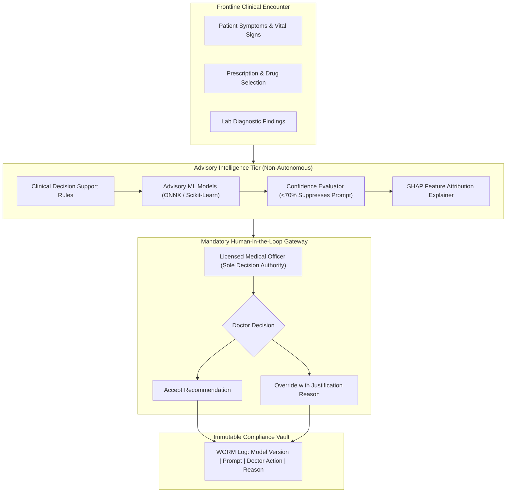

# Artificial Intelligence & Clinical Decision Support Requirements Baseline: Namma Clinic Digital Health Platform

| Metadata Attribute | Formal Specification |
| :--- | :--- |
| **Document Identifier** | `DOC-REQ-016-AIR` |
| **Document Title** | Artificial Intelligence & Clinical Decision Support Requirements Baseline |
| **Project Code** | `NAMMA-CLINIC-PLATFORM-2026` |
| **Requirement Type** | `AI Decision-Support Requirement` |
| **Specification Range** | `AIR-001 through AIR-040` (Exactly 40 unique requirements) |
| **Target Baseline** | `v1.0.0-PROD-BASELINE` |
| **Lifecycle Status** | `APPROVED & BASELINED` |
| **Target Facility Scope** | 183 Primary Namma Clinics across 8 BBMP Administrative Zones |
| **Lead Clinical Authority** | Chief Health Officer (CHO), BBMP Health Department |
| **Lead Technical Authority**| Principal Solutions Architect, Kushagramati Analytics Consortium |
| **Upstream Baselines** | [`00-project-baseline/`](../00-project-baseline/) \| [`01-project-management/`](../01-project-management/) |
| **Related Specification**| [`05-clinical-rules.md`](./05-clinical-rules.md) \| [`07-security-requirements.md`](./07-security-requirements.md) |

## 1. Executive Summary & Domain Governance Framework
This specification defines the comprehensive artificial intelligence, machine learning, and clinical decision-support requirements baseline for the Namma Clinic Digital Health Platform across 183 primary urban healthcare centers in Greater Bengaluru. Comprising 40 rigorous specifications (`AIR-001` through `AIR-040`), this document operationalizes the ethical, clinical, and governance boundaries for syndromic anomaly detection, Essential Drug List (EDL) demand forecasting, maternal risk stratification, drug-drug interaction checking, and explainable AI feature attribution.

**CRITICAL CLINICAL PRIMACY DOCTRINE:** The platform provides clinical decision support exclusively in an advisory capacity. The system MUST NOT independently diagnose, prescribe, discharge, or make irreversible clinical decisions. The qualified Medical Officer retains sole legal and professional responsibility for all clinical interventions. Mandatory human-in-the-loop override mechanisms and immutable WORM audit logs are enforced across 100% of AI recommendations.

## 2. Architecture & Domain Conceptual Framework
The following architectural topology illustrates the functional interactions, security boundaries, and data flows governing this domain across Namma Clinic's 183 primary healthcare centers in Greater Bengaluru:



## 3. Master AI Decision-Support Requirement Inventory Table (AIR-001 through AIR-040)
| Requirement ID | Title | Advisory Scope | Priority | Model Family | Human Override Protocol | Clinical Lead |
| :--- | :--- | :--- | :--- | :--- | :--- | :---: |
| [`AIR-001`](#air-001) | **Clinical Advisory Decision Support Primacy Doctrine** | `Core AI Principle` | `MUST` | `Advisory Expert System` | Clinician Retains 100% Final Respon... | Chief Medical Officer |
| [`AIR-002`](#air-002) | **Syndromic Outbreak Spike Anomaly Detection Advisor** | `Public Health` | `MUST` | `Isolation Forest / Poisson EAR` | Epidemiologist Reviews and Confirms... | Epidemiologist |
| [`AIR-003`](#air-003) | **Essential Drug List (EDL) Demand Forecasting Engine** | `Supply Chain` | `MUST` | `ARIMA / Prophet Time-Series Re` | Pharmacist Overrides Indent Quantit... | Data Scientist |
| [`AIR-004`](#air-004) | **High-Risk Pregnancy Antenatal Prioritization Advisor** | `Maternal Health` | `MUST` | `Rule-Based Expert Score + Logi` | Medical Officer Validates ANC Risk ... | Medical Officer |
| [`AIR-005`](#air-005) | **Hypertension Escalation and Follow-Up Decision Support** | `NCD Care` | `MUST` | `Clinical Guideline Rule Engine` | Medical Officer Determines Drug Tit... | Medical Officer |
| [`AIR-006`](#air-006) | **Type 2 Diabetes Complication Risk Stratification** | `NCD Care` | `MUST` | `Random Forest / ADA Risk Engin` | Medical Officer Validates Lifestyle... | Medical Officer |
| [`AIR-007`](#air-007) | **Drug-Drug Interaction (DDI) Real-Time Prescription Check** | `Clinical Safety` | `MUST` | `Deterministic Lexicon Matrix a` | Doctor Mandatory Override Reason En... | Chief Pharmacist |
| [`AIR-008`](#air-008) | **Drug Allergy and Adverse Reaction Pre-Prescription Check** | `Clinical Safety` | `MUST` | `Cross-Referencing Patient Alle` | Doctor Mandatory Override Reason En... | Medical Officer |
| [`AIR-009`](#air-009) | **Pediatric Weight-Based Dosage Calculation Assistant** | `Pediatrics` | `MUST` | `Standard Pediatric Milligram/K` | Doctor Modifies or Accepts Proposed... | Medical Officer |
| [`AIR-010`](#air-010) | **Renal Impairment Dosage Adjustment Guidance Advisor** | `Clinical Safety` | `MUST` | `eGFR-Based Dose Reduction Matr` | Doctor Selects Adjusted or Standard... | Medical Officer |
| [`AIR-011`](#air-011) | **Critical Laboratory Abnormal Flagging and Clinical Context** | `Laboratory` | `MUST` | `Age/Sex Specific Reference Ran` | Doctor Reviews Abnormal Flag with C... | Medical Officer |
| [`AIR-012`](#air-012) | **Clinical Note Entity Extraction for ICD-11 Suggestion** | `Clinical Coding` | `MUST` | `Biomedical NER / Fuzzy String ` | Doctor Actively Selects or Rejects ... | Medical Officer |
| [`AIR-013`](#air-013) | **Duplicate Patient Identity Matching and Merging Assistant** | `Identity Management` | `MUST` | `Levenshtein Distance + Double ` | Registration Clerk / Supervisor App... | Data Platform Lead |
| [`AIR-014`](#air-014) | **Model Versioning, Provenance, and Registry Governance** | `MLOps Governance` | `MUST` | `MLflow / DVC Artifact Version ` | Automated Hash Verification Before ... | MLOps Lead |
| [`AIR-015`](#air-015) | **Training Data Lineage, Curation, and Consent Verification** | `Data Governance` | `MUST` | `DPDP-Compliant De-Identified T` | Data Protection Officer Formal Rele... | Data Protection Officer |
| [`AIR-016`](#air-016) | **Algorithmic Bias and Demographic Subgroup Equity Audit** | `AI Ethics` | `MUST` | `Disparate Impact & Equalized O` | Annual AI Ethics Committee Independ... | AI Ethics Officer |
| [`AIR-017`](#air-017) | **Concept Drift Detection in Syndromic Symptom Distributions** | `Model Monitoring` | `MUST` | `Kolmogorov-Smirnov Test on Cli` | Automated Flag to Retrain Model on ... | MLOps Lead |
| [`AIR-018`](#air-018) | **Covariate Shift Monitoring in Prescription Inflow Streams** | `Model Monitoring` | `MUST` | `Population Stability Index (PS` | Automated Pipeline Alert to Machine... | MLOps Lead |
| [`AIR-019`](#air-019) | **Human-in-the-Loop Override Capture and Reason Taxonomy** | `Human Oversight` | `MUST` | `Structured Dropdown + Free Tex` | System Records Doctor Name, Timesta... | Medical Officer |
| [`AIR-020`](#air-020) | **Model Explainability and Local Feature Attribution (SHAP)** | `Explainable AI` | `MUST` | `TreeSHAP / Linear Attribution ` | Clinician Views Top 3 Contributing ... | Data Scientist |
| [`AIR-021`](#air-021) | **Confidence Score Thresholding and Low-Confidence Suppression** | `Model Safety` | `MUST` | `Softmax Calibration (<70% Supp` | System Suppresses Vague Hints if Co... | Data Scientist |
| [`AIR-022`](#air-022) | **Zero-Latency Client-Side Fallback on Inference Failure** | `Fault Tolerance` | `MUST` | `Local Deterministic Rule Fallb` | Silent Degradation to Standard Manu... | Frontend Tech Lead |
| [`AIR-023`](#air-023) | **Immutable Audit Vault for Clinical AI Inferences and Prompts** | `Auditability` | `MUST` | `WORM Storage with Model Versio` | System Logs Every Advisory Prompt S... | Security Lead |
| [`AIR-024`](#air-024) | **Advisory Warning Non-Intrusive Banner UI Design Pattern** | `User Experience` | `MUST` | `Yellow/Orange Informational To` | Doctor Can Dismiss or Review Withou... | Frontend Tech Lead |
| [`AIR-025`](#air-025) | **Critical Safety Interruption Modal for Fatal Contraindications** | `Clinical Safety` | `MUST` | `High-Urgency Red Modal for Sev` | Doctor Must Actively Select 'Overri... | Chief Medical Officer |
| [`AIR-026`](#air-026) | **Triage Patient Acuity Scoring Support (Modified MEWS)** | `Triage` | `MUST` | `Modified Early Warning Score (` | Staff Nurse Confirms Acuity Tier (R... | Staff Nurse |
| [`AIR-027`](#air-027) | **Prescription Completeness and Missing Duration Validator** | `Prescription Safety` | `MUST` | `Deterministic Clinical Complet` | Doctor Prompted to Enter Duration o... | Pharmacist |
| [`AIR-028`](#air-028) | **Childhood Immunization Delay and Defaulter Prediction** | `Immunization` | `MUST` | `Survival Analysis / Logistic R` | ANM / Staff Nurse Prioritizes Home ... | Staff Nurse |
| [`AIR-029`](#air-029) | **Tuberculosis Symptom Cluster Risk Scoring** | `Disease Surveillance` | `MUST` | `ICMR Presumptive TB Risk Matri` | Doctor Prompts Sputum / CBNAAT Lab ... | Medical Officer |
| [`AIR-030`](#air-030) | **Seasonal Vector-Borne Fever Risk Probability Estimation** | `Disease Surveillance` | `MUST` | `Rainfall / Temperature Paired ` | Epidemiologist Reviews Seasonal Ale... | Epidemiologist |
| [`AIR-031`](#air-031) | **Geriatric Fall Risk and Frailty Assessment Support** | `Geriatric Care` | `MUST` | `Timed Up and Go (TUG) Rule Eva` | Staff Nurse Validates Geriatric Sup... | Staff Nurse |
| [`AIR-032`](#air-032) | **Mental Health Screening (PHQ-9) Advisory Score Interpretation** | `Mental Health` | `MUST` | `Standardized PHQ-9 Depression ` | Doctor Validates e-Manas Counseling... | Medical Officer |
| [`AIR-033`](#air-033) | **Medicine Batch Expiry Waste Minimization Suggestion** | `Inventory` | `MUST` | `FIFO / FEFO Optimization Dispa` | Pharmacist Confirms Batch Dispensin... | Pharmacist |
| [`AIR-034`](#air-034) | **Point-of-Care Lab Quality Control Trend Advisor (Levey-Jennings)** | `Quality Control` | `MUST` | `Westgard Rules Statistical Pro` | Lab Technician Runs Machine Calibra... | Lab Technician |
| [`AIR-035`](#air-035) | **Clinic Daily Patient Volume Forecasting for Staff Roster** | `Operations` | `MUST` | `SARIMA / Seasonal Decompositio` | Medical Officer Schedules Auxiliary... | Administrative Assistant |
| [`AIR-036`](#air-036) | **Automated Patient Language Detection for Bilingual Intake** | `Localization AI` | `MUST` | `FastText / Unicode Script Clas` | Clerk Confirms Preferred Language w... | Registration Clerk |
| [`AIR-037`](#air-037) | **Speech-to-Text Clinical Note Transcription Assistant** | `Clinical Entry` | `MUST` | `Whisper Small Fine-Tuned on Ka` | Doctor Edits and Confirms Transcrib... | Medical Officer |
| [`AIR-038`](#air-038) | **Advisory Model Latency Budget (<200ms Client Response)** | `Performance` | `MUST` | `ONNX Runtime / TensorRT Optimi` | Zero Perceptible Lag in Doctor EHR ... | MLOps Lead |
| [`AIR-039`](#air-039) | **Model Retraining Trigger and Human Evaluation Gateway** | `Continuous Learning` | `MUST` | `Monthly Offline Retraining Pip` | State Clinical Committee Signs Off ... | Chief Medical Officer |
| [`AIR-040`](#air-040) | **Annual Clinical Safety and Diagnostic Accuracy Review** | `Governance` | `MUST` | `Independent Retrospective Clin` | Ethics Board and Health Directorate... | Project Director |

## 4. Comprehensive AI Decision-Support Requirement Specifications (AIR-001 through AIR-040)
This section establishes the exhaustive engineering, clinical, operational, and architectural specifications for each of the 40 requirements committed for the production baseline.

### 4.1 AIR-001: Clinical Advisory Decision Support Primacy Doctrine

| Specification Attribute | Formal Engineering Definition |
| :--- | :--- |
| **Requirement ID** | `AIR-001` |
| **Requirement Title** | Clinical Advisory Decision Support Primacy Doctrine |
| **Requirement Statement**| The platform SHALL provide advisory clinical advisory decision support primacy doctrine within core ai principle utilizing Advisory Expert System, with mandatory human oversight enforced via Clinician Retains 100% Final Responsibility. |
| **Requirement Type** | `AI Decision-Support Requirement` |
| **Priority Level** | `MUST` (Rationale: High clinical safety and diagnostic support value with mandatory clinician decision primacy.) |
| **Business Value** | Augments clinical quality, prevents medical errors, and optimizes municipal drug inventory. |
| **Engineering Rationale**| Advisory Scope: Core AI Principle; Model Architecture: Advisory Expert System; Human Oversight: Clinician Retains 100% Final Responsibility. |
| **Primary Actor** | `Clinical Decision Support System (Advisory)` |
| **Target User Persona** | [`PERSONA-001`](../01-project-management/07-user-personas.md#persona-001) |
| **Accountable Role** | [`ROLE-001`](../01-project-management/08-role-and-responsibility-matrix.md#role-001) |
| **Key Stakeholder** | [`STAKEHOLDER-002`](../01-project-management/06-stakeholders.md#stakeholder-002) |
| **Trigger Condition** | Clinical consultation data entry, prescription selection, lab order, or inventory projection. |
| **System Preconditions** | Licensed clinician active in consultation session; patient context loaded in memory. |
| **Input Specifications** | Patient symptoms, vitals, active prescription list, lab results, and demographic attributes. |
| **Validation Rules** | Evaluated against clinical guideline safety bounds and confidence threshold (>70%). |
| **Postconditions** | Clinician retains full decision authority; advisory event and clinician action recorded in audit vault. |
| **State Mutations** | Logs inference ID, model version, confidence score, and clinician acceptance/override status. |
| **Associated Rules** | Business: [`BRULE-001`](./04-business-rules.md#brule-001) \| Clinical: [`CR-001`](./05-clinical-rules.md#cr-001) \| Operational: [`OR-001`](./06-operational-rules.md#or-001) |
| **Security & Privacy** | Security: `AI models execute in hardened sandbox with zero internet-facing telemetry leakage.` \| Privacy: `Zero patient PII used in real-time inference; features tokenized or anonymized.` |
| **Data & Audit** | Data: `Training datasets derived exclusively from de-identified retrospective clinical data.` \| Audit: `All AI recommendations, confidence scores, and doctor overrides stored in WORM vault.` |
| **Offline & Sync** | Offline: `Deterministic rule-based clinical safety checks execute client-side during offline mode.` \| Sync: `Model inference telemetry synced asynchronously to cloud monitoring lakehouse.` |
| **Quality Expectations**| Perf: `Advisory recommendation rendered in < 200ms with zero user workflow interruption.` \| Avail: `Graceful degradation ensures 100% clinic EHR uptime even if AI service is offline.` |
| **Localization & A11y**| Loc: `Advisory prompts and explanation tooltips fully bilingual in Kannada and English.` \| A11y: `Advisory warning toasts announce politely to screen readers via ARIA live regions.` |
| **Failure & Recovery** | Failure: Completely silent degradation to manual entry; system never halts clinical workflows. \| Recovery: Automated model health check probes re-enable advisory service when backend recovers. |
| **Observability** | Logging: `Structured JSON log with model_version, confidence_score, and override_reason.` \| Metrics: `Prometheus counter `namma_clinic_ai_overrides_total{model="AIR-001"}`.` |
| **Upstream Traceability**| Obj: [`OBJECTIVE-001`](../01-project-management/02-project-vision-and-objectives.md#objective-001) \| Scope: [`INSCOPE-001`](../01-project-management/04-in-scope.md#inscope-001) \| Risk: [`RISK-001`](../01-project-management/12-project-risks.md#risk-001) |
| **Downstream Planning** | Epic: `PLANNED-EPIC-001` \| Feature: `PLANNED-FEATURE-001` \| API: `PLANNED-API-001` \| DB: `PLANNED-DB-001` \| Test: `PLANNED-TEST-1501` |

#### 4.1.1 Operational Execution Protocol & Frontline Workflow
- **Continuous Operational Workflow:**
  1. User enters clinical or operational parameters for scope: Core AI Principle.
  2. Advisory model executes inference: Advisory Expert System.
  3. Evaluates confidence score against calibration thresholds (suppresses if <70%).
  4. Presents non-intrusive advisory recommendation with top feature attributions.
  5. Clinician reviews recommendation and confirms or overrides: Clinician Retains 100% Final Responsibility.
- **Degraded State Fallback Path:** If clinician overrides advisory prompt, display mandatory reason dropdown and proceed immediately.
- **Exception Breach & Incident Escalation Path:** If AI inference service times out (>200ms), silently fall back to standard clinical entry without blocking.

#### 4.1.2 Technical Invariants & Operational Contract
- **Clinical Advisory Scope:** Core AI Principle
- **Advisory Model Architecture:** `Advisory Expert System`
- **Mandatory Human Override Protocol:** Clinician Retains 100% Final Responsibility
- **Verification Protocol:** Doctrine Conformance Audit
- **Accountable Clinical AI Lead:** Chief Medical Officer

#### 4.1.3 Executable BDD Acceptance Scenarios
```gherkin
Feature: AIR-001 - Clinical Advisory Decision Support Primacy Doctrine
  As a Clinical Decision Support System (Advisory)
  I require system enforcement of clinical advisory decision support primacy doctrine
  In order to ensure municipal healthcare compliance and operational integrity

  Scenario: Happy Path Execution for AIR-001
    Given the Clinical Decision Support System (Advisory) is authenticated and clinic terminal is operational
    When the user submits a valid request for clinical advisory decision support primacy doctrine
    Then the system successfully commits the transaction and emits an audit event

  Scenario: Input Validation and Schema Guard for AIR-001
    Given the Clinical Decision Support System (Advisory) attempts to submit an incomplete or malformed payload for clinical advisory decision support primacy doctrine
    When the request fails TypeBox schema or domain constraint validation
    Then the system rejects the input with HTTP 400 and highlights invalid fields in Kannada and English

  Scenario: RBAC and Security Access Control for AIR-001
    Given an unauthenticated or unauthorized role attempts to invoke clinical advisory decision support primacy doctrine
    When the bearer JWT token is missing, expired, or lacks necessary RBAC permission
    Then the system denies execution with HTTP 403 Forbidden and records a security telemetry alert

  Scenario: Offline Autonomous Execution for AIR-001
    Given the clinic WAN network is completely severed during clinical advisory decision support primacy doctrine
    When the operator confirms the local transaction on the workstation
    Then the mutation is persisted to Dexie.js IndexedDB with a UUIDv7 and queued for background replay

  Scenario: Network Recovery and Idempotent Sync for AIR-001
    Given the clinic workstation reconnects to the BBMP municipal health WAN
    When the background sync daemon processes the pending mutation queue
    Then all buffered transactions for AIR-001 synchronize idempotently with zero data loss
```

#### 4.1.4 Verification Protocol & Quality Sign-Off
- **Verification Method:** Doctrine Conformance Audit
- **Automated Test Suite:** `PLANNED-TEST-1501` (Automated AI Model Safety & Override Workflow Test) targeting 100% verification gate compliance.
- **Related Internal Requirements:** `CR-007`, `CR-008`, `SECR-043`
- **Dependencies & Blocking Constraints:** CR-007 | Constraints: AI suggestions must NEVER make irreversible clinical or diagnostic decisions.
- **Architectural Assumptions & Open Questions:** Assumption: Medical Officers hold legal responsibility for all finalized patient prescriptions. | Open Question: Validation of Kannada biomedical vocabulary by state clinical advisory panel.

---

### 4.2 AIR-002: Syndromic Outbreak Spike Anomaly Detection Advisor

| Specification Attribute | Formal Engineering Definition |
| :--- | :--- |
| **Requirement ID** | `AIR-002` |
| **Requirement Title** | Syndromic Outbreak Spike Anomaly Detection Advisor |
| **Requirement Statement**| The platform SHALL provide advisory syndromic outbreak spike anomaly detection advisor within public health utilizing Isolation Forest / Poisson EARS Algorithm, with mandatory human oversight enforced via Epidemiologist Reviews and Confirms Alert. |
| **Requirement Type** | `AI Decision-Support Requirement` |
| **Priority Level** | `MUST` (Rationale: High clinical safety and diagnostic support value with mandatory clinician decision primacy.) |
| **Business Value** | Augments clinical quality, prevents medical errors, and optimizes municipal drug inventory. |
| **Engineering Rationale**| Advisory Scope: Public Health; Model Architecture: Isolation Forest / Poisson EARS Algorithm; Human Oversight: Epidemiologist Reviews and Confirms Alert. |
| **Primary Actor** | `Clinical Decision Support System (Advisory)` |
| **Target User Persona** | [`PERSONA-002`](../01-project-management/07-user-personas.md#persona-002) |
| **Accountable Role** | [`ROLE-001`](../01-project-management/08-role-and-responsibility-matrix.md#role-001) |
| **Key Stakeholder** | [`STAKEHOLDER-002`](../01-project-management/06-stakeholders.md#stakeholder-002) |
| **Trigger Condition** | Clinical consultation data entry, prescription selection, lab order, or inventory projection. |
| **System Preconditions** | Licensed clinician active in consultation session; patient context loaded in memory. |
| **Input Specifications** | Patient symptoms, vitals, active prescription list, lab results, and demographic attributes. |
| **Validation Rules** | Evaluated against clinical guideline safety bounds and confidence threshold (>70%). |
| **Postconditions** | Clinician retains full decision authority; advisory event and clinician action recorded in audit vault. |
| **State Mutations** | Logs inference ID, model version, confidence score, and clinician acceptance/override status. |
| **Associated Rules** | Business: [`BRULE-002`](./04-business-rules.md#brule-002) \| Clinical: [`CR-002`](./05-clinical-rules.md#cr-002) \| Operational: [`OR-002`](./06-operational-rules.md#or-002) |
| **Security & Privacy** | Security: `AI models execute in hardened sandbox with zero internet-facing telemetry leakage.` \| Privacy: `Zero patient PII used in real-time inference; features tokenized or anonymized.` |
| **Data & Audit** | Data: `Training datasets derived exclusively from de-identified retrospective clinical data.` \| Audit: `All AI recommendations, confidence scores, and doctor overrides stored in WORM vault.` |
| **Offline & Sync** | Offline: `Deterministic rule-based clinical safety checks execute client-side during offline mode.` \| Sync: `Model inference telemetry synced asynchronously to cloud monitoring lakehouse.` |
| **Quality Expectations**| Perf: `Advisory recommendation rendered in < 200ms with zero user workflow interruption.` \| Avail: `Graceful degradation ensures 100% clinic EHR uptime even if AI service is offline.` |
| **Localization & A11y**| Loc: `Advisory prompts and explanation tooltips fully bilingual in Kannada and English.` \| A11y: `Advisory warning toasts announce politely to screen readers via ARIA live regions.` |
| **Failure & Recovery** | Failure: Completely silent degradation to manual entry; system never halts clinical workflows. \| Recovery: Automated model health check probes re-enable advisory service when backend recovers. |
| **Observability** | Logging: `Structured JSON log with model_version, confidence_score, and override_reason.` \| Metrics: `Prometheus counter `namma_clinic_ai_overrides_total{model="AIR-002"}`.` |
| **Upstream Traceability**| Obj: [`OBJECTIVE-002`](../01-project-management/02-project-vision-and-objectives.md#objective-002) \| Scope: [`INSCOPE-002`](../01-project-management/04-in-scope.md#inscope-002) \| Risk: [`RISK-002`](../01-project-management/12-project-risks.md#risk-002) |
| **Downstream Planning** | Epic: `PLANNED-EPIC-002` \| Feature: `PLANNED-FEATURE-002` \| API: `PLANNED-API-002` \| DB: `PLANNED-DB-002` \| Test: `PLANNED-TEST-1502` |

#### 4.2.1 Operational Execution Protocol & Frontline Workflow
- **Continuous Operational Workflow:**
  1. User enters clinical or operational parameters for scope: Public Health.
  2. Advisory model executes inference: Isolation Forest / Poisson EARS Algorithm.
  3. Evaluates confidence score against calibration thresholds (suppresses if <70%).
  4. Presents non-intrusive advisory recommendation with top feature attributions.
  5. Clinician reviews recommendation and confirms or overrides: Epidemiologist Reviews and Confirms Alert.
- **Degraded State Fallback Path:** If clinician overrides advisory prompt, display mandatory reason dropdown and proceed immediately.
- **Exception Breach & Incident Escalation Path:** If AI inference service times out (>200ms), silently fall back to standard clinical entry without blocking.

#### 4.2.2 Technical Invariants & Operational Contract
- **Clinical Advisory Scope:** Public Health
- **Advisory Model Architecture:** `Isolation Forest / Poisson EARS Algorithm`
- **Mandatory Human Override Protocol:** Epidemiologist Reviews and Confirms Alert
- **Verification Protocol:** Synthetic Spike Detection Test
- **Accountable Clinical AI Lead:** Epidemiologist

#### 4.2.3 Executable BDD Acceptance Scenarios
```gherkin
Feature: AIR-002 - Syndromic Outbreak Spike Anomaly Detection Advisor
  As a Clinical Decision Support System (Advisory)
  I require system enforcement of syndromic outbreak spike anomaly detection advisor
  In order to ensure municipal healthcare compliance and operational integrity

  Scenario: Happy Path Execution for AIR-002
    Given the Clinical Decision Support System (Advisory) is authenticated and clinic terminal is operational
    When the user submits a valid request for syndromic outbreak spike anomaly detection advisor
    Then the system successfully commits the transaction and emits an audit event

  Scenario: Input Validation and Schema Guard for AIR-002
    Given the Clinical Decision Support System (Advisory) attempts to submit an incomplete or malformed payload for syndromic outbreak spike anomaly detection advisor
    When the request fails TypeBox schema or domain constraint validation
    Then the system rejects the input with HTTP 400 and highlights invalid fields in Kannada and English

  Scenario: RBAC and Security Access Control for AIR-002
    Given an unauthenticated or unauthorized role attempts to invoke syndromic outbreak spike anomaly detection advisor
    When the bearer JWT token is missing, expired, or lacks necessary RBAC permission
    Then the system denies execution with HTTP 403 Forbidden and records a security telemetry alert

  Scenario: Offline Autonomous Execution for AIR-002
    Given the clinic WAN network is completely severed during syndromic outbreak spike anomaly detection advisor
    When the operator confirms the local transaction on the workstation
    Then the mutation is persisted to Dexie.js IndexedDB with a UUIDv7 and queued for background replay

  Scenario: Network Recovery and Idempotent Sync for AIR-002
    Given the clinic workstation reconnects to the BBMP municipal health WAN
    When the background sync daemon processes the pending mutation queue
    Then all buffered transactions for AIR-002 synchronize idempotently with zero data loss
```

#### 4.2.4 Verification Protocol & Quality Sign-Off
- **Verification Method:** Synthetic Spike Detection Test
- **Automated Test Suite:** `PLANNED-TEST-1502` (Automated AI Model Safety & Override Workflow Test) targeting 100% verification gate compliance.
- **Related Internal Requirements:** `CR-007`, `CR-008`, `SECR-043`
- **Dependencies & Blocking Constraints:** CR-007 | Constraints: AI suggestions must NEVER make irreversible clinical or diagnostic decisions.
- **Architectural Assumptions & Open Questions:** Assumption: Medical Officers hold legal responsibility for all finalized patient prescriptions. | Open Question: Validation of Kannada biomedical vocabulary by state clinical advisory panel.

---

### 4.3 AIR-003: Essential Drug List (EDL) Demand Forecasting Engine

| Specification Attribute | Formal Engineering Definition |
| :--- | :--- |
| **Requirement ID** | `AIR-003` |
| **Requirement Title** | Essential Drug List (EDL) Demand Forecasting Engine |
| **Requirement Statement**| The platform SHALL provide advisory essential drug list (edl) demand forecasting engine within supply chain utilizing ARIMA / Prophet Time-Series Regression, with mandatory human oversight enforced via Pharmacist Overrides Indent Quantities. |
| **Requirement Type** | `AI Decision-Support Requirement` |
| **Priority Level** | `MUST` (Rationale: High clinical safety and diagnostic support value with mandatory clinician decision primacy.) |
| **Business Value** | Augments clinical quality, prevents medical errors, and optimizes municipal drug inventory. |
| **Engineering Rationale**| Advisory Scope: Supply Chain; Model Architecture: ARIMA / Prophet Time-Series Regression; Human Oversight: Pharmacist Overrides Indent Quantities. |
| **Primary Actor** | `Clinical Decision Support System (Advisory)` |
| **Target User Persona** | [`PERSONA-003`](../01-project-management/07-user-personas.md#persona-003) |
| **Accountable Role** | [`ROLE-001`](../01-project-management/08-role-and-responsibility-matrix.md#role-001) |
| **Key Stakeholder** | [`STAKEHOLDER-002`](../01-project-management/06-stakeholders.md#stakeholder-002) |
| **Trigger Condition** | Clinical consultation data entry, prescription selection, lab order, or inventory projection. |
| **System Preconditions** | Licensed clinician active in consultation session; patient context loaded in memory. |
| **Input Specifications** | Patient symptoms, vitals, active prescription list, lab results, and demographic attributes. |
| **Validation Rules** | Evaluated against clinical guideline safety bounds and confidence threshold (>70%). |
| **Postconditions** | Clinician retains full decision authority; advisory event and clinician action recorded in audit vault. |
| **State Mutations** | Logs inference ID, model version, confidence score, and clinician acceptance/override status. |
| **Associated Rules** | Business: [`BRULE-003`](./04-business-rules.md#brule-003) \| Clinical: [`CR-003`](./05-clinical-rules.md#cr-003) \| Operational: [`OR-003`](./06-operational-rules.md#or-003) |
| **Security & Privacy** | Security: `AI models execute in hardened sandbox with zero internet-facing telemetry leakage.` \| Privacy: `Zero patient PII used in real-time inference; features tokenized or anonymized.` |
| **Data & Audit** | Data: `Training datasets derived exclusively from de-identified retrospective clinical data.` \| Audit: `All AI recommendations, confidence scores, and doctor overrides stored in WORM vault.` |
| **Offline & Sync** | Offline: `Deterministic rule-based clinical safety checks execute client-side during offline mode.` \| Sync: `Model inference telemetry synced asynchronously to cloud monitoring lakehouse.` |
| **Quality Expectations**| Perf: `Advisory recommendation rendered in < 200ms with zero user workflow interruption.` \| Avail: `Graceful degradation ensures 100% clinic EHR uptime even if AI service is offline.` |
| **Localization & A11y**| Loc: `Advisory prompts and explanation tooltips fully bilingual in Kannada and English.` \| A11y: `Advisory warning toasts announce politely to screen readers via ARIA live regions.` |
| **Failure & Recovery** | Failure: Completely silent degradation to manual entry; system never halts clinical workflows. \| Recovery: Automated model health check probes re-enable advisory service when backend recovers. |
| **Observability** | Logging: `Structured JSON log with model_version, confidence_score, and override_reason.` \| Metrics: `Prometheus counter `namma_clinic_ai_overrides_total{model="AIR-003"}`.` |
| **Upstream Traceability**| Obj: [`OBJECTIVE-003`](../01-project-management/02-project-vision-and-objectives.md#objective-003) \| Scope: [`INSCOPE-003`](../01-project-management/04-in-scope.md#inscope-003) \| Risk: [`RISK-003`](../01-project-management/12-project-risks.md#risk-003) |
| **Downstream Planning** | Epic: `PLANNED-EPIC-003` \| Feature: `PLANNED-FEATURE-003` \| API: `PLANNED-API-003` \| DB: `PLANNED-DB-003` \| Test: `PLANNED-TEST-1503` |

#### 4.3.1 Operational Execution Protocol & Frontline Workflow
- **Continuous Operational Workflow:**
  1. User enters clinical or operational parameters for scope: Supply Chain.
  2. Advisory model executes inference: ARIMA / Prophet Time-Series Regression.
  3. Evaluates confidence score against calibration thresholds (suppresses if <70%).
  4. Presents non-intrusive advisory recommendation with top feature attributions.
  5. Clinician reviews recommendation and confirms or overrides: Pharmacist Overrides Indent Quantities.
- **Degraded State Fallback Path:** If clinician overrides advisory prompt, display mandatory reason dropdown and proceed immediately.
- **Exception Breach & Incident Escalation Path:** If AI inference service times out (>200ms), silently fall back to standard clinical entry without blocking.

#### 4.3.2 Technical Invariants & Operational Contract
- **Clinical Advisory Scope:** Supply Chain
- **Advisory Model Architecture:** `ARIMA / Prophet Time-Series Regression`
- **Mandatory Human Override Protocol:** Pharmacist Overrides Indent Quantities
- **Verification Protocol:** Forecast Accuracy Backtesting
- **Accountable Clinical AI Lead:** Data Scientist

#### 4.3.3 Executable BDD Acceptance Scenarios
```gherkin
Feature: AIR-003 - Essential Drug List (EDL) Demand Forecasting Engine
  As a Clinical Decision Support System (Advisory)
  I require system enforcement of essential drug list (edl) demand forecasting engine
  In order to ensure municipal healthcare compliance and operational integrity

  Scenario: Happy Path Execution for AIR-003
    Given the Clinical Decision Support System (Advisory) is authenticated and clinic terminal is operational
    When the user submits a valid request for essential drug list (edl) demand forecasting engine
    Then the system successfully commits the transaction and emits an audit event

  Scenario: Input Validation and Schema Guard for AIR-003
    Given the Clinical Decision Support System (Advisory) attempts to submit an incomplete or malformed payload for essential drug list (edl) demand forecasting engine
    When the request fails TypeBox schema or domain constraint validation
    Then the system rejects the input with HTTP 400 and highlights invalid fields in Kannada and English

  Scenario: RBAC and Security Access Control for AIR-003
    Given an unauthenticated or unauthorized role attempts to invoke essential drug list (edl) demand forecasting engine
    When the bearer JWT token is missing, expired, or lacks necessary RBAC permission
    Then the system denies execution with HTTP 403 Forbidden and records a security telemetry alert

  Scenario: Offline Autonomous Execution for AIR-003
    Given the clinic WAN network is completely severed during essential drug list (edl) demand forecasting engine
    When the operator confirms the local transaction on the workstation
    Then the mutation is persisted to Dexie.js IndexedDB with a UUIDv7 and queued for background replay

  Scenario: Network Recovery and Idempotent Sync for AIR-003
    Given the clinic workstation reconnects to the BBMP municipal health WAN
    When the background sync daemon processes the pending mutation queue
    Then all buffered transactions for AIR-003 synchronize idempotently with zero data loss
```

#### 4.3.4 Verification Protocol & Quality Sign-Off
- **Verification Method:** Forecast Accuracy Backtesting
- **Automated Test Suite:** `PLANNED-TEST-1503` (Automated AI Model Safety & Override Workflow Test) targeting 100% verification gate compliance.
- **Related Internal Requirements:** `CR-007`, `CR-008`, `SECR-043`
- **Dependencies & Blocking Constraints:** CR-007 | Constraints: AI suggestions must NEVER make irreversible clinical or diagnostic decisions.
- **Architectural Assumptions & Open Questions:** Assumption: Medical Officers hold legal responsibility for all finalized patient prescriptions. | Open Question: Validation of Kannada biomedical vocabulary by state clinical advisory panel.

---

### 4.4 AIR-004: High-Risk Pregnancy Antenatal Prioritization Advisor

| Specification Attribute | Formal Engineering Definition |
| :--- | :--- |
| **Requirement ID** | `AIR-004` |
| **Requirement Title** | High-Risk Pregnancy Antenatal Prioritization Advisor |
| **Requirement Statement**| The platform SHALL provide advisory high-risk pregnancy antenatal prioritization advisor within maternal health utilizing Rule-Based Expert Score + Logistic Regression, with mandatory human oversight enforced via Medical Officer Validates ANC Risk Classification. |
| **Requirement Type** | `AI Decision-Support Requirement` |
| **Priority Level** | `MUST` (Rationale: High clinical safety and diagnostic support value with mandatory clinician decision primacy.) |
| **Business Value** | Augments clinical quality, prevents medical errors, and optimizes municipal drug inventory. |
| **Engineering Rationale**| Advisory Scope: Maternal Health; Model Architecture: Rule-Based Expert Score + Logistic Regression; Human Oversight: Medical Officer Validates ANC Risk Classification. |
| **Primary Actor** | `Clinical Decision Support System (Advisory)` |
| **Target User Persona** | [`PERSONA-004`](../01-project-management/07-user-personas.md#persona-004) |
| **Accountable Role** | [`ROLE-001`](../01-project-management/08-role-and-responsibility-matrix.md#role-001) |
| **Key Stakeholder** | [`STAKEHOLDER-002`](../01-project-management/06-stakeholders.md#stakeholder-002) |
| **Trigger Condition** | Clinical consultation data entry, prescription selection, lab order, or inventory projection. |
| **System Preconditions** | Licensed clinician active in consultation session; patient context loaded in memory. |
| **Input Specifications** | Patient symptoms, vitals, active prescription list, lab results, and demographic attributes. |
| **Validation Rules** | Evaluated against clinical guideline safety bounds and confidence threshold (>70%). |
| **Postconditions** | Clinician retains full decision authority; advisory event and clinician action recorded in audit vault. |
| **State Mutations** | Logs inference ID, model version, confidence score, and clinician acceptance/override status. |
| **Associated Rules** | Business: [`BRULE-004`](./04-business-rules.md#brule-004) \| Clinical: [`CR-004`](./05-clinical-rules.md#cr-004) \| Operational: [`OR-004`](./06-operational-rules.md#or-004) |
| **Security & Privacy** | Security: `AI models execute in hardened sandbox with zero internet-facing telemetry leakage.` \| Privacy: `Zero patient PII used in real-time inference; features tokenized or anonymized.` |
| **Data & Audit** | Data: `Training datasets derived exclusively from de-identified retrospective clinical data.` \| Audit: `All AI recommendations, confidence scores, and doctor overrides stored in WORM vault.` |
| **Offline & Sync** | Offline: `Deterministic rule-based clinical safety checks execute client-side during offline mode.` \| Sync: `Model inference telemetry synced asynchronously to cloud monitoring lakehouse.` |
| **Quality Expectations**| Perf: `Advisory recommendation rendered in < 200ms with zero user workflow interruption.` \| Avail: `Graceful degradation ensures 100% clinic EHR uptime even if AI service is offline.` |
| **Localization & A11y**| Loc: `Advisory prompts and explanation tooltips fully bilingual in Kannada and English.` \| A11y: `Advisory warning toasts announce politely to screen readers via ARIA live regions.` |
| **Failure & Recovery** | Failure: Completely silent degradation to manual entry; system never halts clinical workflows. \| Recovery: Automated model health check probes re-enable advisory service when backend recovers. |
| **Observability** | Logging: `Structured JSON log with model_version, confidence_score, and override_reason.` \| Metrics: `Prometheus counter `namma_clinic_ai_overrides_total{model="AIR-004"}`.` |
| **Upstream Traceability**| Obj: [`OBJECTIVE-004`](../01-project-management/02-project-vision-and-objectives.md#objective-004) \| Scope: [`INSCOPE-004`](../01-project-management/04-in-scope.md#inscope-004) \| Risk: [`RISK-004`](../01-project-management/12-project-risks.md#risk-004) |
| **Downstream Planning** | Epic: `PLANNED-EPIC-004` \| Feature: `PLANNED-FEATURE-004` \| API: `PLANNED-API-004` \| DB: `PLANNED-DB-004` \| Test: `PLANNED-TEST-1504` |

#### 4.4.1 Operational Execution Protocol & Frontline Workflow
- **Continuous Operational Workflow:**
  1. User enters clinical or operational parameters for scope: Maternal Health.
  2. Advisory model executes inference: Rule-Based Expert Score + Logistic Regression.
  3. Evaluates confidence score against calibration thresholds (suppresses if <70%).
  4. Presents non-intrusive advisory recommendation with top feature attributions.
  5. Clinician reviews recommendation and confirms or overrides: Medical Officer Validates ANC Risk Classification.
- **Degraded State Fallback Path:** If clinician overrides advisory prompt, display mandatory reason dropdown and proceed immediately.
- **Exception Breach & Incident Escalation Path:** If AI inference service times out (>200ms), silently fall back to standard clinical entry without blocking.

#### 4.4.2 Technical Invariants & Operational Contract
- **Clinical Advisory Scope:** Maternal Health
- **Advisory Model Architecture:** `Rule-Based Expert Score + Logistic Regression`
- **Mandatory Human Override Protocol:** Medical Officer Validates ANC Risk Classification
- **Verification Protocol:** Clinical Cohort Sensitivity Test
- **Accountable Clinical AI Lead:** Medical Officer

#### 4.4.3 Executable BDD Acceptance Scenarios
```gherkin
Feature: AIR-004 - High-Risk Pregnancy Antenatal Prioritization Advisor
  As a Clinical Decision Support System (Advisory)
  I require system enforcement of high-risk pregnancy antenatal prioritization advisor
  In order to ensure municipal healthcare compliance and operational integrity

  Scenario: Happy Path Execution for AIR-004
    Given the Clinical Decision Support System (Advisory) is authenticated and clinic terminal is operational
    When the user submits a valid request for high-risk pregnancy antenatal prioritization advisor
    Then the system successfully commits the transaction and emits an audit event

  Scenario: Input Validation and Schema Guard for AIR-004
    Given the Clinical Decision Support System (Advisory) attempts to submit an incomplete or malformed payload for high-risk pregnancy antenatal prioritization advisor
    When the request fails TypeBox schema or domain constraint validation
    Then the system rejects the input with HTTP 400 and highlights invalid fields in Kannada and English

  Scenario: RBAC and Security Access Control for AIR-004
    Given an unauthenticated or unauthorized role attempts to invoke high-risk pregnancy antenatal prioritization advisor
    When the bearer JWT token is missing, expired, or lacks necessary RBAC permission
    Then the system denies execution with HTTP 403 Forbidden and records a security telemetry alert

  Scenario: Offline Autonomous Execution for AIR-004
    Given the clinic WAN network is completely severed during high-risk pregnancy antenatal prioritization advisor
    When the operator confirms the local transaction on the workstation
    Then the mutation is persisted to Dexie.js IndexedDB with a UUIDv7 and queued for background replay

  Scenario: Network Recovery and Idempotent Sync for AIR-004
    Given the clinic workstation reconnects to the BBMP municipal health WAN
    When the background sync daemon processes the pending mutation queue
    Then all buffered transactions for AIR-004 synchronize idempotently with zero data loss
```

#### 4.4.4 Verification Protocol & Quality Sign-Off
- **Verification Method:** Clinical Cohort Sensitivity Test
- **Automated Test Suite:** `PLANNED-TEST-1504` (Automated AI Model Safety & Override Workflow Test) targeting 100% verification gate compliance.
- **Related Internal Requirements:** `CR-007`, `CR-008`, `SECR-043`
- **Dependencies & Blocking Constraints:** CR-007 | Constraints: AI suggestions must NEVER make irreversible clinical or diagnostic decisions.
- **Architectural Assumptions & Open Questions:** Assumption: Medical Officers hold legal responsibility for all finalized patient prescriptions. | Open Question: Validation of Kannada biomedical vocabulary by state clinical advisory panel.

---

### 4.5 AIR-005: Hypertension Escalation and Follow-Up Decision Support

| Specification Attribute | Formal Engineering Definition |
| :--- | :--- |
| **Requirement ID** | `AIR-005` |
| **Requirement Title** | Hypertension Escalation and Follow-Up Decision Support |
| **Requirement Statement**| The platform SHALL provide advisory hypertension escalation and follow-up decision support within ncd care utilizing Clinical Guideline Rule Engine (JNC 8 / ICMR), with mandatory human oversight enforced via Medical Officer Determines Drug Titration. |
| **Requirement Type** | `AI Decision-Support Requirement` |
| **Priority Level** | `MUST` (Rationale: High clinical safety and diagnostic support value with mandatory clinician decision primacy.) |
| **Business Value** | Augments clinical quality, prevents medical errors, and optimizes municipal drug inventory. |
| **Engineering Rationale**| Advisory Scope: NCD Care; Model Architecture: Clinical Guideline Rule Engine (JNC 8 / ICMR); Human Oversight: Medical Officer Determines Drug Titration. |
| **Primary Actor** | `Clinical Decision Support System (Advisory)` |
| **Target User Persona** | [`PERSONA-005`](../01-project-management/07-user-personas.md#persona-005) |
| **Accountable Role** | [`ROLE-001`](../01-project-management/08-role-and-responsibility-matrix.md#role-001) |
| **Key Stakeholder** | [`STAKEHOLDER-002`](../01-project-management/06-stakeholders.md#stakeholder-002) |
| **Trigger Condition** | Clinical consultation data entry, prescription selection, lab order, or inventory projection. |
| **System Preconditions** | Licensed clinician active in consultation session; patient context loaded in memory. |
| **Input Specifications** | Patient symptoms, vitals, active prescription list, lab results, and demographic attributes. |
| **Validation Rules** | Evaluated against clinical guideline safety bounds and confidence threshold (>70%). |
| **Postconditions** | Clinician retains full decision authority; advisory event and clinician action recorded in audit vault. |
| **State Mutations** | Logs inference ID, model version, confidence score, and clinician acceptance/override status. |
| **Associated Rules** | Business: [`BRULE-005`](./04-business-rules.md#brule-005) \| Clinical: [`CR-005`](./05-clinical-rules.md#cr-005) \| Operational: [`OR-005`](./06-operational-rules.md#or-005) |
| **Security & Privacy** | Security: `AI models execute in hardened sandbox with zero internet-facing telemetry leakage.` \| Privacy: `Zero patient PII used in real-time inference; features tokenized or anonymized.` |
| **Data & Audit** | Data: `Training datasets derived exclusively from de-identified retrospective clinical data.` \| Audit: `All AI recommendations, confidence scores, and doctor overrides stored in WORM vault.` |
| **Offline & Sync** | Offline: `Deterministic rule-based clinical safety checks execute client-side during offline mode.` \| Sync: `Model inference telemetry synced asynchronously to cloud monitoring lakehouse.` |
| **Quality Expectations**| Perf: `Advisory recommendation rendered in < 200ms with zero user workflow interruption.` \| Avail: `Graceful degradation ensures 100% clinic EHR uptime even if AI service is offline.` |
| **Localization & A11y**| Loc: `Advisory prompts and explanation tooltips fully bilingual in Kannada and English.` \| A11y: `Advisory warning toasts announce politely to screen readers via ARIA live regions.` |
| **Failure & Recovery** | Failure: Completely silent degradation to manual entry; system never halts clinical workflows. \| Recovery: Automated model health check probes re-enable advisory service when backend recovers. |
| **Observability** | Logging: `Structured JSON log with model_version, confidence_score, and override_reason.` \| Metrics: `Prometheus counter `namma_clinic_ai_overrides_total{model="AIR-005"}`.` |
| **Upstream Traceability**| Obj: [`OBJECTIVE-005`](../01-project-management/02-project-vision-and-objectives.md#objective-005) \| Scope: [`INSCOPE-005`](../01-project-management/04-in-scope.md#inscope-005) \| Risk: [`RISK-005`](../01-project-management/12-project-risks.md#risk-005) |
| **Downstream Planning** | Epic: `PLANNED-EPIC-005` \| Feature: `PLANNED-FEATURE-005` \| API: `PLANNED-API-005` \| DB: `PLANNED-DB-005` \| Test: `PLANNED-TEST-1505` |

#### 4.5.1 Operational Execution Protocol & Frontline Workflow
- **Continuous Operational Workflow:**
  1. User enters clinical or operational parameters for scope: NCD Care.
  2. Advisory model executes inference: Clinical Guideline Rule Engine (JNC 8 / ICMR).
  3. Evaluates confidence score against calibration thresholds (suppresses if <70%).
  4. Presents non-intrusive advisory recommendation with top feature attributions.
  5. Clinician reviews recommendation and confirms or overrides: Medical Officer Determines Drug Titration.
- **Degraded State Fallback Path:** If clinician overrides advisory prompt, display mandatory reason dropdown and proceed immediately.
- **Exception Breach & Incident Escalation Path:** If AI inference service times out (>200ms), silently fall back to standard clinical entry without blocking.

#### 4.5.2 Technical Invariants & Operational Contract
- **Clinical Advisory Scope:** NCD Care
- **Advisory Model Architecture:** `Clinical Guideline Rule Engine (JNC 8 / ICMR)`
- **Mandatory Human Override Protocol:** Medical Officer Determines Drug Titration
- **Verification Protocol:** Guideline Compliance Test
- **Accountable Clinical AI Lead:** Medical Officer

#### 4.5.3 Executable BDD Acceptance Scenarios
```gherkin
Feature: AIR-005 - Hypertension Escalation and Follow-Up Decision Support
  As a Clinical Decision Support System (Advisory)
  I require system enforcement of hypertension escalation and follow-up decision support
  In order to ensure municipal healthcare compliance and operational integrity

  Scenario: Happy Path Execution for AIR-005
    Given the Clinical Decision Support System (Advisory) is authenticated and clinic terminal is operational
    When the user submits a valid request for hypertension escalation and follow-up decision support
    Then the system successfully commits the transaction and emits an audit event

  Scenario: Input Validation and Schema Guard for AIR-005
    Given the Clinical Decision Support System (Advisory) attempts to submit an incomplete or malformed payload for hypertension escalation and follow-up decision support
    When the request fails TypeBox schema or domain constraint validation
    Then the system rejects the input with HTTP 400 and highlights invalid fields in Kannada and English

  Scenario: RBAC and Security Access Control for AIR-005
    Given an unauthenticated or unauthorized role attempts to invoke hypertension escalation and follow-up decision support
    When the bearer JWT token is missing, expired, or lacks necessary RBAC permission
    Then the system denies execution with HTTP 403 Forbidden and records a security telemetry alert

  Scenario: Offline Autonomous Execution for AIR-005
    Given the clinic WAN network is completely severed during hypertension escalation and follow-up decision support
    When the operator confirms the local transaction on the workstation
    Then the mutation is persisted to Dexie.js IndexedDB with a UUIDv7 and queued for background replay

  Scenario: Network Recovery and Idempotent Sync for AIR-005
    Given the clinic workstation reconnects to the BBMP municipal health WAN
    When the background sync daemon processes the pending mutation queue
    Then all buffered transactions for AIR-005 synchronize idempotently with zero data loss
```

#### 4.5.4 Verification Protocol & Quality Sign-Off
- **Verification Method:** Guideline Compliance Test
- **Automated Test Suite:** `PLANNED-TEST-1505` (Automated AI Model Safety & Override Workflow Test) targeting 100% verification gate compliance.
- **Related Internal Requirements:** `CR-007`, `CR-008`, `SECR-043`
- **Dependencies & Blocking Constraints:** CR-007 | Constraints: AI suggestions must NEVER make irreversible clinical or diagnostic decisions.
- **Architectural Assumptions & Open Questions:** Assumption: Medical Officers hold legal responsibility for all finalized patient prescriptions. | Open Question: Validation of Kannada biomedical vocabulary by state clinical advisory panel.

---

### 4.6 AIR-006: Type 2 Diabetes Complication Risk Stratification

| Specification Attribute | Formal Engineering Definition |
| :--- | :--- |
| **Requirement ID** | `AIR-006` |
| **Requirement Title** | Type 2 Diabetes Complication Risk Stratification |
| **Requirement Statement**| The platform SHALL provide advisory type 2 diabetes complication risk stratification within ncd care utilizing Random Forest / ADA Risk Engine, with mandatory human oversight enforced via Medical Officer Validates Lifestyle / Drug Plan. |
| **Requirement Type** | `AI Decision-Support Requirement` |
| **Priority Level** | `MUST` (Rationale: High clinical safety and diagnostic support value with mandatory clinician decision primacy.) |
| **Business Value** | Augments clinical quality, prevents medical errors, and optimizes municipal drug inventory. |
| **Engineering Rationale**| Advisory Scope: NCD Care; Model Architecture: Random Forest / ADA Risk Engine; Human Oversight: Medical Officer Validates Lifestyle / Drug Plan. |
| **Primary Actor** | `Clinical Decision Support System (Advisory)` |
| **Target User Persona** | [`PERSONA-006`](../01-project-management/07-user-personas.md#persona-006) |
| **Accountable Role** | [`ROLE-001`](../01-project-management/08-role-and-responsibility-matrix.md#role-001) |
| **Key Stakeholder** | [`STAKEHOLDER-002`](../01-project-management/06-stakeholders.md#stakeholder-002) |
| **Trigger Condition** | Clinical consultation data entry, prescription selection, lab order, or inventory projection. |
| **System Preconditions** | Licensed clinician active in consultation session; patient context loaded in memory. |
| **Input Specifications** | Patient symptoms, vitals, active prescription list, lab results, and demographic attributes. |
| **Validation Rules** | Evaluated against clinical guideline safety bounds and confidence threshold (>70%). |
| **Postconditions** | Clinician retains full decision authority; advisory event and clinician action recorded in audit vault. |
| **State Mutations** | Logs inference ID, model version, confidence score, and clinician acceptance/override status. |
| **Associated Rules** | Business: [`BRULE-006`](./04-business-rules.md#brule-006) \| Clinical: [`CR-006`](./05-clinical-rules.md#cr-006) \| Operational: [`OR-006`](./06-operational-rules.md#or-006) |
| **Security & Privacy** | Security: `AI models execute in hardened sandbox with zero internet-facing telemetry leakage.` \| Privacy: `Zero patient PII used in real-time inference; features tokenized or anonymized.` |
| **Data & Audit** | Data: `Training datasets derived exclusively from de-identified retrospective clinical data.` \| Audit: `All AI recommendations, confidence scores, and doctor overrides stored in WORM vault.` |
| **Offline & Sync** | Offline: `Deterministic rule-based clinical safety checks execute client-side during offline mode.` \| Sync: `Model inference telemetry synced asynchronously to cloud monitoring lakehouse.` |
| **Quality Expectations**| Perf: `Advisory recommendation rendered in < 200ms with zero user workflow interruption.` \| Avail: `Graceful degradation ensures 100% clinic EHR uptime even if AI service is offline.` |
| **Localization & A11y**| Loc: `Advisory prompts and explanation tooltips fully bilingual in Kannada and English.` \| A11y: `Advisory warning toasts announce politely to screen readers via ARIA live regions.` |
| **Failure & Recovery** | Failure: Completely silent degradation to manual entry; system never halts clinical workflows. \| Recovery: Automated model health check probes re-enable advisory service when backend recovers. |
| **Observability** | Logging: `Structured JSON log with model_version, confidence_score, and override_reason.` \| Metrics: `Prometheus counter `namma_clinic_ai_overrides_total{model="AIR-006"}`.` |
| **Upstream Traceability**| Obj: [`OBJECTIVE-006`](../01-project-management/02-project-vision-and-objectives.md#objective-006) \| Scope: [`INSCOPE-006`](../01-project-management/04-in-scope.md#inscope-006) \| Risk: [`RISK-006`](../01-project-management/12-project-risks.md#risk-006) |
| **Downstream Planning** | Epic: `PLANNED-EPIC-006` \| Feature: `PLANNED-FEATURE-006` \| API: `PLANNED-API-006` \| DB: `PLANNED-DB-006` \| Test: `PLANNED-TEST-1506` |

#### 4.6.1 Operational Execution Protocol & Frontline Workflow
- **Continuous Operational Workflow:**
  1. User enters clinical or operational parameters for scope: NCD Care.
  2. Advisory model executes inference: Random Forest / ADA Risk Engine.
  3. Evaluates confidence score against calibration thresholds (suppresses if <70%).
  4. Presents non-intrusive advisory recommendation with top feature attributions.
  5. Clinician reviews recommendation and confirms or overrides: Medical Officer Validates Lifestyle / Drug Plan.
- **Degraded State Fallback Path:** If clinician overrides advisory prompt, display mandatory reason dropdown and proceed immediately.
- **Exception Breach & Incident Escalation Path:** If AI inference service times out (>200ms), silently fall back to standard clinical entry without blocking.

#### 4.6.2 Technical Invariants & Operational Contract
- **Clinical Advisory Scope:** NCD Care
- **Advisory Model Architecture:** `Random Forest / ADA Risk Engine`
- **Mandatory Human Override Protocol:** Medical Officer Validates Lifestyle / Drug Plan
- **Verification Protocol:** Diabetes Risk Precision Test
- **Accountable Clinical AI Lead:** Medical Officer

#### 4.6.3 Executable BDD Acceptance Scenarios
```gherkin
Feature: AIR-006 - Type 2 Diabetes Complication Risk Stratification
  As a Clinical Decision Support System (Advisory)
  I require system enforcement of type 2 diabetes complication risk stratification
  In order to ensure municipal healthcare compliance and operational integrity

  Scenario: Happy Path Execution for AIR-006
    Given the Clinical Decision Support System (Advisory) is authenticated and clinic terminal is operational
    When the user submits a valid request for type 2 diabetes complication risk stratification
    Then the system successfully commits the transaction and emits an audit event

  Scenario: Input Validation and Schema Guard for AIR-006
    Given the Clinical Decision Support System (Advisory) attempts to submit an incomplete or malformed payload for type 2 diabetes complication risk stratification
    When the request fails TypeBox schema or domain constraint validation
    Then the system rejects the input with HTTP 400 and highlights invalid fields in Kannada and English

  Scenario: RBAC and Security Access Control for AIR-006
    Given an unauthenticated or unauthorized role attempts to invoke type 2 diabetes complication risk stratification
    When the bearer JWT token is missing, expired, or lacks necessary RBAC permission
    Then the system denies execution with HTTP 403 Forbidden and records a security telemetry alert

  Scenario: Offline Autonomous Execution for AIR-006
    Given the clinic WAN network is completely severed during type 2 diabetes complication risk stratification
    When the operator confirms the local transaction on the workstation
    Then the mutation is persisted to Dexie.js IndexedDB with a UUIDv7 and queued for background replay

  Scenario: Network Recovery and Idempotent Sync for AIR-006
    Given the clinic workstation reconnects to the BBMP municipal health WAN
    When the background sync daemon processes the pending mutation queue
    Then all buffered transactions for AIR-006 synchronize idempotently with zero data loss
```

#### 4.6.4 Verification Protocol & Quality Sign-Off
- **Verification Method:** Diabetes Risk Precision Test
- **Automated Test Suite:** `PLANNED-TEST-1506` (Automated AI Model Safety & Override Workflow Test) targeting 100% verification gate compliance.
- **Related Internal Requirements:** `CR-007`, `CR-008`, `SECR-043`
- **Dependencies & Blocking Constraints:** CR-007 | Constraints: AI suggestions must NEVER make irreversible clinical or diagnostic decisions.
- **Architectural Assumptions & Open Questions:** Assumption: Medical Officers hold legal responsibility for all finalized patient prescriptions. | Open Question: Validation of Kannada biomedical vocabulary by state clinical advisory panel.

---

### 4.7 AIR-007: Drug-Drug Interaction (DDI) Real-Time Prescription Check

| Specification Attribute | Formal Engineering Definition |
| :--- | :--- |
| **Requirement ID** | `AIR-007` |
| **Requirement Title** | Drug-Drug Interaction (DDI) Real-Time Prescription Check |
| **Requirement Statement**| The platform SHALL provide advisory drug-drug interaction (ddi) real-time prescription check within clinical safety utilizing Deterministic Lexicon Matrix across 120 EDL, with mandatory human oversight enforced via Doctor Mandatory Override Reason Entry. |
| **Requirement Type** | `AI Decision-Support Requirement` |
| **Priority Level** | `MUST` (Rationale: High clinical safety and diagnostic support value with mandatory clinician decision primacy.) |
| **Business Value** | Augments clinical quality, prevents medical errors, and optimizes municipal drug inventory. |
| **Engineering Rationale**| Advisory Scope: Clinical Safety; Model Architecture: Deterministic Lexicon Matrix across 120 EDL; Human Oversight: Doctor Mandatory Override Reason Entry. |
| **Primary Actor** | `Clinical Decision Support System (Advisory)` |
| **Target User Persona** | [`PERSONA-007`](../01-project-management/07-user-personas.md#persona-007) |
| **Accountable Role** | [`ROLE-001`](../01-project-management/08-role-and-responsibility-matrix.md#role-001) |
| **Key Stakeholder** | [`STAKEHOLDER-002`](../01-project-management/06-stakeholders.md#stakeholder-002) |
| **Trigger Condition** | Clinical consultation data entry, prescription selection, lab order, or inventory projection. |
| **System Preconditions** | Licensed clinician active in consultation session; patient context loaded in memory. |
| **Input Specifications** | Patient symptoms, vitals, active prescription list, lab results, and demographic attributes. |
| **Validation Rules** | Evaluated against clinical guideline safety bounds and confidence threshold (>70%). |
| **Postconditions** | Clinician retains full decision authority; advisory event and clinician action recorded in audit vault. |
| **State Mutations** | Logs inference ID, model version, confidence score, and clinician acceptance/override status. |
| **Associated Rules** | Business: [`BRULE-007`](./04-business-rules.md#brule-007) \| Clinical: [`CR-007`](./05-clinical-rules.md#cr-007) \| Operational: [`OR-007`](./06-operational-rules.md#or-007) |
| **Security & Privacy** | Security: `AI models execute in hardened sandbox with zero internet-facing telemetry leakage.` \| Privacy: `Zero patient PII used in real-time inference; features tokenized or anonymized.` |
| **Data & Audit** | Data: `Training datasets derived exclusively from de-identified retrospective clinical data.` \| Audit: `All AI recommendations, confidence scores, and doctor overrides stored in WORM vault.` |
| **Offline & Sync** | Offline: `Deterministic rule-based clinical safety checks execute client-side during offline mode.` \| Sync: `Model inference telemetry synced asynchronously to cloud monitoring lakehouse.` |
| **Quality Expectations**| Perf: `Advisory recommendation rendered in < 200ms with zero user workflow interruption.` \| Avail: `Graceful degradation ensures 100% clinic EHR uptime even if AI service is offline.` |
| **Localization & A11y**| Loc: `Advisory prompts and explanation tooltips fully bilingual in Kannada and English.` \| A11y: `Advisory warning toasts announce politely to screen readers via ARIA live regions.` |
| **Failure & Recovery** | Failure: Completely silent degradation to manual entry; system never halts clinical workflows. \| Recovery: Automated model health check probes re-enable advisory service when backend recovers. |
| **Observability** | Logging: `Structured JSON log with model_version, confidence_score, and override_reason.` \| Metrics: `Prometheus counter `namma_clinic_ai_overrides_total{model="AIR-007"}`.` |
| **Upstream Traceability**| Obj: [`OBJECTIVE-007`](../01-project-management/02-project-vision-and-objectives.md#objective-007) \| Scope: [`INSCOPE-007`](../01-project-management/04-in-scope.md#inscope-007) \| Risk: [`RISK-007`](../01-project-management/12-project-risks.md#risk-007) |
| **Downstream Planning** | Epic: `PLANNED-EPIC-007` \| Feature: `PLANNED-FEATURE-007` \| API: `PLANNED-API-007` \| DB: `PLANNED-DB-007` \| Test: `PLANNED-TEST-1507` |

#### 4.7.1 Operational Execution Protocol & Frontline Workflow
- **Continuous Operational Workflow:**
  1. User enters clinical or operational parameters for scope: Clinical Safety.
  2. Advisory model executes inference: Deterministic Lexicon Matrix across 120 EDL.
  3. Evaluates confidence score against calibration thresholds (suppresses if <70%).
  4. Presents non-intrusive advisory recommendation with top feature attributions.
  5. Clinician reviews recommendation and confirms or overrides: Doctor Mandatory Override Reason Entry.
- **Degraded State Fallback Path:** If clinician overrides advisory prompt, display mandatory reason dropdown and proceed immediately.
- **Exception Breach & Incident Escalation Path:** If AI inference service times out (>200ms), silently fall back to standard clinical entry without blocking.

#### 4.7.2 Technical Invariants & Operational Contract
- **Clinical Advisory Scope:** Clinical Safety
- **Advisory Model Architecture:** `Deterministic Lexicon Matrix across 120 EDL`
- **Mandatory Human Override Protocol:** Doctor Mandatory Override Reason Entry
- **Verification Protocol:** Contraindication Matrix Test
- **Accountable Clinical AI Lead:** Chief Pharmacist

#### 4.7.3 Executable BDD Acceptance Scenarios
```gherkin
Feature: AIR-007 - Drug-Drug Interaction (DDI) Real-Time Prescription Check
  As a Clinical Decision Support System (Advisory)
  I require system enforcement of drug-drug interaction (ddi) real-time prescription check
  In order to ensure municipal healthcare compliance and operational integrity

  Scenario: Happy Path Execution for AIR-007
    Given the Clinical Decision Support System (Advisory) is authenticated and clinic terminal is operational
    When the user submits a valid request for drug-drug interaction (ddi) real-time prescription check
    Then the system successfully commits the transaction and emits an audit event

  Scenario: Input Validation and Schema Guard for AIR-007
    Given the Clinical Decision Support System (Advisory) attempts to submit an incomplete or malformed payload for drug-drug interaction (ddi) real-time prescription check
    When the request fails TypeBox schema or domain constraint validation
    Then the system rejects the input with HTTP 400 and highlights invalid fields in Kannada and English

  Scenario: RBAC and Security Access Control for AIR-007
    Given an unauthenticated or unauthorized role attempts to invoke drug-drug interaction (ddi) real-time prescription check
    When the bearer JWT token is missing, expired, or lacks necessary RBAC permission
    Then the system denies execution with HTTP 403 Forbidden and records a security telemetry alert

  Scenario: Offline Autonomous Execution for AIR-007
    Given the clinic WAN network is completely severed during drug-drug interaction (ddi) real-time prescription check
    When the operator confirms the local transaction on the workstation
    Then the mutation is persisted to Dexie.js IndexedDB with a UUIDv7 and queued for background replay

  Scenario: Network Recovery and Idempotent Sync for AIR-007
    Given the clinic workstation reconnects to the BBMP municipal health WAN
    When the background sync daemon processes the pending mutation queue
    Then all buffered transactions for AIR-007 synchronize idempotently with zero data loss
```

#### 4.7.4 Verification Protocol & Quality Sign-Off
- **Verification Method:** Contraindication Matrix Test
- **Automated Test Suite:** `PLANNED-TEST-1507` (Automated AI Model Safety & Override Workflow Test) targeting 100% verification gate compliance.
- **Related Internal Requirements:** `CR-007`, `CR-008`, `SECR-043`
- **Dependencies & Blocking Constraints:** CR-007 | Constraints: AI suggestions must NEVER make irreversible clinical or diagnostic decisions.
- **Architectural Assumptions & Open Questions:** Assumption: Medical Officers hold legal responsibility for all finalized patient prescriptions. | Open Question: Validation of Kannada biomedical vocabulary by state clinical advisory panel.

---

### 4.8 AIR-008: Drug Allergy and Adverse Reaction Pre-Prescription Check

| Specification Attribute | Formal Engineering Definition |
| :--- | :--- |
| **Requirement ID** | `AIR-008` |
| **Requirement Title** | Drug Allergy and Adverse Reaction Pre-Prescription Check |
| **Requirement Statement**| The platform SHALL provide advisory drug allergy and adverse reaction pre-prescription check within clinical safety utilizing Cross-Referencing Patient Allergies vs Drug Class, with mandatory human oversight enforced via Doctor Mandatory Override Reason Entry. |
| **Requirement Type** | `AI Decision-Support Requirement` |
| **Priority Level** | `MUST` (Rationale: High clinical safety and diagnostic support value with mandatory clinician decision primacy.) |
| **Business Value** | Augments clinical quality, prevents medical errors, and optimizes municipal drug inventory. |
| **Engineering Rationale**| Advisory Scope: Clinical Safety; Model Architecture: Cross-Referencing Patient Allergies vs Drug Class; Human Oversight: Doctor Mandatory Override Reason Entry. |
| **Primary Actor** | `Clinical Decision Support System (Advisory)` |
| **Target User Persona** | [`PERSONA-008`](../01-project-management/07-user-personas.md#persona-008) |
| **Accountable Role** | [`ROLE-001`](../01-project-management/08-role-and-responsibility-matrix.md#role-001) |
| **Key Stakeholder** | [`STAKEHOLDER-002`](../01-project-management/06-stakeholders.md#stakeholder-002) |
| **Trigger Condition** | Clinical consultation data entry, prescription selection, lab order, or inventory projection. |
| **System Preconditions** | Licensed clinician active in consultation session; patient context loaded in memory. |
| **Input Specifications** | Patient symptoms, vitals, active prescription list, lab results, and demographic attributes. |
| **Validation Rules** | Evaluated against clinical guideline safety bounds and confidence threshold (>70%). |
| **Postconditions** | Clinician retains full decision authority; advisory event and clinician action recorded in audit vault. |
| **State Mutations** | Logs inference ID, model version, confidence score, and clinician acceptance/override status. |
| **Associated Rules** | Business: [`BRULE-008`](./04-business-rules.md#brule-008) \| Clinical: [`CR-008`](./05-clinical-rules.md#cr-008) \| Operational: [`OR-008`](./06-operational-rules.md#or-008) |
| **Security & Privacy** | Security: `AI models execute in hardened sandbox with zero internet-facing telemetry leakage.` \| Privacy: `Zero patient PII used in real-time inference; features tokenized or anonymized.` |
| **Data & Audit** | Data: `Training datasets derived exclusively from de-identified retrospective clinical data.` \| Audit: `All AI recommendations, confidence scores, and doctor overrides stored in WORM vault.` |
| **Offline & Sync** | Offline: `Deterministic rule-based clinical safety checks execute client-side during offline mode.` \| Sync: `Model inference telemetry synced asynchronously to cloud monitoring lakehouse.` |
| **Quality Expectations**| Perf: `Advisory recommendation rendered in < 200ms with zero user workflow interruption.` \| Avail: `Graceful degradation ensures 100% clinic EHR uptime even if AI service is offline.` |
| **Localization & A11y**| Loc: `Advisory prompts and explanation tooltips fully bilingual in Kannada and English.` \| A11y: `Advisory warning toasts announce politely to screen readers via ARIA live regions.` |
| **Failure & Recovery** | Failure: Completely silent degradation to manual entry; system never halts clinical workflows. \| Recovery: Automated model health check probes re-enable advisory service when backend recovers. |
| **Observability** | Logging: `Structured JSON log with model_version, confidence_score, and override_reason.` \| Metrics: `Prometheus counter `namma_clinic_ai_overrides_total{model="AIR-008"}`.` |
| **Upstream Traceability**| Obj: [`OBJECTIVE-008`](../01-project-management/02-project-vision-and-objectives.md#objective-008) \| Scope: [`INSCOPE-008`](../01-project-management/04-in-scope.md#inscope-008) \| Risk: [`RISK-008`](../01-project-management/12-project-risks.md#risk-008) |
| **Downstream Planning** | Epic: `PLANNED-EPIC-008` \| Feature: `PLANNED-FEATURE-008` \| API: `PLANNED-API-008` \| DB: `PLANNED-DB-008` \| Test: `PLANNED-TEST-1508` |

#### 4.8.1 Operational Execution Protocol & Frontline Workflow
- **Continuous Operational Workflow:**
  1. User enters clinical or operational parameters for scope: Clinical Safety.
  2. Advisory model executes inference: Cross-Referencing Patient Allergies vs Drug Class.
  3. Evaluates confidence score against calibration thresholds (suppresses if <70%).
  4. Presents non-intrusive advisory recommendation with top feature attributions.
  5. Clinician reviews recommendation and confirms or overrides: Doctor Mandatory Override Reason Entry.
- **Degraded State Fallback Path:** If clinician overrides advisory prompt, display mandatory reason dropdown and proceed immediately.
- **Exception Breach & Incident Escalation Path:** If AI inference service times out (>200ms), silently fall back to standard clinical entry without blocking.

#### 4.8.2 Technical Invariants & Operational Contract
- **Clinical Advisory Scope:** Clinical Safety
- **Advisory Model Architecture:** `Cross-Referencing Patient Allergies vs Drug Class`
- **Mandatory Human Override Protocol:** Doctor Mandatory Override Reason Entry
- **Verification Protocol:** Allergy Alert Accuracy Test
- **Accountable Clinical AI Lead:** Medical Officer

#### 4.8.3 Executable BDD Acceptance Scenarios
```gherkin
Feature: AIR-008 - Drug Allergy and Adverse Reaction Pre-Prescription Check
  As a Clinical Decision Support System (Advisory)
  I require system enforcement of drug allergy and adverse reaction pre-prescription check
  In order to ensure municipal healthcare compliance and operational integrity

  Scenario: Happy Path Execution for AIR-008
    Given the Clinical Decision Support System (Advisory) is authenticated and clinic terminal is operational
    When the user submits a valid request for drug allergy and adverse reaction pre-prescription check
    Then the system successfully commits the transaction and emits an audit event

  Scenario: Input Validation and Schema Guard for AIR-008
    Given the Clinical Decision Support System (Advisory) attempts to submit an incomplete or malformed payload for drug allergy and adverse reaction pre-prescription check
    When the request fails TypeBox schema or domain constraint validation
    Then the system rejects the input with HTTP 400 and highlights invalid fields in Kannada and English

  Scenario: RBAC and Security Access Control for AIR-008
    Given an unauthenticated or unauthorized role attempts to invoke drug allergy and adverse reaction pre-prescription check
    When the bearer JWT token is missing, expired, or lacks necessary RBAC permission
    Then the system denies execution with HTTP 403 Forbidden and records a security telemetry alert

  Scenario: Offline Autonomous Execution for AIR-008
    Given the clinic WAN network is completely severed during drug allergy and adverse reaction pre-prescription check
    When the operator confirms the local transaction on the workstation
    Then the mutation is persisted to Dexie.js IndexedDB with a UUIDv7 and queued for background replay

  Scenario: Network Recovery and Idempotent Sync for AIR-008
    Given the clinic workstation reconnects to the BBMP municipal health WAN
    When the background sync daemon processes the pending mutation queue
    Then all buffered transactions for AIR-008 synchronize idempotently with zero data loss
```

#### 4.8.4 Verification Protocol & Quality Sign-Off
- **Verification Method:** Allergy Alert Accuracy Test
- **Automated Test Suite:** `PLANNED-TEST-1508` (Automated AI Model Safety & Override Workflow Test) targeting 100% verification gate compliance.
- **Related Internal Requirements:** `CR-007`, `CR-008`, `SECR-043`
- **Dependencies & Blocking Constraints:** CR-007 | Constraints: AI suggestions must NEVER make irreversible clinical or diagnostic decisions.
- **Architectural Assumptions & Open Questions:** Assumption: Medical Officers hold legal responsibility for all finalized patient prescriptions. | Open Question: Validation of Kannada biomedical vocabulary by state clinical advisory panel.

---

### 4.9 AIR-009: Pediatric Weight-Based Dosage Calculation Assistant

| Specification Attribute | Formal Engineering Definition |
| :--- | :--- |
| **Requirement ID** | `AIR-009` |
| **Requirement Title** | Pediatric Weight-Based Dosage Calculation Assistant |
| **Requirement Statement**| The platform SHALL provide advisory pediatric weight-based dosage calculation assistant within pediatrics utilizing Standard Pediatric Milligram/Kilogram Formulary, with mandatory human oversight enforced via Doctor Modifies or Accepts Proposed Dosage. |
| **Requirement Type** | `AI Decision-Support Requirement` |
| **Priority Level** | `MUST` (Rationale: High clinical safety and diagnostic support value with mandatory clinician decision primacy.) |
| **Business Value** | Augments clinical quality, prevents medical errors, and optimizes municipal drug inventory. |
| **Engineering Rationale**| Advisory Scope: Pediatrics; Model Architecture: Standard Pediatric Milligram/Kilogram Formulary; Human Oversight: Doctor Modifies or Accepts Proposed Dosage. |
| **Primary Actor** | `Clinical Decision Support System (Advisory)` |
| **Target User Persona** | [`PERSONA-009`](../01-project-management/07-user-personas.md#persona-009) |
| **Accountable Role** | [`ROLE-001`](../01-project-management/08-role-and-responsibility-matrix.md#role-001) |
| **Key Stakeholder** | [`STAKEHOLDER-002`](../01-project-management/06-stakeholders.md#stakeholder-002) |
| **Trigger Condition** | Clinical consultation data entry, prescription selection, lab order, or inventory projection. |
| **System Preconditions** | Licensed clinician active in consultation session; patient context loaded in memory. |
| **Input Specifications** | Patient symptoms, vitals, active prescription list, lab results, and demographic attributes. |
| **Validation Rules** | Evaluated against clinical guideline safety bounds and confidence threshold (>70%). |
| **Postconditions** | Clinician retains full decision authority; advisory event and clinician action recorded in audit vault. |
| **State Mutations** | Logs inference ID, model version, confidence score, and clinician acceptance/override status. |
| **Associated Rules** | Business: [`BRULE-009`](./04-business-rules.md#brule-009) \| Clinical: [`CR-009`](./05-clinical-rules.md#cr-009) \| Operational: [`OR-009`](./06-operational-rules.md#or-009) |
| **Security & Privacy** | Security: `AI models execute in hardened sandbox with zero internet-facing telemetry leakage.` \| Privacy: `Zero patient PII used in real-time inference; features tokenized or anonymized.` |
| **Data & Audit** | Data: `Training datasets derived exclusively from de-identified retrospective clinical data.` \| Audit: `All AI recommendations, confidence scores, and doctor overrides stored in WORM vault.` |
| **Offline & Sync** | Offline: `Deterministic rule-based clinical safety checks execute client-side during offline mode.` \| Sync: `Model inference telemetry synced asynchronously to cloud monitoring lakehouse.` |
| **Quality Expectations**| Perf: `Advisory recommendation rendered in < 200ms with zero user workflow interruption.` \| Avail: `Graceful degradation ensures 100% clinic EHR uptime even if AI service is offline.` |
| **Localization & A11y**| Loc: `Advisory prompts and explanation tooltips fully bilingual in Kannada and English.` \| A11y: `Advisory warning toasts announce politely to screen readers via ARIA live regions.` |
| **Failure & Recovery** | Failure: Completely silent degradation to manual entry; system never halts clinical workflows. \| Recovery: Automated model health check probes re-enable advisory service when backend recovers. |
| **Observability** | Logging: `Structured JSON log with model_version, confidence_score, and override_reason.` \| Metrics: `Prometheus counter `namma_clinic_ai_overrides_total{model="AIR-009"}`.` |
| **Upstream Traceability**| Obj: [`OBJECTIVE-009`](../01-project-management/02-project-vision-and-objectives.md#objective-009) \| Scope: [`INSCOPE-009`](../01-project-management/04-in-scope.md#inscope-009) \| Risk: [`RISK-009`](../01-project-management/12-project-risks.md#risk-009) |
| **Downstream Planning** | Epic: `PLANNED-EPIC-009` \| Feature: `PLANNED-FEATURE-009` \| API: `PLANNED-API-009` \| DB: `PLANNED-DB-009` \| Test: `PLANNED-TEST-1509` |

#### 4.9.1 Operational Execution Protocol & Frontline Workflow
- **Continuous Operational Workflow:**
  1. User enters clinical or operational parameters for scope: Pediatrics.
  2. Advisory model executes inference: Standard Pediatric Milligram/Kilogram Formulary.
  3. Evaluates confidence score against calibration thresholds (suppresses if <70%).
  4. Presents non-intrusive advisory recommendation with top feature attributions.
  5. Clinician reviews recommendation and confirms or overrides: Doctor Modifies or Accepts Proposed Dosage.
- **Degraded State Fallback Path:** If clinician overrides advisory prompt, display mandatory reason dropdown and proceed immediately.
- **Exception Breach & Incident Escalation Path:** If AI inference service times out (>200ms), silently fall back to standard clinical entry without blocking.

#### 4.9.2 Technical Invariants & Operational Contract
- **Clinical Advisory Scope:** Pediatrics
- **Advisory Model Architecture:** `Standard Pediatric Milligram/Kilogram Formulary`
- **Mandatory Human Override Protocol:** Doctor Modifies or Accepts Proposed Dosage
- **Verification Protocol:** Dosage Formula Precision Test
- **Accountable Clinical AI Lead:** Medical Officer

#### 4.9.3 Executable BDD Acceptance Scenarios
```gherkin
Feature: AIR-009 - Pediatric Weight-Based Dosage Calculation Assistant
  As a Clinical Decision Support System (Advisory)
  I require system enforcement of pediatric weight-based dosage calculation assistant
  In order to ensure municipal healthcare compliance and operational integrity

  Scenario: Happy Path Execution for AIR-009
    Given the Clinical Decision Support System (Advisory) is authenticated and clinic terminal is operational
    When the user submits a valid request for pediatric weight-based dosage calculation assistant
    Then the system successfully commits the transaction and emits an audit event

  Scenario: Input Validation and Schema Guard for AIR-009
    Given the Clinical Decision Support System (Advisory) attempts to submit an incomplete or malformed payload for pediatric weight-based dosage calculation assistant
    When the request fails TypeBox schema or domain constraint validation
    Then the system rejects the input with HTTP 400 and highlights invalid fields in Kannada and English

  Scenario: RBAC and Security Access Control for AIR-009
    Given an unauthenticated or unauthorized role attempts to invoke pediatric weight-based dosage calculation assistant
    When the bearer JWT token is missing, expired, or lacks necessary RBAC permission
    Then the system denies execution with HTTP 403 Forbidden and records a security telemetry alert

  Scenario: Offline Autonomous Execution for AIR-009
    Given the clinic WAN network is completely severed during pediatric weight-based dosage calculation assistant
    When the operator confirms the local transaction on the workstation
    Then the mutation is persisted to Dexie.js IndexedDB with a UUIDv7 and queued for background replay

  Scenario: Network Recovery and Idempotent Sync for AIR-009
    Given the clinic workstation reconnects to the BBMP municipal health WAN
    When the background sync daemon processes the pending mutation queue
    Then all buffered transactions for AIR-009 synchronize idempotently with zero data loss
```

#### 4.9.4 Verification Protocol & Quality Sign-Off
- **Verification Method:** Dosage Formula Precision Test
- **Automated Test Suite:** `PLANNED-TEST-1509` (Automated AI Model Safety & Override Workflow Test) targeting 100% verification gate compliance.
- **Related Internal Requirements:** `CR-007`, `CR-008`, `SECR-043`
- **Dependencies & Blocking Constraints:** CR-007 | Constraints: AI suggestions must NEVER make irreversible clinical or diagnostic decisions.
- **Architectural Assumptions & Open Questions:** Assumption: Medical Officers hold legal responsibility for all finalized patient prescriptions. | Open Question: Validation of Kannada biomedical vocabulary by state clinical advisory panel.

---

### 4.10 AIR-010: Renal Impairment Dosage Adjustment Guidance Advisor

| Specification Attribute | Formal Engineering Definition |
| :--- | :--- |
| **Requirement ID** | `AIR-010` |
| **Requirement Title** | Renal Impairment Dosage Adjustment Guidance Advisor |
| **Requirement Statement**| The platform SHALL provide advisory renal impairment dosage adjustment guidance advisor within clinical safety utilizing eGFR-Based Dose Reduction Matrix, with mandatory human oversight enforced via Doctor Selects Adjusted or Standard Dose. |
| **Requirement Type** | `AI Decision-Support Requirement` |
| **Priority Level** | `MUST` (Rationale: High clinical safety and diagnostic support value with mandatory clinician decision primacy.) |
| **Business Value** | Augments clinical quality, prevents medical errors, and optimizes municipal drug inventory. |
| **Engineering Rationale**| Advisory Scope: Clinical Safety; Model Architecture: eGFR-Based Dose Reduction Matrix; Human Oversight: Doctor Selects Adjusted or Standard Dose. |
| **Primary Actor** | `Clinical Decision Support System (Advisory)` |
| **Target User Persona** | [`PERSONA-010`](../01-project-management/07-user-personas.md#persona-010) |
| **Accountable Role** | [`ROLE-001`](../01-project-management/08-role-and-responsibility-matrix.md#role-001) |
| **Key Stakeholder** | [`STAKEHOLDER-002`](../01-project-management/06-stakeholders.md#stakeholder-002) |
| **Trigger Condition** | Clinical consultation data entry, prescription selection, lab order, or inventory projection. |
| **System Preconditions** | Licensed clinician active in consultation session; patient context loaded in memory. |
| **Input Specifications** | Patient symptoms, vitals, active prescription list, lab results, and demographic attributes. |
| **Validation Rules** | Evaluated against clinical guideline safety bounds and confidence threshold (>70%). |
| **Postconditions** | Clinician retains full decision authority; advisory event and clinician action recorded in audit vault. |
| **State Mutations** | Logs inference ID, model version, confidence score, and clinician acceptance/override status. |
| **Associated Rules** | Business: [`BRULE-010`](./04-business-rules.md#brule-010) \| Clinical: [`CR-010`](./05-clinical-rules.md#cr-010) \| Operational: [`OR-010`](./06-operational-rules.md#or-010) |
| **Security & Privacy** | Security: `AI models execute in hardened sandbox with zero internet-facing telemetry leakage.` \| Privacy: `Zero patient PII used in real-time inference; features tokenized or anonymized.` |
| **Data & Audit** | Data: `Training datasets derived exclusively from de-identified retrospective clinical data.` \| Audit: `All AI recommendations, confidence scores, and doctor overrides stored in WORM vault.` |
| **Offline & Sync** | Offline: `Deterministic rule-based clinical safety checks execute client-side during offline mode.` \| Sync: `Model inference telemetry synced asynchronously to cloud monitoring lakehouse.` |
| **Quality Expectations**| Perf: `Advisory recommendation rendered in < 200ms with zero user workflow interruption.` \| Avail: `Graceful degradation ensures 100% clinic EHR uptime even if AI service is offline.` |
| **Localization & A11y**| Loc: `Advisory prompts and explanation tooltips fully bilingual in Kannada and English.` \| A11y: `Advisory warning toasts announce politely to screen readers via ARIA live regions.` |
| **Failure & Recovery** | Failure: Completely silent degradation to manual entry; system never halts clinical workflows. \| Recovery: Automated model health check probes re-enable advisory service when backend recovers. |
| **Observability** | Logging: `Structured JSON log with model_version, confidence_score, and override_reason.` \| Metrics: `Prometheus counter `namma_clinic_ai_overrides_total{model="AIR-010"}`.` |
| **Upstream Traceability**| Obj: [`OBJECTIVE-010`](../01-project-management/02-project-vision-and-objectives.md#objective-010) \| Scope: [`INSCOPE-010`](../01-project-management/04-in-scope.md#inscope-010) \| Risk: [`RISK-010`](../01-project-management/12-project-risks.md#risk-010) |
| **Downstream Planning** | Epic: `PLANNED-EPIC-010` \| Feature: `PLANNED-FEATURE-010` \| API: `PLANNED-API-010` \| DB: `PLANNED-DB-010` \| Test: `PLANNED-TEST-1510` |

#### 4.10.1 Operational Execution Protocol & Frontline Workflow
- **Continuous Operational Workflow:**
  1. User enters clinical or operational parameters for scope: Clinical Safety.
  2. Advisory model executes inference: eGFR-Based Dose Reduction Matrix.
  3. Evaluates confidence score against calibration thresholds (suppresses if <70%).
  4. Presents non-intrusive advisory recommendation with top feature attributions.
  5. Clinician reviews recommendation and confirms or overrides: Doctor Selects Adjusted or Standard Dose.
- **Degraded State Fallback Path:** If clinician overrides advisory prompt, display mandatory reason dropdown and proceed immediately.
- **Exception Breach & Incident Escalation Path:** If AI inference service times out (>200ms), silently fall back to standard clinical entry without blocking.

#### 4.10.2 Technical Invariants & Operational Contract
- **Clinical Advisory Scope:** Clinical Safety
- **Advisory Model Architecture:** `eGFR-Based Dose Reduction Matrix`
- **Mandatory Human Override Protocol:** Doctor Selects Adjusted or Standard Dose
- **Verification Protocol:** Renal Dose Adjustment Test
- **Accountable Clinical AI Lead:** Medical Officer

#### 4.10.3 Executable BDD Acceptance Scenarios
```gherkin
Feature: AIR-010 - Renal Impairment Dosage Adjustment Guidance Advisor
  As a Clinical Decision Support System (Advisory)
  I require system enforcement of renal impairment dosage adjustment guidance advisor
  In order to ensure municipal healthcare compliance and operational integrity

  Scenario: Happy Path Execution for AIR-010
    Given the Clinical Decision Support System (Advisory) is authenticated and clinic terminal is operational
    When the user submits a valid request for renal impairment dosage adjustment guidance advisor
    Then the system successfully commits the transaction and emits an audit event

  Scenario: Input Validation and Schema Guard for AIR-010
    Given the Clinical Decision Support System (Advisory) attempts to submit an incomplete or malformed payload for renal impairment dosage adjustment guidance advisor
    When the request fails TypeBox schema or domain constraint validation
    Then the system rejects the input with HTTP 400 and highlights invalid fields in Kannada and English

  Scenario: RBAC and Security Access Control for AIR-010
    Given an unauthenticated or unauthorized role attempts to invoke renal impairment dosage adjustment guidance advisor
    When the bearer JWT token is missing, expired, or lacks necessary RBAC permission
    Then the system denies execution with HTTP 403 Forbidden and records a security telemetry alert

  Scenario: Offline Autonomous Execution for AIR-010
    Given the clinic WAN network is completely severed during renal impairment dosage adjustment guidance advisor
    When the operator confirms the local transaction on the workstation
    Then the mutation is persisted to Dexie.js IndexedDB with a UUIDv7 and queued for background replay

  Scenario: Network Recovery and Idempotent Sync for AIR-010
    Given the clinic workstation reconnects to the BBMP municipal health WAN
    When the background sync daemon processes the pending mutation queue
    Then all buffered transactions for AIR-010 synchronize idempotently with zero data loss
```

#### 4.10.4 Verification Protocol & Quality Sign-Off
- **Verification Method:** Renal Dose Adjustment Test
- **Automated Test Suite:** `PLANNED-TEST-1510` (Automated AI Model Safety & Override Workflow Test) targeting 100% verification gate compliance.
- **Related Internal Requirements:** `CR-007`, `CR-008`, `SECR-043`
- **Dependencies & Blocking Constraints:** CR-007 | Constraints: AI suggestions must NEVER make irreversible clinical or diagnostic decisions.
- **Architectural Assumptions & Open Questions:** Assumption: Medical Officers hold legal responsibility for all finalized patient prescriptions. | Open Question: Validation of Kannada biomedical vocabulary by state clinical advisory panel.

---

### 4.11 AIR-011: Critical Laboratory Abnormal Flagging and Clinical Context

| Specification Attribute | Formal Engineering Definition |
| :--- | :--- |
| **Requirement ID** | `AIR-011` |
| **Requirement Title** | Critical Laboratory Abnormal Flagging and Clinical Context |
| **Requirement Statement**| The platform SHALL provide advisory critical laboratory abnormal flagging and clinical context within laboratory utilizing Age/Sex Specific Reference Range Decision Engine, with mandatory human oversight enforced via Doctor Reviews Abnormal Flag with Clinical Signs. |
| **Requirement Type** | `AI Decision-Support Requirement` |
| **Priority Level** | `MUST` (Rationale: High clinical safety and diagnostic support value with mandatory clinician decision primacy.) |
| **Business Value** | Augments clinical quality, prevents medical errors, and optimizes municipal drug inventory. |
| **Engineering Rationale**| Advisory Scope: Laboratory; Model Architecture: Age/Sex Specific Reference Range Decision Engine; Human Oversight: Doctor Reviews Abnormal Flag with Clinical Signs. |
| **Primary Actor** | `Clinical Decision Support System (Advisory)` |
| **Target User Persona** | [`PERSONA-011`](../01-project-management/07-user-personas.md#persona-011) |
| **Accountable Role** | [`ROLE-001`](../01-project-management/08-role-and-responsibility-matrix.md#role-001) |
| **Key Stakeholder** | [`STAKEHOLDER-002`](../01-project-management/06-stakeholders.md#stakeholder-002) |
| **Trigger Condition** | Clinical consultation data entry, prescription selection, lab order, or inventory projection. |
| **System Preconditions** | Licensed clinician active in consultation session; patient context loaded in memory. |
| **Input Specifications** | Patient symptoms, vitals, active prescription list, lab results, and demographic attributes. |
| **Validation Rules** | Evaluated against clinical guideline safety bounds and confidence threshold (>70%). |
| **Postconditions** | Clinician retains full decision authority; advisory event and clinician action recorded in audit vault. |
| **State Mutations** | Logs inference ID, model version, confidence score, and clinician acceptance/override status. |
| **Associated Rules** | Business: [`BRULE-011`](./04-business-rules.md#brule-011) \| Clinical: [`CR-011`](./05-clinical-rules.md#cr-011) \| Operational: [`OR-011`](./06-operational-rules.md#or-011) |
| **Security & Privacy** | Security: `AI models execute in hardened sandbox with zero internet-facing telemetry leakage.` \| Privacy: `Zero patient PII used in real-time inference; features tokenized or anonymized.` |
| **Data & Audit** | Data: `Training datasets derived exclusively from de-identified retrospective clinical data.` \| Audit: `All AI recommendations, confidence scores, and doctor overrides stored in WORM vault.` |
| **Offline & Sync** | Offline: `Deterministic rule-based clinical safety checks execute client-side during offline mode.` \| Sync: `Model inference telemetry synced asynchronously to cloud monitoring lakehouse.` |
| **Quality Expectations**| Perf: `Advisory recommendation rendered in < 200ms with zero user workflow interruption.` \| Avail: `Graceful degradation ensures 100% clinic EHR uptime even if AI service is offline.` |
| **Localization & A11y**| Loc: `Advisory prompts and explanation tooltips fully bilingual in Kannada and English.` \| A11y: `Advisory warning toasts announce politely to screen readers via ARIA live regions.` |
| **Failure & Recovery** | Failure: Completely silent degradation to manual entry; system never halts clinical workflows. \| Recovery: Automated model health check probes re-enable advisory service when backend recovers. |
| **Observability** | Logging: `Structured JSON log with model_version, confidence_score, and override_reason.` \| Metrics: `Prometheus counter `namma_clinic_ai_overrides_total{model="AIR-011"}`.` |
| **Upstream Traceability**| Obj: [`OBJECTIVE-011`](../01-project-management/02-project-vision-and-objectives.md#objective-011) \| Scope: [`INSCOPE-011`](../01-project-management/04-in-scope.md#inscope-011) \| Risk: [`RISK-011`](../01-project-management/12-project-risks.md#risk-011) |
| **Downstream Planning** | Epic: `PLANNED-EPIC-011` \| Feature: `PLANNED-FEATURE-011` \| API: `PLANNED-API-011` \| DB: `PLANNED-DB-011` \| Test: `PLANNED-TEST-1511` |

#### 4.11.1 Operational Execution Protocol & Frontline Workflow
- **Continuous Operational Workflow:**
  1. User enters clinical or operational parameters for scope: Laboratory.
  2. Advisory model executes inference: Age/Sex Specific Reference Range Decision Engine.
  3. Evaluates confidence score against calibration thresholds (suppresses if <70%).
  4. Presents non-intrusive advisory recommendation with top feature attributions.
  5. Clinician reviews recommendation and confirms or overrides: Doctor Reviews Abnormal Flag with Clinical Signs.
- **Degraded State Fallback Path:** If clinician overrides advisory prompt, display mandatory reason dropdown and proceed immediately.
- **Exception Breach & Incident Escalation Path:** If AI inference service times out (>200ms), silently fall back to standard clinical entry without blocking.

#### 4.11.2 Technical Invariants & Operational Contract
- **Clinical Advisory Scope:** Laboratory
- **Advisory Model Architecture:** `Age/Sex Specific Reference Range Decision Engine`
- **Mandatory Human Override Protocol:** Doctor Reviews Abnormal Flag with Clinical Signs
- **Verification Protocol:** Lab Flagging Sensitivity Test
- **Accountable Clinical AI Lead:** Medical Officer

#### 4.11.3 Executable BDD Acceptance Scenarios
```gherkin
Feature: AIR-011 - Critical Laboratory Abnormal Flagging and Clinical Context
  As a Clinical Decision Support System (Advisory)
  I require system enforcement of critical laboratory abnormal flagging and clinical context
  In order to ensure municipal healthcare compliance and operational integrity

  Scenario: Happy Path Execution for AIR-011
    Given the Clinical Decision Support System (Advisory) is authenticated and clinic terminal is operational
    When the user submits a valid request for critical laboratory abnormal flagging and clinical context
    Then the system successfully commits the transaction and emits an audit event

  Scenario: Input Validation and Schema Guard for AIR-011
    Given the Clinical Decision Support System (Advisory) attempts to submit an incomplete or malformed payload for critical laboratory abnormal flagging and clinical context
    When the request fails TypeBox schema or domain constraint validation
    Then the system rejects the input with HTTP 400 and highlights invalid fields in Kannada and English

  Scenario: RBAC and Security Access Control for AIR-011
    Given an unauthenticated or unauthorized role attempts to invoke critical laboratory abnormal flagging and clinical context
    When the bearer JWT token is missing, expired, or lacks necessary RBAC permission
    Then the system denies execution with HTTP 403 Forbidden and records a security telemetry alert

  Scenario: Offline Autonomous Execution for AIR-011
    Given the clinic WAN network is completely severed during critical laboratory abnormal flagging and clinical context
    When the operator confirms the local transaction on the workstation
    Then the mutation is persisted to Dexie.js IndexedDB with a UUIDv7 and queued for background replay

  Scenario: Network Recovery and Idempotent Sync for AIR-011
    Given the clinic workstation reconnects to the BBMP municipal health WAN
    When the background sync daemon processes the pending mutation queue
    Then all buffered transactions for AIR-011 synchronize idempotently with zero data loss
```

#### 4.11.4 Verification Protocol & Quality Sign-Off
- **Verification Method:** Lab Flagging Sensitivity Test
- **Automated Test Suite:** `PLANNED-TEST-1511` (Automated AI Model Safety & Override Workflow Test) targeting 100% verification gate compliance.
- **Related Internal Requirements:** `CR-007`, `CR-008`, `SECR-043`
- **Dependencies & Blocking Constraints:** CR-007 | Constraints: AI suggestions must NEVER make irreversible clinical or diagnostic decisions.
- **Architectural Assumptions & Open Questions:** Assumption: Medical Officers hold legal responsibility for all finalized patient prescriptions. | Open Question: Validation of Kannada biomedical vocabulary by state clinical advisory panel.

---

### 4.12 AIR-012: Clinical Note Entity Extraction for ICD-11 Suggestion

| Specification Attribute | Formal Engineering Definition |
| :--- | :--- |
| **Requirement ID** | `AIR-012` |
| **Requirement Title** | Clinical Note Entity Extraction for ICD-11 Suggestion |
| **Requirement Statement**| The platform SHALL provide advisory clinical note entity extraction for icd-11 suggestion within clinical coding utilizing Biomedical NER / Fuzzy String Matcher, with mandatory human oversight enforced via Doctor Actively Selects or Rejects ICD-11 Code. |
| **Requirement Type** | `AI Decision-Support Requirement` |
| **Priority Level** | `MUST` (Rationale: High clinical safety and diagnostic support value with mandatory clinician decision primacy.) |
| **Business Value** | Augments clinical quality, prevents medical errors, and optimizes municipal drug inventory. |
| **Engineering Rationale**| Advisory Scope: Clinical Coding; Model Architecture: Biomedical NER / Fuzzy String Matcher; Human Oversight: Doctor Actively Selects or Rejects ICD-11 Code. |
| **Primary Actor** | `Clinical Decision Support System (Advisory)` |
| **Target User Persona** | [`PERSONA-012`](../01-project-management/07-user-personas.md#persona-012) |
| **Accountable Role** | [`ROLE-001`](../01-project-management/08-role-and-responsibility-matrix.md#role-001) |
| **Key Stakeholder** | [`STAKEHOLDER-002`](../01-project-management/06-stakeholders.md#stakeholder-002) |
| **Trigger Condition** | Clinical consultation data entry, prescription selection, lab order, or inventory projection. |
| **System Preconditions** | Licensed clinician active in consultation session; patient context loaded in memory. |
| **Input Specifications** | Patient symptoms, vitals, active prescription list, lab results, and demographic attributes. |
| **Validation Rules** | Evaluated against clinical guideline safety bounds and confidence threshold (>70%). |
| **Postconditions** | Clinician retains full decision authority; advisory event and clinician action recorded in audit vault. |
| **State Mutations** | Logs inference ID, model version, confidence score, and clinician acceptance/override status. |
| **Associated Rules** | Business: [`BRULE-012`](./04-business-rules.md#brule-012) \| Clinical: [`CR-012`](./05-clinical-rules.md#cr-012) \| Operational: [`OR-012`](./06-operational-rules.md#or-012) |
| **Security & Privacy** | Security: `AI models execute in hardened sandbox with zero internet-facing telemetry leakage.` \| Privacy: `Zero patient PII used in real-time inference; features tokenized or anonymized.` |
| **Data & Audit** | Data: `Training datasets derived exclusively from de-identified retrospective clinical data.` \| Audit: `All AI recommendations, confidence scores, and doctor overrides stored in WORM vault.` |
| **Offline & Sync** | Offline: `Deterministic rule-based clinical safety checks execute client-side during offline mode.` \| Sync: `Model inference telemetry synced asynchronously to cloud monitoring lakehouse.` |
| **Quality Expectations**| Perf: `Advisory recommendation rendered in < 200ms with zero user workflow interruption.` \| Avail: `Graceful degradation ensures 100% clinic EHR uptime even if AI service is offline.` |
| **Localization & A11y**| Loc: `Advisory prompts and explanation tooltips fully bilingual in Kannada and English.` \| A11y: `Advisory warning toasts announce politely to screen readers via ARIA live regions.` |
| **Failure & Recovery** | Failure: Completely silent degradation to manual entry; system never halts clinical workflows. \| Recovery: Automated model health check probes re-enable advisory service when backend recovers. |
| **Observability** | Logging: `Structured JSON log with model_version, confidence_score, and override_reason.` \| Metrics: `Prometheus counter `namma_clinic_ai_overrides_total{model="AIR-012"}`.` |
| **Upstream Traceability**| Obj: [`OBJECTIVE-012`](../01-project-management/02-project-vision-and-objectives.md#objective-012) \| Scope: [`INSCOPE-012`](../01-project-management/04-in-scope.md#inscope-012) \| Risk: [`RISK-012`](../01-project-management/12-project-risks.md#risk-012) |
| **Downstream Planning** | Epic: `PLANNED-EPIC-012` \| Feature: `PLANNED-FEATURE-012` \| API: `PLANNED-API-012` \| DB: `PLANNED-DB-012` \| Test: `PLANNED-TEST-1512` |

#### 4.12.1 Operational Execution Protocol & Frontline Workflow
- **Continuous Operational Workflow:**
  1. User enters clinical or operational parameters for scope: Clinical Coding.
  2. Advisory model executes inference: Biomedical NER / Fuzzy String Matcher.
  3. Evaluates confidence score against calibration thresholds (suppresses if <70%).
  4. Presents non-intrusive advisory recommendation with top feature attributions.
  5. Clinician reviews recommendation and confirms or overrides: Doctor Actively Selects or Rejects ICD-11 Code.
- **Degraded State Fallback Path:** If clinician overrides advisory prompt, display mandatory reason dropdown and proceed immediately.
- **Exception Breach & Incident Escalation Path:** If AI inference service times out (>200ms), silently fall back to standard clinical entry without blocking.

#### 4.12.2 Technical Invariants & Operational Contract
- **Clinical Advisory Scope:** Clinical Coding
- **Advisory Model Architecture:** `Biomedical NER / Fuzzy String Matcher`
- **Mandatory Human Override Protocol:** Doctor Actively Selects or Rejects ICD-11 Code
- **Verification Protocol:** NER Precision and Recall Test
- **Accountable Clinical AI Lead:** Medical Officer

#### 4.12.3 Executable BDD Acceptance Scenarios
```gherkin
Feature: AIR-012 - Clinical Note Entity Extraction for ICD-11 Suggestion
  As a Clinical Decision Support System (Advisory)
  I require system enforcement of clinical note entity extraction for icd-11 suggestion
  In order to ensure municipal healthcare compliance and operational integrity

  Scenario: Happy Path Execution for AIR-012
    Given the Clinical Decision Support System (Advisory) is authenticated and clinic terminal is operational
    When the user submits a valid request for clinical note entity extraction for icd-11 suggestion
    Then the system successfully commits the transaction and emits an audit event

  Scenario: Input Validation and Schema Guard for AIR-012
    Given the Clinical Decision Support System (Advisory) attempts to submit an incomplete or malformed payload for clinical note entity extraction for icd-11 suggestion
    When the request fails TypeBox schema or domain constraint validation
    Then the system rejects the input with HTTP 400 and highlights invalid fields in Kannada and English

  Scenario: RBAC and Security Access Control for AIR-012
    Given an unauthenticated or unauthorized role attempts to invoke clinical note entity extraction for icd-11 suggestion
    When the bearer JWT token is missing, expired, or lacks necessary RBAC permission
    Then the system denies execution with HTTP 403 Forbidden and records a security telemetry alert

  Scenario: Offline Autonomous Execution for AIR-012
    Given the clinic WAN network is completely severed during clinical note entity extraction for icd-11 suggestion
    When the operator confirms the local transaction on the workstation
    Then the mutation is persisted to Dexie.js IndexedDB with a UUIDv7 and queued for background replay

  Scenario: Network Recovery and Idempotent Sync for AIR-012
    Given the clinic workstation reconnects to the BBMP municipal health WAN
    When the background sync daemon processes the pending mutation queue
    Then all buffered transactions for AIR-012 synchronize idempotently with zero data loss
```

#### 4.12.4 Verification Protocol & Quality Sign-Off
- **Verification Method:** NER Precision and Recall Test
- **Automated Test Suite:** `PLANNED-TEST-1512` (Automated AI Model Safety & Override Workflow Test) targeting 100% verification gate compliance.
- **Related Internal Requirements:** `CR-007`, `CR-008`, `SECR-043`
- **Dependencies & Blocking Constraints:** CR-007 | Constraints: AI suggestions must NEVER make irreversible clinical or diagnostic decisions.
- **Architectural Assumptions & Open Questions:** Assumption: Medical Officers hold legal responsibility for all finalized patient prescriptions. | Open Question: Validation of Kannada biomedical vocabulary by state clinical advisory panel.

---

### 4.13 AIR-013: Duplicate Patient Identity Matching and Merging Assistant

| Specification Attribute | Formal Engineering Definition |
| :--- | :--- |
| **Requirement ID** | `AIR-013` |
| **Requirement Title** | Duplicate Patient Identity Matching and Merging Assistant |
| **Requirement Statement**| The platform SHALL provide advisory duplicate patient identity matching and merging assistant within identity management utilizing Levenshtein Distance + Double Metaphone Soundex, with mandatory human oversight enforced via Registration Clerk / Supervisor Approves Merge. |
| **Requirement Type** | `AI Decision-Support Requirement` |
| **Priority Level** | `MUST` (Rationale: High clinical safety and diagnostic support value with mandatory clinician decision primacy.) |
| **Business Value** | Augments clinical quality, prevents medical errors, and optimizes municipal drug inventory. |
| **Engineering Rationale**| Advisory Scope: Identity Management; Model Architecture: Levenshtein Distance + Double Metaphone Soundex; Human Oversight: Registration Clerk / Supervisor Approves Merge. |
| **Primary Actor** | `Clinical Decision Support System (Advisory)` |
| **Target User Persona** | [`PERSONA-013`](../01-project-management/07-user-personas.md#persona-013) |
| **Accountable Role** | [`ROLE-001`](../01-project-management/08-role-and-responsibility-matrix.md#role-001) |
| **Key Stakeholder** | [`STAKEHOLDER-002`](../01-project-management/06-stakeholders.md#stakeholder-002) |
| **Trigger Condition** | Clinical consultation data entry, prescription selection, lab order, or inventory projection. |
| **System Preconditions** | Licensed clinician active in consultation session; patient context loaded in memory. |
| **Input Specifications** | Patient symptoms, vitals, active prescription list, lab results, and demographic attributes. |
| **Validation Rules** | Evaluated against clinical guideline safety bounds and confidence threshold (>70%). |
| **Postconditions** | Clinician retains full decision authority; advisory event and clinician action recorded in audit vault. |
| **State Mutations** | Logs inference ID, model version, confidence score, and clinician acceptance/override status. |
| **Associated Rules** | Business: [`BRULE-013`](./04-business-rules.md#brule-013) \| Clinical: [`CR-013`](./05-clinical-rules.md#cr-013) \| Operational: [`OR-013`](./06-operational-rules.md#or-013) |
| **Security & Privacy** | Security: `AI models execute in hardened sandbox with zero internet-facing telemetry leakage.` \| Privacy: `Zero patient PII used in real-time inference; features tokenized or anonymized.` |
| **Data & Audit** | Data: `Training datasets derived exclusively from de-identified retrospective clinical data.` \| Audit: `All AI recommendations, confidence scores, and doctor overrides stored in WORM vault.` |
| **Offline & Sync** | Offline: `Deterministic rule-based clinical safety checks execute client-side during offline mode.` \| Sync: `Model inference telemetry synced asynchronously to cloud monitoring lakehouse.` |
| **Quality Expectations**| Perf: `Advisory recommendation rendered in < 200ms with zero user workflow interruption.` \| Avail: `Graceful degradation ensures 100% clinic EHR uptime even if AI service is offline.` |
| **Localization & A11y**| Loc: `Advisory prompts and explanation tooltips fully bilingual in Kannada and English.` \| A11y: `Advisory warning toasts announce politely to screen readers via ARIA live regions.` |
| **Failure & Recovery** | Failure: Completely silent degradation to manual entry; system never halts clinical workflows. \| Recovery: Automated model health check probes re-enable advisory service when backend recovers. |
| **Observability** | Logging: `Structured JSON log with model_version, confidence_score, and override_reason.` \| Metrics: `Prometheus counter `namma_clinic_ai_overrides_total{model="AIR-013"}`.` |
| **Upstream Traceability**| Obj: [`OBJECTIVE-013`](../01-project-management/02-project-vision-and-objectives.md#objective-013) \| Scope: [`INSCOPE-013`](../01-project-management/04-in-scope.md#inscope-013) \| Risk: [`RISK-013`](../01-project-management/12-project-risks.md#risk-013) |
| **Downstream Planning** | Epic: `PLANNED-EPIC-013` \| Feature: `PLANNED-FEATURE-013` \| API: `PLANNED-API-013` \| DB: `PLANNED-DB-013` \| Test: `PLANNED-TEST-1513` |

#### 4.13.1 Operational Execution Protocol & Frontline Workflow
- **Continuous Operational Workflow:**
  1. User enters clinical or operational parameters for scope: Identity Management.
  2. Advisory model executes inference: Levenshtein Distance + Double Metaphone Soundex.
  3. Evaluates confidence score against calibration thresholds (suppresses if <70%).
  4. Presents non-intrusive advisory recommendation with top feature attributions.
  5. Clinician reviews recommendation and confirms or overrides: Registration Clerk / Supervisor Approves Merge.
- **Degraded State Fallback Path:** If clinician overrides advisory prompt, display mandatory reason dropdown and proceed immediately.
- **Exception Breach & Incident Escalation Path:** If AI inference service times out (>200ms), silently fall back to standard clinical entry without blocking.

#### 4.13.2 Technical Invariants & Operational Contract
- **Clinical Advisory Scope:** Identity Management
- **Advisory Model Architecture:** `Levenshtein Distance + Double Metaphone Soundex`
- **Mandatory Human Override Protocol:** Registration Clerk / Supervisor Approves Merge
- **Verification Protocol:** Fuzzy Match Accuracy Test
- **Accountable Clinical AI Lead:** Data Platform Lead

#### 4.13.3 Executable BDD Acceptance Scenarios
```gherkin
Feature: AIR-013 - Duplicate Patient Identity Matching and Merging Assistant
  As a Clinical Decision Support System (Advisory)
  I require system enforcement of duplicate patient identity matching and merging assistant
  In order to ensure municipal healthcare compliance and operational integrity

  Scenario: Happy Path Execution for AIR-013
    Given the Clinical Decision Support System (Advisory) is authenticated and clinic terminal is operational
    When the user submits a valid request for duplicate patient identity matching and merging assistant
    Then the system successfully commits the transaction and emits an audit event

  Scenario: Input Validation and Schema Guard for AIR-013
    Given the Clinical Decision Support System (Advisory) attempts to submit an incomplete or malformed payload for duplicate patient identity matching and merging assistant
    When the request fails TypeBox schema or domain constraint validation
    Then the system rejects the input with HTTP 400 and highlights invalid fields in Kannada and English

  Scenario: RBAC and Security Access Control for AIR-013
    Given an unauthenticated or unauthorized role attempts to invoke duplicate patient identity matching and merging assistant
    When the bearer JWT token is missing, expired, or lacks necessary RBAC permission
    Then the system denies execution with HTTP 403 Forbidden and records a security telemetry alert

  Scenario: Offline Autonomous Execution for AIR-013
    Given the clinic WAN network is completely severed during duplicate patient identity matching and merging assistant
    When the operator confirms the local transaction on the workstation
    Then the mutation is persisted to Dexie.js IndexedDB with a UUIDv7 and queued for background replay

  Scenario: Network Recovery and Idempotent Sync for AIR-013
    Given the clinic workstation reconnects to the BBMP municipal health WAN
    When the background sync daemon processes the pending mutation queue
    Then all buffered transactions for AIR-013 synchronize idempotently with zero data loss
```

#### 4.13.4 Verification Protocol & Quality Sign-Off
- **Verification Method:** Fuzzy Match Accuracy Test
- **Automated Test Suite:** `PLANNED-TEST-1513` (Automated AI Model Safety & Override Workflow Test) targeting 100% verification gate compliance.
- **Related Internal Requirements:** `CR-007`, `CR-008`, `SECR-043`
- **Dependencies & Blocking Constraints:** CR-007 | Constraints: AI suggestions must NEVER make irreversible clinical or diagnostic decisions.
- **Architectural Assumptions & Open Questions:** Assumption: Medical Officers hold legal responsibility for all finalized patient prescriptions. | Open Question: Validation of Kannada biomedical vocabulary by state clinical advisory panel.

---

### 4.14 AIR-014: Model Versioning, Provenance, and Registry Governance

| Specification Attribute | Formal Engineering Definition |
| :--- | :--- |
| **Requirement ID** | `AIR-014` |
| **Requirement Title** | Model Versioning, Provenance, and Registry Governance |
| **Requirement Statement**| The platform SHALL provide advisory model versioning, provenance, and registry governance within mlops governance utilizing MLflow / DVC Artifact Version Registry, with mandatory human oversight enforced via Automated Hash Verification Before Deployment. |
| **Requirement Type** | `AI Decision-Support Requirement` |
| **Priority Level** | `MUST` (Rationale: High clinical safety and diagnostic support value with mandatory clinician decision primacy.) |
| **Business Value** | Augments clinical quality, prevents medical errors, and optimizes municipal drug inventory. |
| **Engineering Rationale**| Advisory Scope: MLOps Governance; Model Architecture: MLflow / DVC Artifact Version Registry; Human Oversight: Automated Hash Verification Before Deployment. |
| **Primary Actor** | `Clinical Decision Support System (Advisory)` |
| **Target User Persona** | [`PERSONA-014`](../01-project-management/07-user-personas.md#persona-014) |
| **Accountable Role** | [`ROLE-001`](../01-project-management/08-role-and-responsibility-matrix.md#role-001) |
| **Key Stakeholder** | [`STAKEHOLDER-002`](../01-project-management/06-stakeholders.md#stakeholder-002) |
| **Trigger Condition** | Clinical consultation data entry, prescription selection, lab order, or inventory projection. |
| **System Preconditions** | Licensed clinician active in consultation session; patient context loaded in memory. |
| **Input Specifications** | Patient symptoms, vitals, active prescription list, lab results, and demographic attributes. |
| **Validation Rules** | Evaluated against clinical guideline safety bounds and confidence threshold (>70%). |
| **Postconditions** | Clinician retains full decision authority; advisory event and clinician action recorded in audit vault. |
| **State Mutations** | Logs inference ID, model version, confidence score, and clinician acceptance/override status. |
| **Associated Rules** | Business: [`BRULE-014`](./04-business-rules.md#brule-014) \| Clinical: [`CR-014`](./05-clinical-rules.md#cr-014) \| Operational: [`OR-014`](./06-operational-rules.md#or-014) |
| **Security & Privacy** | Security: `AI models execute in hardened sandbox with zero internet-facing telemetry leakage.` \| Privacy: `Zero patient PII used in real-time inference; features tokenized or anonymized.` |
| **Data & Audit** | Data: `Training datasets derived exclusively from de-identified retrospective clinical data.` \| Audit: `All AI recommendations, confidence scores, and doctor overrides stored in WORM vault.` |
| **Offline & Sync** | Offline: `Deterministic rule-based clinical safety checks execute client-side during offline mode.` \| Sync: `Model inference telemetry synced asynchronously to cloud monitoring lakehouse.` |
| **Quality Expectations**| Perf: `Advisory recommendation rendered in < 200ms with zero user workflow interruption.` \| Avail: `Graceful degradation ensures 100% clinic EHR uptime even if AI service is offline.` |
| **Localization & A11y**| Loc: `Advisory prompts and explanation tooltips fully bilingual in Kannada and English.` \| A11y: `Advisory warning toasts announce politely to screen readers via ARIA live regions.` |
| **Failure & Recovery** | Failure: Completely silent degradation to manual entry; system never halts clinical workflows. \| Recovery: Automated model health check probes re-enable advisory service when backend recovers. |
| **Observability** | Logging: `Structured JSON log with model_version, confidence_score, and override_reason.` \| Metrics: `Prometheus counter `namma_clinic_ai_overrides_total{model="AIR-014"}`.` |
| **Upstream Traceability**| Obj: [`OBJECTIVE-014`](../01-project-management/02-project-vision-and-objectives.md#objective-014) \| Scope: [`INSCOPE-014`](../01-project-management/04-in-scope.md#inscope-014) \| Risk: [`RISK-014`](../01-project-management/12-project-risks.md#risk-014) |
| **Downstream Planning** | Epic: `PLANNED-EPIC-014` \| Feature: `PLANNED-FEATURE-014` \| API: `PLANNED-API-014` \| DB: `PLANNED-DB-014` \| Test: `PLANNED-TEST-1514` |

#### 4.14.1 Operational Execution Protocol & Frontline Workflow
- **Continuous Operational Workflow:**
  1. User enters clinical or operational parameters for scope: MLOps Governance.
  2. Advisory model executes inference: MLflow / DVC Artifact Version Registry.
  3. Evaluates confidence score against calibration thresholds (suppresses if <70%).
  4. Presents non-intrusive advisory recommendation with top feature attributions.
  5. Clinician reviews recommendation and confirms or overrides: Automated Hash Verification Before Deployment.
- **Degraded State Fallback Path:** If clinician overrides advisory prompt, display mandatory reason dropdown and proceed immediately.
- **Exception Breach & Incident Escalation Path:** If AI inference service times out (>200ms), silently fall back to standard clinical entry without blocking.

#### 4.14.2 Technical Invariants & Operational Contract
- **Clinical Advisory Scope:** MLOps Governance
- **Advisory Model Architecture:** `MLflow / DVC Artifact Version Registry`
- **Mandatory Human Override Protocol:** Automated Hash Verification Before Deployment
- **Verification Protocol:** Model Registry Audit
- **Accountable Clinical AI Lead:** MLOps Lead

#### 4.14.3 Executable BDD Acceptance Scenarios
```gherkin
Feature: AIR-014 - Model Versioning, Provenance, and Registry Governance
  As a Clinical Decision Support System (Advisory)
  I require system enforcement of model versioning, provenance, and registry governance
  In order to ensure municipal healthcare compliance and operational integrity

  Scenario: Happy Path Execution for AIR-014
    Given the Clinical Decision Support System (Advisory) is authenticated and clinic terminal is operational
    When the user submits a valid request for model versioning, provenance, and registry governance
    Then the system successfully commits the transaction and emits an audit event

  Scenario: Input Validation and Schema Guard for AIR-014
    Given the Clinical Decision Support System (Advisory) attempts to submit an incomplete or malformed payload for model versioning, provenance, and registry governance
    When the request fails TypeBox schema or domain constraint validation
    Then the system rejects the input with HTTP 400 and highlights invalid fields in Kannada and English

  Scenario: RBAC and Security Access Control for AIR-014
    Given an unauthenticated or unauthorized role attempts to invoke model versioning, provenance, and registry governance
    When the bearer JWT token is missing, expired, or lacks necessary RBAC permission
    Then the system denies execution with HTTP 403 Forbidden and records a security telemetry alert

  Scenario: Offline Autonomous Execution for AIR-014
    Given the clinic WAN network is completely severed during model versioning, provenance, and registry governance
    When the operator confirms the local transaction on the workstation
    Then the mutation is persisted to Dexie.js IndexedDB with a UUIDv7 and queued for background replay

  Scenario: Network Recovery and Idempotent Sync for AIR-014
    Given the clinic workstation reconnects to the BBMP municipal health WAN
    When the background sync daemon processes the pending mutation queue
    Then all buffered transactions for AIR-014 synchronize idempotently with zero data loss
```

#### 4.14.4 Verification Protocol & Quality Sign-Off
- **Verification Method:** Model Registry Audit
- **Automated Test Suite:** `PLANNED-TEST-1514` (Automated AI Model Safety & Override Workflow Test) targeting 100% verification gate compliance.
- **Related Internal Requirements:** `CR-007`, `CR-008`, `SECR-043`
- **Dependencies & Blocking Constraints:** CR-007 | Constraints: AI suggestions must NEVER make irreversible clinical or diagnostic decisions.
- **Architectural Assumptions & Open Questions:** Assumption: Medical Officers hold legal responsibility for all finalized patient prescriptions. | Open Question: Validation of Kannada biomedical vocabulary by state clinical advisory panel.

---

### 4.15 AIR-015: Training Data Lineage, Curation, and Consent Verification

| Specification Attribute | Formal Engineering Definition |
| :--- | :--- |
| **Requirement ID** | `AIR-015` |
| **Requirement Title** | Training Data Lineage, Curation, and Consent Verification |
| **Requirement Statement**| The platform SHALL provide advisory training data lineage, curation, and consent verification within data governance utilizing DPDP-Compliant De-Identified Training Sets, with mandatory human oversight enforced via Data Protection Officer Formal Release Sign-Off. |
| **Requirement Type** | `AI Decision-Support Requirement` |
| **Priority Level** | `MUST` (Rationale: High clinical safety and diagnostic support value with mandatory clinician decision primacy.) |
| **Business Value** | Augments clinical quality, prevents medical errors, and optimizes municipal drug inventory. |
| **Engineering Rationale**| Advisory Scope: Data Governance; Model Architecture: DPDP-Compliant De-Identified Training Sets; Human Oversight: Data Protection Officer Formal Release Sign-Off. |
| **Primary Actor** | `Clinical Decision Support System (Advisory)` |
| **Target User Persona** | [`PERSONA-015`](../01-project-management/07-user-personas.md#persona-015) |
| **Accountable Role** | [`ROLE-001`](../01-project-management/08-role-and-responsibility-matrix.md#role-001) |
| **Key Stakeholder** | [`STAKEHOLDER-002`](../01-project-management/06-stakeholders.md#stakeholder-002) |
| **Trigger Condition** | Clinical consultation data entry, prescription selection, lab order, or inventory projection. |
| **System Preconditions** | Licensed clinician active in consultation session; patient context loaded in memory. |
| **Input Specifications** | Patient symptoms, vitals, active prescription list, lab results, and demographic attributes. |
| **Validation Rules** | Evaluated against clinical guideline safety bounds and confidence threshold (>70%). |
| **Postconditions** | Clinician retains full decision authority; advisory event and clinician action recorded in audit vault. |
| **State Mutations** | Logs inference ID, model version, confidence score, and clinician acceptance/override status. |
| **Associated Rules** | Business: [`BRULE-015`](./04-business-rules.md#brule-015) \| Clinical: [`CR-015`](./05-clinical-rules.md#cr-015) \| Operational: [`OR-015`](./06-operational-rules.md#or-015) |
| **Security & Privacy** | Security: `AI models execute in hardened sandbox with zero internet-facing telemetry leakage.` \| Privacy: `Zero patient PII used in real-time inference; features tokenized or anonymized.` |
| **Data & Audit** | Data: `Training datasets derived exclusively from de-identified retrospective clinical data.` \| Audit: `All AI recommendations, confidence scores, and doctor overrides stored in WORM vault.` |
| **Offline & Sync** | Offline: `Deterministic rule-based clinical safety checks execute client-side during offline mode.` \| Sync: `Model inference telemetry synced asynchronously to cloud monitoring lakehouse.` |
| **Quality Expectations**| Perf: `Advisory recommendation rendered in < 200ms with zero user workflow interruption.` \| Avail: `Graceful degradation ensures 100% clinic EHR uptime even if AI service is offline.` |
| **Localization & A11y**| Loc: `Advisory prompts and explanation tooltips fully bilingual in Kannada and English.` \| A11y: `Advisory warning toasts announce politely to screen readers via ARIA live regions.` |
| **Failure & Recovery** | Failure: Completely silent degradation to manual entry; system never halts clinical workflows. \| Recovery: Automated model health check probes re-enable advisory service when backend recovers. |
| **Observability** | Logging: `Structured JSON log with model_version, confidence_score, and override_reason.` \| Metrics: `Prometheus counter `namma_clinic_ai_overrides_total{model="AIR-015"}`.` |
| **Upstream Traceability**| Obj: [`OBJECTIVE-015`](../01-project-management/02-project-vision-and-objectives.md#objective-015) \| Scope: [`INSCOPE-015`](../01-project-management/04-in-scope.md#inscope-015) \| Risk: [`RISK-015`](../01-project-management/12-project-risks.md#risk-015) |
| **Downstream Planning** | Epic: `PLANNED-EPIC-015` \| Feature: `PLANNED-FEATURE-015` \| API: `PLANNED-API-015` \| DB: `PLANNED-DB-015` \| Test: `PLANNED-TEST-1515` |

#### 4.15.1 Operational Execution Protocol & Frontline Workflow
- **Continuous Operational Workflow:**
  1. User enters clinical or operational parameters for scope: Data Governance.
  2. Advisory model executes inference: DPDP-Compliant De-Identified Training Sets.
  3. Evaluates confidence score against calibration thresholds (suppresses if <70%).
  4. Presents non-intrusive advisory recommendation with top feature attributions.
  5. Clinician reviews recommendation and confirms or overrides: Data Protection Officer Formal Release Sign-Off.
- **Degraded State Fallback Path:** If clinician overrides advisory prompt, display mandatory reason dropdown and proceed immediately.
- **Exception Breach & Incident Escalation Path:** If AI inference service times out (>200ms), silently fall back to standard clinical entry without blocking.

#### 4.15.2 Technical Invariants & Operational Contract
- **Clinical Advisory Scope:** Data Governance
- **Advisory Model Architecture:** `DPDP-Compliant De-Identified Training Sets`
- **Mandatory Human Override Protocol:** Data Protection Officer Formal Release Sign-Off
- **Verification Protocol:** Training Dataset Privacy Audit
- **Accountable Clinical AI Lead:** Data Protection Officer

#### 4.15.3 Executable BDD Acceptance Scenarios
```gherkin
Feature: AIR-015 - Training Data Lineage, Curation, and Consent Verification
  As a Clinical Decision Support System (Advisory)
  I require system enforcement of training data lineage, curation, and consent verification
  In order to ensure municipal healthcare compliance and operational integrity

  Scenario: Happy Path Execution for AIR-015
    Given the Clinical Decision Support System (Advisory) is authenticated and clinic terminal is operational
    When the user submits a valid request for training data lineage, curation, and consent verification
    Then the system successfully commits the transaction and emits an audit event

  Scenario: Input Validation and Schema Guard for AIR-015
    Given the Clinical Decision Support System (Advisory) attempts to submit an incomplete or malformed payload for training data lineage, curation, and consent verification
    When the request fails TypeBox schema or domain constraint validation
    Then the system rejects the input with HTTP 400 and highlights invalid fields in Kannada and English

  Scenario: RBAC and Security Access Control for AIR-015
    Given an unauthenticated or unauthorized role attempts to invoke training data lineage, curation, and consent verification
    When the bearer JWT token is missing, expired, or lacks necessary RBAC permission
    Then the system denies execution with HTTP 403 Forbidden and records a security telemetry alert

  Scenario: Offline Autonomous Execution for AIR-015
    Given the clinic WAN network is completely severed during training data lineage, curation, and consent verification
    When the operator confirms the local transaction on the workstation
    Then the mutation is persisted to Dexie.js IndexedDB with a UUIDv7 and queued for background replay

  Scenario: Network Recovery and Idempotent Sync for AIR-015
    Given the clinic workstation reconnects to the BBMP municipal health WAN
    When the background sync daemon processes the pending mutation queue
    Then all buffered transactions for AIR-015 synchronize idempotently with zero data loss
```

#### 4.15.4 Verification Protocol & Quality Sign-Off
- **Verification Method:** Training Dataset Privacy Audit
- **Automated Test Suite:** `PLANNED-TEST-1515` (Automated AI Model Safety & Override Workflow Test) targeting 100% verification gate compliance.
- **Related Internal Requirements:** `CR-007`, `CR-008`, `SECR-043`
- **Dependencies & Blocking Constraints:** CR-007 | Constraints: AI suggestions must NEVER make irreversible clinical or diagnostic decisions.
- **Architectural Assumptions & Open Questions:** Assumption: Medical Officers hold legal responsibility for all finalized patient prescriptions. | Open Question: Validation of Kannada biomedical vocabulary by state clinical advisory panel.

---

### 4.16 AIR-016: Algorithmic Bias and Demographic Subgroup Equity Audit

| Specification Attribute | Formal Engineering Definition |
| :--- | :--- |
| **Requirement ID** | `AIR-016` |
| **Requirement Title** | Algorithmic Bias and Demographic Subgroup Equity Audit |
| **Requirement Statement**| The platform SHALL provide advisory algorithmic bias and demographic subgroup equity audit within ai ethics utilizing Disparate Impact & Equalized Odds Auditing, with mandatory human oversight enforced via Annual AI Ethics Committee Independent Review. |
| **Requirement Type** | `AI Decision-Support Requirement` |
| **Priority Level** | `MUST` (Rationale: High clinical safety and diagnostic support value with mandatory clinician decision primacy.) |
| **Business Value** | Augments clinical quality, prevents medical errors, and optimizes municipal drug inventory. |
| **Engineering Rationale**| Advisory Scope: AI Ethics; Model Architecture: Disparate Impact & Equalized Odds Auditing; Human Oversight: Annual AI Ethics Committee Independent Review. |
| **Primary Actor** | `Clinical Decision Support System (Advisory)` |
| **Target User Persona** | [`PERSONA-016`](../01-project-management/07-user-personas.md#persona-016) |
| **Accountable Role** | [`ROLE-001`](../01-project-management/08-role-and-responsibility-matrix.md#role-001) |
| **Key Stakeholder** | [`STAKEHOLDER-002`](../01-project-management/06-stakeholders.md#stakeholder-002) |
| **Trigger Condition** | Clinical consultation data entry, prescription selection, lab order, or inventory projection. |
| **System Preconditions** | Licensed clinician active in consultation session; patient context loaded in memory. |
| **Input Specifications** | Patient symptoms, vitals, active prescription list, lab results, and demographic attributes. |
| **Validation Rules** | Evaluated against clinical guideline safety bounds and confidence threshold (>70%). |
| **Postconditions** | Clinician retains full decision authority; advisory event and clinician action recorded in audit vault. |
| **State Mutations** | Logs inference ID, model version, confidence score, and clinician acceptance/override status. |
| **Associated Rules** | Business: [`BRULE-016`](./04-business-rules.md#brule-016) \| Clinical: [`CR-016`](./05-clinical-rules.md#cr-016) \| Operational: [`OR-016`](./06-operational-rules.md#or-016) |
| **Security & Privacy** | Security: `AI models execute in hardened sandbox with zero internet-facing telemetry leakage.` \| Privacy: `Zero patient PII used in real-time inference; features tokenized or anonymized.` |
| **Data & Audit** | Data: `Training datasets derived exclusively from de-identified retrospective clinical data.` \| Audit: `All AI recommendations, confidence scores, and doctor overrides stored in WORM vault.` |
| **Offline & Sync** | Offline: `Deterministic rule-based clinical safety checks execute client-side during offline mode.` \| Sync: `Model inference telemetry synced asynchronously to cloud monitoring lakehouse.` |
| **Quality Expectations**| Perf: `Advisory recommendation rendered in < 200ms with zero user workflow interruption.` \| Avail: `Graceful degradation ensures 100% clinic EHR uptime even if AI service is offline.` |
| **Localization & A11y**| Loc: `Advisory prompts and explanation tooltips fully bilingual in Kannada and English.` \| A11y: `Advisory warning toasts announce politely to screen readers via ARIA live regions.` |
| **Failure & Recovery** | Failure: Completely silent degradation to manual entry; system never halts clinical workflows. \| Recovery: Automated model health check probes re-enable advisory service when backend recovers. |
| **Observability** | Logging: `Structured JSON log with model_version, confidence_score, and override_reason.` \| Metrics: `Prometheus counter `namma_clinic_ai_overrides_total{model="AIR-016"}`.` |
| **Upstream Traceability**| Obj: [`OBJECTIVE-016`](../01-project-management/02-project-vision-and-objectives.md#objective-016) \| Scope: [`INSCOPE-016`](../01-project-management/04-in-scope.md#inscope-016) \| Risk: [`RISK-016`](../01-project-management/12-project-risks.md#risk-016) |
| **Downstream Planning** | Epic: `PLANNED-EPIC-016` \| Feature: `PLANNED-FEATURE-016` \| API: `PLANNED-API-016` \| DB: `PLANNED-DB-016` \| Test: `PLANNED-TEST-1516` |

#### 4.16.1 Operational Execution Protocol & Frontline Workflow
- **Continuous Operational Workflow:**
  1. User enters clinical or operational parameters for scope: AI Ethics.
  2. Advisory model executes inference: Disparate Impact & Equalized Odds Auditing.
  3. Evaluates confidence score against calibration thresholds (suppresses if <70%).
  4. Presents non-intrusive advisory recommendation with top feature attributions.
  5. Clinician reviews recommendation and confirms or overrides: Annual AI Ethics Committee Independent Review.
- **Degraded State Fallback Path:** If clinician overrides advisory prompt, display mandatory reason dropdown and proceed immediately.
- **Exception Breach & Incident Escalation Path:** If AI inference service times out (>200ms), silently fall back to standard clinical entry without blocking.

#### 4.16.2 Technical Invariants & Operational Contract
- **Clinical Advisory Scope:** AI Ethics
- **Advisory Model Architecture:** `Disparate Impact & Equalized Odds Auditing`
- **Mandatory Human Override Protocol:** Annual AI Ethics Committee Independent Review
- **Verification Protocol:** Bias Metric Regression Test
- **Accountable Clinical AI Lead:** AI Ethics Officer

#### 4.16.3 Executable BDD Acceptance Scenarios
```gherkin
Feature: AIR-016 - Algorithmic Bias and Demographic Subgroup Equity Audit
  As a Clinical Decision Support System (Advisory)
  I require system enforcement of algorithmic bias and demographic subgroup equity audit
  In order to ensure municipal healthcare compliance and operational integrity

  Scenario: Happy Path Execution for AIR-016
    Given the Clinical Decision Support System (Advisory) is authenticated and clinic terminal is operational
    When the user submits a valid request for algorithmic bias and demographic subgroup equity audit
    Then the system successfully commits the transaction and emits an audit event

  Scenario: Input Validation and Schema Guard for AIR-016
    Given the Clinical Decision Support System (Advisory) attempts to submit an incomplete or malformed payload for algorithmic bias and demographic subgroup equity audit
    When the request fails TypeBox schema or domain constraint validation
    Then the system rejects the input with HTTP 400 and highlights invalid fields in Kannada and English

  Scenario: RBAC and Security Access Control for AIR-016
    Given an unauthenticated or unauthorized role attempts to invoke algorithmic bias and demographic subgroup equity audit
    When the bearer JWT token is missing, expired, or lacks necessary RBAC permission
    Then the system denies execution with HTTP 403 Forbidden and records a security telemetry alert

  Scenario: Offline Autonomous Execution for AIR-016
    Given the clinic WAN network is completely severed during algorithmic bias and demographic subgroup equity audit
    When the operator confirms the local transaction on the workstation
    Then the mutation is persisted to Dexie.js IndexedDB with a UUIDv7 and queued for background replay

  Scenario: Network Recovery and Idempotent Sync for AIR-016
    Given the clinic workstation reconnects to the BBMP municipal health WAN
    When the background sync daemon processes the pending mutation queue
    Then all buffered transactions for AIR-016 synchronize idempotently with zero data loss
```

#### 4.16.4 Verification Protocol & Quality Sign-Off
- **Verification Method:** Bias Metric Regression Test
- **Automated Test Suite:** `PLANNED-TEST-1516` (Automated AI Model Safety & Override Workflow Test) targeting 100% verification gate compliance.
- **Related Internal Requirements:** `CR-007`, `CR-008`, `SECR-043`
- **Dependencies & Blocking Constraints:** CR-007 | Constraints: AI suggestions must NEVER make irreversible clinical or diagnostic decisions.
- **Architectural Assumptions & Open Questions:** Assumption: Medical Officers hold legal responsibility for all finalized patient prescriptions. | Open Question: Validation of Kannada biomedical vocabulary by state clinical advisory panel.

---

### 4.17 AIR-017: Concept Drift Detection in Syndromic Symptom Distributions

| Specification Attribute | Formal Engineering Definition |
| :--- | :--- |
| **Requirement ID** | `AIR-017` |
| **Requirement Title** | Concept Drift Detection in Syndromic Symptom Distributions |
| **Requirement Statement**| The platform SHALL provide advisory concept drift detection in syndromic symptom distributions within model monitoring utilizing Kolmogorov-Smirnov Test on Clinical Features, with mandatory human oversight enforced via Automated Flag to Retrain Model on Drift Alert. |
| **Requirement Type** | `AI Decision-Support Requirement` |
| **Priority Level** | `MUST` (Rationale: High clinical safety and diagnostic support value with mandatory clinician decision primacy.) |
| **Business Value** | Augments clinical quality, prevents medical errors, and optimizes municipal drug inventory. |
| **Engineering Rationale**| Advisory Scope: Model Monitoring; Model Architecture: Kolmogorov-Smirnov Test on Clinical Features; Human Oversight: Automated Flag to Retrain Model on Drift Alert. |
| **Primary Actor** | `Clinical Decision Support System (Advisory)` |
| **Target User Persona** | [`PERSONA-017`](../01-project-management/07-user-personas.md#persona-017) |
| **Accountable Role** | [`ROLE-001`](../01-project-management/08-role-and-responsibility-matrix.md#role-001) |
| **Key Stakeholder** | [`STAKEHOLDER-002`](../01-project-management/06-stakeholders.md#stakeholder-002) |
| **Trigger Condition** | Clinical consultation data entry, prescription selection, lab order, or inventory projection. |
| **System Preconditions** | Licensed clinician active in consultation session; patient context loaded in memory. |
| **Input Specifications** | Patient symptoms, vitals, active prescription list, lab results, and demographic attributes. |
| **Validation Rules** | Evaluated against clinical guideline safety bounds and confidence threshold (>70%). |
| **Postconditions** | Clinician retains full decision authority; advisory event and clinician action recorded in audit vault. |
| **State Mutations** | Logs inference ID, model version, confidence score, and clinician acceptance/override status. |
| **Associated Rules** | Business: [`BRULE-017`](./04-business-rules.md#brule-017) \| Clinical: [`CR-017`](./05-clinical-rules.md#cr-017) \| Operational: [`OR-017`](./06-operational-rules.md#or-017) |
| **Security & Privacy** | Security: `AI models execute in hardened sandbox with zero internet-facing telemetry leakage.` \| Privacy: `Zero patient PII used in real-time inference; features tokenized or anonymized.` |
| **Data & Audit** | Data: `Training datasets derived exclusively from de-identified retrospective clinical data.` \| Audit: `All AI recommendations, confidence scores, and doctor overrides stored in WORM vault.` |
| **Offline & Sync** | Offline: `Deterministic rule-based clinical safety checks execute client-side during offline mode.` \| Sync: `Model inference telemetry synced asynchronously to cloud monitoring lakehouse.` |
| **Quality Expectations**| Perf: `Advisory recommendation rendered in < 200ms with zero user workflow interruption.` \| Avail: `Graceful degradation ensures 100% clinic EHR uptime even if AI service is offline.` |
| **Localization & A11y**| Loc: `Advisory prompts and explanation tooltips fully bilingual in Kannada and English.` \| A11y: `Advisory warning toasts announce politely to screen readers via ARIA live regions.` |
| **Failure & Recovery** | Failure: Completely silent degradation to manual entry; system never halts clinical workflows. \| Recovery: Automated model health check probes re-enable advisory service when backend recovers. |
| **Observability** | Logging: `Structured JSON log with model_version, confidence_score, and override_reason.` \| Metrics: `Prometheus counter `namma_clinic_ai_overrides_total{model="AIR-017"}`.` |
| **Upstream Traceability**| Obj: [`OBJECTIVE-017`](../01-project-management/02-project-vision-and-objectives.md#objective-017) \| Scope: [`INSCOPE-017`](../01-project-management/04-in-scope.md#inscope-017) \| Risk: [`RISK-017`](../01-project-management/12-project-risks.md#risk-017) |
| **Downstream Planning** | Epic: `PLANNED-EPIC-017` \| Feature: `PLANNED-FEATURE-017` \| API: `PLANNED-API-017` \| DB: `PLANNED-DB-017` \| Test: `PLANNED-TEST-1517` |

#### 4.17.1 Operational Execution Protocol & Frontline Workflow
- **Continuous Operational Workflow:**
  1. User enters clinical or operational parameters for scope: Model Monitoring.
  2. Advisory model executes inference: Kolmogorov-Smirnov Test on Clinical Features.
  3. Evaluates confidence score against calibration thresholds (suppresses if <70%).
  4. Presents non-intrusive advisory recommendation with top feature attributions.
  5. Clinician reviews recommendation and confirms or overrides: Automated Flag to Retrain Model on Drift Alert.
- **Degraded State Fallback Path:** If clinician overrides advisory prompt, display mandatory reason dropdown and proceed immediately.
- **Exception Breach & Incident Escalation Path:** If AI inference service times out (>200ms), silently fall back to standard clinical entry without blocking.

#### 4.17.2 Technical Invariants & Operational Contract
- **Clinical Advisory Scope:** Model Monitoring
- **Advisory Model Architecture:** `Kolmogorov-Smirnov Test on Clinical Features`
- **Mandatory Human Override Protocol:** Automated Flag to Retrain Model on Drift Alert
- **Verification Protocol:** Drift Injection Simulation Test
- **Accountable Clinical AI Lead:** MLOps Lead

#### 4.17.3 Executable BDD Acceptance Scenarios
```gherkin
Feature: AIR-017 - Concept Drift Detection in Syndromic Symptom Distributions
  As a Clinical Decision Support System (Advisory)
  I require system enforcement of concept drift detection in syndromic symptom distributions
  In order to ensure municipal healthcare compliance and operational integrity

  Scenario: Happy Path Execution for AIR-017
    Given the Clinical Decision Support System (Advisory) is authenticated and clinic terminal is operational
    When the user submits a valid request for concept drift detection in syndromic symptom distributions
    Then the system successfully commits the transaction and emits an audit event

  Scenario: Input Validation and Schema Guard for AIR-017
    Given the Clinical Decision Support System (Advisory) attempts to submit an incomplete or malformed payload for concept drift detection in syndromic symptom distributions
    When the request fails TypeBox schema or domain constraint validation
    Then the system rejects the input with HTTP 400 and highlights invalid fields in Kannada and English

  Scenario: RBAC and Security Access Control for AIR-017
    Given an unauthenticated or unauthorized role attempts to invoke concept drift detection in syndromic symptom distributions
    When the bearer JWT token is missing, expired, or lacks necessary RBAC permission
    Then the system denies execution with HTTP 403 Forbidden and records a security telemetry alert

  Scenario: Offline Autonomous Execution for AIR-017
    Given the clinic WAN network is completely severed during concept drift detection in syndromic symptom distributions
    When the operator confirms the local transaction on the workstation
    Then the mutation is persisted to Dexie.js IndexedDB with a UUIDv7 and queued for background replay

  Scenario: Network Recovery and Idempotent Sync for AIR-017
    Given the clinic workstation reconnects to the BBMP municipal health WAN
    When the background sync daemon processes the pending mutation queue
    Then all buffered transactions for AIR-017 synchronize idempotently with zero data loss
```

#### 4.17.4 Verification Protocol & Quality Sign-Off
- **Verification Method:** Drift Injection Simulation Test
- **Automated Test Suite:** `PLANNED-TEST-1517` (Automated AI Model Safety & Override Workflow Test) targeting 100% verification gate compliance.
- **Related Internal Requirements:** `CR-007`, `CR-008`, `SECR-043`
- **Dependencies & Blocking Constraints:** CR-007 | Constraints: AI suggestions must NEVER make irreversible clinical or diagnostic decisions.
- **Architectural Assumptions & Open Questions:** Assumption: Medical Officers hold legal responsibility for all finalized patient prescriptions. | Open Question: Validation of Kannada biomedical vocabulary by state clinical advisory panel.

---

### 4.18 AIR-018: Covariate Shift Monitoring in Prescription Inflow Streams

| Specification Attribute | Formal Engineering Definition |
| :--- | :--- |
| **Requirement ID** | `AIR-018` |
| **Requirement Title** | Covariate Shift Monitoring in Prescription Inflow Streams |
| **Requirement Statement**| The platform SHALL provide advisory covariate shift monitoring in prescription inflow streams within model monitoring utilizing Population Stability Index (PSI > 0.2 Trigger), with mandatory human oversight enforced via Automated Pipeline Alert to Machine Learning Team. |
| **Requirement Type** | `AI Decision-Support Requirement` |
| **Priority Level** | `MUST` (Rationale: High clinical safety and diagnostic support value with mandatory clinician decision primacy.) |
| **Business Value** | Augments clinical quality, prevents medical errors, and optimizes municipal drug inventory. |
| **Engineering Rationale**| Advisory Scope: Model Monitoring; Model Architecture: Population Stability Index (PSI > 0.2 Trigger); Human Oversight: Automated Pipeline Alert to Machine Learning Team. |
| **Primary Actor** | `Clinical Decision Support System (Advisory)` |
| **Target User Persona** | [`PERSONA-018`](../01-project-management/07-user-personas.md#persona-018) |
| **Accountable Role** | [`ROLE-001`](../01-project-management/08-role-and-responsibility-matrix.md#role-001) |
| **Key Stakeholder** | [`STAKEHOLDER-002`](../01-project-management/06-stakeholders.md#stakeholder-002) |
| **Trigger Condition** | Clinical consultation data entry, prescription selection, lab order, or inventory projection. |
| **System Preconditions** | Licensed clinician active in consultation session; patient context loaded in memory. |
| **Input Specifications** | Patient symptoms, vitals, active prescription list, lab results, and demographic attributes. |
| **Validation Rules** | Evaluated against clinical guideline safety bounds and confidence threshold (>70%). |
| **Postconditions** | Clinician retains full decision authority; advisory event and clinician action recorded in audit vault. |
| **State Mutations** | Logs inference ID, model version, confidence score, and clinician acceptance/override status. |
| **Associated Rules** | Business: [`BRULE-018`](./04-business-rules.md#brule-018) \| Clinical: [`CR-018`](./05-clinical-rules.md#cr-018) \| Operational: [`OR-018`](./06-operational-rules.md#or-018) |
| **Security & Privacy** | Security: `AI models execute in hardened sandbox with zero internet-facing telemetry leakage.` \| Privacy: `Zero patient PII used in real-time inference; features tokenized or anonymized.` |
| **Data & Audit** | Data: `Training datasets derived exclusively from de-identified retrospective clinical data.` \| Audit: `All AI recommendations, confidence scores, and doctor overrides stored in WORM vault.` |
| **Offline & Sync** | Offline: `Deterministic rule-based clinical safety checks execute client-side during offline mode.` \| Sync: `Model inference telemetry synced asynchronously to cloud monitoring lakehouse.` |
| **Quality Expectations**| Perf: `Advisory recommendation rendered in < 200ms with zero user workflow interruption.` \| Avail: `Graceful degradation ensures 100% clinic EHR uptime even if AI service is offline.` |
| **Localization & A11y**| Loc: `Advisory prompts and explanation tooltips fully bilingual in Kannada and English.` \| A11y: `Advisory warning toasts announce politely to screen readers via ARIA live regions.` |
| **Failure & Recovery** | Failure: Completely silent degradation to manual entry; system never halts clinical workflows. \| Recovery: Automated model health check probes re-enable advisory service when backend recovers. |
| **Observability** | Logging: `Structured JSON log with model_version, confidence_score, and override_reason.` \| Metrics: `Prometheus counter `namma_clinic_ai_overrides_total{model="AIR-018"}`.` |
| **Upstream Traceability**| Obj: [`OBJECTIVE-018`](../01-project-management/02-project-vision-and-objectives.md#objective-018) \| Scope: [`INSCOPE-018`](../01-project-management/04-in-scope.md#inscope-018) \| Risk: [`RISK-018`](../01-project-management/12-project-risks.md#risk-018) |
| **Downstream Planning** | Epic: `PLANNED-EPIC-018` \| Feature: `PLANNED-FEATURE-018` \| API: `PLANNED-API-018` \| DB: `PLANNED-DB-018` \| Test: `PLANNED-TEST-1518` |

#### 4.18.1 Operational Execution Protocol & Frontline Workflow
- **Continuous Operational Workflow:**
  1. User enters clinical or operational parameters for scope: Model Monitoring.
  2. Advisory model executes inference: Population Stability Index (PSI > 0.2 Trigger).
  3. Evaluates confidence score against calibration thresholds (suppresses if <70%).
  4. Presents non-intrusive advisory recommendation with top feature attributions.
  5. Clinician reviews recommendation and confirms or overrides: Automated Pipeline Alert to Machine Learning Team.
- **Degraded State Fallback Path:** If clinician overrides advisory prompt, display mandatory reason dropdown and proceed immediately.
- **Exception Breach & Incident Escalation Path:** If AI inference service times out (>200ms), silently fall back to standard clinical entry without blocking.

#### 4.18.2 Technical Invariants & Operational Contract
- **Clinical Advisory Scope:** Model Monitoring
- **Advisory Model Architecture:** `Population Stability Index (PSI > 0.2 Trigger)`
- **Mandatory Human Override Protocol:** Automated Pipeline Alert to Machine Learning Team
- **Verification Protocol:** Covariate Shift Audit Test
- **Accountable Clinical AI Lead:** MLOps Lead

#### 4.18.3 Executable BDD Acceptance Scenarios
```gherkin
Feature: AIR-018 - Covariate Shift Monitoring in Prescription Inflow Streams
  As a Clinical Decision Support System (Advisory)
  I require system enforcement of covariate shift monitoring in prescription inflow streams
  In order to ensure municipal healthcare compliance and operational integrity

  Scenario: Happy Path Execution for AIR-018
    Given the Clinical Decision Support System (Advisory) is authenticated and clinic terminal is operational
    When the user submits a valid request for covariate shift monitoring in prescription inflow streams
    Then the system successfully commits the transaction and emits an audit event

  Scenario: Input Validation and Schema Guard for AIR-018
    Given the Clinical Decision Support System (Advisory) attempts to submit an incomplete or malformed payload for covariate shift monitoring in prescription inflow streams
    When the request fails TypeBox schema or domain constraint validation
    Then the system rejects the input with HTTP 400 and highlights invalid fields in Kannada and English

  Scenario: RBAC and Security Access Control for AIR-018
    Given an unauthenticated or unauthorized role attempts to invoke covariate shift monitoring in prescription inflow streams
    When the bearer JWT token is missing, expired, or lacks necessary RBAC permission
    Then the system denies execution with HTTP 403 Forbidden and records a security telemetry alert

  Scenario: Offline Autonomous Execution for AIR-018
    Given the clinic WAN network is completely severed during covariate shift monitoring in prescription inflow streams
    When the operator confirms the local transaction on the workstation
    Then the mutation is persisted to Dexie.js IndexedDB with a UUIDv7 and queued for background replay

  Scenario: Network Recovery and Idempotent Sync for AIR-018
    Given the clinic workstation reconnects to the BBMP municipal health WAN
    When the background sync daemon processes the pending mutation queue
    Then all buffered transactions for AIR-018 synchronize idempotently with zero data loss
```

#### 4.18.4 Verification Protocol & Quality Sign-Off
- **Verification Method:** Covariate Shift Audit Test
- **Automated Test Suite:** `PLANNED-TEST-1518` (Automated AI Model Safety & Override Workflow Test) targeting 100% verification gate compliance.
- **Related Internal Requirements:** `CR-007`, `CR-008`, `SECR-043`
- **Dependencies & Blocking Constraints:** CR-007 | Constraints: AI suggestions must NEVER make irreversible clinical or diagnostic decisions.
- **Architectural Assumptions & Open Questions:** Assumption: Medical Officers hold legal responsibility for all finalized patient prescriptions. | Open Question: Validation of Kannada biomedical vocabulary by state clinical advisory panel.

---

### 4.19 AIR-019: Human-in-the-Loop Override Capture and Reason Taxonomy

| Specification Attribute | Formal Engineering Definition |
| :--- | :--- |
| **Requirement ID** | `AIR-019` |
| **Requirement Title** | Human-in-the-Loop Override Capture and Reason Taxonomy |
| **Requirement Statement**| The platform SHALL provide advisory human-in-the-loop override capture and reason taxonomy within human oversight utilizing Structured Dropdown + Free Text Override Capture, with mandatory human oversight enforced via System Records Doctor Name, Timestamp, Reason. |
| **Requirement Type** | `AI Decision-Support Requirement` |
| **Priority Level** | `MUST` (Rationale: High clinical safety and diagnostic support value with mandatory clinician decision primacy.) |
| **Business Value** | Augments clinical quality, prevents medical errors, and optimizes municipal drug inventory. |
| **Engineering Rationale**| Advisory Scope: Human Oversight; Model Architecture: Structured Dropdown + Free Text Override Capture; Human Oversight: System Records Doctor Name, Timestamp, Reason. |
| **Primary Actor** | `Clinical Decision Support System (Advisory)` |
| **Target User Persona** | [`PERSONA-019`](../01-project-management/07-user-personas.md#persona-019) |
| **Accountable Role** | [`ROLE-001`](../01-project-management/08-role-and-responsibility-matrix.md#role-001) |
| **Key Stakeholder** | [`STAKEHOLDER-002`](../01-project-management/06-stakeholders.md#stakeholder-002) |
| **Trigger Condition** | Clinical consultation data entry, prescription selection, lab order, or inventory projection. |
| **System Preconditions** | Licensed clinician active in consultation session; patient context loaded in memory. |
| **Input Specifications** | Patient symptoms, vitals, active prescription list, lab results, and demographic attributes. |
| **Validation Rules** | Evaluated against clinical guideline safety bounds and confidence threshold (>70%). |
| **Postconditions** | Clinician retains full decision authority; advisory event and clinician action recorded in audit vault. |
| **State Mutations** | Logs inference ID, model version, confidence score, and clinician acceptance/override status. |
| **Associated Rules** | Business: [`BRULE-019`](./04-business-rules.md#brule-019) \| Clinical: [`CR-019`](./05-clinical-rules.md#cr-019) \| Operational: [`OR-019`](./06-operational-rules.md#or-019) |
| **Security & Privacy** | Security: `AI models execute in hardened sandbox with zero internet-facing telemetry leakage.` \| Privacy: `Zero patient PII used in real-time inference; features tokenized or anonymized.` |
| **Data & Audit** | Data: `Training datasets derived exclusively from de-identified retrospective clinical data.` \| Audit: `All AI recommendations, confidence scores, and doctor overrides stored in WORM vault.` |
| **Offline & Sync** | Offline: `Deterministic rule-based clinical safety checks execute client-side during offline mode.` \| Sync: `Model inference telemetry synced asynchronously to cloud monitoring lakehouse.` |
| **Quality Expectations**| Perf: `Advisory recommendation rendered in < 200ms with zero user workflow interruption.` \| Avail: `Graceful degradation ensures 100% clinic EHR uptime even if AI service is offline.` |
| **Localization & A11y**| Loc: `Advisory prompts and explanation tooltips fully bilingual in Kannada and English.` \| A11y: `Advisory warning toasts announce politely to screen readers via ARIA live regions.` |
| **Failure & Recovery** | Failure: Completely silent degradation to manual entry; system never halts clinical workflows. \| Recovery: Automated model health check probes re-enable advisory service when backend recovers. |
| **Observability** | Logging: `Structured JSON log with model_version, confidence_score, and override_reason.` \| Metrics: `Prometheus counter `namma_clinic_ai_overrides_total{model="AIR-019"}`.` |
| **Upstream Traceability**| Obj: [`OBJECTIVE-019`](../01-project-management/02-project-vision-and-objectives.md#objective-019) \| Scope: [`INSCOPE-019`](../01-project-management/04-in-scope.md#inscope-019) \| Risk: [`RISK-019`](../01-project-management/12-project-risks.md#risk-019) |
| **Downstream Planning** | Epic: `PLANNED-EPIC-019` \| Feature: `PLANNED-FEATURE-019` \| API: `PLANNED-API-019` \| DB: `PLANNED-DB-019` \| Test: `PLANNED-TEST-1519` |

#### 4.19.1 Operational Execution Protocol & Frontline Workflow
- **Continuous Operational Workflow:**
  1. User enters clinical or operational parameters for scope: Human Oversight.
  2. Advisory model executes inference: Structured Dropdown + Free Text Override Capture.
  3. Evaluates confidence score against calibration thresholds (suppresses if <70%).
  4. Presents non-intrusive advisory recommendation with top feature attributions.
  5. Clinician reviews recommendation and confirms or overrides: System Records Doctor Name, Timestamp, Reason.
- **Degraded State Fallback Path:** If clinician overrides advisory prompt, display mandatory reason dropdown and proceed immediately.
- **Exception Breach & Incident Escalation Path:** If AI inference service times out (>200ms), silently fall back to standard clinical entry without blocking.

#### 4.19.2 Technical Invariants & Operational Contract
- **Clinical Advisory Scope:** Human Oversight
- **Advisory Model Architecture:** `Structured Dropdown + Free Text Override Capture`
- **Mandatory Human Override Protocol:** System Records Doctor Name, Timestamp, Reason
- **Verification Protocol:** Override Logging Verification
- **Accountable Clinical AI Lead:** Medical Officer

#### 4.19.3 Executable BDD Acceptance Scenarios
```gherkin
Feature: AIR-019 - Human-in-the-Loop Override Capture and Reason Taxonomy
  As a Clinical Decision Support System (Advisory)
  I require system enforcement of human-in-the-loop override capture and reason taxonomy
  In order to ensure municipal healthcare compliance and operational integrity

  Scenario: Happy Path Execution for AIR-019
    Given the Clinical Decision Support System (Advisory) is authenticated and clinic terminal is operational
    When the user submits a valid request for human-in-the-loop override capture and reason taxonomy
    Then the system successfully commits the transaction and emits an audit event

  Scenario: Input Validation and Schema Guard for AIR-019
    Given the Clinical Decision Support System (Advisory) attempts to submit an incomplete or malformed payload for human-in-the-loop override capture and reason taxonomy
    When the request fails TypeBox schema or domain constraint validation
    Then the system rejects the input with HTTP 400 and highlights invalid fields in Kannada and English

  Scenario: RBAC and Security Access Control for AIR-019
    Given an unauthenticated or unauthorized role attempts to invoke human-in-the-loop override capture and reason taxonomy
    When the bearer JWT token is missing, expired, or lacks necessary RBAC permission
    Then the system denies execution with HTTP 403 Forbidden and records a security telemetry alert

  Scenario: Offline Autonomous Execution for AIR-019
    Given the clinic WAN network is completely severed during human-in-the-loop override capture and reason taxonomy
    When the operator confirms the local transaction on the workstation
    Then the mutation is persisted to Dexie.js IndexedDB with a UUIDv7 and queued for background replay

  Scenario: Network Recovery and Idempotent Sync for AIR-019
    Given the clinic workstation reconnects to the BBMP municipal health WAN
    When the background sync daemon processes the pending mutation queue
    Then all buffered transactions for AIR-019 synchronize idempotently with zero data loss
```

#### 4.19.4 Verification Protocol & Quality Sign-Off
- **Verification Method:** Override Logging Verification
- **Automated Test Suite:** `PLANNED-TEST-1519` (Automated AI Model Safety & Override Workflow Test) targeting 100% verification gate compliance.
- **Related Internal Requirements:** `CR-007`, `CR-008`, `SECR-043`
- **Dependencies & Blocking Constraints:** CR-007 | Constraints: AI suggestions must NEVER make irreversible clinical or diagnostic decisions.
- **Architectural Assumptions & Open Questions:** Assumption: Medical Officers hold legal responsibility for all finalized patient prescriptions. | Open Question: Validation of Kannada biomedical vocabulary by state clinical advisory panel.

---

### 4.20 AIR-020: Model Explainability and Local Feature Attribution (SHAP)

| Specification Attribute | Formal Engineering Definition |
| :--- | :--- |
| **Requirement ID** | `AIR-020` |
| **Requirement Title** | Model Explainability and Local Feature Attribution (SHAP) |
| **Requirement Statement**| The platform SHALL provide advisory model explainability and local feature attribution (shap) within explainable ai utilizing TreeSHAP / Linear Attribution Visualizer, with mandatory human oversight enforced via Clinician Views Top 3 Contributing Risk Factors. |
| **Requirement Type** | `AI Decision-Support Requirement` |
| **Priority Level** | `MUST` (Rationale: High clinical safety and diagnostic support value with mandatory clinician decision primacy.) |
| **Business Value** | Augments clinical quality, prevents medical errors, and optimizes municipal drug inventory. |
| **Engineering Rationale**| Advisory Scope: Explainable AI; Model Architecture: TreeSHAP / Linear Attribution Visualizer; Human Oversight: Clinician Views Top 3 Contributing Risk Factors. |
| **Primary Actor** | `Clinical Decision Support System (Advisory)` |
| **Target User Persona** | [`PERSONA-020`](../01-project-management/07-user-personas.md#persona-020) |
| **Accountable Role** | [`ROLE-001`](../01-project-management/08-role-and-responsibility-matrix.md#role-001) |
| **Key Stakeholder** | [`STAKEHOLDER-002`](../01-project-management/06-stakeholders.md#stakeholder-002) |
| **Trigger Condition** | Clinical consultation data entry, prescription selection, lab order, or inventory projection. |
| **System Preconditions** | Licensed clinician active in consultation session; patient context loaded in memory. |
| **Input Specifications** | Patient symptoms, vitals, active prescription list, lab results, and demographic attributes. |
| **Validation Rules** | Evaluated against clinical guideline safety bounds and confidence threshold (>70%). |
| **Postconditions** | Clinician retains full decision authority; advisory event and clinician action recorded in audit vault. |
| **State Mutations** | Logs inference ID, model version, confidence score, and clinician acceptance/override status. |
| **Associated Rules** | Business: [`BRULE-020`](./04-business-rules.md#brule-020) \| Clinical: [`CR-020`](./05-clinical-rules.md#cr-020) \| Operational: [`OR-020`](./06-operational-rules.md#or-020) |
| **Security & Privacy** | Security: `AI models execute in hardened sandbox with zero internet-facing telemetry leakage.` \| Privacy: `Zero patient PII used in real-time inference; features tokenized or anonymized.` |
| **Data & Audit** | Data: `Training datasets derived exclusively from de-identified retrospective clinical data.` \| Audit: `All AI recommendations, confidence scores, and doctor overrides stored in WORM vault.` |
| **Offline & Sync** | Offline: `Deterministic rule-based clinical safety checks execute client-side during offline mode.` \| Sync: `Model inference telemetry synced asynchronously to cloud monitoring lakehouse.` |
| **Quality Expectations**| Perf: `Advisory recommendation rendered in < 200ms with zero user workflow interruption.` \| Avail: `Graceful degradation ensures 100% clinic EHR uptime even if AI service is offline.` |
| **Localization & A11y**| Loc: `Advisory prompts and explanation tooltips fully bilingual in Kannada and English.` \| A11y: `Advisory warning toasts announce politely to screen readers via ARIA live regions.` |
| **Failure & Recovery** | Failure: Completely silent degradation to manual entry; system never halts clinical workflows. \| Recovery: Automated model health check probes re-enable advisory service when backend recovers. |
| **Observability** | Logging: `Structured JSON log with model_version, confidence_score, and override_reason.` \| Metrics: `Prometheus counter `namma_clinic_ai_overrides_total{model="AIR-020"}`.` |
| **Upstream Traceability**| Obj: [`OBJECTIVE-020`](../01-project-management/02-project-vision-and-objectives.md#objective-020) \| Scope: [`INSCOPE-020`](../01-project-management/04-in-scope.md#inscope-020) \| Risk: [`RISK-020`](../01-project-management/12-project-risks.md#risk-020) |
| **Downstream Planning** | Epic: `PLANNED-EPIC-020` \| Feature: `PLANNED-FEATURE-020` \| API: `PLANNED-API-020` \| DB: `PLANNED-DB-020` \| Test: `PLANNED-TEST-1520` |

#### 4.20.1 Operational Execution Protocol & Frontline Workflow
- **Continuous Operational Workflow:**
  1. User enters clinical or operational parameters for scope: Explainable AI.
  2. Advisory model executes inference: TreeSHAP / Linear Attribution Visualizer.
  3. Evaluates confidence score against calibration thresholds (suppresses if <70%).
  4. Presents non-intrusive advisory recommendation with top feature attributions.
  5. Clinician reviews recommendation and confirms or overrides: Clinician Views Top 3 Contributing Risk Factors.
- **Degraded State Fallback Path:** If clinician overrides advisory prompt, display mandatory reason dropdown and proceed immediately.
- **Exception Breach & Incident Escalation Path:** If AI inference service times out (>200ms), silently fall back to standard clinical entry without blocking.

#### 4.20.2 Technical Invariants & Operational Contract
- **Clinical Advisory Scope:** Explainable AI
- **Advisory Model Architecture:** `TreeSHAP / Linear Attribution Visualizer`
- **Mandatory Human Override Protocol:** Clinician Views Top 3 Contributing Risk Factors
- **Verification Protocol:** Attribution Consistency Test
- **Accountable Clinical AI Lead:** Data Scientist

#### 4.20.3 Executable BDD Acceptance Scenarios
```gherkin
Feature: AIR-020 - Model Explainability and Local Feature Attribution (SHAP)
  As a Clinical Decision Support System (Advisory)
  I require system enforcement of model explainability and local feature attribution (shap)
  In order to ensure municipal healthcare compliance and operational integrity

  Scenario: Happy Path Execution for AIR-020
    Given the Clinical Decision Support System (Advisory) is authenticated and clinic terminal is operational
    When the user submits a valid request for model explainability and local feature attribution (shap)
    Then the system successfully commits the transaction and emits an audit event

  Scenario: Input Validation and Schema Guard for AIR-020
    Given the Clinical Decision Support System (Advisory) attempts to submit an incomplete or malformed payload for model explainability and local feature attribution (shap)
    When the request fails TypeBox schema or domain constraint validation
    Then the system rejects the input with HTTP 400 and highlights invalid fields in Kannada and English

  Scenario: RBAC and Security Access Control for AIR-020
    Given an unauthenticated or unauthorized role attempts to invoke model explainability and local feature attribution (shap)
    When the bearer JWT token is missing, expired, or lacks necessary RBAC permission
    Then the system denies execution with HTTP 403 Forbidden and records a security telemetry alert

  Scenario: Offline Autonomous Execution for AIR-020
    Given the clinic WAN network is completely severed during model explainability and local feature attribution (shap)
    When the operator confirms the local transaction on the workstation
    Then the mutation is persisted to Dexie.js IndexedDB with a UUIDv7 and queued for background replay

  Scenario: Network Recovery and Idempotent Sync for AIR-020
    Given the clinic workstation reconnects to the BBMP municipal health WAN
    When the background sync daemon processes the pending mutation queue
    Then all buffered transactions for AIR-020 synchronize idempotently with zero data loss
```

#### 4.20.4 Verification Protocol & Quality Sign-Off
- **Verification Method:** Attribution Consistency Test
- **Automated Test Suite:** `PLANNED-TEST-1520` (Automated AI Model Safety & Override Workflow Test) targeting 100% verification gate compliance.
- **Related Internal Requirements:** `CR-007`, `CR-008`, `SECR-043`
- **Dependencies & Blocking Constraints:** CR-007 | Constraints: AI suggestions must NEVER make irreversible clinical or diagnostic decisions.
- **Architectural Assumptions & Open Questions:** Assumption: Medical Officers hold legal responsibility for all finalized patient prescriptions. | Open Question: Validation of Kannada biomedical vocabulary by state clinical advisory panel.

---

### 4.21 AIR-021: Confidence Score Thresholding and Low-Confidence Suppression

| Specification Attribute | Formal Engineering Definition |
| :--- | :--- |
| **Requirement ID** | `AIR-021` |
| **Requirement Title** | Confidence Score Thresholding and Low-Confidence Suppression |
| **Requirement Statement**| The platform SHALL provide advisory confidence score thresholding and low-confidence suppression within model safety utilizing Softmax Calibration (<70% Suppresses Prompt), with mandatory human oversight enforced via System Suppresses Vague Hints if Confidence Low. |
| **Requirement Type** | `AI Decision-Support Requirement` |
| **Priority Level** | `MUST` (Rationale: High clinical safety and diagnostic support value with mandatory clinician decision primacy.) |
| **Business Value** | Augments clinical quality, prevents medical errors, and optimizes municipal drug inventory. |
| **Engineering Rationale**| Advisory Scope: Model Safety; Model Architecture: Softmax Calibration (<70% Suppresses Prompt); Human Oversight: System Suppresses Vague Hints if Confidence Low. |
| **Primary Actor** | `Clinical Decision Support System (Advisory)` |
| **Target User Persona** | [`PERSONA-021`](../01-project-management/07-user-personas.md#persona-021) |
| **Accountable Role** | [`ROLE-001`](../01-project-management/08-role-and-responsibility-matrix.md#role-001) |
| **Key Stakeholder** | [`STAKEHOLDER-002`](../01-project-management/06-stakeholders.md#stakeholder-002) |
| **Trigger Condition** | Clinical consultation data entry, prescription selection, lab order, or inventory projection. |
| **System Preconditions** | Licensed clinician active in consultation session; patient context loaded in memory. |
| **Input Specifications** | Patient symptoms, vitals, active prescription list, lab results, and demographic attributes. |
| **Validation Rules** | Evaluated against clinical guideline safety bounds and confidence threshold (>70%). |
| **Postconditions** | Clinician retains full decision authority; advisory event and clinician action recorded in audit vault. |
| **State Mutations** | Logs inference ID, model version, confidence score, and clinician acceptance/override status. |
| **Associated Rules** | Business: [`BRULE-021`](./04-business-rules.md#brule-021) \| Clinical: [`CR-021`](./05-clinical-rules.md#cr-021) \| Operational: [`OR-021`](./06-operational-rules.md#or-021) |
| **Security & Privacy** | Security: `AI models execute in hardened sandbox with zero internet-facing telemetry leakage.` \| Privacy: `Zero patient PII used in real-time inference; features tokenized or anonymized.` |
| **Data & Audit** | Data: `Training datasets derived exclusively from de-identified retrospective clinical data.` \| Audit: `All AI recommendations, confidence scores, and doctor overrides stored in WORM vault.` |
| **Offline & Sync** | Offline: `Deterministic rule-based clinical safety checks execute client-side during offline mode.` \| Sync: `Model inference telemetry synced asynchronously to cloud monitoring lakehouse.` |
| **Quality Expectations**| Perf: `Advisory recommendation rendered in < 200ms with zero user workflow interruption.` \| Avail: `Graceful degradation ensures 100% clinic EHR uptime even if AI service is offline.` |
| **Localization & A11y**| Loc: `Advisory prompts and explanation tooltips fully bilingual in Kannada and English.` \| A11y: `Advisory warning toasts announce politely to screen readers via ARIA live regions.` |
| **Failure & Recovery** | Failure: Completely silent degradation to manual entry; system never halts clinical workflows. \| Recovery: Automated model health check probes re-enable advisory service when backend recovers. |
| **Observability** | Logging: `Structured JSON log with model_version, confidence_score, and override_reason.` \| Metrics: `Prometheus counter `namma_clinic_ai_overrides_total{model="AIR-021"}`.` |
| **Upstream Traceability**| Obj: [`OBJECTIVE-021`](../01-project-management/02-project-vision-and-objectives.md#objective-021) \| Scope: [`INSCOPE-021`](../01-project-management/04-in-scope.md#inscope-021) \| Risk: [`RISK-021`](../01-project-management/12-project-risks.md#risk-021) |
| **Downstream Planning** | Epic: `PLANNED-EPIC-021` \| Feature: `PLANNED-FEATURE-021` \| API: `PLANNED-API-021` \| DB: `PLANNED-DB-021` \| Test: `PLANNED-TEST-1521` |

#### 4.21.1 Operational Execution Protocol & Frontline Workflow
- **Continuous Operational Workflow:**
  1. User enters clinical or operational parameters for scope: Model Safety.
  2. Advisory model executes inference: Softmax Calibration (<70% Suppresses Prompt).
  3. Evaluates confidence score against calibration thresholds (suppresses if <70%).
  4. Presents non-intrusive advisory recommendation with top feature attributions.
  5. Clinician reviews recommendation and confirms or overrides: System Suppresses Vague Hints if Confidence Low.
- **Degraded State Fallback Path:** If clinician overrides advisory prompt, display mandatory reason dropdown and proceed immediately.
- **Exception Breach & Incident Escalation Path:** If AI inference service times out (>200ms), silently fall back to standard clinical entry without blocking.

#### 4.21.2 Technical Invariants & Operational Contract
- **Clinical Advisory Scope:** Model Safety
- **Advisory Model Architecture:** `Softmax Calibration (<70% Suppresses Prompt)`
- **Mandatory Human Override Protocol:** System Suppresses Vague Hints if Confidence Low
- **Verification Protocol:** Confidence Calibration Test
- **Accountable Clinical AI Lead:** Data Scientist

#### 4.21.3 Executable BDD Acceptance Scenarios
```gherkin
Feature: AIR-021 - Confidence Score Thresholding and Low-Confidence Suppression
  As a Clinical Decision Support System (Advisory)
  I require system enforcement of confidence score thresholding and low-confidence suppression
  In order to ensure municipal healthcare compliance and operational integrity

  Scenario: Happy Path Execution for AIR-021
    Given the Clinical Decision Support System (Advisory) is authenticated and clinic terminal is operational
    When the user submits a valid request for confidence score thresholding and low-confidence suppression
    Then the system successfully commits the transaction and emits an audit event

  Scenario: Input Validation and Schema Guard for AIR-021
    Given the Clinical Decision Support System (Advisory) attempts to submit an incomplete or malformed payload for confidence score thresholding and low-confidence suppression
    When the request fails TypeBox schema or domain constraint validation
    Then the system rejects the input with HTTP 400 and highlights invalid fields in Kannada and English

  Scenario: RBAC and Security Access Control for AIR-021
    Given an unauthenticated or unauthorized role attempts to invoke confidence score thresholding and low-confidence suppression
    When the bearer JWT token is missing, expired, or lacks necessary RBAC permission
    Then the system denies execution with HTTP 403 Forbidden and records a security telemetry alert

  Scenario: Offline Autonomous Execution for AIR-021
    Given the clinic WAN network is completely severed during confidence score thresholding and low-confidence suppression
    When the operator confirms the local transaction on the workstation
    Then the mutation is persisted to Dexie.js IndexedDB with a UUIDv7 and queued for background replay

  Scenario: Network Recovery and Idempotent Sync for AIR-021
    Given the clinic workstation reconnects to the BBMP municipal health WAN
    When the background sync daemon processes the pending mutation queue
    Then all buffered transactions for AIR-021 synchronize idempotently with zero data loss
```

#### 4.21.4 Verification Protocol & Quality Sign-Off
- **Verification Method:** Confidence Calibration Test
- **Automated Test Suite:** `PLANNED-TEST-1521` (Automated AI Model Safety & Override Workflow Test) targeting 100% verification gate compliance.
- **Related Internal Requirements:** `CR-007`, `CR-008`, `SECR-043`
- **Dependencies & Blocking Constraints:** CR-007 | Constraints: AI suggestions must NEVER make irreversible clinical or diagnostic decisions.
- **Architectural Assumptions & Open Questions:** Assumption: Medical Officers hold legal responsibility for all finalized patient prescriptions. | Open Question: Validation of Kannada biomedical vocabulary by state clinical advisory panel.

---

### 4.22 AIR-022: Zero-Latency Client-Side Fallback on Inference Failure

| Specification Attribute | Formal Engineering Definition |
| :--- | :--- |
| **Requirement ID** | `AIR-022` |
| **Requirement Title** | Zero-Latency Client-Side Fallback on Inference Failure |
| **Requirement Statement**| The platform SHALL provide advisory zero-latency client-side fallback on inference failure within fault tolerance utilizing Local Deterministic Rule Fallback (Regex/Rules), with mandatory human oversight enforced via Silent Degradation to Standard Manual Entry. |
| **Requirement Type** | `AI Decision-Support Requirement` |
| **Priority Level** | `MUST` (Rationale: High clinical safety and diagnostic support value with mandatory clinician decision primacy.) |
| **Business Value** | Augments clinical quality, prevents medical errors, and optimizes municipal drug inventory. |
| **Engineering Rationale**| Advisory Scope: Fault Tolerance; Model Architecture: Local Deterministic Rule Fallback (Regex/Rules); Human Oversight: Silent Degradation to Standard Manual Entry. |
| **Primary Actor** | `Clinical Decision Support System (Advisory)` |
| **Target User Persona** | [`PERSONA-022`](../01-project-management/07-user-personas.md#persona-022) |
| **Accountable Role** | [`ROLE-001`](../01-project-management/08-role-and-responsibility-matrix.md#role-001) |
| **Key Stakeholder** | [`STAKEHOLDER-002`](../01-project-management/06-stakeholders.md#stakeholder-002) |
| **Trigger Condition** | Clinical consultation data entry, prescription selection, lab order, or inventory projection. |
| **System Preconditions** | Licensed clinician active in consultation session; patient context loaded in memory. |
| **Input Specifications** | Patient symptoms, vitals, active prescription list, lab results, and demographic attributes. |
| **Validation Rules** | Evaluated against clinical guideline safety bounds and confidence threshold (>70%). |
| **Postconditions** | Clinician retains full decision authority; advisory event and clinician action recorded in audit vault. |
| **State Mutations** | Logs inference ID, model version, confidence score, and clinician acceptance/override status. |
| **Associated Rules** | Business: [`BRULE-022`](./04-business-rules.md#brule-022) \| Clinical: [`CR-022`](./05-clinical-rules.md#cr-022) \| Operational: [`OR-022`](./06-operational-rules.md#or-022) |
| **Security & Privacy** | Security: `AI models execute in hardened sandbox with zero internet-facing telemetry leakage.` \| Privacy: `Zero patient PII used in real-time inference; features tokenized or anonymized.` |
| **Data & Audit** | Data: `Training datasets derived exclusively from de-identified retrospective clinical data.` \| Audit: `All AI recommendations, confidence scores, and doctor overrides stored in WORM vault.` |
| **Offline & Sync** | Offline: `Deterministic rule-based clinical safety checks execute client-side during offline mode.` \| Sync: `Model inference telemetry synced asynchronously to cloud monitoring lakehouse.` |
| **Quality Expectations**| Perf: `Advisory recommendation rendered in < 200ms with zero user workflow interruption.` \| Avail: `Graceful degradation ensures 100% clinic EHR uptime even if AI service is offline.` |
| **Localization & A11y**| Loc: `Advisory prompts and explanation tooltips fully bilingual in Kannada and English.` \| A11y: `Advisory warning toasts announce politely to screen readers via ARIA live regions.` |
| **Failure & Recovery** | Failure: Completely silent degradation to manual entry; system never halts clinical workflows. \| Recovery: Automated model health check probes re-enable advisory service when backend recovers. |
| **Observability** | Logging: `Structured JSON log with model_version, confidence_score, and override_reason.` \| Metrics: `Prometheus counter `namma_clinic_ai_overrides_total{model="AIR-022"}`.` |
| **Upstream Traceability**| Obj: [`OBJECTIVE-022`](../01-project-management/02-project-vision-and-objectives.md#objective-022) \| Scope: [`INSCOPE-022`](../01-project-management/04-in-scope.md#inscope-022) \| Risk: [`RISK-022`](../01-project-management/12-project-risks.md#risk-022) |
| **Downstream Planning** | Epic: `PLANNED-EPIC-022` \| Feature: `PLANNED-FEATURE-022` \| API: `PLANNED-API-022` \| DB: `PLANNED-DB-022` \| Test: `PLANNED-TEST-1522` |

#### 4.22.1 Operational Execution Protocol & Frontline Workflow
- **Continuous Operational Workflow:**
  1. User enters clinical or operational parameters for scope: Fault Tolerance.
  2. Advisory model executes inference: Local Deterministic Rule Fallback (Regex/Rules).
  3. Evaluates confidence score against calibration thresholds (suppresses if <70%).
  4. Presents non-intrusive advisory recommendation with top feature attributions.
  5. Clinician reviews recommendation and confirms or overrides: Silent Degradation to Standard Manual Entry.
- **Degraded State Fallback Path:** If clinician overrides advisory prompt, display mandatory reason dropdown and proceed immediately.
- **Exception Breach & Incident Escalation Path:** If AI inference service times out (>200ms), silently fall back to standard clinical entry without blocking.

#### 4.22.2 Technical Invariants & Operational Contract
- **Clinical Advisory Scope:** Fault Tolerance
- **Advisory Model Architecture:** `Local Deterministic Rule Fallback (Regex/Rules)`
- **Mandatory Human Override Protocol:** Silent Degradation to Standard Manual Entry
- **Verification Protocol:** Inference Failure Chaos Test
- **Accountable Clinical AI Lead:** Frontend Tech Lead

#### 4.22.3 Executable BDD Acceptance Scenarios
```gherkin
Feature: AIR-022 - Zero-Latency Client-Side Fallback on Inference Failure
  As a Clinical Decision Support System (Advisory)
  I require system enforcement of zero-latency client-side fallback on inference failure
  In order to ensure municipal healthcare compliance and operational integrity

  Scenario: Happy Path Execution for AIR-022
    Given the Clinical Decision Support System (Advisory) is authenticated and clinic terminal is operational
    When the user submits a valid request for zero-latency client-side fallback on inference failure
    Then the system successfully commits the transaction and emits an audit event

  Scenario: Input Validation and Schema Guard for AIR-022
    Given the Clinical Decision Support System (Advisory) attempts to submit an incomplete or malformed payload for zero-latency client-side fallback on inference failure
    When the request fails TypeBox schema or domain constraint validation
    Then the system rejects the input with HTTP 400 and highlights invalid fields in Kannada and English

  Scenario: RBAC and Security Access Control for AIR-022
    Given an unauthenticated or unauthorized role attempts to invoke zero-latency client-side fallback on inference failure
    When the bearer JWT token is missing, expired, or lacks necessary RBAC permission
    Then the system denies execution with HTTP 403 Forbidden and records a security telemetry alert

  Scenario: Offline Autonomous Execution for AIR-022
    Given the clinic WAN network is completely severed during zero-latency client-side fallback on inference failure
    When the operator confirms the local transaction on the workstation
    Then the mutation is persisted to Dexie.js IndexedDB with a UUIDv7 and queued for background replay

  Scenario: Network Recovery and Idempotent Sync for AIR-022
    Given the clinic workstation reconnects to the BBMP municipal health WAN
    When the background sync daemon processes the pending mutation queue
    Then all buffered transactions for AIR-022 synchronize idempotently with zero data loss
```

#### 4.22.4 Verification Protocol & Quality Sign-Off
- **Verification Method:** Inference Failure Chaos Test
- **Automated Test Suite:** `PLANNED-TEST-1522` (Automated AI Model Safety & Override Workflow Test) targeting 100% verification gate compliance.
- **Related Internal Requirements:** `CR-007`, `CR-008`, `SECR-043`
- **Dependencies & Blocking Constraints:** CR-007 | Constraints: AI suggestions must NEVER make irreversible clinical or diagnostic decisions.
- **Architectural Assumptions & Open Questions:** Assumption: Medical Officers hold legal responsibility for all finalized patient prescriptions. | Open Question: Validation of Kannada biomedical vocabulary by state clinical advisory panel.

---

### 4.23 AIR-023: Immutable Audit Vault for Clinical AI Inferences and Prompts

| Specification Attribute | Formal Engineering Definition |
| :--- | :--- |
| **Requirement ID** | `AIR-023` |
| **Requirement Title** | Immutable Audit Vault for Clinical AI Inferences and Prompts |
| **Requirement Statement**| The platform SHALL provide advisory immutable audit vault for clinical ai inferences and prompts within auditability utilizing WORM Storage with Model Version, Input, Output, with mandatory human oversight enforced via System Logs Every Advisory Prompt Shown to Doctor. |
| **Requirement Type** | `AI Decision-Support Requirement` |
| **Priority Level** | `MUST` (Rationale: High clinical safety and diagnostic support value with mandatory clinician decision primacy.) |
| **Business Value** | Augments clinical quality, prevents medical errors, and optimizes municipal drug inventory. |
| **Engineering Rationale**| Advisory Scope: Auditability; Model Architecture: WORM Storage with Model Version, Input, Output; Human Oversight: System Logs Every Advisory Prompt Shown to Doctor. |
| **Primary Actor** | `Clinical Decision Support System (Advisory)` |
| **Target User Persona** | [`PERSONA-023`](../01-project-management/07-user-personas.md#persona-023) |
| **Accountable Role** | [`ROLE-001`](../01-project-management/08-role-and-responsibility-matrix.md#role-001) |
| **Key Stakeholder** | [`STAKEHOLDER-002`](../01-project-management/06-stakeholders.md#stakeholder-002) |
| **Trigger Condition** | Clinical consultation data entry, prescription selection, lab order, or inventory projection. |
| **System Preconditions** | Licensed clinician active in consultation session; patient context loaded in memory. |
| **Input Specifications** | Patient symptoms, vitals, active prescription list, lab results, and demographic attributes. |
| **Validation Rules** | Evaluated against clinical guideline safety bounds and confidence threshold (>70%). |
| **Postconditions** | Clinician retains full decision authority; advisory event and clinician action recorded in audit vault. |
| **State Mutations** | Logs inference ID, model version, confidence score, and clinician acceptance/override status. |
| **Associated Rules** | Business: [`BRULE-023`](./04-business-rules.md#brule-023) \| Clinical: [`CR-023`](./05-clinical-rules.md#cr-023) \| Operational: [`OR-023`](./06-operational-rules.md#or-023) |
| **Security & Privacy** | Security: `AI models execute in hardened sandbox with zero internet-facing telemetry leakage.` \| Privacy: `Zero patient PII used in real-time inference; features tokenized or anonymized.` |
| **Data & Audit** | Data: `Training datasets derived exclusively from de-identified retrospective clinical data.` \| Audit: `All AI recommendations, confidence scores, and doctor overrides stored in WORM vault.` |
| **Offline & Sync** | Offline: `Deterministic rule-based clinical safety checks execute client-side during offline mode.` \| Sync: `Model inference telemetry synced asynchronously to cloud monitoring lakehouse.` |
| **Quality Expectations**| Perf: `Advisory recommendation rendered in < 200ms with zero user workflow interruption.` \| Avail: `Graceful degradation ensures 100% clinic EHR uptime even if AI service is offline.` |
| **Localization & A11y**| Loc: `Advisory prompts and explanation tooltips fully bilingual in Kannada and English.` \| A11y: `Advisory warning toasts announce politely to screen readers via ARIA live regions.` |
| **Failure & Recovery** | Failure: Completely silent degradation to manual entry; system never halts clinical workflows. \| Recovery: Automated model health check probes re-enable advisory service when backend recovers. |
| **Observability** | Logging: `Structured JSON log with model_version, confidence_score, and override_reason.` \| Metrics: `Prometheus counter `namma_clinic_ai_overrides_total{model="AIR-023"}`.` |
| **Upstream Traceability**| Obj: [`OBJECTIVE-023`](../01-project-management/02-project-vision-and-objectives.md#objective-023) \| Scope: [`INSCOPE-023`](../01-project-management/04-in-scope.md#inscope-023) \| Risk: [`RISK-023`](../01-project-management/12-project-risks.md#risk-023) |
| **Downstream Planning** | Epic: `PLANNED-EPIC-023` \| Feature: `PLANNED-FEATURE-023` \| API: `PLANNED-API-023` \| DB: `PLANNED-DB-023` \| Test: `PLANNED-TEST-1523` |

#### 4.23.1 Operational Execution Protocol & Frontline Workflow
- **Continuous Operational Workflow:**
  1. User enters clinical or operational parameters for scope: Auditability.
  2. Advisory model executes inference: WORM Storage with Model Version, Input, Output.
  3. Evaluates confidence score against calibration thresholds (suppresses if <70%).
  4. Presents non-intrusive advisory recommendation with top feature attributions.
  5. Clinician reviews recommendation and confirms or overrides: System Logs Every Advisory Prompt Shown to Doctor.
- **Degraded State Fallback Path:** If clinician overrides advisory prompt, display mandatory reason dropdown and proceed immediately.
- **Exception Breach & Incident Escalation Path:** If AI inference service times out (>200ms), silently fall back to standard clinical entry without blocking.

#### 4.23.2 Technical Invariants & Operational Contract
- **Clinical Advisory Scope:** Auditability
- **Advisory Model Architecture:** `WORM Storage with Model Version, Input, Output`
- **Mandatory Human Override Protocol:** System Logs Every Advisory Prompt Shown to Doctor
- **Verification Protocol:** AI Audit Vault Integrity Test
- **Accountable Clinical AI Lead:** Security Lead

#### 4.23.3 Executable BDD Acceptance Scenarios
```gherkin
Feature: AIR-023 - Immutable Audit Vault for Clinical AI Inferences and Prompts
  As a Clinical Decision Support System (Advisory)
  I require system enforcement of immutable audit vault for clinical ai inferences and prompts
  In order to ensure municipal healthcare compliance and operational integrity

  Scenario: Happy Path Execution for AIR-023
    Given the Clinical Decision Support System (Advisory) is authenticated and clinic terminal is operational
    When the user submits a valid request for immutable audit vault for clinical ai inferences and prompts
    Then the system successfully commits the transaction and emits an audit event

  Scenario: Input Validation and Schema Guard for AIR-023
    Given the Clinical Decision Support System (Advisory) attempts to submit an incomplete or malformed payload for immutable audit vault for clinical ai inferences and prompts
    When the request fails TypeBox schema or domain constraint validation
    Then the system rejects the input with HTTP 400 and highlights invalid fields in Kannada and English

  Scenario: RBAC and Security Access Control for AIR-023
    Given an unauthenticated or unauthorized role attempts to invoke immutable audit vault for clinical ai inferences and prompts
    When the bearer JWT token is missing, expired, or lacks necessary RBAC permission
    Then the system denies execution with HTTP 403 Forbidden and records a security telemetry alert

  Scenario: Offline Autonomous Execution for AIR-023
    Given the clinic WAN network is completely severed during immutable audit vault for clinical ai inferences and prompts
    When the operator confirms the local transaction on the workstation
    Then the mutation is persisted to Dexie.js IndexedDB with a UUIDv7 and queued for background replay

  Scenario: Network Recovery and Idempotent Sync for AIR-023
    Given the clinic workstation reconnects to the BBMP municipal health WAN
    When the background sync daemon processes the pending mutation queue
    Then all buffered transactions for AIR-023 synchronize idempotently with zero data loss
```

#### 4.23.4 Verification Protocol & Quality Sign-Off
- **Verification Method:** AI Audit Vault Integrity Test
- **Automated Test Suite:** `PLANNED-TEST-1523` (Automated AI Model Safety & Override Workflow Test) targeting 100% verification gate compliance.
- **Related Internal Requirements:** `CR-007`, `CR-008`, `SECR-043`
- **Dependencies & Blocking Constraints:** CR-007 | Constraints: AI suggestions must NEVER make irreversible clinical or diagnostic decisions.
- **Architectural Assumptions & Open Questions:** Assumption: Medical Officers hold legal responsibility for all finalized patient prescriptions. | Open Question: Validation of Kannada biomedical vocabulary by state clinical advisory panel.

---

### 4.24 AIR-024: Advisory Warning Non-Intrusive Banner UI Design Pattern

| Specification Attribute | Formal Engineering Definition |
| :--- | :--- |
| **Requirement ID** | `AIR-024` |
| **Requirement Title** | Advisory Warning Non-Intrusive Banner UI Design Pattern |
| **Requirement Statement**| The platform SHALL provide advisory advisory warning non-intrusive banner ui design pattern within user experience utilizing Yellow/Orange Informational Toast (Non-Modal), with mandatory human oversight enforced via Doctor Can Dismiss or Review Without Screen Lock. |
| **Requirement Type** | `AI Decision-Support Requirement` |
| **Priority Level** | `MUST` (Rationale: High clinical safety and diagnostic support value with mandatory clinician decision primacy.) |
| **Business Value** | Augments clinical quality, prevents medical errors, and optimizes municipal drug inventory. |
| **Engineering Rationale**| Advisory Scope: User Experience; Model Architecture: Yellow/Orange Informational Toast (Non-Modal); Human Oversight: Doctor Can Dismiss or Review Without Screen Lock. |
| **Primary Actor** | `Clinical Decision Support System (Advisory)` |
| **Target User Persona** | [`PERSONA-024`](../01-project-management/07-user-personas.md#persona-024) |
| **Accountable Role** | [`ROLE-001`](../01-project-management/08-role-and-responsibility-matrix.md#role-001) |
| **Key Stakeholder** | [`STAKEHOLDER-002`](../01-project-management/06-stakeholders.md#stakeholder-002) |
| **Trigger Condition** | Clinical consultation data entry, prescription selection, lab order, or inventory projection. |
| **System Preconditions** | Licensed clinician active in consultation session; patient context loaded in memory. |
| **Input Specifications** | Patient symptoms, vitals, active prescription list, lab results, and demographic attributes. |
| **Validation Rules** | Evaluated against clinical guideline safety bounds and confidence threshold (>70%). |
| **Postconditions** | Clinician retains full decision authority; advisory event and clinician action recorded in audit vault. |
| **State Mutations** | Logs inference ID, model version, confidence score, and clinician acceptance/override status. |
| **Associated Rules** | Business: [`BRULE-024`](./04-business-rules.md#brule-024) \| Clinical: [`CR-024`](./05-clinical-rules.md#cr-024) \| Operational: [`OR-024`](./06-operational-rules.md#or-024) |
| **Security & Privacy** | Security: `AI models execute in hardened sandbox with zero internet-facing telemetry leakage.` \| Privacy: `Zero patient PII used in real-time inference; features tokenized or anonymized.` |
| **Data & Audit** | Data: `Training datasets derived exclusively from de-identified retrospective clinical data.` \| Audit: `All AI recommendations, confidence scores, and doctor overrides stored in WORM vault.` |
| **Offline & Sync** | Offline: `Deterministic rule-based clinical safety checks execute client-side during offline mode.` \| Sync: `Model inference telemetry synced asynchronously to cloud monitoring lakehouse.` |
| **Quality Expectations**| Perf: `Advisory recommendation rendered in < 200ms with zero user workflow interruption.` \| Avail: `Graceful degradation ensures 100% clinic EHR uptime even if AI service is offline.` |
| **Localization & A11y**| Loc: `Advisory prompts and explanation tooltips fully bilingual in Kannada and English.` \| A11y: `Advisory warning toasts announce politely to screen readers via ARIA live regions.` |
| **Failure & Recovery** | Failure: Completely silent degradation to manual entry; system never halts clinical workflows. \| Recovery: Automated model health check probes re-enable advisory service when backend recovers. |
| **Observability** | Logging: `Structured JSON log with model_version, confidence_score, and override_reason.` \| Metrics: `Prometheus counter `namma_clinic_ai_overrides_total{model="AIR-024"}`.` |
| **Upstream Traceability**| Obj: [`OBJECTIVE-024`](../01-project-management/02-project-vision-and-objectives.md#objective-024) \| Scope: [`INSCOPE-024`](../01-project-management/04-in-scope.md#inscope-024) \| Risk: [`RISK-024`](../01-project-management/12-project-risks.md#risk-024) |
| **Downstream Planning** | Epic: `PLANNED-EPIC-024` \| Feature: `PLANNED-FEATURE-024` \| API: `PLANNED-API-024` \| DB: `PLANNED-DB-024` \| Test: `PLANNED-TEST-1524` |

#### 4.24.1 Operational Execution Protocol & Frontline Workflow
- **Continuous Operational Workflow:**
  1. User enters clinical or operational parameters for scope: User Experience.
  2. Advisory model executes inference: Yellow/Orange Informational Toast (Non-Modal).
  3. Evaluates confidence score against calibration thresholds (suppresses if <70%).
  4. Presents non-intrusive advisory recommendation with top feature attributions.
  5. Clinician reviews recommendation and confirms or overrides: Doctor Can Dismiss or Review Without Screen Lock.
- **Degraded State Fallback Path:** If clinician overrides advisory prompt, display mandatory reason dropdown and proceed immediately.
- **Exception Breach & Incident Escalation Path:** If AI inference service times out (>200ms), silently fall back to standard clinical entry without blocking.

#### 4.24.2 Technical Invariants & Operational Contract
- **Clinical Advisory Scope:** User Experience
- **Advisory Model Architecture:** `Yellow/Orange Informational Toast (Non-Modal)`
- **Mandatory Human Override Protocol:** Doctor Can Dismiss or Review Without Screen Lock
- **Verification Protocol:** UI Usability A/B Test
- **Accountable Clinical AI Lead:** Frontend Tech Lead

#### 4.24.3 Executable BDD Acceptance Scenarios
```gherkin
Feature: AIR-024 - Advisory Warning Non-Intrusive Banner UI Design Pattern
  As a Clinical Decision Support System (Advisory)
  I require system enforcement of advisory warning non-intrusive banner ui design pattern
  In order to ensure municipal healthcare compliance and operational integrity

  Scenario: Happy Path Execution for AIR-024
    Given the Clinical Decision Support System (Advisory) is authenticated and clinic terminal is operational
    When the user submits a valid request for advisory warning non-intrusive banner ui design pattern
    Then the system successfully commits the transaction and emits an audit event

  Scenario: Input Validation and Schema Guard for AIR-024
    Given the Clinical Decision Support System (Advisory) attempts to submit an incomplete or malformed payload for advisory warning non-intrusive banner ui design pattern
    When the request fails TypeBox schema or domain constraint validation
    Then the system rejects the input with HTTP 400 and highlights invalid fields in Kannada and English

  Scenario: RBAC and Security Access Control for AIR-024
    Given an unauthenticated or unauthorized role attempts to invoke advisory warning non-intrusive banner ui design pattern
    When the bearer JWT token is missing, expired, or lacks necessary RBAC permission
    Then the system denies execution with HTTP 403 Forbidden and records a security telemetry alert

  Scenario: Offline Autonomous Execution for AIR-024
    Given the clinic WAN network is completely severed during advisory warning non-intrusive banner ui design pattern
    When the operator confirms the local transaction on the workstation
    Then the mutation is persisted to Dexie.js IndexedDB with a UUIDv7 and queued for background replay

  Scenario: Network Recovery and Idempotent Sync for AIR-024
    Given the clinic workstation reconnects to the BBMP municipal health WAN
    When the background sync daemon processes the pending mutation queue
    Then all buffered transactions for AIR-024 synchronize idempotently with zero data loss
```

#### 4.24.4 Verification Protocol & Quality Sign-Off
- **Verification Method:** UI Usability A/B Test
- **Automated Test Suite:** `PLANNED-TEST-1524` (Automated AI Model Safety & Override Workflow Test) targeting 100% verification gate compliance.
- **Related Internal Requirements:** `CR-007`, `CR-008`, `SECR-043`
- **Dependencies & Blocking Constraints:** CR-007 | Constraints: AI suggestions must NEVER make irreversible clinical or diagnostic decisions.
- **Architectural Assumptions & Open Questions:** Assumption: Medical Officers hold legal responsibility for all finalized patient prescriptions. | Open Question: Validation of Kannada biomedical vocabulary by state clinical advisory panel.

---

### 4.25 AIR-025: Critical Safety Interruption Modal for Fatal Contraindications

| Specification Attribute | Formal Engineering Definition |
| :--- | :--- |
| **Requirement ID** | `AIR-025` |
| **Requirement Title** | Critical Safety Interruption Modal for Fatal Contraindications |
| **Requirement Statement**| The platform SHALL provide advisory critical safety interruption modal for fatal contraindications within clinical safety utilizing High-Urgency Red Modal for Severe DDI/Allergies, with mandatory human oversight enforced via Doctor Must Actively Select 'Override' or 'Change'. |
| **Requirement Type** | `AI Decision-Support Requirement` |
| **Priority Level** | `MUST` (Rationale: High clinical safety and diagnostic support value with mandatory clinician decision primacy.) |
| **Business Value** | Augments clinical quality, prevents medical errors, and optimizes municipal drug inventory. |
| **Engineering Rationale**| Advisory Scope: Clinical Safety; Model Architecture: High-Urgency Red Modal for Severe DDI/Allergies; Human Oversight: Doctor Must Actively Select 'Override' or 'Change'. |
| **Primary Actor** | `Clinical Decision Support System (Advisory)` |
| **Target User Persona** | [`PERSONA-025`](../01-project-management/07-user-personas.md#persona-025) |
| **Accountable Role** | [`ROLE-001`](../01-project-management/08-role-and-responsibility-matrix.md#role-001) |
| **Key Stakeholder** | [`STAKEHOLDER-002`](../01-project-management/06-stakeholders.md#stakeholder-002) |
| **Trigger Condition** | Clinical consultation data entry, prescription selection, lab order, or inventory projection. |
| **System Preconditions** | Licensed clinician active in consultation session; patient context loaded in memory. |
| **Input Specifications** | Patient symptoms, vitals, active prescription list, lab results, and demographic attributes. |
| **Validation Rules** | Evaluated against clinical guideline safety bounds and confidence threshold (>70%). |
| **Postconditions** | Clinician retains full decision authority; advisory event and clinician action recorded in audit vault. |
| **State Mutations** | Logs inference ID, model version, confidence score, and clinician acceptance/override status. |
| **Associated Rules** | Business: [`BRULE-025`](./04-business-rules.md#brule-025) \| Clinical: [`CR-025`](./05-clinical-rules.md#cr-025) \| Operational: [`OR-025`](./06-operational-rules.md#or-025) |
| **Security & Privacy** | Security: `AI models execute in hardened sandbox with zero internet-facing telemetry leakage.` \| Privacy: `Zero patient PII used in real-time inference; features tokenized or anonymized.` |
| **Data & Audit** | Data: `Training datasets derived exclusively from de-identified retrospective clinical data.` \| Audit: `All AI recommendations, confidence scores, and doctor overrides stored in WORM vault.` |
| **Offline & Sync** | Offline: `Deterministic rule-based clinical safety checks execute client-side during offline mode.` \| Sync: `Model inference telemetry synced asynchronously to cloud monitoring lakehouse.` |
| **Quality Expectations**| Perf: `Advisory recommendation rendered in < 200ms with zero user workflow interruption.` \| Avail: `Graceful degradation ensures 100% clinic EHR uptime even if AI service is offline.` |
| **Localization & A11y**| Loc: `Advisory prompts and explanation tooltips fully bilingual in Kannada and English.` \| A11y: `Advisory warning toasts announce politely to screen readers via ARIA live regions.` |
| **Failure & Recovery** | Failure: Completely silent degradation to manual entry; system never halts clinical workflows. \| Recovery: Automated model health check probes re-enable advisory service when backend recovers. |
| **Observability** | Logging: `Structured JSON log with model_version, confidence_score, and override_reason.` \| Metrics: `Prometheus counter `namma_clinic_ai_overrides_total{model="AIR-025"}`.` |
| **Upstream Traceability**| Obj: [`OBJECTIVE-025`](../01-project-management/02-project-vision-and-objectives.md#objective-025) \| Scope: [`INSCOPE-025`](../01-project-management/04-in-scope.md#inscope-025) \| Risk: [`RISK-025`](../01-project-management/12-project-risks.md#risk-025) |
| **Downstream Planning** | Epic: `PLANNED-EPIC-025` \| Feature: `PLANNED-FEATURE-025` \| API: `PLANNED-API-025` \| DB: `PLANNED-DB-025` \| Test: `PLANNED-TEST-1525` |

#### 4.25.1 Operational Execution Protocol & Frontline Workflow
- **Continuous Operational Workflow:**
  1. User enters clinical or operational parameters for scope: Clinical Safety.
  2. Advisory model executes inference: High-Urgency Red Modal for Severe DDI/Allergies.
  3. Evaluates confidence score against calibration thresholds (suppresses if <70%).
  4. Presents non-intrusive advisory recommendation with top feature attributions.
  5. Clinician reviews recommendation and confirms or overrides: Doctor Must Actively Select 'Override' or 'Change'.
- **Degraded State Fallback Path:** If clinician overrides advisory prompt, display mandatory reason dropdown and proceed immediately.
- **Exception Breach & Incident Escalation Path:** If AI inference service times out (>200ms), silently fall back to standard clinical entry without blocking.

#### 4.25.2 Technical Invariants & Operational Contract
- **Clinical Advisory Scope:** Clinical Safety
- **Advisory Model Architecture:** `High-Urgency Red Modal for Severe DDI/Allergies`
- **Mandatory Human Override Protocol:** Doctor Must Actively Select 'Override' or 'Change'
- **Verification Protocol:** Safety Modal Trigger Test
- **Accountable Clinical AI Lead:** Chief Medical Officer

#### 4.25.3 Executable BDD Acceptance Scenarios
```gherkin
Feature: AIR-025 - Critical Safety Interruption Modal for Fatal Contraindications
  As a Clinical Decision Support System (Advisory)
  I require system enforcement of critical safety interruption modal for fatal contraindications
  In order to ensure municipal healthcare compliance and operational integrity

  Scenario: Happy Path Execution for AIR-025
    Given the Clinical Decision Support System (Advisory) is authenticated and clinic terminal is operational
    When the user submits a valid request for critical safety interruption modal for fatal contraindications
    Then the system successfully commits the transaction and emits an audit event

  Scenario: Input Validation and Schema Guard for AIR-025
    Given the Clinical Decision Support System (Advisory) attempts to submit an incomplete or malformed payload for critical safety interruption modal for fatal contraindications
    When the request fails TypeBox schema or domain constraint validation
    Then the system rejects the input with HTTP 400 and highlights invalid fields in Kannada and English

  Scenario: RBAC and Security Access Control for AIR-025
    Given an unauthenticated or unauthorized role attempts to invoke critical safety interruption modal for fatal contraindications
    When the bearer JWT token is missing, expired, or lacks necessary RBAC permission
    Then the system denies execution with HTTP 403 Forbidden and records a security telemetry alert

  Scenario: Offline Autonomous Execution for AIR-025
    Given the clinic WAN network is completely severed during critical safety interruption modal for fatal contraindications
    When the operator confirms the local transaction on the workstation
    Then the mutation is persisted to Dexie.js IndexedDB with a UUIDv7 and queued for background replay

  Scenario: Network Recovery and Idempotent Sync for AIR-025
    Given the clinic workstation reconnects to the BBMP municipal health WAN
    When the background sync daemon processes the pending mutation queue
    Then all buffered transactions for AIR-025 synchronize idempotently with zero data loss
```

#### 4.25.4 Verification Protocol & Quality Sign-Off
- **Verification Method:** Safety Modal Trigger Test
- **Automated Test Suite:** `PLANNED-TEST-1525` (Automated AI Model Safety & Override Workflow Test) targeting 100% verification gate compliance.
- **Related Internal Requirements:** `CR-007`, `CR-008`, `SECR-043`
- **Dependencies & Blocking Constraints:** CR-007 | Constraints: AI suggestions must NEVER make irreversible clinical or diagnostic decisions.
- **Architectural Assumptions & Open Questions:** Assumption: Medical Officers hold legal responsibility for all finalized patient prescriptions. | Open Question: Validation of Kannada biomedical vocabulary by state clinical advisory panel.

---

### 4.26 AIR-026: Triage Patient Acuity Scoring Support (Modified MEWS)

| Specification Attribute | Formal Engineering Definition |
| :--- | :--- |
| **Requirement ID** | `AIR-026` |
| **Requirement Title** | Triage Patient Acuity Scoring Support (Modified MEWS) |
| **Requirement Statement**| The platform SHALL provide advisory triage patient acuity scoring support (modified mews) within triage utilizing Modified Early Warning Score (MEWS) Algorithm, with mandatory human oversight enforced via Staff Nurse Confirms Acuity Tier (Red/Yellow/Green). |
| **Requirement Type** | `AI Decision-Support Requirement` |
| **Priority Level** | `MUST` (Rationale: High clinical safety and diagnostic support value with mandatory clinician decision primacy.) |
| **Business Value** | Augments clinical quality, prevents medical errors, and optimizes municipal drug inventory. |
| **Engineering Rationale**| Advisory Scope: Triage; Model Architecture: Modified Early Warning Score (MEWS) Algorithm; Human Oversight: Staff Nurse Confirms Acuity Tier (Red/Yellow/Green). |
| **Primary Actor** | `Clinical Decision Support System (Advisory)` |
| **Target User Persona** | [`PERSONA-026`](../01-project-management/07-user-personas.md#persona-026) |
| **Accountable Role** | [`ROLE-001`](../01-project-management/08-role-and-responsibility-matrix.md#role-001) |
| **Key Stakeholder** | [`STAKEHOLDER-002`](../01-project-management/06-stakeholders.md#stakeholder-002) |
| **Trigger Condition** | Clinical consultation data entry, prescription selection, lab order, or inventory projection. |
| **System Preconditions** | Licensed clinician active in consultation session; patient context loaded in memory. |
| **Input Specifications** | Patient symptoms, vitals, active prescription list, lab results, and demographic attributes. |
| **Validation Rules** | Evaluated against clinical guideline safety bounds and confidence threshold (>70%). |
| **Postconditions** | Clinician retains full decision authority; advisory event and clinician action recorded in audit vault. |
| **State Mutations** | Logs inference ID, model version, confidence score, and clinician acceptance/override status. |
| **Associated Rules** | Business: [`BRULE-026`](./04-business-rules.md#brule-026) \| Clinical: [`CR-026`](./05-clinical-rules.md#cr-026) \| Operational: [`OR-026`](./06-operational-rules.md#or-026) |
| **Security & Privacy** | Security: `AI models execute in hardened sandbox with zero internet-facing telemetry leakage.` \| Privacy: `Zero patient PII used in real-time inference; features tokenized or anonymized.` |
| **Data & Audit** | Data: `Training datasets derived exclusively from de-identified retrospective clinical data.` \| Audit: `All AI recommendations, confidence scores, and doctor overrides stored in WORM vault.` |
| **Offline & Sync** | Offline: `Deterministic rule-based clinical safety checks execute client-side during offline mode.` \| Sync: `Model inference telemetry synced asynchronously to cloud monitoring lakehouse.` |
| **Quality Expectations**| Perf: `Advisory recommendation rendered in < 200ms with zero user workflow interruption.` \| Avail: `Graceful degradation ensures 100% clinic EHR uptime even if AI service is offline.` |
| **Localization & A11y**| Loc: `Advisory prompts and explanation tooltips fully bilingual in Kannada and English.` \| A11y: `Advisory warning toasts announce politely to screen readers via ARIA live regions.` |
| **Failure & Recovery** | Failure: Completely silent degradation to manual entry; system never halts clinical workflows. \| Recovery: Automated model health check probes re-enable advisory service when backend recovers. |
| **Observability** | Logging: `Structured JSON log with model_version, confidence_score, and override_reason.` \| Metrics: `Prometheus counter `namma_clinic_ai_overrides_total{model="AIR-026"}`.` |
| **Upstream Traceability**| Obj: [`OBJECTIVE-026`](../01-project-management/02-project-vision-and-objectives.md#objective-026) \| Scope: [`INSCOPE-026`](../01-project-management/04-in-scope.md#inscope-026) \| Risk: [`RISK-026`](../01-project-management/12-project-risks.md#risk-026) |
| **Downstream Planning** | Epic: `PLANNED-EPIC-026` \| Feature: `PLANNED-FEATURE-026` \| API: `PLANNED-API-026` \| DB: `PLANNED-DB-026` \| Test: `PLANNED-TEST-1526` |

#### 4.26.1 Operational Execution Protocol & Frontline Workflow
- **Continuous Operational Workflow:**
  1. User enters clinical or operational parameters for scope: Triage.
  2. Advisory model executes inference: Modified Early Warning Score (MEWS) Algorithm.
  3. Evaluates confidence score against calibration thresholds (suppresses if <70%).
  4. Presents non-intrusive advisory recommendation with top feature attributions.
  5. Clinician reviews recommendation and confirms or overrides: Staff Nurse Confirms Acuity Tier (Red/Yellow/Green).
- **Degraded State Fallback Path:** If clinician overrides advisory prompt, display mandatory reason dropdown and proceed immediately.
- **Exception Breach & Incident Escalation Path:** If AI inference service times out (>200ms), silently fall back to standard clinical entry without blocking.

#### 4.26.2 Technical Invariants & Operational Contract
- **Clinical Advisory Scope:** Triage
- **Advisory Model Architecture:** `Modified Early Warning Score (MEWS) Algorithm`
- **Mandatory Human Override Protocol:** Staff Nurse Confirms Acuity Tier (Red/Yellow/Green)
- **Verification Protocol:** Acuity Scoring Accuracy Test
- **Accountable Clinical AI Lead:** Staff Nurse

#### 4.26.3 Executable BDD Acceptance Scenarios
```gherkin
Feature: AIR-026 - Triage Patient Acuity Scoring Support (Modified MEWS)
  As a Clinical Decision Support System (Advisory)
  I require system enforcement of triage patient acuity scoring support (modified mews)
  In order to ensure municipal healthcare compliance and operational integrity

  Scenario: Happy Path Execution for AIR-026
    Given the Clinical Decision Support System (Advisory) is authenticated and clinic terminal is operational
    When the user submits a valid request for triage patient acuity scoring support (modified mews)
    Then the system successfully commits the transaction and emits an audit event

  Scenario: Input Validation and Schema Guard for AIR-026
    Given the Clinical Decision Support System (Advisory) attempts to submit an incomplete or malformed payload for triage patient acuity scoring support (modified mews)
    When the request fails TypeBox schema or domain constraint validation
    Then the system rejects the input with HTTP 400 and highlights invalid fields in Kannada and English

  Scenario: RBAC and Security Access Control for AIR-026
    Given an unauthenticated or unauthorized role attempts to invoke triage patient acuity scoring support (modified mews)
    When the bearer JWT token is missing, expired, or lacks necessary RBAC permission
    Then the system denies execution with HTTP 403 Forbidden and records a security telemetry alert

  Scenario: Offline Autonomous Execution for AIR-026
    Given the clinic WAN network is completely severed during triage patient acuity scoring support (modified mews)
    When the operator confirms the local transaction on the workstation
    Then the mutation is persisted to Dexie.js IndexedDB with a UUIDv7 and queued for background replay

  Scenario: Network Recovery and Idempotent Sync for AIR-026
    Given the clinic workstation reconnects to the BBMP municipal health WAN
    When the background sync daemon processes the pending mutation queue
    Then all buffered transactions for AIR-026 synchronize idempotently with zero data loss
```

#### 4.26.4 Verification Protocol & Quality Sign-Off
- **Verification Method:** Acuity Scoring Accuracy Test
- **Automated Test Suite:** `PLANNED-TEST-1526` (Automated AI Model Safety & Override Workflow Test) targeting 100% verification gate compliance.
- **Related Internal Requirements:** `CR-007`, `CR-008`, `SECR-043`
- **Dependencies & Blocking Constraints:** CR-007 | Constraints: AI suggestions must NEVER make irreversible clinical or diagnostic decisions.
- **Architectural Assumptions & Open Questions:** Assumption: Medical Officers hold legal responsibility for all finalized patient prescriptions. | Open Question: Validation of Kannada biomedical vocabulary by state clinical advisory panel.

---

### 4.27 AIR-027: Prescription Completeness and Missing Duration Validator

| Specification Attribute | Formal Engineering Definition |
| :--- | :--- |
| **Requirement ID** | `AIR-027` |
| **Requirement Title** | Prescription Completeness and Missing Duration Validator |
| **Requirement Statement**| The platform SHALL provide advisory prescription completeness and missing duration validator within prescription safety utilizing Deterministic Clinical Completeness Rules, with mandatory human oversight enforced via Doctor Prompted to Enter Duration or Quantity. |
| **Requirement Type** | `AI Decision-Support Requirement` |
| **Priority Level** | `MUST` (Rationale: High clinical safety and diagnostic support value with mandatory clinician decision primacy.) |
| **Business Value** | Augments clinical quality, prevents medical errors, and optimizes municipal drug inventory. |
| **Engineering Rationale**| Advisory Scope: Prescription Safety; Model Architecture: Deterministic Clinical Completeness Rules; Human Oversight: Doctor Prompted to Enter Duration or Quantity. |
| **Primary Actor** | `Clinical Decision Support System (Advisory)` |
| **Target User Persona** | [`PERSONA-027`](../01-project-management/07-user-personas.md#persona-027) |
| **Accountable Role** | [`ROLE-001`](../01-project-management/08-role-and-responsibility-matrix.md#role-001) |
| **Key Stakeholder** | [`STAKEHOLDER-002`](../01-project-management/06-stakeholders.md#stakeholder-002) |
| **Trigger Condition** | Clinical consultation data entry, prescription selection, lab order, or inventory projection. |
| **System Preconditions** | Licensed clinician active in consultation session; patient context loaded in memory. |
| **Input Specifications** | Patient symptoms, vitals, active prescription list, lab results, and demographic attributes. |
| **Validation Rules** | Evaluated against clinical guideline safety bounds and confidence threshold (>70%). |
| **Postconditions** | Clinician retains full decision authority; advisory event and clinician action recorded in audit vault. |
| **State Mutations** | Logs inference ID, model version, confidence score, and clinician acceptance/override status. |
| **Associated Rules** | Business: [`BRULE-027`](./04-business-rules.md#brule-027) \| Clinical: [`CR-027`](./05-clinical-rules.md#cr-027) \| Operational: [`OR-027`](./06-operational-rules.md#or-027) |
| **Security & Privacy** | Security: `AI models execute in hardened sandbox with zero internet-facing telemetry leakage.` \| Privacy: `Zero patient PII used in real-time inference; features tokenized or anonymized.` |
| **Data & Audit** | Data: `Training datasets derived exclusively from de-identified retrospective clinical data.` \| Audit: `All AI recommendations, confidence scores, and doctor overrides stored in WORM vault.` |
| **Offline & Sync** | Offline: `Deterministic rule-based clinical safety checks execute client-side during offline mode.` \| Sync: `Model inference telemetry synced asynchronously to cloud monitoring lakehouse.` |
| **Quality Expectations**| Perf: `Advisory recommendation rendered in < 200ms with zero user workflow interruption.` \| Avail: `Graceful degradation ensures 100% clinic EHR uptime even if AI service is offline.` |
| **Localization & A11y**| Loc: `Advisory prompts and explanation tooltips fully bilingual in Kannada and English.` \| A11y: `Advisory warning toasts announce politely to screen readers via ARIA live regions.` |
| **Failure & Recovery** | Failure: Completely silent degradation to manual entry; system never halts clinical workflows. \| Recovery: Automated model health check probes re-enable advisory service when backend recovers. |
| **Observability** | Logging: `Structured JSON log with model_version, confidence_score, and override_reason.` \| Metrics: `Prometheus counter `namma_clinic_ai_overrides_total{model="AIR-027"}`.` |
| **Upstream Traceability**| Obj: [`OBJECTIVE-027`](../01-project-management/02-project-vision-and-objectives.md#objective-027) \| Scope: [`INSCOPE-027`](../01-project-management/04-in-scope.md#inscope-027) \| Risk: [`RISK-027`](../01-project-management/12-project-risks.md#risk-027) |
| **Downstream Planning** | Epic: `PLANNED-EPIC-027` \| Feature: `PLANNED-FEATURE-027` \| API: `PLANNED-API-027` \| DB: `PLANNED-DB-027` \| Test: `PLANNED-TEST-1527` |

#### 4.27.1 Operational Execution Protocol & Frontline Workflow
- **Continuous Operational Workflow:**
  1. User enters clinical or operational parameters for scope: Prescription Safety.
  2. Advisory model executes inference: Deterministic Clinical Completeness Rules.
  3. Evaluates confidence score against calibration thresholds (suppresses if <70%).
  4. Presents non-intrusive advisory recommendation with top feature attributions.
  5. Clinician reviews recommendation and confirms or overrides: Doctor Prompted to Enter Duration or Quantity.
- **Degraded State Fallback Path:** If clinician overrides advisory prompt, display mandatory reason dropdown and proceed immediately.
- **Exception Breach & Incident Escalation Path:** If AI inference service times out (>200ms), silently fall back to standard clinical entry without blocking.

#### 4.27.2 Technical Invariants & Operational Contract
- **Clinical Advisory Scope:** Prescription Safety
- **Advisory Model Architecture:** `Deterministic Clinical Completeness Rules`
- **Mandatory Human Override Protocol:** Doctor Prompted to Enter Duration or Quantity
- **Verification Protocol:** Prescription Linter Test
- **Accountable Clinical AI Lead:** Pharmacist

#### 4.27.3 Executable BDD Acceptance Scenarios
```gherkin
Feature: AIR-027 - Prescription Completeness and Missing Duration Validator
  As a Clinical Decision Support System (Advisory)
  I require system enforcement of prescription completeness and missing duration validator
  In order to ensure municipal healthcare compliance and operational integrity

  Scenario: Happy Path Execution for AIR-027
    Given the Clinical Decision Support System (Advisory) is authenticated and clinic terminal is operational
    When the user submits a valid request for prescription completeness and missing duration validator
    Then the system successfully commits the transaction and emits an audit event

  Scenario: Input Validation and Schema Guard for AIR-027
    Given the Clinical Decision Support System (Advisory) attempts to submit an incomplete or malformed payload for prescription completeness and missing duration validator
    When the request fails TypeBox schema or domain constraint validation
    Then the system rejects the input with HTTP 400 and highlights invalid fields in Kannada and English

  Scenario: RBAC and Security Access Control for AIR-027
    Given an unauthenticated or unauthorized role attempts to invoke prescription completeness and missing duration validator
    When the bearer JWT token is missing, expired, or lacks necessary RBAC permission
    Then the system denies execution with HTTP 403 Forbidden and records a security telemetry alert

  Scenario: Offline Autonomous Execution for AIR-027
    Given the clinic WAN network is completely severed during prescription completeness and missing duration validator
    When the operator confirms the local transaction on the workstation
    Then the mutation is persisted to Dexie.js IndexedDB with a UUIDv7 and queued for background replay

  Scenario: Network Recovery and Idempotent Sync for AIR-027
    Given the clinic workstation reconnects to the BBMP municipal health WAN
    When the background sync daemon processes the pending mutation queue
    Then all buffered transactions for AIR-027 synchronize idempotently with zero data loss
```

#### 4.27.4 Verification Protocol & Quality Sign-Off
- **Verification Method:** Prescription Linter Test
- **Automated Test Suite:** `PLANNED-TEST-1527` (Automated AI Model Safety & Override Workflow Test) targeting 100% verification gate compliance.
- **Related Internal Requirements:** `CR-007`, `CR-008`, `SECR-043`
- **Dependencies & Blocking Constraints:** CR-007 | Constraints: AI suggestions must NEVER make irreversible clinical or diagnostic decisions.
- **Architectural Assumptions & Open Questions:** Assumption: Medical Officers hold legal responsibility for all finalized patient prescriptions. | Open Question: Validation of Kannada biomedical vocabulary by state clinical advisory panel.

---

### 4.28 AIR-028: Childhood Immunization Delay and Defaulter Prediction

| Specification Attribute | Formal Engineering Definition |
| :--- | :--- |
| **Requirement ID** | `AIR-028` |
| **Requirement Title** | Childhood Immunization Delay and Defaulter Prediction |
| **Requirement Statement**| The platform SHALL provide advisory childhood immunization delay and defaulter prediction within immunization utilizing Survival Analysis / Logistic Regression, with mandatory human oversight enforced via ANM / Staff Nurse Prioritizes Home Visit Outreach. |
| **Requirement Type** | `AI Decision-Support Requirement` |
| **Priority Level** | `MUST` (Rationale: High clinical safety and diagnostic support value with mandatory clinician decision primacy.) |
| **Business Value** | Augments clinical quality, prevents medical errors, and optimizes municipal drug inventory. |
| **Engineering Rationale**| Advisory Scope: Immunization; Model Architecture: Survival Analysis / Logistic Regression; Human Oversight: ANM / Staff Nurse Prioritizes Home Visit Outreach. |
| **Primary Actor** | `Clinical Decision Support System (Advisory)` |
| **Target User Persona** | [`PERSONA-028`](../01-project-management/07-user-personas.md#persona-028) |
| **Accountable Role** | [`ROLE-001`](../01-project-management/08-role-and-responsibility-matrix.md#role-001) |
| **Key Stakeholder** | [`STAKEHOLDER-002`](../01-project-management/06-stakeholders.md#stakeholder-002) |
| **Trigger Condition** | Clinical consultation data entry, prescription selection, lab order, or inventory projection. |
| **System Preconditions** | Licensed clinician active in consultation session; patient context loaded in memory. |
| **Input Specifications** | Patient symptoms, vitals, active prescription list, lab results, and demographic attributes. |
| **Validation Rules** | Evaluated against clinical guideline safety bounds and confidence threshold (>70%). |
| **Postconditions** | Clinician retains full decision authority; advisory event and clinician action recorded in audit vault. |
| **State Mutations** | Logs inference ID, model version, confidence score, and clinician acceptance/override status. |
| **Associated Rules** | Business: [`BRULE-028`](./04-business-rules.md#brule-028) \| Clinical: [`CR-028`](./05-clinical-rules.md#cr-028) \| Operational: [`OR-028`](./06-operational-rules.md#or-028) |
| **Security & Privacy** | Security: `AI models execute in hardened sandbox with zero internet-facing telemetry leakage.` \| Privacy: `Zero patient PII used in real-time inference; features tokenized or anonymized.` |
| **Data & Audit** | Data: `Training datasets derived exclusively from de-identified retrospective clinical data.` \| Audit: `All AI recommendations, confidence scores, and doctor overrides stored in WORM vault.` |
| **Offline & Sync** | Offline: `Deterministic rule-based clinical safety checks execute client-side during offline mode.` \| Sync: `Model inference telemetry synced asynchronously to cloud monitoring lakehouse.` |
| **Quality Expectations**| Perf: `Advisory recommendation rendered in < 200ms with zero user workflow interruption.` \| Avail: `Graceful degradation ensures 100% clinic EHR uptime even if AI service is offline.` |
| **Localization & A11y**| Loc: `Advisory prompts and explanation tooltips fully bilingual in Kannada and English.` \| A11y: `Advisory warning toasts announce politely to screen readers via ARIA live regions.` |
| **Failure & Recovery** | Failure: Completely silent degradation to manual entry; system never halts clinical workflows. \| Recovery: Automated model health check probes re-enable advisory service when backend recovers. |
| **Observability** | Logging: `Structured JSON log with model_version, confidence_score, and override_reason.` \| Metrics: `Prometheus counter `namma_clinic_ai_overrides_total{model="AIR-028"}`.` |
| **Upstream Traceability**| Obj: [`OBJECTIVE-028`](../01-project-management/02-project-vision-and-objectives.md#objective-028) \| Scope: [`INSCOPE-028`](../01-project-management/04-in-scope.md#inscope-028) \| Risk: [`RISK-028`](../01-project-management/12-project-risks.md#risk-028) |
| **Downstream Planning** | Epic: `PLANNED-EPIC-028` \| Feature: `PLANNED-FEATURE-028` \| API: `PLANNED-API-028` \| DB: `PLANNED-DB-028` \| Test: `PLANNED-TEST-1528` |

#### 4.28.1 Operational Execution Protocol & Frontline Workflow
- **Continuous Operational Workflow:**
  1. User enters clinical or operational parameters for scope: Immunization.
  2. Advisory model executes inference: Survival Analysis / Logistic Regression.
  3. Evaluates confidence score against calibration thresholds (suppresses if <70%).
  4. Presents non-intrusive advisory recommendation with top feature attributions.
  5. Clinician reviews recommendation and confirms or overrides: ANM / Staff Nurse Prioritizes Home Visit Outreach.
- **Degraded State Fallback Path:** If clinician overrides advisory prompt, display mandatory reason dropdown and proceed immediately.
- **Exception Breach & Incident Escalation Path:** If AI inference service times out (>200ms), silently fall back to standard clinical entry without blocking.

#### 4.28.2 Technical Invariants & Operational Contract
- **Clinical Advisory Scope:** Immunization
- **Advisory Model Architecture:** `Survival Analysis / Logistic Regression`
- **Mandatory Human Override Protocol:** ANM / Staff Nurse Prioritizes Home Visit Outreach
- **Verification Protocol:** Defaulter Prediction Test
- **Accountable Clinical AI Lead:** Staff Nurse

#### 4.28.3 Executable BDD Acceptance Scenarios
```gherkin
Feature: AIR-028 - Childhood Immunization Delay and Defaulter Prediction
  As a Clinical Decision Support System (Advisory)
  I require system enforcement of childhood immunization delay and defaulter prediction
  In order to ensure municipal healthcare compliance and operational integrity

  Scenario: Happy Path Execution for AIR-028
    Given the Clinical Decision Support System (Advisory) is authenticated and clinic terminal is operational
    When the user submits a valid request for childhood immunization delay and defaulter prediction
    Then the system successfully commits the transaction and emits an audit event

  Scenario: Input Validation and Schema Guard for AIR-028
    Given the Clinical Decision Support System (Advisory) attempts to submit an incomplete or malformed payload for childhood immunization delay and defaulter prediction
    When the request fails TypeBox schema or domain constraint validation
    Then the system rejects the input with HTTP 400 and highlights invalid fields in Kannada and English

  Scenario: RBAC and Security Access Control for AIR-028
    Given an unauthenticated or unauthorized role attempts to invoke childhood immunization delay and defaulter prediction
    When the bearer JWT token is missing, expired, or lacks necessary RBAC permission
    Then the system denies execution with HTTP 403 Forbidden and records a security telemetry alert

  Scenario: Offline Autonomous Execution for AIR-028
    Given the clinic WAN network is completely severed during childhood immunization delay and defaulter prediction
    When the operator confirms the local transaction on the workstation
    Then the mutation is persisted to Dexie.js IndexedDB with a UUIDv7 and queued for background replay

  Scenario: Network Recovery and Idempotent Sync for AIR-028
    Given the clinic workstation reconnects to the BBMP municipal health WAN
    When the background sync daemon processes the pending mutation queue
    Then all buffered transactions for AIR-028 synchronize idempotently with zero data loss
```

#### 4.28.4 Verification Protocol & Quality Sign-Off
- **Verification Method:** Defaulter Prediction Test
- **Automated Test Suite:** `PLANNED-TEST-1528` (Automated AI Model Safety & Override Workflow Test) targeting 100% verification gate compliance.
- **Related Internal Requirements:** `CR-007`, `CR-008`, `SECR-043`
- **Dependencies & Blocking Constraints:** CR-007 | Constraints: AI suggestions must NEVER make irreversible clinical or diagnostic decisions.
- **Architectural Assumptions & Open Questions:** Assumption: Medical Officers hold legal responsibility for all finalized patient prescriptions. | Open Question: Validation of Kannada biomedical vocabulary by state clinical advisory panel.

---

### 4.29 AIR-029: Tuberculosis Symptom Cluster Risk Scoring

| Specification Attribute | Formal Engineering Definition |
| :--- | :--- |
| **Requirement ID** | `AIR-029` |
| **Requirement Title** | Tuberculosis Symptom Cluster Risk Scoring |
| **Requirement Statement**| The platform SHALL provide advisory tuberculosis symptom cluster risk scoring within disease surveillance utilizing ICMR Presumptive TB Risk Matrix, with mandatory human oversight enforced via Doctor Prompts Sputum / CBNAAT Lab Order. |
| **Requirement Type** | `AI Decision-Support Requirement` |
| **Priority Level** | `MUST` (Rationale: High clinical safety and diagnostic support value with mandatory clinician decision primacy.) |
| **Business Value** | Augments clinical quality, prevents medical errors, and optimizes municipal drug inventory. |
| **Engineering Rationale**| Advisory Scope: Disease Surveillance; Model Architecture: ICMR Presumptive TB Risk Matrix; Human Oversight: Doctor Prompts Sputum / CBNAAT Lab Order. |
| **Primary Actor** | `Clinical Decision Support System (Advisory)` |
| **Target User Persona** | [`PERSONA-029`](../01-project-management/07-user-personas.md#persona-029) |
| **Accountable Role** | [`ROLE-001`](../01-project-management/08-role-and-responsibility-matrix.md#role-001) |
| **Key Stakeholder** | [`STAKEHOLDER-002`](../01-project-management/06-stakeholders.md#stakeholder-002) |
| **Trigger Condition** | Clinical consultation data entry, prescription selection, lab order, or inventory projection. |
| **System Preconditions** | Licensed clinician active in consultation session; patient context loaded in memory. |
| **Input Specifications** | Patient symptoms, vitals, active prescription list, lab results, and demographic attributes. |
| **Validation Rules** | Evaluated against clinical guideline safety bounds and confidence threshold (>70%). |
| **Postconditions** | Clinician retains full decision authority; advisory event and clinician action recorded in audit vault. |
| **State Mutations** | Logs inference ID, model version, confidence score, and clinician acceptance/override status. |
| **Associated Rules** | Business: [`BRULE-029`](./04-business-rules.md#brule-029) \| Clinical: [`CR-029`](./05-clinical-rules.md#cr-029) \| Operational: [`OR-029`](./06-operational-rules.md#or-029) |
| **Security & Privacy** | Security: `AI models execute in hardened sandbox with zero internet-facing telemetry leakage.` \| Privacy: `Zero patient PII used in real-time inference; features tokenized or anonymized.` |
| **Data & Audit** | Data: `Training datasets derived exclusively from de-identified retrospective clinical data.` \| Audit: `All AI recommendations, confidence scores, and doctor overrides stored in WORM vault.` |
| **Offline & Sync** | Offline: `Deterministic rule-based clinical safety checks execute client-side during offline mode.` \| Sync: `Model inference telemetry synced asynchronously to cloud monitoring lakehouse.` |
| **Quality Expectations**| Perf: `Advisory recommendation rendered in < 200ms with zero user workflow interruption.` \| Avail: `Graceful degradation ensures 100% clinic EHR uptime even if AI service is offline.` |
| **Localization & A11y**| Loc: `Advisory prompts and explanation tooltips fully bilingual in Kannada and English.` \| A11y: `Advisory warning toasts announce politely to screen readers via ARIA live regions.` |
| **Failure & Recovery** | Failure: Completely silent degradation to manual entry; system never halts clinical workflows. \| Recovery: Automated model health check probes re-enable advisory service when backend recovers. |
| **Observability** | Logging: `Structured JSON log with model_version, confidence_score, and override_reason.` \| Metrics: `Prometheus counter `namma_clinic_ai_overrides_total{model="AIR-029"}`.` |
| **Upstream Traceability**| Obj: [`OBJECTIVE-029`](../01-project-management/02-project-vision-and-objectives.md#objective-029) \| Scope: [`INSCOPE-029`](../01-project-management/04-in-scope.md#inscope-029) \| Risk: [`RISK-029`](../01-project-management/12-project-risks.md#risk-029) |
| **Downstream Planning** | Epic: `PLANNED-EPIC-029` \| Feature: `PLANNED-FEATURE-029` \| API: `PLANNED-API-029` \| DB: `PLANNED-DB-029` \| Test: `PLANNED-TEST-1529` |

#### 4.29.1 Operational Execution Protocol & Frontline Workflow
- **Continuous Operational Workflow:**
  1. User enters clinical or operational parameters for scope: Disease Surveillance.
  2. Advisory model executes inference: ICMR Presumptive TB Risk Matrix.
  3. Evaluates confidence score against calibration thresholds (suppresses if <70%).
  4. Presents non-intrusive advisory recommendation with top feature attributions.
  5. Clinician reviews recommendation and confirms or overrides: Doctor Prompts Sputum / CBNAAT Lab Order.
- **Degraded State Fallback Path:** If clinician overrides advisory prompt, display mandatory reason dropdown and proceed immediately.
- **Exception Breach & Incident Escalation Path:** If AI inference service times out (>200ms), silently fall back to standard clinical entry without blocking.

#### 4.29.2 Technical Invariants & Operational Contract
- **Clinical Advisory Scope:** Disease Surveillance
- **Advisory Model Architecture:** `ICMR Presumptive TB Risk Matrix`
- **Mandatory Human Override Protocol:** Doctor Prompts Sputum / CBNAAT Lab Order
- **Verification Protocol:** TB Scoring Precision Test
- **Accountable Clinical AI Lead:** Medical Officer

#### 4.29.3 Executable BDD Acceptance Scenarios
```gherkin
Feature: AIR-029 - Tuberculosis Symptom Cluster Risk Scoring
  As a Clinical Decision Support System (Advisory)
  I require system enforcement of tuberculosis symptom cluster risk scoring
  In order to ensure municipal healthcare compliance and operational integrity

  Scenario: Happy Path Execution for AIR-029
    Given the Clinical Decision Support System (Advisory) is authenticated and clinic terminal is operational
    When the user submits a valid request for tuberculosis symptom cluster risk scoring
    Then the system successfully commits the transaction and emits an audit event

  Scenario: Input Validation and Schema Guard for AIR-029
    Given the Clinical Decision Support System (Advisory) attempts to submit an incomplete or malformed payload for tuberculosis symptom cluster risk scoring
    When the request fails TypeBox schema or domain constraint validation
    Then the system rejects the input with HTTP 400 and highlights invalid fields in Kannada and English

  Scenario: RBAC and Security Access Control for AIR-029
    Given an unauthenticated or unauthorized role attempts to invoke tuberculosis symptom cluster risk scoring
    When the bearer JWT token is missing, expired, or lacks necessary RBAC permission
    Then the system denies execution with HTTP 403 Forbidden and records a security telemetry alert

  Scenario: Offline Autonomous Execution for AIR-029
    Given the clinic WAN network is completely severed during tuberculosis symptom cluster risk scoring
    When the operator confirms the local transaction on the workstation
    Then the mutation is persisted to Dexie.js IndexedDB with a UUIDv7 and queued for background replay

  Scenario: Network Recovery and Idempotent Sync for AIR-029
    Given the clinic workstation reconnects to the BBMP municipal health WAN
    When the background sync daemon processes the pending mutation queue
    Then all buffered transactions for AIR-029 synchronize idempotently with zero data loss
```

#### 4.29.4 Verification Protocol & Quality Sign-Off
- **Verification Method:** TB Scoring Precision Test
- **Automated Test Suite:** `PLANNED-TEST-1529` (Automated AI Model Safety & Override Workflow Test) targeting 100% verification gate compliance.
- **Related Internal Requirements:** `CR-007`, `CR-008`, `SECR-043`
- **Dependencies & Blocking Constraints:** CR-007 | Constraints: AI suggestions must NEVER make irreversible clinical or diagnostic decisions.
- **Architectural Assumptions & Open Questions:** Assumption: Medical Officers hold legal responsibility for all finalized patient prescriptions. | Open Question: Validation of Kannada biomedical vocabulary by state clinical advisory panel.

---

### 4.30 AIR-030: Seasonal Vector-Borne Fever Risk Probability Estimation

| Specification Attribute | Formal Engineering Definition |
| :--- | :--- |
| **Requirement ID** | `AIR-030` |
| **Requirement Title** | Seasonal Vector-Borne Fever Risk Probability Estimation |
| **Requirement Statement**| The platform SHALL provide advisory seasonal vector-borne fever risk probability estimation within disease surveillance utilizing Rainfall / Temperature Paired Poisson Model, with mandatory human oversight enforced via Epidemiologist Reviews Seasonal Alert. |
| **Requirement Type** | `AI Decision-Support Requirement` |
| **Priority Level** | `MUST` (Rationale: High clinical safety and diagnostic support value with mandatory clinician decision primacy.) |
| **Business Value** | Augments clinical quality, prevents medical errors, and optimizes municipal drug inventory. |
| **Engineering Rationale**| Advisory Scope: Disease Surveillance; Model Architecture: Rainfall / Temperature Paired Poisson Model; Human Oversight: Epidemiologist Reviews Seasonal Alert. |
| **Primary Actor** | `Clinical Decision Support System (Advisory)` |
| **Target User Persona** | [`PERSONA-030`](../01-project-management/07-user-personas.md#persona-030) |
| **Accountable Role** | [`ROLE-001`](../01-project-management/08-role-and-responsibility-matrix.md#role-001) |
| **Key Stakeholder** | [`STAKEHOLDER-002`](../01-project-management/06-stakeholders.md#stakeholder-002) |
| **Trigger Condition** | Clinical consultation data entry, prescription selection, lab order, or inventory projection. |
| **System Preconditions** | Licensed clinician active in consultation session; patient context loaded in memory. |
| **Input Specifications** | Patient symptoms, vitals, active prescription list, lab results, and demographic attributes. |
| **Validation Rules** | Evaluated against clinical guideline safety bounds and confidence threshold (>70%). |
| **Postconditions** | Clinician retains full decision authority; advisory event and clinician action recorded in audit vault. |
| **State Mutations** | Logs inference ID, model version, confidence score, and clinician acceptance/override status. |
| **Associated Rules** | Business: [`BRULE-030`](./04-business-rules.md#brule-030) \| Clinical: [`CR-030`](./05-clinical-rules.md#cr-030) \| Operational: [`OR-030`](./06-operational-rules.md#or-030) |
| **Security & Privacy** | Security: `AI models execute in hardened sandbox with zero internet-facing telemetry leakage.` \| Privacy: `Zero patient PII used in real-time inference; features tokenized or anonymized.` |
| **Data & Audit** | Data: `Training datasets derived exclusively from de-identified retrospective clinical data.` \| Audit: `All AI recommendations, confidence scores, and doctor overrides stored in WORM vault.` |
| **Offline & Sync** | Offline: `Deterministic rule-based clinical safety checks execute client-side during offline mode.` \| Sync: `Model inference telemetry synced asynchronously to cloud monitoring lakehouse.` |
| **Quality Expectations**| Perf: `Advisory recommendation rendered in < 200ms with zero user workflow interruption.` \| Avail: `Graceful degradation ensures 100% clinic EHR uptime even if AI service is offline.` |
| **Localization & A11y**| Loc: `Advisory prompts and explanation tooltips fully bilingual in Kannada and English.` \| A11y: `Advisory warning toasts announce politely to screen readers via ARIA live regions.` |
| **Failure & Recovery** | Failure: Completely silent degradation to manual entry; system never halts clinical workflows. \| Recovery: Automated model health check probes re-enable advisory service when backend recovers. |
| **Observability** | Logging: `Structured JSON log with model_version, confidence_score, and override_reason.` \| Metrics: `Prometheus counter `namma_clinic_ai_overrides_total{model="AIR-030"}`.` |
| **Upstream Traceability**| Obj: [`OBJECTIVE-030`](../01-project-management/02-project-vision-and-objectives.md#objective-030) \| Scope: [`INSCOPE-030`](../01-project-management/04-in-scope.md#inscope-030) \| Risk: [`RISK-030`](../01-project-management/12-project-risks.md#risk-030) |
| **Downstream Planning** | Epic: `PLANNED-EPIC-030` \| Feature: `PLANNED-FEATURE-030` \| API: `PLANNED-API-030` \| DB: `PLANNED-DB-030` \| Test: `PLANNED-TEST-1530` |

#### 4.30.1 Operational Execution Protocol & Frontline Workflow
- **Continuous Operational Workflow:**
  1. User enters clinical or operational parameters for scope: Disease Surveillance.
  2. Advisory model executes inference: Rainfall / Temperature Paired Poisson Model.
  3. Evaluates confidence score against calibration thresholds (suppresses if <70%).
  4. Presents non-intrusive advisory recommendation with top feature attributions.
  5. Clinician reviews recommendation and confirms or overrides: Epidemiologist Reviews Seasonal Alert.
- **Degraded State Fallback Path:** If clinician overrides advisory prompt, display mandatory reason dropdown and proceed immediately.
- **Exception Breach & Incident Escalation Path:** If AI inference service times out (>200ms), silently fall back to standard clinical entry without blocking.

#### 4.30.2 Technical Invariants & Operational Contract
- **Clinical Advisory Scope:** Disease Surveillance
- **Advisory Model Architecture:** `Rainfall / Temperature Paired Poisson Model`
- **Mandatory Human Override Protocol:** Epidemiologist Reviews Seasonal Alert
- **Verification Protocol:** Vector Risk Correlation Test
- **Accountable Clinical AI Lead:** Epidemiologist

#### 4.30.3 Executable BDD Acceptance Scenarios
```gherkin
Feature: AIR-030 - Seasonal Vector-Borne Fever Risk Probability Estimation
  As a Clinical Decision Support System (Advisory)
  I require system enforcement of seasonal vector-borne fever risk probability estimation
  In order to ensure municipal healthcare compliance and operational integrity

  Scenario: Happy Path Execution for AIR-030
    Given the Clinical Decision Support System (Advisory) is authenticated and clinic terminal is operational
    When the user submits a valid request for seasonal vector-borne fever risk probability estimation
    Then the system successfully commits the transaction and emits an audit event

  Scenario: Input Validation and Schema Guard for AIR-030
    Given the Clinical Decision Support System (Advisory) attempts to submit an incomplete or malformed payload for seasonal vector-borne fever risk probability estimation
    When the request fails TypeBox schema or domain constraint validation
    Then the system rejects the input with HTTP 400 and highlights invalid fields in Kannada and English

  Scenario: RBAC and Security Access Control for AIR-030
    Given an unauthenticated or unauthorized role attempts to invoke seasonal vector-borne fever risk probability estimation
    When the bearer JWT token is missing, expired, or lacks necessary RBAC permission
    Then the system denies execution with HTTP 403 Forbidden and records a security telemetry alert

  Scenario: Offline Autonomous Execution for AIR-030
    Given the clinic WAN network is completely severed during seasonal vector-borne fever risk probability estimation
    When the operator confirms the local transaction on the workstation
    Then the mutation is persisted to Dexie.js IndexedDB with a UUIDv7 and queued for background replay

  Scenario: Network Recovery and Idempotent Sync for AIR-030
    Given the clinic workstation reconnects to the BBMP municipal health WAN
    When the background sync daemon processes the pending mutation queue
    Then all buffered transactions for AIR-030 synchronize idempotently with zero data loss
```

#### 4.30.4 Verification Protocol & Quality Sign-Off
- **Verification Method:** Vector Risk Correlation Test
- **Automated Test Suite:** `PLANNED-TEST-1530` (Automated AI Model Safety & Override Workflow Test) targeting 100% verification gate compliance.
- **Related Internal Requirements:** `CR-007`, `CR-008`, `SECR-043`
- **Dependencies & Blocking Constraints:** CR-007 | Constraints: AI suggestions must NEVER make irreversible clinical or diagnostic decisions.
- **Architectural Assumptions & Open Questions:** Assumption: Medical Officers hold legal responsibility for all finalized patient prescriptions. | Open Question: Validation of Kannada biomedical vocabulary by state clinical advisory panel.

---

### 4.31 AIR-031: Geriatric Fall Risk and Frailty Assessment Support

| Specification Attribute | Formal Engineering Definition |
| :--- | :--- |
| **Requirement ID** | `AIR-031` |
| **Requirement Title** | Geriatric Fall Risk and Frailty Assessment Support |
| **Requirement Statement**| The platform SHALL provide advisory geriatric fall risk and frailty assessment support within geriatric care utilizing Timed Up and Go (TUG) Rule Evaluator, with mandatory human oversight enforced via Staff Nurse Validates Geriatric Support Plan. |
| **Requirement Type** | `AI Decision-Support Requirement` |
| **Priority Level** | `MUST` (Rationale: High clinical safety and diagnostic support value with mandatory clinician decision primacy.) |
| **Business Value** | Augments clinical quality, prevents medical errors, and optimizes municipal drug inventory. |
| **Engineering Rationale**| Advisory Scope: Geriatric Care; Model Architecture: Timed Up and Go (TUG) Rule Evaluator; Human Oversight: Staff Nurse Validates Geriatric Support Plan. |
| **Primary Actor** | `Clinical Decision Support System (Advisory)` |
| **Target User Persona** | [`PERSONA-031`](../01-project-management/07-user-personas.md#persona-031) |
| **Accountable Role** | [`ROLE-001`](../01-project-management/08-role-and-responsibility-matrix.md#role-001) |
| **Key Stakeholder** | [`STAKEHOLDER-002`](../01-project-management/06-stakeholders.md#stakeholder-002) |
| **Trigger Condition** | Clinical consultation data entry, prescription selection, lab order, or inventory projection. |
| **System Preconditions** | Licensed clinician active in consultation session; patient context loaded in memory. |
| **Input Specifications** | Patient symptoms, vitals, active prescription list, lab results, and demographic attributes. |
| **Validation Rules** | Evaluated against clinical guideline safety bounds and confidence threshold (>70%). |
| **Postconditions** | Clinician retains full decision authority; advisory event and clinician action recorded in audit vault. |
| **State Mutations** | Logs inference ID, model version, confidence score, and clinician acceptance/override status. |
| **Associated Rules** | Business: [`BRULE-031`](./04-business-rules.md#brule-031) \| Clinical: [`CR-031`](./05-clinical-rules.md#cr-031) \| Operational: [`OR-031`](./06-operational-rules.md#or-031) |
| **Security & Privacy** | Security: `AI models execute in hardened sandbox with zero internet-facing telemetry leakage.` \| Privacy: `Zero patient PII used in real-time inference; features tokenized or anonymized.` |
| **Data & Audit** | Data: `Training datasets derived exclusively from de-identified retrospective clinical data.` \| Audit: `All AI recommendations, confidence scores, and doctor overrides stored in WORM vault.` |
| **Offline & Sync** | Offline: `Deterministic rule-based clinical safety checks execute client-side during offline mode.` \| Sync: `Model inference telemetry synced asynchronously to cloud monitoring lakehouse.` |
| **Quality Expectations**| Perf: `Advisory recommendation rendered in < 200ms with zero user workflow interruption.` \| Avail: `Graceful degradation ensures 100% clinic EHR uptime even if AI service is offline.` |
| **Localization & A11y**| Loc: `Advisory prompts and explanation tooltips fully bilingual in Kannada and English.` \| A11y: `Advisory warning toasts announce politely to screen readers via ARIA live regions.` |
| **Failure & Recovery** | Failure: Completely silent degradation to manual entry; system never halts clinical workflows. \| Recovery: Automated model health check probes re-enable advisory service when backend recovers. |
| **Observability** | Logging: `Structured JSON log with model_version, confidence_score, and override_reason.` \| Metrics: `Prometheus counter `namma_clinic_ai_overrides_total{model="AIR-031"}`.` |
| **Upstream Traceability**| Obj: [`OBJECTIVE-031`](../01-project-management/02-project-vision-and-objectives.md#objective-031) \| Scope: [`INSCOPE-031`](../01-project-management/04-in-scope.md#inscope-031) \| Risk: [`RISK-031`](../01-project-management/12-project-risks.md#risk-031) |
| **Downstream Planning** | Epic: `PLANNED-EPIC-001` \| Feature: `PLANNED-FEATURE-031` \| API: `PLANNED-API-031` \| DB: `PLANNED-DB-031` \| Test: `PLANNED-TEST-1531` |

#### 4.31.1 Operational Execution Protocol & Frontline Workflow
- **Continuous Operational Workflow:**
  1. User enters clinical or operational parameters for scope: Geriatric Care.
  2. Advisory model executes inference: Timed Up and Go (TUG) Rule Evaluator.
  3. Evaluates confidence score against calibration thresholds (suppresses if <70%).
  4. Presents non-intrusive advisory recommendation with top feature attributions.
  5. Clinician reviews recommendation and confirms or overrides: Staff Nurse Validates Geriatric Support Plan.
- **Degraded State Fallback Path:** If clinician overrides advisory prompt, display mandatory reason dropdown and proceed immediately.
- **Exception Breach & Incident Escalation Path:** If AI inference service times out (>200ms), silently fall back to standard clinical entry without blocking.

#### 4.31.2 Technical Invariants & Operational Contract
- **Clinical Advisory Scope:** Geriatric Care
- **Advisory Model Architecture:** `Timed Up and Go (TUG) Rule Evaluator`
- **Mandatory Human Override Protocol:** Staff Nurse Validates Geriatric Support Plan
- **Verification Protocol:** Frailty Score Test
- **Accountable Clinical AI Lead:** Staff Nurse

#### 4.31.3 Executable BDD Acceptance Scenarios
```gherkin
Feature: AIR-031 - Geriatric Fall Risk and Frailty Assessment Support
  As a Clinical Decision Support System (Advisory)
  I require system enforcement of geriatric fall risk and frailty assessment support
  In order to ensure municipal healthcare compliance and operational integrity

  Scenario: Happy Path Execution for AIR-031
    Given the Clinical Decision Support System (Advisory) is authenticated and clinic terminal is operational
    When the user submits a valid request for geriatric fall risk and frailty assessment support
    Then the system successfully commits the transaction and emits an audit event

  Scenario: Input Validation and Schema Guard for AIR-031
    Given the Clinical Decision Support System (Advisory) attempts to submit an incomplete or malformed payload for geriatric fall risk and frailty assessment support
    When the request fails TypeBox schema or domain constraint validation
    Then the system rejects the input with HTTP 400 and highlights invalid fields in Kannada and English

  Scenario: RBAC and Security Access Control for AIR-031
    Given an unauthenticated or unauthorized role attempts to invoke geriatric fall risk and frailty assessment support
    When the bearer JWT token is missing, expired, or lacks necessary RBAC permission
    Then the system denies execution with HTTP 403 Forbidden and records a security telemetry alert

  Scenario: Offline Autonomous Execution for AIR-031
    Given the clinic WAN network is completely severed during geriatric fall risk and frailty assessment support
    When the operator confirms the local transaction on the workstation
    Then the mutation is persisted to Dexie.js IndexedDB with a UUIDv7 and queued for background replay

  Scenario: Network Recovery and Idempotent Sync for AIR-031
    Given the clinic workstation reconnects to the BBMP municipal health WAN
    When the background sync daemon processes the pending mutation queue
    Then all buffered transactions for AIR-031 synchronize idempotently with zero data loss
```

#### 4.31.4 Verification Protocol & Quality Sign-Off
- **Verification Method:** Frailty Score Test
- **Automated Test Suite:** `PLANNED-TEST-1531` (Automated AI Model Safety & Override Workflow Test) targeting 100% verification gate compliance.
- **Related Internal Requirements:** `CR-007`, `CR-008`, `SECR-043`
- **Dependencies & Blocking Constraints:** CR-007 | Constraints: AI suggestions must NEVER make irreversible clinical or diagnostic decisions.
- **Architectural Assumptions & Open Questions:** Assumption: Medical Officers hold legal responsibility for all finalized patient prescriptions. | Open Question: Validation of Kannada biomedical vocabulary by state clinical advisory panel.

---

### 4.32 AIR-032: Mental Health Screening (PHQ-9) Advisory Score Interpretation

| Specification Attribute | Formal Engineering Definition |
| :--- | :--- |
| **Requirement ID** | `AIR-032` |
| **Requirement Title** | Mental Health Screening (PHQ-9) Advisory Score Interpretation |
| **Requirement Statement**| The platform SHALL provide advisory mental health screening (phq-9) advisory score interpretation within mental health utilizing Standardized PHQ-9 Depression Severity Scoring, with mandatory human oversight enforced via Doctor Validates e-Manas Counseling Referral. |
| **Requirement Type** | `AI Decision-Support Requirement` |
| **Priority Level** | `MUST` (Rationale: High clinical safety and diagnostic support value with mandatory clinician decision primacy.) |
| **Business Value** | Augments clinical quality, prevents medical errors, and optimizes municipal drug inventory. |
| **Engineering Rationale**| Advisory Scope: Mental Health; Model Architecture: Standardized PHQ-9 Depression Severity Scoring; Human Oversight: Doctor Validates e-Manas Counseling Referral. |
| **Primary Actor** | `Clinical Decision Support System (Advisory)` |
| **Target User Persona** | [`PERSONA-032`](../01-project-management/07-user-personas.md#persona-032) |
| **Accountable Role** | [`ROLE-001`](../01-project-management/08-role-and-responsibility-matrix.md#role-001) |
| **Key Stakeholder** | [`STAKEHOLDER-002`](../01-project-management/06-stakeholders.md#stakeholder-002) |
| **Trigger Condition** | Clinical consultation data entry, prescription selection, lab order, or inventory projection. |
| **System Preconditions** | Licensed clinician active in consultation session; patient context loaded in memory. |
| **Input Specifications** | Patient symptoms, vitals, active prescription list, lab results, and demographic attributes. |
| **Validation Rules** | Evaluated against clinical guideline safety bounds and confidence threshold (>70%). |
| **Postconditions** | Clinician retains full decision authority; advisory event and clinician action recorded in audit vault. |
| **State Mutations** | Logs inference ID, model version, confidence score, and clinician acceptance/override status. |
| **Associated Rules** | Business: [`BRULE-032`](./04-business-rules.md#brule-032) \| Clinical: [`CR-032`](./05-clinical-rules.md#cr-032) \| Operational: [`OR-032`](./06-operational-rules.md#or-032) |
| **Security & Privacy** | Security: `AI models execute in hardened sandbox with zero internet-facing telemetry leakage.` \| Privacy: `Zero patient PII used in real-time inference; features tokenized or anonymized.` |
| **Data & Audit** | Data: `Training datasets derived exclusively from de-identified retrospective clinical data.` \| Audit: `All AI recommendations, confidence scores, and doctor overrides stored in WORM vault.` |
| **Offline & Sync** | Offline: `Deterministic rule-based clinical safety checks execute client-side during offline mode.` \| Sync: `Model inference telemetry synced asynchronously to cloud monitoring lakehouse.` |
| **Quality Expectations**| Perf: `Advisory recommendation rendered in < 200ms with zero user workflow interruption.` \| Avail: `Graceful degradation ensures 100% clinic EHR uptime even if AI service is offline.` |
| **Localization & A11y**| Loc: `Advisory prompts and explanation tooltips fully bilingual in Kannada and English.` \| A11y: `Advisory warning toasts announce politely to screen readers via ARIA live regions.` |
| **Failure & Recovery** | Failure: Completely silent degradation to manual entry; system never halts clinical workflows. \| Recovery: Automated model health check probes re-enable advisory service when backend recovers. |
| **Observability** | Logging: `Structured JSON log with model_version, confidence_score, and override_reason.` \| Metrics: `Prometheus counter `namma_clinic_ai_overrides_total{model="AIR-032"}`.` |
| **Upstream Traceability**| Obj: [`OBJECTIVE-032`](../01-project-management/02-project-vision-and-objectives.md#objective-032) \| Scope: [`INSCOPE-032`](../01-project-management/04-in-scope.md#inscope-032) \| Risk: [`RISK-032`](../01-project-management/12-project-risks.md#risk-032) |
| **Downstream Planning** | Epic: `PLANNED-EPIC-002` \| Feature: `PLANNED-FEATURE-032` \| API: `PLANNED-API-032` \| DB: `PLANNED-DB-032` \| Test: `PLANNED-TEST-1532` |

#### 4.32.1 Operational Execution Protocol & Frontline Workflow
- **Continuous Operational Workflow:**
  1. User enters clinical or operational parameters for scope: Mental Health.
  2. Advisory model executes inference: Standardized PHQ-9 Depression Severity Scoring.
  3. Evaluates confidence score against calibration thresholds (suppresses if <70%).
  4. Presents non-intrusive advisory recommendation with top feature attributions.
  5. Clinician reviews recommendation and confirms or overrides: Doctor Validates e-Manas Counseling Referral.
- **Degraded State Fallback Path:** If clinician overrides advisory prompt, display mandatory reason dropdown and proceed immediately.
- **Exception Breach & Incident Escalation Path:** If AI inference service times out (>200ms), silently fall back to standard clinical entry without blocking.

#### 4.32.2 Technical Invariants & Operational Contract
- **Clinical Advisory Scope:** Mental Health
- **Advisory Model Architecture:** `Standardized PHQ-9 Depression Severity Scoring`
- **Mandatory Human Override Protocol:** Doctor Validates e-Manas Counseling Referral
- **Verification Protocol:** PHQ-9 Evaluation Test
- **Accountable Clinical AI Lead:** Medical Officer

#### 4.32.3 Executable BDD Acceptance Scenarios
```gherkin
Feature: AIR-032 - Mental Health Screening (PHQ-9) Advisory Score Interpretation
  As a Clinical Decision Support System (Advisory)
  I require system enforcement of mental health screening (phq-9) advisory score interpretation
  In order to ensure municipal healthcare compliance and operational integrity

  Scenario: Happy Path Execution for AIR-032
    Given the Clinical Decision Support System (Advisory) is authenticated and clinic terminal is operational
    When the user submits a valid request for mental health screening (phq-9) advisory score interpretation
    Then the system successfully commits the transaction and emits an audit event

  Scenario: Input Validation and Schema Guard for AIR-032
    Given the Clinical Decision Support System (Advisory) attempts to submit an incomplete or malformed payload for mental health screening (phq-9) advisory score interpretation
    When the request fails TypeBox schema or domain constraint validation
    Then the system rejects the input with HTTP 400 and highlights invalid fields in Kannada and English

  Scenario: RBAC and Security Access Control for AIR-032
    Given an unauthenticated or unauthorized role attempts to invoke mental health screening (phq-9) advisory score interpretation
    When the bearer JWT token is missing, expired, or lacks necessary RBAC permission
    Then the system denies execution with HTTP 403 Forbidden and records a security telemetry alert

  Scenario: Offline Autonomous Execution for AIR-032
    Given the clinic WAN network is completely severed during mental health screening (phq-9) advisory score interpretation
    When the operator confirms the local transaction on the workstation
    Then the mutation is persisted to Dexie.js IndexedDB with a UUIDv7 and queued for background replay

  Scenario: Network Recovery and Idempotent Sync for AIR-032
    Given the clinic workstation reconnects to the BBMP municipal health WAN
    When the background sync daemon processes the pending mutation queue
    Then all buffered transactions for AIR-032 synchronize idempotently with zero data loss
```

#### 4.32.4 Verification Protocol & Quality Sign-Off
- **Verification Method:** PHQ-9 Evaluation Test
- **Automated Test Suite:** `PLANNED-TEST-1532` (Automated AI Model Safety & Override Workflow Test) targeting 100% verification gate compliance.
- **Related Internal Requirements:** `CR-007`, `CR-008`, `SECR-043`
- **Dependencies & Blocking Constraints:** CR-007 | Constraints: AI suggestions must NEVER make irreversible clinical or diagnostic decisions.
- **Architectural Assumptions & Open Questions:** Assumption: Medical Officers hold legal responsibility for all finalized patient prescriptions. | Open Question: Validation of Kannada biomedical vocabulary by state clinical advisory panel.

---

### 4.33 AIR-033: Medicine Batch Expiry Waste Minimization Suggestion

| Specification Attribute | Formal Engineering Definition |
| :--- | :--- |
| **Requirement ID** | `AIR-033` |
| **Requirement Title** | Medicine Batch Expiry Waste Minimization Suggestion |
| **Requirement Statement**| The platform SHALL provide advisory medicine batch expiry waste minimization suggestion within inventory utilizing FIFO / FEFO Optimization Dispatch Algorithm, with mandatory human oversight enforced via Pharmacist Confirms Batch Dispensing Sequence. |
| **Requirement Type** | `AI Decision-Support Requirement` |
| **Priority Level** | `MUST` (Rationale: High clinical safety and diagnostic support value with mandatory clinician decision primacy.) |
| **Business Value** | Augments clinical quality, prevents medical errors, and optimizes municipal drug inventory. |
| **Engineering Rationale**| Advisory Scope: Inventory; Model Architecture: FIFO / FEFO Optimization Dispatch Algorithm; Human Oversight: Pharmacist Confirms Batch Dispensing Sequence. |
| **Primary Actor** | `Clinical Decision Support System (Advisory)` |
| **Target User Persona** | [`PERSONA-033`](../01-project-management/07-user-personas.md#persona-033) |
| **Accountable Role** | [`ROLE-001`](../01-project-management/08-role-and-responsibility-matrix.md#role-001) |
| **Key Stakeholder** | [`STAKEHOLDER-002`](../01-project-management/06-stakeholders.md#stakeholder-002) |
| **Trigger Condition** | Clinical consultation data entry, prescription selection, lab order, or inventory projection. |
| **System Preconditions** | Licensed clinician active in consultation session; patient context loaded in memory. |
| **Input Specifications** | Patient symptoms, vitals, active prescription list, lab results, and demographic attributes. |
| **Validation Rules** | Evaluated against clinical guideline safety bounds and confidence threshold (>70%). |
| **Postconditions** | Clinician retains full decision authority; advisory event and clinician action recorded in audit vault. |
| **State Mutations** | Logs inference ID, model version, confidence score, and clinician acceptance/override status. |
| **Associated Rules** | Business: [`BRULE-033`](./04-business-rules.md#brule-033) \| Clinical: [`CR-033`](./05-clinical-rules.md#cr-033) \| Operational: [`OR-033`](./06-operational-rules.md#or-033) |
| **Security & Privacy** | Security: `AI models execute in hardened sandbox with zero internet-facing telemetry leakage.` \| Privacy: `Zero patient PII used in real-time inference; features tokenized or anonymized.` |
| **Data & Audit** | Data: `Training datasets derived exclusively from de-identified retrospective clinical data.` \| Audit: `All AI recommendations, confidence scores, and doctor overrides stored in WORM vault.` |
| **Offline & Sync** | Offline: `Deterministic rule-based clinical safety checks execute client-side during offline mode.` \| Sync: `Model inference telemetry synced asynchronously to cloud monitoring lakehouse.` |
| **Quality Expectations**| Perf: `Advisory recommendation rendered in < 200ms with zero user workflow interruption.` \| Avail: `Graceful degradation ensures 100% clinic EHR uptime even if AI service is offline.` |
| **Localization & A11y**| Loc: `Advisory prompts and explanation tooltips fully bilingual in Kannada and English.` \| A11y: `Advisory warning toasts announce politely to screen readers via ARIA live regions.` |
| **Failure & Recovery** | Failure: Completely silent degradation to manual entry; system never halts clinical workflows. \| Recovery: Automated model health check probes re-enable advisory service when backend recovers. |
| **Observability** | Logging: `Structured JSON log with model_version, confidence_score, and override_reason.` \| Metrics: `Prometheus counter `namma_clinic_ai_overrides_total{model="AIR-033"}`.` |
| **Upstream Traceability**| Obj: [`OBJECTIVE-033`](../01-project-management/02-project-vision-and-objectives.md#objective-033) \| Scope: [`INSCOPE-033`](../01-project-management/04-in-scope.md#inscope-033) \| Risk: [`RISK-033`](../01-project-management/12-project-risks.md#risk-033) |
| **Downstream Planning** | Epic: `PLANNED-EPIC-003` \| Feature: `PLANNED-FEATURE-033` \| API: `PLANNED-API-033` \| DB: `PLANNED-DB-033` \| Test: `PLANNED-TEST-1533` |

#### 4.33.1 Operational Execution Protocol & Frontline Workflow
- **Continuous Operational Workflow:**
  1. User enters clinical or operational parameters for scope: Inventory.
  2. Advisory model executes inference: FIFO / FEFO Optimization Dispatch Algorithm.
  3. Evaluates confidence score against calibration thresholds (suppresses if <70%).
  4. Presents non-intrusive advisory recommendation with top feature attributions.
  5. Clinician reviews recommendation and confirms or overrides: Pharmacist Confirms Batch Dispensing Sequence.
- **Degraded State Fallback Path:** If clinician overrides advisory prompt, display mandatory reason dropdown and proceed immediately.
- **Exception Breach & Incident Escalation Path:** If AI inference service times out (>200ms), silently fall back to standard clinical entry without blocking.

#### 4.33.2 Technical Invariants & Operational Contract
- **Clinical Advisory Scope:** Inventory
- **Advisory Model Architecture:** `FIFO / FEFO Optimization Dispatch Algorithm`
- **Mandatory Human Override Protocol:** Pharmacist Confirms Batch Dispensing Sequence
- **Verification Protocol:** FEFO Optimization Test
- **Accountable Clinical AI Lead:** Pharmacist

#### 4.33.3 Executable BDD Acceptance Scenarios
```gherkin
Feature: AIR-033 - Medicine Batch Expiry Waste Minimization Suggestion
  As a Clinical Decision Support System (Advisory)
  I require system enforcement of medicine batch expiry waste minimization suggestion
  In order to ensure municipal healthcare compliance and operational integrity

  Scenario: Happy Path Execution for AIR-033
    Given the Clinical Decision Support System (Advisory) is authenticated and clinic terminal is operational
    When the user submits a valid request for medicine batch expiry waste minimization suggestion
    Then the system successfully commits the transaction and emits an audit event

  Scenario: Input Validation and Schema Guard for AIR-033
    Given the Clinical Decision Support System (Advisory) attempts to submit an incomplete or malformed payload for medicine batch expiry waste minimization suggestion
    When the request fails TypeBox schema or domain constraint validation
    Then the system rejects the input with HTTP 400 and highlights invalid fields in Kannada and English

  Scenario: RBAC and Security Access Control for AIR-033
    Given an unauthenticated or unauthorized role attempts to invoke medicine batch expiry waste minimization suggestion
    When the bearer JWT token is missing, expired, or lacks necessary RBAC permission
    Then the system denies execution with HTTP 403 Forbidden and records a security telemetry alert

  Scenario: Offline Autonomous Execution for AIR-033
    Given the clinic WAN network is completely severed during medicine batch expiry waste minimization suggestion
    When the operator confirms the local transaction on the workstation
    Then the mutation is persisted to Dexie.js IndexedDB with a UUIDv7 and queued for background replay

  Scenario: Network Recovery and Idempotent Sync for AIR-033
    Given the clinic workstation reconnects to the BBMP municipal health WAN
    When the background sync daemon processes the pending mutation queue
    Then all buffered transactions for AIR-033 synchronize idempotently with zero data loss
```

#### 4.33.4 Verification Protocol & Quality Sign-Off
- **Verification Method:** FEFO Optimization Test
- **Automated Test Suite:** `PLANNED-TEST-1533` (Automated AI Model Safety & Override Workflow Test) targeting 100% verification gate compliance.
- **Related Internal Requirements:** `CR-007`, `CR-008`, `SECR-043`
- **Dependencies & Blocking Constraints:** CR-007 | Constraints: AI suggestions must NEVER make irreversible clinical or diagnostic decisions.
- **Architectural Assumptions & Open Questions:** Assumption: Medical Officers hold legal responsibility for all finalized patient prescriptions. | Open Question: Validation of Kannada biomedical vocabulary by state clinical advisory panel.

---

### 4.34 AIR-034: Point-of-Care Lab Quality Control Trend Advisor (Levey-Jennings)

| Specification Attribute | Formal Engineering Definition |
| :--- | :--- |
| **Requirement ID** | `AIR-034` |
| **Requirement Title** | Point-of-Care Lab Quality Control Trend Advisor (Levey-Jennings) |
| **Requirement Statement**| The platform SHALL provide advisory point-of-care lab quality control trend advisor (levey-jennings) within quality control utilizing Westgard Rules Statistical Process Control, with mandatory human oversight enforced via Lab Technician Runs Machine Calibration. |
| **Requirement Type** | `AI Decision-Support Requirement` |
| **Priority Level** | `MUST` (Rationale: High clinical safety and diagnostic support value with mandatory clinician decision primacy.) |
| **Business Value** | Augments clinical quality, prevents medical errors, and optimizes municipal drug inventory. |
| **Engineering Rationale**| Advisory Scope: Quality Control; Model Architecture: Westgard Rules Statistical Process Control; Human Oversight: Lab Technician Runs Machine Calibration. |
| **Primary Actor** | `Clinical Decision Support System (Advisory)` |
| **Target User Persona** | [`PERSONA-034`](../01-project-management/07-user-personas.md#persona-034) |
| **Accountable Role** | [`ROLE-001`](../01-project-management/08-role-and-responsibility-matrix.md#role-001) |
| **Key Stakeholder** | [`STAKEHOLDER-002`](../01-project-management/06-stakeholders.md#stakeholder-002) |
| **Trigger Condition** | Clinical consultation data entry, prescription selection, lab order, or inventory projection. |
| **System Preconditions** | Licensed clinician active in consultation session; patient context loaded in memory. |
| **Input Specifications** | Patient symptoms, vitals, active prescription list, lab results, and demographic attributes. |
| **Validation Rules** | Evaluated against clinical guideline safety bounds and confidence threshold (>70%). |
| **Postconditions** | Clinician retains full decision authority; advisory event and clinician action recorded in audit vault. |
| **State Mutations** | Logs inference ID, model version, confidence score, and clinician acceptance/override status. |
| **Associated Rules** | Business: [`BRULE-034`](./04-business-rules.md#brule-034) \| Clinical: [`CR-034`](./05-clinical-rules.md#cr-034) \| Operational: [`OR-034`](./06-operational-rules.md#or-034) |
| **Security & Privacy** | Security: `AI models execute in hardened sandbox with zero internet-facing telemetry leakage.` \| Privacy: `Zero patient PII used in real-time inference; features tokenized or anonymized.` |
| **Data & Audit** | Data: `Training datasets derived exclusively from de-identified retrospective clinical data.` \| Audit: `All AI recommendations, confidence scores, and doctor overrides stored in WORM vault.` |
| **Offline & Sync** | Offline: `Deterministic rule-based clinical safety checks execute client-side during offline mode.` \| Sync: `Model inference telemetry synced asynchronously to cloud monitoring lakehouse.` |
| **Quality Expectations**| Perf: `Advisory recommendation rendered in < 200ms with zero user workflow interruption.` \| Avail: `Graceful degradation ensures 100% clinic EHR uptime even if AI service is offline.` |
| **Localization & A11y**| Loc: `Advisory prompts and explanation tooltips fully bilingual in Kannada and English.` \| A11y: `Advisory warning toasts announce politely to screen readers via ARIA live regions.` |
| **Failure & Recovery** | Failure: Completely silent degradation to manual entry; system never halts clinical workflows. \| Recovery: Automated model health check probes re-enable advisory service when backend recovers. |
| **Observability** | Logging: `Structured JSON log with model_version, confidence_score, and override_reason.` \| Metrics: `Prometheus counter `namma_clinic_ai_overrides_total{model="AIR-034"}`.` |
| **Upstream Traceability**| Obj: [`OBJECTIVE-034`](../01-project-management/02-project-vision-and-objectives.md#objective-034) \| Scope: [`INSCOPE-034`](../01-project-management/04-in-scope.md#inscope-034) \| Risk: [`RISK-034`](../01-project-management/12-project-risks.md#risk-034) |
| **Downstream Planning** | Epic: `PLANNED-EPIC-004` \| Feature: `PLANNED-FEATURE-034` \| API: `PLANNED-API-034` \| DB: `PLANNED-DB-034` \| Test: `PLANNED-TEST-1534` |

#### 4.34.1 Operational Execution Protocol & Frontline Workflow
- **Continuous Operational Workflow:**
  1. User enters clinical or operational parameters for scope: Quality Control.
  2. Advisory model executes inference: Westgard Rules Statistical Process Control.
  3. Evaluates confidence score against calibration thresholds (suppresses if <70%).
  4. Presents non-intrusive advisory recommendation with top feature attributions.
  5. Clinician reviews recommendation and confirms or overrides: Lab Technician Runs Machine Calibration.
- **Degraded State Fallback Path:** If clinician overrides advisory prompt, display mandatory reason dropdown and proceed immediately.
- **Exception Breach & Incident Escalation Path:** If AI inference service times out (>200ms), silently fall back to standard clinical entry without blocking.

#### 4.34.2 Technical Invariants & Operational Contract
- **Clinical Advisory Scope:** Quality Control
- **Advisory Model Architecture:** `Westgard Rules Statistical Process Control`
- **Mandatory Human Override Protocol:** Lab Technician Runs Machine Calibration
- **Verification Protocol:** QC Anomaly Detection Test
- **Accountable Clinical AI Lead:** Lab Technician

#### 4.34.3 Executable BDD Acceptance Scenarios
```gherkin
Feature: AIR-034 - Point-of-Care Lab Quality Control Trend Advisor (Levey-Jennings)
  As a Clinical Decision Support System (Advisory)
  I require system enforcement of point-of-care lab quality control trend advisor (levey-jennings)
  In order to ensure municipal healthcare compliance and operational integrity

  Scenario: Happy Path Execution for AIR-034
    Given the Clinical Decision Support System (Advisory) is authenticated and clinic terminal is operational
    When the user submits a valid request for point-of-care lab quality control trend advisor (levey-jennings)
    Then the system successfully commits the transaction and emits an audit event

  Scenario: Input Validation and Schema Guard for AIR-034
    Given the Clinical Decision Support System (Advisory) attempts to submit an incomplete or malformed payload for point-of-care lab quality control trend advisor (levey-jennings)
    When the request fails TypeBox schema or domain constraint validation
    Then the system rejects the input with HTTP 400 and highlights invalid fields in Kannada and English

  Scenario: RBAC and Security Access Control for AIR-034
    Given an unauthenticated or unauthorized role attempts to invoke point-of-care lab quality control trend advisor (levey-jennings)
    When the bearer JWT token is missing, expired, or lacks necessary RBAC permission
    Then the system denies execution with HTTP 403 Forbidden and records a security telemetry alert

  Scenario: Offline Autonomous Execution for AIR-034
    Given the clinic WAN network is completely severed during point-of-care lab quality control trend advisor (levey-jennings)
    When the operator confirms the local transaction on the workstation
    Then the mutation is persisted to Dexie.js IndexedDB with a UUIDv7 and queued for background replay

  Scenario: Network Recovery and Idempotent Sync for AIR-034
    Given the clinic workstation reconnects to the BBMP municipal health WAN
    When the background sync daemon processes the pending mutation queue
    Then all buffered transactions for AIR-034 synchronize idempotently with zero data loss
```

#### 4.34.4 Verification Protocol & Quality Sign-Off
- **Verification Method:** QC Anomaly Detection Test
- **Automated Test Suite:** `PLANNED-TEST-1534` (Automated AI Model Safety & Override Workflow Test) targeting 100% verification gate compliance.
- **Related Internal Requirements:** `CR-007`, `CR-008`, `SECR-043`
- **Dependencies & Blocking Constraints:** CR-007 | Constraints: AI suggestions must NEVER make irreversible clinical or diagnostic decisions.
- **Architectural Assumptions & Open Questions:** Assumption: Medical Officers hold legal responsibility for all finalized patient prescriptions. | Open Question: Validation of Kannada biomedical vocabulary by state clinical advisory panel.

---

### 4.35 AIR-035: Clinic Daily Patient Volume Forecasting for Staff Roster

| Specification Attribute | Formal Engineering Definition |
| :--- | :--- |
| **Requirement ID** | `AIR-035` |
| **Requirement Title** | Clinic Daily Patient Volume Forecasting for Staff Roster |
| **Requirement Statement**| The platform SHALL provide advisory clinic daily patient volume forecasting for staff roster within operations utilizing SARIMA / Seasonal Decomposition on Footfall, with mandatory human oversight enforced via Medical Officer Schedules Auxiliary Nursing Staff. |
| **Requirement Type** | `AI Decision-Support Requirement` |
| **Priority Level** | `MUST` (Rationale: High clinical safety and diagnostic support value with mandatory clinician decision primacy.) |
| **Business Value** | Augments clinical quality, prevents medical errors, and optimizes municipal drug inventory. |
| **Engineering Rationale**| Advisory Scope: Operations; Model Architecture: SARIMA / Seasonal Decomposition on Footfall; Human Oversight: Medical Officer Schedules Auxiliary Nursing Staff. |
| **Primary Actor** | `Clinical Decision Support System (Advisory)` |
| **Target User Persona** | [`PERSONA-035`](../01-project-management/07-user-personas.md#persona-035) |
| **Accountable Role** | [`ROLE-001`](../01-project-management/08-role-and-responsibility-matrix.md#role-001) |
| **Key Stakeholder** | [`STAKEHOLDER-002`](../01-project-management/06-stakeholders.md#stakeholder-002) |
| **Trigger Condition** | Clinical consultation data entry, prescription selection, lab order, or inventory projection. |
| **System Preconditions** | Licensed clinician active in consultation session; patient context loaded in memory. |
| **Input Specifications** | Patient symptoms, vitals, active prescription list, lab results, and demographic attributes. |
| **Validation Rules** | Evaluated against clinical guideline safety bounds and confidence threshold (>70%). |
| **Postconditions** | Clinician retains full decision authority; advisory event and clinician action recorded in audit vault. |
| **State Mutations** | Logs inference ID, model version, confidence score, and clinician acceptance/override status. |
| **Associated Rules** | Business: [`BRULE-035`](./04-business-rules.md#brule-035) \| Clinical: [`CR-035`](./05-clinical-rules.md#cr-035) \| Operational: [`OR-035`](./06-operational-rules.md#or-035) |
| **Security & Privacy** | Security: `AI models execute in hardened sandbox with zero internet-facing telemetry leakage.` \| Privacy: `Zero patient PII used in real-time inference; features tokenized or anonymized.` |
| **Data & Audit** | Data: `Training datasets derived exclusively from de-identified retrospective clinical data.` \| Audit: `All AI recommendations, confidence scores, and doctor overrides stored in WORM vault.` |
| **Offline & Sync** | Offline: `Deterministic rule-based clinical safety checks execute client-side during offline mode.` \| Sync: `Model inference telemetry synced asynchronously to cloud monitoring lakehouse.` |
| **Quality Expectations**| Perf: `Advisory recommendation rendered in < 200ms with zero user workflow interruption.` \| Avail: `Graceful degradation ensures 100% clinic EHR uptime even if AI service is offline.` |
| **Localization & A11y**| Loc: `Advisory prompts and explanation tooltips fully bilingual in Kannada and English.` \| A11y: `Advisory warning toasts announce politely to screen readers via ARIA live regions.` |
| **Failure & Recovery** | Failure: Completely silent degradation to manual entry; system never halts clinical workflows. \| Recovery: Automated model health check probes re-enable advisory service when backend recovers. |
| **Observability** | Logging: `Structured JSON log with model_version, confidence_score, and override_reason.` \| Metrics: `Prometheus counter `namma_clinic_ai_overrides_total{model="AIR-035"}`.` |
| **Upstream Traceability**| Obj: [`OBJECTIVE-035`](../01-project-management/02-project-vision-and-objectives.md#objective-035) \| Scope: [`INSCOPE-035`](../01-project-management/04-in-scope.md#inscope-035) \| Risk: [`RISK-035`](../01-project-management/12-project-risks.md#risk-035) |
| **Downstream Planning** | Epic: `PLANNED-EPIC-005` \| Feature: `PLANNED-FEATURE-035` \| API: `PLANNED-API-035` \| DB: `PLANNED-DB-035` \| Test: `PLANNED-TEST-1535` |

#### 4.35.1 Operational Execution Protocol & Frontline Workflow
- **Continuous Operational Workflow:**
  1. User enters clinical or operational parameters for scope: Operations.
  2. Advisory model executes inference: SARIMA / Seasonal Decomposition on Footfall.
  3. Evaluates confidence score against calibration thresholds (suppresses if <70%).
  4. Presents non-intrusive advisory recommendation with top feature attributions.
  5. Clinician reviews recommendation and confirms or overrides: Medical Officer Schedules Auxiliary Nursing Staff.
- **Degraded State Fallback Path:** If clinician overrides advisory prompt, display mandatory reason dropdown and proceed immediately.
- **Exception Breach & Incident Escalation Path:** If AI inference service times out (>200ms), silently fall back to standard clinical entry without blocking.

#### 4.35.2 Technical Invariants & Operational Contract
- **Clinical Advisory Scope:** Operations
- **Advisory Model Architecture:** `SARIMA / Seasonal Decomposition on Footfall`
- **Mandatory Human Override Protocol:** Medical Officer Schedules Auxiliary Nursing Staff
- **Verification Protocol:** Roster Forecasting Test
- **Accountable Clinical AI Lead:** Administrative Assistant

#### 4.35.3 Executable BDD Acceptance Scenarios
```gherkin
Feature: AIR-035 - Clinic Daily Patient Volume Forecasting for Staff Roster
  As a Clinical Decision Support System (Advisory)
  I require system enforcement of clinic daily patient volume forecasting for staff roster
  In order to ensure municipal healthcare compliance and operational integrity

  Scenario: Happy Path Execution for AIR-035
    Given the Clinical Decision Support System (Advisory) is authenticated and clinic terminal is operational
    When the user submits a valid request for clinic daily patient volume forecasting for staff roster
    Then the system successfully commits the transaction and emits an audit event

  Scenario: Input Validation and Schema Guard for AIR-035
    Given the Clinical Decision Support System (Advisory) attempts to submit an incomplete or malformed payload for clinic daily patient volume forecasting for staff roster
    When the request fails TypeBox schema or domain constraint validation
    Then the system rejects the input with HTTP 400 and highlights invalid fields in Kannada and English

  Scenario: RBAC and Security Access Control for AIR-035
    Given an unauthenticated or unauthorized role attempts to invoke clinic daily patient volume forecasting for staff roster
    When the bearer JWT token is missing, expired, or lacks necessary RBAC permission
    Then the system denies execution with HTTP 403 Forbidden and records a security telemetry alert

  Scenario: Offline Autonomous Execution for AIR-035
    Given the clinic WAN network is completely severed during clinic daily patient volume forecasting for staff roster
    When the operator confirms the local transaction on the workstation
    Then the mutation is persisted to Dexie.js IndexedDB with a UUIDv7 and queued for background replay

  Scenario: Network Recovery and Idempotent Sync for AIR-035
    Given the clinic workstation reconnects to the BBMP municipal health WAN
    When the background sync daemon processes the pending mutation queue
    Then all buffered transactions for AIR-035 synchronize idempotently with zero data loss
```

#### 4.35.4 Verification Protocol & Quality Sign-Off
- **Verification Method:** Roster Forecasting Test
- **Automated Test Suite:** `PLANNED-TEST-1535` (Automated AI Model Safety & Override Workflow Test) targeting 100% verification gate compliance.
- **Related Internal Requirements:** `CR-007`, `CR-008`, `SECR-043`
- **Dependencies & Blocking Constraints:** CR-007 | Constraints: AI suggestions must NEVER make irreversible clinical or diagnostic decisions.
- **Architectural Assumptions & Open Questions:** Assumption: Medical Officers hold legal responsibility for all finalized patient prescriptions. | Open Question: Validation of Kannada biomedical vocabulary by state clinical advisory panel.

---

### 4.36 AIR-036: Automated Patient Language Detection for Bilingual Intake

| Specification Attribute | Formal Engineering Definition |
| :--- | :--- |
| **Requirement ID** | `AIR-036` |
| **Requirement Title** | Automated Patient Language Detection for Bilingual Intake |
| **Requirement Statement**| The platform SHALL provide advisory automated patient language detection for bilingual intake within localization ai utilizing FastText / Unicode Script Classifier (kn vs en), with mandatory human oversight enforced via Clerk Confirms Preferred Language with Patient. |
| **Requirement Type** | `AI Decision-Support Requirement` |
| **Priority Level** | `MUST` (Rationale: High clinical safety and diagnostic support value with mandatory clinician decision primacy.) |
| **Business Value** | Augments clinical quality, prevents medical errors, and optimizes municipal drug inventory. |
| **Engineering Rationale**| Advisory Scope: Localization AI; Model Architecture: FastText / Unicode Script Classifier (kn vs en); Human Oversight: Clerk Confirms Preferred Language with Patient. |
| **Primary Actor** | `Clinical Decision Support System (Advisory)` |
| **Target User Persona** | [`PERSONA-001`](../01-project-management/07-user-personas.md#persona-001) |
| **Accountable Role** | [`ROLE-001`](../01-project-management/08-role-and-responsibility-matrix.md#role-001) |
| **Key Stakeholder** | [`STAKEHOLDER-002`](../01-project-management/06-stakeholders.md#stakeholder-002) |
| **Trigger Condition** | Clinical consultation data entry, prescription selection, lab order, or inventory projection. |
| **System Preconditions** | Licensed clinician active in consultation session; patient context loaded in memory. |
| **Input Specifications** | Patient symptoms, vitals, active prescription list, lab results, and demographic attributes. |
| **Validation Rules** | Evaluated against clinical guideline safety bounds and confidence threshold (>70%). |
| **Postconditions** | Clinician retains full decision authority; advisory event and clinician action recorded in audit vault. |
| **State Mutations** | Logs inference ID, model version, confidence score, and clinician acceptance/override status. |
| **Associated Rules** | Business: [`BRULE-036`](./04-business-rules.md#brule-036) \| Clinical: [`CR-036`](./05-clinical-rules.md#cr-036) \| Operational: [`OR-036`](./06-operational-rules.md#or-036) |
| **Security & Privacy** | Security: `AI models execute in hardened sandbox with zero internet-facing telemetry leakage.` \| Privacy: `Zero patient PII used in real-time inference; features tokenized or anonymized.` |
| **Data & Audit** | Data: `Training datasets derived exclusively from de-identified retrospective clinical data.` \| Audit: `All AI recommendations, confidence scores, and doctor overrides stored in WORM vault.` |
| **Offline & Sync** | Offline: `Deterministic rule-based clinical safety checks execute client-side during offline mode.` \| Sync: `Model inference telemetry synced asynchronously to cloud monitoring lakehouse.` |
| **Quality Expectations**| Perf: `Advisory recommendation rendered in < 200ms with zero user workflow interruption.` \| Avail: `Graceful degradation ensures 100% clinic EHR uptime even if AI service is offline.` |
| **Localization & A11y**| Loc: `Advisory prompts and explanation tooltips fully bilingual in Kannada and English.` \| A11y: `Advisory warning toasts announce politely to screen readers via ARIA live regions.` |
| **Failure & Recovery** | Failure: Completely silent degradation to manual entry; system never halts clinical workflows. \| Recovery: Automated model health check probes re-enable advisory service when backend recovers. |
| **Observability** | Logging: `Structured JSON log with model_version, confidence_score, and override_reason.` \| Metrics: `Prometheus counter `namma_clinic_ai_overrides_total{model="AIR-036"}`.` |
| **Upstream Traceability**| Obj: [`OBJECTIVE-036`](../01-project-management/02-project-vision-and-objectives.md#objective-036) \| Scope: [`INSCOPE-036`](../01-project-management/04-in-scope.md#inscope-036) \| Risk: [`RISK-036`](../01-project-management/12-project-risks.md#risk-036) |
| **Downstream Planning** | Epic: `PLANNED-EPIC-006` \| Feature: `PLANNED-FEATURE-036` \| API: `PLANNED-API-036` \| DB: `PLANNED-DB-036` \| Test: `PLANNED-TEST-1536` |

#### 4.36.1 Operational Execution Protocol & Frontline Workflow
- **Continuous Operational Workflow:**
  1. User enters clinical or operational parameters for scope: Localization AI.
  2. Advisory model executes inference: FastText / Unicode Script Classifier (kn vs en).
  3. Evaluates confidence score against calibration thresholds (suppresses if <70%).
  4. Presents non-intrusive advisory recommendation with top feature attributions.
  5. Clinician reviews recommendation and confirms or overrides: Clerk Confirms Preferred Language with Patient.
- **Degraded State Fallback Path:** If clinician overrides advisory prompt, display mandatory reason dropdown and proceed immediately.
- **Exception Breach & Incident Escalation Path:** If AI inference service times out (>200ms), silently fall back to standard clinical entry without blocking.

#### 4.36.2 Technical Invariants & Operational Contract
- **Clinical Advisory Scope:** Localization AI
- **Advisory Model Architecture:** `FastText / Unicode Script Classifier (kn vs en)`
- **Mandatory Human Override Protocol:** Clerk Confirms Preferred Language with Patient
- **Verification Protocol:** Language Detection Accuracy Test
- **Accountable Clinical AI Lead:** Registration Clerk

#### 4.36.3 Executable BDD Acceptance Scenarios
```gherkin
Feature: AIR-036 - Automated Patient Language Detection for Bilingual Intake
  As a Clinical Decision Support System (Advisory)
  I require system enforcement of automated patient language detection for bilingual intake
  In order to ensure municipal healthcare compliance and operational integrity

  Scenario: Happy Path Execution for AIR-036
    Given the Clinical Decision Support System (Advisory) is authenticated and clinic terminal is operational
    When the user submits a valid request for automated patient language detection for bilingual intake
    Then the system successfully commits the transaction and emits an audit event

  Scenario: Input Validation and Schema Guard for AIR-036
    Given the Clinical Decision Support System (Advisory) attempts to submit an incomplete or malformed payload for automated patient language detection for bilingual intake
    When the request fails TypeBox schema or domain constraint validation
    Then the system rejects the input with HTTP 400 and highlights invalid fields in Kannada and English

  Scenario: RBAC and Security Access Control for AIR-036
    Given an unauthenticated or unauthorized role attempts to invoke automated patient language detection for bilingual intake
    When the bearer JWT token is missing, expired, or lacks necessary RBAC permission
    Then the system denies execution with HTTP 403 Forbidden and records a security telemetry alert

  Scenario: Offline Autonomous Execution for AIR-036
    Given the clinic WAN network is completely severed during automated patient language detection for bilingual intake
    When the operator confirms the local transaction on the workstation
    Then the mutation is persisted to Dexie.js IndexedDB with a UUIDv7 and queued for background replay

  Scenario: Network Recovery and Idempotent Sync for AIR-036
    Given the clinic workstation reconnects to the BBMP municipal health WAN
    When the background sync daemon processes the pending mutation queue
    Then all buffered transactions for AIR-036 synchronize idempotently with zero data loss
```

#### 4.36.4 Verification Protocol & Quality Sign-Off
- **Verification Method:** Language Detection Accuracy Test
- **Automated Test Suite:** `PLANNED-TEST-1536` (Automated AI Model Safety & Override Workflow Test) targeting 100% verification gate compliance.
- **Related Internal Requirements:** `CR-007`, `CR-008`, `SECR-043`
- **Dependencies & Blocking Constraints:** CR-007 | Constraints: AI suggestions must NEVER make irreversible clinical or diagnostic decisions.
- **Architectural Assumptions & Open Questions:** Assumption: Medical Officers hold legal responsibility for all finalized patient prescriptions. | Open Question: Validation of Kannada biomedical vocabulary by state clinical advisory panel.

---

### 4.37 AIR-037: Speech-to-Text Clinical Note Transcription Assistant

| Specification Attribute | Formal Engineering Definition |
| :--- | :--- |
| **Requirement ID** | `AIR-037` |
| **Requirement Title** | Speech-to-Text Clinical Note Transcription Assistant |
| **Requirement Statement**| The platform SHALL provide advisory speech-to-text clinical note transcription assistant within clinical entry utilizing Whisper Small Fine-Tuned on Kannada/Indian English, with mandatory human oversight enforced via Doctor Edits and Confirms Transcribed Text. |
| **Requirement Type** | `AI Decision-Support Requirement` |
| **Priority Level** | `MUST` (Rationale: High clinical safety and diagnostic support value with mandatory clinician decision primacy.) |
| **Business Value** | Augments clinical quality, prevents medical errors, and optimizes municipal drug inventory. |
| **Engineering Rationale**| Advisory Scope: Clinical Entry; Model Architecture: Whisper Small Fine-Tuned on Kannada/Indian English; Human Oversight: Doctor Edits and Confirms Transcribed Text. |
| **Primary Actor** | `Clinical Decision Support System (Advisory)` |
| **Target User Persona** | [`PERSONA-002`](../01-project-management/07-user-personas.md#persona-002) |
| **Accountable Role** | [`ROLE-001`](../01-project-management/08-role-and-responsibility-matrix.md#role-001) |
| **Key Stakeholder** | [`STAKEHOLDER-002`](../01-project-management/06-stakeholders.md#stakeholder-002) |
| **Trigger Condition** | Clinical consultation data entry, prescription selection, lab order, or inventory projection. |
| **System Preconditions** | Licensed clinician active in consultation session; patient context loaded in memory. |
| **Input Specifications** | Patient symptoms, vitals, active prescription list, lab results, and demographic attributes. |
| **Validation Rules** | Evaluated against clinical guideline safety bounds and confidence threshold (>70%). |
| **Postconditions** | Clinician retains full decision authority; advisory event and clinician action recorded in audit vault. |
| **State Mutations** | Logs inference ID, model version, confidence score, and clinician acceptance/override status. |
| **Associated Rules** | Business: [`BRULE-037`](./04-business-rules.md#brule-037) \| Clinical: [`CR-037`](./05-clinical-rules.md#cr-037) \| Operational: [`OR-037`](./06-operational-rules.md#or-037) |
| **Security & Privacy** | Security: `AI models execute in hardened sandbox with zero internet-facing telemetry leakage.` \| Privacy: `Zero patient PII used in real-time inference; features tokenized or anonymized.` |
| **Data & Audit** | Data: `Training datasets derived exclusively from de-identified retrospective clinical data.` \| Audit: `All AI recommendations, confidence scores, and doctor overrides stored in WORM vault.` |
| **Offline & Sync** | Offline: `Deterministic rule-based clinical safety checks execute client-side during offline mode.` \| Sync: `Model inference telemetry synced asynchronously to cloud monitoring lakehouse.` |
| **Quality Expectations**| Perf: `Advisory recommendation rendered in < 200ms with zero user workflow interruption.` \| Avail: `Graceful degradation ensures 100% clinic EHR uptime even if AI service is offline.` |
| **Localization & A11y**| Loc: `Advisory prompts and explanation tooltips fully bilingual in Kannada and English.` \| A11y: `Advisory warning toasts announce politely to screen readers via ARIA live regions.` |
| **Failure & Recovery** | Failure: Completely silent degradation to manual entry; system never halts clinical workflows. \| Recovery: Automated model health check probes re-enable advisory service when backend recovers. |
| **Observability** | Logging: `Structured JSON log with model_version, confidence_score, and override_reason.` \| Metrics: `Prometheus counter `namma_clinic_ai_overrides_total{model="AIR-037"}`.` |
| **Upstream Traceability**| Obj: [`OBJECTIVE-037`](../01-project-management/02-project-vision-and-objectives.md#objective-037) \| Scope: [`INSCOPE-037`](../01-project-management/04-in-scope.md#inscope-037) \| Risk: [`RISK-037`](../01-project-management/12-project-risks.md#risk-037) |
| **Downstream Planning** | Epic: `PLANNED-EPIC-007` \| Feature: `PLANNED-FEATURE-037` \| API: `PLANNED-API-037` \| DB: `PLANNED-DB-037` \| Test: `PLANNED-TEST-1537` |

#### 4.37.1 Operational Execution Protocol & Frontline Workflow
- **Continuous Operational Workflow:**
  1. User enters clinical or operational parameters for scope: Clinical Entry.
  2. Advisory model executes inference: Whisper Small Fine-Tuned on Kannada/Indian English.
  3. Evaluates confidence score against calibration thresholds (suppresses if <70%).
  4. Presents non-intrusive advisory recommendation with top feature attributions.
  5. Clinician reviews recommendation and confirms or overrides: Doctor Edits and Confirms Transcribed Text.
- **Degraded State Fallback Path:** If clinician overrides advisory prompt, display mandatory reason dropdown and proceed immediately.
- **Exception Breach & Incident Escalation Path:** If AI inference service times out (>200ms), silently fall back to standard clinical entry without blocking.

#### 4.37.2 Technical Invariants & Operational Contract
- **Clinical Advisory Scope:** Clinical Entry
- **Advisory Model Architecture:** `Whisper Small Fine-Tuned on Kannada/Indian English`
- **Mandatory Human Override Protocol:** Doctor Edits and Confirms Transcribed Text
- **Verification Protocol:** Word Error Rate (WER) Benchmark
- **Accountable Clinical AI Lead:** Medical Officer

#### 4.37.3 Executable BDD Acceptance Scenarios
```gherkin
Feature: AIR-037 - Speech-to-Text Clinical Note Transcription Assistant
  As a Clinical Decision Support System (Advisory)
  I require system enforcement of speech-to-text clinical note transcription assistant
  In order to ensure municipal healthcare compliance and operational integrity

  Scenario: Happy Path Execution for AIR-037
    Given the Clinical Decision Support System (Advisory) is authenticated and clinic terminal is operational
    When the user submits a valid request for speech-to-text clinical note transcription assistant
    Then the system successfully commits the transaction and emits an audit event

  Scenario: Input Validation and Schema Guard for AIR-037
    Given the Clinical Decision Support System (Advisory) attempts to submit an incomplete or malformed payload for speech-to-text clinical note transcription assistant
    When the request fails TypeBox schema or domain constraint validation
    Then the system rejects the input with HTTP 400 and highlights invalid fields in Kannada and English

  Scenario: RBAC and Security Access Control for AIR-037
    Given an unauthenticated or unauthorized role attempts to invoke speech-to-text clinical note transcription assistant
    When the bearer JWT token is missing, expired, or lacks necessary RBAC permission
    Then the system denies execution with HTTP 403 Forbidden and records a security telemetry alert

  Scenario: Offline Autonomous Execution for AIR-037
    Given the clinic WAN network is completely severed during speech-to-text clinical note transcription assistant
    When the operator confirms the local transaction on the workstation
    Then the mutation is persisted to Dexie.js IndexedDB with a UUIDv7 and queued for background replay

  Scenario: Network Recovery and Idempotent Sync for AIR-037
    Given the clinic workstation reconnects to the BBMP municipal health WAN
    When the background sync daemon processes the pending mutation queue
    Then all buffered transactions for AIR-037 synchronize idempotently with zero data loss
```

#### 4.37.4 Verification Protocol & Quality Sign-Off
- **Verification Method:** Word Error Rate (WER) Benchmark
- **Automated Test Suite:** `PLANNED-TEST-1537` (Automated AI Model Safety & Override Workflow Test) targeting 100% verification gate compliance.
- **Related Internal Requirements:** `CR-007`, `CR-008`, `SECR-043`
- **Dependencies & Blocking Constraints:** CR-007 | Constraints: AI suggestions must NEVER make irreversible clinical or diagnostic decisions.
- **Architectural Assumptions & Open Questions:** Assumption: Medical Officers hold legal responsibility for all finalized patient prescriptions. | Open Question: Validation of Kannada biomedical vocabulary by state clinical advisory panel.

---

### 4.38 AIR-038: Advisory Model Latency Budget (<200ms Client Response)

| Specification Attribute | Formal Engineering Definition |
| :--- | :--- |
| **Requirement ID** | `AIR-038` |
| **Requirement Title** | Advisory Model Latency Budget (<200ms Client Response) |
| **Requirement Statement**| The platform SHALL provide advisory advisory model latency budget (<200ms client response) within performance utilizing ONNX Runtime / TensorRT Optimized Graph, with mandatory human oversight enforced via Zero Perceptible Lag in Doctor EHR Workflow. |
| **Requirement Type** | `AI Decision-Support Requirement` |
| **Priority Level** | `MUST` (Rationale: High clinical safety and diagnostic support value with mandatory clinician decision primacy.) |
| **Business Value** | Augments clinical quality, prevents medical errors, and optimizes municipal drug inventory. |
| **Engineering Rationale**| Advisory Scope: Performance; Model Architecture: ONNX Runtime / TensorRT Optimized Graph; Human Oversight: Zero Perceptible Lag in Doctor EHR Workflow. |
| **Primary Actor** | `Clinical Decision Support System (Advisory)` |
| **Target User Persona** | [`PERSONA-003`](../01-project-management/07-user-personas.md#persona-003) |
| **Accountable Role** | [`ROLE-001`](../01-project-management/08-role-and-responsibility-matrix.md#role-001) |
| **Key Stakeholder** | [`STAKEHOLDER-002`](../01-project-management/06-stakeholders.md#stakeholder-002) |
| **Trigger Condition** | Clinical consultation data entry, prescription selection, lab order, or inventory projection. |
| **System Preconditions** | Licensed clinician active in consultation session; patient context loaded in memory. |
| **Input Specifications** | Patient symptoms, vitals, active prescription list, lab results, and demographic attributes. |
| **Validation Rules** | Evaluated against clinical guideline safety bounds and confidence threshold (>70%). |
| **Postconditions** | Clinician retains full decision authority; advisory event and clinician action recorded in audit vault. |
| **State Mutations** | Logs inference ID, model version, confidence score, and clinician acceptance/override status. |
| **Associated Rules** | Business: [`BRULE-038`](./04-business-rules.md#brule-038) \| Clinical: [`CR-038`](./05-clinical-rules.md#cr-038) \| Operational: [`OR-038`](./06-operational-rules.md#or-038) |
| **Security & Privacy** | Security: `AI models execute in hardened sandbox with zero internet-facing telemetry leakage.` \| Privacy: `Zero patient PII used in real-time inference; features tokenized or anonymized.` |
| **Data & Audit** | Data: `Training datasets derived exclusively from de-identified retrospective clinical data.` \| Audit: `All AI recommendations, confidence scores, and doctor overrides stored in WORM vault.` |
| **Offline & Sync** | Offline: `Deterministic rule-based clinical safety checks execute client-side during offline mode.` \| Sync: `Model inference telemetry synced asynchronously to cloud monitoring lakehouse.` |
| **Quality Expectations**| Perf: `Advisory recommendation rendered in < 200ms with zero user workflow interruption.` \| Avail: `Graceful degradation ensures 100% clinic EHR uptime even if AI service is offline.` |
| **Localization & A11y**| Loc: `Advisory prompts and explanation tooltips fully bilingual in Kannada and English.` \| A11y: `Advisory warning toasts announce politely to screen readers via ARIA live regions.` |
| **Failure & Recovery** | Failure: Completely silent degradation to manual entry; system never halts clinical workflows. \| Recovery: Automated model health check probes re-enable advisory service when backend recovers. |
| **Observability** | Logging: `Structured JSON log with model_version, confidence_score, and override_reason.` \| Metrics: `Prometheus counter `namma_clinic_ai_overrides_total{model="AIR-038"}`.` |
| **Upstream Traceability**| Obj: [`OBJECTIVE-038`](../01-project-management/02-project-vision-and-objectives.md#objective-038) \| Scope: [`INSCOPE-038`](../01-project-management/04-in-scope.md#inscope-038) \| Risk: [`RISK-038`](../01-project-management/12-project-risks.md#risk-038) |
| **Downstream Planning** | Epic: `PLANNED-EPIC-008` \| Feature: `PLANNED-FEATURE-038` \| API: `PLANNED-API-038` \| DB: `PLANNED-DB-038` \| Test: `PLANNED-TEST-1538` |

#### 4.38.1 Operational Execution Protocol & Frontline Workflow
- **Continuous Operational Workflow:**
  1. User enters clinical or operational parameters for scope: Performance.
  2. Advisory model executes inference: ONNX Runtime / TensorRT Optimized Graph.
  3. Evaluates confidence score against calibration thresholds (suppresses if <70%).
  4. Presents non-intrusive advisory recommendation with top feature attributions.
  5. Clinician reviews recommendation and confirms or overrides: Zero Perceptible Lag in Doctor EHR Workflow.
- **Degraded State Fallback Path:** If clinician overrides advisory prompt, display mandatory reason dropdown and proceed immediately.
- **Exception Breach & Incident Escalation Path:** If AI inference service times out (>200ms), silently fall back to standard clinical entry without blocking.

#### 4.38.2 Technical Invariants & Operational Contract
- **Clinical Advisory Scope:** Performance
- **Advisory Model Architecture:** `ONNX Runtime / TensorRT Optimized Graph`
- **Mandatory Human Override Protocol:** Zero Perceptible Lag in Doctor EHR Workflow
- **Verification Protocol:** Inference Latency Stress Test
- **Accountable Clinical AI Lead:** MLOps Lead

#### 4.38.3 Executable BDD Acceptance Scenarios
```gherkin
Feature: AIR-038 - Advisory Model Latency Budget (<200ms Client Response)
  As a Clinical Decision Support System (Advisory)
  I require system enforcement of advisory model latency budget (<200ms client response)
  In order to ensure municipal healthcare compliance and operational integrity

  Scenario: Happy Path Execution for AIR-038
    Given the Clinical Decision Support System (Advisory) is authenticated and clinic terminal is operational
    When the user submits a valid request for advisory model latency budget (<200ms client response)
    Then the system successfully commits the transaction and emits an audit event

  Scenario: Input Validation and Schema Guard for AIR-038
    Given the Clinical Decision Support System (Advisory) attempts to submit an incomplete or malformed payload for advisory model latency budget (<200ms client response)
    When the request fails TypeBox schema or domain constraint validation
    Then the system rejects the input with HTTP 400 and highlights invalid fields in Kannada and English

  Scenario: RBAC and Security Access Control for AIR-038
    Given an unauthenticated or unauthorized role attempts to invoke advisory model latency budget (<200ms client response)
    When the bearer JWT token is missing, expired, or lacks necessary RBAC permission
    Then the system denies execution with HTTP 403 Forbidden and records a security telemetry alert

  Scenario: Offline Autonomous Execution for AIR-038
    Given the clinic WAN network is completely severed during advisory model latency budget (<200ms client response)
    When the operator confirms the local transaction on the workstation
    Then the mutation is persisted to Dexie.js IndexedDB with a UUIDv7 and queued for background replay

  Scenario: Network Recovery and Idempotent Sync for AIR-038
    Given the clinic workstation reconnects to the BBMP municipal health WAN
    When the background sync daemon processes the pending mutation queue
    Then all buffered transactions for AIR-038 synchronize idempotently with zero data loss
```

#### 4.38.4 Verification Protocol & Quality Sign-Off
- **Verification Method:** Inference Latency Stress Test
- **Automated Test Suite:** `PLANNED-TEST-1538` (Automated AI Model Safety & Override Workflow Test) targeting 100% verification gate compliance.
- **Related Internal Requirements:** `CR-007`, `CR-008`, `SECR-043`
- **Dependencies & Blocking Constraints:** CR-007 | Constraints: AI suggestions must NEVER make irreversible clinical or diagnostic decisions.
- **Architectural Assumptions & Open Questions:** Assumption: Medical Officers hold legal responsibility for all finalized patient prescriptions. | Open Question: Validation of Kannada biomedical vocabulary by state clinical advisory panel.

---

### 4.39 AIR-039: Model Retraining Trigger and Human Evaluation Gateway

| Specification Attribute | Formal Engineering Definition |
| :--- | :--- |
| **Requirement ID** | `AIR-039` |
| **Requirement Title** | Model Retraining Trigger and Human Evaluation Gateway |
| **Requirement Statement**| The platform SHALL provide advisory model retraining trigger and human evaluation gateway within continuous learning utilizing Monthly Offline Retraining Pipeline, with mandatory human oversight enforced via State Clinical Committee Signs Off Before Deploy. |
| **Requirement Type** | `AI Decision-Support Requirement` |
| **Priority Level** | `MUST` (Rationale: High clinical safety and diagnostic support value with mandatory clinician decision primacy.) |
| **Business Value** | Augments clinical quality, prevents medical errors, and optimizes municipal drug inventory. |
| **Engineering Rationale**| Advisory Scope: Continuous Learning; Model Architecture: Monthly Offline Retraining Pipeline; Human Oversight: State Clinical Committee Signs Off Before Deploy. |
| **Primary Actor** | `Clinical Decision Support System (Advisory)` |
| **Target User Persona** | [`PERSONA-004`](../01-project-management/07-user-personas.md#persona-004) |
| **Accountable Role** | [`ROLE-001`](../01-project-management/08-role-and-responsibility-matrix.md#role-001) |
| **Key Stakeholder** | [`STAKEHOLDER-002`](../01-project-management/06-stakeholders.md#stakeholder-002) |
| **Trigger Condition** | Clinical consultation data entry, prescription selection, lab order, or inventory projection. |
| **System Preconditions** | Licensed clinician active in consultation session; patient context loaded in memory. |
| **Input Specifications** | Patient symptoms, vitals, active prescription list, lab results, and demographic attributes. |
| **Validation Rules** | Evaluated against clinical guideline safety bounds and confidence threshold (>70%). |
| **Postconditions** | Clinician retains full decision authority; advisory event and clinician action recorded in audit vault. |
| **State Mutations** | Logs inference ID, model version, confidence score, and clinician acceptance/override status. |
| **Associated Rules** | Business: [`BRULE-039`](./04-business-rules.md#brule-039) \| Clinical: [`CR-039`](./05-clinical-rules.md#cr-039) \| Operational: [`OR-039`](./06-operational-rules.md#or-039) |
| **Security & Privacy** | Security: `AI models execute in hardened sandbox with zero internet-facing telemetry leakage.` \| Privacy: `Zero patient PII used in real-time inference; features tokenized or anonymized.` |
| **Data & Audit** | Data: `Training datasets derived exclusively from de-identified retrospective clinical data.` \| Audit: `All AI recommendations, confidence scores, and doctor overrides stored in WORM vault.` |
| **Offline & Sync** | Offline: `Deterministic rule-based clinical safety checks execute client-side during offline mode.` \| Sync: `Model inference telemetry synced asynchronously to cloud monitoring lakehouse.` |
| **Quality Expectations**| Perf: `Advisory recommendation rendered in < 200ms with zero user workflow interruption.` \| Avail: `Graceful degradation ensures 100% clinic EHR uptime even if AI service is offline.` |
| **Localization & A11y**| Loc: `Advisory prompts and explanation tooltips fully bilingual in Kannada and English.` \| A11y: `Advisory warning toasts announce politely to screen readers via ARIA live regions.` |
| **Failure & Recovery** | Failure: Completely silent degradation to manual entry; system never halts clinical workflows. \| Recovery: Automated model health check probes re-enable advisory service when backend recovers. |
| **Observability** | Logging: `Structured JSON log with model_version, confidence_score, and override_reason.` \| Metrics: `Prometheus counter `namma_clinic_ai_overrides_total{model="AIR-039"}`.` |
| **Upstream Traceability**| Obj: [`OBJECTIVE-039`](../01-project-management/02-project-vision-and-objectives.md#objective-039) \| Scope: [`INSCOPE-039`](../01-project-management/04-in-scope.md#inscope-039) \| Risk: [`RISK-039`](../01-project-management/12-project-risks.md#risk-039) |
| **Downstream Planning** | Epic: `PLANNED-EPIC-009` \| Feature: `PLANNED-FEATURE-039` \| API: `PLANNED-API-039` \| DB: `PLANNED-DB-039` \| Test: `PLANNED-TEST-1539` |

#### 4.39.1 Operational Execution Protocol & Frontline Workflow
- **Continuous Operational Workflow:**
  1. User enters clinical or operational parameters for scope: Continuous Learning.
  2. Advisory model executes inference: Monthly Offline Retraining Pipeline.
  3. Evaluates confidence score against calibration thresholds (suppresses if <70%).
  4. Presents non-intrusive advisory recommendation with top feature attributions.
  5. Clinician reviews recommendation and confirms or overrides: State Clinical Committee Signs Off Before Deploy.
- **Degraded State Fallback Path:** If clinician overrides advisory prompt, display mandatory reason dropdown and proceed immediately.
- **Exception Breach & Incident Escalation Path:** If AI inference service times out (>200ms), silently fall back to standard clinical entry without blocking.

#### 4.39.2 Technical Invariants & Operational Contract
- **Clinical Advisory Scope:** Continuous Learning
- **Advisory Model Architecture:** `Monthly Offline Retraining Pipeline`
- **Mandatory Human Override Protocol:** State Clinical Committee Signs Off Before Deploy
- **Verification Protocol:** Model Promotion Gate Test
- **Accountable Clinical AI Lead:** Chief Medical Officer

#### 4.39.3 Executable BDD Acceptance Scenarios
```gherkin
Feature: AIR-039 - Model Retraining Trigger and Human Evaluation Gateway
  As a Clinical Decision Support System (Advisory)
  I require system enforcement of model retraining trigger and human evaluation gateway
  In order to ensure municipal healthcare compliance and operational integrity

  Scenario: Happy Path Execution for AIR-039
    Given the Clinical Decision Support System (Advisory) is authenticated and clinic terminal is operational
    When the user submits a valid request for model retraining trigger and human evaluation gateway
    Then the system successfully commits the transaction and emits an audit event

  Scenario: Input Validation and Schema Guard for AIR-039
    Given the Clinical Decision Support System (Advisory) attempts to submit an incomplete or malformed payload for model retraining trigger and human evaluation gateway
    When the request fails TypeBox schema or domain constraint validation
    Then the system rejects the input with HTTP 400 and highlights invalid fields in Kannada and English

  Scenario: RBAC and Security Access Control for AIR-039
    Given an unauthenticated or unauthorized role attempts to invoke model retraining trigger and human evaluation gateway
    When the bearer JWT token is missing, expired, or lacks necessary RBAC permission
    Then the system denies execution with HTTP 403 Forbidden and records a security telemetry alert

  Scenario: Offline Autonomous Execution for AIR-039
    Given the clinic WAN network is completely severed during model retraining trigger and human evaluation gateway
    When the operator confirms the local transaction on the workstation
    Then the mutation is persisted to Dexie.js IndexedDB with a UUIDv7 and queued for background replay

  Scenario: Network Recovery and Idempotent Sync for AIR-039
    Given the clinic workstation reconnects to the BBMP municipal health WAN
    When the background sync daemon processes the pending mutation queue
    Then all buffered transactions for AIR-039 synchronize idempotently with zero data loss
```

#### 4.39.4 Verification Protocol & Quality Sign-Off
- **Verification Method:** Model Promotion Gate Test
- **Automated Test Suite:** `PLANNED-TEST-1539` (Automated AI Model Safety & Override Workflow Test) targeting 100% verification gate compliance.
- **Related Internal Requirements:** `CR-007`, `CR-008`, `SECR-043`
- **Dependencies & Blocking Constraints:** CR-007 | Constraints: AI suggestions must NEVER make irreversible clinical or diagnostic decisions.
- **Architectural Assumptions & Open Questions:** Assumption: Medical Officers hold legal responsibility for all finalized patient prescriptions. | Open Question: Validation of Kannada biomedical vocabulary by state clinical advisory panel.

---

### 4.40 AIR-040: Annual Clinical Safety and Diagnostic Accuracy Review

| Specification Attribute | Formal Engineering Definition |
| :--- | :--- |
| **Requirement ID** | `AIR-040` |
| **Requirement Title** | Annual Clinical Safety and Diagnostic Accuracy Review |
| **Requirement Statement**| The platform SHALL provide advisory annual clinical safety and diagnostic accuracy review within governance utilizing Independent Retrospective Clinical Audit, with mandatory human oversight enforced via Ethics Board and Health Directorate Review. |
| **Requirement Type** | `AI Decision-Support Requirement` |
| **Priority Level** | `MUST` (Rationale: High clinical safety and diagnostic support value with mandatory clinician decision primacy.) |
| **Business Value** | Augments clinical quality, prevents medical errors, and optimizes municipal drug inventory. |
| **Engineering Rationale**| Advisory Scope: Governance; Model Architecture: Independent Retrospective Clinical Audit; Human Oversight: Ethics Board and Health Directorate Review. |
| **Primary Actor** | `Clinical Decision Support System (Advisory)` |
| **Target User Persona** | [`PERSONA-005`](../01-project-management/07-user-personas.md#persona-005) |
| **Accountable Role** | [`ROLE-001`](../01-project-management/08-role-and-responsibility-matrix.md#role-001) |
| **Key Stakeholder** | [`STAKEHOLDER-002`](../01-project-management/06-stakeholders.md#stakeholder-002) |
| **Trigger Condition** | Clinical consultation data entry, prescription selection, lab order, or inventory projection. |
| **System Preconditions** | Licensed clinician active in consultation session; patient context loaded in memory. |
| **Input Specifications** | Patient symptoms, vitals, active prescription list, lab results, and demographic attributes. |
| **Validation Rules** | Evaluated against clinical guideline safety bounds and confidence threshold (>70%). |
| **Postconditions** | Clinician retains full decision authority; advisory event and clinician action recorded in audit vault. |
| **State Mutations** | Logs inference ID, model version, confidence score, and clinician acceptance/override status. |
| **Associated Rules** | Business: [`BRULE-040`](./04-business-rules.md#brule-040) \| Clinical: [`CR-040`](./05-clinical-rules.md#cr-040) \| Operational: [`OR-040`](./06-operational-rules.md#or-040) |
| **Security & Privacy** | Security: `AI models execute in hardened sandbox with zero internet-facing telemetry leakage.` \| Privacy: `Zero patient PII used in real-time inference; features tokenized or anonymized.` |
| **Data & Audit** | Data: `Training datasets derived exclusively from de-identified retrospective clinical data.` \| Audit: `All AI recommendations, confidence scores, and doctor overrides stored in WORM vault.` |
| **Offline & Sync** | Offline: `Deterministic rule-based clinical safety checks execute client-side during offline mode.` \| Sync: `Model inference telemetry synced asynchronously to cloud monitoring lakehouse.` |
| **Quality Expectations**| Perf: `Advisory recommendation rendered in < 200ms with zero user workflow interruption.` \| Avail: `Graceful degradation ensures 100% clinic EHR uptime even if AI service is offline.` |
| **Localization & A11y**| Loc: `Advisory prompts and explanation tooltips fully bilingual in Kannada and English.` \| A11y: `Advisory warning toasts announce politely to screen readers via ARIA live regions.` |
| **Failure & Recovery** | Failure: Completely silent degradation to manual entry; system never halts clinical workflows. \| Recovery: Automated model health check probes re-enable advisory service when backend recovers. |
| **Observability** | Logging: `Structured JSON log with model_version, confidence_score, and override_reason.` \| Metrics: `Prometheus counter `namma_clinic_ai_overrides_total{model="AIR-040"}`.` |
| **Upstream Traceability**| Obj: [`OBJECTIVE-040`](../01-project-management/02-project-vision-and-objectives.md#objective-040) \| Scope: [`INSCOPE-040`](../01-project-management/04-in-scope.md#inscope-040) \| Risk: [`RISK-040`](../01-project-management/12-project-risks.md#risk-040) |
| **Downstream Planning** | Epic: `PLANNED-EPIC-010` \| Feature: `PLANNED-FEATURE-040` \| API: `PLANNED-API-040` \| DB: `PLANNED-DB-040` \| Test: `PLANNED-TEST-1540` |

#### 4.40.1 Operational Execution Protocol & Frontline Workflow
- **Continuous Operational Workflow:**
  1. User enters clinical or operational parameters for scope: Governance.
  2. Advisory model executes inference: Independent Retrospective Clinical Audit.
  3. Evaluates confidence score against calibration thresholds (suppresses if <70%).
  4. Presents non-intrusive advisory recommendation with top feature attributions.
  5. Clinician reviews recommendation and confirms or overrides: Ethics Board and Health Directorate Review.
- **Degraded State Fallback Path:** If clinician overrides advisory prompt, display mandatory reason dropdown and proceed immediately.
- **Exception Breach & Incident Escalation Path:** If AI inference service times out (>200ms), silently fall back to standard clinical entry without blocking.

#### 4.40.2 Technical Invariants & Operational Contract
- **Clinical Advisory Scope:** Governance
- **Advisory Model Architecture:** `Independent Retrospective Clinical Audit`
- **Mandatory Human Override Protocol:** Ethics Board and Health Directorate Review
- **Verification Protocol:** Annual Clinical Safety Audit
- **Accountable Clinical AI Lead:** Project Director

#### 4.40.3 Executable BDD Acceptance Scenarios
```gherkin
Feature: AIR-040 - Annual Clinical Safety and Diagnostic Accuracy Review
  As a Clinical Decision Support System (Advisory)
  I require system enforcement of annual clinical safety and diagnostic accuracy review
  In order to ensure municipal healthcare compliance and operational integrity

  Scenario: Happy Path Execution for AIR-040
    Given the Clinical Decision Support System (Advisory) is authenticated and clinic terminal is operational
    When the user submits a valid request for annual clinical safety and diagnostic accuracy review
    Then the system successfully commits the transaction and emits an audit event

  Scenario: Input Validation and Schema Guard for AIR-040
    Given the Clinical Decision Support System (Advisory) attempts to submit an incomplete or malformed payload for annual clinical safety and diagnostic accuracy review
    When the request fails TypeBox schema or domain constraint validation
    Then the system rejects the input with HTTP 400 and highlights invalid fields in Kannada and English

  Scenario: RBAC and Security Access Control for AIR-040
    Given an unauthenticated or unauthorized role attempts to invoke annual clinical safety and diagnostic accuracy review
    When the bearer JWT token is missing, expired, or lacks necessary RBAC permission
    Then the system denies execution with HTTP 403 Forbidden and records a security telemetry alert

  Scenario: Offline Autonomous Execution for AIR-040
    Given the clinic WAN network is completely severed during annual clinical safety and diagnostic accuracy review
    When the operator confirms the local transaction on the workstation
    Then the mutation is persisted to Dexie.js IndexedDB with a UUIDv7 and queued for background replay

  Scenario: Network Recovery and Idempotent Sync for AIR-040
    Given the clinic workstation reconnects to the BBMP municipal health WAN
    When the background sync daemon processes the pending mutation queue
    Then all buffered transactions for AIR-040 synchronize idempotently with zero data loss
```

#### 4.40.4 Verification Protocol & Quality Sign-Off
- **Verification Method:** Annual Clinical Safety Audit
- **Automated Test Suite:** `PLANNED-TEST-1540` (Automated AI Model Safety & Override Workflow Test) targeting 100% verification gate compliance.
- **Related Internal Requirements:** `CR-007`, `CR-008`, `SECR-043`
- **Dependencies & Blocking Constraints:** CR-007 | Constraints: AI suggestions must NEVER make irreversible clinical or diagnostic decisions.
- **Architectural Assumptions & Open Questions:** Assumption: Medical Officers hold legal responsibility for all finalized patient prescriptions. | Open Question: Validation of Kannada biomedical vocabulary by state clinical advisory panel.

---

## 5. End-to-End Cross-Baseline Traceability Matrix
Complete relational mapping linking each AI Decision-Support Requirement upstream to Project Management charters and downstream to planned engineering quality gates:

| Requirement ID | Upstream Objective | Upstream Scope Ref | Upstream Risk Ref | Accountable Role | Downstream Planned Epic | Downstream Test ID | Verification Method |
| :--- | :--- | :--- | :--- | :--- | :--- | :--- | :--- |
| [`AIR-001`](#air-001) | [`OBJECTIVE-001`](../01-project-management/02-project-vision-and-objectives.md#objective-001) | [`INSCOPE-001`](../01-project-management/04-in-scope.md#inscope-001) | [`RISK-001`](../01-project-management/12-project-risks.md#risk-001) | Chief Medical Officer | `PLANNED-EPIC-001` | `PLANNED-TEST-1501` | Doctrine Conformance Audit... |
| [`AIR-002`](#air-002) | [`OBJECTIVE-002`](../01-project-management/02-project-vision-and-objectives.md#objective-002) | [`INSCOPE-002`](../01-project-management/04-in-scope.md#inscope-002) | [`RISK-002`](../01-project-management/12-project-risks.md#risk-002) | Epidemiologist | `PLANNED-EPIC-002` | `PLANNED-TEST-1502` | Synthetic Spike Detection Test... |
| [`AIR-003`](#air-003) | [`OBJECTIVE-003`](../01-project-management/02-project-vision-and-objectives.md#objective-003) | [`INSCOPE-003`](../01-project-management/04-in-scope.md#inscope-003) | [`RISK-003`](../01-project-management/12-project-risks.md#risk-003) | Data Scientist | `PLANNED-EPIC-003` | `PLANNED-TEST-1503` | Forecast Accuracy Backtesting... |
| [`AIR-004`](#air-004) | [`OBJECTIVE-004`](../01-project-management/02-project-vision-and-objectives.md#objective-004) | [`INSCOPE-004`](../01-project-management/04-in-scope.md#inscope-004) | [`RISK-004`](../01-project-management/12-project-risks.md#risk-004) | Medical Officer | `PLANNED-EPIC-004` | `PLANNED-TEST-1504` | Clinical Cohort Sensitivity Te... |
| [`AIR-005`](#air-005) | [`OBJECTIVE-005`](../01-project-management/02-project-vision-and-objectives.md#objective-005) | [`INSCOPE-005`](../01-project-management/04-in-scope.md#inscope-005) | [`RISK-005`](../01-project-management/12-project-risks.md#risk-005) | Medical Officer | `PLANNED-EPIC-005` | `PLANNED-TEST-1505` | Guideline Compliance Test... |
| [`AIR-006`](#air-006) | [`OBJECTIVE-006`](../01-project-management/02-project-vision-and-objectives.md#objective-006) | [`INSCOPE-006`](../01-project-management/04-in-scope.md#inscope-006) | [`RISK-006`](../01-project-management/12-project-risks.md#risk-006) | Medical Officer | `PLANNED-EPIC-006` | `PLANNED-TEST-1506` | Diabetes Risk Precision Test... |
| [`AIR-007`](#air-007) | [`OBJECTIVE-007`](../01-project-management/02-project-vision-and-objectives.md#objective-007) | [`INSCOPE-007`](../01-project-management/04-in-scope.md#inscope-007) | [`RISK-007`](../01-project-management/12-project-risks.md#risk-007) | Chief Pharmacist | `PLANNED-EPIC-007` | `PLANNED-TEST-1507` | Contraindication Matrix Test... |
| [`AIR-008`](#air-008) | [`OBJECTIVE-008`](../01-project-management/02-project-vision-and-objectives.md#objective-008) | [`INSCOPE-008`](../01-project-management/04-in-scope.md#inscope-008) | [`RISK-008`](../01-project-management/12-project-risks.md#risk-008) | Medical Officer | `PLANNED-EPIC-008` | `PLANNED-TEST-1508` | Allergy Alert Accuracy Test... |
| [`AIR-009`](#air-009) | [`OBJECTIVE-009`](../01-project-management/02-project-vision-and-objectives.md#objective-009) | [`INSCOPE-009`](../01-project-management/04-in-scope.md#inscope-009) | [`RISK-009`](../01-project-management/12-project-risks.md#risk-009) | Medical Officer | `PLANNED-EPIC-009` | `PLANNED-TEST-1509` | Dosage Formula Precision Test... |
| [`AIR-010`](#air-010) | [`OBJECTIVE-010`](../01-project-management/02-project-vision-and-objectives.md#objective-010) | [`INSCOPE-010`](../01-project-management/04-in-scope.md#inscope-010) | [`RISK-010`](../01-project-management/12-project-risks.md#risk-010) | Medical Officer | `PLANNED-EPIC-010` | `PLANNED-TEST-1510` | Renal Dose Adjustment Test... |
| [`AIR-011`](#air-011) | [`OBJECTIVE-011`](../01-project-management/02-project-vision-and-objectives.md#objective-011) | [`INSCOPE-011`](../01-project-management/04-in-scope.md#inscope-011) | [`RISK-011`](../01-project-management/12-project-risks.md#risk-011) | Medical Officer | `PLANNED-EPIC-011` | `PLANNED-TEST-1511` | Lab Flagging Sensitivity Test... |
| [`AIR-012`](#air-012) | [`OBJECTIVE-012`](../01-project-management/02-project-vision-and-objectives.md#objective-012) | [`INSCOPE-012`](../01-project-management/04-in-scope.md#inscope-012) | [`RISK-012`](../01-project-management/12-project-risks.md#risk-012) | Medical Officer | `PLANNED-EPIC-012` | `PLANNED-TEST-1512` | NER Precision and Recall Test... |
| [`AIR-013`](#air-013) | [`OBJECTIVE-013`](../01-project-management/02-project-vision-and-objectives.md#objective-013) | [`INSCOPE-013`](../01-project-management/04-in-scope.md#inscope-013) | [`RISK-013`](../01-project-management/12-project-risks.md#risk-013) | Data Platform Lead | `PLANNED-EPIC-013` | `PLANNED-TEST-1513` | Fuzzy Match Accuracy Test... |
| [`AIR-014`](#air-014) | [`OBJECTIVE-014`](../01-project-management/02-project-vision-and-objectives.md#objective-014) | [`INSCOPE-014`](../01-project-management/04-in-scope.md#inscope-014) | [`RISK-014`](../01-project-management/12-project-risks.md#risk-014) | MLOps Lead | `PLANNED-EPIC-014` | `PLANNED-TEST-1514` | Model Registry Audit... |
| [`AIR-015`](#air-015) | [`OBJECTIVE-015`](../01-project-management/02-project-vision-and-objectives.md#objective-015) | [`INSCOPE-015`](../01-project-management/04-in-scope.md#inscope-015) | [`RISK-015`](../01-project-management/12-project-risks.md#risk-015) | Data Protection Officer | `PLANNED-EPIC-015` | `PLANNED-TEST-1515` | Training Dataset Privacy Audit... |
| [`AIR-016`](#air-016) | [`OBJECTIVE-016`](../01-project-management/02-project-vision-and-objectives.md#objective-016) | [`INSCOPE-016`](../01-project-management/04-in-scope.md#inscope-016) | [`RISK-016`](../01-project-management/12-project-risks.md#risk-016) | AI Ethics Officer | `PLANNED-EPIC-016` | `PLANNED-TEST-1516` | Bias Metric Regression Test... |
| [`AIR-017`](#air-017) | [`OBJECTIVE-017`](../01-project-management/02-project-vision-and-objectives.md#objective-017) | [`INSCOPE-017`](../01-project-management/04-in-scope.md#inscope-017) | [`RISK-017`](../01-project-management/12-project-risks.md#risk-017) | MLOps Lead | `PLANNED-EPIC-017` | `PLANNED-TEST-1517` | Drift Injection Simulation Tes... |
| [`AIR-018`](#air-018) | [`OBJECTIVE-018`](../01-project-management/02-project-vision-and-objectives.md#objective-018) | [`INSCOPE-018`](../01-project-management/04-in-scope.md#inscope-018) | [`RISK-018`](../01-project-management/12-project-risks.md#risk-018) | MLOps Lead | `PLANNED-EPIC-018` | `PLANNED-TEST-1518` | Covariate Shift Audit Test... |
| [`AIR-019`](#air-019) | [`OBJECTIVE-019`](../01-project-management/02-project-vision-and-objectives.md#objective-019) | [`INSCOPE-019`](../01-project-management/04-in-scope.md#inscope-019) | [`RISK-019`](../01-project-management/12-project-risks.md#risk-019) | Medical Officer | `PLANNED-EPIC-019` | `PLANNED-TEST-1519` | Override Logging Verification... |
| [`AIR-020`](#air-020) | [`OBJECTIVE-020`](../01-project-management/02-project-vision-and-objectives.md#objective-020) | [`INSCOPE-020`](../01-project-management/04-in-scope.md#inscope-020) | [`RISK-020`](../01-project-management/12-project-risks.md#risk-020) | Data Scientist | `PLANNED-EPIC-020` | `PLANNED-TEST-1520` | Attribution Consistency Test... |
| [`AIR-021`](#air-021) | [`OBJECTIVE-021`](../01-project-management/02-project-vision-and-objectives.md#objective-021) | [`INSCOPE-021`](../01-project-management/04-in-scope.md#inscope-021) | [`RISK-021`](../01-project-management/12-project-risks.md#risk-021) | Data Scientist | `PLANNED-EPIC-021` | `PLANNED-TEST-1521` | Confidence Calibration Test... |
| [`AIR-022`](#air-022) | [`OBJECTIVE-022`](../01-project-management/02-project-vision-and-objectives.md#objective-022) | [`INSCOPE-022`](../01-project-management/04-in-scope.md#inscope-022) | [`RISK-022`](../01-project-management/12-project-risks.md#risk-022) | Frontend Tech Lead | `PLANNED-EPIC-022` | `PLANNED-TEST-1522` | Inference Failure Chaos Test... |
| [`AIR-023`](#air-023) | [`OBJECTIVE-023`](../01-project-management/02-project-vision-and-objectives.md#objective-023) | [`INSCOPE-023`](../01-project-management/04-in-scope.md#inscope-023) | [`RISK-023`](../01-project-management/12-project-risks.md#risk-023) | Security Lead | `PLANNED-EPIC-023` | `PLANNED-TEST-1523` | AI Audit Vault Integrity Test... |
| [`AIR-024`](#air-024) | [`OBJECTIVE-024`](../01-project-management/02-project-vision-and-objectives.md#objective-024) | [`INSCOPE-024`](../01-project-management/04-in-scope.md#inscope-024) | [`RISK-024`](../01-project-management/12-project-risks.md#risk-024) | Frontend Tech Lead | `PLANNED-EPIC-024` | `PLANNED-TEST-1524` | UI Usability A/B Test... |
| [`AIR-025`](#air-025) | [`OBJECTIVE-025`](../01-project-management/02-project-vision-and-objectives.md#objective-025) | [`INSCOPE-025`](../01-project-management/04-in-scope.md#inscope-025) | [`RISK-025`](../01-project-management/12-project-risks.md#risk-025) | Chief Medical Officer | `PLANNED-EPIC-025` | `PLANNED-TEST-1525` | Safety Modal Trigger Test... |
| [`AIR-026`](#air-026) | [`OBJECTIVE-026`](../01-project-management/02-project-vision-and-objectives.md#objective-026) | [`INSCOPE-026`](../01-project-management/04-in-scope.md#inscope-026) | [`RISK-026`](../01-project-management/12-project-risks.md#risk-026) | Staff Nurse | `PLANNED-EPIC-026` | `PLANNED-TEST-1526` | Acuity Scoring Accuracy Test... |
| [`AIR-027`](#air-027) | [`OBJECTIVE-027`](../01-project-management/02-project-vision-and-objectives.md#objective-027) | [`INSCOPE-027`](../01-project-management/04-in-scope.md#inscope-027) | [`RISK-027`](../01-project-management/12-project-risks.md#risk-027) | Pharmacist | `PLANNED-EPIC-027` | `PLANNED-TEST-1527` | Prescription Linter Test... |
| [`AIR-028`](#air-028) | [`OBJECTIVE-028`](../01-project-management/02-project-vision-and-objectives.md#objective-028) | [`INSCOPE-028`](../01-project-management/04-in-scope.md#inscope-028) | [`RISK-028`](../01-project-management/12-project-risks.md#risk-028) | Staff Nurse | `PLANNED-EPIC-028` | `PLANNED-TEST-1528` | Defaulter Prediction Test... |
| [`AIR-029`](#air-029) | [`OBJECTIVE-029`](../01-project-management/02-project-vision-and-objectives.md#objective-029) | [`INSCOPE-029`](../01-project-management/04-in-scope.md#inscope-029) | [`RISK-029`](../01-project-management/12-project-risks.md#risk-029) | Medical Officer | `PLANNED-EPIC-029` | `PLANNED-TEST-1529` | TB Scoring Precision Test... |
| [`AIR-030`](#air-030) | [`OBJECTIVE-030`](../01-project-management/02-project-vision-and-objectives.md#objective-030) | [`INSCOPE-030`](../01-project-management/04-in-scope.md#inscope-030) | [`RISK-030`](../01-project-management/12-project-risks.md#risk-030) | Epidemiologist | `PLANNED-EPIC-030` | `PLANNED-TEST-1530` | Vector Risk Correlation Test... |
| [`AIR-031`](#air-031) | [`OBJECTIVE-031`](../01-project-management/02-project-vision-and-objectives.md#objective-031) | [`INSCOPE-031`](../01-project-management/04-in-scope.md#inscope-031) | [`RISK-031`](../01-project-management/12-project-risks.md#risk-031) | Staff Nurse | `PLANNED-EPIC-001` | `PLANNED-TEST-1531` | Frailty Score Test... |
| [`AIR-032`](#air-032) | [`OBJECTIVE-032`](../01-project-management/02-project-vision-and-objectives.md#objective-032) | [`INSCOPE-032`](../01-project-management/04-in-scope.md#inscope-032) | [`RISK-032`](../01-project-management/12-project-risks.md#risk-032) | Medical Officer | `PLANNED-EPIC-002` | `PLANNED-TEST-1532` | PHQ-9 Evaluation Test... |
| [`AIR-033`](#air-033) | [`OBJECTIVE-033`](../01-project-management/02-project-vision-and-objectives.md#objective-033) | [`INSCOPE-033`](../01-project-management/04-in-scope.md#inscope-033) | [`RISK-033`](../01-project-management/12-project-risks.md#risk-033) | Pharmacist | `PLANNED-EPIC-003` | `PLANNED-TEST-1533` | FEFO Optimization Test... |
| [`AIR-034`](#air-034) | [`OBJECTIVE-034`](../01-project-management/02-project-vision-and-objectives.md#objective-034) | [`INSCOPE-034`](../01-project-management/04-in-scope.md#inscope-034) | [`RISK-034`](../01-project-management/12-project-risks.md#risk-034) | Lab Technician | `PLANNED-EPIC-004` | `PLANNED-TEST-1534` | QC Anomaly Detection Test... |
| [`AIR-035`](#air-035) | [`OBJECTIVE-035`](../01-project-management/02-project-vision-and-objectives.md#objective-035) | [`INSCOPE-035`](../01-project-management/04-in-scope.md#inscope-035) | [`RISK-035`](../01-project-management/12-project-risks.md#risk-035) | Administrative Assistant | `PLANNED-EPIC-005` | `PLANNED-TEST-1535` | Roster Forecasting Test... |
| [`AIR-036`](#air-036) | [`OBJECTIVE-036`](../01-project-management/02-project-vision-and-objectives.md#objective-036) | [`INSCOPE-036`](../01-project-management/04-in-scope.md#inscope-036) | [`RISK-036`](../01-project-management/12-project-risks.md#risk-036) | Registration Clerk | `PLANNED-EPIC-006` | `PLANNED-TEST-1536` | Language Detection Accuracy Te... |
| [`AIR-037`](#air-037) | [`OBJECTIVE-037`](../01-project-management/02-project-vision-and-objectives.md#objective-037) | [`INSCOPE-037`](../01-project-management/04-in-scope.md#inscope-037) | [`RISK-037`](../01-project-management/12-project-risks.md#risk-037) | Medical Officer | `PLANNED-EPIC-007` | `PLANNED-TEST-1537` | Word Error Rate (WER) Benchmar... |
| [`AIR-038`](#air-038) | [`OBJECTIVE-038`](../01-project-management/02-project-vision-and-objectives.md#objective-038) | [`INSCOPE-038`](../01-project-management/04-in-scope.md#inscope-038) | [`RISK-038`](../01-project-management/12-project-risks.md#risk-038) | MLOps Lead | `PLANNED-EPIC-008` | `PLANNED-TEST-1538` | Inference Latency Stress Test... |
| [`AIR-039`](#air-039) | [`OBJECTIVE-039`](../01-project-management/02-project-vision-and-objectives.md#objective-039) | [`INSCOPE-039`](../01-project-management/04-in-scope.md#inscope-039) | [`RISK-039`](../01-project-management/12-project-risks.md#risk-039) | Chief Medical Officer | `PLANNED-EPIC-009` | `PLANNED-TEST-1539` | Model Promotion Gate Test... |
| [`AIR-040`](#air-040) | [`OBJECTIVE-040`](../01-project-management/02-project-vision-and-objectives.md#objective-040) | [`INSCOPE-040`](../01-project-management/04-in-scope.md#inscope-040) | [`RISK-040`](../01-project-management/12-project-risks.md#risk-040) | Project Director | `PLANNED-EPIC-010` | `PLANNED-TEST-1540` | Annual Clinical Safety Audit... |

## 6. Governance, Quality Gate & Regulatory Sign-Off
This AI Requirements Specification establishes the binding clinical and algorithmic governance baseline. Under no circumstances may an AI component execute clinical decisions without qualified human oversight. All models are subject to annual retrospective clinical audits and continuous concept drift monitoring.
