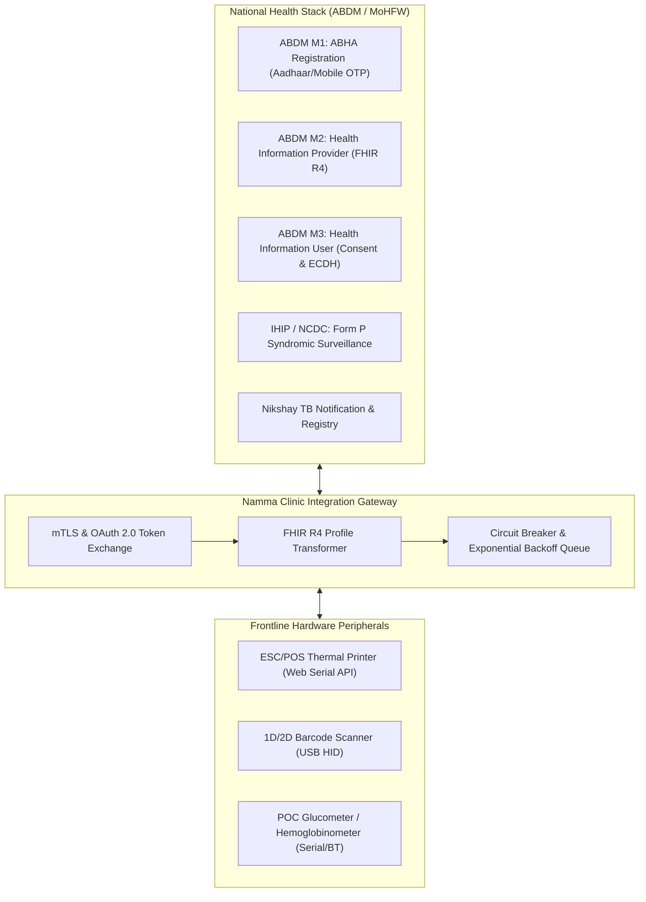

# Integration Requirements & Interoperability Baseline: Namma Clinic Digital Health Platform

| Metadata Attribute | Formal Specification |
| :--- | :--- |
| **Document Identifier** | `DOC-REQ-017-INT` |
| **Document Title** | Integration Requirements & Interoperability Baseline |
| **Project Code** | `NAMMA-CLINIC-PLATFORM-2026` |
| **Requirement Type** | `Integration Requirement` |
| **Specification Range** | `INT-001 through INT-050` (Exactly 50 unique requirements) |
| **Target Baseline** | `v1.0.0-PROD-BASELINE` |
| **Lifecycle Status** | `APPROVED & BASELINED` |
| **Target Facility Scope** | 183 Primary Namma Clinics across 8 BBMP Administrative Zones |
| **Lead Clinical Authority** | Chief Health Officer (CHO), BBMP Health Department |
| **Lead Technical Authority**| Principal Solutions Architect, Kushagramati Analytics Consortium |
| **Upstream Baselines** | [`00-project-baseline/`](../00-project-baseline/) \| [`01-project-management/`](../01-project-management/) |
| **Related Specification**| [`02-functional-requirements.md`](./02-functional-requirements.md) \| [`07-security-requirements.md`](./07-security-requirements.md) |

## 1. Executive Summary & Domain Governance Framework
This specification defines the comprehensive external interoperability, national digital health exchange (ABDM), disease surveillance sync (IHIP), and clinical peripheral hardware integration requirements baseline for the Namma Clinic Digital Health Platform across 183 primary urban healthcare centers in Greater Bengaluru. Comprising 50 rigorous integration specifications (`INT-001` through `INT-050`), this document establishes the protocol boundaries, mutual TLS authentication, FHIR R4 resource mapping, and hardware device communication standards.

Key integration frontiers include the Ayushman Bharat Digital Mission (ABDM Milestones 1, 2, 3), Integrated Health Information Platform (IHIP Form P), Nikshay TB surveillance, Web Serial thermal printing (ESC/POS), USB barcode scanners, and point-of-care diagnostic analyzers.

## 2. Architecture & Domain Conceptual Framework
The following architectural topology illustrates the functional interactions, security boundaries, and data flows governing this domain across Namma Clinic's 183 primary healthcare centers in Greater Bengaluru:



## 3. Master Integration Requirement Inventory Table (INT-001 through INT-050)
| Requirement ID | Title | Target System | Priority | Protocol | Payload Standard | Integration Lead |
| :--- | :--- | :--- | :--- | :--- | :--- | :---: |
| [`INT-001`](#int-001) | **ABDM Milestone 1: ABHA Number Generation via Aadhaar OTP** | `ABDM Sandbox / NHA` | `MUST` | `REST HTTPS / OAuth 2.0` | JSON (Aadhaar OTP Request/Veri... | Integration Lead |
| [`INT-002`](#int-002) | **ABDM Milestone 1: ABHA Number Generation via Mobile OTP** | `ABDM Sandbox / NHA` | `MUST` | `REST HTTPS / OAuth 2.0` | JSON (Mobile OTP Request/Verif... | Integration Lead |
| [`INT-003`](#int-003) | **ABDM Milestone 1: ABHA Address (PHR Address) Linkage** | `ABDM Sandbox / NHA` | `MUST` | `REST HTTPS / OAuth 2.0` | JSON (ABHA Profile Update)... | Integration Lead |
| [`INT-004`](#int-004) | **ABDM Milestone 2: Health Information Provider (HIP) Registration** | `ABDM Gateway / NHA` | `MUST` | `REST HTTPS / Mutual TLS` | JSON (Facility Context Registr... | Integration Lead |
| [`INT-005`](#int-005) | **ABDM Milestone 2: FHIR R4 Bundle Composition (OPD Consultation)** | `ABDM Gateway / NHA` | `MUST` | `FHIR R4 over HTTPS` | FHIR Bundle (Composition, Pati... | FHIR / Health Informatics Lead |
| [`INT-006`](#int-006) | **ABDM Milestone 2: Care-Context Linkage Notification** | `ABDM Gateway / NHA` | `MUST` | `REST HTTPS / Mutual TLS` | JSON (Care-Context Linkage Pay... | Integration Lead |
| [`INT-007`](#int-007) | **ABDM Milestone 3: Health Information User (HIU) Consent Request** | `ABDM Gateway / NHA` | `MUST` | `REST HTTPS / Mutual TLS` | JSON (Consent Request Initiati... | Integration Lead |
| [`INT-008`](#int-008) | **ABDM Milestone 3: Encrypted Health Data Flow (ECDH Transfer)** | `ABDM Gateway / NHA` | `MUST` | `HTTPS / ECDH Key Exchange` | Encrypted FHIR Payload over TL... | Security Lead |
| [`INT-009`](#int-009) | **ABDM Health Facility Registry (HFR) Dynamic Directory Sync** | `ABDM HFR / NHA` | `MUST` | `REST HTTPS / API Key` | JSON (HFR Facility Directory Q... | Integration Lead |
| [`INT-010`](#int-010) | **ABDM Healthcare Professionals Registry (HPR) Practitioner Verification** | `ABDM HPR / NHA` | `MUST` | `REST HTTPS / API Key` | JSON (HPR Doctor Credentials Q... | Integration Lead |
| [`INT-011`](#int-011) | **Integrated Health Information Platform (IHIP Form P Daily Sync)** | `IHIP / NCDC Gateway` | `MUST` | `REST HTTPS / API Key` | JSON / XML (Form P Syndromic D... | Epidemiologist |
| [`INT-012`](#int-012) | **Nikshay Tuberculosis Surveillance Notification and Sync** | `Central TB Division / NIC` | `MUST` | `REST HTTPS / OAuth 2.0` | JSON (Nikshay Patient Notifica... | Integration Lead |
| [`INT-013`](#int-013) | **e-Vin Vaccine Cold Chain Logistics Information Sync** | `e-Vin / State Health` | `MUST` | `REST HTTPS / API Key` | JSON (Vaccine Consumption & St... | Pharmacist |
| [`INT-014`](#int-014) | **e-RaktKosh Zonal Blood Bank Stock Availability Query** | `e-RaktKosh / CDAC` | `MUST` | `REST HTTPS / API Key` | JSON (Blood Group Availability... | Medical Officer |
| [`INT-015`](#int-015) | **e-Manas Mental Health Portal Referral and Registration Sync** | `State Mental Health Autho` | `MUST` | `REST HTTPS / Token Auth` | JSON (e-Manas Patient Referral... | Medical Officer |
| [`INT-016`](#int-016) | **CDAC SMS-Seva Gateway for Patient Notification and OTP** | `CDAC Mobile Seva Gateway` | `MUST` | `HTTPS POST / XML Payload` | XML (DLT Approved Template SMS... | Integration Lead |
| [`INT-017`](#int-017) | **ESC/POS Thermal Receipt Printer via Web Serial API** | `Thermal Receipt Printer (` | `MUST` | `Web Serial API / Raw USB` | Raw ESC/POS Binary Byte Stream... | Hardware Integration Lead |
| [`INT-018`](#int-018) | **USB HID 1D/2D Barcode Scanner Keyboard Emulation Input** | `Handheld Barcode Scanner` | `MUST` | `USB HID Keyboard Emulatio` | Standard ASCII / QR Code Text ... | Hardware Integration Lead |
| [`INT-019`](#int-019) | **Digital Blood Pressure Monitor Serial Data Ingestion** | `Digital Omron / NIBP Moni` | `MUST` | `Web Serial API / Web Blue` | Binary / ASCII Hex NIBP Data S... | Hardware Integration Lead |
| [`INT-020`](#int-020) | **Point-of-Care Digital Glucometer USB/Bluetooth Sync** | `Accu-Chek / POC Glucomete` | `MUST` | `Web Bluetooth / USB Seria` | IEEE 11073 Personal Health Dev... | Hardware Integration Lead |
| [`INT-021`](#int-021) | **Point-of-Care Hemoglobinometer Serial Data Ingestion** | `HemoCue / Digital Hb Mete` | `MUST` | `Web Serial API / USB` | Standard Serial Hex ASCII Prot... | Hardware Integration Lead |
| [`INT-022`](#int-022) | **Infrared Non-Contact Digital Thermometer Sync** | `Infrared Thermometer` | `MUST` | `Web Bluetooth API` | Bluetooth GATT Health Thermome... | Hardware Integration Lead |
| [`INT-023`](#int-023) | **Karnataka Arogya Sanjeevani Tertiary Care Referral Gateway** | `State Health Department G` | `MUST` | `REST HTTPS / Mutual TLS` | JSON (Referral Bundle with Cli... | Integration Lead |
| [`INT-024`](#int-024) | **OpenTelemetry Collector Telemetry Metric and Trace Export** | `OpenTelemetry Daemon` | `MUST` | `gRPC over HTTP/2` | OpenTelemetry Protocol (OTLP) ... | SRE Lead |
| [`INT-025`](#int-025) | **Prometheus Telemetry Metrics Scrape Endpoint** | `Prometheus Server` | `MUST` | `HTTP GET /metrics` | Standard Prometheus Text Forma... | SRE Lead |
| [`INT-026`](#int-026) | **Syslog and Grafana Loki Structured Audit Log Ingestion** | `Grafana Loki Ingestion No` | `MUST` | `REST HTTPS / POST /loki/a` | Snappy-Compressed Protobuf / J... | Security Lead |
| [`INT-027`](#int-027) | **AWS S3 / MinIO Encrypted Database Backup Storage API** | `Cloud Object Storage` | `MUST` | `Amazon S3 REST API / AWS ` | AES-256 Encrypted Tarball Chun... | SRE Lead |
| [`INT-028`](#int-028) | **Twilio / Gupshup WhatsApp Citizen Notification Fallback** | `Gupshup / Twilio API` | `MUST` | `REST HTTPS / OAuth 2.0` | JSON (Meta-Approved WhatsApp B... | Integration Lead |
| [`INT-029`](#int-029) | **Embedded DuckDB Parquet Data Export Interface** | `Local File System` | `MUST` | `Local File I/O` | Snappy-Compressed Apache Parqu... | Data Platform Lead |
| [`INT-030`](#int-030) | **BBMP Ward-Level GIS Spatial Boundary Mapping API** | `Municipal GIS Portal` | `MUST` | `GeoJSON over HTTPS` | GeoJSON (Ward Boundary Polygon... | GIS / Epidemiologist |
| [`INT-031`](#int-031) | **Keycloak / OpenID Connect Enterprise Authentication** | `BBMP IAM Gateway` | `MUST` | `OAuth 2.0 / OpenID Connec` | JSON Web Tokens (JWT) / Author... | Security Lead |
| [`INT-032`](#int-032) | **CERT-In Automated Cybersecurity Incident Notification API** | `CERT-In Incident Portal` | `MUST` | `REST HTTPS / Client Certi` | JSON (Standard CERT-In Inciden... | Security Lead |
| [`INT-033`](#int-033) | **National Digital Health Mission (NDHM) Sandbox Validator** | `NDHM Compliance Engine` | `MUST` | `REST HTTPS / Mutual TLS` | FHIR R4 Diagnostic Bundles... | Integration Lead |
| [`INT-034`](#int-034) | **Aadhaar e-KYC Offline XML Verification Engine** | `UIDAI Offline Gateway` | `MUST` | `Local Cryptographic Engin` | Digitally Signed UIDAI XML / S... | Security Lead |
| [`INT-035`](#int-035) | **e-Sanjeevani National Teleconsultation Platform Gateway** | `e-Sanjeevani 2.0 Gateway` | `MUST` | `REST HTTPS / Token Auth` | JSON (Teleconsultation Appoint... | Medical Officer |
| [`INT-036`](#int-036) | **Janani Suraksha Yojana (JSY) Direct Benefit Transfer Sync** | `Public Financial Manageme` | `MUST` | `SFTP / Encrypted PGP REST` | Encrypted XML (PFMS Payment Ad... | Administrative Assistant |
| [`INT-037`](#int-037) | **Urban Primary Health Center (UPHC) Referral Roster Sync** | `District Health Office` | `MUST` | `REST HTTPS / OAuth 2.0` | JSON (Inter-Clinic Referral Ma... | Integration Lead |
| [`INT-038`](#int-038) | **Central Medicine Warehouse Procurement and Inward PO Sync** | `Karnataka State Drug Logi` | `MUST` | `REST HTTPS / SOAP Web Ser` | XML (Inward Drug Consignment M... | Pharmacist |
| [`INT-039`](#int-039) | **Biomedical Waste Barcode Tracking Server Interface** | `State Pollution Control B` | `MUST` | `REST HTTPS / API Key` | JSON (Waste Consignment Barcod... | Administrative Assistant |
| [`INT-040`](#int-040) | **Public Health Research Data Hub (ICMR) De-Identified Sink** | `ICMR Research Server` | `MUST` | `SFTP / Secure HTTPS` | Gzip-Compressed Parquet (k>=5 ... | Data Protection Officer |
| [`INT-041`](#int-041) | **Thermal Paper Low-Level Sensor Detection via Web Serial** | `Thermal Receipt Printer` | `MUST` | `Web Serial Low-Level Comm` | ESC/POS Real-Time Status Byte ... | Hardware Integration Lead |
| [`INT-042`](#int-042) | **USB Scale Gross Weight Ingestion for Biomedical Waste** | `Digital Precision Bench S` | `MUST` | `Web Serial API / USB CDC` | Continuous ASCII Weight Stream... | Hardware Integration Lead |
| [`INT-043`](#int-043) | **Clinical Decision Support Rule Engine Hook Interface (CDS Hooks)** | `Internal CDS Engine` | `MUST` | `HTTP POST /cds-services/` | CDS Hooks JSON (PatientView, O... | Solution Architect |
| [`INT-044`](#int-044) | **FHIR R4 DiagnosticReport Profile Generation Interface** | `Local EHR Store` | `MUST` | `Internal Object Mapping` | FHIR R4 DiagnosticReport Resou... | FHIR / Health Informatics Lead |
| [`INT-045`](#int-045) | **FHIR R4 MedicationRequest Profile Generation Interface** | `Local EHR Store` | `MUST` | `Internal Object Mapping` | FHIR R4 MedicationRequest Reso... | FHIR / Health Informatics Lead |
| [`INT-046`](#int-046) | **FHIR R4 ImmunizationRecommendation Profile Interface** | `Local EHR Store` | `MUST` | `Internal Object Mapping` | FHIR R4 ImmunizationRecommenda... | FHIR / Health Informatics Lead |
| [`INT-047`](#int-047) | **FHIR R4 Encounter and Condition Profile Interface** | `Local EHR Store` | `MUST` | `Internal Object Mapping` | FHIR R4 Encounter & Condition ... | FHIR / Health Informatics Lead |
| [`INT-048`](#int-048) | **FHIR R4 Observation (Vitals and Lab) Profile Interface** | `Local EHR Store` | `MUST` | `Internal Object Mapping` | FHIR R4 Observation Resource... | FHIR / Health Informatics Lead |
| [`INT-049`](#int-049) | **ABDM Care-Context Linking and OTP Confirmation Gateway** | `ABDM Gateway / NHA` | `MUST` | `REST HTTPS / OAuth 2.0` | JSON (Care-Context Linking Not... | Integration Lead |
| [`INT-050`](#int-050) | **Comprehensive Interoperability Contract Test Suite** | `All Connected Gateways` | `MUST` | `Automated Pact / WireMock` | Contract Test Manifest (JSON/Y... | Integration Lead |

## 4. Comprehensive Integration Requirement Specifications (INT-001 through INT-050)
This section establishes the exhaustive engineering, clinical, operational, and architectural specifications for each of the 50 requirements committed for the production baseline.

### 4.1 INT-001: ABDM Milestone 1: ABHA Number Generation via Aadhaar OTP

| Specification Attribute | Formal Engineering Definition |
| :--- | :--- |
| **Requirement ID** | `INT-001` |
| **Requirement Title** | ABDM Milestone 1: ABHA Number Generation via Aadhaar OTP |
| **Requirement Statement**| The platform SHALL implement integration for abdm milestone 1: abha number generation via aadhaar otp with ABDM Sandbox / NHA over REST HTTPS / OAuth 2.0, transmitting JSON (Aadhaar OTP Request/Verify). |
| **Requirement Type** | `Integration Requirement` |
| **Priority Level** | `MUST` (Rationale: Mandatory national healthcare interoperability (ABDM) and clinic hardware connectivity.) |
| **Business Value** | Enables seamless national digital health exchange and frictionless frontline clinical peripherals. |
| **Engineering Rationale**| Target System: ABDM Sandbox / NHA; Protocol: REST HTTPS / OAuth 2.0; Payload Specification: JSON (Aadhaar OTP Request/Verify). |
| **Primary Actor** | `Integration Gateway Adapter` |
| **Target User Persona** | [`PERSONA-001`](../01-project-management/07-user-personas.md#persona-001) |
| **Accountable Role** | [`ROLE-004`](../01-project-management/08-role-and-responsibility-matrix.md#role-004) |
| **Key Stakeholder** | [`STAKEHOLDER-009`](../01-project-management/06-stakeholders.md#stakeholder-009) |
| **Trigger Condition** | ABHA creation request, FHIR bundle push, peripheral scan, or scheduled telemetry dispatch. |
| **System Preconditions** | External gateway reachable or hardware device connected via USB/Bluetooth; valid credentials. |
| **Input Specifications** | Patient identification, FHIR bundle, raw ESC/POS byte stream, or barcode scanner string. |
| **Validation Rules** | Evaluated against schema contracts, ABDM payload validators, or device handshake protocol. |
| **Postconditions** | Integration payload successfully transmitted and acknowledged by recipient system. |
| **State Mutations** | Records outbound integration transmission status, correlation ID, and latency. |
| **Associated Rules** | Business: [`BRULE-001`](./04-business-rules.md#brule-001) \| Clinical: [`CR-001`](./05-clinical-rules.md#cr-001) \| Operational: [`OR-001`](./06-operational-rules.md#or-001) |
| **Security & Privacy** | Security: `All external API transmissions protected via TLS 1.3 mutual authentication.` \| Privacy: `Patient records shared via ABDM require explicit DPDP / ABDM consent artifact.` |
| **Data & Audit** | Data: `External schema transformations adhere to standard FHIR R4 resource definitions.` \| Audit: `Outbound payloads, timestamps, response codes, and hashes recorded in audit vault.` |
| **Offline & Sync** | Offline: `Integration requests spooled in IndexedDB queue and dispatched automatically upon reconnection.` \| Sync: `Hardware peripheral inputs (barcode, serial) function 100% autonomously offline.` |
| **Quality Expectations**| Perf: `Peripheral barcode scan decoded and populated in UI in < 50ms.` \| Avail: `99.5% availability for internal integration gateways and queues.` |
| **Localization & A11y**| Loc: `SMS and WhatsApp notification templates fully localized in Kannada and English.` \| A11y: `Hardware error alerts (e.g. printer offline) provide accessible screen reader toasts.` |
| **Failure & Recovery** | Failure: Spool failed payloads to dead letter queue without halting frontline clinical screens. \| Recovery: Automatic retry with exponential backoff and idempotency protection. |
| **Observability** | Logging: `Structured JSON log with correlation_id, external_endpoint, and status_code.` \| Metrics: `Prometheus counter `namma_clinic_integration_requests_total{target="ABDM Sandbox / "}`.` |
| **Upstream Traceability**| Obj: [`OBJECTIVE-001`](../01-project-management/02-project-vision-and-objectives.md#objective-001) \| Scope: [`INSCOPE-001`](../01-project-management/04-in-scope.md#inscope-001) \| Risk: [`RISK-001`](../01-project-management/12-project-risks.md#risk-001) |
| **Downstream Planning** | Epic: `PLANNED-EPIC-001` \| Feature: `PLANNED-FEATURE-001` \| API: `PLANNED-API-001` \| DB: `PLANNED-DB-001` \| Test: `PLANNED-TEST-1601` |

#### 4.1.1 Operational Execution Protocol & Frontline Workflow
- **Continuous Operational Workflow:**
  1. Trigger initiates integration request: ABDM Milestone 1: ABHA Number Generation via Aadhaar OTP.
  2. Integration gateway transforms internal entity into contract payload: JSON (Aadhaar OTP Request/Verify).
  3. Transmits payload to destination system over: REST HTTPS / OAuth 2.0.
  4. Validates response status, handles cryptographic handshake, and parses acknowledgment.
  5. Updates local transaction status and logs integration event to audit vault.
- **Degraded State Fallback Path:** If external endpoint returns 503 or network drops, buffer payload in retry queue with backoff.
- **Exception Breach & Incident Escalation Path:** If external authentication fails repeatedly, trip circuit breaker and notify Integration Lead.

#### 4.1.2 Technical Invariants & Operational Contract
- **External Interoperability System:** ABDM Sandbox / NHA
- **Integration Protocol:** `REST HTTPS / OAuth 2.0`
- **Payload & Schema Standard:** `JSON (Aadhaar OTP Request/Verify)`
- **Verification Protocol:** ABDM Sandbox M1 Certification
- **Accountable Integration Lead:** Integration Lead

#### 4.1.3 Executable BDD Acceptance Scenarios
```gherkin
Feature: INT-001 - ABDM Milestone 1: ABHA Number Generation via Aadhaar OTP
  As a Integration Gateway Adapter
  I require system enforcement of abdm milestone 1: abha number generation via aadhaar otp
  In order to ensure municipal healthcare compliance and operational integrity

  Scenario: Happy Path Execution for INT-001
    Given the Integration Gateway Adapter is authenticated and clinic terminal is operational
    When the user submits a valid request for abdm milestone 1: abha number generation via aadhaar otp
    Then the system successfully commits the transaction and emits an audit event

  Scenario: Input Validation and Schema Guard for INT-001
    Given the Integration Gateway Adapter attempts to submit an incomplete or malformed payload for abdm milestone 1: abha number generation via aadhaar otp
    When the request fails TypeBox schema or domain constraint validation
    Then the system rejects the input with HTTP 400 and highlights invalid fields in Kannada and English

  Scenario: RBAC and Security Access Control for INT-001
    Given an unauthenticated or unauthorized role attempts to invoke abdm milestone 1: abha number generation via aadhaar otp
    When the bearer JWT token is missing, expired, or lacks necessary RBAC permission
    Then the system denies execution with HTTP 403 Forbidden and records a security telemetry alert

  Scenario: Offline Autonomous Execution for INT-001
    Given the clinic WAN network is completely severed during abdm milestone 1: abha number generation via aadhaar otp
    When the operator confirms the local transaction on the workstation
    Then the mutation is persisted to Dexie.js IndexedDB with a UUIDv7 and queued for background replay

  Scenario: Network Recovery and Idempotent Sync for INT-001
    Given the clinic workstation reconnects to the BBMP municipal health WAN
    When the background sync daemon processes the pending mutation queue
    Then all buffered transactions for INT-001 synchronize idempotently with zero data loss
```

#### 4.1.4 Verification Protocol & Quality Sign-Off
- **Verification Method:** ABDM Sandbox M1 Certification
- **Automated Test Suite:** `PLANNED-TEST-1601` (Automated Gateway Contract & Hardware Simulation Test) targeting 100% verification gate compliance.
- **Related Internal Requirements:** `FR-006`, `NFR-014`, `SECR-001`
- **Dependencies & Blocking Constraints:** FR-006 | Constraints: External API latency must not block local clinic UI responsiveness.
- **Architectural Assumptions & Open Questions:** Assumption: Clinic workstations support Web Serial API in Chromium for thermal printer access. | Open Question: NHA Sandbox certification window scheduling for ABDM M2/M3 profiles.

---

### 4.2 INT-002: ABDM Milestone 1: ABHA Number Generation via Mobile OTP

| Specification Attribute | Formal Engineering Definition |
| :--- | :--- |
| **Requirement ID** | `INT-002` |
| **Requirement Title** | ABDM Milestone 1: ABHA Number Generation via Mobile OTP |
| **Requirement Statement**| The platform SHALL implement integration for abdm milestone 1: abha number generation via mobile otp with ABDM Sandbox / NHA over REST HTTPS / OAuth 2.0, transmitting JSON (Mobile OTP Request/Verify). |
| **Requirement Type** | `Integration Requirement` |
| **Priority Level** | `MUST` (Rationale: Mandatory national healthcare interoperability (ABDM) and clinic hardware connectivity.) |
| **Business Value** | Enables seamless national digital health exchange and frictionless frontline clinical peripherals. |
| **Engineering Rationale**| Target System: ABDM Sandbox / NHA; Protocol: REST HTTPS / OAuth 2.0; Payload Specification: JSON (Mobile OTP Request/Verify). |
| **Primary Actor** | `Integration Gateway Adapter` |
| **Target User Persona** | [`PERSONA-002`](../01-project-management/07-user-personas.md#persona-002) |
| **Accountable Role** | [`ROLE-004`](../01-project-management/08-role-and-responsibility-matrix.md#role-004) |
| **Key Stakeholder** | [`STAKEHOLDER-009`](../01-project-management/06-stakeholders.md#stakeholder-009) |
| **Trigger Condition** | ABHA creation request, FHIR bundle push, peripheral scan, or scheduled telemetry dispatch. |
| **System Preconditions** | External gateway reachable or hardware device connected via USB/Bluetooth; valid credentials. |
| **Input Specifications** | Patient identification, FHIR bundle, raw ESC/POS byte stream, or barcode scanner string. |
| **Validation Rules** | Evaluated against schema contracts, ABDM payload validators, or device handshake protocol. |
| **Postconditions** | Integration payload successfully transmitted and acknowledged by recipient system. |
| **State Mutations** | Records outbound integration transmission status, correlation ID, and latency. |
| **Associated Rules** | Business: [`BRULE-002`](./04-business-rules.md#brule-002) \| Clinical: [`CR-002`](./05-clinical-rules.md#cr-002) \| Operational: [`OR-002`](./06-operational-rules.md#or-002) |
| **Security & Privacy** | Security: `All external API transmissions protected via TLS 1.3 mutual authentication.` \| Privacy: `Patient records shared via ABDM require explicit DPDP / ABDM consent artifact.` |
| **Data & Audit** | Data: `External schema transformations adhere to standard FHIR R4 resource definitions.` \| Audit: `Outbound payloads, timestamps, response codes, and hashes recorded in audit vault.` |
| **Offline & Sync** | Offline: `Integration requests spooled in IndexedDB queue and dispatched automatically upon reconnection.` \| Sync: `Hardware peripheral inputs (barcode, serial) function 100% autonomously offline.` |
| **Quality Expectations**| Perf: `Peripheral barcode scan decoded and populated in UI in < 50ms.` \| Avail: `99.5% availability for internal integration gateways and queues.` |
| **Localization & A11y**| Loc: `SMS and WhatsApp notification templates fully localized in Kannada and English.` \| A11y: `Hardware error alerts (e.g. printer offline) provide accessible screen reader toasts.` |
| **Failure & Recovery** | Failure: Spool failed payloads to dead letter queue without halting frontline clinical screens. \| Recovery: Automatic retry with exponential backoff and idempotency protection. |
| **Observability** | Logging: `Structured JSON log with correlation_id, external_endpoint, and status_code.` \| Metrics: `Prometheus counter `namma_clinic_integration_requests_total{target="ABDM Sandbox / "}`.` |
| **Upstream Traceability**| Obj: [`OBJECTIVE-002`](../01-project-management/02-project-vision-and-objectives.md#objective-002) \| Scope: [`INSCOPE-002`](../01-project-management/04-in-scope.md#inscope-002) \| Risk: [`RISK-002`](../01-project-management/12-project-risks.md#risk-002) |
| **Downstream Planning** | Epic: `PLANNED-EPIC-002` \| Feature: `PLANNED-FEATURE-002` \| API: `PLANNED-API-002` \| DB: `PLANNED-DB-002` \| Test: `PLANNED-TEST-1602` |

#### 4.2.1 Operational Execution Protocol & Frontline Workflow
- **Continuous Operational Workflow:**
  1. Trigger initiates integration request: ABDM Milestone 1: ABHA Number Generation via Mobile OTP.
  2. Integration gateway transforms internal entity into contract payload: JSON (Mobile OTP Request/Verify).
  3. Transmits payload to destination system over: REST HTTPS / OAuth 2.0.
  4. Validates response status, handles cryptographic handshake, and parses acknowledgment.
  5. Updates local transaction status and logs integration event to audit vault.
- **Degraded State Fallback Path:** If external endpoint returns 503 or network drops, buffer payload in retry queue with backoff.
- **Exception Breach & Incident Escalation Path:** If external authentication fails repeatedly, trip circuit breaker and notify Integration Lead.

#### 4.2.2 Technical Invariants & Operational Contract
- **External Interoperability System:** ABDM Sandbox / NHA
- **Integration Protocol:** `REST HTTPS / OAuth 2.0`
- **Payload & Schema Standard:** `JSON (Mobile OTP Request/Verify)`
- **Verification Protocol:** ABDM Sandbox M1 Certification
- **Accountable Integration Lead:** Integration Lead

#### 4.2.3 Executable BDD Acceptance Scenarios
```gherkin
Feature: INT-002 - ABDM Milestone 1: ABHA Number Generation via Mobile OTP
  As a Integration Gateway Adapter
  I require system enforcement of abdm milestone 1: abha number generation via mobile otp
  In order to ensure municipal healthcare compliance and operational integrity

  Scenario: Happy Path Execution for INT-002
    Given the Integration Gateway Adapter is authenticated and clinic terminal is operational
    When the user submits a valid request for abdm milestone 1: abha number generation via mobile otp
    Then the system successfully commits the transaction and emits an audit event

  Scenario: Input Validation and Schema Guard for INT-002
    Given the Integration Gateway Adapter attempts to submit an incomplete or malformed payload for abdm milestone 1: abha number generation via mobile otp
    When the request fails TypeBox schema or domain constraint validation
    Then the system rejects the input with HTTP 400 and highlights invalid fields in Kannada and English

  Scenario: RBAC and Security Access Control for INT-002
    Given an unauthenticated or unauthorized role attempts to invoke abdm milestone 1: abha number generation via mobile otp
    When the bearer JWT token is missing, expired, or lacks necessary RBAC permission
    Then the system denies execution with HTTP 403 Forbidden and records a security telemetry alert

  Scenario: Offline Autonomous Execution for INT-002
    Given the clinic WAN network is completely severed during abdm milestone 1: abha number generation via mobile otp
    When the operator confirms the local transaction on the workstation
    Then the mutation is persisted to Dexie.js IndexedDB with a UUIDv7 and queued for background replay

  Scenario: Network Recovery and Idempotent Sync for INT-002
    Given the clinic workstation reconnects to the BBMP municipal health WAN
    When the background sync daemon processes the pending mutation queue
    Then all buffered transactions for INT-002 synchronize idempotently with zero data loss
```

#### 4.2.4 Verification Protocol & Quality Sign-Off
- **Verification Method:** ABDM Sandbox M1 Certification
- **Automated Test Suite:** `PLANNED-TEST-1602` (Automated Gateway Contract & Hardware Simulation Test) targeting 100% verification gate compliance.
- **Related Internal Requirements:** `FR-006`, `NFR-014`, `SECR-001`
- **Dependencies & Blocking Constraints:** FR-006 | Constraints: External API latency must not block local clinic UI responsiveness.
- **Architectural Assumptions & Open Questions:** Assumption: Clinic workstations support Web Serial API in Chromium for thermal printer access. | Open Question: NHA Sandbox certification window scheduling for ABDM M2/M3 profiles.

---

### 4.3 INT-003: ABDM Milestone 1: ABHA Address (PHR Address) Linkage

| Specification Attribute | Formal Engineering Definition |
| :--- | :--- |
| **Requirement ID** | `INT-003` |
| **Requirement Title** | ABDM Milestone 1: ABHA Address (PHR Address) Linkage |
| **Requirement Statement**| The platform SHALL implement integration for abdm milestone 1: abha address (phr address) linkage with ABDM Sandbox / NHA over REST HTTPS / OAuth 2.0, transmitting JSON (ABHA Profile Update). |
| **Requirement Type** | `Integration Requirement` |
| **Priority Level** | `MUST` (Rationale: Mandatory national healthcare interoperability (ABDM) and clinic hardware connectivity.) |
| **Business Value** | Enables seamless national digital health exchange and frictionless frontline clinical peripherals. |
| **Engineering Rationale**| Target System: ABDM Sandbox / NHA; Protocol: REST HTTPS / OAuth 2.0; Payload Specification: JSON (ABHA Profile Update). |
| **Primary Actor** | `Integration Gateway Adapter` |
| **Target User Persona** | [`PERSONA-003`](../01-project-management/07-user-personas.md#persona-003) |
| **Accountable Role** | [`ROLE-004`](../01-project-management/08-role-and-responsibility-matrix.md#role-004) |
| **Key Stakeholder** | [`STAKEHOLDER-009`](../01-project-management/06-stakeholders.md#stakeholder-009) |
| **Trigger Condition** | ABHA creation request, FHIR bundle push, peripheral scan, or scheduled telemetry dispatch. |
| **System Preconditions** | External gateway reachable or hardware device connected via USB/Bluetooth; valid credentials. |
| **Input Specifications** | Patient identification, FHIR bundle, raw ESC/POS byte stream, or barcode scanner string. |
| **Validation Rules** | Evaluated against schema contracts, ABDM payload validators, or device handshake protocol. |
| **Postconditions** | Integration payload successfully transmitted and acknowledged by recipient system. |
| **State Mutations** | Records outbound integration transmission status, correlation ID, and latency. |
| **Associated Rules** | Business: [`BRULE-003`](./04-business-rules.md#brule-003) \| Clinical: [`CR-003`](./05-clinical-rules.md#cr-003) \| Operational: [`OR-003`](./06-operational-rules.md#or-003) |
| **Security & Privacy** | Security: `All external API transmissions protected via TLS 1.3 mutual authentication.` \| Privacy: `Patient records shared via ABDM require explicit DPDP / ABDM consent artifact.` |
| **Data & Audit** | Data: `External schema transformations adhere to standard FHIR R4 resource definitions.` \| Audit: `Outbound payloads, timestamps, response codes, and hashes recorded in audit vault.` |
| **Offline & Sync** | Offline: `Integration requests spooled in IndexedDB queue and dispatched automatically upon reconnection.` \| Sync: `Hardware peripheral inputs (barcode, serial) function 100% autonomously offline.` |
| **Quality Expectations**| Perf: `Peripheral barcode scan decoded and populated in UI in < 50ms.` \| Avail: `99.5% availability for internal integration gateways and queues.` |
| **Localization & A11y**| Loc: `SMS and WhatsApp notification templates fully localized in Kannada and English.` \| A11y: `Hardware error alerts (e.g. printer offline) provide accessible screen reader toasts.` |
| **Failure & Recovery** | Failure: Spool failed payloads to dead letter queue without halting frontline clinical screens. \| Recovery: Automatic retry with exponential backoff and idempotency protection. |
| **Observability** | Logging: `Structured JSON log with correlation_id, external_endpoint, and status_code.` \| Metrics: `Prometheus counter `namma_clinic_integration_requests_total{target="ABDM Sandbox / "}`.` |
| **Upstream Traceability**| Obj: [`OBJECTIVE-003`](../01-project-management/02-project-vision-and-objectives.md#objective-003) \| Scope: [`INSCOPE-003`](../01-project-management/04-in-scope.md#inscope-003) \| Risk: [`RISK-003`](../01-project-management/12-project-risks.md#risk-003) |
| **Downstream Planning** | Epic: `PLANNED-EPIC-003` \| Feature: `PLANNED-FEATURE-003` \| API: `PLANNED-API-003` \| DB: `PLANNED-DB-003` \| Test: `PLANNED-TEST-1603` |

#### 4.3.1 Operational Execution Protocol & Frontline Workflow
- **Continuous Operational Workflow:**
  1. Trigger initiates integration request: ABDM Milestone 1: ABHA Address (PHR Address) Linkage.
  2. Integration gateway transforms internal entity into contract payload: JSON (ABHA Profile Update).
  3. Transmits payload to destination system over: REST HTTPS / OAuth 2.0.
  4. Validates response status, handles cryptographic handshake, and parses acknowledgment.
  5. Updates local transaction status and logs integration event to audit vault.
- **Degraded State Fallback Path:** If external endpoint returns 503 or network drops, buffer payload in retry queue with backoff.
- **Exception Breach & Incident Escalation Path:** If external authentication fails repeatedly, trip circuit breaker and notify Integration Lead.

#### 4.3.2 Technical Invariants & Operational Contract
- **External Interoperability System:** ABDM Sandbox / NHA
- **Integration Protocol:** `REST HTTPS / OAuth 2.0`
- **Payload & Schema Standard:** `JSON (ABHA Profile Update)`
- **Verification Protocol:** ABDM Address Linkage Test
- **Accountable Integration Lead:** Integration Lead

#### 4.3.3 Executable BDD Acceptance Scenarios
```gherkin
Feature: INT-003 - ABDM Milestone 1: ABHA Address (PHR Address) Linkage
  As a Integration Gateway Adapter
  I require system enforcement of abdm milestone 1: abha address (phr address) linkage
  In order to ensure municipal healthcare compliance and operational integrity

  Scenario: Happy Path Execution for INT-003
    Given the Integration Gateway Adapter is authenticated and clinic terminal is operational
    When the user submits a valid request for abdm milestone 1: abha address (phr address) linkage
    Then the system successfully commits the transaction and emits an audit event

  Scenario: Input Validation and Schema Guard for INT-003
    Given the Integration Gateway Adapter attempts to submit an incomplete or malformed payload for abdm milestone 1: abha address (phr address) linkage
    When the request fails TypeBox schema or domain constraint validation
    Then the system rejects the input with HTTP 400 and highlights invalid fields in Kannada and English

  Scenario: RBAC and Security Access Control for INT-003
    Given an unauthenticated or unauthorized role attempts to invoke abdm milestone 1: abha address (phr address) linkage
    When the bearer JWT token is missing, expired, or lacks necessary RBAC permission
    Then the system denies execution with HTTP 403 Forbidden and records a security telemetry alert

  Scenario: Offline Autonomous Execution for INT-003
    Given the clinic WAN network is completely severed during abdm milestone 1: abha address (phr address) linkage
    When the operator confirms the local transaction on the workstation
    Then the mutation is persisted to Dexie.js IndexedDB with a UUIDv7 and queued for background replay

  Scenario: Network Recovery and Idempotent Sync for INT-003
    Given the clinic workstation reconnects to the BBMP municipal health WAN
    When the background sync daemon processes the pending mutation queue
    Then all buffered transactions for INT-003 synchronize idempotently with zero data loss
```

#### 4.3.4 Verification Protocol & Quality Sign-Off
- **Verification Method:** ABDM Address Linkage Test
- **Automated Test Suite:** `PLANNED-TEST-1603` (Automated Gateway Contract & Hardware Simulation Test) targeting 100% verification gate compliance.
- **Related Internal Requirements:** `FR-006`, `NFR-014`, `SECR-001`
- **Dependencies & Blocking Constraints:** FR-006 | Constraints: External API latency must not block local clinic UI responsiveness.
- **Architectural Assumptions & Open Questions:** Assumption: Clinic workstations support Web Serial API in Chromium for thermal printer access. | Open Question: NHA Sandbox certification window scheduling for ABDM M2/M3 profiles.

---

### 4.4 INT-004: ABDM Milestone 2: Health Information Provider (HIP) Registration

| Specification Attribute | Formal Engineering Definition |
| :--- | :--- |
| **Requirement ID** | `INT-004` |
| **Requirement Title** | ABDM Milestone 2: Health Information Provider (HIP) Registration |
| **Requirement Statement**| The platform SHALL implement integration for abdm milestone 2: health information provider (hip) registration with ABDM Gateway / NHA over REST HTTPS / Mutual TLS, transmitting JSON (Facility Context Registration). |
| **Requirement Type** | `Integration Requirement` |
| **Priority Level** | `MUST` (Rationale: Mandatory national healthcare interoperability (ABDM) and clinic hardware connectivity.) |
| **Business Value** | Enables seamless national digital health exchange and frictionless frontline clinical peripherals. |
| **Engineering Rationale**| Target System: ABDM Gateway / NHA; Protocol: REST HTTPS / Mutual TLS; Payload Specification: JSON (Facility Context Registration). |
| **Primary Actor** | `Integration Gateway Adapter` |
| **Target User Persona** | [`PERSONA-004`](../01-project-management/07-user-personas.md#persona-004) |
| **Accountable Role** | [`ROLE-004`](../01-project-management/08-role-and-responsibility-matrix.md#role-004) |
| **Key Stakeholder** | [`STAKEHOLDER-009`](../01-project-management/06-stakeholders.md#stakeholder-009) |
| **Trigger Condition** | ABHA creation request, FHIR bundle push, peripheral scan, or scheduled telemetry dispatch. |
| **System Preconditions** | External gateway reachable or hardware device connected via USB/Bluetooth; valid credentials. |
| **Input Specifications** | Patient identification, FHIR bundle, raw ESC/POS byte stream, or barcode scanner string. |
| **Validation Rules** | Evaluated against schema contracts, ABDM payload validators, or device handshake protocol. |
| **Postconditions** | Integration payload successfully transmitted and acknowledged by recipient system. |
| **State Mutations** | Records outbound integration transmission status, correlation ID, and latency. |
| **Associated Rules** | Business: [`BRULE-004`](./04-business-rules.md#brule-004) \| Clinical: [`CR-004`](./05-clinical-rules.md#cr-004) \| Operational: [`OR-004`](./06-operational-rules.md#or-004) |
| **Security & Privacy** | Security: `All external API transmissions protected via TLS 1.3 mutual authentication.` \| Privacy: `Patient records shared via ABDM require explicit DPDP / ABDM consent artifact.` |
| **Data & Audit** | Data: `External schema transformations adhere to standard FHIR R4 resource definitions.` \| Audit: `Outbound payloads, timestamps, response codes, and hashes recorded in audit vault.` |
| **Offline & Sync** | Offline: `Integration requests spooled in IndexedDB queue and dispatched automatically upon reconnection.` \| Sync: `Hardware peripheral inputs (barcode, serial) function 100% autonomously offline.` |
| **Quality Expectations**| Perf: `Peripheral barcode scan decoded and populated in UI in < 50ms.` \| Avail: `99.5% availability for internal integration gateways and queues.` |
| **Localization & A11y**| Loc: `SMS and WhatsApp notification templates fully localized in Kannada and English.` \| A11y: `Hardware error alerts (e.g. printer offline) provide accessible screen reader toasts.` |
| **Failure & Recovery** | Failure: Spool failed payloads to dead letter queue without halting frontline clinical screens. \| Recovery: Automatic retry with exponential backoff and idempotency protection. |
| **Observability** | Logging: `Structured JSON log with correlation_id, external_endpoint, and status_code.` \| Metrics: `Prometheus counter `namma_clinic_integration_requests_total{target="ABDM Gateway / "}`.` |
| **Upstream Traceability**| Obj: [`OBJECTIVE-004`](../01-project-management/02-project-vision-and-objectives.md#objective-004) \| Scope: [`INSCOPE-004`](../01-project-management/04-in-scope.md#inscope-004) \| Risk: [`RISK-004`](../01-project-management/12-project-risks.md#risk-004) |
| **Downstream Planning** | Epic: `PLANNED-EPIC-004` \| Feature: `PLANNED-FEATURE-004` \| API: `PLANNED-API-004` \| DB: `PLANNED-DB-004` \| Test: `PLANNED-TEST-1604` |

#### 4.4.1 Operational Execution Protocol & Frontline Workflow
- **Continuous Operational Workflow:**
  1. Trigger initiates integration request: ABDM Milestone 2: Health Information Provider (HIP) Registration.
  2. Integration gateway transforms internal entity into contract payload: JSON (Facility Context Registration).
  3. Transmits payload to destination system over: REST HTTPS / Mutual TLS.
  4. Validates response status, handles cryptographic handshake, and parses acknowledgment.
  5. Updates local transaction status and logs integration event to audit vault.
- **Degraded State Fallback Path:** If external endpoint returns 503 or network drops, buffer payload in retry queue with backoff.
- **Exception Breach & Incident Escalation Path:** If external authentication fails repeatedly, trip circuit breaker and notify Integration Lead.

#### 4.4.2 Technical Invariants & Operational Contract
- **External Interoperability System:** ABDM Gateway / NHA
- **Integration Protocol:** `REST HTTPS / Mutual TLS`
- **Payload & Schema Standard:** `JSON (Facility Context Registration)`
- **Verification Protocol:** HIP Facility Registration Test
- **Accountable Integration Lead:** Integration Lead

#### 4.4.3 Executable BDD Acceptance Scenarios
```gherkin
Feature: INT-004 - ABDM Milestone 2: Health Information Provider (HIP) Registration
  As a Integration Gateway Adapter
  I require system enforcement of abdm milestone 2: health information provider (hip) registration
  In order to ensure municipal healthcare compliance and operational integrity

  Scenario: Happy Path Execution for INT-004
    Given the Integration Gateway Adapter is authenticated and clinic terminal is operational
    When the user submits a valid request for abdm milestone 2: health information provider (hip) registration
    Then the system successfully commits the transaction and emits an audit event

  Scenario: Input Validation and Schema Guard for INT-004
    Given the Integration Gateway Adapter attempts to submit an incomplete or malformed payload for abdm milestone 2: health information provider (hip) registration
    When the request fails TypeBox schema or domain constraint validation
    Then the system rejects the input with HTTP 400 and highlights invalid fields in Kannada and English

  Scenario: RBAC and Security Access Control for INT-004
    Given an unauthenticated or unauthorized role attempts to invoke abdm milestone 2: health information provider (hip) registration
    When the bearer JWT token is missing, expired, or lacks necessary RBAC permission
    Then the system denies execution with HTTP 403 Forbidden and records a security telemetry alert

  Scenario: Offline Autonomous Execution for INT-004
    Given the clinic WAN network is completely severed during abdm milestone 2: health information provider (hip) registration
    When the operator confirms the local transaction on the workstation
    Then the mutation is persisted to Dexie.js IndexedDB with a UUIDv7 and queued for background replay

  Scenario: Network Recovery and Idempotent Sync for INT-004
    Given the clinic workstation reconnects to the BBMP municipal health WAN
    When the background sync daemon processes the pending mutation queue
    Then all buffered transactions for INT-004 synchronize idempotently with zero data loss
```

#### 4.4.4 Verification Protocol & Quality Sign-Off
- **Verification Method:** HIP Facility Registration Test
- **Automated Test Suite:** `PLANNED-TEST-1604` (Automated Gateway Contract & Hardware Simulation Test) targeting 100% verification gate compliance.
- **Related Internal Requirements:** `FR-006`, `NFR-014`, `SECR-001`
- **Dependencies & Blocking Constraints:** FR-006 | Constraints: External API latency must not block local clinic UI responsiveness.
- **Architectural Assumptions & Open Questions:** Assumption: Clinic workstations support Web Serial API in Chromium for thermal printer access. | Open Question: NHA Sandbox certification window scheduling for ABDM M2/M3 profiles.

---

### 4.5 INT-005: ABDM Milestone 2: FHIR R4 Bundle Composition (OPD Consultation)

| Specification Attribute | Formal Engineering Definition |
| :--- | :--- |
| **Requirement ID** | `INT-005` |
| **Requirement Title** | ABDM Milestone 2: FHIR R4 Bundle Composition (OPD Consultation) |
| **Requirement Statement**| The platform SHALL implement integration for abdm milestone 2: fhir r4 bundle composition (opd consultation) with ABDM Gateway / NHA over FHIR R4 over HTTPS, transmitting FHIR Bundle (Composition, Patient, Condition, MedicationRequest). |
| **Requirement Type** | `Integration Requirement` |
| **Priority Level** | `MUST` (Rationale: Mandatory national healthcare interoperability (ABDM) and clinic hardware connectivity.) |
| **Business Value** | Enables seamless national digital health exchange and frictionless frontline clinical peripherals. |
| **Engineering Rationale**| Target System: ABDM Gateway / NHA; Protocol: FHIR R4 over HTTPS; Payload Specification: FHIR Bundle (Composition, Patient, Condition, MedicationRequest). |
| **Primary Actor** | `Integration Gateway Adapter` |
| **Target User Persona** | [`PERSONA-005`](../01-project-management/07-user-personas.md#persona-005) |
| **Accountable Role** | [`ROLE-004`](../01-project-management/08-role-and-responsibility-matrix.md#role-004) |
| **Key Stakeholder** | [`STAKEHOLDER-009`](../01-project-management/06-stakeholders.md#stakeholder-009) |
| **Trigger Condition** | ABHA creation request, FHIR bundle push, peripheral scan, or scheduled telemetry dispatch. |
| **System Preconditions** | External gateway reachable or hardware device connected via USB/Bluetooth; valid credentials. |
| **Input Specifications** | Patient identification, FHIR bundle, raw ESC/POS byte stream, or barcode scanner string. |
| **Validation Rules** | Evaluated against schema contracts, ABDM payload validators, or device handshake protocol. |
| **Postconditions** | Integration payload successfully transmitted and acknowledged by recipient system. |
| **State Mutations** | Records outbound integration transmission status, correlation ID, and latency. |
| **Associated Rules** | Business: [`BRULE-005`](./04-business-rules.md#brule-005) \| Clinical: [`CR-005`](./05-clinical-rules.md#cr-005) \| Operational: [`OR-005`](./06-operational-rules.md#or-005) |
| **Security & Privacy** | Security: `All external API transmissions protected via TLS 1.3 mutual authentication.` \| Privacy: `Patient records shared via ABDM require explicit DPDP / ABDM consent artifact.` |
| **Data & Audit** | Data: `External schema transformations adhere to standard FHIR R4 resource definitions.` \| Audit: `Outbound payloads, timestamps, response codes, and hashes recorded in audit vault.` |
| **Offline & Sync** | Offline: `Integration requests spooled in IndexedDB queue and dispatched automatically upon reconnection.` \| Sync: `Hardware peripheral inputs (barcode, serial) function 100% autonomously offline.` |
| **Quality Expectations**| Perf: `Peripheral barcode scan decoded and populated in UI in < 50ms.` \| Avail: `99.5% availability for internal integration gateways and queues.` |
| **Localization & A11y**| Loc: `SMS and WhatsApp notification templates fully localized in Kannada and English.` \| A11y: `Hardware error alerts (e.g. printer offline) provide accessible screen reader toasts.` |
| **Failure & Recovery** | Failure: Spool failed payloads to dead letter queue without halting frontline clinical screens. \| Recovery: Automatic retry with exponential backoff and idempotency protection. |
| **Observability** | Logging: `Structured JSON log with correlation_id, external_endpoint, and status_code.` \| Metrics: `Prometheus counter `namma_clinic_integration_requests_total{target="ABDM Gateway / "}`.` |
| **Upstream Traceability**| Obj: [`OBJECTIVE-005`](../01-project-management/02-project-vision-and-objectives.md#objective-005) \| Scope: [`INSCOPE-005`](../01-project-management/04-in-scope.md#inscope-005) \| Risk: [`RISK-005`](../01-project-management/12-project-risks.md#risk-005) |
| **Downstream Planning** | Epic: `PLANNED-EPIC-005` \| Feature: `PLANNED-FEATURE-005` \| API: `PLANNED-API-005` \| DB: `PLANNED-DB-005` \| Test: `PLANNED-TEST-1605` |

#### 4.5.1 Operational Execution Protocol & Frontline Workflow
- **Continuous Operational Workflow:**
  1. Trigger initiates integration request: ABDM Milestone 2: FHIR R4 Bundle Composition (OPD Consultation).
  2. Integration gateway transforms internal entity into contract payload: FHIR Bundle (Composition, Patient, Condition, MedicationRequest).
  3. Transmits payload to destination system over: FHIR R4 over HTTPS.
  4. Validates response status, handles cryptographic handshake, and parses acknowledgment.
  5. Updates local transaction status and logs integration event to audit vault.
- **Degraded State Fallback Path:** If external endpoint returns 503 or network drops, buffer payload in retry queue with backoff.
- **Exception Breach & Incident Escalation Path:** If external authentication fails repeatedly, trip circuit breaker and notify Integration Lead.

#### 4.5.2 Technical Invariants & Operational Contract
- **External Interoperability System:** ABDM Gateway / NHA
- **Integration Protocol:** `FHIR R4 over HTTPS`
- **Payload & Schema Standard:** `FHIR Bundle (Composition, Patient, Condition, MedicationRequest)`
- **Verification Protocol:** FHIR R4 Validation Suite
- **Accountable Integration Lead:** FHIR / Health Informatics Lead

#### 4.5.3 Executable BDD Acceptance Scenarios
```gherkin
Feature: INT-005 - ABDM Milestone 2: FHIR R4 Bundle Composition (OPD Consultation)
  As a Integration Gateway Adapter
  I require system enforcement of abdm milestone 2: fhir r4 bundle composition (opd consultation)
  In order to ensure municipal healthcare compliance and operational integrity

  Scenario: Happy Path Execution for INT-005
    Given the Integration Gateway Adapter is authenticated and clinic terminal is operational
    When the user submits a valid request for abdm milestone 2: fhir r4 bundle composition (opd consultation)
    Then the system successfully commits the transaction and emits an audit event

  Scenario: Input Validation and Schema Guard for INT-005
    Given the Integration Gateway Adapter attempts to submit an incomplete or malformed payload for abdm milestone 2: fhir r4 bundle composition (opd consultation)
    When the request fails TypeBox schema or domain constraint validation
    Then the system rejects the input with HTTP 400 and highlights invalid fields in Kannada and English

  Scenario: RBAC and Security Access Control for INT-005
    Given an unauthenticated or unauthorized role attempts to invoke abdm milestone 2: fhir r4 bundle composition (opd consultation)
    When the bearer JWT token is missing, expired, or lacks necessary RBAC permission
    Then the system denies execution with HTTP 403 Forbidden and records a security telemetry alert

  Scenario: Offline Autonomous Execution for INT-005
    Given the clinic WAN network is completely severed during abdm milestone 2: fhir r4 bundle composition (opd consultation)
    When the operator confirms the local transaction on the workstation
    Then the mutation is persisted to Dexie.js IndexedDB with a UUIDv7 and queued for background replay

  Scenario: Network Recovery and Idempotent Sync for INT-005
    Given the clinic workstation reconnects to the BBMP municipal health WAN
    When the background sync daemon processes the pending mutation queue
    Then all buffered transactions for INT-005 synchronize idempotently with zero data loss
```

#### 4.5.4 Verification Protocol & Quality Sign-Off
- **Verification Method:** FHIR R4 Validation Suite
- **Automated Test Suite:** `PLANNED-TEST-1605` (Automated Gateway Contract & Hardware Simulation Test) targeting 100% verification gate compliance.
- **Related Internal Requirements:** `FR-006`, `NFR-014`, `SECR-001`
- **Dependencies & Blocking Constraints:** FR-006 | Constraints: External API latency must not block local clinic UI responsiveness.
- **Architectural Assumptions & Open Questions:** Assumption: Clinic workstations support Web Serial API in Chromium for thermal printer access. | Open Question: NHA Sandbox certification window scheduling for ABDM M2/M3 profiles.

---

### 4.6 INT-006: ABDM Milestone 2: Care-Context Linkage Notification

| Specification Attribute | Formal Engineering Definition |
| :--- | :--- |
| **Requirement ID** | `INT-006` |
| **Requirement Title** | ABDM Milestone 2: Care-Context Linkage Notification |
| **Requirement Statement**| The platform SHALL implement integration for abdm milestone 2: care-context linkage notification with ABDM Gateway / NHA over REST HTTPS / Mutual TLS, transmitting JSON (Care-Context Linkage Payload). |
| **Requirement Type** | `Integration Requirement` |
| **Priority Level** | `MUST` (Rationale: Mandatory national healthcare interoperability (ABDM) and clinic hardware connectivity.) |
| **Business Value** | Enables seamless national digital health exchange and frictionless frontline clinical peripherals. |
| **Engineering Rationale**| Target System: ABDM Gateway / NHA; Protocol: REST HTTPS / Mutual TLS; Payload Specification: JSON (Care-Context Linkage Payload). |
| **Primary Actor** | `Integration Gateway Adapter` |
| **Target User Persona** | [`PERSONA-006`](../01-project-management/07-user-personas.md#persona-006) |
| **Accountable Role** | [`ROLE-004`](../01-project-management/08-role-and-responsibility-matrix.md#role-004) |
| **Key Stakeholder** | [`STAKEHOLDER-009`](../01-project-management/06-stakeholders.md#stakeholder-009) |
| **Trigger Condition** | ABHA creation request, FHIR bundle push, peripheral scan, or scheduled telemetry dispatch. |
| **System Preconditions** | External gateway reachable or hardware device connected via USB/Bluetooth; valid credentials. |
| **Input Specifications** | Patient identification, FHIR bundle, raw ESC/POS byte stream, or barcode scanner string. |
| **Validation Rules** | Evaluated against schema contracts, ABDM payload validators, or device handshake protocol. |
| **Postconditions** | Integration payload successfully transmitted and acknowledged by recipient system. |
| **State Mutations** | Records outbound integration transmission status, correlation ID, and latency. |
| **Associated Rules** | Business: [`BRULE-006`](./04-business-rules.md#brule-006) \| Clinical: [`CR-006`](./05-clinical-rules.md#cr-006) \| Operational: [`OR-006`](./06-operational-rules.md#or-006) |
| **Security & Privacy** | Security: `All external API transmissions protected via TLS 1.3 mutual authentication.` \| Privacy: `Patient records shared via ABDM require explicit DPDP / ABDM consent artifact.` |
| **Data & Audit** | Data: `External schema transformations adhere to standard FHIR R4 resource definitions.` \| Audit: `Outbound payloads, timestamps, response codes, and hashes recorded in audit vault.` |
| **Offline & Sync** | Offline: `Integration requests spooled in IndexedDB queue and dispatched automatically upon reconnection.` \| Sync: `Hardware peripheral inputs (barcode, serial) function 100% autonomously offline.` |
| **Quality Expectations**| Perf: `Peripheral barcode scan decoded and populated in UI in < 50ms.` \| Avail: `99.5% availability for internal integration gateways and queues.` |
| **Localization & A11y**| Loc: `SMS and WhatsApp notification templates fully localized in Kannada and English.` \| A11y: `Hardware error alerts (e.g. printer offline) provide accessible screen reader toasts.` |
| **Failure & Recovery** | Failure: Spool failed payloads to dead letter queue without halting frontline clinical screens. \| Recovery: Automatic retry with exponential backoff and idempotency protection. |
| **Observability** | Logging: `Structured JSON log with correlation_id, external_endpoint, and status_code.` \| Metrics: `Prometheus counter `namma_clinic_integration_requests_total{target="ABDM Gateway / "}`.` |
| **Upstream Traceability**| Obj: [`OBJECTIVE-006`](../01-project-management/02-project-vision-and-objectives.md#objective-006) \| Scope: [`INSCOPE-006`](../01-project-management/04-in-scope.md#inscope-006) \| Risk: [`RISK-006`](../01-project-management/12-project-risks.md#risk-006) |
| **Downstream Planning** | Epic: `PLANNED-EPIC-006` \| Feature: `PLANNED-FEATURE-006` \| API: `PLANNED-API-006` \| DB: `PLANNED-DB-006` \| Test: `PLANNED-TEST-1606` |

#### 4.6.1 Operational Execution Protocol & Frontline Workflow
- **Continuous Operational Workflow:**
  1. Trigger initiates integration request: ABDM Milestone 2: Care-Context Linkage Notification.
  2. Integration gateway transforms internal entity into contract payload: JSON (Care-Context Linkage Payload).
  3. Transmits payload to destination system over: REST HTTPS / Mutual TLS.
  4. Validates response status, handles cryptographic handshake, and parses acknowledgment.
  5. Updates local transaction status and logs integration event to audit vault.
- **Degraded State Fallback Path:** If external endpoint returns 503 or network drops, buffer payload in retry queue with backoff.
- **Exception Breach & Incident Escalation Path:** If external authentication fails repeatedly, trip circuit breaker and notify Integration Lead.

#### 4.6.2 Technical Invariants & Operational Contract
- **External Interoperability System:** ABDM Gateway / NHA
- **Integration Protocol:** `REST HTTPS / Mutual TLS`
- **Payload & Schema Standard:** `JSON (Care-Context Linkage Payload)`
- **Verification Protocol:** Linkage Notification Test
- **Accountable Integration Lead:** Integration Lead

#### 4.6.3 Executable BDD Acceptance Scenarios
```gherkin
Feature: INT-006 - ABDM Milestone 2: Care-Context Linkage Notification
  As a Integration Gateway Adapter
  I require system enforcement of abdm milestone 2: care-context linkage notification
  In order to ensure municipal healthcare compliance and operational integrity

  Scenario: Happy Path Execution for INT-006
    Given the Integration Gateway Adapter is authenticated and clinic terminal is operational
    When the user submits a valid request for abdm milestone 2: care-context linkage notification
    Then the system successfully commits the transaction and emits an audit event

  Scenario: Input Validation and Schema Guard for INT-006
    Given the Integration Gateway Adapter attempts to submit an incomplete or malformed payload for abdm milestone 2: care-context linkage notification
    When the request fails TypeBox schema or domain constraint validation
    Then the system rejects the input with HTTP 400 and highlights invalid fields in Kannada and English

  Scenario: RBAC and Security Access Control for INT-006
    Given an unauthenticated or unauthorized role attempts to invoke abdm milestone 2: care-context linkage notification
    When the bearer JWT token is missing, expired, or lacks necessary RBAC permission
    Then the system denies execution with HTTP 403 Forbidden and records a security telemetry alert

  Scenario: Offline Autonomous Execution for INT-006
    Given the clinic WAN network is completely severed during abdm milestone 2: care-context linkage notification
    When the operator confirms the local transaction on the workstation
    Then the mutation is persisted to Dexie.js IndexedDB with a UUIDv7 and queued for background replay

  Scenario: Network Recovery and Idempotent Sync for INT-006
    Given the clinic workstation reconnects to the BBMP municipal health WAN
    When the background sync daemon processes the pending mutation queue
    Then all buffered transactions for INT-006 synchronize idempotently with zero data loss
```

#### 4.6.4 Verification Protocol & Quality Sign-Off
- **Verification Method:** Linkage Notification Test
- **Automated Test Suite:** `PLANNED-TEST-1606` (Automated Gateway Contract & Hardware Simulation Test) targeting 100% verification gate compliance.
- **Related Internal Requirements:** `FR-006`, `NFR-014`, `SECR-001`
- **Dependencies & Blocking Constraints:** FR-006 | Constraints: External API latency must not block local clinic UI responsiveness.
- **Architectural Assumptions & Open Questions:** Assumption: Clinic workstations support Web Serial API in Chromium for thermal printer access. | Open Question: NHA Sandbox certification window scheduling for ABDM M2/M3 profiles.

---

### 4.7 INT-007: ABDM Milestone 3: Health Information User (HIU) Consent Request

| Specification Attribute | Formal Engineering Definition |
| :--- | :--- |
| **Requirement ID** | `INT-007` |
| **Requirement Title** | ABDM Milestone 3: Health Information User (HIU) Consent Request |
| **Requirement Statement**| The platform SHALL implement integration for abdm milestone 3: health information user (hiu) consent request with ABDM Gateway / NHA over REST HTTPS / Mutual TLS, transmitting JSON (Consent Request Initiation). |
| **Requirement Type** | `Integration Requirement` |
| **Priority Level** | `MUST` (Rationale: Mandatory national healthcare interoperability (ABDM) and clinic hardware connectivity.) |
| **Business Value** | Enables seamless national digital health exchange and frictionless frontline clinical peripherals. |
| **Engineering Rationale**| Target System: ABDM Gateway / NHA; Protocol: REST HTTPS / Mutual TLS; Payload Specification: JSON (Consent Request Initiation). |
| **Primary Actor** | `Integration Gateway Adapter` |
| **Target User Persona** | [`PERSONA-007`](../01-project-management/07-user-personas.md#persona-007) |
| **Accountable Role** | [`ROLE-004`](../01-project-management/08-role-and-responsibility-matrix.md#role-004) |
| **Key Stakeholder** | [`STAKEHOLDER-009`](../01-project-management/06-stakeholders.md#stakeholder-009) |
| **Trigger Condition** | ABHA creation request, FHIR bundle push, peripheral scan, or scheduled telemetry dispatch. |
| **System Preconditions** | External gateway reachable or hardware device connected via USB/Bluetooth; valid credentials. |
| **Input Specifications** | Patient identification, FHIR bundle, raw ESC/POS byte stream, or barcode scanner string. |
| **Validation Rules** | Evaluated against schema contracts, ABDM payload validators, or device handshake protocol. |
| **Postconditions** | Integration payload successfully transmitted and acknowledged by recipient system. |
| **State Mutations** | Records outbound integration transmission status, correlation ID, and latency. |
| **Associated Rules** | Business: [`BRULE-007`](./04-business-rules.md#brule-007) \| Clinical: [`CR-007`](./05-clinical-rules.md#cr-007) \| Operational: [`OR-007`](./06-operational-rules.md#or-007) |
| **Security & Privacy** | Security: `All external API transmissions protected via TLS 1.3 mutual authentication.` \| Privacy: `Patient records shared via ABDM require explicit DPDP / ABDM consent artifact.` |
| **Data & Audit** | Data: `External schema transformations adhere to standard FHIR R4 resource definitions.` \| Audit: `Outbound payloads, timestamps, response codes, and hashes recorded in audit vault.` |
| **Offline & Sync** | Offline: `Integration requests spooled in IndexedDB queue and dispatched automatically upon reconnection.` \| Sync: `Hardware peripheral inputs (barcode, serial) function 100% autonomously offline.` |
| **Quality Expectations**| Perf: `Peripheral barcode scan decoded and populated in UI in < 50ms.` \| Avail: `99.5% availability for internal integration gateways and queues.` |
| **Localization & A11y**| Loc: `SMS and WhatsApp notification templates fully localized in Kannada and English.` \| A11y: `Hardware error alerts (e.g. printer offline) provide accessible screen reader toasts.` |
| **Failure & Recovery** | Failure: Spool failed payloads to dead letter queue without halting frontline clinical screens. \| Recovery: Automatic retry with exponential backoff and idempotency protection. |
| **Observability** | Logging: `Structured JSON log with correlation_id, external_endpoint, and status_code.` \| Metrics: `Prometheus counter `namma_clinic_integration_requests_total{target="ABDM Gateway / "}`.` |
| **Upstream Traceability**| Obj: [`OBJECTIVE-007`](../01-project-management/02-project-vision-and-objectives.md#objective-007) \| Scope: [`INSCOPE-007`](../01-project-management/04-in-scope.md#inscope-007) \| Risk: [`RISK-007`](../01-project-management/12-project-risks.md#risk-007) |
| **Downstream Planning** | Epic: `PLANNED-EPIC-007` \| Feature: `PLANNED-FEATURE-007` \| API: `PLANNED-API-007` \| DB: `PLANNED-DB-007` \| Test: `PLANNED-TEST-1607` |

#### 4.7.1 Operational Execution Protocol & Frontline Workflow
- **Continuous Operational Workflow:**
  1. Trigger initiates integration request: ABDM Milestone 3: Health Information User (HIU) Consent Request.
  2. Integration gateway transforms internal entity into contract payload: JSON (Consent Request Initiation).
  3. Transmits payload to destination system over: REST HTTPS / Mutual TLS.
  4. Validates response status, handles cryptographic handshake, and parses acknowledgment.
  5. Updates local transaction status and logs integration event to audit vault.
- **Degraded State Fallback Path:** If external endpoint returns 503 or network drops, buffer payload in retry queue with backoff.
- **Exception Breach & Incident Escalation Path:** If external authentication fails repeatedly, trip circuit breaker and notify Integration Lead.

#### 4.7.2 Technical Invariants & Operational Contract
- **External Interoperability System:** ABDM Gateway / NHA
- **Integration Protocol:** `REST HTTPS / Mutual TLS`
- **Payload & Schema Standard:** `JSON (Consent Request Initiation)`
- **Verification Protocol:** Consent Request Test
- **Accountable Integration Lead:** Integration Lead

#### 4.7.3 Executable BDD Acceptance Scenarios
```gherkin
Feature: INT-007 - ABDM Milestone 3: Health Information User (HIU) Consent Request
  As a Integration Gateway Adapter
  I require system enforcement of abdm milestone 3: health information user (hiu) consent request
  In order to ensure municipal healthcare compliance and operational integrity

  Scenario: Happy Path Execution for INT-007
    Given the Integration Gateway Adapter is authenticated and clinic terminal is operational
    When the user submits a valid request for abdm milestone 3: health information user (hiu) consent request
    Then the system successfully commits the transaction and emits an audit event

  Scenario: Input Validation and Schema Guard for INT-007
    Given the Integration Gateway Adapter attempts to submit an incomplete or malformed payload for abdm milestone 3: health information user (hiu) consent request
    When the request fails TypeBox schema or domain constraint validation
    Then the system rejects the input with HTTP 400 and highlights invalid fields in Kannada and English

  Scenario: RBAC and Security Access Control for INT-007
    Given an unauthenticated or unauthorized role attempts to invoke abdm milestone 3: health information user (hiu) consent request
    When the bearer JWT token is missing, expired, or lacks necessary RBAC permission
    Then the system denies execution with HTTP 403 Forbidden and records a security telemetry alert

  Scenario: Offline Autonomous Execution for INT-007
    Given the clinic WAN network is completely severed during abdm milestone 3: health information user (hiu) consent request
    When the operator confirms the local transaction on the workstation
    Then the mutation is persisted to Dexie.js IndexedDB with a UUIDv7 and queued for background replay

  Scenario: Network Recovery and Idempotent Sync for INT-007
    Given the clinic workstation reconnects to the BBMP municipal health WAN
    When the background sync daemon processes the pending mutation queue
    Then all buffered transactions for INT-007 synchronize idempotently with zero data loss
```

#### 4.7.4 Verification Protocol & Quality Sign-Off
- **Verification Method:** Consent Request Test
- **Automated Test Suite:** `PLANNED-TEST-1607` (Automated Gateway Contract & Hardware Simulation Test) targeting 100% verification gate compliance.
- **Related Internal Requirements:** `FR-006`, `NFR-014`, `SECR-001`
- **Dependencies & Blocking Constraints:** FR-006 | Constraints: External API latency must not block local clinic UI responsiveness.
- **Architectural Assumptions & Open Questions:** Assumption: Clinic workstations support Web Serial API in Chromium for thermal printer access. | Open Question: NHA Sandbox certification window scheduling for ABDM M2/M3 profiles.

---

### 4.8 INT-008: ABDM Milestone 3: Encrypted Health Data Flow (ECDH Transfer)

| Specification Attribute | Formal Engineering Definition |
| :--- | :--- |
| **Requirement ID** | `INT-008` |
| **Requirement Title** | ABDM Milestone 3: Encrypted Health Data Flow (ECDH Transfer) |
| **Requirement Statement**| The platform SHALL implement integration for abdm milestone 3: encrypted health data flow (ecdh transfer) with ABDM Gateway / NHA over HTTPS / ECDH Key Exchange, transmitting Encrypted FHIR Payload over TLS. |
| **Requirement Type** | `Integration Requirement` |
| **Priority Level** | `MUST` (Rationale: Mandatory national healthcare interoperability (ABDM) and clinic hardware connectivity.) |
| **Business Value** | Enables seamless national digital health exchange and frictionless frontline clinical peripherals. |
| **Engineering Rationale**| Target System: ABDM Gateway / NHA; Protocol: HTTPS / ECDH Key Exchange; Payload Specification: Encrypted FHIR Payload over TLS. |
| **Primary Actor** | `Integration Gateway Adapter` |
| **Target User Persona** | [`PERSONA-008`](../01-project-management/07-user-personas.md#persona-008) |
| **Accountable Role** | [`ROLE-004`](../01-project-management/08-role-and-responsibility-matrix.md#role-004) |
| **Key Stakeholder** | [`STAKEHOLDER-009`](../01-project-management/06-stakeholders.md#stakeholder-009) |
| **Trigger Condition** | ABHA creation request, FHIR bundle push, peripheral scan, or scheduled telemetry dispatch. |
| **System Preconditions** | External gateway reachable or hardware device connected via USB/Bluetooth; valid credentials. |
| **Input Specifications** | Patient identification, FHIR bundle, raw ESC/POS byte stream, or barcode scanner string. |
| **Validation Rules** | Evaluated against schema contracts, ABDM payload validators, or device handshake protocol. |
| **Postconditions** | Integration payload successfully transmitted and acknowledged by recipient system. |
| **State Mutations** | Records outbound integration transmission status, correlation ID, and latency. |
| **Associated Rules** | Business: [`BRULE-008`](./04-business-rules.md#brule-008) \| Clinical: [`CR-008`](./05-clinical-rules.md#cr-008) \| Operational: [`OR-008`](./06-operational-rules.md#or-008) |
| **Security & Privacy** | Security: `All external API transmissions protected via TLS 1.3 mutual authentication.` \| Privacy: `Patient records shared via ABDM require explicit DPDP / ABDM consent artifact.` |
| **Data & Audit** | Data: `External schema transformations adhere to standard FHIR R4 resource definitions.` \| Audit: `Outbound payloads, timestamps, response codes, and hashes recorded in audit vault.` |
| **Offline & Sync** | Offline: `Integration requests spooled in IndexedDB queue and dispatched automatically upon reconnection.` \| Sync: `Hardware peripheral inputs (barcode, serial) function 100% autonomously offline.` |
| **Quality Expectations**| Perf: `Peripheral barcode scan decoded and populated in UI in < 50ms.` \| Avail: `99.5% availability for internal integration gateways and queues.` |
| **Localization & A11y**| Loc: `SMS and WhatsApp notification templates fully localized in Kannada and English.` \| A11y: `Hardware error alerts (e.g. printer offline) provide accessible screen reader toasts.` |
| **Failure & Recovery** | Failure: Spool failed payloads to dead letter queue without halting frontline clinical screens. \| Recovery: Automatic retry with exponential backoff and idempotency protection. |
| **Observability** | Logging: `Structured JSON log with correlation_id, external_endpoint, and status_code.` \| Metrics: `Prometheus counter `namma_clinic_integration_requests_total{target="ABDM Gateway / "}`.` |
| **Upstream Traceability**| Obj: [`OBJECTIVE-008`](../01-project-management/02-project-vision-and-objectives.md#objective-008) \| Scope: [`INSCOPE-008`](../01-project-management/04-in-scope.md#inscope-008) \| Risk: [`RISK-008`](../01-project-management/12-project-risks.md#risk-008) |
| **Downstream Planning** | Epic: `PLANNED-EPIC-008` \| Feature: `PLANNED-FEATURE-008` \| API: `PLANNED-API-008` \| DB: `PLANNED-DB-008` \| Test: `PLANNED-TEST-1608` |

#### 4.8.1 Operational Execution Protocol & Frontline Workflow
- **Continuous Operational Workflow:**
  1. Trigger initiates integration request: ABDM Milestone 3: Encrypted Health Data Flow (ECDH Transfer).
  2. Integration gateway transforms internal entity into contract payload: Encrypted FHIR Payload over TLS.
  3. Transmits payload to destination system over: HTTPS / ECDH Key Exchange.
  4. Validates response status, handles cryptographic handshake, and parses acknowledgment.
  5. Updates local transaction status and logs integration event to audit vault.
- **Degraded State Fallback Path:** If external endpoint returns 503 or network drops, buffer payload in retry queue with backoff.
- **Exception Breach & Incident Escalation Path:** If external authentication fails repeatedly, trip circuit breaker and notify Integration Lead.

#### 4.8.2 Technical Invariants & Operational Contract
- **External Interoperability System:** ABDM Gateway / NHA
- **Integration Protocol:** `HTTPS / ECDH Key Exchange`
- **Payload & Schema Standard:** `Encrypted FHIR Payload over TLS`
- **Verification Protocol:** ECDH Decryption Test
- **Accountable Integration Lead:** Security Lead

#### 4.8.3 Executable BDD Acceptance Scenarios
```gherkin
Feature: INT-008 - ABDM Milestone 3: Encrypted Health Data Flow (ECDH Transfer)
  As a Integration Gateway Adapter
  I require system enforcement of abdm milestone 3: encrypted health data flow (ecdh transfer)
  In order to ensure municipal healthcare compliance and operational integrity

  Scenario: Happy Path Execution for INT-008
    Given the Integration Gateway Adapter is authenticated and clinic terminal is operational
    When the user submits a valid request for abdm milestone 3: encrypted health data flow (ecdh transfer)
    Then the system successfully commits the transaction and emits an audit event

  Scenario: Input Validation and Schema Guard for INT-008
    Given the Integration Gateway Adapter attempts to submit an incomplete or malformed payload for abdm milestone 3: encrypted health data flow (ecdh transfer)
    When the request fails TypeBox schema or domain constraint validation
    Then the system rejects the input with HTTP 400 and highlights invalid fields in Kannada and English

  Scenario: RBAC and Security Access Control for INT-008
    Given an unauthenticated or unauthorized role attempts to invoke abdm milestone 3: encrypted health data flow (ecdh transfer)
    When the bearer JWT token is missing, expired, or lacks necessary RBAC permission
    Then the system denies execution with HTTP 403 Forbidden and records a security telemetry alert

  Scenario: Offline Autonomous Execution for INT-008
    Given the clinic WAN network is completely severed during abdm milestone 3: encrypted health data flow (ecdh transfer)
    When the operator confirms the local transaction on the workstation
    Then the mutation is persisted to Dexie.js IndexedDB with a UUIDv7 and queued for background replay

  Scenario: Network Recovery and Idempotent Sync for INT-008
    Given the clinic workstation reconnects to the BBMP municipal health WAN
    When the background sync daemon processes the pending mutation queue
    Then all buffered transactions for INT-008 synchronize idempotently with zero data loss
```

#### 4.8.4 Verification Protocol & Quality Sign-Off
- **Verification Method:** ECDH Decryption Test
- **Automated Test Suite:** `PLANNED-TEST-1608` (Automated Gateway Contract & Hardware Simulation Test) targeting 100% verification gate compliance.
- **Related Internal Requirements:** `FR-006`, `NFR-014`, `SECR-001`
- **Dependencies & Blocking Constraints:** FR-006 | Constraints: External API latency must not block local clinic UI responsiveness.
- **Architectural Assumptions & Open Questions:** Assumption: Clinic workstations support Web Serial API in Chromium for thermal printer access. | Open Question: NHA Sandbox certification window scheduling for ABDM M2/M3 profiles.

---

### 4.9 INT-009: ABDM Health Facility Registry (HFR) Dynamic Directory Sync

| Specification Attribute | Formal Engineering Definition |
| :--- | :--- |
| **Requirement ID** | `INT-009` |
| **Requirement Title** | ABDM Health Facility Registry (HFR) Dynamic Directory Sync |
| **Requirement Statement**| The platform SHALL implement integration for abdm health facility registry (hfr) dynamic directory sync with ABDM HFR / NHA over REST HTTPS / API Key, transmitting JSON (HFR Facility Directory Query). |
| **Requirement Type** | `Integration Requirement` |
| **Priority Level** | `MUST` (Rationale: Mandatory national healthcare interoperability (ABDM) and clinic hardware connectivity.) |
| **Business Value** | Enables seamless national digital health exchange and frictionless frontline clinical peripherals. |
| **Engineering Rationale**| Target System: ABDM HFR / NHA; Protocol: REST HTTPS / API Key; Payload Specification: JSON (HFR Facility Directory Query). |
| **Primary Actor** | `Integration Gateway Adapter` |
| **Target User Persona** | [`PERSONA-009`](../01-project-management/07-user-personas.md#persona-009) |
| **Accountable Role** | [`ROLE-004`](../01-project-management/08-role-and-responsibility-matrix.md#role-004) |
| **Key Stakeholder** | [`STAKEHOLDER-009`](../01-project-management/06-stakeholders.md#stakeholder-009) |
| **Trigger Condition** | ABHA creation request, FHIR bundle push, peripheral scan, or scheduled telemetry dispatch. |
| **System Preconditions** | External gateway reachable or hardware device connected via USB/Bluetooth; valid credentials. |
| **Input Specifications** | Patient identification, FHIR bundle, raw ESC/POS byte stream, or barcode scanner string. |
| **Validation Rules** | Evaluated against schema contracts, ABDM payload validators, or device handshake protocol. |
| **Postconditions** | Integration payload successfully transmitted and acknowledged by recipient system. |
| **State Mutations** | Records outbound integration transmission status, correlation ID, and latency. |
| **Associated Rules** | Business: [`BRULE-009`](./04-business-rules.md#brule-009) \| Clinical: [`CR-009`](./05-clinical-rules.md#cr-009) \| Operational: [`OR-009`](./06-operational-rules.md#or-009) |
| **Security & Privacy** | Security: `All external API transmissions protected via TLS 1.3 mutual authentication.` \| Privacy: `Patient records shared via ABDM require explicit DPDP / ABDM consent artifact.` |
| **Data & Audit** | Data: `External schema transformations adhere to standard FHIR R4 resource definitions.` \| Audit: `Outbound payloads, timestamps, response codes, and hashes recorded in audit vault.` |
| **Offline & Sync** | Offline: `Integration requests spooled in IndexedDB queue and dispatched automatically upon reconnection.` \| Sync: `Hardware peripheral inputs (barcode, serial) function 100% autonomously offline.` |
| **Quality Expectations**| Perf: `Peripheral barcode scan decoded and populated in UI in < 50ms.` \| Avail: `99.5% availability for internal integration gateways and queues.` |
| **Localization & A11y**| Loc: `SMS and WhatsApp notification templates fully localized in Kannada and English.` \| A11y: `Hardware error alerts (e.g. printer offline) provide accessible screen reader toasts.` |
| **Failure & Recovery** | Failure: Spool failed payloads to dead letter queue without halting frontline clinical screens. \| Recovery: Automatic retry with exponential backoff and idempotency protection. |
| **Observability** | Logging: `Structured JSON log with correlation_id, external_endpoint, and status_code.` \| Metrics: `Prometheus counter `namma_clinic_integration_requests_total{target="ABDM HFR / NHA"}`.` |
| **Upstream Traceability**| Obj: [`OBJECTIVE-009`](../01-project-management/02-project-vision-and-objectives.md#objective-009) \| Scope: [`INSCOPE-009`](../01-project-management/04-in-scope.md#inscope-009) \| Risk: [`RISK-009`](../01-project-management/12-project-risks.md#risk-009) |
| **Downstream Planning** | Epic: `PLANNED-EPIC-009` \| Feature: `PLANNED-FEATURE-009` \| API: `PLANNED-API-009` \| DB: `PLANNED-DB-009` \| Test: `PLANNED-TEST-1609` |

#### 4.9.1 Operational Execution Protocol & Frontline Workflow
- **Continuous Operational Workflow:**
  1. Trigger initiates integration request: ABDM Health Facility Registry (HFR) Dynamic Directory Sync.
  2. Integration gateway transforms internal entity into contract payload: JSON (HFR Facility Directory Query).
  3. Transmits payload to destination system over: REST HTTPS / API Key.
  4. Validates response status, handles cryptographic handshake, and parses acknowledgment.
  5. Updates local transaction status and logs integration event to audit vault.
- **Degraded State Fallback Path:** If external endpoint returns 503 or network drops, buffer payload in retry queue with backoff.
- **Exception Breach & Incident Escalation Path:** If external authentication fails repeatedly, trip circuit breaker and notify Integration Lead.

#### 4.9.2 Technical Invariants & Operational Contract
- **External Interoperability System:** ABDM HFR / NHA
- **Integration Protocol:** `REST HTTPS / API Key`
- **Payload & Schema Standard:** `JSON (HFR Facility Directory Query)`
- **Verification Protocol:** HFR Directory Sync Test
- **Accountable Integration Lead:** Integration Lead

#### 4.9.3 Executable BDD Acceptance Scenarios
```gherkin
Feature: INT-009 - ABDM Health Facility Registry (HFR) Dynamic Directory Sync
  As a Integration Gateway Adapter
  I require system enforcement of abdm health facility registry (hfr) dynamic directory sync
  In order to ensure municipal healthcare compliance and operational integrity

  Scenario: Happy Path Execution for INT-009
    Given the Integration Gateway Adapter is authenticated and clinic terminal is operational
    When the user submits a valid request for abdm health facility registry (hfr) dynamic directory sync
    Then the system successfully commits the transaction and emits an audit event

  Scenario: Input Validation and Schema Guard for INT-009
    Given the Integration Gateway Adapter attempts to submit an incomplete or malformed payload for abdm health facility registry (hfr) dynamic directory sync
    When the request fails TypeBox schema or domain constraint validation
    Then the system rejects the input with HTTP 400 and highlights invalid fields in Kannada and English

  Scenario: RBAC and Security Access Control for INT-009
    Given an unauthenticated or unauthorized role attempts to invoke abdm health facility registry (hfr) dynamic directory sync
    When the bearer JWT token is missing, expired, or lacks necessary RBAC permission
    Then the system denies execution with HTTP 403 Forbidden and records a security telemetry alert

  Scenario: Offline Autonomous Execution for INT-009
    Given the clinic WAN network is completely severed during abdm health facility registry (hfr) dynamic directory sync
    When the operator confirms the local transaction on the workstation
    Then the mutation is persisted to Dexie.js IndexedDB with a UUIDv7 and queued for background replay

  Scenario: Network Recovery and Idempotent Sync for INT-009
    Given the clinic workstation reconnects to the BBMP municipal health WAN
    When the background sync daemon processes the pending mutation queue
    Then all buffered transactions for INT-009 synchronize idempotently with zero data loss
```

#### 4.9.4 Verification Protocol & Quality Sign-Off
- **Verification Method:** HFR Directory Sync Test
- **Automated Test Suite:** `PLANNED-TEST-1609` (Automated Gateway Contract & Hardware Simulation Test) targeting 100% verification gate compliance.
- **Related Internal Requirements:** `FR-006`, `NFR-014`, `SECR-001`
- **Dependencies & Blocking Constraints:** FR-006 | Constraints: External API latency must not block local clinic UI responsiveness.
- **Architectural Assumptions & Open Questions:** Assumption: Clinic workstations support Web Serial API in Chromium for thermal printer access. | Open Question: NHA Sandbox certification window scheduling for ABDM M2/M3 profiles.

---

### 4.10 INT-010: ABDM Healthcare Professionals Registry (HPR) Practitioner Verification

| Specification Attribute | Formal Engineering Definition |
| :--- | :--- |
| **Requirement ID** | `INT-010` |
| **Requirement Title** | ABDM Healthcare Professionals Registry (HPR) Practitioner Verification |
| **Requirement Statement**| The platform SHALL implement integration for abdm healthcare professionals registry (hpr) practitioner verification with ABDM HPR / NHA over REST HTTPS / API Key, transmitting JSON (HPR Doctor Credentials Query). |
| **Requirement Type** | `Integration Requirement` |
| **Priority Level** | `MUST` (Rationale: Mandatory national healthcare interoperability (ABDM) and clinic hardware connectivity.) |
| **Business Value** | Enables seamless national digital health exchange and frictionless frontline clinical peripherals. |
| **Engineering Rationale**| Target System: ABDM HPR / NHA; Protocol: REST HTTPS / API Key; Payload Specification: JSON (HPR Doctor Credentials Query). |
| **Primary Actor** | `Integration Gateway Adapter` |
| **Target User Persona** | [`PERSONA-010`](../01-project-management/07-user-personas.md#persona-010) |
| **Accountable Role** | [`ROLE-004`](../01-project-management/08-role-and-responsibility-matrix.md#role-004) |
| **Key Stakeholder** | [`STAKEHOLDER-009`](../01-project-management/06-stakeholders.md#stakeholder-009) |
| **Trigger Condition** | ABHA creation request, FHIR bundle push, peripheral scan, or scheduled telemetry dispatch. |
| **System Preconditions** | External gateway reachable or hardware device connected via USB/Bluetooth; valid credentials. |
| **Input Specifications** | Patient identification, FHIR bundle, raw ESC/POS byte stream, or barcode scanner string. |
| **Validation Rules** | Evaluated against schema contracts, ABDM payload validators, or device handshake protocol. |
| **Postconditions** | Integration payload successfully transmitted and acknowledged by recipient system. |
| **State Mutations** | Records outbound integration transmission status, correlation ID, and latency. |
| **Associated Rules** | Business: [`BRULE-010`](./04-business-rules.md#brule-010) \| Clinical: [`CR-010`](./05-clinical-rules.md#cr-010) \| Operational: [`OR-010`](./06-operational-rules.md#or-010) |
| **Security & Privacy** | Security: `All external API transmissions protected via TLS 1.3 mutual authentication.` \| Privacy: `Patient records shared via ABDM require explicit DPDP / ABDM consent artifact.` |
| **Data & Audit** | Data: `External schema transformations adhere to standard FHIR R4 resource definitions.` \| Audit: `Outbound payloads, timestamps, response codes, and hashes recorded in audit vault.` |
| **Offline & Sync** | Offline: `Integration requests spooled in IndexedDB queue and dispatched automatically upon reconnection.` \| Sync: `Hardware peripheral inputs (barcode, serial) function 100% autonomously offline.` |
| **Quality Expectations**| Perf: `Peripheral barcode scan decoded and populated in UI in < 50ms.` \| Avail: `99.5% availability for internal integration gateways and queues.` |
| **Localization & A11y**| Loc: `SMS and WhatsApp notification templates fully localized in Kannada and English.` \| A11y: `Hardware error alerts (e.g. printer offline) provide accessible screen reader toasts.` |
| **Failure & Recovery** | Failure: Spool failed payloads to dead letter queue without halting frontline clinical screens. \| Recovery: Automatic retry with exponential backoff and idempotency protection. |
| **Observability** | Logging: `Structured JSON log with correlation_id, external_endpoint, and status_code.` \| Metrics: `Prometheus counter `namma_clinic_integration_requests_total{target="ABDM HPR / NHA"}`.` |
| **Upstream Traceability**| Obj: [`OBJECTIVE-010`](../01-project-management/02-project-vision-and-objectives.md#objective-010) \| Scope: [`INSCOPE-010`](../01-project-management/04-in-scope.md#inscope-010) \| Risk: [`RISK-010`](../01-project-management/12-project-risks.md#risk-010) |
| **Downstream Planning** | Epic: `PLANNED-EPIC-010` \| Feature: `PLANNED-FEATURE-010` \| API: `PLANNED-API-010` \| DB: `PLANNED-DB-010` \| Test: `PLANNED-TEST-1610` |

#### 4.10.1 Operational Execution Protocol & Frontline Workflow
- **Continuous Operational Workflow:**
  1. Trigger initiates integration request: ABDM Healthcare Professionals Registry (HPR) Practitioner Verification.
  2. Integration gateway transforms internal entity into contract payload: JSON (HPR Doctor Credentials Query).
  3. Transmits payload to destination system over: REST HTTPS / API Key.
  4. Validates response status, handles cryptographic handshake, and parses acknowledgment.
  5. Updates local transaction status and logs integration event to audit vault.
- **Degraded State Fallback Path:** If external endpoint returns 503 or network drops, buffer payload in retry queue with backoff.
- **Exception Breach & Incident Escalation Path:** If external authentication fails repeatedly, trip circuit breaker and notify Integration Lead.

#### 4.10.2 Technical Invariants & Operational Contract
- **External Interoperability System:** ABDM HPR / NHA
- **Integration Protocol:** `REST HTTPS / API Key`
- **Payload & Schema Standard:** `JSON (HPR Doctor Credentials Query)`
- **Verification Protocol:** HPR Doctor Verification Test
- **Accountable Integration Lead:** Integration Lead

#### 4.10.3 Executable BDD Acceptance Scenarios
```gherkin
Feature: INT-010 - ABDM Healthcare Professionals Registry (HPR) Practitioner Verification
  As a Integration Gateway Adapter
  I require system enforcement of abdm healthcare professionals registry (hpr) practitioner verification
  In order to ensure municipal healthcare compliance and operational integrity

  Scenario: Happy Path Execution for INT-010
    Given the Integration Gateway Adapter is authenticated and clinic terminal is operational
    When the user submits a valid request for abdm healthcare professionals registry (hpr) practitioner verification
    Then the system successfully commits the transaction and emits an audit event

  Scenario: Input Validation and Schema Guard for INT-010
    Given the Integration Gateway Adapter attempts to submit an incomplete or malformed payload for abdm healthcare professionals registry (hpr) practitioner verification
    When the request fails TypeBox schema or domain constraint validation
    Then the system rejects the input with HTTP 400 and highlights invalid fields in Kannada and English

  Scenario: RBAC and Security Access Control for INT-010
    Given an unauthenticated or unauthorized role attempts to invoke abdm healthcare professionals registry (hpr) practitioner verification
    When the bearer JWT token is missing, expired, or lacks necessary RBAC permission
    Then the system denies execution with HTTP 403 Forbidden and records a security telemetry alert

  Scenario: Offline Autonomous Execution for INT-010
    Given the clinic WAN network is completely severed during abdm healthcare professionals registry (hpr) practitioner verification
    When the operator confirms the local transaction on the workstation
    Then the mutation is persisted to Dexie.js IndexedDB with a UUIDv7 and queued for background replay

  Scenario: Network Recovery and Idempotent Sync for INT-010
    Given the clinic workstation reconnects to the BBMP municipal health WAN
    When the background sync daemon processes the pending mutation queue
    Then all buffered transactions for INT-010 synchronize idempotently with zero data loss
```

#### 4.10.4 Verification Protocol & Quality Sign-Off
- **Verification Method:** HPR Doctor Verification Test
- **Automated Test Suite:** `PLANNED-TEST-1610` (Automated Gateway Contract & Hardware Simulation Test) targeting 100% verification gate compliance.
- **Related Internal Requirements:** `FR-006`, `NFR-014`, `SECR-001`
- **Dependencies & Blocking Constraints:** FR-006 | Constraints: External API latency must not block local clinic UI responsiveness.
- **Architectural Assumptions & Open Questions:** Assumption: Clinic workstations support Web Serial API in Chromium for thermal printer access. | Open Question: NHA Sandbox certification window scheduling for ABDM M2/M3 profiles.

---

### 4.11 INT-011: Integrated Health Information Platform (IHIP Form P Daily Sync)

| Specification Attribute | Formal Engineering Definition |
| :--- | :--- |
| **Requirement ID** | `INT-011` |
| **Requirement Title** | Integrated Health Information Platform (IHIP Form P Daily Sync) |
| **Requirement Statement**| The platform SHALL implement integration for integrated health information platform (ihip form p daily sync) with IHIP / NCDC Gateway over REST HTTPS / API Key, transmitting JSON / XML (Form P Syndromic Daily Case Counts). |
| **Requirement Type** | `Integration Requirement` |
| **Priority Level** | `MUST` (Rationale: Mandatory national healthcare interoperability (ABDM) and clinic hardware connectivity.) |
| **Business Value** | Enables seamless national digital health exchange and frictionless frontline clinical peripherals. |
| **Engineering Rationale**| Target System: IHIP / NCDC Gateway; Protocol: REST HTTPS / API Key; Payload Specification: JSON / XML (Form P Syndromic Daily Case Counts). |
| **Primary Actor** | `Integration Gateway Adapter` |
| **Target User Persona** | [`PERSONA-011`](../01-project-management/07-user-personas.md#persona-011) |
| **Accountable Role** | [`ROLE-004`](../01-project-management/08-role-and-responsibility-matrix.md#role-004) |
| **Key Stakeholder** | [`STAKEHOLDER-009`](../01-project-management/06-stakeholders.md#stakeholder-009) |
| **Trigger Condition** | ABHA creation request, FHIR bundle push, peripheral scan, or scheduled telemetry dispatch. |
| **System Preconditions** | External gateway reachable or hardware device connected via USB/Bluetooth; valid credentials. |
| **Input Specifications** | Patient identification, FHIR bundle, raw ESC/POS byte stream, or barcode scanner string. |
| **Validation Rules** | Evaluated against schema contracts, ABDM payload validators, or device handshake protocol. |
| **Postconditions** | Integration payload successfully transmitted and acknowledged by recipient system. |
| **State Mutations** | Records outbound integration transmission status, correlation ID, and latency. |
| **Associated Rules** | Business: [`BRULE-011`](./04-business-rules.md#brule-011) \| Clinical: [`CR-011`](./05-clinical-rules.md#cr-011) \| Operational: [`OR-011`](./06-operational-rules.md#or-011) |
| **Security & Privacy** | Security: `All external API transmissions protected via TLS 1.3 mutual authentication.` \| Privacy: `Patient records shared via ABDM require explicit DPDP / ABDM consent artifact.` |
| **Data & Audit** | Data: `External schema transformations adhere to standard FHIR R4 resource definitions.` \| Audit: `Outbound payloads, timestamps, response codes, and hashes recorded in audit vault.` |
| **Offline & Sync** | Offline: `Integration requests spooled in IndexedDB queue and dispatched automatically upon reconnection.` \| Sync: `Hardware peripheral inputs (barcode, serial) function 100% autonomously offline.` |
| **Quality Expectations**| Perf: `Peripheral barcode scan decoded and populated in UI in < 50ms.` \| Avail: `99.5% availability for internal integration gateways and queues.` |
| **Localization & A11y**| Loc: `SMS and WhatsApp notification templates fully localized in Kannada and English.` \| A11y: `Hardware error alerts (e.g. printer offline) provide accessible screen reader toasts.` |
| **Failure & Recovery** | Failure: Spool failed payloads to dead letter queue without halting frontline clinical screens. \| Recovery: Automatic retry with exponential backoff and idempotency protection. |
| **Observability** | Logging: `Structured JSON log with correlation_id, external_endpoint, and status_code.` \| Metrics: `Prometheus counter `namma_clinic_integration_requests_total{target="IHIP / NCDC Gat"}`.` |
| **Upstream Traceability**| Obj: [`OBJECTIVE-011`](../01-project-management/02-project-vision-and-objectives.md#objective-011) \| Scope: [`INSCOPE-011`](../01-project-management/04-in-scope.md#inscope-011) \| Risk: [`RISK-011`](../01-project-management/12-project-risks.md#risk-011) |
| **Downstream Planning** | Epic: `PLANNED-EPIC-011` \| Feature: `PLANNED-FEATURE-011` \| API: `PLANNED-API-011` \| DB: `PLANNED-DB-011` \| Test: `PLANNED-TEST-1611` |

#### 4.11.1 Operational Execution Protocol & Frontline Workflow
- **Continuous Operational Workflow:**
  1. Trigger initiates integration request: Integrated Health Information Platform (IHIP Form P Daily Sync).
  2. Integration gateway transforms internal entity into contract payload: JSON / XML (Form P Syndromic Daily Case Counts).
  3. Transmits payload to destination system over: REST HTTPS / API Key.
  4. Validates response status, handles cryptographic handshake, and parses acknowledgment.
  5. Updates local transaction status and logs integration event to audit vault.
- **Degraded State Fallback Path:** If external endpoint returns 503 or network drops, buffer payload in retry queue with backoff.
- **Exception Breach & Incident Escalation Path:** If external authentication fails repeatedly, trip circuit breaker and notify Integration Lead.

#### 4.11.2 Technical Invariants & Operational Contract
- **External Interoperability System:** IHIP / NCDC Gateway
- **Integration Protocol:** `REST HTTPS / API Key`
- **Payload & Schema Standard:** `JSON / XML (Form P Syndromic Daily Case Counts)`
- **Verification Protocol:** IHIP Gateway Conformance Test
- **Accountable Integration Lead:** Epidemiologist

#### 4.11.3 Executable BDD Acceptance Scenarios
```gherkin
Feature: INT-011 - Integrated Health Information Platform (IHIP Form P Daily Sync)
  As a Integration Gateway Adapter
  I require system enforcement of integrated health information platform (ihip form p daily sync)
  In order to ensure municipal healthcare compliance and operational integrity

  Scenario: Happy Path Execution for INT-011
    Given the Integration Gateway Adapter is authenticated and clinic terminal is operational
    When the user submits a valid request for integrated health information platform (ihip form p daily sync)
    Then the system successfully commits the transaction and emits an audit event

  Scenario: Input Validation and Schema Guard for INT-011
    Given the Integration Gateway Adapter attempts to submit an incomplete or malformed payload for integrated health information platform (ihip form p daily sync)
    When the request fails TypeBox schema or domain constraint validation
    Then the system rejects the input with HTTP 400 and highlights invalid fields in Kannada and English

  Scenario: RBAC and Security Access Control for INT-011
    Given an unauthenticated or unauthorized role attempts to invoke integrated health information platform (ihip form p daily sync)
    When the bearer JWT token is missing, expired, or lacks necessary RBAC permission
    Then the system denies execution with HTTP 403 Forbidden and records a security telemetry alert

  Scenario: Offline Autonomous Execution for INT-011
    Given the clinic WAN network is completely severed during integrated health information platform (ihip form p daily sync)
    When the operator confirms the local transaction on the workstation
    Then the mutation is persisted to Dexie.js IndexedDB with a UUIDv7 and queued for background replay

  Scenario: Network Recovery and Idempotent Sync for INT-011
    Given the clinic workstation reconnects to the BBMP municipal health WAN
    When the background sync daemon processes the pending mutation queue
    Then all buffered transactions for INT-011 synchronize idempotently with zero data loss
```

#### 4.11.4 Verification Protocol & Quality Sign-Off
- **Verification Method:** IHIP Gateway Conformance Test
- **Automated Test Suite:** `PLANNED-TEST-1611` (Automated Gateway Contract & Hardware Simulation Test) targeting 100% verification gate compliance.
- **Related Internal Requirements:** `FR-006`, `NFR-014`, `SECR-001`
- **Dependencies & Blocking Constraints:** FR-006 | Constraints: External API latency must not block local clinic UI responsiveness.
- **Architectural Assumptions & Open Questions:** Assumption: Clinic workstations support Web Serial API in Chromium for thermal printer access. | Open Question: NHA Sandbox certification window scheduling for ABDM M2/M3 profiles.

---

### 4.12 INT-012: Nikshay Tuberculosis Surveillance Notification and Sync

| Specification Attribute | Formal Engineering Definition |
| :--- | :--- |
| **Requirement ID** | `INT-012` |
| **Requirement Title** | Nikshay Tuberculosis Surveillance Notification and Sync |
| **Requirement Statement**| The platform SHALL implement integration for nikshay tuberculosis surveillance notification and sync with Central TB Division / NIC over REST HTTPS / OAuth 2.0, transmitting JSON (Nikshay Patient Notification). |
| **Requirement Type** | `Integration Requirement` |
| **Priority Level** | `MUST` (Rationale: Mandatory national healthcare interoperability (ABDM) and clinic hardware connectivity.) |
| **Business Value** | Enables seamless national digital health exchange and frictionless frontline clinical peripherals. |
| **Engineering Rationale**| Target System: Central TB Division / NIC; Protocol: REST HTTPS / OAuth 2.0; Payload Specification: JSON (Nikshay Patient Notification). |
| **Primary Actor** | `Integration Gateway Adapter` |
| **Target User Persona** | [`PERSONA-012`](../01-project-management/07-user-personas.md#persona-012) |
| **Accountable Role** | [`ROLE-004`](../01-project-management/08-role-and-responsibility-matrix.md#role-004) |
| **Key Stakeholder** | [`STAKEHOLDER-009`](../01-project-management/06-stakeholders.md#stakeholder-009) |
| **Trigger Condition** | ABHA creation request, FHIR bundle push, peripheral scan, or scheduled telemetry dispatch. |
| **System Preconditions** | External gateway reachable or hardware device connected via USB/Bluetooth; valid credentials. |
| **Input Specifications** | Patient identification, FHIR bundle, raw ESC/POS byte stream, or barcode scanner string. |
| **Validation Rules** | Evaluated against schema contracts, ABDM payload validators, or device handshake protocol. |
| **Postconditions** | Integration payload successfully transmitted and acknowledged by recipient system. |
| **State Mutations** | Records outbound integration transmission status, correlation ID, and latency. |
| **Associated Rules** | Business: [`BRULE-012`](./04-business-rules.md#brule-012) \| Clinical: [`CR-012`](./05-clinical-rules.md#cr-012) \| Operational: [`OR-012`](./06-operational-rules.md#or-012) |
| **Security & Privacy** | Security: `All external API transmissions protected via TLS 1.3 mutual authentication.` \| Privacy: `Patient records shared via ABDM require explicit DPDP / ABDM consent artifact.` |
| **Data & Audit** | Data: `External schema transformations adhere to standard FHIR R4 resource definitions.` \| Audit: `Outbound payloads, timestamps, response codes, and hashes recorded in audit vault.` |
| **Offline & Sync** | Offline: `Integration requests spooled in IndexedDB queue and dispatched automatically upon reconnection.` \| Sync: `Hardware peripheral inputs (barcode, serial) function 100% autonomously offline.` |
| **Quality Expectations**| Perf: `Peripheral barcode scan decoded and populated in UI in < 50ms.` \| Avail: `99.5% availability for internal integration gateways and queues.` |
| **Localization & A11y**| Loc: `SMS and WhatsApp notification templates fully localized in Kannada and English.` \| A11y: `Hardware error alerts (e.g. printer offline) provide accessible screen reader toasts.` |
| **Failure & Recovery** | Failure: Spool failed payloads to dead letter queue without halting frontline clinical screens. \| Recovery: Automatic retry with exponential backoff and idempotency protection. |
| **Observability** | Logging: `Structured JSON log with correlation_id, external_endpoint, and status_code.` \| Metrics: `Prometheus counter `namma_clinic_integration_requests_total{target="Central TB Divi"}`.` |
| **Upstream Traceability**| Obj: [`OBJECTIVE-012`](../01-project-management/02-project-vision-and-objectives.md#objective-012) \| Scope: [`INSCOPE-012`](../01-project-management/04-in-scope.md#inscope-012) \| Risk: [`RISK-012`](../01-project-management/12-project-risks.md#risk-012) |
| **Downstream Planning** | Epic: `PLANNED-EPIC-012` \| Feature: `PLANNED-FEATURE-012` \| API: `PLANNED-API-012` \| DB: `PLANNED-DB-012` \| Test: `PLANNED-TEST-1612` |

#### 4.12.1 Operational Execution Protocol & Frontline Workflow
- **Continuous Operational Workflow:**
  1. Trigger initiates integration request: Nikshay Tuberculosis Surveillance Notification and Sync.
  2. Integration gateway transforms internal entity into contract payload: JSON (Nikshay Patient Notification).
  3. Transmits payload to destination system over: REST HTTPS / OAuth 2.0.
  4. Validates response status, handles cryptographic handshake, and parses acknowledgment.
  5. Updates local transaction status and logs integration event to audit vault.
- **Degraded State Fallback Path:** If external endpoint returns 503 or network drops, buffer payload in retry queue with backoff.
- **Exception Breach & Incident Escalation Path:** If external authentication fails repeatedly, trip circuit breaker and notify Integration Lead.

#### 4.12.2 Technical Invariants & Operational Contract
- **External Interoperability System:** Central TB Division / NIC
- **Integration Protocol:** `REST HTTPS / OAuth 2.0`
- **Payload & Schema Standard:** `JSON (Nikshay Patient Notification)`
- **Verification Protocol:** Nikshay Sandbox Test
- **Accountable Integration Lead:** Integration Lead

#### 4.12.3 Executable BDD Acceptance Scenarios
```gherkin
Feature: INT-012 - Nikshay Tuberculosis Surveillance Notification and Sync
  As a Integration Gateway Adapter
  I require system enforcement of nikshay tuberculosis surveillance notification and sync
  In order to ensure municipal healthcare compliance and operational integrity

  Scenario: Happy Path Execution for INT-012
    Given the Integration Gateway Adapter is authenticated and clinic terminal is operational
    When the user submits a valid request for nikshay tuberculosis surveillance notification and sync
    Then the system successfully commits the transaction and emits an audit event

  Scenario: Input Validation and Schema Guard for INT-012
    Given the Integration Gateway Adapter attempts to submit an incomplete or malformed payload for nikshay tuberculosis surveillance notification and sync
    When the request fails TypeBox schema or domain constraint validation
    Then the system rejects the input with HTTP 400 and highlights invalid fields in Kannada and English

  Scenario: RBAC and Security Access Control for INT-012
    Given an unauthenticated or unauthorized role attempts to invoke nikshay tuberculosis surveillance notification and sync
    When the bearer JWT token is missing, expired, or lacks necessary RBAC permission
    Then the system denies execution with HTTP 403 Forbidden and records a security telemetry alert

  Scenario: Offline Autonomous Execution for INT-012
    Given the clinic WAN network is completely severed during nikshay tuberculosis surveillance notification and sync
    When the operator confirms the local transaction on the workstation
    Then the mutation is persisted to Dexie.js IndexedDB with a UUIDv7 and queued for background replay

  Scenario: Network Recovery and Idempotent Sync for INT-012
    Given the clinic workstation reconnects to the BBMP municipal health WAN
    When the background sync daemon processes the pending mutation queue
    Then all buffered transactions for INT-012 synchronize idempotently with zero data loss
```

#### 4.12.4 Verification Protocol & Quality Sign-Off
- **Verification Method:** Nikshay Sandbox Test
- **Automated Test Suite:** `PLANNED-TEST-1612` (Automated Gateway Contract & Hardware Simulation Test) targeting 100% verification gate compliance.
- **Related Internal Requirements:** `FR-006`, `NFR-014`, `SECR-001`
- **Dependencies & Blocking Constraints:** FR-006 | Constraints: External API latency must not block local clinic UI responsiveness.
- **Architectural Assumptions & Open Questions:** Assumption: Clinic workstations support Web Serial API in Chromium for thermal printer access. | Open Question: NHA Sandbox certification window scheduling for ABDM M2/M3 profiles.

---

### 4.13 INT-013: e-Vin Vaccine Cold Chain Logistics Information Sync

| Specification Attribute | Formal Engineering Definition |
| :--- | :--- |
| **Requirement ID** | `INT-013` |
| **Requirement Title** | e-Vin Vaccine Cold Chain Logistics Information Sync |
| **Requirement Statement**| The platform SHALL implement integration for e-vin vaccine cold chain logistics information sync with e-Vin / State Health over REST HTTPS / API Key, transmitting JSON (Vaccine Consumption & Stock Balance). |
| **Requirement Type** | `Integration Requirement` |
| **Priority Level** | `MUST` (Rationale: Mandatory national healthcare interoperability (ABDM) and clinic hardware connectivity.) |
| **Business Value** | Enables seamless national digital health exchange and frictionless frontline clinical peripherals. |
| **Engineering Rationale**| Target System: e-Vin / State Health; Protocol: REST HTTPS / API Key; Payload Specification: JSON (Vaccine Consumption & Stock Balance). |
| **Primary Actor** | `Integration Gateway Adapter` |
| **Target User Persona** | [`PERSONA-013`](../01-project-management/07-user-personas.md#persona-013) |
| **Accountable Role** | [`ROLE-004`](../01-project-management/08-role-and-responsibility-matrix.md#role-004) |
| **Key Stakeholder** | [`STAKEHOLDER-009`](../01-project-management/06-stakeholders.md#stakeholder-009) |
| **Trigger Condition** | ABHA creation request, FHIR bundle push, peripheral scan, or scheduled telemetry dispatch. |
| **System Preconditions** | External gateway reachable or hardware device connected via USB/Bluetooth; valid credentials. |
| **Input Specifications** | Patient identification, FHIR bundle, raw ESC/POS byte stream, or barcode scanner string. |
| **Validation Rules** | Evaluated against schema contracts, ABDM payload validators, or device handshake protocol. |
| **Postconditions** | Integration payload successfully transmitted and acknowledged by recipient system. |
| **State Mutations** | Records outbound integration transmission status, correlation ID, and latency. |
| **Associated Rules** | Business: [`BRULE-013`](./04-business-rules.md#brule-013) \| Clinical: [`CR-013`](./05-clinical-rules.md#cr-013) \| Operational: [`OR-013`](./06-operational-rules.md#or-013) |
| **Security & Privacy** | Security: `All external API transmissions protected via TLS 1.3 mutual authentication.` \| Privacy: `Patient records shared via ABDM require explicit DPDP / ABDM consent artifact.` |
| **Data & Audit** | Data: `External schema transformations adhere to standard FHIR R4 resource definitions.` \| Audit: `Outbound payloads, timestamps, response codes, and hashes recorded in audit vault.` |
| **Offline & Sync** | Offline: `Integration requests spooled in IndexedDB queue and dispatched automatically upon reconnection.` \| Sync: `Hardware peripheral inputs (barcode, serial) function 100% autonomously offline.` |
| **Quality Expectations**| Perf: `Peripheral barcode scan decoded and populated in UI in < 50ms.` \| Avail: `99.5% availability for internal integration gateways and queues.` |
| **Localization & A11y**| Loc: `SMS and WhatsApp notification templates fully localized in Kannada and English.` \| A11y: `Hardware error alerts (e.g. printer offline) provide accessible screen reader toasts.` |
| **Failure & Recovery** | Failure: Spool failed payloads to dead letter queue without halting frontline clinical screens. \| Recovery: Automatic retry with exponential backoff and idempotency protection. |
| **Observability** | Logging: `Structured JSON log with correlation_id, external_endpoint, and status_code.` \| Metrics: `Prometheus counter `namma_clinic_integration_requests_total{target="e-Vin / State H"}`.` |
| **Upstream Traceability**| Obj: [`OBJECTIVE-013`](../01-project-management/02-project-vision-and-objectives.md#objective-013) \| Scope: [`INSCOPE-013`](../01-project-management/04-in-scope.md#inscope-013) \| Risk: [`RISK-013`](../01-project-management/12-project-risks.md#risk-013) |
| **Downstream Planning** | Epic: `PLANNED-EPIC-013` \| Feature: `PLANNED-FEATURE-013` \| API: `PLANNED-API-013` \| DB: `PLANNED-DB-013` \| Test: `PLANNED-TEST-1613` |

#### 4.13.1 Operational Execution Protocol & Frontline Workflow
- **Continuous Operational Workflow:**
  1. Trigger initiates integration request: e-Vin Vaccine Cold Chain Logistics Information Sync.
  2. Integration gateway transforms internal entity into contract payload: JSON (Vaccine Consumption & Stock Balance).
  3. Transmits payload to destination system over: REST HTTPS / API Key.
  4. Validates response status, handles cryptographic handshake, and parses acknowledgment.
  5. Updates local transaction status and logs integration event to audit vault.
- **Degraded State Fallback Path:** If external endpoint returns 503 or network drops, buffer payload in retry queue with backoff.
- **Exception Breach & Incident Escalation Path:** If external authentication fails repeatedly, trip circuit breaker and notify Integration Lead.

#### 4.13.2 Technical Invariants & Operational Contract
- **External Interoperability System:** e-Vin / State Health
- **Integration Protocol:** `REST HTTPS / API Key`
- **Payload & Schema Standard:** `JSON (Vaccine Consumption & Stock Balance)`
- **Verification Protocol:** e-Vin Integration Test
- **Accountable Integration Lead:** Pharmacist

#### 4.13.3 Executable BDD Acceptance Scenarios
```gherkin
Feature: INT-013 - e-Vin Vaccine Cold Chain Logistics Information Sync
  As a Integration Gateway Adapter
  I require system enforcement of e-vin vaccine cold chain logistics information sync
  In order to ensure municipal healthcare compliance and operational integrity

  Scenario: Happy Path Execution for INT-013
    Given the Integration Gateway Adapter is authenticated and clinic terminal is operational
    When the user submits a valid request for e-vin vaccine cold chain logistics information sync
    Then the system successfully commits the transaction and emits an audit event

  Scenario: Input Validation and Schema Guard for INT-013
    Given the Integration Gateway Adapter attempts to submit an incomplete or malformed payload for e-vin vaccine cold chain logistics information sync
    When the request fails TypeBox schema or domain constraint validation
    Then the system rejects the input with HTTP 400 and highlights invalid fields in Kannada and English

  Scenario: RBAC and Security Access Control for INT-013
    Given an unauthenticated or unauthorized role attempts to invoke e-vin vaccine cold chain logistics information sync
    When the bearer JWT token is missing, expired, or lacks necessary RBAC permission
    Then the system denies execution with HTTP 403 Forbidden and records a security telemetry alert

  Scenario: Offline Autonomous Execution for INT-013
    Given the clinic WAN network is completely severed during e-vin vaccine cold chain logistics information sync
    When the operator confirms the local transaction on the workstation
    Then the mutation is persisted to Dexie.js IndexedDB with a UUIDv7 and queued for background replay

  Scenario: Network Recovery and Idempotent Sync for INT-013
    Given the clinic workstation reconnects to the BBMP municipal health WAN
    When the background sync daemon processes the pending mutation queue
    Then all buffered transactions for INT-013 synchronize idempotently with zero data loss
```

#### 4.13.4 Verification Protocol & Quality Sign-Off
- **Verification Method:** e-Vin Integration Test
- **Automated Test Suite:** `PLANNED-TEST-1613` (Automated Gateway Contract & Hardware Simulation Test) targeting 100% verification gate compliance.
- **Related Internal Requirements:** `FR-006`, `NFR-014`, `SECR-001`
- **Dependencies & Blocking Constraints:** FR-006 | Constraints: External API latency must not block local clinic UI responsiveness.
- **Architectural Assumptions & Open Questions:** Assumption: Clinic workstations support Web Serial API in Chromium for thermal printer access. | Open Question: NHA Sandbox certification window scheduling for ABDM M2/M3 profiles.

---

### 4.14 INT-014: e-RaktKosh Zonal Blood Bank Stock Availability Query

| Specification Attribute | Formal Engineering Definition |
| :--- | :--- |
| **Requirement ID** | `INT-014` |
| **Requirement Title** | e-RaktKosh Zonal Blood Bank Stock Availability Query |
| **Requirement Statement**| The platform SHALL implement integration for e-raktkosh zonal blood bank stock availability query with e-RaktKosh / CDAC over REST HTTPS / API Key, transmitting JSON (Blood Group Availability Query). |
| **Requirement Type** | `Integration Requirement` |
| **Priority Level** | `MUST` (Rationale: Mandatory national healthcare interoperability (ABDM) and clinic hardware connectivity.) |
| **Business Value** | Enables seamless national digital health exchange and frictionless frontline clinical peripherals. |
| **Engineering Rationale**| Target System: e-RaktKosh / CDAC; Protocol: REST HTTPS / API Key; Payload Specification: JSON (Blood Group Availability Query). |
| **Primary Actor** | `Integration Gateway Adapter` |
| **Target User Persona** | [`PERSONA-014`](../01-project-management/07-user-personas.md#persona-014) |
| **Accountable Role** | [`ROLE-004`](../01-project-management/08-role-and-responsibility-matrix.md#role-004) |
| **Key Stakeholder** | [`STAKEHOLDER-009`](../01-project-management/06-stakeholders.md#stakeholder-009) |
| **Trigger Condition** | ABHA creation request, FHIR bundle push, peripheral scan, or scheduled telemetry dispatch. |
| **System Preconditions** | External gateway reachable or hardware device connected via USB/Bluetooth; valid credentials. |
| **Input Specifications** | Patient identification, FHIR bundle, raw ESC/POS byte stream, or barcode scanner string. |
| **Validation Rules** | Evaluated against schema contracts, ABDM payload validators, or device handshake protocol. |
| **Postconditions** | Integration payload successfully transmitted and acknowledged by recipient system. |
| **State Mutations** | Records outbound integration transmission status, correlation ID, and latency. |
| **Associated Rules** | Business: [`BRULE-014`](./04-business-rules.md#brule-014) \| Clinical: [`CR-014`](./05-clinical-rules.md#cr-014) \| Operational: [`OR-014`](./06-operational-rules.md#or-014) |
| **Security & Privacy** | Security: `All external API transmissions protected via TLS 1.3 mutual authentication.` \| Privacy: `Patient records shared via ABDM require explicit DPDP / ABDM consent artifact.` |
| **Data & Audit** | Data: `External schema transformations adhere to standard FHIR R4 resource definitions.` \| Audit: `Outbound payloads, timestamps, response codes, and hashes recorded in audit vault.` |
| **Offline & Sync** | Offline: `Integration requests spooled in IndexedDB queue and dispatched automatically upon reconnection.` \| Sync: `Hardware peripheral inputs (barcode, serial) function 100% autonomously offline.` |
| **Quality Expectations**| Perf: `Peripheral barcode scan decoded and populated in UI in < 50ms.` \| Avail: `99.5% availability for internal integration gateways and queues.` |
| **Localization & A11y**| Loc: `SMS and WhatsApp notification templates fully localized in Kannada and English.` \| A11y: `Hardware error alerts (e.g. printer offline) provide accessible screen reader toasts.` |
| **Failure & Recovery** | Failure: Spool failed payloads to dead letter queue without halting frontline clinical screens. \| Recovery: Automatic retry with exponential backoff and idempotency protection. |
| **Observability** | Logging: `Structured JSON log with correlation_id, external_endpoint, and status_code.` \| Metrics: `Prometheus counter `namma_clinic_integration_requests_total{target="e-RaktKosh / CD"}`.` |
| **Upstream Traceability**| Obj: [`OBJECTIVE-014`](../01-project-management/02-project-vision-and-objectives.md#objective-014) \| Scope: [`INSCOPE-014`](../01-project-management/04-in-scope.md#inscope-014) \| Risk: [`RISK-014`](../01-project-management/12-project-risks.md#risk-014) |
| **Downstream Planning** | Epic: `PLANNED-EPIC-014` \| Feature: `PLANNED-FEATURE-014` \| API: `PLANNED-API-014` \| DB: `PLANNED-DB-014` \| Test: `PLANNED-TEST-1614` |

#### 4.14.1 Operational Execution Protocol & Frontline Workflow
- **Continuous Operational Workflow:**
  1. Trigger initiates integration request: e-RaktKosh Zonal Blood Bank Stock Availability Query.
  2. Integration gateway transforms internal entity into contract payload: JSON (Blood Group Availability Query).
  3. Transmits payload to destination system over: REST HTTPS / API Key.
  4. Validates response status, handles cryptographic handshake, and parses acknowledgment.
  5. Updates local transaction status and logs integration event to audit vault.
- **Degraded State Fallback Path:** If external endpoint returns 503 or network drops, buffer payload in retry queue with backoff.
- **Exception Breach & Incident Escalation Path:** If external authentication fails repeatedly, trip circuit breaker and notify Integration Lead.

#### 4.14.2 Technical Invariants & Operational Contract
- **External Interoperability System:** e-RaktKosh / CDAC
- **Integration Protocol:** `REST HTTPS / API Key`
- **Payload & Schema Standard:** `JSON (Blood Group Availability Query)`
- **Verification Protocol:** e-RaktKosh Query Test
- **Accountable Integration Lead:** Medical Officer

#### 4.14.3 Executable BDD Acceptance Scenarios
```gherkin
Feature: INT-014 - e-RaktKosh Zonal Blood Bank Stock Availability Query
  As a Integration Gateway Adapter
  I require system enforcement of e-raktkosh zonal blood bank stock availability query
  In order to ensure municipal healthcare compliance and operational integrity

  Scenario: Happy Path Execution for INT-014
    Given the Integration Gateway Adapter is authenticated and clinic terminal is operational
    When the user submits a valid request for e-raktkosh zonal blood bank stock availability query
    Then the system successfully commits the transaction and emits an audit event

  Scenario: Input Validation and Schema Guard for INT-014
    Given the Integration Gateway Adapter attempts to submit an incomplete or malformed payload for e-raktkosh zonal blood bank stock availability query
    When the request fails TypeBox schema or domain constraint validation
    Then the system rejects the input with HTTP 400 and highlights invalid fields in Kannada and English

  Scenario: RBAC and Security Access Control for INT-014
    Given an unauthenticated or unauthorized role attempts to invoke e-raktkosh zonal blood bank stock availability query
    When the bearer JWT token is missing, expired, or lacks necessary RBAC permission
    Then the system denies execution with HTTP 403 Forbidden and records a security telemetry alert

  Scenario: Offline Autonomous Execution for INT-014
    Given the clinic WAN network is completely severed during e-raktkosh zonal blood bank stock availability query
    When the operator confirms the local transaction on the workstation
    Then the mutation is persisted to Dexie.js IndexedDB with a UUIDv7 and queued for background replay

  Scenario: Network Recovery and Idempotent Sync for INT-014
    Given the clinic workstation reconnects to the BBMP municipal health WAN
    When the background sync daemon processes the pending mutation queue
    Then all buffered transactions for INT-014 synchronize idempotently with zero data loss
```

#### 4.14.4 Verification Protocol & Quality Sign-Off
- **Verification Method:** e-RaktKosh Query Test
- **Automated Test Suite:** `PLANNED-TEST-1614` (Automated Gateway Contract & Hardware Simulation Test) targeting 100% verification gate compliance.
- **Related Internal Requirements:** `FR-006`, `NFR-014`, `SECR-001`
- **Dependencies & Blocking Constraints:** FR-006 | Constraints: External API latency must not block local clinic UI responsiveness.
- **Architectural Assumptions & Open Questions:** Assumption: Clinic workstations support Web Serial API in Chromium for thermal printer access. | Open Question: NHA Sandbox certification window scheduling for ABDM M2/M3 profiles.

---

### 4.15 INT-015: e-Manas Mental Health Portal Referral and Registration Sync

| Specification Attribute | Formal Engineering Definition |
| :--- | :--- |
| **Requirement ID** | `INT-015` |
| **Requirement Title** | e-Manas Mental Health Portal Referral and Registration Sync |
| **Requirement Statement**| The platform SHALL implement integration for e-manas mental health portal referral and registration sync with State Mental Health Authority over REST HTTPS / Token Auth, transmitting JSON (e-Manas Patient Referral Summary). |
| **Requirement Type** | `Integration Requirement` |
| **Priority Level** | `MUST` (Rationale: Mandatory national healthcare interoperability (ABDM) and clinic hardware connectivity.) |
| **Business Value** | Enables seamless national digital health exchange and frictionless frontline clinical peripherals. |
| **Engineering Rationale**| Target System: State Mental Health Authority; Protocol: REST HTTPS / Token Auth; Payload Specification: JSON (e-Manas Patient Referral Summary). |
| **Primary Actor** | `Integration Gateway Adapter` |
| **Target User Persona** | [`PERSONA-015`](../01-project-management/07-user-personas.md#persona-015) |
| **Accountable Role** | [`ROLE-004`](../01-project-management/08-role-and-responsibility-matrix.md#role-004) |
| **Key Stakeholder** | [`STAKEHOLDER-009`](../01-project-management/06-stakeholders.md#stakeholder-009) |
| **Trigger Condition** | ABHA creation request, FHIR bundle push, peripheral scan, or scheduled telemetry dispatch. |
| **System Preconditions** | External gateway reachable or hardware device connected via USB/Bluetooth; valid credentials. |
| **Input Specifications** | Patient identification, FHIR bundle, raw ESC/POS byte stream, or barcode scanner string. |
| **Validation Rules** | Evaluated against schema contracts, ABDM payload validators, or device handshake protocol. |
| **Postconditions** | Integration payload successfully transmitted and acknowledged by recipient system. |
| **State Mutations** | Records outbound integration transmission status, correlation ID, and latency. |
| **Associated Rules** | Business: [`BRULE-015`](./04-business-rules.md#brule-015) \| Clinical: [`CR-015`](./05-clinical-rules.md#cr-015) \| Operational: [`OR-015`](./06-operational-rules.md#or-015) |
| **Security & Privacy** | Security: `All external API transmissions protected via TLS 1.3 mutual authentication.` \| Privacy: `Patient records shared via ABDM require explicit DPDP / ABDM consent artifact.` |
| **Data & Audit** | Data: `External schema transformations adhere to standard FHIR R4 resource definitions.` \| Audit: `Outbound payloads, timestamps, response codes, and hashes recorded in audit vault.` |
| **Offline & Sync** | Offline: `Integration requests spooled in IndexedDB queue and dispatched automatically upon reconnection.` \| Sync: `Hardware peripheral inputs (barcode, serial) function 100% autonomously offline.` |
| **Quality Expectations**| Perf: `Peripheral barcode scan decoded and populated in UI in < 50ms.` \| Avail: `99.5% availability for internal integration gateways and queues.` |
| **Localization & A11y**| Loc: `SMS and WhatsApp notification templates fully localized in Kannada and English.` \| A11y: `Hardware error alerts (e.g. printer offline) provide accessible screen reader toasts.` |
| **Failure & Recovery** | Failure: Spool failed payloads to dead letter queue without halting frontline clinical screens. \| Recovery: Automatic retry with exponential backoff and idempotency protection. |
| **Observability** | Logging: `Structured JSON log with correlation_id, external_endpoint, and status_code.` \| Metrics: `Prometheus counter `namma_clinic_integration_requests_total{target="State Mental He"}`.` |
| **Upstream Traceability**| Obj: [`OBJECTIVE-015`](../01-project-management/02-project-vision-and-objectives.md#objective-015) \| Scope: [`INSCOPE-015`](../01-project-management/04-in-scope.md#inscope-015) \| Risk: [`RISK-015`](../01-project-management/12-project-risks.md#risk-015) |
| **Downstream Planning** | Epic: `PLANNED-EPIC-015` \| Feature: `PLANNED-FEATURE-015` \| API: `PLANNED-API-015` \| DB: `PLANNED-DB-015` \| Test: `PLANNED-TEST-1615` |

#### 4.15.1 Operational Execution Protocol & Frontline Workflow
- **Continuous Operational Workflow:**
  1. Trigger initiates integration request: e-Manas Mental Health Portal Referral and Registration Sync.
  2. Integration gateway transforms internal entity into contract payload: JSON (e-Manas Patient Referral Summary).
  3. Transmits payload to destination system over: REST HTTPS / Token Auth.
  4. Validates response status, handles cryptographic handshake, and parses acknowledgment.
  5. Updates local transaction status and logs integration event to audit vault.
- **Degraded State Fallback Path:** If external endpoint returns 503 or network drops, buffer payload in retry queue with backoff.
- **Exception Breach & Incident Escalation Path:** If external authentication fails repeatedly, trip circuit breaker and notify Integration Lead.

#### 4.15.2 Technical Invariants & Operational Contract
- **External Interoperability System:** State Mental Health Authority
- **Integration Protocol:** `REST HTTPS / Token Auth`
- **Payload & Schema Standard:** `JSON (e-Manas Patient Referral Summary)`
- **Verification Protocol:** e-Manas Sync Test
- **Accountable Integration Lead:** Medical Officer

#### 4.15.3 Executable BDD Acceptance Scenarios
```gherkin
Feature: INT-015 - e-Manas Mental Health Portal Referral and Registration Sync
  As a Integration Gateway Adapter
  I require system enforcement of e-manas mental health portal referral and registration sync
  In order to ensure municipal healthcare compliance and operational integrity

  Scenario: Happy Path Execution for INT-015
    Given the Integration Gateway Adapter is authenticated and clinic terminal is operational
    When the user submits a valid request for e-manas mental health portal referral and registration sync
    Then the system successfully commits the transaction and emits an audit event

  Scenario: Input Validation and Schema Guard for INT-015
    Given the Integration Gateway Adapter attempts to submit an incomplete or malformed payload for e-manas mental health portal referral and registration sync
    When the request fails TypeBox schema or domain constraint validation
    Then the system rejects the input with HTTP 400 and highlights invalid fields in Kannada and English

  Scenario: RBAC and Security Access Control for INT-015
    Given an unauthenticated or unauthorized role attempts to invoke e-manas mental health portal referral and registration sync
    When the bearer JWT token is missing, expired, or lacks necessary RBAC permission
    Then the system denies execution with HTTP 403 Forbidden and records a security telemetry alert

  Scenario: Offline Autonomous Execution for INT-015
    Given the clinic WAN network is completely severed during e-manas mental health portal referral and registration sync
    When the operator confirms the local transaction on the workstation
    Then the mutation is persisted to Dexie.js IndexedDB with a UUIDv7 and queued for background replay

  Scenario: Network Recovery and Idempotent Sync for INT-015
    Given the clinic workstation reconnects to the BBMP municipal health WAN
    When the background sync daemon processes the pending mutation queue
    Then all buffered transactions for INT-015 synchronize idempotently with zero data loss
```

#### 4.15.4 Verification Protocol & Quality Sign-Off
- **Verification Method:** e-Manas Sync Test
- **Automated Test Suite:** `PLANNED-TEST-1615` (Automated Gateway Contract & Hardware Simulation Test) targeting 100% verification gate compliance.
- **Related Internal Requirements:** `FR-006`, `NFR-014`, `SECR-001`
- **Dependencies & Blocking Constraints:** FR-006 | Constraints: External API latency must not block local clinic UI responsiveness.
- **Architectural Assumptions & Open Questions:** Assumption: Clinic workstations support Web Serial API in Chromium for thermal printer access. | Open Question: NHA Sandbox certification window scheduling for ABDM M2/M3 profiles.

---

### 4.16 INT-016: CDAC SMS-Seva Gateway for Patient Notification and OTP

| Specification Attribute | Formal Engineering Definition |
| :--- | :--- |
| **Requirement ID** | `INT-016` |
| **Requirement Title** | CDAC SMS-Seva Gateway for Patient Notification and OTP |
| **Requirement Statement**| The platform SHALL implement integration for cdac sms-seva gateway for patient notification and otp with CDAC Mobile Seva Gateway over HTTPS POST / XML Payload, transmitting XML (DLT Approved Template SMS Payload). |
| **Requirement Type** | `Integration Requirement` |
| **Priority Level** | `MUST` (Rationale: Mandatory national healthcare interoperability (ABDM) and clinic hardware connectivity.) |
| **Business Value** | Enables seamless national digital health exchange and frictionless frontline clinical peripherals. |
| **Engineering Rationale**| Target System: CDAC Mobile Seva Gateway; Protocol: HTTPS POST / XML Payload; Payload Specification: XML (DLT Approved Template SMS Payload). |
| **Primary Actor** | `Integration Gateway Adapter` |
| **Target User Persona** | [`PERSONA-016`](../01-project-management/07-user-personas.md#persona-016) |
| **Accountable Role** | [`ROLE-004`](../01-project-management/08-role-and-responsibility-matrix.md#role-004) |
| **Key Stakeholder** | [`STAKEHOLDER-009`](../01-project-management/06-stakeholders.md#stakeholder-009) |
| **Trigger Condition** | ABHA creation request, FHIR bundle push, peripheral scan, or scheduled telemetry dispatch. |
| **System Preconditions** | External gateway reachable or hardware device connected via USB/Bluetooth; valid credentials. |
| **Input Specifications** | Patient identification, FHIR bundle, raw ESC/POS byte stream, or barcode scanner string. |
| **Validation Rules** | Evaluated against schema contracts, ABDM payload validators, or device handshake protocol. |
| **Postconditions** | Integration payload successfully transmitted and acknowledged by recipient system. |
| **State Mutations** | Records outbound integration transmission status, correlation ID, and latency. |
| **Associated Rules** | Business: [`BRULE-016`](./04-business-rules.md#brule-016) \| Clinical: [`CR-016`](./05-clinical-rules.md#cr-016) \| Operational: [`OR-016`](./06-operational-rules.md#or-016) |
| **Security & Privacy** | Security: `All external API transmissions protected via TLS 1.3 mutual authentication.` \| Privacy: `Patient records shared via ABDM require explicit DPDP / ABDM consent artifact.` |
| **Data & Audit** | Data: `External schema transformations adhere to standard FHIR R4 resource definitions.` \| Audit: `Outbound payloads, timestamps, response codes, and hashes recorded in audit vault.` |
| **Offline & Sync** | Offline: `Integration requests spooled in IndexedDB queue and dispatched automatically upon reconnection.` \| Sync: `Hardware peripheral inputs (barcode, serial) function 100% autonomously offline.` |
| **Quality Expectations**| Perf: `Peripheral barcode scan decoded and populated in UI in < 50ms.` \| Avail: `99.5% availability for internal integration gateways and queues.` |
| **Localization & A11y**| Loc: `SMS and WhatsApp notification templates fully localized in Kannada and English.` \| A11y: `Hardware error alerts (e.g. printer offline) provide accessible screen reader toasts.` |
| **Failure & Recovery** | Failure: Spool failed payloads to dead letter queue without halting frontline clinical screens. \| Recovery: Automatic retry with exponential backoff and idempotency protection. |
| **Observability** | Logging: `Structured JSON log with correlation_id, external_endpoint, and status_code.` \| Metrics: `Prometheus counter `namma_clinic_integration_requests_total{target="CDAC Mobile Sev"}`.` |
| **Upstream Traceability**| Obj: [`OBJECTIVE-016`](../01-project-management/02-project-vision-and-objectives.md#objective-016) \| Scope: [`INSCOPE-016`](../01-project-management/04-in-scope.md#inscope-016) \| Risk: [`RISK-016`](../01-project-management/12-project-risks.md#risk-016) |
| **Downstream Planning** | Epic: `PLANNED-EPIC-016` \| Feature: `PLANNED-FEATURE-016` \| API: `PLANNED-API-016` \| DB: `PLANNED-DB-016` \| Test: `PLANNED-TEST-1616` |

#### 4.16.1 Operational Execution Protocol & Frontline Workflow
- **Continuous Operational Workflow:**
  1. Trigger initiates integration request: CDAC SMS-Seva Gateway for Patient Notification and OTP.
  2. Integration gateway transforms internal entity into contract payload: XML (DLT Approved Template SMS Payload).
  3. Transmits payload to destination system over: HTTPS POST / XML Payload.
  4. Validates response status, handles cryptographic handshake, and parses acknowledgment.
  5. Updates local transaction status and logs integration event to audit vault.
- **Degraded State Fallback Path:** If external endpoint returns 503 or network drops, buffer payload in retry queue with backoff.
- **Exception Breach & Incident Escalation Path:** If external authentication fails repeatedly, trip circuit breaker and notify Integration Lead.

#### 4.16.2 Technical Invariants & Operational Contract
- **External Interoperability System:** CDAC Mobile Seva Gateway
- **Integration Protocol:** `HTTPS POST / XML Payload`
- **Payload & Schema Standard:** `XML (DLT Approved Template SMS Payload)`
- **Verification Protocol:** SMS Gateway Delivery Test
- **Accountable Integration Lead:** Integration Lead

#### 4.16.3 Executable BDD Acceptance Scenarios
```gherkin
Feature: INT-016 - CDAC SMS-Seva Gateway for Patient Notification and OTP
  As a Integration Gateway Adapter
  I require system enforcement of cdac sms-seva gateway for patient notification and otp
  In order to ensure municipal healthcare compliance and operational integrity

  Scenario: Happy Path Execution for INT-016
    Given the Integration Gateway Adapter is authenticated and clinic terminal is operational
    When the user submits a valid request for cdac sms-seva gateway for patient notification and otp
    Then the system successfully commits the transaction and emits an audit event

  Scenario: Input Validation and Schema Guard for INT-016
    Given the Integration Gateway Adapter attempts to submit an incomplete or malformed payload for cdac sms-seva gateway for patient notification and otp
    When the request fails TypeBox schema or domain constraint validation
    Then the system rejects the input with HTTP 400 and highlights invalid fields in Kannada and English

  Scenario: RBAC and Security Access Control for INT-016
    Given an unauthenticated or unauthorized role attempts to invoke cdac sms-seva gateway for patient notification and otp
    When the bearer JWT token is missing, expired, or lacks necessary RBAC permission
    Then the system denies execution with HTTP 403 Forbidden and records a security telemetry alert

  Scenario: Offline Autonomous Execution for INT-016
    Given the clinic WAN network is completely severed during cdac sms-seva gateway for patient notification and otp
    When the operator confirms the local transaction on the workstation
    Then the mutation is persisted to Dexie.js IndexedDB with a UUIDv7 and queued for background replay

  Scenario: Network Recovery and Idempotent Sync for INT-016
    Given the clinic workstation reconnects to the BBMP municipal health WAN
    When the background sync daemon processes the pending mutation queue
    Then all buffered transactions for INT-016 synchronize idempotently with zero data loss
```

#### 4.16.4 Verification Protocol & Quality Sign-Off
- **Verification Method:** SMS Gateway Delivery Test
- **Automated Test Suite:** `PLANNED-TEST-1616` (Automated Gateway Contract & Hardware Simulation Test) targeting 100% verification gate compliance.
- **Related Internal Requirements:** `FR-006`, `NFR-014`, `SECR-001`
- **Dependencies & Blocking Constraints:** FR-006 | Constraints: External API latency must not block local clinic UI responsiveness.
- **Architectural Assumptions & Open Questions:** Assumption: Clinic workstations support Web Serial API in Chromium for thermal printer access. | Open Question: NHA Sandbox certification window scheduling for ABDM M2/M3 profiles.

---

### 4.17 INT-017: ESC/POS Thermal Receipt Printer via Web Serial API

| Specification Attribute | Formal Engineering Definition |
| :--- | :--- |
| **Requirement ID** | `INT-017` |
| **Requirement Title** | ESC/POS Thermal Receipt Printer via Web Serial API |
| **Requirement Statement**| The platform SHALL implement integration for esc/pos thermal receipt printer via web serial api with Thermal Receipt Printer (58mm/80mm) over Web Serial API / Raw USB, transmitting Raw ESC/POS Binary Byte Stream. |
| **Requirement Type** | `Integration Requirement` |
| **Priority Level** | `MUST` (Rationale: Mandatory national healthcare interoperability (ABDM) and clinic hardware connectivity.) |
| **Business Value** | Enables seamless national digital health exchange and frictionless frontline clinical peripherals. |
| **Engineering Rationale**| Target System: Thermal Receipt Printer (58mm/80mm); Protocol: Web Serial API / Raw USB; Payload Specification: Raw ESC/POS Binary Byte Stream. |
| **Primary Actor** | `Integration Gateway Adapter` |
| **Target User Persona** | [`PERSONA-017`](../01-project-management/07-user-personas.md#persona-017) |
| **Accountable Role** | [`ROLE-004`](../01-project-management/08-role-and-responsibility-matrix.md#role-004) |
| **Key Stakeholder** | [`STAKEHOLDER-009`](../01-project-management/06-stakeholders.md#stakeholder-009) |
| **Trigger Condition** | ABHA creation request, FHIR bundle push, peripheral scan, or scheduled telemetry dispatch. |
| **System Preconditions** | External gateway reachable or hardware device connected via USB/Bluetooth; valid credentials. |
| **Input Specifications** | Patient identification, FHIR bundle, raw ESC/POS byte stream, or barcode scanner string. |
| **Validation Rules** | Evaluated against schema contracts, ABDM payload validators, or device handshake protocol. |
| **Postconditions** | Integration payload successfully transmitted and acknowledged by recipient system. |
| **State Mutations** | Records outbound integration transmission status, correlation ID, and latency. |
| **Associated Rules** | Business: [`BRULE-017`](./04-business-rules.md#brule-017) \| Clinical: [`CR-017`](./05-clinical-rules.md#cr-017) \| Operational: [`OR-017`](./06-operational-rules.md#or-017) |
| **Security & Privacy** | Security: `All external API transmissions protected via TLS 1.3 mutual authentication.` \| Privacy: `Patient records shared via ABDM require explicit DPDP / ABDM consent artifact.` |
| **Data & Audit** | Data: `External schema transformations adhere to standard FHIR R4 resource definitions.` \| Audit: `Outbound payloads, timestamps, response codes, and hashes recorded in audit vault.` |
| **Offline & Sync** | Offline: `Integration requests spooled in IndexedDB queue and dispatched automatically upon reconnection.` \| Sync: `Hardware peripheral inputs (barcode, serial) function 100% autonomously offline.` |
| **Quality Expectations**| Perf: `Peripheral barcode scan decoded and populated in UI in < 50ms.` \| Avail: `99.5% availability for internal integration gateways and queues.` |
| **Localization & A11y**| Loc: `SMS and WhatsApp notification templates fully localized in Kannada and English.` \| A11y: `Hardware error alerts (e.g. printer offline) provide accessible screen reader toasts.` |
| **Failure & Recovery** | Failure: Spool failed payloads to dead letter queue without halting frontline clinical screens. \| Recovery: Automatic retry with exponential backoff and idempotency protection. |
| **Observability** | Logging: `Structured JSON log with correlation_id, external_endpoint, and status_code.` \| Metrics: `Prometheus counter `namma_clinic_integration_requests_total{target="Thermal Receipt"}`.` |
| **Upstream Traceability**| Obj: [`OBJECTIVE-017`](../01-project-management/02-project-vision-and-objectives.md#objective-017) \| Scope: [`INSCOPE-017`](../01-project-management/04-in-scope.md#inscope-017) \| Risk: [`RISK-017`](../01-project-management/12-project-risks.md#risk-017) |
| **Downstream Planning** | Epic: `PLANNED-EPIC-017` \| Feature: `PLANNED-FEATURE-017` \| API: `PLANNED-API-017` \| DB: `PLANNED-DB-017` \| Test: `PLANNED-TEST-1617` |

#### 4.17.1 Operational Execution Protocol & Frontline Workflow
- **Continuous Operational Workflow:**
  1. Trigger initiates integration request: ESC/POS Thermal Receipt Printer via Web Serial API.
  2. Integration gateway transforms internal entity into contract payload: Raw ESC/POS Binary Byte Stream.
  3. Transmits payload to destination system over: Web Serial API / Raw USB.
  4. Validates response status, handles cryptographic handshake, and parses acknowledgment.
  5. Updates local transaction status and logs integration event to audit vault.
- **Degraded State Fallback Path:** If external endpoint returns 503 or network drops, buffer payload in retry queue with backoff.
- **Exception Breach & Incident Escalation Path:** If external authentication fails repeatedly, trip circuit breaker and notify Integration Lead.

#### 4.17.2 Technical Invariants & Operational Contract
- **External Interoperability System:** Thermal Receipt Printer (58mm/80mm)
- **Integration Protocol:** `Web Serial API / Raw USB`
- **Payload & Schema Standard:** `Raw ESC/POS Binary Byte Stream`
- **Verification Protocol:** Hardware Loopback Test
- **Accountable Integration Lead:** Hardware Integration Lead

#### 4.17.3 Executable BDD Acceptance Scenarios
```gherkin
Feature: INT-017 - ESC/POS Thermal Receipt Printer via Web Serial API
  As a Integration Gateway Adapter
  I require system enforcement of esc/pos thermal receipt printer via web serial api
  In order to ensure municipal healthcare compliance and operational integrity

  Scenario: Happy Path Execution for INT-017
    Given the Integration Gateway Adapter is authenticated and clinic terminal is operational
    When the user submits a valid request for esc/pos thermal receipt printer via web serial api
    Then the system successfully commits the transaction and emits an audit event

  Scenario: Input Validation and Schema Guard for INT-017
    Given the Integration Gateway Adapter attempts to submit an incomplete or malformed payload for esc/pos thermal receipt printer via web serial api
    When the request fails TypeBox schema or domain constraint validation
    Then the system rejects the input with HTTP 400 and highlights invalid fields in Kannada and English

  Scenario: RBAC and Security Access Control for INT-017
    Given an unauthenticated or unauthorized role attempts to invoke esc/pos thermal receipt printer via web serial api
    When the bearer JWT token is missing, expired, or lacks necessary RBAC permission
    Then the system denies execution with HTTP 403 Forbidden and records a security telemetry alert

  Scenario: Offline Autonomous Execution for INT-017
    Given the clinic WAN network is completely severed during esc/pos thermal receipt printer via web serial api
    When the operator confirms the local transaction on the workstation
    Then the mutation is persisted to Dexie.js IndexedDB with a UUIDv7 and queued for background replay

  Scenario: Network Recovery and Idempotent Sync for INT-017
    Given the clinic workstation reconnects to the BBMP municipal health WAN
    When the background sync daemon processes the pending mutation queue
    Then all buffered transactions for INT-017 synchronize idempotently with zero data loss
```

#### 4.17.4 Verification Protocol & Quality Sign-Off
- **Verification Method:** Hardware Loopback Test
- **Automated Test Suite:** `PLANNED-TEST-1617` (Automated Gateway Contract & Hardware Simulation Test) targeting 100% verification gate compliance.
- **Related Internal Requirements:** `FR-006`, `NFR-014`, `SECR-001`
- **Dependencies & Blocking Constraints:** FR-006 | Constraints: External API latency must not block local clinic UI responsiveness.
- **Architectural Assumptions & Open Questions:** Assumption: Clinic workstations support Web Serial API in Chromium for thermal printer access. | Open Question: NHA Sandbox certification window scheduling for ABDM M2/M3 profiles.

---

### 4.18 INT-018: USB HID 1D/2D Barcode Scanner Keyboard Emulation Input

| Specification Attribute | Formal Engineering Definition |
| :--- | :--- |
| **Requirement ID** | `INT-018` |
| **Requirement Title** | USB HID 1D/2D Barcode Scanner Keyboard Emulation Input |
| **Requirement Statement**| The platform SHALL implement integration for usb hid 1d/2d barcode scanner keyboard emulation input with Handheld Barcode Scanner over USB HID Keyboard Emulation, transmitting Standard ASCII / QR Code Text Stream. |
| **Requirement Type** | `Integration Requirement` |
| **Priority Level** | `MUST` (Rationale: Mandatory national healthcare interoperability (ABDM) and clinic hardware connectivity.) |
| **Business Value** | Enables seamless national digital health exchange and frictionless frontline clinical peripherals. |
| **Engineering Rationale**| Target System: Handheld Barcode Scanner; Protocol: USB HID Keyboard Emulation; Payload Specification: Standard ASCII / QR Code Text Stream. |
| **Primary Actor** | `Integration Gateway Adapter` |
| **Target User Persona** | [`PERSONA-018`](../01-project-management/07-user-personas.md#persona-018) |
| **Accountable Role** | [`ROLE-004`](../01-project-management/08-role-and-responsibility-matrix.md#role-004) |
| **Key Stakeholder** | [`STAKEHOLDER-009`](../01-project-management/06-stakeholders.md#stakeholder-009) |
| **Trigger Condition** | ABHA creation request, FHIR bundle push, peripheral scan, or scheduled telemetry dispatch. |
| **System Preconditions** | External gateway reachable or hardware device connected via USB/Bluetooth; valid credentials. |
| **Input Specifications** | Patient identification, FHIR bundle, raw ESC/POS byte stream, or barcode scanner string. |
| **Validation Rules** | Evaluated against schema contracts, ABDM payload validators, or device handshake protocol. |
| **Postconditions** | Integration payload successfully transmitted and acknowledged by recipient system. |
| **State Mutations** | Records outbound integration transmission status, correlation ID, and latency. |
| **Associated Rules** | Business: [`BRULE-018`](./04-business-rules.md#brule-018) \| Clinical: [`CR-018`](./05-clinical-rules.md#cr-018) \| Operational: [`OR-018`](./06-operational-rules.md#or-018) |
| **Security & Privacy** | Security: `All external API transmissions protected via TLS 1.3 mutual authentication.` \| Privacy: `Patient records shared via ABDM require explicit DPDP / ABDM consent artifact.` |
| **Data & Audit** | Data: `External schema transformations adhere to standard FHIR R4 resource definitions.` \| Audit: `Outbound payloads, timestamps, response codes, and hashes recorded in audit vault.` |
| **Offline & Sync** | Offline: `Integration requests spooled in IndexedDB queue and dispatched automatically upon reconnection.` \| Sync: `Hardware peripheral inputs (barcode, serial) function 100% autonomously offline.` |
| **Quality Expectations**| Perf: `Peripheral barcode scan decoded and populated in UI in < 50ms.` \| Avail: `99.5% availability for internal integration gateways and queues.` |
| **Localization & A11y**| Loc: `SMS and WhatsApp notification templates fully localized in Kannada and English.` \| A11y: `Hardware error alerts (e.g. printer offline) provide accessible screen reader toasts.` |
| **Failure & Recovery** | Failure: Spool failed payloads to dead letter queue without halting frontline clinical screens. \| Recovery: Automatic retry with exponential backoff and idempotency protection. |
| **Observability** | Logging: `Structured JSON log with correlation_id, external_endpoint, and status_code.` \| Metrics: `Prometheus counter `namma_clinic_integration_requests_total{target="Handheld Barcod"}`.` |
| **Upstream Traceability**| Obj: [`OBJECTIVE-018`](../01-project-management/02-project-vision-and-objectives.md#objective-018) \| Scope: [`INSCOPE-018`](../01-project-management/04-in-scope.md#inscope-018) \| Risk: [`RISK-018`](../01-project-management/12-project-risks.md#risk-018) |
| **Downstream Planning** | Epic: `PLANNED-EPIC-018` \| Feature: `PLANNED-FEATURE-018` \| API: `PLANNED-API-018` \| DB: `PLANNED-DB-018` \| Test: `PLANNED-TEST-1618` |

#### 4.18.1 Operational Execution Protocol & Frontline Workflow
- **Continuous Operational Workflow:**
  1. Trigger initiates integration request: USB HID 1D/2D Barcode Scanner Keyboard Emulation Input.
  2. Integration gateway transforms internal entity into contract payload: Standard ASCII / QR Code Text Stream.
  3. Transmits payload to destination system over: USB HID Keyboard Emulation.
  4. Validates response status, handles cryptographic handshake, and parses acknowledgment.
  5. Updates local transaction status and logs integration event to audit vault.
- **Degraded State Fallback Path:** If external endpoint returns 503 or network drops, buffer payload in retry queue with backoff.
- **Exception Breach & Incident Escalation Path:** If external authentication fails repeatedly, trip circuit breaker and notify Integration Lead.

#### 4.18.2 Technical Invariants & Operational Contract
- **External Interoperability System:** Handheld Barcode Scanner
- **Integration Protocol:** `USB HID Keyboard Emulation`
- **Payload & Schema Standard:** `Standard ASCII / QR Code Text Stream`
- **Verification Protocol:** Scanner Input Emulation Test
- **Accountable Integration Lead:** Hardware Integration Lead

#### 4.18.3 Executable BDD Acceptance Scenarios
```gherkin
Feature: INT-018 - USB HID 1D/2D Barcode Scanner Keyboard Emulation Input
  As a Integration Gateway Adapter
  I require system enforcement of usb hid 1d/2d barcode scanner keyboard emulation input
  In order to ensure municipal healthcare compliance and operational integrity

  Scenario: Happy Path Execution for INT-018
    Given the Integration Gateway Adapter is authenticated and clinic terminal is operational
    When the user submits a valid request for usb hid 1d/2d barcode scanner keyboard emulation input
    Then the system successfully commits the transaction and emits an audit event

  Scenario: Input Validation and Schema Guard for INT-018
    Given the Integration Gateway Adapter attempts to submit an incomplete or malformed payload for usb hid 1d/2d barcode scanner keyboard emulation input
    When the request fails TypeBox schema or domain constraint validation
    Then the system rejects the input with HTTP 400 and highlights invalid fields in Kannada and English

  Scenario: RBAC and Security Access Control for INT-018
    Given an unauthenticated or unauthorized role attempts to invoke usb hid 1d/2d barcode scanner keyboard emulation input
    When the bearer JWT token is missing, expired, or lacks necessary RBAC permission
    Then the system denies execution with HTTP 403 Forbidden and records a security telemetry alert

  Scenario: Offline Autonomous Execution for INT-018
    Given the clinic WAN network is completely severed during usb hid 1d/2d barcode scanner keyboard emulation input
    When the operator confirms the local transaction on the workstation
    Then the mutation is persisted to Dexie.js IndexedDB with a UUIDv7 and queued for background replay

  Scenario: Network Recovery and Idempotent Sync for INT-018
    Given the clinic workstation reconnects to the BBMP municipal health WAN
    When the background sync daemon processes the pending mutation queue
    Then all buffered transactions for INT-018 synchronize idempotently with zero data loss
```

#### 4.18.4 Verification Protocol & Quality Sign-Off
- **Verification Method:** Scanner Input Emulation Test
- **Automated Test Suite:** `PLANNED-TEST-1618` (Automated Gateway Contract & Hardware Simulation Test) targeting 100% verification gate compliance.
- **Related Internal Requirements:** `FR-006`, `NFR-014`, `SECR-001`
- **Dependencies & Blocking Constraints:** FR-006 | Constraints: External API latency must not block local clinic UI responsiveness.
- **Architectural Assumptions & Open Questions:** Assumption: Clinic workstations support Web Serial API in Chromium for thermal printer access. | Open Question: NHA Sandbox certification window scheduling for ABDM M2/M3 profiles.

---

### 4.19 INT-019: Digital Blood Pressure Monitor Serial Data Ingestion

| Specification Attribute | Formal Engineering Definition |
| :--- | :--- |
| **Requirement ID** | `INT-019` |
| **Requirement Title** | Digital Blood Pressure Monitor Serial Data Ingestion |
| **Requirement Statement**| The platform SHALL implement integration for digital blood pressure monitor serial data ingestion with Digital Omron / NIBP Monitor over Web Serial API / Web Bluetooth, transmitting Binary / ASCII Hex NIBP Data Stream. |
| **Requirement Type** | `Integration Requirement` |
| **Priority Level** | `MUST` (Rationale: Mandatory national healthcare interoperability (ABDM) and clinic hardware connectivity.) |
| **Business Value** | Enables seamless national digital health exchange and frictionless frontline clinical peripherals. |
| **Engineering Rationale**| Target System: Digital Omron / NIBP Monitor; Protocol: Web Serial API / Web Bluetooth; Payload Specification: Binary / ASCII Hex NIBP Data Stream. |
| **Primary Actor** | `Integration Gateway Adapter` |
| **Target User Persona** | [`PERSONA-019`](../01-project-management/07-user-personas.md#persona-019) |
| **Accountable Role** | [`ROLE-004`](../01-project-management/08-role-and-responsibility-matrix.md#role-004) |
| **Key Stakeholder** | [`STAKEHOLDER-009`](../01-project-management/06-stakeholders.md#stakeholder-009) |
| **Trigger Condition** | ABHA creation request, FHIR bundle push, peripheral scan, or scheduled telemetry dispatch. |
| **System Preconditions** | External gateway reachable or hardware device connected via USB/Bluetooth; valid credentials. |
| **Input Specifications** | Patient identification, FHIR bundle, raw ESC/POS byte stream, or barcode scanner string. |
| **Validation Rules** | Evaluated against schema contracts, ABDM payload validators, or device handshake protocol. |
| **Postconditions** | Integration payload successfully transmitted and acknowledged by recipient system. |
| **State Mutations** | Records outbound integration transmission status, correlation ID, and latency. |
| **Associated Rules** | Business: [`BRULE-019`](./04-business-rules.md#brule-019) \| Clinical: [`CR-019`](./05-clinical-rules.md#cr-019) \| Operational: [`OR-019`](./06-operational-rules.md#or-019) |
| **Security & Privacy** | Security: `All external API transmissions protected via TLS 1.3 mutual authentication.` \| Privacy: `Patient records shared via ABDM require explicit DPDP / ABDM consent artifact.` |
| **Data & Audit** | Data: `External schema transformations adhere to standard FHIR R4 resource definitions.` \| Audit: `Outbound payloads, timestamps, response codes, and hashes recorded in audit vault.` |
| **Offline & Sync** | Offline: `Integration requests spooled in IndexedDB queue and dispatched automatically upon reconnection.` \| Sync: `Hardware peripheral inputs (barcode, serial) function 100% autonomously offline.` |
| **Quality Expectations**| Perf: `Peripheral barcode scan decoded and populated in UI in < 50ms.` \| Avail: `99.5% availability for internal integration gateways and queues.` |
| **Localization & A11y**| Loc: `SMS and WhatsApp notification templates fully localized in Kannada and English.` \| A11y: `Hardware error alerts (e.g. printer offline) provide accessible screen reader toasts.` |
| **Failure & Recovery** | Failure: Spool failed payloads to dead letter queue without halting frontline clinical screens. \| Recovery: Automatic retry with exponential backoff and idempotency protection. |
| **Observability** | Logging: `Structured JSON log with correlation_id, external_endpoint, and status_code.` \| Metrics: `Prometheus counter `namma_clinic_integration_requests_total{target="Digital Omron /"}`.` |
| **Upstream Traceability**| Obj: [`OBJECTIVE-019`](../01-project-management/02-project-vision-and-objectives.md#objective-019) \| Scope: [`INSCOPE-019`](../01-project-management/04-in-scope.md#inscope-019) \| Risk: [`RISK-019`](../01-project-management/12-project-risks.md#risk-019) |
| **Downstream Planning** | Epic: `PLANNED-EPIC-019` \| Feature: `PLANNED-FEATURE-019` \| API: `PLANNED-API-019` \| DB: `PLANNED-DB-019` \| Test: `PLANNED-TEST-1619` |

#### 4.19.1 Operational Execution Protocol & Frontline Workflow
- **Continuous Operational Workflow:**
  1. Trigger initiates integration request: Digital Blood Pressure Monitor Serial Data Ingestion.
  2. Integration gateway transforms internal entity into contract payload: Binary / ASCII Hex NIBP Data Stream.
  3. Transmits payload to destination system over: Web Serial API / Web Bluetooth.
  4. Validates response status, handles cryptographic handshake, and parses acknowledgment.
  5. Updates local transaction status and logs integration event to audit vault.
- **Degraded State Fallback Path:** If external endpoint returns 503 or network drops, buffer payload in retry queue with backoff.
- **Exception Breach & Incident Escalation Path:** If external authentication fails repeatedly, trip circuit breaker and notify Integration Lead.

#### 4.19.2 Technical Invariants & Operational Contract
- **External Interoperability System:** Digital Omron / NIBP Monitor
- **Integration Protocol:** `Web Serial API / Web Bluetooth`
- **Payload & Schema Standard:** `Binary / ASCII Hex NIBP Data Stream`
- **Verification Protocol:** NIBP Data Packet Validation
- **Accountable Integration Lead:** Hardware Integration Lead

#### 4.19.3 Executable BDD Acceptance Scenarios
```gherkin
Feature: INT-019 - Digital Blood Pressure Monitor Serial Data Ingestion
  As a Integration Gateway Adapter
  I require system enforcement of digital blood pressure monitor serial data ingestion
  In order to ensure municipal healthcare compliance and operational integrity

  Scenario: Happy Path Execution for INT-019
    Given the Integration Gateway Adapter is authenticated and clinic terminal is operational
    When the user submits a valid request for digital blood pressure monitor serial data ingestion
    Then the system successfully commits the transaction and emits an audit event

  Scenario: Input Validation and Schema Guard for INT-019
    Given the Integration Gateway Adapter attempts to submit an incomplete or malformed payload for digital blood pressure monitor serial data ingestion
    When the request fails TypeBox schema or domain constraint validation
    Then the system rejects the input with HTTP 400 and highlights invalid fields in Kannada and English

  Scenario: RBAC and Security Access Control for INT-019
    Given an unauthenticated or unauthorized role attempts to invoke digital blood pressure monitor serial data ingestion
    When the bearer JWT token is missing, expired, or lacks necessary RBAC permission
    Then the system denies execution with HTTP 403 Forbidden and records a security telemetry alert

  Scenario: Offline Autonomous Execution for INT-019
    Given the clinic WAN network is completely severed during digital blood pressure monitor serial data ingestion
    When the operator confirms the local transaction on the workstation
    Then the mutation is persisted to Dexie.js IndexedDB with a UUIDv7 and queued for background replay

  Scenario: Network Recovery and Idempotent Sync for INT-019
    Given the clinic workstation reconnects to the BBMP municipal health WAN
    When the background sync daemon processes the pending mutation queue
    Then all buffered transactions for INT-019 synchronize idempotently with zero data loss
```

#### 4.19.4 Verification Protocol & Quality Sign-Off
- **Verification Method:** NIBP Data Packet Validation
- **Automated Test Suite:** `PLANNED-TEST-1619` (Automated Gateway Contract & Hardware Simulation Test) targeting 100% verification gate compliance.
- **Related Internal Requirements:** `FR-006`, `NFR-014`, `SECR-001`
- **Dependencies & Blocking Constraints:** FR-006 | Constraints: External API latency must not block local clinic UI responsiveness.
- **Architectural Assumptions & Open Questions:** Assumption: Clinic workstations support Web Serial API in Chromium for thermal printer access. | Open Question: NHA Sandbox certification window scheduling for ABDM M2/M3 profiles.

---

### 4.20 INT-020: Point-of-Care Digital Glucometer USB/Bluetooth Sync

| Specification Attribute | Formal Engineering Definition |
| :--- | :--- |
| **Requirement ID** | `INT-020` |
| **Requirement Title** | Point-of-Care Digital Glucometer USB/Bluetooth Sync |
| **Requirement Statement**| The platform SHALL implement integration for point-of-care digital glucometer usb/bluetooth sync with Accu-Chek / POC Glucometer over Web Bluetooth / USB Serial, transmitting IEEE 11073 Personal Health Device Data. |
| **Requirement Type** | `Integration Requirement` |
| **Priority Level** | `MUST` (Rationale: Mandatory national healthcare interoperability (ABDM) and clinic hardware connectivity.) |
| **Business Value** | Enables seamless national digital health exchange and frictionless frontline clinical peripherals. |
| **Engineering Rationale**| Target System: Accu-Chek / POC Glucometer; Protocol: Web Bluetooth / USB Serial; Payload Specification: IEEE 11073 Personal Health Device Data. |
| **Primary Actor** | `Integration Gateway Adapter` |
| **Target User Persona** | [`PERSONA-020`](../01-project-management/07-user-personas.md#persona-020) |
| **Accountable Role** | [`ROLE-004`](../01-project-management/08-role-and-responsibility-matrix.md#role-004) |
| **Key Stakeholder** | [`STAKEHOLDER-009`](../01-project-management/06-stakeholders.md#stakeholder-009) |
| **Trigger Condition** | ABHA creation request, FHIR bundle push, peripheral scan, or scheduled telemetry dispatch. |
| **System Preconditions** | External gateway reachable or hardware device connected via USB/Bluetooth; valid credentials. |
| **Input Specifications** | Patient identification, FHIR bundle, raw ESC/POS byte stream, or barcode scanner string. |
| **Validation Rules** | Evaluated against schema contracts, ABDM payload validators, or device handshake protocol. |
| **Postconditions** | Integration payload successfully transmitted and acknowledged by recipient system. |
| **State Mutations** | Records outbound integration transmission status, correlation ID, and latency. |
| **Associated Rules** | Business: [`BRULE-020`](./04-business-rules.md#brule-020) \| Clinical: [`CR-020`](./05-clinical-rules.md#cr-020) \| Operational: [`OR-020`](./06-operational-rules.md#or-020) |
| **Security & Privacy** | Security: `All external API transmissions protected via TLS 1.3 mutual authentication.` \| Privacy: `Patient records shared via ABDM require explicit DPDP / ABDM consent artifact.` |
| **Data & Audit** | Data: `External schema transformations adhere to standard FHIR R4 resource definitions.` \| Audit: `Outbound payloads, timestamps, response codes, and hashes recorded in audit vault.` |
| **Offline & Sync** | Offline: `Integration requests spooled in IndexedDB queue and dispatched automatically upon reconnection.` \| Sync: `Hardware peripheral inputs (barcode, serial) function 100% autonomously offline.` |
| **Quality Expectations**| Perf: `Peripheral barcode scan decoded and populated in UI in < 50ms.` \| Avail: `99.5% availability for internal integration gateways and queues.` |
| **Localization & A11y**| Loc: `SMS and WhatsApp notification templates fully localized in Kannada and English.` \| A11y: `Hardware error alerts (e.g. printer offline) provide accessible screen reader toasts.` |
| **Failure & Recovery** | Failure: Spool failed payloads to dead letter queue without halting frontline clinical screens. \| Recovery: Automatic retry with exponential backoff and idempotency protection. |
| **Observability** | Logging: `Structured JSON log with correlation_id, external_endpoint, and status_code.` \| Metrics: `Prometheus counter `namma_clinic_integration_requests_total{target="Accu-Chek / POC"}`.` |
| **Upstream Traceability**| Obj: [`OBJECTIVE-020`](../01-project-management/02-project-vision-and-objectives.md#objective-020) \| Scope: [`INSCOPE-020`](../01-project-management/04-in-scope.md#inscope-020) \| Risk: [`RISK-020`](../01-project-management/12-project-risks.md#risk-020) |
| **Downstream Planning** | Epic: `PLANNED-EPIC-020` \| Feature: `PLANNED-FEATURE-020` \| API: `PLANNED-API-020` \| DB: `PLANNED-DB-020` \| Test: `PLANNED-TEST-1620` |

#### 4.20.1 Operational Execution Protocol & Frontline Workflow
- **Continuous Operational Workflow:**
  1. Trigger initiates integration request: Point-of-Care Digital Glucometer USB/Bluetooth Sync.
  2. Integration gateway transforms internal entity into contract payload: IEEE 11073 Personal Health Device Data.
  3. Transmits payload to destination system over: Web Bluetooth / USB Serial.
  4. Validates response status, handles cryptographic handshake, and parses acknowledgment.
  5. Updates local transaction status and logs integration event to audit vault.
- **Degraded State Fallback Path:** If external endpoint returns 503 or network drops, buffer payload in retry queue with backoff.
- **Exception Breach & Incident Escalation Path:** If external authentication fails repeatedly, trip circuit breaker and notify Integration Lead.

#### 4.20.2 Technical Invariants & Operational Contract
- **External Interoperability System:** Accu-Chek / POC Glucometer
- **Integration Protocol:** `Web Bluetooth / USB Serial`
- **Payload & Schema Standard:** `IEEE 11073 Personal Health Device Data`
- **Verification Protocol:** POC Glucometer Packet Test
- **Accountable Integration Lead:** Hardware Integration Lead

#### 4.20.3 Executable BDD Acceptance Scenarios
```gherkin
Feature: INT-020 - Point-of-Care Digital Glucometer USB/Bluetooth Sync
  As a Integration Gateway Adapter
  I require system enforcement of point-of-care digital glucometer usb/bluetooth sync
  In order to ensure municipal healthcare compliance and operational integrity

  Scenario: Happy Path Execution for INT-020
    Given the Integration Gateway Adapter is authenticated and clinic terminal is operational
    When the user submits a valid request for point-of-care digital glucometer usb/bluetooth sync
    Then the system successfully commits the transaction and emits an audit event

  Scenario: Input Validation and Schema Guard for INT-020
    Given the Integration Gateway Adapter attempts to submit an incomplete or malformed payload for point-of-care digital glucometer usb/bluetooth sync
    When the request fails TypeBox schema or domain constraint validation
    Then the system rejects the input with HTTP 400 and highlights invalid fields in Kannada and English

  Scenario: RBAC and Security Access Control for INT-020
    Given an unauthenticated or unauthorized role attempts to invoke point-of-care digital glucometer usb/bluetooth sync
    When the bearer JWT token is missing, expired, or lacks necessary RBAC permission
    Then the system denies execution with HTTP 403 Forbidden and records a security telemetry alert

  Scenario: Offline Autonomous Execution for INT-020
    Given the clinic WAN network is completely severed during point-of-care digital glucometer usb/bluetooth sync
    When the operator confirms the local transaction on the workstation
    Then the mutation is persisted to Dexie.js IndexedDB with a UUIDv7 and queued for background replay

  Scenario: Network Recovery and Idempotent Sync for INT-020
    Given the clinic workstation reconnects to the BBMP municipal health WAN
    When the background sync daemon processes the pending mutation queue
    Then all buffered transactions for INT-020 synchronize idempotently with zero data loss
```

#### 4.20.4 Verification Protocol & Quality Sign-Off
- **Verification Method:** POC Glucometer Packet Test
- **Automated Test Suite:** `PLANNED-TEST-1620` (Automated Gateway Contract & Hardware Simulation Test) targeting 100% verification gate compliance.
- **Related Internal Requirements:** `FR-006`, `NFR-014`, `SECR-001`
- **Dependencies & Blocking Constraints:** FR-006 | Constraints: External API latency must not block local clinic UI responsiveness.
- **Architectural Assumptions & Open Questions:** Assumption: Clinic workstations support Web Serial API in Chromium for thermal printer access. | Open Question: NHA Sandbox certification window scheduling for ABDM M2/M3 profiles.

---

### 4.21 INT-021: Point-of-Care Hemoglobinometer Serial Data Ingestion

| Specification Attribute | Formal Engineering Definition |
| :--- | :--- |
| **Requirement ID** | `INT-021` |
| **Requirement Title** | Point-of-Care Hemoglobinometer Serial Data Ingestion |
| **Requirement Statement**| The platform SHALL implement integration for point-of-care hemoglobinometer serial data ingestion with HemoCue / Digital Hb Meter over Web Serial API / USB, transmitting Standard Serial Hex ASCII Protocol. |
| **Requirement Type** | `Integration Requirement` |
| **Priority Level** | `MUST` (Rationale: Mandatory national healthcare interoperability (ABDM) and clinic hardware connectivity.) |
| **Business Value** | Enables seamless national digital health exchange and frictionless frontline clinical peripherals. |
| **Engineering Rationale**| Target System: HemoCue / Digital Hb Meter; Protocol: Web Serial API / USB; Payload Specification: Standard Serial Hex ASCII Protocol. |
| **Primary Actor** | `Integration Gateway Adapter` |
| **Target User Persona** | [`PERSONA-021`](../01-project-management/07-user-personas.md#persona-021) |
| **Accountable Role** | [`ROLE-004`](../01-project-management/08-role-and-responsibility-matrix.md#role-004) |
| **Key Stakeholder** | [`STAKEHOLDER-009`](../01-project-management/06-stakeholders.md#stakeholder-009) |
| **Trigger Condition** | ABHA creation request, FHIR bundle push, peripheral scan, or scheduled telemetry dispatch. |
| **System Preconditions** | External gateway reachable or hardware device connected via USB/Bluetooth; valid credentials. |
| **Input Specifications** | Patient identification, FHIR bundle, raw ESC/POS byte stream, or barcode scanner string. |
| **Validation Rules** | Evaluated against schema contracts, ABDM payload validators, or device handshake protocol. |
| **Postconditions** | Integration payload successfully transmitted and acknowledged by recipient system. |
| **State Mutations** | Records outbound integration transmission status, correlation ID, and latency. |
| **Associated Rules** | Business: [`BRULE-021`](./04-business-rules.md#brule-021) \| Clinical: [`CR-021`](./05-clinical-rules.md#cr-021) \| Operational: [`OR-021`](./06-operational-rules.md#or-021) |
| **Security & Privacy** | Security: `All external API transmissions protected via TLS 1.3 mutual authentication.` \| Privacy: `Patient records shared via ABDM require explicit DPDP / ABDM consent artifact.` |
| **Data & Audit** | Data: `External schema transformations adhere to standard FHIR R4 resource definitions.` \| Audit: `Outbound payloads, timestamps, response codes, and hashes recorded in audit vault.` |
| **Offline & Sync** | Offline: `Integration requests spooled in IndexedDB queue and dispatched automatically upon reconnection.` \| Sync: `Hardware peripheral inputs (barcode, serial) function 100% autonomously offline.` |
| **Quality Expectations**| Perf: `Peripheral barcode scan decoded and populated in UI in < 50ms.` \| Avail: `99.5% availability for internal integration gateways and queues.` |
| **Localization & A11y**| Loc: `SMS and WhatsApp notification templates fully localized in Kannada and English.` \| A11y: `Hardware error alerts (e.g. printer offline) provide accessible screen reader toasts.` |
| **Failure & Recovery** | Failure: Spool failed payloads to dead letter queue without halting frontline clinical screens. \| Recovery: Automatic retry with exponential backoff and idempotency protection. |
| **Observability** | Logging: `Structured JSON log with correlation_id, external_endpoint, and status_code.` \| Metrics: `Prometheus counter `namma_clinic_integration_requests_total{target="HemoCue / Digit"}`.` |
| **Upstream Traceability**| Obj: [`OBJECTIVE-021`](../01-project-management/02-project-vision-and-objectives.md#objective-021) \| Scope: [`INSCOPE-021`](../01-project-management/04-in-scope.md#inscope-021) \| Risk: [`RISK-021`](../01-project-management/12-project-risks.md#risk-021) |
| **Downstream Planning** | Epic: `PLANNED-EPIC-021` \| Feature: `PLANNED-FEATURE-021` \| API: `PLANNED-API-021` \| DB: `PLANNED-DB-021` \| Test: `PLANNED-TEST-1621` |

#### 4.21.1 Operational Execution Protocol & Frontline Workflow
- **Continuous Operational Workflow:**
  1. Trigger initiates integration request: Point-of-Care Hemoglobinometer Serial Data Ingestion.
  2. Integration gateway transforms internal entity into contract payload: Standard Serial Hex ASCII Protocol.
  3. Transmits payload to destination system over: Web Serial API / USB.
  4. Validates response status, handles cryptographic handshake, and parses acknowledgment.
  5. Updates local transaction status and logs integration event to audit vault.
- **Degraded State Fallback Path:** If external endpoint returns 503 or network drops, buffer payload in retry queue with backoff.
- **Exception Breach & Incident Escalation Path:** If external authentication fails repeatedly, trip circuit breaker and notify Integration Lead.

#### 4.21.2 Technical Invariants & Operational Contract
- **External Interoperability System:** HemoCue / Digital Hb Meter
- **Integration Protocol:** `Web Serial API / USB`
- **Payload & Schema Standard:** `Standard Serial Hex ASCII Protocol`
- **Verification Protocol:** Hb Packet Validation Test
- **Accountable Integration Lead:** Hardware Integration Lead

#### 4.21.3 Executable BDD Acceptance Scenarios
```gherkin
Feature: INT-021 - Point-of-Care Hemoglobinometer Serial Data Ingestion
  As a Integration Gateway Adapter
  I require system enforcement of point-of-care hemoglobinometer serial data ingestion
  In order to ensure municipal healthcare compliance and operational integrity

  Scenario: Happy Path Execution for INT-021
    Given the Integration Gateway Adapter is authenticated and clinic terminal is operational
    When the user submits a valid request for point-of-care hemoglobinometer serial data ingestion
    Then the system successfully commits the transaction and emits an audit event

  Scenario: Input Validation and Schema Guard for INT-021
    Given the Integration Gateway Adapter attempts to submit an incomplete or malformed payload for point-of-care hemoglobinometer serial data ingestion
    When the request fails TypeBox schema or domain constraint validation
    Then the system rejects the input with HTTP 400 and highlights invalid fields in Kannada and English

  Scenario: RBAC and Security Access Control for INT-021
    Given an unauthenticated or unauthorized role attempts to invoke point-of-care hemoglobinometer serial data ingestion
    When the bearer JWT token is missing, expired, or lacks necessary RBAC permission
    Then the system denies execution with HTTP 403 Forbidden and records a security telemetry alert

  Scenario: Offline Autonomous Execution for INT-021
    Given the clinic WAN network is completely severed during point-of-care hemoglobinometer serial data ingestion
    When the operator confirms the local transaction on the workstation
    Then the mutation is persisted to Dexie.js IndexedDB with a UUIDv7 and queued for background replay

  Scenario: Network Recovery and Idempotent Sync for INT-021
    Given the clinic workstation reconnects to the BBMP municipal health WAN
    When the background sync daemon processes the pending mutation queue
    Then all buffered transactions for INT-021 synchronize idempotently with zero data loss
```

#### 4.21.4 Verification Protocol & Quality Sign-Off
- **Verification Method:** Hb Packet Validation Test
- **Automated Test Suite:** `PLANNED-TEST-1621` (Automated Gateway Contract & Hardware Simulation Test) targeting 100% verification gate compliance.
- **Related Internal Requirements:** `FR-006`, `NFR-014`, `SECR-001`
- **Dependencies & Blocking Constraints:** FR-006 | Constraints: External API latency must not block local clinic UI responsiveness.
- **Architectural Assumptions & Open Questions:** Assumption: Clinic workstations support Web Serial API in Chromium for thermal printer access. | Open Question: NHA Sandbox certification window scheduling for ABDM M2/M3 profiles.

---

### 4.22 INT-022: Infrared Non-Contact Digital Thermometer Sync

| Specification Attribute | Formal Engineering Definition |
| :--- | :--- |
| **Requirement ID** | `INT-022` |
| **Requirement Title** | Infrared Non-Contact Digital Thermometer Sync |
| **Requirement Statement**| The platform SHALL implement integration for infrared non-contact digital thermometer sync with Infrared Thermometer over Web Bluetooth API, transmitting Bluetooth GATT Health Thermometer Profile. |
| **Requirement Type** | `Integration Requirement` |
| **Priority Level** | `MUST` (Rationale: Mandatory national healthcare interoperability (ABDM) and clinic hardware connectivity.) |
| **Business Value** | Enables seamless national digital health exchange and frictionless frontline clinical peripherals. |
| **Engineering Rationale**| Target System: Infrared Thermometer; Protocol: Web Bluetooth API; Payload Specification: Bluetooth GATT Health Thermometer Profile. |
| **Primary Actor** | `Integration Gateway Adapter` |
| **Target User Persona** | [`PERSONA-022`](../01-project-management/07-user-personas.md#persona-022) |
| **Accountable Role** | [`ROLE-004`](../01-project-management/08-role-and-responsibility-matrix.md#role-004) |
| **Key Stakeholder** | [`STAKEHOLDER-009`](../01-project-management/06-stakeholders.md#stakeholder-009) |
| **Trigger Condition** | ABHA creation request, FHIR bundle push, peripheral scan, or scheduled telemetry dispatch. |
| **System Preconditions** | External gateway reachable or hardware device connected via USB/Bluetooth; valid credentials. |
| **Input Specifications** | Patient identification, FHIR bundle, raw ESC/POS byte stream, or barcode scanner string. |
| **Validation Rules** | Evaluated against schema contracts, ABDM payload validators, or device handshake protocol. |
| **Postconditions** | Integration payload successfully transmitted and acknowledged by recipient system. |
| **State Mutations** | Records outbound integration transmission status, correlation ID, and latency. |
| **Associated Rules** | Business: [`BRULE-022`](./04-business-rules.md#brule-022) \| Clinical: [`CR-022`](./05-clinical-rules.md#cr-022) \| Operational: [`OR-022`](./06-operational-rules.md#or-022) |
| **Security & Privacy** | Security: `All external API transmissions protected via TLS 1.3 mutual authentication.` \| Privacy: `Patient records shared via ABDM require explicit DPDP / ABDM consent artifact.` |
| **Data & Audit** | Data: `External schema transformations adhere to standard FHIR R4 resource definitions.` \| Audit: `Outbound payloads, timestamps, response codes, and hashes recorded in audit vault.` |
| **Offline & Sync** | Offline: `Integration requests spooled in IndexedDB queue and dispatched automatically upon reconnection.` \| Sync: `Hardware peripheral inputs (barcode, serial) function 100% autonomously offline.` |
| **Quality Expectations**| Perf: `Peripheral barcode scan decoded and populated in UI in < 50ms.` \| Avail: `99.5% availability for internal integration gateways and queues.` |
| **Localization & A11y**| Loc: `SMS and WhatsApp notification templates fully localized in Kannada and English.` \| A11y: `Hardware error alerts (e.g. printer offline) provide accessible screen reader toasts.` |
| **Failure & Recovery** | Failure: Spool failed payloads to dead letter queue without halting frontline clinical screens. \| Recovery: Automatic retry with exponential backoff and idempotency protection. |
| **Observability** | Logging: `Structured JSON log with correlation_id, external_endpoint, and status_code.` \| Metrics: `Prometheus counter `namma_clinic_integration_requests_total{target="Infrared Thermo"}`.` |
| **Upstream Traceability**| Obj: [`OBJECTIVE-022`](../01-project-management/02-project-vision-and-objectives.md#objective-022) \| Scope: [`INSCOPE-022`](../01-project-management/04-in-scope.md#inscope-022) \| Risk: [`RISK-022`](../01-project-management/12-project-risks.md#risk-022) |
| **Downstream Planning** | Epic: `PLANNED-EPIC-022` \| Feature: `PLANNED-FEATURE-022` \| API: `PLANNED-API-022` \| DB: `PLANNED-DB-022` \| Test: `PLANNED-TEST-1622` |

#### 4.22.1 Operational Execution Protocol & Frontline Workflow
- **Continuous Operational Workflow:**
  1. Trigger initiates integration request: Infrared Non-Contact Digital Thermometer Sync.
  2. Integration gateway transforms internal entity into contract payload: Bluetooth GATT Health Thermometer Profile.
  3. Transmits payload to destination system over: Web Bluetooth API.
  4. Validates response status, handles cryptographic handshake, and parses acknowledgment.
  5. Updates local transaction status and logs integration event to audit vault.
- **Degraded State Fallback Path:** If external endpoint returns 503 or network drops, buffer payload in retry queue with backoff.
- **Exception Breach & Incident Escalation Path:** If external authentication fails repeatedly, trip circuit breaker and notify Integration Lead.

#### 4.22.2 Technical Invariants & Operational Contract
- **External Interoperability System:** Infrared Thermometer
- **Integration Protocol:** `Web Bluetooth API`
- **Payload & Schema Standard:** `Bluetooth GATT Health Thermometer Profile`
- **Verification Protocol:** GATT Temperature Stream Test
- **Accountable Integration Lead:** Hardware Integration Lead

#### 4.22.3 Executable BDD Acceptance Scenarios
```gherkin
Feature: INT-022 - Infrared Non-Contact Digital Thermometer Sync
  As a Integration Gateway Adapter
  I require system enforcement of infrared non-contact digital thermometer sync
  In order to ensure municipal healthcare compliance and operational integrity

  Scenario: Happy Path Execution for INT-022
    Given the Integration Gateway Adapter is authenticated and clinic terminal is operational
    When the user submits a valid request for infrared non-contact digital thermometer sync
    Then the system successfully commits the transaction and emits an audit event

  Scenario: Input Validation and Schema Guard for INT-022
    Given the Integration Gateway Adapter attempts to submit an incomplete or malformed payload for infrared non-contact digital thermometer sync
    When the request fails TypeBox schema or domain constraint validation
    Then the system rejects the input with HTTP 400 and highlights invalid fields in Kannada and English

  Scenario: RBAC and Security Access Control for INT-022
    Given an unauthenticated or unauthorized role attempts to invoke infrared non-contact digital thermometer sync
    When the bearer JWT token is missing, expired, or lacks necessary RBAC permission
    Then the system denies execution with HTTP 403 Forbidden and records a security telemetry alert

  Scenario: Offline Autonomous Execution for INT-022
    Given the clinic WAN network is completely severed during infrared non-contact digital thermometer sync
    When the operator confirms the local transaction on the workstation
    Then the mutation is persisted to Dexie.js IndexedDB with a UUIDv7 and queued for background replay

  Scenario: Network Recovery and Idempotent Sync for INT-022
    Given the clinic workstation reconnects to the BBMP municipal health WAN
    When the background sync daemon processes the pending mutation queue
    Then all buffered transactions for INT-022 synchronize idempotently with zero data loss
```

#### 4.22.4 Verification Protocol & Quality Sign-Off
- **Verification Method:** GATT Temperature Stream Test
- **Automated Test Suite:** `PLANNED-TEST-1622` (Automated Gateway Contract & Hardware Simulation Test) targeting 100% verification gate compliance.
- **Related Internal Requirements:** `FR-006`, `NFR-014`, `SECR-001`
- **Dependencies & Blocking Constraints:** FR-006 | Constraints: External API latency must not block local clinic UI responsiveness.
- **Architectural Assumptions & Open Questions:** Assumption: Clinic workstations support Web Serial API in Chromium for thermal printer access. | Open Question: NHA Sandbox certification window scheduling for ABDM M2/M3 profiles.

---

### 4.23 INT-023: Karnataka Arogya Sanjeevani Tertiary Care Referral Gateway

| Specification Attribute | Formal Engineering Definition |
| :--- | :--- |
| **Requirement ID** | `INT-023` |
| **Requirement Title** | Karnataka Arogya Sanjeevani Tertiary Care Referral Gateway |
| **Requirement Statement**| The platform SHALL implement integration for karnataka arogya sanjeevani tertiary care referral gateway with State Health Department Gateway over REST HTTPS / Mutual TLS, transmitting JSON (Referral Bundle with Clinical Vitals). |
| **Requirement Type** | `Integration Requirement` |
| **Priority Level** | `MUST` (Rationale: Mandatory national healthcare interoperability (ABDM) and clinic hardware connectivity.) |
| **Business Value** | Enables seamless national digital health exchange and frictionless frontline clinical peripherals. |
| **Engineering Rationale**| Target System: State Health Department Gateway; Protocol: REST HTTPS / Mutual TLS; Payload Specification: JSON (Referral Bundle with Clinical Vitals). |
| **Primary Actor** | `Integration Gateway Adapter` |
| **Target User Persona** | [`PERSONA-023`](../01-project-management/07-user-personas.md#persona-023) |
| **Accountable Role** | [`ROLE-004`](../01-project-management/08-role-and-responsibility-matrix.md#role-004) |
| **Key Stakeholder** | [`STAKEHOLDER-009`](../01-project-management/06-stakeholders.md#stakeholder-009) |
| **Trigger Condition** | ABHA creation request, FHIR bundle push, peripheral scan, or scheduled telemetry dispatch. |
| **System Preconditions** | External gateway reachable or hardware device connected via USB/Bluetooth; valid credentials. |
| **Input Specifications** | Patient identification, FHIR bundle, raw ESC/POS byte stream, or barcode scanner string. |
| **Validation Rules** | Evaluated against schema contracts, ABDM payload validators, or device handshake protocol. |
| **Postconditions** | Integration payload successfully transmitted and acknowledged by recipient system. |
| **State Mutations** | Records outbound integration transmission status, correlation ID, and latency. |
| **Associated Rules** | Business: [`BRULE-023`](./04-business-rules.md#brule-023) \| Clinical: [`CR-023`](./05-clinical-rules.md#cr-023) \| Operational: [`OR-023`](./06-operational-rules.md#or-023) |
| **Security & Privacy** | Security: `All external API transmissions protected via TLS 1.3 mutual authentication.` \| Privacy: `Patient records shared via ABDM require explicit DPDP / ABDM consent artifact.` |
| **Data & Audit** | Data: `External schema transformations adhere to standard FHIR R4 resource definitions.` \| Audit: `Outbound payloads, timestamps, response codes, and hashes recorded in audit vault.` |
| **Offline & Sync** | Offline: `Integration requests spooled in IndexedDB queue and dispatched automatically upon reconnection.` \| Sync: `Hardware peripheral inputs (barcode, serial) function 100% autonomously offline.` |
| **Quality Expectations**| Perf: `Peripheral barcode scan decoded and populated in UI in < 50ms.` \| Avail: `99.5% availability for internal integration gateways and queues.` |
| **Localization & A11y**| Loc: `SMS and WhatsApp notification templates fully localized in Kannada and English.` \| A11y: `Hardware error alerts (e.g. printer offline) provide accessible screen reader toasts.` |
| **Failure & Recovery** | Failure: Spool failed payloads to dead letter queue without halting frontline clinical screens. \| Recovery: Automatic retry with exponential backoff and idempotency protection. |
| **Observability** | Logging: `Structured JSON log with correlation_id, external_endpoint, and status_code.` \| Metrics: `Prometheus counter `namma_clinic_integration_requests_total{target="State Health De"}`.` |
| **Upstream Traceability**| Obj: [`OBJECTIVE-023`](../01-project-management/02-project-vision-and-objectives.md#objective-023) \| Scope: [`INSCOPE-023`](../01-project-management/04-in-scope.md#inscope-023) \| Risk: [`RISK-023`](../01-project-management/12-project-risks.md#risk-023) |
| **Downstream Planning** | Epic: `PLANNED-EPIC-023` \| Feature: `PLANNED-FEATURE-023` \| API: `PLANNED-API-023` \| DB: `PLANNED-DB-023` \| Test: `PLANNED-TEST-1623` |

#### 4.23.1 Operational Execution Protocol & Frontline Workflow
- **Continuous Operational Workflow:**
  1. Trigger initiates integration request: Karnataka Arogya Sanjeevani Tertiary Care Referral Gateway.
  2. Integration gateway transforms internal entity into contract payload: JSON (Referral Bundle with Clinical Vitals).
  3. Transmits payload to destination system over: REST HTTPS / Mutual TLS.
  4. Validates response status, handles cryptographic handshake, and parses acknowledgment.
  5. Updates local transaction status and logs integration event to audit vault.
- **Degraded State Fallback Path:** If external endpoint returns 503 or network drops, buffer payload in retry queue with backoff.
- **Exception Breach & Incident Escalation Path:** If external authentication fails repeatedly, trip circuit breaker and notify Integration Lead.

#### 4.23.2 Technical Invariants & Operational Contract
- **External Interoperability System:** State Health Department Gateway
- **Integration Protocol:** `REST HTTPS / Mutual TLS`
- **Payload & Schema Standard:** `JSON (Referral Bundle with Clinical Vitals)`
- **Verification Protocol:** Referral Gateway Integration Test
- **Accountable Integration Lead:** Integration Lead

#### 4.23.3 Executable BDD Acceptance Scenarios
```gherkin
Feature: INT-023 - Karnataka Arogya Sanjeevani Tertiary Care Referral Gateway
  As a Integration Gateway Adapter
  I require system enforcement of karnataka arogya sanjeevani tertiary care referral gateway
  In order to ensure municipal healthcare compliance and operational integrity

  Scenario: Happy Path Execution for INT-023
    Given the Integration Gateway Adapter is authenticated and clinic terminal is operational
    When the user submits a valid request for karnataka arogya sanjeevani tertiary care referral gateway
    Then the system successfully commits the transaction and emits an audit event

  Scenario: Input Validation and Schema Guard for INT-023
    Given the Integration Gateway Adapter attempts to submit an incomplete or malformed payload for karnataka arogya sanjeevani tertiary care referral gateway
    When the request fails TypeBox schema or domain constraint validation
    Then the system rejects the input with HTTP 400 and highlights invalid fields in Kannada and English

  Scenario: RBAC and Security Access Control for INT-023
    Given an unauthenticated or unauthorized role attempts to invoke karnataka arogya sanjeevani tertiary care referral gateway
    When the bearer JWT token is missing, expired, or lacks necessary RBAC permission
    Then the system denies execution with HTTP 403 Forbidden and records a security telemetry alert

  Scenario: Offline Autonomous Execution for INT-023
    Given the clinic WAN network is completely severed during karnataka arogya sanjeevani tertiary care referral gateway
    When the operator confirms the local transaction on the workstation
    Then the mutation is persisted to Dexie.js IndexedDB with a UUIDv7 and queued for background replay

  Scenario: Network Recovery and Idempotent Sync for INT-023
    Given the clinic workstation reconnects to the BBMP municipal health WAN
    When the background sync daemon processes the pending mutation queue
    Then all buffered transactions for INT-023 synchronize idempotently with zero data loss
```

#### 4.23.4 Verification Protocol & Quality Sign-Off
- **Verification Method:** Referral Gateway Integration Test
- **Automated Test Suite:** `PLANNED-TEST-1623` (Automated Gateway Contract & Hardware Simulation Test) targeting 100% verification gate compliance.
- **Related Internal Requirements:** `FR-006`, `NFR-014`, `SECR-001`
- **Dependencies & Blocking Constraints:** FR-006 | Constraints: External API latency must not block local clinic UI responsiveness.
- **Architectural Assumptions & Open Questions:** Assumption: Clinic workstations support Web Serial API in Chromium for thermal printer access. | Open Question: NHA Sandbox certification window scheduling for ABDM M2/M3 profiles.

---

### 4.24 INT-024: OpenTelemetry Collector Telemetry Metric and Trace Export

| Specification Attribute | Formal Engineering Definition |
| :--- | :--- |
| **Requirement ID** | `INT-024` |
| **Requirement Title** | OpenTelemetry Collector Telemetry Metric and Trace Export |
| **Requirement Statement**| The platform SHALL implement integration for opentelemetry collector telemetry metric and trace export with OpenTelemetry Daemon over gRPC over HTTP/2, transmitting OpenTelemetry Protocol (OTLP) Protobuf. |
| **Requirement Type** | `Integration Requirement` |
| **Priority Level** | `MUST` (Rationale: Mandatory national healthcare interoperability (ABDM) and clinic hardware connectivity.) |
| **Business Value** | Enables seamless national digital health exchange and frictionless frontline clinical peripherals. |
| **Engineering Rationale**| Target System: OpenTelemetry Daemon; Protocol: gRPC over HTTP/2; Payload Specification: OpenTelemetry Protocol (OTLP) Protobuf. |
| **Primary Actor** | `Integration Gateway Adapter` |
| **Target User Persona** | [`PERSONA-024`](../01-project-management/07-user-personas.md#persona-024) |
| **Accountable Role** | [`ROLE-004`](../01-project-management/08-role-and-responsibility-matrix.md#role-004) |
| **Key Stakeholder** | [`STAKEHOLDER-009`](../01-project-management/06-stakeholders.md#stakeholder-009) |
| **Trigger Condition** | ABHA creation request, FHIR bundle push, peripheral scan, or scheduled telemetry dispatch. |
| **System Preconditions** | External gateway reachable or hardware device connected via USB/Bluetooth; valid credentials. |
| **Input Specifications** | Patient identification, FHIR bundle, raw ESC/POS byte stream, or barcode scanner string. |
| **Validation Rules** | Evaluated against schema contracts, ABDM payload validators, or device handshake protocol. |
| **Postconditions** | Integration payload successfully transmitted and acknowledged by recipient system. |
| **State Mutations** | Records outbound integration transmission status, correlation ID, and latency. |
| **Associated Rules** | Business: [`BRULE-024`](./04-business-rules.md#brule-024) \| Clinical: [`CR-024`](./05-clinical-rules.md#cr-024) \| Operational: [`OR-024`](./06-operational-rules.md#or-024) |
| **Security & Privacy** | Security: `All external API transmissions protected via TLS 1.3 mutual authentication.` \| Privacy: `Patient records shared via ABDM require explicit DPDP / ABDM consent artifact.` |
| **Data & Audit** | Data: `External schema transformations adhere to standard FHIR R4 resource definitions.` \| Audit: `Outbound payloads, timestamps, response codes, and hashes recorded in audit vault.` |
| **Offline & Sync** | Offline: `Integration requests spooled in IndexedDB queue and dispatched automatically upon reconnection.` \| Sync: `Hardware peripheral inputs (barcode, serial) function 100% autonomously offline.` |
| **Quality Expectations**| Perf: `Peripheral barcode scan decoded and populated in UI in < 50ms.` \| Avail: `99.5% availability for internal integration gateways and queues.` |
| **Localization & A11y**| Loc: `SMS and WhatsApp notification templates fully localized in Kannada and English.` \| A11y: `Hardware error alerts (e.g. printer offline) provide accessible screen reader toasts.` |
| **Failure & Recovery** | Failure: Spool failed payloads to dead letter queue without halting frontline clinical screens. \| Recovery: Automatic retry with exponential backoff and idempotency protection. |
| **Observability** | Logging: `Structured JSON log with correlation_id, external_endpoint, and status_code.` \| Metrics: `Prometheus counter `namma_clinic_integration_requests_total{target="OpenTelemetry D"}`.` |
| **Upstream Traceability**| Obj: [`OBJECTIVE-024`](../01-project-management/02-project-vision-and-objectives.md#objective-024) \| Scope: [`INSCOPE-024`](../01-project-management/04-in-scope.md#inscope-024) \| Risk: [`RISK-024`](../01-project-management/12-project-risks.md#risk-024) |
| **Downstream Planning** | Epic: `PLANNED-EPIC-024` \| Feature: `PLANNED-FEATURE-024` \| API: `PLANNED-API-024` \| DB: `PLANNED-DB-024` \| Test: `PLANNED-TEST-1624` |

#### 4.24.1 Operational Execution Protocol & Frontline Workflow
- **Continuous Operational Workflow:**
  1. Trigger initiates integration request: OpenTelemetry Collector Telemetry Metric and Trace Export.
  2. Integration gateway transforms internal entity into contract payload: OpenTelemetry Protocol (OTLP) Protobuf.
  3. Transmits payload to destination system over: gRPC over HTTP/2.
  4. Validates response status, handles cryptographic handshake, and parses acknowledgment.
  5. Updates local transaction status and logs integration event to audit vault.
- **Degraded State Fallback Path:** If external endpoint returns 503 or network drops, buffer payload in retry queue with backoff.
- **Exception Breach & Incident Escalation Path:** If external authentication fails repeatedly, trip circuit breaker and notify Integration Lead.

#### 4.24.2 Technical Invariants & Operational Contract
- **External Interoperability System:** OpenTelemetry Daemon
- **Integration Protocol:** `gRPC over HTTP/2`
- **Payload & Schema Standard:** `OpenTelemetry Protocol (OTLP) Protobuf`
- **Verification Protocol:** Telemetry Flow Integrity Test
- **Accountable Integration Lead:** SRE Lead

#### 4.24.3 Executable BDD Acceptance Scenarios
```gherkin
Feature: INT-024 - OpenTelemetry Collector Telemetry Metric and Trace Export
  As a Integration Gateway Adapter
  I require system enforcement of opentelemetry collector telemetry metric and trace export
  In order to ensure municipal healthcare compliance and operational integrity

  Scenario: Happy Path Execution for INT-024
    Given the Integration Gateway Adapter is authenticated and clinic terminal is operational
    When the user submits a valid request for opentelemetry collector telemetry metric and trace export
    Then the system successfully commits the transaction and emits an audit event

  Scenario: Input Validation and Schema Guard for INT-024
    Given the Integration Gateway Adapter attempts to submit an incomplete or malformed payload for opentelemetry collector telemetry metric and trace export
    When the request fails TypeBox schema or domain constraint validation
    Then the system rejects the input with HTTP 400 and highlights invalid fields in Kannada and English

  Scenario: RBAC and Security Access Control for INT-024
    Given an unauthenticated or unauthorized role attempts to invoke opentelemetry collector telemetry metric and trace export
    When the bearer JWT token is missing, expired, or lacks necessary RBAC permission
    Then the system denies execution with HTTP 403 Forbidden and records a security telemetry alert

  Scenario: Offline Autonomous Execution for INT-024
    Given the clinic WAN network is completely severed during opentelemetry collector telemetry metric and trace export
    When the operator confirms the local transaction on the workstation
    Then the mutation is persisted to Dexie.js IndexedDB with a UUIDv7 and queued for background replay

  Scenario: Network Recovery and Idempotent Sync for INT-024
    Given the clinic workstation reconnects to the BBMP municipal health WAN
    When the background sync daemon processes the pending mutation queue
    Then all buffered transactions for INT-024 synchronize idempotently with zero data loss
```

#### 4.24.4 Verification Protocol & Quality Sign-Off
- **Verification Method:** Telemetry Flow Integrity Test
- **Automated Test Suite:** `PLANNED-TEST-1624` (Automated Gateway Contract & Hardware Simulation Test) targeting 100% verification gate compliance.
- **Related Internal Requirements:** `FR-006`, `NFR-014`, `SECR-001`
- **Dependencies & Blocking Constraints:** FR-006 | Constraints: External API latency must not block local clinic UI responsiveness.
- **Architectural Assumptions & Open Questions:** Assumption: Clinic workstations support Web Serial API in Chromium for thermal printer access. | Open Question: NHA Sandbox certification window scheduling for ABDM M2/M3 profiles.

---

### 4.25 INT-025: Prometheus Telemetry Metrics Scrape Endpoint

| Specification Attribute | Formal Engineering Definition |
| :--- | :--- |
| **Requirement ID** | `INT-025` |
| **Requirement Title** | Prometheus Telemetry Metrics Scrape Endpoint |
| **Requirement Statement**| The platform SHALL implement integration for prometheus telemetry metrics scrape endpoint with Prometheus Server over HTTP GET /metrics, transmitting Standard Prometheus Text Format. |
| **Requirement Type** | `Integration Requirement` |
| **Priority Level** | `MUST` (Rationale: Mandatory national healthcare interoperability (ABDM) and clinic hardware connectivity.) |
| **Business Value** | Enables seamless national digital health exchange and frictionless frontline clinical peripherals. |
| **Engineering Rationale**| Target System: Prometheus Server; Protocol: HTTP GET /metrics; Payload Specification: Standard Prometheus Text Format. |
| **Primary Actor** | `Integration Gateway Adapter` |
| **Target User Persona** | [`PERSONA-025`](../01-project-management/07-user-personas.md#persona-025) |
| **Accountable Role** | [`ROLE-004`](../01-project-management/08-role-and-responsibility-matrix.md#role-004) |
| **Key Stakeholder** | [`STAKEHOLDER-009`](../01-project-management/06-stakeholders.md#stakeholder-009) |
| **Trigger Condition** | ABHA creation request, FHIR bundle push, peripheral scan, or scheduled telemetry dispatch. |
| **System Preconditions** | External gateway reachable or hardware device connected via USB/Bluetooth; valid credentials. |
| **Input Specifications** | Patient identification, FHIR bundle, raw ESC/POS byte stream, or barcode scanner string. |
| **Validation Rules** | Evaluated against schema contracts, ABDM payload validators, or device handshake protocol. |
| **Postconditions** | Integration payload successfully transmitted and acknowledged by recipient system. |
| **State Mutations** | Records outbound integration transmission status, correlation ID, and latency. |
| **Associated Rules** | Business: [`BRULE-025`](./04-business-rules.md#brule-025) \| Clinical: [`CR-025`](./05-clinical-rules.md#cr-025) \| Operational: [`OR-025`](./06-operational-rules.md#or-025) |
| **Security & Privacy** | Security: `All external API transmissions protected via TLS 1.3 mutual authentication.` \| Privacy: `Patient records shared via ABDM require explicit DPDP / ABDM consent artifact.` |
| **Data & Audit** | Data: `External schema transformations adhere to standard FHIR R4 resource definitions.` \| Audit: `Outbound payloads, timestamps, response codes, and hashes recorded in audit vault.` |
| **Offline & Sync** | Offline: `Integration requests spooled in IndexedDB queue and dispatched automatically upon reconnection.` \| Sync: `Hardware peripheral inputs (barcode, serial) function 100% autonomously offline.` |
| **Quality Expectations**| Perf: `Peripheral barcode scan decoded and populated in UI in < 50ms.` \| Avail: `99.5% availability for internal integration gateways and queues.` |
| **Localization & A11y**| Loc: `SMS and WhatsApp notification templates fully localized in Kannada and English.` \| A11y: `Hardware error alerts (e.g. printer offline) provide accessible screen reader toasts.` |
| **Failure & Recovery** | Failure: Spool failed payloads to dead letter queue without halting frontline clinical screens. \| Recovery: Automatic retry with exponential backoff and idempotency protection. |
| **Observability** | Logging: `Structured JSON log with correlation_id, external_endpoint, and status_code.` \| Metrics: `Prometheus counter `namma_clinic_integration_requests_total{target="Prometheus Serv"}`.` |
| **Upstream Traceability**| Obj: [`OBJECTIVE-025`](../01-project-management/02-project-vision-and-objectives.md#objective-025) \| Scope: [`INSCOPE-025`](../01-project-management/04-in-scope.md#inscope-025) \| Risk: [`RISK-025`](../01-project-management/12-project-risks.md#risk-025) |
| **Downstream Planning** | Epic: `PLANNED-EPIC-025` \| Feature: `PLANNED-FEATURE-025` \| API: `PLANNED-API-025` \| DB: `PLANNED-DB-025` \| Test: `PLANNED-TEST-1625` |

#### 4.25.1 Operational Execution Protocol & Frontline Workflow
- **Continuous Operational Workflow:**
  1. Trigger initiates integration request: Prometheus Telemetry Metrics Scrape Endpoint.
  2. Integration gateway transforms internal entity into contract payload: Standard Prometheus Text Format.
  3. Transmits payload to destination system over: HTTP GET /metrics.
  4. Validates response status, handles cryptographic handshake, and parses acknowledgment.
  5. Updates local transaction status and logs integration event to audit vault.
- **Degraded State Fallback Path:** If external endpoint returns 503 or network drops, buffer payload in retry queue with backoff.
- **Exception Breach & Incident Escalation Path:** If external authentication fails repeatedly, trip circuit breaker and notify Integration Lead.

#### 4.25.2 Technical Invariants & Operational Contract
- **External Interoperability System:** Prometheus Server
- **Integration Protocol:** `HTTP GET /metrics`
- **Payload & Schema Standard:** `Standard Prometheus Text Format`
- **Verification Protocol:** Prometheus Metric Scrape Test
- **Accountable Integration Lead:** SRE Lead

#### 4.25.3 Executable BDD Acceptance Scenarios
```gherkin
Feature: INT-025 - Prometheus Telemetry Metrics Scrape Endpoint
  As a Integration Gateway Adapter
  I require system enforcement of prometheus telemetry metrics scrape endpoint
  In order to ensure municipal healthcare compliance and operational integrity

  Scenario: Happy Path Execution for INT-025
    Given the Integration Gateway Adapter is authenticated and clinic terminal is operational
    When the user submits a valid request for prometheus telemetry metrics scrape endpoint
    Then the system successfully commits the transaction and emits an audit event

  Scenario: Input Validation and Schema Guard for INT-025
    Given the Integration Gateway Adapter attempts to submit an incomplete or malformed payload for prometheus telemetry metrics scrape endpoint
    When the request fails TypeBox schema or domain constraint validation
    Then the system rejects the input with HTTP 400 and highlights invalid fields in Kannada and English

  Scenario: RBAC and Security Access Control for INT-025
    Given an unauthenticated or unauthorized role attempts to invoke prometheus telemetry metrics scrape endpoint
    When the bearer JWT token is missing, expired, or lacks necessary RBAC permission
    Then the system denies execution with HTTP 403 Forbidden and records a security telemetry alert

  Scenario: Offline Autonomous Execution for INT-025
    Given the clinic WAN network is completely severed during prometheus telemetry metrics scrape endpoint
    When the operator confirms the local transaction on the workstation
    Then the mutation is persisted to Dexie.js IndexedDB with a UUIDv7 and queued for background replay

  Scenario: Network Recovery and Idempotent Sync for INT-025
    Given the clinic workstation reconnects to the BBMP municipal health WAN
    When the background sync daemon processes the pending mutation queue
    Then all buffered transactions for INT-025 synchronize idempotently with zero data loss
```

#### 4.25.4 Verification Protocol & Quality Sign-Off
- **Verification Method:** Prometheus Metric Scrape Test
- **Automated Test Suite:** `PLANNED-TEST-1625` (Automated Gateway Contract & Hardware Simulation Test) targeting 100% verification gate compliance.
- **Related Internal Requirements:** `FR-006`, `NFR-014`, `SECR-001`
- **Dependencies & Blocking Constraints:** FR-006 | Constraints: External API latency must not block local clinic UI responsiveness.
- **Architectural Assumptions & Open Questions:** Assumption: Clinic workstations support Web Serial API in Chromium for thermal printer access. | Open Question: NHA Sandbox certification window scheduling for ABDM M2/M3 profiles.

---

### 4.26 INT-026: Syslog and Grafana Loki Structured Audit Log Ingestion

| Specification Attribute | Formal Engineering Definition |
| :--- | :--- |
| **Requirement ID** | `INT-026` |
| **Requirement Title** | Syslog and Grafana Loki Structured Audit Log Ingestion |
| **Requirement Statement**| The platform SHALL implement integration for syslog and grafana loki structured audit log ingestion with Grafana Loki Ingestion Node over REST HTTPS / POST /loki/api/v1/push, transmitting Snappy-Compressed Protobuf / JSON. |
| **Requirement Type** | `Integration Requirement` |
| **Priority Level** | `MUST` (Rationale: Mandatory national healthcare interoperability (ABDM) and clinic hardware connectivity.) |
| **Business Value** | Enables seamless national digital health exchange and frictionless frontline clinical peripherals. |
| **Engineering Rationale**| Target System: Grafana Loki Ingestion Node; Protocol: REST HTTPS / POST /loki/api/v1/push; Payload Specification: Snappy-Compressed Protobuf / JSON. |
| **Primary Actor** | `Integration Gateway Adapter` |
| **Target User Persona** | [`PERSONA-026`](../01-project-management/07-user-personas.md#persona-026) |
| **Accountable Role** | [`ROLE-004`](../01-project-management/08-role-and-responsibility-matrix.md#role-004) |
| **Key Stakeholder** | [`STAKEHOLDER-009`](../01-project-management/06-stakeholders.md#stakeholder-009) |
| **Trigger Condition** | ABHA creation request, FHIR bundle push, peripheral scan, or scheduled telemetry dispatch. |
| **System Preconditions** | External gateway reachable or hardware device connected via USB/Bluetooth; valid credentials. |
| **Input Specifications** | Patient identification, FHIR bundle, raw ESC/POS byte stream, or barcode scanner string. |
| **Validation Rules** | Evaluated against schema contracts, ABDM payload validators, or device handshake protocol. |
| **Postconditions** | Integration payload successfully transmitted and acknowledged by recipient system. |
| **State Mutations** | Records outbound integration transmission status, correlation ID, and latency. |
| **Associated Rules** | Business: [`BRULE-026`](./04-business-rules.md#brule-026) \| Clinical: [`CR-026`](./05-clinical-rules.md#cr-026) \| Operational: [`OR-026`](./06-operational-rules.md#or-026) |
| **Security & Privacy** | Security: `All external API transmissions protected via TLS 1.3 mutual authentication.` \| Privacy: `Patient records shared via ABDM require explicit DPDP / ABDM consent artifact.` |
| **Data & Audit** | Data: `External schema transformations adhere to standard FHIR R4 resource definitions.` \| Audit: `Outbound payloads, timestamps, response codes, and hashes recorded in audit vault.` |
| **Offline & Sync** | Offline: `Integration requests spooled in IndexedDB queue and dispatched automatically upon reconnection.` \| Sync: `Hardware peripheral inputs (barcode, serial) function 100% autonomously offline.` |
| **Quality Expectations**| Perf: `Peripheral barcode scan decoded and populated in UI in < 50ms.` \| Avail: `99.5% availability for internal integration gateways and queues.` |
| **Localization & A11y**| Loc: `SMS and WhatsApp notification templates fully localized in Kannada and English.` \| A11y: `Hardware error alerts (e.g. printer offline) provide accessible screen reader toasts.` |
| **Failure & Recovery** | Failure: Spool failed payloads to dead letter queue without halting frontline clinical screens. \| Recovery: Automatic retry with exponential backoff and idempotency protection. |
| **Observability** | Logging: `Structured JSON log with correlation_id, external_endpoint, and status_code.` \| Metrics: `Prometheus counter `namma_clinic_integration_requests_total{target="Grafana Loki In"}`.` |
| **Upstream Traceability**| Obj: [`OBJECTIVE-026`](../01-project-management/02-project-vision-and-objectives.md#objective-026) \| Scope: [`INSCOPE-026`](../01-project-management/04-in-scope.md#inscope-026) \| Risk: [`RISK-026`](../01-project-management/12-project-risks.md#risk-026) |
| **Downstream Planning** | Epic: `PLANNED-EPIC-026` \| Feature: `PLANNED-FEATURE-026` \| API: `PLANNED-API-026` \| DB: `PLANNED-DB-026` \| Test: `PLANNED-TEST-1626` |

#### 4.26.1 Operational Execution Protocol & Frontline Workflow
- **Continuous Operational Workflow:**
  1. Trigger initiates integration request: Syslog and Grafana Loki Structured Audit Log Ingestion.
  2. Integration gateway transforms internal entity into contract payload: Snappy-Compressed Protobuf / JSON.
  3. Transmits payload to destination system over: REST HTTPS / POST /loki/api/v1/push.
  4. Validates response status, handles cryptographic handshake, and parses acknowledgment.
  5. Updates local transaction status and logs integration event to audit vault.
- **Degraded State Fallback Path:** If external endpoint returns 503 or network drops, buffer payload in retry queue with backoff.
- **Exception Breach & Incident Escalation Path:** If external authentication fails repeatedly, trip circuit breaker and notify Integration Lead.

#### 4.26.2 Technical Invariants & Operational Contract
- **External Interoperability System:** Grafana Loki Ingestion Node
- **Integration Protocol:** `REST HTTPS / POST /loki/api/v1/push`
- **Payload & Schema Standard:** `Snappy-Compressed Protobuf / JSON`
- **Verification Protocol:** Log Ingestion Pipeline Test
- **Accountable Integration Lead:** Security Lead

#### 4.26.3 Executable BDD Acceptance Scenarios
```gherkin
Feature: INT-026 - Syslog and Grafana Loki Structured Audit Log Ingestion
  As a Integration Gateway Adapter
  I require system enforcement of syslog and grafana loki structured audit log ingestion
  In order to ensure municipal healthcare compliance and operational integrity

  Scenario: Happy Path Execution for INT-026
    Given the Integration Gateway Adapter is authenticated and clinic terminal is operational
    When the user submits a valid request for syslog and grafana loki structured audit log ingestion
    Then the system successfully commits the transaction and emits an audit event

  Scenario: Input Validation and Schema Guard for INT-026
    Given the Integration Gateway Adapter attempts to submit an incomplete or malformed payload for syslog and grafana loki structured audit log ingestion
    When the request fails TypeBox schema or domain constraint validation
    Then the system rejects the input with HTTP 400 and highlights invalid fields in Kannada and English

  Scenario: RBAC and Security Access Control for INT-026
    Given an unauthenticated or unauthorized role attempts to invoke syslog and grafana loki structured audit log ingestion
    When the bearer JWT token is missing, expired, or lacks necessary RBAC permission
    Then the system denies execution with HTTP 403 Forbidden and records a security telemetry alert

  Scenario: Offline Autonomous Execution for INT-026
    Given the clinic WAN network is completely severed during syslog and grafana loki structured audit log ingestion
    When the operator confirms the local transaction on the workstation
    Then the mutation is persisted to Dexie.js IndexedDB with a UUIDv7 and queued for background replay

  Scenario: Network Recovery and Idempotent Sync for INT-026
    Given the clinic workstation reconnects to the BBMP municipal health WAN
    When the background sync daemon processes the pending mutation queue
    Then all buffered transactions for INT-026 synchronize idempotently with zero data loss
```

#### 4.26.4 Verification Protocol & Quality Sign-Off
- **Verification Method:** Log Ingestion Pipeline Test
- **Automated Test Suite:** `PLANNED-TEST-1626` (Automated Gateway Contract & Hardware Simulation Test) targeting 100% verification gate compliance.
- **Related Internal Requirements:** `FR-006`, `NFR-014`, `SECR-001`
- **Dependencies & Blocking Constraints:** FR-006 | Constraints: External API latency must not block local clinic UI responsiveness.
- **Architectural Assumptions & Open Questions:** Assumption: Clinic workstations support Web Serial API in Chromium for thermal printer access. | Open Question: NHA Sandbox certification window scheduling for ABDM M2/M3 profiles.

---

### 4.27 INT-027: AWS S3 / MinIO Encrypted Database Backup Storage API

| Specification Attribute | Formal Engineering Definition |
| :--- | :--- |
| **Requirement ID** | `INT-027` |
| **Requirement Title** | AWS S3 / MinIO Encrypted Database Backup Storage API |
| **Requirement Statement**| The platform SHALL implement integration for aws s3 / minio encrypted database backup storage api with Cloud Object Storage over Amazon S3 REST API / AWS SDK, transmitting AES-256 Encrypted Tarball Chunk Stream. |
| **Requirement Type** | `Integration Requirement` |
| **Priority Level** | `MUST` (Rationale: Mandatory national healthcare interoperability (ABDM) and clinic hardware connectivity.) |
| **Business Value** | Enables seamless national digital health exchange and frictionless frontline clinical peripherals. |
| **Engineering Rationale**| Target System: Cloud Object Storage; Protocol: Amazon S3 REST API / AWS SDK; Payload Specification: AES-256 Encrypted Tarball Chunk Stream. |
| **Primary Actor** | `Integration Gateway Adapter` |
| **Target User Persona** | [`PERSONA-027`](../01-project-management/07-user-personas.md#persona-027) |
| **Accountable Role** | [`ROLE-004`](../01-project-management/08-role-and-responsibility-matrix.md#role-004) |
| **Key Stakeholder** | [`STAKEHOLDER-009`](../01-project-management/06-stakeholders.md#stakeholder-009) |
| **Trigger Condition** | ABHA creation request, FHIR bundle push, peripheral scan, or scheduled telemetry dispatch. |
| **System Preconditions** | External gateway reachable or hardware device connected via USB/Bluetooth; valid credentials. |
| **Input Specifications** | Patient identification, FHIR bundle, raw ESC/POS byte stream, or barcode scanner string. |
| **Validation Rules** | Evaluated against schema contracts, ABDM payload validators, or device handshake protocol. |
| **Postconditions** | Integration payload successfully transmitted and acknowledged by recipient system. |
| **State Mutations** | Records outbound integration transmission status, correlation ID, and latency. |
| **Associated Rules** | Business: [`BRULE-027`](./04-business-rules.md#brule-027) \| Clinical: [`CR-027`](./05-clinical-rules.md#cr-027) \| Operational: [`OR-027`](./06-operational-rules.md#or-027) |
| **Security & Privacy** | Security: `All external API transmissions protected via TLS 1.3 mutual authentication.` \| Privacy: `Patient records shared via ABDM require explicit DPDP / ABDM consent artifact.` |
| **Data & Audit** | Data: `External schema transformations adhere to standard FHIR R4 resource definitions.` \| Audit: `Outbound payloads, timestamps, response codes, and hashes recorded in audit vault.` |
| **Offline & Sync** | Offline: `Integration requests spooled in IndexedDB queue and dispatched automatically upon reconnection.` \| Sync: `Hardware peripheral inputs (barcode, serial) function 100% autonomously offline.` |
| **Quality Expectations**| Perf: `Peripheral barcode scan decoded and populated in UI in < 50ms.` \| Avail: `99.5% availability for internal integration gateways and queues.` |
| **Localization & A11y**| Loc: `SMS and WhatsApp notification templates fully localized in Kannada and English.` \| A11y: `Hardware error alerts (e.g. printer offline) provide accessible screen reader toasts.` |
| **Failure & Recovery** | Failure: Spool failed payloads to dead letter queue without halting frontline clinical screens. \| Recovery: Automatic retry with exponential backoff and idempotency protection. |
| **Observability** | Logging: `Structured JSON log with correlation_id, external_endpoint, and status_code.` \| Metrics: `Prometheus counter `namma_clinic_integration_requests_total{target="Cloud Object St"}`.` |
| **Upstream Traceability**| Obj: [`OBJECTIVE-027`](../01-project-management/02-project-vision-and-objectives.md#objective-027) \| Scope: [`INSCOPE-027`](../01-project-management/04-in-scope.md#inscope-027) \| Risk: [`RISK-027`](../01-project-management/12-project-risks.md#risk-027) |
| **Downstream Planning** | Epic: `PLANNED-EPIC-027` \| Feature: `PLANNED-FEATURE-027` \| API: `PLANNED-API-027` \| DB: `PLANNED-DB-027` \| Test: `PLANNED-TEST-1627` |

#### 4.27.1 Operational Execution Protocol & Frontline Workflow
- **Continuous Operational Workflow:**
  1. Trigger initiates integration request: AWS S3 / MinIO Encrypted Database Backup Storage API.
  2. Integration gateway transforms internal entity into contract payload: AES-256 Encrypted Tarball Chunk Stream.
  3. Transmits payload to destination system over: Amazon S3 REST API / AWS SDK.
  4. Validates response status, handles cryptographic handshake, and parses acknowledgment.
  5. Updates local transaction status and logs integration event to audit vault.
- **Degraded State Fallback Path:** If external endpoint returns 503 or network drops, buffer payload in retry queue with backoff.
- **Exception Breach & Incident Escalation Path:** If external authentication fails repeatedly, trip circuit breaker and notify Integration Lead.

#### 4.27.2 Technical Invariants & Operational Contract
- **External Interoperability System:** Cloud Object Storage
- **Integration Protocol:** `Amazon S3 REST API / AWS SDK`
- **Payload & Schema Standard:** `AES-256 Encrypted Tarball Chunk Stream`
- **Verification Protocol:** S3 Upload / Restore Verification Test
- **Accountable Integration Lead:** SRE Lead

#### 4.27.3 Executable BDD Acceptance Scenarios
```gherkin
Feature: INT-027 - AWS S3 / MinIO Encrypted Database Backup Storage API
  As a Integration Gateway Adapter
  I require system enforcement of aws s3 / minio encrypted database backup storage api
  In order to ensure municipal healthcare compliance and operational integrity

  Scenario: Happy Path Execution for INT-027
    Given the Integration Gateway Adapter is authenticated and clinic terminal is operational
    When the user submits a valid request for aws s3 / minio encrypted database backup storage api
    Then the system successfully commits the transaction and emits an audit event

  Scenario: Input Validation and Schema Guard for INT-027
    Given the Integration Gateway Adapter attempts to submit an incomplete or malformed payload for aws s3 / minio encrypted database backup storage api
    When the request fails TypeBox schema or domain constraint validation
    Then the system rejects the input with HTTP 400 and highlights invalid fields in Kannada and English

  Scenario: RBAC and Security Access Control for INT-027
    Given an unauthenticated or unauthorized role attempts to invoke aws s3 / minio encrypted database backup storage api
    When the bearer JWT token is missing, expired, or lacks necessary RBAC permission
    Then the system denies execution with HTTP 403 Forbidden and records a security telemetry alert

  Scenario: Offline Autonomous Execution for INT-027
    Given the clinic WAN network is completely severed during aws s3 / minio encrypted database backup storage api
    When the operator confirms the local transaction on the workstation
    Then the mutation is persisted to Dexie.js IndexedDB with a UUIDv7 and queued for background replay

  Scenario: Network Recovery and Idempotent Sync for INT-027
    Given the clinic workstation reconnects to the BBMP municipal health WAN
    When the background sync daemon processes the pending mutation queue
    Then all buffered transactions for INT-027 synchronize idempotently with zero data loss
```

#### 4.27.4 Verification Protocol & Quality Sign-Off
- **Verification Method:** S3 Upload / Restore Verification Test
- **Automated Test Suite:** `PLANNED-TEST-1627` (Automated Gateway Contract & Hardware Simulation Test) targeting 100% verification gate compliance.
- **Related Internal Requirements:** `FR-006`, `NFR-014`, `SECR-001`
- **Dependencies & Blocking Constraints:** FR-006 | Constraints: External API latency must not block local clinic UI responsiveness.
- **Architectural Assumptions & Open Questions:** Assumption: Clinic workstations support Web Serial API in Chromium for thermal printer access. | Open Question: NHA Sandbox certification window scheduling for ABDM M2/M3 profiles.

---

### 4.28 INT-028: Twilio / Gupshup WhatsApp Citizen Notification Fallback

| Specification Attribute | Formal Engineering Definition |
| :--- | :--- |
| **Requirement ID** | `INT-028` |
| **Requirement Title** | Twilio / Gupshup WhatsApp Citizen Notification Fallback |
| **Requirement Statement**| The platform SHALL implement integration for twilio / gupshup whatsapp citizen notification fallback with Gupshup / Twilio API over REST HTTPS / OAuth 2.0, transmitting JSON (Meta-Approved WhatsApp Business Template). |
| **Requirement Type** | `Integration Requirement` |
| **Priority Level** | `MUST` (Rationale: Mandatory national healthcare interoperability (ABDM) and clinic hardware connectivity.) |
| **Business Value** | Enables seamless national digital health exchange and frictionless frontline clinical peripherals. |
| **Engineering Rationale**| Target System: Gupshup / Twilio API; Protocol: REST HTTPS / OAuth 2.0; Payload Specification: JSON (Meta-Approved WhatsApp Business Template). |
| **Primary Actor** | `Integration Gateway Adapter` |
| **Target User Persona** | [`PERSONA-028`](../01-project-management/07-user-personas.md#persona-028) |
| **Accountable Role** | [`ROLE-004`](../01-project-management/08-role-and-responsibility-matrix.md#role-004) |
| **Key Stakeholder** | [`STAKEHOLDER-009`](../01-project-management/06-stakeholders.md#stakeholder-009) |
| **Trigger Condition** | ABHA creation request, FHIR bundle push, peripheral scan, or scheduled telemetry dispatch. |
| **System Preconditions** | External gateway reachable or hardware device connected via USB/Bluetooth; valid credentials. |
| **Input Specifications** | Patient identification, FHIR bundle, raw ESC/POS byte stream, or barcode scanner string. |
| **Validation Rules** | Evaluated against schema contracts, ABDM payload validators, or device handshake protocol. |
| **Postconditions** | Integration payload successfully transmitted and acknowledged by recipient system. |
| **State Mutations** | Records outbound integration transmission status, correlation ID, and latency. |
| **Associated Rules** | Business: [`BRULE-028`](./04-business-rules.md#brule-028) \| Clinical: [`CR-028`](./05-clinical-rules.md#cr-028) \| Operational: [`OR-028`](./06-operational-rules.md#or-028) |
| **Security & Privacy** | Security: `All external API transmissions protected via TLS 1.3 mutual authentication.` \| Privacy: `Patient records shared via ABDM require explicit DPDP / ABDM consent artifact.` |
| **Data & Audit** | Data: `External schema transformations adhere to standard FHIR R4 resource definitions.` \| Audit: `Outbound payloads, timestamps, response codes, and hashes recorded in audit vault.` |
| **Offline & Sync** | Offline: `Integration requests spooled in IndexedDB queue and dispatched automatically upon reconnection.` \| Sync: `Hardware peripheral inputs (barcode, serial) function 100% autonomously offline.` |
| **Quality Expectations**| Perf: `Peripheral barcode scan decoded and populated in UI in < 50ms.` \| Avail: `99.5% availability for internal integration gateways and queues.` |
| **Localization & A11y**| Loc: `SMS and WhatsApp notification templates fully localized in Kannada and English.` \| A11y: `Hardware error alerts (e.g. printer offline) provide accessible screen reader toasts.` |
| **Failure & Recovery** | Failure: Spool failed payloads to dead letter queue without halting frontline clinical screens. \| Recovery: Automatic retry with exponential backoff and idempotency protection. |
| **Observability** | Logging: `Structured JSON log with correlation_id, external_endpoint, and status_code.` \| Metrics: `Prometheus counter `namma_clinic_integration_requests_total{target="Gupshup / Twili"}`.` |
| **Upstream Traceability**| Obj: [`OBJECTIVE-028`](../01-project-management/02-project-vision-and-objectives.md#objective-028) \| Scope: [`INSCOPE-028`](../01-project-management/04-in-scope.md#inscope-028) \| Risk: [`RISK-028`](../01-project-management/12-project-risks.md#risk-028) |
| **Downstream Planning** | Epic: `PLANNED-EPIC-028` \| Feature: `PLANNED-FEATURE-028` \| API: `PLANNED-API-028` \| DB: `PLANNED-DB-028` \| Test: `PLANNED-TEST-1628` |

#### 4.28.1 Operational Execution Protocol & Frontline Workflow
- **Continuous Operational Workflow:**
  1. Trigger initiates integration request: Twilio / Gupshup WhatsApp Citizen Notification Fallback.
  2. Integration gateway transforms internal entity into contract payload: JSON (Meta-Approved WhatsApp Business Template).
  3. Transmits payload to destination system over: REST HTTPS / OAuth 2.0.
  4. Validates response status, handles cryptographic handshake, and parses acknowledgment.
  5. Updates local transaction status and logs integration event to audit vault.
- **Degraded State Fallback Path:** If external endpoint returns 503 or network drops, buffer payload in retry queue with backoff.
- **Exception Breach & Incident Escalation Path:** If external authentication fails repeatedly, trip circuit breaker and notify Integration Lead.

#### 4.28.2 Technical Invariants & Operational Contract
- **External Interoperability System:** Gupshup / Twilio API
- **Integration Protocol:** `REST HTTPS / OAuth 2.0`
- **Payload & Schema Standard:** `JSON (Meta-Approved WhatsApp Business Template)`
- **Verification Protocol:** WhatsApp Notification Delivery Test
- **Accountable Integration Lead:** Integration Lead

#### 4.28.3 Executable BDD Acceptance Scenarios
```gherkin
Feature: INT-028 - Twilio / Gupshup WhatsApp Citizen Notification Fallback
  As a Integration Gateway Adapter
  I require system enforcement of twilio / gupshup whatsapp citizen notification fallback
  In order to ensure municipal healthcare compliance and operational integrity

  Scenario: Happy Path Execution for INT-028
    Given the Integration Gateway Adapter is authenticated and clinic terminal is operational
    When the user submits a valid request for twilio / gupshup whatsapp citizen notification fallback
    Then the system successfully commits the transaction and emits an audit event

  Scenario: Input Validation and Schema Guard for INT-028
    Given the Integration Gateway Adapter attempts to submit an incomplete or malformed payload for twilio / gupshup whatsapp citizen notification fallback
    When the request fails TypeBox schema or domain constraint validation
    Then the system rejects the input with HTTP 400 and highlights invalid fields in Kannada and English

  Scenario: RBAC and Security Access Control for INT-028
    Given an unauthenticated or unauthorized role attempts to invoke twilio / gupshup whatsapp citizen notification fallback
    When the bearer JWT token is missing, expired, or lacks necessary RBAC permission
    Then the system denies execution with HTTP 403 Forbidden and records a security telemetry alert

  Scenario: Offline Autonomous Execution for INT-028
    Given the clinic WAN network is completely severed during twilio / gupshup whatsapp citizen notification fallback
    When the operator confirms the local transaction on the workstation
    Then the mutation is persisted to Dexie.js IndexedDB with a UUIDv7 and queued for background replay

  Scenario: Network Recovery and Idempotent Sync for INT-028
    Given the clinic workstation reconnects to the BBMP municipal health WAN
    When the background sync daemon processes the pending mutation queue
    Then all buffered transactions for INT-028 synchronize idempotently with zero data loss
```

#### 4.28.4 Verification Protocol & Quality Sign-Off
- **Verification Method:** WhatsApp Notification Delivery Test
- **Automated Test Suite:** `PLANNED-TEST-1628` (Automated Gateway Contract & Hardware Simulation Test) targeting 100% verification gate compliance.
- **Related Internal Requirements:** `FR-006`, `NFR-014`, `SECR-001`
- **Dependencies & Blocking Constraints:** FR-006 | Constraints: External API latency must not block local clinic UI responsiveness.
- **Architectural Assumptions & Open Questions:** Assumption: Clinic workstations support Web Serial API in Chromium for thermal printer access. | Open Question: NHA Sandbox certification window scheduling for ABDM M2/M3 profiles.

---

### 4.29 INT-029: Embedded DuckDB Parquet Data Export Interface

| Specification Attribute | Formal Engineering Definition |
| :--- | :--- |
| **Requirement ID** | `INT-029` |
| **Requirement Title** | Embedded DuckDB Parquet Data Export Interface |
| **Requirement Statement**| The platform SHALL implement integration for embedded duckdb parquet data export interface with Local File System over Local File I/O, transmitting Snappy-Compressed Apache Parquet Binary. |
| **Requirement Type** | `Integration Requirement` |
| **Priority Level** | `MUST` (Rationale: Mandatory national healthcare interoperability (ABDM) and clinic hardware connectivity.) |
| **Business Value** | Enables seamless national digital health exchange and frictionless frontline clinical peripherals. |
| **Engineering Rationale**| Target System: Local File System; Protocol: Local File I/O; Payload Specification: Snappy-Compressed Apache Parquet Binary. |
| **Primary Actor** | `Integration Gateway Adapter` |
| **Target User Persona** | [`PERSONA-029`](../01-project-management/07-user-personas.md#persona-029) |
| **Accountable Role** | [`ROLE-004`](../01-project-management/08-role-and-responsibility-matrix.md#role-004) |
| **Key Stakeholder** | [`STAKEHOLDER-009`](../01-project-management/06-stakeholders.md#stakeholder-009) |
| **Trigger Condition** | ABHA creation request, FHIR bundle push, peripheral scan, or scheduled telemetry dispatch. |
| **System Preconditions** | External gateway reachable or hardware device connected via USB/Bluetooth; valid credentials. |
| **Input Specifications** | Patient identification, FHIR bundle, raw ESC/POS byte stream, or barcode scanner string. |
| **Validation Rules** | Evaluated against schema contracts, ABDM payload validators, or device handshake protocol. |
| **Postconditions** | Integration payload successfully transmitted and acknowledged by recipient system. |
| **State Mutations** | Records outbound integration transmission status, correlation ID, and latency. |
| **Associated Rules** | Business: [`BRULE-029`](./04-business-rules.md#brule-029) \| Clinical: [`CR-029`](./05-clinical-rules.md#cr-029) \| Operational: [`OR-029`](./06-operational-rules.md#or-029) |
| **Security & Privacy** | Security: `All external API transmissions protected via TLS 1.3 mutual authentication.` \| Privacy: `Patient records shared via ABDM require explicit DPDP / ABDM consent artifact.` |
| **Data & Audit** | Data: `External schema transformations adhere to standard FHIR R4 resource definitions.` \| Audit: `Outbound payloads, timestamps, response codes, and hashes recorded in audit vault.` |
| **Offline & Sync** | Offline: `Integration requests spooled in IndexedDB queue and dispatched automatically upon reconnection.` \| Sync: `Hardware peripheral inputs (barcode, serial) function 100% autonomously offline.` |
| **Quality Expectations**| Perf: `Peripheral barcode scan decoded and populated in UI in < 50ms.` \| Avail: `99.5% availability for internal integration gateways and queues.` |
| **Localization & A11y**| Loc: `SMS and WhatsApp notification templates fully localized in Kannada and English.` \| A11y: `Hardware error alerts (e.g. printer offline) provide accessible screen reader toasts.` |
| **Failure & Recovery** | Failure: Spool failed payloads to dead letter queue without halting frontline clinical screens. \| Recovery: Automatic retry with exponential backoff and idempotency protection. |
| **Observability** | Logging: `Structured JSON log with correlation_id, external_endpoint, and status_code.` \| Metrics: `Prometheus counter `namma_clinic_integration_requests_total{target="Local File Syst"}`.` |
| **Upstream Traceability**| Obj: [`OBJECTIVE-029`](../01-project-management/02-project-vision-and-objectives.md#objective-029) \| Scope: [`INSCOPE-029`](../01-project-management/04-in-scope.md#inscope-029) \| Risk: [`RISK-029`](../01-project-management/12-project-risks.md#risk-029) |
| **Downstream Planning** | Epic: `PLANNED-EPIC-029` \| Feature: `PLANNED-FEATURE-029` \| API: `PLANNED-API-029` \| DB: `PLANNED-DB-029` \| Test: `PLANNED-TEST-1629` |

#### 4.29.1 Operational Execution Protocol & Frontline Workflow
- **Continuous Operational Workflow:**
  1. Trigger initiates integration request: Embedded DuckDB Parquet Data Export Interface.
  2. Integration gateway transforms internal entity into contract payload: Snappy-Compressed Apache Parquet Binary.
  3. Transmits payload to destination system over: Local File I/O.
  4. Validates response status, handles cryptographic handshake, and parses acknowledgment.
  5. Updates local transaction status and logs integration event to audit vault.
- **Degraded State Fallback Path:** If external endpoint returns 503 or network drops, buffer payload in retry queue with backoff.
- **Exception Breach & Incident Escalation Path:** If external authentication fails repeatedly, trip circuit breaker and notify Integration Lead.

#### 4.29.2 Technical Invariants & Operational Contract
- **External Interoperability System:** Local File System
- **Integration Protocol:** `Local File I/O`
- **Payload & Schema Standard:** `Snappy-Compressed Apache Parquet Binary`
- **Verification Protocol:** Parquet Schema Conformity Test
- **Accountable Integration Lead:** Data Platform Lead

#### 4.29.3 Executable BDD Acceptance Scenarios
```gherkin
Feature: INT-029 - Embedded DuckDB Parquet Data Export Interface
  As a Integration Gateway Adapter
  I require system enforcement of embedded duckdb parquet data export interface
  In order to ensure municipal healthcare compliance and operational integrity

  Scenario: Happy Path Execution for INT-029
    Given the Integration Gateway Adapter is authenticated and clinic terminal is operational
    When the user submits a valid request for embedded duckdb parquet data export interface
    Then the system successfully commits the transaction and emits an audit event

  Scenario: Input Validation and Schema Guard for INT-029
    Given the Integration Gateway Adapter attempts to submit an incomplete or malformed payload for embedded duckdb parquet data export interface
    When the request fails TypeBox schema or domain constraint validation
    Then the system rejects the input with HTTP 400 and highlights invalid fields in Kannada and English

  Scenario: RBAC and Security Access Control for INT-029
    Given an unauthenticated or unauthorized role attempts to invoke embedded duckdb parquet data export interface
    When the bearer JWT token is missing, expired, or lacks necessary RBAC permission
    Then the system denies execution with HTTP 403 Forbidden and records a security telemetry alert

  Scenario: Offline Autonomous Execution for INT-029
    Given the clinic WAN network is completely severed during embedded duckdb parquet data export interface
    When the operator confirms the local transaction on the workstation
    Then the mutation is persisted to Dexie.js IndexedDB with a UUIDv7 and queued for background replay

  Scenario: Network Recovery and Idempotent Sync for INT-029
    Given the clinic workstation reconnects to the BBMP municipal health WAN
    When the background sync daemon processes the pending mutation queue
    Then all buffered transactions for INT-029 synchronize idempotently with zero data loss
```

#### 4.29.4 Verification Protocol & Quality Sign-Off
- **Verification Method:** Parquet Schema Conformity Test
- **Automated Test Suite:** `PLANNED-TEST-1629` (Automated Gateway Contract & Hardware Simulation Test) targeting 100% verification gate compliance.
- **Related Internal Requirements:** `FR-006`, `NFR-014`, `SECR-001`
- **Dependencies & Blocking Constraints:** FR-006 | Constraints: External API latency must not block local clinic UI responsiveness.
- **Architectural Assumptions & Open Questions:** Assumption: Clinic workstations support Web Serial API in Chromium for thermal printer access. | Open Question: NHA Sandbox certification window scheduling for ABDM M2/M3 profiles.

---

### 4.30 INT-030: BBMP Ward-Level GIS Spatial Boundary Mapping API

| Specification Attribute | Formal Engineering Definition |
| :--- | :--- |
| **Requirement ID** | `INT-030` |
| **Requirement Title** | BBMP Ward-Level GIS Spatial Boundary Mapping API |
| **Requirement Statement**| The platform SHALL implement integration for bbmp ward-level gis spatial boundary mapping api with Municipal GIS Portal over GeoJSON over HTTPS, transmitting GeoJSON (Ward Boundary Polygons & Shapefiles). |
| **Requirement Type** | `Integration Requirement` |
| **Priority Level** | `MUST` (Rationale: Mandatory national healthcare interoperability (ABDM) and clinic hardware connectivity.) |
| **Business Value** | Enables seamless national digital health exchange and frictionless frontline clinical peripherals. |
| **Engineering Rationale**| Target System: Municipal GIS Portal; Protocol: GeoJSON over HTTPS; Payload Specification: GeoJSON (Ward Boundary Polygons & Shapefiles). |
| **Primary Actor** | `Integration Gateway Adapter` |
| **Target User Persona** | [`PERSONA-030`](../01-project-management/07-user-personas.md#persona-030) |
| **Accountable Role** | [`ROLE-004`](../01-project-management/08-role-and-responsibility-matrix.md#role-004) |
| **Key Stakeholder** | [`STAKEHOLDER-009`](../01-project-management/06-stakeholders.md#stakeholder-009) |
| **Trigger Condition** | ABHA creation request, FHIR bundle push, peripheral scan, or scheduled telemetry dispatch. |
| **System Preconditions** | External gateway reachable or hardware device connected via USB/Bluetooth; valid credentials. |
| **Input Specifications** | Patient identification, FHIR bundle, raw ESC/POS byte stream, or barcode scanner string. |
| **Validation Rules** | Evaluated against schema contracts, ABDM payload validators, or device handshake protocol. |
| **Postconditions** | Integration payload successfully transmitted and acknowledged by recipient system. |
| **State Mutations** | Records outbound integration transmission status, correlation ID, and latency. |
| **Associated Rules** | Business: [`BRULE-030`](./04-business-rules.md#brule-030) \| Clinical: [`CR-030`](./05-clinical-rules.md#cr-030) \| Operational: [`OR-030`](./06-operational-rules.md#or-030) |
| **Security & Privacy** | Security: `All external API transmissions protected via TLS 1.3 mutual authentication.` \| Privacy: `Patient records shared via ABDM require explicit DPDP / ABDM consent artifact.` |
| **Data & Audit** | Data: `External schema transformations adhere to standard FHIR R4 resource definitions.` \| Audit: `Outbound payloads, timestamps, response codes, and hashes recorded in audit vault.` |
| **Offline & Sync** | Offline: `Integration requests spooled in IndexedDB queue and dispatched automatically upon reconnection.` \| Sync: `Hardware peripheral inputs (barcode, serial) function 100% autonomously offline.` |
| **Quality Expectations**| Perf: `Peripheral barcode scan decoded and populated in UI in < 50ms.` \| Avail: `99.5% availability for internal integration gateways and queues.` |
| **Localization & A11y**| Loc: `SMS and WhatsApp notification templates fully localized in Kannada and English.` \| A11y: `Hardware error alerts (e.g. printer offline) provide accessible screen reader toasts.` |
| **Failure & Recovery** | Failure: Spool failed payloads to dead letter queue without halting frontline clinical screens. \| Recovery: Automatic retry with exponential backoff and idempotency protection. |
| **Observability** | Logging: `Structured JSON log with correlation_id, external_endpoint, and status_code.` \| Metrics: `Prometheus counter `namma_clinic_integration_requests_total{target="Municipal GIS P"}`.` |
| **Upstream Traceability**| Obj: [`OBJECTIVE-030`](../01-project-management/02-project-vision-and-objectives.md#objective-030) \| Scope: [`INSCOPE-030`](../01-project-management/04-in-scope.md#inscope-030) \| Risk: [`RISK-030`](../01-project-management/12-project-risks.md#risk-030) |
| **Downstream Planning** | Epic: `PLANNED-EPIC-030` \| Feature: `PLANNED-FEATURE-030` \| API: `PLANNED-API-030` \| DB: `PLANNED-DB-030` \| Test: `PLANNED-TEST-1630` |

#### 4.30.1 Operational Execution Protocol & Frontline Workflow
- **Continuous Operational Workflow:**
  1. Trigger initiates integration request: BBMP Ward-Level GIS Spatial Boundary Mapping API.
  2. Integration gateway transforms internal entity into contract payload: GeoJSON (Ward Boundary Polygons & Shapefiles).
  3. Transmits payload to destination system over: GeoJSON over HTTPS.
  4. Validates response status, handles cryptographic handshake, and parses acknowledgment.
  5. Updates local transaction status and logs integration event to audit vault.
- **Degraded State Fallback Path:** If external endpoint returns 503 or network drops, buffer payload in retry queue with backoff.
- **Exception Breach & Incident Escalation Path:** If external authentication fails repeatedly, trip circuit breaker and notify Integration Lead.

#### 4.30.2 Technical Invariants & Operational Contract
- **External Interoperability System:** Municipal GIS Portal
- **Integration Protocol:** `GeoJSON over HTTPS`
- **Payload & Schema Standard:** `GeoJSON (Ward Boundary Polygons & Shapefiles)`
- **Verification Protocol:** GIS Layer Rendering Test
- **Accountable Integration Lead:** GIS / Epidemiologist

#### 4.30.3 Executable BDD Acceptance Scenarios
```gherkin
Feature: INT-030 - BBMP Ward-Level GIS Spatial Boundary Mapping API
  As a Integration Gateway Adapter
  I require system enforcement of bbmp ward-level gis spatial boundary mapping api
  In order to ensure municipal healthcare compliance and operational integrity

  Scenario: Happy Path Execution for INT-030
    Given the Integration Gateway Adapter is authenticated and clinic terminal is operational
    When the user submits a valid request for bbmp ward-level gis spatial boundary mapping api
    Then the system successfully commits the transaction and emits an audit event

  Scenario: Input Validation and Schema Guard for INT-030
    Given the Integration Gateway Adapter attempts to submit an incomplete or malformed payload for bbmp ward-level gis spatial boundary mapping api
    When the request fails TypeBox schema or domain constraint validation
    Then the system rejects the input with HTTP 400 and highlights invalid fields in Kannada and English

  Scenario: RBAC and Security Access Control for INT-030
    Given an unauthenticated or unauthorized role attempts to invoke bbmp ward-level gis spatial boundary mapping api
    When the bearer JWT token is missing, expired, or lacks necessary RBAC permission
    Then the system denies execution with HTTP 403 Forbidden and records a security telemetry alert

  Scenario: Offline Autonomous Execution for INT-030
    Given the clinic WAN network is completely severed during bbmp ward-level gis spatial boundary mapping api
    When the operator confirms the local transaction on the workstation
    Then the mutation is persisted to Dexie.js IndexedDB with a UUIDv7 and queued for background replay

  Scenario: Network Recovery and Idempotent Sync for INT-030
    Given the clinic workstation reconnects to the BBMP municipal health WAN
    When the background sync daemon processes the pending mutation queue
    Then all buffered transactions for INT-030 synchronize idempotently with zero data loss
```

#### 4.30.4 Verification Protocol & Quality Sign-Off
- **Verification Method:** GIS Layer Rendering Test
- **Automated Test Suite:** `PLANNED-TEST-1630` (Automated Gateway Contract & Hardware Simulation Test) targeting 100% verification gate compliance.
- **Related Internal Requirements:** `FR-006`, `NFR-014`, `SECR-001`
- **Dependencies & Blocking Constraints:** FR-006 | Constraints: External API latency must not block local clinic UI responsiveness.
- **Architectural Assumptions & Open Questions:** Assumption: Clinic workstations support Web Serial API in Chromium for thermal printer access. | Open Question: NHA Sandbox certification window scheduling for ABDM M2/M3 profiles.

---

### 4.31 INT-031: Keycloak / OpenID Connect Enterprise Authentication

| Specification Attribute | Formal Engineering Definition |
| :--- | :--- |
| **Requirement ID** | `INT-031` |
| **Requirement Title** | Keycloak / OpenID Connect Enterprise Authentication |
| **Requirement Statement**| The platform SHALL implement integration for keycloak / openid connect enterprise authentication with BBMP IAM Gateway over OAuth 2.0 / OpenID Connect, transmitting JSON Web Tokens (JWT) / Authorization Codes. |
| **Requirement Type** | `Integration Requirement` |
| **Priority Level** | `MUST` (Rationale: Mandatory national healthcare interoperability (ABDM) and clinic hardware connectivity.) |
| **Business Value** | Enables seamless national digital health exchange and frictionless frontline clinical peripherals. |
| **Engineering Rationale**| Target System: BBMP IAM Gateway; Protocol: OAuth 2.0 / OpenID Connect; Payload Specification: JSON Web Tokens (JWT) / Authorization Codes. |
| **Primary Actor** | `Integration Gateway Adapter` |
| **Target User Persona** | [`PERSONA-031`](../01-project-management/07-user-personas.md#persona-031) |
| **Accountable Role** | [`ROLE-004`](../01-project-management/08-role-and-responsibility-matrix.md#role-004) |
| **Key Stakeholder** | [`STAKEHOLDER-009`](../01-project-management/06-stakeholders.md#stakeholder-009) |
| **Trigger Condition** | ABHA creation request, FHIR bundle push, peripheral scan, or scheduled telemetry dispatch. |
| **System Preconditions** | External gateway reachable or hardware device connected via USB/Bluetooth; valid credentials. |
| **Input Specifications** | Patient identification, FHIR bundle, raw ESC/POS byte stream, or barcode scanner string. |
| **Validation Rules** | Evaluated against schema contracts, ABDM payload validators, or device handshake protocol. |
| **Postconditions** | Integration payload successfully transmitted and acknowledged by recipient system. |
| **State Mutations** | Records outbound integration transmission status, correlation ID, and latency. |
| **Associated Rules** | Business: [`BRULE-031`](./04-business-rules.md#brule-031) \| Clinical: [`CR-031`](./05-clinical-rules.md#cr-031) \| Operational: [`OR-031`](./06-operational-rules.md#or-031) |
| **Security & Privacy** | Security: `All external API transmissions protected via TLS 1.3 mutual authentication.` \| Privacy: `Patient records shared via ABDM require explicit DPDP / ABDM consent artifact.` |
| **Data & Audit** | Data: `External schema transformations adhere to standard FHIR R4 resource definitions.` \| Audit: `Outbound payloads, timestamps, response codes, and hashes recorded in audit vault.` |
| **Offline & Sync** | Offline: `Integration requests spooled in IndexedDB queue and dispatched automatically upon reconnection.` \| Sync: `Hardware peripheral inputs (barcode, serial) function 100% autonomously offline.` |
| **Quality Expectations**| Perf: `Peripheral barcode scan decoded and populated in UI in < 50ms.` \| Avail: `99.5% availability for internal integration gateways and queues.` |
| **Localization & A11y**| Loc: `SMS and WhatsApp notification templates fully localized in Kannada and English.` \| A11y: `Hardware error alerts (e.g. printer offline) provide accessible screen reader toasts.` |
| **Failure & Recovery** | Failure: Spool failed payloads to dead letter queue without halting frontline clinical screens. \| Recovery: Automatic retry with exponential backoff and idempotency protection. |
| **Observability** | Logging: `Structured JSON log with correlation_id, external_endpoint, and status_code.` \| Metrics: `Prometheus counter `namma_clinic_integration_requests_total{target="BBMP IAM Gatewa"}`.` |
| **Upstream Traceability**| Obj: [`OBJECTIVE-031`](../01-project-management/02-project-vision-and-objectives.md#objective-031) \| Scope: [`INSCOPE-031`](../01-project-management/04-in-scope.md#inscope-031) \| Risk: [`RISK-031`](../01-project-management/12-project-risks.md#risk-031) |
| **Downstream Planning** | Epic: `PLANNED-EPIC-001` \| Feature: `PLANNED-FEATURE-031` \| API: `PLANNED-API-031` \| DB: `PLANNED-DB-031` \| Test: `PLANNED-TEST-1631` |

#### 4.31.1 Operational Execution Protocol & Frontline Workflow
- **Continuous Operational Workflow:**
  1. Trigger initiates integration request: Keycloak / OpenID Connect Enterprise Authentication.
  2. Integration gateway transforms internal entity into contract payload: JSON Web Tokens (JWT) / Authorization Codes.
  3. Transmits payload to destination system over: OAuth 2.0 / OpenID Connect.
  4. Validates response status, handles cryptographic handshake, and parses acknowledgment.
  5. Updates local transaction status and logs integration event to audit vault.
- **Degraded State Fallback Path:** If external endpoint returns 503 or network drops, buffer payload in retry queue with backoff.
- **Exception Breach & Incident Escalation Path:** If external authentication fails repeatedly, trip circuit breaker and notify Integration Lead.

#### 4.31.2 Technical Invariants & Operational Contract
- **External Interoperability System:** BBMP IAM Gateway
- **Integration Protocol:** `OAuth 2.0 / OpenID Connect`
- **Payload & Schema Standard:** `JSON Web Tokens (JWT) / Authorization Codes`
- **Verification Protocol:** OIDC Login & Token Refresh Test
- **Accountable Integration Lead:** Security Lead

#### 4.31.3 Executable BDD Acceptance Scenarios
```gherkin
Feature: INT-031 - Keycloak / OpenID Connect Enterprise Authentication
  As a Integration Gateway Adapter
  I require system enforcement of keycloak / openid connect enterprise authentication
  In order to ensure municipal healthcare compliance and operational integrity

  Scenario: Happy Path Execution for INT-031
    Given the Integration Gateway Adapter is authenticated and clinic terminal is operational
    When the user submits a valid request for keycloak / openid connect enterprise authentication
    Then the system successfully commits the transaction and emits an audit event

  Scenario: Input Validation and Schema Guard for INT-031
    Given the Integration Gateway Adapter attempts to submit an incomplete or malformed payload for keycloak / openid connect enterprise authentication
    When the request fails TypeBox schema or domain constraint validation
    Then the system rejects the input with HTTP 400 and highlights invalid fields in Kannada and English

  Scenario: RBAC and Security Access Control for INT-031
    Given an unauthenticated or unauthorized role attempts to invoke keycloak / openid connect enterprise authentication
    When the bearer JWT token is missing, expired, or lacks necessary RBAC permission
    Then the system denies execution with HTTP 403 Forbidden and records a security telemetry alert

  Scenario: Offline Autonomous Execution for INT-031
    Given the clinic WAN network is completely severed during keycloak / openid connect enterprise authentication
    When the operator confirms the local transaction on the workstation
    Then the mutation is persisted to Dexie.js IndexedDB with a UUIDv7 and queued for background replay

  Scenario: Network Recovery and Idempotent Sync for INT-031
    Given the clinic workstation reconnects to the BBMP municipal health WAN
    When the background sync daemon processes the pending mutation queue
    Then all buffered transactions for INT-031 synchronize idempotently with zero data loss
```

#### 4.31.4 Verification Protocol & Quality Sign-Off
- **Verification Method:** OIDC Login & Token Refresh Test
- **Automated Test Suite:** `PLANNED-TEST-1631` (Automated Gateway Contract & Hardware Simulation Test) targeting 100% verification gate compliance.
- **Related Internal Requirements:** `FR-006`, `NFR-014`, `SECR-001`
- **Dependencies & Blocking Constraints:** FR-006 | Constraints: External API latency must not block local clinic UI responsiveness.
- **Architectural Assumptions & Open Questions:** Assumption: Clinic workstations support Web Serial API in Chromium for thermal printer access. | Open Question: NHA Sandbox certification window scheduling for ABDM M2/M3 profiles.

---

### 4.32 INT-032: CERT-In Automated Cybersecurity Incident Notification API

| Specification Attribute | Formal Engineering Definition |
| :--- | :--- |
| **Requirement ID** | `INT-032` |
| **Requirement Title** | CERT-In Automated Cybersecurity Incident Notification API |
| **Requirement Statement**| The platform SHALL implement integration for cert-in automated cybersecurity incident notification api with CERT-In Incident Portal over REST HTTPS / Client Certificate, transmitting JSON (Standard CERT-In Incident Report Schema). |
| **Requirement Type** | `Integration Requirement` |
| **Priority Level** | `MUST` (Rationale: Mandatory national healthcare interoperability (ABDM) and clinic hardware connectivity.) |
| **Business Value** | Enables seamless national digital health exchange and frictionless frontline clinical peripherals. |
| **Engineering Rationale**| Target System: CERT-In Incident Portal; Protocol: REST HTTPS / Client Certificate; Payload Specification: JSON (Standard CERT-In Incident Report Schema). |
| **Primary Actor** | `Integration Gateway Adapter` |
| **Target User Persona** | [`PERSONA-032`](../01-project-management/07-user-personas.md#persona-032) |
| **Accountable Role** | [`ROLE-004`](../01-project-management/08-role-and-responsibility-matrix.md#role-004) |
| **Key Stakeholder** | [`STAKEHOLDER-009`](../01-project-management/06-stakeholders.md#stakeholder-009) |
| **Trigger Condition** | ABHA creation request, FHIR bundle push, peripheral scan, or scheduled telemetry dispatch. |
| **System Preconditions** | External gateway reachable or hardware device connected via USB/Bluetooth; valid credentials. |
| **Input Specifications** | Patient identification, FHIR bundle, raw ESC/POS byte stream, or barcode scanner string. |
| **Validation Rules** | Evaluated against schema contracts, ABDM payload validators, or device handshake protocol. |
| **Postconditions** | Integration payload successfully transmitted and acknowledged by recipient system. |
| **State Mutations** | Records outbound integration transmission status, correlation ID, and latency. |
| **Associated Rules** | Business: [`BRULE-032`](./04-business-rules.md#brule-032) \| Clinical: [`CR-032`](./05-clinical-rules.md#cr-032) \| Operational: [`OR-032`](./06-operational-rules.md#or-032) |
| **Security & Privacy** | Security: `All external API transmissions protected via TLS 1.3 mutual authentication.` \| Privacy: `Patient records shared via ABDM require explicit DPDP / ABDM consent artifact.` |
| **Data & Audit** | Data: `External schema transformations adhere to standard FHIR R4 resource definitions.` \| Audit: `Outbound payloads, timestamps, response codes, and hashes recorded in audit vault.` |
| **Offline & Sync** | Offline: `Integration requests spooled in IndexedDB queue and dispatched automatically upon reconnection.` \| Sync: `Hardware peripheral inputs (barcode, serial) function 100% autonomously offline.` |
| **Quality Expectations**| Perf: `Peripheral barcode scan decoded and populated in UI in < 50ms.` \| Avail: `99.5% availability for internal integration gateways and queues.` |
| **Localization & A11y**| Loc: `SMS and WhatsApp notification templates fully localized in Kannada and English.` \| A11y: `Hardware error alerts (e.g. printer offline) provide accessible screen reader toasts.` |
| **Failure & Recovery** | Failure: Spool failed payloads to dead letter queue without halting frontline clinical screens. \| Recovery: Automatic retry with exponential backoff and idempotency protection. |
| **Observability** | Logging: `Structured JSON log with correlation_id, external_endpoint, and status_code.` \| Metrics: `Prometheus counter `namma_clinic_integration_requests_total{target="CERT-In Inciden"}`.` |
| **Upstream Traceability**| Obj: [`OBJECTIVE-032`](../01-project-management/02-project-vision-and-objectives.md#objective-032) \| Scope: [`INSCOPE-032`](../01-project-management/04-in-scope.md#inscope-032) \| Risk: [`RISK-032`](../01-project-management/12-project-risks.md#risk-032) |
| **Downstream Planning** | Epic: `PLANNED-EPIC-002` \| Feature: `PLANNED-FEATURE-032` \| API: `PLANNED-API-032` \| DB: `PLANNED-DB-032` \| Test: `PLANNED-TEST-1632` |

#### 4.32.1 Operational Execution Protocol & Frontline Workflow
- **Continuous Operational Workflow:**
  1. Trigger initiates integration request: CERT-In Automated Cybersecurity Incident Notification API.
  2. Integration gateway transforms internal entity into contract payload: JSON (Standard CERT-In Incident Report Schema).
  3. Transmits payload to destination system over: REST HTTPS / Client Certificate.
  4. Validates response status, handles cryptographic handshake, and parses acknowledgment.
  5. Updates local transaction status and logs integration event to audit vault.
- **Degraded State Fallback Path:** If external endpoint returns 503 or network drops, buffer payload in retry queue with backoff.
- **Exception Breach & Incident Escalation Path:** If external authentication fails repeatedly, trip circuit breaker and notify Integration Lead.

#### 4.32.2 Technical Invariants & Operational Contract
- **External Interoperability System:** CERT-In Incident Portal
- **Integration Protocol:** `REST HTTPS / Client Certificate`
- **Payload & Schema Standard:** `JSON (Standard CERT-In Incident Report Schema)`
- **Verification Protocol:** CERT-In Notification Test
- **Accountable Integration Lead:** Security Lead

#### 4.32.3 Executable BDD Acceptance Scenarios
```gherkin
Feature: INT-032 - CERT-In Automated Cybersecurity Incident Notification API
  As a Integration Gateway Adapter
  I require system enforcement of cert-in automated cybersecurity incident notification api
  In order to ensure municipal healthcare compliance and operational integrity

  Scenario: Happy Path Execution for INT-032
    Given the Integration Gateway Adapter is authenticated and clinic terminal is operational
    When the user submits a valid request for cert-in automated cybersecurity incident notification api
    Then the system successfully commits the transaction and emits an audit event

  Scenario: Input Validation and Schema Guard for INT-032
    Given the Integration Gateway Adapter attempts to submit an incomplete or malformed payload for cert-in automated cybersecurity incident notification api
    When the request fails TypeBox schema or domain constraint validation
    Then the system rejects the input with HTTP 400 and highlights invalid fields in Kannada and English

  Scenario: RBAC and Security Access Control for INT-032
    Given an unauthenticated or unauthorized role attempts to invoke cert-in automated cybersecurity incident notification api
    When the bearer JWT token is missing, expired, or lacks necessary RBAC permission
    Then the system denies execution with HTTP 403 Forbidden and records a security telemetry alert

  Scenario: Offline Autonomous Execution for INT-032
    Given the clinic WAN network is completely severed during cert-in automated cybersecurity incident notification api
    When the operator confirms the local transaction on the workstation
    Then the mutation is persisted to Dexie.js IndexedDB with a UUIDv7 and queued for background replay

  Scenario: Network Recovery and Idempotent Sync for INT-032
    Given the clinic workstation reconnects to the BBMP municipal health WAN
    When the background sync daemon processes the pending mutation queue
    Then all buffered transactions for INT-032 synchronize idempotently with zero data loss
```

#### 4.32.4 Verification Protocol & Quality Sign-Off
- **Verification Method:** CERT-In Notification Test
- **Automated Test Suite:** `PLANNED-TEST-1632` (Automated Gateway Contract & Hardware Simulation Test) targeting 100% verification gate compliance.
- **Related Internal Requirements:** `FR-006`, `NFR-014`, `SECR-001`
- **Dependencies & Blocking Constraints:** FR-006 | Constraints: External API latency must not block local clinic UI responsiveness.
- **Architectural Assumptions & Open Questions:** Assumption: Clinic workstations support Web Serial API in Chromium for thermal printer access. | Open Question: NHA Sandbox certification window scheduling for ABDM M2/M3 profiles.

---

### 4.33 INT-033: National Digital Health Mission (NDHM) Sandbox Validator

| Specification Attribute | Formal Engineering Definition |
| :--- | :--- |
| **Requirement ID** | `INT-033` |
| **Requirement Title** | National Digital Health Mission (NDHM) Sandbox Validator |
| **Requirement Statement**| The platform SHALL implement integration for national digital health mission (ndhm) sandbox validator with NDHM Compliance Engine over REST HTTPS / Mutual TLS, transmitting FHIR R4 Diagnostic Bundles. |
| **Requirement Type** | `Integration Requirement` |
| **Priority Level** | `MUST` (Rationale: Mandatory national healthcare interoperability (ABDM) and clinic hardware connectivity.) |
| **Business Value** | Enables seamless national digital health exchange and frictionless frontline clinical peripherals. |
| **Engineering Rationale**| Target System: NDHM Compliance Engine; Protocol: REST HTTPS / Mutual TLS; Payload Specification: FHIR R4 Diagnostic Bundles. |
| **Primary Actor** | `Integration Gateway Adapter` |
| **Target User Persona** | [`PERSONA-033`](../01-project-management/07-user-personas.md#persona-033) |
| **Accountable Role** | [`ROLE-004`](../01-project-management/08-role-and-responsibility-matrix.md#role-004) |
| **Key Stakeholder** | [`STAKEHOLDER-009`](../01-project-management/06-stakeholders.md#stakeholder-009) |
| **Trigger Condition** | ABHA creation request, FHIR bundle push, peripheral scan, or scheduled telemetry dispatch. |
| **System Preconditions** | External gateway reachable or hardware device connected via USB/Bluetooth; valid credentials. |
| **Input Specifications** | Patient identification, FHIR bundle, raw ESC/POS byte stream, or barcode scanner string. |
| **Validation Rules** | Evaluated against schema contracts, ABDM payload validators, or device handshake protocol. |
| **Postconditions** | Integration payload successfully transmitted and acknowledged by recipient system. |
| **State Mutations** | Records outbound integration transmission status, correlation ID, and latency. |
| **Associated Rules** | Business: [`BRULE-033`](./04-business-rules.md#brule-033) \| Clinical: [`CR-033`](./05-clinical-rules.md#cr-033) \| Operational: [`OR-033`](./06-operational-rules.md#or-033) |
| **Security & Privacy** | Security: `All external API transmissions protected via TLS 1.3 mutual authentication.` \| Privacy: `Patient records shared via ABDM require explicit DPDP / ABDM consent artifact.` |
| **Data & Audit** | Data: `External schema transformations adhere to standard FHIR R4 resource definitions.` \| Audit: `Outbound payloads, timestamps, response codes, and hashes recorded in audit vault.` |
| **Offline & Sync** | Offline: `Integration requests spooled in IndexedDB queue and dispatched automatically upon reconnection.` \| Sync: `Hardware peripheral inputs (barcode, serial) function 100% autonomously offline.` |
| **Quality Expectations**| Perf: `Peripheral barcode scan decoded and populated in UI in < 50ms.` \| Avail: `99.5% availability for internal integration gateways and queues.` |
| **Localization & A11y**| Loc: `SMS and WhatsApp notification templates fully localized in Kannada and English.` \| A11y: `Hardware error alerts (e.g. printer offline) provide accessible screen reader toasts.` |
| **Failure & Recovery** | Failure: Spool failed payloads to dead letter queue without halting frontline clinical screens. \| Recovery: Automatic retry with exponential backoff and idempotency protection. |
| **Observability** | Logging: `Structured JSON log with correlation_id, external_endpoint, and status_code.` \| Metrics: `Prometheus counter `namma_clinic_integration_requests_total{target="NDHM Compliance"}`.` |
| **Upstream Traceability**| Obj: [`OBJECTIVE-033`](../01-project-management/02-project-vision-and-objectives.md#objective-033) \| Scope: [`INSCOPE-033`](../01-project-management/04-in-scope.md#inscope-033) \| Risk: [`RISK-033`](../01-project-management/12-project-risks.md#risk-033) |
| **Downstream Planning** | Epic: `PLANNED-EPIC-003` \| Feature: `PLANNED-FEATURE-033` \| API: `PLANNED-API-033` \| DB: `PLANNED-DB-033` \| Test: `PLANNED-TEST-1633` |

#### 4.33.1 Operational Execution Protocol & Frontline Workflow
- **Continuous Operational Workflow:**
  1. Trigger initiates integration request: National Digital Health Mission (NDHM) Sandbox Validator.
  2. Integration gateway transforms internal entity into contract payload: FHIR R4 Diagnostic Bundles.
  3. Transmits payload to destination system over: REST HTTPS / Mutual TLS.
  4. Validates response status, handles cryptographic handshake, and parses acknowledgment.
  5. Updates local transaction status and logs integration event to audit vault.
- **Degraded State Fallback Path:** If external endpoint returns 503 or network drops, buffer payload in retry queue with backoff.
- **Exception Breach & Incident Escalation Path:** If external authentication fails repeatedly, trip circuit breaker and notify Integration Lead.

#### 4.33.2 Technical Invariants & Operational Contract
- **External Interoperability System:** NDHM Compliance Engine
- **Integration Protocol:** `REST HTTPS / Mutual TLS`
- **Payload & Schema Standard:** `FHIR R4 Diagnostic Bundles`
- **Verification Protocol:** NDHM Compliance Test
- **Accountable Integration Lead:** Integration Lead

#### 4.33.3 Executable BDD Acceptance Scenarios
```gherkin
Feature: INT-033 - National Digital Health Mission (NDHM) Sandbox Validator
  As a Integration Gateway Adapter
  I require system enforcement of national digital health mission (ndhm) sandbox validator
  In order to ensure municipal healthcare compliance and operational integrity

  Scenario: Happy Path Execution for INT-033
    Given the Integration Gateway Adapter is authenticated and clinic terminal is operational
    When the user submits a valid request for national digital health mission (ndhm) sandbox validator
    Then the system successfully commits the transaction and emits an audit event

  Scenario: Input Validation and Schema Guard for INT-033
    Given the Integration Gateway Adapter attempts to submit an incomplete or malformed payload for national digital health mission (ndhm) sandbox validator
    When the request fails TypeBox schema or domain constraint validation
    Then the system rejects the input with HTTP 400 and highlights invalid fields in Kannada and English

  Scenario: RBAC and Security Access Control for INT-033
    Given an unauthenticated or unauthorized role attempts to invoke national digital health mission (ndhm) sandbox validator
    When the bearer JWT token is missing, expired, or lacks necessary RBAC permission
    Then the system denies execution with HTTP 403 Forbidden and records a security telemetry alert

  Scenario: Offline Autonomous Execution for INT-033
    Given the clinic WAN network is completely severed during national digital health mission (ndhm) sandbox validator
    When the operator confirms the local transaction on the workstation
    Then the mutation is persisted to Dexie.js IndexedDB with a UUIDv7 and queued for background replay

  Scenario: Network Recovery and Idempotent Sync for INT-033
    Given the clinic workstation reconnects to the BBMP municipal health WAN
    When the background sync daemon processes the pending mutation queue
    Then all buffered transactions for INT-033 synchronize idempotently with zero data loss
```

#### 4.33.4 Verification Protocol & Quality Sign-Off
- **Verification Method:** NDHM Compliance Test
- **Automated Test Suite:** `PLANNED-TEST-1633` (Automated Gateway Contract & Hardware Simulation Test) targeting 100% verification gate compliance.
- **Related Internal Requirements:** `FR-006`, `NFR-014`, `SECR-001`
- **Dependencies & Blocking Constraints:** FR-006 | Constraints: External API latency must not block local clinic UI responsiveness.
- **Architectural Assumptions & Open Questions:** Assumption: Clinic workstations support Web Serial API in Chromium for thermal printer access. | Open Question: NHA Sandbox certification window scheduling for ABDM M2/M3 profiles.

---

### 4.34 INT-034: Aadhaar e-KYC Offline XML Verification Engine

| Specification Attribute | Formal Engineering Definition |
| :--- | :--- |
| **Requirement ID** | `INT-034` |
| **Requirement Title** | Aadhaar e-KYC Offline XML Verification Engine |
| **Requirement Statement**| The platform SHALL implement integration for aadhaar e-kyc offline xml verification engine with UIDAI Offline Gateway over Local Cryptographic Engine, transmitting Digitally Signed UIDAI XML / Share Code. |
| **Requirement Type** | `Integration Requirement` |
| **Priority Level** | `MUST` (Rationale: Mandatory national healthcare interoperability (ABDM) and clinic hardware connectivity.) |
| **Business Value** | Enables seamless national digital health exchange and frictionless frontline clinical peripherals. |
| **Engineering Rationale**| Target System: UIDAI Offline Gateway; Protocol: Local Cryptographic Engine; Payload Specification: Digitally Signed UIDAI XML / Share Code. |
| **Primary Actor** | `Integration Gateway Adapter` |
| **Target User Persona** | [`PERSONA-034`](../01-project-management/07-user-personas.md#persona-034) |
| **Accountable Role** | [`ROLE-004`](../01-project-management/08-role-and-responsibility-matrix.md#role-004) |
| **Key Stakeholder** | [`STAKEHOLDER-009`](../01-project-management/06-stakeholders.md#stakeholder-009) |
| **Trigger Condition** | ABHA creation request, FHIR bundle push, peripheral scan, or scheduled telemetry dispatch. |
| **System Preconditions** | External gateway reachable or hardware device connected via USB/Bluetooth; valid credentials. |
| **Input Specifications** | Patient identification, FHIR bundle, raw ESC/POS byte stream, or barcode scanner string. |
| **Validation Rules** | Evaluated against schema contracts, ABDM payload validators, or device handshake protocol. |
| **Postconditions** | Integration payload successfully transmitted and acknowledged by recipient system. |
| **State Mutations** | Records outbound integration transmission status, correlation ID, and latency. |
| **Associated Rules** | Business: [`BRULE-034`](./04-business-rules.md#brule-034) \| Clinical: [`CR-034`](./05-clinical-rules.md#cr-034) \| Operational: [`OR-034`](./06-operational-rules.md#or-034) |
| **Security & Privacy** | Security: `All external API transmissions protected via TLS 1.3 mutual authentication.` \| Privacy: `Patient records shared via ABDM require explicit DPDP / ABDM consent artifact.` |
| **Data & Audit** | Data: `External schema transformations adhere to standard FHIR R4 resource definitions.` \| Audit: `Outbound payloads, timestamps, response codes, and hashes recorded in audit vault.` |
| **Offline & Sync** | Offline: `Integration requests spooled in IndexedDB queue and dispatched automatically upon reconnection.` \| Sync: `Hardware peripheral inputs (barcode, serial) function 100% autonomously offline.` |
| **Quality Expectations**| Perf: `Peripheral barcode scan decoded and populated in UI in < 50ms.` \| Avail: `99.5% availability for internal integration gateways and queues.` |
| **Localization & A11y**| Loc: `SMS and WhatsApp notification templates fully localized in Kannada and English.` \| A11y: `Hardware error alerts (e.g. printer offline) provide accessible screen reader toasts.` |
| **Failure & Recovery** | Failure: Spool failed payloads to dead letter queue without halting frontline clinical screens. \| Recovery: Automatic retry with exponential backoff and idempotency protection. |
| **Observability** | Logging: `Structured JSON log with correlation_id, external_endpoint, and status_code.` \| Metrics: `Prometheus counter `namma_clinic_integration_requests_total{target="UIDAI Offline G"}`.` |
| **Upstream Traceability**| Obj: [`OBJECTIVE-034`](../01-project-management/02-project-vision-and-objectives.md#objective-034) \| Scope: [`INSCOPE-034`](../01-project-management/04-in-scope.md#inscope-034) \| Risk: [`RISK-034`](../01-project-management/12-project-risks.md#risk-034) |
| **Downstream Planning** | Epic: `PLANNED-EPIC-004` \| Feature: `PLANNED-FEATURE-034` \| API: `PLANNED-API-034` \| DB: `PLANNED-DB-034` \| Test: `PLANNED-TEST-1634` |

#### 4.34.1 Operational Execution Protocol & Frontline Workflow
- **Continuous Operational Workflow:**
  1. Trigger initiates integration request: Aadhaar e-KYC Offline XML Verification Engine.
  2. Integration gateway transforms internal entity into contract payload: Digitally Signed UIDAI XML / Share Code.
  3. Transmits payload to destination system over: Local Cryptographic Engine.
  4. Validates response status, handles cryptographic handshake, and parses acknowledgment.
  5. Updates local transaction status and logs integration event to audit vault.
- **Degraded State Fallback Path:** If external endpoint returns 503 or network drops, buffer payload in retry queue with backoff.
- **Exception Breach & Incident Escalation Path:** If external authentication fails repeatedly, trip circuit breaker and notify Integration Lead.

#### 4.34.2 Technical Invariants & Operational Contract
- **External Interoperability System:** UIDAI Offline Gateway
- **Integration Protocol:** `Local Cryptographic Engine`
- **Payload & Schema Standard:** `Digitally Signed UIDAI XML / Share Code`
- **Verification Protocol:** UIDAI Signature Validation Test
- **Accountable Integration Lead:** Security Lead

#### 4.34.3 Executable BDD Acceptance Scenarios
```gherkin
Feature: INT-034 - Aadhaar e-KYC Offline XML Verification Engine
  As a Integration Gateway Adapter
  I require system enforcement of aadhaar e-kyc offline xml verification engine
  In order to ensure municipal healthcare compliance and operational integrity

  Scenario: Happy Path Execution for INT-034
    Given the Integration Gateway Adapter is authenticated and clinic terminal is operational
    When the user submits a valid request for aadhaar e-kyc offline xml verification engine
    Then the system successfully commits the transaction and emits an audit event

  Scenario: Input Validation and Schema Guard for INT-034
    Given the Integration Gateway Adapter attempts to submit an incomplete or malformed payload for aadhaar e-kyc offline xml verification engine
    When the request fails TypeBox schema or domain constraint validation
    Then the system rejects the input with HTTP 400 and highlights invalid fields in Kannada and English

  Scenario: RBAC and Security Access Control for INT-034
    Given an unauthenticated or unauthorized role attempts to invoke aadhaar e-kyc offline xml verification engine
    When the bearer JWT token is missing, expired, or lacks necessary RBAC permission
    Then the system denies execution with HTTP 403 Forbidden and records a security telemetry alert

  Scenario: Offline Autonomous Execution for INT-034
    Given the clinic WAN network is completely severed during aadhaar e-kyc offline xml verification engine
    When the operator confirms the local transaction on the workstation
    Then the mutation is persisted to Dexie.js IndexedDB with a UUIDv7 and queued for background replay

  Scenario: Network Recovery and Idempotent Sync for INT-034
    Given the clinic workstation reconnects to the BBMP municipal health WAN
    When the background sync daemon processes the pending mutation queue
    Then all buffered transactions for INT-034 synchronize idempotently with zero data loss
```

#### 4.34.4 Verification Protocol & Quality Sign-Off
- **Verification Method:** UIDAI Signature Validation Test
- **Automated Test Suite:** `PLANNED-TEST-1634` (Automated Gateway Contract & Hardware Simulation Test) targeting 100% verification gate compliance.
- **Related Internal Requirements:** `FR-006`, `NFR-014`, `SECR-001`
- **Dependencies & Blocking Constraints:** FR-006 | Constraints: External API latency must not block local clinic UI responsiveness.
- **Architectural Assumptions & Open Questions:** Assumption: Clinic workstations support Web Serial API in Chromium for thermal printer access. | Open Question: NHA Sandbox certification window scheduling for ABDM M2/M3 profiles.

---

### 4.35 INT-035: e-Sanjeevani National Teleconsultation Platform Gateway

| Specification Attribute | Formal Engineering Definition |
| :--- | :--- |
| **Requirement ID** | `INT-035` |
| **Requirement Title** | e-Sanjeevani National Teleconsultation Platform Gateway |
| **Requirement Statement**| The platform SHALL implement integration for e-sanjeevani national teleconsultation platform gateway with e-Sanjeevani 2.0 Gateway over REST HTTPS / Token Auth, transmitting JSON (Teleconsultation Appointment & Rx). |
| **Requirement Type** | `Integration Requirement` |
| **Priority Level** | `MUST` (Rationale: Mandatory national healthcare interoperability (ABDM) and clinic hardware connectivity.) |
| **Business Value** | Enables seamless national digital health exchange and frictionless frontline clinical peripherals. |
| **Engineering Rationale**| Target System: e-Sanjeevani 2.0 Gateway; Protocol: REST HTTPS / Token Auth; Payload Specification: JSON (Teleconsultation Appointment & Rx). |
| **Primary Actor** | `Integration Gateway Adapter` |
| **Target User Persona** | [`PERSONA-035`](../01-project-management/07-user-personas.md#persona-035) |
| **Accountable Role** | [`ROLE-004`](../01-project-management/08-role-and-responsibility-matrix.md#role-004) |
| **Key Stakeholder** | [`STAKEHOLDER-009`](../01-project-management/06-stakeholders.md#stakeholder-009) |
| **Trigger Condition** | ABHA creation request, FHIR bundle push, peripheral scan, or scheduled telemetry dispatch. |
| **System Preconditions** | External gateway reachable or hardware device connected via USB/Bluetooth; valid credentials. |
| **Input Specifications** | Patient identification, FHIR bundle, raw ESC/POS byte stream, or barcode scanner string. |
| **Validation Rules** | Evaluated against schema contracts, ABDM payload validators, or device handshake protocol. |
| **Postconditions** | Integration payload successfully transmitted and acknowledged by recipient system. |
| **State Mutations** | Records outbound integration transmission status, correlation ID, and latency. |
| **Associated Rules** | Business: [`BRULE-035`](./04-business-rules.md#brule-035) \| Clinical: [`CR-035`](./05-clinical-rules.md#cr-035) \| Operational: [`OR-035`](./06-operational-rules.md#or-035) |
| **Security & Privacy** | Security: `All external API transmissions protected via TLS 1.3 mutual authentication.` \| Privacy: `Patient records shared via ABDM require explicit DPDP / ABDM consent artifact.` |
| **Data & Audit** | Data: `External schema transformations adhere to standard FHIR R4 resource definitions.` \| Audit: `Outbound payloads, timestamps, response codes, and hashes recorded in audit vault.` |
| **Offline & Sync** | Offline: `Integration requests spooled in IndexedDB queue and dispatched automatically upon reconnection.` \| Sync: `Hardware peripheral inputs (barcode, serial) function 100% autonomously offline.` |
| **Quality Expectations**| Perf: `Peripheral barcode scan decoded and populated in UI in < 50ms.` \| Avail: `99.5% availability for internal integration gateways and queues.` |
| **Localization & A11y**| Loc: `SMS and WhatsApp notification templates fully localized in Kannada and English.` \| A11y: `Hardware error alerts (e.g. printer offline) provide accessible screen reader toasts.` |
| **Failure & Recovery** | Failure: Spool failed payloads to dead letter queue without halting frontline clinical screens. \| Recovery: Automatic retry with exponential backoff and idempotency protection. |
| **Observability** | Logging: `Structured JSON log with correlation_id, external_endpoint, and status_code.` \| Metrics: `Prometheus counter `namma_clinic_integration_requests_total{target="e-Sanjeevani 2."}`.` |
| **Upstream Traceability**| Obj: [`OBJECTIVE-035`](../01-project-management/02-project-vision-and-objectives.md#objective-035) \| Scope: [`INSCOPE-035`](../01-project-management/04-in-scope.md#inscope-035) \| Risk: [`RISK-035`](../01-project-management/12-project-risks.md#risk-035) |
| **Downstream Planning** | Epic: `PLANNED-EPIC-005` \| Feature: `PLANNED-FEATURE-035` \| API: `PLANNED-API-035` \| DB: `PLANNED-DB-035` \| Test: `PLANNED-TEST-1635` |

#### 4.35.1 Operational Execution Protocol & Frontline Workflow
- **Continuous Operational Workflow:**
  1. Trigger initiates integration request: e-Sanjeevani National Teleconsultation Platform Gateway.
  2. Integration gateway transforms internal entity into contract payload: JSON (Teleconsultation Appointment & Rx).
  3. Transmits payload to destination system over: REST HTTPS / Token Auth.
  4. Validates response status, handles cryptographic handshake, and parses acknowledgment.
  5. Updates local transaction status and logs integration event to audit vault.
- **Degraded State Fallback Path:** If external endpoint returns 503 or network drops, buffer payload in retry queue with backoff.
- **Exception Breach & Incident Escalation Path:** If external authentication fails repeatedly, trip circuit breaker and notify Integration Lead.

#### 4.35.2 Technical Invariants & Operational Contract
- **External Interoperability System:** e-Sanjeevani 2.0 Gateway
- **Integration Protocol:** `REST HTTPS / Token Auth`
- **Payload & Schema Standard:** `JSON (Teleconsultation Appointment & Rx)`
- **Verification Protocol:** e-Sanjeevani Gateway Test
- **Accountable Integration Lead:** Medical Officer

#### 4.35.3 Executable BDD Acceptance Scenarios
```gherkin
Feature: INT-035 - e-Sanjeevani National Teleconsultation Platform Gateway
  As a Integration Gateway Adapter
  I require system enforcement of e-sanjeevani national teleconsultation platform gateway
  In order to ensure municipal healthcare compliance and operational integrity

  Scenario: Happy Path Execution for INT-035
    Given the Integration Gateway Adapter is authenticated and clinic terminal is operational
    When the user submits a valid request for e-sanjeevani national teleconsultation platform gateway
    Then the system successfully commits the transaction and emits an audit event

  Scenario: Input Validation and Schema Guard for INT-035
    Given the Integration Gateway Adapter attempts to submit an incomplete or malformed payload for e-sanjeevani national teleconsultation platform gateway
    When the request fails TypeBox schema or domain constraint validation
    Then the system rejects the input with HTTP 400 and highlights invalid fields in Kannada and English

  Scenario: RBAC and Security Access Control for INT-035
    Given an unauthenticated or unauthorized role attempts to invoke e-sanjeevani national teleconsultation platform gateway
    When the bearer JWT token is missing, expired, or lacks necessary RBAC permission
    Then the system denies execution with HTTP 403 Forbidden and records a security telemetry alert

  Scenario: Offline Autonomous Execution for INT-035
    Given the clinic WAN network is completely severed during e-sanjeevani national teleconsultation platform gateway
    When the operator confirms the local transaction on the workstation
    Then the mutation is persisted to Dexie.js IndexedDB with a UUIDv7 and queued for background replay

  Scenario: Network Recovery and Idempotent Sync for INT-035
    Given the clinic workstation reconnects to the BBMP municipal health WAN
    When the background sync daemon processes the pending mutation queue
    Then all buffered transactions for INT-035 synchronize idempotently with zero data loss
```

#### 4.35.4 Verification Protocol & Quality Sign-Off
- **Verification Method:** e-Sanjeevani Gateway Test
- **Automated Test Suite:** `PLANNED-TEST-1635` (Automated Gateway Contract & Hardware Simulation Test) targeting 100% verification gate compliance.
- **Related Internal Requirements:** `FR-006`, `NFR-014`, `SECR-001`
- **Dependencies & Blocking Constraints:** FR-006 | Constraints: External API latency must not block local clinic UI responsiveness.
- **Architectural Assumptions & Open Questions:** Assumption: Clinic workstations support Web Serial API in Chromium for thermal printer access. | Open Question: NHA Sandbox certification window scheduling for ABDM M2/M3 profiles.

---

### 4.36 INT-036: Janani Suraksha Yojana (JSY) Direct Benefit Transfer Sync

| Specification Attribute | Formal Engineering Definition |
| :--- | :--- |
| **Requirement ID** | `INT-036` |
| **Requirement Title** | Janani Suraksha Yojana (JSY) Direct Benefit Transfer Sync |
| **Requirement Statement**| The platform SHALL implement integration for janani suraksha yojana (jsy) direct benefit transfer sync with Public Financial Management System over SFTP / Encrypted PGP REST, transmitting Encrypted XML (PFMS Payment Advice). |
| **Requirement Type** | `Integration Requirement` |
| **Priority Level** | `MUST` (Rationale: Mandatory national healthcare interoperability (ABDM) and clinic hardware connectivity.) |
| **Business Value** | Enables seamless national digital health exchange and frictionless frontline clinical peripherals. |
| **Engineering Rationale**| Target System: Public Financial Management System; Protocol: SFTP / Encrypted PGP REST; Payload Specification: Encrypted XML (PFMS Payment Advice). |
| **Primary Actor** | `Integration Gateway Adapter` |
| **Target User Persona** | [`PERSONA-001`](../01-project-management/07-user-personas.md#persona-001) |
| **Accountable Role** | [`ROLE-004`](../01-project-management/08-role-and-responsibility-matrix.md#role-004) |
| **Key Stakeholder** | [`STAKEHOLDER-009`](../01-project-management/06-stakeholders.md#stakeholder-009) |
| **Trigger Condition** | ABHA creation request, FHIR bundle push, peripheral scan, or scheduled telemetry dispatch. |
| **System Preconditions** | External gateway reachable or hardware device connected via USB/Bluetooth; valid credentials. |
| **Input Specifications** | Patient identification, FHIR bundle, raw ESC/POS byte stream, or barcode scanner string. |
| **Validation Rules** | Evaluated against schema contracts, ABDM payload validators, or device handshake protocol. |
| **Postconditions** | Integration payload successfully transmitted and acknowledged by recipient system. |
| **State Mutations** | Records outbound integration transmission status, correlation ID, and latency. |
| **Associated Rules** | Business: [`BRULE-036`](./04-business-rules.md#brule-036) \| Clinical: [`CR-036`](./05-clinical-rules.md#cr-036) \| Operational: [`OR-036`](./06-operational-rules.md#or-036) |
| **Security & Privacy** | Security: `All external API transmissions protected via TLS 1.3 mutual authentication.` \| Privacy: `Patient records shared via ABDM require explicit DPDP / ABDM consent artifact.` |
| **Data & Audit** | Data: `External schema transformations adhere to standard FHIR R4 resource definitions.` \| Audit: `Outbound payloads, timestamps, response codes, and hashes recorded in audit vault.` |
| **Offline & Sync** | Offline: `Integration requests spooled in IndexedDB queue and dispatched automatically upon reconnection.` \| Sync: `Hardware peripheral inputs (barcode, serial) function 100% autonomously offline.` |
| **Quality Expectations**| Perf: `Peripheral barcode scan decoded and populated in UI in < 50ms.` \| Avail: `99.5% availability for internal integration gateways and queues.` |
| **Localization & A11y**| Loc: `SMS and WhatsApp notification templates fully localized in Kannada and English.` \| A11y: `Hardware error alerts (e.g. printer offline) provide accessible screen reader toasts.` |
| **Failure & Recovery** | Failure: Spool failed payloads to dead letter queue without halting frontline clinical screens. \| Recovery: Automatic retry with exponential backoff and idempotency protection. |
| **Observability** | Logging: `Structured JSON log with correlation_id, external_endpoint, and status_code.` \| Metrics: `Prometheus counter `namma_clinic_integration_requests_total{target="Public Financia"}`.` |
| **Upstream Traceability**| Obj: [`OBJECTIVE-036`](../01-project-management/02-project-vision-and-objectives.md#objective-036) \| Scope: [`INSCOPE-036`](../01-project-management/04-in-scope.md#inscope-036) \| Risk: [`RISK-036`](../01-project-management/12-project-risks.md#risk-036) |
| **Downstream Planning** | Epic: `PLANNED-EPIC-006` \| Feature: `PLANNED-FEATURE-036` \| API: `PLANNED-API-036` \| DB: `PLANNED-DB-036` \| Test: `PLANNED-TEST-1636` |

#### 4.36.1 Operational Execution Protocol & Frontline Workflow
- **Continuous Operational Workflow:**
  1. Trigger initiates integration request: Janani Suraksha Yojana (JSY) Direct Benefit Transfer Sync.
  2. Integration gateway transforms internal entity into contract payload: Encrypted XML (PFMS Payment Advice).
  3. Transmits payload to destination system over: SFTP / Encrypted PGP REST.
  4. Validates response status, handles cryptographic handshake, and parses acknowledgment.
  5. Updates local transaction status and logs integration event to audit vault.
- **Degraded State Fallback Path:** If external endpoint returns 503 or network drops, buffer payload in retry queue with backoff.
- **Exception Breach & Incident Escalation Path:** If external authentication fails repeatedly, trip circuit breaker and notify Integration Lead.

#### 4.36.2 Technical Invariants & Operational Contract
- **External Interoperability System:** Public Financial Management System
- **Integration Protocol:** `SFTP / Encrypted PGP REST`
- **Payload & Schema Standard:** `Encrypted XML (PFMS Payment Advice)`
- **Verification Protocol:** DBT Payment File Integrity Test
- **Accountable Integration Lead:** Administrative Assistant

#### 4.36.3 Executable BDD Acceptance Scenarios
```gherkin
Feature: INT-036 - Janani Suraksha Yojana (JSY) Direct Benefit Transfer Sync
  As a Integration Gateway Adapter
  I require system enforcement of janani suraksha yojana (jsy) direct benefit transfer sync
  In order to ensure municipal healthcare compliance and operational integrity

  Scenario: Happy Path Execution for INT-036
    Given the Integration Gateway Adapter is authenticated and clinic terminal is operational
    When the user submits a valid request for janani suraksha yojana (jsy) direct benefit transfer sync
    Then the system successfully commits the transaction and emits an audit event

  Scenario: Input Validation and Schema Guard for INT-036
    Given the Integration Gateway Adapter attempts to submit an incomplete or malformed payload for janani suraksha yojana (jsy) direct benefit transfer sync
    When the request fails TypeBox schema or domain constraint validation
    Then the system rejects the input with HTTP 400 and highlights invalid fields in Kannada and English

  Scenario: RBAC and Security Access Control for INT-036
    Given an unauthenticated or unauthorized role attempts to invoke janani suraksha yojana (jsy) direct benefit transfer sync
    When the bearer JWT token is missing, expired, or lacks necessary RBAC permission
    Then the system denies execution with HTTP 403 Forbidden and records a security telemetry alert

  Scenario: Offline Autonomous Execution for INT-036
    Given the clinic WAN network is completely severed during janani suraksha yojana (jsy) direct benefit transfer sync
    When the operator confirms the local transaction on the workstation
    Then the mutation is persisted to Dexie.js IndexedDB with a UUIDv7 and queued for background replay

  Scenario: Network Recovery and Idempotent Sync for INT-036
    Given the clinic workstation reconnects to the BBMP municipal health WAN
    When the background sync daemon processes the pending mutation queue
    Then all buffered transactions for INT-036 synchronize idempotently with zero data loss
```

#### 4.36.4 Verification Protocol & Quality Sign-Off
- **Verification Method:** DBT Payment File Integrity Test
- **Automated Test Suite:** `PLANNED-TEST-1636` (Automated Gateway Contract & Hardware Simulation Test) targeting 100% verification gate compliance.
- **Related Internal Requirements:** `FR-006`, `NFR-014`, `SECR-001`
- **Dependencies & Blocking Constraints:** FR-006 | Constraints: External API latency must not block local clinic UI responsiveness.
- **Architectural Assumptions & Open Questions:** Assumption: Clinic workstations support Web Serial API in Chromium for thermal printer access. | Open Question: NHA Sandbox certification window scheduling for ABDM M2/M3 profiles.

---

### 4.37 INT-037: Urban Primary Health Center (UPHC) Referral Roster Sync

| Specification Attribute | Formal Engineering Definition |
| :--- | :--- |
| **Requirement ID** | `INT-037` |
| **Requirement Title** | Urban Primary Health Center (UPHC) Referral Roster Sync |
| **Requirement Statement**| The platform SHALL implement integration for urban primary health center (uphc) referral roster sync with District Health Office over REST HTTPS / OAuth 2.0, transmitting JSON (Inter-Clinic Referral Manifest). |
| **Requirement Type** | `Integration Requirement` |
| **Priority Level** | `MUST` (Rationale: Mandatory national healthcare interoperability (ABDM) and clinic hardware connectivity.) |
| **Business Value** | Enables seamless national digital health exchange and frictionless frontline clinical peripherals. |
| **Engineering Rationale**| Target System: District Health Office; Protocol: REST HTTPS / OAuth 2.0; Payload Specification: JSON (Inter-Clinic Referral Manifest). |
| **Primary Actor** | `Integration Gateway Adapter` |
| **Target User Persona** | [`PERSONA-002`](../01-project-management/07-user-personas.md#persona-002) |
| **Accountable Role** | [`ROLE-004`](../01-project-management/08-role-and-responsibility-matrix.md#role-004) |
| **Key Stakeholder** | [`STAKEHOLDER-009`](../01-project-management/06-stakeholders.md#stakeholder-009) |
| **Trigger Condition** | ABHA creation request, FHIR bundle push, peripheral scan, or scheduled telemetry dispatch. |
| **System Preconditions** | External gateway reachable or hardware device connected via USB/Bluetooth; valid credentials. |
| **Input Specifications** | Patient identification, FHIR bundle, raw ESC/POS byte stream, or barcode scanner string. |
| **Validation Rules** | Evaluated against schema contracts, ABDM payload validators, or device handshake protocol. |
| **Postconditions** | Integration payload successfully transmitted and acknowledged by recipient system. |
| **State Mutations** | Records outbound integration transmission status, correlation ID, and latency. |
| **Associated Rules** | Business: [`BRULE-037`](./04-business-rules.md#brule-037) \| Clinical: [`CR-037`](./05-clinical-rules.md#cr-037) \| Operational: [`OR-037`](./06-operational-rules.md#or-037) |
| **Security & Privacy** | Security: `All external API transmissions protected via TLS 1.3 mutual authentication.` \| Privacy: `Patient records shared via ABDM require explicit DPDP / ABDM consent artifact.` |
| **Data & Audit** | Data: `External schema transformations adhere to standard FHIR R4 resource definitions.` \| Audit: `Outbound payloads, timestamps, response codes, and hashes recorded in audit vault.` |
| **Offline & Sync** | Offline: `Integration requests spooled in IndexedDB queue and dispatched automatically upon reconnection.` \| Sync: `Hardware peripheral inputs (barcode, serial) function 100% autonomously offline.` |
| **Quality Expectations**| Perf: `Peripheral barcode scan decoded and populated in UI in < 50ms.` \| Avail: `99.5% availability for internal integration gateways and queues.` |
| **Localization & A11y**| Loc: `SMS and WhatsApp notification templates fully localized in Kannada and English.` \| A11y: `Hardware error alerts (e.g. printer offline) provide accessible screen reader toasts.` |
| **Failure & Recovery** | Failure: Spool failed payloads to dead letter queue without halting frontline clinical screens. \| Recovery: Automatic retry with exponential backoff and idempotency protection. |
| **Observability** | Logging: `Structured JSON log with correlation_id, external_endpoint, and status_code.` \| Metrics: `Prometheus counter `namma_clinic_integration_requests_total{target="District Health"}`.` |
| **Upstream Traceability**| Obj: [`OBJECTIVE-037`](../01-project-management/02-project-vision-and-objectives.md#objective-037) \| Scope: [`INSCOPE-037`](../01-project-management/04-in-scope.md#inscope-037) \| Risk: [`RISK-037`](../01-project-management/12-project-risks.md#risk-037) |
| **Downstream Planning** | Epic: `PLANNED-EPIC-007` \| Feature: `PLANNED-FEATURE-037` \| API: `PLANNED-API-037` \| DB: `PLANNED-DB-037` \| Test: `PLANNED-TEST-1637` |

#### 4.37.1 Operational Execution Protocol & Frontline Workflow
- **Continuous Operational Workflow:**
  1. Trigger initiates integration request: Urban Primary Health Center (UPHC) Referral Roster Sync.
  2. Integration gateway transforms internal entity into contract payload: JSON (Inter-Clinic Referral Manifest).
  3. Transmits payload to destination system over: REST HTTPS / OAuth 2.0.
  4. Validates response status, handles cryptographic handshake, and parses acknowledgment.
  5. Updates local transaction status and logs integration event to audit vault.
- **Degraded State Fallback Path:** If external endpoint returns 503 or network drops, buffer payload in retry queue with backoff.
- **Exception Breach & Incident Escalation Path:** If external authentication fails repeatedly, trip circuit breaker and notify Integration Lead.

#### 4.37.2 Technical Invariants & Operational Contract
- **External Interoperability System:** District Health Office
- **Integration Protocol:** `REST HTTPS / OAuth 2.0`
- **Payload & Schema Standard:** `JSON (Inter-Clinic Referral Manifest)`
- **Verification Protocol:** UPHC Roster Sync Test
- **Accountable Integration Lead:** Integration Lead

#### 4.37.3 Executable BDD Acceptance Scenarios
```gherkin
Feature: INT-037 - Urban Primary Health Center (UPHC) Referral Roster Sync
  As a Integration Gateway Adapter
  I require system enforcement of urban primary health center (uphc) referral roster sync
  In order to ensure municipal healthcare compliance and operational integrity

  Scenario: Happy Path Execution for INT-037
    Given the Integration Gateway Adapter is authenticated and clinic terminal is operational
    When the user submits a valid request for urban primary health center (uphc) referral roster sync
    Then the system successfully commits the transaction and emits an audit event

  Scenario: Input Validation and Schema Guard for INT-037
    Given the Integration Gateway Adapter attempts to submit an incomplete or malformed payload for urban primary health center (uphc) referral roster sync
    When the request fails TypeBox schema or domain constraint validation
    Then the system rejects the input with HTTP 400 and highlights invalid fields in Kannada and English

  Scenario: RBAC and Security Access Control for INT-037
    Given an unauthenticated or unauthorized role attempts to invoke urban primary health center (uphc) referral roster sync
    When the bearer JWT token is missing, expired, or lacks necessary RBAC permission
    Then the system denies execution with HTTP 403 Forbidden and records a security telemetry alert

  Scenario: Offline Autonomous Execution for INT-037
    Given the clinic WAN network is completely severed during urban primary health center (uphc) referral roster sync
    When the operator confirms the local transaction on the workstation
    Then the mutation is persisted to Dexie.js IndexedDB with a UUIDv7 and queued for background replay

  Scenario: Network Recovery and Idempotent Sync for INT-037
    Given the clinic workstation reconnects to the BBMP municipal health WAN
    When the background sync daemon processes the pending mutation queue
    Then all buffered transactions for INT-037 synchronize idempotently with zero data loss
```

#### 4.37.4 Verification Protocol & Quality Sign-Off
- **Verification Method:** UPHC Roster Sync Test
- **Automated Test Suite:** `PLANNED-TEST-1637` (Automated Gateway Contract & Hardware Simulation Test) targeting 100% verification gate compliance.
- **Related Internal Requirements:** `FR-006`, `NFR-014`, `SECR-001`
- **Dependencies & Blocking Constraints:** FR-006 | Constraints: External API latency must not block local clinic UI responsiveness.
- **Architectural Assumptions & Open Questions:** Assumption: Clinic workstations support Web Serial API in Chromium for thermal printer access. | Open Question: NHA Sandbox certification window scheduling for ABDM M2/M3 profiles.

---

### 4.38 INT-038: Central Medicine Warehouse Procurement and Inward PO Sync

| Specification Attribute | Formal Engineering Definition |
| :--- | :--- |
| **Requirement ID** | `INT-038` |
| **Requirement Title** | Central Medicine Warehouse Procurement and Inward PO Sync |
| **Requirement Statement**| The platform SHALL implement integration for central medicine warehouse procurement and inward po sync with Karnataka State Drug Logistics Society over REST HTTPS / SOAP Web Service, transmitting XML (Inward Drug Consignment Manifest). |
| **Requirement Type** | `Integration Requirement` |
| **Priority Level** | `MUST` (Rationale: Mandatory national healthcare interoperability (ABDM) and clinic hardware connectivity.) |
| **Business Value** | Enables seamless national digital health exchange and frictionless frontline clinical peripherals. |
| **Engineering Rationale**| Target System: Karnataka State Drug Logistics Society; Protocol: REST HTTPS / SOAP Web Service; Payload Specification: XML (Inward Drug Consignment Manifest). |
| **Primary Actor** | `Integration Gateway Adapter` |
| **Target User Persona** | [`PERSONA-003`](../01-project-management/07-user-personas.md#persona-003) |
| **Accountable Role** | [`ROLE-004`](../01-project-management/08-role-and-responsibility-matrix.md#role-004) |
| **Key Stakeholder** | [`STAKEHOLDER-009`](../01-project-management/06-stakeholders.md#stakeholder-009) |
| **Trigger Condition** | ABHA creation request, FHIR bundle push, peripheral scan, or scheduled telemetry dispatch. |
| **System Preconditions** | External gateway reachable or hardware device connected via USB/Bluetooth; valid credentials. |
| **Input Specifications** | Patient identification, FHIR bundle, raw ESC/POS byte stream, or barcode scanner string. |
| **Validation Rules** | Evaluated against schema contracts, ABDM payload validators, or device handshake protocol. |
| **Postconditions** | Integration payload successfully transmitted and acknowledged by recipient system. |
| **State Mutations** | Records outbound integration transmission status, correlation ID, and latency. |
| **Associated Rules** | Business: [`BRULE-038`](./04-business-rules.md#brule-038) \| Clinical: [`CR-038`](./05-clinical-rules.md#cr-038) \| Operational: [`OR-038`](./06-operational-rules.md#or-038) |
| **Security & Privacy** | Security: `All external API transmissions protected via TLS 1.3 mutual authentication.` \| Privacy: `Patient records shared via ABDM require explicit DPDP / ABDM consent artifact.` |
| **Data & Audit** | Data: `External schema transformations adhere to standard FHIR R4 resource definitions.` \| Audit: `Outbound payloads, timestamps, response codes, and hashes recorded in audit vault.` |
| **Offline & Sync** | Offline: `Integration requests spooled in IndexedDB queue and dispatched automatically upon reconnection.` \| Sync: `Hardware peripheral inputs (barcode, serial) function 100% autonomously offline.` |
| **Quality Expectations**| Perf: `Peripheral barcode scan decoded and populated in UI in < 50ms.` \| Avail: `99.5% availability for internal integration gateways and queues.` |
| **Localization & A11y**| Loc: `SMS and WhatsApp notification templates fully localized in Kannada and English.` \| A11y: `Hardware error alerts (e.g. printer offline) provide accessible screen reader toasts.` |
| **Failure & Recovery** | Failure: Spool failed payloads to dead letter queue without halting frontline clinical screens. \| Recovery: Automatic retry with exponential backoff and idempotency protection. |
| **Observability** | Logging: `Structured JSON log with correlation_id, external_endpoint, and status_code.` \| Metrics: `Prometheus counter `namma_clinic_integration_requests_total{target="Karnataka State"}`.` |
| **Upstream Traceability**| Obj: [`OBJECTIVE-038`](../01-project-management/02-project-vision-and-objectives.md#objective-038) \| Scope: [`INSCOPE-038`](../01-project-management/04-in-scope.md#inscope-038) \| Risk: [`RISK-038`](../01-project-management/12-project-risks.md#risk-038) |
| **Downstream Planning** | Epic: `PLANNED-EPIC-008` \| Feature: `PLANNED-FEATURE-038` \| API: `PLANNED-API-038` \| DB: `PLANNED-DB-038` \| Test: `PLANNED-TEST-1638` |

#### 4.38.1 Operational Execution Protocol & Frontline Workflow
- **Continuous Operational Workflow:**
  1. Trigger initiates integration request: Central Medicine Warehouse Procurement and Inward PO Sync.
  2. Integration gateway transforms internal entity into contract payload: XML (Inward Drug Consignment Manifest).
  3. Transmits payload to destination system over: REST HTTPS / SOAP Web Service.
  4. Validates response status, handles cryptographic handshake, and parses acknowledgment.
  5. Updates local transaction status and logs integration event to audit vault.
- **Degraded State Fallback Path:** If external endpoint returns 503 or network drops, buffer payload in retry queue with backoff.
- **Exception Breach & Incident Escalation Path:** If external authentication fails repeatedly, trip circuit breaker and notify Integration Lead.

#### 4.38.2 Technical Invariants & Operational Contract
- **External Interoperability System:** Karnataka State Drug Logistics Society
- **Integration Protocol:** `REST HTTPS / SOAP Web Service`
- **Payload & Schema Standard:** `XML (Inward Drug Consignment Manifest)`
- **Verification Protocol:** Drug Consignment Inward Test
- **Accountable Integration Lead:** Pharmacist

#### 4.38.3 Executable BDD Acceptance Scenarios
```gherkin
Feature: INT-038 - Central Medicine Warehouse Procurement and Inward PO Sync
  As a Integration Gateway Adapter
  I require system enforcement of central medicine warehouse procurement and inward po sync
  In order to ensure municipal healthcare compliance and operational integrity

  Scenario: Happy Path Execution for INT-038
    Given the Integration Gateway Adapter is authenticated and clinic terminal is operational
    When the user submits a valid request for central medicine warehouse procurement and inward po sync
    Then the system successfully commits the transaction and emits an audit event

  Scenario: Input Validation and Schema Guard for INT-038
    Given the Integration Gateway Adapter attempts to submit an incomplete or malformed payload for central medicine warehouse procurement and inward po sync
    When the request fails TypeBox schema or domain constraint validation
    Then the system rejects the input with HTTP 400 and highlights invalid fields in Kannada and English

  Scenario: RBAC and Security Access Control for INT-038
    Given an unauthenticated or unauthorized role attempts to invoke central medicine warehouse procurement and inward po sync
    When the bearer JWT token is missing, expired, or lacks necessary RBAC permission
    Then the system denies execution with HTTP 403 Forbidden and records a security telemetry alert

  Scenario: Offline Autonomous Execution for INT-038
    Given the clinic WAN network is completely severed during central medicine warehouse procurement and inward po sync
    When the operator confirms the local transaction on the workstation
    Then the mutation is persisted to Dexie.js IndexedDB with a UUIDv7 and queued for background replay

  Scenario: Network Recovery and Idempotent Sync for INT-038
    Given the clinic workstation reconnects to the BBMP municipal health WAN
    When the background sync daemon processes the pending mutation queue
    Then all buffered transactions for INT-038 synchronize idempotently with zero data loss
```

#### 4.38.4 Verification Protocol & Quality Sign-Off
- **Verification Method:** Drug Consignment Inward Test
- **Automated Test Suite:** `PLANNED-TEST-1638` (Automated Gateway Contract & Hardware Simulation Test) targeting 100% verification gate compliance.
- **Related Internal Requirements:** `FR-006`, `NFR-014`, `SECR-001`
- **Dependencies & Blocking Constraints:** FR-006 | Constraints: External API latency must not block local clinic UI responsiveness.
- **Architectural Assumptions & Open Questions:** Assumption: Clinic workstations support Web Serial API in Chromium for thermal printer access. | Open Question: NHA Sandbox certification window scheduling for ABDM M2/M3 profiles.

---

### 4.39 INT-039: Biomedical Waste Barcode Tracking Server Interface

| Specification Attribute | Formal Engineering Definition |
| :--- | :--- |
| **Requirement ID** | `INT-039` |
| **Requirement Title** | Biomedical Waste Barcode Tracking Server Interface |
| **Requirement Statement**| The platform SHALL implement integration for biomedical waste barcode tracking server interface with State Pollution Control Board Portal over REST HTTPS / API Key, transmitting JSON (Waste Consignment Barcode Manifest). |
| **Requirement Type** | `Integration Requirement` |
| **Priority Level** | `MUST` (Rationale: Mandatory national healthcare interoperability (ABDM) and clinic hardware connectivity.) |
| **Business Value** | Enables seamless national digital health exchange and frictionless frontline clinical peripherals. |
| **Engineering Rationale**| Target System: State Pollution Control Board Portal; Protocol: REST HTTPS / API Key; Payload Specification: JSON (Waste Consignment Barcode Manifest). |
| **Primary Actor** | `Integration Gateway Adapter` |
| **Target User Persona** | [`PERSONA-004`](../01-project-management/07-user-personas.md#persona-004) |
| **Accountable Role** | [`ROLE-004`](../01-project-management/08-role-and-responsibility-matrix.md#role-004) |
| **Key Stakeholder** | [`STAKEHOLDER-009`](../01-project-management/06-stakeholders.md#stakeholder-009) |
| **Trigger Condition** | ABHA creation request, FHIR bundle push, peripheral scan, or scheduled telemetry dispatch. |
| **System Preconditions** | External gateway reachable or hardware device connected via USB/Bluetooth; valid credentials. |
| **Input Specifications** | Patient identification, FHIR bundle, raw ESC/POS byte stream, or barcode scanner string. |
| **Validation Rules** | Evaluated against schema contracts, ABDM payload validators, or device handshake protocol. |
| **Postconditions** | Integration payload successfully transmitted and acknowledged by recipient system. |
| **State Mutations** | Records outbound integration transmission status, correlation ID, and latency. |
| **Associated Rules** | Business: [`BRULE-039`](./04-business-rules.md#brule-039) \| Clinical: [`CR-039`](./05-clinical-rules.md#cr-039) \| Operational: [`OR-039`](./06-operational-rules.md#or-039) |
| **Security & Privacy** | Security: `All external API transmissions protected via TLS 1.3 mutual authentication.` \| Privacy: `Patient records shared via ABDM require explicit DPDP / ABDM consent artifact.` |
| **Data & Audit** | Data: `External schema transformations adhere to standard FHIR R4 resource definitions.` \| Audit: `Outbound payloads, timestamps, response codes, and hashes recorded in audit vault.` |
| **Offline & Sync** | Offline: `Integration requests spooled in IndexedDB queue and dispatched automatically upon reconnection.` \| Sync: `Hardware peripheral inputs (barcode, serial) function 100% autonomously offline.` |
| **Quality Expectations**| Perf: `Peripheral barcode scan decoded and populated in UI in < 50ms.` \| Avail: `99.5% availability for internal integration gateways and queues.` |
| **Localization & A11y**| Loc: `SMS and WhatsApp notification templates fully localized in Kannada and English.` \| A11y: `Hardware error alerts (e.g. printer offline) provide accessible screen reader toasts.` |
| **Failure & Recovery** | Failure: Spool failed payloads to dead letter queue without halting frontline clinical screens. \| Recovery: Automatic retry with exponential backoff and idempotency protection. |
| **Observability** | Logging: `Structured JSON log with correlation_id, external_endpoint, and status_code.` \| Metrics: `Prometheus counter `namma_clinic_integration_requests_total{target="State Pollution"}`.` |
| **Upstream Traceability**| Obj: [`OBJECTIVE-039`](../01-project-management/02-project-vision-and-objectives.md#objective-039) \| Scope: [`INSCOPE-039`](../01-project-management/04-in-scope.md#inscope-039) \| Risk: [`RISK-039`](../01-project-management/12-project-risks.md#risk-039) |
| **Downstream Planning** | Epic: `PLANNED-EPIC-009` \| Feature: `PLANNED-FEATURE-039` \| API: `PLANNED-API-039` \| DB: `PLANNED-DB-039` \| Test: `PLANNED-TEST-1639` |

#### 4.39.1 Operational Execution Protocol & Frontline Workflow
- **Continuous Operational Workflow:**
  1. Trigger initiates integration request: Biomedical Waste Barcode Tracking Server Interface.
  2. Integration gateway transforms internal entity into contract payload: JSON (Waste Consignment Barcode Manifest).
  3. Transmits payload to destination system over: REST HTTPS / API Key.
  4. Validates response status, handles cryptographic handshake, and parses acknowledgment.
  5. Updates local transaction status and logs integration event to audit vault.
- **Degraded State Fallback Path:** If external endpoint returns 503 or network drops, buffer payload in retry queue with backoff.
- **Exception Breach & Incident Escalation Path:** If external authentication fails repeatedly, trip circuit breaker and notify Integration Lead.

#### 4.39.2 Technical Invariants & Operational Contract
- **External Interoperability System:** State Pollution Control Board Portal
- **Integration Protocol:** `REST HTTPS / API Key`
- **Payload & Schema Standard:** `JSON (Waste Consignment Barcode Manifest)`
- **Verification Protocol:** Waste Tracking API Test
- **Accountable Integration Lead:** Administrative Assistant

#### 4.39.3 Executable BDD Acceptance Scenarios
```gherkin
Feature: INT-039 - Biomedical Waste Barcode Tracking Server Interface
  As a Integration Gateway Adapter
  I require system enforcement of biomedical waste barcode tracking server interface
  In order to ensure municipal healthcare compliance and operational integrity

  Scenario: Happy Path Execution for INT-039
    Given the Integration Gateway Adapter is authenticated and clinic terminal is operational
    When the user submits a valid request for biomedical waste barcode tracking server interface
    Then the system successfully commits the transaction and emits an audit event

  Scenario: Input Validation and Schema Guard for INT-039
    Given the Integration Gateway Adapter attempts to submit an incomplete or malformed payload for biomedical waste barcode tracking server interface
    When the request fails TypeBox schema or domain constraint validation
    Then the system rejects the input with HTTP 400 and highlights invalid fields in Kannada and English

  Scenario: RBAC and Security Access Control for INT-039
    Given an unauthenticated or unauthorized role attempts to invoke biomedical waste barcode tracking server interface
    When the bearer JWT token is missing, expired, or lacks necessary RBAC permission
    Then the system denies execution with HTTP 403 Forbidden and records a security telemetry alert

  Scenario: Offline Autonomous Execution for INT-039
    Given the clinic WAN network is completely severed during biomedical waste barcode tracking server interface
    When the operator confirms the local transaction on the workstation
    Then the mutation is persisted to Dexie.js IndexedDB with a UUIDv7 and queued for background replay

  Scenario: Network Recovery and Idempotent Sync for INT-039
    Given the clinic workstation reconnects to the BBMP municipal health WAN
    When the background sync daemon processes the pending mutation queue
    Then all buffered transactions for INT-039 synchronize idempotently with zero data loss
```

#### 4.39.4 Verification Protocol & Quality Sign-Off
- **Verification Method:** Waste Tracking API Test
- **Automated Test Suite:** `PLANNED-TEST-1639` (Automated Gateway Contract & Hardware Simulation Test) targeting 100% verification gate compliance.
- **Related Internal Requirements:** `FR-006`, `NFR-014`, `SECR-001`
- **Dependencies & Blocking Constraints:** FR-006 | Constraints: External API latency must not block local clinic UI responsiveness.
- **Architectural Assumptions & Open Questions:** Assumption: Clinic workstations support Web Serial API in Chromium for thermal printer access. | Open Question: NHA Sandbox certification window scheduling for ABDM M2/M3 profiles.

---

### 4.40 INT-040: Public Health Research Data Hub (ICMR) De-Identified Sink

| Specification Attribute | Formal Engineering Definition |
| :--- | :--- |
| **Requirement ID** | `INT-040` |
| **Requirement Title** | Public Health Research Data Hub (ICMR) De-Identified Sink |
| **Requirement Statement**| The platform SHALL implement integration for public health research data hub (icmr) de-identified sink with ICMR Research Server over SFTP / Secure HTTPS, transmitting Gzip-Compressed Parquet (k>=5 De-Identified). |
| **Requirement Type** | `Integration Requirement` |
| **Priority Level** | `MUST` (Rationale: Mandatory national healthcare interoperability (ABDM) and clinic hardware connectivity.) |
| **Business Value** | Enables seamless national digital health exchange and frictionless frontline clinical peripherals. |
| **Engineering Rationale**| Target System: ICMR Research Server; Protocol: SFTP / Secure HTTPS; Payload Specification: Gzip-Compressed Parquet (k>=5 De-Identified). |
| **Primary Actor** | `Integration Gateway Adapter` |
| **Target User Persona** | [`PERSONA-005`](../01-project-management/07-user-personas.md#persona-005) |
| **Accountable Role** | [`ROLE-004`](../01-project-management/08-role-and-responsibility-matrix.md#role-004) |
| **Key Stakeholder** | [`STAKEHOLDER-009`](../01-project-management/06-stakeholders.md#stakeholder-009) |
| **Trigger Condition** | ABHA creation request, FHIR bundle push, peripheral scan, or scheduled telemetry dispatch. |
| **System Preconditions** | External gateway reachable or hardware device connected via USB/Bluetooth; valid credentials. |
| **Input Specifications** | Patient identification, FHIR bundle, raw ESC/POS byte stream, or barcode scanner string. |
| **Validation Rules** | Evaluated against schema contracts, ABDM payload validators, or device handshake protocol. |
| **Postconditions** | Integration payload successfully transmitted and acknowledged by recipient system. |
| **State Mutations** | Records outbound integration transmission status, correlation ID, and latency. |
| **Associated Rules** | Business: [`BRULE-040`](./04-business-rules.md#brule-040) \| Clinical: [`CR-040`](./05-clinical-rules.md#cr-040) \| Operational: [`OR-040`](./06-operational-rules.md#or-040) |
| **Security & Privacy** | Security: `All external API transmissions protected via TLS 1.3 mutual authentication.` \| Privacy: `Patient records shared via ABDM require explicit DPDP / ABDM consent artifact.` |
| **Data & Audit** | Data: `External schema transformations adhere to standard FHIR R4 resource definitions.` \| Audit: `Outbound payloads, timestamps, response codes, and hashes recorded in audit vault.` |
| **Offline & Sync** | Offline: `Integration requests spooled in IndexedDB queue and dispatched automatically upon reconnection.` \| Sync: `Hardware peripheral inputs (barcode, serial) function 100% autonomously offline.` |
| **Quality Expectations**| Perf: `Peripheral barcode scan decoded and populated in UI in < 50ms.` \| Avail: `99.5% availability for internal integration gateways and queues.` |
| **Localization & A11y**| Loc: `SMS and WhatsApp notification templates fully localized in Kannada and English.` \| A11y: `Hardware error alerts (e.g. printer offline) provide accessible screen reader toasts.` |
| **Failure & Recovery** | Failure: Spool failed payloads to dead letter queue without halting frontline clinical screens. \| Recovery: Automatic retry with exponential backoff and idempotency protection. |
| **Observability** | Logging: `Structured JSON log with correlation_id, external_endpoint, and status_code.` \| Metrics: `Prometheus counter `namma_clinic_integration_requests_total{target="ICMR Research S"}`.` |
| **Upstream Traceability**| Obj: [`OBJECTIVE-040`](../01-project-management/02-project-vision-and-objectives.md#objective-040) \| Scope: [`INSCOPE-040`](../01-project-management/04-in-scope.md#inscope-040) \| Risk: [`RISK-040`](../01-project-management/12-project-risks.md#risk-040) |
| **Downstream Planning** | Epic: `PLANNED-EPIC-010` \| Feature: `PLANNED-FEATURE-040` \| API: `PLANNED-API-040` \| DB: `PLANNED-DB-040` \| Test: `PLANNED-TEST-1640` |

#### 4.40.1 Operational Execution Protocol & Frontline Workflow
- **Continuous Operational Workflow:**
  1. Trigger initiates integration request: Public Health Research Data Hub (ICMR) De-Identified Sink.
  2. Integration gateway transforms internal entity into contract payload: Gzip-Compressed Parquet (k>=5 De-Identified).
  3. Transmits payload to destination system over: SFTP / Secure HTTPS.
  4. Validates response status, handles cryptographic handshake, and parses acknowledgment.
  5. Updates local transaction status and logs integration event to audit vault.
- **Degraded State Fallback Path:** If external endpoint returns 503 or network drops, buffer payload in retry queue with backoff.
- **Exception Breach & Incident Escalation Path:** If external authentication fails repeatedly, trip circuit breaker and notify Integration Lead.

#### 4.40.2 Technical Invariants & Operational Contract
- **External Interoperability System:** ICMR Research Server
- **Integration Protocol:** `SFTP / Secure HTTPS`
- **Payload & Schema Standard:** `Gzip-Compressed Parquet (k>=5 De-Identified)`
- **Verification Protocol:** Research Sink Transmission Test
- **Accountable Integration Lead:** Data Protection Officer

#### 4.40.3 Executable BDD Acceptance Scenarios
```gherkin
Feature: INT-040 - Public Health Research Data Hub (ICMR) De-Identified Sink
  As a Integration Gateway Adapter
  I require system enforcement of public health research data hub (icmr) de-identified sink
  In order to ensure municipal healthcare compliance and operational integrity

  Scenario: Happy Path Execution for INT-040
    Given the Integration Gateway Adapter is authenticated and clinic terminal is operational
    When the user submits a valid request for public health research data hub (icmr) de-identified sink
    Then the system successfully commits the transaction and emits an audit event

  Scenario: Input Validation and Schema Guard for INT-040
    Given the Integration Gateway Adapter attempts to submit an incomplete or malformed payload for public health research data hub (icmr) de-identified sink
    When the request fails TypeBox schema or domain constraint validation
    Then the system rejects the input with HTTP 400 and highlights invalid fields in Kannada and English

  Scenario: RBAC and Security Access Control for INT-040
    Given an unauthenticated or unauthorized role attempts to invoke public health research data hub (icmr) de-identified sink
    When the bearer JWT token is missing, expired, or lacks necessary RBAC permission
    Then the system denies execution with HTTP 403 Forbidden and records a security telemetry alert

  Scenario: Offline Autonomous Execution for INT-040
    Given the clinic WAN network is completely severed during public health research data hub (icmr) de-identified sink
    When the operator confirms the local transaction on the workstation
    Then the mutation is persisted to Dexie.js IndexedDB with a UUIDv7 and queued for background replay

  Scenario: Network Recovery and Idempotent Sync for INT-040
    Given the clinic workstation reconnects to the BBMP municipal health WAN
    When the background sync daemon processes the pending mutation queue
    Then all buffered transactions for INT-040 synchronize idempotently with zero data loss
```

#### 4.40.4 Verification Protocol & Quality Sign-Off
- **Verification Method:** Research Sink Transmission Test
- **Automated Test Suite:** `PLANNED-TEST-1640` (Automated Gateway Contract & Hardware Simulation Test) targeting 100% verification gate compliance.
- **Related Internal Requirements:** `FR-006`, `NFR-014`, `SECR-001`
- **Dependencies & Blocking Constraints:** FR-006 | Constraints: External API latency must not block local clinic UI responsiveness.
- **Architectural Assumptions & Open Questions:** Assumption: Clinic workstations support Web Serial API in Chromium for thermal printer access. | Open Question: NHA Sandbox certification window scheduling for ABDM M2/M3 profiles.

---

### 4.41 INT-041: Thermal Paper Low-Level Sensor Detection via Web Serial

| Specification Attribute | Formal Engineering Definition |
| :--- | :--- |
| **Requirement ID** | `INT-041` |
| **Requirement Title** | Thermal Paper Low-Level Sensor Detection via Web Serial |
| **Requirement Statement**| The platform SHALL implement integration for thermal paper low-level sensor detection via web serial with Thermal Receipt Printer over Web Serial Low-Level Command, transmitting ESC/POS Real-Time Status Byte (DLE EOT 1). |
| **Requirement Type** | `Integration Requirement` |
| **Priority Level** | `MUST` (Rationale: Mandatory national healthcare interoperability (ABDM) and clinic hardware connectivity.) |
| **Business Value** | Enables seamless national digital health exchange and frictionless frontline clinical peripherals. |
| **Engineering Rationale**| Target System: Thermal Receipt Printer; Protocol: Web Serial Low-Level Command; Payload Specification: ESC/POS Real-Time Status Byte (DLE EOT 1). |
| **Primary Actor** | `Integration Gateway Adapter` |
| **Target User Persona** | [`PERSONA-006`](../01-project-management/07-user-personas.md#persona-006) |
| **Accountable Role** | [`ROLE-004`](../01-project-management/08-role-and-responsibility-matrix.md#role-004) |
| **Key Stakeholder** | [`STAKEHOLDER-009`](../01-project-management/06-stakeholders.md#stakeholder-009) |
| **Trigger Condition** | ABHA creation request, FHIR bundle push, peripheral scan, or scheduled telemetry dispatch. |
| **System Preconditions** | External gateway reachable or hardware device connected via USB/Bluetooth; valid credentials. |
| **Input Specifications** | Patient identification, FHIR bundle, raw ESC/POS byte stream, or barcode scanner string. |
| **Validation Rules** | Evaluated against schema contracts, ABDM payload validators, or device handshake protocol. |
| **Postconditions** | Integration payload successfully transmitted and acknowledged by recipient system. |
| **State Mutations** | Records outbound integration transmission status, correlation ID, and latency. |
| **Associated Rules** | Business: [`BRULE-041`](./04-business-rules.md#brule-041) \| Clinical: [`CR-041`](./05-clinical-rules.md#cr-041) \| Operational: [`OR-041`](./06-operational-rules.md#or-041) |
| **Security & Privacy** | Security: `All external API transmissions protected via TLS 1.3 mutual authentication.` \| Privacy: `Patient records shared via ABDM require explicit DPDP / ABDM consent artifact.` |
| **Data & Audit** | Data: `External schema transformations adhere to standard FHIR R4 resource definitions.` \| Audit: `Outbound payloads, timestamps, response codes, and hashes recorded in audit vault.` |
| **Offline & Sync** | Offline: `Integration requests spooled in IndexedDB queue and dispatched automatically upon reconnection.` \| Sync: `Hardware peripheral inputs (barcode, serial) function 100% autonomously offline.` |
| **Quality Expectations**| Perf: `Peripheral barcode scan decoded and populated in UI in < 50ms.` \| Avail: `99.5% availability for internal integration gateways and queues.` |
| **Localization & A11y**| Loc: `SMS and WhatsApp notification templates fully localized in Kannada and English.` \| A11y: `Hardware error alerts (e.g. printer offline) provide accessible screen reader toasts.` |
| **Failure & Recovery** | Failure: Spool failed payloads to dead letter queue without halting frontline clinical screens. \| Recovery: Automatic retry with exponential backoff and idempotency protection. |
| **Observability** | Logging: `Structured JSON log with correlation_id, external_endpoint, and status_code.` \| Metrics: `Prometheus counter `namma_clinic_integration_requests_total{target="Thermal Receipt"}`.` |
| **Upstream Traceability**| Obj: [`OBJECTIVE-001`](../01-project-management/02-project-vision-and-objectives.md#objective-001) \| Scope: [`INSCOPE-041`](../01-project-management/04-in-scope.md#inscope-041) \| Risk: [`RISK-041`](../01-project-management/12-project-risks.md#risk-041) |
| **Downstream Planning** | Epic: `PLANNED-EPIC-011` \| Feature: `PLANNED-FEATURE-041` \| API: `PLANNED-API-041` \| DB: `PLANNED-DB-001` \| Test: `PLANNED-TEST-1641` |

#### 4.41.1 Operational Execution Protocol & Frontline Workflow
- **Continuous Operational Workflow:**
  1. Trigger initiates integration request: Thermal Paper Low-Level Sensor Detection via Web Serial.
  2. Integration gateway transforms internal entity into contract payload: ESC/POS Real-Time Status Byte (DLE EOT 1).
  3. Transmits payload to destination system over: Web Serial Low-Level Command.
  4. Validates response status, handles cryptographic handshake, and parses acknowledgment.
  5. Updates local transaction status and logs integration event to audit vault.
- **Degraded State Fallback Path:** If external endpoint returns 503 or network drops, buffer payload in retry queue with backoff.
- **Exception Breach & Incident Escalation Path:** If external authentication fails repeatedly, trip circuit breaker and notify Integration Lead.

#### 4.41.2 Technical Invariants & Operational Contract
- **External Interoperability System:** Thermal Receipt Printer
- **Integration Protocol:** `Web Serial Low-Level Command`
- **Payload & Schema Standard:** `ESC/POS Real-Time Status Byte (DLE EOT 1)`
- **Verification Protocol:** Paper Out Detection Test
- **Accountable Integration Lead:** Hardware Integration Lead

#### 4.41.3 Executable BDD Acceptance Scenarios
```gherkin
Feature: INT-041 - Thermal Paper Low-Level Sensor Detection via Web Serial
  As a Integration Gateway Adapter
  I require system enforcement of thermal paper low-level sensor detection via web serial
  In order to ensure municipal healthcare compliance and operational integrity

  Scenario: Happy Path Execution for INT-041
    Given the Integration Gateway Adapter is authenticated and clinic terminal is operational
    When the user submits a valid request for thermal paper low-level sensor detection via web serial
    Then the system successfully commits the transaction and emits an audit event

  Scenario: Input Validation and Schema Guard for INT-041
    Given the Integration Gateway Adapter attempts to submit an incomplete or malformed payload for thermal paper low-level sensor detection via web serial
    When the request fails TypeBox schema or domain constraint validation
    Then the system rejects the input with HTTP 400 and highlights invalid fields in Kannada and English

  Scenario: RBAC and Security Access Control for INT-041
    Given an unauthenticated or unauthorized role attempts to invoke thermal paper low-level sensor detection via web serial
    When the bearer JWT token is missing, expired, or lacks necessary RBAC permission
    Then the system denies execution with HTTP 403 Forbidden and records a security telemetry alert

  Scenario: Offline Autonomous Execution for INT-041
    Given the clinic WAN network is completely severed during thermal paper low-level sensor detection via web serial
    When the operator confirms the local transaction on the workstation
    Then the mutation is persisted to Dexie.js IndexedDB with a UUIDv7 and queued for background replay

  Scenario: Network Recovery and Idempotent Sync for INT-041
    Given the clinic workstation reconnects to the BBMP municipal health WAN
    When the background sync daemon processes the pending mutation queue
    Then all buffered transactions for INT-041 synchronize idempotently with zero data loss
```

#### 4.41.4 Verification Protocol & Quality Sign-Off
- **Verification Method:** Paper Out Detection Test
- **Automated Test Suite:** `PLANNED-TEST-1641` (Automated Gateway Contract & Hardware Simulation Test) targeting 100% verification gate compliance.
- **Related Internal Requirements:** `FR-006`, `NFR-014`, `SECR-001`
- **Dependencies & Blocking Constraints:** FR-006 | Constraints: External API latency must not block local clinic UI responsiveness.
- **Architectural Assumptions & Open Questions:** Assumption: Clinic workstations support Web Serial API in Chromium for thermal printer access. | Open Question: NHA Sandbox certification window scheduling for ABDM M2/M3 profiles.

---

### 4.42 INT-042: USB Scale Gross Weight Ingestion for Biomedical Waste

| Specification Attribute | Formal Engineering Definition |
| :--- | :--- |
| **Requirement ID** | `INT-042` |
| **Requirement Title** | USB Scale Gross Weight Ingestion for Biomedical Waste |
| **Requirement Statement**| The platform SHALL implement integration for usb scale gross weight ingestion for biomedical waste with Digital Precision Bench Scale over Web Serial API / USB CDC, transmitting Continuous ASCII Weight Stream (ST, GS, +00.45kg). |
| **Requirement Type** | `Integration Requirement` |
| **Priority Level** | `MUST` (Rationale: Mandatory national healthcare interoperability (ABDM) and clinic hardware connectivity.) |
| **Business Value** | Enables seamless national digital health exchange and frictionless frontline clinical peripherals. |
| **Engineering Rationale**| Target System: Digital Precision Bench Scale; Protocol: Web Serial API / USB CDC; Payload Specification: Continuous ASCII Weight Stream (ST, GS, +00.45kg). |
| **Primary Actor** | `Integration Gateway Adapter` |
| **Target User Persona** | [`PERSONA-007`](../01-project-management/07-user-personas.md#persona-007) |
| **Accountable Role** | [`ROLE-004`](../01-project-management/08-role-and-responsibility-matrix.md#role-004) |
| **Key Stakeholder** | [`STAKEHOLDER-009`](../01-project-management/06-stakeholders.md#stakeholder-009) |
| **Trigger Condition** | ABHA creation request, FHIR bundle push, peripheral scan, or scheduled telemetry dispatch. |
| **System Preconditions** | External gateway reachable or hardware device connected via USB/Bluetooth; valid credentials. |
| **Input Specifications** | Patient identification, FHIR bundle, raw ESC/POS byte stream, or barcode scanner string. |
| **Validation Rules** | Evaluated against schema contracts, ABDM payload validators, or device handshake protocol. |
| **Postconditions** | Integration payload successfully transmitted and acknowledged by recipient system. |
| **State Mutations** | Records outbound integration transmission status, correlation ID, and latency. |
| **Associated Rules** | Business: [`BRULE-042`](./04-business-rules.md#brule-042) \| Clinical: [`CR-042`](./05-clinical-rules.md#cr-042) \| Operational: [`OR-042`](./06-operational-rules.md#or-042) |
| **Security & Privacy** | Security: `All external API transmissions protected via TLS 1.3 mutual authentication.` \| Privacy: `Patient records shared via ABDM require explicit DPDP / ABDM consent artifact.` |
| **Data & Audit** | Data: `External schema transformations adhere to standard FHIR R4 resource definitions.` \| Audit: `Outbound payloads, timestamps, response codes, and hashes recorded in audit vault.` |
| **Offline & Sync** | Offline: `Integration requests spooled in IndexedDB queue and dispatched automatically upon reconnection.` \| Sync: `Hardware peripheral inputs (barcode, serial) function 100% autonomously offline.` |
| **Quality Expectations**| Perf: `Peripheral barcode scan decoded and populated in UI in < 50ms.` \| Avail: `99.5% availability for internal integration gateways and queues.` |
| **Localization & A11y**| Loc: `SMS and WhatsApp notification templates fully localized in Kannada and English.` \| A11y: `Hardware error alerts (e.g. printer offline) provide accessible screen reader toasts.` |
| **Failure & Recovery** | Failure: Spool failed payloads to dead letter queue without halting frontline clinical screens. \| Recovery: Automatic retry with exponential backoff and idempotency protection. |
| **Observability** | Logging: `Structured JSON log with correlation_id, external_endpoint, and status_code.` \| Metrics: `Prometheus counter `namma_clinic_integration_requests_total{target="Digital Precisi"}`.` |
| **Upstream Traceability**| Obj: [`OBJECTIVE-002`](../01-project-management/02-project-vision-and-objectives.md#objective-002) \| Scope: [`INSCOPE-042`](../01-project-management/04-in-scope.md#inscope-042) \| Risk: [`RISK-042`](../01-project-management/12-project-risks.md#risk-042) |
| **Downstream Planning** | Epic: `PLANNED-EPIC-012` \| Feature: `PLANNED-FEATURE-042` \| API: `PLANNED-API-042` \| DB: `PLANNED-DB-002` \| Test: `PLANNED-TEST-1642` |

#### 4.42.1 Operational Execution Protocol & Frontline Workflow
- **Continuous Operational Workflow:**
  1. Trigger initiates integration request: USB Scale Gross Weight Ingestion for Biomedical Waste.
  2. Integration gateway transforms internal entity into contract payload: Continuous ASCII Weight Stream (ST, GS, +00.45kg).
  3. Transmits payload to destination system over: Web Serial API / USB CDC.
  4. Validates response status, handles cryptographic handshake, and parses acknowledgment.
  5. Updates local transaction status and logs integration event to audit vault.
- **Degraded State Fallback Path:** If external endpoint returns 503 or network drops, buffer payload in retry queue with backoff.
- **Exception Breach & Incident Escalation Path:** If external authentication fails repeatedly, trip circuit breaker and notify Integration Lead.

#### 4.42.2 Technical Invariants & Operational Contract
- **External Interoperability System:** Digital Precision Bench Scale
- **Integration Protocol:** `Web Serial API / USB CDC`
- **Payload & Schema Standard:** `Continuous ASCII Weight Stream (ST, GS, +00.45kg)`
- **Verification Protocol:** Weight Stream Parser Test
- **Accountable Integration Lead:** Hardware Integration Lead

#### 4.42.3 Executable BDD Acceptance Scenarios
```gherkin
Feature: INT-042 - USB Scale Gross Weight Ingestion for Biomedical Waste
  As a Integration Gateway Adapter
  I require system enforcement of usb scale gross weight ingestion for biomedical waste
  In order to ensure municipal healthcare compliance and operational integrity

  Scenario: Happy Path Execution for INT-042
    Given the Integration Gateway Adapter is authenticated and clinic terminal is operational
    When the user submits a valid request for usb scale gross weight ingestion for biomedical waste
    Then the system successfully commits the transaction and emits an audit event

  Scenario: Input Validation and Schema Guard for INT-042
    Given the Integration Gateway Adapter attempts to submit an incomplete or malformed payload for usb scale gross weight ingestion for biomedical waste
    When the request fails TypeBox schema or domain constraint validation
    Then the system rejects the input with HTTP 400 and highlights invalid fields in Kannada and English

  Scenario: RBAC and Security Access Control for INT-042
    Given an unauthenticated or unauthorized role attempts to invoke usb scale gross weight ingestion for biomedical waste
    When the bearer JWT token is missing, expired, or lacks necessary RBAC permission
    Then the system denies execution with HTTP 403 Forbidden and records a security telemetry alert

  Scenario: Offline Autonomous Execution for INT-042
    Given the clinic WAN network is completely severed during usb scale gross weight ingestion for biomedical waste
    When the operator confirms the local transaction on the workstation
    Then the mutation is persisted to Dexie.js IndexedDB with a UUIDv7 and queued for background replay

  Scenario: Network Recovery and Idempotent Sync for INT-042
    Given the clinic workstation reconnects to the BBMP municipal health WAN
    When the background sync daemon processes the pending mutation queue
    Then all buffered transactions for INT-042 synchronize idempotently with zero data loss
```

#### 4.42.4 Verification Protocol & Quality Sign-Off
- **Verification Method:** Weight Stream Parser Test
- **Automated Test Suite:** `PLANNED-TEST-1642` (Automated Gateway Contract & Hardware Simulation Test) targeting 100% verification gate compliance.
- **Related Internal Requirements:** `FR-006`, `NFR-014`, `SECR-001`
- **Dependencies & Blocking Constraints:** FR-006 | Constraints: External API latency must not block local clinic UI responsiveness.
- **Architectural Assumptions & Open Questions:** Assumption: Clinic workstations support Web Serial API in Chromium for thermal printer access. | Open Question: NHA Sandbox certification window scheduling for ABDM M2/M3 profiles.

---

### 4.43 INT-043: Clinical Decision Support Rule Engine Hook Interface (CDS Hooks)

| Specification Attribute | Formal Engineering Definition |
| :--- | :--- |
| **Requirement ID** | `INT-043` |
| **Requirement Title** | Clinical Decision Support Rule Engine Hook Interface (CDS Hooks) |
| **Requirement Statement**| The platform SHALL implement integration for clinical decision support rule engine hook interface (cds hooks) with Internal CDS Engine over HTTP POST /cds-services/, transmitting CDS Hooks JSON (PatientView, OrderSelect, OrderSign). |
| **Requirement Type** | `Integration Requirement` |
| **Priority Level** | `MUST` (Rationale: Mandatory national healthcare interoperability (ABDM) and clinic hardware connectivity.) |
| **Business Value** | Enables seamless national digital health exchange and frictionless frontline clinical peripherals. |
| **Engineering Rationale**| Target System: Internal CDS Engine; Protocol: HTTP POST /cds-services/; Payload Specification: CDS Hooks JSON (PatientView, OrderSelect, OrderSign). |
| **Primary Actor** | `Integration Gateway Adapter` |
| **Target User Persona** | [`PERSONA-008`](../01-project-management/07-user-personas.md#persona-008) |
| **Accountable Role** | [`ROLE-004`](../01-project-management/08-role-and-responsibility-matrix.md#role-004) |
| **Key Stakeholder** | [`STAKEHOLDER-009`](../01-project-management/06-stakeholders.md#stakeholder-009) |
| **Trigger Condition** | ABHA creation request, FHIR bundle push, peripheral scan, or scheduled telemetry dispatch. |
| **System Preconditions** | External gateway reachable or hardware device connected via USB/Bluetooth; valid credentials. |
| **Input Specifications** | Patient identification, FHIR bundle, raw ESC/POS byte stream, or barcode scanner string. |
| **Validation Rules** | Evaluated against schema contracts, ABDM payload validators, or device handshake protocol. |
| **Postconditions** | Integration payload successfully transmitted and acknowledged by recipient system. |
| **State Mutations** | Records outbound integration transmission status, correlation ID, and latency. |
| **Associated Rules** | Business: [`BRULE-043`](./04-business-rules.md#brule-043) \| Clinical: [`CR-043`](./05-clinical-rules.md#cr-043) \| Operational: [`OR-043`](./06-operational-rules.md#or-043) |
| **Security & Privacy** | Security: `All external API transmissions protected via TLS 1.3 mutual authentication.` \| Privacy: `Patient records shared via ABDM require explicit DPDP / ABDM consent artifact.` |
| **Data & Audit** | Data: `External schema transformations adhere to standard FHIR R4 resource definitions.` \| Audit: `Outbound payloads, timestamps, response codes, and hashes recorded in audit vault.` |
| **Offline & Sync** | Offline: `Integration requests spooled in IndexedDB queue and dispatched automatically upon reconnection.` \| Sync: `Hardware peripheral inputs (barcode, serial) function 100% autonomously offline.` |
| **Quality Expectations**| Perf: `Peripheral barcode scan decoded and populated in UI in < 50ms.` \| Avail: `99.5% availability for internal integration gateways and queues.` |
| **Localization & A11y**| Loc: `SMS and WhatsApp notification templates fully localized in Kannada and English.` \| A11y: `Hardware error alerts (e.g. printer offline) provide accessible screen reader toasts.` |
| **Failure & Recovery** | Failure: Spool failed payloads to dead letter queue without halting frontline clinical screens. \| Recovery: Automatic retry with exponential backoff and idempotency protection. |
| **Observability** | Logging: `Structured JSON log with correlation_id, external_endpoint, and status_code.` \| Metrics: `Prometheus counter `namma_clinic_integration_requests_total{target="Internal CDS En"}`.` |
| **Upstream Traceability**| Obj: [`OBJECTIVE-003`](../01-project-management/02-project-vision-and-objectives.md#objective-003) \| Scope: [`INSCOPE-043`](../01-project-management/04-in-scope.md#inscope-043) \| Risk: [`RISK-043`](../01-project-management/12-project-risks.md#risk-043) |
| **Downstream Planning** | Epic: `PLANNED-EPIC-013` \| Feature: `PLANNED-FEATURE-043` \| API: `PLANNED-API-043` \| DB: `PLANNED-DB-003` \| Test: `PLANNED-TEST-1643` |

#### 4.43.1 Operational Execution Protocol & Frontline Workflow
- **Continuous Operational Workflow:**
  1. Trigger initiates integration request: Clinical Decision Support Rule Engine Hook Interface (CDS Hooks).
  2. Integration gateway transforms internal entity into contract payload: CDS Hooks JSON (PatientView, OrderSelect, OrderSign).
  3. Transmits payload to destination system over: HTTP POST /cds-services/.
  4. Validates response status, handles cryptographic handshake, and parses acknowledgment.
  5. Updates local transaction status and logs integration event to audit vault.
- **Degraded State Fallback Path:** If external endpoint returns 503 or network drops, buffer payload in retry queue with backoff.
- **Exception Breach & Incident Escalation Path:** If external authentication fails repeatedly, trip circuit breaker and notify Integration Lead.

#### 4.43.2 Technical Invariants & Operational Contract
- **External Interoperability System:** Internal CDS Engine
- **Integration Protocol:** `HTTP POST /cds-services/`
- **Payload & Schema Standard:** `CDS Hooks JSON (PatientView, OrderSelect, OrderSign)`
- **Verification Protocol:** CDS Hooks Contract Test
- **Accountable Integration Lead:** Solution Architect

#### 4.43.3 Executable BDD Acceptance Scenarios
```gherkin
Feature: INT-043 - Clinical Decision Support Rule Engine Hook Interface (CDS Hooks)
  As a Integration Gateway Adapter
  I require system enforcement of clinical decision support rule engine hook interface (cds hooks)
  In order to ensure municipal healthcare compliance and operational integrity

  Scenario: Happy Path Execution for INT-043
    Given the Integration Gateway Adapter is authenticated and clinic terminal is operational
    When the user submits a valid request for clinical decision support rule engine hook interface (cds hooks)
    Then the system successfully commits the transaction and emits an audit event

  Scenario: Input Validation and Schema Guard for INT-043
    Given the Integration Gateway Adapter attempts to submit an incomplete or malformed payload for clinical decision support rule engine hook interface (cds hooks)
    When the request fails TypeBox schema or domain constraint validation
    Then the system rejects the input with HTTP 400 and highlights invalid fields in Kannada and English

  Scenario: RBAC and Security Access Control for INT-043
    Given an unauthenticated or unauthorized role attempts to invoke clinical decision support rule engine hook interface (cds hooks)
    When the bearer JWT token is missing, expired, or lacks necessary RBAC permission
    Then the system denies execution with HTTP 403 Forbidden and records a security telemetry alert

  Scenario: Offline Autonomous Execution for INT-043
    Given the clinic WAN network is completely severed during clinical decision support rule engine hook interface (cds hooks)
    When the operator confirms the local transaction on the workstation
    Then the mutation is persisted to Dexie.js IndexedDB with a UUIDv7 and queued for background replay

  Scenario: Network Recovery and Idempotent Sync for INT-043
    Given the clinic workstation reconnects to the BBMP municipal health WAN
    When the background sync daemon processes the pending mutation queue
    Then all buffered transactions for INT-043 synchronize idempotently with zero data loss
```

#### 4.43.4 Verification Protocol & Quality Sign-Off
- **Verification Method:** CDS Hooks Contract Test
- **Automated Test Suite:** `PLANNED-TEST-1643` (Automated Gateway Contract & Hardware Simulation Test) targeting 100% verification gate compliance.
- **Related Internal Requirements:** `FR-006`, `NFR-014`, `SECR-001`
- **Dependencies & Blocking Constraints:** FR-006 | Constraints: External API latency must not block local clinic UI responsiveness.
- **Architectural Assumptions & Open Questions:** Assumption: Clinic workstations support Web Serial API in Chromium for thermal printer access. | Open Question: NHA Sandbox certification window scheduling for ABDM M2/M3 profiles.

---

### 4.44 INT-044: FHIR R4 DiagnosticReport Profile Generation Interface

| Specification Attribute | Formal Engineering Definition |
| :--- | :--- |
| **Requirement ID** | `INT-044` |
| **Requirement Title** | FHIR R4 DiagnosticReport Profile Generation Interface |
| **Requirement Statement**| The platform SHALL implement integration for fhir r4 diagnosticreport profile generation interface with Local EHR Store over Internal Object Mapping, transmitting FHIR R4 DiagnosticReport Resource. |
| **Requirement Type** | `Integration Requirement` |
| **Priority Level** | `MUST` (Rationale: Mandatory national healthcare interoperability (ABDM) and clinic hardware connectivity.) |
| **Business Value** | Enables seamless national digital health exchange and frictionless frontline clinical peripherals. |
| **Engineering Rationale**| Target System: Local EHR Store; Protocol: Internal Object Mapping; Payload Specification: FHIR R4 DiagnosticReport Resource. |
| **Primary Actor** | `Integration Gateway Adapter` |
| **Target User Persona** | [`PERSONA-009`](../01-project-management/07-user-personas.md#persona-009) |
| **Accountable Role** | [`ROLE-004`](../01-project-management/08-role-and-responsibility-matrix.md#role-004) |
| **Key Stakeholder** | [`STAKEHOLDER-009`](../01-project-management/06-stakeholders.md#stakeholder-009) |
| **Trigger Condition** | ABHA creation request, FHIR bundle push, peripheral scan, or scheduled telemetry dispatch. |
| **System Preconditions** | External gateway reachable or hardware device connected via USB/Bluetooth; valid credentials. |
| **Input Specifications** | Patient identification, FHIR bundle, raw ESC/POS byte stream, or barcode scanner string. |
| **Validation Rules** | Evaluated against schema contracts, ABDM payload validators, or device handshake protocol. |
| **Postconditions** | Integration payload successfully transmitted and acknowledged by recipient system. |
| **State Mutations** | Records outbound integration transmission status, correlation ID, and latency. |
| **Associated Rules** | Business: [`BRULE-044`](./04-business-rules.md#brule-044) \| Clinical: [`CR-044`](./05-clinical-rules.md#cr-044) \| Operational: [`OR-044`](./06-operational-rules.md#or-044) |
| **Security & Privacy** | Security: `All external API transmissions protected via TLS 1.3 mutual authentication.` \| Privacy: `Patient records shared via ABDM require explicit DPDP / ABDM consent artifact.` |
| **Data & Audit** | Data: `External schema transformations adhere to standard FHIR R4 resource definitions.` \| Audit: `Outbound payloads, timestamps, response codes, and hashes recorded in audit vault.` |
| **Offline & Sync** | Offline: `Integration requests spooled in IndexedDB queue and dispatched automatically upon reconnection.` \| Sync: `Hardware peripheral inputs (barcode, serial) function 100% autonomously offline.` |
| **Quality Expectations**| Perf: `Peripheral barcode scan decoded and populated in UI in < 50ms.` \| Avail: `99.5% availability for internal integration gateways and queues.` |
| **Localization & A11y**| Loc: `SMS and WhatsApp notification templates fully localized in Kannada and English.` \| A11y: `Hardware error alerts (e.g. printer offline) provide accessible screen reader toasts.` |
| **Failure & Recovery** | Failure: Spool failed payloads to dead letter queue without halting frontline clinical screens. \| Recovery: Automatic retry with exponential backoff and idempotency protection. |
| **Observability** | Logging: `Structured JSON log with correlation_id, external_endpoint, and status_code.` \| Metrics: `Prometheus counter `namma_clinic_integration_requests_total{target="Local EHR Store"}`.` |
| **Upstream Traceability**| Obj: [`OBJECTIVE-004`](../01-project-management/02-project-vision-and-objectives.md#objective-004) \| Scope: [`INSCOPE-044`](../01-project-management/04-in-scope.md#inscope-044) \| Risk: [`RISK-044`](../01-project-management/12-project-risks.md#risk-044) |
| **Downstream Planning** | Epic: `PLANNED-EPIC-014` \| Feature: `PLANNED-FEATURE-044` \| API: `PLANNED-API-044` \| DB: `PLANNED-DB-004` \| Test: `PLANNED-TEST-1644` |

#### 4.44.1 Operational Execution Protocol & Frontline Workflow
- **Continuous Operational Workflow:**
  1. Trigger initiates integration request: FHIR R4 DiagnosticReport Profile Generation Interface.
  2. Integration gateway transforms internal entity into contract payload: FHIR R4 DiagnosticReport Resource.
  3. Transmits payload to destination system over: Internal Object Mapping.
  4. Validates response status, handles cryptographic handshake, and parses acknowledgment.
  5. Updates local transaction status and logs integration event to audit vault.
- **Degraded State Fallback Path:** If external endpoint returns 503 or network drops, buffer payload in retry queue with backoff.
- **Exception Breach & Incident Escalation Path:** If external authentication fails repeatedly, trip circuit breaker and notify Integration Lead.

#### 4.44.2 Technical Invariants & Operational Contract
- **External Interoperability System:** Local EHR Store
- **Integration Protocol:** `Internal Object Mapping`
- **Payload & Schema Standard:** `FHIR R4 DiagnosticReport Resource`
- **Verification Protocol:** DiagnosticReport Schema Test
- **Accountable Integration Lead:** FHIR / Health Informatics Lead

#### 4.44.3 Executable BDD Acceptance Scenarios
```gherkin
Feature: INT-044 - FHIR R4 DiagnosticReport Profile Generation Interface
  As a Integration Gateway Adapter
  I require system enforcement of fhir r4 diagnosticreport profile generation interface
  In order to ensure municipal healthcare compliance and operational integrity

  Scenario: Happy Path Execution for INT-044
    Given the Integration Gateway Adapter is authenticated and clinic terminal is operational
    When the user submits a valid request for fhir r4 diagnosticreport profile generation interface
    Then the system successfully commits the transaction and emits an audit event

  Scenario: Input Validation and Schema Guard for INT-044
    Given the Integration Gateway Adapter attempts to submit an incomplete or malformed payload for fhir r4 diagnosticreport profile generation interface
    When the request fails TypeBox schema or domain constraint validation
    Then the system rejects the input with HTTP 400 and highlights invalid fields in Kannada and English

  Scenario: RBAC and Security Access Control for INT-044
    Given an unauthenticated or unauthorized role attempts to invoke fhir r4 diagnosticreport profile generation interface
    When the bearer JWT token is missing, expired, or lacks necessary RBAC permission
    Then the system denies execution with HTTP 403 Forbidden and records a security telemetry alert

  Scenario: Offline Autonomous Execution for INT-044
    Given the clinic WAN network is completely severed during fhir r4 diagnosticreport profile generation interface
    When the operator confirms the local transaction on the workstation
    Then the mutation is persisted to Dexie.js IndexedDB with a UUIDv7 and queued for background replay

  Scenario: Network Recovery and Idempotent Sync for INT-044
    Given the clinic workstation reconnects to the BBMP municipal health WAN
    When the background sync daemon processes the pending mutation queue
    Then all buffered transactions for INT-044 synchronize idempotently with zero data loss
```

#### 4.44.4 Verification Protocol & Quality Sign-Off
- **Verification Method:** DiagnosticReport Schema Test
- **Automated Test Suite:** `PLANNED-TEST-1644` (Automated Gateway Contract & Hardware Simulation Test) targeting 100% verification gate compliance.
- **Related Internal Requirements:** `FR-006`, `NFR-014`, `SECR-001`
- **Dependencies & Blocking Constraints:** FR-006 | Constraints: External API latency must not block local clinic UI responsiveness.
- **Architectural Assumptions & Open Questions:** Assumption: Clinic workstations support Web Serial API in Chromium for thermal printer access. | Open Question: NHA Sandbox certification window scheduling for ABDM M2/M3 profiles.

---

### 4.45 INT-045: FHIR R4 MedicationRequest Profile Generation Interface

| Specification Attribute | Formal Engineering Definition |
| :--- | :--- |
| **Requirement ID** | `INT-045` |
| **Requirement Title** | FHIR R4 MedicationRequest Profile Generation Interface |
| **Requirement Statement**| The platform SHALL implement integration for fhir r4 medicationrequest profile generation interface with Local EHR Store over Internal Object Mapping, transmitting FHIR R4 MedicationRequest Resource. |
| **Requirement Type** | `Integration Requirement` |
| **Priority Level** | `MUST` (Rationale: Mandatory national healthcare interoperability (ABDM) and clinic hardware connectivity.) |
| **Business Value** | Enables seamless national digital health exchange and frictionless frontline clinical peripherals. |
| **Engineering Rationale**| Target System: Local EHR Store; Protocol: Internal Object Mapping; Payload Specification: FHIR R4 MedicationRequest Resource. |
| **Primary Actor** | `Integration Gateway Adapter` |
| **Target User Persona** | [`PERSONA-010`](../01-project-management/07-user-personas.md#persona-010) |
| **Accountable Role** | [`ROLE-004`](../01-project-management/08-role-and-responsibility-matrix.md#role-004) |
| **Key Stakeholder** | [`STAKEHOLDER-009`](../01-project-management/06-stakeholders.md#stakeholder-009) |
| **Trigger Condition** | ABHA creation request, FHIR bundle push, peripheral scan, or scheduled telemetry dispatch. |
| **System Preconditions** | External gateway reachable or hardware device connected via USB/Bluetooth; valid credentials. |
| **Input Specifications** | Patient identification, FHIR bundle, raw ESC/POS byte stream, or barcode scanner string. |
| **Validation Rules** | Evaluated against schema contracts, ABDM payload validators, or device handshake protocol. |
| **Postconditions** | Integration payload successfully transmitted and acknowledged by recipient system. |
| **State Mutations** | Records outbound integration transmission status, correlation ID, and latency. |
| **Associated Rules** | Business: [`BRULE-045`](./04-business-rules.md#brule-045) \| Clinical: [`CR-045`](./05-clinical-rules.md#cr-045) \| Operational: [`OR-045`](./06-operational-rules.md#or-045) |
| **Security & Privacy** | Security: `All external API transmissions protected via TLS 1.3 mutual authentication.` \| Privacy: `Patient records shared via ABDM require explicit DPDP / ABDM consent artifact.` |
| **Data & Audit** | Data: `External schema transformations adhere to standard FHIR R4 resource definitions.` \| Audit: `Outbound payloads, timestamps, response codes, and hashes recorded in audit vault.` |
| **Offline & Sync** | Offline: `Integration requests spooled in IndexedDB queue and dispatched automatically upon reconnection.` \| Sync: `Hardware peripheral inputs (barcode, serial) function 100% autonomously offline.` |
| **Quality Expectations**| Perf: `Peripheral barcode scan decoded and populated in UI in < 50ms.` \| Avail: `99.5% availability for internal integration gateways and queues.` |
| **Localization & A11y**| Loc: `SMS and WhatsApp notification templates fully localized in Kannada and English.` \| A11y: `Hardware error alerts (e.g. printer offline) provide accessible screen reader toasts.` |
| **Failure & Recovery** | Failure: Spool failed payloads to dead letter queue without halting frontline clinical screens. \| Recovery: Automatic retry with exponential backoff and idempotency protection. |
| **Observability** | Logging: `Structured JSON log with correlation_id, external_endpoint, and status_code.` \| Metrics: `Prometheus counter `namma_clinic_integration_requests_total{target="Local EHR Store"}`.` |
| **Upstream Traceability**| Obj: [`OBJECTIVE-005`](../01-project-management/02-project-vision-and-objectives.md#objective-005) \| Scope: [`INSCOPE-045`](../01-project-management/04-in-scope.md#inscope-045) \| Risk: [`RISK-045`](../01-project-management/12-project-risks.md#risk-045) |
| **Downstream Planning** | Epic: `PLANNED-EPIC-015` \| Feature: `PLANNED-FEATURE-045` \| API: `PLANNED-API-045` \| DB: `PLANNED-DB-005` \| Test: `PLANNED-TEST-1645` |

#### 4.45.1 Operational Execution Protocol & Frontline Workflow
- **Continuous Operational Workflow:**
  1. Trigger initiates integration request: FHIR R4 MedicationRequest Profile Generation Interface.
  2. Integration gateway transforms internal entity into contract payload: FHIR R4 MedicationRequest Resource.
  3. Transmits payload to destination system over: Internal Object Mapping.
  4. Validates response status, handles cryptographic handshake, and parses acknowledgment.
  5. Updates local transaction status and logs integration event to audit vault.
- **Degraded State Fallback Path:** If external endpoint returns 503 or network drops, buffer payload in retry queue with backoff.
- **Exception Breach & Incident Escalation Path:** If external authentication fails repeatedly, trip circuit breaker and notify Integration Lead.

#### 4.45.2 Technical Invariants & Operational Contract
- **External Interoperability System:** Local EHR Store
- **Integration Protocol:** `Internal Object Mapping`
- **Payload & Schema Standard:** `FHIR R4 MedicationRequest Resource`
- **Verification Protocol:** MedicationRequest Schema Test
- **Accountable Integration Lead:** FHIR / Health Informatics Lead

#### 4.45.3 Executable BDD Acceptance Scenarios
```gherkin
Feature: INT-045 - FHIR R4 MedicationRequest Profile Generation Interface
  As a Integration Gateway Adapter
  I require system enforcement of fhir r4 medicationrequest profile generation interface
  In order to ensure municipal healthcare compliance and operational integrity

  Scenario: Happy Path Execution for INT-045
    Given the Integration Gateway Adapter is authenticated and clinic terminal is operational
    When the user submits a valid request for fhir r4 medicationrequest profile generation interface
    Then the system successfully commits the transaction and emits an audit event

  Scenario: Input Validation and Schema Guard for INT-045
    Given the Integration Gateway Adapter attempts to submit an incomplete or malformed payload for fhir r4 medicationrequest profile generation interface
    When the request fails TypeBox schema or domain constraint validation
    Then the system rejects the input with HTTP 400 and highlights invalid fields in Kannada and English

  Scenario: RBAC and Security Access Control for INT-045
    Given an unauthenticated or unauthorized role attempts to invoke fhir r4 medicationrequest profile generation interface
    When the bearer JWT token is missing, expired, or lacks necessary RBAC permission
    Then the system denies execution with HTTP 403 Forbidden and records a security telemetry alert

  Scenario: Offline Autonomous Execution for INT-045
    Given the clinic WAN network is completely severed during fhir r4 medicationrequest profile generation interface
    When the operator confirms the local transaction on the workstation
    Then the mutation is persisted to Dexie.js IndexedDB with a UUIDv7 and queued for background replay

  Scenario: Network Recovery and Idempotent Sync for INT-045
    Given the clinic workstation reconnects to the BBMP municipal health WAN
    When the background sync daemon processes the pending mutation queue
    Then all buffered transactions for INT-045 synchronize idempotently with zero data loss
```

#### 4.45.4 Verification Protocol & Quality Sign-Off
- **Verification Method:** MedicationRequest Schema Test
- **Automated Test Suite:** `PLANNED-TEST-1645` (Automated Gateway Contract & Hardware Simulation Test) targeting 100% verification gate compliance.
- **Related Internal Requirements:** `FR-006`, `NFR-014`, `SECR-001`
- **Dependencies & Blocking Constraints:** FR-006 | Constraints: External API latency must not block local clinic UI responsiveness.
- **Architectural Assumptions & Open Questions:** Assumption: Clinic workstations support Web Serial API in Chromium for thermal printer access. | Open Question: NHA Sandbox certification window scheduling for ABDM M2/M3 profiles.

---

### 4.46 INT-046: FHIR R4 ImmunizationRecommendation Profile Interface

| Specification Attribute | Formal Engineering Definition |
| :--- | :--- |
| **Requirement ID** | `INT-046` |
| **Requirement Title** | FHIR R4 ImmunizationRecommendation Profile Interface |
| **Requirement Statement**| The platform SHALL implement integration for fhir r4 immunizationrecommendation profile interface with Local EHR Store over Internal Object Mapping, transmitting FHIR R4 ImmunizationRecommendation Resource. |
| **Requirement Type** | `Integration Requirement` |
| **Priority Level** | `MUST` (Rationale: Mandatory national healthcare interoperability (ABDM) and clinic hardware connectivity.) |
| **Business Value** | Enables seamless national digital health exchange and frictionless frontline clinical peripherals. |
| **Engineering Rationale**| Target System: Local EHR Store; Protocol: Internal Object Mapping; Payload Specification: FHIR R4 ImmunizationRecommendation Resource. |
| **Primary Actor** | `Integration Gateway Adapter` |
| **Target User Persona** | [`PERSONA-011`](../01-project-management/07-user-personas.md#persona-011) |
| **Accountable Role** | [`ROLE-004`](../01-project-management/08-role-and-responsibility-matrix.md#role-004) |
| **Key Stakeholder** | [`STAKEHOLDER-009`](../01-project-management/06-stakeholders.md#stakeholder-009) |
| **Trigger Condition** | ABHA creation request, FHIR bundle push, peripheral scan, or scheduled telemetry dispatch. |
| **System Preconditions** | External gateway reachable or hardware device connected via USB/Bluetooth; valid credentials. |
| **Input Specifications** | Patient identification, FHIR bundle, raw ESC/POS byte stream, or barcode scanner string. |
| **Validation Rules** | Evaluated against schema contracts, ABDM payload validators, or device handshake protocol. |
| **Postconditions** | Integration payload successfully transmitted and acknowledged by recipient system. |
| **State Mutations** | Records outbound integration transmission status, correlation ID, and latency. |
| **Associated Rules** | Business: [`BRULE-046`](./04-business-rules.md#brule-046) \| Clinical: [`CR-046`](./05-clinical-rules.md#cr-046) \| Operational: [`OR-046`](./06-operational-rules.md#or-046) |
| **Security & Privacy** | Security: `All external API transmissions protected via TLS 1.3 mutual authentication.` \| Privacy: `Patient records shared via ABDM require explicit DPDP / ABDM consent artifact.` |
| **Data & Audit** | Data: `External schema transformations adhere to standard FHIR R4 resource definitions.` \| Audit: `Outbound payloads, timestamps, response codes, and hashes recorded in audit vault.` |
| **Offline & Sync** | Offline: `Integration requests spooled in IndexedDB queue and dispatched automatically upon reconnection.` \| Sync: `Hardware peripheral inputs (barcode, serial) function 100% autonomously offline.` |
| **Quality Expectations**| Perf: `Peripheral barcode scan decoded and populated in UI in < 50ms.` \| Avail: `99.5% availability for internal integration gateways and queues.` |
| **Localization & A11y**| Loc: `SMS and WhatsApp notification templates fully localized in Kannada and English.` \| A11y: `Hardware error alerts (e.g. printer offline) provide accessible screen reader toasts.` |
| **Failure & Recovery** | Failure: Spool failed payloads to dead letter queue without halting frontline clinical screens. \| Recovery: Automatic retry with exponential backoff and idempotency protection. |
| **Observability** | Logging: `Structured JSON log with correlation_id, external_endpoint, and status_code.` \| Metrics: `Prometheus counter `namma_clinic_integration_requests_total{target="Local EHR Store"}`.` |
| **Upstream Traceability**| Obj: [`OBJECTIVE-006`](../01-project-management/02-project-vision-and-objectives.md#objective-006) \| Scope: [`INSCOPE-046`](../01-project-management/04-in-scope.md#inscope-046) \| Risk: [`RISK-046`](../01-project-management/12-project-risks.md#risk-046) |
| **Downstream Planning** | Epic: `PLANNED-EPIC-016` \| Feature: `PLANNED-FEATURE-046` \| API: `PLANNED-API-046` \| DB: `PLANNED-DB-006` \| Test: `PLANNED-TEST-1646` |

#### 4.46.1 Operational Execution Protocol & Frontline Workflow
- **Continuous Operational Workflow:**
  1. Trigger initiates integration request: FHIR R4 ImmunizationRecommendation Profile Interface.
  2. Integration gateway transforms internal entity into contract payload: FHIR R4 ImmunizationRecommendation Resource.
  3. Transmits payload to destination system over: Internal Object Mapping.
  4. Validates response status, handles cryptographic handshake, and parses acknowledgment.
  5. Updates local transaction status and logs integration event to audit vault.
- **Degraded State Fallback Path:** If external endpoint returns 503 or network drops, buffer payload in retry queue with backoff.
- **Exception Breach & Incident Escalation Path:** If external authentication fails repeatedly, trip circuit breaker and notify Integration Lead.

#### 4.46.2 Technical Invariants & Operational Contract
- **External Interoperability System:** Local EHR Store
- **Integration Protocol:** `Internal Object Mapping`
- **Payload & Schema Standard:** `FHIR R4 ImmunizationRecommendation Resource`
- **Verification Protocol:** Immunization Schema Test
- **Accountable Integration Lead:** FHIR / Health Informatics Lead

#### 4.46.3 Executable BDD Acceptance Scenarios
```gherkin
Feature: INT-046 - FHIR R4 ImmunizationRecommendation Profile Interface
  As a Integration Gateway Adapter
  I require system enforcement of fhir r4 immunizationrecommendation profile interface
  In order to ensure municipal healthcare compliance and operational integrity

  Scenario: Happy Path Execution for INT-046
    Given the Integration Gateway Adapter is authenticated and clinic terminal is operational
    When the user submits a valid request for fhir r4 immunizationrecommendation profile interface
    Then the system successfully commits the transaction and emits an audit event

  Scenario: Input Validation and Schema Guard for INT-046
    Given the Integration Gateway Adapter attempts to submit an incomplete or malformed payload for fhir r4 immunizationrecommendation profile interface
    When the request fails TypeBox schema or domain constraint validation
    Then the system rejects the input with HTTP 400 and highlights invalid fields in Kannada and English

  Scenario: RBAC and Security Access Control for INT-046
    Given an unauthenticated or unauthorized role attempts to invoke fhir r4 immunizationrecommendation profile interface
    When the bearer JWT token is missing, expired, or lacks necessary RBAC permission
    Then the system denies execution with HTTP 403 Forbidden and records a security telemetry alert

  Scenario: Offline Autonomous Execution for INT-046
    Given the clinic WAN network is completely severed during fhir r4 immunizationrecommendation profile interface
    When the operator confirms the local transaction on the workstation
    Then the mutation is persisted to Dexie.js IndexedDB with a UUIDv7 and queued for background replay

  Scenario: Network Recovery and Idempotent Sync for INT-046
    Given the clinic workstation reconnects to the BBMP municipal health WAN
    When the background sync daemon processes the pending mutation queue
    Then all buffered transactions for INT-046 synchronize idempotently with zero data loss
```

#### 4.46.4 Verification Protocol & Quality Sign-Off
- **Verification Method:** Immunization Schema Test
- **Automated Test Suite:** `PLANNED-TEST-1646` (Automated Gateway Contract & Hardware Simulation Test) targeting 100% verification gate compliance.
- **Related Internal Requirements:** `FR-006`, `NFR-014`, `SECR-001`
- **Dependencies & Blocking Constraints:** FR-006 | Constraints: External API latency must not block local clinic UI responsiveness.
- **Architectural Assumptions & Open Questions:** Assumption: Clinic workstations support Web Serial API in Chromium for thermal printer access. | Open Question: NHA Sandbox certification window scheduling for ABDM M2/M3 profiles.

---

### 4.47 INT-047: FHIR R4 Encounter and Condition Profile Interface

| Specification Attribute | Formal Engineering Definition |
| :--- | :--- |
| **Requirement ID** | `INT-047` |
| **Requirement Title** | FHIR R4 Encounter and Condition Profile Interface |
| **Requirement Statement**| The platform SHALL implement integration for fhir r4 encounter and condition profile interface with Local EHR Store over Internal Object Mapping, transmitting FHIR R4 Encounter & Condition Resources. |
| **Requirement Type** | `Integration Requirement` |
| **Priority Level** | `MUST` (Rationale: Mandatory national healthcare interoperability (ABDM) and clinic hardware connectivity.) |
| **Business Value** | Enables seamless national digital health exchange and frictionless frontline clinical peripherals. |
| **Engineering Rationale**| Target System: Local EHR Store; Protocol: Internal Object Mapping; Payload Specification: FHIR R4 Encounter & Condition Resources. |
| **Primary Actor** | `Integration Gateway Adapter` |
| **Target User Persona** | [`PERSONA-012`](../01-project-management/07-user-personas.md#persona-012) |
| **Accountable Role** | [`ROLE-004`](../01-project-management/08-role-and-responsibility-matrix.md#role-004) |
| **Key Stakeholder** | [`STAKEHOLDER-009`](../01-project-management/06-stakeholders.md#stakeholder-009) |
| **Trigger Condition** | ABHA creation request, FHIR bundle push, peripheral scan, or scheduled telemetry dispatch. |
| **System Preconditions** | External gateway reachable or hardware device connected via USB/Bluetooth; valid credentials. |
| **Input Specifications** | Patient identification, FHIR bundle, raw ESC/POS byte stream, or barcode scanner string. |
| **Validation Rules** | Evaluated against schema contracts, ABDM payload validators, or device handshake protocol. |
| **Postconditions** | Integration payload successfully transmitted and acknowledged by recipient system. |
| **State Mutations** | Records outbound integration transmission status, correlation ID, and latency. |
| **Associated Rules** | Business: [`BRULE-047`](./04-business-rules.md#brule-047) \| Clinical: [`CR-047`](./05-clinical-rules.md#cr-047) \| Operational: [`OR-047`](./06-operational-rules.md#or-047) |
| **Security & Privacy** | Security: `All external API transmissions protected via TLS 1.3 mutual authentication.` \| Privacy: `Patient records shared via ABDM require explicit DPDP / ABDM consent artifact.` |
| **Data & Audit** | Data: `External schema transformations adhere to standard FHIR R4 resource definitions.` \| Audit: `Outbound payloads, timestamps, response codes, and hashes recorded in audit vault.` |
| **Offline & Sync** | Offline: `Integration requests spooled in IndexedDB queue and dispatched automatically upon reconnection.` \| Sync: `Hardware peripheral inputs (barcode, serial) function 100% autonomously offline.` |
| **Quality Expectations**| Perf: `Peripheral barcode scan decoded and populated in UI in < 50ms.` \| Avail: `99.5% availability for internal integration gateways and queues.` |
| **Localization & A11y**| Loc: `SMS and WhatsApp notification templates fully localized in Kannada and English.` \| A11y: `Hardware error alerts (e.g. printer offline) provide accessible screen reader toasts.` |
| **Failure & Recovery** | Failure: Spool failed payloads to dead letter queue without halting frontline clinical screens. \| Recovery: Automatic retry with exponential backoff and idempotency protection. |
| **Observability** | Logging: `Structured JSON log with correlation_id, external_endpoint, and status_code.` \| Metrics: `Prometheus counter `namma_clinic_integration_requests_total{target="Local EHR Store"}`.` |
| **Upstream Traceability**| Obj: [`OBJECTIVE-007`](../01-project-management/02-project-vision-and-objectives.md#objective-007) \| Scope: [`INSCOPE-047`](../01-project-management/04-in-scope.md#inscope-047) \| Risk: [`RISK-047`](../01-project-management/12-project-risks.md#risk-047) |
| **Downstream Planning** | Epic: `PLANNED-EPIC-017` \| Feature: `PLANNED-FEATURE-047` \| API: `PLANNED-API-047` \| DB: `PLANNED-DB-007` \| Test: `PLANNED-TEST-1647` |

#### 4.47.1 Operational Execution Protocol & Frontline Workflow
- **Continuous Operational Workflow:**
  1. Trigger initiates integration request: FHIR R4 Encounter and Condition Profile Interface.
  2. Integration gateway transforms internal entity into contract payload: FHIR R4 Encounter & Condition Resources.
  3. Transmits payload to destination system over: Internal Object Mapping.
  4. Validates response status, handles cryptographic handshake, and parses acknowledgment.
  5. Updates local transaction status and logs integration event to audit vault.
- **Degraded State Fallback Path:** If external endpoint returns 503 or network drops, buffer payload in retry queue with backoff.
- **Exception Breach & Incident Escalation Path:** If external authentication fails repeatedly, trip circuit breaker and notify Integration Lead.

#### 4.47.2 Technical Invariants & Operational Contract
- **External Interoperability System:** Local EHR Store
- **Integration Protocol:** `Internal Object Mapping`
- **Payload & Schema Standard:** `FHIR R4 Encounter & Condition Resources`
- **Verification Protocol:** Encounter Schema Test
- **Accountable Integration Lead:** FHIR / Health Informatics Lead

#### 4.47.3 Executable BDD Acceptance Scenarios
```gherkin
Feature: INT-047 - FHIR R4 Encounter and Condition Profile Interface
  As a Integration Gateway Adapter
  I require system enforcement of fhir r4 encounter and condition profile interface
  In order to ensure municipal healthcare compliance and operational integrity

  Scenario: Happy Path Execution for INT-047
    Given the Integration Gateway Adapter is authenticated and clinic terminal is operational
    When the user submits a valid request for fhir r4 encounter and condition profile interface
    Then the system successfully commits the transaction and emits an audit event

  Scenario: Input Validation and Schema Guard for INT-047
    Given the Integration Gateway Adapter attempts to submit an incomplete or malformed payload for fhir r4 encounter and condition profile interface
    When the request fails TypeBox schema or domain constraint validation
    Then the system rejects the input with HTTP 400 and highlights invalid fields in Kannada and English

  Scenario: RBAC and Security Access Control for INT-047
    Given an unauthenticated or unauthorized role attempts to invoke fhir r4 encounter and condition profile interface
    When the bearer JWT token is missing, expired, or lacks necessary RBAC permission
    Then the system denies execution with HTTP 403 Forbidden and records a security telemetry alert

  Scenario: Offline Autonomous Execution for INT-047
    Given the clinic WAN network is completely severed during fhir r4 encounter and condition profile interface
    When the operator confirms the local transaction on the workstation
    Then the mutation is persisted to Dexie.js IndexedDB with a UUIDv7 and queued for background replay

  Scenario: Network Recovery and Idempotent Sync for INT-047
    Given the clinic workstation reconnects to the BBMP municipal health WAN
    When the background sync daemon processes the pending mutation queue
    Then all buffered transactions for INT-047 synchronize idempotently with zero data loss
```

#### 4.47.4 Verification Protocol & Quality Sign-Off
- **Verification Method:** Encounter Schema Test
- **Automated Test Suite:** `PLANNED-TEST-1647` (Automated Gateway Contract & Hardware Simulation Test) targeting 100% verification gate compliance.
- **Related Internal Requirements:** `FR-006`, `NFR-014`, `SECR-001`
- **Dependencies & Blocking Constraints:** FR-006 | Constraints: External API latency must not block local clinic UI responsiveness.
- **Architectural Assumptions & Open Questions:** Assumption: Clinic workstations support Web Serial API in Chromium for thermal printer access. | Open Question: NHA Sandbox certification window scheduling for ABDM M2/M3 profiles.

---

### 4.48 INT-048: FHIR R4 Observation (Vitals and Lab) Profile Interface

| Specification Attribute | Formal Engineering Definition |
| :--- | :--- |
| **Requirement ID** | `INT-048` |
| **Requirement Title** | FHIR R4 Observation (Vitals and Lab) Profile Interface |
| **Requirement Statement**| The platform SHALL implement integration for fhir r4 observation (vitals and lab) profile interface with Local EHR Store over Internal Object Mapping, transmitting FHIR R4 Observation Resource. |
| **Requirement Type** | `Integration Requirement` |
| **Priority Level** | `MUST` (Rationale: Mandatory national healthcare interoperability (ABDM) and clinic hardware connectivity.) |
| **Business Value** | Enables seamless national digital health exchange and frictionless frontline clinical peripherals. |
| **Engineering Rationale**| Target System: Local EHR Store; Protocol: Internal Object Mapping; Payload Specification: FHIR R4 Observation Resource. |
| **Primary Actor** | `Integration Gateway Adapter` |
| **Target User Persona** | [`PERSONA-013`](../01-project-management/07-user-personas.md#persona-013) |
| **Accountable Role** | [`ROLE-004`](../01-project-management/08-role-and-responsibility-matrix.md#role-004) |
| **Key Stakeholder** | [`STAKEHOLDER-009`](../01-project-management/06-stakeholders.md#stakeholder-009) |
| **Trigger Condition** | ABHA creation request, FHIR bundle push, peripheral scan, or scheduled telemetry dispatch. |
| **System Preconditions** | External gateway reachable or hardware device connected via USB/Bluetooth; valid credentials. |
| **Input Specifications** | Patient identification, FHIR bundle, raw ESC/POS byte stream, or barcode scanner string. |
| **Validation Rules** | Evaluated against schema contracts, ABDM payload validators, or device handshake protocol. |
| **Postconditions** | Integration payload successfully transmitted and acknowledged by recipient system. |
| **State Mutations** | Records outbound integration transmission status, correlation ID, and latency. |
| **Associated Rules** | Business: [`BRULE-048`](./04-business-rules.md#brule-048) \| Clinical: [`CR-048`](./05-clinical-rules.md#cr-048) \| Operational: [`OR-048`](./06-operational-rules.md#or-048) |
| **Security & Privacy** | Security: `All external API transmissions protected via TLS 1.3 mutual authentication.` \| Privacy: `Patient records shared via ABDM require explicit DPDP / ABDM consent artifact.` |
| **Data & Audit** | Data: `External schema transformations adhere to standard FHIR R4 resource definitions.` \| Audit: `Outbound payloads, timestamps, response codes, and hashes recorded in audit vault.` |
| **Offline & Sync** | Offline: `Integration requests spooled in IndexedDB queue and dispatched automatically upon reconnection.` \| Sync: `Hardware peripheral inputs (barcode, serial) function 100% autonomously offline.` |
| **Quality Expectations**| Perf: `Peripheral barcode scan decoded and populated in UI in < 50ms.` \| Avail: `99.5% availability for internal integration gateways and queues.` |
| **Localization & A11y**| Loc: `SMS and WhatsApp notification templates fully localized in Kannada and English.` \| A11y: `Hardware error alerts (e.g. printer offline) provide accessible screen reader toasts.` |
| **Failure & Recovery** | Failure: Spool failed payloads to dead letter queue without halting frontline clinical screens. \| Recovery: Automatic retry with exponential backoff and idempotency protection. |
| **Observability** | Logging: `Structured JSON log with correlation_id, external_endpoint, and status_code.` \| Metrics: `Prometheus counter `namma_clinic_integration_requests_total{target="Local EHR Store"}`.` |
| **Upstream Traceability**| Obj: [`OBJECTIVE-008`](../01-project-management/02-project-vision-and-objectives.md#objective-008) \| Scope: [`INSCOPE-048`](../01-project-management/04-in-scope.md#inscope-048) \| Risk: [`RISK-048`](../01-project-management/12-project-risks.md#risk-048) |
| **Downstream Planning** | Epic: `PLANNED-EPIC-018` \| Feature: `PLANNED-FEATURE-048` \| API: `PLANNED-API-048` \| DB: `PLANNED-DB-008` \| Test: `PLANNED-TEST-1648` |

#### 4.48.1 Operational Execution Protocol & Frontline Workflow
- **Continuous Operational Workflow:**
  1. Trigger initiates integration request: FHIR R4 Observation (Vitals and Lab) Profile Interface.
  2. Integration gateway transforms internal entity into contract payload: FHIR R4 Observation Resource.
  3. Transmits payload to destination system over: Internal Object Mapping.
  4. Validates response status, handles cryptographic handshake, and parses acknowledgment.
  5. Updates local transaction status and logs integration event to audit vault.
- **Degraded State Fallback Path:** If external endpoint returns 503 or network drops, buffer payload in retry queue with backoff.
- **Exception Breach & Incident Escalation Path:** If external authentication fails repeatedly, trip circuit breaker and notify Integration Lead.

#### 4.48.2 Technical Invariants & Operational Contract
- **External Interoperability System:** Local EHR Store
- **Integration Protocol:** `Internal Object Mapping`
- **Payload & Schema Standard:** `FHIR R4 Observation Resource`
- **Verification Protocol:** Observation Schema Test
- **Accountable Integration Lead:** FHIR / Health Informatics Lead

#### 4.48.3 Executable BDD Acceptance Scenarios
```gherkin
Feature: INT-048 - FHIR R4 Observation (Vitals and Lab) Profile Interface
  As a Integration Gateway Adapter
  I require system enforcement of fhir r4 observation (vitals and lab) profile interface
  In order to ensure municipal healthcare compliance and operational integrity

  Scenario: Happy Path Execution for INT-048
    Given the Integration Gateway Adapter is authenticated and clinic terminal is operational
    When the user submits a valid request for fhir r4 observation (vitals and lab) profile interface
    Then the system successfully commits the transaction and emits an audit event

  Scenario: Input Validation and Schema Guard for INT-048
    Given the Integration Gateway Adapter attempts to submit an incomplete or malformed payload for fhir r4 observation (vitals and lab) profile interface
    When the request fails TypeBox schema or domain constraint validation
    Then the system rejects the input with HTTP 400 and highlights invalid fields in Kannada and English

  Scenario: RBAC and Security Access Control for INT-048
    Given an unauthenticated or unauthorized role attempts to invoke fhir r4 observation (vitals and lab) profile interface
    When the bearer JWT token is missing, expired, or lacks necessary RBAC permission
    Then the system denies execution with HTTP 403 Forbidden and records a security telemetry alert

  Scenario: Offline Autonomous Execution for INT-048
    Given the clinic WAN network is completely severed during fhir r4 observation (vitals and lab) profile interface
    When the operator confirms the local transaction on the workstation
    Then the mutation is persisted to Dexie.js IndexedDB with a UUIDv7 and queued for background replay

  Scenario: Network Recovery and Idempotent Sync for INT-048
    Given the clinic workstation reconnects to the BBMP municipal health WAN
    When the background sync daemon processes the pending mutation queue
    Then all buffered transactions for INT-048 synchronize idempotently with zero data loss
```

#### 4.48.4 Verification Protocol & Quality Sign-Off
- **Verification Method:** Observation Schema Test
- **Automated Test Suite:** `PLANNED-TEST-1648` (Automated Gateway Contract & Hardware Simulation Test) targeting 100% verification gate compliance.
- **Related Internal Requirements:** `FR-006`, `NFR-014`, `SECR-001`
- **Dependencies & Blocking Constraints:** FR-006 | Constraints: External API latency must not block local clinic UI responsiveness.
- **Architectural Assumptions & Open Questions:** Assumption: Clinic workstations support Web Serial API in Chromium for thermal printer access. | Open Question: NHA Sandbox certification window scheduling for ABDM M2/M3 profiles.

---

### 4.49 INT-049: ABDM Care-Context Linking and OTP Confirmation Gateway

| Specification Attribute | Formal Engineering Definition |
| :--- | :--- |
| **Requirement ID** | `INT-049` |
| **Requirement Title** | ABDM Care-Context Linking and OTP Confirmation Gateway |
| **Requirement Statement**| The platform SHALL implement integration for abdm care-context linking and otp confirmation gateway with ABDM Gateway / NHA over REST HTTPS / OAuth 2.0, transmitting JSON (Care-Context Linking Notification). |
| **Requirement Type** | `Integration Requirement` |
| **Priority Level** | `MUST` (Rationale: Mandatory national healthcare interoperability (ABDM) and clinic hardware connectivity.) |
| **Business Value** | Enables seamless national digital health exchange and frictionless frontline clinical peripherals. |
| **Engineering Rationale**| Target System: ABDM Gateway / NHA; Protocol: REST HTTPS / OAuth 2.0; Payload Specification: JSON (Care-Context Linking Notification). |
| **Primary Actor** | `Integration Gateway Adapter` |
| **Target User Persona** | [`PERSONA-014`](../01-project-management/07-user-personas.md#persona-014) |
| **Accountable Role** | [`ROLE-004`](../01-project-management/08-role-and-responsibility-matrix.md#role-004) |
| **Key Stakeholder** | [`STAKEHOLDER-009`](../01-project-management/06-stakeholders.md#stakeholder-009) |
| **Trigger Condition** | ABHA creation request, FHIR bundle push, peripheral scan, or scheduled telemetry dispatch. |
| **System Preconditions** | External gateway reachable or hardware device connected via USB/Bluetooth; valid credentials. |
| **Input Specifications** | Patient identification, FHIR bundle, raw ESC/POS byte stream, or barcode scanner string. |
| **Validation Rules** | Evaluated against schema contracts, ABDM payload validators, or device handshake protocol. |
| **Postconditions** | Integration payload successfully transmitted and acknowledged by recipient system. |
| **State Mutations** | Records outbound integration transmission status, correlation ID, and latency. |
| **Associated Rules** | Business: [`BRULE-049`](./04-business-rules.md#brule-049) \| Clinical: [`CR-049`](./05-clinical-rules.md#cr-049) \| Operational: [`OR-049`](./06-operational-rules.md#or-049) |
| **Security & Privacy** | Security: `All external API transmissions protected via TLS 1.3 mutual authentication.` \| Privacy: `Patient records shared via ABDM require explicit DPDP / ABDM consent artifact.` |
| **Data & Audit** | Data: `External schema transformations adhere to standard FHIR R4 resource definitions.` \| Audit: `Outbound payloads, timestamps, response codes, and hashes recorded in audit vault.` |
| **Offline & Sync** | Offline: `Integration requests spooled in IndexedDB queue and dispatched automatically upon reconnection.` \| Sync: `Hardware peripheral inputs (barcode, serial) function 100% autonomously offline.` |
| **Quality Expectations**| Perf: `Peripheral barcode scan decoded and populated in UI in < 50ms.` \| Avail: `99.5% availability for internal integration gateways and queues.` |
| **Localization & A11y**| Loc: `SMS and WhatsApp notification templates fully localized in Kannada and English.` \| A11y: `Hardware error alerts (e.g. printer offline) provide accessible screen reader toasts.` |
| **Failure & Recovery** | Failure: Spool failed payloads to dead letter queue without halting frontline clinical screens. \| Recovery: Automatic retry with exponential backoff and idempotency protection. |
| **Observability** | Logging: `Structured JSON log with correlation_id, external_endpoint, and status_code.` \| Metrics: `Prometheus counter `namma_clinic_integration_requests_total{target="ABDM Gateway / "}`.` |
| **Upstream Traceability**| Obj: [`OBJECTIVE-009`](../01-project-management/02-project-vision-and-objectives.md#objective-009) \| Scope: [`INSCOPE-049`](../01-project-management/04-in-scope.md#inscope-049) \| Risk: [`RISK-049`](../01-project-management/12-project-risks.md#risk-049) |
| **Downstream Planning** | Epic: `PLANNED-EPIC-019` \| Feature: `PLANNED-FEATURE-049` \| API: `PLANNED-API-049` \| DB: `PLANNED-DB-009` \| Test: `PLANNED-TEST-1649` |

#### 4.49.1 Operational Execution Protocol & Frontline Workflow
- **Continuous Operational Workflow:**
  1. Trigger initiates integration request: ABDM Care-Context Linking and OTP Confirmation Gateway.
  2. Integration gateway transforms internal entity into contract payload: JSON (Care-Context Linking Notification).
  3. Transmits payload to destination system over: REST HTTPS / OAuth 2.0.
  4. Validates response status, handles cryptographic handshake, and parses acknowledgment.
  5. Updates local transaction status and logs integration event to audit vault.
- **Degraded State Fallback Path:** If external endpoint returns 503 or network drops, buffer payload in retry queue with backoff.
- **Exception Breach & Incident Escalation Path:** If external authentication fails repeatedly, trip circuit breaker and notify Integration Lead.

#### 4.49.2 Technical Invariants & Operational Contract
- **External Interoperability System:** ABDM Gateway / NHA
- **Integration Protocol:** `REST HTTPS / OAuth 2.0`
- **Payload & Schema Standard:** `JSON (Care-Context Linking Notification)`
- **Verification Protocol:** Care-Context Confirmation Test
- **Accountable Integration Lead:** Integration Lead

#### 4.49.3 Executable BDD Acceptance Scenarios
```gherkin
Feature: INT-049 - ABDM Care-Context Linking and OTP Confirmation Gateway
  As a Integration Gateway Adapter
  I require system enforcement of abdm care-context linking and otp confirmation gateway
  In order to ensure municipal healthcare compliance and operational integrity

  Scenario: Happy Path Execution for INT-049
    Given the Integration Gateway Adapter is authenticated and clinic terminal is operational
    When the user submits a valid request for abdm care-context linking and otp confirmation gateway
    Then the system successfully commits the transaction and emits an audit event

  Scenario: Input Validation and Schema Guard for INT-049
    Given the Integration Gateway Adapter attempts to submit an incomplete or malformed payload for abdm care-context linking and otp confirmation gateway
    When the request fails TypeBox schema or domain constraint validation
    Then the system rejects the input with HTTP 400 and highlights invalid fields in Kannada and English

  Scenario: RBAC and Security Access Control for INT-049
    Given an unauthenticated or unauthorized role attempts to invoke abdm care-context linking and otp confirmation gateway
    When the bearer JWT token is missing, expired, or lacks necessary RBAC permission
    Then the system denies execution with HTTP 403 Forbidden and records a security telemetry alert

  Scenario: Offline Autonomous Execution for INT-049
    Given the clinic WAN network is completely severed during abdm care-context linking and otp confirmation gateway
    When the operator confirms the local transaction on the workstation
    Then the mutation is persisted to Dexie.js IndexedDB with a UUIDv7 and queued for background replay

  Scenario: Network Recovery and Idempotent Sync for INT-049
    Given the clinic workstation reconnects to the BBMP municipal health WAN
    When the background sync daemon processes the pending mutation queue
    Then all buffered transactions for INT-049 synchronize idempotently with zero data loss
```

#### 4.49.4 Verification Protocol & Quality Sign-Off
- **Verification Method:** Care-Context Confirmation Test
- **Automated Test Suite:** `PLANNED-TEST-1649` (Automated Gateway Contract & Hardware Simulation Test) targeting 100% verification gate compliance.
- **Related Internal Requirements:** `FR-006`, `NFR-014`, `SECR-001`
- **Dependencies & Blocking Constraints:** FR-006 | Constraints: External API latency must not block local clinic UI responsiveness.
- **Architectural Assumptions & Open Questions:** Assumption: Clinic workstations support Web Serial API in Chromium for thermal printer access. | Open Question: NHA Sandbox certification window scheduling for ABDM M2/M3 profiles.

---

### 4.50 INT-050: Comprehensive Interoperability Contract Test Suite

| Specification Attribute | Formal Engineering Definition |
| :--- | :--- |
| **Requirement ID** | `INT-050` |
| **Requirement Title** | Comprehensive Interoperability Contract Test Suite |
| **Requirement Statement**| The platform SHALL implement integration for comprehensive interoperability contract test suite with All Connected Gateways over Automated Pact / WireMock, transmitting Contract Test Manifest (JSON/YAML). |
| **Requirement Type** | `Integration Requirement` |
| **Priority Level** | `MUST` (Rationale: Mandatory national healthcare interoperability (ABDM) and clinic hardware connectivity.) |
| **Business Value** | Enables seamless national digital health exchange and frictionless frontline clinical peripherals. |
| **Engineering Rationale**| Target System: All Connected Gateways; Protocol: Automated Pact / WireMock; Payload Specification: Contract Test Manifest (JSON/YAML). |
| **Primary Actor** | `Integration Gateway Adapter` |
| **Target User Persona** | [`PERSONA-015`](../01-project-management/07-user-personas.md#persona-015) |
| **Accountable Role** | [`ROLE-004`](../01-project-management/08-role-and-responsibility-matrix.md#role-004) |
| **Key Stakeholder** | [`STAKEHOLDER-009`](../01-project-management/06-stakeholders.md#stakeholder-009) |
| **Trigger Condition** | ABHA creation request, FHIR bundle push, peripheral scan, or scheduled telemetry dispatch. |
| **System Preconditions** | External gateway reachable or hardware device connected via USB/Bluetooth; valid credentials. |
| **Input Specifications** | Patient identification, FHIR bundle, raw ESC/POS byte stream, or barcode scanner string. |
| **Validation Rules** | Evaluated against schema contracts, ABDM payload validators, or device handshake protocol. |
| **Postconditions** | Integration payload successfully transmitted and acknowledged by recipient system. |
| **State Mutations** | Records outbound integration transmission status, correlation ID, and latency. |
| **Associated Rules** | Business: [`BRULE-050`](./04-business-rules.md#brule-050) \| Clinical: [`CR-050`](./05-clinical-rules.md#cr-050) \| Operational: [`OR-050`](./06-operational-rules.md#or-050) |
| **Security & Privacy** | Security: `All external API transmissions protected via TLS 1.3 mutual authentication.` \| Privacy: `Patient records shared via ABDM require explicit DPDP / ABDM consent artifact.` |
| **Data & Audit** | Data: `External schema transformations adhere to standard FHIR R4 resource definitions.` \| Audit: `Outbound payloads, timestamps, response codes, and hashes recorded in audit vault.` |
| **Offline & Sync** | Offline: `Integration requests spooled in IndexedDB queue and dispatched automatically upon reconnection.` \| Sync: `Hardware peripheral inputs (barcode, serial) function 100% autonomously offline.` |
| **Quality Expectations**| Perf: `Peripheral barcode scan decoded and populated in UI in < 50ms.` \| Avail: `99.5% availability for internal integration gateways and queues.` |
| **Localization & A11y**| Loc: `SMS and WhatsApp notification templates fully localized in Kannada and English.` \| A11y: `Hardware error alerts (e.g. printer offline) provide accessible screen reader toasts.` |
| **Failure & Recovery** | Failure: Spool failed payloads to dead letter queue without halting frontline clinical screens. \| Recovery: Automatic retry with exponential backoff and idempotency protection. |
| **Observability** | Logging: `Structured JSON log with correlation_id, external_endpoint, and status_code.` \| Metrics: `Prometheus counter `namma_clinic_integration_requests_total{target="All Connected G"}`.` |
| **Upstream Traceability**| Obj: [`OBJECTIVE-010`](../01-project-management/02-project-vision-and-objectives.md#objective-010) \| Scope: [`INSCOPE-050`](../01-project-management/04-in-scope.md#inscope-050) \| Risk: [`RISK-050`](../01-project-management/12-project-risks.md#risk-050) |
| **Downstream Planning** | Epic: `PLANNED-EPIC-020` \| Feature: `PLANNED-FEATURE-050` \| API: `PLANNED-API-050` \| DB: `PLANNED-DB-010` \| Test: `PLANNED-TEST-1650` |

#### 4.50.1 Operational Execution Protocol & Frontline Workflow
- **Continuous Operational Workflow:**
  1. Trigger initiates integration request: Comprehensive Interoperability Contract Test Suite.
  2. Integration gateway transforms internal entity into contract payload: Contract Test Manifest (JSON/YAML).
  3. Transmits payload to destination system over: Automated Pact / WireMock.
  4. Validates response status, handles cryptographic handshake, and parses acknowledgment.
  5. Updates local transaction status and logs integration event to audit vault.
- **Degraded State Fallback Path:** If external endpoint returns 503 or network drops, buffer payload in retry queue with backoff.
- **Exception Breach & Incident Escalation Path:** If external authentication fails repeatedly, trip circuit breaker and notify Integration Lead.

#### 4.50.2 Technical Invariants & Operational Contract
- **External Interoperability System:** All Connected Gateways
- **Integration Protocol:** `Automated Pact / WireMock`
- **Payload & Schema Standard:** `Contract Test Manifest (JSON/YAML)`
- **Verification Protocol:** End-to-End Interoperability Suite
- **Accountable Integration Lead:** Integration Lead

#### 4.50.3 Executable BDD Acceptance Scenarios
```gherkin
Feature: INT-050 - Comprehensive Interoperability Contract Test Suite
  As a Integration Gateway Adapter
  I require system enforcement of comprehensive interoperability contract test suite
  In order to ensure municipal healthcare compliance and operational integrity

  Scenario: Happy Path Execution for INT-050
    Given the Integration Gateway Adapter is authenticated and clinic terminal is operational
    When the user submits a valid request for comprehensive interoperability contract test suite
    Then the system successfully commits the transaction and emits an audit event

  Scenario: Input Validation and Schema Guard for INT-050
    Given the Integration Gateway Adapter attempts to submit an incomplete or malformed payload for comprehensive interoperability contract test suite
    When the request fails TypeBox schema or domain constraint validation
    Then the system rejects the input with HTTP 400 and highlights invalid fields in Kannada and English

  Scenario: RBAC and Security Access Control for INT-050
    Given an unauthenticated or unauthorized role attempts to invoke comprehensive interoperability contract test suite
    When the bearer JWT token is missing, expired, or lacks necessary RBAC permission
    Then the system denies execution with HTTP 403 Forbidden and records a security telemetry alert

  Scenario: Offline Autonomous Execution for INT-050
    Given the clinic WAN network is completely severed during comprehensive interoperability contract test suite
    When the operator confirms the local transaction on the workstation
    Then the mutation is persisted to Dexie.js IndexedDB with a UUIDv7 and queued for background replay

  Scenario: Network Recovery and Idempotent Sync for INT-050
    Given the clinic workstation reconnects to the BBMP municipal health WAN
    When the background sync daemon processes the pending mutation queue
    Then all buffered transactions for INT-050 synchronize idempotently with zero data loss
```

#### 4.50.4 Verification Protocol & Quality Sign-Off
- **Verification Method:** End-to-End Interoperability Suite
- **Automated Test Suite:** `PLANNED-TEST-1650` (Automated Gateway Contract & Hardware Simulation Test) targeting 100% verification gate compliance.
- **Related Internal Requirements:** `FR-006`, `NFR-014`, `SECR-001`
- **Dependencies & Blocking Constraints:** FR-006 | Constraints: External API latency must not block local clinic UI responsiveness.
- **Architectural Assumptions & Open Questions:** Assumption: Clinic workstations support Web Serial API in Chromium for thermal printer access. | Open Question: NHA Sandbox certification window scheduling for ABDM M2/M3 profiles.

---

## 5. End-to-End Cross-Baseline Traceability Matrix
Complete relational mapping linking each Integration Requirement upstream to Project Management charters and downstream to planned engineering quality gates:

| Requirement ID | Upstream Objective | Upstream Scope Ref | Upstream Risk Ref | Accountable Role | Downstream Planned Epic | Downstream Test ID | Verification Method |
| :--- | :--- | :--- | :--- | :--- | :--- | :--- | :--- |
| [`INT-001`](#int-001) | [`OBJECTIVE-001`](../01-project-management/02-project-vision-and-objectives.md#objective-001) | [`INSCOPE-001`](../01-project-management/04-in-scope.md#inscope-001) | [`RISK-001`](../01-project-management/12-project-risks.md#risk-001) | Integration Lead | `PLANNED-EPIC-001` | `PLANNED-TEST-1601` | ABDM Sandbox M1 Certification... |
| [`INT-002`](#int-002) | [`OBJECTIVE-002`](../01-project-management/02-project-vision-and-objectives.md#objective-002) | [`INSCOPE-002`](../01-project-management/04-in-scope.md#inscope-002) | [`RISK-002`](../01-project-management/12-project-risks.md#risk-002) | Integration Lead | `PLANNED-EPIC-002` | `PLANNED-TEST-1602` | ABDM Sandbox M1 Certification... |
| [`INT-003`](#int-003) | [`OBJECTIVE-003`](../01-project-management/02-project-vision-and-objectives.md#objective-003) | [`INSCOPE-003`](../01-project-management/04-in-scope.md#inscope-003) | [`RISK-003`](../01-project-management/12-project-risks.md#risk-003) | Integration Lead | `PLANNED-EPIC-003` | `PLANNED-TEST-1603` | ABDM Address Linkage Test... |
| [`INT-004`](#int-004) | [`OBJECTIVE-004`](../01-project-management/02-project-vision-and-objectives.md#objective-004) | [`INSCOPE-004`](../01-project-management/04-in-scope.md#inscope-004) | [`RISK-004`](../01-project-management/12-project-risks.md#risk-004) | Integration Lead | `PLANNED-EPIC-004` | `PLANNED-TEST-1604` | HIP Facility Registration Test... |
| [`INT-005`](#int-005) | [`OBJECTIVE-005`](../01-project-management/02-project-vision-and-objectives.md#objective-005) | [`INSCOPE-005`](../01-project-management/04-in-scope.md#inscope-005) | [`RISK-005`](../01-project-management/12-project-risks.md#risk-005) | FHIR / Health Informatics Lead | `PLANNED-EPIC-005` | `PLANNED-TEST-1605` | FHIR R4 Validation Suite... |
| [`INT-006`](#int-006) | [`OBJECTIVE-006`](../01-project-management/02-project-vision-and-objectives.md#objective-006) | [`INSCOPE-006`](../01-project-management/04-in-scope.md#inscope-006) | [`RISK-006`](../01-project-management/12-project-risks.md#risk-006) | Integration Lead | `PLANNED-EPIC-006` | `PLANNED-TEST-1606` | Linkage Notification Test... |
| [`INT-007`](#int-007) | [`OBJECTIVE-007`](../01-project-management/02-project-vision-and-objectives.md#objective-007) | [`INSCOPE-007`](../01-project-management/04-in-scope.md#inscope-007) | [`RISK-007`](../01-project-management/12-project-risks.md#risk-007) | Integration Lead | `PLANNED-EPIC-007` | `PLANNED-TEST-1607` | Consent Request Test... |
| [`INT-008`](#int-008) | [`OBJECTIVE-008`](../01-project-management/02-project-vision-and-objectives.md#objective-008) | [`INSCOPE-008`](../01-project-management/04-in-scope.md#inscope-008) | [`RISK-008`](../01-project-management/12-project-risks.md#risk-008) | Security Lead | `PLANNED-EPIC-008` | `PLANNED-TEST-1608` | ECDH Decryption Test... |
| [`INT-009`](#int-009) | [`OBJECTIVE-009`](../01-project-management/02-project-vision-and-objectives.md#objective-009) | [`INSCOPE-009`](../01-project-management/04-in-scope.md#inscope-009) | [`RISK-009`](../01-project-management/12-project-risks.md#risk-009) | Integration Lead | `PLANNED-EPIC-009` | `PLANNED-TEST-1609` | HFR Directory Sync Test... |
| [`INT-010`](#int-010) | [`OBJECTIVE-010`](../01-project-management/02-project-vision-and-objectives.md#objective-010) | [`INSCOPE-010`](../01-project-management/04-in-scope.md#inscope-010) | [`RISK-010`](../01-project-management/12-project-risks.md#risk-010) | Integration Lead | `PLANNED-EPIC-010` | `PLANNED-TEST-1610` | HPR Doctor Verification Test... |
| [`INT-011`](#int-011) | [`OBJECTIVE-011`](../01-project-management/02-project-vision-and-objectives.md#objective-011) | [`INSCOPE-011`](../01-project-management/04-in-scope.md#inscope-011) | [`RISK-011`](../01-project-management/12-project-risks.md#risk-011) | Epidemiologist | `PLANNED-EPIC-011` | `PLANNED-TEST-1611` | IHIP Gateway Conformance Test... |
| [`INT-012`](#int-012) | [`OBJECTIVE-012`](../01-project-management/02-project-vision-and-objectives.md#objective-012) | [`INSCOPE-012`](../01-project-management/04-in-scope.md#inscope-012) | [`RISK-012`](../01-project-management/12-project-risks.md#risk-012) | Integration Lead | `PLANNED-EPIC-012` | `PLANNED-TEST-1612` | Nikshay Sandbox Test... |
| [`INT-013`](#int-013) | [`OBJECTIVE-013`](../01-project-management/02-project-vision-and-objectives.md#objective-013) | [`INSCOPE-013`](../01-project-management/04-in-scope.md#inscope-013) | [`RISK-013`](../01-project-management/12-project-risks.md#risk-013) | Pharmacist | `PLANNED-EPIC-013` | `PLANNED-TEST-1613` | e-Vin Integration Test... |
| [`INT-014`](#int-014) | [`OBJECTIVE-014`](../01-project-management/02-project-vision-and-objectives.md#objective-014) | [`INSCOPE-014`](../01-project-management/04-in-scope.md#inscope-014) | [`RISK-014`](../01-project-management/12-project-risks.md#risk-014) | Medical Officer | `PLANNED-EPIC-014` | `PLANNED-TEST-1614` | e-RaktKosh Query Test... |
| [`INT-015`](#int-015) | [`OBJECTIVE-015`](../01-project-management/02-project-vision-and-objectives.md#objective-015) | [`INSCOPE-015`](../01-project-management/04-in-scope.md#inscope-015) | [`RISK-015`](../01-project-management/12-project-risks.md#risk-015) | Medical Officer | `PLANNED-EPIC-015` | `PLANNED-TEST-1615` | e-Manas Sync Test... |
| [`INT-016`](#int-016) | [`OBJECTIVE-016`](../01-project-management/02-project-vision-and-objectives.md#objective-016) | [`INSCOPE-016`](../01-project-management/04-in-scope.md#inscope-016) | [`RISK-016`](../01-project-management/12-project-risks.md#risk-016) | Integration Lead | `PLANNED-EPIC-016` | `PLANNED-TEST-1616` | SMS Gateway Delivery Test... |
| [`INT-017`](#int-017) | [`OBJECTIVE-017`](../01-project-management/02-project-vision-and-objectives.md#objective-017) | [`INSCOPE-017`](../01-project-management/04-in-scope.md#inscope-017) | [`RISK-017`](../01-project-management/12-project-risks.md#risk-017) | Hardware Integration Lead | `PLANNED-EPIC-017` | `PLANNED-TEST-1617` | Hardware Loopback Test... |
| [`INT-018`](#int-018) | [`OBJECTIVE-018`](../01-project-management/02-project-vision-and-objectives.md#objective-018) | [`INSCOPE-018`](../01-project-management/04-in-scope.md#inscope-018) | [`RISK-018`](../01-project-management/12-project-risks.md#risk-018) | Hardware Integration Lead | `PLANNED-EPIC-018` | `PLANNED-TEST-1618` | Scanner Input Emulation Test... |
| [`INT-019`](#int-019) | [`OBJECTIVE-019`](../01-project-management/02-project-vision-and-objectives.md#objective-019) | [`INSCOPE-019`](../01-project-management/04-in-scope.md#inscope-019) | [`RISK-019`](../01-project-management/12-project-risks.md#risk-019) | Hardware Integration Lead | `PLANNED-EPIC-019` | `PLANNED-TEST-1619` | NIBP Data Packet Validation... |
| [`INT-020`](#int-020) | [`OBJECTIVE-020`](../01-project-management/02-project-vision-and-objectives.md#objective-020) | [`INSCOPE-020`](../01-project-management/04-in-scope.md#inscope-020) | [`RISK-020`](../01-project-management/12-project-risks.md#risk-020) | Hardware Integration Lead | `PLANNED-EPIC-020` | `PLANNED-TEST-1620` | POC Glucometer Packet Test... |
| [`INT-021`](#int-021) | [`OBJECTIVE-021`](../01-project-management/02-project-vision-and-objectives.md#objective-021) | [`INSCOPE-021`](../01-project-management/04-in-scope.md#inscope-021) | [`RISK-021`](../01-project-management/12-project-risks.md#risk-021) | Hardware Integration Lead | `PLANNED-EPIC-021` | `PLANNED-TEST-1621` | Hb Packet Validation Test... |
| [`INT-022`](#int-022) | [`OBJECTIVE-022`](../01-project-management/02-project-vision-and-objectives.md#objective-022) | [`INSCOPE-022`](../01-project-management/04-in-scope.md#inscope-022) | [`RISK-022`](../01-project-management/12-project-risks.md#risk-022) | Hardware Integration Lead | `PLANNED-EPIC-022` | `PLANNED-TEST-1622` | GATT Temperature Stream Test... |
| [`INT-023`](#int-023) | [`OBJECTIVE-023`](../01-project-management/02-project-vision-and-objectives.md#objective-023) | [`INSCOPE-023`](../01-project-management/04-in-scope.md#inscope-023) | [`RISK-023`](../01-project-management/12-project-risks.md#risk-023) | Integration Lead | `PLANNED-EPIC-023` | `PLANNED-TEST-1623` | Referral Gateway Integration T... |
| [`INT-024`](#int-024) | [`OBJECTIVE-024`](../01-project-management/02-project-vision-and-objectives.md#objective-024) | [`INSCOPE-024`](../01-project-management/04-in-scope.md#inscope-024) | [`RISK-024`](../01-project-management/12-project-risks.md#risk-024) | SRE Lead | `PLANNED-EPIC-024` | `PLANNED-TEST-1624` | Telemetry Flow Integrity Test... |
| [`INT-025`](#int-025) | [`OBJECTIVE-025`](../01-project-management/02-project-vision-and-objectives.md#objective-025) | [`INSCOPE-025`](../01-project-management/04-in-scope.md#inscope-025) | [`RISK-025`](../01-project-management/12-project-risks.md#risk-025) | SRE Lead | `PLANNED-EPIC-025` | `PLANNED-TEST-1625` | Prometheus Metric Scrape Test... |
| [`INT-026`](#int-026) | [`OBJECTIVE-026`](../01-project-management/02-project-vision-and-objectives.md#objective-026) | [`INSCOPE-026`](../01-project-management/04-in-scope.md#inscope-026) | [`RISK-026`](../01-project-management/12-project-risks.md#risk-026) | Security Lead | `PLANNED-EPIC-026` | `PLANNED-TEST-1626` | Log Ingestion Pipeline Test... |
| [`INT-027`](#int-027) | [`OBJECTIVE-027`](../01-project-management/02-project-vision-and-objectives.md#objective-027) | [`INSCOPE-027`](../01-project-management/04-in-scope.md#inscope-027) | [`RISK-027`](../01-project-management/12-project-risks.md#risk-027) | SRE Lead | `PLANNED-EPIC-027` | `PLANNED-TEST-1627` | S3 Upload / Restore Verificati... |
| [`INT-028`](#int-028) | [`OBJECTIVE-028`](../01-project-management/02-project-vision-and-objectives.md#objective-028) | [`INSCOPE-028`](../01-project-management/04-in-scope.md#inscope-028) | [`RISK-028`](../01-project-management/12-project-risks.md#risk-028) | Integration Lead | `PLANNED-EPIC-028` | `PLANNED-TEST-1628` | WhatsApp Notification Delivery... |
| [`INT-029`](#int-029) | [`OBJECTIVE-029`](../01-project-management/02-project-vision-and-objectives.md#objective-029) | [`INSCOPE-029`](../01-project-management/04-in-scope.md#inscope-029) | [`RISK-029`](../01-project-management/12-project-risks.md#risk-029) | Data Platform Lead | `PLANNED-EPIC-029` | `PLANNED-TEST-1629` | Parquet Schema Conformity Test... |
| [`INT-030`](#int-030) | [`OBJECTIVE-030`](../01-project-management/02-project-vision-and-objectives.md#objective-030) | [`INSCOPE-030`](../01-project-management/04-in-scope.md#inscope-030) | [`RISK-030`](../01-project-management/12-project-risks.md#risk-030) | GIS / Epidemiologist | `PLANNED-EPIC-030` | `PLANNED-TEST-1630` | GIS Layer Rendering Test... |
| [`INT-031`](#int-031) | [`OBJECTIVE-031`](../01-project-management/02-project-vision-and-objectives.md#objective-031) | [`INSCOPE-031`](../01-project-management/04-in-scope.md#inscope-031) | [`RISK-031`](../01-project-management/12-project-risks.md#risk-031) | Security Lead | `PLANNED-EPIC-001` | `PLANNED-TEST-1631` | OIDC Login & Token Refresh Tes... |
| [`INT-032`](#int-032) | [`OBJECTIVE-032`](../01-project-management/02-project-vision-and-objectives.md#objective-032) | [`INSCOPE-032`](../01-project-management/04-in-scope.md#inscope-032) | [`RISK-032`](../01-project-management/12-project-risks.md#risk-032) | Security Lead | `PLANNED-EPIC-002` | `PLANNED-TEST-1632` | CERT-In Notification Test... |
| [`INT-033`](#int-033) | [`OBJECTIVE-033`](../01-project-management/02-project-vision-and-objectives.md#objective-033) | [`INSCOPE-033`](../01-project-management/04-in-scope.md#inscope-033) | [`RISK-033`](../01-project-management/12-project-risks.md#risk-033) | Integration Lead | `PLANNED-EPIC-003` | `PLANNED-TEST-1633` | NDHM Compliance Test... |
| [`INT-034`](#int-034) | [`OBJECTIVE-034`](../01-project-management/02-project-vision-and-objectives.md#objective-034) | [`INSCOPE-034`](../01-project-management/04-in-scope.md#inscope-034) | [`RISK-034`](../01-project-management/12-project-risks.md#risk-034) | Security Lead | `PLANNED-EPIC-004` | `PLANNED-TEST-1634` | UIDAI Signature Validation Tes... |
| [`INT-035`](#int-035) | [`OBJECTIVE-035`](../01-project-management/02-project-vision-and-objectives.md#objective-035) | [`INSCOPE-035`](../01-project-management/04-in-scope.md#inscope-035) | [`RISK-035`](../01-project-management/12-project-risks.md#risk-035) | Medical Officer | `PLANNED-EPIC-005` | `PLANNED-TEST-1635` | e-Sanjeevani Gateway Test... |
| [`INT-036`](#int-036) | [`OBJECTIVE-036`](../01-project-management/02-project-vision-and-objectives.md#objective-036) | [`INSCOPE-036`](../01-project-management/04-in-scope.md#inscope-036) | [`RISK-036`](../01-project-management/12-project-risks.md#risk-036) | Administrative Assistant | `PLANNED-EPIC-006` | `PLANNED-TEST-1636` | DBT Payment File Integrity Tes... |
| [`INT-037`](#int-037) | [`OBJECTIVE-037`](../01-project-management/02-project-vision-and-objectives.md#objective-037) | [`INSCOPE-037`](../01-project-management/04-in-scope.md#inscope-037) | [`RISK-037`](../01-project-management/12-project-risks.md#risk-037) | Integration Lead | `PLANNED-EPIC-007` | `PLANNED-TEST-1637` | UPHC Roster Sync Test... |
| [`INT-038`](#int-038) | [`OBJECTIVE-038`](../01-project-management/02-project-vision-and-objectives.md#objective-038) | [`INSCOPE-038`](../01-project-management/04-in-scope.md#inscope-038) | [`RISK-038`](../01-project-management/12-project-risks.md#risk-038) | Pharmacist | `PLANNED-EPIC-008` | `PLANNED-TEST-1638` | Drug Consignment Inward Test... |
| [`INT-039`](#int-039) | [`OBJECTIVE-039`](../01-project-management/02-project-vision-and-objectives.md#objective-039) | [`INSCOPE-039`](../01-project-management/04-in-scope.md#inscope-039) | [`RISK-039`](../01-project-management/12-project-risks.md#risk-039) | Administrative Assistant | `PLANNED-EPIC-009` | `PLANNED-TEST-1639` | Waste Tracking API Test... |
| [`INT-040`](#int-040) | [`OBJECTIVE-040`](../01-project-management/02-project-vision-and-objectives.md#objective-040) | [`INSCOPE-040`](../01-project-management/04-in-scope.md#inscope-040) | [`RISK-040`](../01-project-management/12-project-risks.md#risk-040) | Data Protection Officer | `PLANNED-EPIC-010` | `PLANNED-TEST-1640` | Research Sink Transmission Tes... |
| [`INT-041`](#int-041) | [`OBJECTIVE-001`](../01-project-management/02-project-vision-and-objectives.md#objective-001) | [`INSCOPE-041`](../01-project-management/04-in-scope.md#inscope-041) | [`RISK-041`](../01-project-management/12-project-risks.md#risk-041) | Hardware Integration Lead | `PLANNED-EPIC-011` | `PLANNED-TEST-1641` | Paper Out Detection Test... |
| [`INT-042`](#int-042) | [`OBJECTIVE-002`](../01-project-management/02-project-vision-and-objectives.md#objective-002) | [`INSCOPE-042`](../01-project-management/04-in-scope.md#inscope-042) | [`RISK-042`](../01-project-management/12-project-risks.md#risk-042) | Hardware Integration Lead | `PLANNED-EPIC-012` | `PLANNED-TEST-1642` | Weight Stream Parser Test... |
| [`INT-043`](#int-043) | [`OBJECTIVE-003`](../01-project-management/02-project-vision-and-objectives.md#objective-003) | [`INSCOPE-043`](../01-project-management/04-in-scope.md#inscope-043) | [`RISK-043`](../01-project-management/12-project-risks.md#risk-043) | Solution Architect | `PLANNED-EPIC-013` | `PLANNED-TEST-1643` | CDS Hooks Contract Test... |
| [`INT-044`](#int-044) | [`OBJECTIVE-004`](../01-project-management/02-project-vision-and-objectives.md#objective-004) | [`INSCOPE-044`](../01-project-management/04-in-scope.md#inscope-044) | [`RISK-044`](../01-project-management/12-project-risks.md#risk-044) | FHIR / Health Informatics Lead | `PLANNED-EPIC-014` | `PLANNED-TEST-1644` | DiagnosticReport Schema Test... |
| [`INT-045`](#int-045) | [`OBJECTIVE-005`](../01-project-management/02-project-vision-and-objectives.md#objective-005) | [`INSCOPE-045`](../01-project-management/04-in-scope.md#inscope-045) | [`RISK-045`](../01-project-management/12-project-risks.md#risk-045) | FHIR / Health Informatics Lead | `PLANNED-EPIC-015` | `PLANNED-TEST-1645` | MedicationRequest Schema Test... |
| [`INT-046`](#int-046) | [`OBJECTIVE-006`](../01-project-management/02-project-vision-and-objectives.md#objective-006) | [`INSCOPE-046`](../01-project-management/04-in-scope.md#inscope-046) | [`RISK-046`](../01-project-management/12-project-risks.md#risk-046) | FHIR / Health Informatics Lead | `PLANNED-EPIC-016` | `PLANNED-TEST-1646` | Immunization Schema Test... |
| [`INT-047`](#int-047) | [`OBJECTIVE-007`](../01-project-management/02-project-vision-and-objectives.md#objective-007) | [`INSCOPE-047`](../01-project-management/04-in-scope.md#inscope-047) | [`RISK-047`](../01-project-management/12-project-risks.md#risk-047) | FHIR / Health Informatics Lead | `PLANNED-EPIC-017` | `PLANNED-TEST-1647` | Encounter Schema Test... |
| [`INT-048`](#int-048) | [`OBJECTIVE-008`](../01-project-management/02-project-vision-and-objectives.md#objective-008) | [`INSCOPE-048`](../01-project-management/04-in-scope.md#inscope-048) | [`RISK-048`](../01-project-management/12-project-risks.md#risk-048) | FHIR / Health Informatics Lead | `PLANNED-EPIC-018` | `PLANNED-TEST-1648` | Observation Schema Test... |
| [`INT-049`](#int-049) | [`OBJECTIVE-009`](../01-project-management/02-project-vision-and-objectives.md#objective-009) | [`INSCOPE-049`](../01-project-management/04-in-scope.md#inscope-049) | [`RISK-049`](../01-project-management/12-project-risks.md#risk-049) | Integration Lead | `PLANNED-EPIC-019` | `PLANNED-TEST-1649` | Care-Context Confirmation Test... |
| [`INT-050`](#int-050) | [`OBJECTIVE-010`](../01-project-management/02-project-vision-and-objectives.md#objective-010) | [`INSCOPE-050`](../01-project-management/04-in-scope.md#inscope-050) | [`RISK-050`](../01-project-management/12-project-risks.md#risk-050) | Integration Lead | `PLANNED-EPIC-020` | `PLANNED-TEST-1650` | End-to-End Interoperability Su... |

## 6. Governance, Quality Gate & Regulatory Sign-Off
This Integration Requirements Specification establishes the binding interoperability standard. All external transmissions must satisfy national security and privacy guidelines under ABDM and DISHA. Pact-based contract testing runs continuously in CI to prevent breaking schema changes across ecosystem upgrades.
