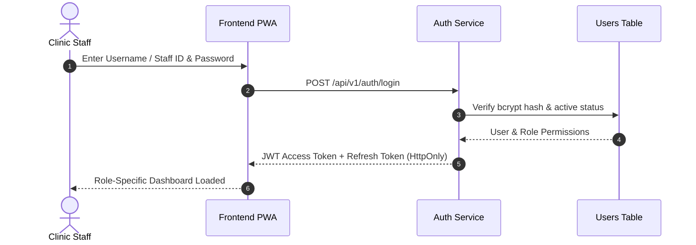

# 🔄 Workflow: Staff Authentication & Role-Based Session Workflow
## Namma Clinic Digital Health & Operations Platform
**Document Code:** WF-02 | **Status:** Approved Baseline | **Date:** September 2026

---

### 1. Workflow Overview & Architecture
This document defines the end-to-end operational, technical, and data flow for **Staff Authentication & Role-Based Session Workflow**.

### 2. Operational Specification
- **Primary Actors:** Frontline Clinic Staff (Nurse, Doctor, Pharmacist, Lab Tech, Patient)
- **Trigger:** Event initiation in clinic environment
- **Preconditions:** Active clinic session and verified user permissions
- **Security & RBAC:** Role-checked at API gateway and client UI state
- **Offline Resilience:** Local transaction persistence with deterministic sync queue
- **Audit Logging:** Emits structured immutable audit record upon state transition

### 3. Workflow Diagram & Sequence

### 4. Database & API Touchpoints
- **APIs Involved:** Dedicated REST endpoints with idempotency keys
- **Database Entities:** ACID transaction boundaries across core relational tables
- **Audit Events:** `AUDIT_EVENT_CREATED` recorded in `access_audit_logs`
