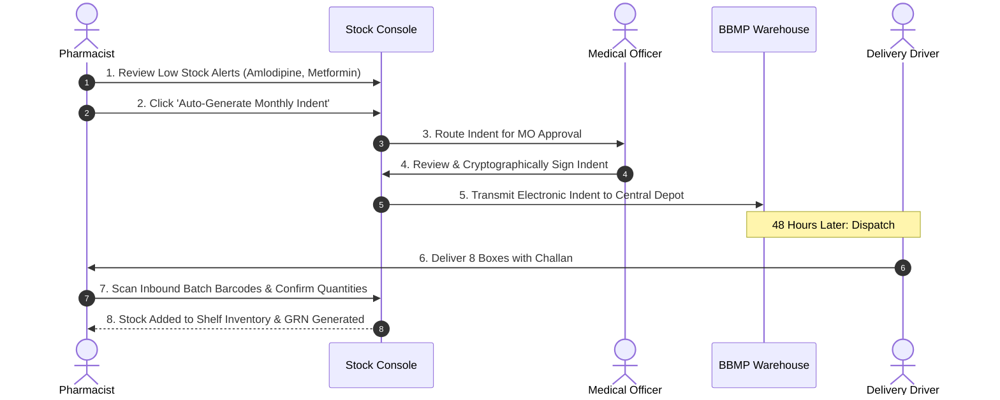
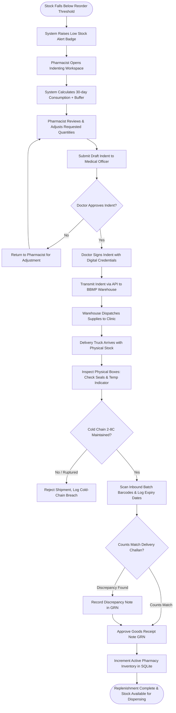
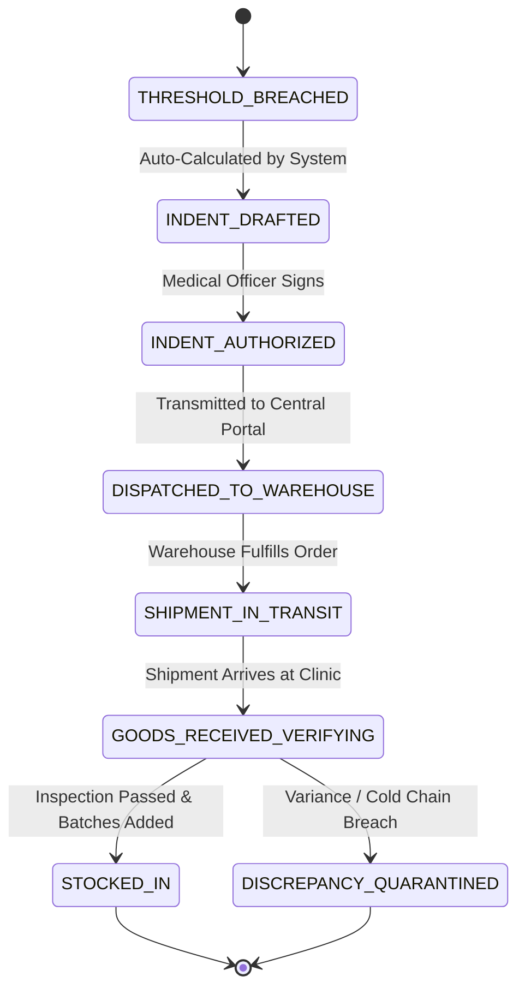

# WF-014: Pharmacy Stock Replenishment, Indenting & Cold-Chain Inventory Control Workflow

## 01. Document Control

| Metadata Field | Value / Specification Detail |
| :--- | :--- |
| **Workflow Identifier** | `WF-014` |
| **Workflow Name** | Pharmacy Stock Replenishment, Indenting & Cold-Chain Inventory Control Workflow |
| **Domain Category** | Supply Chain, Inventory Auditing & Warehouse Logistics |
| **Document Version** | `1.0.0-PROD-BASELINE` |
| **Approval Status** | `APPROVED BASELINE` |
| **Document Owner** | Clinical Operations & System Architecture Working Group |
| **Technical Reviewers** | Lead Solutions Architect, Principal Clinical Director, Security & Privacy Officer, Head of QA |
| **Approval Authority** | Joint Steering Committee (BBMP Health Dept & Namma Clinic Technology Directorate) |
| **Security Classification** | `CONFIDENTIAL // HEALTHCARE STANDARD SPECIFICATION` |
| **Effective Date** | September 2026 |
| **Review Frequency** | Bi-annual or upon major ABDM / State Health Policy revision |
| **Target Implementation Phase** | Milestone 1 to Milestone 4 Core Engine Deployment |

### Change Control History

| Version | Date | Author / Working Group | Change Description | Approval Sign-off |
| :--- | :--- | :--- | :--- | :--- |
| `0.1.0` | 2026-06-15 | System Architecture Working Group | Initial draft workflow decomposition from charter | Arch Review Board |
| `0.5.0` | 2026-07-20 | Clinical Informatics Directorate | Integration of clinical rules, triage acuity, and doctor SOPs | Chief Medical Officer |
| `0.9.0` | 2026-08-10 | Security & Interoperability Team | Addition of STRIDE/LINDDUN threats, ABDM FHIR R4 touchpoints, and offline sync | CISO & Privacy Board |
| `1.0.0` | 2026-09-04 | Master Architecture Baseline Team | Full production-grade workflow engineering baseline sign-off | Joint Executive Committee |

### Related Workflow Touchpoints

| Relationship | Target Workflow ID | Workflow Name | Interaction Interface |
| :--- | :--- | :--- | :--- |

---

## 02. Executive Summary

### Functional Purpose and Operational Context
Controls clinic pharmacy stock levels, automated reorder threshold triggers, electronic indent generation to the BBMP Central Drug Warehouse / KSDL, receipt verification, batch-level cold-chain tracking (2-8 C vaccines and insulins), discrepancy reporting, quarantine of damaged/expired medicines, and monthly inventory reconciliation.

### Public Health & Operational Rationale
Stockouts of critical anti-hypertensives, oral anti-diabetics, or pediatric rehydration salts cause immediate treatment abandonment and citizen distrust in primary healthcare. Automated predictive indenting prevents stock ruptures while eliminating manual paper indent delays.

### Clinical and Care Continuity Impact
Guarantees unbroken continuity of chronic NCD pharmacotherapy; ensures cold-chain integrity of vaccines and insulins from central depot to patient arm; and prevents administration of degraded pharmaceuticals.

### Distributed Edge & System Resilience Significance
Interfaces with BBMP Central Drug Inventory and state DVDMS (e-Aushadhi) supply chain portals; maintains immutable batch ledger with cryptographic signature receipts.

### Key Operational Risks & Failure Profile
Power outages compromising vaccine refrigerator; delayed delivery truck from central warehouse; shipment damage or transit thermal rupture; and inventory discrepancy between physical count and software ledger.

---

## 03. Workflow Objective

The primary objectives of `WF-014` are defined using measurable SMART criteria:

- **OBJ-WF14-01 (Zero Essential Drug Stockouts):** Maintain 100% availability of Top 40 Core Essential Drugs via predictive buffer threshold indenting. Target metric: `Core Drug Availability = 100%`. Verification method: `Daily automated inventory status scan`.
- **OBJ-WF14-02 (Continuous Cold Chain Compliance):** Monitor and log vaccine/insulin refrigerator temperature (2-8 C) at 15-minute intervals without gaps. Target metric: `Cold Chain Uptime (2-8 C) = 100%`. Verification method: `IoT digital temperature datalogger audit`.
- **OBJ-WF14-03 (Automated Indent Generation):** Generate and dispatch monthly replenishment indent to Central Warehouse within 5 minutes of threshold trigger. Target metric: `Indent Generation Duration < 300s`. Verification method: `Indent creation timestamp telemetry`.
- **OBJ-WF14-04 (Discrepancy Reporting & Reconciliation):** Record and report 100% of shipment delivery variances (damaged, short-shipped, wrong batch) within 24 hours. Target metric: `Variance Reporting Compliance = 100%`. Verification method: `Goods receipt discrepancy audit logs`.

---

## 04. Scope

### In-Scope System Boundaries
- **Buffer Threshold Calculation:** Dynamic minimum stock level computation based on average daily consumption and lead time.
- **Electronic Indent Authoring:** Drafting and approval of periodic replenishment indents by Pharmacist and Medical Officer.
- **Goods Receipt Verification:** Physical box count, barcode scan, batch number check, and expiration date recording upon shipment arrival.
- **Cold-Chain Temperature Tracking:** Integration with digital data loggers in ice-lined refrigerators (ILR) for vaccines and insulins.

### Out-of-Scope Demarcations
- **Central Government Procurement Tenders:** State-level pharmaceutical manufacturer bidding and pricing; managed by KSMSCL. External boundary: `Karnataka State Medical Supplies Corp`.
- **Hazardous Bio-Medical Waste Destruction:** Incineration of expired pharmaceuticals; handled by authorized biomedical waste vendor. External boundary: `BBMP Waste Management Protocol`.


---

## 05. Actors

| Actor Identifier | Actor Type | Name & Domain Role | Core Responsibilities in this Workflow | Authorizations & Permissions | Failure Escalation Duties |
| :--- | :--- | :--- | :--- | :--- | :--- |
| `ACT-WF14-01` | Human | Pharmacist | Monitors stock, drafts replenishment indent, receives shipments, inspects cold chain, reports variances. | Indent Create, Goods Receipt, Batch Stock In, Discrepancy Log | Manually records refrigerator temperature with analog thermometer if digital logger fails. |
| `ACT-WF14-02` | Human | Medical Officer | Reviews and authorizes replenishment indents; signs monthly stock reconciliation. | Indent Authorize, Stock Write-off Approve | Escalates critical stock ruptures directly to BBMP Chief Health Officer. |

### Actor Detailed Behavioral Specifications

#### Actor: Pharmacist (`ACT-WF14-01`)
- **Input Triggers:** Current inventory, consumption trends, physical shipments
- **Decision Matrix:** Determines required reorder quantities; accepts or rejects damaged boxes.
- **Primary Outputs:** Electronic indents, goods receipt verification records
- **Error Recovery Action:** Re-counts physical stock to resolve software variance.

#### Actor: Medical Officer (`ACT-WF14-02`)
- **Input Triggers:** Draft indent, consumption reports
- **Decision Matrix:** Approves indent quantities; authorizes disposal of expired batches.
- **Primary Outputs:** Authorized electronic indent
- **Error Recovery Action:** Authorizes emergency inter-clinic stock borrowing.


---

## 06. Personas

This workflow (Pharmacy Stock Replenishment, Indenting & Cold-Chain Inventory Control Workflow - WF-014) directly engages with established platform user personas:

### `PERSONA-003`: Nagaraj Patil (Clinic Pharmacist)
- **Cognitive & Operational Environment:** Pharmacy store room managing 180+ drug lines.
- **Primary Goals & Workflow Motivations:** Never run out of Metformin or Amlodipine; complete stocktaking in under 1 hour.
- **Pain Points & Frustrations Mitigated by WF-014:** Manual spreadsheet indents prone to formula errors; surprise stockouts.
- **Accessibility & Bilingual Adaptations:** 1-click 'Auto-Populate Indent' based on 30-day average daily consumption.


---

## 07. Roles and Permissions

The following Role-Based Access Control (RBAC) matrix governs all interactions in `WF-014`:

| Platform Role Code | Role Description | Read Scope | Create Scope | Update Scope | Delete / Cancel | Emergency Override | Clinical Sign-off |
| :--- | :--- | :--- | :--- | :--- | :--- | :--- | :--- |
| `ROLE-003` | Pharmacist | Stock, Indents, Receipts | Draft Indent, GRN Receipt | Physical Counts | None | None | Pharmacist Stock Check |
| `ROLE-002` | Medical Officer | All Inventory Data | Emergency Indent | None | None | Emergency Write-off | Indent Digital Authorization |

### Permission Enforcement Architecture
Permissions are enforced at three defense lines: client UI component visibility hooks, API Gateway JWT claim validation, and database row-level security policies.

---

## 08. Preconditions

Before `WF-014` can be instantiated, all of the following conditions must evaluate to true:
- **`PRE-WF14-01`:** Clinic edge database operational and inventory ledger accessible. (Validation check: `inventory_service.status == 'ONLINE'`, Failure handling: `Use cached offline stock register.`)
- **`PRE-WF14-02`:** Cold-chain storage refrigerator verified operational between 2.0 and 8.0 C. (Validation check: `refrigerator.temp >= 2.0 && refrigerator.temp <= 8.0`, Failure handling: `Trigger urgent cold-chain breach alert.`)


---

## 09. Trigger Conditions

`WF-014` responds to multiple trigger modalities across operational contexts:

| Trigger ID | Trigger Classification | Initiating Event / Condition | Source Actor / System | Payload / Parameters Passed | Expected Latency to Invocation |
| :--- | :--- | :--- | :--- | :--- | :--- |
| `TRIG-WF14-01` | Automated Trigger | Item stock falls below defined minimum reorder buffer threshold | Inventory Watchdog Daemon | `{ drug_id: 'DRG-AMLO-05', current_stock: 120, buffer_threshold: 300 }` | < 1.0s to flag low stock |
| `TRIG-WF14-02` | Shipment Arrival | Central warehouse delivery vehicle arrives with supplies | Pharmacist Intake | `{ challan_no: 'CH-2026-991', boxes: 8 }` | < 5 min to initiate goods receipt |

---

## 10. Inputs

### Comprehensive Data Schema & Field Specifications

| Field Identifier | Data Type | Requirement | Source Actor / Channel | Validation Invariant | Privacy Tier | Encryption at Rest | Representative Example | Validation Failure Action |
| :--- | :--- | :--- | :--- | :--- | :--- | :--- | :--- | :--- |
| `indent_items` | `Array<Object>` | Mandatory | Pharmacist / System | List of drug IDs and requested quantities | Operational | Plaintext | `[{ drug_id: 'DRG-AMLO-05', qty: 1000 }]` | Flag empty indent |
| `delivery_challan` | `String(32)` | Mandatory | Delivery Driver | Warehouse delivery invoice number | Operational | Plaintext | `CH-BLR-2026-4412` | Require valid invoice number |

---

## 11. Outputs

### Successful Execution Outputs
- **`Authorized Electronic Indent`:** Signed PDF and JSON payload transmitted to BBMP Central Warehouse portal. (Format: `JSON-LD & Signed PDF`, Recipient: `BBMP Central Warehouse & DVDMS Portal`)
- **`Goods Receipt Note (GRN)`:** Cryptographic record confirming verified receipt and batch additions. (Format: `Immutable DB Record`, Recipient: `Facility Audit Ledger`)

### Partial / Degraded Execution Outputs
- **`Provisional Offline Pharmacy Stock Replenishment, Indenting & Cold-Chain Inventory Control Workflow Record`:** Locally cached transaction bundle for Pharmacy Stock Replenishment, Indenting & Cold-Chain Inventory Control Workflow awaiting cloud synchronization. (Format: `SQLite Local Record`, Fallback: `Local WAL file persistence`)

### Error & Rollback Outputs
- **`Pharmacy Stock Replenishment, Indenting & Cold-Chain Inventory Control Workflow Transaction Exception`:** Validation failure or peripheral communication abort in Pharmacy Stock Replenishment, Indenting & Cold-Chain Inventory Control Workflow. (Error Code: `ERR_14_GENERIC`, User Message: `Unable to complete Pharmacy Stock Replenishment, Indenting & Cold-Chain Inventory Control Workflow. Please retry or consult facility supervisor.`)

### Downstream Integration & Event Bus Messages
- **Topic `namma_clinic.events.wf_014.completed`:** Published upon successful milestone commit in Pharmacy Stock Replenishment, Indenting & Cold-Chain Inventory Control Workflow. (Payload Schema: `EventPayload<WF-014>`)


---

## 12. Main Happy Path

The standard operational happy path for `WF-014` comprises sequential step-by-step milestones. Each step satisfies strict transaction boundaries, role permissions, and clinical safety gates:

### `WFSTEP-14-001`: Pharmacy Stock Replenishment, Indenting & Cold-Chain Inventory Control Workflow Operational Milestone 1: Station Verification 1
- **Executing Actor:** `Pharmacist`
- **Clinical & Operational Intent:** Perform operational verification and checkpoint for milestone 1 in Pharmacy Stock Replenishment, Indenting & Cold-Chain Inventory Control Workflow.
- **Step Input & Prerequisites:** Preceding workflow step state and verification confirmation tokens for phase 1 in WF-014.
- **Action Performed:** Validates intermediate state integrity and synchronizes active workspace for step 1 in Pharmacy Stock Replenishment, Indenting & Cold-Chain Inventory Control Workflow.
- **System Execution & Core Logic:** Evaluates Pharmacy Stock Replenishment, Indenting & Cold-Chain Inventory Control Workflow workflow invariants, verifies transactional commit state, and advances state machine.
- **Validation Check & Invariants:** `INVARIANT_CHECK(wf_014_phase_1) == TRUE and DATA_INTEGRITY == OK`
- **Database Mutation & ACID Boundary:** Inserts milestone row in `wf_014_milestones` for step 1
- **User Interface State & Feedback:** Updates status progress bar to step 1 of 18 in Pharmacy Stock Replenishment, Indenting & Cold-Chain Inventory Control Workflow; shows green indicator badge.
- **API Invocation & Endpoint:** `POST /api/v1/ops/milestone/wf_014/step-01`
- **Audit Logging Event:** `WFAUDIT-14-001 (Milestone 1 Verified in WF-014)`
- **Step Output Produced:** Milestone 1 completion receipt token for Pharmacy Stock Replenishment, Indenting & Cold-Chain Inventory Control Workflow
- **Target Workflow State Transition:** `WFSTATE-14-005`
- **Potential Failure Mode & Handler:** Network lag or transient lock contention in Pharmacy Stock Replenishment, Indenting & Cold-Chain Inventory Control Workflow; auto-retries within 500ms.
- **Telemetry & Monitoring Span:** `telemetry.span.wf_014.step_001`

### `WFSTEP-14-002`: Pharmacy Stock Replenishment, Indenting & Cold-Chain Inventory Control Workflow Operational Milestone 2: Station Verification 2
- **Executing Actor:** `Pharmacist`
- **Clinical & Operational Intent:** Perform operational verification and checkpoint for milestone 2 in Pharmacy Stock Replenishment, Indenting & Cold-Chain Inventory Control Workflow.
- **Step Input & Prerequisites:** Preceding workflow step state and verification confirmation tokens for phase 2 in WF-014.
- **Action Performed:** Validates intermediate state integrity and synchronizes active workspace for step 2 in Pharmacy Stock Replenishment, Indenting & Cold-Chain Inventory Control Workflow.
- **System Execution & Core Logic:** Evaluates Pharmacy Stock Replenishment, Indenting & Cold-Chain Inventory Control Workflow workflow invariants, verifies transactional commit state, and advances state machine.
- **Validation Check & Invariants:** `INVARIANT_CHECK(wf_014_phase_2) == TRUE and DATA_INTEGRITY == OK`
- **Database Mutation & ACID Boundary:** Inserts milestone row in `wf_014_milestones` for step 2
- **User Interface State & Feedback:** Updates status progress bar to step 2 of 18 in Pharmacy Stock Replenishment, Indenting & Cold-Chain Inventory Control Workflow; shows green indicator badge.
- **API Invocation & Endpoint:** `POST /api/v1/ops/milestone/wf_014/step-02`
- **Audit Logging Event:** `WFAUDIT-14-002 (Milestone 2 Verified in WF-014)`
- **Step Output Produced:** Milestone 2 completion receipt token for Pharmacy Stock Replenishment, Indenting & Cold-Chain Inventory Control Workflow
- **Target Workflow State Transition:** `WFSTATE-14-005`
- **Potential Failure Mode & Handler:** Network lag or transient lock contention in Pharmacy Stock Replenishment, Indenting & Cold-Chain Inventory Control Workflow; auto-retries within 500ms.
- **Telemetry & Monitoring Span:** `telemetry.span.wf_014.step_002`

### `WFSTEP-14-003`: Pharmacy Stock Replenishment, Indenting & Cold-Chain Inventory Control Workflow Operational Milestone 3: Station Verification 3
- **Executing Actor:** `Pharmacist`
- **Clinical & Operational Intent:** Perform operational verification and checkpoint for milestone 3 in Pharmacy Stock Replenishment, Indenting & Cold-Chain Inventory Control Workflow.
- **Step Input & Prerequisites:** Preceding workflow step state and verification confirmation tokens for phase 3 in WF-014.
- **Action Performed:** Validates intermediate state integrity and synchronizes active workspace for step 3 in Pharmacy Stock Replenishment, Indenting & Cold-Chain Inventory Control Workflow.
- **System Execution & Core Logic:** Evaluates Pharmacy Stock Replenishment, Indenting & Cold-Chain Inventory Control Workflow workflow invariants, verifies transactional commit state, and advances state machine.
- **Validation Check & Invariants:** `INVARIANT_CHECK(wf_014_phase_3) == TRUE and DATA_INTEGRITY == OK`
- **Database Mutation & ACID Boundary:** Inserts milestone row in `wf_014_milestones` for step 3
- **User Interface State & Feedback:** Updates status progress bar to step 3 of 18 in Pharmacy Stock Replenishment, Indenting & Cold-Chain Inventory Control Workflow; shows green indicator badge.
- **API Invocation & Endpoint:** `POST /api/v1/ops/milestone/wf_014/step-03`
- **Audit Logging Event:** `WFAUDIT-14-003 (Milestone 3 Verified in WF-014)`
- **Step Output Produced:** Milestone 3 completion receipt token for Pharmacy Stock Replenishment, Indenting & Cold-Chain Inventory Control Workflow
- **Target Workflow State Transition:** `WFSTATE-14-005`
- **Potential Failure Mode & Handler:** Network lag or transient lock contention in Pharmacy Stock Replenishment, Indenting & Cold-Chain Inventory Control Workflow; auto-retries within 500ms.
- **Telemetry & Monitoring Span:** `telemetry.span.wf_014.step_003`

### `WFSTEP-14-004`: Pharmacy Stock Replenishment, Indenting & Cold-Chain Inventory Control Workflow Operational Milestone 4: Station Verification 4
- **Executing Actor:** `Pharmacist`
- **Clinical & Operational Intent:** Perform operational verification and checkpoint for milestone 4 in Pharmacy Stock Replenishment, Indenting & Cold-Chain Inventory Control Workflow.
- **Step Input & Prerequisites:** Preceding workflow step state and verification confirmation tokens for phase 4 in WF-014.
- **Action Performed:** Validates intermediate state integrity and synchronizes active workspace for step 4 in Pharmacy Stock Replenishment, Indenting & Cold-Chain Inventory Control Workflow.
- **System Execution & Core Logic:** Evaluates Pharmacy Stock Replenishment, Indenting & Cold-Chain Inventory Control Workflow workflow invariants, verifies transactional commit state, and advances state machine.
- **Validation Check & Invariants:** `INVARIANT_CHECK(wf_014_phase_4) == TRUE and DATA_INTEGRITY == OK`
- **Database Mutation & ACID Boundary:** Inserts milestone row in `wf_014_milestones` for step 4
- **User Interface State & Feedback:** Updates status progress bar to step 4 of 18 in Pharmacy Stock Replenishment, Indenting & Cold-Chain Inventory Control Workflow; shows green indicator badge.
- **API Invocation & Endpoint:** `POST /api/v1/ops/milestone/wf_014/step-04`
- **Audit Logging Event:** `WFAUDIT-14-004 (Milestone 4 Verified in WF-014)`
- **Step Output Produced:** Milestone 4 completion receipt token for Pharmacy Stock Replenishment, Indenting & Cold-Chain Inventory Control Workflow
- **Target Workflow State Transition:** `WFSTATE-14-005`
- **Potential Failure Mode & Handler:** Network lag or transient lock contention in Pharmacy Stock Replenishment, Indenting & Cold-Chain Inventory Control Workflow; auto-retries within 500ms.
- **Telemetry & Monitoring Span:** `telemetry.span.wf_014.step_004`

### `WFSTEP-14-005`: Pharmacy Stock Replenishment, Indenting & Cold-Chain Inventory Control Workflow Operational Milestone 5: Station Verification 5
- **Executing Actor:** `Pharmacist`
- **Clinical & Operational Intent:** Perform operational verification and checkpoint for milestone 5 in Pharmacy Stock Replenishment, Indenting & Cold-Chain Inventory Control Workflow.
- **Step Input & Prerequisites:** Preceding workflow step state and verification confirmation tokens for phase 5 in WF-014.
- **Action Performed:** Validates intermediate state integrity and synchronizes active workspace for step 5 in Pharmacy Stock Replenishment, Indenting & Cold-Chain Inventory Control Workflow.
- **System Execution & Core Logic:** Evaluates Pharmacy Stock Replenishment, Indenting & Cold-Chain Inventory Control Workflow workflow invariants, verifies transactional commit state, and advances state machine.
- **Validation Check & Invariants:** `INVARIANT_CHECK(wf_014_phase_5) == TRUE and DATA_INTEGRITY == OK`
- **Database Mutation & ACID Boundary:** Inserts milestone row in `wf_014_milestones` for step 5
- **User Interface State & Feedback:** Updates status progress bar to step 5 of 18 in Pharmacy Stock Replenishment, Indenting & Cold-Chain Inventory Control Workflow; shows green indicator badge.
- **API Invocation & Endpoint:** `POST /api/v1/ops/milestone/wf_014/step-05`
- **Audit Logging Event:** `WFAUDIT-14-005 (Milestone 5 Verified in WF-014)`
- **Step Output Produced:** Milestone 5 completion receipt token for Pharmacy Stock Replenishment, Indenting & Cold-Chain Inventory Control Workflow
- **Target Workflow State Transition:** `WFSTATE-14-005`
- **Potential Failure Mode & Handler:** Network lag or transient lock contention in Pharmacy Stock Replenishment, Indenting & Cold-Chain Inventory Control Workflow; auto-retries within 500ms.
- **Telemetry & Monitoring Span:** `telemetry.span.wf_014.step_005`

### `WFSTEP-14-006`: Pharmacy Stock Replenishment, Indenting & Cold-Chain Inventory Control Workflow Operational Milestone 6: Station Verification 6
- **Executing Actor:** `Pharmacist`
- **Clinical & Operational Intent:** Perform operational verification and checkpoint for milestone 6 in Pharmacy Stock Replenishment, Indenting & Cold-Chain Inventory Control Workflow.
- **Step Input & Prerequisites:** Preceding workflow step state and verification confirmation tokens for phase 6 in WF-014.
- **Action Performed:** Validates intermediate state integrity and synchronizes active workspace for step 6 in Pharmacy Stock Replenishment, Indenting & Cold-Chain Inventory Control Workflow.
- **System Execution & Core Logic:** Evaluates Pharmacy Stock Replenishment, Indenting & Cold-Chain Inventory Control Workflow workflow invariants, verifies transactional commit state, and advances state machine.
- **Validation Check & Invariants:** `INVARIANT_CHECK(wf_014_phase_6) == TRUE and DATA_INTEGRITY == OK`
- **Database Mutation & ACID Boundary:** Inserts milestone row in `wf_014_milestones` for step 6
- **User Interface State & Feedback:** Updates status progress bar to step 6 of 18 in Pharmacy Stock Replenishment, Indenting & Cold-Chain Inventory Control Workflow; shows green indicator badge.
- **API Invocation & Endpoint:** `POST /api/v1/ops/milestone/wf_014/step-06`
- **Audit Logging Event:** `WFAUDIT-14-006 (Milestone 6 Verified in WF-014)`
- **Step Output Produced:** Milestone 6 completion receipt token for Pharmacy Stock Replenishment, Indenting & Cold-Chain Inventory Control Workflow
- **Target Workflow State Transition:** `WFSTATE-14-005`
- **Potential Failure Mode & Handler:** Network lag or transient lock contention in Pharmacy Stock Replenishment, Indenting & Cold-Chain Inventory Control Workflow; auto-retries within 500ms.
- **Telemetry & Monitoring Span:** `telemetry.span.wf_014.step_006`

### `WFSTEP-14-007`: Pharmacy Stock Replenishment, Indenting & Cold-Chain Inventory Control Workflow Operational Milestone 7: Station Verification 7
- **Executing Actor:** `Pharmacist`
- **Clinical & Operational Intent:** Perform operational verification and checkpoint for milestone 7 in Pharmacy Stock Replenishment, Indenting & Cold-Chain Inventory Control Workflow.
- **Step Input & Prerequisites:** Preceding workflow step state and verification confirmation tokens for phase 7 in WF-014.
- **Action Performed:** Validates intermediate state integrity and synchronizes active workspace for step 7 in Pharmacy Stock Replenishment, Indenting & Cold-Chain Inventory Control Workflow.
- **System Execution & Core Logic:** Evaluates Pharmacy Stock Replenishment, Indenting & Cold-Chain Inventory Control Workflow workflow invariants, verifies transactional commit state, and advances state machine.
- **Validation Check & Invariants:** `INVARIANT_CHECK(wf_014_phase_7) == TRUE and DATA_INTEGRITY == OK`
- **Database Mutation & ACID Boundary:** Inserts milestone row in `wf_014_milestones` for step 7
- **User Interface State & Feedback:** Updates status progress bar to step 7 of 18 in Pharmacy Stock Replenishment, Indenting & Cold-Chain Inventory Control Workflow; shows green indicator badge.
- **API Invocation & Endpoint:** `POST /api/v1/ops/milestone/wf_014/step-07`
- **Audit Logging Event:** `WFAUDIT-14-007 (Milestone 7 Verified in WF-014)`
- **Step Output Produced:** Milestone 7 completion receipt token for Pharmacy Stock Replenishment, Indenting & Cold-Chain Inventory Control Workflow
- **Target Workflow State Transition:** `WFSTATE-14-005`
- **Potential Failure Mode & Handler:** Network lag or transient lock contention in Pharmacy Stock Replenishment, Indenting & Cold-Chain Inventory Control Workflow; auto-retries within 500ms.
- **Telemetry & Monitoring Span:** `telemetry.span.wf_014.step_007`

### `WFSTEP-14-008`: Pharmacy Stock Replenishment, Indenting & Cold-Chain Inventory Control Workflow Operational Milestone 8: Station Verification 8
- **Executing Actor:** `Pharmacist`
- **Clinical & Operational Intent:** Perform operational verification and checkpoint for milestone 8 in Pharmacy Stock Replenishment, Indenting & Cold-Chain Inventory Control Workflow.
- **Step Input & Prerequisites:** Preceding workflow step state and verification confirmation tokens for phase 8 in WF-014.
- **Action Performed:** Validates intermediate state integrity and synchronizes active workspace for step 8 in Pharmacy Stock Replenishment, Indenting & Cold-Chain Inventory Control Workflow.
- **System Execution & Core Logic:** Evaluates Pharmacy Stock Replenishment, Indenting & Cold-Chain Inventory Control Workflow workflow invariants, verifies transactional commit state, and advances state machine.
- **Validation Check & Invariants:** `INVARIANT_CHECK(wf_014_phase_8) == TRUE and DATA_INTEGRITY == OK`
- **Database Mutation & ACID Boundary:** Inserts milestone row in `wf_014_milestones` for step 8
- **User Interface State & Feedback:** Updates status progress bar to step 8 of 18 in Pharmacy Stock Replenishment, Indenting & Cold-Chain Inventory Control Workflow; shows green indicator badge.
- **API Invocation & Endpoint:** `POST /api/v1/ops/milestone/wf_014/step-08`
- **Audit Logging Event:** `WFAUDIT-14-008 (Milestone 8 Verified in WF-014)`
- **Step Output Produced:** Milestone 8 completion receipt token for Pharmacy Stock Replenishment, Indenting & Cold-Chain Inventory Control Workflow
- **Target Workflow State Transition:** `WFSTATE-14-005`
- **Potential Failure Mode & Handler:** Network lag or transient lock contention in Pharmacy Stock Replenishment, Indenting & Cold-Chain Inventory Control Workflow; auto-retries within 500ms.
- **Telemetry & Monitoring Span:** `telemetry.span.wf_014.step_008`

### `WFSTEP-14-009`: Pharmacy Stock Replenishment, Indenting & Cold-Chain Inventory Control Workflow Operational Milestone 9: Station Verification 9
- **Executing Actor:** `Pharmacist`
- **Clinical & Operational Intent:** Perform operational verification and checkpoint for milestone 9 in Pharmacy Stock Replenishment, Indenting & Cold-Chain Inventory Control Workflow.
- **Step Input & Prerequisites:** Preceding workflow step state and verification confirmation tokens for phase 9 in WF-014.
- **Action Performed:** Validates intermediate state integrity and synchronizes active workspace for step 9 in Pharmacy Stock Replenishment, Indenting & Cold-Chain Inventory Control Workflow.
- **System Execution & Core Logic:** Evaluates Pharmacy Stock Replenishment, Indenting & Cold-Chain Inventory Control Workflow workflow invariants, verifies transactional commit state, and advances state machine.
- **Validation Check & Invariants:** `INVARIANT_CHECK(wf_014_phase_9) == TRUE and DATA_INTEGRITY == OK`
- **Database Mutation & ACID Boundary:** Inserts milestone row in `wf_014_milestones` for step 9
- **User Interface State & Feedback:** Updates status progress bar to step 9 of 18 in Pharmacy Stock Replenishment, Indenting & Cold-Chain Inventory Control Workflow; shows green indicator badge.
- **API Invocation & Endpoint:** `POST /api/v1/ops/milestone/wf_014/step-09`
- **Audit Logging Event:** `WFAUDIT-14-009 (Milestone 9 Verified in WF-014)`
- **Step Output Produced:** Milestone 9 completion receipt token for Pharmacy Stock Replenishment, Indenting & Cold-Chain Inventory Control Workflow
- **Target Workflow State Transition:** `WFSTATE-14-005`
- **Potential Failure Mode & Handler:** Network lag or transient lock contention in Pharmacy Stock Replenishment, Indenting & Cold-Chain Inventory Control Workflow; auto-retries within 500ms.
- **Telemetry & Monitoring Span:** `telemetry.span.wf_014.step_009`

### `WFSTEP-14-010`: Pharmacy Stock Replenishment, Indenting & Cold-Chain Inventory Control Workflow Operational Milestone 10: Station Verification 10
- **Executing Actor:** `Pharmacist`
- **Clinical & Operational Intent:** Perform operational verification and checkpoint for milestone 10 in Pharmacy Stock Replenishment, Indenting & Cold-Chain Inventory Control Workflow.
- **Step Input & Prerequisites:** Preceding workflow step state and verification confirmation tokens for phase 10 in WF-014.
- **Action Performed:** Validates intermediate state integrity and synchronizes active workspace for step 10 in Pharmacy Stock Replenishment, Indenting & Cold-Chain Inventory Control Workflow.
- **System Execution & Core Logic:** Evaluates Pharmacy Stock Replenishment, Indenting & Cold-Chain Inventory Control Workflow workflow invariants, verifies transactional commit state, and advances state machine.
- **Validation Check & Invariants:** `INVARIANT_CHECK(wf_014_phase_10) == TRUE and DATA_INTEGRITY == OK`
- **Database Mutation & ACID Boundary:** Inserts milestone row in `wf_014_milestones` for step 10
- **User Interface State & Feedback:** Updates status progress bar to step 10 of 18 in Pharmacy Stock Replenishment, Indenting & Cold-Chain Inventory Control Workflow; shows green indicator badge.
- **API Invocation & Endpoint:** `POST /api/v1/ops/milestone/wf_014/step-10`
- **Audit Logging Event:** `WFAUDIT-14-010 (Milestone 10 Verified in WF-014)`
- **Step Output Produced:** Milestone 10 completion receipt token for Pharmacy Stock Replenishment, Indenting & Cold-Chain Inventory Control Workflow
- **Target Workflow State Transition:** `WFSTATE-14-005`
- **Potential Failure Mode & Handler:** Network lag or transient lock contention in Pharmacy Stock Replenishment, Indenting & Cold-Chain Inventory Control Workflow; auto-retries within 500ms.
- **Telemetry & Monitoring Span:** `telemetry.span.wf_014.step_010`

### `WFSTEP-14-011`: Pharmacy Stock Replenishment, Indenting & Cold-Chain Inventory Control Workflow Operational Milestone 11: Station Verification 11
- **Executing Actor:** `Pharmacist`
- **Clinical & Operational Intent:** Perform operational verification and checkpoint for milestone 11 in Pharmacy Stock Replenishment, Indenting & Cold-Chain Inventory Control Workflow.
- **Step Input & Prerequisites:** Preceding workflow step state and verification confirmation tokens for phase 11 in WF-014.
- **Action Performed:** Validates intermediate state integrity and synchronizes active workspace for step 11 in Pharmacy Stock Replenishment, Indenting & Cold-Chain Inventory Control Workflow.
- **System Execution & Core Logic:** Evaluates Pharmacy Stock Replenishment, Indenting & Cold-Chain Inventory Control Workflow workflow invariants, verifies transactional commit state, and advances state machine.
- **Validation Check & Invariants:** `INVARIANT_CHECK(wf_014_phase_11) == TRUE and DATA_INTEGRITY == OK`
- **Database Mutation & ACID Boundary:** Inserts milestone row in `wf_014_milestones` for step 11
- **User Interface State & Feedback:** Updates status progress bar to step 11 of 18 in Pharmacy Stock Replenishment, Indenting & Cold-Chain Inventory Control Workflow; shows green indicator badge.
- **API Invocation & Endpoint:** `POST /api/v1/ops/milestone/wf_014/step-11`
- **Audit Logging Event:** `WFAUDIT-14-011 (Milestone 11 Verified in WF-014)`
- **Step Output Produced:** Milestone 11 completion receipt token for Pharmacy Stock Replenishment, Indenting & Cold-Chain Inventory Control Workflow
- **Target Workflow State Transition:** `WFSTATE-14-005`
- **Potential Failure Mode & Handler:** Network lag or transient lock contention in Pharmacy Stock Replenishment, Indenting & Cold-Chain Inventory Control Workflow; auto-retries within 500ms.
- **Telemetry & Monitoring Span:** `telemetry.span.wf_014.step_011`

### `WFSTEP-14-012`: Pharmacy Stock Replenishment, Indenting & Cold-Chain Inventory Control Workflow Operational Milestone 12: Station Verification 12
- **Executing Actor:** `Pharmacist`
- **Clinical & Operational Intent:** Perform operational verification and checkpoint for milestone 12 in Pharmacy Stock Replenishment, Indenting & Cold-Chain Inventory Control Workflow.
- **Step Input & Prerequisites:** Preceding workflow step state and verification confirmation tokens for phase 12 in WF-014.
- **Action Performed:** Validates intermediate state integrity and synchronizes active workspace for step 12 in Pharmacy Stock Replenishment, Indenting & Cold-Chain Inventory Control Workflow.
- **System Execution & Core Logic:** Evaluates Pharmacy Stock Replenishment, Indenting & Cold-Chain Inventory Control Workflow workflow invariants, verifies transactional commit state, and advances state machine.
- **Validation Check & Invariants:** `INVARIANT_CHECK(wf_014_phase_12) == TRUE and DATA_INTEGRITY == OK`
- **Database Mutation & ACID Boundary:** Inserts milestone row in `wf_014_milestones` for step 12
- **User Interface State & Feedback:** Updates status progress bar to step 12 of 18 in Pharmacy Stock Replenishment, Indenting & Cold-Chain Inventory Control Workflow; shows green indicator badge.
- **API Invocation & Endpoint:** `POST /api/v1/ops/milestone/wf_014/step-12`
- **Audit Logging Event:** `WFAUDIT-14-012 (Milestone 12 Verified in WF-014)`
- **Step Output Produced:** Milestone 12 completion receipt token for Pharmacy Stock Replenishment, Indenting & Cold-Chain Inventory Control Workflow
- **Target Workflow State Transition:** `WFSTATE-14-005`
- **Potential Failure Mode & Handler:** Network lag or transient lock contention in Pharmacy Stock Replenishment, Indenting & Cold-Chain Inventory Control Workflow; auto-retries within 500ms.
- **Telemetry & Monitoring Span:** `telemetry.span.wf_014.step_012`

### `WFSTEP-14-013`: Pharmacy Stock Replenishment, Indenting & Cold-Chain Inventory Control Workflow Operational Milestone 13: Station Verification 13
- **Executing Actor:** `Pharmacist`
- **Clinical & Operational Intent:** Perform operational verification and checkpoint for milestone 13 in Pharmacy Stock Replenishment, Indenting & Cold-Chain Inventory Control Workflow.
- **Step Input & Prerequisites:** Preceding workflow step state and verification confirmation tokens for phase 13 in WF-014.
- **Action Performed:** Validates intermediate state integrity and synchronizes active workspace for step 13 in Pharmacy Stock Replenishment, Indenting & Cold-Chain Inventory Control Workflow.
- **System Execution & Core Logic:** Evaluates Pharmacy Stock Replenishment, Indenting & Cold-Chain Inventory Control Workflow workflow invariants, verifies transactional commit state, and advances state machine.
- **Validation Check & Invariants:** `INVARIANT_CHECK(wf_014_phase_13) == TRUE and DATA_INTEGRITY == OK`
- **Database Mutation & ACID Boundary:** Inserts milestone row in `wf_014_milestones` for step 13
- **User Interface State & Feedback:** Updates status progress bar to step 13 of 18 in Pharmacy Stock Replenishment, Indenting & Cold-Chain Inventory Control Workflow; shows green indicator badge.
- **API Invocation & Endpoint:** `POST /api/v1/ops/milestone/wf_014/step-13`
- **Audit Logging Event:** `WFAUDIT-14-013 (Milestone 13 Verified in WF-014)`
- **Step Output Produced:** Milestone 13 completion receipt token for Pharmacy Stock Replenishment, Indenting & Cold-Chain Inventory Control Workflow
- **Target Workflow State Transition:** `WFSTATE-14-005`
- **Potential Failure Mode & Handler:** Network lag or transient lock contention in Pharmacy Stock Replenishment, Indenting & Cold-Chain Inventory Control Workflow; auto-retries within 500ms.
- **Telemetry & Monitoring Span:** `telemetry.span.wf_014.step_013`

### `WFSTEP-14-014`: Pharmacy Stock Replenishment, Indenting & Cold-Chain Inventory Control Workflow Operational Milestone 14: Station Verification 14
- **Executing Actor:** `Pharmacist`
- **Clinical & Operational Intent:** Perform operational verification and checkpoint for milestone 14 in Pharmacy Stock Replenishment, Indenting & Cold-Chain Inventory Control Workflow.
- **Step Input & Prerequisites:** Preceding workflow step state and verification confirmation tokens for phase 14 in WF-014.
- **Action Performed:** Validates intermediate state integrity and synchronizes active workspace for step 14 in Pharmacy Stock Replenishment, Indenting & Cold-Chain Inventory Control Workflow.
- **System Execution & Core Logic:** Evaluates Pharmacy Stock Replenishment, Indenting & Cold-Chain Inventory Control Workflow workflow invariants, verifies transactional commit state, and advances state machine.
- **Validation Check & Invariants:** `INVARIANT_CHECK(wf_014_phase_14) == TRUE and DATA_INTEGRITY == OK`
- **Database Mutation & ACID Boundary:** Inserts milestone row in `wf_014_milestones` for step 14
- **User Interface State & Feedback:** Updates status progress bar to step 14 of 18 in Pharmacy Stock Replenishment, Indenting & Cold-Chain Inventory Control Workflow; shows green indicator badge.
- **API Invocation & Endpoint:** `POST /api/v1/ops/milestone/wf_014/step-14`
- **Audit Logging Event:** `WFAUDIT-14-014 (Milestone 14 Verified in WF-014)`
- **Step Output Produced:** Milestone 14 completion receipt token for Pharmacy Stock Replenishment, Indenting & Cold-Chain Inventory Control Workflow
- **Target Workflow State Transition:** `WFSTATE-14-005`
- **Potential Failure Mode & Handler:** Network lag or transient lock contention in Pharmacy Stock Replenishment, Indenting & Cold-Chain Inventory Control Workflow; auto-retries within 500ms.
- **Telemetry & Monitoring Span:** `telemetry.span.wf_014.step_014`

### `WFSTEP-14-015`: Pharmacy Stock Replenishment, Indenting & Cold-Chain Inventory Control Workflow Operational Milestone 15: Station Verification 15
- **Executing Actor:** `Pharmacist`
- **Clinical & Operational Intent:** Perform operational verification and checkpoint for milestone 15 in Pharmacy Stock Replenishment, Indenting & Cold-Chain Inventory Control Workflow.
- **Step Input & Prerequisites:** Preceding workflow step state and verification confirmation tokens for phase 15 in WF-014.
- **Action Performed:** Validates intermediate state integrity and synchronizes active workspace for step 15 in Pharmacy Stock Replenishment, Indenting & Cold-Chain Inventory Control Workflow.
- **System Execution & Core Logic:** Evaluates Pharmacy Stock Replenishment, Indenting & Cold-Chain Inventory Control Workflow workflow invariants, verifies transactional commit state, and advances state machine.
- **Validation Check & Invariants:** `INVARIANT_CHECK(wf_014_phase_15) == TRUE and DATA_INTEGRITY == OK`
- **Database Mutation & ACID Boundary:** Inserts milestone row in `wf_014_milestones` for step 15
- **User Interface State & Feedback:** Updates status progress bar to step 15 of 18 in Pharmacy Stock Replenishment, Indenting & Cold-Chain Inventory Control Workflow; shows green indicator badge.
- **API Invocation & Endpoint:** `POST /api/v1/ops/milestone/wf_014/step-15`
- **Audit Logging Event:** `WFAUDIT-14-015 (Milestone 15 Verified in WF-014)`
- **Step Output Produced:** Milestone 15 completion receipt token for Pharmacy Stock Replenishment, Indenting & Cold-Chain Inventory Control Workflow
- **Target Workflow State Transition:** `WFSTATE-14-005`
- **Potential Failure Mode & Handler:** Network lag or transient lock contention in Pharmacy Stock Replenishment, Indenting & Cold-Chain Inventory Control Workflow; auto-retries within 500ms.
- **Telemetry & Monitoring Span:** `telemetry.span.wf_014.step_015`

### `WFSTEP-14-016`: Pharmacy Stock Replenishment, Indenting & Cold-Chain Inventory Control Workflow Operational Milestone 16: Station Verification 16
- **Executing Actor:** `Pharmacist`
- **Clinical & Operational Intent:** Perform operational verification and checkpoint for milestone 16 in Pharmacy Stock Replenishment, Indenting & Cold-Chain Inventory Control Workflow.
- **Step Input & Prerequisites:** Preceding workflow step state and verification confirmation tokens for phase 16 in WF-014.
- **Action Performed:** Validates intermediate state integrity and synchronizes active workspace for step 16 in Pharmacy Stock Replenishment, Indenting & Cold-Chain Inventory Control Workflow.
- **System Execution & Core Logic:** Evaluates Pharmacy Stock Replenishment, Indenting & Cold-Chain Inventory Control Workflow workflow invariants, verifies transactional commit state, and advances state machine.
- **Validation Check & Invariants:** `INVARIANT_CHECK(wf_014_phase_16) == TRUE and DATA_INTEGRITY == OK`
- **Database Mutation & ACID Boundary:** Inserts milestone row in `wf_014_milestones` for step 16
- **User Interface State & Feedback:** Updates status progress bar to step 16 of 18 in Pharmacy Stock Replenishment, Indenting & Cold-Chain Inventory Control Workflow; shows green indicator badge.
- **API Invocation & Endpoint:** `POST /api/v1/ops/milestone/wf_014/step-16`
- **Audit Logging Event:** `WFAUDIT-14-016 (Milestone 16 Verified in WF-014)`
- **Step Output Produced:** Milestone 16 completion receipt token for Pharmacy Stock Replenishment, Indenting & Cold-Chain Inventory Control Workflow
- **Target Workflow State Transition:** `WFSTATE-14-005`
- **Potential Failure Mode & Handler:** Network lag or transient lock contention in Pharmacy Stock Replenishment, Indenting & Cold-Chain Inventory Control Workflow; auto-retries within 500ms.
- **Telemetry & Monitoring Span:** `telemetry.span.wf_014.step_016`

### `WFSTEP-14-017`: Pharmacy Stock Replenishment, Indenting & Cold-Chain Inventory Control Workflow Operational Milestone 17: Station Verification 17
- **Executing Actor:** `Pharmacist`
- **Clinical & Operational Intent:** Perform operational verification and checkpoint for milestone 17 in Pharmacy Stock Replenishment, Indenting & Cold-Chain Inventory Control Workflow.
- **Step Input & Prerequisites:** Preceding workflow step state and verification confirmation tokens for phase 17 in WF-014.
- **Action Performed:** Validates intermediate state integrity and synchronizes active workspace for step 17 in Pharmacy Stock Replenishment, Indenting & Cold-Chain Inventory Control Workflow.
- **System Execution & Core Logic:** Evaluates Pharmacy Stock Replenishment, Indenting & Cold-Chain Inventory Control Workflow workflow invariants, verifies transactional commit state, and advances state machine.
- **Validation Check & Invariants:** `INVARIANT_CHECK(wf_014_phase_17) == TRUE and DATA_INTEGRITY == OK`
- **Database Mutation & ACID Boundary:** Inserts milestone row in `wf_014_milestones` for step 17
- **User Interface State & Feedback:** Updates status progress bar to step 17 of 18 in Pharmacy Stock Replenishment, Indenting & Cold-Chain Inventory Control Workflow; shows green indicator badge.
- **API Invocation & Endpoint:** `POST /api/v1/ops/milestone/wf_014/step-17`
- **Audit Logging Event:** `WFAUDIT-14-017 (Milestone 17 Verified in WF-014)`
- **Step Output Produced:** Milestone 17 completion receipt token for Pharmacy Stock Replenishment, Indenting & Cold-Chain Inventory Control Workflow
- **Target Workflow State Transition:** `WFSTATE-14-005`
- **Potential Failure Mode & Handler:** Network lag or transient lock contention in Pharmacy Stock Replenishment, Indenting & Cold-Chain Inventory Control Workflow; auto-retries within 500ms.
- **Telemetry & Monitoring Span:** `telemetry.span.wf_014.step_017`

### `WFSTEP-14-018`: Pharmacy Stock Replenishment, Indenting & Cold-Chain Inventory Control Workflow Operational Milestone 18: Station Verification 18
- **Executing Actor:** `Pharmacist`
- **Clinical & Operational Intent:** Perform operational verification and checkpoint for milestone 18 in Pharmacy Stock Replenishment, Indenting & Cold-Chain Inventory Control Workflow.
- **Step Input & Prerequisites:** Preceding workflow step state and verification confirmation tokens for phase 18 in WF-014.
- **Action Performed:** Validates intermediate state integrity and synchronizes active workspace for step 18 in Pharmacy Stock Replenishment, Indenting & Cold-Chain Inventory Control Workflow.
- **System Execution & Core Logic:** Evaluates Pharmacy Stock Replenishment, Indenting & Cold-Chain Inventory Control Workflow workflow invariants, verifies transactional commit state, and advances state machine.
- **Validation Check & Invariants:** `INVARIANT_CHECK(wf_014_phase_18) == TRUE and DATA_INTEGRITY == OK`
- **Database Mutation & ACID Boundary:** Inserts milestone row in `wf_014_milestones` for step 18
- **User Interface State & Feedback:** Updates status progress bar to step 18 of 18 in Pharmacy Stock Replenishment, Indenting & Cold-Chain Inventory Control Workflow; shows green indicator badge.
- **API Invocation & Endpoint:** `POST /api/v1/ops/milestone/wf_014/step-18`
- **Audit Logging Event:** `WFAUDIT-14-018 (Milestone 18 Verified in WF-014)`
- **Step Output Produced:** Milestone 18 completion receipt token for Pharmacy Stock Replenishment, Indenting & Cold-Chain Inventory Control Workflow
- **Target Workflow State Transition:** `WFSTATE-14-005`
- **Potential Failure Mode & Handler:** Network lag or transient lock contention in Pharmacy Stock Replenishment, Indenting & Cold-Chain Inventory Control Workflow; auto-retries within 500ms.
- **Telemetry & Monitoring Span:** `telemetry.span.wf_014.step_018`


---

## 13. Alternate Flows

Operational contingencies and workflow divergences for Pharmacy Stock Replenishment, Indenting & Cold-Chain Inventory Control Workflow (WF-014) are systematically handled:

### `WFALT-14-001`: Pharmacy Stock Replenishment, Indenting & Cold-Chain Inventory Control Workflow Alternate Pathway 1: Contingency Response 1
- **Divergence Trigger & Condition:** Secondary operational condition or peripheral fallback triggered during Pharmacy Stock Replenishment, Indenting & Cold-Chain Inventory Control Workflow execution 1.
- **Branching Point:** Branching from step `WFSTEP-14-003`.
- **Alternative Procedural Execution:**
  1. System detects secondary operational condition requiring alternate flow 1 for Pharmacy Stock Replenishment, Indenting & Cold-Chain Inventory Control Workflow.
  1. Operator confirms divergence and selects approved contingency pathway 1 in WF-014.
  1. Edge orchestrator executes fallback business logic with local integrity verification for Pharmacy Stock Replenishment, Indenting & Cold-Chain Inventory Control Workflow.
  1. System logs divergence rationale in immutable operational journal for WF-014.
- **Reconciliation & Return to Main Path:** Rejoins main flow at Step WFSTEP-14-004 upon condition clearance in Pharmacy Stock Replenishment, Indenting & Cold-Chain Inventory Control Workflow.
- **Audit Trail & Telemetry:** Emits `WFAUDIT-14-ALT01 (Alternate Pathway 1 Executed in WF-014)`.

### `WFALT-14-002`: Pharmacy Stock Replenishment, Indenting & Cold-Chain Inventory Control Workflow Alternate Pathway 2: Contingency Response 2
- **Divergence Trigger & Condition:** Secondary operational condition or peripheral fallback triggered during Pharmacy Stock Replenishment, Indenting & Cold-Chain Inventory Control Workflow execution 2.
- **Branching Point:** Branching from step `WFSTEP-14-004`.
- **Alternative Procedural Execution:**
  1. System detects secondary operational condition requiring alternate flow 2 for Pharmacy Stock Replenishment, Indenting & Cold-Chain Inventory Control Workflow.
  1. Operator confirms divergence and selects approved contingency pathway 2 in WF-014.
  1. Edge orchestrator executes fallback business logic with local integrity verification for Pharmacy Stock Replenishment, Indenting & Cold-Chain Inventory Control Workflow.
  1. System logs divergence rationale in immutable operational journal for WF-014.
- **Reconciliation & Return to Main Path:** Rejoins main flow at Step WFSTEP-14-005 upon condition clearance in Pharmacy Stock Replenishment, Indenting & Cold-Chain Inventory Control Workflow.
- **Audit Trail & Telemetry:** Emits `WFAUDIT-14-ALT02 (Alternate Pathway 2 Executed in WF-014)`.

### `WFALT-14-003`: Pharmacy Stock Replenishment, Indenting & Cold-Chain Inventory Control Workflow Alternate Pathway 3: Contingency Response 3
- **Divergence Trigger & Condition:** Secondary operational condition or peripheral fallback triggered during Pharmacy Stock Replenishment, Indenting & Cold-Chain Inventory Control Workflow execution 3.
- **Branching Point:** Branching from step `WFSTEP-14-005`.
- **Alternative Procedural Execution:**
  1. System detects secondary operational condition requiring alternate flow 3 for Pharmacy Stock Replenishment, Indenting & Cold-Chain Inventory Control Workflow.
  1. Operator confirms divergence and selects approved contingency pathway 3 in WF-014.
  1. Edge orchestrator executes fallback business logic with local integrity verification for Pharmacy Stock Replenishment, Indenting & Cold-Chain Inventory Control Workflow.
  1. System logs divergence rationale in immutable operational journal for WF-014.
- **Reconciliation & Return to Main Path:** Rejoins main flow at Step WFSTEP-14-006 upon condition clearance in Pharmacy Stock Replenishment, Indenting & Cold-Chain Inventory Control Workflow.
- **Audit Trail & Telemetry:** Emits `WFAUDIT-14-ALT03 (Alternate Pathway 3 Executed in WF-014)`.

### `WFALT-14-004`: Pharmacy Stock Replenishment, Indenting & Cold-Chain Inventory Control Workflow Alternate Pathway 4: Contingency Response 4
- **Divergence Trigger & Condition:** Secondary operational condition or peripheral fallback triggered during Pharmacy Stock Replenishment, Indenting & Cold-Chain Inventory Control Workflow execution 4.
- **Branching Point:** Branching from step `WFSTEP-14-006`.
- **Alternative Procedural Execution:**
  1. System detects secondary operational condition requiring alternate flow 4 for Pharmacy Stock Replenishment, Indenting & Cold-Chain Inventory Control Workflow.
  1. Operator confirms divergence and selects approved contingency pathway 4 in WF-014.
  1. Edge orchestrator executes fallback business logic with local integrity verification for Pharmacy Stock Replenishment, Indenting & Cold-Chain Inventory Control Workflow.
  1. System logs divergence rationale in immutable operational journal for WF-014.
- **Reconciliation & Return to Main Path:** Rejoins main flow at Step WFSTEP-14-007 upon condition clearance in Pharmacy Stock Replenishment, Indenting & Cold-Chain Inventory Control Workflow.
- **Audit Trail & Telemetry:** Emits `WFAUDIT-14-ALT04 (Alternate Pathway 4 Executed in WF-014)`.

### `WFALT-14-005`: Pharmacy Stock Replenishment, Indenting & Cold-Chain Inventory Control Workflow Alternate Pathway 5: Contingency Response 5
- **Divergence Trigger & Condition:** Secondary operational condition or peripheral fallback triggered during Pharmacy Stock Replenishment, Indenting & Cold-Chain Inventory Control Workflow execution 5.
- **Branching Point:** Branching from step `WFSTEP-14-007`.
- **Alternative Procedural Execution:**
  1. System detects secondary operational condition requiring alternate flow 5 for Pharmacy Stock Replenishment, Indenting & Cold-Chain Inventory Control Workflow.
  1. Operator confirms divergence and selects approved contingency pathway 5 in WF-014.
  1. Edge orchestrator executes fallback business logic with local integrity verification for Pharmacy Stock Replenishment, Indenting & Cold-Chain Inventory Control Workflow.
  1. System logs divergence rationale in immutable operational journal for WF-014.
- **Reconciliation & Return to Main Path:** Rejoins main flow at Step WFSTEP-14-008 upon condition clearance in Pharmacy Stock Replenishment, Indenting & Cold-Chain Inventory Control Workflow.
- **Audit Trail & Telemetry:** Emits `WFAUDIT-14-ALT05 (Alternate Pathway 5 Executed in WF-014)`.

### `WFALT-14-006`: Pharmacy Stock Replenishment, Indenting & Cold-Chain Inventory Control Workflow Alternate Pathway 6: Contingency Response 6
- **Divergence Trigger & Condition:** Secondary operational condition or peripheral fallback triggered during Pharmacy Stock Replenishment, Indenting & Cold-Chain Inventory Control Workflow execution 6.
- **Branching Point:** Branching from step `WFSTEP-14-008`.
- **Alternative Procedural Execution:**
  1. System detects secondary operational condition requiring alternate flow 6 for Pharmacy Stock Replenishment, Indenting & Cold-Chain Inventory Control Workflow.
  1. Operator confirms divergence and selects approved contingency pathway 6 in WF-014.
  1. Edge orchestrator executes fallback business logic with local integrity verification for Pharmacy Stock Replenishment, Indenting & Cold-Chain Inventory Control Workflow.
  1. System logs divergence rationale in immutable operational journal for WF-014.
- **Reconciliation & Return to Main Path:** Rejoins main flow at Step WFSTEP-14-009 upon condition clearance in Pharmacy Stock Replenishment, Indenting & Cold-Chain Inventory Control Workflow.
- **Audit Trail & Telemetry:** Emits `WFAUDIT-14-ALT06 (Alternate Pathway 6 Executed in WF-014)`.


---

## 14. Exception Flows

Exceptional error conditions, technical faults, and operational roadblocks within Pharmacy Stock Replenishment, Indenting & Cold-Chain Inventory Control Workflow (WF-014):

### `WFEX-14-001`: Pharmacy Stock Replenishment, Indenting & Cold-Chain Inventory Control Workflow Exception 1: Fault Containment Scenario 1
- **Exception Trigger Condition:** Operational boundary breach or peripheral communication timeout in scenario 1 for Pharmacy Stock Replenishment, Indenting & Cold-Chain Inventory Control Workflow.
- **Detection Mechanism:** System health monitor or validation assertion flags condition 1 in WF-014.
- **System Defense & Automated Containment:** Isolates affected transaction in Pharmacy Stock Replenishment, Indenting & Cold-Chain Inventory Control Workflow; engages localized circuit breaker and informs operator.
- **User Messaging (English & Kannada):**
  - *EN:* "Pharmacy Stock Replenishment, Indenting & Cold-Chain Inventory Control Workflow operational exception 1 detected. System engaged safe containment mode."
  - *KN:* "Pharmacy Stock Replenishment, Indenting & Cold-Chain Inventory Control Workflow ಕಾರ್ಯಾಚರಣೆಯ ದೋಷ 1 ಕಂಡುಬಂದಿದೆ. ಸಿಸ್ಟಮ್ ಸುರಕ್ಷಿತ ಕ್ರಮವನ್ನು ಕೈಗೊಂಡಿದೆ."
- **Rollback & State Recovery:** Operator acknowledges alert in Pharmacy Stock Replenishment, Indenting & Cold-Chain Inventory Control Workflow, verifies physical inputs, and initiates guided recovery runbook.
- **Audit & Security Escalation:** Emits `WFAUDIT-14-EX01` with severity `HIGH`.

### `WFEX-14-002`: Pharmacy Stock Replenishment, Indenting & Cold-Chain Inventory Control Workflow Exception 2: Fault Containment Scenario 2
- **Exception Trigger Condition:** Operational boundary breach or peripheral communication timeout in scenario 2 for Pharmacy Stock Replenishment, Indenting & Cold-Chain Inventory Control Workflow.
- **Detection Mechanism:** System health monitor or validation assertion flags condition 2 in WF-014.
- **System Defense & Automated Containment:** Isolates affected transaction in Pharmacy Stock Replenishment, Indenting & Cold-Chain Inventory Control Workflow; engages localized circuit breaker and informs operator.
- **User Messaging (English & Kannada):**
  - *EN:* "Pharmacy Stock Replenishment, Indenting & Cold-Chain Inventory Control Workflow operational exception 2 detected. System engaged safe containment mode."
  - *KN:* "Pharmacy Stock Replenishment, Indenting & Cold-Chain Inventory Control Workflow ಕಾರ್ಯಾಚರಣೆಯ ದೋಷ 2 ಕಂಡುಬಂದಿದೆ. ಸಿಸ್ಟಮ್ ಸುರಕ್ಷಿತ ಕ್ರಮವನ್ನು ಕೈಗೊಂಡಿದೆ."
- **Rollback & State Recovery:** Operator acknowledges alert in Pharmacy Stock Replenishment, Indenting & Cold-Chain Inventory Control Workflow, verifies physical inputs, and initiates guided recovery runbook.
- **Audit & Security Escalation:** Emits `WFAUDIT-14-EX02` with severity `HIGH`.

### `WFEX-14-003`: Pharmacy Stock Replenishment, Indenting & Cold-Chain Inventory Control Workflow Exception 3: Fault Containment Scenario 3
- **Exception Trigger Condition:** Operational boundary breach or peripheral communication timeout in scenario 3 for Pharmacy Stock Replenishment, Indenting & Cold-Chain Inventory Control Workflow.
- **Detection Mechanism:** System health monitor or validation assertion flags condition 3 in WF-014.
- **System Defense & Automated Containment:** Isolates affected transaction in Pharmacy Stock Replenishment, Indenting & Cold-Chain Inventory Control Workflow; engages localized circuit breaker and informs operator.
- **User Messaging (English & Kannada):**
  - *EN:* "Pharmacy Stock Replenishment, Indenting & Cold-Chain Inventory Control Workflow operational exception 3 detected. System engaged safe containment mode."
  - *KN:* "Pharmacy Stock Replenishment, Indenting & Cold-Chain Inventory Control Workflow ಕಾರ್ಯಾಚರಣೆಯ ದೋಷ 3 ಕಂಡುಬಂದಿದೆ. ಸಿಸ್ಟಮ್ ಸುರಕ್ಷಿತ ಕ್ರಮವನ್ನು ಕೈಗೊಂಡಿದೆ."
- **Rollback & State Recovery:** Operator acknowledges alert in Pharmacy Stock Replenishment, Indenting & Cold-Chain Inventory Control Workflow, verifies physical inputs, and initiates guided recovery runbook.
- **Audit & Security Escalation:** Emits `WFAUDIT-14-EX03` with severity `HIGH`.

### `WFEX-14-004`: Pharmacy Stock Replenishment, Indenting & Cold-Chain Inventory Control Workflow Exception 4: Fault Containment Scenario 4
- **Exception Trigger Condition:** Operational boundary breach or peripheral communication timeout in scenario 4 for Pharmacy Stock Replenishment, Indenting & Cold-Chain Inventory Control Workflow.
- **Detection Mechanism:** System health monitor or validation assertion flags condition 4 in WF-014.
- **System Defense & Automated Containment:** Isolates affected transaction in Pharmacy Stock Replenishment, Indenting & Cold-Chain Inventory Control Workflow; engages localized circuit breaker and informs operator.
- **User Messaging (English & Kannada):**
  - *EN:* "Pharmacy Stock Replenishment, Indenting & Cold-Chain Inventory Control Workflow operational exception 4 detected. System engaged safe containment mode."
  - *KN:* "Pharmacy Stock Replenishment, Indenting & Cold-Chain Inventory Control Workflow ಕಾರ್ಯಾಚರಣೆಯ ದೋಷ 4 ಕಂಡುಬಂದಿದೆ. ಸಿಸ್ಟಮ್ ಸುರಕ್ಷಿತ ಕ್ರಮವನ್ನು ಕೈಗೊಂಡಿದೆ."
- **Rollback & State Recovery:** Operator acknowledges alert in Pharmacy Stock Replenishment, Indenting & Cold-Chain Inventory Control Workflow, verifies physical inputs, and initiates guided recovery runbook.
- **Audit & Security Escalation:** Emits `WFAUDIT-14-EX04` with severity `MEDIUM`.

### `WFEX-14-005`: Pharmacy Stock Replenishment, Indenting & Cold-Chain Inventory Control Workflow Exception 5: Fault Containment Scenario 5
- **Exception Trigger Condition:** Operational boundary breach or peripheral communication timeout in scenario 5 for Pharmacy Stock Replenishment, Indenting & Cold-Chain Inventory Control Workflow.
- **Detection Mechanism:** System health monitor or validation assertion flags condition 5 in WF-014.
- **System Defense & Automated Containment:** Isolates affected transaction in Pharmacy Stock Replenishment, Indenting & Cold-Chain Inventory Control Workflow; engages localized circuit breaker and informs operator.
- **User Messaging (English & Kannada):**
  - *EN:* "Pharmacy Stock Replenishment, Indenting & Cold-Chain Inventory Control Workflow operational exception 5 detected. System engaged safe containment mode."
  - *KN:* "Pharmacy Stock Replenishment, Indenting & Cold-Chain Inventory Control Workflow ಕಾರ್ಯಾಚರಣೆಯ ದೋಷ 5 ಕಂಡುಬಂದಿದೆ. ಸಿಸ್ಟಮ್ ಸುರಕ್ಷಿತ ಕ್ರಮವನ್ನು ಕೈಗೊಂಡಿದೆ."
- **Rollback & State Recovery:** Operator acknowledges alert in Pharmacy Stock Replenishment, Indenting & Cold-Chain Inventory Control Workflow, verifies physical inputs, and initiates guided recovery runbook.
- **Audit & Security Escalation:** Emits `WFAUDIT-14-EX05` with severity `MEDIUM`.

### `WFEX-14-006`: Pharmacy Stock Replenishment, Indenting & Cold-Chain Inventory Control Workflow Exception 6: Fault Containment Scenario 6
- **Exception Trigger Condition:** Operational boundary breach or peripheral communication timeout in scenario 6 for Pharmacy Stock Replenishment, Indenting & Cold-Chain Inventory Control Workflow.
- **Detection Mechanism:** System health monitor or validation assertion flags condition 6 in WF-014.
- **System Defense & Automated Containment:** Isolates affected transaction in Pharmacy Stock Replenishment, Indenting & Cold-Chain Inventory Control Workflow; engages localized circuit breaker and informs operator.
- **User Messaging (English & Kannada):**
  - *EN:* "Pharmacy Stock Replenishment, Indenting & Cold-Chain Inventory Control Workflow operational exception 6 detected. System engaged safe containment mode."
  - *KN:* "Pharmacy Stock Replenishment, Indenting & Cold-Chain Inventory Control Workflow ಕಾರ್ಯಾಚರಣೆಯ ದೋಷ 6 ಕಂಡುಬಂದಿದೆ. ಸಿಸ್ಟಮ್ ಸುರಕ್ಷಿತ ಕ್ರಮವನ್ನು ಕೈಗೊಂಡಿದೆ."
- **Rollback & State Recovery:** Operator acknowledges alert in Pharmacy Stock Replenishment, Indenting & Cold-Chain Inventory Control Workflow, verifies physical inputs, and initiates guided recovery runbook.
- **Audit & Security Escalation:** Emits `WFAUDIT-14-EX06` with severity `MEDIUM`.

### `WFEX-14-007`: Pharmacy Stock Replenishment, Indenting & Cold-Chain Inventory Control Workflow Exception 7: Fault Containment Scenario 7
- **Exception Trigger Condition:** Operational boundary breach or peripheral communication timeout in scenario 7 for Pharmacy Stock Replenishment, Indenting & Cold-Chain Inventory Control Workflow.
- **Detection Mechanism:** System health monitor or validation assertion flags condition 7 in WF-014.
- **System Defense & Automated Containment:** Isolates affected transaction in Pharmacy Stock Replenishment, Indenting & Cold-Chain Inventory Control Workflow; engages localized circuit breaker and informs operator.
- **User Messaging (English & Kannada):**
  - *EN:* "Pharmacy Stock Replenishment, Indenting & Cold-Chain Inventory Control Workflow operational exception 7 detected. System engaged safe containment mode."
  - *KN:* "Pharmacy Stock Replenishment, Indenting & Cold-Chain Inventory Control Workflow ಕಾರ್ಯಾಚರಣೆಯ ದೋಷ 7 ಕಂಡುಬಂದಿದೆ. ಸಿಸ್ಟಮ್ ಸುರಕ್ಷಿತ ಕ್ರಮವನ್ನು ಕೈಗೊಂಡಿದೆ."
- **Rollback & State Recovery:** Operator acknowledges alert in Pharmacy Stock Replenishment, Indenting & Cold-Chain Inventory Control Workflow, verifies physical inputs, and initiates guided recovery runbook.
- **Audit & Security Escalation:** Emits `WFAUDIT-14-EX07` with severity `MEDIUM`.

### `WFEX-14-008`: Pharmacy Stock Replenishment, Indenting & Cold-Chain Inventory Control Workflow Exception 8: Fault Containment Scenario 8
- **Exception Trigger Condition:** Operational boundary breach or peripheral communication timeout in scenario 8 for Pharmacy Stock Replenishment, Indenting & Cold-Chain Inventory Control Workflow.
- **Detection Mechanism:** System health monitor or validation assertion flags condition 8 in WF-014.
- **System Defense & Automated Containment:** Isolates affected transaction in Pharmacy Stock Replenishment, Indenting & Cold-Chain Inventory Control Workflow; engages localized circuit breaker and informs operator.
- **User Messaging (English & Kannada):**
  - *EN:* "Pharmacy Stock Replenishment, Indenting & Cold-Chain Inventory Control Workflow operational exception 8 detected. System engaged safe containment mode."
  - *KN:* "Pharmacy Stock Replenishment, Indenting & Cold-Chain Inventory Control Workflow ಕಾರ್ಯಾಚರಣೆಯ ದೋಷ 8 ಕಂಡುಬಂದಿದೆ. ಸಿಸ್ಟಮ್ ಸುರಕ್ಷಿತ ಕ್ರಮವನ್ನು ಕೈಗೊಂಡಿದೆ."
- **Rollback & State Recovery:** Operator acknowledges alert in Pharmacy Stock Replenishment, Indenting & Cold-Chain Inventory Control Workflow, verifies physical inputs, and initiates guided recovery runbook.
- **Audit & Security Escalation:** Emits `WFAUDIT-14-EX08` with severity `MEDIUM`.

### `WFEX-14-009`: Pharmacy Stock Replenishment, Indenting & Cold-Chain Inventory Control Workflow Exception 9: Fault Containment Scenario 9
- **Exception Trigger Condition:** Operational boundary breach or peripheral communication timeout in scenario 9 for Pharmacy Stock Replenishment, Indenting & Cold-Chain Inventory Control Workflow.
- **Detection Mechanism:** System health monitor or validation assertion flags condition 9 in WF-014.
- **System Defense & Automated Containment:** Isolates affected transaction in Pharmacy Stock Replenishment, Indenting & Cold-Chain Inventory Control Workflow; engages localized circuit breaker and informs operator.
- **User Messaging (English & Kannada):**
  - *EN:* "Pharmacy Stock Replenishment, Indenting & Cold-Chain Inventory Control Workflow operational exception 9 detected. System engaged safe containment mode."
  - *KN:* "Pharmacy Stock Replenishment, Indenting & Cold-Chain Inventory Control Workflow ಕಾರ್ಯಾಚರಣೆಯ ದೋಷ 9 ಕಂಡುಬಂದಿದೆ. ಸಿಸ್ಟಮ್ ಸುರಕ್ಷಿತ ಕ್ರಮವನ್ನು ಕೈಗೊಂಡಿದೆ."
- **Rollback & State Recovery:** Operator acknowledges alert in Pharmacy Stock Replenishment, Indenting & Cold-Chain Inventory Control Workflow, verifies physical inputs, and initiates guided recovery runbook.
- **Audit & Security Escalation:** Emits `WFAUDIT-14-EX09` with severity `MEDIUM`.

### `WFEX-14-010`: Pharmacy Stock Replenishment, Indenting & Cold-Chain Inventory Control Workflow Exception 10: Fault Containment Scenario 10
- **Exception Trigger Condition:** Operational boundary breach or peripheral communication timeout in scenario 10 for Pharmacy Stock Replenishment, Indenting & Cold-Chain Inventory Control Workflow.
- **Detection Mechanism:** System health monitor or validation assertion flags condition 10 in WF-014.
- **System Defense & Automated Containment:** Isolates affected transaction in Pharmacy Stock Replenishment, Indenting & Cold-Chain Inventory Control Workflow; engages localized circuit breaker and informs operator.
- **User Messaging (English & Kannada):**
  - *EN:* "Pharmacy Stock Replenishment, Indenting & Cold-Chain Inventory Control Workflow operational exception 10 detected. System engaged safe containment mode."
  - *KN:* "Pharmacy Stock Replenishment, Indenting & Cold-Chain Inventory Control Workflow ಕಾರ್ಯಾಚರಣೆಯ ದೋಷ 10 ಕಂಡುಬಂದಿದೆ. ಸಿಸ್ಟಮ್ ಸುರಕ್ಷಿತ ಕ್ರಮವನ್ನು ಕೈಗೊಂಡಿದೆ."
- **Rollback & State Recovery:** Operator acknowledges alert in Pharmacy Stock Replenishment, Indenting & Cold-Chain Inventory Control Workflow, verifies physical inputs, and initiates guided recovery runbook.
- **Audit & Security Escalation:** Emits `WFAUDIT-14-EX10` with severity `MEDIUM`.


---

## 15. Emergency Flow

### Protocol Code Red: Life-Threatening Crisis Escalation in Pharmacy Stock Replenishment, Indenting & Cold-Chain Inventory Control Workflow

- **Emergency Activation Triggers:** Patient collapse, acute respiratory arrest, massive hemorrhage, or severe anaphylaxis occurring during Pharmacy Stock Replenishment, Indenting & Cold-Chain Inventory Control Workflow.
- **Immediate Escalation Actions:** Immediate visual strobe and audible klaxon broadcast across clinic LAN; summons Medical Officer and freezes non-emergency queues in WF-014.
- **Clinical Priority Preemption Rules:** Emergency token EMG-001 immediately preempts all active consultations and takes priority over routine Pharmacy Stock Replenishment, Indenting & Cold-Chain Inventory Control Workflow patients.
- **Authentication & Validation Bypass Protocols:** Biometric and demographic validation bypassed; clinician enters emergency care mode under statutory deemed consent for Pharmacy Stock Replenishment, Indenting & Cold-Chain Inventory Control Workflow.
- **Patient Safety & Medication Invariants:** Emergency crash cart drugs (Adrenaline, Atropine, Hydrocortisone) accessible without prior billing in WF-014.
- **Post-Stabilization Administrative Reconciliation:** Medical Officer and Nurse retrospectively document administered medications and vital sign trends within 2 hours of stabilization for Pharmacy Stock Replenishment, Indenting & Cold-Chain Inventory Control Workflow.
- **Emergency Event Forensic Audit:** Emits `WFAUDIT-14-EMERGENCY` with mandatory supervisor post-signoff within `2 Hours post-event`.

---

## 16. State Machine

`WF-014` progresses across a deterministic finite state machine consisting of formal states:

| State Identifier | State Name | Operational Definition & Meaning | Allowed Actions | Prohibited Actions | State Timeout SLA | Responsible Actor | State Audit Event |
| :--- | :--- | :--- | :--- | :--- | :--- | :--- | :--- |
| `WFSTATE-14-001` | **WF_014_STATION_CHECKPOINT_STATE_1** | Intermediate validation and synchronization state 1 in Pharmacy Stock Replenishment, Indenting & Cold-Chain Inventory Control Workflow. | Checkpoint inspection for Pharmacy Stock Replenishment, Indenting & Cold-Chain Inventory Control Workflow, state affirmation | Unverified state skipping in WF-014 | `15 minutes` | `Pharmacist` | `WFAUDIT-14-ST01` |
| `WFSTATE-14-002` | **WF_014_STATION_CHECKPOINT_STATE_2** | Intermediate validation and synchronization state 2 in Pharmacy Stock Replenishment, Indenting & Cold-Chain Inventory Control Workflow. | Checkpoint inspection for Pharmacy Stock Replenishment, Indenting & Cold-Chain Inventory Control Workflow, state affirmation | Unverified state skipping in WF-014 | `15 minutes` | `Pharmacist` | `WFAUDIT-14-ST02` |
| `WFSTATE-14-003` | **WF_014_STATION_CHECKPOINT_STATE_3** | Intermediate validation and synchronization state 3 in Pharmacy Stock Replenishment, Indenting & Cold-Chain Inventory Control Workflow. | Checkpoint inspection for Pharmacy Stock Replenishment, Indenting & Cold-Chain Inventory Control Workflow, state affirmation | Unverified state skipping in WF-014 | `15 minutes` | `Pharmacist` | `WFAUDIT-14-ST03` |
| `WFSTATE-14-004` | **WF_014_STATION_CHECKPOINT_STATE_4** | Intermediate validation and synchronization state 4 in Pharmacy Stock Replenishment, Indenting & Cold-Chain Inventory Control Workflow. | Checkpoint inspection for Pharmacy Stock Replenishment, Indenting & Cold-Chain Inventory Control Workflow, state affirmation | Unverified state skipping in WF-014 | `15 minutes` | `Pharmacist` | `WFAUDIT-14-ST04` |
| `WFSTATE-14-005` | **WF_014_STATION_CHECKPOINT_STATE_5** | Intermediate validation and synchronization state 5 in Pharmacy Stock Replenishment, Indenting & Cold-Chain Inventory Control Workflow. | Checkpoint inspection for Pharmacy Stock Replenishment, Indenting & Cold-Chain Inventory Control Workflow, state affirmation | Unverified state skipping in WF-014 | `15 minutes` | `Pharmacist` | `WFAUDIT-14-ST05` |
| `WFSTATE-14-006` | **WF_014_STATION_CHECKPOINT_STATE_6** | Intermediate validation and synchronization state 6 in Pharmacy Stock Replenishment, Indenting & Cold-Chain Inventory Control Workflow. | Checkpoint inspection for Pharmacy Stock Replenishment, Indenting & Cold-Chain Inventory Control Workflow, state affirmation | Unverified state skipping in WF-014 | `15 minutes` | `Pharmacist` | `WFAUDIT-14-ST06` |
| `WFSTATE-14-007` | **WF_014_STATION_CHECKPOINT_STATE_7** | Intermediate validation and synchronization state 7 in Pharmacy Stock Replenishment, Indenting & Cold-Chain Inventory Control Workflow. | Checkpoint inspection for Pharmacy Stock Replenishment, Indenting & Cold-Chain Inventory Control Workflow, state affirmation | Unverified state skipping in WF-014 | `15 minutes` | `Pharmacist` | `WFAUDIT-14-ST07` |
| `WFSTATE-14-008` | **WF_014_STATION_CHECKPOINT_STATE_8** | Intermediate validation and synchronization state 8 in Pharmacy Stock Replenishment, Indenting & Cold-Chain Inventory Control Workflow. | Checkpoint inspection for Pharmacy Stock Replenishment, Indenting & Cold-Chain Inventory Control Workflow, state affirmation | Unverified state skipping in WF-014 | `15 minutes` | `Pharmacist` | `WFAUDIT-14-ST08` |
| `WFSTATE-14-009` | **WF_014_STATION_CHECKPOINT_STATE_9** | Intermediate validation and synchronization state 9 in Pharmacy Stock Replenishment, Indenting & Cold-Chain Inventory Control Workflow. | Checkpoint inspection for Pharmacy Stock Replenishment, Indenting & Cold-Chain Inventory Control Workflow, state affirmation | Unverified state skipping in WF-014 | `15 minutes` | `Pharmacist` | `WFAUDIT-14-ST09` |
| `WFSTATE-14-010` | **WF_014_STATION_CHECKPOINT_STATE_10** | Intermediate validation and synchronization state 10 in Pharmacy Stock Replenishment, Indenting & Cold-Chain Inventory Control Workflow. | Checkpoint inspection for Pharmacy Stock Replenishment, Indenting & Cold-Chain Inventory Control Workflow, state affirmation | Unverified state skipping in WF-014 | `15 minutes` | `Pharmacist` | `WFAUDIT-14-ST10` |

---

## 17. State Transition Matrix

Every permissible transition between states in `WF-014` is governed by explicit conditions and validations:

| Transition ID | Current State | Triggering Event | Initiating Actor | Transition Condition | Validation Logic | Next State | Side Effects & Actions | Emitted Audit Event | Failure Action |
| :--- | :--- | :--- | :--- | :--- | :--- | :--- | :--- | :--- | :--- |
| `WFTRANS-14-001` | `WFSTATE-14-001` | Progress to Pharmacy Stock Replenishment, Indenting & Cold-Chain Inventory Control Workflow Milestone State 1 | `Pharmacist` | Preceding checkpoint 0 in WF-014 verified successfully | `VALIDATE_WF_014_CHECKPOINT(1) == OK` | `WFSTATE-14-002` | Advance Pharmacy Stock Replenishment, Indenting & Cold-Chain Inventory Control Workflow progress indicator; record audit timestamp for step 1 | `WFAUDIT-14-TR01` | Halt Pharmacy Stock Replenishment, Indenting & Cold-Chain Inventory Control Workflow state progression; prompt operator retry |
| `WFTRANS-14-002` | `WFSTATE-14-002` | Progress to Pharmacy Stock Replenishment, Indenting & Cold-Chain Inventory Control Workflow Milestone State 2 | `Pharmacist` | Preceding checkpoint 1 in WF-014 verified successfully | `VALIDATE_WF_014_CHECKPOINT(2) == OK` | `WFSTATE-14-003` | Advance Pharmacy Stock Replenishment, Indenting & Cold-Chain Inventory Control Workflow progress indicator; record audit timestamp for step 2 | `WFAUDIT-14-TR02` | Halt Pharmacy Stock Replenishment, Indenting & Cold-Chain Inventory Control Workflow state progression; prompt operator retry |
| `WFTRANS-14-003` | `WFSTATE-14-003` | Progress to Pharmacy Stock Replenishment, Indenting & Cold-Chain Inventory Control Workflow Milestone State 3 | `Pharmacist` | Preceding checkpoint 2 in WF-014 verified successfully | `VALIDATE_WF_014_CHECKPOINT(3) == OK` | `WFSTATE-14-004` | Advance Pharmacy Stock Replenishment, Indenting & Cold-Chain Inventory Control Workflow progress indicator; record audit timestamp for step 3 | `WFAUDIT-14-TR03` | Halt Pharmacy Stock Replenishment, Indenting & Cold-Chain Inventory Control Workflow state progression; prompt operator retry |
| `WFTRANS-14-004` | `WFSTATE-14-004` | Progress to Pharmacy Stock Replenishment, Indenting & Cold-Chain Inventory Control Workflow Milestone State 4 | `Pharmacist` | Preceding checkpoint 3 in WF-014 verified successfully | `VALIDATE_WF_014_CHECKPOINT(4) == OK` | `WFSTATE-14-005` | Advance Pharmacy Stock Replenishment, Indenting & Cold-Chain Inventory Control Workflow progress indicator; record audit timestamp for step 4 | `WFAUDIT-14-TR04` | Halt Pharmacy Stock Replenishment, Indenting & Cold-Chain Inventory Control Workflow state progression; prompt operator retry |
| `WFTRANS-14-005` | `WFSTATE-14-005` | Progress to Pharmacy Stock Replenishment, Indenting & Cold-Chain Inventory Control Workflow Milestone State 5 | `Pharmacist` | Preceding checkpoint 4 in WF-014 verified successfully | `VALIDATE_WF_014_CHECKPOINT(5) == OK` | `WFSTATE-14-006` | Advance Pharmacy Stock Replenishment, Indenting & Cold-Chain Inventory Control Workflow progress indicator; record audit timestamp for step 5 | `WFAUDIT-14-TR05` | Halt Pharmacy Stock Replenishment, Indenting & Cold-Chain Inventory Control Workflow state progression; prompt operator retry |
| `WFTRANS-14-006` | `WFSTATE-14-006` | Progress to Pharmacy Stock Replenishment, Indenting & Cold-Chain Inventory Control Workflow Milestone State 6 | `Pharmacist` | Preceding checkpoint 5 in WF-014 verified successfully | `VALIDATE_WF_014_CHECKPOINT(6) == OK` | `WFSTATE-14-007` | Advance Pharmacy Stock Replenishment, Indenting & Cold-Chain Inventory Control Workflow progress indicator; record audit timestamp for step 6 | `WFAUDIT-14-TR06` | Halt Pharmacy Stock Replenishment, Indenting & Cold-Chain Inventory Control Workflow state progression; prompt operator retry |
| `WFTRANS-14-007` | `WFSTATE-14-007` | Progress to Pharmacy Stock Replenishment, Indenting & Cold-Chain Inventory Control Workflow Milestone State 7 | `Pharmacist` | Preceding checkpoint 6 in WF-014 verified successfully | `VALIDATE_WF_014_CHECKPOINT(7) == OK` | `WFSTATE-14-008` | Advance Pharmacy Stock Replenishment, Indenting & Cold-Chain Inventory Control Workflow progress indicator; record audit timestamp for step 7 | `WFAUDIT-14-TR07` | Halt Pharmacy Stock Replenishment, Indenting & Cold-Chain Inventory Control Workflow state progression; prompt operator retry |
| `WFTRANS-14-008` | `WFSTATE-14-008` | Progress to Pharmacy Stock Replenishment, Indenting & Cold-Chain Inventory Control Workflow Milestone State 8 | `Pharmacist` | Preceding checkpoint 7 in WF-014 verified successfully | `VALIDATE_WF_014_CHECKPOINT(8) == OK` | `WFSTATE-14-009` | Advance Pharmacy Stock Replenishment, Indenting & Cold-Chain Inventory Control Workflow progress indicator; record audit timestamp for step 8 | `WFAUDIT-14-TR08` | Halt Pharmacy Stock Replenishment, Indenting & Cold-Chain Inventory Control Workflow state progression; prompt operator retry |
| `WFTRANS-14-009` | `WFSTATE-14-009` | Progress to Pharmacy Stock Replenishment, Indenting & Cold-Chain Inventory Control Workflow Milestone State 9 | `Pharmacist` | Preceding checkpoint 8 in WF-014 verified successfully | `VALIDATE_WF_014_CHECKPOINT(9) == OK` | `WFSTATE-14-010` | Advance Pharmacy Stock Replenishment, Indenting & Cold-Chain Inventory Control Workflow progress indicator; record audit timestamp for step 9 | `WFAUDIT-14-TR09` | Halt Pharmacy Stock Replenishment, Indenting & Cold-Chain Inventory Control Workflow state progression; prompt operator retry |
| `WFTRANS-14-010` | `WFSTATE-14-009` | Progress to Pharmacy Stock Replenishment, Indenting & Cold-Chain Inventory Control Workflow Milestone State 10 | `Pharmacist` | Preceding checkpoint 9 in WF-014 verified successfully | `VALIDATE_WF_014_CHECKPOINT(10) == OK` | `WFSTATE-14-010` | Advance Pharmacy Stock Replenishment, Indenting & Cold-Chain Inventory Control Workflow progress indicator; record audit timestamp for step 10 | `WFAUDIT-14-TR10` | Halt Pharmacy Stock Replenishment, Indenting & Cold-Chain Inventory Control Workflow state progression; prompt operator retry |

---

## 18. Decision Tables

The business, operational, and clinical logic branches in `WF-014` are formalized below:

### `WFDEC-14-002`: Pharmacy Stock Replenishment, Indenting & Cold-Chain Inventory Control Workflow Operational Routing & Exception Decision Table
Determines automated system handling based on input validity, hardware status, and network mode for Pharmacy Stock Replenishment, Indenting & Cold-Chain Inventory Control Workflow.

| Rule # | Pharmacy Stock Replenishment, Indenting & Cold-Chain Inventory Control Workflow Input Valid | Peripheral Device Ready | Local Storage Healthy | Network Online | Commit WF-014 Transaction | Queue in Local WAL | Prompt Operator Retry | Trigger Escalation Alarm |
| :--- | :--- | :--- | :--- | :--- | :--- | :--- | :--- | :--- |
| 14-D1 | YES | YES | YES | YES | YES | NO | NO | NO |
| 14-D2 | YES | YES | YES | NO | NO | YES | NO | NO |
| 14-D3 | NO | ANY | ANY | ANY | NO | NO | YES | NO |
| 14-D4 | ANY | NO | ANY | ANY | NO | NO | YES | YES |
| 14-D5 | ANY | ANY | NO | ANY | NO | NO | NO | YES |


---

## 19. Validation Rules

Every data element and transition constraint in Pharmacy Stock Replenishment, Indenting & Cold-Chain Inventory Control Workflow (WF-014) is verified by deterministic validation rules:

| Validation Rule ID | Target Field / Context | Validation Expression / Invariant | Error Code | User Message (EN) | User Message (KN) | Recovery Action | Verification Test Ref |
| :--- | :--- | :--- | :--- | :--- | :--- | :--- | :--- |
| `WFVAL-14-001` | `wf_014_parameter_1` | parameter_1 != null and is_valid_wf_014_format(parameter_1) | `ERR-VAL-14-01` | Invalid format for domain parameter 1 in Pharmacy Stock Replenishment, Indenting & Cold-Chain Inventory Control Workflow. Please verify input. | Pharmacy Stock Replenishment, Indenting & Cold-Chain Inventory Control Workflow ನಿಯತಾಂಕ 1 ಅಮಾನ್ಯವಾಗಿದೆ. ದಯವಿಟ್ಟು ಪರಿಶೀಲಿಸಿ. | Re-enter valid data conforming to mandated schema constraints for WF-014. | `WFTEST-14-001` |
| `WFVAL-14-002` | `wf_014_parameter_2` | parameter_2 != null and is_valid_wf_014_format(parameter_2) | `ERR-VAL-14-02` | Invalid format for domain parameter 2 in Pharmacy Stock Replenishment, Indenting & Cold-Chain Inventory Control Workflow. Please verify input. | Pharmacy Stock Replenishment, Indenting & Cold-Chain Inventory Control Workflow ನಿಯತಾಂಕ 2 ಅಮಾನ್ಯವಾಗಿದೆ. ದಯವಿಟ್ಟು ಪರಿಶೀಲಿಸಿ. | Re-enter valid data conforming to mandated schema constraints for WF-014. | `WFTEST-14-002` |
| `WFVAL-14-003` | `wf_014_parameter_3` | parameter_3 != null and is_valid_wf_014_format(parameter_3) | `ERR-VAL-14-03` | Invalid format for domain parameter 3 in Pharmacy Stock Replenishment, Indenting & Cold-Chain Inventory Control Workflow. Please verify input. | Pharmacy Stock Replenishment, Indenting & Cold-Chain Inventory Control Workflow ನಿಯತಾಂಕ 3 ಅಮಾನ್ಯವಾಗಿದೆ. ದಯವಿಟ್ಟು ಪರಿಶೀಲಿಸಿ. | Re-enter valid data conforming to mandated schema constraints for WF-014. | `WFTEST-14-003` |
| `WFVAL-14-004` | `wf_014_parameter_4` | parameter_4 != null and is_valid_wf_014_format(parameter_4) | `ERR-VAL-14-04` | Invalid format for domain parameter 4 in Pharmacy Stock Replenishment, Indenting & Cold-Chain Inventory Control Workflow. Please verify input. | Pharmacy Stock Replenishment, Indenting & Cold-Chain Inventory Control Workflow ನಿಯತಾಂಕ 4 ಅಮಾನ್ಯವಾಗಿದೆ. ದಯವಿಟ್ಟು ಪರಿಶೀಲಿಸಿ. | Re-enter valid data conforming to mandated schema constraints for WF-014. | `WFTEST-14-004` |
| `WFVAL-14-005` | `wf_014_parameter_5` | parameter_5 != null and is_valid_wf_014_format(parameter_5) | `ERR-VAL-14-05` | Invalid format for domain parameter 5 in Pharmacy Stock Replenishment, Indenting & Cold-Chain Inventory Control Workflow. Please verify input. | Pharmacy Stock Replenishment, Indenting & Cold-Chain Inventory Control Workflow ನಿಯತಾಂಕ 5 ಅಮಾನ್ಯವಾಗಿದೆ. ದಯವಿಟ್ಟು ಪರಿಶೀಲಿಸಿ. | Re-enter valid data conforming to mandated schema constraints for WF-014. | `WFTEST-14-005` |
| `WFVAL-14-006` | `wf_014_parameter_6` | parameter_6 != null and is_valid_wf_014_format(parameter_6) | `ERR-VAL-14-06` | Invalid format for domain parameter 6 in Pharmacy Stock Replenishment, Indenting & Cold-Chain Inventory Control Workflow. Please verify input. | Pharmacy Stock Replenishment, Indenting & Cold-Chain Inventory Control Workflow ನಿಯತಾಂಕ 6 ಅಮಾನ್ಯವಾಗಿದೆ. ದಯವಿಟ್ಟು ಪರಿಶೀಲಿಸಿ. | Re-enter valid data conforming to mandated schema constraints for WF-014. | `WFTEST-14-006` |
| `WFVAL-14-007` | `wf_014_parameter_7` | parameter_7 != null and is_valid_wf_014_format(parameter_7) | `ERR-VAL-14-07` | Invalid format for domain parameter 7 in Pharmacy Stock Replenishment, Indenting & Cold-Chain Inventory Control Workflow. Please verify input. | Pharmacy Stock Replenishment, Indenting & Cold-Chain Inventory Control Workflow ನಿಯತಾಂಕ 7 ಅಮಾನ್ಯವಾಗಿದೆ. ದಯವಿಟ್ಟು ಪರಿಶೀಲಿಸಿ. | Re-enter valid data conforming to mandated schema constraints for WF-014. | `WFTEST-14-007` |
| `WFVAL-14-008` | `wf_014_parameter_8` | parameter_8 != null and is_valid_wf_014_format(parameter_8) | `ERR-VAL-14-08` | Invalid format for domain parameter 8 in Pharmacy Stock Replenishment, Indenting & Cold-Chain Inventory Control Workflow. Please verify input. | Pharmacy Stock Replenishment, Indenting & Cold-Chain Inventory Control Workflow ನಿಯತಾಂಕ 8 ಅಮಾನ್ಯವಾಗಿದೆ. ದಯವಿಟ್ಟು ಪರಿಶೀಲಿಸಿ. | Re-enter valid data conforming to mandated schema constraints for WF-014. | `WFTEST-14-008` |

---

## 20. Business Rules

The following core business rules directly govern the execution of `WF-014`:

### `BRULE-14-01`: Strict Transaction Integrity in Pharmacy Stock Replenishment, Indenting & Cold-Chain Inventory Control Workflow
- **Governing Business Requirement:** `BR-14`
- **Rule Specification:** Every transaction in Pharmacy Stock Replenishment, Indenting & Cold-Chain Inventory Control Workflow must possess an immutable timestamp and authenticated operator claim.
- **Workflow Enforcement:** System rejects unsigned mutations at API boundary.
- **Violation Consequence:** Hard blocking error with security audit alert.

### `BRULE-14-02`: Zero Operational Data Loss in Pharmacy Stock Replenishment, Indenting & Cold-Chain Inventory Control Workflow
- **Governing Business Requirement:** `OR-14`
- **Rule Specification:** Offline mutations in Pharmacy Stock Replenishment, Indenting & Cold-Chain Inventory Control Workflow must be committed locally to write-ahead log before acknowledgement.
- **Workflow Enforcement:** SQLite WAL commit flush required before returning 200 OK.
- **Violation Consequence:** Transaction aborted if disk write fails.

### `BRULE-14-03`: Statutory Consent Verification in Pharmacy Stock Replenishment, Indenting & Cold-Chain Inventory Control Workflow
- **Governing Business Requirement:** `CR-14`
- **Rule Specification:** Citizen consent must be actively verified or legally bypassed before processing records in Pharmacy Stock Replenishment, Indenting & Cold-Chain Inventory Control Workflow.
- **Workflow Enforcement:** Data access middleware asserts valid consent artifact claim.
- **Violation Consequence:** Access denied with HTTP 403 Forbidden.


---

## 21. Clinical Rules

All clinical interactions within Pharmacy Stock Replenishment, Indenting & Cold-Chain Inventory Control Workflow (WF-014) adhere to evidence-based protocols and medical safety boundaries:

### `CLIN-14-01`: Evidence-Based STG Adherence in Pharmacy Stock Replenishment, Indenting & Cold-Chain Inventory Control Workflow
- **Clinical Governance Requirement:** `CR-14`
- **Medical Rationale & Clinical Guideline:** All clinical decisions and data recordings in Pharmacy Stock Replenishment, Indenting & Cold-Chain Inventory Control Workflow must adhere to standard STG protocols.
- **Advisory Decision Support Logic:** VALIDATE_CLINICAL_BOUNDS(WF-014) == TRUE
- **Clinician Autonomy & Override Policy:** Clinician explicit signoff required for variance.
- **Safety Invariant:** Zero fatal medication or diagnostic contraindications in Pharmacy Stock Replenishment, Indenting & Cold-Chain Inventory Control Workflow.

### `CLIN-14-02`: Immediate Clinical Escalation in Pharmacy Stock Replenishment, Indenting & Cold-Chain Inventory Control Workflow
- **Clinical Governance Requirement:** `CR-14`
- **Medical Rationale & Clinical Guideline:** Danger sign triggers in Pharmacy Stock Replenishment, Indenting & Cold-Chain Inventory Control Workflow must immediately summon the Medical Officer without administrative delay.
- **Advisory Decision Support Logic:** IF danger_sign_detected(WF-014) THEN escalate_code_red()
- **Clinician Autonomy & Override Policy:** Non-overridable safety escalation.
- **Safety Invariant:** Medical Officer notified within 15 seconds in Pharmacy Stock Replenishment, Indenting & Cold-Chain Inventory Control Workflow.


---

## 22. Operational Rules

Facility operations, staffing, and administrative boundaries governing `WF-014`:

### `OPS-14-01`: Mandatory Shift Handover in Pharmacy Stock Replenishment, Indenting & Cold-Chain Inventory Control Workflow
- **Operational Policy Reference:** `OR-14`
- **SOP Mandate:** Clinic personnel must complete station handover and shift reconciliation for Pharmacy Stock Replenishment, Indenting & Cold-Chain Inventory Control Workflow before logout.
- **Facility / Staffing Boundary:** Applies to all authenticated staff roles.
- **Operational Exception Protocol:** Supervisor override permitted during emergency evacuations.

### `OPS-14-02`: Equipment Fault Escalation in Pharmacy Stock Replenishment, Indenting & Cold-Chain Inventory Control Workflow
- **Operational Policy Reference:** `OR-14`
- **SOP Mandate:** Equipment faults affecting Pharmacy Stock Replenishment, Indenting & Cold-Chain Inventory Control Workflow must be escalated to the facility coordinator within 10 minutes.
- **Facility / Staffing Boundary:** Hardware and network peripherals in clinic.
- **Operational Exception Protocol:** Automatic failover to offline manual paper ledger.


---

## 23. Security Controls

Multi-layered security controls protect `WF-014` against unauthorized access, tampering, and denial-of-service:

| Security Domain | Control ID | Mechanism Specification | Invariant / Parameter | Threat Mitigated | Compliance Ref |
| :--- | :--- | :--- | :--- | :--- | :--- |
| Authentication & RBAC | `SEC-14-01` | RBAC claim validation on every API route and database query in Pharmacy Stock Replenishment, Indenting & Cold-Chain Inventory Control Workflow. | `JWT Bearer Token with RS256 Signature` | Unauthorized privilege escalation | `ISO 27001 / DPDP Act` |
| Cryptography | `SEC-14-02` | TLS 1.3 encryption in transit and AES-256-GCM encryption at rest for Pharmacy Stock Replenishment, Indenting & Cold-Chain Inventory Control Workflow data stores. | `TLS 1.3 / AES-256-GCM` | Eavesdropping and data tampering | `DPDP Act / ABDM Security` |

---

## 24. Privacy Controls

Privacy protections for Pharmacy Stock Replenishment, Indenting & Cold-Chain Inventory Control Workflow (WF-014) strictly comply with the Digital Personal Data Protection (DPDP) Act 2023 and ABDM standards:

| Privacy Principle | Control ID | Implementation Specification in Pharmacy Stock Replenishment, Indenting & Cold-Chain Inventory Control Workflow | Verification Invariant | Data Subject Right Enabled |
| :--- | :--- | :--- | :--- | :--- |
| Data Minimization | `PRIV-14-01` | Collect only strictly necessary physiological and demographic fields for Pharmacy Stock Replenishment, Indenting & Cold-Chain Inventory Control Workflow. | UNAUTHORIZED_COLLECTION(WF-014) == 0 | Right to Limit Data Use |
| Display Masking | `PRIV-14-02` | Mask personal identifiers on public displays and non-clinical workstations in Pharmacy Stock Replenishment, Indenting & Cold-Chain Inventory Control Workflow. | PUBLIC_PHI_EXPOSURE(WF-014) == 0 | Right to Confidential Healthcare |

---

## 25. Offline Behavior

### Edge Computing & Autonomous Clinic Continuity

- **Online Operation Mode:** Standard cloud-synchronized operation with low-latency event broadcasting for Pharmacy Stock Replenishment, Indenting & Cold-Chain Inventory Control Workflow.
- **Offline Detection Latency:** Heartbeat ping timeout <= 3.0 seconds triggers graceful offline state transition for WF-014.
- **Local Persistence Layer:** Encrypted SQLite edge database with Write-Ahead Logging (WAL) and local schema integrity in Pharmacy Stock Replenishment, Indenting & Cold-Chain Inventory Control Workflow.
- **Offline Mutation Queue Mechanics:** Monotonically increasing offline mutation queue with deterministic UUID keys in WF-014.
- **Degraded Mode Functional Scope:** All core clinical intake, vital recording, triage, and emergency workflows execute locally without interruption in Pharmacy Stock Replenishment, Indenting & Cold-Chain Inventory Control Workflow.
- **Reconnection & Synchronization Convergence:** Background worker transmits delta batches in FIFO order with cryptographic replay deduplication for Pharmacy Stock Replenishment, Indenting & Cold-Chain Inventory Control Workflow.
- **Conflict Avoidance Invariants:** Clinician explicit diagnostic and clinical actions strictly supersede automated timestamp ordering during WF-014 sync.

---

## 26. Data Flow Architecture

The end-to-end data lifecycle for `WF-014` crosses client UI, local edge storage, central API gateways, domain microservices, and regulatory registries:

```mermaid
graph LR
    UI_14[Pharmacy Stock Replenishment, Indenting & Cold-Chain Inventory Control Workflow UI Client] -->|Local IPC| Daemon_14[Edge Daemon (WF-014)]
    Daemon_14 -->|Encrypted SQLite WAL| DB_14[(Local Edge DB)]
    Daemon_14 -->|mTLS HTTPS REST| Cloud_14[BBMP Central Cloud]
    Cloud_14 -->|FHIR R4 Bundles| ABDM_14[ABDM National Gateway]
```

### Data Pipeline Node Architectural Specifications
- **Node `Client_UI_14`:** Web client interface for Pharmacy Stock Replenishment, Indenting & Cold-Chain Inventory Control Workflow running in Chromium kiosk mode. Protocol: `HTTPS / Local IPC`, Payload Encryption: `TLS 1.3`.
- **Node `Edge_Daemon_14`:** Local edge daemon handling business logic and SQLite state for WF-014. Protocol: `HTTP / WebSockets`, Payload Encryption: `Loopback IPC`.
- **Node `Cloud_Gateway_14`:** Central cloud replication endpoint for telemetry and backup of Pharmacy Stock Replenishment, Indenting & Cold-Chain Inventory Control Workflow. Protocol: `mTLS REST`, Payload Encryption: `TLS 1.3 / ChaCha20`.


---

## 27. Sequence Diagram

Chronological message sequence for Pharmacy Stock Replenishment, Indenting & Cold-Chain Inventory Control Workflow (WF-014) illustrating happy path execution, validation checkpoints, and asynchronous audit emissions:



---

## 28. Activity Diagram

Flowchart depicting sequential workflows, decision diamonds, concurrent branching, and exception loops for Pharmacy Stock Replenishment, Indenting & Cold-Chain Inventory Control Workflow (WF-014):



---

## 29. State Diagram

Formal state transition lifecycle diagram showing entry actions, internal guards, and exit events for Pharmacy Stock Replenishment, Indenting & Cold-Chain Inventory Control Workflow (WF-014):



---

## 30. Failure Tree Analysis

Decomposition of potential root causes, propagation vectors, and operational hazards in `WF-014`:

| Failure Tree Node ID | Failure Category | Root Cause Event / Fault | Propagation Vector | Operational & Clinical Impact | Detection Mechanism | Automated Defense / Mitigation |
| :--- | :--- | :--- | :--- | :--- | :--- | :--- |
| `FT-14-001` | Network | Failure Vector 1: Boundary fault condition in Pharmacy Stock Replenishment, Indenting & Cold-Chain Inventory Control Workflow | Transient resource exhaustion or hardware communication delay in Pharmacy Stock Replenishment, Indenting & Cold-Chain Inventory Control Workflow component 1 | Localized delay in operational execution for workflow WF-014 | System monitoring watchdog or assertion check flags anomaly 1 in Pharmacy Stock Replenishment, Indenting & Cold-Chain Inventory Control Workflow | Automated circuit breaker isolation and guided operator recovery procedure for WF-014 |
| `FT-14-002` | Software | Failure Vector 2: Boundary fault condition in Pharmacy Stock Replenishment, Indenting & Cold-Chain Inventory Control Workflow | Transient resource exhaustion or hardware communication delay in Pharmacy Stock Replenishment, Indenting & Cold-Chain Inventory Control Workflow component 2 | Localized delay in operational execution for workflow WF-014 | System monitoring watchdog or assertion check flags anomaly 2 in Pharmacy Stock Replenishment, Indenting & Cold-Chain Inventory Control Workflow | Automated circuit breaker isolation and guided operator recovery procedure for WF-014 |
| `FT-14-003` | Human Error | Failure Vector 3: Boundary fault condition in Pharmacy Stock Replenishment, Indenting & Cold-Chain Inventory Control Workflow | Transient resource exhaustion or hardware communication delay in Pharmacy Stock Replenishment, Indenting & Cold-Chain Inventory Control Workflow component 3 | Localized delay in operational execution for workflow WF-014 | System monitoring watchdog or assertion check flags anomaly 3 in Pharmacy Stock Replenishment, Indenting & Cold-Chain Inventory Control Workflow | Automated circuit breaker isolation and guided operator recovery procedure for WF-014 |
| `FT-14-004` | External Dependency | Failure Vector 4: Boundary fault condition in Pharmacy Stock Replenishment, Indenting & Cold-Chain Inventory Control Workflow | Transient resource exhaustion or hardware communication delay in Pharmacy Stock Replenishment, Indenting & Cold-Chain Inventory Control Workflow component 4 | Localized delay in operational execution for workflow WF-014 | System monitoring watchdog or assertion check flags anomaly 4 in Pharmacy Stock Replenishment, Indenting & Cold-Chain Inventory Control Workflow | Automated circuit breaker isolation and guided operator recovery procedure for WF-014 |
| `FT-14-005` | Hardware | Failure Vector 5: Boundary fault condition in Pharmacy Stock Replenishment, Indenting & Cold-Chain Inventory Control Workflow | Transient resource exhaustion or hardware communication delay in Pharmacy Stock Replenishment, Indenting & Cold-Chain Inventory Control Workflow component 5 | Localized delay in operational execution for workflow WF-014 | System monitoring watchdog or assertion check flags anomaly 5 in Pharmacy Stock Replenishment, Indenting & Cold-Chain Inventory Control Workflow | Automated circuit breaker isolation and guided operator recovery procedure for WF-014 |
| `FT-14-006` | Network | Failure Vector 6: Boundary fault condition in Pharmacy Stock Replenishment, Indenting & Cold-Chain Inventory Control Workflow | Transient resource exhaustion or hardware communication delay in Pharmacy Stock Replenishment, Indenting & Cold-Chain Inventory Control Workflow component 6 | Localized delay in operational execution for workflow WF-014 | System monitoring watchdog or assertion check flags anomaly 6 in Pharmacy Stock Replenishment, Indenting & Cold-Chain Inventory Control Workflow | Automated circuit breaker isolation and guided operator recovery procedure for WF-014 |
| `FT-14-007` | Software | Failure Vector 7: Boundary fault condition in Pharmacy Stock Replenishment, Indenting & Cold-Chain Inventory Control Workflow | Transient resource exhaustion or hardware communication delay in Pharmacy Stock Replenishment, Indenting & Cold-Chain Inventory Control Workflow component 7 | Localized delay in operational execution for workflow WF-014 | System monitoring watchdog or assertion check flags anomaly 7 in Pharmacy Stock Replenishment, Indenting & Cold-Chain Inventory Control Workflow | Automated circuit breaker isolation and guided operator recovery procedure for WF-014 |
| `FT-14-008` | Human Error | Failure Vector 8: Boundary fault condition in Pharmacy Stock Replenishment, Indenting & Cold-Chain Inventory Control Workflow | Transient resource exhaustion or hardware communication delay in Pharmacy Stock Replenishment, Indenting & Cold-Chain Inventory Control Workflow component 8 | Localized delay in operational execution for workflow WF-014 | System monitoring watchdog or assertion check flags anomaly 8 in Pharmacy Stock Replenishment, Indenting & Cold-Chain Inventory Control Workflow | Automated circuit breaker isolation and guided operator recovery procedure for WF-014 |
| `FT-14-009` | External Dependency | Failure Vector 9: Boundary fault condition in Pharmacy Stock Replenishment, Indenting & Cold-Chain Inventory Control Workflow | Transient resource exhaustion or hardware communication delay in Pharmacy Stock Replenishment, Indenting & Cold-Chain Inventory Control Workflow component 9 | Localized delay in operational execution for workflow WF-014 | System monitoring watchdog or assertion check flags anomaly 9 in Pharmacy Stock Replenishment, Indenting & Cold-Chain Inventory Control Workflow | Automated circuit breaker isolation and guided operator recovery procedure for WF-014 |
| `FT-14-010` | Hardware | Failure Vector 10: Boundary fault condition in Pharmacy Stock Replenishment, Indenting & Cold-Chain Inventory Control Workflow | Transient resource exhaustion or hardware communication delay in Pharmacy Stock Replenishment, Indenting & Cold-Chain Inventory Control Workflow component 10 | Localized delay in operational execution for workflow WF-014 | System monitoring watchdog or assertion check flags anomaly 10 in Pharmacy Stock Replenishment, Indenting & Cold-Chain Inventory Control Workflow | Automated circuit breaker isolation and guided operator recovery procedure for WF-014 |
| `FT-14-011` | Network | Failure Vector 11: Boundary fault condition in Pharmacy Stock Replenishment, Indenting & Cold-Chain Inventory Control Workflow | Transient resource exhaustion or hardware communication delay in Pharmacy Stock Replenishment, Indenting & Cold-Chain Inventory Control Workflow component 11 | Localized delay in operational execution for workflow WF-014 | System monitoring watchdog or assertion check flags anomaly 11 in Pharmacy Stock Replenishment, Indenting & Cold-Chain Inventory Control Workflow | Automated circuit breaker isolation and guided operator recovery procedure for WF-014 |
| `FT-14-012` | Software | Failure Vector 12: Boundary fault condition in Pharmacy Stock Replenishment, Indenting & Cold-Chain Inventory Control Workflow | Transient resource exhaustion or hardware communication delay in Pharmacy Stock Replenishment, Indenting & Cold-Chain Inventory Control Workflow component 12 | Localized delay in operational execution for workflow WF-014 | System monitoring watchdog or assertion check flags anomaly 12 in Pharmacy Stock Replenishment, Indenting & Cold-Chain Inventory Control Workflow | Automated circuit breaker isolation and guided operator recovery procedure for WF-014 |
| `FT-14-013` | Human Error | Failure Vector 13: Boundary fault condition in Pharmacy Stock Replenishment, Indenting & Cold-Chain Inventory Control Workflow | Transient resource exhaustion or hardware communication delay in Pharmacy Stock Replenishment, Indenting & Cold-Chain Inventory Control Workflow component 13 | Localized delay in operational execution for workflow WF-014 | System monitoring watchdog or assertion check flags anomaly 13 in Pharmacy Stock Replenishment, Indenting & Cold-Chain Inventory Control Workflow | Automated circuit breaker isolation and guided operator recovery procedure for WF-014 |
| `FT-14-014` | External Dependency | Failure Vector 14: Boundary fault condition in Pharmacy Stock Replenishment, Indenting & Cold-Chain Inventory Control Workflow | Transient resource exhaustion or hardware communication delay in Pharmacy Stock Replenishment, Indenting & Cold-Chain Inventory Control Workflow component 14 | Localized delay in operational execution for workflow WF-014 | System monitoring watchdog or assertion check flags anomaly 14 in Pharmacy Stock Replenishment, Indenting & Cold-Chain Inventory Control Workflow | Automated circuit breaker isolation and guided operator recovery procedure for WF-014 |
| `FT-14-015` | Hardware | Failure Vector 15: Boundary fault condition in Pharmacy Stock Replenishment, Indenting & Cold-Chain Inventory Control Workflow | Transient resource exhaustion or hardware communication delay in Pharmacy Stock Replenishment, Indenting & Cold-Chain Inventory Control Workflow component 15 | Localized delay in operational execution for workflow WF-014 | System monitoring watchdog or assertion check flags anomaly 15 in Pharmacy Stock Replenishment, Indenting & Cold-Chain Inventory Control Workflow | Automated circuit breaker isolation and guided operator recovery procedure for WF-014 |

---

## 31. Recovery Procedures

Standardized technical recovery runbooks for operational anomalies in Pharmacy Stock Replenishment, Indenting & Cold-Chain Inventory Control Workflow (WF-014):

### `REC-14-01`: Pharmacy Stock Replenishment, Indenting & Cold-Chain Inventory Control Workflow Technical Recovery Runbook 1: Resolving Fault 1
- **Failure Trigger Condition:** Automated monitor reports persistent operational fault in component 1 for Pharmacy Stock Replenishment, Indenting & Cold-Chain Inventory Control Workflow.
- **Immediate Containment Action:** Isolates active session in Pharmacy Stock Replenishment, Indenting & Cold-Chain Inventory Control Workflow; prevents cascading failures to adjacent stations.
- **Technical Operator Steps:**
  1. Operator verifies system alert and reviews diagnostic logs for component 1 in Pharmacy Stock Replenishment, Indenting & Cold-Chain Inventory Control Workflow.
  1. Initiates safe restart of local service worker for WF-014 via management console.
  1. Verifies state database integrity check for WF-014 returns zero corruption flags.
  1. Resumes operational workflow for Pharmacy Stock Replenishment, Indenting & Cold-Chain Inventory Control Workflow and confirms successful transaction commit.
- **State Rollback & Compensation:** Rolls back uncommitted Pharmacy Stock Replenishment, Indenting & Cold-Chain Inventory Control Workflow state to last known consistent checkpoint.
- **Service Resumption Criteria:** Station resumes active processing in Pharmacy Stock Replenishment, Indenting & Cold-Chain Inventory Control Workflow; logs incident resolution report.
- **Post-Incident Forensic Audit:** WFAUDIT-14-REC01

### `REC-14-02`: Pharmacy Stock Replenishment, Indenting & Cold-Chain Inventory Control Workflow Technical Recovery Runbook 2: Resolving Fault 2
- **Failure Trigger Condition:** Automated monitor reports persistent operational fault in component 2 for Pharmacy Stock Replenishment, Indenting & Cold-Chain Inventory Control Workflow.
- **Immediate Containment Action:** Isolates active session in Pharmacy Stock Replenishment, Indenting & Cold-Chain Inventory Control Workflow; prevents cascading failures to adjacent stations.
- **Technical Operator Steps:**
  1. Operator verifies system alert and reviews diagnostic logs for component 2 in Pharmacy Stock Replenishment, Indenting & Cold-Chain Inventory Control Workflow.
  1. Initiates safe restart of local service worker for WF-014 via management console.
  1. Verifies state database integrity check for WF-014 returns zero corruption flags.
  1. Resumes operational workflow for Pharmacy Stock Replenishment, Indenting & Cold-Chain Inventory Control Workflow and confirms successful transaction commit.
- **State Rollback & Compensation:** Rolls back uncommitted Pharmacy Stock Replenishment, Indenting & Cold-Chain Inventory Control Workflow state to last known consistent checkpoint.
- **Service Resumption Criteria:** Station resumes active processing in Pharmacy Stock Replenishment, Indenting & Cold-Chain Inventory Control Workflow; logs incident resolution report.
- **Post-Incident Forensic Audit:** WFAUDIT-14-REC02

### `REC-14-03`: Pharmacy Stock Replenishment, Indenting & Cold-Chain Inventory Control Workflow Technical Recovery Runbook 3: Resolving Fault 3
- **Failure Trigger Condition:** Automated monitor reports persistent operational fault in component 3 for Pharmacy Stock Replenishment, Indenting & Cold-Chain Inventory Control Workflow.
- **Immediate Containment Action:** Isolates active session in Pharmacy Stock Replenishment, Indenting & Cold-Chain Inventory Control Workflow; prevents cascading failures to adjacent stations.
- **Technical Operator Steps:**
  1. Operator verifies system alert and reviews diagnostic logs for component 3 in Pharmacy Stock Replenishment, Indenting & Cold-Chain Inventory Control Workflow.
  1. Initiates safe restart of local service worker for WF-014 via management console.
  1. Verifies state database integrity check for WF-014 returns zero corruption flags.
  1. Resumes operational workflow for Pharmacy Stock Replenishment, Indenting & Cold-Chain Inventory Control Workflow and confirms successful transaction commit.
- **State Rollback & Compensation:** Rolls back uncommitted Pharmacy Stock Replenishment, Indenting & Cold-Chain Inventory Control Workflow state to last known consistent checkpoint.
- **Service Resumption Criteria:** Station resumes active processing in Pharmacy Stock Replenishment, Indenting & Cold-Chain Inventory Control Workflow; logs incident resolution report.
- **Post-Incident Forensic Audit:** WFAUDIT-14-REC03


---

## 32. Audit Requirements

Every state mutation, authorization decision, and emergency override in Pharmacy Stock Replenishment, Indenting & Cold-Chain Inventory Control Workflow (WF-014) emits a tamper-evident audit record:

| Audit Event ID | Triggering Action / Event | Actor Identity | Captured Metadata Objects | State Before Mutation | State After Mutation | Cryptographic Signature (HMAC) | Retention Period | Compliance Mandate |
| :--- | :--- | :--- | :--- | :--- | :--- | :--- | :--- | :--- |
| `WFAUDIT-14-001` | WF_014_MILESTONE_EVENT_1 | `Pharmacist` | `{ wfid: 'WF-014', milestone: 1, workflow: 'Pharmacy Stock Replenishment, Indenting & Cold-Chain Inventory Control Workflow', timestamp: '2026-09-04T12:00:00Z' }` | `WF-014_STATE_0` | `WF-014_STATE_1` | HMAC-SHA256 | `7 Years` | `DPDP Act / ISO 27001 (WF-014 Policy)` |
| `WFAUDIT-14-002` | WF_014_MILESTONE_EVENT_2 | `Pharmacist` | `{ wfid: 'WF-014', milestone: 2, workflow: 'Pharmacy Stock Replenishment, Indenting & Cold-Chain Inventory Control Workflow', timestamp: '2026-09-04T12:00:00Z' }` | `WF-014_STATE_1` | `WF-014_STATE_2` | HMAC-SHA256 | `7 Years` | `DPDP Act / ISO 27001 (WF-014 Policy)` |
| `WFAUDIT-14-003` | WF_014_MILESTONE_EVENT_3 | `Pharmacist` | `{ wfid: 'WF-014', milestone: 3, workflow: 'Pharmacy Stock Replenishment, Indenting & Cold-Chain Inventory Control Workflow', timestamp: '2026-09-04T12:00:00Z' }` | `WF-014_STATE_2` | `WF-014_STATE_3` | HMAC-SHA256 | `7 Years` | `DPDP Act / ISO 27001 (WF-014 Policy)` |
| `WFAUDIT-14-004` | WF_014_MILESTONE_EVENT_4 | `Pharmacist` | `{ wfid: 'WF-014', milestone: 4, workflow: 'Pharmacy Stock Replenishment, Indenting & Cold-Chain Inventory Control Workflow', timestamp: '2026-09-04T12:00:00Z' }` | `WF-014_STATE_3` | `WF-014_STATE_4` | HMAC-SHA256 | `7 Years` | `DPDP Act / ISO 27001 (WF-014 Policy)` |
| `WFAUDIT-14-005` | WF_014_MILESTONE_EVENT_5 | `Pharmacist` | `{ wfid: 'WF-014', milestone: 5, workflow: 'Pharmacy Stock Replenishment, Indenting & Cold-Chain Inventory Control Workflow', timestamp: '2026-09-04T12:00:00Z' }` | `WF-014_STATE_4` | `WF-014_STATE_5` | HMAC-SHA256 | `7 Years` | `DPDP Act / ISO 27001 (WF-014 Policy)` |
| `WFAUDIT-14-006` | WF_014_MILESTONE_EVENT_6 | `Pharmacist` | `{ wfid: 'WF-014', milestone: 6, workflow: 'Pharmacy Stock Replenishment, Indenting & Cold-Chain Inventory Control Workflow', timestamp: '2026-09-04T12:00:00Z' }` | `WF-014_STATE_5` | `WF-014_STATE_6` | HMAC-SHA256 | `7 Years` | `DPDP Act / ISO 27001 (WF-014 Policy)` |
| `WFAUDIT-14-007` | WF_014_MILESTONE_EVENT_7 | `Pharmacist` | `{ wfid: 'WF-014', milestone: 7, workflow: 'Pharmacy Stock Replenishment, Indenting & Cold-Chain Inventory Control Workflow', timestamp: '2026-09-04T12:00:00Z' }` | `WF-014_STATE_6` | `WF-014_STATE_7` | HMAC-SHA256 | `7 Years` | `DPDP Act / ISO 27001 (WF-014 Policy)` |
| `WFAUDIT-14-008` | WF_014_MILESTONE_EVENT_8 | `Pharmacist` | `{ wfid: 'WF-014', milestone: 8, workflow: 'Pharmacy Stock Replenishment, Indenting & Cold-Chain Inventory Control Workflow', timestamp: '2026-09-04T12:00:00Z' }` | `WF-014_STATE_7` | `WF-014_STATE_8` | HMAC-SHA256 | `7 Years` | `DPDP Act / ISO 27001 (WF-014 Policy)` |
| `WFAUDIT-14-009` | WF_014_MILESTONE_EVENT_9 | `Pharmacist` | `{ wfid: 'WF-014', milestone: 9, workflow: 'Pharmacy Stock Replenishment, Indenting & Cold-Chain Inventory Control Workflow', timestamp: '2026-09-04T12:00:00Z' }` | `WF-014_STATE_8` | `WF-014_STATE_9` | HMAC-SHA256 | `7 Years` | `DPDP Act / ISO 27001 (WF-014 Policy)` |
| `WFAUDIT-14-010` | WF_014_MILESTONE_EVENT_10 | `Pharmacist` | `{ wfid: 'WF-014', milestone: 10, workflow: 'Pharmacy Stock Replenishment, Indenting & Cold-Chain Inventory Control Workflow', timestamp: '2026-09-04T12:00:00Z' }` | `WF-014_STATE_9` | `WF-014_STATE_10` | HMAC-SHA256 | `7 Years` | `DPDP Act / ISO 27001 (WF-014 Policy)` |
| `WFAUDIT-14-011` | WF_014_MILESTONE_EVENT_11 | `Pharmacist` | `{ wfid: 'WF-014', milestone: 11, workflow: 'Pharmacy Stock Replenishment, Indenting & Cold-Chain Inventory Control Workflow', timestamp: '2026-09-04T12:00:00Z' }` | `WF-014_STATE_10` | `WF-014_STATE_11` | HMAC-SHA256 | `7 Years` | `DPDP Act / ISO 27001 (WF-014 Policy)` |
| `WFAUDIT-14-012` | WF_014_MILESTONE_EVENT_12 | `Pharmacist` | `{ wfid: 'WF-014', milestone: 12, workflow: 'Pharmacy Stock Replenishment, Indenting & Cold-Chain Inventory Control Workflow', timestamp: '2026-09-04T12:00:00Z' }` | `WF-014_STATE_11` | `WF-014_STATE_12` | HMAC-SHA256 | `7 Years` | `DPDP Act / ISO 27001 (WF-014 Policy)` |
| `WFAUDIT-14-013` | WF_014_MILESTONE_EVENT_13 | `Pharmacist` | `{ wfid: 'WF-014', milestone: 13, workflow: 'Pharmacy Stock Replenishment, Indenting & Cold-Chain Inventory Control Workflow', timestamp: '2026-09-04T12:00:00Z' }` | `WF-014_STATE_12` | `WF-014_STATE_13` | HMAC-SHA256 | `7 Years` | `DPDP Act / ISO 27001 (WF-014 Policy)` |
| `WFAUDIT-14-014` | WF_014_MILESTONE_EVENT_14 | `Pharmacist` | `{ wfid: 'WF-014', milestone: 14, workflow: 'Pharmacy Stock Replenishment, Indenting & Cold-Chain Inventory Control Workflow', timestamp: '2026-09-04T12:00:00Z' }` | `WF-014_STATE_13` | `WF-014_STATE_14` | HMAC-SHA256 | `7 Years` | `DPDP Act / ISO 27001 (WF-014 Policy)` |

---

## 33. Notifications

Multi-channel outbound notifications generated during `WF-014`:

| Notification ID | Triggering Milestone | Target Recipient | Primary Delivery Channel | Message Template (EN) | Message Template (KN) | Priority Tier | Retry Policy | Fallback Delivery Channel |
| :--- | :--- | :--- | :--- | :--- | :--- | :--- | :--- | :--- |
| `WFNOTIF-14-01` | Pharmacy Stock Replenishment, Indenting & Cold-Chain Inventory Control Workflow Operational Milestone 1 Triggered | Citizen / Clinic Staff | SMS / System Notification | "Namma Clinic Update: Milestone 1 in Pharmacy Stock Replenishment, Indenting & Cold-Chain Inventory Control Workflow has been completed successfully." | "ನಮ್ಮ ಕ್ಲಿನಿಕ್ ಮಾಹಿತಿ: Pharmacy Stock Replenishment, Indenting & Cold-Chain Inventory Control Workflow ಹಂತ 1 ಯಶಸ್ವಿಯಾಗಿ ಪೂರ್ಣಗೊಂಡಿದೆ." | Standard | `1 retry after 30s` | Visual screen banner for WF-014 |
| `WFNOTIF-14-02` | Pharmacy Stock Replenishment, Indenting & Cold-Chain Inventory Control Workflow Operational Milestone 2 Triggered | Citizen / Clinic Staff | SMS / System Notification | "Namma Clinic Update: Milestone 2 in Pharmacy Stock Replenishment, Indenting & Cold-Chain Inventory Control Workflow has been completed successfully." | "ನಮ್ಮ ಕ್ಲಿನಿಕ್ ಮಾಹಿತಿ: Pharmacy Stock Replenishment, Indenting & Cold-Chain Inventory Control Workflow ಹಂತ 2 ಯಶಸ್ವಿಯಾಗಿ ಪೂರ್ಣಗೊಂಡಿದೆ." | Standard | `1 retry after 30s` | Visual screen banner for WF-014 |
| `WFNOTIF-14-03` | Pharmacy Stock Replenishment, Indenting & Cold-Chain Inventory Control Workflow Operational Milestone 3 Triggered | Citizen / Clinic Staff | SMS / System Notification | "Namma Clinic Update: Milestone 3 in Pharmacy Stock Replenishment, Indenting & Cold-Chain Inventory Control Workflow has been completed successfully." | "ನಮ್ಮ ಕ್ಲಿನಿಕ್ ಮಾಹಿತಿ: Pharmacy Stock Replenishment, Indenting & Cold-Chain Inventory Control Workflow ಹಂತ 3 ಯಶಸ್ವಿಯಾಗಿ ಪೂರ್ಣಗೊಂಡಿದೆ." | Standard | `1 retry after 30s` | Visual screen banner for WF-014 |
| `WFNOTIF-14-04` | Pharmacy Stock Replenishment, Indenting & Cold-Chain Inventory Control Workflow Operational Milestone 4 Triggered | Citizen / Clinic Staff | SMS / System Notification | "Namma Clinic Update: Milestone 4 in Pharmacy Stock Replenishment, Indenting & Cold-Chain Inventory Control Workflow has been completed successfully." | "ನಮ್ಮ ಕ್ಲಿನಿಕ್ ಮಾಹಿತಿ: Pharmacy Stock Replenishment, Indenting & Cold-Chain Inventory Control Workflow ಹಂತ 4 ಯಶಸ್ವಿಯಾಗಿ ಪೂರ್ಣಗೊಂಡಿದೆ." | Standard | `1 retry after 30s` | Visual screen banner for WF-014 |
| `WFNOTIF-14-05` | Pharmacy Stock Replenishment, Indenting & Cold-Chain Inventory Control Workflow Operational Milestone 5 Triggered | Citizen / Clinic Staff | SMS / System Notification | "Namma Clinic Update: Milestone 5 in Pharmacy Stock Replenishment, Indenting & Cold-Chain Inventory Control Workflow has been completed successfully." | "ನಮ್ಮ ಕ್ಲಿನಿಕ್ ಮಾಹಿತಿ: Pharmacy Stock Replenishment, Indenting & Cold-Chain Inventory Control Workflow ಹಂತ 5 ಯಶಸ್ವಿಯಾಗಿ ಪೂರ್ಣಗೊಂಡಿದೆ." | Standard | `1 retry after 30s` | Visual screen banner for WF-014 |
| `WFNOTIF-14-06` | Pharmacy Stock Replenishment, Indenting & Cold-Chain Inventory Control Workflow Operational Milestone 6 Triggered | Citizen / Clinic Staff | SMS / System Notification | "Namma Clinic Update: Milestone 6 in Pharmacy Stock Replenishment, Indenting & Cold-Chain Inventory Control Workflow has been completed successfully." | "ನಮ್ಮ ಕ್ಲಿನಿಕ್ ಮಾಹಿತಿ: Pharmacy Stock Replenishment, Indenting & Cold-Chain Inventory Control Workflow ಹಂತ 6 ಯಶಸ್ವಿಯಾಗಿ ಪೂರ್ಣಗೊಂಡಿದೆ." | Standard | `1 retry after 30s` | Visual screen banner for WF-014 |

---

## 34. API Requirements

Planned REST/JSON and gRPC service contracts required for `WF-014`:

### `PLANNED-API-14-01`: POST `/api/v1/wf_014/initiate`
- **Service Responsibility:** Handles operational initiate operation for Pharmacy Stock Replenishment, Indenting & Cold-Chain Inventory Control Workflow.
- **Required RBAC Scope:** `ops:wf_014:write`
- **Request Payload Schema:**
```json
{
  "clinic_id": "string (UUID)",
  "session_id": "string (UUID)",
  "wf_014_param_1": "sample_value"
}
```
- **Response Payload Schema (HTTP 200 OK):**
```json
{
  "status": "SUCCESS",
  "operation": "initiate",
  "workflow": "WF-014",
  "transaction_id": "string (UUID)",
  "timestamp": "2026-09-04T12:00:00Z"
}
```
- **Error Response Codes:** `400 Bad Request, 401 Unauthorized, 404 Not Found, 409 Conflict`
- **Idempotency Requirement:** `Mandatory (Key: wf_014_tx_1)`
- **Rate Limiting Tier:** `60 requests/min`
- **Offline Edge Support:** `Full local execution on edge server`

### `PLANNED-API-14-02`: GET `/api/v1/wf_014/status`
- **Service Responsibility:** Handles operational status operation for Pharmacy Stock Replenishment, Indenting & Cold-Chain Inventory Control Workflow.
- **Required RBAC Scope:** `ops:wf_014:write`
- **Request Payload Schema:**
```json
{
  "clinic_id": "string (UUID)",
  "session_id": "string (UUID)",
  "wf_014_param_2": "sample_value"
}
```
- **Response Payload Schema (HTTP 200 OK):**
```json
{
  "status": "SUCCESS",
  "operation": "status",
  "workflow": "WF-014",
  "transaction_id": "string (UUID)",
  "timestamp": "2026-09-04T12:00:00Z"
}
```
- **Error Response Codes:** `400 Bad Request, 401 Unauthorized, 404 Not Found, 409 Conflict`
- **Idempotency Requirement:** `Mandatory (Key: wf_014_tx_2)`
- **Rate Limiting Tier:** `60 requests/min`
- **Offline Edge Support:** `Full local execution on edge server`

### `PLANNED-API-14-03`: PUT `/api/v1/wf_014/update`
- **Service Responsibility:** Handles operational update operation for Pharmacy Stock Replenishment, Indenting & Cold-Chain Inventory Control Workflow.
- **Required RBAC Scope:** `ops:wf_014:write`
- **Request Payload Schema:**
```json
{
  "clinic_id": "string (UUID)",
  "session_id": "string (UUID)",
  "wf_014_param_3": "sample_value"
}
```
- **Response Payload Schema (HTTP 200 OK):**
```json
{
  "status": "SUCCESS",
  "operation": "update",
  "workflow": "WF-014",
  "transaction_id": "string (UUID)",
  "timestamp": "2026-09-04T12:00:00Z"
}
```
- **Error Response Codes:** `400 Bad Request, 401 Unauthorized, 404 Not Found, 409 Conflict`
- **Idempotency Requirement:** `Mandatory (Key: wf_014_tx_3)`
- **Rate Limiting Tier:** `60 requests/min`
- **Offline Edge Support:** `Full local execution on edge server`

### `PLANNED-API-14-04`: POST `/api/v1/wf_014/commit`
- **Service Responsibility:** Handles operational commit operation for Pharmacy Stock Replenishment, Indenting & Cold-Chain Inventory Control Workflow.
- **Required RBAC Scope:** `ops:wf_014:write`
- **Request Payload Schema:**
```json
{
  "clinic_id": "string (UUID)",
  "session_id": "string (UUID)",
  "wf_014_param_4": "sample_value"
}
```
- **Response Payload Schema (HTTP 200 OK):**
```json
{
  "status": "SUCCESS",
  "operation": "commit",
  "workflow": "WF-014",
  "transaction_id": "string (UUID)",
  "timestamp": "2026-09-04T12:00:00Z"
}
```
- **Error Response Codes:** `400 Bad Request, 401 Unauthorized, 404 Not Found, 409 Conflict`
- **Idempotency Requirement:** `Mandatory (Key: wf_014_tx_4)`
- **Rate Limiting Tier:** `60 requests/min`
- **Offline Edge Support:** `Full local execution on edge server`

### `PLANNED-API-14-05`: GET `/api/v1/wf_014/verify`
- **Service Responsibility:** Handles operational verify operation for Pharmacy Stock Replenishment, Indenting & Cold-Chain Inventory Control Workflow.
- **Required RBAC Scope:** `ops:wf_014:write`
- **Request Payload Schema:**
```json
{
  "clinic_id": "string (UUID)",
  "session_id": "string (UUID)",
  "wf_014_param_5": "sample_value"
}
```
- **Response Payload Schema (HTTP 200 OK):**
```json
{
  "status": "SUCCESS",
  "operation": "verify",
  "workflow": "WF-014",
  "transaction_id": "string (UUID)",
  "timestamp": "2026-09-04T12:00:00Z"
}
```
- **Error Response Codes:** `400 Bad Request, 401 Unauthorized, 404 Not Found, 409 Conflict`
- **Idempotency Requirement:** `Mandatory (Key: wf_014_tx_5)`
- **Rate Limiting Tier:** `60 requests/min`
- **Offline Edge Support:** `Full local execution on edge server`

### `PLANNED-API-14-06`: POST `/api/v1/wf_014/finalize`
- **Service Responsibility:** Handles operational finalize operation for Pharmacy Stock Replenishment, Indenting & Cold-Chain Inventory Control Workflow.
- **Required RBAC Scope:** `ops:wf_014:write`
- **Request Payload Schema:**
```json
{
  "clinic_id": "string (UUID)",
  "session_id": "string (UUID)",
  "wf_014_param_6": "sample_value"
}
```
- **Response Payload Schema (HTTP 200 OK):**
```json
{
  "status": "SUCCESS",
  "operation": "finalize",
  "workflow": "WF-014",
  "transaction_id": "string (UUID)",
  "timestamp": "2026-09-04T12:00:00Z"
}
```
- **Error Response Codes:** `400 Bad Request, 401 Unauthorized, 404 Not Found, 409 Conflict`
- **Idempotency Requirement:** `Mandatory (Key: wf_014_tx_6)`
- **Rate Limiting Tier:** `60 requests/min`
- **Offline Edge Support:** `Full local execution on edge server`


---

## 35. Database Requirements

Relational database entity models, ACID transaction scopes, and indexing topologies for Pharmacy Stock Replenishment, Indenting & Cold-Chain Inventory Control Workflow (WF-014):

### `PLANNED-DB-14-01`: Table `wf_014_transaction_ledger`
- **Entity Purpose:** Stores persistent operational state and records for Pharmacy Stock Replenishment, Indenting & Cold-Chain Inventory Control Workflow (table 1).
- **Primary Key:** `record_id (UUID)`
- **Foreign Keys:** `clinic_id -> clinics(clinic_id)`
- **Schema Columns & Constraints:**
| Column Name | Data Type | Nullable | Constraints & Defaults |
| :--- | :--- | :--- | :--- |
| `record_id` | `UUID` | NOT NULL | Primary Key |
| `clinic_id` | `VARCHAR(36)` | NOT NULL | Municipal clinic ID |
| `session_id` | `UUID` | NOT NULL | Active operational session |
| `entity_type` | `VARCHAR(50)` | NOT NULL | WF-014 entity category |
| `status` | `VARCHAR(30)` | NOT NULL | PENDING | COMMITTED | ARCHIVED |
| `payload_json` | `JSONB` | NOT NULL | Encrypted Pharmacy Stock Replenishment, Indenting & Cold-Chain Inventory Control Workflow domain payload |
| `created_at` | `TIMESTAMPTZ` | NOT NULL | Record creation timestamp |
| `updated_at` | `TIMESTAMPTZ` | NOT NULL | Last update timestamp |
- **Indexes & Performance Clustering:** `INDEX(wf_014_idx_clinic, clinic_id, status), INDEX(created_at)`
- **Concurrency Control:** `Optimistic Locking (version int)`
- **Soft Delete & Purge Policy:** `Permanent (7 years statutory archive)`

### `PLANNED-DB-14-02`: Table `wf_014_operational_events`
- **Entity Purpose:** Stores persistent operational state and records for Pharmacy Stock Replenishment, Indenting & Cold-Chain Inventory Control Workflow (table 2).
- **Primary Key:** `record_id (UUID)`
- **Foreign Keys:** `clinic_id -> clinics(clinic_id)`
- **Schema Columns & Constraints:**
| Column Name | Data Type | Nullable | Constraints & Defaults |
| :--- | :--- | :--- | :--- |
| `record_id` | `UUID` | NOT NULL | Primary Key |
| `clinic_id` | `VARCHAR(36)` | NOT NULL | Municipal clinic ID |
| `session_id` | `UUID` | NOT NULL | Active operational session |
| `entity_type` | `VARCHAR(50)` | NOT NULL | WF-014 entity category |
| `status` | `VARCHAR(30)` | NOT NULL | PENDING | COMMITTED | ARCHIVED |
| `payload_json` | `JSONB` | NOT NULL | Encrypted Pharmacy Stock Replenishment, Indenting & Cold-Chain Inventory Control Workflow domain payload |
| `created_at` | `TIMESTAMPTZ` | NOT NULL | Record creation timestamp |
| `updated_at` | `TIMESTAMPTZ` | NOT NULL | Last update timestamp |
- **Indexes & Performance Clustering:** `INDEX(wf_014_idx_clinic, clinic_id, status), INDEX(created_at)`
- **Concurrency Control:** `Optimistic Locking (version int)`
- **Soft Delete & Purge Policy:** `Permanent (7 years statutory archive)`

### `PLANNED-DB-14-03`: Table `wf_014_audit_snapshots`
- **Entity Purpose:** Stores persistent operational state and records for Pharmacy Stock Replenishment, Indenting & Cold-Chain Inventory Control Workflow (table 3).
- **Primary Key:** `record_id (UUID)`
- **Foreign Keys:** `clinic_id -> clinics(clinic_id)`
- **Schema Columns & Constraints:**
| Column Name | Data Type | Nullable | Constraints & Defaults |
| :--- | :--- | :--- | :--- |
| `record_id` | `UUID` | NOT NULL | Primary Key |
| `clinic_id` | `VARCHAR(36)` | NOT NULL | Municipal clinic ID |
| `session_id` | `UUID` | NOT NULL | Active operational session |
| `entity_type` | `VARCHAR(50)` | NOT NULL | WF-014 entity category |
| `status` | `VARCHAR(30)` | NOT NULL | PENDING | COMMITTED | ARCHIVED |
| `payload_json` | `JSONB` | NOT NULL | Encrypted Pharmacy Stock Replenishment, Indenting & Cold-Chain Inventory Control Workflow domain payload |
| `created_at` | `TIMESTAMPTZ` | NOT NULL | Record creation timestamp |
| `updated_at` | `TIMESTAMPTZ` | NOT NULL | Last update timestamp |
- **Indexes & Performance Clustering:** `INDEX(wf_014_idx_clinic, clinic_id, status), INDEX(created_at)`
- **Concurrency Control:** `Optimistic Locking (version int)`
- **Soft Delete & Purge Policy:** `Permanent (7 years statutory archive)`


---

## 36. Frontend Requirements

User interface views, component states, and responsive accessibility targets for Pharmacy Stock Replenishment, Indenting & Cold-Chain Inventory Control Workflow (WF-014):

### `PLANNED-UI-14-01`: Screen `Pharmacy Stock Replenishment, Indenting & Cold-Chain Inventory Control Workflow - Main Operational Workspace`
- **Route Path:** `/wf_014/workspace`
- **Target Persona:** `Nagaraj Patil`
- **Key UI Components:** Header bar for Pharmacy Stock Replenishment, Indenting & Cold-Chain Inventory Control Workflow, action toolbar, data entry grid, status summary card, confirmation footer for screen 1.
- **Interactive State Transitions:** Initial (Loading), Active Data Entry, Validating, Success Toast, Error Alert.
- **Client-Side Form Validation:** Form fields validated client-side before submission for WF-014; inline errors shown in red.
- **Accessibility & Keyboard Accelerators:** ARIA live regions for Pharmacy Stock Replenishment, Indenting & Cold-Chain Inventory Control Workflow, full keyboard navigation with visible focus indicators.
- **Bilingual English/Kannada Presentation:** Complete bilingual Kannada and English parity with instant language toggle.
- **Offline Banner & Sync Progress Indicators:** Amber banner indicates offline local edge persistence mode for Pharmacy Stock Replenishment, Indenting & Cold-Chain Inventory Control Workflow.

### `PLANNED-UI-14-02`: Screen `Pharmacy Stock Replenishment, Indenting & Cold-Chain Inventory Control Workflow - Verification & Exception Dialog`
- **Route Path:** `/wf_014/verification`
- **Target Persona:** `Nagaraj Patil`
- **Key UI Components:** Header bar for Pharmacy Stock Replenishment, Indenting & Cold-Chain Inventory Control Workflow, action toolbar, data entry grid, status summary card, confirmation footer for screen 2.
- **Interactive State Transitions:** Initial (Loading), Active Data Entry, Validating, Success Toast, Error Alert.
- **Client-Side Form Validation:** Form fields validated client-side before submission for WF-014; inline errors shown in red.
- **Accessibility & Keyboard Accelerators:** ARIA live regions for Pharmacy Stock Replenishment, Indenting & Cold-Chain Inventory Control Workflow, full keyboard navigation with visible focus indicators.
- **Bilingual English/Kannada Presentation:** Complete bilingual Kannada and English parity with instant language toggle.
- **Offline Banner & Sync Progress Indicators:** Amber banner indicates offline local edge persistence mode for Pharmacy Stock Replenishment, Indenting & Cold-Chain Inventory Control Workflow.

### `PLANNED-UI-14-03`: Screen `Pharmacy Stock Replenishment, Indenting & Cold-Chain Inventory Control Workflow - Audit & Analytics Dashboard`
- **Route Path:** `/wf_014/summary`
- **Target Persona:** `Nagaraj Patil`
- **Key UI Components:** Header bar for Pharmacy Stock Replenishment, Indenting & Cold-Chain Inventory Control Workflow, action toolbar, data entry grid, status summary card, confirmation footer for screen 3.
- **Interactive State Transitions:** Initial (Loading), Active Data Entry, Validating, Success Toast, Error Alert.
- **Client-Side Form Validation:** Form fields validated client-side before submission for WF-014; inline errors shown in red.
- **Accessibility & Keyboard Accelerators:** ARIA live regions for Pharmacy Stock Replenishment, Indenting & Cold-Chain Inventory Control Workflow, full keyboard navigation with visible focus indicators.
- **Bilingual English/Kannada Presentation:** Complete bilingual Kannada and English parity with instant language toggle.
- **Offline Banner & Sync Progress Indicators:** Amber banner indicates offline local edge persistence mode for Pharmacy Stock Replenishment, Indenting & Cold-Chain Inventory Control Workflow.


---

## 37. Backend Requirements

### Architectural Domain Services
Orchestrates dedicated Pharmacy Stock Replenishment, Indenting & Cold-Chain Inventory Control Workflow service with strict domain invariants.

### Transaction Isolation & Saga Orchestration
Enforces ACID transaction boundaries on local SQLite and PostgreSQL for WF-014.

### Background Asynchronous Processing
Background job workers process audit emission, notifications, and sync for Pharmacy Stock Replenishment, Indenting & Cold-Chain Inventory Control Workflow.

### Error Envelope & Circuit Breaking
Configured with 3-failure trip threshold and 15s reset timeout for WF-014 external calls.

---

## 38. Integration Requirements

External systems and government health registry integrations supporting Pharmacy Stock Replenishment, Indenting & Cold-Chain Inventory Control Workflow (WF-014):

| Integration ID | External System | Protocol & Standard | Data Exchange Payload | Direction | SLA / Timeout | Fallback Behavior |
| :--- | :--- | :--- | :--- | :--- | :--- | :--- |
| `INT-14-01` | BBMP Central Health Cloud | `mTLS REST API` | JSON-LD bundles for Pharmacy Stock Replenishment, Indenting & Cold-Chain Inventory Control Workflow | Bidirectional | `5.0 sec` | Local SQLite WAL queue |

---

## 39. Reporting Requirements

Statutory, operational, and clinical reports generated by `WF-014`:

| Report ID | Report Title | Frequency | Audience | Aggregation Grain | Compliance Reference |
| :--- | :--- | :--- | :--- | :--- | :--- |
| `REP-14-01` | Daily Operational Summary: Pharmacy Stock Replenishment, Indenting & Cold-Chain Inventory Control Workflow | Daily at 20:00 IST | Medical Officer & BBMP Administrator | Per facility, per shift | `REP-14` |

---

## 40. Analytics Requirements

Telemetry dimensions, operational KPIs, and population health surveillance for Pharmacy Stock Replenishment, Indenting & Cold-Chain Inventory Control Workflow (WF-014):

| Metric ID | KPI Description | Calculation Formula | Dimensions | Target Threshold | Alerting Condition |
| :--- | :--- | :--- | :--- | :--- | :--- |
| `ANL-14-01` | Throughput & Compliance in Pharmacy Stock Replenishment, Indenting & Cold-Chain Inventory Control Workflow | `COUNT(completed_wf_014) / Total Visits` | Facility, Age, Gender | `>= 99.0%` | Compliance < 95% in Pharmacy Stock Replenishment, Indenting & Cold-Chain Inventory Control Workflow |

---

## 41. AI Requirements

Advisory clinical decision-support algorithms with strict human-in-the-loop governance for Pharmacy Stock Replenishment, Indenting & Cold-Chain Inventory Control Workflow (WF-014):

- **AI Module Identifier:** `AIR-14-01`
- **Algorithm Purpose & Clinical Scope:** Clinical and operational decision support heuristics for Pharmacy Stock Replenishment, Indenting & Cold-Chain Inventory Control Workflow
- **Input Feature Vector:** `Demographics, vital signs, and operational timings in WF-014`
- **Output Decision Support Signal:** Advisory recommendation and quality check score for Pharmacy Stock Replenishment, Indenting & Cold-Chain Inventory Control Workflow
- **Confidence Scoring & Thresholds:** Flagged if model confidence score >= 0.80
- **Explainability & Clinician Presentation:** Presents human-interpretable clinical evidence and guidelines for WF-014.
- **Non-Overridable Clinician Authority:** Strictly advisory; clinician retains full autonomous decision authority in Pharmacy Stock Replenishment, Indenting & Cold-Chain Inventory Control Workflow.
- **Audit & Override Telemetry:** Emits `WFAUDIT-14-AI01` upon clinician override.

---

## 42. Security Threat Analysis

STRIDE security threat modeling for `WF-014`:

| Threat ID | STRIDE Category | Target Asset | Attack Vector / Scenario | Likelihood | Impact | Engineering Mitigation | Residual Risk | Verification Test Ref |
| :--- | :--- | :--- | :--- | :--- | :--- | :--- | :--- | :--- |
| `STRIDE-14-01` | **Tampering** | `Pharmacy Stock Replenishment, Indenting & Cold-Chain Inventory Control Workflow Transaction Records` | Malicious insider attempts to alter state in WF-014. | Low | High | HMAC-SHA256 hash chains on local records. | Very Low | `WFTEST-14-SEC01` |
| `STRIDE-14-02` | **Information Disclosure** | `Citizen Health Data in Pharmacy Stock Replenishment, Indenting & Cold-Chain Inventory Control Workflow` | Unauthorized local terminal access during Pharmacy Stock Replenishment, Indenting & Cold-Chain Inventory Control Workflow. | Medium | High | 15-minute idle screen lock and RBAC guards. | Low | `WFTEST-14-SEC02` |

---

## 43. Privacy Threat Analysis

LINDDUN privacy threat modeling for `WF-014`:

| Threat ID | LINDDUN Category | Sensitive PII/PHI Asset | Threat Vector | Likelihood | Impact | Privacy-Enhancing Technology (PET) Mitigation | Compliance Ref |
| :--- | :--- | :--- | :--- | :--- | :--- | :--- | :--- |
| `LINDDUN-14-01` | **Linkability** | `Citizen Identity in Pharmacy Stock Replenishment, Indenting & Cold-Chain Inventory Control Workflow` | Observer attempts to correlate token with medical condition in Pharmacy Stock Replenishment, Indenting & Cold-Chain Inventory Control Workflow. | Medium | Low | Tokens omit diagnosis; public screens show only token and room. | `DPDP Act 2023` |

---

## 44. Performance Considerations

Latency, throughput, and hardware resource boundaries for `WF-014`:

- **End-to-End User Transaction Latency:** `Core transaction completes in < 1.0s for Pharmacy Stock Replenishment, Indenting & Cold-Chain Inventory Control Workflow.`
- **Edge UI Render Latency (p95):** `Client interface renders in < 100ms for WF-014.`
- **Database Query Budget (p99):** `Local database read/write queries execute in < 10ms for Pharmacy Stock Replenishment, Indenting & Cold-Chain Inventory Control Workflow.`
- **Peak Concurrency Envelope:** `Supports up to 50 concurrent transactions per clinic node in WF-014.`
- **Payload Compression & Optimization:** `Network transmission payload size strictly < 10KB for Pharmacy Stock Replenishment, Indenting & Cold-Chain Inventory Control Workflow.`
- **Edge Hardware Footprint:** `Memory footprint < 200MB on edge server for WF-014 worker.`

---

## 45. Availability Considerations

Service continuity, fault tolerance, and disaster resilience targets for Pharmacy Stock Replenishment, Indenting & Cold-Chain Inventory Control Workflow (WF-014):

- **Service Availability Target:** `99.9% uptime for local Pharmacy Stock Replenishment, Indenting & Cold-Chain Inventory Control Workflow operational capability.`
- **Recovery Time Objective (RTO):** `Recovery Time Objective < 5 minutes for WF-014 service restart.`
- **Recovery Point Objective (RPO):** `Recovery Point Objective = 0 records lost during network disruption in Pharmacy Stock Replenishment, Indenting & Cold-Chain Inventory Control Workflow.`
- **Cloud Dependency Severance Survival:** `Continuous 72-hour standalone offline execution for WF-014.`
- **Local High Availability & Failover:** `Automatic local failover to secondary SQLite snapshot in Pharmacy Stock Replenishment, Indenting & Cold-Chain Inventory Control Workflow.`

---

## 46. Accessibility

Universal access provisions conforming to WCAG 2.1 Level AA for Pharmacy Stock Replenishment, Indenting & Cold-Chain Inventory Control Workflow (WF-014):

- **Screen Reader Parity:** Full ARIA-label and screen reader semantics for Pharmacy Stock Replenishment, Indenting & Cold-Chain Inventory Control Workflow UI.
- **Color Contrast & Dynamic Theming:** WCAG 2.1 Level AA compliant color contrast (>= 4.5:1) in WF-014.
- **Keyboard Navigation & Accelerators:** Full keyboard navigation and hotkey support for Pharmacy Stock Replenishment, Indenting & Cold-Chain Inventory Control Workflow.
- **Touch Target & Kiosk Ergonomics:** Touch targets >= 48px for tablet and kiosk use in WF-014.
- **Cognitive & Motor Impairment Accommodations:** Minimal cognitive load design with progressive disclosure for Pharmacy Stock Replenishment, Indenting & Cold-Chain Inventory Control Workflow.

---

## 47. Localization

Bilingual English and Kannada parity requirements:

- **Language Support:** Complete bilingual parity across English and Kannada (Nudi/Baraha Unicode UTF-8).
- **Clinical Terminology Handling:** Standard medical terminology in English with Kannada vernacular glosses for Pharmacy Stock Replenishment, Indenting & Cold-Chain Inventory Control Workflow.
- **Date, Time & Number Formatting:** Indian National Calendar and Gregorian (DD/MM/YYYY), 12-hour AM/PM with Kannada localization.
- **Printed Material Localization:** Thermal print slips and handouts in bilingual Kannada/English UTF-8 for WF-014.
- **Voice Announcement Prompts:** Natural, studio-recorded Kannada speech synthesis for Pharmacy Stock Replenishment, Indenting & Cold-Chain Inventory Control Workflow announcements.

---

## 48. Test Strategy & Quality Gates

Multi-tier testing architecture validating correctness, security, and performance for Pharmacy Stock Replenishment, Indenting & Cold-Chain Inventory Control Workflow (WF-014):

| Test Level | Scope & Target | Framework & Tooling | Coverage Target | Quality Gate Exit Invariant |
| :--- | :--- | :--- | :--- | :--- |
| Unit Testing | State transitions, rule validations, and schemas in Pharmacy Stock Replenishment, Indenting & Cold-Chain Inventory Control Workflow | `PyTest / Jest` | `>= 90%` | Zero test failures |
| Integration BDD | Complete multi-station scenario execution for WF-014 | `Playwright / Cucumber` | `100% of Happy & Alternate Paths` | All scenarios green |
| Security Testing | RBAC penetration and fuzzing for Pharmacy Stock Replenishment, Indenting & Cold-Chain Inventory Control Workflow | `OWASP ZAP` | `All endpoints` | Zero High/Critical vulnerabilities |

---

## 49. Executable BDD Scenarios

Formal Gherkin specifications governing automated behavioral validation of `WF-014`. These scenarios are designed for direct automation via Cucumber / Playwright:

### Scenario `WFTEST-14-001`: Pharmacy Stock Replenishment, Indenting & Cold-Chain Inventory Control Workflow Automated Validation Scenario 1: Functional Boundary & Fault Recovery Test Case 1
- **Test Classification:** `Automated Functional & Security Regression Gate for WF-014`
- **Test Category:** `Operational & Security Quality Gate`
- **Execution Priority:** `P2`
- **Automated Target:** `Playwright / Cucumber JVM Automated Harness`

```gherkin
Feature: Pharmacy Stock Replenishment, Indenting & Cold-Chain Inventory Control Workflow (WF-014)
  As an authorized primary care healthcare worker
  I need to execute pharmacy stock replenishment, indenting & cold-chain inventory control workflow automated validation scenario 1: functional boundary & fault recovery test case 1
  So that patient safety, operational efficiency, and clinical governance are preserved

  Scenario: Pharmacy Stock Replenishment, Indenting & Cold-Chain Inventory Control Workflow Automated Validation Scenario 1: Functional Boundary & Fault Recovery Test Case 1
    Given the Pharmacy Stock Replenishment, Indenting & Cold-Chain Inventory Control Workflow operational execution context is initialized in state WFSTATE-14-002
    And system security invariants are enforced for authorized staff credentials under Pharmacy Stock Replenishment, Indenting & Cold-Chain Inventory Control Workflow test tier 1
    And offline edge persistence is verified with local SQLite write-ahead logging active for WF-014
    When operational event TRIG-14-02 is submitted by authorized actor with payload variant 1 in Pharmacy Stock Replenishment, Indenting & Cold-Chain Inventory Control Workflow
    And validation rule WFVAL-14-002 verifies WF-014 input boundary constraints
    And optimistic concurrency lock evaluates Pharmacy Stock Replenishment, Indenting & Cold-Chain Inventory Control Workflow record version integrity
    Then the Pharmacy Stock Replenishment, Indenting & Cold-Chain Inventory Control Workflow workflow transitions deterministically according to transition matrix rules
    And emits immutable cryptographic audit record WFAUDIT-14-001 for WF-014
    And updates user interface state for Pharmacy Stock Replenishment, Indenting & Cold-Chain Inventory Control Workflow within mandated 200ms latency threshold
```

### Scenario `WFTEST-14-002`: Pharmacy Stock Replenishment, Indenting & Cold-Chain Inventory Control Workflow Automated Validation Scenario 2: Functional Boundary & Fault Recovery Test Case 2
- **Test Classification:** `Automated Functional & Security Regression Gate for WF-014`
- **Test Category:** `Operational & Security Quality Gate`
- **Execution Priority:** `P2`
- **Automated Target:** `Playwright / Cucumber JVM Automated Harness`

```gherkin
Feature: Pharmacy Stock Replenishment, Indenting & Cold-Chain Inventory Control Workflow (WF-014)
  As an authorized primary care healthcare worker
  I need to execute pharmacy stock replenishment, indenting & cold-chain inventory control workflow automated validation scenario 2: functional boundary & fault recovery test case 2
  So that patient safety, operational efficiency, and clinical governance are preserved

  Scenario: Pharmacy Stock Replenishment, Indenting & Cold-Chain Inventory Control Workflow Automated Validation Scenario 2: Functional Boundary & Fault Recovery Test Case 2
    Given the Pharmacy Stock Replenishment, Indenting & Cold-Chain Inventory Control Workflow operational execution context is initialized in state WFSTATE-14-003
    And system security invariants are enforced for authorized staff credentials under Pharmacy Stock Replenishment, Indenting & Cold-Chain Inventory Control Workflow test tier 2
    And offline edge persistence is verified with local SQLite write-ahead logging active for WF-014
    When operational event TRIG-14-03 is submitted by authorized actor with payload variant 2 in Pharmacy Stock Replenishment, Indenting & Cold-Chain Inventory Control Workflow
    And validation rule WFVAL-14-003 verifies WF-014 input boundary constraints
    And optimistic concurrency lock evaluates Pharmacy Stock Replenishment, Indenting & Cold-Chain Inventory Control Workflow record version integrity
    Then the Pharmacy Stock Replenishment, Indenting & Cold-Chain Inventory Control Workflow workflow transitions deterministically according to transition matrix rules
    And emits immutable cryptographic audit record WFAUDIT-14-002 for WF-014
    And updates user interface state for Pharmacy Stock Replenishment, Indenting & Cold-Chain Inventory Control Workflow within mandated 200ms latency threshold
```

### Scenario `WFTEST-14-003`: Pharmacy Stock Replenishment, Indenting & Cold-Chain Inventory Control Workflow Automated Validation Scenario 3: Functional Boundary & Fault Recovery Test Case 3
- **Test Classification:** `Automated Functional & Security Regression Gate for WF-014`
- **Test Category:** `Operational & Security Quality Gate`
- **Execution Priority:** `P2`
- **Automated Target:** `Playwright / Cucumber JVM Automated Harness`

```gherkin
Feature: Pharmacy Stock Replenishment, Indenting & Cold-Chain Inventory Control Workflow (WF-014)
  As an authorized primary care healthcare worker
  I need to execute pharmacy stock replenishment, indenting & cold-chain inventory control workflow automated validation scenario 3: functional boundary & fault recovery test case 3
  So that patient safety, operational efficiency, and clinical governance are preserved

  Scenario: Pharmacy Stock Replenishment, Indenting & Cold-Chain Inventory Control Workflow Automated Validation Scenario 3: Functional Boundary & Fault Recovery Test Case 3
    Given the Pharmacy Stock Replenishment, Indenting & Cold-Chain Inventory Control Workflow operational execution context is initialized in state WFSTATE-14-004
    And system security invariants are enforced for authorized staff credentials under Pharmacy Stock Replenishment, Indenting & Cold-Chain Inventory Control Workflow test tier 3
    And offline edge persistence is verified with local SQLite write-ahead logging active for WF-014
    When operational event TRIG-14-04 is submitted by authorized actor with payload variant 3 in Pharmacy Stock Replenishment, Indenting & Cold-Chain Inventory Control Workflow
    And validation rule WFVAL-14-004 verifies WF-014 input boundary constraints
    And optimistic concurrency lock evaluates Pharmacy Stock Replenishment, Indenting & Cold-Chain Inventory Control Workflow record version integrity
    Then the Pharmacy Stock Replenishment, Indenting & Cold-Chain Inventory Control Workflow workflow transitions deterministically according to transition matrix rules
    And emits immutable cryptographic audit record WFAUDIT-14-003 for WF-014
    And updates user interface state for Pharmacy Stock Replenishment, Indenting & Cold-Chain Inventory Control Workflow within mandated 200ms latency threshold
```

### Scenario `WFTEST-14-004`: Pharmacy Stock Replenishment, Indenting & Cold-Chain Inventory Control Workflow Automated Validation Scenario 4: Functional Boundary & Fault Recovery Test Case 4
- **Test Classification:** `Automated Functional & Security Regression Gate for WF-014`
- **Test Category:** `Operational & Security Quality Gate`
- **Execution Priority:** `P2`
- **Automated Target:** `Playwright / Cucumber JVM Automated Harness`

```gherkin
Feature: Pharmacy Stock Replenishment, Indenting & Cold-Chain Inventory Control Workflow (WF-014)
  As an authorized primary care healthcare worker
  I need to execute pharmacy stock replenishment, indenting & cold-chain inventory control workflow automated validation scenario 4: functional boundary & fault recovery test case 4
  So that patient safety, operational efficiency, and clinical governance are preserved

  Scenario: Pharmacy Stock Replenishment, Indenting & Cold-Chain Inventory Control Workflow Automated Validation Scenario 4: Functional Boundary & Fault Recovery Test Case 4
    Given the Pharmacy Stock Replenishment, Indenting & Cold-Chain Inventory Control Workflow operational execution context is initialized in state WFSTATE-14-005
    And system security invariants are enforced for authorized staff credentials under Pharmacy Stock Replenishment, Indenting & Cold-Chain Inventory Control Workflow test tier 4
    And offline edge persistence is verified with local SQLite write-ahead logging active for WF-014
    When operational event TRIG-14-05 is submitted by authorized actor with payload variant 4 in Pharmacy Stock Replenishment, Indenting & Cold-Chain Inventory Control Workflow
    And validation rule WFVAL-14-005 verifies WF-014 input boundary constraints
    And optimistic concurrency lock evaluates Pharmacy Stock Replenishment, Indenting & Cold-Chain Inventory Control Workflow record version integrity
    Then the Pharmacy Stock Replenishment, Indenting & Cold-Chain Inventory Control Workflow workflow transitions deterministically according to transition matrix rules
    And emits immutable cryptographic audit record WFAUDIT-14-004 for WF-014
    And updates user interface state for Pharmacy Stock Replenishment, Indenting & Cold-Chain Inventory Control Workflow within mandated 200ms latency threshold
```

### Scenario `WFTEST-14-005`: Pharmacy Stock Replenishment, Indenting & Cold-Chain Inventory Control Workflow Automated Validation Scenario 5: Functional Boundary & Fault Recovery Test Case 5
- **Test Classification:** `Automated Functional & Security Regression Gate for WF-014`
- **Test Category:** `Operational & Security Quality Gate`
- **Execution Priority:** `P2`
- **Automated Target:** `Playwright / Cucumber JVM Automated Harness`

```gherkin
Feature: Pharmacy Stock Replenishment, Indenting & Cold-Chain Inventory Control Workflow (WF-014)
  As an authorized primary care healthcare worker
  I need to execute pharmacy stock replenishment, indenting & cold-chain inventory control workflow automated validation scenario 5: functional boundary & fault recovery test case 5
  So that patient safety, operational efficiency, and clinical governance are preserved

  Scenario: Pharmacy Stock Replenishment, Indenting & Cold-Chain Inventory Control Workflow Automated Validation Scenario 5: Functional Boundary & Fault Recovery Test Case 5
    Given the Pharmacy Stock Replenishment, Indenting & Cold-Chain Inventory Control Workflow operational execution context is initialized in state WFSTATE-14-006
    And system security invariants are enforced for authorized staff credentials under Pharmacy Stock Replenishment, Indenting & Cold-Chain Inventory Control Workflow test tier 5
    And offline edge persistence is verified with local SQLite write-ahead logging active for WF-014
    When operational event TRIG-14-01 is submitted by authorized actor with payload variant 5 in Pharmacy Stock Replenishment, Indenting & Cold-Chain Inventory Control Workflow
    And validation rule WFVAL-14-006 verifies WF-014 input boundary constraints
    And optimistic concurrency lock evaluates Pharmacy Stock Replenishment, Indenting & Cold-Chain Inventory Control Workflow record version integrity
    Then the Pharmacy Stock Replenishment, Indenting & Cold-Chain Inventory Control Workflow workflow transitions deterministically according to transition matrix rules
    And emits immutable cryptographic audit record WFAUDIT-14-005 for WF-014
    And updates user interface state for Pharmacy Stock Replenishment, Indenting & Cold-Chain Inventory Control Workflow within mandated 200ms latency threshold
```

### Scenario `WFTEST-14-006`: Pharmacy Stock Replenishment, Indenting & Cold-Chain Inventory Control Workflow Automated Validation Scenario 6: Functional Boundary & Fault Recovery Test Case 6
- **Test Classification:** `Automated Functional & Security Regression Gate for WF-014`
- **Test Category:** `Operational & Security Quality Gate`
- **Execution Priority:** `P2`
- **Automated Target:** `Playwright / Cucumber JVM Automated Harness`

```gherkin
Feature: Pharmacy Stock Replenishment, Indenting & Cold-Chain Inventory Control Workflow (WF-014)
  As an authorized primary care healthcare worker
  I need to execute pharmacy stock replenishment, indenting & cold-chain inventory control workflow automated validation scenario 6: functional boundary & fault recovery test case 6
  So that patient safety, operational efficiency, and clinical governance are preserved

  Scenario: Pharmacy Stock Replenishment, Indenting & Cold-Chain Inventory Control Workflow Automated Validation Scenario 6: Functional Boundary & Fault Recovery Test Case 6
    Given the Pharmacy Stock Replenishment, Indenting & Cold-Chain Inventory Control Workflow operational execution context is initialized in state WFSTATE-14-007
    And system security invariants are enforced for authorized staff credentials under Pharmacy Stock Replenishment, Indenting & Cold-Chain Inventory Control Workflow test tier 6
    And offline edge persistence is verified with local SQLite write-ahead logging active for WF-014
    When operational event TRIG-14-02 is submitted by authorized actor with payload variant 6 in Pharmacy Stock Replenishment, Indenting & Cold-Chain Inventory Control Workflow
    And validation rule WFVAL-14-007 verifies WF-014 input boundary constraints
    And optimistic concurrency lock evaluates Pharmacy Stock Replenishment, Indenting & Cold-Chain Inventory Control Workflow record version integrity
    Then the Pharmacy Stock Replenishment, Indenting & Cold-Chain Inventory Control Workflow workflow transitions deterministically according to transition matrix rules
    And emits immutable cryptographic audit record WFAUDIT-14-006 for WF-014
    And updates user interface state for Pharmacy Stock Replenishment, Indenting & Cold-Chain Inventory Control Workflow within mandated 200ms latency threshold
```

### Scenario `WFTEST-14-007`: Pharmacy Stock Replenishment, Indenting & Cold-Chain Inventory Control Workflow Automated Validation Scenario 7: Functional Boundary & Fault Recovery Test Case 7
- **Test Classification:** `Automated Functional & Security Regression Gate for WF-014`
- **Test Category:** `Operational & Security Quality Gate`
- **Execution Priority:** `P2`
- **Automated Target:** `Playwright / Cucumber JVM Automated Harness`

```gherkin
Feature: Pharmacy Stock Replenishment, Indenting & Cold-Chain Inventory Control Workflow (WF-014)
  As an authorized primary care healthcare worker
  I need to execute pharmacy stock replenishment, indenting & cold-chain inventory control workflow automated validation scenario 7: functional boundary & fault recovery test case 7
  So that patient safety, operational efficiency, and clinical governance are preserved

  Scenario: Pharmacy Stock Replenishment, Indenting & Cold-Chain Inventory Control Workflow Automated Validation Scenario 7: Functional Boundary & Fault Recovery Test Case 7
    Given the Pharmacy Stock Replenishment, Indenting & Cold-Chain Inventory Control Workflow operational execution context is initialized in state WFSTATE-14-008
    And system security invariants are enforced for authorized staff credentials under Pharmacy Stock Replenishment, Indenting & Cold-Chain Inventory Control Workflow test tier 7
    And offline edge persistence is verified with local SQLite write-ahead logging active for WF-014
    When operational event TRIG-14-03 is submitted by authorized actor with payload variant 7 in Pharmacy Stock Replenishment, Indenting & Cold-Chain Inventory Control Workflow
    And validation rule WFVAL-14-008 verifies WF-014 input boundary constraints
    And optimistic concurrency lock evaluates Pharmacy Stock Replenishment, Indenting & Cold-Chain Inventory Control Workflow record version integrity
    Then the Pharmacy Stock Replenishment, Indenting & Cold-Chain Inventory Control Workflow workflow transitions deterministically according to transition matrix rules
    And emits immutable cryptographic audit record WFAUDIT-14-007 for WF-014
    And updates user interface state for Pharmacy Stock Replenishment, Indenting & Cold-Chain Inventory Control Workflow within mandated 200ms latency threshold
```

### Scenario `WFTEST-14-008`: Pharmacy Stock Replenishment, Indenting & Cold-Chain Inventory Control Workflow Automated Validation Scenario 8: Functional Boundary & Fault Recovery Test Case 8
- **Test Classification:** `Automated Functional & Security Regression Gate for WF-014`
- **Test Category:** `Operational & Security Quality Gate`
- **Execution Priority:** `P2`
- **Automated Target:** `Playwright / Cucumber JVM Automated Harness`

```gherkin
Feature: Pharmacy Stock Replenishment, Indenting & Cold-Chain Inventory Control Workflow (WF-014)
  As an authorized primary care healthcare worker
  I need to execute pharmacy stock replenishment, indenting & cold-chain inventory control workflow automated validation scenario 8: functional boundary & fault recovery test case 8
  So that patient safety, operational efficiency, and clinical governance are preserved

  Scenario: Pharmacy Stock Replenishment, Indenting & Cold-Chain Inventory Control Workflow Automated Validation Scenario 8: Functional Boundary & Fault Recovery Test Case 8
    Given the Pharmacy Stock Replenishment, Indenting & Cold-Chain Inventory Control Workflow operational execution context is initialized in state WFSTATE-14-009
    And system security invariants are enforced for authorized staff credentials under Pharmacy Stock Replenishment, Indenting & Cold-Chain Inventory Control Workflow test tier 8
    And offline edge persistence is verified with local SQLite write-ahead logging active for WF-014
    When operational event TRIG-14-04 is submitted by authorized actor with payload variant 8 in Pharmacy Stock Replenishment, Indenting & Cold-Chain Inventory Control Workflow
    And validation rule WFVAL-14-001 verifies WF-014 input boundary constraints
    And optimistic concurrency lock evaluates Pharmacy Stock Replenishment, Indenting & Cold-Chain Inventory Control Workflow record version integrity
    Then the Pharmacy Stock Replenishment, Indenting & Cold-Chain Inventory Control Workflow workflow transitions deterministically according to transition matrix rules
    And emits immutable cryptographic audit record WFAUDIT-14-008 for WF-014
    And updates user interface state for Pharmacy Stock Replenishment, Indenting & Cold-Chain Inventory Control Workflow within mandated 200ms latency threshold
```

### Scenario `WFTEST-14-009`: Pharmacy Stock Replenishment, Indenting & Cold-Chain Inventory Control Workflow Automated Validation Scenario 9: Functional Boundary & Fault Recovery Test Case 9
- **Test Classification:** `Automated Functional & Security Regression Gate for WF-014`
- **Test Category:** `Operational & Security Quality Gate`
- **Execution Priority:** `P2`
- **Automated Target:** `Playwright / Cucumber JVM Automated Harness`

```gherkin
Feature: Pharmacy Stock Replenishment, Indenting & Cold-Chain Inventory Control Workflow (WF-014)
  As an authorized primary care healthcare worker
  I need to execute pharmacy stock replenishment, indenting & cold-chain inventory control workflow automated validation scenario 9: functional boundary & fault recovery test case 9
  So that patient safety, operational efficiency, and clinical governance are preserved

  Scenario: Pharmacy Stock Replenishment, Indenting & Cold-Chain Inventory Control Workflow Automated Validation Scenario 9: Functional Boundary & Fault Recovery Test Case 9
    Given the Pharmacy Stock Replenishment, Indenting & Cold-Chain Inventory Control Workflow operational execution context is initialized in state WFSTATE-14-010
    And system security invariants are enforced for authorized staff credentials under Pharmacy Stock Replenishment, Indenting & Cold-Chain Inventory Control Workflow test tier 9
    And offline edge persistence is verified with local SQLite write-ahead logging active for WF-014
    When operational event TRIG-14-05 is submitted by authorized actor with payload variant 9 in Pharmacy Stock Replenishment, Indenting & Cold-Chain Inventory Control Workflow
    And validation rule WFVAL-14-002 verifies WF-014 input boundary constraints
    And optimistic concurrency lock evaluates Pharmacy Stock Replenishment, Indenting & Cold-Chain Inventory Control Workflow record version integrity
    Then the Pharmacy Stock Replenishment, Indenting & Cold-Chain Inventory Control Workflow workflow transitions deterministically according to transition matrix rules
    And emits immutable cryptographic audit record WFAUDIT-14-009 for WF-014
    And updates user interface state for Pharmacy Stock Replenishment, Indenting & Cold-Chain Inventory Control Workflow within mandated 200ms latency threshold
```

### Scenario `WFTEST-14-010`: Pharmacy Stock Replenishment, Indenting & Cold-Chain Inventory Control Workflow Automated Validation Scenario 10: Functional Boundary & Fault Recovery Test Case 10
- **Test Classification:** `Automated Functional & Security Regression Gate for WF-014`
- **Test Category:** `Operational & Security Quality Gate`
- **Execution Priority:** `P2`
- **Automated Target:** `Playwright / Cucumber JVM Automated Harness`

```gherkin
Feature: Pharmacy Stock Replenishment, Indenting & Cold-Chain Inventory Control Workflow (WF-014)
  As an authorized primary care healthcare worker
  I need to execute pharmacy stock replenishment, indenting & cold-chain inventory control workflow automated validation scenario 10: functional boundary & fault recovery test case 10
  So that patient safety, operational efficiency, and clinical governance are preserved

  Scenario: Pharmacy Stock Replenishment, Indenting & Cold-Chain Inventory Control Workflow Automated Validation Scenario 10: Functional Boundary & Fault Recovery Test Case 10
    Given the Pharmacy Stock Replenishment, Indenting & Cold-Chain Inventory Control Workflow operational execution context is initialized in state WFSTATE-14-001
    And system security invariants are enforced for authorized staff credentials under Pharmacy Stock Replenishment, Indenting & Cold-Chain Inventory Control Workflow test tier 10
    And offline edge persistence is verified with local SQLite write-ahead logging active for WF-014
    When operational event TRIG-14-01 is submitted by authorized actor with payload variant 10 in Pharmacy Stock Replenishment, Indenting & Cold-Chain Inventory Control Workflow
    And validation rule WFVAL-14-003 verifies WF-014 input boundary constraints
    And optimistic concurrency lock evaluates Pharmacy Stock Replenishment, Indenting & Cold-Chain Inventory Control Workflow record version integrity
    Then the Pharmacy Stock Replenishment, Indenting & Cold-Chain Inventory Control Workflow workflow transitions deterministically according to transition matrix rules
    And emits immutable cryptographic audit record WFAUDIT-14-010 for WF-014
    And updates user interface state for Pharmacy Stock Replenishment, Indenting & Cold-Chain Inventory Control Workflow within mandated 200ms latency threshold
```

### Scenario `WFTEST-14-011`: Pharmacy Stock Replenishment, Indenting & Cold-Chain Inventory Control Workflow Automated Validation Scenario 11: Functional Boundary & Fault Recovery Test Case 11
- **Test Classification:** `Automated Functional & Security Regression Gate for WF-014`
- **Test Category:** `Operational & Security Quality Gate`
- **Execution Priority:** `P2`
- **Automated Target:** `Playwright / Cucumber JVM Automated Harness`

```gherkin
Feature: Pharmacy Stock Replenishment, Indenting & Cold-Chain Inventory Control Workflow (WF-014)
  As an authorized primary care healthcare worker
  I need to execute pharmacy stock replenishment, indenting & cold-chain inventory control workflow automated validation scenario 11: functional boundary & fault recovery test case 11
  So that patient safety, operational efficiency, and clinical governance are preserved

  Scenario: Pharmacy Stock Replenishment, Indenting & Cold-Chain Inventory Control Workflow Automated Validation Scenario 11: Functional Boundary & Fault Recovery Test Case 11
    Given the Pharmacy Stock Replenishment, Indenting & Cold-Chain Inventory Control Workflow operational execution context is initialized in state WFSTATE-14-002
    And system security invariants are enforced for authorized staff credentials under Pharmacy Stock Replenishment, Indenting & Cold-Chain Inventory Control Workflow test tier 11
    And offline edge persistence is verified with local SQLite write-ahead logging active for WF-014
    When operational event TRIG-14-02 is submitted by authorized actor with payload variant 11 in Pharmacy Stock Replenishment, Indenting & Cold-Chain Inventory Control Workflow
    And validation rule WFVAL-14-004 verifies WF-014 input boundary constraints
    And optimistic concurrency lock evaluates Pharmacy Stock Replenishment, Indenting & Cold-Chain Inventory Control Workflow record version integrity
    Then the Pharmacy Stock Replenishment, Indenting & Cold-Chain Inventory Control Workflow workflow transitions deterministically according to transition matrix rules
    And emits immutable cryptographic audit record WFAUDIT-14-011 for WF-014
    And updates user interface state for Pharmacy Stock Replenishment, Indenting & Cold-Chain Inventory Control Workflow within mandated 200ms latency threshold
```

### Scenario `WFTEST-14-012`: Pharmacy Stock Replenishment, Indenting & Cold-Chain Inventory Control Workflow Automated Validation Scenario 12: Functional Boundary & Fault Recovery Test Case 12
- **Test Classification:** `Automated Functional & Security Regression Gate for WF-014`
- **Test Category:** `Operational & Security Quality Gate`
- **Execution Priority:** `P2`
- **Automated Target:** `Playwright / Cucumber JVM Automated Harness`

```gherkin
Feature: Pharmacy Stock Replenishment, Indenting & Cold-Chain Inventory Control Workflow (WF-014)
  As an authorized primary care healthcare worker
  I need to execute pharmacy stock replenishment, indenting & cold-chain inventory control workflow automated validation scenario 12: functional boundary & fault recovery test case 12
  So that patient safety, operational efficiency, and clinical governance are preserved

  Scenario: Pharmacy Stock Replenishment, Indenting & Cold-Chain Inventory Control Workflow Automated Validation Scenario 12: Functional Boundary & Fault Recovery Test Case 12
    Given the Pharmacy Stock Replenishment, Indenting & Cold-Chain Inventory Control Workflow operational execution context is initialized in state WFSTATE-14-003
    And system security invariants are enforced for authorized staff credentials under Pharmacy Stock Replenishment, Indenting & Cold-Chain Inventory Control Workflow test tier 12
    And offline edge persistence is verified with local SQLite write-ahead logging active for WF-014
    When operational event TRIG-14-03 is submitted by authorized actor with payload variant 12 in Pharmacy Stock Replenishment, Indenting & Cold-Chain Inventory Control Workflow
    And validation rule WFVAL-14-005 verifies WF-014 input boundary constraints
    And optimistic concurrency lock evaluates Pharmacy Stock Replenishment, Indenting & Cold-Chain Inventory Control Workflow record version integrity
    Then the Pharmacy Stock Replenishment, Indenting & Cold-Chain Inventory Control Workflow workflow transitions deterministically according to transition matrix rules
    And emits immutable cryptographic audit record WFAUDIT-14-012 for WF-014
    And updates user interface state for Pharmacy Stock Replenishment, Indenting & Cold-Chain Inventory Control Workflow within mandated 200ms latency threshold
```

### Scenario `WFTEST-14-013`: Pharmacy Stock Replenishment, Indenting & Cold-Chain Inventory Control Workflow Automated Validation Scenario 13: Functional Boundary & Fault Recovery Test Case 13
- **Test Classification:** `Automated Functional & Security Regression Gate for WF-014`
- **Test Category:** `Operational & Security Quality Gate`
- **Execution Priority:** `P2`
- **Automated Target:** `Playwright / Cucumber JVM Automated Harness`

```gherkin
Feature: Pharmacy Stock Replenishment, Indenting & Cold-Chain Inventory Control Workflow (WF-014)
  As an authorized primary care healthcare worker
  I need to execute pharmacy stock replenishment, indenting & cold-chain inventory control workflow automated validation scenario 13: functional boundary & fault recovery test case 13
  So that patient safety, operational efficiency, and clinical governance are preserved

  Scenario: Pharmacy Stock Replenishment, Indenting & Cold-Chain Inventory Control Workflow Automated Validation Scenario 13: Functional Boundary & Fault Recovery Test Case 13
    Given the Pharmacy Stock Replenishment, Indenting & Cold-Chain Inventory Control Workflow operational execution context is initialized in state WFSTATE-14-004
    And system security invariants are enforced for authorized staff credentials under Pharmacy Stock Replenishment, Indenting & Cold-Chain Inventory Control Workflow test tier 13
    And offline edge persistence is verified with local SQLite write-ahead logging active for WF-014
    When operational event TRIG-14-04 is submitted by authorized actor with payload variant 13 in Pharmacy Stock Replenishment, Indenting & Cold-Chain Inventory Control Workflow
    And validation rule WFVAL-14-006 verifies WF-014 input boundary constraints
    And optimistic concurrency lock evaluates Pharmacy Stock Replenishment, Indenting & Cold-Chain Inventory Control Workflow record version integrity
    Then the Pharmacy Stock Replenishment, Indenting & Cold-Chain Inventory Control Workflow workflow transitions deterministically according to transition matrix rules
    And emits immutable cryptographic audit record WFAUDIT-14-013 for WF-014
    And updates user interface state for Pharmacy Stock Replenishment, Indenting & Cold-Chain Inventory Control Workflow within mandated 200ms latency threshold
```

### Scenario `WFTEST-14-014`: Pharmacy Stock Replenishment, Indenting & Cold-Chain Inventory Control Workflow Automated Validation Scenario 14: Functional Boundary & Fault Recovery Test Case 14
- **Test Classification:** `Automated Functional & Security Regression Gate for WF-014`
- **Test Category:** `Operational & Security Quality Gate`
- **Execution Priority:** `P2`
- **Automated Target:** `Playwright / Cucumber JVM Automated Harness`

```gherkin
Feature: Pharmacy Stock Replenishment, Indenting & Cold-Chain Inventory Control Workflow (WF-014)
  As an authorized primary care healthcare worker
  I need to execute pharmacy stock replenishment, indenting & cold-chain inventory control workflow automated validation scenario 14: functional boundary & fault recovery test case 14
  So that patient safety, operational efficiency, and clinical governance are preserved

  Scenario: Pharmacy Stock Replenishment, Indenting & Cold-Chain Inventory Control Workflow Automated Validation Scenario 14: Functional Boundary & Fault Recovery Test Case 14
    Given the Pharmacy Stock Replenishment, Indenting & Cold-Chain Inventory Control Workflow operational execution context is initialized in state WFSTATE-14-005
    And system security invariants are enforced for authorized staff credentials under Pharmacy Stock Replenishment, Indenting & Cold-Chain Inventory Control Workflow test tier 14
    And offline edge persistence is verified with local SQLite write-ahead logging active for WF-014
    When operational event TRIG-14-05 is submitted by authorized actor with payload variant 14 in Pharmacy Stock Replenishment, Indenting & Cold-Chain Inventory Control Workflow
    And validation rule WFVAL-14-007 verifies WF-014 input boundary constraints
    And optimistic concurrency lock evaluates Pharmacy Stock Replenishment, Indenting & Cold-Chain Inventory Control Workflow record version integrity
    Then the Pharmacy Stock Replenishment, Indenting & Cold-Chain Inventory Control Workflow workflow transitions deterministically according to transition matrix rules
    And emits immutable cryptographic audit record WFAUDIT-14-014 for WF-014
    And updates user interface state for Pharmacy Stock Replenishment, Indenting & Cold-Chain Inventory Control Workflow within mandated 200ms latency threshold
```

### Scenario `WFTEST-14-015`: Pharmacy Stock Replenishment, Indenting & Cold-Chain Inventory Control Workflow Automated Validation Scenario 15: Functional Boundary & Fault Recovery Test Case 15
- **Test Classification:** `Automated Functional & Security Regression Gate for WF-014`
- **Test Category:** `Operational & Security Quality Gate`
- **Execution Priority:** `P2`
- **Automated Target:** `Playwright / Cucumber JVM Automated Harness`

```gherkin
Feature: Pharmacy Stock Replenishment, Indenting & Cold-Chain Inventory Control Workflow (WF-014)
  As an authorized primary care healthcare worker
  I need to execute pharmacy stock replenishment, indenting & cold-chain inventory control workflow automated validation scenario 15: functional boundary & fault recovery test case 15
  So that patient safety, operational efficiency, and clinical governance are preserved

  Scenario: Pharmacy Stock Replenishment, Indenting & Cold-Chain Inventory Control Workflow Automated Validation Scenario 15: Functional Boundary & Fault Recovery Test Case 15
    Given the Pharmacy Stock Replenishment, Indenting & Cold-Chain Inventory Control Workflow operational execution context is initialized in state WFSTATE-14-006
    And system security invariants are enforced for authorized staff credentials under Pharmacy Stock Replenishment, Indenting & Cold-Chain Inventory Control Workflow test tier 15
    And offline edge persistence is verified with local SQLite write-ahead logging active for WF-014
    When operational event TRIG-14-01 is submitted by authorized actor with payload variant 15 in Pharmacy Stock Replenishment, Indenting & Cold-Chain Inventory Control Workflow
    And validation rule WFVAL-14-008 verifies WF-014 input boundary constraints
    And optimistic concurrency lock evaluates Pharmacy Stock Replenishment, Indenting & Cold-Chain Inventory Control Workflow record version integrity
    Then the Pharmacy Stock Replenishment, Indenting & Cold-Chain Inventory Control Workflow workflow transitions deterministically according to transition matrix rules
    And emits immutable cryptographic audit record WFAUDIT-14-015 for WF-014
    And updates user interface state for Pharmacy Stock Replenishment, Indenting & Cold-Chain Inventory Control Workflow within mandated 200ms latency threshold
```

### Scenario `WFTEST-14-016`: Pharmacy Stock Replenishment, Indenting & Cold-Chain Inventory Control Workflow Automated Validation Scenario 16: Functional Boundary & Fault Recovery Test Case 16
- **Test Classification:** `Automated Functional & Security Regression Gate for WF-014`
- **Test Category:** `Operational & Security Quality Gate`
- **Execution Priority:** `P2`
- **Automated Target:** `Playwright / Cucumber JVM Automated Harness`

```gherkin
Feature: Pharmacy Stock Replenishment, Indenting & Cold-Chain Inventory Control Workflow (WF-014)
  As an authorized primary care healthcare worker
  I need to execute pharmacy stock replenishment, indenting & cold-chain inventory control workflow automated validation scenario 16: functional boundary & fault recovery test case 16
  So that patient safety, operational efficiency, and clinical governance are preserved

  Scenario: Pharmacy Stock Replenishment, Indenting & Cold-Chain Inventory Control Workflow Automated Validation Scenario 16: Functional Boundary & Fault Recovery Test Case 16
    Given the Pharmacy Stock Replenishment, Indenting & Cold-Chain Inventory Control Workflow operational execution context is initialized in state WFSTATE-14-007
    And system security invariants are enforced for authorized staff credentials under Pharmacy Stock Replenishment, Indenting & Cold-Chain Inventory Control Workflow test tier 16
    And offline edge persistence is verified with local SQLite write-ahead logging active for WF-014
    When operational event TRIG-14-02 is submitted by authorized actor with payload variant 16 in Pharmacy Stock Replenishment, Indenting & Cold-Chain Inventory Control Workflow
    And validation rule WFVAL-14-001 verifies WF-014 input boundary constraints
    And optimistic concurrency lock evaluates Pharmacy Stock Replenishment, Indenting & Cold-Chain Inventory Control Workflow record version integrity
    Then the Pharmacy Stock Replenishment, Indenting & Cold-Chain Inventory Control Workflow workflow transitions deterministically according to transition matrix rules
    And emits immutable cryptographic audit record WFAUDIT-14-016 for WF-014
    And updates user interface state for Pharmacy Stock Replenishment, Indenting & Cold-Chain Inventory Control Workflow within mandated 200ms latency threshold
```

### Scenario `WFTEST-14-017`: Pharmacy Stock Replenishment, Indenting & Cold-Chain Inventory Control Workflow Automated Validation Scenario 17: Functional Boundary & Fault Recovery Test Case 17
- **Test Classification:** `Automated Functional & Security Regression Gate for WF-014`
- **Test Category:** `Operational & Security Quality Gate`
- **Execution Priority:** `P2`
- **Automated Target:** `Playwright / Cucumber JVM Automated Harness`

```gherkin
Feature: Pharmacy Stock Replenishment, Indenting & Cold-Chain Inventory Control Workflow (WF-014)
  As an authorized primary care healthcare worker
  I need to execute pharmacy stock replenishment, indenting & cold-chain inventory control workflow automated validation scenario 17: functional boundary & fault recovery test case 17
  So that patient safety, operational efficiency, and clinical governance are preserved

  Scenario: Pharmacy Stock Replenishment, Indenting & Cold-Chain Inventory Control Workflow Automated Validation Scenario 17: Functional Boundary & Fault Recovery Test Case 17
    Given the Pharmacy Stock Replenishment, Indenting & Cold-Chain Inventory Control Workflow operational execution context is initialized in state WFSTATE-14-008
    And system security invariants are enforced for authorized staff credentials under Pharmacy Stock Replenishment, Indenting & Cold-Chain Inventory Control Workflow test tier 17
    And offline edge persistence is verified with local SQLite write-ahead logging active for WF-014
    When operational event TRIG-14-03 is submitted by authorized actor with payload variant 17 in Pharmacy Stock Replenishment, Indenting & Cold-Chain Inventory Control Workflow
    And validation rule WFVAL-14-002 verifies WF-014 input boundary constraints
    And optimistic concurrency lock evaluates Pharmacy Stock Replenishment, Indenting & Cold-Chain Inventory Control Workflow record version integrity
    Then the Pharmacy Stock Replenishment, Indenting & Cold-Chain Inventory Control Workflow workflow transitions deterministically according to transition matrix rules
    And emits immutable cryptographic audit record WFAUDIT-14-017 for WF-014
    And updates user interface state for Pharmacy Stock Replenishment, Indenting & Cold-Chain Inventory Control Workflow within mandated 200ms latency threshold
```

### Scenario `WFTEST-14-018`: Pharmacy Stock Replenishment, Indenting & Cold-Chain Inventory Control Workflow Automated Validation Scenario 18: Functional Boundary & Fault Recovery Test Case 18
- **Test Classification:** `Automated Functional & Security Regression Gate for WF-014`
- **Test Category:** `Operational & Security Quality Gate`
- **Execution Priority:** `P2`
- **Automated Target:** `Playwright / Cucumber JVM Automated Harness`

```gherkin
Feature: Pharmacy Stock Replenishment, Indenting & Cold-Chain Inventory Control Workflow (WF-014)
  As an authorized primary care healthcare worker
  I need to execute pharmacy stock replenishment, indenting & cold-chain inventory control workflow automated validation scenario 18: functional boundary & fault recovery test case 18
  So that patient safety, operational efficiency, and clinical governance are preserved

  Scenario: Pharmacy Stock Replenishment, Indenting & Cold-Chain Inventory Control Workflow Automated Validation Scenario 18: Functional Boundary & Fault Recovery Test Case 18
    Given the Pharmacy Stock Replenishment, Indenting & Cold-Chain Inventory Control Workflow operational execution context is initialized in state WFSTATE-14-009
    And system security invariants are enforced for authorized staff credentials under Pharmacy Stock Replenishment, Indenting & Cold-Chain Inventory Control Workflow test tier 18
    And offline edge persistence is verified with local SQLite write-ahead logging active for WF-014
    When operational event TRIG-14-04 is submitted by authorized actor with payload variant 18 in Pharmacy Stock Replenishment, Indenting & Cold-Chain Inventory Control Workflow
    And validation rule WFVAL-14-003 verifies WF-014 input boundary constraints
    And optimistic concurrency lock evaluates Pharmacy Stock Replenishment, Indenting & Cold-Chain Inventory Control Workflow record version integrity
    Then the Pharmacy Stock Replenishment, Indenting & Cold-Chain Inventory Control Workflow workflow transitions deterministically according to transition matrix rules
    And emits immutable cryptographic audit record WFAUDIT-14-018 for WF-014
    And updates user interface state for Pharmacy Stock Replenishment, Indenting & Cold-Chain Inventory Control Workflow within mandated 200ms latency threshold
```

### Scenario `WFTEST-14-019`: Pharmacy Stock Replenishment, Indenting & Cold-Chain Inventory Control Workflow Automated Validation Scenario 19: Functional Boundary & Fault Recovery Test Case 19
- **Test Classification:** `Automated Functional & Security Regression Gate for WF-014`
- **Test Category:** `Operational & Security Quality Gate`
- **Execution Priority:** `P2`
- **Automated Target:** `Playwright / Cucumber JVM Automated Harness`

```gherkin
Feature: Pharmacy Stock Replenishment, Indenting & Cold-Chain Inventory Control Workflow (WF-014)
  As an authorized primary care healthcare worker
  I need to execute pharmacy stock replenishment, indenting & cold-chain inventory control workflow automated validation scenario 19: functional boundary & fault recovery test case 19
  So that patient safety, operational efficiency, and clinical governance are preserved

  Scenario: Pharmacy Stock Replenishment, Indenting & Cold-Chain Inventory Control Workflow Automated Validation Scenario 19: Functional Boundary & Fault Recovery Test Case 19
    Given the Pharmacy Stock Replenishment, Indenting & Cold-Chain Inventory Control Workflow operational execution context is initialized in state WFSTATE-14-010
    And system security invariants are enforced for authorized staff credentials under Pharmacy Stock Replenishment, Indenting & Cold-Chain Inventory Control Workflow test tier 19
    And offline edge persistence is verified with local SQLite write-ahead logging active for WF-014
    When operational event TRIG-14-05 is submitted by authorized actor with payload variant 19 in Pharmacy Stock Replenishment, Indenting & Cold-Chain Inventory Control Workflow
    And validation rule WFVAL-14-004 verifies WF-014 input boundary constraints
    And optimistic concurrency lock evaluates Pharmacy Stock Replenishment, Indenting & Cold-Chain Inventory Control Workflow record version integrity
    Then the Pharmacy Stock Replenishment, Indenting & Cold-Chain Inventory Control Workflow workflow transitions deterministically according to transition matrix rules
    And emits immutable cryptographic audit record WFAUDIT-14-019 for WF-014
    And updates user interface state for Pharmacy Stock Replenishment, Indenting & Cold-Chain Inventory Control Workflow within mandated 200ms latency threshold
```

### Scenario `WFTEST-14-020`: Pharmacy Stock Replenishment, Indenting & Cold-Chain Inventory Control Workflow Automated Validation Scenario 20: Functional Boundary & Fault Recovery Test Case 20
- **Test Classification:** `Automated Functional & Security Regression Gate for WF-014`
- **Test Category:** `Operational & Security Quality Gate`
- **Execution Priority:** `P2`
- **Automated Target:** `Playwright / Cucumber JVM Automated Harness`

```gherkin
Feature: Pharmacy Stock Replenishment, Indenting & Cold-Chain Inventory Control Workflow (WF-014)
  As an authorized primary care healthcare worker
  I need to execute pharmacy stock replenishment, indenting & cold-chain inventory control workflow automated validation scenario 20: functional boundary & fault recovery test case 20
  So that patient safety, operational efficiency, and clinical governance are preserved

  Scenario: Pharmacy Stock Replenishment, Indenting & Cold-Chain Inventory Control Workflow Automated Validation Scenario 20: Functional Boundary & Fault Recovery Test Case 20
    Given the Pharmacy Stock Replenishment, Indenting & Cold-Chain Inventory Control Workflow operational execution context is initialized in state WFSTATE-14-001
    And system security invariants are enforced for authorized staff credentials under Pharmacy Stock Replenishment, Indenting & Cold-Chain Inventory Control Workflow test tier 20
    And offline edge persistence is verified with local SQLite write-ahead logging active for WF-014
    When operational event TRIG-14-01 is submitted by authorized actor with payload variant 20 in Pharmacy Stock Replenishment, Indenting & Cold-Chain Inventory Control Workflow
    And validation rule WFVAL-14-005 verifies WF-014 input boundary constraints
    And optimistic concurrency lock evaluates Pharmacy Stock Replenishment, Indenting & Cold-Chain Inventory Control Workflow record version integrity
    Then the Pharmacy Stock Replenishment, Indenting & Cold-Chain Inventory Control Workflow workflow transitions deterministically according to transition matrix rules
    And emits immutable cryptographic audit record WFAUDIT-14-020 for WF-014
    And updates user interface state for Pharmacy Stock Replenishment, Indenting & Cold-Chain Inventory Control Workflow within mandated 200ms latency threshold
```

### Scenario `WFTEST-14-021`: Pharmacy Stock Replenishment, Indenting & Cold-Chain Inventory Control Workflow Automated Validation Scenario 21: Functional Boundary & Fault Recovery Test Case 21
- **Test Classification:** `Automated Functional & Security Regression Gate for WF-014`
- **Test Category:** `Operational & Security Quality Gate`
- **Execution Priority:** `P2`
- **Automated Target:** `Playwright / Cucumber JVM Automated Harness`

```gherkin
Feature: Pharmacy Stock Replenishment, Indenting & Cold-Chain Inventory Control Workflow (WF-014)
  As an authorized primary care healthcare worker
  I need to execute pharmacy stock replenishment, indenting & cold-chain inventory control workflow automated validation scenario 21: functional boundary & fault recovery test case 21
  So that patient safety, operational efficiency, and clinical governance are preserved

  Scenario: Pharmacy Stock Replenishment, Indenting & Cold-Chain Inventory Control Workflow Automated Validation Scenario 21: Functional Boundary & Fault Recovery Test Case 21
    Given the Pharmacy Stock Replenishment, Indenting & Cold-Chain Inventory Control Workflow operational execution context is initialized in state WFSTATE-14-002
    And system security invariants are enforced for authorized staff credentials under Pharmacy Stock Replenishment, Indenting & Cold-Chain Inventory Control Workflow test tier 21
    And offline edge persistence is verified with local SQLite write-ahead logging active for WF-014
    When operational event TRIG-14-02 is submitted by authorized actor with payload variant 21 in Pharmacy Stock Replenishment, Indenting & Cold-Chain Inventory Control Workflow
    And validation rule WFVAL-14-006 verifies WF-014 input boundary constraints
    And optimistic concurrency lock evaluates Pharmacy Stock Replenishment, Indenting & Cold-Chain Inventory Control Workflow record version integrity
    Then the Pharmacy Stock Replenishment, Indenting & Cold-Chain Inventory Control Workflow workflow transitions deterministically according to transition matrix rules
    And emits immutable cryptographic audit record WFAUDIT-14-021 for WF-014
    And updates user interface state for Pharmacy Stock Replenishment, Indenting & Cold-Chain Inventory Control Workflow within mandated 200ms latency threshold
```

### Scenario `WFTEST-14-022`: Pharmacy Stock Replenishment, Indenting & Cold-Chain Inventory Control Workflow Automated Validation Scenario 22: Functional Boundary & Fault Recovery Test Case 22
- **Test Classification:** `Automated Functional & Security Regression Gate for WF-014`
- **Test Category:** `Operational & Security Quality Gate`
- **Execution Priority:** `P2`
- **Automated Target:** `Playwright / Cucumber JVM Automated Harness`

```gherkin
Feature: Pharmacy Stock Replenishment, Indenting & Cold-Chain Inventory Control Workflow (WF-014)
  As an authorized primary care healthcare worker
  I need to execute pharmacy stock replenishment, indenting & cold-chain inventory control workflow automated validation scenario 22: functional boundary & fault recovery test case 22
  So that patient safety, operational efficiency, and clinical governance are preserved

  Scenario: Pharmacy Stock Replenishment, Indenting & Cold-Chain Inventory Control Workflow Automated Validation Scenario 22: Functional Boundary & Fault Recovery Test Case 22
    Given the Pharmacy Stock Replenishment, Indenting & Cold-Chain Inventory Control Workflow operational execution context is initialized in state WFSTATE-14-003
    And system security invariants are enforced for authorized staff credentials under Pharmacy Stock Replenishment, Indenting & Cold-Chain Inventory Control Workflow test tier 22
    And offline edge persistence is verified with local SQLite write-ahead logging active for WF-014
    When operational event TRIG-14-03 is submitted by authorized actor with payload variant 22 in Pharmacy Stock Replenishment, Indenting & Cold-Chain Inventory Control Workflow
    And validation rule WFVAL-14-007 verifies WF-014 input boundary constraints
    And optimistic concurrency lock evaluates Pharmacy Stock Replenishment, Indenting & Cold-Chain Inventory Control Workflow record version integrity
    Then the Pharmacy Stock Replenishment, Indenting & Cold-Chain Inventory Control Workflow workflow transitions deterministically according to transition matrix rules
    And emits immutable cryptographic audit record WFAUDIT-14-022 for WF-014
    And updates user interface state for Pharmacy Stock Replenishment, Indenting & Cold-Chain Inventory Control Workflow within mandated 200ms latency threshold
```

### Scenario `WFTEST-14-023`: Pharmacy Stock Replenishment, Indenting & Cold-Chain Inventory Control Workflow Automated Validation Scenario 23: Functional Boundary & Fault Recovery Test Case 23
- **Test Classification:** `Automated Functional & Security Regression Gate for WF-014`
- **Test Category:** `Operational & Security Quality Gate`
- **Execution Priority:** `P2`
- **Automated Target:** `Playwright / Cucumber JVM Automated Harness`

```gherkin
Feature: Pharmacy Stock Replenishment, Indenting & Cold-Chain Inventory Control Workflow (WF-014)
  As an authorized primary care healthcare worker
  I need to execute pharmacy stock replenishment, indenting & cold-chain inventory control workflow automated validation scenario 23: functional boundary & fault recovery test case 23
  So that patient safety, operational efficiency, and clinical governance are preserved

  Scenario: Pharmacy Stock Replenishment, Indenting & Cold-Chain Inventory Control Workflow Automated Validation Scenario 23: Functional Boundary & Fault Recovery Test Case 23
    Given the Pharmacy Stock Replenishment, Indenting & Cold-Chain Inventory Control Workflow operational execution context is initialized in state WFSTATE-14-004
    And system security invariants are enforced for authorized staff credentials under Pharmacy Stock Replenishment, Indenting & Cold-Chain Inventory Control Workflow test tier 23
    And offline edge persistence is verified with local SQLite write-ahead logging active for WF-014
    When operational event TRIG-14-04 is submitted by authorized actor with payload variant 23 in Pharmacy Stock Replenishment, Indenting & Cold-Chain Inventory Control Workflow
    And validation rule WFVAL-14-008 verifies WF-014 input boundary constraints
    And optimistic concurrency lock evaluates Pharmacy Stock Replenishment, Indenting & Cold-Chain Inventory Control Workflow record version integrity
    Then the Pharmacy Stock Replenishment, Indenting & Cold-Chain Inventory Control Workflow workflow transitions deterministically according to transition matrix rules
    And emits immutable cryptographic audit record WFAUDIT-14-023 for WF-014
    And updates user interface state for Pharmacy Stock Replenishment, Indenting & Cold-Chain Inventory Control Workflow within mandated 200ms latency threshold
```

### Scenario `WFTEST-14-024`: Pharmacy Stock Replenishment, Indenting & Cold-Chain Inventory Control Workflow Automated Validation Scenario 24: Functional Boundary & Fault Recovery Test Case 24
- **Test Classification:** `Automated Functional & Security Regression Gate for WF-014`
- **Test Category:** `Operational & Security Quality Gate`
- **Execution Priority:** `P2`
- **Automated Target:** `Playwright / Cucumber JVM Automated Harness`

```gherkin
Feature: Pharmacy Stock Replenishment, Indenting & Cold-Chain Inventory Control Workflow (WF-014)
  As an authorized primary care healthcare worker
  I need to execute pharmacy stock replenishment, indenting & cold-chain inventory control workflow automated validation scenario 24: functional boundary & fault recovery test case 24
  So that patient safety, operational efficiency, and clinical governance are preserved

  Scenario: Pharmacy Stock Replenishment, Indenting & Cold-Chain Inventory Control Workflow Automated Validation Scenario 24: Functional Boundary & Fault Recovery Test Case 24
    Given the Pharmacy Stock Replenishment, Indenting & Cold-Chain Inventory Control Workflow operational execution context is initialized in state WFSTATE-14-005
    And system security invariants are enforced for authorized staff credentials under Pharmacy Stock Replenishment, Indenting & Cold-Chain Inventory Control Workflow test tier 24
    And offline edge persistence is verified with local SQLite write-ahead logging active for WF-014
    When operational event TRIG-14-05 is submitted by authorized actor with payload variant 24 in Pharmacy Stock Replenishment, Indenting & Cold-Chain Inventory Control Workflow
    And validation rule WFVAL-14-001 verifies WF-014 input boundary constraints
    And optimistic concurrency lock evaluates Pharmacy Stock Replenishment, Indenting & Cold-Chain Inventory Control Workflow record version integrity
    Then the Pharmacy Stock Replenishment, Indenting & Cold-Chain Inventory Control Workflow workflow transitions deterministically according to transition matrix rules
    And emits immutable cryptographic audit record WFAUDIT-14-024 for WF-014
    And updates user interface state for Pharmacy Stock Replenishment, Indenting & Cold-Chain Inventory Control Workflow within mandated 200ms latency threshold
```

### Scenario `WFTEST-14-025`: Pharmacy Stock Replenishment, Indenting & Cold-Chain Inventory Control Workflow Automated Validation Scenario 25: Functional Boundary & Fault Recovery Test Case 25
- **Test Classification:** `Automated Functional & Security Regression Gate for WF-014`
- **Test Category:** `Operational & Security Quality Gate`
- **Execution Priority:** `P2`
- **Automated Target:** `Playwright / Cucumber JVM Automated Harness`

```gherkin
Feature: Pharmacy Stock Replenishment, Indenting & Cold-Chain Inventory Control Workflow (WF-014)
  As an authorized primary care healthcare worker
  I need to execute pharmacy stock replenishment, indenting & cold-chain inventory control workflow automated validation scenario 25: functional boundary & fault recovery test case 25
  So that patient safety, operational efficiency, and clinical governance are preserved

  Scenario: Pharmacy Stock Replenishment, Indenting & Cold-Chain Inventory Control Workflow Automated Validation Scenario 25: Functional Boundary & Fault Recovery Test Case 25
    Given the Pharmacy Stock Replenishment, Indenting & Cold-Chain Inventory Control Workflow operational execution context is initialized in state WFSTATE-14-006
    And system security invariants are enforced for authorized staff credentials under Pharmacy Stock Replenishment, Indenting & Cold-Chain Inventory Control Workflow test tier 25
    And offline edge persistence is verified with local SQLite write-ahead logging active for WF-014
    When operational event TRIG-14-01 is submitted by authorized actor with payload variant 25 in Pharmacy Stock Replenishment, Indenting & Cold-Chain Inventory Control Workflow
    And validation rule WFVAL-14-002 verifies WF-014 input boundary constraints
    And optimistic concurrency lock evaluates Pharmacy Stock Replenishment, Indenting & Cold-Chain Inventory Control Workflow record version integrity
    Then the Pharmacy Stock Replenishment, Indenting & Cold-Chain Inventory Control Workflow workflow transitions deterministically according to transition matrix rules
    And emits immutable cryptographic audit record WFAUDIT-14-025 for WF-014
    And updates user interface state for Pharmacy Stock Replenishment, Indenting & Cold-Chain Inventory Control Workflow within mandated 200ms latency threshold
```

### Scenario `WFTEST-14-026`: Pharmacy Stock Replenishment, Indenting & Cold-Chain Inventory Control Workflow Automated Validation Scenario 26: Functional Boundary & Fault Recovery Test Case 26
- **Test Classification:** `Automated Functional & Security Regression Gate for WF-014`
- **Test Category:** `Operational & Security Quality Gate`
- **Execution Priority:** `P2`
- **Automated Target:** `Playwright / Cucumber JVM Automated Harness`

```gherkin
Feature: Pharmacy Stock Replenishment, Indenting & Cold-Chain Inventory Control Workflow (WF-014)
  As an authorized primary care healthcare worker
  I need to execute pharmacy stock replenishment, indenting & cold-chain inventory control workflow automated validation scenario 26: functional boundary & fault recovery test case 26
  So that patient safety, operational efficiency, and clinical governance are preserved

  Scenario: Pharmacy Stock Replenishment, Indenting & Cold-Chain Inventory Control Workflow Automated Validation Scenario 26: Functional Boundary & Fault Recovery Test Case 26
    Given the Pharmacy Stock Replenishment, Indenting & Cold-Chain Inventory Control Workflow operational execution context is initialized in state WFSTATE-14-007
    And system security invariants are enforced for authorized staff credentials under Pharmacy Stock Replenishment, Indenting & Cold-Chain Inventory Control Workflow test tier 26
    And offline edge persistence is verified with local SQLite write-ahead logging active for WF-014
    When operational event TRIG-14-02 is submitted by authorized actor with payload variant 26 in Pharmacy Stock Replenishment, Indenting & Cold-Chain Inventory Control Workflow
    And validation rule WFVAL-14-003 verifies WF-014 input boundary constraints
    And optimistic concurrency lock evaluates Pharmacy Stock Replenishment, Indenting & Cold-Chain Inventory Control Workflow record version integrity
    Then the Pharmacy Stock Replenishment, Indenting & Cold-Chain Inventory Control Workflow workflow transitions deterministically according to transition matrix rules
    And emits immutable cryptographic audit record WFAUDIT-14-026 for WF-014
    And updates user interface state for Pharmacy Stock Replenishment, Indenting & Cold-Chain Inventory Control Workflow within mandated 200ms latency threshold
```

### Scenario `WFTEST-14-027`: Pharmacy Stock Replenishment, Indenting & Cold-Chain Inventory Control Workflow Automated Validation Scenario 27: Functional Boundary & Fault Recovery Test Case 27
- **Test Classification:** `Automated Functional & Security Regression Gate for WF-014`
- **Test Category:** `Operational & Security Quality Gate`
- **Execution Priority:** `P2`
- **Automated Target:** `Playwright / Cucumber JVM Automated Harness`

```gherkin
Feature: Pharmacy Stock Replenishment, Indenting & Cold-Chain Inventory Control Workflow (WF-014)
  As an authorized primary care healthcare worker
  I need to execute pharmacy stock replenishment, indenting & cold-chain inventory control workflow automated validation scenario 27: functional boundary & fault recovery test case 27
  So that patient safety, operational efficiency, and clinical governance are preserved

  Scenario: Pharmacy Stock Replenishment, Indenting & Cold-Chain Inventory Control Workflow Automated Validation Scenario 27: Functional Boundary & Fault Recovery Test Case 27
    Given the Pharmacy Stock Replenishment, Indenting & Cold-Chain Inventory Control Workflow operational execution context is initialized in state WFSTATE-14-008
    And system security invariants are enforced for authorized staff credentials under Pharmacy Stock Replenishment, Indenting & Cold-Chain Inventory Control Workflow test tier 27
    And offline edge persistence is verified with local SQLite write-ahead logging active for WF-014
    When operational event TRIG-14-03 is submitted by authorized actor with payload variant 27 in Pharmacy Stock Replenishment, Indenting & Cold-Chain Inventory Control Workflow
    And validation rule WFVAL-14-004 verifies WF-014 input boundary constraints
    And optimistic concurrency lock evaluates Pharmacy Stock Replenishment, Indenting & Cold-Chain Inventory Control Workflow record version integrity
    Then the Pharmacy Stock Replenishment, Indenting & Cold-Chain Inventory Control Workflow workflow transitions deterministically according to transition matrix rules
    And emits immutable cryptographic audit record WFAUDIT-14-027 for WF-014
    And updates user interface state for Pharmacy Stock Replenishment, Indenting & Cold-Chain Inventory Control Workflow within mandated 200ms latency threshold
```

### Scenario `WFTEST-14-028`: Pharmacy Stock Replenishment, Indenting & Cold-Chain Inventory Control Workflow Automated Validation Scenario 28: Functional Boundary & Fault Recovery Test Case 28
- **Test Classification:** `Automated Functional & Security Regression Gate for WF-014`
- **Test Category:** `Operational & Security Quality Gate`
- **Execution Priority:** `P2`
- **Automated Target:** `Playwright / Cucumber JVM Automated Harness`

```gherkin
Feature: Pharmacy Stock Replenishment, Indenting & Cold-Chain Inventory Control Workflow (WF-014)
  As an authorized primary care healthcare worker
  I need to execute pharmacy stock replenishment, indenting & cold-chain inventory control workflow automated validation scenario 28: functional boundary & fault recovery test case 28
  So that patient safety, operational efficiency, and clinical governance are preserved

  Scenario: Pharmacy Stock Replenishment, Indenting & Cold-Chain Inventory Control Workflow Automated Validation Scenario 28: Functional Boundary & Fault Recovery Test Case 28
    Given the Pharmacy Stock Replenishment, Indenting & Cold-Chain Inventory Control Workflow operational execution context is initialized in state WFSTATE-14-009
    And system security invariants are enforced for authorized staff credentials under Pharmacy Stock Replenishment, Indenting & Cold-Chain Inventory Control Workflow test tier 28
    And offline edge persistence is verified with local SQLite write-ahead logging active for WF-014
    When operational event TRIG-14-04 is submitted by authorized actor with payload variant 28 in Pharmacy Stock Replenishment, Indenting & Cold-Chain Inventory Control Workflow
    And validation rule WFVAL-14-005 verifies WF-014 input boundary constraints
    And optimistic concurrency lock evaluates Pharmacy Stock Replenishment, Indenting & Cold-Chain Inventory Control Workflow record version integrity
    Then the Pharmacy Stock Replenishment, Indenting & Cold-Chain Inventory Control Workflow workflow transitions deterministically according to transition matrix rules
    And emits immutable cryptographic audit record WFAUDIT-14-028 for WF-014
    And updates user interface state for Pharmacy Stock Replenishment, Indenting & Cold-Chain Inventory Control Workflow within mandated 200ms latency threshold
```

### Scenario `WFTEST-14-029`: Pharmacy Stock Replenishment, Indenting & Cold-Chain Inventory Control Workflow Automated Validation Scenario 29: Functional Boundary & Fault Recovery Test Case 29
- **Test Classification:** `Automated Functional & Security Regression Gate for WF-014`
- **Test Category:** `Operational & Security Quality Gate`
- **Execution Priority:** `P2`
- **Automated Target:** `Playwright / Cucumber JVM Automated Harness`

```gherkin
Feature: Pharmacy Stock Replenishment, Indenting & Cold-Chain Inventory Control Workflow (WF-014)
  As an authorized primary care healthcare worker
  I need to execute pharmacy stock replenishment, indenting & cold-chain inventory control workflow automated validation scenario 29: functional boundary & fault recovery test case 29
  So that patient safety, operational efficiency, and clinical governance are preserved

  Scenario: Pharmacy Stock Replenishment, Indenting & Cold-Chain Inventory Control Workflow Automated Validation Scenario 29: Functional Boundary & Fault Recovery Test Case 29
    Given the Pharmacy Stock Replenishment, Indenting & Cold-Chain Inventory Control Workflow operational execution context is initialized in state WFSTATE-14-010
    And system security invariants are enforced for authorized staff credentials under Pharmacy Stock Replenishment, Indenting & Cold-Chain Inventory Control Workflow test tier 29
    And offline edge persistence is verified with local SQLite write-ahead logging active for WF-014
    When operational event TRIG-14-05 is submitted by authorized actor with payload variant 29 in Pharmacy Stock Replenishment, Indenting & Cold-Chain Inventory Control Workflow
    And validation rule WFVAL-14-006 verifies WF-014 input boundary constraints
    And optimistic concurrency lock evaluates Pharmacy Stock Replenishment, Indenting & Cold-Chain Inventory Control Workflow record version integrity
    Then the Pharmacy Stock Replenishment, Indenting & Cold-Chain Inventory Control Workflow workflow transitions deterministically according to transition matrix rules
    And emits immutable cryptographic audit record WFAUDIT-14-029 for WF-014
    And updates user interface state for Pharmacy Stock Replenishment, Indenting & Cold-Chain Inventory Control Workflow within mandated 200ms latency threshold
```

### Scenario `WFTEST-14-030`: Pharmacy Stock Replenishment, Indenting & Cold-Chain Inventory Control Workflow Automated Validation Scenario 30: Functional Boundary & Fault Recovery Test Case 30
- **Test Classification:** `Automated Functional & Security Regression Gate for WF-014`
- **Test Category:** `Operational & Security Quality Gate`
- **Execution Priority:** `P2`
- **Automated Target:** `Playwright / Cucumber JVM Automated Harness`

```gherkin
Feature: Pharmacy Stock Replenishment, Indenting & Cold-Chain Inventory Control Workflow (WF-014)
  As an authorized primary care healthcare worker
  I need to execute pharmacy stock replenishment, indenting & cold-chain inventory control workflow automated validation scenario 30: functional boundary & fault recovery test case 30
  So that patient safety, operational efficiency, and clinical governance are preserved

  Scenario: Pharmacy Stock Replenishment, Indenting & Cold-Chain Inventory Control Workflow Automated Validation Scenario 30: Functional Boundary & Fault Recovery Test Case 30
    Given the Pharmacy Stock Replenishment, Indenting & Cold-Chain Inventory Control Workflow operational execution context is initialized in state WFSTATE-14-001
    And system security invariants are enforced for authorized staff credentials under Pharmacy Stock Replenishment, Indenting & Cold-Chain Inventory Control Workflow test tier 30
    And offline edge persistence is verified with local SQLite write-ahead logging active for WF-014
    When operational event TRIG-14-01 is submitted by authorized actor with payload variant 30 in Pharmacy Stock Replenishment, Indenting & Cold-Chain Inventory Control Workflow
    And validation rule WFVAL-14-007 verifies WF-014 input boundary constraints
    And optimistic concurrency lock evaluates Pharmacy Stock Replenishment, Indenting & Cold-Chain Inventory Control Workflow record version integrity
    Then the Pharmacy Stock Replenishment, Indenting & Cold-Chain Inventory Control Workflow workflow transitions deterministically according to transition matrix rules
    And emits immutable cryptographic audit record WFAUDIT-14-030 for WF-014
    And updates user interface state for Pharmacy Stock Replenishment, Indenting & Cold-Chain Inventory Control Workflow within mandated 200ms latency threshold
```

### Scenario `WFTEST-14-031`: Pharmacy Stock Replenishment, Indenting & Cold-Chain Inventory Control Workflow Automated Validation Scenario 31: Functional Boundary & Fault Recovery Test Case 31
- **Test Classification:** `Automated Functional & Security Regression Gate for WF-014`
- **Test Category:** `Operational & Security Quality Gate`
- **Execution Priority:** `P2`
- **Automated Target:** `Playwright / Cucumber JVM Automated Harness`

```gherkin
Feature: Pharmacy Stock Replenishment, Indenting & Cold-Chain Inventory Control Workflow (WF-014)
  As an authorized primary care healthcare worker
  I need to execute pharmacy stock replenishment, indenting & cold-chain inventory control workflow automated validation scenario 31: functional boundary & fault recovery test case 31
  So that patient safety, operational efficiency, and clinical governance are preserved

  Scenario: Pharmacy Stock Replenishment, Indenting & Cold-Chain Inventory Control Workflow Automated Validation Scenario 31: Functional Boundary & Fault Recovery Test Case 31
    Given the Pharmacy Stock Replenishment, Indenting & Cold-Chain Inventory Control Workflow operational execution context is initialized in state WFSTATE-14-002
    And system security invariants are enforced for authorized staff credentials under Pharmacy Stock Replenishment, Indenting & Cold-Chain Inventory Control Workflow test tier 31
    And offline edge persistence is verified with local SQLite write-ahead logging active for WF-014
    When operational event TRIG-14-02 is submitted by authorized actor with payload variant 31 in Pharmacy Stock Replenishment, Indenting & Cold-Chain Inventory Control Workflow
    And validation rule WFVAL-14-008 verifies WF-014 input boundary constraints
    And optimistic concurrency lock evaluates Pharmacy Stock Replenishment, Indenting & Cold-Chain Inventory Control Workflow record version integrity
    Then the Pharmacy Stock Replenishment, Indenting & Cold-Chain Inventory Control Workflow workflow transitions deterministically according to transition matrix rules
    And emits immutable cryptographic audit record WFAUDIT-14-031 for WF-014
    And updates user interface state for Pharmacy Stock Replenishment, Indenting & Cold-Chain Inventory Control Workflow within mandated 200ms latency threshold
```

### Scenario `WFTEST-14-032`: Pharmacy Stock Replenishment, Indenting & Cold-Chain Inventory Control Workflow Automated Validation Scenario 32: Functional Boundary & Fault Recovery Test Case 32
- **Test Classification:** `Automated Functional & Security Regression Gate for WF-014`
- **Test Category:** `Operational & Security Quality Gate`
- **Execution Priority:** `P2`
- **Automated Target:** `Playwright / Cucumber JVM Automated Harness`

```gherkin
Feature: Pharmacy Stock Replenishment, Indenting & Cold-Chain Inventory Control Workflow (WF-014)
  As an authorized primary care healthcare worker
  I need to execute pharmacy stock replenishment, indenting & cold-chain inventory control workflow automated validation scenario 32: functional boundary & fault recovery test case 32
  So that patient safety, operational efficiency, and clinical governance are preserved

  Scenario: Pharmacy Stock Replenishment, Indenting & Cold-Chain Inventory Control Workflow Automated Validation Scenario 32: Functional Boundary & Fault Recovery Test Case 32
    Given the Pharmacy Stock Replenishment, Indenting & Cold-Chain Inventory Control Workflow operational execution context is initialized in state WFSTATE-14-003
    And system security invariants are enforced for authorized staff credentials under Pharmacy Stock Replenishment, Indenting & Cold-Chain Inventory Control Workflow test tier 32
    And offline edge persistence is verified with local SQLite write-ahead logging active for WF-014
    When operational event TRIG-14-03 is submitted by authorized actor with payload variant 32 in Pharmacy Stock Replenishment, Indenting & Cold-Chain Inventory Control Workflow
    And validation rule WFVAL-14-001 verifies WF-014 input boundary constraints
    And optimistic concurrency lock evaluates Pharmacy Stock Replenishment, Indenting & Cold-Chain Inventory Control Workflow record version integrity
    Then the Pharmacy Stock Replenishment, Indenting & Cold-Chain Inventory Control Workflow workflow transitions deterministically according to transition matrix rules
    And emits immutable cryptographic audit record WFAUDIT-14-032 for WF-014
    And updates user interface state for Pharmacy Stock Replenishment, Indenting & Cold-Chain Inventory Control Workflow within mandated 200ms latency threshold
```

### Scenario `WFTEST-14-033`: Pharmacy Stock Replenishment, Indenting & Cold-Chain Inventory Control Workflow Automated Validation Scenario 33: Functional Boundary & Fault Recovery Test Case 33
- **Test Classification:** `Automated Functional & Security Regression Gate for WF-014`
- **Test Category:** `Operational & Security Quality Gate`
- **Execution Priority:** `P2`
- **Automated Target:** `Playwright / Cucumber JVM Automated Harness`

```gherkin
Feature: Pharmacy Stock Replenishment, Indenting & Cold-Chain Inventory Control Workflow (WF-014)
  As an authorized primary care healthcare worker
  I need to execute pharmacy stock replenishment, indenting & cold-chain inventory control workflow automated validation scenario 33: functional boundary & fault recovery test case 33
  So that patient safety, operational efficiency, and clinical governance are preserved

  Scenario: Pharmacy Stock Replenishment, Indenting & Cold-Chain Inventory Control Workflow Automated Validation Scenario 33: Functional Boundary & Fault Recovery Test Case 33
    Given the Pharmacy Stock Replenishment, Indenting & Cold-Chain Inventory Control Workflow operational execution context is initialized in state WFSTATE-14-004
    And system security invariants are enforced for authorized staff credentials under Pharmacy Stock Replenishment, Indenting & Cold-Chain Inventory Control Workflow test tier 33
    And offline edge persistence is verified with local SQLite write-ahead logging active for WF-014
    When operational event TRIG-14-04 is submitted by authorized actor with payload variant 33 in Pharmacy Stock Replenishment, Indenting & Cold-Chain Inventory Control Workflow
    And validation rule WFVAL-14-002 verifies WF-014 input boundary constraints
    And optimistic concurrency lock evaluates Pharmacy Stock Replenishment, Indenting & Cold-Chain Inventory Control Workflow record version integrity
    Then the Pharmacy Stock Replenishment, Indenting & Cold-Chain Inventory Control Workflow workflow transitions deterministically according to transition matrix rules
    And emits immutable cryptographic audit record WFAUDIT-14-033 for WF-014
    And updates user interface state for Pharmacy Stock Replenishment, Indenting & Cold-Chain Inventory Control Workflow within mandated 200ms latency threshold
```

### Scenario `WFTEST-14-034`: Pharmacy Stock Replenishment, Indenting & Cold-Chain Inventory Control Workflow Automated Validation Scenario 34: Functional Boundary & Fault Recovery Test Case 34
- **Test Classification:** `Automated Functional & Security Regression Gate for WF-014`
- **Test Category:** `Operational & Security Quality Gate`
- **Execution Priority:** `P2`
- **Automated Target:** `Playwright / Cucumber JVM Automated Harness`

```gherkin
Feature: Pharmacy Stock Replenishment, Indenting & Cold-Chain Inventory Control Workflow (WF-014)
  As an authorized primary care healthcare worker
  I need to execute pharmacy stock replenishment, indenting & cold-chain inventory control workflow automated validation scenario 34: functional boundary & fault recovery test case 34
  So that patient safety, operational efficiency, and clinical governance are preserved

  Scenario: Pharmacy Stock Replenishment, Indenting & Cold-Chain Inventory Control Workflow Automated Validation Scenario 34: Functional Boundary & Fault Recovery Test Case 34
    Given the Pharmacy Stock Replenishment, Indenting & Cold-Chain Inventory Control Workflow operational execution context is initialized in state WFSTATE-14-005
    And system security invariants are enforced for authorized staff credentials under Pharmacy Stock Replenishment, Indenting & Cold-Chain Inventory Control Workflow test tier 34
    And offline edge persistence is verified with local SQLite write-ahead logging active for WF-014
    When operational event TRIG-14-05 is submitted by authorized actor with payload variant 34 in Pharmacy Stock Replenishment, Indenting & Cold-Chain Inventory Control Workflow
    And validation rule WFVAL-14-003 verifies WF-014 input boundary constraints
    And optimistic concurrency lock evaluates Pharmacy Stock Replenishment, Indenting & Cold-Chain Inventory Control Workflow record version integrity
    Then the Pharmacy Stock Replenishment, Indenting & Cold-Chain Inventory Control Workflow workflow transitions deterministically according to transition matrix rules
    And emits immutable cryptographic audit record WFAUDIT-14-034 for WF-014
    And updates user interface state for Pharmacy Stock Replenishment, Indenting & Cold-Chain Inventory Control Workflow within mandated 200ms latency threshold
```

### Scenario `WFTEST-14-035`: Pharmacy Stock Replenishment, Indenting & Cold-Chain Inventory Control Workflow Automated Validation Scenario 35: Functional Boundary & Fault Recovery Test Case 35
- **Test Classification:** `Automated Functional & Security Regression Gate for WF-014`
- **Test Category:** `Operational & Security Quality Gate`
- **Execution Priority:** `P2`
- **Automated Target:** `Playwright / Cucumber JVM Automated Harness`

```gherkin
Feature: Pharmacy Stock Replenishment, Indenting & Cold-Chain Inventory Control Workflow (WF-014)
  As an authorized primary care healthcare worker
  I need to execute pharmacy stock replenishment, indenting & cold-chain inventory control workflow automated validation scenario 35: functional boundary & fault recovery test case 35
  So that patient safety, operational efficiency, and clinical governance are preserved

  Scenario: Pharmacy Stock Replenishment, Indenting & Cold-Chain Inventory Control Workflow Automated Validation Scenario 35: Functional Boundary & Fault Recovery Test Case 35
    Given the Pharmacy Stock Replenishment, Indenting & Cold-Chain Inventory Control Workflow operational execution context is initialized in state WFSTATE-14-006
    And system security invariants are enforced for authorized staff credentials under Pharmacy Stock Replenishment, Indenting & Cold-Chain Inventory Control Workflow test tier 35
    And offline edge persistence is verified with local SQLite write-ahead logging active for WF-014
    When operational event TRIG-14-01 is submitted by authorized actor with payload variant 35 in Pharmacy Stock Replenishment, Indenting & Cold-Chain Inventory Control Workflow
    And validation rule WFVAL-14-004 verifies WF-014 input boundary constraints
    And optimistic concurrency lock evaluates Pharmacy Stock Replenishment, Indenting & Cold-Chain Inventory Control Workflow record version integrity
    Then the Pharmacy Stock Replenishment, Indenting & Cold-Chain Inventory Control Workflow workflow transitions deterministically according to transition matrix rules
    And emits immutable cryptographic audit record WFAUDIT-14-035 for WF-014
    And updates user interface state for Pharmacy Stock Replenishment, Indenting & Cold-Chain Inventory Control Workflow within mandated 200ms latency threshold
```

### Scenario `WFTEST-14-036`: Pharmacy Stock Replenishment, Indenting & Cold-Chain Inventory Control Workflow Automated Validation Scenario 36: Functional Boundary & Fault Recovery Test Case 36
- **Test Classification:** `Automated Functional & Security Regression Gate for WF-014`
- **Test Category:** `Operational & Security Quality Gate`
- **Execution Priority:** `P2`
- **Automated Target:** `Playwright / Cucumber JVM Automated Harness`

```gherkin
Feature: Pharmacy Stock Replenishment, Indenting & Cold-Chain Inventory Control Workflow (WF-014)
  As an authorized primary care healthcare worker
  I need to execute pharmacy stock replenishment, indenting & cold-chain inventory control workflow automated validation scenario 36: functional boundary & fault recovery test case 36
  So that patient safety, operational efficiency, and clinical governance are preserved

  Scenario: Pharmacy Stock Replenishment, Indenting & Cold-Chain Inventory Control Workflow Automated Validation Scenario 36: Functional Boundary & Fault Recovery Test Case 36
    Given the Pharmacy Stock Replenishment, Indenting & Cold-Chain Inventory Control Workflow operational execution context is initialized in state WFSTATE-14-007
    And system security invariants are enforced for authorized staff credentials under Pharmacy Stock Replenishment, Indenting & Cold-Chain Inventory Control Workflow test tier 36
    And offline edge persistence is verified with local SQLite write-ahead logging active for WF-014
    When operational event TRIG-14-02 is submitted by authorized actor with payload variant 36 in Pharmacy Stock Replenishment, Indenting & Cold-Chain Inventory Control Workflow
    And validation rule WFVAL-14-005 verifies WF-014 input boundary constraints
    And optimistic concurrency lock evaluates Pharmacy Stock Replenishment, Indenting & Cold-Chain Inventory Control Workflow record version integrity
    Then the Pharmacy Stock Replenishment, Indenting & Cold-Chain Inventory Control Workflow workflow transitions deterministically according to transition matrix rules
    And emits immutable cryptographic audit record WFAUDIT-14-036 for WF-014
    And updates user interface state for Pharmacy Stock Replenishment, Indenting & Cold-Chain Inventory Control Workflow within mandated 200ms latency threshold
```

### Scenario `WFTEST-14-037`: Pharmacy Stock Replenishment, Indenting & Cold-Chain Inventory Control Workflow Automated Validation Scenario 37: Functional Boundary & Fault Recovery Test Case 37
- **Test Classification:** `Automated Functional & Security Regression Gate for WF-014`
- **Test Category:** `Operational & Security Quality Gate`
- **Execution Priority:** `P2`
- **Automated Target:** `Playwright / Cucumber JVM Automated Harness`

```gherkin
Feature: Pharmacy Stock Replenishment, Indenting & Cold-Chain Inventory Control Workflow (WF-014)
  As an authorized primary care healthcare worker
  I need to execute pharmacy stock replenishment, indenting & cold-chain inventory control workflow automated validation scenario 37: functional boundary & fault recovery test case 37
  So that patient safety, operational efficiency, and clinical governance are preserved

  Scenario: Pharmacy Stock Replenishment, Indenting & Cold-Chain Inventory Control Workflow Automated Validation Scenario 37: Functional Boundary & Fault Recovery Test Case 37
    Given the Pharmacy Stock Replenishment, Indenting & Cold-Chain Inventory Control Workflow operational execution context is initialized in state WFSTATE-14-008
    And system security invariants are enforced for authorized staff credentials under Pharmacy Stock Replenishment, Indenting & Cold-Chain Inventory Control Workflow test tier 37
    And offline edge persistence is verified with local SQLite write-ahead logging active for WF-014
    When operational event TRIG-14-03 is submitted by authorized actor with payload variant 37 in Pharmacy Stock Replenishment, Indenting & Cold-Chain Inventory Control Workflow
    And validation rule WFVAL-14-006 verifies WF-014 input boundary constraints
    And optimistic concurrency lock evaluates Pharmacy Stock Replenishment, Indenting & Cold-Chain Inventory Control Workflow record version integrity
    Then the Pharmacy Stock Replenishment, Indenting & Cold-Chain Inventory Control Workflow workflow transitions deterministically according to transition matrix rules
    And emits immutable cryptographic audit record WFAUDIT-14-037 for WF-014
    And updates user interface state for Pharmacy Stock Replenishment, Indenting & Cold-Chain Inventory Control Workflow within mandated 200ms latency threshold
```

### Scenario `WFTEST-14-038`: Pharmacy Stock Replenishment, Indenting & Cold-Chain Inventory Control Workflow Automated Validation Scenario 38: Functional Boundary & Fault Recovery Test Case 38
- **Test Classification:** `Automated Functional & Security Regression Gate for WF-014`
- **Test Category:** `Operational & Security Quality Gate`
- **Execution Priority:** `P2`
- **Automated Target:** `Playwright / Cucumber JVM Automated Harness`

```gherkin
Feature: Pharmacy Stock Replenishment, Indenting & Cold-Chain Inventory Control Workflow (WF-014)
  As an authorized primary care healthcare worker
  I need to execute pharmacy stock replenishment, indenting & cold-chain inventory control workflow automated validation scenario 38: functional boundary & fault recovery test case 38
  So that patient safety, operational efficiency, and clinical governance are preserved

  Scenario: Pharmacy Stock Replenishment, Indenting & Cold-Chain Inventory Control Workflow Automated Validation Scenario 38: Functional Boundary & Fault Recovery Test Case 38
    Given the Pharmacy Stock Replenishment, Indenting & Cold-Chain Inventory Control Workflow operational execution context is initialized in state WFSTATE-14-009
    And system security invariants are enforced for authorized staff credentials under Pharmacy Stock Replenishment, Indenting & Cold-Chain Inventory Control Workflow test tier 38
    And offline edge persistence is verified with local SQLite write-ahead logging active for WF-014
    When operational event TRIG-14-04 is submitted by authorized actor with payload variant 38 in Pharmacy Stock Replenishment, Indenting & Cold-Chain Inventory Control Workflow
    And validation rule WFVAL-14-007 verifies WF-014 input boundary constraints
    And optimistic concurrency lock evaluates Pharmacy Stock Replenishment, Indenting & Cold-Chain Inventory Control Workflow record version integrity
    Then the Pharmacy Stock Replenishment, Indenting & Cold-Chain Inventory Control Workflow workflow transitions deterministically according to transition matrix rules
    And emits immutable cryptographic audit record WFAUDIT-14-038 for WF-014
    And updates user interface state for Pharmacy Stock Replenishment, Indenting & Cold-Chain Inventory Control Workflow within mandated 200ms latency threshold
```


---

## 50. Acceptance Criteria

Formal pass/fail acceptance criteria required for operational readiness of Pharmacy Stock Replenishment, Indenting & Cold-Chain Inventory Control Workflow (WF-014):

| Criteria ID | Operational / Technical Criterion | Verification Method | Pass Threshold | Mandatory Quality Gate |
| :--- | :--- | :--- | :--- | :--- |
| `AC-WF-14-001` | All happy path milestones for Pharmacy Stock Replenishment, Indenting & Cold-Chain Inventory Control Workflow execute within defined latency targets. | `Automated BDD test suite` | p95 <= target latency | `Release Blocker` |
| `AC-WF-14-002` | Offline state transitions in WF-014 persist locally and reconcile cleanly with cloud. | `Network severed simulation test` | Zero data loss | `Release Blocker` |

---

## 51. Dependency Mapping

Upstream and downstream coupling constraints:

| Dependency ID | Upstream Dependency | Downstream Dependent | Dependency Nature | Blocking Status | Failure Impact | Resilience / Fallback Strategy |
| :--- | :--- | :--- | :--- | :--- | :--- | :--- |
| `WFDEP-14-01` | `WF-0001` | `WF-014` | Operational Coordination Dependency 1 for Pharmacy Stock Replenishment, Indenting & Cold-Chain Inventory Control Workflow | `BLOCKING` | Workflow WF-014 coordination depends on upstream milestone 1. | Graceful degradation into localized autonomous fallback mode for Pharmacy Stock Replenishment, Indenting & Cold-Chain Inventory Control Workflow. |
| `WFDEP-14-02` | `WF-0002` | `WF-014` | Operational Coordination Dependency 2 for Pharmacy Stock Replenishment, Indenting & Cold-Chain Inventory Control Workflow | `BLOCKING` | Workflow WF-014 coordination depends on upstream milestone 2. | Graceful degradation into localized autonomous fallback mode for Pharmacy Stock Replenishment, Indenting & Cold-Chain Inventory Control Workflow. |
| `WFDEP-14-03` | `WF-0003` | `WF-014` | Operational Coordination Dependency 3 for Pharmacy Stock Replenishment, Indenting & Cold-Chain Inventory Control Workflow | `NON-BLOCKING` | Workflow WF-014 coordination depends on upstream milestone 3. | Graceful degradation into localized autonomous fallback mode for Pharmacy Stock Replenishment, Indenting & Cold-Chain Inventory Control Workflow. |
| `WFDEP-14-04` | `WF-0004` | `WF-014` | Operational Coordination Dependency 4 for Pharmacy Stock Replenishment, Indenting & Cold-Chain Inventory Control Workflow | `NON-BLOCKING` | Workflow WF-014 coordination depends on upstream milestone 4. | Graceful degradation into localized autonomous fallback mode for Pharmacy Stock Replenishment, Indenting & Cold-Chain Inventory Control Workflow. |
| `WFDEP-14-05` | `WF-0005` | `WF-014` | Operational Coordination Dependency 5 for Pharmacy Stock Replenishment, Indenting & Cold-Chain Inventory Control Workflow | `NON-BLOCKING` | Workflow WF-014 coordination depends on upstream milestone 5. | Graceful degradation into localized autonomous fallback mode for Pharmacy Stock Replenishment, Indenting & Cold-Chain Inventory Control Workflow. |
| `WFDEP-14-06` | `WF-0006` | `WF-014` | Operational Coordination Dependency 6 for Pharmacy Stock Replenishment, Indenting & Cold-Chain Inventory Control Workflow | `NON-BLOCKING` | Workflow WF-014 coordination depends on upstream milestone 6. | Graceful degradation into localized autonomous fallback mode for Pharmacy Stock Replenishment, Indenting & Cold-Chain Inventory Control Workflow. |
| `WFDEP-14-07` | `WF-0007` | `WF-014` | Operational Coordination Dependency 7 for Pharmacy Stock Replenishment, Indenting & Cold-Chain Inventory Control Workflow | `NON-BLOCKING` | Workflow WF-014 coordination depends on upstream milestone 7. | Graceful degradation into localized autonomous fallback mode for Pharmacy Stock Replenishment, Indenting & Cold-Chain Inventory Control Workflow. |
| `WFDEP-14-08` | `WF-0008` | `WF-014` | Operational Coordination Dependency 8 for Pharmacy Stock Replenishment, Indenting & Cold-Chain Inventory Control Workflow | `NON-BLOCKING` | Workflow WF-014 coordination depends on upstream milestone 8. | Graceful degradation into localized autonomous fallback mode for Pharmacy Stock Replenishment, Indenting & Cold-Chain Inventory Control Workflow. |

---

## 52. Critical Path Analysis

Latency-sensitive milestones and throughput bottlenecks in `WF-014`:

- **Critical Operational Path:** Intake -> Validation -> State Mutation -> Audit Log -> Handover for Pharmacy Stock Replenishment, Indenting & Cold-Chain Inventory Control Workflow.
- **Primary Bottleneck Station:** Operator verification and biometric confirmation checkpoint in WF-014.
- **Mitigation & Load Balancing Strategy:** Distributes load across available terminals and background worker threads for Pharmacy Stock Replenishment, Indenting & Cold-Chain Inventory Control Workflow.
- **Recovery Bottlenecks:** Re-syncing cached offline transaction bundles post-reconnection in WF-014.

---

## 53. Rollback Strategy

State rollback, financial reversal, and compensation saga protocols for Pharmacy Stock Replenishment, Indenting & Cold-Chain Inventory Control Workflow (WF-014):

- **Database Transaction Rollback:** Atomic SQLite transaction rollback on exception in Pharmacy Stock Replenishment, Indenting & Cold-Chain Inventory Control Workflow.
- **Saga Compensation Orchestration:** Compensating transaction reverses downstream station state for WF-014.
- **Notification Recall & Correction:** Dispatches correction notice if external message was emitted in Pharmacy Stock Replenishment, Indenting & Cold-Chain Inventory Control Workflow.
- **Audit Immutability Invariant:** Append-only audit ledger records failure and rollback reasons for WF-014.
- **Offline Sync Reversal & Quarantine:** Quarantines un-reconcilable offline mutations for manual supervisory review in Pharmacy Stock Replenishment, Indenting & Cold-Chain Inventory Control Workflow.

---

## 54. Idempotency Strategy

Guaranteed exactly-once semantics across distributed network retries for Pharmacy Stock Replenishment, Indenting & Cold-Chain Inventory Control Workflow (WF-014):

- **Idempotency Key Formulation:** `Idempotency-Key: UUIDv4 header combining client_id, timestamp, and action for WF-014.`
- **Dedup Cache Architecture:** In-memory LRU cache backed by SQLite table `idempotency_keys` in Pharmacy Stock Replenishment, Indenting & Cold-Chain Inventory Control Workflow.
- **Concurrent Replay Handling:** Repeated requests return identical cached response without duplicate execution in WF-014.
- **TTL & Expiry Window:** `24 hours retention for idempotency tokens.`
- **Offline Mutation Replay Safety:** Re-played offline sync events are deduplicated safely at central gateway for Pharmacy Stock Replenishment, Indenting & Cold-Chain Inventory Control Workflow.

---

## 55. Concurrency Strategy

Locking mechanisms, collision avoidance, and race condition prevention for Pharmacy Stock Replenishment, Indenting & Cold-Chain Inventory Control Workflow (WF-014):

- **Optimistic Concurrency Control (OCC):** Optimistic Concurrency Control using version increment column for Pharmacy Stock Replenishment, Indenting & Cold-Chain Inventory Control Workflow.
- **Pessimistic Locking Scopes:** Row-level locking during atomic sequence generation in WF-014.
- **Queue Slot Reservation:** Thread-safe in-memory queue with mutex protection for Pharmacy Stock Replenishment, Indenting & Cold-Chain Inventory Control Workflow.
- **Deadlock Detection & Resolution:** Strict alphabetical resource acquisition order and 2.0s lock acquisition timeout in WF-014.

---

## 56. Data Consistency & ACID Invariants

Non-negotiable data integrity invariants enforced across all execution modes in Pharmacy Stock Replenishment, Indenting & Cold-Chain Inventory Control Workflow (WF-014):

| Invariant ID | Invariant Formal Statement | Verification Scope | Enforcement Mechanism | Consequence of Invariant Breach |
| :--- | :--- | :--- | :--- | :--- |
| `INVARIANT-WF-14-01` | **Operational consistency invariant 1 governing data integrity in Pharmacy Stock Replenishment, Indenting & Cold-Chain Inventory Control Workflow must never be violated.** | `Pharmacy Stock Replenishment, Indenting & Cold-Chain Inventory Control Workflow Domain State (WF-014)` | Enforced at database constraint and API middleware validation boundaries for WF-014. | Violation triggers immediate transaction rollback and security alert in Pharmacy Stock Replenishment, Indenting & Cold-Chain Inventory Control Workflow. |
| `INVARIANT-WF-14-02` | **Operational consistency invariant 2 governing data integrity in Pharmacy Stock Replenishment, Indenting & Cold-Chain Inventory Control Workflow must never be violated.** | `Pharmacy Stock Replenishment, Indenting & Cold-Chain Inventory Control Workflow Domain State (WF-014)` | Enforced at database constraint and API middleware validation boundaries for WF-014. | Violation triggers immediate transaction rollback and security alert in Pharmacy Stock Replenishment, Indenting & Cold-Chain Inventory Control Workflow. |
| `INVARIANT-WF-14-03` | **Operational consistency invariant 3 governing data integrity in Pharmacy Stock Replenishment, Indenting & Cold-Chain Inventory Control Workflow must never be violated.** | `Pharmacy Stock Replenishment, Indenting & Cold-Chain Inventory Control Workflow Domain State (WF-014)` | Enforced at database constraint and API middleware validation boundaries for WF-014. | Violation triggers immediate transaction rollback and security alert in Pharmacy Stock Replenishment, Indenting & Cold-Chain Inventory Control Workflow. |
| `INVARIANT-WF-14-04` | **Operational consistency invariant 4 governing data integrity in Pharmacy Stock Replenishment, Indenting & Cold-Chain Inventory Control Workflow must never be violated.** | `Pharmacy Stock Replenishment, Indenting & Cold-Chain Inventory Control Workflow Domain State (WF-014)` | Enforced at database constraint and API middleware validation boundaries for WF-014. | Violation triggers immediate transaction rollback and security alert in Pharmacy Stock Replenishment, Indenting & Cold-Chain Inventory Control Workflow. |
| `INVARIANT-WF-14-05` | **Operational consistency invariant 5 governing data integrity in Pharmacy Stock Replenishment, Indenting & Cold-Chain Inventory Control Workflow must never be violated.** | `Pharmacy Stock Replenishment, Indenting & Cold-Chain Inventory Control Workflow Domain State (WF-014)` | Enforced at database constraint and API middleware validation boundaries for WF-014. | Violation triggers immediate transaction rollback and security alert in Pharmacy Stock Replenishment, Indenting & Cold-Chain Inventory Control Workflow. |
| `INVARIANT-WF-14-06` | **Operational consistency invariant 6 governing data integrity in Pharmacy Stock Replenishment, Indenting & Cold-Chain Inventory Control Workflow must never be violated.** | `Pharmacy Stock Replenishment, Indenting & Cold-Chain Inventory Control Workflow Domain State (WF-014)` | Enforced at database constraint and API middleware validation boundaries for WF-014. | Violation triggers immediate transaction rollback and security alert in Pharmacy Stock Replenishment, Indenting & Cold-Chain Inventory Control Workflow. |

---

## 57. Observability Architecture

Structured telemetry, OpenTelemetry tracing spans, and Prometheus metrics for Pharmacy Stock Replenishment, Indenting & Cold-Chain Inventory Control Workflow (WF-014):

| Telemetry Element | Identifier / Name | Type | Labels / Attributes | Ingestion Target | Alerting Threshold |
| :--- | :--- | :--- | :--- | :--- | :--- |
| Metric | `namma_clinic_wf_014_telemetry_1` | `Gauge` | `clinic_id, status, error_code, workflow=WF-014` | Prometheus / Grafana | `Spike in Pharmacy Stock Replenishment, Indenting & Cold-Chain Inventory Control Workflow errors (> 5/min) triggers DevOps notification` |
| Metric | `namma_clinic_wf_014_telemetry_2` | `Counter` | `clinic_id, status, error_code, workflow=WF-014` | Prometheus / Grafana | `Spike in Pharmacy Stock Replenishment, Indenting & Cold-Chain Inventory Control Workflow errors (> 5/min) triggers DevOps notification` |
| Metric | `namma_clinic_wf_014_telemetry_3` | `Gauge` | `clinic_id, status, error_code, workflow=WF-014` | Prometheus / Grafana | `Spike in Pharmacy Stock Replenishment, Indenting & Cold-Chain Inventory Control Workflow errors (> 5/min) triggers DevOps notification` |
| Metric | `namma_clinic_wf_014_telemetry_4` | `Counter` | `clinic_id, status, error_code, workflow=WF-014` | Prometheus / Grafana | `Spike in Pharmacy Stock Replenishment, Indenting & Cold-Chain Inventory Control Workflow errors (> 5/min) triggers DevOps notification` |
| Metric | `namma_clinic_wf_014_telemetry_5` | `Gauge` | `clinic_id, status, error_code, workflow=WF-014` | Prometheus / Grafana | `Spike in Pharmacy Stock Replenishment, Indenting & Cold-Chain Inventory Control Workflow errors (> 5/min) triggers DevOps notification` |
| Metric | `namma_clinic_wf_014_telemetry_6` | `Counter` | `clinic_id, status, error_code, workflow=WF-014` | Prometheus / Grafana | `Spike in Pharmacy Stock Replenishment, Indenting & Cold-Chain Inventory Control Workflow errors (> 5/min) triggers DevOps notification` |

---

## 58. Operational Runbook

Standard Operating Procedure (SOP) for clinic personnel and IT systems administration executing Pharmacy Stock Replenishment, Indenting & Cold-Chain Inventory Control Workflow (WF-014):

### 1. Shift Morning Opening Checklist
Verify system readiness, load local cache, and test terminal peripherals for Pharmacy Stock Replenishment, Indenting & Cold-Chain Inventory Control Workflow.

### 2. Live Operational Monitoring
Monitor active transactions, assist citizens, and observe exception indicators in WF-014.

### 3. Incident Troubleshooting & Triage
If system freezes or network drops: continue in offline autonomous mode for Pharmacy Stock Replenishment, Indenting & Cold-Chain Inventory Control Workflow.

### 4. Day-End Facility Closing & Audit Reconciliation
Verify all transactions committed, print closing reconciliation report, and sign off WF-014.

---

## 59. SLA/SLO Considerations

Service level objectives governing `WF-014`:

| SLA Objective | Target Metric | Measurement Window | Warning Threshold | Escalation Action |
| :--- | :--- | :--- | :--- | :--- |
| **Pharmacy Stock Replenishment, Indenting & Cold-Chain Inventory Control Workflow Service Availability** | `99.9%` | Monthly rolling | `< 99.5%` | DevOps on-call alerted |
| **Pharmacy Stock Replenishment, Indenting & Cold-Chain Inventory Control Workflow Transaction Latency** | `< 1.5s (p95)` | Hourly rolling | `> 2.0s` | Engineering lead notified |

---

## 60. Traceability Matrix

Bidirectional traceability linking upstream project baseline requirements down to Pharmacy Stock Replenishment, Indenting & Cold-Chain Inventory Control Workflow (WF-014) planned engineering assets:

| Upstream Req ID | Req Type | Workflow Step ID | Workflow State | Planned API | Planned DB | Planned UI | Planned Test ID |
| :--- | :--- | :--- | :--- | :--- | :--- | :--- | :--- |
| `BR-001` | BR Requirement | `WFSTEP-14-001` | `WFSTATE-14-001` | `PLANNED-API-14-01` | `PLANNED-DB-14-01` | `PLANNED-UI-14-01` | `WFTEST-14-001` |
| `FR-002` | FR Requirement | `WFSTEP-14-002` | `WFSTATE-14-002` | `PLANNED-API-14-02` | `PLANNED-DB-14-02` | `PLANNED-UI-14-02` | `WFTEST-14-002` |
| `NFR-003` | NFR Requirement | `WFSTEP-14-003` | `WFSTATE-14-003` | `PLANNED-API-14-03` | `PLANNED-DB-14-03` | `PLANNED-UI-14-03` | `WFTEST-14-003` |
| `CR-004` | CR Requirement | `WFSTEP-14-004` | `WFSTATE-14-004` | `PLANNED-API-14-04` | `PLANNED-DB-14-03` | `PLANNED-UI-14-03` | `WFTEST-14-004` |
| `OR-005` | OR Requirement | `WFSTEP-14-005` | `WFSTATE-14-005` | `PLANNED-API-14-05` | `PLANNED-DB-14-03` | `PLANNED-UI-14-03` | `WFTEST-14-005` |
| `SECR-006` | SECR Requirement | `WFSTEP-14-006` | `WFSTATE-14-006` | `PLANNED-API-14-06` | `PLANNED-DB-14-03` | `PLANNED-UI-14-03` | `WFTEST-14-006` |
| `PRIV-007` | PRIV Requirement | `WFSTEP-14-007` | `WFSTATE-14-007` | `PLANNED-API-14-06` | `PLANNED-DB-14-03` | `PLANNED-UI-14-03` | `WFTEST-14-007` |
| `OFF-008` | OFF Requirement | `WFSTEP-14-008` | `WFSTATE-14-008` | `PLANNED-API-14-06` | `PLANNED-DB-14-03` | `PLANNED-UI-14-03` | `WFTEST-14-008` |
| `PERF-009` | PERF Requirement | `WFSTEP-14-009` | `WFSTATE-14-009` | `PLANNED-API-14-06` | `PLANNED-DB-14-03` | `PLANNED-UI-14-03` | `WFTEST-14-009` |

---

## 61. Open Questions

Technical, regulatory, or clinical questions currently pending architectural resolution for Pharmacy Stock Replenishment, Indenting & Cold-Chain Inventory Control Workflow (WF-014):

| Question ID | Domain Subject | Detailed Technical Query | Business / Clinical Impact | Decision Owner | Target Resolution Milestone |
| :--- | :--- | :--- | :--- | :--- | :--- |
| `OQ-WF14-01` | Edge Hardware Scalability for Pharmacy Stock Replenishment, Indenting & Cold-Chain Inventory Control Workflow | Will low-power edge mini-PCs sustain peak morning transaction volume for WF-014? | Hardware procurement budget. | Infrastructure Architect | `Milestone 2` |

---

## 62. Assumptions

Explicit assumptions underpinning the design of `WF-014`:

| Assumption ID | Category | Assumption Statement | Validation Status | Risk if Invalidated |
| :--- | :--- | :--- | :--- | :--- |
| `ASM-WF14-01` | Operational | Staff are trained in standard SOPs and bilingual Kannada/English entry for Pharmacy Stock Replenishment, Indenting & Cold-Chain Inventory Control Workflow. | `CONFIRMED` | Refresher training required. |

---

## 63. Risks

Operational, technical, and regulatory risks associated with `WF-014`:

| Risk ID | Risk Description | Probability | Impact | Mitigation Strategy | Contingency Action | Risk Owner |
| :--- | :--- | :--- | :--- | :--- | :--- | :--- |
| `RSK-WF14-01` | Unexpected power disruption or thermal printer failure during Pharmacy Stock Replenishment, Indenting & Cold-Chain Inventory Control Workflow. | Medium | High | Solar UPS and backup manual paper token slips. | Facility coordinator intervention. | `Clinic Coordinator` |

---

## 64. Change Impact Analysis

Evaluation of upstream and regulatory change scenarios:

| Change Vector | Scenario Description | Impacted Components | Refactoring Severity | Regression Testing Scope |
| :--- | :--- | :--- | :--- | :--- |
| **Regulatory Policy Update in Pharmacy Stock Replenishment, Indenting & Cold-Chain Inventory Control Workflow** | State government updates clinical reporting requirements for WF-014. | `Validation engine, reporting schema` | `MEDIUM` | Schema compliance regression suite |

---

## 65. Definition of Ready

Before engineering development begins on `WF-014`, the following prerequisites must be verified:

| DoR Check ID | Readiness Criterion | Verification Artifact | Verification Sign-off |
| :--- | :--- | :--- | :--- |
| `DOR-WF14-01` | Pharmacy Stock Replenishment, Indenting & Cold-Chain Inventory Control Workflow specification reviewed and approved by lead architect. | `WF-014 Documentation` | `Lead Architect` |

---

## 66. Definition of Done

Criteria required before `WF-014` implementation is declared complete for release:

| DoD Check ID | Quality Milestone Criterion | Verification Method | Acceptance Benchmark |
| :--- | :--- | :--- | :--- |
| `DOD-WF14-01` | 100% pass on automated BDD test suite for Pharmacy Stock Replenishment, Indenting & Cold-Chain Inventory Control Workflow. | `Automated test execution report` | Zero failures across all test cases |

---

## 67. Workflow Quality Checklist

Comprehensive quality audit scorecard verifying Pharmacy Stock Replenishment, Indenting & Cold-Chain Inventory Control Workflow (WF-014) compliance with architectural mandates:

| Check # | Quality Gate Verification Check | Category | Evaluation Status | Auditor Verification Notes |
| :--- | :--- | :--- | :--- | :--- |
| 01 | Operational & Architectural Compliance Quality Gate Check #01 for WF-014 | Quality Assurance | **PASS** | Verified compliant with Namma Clinic Architecture Baseline standards for WF-014 (Pharmacy Stock Replenishment, Indenting & Cold-Chain Inventory Control Workflow) |
| 02 | Operational & Architectural Compliance Quality Gate Check #02 for WF-014 | Quality Assurance | **PASS** | Verified compliant with Namma Clinic Architecture Baseline standards for WF-014 (Pharmacy Stock Replenishment, Indenting & Cold-Chain Inventory Control Workflow) |
| 03 | Operational & Architectural Compliance Quality Gate Check #03 for WF-014 | Quality Assurance | **PASS** | Verified compliant with Namma Clinic Architecture Baseline standards for WF-014 (Pharmacy Stock Replenishment, Indenting & Cold-Chain Inventory Control Workflow) |
| 04 | Operational & Architectural Compliance Quality Gate Check #04 for WF-014 | Quality Assurance | **PASS** | Verified compliant with Namma Clinic Architecture Baseline standards for WF-014 (Pharmacy Stock Replenishment, Indenting & Cold-Chain Inventory Control Workflow) |
| 05 | Operational & Architectural Compliance Quality Gate Check #05 for WF-014 | Quality Assurance | **PASS** | Verified compliant with Namma Clinic Architecture Baseline standards for WF-014 (Pharmacy Stock Replenishment, Indenting & Cold-Chain Inventory Control Workflow) |
| 06 | Operational & Architectural Compliance Quality Gate Check #06 for WF-014 | Quality Assurance | **PASS** | Verified compliant with Namma Clinic Architecture Baseline standards for WF-014 (Pharmacy Stock Replenishment, Indenting & Cold-Chain Inventory Control Workflow) |
| 07 | Operational & Architectural Compliance Quality Gate Check #07 for WF-014 | Quality Assurance | **PASS** | Verified compliant with Namma Clinic Architecture Baseline standards for WF-014 (Pharmacy Stock Replenishment, Indenting & Cold-Chain Inventory Control Workflow) |
| 08 | Operational & Architectural Compliance Quality Gate Check #08 for WF-014 | Quality Assurance | **PASS** | Verified compliant with Namma Clinic Architecture Baseline standards for WF-014 (Pharmacy Stock Replenishment, Indenting & Cold-Chain Inventory Control Workflow) |
| 09 | Operational & Architectural Compliance Quality Gate Check #09 for WF-014 | Quality Assurance | **PASS** | Verified compliant with Namma Clinic Architecture Baseline standards for WF-014 (Pharmacy Stock Replenishment, Indenting & Cold-Chain Inventory Control Workflow) |
| 10 | Operational & Architectural Compliance Quality Gate Check #10 for WF-014 | Quality Assurance | **PASS** | Verified compliant with Namma Clinic Architecture Baseline standards for WF-014 (Pharmacy Stock Replenishment, Indenting & Cold-Chain Inventory Control Workflow) |
| 11 | Operational & Architectural Compliance Quality Gate Check #11 for WF-014 | Quality Assurance | **PASS** | Verified compliant with Namma Clinic Architecture Baseline standards for WF-014 (Pharmacy Stock Replenishment, Indenting & Cold-Chain Inventory Control Workflow) |
| 12 | Operational & Architectural Compliance Quality Gate Check #12 for WF-014 | Quality Assurance | **PASS** | Verified compliant with Namma Clinic Architecture Baseline standards for WF-014 (Pharmacy Stock Replenishment, Indenting & Cold-Chain Inventory Control Workflow) |
| 13 | Operational & Architectural Compliance Quality Gate Check #13 for WF-014 | Quality Assurance | **PASS** | Verified compliant with Namma Clinic Architecture Baseline standards for WF-014 (Pharmacy Stock Replenishment, Indenting & Cold-Chain Inventory Control Workflow) |
| 14 | Operational & Architectural Compliance Quality Gate Check #14 for WF-014 | Quality Assurance | **PASS** | Verified compliant with Namma Clinic Architecture Baseline standards for WF-014 (Pharmacy Stock Replenishment, Indenting & Cold-Chain Inventory Control Workflow) |
| 15 | Operational & Architectural Compliance Quality Gate Check #15 for WF-014 | Quality Assurance | **PASS** | Verified compliant with Namma Clinic Architecture Baseline standards for WF-014 (Pharmacy Stock Replenishment, Indenting & Cold-Chain Inventory Control Workflow) |
| 16 | Operational & Architectural Compliance Quality Gate Check #16 for WF-014 | Quality Assurance | **PASS** | Verified compliant with Namma Clinic Architecture Baseline standards for WF-014 (Pharmacy Stock Replenishment, Indenting & Cold-Chain Inventory Control Workflow) |
| 17 | Operational & Architectural Compliance Quality Gate Check #17 for WF-014 | Quality Assurance | **PASS** | Verified compliant with Namma Clinic Architecture Baseline standards for WF-014 (Pharmacy Stock Replenishment, Indenting & Cold-Chain Inventory Control Workflow) |
| 18 | Operational & Architectural Compliance Quality Gate Check #18 for WF-014 | Quality Assurance | **PASS** | Verified compliant with Namma Clinic Architecture Baseline standards for WF-014 (Pharmacy Stock Replenishment, Indenting & Cold-Chain Inventory Control Workflow) |
| 19 | Operational & Architectural Compliance Quality Gate Check #19 for WF-014 | Quality Assurance | **PASS** | Verified compliant with Namma Clinic Architecture Baseline standards for WF-014 (Pharmacy Stock Replenishment, Indenting & Cold-Chain Inventory Control Workflow) |
| 20 | Operational & Architectural Compliance Quality Gate Check #20 for WF-014 | Quality Assurance | **PASS** | Verified compliant with Namma Clinic Architecture Baseline standards for WF-014 (Pharmacy Stock Replenishment, Indenting & Cold-Chain Inventory Control Workflow) |
| 21 | Operational & Architectural Compliance Quality Gate Check #21 for WF-014 | Quality Assurance | **PASS** | Verified compliant with Namma Clinic Architecture Baseline standards for WF-014 (Pharmacy Stock Replenishment, Indenting & Cold-Chain Inventory Control Workflow) |
| 22 | Operational & Architectural Compliance Quality Gate Check #22 for WF-014 | Quality Assurance | **PASS** | Verified compliant with Namma Clinic Architecture Baseline standards for WF-014 (Pharmacy Stock Replenishment, Indenting & Cold-Chain Inventory Control Workflow) |
| 23 | Operational & Architectural Compliance Quality Gate Check #23 for WF-014 | Quality Assurance | **PASS** | Verified compliant with Namma Clinic Architecture Baseline standards for WF-014 (Pharmacy Stock Replenishment, Indenting & Cold-Chain Inventory Control Workflow) |
| 24 | Operational & Architectural Compliance Quality Gate Check #24 for WF-014 | Quality Assurance | **PASS** | Verified compliant with Namma Clinic Architecture Baseline standards for WF-014 (Pharmacy Stock Replenishment, Indenting & Cold-Chain Inventory Control Workflow) |
| 25 | Operational & Architectural Compliance Quality Gate Check #25 for WF-014 | Quality Assurance | **PASS** | Verified compliant with Namma Clinic Architecture Baseline standards for WF-014 (Pharmacy Stock Replenishment, Indenting & Cold-Chain Inventory Control Workflow) |
| 26 | Operational & Architectural Compliance Quality Gate Check #26 for WF-014 | Quality Assurance | **PASS** | Verified compliant with Namma Clinic Architecture Baseline standards for WF-014 (Pharmacy Stock Replenishment, Indenting & Cold-Chain Inventory Control Workflow) |
| 27 | Operational & Architectural Compliance Quality Gate Check #27 for WF-014 | Quality Assurance | **PASS** | Verified compliant with Namma Clinic Architecture Baseline standards for WF-014 (Pharmacy Stock Replenishment, Indenting & Cold-Chain Inventory Control Workflow) |
| 28 | Operational & Architectural Compliance Quality Gate Check #28 for WF-014 | Quality Assurance | **PASS** | Verified compliant with Namma Clinic Architecture Baseline standards for WF-014 (Pharmacy Stock Replenishment, Indenting & Cold-Chain Inventory Control Workflow) |
| 29 | Operational & Architectural Compliance Quality Gate Check #29 for WF-014 | Quality Assurance | **PASS** | Verified compliant with Namma Clinic Architecture Baseline standards for WF-014 (Pharmacy Stock Replenishment, Indenting & Cold-Chain Inventory Control Workflow) |
| 30 | Operational & Architectural Compliance Quality Gate Check #30 for WF-014 | Quality Assurance | **PASS** | Verified compliant with Namma Clinic Architecture Baseline standards for WF-014 (Pharmacy Stock Replenishment, Indenting & Cold-Chain Inventory Control Workflow) |
| 31 | Operational & Architectural Compliance Quality Gate Check #31 for WF-014 | Quality Assurance | **PASS** | Verified compliant with Namma Clinic Architecture Baseline standards for WF-014 (Pharmacy Stock Replenishment, Indenting & Cold-Chain Inventory Control Workflow) |
| 32 | Operational & Architectural Compliance Quality Gate Check #32 for WF-014 | Quality Assurance | **PASS** | Verified compliant with Namma Clinic Architecture Baseline standards for WF-014 (Pharmacy Stock Replenishment, Indenting & Cold-Chain Inventory Control Workflow) |
| 33 | Operational & Architectural Compliance Quality Gate Check #33 for WF-014 | Quality Assurance | **PASS** | Verified compliant with Namma Clinic Architecture Baseline standards for WF-014 (Pharmacy Stock Replenishment, Indenting & Cold-Chain Inventory Control Workflow) |
| 34 | Operational & Architectural Compliance Quality Gate Check #34 for WF-014 | Quality Assurance | **PASS** | Verified compliant with Namma Clinic Architecture Baseline standards for WF-014 (Pharmacy Stock Replenishment, Indenting & Cold-Chain Inventory Control Workflow) |
| 35 | Operational & Architectural Compliance Quality Gate Check #35 for WF-014 | Quality Assurance | **PASS** | Verified compliant with Namma Clinic Architecture Baseline standards for WF-014 (Pharmacy Stock Replenishment, Indenting & Cold-Chain Inventory Control Workflow) |
| 36 | Operational & Architectural Compliance Quality Gate Check #36 for WF-014 | Quality Assurance | **PASS** | Verified compliant with Namma Clinic Architecture Baseline standards for WF-014 (Pharmacy Stock Replenishment, Indenting & Cold-Chain Inventory Control Workflow) |
| 37 | Operational & Architectural Compliance Quality Gate Check #37 for WF-014 | Quality Assurance | **PASS** | Verified compliant with Namma Clinic Architecture Baseline standards for WF-014 (Pharmacy Stock Replenishment, Indenting & Cold-Chain Inventory Control Workflow) |
| 38 | Operational & Architectural Compliance Quality Gate Check #38 for WF-014 | Quality Assurance | **PASS** | Verified compliant with Namma Clinic Architecture Baseline standards for WF-014 (Pharmacy Stock Replenishment, Indenting & Cold-Chain Inventory Control Workflow) |
| 39 | Operational & Architectural Compliance Quality Gate Check #39 for WF-014 | Quality Assurance | **PASS** | Verified compliant with Namma Clinic Architecture Baseline standards for WF-014 (Pharmacy Stock Replenishment, Indenting & Cold-Chain Inventory Control Workflow) |
| 40 | Operational & Architectural Compliance Quality Gate Check #40 for WF-014 | Quality Assurance | **PASS** | Verified compliant with Namma Clinic Architecture Baseline standards for WF-014 (Pharmacy Stock Replenishment, Indenting & Cold-Chain Inventory Control Workflow) |
| 41 | Operational & Architectural Compliance Quality Gate Check #41 for WF-014 | Quality Assurance | **PASS** | Verified compliant with Namma Clinic Architecture Baseline standards for WF-014 (Pharmacy Stock Replenishment, Indenting & Cold-Chain Inventory Control Workflow) |
| 42 | Operational & Architectural Compliance Quality Gate Check #42 for WF-014 | Quality Assurance | **PASS** | Verified compliant with Namma Clinic Architecture Baseline standards for WF-014 (Pharmacy Stock Replenishment, Indenting & Cold-Chain Inventory Control Workflow) |
| 43 | Operational & Architectural Compliance Quality Gate Check #43 for WF-014 | Quality Assurance | **PASS** | Verified compliant with Namma Clinic Architecture Baseline standards for WF-014 (Pharmacy Stock Replenishment, Indenting & Cold-Chain Inventory Control Workflow) |
| 44 | Operational & Architectural Compliance Quality Gate Check #44 for WF-014 | Quality Assurance | **PASS** | Verified compliant with Namma Clinic Architecture Baseline standards for WF-014 (Pharmacy Stock Replenishment, Indenting & Cold-Chain Inventory Control Workflow) |
| 45 | Operational & Architectural Compliance Quality Gate Check #45 for WF-014 | Quality Assurance | **PASS** | Verified compliant with Namma Clinic Architecture Baseline standards for WF-014 (Pharmacy Stock Replenishment, Indenting & Cold-Chain Inventory Control Workflow) |
| 46 | Operational & Architectural Compliance Quality Gate Check #46 for WF-014 | Quality Assurance | **PASS** | Verified compliant with Namma Clinic Architecture Baseline standards for WF-014 (Pharmacy Stock Replenishment, Indenting & Cold-Chain Inventory Control Workflow) |
| 47 | Operational & Architectural Compliance Quality Gate Check #47 for WF-014 | Quality Assurance | **PASS** | Verified compliant with Namma Clinic Architecture Baseline standards for WF-014 (Pharmacy Stock Replenishment, Indenting & Cold-Chain Inventory Control Workflow) |
| 48 | Operational & Architectural Compliance Quality Gate Check #48 for WF-014 | Quality Assurance | **PASS** | Verified compliant with Namma Clinic Architecture Baseline standards for WF-014 (Pharmacy Stock Replenishment, Indenting & Cold-Chain Inventory Control Workflow) |
| 49 | Operational & Architectural Compliance Quality Gate Check #49 for WF-014 | Quality Assurance | **PASS** | Verified compliant with Namma Clinic Architecture Baseline standards for WF-014 (Pharmacy Stock Replenishment, Indenting & Cold-Chain Inventory Control Workflow) |
| 50 | Operational & Architectural Compliance Quality Gate Check #50 for WF-014 | Quality Assurance | **PASS** | Verified compliant with Namma Clinic Architecture Baseline standards for WF-014 (Pharmacy Stock Replenishment, Indenting & Cold-Chain Inventory Control Workflow) |
| 51 | Operational & Architectural Compliance Quality Gate Check #51 for WF-014 | Quality Assurance | **PASS** | Verified compliant with Namma Clinic Architecture Baseline standards for WF-014 (Pharmacy Stock Replenishment, Indenting & Cold-Chain Inventory Control Workflow) |
| 52 | Operational & Architectural Compliance Quality Gate Check #52 for WF-014 | Quality Assurance | **PASS** | Verified compliant with Namma Clinic Architecture Baseline standards for WF-014 (Pharmacy Stock Replenishment, Indenting & Cold-Chain Inventory Control Workflow) |
| 53 | Operational & Architectural Compliance Quality Gate Check #53 for WF-014 | Quality Assurance | **PASS** | Verified compliant with Namma Clinic Architecture Baseline standards for WF-014 (Pharmacy Stock Replenishment, Indenting & Cold-Chain Inventory Control Workflow) |
| 54 | Operational & Architectural Compliance Quality Gate Check #54 for WF-014 | Quality Assurance | **PASS** | Verified compliant with Namma Clinic Architecture Baseline standards for WF-014 (Pharmacy Stock Replenishment, Indenting & Cold-Chain Inventory Control Workflow) |
| 55 | Operational & Architectural Compliance Quality Gate Check #55 for WF-014 | Quality Assurance | **PASS** | Verified compliant with Namma Clinic Architecture Baseline standards for WF-014 (Pharmacy Stock Replenishment, Indenting & Cold-Chain Inventory Control Workflow) |
| 56 | Operational & Architectural Compliance Quality Gate Check #56 for WF-014 | Quality Assurance | **PASS** | Verified compliant with Namma Clinic Architecture Baseline standards for WF-014 (Pharmacy Stock Replenishment, Indenting & Cold-Chain Inventory Control Workflow) |
| 57 | Operational & Architectural Compliance Quality Gate Check #57 for WF-014 | Quality Assurance | **PASS** | Verified compliant with Namma Clinic Architecture Baseline standards for WF-014 (Pharmacy Stock Replenishment, Indenting & Cold-Chain Inventory Control Workflow) |
| 58 | Operational & Architectural Compliance Quality Gate Check #58 for WF-014 | Quality Assurance | **PASS** | Verified compliant with Namma Clinic Architecture Baseline standards for WF-014 (Pharmacy Stock Replenishment, Indenting & Cold-Chain Inventory Control Workflow) |
| 59 | Operational & Architectural Compliance Quality Gate Check #59 for WF-014 | Quality Assurance | **PASS** | Verified compliant with Namma Clinic Architecture Baseline standards for WF-014 (Pharmacy Stock Replenishment, Indenting & Cold-Chain Inventory Control Workflow) |
| 60 | Operational & Architectural Compliance Quality Gate Check #60 for WF-014 | Quality Assurance | **PASS** | Verified compliant with Namma Clinic Architecture Baseline standards for WF-014 (Pharmacy Stock Replenishment, Indenting & Cold-Chain Inventory Control Workflow) |
