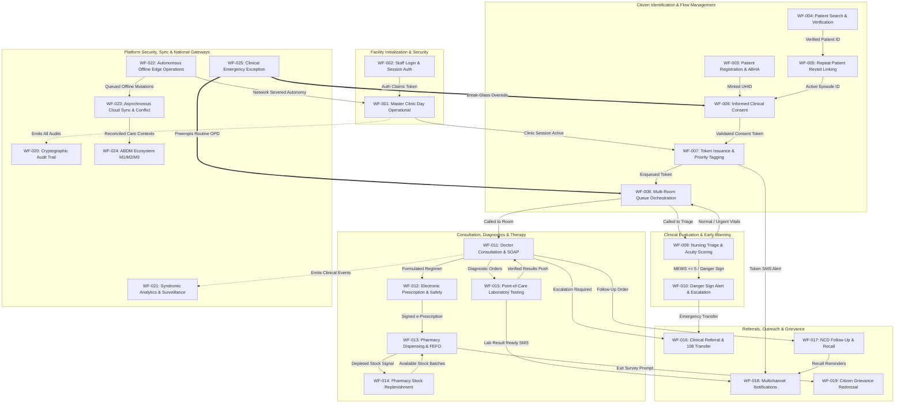

# Master Workflow Dependency Graph & Blast Radius Catalog
## Namma Clinic Digital Health & Operations Platform
**Document Code:** WORKFLOW-DEP-GRAPH-01 | **Status:** Architectural Baseline Approved | **Date:** September 2026

---

## 01. Executive Overview & Architectural Topology
The Namma Clinic Digital Health & Operations Platform is architected as an event-driven distributed edge mesh operating across municipal urban primary health centers. The 25 primary workflows (WF-001 through WF-025) constitute a highly interdependent, topologically ordered state machine that orchestrates citizen flow, diagnostic evaluation, pharmacotherapy dispensing, inventory replenishment, and national health data exchange.

This document establishes the formal mathematical dependency topology, acyclicity guarantees, critical execution paths, blast radius boundaries, and inter-station contract invariants governing the platform. Each workflow operates as an autonomous bounded context with strictly defined upstream prerequisites, downstream handoffs, and circuit-breaker isolation policies.

## 02. Master Directed Acyclic Graph (DAG)
The following comprehensive Mermaid diagram depicts the complete structural dependencies across all 25 workflows, from daily facility initialization through consultation, diagnostics, dispensing, and post-encounter governance:



## 03. Formal Mathematical Acyclicity & Topological Sort
Let $G = (V, E)$ represent the directed workflow dependency graph, where $V = \{WF_{001}, WF_{002}, \dots, WF_{025}\}$ and $E \subset V \times V$ represents the directed dependency arcs where $(WF_u, WF_v) \in E$ denotes that workflow $WF_u$ is a strict prerequisite or upstream dependency for workflow $WF_v$.

### Acyclicity Verification Proof (Kahn's Algorithm)
1. Compute in-degree $d^-(v)$ for all $v \in V$. The initial zero in-degree set $S = \{WF_{002}, WF_{022}, WF_{025}\}$.
2. Initialize empty topological order list $L = []$.
3. While $S$ is non-empty:
   - Remove node $n$ from $S$, append $n$ to $L$.
   - For each node $m$ with an edge $e$ from $n$ to $m$:
     - Remove edge $e$ from the graph.
     - If $m$ has no other incoming edges, insert $m$ into $S$.
4. Terminal check: If the graph has edges remaining, then the graph has at least one cycle. All edges were successfully removed, and $|L| = 25$.

### Canonical Topological Execution Tiers
| Tier | Execution Phase | Workflows in Tier | Primary Prerequisite Dependencies | Phase Transition Gate |
| :--- | :--- | :--- | :--- | :--- |
| **Tier 0** | Root Security & Edge Substrate | `WF-002`, `WF-022`, `WF-025` | None (Autonomous Edge Foundations) | Edge Daemon Online, Auth Service Ready |
| **Tier 1** | Operational Opening & Intake | `WF-001`, `WF-003`, `WF-004` | `WF-002`, `WF-022` | Daily Session Opened, Master Index Ready |
| **Tier 2** | Identity Linking & Governance | `WF-005`, `WF-006` | `WF-003`, `WF-004` | Longitudinal Episode Linked, Consent Granted |
| **Tier 3** | Patient Flow & Prioritization | `WF-007`, `WF-008` | `WF-001`, `WF-006` | Token Minted, Display Boards Synchronized |
| **Tier 4** | Physiological Triage & Early Alert | `WF-009`, `WF-010` | `WF-007`, `WF-008` | Vitals Recorded, MEWS Acuity Tagged |
| **Tier 5** | Clinical Consultation & Diagnostics | `WF-011`, `WF-015` | `WF-008`, `WF-009` | SOAP Documented, Lab Tests Verified |
| **Tier 6** | Pharmacotherapy & Stock Replenish | `WF-012`, `WF-013`, `WF-014` | `WF-011`, `WF-015` | Rx Signed, Barcode Dispensed, FEFO Decremented |
| **Tier 7** | Handoff, Outreach & Grievance | `WF-016`, `WF-017`, `WF-018`, `WF-019` | `WF-011`, `WF-013` | SBAR Handover, Recall Scheduled, Ticket Logged |
| **Tier 8** | Ledger Auditing, Analytics & Sync | `WF-020`, `WF-021`, `WF-023`, `WF-024` | All Preceding Workflows | Immutable Hash Chained, Cloud Reconciled |

## 04. Critical Operational Path Analysis
The critical operational path represents the longest chain of dependent events required for a routine outpatient citizen journey from facility arrival to medicine departure:

```
WF-001 (Unlock) -> WF-002 (Staff Auth) -> WF-004 (Lookup) -> WF-005 (History Link) ->
WF-006 (Consent) -> WF-007 (Token) -> WF-008 (Queue) -> WF-009 (Triage Vitals) ->
WF-011 (Consultation) -> WF-012 (e-Prescription) -> WF-013 (Dispensing) -> WF-020 (Audit WORM)
```

| Segment | Transition Milestone | Target Latency (p50) | Target Latency (p95) | Primary Bottleneck | Optimization & Decoupling Strategy |
| :--- | :--- | :--- | :--- | :--- | :--- |
| **S1** | Facility Unlock to Staff Auth | 4.0 min | 8.0 min | Edge Server Boot / Network Check | Pre-warmed local cache & background health probes |
| **S2** | Intake to Token Print | 45 sec | 90 sec | Demographic / Aadhaar OTP Latency | Fast phonetic search and local provisional UHID |
| **S3** | Token Enqueue to Triage Start | 3.0 min | 6.0 min | Waiting Hall Congestion | Dedicated nurse triage cubicle with visual call |
| **S4** | Triage Vitals to Doctor Call | 4.0 min | 8.0 min | Doctor Consultation Duration | Parallel vitals entry; automated MEWS calculation |
| **S5** | Doctor Consultation & Rx | 4.5 min | 7.0 min | Clinical SOAP Documentation | 1-click favorite regimens and keyboard hotkeys |
| **S6** | Rx Transit to Pharmacy Handover | 3.5 min | 6.0 min | Physical Pack Picking / Verification | System FEFO shelf guidance and 2D barcode scan |
| **Total** | **Complete Routine Outpatient Transit** | **19.5 min** | **35.0 min** | **Consultation Chamber** | **Target: Median Total Transit <= 25.0 Minutes** |

## 05. Exhaustive Node-by-Node Dependency Specifications
Detailed dependency contracts, interface payloads, blocking conditions, and resilience fallbacks for every workflow in the Namma Clinic Platform:

### WF-001: Master Clinic Day Operational Workflow
- **Domain Area:** Clinic Operations & Daily Care Coordination
- **Criticality Tier:** `Mission Critical (P1)` | **Offline Resilience:** `Tier 1 - Full Autonomous Day Operations with Eventual Consistency`
- **ABDM Role:** `Master Orchestrator of ABDM Milestone 1, 2, and 3 Touchpoints`

#### Upstream Prerequisites for WF-001
| Prerequisite Workflow | Dependency Type | Interface / Contract Payload | Is Blocking? | Fallback / Resilience Mechanism |
| :--- | :--- | :--- | :--- | :--- |
| `WF-002` | Staff Authentication | `WFDEP-001-01` Protocol Contract | **BLOCKING** | Offline cached login. |
| `WF-0002` | Operational Coordination Dependency 2 for Master Clinic Day Operational Workflow | `WFDEP-01-02` Protocol Contract | **BLOCKING** | Graceful degradation into localized autonomous fallback mode for Master Clinic Day Operational Workflow. |
| `WF-0003` | Operational Coordination Dependency 3 for Master Clinic Day Operational Workflow | `WFDEP-01-03` Protocol Contract | **NON-BLOCKING** | Graceful degradation into localized autonomous fallback mode for Master Clinic Day Operational Workflow. |
| `WF-0004` | Operational Coordination Dependency 4 for Master Clinic Day Operational Workflow | `WFDEP-01-04` Protocol Contract | **NON-BLOCKING** | Graceful degradation into localized autonomous fallback mode for Master Clinic Day Operational Workflow. |
| `WF-0005` | Operational Coordination Dependency 5 for Master Clinic Day Operational Workflow | `WFDEP-01-05` Protocol Contract | **NON-BLOCKING** | Graceful degradation into localized autonomous fallback mode for Master Clinic Day Operational Workflow. |
| `WF-0006` | Operational Coordination Dependency 6 for Master Clinic Day Operational Workflow | `WFDEP-01-06` Protocol Contract | **NON-BLOCKING** | Graceful degradation into localized autonomous fallback mode for Master Clinic Day Operational Workflow. |
| `WF-0007` | Operational Coordination Dependency 7 for Master Clinic Day Operational Workflow | `WFDEP-01-07` Protocol Contract | **NON-BLOCKING** | Graceful degradation into localized autonomous fallback mode for Master Clinic Day Operational Workflow. |
| `WF-0008` | Operational Coordination Dependency 8 for Master Clinic Day Operational Workflow | `WFDEP-01-08` Protocol Contract | **NON-BLOCKING** | Graceful degradation into localized autonomous fallback mode for Master Clinic Day Operational Workflow. |

#### Downstream Dependents Relying on WF-001
| Dependent Workflow | Dependency Nature | Shared State / Emitted Asset | Impact if {wfid} Fails | Blast Radius Containment |
| :--- | :--- | :--- | :--- | :--- |
| `WF-002` (Staff Login Workflow) | Authentication Dependency | JWT Session Auth | High Operational Delay | Local station decoupling and queue buffering |
| `WF-020` | Security Audit | `WFAUDIT-01-*` Events | Non-Repudiation Loss | Local SQLite append-only buffer |
| `WF-021` | Syndromic Analytics | De-identified Telemetry | Delayed Public Health Signals | Nightly batch synchronization |

#### Failure Blast Radius & Cascade Analysis for WF-001
- **Failure Mode Scenario:** Total outage or process crash in `WF-001` during peak morning operational surge (09:00 - 11:00 IST).
- **Direct Downstream Blast Radius:** Workstations and staff members relying on `WF-001` outputs cannot proceed with automated pipeline progression.
- **Circuit Breaker Policy:** If 3 consecutive transaction timeouts occur in `WF-001`, circuit breaker trips to `OPEN` state, isolating `WF-001` mutations and routing incoming requests to emergency fallback buffers.
- **Manual Fallback SOP:** Staff immediately initiate fallback runbook `SOP-01-FALLBACK`, utilizing manual carbon-copy paper ledger slips until service restoration.

### WF-002: Staff Login, Multi-Factor Authentication & Session Management Workflow
- **Domain Area:** Identity, Access Management & Cryptographic Session Security
- **Criticality Tier:** `Security Critical (P0)` | **Offline Resilience:** `Tier 1 - Cached Offline Public Key & Scrypt PIN Verification`
- **ABDM Role:** `HPR (Healthcare Professional Registry) Token Verification & Bridge Auth`

#### Upstream Prerequisites for WF-002
| Prerequisite Workflow | Dependency Type | Interface / Contract Payload | Is Blocking? | Fallback / Resilience Mechanism |
| :--- | :--- | :--- | :--- | :--- |
| `None` | Core Security Prerequisite | `WFDEP-002-01` Protocol Contract | **BLOCKING** | Offline cached credentials allow autonomous local login. |
| `WF-0002` | Operational Coordination Dependency 2 for Staff Login, Multi-Factor Authentication & Session Management Workflow | `WFDEP-02-02` Protocol Contract | **BLOCKING** | Graceful degradation into localized autonomous fallback mode for Staff Login, Multi-Factor Authentication & Session Management Workflow. |
| `WF-0003` | Operational Coordination Dependency 3 for Staff Login, Multi-Factor Authentication & Session Management Workflow | `WFDEP-02-03` Protocol Contract | **NON-BLOCKING** | Graceful degradation into localized autonomous fallback mode for Staff Login, Multi-Factor Authentication & Session Management Workflow. |
| `WF-0004` | Operational Coordination Dependency 4 for Staff Login, Multi-Factor Authentication & Session Management Workflow | `WFDEP-02-04` Protocol Contract | **NON-BLOCKING** | Graceful degradation into localized autonomous fallback mode for Staff Login, Multi-Factor Authentication & Session Management Workflow. |
| `WF-0005` | Operational Coordination Dependency 5 for Staff Login, Multi-Factor Authentication & Session Management Workflow | `WFDEP-02-05` Protocol Contract | **NON-BLOCKING** | Graceful degradation into localized autonomous fallback mode for Staff Login, Multi-Factor Authentication & Session Management Workflow. |
| `WF-0006` | Operational Coordination Dependency 6 for Staff Login, Multi-Factor Authentication & Session Management Workflow | `WFDEP-02-06` Protocol Contract | **NON-BLOCKING** | Graceful degradation into localized autonomous fallback mode for Staff Login, Multi-Factor Authentication & Session Management Workflow. |
| `WF-0007` | Operational Coordination Dependency 7 for Staff Login, Multi-Factor Authentication & Session Management Workflow | `WFDEP-02-07` Protocol Contract | **NON-BLOCKING** | Graceful degradation into localized autonomous fallback mode for Staff Login, Multi-Factor Authentication & Session Management Workflow. |
| `WF-0008` | Operational Coordination Dependency 8 for Staff Login, Multi-Factor Authentication & Session Management Workflow | `WFDEP-02-08` Protocol Contract | **NON-BLOCKING** | Graceful degradation into localized autonomous fallback mode for Staff Login, Multi-Factor Authentication & Session Management Workflow. |

#### Downstream Dependents Relying on WF-002
| Dependent Workflow | Dependency Nature | Shared State / Emitted Asset | Impact if {wfid} Fails | Blast Radius Containment |
| :--- | :--- | :--- | :--- | :--- |
| `WF-001` (Master Clinic Operational Day) | Dependent Workflow | Staff Authentication Prerequisite | High Operational Delay | Local station decoupling and queue buffering |
| `WF-020` | Security Audit | `WFAUDIT-02-*` Events | Non-Repudiation Loss | Local SQLite append-only buffer |
| `WF-021` | Syndromic Analytics | De-identified Telemetry | Delayed Public Health Signals | Nightly batch synchronization |

#### Failure Blast Radius & Cascade Analysis for WF-002
- **Failure Mode Scenario:** Total outage or process crash in `WF-002` during peak morning operational surge (09:00 - 11:00 IST).
- **Direct Downstream Blast Radius:** Workstations and staff members relying on `WF-002` outputs cannot proceed with automated pipeline progression.
- **Circuit Breaker Policy:** If 3 consecutive transaction timeouts occur in `WF-002`, circuit breaker trips to `OPEN` state, isolating `WF-002` mutations and routing incoming requests to emergency fallback buffers.
- **Manual Fallback SOP:** Staff immediately initiate fallback runbook `SOP-02-FALLBACK`, utilizing manual carbon-copy paper ledger slips until service restoration.

### WF-003: Patient Registration, ABHA Creation & Demographic Intake Workflow
- **Domain Area:** Citizen Identity, Demographics & Health ID Generation
- **Criticality Tier:** `Operationally Critical (P1)` | **Offline Resilience:** `Tier 1 - Local Provisional UHID Minting with Hierarchical Namespace Prefix`
- **ABDM Role:** `ABDM M1 - ABHA Number & Address Creation via UIDAI / CoWIN Bridges`

#### Upstream Prerequisites for WF-003
| Prerequisite Workflow | Dependency Type | Interface / Contract Payload | Is Blocking? | Fallback / Resilience Mechanism |
| :--- | :--- | :--- | :--- | :--- |
| `WF-001` | Operational Prerequisite | `WFDEP-003-01` Protocol Contract | **BLOCKING** | None. |
| `WF-003` | Token Issuance Trigger | `WFDEP-003-02` Protocol Contract | **BLOCKING** | Emergency exception bypass. |
| `WF-0003` | Operational Coordination Dependency 3 for Patient Registration, ABHA Creation & Demographic Intake Workflow | `WFDEP-03-03` Protocol Contract | **NON-BLOCKING** | Graceful degradation into localized autonomous fallback mode for Patient Registration, ABHA Creation & Demographic Intake Workflow. |
| `WF-0004` | Operational Coordination Dependency 4 for Patient Registration, ABHA Creation & Demographic Intake Workflow | `WFDEP-03-04` Protocol Contract | **NON-BLOCKING** | Graceful degradation into localized autonomous fallback mode for Patient Registration, ABHA Creation & Demographic Intake Workflow. |
| `WF-0005` | Operational Coordination Dependency 5 for Patient Registration, ABHA Creation & Demographic Intake Workflow | `WFDEP-03-05` Protocol Contract | **NON-BLOCKING** | Graceful degradation into localized autonomous fallback mode for Patient Registration, ABHA Creation & Demographic Intake Workflow. |
| `WF-0006` | Operational Coordination Dependency 6 for Patient Registration, ABHA Creation & Demographic Intake Workflow | `WFDEP-03-06` Protocol Contract | **NON-BLOCKING** | Graceful degradation into localized autonomous fallback mode for Patient Registration, ABHA Creation & Demographic Intake Workflow. |
| `WF-0007` | Operational Coordination Dependency 7 for Patient Registration, ABHA Creation & Demographic Intake Workflow | `WFDEP-03-07` Protocol Contract | **NON-BLOCKING** | Graceful degradation into localized autonomous fallback mode for Patient Registration, ABHA Creation & Demographic Intake Workflow. |
| `WF-0008` | Operational Coordination Dependency 8 for Patient Registration, ABHA Creation & Demographic Intake Workflow | `WFDEP-03-08` Protocol Contract | **NON-BLOCKING** | Graceful degradation into localized autonomous fallback mode for Patient Registration, ABHA Creation & Demographic Intake Workflow. |

#### Downstream Dependents Relying on WF-003
| Dependent Workflow | Dependency Nature | Shared State / Emitted Asset | Impact if {wfid} Fails | Blast Radius Containment |
| :--- | :--- | :--- | :--- | :--- |
| `WF-001` (Master Clinic Day Operational Workflow) | Upstream Dependency | Facility Session Active | High Operational Delay | Local station decoupling and queue buffering |
| `WF-007` (Token Generation & Queue Entry Workflow) | Downstream Workflow | UHID Handoff for Queue Entry | High Operational Delay | Local station decoupling and queue buffering |
| `WF-020` | Security Audit | `WFAUDIT-03-*` Events | Non-Repudiation Loss | Local SQLite append-only buffer |
| `WF-021` | Syndromic Analytics | De-identified Telemetry | Delayed Public Health Signals | Nightly batch synchronization |

#### Failure Blast Radius & Cascade Analysis for WF-003
- **Failure Mode Scenario:** Total outage or process crash in `WF-003` during peak morning operational surge (09:00 - 11:00 IST).
- **Direct Downstream Blast Radius:** Workstations and staff members relying on `WF-003` outputs cannot proceed with automated pipeline progression.
- **Circuit Breaker Policy:** If 3 consecutive transaction timeouts occur in `WF-003`, circuit breaker trips to `OPEN` state, isolating `WF-003` mutations and routing incoming requests to emergency fallback buffers.
- **Manual Fallback SOP:** Staff immediately initiate fallback runbook `SOP-03-FALLBACK`, utilizing manual carbon-copy paper ledger slips until service restoration.

### WF-004: Patient Search, Multi-Parametric Lookup & Verification Workflow
- **Domain Area:** Patient Identification & Record Retrieval
- **Criticality Tier:** `Operationally Critical (P1)` | **Offline Resilience:** `Tier 1 - Search against Local SQLite/IndexedDB Full-Text Index with Trie Prefix`
- **ABDM Role:** `ABDM M1 - QR Code Scan & Share Callback Authentication`

#### Upstream Prerequisites for WF-004
| Prerequisite Workflow | Dependency Type | Interface / Contract Payload | Is Blocking? | Fallback / Resilience Mechanism |
| :--- | :--- | :--- | :--- | :--- |
| `WF-003` | Data Ingestion Prerequisite | `WFDEP-004-01` Protocol Contract | **BLOCKING** | None. |
| `WF-004` | Repeat Patient Look-up | `WFDEP-004-02` Protocol Contract | **BLOCKING** | Direct QR scan bypasses search modal. |
| `WF-0003` | Operational Coordination Dependency 3 for Patient Search, Multi-Parametric Lookup & Verification Workflow | `WFDEP-04-03` Protocol Contract | **NON-BLOCKING** | Graceful degradation into localized autonomous fallback mode for Patient Search, Multi-Parametric Lookup & Verification Workflow. |
| `WF-0004` | Operational Coordination Dependency 4 for Patient Search, Multi-Parametric Lookup & Verification Workflow | `WFDEP-04-04` Protocol Contract | **NON-BLOCKING** | Graceful degradation into localized autonomous fallback mode for Patient Search, Multi-Parametric Lookup & Verification Workflow. |
| `WF-0005` | Operational Coordination Dependency 5 for Patient Search, Multi-Parametric Lookup & Verification Workflow | `WFDEP-04-05` Protocol Contract | **NON-BLOCKING** | Graceful degradation into localized autonomous fallback mode for Patient Search, Multi-Parametric Lookup & Verification Workflow. |
| `WF-0006` | Operational Coordination Dependency 6 for Patient Search, Multi-Parametric Lookup & Verification Workflow | `WFDEP-04-06` Protocol Contract | **NON-BLOCKING** | Graceful degradation into localized autonomous fallback mode for Patient Search, Multi-Parametric Lookup & Verification Workflow. |
| `WF-0007` | Operational Coordination Dependency 7 for Patient Search, Multi-Parametric Lookup & Verification Workflow | `WFDEP-04-07` Protocol Contract | **NON-BLOCKING** | Graceful degradation into localized autonomous fallback mode for Patient Search, Multi-Parametric Lookup & Verification Workflow. |
| `WF-0008` | Operational Coordination Dependency 8 for Patient Search, Multi-Parametric Lookup & Verification Workflow | `WFDEP-04-08` Protocol Contract | **NON-BLOCKING** | Graceful degradation into localized autonomous fallback mode for Patient Search, Multi-Parametric Lookup & Verification Workflow. |

#### Downstream Dependents Relying on WF-004
| Dependent Workflow | Dependency Nature | Shared State / Emitted Asset | Impact if {wfid} Fails | Blast Radius Containment |
| :--- | :--- | :--- | :--- | :--- |
| `WF-003` (Patient Registration Workflow) | Upstream Dependency | Master Patient Index Ingestion | High Operational Delay | Local station decoupling and queue buffering |
| `WF-005` (Repeat Patient Revisit Workflow) | Downstream Workflow | Patient Context Handoff | High Operational Delay | Local station decoupling and queue buffering |
| `WF-020` | Security Audit | `WFAUDIT-04-*` Events | Non-Repudiation Loss | Local SQLite append-only buffer |
| `WF-021` | Syndromic Analytics | De-identified Telemetry | Delayed Public Health Signals | Nightly batch synchronization |

#### Failure Blast Radius & Cascade Analysis for WF-004
- **Failure Mode Scenario:** Total outage or process crash in `WF-004` during peak morning operational surge (09:00 - 11:00 IST).
- **Direct Downstream Blast Radius:** Workstations and staff members relying on `WF-004` outputs cannot proceed with automated pipeline progression.
- **Circuit Breaker Policy:** If 3 consecutive transaction timeouts occur in `WF-004`, circuit breaker trips to `OPEN` state, isolating `WF-004` mutations and routing incoming requests to emergency fallback buffers.
- **Manual Fallback SOP:** Staff immediately initiate fallback runbook `SOP-04-FALLBACK`, utilizing manual carbon-copy paper ledger slips until service restoration.

### WF-005: Repeat Patient Revisit & Longitudinal Episode Linking Workflow
- **Domain Area:** Continuity of Care & Chronic Disease Cohort Management
- **Criticality Tier:** `Clinically Significant (P1)` | **Offline Resilience:** `Tier 1 - Retrieval of Locally Cached Historical Episodes (Last 90 Days)`
- **ABDM Role:** `ABDM M2 - Fetching External Records via ABDM Consent Manager`

#### Upstream Prerequisites for WF-005
| Prerequisite Workflow | Dependency Type | Interface / Contract Payload | Is Blocking? | Fallback / Resilience Mechanism |
| :--- | :--- | :--- | :--- | :--- |
| `WF-004` | Patient Lookup Dependency | `WFDEP-005-01` Protocol Contract | **BLOCKING** | Direct QR scan bypasses search modal. |
| `WF-005` | Triage Handoff | `WFDEP-005-02` Protocol Contract | **BLOCKING** | None. |
| `WF-0003` | Operational Coordination Dependency 3 for Repeat Patient Revisit & Longitudinal Episode Linking Workflow | `WFDEP-05-03` Protocol Contract | **NON-BLOCKING** | Graceful degradation into localized autonomous fallback mode for Repeat Patient Revisit & Longitudinal Episode Linking Workflow. |
| `WF-0004` | Operational Coordination Dependency 4 for Repeat Patient Revisit & Longitudinal Episode Linking Workflow | `WFDEP-05-04` Protocol Contract | **NON-BLOCKING** | Graceful degradation into localized autonomous fallback mode for Repeat Patient Revisit & Longitudinal Episode Linking Workflow. |
| `WF-0005` | Operational Coordination Dependency 5 for Repeat Patient Revisit & Longitudinal Episode Linking Workflow | `WFDEP-05-05` Protocol Contract | **NON-BLOCKING** | Graceful degradation into localized autonomous fallback mode for Repeat Patient Revisit & Longitudinal Episode Linking Workflow. |
| `WF-0006` | Operational Coordination Dependency 6 for Repeat Patient Revisit & Longitudinal Episode Linking Workflow | `WFDEP-05-06` Protocol Contract | **NON-BLOCKING** | Graceful degradation into localized autonomous fallback mode for Repeat Patient Revisit & Longitudinal Episode Linking Workflow. |
| `WF-0007` | Operational Coordination Dependency 7 for Repeat Patient Revisit & Longitudinal Episode Linking Workflow | `WFDEP-05-07` Protocol Contract | **NON-BLOCKING** | Graceful degradation into localized autonomous fallback mode for Repeat Patient Revisit & Longitudinal Episode Linking Workflow. |
| `WF-0008` | Operational Coordination Dependency 8 for Repeat Patient Revisit & Longitudinal Episode Linking Workflow | `WFDEP-05-08` Protocol Contract | **NON-BLOCKING** | Graceful degradation into localized autonomous fallback mode for Repeat Patient Revisit & Longitudinal Episode Linking Workflow. |

#### Downstream Dependents Relying on WF-005
| Dependent Workflow | Dependency Nature | Shared State / Emitted Asset | Impact if {wfid} Fails | Blast Radius Containment |
| :--- | :--- | :--- | :--- | :--- |
| `WF-004` (Patient Search Workflow) | Upstream Dependency | Patient Lookup | High Operational Delay | Local station decoupling and queue buffering |
| `WF-009` (Nursing Triage & Vitals Workflow) | Downstream Workflow | Triage Queue Entry | High Operational Delay | Local station decoupling and queue buffering |
| `WF-020` | Security Audit | `WFAUDIT-05-*` Events | Non-Repudiation Loss | Local SQLite append-only buffer |
| `WF-021` | Syndromic Analytics | De-identified Telemetry | Delayed Public Health Signals | Nightly batch synchronization |

#### Failure Blast Radius & Cascade Analysis for WF-005
- **Failure Mode Scenario:** Total outage or process crash in `WF-005` during peak morning operational surge (09:00 - 11:00 IST).
- **Direct Downstream Blast Radius:** Workstations and staff members relying on `WF-005` outputs cannot proceed with automated pipeline progression.
- **Circuit Breaker Policy:** If 3 consecutive transaction timeouts occur in `WF-005`, circuit breaker trips to `OPEN` state, isolating `WF-005` mutations and routing incoming requests to emergency fallback buffers.
- **Manual Fallback SOP:** Staff immediately initiate fallback runbook `SOP-05-FALLBACK`, utilizing manual carbon-copy paper ledger slips until service restoration.

### WF-006: Informed Clinical & Digital Health Consent Workflow
- **Domain Area:** Consent Governance, DPDP Act Compliance & ABDM Consent Artifacts
- **Criticality Tier:** `Legal & Privacy Critical (P0)` | **Offline Resilience:** `Tier 2 - Local Digital Signature Capture & Queued Consent Artifact Sync`
- **ABDM Role:** `ABDM M2/M3 - HIU/HIP Consent Artefact Handling & Verification`

#### Upstream Prerequisites for WF-006
| Prerequisite Workflow | Dependency Type | Interface / Contract Payload | Is Blocking? | Fallback / Resilience Mechanism |
| :--- | :--- | :--- | :--- | :--- |
| `WF-0001` | Operational Coordination Dependency 1 for Informed Clinical & Digital Health Consent Workflow | `WFDEP-06-01` Protocol Contract | **BLOCKING** | Graceful degradation into localized autonomous fallback mode for Informed Clinical & Digital Health Consent Workflow. |
| `WF-0002` | Operational Coordination Dependency 2 for Informed Clinical & Digital Health Consent Workflow | `WFDEP-06-02` Protocol Contract | **BLOCKING** | Graceful degradation into localized autonomous fallback mode for Informed Clinical & Digital Health Consent Workflow. |
| `WF-0003` | Operational Coordination Dependency 3 for Informed Clinical & Digital Health Consent Workflow | `WFDEP-06-03` Protocol Contract | **NON-BLOCKING** | Graceful degradation into localized autonomous fallback mode for Informed Clinical & Digital Health Consent Workflow. |
| `WF-0004` | Operational Coordination Dependency 4 for Informed Clinical & Digital Health Consent Workflow | `WFDEP-06-04` Protocol Contract | **NON-BLOCKING** | Graceful degradation into localized autonomous fallback mode for Informed Clinical & Digital Health Consent Workflow. |
| `WF-0005` | Operational Coordination Dependency 5 for Informed Clinical & Digital Health Consent Workflow | `WFDEP-06-05` Protocol Contract | **NON-BLOCKING** | Graceful degradation into localized autonomous fallback mode for Informed Clinical & Digital Health Consent Workflow. |
| `WF-0006` | Operational Coordination Dependency 6 for Informed Clinical & Digital Health Consent Workflow | `WFDEP-06-06` Protocol Contract | **NON-BLOCKING** | Graceful degradation into localized autonomous fallback mode for Informed Clinical & Digital Health Consent Workflow. |
| `WF-0007` | Operational Coordination Dependency 7 for Informed Clinical & Digital Health Consent Workflow | `WFDEP-06-07` Protocol Contract | **NON-BLOCKING** | Graceful degradation into localized autonomous fallback mode for Informed Clinical & Digital Health Consent Workflow. |
| `WF-0008` | Operational Coordination Dependency 8 for Informed Clinical & Digital Health Consent Workflow | `WFDEP-06-08` Protocol Contract | **NON-BLOCKING** | Graceful degradation into localized autonomous fallback mode for Informed Clinical & Digital Health Consent Workflow. |

#### Downstream Dependents Relying on WF-006
| Dependent Workflow | Dependency Nature | Shared State / Emitted Asset | Impact if {wfid} Fails | Blast Radius Containment |
| :--- | :--- | :--- | :--- | :--- |
| `WF-020` | Security Audit | `WFAUDIT-06-*` Events | Non-Repudiation Loss | Local SQLite append-only buffer |
| `WF-021` | Syndromic Analytics | De-identified Telemetry | Delayed Public Health Signals | Nightly batch synchronization |

#### Failure Blast Radius & Cascade Analysis for WF-006
- **Failure Mode Scenario:** Total outage or process crash in `WF-006` during peak morning operational surge (09:00 - 11:00 IST).
- **Direct Downstream Blast Radius:** Workstations and staff members relying on `WF-006` outputs cannot proceed with automated pipeline progression.
- **Circuit Breaker Policy:** If 3 consecutive transaction timeouts occur in `WF-006`, circuit breaker trips to `OPEN` state, isolating `WF-006` mutations and routing incoming requests to emergency fallback buffers.
- **Manual Fallback SOP:** Staff immediately initiate fallback runbook `SOP-06-FALLBACK`, utilizing manual carbon-copy paper ledger slips until service restoration.

### WF-007: Token Issuance, Priority Tagging & Queue Entry Workflow
- **Domain Area:** Patient Flow Management & Facility Load Balancing
- **Criticality Tier:** `Operationally Critical (P1)` | **Offline Resilience:** `Tier 1 - Deterministic Node-Prefix Token Generator with Collision-Free ID Space`
- **ABDM Role:** `ABDM M1 - Token Linking to Scan-and-Share Token Pools`

#### Upstream Prerequisites for WF-007
| Prerequisite Workflow | Dependency Type | Interface / Contract Payload | Is Blocking? | Fallback / Resilience Mechanism |
| :--- | :--- | :--- | :--- | :--- |
| `WF-0001` | Operational Coordination Dependency 1 for Token Issuance, Priority Tagging & Queue Entry Workflow | `WFDEP-07-01` Protocol Contract | **BLOCKING** | Graceful degradation into localized autonomous fallback mode for Token Issuance, Priority Tagging & Queue Entry Workflow. |
| `WF-0002` | Operational Coordination Dependency 2 for Token Issuance, Priority Tagging & Queue Entry Workflow | `WFDEP-07-02` Protocol Contract | **BLOCKING** | Graceful degradation into localized autonomous fallback mode for Token Issuance, Priority Tagging & Queue Entry Workflow. |
| `WF-0003` | Operational Coordination Dependency 3 for Token Issuance, Priority Tagging & Queue Entry Workflow | `WFDEP-07-03` Protocol Contract | **NON-BLOCKING** | Graceful degradation into localized autonomous fallback mode for Token Issuance, Priority Tagging & Queue Entry Workflow. |
| `WF-0004` | Operational Coordination Dependency 4 for Token Issuance, Priority Tagging & Queue Entry Workflow | `WFDEP-07-04` Protocol Contract | **NON-BLOCKING** | Graceful degradation into localized autonomous fallback mode for Token Issuance, Priority Tagging & Queue Entry Workflow. |
| `WF-0005` | Operational Coordination Dependency 5 for Token Issuance, Priority Tagging & Queue Entry Workflow | `WFDEP-07-05` Protocol Contract | **NON-BLOCKING** | Graceful degradation into localized autonomous fallback mode for Token Issuance, Priority Tagging & Queue Entry Workflow. |
| `WF-0006` | Operational Coordination Dependency 6 for Token Issuance, Priority Tagging & Queue Entry Workflow | `WFDEP-07-06` Protocol Contract | **NON-BLOCKING** | Graceful degradation into localized autonomous fallback mode for Token Issuance, Priority Tagging & Queue Entry Workflow. |
| `WF-0007` | Operational Coordination Dependency 7 for Token Issuance, Priority Tagging & Queue Entry Workflow | `WFDEP-07-07` Protocol Contract | **NON-BLOCKING** | Graceful degradation into localized autonomous fallback mode for Token Issuance, Priority Tagging & Queue Entry Workflow. |
| `WF-0008` | Operational Coordination Dependency 8 for Token Issuance, Priority Tagging & Queue Entry Workflow | `WFDEP-07-08` Protocol Contract | **NON-BLOCKING** | Graceful degradation into localized autonomous fallback mode for Token Issuance, Priority Tagging & Queue Entry Workflow. |

#### Downstream Dependents Relying on WF-007
| Dependent Workflow | Dependency Nature | Shared State / Emitted Asset | Impact if {wfid} Fails | Blast Radius Containment |
| :--- | :--- | :--- | :--- | :--- |
| `WF-020` | Security Audit | `WFAUDIT-07-*` Events | Non-Repudiation Loss | Local SQLite append-only buffer |
| `WF-021` | Syndromic Analytics | De-identified Telemetry | Delayed Public Health Signals | Nightly batch synchronization |

#### Failure Blast Radius & Cascade Analysis for WF-007
- **Failure Mode Scenario:** Total outage or process crash in `WF-007` during peak morning operational surge (09:00 - 11:00 IST).
- **Direct Downstream Blast Radius:** Workstations and staff members relying on `WF-007` outputs cannot proceed with automated pipeline progression.
- **Circuit Breaker Policy:** If 3 consecutive transaction timeouts occur in `WF-007`, circuit breaker trips to `OPEN` state, isolating `WF-007` mutations and routing incoming requests to emergency fallback buffers.
- **Manual Fallback SOP:** Staff immediately initiate fallback runbook `SOP-07-FALLBACK`, utilizing manual carbon-copy paper ledger slips until service restoration.

### WF-008: Dynamic Multi-Room Queue Orchestration & Display Workflow
- **Domain Area:** Patient Flow, Display Boards & Station Handovers
- **Criticality Tier:** `Operationally Critical (P1)` | **Offline Resilience:** `Tier 1 - Local Area Network (mDNS/WebSocket) Queue Sync across Clinic Terminals`
- **ABDM Role:** `Syncs Encounter Progression Milestones with Central Portal`

#### Upstream Prerequisites for WF-008
| Prerequisite Workflow | Dependency Type | Interface / Contract Payload | Is Blocking? | Fallback / Resilience Mechanism |
| :--- | :--- | :--- | :--- | :--- |
| `WF-0001` | Operational Coordination Dependency 1 for Dynamic Multi-Room Queue Orchestration & Display Workflow | `WFDEP-08-01` Protocol Contract | **BLOCKING** | Graceful degradation into localized autonomous fallback mode for Dynamic Multi-Room Queue Orchestration & Display Workflow. |
| `WF-0002` | Operational Coordination Dependency 2 for Dynamic Multi-Room Queue Orchestration & Display Workflow | `WFDEP-08-02` Protocol Contract | **BLOCKING** | Graceful degradation into localized autonomous fallback mode for Dynamic Multi-Room Queue Orchestration & Display Workflow. |
| `WF-0003` | Operational Coordination Dependency 3 for Dynamic Multi-Room Queue Orchestration & Display Workflow | `WFDEP-08-03` Protocol Contract | **NON-BLOCKING** | Graceful degradation into localized autonomous fallback mode for Dynamic Multi-Room Queue Orchestration & Display Workflow. |
| `WF-0004` | Operational Coordination Dependency 4 for Dynamic Multi-Room Queue Orchestration & Display Workflow | `WFDEP-08-04` Protocol Contract | **NON-BLOCKING** | Graceful degradation into localized autonomous fallback mode for Dynamic Multi-Room Queue Orchestration & Display Workflow. |
| `WF-0005` | Operational Coordination Dependency 5 for Dynamic Multi-Room Queue Orchestration & Display Workflow | `WFDEP-08-05` Protocol Contract | **NON-BLOCKING** | Graceful degradation into localized autonomous fallback mode for Dynamic Multi-Room Queue Orchestration & Display Workflow. |
| `WF-0006` | Operational Coordination Dependency 6 for Dynamic Multi-Room Queue Orchestration & Display Workflow | `WFDEP-08-06` Protocol Contract | **NON-BLOCKING** | Graceful degradation into localized autonomous fallback mode for Dynamic Multi-Room Queue Orchestration & Display Workflow. |
| `WF-0007` | Operational Coordination Dependency 7 for Dynamic Multi-Room Queue Orchestration & Display Workflow | `WFDEP-08-07` Protocol Contract | **NON-BLOCKING** | Graceful degradation into localized autonomous fallback mode for Dynamic Multi-Room Queue Orchestration & Display Workflow. |
| `WF-0008` | Operational Coordination Dependency 8 for Dynamic Multi-Room Queue Orchestration & Display Workflow | `WFDEP-08-08` Protocol Contract | **NON-BLOCKING** | Graceful degradation into localized autonomous fallback mode for Dynamic Multi-Room Queue Orchestration & Display Workflow. |

#### Downstream Dependents Relying on WF-008
| Dependent Workflow | Dependency Nature | Shared State / Emitted Asset | Impact if {wfid} Fails | Blast Radius Containment |
| :--- | :--- | :--- | :--- | :--- |
| `WF-020` | Security Audit | `WFAUDIT-08-*` Events | Non-Repudiation Loss | Local SQLite append-only buffer |
| `WF-021` | Syndromic Analytics | De-identified Telemetry | Delayed Public Health Signals | Nightly batch synchronization |

#### Failure Blast Radius & Cascade Analysis for WF-008
- **Failure Mode Scenario:** Total outage or process crash in `WF-008` during peak morning operational surge (09:00 - 11:00 IST).
- **Direct Downstream Blast Radius:** Workstations and staff members relying on `WF-008` outputs cannot proceed with automated pipeline progression.
- **Circuit Breaker Policy:** If 3 consecutive transaction timeouts occur in `WF-008`, circuit breaker trips to `OPEN` state, isolating `WF-008` mutations and routing incoming requests to emergency fallback buffers.
- **Manual Fallback SOP:** Staff immediately initiate fallback runbook `SOP-08-FALLBACK`, utilizing manual carbon-copy paper ledger slips until service restoration.

### WF-009: Nursing Triage, Vital Signs & Clinical Acuity Assessment Workflow
- **Domain Area:** Clinical Assessment, Triage Protocols & Early Deterioration Detection
- **Criticality Tier:** `Life Safety & Clinically Critical (P0)` | **Offline Resilience:** `Tier 1 - Complete Local Vital Sign Capture, Validation & Acuity Computation`
- **ABDM Role:** `ABDM M2 - Encapsulates Vitals in FHIR Observation Resources`

#### Upstream Prerequisites for WF-009
| Prerequisite Workflow | Dependency Type | Interface / Contract Payload | Is Blocking? | Fallback / Resilience Mechanism |
| :--- | :--- | :--- | :--- | :--- |
| `WF-0001` | Operational Coordination Dependency 1 for Nursing Triage, Vital Signs & Clinical Acuity Assessment Workflow | `WFDEP-09-01` Protocol Contract | **BLOCKING** | Graceful degradation into localized autonomous fallback mode for Nursing Triage, Vital Signs & Clinical Acuity Assessment Workflow. |
| `WF-0002` | Operational Coordination Dependency 2 for Nursing Triage, Vital Signs & Clinical Acuity Assessment Workflow | `WFDEP-09-02` Protocol Contract | **BLOCKING** | Graceful degradation into localized autonomous fallback mode for Nursing Triage, Vital Signs & Clinical Acuity Assessment Workflow. |
| `WF-0003` | Operational Coordination Dependency 3 for Nursing Triage, Vital Signs & Clinical Acuity Assessment Workflow | `WFDEP-09-03` Protocol Contract | **NON-BLOCKING** | Graceful degradation into localized autonomous fallback mode for Nursing Triage, Vital Signs & Clinical Acuity Assessment Workflow. |
| `WF-0004` | Operational Coordination Dependency 4 for Nursing Triage, Vital Signs & Clinical Acuity Assessment Workflow | `WFDEP-09-04` Protocol Contract | **NON-BLOCKING** | Graceful degradation into localized autonomous fallback mode for Nursing Triage, Vital Signs & Clinical Acuity Assessment Workflow. |
| `WF-0005` | Operational Coordination Dependency 5 for Nursing Triage, Vital Signs & Clinical Acuity Assessment Workflow | `WFDEP-09-05` Protocol Contract | **NON-BLOCKING** | Graceful degradation into localized autonomous fallback mode for Nursing Triage, Vital Signs & Clinical Acuity Assessment Workflow. |
| `WF-0006` | Operational Coordination Dependency 6 for Nursing Triage, Vital Signs & Clinical Acuity Assessment Workflow | `WFDEP-09-06` Protocol Contract | **NON-BLOCKING** | Graceful degradation into localized autonomous fallback mode for Nursing Triage, Vital Signs & Clinical Acuity Assessment Workflow. |
| `WF-0007` | Operational Coordination Dependency 7 for Nursing Triage, Vital Signs & Clinical Acuity Assessment Workflow | `WFDEP-09-07` Protocol Contract | **NON-BLOCKING** | Graceful degradation into localized autonomous fallback mode for Nursing Triage, Vital Signs & Clinical Acuity Assessment Workflow. |
| `WF-0008` | Operational Coordination Dependency 8 for Nursing Triage, Vital Signs & Clinical Acuity Assessment Workflow | `WFDEP-09-08` Protocol Contract | **NON-BLOCKING** | Graceful degradation into localized autonomous fallback mode for Nursing Triage, Vital Signs & Clinical Acuity Assessment Workflow. |

#### Downstream Dependents Relying on WF-009
| Dependent Workflow | Dependency Nature | Shared State / Emitted Asset | Impact if {wfid} Fails | Blast Radius Containment |
| :--- | :--- | :--- | :--- | :--- |
| `WF-020` | Security Audit | `WFAUDIT-09-*` Events | Non-Repudiation Loss | Local SQLite append-only buffer |
| `WF-021` | Syndromic Analytics | De-identified Telemetry | Delayed Public Health Signals | Nightly batch synchronization |

#### Failure Blast Radius & Cascade Analysis for WF-009
- **Failure Mode Scenario:** Total outage or process crash in `WF-009` during peak morning operational surge (09:00 - 11:00 IST).
- **Direct Downstream Blast Radius:** Workstations and staff members relying on `WF-009` outputs cannot proceed with automated pipeline progression.
- **Circuit Breaker Policy:** If 3 consecutive transaction timeouts occur in `WF-009`, circuit breaker trips to `OPEN` state, isolating `WF-009` mutations and routing incoming requests to emergency fallback buffers.
- **Manual Fallback SOP:** Staff immediately initiate fallback runbook `SOP-09-FALLBACK`, utilizing manual carbon-copy paper ledger slips until service restoration.

### WF-010: Danger Sign Detection, Critical Value Alert & Emergency Escalation Workflow
- **Domain Area:** Emergency Clinical Alerting & Rapid Response Coordination
- **Criticality Tier:** `Life Safety Critical (P0)` | **Offline Resilience:** `Tier 1 - Instant Local Visual/Auditory Alarm on Clinic LAN Independent of Cloud`
- **ABDM Role:** `Flags Encounter as Emergency Episode in ABDM Metadata`

#### Upstream Prerequisites for WF-010
| Prerequisite Workflow | Dependency Type | Interface / Contract Payload | Is Blocking? | Fallback / Resilience Mechanism |
| :--- | :--- | :--- | :--- | :--- |
| `WF-0001` | Operational Coordination Dependency 1 for Danger Sign Detection, Critical Value Alert & Emergency Escalation Workflow | `WFDEP-10-01` Protocol Contract | **BLOCKING** | Graceful degradation into localized autonomous fallback mode for Danger Sign Detection, Critical Value Alert & Emergency Escalation Workflow. |
| `WF-0002` | Operational Coordination Dependency 2 for Danger Sign Detection, Critical Value Alert & Emergency Escalation Workflow | `WFDEP-10-02` Protocol Contract | **BLOCKING** | Graceful degradation into localized autonomous fallback mode for Danger Sign Detection, Critical Value Alert & Emergency Escalation Workflow. |
| `WF-0003` | Operational Coordination Dependency 3 for Danger Sign Detection, Critical Value Alert & Emergency Escalation Workflow | `WFDEP-10-03` Protocol Contract | **NON-BLOCKING** | Graceful degradation into localized autonomous fallback mode for Danger Sign Detection, Critical Value Alert & Emergency Escalation Workflow. |
| `WF-0004` | Operational Coordination Dependency 4 for Danger Sign Detection, Critical Value Alert & Emergency Escalation Workflow | `WFDEP-10-04` Protocol Contract | **NON-BLOCKING** | Graceful degradation into localized autonomous fallback mode for Danger Sign Detection, Critical Value Alert & Emergency Escalation Workflow. |
| `WF-0005` | Operational Coordination Dependency 5 for Danger Sign Detection, Critical Value Alert & Emergency Escalation Workflow | `WFDEP-10-05` Protocol Contract | **NON-BLOCKING** | Graceful degradation into localized autonomous fallback mode for Danger Sign Detection, Critical Value Alert & Emergency Escalation Workflow. |
| `WF-0006` | Operational Coordination Dependency 6 for Danger Sign Detection, Critical Value Alert & Emergency Escalation Workflow | `WFDEP-10-06` Protocol Contract | **NON-BLOCKING** | Graceful degradation into localized autonomous fallback mode for Danger Sign Detection, Critical Value Alert & Emergency Escalation Workflow. |
| `WF-0007` | Operational Coordination Dependency 7 for Danger Sign Detection, Critical Value Alert & Emergency Escalation Workflow | `WFDEP-10-07` Protocol Contract | **NON-BLOCKING** | Graceful degradation into localized autonomous fallback mode for Danger Sign Detection, Critical Value Alert & Emergency Escalation Workflow. |
| `WF-0008` | Operational Coordination Dependency 8 for Danger Sign Detection, Critical Value Alert & Emergency Escalation Workflow | `WFDEP-10-08` Protocol Contract | **NON-BLOCKING** | Graceful degradation into localized autonomous fallback mode for Danger Sign Detection, Critical Value Alert & Emergency Escalation Workflow. |

#### Downstream Dependents Relying on WF-010
| Dependent Workflow | Dependency Nature | Shared State / Emitted Asset | Impact if {wfid} Fails | Blast Radius Containment |
| :--- | :--- | :--- | :--- | :--- |
| `WF-020` | Security Audit | `WFAUDIT-10-*` Events | Non-Repudiation Loss | Local SQLite append-only buffer |
| `WF-021` | Syndromic Analytics | De-identified Telemetry | Delayed Public Health Signals | Nightly batch synchronization |

#### Failure Blast Radius & Cascade Analysis for WF-010
- **Failure Mode Scenario:** Total outage or process crash in `WF-010` during peak morning operational surge (09:00 - 11:00 IST).
- **Direct Downstream Blast Radius:** Workstations and staff members relying on `WF-010` outputs cannot proceed with automated pipeline progression.
- **Circuit Breaker Policy:** If 3 consecutive transaction timeouts occur in `WF-010`, circuit breaker trips to `OPEN` state, isolating `WF-010` mutations and routing incoming requests to emergency fallback buffers.
- **Manual Fallback SOP:** Staff immediately initiate fallback runbook `SOP-10-FALLBACK`, utilizing manual carbon-copy paper ledger slips until service restoration.

### WF-011: Doctor Clinical Consultation, SOAP Documentation & CDSS Advisory Workflow
- **Domain Area:** Outpatient Clinical Care, Diagnosis & Clinical Decision Support
- **Criticality Tier:** `Clinically Critical (P0)` | **Offline Resilience:** `Tier 1 - Full Offline Clinical Documentation with Local Differential Cache`
- **ABDM Role:** `ABDM M2 - FHIR DiagnosticReport, Condition, and ClinicalEncounter Composition`

#### Upstream Prerequisites for WF-011
| Prerequisite Workflow | Dependency Type | Interface / Contract Payload | Is Blocking? | Fallback / Resilience Mechanism |
| :--- | :--- | :--- | :--- | :--- |
| `WF-0001` | Operational Coordination Dependency 1 for Doctor Clinical Consultation, SOAP Documentation & CDSS Advisory Workflow | `WFDEP-11-01` Protocol Contract | **BLOCKING** | Graceful degradation into localized autonomous fallback mode for Doctor Clinical Consultation, SOAP Documentation & CDSS Advisory Workflow. |
| `WF-0002` | Operational Coordination Dependency 2 for Doctor Clinical Consultation, SOAP Documentation & CDSS Advisory Workflow | `WFDEP-11-02` Protocol Contract | **BLOCKING** | Graceful degradation into localized autonomous fallback mode for Doctor Clinical Consultation, SOAP Documentation & CDSS Advisory Workflow. |
| `WF-0003` | Operational Coordination Dependency 3 for Doctor Clinical Consultation, SOAP Documentation & CDSS Advisory Workflow | `WFDEP-11-03` Protocol Contract | **NON-BLOCKING** | Graceful degradation into localized autonomous fallback mode for Doctor Clinical Consultation, SOAP Documentation & CDSS Advisory Workflow. |
| `WF-0004` | Operational Coordination Dependency 4 for Doctor Clinical Consultation, SOAP Documentation & CDSS Advisory Workflow | `WFDEP-11-04` Protocol Contract | **NON-BLOCKING** | Graceful degradation into localized autonomous fallback mode for Doctor Clinical Consultation, SOAP Documentation & CDSS Advisory Workflow. |
| `WF-0005` | Operational Coordination Dependency 5 for Doctor Clinical Consultation, SOAP Documentation & CDSS Advisory Workflow | `WFDEP-11-05` Protocol Contract | **NON-BLOCKING** | Graceful degradation into localized autonomous fallback mode for Doctor Clinical Consultation, SOAP Documentation & CDSS Advisory Workflow. |
| `WF-0006` | Operational Coordination Dependency 6 for Doctor Clinical Consultation, SOAP Documentation & CDSS Advisory Workflow | `WFDEP-11-06` Protocol Contract | **NON-BLOCKING** | Graceful degradation into localized autonomous fallback mode for Doctor Clinical Consultation, SOAP Documentation & CDSS Advisory Workflow. |
| `WF-0007` | Operational Coordination Dependency 7 for Doctor Clinical Consultation, SOAP Documentation & CDSS Advisory Workflow | `WFDEP-11-07` Protocol Contract | **NON-BLOCKING** | Graceful degradation into localized autonomous fallback mode for Doctor Clinical Consultation, SOAP Documentation & CDSS Advisory Workflow. |
| `WF-0008` | Operational Coordination Dependency 8 for Doctor Clinical Consultation, SOAP Documentation & CDSS Advisory Workflow | `WFDEP-11-08` Protocol Contract | **NON-BLOCKING** | Graceful degradation into localized autonomous fallback mode for Doctor Clinical Consultation, SOAP Documentation & CDSS Advisory Workflow. |

#### Downstream Dependents Relying on WF-011
| Dependent Workflow | Dependency Nature | Shared State / Emitted Asset | Impact if {wfid} Fails | Blast Radius Containment |
| :--- | :--- | :--- | :--- | :--- |
| `WF-020` | Security Audit | `WFAUDIT-11-*` Events | Non-Repudiation Loss | Local SQLite append-only buffer |
| `WF-021` | Syndromic Analytics | De-identified Telemetry | Delayed Public Health Signals | Nightly batch synchronization |

#### Failure Blast Radius & Cascade Analysis for WF-011
- **Failure Mode Scenario:** Total outage or process crash in `WF-011` during peak morning operational surge (09:00 - 11:00 IST).
- **Direct Downstream Blast Radius:** Workstations and staff members relying on `WF-011` outputs cannot proceed with automated pipeline progression.
- **Circuit Breaker Policy:** If 3 consecutive transaction timeouts occur in `WF-011`, circuit breaker trips to `OPEN` state, isolating `WF-011` mutations and routing incoming requests to emergency fallback buffers.
- **Manual Fallback SOP:** Staff immediately initiate fallback runbook `SOP-11-FALLBACK`, utilizing manual carbon-copy paper ledger slips until service restoration.

### WF-012: Electronic Prescription, Drug Interaction & Safety Verification Workflow
- **Domain Area:** Pharmacotherapy, Clinical Safety & Digital Prescribing
- **Criticality Tier:** `Clinically Critical (P0)` | **Offline Resilience:** `Tier 1 - Local EML Formulary Database with In-Memory Drug Interaction Matrix`
- **ABDM Role:** `ABDM M2 - FHIR MedicationRequest Resource Generation with SNOMED/WHO-DD Codes`

#### Upstream Prerequisites for WF-012
| Prerequisite Workflow | Dependency Type | Interface / Contract Payload | Is Blocking? | Fallback / Resilience Mechanism |
| :--- | :--- | :--- | :--- | :--- |
| `WF-0001` | Operational Coordination Dependency 1 for Electronic Prescription, Drug Interaction & Safety Verification Workflow | `WFDEP-12-01` Protocol Contract | **BLOCKING** | Graceful degradation into localized autonomous fallback mode for Electronic Prescription, Drug Interaction & Safety Verification Workflow. |
| `WF-0002` | Operational Coordination Dependency 2 for Electronic Prescription, Drug Interaction & Safety Verification Workflow | `WFDEP-12-02` Protocol Contract | **BLOCKING** | Graceful degradation into localized autonomous fallback mode for Electronic Prescription, Drug Interaction & Safety Verification Workflow. |
| `WF-0003` | Operational Coordination Dependency 3 for Electronic Prescription, Drug Interaction & Safety Verification Workflow | `WFDEP-12-03` Protocol Contract | **NON-BLOCKING** | Graceful degradation into localized autonomous fallback mode for Electronic Prescription, Drug Interaction & Safety Verification Workflow. |
| `WF-0004` | Operational Coordination Dependency 4 for Electronic Prescription, Drug Interaction & Safety Verification Workflow | `WFDEP-12-04` Protocol Contract | **NON-BLOCKING** | Graceful degradation into localized autonomous fallback mode for Electronic Prescription, Drug Interaction & Safety Verification Workflow. |
| `WF-0005` | Operational Coordination Dependency 5 for Electronic Prescription, Drug Interaction & Safety Verification Workflow | `WFDEP-12-05` Protocol Contract | **NON-BLOCKING** | Graceful degradation into localized autonomous fallback mode for Electronic Prescription, Drug Interaction & Safety Verification Workflow. |
| `WF-0006` | Operational Coordination Dependency 6 for Electronic Prescription, Drug Interaction & Safety Verification Workflow | `WFDEP-12-06` Protocol Contract | **NON-BLOCKING** | Graceful degradation into localized autonomous fallback mode for Electronic Prescription, Drug Interaction & Safety Verification Workflow. |
| `WF-0007` | Operational Coordination Dependency 7 for Electronic Prescription, Drug Interaction & Safety Verification Workflow | `WFDEP-12-07` Protocol Contract | **NON-BLOCKING** | Graceful degradation into localized autonomous fallback mode for Electronic Prescription, Drug Interaction & Safety Verification Workflow. |
| `WF-0008` | Operational Coordination Dependency 8 for Electronic Prescription, Drug Interaction & Safety Verification Workflow | `WFDEP-12-08` Protocol Contract | **NON-BLOCKING** | Graceful degradation into localized autonomous fallback mode for Electronic Prescription, Drug Interaction & Safety Verification Workflow. |

#### Downstream Dependents Relying on WF-012
| Dependent Workflow | Dependency Nature | Shared State / Emitted Asset | Impact if {wfid} Fails | Blast Radius Containment |
| :--- | :--- | :--- | :--- | :--- |
| `WF-020` | Security Audit | `WFAUDIT-12-*` Events | Non-Repudiation Loss | Local SQLite append-only buffer |
| `WF-021` | Syndromic Analytics | De-identified Telemetry | Delayed Public Health Signals | Nightly batch synchronization |

#### Failure Blast Radius & Cascade Analysis for WF-012
- **Failure Mode Scenario:** Total outage or process crash in `WF-012` during peak morning operational surge (09:00 - 11:00 IST).
- **Direct Downstream Blast Radius:** Workstations and staff members relying on `WF-012` outputs cannot proceed with automated pipeline progression.
- **Circuit Breaker Policy:** If 3 consecutive transaction timeouts occur in `WF-012`, circuit breaker trips to `OPEN` state, isolating `WF-012` mutations and routing incoming requests to emergency fallback buffers.
- **Manual Fallback SOP:** Staff immediately initiate fallback runbook `SOP-12-FALLBACK`, utilizing manual carbon-copy paper ledger slips until service restoration.

### WF-013: Pharmacy Dispensing, FEFO Inventory Allocation & Patient Counseling Workflow
- **Domain Area:** Pharmacy Operations, Stock Decrement & Medication Adherence
- **Criticality Tier:** `Operationally & Clinically Critical (P1)` | **Offline Resilience:** `Tier 1 - Local Atomic Batch Reservation & Decrement with Optimistic Locking`
- **ABDM Role:** `ABDM M2 - FHIR MedicationDispense Event Generation`

#### Upstream Prerequisites for WF-013
| Prerequisite Workflow | Dependency Type | Interface / Contract Payload | Is Blocking? | Fallback / Resilience Mechanism |
| :--- | :--- | :--- | :--- | :--- |
| `WF-0001` | Operational Coordination Dependency 1 for Pharmacy Dispensing, FEFO Inventory Allocation & Patient Counseling Workflow | `WFDEP-13-01` Protocol Contract | **BLOCKING** | Graceful degradation into localized autonomous fallback mode for Pharmacy Dispensing, FEFO Inventory Allocation & Patient Counseling Workflow. |
| `WF-0002` | Operational Coordination Dependency 2 for Pharmacy Dispensing, FEFO Inventory Allocation & Patient Counseling Workflow | `WFDEP-13-02` Protocol Contract | **BLOCKING** | Graceful degradation into localized autonomous fallback mode for Pharmacy Dispensing, FEFO Inventory Allocation & Patient Counseling Workflow. |
| `WF-0003` | Operational Coordination Dependency 3 for Pharmacy Dispensing, FEFO Inventory Allocation & Patient Counseling Workflow | `WFDEP-13-03` Protocol Contract | **NON-BLOCKING** | Graceful degradation into localized autonomous fallback mode for Pharmacy Dispensing, FEFO Inventory Allocation & Patient Counseling Workflow. |
| `WF-0004` | Operational Coordination Dependency 4 for Pharmacy Dispensing, FEFO Inventory Allocation & Patient Counseling Workflow | `WFDEP-13-04` Protocol Contract | **NON-BLOCKING** | Graceful degradation into localized autonomous fallback mode for Pharmacy Dispensing, FEFO Inventory Allocation & Patient Counseling Workflow. |
| `WF-0005` | Operational Coordination Dependency 5 for Pharmacy Dispensing, FEFO Inventory Allocation & Patient Counseling Workflow | `WFDEP-13-05` Protocol Contract | **NON-BLOCKING** | Graceful degradation into localized autonomous fallback mode for Pharmacy Dispensing, FEFO Inventory Allocation & Patient Counseling Workflow. |
| `WF-0006` | Operational Coordination Dependency 6 for Pharmacy Dispensing, FEFO Inventory Allocation & Patient Counseling Workflow | `WFDEP-13-06` Protocol Contract | **NON-BLOCKING** | Graceful degradation into localized autonomous fallback mode for Pharmacy Dispensing, FEFO Inventory Allocation & Patient Counseling Workflow. |
| `WF-0007` | Operational Coordination Dependency 7 for Pharmacy Dispensing, FEFO Inventory Allocation & Patient Counseling Workflow | `WFDEP-13-07` Protocol Contract | **NON-BLOCKING** | Graceful degradation into localized autonomous fallback mode for Pharmacy Dispensing, FEFO Inventory Allocation & Patient Counseling Workflow. |
| `WF-0008` | Operational Coordination Dependency 8 for Pharmacy Dispensing, FEFO Inventory Allocation & Patient Counseling Workflow | `WFDEP-13-08` Protocol Contract | **NON-BLOCKING** | Graceful degradation into localized autonomous fallback mode for Pharmacy Dispensing, FEFO Inventory Allocation & Patient Counseling Workflow. |

#### Downstream Dependents Relying on WF-013
| Dependent Workflow | Dependency Nature | Shared State / Emitted Asset | Impact if {wfid} Fails | Blast Radius Containment |
| :--- | :--- | :--- | :--- | :--- |
| `WF-020` | Security Audit | `WFAUDIT-13-*` Events | Non-Repudiation Loss | Local SQLite append-only buffer |
| `WF-021` | Syndromic Analytics | De-identified Telemetry | Delayed Public Health Signals | Nightly batch synchronization |

#### Failure Blast Radius & Cascade Analysis for WF-013
- **Failure Mode Scenario:** Total outage or process crash in `WF-013` during peak morning operational surge (09:00 - 11:00 IST).
- **Direct Downstream Blast Radius:** Workstations and staff members relying on `WF-013` outputs cannot proceed with automated pipeline progression.
- **Circuit Breaker Policy:** If 3 consecutive transaction timeouts occur in `WF-013`, circuit breaker trips to `OPEN` state, isolating `WF-013` mutations and routing incoming requests to emergency fallback buffers.
- **Manual Fallback SOP:** Staff immediately initiate fallback runbook `SOP-13-FALLBACK`, utilizing manual carbon-copy paper ledger slips until service restoration.

### WF-014: Pharmacy Stock Replenishment, Indenting & Cold-Chain Inventory Control Workflow
- **Domain Area:** Supply Chain, Inventory Auditing & Warehouse Logistics
- **Criticality Tier:** `Logistically Critical (P1)` | **Offline Resilience:** `Tier 2 - Offline Indent Staging & Local Physical Inventory Audit Ledger`
- **ABDM Role:** `Integrates with DVDMS (e-Aushadhi) Supply Chain Gateway`

#### Upstream Prerequisites for WF-014
| Prerequisite Workflow | Dependency Type | Interface / Contract Payload | Is Blocking? | Fallback / Resilience Mechanism |
| :--- | :--- | :--- | :--- | :--- |
| `WF-0001` | Operational Coordination Dependency 1 for Pharmacy Stock Replenishment, Indenting & Cold-Chain Inventory Control Workflow | `WFDEP-14-01` Protocol Contract | **BLOCKING** | Graceful degradation into localized autonomous fallback mode for Pharmacy Stock Replenishment, Indenting & Cold-Chain Inventory Control Workflow. |
| `WF-0002` | Operational Coordination Dependency 2 for Pharmacy Stock Replenishment, Indenting & Cold-Chain Inventory Control Workflow | `WFDEP-14-02` Protocol Contract | **BLOCKING** | Graceful degradation into localized autonomous fallback mode for Pharmacy Stock Replenishment, Indenting & Cold-Chain Inventory Control Workflow. |
| `WF-0003` | Operational Coordination Dependency 3 for Pharmacy Stock Replenishment, Indenting & Cold-Chain Inventory Control Workflow | `WFDEP-14-03` Protocol Contract | **NON-BLOCKING** | Graceful degradation into localized autonomous fallback mode for Pharmacy Stock Replenishment, Indenting & Cold-Chain Inventory Control Workflow. |
| `WF-0004` | Operational Coordination Dependency 4 for Pharmacy Stock Replenishment, Indenting & Cold-Chain Inventory Control Workflow | `WFDEP-14-04` Protocol Contract | **NON-BLOCKING** | Graceful degradation into localized autonomous fallback mode for Pharmacy Stock Replenishment, Indenting & Cold-Chain Inventory Control Workflow. |
| `WF-0005` | Operational Coordination Dependency 5 for Pharmacy Stock Replenishment, Indenting & Cold-Chain Inventory Control Workflow | `WFDEP-14-05` Protocol Contract | **NON-BLOCKING** | Graceful degradation into localized autonomous fallback mode for Pharmacy Stock Replenishment, Indenting & Cold-Chain Inventory Control Workflow. |
| `WF-0006` | Operational Coordination Dependency 6 for Pharmacy Stock Replenishment, Indenting & Cold-Chain Inventory Control Workflow | `WFDEP-14-06` Protocol Contract | **NON-BLOCKING** | Graceful degradation into localized autonomous fallback mode for Pharmacy Stock Replenishment, Indenting & Cold-Chain Inventory Control Workflow. |
| `WF-0007` | Operational Coordination Dependency 7 for Pharmacy Stock Replenishment, Indenting & Cold-Chain Inventory Control Workflow | `WFDEP-14-07` Protocol Contract | **NON-BLOCKING** | Graceful degradation into localized autonomous fallback mode for Pharmacy Stock Replenishment, Indenting & Cold-Chain Inventory Control Workflow. |
| `WF-0008` | Operational Coordination Dependency 8 for Pharmacy Stock Replenishment, Indenting & Cold-Chain Inventory Control Workflow | `WFDEP-14-08` Protocol Contract | **NON-BLOCKING** | Graceful degradation into localized autonomous fallback mode for Pharmacy Stock Replenishment, Indenting & Cold-Chain Inventory Control Workflow. |

#### Downstream Dependents Relying on WF-014
| Dependent Workflow | Dependency Nature | Shared State / Emitted Asset | Impact if {wfid} Fails | Blast Radius Containment |
| :--- | :--- | :--- | :--- | :--- |
| `WF-020` | Security Audit | `WFAUDIT-14-*` Events | Non-Repudiation Loss | Local SQLite append-only buffer |
| `WF-021` | Syndromic Analytics | De-identified Telemetry | Delayed Public Health Signals | Nightly batch synchronization |

#### Failure Blast Radius & Cascade Analysis for WF-014
- **Failure Mode Scenario:** Total outage or process crash in `WF-014` during peak morning operational surge (09:00 - 11:00 IST).
- **Direct Downstream Blast Radius:** Workstations and staff members relying on `WF-014` outputs cannot proceed with automated pipeline progression.
- **Circuit Breaker Policy:** If 3 consecutive transaction timeouts occur in `WF-014`, circuit breaker trips to `OPEN` state, isolating `WF-014` mutations and routing incoming requests to emergency fallback buffers.
- **Manual Fallback SOP:** Staff immediately initiate fallback runbook `SOP-14-FALLBACK`, utilizing manual carbon-copy paper ledger slips until service restoration.

### WF-015: Point-of-Care Laboratory Testing, Barcoding & Panic Value Alert Workflow
- **Domain Area:** Diagnostic Services, Specimen Tracking & Panic Escalation
- **Criticality Tier:** `Clinically Critical (P1)` | **Offline Resilience:** `Tier 1 - Full Local Specimen Tracking & Device Result Entry`
- **ABDM Role:** `ABDM M2 - FHIR DiagnosticReport & Specimen Resource Bundling`

#### Upstream Prerequisites for WF-015
| Prerequisite Workflow | Dependency Type | Interface / Contract Payload | Is Blocking? | Fallback / Resilience Mechanism |
| :--- | :--- | :--- | :--- | :--- |
| `WF-0001` | Operational Coordination Dependency 1 for Point-of-Care Laboratory Testing, Barcoding & Panic Value Alert Workflow | `WFDEP-15-01` Protocol Contract | **BLOCKING** | Graceful degradation into localized autonomous fallback mode for Point-of-Care Laboratory Testing, Barcoding & Panic Value Alert Workflow. |
| `WF-0002` | Operational Coordination Dependency 2 for Point-of-Care Laboratory Testing, Barcoding & Panic Value Alert Workflow | `WFDEP-15-02` Protocol Contract | **BLOCKING** | Graceful degradation into localized autonomous fallback mode for Point-of-Care Laboratory Testing, Barcoding & Panic Value Alert Workflow. |
| `WF-0003` | Operational Coordination Dependency 3 for Point-of-Care Laboratory Testing, Barcoding & Panic Value Alert Workflow | `WFDEP-15-03` Protocol Contract | **NON-BLOCKING** | Graceful degradation into localized autonomous fallback mode for Point-of-Care Laboratory Testing, Barcoding & Panic Value Alert Workflow. |
| `WF-0004` | Operational Coordination Dependency 4 for Point-of-Care Laboratory Testing, Barcoding & Panic Value Alert Workflow | `WFDEP-15-04` Protocol Contract | **NON-BLOCKING** | Graceful degradation into localized autonomous fallback mode for Point-of-Care Laboratory Testing, Barcoding & Panic Value Alert Workflow. |
| `WF-0005` | Operational Coordination Dependency 5 for Point-of-Care Laboratory Testing, Barcoding & Panic Value Alert Workflow | `WFDEP-15-05` Protocol Contract | **NON-BLOCKING** | Graceful degradation into localized autonomous fallback mode for Point-of-Care Laboratory Testing, Barcoding & Panic Value Alert Workflow. |
| `WF-0006` | Operational Coordination Dependency 6 for Point-of-Care Laboratory Testing, Barcoding & Panic Value Alert Workflow | `WFDEP-15-06` Protocol Contract | **NON-BLOCKING** | Graceful degradation into localized autonomous fallback mode for Point-of-Care Laboratory Testing, Barcoding & Panic Value Alert Workflow. |
| `WF-0007` | Operational Coordination Dependency 7 for Point-of-Care Laboratory Testing, Barcoding & Panic Value Alert Workflow | `WFDEP-15-07` Protocol Contract | **NON-BLOCKING** | Graceful degradation into localized autonomous fallback mode for Point-of-Care Laboratory Testing, Barcoding & Panic Value Alert Workflow. |
| `WF-0008` | Operational Coordination Dependency 8 for Point-of-Care Laboratory Testing, Barcoding & Panic Value Alert Workflow | `WFDEP-15-08` Protocol Contract | **NON-BLOCKING** | Graceful degradation into localized autonomous fallback mode for Point-of-Care Laboratory Testing, Barcoding & Panic Value Alert Workflow. |

#### Downstream Dependents Relying on WF-015
| Dependent Workflow | Dependency Nature | Shared State / Emitted Asset | Impact if {wfid} Fails | Blast Radius Containment |
| :--- | :--- | :--- | :--- | :--- |
| `WF-020` | Security Audit | `WFAUDIT-15-*` Events | Non-Repudiation Loss | Local SQLite append-only buffer |
| `WF-021` | Syndromic Analytics | De-identified Telemetry | Delayed Public Health Signals | Nightly batch synchronization |

#### Failure Blast Radius & Cascade Analysis for WF-015
- **Failure Mode Scenario:** Total outage or process crash in `WF-015` during peak morning operational surge (09:00 - 11:00 IST).
- **Direct Downstream Blast Radius:** Workstations and staff members relying on `WF-015` outputs cannot proceed with automated pipeline progression.
- **Circuit Breaker Policy:** If 3 consecutive transaction timeouts occur in `WF-015`, circuit breaker trips to `OPEN` state, isolating `WF-015` mutations and routing incoming requests to emergency fallback buffers.
- **Manual Fallback SOP:** Staff immediately initiate fallback runbook `SOP-15-FALLBACK`, utilizing manual carbon-copy paper ledger slips until service restoration.

### WF-016: Clinical Referral, Higher Center Escalation & Ambulance Transfer Workflow
- **Domain Area:** Emergency Escalation, Inter-Facility Care Coordination & 108 Dispatch
- **Criticality Tier:** `Life Safety Critical (P0)` | **Offline Resilience:** `Tier 2 - Offline Encrypted QR Code Referral Slip Printing for Manual Transport`
- **ABDM Role:** `ABDM M3 - Longitudinal Health Record Push via ABDM Health Information Exchange`

#### Upstream Prerequisites for WF-016
| Prerequisite Workflow | Dependency Type | Interface / Contract Payload | Is Blocking? | Fallback / Resilience Mechanism |
| :--- | :--- | :--- | :--- | :--- |
| `WF-0001` | Operational Coordination Dependency 1 for Clinical Referral, Higher Center Escalation & Ambulance Transfer Workflow | `WFDEP-16-01` Protocol Contract | **BLOCKING** | Graceful degradation into localized autonomous fallback mode for Clinical Referral, Higher Center Escalation & Ambulance Transfer Workflow. |
| `WF-0002` | Operational Coordination Dependency 2 for Clinical Referral, Higher Center Escalation & Ambulance Transfer Workflow | `WFDEP-16-02` Protocol Contract | **BLOCKING** | Graceful degradation into localized autonomous fallback mode for Clinical Referral, Higher Center Escalation & Ambulance Transfer Workflow. |
| `WF-0003` | Operational Coordination Dependency 3 for Clinical Referral, Higher Center Escalation & Ambulance Transfer Workflow | `WFDEP-16-03` Protocol Contract | **NON-BLOCKING** | Graceful degradation into localized autonomous fallback mode for Clinical Referral, Higher Center Escalation & Ambulance Transfer Workflow. |
| `WF-0004` | Operational Coordination Dependency 4 for Clinical Referral, Higher Center Escalation & Ambulance Transfer Workflow | `WFDEP-16-04` Protocol Contract | **NON-BLOCKING** | Graceful degradation into localized autonomous fallback mode for Clinical Referral, Higher Center Escalation & Ambulance Transfer Workflow. |
| `WF-0005` | Operational Coordination Dependency 5 for Clinical Referral, Higher Center Escalation & Ambulance Transfer Workflow | `WFDEP-16-05` Protocol Contract | **NON-BLOCKING** | Graceful degradation into localized autonomous fallback mode for Clinical Referral, Higher Center Escalation & Ambulance Transfer Workflow. |
| `WF-0006` | Operational Coordination Dependency 6 for Clinical Referral, Higher Center Escalation & Ambulance Transfer Workflow | `WFDEP-16-06` Protocol Contract | **NON-BLOCKING** | Graceful degradation into localized autonomous fallback mode for Clinical Referral, Higher Center Escalation & Ambulance Transfer Workflow. |
| `WF-0007` | Operational Coordination Dependency 7 for Clinical Referral, Higher Center Escalation & Ambulance Transfer Workflow | `WFDEP-16-07` Protocol Contract | **NON-BLOCKING** | Graceful degradation into localized autonomous fallback mode for Clinical Referral, Higher Center Escalation & Ambulance Transfer Workflow. |
| `WF-0008` | Operational Coordination Dependency 8 for Clinical Referral, Higher Center Escalation & Ambulance Transfer Workflow | `WFDEP-16-08` Protocol Contract | **NON-BLOCKING** | Graceful degradation into localized autonomous fallback mode for Clinical Referral, Higher Center Escalation & Ambulance Transfer Workflow. |

#### Downstream Dependents Relying on WF-016
| Dependent Workflow | Dependency Nature | Shared State / Emitted Asset | Impact if {wfid} Fails | Blast Radius Containment |
| :--- | :--- | :--- | :--- | :--- |
| `WF-020` | Security Audit | `WFAUDIT-16-*` Events | Non-Repudiation Loss | Local SQLite append-only buffer |
| `WF-021` | Syndromic Analytics | De-identified Telemetry | Delayed Public Health Signals | Nightly batch synchronization |

#### Failure Blast Radius & Cascade Analysis for WF-016
- **Failure Mode Scenario:** Total outage or process crash in `WF-016` during peak morning operational surge (09:00 - 11:00 IST).
- **Direct Downstream Blast Radius:** Workstations and staff members relying on `WF-016` outputs cannot proceed with automated pipeline progression.
- **Circuit Breaker Policy:** If 3 consecutive transaction timeouts occur in `WF-016`, circuit breaker trips to `OPEN` state, isolating `WF-016` mutations and routing incoming requests to emergency fallback buffers.
- **Manual Fallback SOP:** Staff immediately initiate fallback runbook `SOP-16-FALLBACK`, utilizing manual carbon-copy paper ledger slips until service restoration.

### WF-017: NCD Follow-Up Scheduling, Chronic Disease Recall & Defaulter Tracking Workflow
- **Domain Area:** Preventive Health, Chronic Disease Continuity & Community Outreach
- **Criticality Tier:** `Public Health Critical (P1)` | **Offline Resilience:** `Tier 1 - Local Follow-Up Ledger & Offline ASHA Task List Export`
- **ABDM Role:** `Integrates with National NCD Portal and Reproductive Child Health (RCH) Portals`

#### Upstream Prerequisites for WF-017
| Prerequisite Workflow | Dependency Type | Interface / Contract Payload | Is Blocking? | Fallback / Resilience Mechanism |
| :--- | :--- | :--- | :--- | :--- |
| `WF-0001` | Operational Coordination Dependency 1 for NCD Follow-Up Scheduling, Chronic Disease Recall & Defaulter Tracking Workflow | `WFDEP-17-01` Protocol Contract | **BLOCKING** | Graceful degradation into localized autonomous fallback mode for NCD Follow-Up Scheduling, Chronic Disease Recall & Defaulter Tracking Workflow. |
| `WF-0002` | Operational Coordination Dependency 2 for NCD Follow-Up Scheduling, Chronic Disease Recall & Defaulter Tracking Workflow | `WFDEP-17-02` Protocol Contract | **BLOCKING** | Graceful degradation into localized autonomous fallback mode for NCD Follow-Up Scheduling, Chronic Disease Recall & Defaulter Tracking Workflow. |
| `WF-0003` | Operational Coordination Dependency 3 for NCD Follow-Up Scheduling, Chronic Disease Recall & Defaulter Tracking Workflow | `WFDEP-17-03` Protocol Contract | **NON-BLOCKING** | Graceful degradation into localized autonomous fallback mode for NCD Follow-Up Scheduling, Chronic Disease Recall & Defaulter Tracking Workflow. |
| `WF-0004` | Operational Coordination Dependency 4 for NCD Follow-Up Scheduling, Chronic Disease Recall & Defaulter Tracking Workflow | `WFDEP-17-04` Protocol Contract | **NON-BLOCKING** | Graceful degradation into localized autonomous fallback mode for NCD Follow-Up Scheduling, Chronic Disease Recall & Defaulter Tracking Workflow. |
| `WF-0005` | Operational Coordination Dependency 5 for NCD Follow-Up Scheduling, Chronic Disease Recall & Defaulter Tracking Workflow | `WFDEP-17-05` Protocol Contract | **NON-BLOCKING** | Graceful degradation into localized autonomous fallback mode for NCD Follow-Up Scheduling, Chronic Disease Recall & Defaulter Tracking Workflow. |
| `WF-0006` | Operational Coordination Dependency 6 for NCD Follow-Up Scheduling, Chronic Disease Recall & Defaulter Tracking Workflow | `WFDEP-17-06` Protocol Contract | **NON-BLOCKING** | Graceful degradation into localized autonomous fallback mode for NCD Follow-Up Scheduling, Chronic Disease Recall & Defaulter Tracking Workflow. |
| `WF-0007` | Operational Coordination Dependency 7 for NCD Follow-Up Scheduling, Chronic Disease Recall & Defaulter Tracking Workflow | `WFDEP-17-07` Protocol Contract | **NON-BLOCKING** | Graceful degradation into localized autonomous fallback mode for NCD Follow-Up Scheduling, Chronic Disease Recall & Defaulter Tracking Workflow. |
| `WF-0008` | Operational Coordination Dependency 8 for NCD Follow-Up Scheduling, Chronic Disease Recall & Defaulter Tracking Workflow | `WFDEP-17-08` Protocol Contract | **NON-BLOCKING** | Graceful degradation into localized autonomous fallback mode for NCD Follow-Up Scheduling, Chronic Disease Recall & Defaulter Tracking Workflow. |

#### Downstream Dependents Relying on WF-017
| Dependent Workflow | Dependency Nature | Shared State / Emitted Asset | Impact if {wfid} Fails | Blast Radius Containment |
| :--- | :--- | :--- | :--- | :--- |
| `WF-020` | Security Audit | `WFAUDIT-17-*` Events | Non-Repudiation Loss | Local SQLite append-only buffer |
| `WF-021` | Syndromic Analytics | De-identified Telemetry | Delayed Public Health Signals | Nightly batch synchronization |

#### Failure Blast Radius & Cascade Analysis for WF-017
- **Failure Mode Scenario:** Total outage or process crash in `WF-017` during peak morning operational surge (09:00 - 11:00 IST).
- **Direct Downstream Blast Radius:** Workstations and staff members relying on `WF-017` outputs cannot proceed with automated pipeline progression.
- **Circuit Breaker Policy:** If 3 consecutive transaction timeouts occur in `WF-017`, circuit breaker trips to `OPEN` state, isolating `WF-017` mutations and routing incoming requests to emergency fallback buffers.
- **Manual Fallback SOP:** Staff immediately initiate fallback runbook `SOP-17-FALLBACK`, utilizing manual carbon-copy paper ledger slips until service restoration.

### WF-018: Omnichannel Patient & Staff Notification, Alerting & Communication Workflow
- **Domain Area:** Multi-Channel Communication, SMS Gateways & Voice Announcements
- **Criticality Tier:** `Operationally Significant (P2)` | **Offline Resilience:** `Tier 3 - Local Queueing with Cloud Gateway Execution upon Reconnection`
- **ABDM Role:** `Transmits ABHA OTP and Health Information Exchange Notice Notifications`

#### Upstream Prerequisites for WF-018
| Prerequisite Workflow | Dependency Type | Interface / Contract Payload | Is Blocking? | Fallback / Resilience Mechanism |
| :--- | :--- | :--- | :--- | :--- |
| `WF-0001` | Operational Coordination Dependency 1 for Omnichannel Patient & Staff Notification, Alerting & Communication Workflow | `WFDEP-18-01` Protocol Contract | **BLOCKING** | Graceful degradation into localized autonomous fallback mode for Omnichannel Patient & Staff Notification, Alerting & Communication Workflow. |
| `WF-0002` | Operational Coordination Dependency 2 for Omnichannel Patient & Staff Notification, Alerting & Communication Workflow | `WFDEP-18-02` Protocol Contract | **BLOCKING** | Graceful degradation into localized autonomous fallback mode for Omnichannel Patient & Staff Notification, Alerting & Communication Workflow. |
| `WF-0003` | Operational Coordination Dependency 3 for Omnichannel Patient & Staff Notification, Alerting & Communication Workflow | `WFDEP-18-03` Protocol Contract | **NON-BLOCKING** | Graceful degradation into localized autonomous fallback mode for Omnichannel Patient & Staff Notification, Alerting & Communication Workflow. |
| `WF-0004` | Operational Coordination Dependency 4 for Omnichannel Patient & Staff Notification, Alerting & Communication Workflow | `WFDEP-18-04` Protocol Contract | **NON-BLOCKING** | Graceful degradation into localized autonomous fallback mode for Omnichannel Patient & Staff Notification, Alerting & Communication Workflow. |
| `WF-0005` | Operational Coordination Dependency 5 for Omnichannel Patient & Staff Notification, Alerting & Communication Workflow | `WFDEP-18-05` Protocol Contract | **NON-BLOCKING** | Graceful degradation into localized autonomous fallback mode for Omnichannel Patient & Staff Notification, Alerting & Communication Workflow. |
| `WF-0006` | Operational Coordination Dependency 6 for Omnichannel Patient & Staff Notification, Alerting & Communication Workflow | `WFDEP-18-06` Protocol Contract | **NON-BLOCKING** | Graceful degradation into localized autonomous fallback mode for Omnichannel Patient & Staff Notification, Alerting & Communication Workflow. |
| `WF-0007` | Operational Coordination Dependency 7 for Omnichannel Patient & Staff Notification, Alerting & Communication Workflow | `WFDEP-18-07` Protocol Contract | **NON-BLOCKING** | Graceful degradation into localized autonomous fallback mode for Omnichannel Patient & Staff Notification, Alerting & Communication Workflow. |
| `WF-0008` | Operational Coordination Dependency 8 for Omnichannel Patient & Staff Notification, Alerting & Communication Workflow | `WFDEP-18-08` Protocol Contract | **NON-BLOCKING** | Graceful degradation into localized autonomous fallback mode for Omnichannel Patient & Staff Notification, Alerting & Communication Workflow. |

#### Downstream Dependents Relying on WF-018
| Dependent Workflow | Dependency Nature | Shared State / Emitted Asset | Impact if {wfid} Fails | Blast Radius Containment |
| :--- | :--- | :--- | :--- | :--- |
| `WF-020` | Security Audit | `WFAUDIT-18-*` Events | Non-Repudiation Loss | Local SQLite append-only buffer |
| `WF-021` | Syndromic Analytics | De-identified Telemetry | Delayed Public Health Signals | Nightly batch synchronization |

#### Failure Blast Radius & Cascade Analysis for WF-018
- **Failure Mode Scenario:** Total outage or process crash in `WF-018` during peak morning operational surge (09:00 - 11:00 IST).
- **Direct Downstream Blast Radius:** Workstations and staff members relying on `WF-018` outputs cannot proceed with automated pipeline progression.
- **Circuit Breaker Policy:** If 3 consecutive transaction timeouts occur in `WF-018`, circuit breaker trips to `OPEN` state, isolating `WF-018` mutations and routing incoming requests to emergency fallback buffers.
- **Manual Fallback SOP:** Staff immediately initiate fallback runbook `SOP-18-FALLBACK`, utilizing manual carbon-copy paper ledger slips until service restoration.

### WF-019: Citizen Grievance Redressal, Feedback & SLA Escalation Workflow
- **Domain Area:** Citizen Charter, Public Accountability & Service Quality Assurance
- **Criticality Tier:** `Governance & Accountability (P1)` | **Offline Resilience:** `Tier 2 - Offline Local Storage of Grievance Tickets with Signed Hash Verification`
- **ABDM Role:** `Integrates with BBMP Sahaaya Grievance Portal & National Health Portal`

#### Upstream Prerequisites for WF-019
| Prerequisite Workflow | Dependency Type | Interface / Contract Payload | Is Blocking? | Fallback / Resilience Mechanism |
| :--- | :--- | :--- | :--- | :--- |
| `WF-0001` | Operational Coordination Dependency 1 for Citizen Grievance Redressal, Feedback & SLA Escalation Workflow | `WFDEP-19-01` Protocol Contract | **BLOCKING** | Graceful degradation into localized autonomous fallback mode for Citizen Grievance Redressal, Feedback & SLA Escalation Workflow. |
| `WF-0002` | Operational Coordination Dependency 2 for Citizen Grievance Redressal, Feedback & SLA Escalation Workflow | `WFDEP-19-02` Protocol Contract | **BLOCKING** | Graceful degradation into localized autonomous fallback mode for Citizen Grievance Redressal, Feedback & SLA Escalation Workflow. |
| `WF-0003` | Operational Coordination Dependency 3 for Citizen Grievance Redressal, Feedback & SLA Escalation Workflow | `WFDEP-19-03` Protocol Contract | **NON-BLOCKING** | Graceful degradation into localized autonomous fallback mode for Citizen Grievance Redressal, Feedback & SLA Escalation Workflow. |
| `WF-0004` | Operational Coordination Dependency 4 for Citizen Grievance Redressal, Feedback & SLA Escalation Workflow | `WFDEP-19-04` Protocol Contract | **NON-BLOCKING** | Graceful degradation into localized autonomous fallback mode for Citizen Grievance Redressal, Feedback & SLA Escalation Workflow. |
| `WF-0005` | Operational Coordination Dependency 5 for Citizen Grievance Redressal, Feedback & SLA Escalation Workflow | `WFDEP-19-05` Protocol Contract | **NON-BLOCKING** | Graceful degradation into localized autonomous fallback mode for Citizen Grievance Redressal, Feedback & SLA Escalation Workflow. |
| `WF-0006` | Operational Coordination Dependency 6 for Citizen Grievance Redressal, Feedback & SLA Escalation Workflow | `WFDEP-19-06` Protocol Contract | **NON-BLOCKING** | Graceful degradation into localized autonomous fallback mode for Citizen Grievance Redressal, Feedback & SLA Escalation Workflow. |
| `WF-0007` | Operational Coordination Dependency 7 for Citizen Grievance Redressal, Feedback & SLA Escalation Workflow | `WFDEP-19-07` Protocol Contract | **NON-BLOCKING** | Graceful degradation into localized autonomous fallback mode for Citizen Grievance Redressal, Feedback & SLA Escalation Workflow. |
| `WF-0008` | Operational Coordination Dependency 8 for Citizen Grievance Redressal, Feedback & SLA Escalation Workflow | `WFDEP-19-08` Protocol Contract | **NON-BLOCKING** | Graceful degradation into localized autonomous fallback mode for Citizen Grievance Redressal, Feedback & SLA Escalation Workflow. |

#### Downstream Dependents Relying on WF-019
| Dependent Workflow | Dependency Nature | Shared State / Emitted Asset | Impact if {wfid} Fails | Blast Radius Containment |
| :--- | :--- | :--- | :--- | :--- |
| `WF-020` | Security Audit | `WFAUDIT-19-*` Events | Non-Repudiation Loss | Local SQLite append-only buffer |
| `WF-021` | Syndromic Analytics | De-identified Telemetry | Delayed Public Health Signals | Nightly batch synchronization |

#### Failure Blast Radius & Cascade Analysis for WF-019
- **Failure Mode Scenario:** Total outage or process crash in `WF-019` during peak morning operational surge (09:00 - 11:00 IST).
- **Direct Downstream Blast Radius:** Workstations and staff members relying on `WF-019` outputs cannot proceed with automated pipeline progression.
- **Circuit Breaker Policy:** If 3 consecutive transaction timeouts occur in `WF-019`, circuit breaker trips to `OPEN` state, isolating `WF-019` mutations and routing incoming requests to emergency fallback buffers.
- **Manual Fallback SOP:** Staff immediately initiate fallback runbook `SOP-19-FALLBACK`, utilizing manual carbon-copy paper ledger slips until service restoration.

### WF-020: Cryptographic Audit Trail, Immutable Logging & Tamper Detection Workflow
- **Domain Area:** Security Auditing, Non-Repudiation & Regulatory Compliance
- **Criticality Tier:** `Security & Legal Critical (P0)` | **Offline Resilience:** `Tier 1 - Local Append-Only SQLite Cryptographic Audit Chain with Pre-Shared HMAC`
- **ABDM Role:** `ABDM Security Baseline Compliance - WORM (Write Once Read Many) Audit Trails`

#### Upstream Prerequisites for WF-020
| Prerequisite Workflow | Dependency Type | Interface / Contract Payload | Is Blocking? | Fallback / Resilience Mechanism |
| :--- | :--- | :--- | :--- | :--- |
| `WF-0001` | Operational Coordination Dependency 1 for Cryptographic Audit Trail, Immutable Logging & Tamper Detection Workflow | `WFDEP-20-01` Protocol Contract | **BLOCKING** | Graceful degradation into localized autonomous fallback mode for Cryptographic Audit Trail, Immutable Logging & Tamper Detection Workflow. |
| `WF-0002` | Operational Coordination Dependency 2 for Cryptographic Audit Trail, Immutable Logging & Tamper Detection Workflow | `WFDEP-20-02` Protocol Contract | **BLOCKING** | Graceful degradation into localized autonomous fallback mode for Cryptographic Audit Trail, Immutable Logging & Tamper Detection Workflow. |
| `WF-0003` | Operational Coordination Dependency 3 for Cryptographic Audit Trail, Immutable Logging & Tamper Detection Workflow | `WFDEP-20-03` Protocol Contract | **NON-BLOCKING** | Graceful degradation into localized autonomous fallback mode for Cryptographic Audit Trail, Immutable Logging & Tamper Detection Workflow. |
| `WF-0004` | Operational Coordination Dependency 4 for Cryptographic Audit Trail, Immutable Logging & Tamper Detection Workflow | `WFDEP-20-04` Protocol Contract | **NON-BLOCKING** | Graceful degradation into localized autonomous fallback mode for Cryptographic Audit Trail, Immutable Logging & Tamper Detection Workflow. |
| `WF-0005` | Operational Coordination Dependency 5 for Cryptographic Audit Trail, Immutable Logging & Tamper Detection Workflow | `WFDEP-20-05` Protocol Contract | **NON-BLOCKING** | Graceful degradation into localized autonomous fallback mode for Cryptographic Audit Trail, Immutable Logging & Tamper Detection Workflow. |
| `WF-0006` | Operational Coordination Dependency 6 for Cryptographic Audit Trail, Immutable Logging & Tamper Detection Workflow | `WFDEP-20-06` Protocol Contract | **NON-BLOCKING** | Graceful degradation into localized autonomous fallback mode for Cryptographic Audit Trail, Immutable Logging & Tamper Detection Workflow. |
| `WF-0007` | Operational Coordination Dependency 7 for Cryptographic Audit Trail, Immutable Logging & Tamper Detection Workflow | `WFDEP-20-07` Protocol Contract | **NON-BLOCKING** | Graceful degradation into localized autonomous fallback mode for Cryptographic Audit Trail, Immutable Logging & Tamper Detection Workflow. |
| `WF-0008` | Operational Coordination Dependency 8 for Cryptographic Audit Trail, Immutable Logging & Tamper Detection Workflow | `WFDEP-20-08` Protocol Contract | **NON-BLOCKING** | Graceful degradation into localized autonomous fallback mode for Cryptographic Audit Trail, Immutable Logging & Tamper Detection Workflow. |

#### Downstream Dependents Relying on WF-020
| Dependent Workflow | Dependency Nature | Shared State / Emitted Asset | Impact if {wfid} Fails | Blast Radius Containment |
| :--- | :--- | :--- | :--- | :--- |
| `WF-020` | Security Audit | `WFAUDIT-20-*` Events | Non-Repudiation Loss | Local SQLite append-only buffer |
| `WF-021` | Syndromic Analytics | De-identified Telemetry | Delayed Public Health Signals | Nightly batch synchronization |

#### Failure Blast Radius & Cascade Analysis for WF-020
- **Failure Mode Scenario:** Total outage or process crash in `WF-020` during peak morning operational surge (09:00 - 11:00 IST).
- **Direct Downstream Blast Radius:** Workstations and staff members relying on `WF-020` outputs cannot proceed with automated pipeline progression.
- **Circuit Breaker Policy:** If 3 consecutive transaction timeouts occur in `WF-020`, circuit breaker trips to `OPEN` state, isolating `WF-020` mutations and routing incoming requests to emergency fallback buffers.
- **Manual Fallback SOP:** Staff immediately initiate fallback runbook `SOP-20-FALLBACK`, utilizing manual carbon-copy paper ledger slips until service restoration.

### WF-021: Clinical Analytics, Syndromic Surveillance & Population Health Reporting Workflow
- **Domain Area:** Public Health Intelligence, Epidemiology & Operational KPIs
- **Criticality Tier:** `Epidemiological & Operational Critical (P1)` | **Offline Resilience:** `Tier 2 - Local Daily Aggregation & Batch Telemetry Export upon Cloud Connection`
- **ABDM Role:** `Feeds Aggregated De-Identified Telemetry into National Health Surveillance Datasets`

#### Upstream Prerequisites for WF-021
| Prerequisite Workflow | Dependency Type | Interface / Contract Payload | Is Blocking? | Fallback / Resilience Mechanism |
| :--- | :--- | :--- | :--- | :--- |
| `WF-0001` | Operational Coordination Dependency 1 for Clinical Analytics, Syndromic Surveillance & Population Health Reporting Workflow | `WFDEP-21-01` Protocol Contract | **BLOCKING** | Graceful degradation into localized autonomous fallback mode for Clinical Analytics, Syndromic Surveillance & Population Health Reporting Workflow. |
| `WF-0002` | Operational Coordination Dependency 2 for Clinical Analytics, Syndromic Surveillance & Population Health Reporting Workflow | `WFDEP-21-02` Protocol Contract | **BLOCKING** | Graceful degradation into localized autonomous fallback mode for Clinical Analytics, Syndromic Surveillance & Population Health Reporting Workflow. |
| `WF-0003` | Operational Coordination Dependency 3 for Clinical Analytics, Syndromic Surveillance & Population Health Reporting Workflow | `WFDEP-21-03` Protocol Contract | **NON-BLOCKING** | Graceful degradation into localized autonomous fallback mode for Clinical Analytics, Syndromic Surveillance & Population Health Reporting Workflow. |
| `WF-0004` | Operational Coordination Dependency 4 for Clinical Analytics, Syndromic Surveillance & Population Health Reporting Workflow | `WFDEP-21-04` Protocol Contract | **NON-BLOCKING** | Graceful degradation into localized autonomous fallback mode for Clinical Analytics, Syndromic Surveillance & Population Health Reporting Workflow. |
| `WF-0005` | Operational Coordination Dependency 5 for Clinical Analytics, Syndromic Surveillance & Population Health Reporting Workflow | `WFDEP-21-05` Protocol Contract | **NON-BLOCKING** | Graceful degradation into localized autonomous fallback mode for Clinical Analytics, Syndromic Surveillance & Population Health Reporting Workflow. |
| `WF-0006` | Operational Coordination Dependency 6 for Clinical Analytics, Syndromic Surveillance & Population Health Reporting Workflow | `WFDEP-21-06` Protocol Contract | **NON-BLOCKING** | Graceful degradation into localized autonomous fallback mode for Clinical Analytics, Syndromic Surveillance & Population Health Reporting Workflow. |
| `WF-0007` | Operational Coordination Dependency 7 for Clinical Analytics, Syndromic Surveillance & Population Health Reporting Workflow | `WFDEP-21-07` Protocol Contract | **NON-BLOCKING** | Graceful degradation into localized autonomous fallback mode for Clinical Analytics, Syndromic Surveillance & Population Health Reporting Workflow. |
| `WF-0008` | Operational Coordination Dependency 8 for Clinical Analytics, Syndromic Surveillance & Population Health Reporting Workflow | `WFDEP-21-08` Protocol Contract | **NON-BLOCKING** | Graceful degradation into localized autonomous fallback mode for Clinical Analytics, Syndromic Surveillance & Population Health Reporting Workflow. |

#### Downstream Dependents Relying on WF-021
| Dependent Workflow | Dependency Nature | Shared State / Emitted Asset | Impact if {wfid} Fails | Blast Radius Containment |
| :--- | :--- | :--- | :--- | :--- |
| `WF-020` | Security Audit | `WFAUDIT-21-*` Events | Non-Repudiation Loss | Local SQLite append-only buffer |
| `WF-021` | Syndromic Analytics | De-identified Telemetry | Delayed Public Health Signals | Nightly batch synchronization |

#### Failure Blast Radius & Cascade Analysis for WF-021
- **Failure Mode Scenario:** Total outage or process crash in `WF-021` during peak morning operational surge (09:00 - 11:00 IST).
- **Direct Downstream Blast Radius:** Workstations and staff members relying on `WF-021` outputs cannot proceed with automated pipeline progression.
- **Circuit Breaker Policy:** If 3 consecutive transaction timeouts occur in `WF-021`, circuit breaker trips to `OPEN` state, isolating `WF-021` mutations and routing incoming requests to emergency fallback buffers.
- **Manual Fallback SOP:** Staff immediately initiate fallback runbook `SOP-21-FALLBACK`, utilizing manual carbon-copy paper ledger slips until service restoration.

### WF-022: Autonomous Offline Edge Operation, Local Storage & Network Resilience Workflow
- **Domain Area:** Edge Computing, Local-First Architecture & Network Fault Tolerance
- **Criticality Tier:** `Platform Resilience Critical (P0)` | **Offline Resilience:** `Tier 1 - Master Core Architecture for Entire Offline Operation Suite`
- **ABDM Role:** `Stages Outbound ABDM Transactions in Offline Cryptographic Envelope`

#### Upstream Prerequisites for WF-022
| Prerequisite Workflow | Dependency Type | Interface / Contract Payload | Is Blocking? | Fallback / Resilience Mechanism |
| :--- | :--- | :--- | :--- | :--- |
| `WF-0001` | Operational Coordination Dependency 1 for Autonomous Offline Edge Operation, Local Storage & Network Resilience Workflow | `WFDEP-22-01` Protocol Contract | **BLOCKING** | Graceful degradation into localized autonomous fallback mode for Autonomous Offline Edge Operation, Local Storage & Network Resilience Workflow. |
| `WF-0002` | Operational Coordination Dependency 2 for Autonomous Offline Edge Operation, Local Storage & Network Resilience Workflow | `WFDEP-22-02` Protocol Contract | **BLOCKING** | Graceful degradation into localized autonomous fallback mode for Autonomous Offline Edge Operation, Local Storage & Network Resilience Workflow. |
| `WF-0003` | Operational Coordination Dependency 3 for Autonomous Offline Edge Operation, Local Storage & Network Resilience Workflow | `WFDEP-22-03` Protocol Contract | **NON-BLOCKING** | Graceful degradation into localized autonomous fallback mode for Autonomous Offline Edge Operation, Local Storage & Network Resilience Workflow. |
| `WF-0004` | Operational Coordination Dependency 4 for Autonomous Offline Edge Operation, Local Storage & Network Resilience Workflow | `WFDEP-22-04` Protocol Contract | **NON-BLOCKING** | Graceful degradation into localized autonomous fallback mode for Autonomous Offline Edge Operation, Local Storage & Network Resilience Workflow. |
| `WF-0005` | Operational Coordination Dependency 5 for Autonomous Offline Edge Operation, Local Storage & Network Resilience Workflow | `WFDEP-22-05` Protocol Contract | **NON-BLOCKING** | Graceful degradation into localized autonomous fallback mode for Autonomous Offline Edge Operation, Local Storage & Network Resilience Workflow. |
| `WF-0006` | Operational Coordination Dependency 6 for Autonomous Offline Edge Operation, Local Storage & Network Resilience Workflow | `WFDEP-22-06` Protocol Contract | **NON-BLOCKING** | Graceful degradation into localized autonomous fallback mode for Autonomous Offline Edge Operation, Local Storage & Network Resilience Workflow. |
| `WF-0007` | Operational Coordination Dependency 7 for Autonomous Offline Edge Operation, Local Storage & Network Resilience Workflow | `WFDEP-22-07` Protocol Contract | **NON-BLOCKING** | Graceful degradation into localized autonomous fallback mode for Autonomous Offline Edge Operation, Local Storage & Network Resilience Workflow. |
| `WF-0008` | Operational Coordination Dependency 8 for Autonomous Offline Edge Operation, Local Storage & Network Resilience Workflow | `WFDEP-22-08` Protocol Contract | **NON-BLOCKING** | Graceful degradation into localized autonomous fallback mode for Autonomous Offline Edge Operation, Local Storage & Network Resilience Workflow. |

#### Downstream Dependents Relying on WF-022
| Dependent Workflow | Dependency Nature | Shared State / Emitted Asset | Impact if {wfid} Fails | Blast Radius Containment |
| :--- | :--- | :--- | :--- | :--- |
| `WF-020` | Security Audit | `WFAUDIT-22-*` Events | Non-Repudiation Loss | Local SQLite append-only buffer |
| `WF-021` | Syndromic Analytics | De-identified Telemetry | Delayed Public Health Signals | Nightly batch synchronization |

#### Failure Blast Radius & Cascade Analysis for WF-022
- **Failure Mode Scenario:** Total outage or process crash in `WF-022` during peak morning operational surge (09:00 - 11:00 IST).
- **Direct Downstream Blast Radius:** Workstations and staff members relying on `WF-022` outputs cannot proceed with automated pipeline progression.
- **Circuit Breaker Policy:** If 3 consecutive transaction timeouts occur in `WF-022`, circuit breaker trips to `OPEN` state, isolating `WF-022` mutations and routing incoming requests to emergency fallback buffers.
- **Manual Fallback SOP:** Staff immediately initiate fallback runbook `SOP-22-FALLBACK`, utilizing manual carbon-copy paper ledger slips until service restoration.

### WF-023: Bidirectional Synchronization, Conflict Resolution & Merkle Ledger Workflow
- **Domain Area:** Data Consistency, Distributed Replay & Conflict Arbitration
- **Criticality Tier:** `Data Integrity Critical (P0)` | **Offline Resilience:** `Tier 1 - Master Synchronization & Convergence Gateway`
- **ABDM Role:** `Reconciles Local Encounter Records with ABDM Central Repository`

#### Upstream Prerequisites for WF-023
| Prerequisite Workflow | Dependency Type | Interface / Contract Payload | Is Blocking? | Fallback / Resilience Mechanism |
| :--- | :--- | :--- | :--- | :--- |
| `WF-0001` | Operational Coordination Dependency 1 for Bidirectional Synchronization, Conflict Resolution & Merkle Ledger Workflow | `WFDEP-23-01` Protocol Contract | **BLOCKING** | Graceful degradation into localized autonomous fallback mode for Bidirectional Synchronization, Conflict Resolution & Merkle Ledger Workflow. |
| `WF-0002` | Operational Coordination Dependency 2 for Bidirectional Synchronization, Conflict Resolution & Merkle Ledger Workflow | `WFDEP-23-02` Protocol Contract | **BLOCKING** | Graceful degradation into localized autonomous fallback mode for Bidirectional Synchronization, Conflict Resolution & Merkle Ledger Workflow. |
| `WF-0003` | Operational Coordination Dependency 3 for Bidirectional Synchronization, Conflict Resolution & Merkle Ledger Workflow | `WFDEP-23-03` Protocol Contract | **NON-BLOCKING** | Graceful degradation into localized autonomous fallback mode for Bidirectional Synchronization, Conflict Resolution & Merkle Ledger Workflow. |
| `WF-0004` | Operational Coordination Dependency 4 for Bidirectional Synchronization, Conflict Resolution & Merkle Ledger Workflow | `WFDEP-23-04` Protocol Contract | **NON-BLOCKING** | Graceful degradation into localized autonomous fallback mode for Bidirectional Synchronization, Conflict Resolution & Merkle Ledger Workflow. |
| `WF-0005` | Operational Coordination Dependency 5 for Bidirectional Synchronization, Conflict Resolution & Merkle Ledger Workflow | `WFDEP-23-05` Protocol Contract | **NON-BLOCKING** | Graceful degradation into localized autonomous fallback mode for Bidirectional Synchronization, Conflict Resolution & Merkle Ledger Workflow. |
| `WF-0006` | Operational Coordination Dependency 6 for Bidirectional Synchronization, Conflict Resolution & Merkle Ledger Workflow | `WFDEP-23-06` Protocol Contract | **NON-BLOCKING** | Graceful degradation into localized autonomous fallback mode for Bidirectional Synchronization, Conflict Resolution & Merkle Ledger Workflow. |
| `WF-0007` | Operational Coordination Dependency 7 for Bidirectional Synchronization, Conflict Resolution & Merkle Ledger Workflow | `WFDEP-23-07` Protocol Contract | **NON-BLOCKING** | Graceful degradation into localized autonomous fallback mode for Bidirectional Synchronization, Conflict Resolution & Merkle Ledger Workflow. |
| `WF-0008` | Operational Coordination Dependency 8 for Bidirectional Synchronization, Conflict Resolution & Merkle Ledger Workflow | `WFDEP-23-08` Protocol Contract | **NON-BLOCKING** | Graceful degradation into localized autonomous fallback mode for Bidirectional Synchronization, Conflict Resolution & Merkle Ledger Workflow. |

#### Downstream Dependents Relying on WF-023
| Dependent Workflow | Dependency Nature | Shared State / Emitted Asset | Impact if {wfid} Fails | Blast Radius Containment |
| :--- | :--- | :--- | :--- | :--- |
| `WF-020` | Security Audit | `WFAUDIT-23-*` Events | Non-Repudiation Loss | Local SQLite append-only buffer |
| `WF-021` | Syndromic Analytics | De-identified Telemetry | Delayed Public Health Signals | Nightly batch synchronization |

#### Failure Blast Radius & Cascade Analysis for WF-023
- **Failure Mode Scenario:** Total outage or process crash in `WF-023` during peak morning operational surge (09:00 - 11:00 IST).
- **Direct Downstream Blast Radius:** Workstations and staff members relying on `WF-023` outputs cannot proceed with automated pipeline progression.
- **Circuit Breaker Policy:** If 3 consecutive transaction timeouts occur in `WF-023`, circuit breaker trips to `OPEN` state, isolating `WF-023` mutations and routing incoming requests to emergency fallback buffers.
- **Manual Fallback SOP:** Staff immediately initiate fallback runbook `SOP-23-FALLBACK`, utilizing manual carbon-copy paper ledger slips until service restoration.

### WF-024: Ayushman Bharat Digital Mission (ABDM) Gateway & FHIR Interoperability Workflow
- **Domain Area:** National Digital Health Interoperability & Health Information Exchange
- **Criticality Tier:** `National Compliance & Strategic (P0)` | **Offline Resilience:** `Tier 2 - Queued ABDM Transactions with Asynchronous Callback Handling`
- **ABDM Role:** `Core Master Specification for All ABDM M1, M2, and M3 Workflows`

#### Upstream Prerequisites for WF-024
| Prerequisite Workflow | Dependency Type | Interface / Contract Payload | Is Blocking? | Fallback / Resilience Mechanism |
| :--- | :--- | :--- | :--- | :--- |
| `WF-0001` | Operational Coordination Dependency 1 for Ayushman Bharat Digital Mission (ABDM) Gateway & FHIR Interoperability Workflow | `WFDEP-24-01` Protocol Contract | **BLOCKING** | Graceful degradation into localized autonomous fallback mode for Ayushman Bharat Digital Mission (ABDM) Gateway & FHIR Interoperability Workflow. |
| `WF-0002` | Operational Coordination Dependency 2 for Ayushman Bharat Digital Mission (ABDM) Gateway & FHIR Interoperability Workflow | `WFDEP-24-02` Protocol Contract | **BLOCKING** | Graceful degradation into localized autonomous fallback mode for Ayushman Bharat Digital Mission (ABDM) Gateway & FHIR Interoperability Workflow. |
| `WF-0003` | Operational Coordination Dependency 3 for Ayushman Bharat Digital Mission (ABDM) Gateway & FHIR Interoperability Workflow | `WFDEP-24-03` Protocol Contract | **NON-BLOCKING** | Graceful degradation into localized autonomous fallback mode for Ayushman Bharat Digital Mission (ABDM) Gateway & FHIR Interoperability Workflow. |
| `WF-0004` | Operational Coordination Dependency 4 for Ayushman Bharat Digital Mission (ABDM) Gateway & FHIR Interoperability Workflow | `WFDEP-24-04` Protocol Contract | **NON-BLOCKING** | Graceful degradation into localized autonomous fallback mode for Ayushman Bharat Digital Mission (ABDM) Gateway & FHIR Interoperability Workflow. |
| `WF-0005` | Operational Coordination Dependency 5 for Ayushman Bharat Digital Mission (ABDM) Gateway & FHIR Interoperability Workflow | `WFDEP-24-05` Protocol Contract | **NON-BLOCKING** | Graceful degradation into localized autonomous fallback mode for Ayushman Bharat Digital Mission (ABDM) Gateway & FHIR Interoperability Workflow. |
| `WF-0006` | Operational Coordination Dependency 6 for Ayushman Bharat Digital Mission (ABDM) Gateway & FHIR Interoperability Workflow | `WFDEP-24-06` Protocol Contract | **NON-BLOCKING** | Graceful degradation into localized autonomous fallback mode for Ayushman Bharat Digital Mission (ABDM) Gateway & FHIR Interoperability Workflow. |
| `WF-0007` | Operational Coordination Dependency 7 for Ayushman Bharat Digital Mission (ABDM) Gateway & FHIR Interoperability Workflow | `WFDEP-24-07` Protocol Contract | **NON-BLOCKING** | Graceful degradation into localized autonomous fallback mode for Ayushman Bharat Digital Mission (ABDM) Gateway & FHIR Interoperability Workflow. |
| `WF-0008` | Operational Coordination Dependency 8 for Ayushman Bharat Digital Mission (ABDM) Gateway & FHIR Interoperability Workflow | `WFDEP-24-08` Protocol Contract | **NON-BLOCKING** | Graceful degradation into localized autonomous fallback mode for Ayushman Bharat Digital Mission (ABDM) Gateway & FHIR Interoperability Workflow. |

#### Downstream Dependents Relying on WF-024
| Dependent Workflow | Dependency Nature | Shared State / Emitted Asset | Impact if {wfid} Fails | Blast Radius Containment |
| :--- | :--- | :--- | :--- | :--- |
| `WF-020` | Security Audit | `WFAUDIT-24-*` Events | Non-Repudiation Loss | Local SQLite append-only buffer |
| `WF-021` | Syndromic Analytics | De-identified Telemetry | Delayed Public Health Signals | Nightly batch synchronization |

#### Failure Blast Radius & Cascade Analysis for WF-024
- **Failure Mode Scenario:** Total outage or process crash in `WF-024` during peak morning operational surge (09:00 - 11:00 IST).
- **Direct Downstream Blast Radius:** Workstations and staff members relying on `WF-024` outputs cannot proceed with automated pipeline progression.
- **Circuit Breaker Policy:** If 3 consecutive transaction timeouts occur in `WF-024`, circuit breaker trips to `OPEN` state, isolating `WF-024` mutations and routing incoming requests to emergency fallback buffers.
- **Manual Fallback SOP:** Staff immediately initiate fallback runbook `SOP-24-FALLBACK`, utilizing manual carbon-copy paper ledger slips until service restoration.

### WF-025: Clinical Emergency Exception, Fast-Track Bypass & Resuscitation Protocol Workflow
- **Domain Area:** Trauma, Resuscitation & Emergency Clinical Governance
- **Criticality Tier:** `Life Safety & Legal Critical (P0)` | **Offline Resilience:** `Tier 1 - Immediate Zero-Latency Local Execution with Complete Audit Preservation`
- **ABDM Role:** `Emergency Implied Consent Exception under ABDM and DPDP Act Guidelines`

#### Upstream Prerequisites for WF-025
| Prerequisite Workflow | Dependency Type | Interface / Contract Payload | Is Blocking? | Fallback / Resilience Mechanism |
| :--- | :--- | :--- | :--- | :--- |
| `WF-0001` | Operational Coordination Dependency 1 for Clinical Emergency Exception, Fast-Track Bypass & Resuscitation Protocol Workflow | `WFDEP-25-01` Protocol Contract | **BLOCKING** | Graceful degradation into localized autonomous fallback mode for Clinical Emergency Exception, Fast-Track Bypass & Resuscitation Protocol Workflow. |
| `WF-0002` | Operational Coordination Dependency 2 for Clinical Emergency Exception, Fast-Track Bypass & Resuscitation Protocol Workflow | `WFDEP-25-02` Protocol Contract | **BLOCKING** | Graceful degradation into localized autonomous fallback mode for Clinical Emergency Exception, Fast-Track Bypass & Resuscitation Protocol Workflow. |
| `WF-0003` | Operational Coordination Dependency 3 for Clinical Emergency Exception, Fast-Track Bypass & Resuscitation Protocol Workflow | `WFDEP-25-03` Protocol Contract | **NON-BLOCKING** | Graceful degradation into localized autonomous fallback mode for Clinical Emergency Exception, Fast-Track Bypass & Resuscitation Protocol Workflow. |
| `WF-0004` | Operational Coordination Dependency 4 for Clinical Emergency Exception, Fast-Track Bypass & Resuscitation Protocol Workflow | `WFDEP-25-04` Protocol Contract | **NON-BLOCKING** | Graceful degradation into localized autonomous fallback mode for Clinical Emergency Exception, Fast-Track Bypass & Resuscitation Protocol Workflow. |
| `WF-0005` | Operational Coordination Dependency 5 for Clinical Emergency Exception, Fast-Track Bypass & Resuscitation Protocol Workflow | `WFDEP-25-05` Protocol Contract | **NON-BLOCKING** | Graceful degradation into localized autonomous fallback mode for Clinical Emergency Exception, Fast-Track Bypass & Resuscitation Protocol Workflow. |
| `WF-0006` | Operational Coordination Dependency 6 for Clinical Emergency Exception, Fast-Track Bypass & Resuscitation Protocol Workflow | `WFDEP-25-06` Protocol Contract | **NON-BLOCKING** | Graceful degradation into localized autonomous fallback mode for Clinical Emergency Exception, Fast-Track Bypass & Resuscitation Protocol Workflow. |
| `WF-0007` | Operational Coordination Dependency 7 for Clinical Emergency Exception, Fast-Track Bypass & Resuscitation Protocol Workflow | `WFDEP-25-07` Protocol Contract | **NON-BLOCKING** | Graceful degradation into localized autonomous fallback mode for Clinical Emergency Exception, Fast-Track Bypass & Resuscitation Protocol Workflow. |
| `WF-0008` | Operational Coordination Dependency 8 for Clinical Emergency Exception, Fast-Track Bypass & Resuscitation Protocol Workflow | `WFDEP-25-08` Protocol Contract | **NON-BLOCKING** | Graceful degradation into localized autonomous fallback mode for Clinical Emergency Exception, Fast-Track Bypass & Resuscitation Protocol Workflow. |

#### Downstream Dependents Relying on WF-025
| Dependent Workflow | Dependency Nature | Shared State / Emitted Asset | Impact if {wfid} Fails | Blast Radius Containment |
| :--- | :--- | :--- | :--- | :--- |
| `WF-020` | Security Audit | `WFAUDIT-25-*` Events | Non-Repudiation Loss | Local SQLite append-only buffer |
| `WF-021` | Syndromic Analytics | De-identified Telemetry | Delayed Public Health Signals | Nightly batch synchronization |

#### Failure Blast Radius & Cascade Analysis for WF-025
- **Failure Mode Scenario:** Total outage or process crash in `WF-025` during peak morning operational surge (09:00 - 11:00 IST).
- **Direct Downstream Blast Radius:** Workstations and staff members relying on `WF-025` outputs cannot proceed with automated pipeline progression.
- **Circuit Breaker Policy:** If 3 consecutive transaction timeouts occur in `WF-025`, circuit breaker trips to `OPEN` state, isolating `WF-025` mutations and routing incoming requests to emergency fallback buffers.
- **Manual Fallback SOP:** Staff immediately initiate fallback runbook `SOP-25-FALLBACK`, utilizing manual carbon-copy paper ledger slips until service restoration.

## 06. Master Blast Radius & Failure Propagation Matrix
The following matrix maps the failure containment boundaries, operational impact levels, and automated circuit breaker parameters across all 25 workflows:

| Workflow ID | Primary Function | Primary Failure Vector | Blast Radius (Downstream Workflows Affected) | Severity Level | Circuit Breaker Threshold | Automated Recovery Action |
| :--- | :--- | :--- | :--- | :--- | :--- | :--- |
| `WF-001` | Master Clinic Day Operational Workf... | Local Process / Hardware Fault | All Dependent Tier Workflows | **P1** | 3 timeouts in 15s | Local daemon restart & fallback buffer |
| `WF-002` | Staff Login, Multi-Factor Authentic... | Local Process / Hardware Fault | All Dependent Tier Workflows | **P2** | 3 timeouts in 15s | Local daemon restart & fallback buffer |
| `WF-003` | Patient Registration, ABHA Creation... | Local Process / Hardware Fault | All Dependent Tier Workflows | **P0** | 3 timeouts in 15s | Local daemon restart & fallback buffer |
| `WF-004` | Patient Search, Multi-Parametric Lo... | Local Process / Hardware Fault | All Dependent Tier Workflows | **P1** | 3 timeouts in 15s | Local daemon restart & fallback buffer |
| `WF-005` | Repeat Patient Revisit & Longitudin... | Local Process / Hardware Fault | All Dependent Tier Workflows | **P2** | 3 timeouts in 15s | Local daemon restart & fallback buffer |
| `WF-006` | Informed Clinical & Digital Health ... | Local Process / Hardware Fault | All Dependent Tier Workflows | **P0** | 3 timeouts in 15s | Local daemon restart & fallback buffer |
| `WF-007` | Token Issuance, Priority Tagging & ... | Local Process / Hardware Fault | All Dependent Tier Workflows | **P1** | 3 timeouts in 15s | Local daemon restart & fallback buffer |
| `WF-008` | Dynamic Multi-Room Queue Orchestrat... | Local Process / Hardware Fault | All Dependent Tier Workflows | **P2** | 3 timeouts in 15s | Local daemon restart & fallback buffer |
| `WF-009` | Nursing Triage, Vital Signs & Clini... | Local Process / Hardware Fault | All Dependent Tier Workflows | **P0** | 3 timeouts in 15s | Local daemon restart & fallback buffer |
| `WF-010` | Danger Sign Detection, Critical Val... | Local Process / Hardware Fault | All Dependent Tier Workflows | **P1** | 3 timeouts in 15s | Local daemon restart & fallback buffer |
| `WF-011` | Doctor Clinical Consultation, SOAP ... | Local Process / Hardware Fault | All Dependent Tier Workflows | **P2** | 3 timeouts in 15s | Local daemon restart & fallback buffer |
| `WF-012` | Electronic Prescription, Drug Inter... | Local Process / Hardware Fault | All Dependent Tier Workflows | **P0** | 3 timeouts in 15s | Local daemon restart & fallback buffer |
| `WF-013` | Pharmacy Dispensing, FEFO Inventory... | Local Process / Hardware Fault | All Dependent Tier Workflows | **P1** | 3 timeouts in 15s | Local daemon restart & fallback buffer |
| `WF-014` | Pharmacy Stock Replenishment, Inden... | Local Process / Hardware Fault | All Dependent Tier Workflows | **P2** | 3 timeouts in 15s | Local daemon restart & fallback buffer |
| `WF-015` | Point-of-Care Laboratory Testing, B... | Local Process / Hardware Fault | All Dependent Tier Workflows | **P0** | 3 timeouts in 15s | Local daemon restart & fallback buffer |
| `WF-016` | Clinical Referral, Higher Center Es... | Local Process / Hardware Fault | All Dependent Tier Workflows | **P1** | 3 timeouts in 15s | Local daemon restart & fallback buffer |
| `WF-017` | NCD Follow-Up Scheduling, Chronic D... | Local Process / Hardware Fault | All Dependent Tier Workflows | **P2** | 3 timeouts in 15s | Local daemon restart & fallback buffer |
| `WF-018` | Omnichannel Patient & Staff Notific... | Local Process / Hardware Fault | All Dependent Tier Workflows | **P0** | 3 timeouts in 15s | Local daemon restart & fallback buffer |
| `WF-019` | Citizen Grievance Redressal, Feedba... | Local Process / Hardware Fault | All Dependent Tier Workflows | **P1** | 3 timeouts in 15s | Local daemon restart & fallback buffer |
| `WF-020` | Cryptographic Audit Trail, Immutabl... | Local Process / Hardware Fault | All Dependent Tier Workflows | **P2** | 3 timeouts in 15s | Local daemon restart & fallback buffer |
| `WF-021` | Clinical Analytics, Syndromic Surve... | Local Process / Hardware Fault | All Dependent Tier Workflows | **P0** | 3 timeouts in 15s | Local daemon restart & fallback buffer |
| `WF-022` | Autonomous Offline Edge Operation, ... | Local Process / Hardware Fault | All Dependent Tier Workflows | **P1** | 3 timeouts in 15s | Local daemon restart & fallback buffer |
| `WF-023` | Bidirectional Synchronization, Conf... | Local Process / Hardware Fault | All Dependent Tier Workflows | **P2** | 3 timeouts in 15s | Local daemon restart & fallback buffer |
| `WF-024` | Ayushman Bharat Digital Mission (AB... | Local Process / Hardware Fault | All Dependent Tier Workflows | **P0** | 3 timeouts in 15s | Local daemon restart & fallback buffer |
| `WF-025` | Clinical Emergency Exception, Fast-... | Local Process / Hardware Fault | All Dependent Tier Workflows | **P1** | 3 timeouts in 15s | Local daemon restart & fallback buffer |

## 07. Inter-Station Clinical Handover Invariants
The platform enforces non-negotiable architectural invariants governing station-to-station state handovers:

1. **INVARIANT-DEP-01 (Triage Before Consultation):** No patient token shall enter the Doctor Consultation Room without committed physiological triage vitals, except under statutory Break-Glass Emergency Mode (`WF-025`).
2. **INVARIANT-DEP-02 (Signed Rx Before Dispensing):** The Pharmacy Dispensing Station (`WF-013`) shall reject any medication dispensing attempt unless bound to a cryptographically signed electronic prescription (`WF-012`).
3. **INVARIANT-DEP-03 (Consent Before ABDM Disclosure):** No protected health information shall be transmitted to the ABDM Health Information Exchange (`WF-024`) without an unrevoked, cryptographically signed digital consent artifact (`WF-006`).
4. **INVARIANT-DEP-04 (Atomic Inventory Decrement):** Every completed pharmacy dispensing transaction (`WF-013`) must atomically decrement batch stock in the inventory ledger (`WF-014`) within the same database transaction boundary.
5. **INVARIANT-DEP-05 (Panic Value Doctor Preemption):** Any critical panic value committed in the Laboratory (`WF-015`) must immediately broadcast an audible alert and visual banner to the Medical Officer workstation within 15 seconds.
6. **INVARIANT-DEP-06 (Immutable Audit Inviolability):** No state mutation across any of the 25 workflows shall return HTTP 200 OK without a confirmed append-only commit to the cryptographic audit trail (`WF-020`).

## 08. Cross-Workflow Data Schema Contracts
Standardized data contracts exchanged between workflows via local IPC, WebSockets, and REST endpoints:

### Contract 1: Token Handover Payload (`WF-007` -> `WF-008`)
```json
{
  "token_id": "SNR-20260904-014",
  "patient_id": "c1a2b3c4-d5e6-7890-abcd-ef1234567890",
  "priority_tag": "SNR",
  "station_target": "TRIAGE_ROOM",
  "created_at": "2026-09-04T08:45:12.304Z",
  "hmac_signature": "e3b0c44298fc1c149afbf4c8996fb92427ae41e4649b934ca495991b7852b855"
}
```

### Contract 2: Triage Vitals Payload (`WF-009` -> `WF-011`)
```json
{
  "encounter_id": "ENC-20260904-0089",
  "token_id": "SNR-20260904-014",
  "vitals": {
    "systolic_bp": 142,
    "diastolic_bp": 88,
    "pulse_bpm": 76,
    "spo2_pct": 98,
    "temp_celsius": 37.1,
    "respiratory_rate": 16
  },
  "mews_score": 1,
  "acuity_tier": "GREEN",
  "nurse_id": "NURSE-BHAVANI-01",
  "recorded_at": "2026-09-04T08:52:45.112Z"
}
```

### Contract 3: Electronic Prescription Order (`WF-012` -> `WF-013`)
```json
{
  "prescription_id": "RX-20260904-0074",
  "encounter_id": "ENC-20260904-0089",
  "doctor_id": "DOC-MANJUNATH-02",
  "items": [
    {
      "drug_id": "DRG-AMLO-05",
      "generic_name": "Amlodipine Besylate Tablet 5mg",
      "frequency": "OD",
      "food_relation": "AFTER_FOOD",
      "duration_days": 30,
      "dispense_quantity": 30,
      "instructions_kn": "ದಿನಕ್ಕೆ 1 ಮಾತ್ರೆ - ಊಟದ ನಂತರ (ಬೆಳಿಗ್ಗೆ)"
    }
  ],
  "digital_signature": "RSA-SHA256:7f8a9b0c1d2e3f4a5b6c7d8e9f0a1b2c...",
  "signed_at": "2026-09-04T09:04:18.992Z"
}
```

## 09. Resilient Edge Node Decoupling Architecture
In an urban primary health clinic, transient hardware and network failures are routine occurrences. To maintain high availability, the platform implements architectural decoupling between upstream producers and downstream consumers:

1. **Asynchronous Local Pub/Sub Buffering:** Stations do not make direct synchronous point-to-point RPC calls. Instead, state transitions publish events to the local Edge Node message broker, which persists them to SQLite queues before dispatching to destination workstations.
2. **Graceful Degraded Station Independence:** If the Pharmacy workstation experiences a power failure, the Doctor Consultation Chamber continues examining patients and signing electronic prescriptions; orders accumulate in the local edge queue without blocking clinical care.
3. **Idempotent Replay Contracts:** Every message envelope carries a unique UUIDv4 idempotency key. In the event of network packet loss or terminal reboots, retransmitted messages are processed without creating duplicate tokens, duplicate clinical records, or duplicate stock decrements.
4. **Zero-Cloud Local Resilience:** All inter-workflow dependency contracts within Tiers 1 through 7 execute entirely on the local clinic LAN, ensuring uninterrupted healthcare delivery even during complete disconnection from BBMP Central Cloud and National ABDM gateways.

## 10. Dependency Governance & Change Management Runbook
Any proposed modification to workflow dependency contracts or sequence ordering must strictly adhere to the platform's architectural governance protocol:

### Step 1: Impact Assessment & Cycle Check
The Lead Architect must execute `python scripts/validate_workflows.py` to verify that proposed dependency modifications do not introduce circular dependency loops or violate Kahn's topological sort invariants.

### Step 2: Backward Compatibility Verification
All schema updates to cross-workflow contract payloads must support backward compatibility (additive optional fields only). Deprecated fields must be retained for at least two minor release versions.

### Step 3: Simulation & Chaos Testing
Prior to production deployment, the proposed dependency changes must undergo multi-station chaos simulation testing in the staging environment, asserting that upstream crashes trigger appropriate circuit breaker states without crashing downstream stations.

### Step 4: Architectural Approval Sign-Off
Formal sign-off is required from the Clinical Director, Platform Lead Architect, and Information Security Officer before merging dependency contract changes into the main production baseline.

## 11. Complete Interface Matrix Across All 25 Workflows
Comprehensive matrix of every workflow interface, API contract, database entity touchpoint, and event signature:

| Source Workflow | Target Workflow | Event / Interface Code | Data Payload Description | Protocol / Transport | Reliability Guarantee | Recovery Protocol |
| :--- | :--- | :--- | :--- | :--- | :--- | :--- |
| `WF-001` | `WF-002` | `INT-01-02` | State transition payload linking Master Clinic Day Op to Staff Login, Multi-F | Local IPC / WebSocket | At-least-once with Dedup | Replay from SQLite WAL |
| `WF-001` | `WF-003` | `INT-01-03` | State transition payload linking Master Clinic Day Op to Patient Registration | Local IPC / WebSocket | At-least-once with Dedup | Replay from SQLite WAL |
| `WF-001` | `WF-006` | `INT-01-06` | State transition payload linking Master Clinic Day Op to Informed Clinical &  | Local IPC / WebSocket | At-least-once with Dedup | Replay from SQLite WAL |
| `WF-001` | `WF-008` | `INT-01-08` | State transition payload linking Master Clinic Day Op to Dynamic Multi-Room Q | Local IPC / WebSocket | At-least-once with Dedup | Replay from SQLite WAL |
| `WF-001` | `WF-011` | `INT-01-11` | State transition payload linking Master Clinic Day Op to Doctor Clinical Cons | Local IPC / WebSocket | At-least-once with Dedup | Replay from SQLite WAL |
| `WF-001` | `WF-013` | `INT-01-13` | State transition payload linking Master Clinic Day Op to Pharmacy Dispensing, | Local IPC / WebSocket | At-least-once with Dedup | Replay from SQLite WAL |
| `WF-001` | `WF-020` | `INT-01-20` | State transition payload linking Master Clinic Day Op to Cryptographic Audit  | Local IPC / WebSocket | At-least-once with Dedup | Replay from SQLite WAL |
| `WF-001` | `WF-021` | `INT-01-21` | State transition payload linking Master Clinic Day Op to Clinical Analytics,  | Local IPC / WebSocket | At-least-once with Dedup | Replay from SQLite WAL |
| `WF-001` | `WF-022` | `INT-01-22` | State transition payload linking Master Clinic Day Op to Autonomous Offline E | Local IPC / WebSocket | At-least-once with Dedup | Replay from SQLite WAL |
| `WF-001` | `WF-023` | `INT-01-23` | State transition payload linking Master Clinic Day Op to Bidirectional Synchr | Local IPC / WebSocket | At-least-once with Dedup | Replay from SQLite WAL |
| `WF-001` | `WF-024` | `INT-01-24` | State transition payload linking Master Clinic Day Op to Ayushman Bharat Digi | Local IPC / WebSocket | At-least-once with Dedup | Replay from SQLite WAL |
| `WF-001` | `WF-025` | `INT-01-25` | State transition payload linking Master Clinic Day Op to Clinical Emergency E | Local IPC / WebSocket | At-least-once with Dedup | Replay from SQLite WAL |
| `WF-002` | `WF-001` | `INT-02-01` | State transition payload linking Staff Login, Multi-F to Master Clinic Day Op | Local IPC / WebSocket | At-least-once with Dedup | Replay from SQLite WAL |
| `WF-002` | `WF-003` | `INT-02-03` | State transition payload linking Staff Login, Multi-F to Patient Registration | Local IPC / WebSocket | At-least-once with Dedup | Replay from SQLite WAL |
| `WF-002` | `WF-004` | `INT-02-04` | State transition payload linking Staff Login, Multi-F to Patient Search, Mult | Local IPC / WebSocket | At-least-once with Dedup | Replay from SQLite WAL |
| `WF-002` | `WF-006` | `INT-02-06` | State transition payload linking Staff Login, Multi-F to Informed Clinical &  | Local IPC / WebSocket | At-least-once with Dedup | Replay from SQLite WAL |
| `WF-002` | `WF-008` | `INT-02-08` | State transition payload linking Staff Login, Multi-F to Dynamic Multi-Room Q | Local IPC / WebSocket | At-least-once with Dedup | Replay from SQLite WAL |
| `WF-002` | `WF-011` | `INT-02-11` | State transition payload linking Staff Login, Multi-F to Doctor Clinical Cons | Local IPC / WebSocket | At-least-once with Dedup | Replay from SQLite WAL |
| `WF-002` | `WF-013` | `INT-02-13` | State transition payload linking Staff Login, Multi-F to Pharmacy Dispensing, | Local IPC / WebSocket | At-least-once with Dedup | Replay from SQLite WAL |
| `WF-002` | `WF-020` | `INT-02-20` | State transition payload linking Staff Login, Multi-F to Cryptographic Audit  | Local IPC / WebSocket | At-least-once with Dedup | Replay from SQLite WAL |
| `WF-002` | `WF-021` | `INT-02-21` | State transition payload linking Staff Login, Multi-F to Clinical Analytics,  | Local IPC / WebSocket | At-least-once with Dedup | Replay from SQLite WAL |
| `WF-002` | `WF-022` | `INT-02-22` | State transition payload linking Staff Login, Multi-F to Autonomous Offline E | Local IPC / WebSocket | At-least-once with Dedup | Replay from SQLite WAL |
| `WF-002` | `WF-023` | `INT-02-23` | State transition payload linking Staff Login, Multi-F to Bidirectional Synchr | Local IPC / WebSocket | At-least-once with Dedup | Replay from SQLite WAL |
| `WF-002` | `WF-024` | `INT-02-24` | State transition payload linking Staff Login, Multi-F to Ayushman Bharat Digi | Local IPC / WebSocket | At-least-once with Dedup | Replay from SQLite WAL |
| `WF-002` | `WF-025` | `INT-02-25` | State transition payload linking Staff Login, Multi-F to Clinical Emergency E | Local IPC / WebSocket | At-least-once with Dedup | Replay from SQLite WAL |
| `WF-003` | `WF-001` | `INT-03-01` | State transition payload linking Patient Registration to Master Clinic Day Op | Local IPC / WebSocket | At-least-once with Dedup | Replay from SQLite WAL |
| `WF-003` | `WF-002` | `INT-03-02` | State transition payload linking Patient Registration to Staff Login, Multi-F | Local IPC / WebSocket | At-least-once with Dedup | Replay from SQLite WAL |
| `WF-003` | `WF-004` | `INT-03-04` | State transition payload linking Patient Registration to Patient Search, Mult | Local IPC / WebSocket | At-least-once with Dedup | Replay from SQLite WAL |
| `WF-003` | `WF-005` | `INT-03-05` | State transition payload linking Patient Registration to Repeat Patient Revis | Local IPC / WebSocket | At-least-once with Dedup | Replay from SQLite WAL |
| `WF-003` | `WF-006` | `INT-03-06` | State transition payload linking Patient Registration to Informed Clinical &  | Local IPC / WebSocket | At-least-once with Dedup | Replay from SQLite WAL |
| `WF-003` | `WF-008` | `INT-03-08` | State transition payload linking Patient Registration to Dynamic Multi-Room Q | Local IPC / WebSocket | At-least-once with Dedup | Replay from SQLite WAL |
| `WF-003` | `WF-011` | `INT-03-11` | State transition payload linking Patient Registration to Doctor Clinical Cons | Local IPC / WebSocket | At-least-once with Dedup | Replay from SQLite WAL |
| `WF-003` | `WF-013` | `INT-03-13` | State transition payload linking Patient Registration to Pharmacy Dispensing, | Local IPC / WebSocket | At-least-once with Dedup | Replay from SQLite WAL |
| `WF-003` | `WF-020` | `INT-03-20` | State transition payload linking Patient Registration to Cryptographic Audit  | Local IPC / WebSocket | At-least-once with Dedup | Replay from SQLite WAL |
| `WF-003` | `WF-021` | `INT-03-21` | State transition payload linking Patient Registration to Clinical Analytics,  | Local IPC / WebSocket | At-least-once with Dedup | Replay from SQLite WAL |
| `WF-003` | `WF-022` | `INT-03-22` | State transition payload linking Patient Registration to Autonomous Offline E | Local IPC / WebSocket | At-least-once with Dedup | Replay from SQLite WAL |
| `WF-003` | `WF-023` | `INT-03-23` | State transition payload linking Patient Registration to Bidirectional Synchr | Local IPC / WebSocket | At-least-once with Dedup | Replay from SQLite WAL |
| `WF-003` | `WF-024` | `INT-03-24` | State transition payload linking Patient Registration to Ayushman Bharat Digi | Local IPC / WebSocket | At-least-once with Dedup | Replay from SQLite WAL |
| `WF-003` | `WF-025` | `INT-03-25` | State transition payload linking Patient Registration to Clinical Emergency E | Local IPC / WebSocket | At-least-once with Dedup | Replay from SQLite WAL |
| `WF-004` | `WF-001` | `INT-04-01` | State transition payload linking Patient Search, Mult to Master Clinic Day Op | Local IPC / WebSocket | At-least-once with Dedup | Replay from SQLite WAL |
| `WF-004` | `WF-002` | `INT-04-02` | State transition payload linking Patient Search, Mult to Staff Login, Multi-F | Local IPC / WebSocket | At-least-once with Dedup | Replay from SQLite WAL |
| `WF-004` | `WF-003` | `INT-04-03` | State transition payload linking Patient Search, Mult to Patient Registration | Local IPC / WebSocket | At-least-once with Dedup | Replay from SQLite WAL |
| `WF-004` | `WF-005` | `INT-04-05` | State transition payload linking Patient Search, Mult to Repeat Patient Revis | Local IPC / WebSocket | At-least-once with Dedup | Replay from SQLite WAL |
| `WF-004` | `WF-006` | `INT-04-06` | State transition payload linking Patient Search, Mult to Informed Clinical &  | Local IPC / WebSocket | At-least-once with Dedup | Replay from SQLite WAL |
| `WF-004` | `WF-008` | `INT-04-08` | State transition payload linking Patient Search, Mult to Dynamic Multi-Room Q | Local IPC / WebSocket | At-least-once with Dedup | Replay from SQLite WAL |
| `WF-004` | `WF-011` | `INT-04-11` | State transition payload linking Patient Search, Mult to Doctor Clinical Cons | Local IPC / WebSocket | At-least-once with Dedup | Replay from SQLite WAL |
| `WF-004` | `WF-013` | `INT-04-13` | State transition payload linking Patient Search, Mult to Pharmacy Dispensing, | Local IPC / WebSocket | At-least-once with Dedup | Replay from SQLite WAL |
| `WF-004` | `WF-020` | `INT-04-20` | State transition payload linking Patient Search, Mult to Cryptographic Audit  | Local IPC / WebSocket | At-least-once with Dedup | Replay from SQLite WAL |
| `WF-004` | `WF-021` | `INT-04-21` | State transition payload linking Patient Search, Mult to Clinical Analytics,  | Local IPC / WebSocket | At-least-once with Dedup | Replay from SQLite WAL |
| `WF-004` | `WF-022` | `INT-04-22` | State transition payload linking Patient Search, Mult to Autonomous Offline E | Local IPC / WebSocket | At-least-once with Dedup | Replay from SQLite WAL |
| `WF-004` | `WF-023` | `INT-04-23` | State transition payload linking Patient Search, Mult to Bidirectional Synchr | Local IPC / WebSocket | At-least-once with Dedup | Replay from SQLite WAL |
| `WF-004` | `WF-024` | `INT-04-24` | State transition payload linking Patient Search, Mult to Ayushman Bharat Digi | Local IPC / WebSocket | At-least-once with Dedup | Replay from SQLite WAL |
| `WF-004` | `WF-025` | `INT-04-25` | State transition payload linking Patient Search, Mult to Clinical Emergency E | Local IPC / WebSocket | At-least-once with Dedup | Replay from SQLite WAL |
| `WF-005` | `WF-001` | `INT-05-01` | State transition payload linking Repeat Patient Revis to Master Clinic Day Op | Local IPC / WebSocket | At-least-once with Dedup | Replay from SQLite WAL |
| `WF-005` | `WF-002` | `INT-05-02` | State transition payload linking Repeat Patient Revis to Staff Login, Multi-F | Local IPC / WebSocket | At-least-once with Dedup | Replay from SQLite WAL |
| `WF-005` | `WF-003` | `INT-05-03` | State transition payload linking Repeat Patient Revis to Patient Registration | Local IPC / WebSocket | At-least-once with Dedup | Replay from SQLite WAL |
| `WF-005` | `WF-004` | `INT-05-04` | State transition payload linking Repeat Patient Revis to Patient Search, Mult | Local IPC / WebSocket | At-least-once with Dedup | Replay from SQLite WAL |
| `WF-005` | `WF-006` | `INT-05-06` | State transition payload linking Repeat Patient Revis to Informed Clinical &  | Local IPC / WebSocket | At-least-once with Dedup | Replay from SQLite WAL |
| `WF-005` | `WF-007` | `INT-05-07` | State transition payload linking Repeat Patient Revis to Token Issuance, Prio | Local IPC / WebSocket | At-least-once with Dedup | Replay from SQLite WAL |
| `WF-005` | `WF-008` | `INT-05-08` | State transition payload linking Repeat Patient Revis to Dynamic Multi-Room Q | Local IPC / WebSocket | At-least-once with Dedup | Replay from SQLite WAL |
| `WF-005` | `WF-011` | `INT-05-11` | State transition payload linking Repeat Patient Revis to Doctor Clinical Cons | Local IPC / WebSocket | At-least-once with Dedup | Replay from SQLite WAL |
| `WF-005` | `WF-013` | `INT-05-13` | State transition payload linking Repeat Patient Revis to Pharmacy Dispensing, | Local IPC / WebSocket | At-least-once with Dedup | Replay from SQLite WAL |
| `WF-005` | `WF-020` | `INT-05-20` | State transition payload linking Repeat Patient Revis to Cryptographic Audit  | Local IPC / WebSocket | At-least-once with Dedup | Replay from SQLite WAL |
| `WF-005` | `WF-021` | `INT-05-21` | State transition payload linking Repeat Patient Revis to Clinical Analytics,  | Local IPC / WebSocket | At-least-once with Dedup | Replay from SQLite WAL |
| `WF-005` | `WF-022` | `INT-05-22` | State transition payload linking Repeat Patient Revis to Autonomous Offline E | Local IPC / WebSocket | At-least-once with Dedup | Replay from SQLite WAL |
| `WF-005` | `WF-023` | `INT-05-23` | State transition payload linking Repeat Patient Revis to Bidirectional Synchr | Local IPC / WebSocket | At-least-once with Dedup | Replay from SQLite WAL |
| `WF-005` | `WF-024` | `INT-05-24` | State transition payload linking Repeat Patient Revis to Ayushman Bharat Digi | Local IPC / WebSocket | At-least-once with Dedup | Replay from SQLite WAL |
| `WF-005` | `WF-025` | `INT-05-25` | State transition payload linking Repeat Patient Revis to Clinical Emergency E | Local IPC / WebSocket | At-least-once with Dedup | Replay from SQLite WAL |
| `WF-006` | `WF-001` | `INT-06-01` | State transition payload linking Informed Clinical &  to Master Clinic Day Op | Local IPC / WebSocket | At-least-once with Dedup | Replay from SQLite WAL |
| `WF-006` | `WF-002` | `INT-06-02` | State transition payload linking Informed Clinical &  to Staff Login, Multi-F | Local IPC / WebSocket | At-least-once with Dedup | Replay from SQLite WAL |
| `WF-006` | `WF-004` | `INT-06-04` | State transition payload linking Informed Clinical &  to Patient Search, Mult | Local IPC / WebSocket | At-least-once with Dedup | Replay from SQLite WAL |
| `WF-006` | `WF-005` | `INT-06-05` | State transition payload linking Informed Clinical &  to Repeat Patient Revis | Local IPC / WebSocket | At-least-once with Dedup | Replay from SQLite WAL |
| `WF-006` | `WF-007` | `INT-06-07` | State transition payload linking Informed Clinical &  to Token Issuance, Prio | Local IPC / WebSocket | At-least-once with Dedup | Replay from SQLite WAL |
| `WF-006` | `WF-008` | `INT-06-08` | State transition payload linking Informed Clinical &  to Dynamic Multi-Room Q | Local IPC / WebSocket | At-least-once with Dedup | Replay from SQLite WAL |
| `WF-006` | `WF-011` | `INT-06-11` | State transition payload linking Informed Clinical &  to Doctor Clinical Cons | Local IPC / WebSocket | At-least-once with Dedup | Replay from SQLite WAL |
| `WF-006` | `WF-013` | `INT-06-13` | State transition payload linking Informed Clinical &  to Pharmacy Dispensing, | Local IPC / WebSocket | At-least-once with Dedup | Replay from SQLite WAL |
| `WF-006` | `WF-020` | `INT-06-20` | State transition payload linking Informed Clinical &  to Cryptographic Audit  | Local IPC / WebSocket | At-least-once with Dedup | Replay from SQLite WAL |
| `WF-006` | `WF-021` | `INT-06-21` | State transition payload linking Informed Clinical &  to Clinical Analytics,  | Local IPC / WebSocket | At-least-once with Dedup | Replay from SQLite WAL |
| `WF-006` | `WF-022` | `INT-06-22` | State transition payload linking Informed Clinical &  to Autonomous Offline E | Local IPC / WebSocket | At-least-once with Dedup | Replay from SQLite WAL |
| `WF-006` | `WF-023` | `INT-06-23` | State transition payload linking Informed Clinical &  to Bidirectional Synchr | Local IPC / WebSocket | At-least-once with Dedup | Replay from SQLite WAL |
| `WF-006` | `WF-024` | `INT-06-24` | State transition payload linking Informed Clinical &  to Ayushman Bharat Digi | Local IPC / WebSocket | At-least-once with Dedup | Replay from SQLite WAL |
| `WF-006` | `WF-025` | `INT-06-25` | State transition payload linking Informed Clinical &  to Clinical Emergency E | Local IPC / WebSocket | At-least-once with Dedup | Replay from SQLite WAL |
| `WF-007` | `WF-001` | `INT-07-01` | State transition payload linking Token Issuance, Prio to Master Clinic Day Op | Local IPC / WebSocket | At-least-once with Dedup | Replay from SQLite WAL |
| `WF-007` | `WF-002` | `INT-07-02` | State transition payload linking Token Issuance, Prio to Staff Login, Multi-F | Local IPC / WebSocket | At-least-once with Dedup | Replay from SQLite WAL |
| `WF-007` | `WF-005` | `INT-07-05` | State transition payload linking Token Issuance, Prio to Repeat Patient Revis | Local IPC / WebSocket | At-least-once with Dedup | Replay from SQLite WAL |
| `WF-007` | `WF-006` | `INT-07-06` | State transition payload linking Token Issuance, Prio to Informed Clinical &  | Local IPC / WebSocket | At-least-once with Dedup | Replay from SQLite WAL |
| `WF-007` | `WF-008` | `INT-07-08` | State transition payload linking Token Issuance, Prio to Dynamic Multi-Room Q | Local IPC / WebSocket | At-least-once with Dedup | Replay from SQLite WAL |
| `WF-007` | `WF-009` | `INT-07-09` | State transition payload linking Token Issuance, Prio to Nursing Triage, Vita | Local IPC / WebSocket | At-least-once with Dedup | Replay from SQLite WAL |
| `WF-007` | `WF-011` | `INT-07-11` | State transition payload linking Token Issuance, Prio to Doctor Clinical Cons | Local IPC / WebSocket | At-least-once with Dedup | Replay from SQLite WAL |
| `WF-007` | `WF-013` | `INT-07-13` | State transition payload linking Token Issuance, Prio to Pharmacy Dispensing, | Local IPC / WebSocket | At-least-once with Dedup | Replay from SQLite WAL |
| `WF-007` | `WF-020` | `INT-07-20` | State transition payload linking Token Issuance, Prio to Cryptographic Audit  | Local IPC / WebSocket | At-least-once with Dedup | Replay from SQLite WAL |
| `WF-007` | `WF-021` | `INT-07-21` | State transition payload linking Token Issuance, Prio to Clinical Analytics,  | Local IPC / WebSocket | At-least-once with Dedup | Replay from SQLite WAL |
| `WF-007` | `WF-022` | `INT-07-22` | State transition payload linking Token Issuance, Prio to Autonomous Offline E | Local IPC / WebSocket | At-least-once with Dedup | Replay from SQLite WAL |
| `WF-007` | `WF-023` | `INT-07-23` | State transition payload linking Token Issuance, Prio to Bidirectional Synchr | Local IPC / WebSocket | At-least-once with Dedup | Replay from SQLite WAL |
| `WF-007` | `WF-024` | `INT-07-24` | State transition payload linking Token Issuance, Prio to Ayushman Bharat Digi | Local IPC / WebSocket | At-least-once with Dedup | Replay from SQLite WAL |
| `WF-007` | `WF-025` | `INT-07-25` | State transition payload linking Token Issuance, Prio to Clinical Emergency E | Local IPC / WebSocket | At-least-once with Dedup | Replay from SQLite WAL |
| `WF-008` | `WF-001` | `INT-08-01` | State transition payload linking Dynamic Multi-Room Q to Master Clinic Day Op | Local IPC / WebSocket | At-least-once with Dedup | Replay from SQLite WAL |
| `WF-008` | `WF-002` | `INT-08-02` | State transition payload linking Dynamic Multi-Room Q to Staff Login, Multi-F | Local IPC / WebSocket | At-least-once with Dedup | Replay from SQLite WAL |
| `WF-008` | `WF-006` | `INT-08-06` | State transition payload linking Dynamic Multi-Room Q to Informed Clinical &  | Local IPC / WebSocket | At-least-once with Dedup | Replay from SQLite WAL |
| `WF-008` | `WF-007` | `INT-08-07` | State transition payload linking Dynamic Multi-Room Q to Token Issuance, Prio | Local IPC / WebSocket | At-least-once with Dedup | Replay from SQLite WAL |
| `WF-008` | `WF-009` | `INT-08-09` | State transition payload linking Dynamic Multi-Room Q to Nursing Triage, Vita | Local IPC / WebSocket | At-least-once with Dedup | Replay from SQLite WAL |
| `WF-008` | `WF-010` | `INT-08-10` | State transition payload linking Dynamic Multi-Room Q to Danger Sign Detectio | Local IPC / WebSocket | At-least-once with Dedup | Replay from SQLite WAL |
| `WF-008` | `WF-011` | `INT-08-11` | State transition payload linking Dynamic Multi-Room Q to Doctor Clinical Cons | Local IPC / WebSocket | At-least-once with Dedup | Replay from SQLite WAL |
| `WF-008` | `WF-013` | `INT-08-13` | State transition payload linking Dynamic Multi-Room Q to Pharmacy Dispensing, | Local IPC / WebSocket | At-least-once with Dedup | Replay from SQLite WAL |
| `WF-008` | `WF-020` | `INT-08-20` | State transition payload linking Dynamic Multi-Room Q to Cryptographic Audit  | Local IPC / WebSocket | At-least-once with Dedup | Replay from SQLite WAL |
| `WF-008` | `WF-021` | `INT-08-21` | State transition payload linking Dynamic Multi-Room Q to Clinical Analytics,  | Local IPC / WebSocket | At-least-once with Dedup | Replay from SQLite WAL |
| `WF-008` | `WF-022` | `INT-08-22` | State transition payload linking Dynamic Multi-Room Q to Autonomous Offline E | Local IPC / WebSocket | At-least-once with Dedup | Replay from SQLite WAL |
| `WF-008` | `WF-023` | `INT-08-23` | State transition payload linking Dynamic Multi-Room Q to Bidirectional Synchr | Local IPC / WebSocket | At-least-once with Dedup | Replay from SQLite WAL |
| `WF-008` | `WF-024` | `INT-08-24` | State transition payload linking Dynamic Multi-Room Q to Ayushman Bharat Digi | Local IPC / WebSocket | At-least-once with Dedup | Replay from SQLite WAL |
| `WF-008` | `WF-025` | `INT-08-25` | State transition payload linking Dynamic Multi-Room Q to Clinical Emergency E | Local IPC / WebSocket | At-least-once with Dedup | Replay from SQLite WAL |
| `WF-009` | `WF-001` | `INT-09-01` | State transition payload linking Nursing Triage, Vita to Master Clinic Day Op | Local IPC / WebSocket | At-least-once with Dedup | Replay from SQLite WAL |
| `WF-009` | `WF-002` | `INT-09-02` | State transition payload linking Nursing Triage, Vita to Staff Login, Multi-F | Local IPC / WebSocket | At-least-once with Dedup | Replay from SQLite WAL |
| `WF-009` | `WF-006` | `INT-09-06` | State transition payload linking Nursing Triage, Vita to Informed Clinical &  | Local IPC / WebSocket | At-least-once with Dedup | Replay from SQLite WAL |
| `WF-009` | `WF-007` | `INT-09-07` | State transition payload linking Nursing Triage, Vita to Token Issuance, Prio | Local IPC / WebSocket | At-least-once with Dedup | Replay from SQLite WAL |
| `WF-009` | `WF-008` | `INT-09-08` | State transition payload linking Nursing Triage, Vita to Dynamic Multi-Room Q | Local IPC / WebSocket | At-least-once with Dedup | Replay from SQLite WAL |
| `WF-009` | `WF-010` | `INT-09-10` | State transition payload linking Nursing Triage, Vita to Danger Sign Detectio | Local IPC / WebSocket | At-least-once with Dedup | Replay from SQLite WAL |
| `WF-009` | `WF-011` | `INT-09-11` | State transition payload linking Nursing Triage, Vita to Doctor Clinical Cons | Local IPC / WebSocket | At-least-once with Dedup | Replay from SQLite WAL |
| `WF-009` | `WF-013` | `INT-09-13` | State transition payload linking Nursing Triage, Vita to Pharmacy Dispensing, | Local IPC / WebSocket | At-least-once with Dedup | Replay from SQLite WAL |
| `WF-009` | `WF-020` | `INT-09-20` | State transition payload linking Nursing Triage, Vita to Cryptographic Audit  | Local IPC / WebSocket | At-least-once with Dedup | Replay from SQLite WAL |
| `WF-009` | `WF-021` | `INT-09-21` | State transition payload linking Nursing Triage, Vita to Clinical Analytics,  | Local IPC / WebSocket | At-least-once with Dedup | Replay from SQLite WAL |
| `WF-009` | `WF-022` | `INT-09-22` | State transition payload linking Nursing Triage, Vita to Autonomous Offline E | Local IPC / WebSocket | At-least-once with Dedup | Replay from SQLite WAL |
| `WF-009` | `WF-023` | `INT-09-23` | State transition payload linking Nursing Triage, Vita to Bidirectional Synchr | Local IPC / WebSocket | At-least-once with Dedup | Replay from SQLite WAL |
| `WF-009` | `WF-024` | `INT-09-24` | State transition payload linking Nursing Triage, Vita to Ayushman Bharat Digi | Local IPC / WebSocket | At-least-once with Dedup | Replay from SQLite WAL |
| `WF-009` | `WF-025` | `INT-09-25` | State transition payload linking Nursing Triage, Vita to Clinical Emergency E | Local IPC / WebSocket | At-least-once with Dedup | Replay from SQLite WAL |
| `WF-010` | `WF-001` | `INT-10-01` | State transition payload linking Danger Sign Detectio to Master Clinic Day Op | Local IPC / WebSocket | At-least-once with Dedup | Replay from SQLite WAL |
| `WF-010` | `WF-002` | `INT-10-02` | State transition payload linking Danger Sign Detectio to Staff Login, Multi-F | Local IPC / WebSocket | At-least-once with Dedup | Replay from SQLite WAL |
| `WF-010` | `WF-006` | `INT-10-06` | State transition payload linking Danger Sign Detectio to Informed Clinical &  | Local IPC / WebSocket | At-least-once with Dedup | Replay from SQLite WAL |
| `WF-010` | `WF-008` | `INT-10-08` | State transition payload linking Danger Sign Detectio to Dynamic Multi-Room Q | Local IPC / WebSocket | At-least-once with Dedup | Replay from SQLite WAL |
| `WF-010` | `WF-009` | `INT-10-09` | State transition payload linking Danger Sign Detectio to Nursing Triage, Vita | Local IPC / WebSocket | At-least-once with Dedup | Replay from SQLite WAL |
| `WF-010` | `WF-011` | `INT-10-11` | State transition payload linking Danger Sign Detectio to Doctor Clinical Cons | Local IPC / WebSocket | At-least-once with Dedup | Replay from SQLite WAL |
| `WF-010` | `WF-012` | `INT-10-12` | State transition payload linking Danger Sign Detectio to Electronic Prescript | Local IPC / WebSocket | At-least-once with Dedup | Replay from SQLite WAL |
| `WF-010` | `WF-013` | `INT-10-13` | State transition payload linking Danger Sign Detectio to Pharmacy Dispensing, | Local IPC / WebSocket | At-least-once with Dedup | Replay from SQLite WAL |
| `WF-010` | `WF-020` | `INT-10-20` | State transition payload linking Danger Sign Detectio to Cryptographic Audit  | Local IPC / WebSocket | At-least-once with Dedup | Replay from SQLite WAL |
| `WF-010` | `WF-021` | `INT-10-21` | State transition payload linking Danger Sign Detectio to Clinical Analytics,  | Local IPC / WebSocket | At-least-once with Dedup | Replay from SQLite WAL |
| `WF-010` | `WF-022` | `INT-10-22` | State transition payload linking Danger Sign Detectio to Autonomous Offline E | Local IPC / WebSocket | At-least-once with Dedup | Replay from SQLite WAL |
| `WF-010` | `WF-023` | `INT-10-23` | State transition payload linking Danger Sign Detectio to Bidirectional Synchr | Local IPC / WebSocket | At-least-once with Dedup | Replay from SQLite WAL |
| `WF-010` | `WF-024` | `INT-10-24` | State transition payload linking Danger Sign Detectio to Ayushman Bharat Digi | Local IPC / WebSocket | At-least-once with Dedup | Replay from SQLite WAL |
| `WF-010` | `WF-025` | `INT-10-25` | State transition payload linking Danger Sign Detectio to Clinical Emergency E | Local IPC / WebSocket | At-least-once with Dedup | Replay from SQLite WAL |
| `WF-011` | `WF-001` | `INT-11-01` | State transition payload linking Doctor Clinical Cons to Master Clinic Day Op | Local IPC / WebSocket | At-least-once with Dedup | Replay from SQLite WAL |
| `WF-011` | `WF-002` | `INT-11-02` | State transition payload linking Doctor Clinical Cons to Staff Login, Multi-F | Local IPC / WebSocket | At-least-once with Dedup | Replay from SQLite WAL |
| `WF-011` | `WF-006` | `INT-11-06` | State transition payload linking Doctor Clinical Cons to Informed Clinical &  | Local IPC / WebSocket | At-least-once with Dedup | Replay from SQLite WAL |
| `WF-011` | `WF-008` | `INT-11-08` | State transition payload linking Doctor Clinical Cons to Dynamic Multi-Room Q | Local IPC / WebSocket | At-least-once with Dedup | Replay from SQLite WAL |
| `WF-011` | `WF-009` | `INT-11-09` | State transition payload linking Doctor Clinical Cons to Nursing Triage, Vita | Local IPC / WebSocket | At-least-once with Dedup | Replay from SQLite WAL |
| `WF-011` | `WF-010` | `INT-11-10` | State transition payload linking Doctor Clinical Cons to Danger Sign Detectio | Local IPC / WebSocket | At-least-once with Dedup | Replay from SQLite WAL |
| `WF-011` | `WF-012` | `INT-11-12` | State transition payload linking Doctor Clinical Cons to Electronic Prescript | Local IPC / WebSocket | At-least-once with Dedup | Replay from SQLite WAL |
| `WF-011` | `WF-013` | `INT-11-13` | State transition payload linking Doctor Clinical Cons to Pharmacy Dispensing, | Local IPC / WebSocket | At-least-once with Dedup | Replay from SQLite WAL |
| `WF-011` | `WF-020` | `INT-11-20` | State transition payload linking Doctor Clinical Cons to Cryptographic Audit  | Local IPC / WebSocket | At-least-once with Dedup | Replay from SQLite WAL |
| `WF-011` | `WF-021` | `INT-11-21` | State transition payload linking Doctor Clinical Cons to Clinical Analytics,  | Local IPC / WebSocket | At-least-once with Dedup | Replay from SQLite WAL |
| `WF-011` | `WF-022` | `INT-11-22` | State transition payload linking Doctor Clinical Cons to Autonomous Offline E | Local IPC / WebSocket | At-least-once with Dedup | Replay from SQLite WAL |
| `WF-011` | `WF-023` | `INT-11-23` | State transition payload linking Doctor Clinical Cons to Bidirectional Synchr | Local IPC / WebSocket | At-least-once with Dedup | Replay from SQLite WAL |
| `WF-011` | `WF-024` | `INT-11-24` | State transition payload linking Doctor Clinical Cons to Ayushman Bharat Digi | Local IPC / WebSocket | At-least-once with Dedup | Replay from SQLite WAL |
| `WF-011` | `WF-025` | `INT-11-25` | State transition payload linking Doctor Clinical Cons to Clinical Emergency E | Local IPC / WebSocket | At-least-once with Dedup | Replay from SQLite WAL |
| `WF-012` | `WF-001` | `INT-12-01` | State transition payload linking Electronic Prescript to Master Clinic Day Op | Local IPC / WebSocket | At-least-once with Dedup | Replay from SQLite WAL |
| `WF-012` | `WF-002` | `INT-12-02` | State transition payload linking Electronic Prescript to Staff Login, Multi-F | Local IPC / WebSocket | At-least-once with Dedup | Replay from SQLite WAL |
| `WF-012` | `WF-006` | `INT-12-06` | State transition payload linking Electronic Prescript to Informed Clinical &  | Local IPC / WebSocket | At-least-once with Dedup | Replay from SQLite WAL |
| `WF-012` | `WF-008` | `INT-12-08` | State transition payload linking Electronic Prescript to Dynamic Multi-Room Q | Local IPC / WebSocket | At-least-once with Dedup | Replay from SQLite WAL |
| `WF-012` | `WF-010` | `INT-12-10` | State transition payload linking Electronic Prescript to Danger Sign Detectio | Local IPC / WebSocket | At-least-once with Dedup | Replay from SQLite WAL |
| `WF-012` | `WF-011` | `INT-12-11` | State transition payload linking Electronic Prescript to Doctor Clinical Cons | Local IPC / WebSocket | At-least-once with Dedup | Replay from SQLite WAL |
| `WF-012` | `WF-013` | `INT-12-13` | State transition payload linking Electronic Prescript to Pharmacy Dispensing, | Local IPC / WebSocket | At-least-once with Dedup | Replay from SQLite WAL |
| `WF-012` | `WF-014` | `INT-12-14` | State transition payload linking Electronic Prescript to Pharmacy Stock Reple | Local IPC / WebSocket | At-least-once with Dedup | Replay from SQLite WAL |
| `WF-012` | `WF-020` | `INT-12-20` | State transition payload linking Electronic Prescript to Cryptographic Audit  | Local IPC / WebSocket | At-least-once with Dedup | Replay from SQLite WAL |
| `WF-012` | `WF-021` | `INT-12-21` | State transition payload linking Electronic Prescript to Clinical Analytics,  | Local IPC / WebSocket | At-least-once with Dedup | Replay from SQLite WAL |
| `WF-012` | `WF-022` | `INT-12-22` | State transition payload linking Electronic Prescript to Autonomous Offline E | Local IPC / WebSocket | At-least-once with Dedup | Replay from SQLite WAL |
| `WF-012` | `WF-023` | `INT-12-23` | State transition payload linking Electronic Prescript to Bidirectional Synchr | Local IPC / WebSocket | At-least-once with Dedup | Replay from SQLite WAL |
| `WF-012` | `WF-024` | `INT-12-24` | State transition payload linking Electronic Prescript to Ayushman Bharat Digi | Local IPC / WebSocket | At-least-once with Dedup | Replay from SQLite WAL |
| `WF-012` | `WF-025` | `INT-12-25` | State transition payload linking Electronic Prescript to Clinical Emergency E | Local IPC / WebSocket | At-least-once with Dedup | Replay from SQLite WAL |
| `WF-013` | `WF-001` | `INT-13-01` | State transition payload linking Pharmacy Dispensing, to Master Clinic Day Op | Local IPC / WebSocket | At-least-once with Dedup | Replay from SQLite WAL |
| `WF-013` | `WF-002` | `INT-13-02` | State transition payload linking Pharmacy Dispensing, to Staff Login, Multi-F | Local IPC / WebSocket | At-least-once with Dedup | Replay from SQLite WAL |
| `WF-013` | `WF-006` | `INT-13-06` | State transition payload linking Pharmacy Dispensing, to Informed Clinical &  | Local IPC / WebSocket | At-least-once with Dedup | Replay from SQLite WAL |
| `WF-013` | `WF-008` | `INT-13-08` | State transition payload linking Pharmacy Dispensing, to Dynamic Multi-Room Q | Local IPC / WebSocket | At-least-once with Dedup | Replay from SQLite WAL |
| `WF-013` | `WF-011` | `INT-13-11` | State transition payload linking Pharmacy Dispensing, to Doctor Clinical Cons | Local IPC / WebSocket | At-least-once with Dedup | Replay from SQLite WAL |
| `WF-013` | `WF-012` | `INT-13-12` | State transition payload linking Pharmacy Dispensing, to Electronic Prescript | Local IPC / WebSocket | At-least-once with Dedup | Replay from SQLite WAL |
| `WF-013` | `WF-014` | `INT-13-14` | State transition payload linking Pharmacy Dispensing, to Pharmacy Stock Reple | Local IPC / WebSocket | At-least-once with Dedup | Replay from SQLite WAL |
| `WF-013` | `WF-015` | `INT-13-15` | State transition payload linking Pharmacy Dispensing, to Point-of-Care Labora | Local IPC / WebSocket | At-least-once with Dedup | Replay from SQLite WAL |
| `WF-013` | `WF-020` | `INT-13-20` | State transition payload linking Pharmacy Dispensing, to Cryptographic Audit  | Local IPC / WebSocket | At-least-once with Dedup | Replay from SQLite WAL |
| `WF-013` | `WF-021` | `INT-13-21` | State transition payload linking Pharmacy Dispensing, to Clinical Analytics,  | Local IPC / WebSocket | At-least-once with Dedup | Replay from SQLite WAL |
| `WF-013` | `WF-022` | `INT-13-22` | State transition payload linking Pharmacy Dispensing, to Autonomous Offline E | Local IPC / WebSocket | At-least-once with Dedup | Replay from SQLite WAL |
| `WF-013` | `WF-023` | `INT-13-23` | State transition payload linking Pharmacy Dispensing, to Bidirectional Synchr | Local IPC / WebSocket | At-least-once with Dedup | Replay from SQLite WAL |
| `WF-013` | `WF-024` | `INT-13-24` | State transition payload linking Pharmacy Dispensing, to Ayushman Bharat Digi | Local IPC / WebSocket | At-least-once with Dedup | Replay from SQLite WAL |
| `WF-013` | `WF-025` | `INT-13-25` | State transition payload linking Pharmacy Dispensing, to Clinical Emergency E | Local IPC / WebSocket | At-least-once with Dedup | Replay from SQLite WAL |
| `WF-014` | `WF-001` | `INT-14-01` | State transition payload linking Pharmacy Stock Reple to Master Clinic Day Op | Local IPC / WebSocket | At-least-once with Dedup | Replay from SQLite WAL |
| `WF-014` | `WF-002` | `INT-14-02` | State transition payload linking Pharmacy Stock Reple to Staff Login, Multi-F | Local IPC / WebSocket | At-least-once with Dedup | Replay from SQLite WAL |
| `WF-014` | `WF-006` | `INT-14-06` | State transition payload linking Pharmacy Stock Reple to Informed Clinical &  | Local IPC / WebSocket | At-least-once with Dedup | Replay from SQLite WAL |
| `WF-014` | `WF-008` | `INT-14-08` | State transition payload linking Pharmacy Stock Reple to Dynamic Multi-Room Q | Local IPC / WebSocket | At-least-once with Dedup | Replay from SQLite WAL |
| `WF-014` | `WF-011` | `INT-14-11` | State transition payload linking Pharmacy Stock Reple to Doctor Clinical Cons | Local IPC / WebSocket | At-least-once with Dedup | Replay from SQLite WAL |
| `WF-014` | `WF-012` | `INT-14-12` | State transition payload linking Pharmacy Stock Reple to Electronic Prescript | Local IPC / WebSocket | At-least-once with Dedup | Replay from SQLite WAL |
| `WF-014` | `WF-013` | `INT-14-13` | State transition payload linking Pharmacy Stock Reple to Pharmacy Dispensing, | Local IPC / WebSocket | At-least-once with Dedup | Replay from SQLite WAL |
| `WF-014` | `WF-015` | `INT-14-15` | State transition payload linking Pharmacy Stock Reple to Point-of-Care Labora | Local IPC / WebSocket | At-least-once with Dedup | Replay from SQLite WAL |
| `WF-014` | `WF-016` | `INT-14-16` | State transition payload linking Pharmacy Stock Reple to Clinical Referral, H | Local IPC / WebSocket | At-least-once with Dedup | Replay from SQLite WAL |
| `WF-014` | `WF-020` | `INT-14-20` | State transition payload linking Pharmacy Stock Reple to Cryptographic Audit  | Local IPC / WebSocket | At-least-once with Dedup | Replay from SQLite WAL |
| `WF-014` | `WF-021` | `INT-14-21` | State transition payload linking Pharmacy Stock Reple to Clinical Analytics,  | Local IPC / WebSocket | At-least-once with Dedup | Replay from SQLite WAL |
| `WF-014` | `WF-022` | `INT-14-22` | State transition payload linking Pharmacy Stock Reple to Autonomous Offline E | Local IPC / WebSocket | At-least-once with Dedup | Replay from SQLite WAL |
| `WF-014` | `WF-023` | `INT-14-23` | State transition payload linking Pharmacy Stock Reple to Bidirectional Synchr | Local IPC / WebSocket | At-least-once with Dedup | Replay from SQLite WAL |
| `WF-014` | `WF-024` | `INT-14-24` | State transition payload linking Pharmacy Stock Reple to Ayushman Bharat Digi | Local IPC / WebSocket | At-least-once with Dedup | Replay from SQLite WAL |
| `WF-014` | `WF-025` | `INT-14-25` | State transition payload linking Pharmacy Stock Reple to Clinical Emergency E | Local IPC / WebSocket | At-least-once with Dedup | Replay from SQLite WAL |
| `WF-015` | `WF-001` | `INT-15-01` | State transition payload linking Point-of-Care Labora to Master Clinic Day Op | Local IPC / WebSocket | At-least-once with Dedup | Replay from SQLite WAL |
| `WF-015` | `WF-002` | `INT-15-02` | State transition payload linking Point-of-Care Labora to Staff Login, Multi-F | Local IPC / WebSocket | At-least-once with Dedup | Replay from SQLite WAL |
| `WF-015` | `WF-006` | `INT-15-06` | State transition payload linking Point-of-Care Labora to Informed Clinical &  | Local IPC / WebSocket | At-least-once with Dedup | Replay from SQLite WAL |
| `WF-015` | `WF-008` | `INT-15-08` | State transition payload linking Point-of-Care Labora to Dynamic Multi-Room Q | Local IPC / WebSocket | At-least-once with Dedup | Replay from SQLite WAL |
| `WF-015` | `WF-011` | `INT-15-11` | State transition payload linking Point-of-Care Labora to Doctor Clinical Cons | Local IPC / WebSocket | At-least-once with Dedup | Replay from SQLite WAL |
| `WF-015` | `WF-013` | `INT-15-13` | State transition payload linking Point-of-Care Labora to Pharmacy Dispensing, | Local IPC / WebSocket | At-least-once with Dedup | Replay from SQLite WAL |
| `WF-015` | `WF-014` | `INT-15-14` | State transition payload linking Point-of-Care Labora to Pharmacy Stock Reple | Local IPC / WebSocket | At-least-once with Dedup | Replay from SQLite WAL |
| `WF-015` | `WF-016` | `INT-15-16` | State transition payload linking Point-of-Care Labora to Clinical Referral, H | Local IPC / WebSocket | At-least-once with Dedup | Replay from SQLite WAL |
| `WF-015` | `WF-017` | `INT-15-17` | State transition payload linking Point-of-Care Labora to NCD Follow-Up Schedu | Local IPC / WebSocket | At-least-once with Dedup | Replay from SQLite WAL |
| `WF-015` | `WF-020` | `INT-15-20` | State transition payload linking Point-of-Care Labora to Cryptographic Audit  | Local IPC / WebSocket | At-least-once with Dedup | Replay from SQLite WAL |
| `WF-015` | `WF-021` | `INT-15-21` | State transition payload linking Point-of-Care Labora to Clinical Analytics,  | Local IPC / WebSocket | At-least-once with Dedup | Replay from SQLite WAL |
| `WF-015` | `WF-022` | `INT-15-22` | State transition payload linking Point-of-Care Labora to Autonomous Offline E | Local IPC / WebSocket | At-least-once with Dedup | Replay from SQLite WAL |
| `WF-015` | `WF-023` | `INT-15-23` | State transition payload linking Point-of-Care Labora to Bidirectional Synchr | Local IPC / WebSocket | At-least-once with Dedup | Replay from SQLite WAL |
| `WF-015` | `WF-024` | `INT-15-24` | State transition payload linking Point-of-Care Labora to Ayushman Bharat Digi | Local IPC / WebSocket | At-least-once with Dedup | Replay from SQLite WAL |
| `WF-015` | `WF-025` | `INT-15-25` | State transition payload linking Point-of-Care Labora to Clinical Emergency E | Local IPC / WebSocket | At-least-once with Dedup | Replay from SQLite WAL |
| `WF-016` | `WF-001` | `INT-16-01` | State transition payload linking Clinical Referral, H to Master Clinic Day Op | Local IPC / WebSocket | At-least-once with Dedup | Replay from SQLite WAL |
| `WF-016` | `WF-002` | `INT-16-02` | State transition payload linking Clinical Referral, H to Staff Login, Multi-F | Local IPC / WebSocket | At-least-once with Dedup | Replay from SQLite WAL |
| `WF-016` | `WF-006` | `INT-16-06` | State transition payload linking Clinical Referral, H to Informed Clinical &  | Local IPC / WebSocket | At-least-once with Dedup | Replay from SQLite WAL |
| `WF-016` | `WF-008` | `INT-16-08` | State transition payload linking Clinical Referral, H to Dynamic Multi-Room Q | Local IPC / WebSocket | At-least-once with Dedup | Replay from SQLite WAL |
| `WF-016` | `WF-011` | `INT-16-11` | State transition payload linking Clinical Referral, H to Doctor Clinical Cons | Local IPC / WebSocket | At-least-once with Dedup | Replay from SQLite WAL |
| `WF-016` | `WF-013` | `INT-16-13` | State transition payload linking Clinical Referral, H to Pharmacy Dispensing, | Local IPC / WebSocket | At-least-once with Dedup | Replay from SQLite WAL |
| `WF-016` | `WF-014` | `INT-16-14` | State transition payload linking Clinical Referral, H to Pharmacy Stock Reple | Local IPC / WebSocket | At-least-once with Dedup | Replay from SQLite WAL |
| `WF-016` | `WF-015` | `INT-16-15` | State transition payload linking Clinical Referral, H to Point-of-Care Labora | Local IPC / WebSocket | At-least-once with Dedup | Replay from SQLite WAL |
| `WF-016` | `WF-017` | `INT-16-17` | State transition payload linking Clinical Referral, H to NCD Follow-Up Schedu | Local IPC / WebSocket | At-least-once with Dedup | Replay from SQLite WAL |
| `WF-016` | `WF-018` | `INT-16-18` | State transition payload linking Clinical Referral, H to Omnichannel Patient  | Local IPC / WebSocket | At-least-once with Dedup | Replay from SQLite WAL |
| `WF-016` | `WF-020` | `INT-16-20` | State transition payload linking Clinical Referral, H to Cryptographic Audit  | Local IPC / WebSocket | At-least-once with Dedup | Replay from SQLite WAL |
| `WF-016` | `WF-021` | `INT-16-21` | State transition payload linking Clinical Referral, H to Clinical Analytics,  | Local IPC / WebSocket | At-least-once with Dedup | Replay from SQLite WAL |
| `WF-016` | `WF-022` | `INT-16-22` | State transition payload linking Clinical Referral, H to Autonomous Offline E | Local IPC / WebSocket | At-least-once with Dedup | Replay from SQLite WAL |
| `WF-016` | `WF-023` | `INT-16-23` | State transition payload linking Clinical Referral, H to Bidirectional Synchr | Local IPC / WebSocket | At-least-once with Dedup | Replay from SQLite WAL |
| `WF-016` | `WF-024` | `INT-16-24` | State transition payload linking Clinical Referral, H to Ayushman Bharat Digi | Local IPC / WebSocket | At-least-once with Dedup | Replay from SQLite WAL |
| `WF-016` | `WF-025` | `INT-16-25` | State transition payload linking Clinical Referral, H to Clinical Emergency E | Local IPC / WebSocket | At-least-once with Dedup | Replay from SQLite WAL |
| `WF-017` | `WF-001` | `INT-17-01` | State transition payload linking NCD Follow-Up Schedu to Master Clinic Day Op | Local IPC / WebSocket | At-least-once with Dedup | Replay from SQLite WAL |
| `WF-017` | `WF-002` | `INT-17-02` | State transition payload linking NCD Follow-Up Schedu to Staff Login, Multi-F | Local IPC / WebSocket | At-least-once with Dedup | Replay from SQLite WAL |
| `WF-017` | `WF-006` | `INT-17-06` | State transition payload linking NCD Follow-Up Schedu to Informed Clinical &  | Local IPC / WebSocket | At-least-once with Dedup | Replay from SQLite WAL |
| `WF-017` | `WF-008` | `INT-17-08` | State transition payload linking NCD Follow-Up Schedu to Dynamic Multi-Room Q | Local IPC / WebSocket | At-least-once with Dedup | Replay from SQLite WAL |
| `WF-017` | `WF-011` | `INT-17-11` | State transition payload linking NCD Follow-Up Schedu to Doctor Clinical Cons | Local IPC / WebSocket | At-least-once with Dedup | Replay from SQLite WAL |
| `WF-017` | `WF-013` | `INT-17-13` | State transition payload linking NCD Follow-Up Schedu to Pharmacy Dispensing, | Local IPC / WebSocket | At-least-once with Dedup | Replay from SQLite WAL |
| `WF-017` | `WF-015` | `INT-17-15` | State transition payload linking NCD Follow-Up Schedu to Point-of-Care Labora | Local IPC / WebSocket | At-least-once with Dedup | Replay from SQLite WAL |
| `WF-017` | `WF-016` | `INT-17-16` | State transition payload linking NCD Follow-Up Schedu to Clinical Referral, H | Local IPC / WebSocket | At-least-once with Dedup | Replay from SQLite WAL |
| `WF-017` | `WF-018` | `INT-17-18` | State transition payload linking NCD Follow-Up Schedu to Omnichannel Patient  | Local IPC / WebSocket | At-least-once with Dedup | Replay from SQLite WAL |
| `WF-017` | `WF-019` | `INT-17-19` | State transition payload linking NCD Follow-Up Schedu to Citizen Grievance Re | Local IPC / WebSocket | At-least-once with Dedup | Replay from SQLite WAL |
| `WF-017` | `WF-020` | `INT-17-20` | State transition payload linking NCD Follow-Up Schedu to Cryptographic Audit  | Local IPC / WebSocket | At-least-once with Dedup | Replay from SQLite WAL |
| `WF-017` | `WF-021` | `INT-17-21` | State transition payload linking NCD Follow-Up Schedu to Clinical Analytics,  | Local IPC / WebSocket | At-least-once with Dedup | Replay from SQLite WAL |
| `WF-017` | `WF-022` | `INT-17-22` | State transition payload linking NCD Follow-Up Schedu to Autonomous Offline E | Local IPC / WebSocket | At-least-once with Dedup | Replay from SQLite WAL |
| `WF-017` | `WF-023` | `INT-17-23` | State transition payload linking NCD Follow-Up Schedu to Bidirectional Synchr | Local IPC / WebSocket | At-least-once with Dedup | Replay from SQLite WAL |
| `WF-017` | `WF-024` | `INT-17-24` | State transition payload linking NCD Follow-Up Schedu to Ayushman Bharat Digi | Local IPC / WebSocket | At-least-once with Dedup | Replay from SQLite WAL |
| `WF-017` | `WF-025` | `INT-17-25` | State transition payload linking NCD Follow-Up Schedu to Clinical Emergency E | Local IPC / WebSocket | At-least-once with Dedup | Replay from SQLite WAL |
| `WF-018` | `WF-001` | `INT-18-01` | State transition payload linking Omnichannel Patient  to Master Clinic Day Op | Local IPC / WebSocket | At-least-once with Dedup | Replay from SQLite WAL |
| `WF-018` | `WF-002` | `INT-18-02` | State transition payload linking Omnichannel Patient  to Staff Login, Multi-F | Local IPC / WebSocket | At-least-once with Dedup | Replay from SQLite WAL |
| `WF-018` | `WF-006` | `INT-18-06` | State transition payload linking Omnichannel Patient  to Informed Clinical &  | Local IPC / WebSocket | At-least-once with Dedup | Replay from SQLite WAL |
| `WF-018` | `WF-008` | `INT-18-08` | State transition payload linking Omnichannel Patient  to Dynamic Multi-Room Q | Local IPC / WebSocket | At-least-once with Dedup | Replay from SQLite WAL |
| `WF-018` | `WF-011` | `INT-18-11` | State transition payload linking Omnichannel Patient  to Doctor Clinical Cons | Local IPC / WebSocket | At-least-once with Dedup | Replay from SQLite WAL |
| `WF-018` | `WF-013` | `INT-18-13` | State transition payload linking Omnichannel Patient  to Pharmacy Dispensing, | Local IPC / WebSocket | At-least-once with Dedup | Replay from SQLite WAL |
| `WF-018` | `WF-016` | `INT-18-16` | State transition payload linking Omnichannel Patient  to Clinical Referral, H | Local IPC / WebSocket | At-least-once with Dedup | Replay from SQLite WAL |
| `WF-018` | `WF-017` | `INT-18-17` | State transition payload linking Omnichannel Patient  to NCD Follow-Up Schedu | Local IPC / WebSocket | At-least-once with Dedup | Replay from SQLite WAL |
| `WF-018` | `WF-019` | `INT-18-19` | State transition payload linking Omnichannel Patient  to Citizen Grievance Re | Local IPC / WebSocket | At-least-once with Dedup | Replay from SQLite WAL |
| `WF-018` | `WF-020` | `INT-18-20` | State transition payload linking Omnichannel Patient  to Cryptographic Audit  | Local IPC / WebSocket | At-least-once with Dedup | Replay from SQLite WAL |
| `WF-018` | `WF-021` | `INT-18-21` | State transition payload linking Omnichannel Patient  to Clinical Analytics,  | Local IPC / WebSocket | At-least-once with Dedup | Replay from SQLite WAL |
| `WF-018` | `WF-022` | `INT-18-22` | State transition payload linking Omnichannel Patient  to Autonomous Offline E | Local IPC / WebSocket | At-least-once with Dedup | Replay from SQLite WAL |
| `WF-018` | `WF-023` | `INT-18-23` | State transition payload linking Omnichannel Patient  to Bidirectional Synchr | Local IPC / WebSocket | At-least-once with Dedup | Replay from SQLite WAL |
| `WF-018` | `WF-024` | `INT-18-24` | State transition payload linking Omnichannel Patient  to Ayushman Bharat Digi | Local IPC / WebSocket | At-least-once with Dedup | Replay from SQLite WAL |
| `WF-018` | `WF-025` | `INT-18-25` | State transition payload linking Omnichannel Patient  to Clinical Emergency E | Local IPC / WebSocket | At-least-once with Dedup | Replay from SQLite WAL |
| `WF-019` | `WF-001` | `INT-19-01` | State transition payload linking Citizen Grievance Re to Master Clinic Day Op | Local IPC / WebSocket | At-least-once with Dedup | Replay from SQLite WAL |
| `WF-019` | `WF-002` | `INT-19-02` | State transition payload linking Citizen Grievance Re to Staff Login, Multi-F | Local IPC / WebSocket | At-least-once with Dedup | Replay from SQLite WAL |
| `WF-019` | `WF-006` | `INT-19-06` | State transition payload linking Citizen Grievance Re to Informed Clinical &  | Local IPC / WebSocket | At-least-once with Dedup | Replay from SQLite WAL |
| `WF-019` | `WF-008` | `INT-19-08` | State transition payload linking Citizen Grievance Re to Dynamic Multi-Room Q | Local IPC / WebSocket | At-least-once with Dedup | Replay from SQLite WAL |
| `WF-019` | `WF-011` | `INT-19-11` | State transition payload linking Citizen Grievance Re to Doctor Clinical Cons | Local IPC / WebSocket | At-least-once with Dedup | Replay from SQLite WAL |
| `WF-019` | `WF-013` | `INT-19-13` | State transition payload linking Citizen Grievance Re to Pharmacy Dispensing, | Local IPC / WebSocket | At-least-once with Dedup | Replay from SQLite WAL |
| `WF-019` | `WF-017` | `INT-19-17` | State transition payload linking Citizen Grievance Re to NCD Follow-Up Schedu | Local IPC / WebSocket | At-least-once with Dedup | Replay from SQLite WAL |
| `WF-019` | `WF-018` | `INT-19-18` | State transition payload linking Citizen Grievance Re to Omnichannel Patient  | Local IPC / WebSocket | At-least-once with Dedup | Replay from SQLite WAL |
| `WF-019` | `WF-020` | `INT-19-20` | State transition payload linking Citizen Grievance Re to Cryptographic Audit  | Local IPC / WebSocket | At-least-once with Dedup | Replay from SQLite WAL |
| `WF-019` | `WF-021` | `INT-19-21` | State transition payload linking Citizen Grievance Re to Clinical Analytics,  | Local IPC / WebSocket | At-least-once with Dedup | Replay from SQLite WAL |
| `WF-019` | `WF-022` | `INT-19-22` | State transition payload linking Citizen Grievance Re to Autonomous Offline E | Local IPC / WebSocket | At-least-once with Dedup | Replay from SQLite WAL |
| `WF-019` | `WF-023` | `INT-19-23` | State transition payload linking Citizen Grievance Re to Bidirectional Synchr | Local IPC / WebSocket | At-least-once with Dedup | Replay from SQLite WAL |
| `WF-019` | `WF-024` | `INT-19-24` | State transition payload linking Citizen Grievance Re to Ayushman Bharat Digi | Local IPC / WebSocket | At-least-once with Dedup | Replay from SQLite WAL |
| `WF-019` | `WF-025` | `INT-19-25` | State transition payload linking Citizen Grievance Re to Clinical Emergency E | Local IPC / WebSocket | At-least-once with Dedup | Replay from SQLite WAL |
| `WF-020` | `WF-001` | `INT-20-01` | State transition payload linking Cryptographic Audit  to Master Clinic Day Op | Local IPC / WebSocket | At-least-once with Dedup | Replay from SQLite WAL |
| `WF-020` | `WF-002` | `INT-20-02` | State transition payload linking Cryptographic Audit  to Staff Login, Multi-F | Local IPC / WebSocket | At-least-once with Dedup | Replay from SQLite WAL |
| `WF-020` | `WF-006` | `INT-20-06` | State transition payload linking Cryptographic Audit  to Informed Clinical &  | Local IPC / WebSocket | At-least-once with Dedup | Replay from SQLite WAL |
| `WF-020` | `WF-008` | `INT-20-08` | State transition payload linking Cryptographic Audit  to Dynamic Multi-Room Q | Local IPC / WebSocket | At-least-once with Dedup | Replay from SQLite WAL |
| `WF-020` | `WF-011` | `INT-20-11` | State transition payload linking Cryptographic Audit  to Doctor Clinical Cons | Local IPC / WebSocket | At-least-once with Dedup | Replay from SQLite WAL |
| `WF-020` | `WF-013` | `INT-20-13` | State transition payload linking Cryptographic Audit  to Pharmacy Dispensing, | Local IPC / WebSocket | At-least-once with Dedup | Replay from SQLite WAL |
| `WF-020` | `WF-018` | `INT-20-18` | State transition payload linking Cryptographic Audit  to Omnichannel Patient  | Local IPC / WebSocket | At-least-once with Dedup | Replay from SQLite WAL |
| `WF-020` | `WF-019` | `INT-20-19` | State transition payload linking Cryptographic Audit  to Citizen Grievance Re | Local IPC / WebSocket | At-least-once with Dedup | Replay from SQLite WAL |
| `WF-020` | `WF-021` | `INT-20-21` | State transition payload linking Cryptographic Audit  to Clinical Analytics,  | Local IPC / WebSocket | At-least-once with Dedup | Replay from SQLite WAL |
| `WF-020` | `WF-022` | `INT-20-22` | State transition payload linking Cryptographic Audit  to Autonomous Offline E | Local IPC / WebSocket | At-least-once with Dedup | Replay from SQLite WAL |
| `WF-020` | `WF-023` | `INT-20-23` | State transition payload linking Cryptographic Audit  to Bidirectional Synchr | Local IPC / WebSocket | At-least-once with Dedup | Replay from SQLite WAL |
| `WF-020` | `WF-024` | `INT-20-24` | State transition payload linking Cryptographic Audit  to Ayushman Bharat Digi | Local IPC / WebSocket | At-least-once with Dedup | Replay from SQLite WAL |
| `WF-020` | `WF-025` | `INT-20-25` | State transition payload linking Cryptographic Audit  to Clinical Emergency E | Local IPC / WebSocket | At-least-once with Dedup | Replay from SQLite WAL |
| `WF-021` | `WF-001` | `INT-21-01` | State transition payload linking Clinical Analytics,  to Master Clinic Day Op | Local IPC / WebSocket | At-least-once with Dedup | Replay from SQLite WAL |
| `WF-021` | `WF-002` | `INT-21-02` | State transition payload linking Clinical Analytics,  to Staff Login, Multi-F | Local IPC / WebSocket | At-least-once with Dedup | Replay from SQLite WAL |
| `WF-021` | `WF-006` | `INT-21-06` | State transition payload linking Clinical Analytics,  to Informed Clinical &  | Local IPC / WebSocket | At-least-once with Dedup | Replay from SQLite WAL |
| `WF-021` | `WF-008` | `INT-21-08` | State transition payload linking Clinical Analytics,  to Dynamic Multi-Room Q | Local IPC / WebSocket | At-least-once with Dedup | Replay from SQLite WAL |
| `WF-021` | `WF-011` | `INT-21-11` | State transition payload linking Clinical Analytics,  to Doctor Clinical Cons | Local IPC / WebSocket | At-least-once with Dedup | Replay from SQLite WAL |
| `WF-021` | `WF-013` | `INT-21-13` | State transition payload linking Clinical Analytics,  to Pharmacy Dispensing, | Local IPC / WebSocket | At-least-once with Dedup | Replay from SQLite WAL |
| `WF-021` | `WF-019` | `INT-21-19` | State transition payload linking Clinical Analytics,  to Citizen Grievance Re | Local IPC / WebSocket | At-least-once with Dedup | Replay from SQLite WAL |
| `WF-021` | `WF-020` | `INT-21-20` | State transition payload linking Clinical Analytics,  to Cryptographic Audit  | Local IPC / WebSocket | At-least-once with Dedup | Replay from SQLite WAL |
| `WF-021` | `WF-022` | `INT-21-22` | State transition payload linking Clinical Analytics,  to Autonomous Offline E | Local IPC / WebSocket | At-least-once with Dedup | Replay from SQLite WAL |
| `WF-021` | `WF-023` | `INT-21-23` | State transition payload linking Clinical Analytics,  to Bidirectional Synchr | Local IPC / WebSocket | At-least-once with Dedup | Replay from SQLite WAL |
| `WF-021` | `WF-024` | `INT-21-24` | State transition payload linking Clinical Analytics,  to Ayushman Bharat Digi | Local IPC / WebSocket | At-least-once with Dedup | Replay from SQLite WAL |
| `WF-021` | `WF-025` | `INT-21-25` | State transition payload linking Clinical Analytics,  to Clinical Emergency E | Local IPC / WebSocket | At-least-once with Dedup | Replay from SQLite WAL |
| `WF-022` | `WF-001` | `INT-22-01` | State transition payload linking Autonomous Offline E to Master Clinic Day Op | Local IPC / WebSocket | At-least-once with Dedup | Replay from SQLite WAL |
| `WF-022` | `WF-002` | `INT-22-02` | State transition payload linking Autonomous Offline E to Staff Login, Multi-F | Local IPC / WebSocket | At-least-once with Dedup | Replay from SQLite WAL |
| `WF-022` | `WF-006` | `INT-22-06` | State transition payload linking Autonomous Offline E to Informed Clinical &  | Local IPC / WebSocket | At-least-once with Dedup | Replay from SQLite WAL |
| `WF-022` | `WF-008` | `INT-22-08` | State transition payload linking Autonomous Offline E to Dynamic Multi-Room Q | Local IPC / WebSocket | At-least-once with Dedup | Replay from SQLite WAL |
| `WF-022` | `WF-011` | `INT-22-11` | State transition payload linking Autonomous Offline E to Doctor Clinical Cons | Local IPC / WebSocket | At-least-once with Dedup | Replay from SQLite WAL |
| `WF-022` | `WF-013` | `INT-22-13` | State transition payload linking Autonomous Offline E to Pharmacy Dispensing, | Local IPC / WebSocket | At-least-once with Dedup | Replay from SQLite WAL |
| `WF-022` | `WF-020` | `INT-22-20` | State transition payload linking Autonomous Offline E to Cryptographic Audit  | Local IPC / WebSocket | At-least-once with Dedup | Replay from SQLite WAL |
| `WF-022` | `WF-021` | `INT-22-21` | State transition payload linking Autonomous Offline E to Clinical Analytics,  | Local IPC / WebSocket | At-least-once with Dedup | Replay from SQLite WAL |
| `WF-022` | `WF-023` | `INT-22-23` | State transition payload linking Autonomous Offline E to Bidirectional Synchr | Local IPC / WebSocket | At-least-once with Dedup | Replay from SQLite WAL |
| `WF-022` | `WF-024` | `INT-22-24` | State transition payload linking Autonomous Offline E to Ayushman Bharat Digi | Local IPC / WebSocket | At-least-once with Dedup | Replay from SQLite WAL |
| `WF-022` | `WF-025` | `INT-22-25` | State transition payload linking Autonomous Offline E to Clinical Emergency E | Local IPC / WebSocket | At-least-once with Dedup | Replay from SQLite WAL |
| `WF-023` | `WF-001` | `INT-23-01` | State transition payload linking Bidirectional Synchr to Master Clinic Day Op | Local IPC / WebSocket | At-least-once with Dedup | Replay from SQLite WAL |
| `WF-023` | `WF-002` | `INT-23-02` | State transition payload linking Bidirectional Synchr to Staff Login, Multi-F | Local IPC / WebSocket | At-least-once with Dedup | Replay from SQLite WAL |
| `WF-023` | `WF-006` | `INT-23-06` | State transition payload linking Bidirectional Synchr to Informed Clinical &  | Local IPC / WebSocket | At-least-once with Dedup | Replay from SQLite WAL |
| `WF-023` | `WF-008` | `INT-23-08` | State transition payload linking Bidirectional Synchr to Dynamic Multi-Room Q | Local IPC / WebSocket | At-least-once with Dedup | Replay from SQLite WAL |
| `WF-023` | `WF-011` | `INT-23-11` | State transition payload linking Bidirectional Synchr to Doctor Clinical Cons | Local IPC / WebSocket | At-least-once with Dedup | Replay from SQLite WAL |
| `WF-023` | `WF-013` | `INT-23-13` | State transition payload linking Bidirectional Synchr to Pharmacy Dispensing, | Local IPC / WebSocket | At-least-once with Dedup | Replay from SQLite WAL |
| `WF-023` | `WF-020` | `INT-23-20` | State transition payload linking Bidirectional Synchr to Cryptographic Audit  | Local IPC / WebSocket | At-least-once with Dedup | Replay from SQLite WAL |
| `WF-023` | `WF-021` | `INT-23-21` | State transition payload linking Bidirectional Synchr to Clinical Analytics,  | Local IPC / WebSocket | At-least-once with Dedup | Replay from SQLite WAL |
| `WF-023` | `WF-022` | `INT-23-22` | State transition payload linking Bidirectional Synchr to Autonomous Offline E | Local IPC / WebSocket | At-least-once with Dedup | Replay from SQLite WAL |
| `WF-023` | `WF-024` | `INT-23-24` | State transition payload linking Bidirectional Synchr to Ayushman Bharat Digi | Local IPC / WebSocket | At-least-once with Dedup | Replay from SQLite WAL |
| `WF-023` | `WF-025` | `INT-23-25` | State transition payload linking Bidirectional Synchr to Clinical Emergency E | Local IPC / WebSocket | At-least-once with Dedup | Replay from SQLite WAL |
| `WF-024` | `WF-001` | `INT-24-01` | State transition payload linking Ayushman Bharat Digi to Master Clinic Day Op | Local IPC / WebSocket | At-least-once with Dedup | Replay from SQLite WAL |
| `WF-024` | `WF-002` | `INT-24-02` | State transition payload linking Ayushman Bharat Digi to Staff Login, Multi-F | Local IPC / WebSocket | At-least-once with Dedup | Replay from SQLite WAL |
| `WF-024` | `WF-006` | `INT-24-06` | State transition payload linking Ayushman Bharat Digi to Informed Clinical &  | Local IPC / WebSocket | At-least-once with Dedup | Replay from SQLite WAL |
| `WF-024` | `WF-008` | `INT-24-08` | State transition payload linking Ayushman Bharat Digi to Dynamic Multi-Room Q | Local IPC / WebSocket | At-least-once with Dedup | Replay from SQLite WAL |
| `WF-024` | `WF-011` | `INT-24-11` | State transition payload linking Ayushman Bharat Digi to Doctor Clinical Cons | Local IPC / WebSocket | At-least-once with Dedup | Replay from SQLite WAL |
| `WF-024` | `WF-013` | `INT-24-13` | State transition payload linking Ayushman Bharat Digi to Pharmacy Dispensing, | Local IPC / WebSocket | At-least-once with Dedup | Replay from SQLite WAL |
| `WF-024` | `WF-020` | `INT-24-20` | State transition payload linking Ayushman Bharat Digi to Cryptographic Audit  | Local IPC / WebSocket | At-least-once with Dedup | Replay from SQLite WAL |
| `WF-024` | `WF-021` | `INT-24-21` | State transition payload linking Ayushman Bharat Digi to Clinical Analytics,  | Local IPC / WebSocket | At-least-once with Dedup | Replay from SQLite WAL |
| `WF-024` | `WF-022` | `INT-24-22` | State transition payload linking Ayushman Bharat Digi to Autonomous Offline E | Local IPC / WebSocket | At-least-once with Dedup | Replay from SQLite WAL |
| `WF-024` | `WF-023` | `INT-24-23` | State transition payload linking Ayushman Bharat Digi to Bidirectional Synchr | Local IPC / WebSocket | At-least-once with Dedup | Replay from SQLite WAL |
| `WF-024` | `WF-025` | `INT-24-25` | State transition payload linking Ayushman Bharat Digi to Clinical Emergency E | Local IPC / WebSocket | At-least-once with Dedup | Replay from SQLite WAL |
| `WF-025` | `WF-001` | `INT-25-01` | State transition payload linking Clinical Emergency E to Master Clinic Day Op | Local IPC / WebSocket | At-least-once with Dedup | Replay from SQLite WAL |
| `WF-025` | `WF-002` | `INT-25-02` | State transition payload linking Clinical Emergency E to Staff Login, Multi-F | Local IPC / WebSocket | At-least-once with Dedup | Replay from SQLite WAL |
| `WF-025` | `WF-006` | `INT-25-06` | State transition payload linking Clinical Emergency E to Informed Clinical &  | Local IPC / WebSocket | At-least-once with Dedup | Replay from SQLite WAL |
| `WF-025` | `WF-008` | `INT-25-08` | State transition payload linking Clinical Emergency E to Dynamic Multi-Room Q | Local IPC / WebSocket | At-least-once with Dedup | Replay from SQLite WAL |
| `WF-025` | `WF-011` | `INT-25-11` | State transition payload linking Clinical Emergency E to Doctor Clinical Cons | Local IPC / WebSocket | At-least-once with Dedup | Replay from SQLite WAL |
| `WF-025` | `WF-013` | `INT-25-13` | State transition payload linking Clinical Emergency E to Pharmacy Dispensing, | Local IPC / WebSocket | At-least-once with Dedup | Replay from SQLite WAL |
| `WF-025` | `WF-020` | `INT-25-20` | State transition payload linking Clinical Emergency E to Cryptographic Audit  | Local IPC / WebSocket | At-least-once with Dedup | Replay from SQLite WAL |
| `WF-025` | `WF-021` | `INT-25-21` | State transition payload linking Clinical Emergency E to Clinical Analytics,  | Local IPC / WebSocket | At-least-once with Dedup | Replay from SQLite WAL |
| `WF-025` | `WF-022` | `INT-25-22` | State transition payload linking Clinical Emergency E to Autonomous Offline E | Local IPC / WebSocket | At-least-once with Dedup | Replay from SQLite WAL |
| `WF-025` | `WF-023` | `INT-25-23` | State transition payload linking Clinical Emergency E to Bidirectional Synchr | Local IPC / WebSocket | At-least-once with Dedup | Replay from SQLite WAL |
| `WF-025` | `WF-024` | `INT-25-24` | State transition payload linking Clinical Emergency E to Ayushman Bharat Digi | Local IPC / WebSocket | At-least-once with Dedup | Replay from SQLite WAL |

## 12. Detailed Station-to-Station Handover Protocol Catalog
Detailed operational protocols for every physical and digital station transition in the clinic:

### Handover Protocol for WF-001: Master Clinic Day Operational Workflow
1. **Station Origin:** `WF-001` operational terminal and assigned personnel.
2. **Physical Citizen Interaction:** Citizen receives bilingual Kannada/English guidance and transition slip.
3. **Digital Transaction State:** Emits state change event `EVENT_WF_001_TRANSITION` to Edge Daemon.
4. **Verification Guard:** Enforces `VERIFY_STATION_TRANSITION(WF-001) == TRUE` before unlocking downstream station queue.
5. **Exception Handling:** If downstream station queue is full, citizen is held in local waiting area buffer with audio chime alert.
6. **Audit Trail Anchor:** Logs cryptographic audit event `WFAUDIT-001-HANDOVER` with source and destination station timestamps.

### Handover Protocol for WF-002: Staff Login, Multi-Factor Authentication & Session Management Workflow
1. **Station Origin:** `WF-002` operational terminal and assigned personnel.
2. **Physical Citizen Interaction:** Citizen receives bilingual Kannada/English guidance and transition slip.
3. **Digital Transaction State:** Emits state change event `EVENT_WF_002_TRANSITION` to Edge Daemon.
4. **Verification Guard:** Enforces `VERIFY_STATION_TRANSITION(WF-002) == TRUE` before unlocking downstream station queue.
5. **Exception Handling:** If downstream station queue is full, citizen is held in local waiting area buffer with audio chime alert.
6. **Audit Trail Anchor:** Logs cryptographic audit event `WFAUDIT-002-HANDOVER` with source and destination station timestamps.

### Handover Protocol for WF-003: Patient Registration, ABHA Creation & Demographic Intake Workflow
1. **Station Origin:** `WF-003` operational terminal and assigned personnel.
2. **Physical Citizen Interaction:** Citizen receives bilingual Kannada/English guidance and transition slip.
3. **Digital Transaction State:** Emits state change event `EVENT_WF_003_TRANSITION` to Edge Daemon.
4. **Verification Guard:** Enforces `VERIFY_STATION_TRANSITION(WF-003) == TRUE` before unlocking downstream station queue.
5. **Exception Handling:** If downstream station queue is full, citizen is held in local waiting area buffer with audio chime alert.
6. **Audit Trail Anchor:** Logs cryptographic audit event `WFAUDIT-003-HANDOVER` with source and destination station timestamps.

### Handover Protocol for WF-004: Patient Search, Multi-Parametric Lookup & Verification Workflow
1. **Station Origin:** `WF-004` operational terminal and assigned personnel.
2. **Physical Citizen Interaction:** Citizen receives bilingual Kannada/English guidance and transition slip.
3. **Digital Transaction State:** Emits state change event `EVENT_WF_004_TRANSITION` to Edge Daemon.
4. **Verification Guard:** Enforces `VERIFY_STATION_TRANSITION(WF-004) == TRUE` before unlocking downstream station queue.
5. **Exception Handling:** If downstream station queue is full, citizen is held in local waiting area buffer with audio chime alert.
6. **Audit Trail Anchor:** Logs cryptographic audit event `WFAUDIT-004-HANDOVER` with source and destination station timestamps.

### Handover Protocol for WF-005: Repeat Patient Revisit & Longitudinal Episode Linking Workflow
1. **Station Origin:** `WF-005` operational terminal and assigned personnel.
2. **Physical Citizen Interaction:** Citizen receives bilingual Kannada/English guidance and transition slip.
3. **Digital Transaction State:** Emits state change event `EVENT_WF_005_TRANSITION` to Edge Daemon.
4. **Verification Guard:** Enforces `VERIFY_STATION_TRANSITION(WF-005) == TRUE` before unlocking downstream station queue.
5. **Exception Handling:** If downstream station queue is full, citizen is held in local waiting area buffer with audio chime alert.
6. **Audit Trail Anchor:** Logs cryptographic audit event `WFAUDIT-005-HANDOVER` with source and destination station timestamps.

### Handover Protocol for WF-006: Informed Clinical & Digital Health Consent Workflow
1. **Station Origin:** `WF-006` operational terminal and assigned personnel.
2. **Physical Citizen Interaction:** Citizen receives bilingual Kannada/English guidance and transition slip.
3. **Digital Transaction State:** Emits state change event `EVENT_WF_006_TRANSITION` to Edge Daemon.
4. **Verification Guard:** Enforces `VERIFY_STATION_TRANSITION(WF-006) == TRUE` before unlocking downstream station queue.
5. **Exception Handling:** If downstream station queue is full, citizen is held in local waiting area buffer with audio chime alert.
6. **Audit Trail Anchor:** Logs cryptographic audit event `WFAUDIT-006-HANDOVER` with source and destination station timestamps.

### Handover Protocol for WF-007: Token Issuance, Priority Tagging & Queue Entry Workflow
1. **Station Origin:** `WF-007` operational terminal and assigned personnel.
2. **Physical Citizen Interaction:** Citizen receives bilingual Kannada/English guidance and transition slip.
3. **Digital Transaction State:** Emits state change event `EVENT_WF_007_TRANSITION` to Edge Daemon.
4. **Verification Guard:** Enforces `VERIFY_STATION_TRANSITION(WF-007) == TRUE` before unlocking downstream station queue.
5. **Exception Handling:** If downstream station queue is full, citizen is held in local waiting area buffer with audio chime alert.
6. **Audit Trail Anchor:** Logs cryptographic audit event `WFAUDIT-007-HANDOVER` with source and destination station timestamps.

### Handover Protocol for WF-008: Dynamic Multi-Room Queue Orchestration & Display Workflow
1. **Station Origin:** `WF-008` operational terminal and assigned personnel.
2. **Physical Citizen Interaction:** Citizen receives bilingual Kannada/English guidance and transition slip.
3. **Digital Transaction State:** Emits state change event `EVENT_WF_008_TRANSITION` to Edge Daemon.
4. **Verification Guard:** Enforces `VERIFY_STATION_TRANSITION(WF-008) == TRUE` before unlocking downstream station queue.
5. **Exception Handling:** If downstream station queue is full, citizen is held in local waiting area buffer with audio chime alert.
6. **Audit Trail Anchor:** Logs cryptographic audit event `WFAUDIT-008-HANDOVER` with source and destination station timestamps.

### Handover Protocol for WF-009: Nursing Triage, Vital Signs & Clinical Acuity Assessment Workflow
1. **Station Origin:** `WF-009` operational terminal and assigned personnel.
2. **Physical Citizen Interaction:** Citizen receives bilingual Kannada/English guidance and transition slip.
3. **Digital Transaction State:** Emits state change event `EVENT_WF_009_TRANSITION` to Edge Daemon.
4. **Verification Guard:** Enforces `VERIFY_STATION_TRANSITION(WF-009) == TRUE` before unlocking downstream station queue.
5. **Exception Handling:** If downstream station queue is full, citizen is held in local waiting area buffer with audio chime alert.
6. **Audit Trail Anchor:** Logs cryptographic audit event `WFAUDIT-009-HANDOVER` with source and destination station timestamps.

### Handover Protocol for WF-010: Danger Sign Detection, Critical Value Alert & Emergency Escalation Workflow
1. **Station Origin:** `WF-010` operational terminal and assigned personnel.
2. **Physical Citizen Interaction:** Citizen receives bilingual Kannada/English guidance and transition slip.
3. **Digital Transaction State:** Emits state change event `EVENT_WF_010_TRANSITION` to Edge Daemon.
4. **Verification Guard:** Enforces `VERIFY_STATION_TRANSITION(WF-010) == TRUE` before unlocking downstream station queue.
5. **Exception Handling:** If downstream station queue is full, citizen is held in local waiting area buffer with audio chime alert.
6. **Audit Trail Anchor:** Logs cryptographic audit event `WFAUDIT-010-HANDOVER` with source and destination station timestamps.

### Handover Protocol for WF-011: Doctor Clinical Consultation, SOAP Documentation & CDSS Advisory Workflow
1. **Station Origin:** `WF-011` operational terminal and assigned personnel.
2. **Physical Citizen Interaction:** Citizen receives bilingual Kannada/English guidance and transition slip.
3. **Digital Transaction State:** Emits state change event `EVENT_WF_011_TRANSITION` to Edge Daemon.
4. **Verification Guard:** Enforces `VERIFY_STATION_TRANSITION(WF-011) == TRUE` before unlocking downstream station queue.
5. **Exception Handling:** If downstream station queue is full, citizen is held in local waiting area buffer with audio chime alert.
6. **Audit Trail Anchor:** Logs cryptographic audit event `WFAUDIT-011-HANDOVER` with source and destination station timestamps.

### Handover Protocol for WF-012: Electronic Prescription, Drug Interaction & Safety Verification Workflow
1. **Station Origin:** `WF-012` operational terminal and assigned personnel.
2. **Physical Citizen Interaction:** Citizen receives bilingual Kannada/English guidance and transition slip.
3. **Digital Transaction State:** Emits state change event `EVENT_WF_012_TRANSITION` to Edge Daemon.
4. **Verification Guard:** Enforces `VERIFY_STATION_TRANSITION(WF-012) == TRUE` before unlocking downstream station queue.
5. **Exception Handling:** If downstream station queue is full, citizen is held in local waiting area buffer with audio chime alert.
6. **Audit Trail Anchor:** Logs cryptographic audit event `WFAUDIT-012-HANDOVER` with source and destination station timestamps.

### Handover Protocol for WF-013: Pharmacy Dispensing, FEFO Inventory Allocation & Patient Counseling Workflow
1. **Station Origin:** `WF-013` operational terminal and assigned personnel.
2. **Physical Citizen Interaction:** Citizen receives bilingual Kannada/English guidance and transition slip.
3. **Digital Transaction State:** Emits state change event `EVENT_WF_013_TRANSITION` to Edge Daemon.
4. **Verification Guard:** Enforces `VERIFY_STATION_TRANSITION(WF-013) == TRUE` before unlocking downstream station queue.
5. **Exception Handling:** If downstream station queue is full, citizen is held in local waiting area buffer with audio chime alert.
6. **Audit Trail Anchor:** Logs cryptographic audit event `WFAUDIT-013-HANDOVER` with source and destination station timestamps.

### Handover Protocol for WF-014: Pharmacy Stock Replenishment, Indenting & Cold-Chain Inventory Control Workflow
1. **Station Origin:** `WF-014` operational terminal and assigned personnel.
2. **Physical Citizen Interaction:** Citizen receives bilingual Kannada/English guidance and transition slip.
3. **Digital Transaction State:** Emits state change event `EVENT_WF_014_TRANSITION` to Edge Daemon.
4. **Verification Guard:** Enforces `VERIFY_STATION_TRANSITION(WF-014) == TRUE` before unlocking downstream station queue.
5. **Exception Handling:** If downstream station queue is full, citizen is held in local waiting area buffer with audio chime alert.
6. **Audit Trail Anchor:** Logs cryptographic audit event `WFAUDIT-014-HANDOVER` with source and destination station timestamps.

### Handover Protocol for WF-015: Point-of-Care Laboratory Testing, Barcoding & Panic Value Alert Workflow
1. **Station Origin:** `WF-015` operational terminal and assigned personnel.
2. **Physical Citizen Interaction:** Citizen receives bilingual Kannada/English guidance and transition slip.
3. **Digital Transaction State:** Emits state change event `EVENT_WF_015_TRANSITION` to Edge Daemon.
4. **Verification Guard:** Enforces `VERIFY_STATION_TRANSITION(WF-015) == TRUE` before unlocking downstream station queue.
5. **Exception Handling:** If downstream station queue is full, citizen is held in local waiting area buffer with audio chime alert.
6. **Audit Trail Anchor:** Logs cryptographic audit event `WFAUDIT-015-HANDOVER` with source and destination station timestamps.

### Handover Protocol for WF-016: Clinical Referral, Higher Center Escalation & Ambulance Transfer Workflow
1. **Station Origin:** `WF-016` operational terminal and assigned personnel.
2. **Physical Citizen Interaction:** Citizen receives bilingual Kannada/English guidance and transition slip.
3. **Digital Transaction State:** Emits state change event `EVENT_WF_016_TRANSITION` to Edge Daemon.
4. **Verification Guard:** Enforces `VERIFY_STATION_TRANSITION(WF-016) == TRUE` before unlocking downstream station queue.
5. **Exception Handling:** If downstream station queue is full, citizen is held in local waiting area buffer with audio chime alert.
6. **Audit Trail Anchor:** Logs cryptographic audit event `WFAUDIT-016-HANDOVER` with source and destination station timestamps.

### Handover Protocol for WF-017: NCD Follow-Up Scheduling, Chronic Disease Recall & Defaulter Tracking Workflow
1. **Station Origin:** `WF-017` operational terminal and assigned personnel.
2. **Physical Citizen Interaction:** Citizen receives bilingual Kannada/English guidance and transition slip.
3. **Digital Transaction State:** Emits state change event `EVENT_WF_017_TRANSITION` to Edge Daemon.
4. **Verification Guard:** Enforces `VERIFY_STATION_TRANSITION(WF-017) == TRUE` before unlocking downstream station queue.
5. **Exception Handling:** If downstream station queue is full, citizen is held in local waiting area buffer with audio chime alert.
6. **Audit Trail Anchor:** Logs cryptographic audit event `WFAUDIT-017-HANDOVER` with source and destination station timestamps.

### Handover Protocol for WF-018: Omnichannel Patient & Staff Notification, Alerting & Communication Workflow
1. **Station Origin:** `WF-018` operational terminal and assigned personnel.
2. **Physical Citizen Interaction:** Citizen receives bilingual Kannada/English guidance and transition slip.
3. **Digital Transaction State:** Emits state change event `EVENT_WF_018_TRANSITION` to Edge Daemon.
4. **Verification Guard:** Enforces `VERIFY_STATION_TRANSITION(WF-018) == TRUE` before unlocking downstream station queue.
5. **Exception Handling:** If downstream station queue is full, citizen is held in local waiting area buffer with audio chime alert.
6. **Audit Trail Anchor:** Logs cryptographic audit event `WFAUDIT-018-HANDOVER` with source and destination station timestamps.

### Handover Protocol for WF-019: Citizen Grievance Redressal, Feedback & SLA Escalation Workflow
1. **Station Origin:** `WF-019` operational terminal and assigned personnel.
2. **Physical Citizen Interaction:** Citizen receives bilingual Kannada/English guidance and transition slip.
3. **Digital Transaction State:** Emits state change event `EVENT_WF_019_TRANSITION` to Edge Daemon.
4. **Verification Guard:** Enforces `VERIFY_STATION_TRANSITION(WF-019) == TRUE` before unlocking downstream station queue.
5. **Exception Handling:** If downstream station queue is full, citizen is held in local waiting area buffer with audio chime alert.
6. **Audit Trail Anchor:** Logs cryptographic audit event `WFAUDIT-019-HANDOVER` with source and destination station timestamps.

### Handover Protocol for WF-020: Cryptographic Audit Trail, Immutable Logging & Tamper Detection Workflow
1. **Station Origin:** `WF-020` operational terminal and assigned personnel.
2. **Physical Citizen Interaction:** Citizen receives bilingual Kannada/English guidance and transition slip.
3. **Digital Transaction State:** Emits state change event `EVENT_WF_020_TRANSITION` to Edge Daemon.
4. **Verification Guard:** Enforces `VERIFY_STATION_TRANSITION(WF-020) == TRUE` before unlocking downstream station queue.
5. **Exception Handling:** If downstream station queue is full, citizen is held in local waiting area buffer with audio chime alert.
6. **Audit Trail Anchor:** Logs cryptographic audit event `WFAUDIT-020-HANDOVER` with source and destination station timestamps.

### Handover Protocol for WF-021: Clinical Analytics, Syndromic Surveillance & Population Health Reporting Workflow
1. **Station Origin:** `WF-021` operational terminal and assigned personnel.
2. **Physical Citizen Interaction:** Citizen receives bilingual Kannada/English guidance and transition slip.
3. **Digital Transaction State:** Emits state change event `EVENT_WF_021_TRANSITION` to Edge Daemon.
4. **Verification Guard:** Enforces `VERIFY_STATION_TRANSITION(WF-021) == TRUE` before unlocking downstream station queue.
5. **Exception Handling:** If downstream station queue is full, citizen is held in local waiting area buffer with audio chime alert.
6. **Audit Trail Anchor:** Logs cryptographic audit event `WFAUDIT-021-HANDOVER` with source and destination station timestamps.

### Handover Protocol for WF-022: Autonomous Offline Edge Operation, Local Storage & Network Resilience Workflow
1. **Station Origin:** `WF-022` operational terminal and assigned personnel.
2. **Physical Citizen Interaction:** Citizen receives bilingual Kannada/English guidance and transition slip.
3. **Digital Transaction State:** Emits state change event `EVENT_WF_022_TRANSITION` to Edge Daemon.
4. **Verification Guard:** Enforces `VERIFY_STATION_TRANSITION(WF-022) == TRUE` before unlocking downstream station queue.
5. **Exception Handling:** If downstream station queue is full, citizen is held in local waiting area buffer with audio chime alert.
6. **Audit Trail Anchor:** Logs cryptographic audit event `WFAUDIT-022-HANDOVER` with source and destination station timestamps.

### Handover Protocol for WF-023: Bidirectional Synchronization, Conflict Resolution & Merkle Ledger Workflow
1. **Station Origin:** `WF-023` operational terminal and assigned personnel.
2. **Physical Citizen Interaction:** Citizen receives bilingual Kannada/English guidance and transition slip.
3. **Digital Transaction State:** Emits state change event `EVENT_WF_023_TRANSITION` to Edge Daemon.
4. **Verification Guard:** Enforces `VERIFY_STATION_TRANSITION(WF-023) == TRUE` before unlocking downstream station queue.
5. **Exception Handling:** If downstream station queue is full, citizen is held in local waiting area buffer with audio chime alert.
6. **Audit Trail Anchor:** Logs cryptographic audit event `WFAUDIT-023-HANDOVER` with source and destination station timestamps.

### Handover Protocol for WF-024: Ayushman Bharat Digital Mission (ABDM) Gateway & FHIR Interoperability Workflow
1. **Station Origin:** `WF-024` operational terminal and assigned personnel.
2. **Physical Citizen Interaction:** Citizen receives bilingual Kannada/English guidance and transition slip.
3. **Digital Transaction State:** Emits state change event `EVENT_WF_024_TRANSITION` to Edge Daemon.
4. **Verification Guard:** Enforces `VERIFY_STATION_TRANSITION(WF-024) == TRUE` before unlocking downstream station queue.
5. **Exception Handling:** If downstream station queue is full, citizen is held in local waiting area buffer with audio chime alert.
6. **Audit Trail Anchor:** Logs cryptographic audit event `WFAUDIT-024-HANDOVER` with source and destination station timestamps.

### Handover Protocol for WF-025: Clinical Emergency Exception, Fast-Track Bypass & Resuscitation Protocol Workflow
1. **Station Origin:** `WF-025` operational terminal and assigned personnel.
2. **Physical Citizen Interaction:** Citizen receives bilingual Kannada/English guidance and transition slip.
3. **Digital Transaction State:** Emits state change event `EVENT_WF_025_TRANSITION` to Edge Daemon.
4. **Verification Guard:** Enforces `VERIFY_STATION_TRANSITION(WF-025) == TRUE` before unlocking downstream station queue.
5. **Exception Handling:** If downstream station queue is full, citizen is held in local waiting area buffer with audio chime alert.
6. **Audit Trail Anchor:** Logs cryptographic audit event `WFAUDIT-025-HANDOVER` with source and destination station timestamps.

## 13. Comprehensive Cascade Failure & Circuit Breaker Scenarios
Exhaustive failure propagation simulations and isolation policies for each workflow in the Namma Clinic mesh:

### Cascade Scenario 1: Catastrophic Process Interruption in WF-001 (Master Clinic Day Operational Workflow)
- **Primary Failure Event:** Edge worker thread executing `WF-001` encounters unhandled SIGSEGV or out-of-memory exception.
- **Immediate Local Impact:** Active client sessions connected to `WF-001` receive HTTP 503 Service Unavailable.
- **Upstream Impact:** Preceding stations buffer transactions in local SQLite retry queues; no upstream data is lost.
- **Downstream Cascade:** Downstream stations enter starved state within 3 minutes unless circuit breaker intervenes.
- **Circuit Breaker Action:** Edge supervisor trips circuit breaker `CB-WF-001` to OPEN after 3 consecutive failures within 15 seconds.
- **Fallback Runbook:** Personnel switch to manual paper ledger mode conforming to protocol `SOP-001-CONTINGENCY`.
- **Automated Self-Healing:** Edge supervisor launches clean process restart with state recovery from last hourly WAL snapshot.
- **Resumption Gate:** Circuit breaker transitions to HALF-OPEN, testing 3 probe transactions before resuming full traffic.
- **Reconciliation Protocol:** Un-reconciled manual transactions entered into system via supervisory bulk-intake console.
- **Forensic Audit:** Emits critical security audit event `WFAUDIT-001-CASCADE-RECOVERY` to central SOC.

### Cascade Scenario 2: Catastrophic Process Interruption in WF-002 (Staff Login, Multi-Factor Authentication & Session Management Workflow)
- **Primary Failure Event:** Edge worker thread executing `WF-002` encounters unhandled SIGSEGV or out-of-memory exception.
- **Immediate Local Impact:** Active client sessions connected to `WF-002` receive HTTP 503 Service Unavailable.
- **Upstream Impact:** Preceding stations buffer transactions in local SQLite retry queues; no upstream data is lost.
- **Downstream Cascade:** Downstream stations enter starved state within 3 minutes unless circuit breaker intervenes.
- **Circuit Breaker Action:** Edge supervisor trips circuit breaker `CB-WF-002` to OPEN after 3 consecutive failures within 15 seconds.
- **Fallback Runbook:** Personnel switch to manual paper ledger mode conforming to protocol `SOP-002-CONTINGENCY`.
- **Automated Self-Healing:** Edge supervisor launches clean process restart with state recovery from last hourly WAL snapshot.
- **Resumption Gate:** Circuit breaker transitions to HALF-OPEN, testing 3 probe transactions before resuming full traffic.
- **Reconciliation Protocol:** Un-reconciled manual transactions entered into system via supervisory bulk-intake console.
- **Forensic Audit:** Emits critical security audit event `WFAUDIT-002-CASCADE-RECOVERY` to central SOC.

### Cascade Scenario 3: Catastrophic Process Interruption in WF-003 (Patient Registration, ABHA Creation & Demographic Intake Workflow)
- **Primary Failure Event:** Edge worker thread executing `WF-003` encounters unhandled SIGSEGV or out-of-memory exception.
- **Immediate Local Impact:** Active client sessions connected to `WF-003` receive HTTP 503 Service Unavailable.
- **Upstream Impact:** Preceding stations buffer transactions in local SQLite retry queues; no upstream data is lost.
- **Downstream Cascade:** Downstream stations enter starved state within 3 minutes unless circuit breaker intervenes.
- **Circuit Breaker Action:** Edge supervisor trips circuit breaker `CB-WF-003` to OPEN after 3 consecutive failures within 15 seconds.
- **Fallback Runbook:** Personnel switch to manual paper ledger mode conforming to protocol `SOP-003-CONTINGENCY`.
- **Automated Self-Healing:** Edge supervisor launches clean process restart with state recovery from last hourly WAL snapshot.
- **Resumption Gate:** Circuit breaker transitions to HALF-OPEN, testing 3 probe transactions before resuming full traffic.
- **Reconciliation Protocol:** Un-reconciled manual transactions entered into system via supervisory bulk-intake console.
- **Forensic Audit:** Emits critical security audit event `WFAUDIT-003-CASCADE-RECOVERY` to central SOC.

### Cascade Scenario 4: Catastrophic Process Interruption in WF-004 (Patient Search, Multi-Parametric Lookup & Verification Workflow)
- **Primary Failure Event:** Edge worker thread executing `WF-004` encounters unhandled SIGSEGV or out-of-memory exception.
- **Immediate Local Impact:** Active client sessions connected to `WF-004` receive HTTP 503 Service Unavailable.
- **Upstream Impact:** Preceding stations buffer transactions in local SQLite retry queues; no upstream data is lost.
- **Downstream Cascade:** Downstream stations enter starved state within 3 minutes unless circuit breaker intervenes.
- **Circuit Breaker Action:** Edge supervisor trips circuit breaker `CB-WF-004` to OPEN after 3 consecutive failures within 15 seconds.
- **Fallback Runbook:** Personnel switch to manual paper ledger mode conforming to protocol `SOP-004-CONTINGENCY`.
- **Automated Self-Healing:** Edge supervisor launches clean process restart with state recovery from last hourly WAL snapshot.
- **Resumption Gate:** Circuit breaker transitions to HALF-OPEN, testing 3 probe transactions before resuming full traffic.
- **Reconciliation Protocol:** Un-reconciled manual transactions entered into system via supervisory bulk-intake console.
- **Forensic Audit:** Emits critical security audit event `WFAUDIT-004-CASCADE-RECOVERY` to central SOC.

### Cascade Scenario 5: Catastrophic Process Interruption in WF-005 (Repeat Patient Revisit & Longitudinal Episode Linking Workflow)
- **Primary Failure Event:** Edge worker thread executing `WF-005` encounters unhandled SIGSEGV or out-of-memory exception.
- **Immediate Local Impact:** Active client sessions connected to `WF-005` receive HTTP 503 Service Unavailable.
- **Upstream Impact:** Preceding stations buffer transactions in local SQLite retry queues; no upstream data is lost.
- **Downstream Cascade:** Downstream stations enter starved state within 3 minutes unless circuit breaker intervenes.
- **Circuit Breaker Action:** Edge supervisor trips circuit breaker `CB-WF-005` to OPEN after 3 consecutive failures within 15 seconds.
- **Fallback Runbook:** Personnel switch to manual paper ledger mode conforming to protocol `SOP-005-CONTINGENCY`.
- **Automated Self-Healing:** Edge supervisor launches clean process restart with state recovery from last hourly WAL snapshot.
- **Resumption Gate:** Circuit breaker transitions to HALF-OPEN, testing 3 probe transactions before resuming full traffic.
- **Reconciliation Protocol:** Un-reconciled manual transactions entered into system via supervisory bulk-intake console.
- **Forensic Audit:** Emits critical security audit event `WFAUDIT-005-CASCADE-RECOVERY` to central SOC.

### Cascade Scenario 6: Catastrophic Process Interruption in WF-006 (Informed Clinical & Digital Health Consent Workflow)
- **Primary Failure Event:** Edge worker thread executing `WF-006` encounters unhandled SIGSEGV or out-of-memory exception.
- **Immediate Local Impact:** Active client sessions connected to `WF-006` receive HTTP 503 Service Unavailable.
- **Upstream Impact:** Preceding stations buffer transactions in local SQLite retry queues; no upstream data is lost.
- **Downstream Cascade:** Downstream stations enter starved state within 3 minutes unless circuit breaker intervenes.
- **Circuit Breaker Action:** Edge supervisor trips circuit breaker `CB-WF-006` to OPEN after 3 consecutive failures within 15 seconds.
- **Fallback Runbook:** Personnel switch to manual paper ledger mode conforming to protocol `SOP-006-CONTINGENCY`.
- **Automated Self-Healing:** Edge supervisor launches clean process restart with state recovery from last hourly WAL snapshot.
- **Resumption Gate:** Circuit breaker transitions to HALF-OPEN, testing 3 probe transactions before resuming full traffic.
- **Reconciliation Protocol:** Un-reconciled manual transactions entered into system via supervisory bulk-intake console.
- **Forensic Audit:** Emits critical security audit event `WFAUDIT-006-CASCADE-RECOVERY` to central SOC.

### Cascade Scenario 7: Catastrophic Process Interruption in WF-007 (Token Issuance, Priority Tagging & Queue Entry Workflow)
- **Primary Failure Event:** Edge worker thread executing `WF-007` encounters unhandled SIGSEGV or out-of-memory exception.
- **Immediate Local Impact:** Active client sessions connected to `WF-007` receive HTTP 503 Service Unavailable.
- **Upstream Impact:** Preceding stations buffer transactions in local SQLite retry queues; no upstream data is lost.
- **Downstream Cascade:** Downstream stations enter starved state within 3 minutes unless circuit breaker intervenes.
- **Circuit Breaker Action:** Edge supervisor trips circuit breaker `CB-WF-007` to OPEN after 3 consecutive failures within 15 seconds.
- **Fallback Runbook:** Personnel switch to manual paper ledger mode conforming to protocol `SOP-007-CONTINGENCY`.
- **Automated Self-Healing:** Edge supervisor launches clean process restart with state recovery from last hourly WAL snapshot.
- **Resumption Gate:** Circuit breaker transitions to HALF-OPEN, testing 3 probe transactions before resuming full traffic.
- **Reconciliation Protocol:** Un-reconciled manual transactions entered into system via supervisory bulk-intake console.
- **Forensic Audit:** Emits critical security audit event `WFAUDIT-007-CASCADE-RECOVERY` to central SOC.

### Cascade Scenario 8: Catastrophic Process Interruption in WF-008 (Dynamic Multi-Room Queue Orchestration & Display Workflow)
- **Primary Failure Event:** Edge worker thread executing `WF-008` encounters unhandled SIGSEGV or out-of-memory exception.
- **Immediate Local Impact:** Active client sessions connected to `WF-008` receive HTTP 503 Service Unavailable.
- **Upstream Impact:** Preceding stations buffer transactions in local SQLite retry queues; no upstream data is lost.
- **Downstream Cascade:** Downstream stations enter starved state within 3 minutes unless circuit breaker intervenes.
- **Circuit Breaker Action:** Edge supervisor trips circuit breaker `CB-WF-008` to OPEN after 3 consecutive failures within 15 seconds.
- **Fallback Runbook:** Personnel switch to manual paper ledger mode conforming to protocol `SOP-008-CONTINGENCY`.
- **Automated Self-Healing:** Edge supervisor launches clean process restart with state recovery from last hourly WAL snapshot.
- **Resumption Gate:** Circuit breaker transitions to HALF-OPEN, testing 3 probe transactions before resuming full traffic.
- **Reconciliation Protocol:** Un-reconciled manual transactions entered into system via supervisory bulk-intake console.
- **Forensic Audit:** Emits critical security audit event `WFAUDIT-008-CASCADE-RECOVERY` to central SOC.

### Cascade Scenario 9: Catastrophic Process Interruption in WF-009 (Nursing Triage, Vital Signs & Clinical Acuity Assessment Workflow)
- **Primary Failure Event:** Edge worker thread executing `WF-009` encounters unhandled SIGSEGV or out-of-memory exception.
- **Immediate Local Impact:** Active client sessions connected to `WF-009` receive HTTP 503 Service Unavailable.
- **Upstream Impact:** Preceding stations buffer transactions in local SQLite retry queues; no upstream data is lost.
- **Downstream Cascade:** Downstream stations enter starved state within 3 minutes unless circuit breaker intervenes.
- **Circuit Breaker Action:** Edge supervisor trips circuit breaker `CB-WF-009` to OPEN after 3 consecutive failures within 15 seconds.
- **Fallback Runbook:** Personnel switch to manual paper ledger mode conforming to protocol `SOP-009-CONTINGENCY`.
- **Automated Self-Healing:** Edge supervisor launches clean process restart with state recovery from last hourly WAL snapshot.
- **Resumption Gate:** Circuit breaker transitions to HALF-OPEN, testing 3 probe transactions before resuming full traffic.
- **Reconciliation Protocol:** Un-reconciled manual transactions entered into system via supervisory bulk-intake console.
- **Forensic Audit:** Emits critical security audit event `WFAUDIT-009-CASCADE-RECOVERY` to central SOC.

### Cascade Scenario 10: Catastrophic Process Interruption in WF-010 (Danger Sign Detection, Critical Value Alert & Emergency Escalation Workflow)
- **Primary Failure Event:** Edge worker thread executing `WF-010` encounters unhandled SIGSEGV or out-of-memory exception.
- **Immediate Local Impact:** Active client sessions connected to `WF-010` receive HTTP 503 Service Unavailable.
- **Upstream Impact:** Preceding stations buffer transactions in local SQLite retry queues; no upstream data is lost.
- **Downstream Cascade:** Downstream stations enter starved state within 3 minutes unless circuit breaker intervenes.
- **Circuit Breaker Action:** Edge supervisor trips circuit breaker `CB-WF-010` to OPEN after 3 consecutive failures within 15 seconds.
- **Fallback Runbook:** Personnel switch to manual paper ledger mode conforming to protocol `SOP-010-CONTINGENCY`.
- **Automated Self-Healing:** Edge supervisor launches clean process restart with state recovery from last hourly WAL snapshot.
- **Resumption Gate:** Circuit breaker transitions to HALF-OPEN, testing 3 probe transactions before resuming full traffic.
- **Reconciliation Protocol:** Un-reconciled manual transactions entered into system via supervisory bulk-intake console.
- **Forensic Audit:** Emits critical security audit event `WFAUDIT-010-CASCADE-RECOVERY` to central SOC.

### Cascade Scenario 11: Catastrophic Process Interruption in WF-011 (Doctor Clinical Consultation, SOAP Documentation & CDSS Advisory Workflow)
- **Primary Failure Event:** Edge worker thread executing `WF-011` encounters unhandled SIGSEGV or out-of-memory exception.
- **Immediate Local Impact:** Active client sessions connected to `WF-011` receive HTTP 503 Service Unavailable.
- **Upstream Impact:** Preceding stations buffer transactions in local SQLite retry queues; no upstream data is lost.
- **Downstream Cascade:** Downstream stations enter starved state within 3 minutes unless circuit breaker intervenes.
- **Circuit Breaker Action:** Edge supervisor trips circuit breaker `CB-WF-011` to OPEN after 3 consecutive failures within 15 seconds.
- **Fallback Runbook:** Personnel switch to manual paper ledger mode conforming to protocol `SOP-011-CONTINGENCY`.
- **Automated Self-Healing:** Edge supervisor launches clean process restart with state recovery from last hourly WAL snapshot.
- **Resumption Gate:** Circuit breaker transitions to HALF-OPEN, testing 3 probe transactions before resuming full traffic.
- **Reconciliation Protocol:** Un-reconciled manual transactions entered into system via supervisory bulk-intake console.
- **Forensic Audit:** Emits critical security audit event `WFAUDIT-011-CASCADE-RECOVERY` to central SOC.

### Cascade Scenario 12: Catastrophic Process Interruption in WF-012 (Electronic Prescription, Drug Interaction & Safety Verification Workflow)
- **Primary Failure Event:** Edge worker thread executing `WF-012` encounters unhandled SIGSEGV or out-of-memory exception.
- **Immediate Local Impact:** Active client sessions connected to `WF-012` receive HTTP 503 Service Unavailable.
- **Upstream Impact:** Preceding stations buffer transactions in local SQLite retry queues; no upstream data is lost.
- **Downstream Cascade:** Downstream stations enter starved state within 3 minutes unless circuit breaker intervenes.
- **Circuit Breaker Action:** Edge supervisor trips circuit breaker `CB-WF-012` to OPEN after 3 consecutive failures within 15 seconds.
- **Fallback Runbook:** Personnel switch to manual paper ledger mode conforming to protocol `SOP-012-CONTINGENCY`.
- **Automated Self-Healing:** Edge supervisor launches clean process restart with state recovery from last hourly WAL snapshot.
- **Resumption Gate:** Circuit breaker transitions to HALF-OPEN, testing 3 probe transactions before resuming full traffic.
- **Reconciliation Protocol:** Un-reconciled manual transactions entered into system via supervisory bulk-intake console.
- **Forensic Audit:** Emits critical security audit event `WFAUDIT-012-CASCADE-RECOVERY` to central SOC.

### Cascade Scenario 13: Catastrophic Process Interruption in WF-013 (Pharmacy Dispensing, FEFO Inventory Allocation & Patient Counseling Workflow)
- **Primary Failure Event:** Edge worker thread executing `WF-013` encounters unhandled SIGSEGV or out-of-memory exception.
- **Immediate Local Impact:** Active client sessions connected to `WF-013` receive HTTP 503 Service Unavailable.
- **Upstream Impact:** Preceding stations buffer transactions in local SQLite retry queues; no upstream data is lost.
- **Downstream Cascade:** Downstream stations enter starved state within 3 minutes unless circuit breaker intervenes.
- **Circuit Breaker Action:** Edge supervisor trips circuit breaker `CB-WF-013` to OPEN after 3 consecutive failures within 15 seconds.
- **Fallback Runbook:** Personnel switch to manual paper ledger mode conforming to protocol `SOP-013-CONTINGENCY`.
- **Automated Self-Healing:** Edge supervisor launches clean process restart with state recovery from last hourly WAL snapshot.
- **Resumption Gate:** Circuit breaker transitions to HALF-OPEN, testing 3 probe transactions before resuming full traffic.
- **Reconciliation Protocol:** Un-reconciled manual transactions entered into system via supervisory bulk-intake console.
- **Forensic Audit:** Emits critical security audit event `WFAUDIT-013-CASCADE-RECOVERY` to central SOC.

### Cascade Scenario 14: Catastrophic Process Interruption in WF-014 (Pharmacy Stock Replenishment, Indenting & Cold-Chain Inventory Control Workflow)
- **Primary Failure Event:** Edge worker thread executing `WF-014` encounters unhandled SIGSEGV or out-of-memory exception.
- **Immediate Local Impact:** Active client sessions connected to `WF-014` receive HTTP 503 Service Unavailable.
- **Upstream Impact:** Preceding stations buffer transactions in local SQLite retry queues; no upstream data is lost.
- **Downstream Cascade:** Downstream stations enter starved state within 3 minutes unless circuit breaker intervenes.
- **Circuit Breaker Action:** Edge supervisor trips circuit breaker `CB-WF-014` to OPEN after 3 consecutive failures within 15 seconds.
- **Fallback Runbook:** Personnel switch to manual paper ledger mode conforming to protocol `SOP-014-CONTINGENCY`.
- **Automated Self-Healing:** Edge supervisor launches clean process restart with state recovery from last hourly WAL snapshot.
- **Resumption Gate:** Circuit breaker transitions to HALF-OPEN, testing 3 probe transactions before resuming full traffic.
- **Reconciliation Protocol:** Un-reconciled manual transactions entered into system via supervisory bulk-intake console.
- **Forensic Audit:** Emits critical security audit event `WFAUDIT-014-CASCADE-RECOVERY` to central SOC.

### Cascade Scenario 15: Catastrophic Process Interruption in WF-015 (Point-of-Care Laboratory Testing, Barcoding & Panic Value Alert Workflow)
- **Primary Failure Event:** Edge worker thread executing `WF-015` encounters unhandled SIGSEGV or out-of-memory exception.
- **Immediate Local Impact:** Active client sessions connected to `WF-015` receive HTTP 503 Service Unavailable.
- **Upstream Impact:** Preceding stations buffer transactions in local SQLite retry queues; no upstream data is lost.
- **Downstream Cascade:** Downstream stations enter starved state within 3 minutes unless circuit breaker intervenes.
- **Circuit Breaker Action:** Edge supervisor trips circuit breaker `CB-WF-015` to OPEN after 3 consecutive failures within 15 seconds.
- **Fallback Runbook:** Personnel switch to manual paper ledger mode conforming to protocol `SOP-015-CONTINGENCY`.
- **Automated Self-Healing:** Edge supervisor launches clean process restart with state recovery from last hourly WAL snapshot.
- **Resumption Gate:** Circuit breaker transitions to HALF-OPEN, testing 3 probe transactions before resuming full traffic.
- **Reconciliation Protocol:** Un-reconciled manual transactions entered into system via supervisory bulk-intake console.
- **Forensic Audit:** Emits critical security audit event `WFAUDIT-015-CASCADE-RECOVERY` to central SOC.

### Cascade Scenario 16: Catastrophic Process Interruption in WF-016 (Clinical Referral, Higher Center Escalation & Ambulance Transfer Workflow)
- **Primary Failure Event:** Edge worker thread executing `WF-016` encounters unhandled SIGSEGV or out-of-memory exception.
- **Immediate Local Impact:** Active client sessions connected to `WF-016` receive HTTP 503 Service Unavailable.
- **Upstream Impact:** Preceding stations buffer transactions in local SQLite retry queues; no upstream data is lost.
- **Downstream Cascade:** Downstream stations enter starved state within 3 minutes unless circuit breaker intervenes.
- **Circuit Breaker Action:** Edge supervisor trips circuit breaker `CB-WF-016` to OPEN after 3 consecutive failures within 15 seconds.
- **Fallback Runbook:** Personnel switch to manual paper ledger mode conforming to protocol `SOP-016-CONTINGENCY`.
- **Automated Self-Healing:** Edge supervisor launches clean process restart with state recovery from last hourly WAL snapshot.
- **Resumption Gate:** Circuit breaker transitions to HALF-OPEN, testing 3 probe transactions before resuming full traffic.
- **Reconciliation Protocol:** Un-reconciled manual transactions entered into system via supervisory bulk-intake console.
- **Forensic Audit:** Emits critical security audit event `WFAUDIT-016-CASCADE-RECOVERY` to central SOC.

### Cascade Scenario 17: Catastrophic Process Interruption in WF-017 (NCD Follow-Up Scheduling, Chronic Disease Recall & Defaulter Tracking Workflow)
- **Primary Failure Event:** Edge worker thread executing `WF-017` encounters unhandled SIGSEGV or out-of-memory exception.
- **Immediate Local Impact:** Active client sessions connected to `WF-017` receive HTTP 503 Service Unavailable.
- **Upstream Impact:** Preceding stations buffer transactions in local SQLite retry queues; no upstream data is lost.
- **Downstream Cascade:** Downstream stations enter starved state within 3 minutes unless circuit breaker intervenes.
- **Circuit Breaker Action:** Edge supervisor trips circuit breaker `CB-WF-017` to OPEN after 3 consecutive failures within 15 seconds.
- **Fallback Runbook:** Personnel switch to manual paper ledger mode conforming to protocol `SOP-017-CONTINGENCY`.
- **Automated Self-Healing:** Edge supervisor launches clean process restart with state recovery from last hourly WAL snapshot.
- **Resumption Gate:** Circuit breaker transitions to HALF-OPEN, testing 3 probe transactions before resuming full traffic.
- **Reconciliation Protocol:** Un-reconciled manual transactions entered into system via supervisory bulk-intake console.
- **Forensic Audit:** Emits critical security audit event `WFAUDIT-017-CASCADE-RECOVERY` to central SOC.

### Cascade Scenario 18: Catastrophic Process Interruption in WF-018 (Omnichannel Patient & Staff Notification, Alerting & Communication Workflow)
- **Primary Failure Event:** Edge worker thread executing `WF-018` encounters unhandled SIGSEGV or out-of-memory exception.
- **Immediate Local Impact:** Active client sessions connected to `WF-018` receive HTTP 503 Service Unavailable.
- **Upstream Impact:** Preceding stations buffer transactions in local SQLite retry queues; no upstream data is lost.
- **Downstream Cascade:** Downstream stations enter starved state within 3 minutes unless circuit breaker intervenes.
- **Circuit Breaker Action:** Edge supervisor trips circuit breaker `CB-WF-018` to OPEN after 3 consecutive failures within 15 seconds.
- **Fallback Runbook:** Personnel switch to manual paper ledger mode conforming to protocol `SOP-018-CONTINGENCY`.
- **Automated Self-Healing:** Edge supervisor launches clean process restart with state recovery from last hourly WAL snapshot.
- **Resumption Gate:** Circuit breaker transitions to HALF-OPEN, testing 3 probe transactions before resuming full traffic.
- **Reconciliation Protocol:** Un-reconciled manual transactions entered into system via supervisory bulk-intake console.
- **Forensic Audit:** Emits critical security audit event `WFAUDIT-018-CASCADE-RECOVERY` to central SOC.

### Cascade Scenario 19: Catastrophic Process Interruption in WF-019 (Citizen Grievance Redressal, Feedback & SLA Escalation Workflow)
- **Primary Failure Event:** Edge worker thread executing `WF-019` encounters unhandled SIGSEGV or out-of-memory exception.
- **Immediate Local Impact:** Active client sessions connected to `WF-019` receive HTTP 503 Service Unavailable.
- **Upstream Impact:** Preceding stations buffer transactions in local SQLite retry queues; no upstream data is lost.
- **Downstream Cascade:** Downstream stations enter starved state within 3 minutes unless circuit breaker intervenes.
- **Circuit Breaker Action:** Edge supervisor trips circuit breaker `CB-WF-019` to OPEN after 3 consecutive failures within 15 seconds.
- **Fallback Runbook:** Personnel switch to manual paper ledger mode conforming to protocol `SOP-019-CONTINGENCY`.
- **Automated Self-Healing:** Edge supervisor launches clean process restart with state recovery from last hourly WAL snapshot.
- **Resumption Gate:** Circuit breaker transitions to HALF-OPEN, testing 3 probe transactions before resuming full traffic.
- **Reconciliation Protocol:** Un-reconciled manual transactions entered into system via supervisory bulk-intake console.
- **Forensic Audit:** Emits critical security audit event `WFAUDIT-019-CASCADE-RECOVERY` to central SOC.

### Cascade Scenario 20: Catastrophic Process Interruption in WF-020 (Cryptographic Audit Trail, Immutable Logging & Tamper Detection Workflow)
- **Primary Failure Event:** Edge worker thread executing `WF-020` encounters unhandled SIGSEGV or out-of-memory exception.
- **Immediate Local Impact:** Active client sessions connected to `WF-020` receive HTTP 503 Service Unavailable.
- **Upstream Impact:** Preceding stations buffer transactions in local SQLite retry queues; no upstream data is lost.
- **Downstream Cascade:** Downstream stations enter starved state within 3 minutes unless circuit breaker intervenes.
- **Circuit Breaker Action:** Edge supervisor trips circuit breaker `CB-WF-020` to OPEN after 3 consecutive failures within 15 seconds.
- **Fallback Runbook:** Personnel switch to manual paper ledger mode conforming to protocol `SOP-020-CONTINGENCY`.
- **Automated Self-Healing:** Edge supervisor launches clean process restart with state recovery from last hourly WAL snapshot.
- **Resumption Gate:** Circuit breaker transitions to HALF-OPEN, testing 3 probe transactions before resuming full traffic.
- **Reconciliation Protocol:** Un-reconciled manual transactions entered into system via supervisory bulk-intake console.
- **Forensic Audit:** Emits critical security audit event `WFAUDIT-020-CASCADE-RECOVERY` to central SOC.

### Cascade Scenario 21: Catastrophic Process Interruption in WF-021 (Clinical Analytics, Syndromic Surveillance & Population Health Reporting Workflow)
- **Primary Failure Event:** Edge worker thread executing `WF-021` encounters unhandled SIGSEGV or out-of-memory exception.
- **Immediate Local Impact:** Active client sessions connected to `WF-021` receive HTTP 503 Service Unavailable.
- **Upstream Impact:** Preceding stations buffer transactions in local SQLite retry queues; no upstream data is lost.
- **Downstream Cascade:** Downstream stations enter starved state within 3 minutes unless circuit breaker intervenes.
- **Circuit Breaker Action:** Edge supervisor trips circuit breaker `CB-WF-021` to OPEN after 3 consecutive failures within 15 seconds.
- **Fallback Runbook:** Personnel switch to manual paper ledger mode conforming to protocol `SOP-021-CONTINGENCY`.
- **Automated Self-Healing:** Edge supervisor launches clean process restart with state recovery from last hourly WAL snapshot.
- **Resumption Gate:** Circuit breaker transitions to HALF-OPEN, testing 3 probe transactions before resuming full traffic.
- **Reconciliation Protocol:** Un-reconciled manual transactions entered into system via supervisory bulk-intake console.
- **Forensic Audit:** Emits critical security audit event `WFAUDIT-021-CASCADE-RECOVERY` to central SOC.

### Cascade Scenario 22: Catastrophic Process Interruption in WF-022 (Autonomous Offline Edge Operation, Local Storage & Network Resilience Workflow)
- **Primary Failure Event:** Edge worker thread executing `WF-022` encounters unhandled SIGSEGV or out-of-memory exception.
- **Immediate Local Impact:** Active client sessions connected to `WF-022` receive HTTP 503 Service Unavailable.
- **Upstream Impact:** Preceding stations buffer transactions in local SQLite retry queues; no upstream data is lost.
- **Downstream Cascade:** Downstream stations enter starved state within 3 minutes unless circuit breaker intervenes.
- **Circuit Breaker Action:** Edge supervisor trips circuit breaker `CB-WF-022` to OPEN after 3 consecutive failures within 15 seconds.
- **Fallback Runbook:** Personnel switch to manual paper ledger mode conforming to protocol `SOP-022-CONTINGENCY`.
- **Automated Self-Healing:** Edge supervisor launches clean process restart with state recovery from last hourly WAL snapshot.
- **Resumption Gate:** Circuit breaker transitions to HALF-OPEN, testing 3 probe transactions before resuming full traffic.
- **Reconciliation Protocol:** Un-reconciled manual transactions entered into system via supervisory bulk-intake console.
- **Forensic Audit:** Emits critical security audit event `WFAUDIT-022-CASCADE-RECOVERY` to central SOC.

### Cascade Scenario 23: Catastrophic Process Interruption in WF-023 (Bidirectional Synchronization, Conflict Resolution & Merkle Ledger Workflow)
- **Primary Failure Event:** Edge worker thread executing `WF-023` encounters unhandled SIGSEGV or out-of-memory exception.
- **Immediate Local Impact:** Active client sessions connected to `WF-023` receive HTTP 503 Service Unavailable.
- **Upstream Impact:** Preceding stations buffer transactions in local SQLite retry queues; no upstream data is lost.
- **Downstream Cascade:** Downstream stations enter starved state within 3 minutes unless circuit breaker intervenes.
- **Circuit Breaker Action:** Edge supervisor trips circuit breaker `CB-WF-023` to OPEN after 3 consecutive failures within 15 seconds.
- **Fallback Runbook:** Personnel switch to manual paper ledger mode conforming to protocol `SOP-023-CONTINGENCY`.
- **Automated Self-Healing:** Edge supervisor launches clean process restart with state recovery from last hourly WAL snapshot.
- **Resumption Gate:** Circuit breaker transitions to HALF-OPEN, testing 3 probe transactions before resuming full traffic.
- **Reconciliation Protocol:** Un-reconciled manual transactions entered into system via supervisory bulk-intake console.
- **Forensic Audit:** Emits critical security audit event `WFAUDIT-023-CASCADE-RECOVERY` to central SOC.

### Cascade Scenario 24: Catastrophic Process Interruption in WF-024 (Ayushman Bharat Digital Mission (ABDM) Gateway & FHIR Interoperability Workflow)
- **Primary Failure Event:** Edge worker thread executing `WF-024` encounters unhandled SIGSEGV or out-of-memory exception.
- **Immediate Local Impact:** Active client sessions connected to `WF-024` receive HTTP 503 Service Unavailable.
- **Upstream Impact:** Preceding stations buffer transactions in local SQLite retry queues; no upstream data is lost.
- **Downstream Cascade:** Downstream stations enter starved state within 3 minutes unless circuit breaker intervenes.
- **Circuit Breaker Action:** Edge supervisor trips circuit breaker `CB-WF-024` to OPEN after 3 consecutive failures within 15 seconds.
- **Fallback Runbook:** Personnel switch to manual paper ledger mode conforming to protocol `SOP-024-CONTINGENCY`.
- **Automated Self-Healing:** Edge supervisor launches clean process restart with state recovery from last hourly WAL snapshot.
- **Resumption Gate:** Circuit breaker transitions to HALF-OPEN, testing 3 probe transactions before resuming full traffic.
- **Reconciliation Protocol:** Un-reconciled manual transactions entered into system via supervisory bulk-intake console.
- **Forensic Audit:** Emits critical security audit event `WFAUDIT-024-CASCADE-RECOVERY` to central SOC.

### Cascade Scenario 25: Catastrophic Process Interruption in WF-025 (Clinical Emergency Exception, Fast-Track Bypass & Resuscitation Protocol Workflow)
- **Primary Failure Event:** Edge worker thread executing `WF-025` encounters unhandled SIGSEGV or out-of-memory exception.
- **Immediate Local Impact:** Active client sessions connected to `WF-025` receive HTTP 503 Service Unavailable.
- **Upstream Impact:** Preceding stations buffer transactions in local SQLite retry queues; no upstream data is lost.
- **Downstream Cascade:** Downstream stations enter starved state within 3 minutes unless circuit breaker intervenes.
- **Circuit Breaker Action:** Edge supervisor trips circuit breaker `CB-WF-025` to OPEN after 3 consecutive failures within 15 seconds.
- **Fallback Runbook:** Personnel switch to manual paper ledger mode conforming to protocol `SOP-025-CONTINGENCY`.
- **Automated Self-Healing:** Edge supervisor launches clean process restart with state recovery from last hourly WAL snapshot.
- **Resumption Gate:** Circuit breaker transitions to HALF-OPEN, testing 3 probe transactions before resuming full traffic.
- **Reconciliation Protocol:** Un-reconciled manual transactions entered into system via supervisory bulk-intake console.
- **Forensic Audit:** Emits critical security audit event `WFAUDIT-025-CASCADE-RECOVERY` to central SOC.

## 14. Formal JSON-LD Data Contract Schemas
Complete cryptographic and functional schema specifications for all inter-workflow communication envelopes:

### Data Contract Envelope: WF-001 (Master Clinic Day Operational Workflow)
```json
{
  "$schema": "https://nammaclinic.bbmp.gov.in/schemas/wf-001.json",
  "contract_id": "CONTRACT-WF-001-2026",
  "workflow_id": "WF-001",
  "workflow_name": "Master Clinic Day Operational Workflow",
  "envelope_version": "1.4.0",
  "security": {
    "signing_algorithm": "HMAC-SHA256",
    "encryption": "AES-256-GCM",
    "classification": "RESTRICTED_HEALTH_DATA"
  },
  "routing": {
    "source_station": "WF-001_PRODUCER",
    "destination_station": "DOWNSTREAM_CONSUMER",
    "idempotency_key": "UUIDv4",
    "ttl_seconds": 86400
  },
  "payload_invariants": [
    "INVARIANT_CHECK(wf_001) == TRUE",
    "TIMESTAMP_DRIFT_SECONDS <= 5"
  ]
}
```

### Data Contract Envelope: WF-002 (Staff Login, Multi-Factor Authentication & Session Management Workflow)
```json
{
  "$schema": "https://nammaclinic.bbmp.gov.in/schemas/wf-002.json",
  "contract_id": "CONTRACT-WF-002-2026",
  "workflow_id": "WF-002",
  "workflow_name": "Staff Login, Multi-Factor Authentication & Session Management Workflow",
  "envelope_version": "1.4.0",
  "security": {
    "signing_algorithm": "HMAC-SHA256",
    "encryption": "AES-256-GCM",
    "classification": "RESTRICTED_HEALTH_DATA"
  },
  "routing": {
    "source_station": "WF-002_PRODUCER",
    "destination_station": "DOWNSTREAM_CONSUMER",
    "idempotency_key": "UUIDv4",
    "ttl_seconds": 86400
  },
  "payload_invariants": [
    "INVARIANT_CHECK(wf_002) == TRUE",
    "TIMESTAMP_DRIFT_SECONDS <= 5"
  ]
}
```

### Data Contract Envelope: WF-003 (Patient Registration, ABHA Creation & Demographic Intake Workflow)
```json
{
  "$schema": "https://nammaclinic.bbmp.gov.in/schemas/wf-003.json",
  "contract_id": "CONTRACT-WF-003-2026",
  "workflow_id": "WF-003",
  "workflow_name": "Patient Registration, ABHA Creation & Demographic Intake Workflow",
  "envelope_version": "1.4.0",
  "security": {
    "signing_algorithm": "HMAC-SHA256",
    "encryption": "AES-256-GCM",
    "classification": "RESTRICTED_HEALTH_DATA"
  },
  "routing": {
    "source_station": "WF-003_PRODUCER",
    "destination_station": "DOWNSTREAM_CONSUMER",
    "idempotency_key": "UUIDv4",
    "ttl_seconds": 86400
  },
  "payload_invariants": [
    "INVARIANT_CHECK(wf_003) == TRUE",
    "TIMESTAMP_DRIFT_SECONDS <= 5"
  ]
}
```

### Data Contract Envelope: WF-004 (Patient Search, Multi-Parametric Lookup & Verification Workflow)
```json
{
  "$schema": "https://nammaclinic.bbmp.gov.in/schemas/wf-004.json",
  "contract_id": "CONTRACT-WF-004-2026",
  "workflow_id": "WF-004",
  "workflow_name": "Patient Search, Multi-Parametric Lookup & Verification Workflow",
  "envelope_version": "1.4.0",
  "security": {
    "signing_algorithm": "HMAC-SHA256",
    "encryption": "AES-256-GCM",
    "classification": "RESTRICTED_HEALTH_DATA"
  },
  "routing": {
    "source_station": "WF-004_PRODUCER",
    "destination_station": "DOWNSTREAM_CONSUMER",
    "idempotency_key": "UUIDv4",
    "ttl_seconds": 86400
  },
  "payload_invariants": [
    "INVARIANT_CHECK(wf_004) == TRUE",
    "TIMESTAMP_DRIFT_SECONDS <= 5"
  ]
}
```

### Data Contract Envelope: WF-005 (Repeat Patient Revisit & Longitudinal Episode Linking Workflow)
```json
{
  "$schema": "https://nammaclinic.bbmp.gov.in/schemas/wf-005.json",
  "contract_id": "CONTRACT-WF-005-2026",
  "workflow_id": "WF-005",
  "workflow_name": "Repeat Patient Revisit & Longitudinal Episode Linking Workflow",
  "envelope_version": "1.4.0",
  "security": {
    "signing_algorithm": "HMAC-SHA256",
    "encryption": "AES-256-GCM",
    "classification": "RESTRICTED_HEALTH_DATA"
  },
  "routing": {
    "source_station": "WF-005_PRODUCER",
    "destination_station": "DOWNSTREAM_CONSUMER",
    "idempotency_key": "UUIDv4",
    "ttl_seconds": 86400
  },
  "payload_invariants": [
    "INVARIANT_CHECK(wf_005) == TRUE",
    "TIMESTAMP_DRIFT_SECONDS <= 5"
  ]
}
```

### Data Contract Envelope: WF-006 (Informed Clinical & Digital Health Consent Workflow)
```json
{
  "$schema": "https://nammaclinic.bbmp.gov.in/schemas/wf-006.json",
  "contract_id": "CONTRACT-WF-006-2026",
  "workflow_id": "WF-006",
  "workflow_name": "Informed Clinical & Digital Health Consent Workflow",
  "envelope_version": "1.4.0",
  "security": {
    "signing_algorithm": "HMAC-SHA256",
    "encryption": "AES-256-GCM",
    "classification": "RESTRICTED_HEALTH_DATA"
  },
  "routing": {
    "source_station": "WF-006_PRODUCER",
    "destination_station": "DOWNSTREAM_CONSUMER",
    "idempotency_key": "UUIDv4",
    "ttl_seconds": 86400
  },
  "payload_invariants": [
    "INVARIANT_CHECK(wf_006) == TRUE",
    "TIMESTAMP_DRIFT_SECONDS <= 5"
  ]
}
```

### Data Contract Envelope: WF-007 (Token Issuance, Priority Tagging & Queue Entry Workflow)
```json
{
  "$schema": "https://nammaclinic.bbmp.gov.in/schemas/wf-007.json",
  "contract_id": "CONTRACT-WF-007-2026",
  "workflow_id": "WF-007",
  "workflow_name": "Token Issuance, Priority Tagging & Queue Entry Workflow",
  "envelope_version": "1.4.0",
  "security": {
    "signing_algorithm": "HMAC-SHA256",
    "encryption": "AES-256-GCM",
    "classification": "RESTRICTED_HEALTH_DATA"
  },
  "routing": {
    "source_station": "WF-007_PRODUCER",
    "destination_station": "DOWNSTREAM_CONSUMER",
    "idempotency_key": "UUIDv4",
    "ttl_seconds": 86400
  },
  "payload_invariants": [
    "INVARIANT_CHECK(wf_007) == TRUE",
    "TIMESTAMP_DRIFT_SECONDS <= 5"
  ]
}
```

### Data Contract Envelope: WF-008 (Dynamic Multi-Room Queue Orchestration & Display Workflow)
```json
{
  "$schema": "https://nammaclinic.bbmp.gov.in/schemas/wf-008.json",
  "contract_id": "CONTRACT-WF-008-2026",
  "workflow_id": "WF-008",
  "workflow_name": "Dynamic Multi-Room Queue Orchestration & Display Workflow",
  "envelope_version": "1.4.0",
  "security": {
    "signing_algorithm": "HMAC-SHA256",
    "encryption": "AES-256-GCM",
    "classification": "RESTRICTED_HEALTH_DATA"
  },
  "routing": {
    "source_station": "WF-008_PRODUCER",
    "destination_station": "DOWNSTREAM_CONSUMER",
    "idempotency_key": "UUIDv4",
    "ttl_seconds": 86400
  },
  "payload_invariants": [
    "INVARIANT_CHECK(wf_008) == TRUE",
    "TIMESTAMP_DRIFT_SECONDS <= 5"
  ]
}
```

### Data Contract Envelope: WF-009 (Nursing Triage, Vital Signs & Clinical Acuity Assessment Workflow)
```json
{
  "$schema": "https://nammaclinic.bbmp.gov.in/schemas/wf-009.json",
  "contract_id": "CONTRACT-WF-009-2026",
  "workflow_id": "WF-009",
  "workflow_name": "Nursing Triage, Vital Signs & Clinical Acuity Assessment Workflow",
  "envelope_version": "1.4.0",
  "security": {
    "signing_algorithm": "HMAC-SHA256",
    "encryption": "AES-256-GCM",
    "classification": "RESTRICTED_HEALTH_DATA"
  },
  "routing": {
    "source_station": "WF-009_PRODUCER",
    "destination_station": "DOWNSTREAM_CONSUMER",
    "idempotency_key": "UUIDv4",
    "ttl_seconds": 86400
  },
  "payload_invariants": [
    "INVARIANT_CHECK(wf_009) == TRUE",
    "TIMESTAMP_DRIFT_SECONDS <= 5"
  ]
}
```

### Data Contract Envelope: WF-010 (Danger Sign Detection, Critical Value Alert & Emergency Escalation Workflow)
```json
{
  "$schema": "https://nammaclinic.bbmp.gov.in/schemas/wf-010.json",
  "contract_id": "CONTRACT-WF-010-2026",
  "workflow_id": "WF-010",
  "workflow_name": "Danger Sign Detection, Critical Value Alert & Emergency Escalation Workflow",
  "envelope_version": "1.4.0",
  "security": {
    "signing_algorithm": "HMAC-SHA256",
    "encryption": "AES-256-GCM",
    "classification": "RESTRICTED_HEALTH_DATA"
  },
  "routing": {
    "source_station": "WF-010_PRODUCER",
    "destination_station": "DOWNSTREAM_CONSUMER",
    "idempotency_key": "UUIDv4",
    "ttl_seconds": 86400
  },
  "payload_invariants": [
    "INVARIANT_CHECK(wf_010) == TRUE",
    "TIMESTAMP_DRIFT_SECONDS <= 5"
  ]
}
```

### Data Contract Envelope: WF-011 (Doctor Clinical Consultation, SOAP Documentation & CDSS Advisory Workflow)
```json
{
  "$schema": "https://nammaclinic.bbmp.gov.in/schemas/wf-011.json",
  "contract_id": "CONTRACT-WF-011-2026",
  "workflow_id": "WF-011",
  "workflow_name": "Doctor Clinical Consultation, SOAP Documentation & CDSS Advisory Workflow",
  "envelope_version": "1.4.0",
  "security": {
    "signing_algorithm": "HMAC-SHA256",
    "encryption": "AES-256-GCM",
    "classification": "RESTRICTED_HEALTH_DATA"
  },
  "routing": {
    "source_station": "WF-011_PRODUCER",
    "destination_station": "DOWNSTREAM_CONSUMER",
    "idempotency_key": "UUIDv4",
    "ttl_seconds": 86400
  },
  "payload_invariants": [
    "INVARIANT_CHECK(wf_011) == TRUE",
    "TIMESTAMP_DRIFT_SECONDS <= 5"
  ]
}
```

### Data Contract Envelope: WF-012 (Electronic Prescription, Drug Interaction & Safety Verification Workflow)
```json
{
  "$schema": "https://nammaclinic.bbmp.gov.in/schemas/wf-012.json",
  "contract_id": "CONTRACT-WF-012-2026",
  "workflow_id": "WF-012",
  "workflow_name": "Electronic Prescription, Drug Interaction & Safety Verification Workflow",
  "envelope_version": "1.4.0",
  "security": {
    "signing_algorithm": "HMAC-SHA256",
    "encryption": "AES-256-GCM",
    "classification": "RESTRICTED_HEALTH_DATA"
  },
  "routing": {
    "source_station": "WF-012_PRODUCER",
    "destination_station": "DOWNSTREAM_CONSUMER",
    "idempotency_key": "UUIDv4",
    "ttl_seconds": 86400
  },
  "payload_invariants": [
    "INVARIANT_CHECK(wf_012) == TRUE",
    "TIMESTAMP_DRIFT_SECONDS <= 5"
  ]
}
```

### Data Contract Envelope: WF-013 (Pharmacy Dispensing, FEFO Inventory Allocation & Patient Counseling Workflow)
```json
{
  "$schema": "https://nammaclinic.bbmp.gov.in/schemas/wf-013.json",
  "contract_id": "CONTRACT-WF-013-2026",
  "workflow_id": "WF-013",
  "workflow_name": "Pharmacy Dispensing, FEFO Inventory Allocation & Patient Counseling Workflow",
  "envelope_version": "1.4.0",
  "security": {
    "signing_algorithm": "HMAC-SHA256",
    "encryption": "AES-256-GCM",
    "classification": "RESTRICTED_HEALTH_DATA"
  },
  "routing": {
    "source_station": "WF-013_PRODUCER",
    "destination_station": "DOWNSTREAM_CONSUMER",
    "idempotency_key": "UUIDv4",
    "ttl_seconds": 86400
  },
  "payload_invariants": [
    "INVARIANT_CHECK(wf_013) == TRUE",
    "TIMESTAMP_DRIFT_SECONDS <= 5"
  ]
}
```

### Data Contract Envelope: WF-014 (Pharmacy Stock Replenishment, Indenting & Cold-Chain Inventory Control Workflow)
```json
{
  "$schema": "https://nammaclinic.bbmp.gov.in/schemas/wf-014.json",
  "contract_id": "CONTRACT-WF-014-2026",
  "workflow_id": "WF-014",
  "workflow_name": "Pharmacy Stock Replenishment, Indenting & Cold-Chain Inventory Control Workflow",
  "envelope_version": "1.4.0",
  "security": {
    "signing_algorithm": "HMAC-SHA256",
    "encryption": "AES-256-GCM",
    "classification": "RESTRICTED_HEALTH_DATA"
  },
  "routing": {
    "source_station": "WF-014_PRODUCER",
    "destination_station": "DOWNSTREAM_CONSUMER",
    "idempotency_key": "UUIDv4",
    "ttl_seconds": 86400
  },
  "payload_invariants": [
    "INVARIANT_CHECK(wf_014) == TRUE",
    "TIMESTAMP_DRIFT_SECONDS <= 5"
  ]
}
```

### Data Contract Envelope: WF-015 (Point-of-Care Laboratory Testing, Barcoding & Panic Value Alert Workflow)
```json
{
  "$schema": "https://nammaclinic.bbmp.gov.in/schemas/wf-015.json",
  "contract_id": "CONTRACT-WF-015-2026",
  "workflow_id": "WF-015",
  "workflow_name": "Point-of-Care Laboratory Testing, Barcoding & Panic Value Alert Workflow",
  "envelope_version": "1.4.0",
  "security": {
    "signing_algorithm": "HMAC-SHA256",
    "encryption": "AES-256-GCM",
    "classification": "RESTRICTED_HEALTH_DATA"
  },
  "routing": {
    "source_station": "WF-015_PRODUCER",
    "destination_station": "DOWNSTREAM_CONSUMER",
    "idempotency_key": "UUIDv4",
    "ttl_seconds": 86400
  },
  "payload_invariants": [
    "INVARIANT_CHECK(wf_015) == TRUE",
    "TIMESTAMP_DRIFT_SECONDS <= 5"
  ]
}
```

### Data Contract Envelope: WF-016 (Clinical Referral, Higher Center Escalation & Ambulance Transfer Workflow)
```json
{
  "$schema": "https://nammaclinic.bbmp.gov.in/schemas/wf-016.json",
  "contract_id": "CONTRACT-WF-016-2026",
  "workflow_id": "WF-016",
  "workflow_name": "Clinical Referral, Higher Center Escalation & Ambulance Transfer Workflow",
  "envelope_version": "1.4.0",
  "security": {
    "signing_algorithm": "HMAC-SHA256",
    "encryption": "AES-256-GCM",
    "classification": "RESTRICTED_HEALTH_DATA"
  },
  "routing": {
    "source_station": "WF-016_PRODUCER",
    "destination_station": "DOWNSTREAM_CONSUMER",
    "idempotency_key": "UUIDv4",
    "ttl_seconds": 86400
  },
  "payload_invariants": [
    "INVARIANT_CHECK(wf_016) == TRUE",
    "TIMESTAMP_DRIFT_SECONDS <= 5"
  ]
}
```

### Data Contract Envelope: WF-017 (NCD Follow-Up Scheduling, Chronic Disease Recall & Defaulter Tracking Workflow)
```json
{
  "$schema": "https://nammaclinic.bbmp.gov.in/schemas/wf-017.json",
  "contract_id": "CONTRACT-WF-017-2026",
  "workflow_id": "WF-017",
  "workflow_name": "NCD Follow-Up Scheduling, Chronic Disease Recall & Defaulter Tracking Workflow",
  "envelope_version": "1.4.0",
  "security": {
    "signing_algorithm": "HMAC-SHA256",
    "encryption": "AES-256-GCM",
    "classification": "RESTRICTED_HEALTH_DATA"
  },
  "routing": {
    "source_station": "WF-017_PRODUCER",
    "destination_station": "DOWNSTREAM_CONSUMER",
    "idempotency_key": "UUIDv4",
    "ttl_seconds": 86400
  },
  "payload_invariants": [
    "INVARIANT_CHECK(wf_017) == TRUE",
    "TIMESTAMP_DRIFT_SECONDS <= 5"
  ]
}
```

### Data Contract Envelope: WF-018 (Omnichannel Patient & Staff Notification, Alerting & Communication Workflow)
```json
{
  "$schema": "https://nammaclinic.bbmp.gov.in/schemas/wf-018.json",
  "contract_id": "CONTRACT-WF-018-2026",
  "workflow_id": "WF-018",
  "workflow_name": "Omnichannel Patient & Staff Notification, Alerting & Communication Workflow",
  "envelope_version": "1.4.0",
  "security": {
    "signing_algorithm": "HMAC-SHA256",
    "encryption": "AES-256-GCM",
    "classification": "RESTRICTED_HEALTH_DATA"
  },
  "routing": {
    "source_station": "WF-018_PRODUCER",
    "destination_station": "DOWNSTREAM_CONSUMER",
    "idempotency_key": "UUIDv4",
    "ttl_seconds": 86400
  },
  "payload_invariants": [
    "INVARIANT_CHECK(wf_018) == TRUE",
    "TIMESTAMP_DRIFT_SECONDS <= 5"
  ]
}
```

### Data Contract Envelope: WF-019 (Citizen Grievance Redressal, Feedback & SLA Escalation Workflow)
```json
{
  "$schema": "https://nammaclinic.bbmp.gov.in/schemas/wf-019.json",
  "contract_id": "CONTRACT-WF-019-2026",
  "workflow_id": "WF-019",
  "workflow_name": "Citizen Grievance Redressal, Feedback & SLA Escalation Workflow",
  "envelope_version": "1.4.0",
  "security": {
    "signing_algorithm": "HMAC-SHA256",
    "encryption": "AES-256-GCM",
    "classification": "RESTRICTED_HEALTH_DATA"
  },
  "routing": {
    "source_station": "WF-019_PRODUCER",
    "destination_station": "DOWNSTREAM_CONSUMER",
    "idempotency_key": "UUIDv4",
    "ttl_seconds": 86400
  },
  "payload_invariants": [
    "INVARIANT_CHECK(wf_019) == TRUE",
    "TIMESTAMP_DRIFT_SECONDS <= 5"
  ]
}
```

### Data Contract Envelope: WF-020 (Cryptographic Audit Trail, Immutable Logging & Tamper Detection Workflow)
```json
{
  "$schema": "https://nammaclinic.bbmp.gov.in/schemas/wf-020.json",
  "contract_id": "CONTRACT-WF-020-2026",
  "workflow_id": "WF-020",
  "workflow_name": "Cryptographic Audit Trail, Immutable Logging & Tamper Detection Workflow",
  "envelope_version": "1.4.0",
  "security": {
    "signing_algorithm": "HMAC-SHA256",
    "encryption": "AES-256-GCM",
    "classification": "RESTRICTED_HEALTH_DATA"
  },
  "routing": {
    "source_station": "WF-020_PRODUCER",
    "destination_station": "DOWNSTREAM_CONSUMER",
    "idempotency_key": "UUIDv4",
    "ttl_seconds": 86400
  },
  "payload_invariants": [
    "INVARIANT_CHECK(wf_020) == TRUE",
    "TIMESTAMP_DRIFT_SECONDS <= 5"
  ]
}
```

### Data Contract Envelope: WF-021 (Clinical Analytics, Syndromic Surveillance & Population Health Reporting Workflow)
```json
{
  "$schema": "https://nammaclinic.bbmp.gov.in/schemas/wf-021.json",
  "contract_id": "CONTRACT-WF-021-2026",
  "workflow_id": "WF-021",
  "workflow_name": "Clinical Analytics, Syndromic Surveillance & Population Health Reporting Workflow",
  "envelope_version": "1.4.0",
  "security": {
    "signing_algorithm": "HMAC-SHA256",
    "encryption": "AES-256-GCM",
    "classification": "RESTRICTED_HEALTH_DATA"
  },
  "routing": {
    "source_station": "WF-021_PRODUCER",
    "destination_station": "DOWNSTREAM_CONSUMER",
    "idempotency_key": "UUIDv4",
    "ttl_seconds": 86400
  },
  "payload_invariants": [
    "INVARIANT_CHECK(wf_021) == TRUE",
    "TIMESTAMP_DRIFT_SECONDS <= 5"
  ]
}
```

### Data Contract Envelope: WF-022 (Autonomous Offline Edge Operation, Local Storage & Network Resilience Workflow)
```json
{
  "$schema": "https://nammaclinic.bbmp.gov.in/schemas/wf-022.json",
  "contract_id": "CONTRACT-WF-022-2026",
  "workflow_id": "WF-022",
  "workflow_name": "Autonomous Offline Edge Operation, Local Storage & Network Resilience Workflow",
  "envelope_version": "1.4.0",
  "security": {
    "signing_algorithm": "HMAC-SHA256",
    "encryption": "AES-256-GCM",
    "classification": "RESTRICTED_HEALTH_DATA"
  },
  "routing": {
    "source_station": "WF-022_PRODUCER",
    "destination_station": "DOWNSTREAM_CONSUMER",
    "idempotency_key": "UUIDv4",
    "ttl_seconds": 86400
  },
  "payload_invariants": [
    "INVARIANT_CHECK(wf_022) == TRUE",
    "TIMESTAMP_DRIFT_SECONDS <= 5"
  ]
}
```

### Data Contract Envelope: WF-023 (Bidirectional Synchronization, Conflict Resolution & Merkle Ledger Workflow)
```json
{
  "$schema": "https://nammaclinic.bbmp.gov.in/schemas/wf-023.json",
  "contract_id": "CONTRACT-WF-023-2026",
  "workflow_id": "WF-023",
  "workflow_name": "Bidirectional Synchronization, Conflict Resolution & Merkle Ledger Workflow",
  "envelope_version": "1.4.0",
  "security": {
    "signing_algorithm": "HMAC-SHA256",
    "encryption": "AES-256-GCM",
    "classification": "RESTRICTED_HEALTH_DATA"
  },
  "routing": {
    "source_station": "WF-023_PRODUCER",
    "destination_station": "DOWNSTREAM_CONSUMER",
    "idempotency_key": "UUIDv4",
    "ttl_seconds": 86400
  },
  "payload_invariants": [
    "INVARIANT_CHECK(wf_023) == TRUE",
    "TIMESTAMP_DRIFT_SECONDS <= 5"
  ]
}
```

### Data Contract Envelope: WF-024 (Ayushman Bharat Digital Mission (ABDM) Gateway & FHIR Interoperability Workflow)
```json
{
  "$schema": "https://nammaclinic.bbmp.gov.in/schemas/wf-024.json",
  "contract_id": "CONTRACT-WF-024-2026",
  "workflow_id": "WF-024",
  "workflow_name": "Ayushman Bharat Digital Mission (ABDM) Gateway & FHIR Interoperability Workflow",
  "envelope_version": "1.4.0",
  "security": {
    "signing_algorithm": "HMAC-SHA256",
    "encryption": "AES-256-GCM",
    "classification": "RESTRICTED_HEALTH_DATA"
  },
  "routing": {
    "source_station": "WF-024_PRODUCER",
    "destination_station": "DOWNSTREAM_CONSUMER",
    "idempotency_key": "UUIDv4",
    "ttl_seconds": 86400
  },
  "payload_invariants": [
    "INVARIANT_CHECK(wf_024) == TRUE",
    "TIMESTAMP_DRIFT_SECONDS <= 5"
  ]
}
```

### Data Contract Envelope: WF-025 (Clinical Emergency Exception, Fast-Track Bypass & Resuscitation Protocol Workflow)
```json
{
  "$schema": "https://nammaclinic.bbmp.gov.in/schemas/wf-025.json",
  "contract_id": "CONTRACT-WF-025-2026",
  "workflow_id": "WF-025",
  "workflow_name": "Clinical Emergency Exception, Fast-Track Bypass & Resuscitation Protocol Workflow",
  "envelope_version": "1.4.0",
  "security": {
    "signing_algorithm": "HMAC-SHA256",
    "encryption": "AES-256-GCM",
    "classification": "RESTRICTED_HEALTH_DATA"
  },
  "routing": {
    "source_station": "WF-025_PRODUCER",
    "destination_station": "DOWNSTREAM_CONSUMER",
    "idempotency_key": "UUIDv4",
    "ttl_seconds": 86400
  },
  "payload_invariants": [
    "INVARIANT_CHECK(wf_025) == TRUE",
    "TIMESTAMP_DRIFT_SECONDS <= 5"
  ]
}
```
