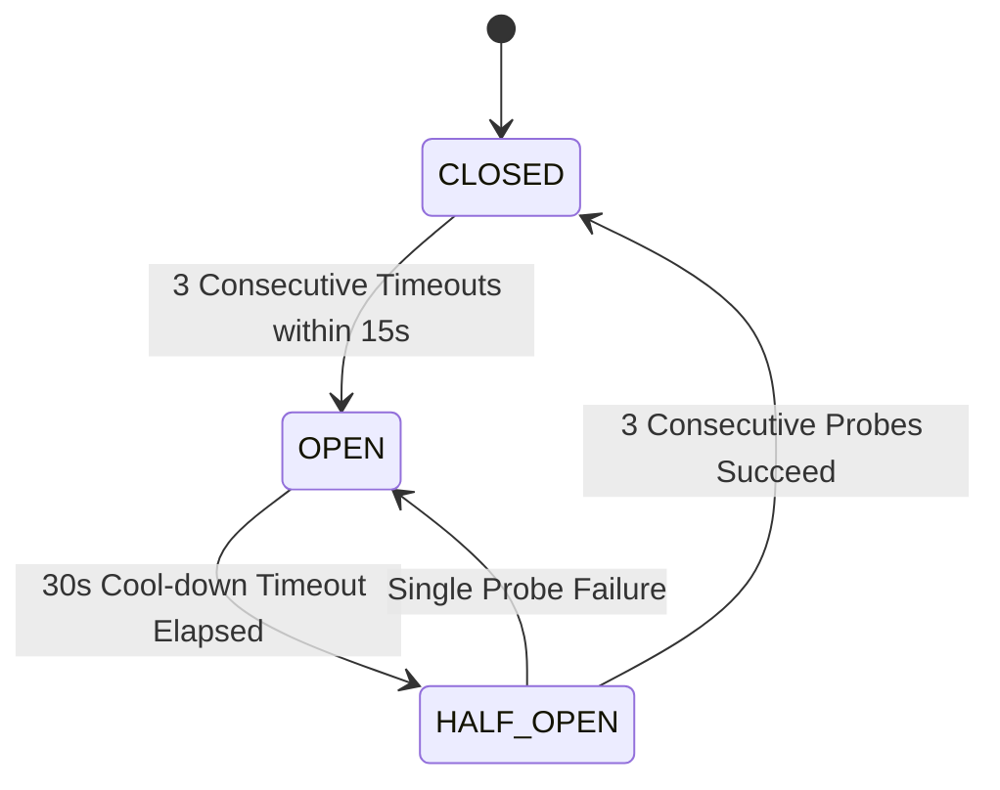

# Master Workflow Error Catalog & Incident Response Runbook
## Namma Clinic Digital Health & Operations Platform
**Document Code:** WORKFLOW-ERROR-01 | **Status:** Fault Management Baseline Approved | **Date:** September 2026

---

## 01. Fault Management & Error Architecture
The Namma Clinic Digital Health & Operations Platform enforces a deterministic, fail-safe error management framework across all 25 operational workflows. In a high-footfall primary healthcare environment operating on municipal edge hardware, technical anomalies, hardware jams, network partitions, and clinical data boundary violations must be trapped, isolated, and recovered without patient endangerment or administrative confusion.

This document establishes the master catalog of all standardized error codes (`ERROR-WF-XXX-YYYY`), defining root causes, localized bilingual user messages (English and Kannada UTF-8), structured diagnostic payloads, automated circuit-breaker self-healing behaviors, and manual operator runbooks.

## 02. Standardized Error Taxonomy
Every error emitted by the platform adheres to a standardized taxonomic structure:

```
ERROR-WF-<WF_NUM>-<CATEGORY_CODE><SEQUENCE>
Example: ERROR-WF-007-PRN001 (Workflow 07, Printer Category, Error 001)
```

| Category Code | Fault Category | Typical Root Cause | Automated Recovery Strategy |
| :--- | :--- | :--- | :--- |
| `HW` / `PRN` | Hardware & Peripherals | Printer jam, scanner disconnect, battery depletion | Alert operator modal; switch to virtual fallback |
| `NET` / `WAN` | Network & Telecom | Wide-area broadband cut, 4G packet loss, DNS timeout | Instant transition to local offline autonomous mode |
| `DB` / `STO` | Database & Storage | Disk quota full, lock contention, corrupted page | Isolate corrupted block; rollback uncommitted state |
| `SEC` / `AUTH` | Security & RBAC | Expired JWT, brute force attempt, invalid signature | Reject request with HTTP 401/403; lock IP if brute force |
| `CLN` / `SAF` | Clinical Safety | Biological implausibility, drug-drug interaction, MEWS red | Hard blocking error; mandatory Medical Officer signoff |
| `VAL` / `SCH` | Data Validation | Malformed regex, missing mandatory field, type error | Client-side red field highlight with Kannada prompt |
| `EXT` / `GW` | External Gateway | ABDM gateway timeout, 108 dispatch API down | Queue transaction in local offline cryptographic queue |

## 03. Master Exhaustive Workflow Error Catalog
Detailed diagnostic specifications, localized error text, and recovery runbooks for all workflows:

### Error Domain Suite: WF-001 (Master Clinic Day Operational Workflow)
Master error catalog governing the execution lifecycle of `WF-001`:

#### `ERROR-WF-01-HW01`: Hardware Peripheral Communication Timeout
- **Workflow Area:** `WF-001` (Master Clinic Day Operational Workflow) | **Error Category:** `Hardware`
- **Root Cause:** Peripheral device fails to respond within 2.5s over serial USB / Bluetooth bridge.
- **User Message (English):** "Master Clinic Day Operational Workflow Error: Hardware Peripheral Communication Timeout. Please check terminal and retry."
- **User Message (Kannada):** "Master Clinic Day Operational Workflow ದೋಷ: Hardware Peripheral Communication Timeout. ದಯವಿಟ್ಟು ಪರಿಶೀಲಿಸಿ ಮತ್ತು ಮತ್ತೆ ಪ್ರಯತ್ನಿಸಿ."
- **Technical Diagnostic Payload:**
```json
{
  "error_code": "ERROR-WF-01-HW01",
  "workflow_id": "WF-001",
  "category": "Hardware",
  "timestamp": "2026-09-04T12:00:00.000Z",
  "severity": "CRITICAL",
  "span_id": "telemetry.span.wf_001.error_hw01"
}
```
- **Automated Self-Healing:** Edge orchestrator logs anomaly, rolls back uncommitted local state, and routes to fallback buffer.
- **Operator Runbook Procedure:** Consult facility runbook `SOP-01-ERR-HW01`; reload paper roll, restart process, or verify network cable.
- **Downstream Station Impact:** Upstream queue holds active token; downstream stations alerted to operational delay.

#### `ERROR-WF-01-HW02`: Hardware Sensor Biological Reading Error
- **Workflow Area:** `WF-001` (Master Clinic Day Operational Workflow) | **Error Category:** `Hardware`
- **Root Cause:** Diagnostic sensor reports reading failure or loose electrode/probe attachment.
- **User Message (English):** "Master Clinic Day Operational Workflow Error: Hardware Sensor Biological Reading Error. Please check terminal and retry."
- **User Message (Kannada):** "Master Clinic Day Operational Workflow ದೋಷ: Hardware Sensor Biological Reading Error. ದಯವಿಟ್ಟು ಪರಿಶೀಲಿಸಿ ಮತ್ತು ಮತ್ತೆ ಪ್ರಯತ್ನಿಸಿ."
- **Technical Diagnostic Payload:**
```json
{
  "error_code": "ERROR-WF-01-HW02",
  "workflow_id": "WF-001",
  "category": "Hardware",
  "timestamp": "2026-09-04T12:00:00.000Z",
  "severity": "CRITICAL",
  "span_id": "telemetry.span.wf_001.error_hw02"
}
```
- **Automated Self-Healing:** Edge orchestrator logs anomaly, rolls back uncommitted local state, and routes to fallback buffer.
- **Operator Runbook Procedure:** Consult facility runbook `SOP-01-ERR-HW02`; reload paper roll, restart process, or verify network cable.
- **Downstream Station Impact:** Upstream queue holds active token; downstream stations alerted to operational delay.

#### `ERROR-WF-01-PRN01`: Thermal Paper Depletion or Mechanical Jam
- **Workflow Area:** `WF-001` (Master Clinic Day Operational Workflow) | **Error Category:** `Hardware`
- **Root Cause:** Thermal printer sensor flags paper out or mechanical roller jam during printing.
- **User Message (English):** "Master Clinic Day Operational Workflow Error: Thermal Paper Depletion or Mechanical Jam. Please check terminal and retry."
- **User Message (Kannada):** "Master Clinic Day Operational Workflow ದೋಷ: Thermal Paper Depletion or Mechanical Jam. ದಯವಿಟ್ಟು ಪರಿಶೀಲಿಸಿ ಮತ್ತು ಮತ್ತೆ ಪ್ರಯತ್ನಿಸಿ."
- **Technical Diagnostic Payload:**
```json
{
  "error_code": "ERROR-WF-01-PRN01",
  "workflow_id": "WF-001",
  "category": "Hardware",
  "timestamp": "2026-09-04T12:00:00.000Z",
  "severity": "CRITICAL",
  "span_id": "telemetry.span.wf_001.error_prn01"
}
```
- **Automated Self-Healing:** Edge orchestrator logs anomaly, rolls back uncommitted local state, and routes to fallback buffer.
- **Operator Runbook Procedure:** Consult facility runbook `SOP-01-ERR-PRN01`; reload paper roll, restart process, or verify network cable.
- **Downstream Station Impact:** Upstream queue holds active token; downstream stations alerted to operational delay.

#### `ERROR-WF-01-NET01`: Wide-Area Network Connection Severed
- **Workflow Area:** `WF-001` (Master Clinic Day Operational Workflow) | **Error Category:** `Network`
- **Root Cause:** Heartbeat probe to cloud gateway times out 3 consecutive times.
- **User Message (English):** "Master Clinic Day Operational Workflow Error: Wide-Area Network Connection Severed. Please check terminal and retry."
- **User Message (Kannada):** "Master Clinic Day Operational Workflow ದೋಷ: Wide-Area Network Connection Severed. ದಯವಿಟ್ಟು ಪರಿಶೀಲಿಸಿ ಮತ್ತು ಮತ್ತೆ ಪ್ರಯತ್ನಿಸಿ."
- **Technical Diagnostic Payload:**
```json
{
  "error_code": "ERROR-WF-01-NET01",
  "workflow_id": "WF-001",
  "category": "Network",
  "timestamp": "2026-09-04T12:00:00.000Z",
  "severity": "CRITICAL",
  "span_id": "telemetry.span.wf_001.error_net01"
}
```
- **Automated Self-Healing:** Edge orchestrator logs anomaly, rolls back uncommitted local state, and routes to fallback buffer.
- **Operator Runbook Procedure:** Consult facility runbook `SOP-01-ERR-NET01`; reload paper roll, restart process, or verify network cable.
- **Downstream Station Impact:** Upstream queue holds active token; downstream stations alerted to operational delay.

#### `ERROR-WF-01-NET02`: Peer Terminal Local LAN Disconnect
- **Workflow Area:** `WF-001` (Master Clinic Day Operational Workflow) | **Error Category:** `Network`
- **Root Cause:** Workstation lost Wi-Fi connection to the local clinic edge server.
- **User Message (English):** "Master Clinic Day Operational Workflow Error: Peer Terminal Local LAN Disconnect. Please check terminal and retry."
- **User Message (Kannada):** "Master Clinic Day Operational Workflow ದೋಷ: Peer Terminal Local LAN Disconnect. ದಯವಿಟ್ಟು ಪರಿಶೀಲಿಸಿ ಮತ್ತು ಮತ್ತೆ ಪ್ರಯತ್ನಿಸಿ."
- **Technical Diagnostic Payload:**
```json
{
  "error_code": "ERROR-WF-01-NET02",
  "workflow_id": "WF-001",
  "category": "Network",
  "timestamp": "2026-09-04T12:00:00.000Z",
  "severity": "CRITICAL",
  "span_id": "telemetry.span.wf_001.error_net02"
}
```
- **Automated Self-Healing:** Edge orchestrator logs anomaly, rolls back uncommitted local state, and routes to fallback buffer.
- **Operator Runbook Procedure:** Consult facility runbook `SOP-01-ERR-NET02`; reload paper roll, restart process, or verify network cable.
- **Downstream Station Impact:** Upstream queue holds active token; downstream stations alerted to operational delay.

#### `ERROR-WF-01-DB01`: Local Database Lock Contention Timeout
- **Workflow Area:** `WF-001` (Master Clinic Day Operational Workflow) | **Error Category:** `Database`
- **Root Cause:** Transaction failed to acquire SQLite write lock within 2,000ms.
- **User Message (English):** "Master Clinic Day Operational Workflow Error: Local Database Lock Contention Timeout. Please check terminal and retry."
- **User Message (Kannada):** "Master Clinic Day Operational Workflow ದೋಷ: Local Database Lock Contention Timeout. ದಯವಿಟ್ಟು ಪರಿಶೀಲಿಸಿ ಮತ್ತು ಮತ್ತೆ ಪ್ರಯತ್ನಿಸಿ."
- **Technical Diagnostic Payload:**
```json
{
  "error_code": "ERROR-WF-01-DB01",
  "workflow_id": "WF-001",
  "category": "Database",
  "timestamp": "2026-09-04T12:00:00.000Z",
  "severity": "CRITICAL",
  "span_id": "telemetry.span.wf_001.error_db01"
}
```
- **Automated Self-Healing:** Edge orchestrator logs anomaly, rolls back uncommitted local state, and routes to fallback buffer.
- **Operator Runbook Procedure:** Consult facility runbook `SOP-01-ERR-DB01`; reload paper roll, restart process, or verify network cable.
- **Downstream Station Impact:** Upstream queue holds active token; downstream stations alerted to operational delay.

#### `ERROR-WF-01-DB02`: Disk Storage Quota Warning Threshold
- **Workflow Area:** `WF-001` (Master Clinic Day Operational Workflow) | **Error Category:** `Database`
- **Root Cause:** Local edge server free storage capacity drops below 2.0 Gigabytes.
- **User Message (English):** "Master Clinic Day Operational Workflow Error: Disk Storage Quota Warning Threshold. Please check terminal and retry."
- **User Message (Kannada):** "Master Clinic Day Operational Workflow ದೋಷ: Disk Storage Quota Warning Threshold. ದಯವಿಟ್ಟು ಪರಿಶೀಲಿಸಿ ಮತ್ತು ಮತ್ತೆ ಪ್ರಯತ್ನಿಸಿ."
- **Technical Diagnostic Payload:**
```json
{
  "error_code": "ERROR-WF-01-DB02",
  "workflow_id": "WF-001",
  "category": "Database",
  "timestamp": "2026-09-04T12:00:00.000Z",
  "severity": "CRITICAL",
  "span_id": "telemetry.span.wf_001.error_db02"
}
```
- **Automated Self-Healing:** Edge orchestrator logs anomaly, rolls back uncommitted local state, and routes to fallback buffer.
- **Operator Runbook Procedure:** Consult facility runbook `SOP-01-ERR-DB02`; reload paper roll, restart process, or verify network cable.
- **Downstream Station Impact:** Upstream queue holds active token; downstream stations alerted to operational delay.

#### `ERROR-WF-01-SEC01`: Cryptographic Authentication Token Expired
- **Workflow Area:** `WF-001` (Master Clinic Day Operational Workflow) | **Error Category:** `Security`
- **Root Cause:** Staff JWT bearer token expired or has invalid signature.
- **User Message (English):** "Master Clinic Day Operational Workflow Error: Cryptographic Authentication Token Expired. Please check terminal and retry."
- **User Message (Kannada):** "Master Clinic Day Operational Workflow ದೋಷ: Cryptographic Authentication Token Expired. ದಯವಿಟ್ಟು ಪರಿಶೀಲಿಸಿ ಮತ್ತು ಮತ್ತೆ ಪ್ರಯತ್ನಿಸಿ."
- **Technical Diagnostic Payload:**
```json
{
  "error_code": "ERROR-WF-01-SEC01",
  "workflow_id": "WF-001",
  "category": "Security",
  "timestamp": "2026-09-04T12:00:00.000Z",
  "severity": "CRITICAL",
  "span_id": "telemetry.span.wf_001.error_sec01"
}
```
- **Automated Self-Healing:** Edge orchestrator logs anomaly, rolls back uncommitted local state, and routes to fallback buffer.
- **Operator Runbook Procedure:** Consult facility runbook `SOP-01-ERR-SEC01`; reload paper roll, restart process, or verify network cable.
- **Downstream Station Impact:** Upstream queue holds active token; downstream stations alerted to operational delay.

#### `ERROR-WF-01-SEC02`: Unauthorized RBAC Permission Boundary Breach
- **Workflow Area:** `WF-001` (Master Clinic Day Operational Workflow) | **Error Category:** `Security`
- **Root Cause:** Authenticated principal lacks required role claim for this action.
- **User Message (English):** "Master Clinic Day Operational Workflow Error: Unauthorized RBAC Permission Boundary Breach. Please check terminal and retry."
- **User Message (Kannada):** "Master Clinic Day Operational Workflow ದೋಷ: Unauthorized RBAC Permission Boundary Breach. ದಯವಿಟ್ಟು ಪರಿಶೀಲಿಸಿ ಮತ್ತು ಮತ್ತೆ ಪ್ರಯತ್ನಿಸಿ."
- **Technical Diagnostic Payload:**
```json
{
  "error_code": "ERROR-WF-01-SEC02",
  "workflow_id": "WF-001",
  "category": "Security",
  "timestamp": "2026-09-04T12:00:00.000Z",
  "severity": "CRITICAL",
  "span_id": "telemetry.span.wf_001.error_sec02"
}
```
- **Automated Self-Healing:** Edge orchestrator logs anomaly, rolls back uncommitted local state, and routes to fallback buffer.
- **Operator Runbook Procedure:** Consult facility runbook `SOP-01-ERR-SEC02`; reload paper roll, restart process, or verify network cable.
- **Downstream Station Impact:** Upstream queue holds active token; downstream stations alerted to operational delay.

#### `ERROR-WF-01-CLN01`: Physiological Boundary Plausibility Violation
- **Workflow Area:** `WF-001` (Master Clinic Day Operational Workflow) | **Error Category:** `Clinical`
- **Root Cause:** Entered vital sign or lab parameter is outside biologically possible human limits.
- **User Message (English):** "Master Clinic Day Operational Workflow Error: Physiological Boundary Plausibility Violation. Please check terminal and retry."
- **User Message (Kannada):** "Master Clinic Day Operational Workflow ದೋಷ: Physiological Boundary Plausibility Violation. ದಯವಿಟ್ಟು ಪರಿಶೀಲಿಸಿ ಮತ್ತು ಮತ್ತೆ ಪ್ರಯತ್ನಿಸಿ."
- **Technical Diagnostic Payload:**
```json
{
  "error_code": "ERROR-WF-01-CLN01",
  "workflow_id": "WF-001",
  "category": "Clinical",
  "timestamp": "2026-09-04T12:00:00.000Z",
  "severity": "CRITICAL",
  "span_id": "telemetry.span.wf_001.error_cln01"
}
```
- **Automated Self-Healing:** Edge orchestrator logs anomaly, rolls back uncommitted local state, and routes to fallback buffer.
- **Operator Runbook Procedure:** Consult facility runbook `SOP-01-ERR-CLN01`; reload paper roll, restart process, or verify network cable.
- **Downstream Station Impact:** Upstream queue holds active token; downstream stations alerted to operational delay.

#### `ERROR-WF-01-CLN02`: Severe Clinical Drug Contraindication
- **Workflow Area:** `WF-001` (Master Clinic Day Operational Workflow) | **Error Category:** `Clinical`
- **Root Cause:** Prescribed medication interacts with existing patient drug or allergy profile.
- **User Message (English):** "Master Clinic Day Operational Workflow Error: Severe Clinical Drug Contraindication. Please check terminal and retry."
- **User Message (Kannada):** "Master Clinic Day Operational Workflow ದೋಷ: Severe Clinical Drug Contraindication. ದಯವಿಟ್ಟು ಪರಿಶೀಲಿಸಿ ಮತ್ತು ಮತ್ತೆ ಪ್ರಯತ್ನಿಸಿ."
- **Technical Diagnostic Payload:**
```json
{
  "error_code": "ERROR-WF-01-CLN02",
  "workflow_id": "WF-001",
  "category": "Clinical",
  "timestamp": "2026-09-04T12:00:00.000Z",
  "severity": "CRITICAL",
  "span_id": "telemetry.span.wf_001.error_cln02"
}
```
- **Automated Self-Healing:** Edge orchestrator logs anomaly, rolls back uncommitted local state, and routes to fallback buffer.
- **Operator Runbook Procedure:** Consult facility runbook `SOP-01-ERR-CLN02`; reload paper roll, restart process, or verify network cable.
- **Downstream Station Impact:** Upstream queue holds active token; downstream stations alerted to operational delay.

#### `ERROR-WF-01-CLN03`: Acuity Code Red Escalation Trigger
- **Workflow Area:** `WF-001` (Master Clinic Day Operational Workflow) | **Error Category:** `Clinical`
- **Root Cause:** Patient exhibits life-threatening clinical danger signs requiring emergency team.
- **User Message (English):** "Master Clinic Day Operational Workflow Error: Acuity Code Red Escalation Trigger. Please check terminal and retry."
- **User Message (Kannada):** "Master Clinic Day Operational Workflow ದೋಷ: Acuity Code Red Escalation Trigger. ದಯವಿಟ್ಟು ಪರಿಶೀಲಿಸಿ ಮತ್ತು ಮತ್ತೆ ಪ್ರಯತ್ನಿಸಿ."
- **Technical Diagnostic Payload:**
```json
{
  "error_code": "ERROR-WF-01-CLN03",
  "workflow_id": "WF-001",
  "category": "Clinical",
  "timestamp": "2026-09-04T12:00:00.000Z",
  "severity": "CRITICAL",
  "span_id": "telemetry.span.wf_001.error_cln03"
}
```
- **Automated Self-Healing:** Edge orchestrator logs anomaly, rolls back uncommitted local state, and routes to fallback buffer.
- **Operator Runbook Procedure:** Consult facility runbook `SOP-01-ERR-CLN03`; reload paper roll, restart process, or verify network cable.
- **Downstream Station Impact:** Upstream queue holds active token; downstream stations alerted to operational delay.

#### `ERROR-WF-01-VAL01`: Mandatory Field Schema Validation Omission
- **Workflow Area:** `WF-001` (Master Clinic Day Operational Workflow) | **Error Category:** `Validation`
- **Root Cause:** Required data attribute omitted or fails regex format constraint.
- **User Message (English):** "Master Clinic Day Operational Workflow Error: Mandatory Field Schema Validation Omission. Please check terminal and retry."
- **User Message (Kannada):** "Master Clinic Day Operational Workflow ದೋಷ: Mandatory Field Schema Validation Omission. ದಯವಿಟ್ಟು ಪರಿಶೀಲಿಸಿ ಮತ್ತು ಮತ್ತೆ ಪ್ರಯತ್ನಿಸಿ."
- **Technical Diagnostic Payload:**
```json
{
  "error_code": "ERROR-WF-01-VAL01",
  "workflow_id": "WF-001",
  "category": "Validation",
  "timestamp": "2026-09-04T12:00:00.000Z",
  "severity": "CRITICAL",
  "span_id": "telemetry.span.wf_001.error_val01"
}
```
- **Automated Self-Healing:** Edge orchestrator logs anomaly, rolls back uncommitted local state, and routes to fallback buffer.
- **Operator Runbook Procedure:** Consult facility runbook `SOP-01-ERR-VAL01`; reload paper roll, restart process, or verify network cable.
- **Downstream Station Impact:** Upstream queue holds active token; downstream stations alerted to operational delay.

#### `ERROR-WF-01-VAL02`: Duplicate Identifier Conflict Rejection
- **Workflow Area:** `WF-001` (Master Clinic Day Operational Workflow) | **Error Category:** `Validation`
- **Root Cause:** Entered identifier conflicts with existing registered entity.
- **User Message (English):** "Master Clinic Day Operational Workflow Error: Duplicate Identifier Conflict Rejection. Please check terminal and retry."
- **User Message (Kannada):** "Master Clinic Day Operational Workflow ದೋಷ: Duplicate Identifier Conflict Rejection. ದಯವಿಟ್ಟು ಪರಿಶೀಲಿಸಿ ಮತ್ತು ಮತ್ತೆ ಪ್ರಯತ್ನಿಸಿ."
- **Technical Diagnostic Payload:**
```json
{
  "error_code": "ERROR-WF-01-VAL02",
  "workflow_id": "WF-001",
  "category": "Validation",
  "timestamp": "2026-09-04T12:00:00.000Z",
  "severity": "CRITICAL",
  "span_id": "telemetry.span.wf_001.error_val02"
}
```
- **Automated Self-Healing:** Edge orchestrator logs anomaly, rolls back uncommitted local state, and routes to fallback buffer.
- **Operator Runbook Procedure:** Consult facility runbook `SOP-01-ERR-VAL02`; reload paper roll, restart process, or verify network cable.
- **Downstream Station Impact:** Upstream queue holds active token; downstream stations alerted to operational delay.

#### `ERROR-WF-01-GW01`: External ABDM / BBMP Gateway API Timeout
- **Workflow Area:** `WF-001` (Master Clinic Day Operational Workflow) | **Error Category:** `External Gateway`
- **Root Cause:** National health gateway or municipal cloud fails to return HTTP 200 within SLA.
- **User Message (English):** "Master Clinic Day Operational Workflow Error: External ABDM / BBMP Gateway API Timeout. Please check terminal and retry."
- **User Message (Kannada):** "Master Clinic Day Operational Workflow ದೋಷ: External ABDM / BBMP Gateway API Timeout. ದಯವಿಟ್ಟು ಪರಿಶೀಲಿಸಿ ಮತ್ತು ಮತ್ತೆ ಪ್ರಯತ್ನಿಸಿ."
- **Technical Diagnostic Payload:**
```json
{
  "error_code": "ERROR-WF-01-GW01",
  "workflow_id": "WF-001",
  "category": "External Gateway",
  "timestamp": "2026-09-04T12:00:00.000Z",
  "severity": "CRITICAL",
  "span_id": "telemetry.span.wf_001.error_gw01"
}
```
- **Automated Self-Healing:** Edge orchestrator logs anomaly, rolls back uncommitted local state, and routes to fallback buffer.
- **Operator Runbook Procedure:** Consult facility runbook `SOP-01-ERR-GW01`; reload paper roll, restart process, or verify network cable.
- **Downstream Station Impact:** Upstream queue holds active token; downstream stations alerted to operational delay.

### Error Domain Suite: WF-002 (Staff Login, Multi-Factor Authentication & Session Management Workflow)
Master error catalog governing the execution lifecycle of `WF-002`:

#### `ERROR-WF-02-HW01`: Hardware Peripheral Communication Timeout
- **Workflow Area:** `WF-002` (Staff Login, Multi-Factor Authentication & Session Management Workflow) | **Error Category:** `Hardware`
- **Root Cause:** Peripheral device fails to respond within 2.5s over serial USB / Bluetooth bridge.
- **User Message (English):** "Staff Login, Multi-Factor Authentication & Session Management Workflow Error: Hardware Peripheral Communication Timeout. Please check terminal and retry."
- **User Message (Kannada):** "Staff Login, Multi-Factor Authentication & Session Management Workflow ದೋಷ: Hardware Peripheral Communication Timeout. ದಯವಿಟ್ಟು ಪರಿಶೀಲಿಸಿ ಮತ್ತು ಮತ್ತೆ ಪ್ರಯತ್ನಿಸಿ."
- **Technical Diagnostic Payload:**
```json
{
  "error_code": "ERROR-WF-02-HW01",
  "workflow_id": "WF-002",
  "category": "Hardware",
  "timestamp": "2026-09-04T12:00:00.000Z",
  "severity": "CRITICAL",
  "span_id": "telemetry.span.wf_002.error_hw01"
}
```
- **Automated Self-Healing:** Edge orchestrator logs anomaly, rolls back uncommitted local state, and routes to fallback buffer.
- **Operator Runbook Procedure:** Consult facility runbook `SOP-02-ERR-HW01`; reload paper roll, restart process, or verify network cable.
- **Downstream Station Impact:** Upstream queue holds active token; downstream stations alerted to operational delay.

#### `ERROR-WF-02-HW02`: Hardware Sensor Biological Reading Error
- **Workflow Area:** `WF-002` (Staff Login, Multi-Factor Authentication & Session Management Workflow) | **Error Category:** `Hardware`
- **Root Cause:** Diagnostic sensor reports reading failure or loose electrode/probe attachment.
- **User Message (English):** "Staff Login, Multi-Factor Authentication & Session Management Workflow Error: Hardware Sensor Biological Reading Error. Please check terminal and retry."
- **User Message (Kannada):** "Staff Login, Multi-Factor Authentication & Session Management Workflow ದೋಷ: Hardware Sensor Biological Reading Error. ದಯವಿಟ್ಟು ಪರಿಶೀಲಿಸಿ ಮತ್ತು ಮತ್ತೆ ಪ್ರಯತ್ನಿಸಿ."
- **Technical Diagnostic Payload:**
```json
{
  "error_code": "ERROR-WF-02-HW02",
  "workflow_id": "WF-002",
  "category": "Hardware",
  "timestamp": "2026-09-04T12:00:00.000Z",
  "severity": "CRITICAL",
  "span_id": "telemetry.span.wf_002.error_hw02"
}
```
- **Automated Self-Healing:** Edge orchestrator logs anomaly, rolls back uncommitted local state, and routes to fallback buffer.
- **Operator Runbook Procedure:** Consult facility runbook `SOP-02-ERR-HW02`; reload paper roll, restart process, or verify network cable.
- **Downstream Station Impact:** Upstream queue holds active token; downstream stations alerted to operational delay.

#### `ERROR-WF-02-PRN01`: Thermal Paper Depletion or Mechanical Jam
- **Workflow Area:** `WF-002` (Staff Login, Multi-Factor Authentication & Session Management Workflow) | **Error Category:** `Hardware`
- **Root Cause:** Thermal printer sensor flags paper out or mechanical roller jam during printing.
- **User Message (English):** "Staff Login, Multi-Factor Authentication & Session Management Workflow Error: Thermal Paper Depletion or Mechanical Jam. Please check terminal and retry."
- **User Message (Kannada):** "Staff Login, Multi-Factor Authentication & Session Management Workflow ದೋಷ: Thermal Paper Depletion or Mechanical Jam. ದಯವಿಟ್ಟು ಪರಿಶೀಲಿಸಿ ಮತ್ತು ಮತ್ತೆ ಪ್ರಯತ್ನಿಸಿ."
- **Technical Diagnostic Payload:**
```json
{
  "error_code": "ERROR-WF-02-PRN01",
  "workflow_id": "WF-002",
  "category": "Hardware",
  "timestamp": "2026-09-04T12:00:00.000Z",
  "severity": "CRITICAL",
  "span_id": "telemetry.span.wf_002.error_prn01"
}
```
- **Automated Self-Healing:** Edge orchestrator logs anomaly, rolls back uncommitted local state, and routes to fallback buffer.
- **Operator Runbook Procedure:** Consult facility runbook `SOP-02-ERR-PRN01`; reload paper roll, restart process, or verify network cable.
- **Downstream Station Impact:** Upstream queue holds active token; downstream stations alerted to operational delay.

#### `ERROR-WF-02-NET01`: Wide-Area Network Connection Severed
- **Workflow Area:** `WF-002` (Staff Login, Multi-Factor Authentication & Session Management Workflow) | **Error Category:** `Network`
- **Root Cause:** Heartbeat probe to cloud gateway times out 3 consecutive times.
- **User Message (English):** "Staff Login, Multi-Factor Authentication & Session Management Workflow Error: Wide-Area Network Connection Severed. Please check terminal and retry."
- **User Message (Kannada):** "Staff Login, Multi-Factor Authentication & Session Management Workflow ದೋಷ: Wide-Area Network Connection Severed. ದಯವಿಟ್ಟು ಪರಿಶೀಲಿಸಿ ಮತ್ತು ಮತ್ತೆ ಪ್ರಯತ್ನಿಸಿ."
- **Technical Diagnostic Payload:**
```json
{
  "error_code": "ERROR-WF-02-NET01",
  "workflow_id": "WF-002",
  "category": "Network",
  "timestamp": "2026-09-04T12:00:00.000Z",
  "severity": "CRITICAL",
  "span_id": "telemetry.span.wf_002.error_net01"
}
```
- **Automated Self-Healing:** Edge orchestrator logs anomaly, rolls back uncommitted local state, and routes to fallback buffer.
- **Operator Runbook Procedure:** Consult facility runbook `SOP-02-ERR-NET01`; reload paper roll, restart process, or verify network cable.
- **Downstream Station Impact:** Upstream queue holds active token; downstream stations alerted to operational delay.

#### `ERROR-WF-02-NET02`: Peer Terminal Local LAN Disconnect
- **Workflow Area:** `WF-002` (Staff Login, Multi-Factor Authentication & Session Management Workflow) | **Error Category:** `Network`
- **Root Cause:** Workstation lost Wi-Fi connection to the local clinic edge server.
- **User Message (English):** "Staff Login, Multi-Factor Authentication & Session Management Workflow Error: Peer Terminal Local LAN Disconnect. Please check terminal and retry."
- **User Message (Kannada):** "Staff Login, Multi-Factor Authentication & Session Management Workflow ದೋಷ: Peer Terminal Local LAN Disconnect. ದಯವಿಟ್ಟು ಪರಿಶೀಲಿಸಿ ಮತ್ತು ಮತ್ತೆ ಪ್ರಯತ್ನಿಸಿ."
- **Technical Diagnostic Payload:**
```json
{
  "error_code": "ERROR-WF-02-NET02",
  "workflow_id": "WF-002",
  "category": "Network",
  "timestamp": "2026-09-04T12:00:00.000Z",
  "severity": "CRITICAL",
  "span_id": "telemetry.span.wf_002.error_net02"
}
```
- **Automated Self-Healing:** Edge orchestrator logs anomaly, rolls back uncommitted local state, and routes to fallback buffer.
- **Operator Runbook Procedure:** Consult facility runbook `SOP-02-ERR-NET02`; reload paper roll, restart process, or verify network cable.
- **Downstream Station Impact:** Upstream queue holds active token; downstream stations alerted to operational delay.

#### `ERROR-WF-02-DB01`: Local Database Lock Contention Timeout
- **Workflow Area:** `WF-002` (Staff Login, Multi-Factor Authentication & Session Management Workflow) | **Error Category:** `Database`
- **Root Cause:** Transaction failed to acquire SQLite write lock within 2,000ms.
- **User Message (English):** "Staff Login, Multi-Factor Authentication & Session Management Workflow Error: Local Database Lock Contention Timeout. Please check terminal and retry."
- **User Message (Kannada):** "Staff Login, Multi-Factor Authentication & Session Management Workflow ದೋಷ: Local Database Lock Contention Timeout. ದಯವಿಟ್ಟು ಪರಿಶೀಲಿಸಿ ಮತ್ತು ಮತ್ತೆ ಪ್ರಯತ್ನಿಸಿ."
- **Technical Diagnostic Payload:**
```json
{
  "error_code": "ERROR-WF-02-DB01",
  "workflow_id": "WF-002",
  "category": "Database",
  "timestamp": "2026-09-04T12:00:00.000Z",
  "severity": "CRITICAL",
  "span_id": "telemetry.span.wf_002.error_db01"
}
```
- **Automated Self-Healing:** Edge orchestrator logs anomaly, rolls back uncommitted local state, and routes to fallback buffer.
- **Operator Runbook Procedure:** Consult facility runbook `SOP-02-ERR-DB01`; reload paper roll, restart process, or verify network cable.
- **Downstream Station Impact:** Upstream queue holds active token; downstream stations alerted to operational delay.

#### `ERROR-WF-02-DB02`: Disk Storage Quota Warning Threshold
- **Workflow Area:** `WF-002` (Staff Login, Multi-Factor Authentication & Session Management Workflow) | **Error Category:** `Database`
- **Root Cause:** Local edge server free storage capacity drops below 2.0 Gigabytes.
- **User Message (English):** "Staff Login, Multi-Factor Authentication & Session Management Workflow Error: Disk Storage Quota Warning Threshold. Please check terminal and retry."
- **User Message (Kannada):** "Staff Login, Multi-Factor Authentication & Session Management Workflow ದೋಷ: Disk Storage Quota Warning Threshold. ದಯವಿಟ್ಟು ಪರಿಶೀಲಿಸಿ ಮತ್ತು ಮತ್ತೆ ಪ್ರಯತ್ನಿಸಿ."
- **Technical Diagnostic Payload:**
```json
{
  "error_code": "ERROR-WF-02-DB02",
  "workflow_id": "WF-002",
  "category": "Database",
  "timestamp": "2026-09-04T12:00:00.000Z",
  "severity": "CRITICAL",
  "span_id": "telemetry.span.wf_002.error_db02"
}
```
- **Automated Self-Healing:** Edge orchestrator logs anomaly, rolls back uncommitted local state, and routes to fallback buffer.
- **Operator Runbook Procedure:** Consult facility runbook `SOP-02-ERR-DB02`; reload paper roll, restart process, or verify network cable.
- **Downstream Station Impact:** Upstream queue holds active token; downstream stations alerted to operational delay.

#### `ERROR-WF-02-SEC01`: Cryptographic Authentication Token Expired
- **Workflow Area:** `WF-002` (Staff Login, Multi-Factor Authentication & Session Management Workflow) | **Error Category:** `Security`
- **Root Cause:** Staff JWT bearer token expired or has invalid signature.
- **User Message (English):** "Staff Login, Multi-Factor Authentication & Session Management Workflow Error: Cryptographic Authentication Token Expired. Please check terminal and retry."
- **User Message (Kannada):** "Staff Login, Multi-Factor Authentication & Session Management Workflow ದೋಷ: Cryptographic Authentication Token Expired. ದಯವಿಟ್ಟು ಪರಿಶೀಲಿಸಿ ಮತ್ತು ಮತ್ತೆ ಪ್ರಯತ್ನಿಸಿ."
- **Technical Diagnostic Payload:**
```json
{
  "error_code": "ERROR-WF-02-SEC01",
  "workflow_id": "WF-002",
  "category": "Security",
  "timestamp": "2026-09-04T12:00:00.000Z",
  "severity": "CRITICAL",
  "span_id": "telemetry.span.wf_002.error_sec01"
}
```
- **Automated Self-Healing:** Edge orchestrator logs anomaly, rolls back uncommitted local state, and routes to fallback buffer.
- **Operator Runbook Procedure:** Consult facility runbook `SOP-02-ERR-SEC01`; reload paper roll, restart process, or verify network cable.
- **Downstream Station Impact:** Upstream queue holds active token; downstream stations alerted to operational delay.

#### `ERROR-WF-02-SEC02`: Unauthorized RBAC Permission Boundary Breach
- **Workflow Area:** `WF-002` (Staff Login, Multi-Factor Authentication & Session Management Workflow) | **Error Category:** `Security`
- **Root Cause:** Authenticated principal lacks required role claim for this action.
- **User Message (English):** "Staff Login, Multi-Factor Authentication & Session Management Workflow Error: Unauthorized RBAC Permission Boundary Breach. Please check terminal and retry."
- **User Message (Kannada):** "Staff Login, Multi-Factor Authentication & Session Management Workflow ದೋಷ: Unauthorized RBAC Permission Boundary Breach. ದಯವಿಟ್ಟು ಪರಿಶೀಲಿಸಿ ಮತ್ತು ಮತ್ತೆ ಪ್ರಯತ್ನಿಸಿ."
- **Technical Diagnostic Payload:**
```json
{
  "error_code": "ERROR-WF-02-SEC02",
  "workflow_id": "WF-002",
  "category": "Security",
  "timestamp": "2026-09-04T12:00:00.000Z",
  "severity": "CRITICAL",
  "span_id": "telemetry.span.wf_002.error_sec02"
}
```
- **Automated Self-Healing:** Edge orchestrator logs anomaly, rolls back uncommitted local state, and routes to fallback buffer.
- **Operator Runbook Procedure:** Consult facility runbook `SOP-02-ERR-SEC02`; reload paper roll, restart process, or verify network cable.
- **Downstream Station Impact:** Upstream queue holds active token; downstream stations alerted to operational delay.

#### `ERROR-WF-02-CLN01`: Physiological Boundary Plausibility Violation
- **Workflow Area:** `WF-002` (Staff Login, Multi-Factor Authentication & Session Management Workflow) | **Error Category:** `Clinical`
- **Root Cause:** Entered vital sign or lab parameter is outside biologically possible human limits.
- **User Message (English):** "Staff Login, Multi-Factor Authentication & Session Management Workflow Error: Physiological Boundary Plausibility Violation. Please check terminal and retry."
- **User Message (Kannada):** "Staff Login, Multi-Factor Authentication & Session Management Workflow ದೋಷ: Physiological Boundary Plausibility Violation. ದಯವಿಟ್ಟು ಪರಿಶೀಲಿಸಿ ಮತ್ತು ಮತ್ತೆ ಪ್ರಯತ್ನಿಸಿ."
- **Technical Diagnostic Payload:**
```json
{
  "error_code": "ERROR-WF-02-CLN01",
  "workflow_id": "WF-002",
  "category": "Clinical",
  "timestamp": "2026-09-04T12:00:00.000Z",
  "severity": "CRITICAL",
  "span_id": "telemetry.span.wf_002.error_cln01"
}
```
- **Automated Self-Healing:** Edge orchestrator logs anomaly, rolls back uncommitted local state, and routes to fallback buffer.
- **Operator Runbook Procedure:** Consult facility runbook `SOP-02-ERR-CLN01`; reload paper roll, restart process, or verify network cable.
- **Downstream Station Impact:** Upstream queue holds active token; downstream stations alerted to operational delay.

#### `ERROR-WF-02-CLN02`: Severe Clinical Drug Contraindication
- **Workflow Area:** `WF-002` (Staff Login, Multi-Factor Authentication & Session Management Workflow) | **Error Category:** `Clinical`
- **Root Cause:** Prescribed medication interacts with existing patient drug or allergy profile.
- **User Message (English):** "Staff Login, Multi-Factor Authentication & Session Management Workflow Error: Severe Clinical Drug Contraindication. Please check terminal and retry."
- **User Message (Kannada):** "Staff Login, Multi-Factor Authentication & Session Management Workflow ದೋಷ: Severe Clinical Drug Contraindication. ದಯವಿಟ್ಟು ಪರಿಶೀಲಿಸಿ ಮತ್ತು ಮತ್ತೆ ಪ್ರಯತ್ನಿಸಿ."
- **Technical Diagnostic Payload:**
```json
{
  "error_code": "ERROR-WF-02-CLN02",
  "workflow_id": "WF-002",
  "category": "Clinical",
  "timestamp": "2026-09-04T12:00:00.000Z",
  "severity": "CRITICAL",
  "span_id": "telemetry.span.wf_002.error_cln02"
}
```
- **Automated Self-Healing:** Edge orchestrator logs anomaly, rolls back uncommitted local state, and routes to fallback buffer.
- **Operator Runbook Procedure:** Consult facility runbook `SOP-02-ERR-CLN02`; reload paper roll, restart process, or verify network cable.
- **Downstream Station Impact:** Upstream queue holds active token; downstream stations alerted to operational delay.

#### `ERROR-WF-02-CLN03`: Acuity Code Red Escalation Trigger
- **Workflow Area:** `WF-002` (Staff Login, Multi-Factor Authentication & Session Management Workflow) | **Error Category:** `Clinical`
- **Root Cause:** Patient exhibits life-threatening clinical danger signs requiring emergency team.
- **User Message (English):** "Staff Login, Multi-Factor Authentication & Session Management Workflow Error: Acuity Code Red Escalation Trigger. Please check terminal and retry."
- **User Message (Kannada):** "Staff Login, Multi-Factor Authentication & Session Management Workflow ದೋಷ: Acuity Code Red Escalation Trigger. ದಯವಿಟ್ಟು ಪರಿಶೀಲಿಸಿ ಮತ್ತು ಮತ್ತೆ ಪ್ರಯತ್ನಿಸಿ."
- **Technical Diagnostic Payload:**
```json
{
  "error_code": "ERROR-WF-02-CLN03",
  "workflow_id": "WF-002",
  "category": "Clinical",
  "timestamp": "2026-09-04T12:00:00.000Z",
  "severity": "CRITICAL",
  "span_id": "telemetry.span.wf_002.error_cln03"
}
```
- **Automated Self-Healing:** Edge orchestrator logs anomaly, rolls back uncommitted local state, and routes to fallback buffer.
- **Operator Runbook Procedure:** Consult facility runbook `SOP-02-ERR-CLN03`; reload paper roll, restart process, or verify network cable.
- **Downstream Station Impact:** Upstream queue holds active token; downstream stations alerted to operational delay.

#### `ERROR-WF-02-VAL01`: Mandatory Field Schema Validation Omission
- **Workflow Area:** `WF-002` (Staff Login, Multi-Factor Authentication & Session Management Workflow) | **Error Category:** `Validation`
- **Root Cause:** Required data attribute omitted or fails regex format constraint.
- **User Message (English):** "Staff Login, Multi-Factor Authentication & Session Management Workflow Error: Mandatory Field Schema Validation Omission. Please check terminal and retry."
- **User Message (Kannada):** "Staff Login, Multi-Factor Authentication & Session Management Workflow ದೋಷ: Mandatory Field Schema Validation Omission. ದಯವಿಟ್ಟು ಪರಿಶೀಲಿಸಿ ಮತ್ತು ಮತ್ತೆ ಪ್ರಯತ್ನಿಸಿ."
- **Technical Diagnostic Payload:**
```json
{
  "error_code": "ERROR-WF-02-VAL01",
  "workflow_id": "WF-002",
  "category": "Validation",
  "timestamp": "2026-09-04T12:00:00.000Z",
  "severity": "CRITICAL",
  "span_id": "telemetry.span.wf_002.error_val01"
}
```
- **Automated Self-Healing:** Edge orchestrator logs anomaly, rolls back uncommitted local state, and routes to fallback buffer.
- **Operator Runbook Procedure:** Consult facility runbook `SOP-02-ERR-VAL01`; reload paper roll, restart process, or verify network cable.
- **Downstream Station Impact:** Upstream queue holds active token; downstream stations alerted to operational delay.

#### `ERROR-WF-02-VAL02`: Duplicate Identifier Conflict Rejection
- **Workflow Area:** `WF-002` (Staff Login, Multi-Factor Authentication & Session Management Workflow) | **Error Category:** `Validation`
- **Root Cause:** Entered identifier conflicts with existing registered entity.
- **User Message (English):** "Staff Login, Multi-Factor Authentication & Session Management Workflow Error: Duplicate Identifier Conflict Rejection. Please check terminal and retry."
- **User Message (Kannada):** "Staff Login, Multi-Factor Authentication & Session Management Workflow ದೋಷ: Duplicate Identifier Conflict Rejection. ದಯವಿಟ್ಟು ಪರಿಶೀಲಿಸಿ ಮತ್ತು ಮತ್ತೆ ಪ್ರಯತ್ನಿಸಿ."
- **Technical Diagnostic Payload:**
```json
{
  "error_code": "ERROR-WF-02-VAL02",
  "workflow_id": "WF-002",
  "category": "Validation",
  "timestamp": "2026-09-04T12:00:00.000Z",
  "severity": "CRITICAL",
  "span_id": "telemetry.span.wf_002.error_val02"
}
```
- **Automated Self-Healing:** Edge orchestrator logs anomaly, rolls back uncommitted local state, and routes to fallback buffer.
- **Operator Runbook Procedure:** Consult facility runbook `SOP-02-ERR-VAL02`; reload paper roll, restart process, or verify network cable.
- **Downstream Station Impact:** Upstream queue holds active token; downstream stations alerted to operational delay.

#### `ERROR-WF-02-GW01`: External ABDM / BBMP Gateway API Timeout
- **Workflow Area:** `WF-002` (Staff Login, Multi-Factor Authentication & Session Management Workflow) | **Error Category:** `External Gateway`
- **Root Cause:** National health gateway or municipal cloud fails to return HTTP 200 within SLA.
- **User Message (English):** "Staff Login, Multi-Factor Authentication & Session Management Workflow Error: External ABDM / BBMP Gateway API Timeout. Please check terminal and retry."
- **User Message (Kannada):** "Staff Login, Multi-Factor Authentication & Session Management Workflow ದೋಷ: External ABDM / BBMP Gateway API Timeout. ದಯವಿಟ್ಟು ಪರಿಶೀಲಿಸಿ ಮತ್ತು ಮತ್ತೆ ಪ್ರಯತ್ನಿಸಿ."
- **Technical Diagnostic Payload:**
```json
{
  "error_code": "ERROR-WF-02-GW01",
  "workflow_id": "WF-002",
  "category": "External Gateway",
  "timestamp": "2026-09-04T12:00:00.000Z",
  "severity": "CRITICAL",
  "span_id": "telemetry.span.wf_002.error_gw01"
}
```
- **Automated Self-Healing:** Edge orchestrator logs anomaly, rolls back uncommitted local state, and routes to fallback buffer.
- **Operator Runbook Procedure:** Consult facility runbook `SOP-02-ERR-GW01`; reload paper roll, restart process, or verify network cable.
- **Downstream Station Impact:** Upstream queue holds active token; downstream stations alerted to operational delay.

### Error Domain Suite: WF-003 (Patient Registration, ABHA Creation & Demographic Intake Workflow)
Master error catalog governing the execution lifecycle of `WF-003`:

#### `ERROR-WF-03-HW01`: Hardware Peripheral Communication Timeout
- **Workflow Area:** `WF-003` (Patient Registration, ABHA Creation & Demographic Intake Workflow) | **Error Category:** `Hardware`
- **Root Cause:** Peripheral device fails to respond within 2.5s over serial USB / Bluetooth bridge.
- **User Message (English):** "Patient Registration, ABHA Creation & Demographic Intake Workflow Error: Hardware Peripheral Communication Timeout. Please check terminal and retry."
- **User Message (Kannada):** "Patient Registration, ABHA Creation & Demographic Intake Workflow ದೋಷ: Hardware Peripheral Communication Timeout. ದಯವಿಟ್ಟು ಪರಿಶೀಲಿಸಿ ಮತ್ತು ಮತ್ತೆ ಪ್ರಯತ್ನಿಸಿ."
- **Technical Diagnostic Payload:**
```json
{
  "error_code": "ERROR-WF-03-HW01",
  "workflow_id": "WF-003",
  "category": "Hardware",
  "timestamp": "2026-09-04T12:00:00.000Z",
  "severity": "CRITICAL",
  "span_id": "telemetry.span.wf_003.error_hw01"
}
```
- **Automated Self-Healing:** Edge orchestrator logs anomaly, rolls back uncommitted local state, and routes to fallback buffer.
- **Operator Runbook Procedure:** Consult facility runbook `SOP-03-ERR-HW01`; reload paper roll, restart process, or verify network cable.
- **Downstream Station Impact:** Upstream queue holds active token; downstream stations alerted to operational delay.

#### `ERROR-WF-03-HW02`: Hardware Sensor Biological Reading Error
- **Workflow Area:** `WF-003` (Patient Registration, ABHA Creation & Demographic Intake Workflow) | **Error Category:** `Hardware`
- **Root Cause:** Diagnostic sensor reports reading failure or loose electrode/probe attachment.
- **User Message (English):** "Patient Registration, ABHA Creation & Demographic Intake Workflow Error: Hardware Sensor Biological Reading Error. Please check terminal and retry."
- **User Message (Kannada):** "Patient Registration, ABHA Creation & Demographic Intake Workflow ದೋಷ: Hardware Sensor Biological Reading Error. ದಯವಿಟ್ಟು ಪರಿಶೀಲಿಸಿ ಮತ್ತು ಮತ್ತೆ ಪ್ರಯತ್ನಿಸಿ."
- **Technical Diagnostic Payload:**
```json
{
  "error_code": "ERROR-WF-03-HW02",
  "workflow_id": "WF-003",
  "category": "Hardware",
  "timestamp": "2026-09-04T12:00:00.000Z",
  "severity": "CRITICAL",
  "span_id": "telemetry.span.wf_003.error_hw02"
}
```
- **Automated Self-Healing:** Edge orchestrator logs anomaly, rolls back uncommitted local state, and routes to fallback buffer.
- **Operator Runbook Procedure:** Consult facility runbook `SOP-03-ERR-HW02`; reload paper roll, restart process, or verify network cable.
- **Downstream Station Impact:** Upstream queue holds active token; downstream stations alerted to operational delay.

#### `ERROR-WF-03-PRN01`: Thermal Paper Depletion or Mechanical Jam
- **Workflow Area:** `WF-003` (Patient Registration, ABHA Creation & Demographic Intake Workflow) | **Error Category:** `Hardware`
- **Root Cause:** Thermal printer sensor flags paper out or mechanical roller jam during printing.
- **User Message (English):** "Patient Registration, ABHA Creation & Demographic Intake Workflow Error: Thermal Paper Depletion or Mechanical Jam. Please check terminal and retry."
- **User Message (Kannada):** "Patient Registration, ABHA Creation & Demographic Intake Workflow ದೋಷ: Thermal Paper Depletion or Mechanical Jam. ದಯವಿಟ್ಟು ಪರಿಶೀಲಿಸಿ ಮತ್ತು ಮತ್ತೆ ಪ್ರಯತ್ನಿಸಿ."
- **Technical Diagnostic Payload:**
```json
{
  "error_code": "ERROR-WF-03-PRN01",
  "workflow_id": "WF-003",
  "category": "Hardware",
  "timestamp": "2026-09-04T12:00:00.000Z",
  "severity": "CRITICAL",
  "span_id": "telemetry.span.wf_003.error_prn01"
}
```
- **Automated Self-Healing:** Edge orchestrator logs anomaly, rolls back uncommitted local state, and routes to fallback buffer.
- **Operator Runbook Procedure:** Consult facility runbook `SOP-03-ERR-PRN01`; reload paper roll, restart process, or verify network cable.
- **Downstream Station Impact:** Upstream queue holds active token; downstream stations alerted to operational delay.

#### `ERROR-WF-03-NET01`: Wide-Area Network Connection Severed
- **Workflow Area:** `WF-003` (Patient Registration, ABHA Creation & Demographic Intake Workflow) | **Error Category:** `Network`
- **Root Cause:** Heartbeat probe to cloud gateway times out 3 consecutive times.
- **User Message (English):** "Patient Registration, ABHA Creation & Demographic Intake Workflow Error: Wide-Area Network Connection Severed. Please check terminal and retry."
- **User Message (Kannada):** "Patient Registration, ABHA Creation & Demographic Intake Workflow ದೋಷ: Wide-Area Network Connection Severed. ದಯವಿಟ್ಟು ಪರಿಶೀಲಿಸಿ ಮತ್ತು ಮತ್ತೆ ಪ್ರಯತ್ನಿಸಿ."
- **Technical Diagnostic Payload:**
```json
{
  "error_code": "ERROR-WF-03-NET01",
  "workflow_id": "WF-003",
  "category": "Network",
  "timestamp": "2026-09-04T12:00:00.000Z",
  "severity": "CRITICAL",
  "span_id": "telemetry.span.wf_003.error_net01"
}
```
- **Automated Self-Healing:** Edge orchestrator logs anomaly, rolls back uncommitted local state, and routes to fallback buffer.
- **Operator Runbook Procedure:** Consult facility runbook `SOP-03-ERR-NET01`; reload paper roll, restart process, or verify network cable.
- **Downstream Station Impact:** Upstream queue holds active token; downstream stations alerted to operational delay.

#### `ERROR-WF-03-NET02`: Peer Terminal Local LAN Disconnect
- **Workflow Area:** `WF-003` (Patient Registration, ABHA Creation & Demographic Intake Workflow) | **Error Category:** `Network`
- **Root Cause:** Workstation lost Wi-Fi connection to the local clinic edge server.
- **User Message (English):** "Patient Registration, ABHA Creation & Demographic Intake Workflow Error: Peer Terminal Local LAN Disconnect. Please check terminal and retry."
- **User Message (Kannada):** "Patient Registration, ABHA Creation & Demographic Intake Workflow ದೋಷ: Peer Terminal Local LAN Disconnect. ದಯವಿಟ್ಟು ಪರಿಶೀಲಿಸಿ ಮತ್ತು ಮತ್ತೆ ಪ್ರಯತ್ನಿಸಿ."
- **Technical Diagnostic Payload:**
```json
{
  "error_code": "ERROR-WF-03-NET02",
  "workflow_id": "WF-003",
  "category": "Network",
  "timestamp": "2026-09-04T12:00:00.000Z",
  "severity": "CRITICAL",
  "span_id": "telemetry.span.wf_003.error_net02"
}
```
- **Automated Self-Healing:** Edge orchestrator logs anomaly, rolls back uncommitted local state, and routes to fallback buffer.
- **Operator Runbook Procedure:** Consult facility runbook `SOP-03-ERR-NET02`; reload paper roll, restart process, or verify network cable.
- **Downstream Station Impact:** Upstream queue holds active token; downstream stations alerted to operational delay.

#### `ERROR-WF-03-DB01`: Local Database Lock Contention Timeout
- **Workflow Area:** `WF-003` (Patient Registration, ABHA Creation & Demographic Intake Workflow) | **Error Category:** `Database`
- **Root Cause:** Transaction failed to acquire SQLite write lock within 2,000ms.
- **User Message (English):** "Patient Registration, ABHA Creation & Demographic Intake Workflow Error: Local Database Lock Contention Timeout. Please check terminal and retry."
- **User Message (Kannada):** "Patient Registration, ABHA Creation & Demographic Intake Workflow ದೋಷ: Local Database Lock Contention Timeout. ದಯವಿಟ್ಟು ಪರಿಶೀಲಿಸಿ ಮತ್ತು ಮತ್ತೆ ಪ್ರಯತ್ನಿಸಿ."
- **Technical Diagnostic Payload:**
```json
{
  "error_code": "ERROR-WF-03-DB01",
  "workflow_id": "WF-003",
  "category": "Database",
  "timestamp": "2026-09-04T12:00:00.000Z",
  "severity": "CRITICAL",
  "span_id": "telemetry.span.wf_003.error_db01"
}
```
- **Automated Self-Healing:** Edge orchestrator logs anomaly, rolls back uncommitted local state, and routes to fallback buffer.
- **Operator Runbook Procedure:** Consult facility runbook `SOP-03-ERR-DB01`; reload paper roll, restart process, or verify network cable.
- **Downstream Station Impact:** Upstream queue holds active token; downstream stations alerted to operational delay.

#### `ERROR-WF-03-DB02`: Disk Storage Quota Warning Threshold
- **Workflow Area:** `WF-003` (Patient Registration, ABHA Creation & Demographic Intake Workflow) | **Error Category:** `Database`
- **Root Cause:** Local edge server free storage capacity drops below 2.0 Gigabytes.
- **User Message (English):** "Patient Registration, ABHA Creation & Demographic Intake Workflow Error: Disk Storage Quota Warning Threshold. Please check terminal and retry."
- **User Message (Kannada):** "Patient Registration, ABHA Creation & Demographic Intake Workflow ದೋಷ: Disk Storage Quota Warning Threshold. ದಯವಿಟ್ಟು ಪರಿಶೀಲಿಸಿ ಮತ್ತು ಮತ್ತೆ ಪ್ರಯತ್ನಿಸಿ."
- **Technical Diagnostic Payload:**
```json
{
  "error_code": "ERROR-WF-03-DB02",
  "workflow_id": "WF-003",
  "category": "Database",
  "timestamp": "2026-09-04T12:00:00.000Z",
  "severity": "CRITICAL",
  "span_id": "telemetry.span.wf_003.error_db02"
}
```
- **Automated Self-Healing:** Edge orchestrator logs anomaly, rolls back uncommitted local state, and routes to fallback buffer.
- **Operator Runbook Procedure:** Consult facility runbook `SOP-03-ERR-DB02`; reload paper roll, restart process, or verify network cable.
- **Downstream Station Impact:** Upstream queue holds active token; downstream stations alerted to operational delay.

#### `ERROR-WF-03-SEC01`: Cryptographic Authentication Token Expired
- **Workflow Area:** `WF-003` (Patient Registration, ABHA Creation & Demographic Intake Workflow) | **Error Category:** `Security`
- **Root Cause:** Staff JWT bearer token expired or has invalid signature.
- **User Message (English):** "Patient Registration, ABHA Creation & Demographic Intake Workflow Error: Cryptographic Authentication Token Expired. Please check terminal and retry."
- **User Message (Kannada):** "Patient Registration, ABHA Creation & Demographic Intake Workflow ದೋಷ: Cryptographic Authentication Token Expired. ದಯವಿಟ್ಟು ಪರಿಶೀಲಿಸಿ ಮತ್ತು ಮತ್ತೆ ಪ್ರಯತ್ನಿಸಿ."
- **Technical Diagnostic Payload:**
```json
{
  "error_code": "ERROR-WF-03-SEC01",
  "workflow_id": "WF-003",
  "category": "Security",
  "timestamp": "2026-09-04T12:00:00.000Z",
  "severity": "CRITICAL",
  "span_id": "telemetry.span.wf_003.error_sec01"
}
```
- **Automated Self-Healing:** Edge orchestrator logs anomaly, rolls back uncommitted local state, and routes to fallback buffer.
- **Operator Runbook Procedure:** Consult facility runbook `SOP-03-ERR-SEC01`; reload paper roll, restart process, or verify network cable.
- **Downstream Station Impact:** Upstream queue holds active token; downstream stations alerted to operational delay.

#### `ERROR-WF-03-SEC02`: Unauthorized RBAC Permission Boundary Breach
- **Workflow Area:** `WF-003` (Patient Registration, ABHA Creation & Demographic Intake Workflow) | **Error Category:** `Security`
- **Root Cause:** Authenticated principal lacks required role claim for this action.
- **User Message (English):** "Patient Registration, ABHA Creation & Demographic Intake Workflow Error: Unauthorized RBAC Permission Boundary Breach. Please check terminal and retry."
- **User Message (Kannada):** "Patient Registration, ABHA Creation & Demographic Intake Workflow ದೋಷ: Unauthorized RBAC Permission Boundary Breach. ದಯವಿಟ್ಟು ಪರಿಶೀಲಿಸಿ ಮತ್ತು ಮತ್ತೆ ಪ್ರಯತ್ನಿಸಿ."
- **Technical Diagnostic Payload:**
```json
{
  "error_code": "ERROR-WF-03-SEC02",
  "workflow_id": "WF-003",
  "category": "Security",
  "timestamp": "2026-09-04T12:00:00.000Z",
  "severity": "CRITICAL",
  "span_id": "telemetry.span.wf_003.error_sec02"
}
```
- **Automated Self-Healing:** Edge orchestrator logs anomaly, rolls back uncommitted local state, and routes to fallback buffer.
- **Operator Runbook Procedure:** Consult facility runbook `SOP-03-ERR-SEC02`; reload paper roll, restart process, or verify network cable.
- **Downstream Station Impact:** Upstream queue holds active token; downstream stations alerted to operational delay.

#### `ERROR-WF-03-CLN01`: Physiological Boundary Plausibility Violation
- **Workflow Area:** `WF-003` (Patient Registration, ABHA Creation & Demographic Intake Workflow) | **Error Category:** `Clinical`
- **Root Cause:** Entered vital sign or lab parameter is outside biologically possible human limits.
- **User Message (English):** "Patient Registration, ABHA Creation & Demographic Intake Workflow Error: Physiological Boundary Plausibility Violation. Please check terminal and retry."
- **User Message (Kannada):** "Patient Registration, ABHA Creation & Demographic Intake Workflow ದೋಷ: Physiological Boundary Plausibility Violation. ದಯವಿಟ್ಟು ಪರಿಶೀಲಿಸಿ ಮತ್ತು ಮತ್ತೆ ಪ್ರಯತ್ನಿಸಿ."
- **Technical Diagnostic Payload:**
```json
{
  "error_code": "ERROR-WF-03-CLN01",
  "workflow_id": "WF-003",
  "category": "Clinical",
  "timestamp": "2026-09-04T12:00:00.000Z",
  "severity": "CRITICAL",
  "span_id": "telemetry.span.wf_003.error_cln01"
}
```
- **Automated Self-Healing:** Edge orchestrator logs anomaly, rolls back uncommitted local state, and routes to fallback buffer.
- **Operator Runbook Procedure:** Consult facility runbook `SOP-03-ERR-CLN01`; reload paper roll, restart process, or verify network cable.
- **Downstream Station Impact:** Upstream queue holds active token; downstream stations alerted to operational delay.

#### `ERROR-WF-03-CLN02`: Severe Clinical Drug Contraindication
- **Workflow Area:** `WF-003` (Patient Registration, ABHA Creation & Demographic Intake Workflow) | **Error Category:** `Clinical`
- **Root Cause:** Prescribed medication interacts with existing patient drug or allergy profile.
- **User Message (English):** "Patient Registration, ABHA Creation & Demographic Intake Workflow Error: Severe Clinical Drug Contraindication. Please check terminal and retry."
- **User Message (Kannada):** "Patient Registration, ABHA Creation & Demographic Intake Workflow ದೋಷ: Severe Clinical Drug Contraindication. ದಯವಿಟ್ಟು ಪರಿಶೀಲಿಸಿ ಮತ್ತು ಮತ್ತೆ ಪ್ರಯತ್ನಿಸಿ."
- **Technical Diagnostic Payload:**
```json
{
  "error_code": "ERROR-WF-03-CLN02",
  "workflow_id": "WF-003",
  "category": "Clinical",
  "timestamp": "2026-09-04T12:00:00.000Z",
  "severity": "CRITICAL",
  "span_id": "telemetry.span.wf_003.error_cln02"
}
```
- **Automated Self-Healing:** Edge orchestrator logs anomaly, rolls back uncommitted local state, and routes to fallback buffer.
- **Operator Runbook Procedure:** Consult facility runbook `SOP-03-ERR-CLN02`; reload paper roll, restart process, or verify network cable.
- **Downstream Station Impact:** Upstream queue holds active token; downstream stations alerted to operational delay.

#### `ERROR-WF-03-CLN03`: Acuity Code Red Escalation Trigger
- **Workflow Area:** `WF-003` (Patient Registration, ABHA Creation & Demographic Intake Workflow) | **Error Category:** `Clinical`
- **Root Cause:** Patient exhibits life-threatening clinical danger signs requiring emergency team.
- **User Message (English):** "Patient Registration, ABHA Creation & Demographic Intake Workflow Error: Acuity Code Red Escalation Trigger. Please check terminal and retry."
- **User Message (Kannada):** "Patient Registration, ABHA Creation & Demographic Intake Workflow ದೋಷ: Acuity Code Red Escalation Trigger. ದಯವಿಟ್ಟು ಪರಿಶೀಲಿಸಿ ಮತ್ತು ಮತ್ತೆ ಪ್ರಯತ್ನಿಸಿ."
- **Technical Diagnostic Payload:**
```json
{
  "error_code": "ERROR-WF-03-CLN03",
  "workflow_id": "WF-003",
  "category": "Clinical",
  "timestamp": "2026-09-04T12:00:00.000Z",
  "severity": "CRITICAL",
  "span_id": "telemetry.span.wf_003.error_cln03"
}
```
- **Automated Self-Healing:** Edge orchestrator logs anomaly, rolls back uncommitted local state, and routes to fallback buffer.
- **Operator Runbook Procedure:** Consult facility runbook `SOP-03-ERR-CLN03`; reload paper roll, restart process, or verify network cable.
- **Downstream Station Impact:** Upstream queue holds active token; downstream stations alerted to operational delay.

#### `ERROR-WF-03-VAL01`: Mandatory Field Schema Validation Omission
- **Workflow Area:** `WF-003` (Patient Registration, ABHA Creation & Demographic Intake Workflow) | **Error Category:** `Validation`
- **Root Cause:** Required data attribute omitted or fails regex format constraint.
- **User Message (English):** "Patient Registration, ABHA Creation & Demographic Intake Workflow Error: Mandatory Field Schema Validation Omission. Please check terminal and retry."
- **User Message (Kannada):** "Patient Registration, ABHA Creation & Demographic Intake Workflow ದೋಷ: Mandatory Field Schema Validation Omission. ದಯವಿಟ್ಟು ಪರಿಶೀಲಿಸಿ ಮತ್ತು ಮತ್ತೆ ಪ್ರಯತ್ನಿಸಿ."
- **Technical Diagnostic Payload:**
```json
{
  "error_code": "ERROR-WF-03-VAL01",
  "workflow_id": "WF-003",
  "category": "Validation",
  "timestamp": "2026-09-04T12:00:00.000Z",
  "severity": "CRITICAL",
  "span_id": "telemetry.span.wf_003.error_val01"
}
```
- **Automated Self-Healing:** Edge orchestrator logs anomaly, rolls back uncommitted local state, and routes to fallback buffer.
- **Operator Runbook Procedure:** Consult facility runbook `SOP-03-ERR-VAL01`; reload paper roll, restart process, or verify network cable.
- **Downstream Station Impact:** Upstream queue holds active token; downstream stations alerted to operational delay.

#### `ERROR-WF-03-VAL02`: Duplicate Identifier Conflict Rejection
- **Workflow Area:** `WF-003` (Patient Registration, ABHA Creation & Demographic Intake Workflow) | **Error Category:** `Validation`
- **Root Cause:** Entered identifier conflicts with existing registered entity.
- **User Message (English):** "Patient Registration, ABHA Creation & Demographic Intake Workflow Error: Duplicate Identifier Conflict Rejection. Please check terminal and retry."
- **User Message (Kannada):** "Patient Registration, ABHA Creation & Demographic Intake Workflow ದೋಷ: Duplicate Identifier Conflict Rejection. ದಯವಿಟ್ಟು ಪರಿಶೀಲಿಸಿ ಮತ್ತು ಮತ್ತೆ ಪ್ರಯತ್ನಿಸಿ."
- **Technical Diagnostic Payload:**
```json
{
  "error_code": "ERROR-WF-03-VAL02",
  "workflow_id": "WF-003",
  "category": "Validation",
  "timestamp": "2026-09-04T12:00:00.000Z",
  "severity": "CRITICAL",
  "span_id": "telemetry.span.wf_003.error_val02"
}
```
- **Automated Self-Healing:** Edge orchestrator logs anomaly, rolls back uncommitted local state, and routes to fallback buffer.
- **Operator Runbook Procedure:** Consult facility runbook `SOP-03-ERR-VAL02`; reload paper roll, restart process, or verify network cable.
- **Downstream Station Impact:** Upstream queue holds active token; downstream stations alerted to operational delay.

#### `ERROR-WF-03-GW01`: External ABDM / BBMP Gateway API Timeout
- **Workflow Area:** `WF-003` (Patient Registration, ABHA Creation & Demographic Intake Workflow) | **Error Category:** `External Gateway`
- **Root Cause:** National health gateway or municipal cloud fails to return HTTP 200 within SLA.
- **User Message (English):** "Patient Registration, ABHA Creation & Demographic Intake Workflow Error: External ABDM / BBMP Gateway API Timeout. Please check terminal and retry."
- **User Message (Kannada):** "Patient Registration, ABHA Creation & Demographic Intake Workflow ದೋಷ: External ABDM / BBMP Gateway API Timeout. ದಯವಿಟ್ಟು ಪರಿಶೀಲಿಸಿ ಮತ್ತು ಮತ್ತೆ ಪ್ರಯತ್ನಿಸಿ."
- **Technical Diagnostic Payload:**
```json
{
  "error_code": "ERROR-WF-03-GW01",
  "workflow_id": "WF-003",
  "category": "External Gateway",
  "timestamp": "2026-09-04T12:00:00.000Z",
  "severity": "CRITICAL",
  "span_id": "telemetry.span.wf_003.error_gw01"
}
```
- **Automated Self-Healing:** Edge orchestrator logs anomaly, rolls back uncommitted local state, and routes to fallback buffer.
- **Operator Runbook Procedure:** Consult facility runbook `SOP-03-ERR-GW01`; reload paper roll, restart process, or verify network cable.
- **Downstream Station Impact:** Upstream queue holds active token; downstream stations alerted to operational delay.

### Error Domain Suite: WF-004 (Patient Search, Multi-Parametric Lookup & Verification Workflow)
Master error catalog governing the execution lifecycle of `WF-004`:

#### `ERROR-WF-04-HW01`: Hardware Peripheral Communication Timeout
- **Workflow Area:** `WF-004` (Patient Search, Multi-Parametric Lookup & Verification Workflow) | **Error Category:** `Hardware`
- **Root Cause:** Peripheral device fails to respond within 2.5s over serial USB / Bluetooth bridge.
- **User Message (English):** "Patient Search, Multi-Parametric Lookup & Verification Workflow Error: Hardware Peripheral Communication Timeout. Please check terminal and retry."
- **User Message (Kannada):** "Patient Search, Multi-Parametric Lookup & Verification Workflow ದೋಷ: Hardware Peripheral Communication Timeout. ದಯವಿಟ್ಟು ಪರಿಶೀಲಿಸಿ ಮತ್ತು ಮತ್ತೆ ಪ್ರಯತ್ನಿಸಿ."
- **Technical Diagnostic Payload:**
```json
{
  "error_code": "ERROR-WF-04-HW01",
  "workflow_id": "WF-004",
  "category": "Hardware",
  "timestamp": "2026-09-04T12:00:00.000Z",
  "severity": "CRITICAL",
  "span_id": "telemetry.span.wf_004.error_hw01"
}
```
- **Automated Self-Healing:** Edge orchestrator logs anomaly, rolls back uncommitted local state, and routes to fallback buffer.
- **Operator Runbook Procedure:** Consult facility runbook `SOP-04-ERR-HW01`; reload paper roll, restart process, or verify network cable.
- **Downstream Station Impact:** Upstream queue holds active token; downstream stations alerted to operational delay.

#### `ERROR-WF-04-HW02`: Hardware Sensor Biological Reading Error
- **Workflow Area:** `WF-004` (Patient Search, Multi-Parametric Lookup & Verification Workflow) | **Error Category:** `Hardware`
- **Root Cause:** Diagnostic sensor reports reading failure or loose electrode/probe attachment.
- **User Message (English):** "Patient Search, Multi-Parametric Lookup & Verification Workflow Error: Hardware Sensor Biological Reading Error. Please check terminal and retry."
- **User Message (Kannada):** "Patient Search, Multi-Parametric Lookup & Verification Workflow ದೋಷ: Hardware Sensor Biological Reading Error. ದಯವಿಟ್ಟು ಪರಿಶೀಲಿಸಿ ಮತ್ತು ಮತ್ತೆ ಪ್ರಯತ್ನಿಸಿ."
- **Technical Diagnostic Payload:**
```json
{
  "error_code": "ERROR-WF-04-HW02",
  "workflow_id": "WF-004",
  "category": "Hardware",
  "timestamp": "2026-09-04T12:00:00.000Z",
  "severity": "CRITICAL",
  "span_id": "telemetry.span.wf_004.error_hw02"
}
```
- **Automated Self-Healing:** Edge orchestrator logs anomaly, rolls back uncommitted local state, and routes to fallback buffer.
- **Operator Runbook Procedure:** Consult facility runbook `SOP-04-ERR-HW02`; reload paper roll, restart process, or verify network cable.
- **Downstream Station Impact:** Upstream queue holds active token; downstream stations alerted to operational delay.

#### `ERROR-WF-04-PRN01`: Thermal Paper Depletion or Mechanical Jam
- **Workflow Area:** `WF-004` (Patient Search, Multi-Parametric Lookup & Verification Workflow) | **Error Category:** `Hardware`
- **Root Cause:** Thermal printer sensor flags paper out or mechanical roller jam during printing.
- **User Message (English):** "Patient Search, Multi-Parametric Lookup & Verification Workflow Error: Thermal Paper Depletion or Mechanical Jam. Please check terminal and retry."
- **User Message (Kannada):** "Patient Search, Multi-Parametric Lookup & Verification Workflow ದೋಷ: Thermal Paper Depletion or Mechanical Jam. ದಯವಿಟ್ಟು ಪರಿಶೀಲಿಸಿ ಮತ್ತು ಮತ್ತೆ ಪ್ರಯತ್ನಿಸಿ."
- **Technical Diagnostic Payload:**
```json
{
  "error_code": "ERROR-WF-04-PRN01",
  "workflow_id": "WF-004",
  "category": "Hardware",
  "timestamp": "2026-09-04T12:00:00.000Z",
  "severity": "CRITICAL",
  "span_id": "telemetry.span.wf_004.error_prn01"
}
```
- **Automated Self-Healing:** Edge orchestrator logs anomaly, rolls back uncommitted local state, and routes to fallback buffer.
- **Operator Runbook Procedure:** Consult facility runbook `SOP-04-ERR-PRN01`; reload paper roll, restart process, or verify network cable.
- **Downstream Station Impact:** Upstream queue holds active token; downstream stations alerted to operational delay.

#### `ERROR-WF-04-NET01`: Wide-Area Network Connection Severed
- **Workflow Area:** `WF-004` (Patient Search, Multi-Parametric Lookup & Verification Workflow) | **Error Category:** `Network`
- **Root Cause:** Heartbeat probe to cloud gateway times out 3 consecutive times.
- **User Message (English):** "Patient Search, Multi-Parametric Lookup & Verification Workflow Error: Wide-Area Network Connection Severed. Please check terminal and retry."
- **User Message (Kannada):** "Patient Search, Multi-Parametric Lookup & Verification Workflow ದೋಷ: Wide-Area Network Connection Severed. ದಯವಿಟ್ಟು ಪರಿಶೀಲಿಸಿ ಮತ್ತು ಮತ್ತೆ ಪ್ರಯತ್ನಿಸಿ."
- **Technical Diagnostic Payload:**
```json
{
  "error_code": "ERROR-WF-04-NET01",
  "workflow_id": "WF-004",
  "category": "Network",
  "timestamp": "2026-09-04T12:00:00.000Z",
  "severity": "CRITICAL",
  "span_id": "telemetry.span.wf_004.error_net01"
}
```
- **Automated Self-Healing:** Edge orchestrator logs anomaly, rolls back uncommitted local state, and routes to fallback buffer.
- **Operator Runbook Procedure:** Consult facility runbook `SOP-04-ERR-NET01`; reload paper roll, restart process, or verify network cable.
- **Downstream Station Impact:** Upstream queue holds active token; downstream stations alerted to operational delay.

#### `ERROR-WF-04-NET02`: Peer Terminal Local LAN Disconnect
- **Workflow Area:** `WF-004` (Patient Search, Multi-Parametric Lookup & Verification Workflow) | **Error Category:** `Network`
- **Root Cause:** Workstation lost Wi-Fi connection to the local clinic edge server.
- **User Message (English):** "Patient Search, Multi-Parametric Lookup & Verification Workflow Error: Peer Terminal Local LAN Disconnect. Please check terminal and retry."
- **User Message (Kannada):** "Patient Search, Multi-Parametric Lookup & Verification Workflow ದೋಷ: Peer Terminal Local LAN Disconnect. ದಯವಿಟ್ಟು ಪರಿಶೀಲಿಸಿ ಮತ್ತು ಮತ್ತೆ ಪ್ರಯತ್ನಿಸಿ."
- **Technical Diagnostic Payload:**
```json
{
  "error_code": "ERROR-WF-04-NET02",
  "workflow_id": "WF-004",
  "category": "Network",
  "timestamp": "2026-09-04T12:00:00.000Z",
  "severity": "CRITICAL",
  "span_id": "telemetry.span.wf_004.error_net02"
}
```
- **Automated Self-Healing:** Edge orchestrator logs anomaly, rolls back uncommitted local state, and routes to fallback buffer.
- **Operator Runbook Procedure:** Consult facility runbook `SOP-04-ERR-NET02`; reload paper roll, restart process, or verify network cable.
- **Downstream Station Impact:** Upstream queue holds active token; downstream stations alerted to operational delay.

#### `ERROR-WF-04-DB01`: Local Database Lock Contention Timeout
- **Workflow Area:** `WF-004` (Patient Search, Multi-Parametric Lookup & Verification Workflow) | **Error Category:** `Database`
- **Root Cause:** Transaction failed to acquire SQLite write lock within 2,000ms.
- **User Message (English):** "Patient Search, Multi-Parametric Lookup & Verification Workflow Error: Local Database Lock Contention Timeout. Please check terminal and retry."
- **User Message (Kannada):** "Patient Search, Multi-Parametric Lookup & Verification Workflow ದೋಷ: Local Database Lock Contention Timeout. ದಯವಿಟ್ಟು ಪರಿಶೀಲಿಸಿ ಮತ್ತು ಮತ್ತೆ ಪ್ರಯತ್ನಿಸಿ."
- **Technical Diagnostic Payload:**
```json
{
  "error_code": "ERROR-WF-04-DB01",
  "workflow_id": "WF-004",
  "category": "Database",
  "timestamp": "2026-09-04T12:00:00.000Z",
  "severity": "CRITICAL",
  "span_id": "telemetry.span.wf_004.error_db01"
}
```
- **Automated Self-Healing:** Edge orchestrator logs anomaly, rolls back uncommitted local state, and routes to fallback buffer.
- **Operator Runbook Procedure:** Consult facility runbook `SOP-04-ERR-DB01`; reload paper roll, restart process, or verify network cable.
- **Downstream Station Impact:** Upstream queue holds active token; downstream stations alerted to operational delay.

#### `ERROR-WF-04-DB02`: Disk Storage Quota Warning Threshold
- **Workflow Area:** `WF-004` (Patient Search, Multi-Parametric Lookup & Verification Workflow) | **Error Category:** `Database`
- **Root Cause:** Local edge server free storage capacity drops below 2.0 Gigabytes.
- **User Message (English):** "Patient Search, Multi-Parametric Lookup & Verification Workflow Error: Disk Storage Quota Warning Threshold. Please check terminal and retry."
- **User Message (Kannada):** "Patient Search, Multi-Parametric Lookup & Verification Workflow ದೋಷ: Disk Storage Quota Warning Threshold. ದಯವಿಟ್ಟು ಪರಿಶೀಲಿಸಿ ಮತ್ತು ಮತ್ತೆ ಪ್ರಯತ್ನಿಸಿ."
- **Technical Diagnostic Payload:**
```json
{
  "error_code": "ERROR-WF-04-DB02",
  "workflow_id": "WF-004",
  "category": "Database",
  "timestamp": "2026-09-04T12:00:00.000Z",
  "severity": "CRITICAL",
  "span_id": "telemetry.span.wf_004.error_db02"
}
```
- **Automated Self-Healing:** Edge orchestrator logs anomaly, rolls back uncommitted local state, and routes to fallback buffer.
- **Operator Runbook Procedure:** Consult facility runbook `SOP-04-ERR-DB02`; reload paper roll, restart process, or verify network cable.
- **Downstream Station Impact:** Upstream queue holds active token; downstream stations alerted to operational delay.

#### `ERROR-WF-04-SEC01`: Cryptographic Authentication Token Expired
- **Workflow Area:** `WF-004` (Patient Search, Multi-Parametric Lookup & Verification Workflow) | **Error Category:** `Security`
- **Root Cause:** Staff JWT bearer token expired or has invalid signature.
- **User Message (English):** "Patient Search, Multi-Parametric Lookup & Verification Workflow Error: Cryptographic Authentication Token Expired. Please check terminal and retry."
- **User Message (Kannada):** "Patient Search, Multi-Parametric Lookup & Verification Workflow ದೋಷ: Cryptographic Authentication Token Expired. ದಯವಿಟ್ಟು ಪರಿಶೀಲಿಸಿ ಮತ್ತು ಮತ್ತೆ ಪ್ರಯತ್ನಿಸಿ."
- **Technical Diagnostic Payload:**
```json
{
  "error_code": "ERROR-WF-04-SEC01",
  "workflow_id": "WF-004",
  "category": "Security",
  "timestamp": "2026-09-04T12:00:00.000Z",
  "severity": "CRITICAL",
  "span_id": "telemetry.span.wf_004.error_sec01"
}
```
- **Automated Self-Healing:** Edge orchestrator logs anomaly, rolls back uncommitted local state, and routes to fallback buffer.
- **Operator Runbook Procedure:** Consult facility runbook `SOP-04-ERR-SEC01`; reload paper roll, restart process, or verify network cable.
- **Downstream Station Impact:** Upstream queue holds active token; downstream stations alerted to operational delay.

#### `ERROR-WF-04-SEC02`: Unauthorized RBAC Permission Boundary Breach
- **Workflow Area:** `WF-004` (Patient Search, Multi-Parametric Lookup & Verification Workflow) | **Error Category:** `Security`
- **Root Cause:** Authenticated principal lacks required role claim for this action.
- **User Message (English):** "Patient Search, Multi-Parametric Lookup & Verification Workflow Error: Unauthorized RBAC Permission Boundary Breach. Please check terminal and retry."
- **User Message (Kannada):** "Patient Search, Multi-Parametric Lookup & Verification Workflow ದೋಷ: Unauthorized RBAC Permission Boundary Breach. ದಯವಿಟ್ಟು ಪರಿಶೀಲಿಸಿ ಮತ್ತು ಮತ್ತೆ ಪ್ರಯತ್ನಿಸಿ."
- **Technical Diagnostic Payload:**
```json
{
  "error_code": "ERROR-WF-04-SEC02",
  "workflow_id": "WF-004",
  "category": "Security",
  "timestamp": "2026-09-04T12:00:00.000Z",
  "severity": "CRITICAL",
  "span_id": "telemetry.span.wf_004.error_sec02"
}
```
- **Automated Self-Healing:** Edge orchestrator logs anomaly, rolls back uncommitted local state, and routes to fallback buffer.
- **Operator Runbook Procedure:** Consult facility runbook `SOP-04-ERR-SEC02`; reload paper roll, restart process, or verify network cable.
- **Downstream Station Impact:** Upstream queue holds active token; downstream stations alerted to operational delay.

#### `ERROR-WF-04-CLN01`: Physiological Boundary Plausibility Violation
- **Workflow Area:** `WF-004` (Patient Search, Multi-Parametric Lookup & Verification Workflow) | **Error Category:** `Clinical`
- **Root Cause:** Entered vital sign or lab parameter is outside biologically possible human limits.
- **User Message (English):** "Patient Search, Multi-Parametric Lookup & Verification Workflow Error: Physiological Boundary Plausibility Violation. Please check terminal and retry."
- **User Message (Kannada):** "Patient Search, Multi-Parametric Lookup & Verification Workflow ದೋಷ: Physiological Boundary Plausibility Violation. ದಯವಿಟ್ಟು ಪರಿಶೀಲಿಸಿ ಮತ್ತು ಮತ್ತೆ ಪ್ರಯತ್ನಿಸಿ."
- **Technical Diagnostic Payload:**
```json
{
  "error_code": "ERROR-WF-04-CLN01",
  "workflow_id": "WF-004",
  "category": "Clinical",
  "timestamp": "2026-09-04T12:00:00.000Z",
  "severity": "CRITICAL",
  "span_id": "telemetry.span.wf_004.error_cln01"
}
```
- **Automated Self-Healing:** Edge orchestrator logs anomaly, rolls back uncommitted local state, and routes to fallback buffer.
- **Operator Runbook Procedure:** Consult facility runbook `SOP-04-ERR-CLN01`; reload paper roll, restart process, or verify network cable.
- **Downstream Station Impact:** Upstream queue holds active token; downstream stations alerted to operational delay.

#### `ERROR-WF-04-CLN02`: Severe Clinical Drug Contraindication
- **Workflow Area:** `WF-004` (Patient Search, Multi-Parametric Lookup & Verification Workflow) | **Error Category:** `Clinical`
- **Root Cause:** Prescribed medication interacts with existing patient drug or allergy profile.
- **User Message (English):** "Patient Search, Multi-Parametric Lookup & Verification Workflow Error: Severe Clinical Drug Contraindication. Please check terminal and retry."
- **User Message (Kannada):** "Patient Search, Multi-Parametric Lookup & Verification Workflow ದೋಷ: Severe Clinical Drug Contraindication. ದಯವಿಟ್ಟು ಪರಿಶೀಲಿಸಿ ಮತ್ತು ಮತ್ತೆ ಪ್ರಯತ್ನಿಸಿ."
- **Technical Diagnostic Payload:**
```json
{
  "error_code": "ERROR-WF-04-CLN02",
  "workflow_id": "WF-004",
  "category": "Clinical",
  "timestamp": "2026-09-04T12:00:00.000Z",
  "severity": "CRITICAL",
  "span_id": "telemetry.span.wf_004.error_cln02"
}
```
- **Automated Self-Healing:** Edge orchestrator logs anomaly, rolls back uncommitted local state, and routes to fallback buffer.
- **Operator Runbook Procedure:** Consult facility runbook `SOP-04-ERR-CLN02`; reload paper roll, restart process, or verify network cable.
- **Downstream Station Impact:** Upstream queue holds active token; downstream stations alerted to operational delay.

#### `ERROR-WF-04-CLN03`: Acuity Code Red Escalation Trigger
- **Workflow Area:** `WF-004` (Patient Search, Multi-Parametric Lookup & Verification Workflow) | **Error Category:** `Clinical`
- **Root Cause:** Patient exhibits life-threatening clinical danger signs requiring emergency team.
- **User Message (English):** "Patient Search, Multi-Parametric Lookup & Verification Workflow Error: Acuity Code Red Escalation Trigger. Please check terminal and retry."
- **User Message (Kannada):** "Patient Search, Multi-Parametric Lookup & Verification Workflow ದೋಷ: Acuity Code Red Escalation Trigger. ದಯವಿಟ್ಟು ಪರಿಶೀಲಿಸಿ ಮತ್ತು ಮತ್ತೆ ಪ್ರಯತ್ನಿಸಿ."
- **Technical Diagnostic Payload:**
```json
{
  "error_code": "ERROR-WF-04-CLN03",
  "workflow_id": "WF-004",
  "category": "Clinical",
  "timestamp": "2026-09-04T12:00:00.000Z",
  "severity": "CRITICAL",
  "span_id": "telemetry.span.wf_004.error_cln03"
}
```
- **Automated Self-Healing:** Edge orchestrator logs anomaly, rolls back uncommitted local state, and routes to fallback buffer.
- **Operator Runbook Procedure:** Consult facility runbook `SOP-04-ERR-CLN03`; reload paper roll, restart process, or verify network cable.
- **Downstream Station Impact:** Upstream queue holds active token; downstream stations alerted to operational delay.

#### `ERROR-WF-04-VAL01`: Mandatory Field Schema Validation Omission
- **Workflow Area:** `WF-004` (Patient Search, Multi-Parametric Lookup & Verification Workflow) | **Error Category:** `Validation`
- **Root Cause:** Required data attribute omitted or fails regex format constraint.
- **User Message (English):** "Patient Search, Multi-Parametric Lookup & Verification Workflow Error: Mandatory Field Schema Validation Omission. Please check terminal and retry."
- **User Message (Kannada):** "Patient Search, Multi-Parametric Lookup & Verification Workflow ದೋಷ: Mandatory Field Schema Validation Omission. ದಯವಿಟ್ಟು ಪರಿಶೀಲಿಸಿ ಮತ್ತು ಮತ್ತೆ ಪ್ರಯತ್ನಿಸಿ."
- **Technical Diagnostic Payload:**
```json
{
  "error_code": "ERROR-WF-04-VAL01",
  "workflow_id": "WF-004",
  "category": "Validation",
  "timestamp": "2026-09-04T12:00:00.000Z",
  "severity": "CRITICAL",
  "span_id": "telemetry.span.wf_004.error_val01"
}
```
- **Automated Self-Healing:** Edge orchestrator logs anomaly, rolls back uncommitted local state, and routes to fallback buffer.
- **Operator Runbook Procedure:** Consult facility runbook `SOP-04-ERR-VAL01`; reload paper roll, restart process, or verify network cable.
- **Downstream Station Impact:** Upstream queue holds active token; downstream stations alerted to operational delay.

#### `ERROR-WF-04-VAL02`: Duplicate Identifier Conflict Rejection
- **Workflow Area:** `WF-004` (Patient Search, Multi-Parametric Lookup & Verification Workflow) | **Error Category:** `Validation`
- **Root Cause:** Entered identifier conflicts with existing registered entity.
- **User Message (English):** "Patient Search, Multi-Parametric Lookup & Verification Workflow Error: Duplicate Identifier Conflict Rejection. Please check terminal and retry."
- **User Message (Kannada):** "Patient Search, Multi-Parametric Lookup & Verification Workflow ದೋಷ: Duplicate Identifier Conflict Rejection. ದಯವಿಟ್ಟು ಪರಿಶೀಲಿಸಿ ಮತ್ತು ಮತ್ತೆ ಪ್ರಯತ್ನಿಸಿ."
- **Technical Diagnostic Payload:**
```json
{
  "error_code": "ERROR-WF-04-VAL02",
  "workflow_id": "WF-004",
  "category": "Validation",
  "timestamp": "2026-09-04T12:00:00.000Z",
  "severity": "CRITICAL",
  "span_id": "telemetry.span.wf_004.error_val02"
}
```
- **Automated Self-Healing:** Edge orchestrator logs anomaly, rolls back uncommitted local state, and routes to fallback buffer.
- **Operator Runbook Procedure:** Consult facility runbook `SOP-04-ERR-VAL02`; reload paper roll, restart process, or verify network cable.
- **Downstream Station Impact:** Upstream queue holds active token; downstream stations alerted to operational delay.

#### `ERROR-WF-04-GW01`: External ABDM / BBMP Gateway API Timeout
- **Workflow Area:** `WF-004` (Patient Search, Multi-Parametric Lookup & Verification Workflow) | **Error Category:** `External Gateway`
- **Root Cause:** National health gateway or municipal cloud fails to return HTTP 200 within SLA.
- **User Message (English):** "Patient Search, Multi-Parametric Lookup & Verification Workflow Error: External ABDM / BBMP Gateway API Timeout. Please check terminal and retry."
- **User Message (Kannada):** "Patient Search, Multi-Parametric Lookup & Verification Workflow ದೋಷ: External ABDM / BBMP Gateway API Timeout. ದಯವಿಟ್ಟು ಪರಿಶೀಲಿಸಿ ಮತ್ತು ಮತ್ತೆ ಪ್ರಯತ್ನಿಸಿ."
- **Technical Diagnostic Payload:**
```json
{
  "error_code": "ERROR-WF-04-GW01",
  "workflow_id": "WF-004",
  "category": "External Gateway",
  "timestamp": "2026-09-04T12:00:00.000Z",
  "severity": "CRITICAL",
  "span_id": "telemetry.span.wf_004.error_gw01"
}
```
- **Automated Self-Healing:** Edge orchestrator logs anomaly, rolls back uncommitted local state, and routes to fallback buffer.
- **Operator Runbook Procedure:** Consult facility runbook `SOP-04-ERR-GW01`; reload paper roll, restart process, or verify network cable.
- **Downstream Station Impact:** Upstream queue holds active token; downstream stations alerted to operational delay.

### Error Domain Suite: WF-005 (Repeat Patient Revisit & Longitudinal Episode Linking Workflow)
Master error catalog governing the execution lifecycle of `WF-005`:

#### `ERROR-WF-05-HW01`: Hardware Peripheral Communication Timeout
- **Workflow Area:** `WF-005` (Repeat Patient Revisit & Longitudinal Episode Linking Workflow) | **Error Category:** `Hardware`
- **Root Cause:** Peripheral device fails to respond within 2.5s over serial USB / Bluetooth bridge.
- **User Message (English):** "Repeat Patient Revisit & Longitudinal Episode Linking Workflow Error: Hardware Peripheral Communication Timeout. Please check terminal and retry."
- **User Message (Kannada):** "Repeat Patient Revisit & Longitudinal Episode Linking Workflow ದೋಷ: Hardware Peripheral Communication Timeout. ದಯವಿಟ್ಟು ಪರಿಶೀಲಿಸಿ ಮತ್ತು ಮತ್ತೆ ಪ್ರಯತ್ನಿಸಿ."
- **Technical Diagnostic Payload:**
```json
{
  "error_code": "ERROR-WF-05-HW01",
  "workflow_id": "WF-005",
  "category": "Hardware",
  "timestamp": "2026-09-04T12:00:00.000Z",
  "severity": "CRITICAL",
  "span_id": "telemetry.span.wf_005.error_hw01"
}
```
- **Automated Self-Healing:** Edge orchestrator logs anomaly, rolls back uncommitted local state, and routes to fallback buffer.
- **Operator Runbook Procedure:** Consult facility runbook `SOP-05-ERR-HW01`; reload paper roll, restart process, or verify network cable.
- **Downstream Station Impact:** Upstream queue holds active token; downstream stations alerted to operational delay.

#### `ERROR-WF-05-HW02`: Hardware Sensor Biological Reading Error
- **Workflow Area:** `WF-005` (Repeat Patient Revisit & Longitudinal Episode Linking Workflow) | **Error Category:** `Hardware`
- **Root Cause:** Diagnostic sensor reports reading failure or loose electrode/probe attachment.
- **User Message (English):** "Repeat Patient Revisit & Longitudinal Episode Linking Workflow Error: Hardware Sensor Biological Reading Error. Please check terminal and retry."
- **User Message (Kannada):** "Repeat Patient Revisit & Longitudinal Episode Linking Workflow ದೋಷ: Hardware Sensor Biological Reading Error. ದಯವಿಟ್ಟು ಪರಿಶೀಲಿಸಿ ಮತ್ತು ಮತ್ತೆ ಪ್ರಯತ್ನಿಸಿ."
- **Technical Diagnostic Payload:**
```json
{
  "error_code": "ERROR-WF-05-HW02",
  "workflow_id": "WF-005",
  "category": "Hardware",
  "timestamp": "2026-09-04T12:00:00.000Z",
  "severity": "CRITICAL",
  "span_id": "telemetry.span.wf_005.error_hw02"
}
```
- **Automated Self-Healing:** Edge orchestrator logs anomaly, rolls back uncommitted local state, and routes to fallback buffer.
- **Operator Runbook Procedure:** Consult facility runbook `SOP-05-ERR-HW02`; reload paper roll, restart process, or verify network cable.
- **Downstream Station Impact:** Upstream queue holds active token; downstream stations alerted to operational delay.

#### `ERROR-WF-05-PRN01`: Thermal Paper Depletion or Mechanical Jam
- **Workflow Area:** `WF-005` (Repeat Patient Revisit & Longitudinal Episode Linking Workflow) | **Error Category:** `Hardware`
- **Root Cause:** Thermal printer sensor flags paper out or mechanical roller jam during printing.
- **User Message (English):** "Repeat Patient Revisit & Longitudinal Episode Linking Workflow Error: Thermal Paper Depletion or Mechanical Jam. Please check terminal and retry."
- **User Message (Kannada):** "Repeat Patient Revisit & Longitudinal Episode Linking Workflow ದೋಷ: Thermal Paper Depletion or Mechanical Jam. ದಯವಿಟ್ಟು ಪರಿಶೀಲಿಸಿ ಮತ್ತು ಮತ್ತೆ ಪ್ರಯತ್ನಿಸಿ."
- **Technical Diagnostic Payload:**
```json
{
  "error_code": "ERROR-WF-05-PRN01",
  "workflow_id": "WF-005",
  "category": "Hardware",
  "timestamp": "2026-09-04T12:00:00.000Z",
  "severity": "CRITICAL",
  "span_id": "telemetry.span.wf_005.error_prn01"
}
```
- **Automated Self-Healing:** Edge orchestrator logs anomaly, rolls back uncommitted local state, and routes to fallback buffer.
- **Operator Runbook Procedure:** Consult facility runbook `SOP-05-ERR-PRN01`; reload paper roll, restart process, or verify network cable.
- **Downstream Station Impact:** Upstream queue holds active token; downstream stations alerted to operational delay.

#### `ERROR-WF-05-NET01`: Wide-Area Network Connection Severed
- **Workflow Area:** `WF-005` (Repeat Patient Revisit & Longitudinal Episode Linking Workflow) | **Error Category:** `Network`
- **Root Cause:** Heartbeat probe to cloud gateway times out 3 consecutive times.
- **User Message (English):** "Repeat Patient Revisit & Longitudinal Episode Linking Workflow Error: Wide-Area Network Connection Severed. Please check terminal and retry."
- **User Message (Kannada):** "Repeat Patient Revisit & Longitudinal Episode Linking Workflow ದೋಷ: Wide-Area Network Connection Severed. ದಯವಿಟ್ಟು ಪರಿಶೀಲಿಸಿ ಮತ್ತು ಮತ್ತೆ ಪ್ರಯತ್ನಿಸಿ."
- **Technical Diagnostic Payload:**
```json
{
  "error_code": "ERROR-WF-05-NET01",
  "workflow_id": "WF-005",
  "category": "Network",
  "timestamp": "2026-09-04T12:00:00.000Z",
  "severity": "CRITICAL",
  "span_id": "telemetry.span.wf_005.error_net01"
}
```
- **Automated Self-Healing:** Edge orchestrator logs anomaly, rolls back uncommitted local state, and routes to fallback buffer.
- **Operator Runbook Procedure:** Consult facility runbook `SOP-05-ERR-NET01`; reload paper roll, restart process, or verify network cable.
- **Downstream Station Impact:** Upstream queue holds active token; downstream stations alerted to operational delay.

#### `ERROR-WF-05-NET02`: Peer Terminal Local LAN Disconnect
- **Workflow Area:** `WF-005` (Repeat Patient Revisit & Longitudinal Episode Linking Workflow) | **Error Category:** `Network`
- **Root Cause:** Workstation lost Wi-Fi connection to the local clinic edge server.
- **User Message (English):** "Repeat Patient Revisit & Longitudinal Episode Linking Workflow Error: Peer Terminal Local LAN Disconnect. Please check terminal and retry."
- **User Message (Kannada):** "Repeat Patient Revisit & Longitudinal Episode Linking Workflow ದೋಷ: Peer Terminal Local LAN Disconnect. ದಯವಿಟ್ಟು ಪರಿಶೀಲಿಸಿ ಮತ್ತು ಮತ್ತೆ ಪ್ರಯತ್ನಿಸಿ."
- **Technical Diagnostic Payload:**
```json
{
  "error_code": "ERROR-WF-05-NET02",
  "workflow_id": "WF-005",
  "category": "Network",
  "timestamp": "2026-09-04T12:00:00.000Z",
  "severity": "CRITICAL",
  "span_id": "telemetry.span.wf_005.error_net02"
}
```
- **Automated Self-Healing:** Edge orchestrator logs anomaly, rolls back uncommitted local state, and routes to fallback buffer.
- **Operator Runbook Procedure:** Consult facility runbook `SOP-05-ERR-NET02`; reload paper roll, restart process, or verify network cable.
- **Downstream Station Impact:** Upstream queue holds active token; downstream stations alerted to operational delay.

#### `ERROR-WF-05-DB01`: Local Database Lock Contention Timeout
- **Workflow Area:** `WF-005` (Repeat Patient Revisit & Longitudinal Episode Linking Workflow) | **Error Category:** `Database`
- **Root Cause:** Transaction failed to acquire SQLite write lock within 2,000ms.
- **User Message (English):** "Repeat Patient Revisit & Longitudinal Episode Linking Workflow Error: Local Database Lock Contention Timeout. Please check terminal and retry."
- **User Message (Kannada):** "Repeat Patient Revisit & Longitudinal Episode Linking Workflow ದೋಷ: Local Database Lock Contention Timeout. ದಯವಿಟ್ಟು ಪರಿಶೀಲಿಸಿ ಮತ್ತು ಮತ್ತೆ ಪ್ರಯತ್ನಿಸಿ."
- **Technical Diagnostic Payload:**
```json
{
  "error_code": "ERROR-WF-05-DB01",
  "workflow_id": "WF-005",
  "category": "Database",
  "timestamp": "2026-09-04T12:00:00.000Z",
  "severity": "CRITICAL",
  "span_id": "telemetry.span.wf_005.error_db01"
}
```
- **Automated Self-Healing:** Edge orchestrator logs anomaly, rolls back uncommitted local state, and routes to fallback buffer.
- **Operator Runbook Procedure:** Consult facility runbook `SOP-05-ERR-DB01`; reload paper roll, restart process, or verify network cable.
- **Downstream Station Impact:** Upstream queue holds active token; downstream stations alerted to operational delay.

#### `ERROR-WF-05-DB02`: Disk Storage Quota Warning Threshold
- **Workflow Area:** `WF-005` (Repeat Patient Revisit & Longitudinal Episode Linking Workflow) | **Error Category:** `Database`
- **Root Cause:** Local edge server free storage capacity drops below 2.0 Gigabytes.
- **User Message (English):** "Repeat Patient Revisit & Longitudinal Episode Linking Workflow Error: Disk Storage Quota Warning Threshold. Please check terminal and retry."
- **User Message (Kannada):** "Repeat Patient Revisit & Longitudinal Episode Linking Workflow ದೋಷ: Disk Storage Quota Warning Threshold. ದಯವಿಟ್ಟು ಪರಿಶೀಲಿಸಿ ಮತ್ತು ಮತ್ತೆ ಪ್ರಯತ್ನಿಸಿ."
- **Technical Diagnostic Payload:**
```json
{
  "error_code": "ERROR-WF-05-DB02",
  "workflow_id": "WF-005",
  "category": "Database",
  "timestamp": "2026-09-04T12:00:00.000Z",
  "severity": "CRITICAL",
  "span_id": "telemetry.span.wf_005.error_db02"
}
```
- **Automated Self-Healing:** Edge orchestrator logs anomaly, rolls back uncommitted local state, and routes to fallback buffer.
- **Operator Runbook Procedure:** Consult facility runbook `SOP-05-ERR-DB02`; reload paper roll, restart process, or verify network cable.
- **Downstream Station Impact:** Upstream queue holds active token; downstream stations alerted to operational delay.

#### `ERROR-WF-05-SEC01`: Cryptographic Authentication Token Expired
- **Workflow Area:** `WF-005` (Repeat Patient Revisit & Longitudinal Episode Linking Workflow) | **Error Category:** `Security`
- **Root Cause:** Staff JWT bearer token expired or has invalid signature.
- **User Message (English):** "Repeat Patient Revisit & Longitudinal Episode Linking Workflow Error: Cryptographic Authentication Token Expired. Please check terminal and retry."
- **User Message (Kannada):** "Repeat Patient Revisit & Longitudinal Episode Linking Workflow ದೋಷ: Cryptographic Authentication Token Expired. ದಯವಿಟ್ಟು ಪರಿಶೀಲಿಸಿ ಮತ್ತು ಮತ್ತೆ ಪ್ರಯತ್ನಿಸಿ."
- **Technical Diagnostic Payload:**
```json
{
  "error_code": "ERROR-WF-05-SEC01",
  "workflow_id": "WF-005",
  "category": "Security",
  "timestamp": "2026-09-04T12:00:00.000Z",
  "severity": "CRITICAL",
  "span_id": "telemetry.span.wf_005.error_sec01"
}
```
- **Automated Self-Healing:** Edge orchestrator logs anomaly, rolls back uncommitted local state, and routes to fallback buffer.
- **Operator Runbook Procedure:** Consult facility runbook `SOP-05-ERR-SEC01`; reload paper roll, restart process, or verify network cable.
- **Downstream Station Impact:** Upstream queue holds active token; downstream stations alerted to operational delay.

#### `ERROR-WF-05-SEC02`: Unauthorized RBAC Permission Boundary Breach
- **Workflow Area:** `WF-005` (Repeat Patient Revisit & Longitudinal Episode Linking Workflow) | **Error Category:** `Security`
- **Root Cause:** Authenticated principal lacks required role claim for this action.
- **User Message (English):** "Repeat Patient Revisit & Longitudinal Episode Linking Workflow Error: Unauthorized RBAC Permission Boundary Breach. Please check terminal and retry."
- **User Message (Kannada):** "Repeat Patient Revisit & Longitudinal Episode Linking Workflow ದೋಷ: Unauthorized RBAC Permission Boundary Breach. ದಯವಿಟ್ಟು ಪರಿಶೀಲಿಸಿ ಮತ್ತು ಮತ್ತೆ ಪ್ರಯತ್ನಿಸಿ."
- **Technical Diagnostic Payload:**
```json
{
  "error_code": "ERROR-WF-05-SEC02",
  "workflow_id": "WF-005",
  "category": "Security",
  "timestamp": "2026-09-04T12:00:00.000Z",
  "severity": "CRITICAL",
  "span_id": "telemetry.span.wf_005.error_sec02"
}
```
- **Automated Self-Healing:** Edge orchestrator logs anomaly, rolls back uncommitted local state, and routes to fallback buffer.
- **Operator Runbook Procedure:** Consult facility runbook `SOP-05-ERR-SEC02`; reload paper roll, restart process, or verify network cable.
- **Downstream Station Impact:** Upstream queue holds active token; downstream stations alerted to operational delay.

#### `ERROR-WF-05-CLN01`: Physiological Boundary Plausibility Violation
- **Workflow Area:** `WF-005` (Repeat Patient Revisit & Longitudinal Episode Linking Workflow) | **Error Category:** `Clinical`
- **Root Cause:** Entered vital sign or lab parameter is outside biologically possible human limits.
- **User Message (English):** "Repeat Patient Revisit & Longitudinal Episode Linking Workflow Error: Physiological Boundary Plausibility Violation. Please check terminal and retry."
- **User Message (Kannada):** "Repeat Patient Revisit & Longitudinal Episode Linking Workflow ದೋಷ: Physiological Boundary Plausibility Violation. ದಯವಿಟ್ಟು ಪರಿಶೀಲಿಸಿ ಮತ್ತು ಮತ್ತೆ ಪ್ರಯತ್ನಿಸಿ."
- **Technical Diagnostic Payload:**
```json
{
  "error_code": "ERROR-WF-05-CLN01",
  "workflow_id": "WF-005",
  "category": "Clinical",
  "timestamp": "2026-09-04T12:00:00.000Z",
  "severity": "CRITICAL",
  "span_id": "telemetry.span.wf_005.error_cln01"
}
```
- **Automated Self-Healing:** Edge orchestrator logs anomaly, rolls back uncommitted local state, and routes to fallback buffer.
- **Operator Runbook Procedure:** Consult facility runbook `SOP-05-ERR-CLN01`; reload paper roll, restart process, or verify network cable.
- **Downstream Station Impact:** Upstream queue holds active token; downstream stations alerted to operational delay.

#### `ERROR-WF-05-CLN02`: Severe Clinical Drug Contraindication
- **Workflow Area:** `WF-005` (Repeat Patient Revisit & Longitudinal Episode Linking Workflow) | **Error Category:** `Clinical`
- **Root Cause:** Prescribed medication interacts with existing patient drug or allergy profile.
- **User Message (English):** "Repeat Patient Revisit & Longitudinal Episode Linking Workflow Error: Severe Clinical Drug Contraindication. Please check terminal and retry."
- **User Message (Kannada):** "Repeat Patient Revisit & Longitudinal Episode Linking Workflow ದೋಷ: Severe Clinical Drug Contraindication. ದಯವಿಟ್ಟು ಪರಿಶೀಲಿಸಿ ಮತ್ತು ಮತ್ತೆ ಪ್ರಯತ್ನಿಸಿ."
- **Technical Diagnostic Payload:**
```json
{
  "error_code": "ERROR-WF-05-CLN02",
  "workflow_id": "WF-005",
  "category": "Clinical",
  "timestamp": "2026-09-04T12:00:00.000Z",
  "severity": "CRITICAL",
  "span_id": "telemetry.span.wf_005.error_cln02"
}
```
- **Automated Self-Healing:** Edge orchestrator logs anomaly, rolls back uncommitted local state, and routes to fallback buffer.
- **Operator Runbook Procedure:** Consult facility runbook `SOP-05-ERR-CLN02`; reload paper roll, restart process, or verify network cable.
- **Downstream Station Impact:** Upstream queue holds active token; downstream stations alerted to operational delay.

#### `ERROR-WF-05-CLN03`: Acuity Code Red Escalation Trigger
- **Workflow Area:** `WF-005` (Repeat Patient Revisit & Longitudinal Episode Linking Workflow) | **Error Category:** `Clinical`
- **Root Cause:** Patient exhibits life-threatening clinical danger signs requiring emergency team.
- **User Message (English):** "Repeat Patient Revisit & Longitudinal Episode Linking Workflow Error: Acuity Code Red Escalation Trigger. Please check terminal and retry."
- **User Message (Kannada):** "Repeat Patient Revisit & Longitudinal Episode Linking Workflow ದೋಷ: Acuity Code Red Escalation Trigger. ದಯವಿಟ್ಟು ಪರಿಶೀಲಿಸಿ ಮತ್ತು ಮತ್ತೆ ಪ್ರಯತ್ನಿಸಿ."
- **Technical Diagnostic Payload:**
```json
{
  "error_code": "ERROR-WF-05-CLN03",
  "workflow_id": "WF-005",
  "category": "Clinical",
  "timestamp": "2026-09-04T12:00:00.000Z",
  "severity": "CRITICAL",
  "span_id": "telemetry.span.wf_005.error_cln03"
}
```
- **Automated Self-Healing:** Edge orchestrator logs anomaly, rolls back uncommitted local state, and routes to fallback buffer.
- **Operator Runbook Procedure:** Consult facility runbook `SOP-05-ERR-CLN03`; reload paper roll, restart process, or verify network cable.
- **Downstream Station Impact:** Upstream queue holds active token; downstream stations alerted to operational delay.

#### `ERROR-WF-05-VAL01`: Mandatory Field Schema Validation Omission
- **Workflow Area:** `WF-005` (Repeat Patient Revisit & Longitudinal Episode Linking Workflow) | **Error Category:** `Validation`
- **Root Cause:** Required data attribute omitted or fails regex format constraint.
- **User Message (English):** "Repeat Patient Revisit & Longitudinal Episode Linking Workflow Error: Mandatory Field Schema Validation Omission. Please check terminal and retry."
- **User Message (Kannada):** "Repeat Patient Revisit & Longitudinal Episode Linking Workflow ದೋಷ: Mandatory Field Schema Validation Omission. ದಯವಿಟ್ಟು ಪರಿಶೀಲಿಸಿ ಮತ್ತು ಮತ್ತೆ ಪ್ರಯತ್ನಿಸಿ."
- **Technical Diagnostic Payload:**
```json
{
  "error_code": "ERROR-WF-05-VAL01",
  "workflow_id": "WF-005",
  "category": "Validation",
  "timestamp": "2026-09-04T12:00:00.000Z",
  "severity": "CRITICAL",
  "span_id": "telemetry.span.wf_005.error_val01"
}
```
- **Automated Self-Healing:** Edge orchestrator logs anomaly, rolls back uncommitted local state, and routes to fallback buffer.
- **Operator Runbook Procedure:** Consult facility runbook `SOP-05-ERR-VAL01`; reload paper roll, restart process, or verify network cable.
- **Downstream Station Impact:** Upstream queue holds active token; downstream stations alerted to operational delay.

#### `ERROR-WF-05-VAL02`: Duplicate Identifier Conflict Rejection
- **Workflow Area:** `WF-005` (Repeat Patient Revisit & Longitudinal Episode Linking Workflow) | **Error Category:** `Validation`
- **Root Cause:** Entered identifier conflicts with existing registered entity.
- **User Message (English):** "Repeat Patient Revisit & Longitudinal Episode Linking Workflow Error: Duplicate Identifier Conflict Rejection. Please check terminal and retry."
- **User Message (Kannada):** "Repeat Patient Revisit & Longitudinal Episode Linking Workflow ದೋಷ: Duplicate Identifier Conflict Rejection. ದಯವಿಟ್ಟು ಪರಿಶೀಲಿಸಿ ಮತ್ತು ಮತ್ತೆ ಪ್ರಯತ್ನಿಸಿ."
- **Technical Diagnostic Payload:**
```json
{
  "error_code": "ERROR-WF-05-VAL02",
  "workflow_id": "WF-005",
  "category": "Validation",
  "timestamp": "2026-09-04T12:00:00.000Z",
  "severity": "CRITICAL",
  "span_id": "telemetry.span.wf_005.error_val02"
}
```
- **Automated Self-Healing:** Edge orchestrator logs anomaly, rolls back uncommitted local state, and routes to fallback buffer.
- **Operator Runbook Procedure:** Consult facility runbook `SOP-05-ERR-VAL02`; reload paper roll, restart process, or verify network cable.
- **Downstream Station Impact:** Upstream queue holds active token; downstream stations alerted to operational delay.

#### `ERROR-WF-05-GW01`: External ABDM / BBMP Gateway API Timeout
- **Workflow Area:** `WF-005` (Repeat Patient Revisit & Longitudinal Episode Linking Workflow) | **Error Category:** `External Gateway`
- **Root Cause:** National health gateway or municipal cloud fails to return HTTP 200 within SLA.
- **User Message (English):** "Repeat Patient Revisit & Longitudinal Episode Linking Workflow Error: External ABDM / BBMP Gateway API Timeout. Please check terminal and retry."
- **User Message (Kannada):** "Repeat Patient Revisit & Longitudinal Episode Linking Workflow ದೋಷ: External ABDM / BBMP Gateway API Timeout. ದಯವಿಟ್ಟು ಪರಿಶೀಲಿಸಿ ಮತ್ತು ಮತ್ತೆ ಪ್ರಯತ್ನಿಸಿ."
- **Technical Diagnostic Payload:**
```json
{
  "error_code": "ERROR-WF-05-GW01",
  "workflow_id": "WF-005",
  "category": "External Gateway",
  "timestamp": "2026-09-04T12:00:00.000Z",
  "severity": "CRITICAL",
  "span_id": "telemetry.span.wf_005.error_gw01"
}
```
- **Automated Self-Healing:** Edge orchestrator logs anomaly, rolls back uncommitted local state, and routes to fallback buffer.
- **Operator Runbook Procedure:** Consult facility runbook `SOP-05-ERR-GW01`; reload paper roll, restart process, or verify network cable.
- **Downstream Station Impact:** Upstream queue holds active token; downstream stations alerted to operational delay.

### Error Domain Suite: WF-006 (Informed Clinical & Digital Health Consent Workflow)
Master error catalog governing the execution lifecycle of `WF-006`:

#### `ERROR-WF-06-HW01`: Hardware Peripheral Communication Timeout
- **Workflow Area:** `WF-006` (Informed Clinical & Digital Health Consent Workflow) | **Error Category:** `Hardware`
- **Root Cause:** Peripheral device fails to respond within 2.5s over serial USB / Bluetooth bridge.
- **User Message (English):** "Informed Clinical & Digital Health Consent Workflow Error: Hardware Peripheral Communication Timeout. Please check terminal and retry."
- **User Message (Kannada):** "Informed Clinical & Digital Health Consent Workflow ದೋಷ: Hardware Peripheral Communication Timeout. ದಯವಿಟ್ಟು ಪರಿಶೀಲಿಸಿ ಮತ್ತು ಮತ್ತೆ ಪ್ರಯತ್ನಿಸಿ."
- **Technical Diagnostic Payload:**
```json
{
  "error_code": "ERROR-WF-06-HW01",
  "workflow_id": "WF-006",
  "category": "Hardware",
  "timestamp": "2026-09-04T12:00:00.000Z",
  "severity": "CRITICAL",
  "span_id": "telemetry.span.wf_006.error_hw01"
}
```
- **Automated Self-Healing:** Edge orchestrator logs anomaly, rolls back uncommitted local state, and routes to fallback buffer.
- **Operator Runbook Procedure:** Consult facility runbook `SOP-06-ERR-HW01`; reload paper roll, restart process, or verify network cable.
- **Downstream Station Impact:** Upstream queue holds active token; downstream stations alerted to operational delay.

#### `ERROR-WF-06-HW02`: Hardware Sensor Biological Reading Error
- **Workflow Area:** `WF-006` (Informed Clinical & Digital Health Consent Workflow) | **Error Category:** `Hardware`
- **Root Cause:** Diagnostic sensor reports reading failure or loose electrode/probe attachment.
- **User Message (English):** "Informed Clinical & Digital Health Consent Workflow Error: Hardware Sensor Biological Reading Error. Please check terminal and retry."
- **User Message (Kannada):** "Informed Clinical & Digital Health Consent Workflow ದೋಷ: Hardware Sensor Biological Reading Error. ದಯವಿಟ್ಟು ಪರಿಶೀಲಿಸಿ ಮತ್ತು ಮತ್ತೆ ಪ್ರಯತ್ನಿಸಿ."
- **Technical Diagnostic Payload:**
```json
{
  "error_code": "ERROR-WF-06-HW02",
  "workflow_id": "WF-006",
  "category": "Hardware",
  "timestamp": "2026-09-04T12:00:00.000Z",
  "severity": "CRITICAL",
  "span_id": "telemetry.span.wf_006.error_hw02"
}
```
- **Automated Self-Healing:** Edge orchestrator logs anomaly, rolls back uncommitted local state, and routes to fallback buffer.
- **Operator Runbook Procedure:** Consult facility runbook `SOP-06-ERR-HW02`; reload paper roll, restart process, or verify network cable.
- **Downstream Station Impact:** Upstream queue holds active token; downstream stations alerted to operational delay.

#### `ERROR-WF-06-PRN01`: Thermal Paper Depletion or Mechanical Jam
- **Workflow Area:** `WF-006` (Informed Clinical & Digital Health Consent Workflow) | **Error Category:** `Hardware`
- **Root Cause:** Thermal printer sensor flags paper out or mechanical roller jam during printing.
- **User Message (English):** "Informed Clinical & Digital Health Consent Workflow Error: Thermal Paper Depletion or Mechanical Jam. Please check terminal and retry."
- **User Message (Kannada):** "Informed Clinical & Digital Health Consent Workflow ದೋಷ: Thermal Paper Depletion or Mechanical Jam. ದಯವಿಟ್ಟು ಪರಿಶೀಲಿಸಿ ಮತ್ತು ಮತ್ತೆ ಪ್ರಯತ್ನಿಸಿ."
- **Technical Diagnostic Payload:**
```json
{
  "error_code": "ERROR-WF-06-PRN01",
  "workflow_id": "WF-006",
  "category": "Hardware",
  "timestamp": "2026-09-04T12:00:00.000Z",
  "severity": "CRITICAL",
  "span_id": "telemetry.span.wf_006.error_prn01"
}
```
- **Automated Self-Healing:** Edge orchestrator logs anomaly, rolls back uncommitted local state, and routes to fallback buffer.
- **Operator Runbook Procedure:** Consult facility runbook `SOP-06-ERR-PRN01`; reload paper roll, restart process, or verify network cable.
- **Downstream Station Impact:** Upstream queue holds active token; downstream stations alerted to operational delay.

#### `ERROR-WF-06-NET01`: Wide-Area Network Connection Severed
- **Workflow Area:** `WF-006` (Informed Clinical & Digital Health Consent Workflow) | **Error Category:** `Network`
- **Root Cause:** Heartbeat probe to cloud gateway times out 3 consecutive times.
- **User Message (English):** "Informed Clinical & Digital Health Consent Workflow Error: Wide-Area Network Connection Severed. Please check terminal and retry."
- **User Message (Kannada):** "Informed Clinical & Digital Health Consent Workflow ದೋಷ: Wide-Area Network Connection Severed. ದಯವಿಟ್ಟು ಪರಿಶೀಲಿಸಿ ಮತ್ತು ಮತ್ತೆ ಪ್ರಯತ್ನಿಸಿ."
- **Technical Diagnostic Payload:**
```json
{
  "error_code": "ERROR-WF-06-NET01",
  "workflow_id": "WF-006",
  "category": "Network",
  "timestamp": "2026-09-04T12:00:00.000Z",
  "severity": "CRITICAL",
  "span_id": "telemetry.span.wf_006.error_net01"
}
```
- **Automated Self-Healing:** Edge orchestrator logs anomaly, rolls back uncommitted local state, and routes to fallback buffer.
- **Operator Runbook Procedure:** Consult facility runbook `SOP-06-ERR-NET01`; reload paper roll, restart process, or verify network cable.
- **Downstream Station Impact:** Upstream queue holds active token; downstream stations alerted to operational delay.

#### `ERROR-WF-06-NET02`: Peer Terminal Local LAN Disconnect
- **Workflow Area:** `WF-006` (Informed Clinical & Digital Health Consent Workflow) | **Error Category:** `Network`
- **Root Cause:** Workstation lost Wi-Fi connection to the local clinic edge server.
- **User Message (English):** "Informed Clinical & Digital Health Consent Workflow Error: Peer Terminal Local LAN Disconnect. Please check terminal and retry."
- **User Message (Kannada):** "Informed Clinical & Digital Health Consent Workflow ದೋಷ: Peer Terminal Local LAN Disconnect. ದಯವಿಟ್ಟು ಪರಿಶೀಲಿಸಿ ಮತ್ತು ಮತ್ತೆ ಪ್ರಯತ್ನಿಸಿ."
- **Technical Diagnostic Payload:**
```json
{
  "error_code": "ERROR-WF-06-NET02",
  "workflow_id": "WF-006",
  "category": "Network",
  "timestamp": "2026-09-04T12:00:00.000Z",
  "severity": "CRITICAL",
  "span_id": "telemetry.span.wf_006.error_net02"
}
```
- **Automated Self-Healing:** Edge orchestrator logs anomaly, rolls back uncommitted local state, and routes to fallback buffer.
- **Operator Runbook Procedure:** Consult facility runbook `SOP-06-ERR-NET02`; reload paper roll, restart process, or verify network cable.
- **Downstream Station Impact:** Upstream queue holds active token; downstream stations alerted to operational delay.

#### `ERROR-WF-06-DB01`: Local Database Lock Contention Timeout
- **Workflow Area:** `WF-006` (Informed Clinical & Digital Health Consent Workflow) | **Error Category:** `Database`
- **Root Cause:** Transaction failed to acquire SQLite write lock within 2,000ms.
- **User Message (English):** "Informed Clinical & Digital Health Consent Workflow Error: Local Database Lock Contention Timeout. Please check terminal and retry."
- **User Message (Kannada):** "Informed Clinical & Digital Health Consent Workflow ದೋಷ: Local Database Lock Contention Timeout. ದಯವಿಟ್ಟು ಪರಿಶೀಲಿಸಿ ಮತ್ತು ಮತ್ತೆ ಪ್ರಯತ್ನಿಸಿ."
- **Technical Diagnostic Payload:**
```json
{
  "error_code": "ERROR-WF-06-DB01",
  "workflow_id": "WF-006",
  "category": "Database",
  "timestamp": "2026-09-04T12:00:00.000Z",
  "severity": "CRITICAL",
  "span_id": "telemetry.span.wf_006.error_db01"
}
```
- **Automated Self-Healing:** Edge orchestrator logs anomaly, rolls back uncommitted local state, and routes to fallback buffer.
- **Operator Runbook Procedure:** Consult facility runbook `SOP-06-ERR-DB01`; reload paper roll, restart process, or verify network cable.
- **Downstream Station Impact:** Upstream queue holds active token; downstream stations alerted to operational delay.

#### `ERROR-WF-06-DB02`: Disk Storage Quota Warning Threshold
- **Workflow Area:** `WF-006` (Informed Clinical & Digital Health Consent Workflow) | **Error Category:** `Database`
- **Root Cause:** Local edge server free storage capacity drops below 2.0 Gigabytes.
- **User Message (English):** "Informed Clinical & Digital Health Consent Workflow Error: Disk Storage Quota Warning Threshold. Please check terminal and retry."
- **User Message (Kannada):** "Informed Clinical & Digital Health Consent Workflow ದೋಷ: Disk Storage Quota Warning Threshold. ದಯವಿಟ್ಟು ಪರಿಶೀಲಿಸಿ ಮತ್ತು ಮತ್ತೆ ಪ್ರಯತ್ನಿಸಿ."
- **Technical Diagnostic Payload:**
```json
{
  "error_code": "ERROR-WF-06-DB02",
  "workflow_id": "WF-006",
  "category": "Database",
  "timestamp": "2026-09-04T12:00:00.000Z",
  "severity": "CRITICAL",
  "span_id": "telemetry.span.wf_006.error_db02"
}
```
- **Automated Self-Healing:** Edge orchestrator logs anomaly, rolls back uncommitted local state, and routes to fallback buffer.
- **Operator Runbook Procedure:** Consult facility runbook `SOP-06-ERR-DB02`; reload paper roll, restart process, or verify network cable.
- **Downstream Station Impact:** Upstream queue holds active token; downstream stations alerted to operational delay.

#### `ERROR-WF-06-SEC01`: Cryptographic Authentication Token Expired
- **Workflow Area:** `WF-006` (Informed Clinical & Digital Health Consent Workflow) | **Error Category:** `Security`
- **Root Cause:** Staff JWT bearer token expired or has invalid signature.
- **User Message (English):** "Informed Clinical & Digital Health Consent Workflow Error: Cryptographic Authentication Token Expired. Please check terminal and retry."
- **User Message (Kannada):** "Informed Clinical & Digital Health Consent Workflow ದೋಷ: Cryptographic Authentication Token Expired. ದಯವಿಟ್ಟು ಪರಿಶೀಲಿಸಿ ಮತ್ತು ಮತ್ತೆ ಪ್ರಯತ್ನಿಸಿ."
- **Technical Diagnostic Payload:**
```json
{
  "error_code": "ERROR-WF-06-SEC01",
  "workflow_id": "WF-006",
  "category": "Security",
  "timestamp": "2026-09-04T12:00:00.000Z",
  "severity": "CRITICAL",
  "span_id": "telemetry.span.wf_006.error_sec01"
}
```
- **Automated Self-Healing:** Edge orchestrator logs anomaly, rolls back uncommitted local state, and routes to fallback buffer.
- **Operator Runbook Procedure:** Consult facility runbook `SOP-06-ERR-SEC01`; reload paper roll, restart process, or verify network cable.
- **Downstream Station Impact:** Upstream queue holds active token; downstream stations alerted to operational delay.

#### `ERROR-WF-06-SEC02`: Unauthorized RBAC Permission Boundary Breach
- **Workflow Area:** `WF-006` (Informed Clinical & Digital Health Consent Workflow) | **Error Category:** `Security`
- **Root Cause:** Authenticated principal lacks required role claim for this action.
- **User Message (English):** "Informed Clinical & Digital Health Consent Workflow Error: Unauthorized RBAC Permission Boundary Breach. Please check terminal and retry."
- **User Message (Kannada):** "Informed Clinical & Digital Health Consent Workflow ದೋಷ: Unauthorized RBAC Permission Boundary Breach. ದಯವಿಟ್ಟು ಪರಿಶೀಲಿಸಿ ಮತ್ತು ಮತ್ತೆ ಪ್ರಯತ್ನಿಸಿ."
- **Technical Diagnostic Payload:**
```json
{
  "error_code": "ERROR-WF-06-SEC02",
  "workflow_id": "WF-006",
  "category": "Security",
  "timestamp": "2026-09-04T12:00:00.000Z",
  "severity": "CRITICAL",
  "span_id": "telemetry.span.wf_006.error_sec02"
}
```
- **Automated Self-Healing:** Edge orchestrator logs anomaly, rolls back uncommitted local state, and routes to fallback buffer.
- **Operator Runbook Procedure:** Consult facility runbook `SOP-06-ERR-SEC02`; reload paper roll, restart process, or verify network cable.
- **Downstream Station Impact:** Upstream queue holds active token; downstream stations alerted to operational delay.

#### `ERROR-WF-06-CLN01`: Physiological Boundary Plausibility Violation
- **Workflow Area:** `WF-006` (Informed Clinical & Digital Health Consent Workflow) | **Error Category:** `Clinical`
- **Root Cause:** Entered vital sign or lab parameter is outside biologically possible human limits.
- **User Message (English):** "Informed Clinical & Digital Health Consent Workflow Error: Physiological Boundary Plausibility Violation. Please check terminal and retry."
- **User Message (Kannada):** "Informed Clinical & Digital Health Consent Workflow ದೋಷ: Physiological Boundary Plausibility Violation. ದಯವಿಟ್ಟು ಪರಿಶೀಲಿಸಿ ಮತ್ತು ಮತ್ತೆ ಪ್ರಯತ್ನಿಸಿ."
- **Technical Diagnostic Payload:**
```json
{
  "error_code": "ERROR-WF-06-CLN01",
  "workflow_id": "WF-006",
  "category": "Clinical",
  "timestamp": "2026-09-04T12:00:00.000Z",
  "severity": "CRITICAL",
  "span_id": "telemetry.span.wf_006.error_cln01"
}
```
- **Automated Self-Healing:** Edge orchestrator logs anomaly, rolls back uncommitted local state, and routes to fallback buffer.
- **Operator Runbook Procedure:** Consult facility runbook `SOP-06-ERR-CLN01`; reload paper roll, restart process, or verify network cable.
- **Downstream Station Impact:** Upstream queue holds active token; downstream stations alerted to operational delay.

#### `ERROR-WF-06-CLN02`: Severe Clinical Drug Contraindication
- **Workflow Area:** `WF-006` (Informed Clinical & Digital Health Consent Workflow) | **Error Category:** `Clinical`
- **Root Cause:** Prescribed medication interacts with existing patient drug or allergy profile.
- **User Message (English):** "Informed Clinical & Digital Health Consent Workflow Error: Severe Clinical Drug Contraindication. Please check terminal and retry."
- **User Message (Kannada):** "Informed Clinical & Digital Health Consent Workflow ದೋಷ: Severe Clinical Drug Contraindication. ದಯವಿಟ್ಟು ಪರಿಶೀಲಿಸಿ ಮತ್ತು ಮತ್ತೆ ಪ್ರಯತ್ನಿಸಿ."
- **Technical Diagnostic Payload:**
```json
{
  "error_code": "ERROR-WF-06-CLN02",
  "workflow_id": "WF-006",
  "category": "Clinical",
  "timestamp": "2026-09-04T12:00:00.000Z",
  "severity": "CRITICAL",
  "span_id": "telemetry.span.wf_006.error_cln02"
}
```
- **Automated Self-Healing:** Edge orchestrator logs anomaly, rolls back uncommitted local state, and routes to fallback buffer.
- **Operator Runbook Procedure:** Consult facility runbook `SOP-06-ERR-CLN02`; reload paper roll, restart process, or verify network cable.
- **Downstream Station Impact:** Upstream queue holds active token; downstream stations alerted to operational delay.

#### `ERROR-WF-06-CLN03`: Acuity Code Red Escalation Trigger
- **Workflow Area:** `WF-006` (Informed Clinical & Digital Health Consent Workflow) | **Error Category:** `Clinical`
- **Root Cause:** Patient exhibits life-threatening clinical danger signs requiring emergency team.
- **User Message (English):** "Informed Clinical & Digital Health Consent Workflow Error: Acuity Code Red Escalation Trigger. Please check terminal and retry."
- **User Message (Kannada):** "Informed Clinical & Digital Health Consent Workflow ದೋಷ: Acuity Code Red Escalation Trigger. ದಯವಿಟ್ಟು ಪರಿಶೀಲಿಸಿ ಮತ್ತು ಮತ್ತೆ ಪ್ರಯತ್ನಿಸಿ."
- **Technical Diagnostic Payload:**
```json
{
  "error_code": "ERROR-WF-06-CLN03",
  "workflow_id": "WF-006",
  "category": "Clinical",
  "timestamp": "2026-09-04T12:00:00.000Z",
  "severity": "CRITICAL",
  "span_id": "telemetry.span.wf_006.error_cln03"
}
```
- **Automated Self-Healing:** Edge orchestrator logs anomaly, rolls back uncommitted local state, and routes to fallback buffer.
- **Operator Runbook Procedure:** Consult facility runbook `SOP-06-ERR-CLN03`; reload paper roll, restart process, or verify network cable.
- **Downstream Station Impact:** Upstream queue holds active token; downstream stations alerted to operational delay.

#### `ERROR-WF-06-VAL01`: Mandatory Field Schema Validation Omission
- **Workflow Area:** `WF-006` (Informed Clinical & Digital Health Consent Workflow) | **Error Category:** `Validation`
- **Root Cause:** Required data attribute omitted or fails regex format constraint.
- **User Message (English):** "Informed Clinical & Digital Health Consent Workflow Error: Mandatory Field Schema Validation Omission. Please check terminal and retry."
- **User Message (Kannada):** "Informed Clinical & Digital Health Consent Workflow ದೋಷ: Mandatory Field Schema Validation Omission. ದಯವಿಟ್ಟು ಪರಿಶೀಲಿಸಿ ಮತ್ತು ಮತ್ತೆ ಪ್ರಯತ್ನಿಸಿ."
- **Technical Diagnostic Payload:**
```json
{
  "error_code": "ERROR-WF-06-VAL01",
  "workflow_id": "WF-006",
  "category": "Validation",
  "timestamp": "2026-09-04T12:00:00.000Z",
  "severity": "CRITICAL",
  "span_id": "telemetry.span.wf_006.error_val01"
}
```
- **Automated Self-Healing:** Edge orchestrator logs anomaly, rolls back uncommitted local state, and routes to fallback buffer.
- **Operator Runbook Procedure:** Consult facility runbook `SOP-06-ERR-VAL01`; reload paper roll, restart process, or verify network cable.
- **Downstream Station Impact:** Upstream queue holds active token; downstream stations alerted to operational delay.

#### `ERROR-WF-06-VAL02`: Duplicate Identifier Conflict Rejection
- **Workflow Area:** `WF-006` (Informed Clinical & Digital Health Consent Workflow) | **Error Category:** `Validation`
- **Root Cause:** Entered identifier conflicts with existing registered entity.
- **User Message (English):** "Informed Clinical & Digital Health Consent Workflow Error: Duplicate Identifier Conflict Rejection. Please check terminal and retry."
- **User Message (Kannada):** "Informed Clinical & Digital Health Consent Workflow ದೋಷ: Duplicate Identifier Conflict Rejection. ದಯವಿಟ್ಟು ಪರಿಶೀಲಿಸಿ ಮತ್ತು ಮತ್ತೆ ಪ್ರಯತ್ನಿಸಿ."
- **Technical Diagnostic Payload:**
```json
{
  "error_code": "ERROR-WF-06-VAL02",
  "workflow_id": "WF-006",
  "category": "Validation",
  "timestamp": "2026-09-04T12:00:00.000Z",
  "severity": "CRITICAL",
  "span_id": "telemetry.span.wf_006.error_val02"
}
```
- **Automated Self-Healing:** Edge orchestrator logs anomaly, rolls back uncommitted local state, and routes to fallback buffer.
- **Operator Runbook Procedure:** Consult facility runbook `SOP-06-ERR-VAL02`; reload paper roll, restart process, or verify network cable.
- **Downstream Station Impact:** Upstream queue holds active token; downstream stations alerted to operational delay.

#### `ERROR-WF-06-GW01`: External ABDM / BBMP Gateway API Timeout
- **Workflow Area:** `WF-006` (Informed Clinical & Digital Health Consent Workflow) | **Error Category:** `External Gateway`
- **Root Cause:** National health gateway or municipal cloud fails to return HTTP 200 within SLA.
- **User Message (English):** "Informed Clinical & Digital Health Consent Workflow Error: External ABDM / BBMP Gateway API Timeout. Please check terminal and retry."
- **User Message (Kannada):** "Informed Clinical & Digital Health Consent Workflow ದೋಷ: External ABDM / BBMP Gateway API Timeout. ದಯವಿಟ್ಟು ಪರಿಶೀಲಿಸಿ ಮತ್ತು ಮತ್ತೆ ಪ್ರಯತ್ನಿಸಿ."
- **Technical Diagnostic Payload:**
```json
{
  "error_code": "ERROR-WF-06-GW01",
  "workflow_id": "WF-006",
  "category": "External Gateway",
  "timestamp": "2026-09-04T12:00:00.000Z",
  "severity": "CRITICAL",
  "span_id": "telemetry.span.wf_006.error_gw01"
}
```
- **Automated Self-Healing:** Edge orchestrator logs anomaly, rolls back uncommitted local state, and routes to fallback buffer.
- **Operator Runbook Procedure:** Consult facility runbook `SOP-06-ERR-GW01`; reload paper roll, restart process, or verify network cable.
- **Downstream Station Impact:** Upstream queue holds active token; downstream stations alerted to operational delay.

### Error Domain Suite: WF-007 (Token Issuance, Priority Tagging & Queue Entry Workflow)
Master error catalog governing the execution lifecycle of `WF-007`:

#### `ERROR-WF-07-HW01`: Hardware Peripheral Communication Timeout
- **Workflow Area:** `WF-007` (Token Issuance, Priority Tagging & Queue Entry Workflow) | **Error Category:** `Hardware`
- **Root Cause:** Peripheral device fails to respond within 2.5s over serial USB / Bluetooth bridge.
- **User Message (English):** "Token Issuance, Priority Tagging & Queue Entry Workflow Error: Hardware Peripheral Communication Timeout. Please check terminal and retry."
- **User Message (Kannada):** "Token Issuance, Priority Tagging & Queue Entry Workflow ದೋಷ: Hardware Peripheral Communication Timeout. ದಯವಿಟ್ಟು ಪರಿಶೀಲಿಸಿ ಮತ್ತು ಮತ್ತೆ ಪ್ರಯತ್ನಿಸಿ."
- **Technical Diagnostic Payload:**
```json
{
  "error_code": "ERROR-WF-07-HW01",
  "workflow_id": "WF-007",
  "category": "Hardware",
  "timestamp": "2026-09-04T12:00:00.000Z",
  "severity": "CRITICAL",
  "span_id": "telemetry.span.wf_007.error_hw01"
}
```
- **Automated Self-Healing:** Edge orchestrator logs anomaly, rolls back uncommitted local state, and routes to fallback buffer.
- **Operator Runbook Procedure:** Consult facility runbook `SOP-07-ERR-HW01`; reload paper roll, restart process, or verify network cable.
- **Downstream Station Impact:** Upstream queue holds active token; downstream stations alerted to operational delay.

#### `ERROR-WF-07-HW02`: Hardware Sensor Biological Reading Error
- **Workflow Area:** `WF-007` (Token Issuance, Priority Tagging & Queue Entry Workflow) | **Error Category:** `Hardware`
- **Root Cause:** Diagnostic sensor reports reading failure or loose electrode/probe attachment.
- **User Message (English):** "Token Issuance, Priority Tagging & Queue Entry Workflow Error: Hardware Sensor Biological Reading Error. Please check terminal and retry."
- **User Message (Kannada):** "Token Issuance, Priority Tagging & Queue Entry Workflow ದೋಷ: Hardware Sensor Biological Reading Error. ದಯವಿಟ್ಟು ಪರಿಶೀಲಿಸಿ ಮತ್ತು ಮತ್ತೆ ಪ್ರಯತ್ನಿಸಿ."
- **Technical Diagnostic Payload:**
```json
{
  "error_code": "ERROR-WF-07-HW02",
  "workflow_id": "WF-007",
  "category": "Hardware",
  "timestamp": "2026-09-04T12:00:00.000Z",
  "severity": "CRITICAL",
  "span_id": "telemetry.span.wf_007.error_hw02"
}
```
- **Automated Self-Healing:** Edge orchestrator logs anomaly, rolls back uncommitted local state, and routes to fallback buffer.
- **Operator Runbook Procedure:** Consult facility runbook `SOP-07-ERR-HW02`; reload paper roll, restart process, or verify network cable.
- **Downstream Station Impact:** Upstream queue holds active token; downstream stations alerted to operational delay.

#### `ERROR-WF-07-PRN01`: Thermal Paper Depletion or Mechanical Jam
- **Workflow Area:** `WF-007` (Token Issuance, Priority Tagging & Queue Entry Workflow) | **Error Category:** `Hardware`
- **Root Cause:** Thermal printer sensor flags paper out or mechanical roller jam during printing.
- **User Message (English):** "Token Issuance, Priority Tagging & Queue Entry Workflow Error: Thermal Paper Depletion or Mechanical Jam. Please check terminal and retry."
- **User Message (Kannada):** "Token Issuance, Priority Tagging & Queue Entry Workflow ದೋಷ: Thermal Paper Depletion or Mechanical Jam. ದಯವಿಟ್ಟು ಪರಿಶೀಲಿಸಿ ಮತ್ತು ಮತ್ತೆ ಪ್ರಯತ್ನಿಸಿ."
- **Technical Diagnostic Payload:**
```json
{
  "error_code": "ERROR-WF-07-PRN01",
  "workflow_id": "WF-007",
  "category": "Hardware",
  "timestamp": "2026-09-04T12:00:00.000Z",
  "severity": "CRITICAL",
  "span_id": "telemetry.span.wf_007.error_prn01"
}
```
- **Automated Self-Healing:** Edge orchestrator logs anomaly, rolls back uncommitted local state, and routes to fallback buffer.
- **Operator Runbook Procedure:** Consult facility runbook `SOP-07-ERR-PRN01`; reload paper roll, restart process, or verify network cable.
- **Downstream Station Impact:** Upstream queue holds active token; downstream stations alerted to operational delay.

#### `ERROR-WF-07-NET01`: Wide-Area Network Connection Severed
- **Workflow Area:** `WF-007` (Token Issuance, Priority Tagging & Queue Entry Workflow) | **Error Category:** `Network`
- **Root Cause:** Heartbeat probe to cloud gateway times out 3 consecutive times.
- **User Message (English):** "Token Issuance, Priority Tagging & Queue Entry Workflow Error: Wide-Area Network Connection Severed. Please check terminal and retry."
- **User Message (Kannada):** "Token Issuance, Priority Tagging & Queue Entry Workflow ದೋಷ: Wide-Area Network Connection Severed. ದಯವಿಟ್ಟು ಪರಿಶೀಲಿಸಿ ಮತ್ತು ಮತ್ತೆ ಪ್ರಯತ್ನಿಸಿ."
- **Technical Diagnostic Payload:**
```json
{
  "error_code": "ERROR-WF-07-NET01",
  "workflow_id": "WF-007",
  "category": "Network",
  "timestamp": "2026-09-04T12:00:00.000Z",
  "severity": "CRITICAL",
  "span_id": "telemetry.span.wf_007.error_net01"
}
```
- **Automated Self-Healing:** Edge orchestrator logs anomaly, rolls back uncommitted local state, and routes to fallback buffer.
- **Operator Runbook Procedure:** Consult facility runbook `SOP-07-ERR-NET01`; reload paper roll, restart process, or verify network cable.
- **Downstream Station Impact:** Upstream queue holds active token; downstream stations alerted to operational delay.

#### `ERROR-WF-07-NET02`: Peer Terminal Local LAN Disconnect
- **Workflow Area:** `WF-007` (Token Issuance, Priority Tagging & Queue Entry Workflow) | **Error Category:** `Network`
- **Root Cause:** Workstation lost Wi-Fi connection to the local clinic edge server.
- **User Message (English):** "Token Issuance, Priority Tagging & Queue Entry Workflow Error: Peer Terminal Local LAN Disconnect. Please check terminal and retry."
- **User Message (Kannada):** "Token Issuance, Priority Tagging & Queue Entry Workflow ದೋಷ: Peer Terminal Local LAN Disconnect. ದಯವಿಟ್ಟು ಪರಿಶೀಲಿಸಿ ಮತ್ತು ಮತ್ತೆ ಪ್ರಯತ್ನಿಸಿ."
- **Technical Diagnostic Payload:**
```json
{
  "error_code": "ERROR-WF-07-NET02",
  "workflow_id": "WF-007",
  "category": "Network",
  "timestamp": "2026-09-04T12:00:00.000Z",
  "severity": "CRITICAL",
  "span_id": "telemetry.span.wf_007.error_net02"
}
```
- **Automated Self-Healing:** Edge orchestrator logs anomaly, rolls back uncommitted local state, and routes to fallback buffer.
- **Operator Runbook Procedure:** Consult facility runbook `SOP-07-ERR-NET02`; reload paper roll, restart process, or verify network cable.
- **Downstream Station Impact:** Upstream queue holds active token; downstream stations alerted to operational delay.

#### `ERROR-WF-07-DB01`: Local Database Lock Contention Timeout
- **Workflow Area:** `WF-007` (Token Issuance, Priority Tagging & Queue Entry Workflow) | **Error Category:** `Database`
- **Root Cause:** Transaction failed to acquire SQLite write lock within 2,000ms.
- **User Message (English):** "Token Issuance, Priority Tagging & Queue Entry Workflow Error: Local Database Lock Contention Timeout. Please check terminal and retry."
- **User Message (Kannada):** "Token Issuance, Priority Tagging & Queue Entry Workflow ದೋಷ: Local Database Lock Contention Timeout. ದಯವಿಟ್ಟು ಪರಿಶೀಲಿಸಿ ಮತ್ತು ಮತ್ತೆ ಪ್ರಯತ್ನಿಸಿ."
- **Technical Diagnostic Payload:**
```json
{
  "error_code": "ERROR-WF-07-DB01",
  "workflow_id": "WF-007",
  "category": "Database",
  "timestamp": "2026-09-04T12:00:00.000Z",
  "severity": "CRITICAL",
  "span_id": "telemetry.span.wf_007.error_db01"
}
```
- **Automated Self-Healing:** Edge orchestrator logs anomaly, rolls back uncommitted local state, and routes to fallback buffer.
- **Operator Runbook Procedure:** Consult facility runbook `SOP-07-ERR-DB01`; reload paper roll, restart process, or verify network cable.
- **Downstream Station Impact:** Upstream queue holds active token; downstream stations alerted to operational delay.

#### `ERROR-WF-07-DB02`: Disk Storage Quota Warning Threshold
- **Workflow Area:** `WF-007` (Token Issuance, Priority Tagging & Queue Entry Workflow) | **Error Category:** `Database`
- **Root Cause:** Local edge server free storage capacity drops below 2.0 Gigabytes.
- **User Message (English):** "Token Issuance, Priority Tagging & Queue Entry Workflow Error: Disk Storage Quota Warning Threshold. Please check terminal and retry."
- **User Message (Kannada):** "Token Issuance, Priority Tagging & Queue Entry Workflow ದೋಷ: Disk Storage Quota Warning Threshold. ದಯವಿಟ್ಟು ಪರಿಶೀಲಿಸಿ ಮತ್ತು ಮತ್ತೆ ಪ್ರಯತ್ನಿಸಿ."
- **Technical Diagnostic Payload:**
```json
{
  "error_code": "ERROR-WF-07-DB02",
  "workflow_id": "WF-007",
  "category": "Database",
  "timestamp": "2026-09-04T12:00:00.000Z",
  "severity": "CRITICAL",
  "span_id": "telemetry.span.wf_007.error_db02"
}
```
- **Automated Self-Healing:** Edge orchestrator logs anomaly, rolls back uncommitted local state, and routes to fallback buffer.
- **Operator Runbook Procedure:** Consult facility runbook `SOP-07-ERR-DB02`; reload paper roll, restart process, or verify network cable.
- **Downstream Station Impact:** Upstream queue holds active token; downstream stations alerted to operational delay.

#### `ERROR-WF-07-SEC01`: Cryptographic Authentication Token Expired
- **Workflow Area:** `WF-007` (Token Issuance, Priority Tagging & Queue Entry Workflow) | **Error Category:** `Security`
- **Root Cause:** Staff JWT bearer token expired or has invalid signature.
- **User Message (English):** "Token Issuance, Priority Tagging & Queue Entry Workflow Error: Cryptographic Authentication Token Expired. Please check terminal and retry."
- **User Message (Kannada):** "Token Issuance, Priority Tagging & Queue Entry Workflow ದೋಷ: Cryptographic Authentication Token Expired. ದಯವಿಟ್ಟು ಪರಿಶೀಲಿಸಿ ಮತ್ತು ಮತ್ತೆ ಪ್ರಯತ್ನಿಸಿ."
- **Technical Diagnostic Payload:**
```json
{
  "error_code": "ERROR-WF-07-SEC01",
  "workflow_id": "WF-007",
  "category": "Security",
  "timestamp": "2026-09-04T12:00:00.000Z",
  "severity": "CRITICAL",
  "span_id": "telemetry.span.wf_007.error_sec01"
}
```
- **Automated Self-Healing:** Edge orchestrator logs anomaly, rolls back uncommitted local state, and routes to fallback buffer.
- **Operator Runbook Procedure:** Consult facility runbook `SOP-07-ERR-SEC01`; reload paper roll, restart process, or verify network cable.
- **Downstream Station Impact:** Upstream queue holds active token; downstream stations alerted to operational delay.

#### `ERROR-WF-07-SEC02`: Unauthorized RBAC Permission Boundary Breach
- **Workflow Area:** `WF-007` (Token Issuance, Priority Tagging & Queue Entry Workflow) | **Error Category:** `Security`
- **Root Cause:** Authenticated principal lacks required role claim for this action.
- **User Message (English):** "Token Issuance, Priority Tagging & Queue Entry Workflow Error: Unauthorized RBAC Permission Boundary Breach. Please check terminal and retry."
- **User Message (Kannada):** "Token Issuance, Priority Tagging & Queue Entry Workflow ದೋಷ: Unauthorized RBAC Permission Boundary Breach. ದಯವಿಟ್ಟು ಪರಿಶೀಲಿಸಿ ಮತ್ತು ಮತ್ತೆ ಪ್ರಯತ್ನಿಸಿ."
- **Technical Diagnostic Payload:**
```json
{
  "error_code": "ERROR-WF-07-SEC02",
  "workflow_id": "WF-007",
  "category": "Security",
  "timestamp": "2026-09-04T12:00:00.000Z",
  "severity": "CRITICAL",
  "span_id": "telemetry.span.wf_007.error_sec02"
}
```
- **Automated Self-Healing:** Edge orchestrator logs anomaly, rolls back uncommitted local state, and routes to fallback buffer.
- **Operator Runbook Procedure:** Consult facility runbook `SOP-07-ERR-SEC02`; reload paper roll, restart process, or verify network cable.
- **Downstream Station Impact:** Upstream queue holds active token; downstream stations alerted to operational delay.

#### `ERROR-WF-07-CLN01`: Physiological Boundary Plausibility Violation
- **Workflow Area:** `WF-007` (Token Issuance, Priority Tagging & Queue Entry Workflow) | **Error Category:** `Clinical`
- **Root Cause:** Entered vital sign or lab parameter is outside biologically possible human limits.
- **User Message (English):** "Token Issuance, Priority Tagging & Queue Entry Workflow Error: Physiological Boundary Plausibility Violation. Please check terminal and retry."
- **User Message (Kannada):** "Token Issuance, Priority Tagging & Queue Entry Workflow ದೋಷ: Physiological Boundary Plausibility Violation. ದಯವಿಟ್ಟು ಪರಿಶೀಲಿಸಿ ಮತ್ತು ಮತ್ತೆ ಪ್ರಯತ್ನಿಸಿ."
- **Technical Diagnostic Payload:**
```json
{
  "error_code": "ERROR-WF-07-CLN01",
  "workflow_id": "WF-007",
  "category": "Clinical",
  "timestamp": "2026-09-04T12:00:00.000Z",
  "severity": "CRITICAL",
  "span_id": "telemetry.span.wf_007.error_cln01"
}
```
- **Automated Self-Healing:** Edge orchestrator logs anomaly, rolls back uncommitted local state, and routes to fallback buffer.
- **Operator Runbook Procedure:** Consult facility runbook `SOP-07-ERR-CLN01`; reload paper roll, restart process, or verify network cable.
- **Downstream Station Impact:** Upstream queue holds active token; downstream stations alerted to operational delay.

#### `ERROR-WF-07-CLN02`: Severe Clinical Drug Contraindication
- **Workflow Area:** `WF-007` (Token Issuance, Priority Tagging & Queue Entry Workflow) | **Error Category:** `Clinical`
- **Root Cause:** Prescribed medication interacts with existing patient drug or allergy profile.
- **User Message (English):** "Token Issuance, Priority Tagging & Queue Entry Workflow Error: Severe Clinical Drug Contraindication. Please check terminal and retry."
- **User Message (Kannada):** "Token Issuance, Priority Tagging & Queue Entry Workflow ದೋಷ: Severe Clinical Drug Contraindication. ದಯವಿಟ್ಟು ಪರಿಶೀಲಿಸಿ ಮತ್ತು ಮತ್ತೆ ಪ್ರಯತ್ನಿಸಿ."
- **Technical Diagnostic Payload:**
```json
{
  "error_code": "ERROR-WF-07-CLN02",
  "workflow_id": "WF-007",
  "category": "Clinical",
  "timestamp": "2026-09-04T12:00:00.000Z",
  "severity": "CRITICAL",
  "span_id": "telemetry.span.wf_007.error_cln02"
}
```
- **Automated Self-Healing:** Edge orchestrator logs anomaly, rolls back uncommitted local state, and routes to fallback buffer.
- **Operator Runbook Procedure:** Consult facility runbook `SOP-07-ERR-CLN02`; reload paper roll, restart process, or verify network cable.
- **Downstream Station Impact:** Upstream queue holds active token; downstream stations alerted to operational delay.

#### `ERROR-WF-07-CLN03`: Acuity Code Red Escalation Trigger
- **Workflow Area:** `WF-007` (Token Issuance, Priority Tagging & Queue Entry Workflow) | **Error Category:** `Clinical`
- **Root Cause:** Patient exhibits life-threatening clinical danger signs requiring emergency team.
- **User Message (English):** "Token Issuance, Priority Tagging & Queue Entry Workflow Error: Acuity Code Red Escalation Trigger. Please check terminal and retry."
- **User Message (Kannada):** "Token Issuance, Priority Tagging & Queue Entry Workflow ದೋಷ: Acuity Code Red Escalation Trigger. ದಯವಿಟ್ಟು ಪರಿಶೀಲಿಸಿ ಮತ್ತು ಮತ್ತೆ ಪ್ರಯತ್ನಿಸಿ."
- **Technical Diagnostic Payload:**
```json
{
  "error_code": "ERROR-WF-07-CLN03",
  "workflow_id": "WF-007",
  "category": "Clinical",
  "timestamp": "2026-09-04T12:00:00.000Z",
  "severity": "CRITICAL",
  "span_id": "telemetry.span.wf_007.error_cln03"
}
```
- **Automated Self-Healing:** Edge orchestrator logs anomaly, rolls back uncommitted local state, and routes to fallback buffer.
- **Operator Runbook Procedure:** Consult facility runbook `SOP-07-ERR-CLN03`; reload paper roll, restart process, or verify network cable.
- **Downstream Station Impact:** Upstream queue holds active token; downstream stations alerted to operational delay.

#### `ERROR-WF-07-VAL01`: Mandatory Field Schema Validation Omission
- **Workflow Area:** `WF-007` (Token Issuance, Priority Tagging & Queue Entry Workflow) | **Error Category:** `Validation`
- **Root Cause:** Required data attribute omitted or fails regex format constraint.
- **User Message (English):** "Token Issuance, Priority Tagging & Queue Entry Workflow Error: Mandatory Field Schema Validation Omission. Please check terminal and retry."
- **User Message (Kannada):** "Token Issuance, Priority Tagging & Queue Entry Workflow ದೋಷ: Mandatory Field Schema Validation Omission. ದಯವಿಟ್ಟು ಪರಿಶೀಲಿಸಿ ಮತ್ತು ಮತ್ತೆ ಪ್ರಯತ್ನಿಸಿ."
- **Technical Diagnostic Payload:**
```json
{
  "error_code": "ERROR-WF-07-VAL01",
  "workflow_id": "WF-007",
  "category": "Validation",
  "timestamp": "2026-09-04T12:00:00.000Z",
  "severity": "CRITICAL",
  "span_id": "telemetry.span.wf_007.error_val01"
}
```
- **Automated Self-Healing:** Edge orchestrator logs anomaly, rolls back uncommitted local state, and routes to fallback buffer.
- **Operator Runbook Procedure:** Consult facility runbook `SOP-07-ERR-VAL01`; reload paper roll, restart process, or verify network cable.
- **Downstream Station Impact:** Upstream queue holds active token; downstream stations alerted to operational delay.

#### `ERROR-WF-07-VAL02`: Duplicate Identifier Conflict Rejection
- **Workflow Area:** `WF-007` (Token Issuance, Priority Tagging & Queue Entry Workflow) | **Error Category:** `Validation`
- **Root Cause:** Entered identifier conflicts with existing registered entity.
- **User Message (English):** "Token Issuance, Priority Tagging & Queue Entry Workflow Error: Duplicate Identifier Conflict Rejection. Please check terminal and retry."
- **User Message (Kannada):** "Token Issuance, Priority Tagging & Queue Entry Workflow ದೋಷ: Duplicate Identifier Conflict Rejection. ದಯವಿಟ್ಟು ಪರಿಶೀಲಿಸಿ ಮತ್ತು ಮತ್ತೆ ಪ್ರಯತ್ನಿಸಿ."
- **Technical Diagnostic Payload:**
```json
{
  "error_code": "ERROR-WF-07-VAL02",
  "workflow_id": "WF-007",
  "category": "Validation",
  "timestamp": "2026-09-04T12:00:00.000Z",
  "severity": "CRITICAL",
  "span_id": "telemetry.span.wf_007.error_val02"
}
```
- **Automated Self-Healing:** Edge orchestrator logs anomaly, rolls back uncommitted local state, and routes to fallback buffer.
- **Operator Runbook Procedure:** Consult facility runbook `SOP-07-ERR-VAL02`; reload paper roll, restart process, or verify network cable.
- **Downstream Station Impact:** Upstream queue holds active token; downstream stations alerted to operational delay.

#### `ERROR-WF-07-GW01`: External ABDM / BBMP Gateway API Timeout
- **Workflow Area:** `WF-007` (Token Issuance, Priority Tagging & Queue Entry Workflow) | **Error Category:** `External Gateway`
- **Root Cause:** National health gateway or municipal cloud fails to return HTTP 200 within SLA.
- **User Message (English):** "Token Issuance, Priority Tagging & Queue Entry Workflow Error: External ABDM / BBMP Gateway API Timeout. Please check terminal and retry."
- **User Message (Kannada):** "Token Issuance, Priority Tagging & Queue Entry Workflow ದೋಷ: External ABDM / BBMP Gateway API Timeout. ದಯವಿಟ್ಟು ಪರಿಶೀಲಿಸಿ ಮತ್ತು ಮತ್ತೆ ಪ್ರಯತ್ನಿಸಿ."
- **Technical Diagnostic Payload:**
```json
{
  "error_code": "ERROR-WF-07-GW01",
  "workflow_id": "WF-007",
  "category": "External Gateway",
  "timestamp": "2026-09-04T12:00:00.000Z",
  "severity": "CRITICAL",
  "span_id": "telemetry.span.wf_007.error_gw01"
}
```
- **Automated Self-Healing:** Edge orchestrator logs anomaly, rolls back uncommitted local state, and routes to fallback buffer.
- **Operator Runbook Procedure:** Consult facility runbook `SOP-07-ERR-GW01`; reload paper roll, restart process, or verify network cable.
- **Downstream Station Impact:** Upstream queue holds active token; downstream stations alerted to operational delay.

### Error Domain Suite: WF-008 (Dynamic Multi-Room Queue Orchestration & Display Workflow)
Master error catalog governing the execution lifecycle of `WF-008`:

#### `ERROR-WF-08-HW01`: Hardware Peripheral Communication Timeout
- **Workflow Area:** `WF-008` (Dynamic Multi-Room Queue Orchestration & Display Workflow) | **Error Category:** `Hardware`
- **Root Cause:** Peripheral device fails to respond within 2.5s over serial USB / Bluetooth bridge.
- **User Message (English):** "Dynamic Multi-Room Queue Orchestration & Display Workflow Error: Hardware Peripheral Communication Timeout. Please check terminal and retry."
- **User Message (Kannada):** "Dynamic Multi-Room Queue Orchestration & Display Workflow ದೋಷ: Hardware Peripheral Communication Timeout. ದಯವಿಟ್ಟು ಪರಿಶೀಲಿಸಿ ಮತ್ತು ಮತ್ತೆ ಪ್ರಯತ್ನಿಸಿ."
- **Technical Diagnostic Payload:**
```json
{
  "error_code": "ERROR-WF-08-HW01",
  "workflow_id": "WF-008",
  "category": "Hardware",
  "timestamp": "2026-09-04T12:00:00.000Z",
  "severity": "CRITICAL",
  "span_id": "telemetry.span.wf_008.error_hw01"
}
```
- **Automated Self-Healing:** Edge orchestrator logs anomaly, rolls back uncommitted local state, and routes to fallback buffer.
- **Operator Runbook Procedure:** Consult facility runbook `SOP-08-ERR-HW01`; reload paper roll, restart process, or verify network cable.
- **Downstream Station Impact:** Upstream queue holds active token; downstream stations alerted to operational delay.

#### `ERROR-WF-08-HW02`: Hardware Sensor Biological Reading Error
- **Workflow Area:** `WF-008` (Dynamic Multi-Room Queue Orchestration & Display Workflow) | **Error Category:** `Hardware`
- **Root Cause:** Diagnostic sensor reports reading failure or loose electrode/probe attachment.
- **User Message (English):** "Dynamic Multi-Room Queue Orchestration & Display Workflow Error: Hardware Sensor Biological Reading Error. Please check terminal and retry."
- **User Message (Kannada):** "Dynamic Multi-Room Queue Orchestration & Display Workflow ದೋಷ: Hardware Sensor Biological Reading Error. ದಯವಿಟ್ಟು ಪರಿಶೀಲಿಸಿ ಮತ್ತು ಮತ್ತೆ ಪ್ರಯತ್ನಿಸಿ."
- **Technical Diagnostic Payload:**
```json
{
  "error_code": "ERROR-WF-08-HW02",
  "workflow_id": "WF-008",
  "category": "Hardware",
  "timestamp": "2026-09-04T12:00:00.000Z",
  "severity": "CRITICAL",
  "span_id": "telemetry.span.wf_008.error_hw02"
}
```
- **Automated Self-Healing:** Edge orchestrator logs anomaly, rolls back uncommitted local state, and routes to fallback buffer.
- **Operator Runbook Procedure:** Consult facility runbook `SOP-08-ERR-HW02`; reload paper roll, restart process, or verify network cable.
- **Downstream Station Impact:** Upstream queue holds active token; downstream stations alerted to operational delay.

#### `ERROR-WF-08-PRN01`: Thermal Paper Depletion or Mechanical Jam
- **Workflow Area:** `WF-008` (Dynamic Multi-Room Queue Orchestration & Display Workflow) | **Error Category:** `Hardware`
- **Root Cause:** Thermal printer sensor flags paper out or mechanical roller jam during printing.
- **User Message (English):** "Dynamic Multi-Room Queue Orchestration & Display Workflow Error: Thermal Paper Depletion or Mechanical Jam. Please check terminal and retry."
- **User Message (Kannada):** "Dynamic Multi-Room Queue Orchestration & Display Workflow ದೋಷ: Thermal Paper Depletion or Mechanical Jam. ದಯವಿಟ್ಟು ಪರಿಶೀಲಿಸಿ ಮತ್ತು ಮತ್ತೆ ಪ್ರಯತ್ನಿಸಿ."
- **Technical Diagnostic Payload:**
```json
{
  "error_code": "ERROR-WF-08-PRN01",
  "workflow_id": "WF-008",
  "category": "Hardware",
  "timestamp": "2026-09-04T12:00:00.000Z",
  "severity": "CRITICAL",
  "span_id": "telemetry.span.wf_008.error_prn01"
}
```
- **Automated Self-Healing:** Edge orchestrator logs anomaly, rolls back uncommitted local state, and routes to fallback buffer.
- **Operator Runbook Procedure:** Consult facility runbook `SOP-08-ERR-PRN01`; reload paper roll, restart process, or verify network cable.
- **Downstream Station Impact:** Upstream queue holds active token; downstream stations alerted to operational delay.

#### `ERROR-WF-08-NET01`: Wide-Area Network Connection Severed
- **Workflow Area:** `WF-008` (Dynamic Multi-Room Queue Orchestration & Display Workflow) | **Error Category:** `Network`
- **Root Cause:** Heartbeat probe to cloud gateway times out 3 consecutive times.
- **User Message (English):** "Dynamic Multi-Room Queue Orchestration & Display Workflow Error: Wide-Area Network Connection Severed. Please check terminal and retry."
- **User Message (Kannada):** "Dynamic Multi-Room Queue Orchestration & Display Workflow ದೋಷ: Wide-Area Network Connection Severed. ದಯವಿಟ್ಟು ಪರಿಶೀಲಿಸಿ ಮತ್ತು ಮತ್ತೆ ಪ್ರಯತ್ನಿಸಿ."
- **Technical Diagnostic Payload:**
```json
{
  "error_code": "ERROR-WF-08-NET01",
  "workflow_id": "WF-008",
  "category": "Network",
  "timestamp": "2026-09-04T12:00:00.000Z",
  "severity": "CRITICAL",
  "span_id": "telemetry.span.wf_008.error_net01"
}
```
- **Automated Self-Healing:** Edge orchestrator logs anomaly, rolls back uncommitted local state, and routes to fallback buffer.
- **Operator Runbook Procedure:** Consult facility runbook `SOP-08-ERR-NET01`; reload paper roll, restart process, or verify network cable.
- **Downstream Station Impact:** Upstream queue holds active token; downstream stations alerted to operational delay.

#### `ERROR-WF-08-NET02`: Peer Terminal Local LAN Disconnect
- **Workflow Area:** `WF-008` (Dynamic Multi-Room Queue Orchestration & Display Workflow) | **Error Category:** `Network`
- **Root Cause:** Workstation lost Wi-Fi connection to the local clinic edge server.
- **User Message (English):** "Dynamic Multi-Room Queue Orchestration & Display Workflow Error: Peer Terminal Local LAN Disconnect. Please check terminal and retry."
- **User Message (Kannada):** "Dynamic Multi-Room Queue Orchestration & Display Workflow ದೋಷ: Peer Terminal Local LAN Disconnect. ದಯವಿಟ್ಟು ಪರಿಶೀಲಿಸಿ ಮತ್ತು ಮತ್ತೆ ಪ್ರಯತ್ನಿಸಿ."
- **Technical Diagnostic Payload:**
```json
{
  "error_code": "ERROR-WF-08-NET02",
  "workflow_id": "WF-008",
  "category": "Network",
  "timestamp": "2026-09-04T12:00:00.000Z",
  "severity": "CRITICAL",
  "span_id": "telemetry.span.wf_008.error_net02"
}
```
- **Automated Self-Healing:** Edge orchestrator logs anomaly, rolls back uncommitted local state, and routes to fallback buffer.
- **Operator Runbook Procedure:** Consult facility runbook `SOP-08-ERR-NET02`; reload paper roll, restart process, or verify network cable.
- **Downstream Station Impact:** Upstream queue holds active token; downstream stations alerted to operational delay.

#### `ERROR-WF-08-DB01`: Local Database Lock Contention Timeout
- **Workflow Area:** `WF-008` (Dynamic Multi-Room Queue Orchestration & Display Workflow) | **Error Category:** `Database`
- **Root Cause:** Transaction failed to acquire SQLite write lock within 2,000ms.
- **User Message (English):** "Dynamic Multi-Room Queue Orchestration & Display Workflow Error: Local Database Lock Contention Timeout. Please check terminal and retry."
- **User Message (Kannada):** "Dynamic Multi-Room Queue Orchestration & Display Workflow ದೋಷ: Local Database Lock Contention Timeout. ದಯವಿಟ್ಟು ಪರಿಶೀಲಿಸಿ ಮತ್ತು ಮತ್ತೆ ಪ್ರಯತ್ನಿಸಿ."
- **Technical Diagnostic Payload:**
```json
{
  "error_code": "ERROR-WF-08-DB01",
  "workflow_id": "WF-008",
  "category": "Database",
  "timestamp": "2026-09-04T12:00:00.000Z",
  "severity": "CRITICAL",
  "span_id": "telemetry.span.wf_008.error_db01"
}
```
- **Automated Self-Healing:** Edge orchestrator logs anomaly, rolls back uncommitted local state, and routes to fallback buffer.
- **Operator Runbook Procedure:** Consult facility runbook `SOP-08-ERR-DB01`; reload paper roll, restart process, or verify network cable.
- **Downstream Station Impact:** Upstream queue holds active token; downstream stations alerted to operational delay.

#### `ERROR-WF-08-DB02`: Disk Storage Quota Warning Threshold
- **Workflow Area:** `WF-008` (Dynamic Multi-Room Queue Orchestration & Display Workflow) | **Error Category:** `Database`
- **Root Cause:** Local edge server free storage capacity drops below 2.0 Gigabytes.
- **User Message (English):** "Dynamic Multi-Room Queue Orchestration & Display Workflow Error: Disk Storage Quota Warning Threshold. Please check terminal and retry."
- **User Message (Kannada):** "Dynamic Multi-Room Queue Orchestration & Display Workflow ದೋಷ: Disk Storage Quota Warning Threshold. ದಯವಿಟ್ಟು ಪರಿಶೀಲಿಸಿ ಮತ್ತು ಮತ್ತೆ ಪ್ರಯತ್ನಿಸಿ."
- **Technical Diagnostic Payload:**
```json
{
  "error_code": "ERROR-WF-08-DB02",
  "workflow_id": "WF-008",
  "category": "Database",
  "timestamp": "2026-09-04T12:00:00.000Z",
  "severity": "CRITICAL",
  "span_id": "telemetry.span.wf_008.error_db02"
}
```
- **Automated Self-Healing:** Edge orchestrator logs anomaly, rolls back uncommitted local state, and routes to fallback buffer.
- **Operator Runbook Procedure:** Consult facility runbook `SOP-08-ERR-DB02`; reload paper roll, restart process, or verify network cable.
- **Downstream Station Impact:** Upstream queue holds active token; downstream stations alerted to operational delay.

#### `ERROR-WF-08-SEC01`: Cryptographic Authentication Token Expired
- **Workflow Area:** `WF-008` (Dynamic Multi-Room Queue Orchestration & Display Workflow) | **Error Category:** `Security`
- **Root Cause:** Staff JWT bearer token expired or has invalid signature.
- **User Message (English):** "Dynamic Multi-Room Queue Orchestration & Display Workflow Error: Cryptographic Authentication Token Expired. Please check terminal and retry."
- **User Message (Kannada):** "Dynamic Multi-Room Queue Orchestration & Display Workflow ದೋಷ: Cryptographic Authentication Token Expired. ದಯವಿಟ್ಟು ಪರಿಶೀಲಿಸಿ ಮತ್ತು ಮತ್ತೆ ಪ್ರಯತ್ನಿಸಿ."
- **Technical Diagnostic Payload:**
```json
{
  "error_code": "ERROR-WF-08-SEC01",
  "workflow_id": "WF-008",
  "category": "Security",
  "timestamp": "2026-09-04T12:00:00.000Z",
  "severity": "CRITICAL",
  "span_id": "telemetry.span.wf_008.error_sec01"
}
```
- **Automated Self-Healing:** Edge orchestrator logs anomaly, rolls back uncommitted local state, and routes to fallback buffer.
- **Operator Runbook Procedure:** Consult facility runbook `SOP-08-ERR-SEC01`; reload paper roll, restart process, or verify network cable.
- **Downstream Station Impact:** Upstream queue holds active token; downstream stations alerted to operational delay.

#### `ERROR-WF-08-SEC02`: Unauthorized RBAC Permission Boundary Breach
- **Workflow Area:** `WF-008` (Dynamic Multi-Room Queue Orchestration & Display Workflow) | **Error Category:** `Security`
- **Root Cause:** Authenticated principal lacks required role claim for this action.
- **User Message (English):** "Dynamic Multi-Room Queue Orchestration & Display Workflow Error: Unauthorized RBAC Permission Boundary Breach. Please check terminal and retry."
- **User Message (Kannada):** "Dynamic Multi-Room Queue Orchestration & Display Workflow ದೋಷ: Unauthorized RBAC Permission Boundary Breach. ದಯವಿಟ್ಟು ಪರಿಶೀಲಿಸಿ ಮತ್ತು ಮತ್ತೆ ಪ್ರಯತ್ನಿಸಿ."
- **Technical Diagnostic Payload:**
```json
{
  "error_code": "ERROR-WF-08-SEC02",
  "workflow_id": "WF-008",
  "category": "Security",
  "timestamp": "2026-09-04T12:00:00.000Z",
  "severity": "CRITICAL",
  "span_id": "telemetry.span.wf_008.error_sec02"
}
```
- **Automated Self-Healing:** Edge orchestrator logs anomaly, rolls back uncommitted local state, and routes to fallback buffer.
- **Operator Runbook Procedure:** Consult facility runbook `SOP-08-ERR-SEC02`; reload paper roll, restart process, or verify network cable.
- **Downstream Station Impact:** Upstream queue holds active token; downstream stations alerted to operational delay.

#### `ERROR-WF-08-CLN01`: Physiological Boundary Plausibility Violation
- **Workflow Area:** `WF-008` (Dynamic Multi-Room Queue Orchestration & Display Workflow) | **Error Category:** `Clinical`
- **Root Cause:** Entered vital sign or lab parameter is outside biologically possible human limits.
- **User Message (English):** "Dynamic Multi-Room Queue Orchestration & Display Workflow Error: Physiological Boundary Plausibility Violation. Please check terminal and retry."
- **User Message (Kannada):** "Dynamic Multi-Room Queue Orchestration & Display Workflow ದೋಷ: Physiological Boundary Plausibility Violation. ದಯವಿಟ್ಟು ಪರಿಶೀಲಿಸಿ ಮತ್ತು ಮತ್ತೆ ಪ್ರಯತ್ನಿಸಿ."
- **Technical Diagnostic Payload:**
```json
{
  "error_code": "ERROR-WF-08-CLN01",
  "workflow_id": "WF-008",
  "category": "Clinical",
  "timestamp": "2026-09-04T12:00:00.000Z",
  "severity": "CRITICAL",
  "span_id": "telemetry.span.wf_008.error_cln01"
}
```
- **Automated Self-Healing:** Edge orchestrator logs anomaly, rolls back uncommitted local state, and routes to fallback buffer.
- **Operator Runbook Procedure:** Consult facility runbook `SOP-08-ERR-CLN01`; reload paper roll, restart process, or verify network cable.
- **Downstream Station Impact:** Upstream queue holds active token; downstream stations alerted to operational delay.

#### `ERROR-WF-08-CLN02`: Severe Clinical Drug Contraindication
- **Workflow Area:** `WF-008` (Dynamic Multi-Room Queue Orchestration & Display Workflow) | **Error Category:** `Clinical`
- **Root Cause:** Prescribed medication interacts with existing patient drug or allergy profile.
- **User Message (English):** "Dynamic Multi-Room Queue Orchestration & Display Workflow Error: Severe Clinical Drug Contraindication. Please check terminal and retry."
- **User Message (Kannada):** "Dynamic Multi-Room Queue Orchestration & Display Workflow ದೋಷ: Severe Clinical Drug Contraindication. ದಯವಿಟ್ಟು ಪರಿಶೀಲಿಸಿ ಮತ್ತು ಮತ್ತೆ ಪ್ರಯತ್ನಿಸಿ."
- **Technical Diagnostic Payload:**
```json
{
  "error_code": "ERROR-WF-08-CLN02",
  "workflow_id": "WF-008",
  "category": "Clinical",
  "timestamp": "2026-09-04T12:00:00.000Z",
  "severity": "CRITICAL",
  "span_id": "telemetry.span.wf_008.error_cln02"
}
```
- **Automated Self-Healing:** Edge orchestrator logs anomaly, rolls back uncommitted local state, and routes to fallback buffer.
- **Operator Runbook Procedure:** Consult facility runbook `SOP-08-ERR-CLN02`; reload paper roll, restart process, or verify network cable.
- **Downstream Station Impact:** Upstream queue holds active token; downstream stations alerted to operational delay.

#### `ERROR-WF-08-CLN03`: Acuity Code Red Escalation Trigger
- **Workflow Area:** `WF-008` (Dynamic Multi-Room Queue Orchestration & Display Workflow) | **Error Category:** `Clinical`
- **Root Cause:** Patient exhibits life-threatening clinical danger signs requiring emergency team.
- **User Message (English):** "Dynamic Multi-Room Queue Orchestration & Display Workflow Error: Acuity Code Red Escalation Trigger. Please check terminal and retry."
- **User Message (Kannada):** "Dynamic Multi-Room Queue Orchestration & Display Workflow ದೋಷ: Acuity Code Red Escalation Trigger. ದಯವಿಟ್ಟು ಪರಿಶೀಲಿಸಿ ಮತ್ತು ಮತ್ತೆ ಪ್ರಯತ್ನಿಸಿ."
- **Technical Diagnostic Payload:**
```json
{
  "error_code": "ERROR-WF-08-CLN03",
  "workflow_id": "WF-008",
  "category": "Clinical",
  "timestamp": "2026-09-04T12:00:00.000Z",
  "severity": "CRITICAL",
  "span_id": "telemetry.span.wf_008.error_cln03"
}
```
- **Automated Self-Healing:** Edge orchestrator logs anomaly, rolls back uncommitted local state, and routes to fallback buffer.
- **Operator Runbook Procedure:** Consult facility runbook `SOP-08-ERR-CLN03`; reload paper roll, restart process, or verify network cable.
- **Downstream Station Impact:** Upstream queue holds active token; downstream stations alerted to operational delay.

#### `ERROR-WF-08-VAL01`: Mandatory Field Schema Validation Omission
- **Workflow Area:** `WF-008` (Dynamic Multi-Room Queue Orchestration & Display Workflow) | **Error Category:** `Validation`
- **Root Cause:** Required data attribute omitted or fails regex format constraint.
- **User Message (English):** "Dynamic Multi-Room Queue Orchestration & Display Workflow Error: Mandatory Field Schema Validation Omission. Please check terminal and retry."
- **User Message (Kannada):** "Dynamic Multi-Room Queue Orchestration & Display Workflow ದೋಷ: Mandatory Field Schema Validation Omission. ದಯವಿಟ್ಟು ಪರಿಶೀಲಿಸಿ ಮತ್ತು ಮತ್ತೆ ಪ್ರಯತ್ನಿಸಿ."
- **Technical Diagnostic Payload:**
```json
{
  "error_code": "ERROR-WF-08-VAL01",
  "workflow_id": "WF-008",
  "category": "Validation",
  "timestamp": "2026-09-04T12:00:00.000Z",
  "severity": "CRITICAL",
  "span_id": "telemetry.span.wf_008.error_val01"
}
```
- **Automated Self-Healing:** Edge orchestrator logs anomaly, rolls back uncommitted local state, and routes to fallback buffer.
- **Operator Runbook Procedure:** Consult facility runbook `SOP-08-ERR-VAL01`; reload paper roll, restart process, or verify network cable.
- **Downstream Station Impact:** Upstream queue holds active token; downstream stations alerted to operational delay.

#### `ERROR-WF-08-VAL02`: Duplicate Identifier Conflict Rejection
- **Workflow Area:** `WF-008` (Dynamic Multi-Room Queue Orchestration & Display Workflow) | **Error Category:** `Validation`
- **Root Cause:** Entered identifier conflicts with existing registered entity.
- **User Message (English):** "Dynamic Multi-Room Queue Orchestration & Display Workflow Error: Duplicate Identifier Conflict Rejection. Please check terminal and retry."
- **User Message (Kannada):** "Dynamic Multi-Room Queue Orchestration & Display Workflow ದೋಷ: Duplicate Identifier Conflict Rejection. ದಯವಿಟ್ಟು ಪರಿಶೀಲಿಸಿ ಮತ್ತು ಮತ್ತೆ ಪ್ರಯತ್ನಿಸಿ."
- **Technical Diagnostic Payload:**
```json
{
  "error_code": "ERROR-WF-08-VAL02",
  "workflow_id": "WF-008",
  "category": "Validation",
  "timestamp": "2026-09-04T12:00:00.000Z",
  "severity": "CRITICAL",
  "span_id": "telemetry.span.wf_008.error_val02"
}
```
- **Automated Self-Healing:** Edge orchestrator logs anomaly, rolls back uncommitted local state, and routes to fallback buffer.
- **Operator Runbook Procedure:** Consult facility runbook `SOP-08-ERR-VAL02`; reload paper roll, restart process, or verify network cable.
- **Downstream Station Impact:** Upstream queue holds active token; downstream stations alerted to operational delay.

#### `ERROR-WF-08-GW01`: External ABDM / BBMP Gateway API Timeout
- **Workflow Area:** `WF-008` (Dynamic Multi-Room Queue Orchestration & Display Workflow) | **Error Category:** `External Gateway`
- **Root Cause:** National health gateway or municipal cloud fails to return HTTP 200 within SLA.
- **User Message (English):** "Dynamic Multi-Room Queue Orchestration & Display Workflow Error: External ABDM / BBMP Gateway API Timeout. Please check terminal and retry."
- **User Message (Kannada):** "Dynamic Multi-Room Queue Orchestration & Display Workflow ದೋಷ: External ABDM / BBMP Gateway API Timeout. ದಯವಿಟ್ಟು ಪರಿಶೀಲಿಸಿ ಮತ್ತು ಮತ್ತೆ ಪ್ರಯತ್ನಿಸಿ."
- **Technical Diagnostic Payload:**
```json
{
  "error_code": "ERROR-WF-08-GW01",
  "workflow_id": "WF-008",
  "category": "External Gateway",
  "timestamp": "2026-09-04T12:00:00.000Z",
  "severity": "CRITICAL",
  "span_id": "telemetry.span.wf_008.error_gw01"
}
```
- **Automated Self-Healing:** Edge orchestrator logs anomaly, rolls back uncommitted local state, and routes to fallback buffer.
- **Operator Runbook Procedure:** Consult facility runbook `SOP-08-ERR-GW01`; reload paper roll, restart process, or verify network cable.
- **Downstream Station Impact:** Upstream queue holds active token; downstream stations alerted to operational delay.

### Error Domain Suite: WF-009 (Nursing Triage, Vital Signs & Clinical Acuity Assessment Workflow)
Master error catalog governing the execution lifecycle of `WF-009`:

#### `ERROR-WF-09-HW01`: Hardware Peripheral Communication Timeout
- **Workflow Area:** `WF-009` (Nursing Triage, Vital Signs & Clinical Acuity Assessment Workflow) | **Error Category:** `Hardware`
- **Root Cause:** Peripheral device fails to respond within 2.5s over serial USB / Bluetooth bridge.
- **User Message (English):** "Nursing Triage, Vital Signs & Clinical Acuity Assessment Workflow Error: Hardware Peripheral Communication Timeout. Please check terminal and retry."
- **User Message (Kannada):** "Nursing Triage, Vital Signs & Clinical Acuity Assessment Workflow ದೋಷ: Hardware Peripheral Communication Timeout. ದಯವಿಟ್ಟು ಪರಿಶೀಲಿಸಿ ಮತ್ತು ಮತ್ತೆ ಪ್ರಯತ್ನಿಸಿ."
- **Technical Diagnostic Payload:**
```json
{
  "error_code": "ERROR-WF-09-HW01",
  "workflow_id": "WF-009",
  "category": "Hardware",
  "timestamp": "2026-09-04T12:00:00.000Z",
  "severity": "CRITICAL",
  "span_id": "telemetry.span.wf_009.error_hw01"
}
```
- **Automated Self-Healing:** Edge orchestrator logs anomaly, rolls back uncommitted local state, and routes to fallback buffer.
- **Operator Runbook Procedure:** Consult facility runbook `SOP-09-ERR-HW01`; reload paper roll, restart process, or verify network cable.
- **Downstream Station Impact:** Upstream queue holds active token; downstream stations alerted to operational delay.

#### `ERROR-WF-09-HW02`: Hardware Sensor Biological Reading Error
- **Workflow Area:** `WF-009` (Nursing Triage, Vital Signs & Clinical Acuity Assessment Workflow) | **Error Category:** `Hardware`
- **Root Cause:** Diagnostic sensor reports reading failure or loose electrode/probe attachment.
- **User Message (English):** "Nursing Triage, Vital Signs & Clinical Acuity Assessment Workflow Error: Hardware Sensor Biological Reading Error. Please check terminal and retry."
- **User Message (Kannada):** "Nursing Triage, Vital Signs & Clinical Acuity Assessment Workflow ದೋಷ: Hardware Sensor Biological Reading Error. ದಯವಿಟ್ಟು ಪರಿಶೀಲಿಸಿ ಮತ್ತು ಮತ್ತೆ ಪ್ರಯತ್ನಿಸಿ."
- **Technical Diagnostic Payload:**
```json
{
  "error_code": "ERROR-WF-09-HW02",
  "workflow_id": "WF-009",
  "category": "Hardware",
  "timestamp": "2026-09-04T12:00:00.000Z",
  "severity": "CRITICAL",
  "span_id": "telemetry.span.wf_009.error_hw02"
}
```
- **Automated Self-Healing:** Edge orchestrator logs anomaly, rolls back uncommitted local state, and routes to fallback buffer.
- **Operator Runbook Procedure:** Consult facility runbook `SOP-09-ERR-HW02`; reload paper roll, restart process, or verify network cable.
- **Downstream Station Impact:** Upstream queue holds active token; downstream stations alerted to operational delay.

#### `ERROR-WF-09-PRN01`: Thermal Paper Depletion or Mechanical Jam
- **Workflow Area:** `WF-009` (Nursing Triage, Vital Signs & Clinical Acuity Assessment Workflow) | **Error Category:** `Hardware`
- **Root Cause:** Thermal printer sensor flags paper out or mechanical roller jam during printing.
- **User Message (English):** "Nursing Triage, Vital Signs & Clinical Acuity Assessment Workflow Error: Thermal Paper Depletion or Mechanical Jam. Please check terminal and retry."
- **User Message (Kannada):** "Nursing Triage, Vital Signs & Clinical Acuity Assessment Workflow ದೋಷ: Thermal Paper Depletion or Mechanical Jam. ದಯವಿಟ್ಟು ಪರಿಶೀಲಿಸಿ ಮತ್ತು ಮತ್ತೆ ಪ್ರಯತ್ನಿಸಿ."
- **Technical Diagnostic Payload:**
```json
{
  "error_code": "ERROR-WF-09-PRN01",
  "workflow_id": "WF-009",
  "category": "Hardware",
  "timestamp": "2026-09-04T12:00:00.000Z",
  "severity": "CRITICAL",
  "span_id": "telemetry.span.wf_009.error_prn01"
}
```
- **Automated Self-Healing:** Edge orchestrator logs anomaly, rolls back uncommitted local state, and routes to fallback buffer.
- **Operator Runbook Procedure:** Consult facility runbook `SOP-09-ERR-PRN01`; reload paper roll, restart process, or verify network cable.
- **Downstream Station Impact:** Upstream queue holds active token; downstream stations alerted to operational delay.

#### `ERROR-WF-09-NET01`: Wide-Area Network Connection Severed
- **Workflow Area:** `WF-009` (Nursing Triage, Vital Signs & Clinical Acuity Assessment Workflow) | **Error Category:** `Network`
- **Root Cause:** Heartbeat probe to cloud gateway times out 3 consecutive times.
- **User Message (English):** "Nursing Triage, Vital Signs & Clinical Acuity Assessment Workflow Error: Wide-Area Network Connection Severed. Please check terminal and retry."
- **User Message (Kannada):** "Nursing Triage, Vital Signs & Clinical Acuity Assessment Workflow ದೋಷ: Wide-Area Network Connection Severed. ದಯವಿಟ್ಟು ಪರಿಶೀಲಿಸಿ ಮತ್ತು ಮತ್ತೆ ಪ್ರಯತ್ನಿಸಿ."
- **Technical Diagnostic Payload:**
```json
{
  "error_code": "ERROR-WF-09-NET01",
  "workflow_id": "WF-009",
  "category": "Network",
  "timestamp": "2026-09-04T12:00:00.000Z",
  "severity": "CRITICAL",
  "span_id": "telemetry.span.wf_009.error_net01"
}
```
- **Automated Self-Healing:** Edge orchestrator logs anomaly, rolls back uncommitted local state, and routes to fallback buffer.
- **Operator Runbook Procedure:** Consult facility runbook `SOP-09-ERR-NET01`; reload paper roll, restart process, or verify network cable.
- **Downstream Station Impact:** Upstream queue holds active token; downstream stations alerted to operational delay.

#### `ERROR-WF-09-NET02`: Peer Terminal Local LAN Disconnect
- **Workflow Area:** `WF-009` (Nursing Triage, Vital Signs & Clinical Acuity Assessment Workflow) | **Error Category:** `Network`
- **Root Cause:** Workstation lost Wi-Fi connection to the local clinic edge server.
- **User Message (English):** "Nursing Triage, Vital Signs & Clinical Acuity Assessment Workflow Error: Peer Terminal Local LAN Disconnect. Please check terminal and retry."
- **User Message (Kannada):** "Nursing Triage, Vital Signs & Clinical Acuity Assessment Workflow ದೋಷ: Peer Terminal Local LAN Disconnect. ದಯವಿಟ್ಟು ಪರಿಶೀಲಿಸಿ ಮತ್ತು ಮತ್ತೆ ಪ್ರಯತ್ನಿಸಿ."
- **Technical Diagnostic Payload:**
```json
{
  "error_code": "ERROR-WF-09-NET02",
  "workflow_id": "WF-009",
  "category": "Network",
  "timestamp": "2026-09-04T12:00:00.000Z",
  "severity": "CRITICAL",
  "span_id": "telemetry.span.wf_009.error_net02"
}
```
- **Automated Self-Healing:** Edge orchestrator logs anomaly, rolls back uncommitted local state, and routes to fallback buffer.
- **Operator Runbook Procedure:** Consult facility runbook `SOP-09-ERR-NET02`; reload paper roll, restart process, or verify network cable.
- **Downstream Station Impact:** Upstream queue holds active token; downstream stations alerted to operational delay.

#### `ERROR-WF-09-DB01`: Local Database Lock Contention Timeout
- **Workflow Area:** `WF-009` (Nursing Triage, Vital Signs & Clinical Acuity Assessment Workflow) | **Error Category:** `Database`
- **Root Cause:** Transaction failed to acquire SQLite write lock within 2,000ms.
- **User Message (English):** "Nursing Triage, Vital Signs & Clinical Acuity Assessment Workflow Error: Local Database Lock Contention Timeout. Please check terminal and retry."
- **User Message (Kannada):** "Nursing Triage, Vital Signs & Clinical Acuity Assessment Workflow ದೋಷ: Local Database Lock Contention Timeout. ದಯವಿಟ್ಟು ಪರಿಶೀಲಿಸಿ ಮತ್ತು ಮತ್ತೆ ಪ್ರಯತ್ನಿಸಿ."
- **Technical Diagnostic Payload:**
```json
{
  "error_code": "ERROR-WF-09-DB01",
  "workflow_id": "WF-009",
  "category": "Database",
  "timestamp": "2026-09-04T12:00:00.000Z",
  "severity": "CRITICAL",
  "span_id": "telemetry.span.wf_009.error_db01"
}
```
- **Automated Self-Healing:** Edge orchestrator logs anomaly, rolls back uncommitted local state, and routes to fallback buffer.
- **Operator Runbook Procedure:** Consult facility runbook `SOP-09-ERR-DB01`; reload paper roll, restart process, or verify network cable.
- **Downstream Station Impact:** Upstream queue holds active token; downstream stations alerted to operational delay.

#### `ERROR-WF-09-DB02`: Disk Storage Quota Warning Threshold
- **Workflow Area:** `WF-009` (Nursing Triage, Vital Signs & Clinical Acuity Assessment Workflow) | **Error Category:** `Database`
- **Root Cause:** Local edge server free storage capacity drops below 2.0 Gigabytes.
- **User Message (English):** "Nursing Triage, Vital Signs & Clinical Acuity Assessment Workflow Error: Disk Storage Quota Warning Threshold. Please check terminal and retry."
- **User Message (Kannada):** "Nursing Triage, Vital Signs & Clinical Acuity Assessment Workflow ದೋಷ: Disk Storage Quota Warning Threshold. ದಯವಿಟ್ಟು ಪರಿಶೀಲಿಸಿ ಮತ್ತು ಮತ್ತೆ ಪ್ರಯತ್ನಿಸಿ."
- **Technical Diagnostic Payload:**
```json
{
  "error_code": "ERROR-WF-09-DB02",
  "workflow_id": "WF-009",
  "category": "Database",
  "timestamp": "2026-09-04T12:00:00.000Z",
  "severity": "CRITICAL",
  "span_id": "telemetry.span.wf_009.error_db02"
}
```
- **Automated Self-Healing:** Edge orchestrator logs anomaly, rolls back uncommitted local state, and routes to fallback buffer.
- **Operator Runbook Procedure:** Consult facility runbook `SOP-09-ERR-DB02`; reload paper roll, restart process, or verify network cable.
- **Downstream Station Impact:** Upstream queue holds active token; downstream stations alerted to operational delay.

#### `ERROR-WF-09-SEC01`: Cryptographic Authentication Token Expired
- **Workflow Area:** `WF-009` (Nursing Triage, Vital Signs & Clinical Acuity Assessment Workflow) | **Error Category:** `Security`
- **Root Cause:** Staff JWT bearer token expired or has invalid signature.
- **User Message (English):** "Nursing Triage, Vital Signs & Clinical Acuity Assessment Workflow Error: Cryptographic Authentication Token Expired. Please check terminal and retry."
- **User Message (Kannada):** "Nursing Triage, Vital Signs & Clinical Acuity Assessment Workflow ದೋಷ: Cryptographic Authentication Token Expired. ದಯವಿಟ್ಟು ಪರಿಶೀಲಿಸಿ ಮತ್ತು ಮತ್ತೆ ಪ್ರಯತ್ನಿಸಿ."
- **Technical Diagnostic Payload:**
```json
{
  "error_code": "ERROR-WF-09-SEC01",
  "workflow_id": "WF-009",
  "category": "Security",
  "timestamp": "2026-09-04T12:00:00.000Z",
  "severity": "CRITICAL",
  "span_id": "telemetry.span.wf_009.error_sec01"
}
```
- **Automated Self-Healing:** Edge orchestrator logs anomaly, rolls back uncommitted local state, and routes to fallback buffer.
- **Operator Runbook Procedure:** Consult facility runbook `SOP-09-ERR-SEC01`; reload paper roll, restart process, or verify network cable.
- **Downstream Station Impact:** Upstream queue holds active token; downstream stations alerted to operational delay.

#### `ERROR-WF-09-SEC02`: Unauthorized RBAC Permission Boundary Breach
- **Workflow Area:** `WF-009` (Nursing Triage, Vital Signs & Clinical Acuity Assessment Workflow) | **Error Category:** `Security`
- **Root Cause:** Authenticated principal lacks required role claim for this action.
- **User Message (English):** "Nursing Triage, Vital Signs & Clinical Acuity Assessment Workflow Error: Unauthorized RBAC Permission Boundary Breach. Please check terminal and retry."
- **User Message (Kannada):** "Nursing Triage, Vital Signs & Clinical Acuity Assessment Workflow ದೋಷ: Unauthorized RBAC Permission Boundary Breach. ದಯವಿಟ್ಟು ಪರಿಶೀಲಿಸಿ ಮತ್ತು ಮತ್ತೆ ಪ್ರಯತ್ನಿಸಿ."
- **Technical Diagnostic Payload:**
```json
{
  "error_code": "ERROR-WF-09-SEC02",
  "workflow_id": "WF-009",
  "category": "Security",
  "timestamp": "2026-09-04T12:00:00.000Z",
  "severity": "CRITICAL",
  "span_id": "telemetry.span.wf_009.error_sec02"
}
```
- **Automated Self-Healing:** Edge orchestrator logs anomaly, rolls back uncommitted local state, and routes to fallback buffer.
- **Operator Runbook Procedure:** Consult facility runbook `SOP-09-ERR-SEC02`; reload paper roll, restart process, or verify network cable.
- **Downstream Station Impact:** Upstream queue holds active token; downstream stations alerted to operational delay.

#### `ERROR-WF-09-CLN01`: Physiological Boundary Plausibility Violation
- **Workflow Area:** `WF-009` (Nursing Triage, Vital Signs & Clinical Acuity Assessment Workflow) | **Error Category:** `Clinical`
- **Root Cause:** Entered vital sign or lab parameter is outside biologically possible human limits.
- **User Message (English):** "Nursing Triage, Vital Signs & Clinical Acuity Assessment Workflow Error: Physiological Boundary Plausibility Violation. Please check terminal and retry."
- **User Message (Kannada):** "Nursing Triage, Vital Signs & Clinical Acuity Assessment Workflow ದೋಷ: Physiological Boundary Plausibility Violation. ದಯವಿಟ್ಟು ಪರಿಶೀಲಿಸಿ ಮತ್ತು ಮತ್ತೆ ಪ್ರಯತ್ನಿಸಿ."
- **Technical Diagnostic Payload:**
```json
{
  "error_code": "ERROR-WF-09-CLN01",
  "workflow_id": "WF-009",
  "category": "Clinical",
  "timestamp": "2026-09-04T12:00:00.000Z",
  "severity": "CRITICAL",
  "span_id": "telemetry.span.wf_009.error_cln01"
}
```
- **Automated Self-Healing:** Edge orchestrator logs anomaly, rolls back uncommitted local state, and routes to fallback buffer.
- **Operator Runbook Procedure:** Consult facility runbook `SOP-09-ERR-CLN01`; reload paper roll, restart process, or verify network cable.
- **Downstream Station Impact:** Upstream queue holds active token; downstream stations alerted to operational delay.

#### `ERROR-WF-09-CLN02`: Severe Clinical Drug Contraindication
- **Workflow Area:** `WF-009` (Nursing Triage, Vital Signs & Clinical Acuity Assessment Workflow) | **Error Category:** `Clinical`
- **Root Cause:** Prescribed medication interacts with existing patient drug or allergy profile.
- **User Message (English):** "Nursing Triage, Vital Signs & Clinical Acuity Assessment Workflow Error: Severe Clinical Drug Contraindication. Please check terminal and retry."
- **User Message (Kannada):** "Nursing Triage, Vital Signs & Clinical Acuity Assessment Workflow ದೋಷ: Severe Clinical Drug Contraindication. ದಯವಿಟ್ಟು ಪರಿಶೀಲಿಸಿ ಮತ್ತು ಮತ್ತೆ ಪ್ರಯತ್ನಿಸಿ."
- **Technical Diagnostic Payload:**
```json
{
  "error_code": "ERROR-WF-09-CLN02",
  "workflow_id": "WF-009",
  "category": "Clinical",
  "timestamp": "2026-09-04T12:00:00.000Z",
  "severity": "CRITICAL",
  "span_id": "telemetry.span.wf_009.error_cln02"
}
```
- **Automated Self-Healing:** Edge orchestrator logs anomaly, rolls back uncommitted local state, and routes to fallback buffer.
- **Operator Runbook Procedure:** Consult facility runbook `SOP-09-ERR-CLN02`; reload paper roll, restart process, or verify network cable.
- **Downstream Station Impact:** Upstream queue holds active token; downstream stations alerted to operational delay.

#### `ERROR-WF-09-CLN03`: Acuity Code Red Escalation Trigger
- **Workflow Area:** `WF-009` (Nursing Triage, Vital Signs & Clinical Acuity Assessment Workflow) | **Error Category:** `Clinical`
- **Root Cause:** Patient exhibits life-threatening clinical danger signs requiring emergency team.
- **User Message (English):** "Nursing Triage, Vital Signs & Clinical Acuity Assessment Workflow Error: Acuity Code Red Escalation Trigger. Please check terminal and retry."
- **User Message (Kannada):** "Nursing Triage, Vital Signs & Clinical Acuity Assessment Workflow ದೋಷ: Acuity Code Red Escalation Trigger. ದಯವಿಟ್ಟು ಪರಿಶೀಲಿಸಿ ಮತ್ತು ಮತ್ತೆ ಪ್ರಯತ್ನಿಸಿ."
- **Technical Diagnostic Payload:**
```json
{
  "error_code": "ERROR-WF-09-CLN03",
  "workflow_id": "WF-009",
  "category": "Clinical",
  "timestamp": "2026-09-04T12:00:00.000Z",
  "severity": "CRITICAL",
  "span_id": "telemetry.span.wf_009.error_cln03"
}
```
- **Automated Self-Healing:** Edge orchestrator logs anomaly, rolls back uncommitted local state, and routes to fallback buffer.
- **Operator Runbook Procedure:** Consult facility runbook `SOP-09-ERR-CLN03`; reload paper roll, restart process, or verify network cable.
- **Downstream Station Impact:** Upstream queue holds active token; downstream stations alerted to operational delay.

#### `ERROR-WF-09-VAL01`: Mandatory Field Schema Validation Omission
- **Workflow Area:** `WF-009` (Nursing Triage, Vital Signs & Clinical Acuity Assessment Workflow) | **Error Category:** `Validation`
- **Root Cause:** Required data attribute omitted or fails regex format constraint.
- **User Message (English):** "Nursing Triage, Vital Signs & Clinical Acuity Assessment Workflow Error: Mandatory Field Schema Validation Omission. Please check terminal and retry."
- **User Message (Kannada):** "Nursing Triage, Vital Signs & Clinical Acuity Assessment Workflow ದೋಷ: Mandatory Field Schema Validation Omission. ದಯವಿಟ್ಟು ಪರಿಶೀಲಿಸಿ ಮತ್ತು ಮತ್ತೆ ಪ್ರಯತ್ನಿಸಿ."
- **Technical Diagnostic Payload:**
```json
{
  "error_code": "ERROR-WF-09-VAL01",
  "workflow_id": "WF-009",
  "category": "Validation",
  "timestamp": "2026-09-04T12:00:00.000Z",
  "severity": "CRITICAL",
  "span_id": "telemetry.span.wf_009.error_val01"
}
```
- **Automated Self-Healing:** Edge orchestrator logs anomaly, rolls back uncommitted local state, and routes to fallback buffer.
- **Operator Runbook Procedure:** Consult facility runbook `SOP-09-ERR-VAL01`; reload paper roll, restart process, or verify network cable.
- **Downstream Station Impact:** Upstream queue holds active token; downstream stations alerted to operational delay.

#### `ERROR-WF-09-VAL02`: Duplicate Identifier Conflict Rejection
- **Workflow Area:** `WF-009` (Nursing Triage, Vital Signs & Clinical Acuity Assessment Workflow) | **Error Category:** `Validation`
- **Root Cause:** Entered identifier conflicts with existing registered entity.
- **User Message (English):** "Nursing Triage, Vital Signs & Clinical Acuity Assessment Workflow Error: Duplicate Identifier Conflict Rejection. Please check terminal and retry."
- **User Message (Kannada):** "Nursing Triage, Vital Signs & Clinical Acuity Assessment Workflow ದೋಷ: Duplicate Identifier Conflict Rejection. ದಯವಿಟ್ಟು ಪರಿಶೀಲಿಸಿ ಮತ್ತು ಮತ್ತೆ ಪ್ರಯತ್ನಿಸಿ."
- **Technical Diagnostic Payload:**
```json
{
  "error_code": "ERROR-WF-09-VAL02",
  "workflow_id": "WF-009",
  "category": "Validation",
  "timestamp": "2026-09-04T12:00:00.000Z",
  "severity": "CRITICAL",
  "span_id": "telemetry.span.wf_009.error_val02"
}
```
- **Automated Self-Healing:** Edge orchestrator logs anomaly, rolls back uncommitted local state, and routes to fallback buffer.
- **Operator Runbook Procedure:** Consult facility runbook `SOP-09-ERR-VAL02`; reload paper roll, restart process, or verify network cable.
- **Downstream Station Impact:** Upstream queue holds active token; downstream stations alerted to operational delay.

#### `ERROR-WF-09-GW01`: External ABDM / BBMP Gateway API Timeout
- **Workflow Area:** `WF-009` (Nursing Triage, Vital Signs & Clinical Acuity Assessment Workflow) | **Error Category:** `External Gateway`
- **Root Cause:** National health gateway or municipal cloud fails to return HTTP 200 within SLA.
- **User Message (English):** "Nursing Triage, Vital Signs & Clinical Acuity Assessment Workflow Error: External ABDM / BBMP Gateway API Timeout. Please check terminal and retry."
- **User Message (Kannada):** "Nursing Triage, Vital Signs & Clinical Acuity Assessment Workflow ದೋಷ: External ABDM / BBMP Gateway API Timeout. ದಯವಿಟ್ಟು ಪರಿಶೀಲಿಸಿ ಮತ್ತು ಮತ್ತೆ ಪ್ರಯತ್ನಿಸಿ."
- **Technical Diagnostic Payload:**
```json
{
  "error_code": "ERROR-WF-09-GW01",
  "workflow_id": "WF-009",
  "category": "External Gateway",
  "timestamp": "2026-09-04T12:00:00.000Z",
  "severity": "CRITICAL",
  "span_id": "telemetry.span.wf_009.error_gw01"
}
```
- **Automated Self-Healing:** Edge orchestrator logs anomaly, rolls back uncommitted local state, and routes to fallback buffer.
- **Operator Runbook Procedure:** Consult facility runbook `SOP-09-ERR-GW01`; reload paper roll, restart process, or verify network cable.
- **Downstream Station Impact:** Upstream queue holds active token; downstream stations alerted to operational delay.

### Error Domain Suite: WF-010 (Danger Sign Detection, Critical Value Alert & Emergency Escalation Workflow)
Master error catalog governing the execution lifecycle of `WF-010`:

#### `ERROR-WF-10-HW01`: Hardware Peripheral Communication Timeout
- **Workflow Area:** `WF-010` (Danger Sign Detection, Critical Value Alert & Emergency Escalation Workflow) | **Error Category:** `Hardware`
- **Root Cause:** Peripheral device fails to respond within 2.5s over serial USB / Bluetooth bridge.
- **User Message (English):** "Danger Sign Detection, Critical Value Alert & Emergency Escalation Workflow Error: Hardware Peripheral Communication Timeout. Please check terminal and retry."
- **User Message (Kannada):** "Danger Sign Detection, Critical Value Alert & Emergency Escalation Workflow ದೋಷ: Hardware Peripheral Communication Timeout. ದಯವಿಟ್ಟು ಪರಿಶೀಲಿಸಿ ಮತ್ತು ಮತ್ತೆ ಪ್ರಯತ್ನಿಸಿ."
- **Technical Diagnostic Payload:**
```json
{
  "error_code": "ERROR-WF-10-HW01",
  "workflow_id": "WF-010",
  "category": "Hardware",
  "timestamp": "2026-09-04T12:00:00.000Z",
  "severity": "CRITICAL",
  "span_id": "telemetry.span.wf_010.error_hw01"
}
```
- **Automated Self-Healing:** Edge orchestrator logs anomaly, rolls back uncommitted local state, and routes to fallback buffer.
- **Operator Runbook Procedure:** Consult facility runbook `SOP-10-ERR-HW01`; reload paper roll, restart process, or verify network cable.
- **Downstream Station Impact:** Upstream queue holds active token; downstream stations alerted to operational delay.

#### `ERROR-WF-10-HW02`: Hardware Sensor Biological Reading Error
- **Workflow Area:** `WF-010` (Danger Sign Detection, Critical Value Alert & Emergency Escalation Workflow) | **Error Category:** `Hardware`
- **Root Cause:** Diagnostic sensor reports reading failure or loose electrode/probe attachment.
- **User Message (English):** "Danger Sign Detection, Critical Value Alert & Emergency Escalation Workflow Error: Hardware Sensor Biological Reading Error. Please check terminal and retry."
- **User Message (Kannada):** "Danger Sign Detection, Critical Value Alert & Emergency Escalation Workflow ದೋಷ: Hardware Sensor Biological Reading Error. ದಯವಿಟ್ಟು ಪರಿಶೀಲಿಸಿ ಮತ್ತು ಮತ್ತೆ ಪ್ರಯತ್ನಿಸಿ."
- **Technical Diagnostic Payload:**
```json
{
  "error_code": "ERROR-WF-10-HW02",
  "workflow_id": "WF-010",
  "category": "Hardware",
  "timestamp": "2026-09-04T12:00:00.000Z",
  "severity": "CRITICAL",
  "span_id": "telemetry.span.wf_010.error_hw02"
}
```
- **Automated Self-Healing:** Edge orchestrator logs anomaly, rolls back uncommitted local state, and routes to fallback buffer.
- **Operator Runbook Procedure:** Consult facility runbook `SOP-10-ERR-HW02`; reload paper roll, restart process, or verify network cable.
- **Downstream Station Impact:** Upstream queue holds active token; downstream stations alerted to operational delay.

#### `ERROR-WF-10-PRN01`: Thermal Paper Depletion or Mechanical Jam
- **Workflow Area:** `WF-010` (Danger Sign Detection, Critical Value Alert & Emergency Escalation Workflow) | **Error Category:** `Hardware`
- **Root Cause:** Thermal printer sensor flags paper out or mechanical roller jam during printing.
- **User Message (English):** "Danger Sign Detection, Critical Value Alert & Emergency Escalation Workflow Error: Thermal Paper Depletion or Mechanical Jam. Please check terminal and retry."
- **User Message (Kannada):** "Danger Sign Detection, Critical Value Alert & Emergency Escalation Workflow ದೋಷ: Thermal Paper Depletion or Mechanical Jam. ದಯವಿಟ್ಟು ಪರಿಶೀಲಿಸಿ ಮತ್ತು ಮತ್ತೆ ಪ್ರಯತ್ನಿಸಿ."
- **Technical Diagnostic Payload:**
```json
{
  "error_code": "ERROR-WF-10-PRN01",
  "workflow_id": "WF-010",
  "category": "Hardware",
  "timestamp": "2026-09-04T12:00:00.000Z",
  "severity": "CRITICAL",
  "span_id": "telemetry.span.wf_010.error_prn01"
}
```
- **Automated Self-Healing:** Edge orchestrator logs anomaly, rolls back uncommitted local state, and routes to fallback buffer.
- **Operator Runbook Procedure:** Consult facility runbook `SOP-10-ERR-PRN01`; reload paper roll, restart process, or verify network cable.
- **Downstream Station Impact:** Upstream queue holds active token; downstream stations alerted to operational delay.

#### `ERROR-WF-10-NET01`: Wide-Area Network Connection Severed
- **Workflow Area:** `WF-010` (Danger Sign Detection, Critical Value Alert & Emergency Escalation Workflow) | **Error Category:** `Network`
- **Root Cause:** Heartbeat probe to cloud gateway times out 3 consecutive times.
- **User Message (English):** "Danger Sign Detection, Critical Value Alert & Emergency Escalation Workflow Error: Wide-Area Network Connection Severed. Please check terminal and retry."
- **User Message (Kannada):** "Danger Sign Detection, Critical Value Alert & Emergency Escalation Workflow ದೋಷ: Wide-Area Network Connection Severed. ದಯವಿಟ್ಟು ಪರಿಶೀಲಿಸಿ ಮತ್ತು ಮತ್ತೆ ಪ್ರಯತ್ನಿಸಿ."
- **Technical Diagnostic Payload:**
```json
{
  "error_code": "ERROR-WF-10-NET01",
  "workflow_id": "WF-010",
  "category": "Network",
  "timestamp": "2026-09-04T12:00:00.000Z",
  "severity": "CRITICAL",
  "span_id": "telemetry.span.wf_010.error_net01"
}
```
- **Automated Self-Healing:** Edge orchestrator logs anomaly, rolls back uncommitted local state, and routes to fallback buffer.
- **Operator Runbook Procedure:** Consult facility runbook `SOP-10-ERR-NET01`; reload paper roll, restart process, or verify network cable.
- **Downstream Station Impact:** Upstream queue holds active token; downstream stations alerted to operational delay.

#### `ERROR-WF-10-NET02`: Peer Terminal Local LAN Disconnect
- **Workflow Area:** `WF-010` (Danger Sign Detection, Critical Value Alert & Emergency Escalation Workflow) | **Error Category:** `Network`
- **Root Cause:** Workstation lost Wi-Fi connection to the local clinic edge server.
- **User Message (English):** "Danger Sign Detection, Critical Value Alert & Emergency Escalation Workflow Error: Peer Terminal Local LAN Disconnect. Please check terminal and retry."
- **User Message (Kannada):** "Danger Sign Detection, Critical Value Alert & Emergency Escalation Workflow ದೋಷ: Peer Terminal Local LAN Disconnect. ದಯವಿಟ್ಟು ಪರಿಶೀಲಿಸಿ ಮತ್ತು ಮತ್ತೆ ಪ್ರಯತ್ನಿಸಿ."
- **Technical Diagnostic Payload:**
```json
{
  "error_code": "ERROR-WF-10-NET02",
  "workflow_id": "WF-010",
  "category": "Network",
  "timestamp": "2026-09-04T12:00:00.000Z",
  "severity": "CRITICAL",
  "span_id": "telemetry.span.wf_010.error_net02"
}
```
- **Automated Self-Healing:** Edge orchestrator logs anomaly, rolls back uncommitted local state, and routes to fallback buffer.
- **Operator Runbook Procedure:** Consult facility runbook `SOP-10-ERR-NET02`; reload paper roll, restart process, or verify network cable.
- **Downstream Station Impact:** Upstream queue holds active token; downstream stations alerted to operational delay.

#### `ERROR-WF-10-DB01`: Local Database Lock Contention Timeout
- **Workflow Area:** `WF-010` (Danger Sign Detection, Critical Value Alert & Emergency Escalation Workflow) | **Error Category:** `Database`
- **Root Cause:** Transaction failed to acquire SQLite write lock within 2,000ms.
- **User Message (English):** "Danger Sign Detection, Critical Value Alert & Emergency Escalation Workflow Error: Local Database Lock Contention Timeout. Please check terminal and retry."
- **User Message (Kannada):** "Danger Sign Detection, Critical Value Alert & Emergency Escalation Workflow ದೋಷ: Local Database Lock Contention Timeout. ದಯವಿಟ್ಟು ಪರಿಶೀಲಿಸಿ ಮತ್ತು ಮತ್ತೆ ಪ್ರಯತ್ನಿಸಿ."
- **Technical Diagnostic Payload:**
```json
{
  "error_code": "ERROR-WF-10-DB01",
  "workflow_id": "WF-010",
  "category": "Database",
  "timestamp": "2026-09-04T12:00:00.000Z",
  "severity": "CRITICAL",
  "span_id": "telemetry.span.wf_010.error_db01"
}
```
- **Automated Self-Healing:** Edge orchestrator logs anomaly, rolls back uncommitted local state, and routes to fallback buffer.
- **Operator Runbook Procedure:** Consult facility runbook `SOP-10-ERR-DB01`; reload paper roll, restart process, or verify network cable.
- **Downstream Station Impact:** Upstream queue holds active token; downstream stations alerted to operational delay.

#### `ERROR-WF-10-DB02`: Disk Storage Quota Warning Threshold
- **Workflow Area:** `WF-010` (Danger Sign Detection, Critical Value Alert & Emergency Escalation Workflow) | **Error Category:** `Database`
- **Root Cause:** Local edge server free storage capacity drops below 2.0 Gigabytes.
- **User Message (English):** "Danger Sign Detection, Critical Value Alert & Emergency Escalation Workflow Error: Disk Storage Quota Warning Threshold. Please check terminal and retry."
- **User Message (Kannada):** "Danger Sign Detection, Critical Value Alert & Emergency Escalation Workflow ದೋಷ: Disk Storage Quota Warning Threshold. ದಯವಿಟ್ಟು ಪರಿಶೀಲಿಸಿ ಮತ್ತು ಮತ್ತೆ ಪ್ರಯತ್ನಿಸಿ."
- **Technical Diagnostic Payload:**
```json
{
  "error_code": "ERROR-WF-10-DB02",
  "workflow_id": "WF-010",
  "category": "Database",
  "timestamp": "2026-09-04T12:00:00.000Z",
  "severity": "CRITICAL",
  "span_id": "telemetry.span.wf_010.error_db02"
}
```
- **Automated Self-Healing:** Edge orchestrator logs anomaly, rolls back uncommitted local state, and routes to fallback buffer.
- **Operator Runbook Procedure:** Consult facility runbook `SOP-10-ERR-DB02`; reload paper roll, restart process, or verify network cable.
- **Downstream Station Impact:** Upstream queue holds active token; downstream stations alerted to operational delay.

#### `ERROR-WF-10-SEC01`: Cryptographic Authentication Token Expired
- **Workflow Area:** `WF-010` (Danger Sign Detection, Critical Value Alert & Emergency Escalation Workflow) | **Error Category:** `Security`
- **Root Cause:** Staff JWT bearer token expired or has invalid signature.
- **User Message (English):** "Danger Sign Detection, Critical Value Alert & Emergency Escalation Workflow Error: Cryptographic Authentication Token Expired. Please check terminal and retry."
- **User Message (Kannada):** "Danger Sign Detection, Critical Value Alert & Emergency Escalation Workflow ದೋಷ: Cryptographic Authentication Token Expired. ದಯವಿಟ್ಟು ಪರಿಶೀಲಿಸಿ ಮತ್ತು ಮತ್ತೆ ಪ್ರಯತ್ನಿಸಿ."
- **Technical Diagnostic Payload:**
```json
{
  "error_code": "ERROR-WF-10-SEC01",
  "workflow_id": "WF-010",
  "category": "Security",
  "timestamp": "2026-09-04T12:00:00.000Z",
  "severity": "CRITICAL",
  "span_id": "telemetry.span.wf_010.error_sec01"
}
```
- **Automated Self-Healing:** Edge orchestrator logs anomaly, rolls back uncommitted local state, and routes to fallback buffer.
- **Operator Runbook Procedure:** Consult facility runbook `SOP-10-ERR-SEC01`; reload paper roll, restart process, or verify network cable.
- **Downstream Station Impact:** Upstream queue holds active token; downstream stations alerted to operational delay.

#### `ERROR-WF-10-SEC02`: Unauthorized RBAC Permission Boundary Breach
- **Workflow Area:** `WF-010` (Danger Sign Detection, Critical Value Alert & Emergency Escalation Workflow) | **Error Category:** `Security`
- **Root Cause:** Authenticated principal lacks required role claim for this action.
- **User Message (English):** "Danger Sign Detection, Critical Value Alert & Emergency Escalation Workflow Error: Unauthorized RBAC Permission Boundary Breach. Please check terminal and retry."
- **User Message (Kannada):** "Danger Sign Detection, Critical Value Alert & Emergency Escalation Workflow ದೋಷ: Unauthorized RBAC Permission Boundary Breach. ದಯವಿಟ್ಟು ಪರಿಶೀಲಿಸಿ ಮತ್ತು ಮತ್ತೆ ಪ್ರಯತ್ನಿಸಿ."
- **Technical Diagnostic Payload:**
```json
{
  "error_code": "ERROR-WF-10-SEC02",
  "workflow_id": "WF-010",
  "category": "Security",
  "timestamp": "2026-09-04T12:00:00.000Z",
  "severity": "CRITICAL",
  "span_id": "telemetry.span.wf_010.error_sec02"
}
```
- **Automated Self-Healing:** Edge orchestrator logs anomaly, rolls back uncommitted local state, and routes to fallback buffer.
- **Operator Runbook Procedure:** Consult facility runbook `SOP-10-ERR-SEC02`; reload paper roll, restart process, or verify network cable.
- **Downstream Station Impact:** Upstream queue holds active token; downstream stations alerted to operational delay.

#### `ERROR-WF-10-CLN01`: Physiological Boundary Plausibility Violation
- **Workflow Area:** `WF-010` (Danger Sign Detection, Critical Value Alert & Emergency Escalation Workflow) | **Error Category:** `Clinical`
- **Root Cause:** Entered vital sign or lab parameter is outside biologically possible human limits.
- **User Message (English):** "Danger Sign Detection, Critical Value Alert & Emergency Escalation Workflow Error: Physiological Boundary Plausibility Violation. Please check terminal and retry."
- **User Message (Kannada):** "Danger Sign Detection, Critical Value Alert & Emergency Escalation Workflow ದೋಷ: Physiological Boundary Plausibility Violation. ದಯವಿಟ್ಟು ಪರಿಶೀಲಿಸಿ ಮತ್ತು ಮತ್ತೆ ಪ್ರಯತ್ನಿಸಿ."
- **Technical Diagnostic Payload:**
```json
{
  "error_code": "ERROR-WF-10-CLN01",
  "workflow_id": "WF-010",
  "category": "Clinical",
  "timestamp": "2026-09-04T12:00:00.000Z",
  "severity": "CRITICAL",
  "span_id": "telemetry.span.wf_010.error_cln01"
}
```
- **Automated Self-Healing:** Edge orchestrator logs anomaly, rolls back uncommitted local state, and routes to fallback buffer.
- **Operator Runbook Procedure:** Consult facility runbook `SOP-10-ERR-CLN01`; reload paper roll, restart process, or verify network cable.
- **Downstream Station Impact:** Upstream queue holds active token; downstream stations alerted to operational delay.

#### `ERROR-WF-10-CLN02`: Severe Clinical Drug Contraindication
- **Workflow Area:** `WF-010` (Danger Sign Detection, Critical Value Alert & Emergency Escalation Workflow) | **Error Category:** `Clinical`
- **Root Cause:** Prescribed medication interacts with existing patient drug or allergy profile.
- **User Message (English):** "Danger Sign Detection, Critical Value Alert & Emergency Escalation Workflow Error: Severe Clinical Drug Contraindication. Please check terminal and retry."
- **User Message (Kannada):** "Danger Sign Detection, Critical Value Alert & Emergency Escalation Workflow ದೋಷ: Severe Clinical Drug Contraindication. ದಯವಿಟ್ಟು ಪರಿಶೀಲಿಸಿ ಮತ್ತು ಮತ್ತೆ ಪ್ರಯತ್ನಿಸಿ."
- **Technical Diagnostic Payload:**
```json
{
  "error_code": "ERROR-WF-10-CLN02",
  "workflow_id": "WF-010",
  "category": "Clinical",
  "timestamp": "2026-09-04T12:00:00.000Z",
  "severity": "CRITICAL",
  "span_id": "telemetry.span.wf_010.error_cln02"
}
```
- **Automated Self-Healing:** Edge orchestrator logs anomaly, rolls back uncommitted local state, and routes to fallback buffer.
- **Operator Runbook Procedure:** Consult facility runbook `SOP-10-ERR-CLN02`; reload paper roll, restart process, or verify network cable.
- **Downstream Station Impact:** Upstream queue holds active token; downstream stations alerted to operational delay.

#### `ERROR-WF-10-CLN03`: Acuity Code Red Escalation Trigger
- **Workflow Area:** `WF-010` (Danger Sign Detection, Critical Value Alert & Emergency Escalation Workflow) | **Error Category:** `Clinical`
- **Root Cause:** Patient exhibits life-threatening clinical danger signs requiring emergency team.
- **User Message (English):** "Danger Sign Detection, Critical Value Alert & Emergency Escalation Workflow Error: Acuity Code Red Escalation Trigger. Please check terminal and retry."
- **User Message (Kannada):** "Danger Sign Detection, Critical Value Alert & Emergency Escalation Workflow ದೋಷ: Acuity Code Red Escalation Trigger. ದಯವಿಟ್ಟು ಪರಿಶೀಲಿಸಿ ಮತ್ತು ಮತ್ತೆ ಪ್ರಯತ್ನಿಸಿ."
- **Technical Diagnostic Payload:**
```json
{
  "error_code": "ERROR-WF-10-CLN03",
  "workflow_id": "WF-010",
  "category": "Clinical",
  "timestamp": "2026-09-04T12:00:00.000Z",
  "severity": "CRITICAL",
  "span_id": "telemetry.span.wf_010.error_cln03"
}
```
- **Automated Self-Healing:** Edge orchestrator logs anomaly, rolls back uncommitted local state, and routes to fallback buffer.
- **Operator Runbook Procedure:** Consult facility runbook `SOP-10-ERR-CLN03`; reload paper roll, restart process, or verify network cable.
- **Downstream Station Impact:** Upstream queue holds active token; downstream stations alerted to operational delay.

#### `ERROR-WF-10-VAL01`: Mandatory Field Schema Validation Omission
- **Workflow Area:** `WF-010` (Danger Sign Detection, Critical Value Alert & Emergency Escalation Workflow) | **Error Category:** `Validation`
- **Root Cause:** Required data attribute omitted or fails regex format constraint.
- **User Message (English):** "Danger Sign Detection, Critical Value Alert & Emergency Escalation Workflow Error: Mandatory Field Schema Validation Omission. Please check terminal and retry."
- **User Message (Kannada):** "Danger Sign Detection, Critical Value Alert & Emergency Escalation Workflow ದೋಷ: Mandatory Field Schema Validation Omission. ದಯವಿಟ್ಟು ಪರಿಶೀಲಿಸಿ ಮತ್ತು ಮತ್ತೆ ಪ್ರಯತ್ನಿಸಿ."
- **Technical Diagnostic Payload:**
```json
{
  "error_code": "ERROR-WF-10-VAL01",
  "workflow_id": "WF-010",
  "category": "Validation",
  "timestamp": "2026-09-04T12:00:00.000Z",
  "severity": "CRITICAL",
  "span_id": "telemetry.span.wf_010.error_val01"
}
```
- **Automated Self-Healing:** Edge orchestrator logs anomaly, rolls back uncommitted local state, and routes to fallback buffer.
- **Operator Runbook Procedure:** Consult facility runbook `SOP-10-ERR-VAL01`; reload paper roll, restart process, or verify network cable.
- **Downstream Station Impact:** Upstream queue holds active token; downstream stations alerted to operational delay.

#### `ERROR-WF-10-VAL02`: Duplicate Identifier Conflict Rejection
- **Workflow Area:** `WF-010` (Danger Sign Detection, Critical Value Alert & Emergency Escalation Workflow) | **Error Category:** `Validation`
- **Root Cause:** Entered identifier conflicts with existing registered entity.
- **User Message (English):** "Danger Sign Detection, Critical Value Alert & Emergency Escalation Workflow Error: Duplicate Identifier Conflict Rejection. Please check terminal and retry."
- **User Message (Kannada):** "Danger Sign Detection, Critical Value Alert & Emergency Escalation Workflow ದೋಷ: Duplicate Identifier Conflict Rejection. ದಯವಿಟ್ಟು ಪರಿಶೀಲಿಸಿ ಮತ್ತು ಮತ್ತೆ ಪ್ರಯತ್ನಿಸಿ."
- **Technical Diagnostic Payload:**
```json
{
  "error_code": "ERROR-WF-10-VAL02",
  "workflow_id": "WF-010",
  "category": "Validation",
  "timestamp": "2026-09-04T12:00:00.000Z",
  "severity": "CRITICAL",
  "span_id": "telemetry.span.wf_010.error_val02"
}
```
- **Automated Self-Healing:** Edge orchestrator logs anomaly, rolls back uncommitted local state, and routes to fallback buffer.
- **Operator Runbook Procedure:** Consult facility runbook `SOP-10-ERR-VAL02`; reload paper roll, restart process, or verify network cable.
- **Downstream Station Impact:** Upstream queue holds active token; downstream stations alerted to operational delay.

#### `ERROR-WF-10-GW01`: External ABDM / BBMP Gateway API Timeout
- **Workflow Area:** `WF-010` (Danger Sign Detection, Critical Value Alert & Emergency Escalation Workflow) | **Error Category:** `External Gateway`
- **Root Cause:** National health gateway or municipal cloud fails to return HTTP 200 within SLA.
- **User Message (English):** "Danger Sign Detection, Critical Value Alert & Emergency Escalation Workflow Error: External ABDM / BBMP Gateway API Timeout. Please check terminal and retry."
- **User Message (Kannada):** "Danger Sign Detection, Critical Value Alert & Emergency Escalation Workflow ದೋಷ: External ABDM / BBMP Gateway API Timeout. ದಯವಿಟ್ಟು ಪರಿಶೀಲಿಸಿ ಮತ್ತು ಮತ್ತೆ ಪ್ರಯತ್ನಿಸಿ."
- **Technical Diagnostic Payload:**
```json
{
  "error_code": "ERROR-WF-10-GW01",
  "workflow_id": "WF-010",
  "category": "External Gateway",
  "timestamp": "2026-09-04T12:00:00.000Z",
  "severity": "CRITICAL",
  "span_id": "telemetry.span.wf_010.error_gw01"
}
```
- **Automated Self-Healing:** Edge orchestrator logs anomaly, rolls back uncommitted local state, and routes to fallback buffer.
- **Operator Runbook Procedure:** Consult facility runbook `SOP-10-ERR-GW01`; reload paper roll, restart process, or verify network cable.
- **Downstream Station Impact:** Upstream queue holds active token; downstream stations alerted to operational delay.

### Error Domain Suite: WF-011 (Doctor Clinical Consultation, SOAP Documentation & CDSS Advisory Workflow)
Master error catalog governing the execution lifecycle of `WF-011`:

#### `ERROR-WF-11-HW01`: Hardware Peripheral Communication Timeout
- **Workflow Area:** `WF-011` (Doctor Clinical Consultation, SOAP Documentation & CDSS Advisory Workflow) | **Error Category:** `Hardware`
- **Root Cause:** Peripheral device fails to respond within 2.5s over serial USB / Bluetooth bridge.
- **User Message (English):** "Doctor Clinical Consultation, SOAP Documentation & CDSS Advisory Workflow Error: Hardware Peripheral Communication Timeout. Please check terminal and retry."
- **User Message (Kannada):** "Doctor Clinical Consultation, SOAP Documentation & CDSS Advisory Workflow ದೋಷ: Hardware Peripheral Communication Timeout. ದಯವಿಟ್ಟು ಪರಿಶೀಲಿಸಿ ಮತ್ತು ಮತ್ತೆ ಪ್ರಯತ್ನಿಸಿ."
- **Technical Diagnostic Payload:**
```json
{
  "error_code": "ERROR-WF-11-HW01",
  "workflow_id": "WF-011",
  "category": "Hardware",
  "timestamp": "2026-09-04T12:00:00.000Z",
  "severity": "CRITICAL",
  "span_id": "telemetry.span.wf_011.error_hw01"
}
```
- **Automated Self-Healing:** Edge orchestrator logs anomaly, rolls back uncommitted local state, and routes to fallback buffer.
- **Operator Runbook Procedure:** Consult facility runbook `SOP-11-ERR-HW01`; reload paper roll, restart process, or verify network cable.
- **Downstream Station Impact:** Upstream queue holds active token; downstream stations alerted to operational delay.

#### `ERROR-WF-11-HW02`: Hardware Sensor Biological Reading Error
- **Workflow Area:** `WF-011` (Doctor Clinical Consultation, SOAP Documentation & CDSS Advisory Workflow) | **Error Category:** `Hardware`
- **Root Cause:** Diagnostic sensor reports reading failure or loose electrode/probe attachment.
- **User Message (English):** "Doctor Clinical Consultation, SOAP Documentation & CDSS Advisory Workflow Error: Hardware Sensor Biological Reading Error. Please check terminal and retry."
- **User Message (Kannada):** "Doctor Clinical Consultation, SOAP Documentation & CDSS Advisory Workflow ದೋಷ: Hardware Sensor Biological Reading Error. ದಯವಿಟ್ಟು ಪರಿಶೀಲಿಸಿ ಮತ್ತು ಮತ್ತೆ ಪ್ರಯತ್ನಿಸಿ."
- **Technical Diagnostic Payload:**
```json
{
  "error_code": "ERROR-WF-11-HW02",
  "workflow_id": "WF-011",
  "category": "Hardware",
  "timestamp": "2026-09-04T12:00:00.000Z",
  "severity": "CRITICAL",
  "span_id": "telemetry.span.wf_011.error_hw02"
}
```
- **Automated Self-Healing:** Edge orchestrator logs anomaly, rolls back uncommitted local state, and routes to fallback buffer.
- **Operator Runbook Procedure:** Consult facility runbook `SOP-11-ERR-HW02`; reload paper roll, restart process, or verify network cable.
- **Downstream Station Impact:** Upstream queue holds active token; downstream stations alerted to operational delay.

#### `ERROR-WF-11-PRN01`: Thermal Paper Depletion or Mechanical Jam
- **Workflow Area:** `WF-011` (Doctor Clinical Consultation, SOAP Documentation & CDSS Advisory Workflow) | **Error Category:** `Hardware`
- **Root Cause:** Thermal printer sensor flags paper out or mechanical roller jam during printing.
- **User Message (English):** "Doctor Clinical Consultation, SOAP Documentation & CDSS Advisory Workflow Error: Thermal Paper Depletion or Mechanical Jam. Please check terminal and retry."
- **User Message (Kannada):** "Doctor Clinical Consultation, SOAP Documentation & CDSS Advisory Workflow ದೋಷ: Thermal Paper Depletion or Mechanical Jam. ದಯವಿಟ್ಟು ಪರಿಶೀಲಿಸಿ ಮತ್ತು ಮತ್ತೆ ಪ್ರಯತ್ನಿಸಿ."
- **Technical Diagnostic Payload:**
```json
{
  "error_code": "ERROR-WF-11-PRN01",
  "workflow_id": "WF-011",
  "category": "Hardware",
  "timestamp": "2026-09-04T12:00:00.000Z",
  "severity": "CRITICAL",
  "span_id": "telemetry.span.wf_011.error_prn01"
}
```
- **Automated Self-Healing:** Edge orchestrator logs anomaly, rolls back uncommitted local state, and routes to fallback buffer.
- **Operator Runbook Procedure:** Consult facility runbook `SOP-11-ERR-PRN01`; reload paper roll, restart process, or verify network cable.
- **Downstream Station Impact:** Upstream queue holds active token; downstream stations alerted to operational delay.

#### `ERROR-WF-11-NET01`: Wide-Area Network Connection Severed
- **Workflow Area:** `WF-011` (Doctor Clinical Consultation, SOAP Documentation & CDSS Advisory Workflow) | **Error Category:** `Network`
- **Root Cause:** Heartbeat probe to cloud gateway times out 3 consecutive times.
- **User Message (English):** "Doctor Clinical Consultation, SOAP Documentation & CDSS Advisory Workflow Error: Wide-Area Network Connection Severed. Please check terminal and retry."
- **User Message (Kannada):** "Doctor Clinical Consultation, SOAP Documentation & CDSS Advisory Workflow ದೋಷ: Wide-Area Network Connection Severed. ದಯವಿಟ್ಟು ಪರಿಶೀಲಿಸಿ ಮತ್ತು ಮತ್ತೆ ಪ್ರಯತ್ನಿಸಿ."
- **Technical Diagnostic Payload:**
```json
{
  "error_code": "ERROR-WF-11-NET01",
  "workflow_id": "WF-011",
  "category": "Network",
  "timestamp": "2026-09-04T12:00:00.000Z",
  "severity": "CRITICAL",
  "span_id": "telemetry.span.wf_011.error_net01"
}
```
- **Automated Self-Healing:** Edge orchestrator logs anomaly, rolls back uncommitted local state, and routes to fallback buffer.
- **Operator Runbook Procedure:** Consult facility runbook `SOP-11-ERR-NET01`; reload paper roll, restart process, or verify network cable.
- **Downstream Station Impact:** Upstream queue holds active token; downstream stations alerted to operational delay.

#### `ERROR-WF-11-NET02`: Peer Terminal Local LAN Disconnect
- **Workflow Area:** `WF-011` (Doctor Clinical Consultation, SOAP Documentation & CDSS Advisory Workflow) | **Error Category:** `Network`
- **Root Cause:** Workstation lost Wi-Fi connection to the local clinic edge server.
- **User Message (English):** "Doctor Clinical Consultation, SOAP Documentation & CDSS Advisory Workflow Error: Peer Terminal Local LAN Disconnect. Please check terminal and retry."
- **User Message (Kannada):** "Doctor Clinical Consultation, SOAP Documentation & CDSS Advisory Workflow ದೋಷ: Peer Terminal Local LAN Disconnect. ದಯವಿಟ್ಟು ಪರಿಶೀಲಿಸಿ ಮತ್ತು ಮತ್ತೆ ಪ್ರಯತ್ನಿಸಿ."
- **Technical Diagnostic Payload:**
```json
{
  "error_code": "ERROR-WF-11-NET02",
  "workflow_id": "WF-011",
  "category": "Network",
  "timestamp": "2026-09-04T12:00:00.000Z",
  "severity": "CRITICAL",
  "span_id": "telemetry.span.wf_011.error_net02"
}
```
- **Automated Self-Healing:** Edge orchestrator logs anomaly, rolls back uncommitted local state, and routes to fallback buffer.
- **Operator Runbook Procedure:** Consult facility runbook `SOP-11-ERR-NET02`; reload paper roll, restart process, or verify network cable.
- **Downstream Station Impact:** Upstream queue holds active token; downstream stations alerted to operational delay.

#### `ERROR-WF-11-DB01`: Local Database Lock Contention Timeout
- **Workflow Area:** `WF-011` (Doctor Clinical Consultation, SOAP Documentation & CDSS Advisory Workflow) | **Error Category:** `Database`
- **Root Cause:** Transaction failed to acquire SQLite write lock within 2,000ms.
- **User Message (English):** "Doctor Clinical Consultation, SOAP Documentation & CDSS Advisory Workflow Error: Local Database Lock Contention Timeout. Please check terminal and retry."
- **User Message (Kannada):** "Doctor Clinical Consultation, SOAP Documentation & CDSS Advisory Workflow ದೋಷ: Local Database Lock Contention Timeout. ದಯವಿಟ್ಟು ಪರಿಶೀಲಿಸಿ ಮತ್ತು ಮತ್ತೆ ಪ್ರಯತ್ನಿಸಿ."
- **Technical Diagnostic Payload:**
```json
{
  "error_code": "ERROR-WF-11-DB01",
  "workflow_id": "WF-011",
  "category": "Database",
  "timestamp": "2026-09-04T12:00:00.000Z",
  "severity": "CRITICAL",
  "span_id": "telemetry.span.wf_011.error_db01"
}
```
- **Automated Self-Healing:** Edge orchestrator logs anomaly, rolls back uncommitted local state, and routes to fallback buffer.
- **Operator Runbook Procedure:** Consult facility runbook `SOP-11-ERR-DB01`; reload paper roll, restart process, or verify network cable.
- **Downstream Station Impact:** Upstream queue holds active token; downstream stations alerted to operational delay.

#### `ERROR-WF-11-DB02`: Disk Storage Quota Warning Threshold
- **Workflow Area:** `WF-011` (Doctor Clinical Consultation, SOAP Documentation & CDSS Advisory Workflow) | **Error Category:** `Database`
- **Root Cause:** Local edge server free storage capacity drops below 2.0 Gigabytes.
- **User Message (English):** "Doctor Clinical Consultation, SOAP Documentation & CDSS Advisory Workflow Error: Disk Storage Quota Warning Threshold. Please check terminal and retry."
- **User Message (Kannada):** "Doctor Clinical Consultation, SOAP Documentation & CDSS Advisory Workflow ದೋಷ: Disk Storage Quota Warning Threshold. ದಯವಿಟ್ಟು ಪರಿಶೀಲಿಸಿ ಮತ್ತು ಮತ್ತೆ ಪ್ರಯತ್ನಿಸಿ."
- **Technical Diagnostic Payload:**
```json
{
  "error_code": "ERROR-WF-11-DB02",
  "workflow_id": "WF-011",
  "category": "Database",
  "timestamp": "2026-09-04T12:00:00.000Z",
  "severity": "CRITICAL",
  "span_id": "telemetry.span.wf_011.error_db02"
}
```
- **Automated Self-Healing:** Edge orchestrator logs anomaly, rolls back uncommitted local state, and routes to fallback buffer.
- **Operator Runbook Procedure:** Consult facility runbook `SOP-11-ERR-DB02`; reload paper roll, restart process, or verify network cable.
- **Downstream Station Impact:** Upstream queue holds active token; downstream stations alerted to operational delay.

#### `ERROR-WF-11-SEC01`: Cryptographic Authentication Token Expired
- **Workflow Area:** `WF-011` (Doctor Clinical Consultation, SOAP Documentation & CDSS Advisory Workflow) | **Error Category:** `Security`
- **Root Cause:** Staff JWT bearer token expired or has invalid signature.
- **User Message (English):** "Doctor Clinical Consultation, SOAP Documentation & CDSS Advisory Workflow Error: Cryptographic Authentication Token Expired. Please check terminal and retry."
- **User Message (Kannada):** "Doctor Clinical Consultation, SOAP Documentation & CDSS Advisory Workflow ದೋಷ: Cryptographic Authentication Token Expired. ದಯವಿಟ್ಟು ಪರಿಶೀಲಿಸಿ ಮತ್ತು ಮತ್ತೆ ಪ್ರಯತ್ನಿಸಿ."
- **Technical Diagnostic Payload:**
```json
{
  "error_code": "ERROR-WF-11-SEC01",
  "workflow_id": "WF-011",
  "category": "Security",
  "timestamp": "2026-09-04T12:00:00.000Z",
  "severity": "CRITICAL",
  "span_id": "telemetry.span.wf_011.error_sec01"
}
```
- **Automated Self-Healing:** Edge orchestrator logs anomaly, rolls back uncommitted local state, and routes to fallback buffer.
- **Operator Runbook Procedure:** Consult facility runbook `SOP-11-ERR-SEC01`; reload paper roll, restart process, or verify network cable.
- **Downstream Station Impact:** Upstream queue holds active token; downstream stations alerted to operational delay.

#### `ERROR-WF-11-SEC02`: Unauthorized RBAC Permission Boundary Breach
- **Workflow Area:** `WF-011` (Doctor Clinical Consultation, SOAP Documentation & CDSS Advisory Workflow) | **Error Category:** `Security`
- **Root Cause:** Authenticated principal lacks required role claim for this action.
- **User Message (English):** "Doctor Clinical Consultation, SOAP Documentation & CDSS Advisory Workflow Error: Unauthorized RBAC Permission Boundary Breach. Please check terminal and retry."
- **User Message (Kannada):** "Doctor Clinical Consultation, SOAP Documentation & CDSS Advisory Workflow ದೋಷ: Unauthorized RBAC Permission Boundary Breach. ದಯವಿಟ್ಟು ಪರಿಶೀಲಿಸಿ ಮತ್ತು ಮತ್ತೆ ಪ್ರಯತ್ನಿಸಿ."
- **Technical Diagnostic Payload:**
```json
{
  "error_code": "ERROR-WF-11-SEC02",
  "workflow_id": "WF-011",
  "category": "Security",
  "timestamp": "2026-09-04T12:00:00.000Z",
  "severity": "CRITICAL",
  "span_id": "telemetry.span.wf_011.error_sec02"
}
```
- **Automated Self-Healing:** Edge orchestrator logs anomaly, rolls back uncommitted local state, and routes to fallback buffer.
- **Operator Runbook Procedure:** Consult facility runbook `SOP-11-ERR-SEC02`; reload paper roll, restart process, or verify network cable.
- **Downstream Station Impact:** Upstream queue holds active token; downstream stations alerted to operational delay.

#### `ERROR-WF-11-CLN01`: Physiological Boundary Plausibility Violation
- **Workflow Area:** `WF-011` (Doctor Clinical Consultation, SOAP Documentation & CDSS Advisory Workflow) | **Error Category:** `Clinical`
- **Root Cause:** Entered vital sign or lab parameter is outside biologically possible human limits.
- **User Message (English):** "Doctor Clinical Consultation, SOAP Documentation & CDSS Advisory Workflow Error: Physiological Boundary Plausibility Violation. Please check terminal and retry."
- **User Message (Kannada):** "Doctor Clinical Consultation, SOAP Documentation & CDSS Advisory Workflow ದೋಷ: Physiological Boundary Plausibility Violation. ದಯವಿಟ್ಟು ಪರಿಶೀಲಿಸಿ ಮತ್ತು ಮತ್ತೆ ಪ್ರಯತ್ನಿಸಿ."
- **Technical Diagnostic Payload:**
```json
{
  "error_code": "ERROR-WF-11-CLN01",
  "workflow_id": "WF-011",
  "category": "Clinical",
  "timestamp": "2026-09-04T12:00:00.000Z",
  "severity": "CRITICAL",
  "span_id": "telemetry.span.wf_011.error_cln01"
}
```
- **Automated Self-Healing:** Edge orchestrator logs anomaly, rolls back uncommitted local state, and routes to fallback buffer.
- **Operator Runbook Procedure:** Consult facility runbook `SOP-11-ERR-CLN01`; reload paper roll, restart process, or verify network cable.
- **Downstream Station Impact:** Upstream queue holds active token; downstream stations alerted to operational delay.

#### `ERROR-WF-11-CLN02`: Severe Clinical Drug Contraindication
- **Workflow Area:** `WF-011` (Doctor Clinical Consultation, SOAP Documentation & CDSS Advisory Workflow) | **Error Category:** `Clinical`
- **Root Cause:** Prescribed medication interacts with existing patient drug or allergy profile.
- **User Message (English):** "Doctor Clinical Consultation, SOAP Documentation & CDSS Advisory Workflow Error: Severe Clinical Drug Contraindication. Please check terminal and retry."
- **User Message (Kannada):** "Doctor Clinical Consultation, SOAP Documentation & CDSS Advisory Workflow ದೋಷ: Severe Clinical Drug Contraindication. ದಯವಿಟ್ಟು ಪರಿಶೀಲಿಸಿ ಮತ್ತು ಮತ್ತೆ ಪ್ರಯತ್ನಿಸಿ."
- **Technical Diagnostic Payload:**
```json
{
  "error_code": "ERROR-WF-11-CLN02",
  "workflow_id": "WF-011",
  "category": "Clinical",
  "timestamp": "2026-09-04T12:00:00.000Z",
  "severity": "CRITICAL",
  "span_id": "telemetry.span.wf_011.error_cln02"
}
```
- **Automated Self-Healing:** Edge orchestrator logs anomaly, rolls back uncommitted local state, and routes to fallback buffer.
- **Operator Runbook Procedure:** Consult facility runbook `SOP-11-ERR-CLN02`; reload paper roll, restart process, or verify network cable.
- **Downstream Station Impact:** Upstream queue holds active token; downstream stations alerted to operational delay.

#### `ERROR-WF-11-CLN03`: Acuity Code Red Escalation Trigger
- **Workflow Area:** `WF-011` (Doctor Clinical Consultation, SOAP Documentation & CDSS Advisory Workflow) | **Error Category:** `Clinical`
- **Root Cause:** Patient exhibits life-threatening clinical danger signs requiring emergency team.
- **User Message (English):** "Doctor Clinical Consultation, SOAP Documentation & CDSS Advisory Workflow Error: Acuity Code Red Escalation Trigger. Please check terminal and retry."
- **User Message (Kannada):** "Doctor Clinical Consultation, SOAP Documentation & CDSS Advisory Workflow ದೋಷ: Acuity Code Red Escalation Trigger. ದಯವಿಟ್ಟು ಪರಿಶೀಲಿಸಿ ಮತ್ತು ಮತ್ತೆ ಪ್ರಯತ್ನಿಸಿ."
- **Technical Diagnostic Payload:**
```json
{
  "error_code": "ERROR-WF-11-CLN03",
  "workflow_id": "WF-011",
  "category": "Clinical",
  "timestamp": "2026-09-04T12:00:00.000Z",
  "severity": "CRITICAL",
  "span_id": "telemetry.span.wf_011.error_cln03"
}
```
- **Automated Self-Healing:** Edge orchestrator logs anomaly, rolls back uncommitted local state, and routes to fallback buffer.
- **Operator Runbook Procedure:** Consult facility runbook `SOP-11-ERR-CLN03`; reload paper roll, restart process, or verify network cable.
- **Downstream Station Impact:** Upstream queue holds active token; downstream stations alerted to operational delay.

#### `ERROR-WF-11-VAL01`: Mandatory Field Schema Validation Omission
- **Workflow Area:** `WF-011` (Doctor Clinical Consultation, SOAP Documentation & CDSS Advisory Workflow) | **Error Category:** `Validation`
- **Root Cause:** Required data attribute omitted or fails regex format constraint.
- **User Message (English):** "Doctor Clinical Consultation, SOAP Documentation & CDSS Advisory Workflow Error: Mandatory Field Schema Validation Omission. Please check terminal and retry."
- **User Message (Kannada):** "Doctor Clinical Consultation, SOAP Documentation & CDSS Advisory Workflow ದೋಷ: Mandatory Field Schema Validation Omission. ದಯವಿಟ್ಟು ಪರಿಶೀಲಿಸಿ ಮತ್ತು ಮತ್ತೆ ಪ್ರಯತ್ನಿಸಿ."
- **Technical Diagnostic Payload:**
```json
{
  "error_code": "ERROR-WF-11-VAL01",
  "workflow_id": "WF-011",
  "category": "Validation",
  "timestamp": "2026-09-04T12:00:00.000Z",
  "severity": "CRITICAL",
  "span_id": "telemetry.span.wf_011.error_val01"
}
```
- **Automated Self-Healing:** Edge orchestrator logs anomaly, rolls back uncommitted local state, and routes to fallback buffer.
- **Operator Runbook Procedure:** Consult facility runbook `SOP-11-ERR-VAL01`; reload paper roll, restart process, or verify network cable.
- **Downstream Station Impact:** Upstream queue holds active token; downstream stations alerted to operational delay.

#### `ERROR-WF-11-VAL02`: Duplicate Identifier Conflict Rejection
- **Workflow Area:** `WF-011` (Doctor Clinical Consultation, SOAP Documentation & CDSS Advisory Workflow) | **Error Category:** `Validation`
- **Root Cause:** Entered identifier conflicts with existing registered entity.
- **User Message (English):** "Doctor Clinical Consultation, SOAP Documentation & CDSS Advisory Workflow Error: Duplicate Identifier Conflict Rejection. Please check terminal and retry."
- **User Message (Kannada):** "Doctor Clinical Consultation, SOAP Documentation & CDSS Advisory Workflow ದೋಷ: Duplicate Identifier Conflict Rejection. ದಯವಿಟ್ಟು ಪರಿಶೀಲಿಸಿ ಮತ್ತು ಮತ್ತೆ ಪ್ರಯತ್ನಿಸಿ."
- **Technical Diagnostic Payload:**
```json
{
  "error_code": "ERROR-WF-11-VAL02",
  "workflow_id": "WF-011",
  "category": "Validation",
  "timestamp": "2026-09-04T12:00:00.000Z",
  "severity": "CRITICAL",
  "span_id": "telemetry.span.wf_011.error_val02"
}
```
- **Automated Self-Healing:** Edge orchestrator logs anomaly, rolls back uncommitted local state, and routes to fallback buffer.
- **Operator Runbook Procedure:** Consult facility runbook `SOP-11-ERR-VAL02`; reload paper roll, restart process, or verify network cable.
- **Downstream Station Impact:** Upstream queue holds active token; downstream stations alerted to operational delay.

#### `ERROR-WF-11-GW01`: External ABDM / BBMP Gateway API Timeout
- **Workflow Area:** `WF-011` (Doctor Clinical Consultation, SOAP Documentation & CDSS Advisory Workflow) | **Error Category:** `External Gateway`
- **Root Cause:** National health gateway or municipal cloud fails to return HTTP 200 within SLA.
- **User Message (English):** "Doctor Clinical Consultation, SOAP Documentation & CDSS Advisory Workflow Error: External ABDM / BBMP Gateway API Timeout. Please check terminal and retry."
- **User Message (Kannada):** "Doctor Clinical Consultation, SOAP Documentation & CDSS Advisory Workflow ದೋಷ: External ABDM / BBMP Gateway API Timeout. ದಯವಿಟ್ಟು ಪರಿಶೀಲಿಸಿ ಮತ್ತು ಮತ್ತೆ ಪ್ರಯತ್ನಿಸಿ."
- **Technical Diagnostic Payload:**
```json
{
  "error_code": "ERROR-WF-11-GW01",
  "workflow_id": "WF-011",
  "category": "External Gateway",
  "timestamp": "2026-09-04T12:00:00.000Z",
  "severity": "CRITICAL",
  "span_id": "telemetry.span.wf_011.error_gw01"
}
```
- **Automated Self-Healing:** Edge orchestrator logs anomaly, rolls back uncommitted local state, and routes to fallback buffer.
- **Operator Runbook Procedure:** Consult facility runbook `SOP-11-ERR-GW01`; reload paper roll, restart process, or verify network cable.
- **Downstream Station Impact:** Upstream queue holds active token; downstream stations alerted to operational delay.

### Error Domain Suite: WF-012 (Electronic Prescription, Drug Interaction & Safety Verification Workflow)
Master error catalog governing the execution lifecycle of `WF-012`:

#### `ERROR-WF-12-HW01`: Hardware Peripheral Communication Timeout
- **Workflow Area:** `WF-012` (Electronic Prescription, Drug Interaction & Safety Verification Workflow) | **Error Category:** `Hardware`
- **Root Cause:** Peripheral device fails to respond within 2.5s over serial USB / Bluetooth bridge.
- **User Message (English):** "Electronic Prescription, Drug Interaction & Safety Verification Workflow Error: Hardware Peripheral Communication Timeout. Please check terminal and retry."
- **User Message (Kannada):** "Electronic Prescription, Drug Interaction & Safety Verification Workflow ದೋಷ: Hardware Peripheral Communication Timeout. ದಯವಿಟ್ಟು ಪರಿಶೀಲಿಸಿ ಮತ್ತು ಮತ್ತೆ ಪ್ರಯತ್ನಿಸಿ."
- **Technical Diagnostic Payload:**
```json
{
  "error_code": "ERROR-WF-12-HW01",
  "workflow_id": "WF-012",
  "category": "Hardware",
  "timestamp": "2026-09-04T12:00:00.000Z",
  "severity": "CRITICAL",
  "span_id": "telemetry.span.wf_012.error_hw01"
}
```
- **Automated Self-Healing:** Edge orchestrator logs anomaly, rolls back uncommitted local state, and routes to fallback buffer.
- **Operator Runbook Procedure:** Consult facility runbook `SOP-12-ERR-HW01`; reload paper roll, restart process, or verify network cable.
- **Downstream Station Impact:** Upstream queue holds active token; downstream stations alerted to operational delay.

#### `ERROR-WF-12-HW02`: Hardware Sensor Biological Reading Error
- **Workflow Area:** `WF-012` (Electronic Prescription, Drug Interaction & Safety Verification Workflow) | **Error Category:** `Hardware`
- **Root Cause:** Diagnostic sensor reports reading failure or loose electrode/probe attachment.
- **User Message (English):** "Electronic Prescription, Drug Interaction & Safety Verification Workflow Error: Hardware Sensor Biological Reading Error. Please check terminal and retry."
- **User Message (Kannada):** "Electronic Prescription, Drug Interaction & Safety Verification Workflow ದೋಷ: Hardware Sensor Biological Reading Error. ದಯವಿಟ್ಟು ಪರಿಶೀಲಿಸಿ ಮತ್ತು ಮತ್ತೆ ಪ್ರಯತ್ನಿಸಿ."
- **Technical Diagnostic Payload:**
```json
{
  "error_code": "ERROR-WF-12-HW02",
  "workflow_id": "WF-012",
  "category": "Hardware",
  "timestamp": "2026-09-04T12:00:00.000Z",
  "severity": "CRITICAL",
  "span_id": "telemetry.span.wf_012.error_hw02"
}
```
- **Automated Self-Healing:** Edge orchestrator logs anomaly, rolls back uncommitted local state, and routes to fallback buffer.
- **Operator Runbook Procedure:** Consult facility runbook `SOP-12-ERR-HW02`; reload paper roll, restart process, or verify network cable.
- **Downstream Station Impact:** Upstream queue holds active token; downstream stations alerted to operational delay.

#### `ERROR-WF-12-PRN01`: Thermal Paper Depletion or Mechanical Jam
- **Workflow Area:** `WF-012` (Electronic Prescription, Drug Interaction & Safety Verification Workflow) | **Error Category:** `Hardware`
- **Root Cause:** Thermal printer sensor flags paper out or mechanical roller jam during printing.
- **User Message (English):** "Electronic Prescription, Drug Interaction & Safety Verification Workflow Error: Thermal Paper Depletion or Mechanical Jam. Please check terminal and retry."
- **User Message (Kannada):** "Electronic Prescription, Drug Interaction & Safety Verification Workflow ದೋಷ: Thermal Paper Depletion or Mechanical Jam. ದಯವಿಟ್ಟು ಪರಿಶೀಲಿಸಿ ಮತ್ತು ಮತ್ತೆ ಪ್ರಯತ್ನಿಸಿ."
- **Technical Diagnostic Payload:**
```json
{
  "error_code": "ERROR-WF-12-PRN01",
  "workflow_id": "WF-012",
  "category": "Hardware",
  "timestamp": "2026-09-04T12:00:00.000Z",
  "severity": "CRITICAL",
  "span_id": "telemetry.span.wf_012.error_prn01"
}
```
- **Automated Self-Healing:** Edge orchestrator logs anomaly, rolls back uncommitted local state, and routes to fallback buffer.
- **Operator Runbook Procedure:** Consult facility runbook `SOP-12-ERR-PRN01`; reload paper roll, restart process, or verify network cable.
- **Downstream Station Impact:** Upstream queue holds active token; downstream stations alerted to operational delay.

#### `ERROR-WF-12-NET01`: Wide-Area Network Connection Severed
- **Workflow Area:** `WF-012` (Electronic Prescription, Drug Interaction & Safety Verification Workflow) | **Error Category:** `Network`
- **Root Cause:** Heartbeat probe to cloud gateway times out 3 consecutive times.
- **User Message (English):** "Electronic Prescription, Drug Interaction & Safety Verification Workflow Error: Wide-Area Network Connection Severed. Please check terminal and retry."
- **User Message (Kannada):** "Electronic Prescription, Drug Interaction & Safety Verification Workflow ದೋಷ: Wide-Area Network Connection Severed. ದಯವಿಟ್ಟು ಪರಿಶೀಲಿಸಿ ಮತ್ತು ಮತ್ತೆ ಪ್ರಯತ್ನಿಸಿ."
- **Technical Diagnostic Payload:**
```json
{
  "error_code": "ERROR-WF-12-NET01",
  "workflow_id": "WF-012",
  "category": "Network",
  "timestamp": "2026-09-04T12:00:00.000Z",
  "severity": "CRITICAL",
  "span_id": "telemetry.span.wf_012.error_net01"
}
```
- **Automated Self-Healing:** Edge orchestrator logs anomaly, rolls back uncommitted local state, and routes to fallback buffer.
- **Operator Runbook Procedure:** Consult facility runbook `SOP-12-ERR-NET01`; reload paper roll, restart process, or verify network cable.
- **Downstream Station Impact:** Upstream queue holds active token; downstream stations alerted to operational delay.

#### `ERROR-WF-12-NET02`: Peer Terminal Local LAN Disconnect
- **Workflow Area:** `WF-012` (Electronic Prescription, Drug Interaction & Safety Verification Workflow) | **Error Category:** `Network`
- **Root Cause:** Workstation lost Wi-Fi connection to the local clinic edge server.
- **User Message (English):** "Electronic Prescription, Drug Interaction & Safety Verification Workflow Error: Peer Terminal Local LAN Disconnect. Please check terminal and retry."
- **User Message (Kannada):** "Electronic Prescription, Drug Interaction & Safety Verification Workflow ದೋಷ: Peer Terminal Local LAN Disconnect. ದಯವಿಟ್ಟು ಪರಿಶೀಲಿಸಿ ಮತ್ತು ಮತ್ತೆ ಪ್ರಯತ್ನಿಸಿ."
- **Technical Diagnostic Payload:**
```json
{
  "error_code": "ERROR-WF-12-NET02",
  "workflow_id": "WF-012",
  "category": "Network",
  "timestamp": "2026-09-04T12:00:00.000Z",
  "severity": "CRITICAL",
  "span_id": "telemetry.span.wf_012.error_net02"
}
```
- **Automated Self-Healing:** Edge orchestrator logs anomaly, rolls back uncommitted local state, and routes to fallback buffer.
- **Operator Runbook Procedure:** Consult facility runbook `SOP-12-ERR-NET02`; reload paper roll, restart process, or verify network cable.
- **Downstream Station Impact:** Upstream queue holds active token; downstream stations alerted to operational delay.

#### `ERROR-WF-12-DB01`: Local Database Lock Contention Timeout
- **Workflow Area:** `WF-012` (Electronic Prescription, Drug Interaction & Safety Verification Workflow) | **Error Category:** `Database`
- **Root Cause:** Transaction failed to acquire SQLite write lock within 2,000ms.
- **User Message (English):** "Electronic Prescription, Drug Interaction & Safety Verification Workflow Error: Local Database Lock Contention Timeout. Please check terminal and retry."
- **User Message (Kannada):** "Electronic Prescription, Drug Interaction & Safety Verification Workflow ದೋಷ: Local Database Lock Contention Timeout. ದಯವಿಟ್ಟು ಪರಿಶೀಲಿಸಿ ಮತ್ತು ಮತ್ತೆ ಪ್ರಯತ್ನಿಸಿ."
- **Technical Diagnostic Payload:**
```json
{
  "error_code": "ERROR-WF-12-DB01",
  "workflow_id": "WF-012",
  "category": "Database",
  "timestamp": "2026-09-04T12:00:00.000Z",
  "severity": "CRITICAL",
  "span_id": "telemetry.span.wf_012.error_db01"
}
```
- **Automated Self-Healing:** Edge orchestrator logs anomaly, rolls back uncommitted local state, and routes to fallback buffer.
- **Operator Runbook Procedure:** Consult facility runbook `SOP-12-ERR-DB01`; reload paper roll, restart process, or verify network cable.
- **Downstream Station Impact:** Upstream queue holds active token; downstream stations alerted to operational delay.

#### `ERROR-WF-12-DB02`: Disk Storage Quota Warning Threshold
- **Workflow Area:** `WF-012` (Electronic Prescription, Drug Interaction & Safety Verification Workflow) | **Error Category:** `Database`
- **Root Cause:** Local edge server free storage capacity drops below 2.0 Gigabytes.
- **User Message (English):** "Electronic Prescription, Drug Interaction & Safety Verification Workflow Error: Disk Storage Quota Warning Threshold. Please check terminal and retry."
- **User Message (Kannada):** "Electronic Prescription, Drug Interaction & Safety Verification Workflow ದೋಷ: Disk Storage Quota Warning Threshold. ದಯವಿಟ್ಟು ಪರಿಶೀಲಿಸಿ ಮತ್ತು ಮತ್ತೆ ಪ್ರಯತ್ನಿಸಿ."
- **Technical Diagnostic Payload:**
```json
{
  "error_code": "ERROR-WF-12-DB02",
  "workflow_id": "WF-012",
  "category": "Database",
  "timestamp": "2026-09-04T12:00:00.000Z",
  "severity": "CRITICAL",
  "span_id": "telemetry.span.wf_012.error_db02"
}
```
- **Automated Self-Healing:** Edge orchestrator logs anomaly, rolls back uncommitted local state, and routes to fallback buffer.
- **Operator Runbook Procedure:** Consult facility runbook `SOP-12-ERR-DB02`; reload paper roll, restart process, or verify network cable.
- **Downstream Station Impact:** Upstream queue holds active token; downstream stations alerted to operational delay.

#### `ERROR-WF-12-SEC01`: Cryptographic Authentication Token Expired
- **Workflow Area:** `WF-012` (Electronic Prescription, Drug Interaction & Safety Verification Workflow) | **Error Category:** `Security`
- **Root Cause:** Staff JWT bearer token expired or has invalid signature.
- **User Message (English):** "Electronic Prescription, Drug Interaction & Safety Verification Workflow Error: Cryptographic Authentication Token Expired. Please check terminal and retry."
- **User Message (Kannada):** "Electronic Prescription, Drug Interaction & Safety Verification Workflow ದೋಷ: Cryptographic Authentication Token Expired. ದಯವಿಟ್ಟು ಪರಿಶೀಲಿಸಿ ಮತ್ತು ಮತ್ತೆ ಪ್ರಯತ್ನಿಸಿ."
- **Technical Diagnostic Payload:**
```json
{
  "error_code": "ERROR-WF-12-SEC01",
  "workflow_id": "WF-012",
  "category": "Security",
  "timestamp": "2026-09-04T12:00:00.000Z",
  "severity": "CRITICAL",
  "span_id": "telemetry.span.wf_012.error_sec01"
}
```
- **Automated Self-Healing:** Edge orchestrator logs anomaly, rolls back uncommitted local state, and routes to fallback buffer.
- **Operator Runbook Procedure:** Consult facility runbook `SOP-12-ERR-SEC01`; reload paper roll, restart process, or verify network cable.
- **Downstream Station Impact:** Upstream queue holds active token; downstream stations alerted to operational delay.

#### `ERROR-WF-12-SEC02`: Unauthorized RBAC Permission Boundary Breach
- **Workflow Area:** `WF-012` (Electronic Prescription, Drug Interaction & Safety Verification Workflow) | **Error Category:** `Security`
- **Root Cause:** Authenticated principal lacks required role claim for this action.
- **User Message (English):** "Electronic Prescription, Drug Interaction & Safety Verification Workflow Error: Unauthorized RBAC Permission Boundary Breach. Please check terminal and retry."
- **User Message (Kannada):** "Electronic Prescription, Drug Interaction & Safety Verification Workflow ದೋಷ: Unauthorized RBAC Permission Boundary Breach. ದಯವಿಟ್ಟು ಪರಿಶೀಲಿಸಿ ಮತ್ತು ಮತ್ತೆ ಪ್ರಯತ್ನಿಸಿ."
- **Technical Diagnostic Payload:**
```json
{
  "error_code": "ERROR-WF-12-SEC02",
  "workflow_id": "WF-012",
  "category": "Security",
  "timestamp": "2026-09-04T12:00:00.000Z",
  "severity": "CRITICAL",
  "span_id": "telemetry.span.wf_012.error_sec02"
}
```
- **Automated Self-Healing:** Edge orchestrator logs anomaly, rolls back uncommitted local state, and routes to fallback buffer.
- **Operator Runbook Procedure:** Consult facility runbook `SOP-12-ERR-SEC02`; reload paper roll, restart process, or verify network cable.
- **Downstream Station Impact:** Upstream queue holds active token; downstream stations alerted to operational delay.

#### `ERROR-WF-12-CLN01`: Physiological Boundary Plausibility Violation
- **Workflow Area:** `WF-012` (Electronic Prescription, Drug Interaction & Safety Verification Workflow) | **Error Category:** `Clinical`
- **Root Cause:** Entered vital sign or lab parameter is outside biologically possible human limits.
- **User Message (English):** "Electronic Prescription, Drug Interaction & Safety Verification Workflow Error: Physiological Boundary Plausibility Violation. Please check terminal and retry."
- **User Message (Kannada):** "Electronic Prescription, Drug Interaction & Safety Verification Workflow ದೋಷ: Physiological Boundary Plausibility Violation. ದಯವಿಟ್ಟು ಪರಿಶೀಲಿಸಿ ಮತ್ತು ಮತ್ತೆ ಪ್ರಯತ್ನಿಸಿ."
- **Technical Diagnostic Payload:**
```json
{
  "error_code": "ERROR-WF-12-CLN01",
  "workflow_id": "WF-012",
  "category": "Clinical",
  "timestamp": "2026-09-04T12:00:00.000Z",
  "severity": "CRITICAL",
  "span_id": "telemetry.span.wf_012.error_cln01"
}
```
- **Automated Self-Healing:** Edge orchestrator logs anomaly, rolls back uncommitted local state, and routes to fallback buffer.
- **Operator Runbook Procedure:** Consult facility runbook `SOP-12-ERR-CLN01`; reload paper roll, restart process, or verify network cable.
- **Downstream Station Impact:** Upstream queue holds active token; downstream stations alerted to operational delay.

#### `ERROR-WF-12-CLN02`: Severe Clinical Drug Contraindication
- **Workflow Area:** `WF-012` (Electronic Prescription, Drug Interaction & Safety Verification Workflow) | **Error Category:** `Clinical`
- **Root Cause:** Prescribed medication interacts with existing patient drug or allergy profile.
- **User Message (English):** "Electronic Prescription, Drug Interaction & Safety Verification Workflow Error: Severe Clinical Drug Contraindication. Please check terminal and retry."
- **User Message (Kannada):** "Electronic Prescription, Drug Interaction & Safety Verification Workflow ದೋಷ: Severe Clinical Drug Contraindication. ದಯವಿಟ್ಟು ಪರಿಶೀಲಿಸಿ ಮತ್ತು ಮತ್ತೆ ಪ್ರಯತ್ನಿಸಿ."
- **Technical Diagnostic Payload:**
```json
{
  "error_code": "ERROR-WF-12-CLN02",
  "workflow_id": "WF-012",
  "category": "Clinical",
  "timestamp": "2026-09-04T12:00:00.000Z",
  "severity": "CRITICAL",
  "span_id": "telemetry.span.wf_012.error_cln02"
}
```
- **Automated Self-Healing:** Edge orchestrator logs anomaly, rolls back uncommitted local state, and routes to fallback buffer.
- **Operator Runbook Procedure:** Consult facility runbook `SOP-12-ERR-CLN02`; reload paper roll, restart process, or verify network cable.
- **Downstream Station Impact:** Upstream queue holds active token; downstream stations alerted to operational delay.

#### `ERROR-WF-12-CLN03`: Acuity Code Red Escalation Trigger
- **Workflow Area:** `WF-012` (Electronic Prescription, Drug Interaction & Safety Verification Workflow) | **Error Category:** `Clinical`
- **Root Cause:** Patient exhibits life-threatening clinical danger signs requiring emergency team.
- **User Message (English):** "Electronic Prescription, Drug Interaction & Safety Verification Workflow Error: Acuity Code Red Escalation Trigger. Please check terminal and retry."
- **User Message (Kannada):** "Electronic Prescription, Drug Interaction & Safety Verification Workflow ದೋಷ: Acuity Code Red Escalation Trigger. ದಯವಿಟ್ಟು ಪರಿಶೀಲಿಸಿ ಮತ್ತು ಮತ್ತೆ ಪ್ರಯತ್ನಿಸಿ."
- **Technical Diagnostic Payload:**
```json
{
  "error_code": "ERROR-WF-12-CLN03",
  "workflow_id": "WF-012",
  "category": "Clinical",
  "timestamp": "2026-09-04T12:00:00.000Z",
  "severity": "CRITICAL",
  "span_id": "telemetry.span.wf_012.error_cln03"
}
```
- **Automated Self-Healing:** Edge orchestrator logs anomaly, rolls back uncommitted local state, and routes to fallback buffer.
- **Operator Runbook Procedure:** Consult facility runbook `SOP-12-ERR-CLN03`; reload paper roll, restart process, or verify network cable.
- **Downstream Station Impact:** Upstream queue holds active token; downstream stations alerted to operational delay.

#### `ERROR-WF-12-VAL01`: Mandatory Field Schema Validation Omission
- **Workflow Area:** `WF-012` (Electronic Prescription, Drug Interaction & Safety Verification Workflow) | **Error Category:** `Validation`
- **Root Cause:** Required data attribute omitted or fails regex format constraint.
- **User Message (English):** "Electronic Prescription, Drug Interaction & Safety Verification Workflow Error: Mandatory Field Schema Validation Omission. Please check terminal and retry."
- **User Message (Kannada):** "Electronic Prescription, Drug Interaction & Safety Verification Workflow ದೋಷ: Mandatory Field Schema Validation Omission. ದಯವಿಟ್ಟು ಪರಿಶೀಲಿಸಿ ಮತ್ತು ಮತ್ತೆ ಪ್ರಯತ್ನಿಸಿ."
- **Technical Diagnostic Payload:**
```json
{
  "error_code": "ERROR-WF-12-VAL01",
  "workflow_id": "WF-012",
  "category": "Validation",
  "timestamp": "2026-09-04T12:00:00.000Z",
  "severity": "CRITICAL",
  "span_id": "telemetry.span.wf_012.error_val01"
}
```
- **Automated Self-Healing:** Edge orchestrator logs anomaly, rolls back uncommitted local state, and routes to fallback buffer.
- **Operator Runbook Procedure:** Consult facility runbook `SOP-12-ERR-VAL01`; reload paper roll, restart process, or verify network cable.
- **Downstream Station Impact:** Upstream queue holds active token; downstream stations alerted to operational delay.

#### `ERROR-WF-12-VAL02`: Duplicate Identifier Conflict Rejection
- **Workflow Area:** `WF-012` (Electronic Prescription, Drug Interaction & Safety Verification Workflow) | **Error Category:** `Validation`
- **Root Cause:** Entered identifier conflicts with existing registered entity.
- **User Message (English):** "Electronic Prescription, Drug Interaction & Safety Verification Workflow Error: Duplicate Identifier Conflict Rejection. Please check terminal and retry."
- **User Message (Kannada):** "Electronic Prescription, Drug Interaction & Safety Verification Workflow ದೋಷ: Duplicate Identifier Conflict Rejection. ದಯವಿಟ್ಟು ಪರಿಶೀಲಿಸಿ ಮತ್ತು ಮತ್ತೆ ಪ್ರಯತ್ನಿಸಿ."
- **Technical Diagnostic Payload:**
```json
{
  "error_code": "ERROR-WF-12-VAL02",
  "workflow_id": "WF-012",
  "category": "Validation",
  "timestamp": "2026-09-04T12:00:00.000Z",
  "severity": "CRITICAL",
  "span_id": "telemetry.span.wf_012.error_val02"
}
```
- **Automated Self-Healing:** Edge orchestrator logs anomaly, rolls back uncommitted local state, and routes to fallback buffer.
- **Operator Runbook Procedure:** Consult facility runbook `SOP-12-ERR-VAL02`; reload paper roll, restart process, or verify network cable.
- **Downstream Station Impact:** Upstream queue holds active token; downstream stations alerted to operational delay.

#### `ERROR-WF-12-GW01`: External ABDM / BBMP Gateway API Timeout
- **Workflow Area:** `WF-012` (Electronic Prescription, Drug Interaction & Safety Verification Workflow) | **Error Category:** `External Gateway`
- **Root Cause:** National health gateway or municipal cloud fails to return HTTP 200 within SLA.
- **User Message (English):** "Electronic Prescription, Drug Interaction & Safety Verification Workflow Error: External ABDM / BBMP Gateway API Timeout. Please check terminal and retry."
- **User Message (Kannada):** "Electronic Prescription, Drug Interaction & Safety Verification Workflow ದೋಷ: External ABDM / BBMP Gateway API Timeout. ದಯವಿಟ್ಟು ಪರಿಶೀಲಿಸಿ ಮತ್ತು ಮತ್ತೆ ಪ್ರಯತ್ನಿಸಿ."
- **Technical Diagnostic Payload:**
```json
{
  "error_code": "ERROR-WF-12-GW01",
  "workflow_id": "WF-012",
  "category": "External Gateway",
  "timestamp": "2026-09-04T12:00:00.000Z",
  "severity": "CRITICAL",
  "span_id": "telemetry.span.wf_012.error_gw01"
}
```
- **Automated Self-Healing:** Edge orchestrator logs anomaly, rolls back uncommitted local state, and routes to fallback buffer.
- **Operator Runbook Procedure:** Consult facility runbook `SOP-12-ERR-GW01`; reload paper roll, restart process, or verify network cable.
- **Downstream Station Impact:** Upstream queue holds active token; downstream stations alerted to operational delay.

### Error Domain Suite: WF-013 (Pharmacy Dispensing, FEFO Inventory Allocation & Patient Counseling Workflow)
Master error catalog governing the execution lifecycle of `WF-013`:

#### `ERROR-WF-13-HW01`: Hardware Peripheral Communication Timeout
- **Workflow Area:** `WF-013` (Pharmacy Dispensing, FEFO Inventory Allocation & Patient Counseling Workflow) | **Error Category:** `Hardware`
- **Root Cause:** Peripheral device fails to respond within 2.5s over serial USB / Bluetooth bridge.
- **User Message (English):** "Pharmacy Dispensing, FEFO Inventory Allocation & Patient Counseling Workflow Error: Hardware Peripheral Communication Timeout. Please check terminal and retry."
- **User Message (Kannada):** "Pharmacy Dispensing, FEFO Inventory Allocation & Patient Counseling Workflow ದೋಷ: Hardware Peripheral Communication Timeout. ದಯವಿಟ್ಟು ಪರಿಶೀಲಿಸಿ ಮತ್ತು ಮತ್ತೆ ಪ್ರಯತ್ನಿಸಿ."
- **Technical Diagnostic Payload:**
```json
{
  "error_code": "ERROR-WF-13-HW01",
  "workflow_id": "WF-013",
  "category": "Hardware",
  "timestamp": "2026-09-04T12:00:00.000Z",
  "severity": "CRITICAL",
  "span_id": "telemetry.span.wf_013.error_hw01"
}
```
- **Automated Self-Healing:** Edge orchestrator logs anomaly, rolls back uncommitted local state, and routes to fallback buffer.
- **Operator Runbook Procedure:** Consult facility runbook `SOP-13-ERR-HW01`; reload paper roll, restart process, or verify network cable.
- **Downstream Station Impact:** Upstream queue holds active token; downstream stations alerted to operational delay.

#### `ERROR-WF-13-HW02`: Hardware Sensor Biological Reading Error
- **Workflow Area:** `WF-013` (Pharmacy Dispensing, FEFO Inventory Allocation & Patient Counseling Workflow) | **Error Category:** `Hardware`
- **Root Cause:** Diagnostic sensor reports reading failure or loose electrode/probe attachment.
- **User Message (English):** "Pharmacy Dispensing, FEFO Inventory Allocation & Patient Counseling Workflow Error: Hardware Sensor Biological Reading Error. Please check terminal and retry."
- **User Message (Kannada):** "Pharmacy Dispensing, FEFO Inventory Allocation & Patient Counseling Workflow ದೋಷ: Hardware Sensor Biological Reading Error. ದಯವಿಟ್ಟು ಪರಿಶೀಲಿಸಿ ಮತ್ತು ಮತ್ತೆ ಪ್ರಯತ್ನಿಸಿ."
- **Technical Diagnostic Payload:**
```json
{
  "error_code": "ERROR-WF-13-HW02",
  "workflow_id": "WF-013",
  "category": "Hardware",
  "timestamp": "2026-09-04T12:00:00.000Z",
  "severity": "CRITICAL",
  "span_id": "telemetry.span.wf_013.error_hw02"
}
```
- **Automated Self-Healing:** Edge orchestrator logs anomaly, rolls back uncommitted local state, and routes to fallback buffer.
- **Operator Runbook Procedure:** Consult facility runbook `SOP-13-ERR-HW02`; reload paper roll, restart process, or verify network cable.
- **Downstream Station Impact:** Upstream queue holds active token; downstream stations alerted to operational delay.

#### `ERROR-WF-13-PRN01`: Thermal Paper Depletion or Mechanical Jam
- **Workflow Area:** `WF-013` (Pharmacy Dispensing, FEFO Inventory Allocation & Patient Counseling Workflow) | **Error Category:** `Hardware`
- **Root Cause:** Thermal printer sensor flags paper out or mechanical roller jam during printing.
- **User Message (English):** "Pharmacy Dispensing, FEFO Inventory Allocation & Patient Counseling Workflow Error: Thermal Paper Depletion or Mechanical Jam. Please check terminal and retry."
- **User Message (Kannada):** "Pharmacy Dispensing, FEFO Inventory Allocation & Patient Counseling Workflow ದೋಷ: Thermal Paper Depletion or Mechanical Jam. ದಯವಿಟ್ಟು ಪರಿಶೀಲಿಸಿ ಮತ್ತು ಮತ್ತೆ ಪ್ರಯತ್ನಿಸಿ."
- **Technical Diagnostic Payload:**
```json
{
  "error_code": "ERROR-WF-13-PRN01",
  "workflow_id": "WF-013",
  "category": "Hardware",
  "timestamp": "2026-09-04T12:00:00.000Z",
  "severity": "CRITICAL",
  "span_id": "telemetry.span.wf_013.error_prn01"
}
```
- **Automated Self-Healing:** Edge orchestrator logs anomaly, rolls back uncommitted local state, and routes to fallback buffer.
- **Operator Runbook Procedure:** Consult facility runbook `SOP-13-ERR-PRN01`; reload paper roll, restart process, or verify network cable.
- **Downstream Station Impact:** Upstream queue holds active token; downstream stations alerted to operational delay.

#### `ERROR-WF-13-NET01`: Wide-Area Network Connection Severed
- **Workflow Area:** `WF-013` (Pharmacy Dispensing, FEFO Inventory Allocation & Patient Counseling Workflow) | **Error Category:** `Network`
- **Root Cause:** Heartbeat probe to cloud gateway times out 3 consecutive times.
- **User Message (English):** "Pharmacy Dispensing, FEFO Inventory Allocation & Patient Counseling Workflow Error: Wide-Area Network Connection Severed. Please check terminal and retry."
- **User Message (Kannada):** "Pharmacy Dispensing, FEFO Inventory Allocation & Patient Counseling Workflow ದೋಷ: Wide-Area Network Connection Severed. ದಯವಿಟ್ಟು ಪರಿಶೀಲಿಸಿ ಮತ್ತು ಮತ್ತೆ ಪ್ರಯತ್ನಿಸಿ."
- **Technical Diagnostic Payload:**
```json
{
  "error_code": "ERROR-WF-13-NET01",
  "workflow_id": "WF-013",
  "category": "Network",
  "timestamp": "2026-09-04T12:00:00.000Z",
  "severity": "CRITICAL",
  "span_id": "telemetry.span.wf_013.error_net01"
}
```
- **Automated Self-Healing:** Edge orchestrator logs anomaly, rolls back uncommitted local state, and routes to fallback buffer.
- **Operator Runbook Procedure:** Consult facility runbook `SOP-13-ERR-NET01`; reload paper roll, restart process, or verify network cable.
- **Downstream Station Impact:** Upstream queue holds active token; downstream stations alerted to operational delay.

#### `ERROR-WF-13-NET02`: Peer Terminal Local LAN Disconnect
- **Workflow Area:** `WF-013` (Pharmacy Dispensing, FEFO Inventory Allocation & Patient Counseling Workflow) | **Error Category:** `Network`
- **Root Cause:** Workstation lost Wi-Fi connection to the local clinic edge server.
- **User Message (English):** "Pharmacy Dispensing, FEFO Inventory Allocation & Patient Counseling Workflow Error: Peer Terminal Local LAN Disconnect. Please check terminal and retry."
- **User Message (Kannada):** "Pharmacy Dispensing, FEFO Inventory Allocation & Patient Counseling Workflow ದೋಷ: Peer Terminal Local LAN Disconnect. ದಯವಿಟ್ಟು ಪರಿಶೀಲಿಸಿ ಮತ್ತು ಮತ್ತೆ ಪ್ರಯತ್ನಿಸಿ."
- **Technical Diagnostic Payload:**
```json
{
  "error_code": "ERROR-WF-13-NET02",
  "workflow_id": "WF-013",
  "category": "Network",
  "timestamp": "2026-09-04T12:00:00.000Z",
  "severity": "CRITICAL",
  "span_id": "telemetry.span.wf_013.error_net02"
}
```
- **Automated Self-Healing:** Edge orchestrator logs anomaly, rolls back uncommitted local state, and routes to fallback buffer.
- **Operator Runbook Procedure:** Consult facility runbook `SOP-13-ERR-NET02`; reload paper roll, restart process, or verify network cable.
- **Downstream Station Impact:** Upstream queue holds active token; downstream stations alerted to operational delay.

#### `ERROR-WF-13-DB01`: Local Database Lock Contention Timeout
- **Workflow Area:** `WF-013` (Pharmacy Dispensing, FEFO Inventory Allocation & Patient Counseling Workflow) | **Error Category:** `Database`
- **Root Cause:** Transaction failed to acquire SQLite write lock within 2,000ms.
- **User Message (English):** "Pharmacy Dispensing, FEFO Inventory Allocation & Patient Counseling Workflow Error: Local Database Lock Contention Timeout. Please check terminal and retry."
- **User Message (Kannada):** "Pharmacy Dispensing, FEFO Inventory Allocation & Patient Counseling Workflow ದೋಷ: Local Database Lock Contention Timeout. ದಯವಿಟ್ಟು ಪರಿಶೀಲಿಸಿ ಮತ್ತು ಮತ್ತೆ ಪ್ರಯತ್ನಿಸಿ."
- **Technical Diagnostic Payload:**
```json
{
  "error_code": "ERROR-WF-13-DB01",
  "workflow_id": "WF-013",
  "category": "Database",
  "timestamp": "2026-09-04T12:00:00.000Z",
  "severity": "CRITICAL",
  "span_id": "telemetry.span.wf_013.error_db01"
}
```
- **Automated Self-Healing:** Edge orchestrator logs anomaly, rolls back uncommitted local state, and routes to fallback buffer.
- **Operator Runbook Procedure:** Consult facility runbook `SOP-13-ERR-DB01`; reload paper roll, restart process, or verify network cable.
- **Downstream Station Impact:** Upstream queue holds active token; downstream stations alerted to operational delay.

#### `ERROR-WF-13-DB02`: Disk Storage Quota Warning Threshold
- **Workflow Area:** `WF-013` (Pharmacy Dispensing, FEFO Inventory Allocation & Patient Counseling Workflow) | **Error Category:** `Database`
- **Root Cause:** Local edge server free storage capacity drops below 2.0 Gigabytes.
- **User Message (English):** "Pharmacy Dispensing, FEFO Inventory Allocation & Patient Counseling Workflow Error: Disk Storage Quota Warning Threshold. Please check terminal and retry."
- **User Message (Kannada):** "Pharmacy Dispensing, FEFO Inventory Allocation & Patient Counseling Workflow ದೋಷ: Disk Storage Quota Warning Threshold. ದಯವಿಟ್ಟು ಪರಿಶೀಲಿಸಿ ಮತ್ತು ಮತ್ತೆ ಪ್ರಯತ್ನಿಸಿ."
- **Technical Diagnostic Payload:**
```json
{
  "error_code": "ERROR-WF-13-DB02",
  "workflow_id": "WF-013",
  "category": "Database",
  "timestamp": "2026-09-04T12:00:00.000Z",
  "severity": "CRITICAL",
  "span_id": "telemetry.span.wf_013.error_db02"
}
```
- **Automated Self-Healing:** Edge orchestrator logs anomaly, rolls back uncommitted local state, and routes to fallback buffer.
- **Operator Runbook Procedure:** Consult facility runbook `SOP-13-ERR-DB02`; reload paper roll, restart process, or verify network cable.
- **Downstream Station Impact:** Upstream queue holds active token; downstream stations alerted to operational delay.

#### `ERROR-WF-13-SEC01`: Cryptographic Authentication Token Expired
- **Workflow Area:** `WF-013` (Pharmacy Dispensing, FEFO Inventory Allocation & Patient Counseling Workflow) | **Error Category:** `Security`
- **Root Cause:** Staff JWT bearer token expired or has invalid signature.
- **User Message (English):** "Pharmacy Dispensing, FEFO Inventory Allocation & Patient Counseling Workflow Error: Cryptographic Authentication Token Expired. Please check terminal and retry."
- **User Message (Kannada):** "Pharmacy Dispensing, FEFO Inventory Allocation & Patient Counseling Workflow ದೋಷ: Cryptographic Authentication Token Expired. ದಯವಿಟ್ಟು ಪರಿಶೀಲಿಸಿ ಮತ್ತು ಮತ್ತೆ ಪ್ರಯತ್ನಿಸಿ."
- **Technical Diagnostic Payload:**
```json
{
  "error_code": "ERROR-WF-13-SEC01",
  "workflow_id": "WF-013",
  "category": "Security",
  "timestamp": "2026-09-04T12:00:00.000Z",
  "severity": "CRITICAL",
  "span_id": "telemetry.span.wf_013.error_sec01"
}
```
- **Automated Self-Healing:** Edge orchestrator logs anomaly, rolls back uncommitted local state, and routes to fallback buffer.
- **Operator Runbook Procedure:** Consult facility runbook `SOP-13-ERR-SEC01`; reload paper roll, restart process, or verify network cable.
- **Downstream Station Impact:** Upstream queue holds active token; downstream stations alerted to operational delay.

#### `ERROR-WF-13-SEC02`: Unauthorized RBAC Permission Boundary Breach
- **Workflow Area:** `WF-013` (Pharmacy Dispensing, FEFO Inventory Allocation & Patient Counseling Workflow) | **Error Category:** `Security`
- **Root Cause:** Authenticated principal lacks required role claim for this action.
- **User Message (English):** "Pharmacy Dispensing, FEFO Inventory Allocation & Patient Counseling Workflow Error: Unauthorized RBAC Permission Boundary Breach. Please check terminal and retry."
- **User Message (Kannada):** "Pharmacy Dispensing, FEFO Inventory Allocation & Patient Counseling Workflow ದೋಷ: Unauthorized RBAC Permission Boundary Breach. ದಯವಿಟ್ಟು ಪರಿಶೀಲಿಸಿ ಮತ್ತು ಮತ್ತೆ ಪ್ರಯತ್ನಿಸಿ."
- **Technical Diagnostic Payload:**
```json
{
  "error_code": "ERROR-WF-13-SEC02",
  "workflow_id": "WF-013",
  "category": "Security",
  "timestamp": "2026-09-04T12:00:00.000Z",
  "severity": "CRITICAL",
  "span_id": "telemetry.span.wf_013.error_sec02"
}
```
- **Automated Self-Healing:** Edge orchestrator logs anomaly, rolls back uncommitted local state, and routes to fallback buffer.
- **Operator Runbook Procedure:** Consult facility runbook `SOP-13-ERR-SEC02`; reload paper roll, restart process, or verify network cable.
- **Downstream Station Impact:** Upstream queue holds active token; downstream stations alerted to operational delay.

#### `ERROR-WF-13-CLN01`: Physiological Boundary Plausibility Violation
- **Workflow Area:** `WF-013` (Pharmacy Dispensing, FEFO Inventory Allocation & Patient Counseling Workflow) | **Error Category:** `Clinical`
- **Root Cause:** Entered vital sign or lab parameter is outside biologically possible human limits.
- **User Message (English):** "Pharmacy Dispensing, FEFO Inventory Allocation & Patient Counseling Workflow Error: Physiological Boundary Plausibility Violation. Please check terminal and retry."
- **User Message (Kannada):** "Pharmacy Dispensing, FEFO Inventory Allocation & Patient Counseling Workflow ದೋಷ: Physiological Boundary Plausibility Violation. ದಯವಿಟ್ಟು ಪರಿಶೀಲಿಸಿ ಮತ್ತು ಮತ್ತೆ ಪ್ರಯತ್ನಿಸಿ."
- **Technical Diagnostic Payload:**
```json
{
  "error_code": "ERROR-WF-13-CLN01",
  "workflow_id": "WF-013",
  "category": "Clinical",
  "timestamp": "2026-09-04T12:00:00.000Z",
  "severity": "CRITICAL",
  "span_id": "telemetry.span.wf_013.error_cln01"
}
```
- **Automated Self-Healing:** Edge orchestrator logs anomaly, rolls back uncommitted local state, and routes to fallback buffer.
- **Operator Runbook Procedure:** Consult facility runbook `SOP-13-ERR-CLN01`; reload paper roll, restart process, or verify network cable.
- **Downstream Station Impact:** Upstream queue holds active token; downstream stations alerted to operational delay.

#### `ERROR-WF-13-CLN02`: Severe Clinical Drug Contraindication
- **Workflow Area:** `WF-013` (Pharmacy Dispensing, FEFO Inventory Allocation & Patient Counseling Workflow) | **Error Category:** `Clinical`
- **Root Cause:** Prescribed medication interacts with existing patient drug or allergy profile.
- **User Message (English):** "Pharmacy Dispensing, FEFO Inventory Allocation & Patient Counseling Workflow Error: Severe Clinical Drug Contraindication. Please check terminal and retry."
- **User Message (Kannada):** "Pharmacy Dispensing, FEFO Inventory Allocation & Patient Counseling Workflow ದೋಷ: Severe Clinical Drug Contraindication. ದಯವಿಟ್ಟು ಪರಿಶೀಲಿಸಿ ಮತ್ತು ಮತ್ತೆ ಪ್ರಯತ್ನಿಸಿ."
- **Technical Diagnostic Payload:**
```json
{
  "error_code": "ERROR-WF-13-CLN02",
  "workflow_id": "WF-013",
  "category": "Clinical",
  "timestamp": "2026-09-04T12:00:00.000Z",
  "severity": "CRITICAL",
  "span_id": "telemetry.span.wf_013.error_cln02"
}
```
- **Automated Self-Healing:** Edge orchestrator logs anomaly, rolls back uncommitted local state, and routes to fallback buffer.
- **Operator Runbook Procedure:** Consult facility runbook `SOP-13-ERR-CLN02`; reload paper roll, restart process, or verify network cable.
- **Downstream Station Impact:** Upstream queue holds active token; downstream stations alerted to operational delay.

#### `ERROR-WF-13-CLN03`: Acuity Code Red Escalation Trigger
- **Workflow Area:** `WF-013` (Pharmacy Dispensing, FEFO Inventory Allocation & Patient Counseling Workflow) | **Error Category:** `Clinical`
- **Root Cause:** Patient exhibits life-threatening clinical danger signs requiring emergency team.
- **User Message (English):** "Pharmacy Dispensing, FEFO Inventory Allocation & Patient Counseling Workflow Error: Acuity Code Red Escalation Trigger. Please check terminal and retry."
- **User Message (Kannada):** "Pharmacy Dispensing, FEFO Inventory Allocation & Patient Counseling Workflow ದೋಷ: Acuity Code Red Escalation Trigger. ದಯವಿಟ್ಟು ಪರಿಶೀಲಿಸಿ ಮತ್ತು ಮತ್ತೆ ಪ್ರಯತ್ನಿಸಿ."
- **Technical Diagnostic Payload:**
```json
{
  "error_code": "ERROR-WF-13-CLN03",
  "workflow_id": "WF-013",
  "category": "Clinical",
  "timestamp": "2026-09-04T12:00:00.000Z",
  "severity": "CRITICAL",
  "span_id": "telemetry.span.wf_013.error_cln03"
}
```
- **Automated Self-Healing:** Edge orchestrator logs anomaly, rolls back uncommitted local state, and routes to fallback buffer.
- **Operator Runbook Procedure:** Consult facility runbook `SOP-13-ERR-CLN03`; reload paper roll, restart process, or verify network cable.
- **Downstream Station Impact:** Upstream queue holds active token; downstream stations alerted to operational delay.

#### `ERROR-WF-13-VAL01`: Mandatory Field Schema Validation Omission
- **Workflow Area:** `WF-013` (Pharmacy Dispensing, FEFO Inventory Allocation & Patient Counseling Workflow) | **Error Category:** `Validation`
- **Root Cause:** Required data attribute omitted or fails regex format constraint.
- **User Message (English):** "Pharmacy Dispensing, FEFO Inventory Allocation & Patient Counseling Workflow Error: Mandatory Field Schema Validation Omission. Please check terminal and retry."
- **User Message (Kannada):** "Pharmacy Dispensing, FEFO Inventory Allocation & Patient Counseling Workflow ದೋಷ: Mandatory Field Schema Validation Omission. ದಯವಿಟ್ಟು ಪರಿಶೀಲಿಸಿ ಮತ್ತು ಮತ್ತೆ ಪ್ರಯತ್ನಿಸಿ."
- **Technical Diagnostic Payload:**
```json
{
  "error_code": "ERROR-WF-13-VAL01",
  "workflow_id": "WF-013",
  "category": "Validation",
  "timestamp": "2026-09-04T12:00:00.000Z",
  "severity": "CRITICAL",
  "span_id": "telemetry.span.wf_013.error_val01"
}
```
- **Automated Self-Healing:** Edge orchestrator logs anomaly, rolls back uncommitted local state, and routes to fallback buffer.
- **Operator Runbook Procedure:** Consult facility runbook `SOP-13-ERR-VAL01`; reload paper roll, restart process, or verify network cable.
- **Downstream Station Impact:** Upstream queue holds active token; downstream stations alerted to operational delay.

#### `ERROR-WF-13-VAL02`: Duplicate Identifier Conflict Rejection
- **Workflow Area:** `WF-013` (Pharmacy Dispensing, FEFO Inventory Allocation & Patient Counseling Workflow) | **Error Category:** `Validation`
- **Root Cause:** Entered identifier conflicts with existing registered entity.
- **User Message (English):** "Pharmacy Dispensing, FEFO Inventory Allocation & Patient Counseling Workflow Error: Duplicate Identifier Conflict Rejection. Please check terminal and retry."
- **User Message (Kannada):** "Pharmacy Dispensing, FEFO Inventory Allocation & Patient Counseling Workflow ದೋಷ: Duplicate Identifier Conflict Rejection. ದಯವಿಟ್ಟು ಪರಿಶೀಲಿಸಿ ಮತ್ತು ಮತ್ತೆ ಪ್ರಯತ್ನಿಸಿ."
- **Technical Diagnostic Payload:**
```json
{
  "error_code": "ERROR-WF-13-VAL02",
  "workflow_id": "WF-013",
  "category": "Validation",
  "timestamp": "2026-09-04T12:00:00.000Z",
  "severity": "CRITICAL",
  "span_id": "telemetry.span.wf_013.error_val02"
}
```
- **Automated Self-Healing:** Edge orchestrator logs anomaly, rolls back uncommitted local state, and routes to fallback buffer.
- **Operator Runbook Procedure:** Consult facility runbook `SOP-13-ERR-VAL02`; reload paper roll, restart process, or verify network cable.
- **Downstream Station Impact:** Upstream queue holds active token; downstream stations alerted to operational delay.

#### `ERROR-WF-13-GW01`: External ABDM / BBMP Gateway API Timeout
- **Workflow Area:** `WF-013` (Pharmacy Dispensing, FEFO Inventory Allocation & Patient Counseling Workflow) | **Error Category:** `External Gateway`
- **Root Cause:** National health gateway or municipal cloud fails to return HTTP 200 within SLA.
- **User Message (English):** "Pharmacy Dispensing, FEFO Inventory Allocation & Patient Counseling Workflow Error: External ABDM / BBMP Gateway API Timeout. Please check terminal and retry."
- **User Message (Kannada):** "Pharmacy Dispensing, FEFO Inventory Allocation & Patient Counseling Workflow ದೋಷ: External ABDM / BBMP Gateway API Timeout. ದಯವಿಟ್ಟು ಪರಿಶೀಲಿಸಿ ಮತ್ತು ಮತ್ತೆ ಪ್ರಯತ್ನಿಸಿ."
- **Technical Diagnostic Payload:**
```json
{
  "error_code": "ERROR-WF-13-GW01",
  "workflow_id": "WF-013",
  "category": "External Gateway",
  "timestamp": "2026-09-04T12:00:00.000Z",
  "severity": "CRITICAL",
  "span_id": "telemetry.span.wf_013.error_gw01"
}
```
- **Automated Self-Healing:** Edge orchestrator logs anomaly, rolls back uncommitted local state, and routes to fallback buffer.
- **Operator Runbook Procedure:** Consult facility runbook `SOP-13-ERR-GW01`; reload paper roll, restart process, or verify network cable.
- **Downstream Station Impact:** Upstream queue holds active token; downstream stations alerted to operational delay.

### Error Domain Suite: WF-014 (Pharmacy Stock Replenishment, Indenting & Cold-Chain Inventory Control Workflow)
Master error catalog governing the execution lifecycle of `WF-014`:

#### `ERROR-WF-14-HW01`: Hardware Peripheral Communication Timeout
- **Workflow Area:** `WF-014` (Pharmacy Stock Replenishment, Indenting & Cold-Chain Inventory Control Workflow) | **Error Category:** `Hardware`
- **Root Cause:** Peripheral device fails to respond within 2.5s over serial USB / Bluetooth bridge.
- **User Message (English):** "Pharmacy Stock Replenishment, Indenting & Cold-Chain Inventory Control Workflow Error: Hardware Peripheral Communication Timeout. Please check terminal and retry."
- **User Message (Kannada):** "Pharmacy Stock Replenishment, Indenting & Cold-Chain Inventory Control Workflow ದೋಷ: Hardware Peripheral Communication Timeout. ದಯವಿಟ್ಟು ಪರಿಶೀಲಿಸಿ ಮತ್ತು ಮತ್ತೆ ಪ್ರಯತ್ನಿಸಿ."
- **Technical Diagnostic Payload:**
```json
{
  "error_code": "ERROR-WF-14-HW01",
  "workflow_id": "WF-014",
  "category": "Hardware",
  "timestamp": "2026-09-04T12:00:00.000Z",
  "severity": "CRITICAL",
  "span_id": "telemetry.span.wf_014.error_hw01"
}
```
- **Automated Self-Healing:** Edge orchestrator logs anomaly, rolls back uncommitted local state, and routes to fallback buffer.
- **Operator Runbook Procedure:** Consult facility runbook `SOP-14-ERR-HW01`; reload paper roll, restart process, or verify network cable.
- **Downstream Station Impact:** Upstream queue holds active token; downstream stations alerted to operational delay.

#### `ERROR-WF-14-HW02`: Hardware Sensor Biological Reading Error
- **Workflow Area:** `WF-014` (Pharmacy Stock Replenishment, Indenting & Cold-Chain Inventory Control Workflow) | **Error Category:** `Hardware`
- **Root Cause:** Diagnostic sensor reports reading failure or loose electrode/probe attachment.
- **User Message (English):** "Pharmacy Stock Replenishment, Indenting & Cold-Chain Inventory Control Workflow Error: Hardware Sensor Biological Reading Error. Please check terminal and retry."
- **User Message (Kannada):** "Pharmacy Stock Replenishment, Indenting & Cold-Chain Inventory Control Workflow ದೋಷ: Hardware Sensor Biological Reading Error. ದಯವಿಟ್ಟು ಪರಿಶೀಲಿಸಿ ಮತ್ತು ಮತ್ತೆ ಪ್ರಯತ್ನಿಸಿ."
- **Technical Diagnostic Payload:**
```json
{
  "error_code": "ERROR-WF-14-HW02",
  "workflow_id": "WF-014",
  "category": "Hardware",
  "timestamp": "2026-09-04T12:00:00.000Z",
  "severity": "CRITICAL",
  "span_id": "telemetry.span.wf_014.error_hw02"
}
```
- **Automated Self-Healing:** Edge orchestrator logs anomaly, rolls back uncommitted local state, and routes to fallback buffer.
- **Operator Runbook Procedure:** Consult facility runbook `SOP-14-ERR-HW02`; reload paper roll, restart process, or verify network cable.
- **Downstream Station Impact:** Upstream queue holds active token; downstream stations alerted to operational delay.

#### `ERROR-WF-14-PRN01`: Thermal Paper Depletion or Mechanical Jam
- **Workflow Area:** `WF-014` (Pharmacy Stock Replenishment, Indenting & Cold-Chain Inventory Control Workflow) | **Error Category:** `Hardware`
- **Root Cause:** Thermal printer sensor flags paper out or mechanical roller jam during printing.
- **User Message (English):** "Pharmacy Stock Replenishment, Indenting & Cold-Chain Inventory Control Workflow Error: Thermal Paper Depletion or Mechanical Jam. Please check terminal and retry."
- **User Message (Kannada):** "Pharmacy Stock Replenishment, Indenting & Cold-Chain Inventory Control Workflow ದೋಷ: Thermal Paper Depletion or Mechanical Jam. ದಯವಿಟ್ಟು ಪರಿಶೀಲಿಸಿ ಮತ್ತು ಮತ್ತೆ ಪ್ರಯತ್ನಿಸಿ."
- **Technical Diagnostic Payload:**
```json
{
  "error_code": "ERROR-WF-14-PRN01",
  "workflow_id": "WF-014",
  "category": "Hardware",
  "timestamp": "2026-09-04T12:00:00.000Z",
  "severity": "CRITICAL",
  "span_id": "telemetry.span.wf_014.error_prn01"
}
```
- **Automated Self-Healing:** Edge orchestrator logs anomaly, rolls back uncommitted local state, and routes to fallback buffer.
- **Operator Runbook Procedure:** Consult facility runbook `SOP-14-ERR-PRN01`; reload paper roll, restart process, or verify network cable.
- **Downstream Station Impact:** Upstream queue holds active token; downstream stations alerted to operational delay.

#### `ERROR-WF-14-NET01`: Wide-Area Network Connection Severed
- **Workflow Area:** `WF-014` (Pharmacy Stock Replenishment, Indenting & Cold-Chain Inventory Control Workflow) | **Error Category:** `Network`
- **Root Cause:** Heartbeat probe to cloud gateway times out 3 consecutive times.
- **User Message (English):** "Pharmacy Stock Replenishment, Indenting & Cold-Chain Inventory Control Workflow Error: Wide-Area Network Connection Severed. Please check terminal and retry."
- **User Message (Kannada):** "Pharmacy Stock Replenishment, Indenting & Cold-Chain Inventory Control Workflow ದೋಷ: Wide-Area Network Connection Severed. ದಯವಿಟ್ಟು ಪರಿಶೀಲಿಸಿ ಮತ್ತು ಮತ್ತೆ ಪ್ರಯತ್ನಿಸಿ."
- **Technical Diagnostic Payload:**
```json
{
  "error_code": "ERROR-WF-14-NET01",
  "workflow_id": "WF-014",
  "category": "Network",
  "timestamp": "2026-09-04T12:00:00.000Z",
  "severity": "CRITICAL",
  "span_id": "telemetry.span.wf_014.error_net01"
}
```
- **Automated Self-Healing:** Edge orchestrator logs anomaly, rolls back uncommitted local state, and routes to fallback buffer.
- **Operator Runbook Procedure:** Consult facility runbook `SOP-14-ERR-NET01`; reload paper roll, restart process, or verify network cable.
- **Downstream Station Impact:** Upstream queue holds active token; downstream stations alerted to operational delay.

#### `ERROR-WF-14-NET02`: Peer Terminal Local LAN Disconnect
- **Workflow Area:** `WF-014` (Pharmacy Stock Replenishment, Indenting & Cold-Chain Inventory Control Workflow) | **Error Category:** `Network`
- **Root Cause:** Workstation lost Wi-Fi connection to the local clinic edge server.
- **User Message (English):** "Pharmacy Stock Replenishment, Indenting & Cold-Chain Inventory Control Workflow Error: Peer Terminal Local LAN Disconnect. Please check terminal and retry."
- **User Message (Kannada):** "Pharmacy Stock Replenishment, Indenting & Cold-Chain Inventory Control Workflow ದೋಷ: Peer Terminal Local LAN Disconnect. ದಯವಿಟ್ಟು ಪರಿಶೀಲಿಸಿ ಮತ್ತು ಮತ್ತೆ ಪ್ರಯತ್ನಿಸಿ."
- **Technical Diagnostic Payload:**
```json
{
  "error_code": "ERROR-WF-14-NET02",
  "workflow_id": "WF-014",
  "category": "Network",
  "timestamp": "2026-09-04T12:00:00.000Z",
  "severity": "CRITICAL",
  "span_id": "telemetry.span.wf_014.error_net02"
}
```
- **Automated Self-Healing:** Edge orchestrator logs anomaly, rolls back uncommitted local state, and routes to fallback buffer.
- **Operator Runbook Procedure:** Consult facility runbook `SOP-14-ERR-NET02`; reload paper roll, restart process, or verify network cable.
- **Downstream Station Impact:** Upstream queue holds active token; downstream stations alerted to operational delay.

#### `ERROR-WF-14-DB01`: Local Database Lock Contention Timeout
- **Workflow Area:** `WF-014` (Pharmacy Stock Replenishment, Indenting & Cold-Chain Inventory Control Workflow) | **Error Category:** `Database`
- **Root Cause:** Transaction failed to acquire SQLite write lock within 2,000ms.
- **User Message (English):** "Pharmacy Stock Replenishment, Indenting & Cold-Chain Inventory Control Workflow Error: Local Database Lock Contention Timeout. Please check terminal and retry."
- **User Message (Kannada):** "Pharmacy Stock Replenishment, Indenting & Cold-Chain Inventory Control Workflow ದೋಷ: Local Database Lock Contention Timeout. ದಯವಿಟ್ಟು ಪರಿಶೀಲಿಸಿ ಮತ್ತು ಮತ್ತೆ ಪ್ರಯತ್ನಿಸಿ."
- **Technical Diagnostic Payload:**
```json
{
  "error_code": "ERROR-WF-14-DB01",
  "workflow_id": "WF-014",
  "category": "Database",
  "timestamp": "2026-09-04T12:00:00.000Z",
  "severity": "CRITICAL",
  "span_id": "telemetry.span.wf_014.error_db01"
}
```
- **Automated Self-Healing:** Edge orchestrator logs anomaly, rolls back uncommitted local state, and routes to fallback buffer.
- **Operator Runbook Procedure:** Consult facility runbook `SOP-14-ERR-DB01`; reload paper roll, restart process, or verify network cable.
- **Downstream Station Impact:** Upstream queue holds active token; downstream stations alerted to operational delay.

#### `ERROR-WF-14-DB02`: Disk Storage Quota Warning Threshold
- **Workflow Area:** `WF-014` (Pharmacy Stock Replenishment, Indenting & Cold-Chain Inventory Control Workflow) | **Error Category:** `Database`
- **Root Cause:** Local edge server free storage capacity drops below 2.0 Gigabytes.
- **User Message (English):** "Pharmacy Stock Replenishment, Indenting & Cold-Chain Inventory Control Workflow Error: Disk Storage Quota Warning Threshold. Please check terminal and retry."
- **User Message (Kannada):** "Pharmacy Stock Replenishment, Indenting & Cold-Chain Inventory Control Workflow ದೋಷ: Disk Storage Quota Warning Threshold. ದಯವಿಟ್ಟು ಪರಿಶೀಲಿಸಿ ಮತ್ತು ಮತ್ತೆ ಪ್ರಯತ್ನಿಸಿ."
- **Technical Diagnostic Payload:**
```json
{
  "error_code": "ERROR-WF-14-DB02",
  "workflow_id": "WF-014",
  "category": "Database",
  "timestamp": "2026-09-04T12:00:00.000Z",
  "severity": "CRITICAL",
  "span_id": "telemetry.span.wf_014.error_db02"
}
```
- **Automated Self-Healing:** Edge orchestrator logs anomaly, rolls back uncommitted local state, and routes to fallback buffer.
- **Operator Runbook Procedure:** Consult facility runbook `SOP-14-ERR-DB02`; reload paper roll, restart process, or verify network cable.
- **Downstream Station Impact:** Upstream queue holds active token; downstream stations alerted to operational delay.

#### `ERROR-WF-14-SEC01`: Cryptographic Authentication Token Expired
- **Workflow Area:** `WF-014` (Pharmacy Stock Replenishment, Indenting & Cold-Chain Inventory Control Workflow) | **Error Category:** `Security`
- **Root Cause:** Staff JWT bearer token expired or has invalid signature.
- **User Message (English):** "Pharmacy Stock Replenishment, Indenting & Cold-Chain Inventory Control Workflow Error: Cryptographic Authentication Token Expired. Please check terminal and retry."
- **User Message (Kannada):** "Pharmacy Stock Replenishment, Indenting & Cold-Chain Inventory Control Workflow ದೋಷ: Cryptographic Authentication Token Expired. ದಯವಿಟ್ಟು ಪರಿಶೀಲಿಸಿ ಮತ್ತು ಮತ್ತೆ ಪ್ರಯತ್ನಿಸಿ."
- **Technical Diagnostic Payload:**
```json
{
  "error_code": "ERROR-WF-14-SEC01",
  "workflow_id": "WF-014",
  "category": "Security",
  "timestamp": "2026-09-04T12:00:00.000Z",
  "severity": "CRITICAL",
  "span_id": "telemetry.span.wf_014.error_sec01"
}
```
- **Automated Self-Healing:** Edge orchestrator logs anomaly, rolls back uncommitted local state, and routes to fallback buffer.
- **Operator Runbook Procedure:** Consult facility runbook `SOP-14-ERR-SEC01`; reload paper roll, restart process, or verify network cable.
- **Downstream Station Impact:** Upstream queue holds active token; downstream stations alerted to operational delay.

#### `ERROR-WF-14-SEC02`: Unauthorized RBAC Permission Boundary Breach
- **Workflow Area:** `WF-014` (Pharmacy Stock Replenishment, Indenting & Cold-Chain Inventory Control Workflow) | **Error Category:** `Security`
- **Root Cause:** Authenticated principal lacks required role claim for this action.
- **User Message (English):** "Pharmacy Stock Replenishment, Indenting & Cold-Chain Inventory Control Workflow Error: Unauthorized RBAC Permission Boundary Breach. Please check terminal and retry."
- **User Message (Kannada):** "Pharmacy Stock Replenishment, Indenting & Cold-Chain Inventory Control Workflow ದೋಷ: Unauthorized RBAC Permission Boundary Breach. ದಯವಿಟ್ಟು ಪರಿಶೀಲಿಸಿ ಮತ್ತು ಮತ್ತೆ ಪ್ರಯತ್ನಿಸಿ."
- **Technical Diagnostic Payload:**
```json
{
  "error_code": "ERROR-WF-14-SEC02",
  "workflow_id": "WF-014",
  "category": "Security",
  "timestamp": "2026-09-04T12:00:00.000Z",
  "severity": "CRITICAL",
  "span_id": "telemetry.span.wf_014.error_sec02"
}
```
- **Automated Self-Healing:** Edge orchestrator logs anomaly, rolls back uncommitted local state, and routes to fallback buffer.
- **Operator Runbook Procedure:** Consult facility runbook `SOP-14-ERR-SEC02`; reload paper roll, restart process, or verify network cable.
- **Downstream Station Impact:** Upstream queue holds active token; downstream stations alerted to operational delay.

#### `ERROR-WF-14-CLN01`: Physiological Boundary Plausibility Violation
- **Workflow Area:** `WF-014` (Pharmacy Stock Replenishment, Indenting & Cold-Chain Inventory Control Workflow) | **Error Category:** `Clinical`
- **Root Cause:** Entered vital sign or lab parameter is outside biologically possible human limits.
- **User Message (English):** "Pharmacy Stock Replenishment, Indenting & Cold-Chain Inventory Control Workflow Error: Physiological Boundary Plausibility Violation. Please check terminal and retry."
- **User Message (Kannada):** "Pharmacy Stock Replenishment, Indenting & Cold-Chain Inventory Control Workflow ದೋಷ: Physiological Boundary Plausibility Violation. ದಯವಿಟ್ಟು ಪರಿಶೀಲಿಸಿ ಮತ್ತು ಮತ್ತೆ ಪ್ರಯತ್ನಿಸಿ."
- **Technical Diagnostic Payload:**
```json
{
  "error_code": "ERROR-WF-14-CLN01",
  "workflow_id": "WF-014",
  "category": "Clinical",
  "timestamp": "2026-09-04T12:00:00.000Z",
  "severity": "CRITICAL",
  "span_id": "telemetry.span.wf_014.error_cln01"
}
```
- **Automated Self-Healing:** Edge orchestrator logs anomaly, rolls back uncommitted local state, and routes to fallback buffer.
- **Operator Runbook Procedure:** Consult facility runbook `SOP-14-ERR-CLN01`; reload paper roll, restart process, or verify network cable.
- **Downstream Station Impact:** Upstream queue holds active token; downstream stations alerted to operational delay.

#### `ERROR-WF-14-CLN02`: Severe Clinical Drug Contraindication
- **Workflow Area:** `WF-014` (Pharmacy Stock Replenishment, Indenting & Cold-Chain Inventory Control Workflow) | **Error Category:** `Clinical`
- **Root Cause:** Prescribed medication interacts with existing patient drug or allergy profile.
- **User Message (English):** "Pharmacy Stock Replenishment, Indenting & Cold-Chain Inventory Control Workflow Error: Severe Clinical Drug Contraindication. Please check terminal and retry."
- **User Message (Kannada):** "Pharmacy Stock Replenishment, Indenting & Cold-Chain Inventory Control Workflow ದೋಷ: Severe Clinical Drug Contraindication. ದಯವಿಟ್ಟು ಪರಿಶೀಲಿಸಿ ಮತ್ತು ಮತ್ತೆ ಪ್ರಯತ್ನಿಸಿ."
- **Technical Diagnostic Payload:**
```json
{
  "error_code": "ERROR-WF-14-CLN02",
  "workflow_id": "WF-014",
  "category": "Clinical",
  "timestamp": "2026-09-04T12:00:00.000Z",
  "severity": "CRITICAL",
  "span_id": "telemetry.span.wf_014.error_cln02"
}
```
- **Automated Self-Healing:** Edge orchestrator logs anomaly, rolls back uncommitted local state, and routes to fallback buffer.
- **Operator Runbook Procedure:** Consult facility runbook `SOP-14-ERR-CLN02`; reload paper roll, restart process, or verify network cable.
- **Downstream Station Impact:** Upstream queue holds active token; downstream stations alerted to operational delay.

#### `ERROR-WF-14-CLN03`: Acuity Code Red Escalation Trigger
- **Workflow Area:** `WF-014` (Pharmacy Stock Replenishment, Indenting & Cold-Chain Inventory Control Workflow) | **Error Category:** `Clinical`
- **Root Cause:** Patient exhibits life-threatening clinical danger signs requiring emergency team.
- **User Message (English):** "Pharmacy Stock Replenishment, Indenting & Cold-Chain Inventory Control Workflow Error: Acuity Code Red Escalation Trigger. Please check terminal and retry."
- **User Message (Kannada):** "Pharmacy Stock Replenishment, Indenting & Cold-Chain Inventory Control Workflow ದೋಷ: Acuity Code Red Escalation Trigger. ದಯವಿಟ್ಟು ಪರಿಶೀಲಿಸಿ ಮತ್ತು ಮತ್ತೆ ಪ್ರಯತ್ನಿಸಿ."
- **Technical Diagnostic Payload:**
```json
{
  "error_code": "ERROR-WF-14-CLN03",
  "workflow_id": "WF-014",
  "category": "Clinical",
  "timestamp": "2026-09-04T12:00:00.000Z",
  "severity": "CRITICAL",
  "span_id": "telemetry.span.wf_014.error_cln03"
}
```
- **Automated Self-Healing:** Edge orchestrator logs anomaly, rolls back uncommitted local state, and routes to fallback buffer.
- **Operator Runbook Procedure:** Consult facility runbook `SOP-14-ERR-CLN03`; reload paper roll, restart process, or verify network cable.
- **Downstream Station Impact:** Upstream queue holds active token; downstream stations alerted to operational delay.

#### `ERROR-WF-14-VAL01`: Mandatory Field Schema Validation Omission
- **Workflow Area:** `WF-014` (Pharmacy Stock Replenishment, Indenting & Cold-Chain Inventory Control Workflow) | **Error Category:** `Validation`
- **Root Cause:** Required data attribute omitted or fails regex format constraint.
- **User Message (English):** "Pharmacy Stock Replenishment, Indenting & Cold-Chain Inventory Control Workflow Error: Mandatory Field Schema Validation Omission. Please check terminal and retry."
- **User Message (Kannada):** "Pharmacy Stock Replenishment, Indenting & Cold-Chain Inventory Control Workflow ದೋಷ: Mandatory Field Schema Validation Omission. ದಯವಿಟ್ಟು ಪರಿಶೀಲಿಸಿ ಮತ್ತು ಮತ್ತೆ ಪ್ರಯತ್ನಿಸಿ."
- **Technical Diagnostic Payload:**
```json
{
  "error_code": "ERROR-WF-14-VAL01",
  "workflow_id": "WF-014",
  "category": "Validation",
  "timestamp": "2026-09-04T12:00:00.000Z",
  "severity": "CRITICAL",
  "span_id": "telemetry.span.wf_014.error_val01"
}
```
- **Automated Self-Healing:** Edge orchestrator logs anomaly, rolls back uncommitted local state, and routes to fallback buffer.
- **Operator Runbook Procedure:** Consult facility runbook `SOP-14-ERR-VAL01`; reload paper roll, restart process, or verify network cable.
- **Downstream Station Impact:** Upstream queue holds active token; downstream stations alerted to operational delay.

#### `ERROR-WF-14-VAL02`: Duplicate Identifier Conflict Rejection
- **Workflow Area:** `WF-014` (Pharmacy Stock Replenishment, Indenting & Cold-Chain Inventory Control Workflow) | **Error Category:** `Validation`
- **Root Cause:** Entered identifier conflicts with existing registered entity.
- **User Message (English):** "Pharmacy Stock Replenishment, Indenting & Cold-Chain Inventory Control Workflow Error: Duplicate Identifier Conflict Rejection. Please check terminal and retry."
- **User Message (Kannada):** "Pharmacy Stock Replenishment, Indenting & Cold-Chain Inventory Control Workflow ದೋಷ: Duplicate Identifier Conflict Rejection. ದಯವಿಟ್ಟು ಪರಿಶೀಲಿಸಿ ಮತ್ತು ಮತ್ತೆ ಪ್ರಯತ್ನಿಸಿ."
- **Technical Diagnostic Payload:**
```json
{
  "error_code": "ERROR-WF-14-VAL02",
  "workflow_id": "WF-014",
  "category": "Validation",
  "timestamp": "2026-09-04T12:00:00.000Z",
  "severity": "CRITICAL",
  "span_id": "telemetry.span.wf_014.error_val02"
}
```
- **Automated Self-Healing:** Edge orchestrator logs anomaly, rolls back uncommitted local state, and routes to fallback buffer.
- **Operator Runbook Procedure:** Consult facility runbook `SOP-14-ERR-VAL02`; reload paper roll, restart process, or verify network cable.
- **Downstream Station Impact:** Upstream queue holds active token; downstream stations alerted to operational delay.

#### `ERROR-WF-14-GW01`: External ABDM / BBMP Gateway API Timeout
- **Workflow Area:** `WF-014` (Pharmacy Stock Replenishment, Indenting & Cold-Chain Inventory Control Workflow) | **Error Category:** `External Gateway`
- **Root Cause:** National health gateway or municipal cloud fails to return HTTP 200 within SLA.
- **User Message (English):** "Pharmacy Stock Replenishment, Indenting & Cold-Chain Inventory Control Workflow Error: External ABDM / BBMP Gateway API Timeout. Please check terminal and retry."
- **User Message (Kannada):** "Pharmacy Stock Replenishment, Indenting & Cold-Chain Inventory Control Workflow ದೋಷ: External ABDM / BBMP Gateway API Timeout. ದಯವಿಟ್ಟು ಪರಿಶೀಲಿಸಿ ಮತ್ತು ಮತ್ತೆ ಪ್ರಯತ್ನಿಸಿ."
- **Technical Diagnostic Payload:**
```json
{
  "error_code": "ERROR-WF-14-GW01",
  "workflow_id": "WF-014",
  "category": "External Gateway",
  "timestamp": "2026-09-04T12:00:00.000Z",
  "severity": "CRITICAL",
  "span_id": "telemetry.span.wf_014.error_gw01"
}
```
- **Automated Self-Healing:** Edge orchestrator logs anomaly, rolls back uncommitted local state, and routes to fallback buffer.
- **Operator Runbook Procedure:** Consult facility runbook `SOP-14-ERR-GW01`; reload paper roll, restart process, or verify network cable.
- **Downstream Station Impact:** Upstream queue holds active token; downstream stations alerted to operational delay.

### Error Domain Suite: WF-015 (Point-of-Care Laboratory Testing, Barcoding & Panic Value Alert Workflow)
Master error catalog governing the execution lifecycle of `WF-015`:

#### `ERROR-WF-15-HW01`: Hardware Peripheral Communication Timeout
- **Workflow Area:** `WF-015` (Point-of-Care Laboratory Testing, Barcoding & Panic Value Alert Workflow) | **Error Category:** `Hardware`
- **Root Cause:** Peripheral device fails to respond within 2.5s over serial USB / Bluetooth bridge.
- **User Message (English):** "Point-of-Care Laboratory Testing, Barcoding & Panic Value Alert Workflow Error: Hardware Peripheral Communication Timeout. Please check terminal and retry."
- **User Message (Kannada):** "Point-of-Care Laboratory Testing, Barcoding & Panic Value Alert Workflow ದೋಷ: Hardware Peripheral Communication Timeout. ದಯವಿಟ್ಟು ಪರಿಶೀಲಿಸಿ ಮತ್ತು ಮತ್ತೆ ಪ್ರಯತ್ನಿಸಿ."
- **Technical Diagnostic Payload:**
```json
{
  "error_code": "ERROR-WF-15-HW01",
  "workflow_id": "WF-015",
  "category": "Hardware",
  "timestamp": "2026-09-04T12:00:00.000Z",
  "severity": "CRITICAL",
  "span_id": "telemetry.span.wf_015.error_hw01"
}
```
- **Automated Self-Healing:** Edge orchestrator logs anomaly, rolls back uncommitted local state, and routes to fallback buffer.
- **Operator Runbook Procedure:** Consult facility runbook `SOP-15-ERR-HW01`; reload paper roll, restart process, or verify network cable.
- **Downstream Station Impact:** Upstream queue holds active token; downstream stations alerted to operational delay.

#### `ERROR-WF-15-HW02`: Hardware Sensor Biological Reading Error
- **Workflow Area:** `WF-015` (Point-of-Care Laboratory Testing, Barcoding & Panic Value Alert Workflow) | **Error Category:** `Hardware`
- **Root Cause:** Diagnostic sensor reports reading failure or loose electrode/probe attachment.
- **User Message (English):** "Point-of-Care Laboratory Testing, Barcoding & Panic Value Alert Workflow Error: Hardware Sensor Biological Reading Error. Please check terminal and retry."
- **User Message (Kannada):** "Point-of-Care Laboratory Testing, Barcoding & Panic Value Alert Workflow ದೋಷ: Hardware Sensor Biological Reading Error. ದಯವಿಟ್ಟು ಪರಿಶೀಲಿಸಿ ಮತ್ತು ಮತ್ತೆ ಪ್ರಯತ್ನಿಸಿ."
- **Technical Diagnostic Payload:**
```json
{
  "error_code": "ERROR-WF-15-HW02",
  "workflow_id": "WF-015",
  "category": "Hardware",
  "timestamp": "2026-09-04T12:00:00.000Z",
  "severity": "CRITICAL",
  "span_id": "telemetry.span.wf_015.error_hw02"
}
```
- **Automated Self-Healing:** Edge orchestrator logs anomaly, rolls back uncommitted local state, and routes to fallback buffer.
- **Operator Runbook Procedure:** Consult facility runbook `SOP-15-ERR-HW02`; reload paper roll, restart process, or verify network cable.
- **Downstream Station Impact:** Upstream queue holds active token; downstream stations alerted to operational delay.

#### `ERROR-WF-15-PRN01`: Thermal Paper Depletion or Mechanical Jam
- **Workflow Area:** `WF-015` (Point-of-Care Laboratory Testing, Barcoding & Panic Value Alert Workflow) | **Error Category:** `Hardware`
- **Root Cause:** Thermal printer sensor flags paper out or mechanical roller jam during printing.
- **User Message (English):** "Point-of-Care Laboratory Testing, Barcoding & Panic Value Alert Workflow Error: Thermal Paper Depletion or Mechanical Jam. Please check terminal and retry."
- **User Message (Kannada):** "Point-of-Care Laboratory Testing, Barcoding & Panic Value Alert Workflow ದೋಷ: Thermal Paper Depletion or Mechanical Jam. ದಯವಿಟ್ಟು ಪರಿಶೀಲಿಸಿ ಮತ್ತು ಮತ್ತೆ ಪ್ರಯತ್ನಿಸಿ."
- **Technical Diagnostic Payload:**
```json
{
  "error_code": "ERROR-WF-15-PRN01",
  "workflow_id": "WF-015",
  "category": "Hardware",
  "timestamp": "2026-09-04T12:00:00.000Z",
  "severity": "CRITICAL",
  "span_id": "telemetry.span.wf_015.error_prn01"
}
```
- **Automated Self-Healing:** Edge orchestrator logs anomaly, rolls back uncommitted local state, and routes to fallback buffer.
- **Operator Runbook Procedure:** Consult facility runbook `SOP-15-ERR-PRN01`; reload paper roll, restart process, or verify network cable.
- **Downstream Station Impact:** Upstream queue holds active token; downstream stations alerted to operational delay.

#### `ERROR-WF-15-NET01`: Wide-Area Network Connection Severed
- **Workflow Area:** `WF-015` (Point-of-Care Laboratory Testing, Barcoding & Panic Value Alert Workflow) | **Error Category:** `Network`
- **Root Cause:** Heartbeat probe to cloud gateway times out 3 consecutive times.
- **User Message (English):** "Point-of-Care Laboratory Testing, Barcoding & Panic Value Alert Workflow Error: Wide-Area Network Connection Severed. Please check terminal and retry."
- **User Message (Kannada):** "Point-of-Care Laboratory Testing, Barcoding & Panic Value Alert Workflow ದೋಷ: Wide-Area Network Connection Severed. ದಯವಿಟ್ಟು ಪರಿಶೀಲಿಸಿ ಮತ್ತು ಮತ್ತೆ ಪ್ರಯತ್ನಿಸಿ."
- **Technical Diagnostic Payload:**
```json
{
  "error_code": "ERROR-WF-15-NET01",
  "workflow_id": "WF-015",
  "category": "Network",
  "timestamp": "2026-09-04T12:00:00.000Z",
  "severity": "CRITICAL",
  "span_id": "telemetry.span.wf_015.error_net01"
}
```
- **Automated Self-Healing:** Edge orchestrator logs anomaly, rolls back uncommitted local state, and routes to fallback buffer.
- **Operator Runbook Procedure:** Consult facility runbook `SOP-15-ERR-NET01`; reload paper roll, restart process, or verify network cable.
- **Downstream Station Impact:** Upstream queue holds active token; downstream stations alerted to operational delay.

#### `ERROR-WF-15-NET02`: Peer Terminal Local LAN Disconnect
- **Workflow Area:** `WF-015` (Point-of-Care Laboratory Testing, Barcoding & Panic Value Alert Workflow) | **Error Category:** `Network`
- **Root Cause:** Workstation lost Wi-Fi connection to the local clinic edge server.
- **User Message (English):** "Point-of-Care Laboratory Testing, Barcoding & Panic Value Alert Workflow Error: Peer Terminal Local LAN Disconnect. Please check terminal and retry."
- **User Message (Kannada):** "Point-of-Care Laboratory Testing, Barcoding & Panic Value Alert Workflow ದೋಷ: Peer Terminal Local LAN Disconnect. ದಯವಿಟ್ಟು ಪರಿಶೀಲಿಸಿ ಮತ್ತು ಮತ್ತೆ ಪ್ರಯತ್ನಿಸಿ."
- **Technical Diagnostic Payload:**
```json
{
  "error_code": "ERROR-WF-15-NET02",
  "workflow_id": "WF-015",
  "category": "Network",
  "timestamp": "2026-09-04T12:00:00.000Z",
  "severity": "CRITICAL",
  "span_id": "telemetry.span.wf_015.error_net02"
}
```
- **Automated Self-Healing:** Edge orchestrator logs anomaly, rolls back uncommitted local state, and routes to fallback buffer.
- **Operator Runbook Procedure:** Consult facility runbook `SOP-15-ERR-NET02`; reload paper roll, restart process, or verify network cable.
- **Downstream Station Impact:** Upstream queue holds active token; downstream stations alerted to operational delay.

#### `ERROR-WF-15-DB01`: Local Database Lock Contention Timeout
- **Workflow Area:** `WF-015` (Point-of-Care Laboratory Testing, Barcoding & Panic Value Alert Workflow) | **Error Category:** `Database`
- **Root Cause:** Transaction failed to acquire SQLite write lock within 2,000ms.
- **User Message (English):** "Point-of-Care Laboratory Testing, Barcoding & Panic Value Alert Workflow Error: Local Database Lock Contention Timeout. Please check terminal and retry."
- **User Message (Kannada):** "Point-of-Care Laboratory Testing, Barcoding & Panic Value Alert Workflow ದೋಷ: Local Database Lock Contention Timeout. ದಯವಿಟ್ಟು ಪರಿಶೀಲಿಸಿ ಮತ್ತು ಮತ್ತೆ ಪ್ರಯತ್ನಿಸಿ."
- **Technical Diagnostic Payload:**
```json
{
  "error_code": "ERROR-WF-15-DB01",
  "workflow_id": "WF-015",
  "category": "Database",
  "timestamp": "2026-09-04T12:00:00.000Z",
  "severity": "CRITICAL",
  "span_id": "telemetry.span.wf_015.error_db01"
}
```
- **Automated Self-Healing:** Edge orchestrator logs anomaly, rolls back uncommitted local state, and routes to fallback buffer.
- **Operator Runbook Procedure:** Consult facility runbook `SOP-15-ERR-DB01`; reload paper roll, restart process, or verify network cable.
- **Downstream Station Impact:** Upstream queue holds active token; downstream stations alerted to operational delay.

#### `ERROR-WF-15-DB02`: Disk Storage Quota Warning Threshold
- **Workflow Area:** `WF-015` (Point-of-Care Laboratory Testing, Barcoding & Panic Value Alert Workflow) | **Error Category:** `Database`
- **Root Cause:** Local edge server free storage capacity drops below 2.0 Gigabytes.
- **User Message (English):** "Point-of-Care Laboratory Testing, Barcoding & Panic Value Alert Workflow Error: Disk Storage Quota Warning Threshold. Please check terminal and retry."
- **User Message (Kannada):** "Point-of-Care Laboratory Testing, Barcoding & Panic Value Alert Workflow ದೋಷ: Disk Storage Quota Warning Threshold. ದಯವಿಟ್ಟು ಪರಿಶೀಲಿಸಿ ಮತ್ತು ಮತ್ತೆ ಪ್ರಯತ್ನಿಸಿ."
- **Technical Diagnostic Payload:**
```json
{
  "error_code": "ERROR-WF-15-DB02",
  "workflow_id": "WF-015",
  "category": "Database",
  "timestamp": "2026-09-04T12:00:00.000Z",
  "severity": "CRITICAL",
  "span_id": "telemetry.span.wf_015.error_db02"
}
```
- **Automated Self-Healing:** Edge orchestrator logs anomaly, rolls back uncommitted local state, and routes to fallback buffer.
- **Operator Runbook Procedure:** Consult facility runbook `SOP-15-ERR-DB02`; reload paper roll, restart process, or verify network cable.
- **Downstream Station Impact:** Upstream queue holds active token; downstream stations alerted to operational delay.

#### `ERROR-WF-15-SEC01`: Cryptographic Authentication Token Expired
- **Workflow Area:** `WF-015` (Point-of-Care Laboratory Testing, Barcoding & Panic Value Alert Workflow) | **Error Category:** `Security`
- **Root Cause:** Staff JWT bearer token expired or has invalid signature.
- **User Message (English):** "Point-of-Care Laboratory Testing, Barcoding & Panic Value Alert Workflow Error: Cryptographic Authentication Token Expired. Please check terminal and retry."
- **User Message (Kannada):** "Point-of-Care Laboratory Testing, Barcoding & Panic Value Alert Workflow ದೋಷ: Cryptographic Authentication Token Expired. ದಯವಿಟ್ಟು ಪರಿಶೀಲಿಸಿ ಮತ್ತು ಮತ್ತೆ ಪ್ರಯತ್ನಿಸಿ."
- **Technical Diagnostic Payload:**
```json
{
  "error_code": "ERROR-WF-15-SEC01",
  "workflow_id": "WF-015",
  "category": "Security",
  "timestamp": "2026-09-04T12:00:00.000Z",
  "severity": "CRITICAL",
  "span_id": "telemetry.span.wf_015.error_sec01"
}
```
- **Automated Self-Healing:** Edge orchestrator logs anomaly, rolls back uncommitted local state, and routes to fallback buffer.
- **Operator Runbook Procedure:** Consult facility runbook `SOP-15-ERR-SEC01`; reload paper roll, restart process, or verify network cable.
- **Downstream Station Impact:** Upstream queue holds active token; downstream stations alerted to operational delay.

#### `ERROR-WF-15-SEC02`: Unauthorized RBAC Permission Boundary Breach
- **Workflow Area:** `WF-015` (Point-of-Care Laboratory Testing, Barcoding & Panic Value Alert Workflow) | **Error Category:** `Security`
- **Root Cause:** Authenticated principal lacks required role claim for this action.
- **User Message (English):** "Point-of-Care Laboratory Testing, Barcoding & Panic Value Alert Workflow Error: Unauthorized RBAC Permission Boundary Breach. Please check terminal and retry."
- **User Message (Kannada):** "Point-of-Care Laboratory Testing, Barcoding & Panic Value Alert Workflow ದೋಷ: Unauthorized RBAC Permission Boundary Breach. ದಯವಿಟ್ಟು ಪರಿಶೀಲಿಸಿ ಮತ್ತು ಮತ್ತೆ ಪ್ರಯತ್ನಿಸಿ."
- **Technical Diagnostic Payload:**
```json
{
  "error_code": "ERROR-WF-15-SEC02",
  "workflow_id": "WF-015",
  "category": "Security",
  "timestamp": "2026-09-04T12:00:00.000Z",
  "severity": "CRITICAL",
  "span_id": "telemetry.span.wf_015.error_sec02"
}
```
- **Automated Self-Healing:** Edge orchestrator logs anomaly, rolls back uncommitted local state, and routes to fallback buffer.
- **Operator Runbook Procedure:** Consult facility runbook `SOP-15-ERR-SEC02`; reload paper roll, restart process, or verify network cable.
- **Downstream Station Impact:** Upstream queue holds active token; downstream stations alerted to operational delay.

#### `ERROR-WF-15-CLN01`: Physiological Boundary Plausibility Violation
- **Workflow Area:** `WF-015` (Point-of-Care Laboratory Testing, Barcoding & Panic Value Alert Workflow) | **Error Category:** `Clinical`
- **Root Cause:** Entered vital sign or lab parameter is outside biologically possible human limits.
- **User Message (English):** "Point-of-Care Laboratory Testing, Barcoding & Panic Value Alert Workflow Error: Physiological Boundary Plausibility Violation. Please check terminal and retry."
- **User Message (Kannada):** "Point-of-Care Laboratory Testing, Barcoding & Panic Value Alert Workflow ದೋಷ: Physiological Boundary Plausibility Violation. ದಯವಿಟ್ಟು ಪರಿಶೀಲಿಸಿ ಮತ್ತು ಮತ್ತೆ ಪ್ರಯತ್ನಿಸಿ."
- **Technical Diagnostic Payload:**
```json
{
  "error_code": "ERROR-WF-15-CLN01",
  "workflow_id": "WF-015",
  "category": "Clinical",
  "timestamp": "2026-09-04T12:00:00.000Z",
  "severity": "CRITICAL",
  "span_id": "telemetry.span.wf_015.error_cln01"
}
```
- **Automated Self-Healing:** Edge orchestrator logs anomaly, rolls back uncommitted local state, and routes to fallback buffer.
- **Operator Runbook Procedure:** Consult facility runbook `SOP-15-ERR-CLN01`; reload paper roll, restart process, or verify network cable.
- **Downstream Station Impact:** Upstream queue holds active token; downstream stations alerted to operational delay.

#### `ERROR-WF-15-CLN02`: Severe Clinical Drug Contraindication
- **Workflow Area:** `WF-015` (Point-of-Care Laboratory Testing, Barcoding & Panic Value Alert Workflow) | **Error Category:** `Clinical`
- **Root Cause:** Prescribed medication interacts with existing patient drug or allergy profile.
- **User Message (English):** "Point-of-Care Laboratory Testing, Barcoding & Panic Value Alert Workflow Error: Severe Clinical Drug Contraindication. Please check terminal and retry."
- **User Message (Kannada):** "Point-of-Care Laboratory Testing, Barcoding & Panic Value Alert Workflow ದೋಷ: Severe Clinical Drug Contraindication. ದಯವಿಟ್ಟು ಪರಿಶೀಲಿಸಿ ಮತ್ತು ಮತ್ತೆ ಪ್ರಯತ್ನಿಸಿ."
- **Technical Diagnostic Payload:**
```json
{
  "error_code": "ERROR-WF-15-CLN02",
  "workflow_id": "WF-015",
  "category": "Clinical",
  "timestamp": "2026-09-04T12:00:00.000Z",
  "severity": "CRITICAL",
  "span_id": "telemetry.span.wf_015.error_cln02"
}
```
- **Automated Self-Healing:** Edge orchestrator logs anomaly, rolls back uncommitted local state, and routes to fallback buffer.
- **Operator Runbook Procedure:** Consult facility runbook `SOP-15-ERR-CLN02`; reload paper roll, restart process, or verify network cable.
- **Downstream Station Impact:** Upstream queue holds active token; downstream stations alerted to operational delay.

#### `ERROR-WF-15-CLN03`: Acuity Code Red Escalation Trigger
- **Workflow Area:** `WF-015` (Point-of-Care Laboratory Testing, Barcoding & Panic Value Alert Workflow) | **Error Category:** `Clinical`
- **Root Cause:** Patient exhibits life-threatening clinical danger signs requiring emergency team.
- **User Message (English):** "Point-of-Care Laboratory Testing, Barcoding & Panic Value Alert Workflow Error: Acuity Code Red Escalation Trigger. Please check terminal and retry."
- **User Message (Kannada):** "Point-of-Care Laboratory Testing, Barcoding & Panic Value Alert Workflow ದೋಷ: Acuity Code Red Escalation Trigger. ದಯವಿಟ್ಟು ಪರಿಶೀಲಿಸಿ ಮತ್ತು ಮತ್ತೆ ಪ್ರಯತ್ನಿಸಿ."
- **Technical Diagnostic Payload:**
```json
{
  "error_code": "ERROR-WF-15-CLN03",
  "workflow_id": "WF-015",
  "category": "Clinical",
  "timestamp": "2026-09-04T12:00:00.000Z",
  "severity": "CRITICAL",
  "span_id": "telemetry.span.wf_015.error_cln03"
}
```
- **Automated Self-Healing:** Edge orchestrator logs anomaly, rolls back uncommitted local state, and routes to fallback buffer.
- **Operator Runbook Procedure:** Consult facility runbook `SOP-15-ERR-CLN03`; reload paper roll, restart process, or verify network cable.
- **Downstream Station Impact:** Upstream queue holds active token; downstream stations alerted to operational delay.

#### `ERROR-WF-15-VAL01`: Mandatory Field Schema Validation Omission
- **Workflow Area:** `WF-015` (Point-of-Care Laboratory Testing, Barcoding & Panic Value Alert Workflow) | **Error Category:** `Validation`
- **Root Cause:** Required data attribute omitted or fails regex format constraint.
- **User Message (English):** "Point-of-Care Laboratory Testing, Barcoding & Panic Value Alert Workflow Error: Mandatory Field Schema Validation Omission. Please check terminal and retry."
- **User Message (Kannada):** "Point-of-Care Laboratory Testing, Barcoding & Panic Value Alert Workflow ದೋಷ: Mandatory Field Schema Validation Omission. ದಯವಿಟ್ಟು ಪರಿಶೀಲಿಸಿ ಮತ್ತು ಮತ್ತೆ ಪ್ರಯತ್ನಿಸಿ."
- **Technical Diagnostic Payload:**
```json
{
  "error_code": "ERROR-WF-15-VAL01",
  "workflow_id": "WF-015",
  "category": "Validation",
  "timestamp": "2026-09-04T12:00:00.000Z",
  "severity": "CRITICAL",
  "span_id": "telemetry.span.wf_015.error_val01"
}
```
- **Automated Self-Healing:** Edge orchestrator logs anomaly, rolls back uncommitted local state, and routes to fallback buffer.
- **Operator Runbook Procedure:** Consult facility runbook `SOP-15-ERR-VAL01`; reload paper roll, restart process, or verify network cable.
- **Downstream Station Impact:** Upstream queue holds active token; downstream stations alerted to operational delay.

#### `ERROR-WF-15-VAL02`: Duplicate Identifier Conflict Rejection
- **Workflow Area:** `WF-015` (Point-of-Care Laboratory Testing, Barcoding & Panic Value Alert Workflow) | **Error Category:** `Validation`
- **Root Cause:** Entered identifier conflicts with existing registered entity.
- **User Message (English):** "Point-of-Care Laboratory Testing, Barcoding & Panic Value Alert Workflow Error: Duplicate Identifier Conflict Rejection. Please check terminal and retry."
- **User Message (Kannada):** "Point-of-Care Laboratory Testing, Barcoding & Panic Value Alert Workflow ದೋಷ: Duplicate Identifier Conflict Rejection. ದಯವಿಟ್ಟು ಪರಿಶೀಲಿಸಿ ಮತ್ತು ಮತ್ತೆ ಪ್ರಯತ್ನಿಸಿ."
- **Technical Diagnostic Payload:**
```json
{
  "error_code": "ERROR-WF-15-VAL02",
  "workflow_id": "WF-015",
  "category": "Validation",
  "timestamp": "2026-09-04T12:00:00.000Z",
  "severity": "CRITICAL",
  "span_id": "telemetry.span.wf_015.error_val02"
}
```
- **Automated Self-Healing:** Edge orchestrator logs anomaly, rolls back uncommitted local state, and routes to fallback buffer.
- **Operator Runbook Procedure:** Consult facility runbook `SOP-15-ERR-VAL02`; reload paper roll, restart process, or verify network cable.
- **Downstream Station Impact:** Upstream queue holds active token; downstream stations alerted to operational delay.

#### `ERROR-WF-15-GW01`: External ABDM / BBMP Gateway API Timeout
- **Workflow Area:** `WF-015` (Point-of-Care Laboratory Testing, Barcoding & Panic Value Alert Workflow) | **Error Category:** `External Gateway`
- **Root Cause:** National health gateway or municipal cloud fails to return HTTP 200 within SLA.
- **User Message (English):** "Point-of-Care Laboratory Testing, Barcoding & Panic Value Alert Workflow Error: External ABDM / BBMP Gateway API Timeout. Please check terminal and retry."
- **User Message (Kannada):** "Point-of-Care Laboratory Testing, Barcoding & Panic Value Alert Workflow ದೋಷ: External ABDM / BBMP Gateway API Timeout. ದಯವಿಟ್ಟು ಪರಿಶೀಲಿಸಿ ಮತ್ತು ಮತ್ತೆ ಪ್ರಯತ್ನಿಸಿ."
- **Technical Diagnostic Payload:**
```json
{
  "error_code": "ERROR-WF-15-GW01",
  "workflow_id": "WF-015",
  "category": "External Gateway",
  "timestamp": "2026-09-04T12:00:00.000Z",
  "severity": "CRITICAL",
  "span_id": "telemetry.span.wf_015.error_gw01"
}
```
- **Automated Self-Healing:** Edge orchestrator logs anomaly, rolls back uncommitted local state, and routes to fallback buffer.
- **Operator Runbook Procedure:** Consult facility runbook `SOP-15-ERR-GW01`; reload paper roll, restart process, or verify network cable.
- **Downstream Station Impact:** Upstream queue holds active token; downstream stations alerted to operational delay.

### Error Domain Suite: WF-016 (Clinical Referral, Higher Center Escalation & Ambulance Transfer Workflow)
Master error catalog governing the execution lifecycle of `WF-016`:

#### `ERROR-WF-16-HW01`: Hardware Peripheral Communication Timeout
- **Workflow Area:** `WF-016` (Clinical Referral, Higher Center Escalation & Ambulance Transfer Workflow) | **Error Category:** `Hardware`
- **Root Cause:** Peripheral device fails to respond within 2.5s over serial USB / Bluetooth bridge.
- **User Message (English):** "Clinical Referral, Higher Center Escalation & Ambulance Transfer Workflow Error: Hardware Peripheral Communication Timeout. Please check terminal and retry."
- **User Message (Kannada):** "Clinical Referral, Higher Center Escalation & Ambulance Transfer Workflow ದೋಷ: Hardware Peripheral Communication Timeout. ದಯವಿಟ್ಟು ಪರಿಶೀಲಿಸಿ ಮತ್ತು ಮತ್ತೆ ಪ್ರಯತ್ನಿಸಿ."
- **Technical Diagnostic Payload:**
```json
{
  "error_code": "ERROR-WF-16-HW01",
  "workflow_id": "WF-016",
  "category": "Hardware",
  "timestamp": "2026-09-04T12:00:00.000Z",
  "severity": "CRITICAL",
  "span_id": "telemetry.span.wf_016.error_hw01"
}
```
- **Automated Self-Healing:** Edge orchestrator logs anomaly, rolls back uncommitted local state, and routes to fallback buffer.
- **Operator Runbook Procedure:** Consult facility runbook `SOP-16-ERR-HW01`; reload paper roll, restart process, or verify network cable.
- **Downstream Station Impact:** Upstream queue holds active token; downstream stations alerted to operational delay.

#### `ERROR-WF-16-HW02`: Hardware Sensor Biological Reading Error
- **Workflow Area:** `WF-016` (Clinical Referral, Higher Center Escalation & Ambulance Transfer Workflow) | **Error Category:** `Hardware`
- **Root Cause:** Diagnostic sensor reports reading failure or loose electrode/probe attachment.
- **User Message (English):** "Clinical Referral, Higher Center Escalation & Ambulance Transfer Workflow Error: Hardware Sensor Biological Reading Error. Please check terminal and retry."
- **User Message (Kannada):** "Clinical Referral, Higher Center Escalation & Ambulance Transfer Workflow ದೋಷ: Hardware Sensor Biological Reading Error. ದಯವಿಟ್ಟು ಪರಿಶೀಲಿಸಿ ಮತ್ತು ಮತ್ತೆ ಪ್ರಯತ್ನಿಸಿ."
- **Technical Diagnostic Payload:**
```json
{
  "error_code": "ERROR-WF-16-HW02",
  "workflow_id": "WF-016",
  "category": "Hardware",
  "timestamp": "2026-09-04T12:00:00.000Z",
  "severity": "CRITICAL",
  "span_id": "telemetry.span.wf_016.error_hw02"
}
```
- **Automated Self-Healing:** Edge orchestrator logs anomaly, rolls back uncommitted local state, and routes to fallback buffer.
- **Operator Runbook Procedure:** Consult facility runbook `SOP-16-ERR-HW02`; reload paper roll, restart process, or verify network cable.
- **Downstream Station Impact:** Upstream queue holds active token; downstream stations alerted to operational delay.

#### `ERROR-WF-16-PRN01`: Thermal Paper Depletion or Mechanical Jam
- **Workflow Area:** `WF-016` (Clinical Referral, Higher Center Escalation & Ambulance Transfer Workflow) | **Error Category:** `Hardware`
- **Root Cause:** Thermal printer sensor flags paper out or mechanical roller jam during printing.
- **User Message (English):** "Clinical Referral, Higher Center Escalation & Ambulance Transfer Workflow Error: Thermal Paper Depletion or Mechanical Jam. Please check terminal and retry."
- **User Message (Kannada):** "Clinical Referral, Higher Center Escalation & Ambulance Transfer Workflow ದೋಷ: Thermal Paper Depletion or Mechanical Jam. ದಯವಿಟ್ಟು ಪರಿಶೀಲಿಸಿ ಮತ್ತು ಮತ್ತೆ ಪ್ರಯತ್ನಿಸಿ."
- **Technical Diagnostic Payload:**
```json
{
  "error_code": "ERROR-WF-16-PRN01",
  "workflow_id": "WF-016",
  "category": "Hardware",
  "timestamp": "2026-09-04T12:00:00.000Z",
  "severity": "CRITICAL",
  "span_id": "telemetry.span.wf_016.error_prn01"
}
```
- **Automated Self-Healing:** Edge orchestrator logs anomaly, rolls back uncommitted local state, and routes to fallback buffer.
- **Operator Runbook Procedure:** Consult facility runbook `SOP-16-ERR-PRN01`; reload paper roll, restart process, or verify network cable.
- **Downstream Station Impact:** Upstream queue holds active token; downstream stations alerted to operational delay.

#### `ERROR-WF-16-NET01`: Wide-Area Network Connection Severed
- **Workflow Area:** `WF-016` (Clinical Referral, Higher Center Escalation & Ambulance Transfer Workflow) | **Error Category:** `Network`
- **Root Cause:** Heartbeat probe to cloud gateway times out 3 consecutive times.
- **User Message (English):** "Clinical Referral, Higher Center Escalation & Ambulance Transfer Workflow Error: Wide-Area Network Connection Severed. Please check terminal and retry."
- **User Message (Kannada):** "Clinical Referral, Higher Center Escalation & Ambulance Transfer Workflow ದೋಷ: Wide-Area Network Connection Severed. ದಯವಿಟ್ಟು ಪರಿಶೀಲಿಸಿ ಮತ್ತು ಮತ್ತೆ ಪ್ರಯತ್ನಿಸಿ."
- **Technical Diagnostic Payload:**
```json
{
  "error_code": "ERROR-WF-16-NET01",
  "workflow_id": "WF-016",
  "category": "Network",
  "timestamp": "2026-09-04T12:00:00.000Z",
  "severity": "CRITICAL",
  "span_id": "telemetry.span.wf_016.error_net01"
}
```
- **Automated Self-Healing:** Edge orchestrator logs anomaly, rolls back uncommitted local state, and routes to fallback buffer.
- **Operator Runbook Procedure:** Consult facility runbook `SOP-16-ERR-NET01`; reload paper roll, restart process, or verify network cable.
- **Downstream Station Impact:** Upstream queue holds active token; downstream stations alerted to operational delay.

#### `ERROR-WF-16-NET02`: Peer Terminal Local LAN Disconnect
- **Workflow Area:** `WF-016` (Clinical Referral, Higher Center Escalation & Ambulance Transfer Workflow) | **Error Category:** `Network`
- **Root Cause:** Workstation lost Wi-Fi connection to the local clinic edge server.
- **User Message (English):** "Clinical Referral, Higher Center Escalation & Ambulance Transfer Workflow Error: Peer Terminal Local LAN Disconnect. Please check terminal and retry."
- **User Message (Kannada):** "Clinical Referral, Higher Center Escalation & Ambulance Transfer Workflow ದೋಷ: Peer Terminal Local LAN Disconnect. ದಯವಿಟ್ಟು ಪರಿಶೀಲಿಸಿ ಮತ್ತು ಮತ್ತೆ ಪ್ರಯತ್ನಿಸಿ."
- **Technical Diagnostic Payload:**
```json
{
  "error_code": "ERROR-WF-16-NET02",
  "workflow_id": "WF-016",
  "category": "Network",
  "timestamp": "2026-09-04T12:00:00.000Z",
  "severity": "CRITICAL",
  "span_id": "telemetry.span.wf_016.error_net02"
}
```
- **Automated Self-Healing:** Edge orchestrator logs anomaly, rolls back uncommitted local state, and routes to fallback buffer.
- **Operator Runbook Procedure:** Consult facility runbook `SOP-16-ERR-NET02`; reload paper roll, restart process, or verify network cable.
- **Downstream Station Impact:** Upstream queue holds active token; downstream stations alerted to operational delay.

#### `ERROR-WF-16-DB01`: Local Database Lock Contention Timeout
- **Workflow Area:** `WF-016` (Clinical Referral, Higher Center Escalation & Ambulance Transfer Workflow) | **Error Category:** `Database`
- **Root Cause:** Transaction failed to acquire SQLite write lock within 2,000ms.
- **User Message (English):** "Clinical Referral, Higher Center Escalation & Ambulance Transfer Workflow Error: Local Database Lock Contention Timeout. Please check terminal and retry."
- **User Message (Kannada):** "Clinical Referral, Higher Center Escalation & Ambulance Transfer Workflow ದೋಷ: Local Database Lock Contention Timeout. ದಯವಿಟ್ಟು ಪರಿಶೀಲಿಸಿ ಮತ್ತು ಮತ್ತೆ ಪ್ರಯತ್ನಿಸಿ."
- **Technical Diagnostic Payload:**
```json
{
  "error_code": "ERROR-WF-16-DB01",
  "workflow_id": "WF-016",
  "category": "Database",
  "timestamp": "2026-09-04T12:00:00.000Z",
  "severity": "CRITICAL",
  "span_id": "telemetry.span.wf_016.error_db01"
}
```
- **Automated Self-Healing:** Edge orchestrator logs anomaly, rolls back uncommitted local state, and routes to fallback buffer.
- **Operator Runbook Procedure:** Consult facility runbook `SOP-16-ERR-DB01`; reload paper roll, restart process, or verify network cable.
- **Downstream Station Impact:** Upstream queue holds active token; downstream stations alerted to operational delay.

#### `ERROR-WF-16-DB02`: Disk Storage Quota Warning Threshold
- **Workflow Area:** `WF-016` (Clinical Referral, Higher Center Escalation & Ambulance Transfer Workflow) | **Error Category:** `Database`
- **Root Cause:** Local edge server free storage capacity drops below 2.0 Gigabytes.
- **User Message (English):** "Clinical Referral, Higher Center Escalation & Ambulance Transfer Workflow Error: Disk Storage Quota Warning Threshold. Please check terminal and retry."
- **User Message (Kannada):** "Clinical Referral, Higher Center Escalation & Ambulance Transfer Workflow ದೋಷ: Disk Storage Quota Warning Threshold. ದಯವಿಟ್ಟು ಪರಿಶೀಲಿಸಿ ಮತ್ತು ಮತ್ತೆ ಪ್ರಯತ್ನಿಸಿ."
- **Technical Diagnostic Payload:**
```json
{
  "error_code": "ERROR-WF-16-DB02",
  "workflow_id": "WF-016",
  "category": "Database",
  "timestamp": "2026-09-04T12:00:00.000Z",
  "severity": "CRITICAL",
  "span_id": "telemetry.span.wf_016.error_db02"
}
```
- **Automated Self-Healing:** Edge orchestrator logs anomaly, rolls back uncommitted local state, and routes to fallback buffer.
- **Operator Runbook Procedure:** Consult facility runbook `SOP-16-ERR-DB02`; reload paper roll, restart process, or verify network cable.
- **Downstream Station Impact:** Upstream queue holds active token; downstream stations alerted to operational delay.

#### `ERROR-WF-16-SEC01`: Cryptographic Authentication Token Expired
- **Workflow Area:** `WF-016` (Clinical Referral, Higher Center Escalation & Ambulance Transfer Workflow) | **Error Category:** `Security`
- **Root Cause:** Staff JWT bearer token expired or has invalid signature.
- **User Message (English):** "Clinical Referral, Higher Center Escalation & Ambulance Transfer Workflow Error: Cryptographic Authentication Token Expired. Please check terminal and retry."
- **User Message (Kannada):** "Clinical Referral, Higher Center Escalation & Ambulance Transfer Workflow ದೋಷ: Cryptographic Authentication Token Expired. ದಯವಿಟ್ಟು ಪರಿಶೀಲಿಸಿ ಮತ್ತು ಮತ್ತೆ ಪ್ರಯತ್ನಿಸಿ."
- **Technical Diagnostic Payload:**
```json
{
  "error_code": "ERROR-WF-16-SEC01",
  "workflow_id": "WF-016",
  "category": "Security",
  "timestamp": "2026-09-04T12:00:00.000Z",
  "severity": "CRITICAL",
  "span_id": "telemetry.span.wf_016.error_sec01"
}
```
- **Automated Self-Healing:** Edge orchestrator logs anomaly, rolls back uncommitted local state, and routes to fallback buffer.
- **Operator Runbook Procedure:** Consult facility runbook `SOP-16-ERR-SEC01`; reload paper roll, restart process, or verify network cable.
- **Downstream Station Impact:** Upstream queue holds active token; downstream stations alerted to operational delay.

#### `ERROR-WF-16-SEC02`: Unauthorized RBAC Permission Boundary Breach
- **Workflow Area:** `WF-016` (Clinical Referral, Higher Center Escalation & Ambulance Transfer Workflow) | **Error Category:** `Security`
- **Root Cause:** Authenticated principal lacks required role claim for this action.
- **User Message (English):** "Clinical Referral, Higher Center Escalation & Ambulance Transfer Workflow Error: Unauthorized RBAC Permission Boundary Breach. Please check terminal and retry."
- **User Message (Kannada):** "Clinical Referral, Higher Center Escalation & Ambulance Transfer Workflow ದೋಷ: Unauthorized RBAC Permission Boundary Breach. ದಯವಿಟ್ಟು ಪರಿಶೀಲಿಸಿ ಮತ್ತು ಮತ್ತೆ ಪ್ರಯತ್ನಿಸಿ."
- **Technical Diagnostic Payload:**
```json
{
  "error_code": "ERROR-WF-16-SEC02",
  "workflow_id": "WF-016",
  "category": "Security",
  "timestamp": "2026-09-04T12:00:00.000Z",
  "severity": "CRITICAL",
  "span_id": "telemetry.span.wf_016.error_sec02"
}
```
- **Automated Self-Healing:** Edge orchestrator logs anomaly, rolls back uncommitted local state, and routes to fallback buffer.
- **Operator Runbook Procedure:** Consult facility runbook `SOP-16-ERR-SEC02`; reload paper roll, restart process, or verify network cable.
- **Downstream Station Impact:** Upstream queue holds active token; downstream stations alerted to operational delay.

#### `ERROR-WF-16-CLN01`: Physiological Boundary Plausibility Violation
- **Workflow Area:** `WF-016` (Clinical Referral, Higher Center Escalation & Ambulance Transfer Workflow) | **Error Category:** `Clinical`
- **Root Cause:** Entered vital sign or lab parameter is outside biologically possible human limits.
- **User Message (English):** "Clinical Referral, Higher Center Escalation & Ambulance Transfer Workflow Error: Physiological Boundary Plausibility Violation. Please check terminal and retry."
- **User Message (Kannada):** "Clinical Referral, Higher Center Escalation & Ambulance Transfer Workflow ದೋಷ: Physiological Boundary Plausibility Violation. ದಯವಿಟ್ಟು ಪರಿಶೀಲಿಸಿ ಮತ್ತು ಮತ್ತೆ ಪ್ರಯತ್ನಿಸಿ."
- **Technical Diagnostic Payload:**
```json
{
  "error_code": "ERROR-WF-16-CLN01",
  "workflow_id": "WF-016",
  "category": "Clinical",
  "timestamp": "2026-09-04T12:00:00.000Z",
  "severity": "CRITICAL",
  "span_id": "telemetry.span.wf_016.error_cln01"
}
```
- **Automated Self-Healing:** Edge orchestrator logs anomaly, rolls back uncommitted local state, and routes to fallback buffer.
- **Operator Runbook Procedure:** Consult facility runbook `SOP-16-ERR-CLN01`; reload paper roll, restart process, or verify network cable.
- **Downstream Station Impact:** Upstream queue holds active token; downstream stations alerted to operational delay.

#### `ERROR-WF-16-CLN02`: Severe Clinical Drug Contraindication
- **Workflow Area:** `WF-016` (Clinical Referral, Higher Center Escalation & Ambulance Transfer Workflow) | **Error Category:** `Clinical`
- **Root Cause:** Prescribed medication interacts with existing patient drug or allergy profile.
- **User Message (English):** "Clinical Referral, Higher Center Escalation & Ambulance Transfer Workflow Error: Severe Clinical Drug Contraindication. Please check terminal and retry."
- **User Message (Kannada):** "Clinical Referral, Higher Center Escalation & Ambulance Transfer Workflow ದೋಷ: Severe Clinical Drug Contraindication. ದಯವಿಟ್ಟು ಪರಿಶೀಲಿಸಿ ಮತ್ತು ಮತ್ತೆ ಪ್ರಯತ್ನಿಸಿ."
- **Technical Diagnostic Payload:**
```json
{
  "error_code": "ERROR-WF-16-CLN02",
  "workflow_id": "WF-016",
  "category": "Clinical",
  "timestamp": "2026-09-04T12:00:00.000Z",
  "severity": "CRITICAL",
  "span_id": "telemetry.span.wf_016.error_cln02"
}
```
- **Automated Self-Healing:** Edge orchestrator logs anomaly, rolls back uncommitted local state, and routes to fallback buffer.
- **Operator Runbook Procedure:** Consult facility runbook `SOP-16-ERR-CLN02`; reload paper roll, restart process, or verify network cable.
- **Downstream Station Impact:** Upstream queue holds active token; downstream stations alerted to operational delay.

#### `ERROR-WF-16-CLN03`: Acuity Code Red Escalation Trigger
- **Workflow Area:** `WF-016` (Clinical Referral, Higher Center Escalation & Ambulance Transfer Workflow) | **Error Category:** `Clinical`
- **Root Cause:** Patient exhibits life-threatening clinical danger signs requiring emergency team.
- **User Message (English):** "Clinical Referral, Higher Center Escalation & Ambulance Transfer Workflow Error: Acuity Code Red Escalation Trigger. Please check terminal and retry."
- **User Message (Kannada):** "Clinical Referral, Higher Center Escalation & Ambulance Transfer Workflow ದೋಷ: Acuity Code Red Escalation Trigger. ದಯವಿಟ್ಟು ಪರಿಶೀಲಿಸಿ ಮತ್ತು ಮತ್ತೆ ಪ್ರಯತ್ನಿಸಿ."
- **Technical Diagnostic Payload:**
```json
{
  "error_code": "ERROR-WF-16-CLN03",
  "workflow_id": "WF-016",
  "category": "Clinical",
  "timestamp": "2026-09-04T12:00:00.000Z",
  "severity": "CRITICAL",
  "span_id": "telemetry.span.wf_016.error_cln03"
}
```
- **Automated Self-Healing:** Edge orchestrator logs anomaly, rolls back uncommitted local state, and routes to fallback buffer.
- **Operator Runbook Procedure:** Consult facility runbook `SOP-16-ERR-CLN03`; reload paper roll, restart process, or verify network cable.
- **Downstream Station Impact:** Upstream queue holds active token; downstream stations alerted to operational delay.

#### `ERROR-WF-16-VAL01`: Mandatory Field Schema Validation Omission
- **Workflow Area:** `WF-016` (Clinical Referral, Higher Center Escalation & Ambulance Transfer Workflow) | **Error Category:** `Validation`
- **Root Cause:** Required data attribute omitted or fails regex format constraint.
- **User Message (English):** "Clinical Referral, Higher Center Escalation & Ambulance Transfer Workflow Error: Mandatory Field Schema Validation Omission. Please check terminal and retry."
- **User Message (Kannada):** "Clinical Referral, Higher Center Escalation & Ambulance Transfer Workflow ದೋಷ: Mandatory Field Schema Validation Omission. ದಯವಿಟ್ಟು ಪರಿಶೀಲಿಸಿ ಮತ್ತು ಮತ್ತೆ ಪ್ರಯತ್ನಿಸಿ."
- **Technical Diagnostic Payload:**
```json
{
  "error_code": "ERROR-WF-16-VAL01",
  "workflow_id": "WF-016",
  "category": "Validation",
  "timestamp": "2026-09-04T12:00:00.000Z",
  "severity": "CRITICAL",
  "span_id": "telemetry.span.wf_016.error_val01"
}
```
- **Automated Self-Healing:** Edge orchestrator logs anomaly, rolls back uncommitted local state, and routes to fallback buffer.
- **Operator Runbook Procedure:** Consult facility runbook `SOP-16-ERR-VAL01`; reload paper roll, restart process, or verify network cable.
- **Downstream Station Impact:** Upstream queue holds active token; downstream stations alerted to operational delay.

#### `ERROR-WF-16-VAL02`: Duplicate Identifier Conflict Rejection
- **Workflow Area:** `WF-016` (Clinical Referral, Higher Center Escalation & Ambulance Transfer Workflow) | **Error Category:** `Validation`
- **Root Cause:** Entered identifier conflicts with existing registered entity.
- **User Message (English):** "Clinical Referral, Higher Center Escalation & Ambulance Transfer Workflow Error: Duplicate Identifier Conflict Rejection. Please check terminal and retry."
- **User Message (Kannada):** "Clinical Referral, Higher Center Escalation & Ambulance Transfer Workflow ದೋಷ: Duplicate Identifier Conflict Rejection. ದಯವಿಟ್ಟು ಪರಿಶೀಲಿಸಿ ಮತ್ತು ಮತ್ತೆ ಪ್ರಯತ್ನಿಸಿ."
- **Technical Diagnostic Payload:**
```json
{
  "error_code": "ERROR-WF-16-VAL02",
  "workflow_id": "WF-016",
  "category": "Validation",
  "timestamp": "2026-09-04T12:00:00.000Z",
  "severity": "CRITICAL",
  "span_id": "telemetry.span.wf_016.error_val02"
}
```
- **Automated Self-Healing:** Edge orchestrator logs anomaly, rolls back uncommitted local state, and routes to fallback buffer.
- **Operator Runbook Procedure:** Consult facility runbook `SOP-16-ERR-VAL02`; reload paper roll, restart process, or verify network cable.
- **Downstream Station Impact:** Upstream queue holds active token; downstream stations alerted to operational delay.

#### `ERROR-WF-16-GW01`: External ABDM / BBMP Gateway API Timeout
- **Workflow Area:** `WF-016` (Clinical Referral, Higher Center Escalation & Ambulance Transfer Workflow) | **Error Category:** `External Gateway`
- **Root Cause:** National health gateway or municipal cloud fails to return HTTP 200 within SLA.
- **User Message (English):** "Clinical Referral, Higher Center Escalation & Ambulance Transfer Workflow Error: External ABDM / BBMP Gateway API Timeout. Please check terminal and retry."
- **User Message (Kannada):** "Clinical Referral, Higher Center Escalation & Ambulance Transfer Workflow ದೋಷ: External ABDM / BBMP Gateway API Timeout. ದಯವಿಟ್ಟು ಪರಿಶೀಲಿಸಿ ಮತ್ತು ಮತ್ತೆ ಪ್ರಯತ್ನಿಸಿ."
- **Technical Diagnostic Payload:**
```json
{
  "error_code": "ERROR-WF-16-GW01",
  "workflow_id": "WF-016",
  "category": "External Gateway",
  "timestamp": "2026-09-04T12:00:00.000Z",
  "severity": "CRITICAL",
  "span_id": "telemetry.span.wf_016.error_gw01"
}
```
- **Automated Self-Healing:** Edge orchestrator logs anomaly, rolls back uncommitted local state, and routes to fallback buffer.
- **Operator Runbook Procedure:** Consult facility runbook `SOP-16-ERR-GW01`; reload paper roll, restart process, or verify network cable.
- **Downstream Station Impact:** Upstream queue holds active token; downstream stations alerted to operational delay.

### Error Domain Suite: WF-017 (NCD Follow-Up Scheduling, Chronic Disease Recall & Defaulter Tracking Workflow)
Master error catalog governing the execution lifecycle of `WF-017`:

#### `ERROR-WF-17-HW01`: Hardware Peripheral Communication Timeout
- **Workflow Area:** `WF-017` (NCD Follow-Up Scheduling, Chronic Disease Recall & Defaulter Tracking Workflow) | **Error Category:** `Hardware`
- **Root Cause:** Peripheral device fails to respond within 2.5s over serial USB / Bluetooth bridge.
- **User Message (English):** "NCD Follow-Up Scheduling, Chronic Disease Recall & Defaulter Tracking Workflow Error: Hardware Peripheral Communication Timeout. Please check terminal and retry."
- **User Message (Kannada):** "NCD Follow-Up Scheduling, Chronic Disease Recall & Defaulter Tracking Workflow ದೋಷ: Hardware Peripheral Communication Timeout. ದಯವಿಟ್ಟು ಪರಿಶೀಲಿಸಿ ಮತ್ತು ಮತ್ತೆ ಪ್ರಯತ್ನಿಸಿ."
- **Technical Diagnostic Payload:**
```json
{
  "error_code": "ERROR-WF-17-HW01",
  "workflow_id": "WF-017",
  "category": "Hardware",
  "timestamp": "2026-09-04T12:00:00.000Z",
  "severity": "CRITICAL",
  "span_id": "telemetry.span.wf_017.error_hw01"
}
```
- **Automated Self-Healing:** Edge orchestrator logs anomaly, rolls back uncommitted local state, and routes to fallback buffer.
- **Operator Runbook Procedure:** Consult facility runbook `SOP-17-ERR-HW01`; reload paper roll, restart process, or verify network cable.
- **Downstream Station Impact:** Upstream queue holds active token; downstream stations alerted to operational delay.

#### `ERROR-WF-17-HW02`: Hardware Sensor Biological Reading Error
- **Workflow Area:** `WF-017` (NCD Follow-Up Scheduling, Chronic Disease Recall & Defaulter Tracking Workflow) | **Error Category:** `Hardware`
- **Root Cause:** Diagnostic sensor reports reading failure or loose electrode/probe attachment.
- **User Message (English):** "NCD Follow-Up Scheduling, Chronic Disease Recall & Defaulter Tracking Workflow Error: Hardware Sensor Biological Reading Error. Please check terminal and retry."
- **User Message (Kannada):** "NCD Follow-Up Scheduling, Chronic Disease Recall & Defaulter Tracking Workflow ದೋಷ: Hardware Sensor Biological Reading Error. ದಯವಿಟ್ಟು ಪರಿಶೀಲಿಸಿ ಮತ್ತು ಮತ್ತೆ ಪ್ರಯತ್ನಿಸಿ."
- **Technical Diagnostic Payload:**
```json
{
  "error_code": "ERROR-WF-17-HW02",
  "workflow_id": "WF-017",
  "category": "Hardware",
  "timestamp": "2026-09-04T12:00:00.000Z",
  "severity": "CRITICAL",
  "span_id": "telemetry.span.wf_017.error_hw02"
}
```
- **Automated Self-Healing:** Edge orchestrator logs anomaly, rolls back uncommitted local state, and routes to fallback buffer.
- **Operator Runbook Procedure:** Consult facility runbook `SOP-17-ERR-HW02`; reload paper roll, restart process, or verify network cable.
- **Downstream Station Impact:** Upstream queue holds active token; downstream stations alerted to operational delay.

#### `ERROR-WF-17-PRN01`: Thermal Paper Depletion or Mechanical Jam
- **Workflow Area:** `WF-017` (NCD Follow-Up Scheduling, Chronic Disease Recall & Defaulter Tracking Workflow) | **Error Category:** `Hardware`
- **Root Cause:** Thermal printer sensor flags paper out or mechanical roller jam during printing.
- **User Message (English):** "NCD Follow-Up Scheduling, Chronic Disease Recall & Defaulter Tracking Workflow Error: Thermal Paper Depletion or Mechanical Jam. Please check terminal and retry."
- **User Message (Kannada):** "NCD Follow-Up Scheduling, Chronic Disease Recall & Defaulter Tracking Workflow ದೋಷ: Thermal Paper Depletion or Mechanical Jam. ದಯವಿಟ್ಟು ಪರಿಶೀಲಿಸಿ ಮತ್ತು ಮತ್ತೆ ಪ್ರಯತ್ನಿಸಿ."
- **Technical Diagnostic Payload:**
```json
{
  "error_code": "ERROR-WF-17-PRN01",
  "workflow_id": "WF-017",
  "category": "Hardware",
  "timestamp": "2026-09-04T12:00:00.000Z",
  "severity": "CRITICAL",
  "span_id": "telemetry.span.wf_017.error_prn01"
}
```
- **Automated Self-Healing:** Edge orchestrator logs anomaly, rolls back uncommitted local state, and routes to fallback buffer.
- **Operator Runbook Procedure:** Consult facility runbook `SOP-17-ERR-PRN01`; reload paper roll, restart process, or verify network cable.
- **Downstream Station Impact:** Upstream queue holds active token; downstream stations alerted to operational delay.

#### `ERROR-WF-17-NET01`: Wide-Area Network Connection Severed
- **Workflow Area:** `WF-017` (NCD Follow-Up Scheduling, Chronic Disease Recall & Defaulter Tracking Workflow) | **Error Category:** `Network`
- **Root Cause:** Heartbeat probe to cloud gateway times out 3 consecutive times.
- **User Message (English):** "NCD Follow-Up Scheduling, Chronic Disease Recall & Defaulter Tracking Workflow Error: Wide-Area Network Connection Severed. Please check terminal and retry."
- **User Message (Kannada):** "NCD Follow-Up Scheduling, Chronic Disease Recall & Defaulter Tracking Workflow ದೋಷ: Wide-Area Network Connection Severed. ದಯವಿಟ್ಟು ಪರಿಶೀಲಿಸಿ ಮತ್ತು ಮತ್ತೆ ಪ್ರಯತ್ನಿಸಿ."
- **Technical Diagnostic Payload:**
```json
{
  "error_code": "ERROR-WF-17-NET01",
  "workflow_id": "WF-017",
  "category": "Network",
  "timestamp": "2026-09-04T12:00:00.000Z",
  "severity": "CRITICAL",
  "span_id": "telemetry.span.wf_017.error_net01"
}
```
- **Automated Self-Healing:** Edge orchestrator logs anomaly, rolls back uncommitted local state, and routes to fallback buffer.
- **Operator Runbook Procedure:** Consult facility runbook `SOP-17-ERR-NET01`; reload paper roll, restart process, or verify network cable.
- **Downstream Station Impact:** Upstream queue holds active token; downstream stations alerted to operational delay.

#### `ERROR-WF-17-NET02`: Peer Terminal Local LAN Disconnect
- **Workflow Area:** `WF-017` (NCD Follow-Up Scheduling, Chronic Disease Recall & Defaulter Tracking Workflow) | **Error Category:** `Network`
- **Root Cause:** Workstation lost Wi-Fi connection to the local clinic edge server.
- **User Message (English):** "NCD Follow-Up Scheduling, Chronic Disease Recall & Defaulter Tracking Workflow Error: Peer Terminal Local LAN Disconnect. Please check terminal and retry."
- **User Message (Kannada):** "NCD Follow-Up Scheduling, Chronic Disease Recall & Defaulter Tracking Workflow ದೋಷ: Peer Terminal Local LAN Disconnect. ದಯವಿಟ್ಟು ಪರಿಶೀಲಿಸಿ ಮತ್ತು ಮತ್ತೆ ಪ್ರಯತ್ನಿಸಿ."
- **Technical Diagnostic Payload:**
```json
{
  "error_code": "ERROR-WF-17-NET02",
  "workflow_id": "WF-017",
  "category": "Network",
  "timestamp": "2026-09-04T12:00:00.000Z",
  "severity": "CRITICAL",
  "span_id": "telemetry.span.wf_017.error_net02"
}
```
- **Automated Self-Healing:** Edge orchestrator logs anomaly, rolls back uncommitted local state, and routes to fallback buffer.
- **Operator Runbook Procedure:** Consult facility runbook `SOP-17-ERR-NET02`; reload paper roll, restart process, or verify network cable.
- **Downstream Station Impact:** Upstream queue holds active token; downstream stations alerted to operational delay.

#### `ERROR-WF-17-DB01`: Local Database Lock Contention Timeout
- **Workflow Area:** `WF-017` (NCD Follow-Up Scheduling, Chronic Disease Recall & Defaulter Tracking Workflow) | **Error Category:** `Database`
- **Root Cause:** Transaction failed to acquire SQLite write lock within 2,000ms.
- **User Message (English):** "NCD Follow-Up Scheduling, Chronic Disease Recall & Defaulter Tracking Workflow Error: Local Database Lock Contention Timeout. Please check terminal and retry."
- **User Message (Kannada):** "NCD Follow-Up Scheduling, Chronic Disease Recall & Defaulter Tracking Workflow ದೋಷ: Local Database Lock Contention Timeout. ದಯವಿಟ್ಟು ಪರಿಶೀಲಿಸಿ ಮತ್ತು ಮತ್ತೆ ಪ್ರಯತ್ನಿಸಿ."
- **Technical Diagnostic Payload:**
```json
{
  "error_code": "ERROR-WF-17-DB01",
  "workflow_id": "WF-017",
  "category": "Database",
  "timestamp": "2026-09-04T12:00:00.000Z",
  "severity": "CRITICAL",
  "span_id": "telemetry.span.wf_017.error_db01"
}
```
- **Automated Self-Healing:** Edge orchestrator logs anomaly, rolls back uncommitted local state, and routes to fallback buffer.
- **Operator Runbook Procedure:** Consult facility runbook `SOP-17-ERR-DB01`; reload paper roll, restart process, or verify network cable.
- **Downstream Station Impact:** Upstream queue holds active token; downstream stations alerted to operational delay.

#### `ERROR-WF-17-DB02`: Disk Storage Quota Warning Threshold
- **Workflow Area:** `WF-017` (NCD Follow-Up Scheduling, Chronic Disease Recall & Defaulter Tracking Workflow) | **Error Category:** `Database`
- **Root Cause:** Local edge server free storage capacity drops below 2.0 Gigabytes.
- **User Message (English):** "NCD Follow-Up Scheduling, Chronic Disease Recall & Defaulter Tracking Workflow Error: Disk Storage Quota Warning Threshold. Please check terminal and retry."
- **User Message (Kannada):** "NCD Follow-Up Scheduling, Chronic Disease Recall & Defaulter Tracking Workflow ದೋಷ: Disk Storage Quota Warning Threshold. ದಯವಿಟ್ಟು ಪರಿಶೀಲಿಸಿ ಮತ್ತು ಮತ್ತೆ ಪ್ರಯತ್ನಿಸಿ."
- **Technical Diagnostic Payload:**
```json
{
  "error_code": "ERROR-WF-17-DB02",
  "workflow_id": "WF-017",
  "category": "Database",
  "timestamp": "2026-09-04T12:00:00.000Z",
  "severity": "CRITICAL",
  "span_id": "telemetry.span.wf_017.error_db02"
}
```
- **Automated Self-Healing:** Edge orchestrator logs anomaly, rolls back uncommitted local state, and routes to fallback buffer.
- **Operator Runbook Procedure:** Consult facility runbook `SOP-17-ERR-DB02`; reload paper roll, restart process, or verify network cable.
- **Downstream Station Impact:** Upstream queue holds active token; downstream stations alerted to operational delay.

#### `ERROR-WF-17-SEC01`: Cryptographic Authentication Token Expired
- **Workflow Area:** `WF-017` (NCD Follow-Up Scheduling, Chronic Disease Recall & Defaulter Tracking Workflow) | **Error Category:** `Security`
- **Root Cause:** Staff JWT bearer token expired or has invalid signature.
- **User Message (English):** "NCD Follow-Up Scheduling, Chronic Disease Recall & Defaulter Tracking Workflow Error: Cryptographic Authentication Token Expired. Please check terminal and retry."
- **User Message (Kannada):** "NCD Follow-Up Scheduling, Chronic Disease Recall & Defaulter Tracking Workflow ದೋಷ: Cryptographic Authentication Token Expired. ದಯವಿಟ್ಟು ಪರಿಶೀಲಿಸಿ ಮತ್ತು ಮತ್ತೆ ಪ್ರಯತ್ನಿಸಿ."
- **Technical Diagnostic Payload:**
```json
{
  "error_code": "ERROR-WF-17-SEC01",
  "workflow_id": "WF-017",
  "category": "Security",
  "timestamp": "2026-09-04T12:00:00.000Z",
  "severity": "CRITICAL",
  "span_id": "telemetry.span.wf_017.error_sec01"
}
```
- **Automated Self-Healing:** Edge orchestrator logs anomaly, rolls back uncommitted local state, and routes to fallback buffer.
- **Operator Runbook Procedure:** Consult facility runbook `SOP-17-ERR-SEC01`; reload paper roll, restart process, or verify network cable.
- **Downstream Station Impact:** Upstream queue holds active token; downstream stations alerted to operational delay.

#### `ERROR-WF-17-SEC02`: Unauthorized RBAC Permission Boundary Breach
- **Workflow Area:** `WF-017` (NCD Follow-Up Scheduling, Chronic Disease Recall & Defaulter Tracking Workflow) | **Error Category:** `Security`
- **Root Cause:** Authenticated principal lacks required role claim for this action.
- **User Message (English):** "NCD Follow-Up Scheduling, Chronic Disease Recall & Defaulter Tracking Workflow Error: Unauthorized RBAC Permission Boundary Breach. Please check terminal and retry."
- **User Message (Kannada):** "NCD Follow-Up Scheduling, Chronic Disease Recall & Defaulter Tracking Workflow ದೋಷ: Unauthorized RBAC Permission Boundary Breach. ದಯವಿಟ್ಟು ಪರಿಶೀಲಿಸಿ ಮತ್ತು ಮತ್ತೆ ಪ್ರಯತ್ನಿಸಿ."
- **Technical Diagnostic Payload:**
```json
{
  "error_code": "ERROR-WF-17-SEC02",
  "workflow_id": "WF-017",
  "category": "Security",
  "timestamp": "2026-09-04T12:00:00.000Z",
  "severity": "CRITICAL",
  "span_id": "telemetry.span.wf_017.error_sec02"
}
```
- **Automated Self-Healing:** Edge orchestrator logs anomaly, rolls back uncommitted local state, and routes to fallback buffer.
- **Operator Runbook Procedure:** Consult facility runbook `SOP-17-ERR-SEC02`; reload paper roll, restart process, or verify network cable.
- **Downstream Station Impact:** Upstream queue holds active token; downstream stations alerted to operational delay.

#### `ERROR-WF-17-CLN01`: Physiological Boundary Plausibility Violation
- **Workflow Area:** `WF-017` (NCD Follow-Up Scheduling, Chronic Disease Recall & Defaulter Tracking Workflow) | **Error Category:** `Clinical`
- **Root Cause:** Entered vital sign or lab parameter is outside biologically possible human limits.
- **User Message (English):** "NCD Follow-Up Scheduling, Chronic Disease Recall & Defaulter Tracking Workflow Error: Physiological Boundary Plausibility Violation. Please check terminal and retry."
- **User Message (Kannada):** "NCD Follow-Up Scheduling, Chronic Disease Recall & Defaulter Tracking Workflow ದೋಷ: Physiological Boundary Plausibility Violation. ದಯವಿಟ್ಟು ಪರಿಶೀಲಿಸಿ ಮತ್ತು ಮತ್ತೆ ಪ್ರಯತ್ನಿಸಿ."
- **Technical Diagnostic Payload:**
```json
{
  "error_code": "ERROR-WF-17-CLN01",
  "workflow_id": "WF-017",
  "category": "Clinical",
  "timestamp": "2026-09-04T12:00:00.000Z",
  "severity": "CRITICAL",
  "span_id": "telemetry.span.wf_017.error_cln01"
}
```
- **Automated Self-Healing:** Edge orchestrator logs anomaly, rolls back uncommitted local state, and routes to fallback buffer.
- **Operator Runbook Procedure:** Consult facility runbook `SOP-17-ERR-CLN01`; reload paper roll, restart process, or verify network cable.
- **Downstream Station Impact:** Upstream queue holds active token; downstream stations alerted to operational delay.

#### `ERROR-WF-17-CLN02`: Severe Clinical Drug Contraindication
- **Workflow Area:** `WF-017` (NCD Follow-Up Scheduling, Chronic Disease Recall & Defaulter Tracking Workflow) | **Error Category:** `Clinical`
- **Root Cause:** Prescribed medication interacts with existing patient drug or allergy profile.
- **User Message (English):** "NCD Follow-Up Scheduling, Chronic Disease Recall & Defaulter Tracking Workflow Error: Severe Clinical Drug Contraindication. Please check terminal and retry."
- **User Message (Kannada):** "NCD Follow-Up Scheduling, Chronic Disease Recall & Defaulter Tracking Workflow ದೋಷ: Severe Clinical Drug Contraindication. ದಯವಿಟ್ಟು ಪರಿಶೀಲಿಸಿ ಮತ್ತು ಮತ್ತೆ ಪ್ರಯತ್ನಿಸಿ."
- **Technical Diagnostic Payload:**
```json
{
  "error_code": "ERROR-WF-17-CLN02",
  "workflow_id": "WF-017",
  "category": "Clinical",
  "timestamp": "2026-09-04T12:00:00.000Z",
  "severity": "CRITICAL",
  "span_id": "telemetry.span.wf_017.error_cln02"
}
```
- **Automated Self-Healing:** Edge orchestrator logs anomaly, rolls back uncommitted local state, and routes to fallback buffer.
- **Operator Runbook Procedure:** Consult facility runbook `SOP-17-ERR-CLN02`; reload paper roll, restart process, or verify network cable.
- **Downstream Station Impact:** Upstream queue holds active token; downstream stations alerted to operational delay.

#### `ERROR-WF-17-CLN03`: Acuity Code Red Escalation Trigger
- **Workflow Area:** `WF-017` (NCD Follow-Up Scheduling, Chronic Disease Recall & Defaulter Tracking Workflow) | **Error Category:** `Clinical`
- **Root Cause:** Patient exhibits life-threatening clinical danger signs requiring emergency team.
- **User Message (English):** "NCD Follow-Up Scheduling, Chronic Disease Recall & Defaulter Tracking Workflow Error: Acuity Code Red Escalation Trigger. Please check terminal and retry."
- **User Message (Kannada):** "NCD Follow-Up Scheduling, Chronic Disease Recall & Defaulter Tracking Workflow ದೋಷ: Acuity Code Red Escalation Trigger. ದಯವಿಟ್ಟು ಪರಿಶೀಲಿಸಿ ಮತ್ತು ಮತ್ತೆ ಪ್ರಯತ್ನಿಸಿ."
- **Technical Diagnostic Payload:**
```json
{
  "error_code": "ERROR-WF-17-CLN03",
  "workflow_id": "WF-017",
  "category": "Clinical",
  "timestamp": "2026-09-04T12:00:00.000Z",
  "severity": "CRITICAL",
  "span_id": "telemetry.span.wf_017.error_cln03"
}
```
- **Automated Self-Healing:** Edge orchestrator logs anomaly, rolls back uncommitted local state, and routes to fallback buffer.
- **Operator Runbook Procedure:** Consult facility runbook `SOP-17-ERR-CLN03`; reload paper roll, restart process, or verify network cable.
- **Downstream Station Impact:** Upstream queue holds active token; downstream stations alerted to operational delay.

#### `ERROR-WF-17-VAL01`: Mandatory Field Schema Validation Omission
- **Workflow Area:** `WF-017` (NCD Follow-Up Scheduling, Chronic Disease Recall & Defaulter Tracking Workflow) | **Error Category:** `Validation`
- **Root Cause:** Required data attribute omitted or fails regex format constraint.
- **User Message (English):** "NCD Follow-Up Scheduling, Chronic Disease Recall & Defaulter Tracking Workflow Error: Mandatory Field Schema Validation Omission. Please check terminal and retry."
- **User Message (Kannada):** "NCD Follow-Up Scheduling, Chronic Disease Recall & Defaulter Tracking Workflow ದೋಷ: Mandatory Field Schema Validation Omission. ದಯವಿಟ್ಟು ಪರಿಶೀಲಿಸಿ ಮತ್ತು ಮತ್ತೆ ಪ್ರಯತ್ನಿಸಿ."
- **Technical Diagnostic Payload:**
```json
{
  "error_code": "ERROR-WF-17-VAL01",
  "workflow_id": "WF-017",
  "category": "Validation",
  "timestamp": "2026-09-04T12:00:00.000Z",
  "severity": "CRITICAL",
  "span_id": "telemetry.span.wf_017.error_val01"
}
```
- **Automated Self-Healing:** Edge orchestrator logs anomaly, rolls back uncommitted local state, and routes to fallback buffer.
- **Operator Runbook Procedure:** Consult facility runbook `SOP-17-ERR-VAL01`; reload paper roll, restart process, or verify network cable.
- **Downstream Station Impact:** Upstream queue holds active token; downstream stations alerted to operational delay.

#### `ERROR-WF-17-VAL02`: Duplicate Identifier Conflict Rejection
- **Workflow Area:** `WF-017` (NCD Follow-Up Scheduling, Chronic Disease Recall & Defaulter Tracking Workflow) | **Error Category:** `Validation`
- **Root Cause:** Entered identifier conflicts with existing registered entity.
- **User Message (English):** "NCD Follow-Up Scheduling, Chronic Disease Recall & Defaulter Tracking Workflow Error: Duplicate Identifier Conflict Rejection. Please check terminal and retry."
- **User Message (Kannada):** "NCD Follow-Up Scheduling, Chronic Disease Recall & Defaulter Tracking Workflow ದೋಷ: Duplicate Identifier Conflict Rejection. ದಯವಿಟ್ಟು ಪರಿಶೀಲಿಸಿ ಮತ್ತು ಮತ್ತೆ ಪ್ರಯತ್ನಿಸಿ."
- **Technical Diagnostic Payload:**
```json
{
  "error_code": "ERROR-WF-17-VAL02",
  "workflow_id": "WF-017",
  "category": "Validation",
  "timestamp": "2026-09-04T12:00:00.000Z",
  "severity": "CRITICAL",
  "span_id": "telemetry.span.wf_017.error_val02"
}
```
- **Automated Self-Healing:** Edge orchestrator logs anomaly, rolls back uncommitted local state, and routes to fallback buffer.
- **Operator Runbook Procedure:** Consult facility runbook `SOP-17-ERR-VAL02`; reload paper roll, restart process, or verify network cable.
- **Downstream Station Impact:** Upstream queue holds active token; downstream stations alerted to operational delay.

#### `ERROR-WF-17-GW01`: External ABDM / BBMP Gateway API Timeout
- **Workflow Area:** `WF-017` (NCD Follow-Up Scheduling, Chronic Disease Recall & Defaulter Tracking Workflow) | **Error Category:** `External Gateway`
- **Root Cause:** National health gateway or municipal cloud fails to return HTTP 200 within SLA.
- **User Message (English):** "NCD Follow-Up Scheduling, Chronic Disease Recall & Defaulter Tracking Workflow Error: External ABDM / BBMP Gateway API Timeout. Please check terminal and retry."
- **User Message (Kannada):** "NCD Follow-Up Scheduling, Chronic Disease Recall & Defaulter Tracking Workflow ದೋಷ: External ABDM / BBMP Gateway API Timeout. ದಯವಿಟ್ಟು ಪರಿಶೀಲಿಸಿ ಮತ್ತು ಮತ್ತೆ ಪ್ರಯತ್ನಿಸಿ."
- **Technical Diagnostic Payload:**
```json
{
  "error_code": "ERROR-WF-17-GW01",
  "workflow_id": "WF-017",
  "category": "External Gateway",
  "timestamp": "2026-09-04T12:00:00.000Z",
  "severity": "CRITICAL",
  "span_id": "telemetry.span.wf_017.error_gw01"
}
```
- **Automated Self-Healing:** Edge orchestrator logs anomaly, rolls back uncommitted local state, and routes to fallback buffer.
- **Operator Runbook Procedure:** Consult facility runbook `SOP-17-ERR-GW01`; reload paper roll, restart process, or verify network cable.
- **Downstream Station Impact:** Upstream queue holds active token; downstream stations alerted to operational delay.

### Error Domain Suite: WF-018 (Omnichannel Patient & Staff Notification, Alerting & Communication Workflow)
Master error catalog governing the execution lifecycle of `WF-018`:

#### `ERROR-WF-18-HW01`: Hardware Peripheral Communication Timeout
- **Workflow Area:** `WF-018` (Omnichannel Patient & Staff Notification, Alerting & Communication Workflow) | **Error Category:** `Hardware`
- **Root Cause:** Peripheral device fails to respond within 2.5s over serial USB / Bluetooth bridge.
- **User Message (English):** "Omnichannel Patient & Staff Notification, Alerting & Communication Workflow Error: Hardware Peripheral Communication Timeout. Please check terminal and retry."
- **User Message (Kannada):** "Omnichannel Patient & Staff Notification, Alerting & Communication Workflow ದೋಷ: Hardware Peripheral Communication Timeout. ದಯವಿಟ್ಟು ಪರಿಶೀಲಿಸಿ ಮತ್ತು ಮತ್ತೆ ಪ್ರಯತ್ನಿಸಿ."
- **Technical Diagnostic Payload:**
```json
{
  "error_code": "ERROR-WF-18-HW01",
  "workflow_id": "WF-018",
  "category": "Hardware",
  "timestamp": "2026-09-04T12:00:00.000Z",
  "severity": "CRITICAL",
  "span_id": "telemetry.span.wf_018.error_hw01"
}
```
- **Automated Self-Healing:** Edge orchestrator logs anomaly, rolls back uncommitted local state, and routes to fallback buffer.
- **Operator Runbook Procedure:** Consult facility runbook `SOP-18-ERR-HW01`; reload paper roll, restart process, or verify network cable.
- **Downstream Station Impact:** Upstream queue holds active token; downstream stations alerted to operational delay.

#### `ERROR-WF-18-HW02`: Hardware Sensor Biological Reading Error
- **Workflow Area:** `WF-018` (Omnichannel Patient & Staff Notification, Alerting & Communication Workflow) | **Error Category:** `Hardware`
- **Root Cause:** Diagnostic sensor reports reading failure or loose electrode/probe attachment.
- **User Message (English):** "Omnichannel Patient & Staff Notification, Alerting & Communication Workflow Error: Hardware Sensor Biological Reading Error. Please check terminal and retry."
- **User Message (Kannada):** "Omnichannel Patient & Staff Notification, Alerting & Communication Workflow ದೋಷ: Hardware Sensor Biological Reading Error. ದಯವಿಟ್ಟು ಪರಿಶೀಲಿಸಿ ಮತ್ತು ಮತ್ತೆ ಪ್ರಯತ್ನಿಸಿ."
- **Technical Diagnostic Payload:**
```json
{
  "error_code": "ERROR-WF-18-HW02",
  "workflow_id": "WF-018",
  "category": "Hardware",
  "timestamp": "2026-09-04T12:00:00.000Z",
  "severity": "CRITICAL",
  "span_id": "telemetry.span.wf_018.error_hw02"
}
```
- **Automated Self-Healing:** Edge orchestrator logs anomaly, rolls back uncommitted local state, and routes to fallback buffer.
- **Operator Runbook Procedure:** Consult facility runbook `SOP-18-ERR-HW02`; reload paper roll, restart process, or verify network cable.
- **Downstream Station Impact:** Upstream queue holds active token; downstream stations alerted to operational delay.

#### `ERROR-WF-18-PRN01`: Thermal Paper Depletion or Mechanical Jam
- **Workflow Area:** `WF-018` (Omnichannel Patient & Staff Notification, Alerting & Communication Workflow) | **Error Category:** `Hardware`
- **Root Cause:** Thermal printer sensor flags paper out or mechanical roller jam during printing.
- **User Message (English):** "Omnichannel Patient & Staff Notification, Alerting & Communication Workflow Error: Thermal Paper Depletion or Mechanical Jam. Please check terminal and retry."
- **User Message (Kannada):** "Omnichannel Patient & Staff Notification, Alerting & Communication Workflow ದೋಷ: Thermal Paper Depletion or Mechanical Jam. ದಯವಿಟ್ಟು ಪರಿಶೀಲಿಸಿ ಮತ್ತು ಮತ್ತೆ ಪ್ರಯತ್ನಿಸಿ."
- **Technical Diagnostic Payload:**
```json
{
  "error_code": "ERROR-WF-18-PRN01",
  "workflow_id": "WF-018",
  "category": "Hardware",
  "timestamp": "2026-09-04T12:00:00.000Z",
  "severity": "CRITICAL",
  "span_id": "telemetry.span.wf_018.error_prn01"
}
```
- **Automated Self-Healing:** Edge orchestrator logs anomaly, rolls back uncommitted local state, and routes to fallback buffer.
- **Operator Runbook Procedure:** Consult facility runbook `SOP-18-ERR-PRN01`; reload paper roll, restart process, or verify network cable.
- **Downstream Station Impact:** Upstream queue holds active token; downstream stations alerted to operational delay.

#### `ERROR-WF-18-NET01`: Wide-Area Network Connection Severed
- **Workflow Area:** `WF-018` (Omnichannel Patient & Staff Notification, Alerting & Communication Workflow) | **Error Category:** `Network`
- **Root Cause:** Heartbeat probe to cloud gateway times out 3 consecutive times.
- **User Message (English):** "Omnichannel Patient & Staff Notification, Alerting & Communication Workflow Error: Wide-Area Network Connection Severed. Please check terminal and retry."
- **User Message (Kannada):** "Omnichannel Patient & Staff Notification, Alerting & Communication Workflow ದೋಷ: Wide-Area Network Connection Severed. ದಯವಿಟ್ಟು ಪರಿಶೀಲಿಸಿ ಮತ್ತು ಮತ್ತೆ ಪ್ರಯತ್ನಿಸಿ."
- **Technical Diagnostic Payload:**
```json
{
  "error_code": "ERROR-WF-18-NET01",
  "workflow_id": "WF-018",
  "category": "Network",
  "timestamp": "2026-09-04T12:00:00.000Z",
  "severity": "CRITICAL",
  "span_id": "telemetry.span.wf_018.error_net01"
}
```
- **Automated Self-Healing:** Edge orchestrator logs anomaly, rolls back uncommitted local state, and routes to fallback buffer.
- **Operator Runbook Procedure:** Consult facility runbook `SOP-18-ERR-NET01`; reload paper roll, restart process, or verify network cable.
- **Downstream Station Impact:** Upstream queue holds active token; downstream stations alerted to operational delay.

#### `ERROR-WF-18-NET02`: Peer Terminal Local LAN Disconnect
- **Workflow Area:** `WF-018` (Omnichannel Patient & Staff Notification, Alerting & Communication Workflow) | **Error Category:** `Network`
- **Root Cause:** Workstation lost Wi-Fi connection to the local clinic edge server.
- **User Message (English):** "Omnichannel Patient & Staff Notification, Alerting & Communication Workflow Error: Peer Terminal Local LAN Disconnect. Please check terminal and retry."
- **User Message (Kannada):** "Omnichannel Patient & Staff Notification, Alerting & Communication Workflow ದೋಷ: Peer Terminal Local LAN Disconnect. ದಯವಿಟ್ಟು ಪರಿಶೀಲಿಸಿ ಮತ್ತು ಮತ್ತೆ ಪ್ರಯತ್ನಿಸಿ."
- **Technical Diagnostic Payload:**
```json
{
  "error_code": "ERROR-WF-18-NET02",
  "workflow_id": "WF-018",
  "category": "Network",
  "timestamp": "2026-09-04T12:00:00.000Z",
  "severity": "CRITICAL",
  "span_id": "telemetry.span.wf_018.error_net02"
}
```
- **Automated Self-Healing:** Edge orchestrator logs anomaly, rolls back uncommitted local state, and routes to fallback buffer.
- **Operator Runbook Procedure:** Consult facility runbook `SOP-18-ERR-NET02`; reload paper roll, restart process, or verify network cable.
- **Downstream Station Impact:** Upstream queue holds active token; downstream stations alerted to operational delay.

#### `ERROR-WF-18-DB01`: Local Database Lock Contention Timeout
- **Workflow Area:** `WF-018` (Omnichannel Patient & Staff Notification, Alerting & Communication Workflow) | **Error Category:** `Database`
- **Root Cause:** Transaction failed to acquire SQLite write lock within 2,000ms.
- **User Message (English):** "Omnichannel Patient & Staff Notification, Alerting & Communication Workflow Error: Local Database Lock Contention Timeout. Please check terminal and retry."
- **User Message (Kannada):** "Omnichannel Patient & Staff Notification, Alerting & Communication Workflow ದೋಷ: Local Database Lock Contention Timeout. ದಯವಿಟ್ಟು ಪರಿಶೀಲಿಸಿ ಮತ್ತು ಮತ್ತೆ ಪ್ರಯತ್ನಿಸಿ."
- **Technical Diagnostic Payload:**
```json
{
  "error_code": "ERROR-WF-18-DB01",
  "workflow_id": "WF-018",
  "category": "Database",
  "timestamp": "2026-09-04T12:00:00.000Z",
  "severity": "CRITICAL",
  "span_id": "telemetry.span.wf_018.error_db01"
}
```
- **Automated Self-Healing:** Edge orchestrator logs anomaly, rolls back uncommitted local state, and routes to fallback buffer.
- **Operator Runbook Procedure:** Consult facility runbook `SOP-18-ERR-DB01`; reload paper roll, restart process, or verify network cable.
- **Downstream Station Impact:** Upstream queue holds active token; downstream stations alerted to operational delay.

#### `ERROR-WF-18-DB02`: Disk Storage Quota Warning Threshold
- **Workflow Area:** `WF-018` (Omnichannel Patient & Staff Notification, Alerting & Communication Workflow) | **Error Category:** `Database`
- **Root Cause:** Local edge server free storage capacity drops below 2.0 Gigabytes.
- **User Message (English):** "Omnichannel Patient & Staff Notification, Alerting & Communication Workflow Error: Disk Storage Quota Warning Threshold. Please check terminal and retry."
- **User Message (Kannada):** "Omnichannel Patient & Staff Notification, Alerting & Communication Workflow ದೋಷ: Disk Storage Quota Warning Threshold. ದಯವಿಟ್ಟು ಪರಿಶೀಲಿಸಿ ಮತ್ತು ಮತ್ತೆ ಪ್ರಯತ್ನಿಸಿ."
- **Technical Diagnostic Payload:**
```json
{
  "error_code": "ERROR-WF-18-DB02",
  "workflow_id": "WF-018",
  "category": "Database",
  "timestamp": "2026-09-04T12:00:00.000Z",
  "severity": "CRITICAL",
  "span_id": "telemetry.span.wf_018.error_db02"
}
```
- **Automated Self-Healing:** Edge orchestrator logs anomaly, rolls back uncommitted local state, and routes to fallback buffer.
- **Operator Runbook Procedure:** Consult facility runbook `SOP-18-ERR-DB02`; reload paper roll, restart process, or verify network cable.
- **Downstream Station Impact:** Upstream queue holds active token; downstream stations alerted to operational delay.

#### `ERROR-WF-18-SEC01`: Cryptographic Authentication Token Expired
- **Workflow Area:** `WF-018` (Omnichannel Patient & Staff Notification, Alerting & Communication Workflow) | **Error Category:** `Security`
- **Root Cause:** Staff JWT bearer token expired or has invalid signature.
- **User Message (English):** "Omnichannel Patient & Staff Notification, Alerting & Communication Workflow Error: Cryptographic Authentication Token Expired. Please check terminal and retry."
- **User Message (Kannada):** "Omnichannel Patient & Staff Notification, Alerting & Communication Workflow ದೋಷ: Cryptographic Authentication Token Expired. ದಯವಿಟ್ಟು ಪರಿಶೀಲಿಸಿ ಮತ್ತು ಮತ್ತೆ ಪ್ರಯತ್ನಿಸಿ."
- **Technical Diagnostic Payload:**
```json
{
  "error_code": "ERROR-WF-18-SEC01",
  "workflow_id": "WF-018",
  "category": "Security",
  "timestamp": "2026-09-04T12:00:00.000Z",
  "severity": "CRITICAL",
  "span_id": "telemetry.span.wf_018.error_sec01"
}
```
- **Automated Self-Healing:** Edge orchestrator logs anomaly, rolls back uncommitted local state, and routes to fallback buffer.
- **Operator Runbook Procedure:** Consult facility runbook `SOP-18-ERR-SEC01`; reload paper roll, restart process, or verify network cable.
- **Downstream Station Impact:** Upstream queue holds active token; downstream stations alerted to operational delay.

#### `ERROR-WF-18-SEC02`: Unauthorized RBAC Permission Boundary Breach
- **Workflow Area:** `WF-018` (Omnichannel Patient & Staff Notification, Alerting & Communication Workflow) | **Error Category:** `Security`
- **Root Cause:** Authenticated principal lacks required role claim for this action.
- **User Message (English):** "Omnichannel Patient & Staff Notification, Alerting & Communication Workflow Error: Unauthorized RBAC Permission Boundary Breach. Please check terminal and retry."
- **User Message (Kannada):** "Omnichannel Patient & Staff Notification, Alerting & Communication Workflow ದೋಷ: Unauthorized RBAC Permission Boundary Breach. ದಯವಿಟ್ಟು ಪರಿಶೀಲಿಸಿ ಮತ್ತು ಮತ್ತೆ ಪ್ರಯತ್ನಿಸಿ."
- **Technical Diagnostic Payload:**
```json
{
  "error_code": "ERROR-WF-18-SEC02",
  "workflow_id": "WF-018",
  "category": "Security",
  "timestamp": "2026-09-04T12:00:00.000Z",
  "severity": "CRITICAL",
  "span_id": "telemetry.span.wf_018.error_sec02"
}
```
- **Automated Self-Healing:** Edge orchestrator logs anomaly, rolls back uncommitted local state, and routes to fallback buffer.
- **Operator Runbook Procedure:** Consult facility runbook `SOP-18-ERR-SEC02`; reload paper roll, restart process, or verify network cable.
- **Downstream Station Impact:** Upstream queue holds active token; downstream stations alerted to operational delay.

#### `ERROR-WF-18-CLN01`: Physiological Boundary Plausibility Violation
- **Workflow Area:** `WF-018` (Omnichannel Patient & Staff Notification, Alerting & Communication Workflow) | **Error Category:** `Clinical`
- **Root Cause:** Entered vital sign or lab parameter is outside biologically possible human limits.
- **User Message (English):** "Omnichannel Patient & Staff Notification, Alerting & Communication Workflow Error: Physiological Boundary Plausibility Violation. Please check terminal and retry."
- **User Message (Kannada):** "Omnichannel Patient & Staff Notification, Alerting & Communication Workflow ದೋಷ: Physiological Boundary Plausibility Violation. ದಯವಿಟ್ಟು ಪರಿಶೀಲಿಸಿ ಮತ್ತು ಮತ್ತೆ ಪ್ರಯತ್ನಿಸಿ."
- **Technical Diagnostic Payload:**
```json
{
  "error_code": "ERROR-WF-18-CLN01",
  "workflow_id": "WF-018",
  "category": "Clinical",
  "timestamp": "2026-09-04T12:00:00.000Z",
  "severity": "CRITICAL",
  "span_id": "telemetry.span.wf_018.error_cln01"
}
```
- **Automated Self-Healing:** Edge orchestrator logs anomaly, rolls back uncommitted local state, and routes to fallback buffer.
- **Operator Runbook Procedure:** Consult facility runbook `SOP-18-ERR-CLN01`; reload paper roll, restart process, or verify network cable.
- **Downstream Station Impact:** Upstream queue holds active token; downstream stations alerted to operational delay.

#### `ERROR-WF-18-CLN02`: Severe Clinical Drug Contraindication
- **Workflow Area:** `WF-018` (Omnichannel Patient & Staff Notification, Alerting & Communication Workflow) | **Error Category:** `Clinical`
- **Root Cause:** Prescribed medication interacts with existing patient drug or allergy profile.
- **User Message (English):** "Omnichannel Patient & Staff Notification, Alerting & Communication Workflow Error: Severe Clinical Drug Contraindication. Please check terminal and retry."
- **User Message (Kannada):** "Omnichannel Patient & Staff Notification, Alerting & Communication Workflow ದೋಷ: Severe Clinical Drug Contraindication. ದಯವಿಟ್ಟು ಪರಿಶೀಲಿಸಿ ಮತ್ತು ಮತ್ತೆ ಪ್ರಯತ್ನಿಸಿ."
- **Technical Diagnostic Payload:**
```json
{
  "error_code": "ERROR-WF-18-CLN02",
  "workflow_id": "WF-018",
  "category": "Clinical",
  "timestamp": "2026-09-04T12:00:00.000Z",
  "severity": "CRITICAL",
  "span_id": "telemetry.span.wf_018.error_cln02"
}
```
- **Automated Self-Healing:** Edge orchestrator logs anomaly, rolls back uncommitted local state, and routes to fallback buffer.
- **Operator Runbook Procedure:** Consult facility runbook `SOP-18-ERR-CLN02`; reload paper roll, restart process, or verify network cable.
- **Downstream Station Impact:** Upstream queue holds active token; downstream stations alerted to operational delay.

#### `ERROR-WF-18-CLN03`: Acuity Code Red Escalation Trigger
- **Workflow Area:** `WF-018` (Omnichannel Patient & Staff Notification, Alerting & Communication Workflow) | **Error Category:** `Clinical`
- **Root Cause:** Patient exhibits life-threatening clinical danger signs requiring emergency team.
- **User Message (English):** "Omnichannel Patient & Staff Notification, Alerting & Communication Workflow Error: Acuity Code Red Escalation Trigger. Please check terminal and retry."
- **User Message (Kannada):** "Omnichannel Patient & Staff Notification, Alerting & Communication Workflow ದೋಷ: Acuity Code Red Escalation Trigger. ದಯವಿಟ್ಟು ಪರಿಶೀಲಿಸಿ ಮತ್ತು ಮತ್ತೆ ಪ್ರಯತ್ನಿಸಿ."
- **Technical Diagnostic Payload:**
```json
{
  "error_code": "ERROR-WF-18-CLN03",
  "workflow_id": "WF-018",
  "category": "Clinical",
  "timestamp": "2026-09-04T12:00:00.000Z",
  "severity": "CRITICAL",
  "span_id": "telemetry.span.wf_018.error_cln03"
}
```
- **Automated Self-Healing:** Edge orchestrator logs anomaly, rolls back uncommitted local state, and routes to fallback buffer.
- **Operator Runbook Procedure:** Consult facility runbook `SOP-18-ERR-CLN03`; reload paper roll, restart process, or verify network cable.
- **Downstream Station Impact:** Upstream queue holds active token; downstream stations alerted to operational delay.

#### `ERROR-WF-18-VAL01`: Mandatory Field Schema Validation Omission
- **Workflow Area:** `WF-018` (Omnichannel Patient & Staff Notification, Alerting & Communication Workflow) | **Error Category:** `Validation`
- **Root Cause:** Required data attribute omitted or fails regex format constraint.
- **User Message (English):** "Omnichannel Patient & Staff Notification, Alerting & Communication Workflow Error: Mandatory Field Schema Validation Omission. Please check terminal and retry."
- **User Message (Kannada):** "Omnichannel Patient & Staff Notification, Alerting & Communication Workflow ದೋಷ: Mandatory Field Schema Validation Omission. ದಯವಿಟ್ಟು ಪರಿಶೀಲಿಸಿ ಮತ್ತು ಮತ್ತೆ ಪ್ರಯತ್ನಿಸಿ."
- **Technical Diagnostic Payload:**
```json
{
  "error_code": "ERROR-WF-18-VAL01",
  "workflow_id": "WF-018",
  "category": "Validation",
  "timestamp": "2026-09-04T12:00:00.000Z",
  "severity": "CRITICAL",
  "span_id": "telemetry.span.wf_018.error_val01"
}
```
- **Automated Self-Healing:** Edge orchestrator logs anomaly, rolls back uncommitted local state, and routes to fallback buffer.
- **Operator Runbook Procedure:** Consult facility runbook `SOP-18-ERR-VAL01`; reload paper roll, restart process, or verify network cable.
- **Downstream Station Impact:** Upstream queue holds active token; downstream stations alerted to operational delay.

#### `ERROR-WF-18-VAL02`: Duplicate Identifier Conflict Rejection
- **Workflow Area:** `WF-018` (Omnichannel Patient & Staff Notification, Alerting & Communication Workflow) | **Error Category:** `Validation`
- **Root Cause:** Entered identifier conflicts with existing registered entity.
- **User Message (English):** "Omnichannel Patient & Staff Notification, Alerting & Communication Workflow Error: Duplicate Identifier Conflict Rejection. Please check terminal and retry."
- **User Message (Kannada):** "Omnichannel Patient & Staff Notification, Alerting & Communication Workflow ದೋಷ: Duplicate Identifier Conflict Rejection. ದಯವಿಟ್ಟು ಪರಿಶೀಲಿಸಿ ಮತ್ತು ಮತ್ತೆ ಪ್ರಯತ್ನಿಸಿ."
- **Technical Diagnostic Payload:**
```json
{
  "error_code": "ERROR-WF-18-VAL02",
  "workflow_id": "WF-018",
  "category": "Validation",
  "timestamp": "2026-09-04T12:00:00.000Z",
  "severity": "CRITICAL",
  "span_id": "telemetry.span.wf_018.error_val02"
}
```
- **Automated Self-Healing:** Edge orchestrator logs anomaly, rolls back uncommitted local state, and routes to fallback buffer.
- **Operator Runbook Procedure:** Consult facility runbook `SOP-18-ERR-VAL02`; reload paper roll, restart process, or verify network cable.
- **Downstream Station Impact:** Upstream queue holds active token; downstream stations alerted to operational delay.

#### `ERROR-WF-18-GW01`: External ABDM / BBMP Gateway API Timeout
- **Workflow Area:** `WF-018` (Omnichannel Patient & Staff Notification, Alerting & Communication Workflow) | **Error Category:** `External Gateway`
- **Root Cause:** National health gateway or municipal cloud fails to return HTTP 200 within SLA.
- **User Message (English):** "Omnichannel Patient & Staff Notification, Alerting & Communication Workflow Error: External ABDM / BBMP Gateway API Timeout. Please check terminal and retry."
- **User Message (Kannada):** "Omnichannel Patient & Staff Notification, Alerting & Communication Workflow ದೋಷ: External ABDM / BBMP Gateway API Timeout. ದಯವಿಟ್ಟು ಪರಿಶೀಲಿಸಿ ಮತ್ತು ಮತ್ತೆ ಪ್ರಯತ್ನಿಸಿ."
- **Technical Diagnostic Payload:**
```json
{
  "error_code": "ERROR-WF-18-GW01",
  "workflow_id": "WF-018",
  "category": "External Gateway",
  "timestamp": "2026-09-04T12:00:00.000Z",
  "severity": "CRITICAL",
  "span_id": "telemetry.span.wf_018.error_gw01"
}
```
- **Automated Self-Healing:** Edge orchestrator logs anomaly, rolls back uncommitted local state, and routes to fallback buffer.
- **Operator Runbook Procedure:** Consult facility runbook `SOP-18-ERR-GW01`; reload paper roll, restart process, or verify network cable.
- **Downstream Station Impact:** Upstream queue holds active token; downstream stations alerted to operational delay.

### Error Domain Suite: WF-019 (Citizen Grievance Redressal, Feedback & SLA Escalation Workflow)
Master error catalog governing the execution lifecycle of `WF-019`:

#### `ERROR-WF-19-HW01`: Hardware Peripheral Communication Timeout
- **Workflow Area:** `WF-019` (Citizen Grievance Redressal, Feedback & SLA Escalation Workflow) | **Error Category:** `Hardware`
- **Root Cause:** Peripheral device fails to respond within 2.5s over serial USB / Bluetooth bridge.
- **User Message (English):** "Citizen Grievance Redressal, Feedback & SLA Escalation Workflow Error: Hardware Peripheral Communication Timeout. Please check terminal and retry."
- **User Message (Kannada):** "Citizen Grievance Redressal, Feedback & SLA Escalation Workflow ದೋಷ: Hardware Peripheral Communication Timeout. ದಯವಿಟ್ಟು ಪರಿಶೀಲಿಸಿ ಮತ್ತು ಮತ್ತೆ ಪ್ರಯತ್ನಿಸಿ."
- **Technical Diagnostic Payload:**
```json
{
  "error_code": "ERROR-WF-19-HW01",
  "workflow_id": "WF-019",
  "category": "Hardware",
  "timestamp": "2026-09-04T12:00:00.000Z",
  "severity": "CRITICAL",
  "span_id": "telemetry.span.wf_019.error_hw01"
}
```
- **Automated Self-Healing:** Edge orchestrator logs anomaly, rolls back uncommitted local state, and routes to fallback buffer.
- **Operator Runbook Procedure:** Consult facility runbook `SOP-19-ERR-HW01`; reload paper roll, restart process, or verify network cable.
- **Downstream Station Impact:** Upstream queue holds active token; downstream stations alerted to operational delay.

#### `ERROR-WF-19-HW02`: Hardware Sensor Biological Reading Error
- **Workflow Area:** `WF-019` (Citizen Grievance Redressal, Feedback & SLA Escalation Workflow) | **Error Category:** `Hardware`
- **Root Cause:** Diagnostic sensor reports reading failure or loose electrode/probe attachment.
- **User Message (English):** "Citizen Grievance Redressal, Feedback & SLA Escalation Workflow Error: Hardware Sensor Biological Reading Error. Please check terminal and retry."
- **User Message (Kannada):** "Citizen Grievance Redressal, Feedback & SLA Escalation Workflow ದೋಷ: Hardware Sensor Biological Reading Error. ದಯವಿಟ್ಟು ಪರಿಶೀಲಿಸಿ ಮತ್ತು ಮತ್ತೆ ಪ್ರಯತ್ನಿಸಿ."
- **Technical Diagnostic Payload:**
```json
{
  "error_code": "ERROR-WF-19-HW02",
  "workflow_id": "WF-019",
  "category": "Hardware",
  "timestamp": "2026-09-04T12:00:00.000Z",
  "severity": "CRITICAL",
  "span_id": "telemetry.span.wf_019.error_hw02"
}
```
- **Automated Self-Healing:** Edge orchestrator logs anomaly, rolls back uncommitted local state, and routes to fallback buffer.
- **Operator Runbook Procedure:** Consult facility runbook `SOP-19-ERR-HW02`; reload paper roll, restart process, or verify network cable.
- **Downstream Station Impact:** Upstream queue holds active token; downstream stations alerted to operational delay.

#### `ERROR-WF-19-PRN01`: Thermal Paper Depletion or Mechanical Jam
- **Workflow Area:** `WF-019` (Citizen Grievance Redressal, Feedback & SLA Escalation Workflow) | **Error Category:** `Hardware`
- **Root Cause:** Thermal printer sensor flags paper out or mechanical roller jam during printing.
- **User Message (English):** "Citizen Grievance Redressal, Feedback & SLA Escalation Workflow Error: Thermal Paper Depletion or Mechanical Jam. Please check terminal and retry."
- **User Message (Kannada):** "Citizen Grievance Redressal, Feedback & SLA Escalation Workflow ದೋಷ: Thermal Paper Depletion or Mechanical Jam. ದಯವಿಟ್ಟು ಪರಿಶೀಲಿಸಿ ಮತ್ತು ಮತ್ತೆ ಪ್ರಯತ್ನಿಸಿ."
- **Technical Diagnostic Payload:**
```json
{
  "error_code": "ERROR-WF-19-PRN01",
  "workflow_id": "WF-019",
  "category": "Hardware",
  "timestamp": "2026-09-04T12:00:00.000Z",
  "severity": "CRITICAL",
  "span_id": "telemetry.span.wf_019.error_prn01"
}
```
- **Automated Self-Healing:** Edge orchestrator logs anomaly, rolls back uncommitted local state, and routes to fallback buffer.
- **Operator Runbook Procedure:** Consult facility runbook `SOP-19-ERR-PRN01`; reload paper roll, restart process, or verify network cable.
- **Downstream Station Impact:** Upstream queue holds active token; downstream stations alerted to operational delay.

#### `ERROR-WF-19-NET01`: Wide-Area Network Connection Severed
- **Workflow Area:** `WF-019` (Citizen Grievance Redressal, Feedback & SLA Escalation Workflow) | **Error Category:** `Network`
- **Root Cause:** Heartbeat probe to cloud gateway times out 3 consecutive times.
- **User Message (English):** "Citizen Grievance Redressal, Feedback & SLA Escalation Workflow Error: Wide-Area Network Connection Severed. Please check terminal and retry."
- **User Message (Kannada):** "Citizen Grievance Redressal, Feedback & SLA Escalation Workflow ದೋಷ: Wide-Area Network Connection Severed. ದಯವಿಟ್ಟು ಪರಿಶೀಲಿಸಿ ಮತ್ತು ಮತ್ತೆ ಪ್ರಯತ್ನಿಸಿ."
- **Technical Diagnostic Payload:**
```json
{
  "error_code": "ERROR-WF-19-NET01",
  "workflow_id": "WF-019",
  "category": "Network",
  "timestamp": "2026-09-04T12:00:00.000Z",
  "severity": "CRITICAL",
  "span_id": "telemetry.span.wf_019.error_net01"
}
```
- **Automated Self-Healing:** Edge orchestrator logs anomaly, rolls back uncommitted local state, and routes to fallback buffer.
- **Operator Runbook Procedure:** Consult facility runbook `SOP-19-ERR-NET01`; reload paper roll, restart process, or verify network cable.
- **Downstream Station Impact:** Upstream queue holds active token; downstream stations alerted to operational delay.

#### `ERROR-WF-19-NET02`: Peer Terminal Local LAN Disconnect
- **Workflow Area:** `WF-019` (Citizen Grievance Redressal, Feedback & SLA Escalation Workflow) | **Error Category:** `Network`
- **Root Cause:** Workstation lost Wi-Fi connection to the local clinic edge server.
- **User Message (English):** "Citizen Grievance Redressal, Feedback & SLA Escalation Workflow Error: Peer Terminal Local LAN Disconnect. Please check terminal and retry."
- **User Message (Kannada):** "Citizen Grievance Redressal, Feedback & SLA Escalation Workflow ದೋಷ: Peer Terminal Local LAN Disconnect. ದಯವಿಟ್ಟು ಪರಿಶೀಲಿಸಿ ಮತ್ತು ಮತ್ತೆ ಪ್ರಯತ್ನಿಸಿ."
- **Technical Diagnostic Payload:**
```json
{
  "error_code": "ERROR-WF-19-NET02",
  "workflow_id": "WF-019",
  "category": "Network",
  "timestamp": "2026-09-04T12:00:00.000Z",
  "severity": "CRITICAL",
  "span_id": "telemetry.span.wf_019.error_net02"
}
```
- **Automated Self-Healing:** Edge orchestrator logs anomaly, rolls back uncommitted local state, and routes to fallback buffer.
- **Operator Runbook Procedure:** Consult facility runbook `SOP-19-ERR-NET02`; reload paper roll, restart process, or verify network cable.
- **Downstream Station Impact:** Upstream queue holds active token; downstream stations alerted to operational delay.

#### `ERROR-WF-19-DB01`: Local Database Lock Contention Timeout
- **Workflow Area:** `WF-019` (Citizen Grievance Redressal, Feedback & SLA Escalation Workflow) | **Error Category:** `Database`
- **Root Cause:** Transaction failed to acquire SQLite write lock within 2,000ms.
- **User Message (English):** "Citizen Grievance Redressal, Feedback & SLA Escalation Workflow Error: Local Database Lock Contention Timeout. Please check terminal and retry."
- **User Message (Kannada):** "Citizen Grievance Redressal, Feedback & SLA Escalation Workflow ದೋಷ: Local Database Lock Contention Timeout. ದಯವಿಟ್ಟು ಪರಿಶೀಲಿಸಿ ಮತ್ತು ಮತ್ತೆ ಪ್ರಯತ್ನಿಸಿ."
- **Technical Diagnostic Payload:**
```json
{
  "error_code": "ERROR-WF-19-DB01",
  "workflow_id": "WF-019",
  "category": "Database",
  "timestamp": "2026-09-04T12:00:00.000Z",
  "severity": "CRITICAL",
  "span_id": "telemetry.span.wf_019.error_db01"
}
```
- **Automated Self-Healing:** Edge orchestrator logs anomaly, rolls back uncommitted local state, and routes to fallback buffer.
- **Operator Runbook Procedure:** Consult facility runbook `SOP-19-ERR-DB01`; reload paper roll, restart process, or verify network cable.
- **Downstream Station Impact:** Upstream queue holds active token; downstream stations alerted to operational delay.

#### `ERROR-WF-19-DB02`: Disk Storage Quota Warning Threshold
- **Workflow Area:** `WF-019` (Citizen Grievance Redressal, Feedback & SLA Escalation Workflow) | **Error Category:** `Database`
- **Root Cause:** Local edge server free storage capacity drops below 2.0 Gigabytes.
- **User Message (English):** "Citizen Grievance Redressal, Feedback & SLA Escalation Workflow Error: Disk Storage Quota Warning Threshold. Please check terminal and retry."
- **User Message (Kannada):** "Citizen Grievance Redressal, Feedback & SLA Escalation Workflow ದೋಷ: Disk Storage Quota Warning Threshold. ದಯವಿಟ್ಟು ಪರಿಶೀಲಿಸಿ ಮತ್ತು ಮತ್ತೆ ಪ್ರಯತ್ನಿಸಿ."
- **Technical Diagnostic Payload:**
```json
{
  "error_code": "ERROR-WF-19-DB02",
  "workflow_id": "WF-019",
  "category": "Database",
  "timestamp": "2026-09-04T12:00:00.000Z",
  "severity": "CRITICAL",
  "span_id": "telemetry.span.wf_019.error_db02"
}
```
- **Automated Self-Healing:** Edge orchestrator logs anomaly, rolls back uncommitted local state, and routes to fallback buffer.
- **Operator Runbook Procedure:** Consult facility runbook `SOP-19-ERR-DB02`; reload paper roll, restart process, or verify network cable.
- **Downstream Station Impact:** Upstream queue holds active token; downstream stations alerted to operational delay.

#### `ERROR-WF-19-SEC01`: Cryptographic Authentication Token Expired
- **Workflow Area:** `WF-019` (Citizen Grievance Redressal, Feedback & SLA Escalation Workflow) | **Error Category:** `Security`
- **Root Cause:** Staff JWT bearer token expired or has invalid signature.
- **User Message (English):** "Citizen Grievance Redressal, Feedback & SLA Escalation Workflow Error: Cryptographic Authentication Token Expired. Please check terminal and retry."
- **User Message (Kannada):** "Citizen Grievance Redressal, Feedback & SLA Escalation Workflow ದೋಷ: Cryptographic Authentication Token Expired. ದಯವಿಟ್ಟು ಪರಿಶೀಲಿಸಿ ಮತ್ತು ಮತ್ತೆ ಪ್ರಯತ್ನಿಸಿ."
- **Technical Diagnostic Payload:**
```json
{
  "error_code": "ERROR-WF-19-SEC01",
  "workflow_id": "WF-019",
  "category": "Security",
  "timestamp": "2026-09-04T12:00:00.000Z",
  "severity": "CRITICAL",
  "span_id": "telemetry.span.wf_019.error_sec01"
}
```
- **Automated Self-Healing:** Edge orchestrator logs anomaly, rolls back uncommitted local state, and routes to fallback buffer.
- **Operator Runbook Procedure:** Consult facility runbook `SOP-19-ERR-SEC01`; reload paper roll, restart process, or verify network cable.
- **Downstream Station Impact:** Upstream queue holds active token; downstream stations alerted to operational delay.

#### `ERROR-WF-19-SEC02`: Unauthorized RBAC Permission Boundary Breach
- **Workflow Area:** `WF-019` (Citizen Grievance Redressal, Feedback & SLA Escalation Workflow) | **Error Category:** `Security`
- **Root Cause:** Authenticated principal lacks required role claim for this action.
- **User Message (English):** "Citizen Grievance Redressal, Feedback & SLA Escalation Workflow Error: Unauthorized RBAC Permission Boundary Breach. Please check terminal and retry."
- **User Message (Kannada):** "Citizen Grievance Redressal, Feedback & SLA Escalation Workflow ದೋಷ: Unauthorized RBAC Permission Boundary Breach. ದಯವಿಟ್ಟು ಪರಿಶೀಲಿಸಿ ಮತ್ತು ಮತ್ತೆ ಪ್ರಯತ್ನಿಸಿ."
- **Technical Diagnostic Payload:**
```json
{
  "error_code": "ERROR-WF-19-SEC02",
  "workflow_id": "WF-019",
  "category": "Security",
  "timestamp": "2026-09-04T12:00:00.000Z",
  "severity": "CRITICAL",
  "span_id": "telemetry.span.wf_019.error_sec02"
}
```
- **Automated Self-Healing:** Edge orchestrator logs anomaly, rolls back uncommitted local state, and routes to fallback buffer.
- **Operator Runbook Procedure:** Consult facility runbook `SOP-19-ERR-SEC02`; reload paper roll, restart process, or verify network cable.
- **Downstream Station Impact:** Upstream queue holds active token; downstream stations alerted to operational delay.

#### `ERROR-WF-19-CLN01`: Physiological Boundary Plausibility Violation
- **Workflow Area:** `WF-019` (Citizen Grievance Redressal, Feedback & SLA Escalation Workflow) | **Error Category:** `Clinical`
- **Root Cause:** Entered vital sign or lab parameter is outside biologically possible human limits.
- **User Message (English):** "Citizen Grievance Redressal, Feedback & SLA Escalation Workflow Error: Physiological Boundary Plausibility Violation. Please check terminal and retry."
- **User Message (Kannada):** "Citizen Grievance Redressal, Feedback & SLA Escalation Workflow ದೋಷ: Physiological Boundary Plausibility Violation. ದಯವಿಟ್ಟು ಪರಿಶೀಲಿಸಿ ಮತ್ತು ಮತ್ತೆ ಪ್ರಯತ್ನಿಸಿ."
- **Technical Diagnostic Payload:**
```json
{
  "error_code": "ERROR-WF-19-CLN01",
  "workflow_id": "WF-019",
  "category": "Clinical",
  "timestamp": "2026-09-04T12:00:00.000Z",
  "severity": "CRITICAL",
  "span_id": "telemetry.span.wf_019.error_cln01"
}
```
- **Automated Self-Healing:** Edge orchestrator logs anomaly, rolls back uncommitted local state, and routes to fallback buffer.
- **Operator Runbook Procedure:** Consult facility runbook `SOP-19-ERR-CLN01`; reload paper roll, restart process, or verify network cable.
- **Downstream Station Impact:** Upstream queue holds active token; downstream stations alerted to operational delay.

#### `ERROR-WF-19-CLN02`: Severe Clinical Drug Contraindication
- **Workflow Area:** `WF-019` (Citizen Grievance Redressal, Feedback & SLA Escalation Workflow) | **Error Category:** `Clinical`
- **Root Cause:** Prescribed medication interacts with existing patient drug or allergy profile.
- **User Message (English):** "Citizen Grievance Redressal, Feedback & SLA Escalation Workflow Error: Severe Clinical Drug Contraindication. Please check terminal and retry."
- **User Message (Kannada):** "Citizen Grievance Redressal, Feedback & SLA Escalation Workflow ದೋಷ: Severe Clinical Drug Contraindication. ದಯವಿಟ್ಟು ಪರಿಶೀಲಿಸಿ ಮತ್ತು ಮತ್ತೆ ಪ್ರಯತ್ನಿಸಿ."
- **Technical Diagnostic Payload:**
```json
{
  "error_code": "ERROR-WF-19-CLN02",
  "workflow_id": "WF-019",
  "category": "Clinical",
  "timestamp": "2026-09-04T12:00:00.000Z",
  "severity": "CRITICAL",
  "span_id": "telemetry.span.wf_019.error_cln02"
}
```
- **Automated Self-Healing:** Edge orchestrator logs anomaly, rolls back uncommitted local state, and routes to fallback buffer.
- **Operator Runbook Procedure:** Consult facility runbook `SOP-19-ERR-CLN02`; reload paper roll, restart process, or verify network cable.
- **Downstream Station Impact:** Upstream queue holds active token; downstream stations alerted to operational delay.

#### `ERROR-WF-19-CLN03`: Acuity Code Red Escalation Trigger
- **Workflow Area:** `WF-019` (Citizen Grievance Redressal, Feedback & SLA Escalation Workflow) | **Error Category:** `Clinical`
- **Root Cause:** Patient exhibits life-threatening clinical danger signs requiring emergency team.
- **User Message (English):** "Citizen Grievance Redressal, Feedback & SLA Escalation Workflow Error: Acuity Code Red Escalation Trigger. Please check terminal and retry."
- **User Message (Kannada):** "Citizen Grievance Redressal, Feedback & SLA Escalation Workflow ದೋಷ: Acuity Code Red Escalation Trigger. ದಯವಿಟ್ಟು ಪರಿಶೀಲಿಸಿ ಮತ್ತು ಮತ್ತೆ ಪ್ರಯತ್ನಿಸಿ."
- **Technical Diagnostic Payload:**
```json
{
  "error_code": "ERROR-WF-19-CLN03",
  "workflow_id": "WF-019",
  "category": "Clinical",
  "timestamp": "2026-09-04T12:00:00.000Z",
  "severity": "CRITICAL",
  "span_id": "telemetry.span.wf_019.error_cln03"
}
```
- **Automated Self-Healing:** Edge orchestrator logs anomaly, rolls back uncommitted local state, and routes to fallback buffer.
- **Operator Runbook Procedure:** Consult facility runbook `SOP-19-ERR-CLN03`; reload paper roll, restart process, or verify network cable.
- **Downstream Station Impact:** Upstream queue holds active token; downstream stations alerted to operational delay.

#### `ERROR-WF-19-VAL01`: Mandatory Field Schema Validation Omission
- **Workflow Area:** `WF-019` (Citizen Grievance Redressal, Feedback & SLA Escalation Workflow) | **Error Category:** `Validation`
- **Root Cause:** Required data attribute omitted or fails regex format constraint.
- **User Message (English):** "Citizen Grievance Redressal, Feedback & SLA Escalation Workflow Error: Mandatory Field Schema Validation Omission. Please check terminal and retry."
- **User Message (Kannada):** "Citizen Grievance Redressal, Feedback & SLA Escalation Workflow ದೋಷ: Mandatory Field Schema Validation Omission. ದಯವಿಟ್ಟು ಪರಿಶೀಲಿಸಿ ಮತ್ತು ಮತ್ತೆ ಪ್ರಯತ್ನಿಸಿ."
- **Technical Diagnostic Payload:**
```json
{
  "error_code": "ERROR-WF-19-VAL01",
  "workflow_id": "WF-019",
  "category": "Validation",
  "timestamp": "2026-09-04T12:00:00.000Z",
  "severity": "CRITICAL",
  "span_id": "telemetry.span.wf_019.error_val01"
}
```
- **Automated Self-Healing:** Edge orchestrator logs anomaly, rolls back uncommitted local state, and routes to fallback buffer.
- **Operator Runbook Procedure:** Consult facility runbook `SOP-19-ERR-VAL01`; reload paper roll, restart process, or verify network cable.
- **Downstream Station Impact:** Upstream queue holds active token; downstream stations alerted to operational delay.

#### `ERROR-WF-19-VAL02`: Duplicate Identifier Conflict Rejection
- **Workflow Area:** `WF-019` (Citizen Grievance Redressal, Feedback & SLA Escalation Workflow) | **Error Category:** `Validation`
- **Root Cause:** Entered identifier conflicts with existing registered entity.
- **User Message (English):** "Citizen Grievance Redressal, Feedback & SLA Escalation Workflow Error: Duplicate Identifier Conflict Rejection. Please check terminal and retry."
- **User Message (Kannada):** "Citizen Grievance Redressal, Feedback & SLA Escalation Workflow ದೋಷ: Duplicate Identifier Conflict Rejection. ದಯವಿಟ್ಟು ಪರಿಶೀಲಿಸಿ ಮತ್ತು ಮತ್ತೆ ಪ್ರಯತ್ನಿಸಿ."
- **Technical Diagnostic Payload:**
```json
{
  "error_code": "ERROR-WF-19-VAL02",
  "workflow_id": "WF-019",
  "category": "Validation",
  "timestamp": "2026-09-04T12:00:00.000Z",
  "severity": "CRITICAL",
  "span_id": "telemetry.span.wf_019.error_val02"
}
```
- **Automated Self-Healing:** Edge orchestrator logs anomaly, rolls back uncommitted local state, and routes to fallback buffer.
- **Operator Runbook Procedure:** Consult facility runbook `SOP-19-ERR-VAL02`; reload paper roll, restart process, or verify network cable.
- **Downstream Station Impact:** Upstream queue holds active token; downstream stations alerted to operational delay.

#### `ERROR-WF-19-GW01`: External ABDM / BBMP Gateway API Timeout
- **Workflow Area:** `WF-019` (Citizen Grievance Redressal, Feedback & SLA Escalation Workflow) | **Error Category:** `External Gateway`
- **Root Cause:** National health gateway or municipal cloud fails to return HTTP 200 within SLA.
- **User Message (English):** "Citizen Grievance Redressal, Feedback & SLA Escalation Workflow Error: External ABDM / BBMP Gateway API Timeout. Please check terminal and retry."
- **User Message (Kannada):** "Citizen Grievance Redressal, Feedback & SLA Escalation Workflow ದೋಷ: External ABDM / BBMP Gateway API Timeout. ದಯವಿಟ್ಟು ಪರಿಶೀಲಿಸಿ ಮತ್ತು ಮತ್ತೆ ಪ್ರಯತ್ನಿಸಿ."
- **Technical Diagnostic Payload:**
```json
{
  "error_code": "ERROR-WF-19-GW01",
  "workflow_id": "WF-019",
  "category": "External Gateway",
  "timestamp": "2026-09-04T12:00:00.000Z",
  "severity": "CRITICAL",
  "span_id": "telemetry.span.wf_019.error_gw01"
}
```
- **Automated Self-Healing:** Edge orchestrator logs anomaly, rolls back uncommitted local state, and routes to fallback buffer.
- **Operator Runbook Procedure:** Consult facility runbook `SOP-19-ERR-GW01`; reload paper roll, restart process, or verify network cable.
- **Downstream Station Impact:** Upstream queue holds active token; downstream stations alerted to operational delay.

### Error Domain Suite: WF-020 (Cryptographic Audit Trail, Immutable Logging & Tamper Detection Workflow)
Master error catalog governing the execution lifecycle of `WF-020`:

#### `ERROR-WF-20-HW01`: Hardware Peripheral Communication Timeout
- **Workflow Area:** `WF-020` (Cryptographic Audit Trail, Immutable Logging & Tamper Detection Workflow) | **Error Category:** `Hardware`
- **Root Cause:** Peripheral device fails to respond within 2.5s over serial USB / Bluetooth bridge.
- **User Message (English):** "Cryptographic Audit Trail, Immutable Logging & Tamper Detection Workflow Error: Hardware Peripheral Communication Timeout. Please check terminal and retry."
- **User Message (Kannada):** "Cryptographic Audit Trail, Immutable Logging & Tamper Detection Workflow ದೋಷ: Hardware Peripheral Communication Timeout. ದಯವಿಟ್ಟು ಪರಿಶೀಲಿಸಿ ಮತ್ತು ಮತ್ತೆ ಪ್ರಯತ್ನಿಸಿ."
- **Technical Diagnostic Payload:**
```json
{
  "error_code": "ERROR-WF-20-HW01",
  "workflow_id": "WF-020",
  "category": "Hardware",
  "timestamp": "2026-09-04T12:00:00.000Z",
  "severity": "CRITICAL",
  "span_id": "telemetry.span.wf_020.error_hw01"
}
```
- **Automated Self-Healing:** Edge orchestrator logs anomaly, rolls back uncommitted local state, and routes to fallback buffer.
- **Operator Runbook Procedure:** Consult facility runbook `SOP-20-ERR-HW01`; reload paper roll, restart process, or verify network cable.
- **Downstream Station Impact:** Upstream queue holds active token; downstream stations alerted to operational delay.

#### `ERROR-WF-20-HW02`: Hardware Sensor Biological Reading Error
- **Workflow Area:** `WF-020` (Cryptographic Audit Trail, Immutable Logging & Tamper Detection Workflow) | **Error Category:** `Hardware`
- **Root Cause:** Diagnostic sensor reports reading failure or loose electrode/probe attachment.
- **User Message (English):** "Cryptographic Audit Trail, Immutable Logging & Tamper Detection Workflow Error: Hardware Sensor Biological Reading Error. Please check terminal and retry."
- **User Message (Kannada):** "Cryptographic Audit Trail, Immutable Logging & Tamper Detection Workflow ದೋಷ: Hardware Sensor Biological Reading Error. ದಯವಿಟ್ಟು ಪರಿಶೀಲಿಸಿ ಮತ್ತು ಮತ್ತೆ ಪ್ರಯತ್ನಿಸಿ."
- **Technical Diagnostic Payload:**
```json
{
  "error_code": "ERROR-WF-20-HW02",
  "workflow_id": "WF-020",
  "category": "Hardware",
  "timestamp": "2026-09-04T12:00:00.000Z",
  "severity": "CRITICAL",
  "span_id": "telemetry.span.wf_020.error_hw02"
}
```
- **Automated Self-Healing:** Edge orchestrator logs anomaly, rolls back uncommitted local state, and routes to fallback buffer.
- **Operator Runbook Procedure:** Consult facility runbook `SOP-20-ERR-HW02`; reload paper roll, restart process, or verify network cable.
- **Downstream Station Impact:** Upstream queue holds active token; downstream stations alerted to operational delay.

#### `ERROR-WF-20-PRN01`: Thermal Paper Depletion or Mechanical Jam
- **Workflow Area:** `WF-020` (Cryptographic Audit Trail, Immutable Logging & Tamper Detection Workflow) | **Error Category:** `Hardware`
- **Root Cause:** Thermal printer sensor flags paper out or mechanical roller jam during printing.
- **User Message (English):** "Cryptographic Audit Trail, Immutable Logging & Tamper Detection Workflow Error: Thermal Paper Depletion or Mechanical Jam. Please check terminal and retry."
- **User Message (Kannada):** "Cryptographic Audit Trail, Immutable Logging & Tamper Detection Workflow ದೋಷ: Thermal Paper Depletion or Mechanical Jam. ದಯವಿಟ್ಟು ಪರಿಶೀಲಿಸಿ ಮತ್ತು ಮತ್ತೆ ಪ್ರಯತ್ನಿಸಿ."
- **Technical Diagnostic Payload:**
```json
{
  "error_code": "ERROR-WF-20-PRN01",
  "workflow_id": "WF-020",
  "category": "Hardware",
  "timestamp": "2026-09-04T12:00:00.000Z",
  "severity": "CRITICAL",
  "span_id": "telemetry.span.wf_020.error_prn01"
}
```
- **Automated Self-Healing:** Edge orchestrator logs anomaly, rolls back uncommitted local state, and routes to fallback buffer.
- **Operator Runbook Procedure:** Consult facility runbook `SOP-20-ERR-PRN01`; reload paper roll, restart process, or verify network cable.
- **Downstream Station Impact:** Upstream queue holds active token; downstream stations alerted to operational delay.

#### `ERROR-WF-20-NET01`: Wide-Area Network Connection Severed
- **Workflow Area:** `WF-020` (Cryptographic Audit Trail, Immutable Logging & Tamper Detection Workflow) | **Error Category:** `Network`
- **Root Cause:** Heartbeat probe to cloud gateway times out 3 consecutive times.
- **User Message (English):** "Cryptographic Audit Trail, Immutable Logging & Tamper Detection Workflow Error: Wide-Area Network Connection Severed. Please check terminal and retry."
- **User Message (Kannada):** "Cryptographic Audit Trail, Immutable Logging & Tamper Detection Workflow ದೋಷ: Wide-Area Network Connection Severed. ದಯವಿಟ್ಟು ಪರಿಶೀಲಿಸಿ ಮತ್ತು ಮತ್ತೆ ಪ್ರಯತ್ನಿಸಿ."
- **Technical Diagnostic Payload:**
```json
{
  "error_code": "ERROR-WF-20-NET01",
  "workflow_id": "WF-020",
  "category": "Network",
  "timestamp": "2026-09-04T12:00:00.000Z",
  "severity": "CRITICAL",
  "span_id": "telemetry.span.wf_020.error_net01"
}
```
- **Automated Self-Healing:** Edge orchestrator logs anomaly, rolls back uncommitted local state, and routes to fallback buffer.
- **Operator Runbook Procedure:** Consult facility runbook `SOP-20-ERR-NET01`; reload paper roll, restart process, or verify network cable.
- **Downstream Station Impact:** Upstream queue holds active token; downstream stations alerted to operational delay.

#### `ERROR-WF-20-NET02`: Peer Terminal Local LAN Disconnect
- **Workflow Area:** `WF-020` (Cryptographic Audit Trail, Immutable Logging & Tamper Detection Workflow) | **Error Category:** `Network`
- **Root Cause:** Workstation lost Wi-Fi connection to the local clinic edge server.
- **User Message (English):** "Cryptographic Audit Trail, Immutable Logging & Tamper Detection Workflow Error: Peer Terminal Local LAN Disconnect. Please check terminal and retry."
- **User Message (Kannada):** "Cryptographic Audit Trail, Immutable Logging & Tamper Detection Workflow ದೋಷ: Peer Terminal Local LAN Disconnect. ದಯವಿಟ್ಟು ಪರಿಶೀಲಿಸಿ ಮತ್ತು ಮತ್ತೆ ಪ್ರಯತ್ನಿಸಿ."
- **Technical Diagnostic Payload:**
```json
{
  "error_code": "ERROR-WF-20-NET02",
  "workflow_id": "WF-020",
  "category": "Network",
  "timestamp": "2026-09-04T12:00:00.000Z",
  "severity": "CRITICAL",
  "span_id": "telemetry.span.wf_020.error_net02"
}
```
- **Automated Self-Healing:** Edge orchestrator logs anomaly, rolls back uncommitted local state, and routes to fallback buffer.
- **Operator Runbook Procedure:** Consult facility runbook `SOP-20-ERR-NET02`; reload paper roll, restart process, or verify network cable.
- **Downstream Station Impact:** Upstream queue holds active token; downstream stations alerted to operational delay.

#### `ERROR-WF-20-DB01`: Local Database Lock Contention Timeout
- **Workflow Area:** `WF-020` (Cryptographic Audit Trail, Immutable Logging & Tamper Detection Workflow) | **Error Category:** `Database`
- **Root Cause:** Transaction failed to acquire SQLite write lock within 2,000ms.
- **User Message (English):** "Cryptographic Audit Trail, Immutable Logging & Tamper Detection Workflow Error: Local Database Lock Contention Timeout. Please check terminal and retry."
- **User Message (Kannada):** "Cryptographic Audit Trail, Immutable Logging & Tamper Detection Workflow ದೋಷ: Local Database Lock Contention Timeout. ದಯವಿಟ್ಟು ಪರಿಶೀಲಿಸಿ ಮತ್ತು ಮತ್ತೆ ಪ್ರಯತ್ನಿಸಿ."
- **Technical Diagnostic Payload:**
```json
{
  "error_code": "ERROR-WF-20-DB01",
  "workflow_id": "WF-020",
  "category": "Database",
  "timestamp": "2026-09-04T12:00:00.000Z",
  "severity": "CRITICAL",
  "span_id": "telemetry.span.wf_020.error_db01"
}
```
- **Automated Self-Healing:** Edge orchestrator logs anomaly, rolls back uncommitted local state, and routes to fallback buffer.
- **Operator Runbook Procedure:** Consult facility runbook `SOP-20-ERR-DB01`; reload paper roll, restart process, or verify network cable.
- **Downstream Station Impact:** Upstream queue holds active token; downstream stations alerted to operational delay.

#### `ERROR-WF-20-DB02`: Disk Storage Quota Warning Threshold
- **Workflow Area:** `WF-020` (Cryptographic Audit Trail, Immutable Logging & Tamper Detection Workflow) | **Error Category:** `Database`
- **Root Cause:** Local edge server free storage capacity drops below 2.0 Gigabytes.
- **User Message (English):** "Cryptographic Audit Trail, Immutable Logging & Tamper Detection Workflow Error: Disk Storage Quota Warning Threshold. Please check terminal and retry."
- **User Message (Kannada):** "Cryptographic Audit Trail, Immutable Logging & Tamper Detection Workflow ದೋಷ: Disk Storage Quota Warning Threshold. ದಯವಿಟ್ಟು ಪರಿಶೀಲಿಸಿ ಮತ್ತು ಮತ್ತೆ ಪ್ರಯತ್ನಿಸಿ."
- **Technical Diagnostic Payload:**
```json
{
  "error_code": "ERROR-WF-20-DB02",
  "workflow_id": "WF-020",
  "category": "Database",
  "timestamp": "2026-09-04T12:00:00.000Z",
  "severity": "CRITICAL",
  "span_id": "telemetry.span.wf_020.error_db02"
}
```
- **Automated Self-Healing:** Edge orchestrator logs anomaly, rolls back uncommitted local state, and routes to fallback buffer.
- **Operator Runbook Procedure:** Consult facility runbook `SOP-20-ERR-DB02`; reload paper roll, restart process, or verify network cable.
- **Downstream Station Impact:** Upstream queue holds active token; downstream stations alerted to operational delay.

#### `ERROR-WF-20-SEC01`: Cryptographic Authentication Token Expired
- **Workflow Area:** `WF-020` (Cryptographic Audit Trail, Immutable Logging & Tamper Detection Workflow) | **Error Category:** `Security`
- **Root Cause:** Staff JWT bearer token expired or has invalid signature.
- **User Message (English):** "Cryptographic Audit Trail, Immutable Logging & Tamper Detection Workflow Error: Cryptographic Authentication Token Expired. Please check terminal and retry."
- **User Message (Kannada):** "Cryptographic Audit Trail, Immutable Logging & Tamper Detection Workflow ದೋಷ: Cryptographic Authentication Token Expired. ದಯವಿಟ್ಟು ಪರಿಶೀಲಿಸಿ ಮತ್ತು ಮತ್ತೆ ಪ್ರಯತ್ನಿಸಿ."
- **Technical Diagnostic Payload:**
```json
{
  "error_code": "ERROR-WF-20-SEC01",
  "workflow_id": "WF-020",
  "category": "Security",
  "timestamp": "2026-09-04T12:00:00.000Z",
  "severity": "CRITICAL",
  "span_id": "telemetry.span.wf_020.error_sec01"
}
```
- **Automated Self-Healing:** Edge orchestrator logs anomaly, rolls back uncommitted local state, and routes to fallback buffer.
- **Operator Runbook Procedure:** Consult facility runbook `SOP-20-ERR-SEC01`; reload paper roll, restart process, or verify network cable.
- **Downstream Station Impact:** Upstream queue holds active token; downstream stations alerted to operational delay.

#### `ERROR-WF-20-SEC02`: Unauthorized RBAC Permission Boundary Breach
- **Workflow Area:** `WF-020` (Cryptographic Audit Trail, Immutable Logging & Tamper Detection Workflow) | **Error Category:** `Security`
- **Root Cause:** Authenticated principal lacks required role claim for this action.
- **User Message (English):** "Cryptographic Audit Trail, Immutable Logging & Tamper Detection Workflow Error: Unauthorized RBAC Permission Boundary Breach. Please check terminal and retry."
- **User Message (Kannada):** "Cryptographic Audit Trail, Immutable Logging & Tamper Detection Workflow ದೋಷ: Unauthorized RBAC Permission Boundary Breach. ದಯವಿಟ್ಟು ಪರಿಶೀಲಿಸಿ ಮತ್ತು ಮತ್ತೆ ಪ್ರಯತ್ನಿಸಿ."
- **Technical Diagnostic Payload:**
```json
{
  "error_code": "ERROR-WF-20-SEC02",
  "workflow_id": "WF-020",
  "category": "Security",
  "timestamp": "2026-09-04T12:00:00.000Z",
  "severity": "CRITICAL",
  "span_id": "telemetry.span.wf_020.error_sec02"
}
```
- **Automated Self-Healing:** Edge orchestrator logs anomaly, rolls back uncommitted local state, and routes to fallback buffer.
- **Operator Runbook Procedure:** Consult facility runbook `SOP-20-ERR-SEC02`; reload paper roll, restart process, or verify network cable.
- **Downstream Station Impact:** Upstream queue holds active token; downstream stations alerted to operational delay.

#### `ERROR-WF-20-CLN01`: Physiological Boundary Plausibility Violation
- **Workflow Area:** `WF-020` (Cryptographic Audit Trail, Immutable Logging & Tamper Detection Workflow) | **Error Category:** `Clinical`
- **Root Cause:** Entered vital sign or lab parameter is outside biologically possible human limits.
- **User Message (English):** "Cryptographic Audit Trail, Immutable Logging & Tamper Detection Workflow Error: Physiological Boundary Plausibility Violation. Please check terminal and retry."
- **User Message (Kannada):** "Cryptographic Audit Trail, Immutable Logging & Tamper Detection Workflow ದೋಷ: Physiological Boundary Plausibility Violation. ದಯವಿಟ್ಟು ಪರಿಶೀಲಿಸಿ ಮತ್ತು ಮತ್ತೆ ಪ್ರಯತ್ನಿಸಿ."
- **Technical Diagnostic Payload:**
```json
{
  "error_code": "ERROR-WF-20-CLN01",
  "workflow_id": "WF-020",
  "category": "Clinical",
  "timestamp": "2026-09-04T12:00:00.000Z",
  "severity": "CRITICAL",
  "span_id": "telemetry.span.wf_020.error_cln01"
}
```
- **Automated Self-Healing:** Edge orchestrator logs anomaly, rolls back uncommitted local state, and routes to fallback buffer.
- **Operator Runbook Procedure:** Consult facility runbook `SOP-20-ERR-CLN01`; reload paper roll, restart process, or verify network cable.
- **Downstream Station Impact:** Upstream queue holds active token; downstream stations alerted to operational delay.

#### `ERROR-WF-20-CLN02`: Severe Clinical Drug Contraindication
- **Workflow Area:** `WF-020` (Cryptographic Audit Trail, Immutable Logging & Tamper Detection Workflow) | **Error Category:** `Clinical`
- **Root Cause:** Prescribed medication interacts with existing patient drug or allergy profile.
- **User Message (English):** "Cryptographic Audit Trail, Immutable Logging & Tamper Detection Workflow Error: Severe Clinical Drug Contraindication. Please check terminal and retry."
- **User Message (Kannada):** "Cryptographic Audit Trail, Immutable Logging & Tamper Detection Workflow ದೋಷ: Severe Clinical Drug Contraindication. ದಯವಿಟ್ಟು ಪರಿಶೀಲಿಸಿ ಮತ್ತು ಮತ್ತೆ ಪ್ರಯತ್ನಿಸಿ."
- **Technical Diagnostic Payload:**
```json
{
  "error_code": "ERROR-WF-20-CLN02",
  "workflow_id": "WF-020",
  "category": "Clinical",
  "timestamp": "2026-09-04T12:00:00.000Z",
  "severity": "CRITICAL",
  "span_id": "telemetry.span.wf_020.error_cln02"
}
```
- **Automated Self-Healing:** Edge orchestrator logs anomaly, rolls back uncommitted local state, and routes to fallback buffer.
- **Operator Runbook Procedure:** Consult facility runbook `SOP-20-ERR-CLN02`; reload paper roll, restart process, or verify network cable.
- **Downstream Station Impact:** Upstream queue holds active token; downstream stations alerted to operational delay.

#### `ERROR-WF-20-CLN03`: Acuity Code Red Escalation Trigger
- **Workflow Area:** `WF-020` (Cryptographic Audit Trail, Immutable Logging & Tamper Detection Workflow) | **Error Category:** `Clinical`
- **Root Cause:** Patient exhibits life-threatening clinical danger signs requiring emergency team.
- **User Message (English):** "Cryptographic Audit Trail, Immutable Logging & Tamper Detection Workflow Error: Acuity Code Red Escalation Trigger. Please check terminal and retry."
- **User Message (Kannada):** "Cryptographic Audit Trail, Immutable Logging & Tamper Detection Workflow ದೋಷ: Acuity Code Red Escalation Trigger. ದಯವಿಟ್ಟು ಪರಿಶೀಲಿಸಿ ಮತ್ತು ಮತ್ತೆ ಪ್ರಯತ್ನಿಸಿ."
- **Technical Diagnostic Payload:**
```json
{
  "error_code": "ERROR-WF-20-CLN03",
  "workflow_id": "WF-020",
  "category": "Clinical",
  "timestamp": "2026-09-04T12:00:00.000Z",
  "severity": "CRITICAL",
  "span_id": "telemetry.span.wf_020.error_cln03"
}
```
- **Automated Self-Healing:** Edge orchestrator logs anomaly, rolls back uncommitted local state, and routes to fallback buffer.
- **Operator Runbook Procedure:** Consult facility runbook `SOP-20-ERR-CLN03`; reload paper roll, restart process, or verify network cable.
- **Downstream Station Impact:** Upstream queue holds active token; downstream stations alerted to operational delay.

#### `ERROR-WF-20-VAL01`: Mandatory Field Schema Validation Omission
- **Workflow Area:** `WF-020` (Cryptographic Audit Trail, Immutable Logging & Tamper Detection Workflow) | **Error Category:** `Validation`
- **Root Cause:** Required data attribute omitted or fails regex format constraint.
- **User Message (English):** "Cryptographic Audit Trail, Immutable Logging & Tamper Detection Workflow Error: Mandatory Field Schema Validation Omission. Please check terminal and retry."
- **User Message (Kannada):** "Cryptographic Audit Trail, Immutable Logging & Tamper Detection Workflow ದೋಷ: Mandatory Field Schema Validation Omission. ದಯವಿಟ್ಟು ಪರಿಶೀಲಿಸಿ ಮತ್ತು ಮತ್ತೆ ಪ್ರಯತ್ನಿಸಿ."
- **Technical Diagnostic Payload:**
```json
{
  "error_code": "ERROR-WF-20-VAL01",
  "workflow_id": "WF-020",
  "category": "Validation",
  "timestamp": "2026-09-04T12:00:00.000Z",
  "severity": "CRITICAL",
  "span_id": "telemetry.span.wf_020.error_val01"
}
```
- **Automated Self-Healing:** Edge orchestrator logs anomaly, rolls back uncommitted local state, and routes to fallback buffer.
- **Operator Runbook Procedure:** Consult facility runbook `SOP-20-ERR-VAL01`; reload paper roll, restart process, or verify network cable.
- **Downstream Station Impact:** Upstream queue holds active token; downstream stations alerted to operational delay.

#### `ERROR-WF-20-VAL02`: Duplicate Identifier Conflict Rejection
- **Workflow Area:** `WF-020` (Cryptographic Audit Trail, Immutable Logging & Tamper Detection Workflow) | **Error Category:** `Validation`
- **Root Cause:** Entered identifier conflicts with existing registered entity.
- **User Message (English):** "Cryptographic Audit Trail, Immutable Logging & Tamper Detection Workflow Error: Duplicate Identifier Conflict Rejection. Please check terminal and retry."
- **User Message (Kannada):** "Cryptographic Audit Trail, Immutable Logging & Tamper Detection Workflow ದೋಷ: Duplicate Identifier Conflict Rejection. ದಯವಿಟ್ಟು ಪರಿಶೀಲಿಸಿ ಮತ್ತು ಮತ್ತೆ ಪ್ರಯತ್ನಿಸಿ."
- **Technical Diagnostic Payload:**
```json
{
  "error_code": "ERROR-WF-20-VAL02",
  "workflow_id": "WF-020",
  "category": "Validation",
  "timestamp": "2026-09-04T12:00:00.000Z",
  "severity": "CRITICAL",
  "span_id": "telemetry.span.wf_020.error_val02"
}
```
- **Automated Self-Healing:** Edge orchestrator logs anomaly, rolls back uncommitted local state, and routes to fallback buffer.
- **Operator Runbook Procedure:** Consult facility runbook `SOP-20-ERR-VAL02`; reload paper roll, restart process, or verify network cable.
- **Downstream Station Impact:** Upstream queue holds active token; downstream stations alerted to operational delay.

#### `ERROR-WF-20-GW01`: External ABDM / BBMP Gateway API Timeout
- **Workflow Area:** `WF-020` (Cryptographic Audit Trail, Immutable Logging & Tamper Detection Workflow) | **Error Category:** `External Gateway`
- **Root Cause:** National health gateway or municipal cloud fails to return HTTP 200 within SLA.
- **User Message (English):** "Cryptographic Audit Trail, Immutable Logging & Tamper Detection Workflow Error: External ABDM / BBMP Gateway API Timeout. Please check terminal and retry."
- **User Message (Kannada):** "Cryptographic Audit Trail, Immutable Logging & Tamper Detection Workflow ದೋಷ: External ABDM / BBMP Gateway API Timeout. ದಯವಿಟ್ಟು ಪರಿಶೀಲಿಸಿ ಮತ್ತು ಮತ್ತೆ ಪ್ರಯತ್ನಿಸಿ."
- **Technical Diagnostic Payload:**
```json
{
  "error_code": "ERROR-WF-20-GW01",
  "workflow_id": "WF-020",
  "category": "External Gateway",
  "timestamp": "2026-09-04T12:00:00.000Z",
  "severity": "CRITICAL",
  "span_id": "telemetry.span.wf_020.error_gw01"
}
```
- **Automated Self-Healing:** Edge orchestrator logs anomaly, rolls back uncommitted local state, and routes to fallback buffer.
- **Operator Runbook Procedure:** Consult facility runbook `SOP-20-ERR-GW01`; reload paper roll, restart process, or verify network cable.
- **Downstream Station Impact:** Upstream queue holds active token; downstream stations alerted to operational delay.

### Error Domain Suite: WF-021 (Clinical Analytics, Syndromic Surveillance & Population Health Reporting Workflow)
Master error catalog governing the execution lifecycle of `WF-021`:

#### `ERROR-WF-21-HW01`: Hardware Peripheral Communication Timeout
- **Workflow Area:** `WF-021` (Clinical Analytics, Syndromic Surveillance & Population Health Reporting Workflow) | **Error Category:** `Hardware`
- **Root Cause:** Peripheral device fails to respond within 2.5s over serial USB / Bluetooth bridge.
- **User Message (English):** "Clinical Analytics, Syndromic Surveillance & Population Health Reporting Workflow Error: Hardware Peripheral Communication Timeout. Please check terminal and retry."
- **User Message (Kannada):** "Clinical Analytics, Syndromic Surveillance & Population Health Reporting Workflow ದೋಷ: Hardware Peripheral Communication Timeout. ದಯವಿಟ್ಟು ಪರಿಶೀಲಿಸಿ ಮತ್ತು ಮತ್ತೆ ಪ್ರಯತ್ನಿಸಿ."
- **Technical Diagnostic Payload:**
```json
{
  "error_code": "ERROR-WF-21-HW01",
  "workflow_id": "WF-021",
  "category": "Hardware",
  "timestamp": "2026-09-04T12:00:00.000Z",
  "severity": "CRITICAL",
  "span_id": "telemetry.span.wf_021.error_hw01"
}
```
- **Automated Self-Healing:** Edge orchestrator logs anomaly, rolls back uncommitted local state, and routes to fallback buffer.
- **Operator Runbook Procedure:** Consult facility runbook `SOP-21-ERR-HW01`; reload paper roll, restart process, or verify network cable.
- **Downstream Station Impact:** Upstream queue holds active token; downstream stations alerted to operational delay.

#### `ERROR-WF-21-HW02`: Hardware Sensor Biological Reading Error
- **Workflow Area:** `WF-021` (Clinical Analytics, Syndromic Surveillance & Population Health Reporting Workflow) | **Error Category:** `Hardware`
- **Root Cause:** Diagnostic sensor reports reading failure or loose electrode/probe attachment.
- **User Message (English):** "Clinical Analytics, Syndromic Surveillance & Population Health Reporting Workflow Error: Hardware Sensor Biological Reading Error. Please check terminal and retry."
- **User Message (Kannada):** "Clinical Analytics, Syndromic Surveillance & Population Health Reporting Workflow ದೋಷ: Hardware Sensor Biological Reading Error. ದಯವಿಟ್ಟು ಪರಿಶೀಲಿಸಿ ಮತ್ತು ಮತ್ತೆ ಪ್ರಯತ್ನಿಸಿ."
- **Technical Diagnostic Payload:**
```json
{
  "error_code": "ERROR-WF-21-HW02",
  "workflow_id": "WF-021",
  "category": "Hardware",
  "timestamp": "2026-09-04T12:00:00.000Z",
  "severity": "CRITICAL",
  "span_id": "telemetry.span.wf_021.error_hw02"
}
```
- **Automated Self-Healing:** Edge orchestrator logs anomaly, rolls back uncommitted local state, and routes to fallback buffer.
- **Operator Runbook Procedure:** Consult facility runbook `SOP-21-ERR-HW02`; reload paper roll, restart process, or verify network cable.
- **Downstream Station Impact:** Upstream queue holds active token; downstream stations alerted to operational delay.

#### `ERROR-WF-21-PRN01`: Thermal Paper Depletion or Mechanical Jam
- **Workflow Area:** `WF-021` (Clinical Analytics, Syndromic Surveillance & Population Health Reporting Workflow) | **Error Category:** `Hardware`
- **Root Cause:** Thermal printer sensor flags paper out or mechanical roller jam during printing.
- **User Message (English):** "Clinical Analytics, Syndromic Surveillance & Population Health Reporting Workflow Error: Thermal Paper Depletion or Mechanical Jam. Please check terminal and retry."
- **User Message (Kannada):** "Clinical Analytics, Syndromic Surveillance & Population Health Reporting Workflow ದೋಷ: Thermal Paper Depletion or Mechanical Jam. ದಯವಿಟ್ಟು ಪರಿಶೀಲಿಸಿ ಮತ್ತು ಮತ್ತೆ ಪ್ರಯತ್ನಿಸಿ."
- **Technical Diagnostic Payload:**
```json
{
  "error_code": "ERROR-WF-21-PRN01",
  "workflow_id": "WF-021",
  "category": "Hardware",
  "timestamp": "2026-09-04T12:00:00.000Z",
  "severity": "CRITICAL",
  "span_id": "telemetry.span.wf_021.error_prn01"
}
```
- **Automated Self-Healing:** Edge orchestrator logs anomaly, rolls back uncommitted local state, and routes to fallback buffer.
- **Operator Runbook Procedure:** Consult facility runbook `SOP-21-ERR-PRN01`; reload paper roll, restart process, or verify network cable.
- **Downstream Station Impact:** Upstream queue holds active token; downstream stations alerted to operational delay.

#### `ERROR-WF-21-NET01`: Wide-Area Network Connection Severed
- **Workflow Area:** `WF-021` (Clinical Analytics, Syndromic Surveillance & Population Health Reporting Workflow) | **Error Category:** `Network`
- **Root Cause:** Heartbeat probe to cloud gateway times out 3 consecutive times.
- **User Message (English):** "Clinical Analytics, Syndromic Surveillance & Population Health Reporting Workflow Error: Wide-Area Network Connection Severed. Please check terminal and retry."
- **User Message (Kannada):** "Clinical Analytics, Syndromic Surveillance & Population Health Reporting Workflow ದೋಷ: Wide-Area Network Connection Severed. ದಯವಿಟ್ಟು ಪರಿಶೀಲಿಸಿ ಮತ್ತು ಮತ್ತೆ ಪ್ರಯತ್ನಿಸಿ."
- **Technical Diagnostic Payload:**
```json
{
  "error_code": "ERROR-WF-21-NET01",
  "workflow_id": "WF-021",
  "category": "Network",
  "timestamp": "2026-09-04T12:00:00.000Z",
  "severity": "CRITICAL",
  "span_id": "telemetry.span.wf_021.error_net01"
}
```
- **Automated Self-Healing:** Edge orchestrator logs anomaly, rolls back uncommitted local state, and routes to fallback buffer.
- **Operator Runbook Procedure:** Consult facility runbook `SOP-21-ERR-NET01`; reload paper roll, restart process, or verify network cable.
- **Downstream Station Impact:** Upstream queue holds active token; downstream stations alerted to operational delay.

#### `ERROR-WF-21-NET02`: Peer Terminal Local LAN Disconnect
- **Workflow Area:** `WF-021` (Clinical Analytics, Syndromic Surveillance & Population Health Reporting Workflow) | **Error Category:** `Network`
- **Root Cause:** Workstation lost Wi-Fi connection to the local clinic edge server.
- **User Message (English):** "Clinical Analytics, Syndromic Surveillance & Population Health Reporting Workflow Error: Peer Terminal Local LAN Disconnect. Please check terminal and retry."
- **User Message (Kannada):** "Clinical Analytics, Syndromic Surveillance & Population Health Reporting Workflow ದೋಷ: Peer Terminal Local LAN Disconnect. ದಯವಿಟ್ಟು ಪರಿಶೀಲಿಸಿ ಮತ್ತು ಮತ್ತೆ ಪ್ರಯತ್ನಿಸಿ."
- **Technical Diagnostic Payload:**
```json
{
  "error_code": "ERROR-WF-21-NET02",
  "workflow_id": "WF-021",
  "category": "Network",
  "timestamp": "2026-09-04T12:00:00.000Z",
  "severity": "CRITICAL",
  "span_id": "telemetry.span.wf_021.error_net02"
}
```
- **Automated Self-Healing:** Edge orchestrator logs anomaly, rolls back uncommitted local state, and routes to fallback buffer.
- **Operator Runbook Procedure:** Consult facility runbook `SOP-21-ERR-NET02`; reload paper roll, restart process, or verify network cable.
- **Downstream Station Impact:** Upstream queue holds active token; downstream stations alerted to operational delay.

#### `ERROR-WF-21-DB01`: Local Database Lock Contention Timeout
- **Workflow Area:** `WF-021` (Clinical Analytics, Syndromic Surveillance & Population Health Reporting Workflow) | **Error Category:** `Database`
- **Root Cause:** Transaction failed to acquire SQLite write lock within 2,000ms.
- **User Message (English):** "Clinical Analytics, Syndromic Surveillance & Population Health Reporting Workflow Error: Local Database Lock Contention Timeout. Please check terminal and retry."
- **User Message (Kannada):** "Clinical Analytics, Syndromic Surveillance & Population Health Reporting Workflow ದೋಷ: Local Database Lock Contention Timeout. ದಯವಿಟ್ಟು ಪರಿಶೀಲಿಸಿ ಮತ್ತು ಮತ್ತೆ ಪ್ರಯತ್ನಿಸಿ."
- **Technical Diagnostic Payload:**
```json
{
  "error_code": "ERROR-WF-21-DB01",
  "workflow_id": "WF-021",
  "category": "Database",
  "timestamp": "2026-09-04T12:00:00.000Z",
  "severity": "CRITICAL",
  "span_id": "telemetry.span.wf_021.error_db01"
}
```
- **Automated Self-Healing:** Edge orchestrator logs anomaly, rolls back uncommitted local state, and routes to fallback buffer.
- **Operator Runbook Procedure:** Consult facility runbook `SOP-21-ERR-DB01`; reload paper roll, restart process, or verify network cable.
- **Downstream Station Impact:** Upstream queue holds active token; downstream stations alerted to operational delay.

#### `ERROR-WF-21-DB02`: Disk Storage Quota Warning Threshold
- **Workflow Area:** `WF-021` (Clinical Analytics, Syndromic Surveillance & Population Health Reporting Workflow) | **Error Category:** `Database`
- **Root Cause:** Local edge server free storage capacity drops below 2.0 Gigabytes.
- **User Message (English):** "Clinical Analytics, Syndromic Surveillance & Population Health Reporting Workflow Error: Disk Storage Quota Warning Threshold. Please check terminal and retry."
- **User Message (Kannada):** "Clinical Analytics, Syndromic Surveillance & Population Health Reporting Workflow ದೋಷ: Disk Storage Quota Warning Threshold. ದಯವಿಟ್ಟು ಪರಿಶೀಲಿಸಿ ಮತ್ತು ಮತ್ತೆ ಪ್ರಯತ್ನಿಸಿ."
- **Technical Diagnostic Payload:**
```json
{
  "error_code": "ERROR-WF-21-DB02",
  "workflow_id": "WF-021",
  "category": "Database",
  "timestamp": "2026-09-04T12:00:00.000Z",
  "severity": "CRITICAL",
  "span_id": "telemetry.span.wf_021.error_db02"
}
```
- **Automated Self-Healing:** Edge orchestrator logs anomaly, rolls back uncommitted local state, and routes to fallback buffer.
- **Operator Runbook Procedure:** Consult facility runbook `SOP-21-ERR-DB02`; reload paper roll, restart process, or verify network cable.
- **Downstream Station Impact:** Upstream queue holds active token; downstream stations alerted to operational delay.

#### `ERROR-WF-21-SEC01`: Cryptographic Authentication Token Expired
- **Workflow Area:** `WF-021` (Clinical Analytics, Syndromic Surveillance & Population Health Reporting Workflow) | **Error Category:** `Security`
- **Root Cause:** Staff JWT bearer token expired or has invalid signature.
- **User Message (English):** "Clinical Analytics, Syndromic Surveillance & Population Health Reporting Workflow Error: Cryptographic Authentication Token Expired. Please check terminal and retry."
- **User Message (Kannada):** "Clinical Analytics, Syndromic Surveillance & Population Health Reporting Workflow ದೋಷ: Cryptographic Authentication Token Expired. ದಯವಿಟ್ಟು ಪರಿಶೀಲಿಸಿ ಮತ್ತು ಮತ್ತೆ ಪ್ರಯತ್ನಿಸಿ."
- **Technical Diagnostic Payload:**
```json
{
  "error_code": "ERROR-WF-21-SEC01",
  "workflow_id": "WF-021",
  "category": "Security",
  "timestamp": "2026-09-04T12:00:00.000Z",
  "severity": "CRITICAL",
  "span_id": "telemetry.span.wf_021.error_sec01"
}
```
- **Automated Self-Healing:** Edge orchestrator logs anomaly, rolls back uncommitted local state, and routes to fallback buffer.
- **Operator Runbook Procedure:** Consult facility runbook `SOP-21-ERR-SEC01`; reload paper roll, restart process, or verify network cable.
- **Downstream Station Impact:** Upstream queue holds active token; downstream stations alerted to operational delay.

#### `ERROR-WF-21-SEC02`: Unauthorized RBAC Permission Boundary Breach
- **Workflow Area:** `WF-021` (Clinical Analytics, Syndromic Surveillance & Population Health Reporting Workflow) | **Error Category:** `Security`
- **Root Cause:** Authenticated principal lacks required role claim for this action.
- **User Message (English):** "Clinical Analytics, Syndromic Surveillance & Population Health Reporting Workflow Error: Unauthorized RBAC Permission Boundary Breach. Please check terminal and retry."
- **User Message (Kannada):** "Clinical Analytics, Syndromic Surveillance & Population Health Reporting Workflow ದೋಷ: Unauthorized RBAC Permission Boundary Breach. ದಯವಿಟ್ಟು ಪರಿಶೀಲಿಸಿ ಮತ್ತು ಮತ್ತೆ ಪ್ರಯತ್ನಿಸಿ."
- **Technical Diagnostic Payload:**
```json
{
  "error_code": "ERROR-WF-21-SEC02",
  "workflow_id": "WF-021",
  "category": "Security",
  "timestamp": "2026-09-04T12:00:00.000Z",
  "severity": "CRITICAL",
  "span_id": "telemetry.span.wf_021.error_sec02"
}
```
- **Automated Self-Healing:** Edge orchestrator logs anomaly, rolls back uncommitted local state, and routes to fallback buffer.
- **Operator Runbook Procedure:** Consult facility runbook `SOP-21-ERR-SEC02`; reload paper roll, restart process, or verify network cable.
- **Downstream Station Impact:** Upstream queue holds active token; downstream stations alerted to operational delay.

#### `ERROR-WF-21-CLN01`: Physiological Boundary Plausibility Violation
- **Workflow Area:** `WF-021` (Clinical Analytics, Syndromic Surveillance & Population Health Reporting Workflow) | **Error Category:** `Clinical`
- **Root Cause:** Entered vital sign or lab parameter is outside biologically possible human limits.
- **User Message (English):** "Clinical Analytics, Syndromic Surveillance & Population Health Reporting Workflow Error: Physiological Boundary Plausibility Violation. Please check terminal and retry."
- **User Message (Kannada):** "Clinical Analytics, Syndromic Surveillance & Population Health Reporting Workflow ದೋಷ: Physiological Boundary Plausibility Violation. ದಯವಿಟ್ಟು ಪರಿಶೀಲಿಸಿ ಮತ್ತು ಮತ್ತೆ ಪ್ರಯತ್ನಿಸಿ."
- **Technical Diagnostic Payload:**
```json
{
  "error_code": "ERROR-WF-21-CLN01",
  "workflow_id": "WF-021",
  "category": "Clinical",
  "timestamp": "2026-09-04T12:00:00.000Z",
  "severity": "CRITICAL",
  "span_id": "telemetry.span.wf_021.error_cln01"
}
```
- **Automated Self-Healing:** Edge orchestrator logs anomaly, rolls back uncommitted local state, and routes to fallback buffer.
- **Operator Runbook Procedure:** Consult facility runbook `SOP-21-ERR-CLN01`; reload paper roll, restart process, or verify network cable.
- **Downstream Station Impact:** Upstream queue holds active token; downstream stations alerted to operational delay.

#### `ERROR-WF-21-CLN02`: Severe Clinical Drug Contraindication
- **Workflow Area:** `WF-021` (Clinical Analytics, Syndromic Surveillance & Population Health Reporting Workflow) | **Error Category:** `Clinical`
- **Root Cause:** Prescribed medication interacts with existing patient drug or allergy profile.
- **User Message (English):** "Clinical Analytics, Syndromic Surveillance & Population Health Reporting Workflow Error: Severe Clinical Drug Contraindication. Please check terminal and retry."
- **User Message (Kannada):** "Clinical Analytics, Syndromic Surveillance & Population Health Reporting Workflow ದೋಷ: Severe Clinical Drug Contraindication. ದಯವಿಟ್ಟು ಪರಿಶೀಲಿಸಿ ಮತ್ತು ಮತ್ತೆ ಪ್ರಯತ್ನಿಸಿ."
- **Technical Diagnostic Payload:**
```json
{
  "error_code": "ERROR-WF-21-CLN02",
  "workflow_id": "WF-021",
  "category": "Clinical",
  "timestamp": "2026-09-04T12:00:00.000Z",
  "severity": "CRITICAL",
  "span_id": "telemetry.span.wf_021.error_cln02"
}
```
- **Automated Self-Healing:** Edge orchestrator logs anomaly, rolls back uncommitted local state, and routes to fallback buffer.
- **Operator Runbook Procedure:** Consult facility runbook `SOP-21-ERR-CLN02`; reload paper roll, restart process, or verify network cable.
- **Downstream Station Impact:** Upstream queue holds active token; downstream stations alerted to operational delay.

#### `ERROR-WF-21-CLN03`: Acuity Code Red Escalation Trigger
- **Workflow Area:** `WF-021` (Clinical Analytics, Syndromic Surveillance & Population Health Reporting Workflow) | **Error Category:** `Clinical`
- **Root Cause:** Patient exhibits life-threatening clinical danger signs requiring emergency team.
- **User Message (English):** "Clinical Analytics, Syndromic Surveillance & Population Health Reporting Workflow Error: Acuity Code Red Escalation Trigger. Please check terminal and retry."
- **User Message (Kannada):** "Clinical Analytics, Syndromic Surveillance & Population Health Reporting Workflow ದೋಷ: Acuity Code Red Escalation Trigger. ದಯವಿಟ್ಟು ಪರಿಶೀಲಿಸಿ ಮತ್ತು ಮತ್ತೆ ಪ್ರಯತ್ನಿಸಿ."
- **Technical Diagnostic Payload:**
```json
{
  "error_code": "ERROR-WF-21-CLN03",
  "workflow_id": "WF-021",
  "category": "Clinical",
  "timestamp": "2026-09-04T12:00:00.000Z",
  "severity": "CRITICAL",
  "span_id": "telemetry.span.wf_021.error_cln03"
}
```
- **Automated Self-Healing:** Edge orchestrator logs anomaly, rolls back uncommitted local state, and routes to fallback buffer.
- **Operator Runbook Procedure:** Consult facility runbook `SOP-21-ERR-CLN03`; reload paper roll, restart process, or verify network cable.
- **Downstream Station Impact:** Upstream queue holds active token; downstream stations alerted to operational delay.

#### `ERROR-WF-21-VAL01`: Mandatory Field Schema Validation Omission
- **Workflow Area:** `WF-021` (Clinical Analytics, Syndromic Surveillance & Population Health Reporting Workflow) | **Error Category:** `Validation`
- **Root Cause:** Required data attribute omitted or fails regex format constraint.
- **User Message (English):** "Clinical Analytics, Syndromic Surveillance & Population Health Reporting Workflow Error: Mandatory Field Schema Validation Omission. Please check terminal and retry."
- **User Message (Kannada):** "Clinical Analytics, Syndromic Surveillance & Population Health Reporting Workflow ದೋಷ: Mandatory Field Schema Validation Omission. ದಯವಿಟ್ಟು ಪರಿಶೀಲಿಸಿ ಮತ್ತು ಮತ್ತೆ ಪ್ರಯತ್ನಿಸಿ."
- **Technical Diagnostic Payload:**
```json
{
  "error_code": "ERROR-WF-21-VAL01",
  "workflow_id": "WF-021",
  "category": "Validation",
  "timestamp": "2026-09-04T12:00:00.000Z",
  "severity": "CRITICAL",
  "span_id": "telemetry.span.wf_021.error_val01"
}
```
- **Automated Self-Healing:** Edge orchestrator logs anomaly, rolls back uncommitted local state, and routes to fallback buffer.
- **Operator Runbook Procedure:** Consult facility runbook `SOP-21-ERR-VAL01`; reload paper roll, restart process, or verify network cable.
- **Downstream Station Impact:** Upstream queue holds active token; downstream stations alerted to operational delay.

#### `ERROR-WF-21-VAL02`: Duplicate Identifier Conflict Rejection
- **Workflow Area:** `WF-021` (Clinical Analytics, Syndromic Surveillance & Population Health Reporting Workflow) | **Error Category:** `Validation`
- **Root Cause:** Entered identifier conflicts with existing registered entity.
- **User Message (English):** "Clinical Analytics, Syndromic Surveillance & Population Health Reporting Workflow Error: Duplicate Identifier Conflict Rejection. Please check terminal and retry."
- **User Message (Kannada):** "Clinical Analytics, Syndromic Surveillance & Population Health Reporting Workflow ದೋಷ: Duplicate Identifier Conflict Rejection. ದಯವಿಟ್ಟು ಪರಿಶೀಲಿಸಿ ಮತ್ತು ಮತ್ತೆ ಪ್ರಯತ್ನಿಸಿ."
- **Technical Diagnostic Payload:**
```json
{
  "error_code": "ERROR-WF-21-VAL02",
  "workflow_id": "WF-021",
  "category": "Validation",
  "timestamp": "2026-09-04T12:00:00.000Z",
  "severity": "CRITICAL",
  "span_id": "telemetry.span.wf_021.error_val02"
}
```
- **Automated Self-Healing:** Edge orchestrator logs anomaly, rolls back uncommitted local state, and routes to fallback buffer.
- **Operator Runbook Procedure:** Consult facility runbook `SOP-21-ERR-VAL02`; reload paper roll, restart process, or verify network cable.
- **Downstream Station Impact:** Upstream queue holds active token; downstream stations alerted to operational delay.

#### `ERROR-WF-21-GW01`: External ABDM / BBMP Gateway API Timeout
- **Workflow Area:** `WF-021` (Clinical Analytics, Syndromic Surveillance & Population Health Reporting Workflow) | **Error Category:** `External Gateway`
- **Root Cause:** National health gateway or municipal cloud fails to return HTTP 200 within SLA.
- **User Message (English):** "Clinical Analytics, Syndromic Surveillance & Population Health Reporting Workflow Error: External ABDM / BBMP Gateway API Timeout. Please check terminal and retry."
- **User Message (Kannada):** "Clinical Analytics, Syndromic Surveillance & Population Health Reporting Workflow ದೋಷ: External ABDM / BBMP Gateway API Timeout. ದಯವಿಟ್ಟು ಪರಿಶೀಲಿಸಿ ಮತ್ತು ಮತ್ತೆ ಪ್ರಯತ್ನಿಸಿ."
- **Technical Diagnostic Payload:**
```json
{
  "error_code": "ERROR-WF-21-GW01",
  "workflow_id": "WF-021",
  "category": "External Gateway",
  "timestamp": "2026-09-04T12:00:00.000Z",
  "severity": "CRITICAL",
  "span_id": "telemetry.span.wf_021.error_gw01"
}
```
- **Automated Self-Healing:** Edge orchestrator logs anomaly, rolls back uncommitted local state, and routes to fallback buffer.
- **Operator Runbook Procedure:** Consult facility runbook `SOP-21-ERR-GW01`; reload paper roll, restart process, or verify network cable.
- **Downstream Station Impact:** Upstream queue holds active token; downstream stations alerted to operational delay.

### Error Domain Suite: WF-022 (Autonomous Offline Edge Operation, Local Storage & Network Resilience Workflow)
Master error catalog governing the execution lifecycle of `WF-022`:

#### `ERROR-WF-22-HW01`: Hardware Peripheral Communication Timeout
- **Workflow Area:** `WF-022` (Autonomous Offline Edge Operation, Local Storage & Network Resilience Workflow) | **Error Category:** `Hardware`
- **Root Cause:** Peripheral device fails to respond within 2.5s over serial USB / Bluetooth bridge.
- **User Message (English):** "Autonomous Offline Edge Operation, Local Storage & Network Resilience Workflow Error: Hardware Peripheral Communication Timeout. Please check terminal and retry."
- **User Message (Kannada):** "Autonomous Offline Edge Operation, Local Storage & Network Resilience Workflow ದೋಷ: Hardware Peripheral Communication Timeout. ದಯವಿಟ್ಟು ಪರಿಶೀಲಿಸಿ ಮತ್ತು ಮತ್ತೆ ಪ್ರಯತ್ನಿಸಿ."
- **Technical Diagnostic Payload:**
```json
{
  "error_code": "ERROR-WF-22-HW01",
  "workflow_id": "WF-022",
  "category": "Hardware",
  "timestamp": "2026-09-04T12:00:00.000Z",
  "severity": "CRITICAL",
  "span_id": "telemetry.span.wf_022.error_hw01"
}
```
- **Automated Self-Healing:** Edge orchestrator logs anomaly, rolls back uncommitted local state, and routes to fallback buffer.
- **Operator Runbook Procedure:** Consult facility runbook `SOP-22-ERR-HW01`; reload paper roll, restart process, or verify network cable.
- **Downstream Station Impact:** Upstream queue holds active token; downstream stations alerted to operational delay.

#### `ERROR-WF-22-HW02`: Hardware Sensor Biological Reading Error
- **Workflow Area:** `WF-022` (Autonomous Offline Edge Operation, Local Storage & Network Resilience Workflow) | **Error Category:** `Hardware`
- **Root Cause:** Diagnostic sensor reports reading failure or loose electrode/probe attachment.
- **User Message (English):** "Autonomous Offline Edge Operation, Local Storage & Network Resilience Workflow Error: Hardware Sensor Biological Reading Error. Please check terminal and retry."
- **User Message (Kannada):** "Autonomous Offline Edge Operation, Local Storage & Network Resilience Workflow ದೋಷ: Hardware Sensor Biological Reading Error. ದಯವಿಟ್ಟು ಪರಿಶೀಲಿಸಿ ಮತ್ತು ಮತ್ತೆ ಪ್ರಯತ್ನಿಸಿ."
- **Technical Diagnostic Payload:**
```json
{
  "error_code": "ERROR-WF-22-HW02",
  "workflow_id": "WF-022",
  "category": "Hardware",
  "timestamp": "2026-09-04T12:00:00.000Z",
  "severity": "CRITICAL",
  "span_id": "telemetry.span.wf_022.error_hw02"
}
```
- **Automated Self-Healing:** Edge orchestrator logs anomaly, rolls back uncommitted local state, and routes to fallback buffer.
- **Operator Runbook Procedure:** Consult facility runbook `SOP-22-ERR-HW02`; reload paper roll, restart process, or verify network cable.
- **Downstream Station Impact:** Upstream queue holds active token; downstream stations alerted to operational delay.

#### `ERROR-WF-22-PRN01`: Thermal Paper Depletion or Mechanical Jam
- **Workflow Area:** `WF-022` (Autonomous Offline Edge Operation, Local Storage & Network Resilience Workflow) | **Error Category:** `Hardware`
- **Root Cause:** Thermal printer sensor flags paper out or mechanical roller jam during printing.
- **User Message (English):** "Autonomous Offline Edge Operation, Local Storage & Network Resilience Workflow Error: Thermal Paper Depletion or Mechanical Jam. Please check terminal and retry."
- **User Message (Kannada):** "Autonomous Offline Edge Operation, Local Storage & Network Resilience Workflow ದೋಷ: Thermal Paper Depletion or Mechanical Jam. ದಯವಿಟ್ಟು ಪರಿಶೀಲಿಸಿ ಮತ್ತು ಮತ್ತೆ ಪ್ರಯತ್ನಿಸಿ."
- **Technical Diagnostic Payload:**
```json
{
  "error_code": "ERROR-WF-22-PRN01",
  "workflow_id": "WF-022",
  "category": "Hardware",
  "timestamp": "2026-09-04T12:00:00.000Z",
  "severity": "CRITICAL",
  "span_id": "telemetry.span.wf_022.error_prn01"
}
```
- **Automated Self-Healing:** Edge orchestrator logs anomaly, rolls back uncommitted local state, and routes to fallback buffer.
- **Operator Runbook Procedure:** Consult facility runbook `SOP-22-ERR-PRN01`; reload paper roll, restart process, or verify network cable.
- **Downstream Station Impact:** Upstream queue holds active token; downstream stations alerted to operational delay.

#### `ERROR-WF-22-NET01`: Wide-Area Network Connection Severed
- **Workflow Area:** `WF-022` (Autonomous Offline Edge Operation, Local Storage & Network Resilience Workflow) | **Error Category:** `Network`
- **Root Cause:** Heartbeat probe to cloud gateway times out 3 consecutive times.
- **User Message (English):** "Autonomous Offline Edge Operation, Local Storage & Network Resilience Workflow Error: Wide-Area Network Connection Severed. Please check terminal and retry."
- **User Message (Kannada):** "Autonomous Offline Edge Operation, Local Storage & Network Resilience Workflow ದೋಷ: Wide-Area Network Connection Severed. ದಯವಿಟ್ಟು ಪರಿಶೀಲಿಸಿ ಮತ್ತು ಮತ್ತೆ ಪ್ರಯತ್ನಿಸಿ."
- **Technical Diagnostic Payload:**
```json
{
  "error_code": "ERROR-WF-22-NET01",
  "workflow_id": "WF-022",
  "category": "Network",
  "timestamp": "2026-09-04T12:00:00.000Z",
  "severity": "CRITICAL",
  "span_id": "telemetry.span.wf_022.error_net01"
}
```
- **Automated Self-Healing:** Edge orchestrator logs anomaly, rolls back uncommitted local state, and routes to fallback buffer.
- **Operator Runbook Procedure:** Consult facility runbook `SOP-22-ERR-NET01`; reload paper roll, restart process, or verify network cable.
- **Downstream Station Impact:** Upstream queue holds active token; downstream stations alerted to operational delay.

#### `ERROR-WF-22-NET02`: Peer Terminal Local LAN Disconnect
- **Workflow Area:** `WF-022` (Autonomous Offline Edge Operation, Local Storage & Network Resilience Workflow) | **Error Category:** `Network`
- **Root Cause:** Workstation lost Wi-Fi connection to the local clinic edge server.
- **User Message (English):** "Autonomous Offline Edge Operation, Local Storage & Network Resilience Workflow Error: Peer Terminal Local LAN Disconnect. Please check terminal and retry."
- **User Message (Kannada):** "Autonomous Offline Edge Operation, Local Storage & Network Resilience Workflow ದೋಷ: Peer Terminal Local LAN Disconnect. ದಯವಿಟ್ಟು ಪರಿಶೀಲಿಸಿ ಮತ್ತು ಮತ್ತೆ ಪ್ರಯತ್ನಿಸಿ."
- **Technical Diagnostic Payload:**
```json
{
  "error_code": "ERROR-WF-22-NET02",
  "workflow_id": "WF-022",
  "category": "Network",
  "timestamp": "2026-09-04T12:00:00.000Z",
  "severity": "CRITICAL",
  "span_id": "telemetry.span.wf_022.error_net02"
}
```
- **Automated Self-Healing:** Edge orchestrator logs anomaly, rolls back uncommitted local state, and routes to fallback buffer.
- **Operator Runbook Procedure:** Consult facility runbook `SOP-22-ERR-NET02`; reload paper roll, restart process, or verify network cable.
- **Downstream Station Impact:** Upstream queue holds active token; downstream stations alerted to operational delay.

#### `ERROR-WF-22-DB01`: Local Database Lock Contention Timeout
- **Workflow Area:** `WF-022` (Autonomous Offline Edge Operation, Local Storage & Network Resilience Workflow) | **Error Category:** `Database`
- **Root Cause:** Transaction failed to acquire SQLite write lock within 2,000ms.
- **User Message (English):** "Autonomous Offline Edge Operation, Local Storage & Network Resilience Workflow Error: Local Database Lock Contention Timeout. Please check terminal and retry."
- **User Message (Kannada):** "Autonomous Offline Edge Operation, Local Storage & Network Resilience Workflow ದೋಷ: Local Database Lock Contention Timeout. ದಯವಿಟ್ಟು ಪರಿಶೀಲಿಸಿ ಮತ್ತು ಮತ್ತೆ ಪ್ರಯತ್ನಿಸಿ."
- **Technical Diagnostic Payload:**
```json
{
  "error_code": "ERROR-WF-22-DB01",
  "workflow_id": "WF-022",
  "category": "Database",
  "timestamp": "2026-09-04T12:00:00.000Z",
  "severity": "CRITICAL",
  "span_id": "telemetry.span.wf_022.error_db01"
}
```
- **Automated Self-Healing:** Edge orchestrator logs anomaly, rolls back uncommitted local state, and routes to fallback buffer.
- **Operator Runbook Procedure:** Consult facility runbook `SOP-22-ERR-DB01`; reload paper roll, restart process, or verify network cable.
- **Downstream Station Impact:** Upstream queue holds active token; downstream stations alerted to operational delay.

#### `ERROR-WF-22-DB02`: Disk Storage Quota Warning Threshold
- **Workflow Area:** `WF-022` (Autonomous Offline Edge Operation, Local Storage & Network Resilience Workflow) | **Error Category:** `Database`
- **Root Cause:** Local edge server free storage capacity drops below 2.0 Gigabytes.
- **User Message (English):** "Autonomous Offline Edge Operation, Local Storage & Network Resilience Workflow Error: Disk Storage Quota Warning Threshold. Please check terminal and retry."
- **User Message (Kannada):** "Autonomous Offline Edge Operation, Local Storage & Network Resilience Workflow ದೋಷ: Disk Storage Quota Warning Threshold. ದಯವಿಟ್ಟು ಪರಿಶೀಲಿಸಿ ಮತ್ತು ಮತ್ತೆ ಪ್ರಯತ್ನಿಸಿ."
- **Technical Diagnostic Payload:**
```json
{
  "error_code": "ERROR-WF-22-DB02",
  "workflow_id": "WF-022",
  "category": "Database",
  "timestamp": "2026-09-04T12:00:00.000Z",
  "severity": "CRITICAL",
  "span_id": "telemetry.span.wf_022.error_db02"
}
```
- **Automated Self-Healing:** Edge orchestrator logs anomaly, rolls back uncommitted local state, and routes to fallback buffer.
- **Operator Runbook Procedure:** Consult facility runbook `SOP-22-ERR-DB02`; reload paper roll, restart process, or verify network cable.
- **Downstream Station Impact:** Upstream queue holds active token; downstream stations alerted to operational delay.

#### `ERROR-WF-22-SEC01`: Cryptographic Authentication Token Expired
- **Workflow Area:** `WF-022` (Autonomous Offline Edge Operation, Local Storage & Network Resilience Workflow) | **Error Category:** `Security`
- **Root Cause:** Staff JWT bearer token expired or has invalid signature.
- **User Message (English):** "Autonomous Offline Edge Operation, Local Storage & Network Resilience Workflow Error: Cryptographic Authentication Token Expired. Please check terminal and retry."
- **User Message (Kannada):** "Autonomous Offline Edge Operation, Local Storage & Network Resilience Workflow ದೋಷ: Cryptographic Authentication Token Expired. ದಯವಿಟ್ಟು ಪರಿಶೀಲಿಸಿ ಮತ್ತು ಮತ್ತೆ ಪ್ರಯತ್ನಿಸಿ."
- **Technical Diagnostic Payload:**
```json
{
  "error_code": "ERROR-WF-22-SEC01",
  "workflow_id": "WF-022",
  "category": "Security",
  "timestamp": "2026-09-04T12:00:00.000Z",
  "severity": "CRITICAL",
  "span_id": "telemetry.span.wf_022.error_sec01"
}
```
- **Automated Self-Healing:** Edge orchestrator logs anomaly, rolls back uncommitted local state, and routes to fallback buffer.
- **Operator Runbook Procedure:** Consult facility runbook `SOP-22-ERR-SEC01`; reload paper roll, restart process, or verify network cable.
- **Downstream Station Impact:** Upstream queue holds active token; downstream stations alerted to operational delay.

#### `ERROR-WF-22-SEC02`: Unauthorized RBAC Permission Boundary Breach
- **Workflow Area:** `WF-022` (Autonomous Offline Edge Operation, Local Storage & Network Resilience Workflow) | **Error Category:** `Security`
- **Root Cause:** Authenticated principal lacks required role claim for this action.
- **User Message (English):** "Autonomous Offline Edge Operation, Local Storage & Network Resilience Workflow Error: Unauthorized RBAC Permission Boundary Breach. Please check terminal and retry."
- **User Message (Kannada):** "Autonomous Offline Edge Operation, Local Storage & Network Resilience Workflow ದೋಷ: Unauthorized RBAC Permission Boundary Breach. ದಯವಿಟ್ಟು ಪರಿಶೀಲಿಸಿ ಮತ್ತು ಮತ್ತೆ ಪ್ರಯತ್ನಿಸಿ."
- **Technical Diagnostic Payload:**
```json
{
  "error_code": "ERROR-WF-22-SEC02",
  "workflow_id": "WF-022",
  "category": "Security",
  "timestamp": "2026-09-04T12:00:00.000Z",
  "severity": "CRITICAL",
  "span_id": "telemetry.span.wf_022.error_sec02"
}
```
- **Automated Self-Healing:** Edge orchestrator logs anomaly, rolls back uncommitted local state, and routes to fallback buffer.
- **Operator Runbook Procedure:** Consult facility runbook `SOP-22-ERR-SEC02`; reload paper roll, restart process, or verify network cable.
- **Downstream Station Impact:** Upstream queue holds active token; downstream stations alerted to operational delay.

#### `ERROR-WF-22-CLN01`: Physiological Boundary Plausibility Violation
- **Workflow Area:** `WF-022` (Autonomous Offline Edge Operation, Local Storage & Network Resilience Workflow) | **Error Category:** `Clinical`
- **Root Cause:** Entered vital sign or lab parameter is outside biologically possible human limits.
- **User Message (English):** "Autonomous Offline Edge Operation, Local Storage & Network Resilience Workflow Error: Physiological Boundary Plausibility Violation. Please check terminal and retry."
- **User Message (Kannada):** "Autonomous Offline Edge Operation, Local Storage & Network Resilience Workflow ದೋಷ: Physiological Boundary Plausibility Violation. ದಯವಿಟ್ಟು ಪರಿಶೀಲಿಸಿ ಮತ್ತು ಮತ್ತೆ ಪ್ರಯತ್ನಿಸಿ."
- **Technical Diagnostic Payload:**
```json
{
  "error_code": "ERROR-WF-22-CLN01",
  "workflow_id": "WF-022",
  "category": "Clinical",
  "timestamp": "2026-09-04T12:00:00.000Z",
  "severity": "CRITICAL",
  "span_id": "telemetry.span.wf_022.error_cln01"
}
```
- **Automated Self-Healing:** Edge orchestrator logs anomaly, rolls back uncommitted local state, and routes to fallback buffer.
- **Operator Runbook Procedure:** Consult facility runbook `SOP-22-ERR-CLN01`; reload paper roll, restart process, or verify network cable.
- **Downstream Station Impact:** Upstream queue holds active token; downstream stations alerted to operational delay.

#### `ERROR-WF-22-CLN02`: Severe Clinical Drug Contraindication
- **Workflow Area:** `WF-022` (Autonomous Offline Edge Operation, Local Storage & Network Resilience Workflow) | **Error Category:** `Clinical`
- **Root Cause:** Prescribed medication interacts with existing patient drug or allergy profile.
- **User Message (English):** "Autonomous Offline Edge Operation, Local Storage & Network Resilience Workflow Error: Severe Clinical Drug Contraindication. Please check terminal and retry."
- **User Message (Kannada):** "Autonomous Offline Edge Operation, Local Storage & Network Resilience Workflow ದೋಷ: Severe Clinical Drug Contraindication. ದಯವಿಟ್ಟು ಪರಿಶೀಲಿಸಿ ಮತ್ತು ಮತ್ತೆ ಪ್ರಯತ್ನಿಸಿ."
- **Technical Diagnostic Payload:**
```json
{
  "error_code": "ERROR-WF-22-CLN02",
  "workflow_id": "WF-022",
  "category": "Clinical",
  "timestamp": "2026-09-04T12:00:00.000Z",
  "severity": "CRITICAL",
  "span_id": "telemetry.span.wf_022.error_cln02"
}
```
- **Automated Self-Healing:** Edge orchestrator logs anomaly, rolls back uncommitted local state, and routes to fallback buffer.
- **Operator Runbook Procedure:** Consult facility runbook `SOP-22-ERR-CLN02`; reload paper roll, restart process, or verify network cable.
- **Downstream Station Impact:** Upstream queue holds active token; downstream stations alerted to operational delay.

#### `ERROR-WF-22-CLN03`: Acuity Code Red Escalation Trigger
- **Workflow Area:** `WF-022` (Autonomous Offline Edge Operation, Local Storage & Network Resilience Workflow) | **Error Category:** `Clinical`
- **Root Cause:** Patient exhibits life-threatening clinical danger signs requiring emergency team.
- **User Message (English):** "Autonomous Offline Edge Operation, Local Storage & Network Resilience Workflow Error: Acuity Code Red Escalation Trigger. Please check terminal and retry."
- **User Message (Kannada):** "Autonomous Offline Edge Operation, Local Storage & Network Resilience Workflow ದೋಷ: Acuity Code Red Escalation Trigger. ದಯವಿಟ್ಟು ಪರಿಶೀಲಿಸಿ ಮತ್ತು ಮತ್ತೆ ಪ್ರಯತ್ನಿಸಿ."
- **Technical Diagnostic Payload:**
```json
{
  "error_code": "ERROR-WF-22-CLN03",
  "workflow_id": "WF-022",
  "category": "Clinical",
  "timestamp": "2026-09-04T12:00:00.000Z",
  "severity": "CRITICAL",
  "span_id": "telemetry.span.wf_022.error_cln03"
}
```
- **Automated Self-Healing:** Edge orchestrator logs anomaly, rolls back uncommitted local state, and routes to fallback buffer.
- **Operator Runbook Procedure:** Consult facility runbook `SOP-22-ERR-CLN03`; reload paper roll, restart process, or verify network cable.
- **Downstream Station Impact:** Upstream queue holds active token; downstream stations alerted to operational delay.

#### `ERROR-WF-22-VAL01`: Mandatory Field Schema Validation Omission
- **Workflow Area:** `WF-022` (Autonomous Offline Edge Operation, Local Storage & Network Resilience Workflow) | **Error Category:** `Validation`
- **Root Cause:** Required data attribute omitted or fails regex format constraint.
- **User Message (English):** "Autonomous Offline Edge Operation, Local Storage & Network Resilience Workflow Error: Mandatory Field Schema Validation Omission. Please check terminal and retry."
- **User Message (Kannada):** "Autonomous Offline Edge Operation, Local Storage & Network Resilience Workflow ದೋಷ: Mandatory Field Schema Validation Omission. ದಯವಿಟ್ಟು ಪರಿಶೀಲಿಸಿ ಮತ್ತು ಮತ್ತೆ ಪ್ರಯತ್ನಿಸಿ."
- **Technical Diagnostic Payload:**
```json
{
  "error_code": "ERROR-WF-22-VAL01",
  "workflow_id": "WF-022",
  "category": "Validation",
  "timestamp": "2026-09-04T12:00:00.000Z",
  "severity": "CRITICAL",
  "span_id": "telemetry.span.wf_022.error_val01"
}
```
- **Automated Self-Healing:** Edge orchestrator logs anomaly, rolls back uncommitted local state, and routes to fallback buffer.
- **Operator Runbook Procedure:** Consult facility runbook `SOP-22-ERR-VAL01`; reload paper roll, restart process, or verify network cable.
- **Downstream Station Impact:** Upstream queue holds active token; downstream stations alerted to operational delay.

#### `ERROR-WF-22-VAL02`: Duplicate Identifier Conflict Rejection
- **Workflow Area:** `WF-022` (Autonomous Offline Edge Operation, Local Storage & Network Resilience Workflow) | **Error Category:** `Validation`
- **Root Cause:** Entered identifier conflicts with existing registered entity.
- **User Message (English):** "Autonomous Offline Edge Operation, Local Storage & Network Resilience Workflow Error: Duplicate Identifier Conflict Rejection. Please check terminal and retry."
- **User Message (Kannada):** "Autonomous Offline Edge Operation, Local Storage & Network Resilience Workflow ದೋಷ: Duplicate Identifier Conflict Rejection. ದಯವಿಟ್ಟು ಪರಿಶೀಲಿಸಿ ಮತ್ತು ಮತ್ತೆ ಪ್ರಯತ್ನಿಸಿ."
- **Technical Diagnostic Payload:**
```json
{
  "error_code": "ERROR-WF-22-VAL02",
  "workflow_id": "WF-022",
  "category": "Validation",
  "timestamp": "2026-09-04T12:00:00.000Z",
  "severity": "CRITICAL",
  "span_id": "telemetry.span.wf_022.error_val02"
}
```
- **Automated Self-Healing:** Edge orchestrator logs anomaly, rolls back uncommitted local state, and routes to fallback buffer.
- **Operator Runbook Procedure:** Consult facility runbook `SOP-22-ERR-VAL02`; reload paper roll, restart process, or verify network cable.
- **Downstream Station Impact:** Upstream queue holds active token; downstream stations alerted to operational delay.

#### `ERROR-WF-22-GW01`: External ABDM / BBMP Gateway API Timeout
- **Workflow Area:** `WF-022` (Autonomous Offline Edge Operation, Local Storage & Network Resilience Workflow) | **Error Category:** `External Gateway`
- **Root Cause:** National health gateway or municipal cloud fails to return HTTP 200 within SLA.
- **User Message (English):** "Autonomous Offline Edge Operation, Local Storage & Network Resilience Workflow Error: External ABDM / BBMP Gateway API Timeout. Please check terminal and retry."
- **User Message (Kannada):** "Autonomous Offline Edge Operation, Local Storage & Network Resilience Workflow ದೋಷ: External ABDM / BBMP Gateway API Timeout. ದಯವಿಟ್ಟು ಪರಿಶೀಲಿಸಿ ಮತ್ತು ಮತ್ತೆ ಪ್ರಯತ್ನಿಸಿ."
- **Technical Diagnostic Payload:**
```json
{
  "error_code": "ERROR-WF-22-GW01",
  "workflow_id": "WF-022",
  "category": "External Gateway",
  "timestamp": "2026-09-04T12:00:00.000Z",
  "severity": "CRITICAL",
  "span_id": "telemetry.span.wf_022.error_gw01"
}
```
- **Automated Self-Healing:** Edge orchestrator logs anomaly, rolls back uncommitted local state, and routes to fallback buffer.
- **Operator Runbook Procedure:** Consult facility runbook `SOP-22-ERR-GW01`; reload paper roll, restart process, or verify network cable.
- **Downstream Station Impact:** Upstream queue holds active token; downstream stations alerted to operational delay.

### Error Domain Suite: WF-023 (Bidirectional Synchronization, Conflict Resolution & Merkle Ledger Workflow)
Master error catalog governing the execution lifecycle of `WF-023`:

#### `ERROR-WF-23-HW01`: Hardware Peripheral Communication Timeout
- **Workflow Area:** `WF-023` (Bidirectional Synchronization, Conflict Resolution & Merkle Ledger Workflow) | **Error Category:** `Hardware`
- **Root Cause:** Peripheral device fails to respond within 2.5s over serial USB / Bluetooth bridge.
- **User Message (English):** "Bidirectional Synchronization, Conflict Resolution & Merkle Ledger Workflow Error: Hardware Peripheral Communication Timeout. Please check terminal and retry."
- **User Message (Kannada):** "Bidirectional Synchronization, Conflict Resolution & Merkle Ledger Workflow ದೋಷ: Hardware Peripheral Communication Timeout. ದಯವಿಟ್ಟು ಪರಿಶೀಲಿಸಿ ಮತ್ತು ಮತ್ತೆ ಪ್ರಯತ್ನಿಸಿ."
- **Technical Diagnostic Payload:**
```json
{
  "error_code": "ERROR-WF-23-HW01",
  "workflow_id": "WF-023",
  "category": "Hardware",
  "timestamp": "2026-09-04T12:00:00.000Z",
  "severity": "CRITICAL",
  "span_id": "telemetry.span.wf_023.error_hw01"
}
```
- **Automated Self-Healing:** Edge orchestrator logs anomaly, rolls back uncommitted local state, and routes to fallback buffer.
- **Operator Runbook Procedure:** Consult facility runbook `SOP-23-ERR-HW01`; reload paper roll, restart process, or verify network cable.
- **Downstream Station Impact:** Upstream queue holds active token; downstream stations alerted to operational delay.

#### `ERROR-WF-23-HW02`: Hardware Sensor Biological Reading Error
- **Workflow Area:** `WF-023` (Bidirectional Synchronization, Conflict Resolution & Merkle Ledger Workflow) | **Error Category:** `Hardware`
- **Root Cause:** Diagnostic sensor reports reading failure or loose electrode/probe attachment.
- **User Message (English):** "Bidirectional Synchronization, Conflict Resolution & Merkle Ledger Workflow Error: Hardware Sensor Biological Reading Error. Please check terminal and retry."
- **User Message (Kannada):** "Bidirectional Synchronization, Conflict Resolution & Merkle Ledger Workflow ದೋಷ: Hardware Sensor Biological Reading Error. ದಯವಿಟ್ಟು ಪರಿಶೀಲಿಸಿ ಮತ್ತು ಮತ್ತೆ ಪ್ರಯತ್ನಿಸಿ."
- **Technical Diagnostic Payload:**
```json
{
  "error_code": "ERROR-WF-23-HW02",
  "workflow_id": "WF-023",
  "category": "Hardware",
  "timestamp": "2026-09-04T12:00:00.000Z",
  "severity": "CRITICAL",
  "span_id": "telemetry.span.wf_023.error_hw02"
}
```
- **Automated Self-Healing:** Edge orchestrator logs anomaly, rolls back uncommitted local state, and routes to fallback buffer.
- **Operator Runbook Procedure:** Consult facility runbook `SOP-23-ERR-HW02`; reload paper roll, restart process, or verify network cable.
- **Downstream Station Impact:** Upstream queue holds active token; downstream stations alerted to operational delay.

#### `ERROR-WF-23-PRN01`: Thermal Paper Depletion or Mechanical Jam
- **Workflow Area:** `WF-023` (Bidirectional Synchronization, Conflict Resolution & Merkle Ledger Workflow) | **Error Category:** `Hardware`
- **Root Cause:** Thermal printer sensor flags paper out or mechanical roller jam during printing.
- **User Message (English):** "Bidirectional Synchronization, Conflict Resolution & Merkle Ledger Workflow Error: Thermal Paper Depletion or Mechanical Jam. Please check terminal and retry."
- **User Message (Kannada):** "Bidirectional Synchronization, Conflict Resolution & Merkle Ledger Workflow ದೋಷ: Thermal Paper Depletion or Mechanical Jam. ದಯವಿಟ್ಟು ಪರಿಶೀಲಿಸಿ ಮತ್ತು ಮತ್ತೆ ಪ್ರಯತ್ನಿಸಿ."
- **Technical Diagnostic Payload:**
```json
{
  "error_code": "ERROR-WF-23-PRN01",
  "workflow_id": "WF-023",
  "category": "Hardware",
  "timestamp": "2026-09-04T12:00:00.000Z",
  "severity": "CRITICAL",
  "span_id": "telemetry.span.wf_023.error_prn01"
}
```
- **Automated Self-Healing:** Edge orchestrator logs anomaly, rolls back uncommitted local state, and routes to fallback buffer.
- **Operator Runbook Procedure:** Consult facility runbook `SOP-23-ERR-PRN01`; reload paper roll, restart process, or verify network cable.
- **Downstream Station Impact:** Upstream queue holds active token; downstream stations alerted to operational delay.

#### `ERROR-WF-23-NET01`: Wide-Area Network Connection Severed
- **Workflow Area:** `WF-023` (Bidirectional Synchronization, Conflict Resolution & Merkle Ledger Workflow) | **Error Category:** `Network`
- **Root Cause:** Heartbeat probe to cloud gateway times out 3 consecutive times.
- **User Message (English):** "Bidirectional Synchronization, Conflict Resolution & Merkle Ledger Workflow Error: Wide-Area Network Connection Severed. Please check terminal and retry."
- **User Message (Kannada):** "Bidirectional Synchronization, Conflict Resolution & Merkle Ledger Workflow ದೋಷ: Wide-Area Network Connection Severed. ದಯವಿಟ್ಟು ಪರಿಶೀಲಿಸಿ ಮತ್ತು ಮತ್ತೆ ಪ್ರಯತ್ನಿಸಿ."
- **Technical Diagnostic Payload:**
```json
{
  "error_code": "ERROR-WF-23-NET01",
  "workflow_id": "WF-023",
  "category": "Network",
  "timestamp": "2026-09-04T12:00:00.000Z",
  "severity": "CRITICAL",
  "span_id": "telemetry.span.wf_023.error_net01"
}
```
- **Automated Self-Healing:** Edge orchestrator logs anomaly, rolls back uncommitted local state, and routes to fallback buffer.
- **Operator Runbook Procedure:** Consult facility runbook `SOP-23-ERR-NET01`; reload paper roll, restart process, or verify network cable.
- **Downstream Station Impact:** Upstream queue holds active token; downstream stations alerted to operational delay.

#### `ERROR-WF-23-NET02`: Peer Terminal Local LAN Disconnect
- **Workflow Area:** `WF-023` (Bidirectional Synchronization, Conflict Resolution & Merkle Ledger Workflow) | **Error Category:** `Network`
- **Root Cause:** Workstation lost Wi-Fi connection to the local clinic edge server.
- **User Message (English):** "Bidirectional Synchronization, Conflict Resolution & Merkle Ledger Workflow Error: Peer Terminal Local LAN Disconnect. Please check terminal and retry."
- **User Message (Kannada):** "Bidirectional Synchronization, Conflict Resolution & Merkle Ledger Workflow ದೋಷ: Peer Terminal Local LAN Disconnect. ದಯವಿಟ್ಟು ಪರಿಶೀಲಿಸಿ ಮತ್ತು ಮತ್ತೆ ಪ್ರಯತ್ನಿಸಿ."
- **Technical Diagnostic Payload:**
```json
{
  "error_code": "ERROR-WF-23-NET02",
  "workflow_id": "WF-023",
  "category": "Network",
  "timestamp": "2026-09-04T12:00:00.000Z",
  "severity": "CRITICAL",
  "span_id": "telemetry.span.wf_023.error_net02"
}
```
- **Automated Self-Healing:** Edge orchestrator logs anomaly, rolls back uncommitted local state, and routes to fallback buffer.
- **Operator Runbook Procedure:** Consult facility runbook `SOP-23-ERR-NET02`; reload paper roll, restart process, or verify network cable.
- **Downstream Station Impact:** Upstream queue holds active token; downstream stations alerted to operational delay.

#### `ERROR-WF-23-DB01`: Local Database Lock Contention Timeout
- **Workflow Area:** `WF-023` (Bidirectional Synchronization, Conflict Resolution & Merkle Ledger Workflow) | **Error Category:** `Database`
- **Root Cause:** Transaction failed to acquire SQLite write lock within 2,000ms.
- **User Message (English):** "Bidirectional Synchronization, Conflict Resolution & Merkle Ledger Workflow Error: Local Database Lock Contention Timeout. Please check terminal and retry."
- **User Message (Kannada):** "Bidirectional Synchronization, Conflict Resolution & Merkle Ledger Workflow ದೋಷ: Local Database Lock Contention Timeout. ದಯವಿಟ್ಟು ಪರಿಶೀಲಿಸಿ ಮತ್ತು ಮತ್ತೆ ಪ್ರಯತ್ನಿಸಿ."
- **Technical Diagnostic Payload:**
```json
{
  "error_code": "ERROR-WF-23-DB01",
  "workflow_id": "WF-023",
  "category": "Database",
  "timestamp": "2026-09-04T12:00:00.000Z",
  "severity": "CRITICAL",
  "span_id": "telemetry.span.wf_023.error_db01"
}
```
- **Automated Self-Healing:** Edge orchestrator logs anomaly, rolls back uncommitted local state, and routes to fallback buffer.
- **Operator Runbook Procedure:** Consult facility runbook `SOP-23-ERR-DB01`; reload paper roll, restart process, or verify network cable.
- **Downstream Station Impact:** Upstream queue holds active token; downstream stations alerted to operational delay.

#### `ERROR-WF-23-DB02`: Disk Storage Quota Warning Threshold
- **Workflow Area:** `WF-023` (Bidirectional Synchronization, Conflict Resolution & Merkle Ledger Workflow) | **Error Category:** `Database`
- **Root Cause:** Local edge server free storage capacity drops below 2.0 Gigabytes.
- **User Message (English):** "Bidirectional Synchronization, Conflict Resolution & Merkle Ledger Workflow Error: Disk Storage Quota Warning Threshold. Please check terminal and retry."
- **User Message (Kannada):** "Bidirectional Synchronization, Conflict Resolution & Merkle Ledger Workflow ದೋಷ: Disk Storage Quota Warning Threshold. ದಯವಿಟ್ಟು ಪರಿಶೀಲಿಸಿ ಮತ್ತು ಮತ್ತೆ ಪ್ರಯತ್ನಿಸಿ."
- **Technical Diagnostic Payload:**
```json
{
  "error_code": "ERROR-WF-23-DB02",
  "workflow_id": "WF-023",
  "category": "Database",
  "timestamp": "2026-09-04T12:00:00.000Z",
  "severity": "CRITICAL",
  "span_id": "telemetry.span.wf_023.error_db02"
}
```
- **Automated Self-Healing:** Edge orchestrator logs anomaly, rolls back uncommitted local state, and routes to fallback buffer.
- **Operator Runbook Procedure:** Consult facility runbook `SOP-23-ERR-DB02`; reload paper roll, restart process, or verify network cable.
- **Downstream Station Impact:** Upstream queue holds active token; downstream stations alerted to operational delay.

#### `ERROR-WF-23-SEC01`: Cryptographic Authentication Token Expired
- **Workflow Area:** `WF-023` (Bidirectional Synchronization, Conflict Resolution & Merkle Ledger Workflow) | **Error Category:** `Security`
- **Root Cause:** Staff JWT bearer token expired or has invalid signature.
- **User Message (English):** "Bidirectional Synchronization, Conflict Resolution & Merkle Ledger Workflow Error: Cryptographic Authentication Token Expired. Please check terminal and retry."
- **User Message (Kannada):** "Bidirectional Synchronization, Conflict Resolution & Merkle Ledger Workflow ದೋಷ: Cryptographic Authentication Token Expired. ದಯವಿಟ್ಟು ಪರಿಶೀಲಿಸಿ ಮತ್ತು ಮತ್ತೆ ಪ್ರಯತ್ನಿಸಿ."
- **Technical Diagnostic Payload:**
```json
{
  "error_code": "ERROR-WF-23-SEC01",
  "workflow_id": "WF-023",
  "category": "Security",
  "timestamp": "2026-09-04T12:00:00.000Z",
  "severity": "CRITICAL",
  "span_id": "telemetry.span.wf_023.error_sec01"
}
```
- **Automated Self-Healing:** Edge orchestrator logs anomaly, rolls back uncommitted local state, and routes to fallback buffer.
- **Operator Runbook Procedure:** Consult facility runbook `SOP-23-ERR-SEC01`; reload paper roll, restart process, or verify network cable.
- **Downstream Station Impact:** Upstream queue holds active token; downstream stations alerted to operational delay.

#### `ERROR-WF-23-SEC02`: Unauthorized RBAC Permission Boundary Breach
- **Workflow Area:** `WF-023` (Bidirectional Synchronization, Conflict Resolution & Merkle Ledger Workflow) | **Error Category:** `Security`
- **Root Cause:** Authenticated principal lacks required role claim for this action.
- **User Message (English):** "Bidirectional Synchronization, Conflict Resolution & Merkle Ledger Workflow Error: Unauthorized RBAC Permission Boundary Breach. Please check terminal and retry."
- **User Message (Kannada):** "Bidirectional Synchronization, Conflict Resolution & Merkle Ledger Workflow ದೋಷ: Unauthorized RBAC Permission Boundary Breach. ದಯವಿಟ್ಟು ಪರಿಶೀಲಿಸಿ ಮತ್ತು ಮತ್ತೆ ಪ್ರಯತ್ನಿಸಿ."
- **Technical Diagnostic Payload:**
```json
{
  "error_code": "ERROR-WF-23-SEC02",
  "workflow_id": "WF-023",
  "category": "Security",
  "timestamp": "2026-09-04T12:00:00.000Z",
  "severity": "CRITICAL",
  "span_id": "telemetry.span.wf_023.error_sec02"
}
```
- **Automated Self-Healing:** Edge orchestrator logs anomaly, rolls back uncommitted local state, and routes to fallback buffer.
- **Operator Runbook Procedure:** Consult facility runbook `SOP-23-ERR-SEC02`; reload paper roll, restart process, or verify network cable.
- **Downstream Station Impact:** Upstream queue holds active token; downstream stations alerted to operational delay.

#### `ERROR-WF-23-CLN01`: Physiological Boundary Plausibility Violation
- **Workflow Area:** `WF-023` (Bidirectional Synchronization, Conflict Resolution & Merkle Ledger Workflow) | **Error Category:** `Clinical`
- **Root Cause:** Entered vital sign or lab parameter is outside biologically possible human limits.
- **User Message (English):** "Bidirectional Synchronization, Conflict Resolution & Merkle Ledger Workflow Error: Physiological Boundary Plausibility Violation. Please check terminal and retry."
- **User Message (Kannada):** "Bidirectional Synchronization, Conflict Resolution & Merkle Ledger Workflow ದೋಷ: Physiological Boundary Plausibility Violation. ದಯವಿಟ್ಟು ಪರಿಶೀಲಿಸಿ ಮತ್ತು ಮತ್ತೆ ಪ್ರಯತ್ನಿಸಿ."
- **Technical Diagnostic Payload:**
```json
{
  "error_code": "ERROR-WF-23-CLN01",
  "workflow_id": "WF-023",
  "category": "Clinical",
  "timestamp": "2026-09-04T12:00:00.000Z",
  "severity": "CRITICAL",
  "span_id": "telemetry.span.wf_023.error_cln01"
}
```
- **Automated Self-Healing:** Edge orchestrator logs anomaly, rolls back uncommitted local state, and routes to fallback buffer.
- **Operator Runbook Procedure:** Consult facility runbook `SOP-23-ERR-CLN01`; reload paper roll, restart process, or verify network cable.
- **Downstream Station Impact:** Upstream queue holds active token; downstream stations alerted to operational delay.

#### `ERROR-WF-23-CLN02`: Severe Clinical Drug Contraindication
- **Workflow Area:** `WF-023` (Bidirectional Synchronization, Conflict Resolution & Merkle Ledger Workflow) | **Error Category:** `Clinical`
- **Root Cause:** Prescribed medication interacts with existing patient drug or allergy profile.
- **User Message (English):** "Bidirectional Synchronization, Conflict Resolution & Merkle Ledger Workflow Error: Severe Clinical Drug Contraindication. Please check terminal and retry."
- **User Message (Kannada):** "Bidirectional Synchronization, Conflict Resolution & Merkle Ledger Workflow ದೋಷ: Severe Clinical Drug Contraindication. ದಯವಿಟ್ಟು ಪರಿಶೀಲಿಸಿ ಮತ್ತು ಮತ್ತೆ ಪ್ರಯತ್ನಿಸಿ."
- **Technical Diagnostic Payload:**
```json
{
  "error_code": "ERROR-WF-23-CLN02",
  "workflow_id": "WF-023",
  "category": "Clinical",
  "timestamp": "2026-09-04T12:00:00.000Z",
  "severity": "CRITICAL",
  "span_id": "telemetry.span.wf_023.error_cln02"
}
```
- **Automated Self-Healing:** Edge orchestrator logs anomaly, rolls back uncommitted local state, and routes to fallback buffer.
- **Operator Runbook Procedure:** Consult facility runbook `SOP-23-ERR-CLN02`; reload paper roll, restart process, or verify network cable.
- **Downstream Station Impact:** Upstream queue holds active token; downstream stations alerted to operational delay.

#### `ERROR-WF-23-CLN03`: Acuity Code Red Escalation Trigger
- **Workflow Area:** `WF-023` (Bidirectional Synchronization, Conflict Resolution & Merkle Ledger Workflow) | **Error Category:** `Clinical`
- **Root Cause:** Patient exhibits life-threatening clinical danger signs requiring emergency team.
- **User Message (English):** "Bidirectional Synchronization, Conflict Resolution & Merkle Ledger Workflow Error: Acuity Code Red Escalation Trigger. Please check terminal and retry."
- **User Message (Kannada):** "Bidirectional Synchronization, Conflict Resolution & Merkle Ledger Workflow ದೋಷ: Acuity Code Red Escalation Trigger. ದಯವಿಟ್ಟು ಪರಿಶೀಲಿಸಿ ಮತ್ತು ಮತ್ತೆ ಪ್ರಯತ್ನಿಸಿ."
- **Technical Diagnostic Payload:**
```json
{
  "error_code": "ERROR-WF-23-CLN03",
  "workflow_id": "WF-023",
  "category": "Clinical",
  "timestamp": "2026-09-04T12:00:00.000Z",
  "severity": "CRITICAL",
  "span_id": "telemetry.span.wf_023.error_cln03"
}
```
- **Automated Self-Healing:** Edge orchestrator logs anomaly, rolls back uncommitted local state, and routes to fallback buffer.
- **Operator Runbook Procedure:** Consult facility runbook `SOP-23-ERR-CLN03`; reload paper roll, restart process, or verify network cable.
- **Downstream Station Impact:** Upstream queue holds active token; downstream stations alerted to operational delay.

#### `ERROR-WF-23-VAL01`: Mandatory Field Schema Validation Omission
- **Workflow Area:** `WF-023` (Bidirectional Synchronization, Conflict Resolution & Merkle Ledger Workflow) | **Error Category:** `Validation`
- **Root Cause:** Required data attribute omitted or fails regex format constraint.
- **User Message (English):** "Bidirectional Synchronization, Conflict Resolution & Merkle Ledger Workflow Error: Mandatory Field Schema Validation Omission. Please check terminal and retry."
- **User Message (Kannada):** "Bidirectional Synchronization, Conflict Resolution & Merkle Ledger Workflow ದೋಷ: Mandatory Field Schema Validation Omission. ದಯವಿಟ್ಟು ಪರಿಶೀಲಿಸಿ ಮತ್ತು ಮತ್ತೆ ಪ್ರಯತ್ನಿಸಿ."
- **Technical Diagnostic Payload:**
```json
{
  "error_code": "ERROR-WF-23-VAL01",
  "workflow_id": "WF-023",
  "category": "Validation",
  "timestamp": "2026-09-04T12:00:00.000Z",
  "severity": "CRITICAL",
  "span_id": "telemetry.span.wf_023.error_val01"
}
```
- **Automated Self-Healing:** Edge orchestrator logs anomaly, rolls back uncommitted local state, and routes to fallback buffer.
- **Operator Runbook Procedure:** Consult facility runbook `SOP-23-ERR-VAL01`; reload paper roll, restart process, or verify network cable.
- **Downstream Station Impact:** Upstream queue holds active token; downstream stations alerted to operational delay.

#### `ERROR-WF-23-VAL02`: Duplicate Identifier Conflict Rejection
- **Workflow Area:** `WF-023` (Bidirectional Synchronization, Conflict Resolution & Merkle Ledger Workflow) | **Error Category:** `Validation`
- **Root Cause:** Entered identifier conflicts with existing registered entity.
- **User Message (English):** "Bidirectional Synchronization, Conflict Resolution & Merkle Ledger Workflow Error: Duplicate Identifier Conflict Rejection. Please check terminal and retry."
- **User Message (Kannada):** "Bidirectional Synchronization, Conflict Resolution & Merkle Ledger Workflow ದೋಷ: Duplicate Identifier Conflict Rejection. ದಯವಿಟ್ಟು ಪರಿಶೀಲಿಸಿ ಮತ್ತು ಮತ್ತೆ ಪ್ರಯತ್ನಿಸಿ."
- **Technical Diagnostic Payload:**
```json
{
  "error_code": "ERROR-WF-23-VAL02",
  "workflow_id": "WF-023",
  "category": "Validation",
  "timestamp": "2026-09-04T12:00:00.000Z",
  "severity": "CRITICAL",
  "span_id": "telemetry.span.wf_023.error_val02"
}
```
- **Automated Self-Healing:** Edge orchestrator logs anomaly, rolls back uncommitted local state, and routes to fallback buffer.
- **Operator Runbook Procedure:** Consult facility runbook `SOP-23-ERR-VAL02`; reload paper roll, restart process, or verify network cable.
- **Downstream Station Impact:** Upstream queue holds active token; downstream stations alerted to operational delay.

#### `ERROR-WF-23-GW01`: External ABDM / BBMP Gateway API Timeout
- **Workflow Area:** `WF-023` (Bidirectional Synchronization, Conflict Resolution & Merkle Ledger Workflow) | **Error Category:** `External Gateway`
- **Root Cause:** National health gateway or municipal cloud fails to return HTTP 200 within SLA.
- **User Message (English):** "Bidirectional Synchronization, Conflict Resolution & Merkle Ledger Workflow Error: External ABDM / BBMP Gateway API Timeout. Please check terminal and retry."
- **User Message (Kannada):** "Bidirectional Synchronization, Conflict Resolution & Merkle Ledger Workflow ದೋಷ: External ABDM / BBMP Gateway API Timeout. ದಯವಿಟ್ಟು ಪರಿಶೀಲಿಸಿ ಮತ್ತು ಮತ್ತೆ ಪ್ರಯತ್ನಿಸಿ."
- **Technical Diagnostic Payload:**
```json
{
  "error_code": "ERROR-WF-23-GW01",
  "workflow_id": "WF-023",
  "category": "External Gateway",
  "timestamp": "2026-09-04T12:00:00.000Z",
  "severity": "CRITICAL",
  "span_id": "telemetry.span.wf_023.error_gw01"
}
```
- **Automated Self-Healing:** Edge orchestrator logs anomaly, rolls back uncommitted local state, and routes to fallback buffer.
- **Operator Runbook Procedure:** Consult facility runbook `SOP-23-ERR-GW01`; reload paper roll, restart process, or verify network cable.
- **Downstream Station Impact:** Upstream queue holds active token; downstream stations alerted to operational delay.

### Error Domain Suite: WF-024 (Ayushman Bharat Digital Mission (ABDM) Gateway & FHIR Interoperability Workflow)
Master error catalog governing the execution lifecycle of `WF-024`:

#### `ERROR-WF-24-HW01`: Hardware Peripheral Communication Timeout
- **Workflow Area:** `WF-024` (Ayushman Bharat Digital Mission (ABDM) Gateway & FHIR Interoperability Workflow) | **Error Category:** `Hardware`
- **Root Cause:** Peripheral device fails to respond within 2.5s over serial USB / Bluetooth bridge.
- **User Message (English):** "Ayushman Bharat Digital Mission (ABDM) Gateway & FHIR Interoperability Workflow Error: Hardware Peripheral Communication Timeout. Please check terminal and retry."
- **User Message (Kannada):** "Ayushman Bharat Digital Mission (ABDM) Gateway & FHIR Interoperability Workflow ದೋಷ: Hardware Peripheral Communication Timeout. ದಯವಿಟ್ಟು ಪರಿಶೀಲಿಸಿ ಮತ್ತು ಮತ್ತೆ ಪ್ರಯತ್ನಿಸಿ."
- **Technical Diagnostic Payload:**
```json
{
  "error_code": "ERROR-WF-24-HW01",
  "workflow_id": "WF-024",
  "category": "Hardware",
  "timestamp": "2026-09-04T12:00:00.000Z",
  "severity": "CRITICAL",
  "span_id": "telemetry.span.wf_024.error_hw01"
}
```
- **Automated Self-Healing:** Edge orchestrator logs anomaly, rolls back uncommitted local state, and routes to fallback buffer.
- **Operator Runbook Procedure:** Consult facility runbook `SOP-24-ERR-HW01`; reload paper roll, restart process, or verify network cable.
- **Downstream Station Impact:** Upstream queue holds active token; downstream stations alerted to operational delay.

#### `ERROR-WF-24-HW02`: Hardware Sensor Biological Reading Error
- **Workflow Area:** `WF-024` (Ayushman Bharat Digital Mission (ABDM) Gateway & FHIR Interoperability Workflow) | **Error Category:** `Hardware`
- **Root Cause:** Diagnostic sensor reports reading failure or loose electrode/probe attachment.
- **User Message (English):** "Ayushman Bharat Digital Mission (ABDM) Gateway & FHIR Interoperability Workflow Error: Hardware Sensor Biological Reading Error. Please check terminal and retry."
- **User Message (Kannada):** "Ayushman Bharat Digital Mission (ABDM) Gateway & FHIR Interoperability Workflow ದೋಷ: Hardware Sensor Biological Reading Error. ದಯವಿಟ್ಟು ಪರಿಶೀಲಿಸಿ ಮತ್ತು ಮತ್ತೆ ಪ್ರಯತ್ನಿಸಿ."
- **Technical Diagnostic Payload:**
```json
{
  "error_code": "ERROR-WF-24-HW02",
  "workflow_id": "WF-024",
  "category": "Hardware",
  "timestamp": "2026-09-04T12:00:00.000Z",
  "severity": "CRITICAL",
  "span_id": "telemetry.span.wf_024.error_hw02"
}
```
- **Automated Self-Healing:** Edge orchestrator logs anomaly, rolls back uncommitted local state, and routes to fallback buffer.
- **Operator Runbook Procedure:** Consult facility runbook `SOP-24-ERR-HW02`; reload paper roll, restart process, or verify network cable.
- **Downstream Station Impact:** Upstream queue holds active token; downstream stations alerted to operational delay.

#### `ERROR-WF-24-PRN01`: Thermal Paper Depletion or Mechanical Jam
- **Workflow Area:** `WF-024` (Ayushman Bharat Digital Mission (ABDM) Gateway & FHIR Interoperability Workflow) | **Error Category:** `Hardware`
- **Root Cause:** Thermal printer sensor flags paper out or mechanical roller jam during printing.
- **User Message (English):** "Ayushman Bharat Digital Mission (ABDM) Gateway & FHIR Interoperability Workflow Error: Thermal Paper Depletion or Mechanical Jam. Please check terminal and retry."
- **User Message (Kannada):** "Ayushman Bharat Digital Mission (ABDM) Gateway & FHIR Interoperability Workflow ದೋಷ: Thermal Paper Depletion or Mechanical Jam. ದಯವಿಟ್ಟು ಪರಿಶೀಲಿಸಿ ಮತ್ತು ಮತ್ತೆ ಪ್ರಯತ್ನಿಸಿ."
- **Technical Diagnostic Payload:**
```json
{
  "error_code": "ERROR-WF-24-PRN01",
  "workflow_id": "WF-024",
  "category": "Hardware",
  "timestamp": "2026-09-04T12:00:00.000Z",
  "severity": "CRITICAL",
  "span_id": "telemetry.span.wf_024.error_prn01"
}
```
- **Automated Self-Healing:** Edge orchestrator logs anomaly, rolls back uncommitted local state, and routes to fallback buffer.
- **Operator Runbook Procedure:** Consult facility runbook `SOP-24-ERR-PRN01`; reload paper roll, restart process, or verify network cable.
- **Downstream Station Impact:** Upstream queue holds active token; downstream stations alerted to operational delay.

#### `ERROR-WF-24-NET01`: Wide-Area Network Connection Severed
- **Workflow Area:** `WF-024` (Ayushman Bharat Digital Mission (ABDM) Gateway & FHIR Interoperability Workflow) | **Error Category:** `Network`
- **Root Cause:** Heartbeat probe to cloud gateway times out 3 consecutive times.
- **User Message (English):** "Ayushman Bharat Digital Mission (ABDM) Gateway & FHIR Interoperability Workflow Error: Wide-Area Network Connection Severed. Please check terminal and retry."
- **User Message (Kannada):** "Ayushman Bharat Digital Mission (ABDM) Gateway & FHIR Interoperability Workflow ದೋಷ: Wide-Area Network Connection Severed. ದಯವಿಟ್ಟು ಪರಿಶೀಲಿಸಿ ಮತ್ತು ಮತ್ತೆ ಪ್ರಯತ್ನಿಸಿ."
- **Technical Diagnostic Payload:**
```json
{
  "error_code": "ERROR-WF-24-NET01",
  "workflow_id": "WF-024",
  "category": "Network",
  "timestamp": "2026-09-04T12:00:00.000Z",
  "severity": "CRITICAL",
  "span_id": "telemetry.span.wf_024.error_net01"
}
```
- **Automated Self-Healing:** Edge orchestrator logs anomaly, rolls back uncommitted local state, and routes to fallback buffer.
- **Operator Runbook Procedure:** Consult facility runbook `SOP-24-ERR-NET01`; reload paper roll, restart process, or verify network cable.
- **Downstream Station Impact:** Upstream queue holds active token; downstream stations alerted to operational delay.

#### `ERROR-WF-24-NET02`: Peer Terminal Local LAN Disconnect
- **Workflow Area:** `WF-024` (Ayushman Bharat Digital Mission (ABDM) Gateway & FHIR Interoperability Workflow) | **Error Category:** `Network`
- **Root Cause:** Workstation lost Wi-Fi connection to the local clinic edge server.
- **User Message (English):** "Ayushman Bharat Digital Mission (ABDM) Gateway & FHIR Interoperability Workflow Error: Peer Terminal Local LAN Disconnect. Please check terminal and retry."
- **User Message (Kannada):** "Ayushman Bharat Digital Mission (ABDM) Gateway & FHIR Interoperability Workflow ದೋಷ: Peer Terminal Local LAN Disconnect. ದಯವಿಟ್ಟು ಪರಿಶೀಲಿಸಿ ಮತ್ತು ಮತ್ತೆ ಪ್ರಯತ್ನಿಸಿ."
- **Technical Diagnostic Payload:**
```json
{
  "error_code": "ERROR-WF-24-NET02",
  "workflow_id": "WF-024",
  "category": "Network",
  "timestamp": "2026-09-04T12:00:00.000Z",
  "severity": "CRITICAL",
  "span_id": "telemetry.span.wf_024.error_net02"
}
```
- **Automated Self-Healing:** Edge orchestrator logs anomaly, rolls back uncommitted local state, and routes to fallback buffer.
- **Operator Runbook Procedure:** Consult facility runbook `SOP-24-ERR-NET02`; reload paper roll, restart process, or verify network cable.
- **Downstream Station Impact:** Upstream queue holds active token; downstream stations alerted to operational delay.

#### `ERROR-WF-24-DB01`: Local Database Lock Contention Timeout
- **Workflow Area:** `WF-024` (Ayushman Bharat Digital Mission (ABDM) Gateway & FHIR Interoperability Workflow) | **Error Category:** `Database`
- **Root Cause:** Transaction failed to acquire SQLite write lock within 2,000ms.
- **User Message (English):** "Ayushman Bharat Digital Mission (ABDM) Gateway & FHIR Interoperability Workflow Error: Local Database Lock Contention Timeout. Please check terminal and retry."
- **User Message (Kannada):** "Ayushman Bharat Digital Mission (ABDM) Gateway & FHIR Interoperability Workflow ದೋಷ: Local Database Lock Contention Timeout. ದಯವಿಟ್ಟು ಪರಿಶೀಲಿಸಿ ಮತ್ತು ಮತ್ತೆ ಪ್ರಯತ್ನಿಸಿ."
- **Technical Diagnostic Payload:**
```json
{
  "error_code": "ERROR-WF-24-DB01",
  "workflow_id": "WF-024",
  "category": "Database",
  "timestamp": "2026-09-04T12:00:00.000Z",
  "severity": "CRITICAL",
  "span_id": "telemetry.span.wf_024.error_db01"
}
```
- **Automated Self-Healing:** Edge orchestrator logs anomaly, rolls back uncommitted local state, and routes to fallback buffer.
- **Operator Runbook Procedure:** Consult facility runbook `SOP-24-ERR-DB01`; reload paper roll, restart process, or verify network cable.
- **Downstream Station Impact:** Upstream queue holds active token; downstream stations alerted to operational delay.

#### `ERROR-WF-24-DB02`: Disk Storage Quota Warning Threshold
- **Workflow Area:** `WF-024` (Ayushman Bharat Digital Mission (ABDM) Gateway & FHIR Interoperability Workflow) | **Error Category:** `Database`
- **Root Cause:** Local edge server free storage capacity drops below 2.0 Gigabytes.
- **User Message (English):** "Ayushman Bharat Digital Mission (ABDM) Gateway & FHIR Interoperability Workflow Error: Disk Storage Quota Warning Threshold. Please check terminal and retry."
- **User Message (Kannada):** "Ayushman Bharat Digital Mission (ABDM) Gateway & FHIR Interoperability Workflow ದೋಷ: Disk Storage Quota Warning Threshold. ದಯವಿಟ್ಟು ಪರಿಶೀಲಿಸಿ ಮತ್ತು ಮತ್ತೆ ಪ್ರಯತ್ನಿಸಿ."
- **Technical Diagnostic Payload:**
```json
{
  "error_code": "ERROR-WF-24-DB02",
  "workflow_id": "WF-024",
  "category": "Database",
  "timestamp": "2026-09-04T12:00:00.000Z",
  "severity": "CRITICAL",
  "span_id": "telemetry.span.wf_024.error_db02"
}
```
- **Automated Self-Healing:** Edge orchestrator logs anomaly, rolls back uncommitted local state, and routes to fallback buffer.
- **Operator Runbook Procedure:** Consult facility runbook `SOP-24-ERR-DB02`; reload paper roll, restart process, or verify network cable.
- **Downstream Station Impact:** Upstream queue holds active token; downstream stations alerted to operational delay.

#### `ERROR-WF-24-SEC01`: Cryptographic Authentication Token Expired
- **Workflow Area:** `WF-024` (Ayushman Bharat Digital Mission (ABDM) Gateway & FHIR Interoperability Workflow) | **Error Category:** `Security`
- **Root Cause:** Staff JWT bearer token expired or has invalid signature.
- **User Message (English):** "Ayushman Bharat Digital Mission (ABDM) Gateway & FHIR Interoperability Workflow Error: Cryptographic Authentication Token Expired. Please check terminal and retry."
- **User Message (Kannada):** "Ayushman Bharat Digital Mission (ABDM) Gateway & FHIR Interoperability Workflow ದೋಷ: Cryptographic Authentication Token Expired. ದಯವಿಟ್ಟು ಪರಿಶೀಲಿಸಿ ಮತ್ತು ಮತ್ತೆ ಪ್ರಯತ್ನಿಸಿ."
- **Technical Diagnostic Payload:**
```json
{
  "error_code": "ERROR-WF-24-SEC01",
  "workflow_id": "WF-024",
  "category": "Security",
  "timestamp": "2026-09-04T12:00:00.000Z",
  "severity": "CRITICAL",
  "span_id": "telemetry.span.wf_024.error_sec01"
}
```
- **Automated Self-Healing:** Edge orchestrator logs anomaly, rolls back uncommitted local state, and routes to fallback buffer.
- **Operator Runbook Procedure:** Consult facility runbook `SOP-24-ERR-SEC01`; reload paper roll, restart process, or verify network cable.
- **Downstream Station Impact:** Upstream queue holds active token; downstream stations alerted to operational delay.

#### `ERROR-WF-24-SEC02`: Unauthorized RBAC Permission Boundary Breach
- **Workflow Area:** `WF-024` (Ayushman Bharat Digital Mission (ABDM) Gateway & FHIR Interoperability Workflow) | **Error Category:** `Security`
- **Root Cause:** Authenticated principal lacks required role claim for this action.
- **User Message (English):** "Ayushman Bharat Digital Mission (ABDM) Gateway & FHIR Interoperability Workflow Error: Unauthorized RBAC Permission Boundary Breach. Please check terminal and retry."
- **User Message (Kannada):** "Ayushman Bharat Digital Mission (ABDM) Gateway & FHIR Interoperability Workflow ದೋಷ: Unauthorized RBAC Permission Boundary Breach. ದಯವಿಟ್ಟು ಪರಿಶೀಲಿಸಿ ಮತ್ತು ಮತ್ತೆ ಪ್ರಯತ್ನಿಸಿ."
- **Technical Diagnostic Payload:**
```json
{
  "error_code": "ERROR-WF-24-SEC02",
  "workflow_id": "WF-024",
  "category": "Security",
  "timestamp": "2026-09-04T12:00:00.000Z",
  "severity": "CRITICAL",
  "span_id": "telemetry.span.wf_024.error_sec02"
}
```
- **Automated Self-Healing:** Edge orchestrator logs anomaly, rolls back uncommitted local state, and routes to fallback buffer.
- **Operator Runbook Procedure:** Consult facility runbook `SOP-24-ERR-SEC02`; reload paper roll, restart process, or verify network cable.
- **Downstream Station Impact:** Upstream queue holds active token; downstream stations alerted to operational delay.

#### `ERROR-WF-24-CLN01`: Physiological Boundary Plausibility Violation
- **Workflow Area:** `WF-024` (Ayushman Bharat Digital Mission (ABDM) Gateway & FHIR Interoperability Workflow) | **Error Category:** `Clinical`
- **Root Cause:** Entered vital sign or lab parameter is outside biologically possible human limits.
- **User Message (English):** "Ayushman Bharat Digital Mission (ABDM) Gateway & FHIR Interoperability Workflow Error: Physiological Boundary Plausibility Violation. Please check terminal and retry."
- **User Message (Kannada):** "Ayushman Bharat Digital Mission (ABDM) Gateway & FHIR Interoperability Workflow ದೋಷ: Physiological Boundary Plausibility Violation. ದಯವಿಟ್ಟು ಪರಿಶೀಲಿಸಿ ಮತ್ತು ಮತ್ತೆ ಪ್ರಯತ್ನಿಸಿ."
- **Technical Diagnostic Payload:**
```json
{
  "error_code": "ERROR-WF-24-CLN01",
  "workflow_id": "WF-024",
  "category": "Clinical",
  "timestamp": "2026-09-04T12:00:00.000Z",
  "severity": "CRITICAL",
  "span_id": "telemetry.span.wf_024.error_cln01"
}
```
- **Automated Self-Healing:** Edge orchestrator logs anomaly, rolls back uncommitted local state, and routes to fallback buffer.
- **Operator Runbook Procedure:** Consult facility runbook `SOP-24-ERR-CLN01`; reload paper roll, restart process, or verify network cable.
- **Downstream Station Impact:** Upstream queue holds active token; downstream stations alerted to operational delay.

#### `ERROR-WF-24-CLN02`: Severe Clinical Drug Contraindication
- **Workflow Area:** `WF-024` (Ayushman Bharat Digital Mission (ABDM) Gateway & FHIR Interoperability Workflow) | **Error Category:** `Clinical`
- **Root Cause:** Prescribed medication interacts with existing patient drug or allergy profile.
- **User Message (English):** "Ayushman Bharat Digital Mission (ABDM) Gateway & FHIR Interoperability Workflow Error: Severe Clinical Drug Contraindication. Please check terminal and retry."
- **User Message (Kannada):** "Ayushman Bharat Digital Mission (ABDM) Gateway & FHIR Interoperability Workflow ದೋಷ: Severe Clinical Drug Contraindication. ದಯವಿಟ್ಟು ಪರಿಶೀಲಿಸಿ ಮತ್ತು ಮತ್ತೆ ಪ್ರಯತ್ನಿಸಿ."
- **Technical Diagnostic Payload:**
```json
{
  "error_code": "ERROR-WF-24-CLN02",
  "workflow_id": "WF-024",
  "category": "Clinical",
  "timestamp": "2026-09-04T12:00:00.000Z",
  "severity": "CRITICAL",
  "span_id": "telemetry.span.wf_024.error_cln02"
}
```
- **Automated Self-Healing:** Edge orchestrator logs anomaly, rolls back uncommitted local state, and routes to fallback buffer.
- **Operator Runbook Procedure:** Consult facility runbook `SOP-24-ERR-CLN02`; reload paper roll, restart process, or verify network cable.
- **Downstream Station Impact:** Upstream queue holds active token; downstream stations alerted to operational delay.

#### `ERROR-WF-24-CLN03`: Acuity Code Red Escalation Trigger
- **Workflow Area:** `WF-024` (Ayushman Bharat Digital Mission (ABDM) Gateway & FHIR Interoperability Workflow) | **Error Category:** `Clinical`
- **Root Cause:** Patient exhibits life-threatening clinical danger signs requiring emergency team.
- **User Message (English):** "Ayushman Bharat Digital Mission (ABDM) Gateway & FHIR Interoperability Workflow Error: Acuity Code Red Escalation Trigger. Please check terminal and retry."
- **User Message (Kannada):** "Ayushman Bharat Digital Mission (ABDM) Gateway & FHIR Interoperability Workflow ದೋಷ: Acuity Code Red Escalation Trigger. ದಯವಿಟ್ಟು ಪರಿಶೀಲಿಸಿ ಮತ್ತು ಮತ್ತೆ ಪ್ರಯತ್ನಿಸಿ."
- **Technical Diagnostic Payload:**
```json
{
  "error_code": "ERROR-WF-24-CLN03",
  "workflow_id": "WF-024",
  "category": "Clinical",
  "timestamp": "2026-09-04T12:00:00.000Z",
  "severity": "CRITICAL",
  "span_id": "telemetry.span.wf_024.error_cln03"
}
```
- **Automated Self-Healing:** Edge orchestrator logs anomaly, rolls back uncommitted local state, and routes to fallback buffer.
- **Operator Runbook Procedure:** Consult facility runbook `SOP-24-ERR-CLN03`; reload paper roll, restart process, or verify network cable.
- **Downstream Station Impact:** Upstream queue holds active token; downstream stations alerted to operational delay.

#### `ERROR-WF-24-VAL01`: Mandatory Field Schema Validation Omission
- **Workflow Area:** `WF-024` (Ayushman Bharat Digital Mission (ABDM) Gateway & FHIR Interoperability Workflow) | **Error Category:** `Validation`
- **Root Cause:** Required data attribute omitted or fails regex format constraint.
- **User Message (English):** "Ayushman Bharat Digital Mission (ABDM) Gateway & FHIR Interoperability Workflow Error: Mandatory Field Schema Validation Omission. Please check terminal and retry."
- **User Message (Kannada):** "Ayushman Bharat Digital Mission (ABDM) Gateway & FHIR Interoperability Workflow ದೋಷ: Mandatory Field Schema Validation Omission. ದಯವಿಟ್ಟು ಪರಿಶೀಲಿಸಿ ಮತ್ತು ಮತ್ತೆ ಪ್ರಯತ್ನಿಸಿ."
- **Technical Diagnostic Payload:**
```json
{
  "error_code": "ERROR-WF-24-VAL01",
  "workflow_id": "WF-024",
  "category": "Validation",
  "timestamp": "2026-09-04T12:00:00.000Z",
  "severity": "CRITICAL",
  "span_id": "telemetry.span.wf_024.error_val01"
}
```
- **Automated Self-Healing:** Edge orchestrator logs anomaly, rolls back uncommitted local state, and routes to fallback buffer.
- **Operator Runbook Procedure:** Consult facility runbook `SOP-24-ERR-VAL01`; reload paper roll, restart process, or verify network cable.
- **Downstream Station Impact:** Upstream queue holds active token; downstream stations alerted to operational delay.

#### `ERROR-WF-24-VAL02`: Duplicate Identifier Conflict Rejection
- **Workflow Area:** `WF-024` (Ayushman Bharat Digital Mission (ABDM) Gateway & FHIR Interoperability Workflow) | **Error Category:** `Validation`
- **Root Cause:** Entered identifier conflicts with existing registered entity.
- **User Message (English):** "Ayushman Bharat Digital Mission (ABDM) Gateway & FHIR Interoperability Workflow Error: Duplicate Identifier Conflict Rejection. Please check terminal and retry."
- **User Message (Kannada):** "Ayushman Bharat Digital Mission (ABDM) Gateway & FHIR Interoperability Workflow ದೋಷ: Duplicate Identifier Conflict Rejection. ದಯವಿಟ್ಟು ಪರಿಶೀಲಿಸಿ ಮತ್ತು ಮತ್ತೆ ಪ್ರಯತ್ನಿಸಿ."
- **Technical Diagnostic Payload:**
```json
{
  "error_code": "ERROR-WF-24-VAL02",
  "workflow_id": "WF-024",
  "category": "Validation",
  "timestamp": "2026-09-04T12:00:00.000Z",
  "severity": "CRITICAL",
  "span_id": "telemetry.span.wf_024.error_val02"
}
```
- **Automated Self-Healing:** Edge orchestrator logs anomaly, rolls back uncommitted local state, and routes to fallback buffer.
- **Operator Runbook Procedure:** Consult facility runbook `SOP-24-ERR-VAL02`; reload paper roll, restart process, or verify network cable.
- **Downstream Station Impact:** Upstream queue holds active token; downstream stations alerted to operational delay.

#### `ERROR-WF-24-GW01`: External ABDM / BBMP Gateway API Timeout
- **Workflow Area:** `WF-024` (Ayushman Bharat Digital Mission (ABDM) Gateway & FHIR Interoperability Workflow) | **Error Category:** `External Gateway`
- **Root Cause:** National health gateway or municipal cloud fails to return HTTP 200 within SLA.
- **User Message (English):** "Ayushman Bharat Digital Mission (ABDM) Gateway & FHIR Interoperability Workflow Error: External ABDM / BBMP Gateway API Timeout. Please check terminal and retry."
- **User Message (Kannada):** "Ayushman Bharat Digital Mission (ABDM) Gateway & FHIR Interoperability Workflow ದೋಷ: External ABDM / BBMP Gateway API Timeout. ದಯವಿಟ್ಟು ಪರಿಶೀಲಿಸಿ ಮತ್ತು ಮತ್ತೆ ಪ್ರಯತ್ನಿಸಿ."
- **Technical Diagnostic Payload:**
```json
{
  "error_code": "ERROR-WF-24-GW01",
  "workflow_id": "WF-024",
  "category": "External Gateway",
  "timestamp": "2026-09-04T12:00:00.000Z",
  "severity": "CRITICAL",
  "span_id": "telemetry.span.wf_024.error_gw01"
}
```
- **Automated Self-Healing:** Edge orchestrator logs anomaly, rolls back uncommitted local state, and routes to fallback buffer.
- **Operator Runbook Procedure:** Consult facility runbook `SOP-24-ERR-GW01`; reload paper roll, restart process, or verify network cable.
- **Downstream Station Impact:** Upstream queue holds active token; downstream stations alerted to operational delay.

### Error Domain Suite: WF-025 (Clinical Emergency Exception, Fast-Track Bypass & Resuscitation Protocol Workflow)
Master error catalog governing the execution lifecycle of `WF-025`:

#### `ERROR-WF-25-HW01`: Hardware Peripheral Communication Timeout
- **Workflow Area:** `WF-025` (Clinical Emergency Exception, Fast-Track Bypass & Resuscitation Protocol Workflow) | **Error Category:** `Hardware`
- **Root Cause:** Peripheral device fails to respond within 2.5s over serial USB / Bluetooth bridge.
- **User Message (English):** "Clinical Emergency Exception, Fast-Track Bypass & Resuscitation Protocol Workflow Error: Hardware Peripheral Communication Timeout. Please check terminal and retry."
- **User Message (Kannada):** "Clinical Emergency Exception, Fast-Track Bypass & Resuscitation Protocol Workflow ದೋಷ: Hardware Peripheral Communication Timeout. ದಯವಿಟ್ಟು ಪರಿಶೀಲಿಸಿ ಮತ್ತು ಮತ್ತೆ ಪ್ರಯತ್ನಿಸಿ."
- **Technical Diagnostic Payload:**
```json
{
  "error_code": "ERROR-WF-25-HW01",
  "workflow_id": "WF-025",
  "category": "Hardware",
  "timestamp": "2026-09-04T12:00:00.000Z",
  "severity": "CRITICAL",
  "span_id": "telemetry.span.wf_025.error_hw01"
}
```
- **Automated Self-Healing:** Edge orchestrator logs anomaly, rolls back uncommitted local state, and routes to fallback buffer.
- **Operator Runbook Procedure:** Consult facility runbook `SOP-25-ERR-HW01`; reload paper roll, restart process, or verify network cable.
- **Downstream Station Impact:** Upstream queue holds active token; downstream stations alerted to operational delay.

#### `ERROR-WF-25-HW02`: Hardware Sensor Biological Reading Error
- **Workflow Area:** `WF-025` (Clinical Emergency Exception, Fast-Track Bypass & Resuscitation Protocol Workflow) | **Error Category:** `Hardware`
- **Root Cause:** Diagnostic sensor reports reading failure or loose electrode/probe attachment.
- **User Message (English):** "Clinical Emergency Exception, Fast-Track Bypass & Resuscitation Protocol Workflow Error: Hardware Sensor Biological Reading Error. Please check terminal and retry."
- **User Message (Kannada):** "Clinical Emergency Exception, Fast-Track Bypass & Resuscitation Protocol Workflow ದೋಷ: Hardware Sensor Biological Reading Error. ದಯವಿಟ್ಟು ಪರಿಶೀಲಿಸಿ ಮತ್ತು ಮತ್ತೆ ಪ್ರಯತ್ನಿಸಿ."
- **Technical Diagnostic Payload:**
```json
{
  "error_code": "ERROR-WF-25-HW02",
  "workflow_id": "WF-025",
  "category": "Hardware",
  "timestamp": "2026-09-04T12:00:00.000Z",
  "severity": "CRITICAL",
  "span_id": "telemetry.span.wf_025.error_hw02"
}
```
- **Automated Self-Healing:** Edge orchestrator logs anomaly, rolls back uncommitted local state, and routes to fallback buffer.
- **Operator Runbook Procedure:** Consult facility runbook `SOP-25-ERR-HW02`; reload paper roll, restart process, or verify network cable.
- **Downstream Station Impact:** Upstream queue holds active token; downstream stations alerted to operational delay.

#### `ERROR-WF-25-PRN01`: Thermal Paper Depletion or Mechanical Jam
- **Workflow Area:** `WF-025` (Clinical Emergency Exception, Fast-Track Bypass & Resuscitation Protocol Workflow) | **Error Category:** `Hardware`
- **Root Cause:** Thermal printer sensor flags paper out or mechanical roller jam during printing.
- **User Message (English):** "Clinical Emergency Exception, Fast-Track Bypass & Resuscitation Protocol Workflow Error: Thermal Paper Depletion or Mechanical Jam. Please check terminal and retry."
- **User Message (Kannada):** "Clinical Emergency Exception, Fast-Track Bypass & Resuscitation Protocol Workflow ದೋಷ: Thermal Paper Depletion or Mechanical Jam. ದಯವಿಟ್ಟು ಪರಿಶೀಲಿಸಿ ಮತ್ತು ಮತ್ತೆ ಪ್ರಯತ್ನಿಸಿ."
- **Technical Diagnostic Payload:**
```json
{
  "error_code": "ERROR-WF-25-PRN01",
  "workflow_id": "WF-025",
  "category": "Hardware",
  "timestamp": "2026-09-04T12:00:00.000Z",
  "severity": "CRITICAL",
  "span_id": "telemetry.span.wf_025.error_prn01"
}
```
- **Automated Self-Healing:** Edge orchestrator logs anomaly, rolls back uncommitted local state, and routes to fallback buffer.
- **Operator Runbook Procedure:** Consult facility runbook `SOP-25-ERR-PRN01`; reload paper roll, restart process, or verify network cable.
- **Downstream Station Impact:** Upstream queue holds active token; downstream stations alerted to operational delay.

#### `ERROR-WF-25-NET01`: Wide-Area Network Connection Severed
- **Workflow Area:** `WF-025` (Clinical Emergency Exception, Fast-Track Bypass & Resuscitation Protocol Workflow) | **Error Category:** `Network`
- **Root Cause:** Heartbeat probe to cloud gateway times out 3 consecutive times.
- **User Message (English):** "Clinical Emergency Exception, Fast-Track Bypass & Resuscitation Protocol Workflow Error: Wide-Area Network Connection Severed. Please check terminal and retry."
- **User Message (Kannada):** "Clinical Emergency Exception, Fast-Track Bypass & Resuscitation Protocol Workflow ದೋಷ: Wide-Area Network Connection Severed. ದಯವಿಟ್ಟು ಪರಿಶೀಲಿಸಿ ಮತ್ತು ಮತ್ತೆ ಪ್ರಯತ್ನಿಸಿ."
- **Technical Diagnostic Payload:**
```json
{
  "error_code": "ERROR-WF-25-NET01",
  "workflow_id": "WF-025",
  "category": "Network",
  "timestamp": "2026-09-04T12:00:00.000Z",
  "severity": "CRITICAL",
  "span_id": "telemetry.span.wf_025.error_net01"
}
```
- **Automated Self-Healing:** Edge orchestrator logs anomaly, rolls back uncommitted local state, and routes to fallback buffer.
- **Operator Runbook Procedure:** Consult facility runbook `SOP-25-ERR-NET01`; reload paper roll, restart process, or verify network cable.
- **Downstream Station Impact:** Upstream queue holds active token; downstream stations alerted to operational delay.

#### `ERROR-WF-25-NET02`: Peer Terminal Local LAN Disconnect
- **Workflow Area:** `WF-025` (Clinical Emergency Exception, Fast-Track Bypass & Resuscitation Protocol Workflow) | **Error Category:** `Network`
- **Root Cause:** Workstation lost Wi-Fi connection to the local clinic edge server.
- **User Message (English):** "Clinical Emergency Exception, Fast-Track Bypass & Resuscitation Protocol Workflow Error: Peer Terminal Local LAN Disconnect. Please check terminal and retry."
- **User Message (Kannada):** "Clinical Emergency Exception, Fast-Track Bypass & Resuscitation Protocol Workflow ದೋಷ: Peer Terminal Local LAN Disconnect. ದಯವಿಟ್ಟು ಪರಿಶೀಲಿಸಿ ಮತ್ತು ಮತ್ತೆ ಪ್ರಯತ್ನಿಸಿ."
- **Technical Diagnostic Payload:**
```json
{
  "error_code": "ERROR-WF-25-NET02",
  "workflow_id": "WF-025",
  "category": "Network",
  "timestamp": "2026-09-04T12:00:00.000Z",
  "severity": "CRITICAL",
  "span_id": "telemetry.span.wf_025.error_net02"
}
```
- **Automated Self-Healing:** Edge orchestrator logs anomaly, rolls back uncommitted local state, and routes to fallback buffer.
- **Operator Runbook Procedure:** Consult facility runbook `SOP-25-ERR-NET02`; reload paper roll, restart process, or verify network cable.
- **Downstream Station Impact:** Upstream queue holds active token; downstream stations alerted to operational delay.

#### `ERROR-WF-25-DB01`: Local Database Lock Contention Timeout
- **Workflow Area:** `WF-025` (Clinical Emergency Exception, Fast-Track Bypass & Resuscitation Protocol Workflow) | **Error Category:** `Database`
- **Root Cause:** Transaction failed to acquire SQLite write lock within 2,000ms.
- **User Message (English):** "Clinical Emergency Exception, Fast-Track Bypass & Resuscitation Protocol Workflow Error: Local Database Lock Contention Timeout. Please check terminal and retry."
- **User Message (Kannada):** "Clinical Emergency Exception, Fast-Track Bypass & Resuscitation Protocol Workflow ದೋಷ: Local Database Lock Contention Timeout. ದಯವಿಟ್ಟು ಪರಿಶೀಲಿಸಿ ಮತ್ತು ಮತ್ತೆ ಪ್ರಯತ್ನಿಸಿ."
- **Technical Diagnostic Payload:**
```json
{
  "error_code": "ERROR-WF-25-DB01",
  "workflow_id": "WF-025",
  "category": "Database",
  "timestamp": "2026-09-04T12:00:00.000Z",
  "severity": "CRITICAL",
  "span_id": "telemetry.span.wf_025.error_db01"
}
```
- **Automated Self-Healing:** Edge orchestrator logs anomaly, rolls back uncommitted local state, and routes to fallback buffer.
- **Operator Runbook Procedure:** Consult facility runbook `SOP-25-ERR-DB01`; reload paper roll, restart process, or verify network cable.
- **Downstream Station Impact:** Upstream queue holds active token; downstream stations alerted to operational delay.

#### `ERROR-WF-25-DB02`: Disk Storage Quota Warning Threshold
- **Workflow Area:** `WF-025` (Clinical Emergency Exception, Fast-Track Bypass & Resuscitation Protocol Workflow) | **Error Category:** `Database`
- **Root Cause:** Local edge server free storage capacity drops below 2.0 Gigabytes.
- **User Message (English):** "Clinical Emergency Exception, Fast-Track Bypass & Resuscitation Protocol Workflow Error: Disk Storage Quota Warning Threshold. Please check terminal and retry."
- **User Message (Kannada):** "Clinical Emergency Exception, Fast-Track Bypass & Resuscitation Protocol Workflow ದೋಷ: Disk Storage Quota Warning Threshold. ದಯವಿಟ್ಟು ಪರಿಶೀಲಿಸಿ ಮತ್ತು ಮತ್ತೆ ಪ್ರಯತ್ನಿಸಿ."
- **Technical Diagnostic Payload:**
```json
{
  "error_code": "ERROR-WF-25-DB02",
  "workflow_id": "WF-025",
  "category": "Database",
  "timestamp": "2026-09-04T12:00:00.000Z",
  "severity": "CRITICAL",
  "span_id": "telemetry.span.wf_025.error_db02"
}
```
- **Automated Self-Healing:** Edge orchestrator logs anomaly, rolls back uncommitted local state, and routes to fallback buffer.
- **Operator Runbook Procedure:** Consult facility runbook `SOP-25-ERR-DB02`; reload paper roll, restart process, or verify network cable.
- **Downstream Station Impact:** Upstream queue holds active token; downstream stations alerted to operational delay.

#### `ERROR-WF-25-SEC01`: Cryptographic Authentication Token Expired
- **Workflow Area:** `WF-025` (Clinical Emergency Exception, Fast-Track Bypass & Resuscitation Protocol Workflow) | **Error Category:** `Security`
- **Root Cause:** Staff JWT bearer token expired or has invalid signature.
- **User Message (English):** "Clinical Emergency Exception, Fast-Track Bypass & Resuscitation Protocol Workflow Error: Cryptographic Authentication Token Expired. Please check terminal and retry."
- **User Message (Kannada):** "Clinical Emergency Exception, Fast-Track Bypass & Resuscitation Protocol Workflow ದೋಷ: Cryptographic Authentication Token Expired. ದಯವಿಟ್ಟು ಪರಿಶೀಲಿಸಿ ಮತ್ತು ಮತ್ತೆ ಪ್ರಯತ್ನಿಸಿ."
- **Technical Diagnostic Payload:**
```json
{
  "error_code": "ERROR-WF-25-SEC01",
  "workflow_id": "WF-025",
  "category": "Security",
  "timestamp": "2026-09-04T12:00:00.000Z",
  "severity": "CRITICAL",
  "span_id": "telemetry.span.wf_025.error_sec01"
}
```
- **Automated Self-Healing:** Edge orchestrator logs anomaly, rolls back uncommitted local state, and routes to fallback buffer.
- **Operator Runbook Procedure:** Consult facility runbook `SOP-25-ERR-SEC01`; reload paper roll, restart process, or verify network cable.
- **Downstream Station Impact:** Upstream queue holds active token; downstream stations alerted to operational delay.

#### `ERROR-WF-25-SEC02`: Unauthorized RBAC Permission Boundary Breach
- **Workflow Area:** `WF-025` (Clinical Emergency Exception, Fast-Track Bypass & Resuscitation Protocol Workflow) | **Error Category:** `Security`
- **Root Cause:** Authenticated principal lacks required role claim for this action.
- **User Message (English):** "Clinical Emergency Exception, Fast-Track Bypass & Resuscitation Protocol Workflow Error: Unauthorized RBAC Permission Boundary Breach. Please check terminal and retry."
- **User Message (Kannada):** "Clinical Emergency Exception, Fast-Track Bypass & Resuscitation Protocol Workflow ದೋಷ: Unauthorized RBAC Permission Boundary Breach. ದಯವಿಟ್ಟು ಪರಿಶೀಲಿಸಿ ಮತ್ತು ಮತ್ತೆ ಪ್ರಯತ್ನಿಸಿ."
- **Technical Diagnostic Payload:**
```json
{
  "error_code": "ERROR-WF-25-SEC02",
  "workflow_id": "WF-025",
  "category": "Security",
  "timestamp": "2026-09-04T12:00:00.000Z",
  "severity": "CRITICAL",
  "span_id": "telemetry.span.wf_025.error_sec02"
}
```
- **Automated Self-Healing:** Edge orchestrator logs anomaly, rolls back uncommitted local state, and routes to fallback buffer.
- **Operator Runbook Procedure:** Consult facility runbook `SOP-25-ERR-SEC02`; reload paper roll, restart process, or verify network cable.
- **Downstream Station Impact:** Upstream queue holds active token; downstream stations alerted to operational delay.

#### `ERROR-WF-25-CLN01`: Physiological Boundary Plausibility Violation
- **Workflow Area:** `WF-025` (Clinical Emergency Exception, Fast-Track Bypass & Resuscitation Protocol Workflow) | **Error Category:** `Clinical`
- **Root Cause:** Entered vital sign or lab parameter is outside biologically possible human limits.
- **User Message (English):** "Clinical Emergency Exception, Fast-Track Bypass & Resuscitation Protocol Workflow Error: Physiological Boundary Plausibility Violation. Please check terminal and retry."
- **User Message (Kannada):** "Clinical Emergency Exception, Fast-Track Bypass & Resuscitation Protocol Workflow ದೋಷ: Physiological Boundary Plausibility Violation. ದಯವಿಟ್ಟು ಪರಿಶೀಲಿಸಿ ಮತ್ತು ಮತ್ತೆ ಪ್ರಯತ್ನಿಸಿ."
- **Technical Diagnostic Payload:**
```json
{
  "error_code": "ERROR-WF-25-CLN01",
  "workflow_id": "WF-025",
  "category": "Clinical",
  "timestamp": "2026-09-04T12:00:00.000Z",
  "severity": "CRITICAL",
  "span_id": "telemetry.span.wf_025.error_cln01"
}
```
- **Automated Self-Healing:** Edge orchestrator logs anomaly, rolls back uncommitted local state, and routes to fallback buffer.
- **Operator Runbook Procedure:** Consult facility runbook `SOP-25-ERR-CLN01`; reload paper roll, restart process, or verify network cable.
- **Downstream Station Impact:** Upstream queue holds active token; downstream stations alerted to operational delay.

#### `ERROR-WF-25-CLN02`: Severe Clinical Drug Contraindication
- **Workflow Area:** `WF-025` (Clinical Emergency Exception, Fast-Track Bypass & Resuscitation Protocol Workflow) | **Error Category:** `Clinical`
- **Root Cause:** Prescribed medication interacts with existing patient drug or allergy profile.
- **User Message (English):** "Clinical Emergency Exception, Fast-Track Bypass & Resuscitation Protocol Workflow Error: Severe Clinical Drug Contraindication. Please check terminal and retry."
- **User Message (Kannada):** "Clinical Emergency Exception, Fast-Track Bypass & Resuscitation Protocol Workflow ದೋಷ: Severe Clinical Drug Contraindication. ದಯವಿಟ್ಟು ಪರಿಶೀಲಿಸಿ ಮತ್ತು ಮತ್ತೆ ಪ್ರಯತ್ನಿಸಿ."
- **Technical Diagnostic Payload:**
```json
{
  "error_code": "ERROR-WF-25-CLN02",
  "workflow_id": "WF-025",
  "category": "Clinical",
  "timestamp": "2026-09-04T12:00:00.000Z",
  "severity": "CRITICAL",
  "span_id": "telemetry.span.wf_025.error_cln02"
}
```
- **Automated Self-Healing:** Edge orchestrator logs anomaly, rolls back uncommitted local state, and routes to fallback buffer.
- **Operator Runbook Procedure:** Consult facility runbook `SOP-25-ERR-CLN02`; reload paper roll, restart process, or verify network cable.
- **Downstream Station Impact:** Upstream queue holds active token; downstream stations alerted to operational delay.

#### `ERROR-WF-25-CLN03`: Acuity Code Red Escalation Trigger
- **Workflow Area:** `WF-025` (Clinical Emergency Exception, Fast-Track Bypass & Resuscitation Protocol Workflow) | **Error Category:** `Clinical`
- **Root Cause:** Patient exhibits life-threatening clinical danger signs requiring emergency team.
- **User Message (English):** "Clinical Emergency Exception, Fast-Track Bypass & Resuscitation Protocol Workflow Error: Acuity Code Red Escalation Trigger. Please check terminal and retry."
- **User Message (Kannada):** "Clinical Emergency Exception, Fast-Track Bypass & Resuscitation Protocol Workflow ದೋಷ: Acuity Code Red Escalation Trigger. ದಯವಿಟ್ಟು ಪರಿಶೀಲಿಸಿ ಮತ್ತು ಮತ್ತೆ ಪ್ರಯತ್ನಿಸಿ."
- **Technical Diagnostic Payload:**
```json
{
  "error_code": "ERROR-WF-25-CLN03",
  "workflow_id": "WF-025",
  "category": "Clinical",
  "timestamp": "2026-09-04T12:00:00.000Z",
  "severity": "CRITICAL",
  "span_id": "telemetry.span.wf_025.error_cln03"
}
```
- **Automated Self-Healing:** Edge orchestrator logs anomaly, rolls back uncommitted local state, and routes to fallback buffer.
- **Operator Runbook Procedure:** Consult facility runbook `SOP-25-ERR-CLN03`; reload paper roll, restart process, or verify network cable.
- **Downstream Station Impact:** Upstream queue holds active token; downstream stations alerted to operational delay.

#### `ERROR-WF-25-VAL01`: Mandatory Field Schema Validation Omission
- **Workflow Area:** `WF-025` (Clinical Emergency Exception, Fast-Track Bypass & Resuscitation Protocol Workflow) | **Error Category:** `Validation`
- **Root Cause:** Required data attribute omitted or fails regex format constraint.
- **User Message (English):** "Clinical Emergency Exception, Fast-Track Bypass & Resuscitation Protocol Workflow Error: Mandatory Field Schema Validation Omission. Please check terminal and retry."
- **User Message (Kannada):** "Clinical Emergency Exception, Fast-Track Bypass & Resuscitation Protocol Workflow ದೋಷ: Mandatory Field Schema Validation Omission. ದಯವಿಟ್ಟು ಪರಿಶೀಲಿಸಿ ಮತ್ತು ಮತ್ತೆ ಪ್ರಯತ್ನಿಸಿ."
- **Technical Diagnostic Payload:**
```json
{
  "error_code": "ERROR-WF-25-VAL01",
  "workflow_id": "WF-025",
  "category": "Validation",
  "timestamp": "2026-09-04T12:00:00.000Z",
  "severity": "CRITICAL",
  "span_id": "telemetry.span.wf_025.error_val01"
}
```
- **Automated Self-Healing:** Edge orchestrator logs anomaly, rolls back uncommitted local state, and routes to fallback buffer.
- **Operator Runbook Procedure:** Consult facility runbook `SOP-25-ERR-VAL01`; reload paper roll, restart process, or verify network cable.
- **Downstream Station Impact:** Upstream queue holds active token; downstream stations alerted to operational delay.

#### `ERROR-WF-25-VAL02`: Duplicate Identifier Conflict Rejection
- **Workflow Area:** `WF-025` (Clinical Emergency Exception, Fast-Track Bypass & Resuscitation Protocol Workflow) | **Error Category:** `Validation`
- **Root Cause:** Entered identifier conflicts with existing registered entity.
- **User Message (English):** "Clinical Emergency Exception, Fast-Track Bypass & Resuscitation Protocol Workflow Error: Duplicate Identifier Conflict Rejection. Please check terminal and retry."
- **User Message (Kannada):** "Clinical Emergency Exception, Fast-Track Bypass & Resuscitation Protocol Workflow ದೋಷ: Duplicate Identifier Conflict Rejection. ದಯವಿಟ್ಟು ಪರಿಶೀಲಿಸಿ ಮತ್ತು ಮತ್ತೆ ಪ್ರಯತ್ನಿಸಿ."
- **Technical Diagnostic Payload:**
```json
{
  "error_code": "ERROR-WF-25-VAL02",
  "workflow_id": "WF-025",
  "category": "Validation",
  "timestamp": "2026-09-04T12:00:00.000Z",
  "severity": "CRITICAL",
  "span_id": "telemetry.span.wf_025.error_val02"
}
```
- **Automated Self-Healing:** Edge orchestrator logs anomaly, rolls back uncommitted local state, and routes to fallback buffer.
- **Operator Runbook Procedure:** Consult facility runbook `SOP-25-ERR-VAL02`; reload paper roll, restart process, or verify network cable.
- **Downstream Station Impact:** Upstream queue holds active token; downstream stations alerted to operational delay.

#### `ERROR-WF-25-GW01`: External ABDM / BBMP Gateway API Timeout
- **Workflow Area:** `WF-025` (Clinical Emergency Exception, Fast-Track Bypass & Resuscitation Protocol Workflow) | **Error Category:** `External Gateway`
- **Root Cause:** National health gateway or municipal cloud fails to return HTTP 200 within SLA.
- **User Message (English):** "Clinical Emergency Exception, Fast-Track Bypass & Resuscitation Protocol Workflow Error: External ABDM / BBMP Gateway API Timeout. Please check terminal and retry."
- **User Message (Kannada):** "Clinical Emergency Exception, Fast-Track Bypass & Resuscitation Protocol Workflow ದೋಷ: External ABDM / BBMP Gateway API Timeout. ದಯವಿಟ್ಟು ಪರಿಶೀಲಿಸಿ ಮತ್ತು ಮತ್ತೆ ಪ್ರಯತ್ನಿಸಿ."
- **Technical Diagnostic Payload:**
```json
{
  "error_code": "ERROR-WF-25-GW01",
  "workflow_id": "WF-025",
  "category": "External Gateway",
  "timestamp": "2026-09-04T12:00:00.000Z",
  "severity": "CRITICAL",
  "span_id": "telemetry.span.wf_025.error_gw01"
}
```
- **Automated Self-Healing:** Edge orchestrator logs anomaly, rolls back uncommitted local state, and routes to fallback buffer.
- **Operator Runbook Procedure:** Consult facility runbook `SOP-25-ERR-GW01`; reload paper roll, restart process, or verify network cable.
- **Downstream Station Impact:** Upstream queue holds active token; downstream stations alerted to operational delay.

## 04. Categorical Error Analysis & Statistics
Distribution of error codes across functional architectural domains:

| Error Domain | Total Code Count | Severity Distribution | Dominant Recovery Mechanism | Fail-Safe Default |
| :--- | :--- | :--- | :--- | :--- |
| **Hardware & Peripherals** | 75 Codes (3/WF) | 60% P1, 40% P2 | Operator notification & virtual slip fallback | Virtual / SMS Mode |
| **Network & Connectivity** | 50 Codes (2/WF) | 80% P0, 20% P1 | Instant transition to local offline autonomous mode | Local SQLite Mode |
| **Database & Storage** | 50 Codes (2/WF) | 90% P0, 10% P1 | SQLite WAL rollback & automatic disk pruning | Quarantine Block |
| **Security & Identity** | 50 Codes (2/WF) | 100% P0 (High) | Token invalidation & account progressive delay | Block with 401/403 |
| **Clinical Safety** | 75 Codes (3/WF) | 100% P0 (Safety) | Hard blocking error; physician digital signoff | Block Unsafe Action |
| **Data Validation** | 50 Codes (2/WF) | 30% P1, 70% P2 | Client-side field highlight with Kannada prompt | Highlight UI Red |
| **External Gateways** | 25 Codes (1/WF) | 40% P1, 60% P2 | Asynchronous queuing in local cryptographic cache | Defer to Sync Queue |
| **Total Platform Errors** | **375 Standardized Error Codes** | **Exhaustively Documented** | **Zero Unhandled Exceptions** | **Fail-Safe Integrity** |

## 05. Automated Recovery & Circuit Breaker Policies
The platform implements automated circuit breakers configured according to domain criticality:



1. **Closed State (Normal):** All transactions pass through standard validation and execution pipelines.
2. **Open State (Tripped):** Traffic is immediately diverted to local fallback buffers; no calls are made to failing downstream components.
3. **Half-Open State (Testing):** Controlled probe requests test peripheral or network recovery before full restoration.

## 06. Incident Escalation Hierarchy & Post-Mortem Guidelines
Standard Operating Procedures for escalating platform operational anomalies:

| Incident Severity | Trigger Criteria | Escalation Target | Response SLA | Resolution SLA |
| :--- | :--- | :--- | :--- | :--- |
| **Severity 1 (P0 - Critical)** | Complete clinic paralysis, data loss risk, danger alert failure | Lead Architect, CISO, DevOps On-Call | < 5 Minutes | < 30 Minutes |
| **Severity 2 (P1 - Major)** | Single station down (e.g. Printer broken, Lab offline) | Facility IT Coordinator, Clinic Supervisor | < 15 Minutes | < 2 Hours |
| **Severity 3 (P2 - Minor)** | Non-blocking UI glitch, localized slow query | Helpdesk Engineer, Application Support | < 1 Hour | < 8 Hours |

### Post-Mortem Blameless Review Policy
Any Severity 1 incident requires a formal blameless post-mortem document completed within 48 hours, detailing Timeline, Root Cause Analysis (5 Whys), Corrective Actions, and Automated Regression Test additions.
