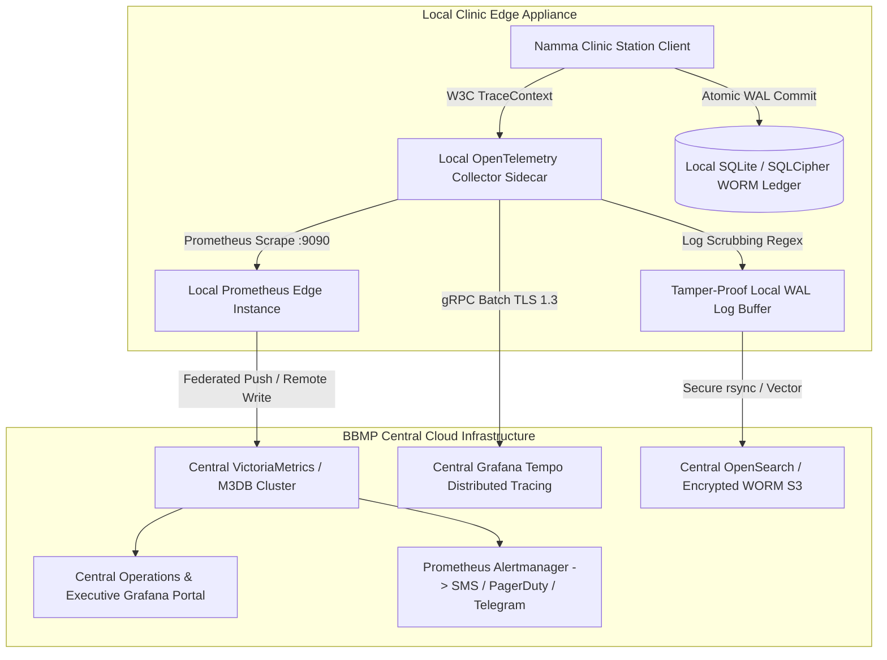

# Master Workflow Observability & Telemetry Catalog
## Namma Clinic Digital Health & Operations Platform
**Document Code:** WORKFLOW-OBS-01 | **Status:** Observability Baseline Approved | **Date:** September 2026

---

## 01. Observability Architecture & Telemetry Baseline
The Namma Clinic Digital Health & Operations Platform implements a comprehensive, three-pillar observability framework comprising Distributed Tracing (OpenTelemetry), Metrics Collection (Prometheus), and Structured Tamper-Evident Auditing (WORM Cryptographic Ledger). In a distributed municipal edge mesh operating across 150+ urban primary health clinics, real-time observability is essential to identify transit bottlenecks, detect clinical deterioration events, monitor cold-chain temperatures, and prevent data corruption.

This document establishes the master observability specifications across all 25 primary workflows, cataloging telemetry spans, Prometheus metric dimensions, PromQL alerting rules, Grafana dashboard layouts, and formal Service Level Objectives (SLOs).



## 02. Master OpenTelemetry Distributed Tracing Catalog
Every workflow transaction is instrumented with OpenTelemetry distributed tracing spans conforming to OpenTelemetry semantic conventions for health services. Below is the master span registry covering all 25 primary workflows:

| Workflow ID | Workflow Name | Span Name | Span Kind | Target Latency Budget | Sampling Policy | PII Redaction Policy |
| :--- | :--- | :--- | :--- | :--- | :--- | :--- |
| `WF-001` | Master Clinic Day Operational Workflow | `span.namma_clinic.wf_001.milestone.root` | `SERVER` | < 250ms | 100% Errors, 10% Success | SHA-256 Masked |
| `WF-001` | Master Clinic Day Operational Workflow | `span.namma_clinic.wf_001.step.validation` | `INTERNAL` | < 25ms | 100% Always | No PHI Stored |
| `WF-001` | Master Clinic Day Operational Workflow | `span.namma_clinic.wf_001.step.auth_eval` | `INTERNAL` | < 15ms | 100% Always | Principal Role Only |
| `WF-001` | Master Clinic Day Operational Workflow | `span.namma_clinic.wf_001.step.db_wal_flush` | `INTERNAL` | < 35ms | 100% Always | Table + Row Hash |
| `WF-001` | Master Clinic Day Operational Workflow | `span.namma_clinic.wf_001.step.ipc_broadcast` | `PRODUCER` | < 15ms | 100% Always | Event Metadata |
| `WF-001` | Master Clinic Day Operational Workflow | `span.namma_clinic.wf_001.step.device_io` | `CLIENT` | < 120ms | 100% Always | HW Status Code |
| `WF-002` | Staff Login, Multi-Factor Authentication & Session Management Workflow | `span.namma_clinic.wf_002.milestone.root` | `SERVER` | < 250ms | 100% Errors, 10% Success | SHA-256 Masked |
| `WF-002` | Staff Login, Multi-Factor Authentication & Session Management Workflow | `span.namma_clinic.wf_002.step.validation` | `INTERNAL` | < 25ms | 100% Always | No PHI Stored |
| `WF-002` | Staff Login, Multi-Factor Authentication & Session Management Workflow | `span.namma_clinic.wf_002.step.auth_eval` | `INTERNAL` | < 15ms | 100% Always | Principal Role Only |
| `WF-002` | Staff Login, Multi-Factor Authentication & Session Management Workflow | `span.namma_clinic.wf_002.step.db_wal_flush` | `INTERNAL` | < 35ms | 100% Always | Table + Row Hash |
| `WF-002` | Staff Login, Multi-Factor Authentication & Session Management Workflow | `span.namma_clinic.wf_002.step.ipc_broadcast` | `PRODUCER` | < 15ms | 100% Always | Event Metadata |
| `WF-002` | Staff Login, Multi-Factor Authentication & Session Management Workflow | `span.namma_clinic.wf_002.step.device_io` | `CLIENT` | < 120ms | 100% Always | HW Status Code |
| `WF-003` | Patient Registration, ABHA Creation & Demographic Intake Workflow | `span.namma_clinic.wf_003.milestone.root` | `SERVER` | < 250ms | 100% Errors, 10% Success | SHA-256 Masked |
| `WF-003` | Patient Registration, ABHA Creation & Demographic Intake Workflow | `span.namma_clinic.wf_003.step.validation` | `INTERNAL` | < 25ms | 100% Always | No PHI Stored |
| `WF-003` | Patient Registration, ABHA Creation & Demographic Intake Workflow | `span.namma_clinic.wf_003.step.auth_eval` | `INTERNAL` | < 15ms | 100% Always | Principal Role Only |
| `WF-003` | Patient Registration, ABHA Creation & Demographic Intake Workflow | `span.namma_clinic.wf_003.step.db_wal_flush` | `INTERNAL` | < 35ms | 100% Always | Table + Row Hash |
| `WF-003` | Patient Registration, ABHA Creation & Demographic Intake Workflow | `span.namma_clinic.wf_003.step.ipc_broadcast` | `PRODUCER` | < 15ms | 100% Always | Event Metadata |
| `WF-003` | Patient Registration, ABHA Creation & Demographic Intake Workflow | `span.namma_clinic.wf_003.step.device_io` | `CLIENT` | < 120ms | 100% Always | HW Status Code |
| `WF-004` | Patient Search, Multi-Parametric Lookup & Verification Workflow | `span.namma_clinic.wf_004.milestone.root` | `SERVER` | < 250ms | 100% Errors, 10% Success | SHA-256 Masked |
| `WF-004` | Patient Search, Multi-Parametric Lookup & Verification Workflow | `span.namma_clinic.wf_004.step.validation` | `INTERNAL` | < 25ms | 100% Always | No PHI Stored |
| `WF-004` | Patient Search, Multi-Parametric Lookup & Verification Workflow | `span.namma_clinic.wf_004.step.auth_eval` | `INTERNAL` | < 15ms | 100% Always | Principal Role Only |
| `WF-004` | Patient Search, Multi-Parametric Lookup & Verification Workflow | `span.namma_clinic.wf_004.step.db_wal_flush` | `INTERNAL` | < 35ms | 100% Always | Table + Row Hash |
| `WF-004` | Patient Search, Multi-Parametric Lookup & Verification Workflow | `span.namma_clinic.wf_004.step.ipc_broadcast` | `PRODUCER` | < 15ms | 100% Always | Event Metadata |
| `WF-004` | Patient Search, Multi-Parametric Lookup & Verification Workflow | `span.namma_clinic.wf_004.step.device_io` | `CLIENT` | < 120ms | 100% Always | HW Status Code |
| `WF-005` | Repeat Patient Revisit & Longitudinal Episode Linking Workflow | `span.namma_clinic.wf_005.milestone.root` | `SERVER` | < 250ms | 100% Errors, 10% Success | SHA-256 Masked |
| `WF-005` | Repeat Patient Revisit & Longitudinal Episode Linking Workflow | `span.namma_clinic.wf_005.step.validation` | `INTERNAL` | < 25ms | 100% Always | No PHI Stored |
| `WF-005` | Repeat Patient Revisit & Longitudinal Episode Linking Workflow | `span.namma_clinic.wf_005.step.auth_eval` | `INTERNAL` | < 15ms | 100% Always | Principal Role Only |
| `WF-005` | Repeat Patient Revisit & Longitudinal Episode Linking Workflow | `span.namma_clinic.wf_005.step.db_wal_flush` | `INTERNAL` | < 35ms | 100% Always | Table + Row Hash |
| `WF-005` | Repeat Patient Revisit & Longitudinal Episode Linking Workflow | `span.namma_clinic.wf_005.step.ipc_broadcast` | `PRODUCER` | < 15ms | 100% Always | Event Metadata |
| `WF-005` | Repeat Patient Revisit & Longitudinal Episode Linking Workflow | `span.namma_clinic.wf_005.step.device_io` | `CLIENT` | < 120ms | 100% Always | HW Status Code |
| `WF-006` | Informed Clinical & Digital Health Consent Workflow | `span.namma_clinic.wf_006.milestone.root` | `SERVER` | < 250ms | 100% Errors, 10% Success | SHA-256 Masked |
| `WF-006` | Informed Clinical & Digital Health Consent Workflow | `span.namma_clinic.wf_006.step.validation` | `INTERNAL` | < 25ms | 100% Always | No PHI Stored |
| `WF-006` | Informed Clinical & Digital Health Consent Workflow | `span.namma_clinic.wf_006.step.auth_eval` | `INTERNAL` | < 15ms | 100% Always | Principal Role Only |
| `WF-006` | Informed Clinical & Digital Health Consent Workflow | `span.namma_clinic.wf_006.step.db_wal_flush` | `INTERNAL` | < 35ms | 100% Always | Table + Row Hash |
| `WF-006` | Informed Clinical & Digital Health Consent Workflow | `span.namma_clinic.wf_006.step.ipc_broadcast` | `PRODUCER` | < 15ms | 100% Always | Event Metadata |
| `WF-006` | Informed Clinical & Digital Health Consent Workflow | `span.namma_clinic.wf_006.step.device_io` | `CLIENT` | < 120ms | 100% Always | HW Status Code |
| `WF-007` | Token Issuance, Priority Tagging & Queue Entry Workflow | `span.namma_clinic.wf_007.milestone.root` | `SERVER` | < 250ms | 100% Errors, 10% Success | SHA-256 Masked |
| `WF-007` | Token Issuance, Priority Tagging & Queue Entry Workflow | `span.namma_clinic.wf_007.step.validation` | `INTERNAL` | < 25ms | 100% Always | No PHI Stored |
| `WF-007` | Token Issuance, Priority Tagging & Queue Entry Workflow | `span.namma_clinic.wf_007.step.auth_eval` | `INTERNAL` | < 15ms | 100% Always | Principal Role Only |
| `WF-007` | Token Issuance, Priority Tagging & Queue Entry Workflow | `span.namma_clinic.wf_007.step.db_wal_flush` | `INTERNAL` | < 35ms | 100% Always | Table + Row Hash |
| `WF-007` | Token Issuance, Priority Tagging & Queue Entry Workflow | `span.namma_clinic.wf_007.step.ipc_broadcast` | `PRODUCER` | < 15ms | 100% Always | Event Metadata |
| `WF-007` | Token Issuance, Priority Tagging & Queue Entry Workflow | `span.namma_clinic.wf_007.step.device_io` | `CLIENT` | < 120ms | 100% Always | HW Status Code |
| `WF-008` | Dynamic Multi-Room Queue Orchestration & Display Workflow | `span.namma_clinic.wf_008.milestone.root` | `SERVER` | < 250ms | 100% Errors, 10% Success | SHA-256 Masked |
| `WF-008` | Dynamic Multi-Room Queue Orchestration & Display Workflow | `span.namma_clinic.wf_008.step.validation` | `INTERNAL` | < 25ms | 100% Always | No PHI Stored |
| `WF-008` | Dynamic Multi-Room Queue Orchestration & Display Workflow | `span.namma_clinic.wf_008.step.auth_eval` | `INTERNAL` | < 15ms | 100% Always | Principal Role Only |
| `WF-008` | Dynamic Multi-Room Queue Orchestration & Display Workflow | `span.namma_clinic.wf_008.step.db_wal_flush` | `INTERNAL` | < 35ms | 100% Always | Table + Row Hash |
| `WF-008` | Dynamic Multi-Room Queue Orchestration & Display Workflow | `span.namma_clinic.wf_008.step.ipc_broadcast` | `PRODUCER` | < 15ms | 100% Always | Event Metadata |
| `WF-008` | Dynamic Multi-Room Queue Orchestration & Display Workflow | `span.namma_clinic.wf_008.step.device_io` | `CLIENT` | < 120ms | 100% Always | HW Status Code |
| `WF-009` | Nursing Triage, Vital Signs & Clinical Acuity Assessment Workflow | `span.namma_clinic.wf_009.milestone.root` | `SERVER` | < 250ms | 100% Errors, 10% Success | SHA-256 Masked |
| `WF-009` | Nursing Triage, Vital Signs & Clinical Acuity Assessment Workflow | `span.namma_clinic.wf_009.step.validation` | `INTERNAL` | < 25ms | 100% Always | No PHI Stored |
| `WF-009` | Nursing Triage, Vital Signs & Clinical Acuity Assessment Workflow | `span.namma_clinic.wf_009.step.auth_eval` | `INTERNAL` | < 15ms | 100% Always | Principal Role Only |
| `WF-009` | Nursing Triage, Vital Signs & Clinical Acuity Assessment Workflow | `span.namma_clinic.wf_009.step.db_wal_flush` | `INTERNAL` | < 35ms | 100% Always | Table + Row Hash |
| `WF-009` | Nursing Triage, Vital Signs & Clinical Acuity Assessment Workflow | `span.namma_clinic.wf_009.step.ipc_broadcast` | `PRODUCER` | < 15ms | 100% Always | Event Metadata |
| `WF-009` | Nursing Triage, Vital Signs & Clinical Acuity Assessment Workflow | `span.namma_clinic.wf_009.step.device_io` | `CLIENT` | < 120ms | 100% Always | HW Status Code |
| `WF-010` | Danger Sign Detection, Critical Value Alert & Emergency Escalation Workflow | `span.namma_clinic.wf_010.milestone.root` | `SERVER` | < 250ms | 100% Errors, 10% Success | SHA-256 Masked |
| `WF-010` | Danger Sign Detection, Critical Value Alert & Emergency Escalation Workflow | `span.namma_clinic.wf_010.step.validation` | `INTERNAL` | < 25ms | 100% Always | No PHI Stored |
| `WF-010` | Danger Sign Detection, Critical Value Alert & Emergency Escalation Workflow | `span.namma_clinic.wf_010.step.auth_eval` | `INTERNAL` | < 15ms | 100% Always | Principal Role Only |
| `WF-010` | Danger Sign Detection, Critical Value Alert & Emergency Escalation Workflow | `span.namma_clinic.wf_010.step.db_wal_flush` | `INTERNAL` | < 35ms | 100% Always | Table + Row Hash |
| `WF-010` | Danger Sign Detection, Critical Value Alert & Emergency Escalation Workflow | `span.namma_clinic.wf_010.step.ipc_broadcast` | `PRODUCER` | < 15ms | 100% Always | Event Metadata |
| `WF-010` | Danger Sign Detection, Critical Value Alert & Emergency Escalation Workflow | `span.namma_clinic.wf_010.step.device_io` | `CLIENT` | < 120ms | 100% Always | HW Status Code |
| `WF-011` | Doctor Clinical Consultation, SOAP Documentation & CDSS Advisory Workflow | `span.namma_clinic.wf_011.milestone.root` | `SERVER` | < 250ms | 100% Errors, 10% Success | SHA-256 Masked |
| `WF-011` | Doctor Clinical Consultation, SOAP Documentation & CDSS Advisory Workflow | `span.namma_clinic.wf_011.step.validation` | `INTERNAL` | < 25ms | 100% Always | No PHI Stored |
| `WF-011` | Doctor Clinical Consultation, SOAP Documentation & CDSS Advisory Workflow | `span.namma_clinic.wf_011.step.auth_eval` | `INTERNAL` | < 15ms | 100% Always | Principal Role Only |
| `WF-011` | Doctor Clinical Consultation, SOAP Documentation & CDSS Advisory Workflow | `span.namma_clinic.wf_011.step.db_wal_flush` | `INTERNAL` | < 35ms | 100% Always | Table + Row Hash |
| `WF-011` | Doctor Clinical Consultation, SOAP Documentation & CDSS Advisory Workflow | `span.namma_clinic.wf_011.step.ipc_broadcast` | `PRODUCER` | < 15ms | 100% Always | Event Metadata |
| `WF-011` | Doctor Clinical Consultation, SOAP Documentation & CDSS Advisory Workflow | `span.namma_clinic.wf_011.step.device_io` | `CLIENT` | < 120ms | 100% Always | HW Status Code |
| `WF-012` | Electronic Prescription, Drug Interaction & Safety Verification Workflow | `span.namma_clinic.wf_012.milestone.root` | `SERVER` | < 250ms | 100% Errors, 10% Success | SHA-256 Masked |
| `WF-012` | Electronic Prescription, Drug Interaction & Safety Verification Workflow | `span.namma_clinic.wf_012.step.validation` | `INTERNAL` | < 25ms | 100% Always | No PHI Stored |
| `WF-012` | Electronic Prescription, Drug Interaction & Safety Verification Workflow | `span.namma_clinic.wf_012.step.auth_eval` | `INTERNAL` | < 15ms | 100% Always | Principal Role Only |
| `WF-012` | Electronic Prescription, Drug Interaction & Safety Verification Workflow | `span.namma_clinic.wf_012.step.db_wal_flush` | `INTERNAL` | < 35ms | 100% Always | Table + Row Hash |
| `WF-012` | Electronic Prescription, Drug Interaction & Safety Verification Workflow | `span.namma_clinic.wf_012.step.ipc_broadcast` | `PRODUCER` | < 15ms | 100% Always | Event Metadata |
| `WF-012` | Electronic Prescription, Drug Interaction & Safety Verification Workflow | `span.namma_clinic.wf_012.step.device_io` | `CLIENT` | < 120ms | 100% Always | HW Status Code |
| `WF-013` | Pharmacy Dispensing, FEFO Inventory Allocation & Patient Counseling Workflow | `span.namma_clinic.wf_013.milestone.root` | `SERVER` | < 250ms | 100% Errors, 10% Success | SHA-256 Masked |
| `WF-013` | Pharmacy Dispensing, FEFO Inventory Allocation & Patient Counseling Workflow | `span.namma_clinic.wf_013.step.validation` | `INTERNAL` | < 25ms | 100% Always | No PHI Stored |
| `WF-013` | Pharmacy Dispensing, FEFO Inventory Allocation & Patient Counseling Workflow | `span.namma_clinic.wf_013.step.auth_eval` | `INTERNAL` | < 15ms | 100% Always | Principal Role Only |
| `WF-013` | Pharmacy Dispensing, FEFO Inventory Allocation & Patient Counseling Workflow | `span.namma_clinic.wf_013.step.db_wal_flush` | `INTERNAL` | < 35ms | 100% Always | Table + Row Hash |
| `WF-013` | Pharmacy Dispensing, FEFO Inventory Allocation & Patient Counseling Workflow | `span.namma_clinic.wf_013.step.ipc_broadcast` | `PRODUCER` | < 15ms | 100% Always | Event Metadata |
| `WF-013` | Pharmacy Dispensing, FEFO Inventory Allocation & Patient Counseling Workflow | `span.namma_clinic.wf_013.step.device_io` | `CLIENT` | < 120ms | 100% Always | HW Status Code |
| `WF-014` | Pharmacy Stock Replenishment, Indenting & Cold-Chain Inventory Control Workflow | `span.namma_clinic.wf_014.milestone.root` | `SERVER` | < 250ms | 100% Errors, 10% Success | SHA-256 Masked |
| `WF-014` | Pharmacy Stock Replenishment, Indenting & Cold-Chain Inventory Control Workflow | `span.namma_clinic.wf_014.step.validation` | `INTERNAL` | < 25ms | 100% Always | No PHI Stored |
| `WF-014` | Pharmacy Stock Replenishment, Indenting & Cold-Chain Inventory Control Workflow | `span.namma_clinic.wf_014.step.auth_eval` | `INTERNAL` | < 15ms | 100% Always | Principal Role Only |
| `WF-014` | Pharmacy Stock Replenishment, Indenting & Cold-Chain Inventory Control Workflow | `span.namma_clinic.wf_014.step.db_wal_flush` | `INTERNAL` | < 35ms | 100% Always | Table + Row Hash |
| `WF-014` | Pharmacy Stock Replenishment, Indenting & Cold-Chain Inventory Control Workflow | `span.namma_clinic.wf_014.step.ipc_broadcast` | `PRODUCER` | < 15ms | 100% Always | Event Metadata |
| `WF-014` | Pharmacy Stock Replenishment, Indenting & Cold-Chain Inventory Control Workflow | `span.namma_clinic.wf_014.step.device_io` | `CLIENT` | < 120ms | 100% Always | HW Status Code |
| `WF-015` | Point-of-Care Laboratory Testing, Barcoding & Panic Value Alert Workflow | `span.namma_clinic.wf_015.milestone.root` | `SERVER` | < 250ms | 100% Errors, 10% Success | SHA-256 Masked |
| `WF-015` | Point-of-Care Laboratory Testing, Barcoding & Panic Value Alert Workflow | `span.namma_clinic.wf_015.step.validation` | `INTERNAL` | < 25ms | 100% Always | No PHI Stored |
| `WF-015` | Point-of-Care Laboratory Testing, Barcoding & Panic Value Alert Workflow | `span.namma_clinic.wf_015.step.auth_eval` | `INTERNAL` | < 15ms | 100% Always | Principal Role Only |
| `WF-015` | Point-of-Care Laboratory Testing, Barcoding & Panic Value Alert Workflow | `span.namma_clinic.wf_015.step.db_wal_flush` | `INTERNAL` | < 35ms | 100% Always | Table + Row Hash |
| `WF-015` | Point-of-Care Laboratory Testing, Barcoding & Panic Value Alert Workflow | `span.namma_clinic.wf_015.step.ipc_broadcast` | `PRODUCER` | < 15ms | 100% Always | Event Metadata |
| `WF-015` | Point-of-Care Laboratory Testing, Barcoding & Panic Value Alert Workflow | `span.namma_clinic.wf_015.step.device_io` | `CLIENT` | < 120ms | 100% Always | HW Status Code |
| `WF-016` | Clinical Referral, Higher Center Escalation & Ambulance Transfer Workflow | `span.namma_clinic.wf_016.milestone.root` | `SERVER` | < 250ms | 100% Errors, 10% Success | SHA-256 Masked |
| `WF-016` | Clinical Referral, Higher Center Escalation & Ambulance Transfer Workflow | `span.namma_clinic.wf_016.step.validation` | `INTERNAL` | < 25ms | 100% Always | No PHI Stored |
| `WF-016` | Clinical Referral, Higher Center Escalation & Ambulance Transfer Workflow | `span.namma_clinic.wf_016.step.auth_eval` | `INTERNAL` | < 15ms | 100% Always | Principal Role Only |
| `WF-016` | Clinical Referral, Higher Center Escalation & Ambulance Transfer Workflow | `span.namma_clinic.wf_016.step.db_wal_flush` | `INTERNAL` | < 35ms | 100% Always | Table + Row Hash |
| `WF-016` | Clinical Referral, Higher Center Escalation & Ambulance Transfer Workflow | `span.namma_clinic.wf_016.step.ipc_broadcast` | `PRODUCER` | < 15ms | 100% Always | Event Metadata |
| `WF-016` | Clinical Referral, Higher Center Escalation & Ambulance Transfer Workflow | `span.namma_clinic.wf_016.step.device_io` | `CLIENT` | < 120ms | 100% Always | HW Status Code |
| `WF-017` | NCD Follow-Up Scheduling, Chronic Disease Recall & Defaulter Tracking Workflow | `span.namma_clinic.wf_017.milestone.root` | `SERVER` | < 250ms | 100% Errors, 10% Success | SHA-256 Masked |
| `WF-017` | NCD Follow-Up Scheduling, Chronic Disease Recall & Defaulter Tracking Workflow | `span.namma_clinic.wf_017.step.validation` | `INTERNAL` | < 25ms | 100% Always | No PHI Stored |
| `WF-017` | NCD Follow-Up Scheduling, Chronic Disease Recall & Defaulter Tracking Workflow | `span.namma_clinic.wf_017.step.auth_eval` | `INTERNAL` | < 15ms | 100% Always | Principal Role Only |
| `WF-017` | NCD Follow-Up Scheduling, Chronic Disease Recall & Defaulter Tracking Workflow | `span.namma_clinic.wf_017.step.db_wal_flush` | `INTERNAL` | < 35ms | 100% Always | Table + Row Hash |
| `WF-017` | NCD Follow-Up Scheduling, Chronic Disease Recall & Defaulter Tracking Workflow | `span.namma_clinic.wf_017.step.ipc_broadcast` | `PRODUCER` | < 15ms | 100% Always | Event Metadata |
| `WF-017` | NCD Follow-Up Scheduling, Chronic Disease Recall & Defaulter Tracking Workflow | `span.namma_clinic.wf_017.step.device_io` | `CLIENT` | < 120ms | 100% Always | HW Status Code |
| `WF-018` | Omnichannel Patient & Staff Notification, Alerting & Communication Workflow | `span.namma_clinic.wf_018.milestone.root` | `SERVER` | < 250ms | 100% Errors, 10% Success | SHA-256 Masked |
| `WF-018` | Omnichannel Patient & Staff Notification, Alerting & Communication Workflow | `span.namma_clinic.wf_018.step.validation` | `INTERNAL` | < 25ms | 100% Always | No PHI Stored |
| `WF-018` | Omnichannel Patient & Staff Notification, Alerting & Communication Workflow | `span.namma_clinic.wf_018.step.auth_eval` | `INTERNAL` | < 15ms | 100% Always | Principal Role Only |
| `WF-018` | Omnichannel Patient & Staff Notification, Alerting & Communication Workflow | `span.namma_clinic.wf_018.step.db_wal_flush` | `INTERNAL` | < 35ms | 100% Always | Table + Row Hash |
| `WF-018` | Omnichannel Patient & Staff Notification, Alerting & Communication Workflow | `span.namma_clinic.wf_018.step.ipc_broadcast` | `PRODUCER` | < 15ms | 100% Always | Event Metadata |
| `WF-018` | Omnichannel Patient & Staff Notification, Alerting & Communication Workflow | `span.namma_clinic.wf_018.step.device_io` | `CLIENT` | < 120ms | 100% Always | HW Status Code |
| `WF-019` | Citizen Grievance Redressal, Feedback & SLA Escalation Workflow | `span.namma_clinic.wf_019.milestone.root` | `SERVER` | < 250ms | 100% Errors, 10% Success | SHA-256 Masked |
| `WF-019` | Citizen Grievance Redressal, Feedback & SLA Escalation Workflow | `span.namma_clinic.wf_019.step.validation` | `INTERNAL` | < 25ms | 100% Always | No PHI Stored |
| `WF-019` | Citizen Grievance Redressal, Feedback & SLA Escalation Workflow | `span.namma_clinic.wf_019.step.auth_eval` | `INTERNAL` | < 15ms | 100% Always | Principal Role Only |
| `WF-019` | Citizen Grievance Redressal, Feedback & SLA Escalation Workflow | `span.namma_clinic.wf_019.step.db_wal_flush` | `INTERNAL` | < 35ms | 100% Always | Table + Row Hash |
| `WF-019` | Citizen Grievance Redressal, Feedback & SLA Escalation Workflow | `span.namma_clinic.wf_019.step.ipc_broadcast` | `PRODUCER` | < 15ms | 100% Always | Event Metadata |
| `WF-019` | Citizen Grievance Redressal, Feedback & SLA Escalation Workflow | `span.namma_clinic.wf_019.step.device_io` | `CLIENT` | < 120ms | 100% Always | HW Status Code |
| `WF-020` | Cryptographic Audit Trail, Immutable Logging & Tamper Detection Workflow | `span.namma_clinic.wf_020.milestone.root` | `SERVER` | < 250ms | 100% Errors, 10% Success | SHA-256 Masked |
| `WF-020` | Cryptographic Audit Trail, Immutable Logging & Tamper Detection Workflow | `span.namma_clinic.wf_020.step.validation` | `INTERNAL` | < 25ms | 100% Always | No PHI Stored |
| `WF-020` | Cryptographic Audit Trail, Immutable Logging & Tamper Detection Workflow | `span.namma_clinic.wf_020.step.auth_eval` | `INTERNAL` | < 15ms | 100% Always | Principal Role Only |
| `WF-020` | Cryptographic Audit Trail, Immutable Logging & Tamper Detection Workflow | `span.namma_clinic.wf_020.step.db_wal_flush` | `INTERNAL` | < 35ms | 100% Always | Table + Row Hash |
| `WF-020` | Cryptographic Audit Trail, Immutable Logging & Tamper Detection Workflow | `span.namma_clinic.wf_020.step.ipc_broadcast` | `PRODUCER` | < 15ms | 100% Always | Event Metadata |
| `WF-020` | Cryptographic Audit Trail, Immutable Logging & Tamper Detection Workflow | `span.namma_clinic.wf_020.step.device_io` | `CLIENT` | < 120ms | 100% Always | HW Status Code |
| `WF-021` | Clinical Analytics, Syndromic Surveillance & Population Health Reporting Workflow | `span.namma_clinic.wf_021.milestone.root` | `SERVER` | < 250ms | 100% Errors, 10% Success | SHA-256 Masked |
| `WF-021` | Clinical Analytics, Syndromic Surveillance & Population Health Reporting Workflow | `span.namma_clinic.wf_021.step.validation` | `INTERNAL` | < 25ms | 100% Always | No PHI Stored |
| `WF-021` | Clinical Analytics, Syndromic Surveillance & Population Health Reporting Workflow | `span.namma_clinic.wf_021.step.auth_eval` | `INTERNAL` | < 15ms | 100% Always | Principal Role Only |
| `WF-021` | Clinical Analytics, Syndromic Surveillance & Population Health Reporting Workflow | `span.namma_clinic.wf_021.step.db_wal_flush` | `INTERNAL` | < 35ms | 100% Always | Table + Row Hash |
| `WF-021` | Clinical Analytics, Syndromic Surveillance & Population Health Reporting Workflow | `span.namma_clinic.wf_021.step.ipc_broadcast` | `PRODUCER` | < 15ms | 100% Always | Event Metadata |
| `WF-021` | Clinical Analytics, Syndromic Surveillance & Population Health Reporting Workflow | `span.namma_clinic.wf_021.step.device_io` | `CLIENT` | < 120ms | 100% Always | HW Status Code |
| `WF-022` | Autonomous Offline Edge Operation, Local Storage & Network Resilience Workflow | `span.namma_clinic.wf_022.milestone.root` | `SERVER` | < 250ms | 100% Errors, 10% Success | SHA-256 Masked |
| `WF-022` | Autonomous Offline Edge Operation, Local Storage & Network Resilience Workflow | `span.namma_clinic.wf_022.step.validation` | `INTERNAL` | < 25ms | 100% Always | No PHI Stored |
| `WF-022` | Autonomous Offline Edge Operation, Local Storage & Network Resilience Workflow | `span.namma_clinic.wf_022.step.auth_eval` | `INTERNAL` | < 15ms | 100% Always | Principal Role Only |
| `WF-022` | Autonomous Offline Edge Operation, Local Storage & Network Resilience Workflow | `span.namma_clinic.wf_022.step.db_wal_flush` | `INTERNAL` | < 35ms | 100% Always | Table + Row Hash |
| `WF-022` | Autonomous Offline Edge Operation, Local Storage & Network Resilience Workflow | `span.namma_clinic.wf_022.step.ipc_broadcast` | `PRODUCER` | < 15ms | 100% Always | Event Metadata |
| `WF-022` | Autonomous Offline Edge Operation, Local Storage & Network Resilience Workflow | `span.namma_clinic.wf_022.step.device_io` | `CLIENT` | < 120ms | 100% Always | HW Status Code |
| `WF-023` | Bidirectional Synchronization, Conflict Resolution & Merkle Ledger Workflow | `span.namma_clinic.wf_023.milestone.root` | `SERVER` | < 250ms | 100% Errors, 10% Success | SHA-256 Masked |
| `WF-023` | Bidirectional Synchronization, Conflict Resolution & Merkle Ledger Workflow | `span.namma_clinic.wf_023.step.validation` | `INTERNAL` | < 25ms | 100% Always | No PHI Stored |
| `WF-023` | Bidirectional Synchronization, Conflict Resolution & Merkle Ledger Workflow | `span.namma_clinic.wf_023.step.auth_eval` | `INTERNAL` | < 15ms | 100% Always | Principal Role Only |
| `WF-023` | Bidirectional Synchronization, Conflict Resolution & Merkle Ledger Workflow | `span.namma_clinic.wf_023.step.db_wal_flush` | `INTERNAL` | < 35ms | 100% Always | Table + Row Hash |
| `WF-023` | Bidirectional Synchronization, Conflict Resolution & Merkle Ledger Workflow | `span.namma_clinic.wf_023.step.ipc_broadcast` | `PRODUCER` | < 15ms | 100% Always | Event Metadata |
| `WF-023` | Bidirectional Synchronization, Conflict Resolution & Merkle Ledger Workflow | `span.namma_clinic.wf_023.step.device_io` | `CLIENT` | < 120ms | 100% Always | HW Status Code |
| `WF-024` | Ayushman Bharat Digital Mission (ABDM) Gateway & FHIR Interoperability Workflow | `span.namma_clinic.wf_024.milestone.root` | `SERVER` | < 250ms | 100% Errors, 10% Success | SHA-256 Masked |
| `WF-024` | Ayushman Bharat Digital Mission (ABDM) Gateway & FHIR Interoperability Workflow | `span.namma_clinic.wf_024.step.validation` | `INTERNAL` | < 25ms | 100% Always | No PHI Stored |
| `WF-024` | Ayushman Bharat Digital Mission (ABDM) Gateway & FHIR Interoperability Workflow | `span.namma_clinic.wf_024.step.auth_eval` | `INTERNAL` | < 15ms | 100% Always | Principal Role Only |
| `WF-024` | Ayushman Bharat Digital Mission (ABDM) Gateway & FHIR Interoperability Workflow | `span.namma_clinic.wf_024.step.db_wal_flush` | `INTERNAL` | < 35ms | 100% Always | Table + Row Hash |
| `WF-024` | Ayushman Bharat Digital Mission (ABDM) Gateway & FHIR Interoperability Workflow | `span.namma_clinic.wf_024.step.ipc_broadcast` | `PRODUCER` | < 15ms | 100% Always | Event Metadata |
| `WF-024` | Ayushman Bharat Digital Mission (ABDM) Gateway & FHIR Interoperability Workflow | `span.namma_clinic.wf_024.step.device_io` | `CLIENT` | < 120ms | 100% Always | HW Status Code |
| `WF-025` | Clinical Emergency Exception, Fast-Track Bypass & Resuscitation Protocol Workflow | `span.namma_clinic.wf_025.milestone.root` | `SERVER` | < 250ms | 100% Errors, 10% Success | SHA-256 Masked |
| `WF-025` | Clinical Emergency Exception, Fast-Track Bypass & Resuscitation Protocol Workflow | `span.namma_clinic.wf_025.step.validation` | `INTERNAL` | < 25ms | 100% Always | No PHI Stored |
| `WF-025` | Clinical Emergency Exception, Fast-Track Bypass & Resuscitation Protocol Workflow | `span.namma_clinic.wf_025.step.auth_eval` | `INTERNAL` | < 15ms | 100% Always | Principal Role Only |
| `WF-025` | Clinical Emergency Exception, Fast-Track Bypass & Resuscitation Protocol Workflow | `span.namma_clinic.wf_025.step.db_wal_flush` | `INTERNAL` | < 35ms | 100% Always | Table + Row Hash |
| `WF-025` | Clinical Emergency Exception, Fast-Track Bypass & Resuscitation Protocol Workflow | `span.namma_clinic.wf_025.step.ipc_broadcast` | `PRODUCER` | < 15ms | 100% Always | Event Metadata |
| `WF-025` | Clinical Emergency Exception, Fast-Track Bypass & Resuscitation Protocol Workflow | `span.namma_clinic.wf_025.step.device_io` | `CLIENT` | < 120ms | 100% Always | HW Status Code |

### Detailed OpenTelemetry Span Specifications per Workflow Domain
Comprehensive breakdown of trace attributes, span milestones, and context propagation rules for each workflow:

### Distributed Tracing Profile: WF-001 (Master Clinic Day Operational Workflow)
Telemetry specification governing execution tracing for `WF-001` transactions across edge workstations:

#### Span Hierarchy & Parent-Child Tree for WF-001
```
span.namma_clinic.wf_001.milestone.root [SERVER]
 ├── span.namma_clinic.wf_001.step.auth_eval [INTERNAL]
 ├── span.namma_clinic.wf_001.step.validation [INTERNAL]
 ├── span.namma_clinic.wf_001.step.db_wal_flush [INTERNAL]
 ├── span.namma_clinic.wf_001.step.device_io [CLIENT]
 └── span.namma_clinic.wf_001.step.ipc_broadcast [PRODUCER]
```

#### Trace Attributes & Semantic Conventions for WF-001
| Attribute Key | Data Type | OpenTelemetry Semantic Convention | Example Value | PHI Scrubbing Rule |
| :--- | :--- | :--- | :--- | :--- |
| `clinic.id` | String | `service.instance.id` | `"BLR-SZ-NC-042"` | Plaintext Retained |
| `workflow.id` | String | `workflow.identifier` | `"WF-001"` | Plaintext Retained |
| `workflow.name` | String | `workflow.title` | `"Master Clinic Day Operational Workflow"` | Plaintext Retained |
| `actor.role` | String | `enduser.role` | `"Medical Officer / Staff Nurse"` | Plaintext Retained |
| `actor.id_hash` | String | `enduser.id.hash` | `"sha256:8f4c2e..."` | 1-Way Salted Hash |
| `transaction.status` | String | `app.transaction.status` | `"SUCCESS / REJECTED"` | Plaintext Retained |
| `patient.identifier_hash` | String | `health.patient.token_hash` | `"sha256:c3a17e..."` | Strictly Salted SHA-256 |
| `station.terminal_id` | String | `host.terminal.identifier` | `"TERM-01-ROOM-1"` | Plaintext Retained |
| `network.mode` | String | `app.network.connectivity` | `"LOCAL_MESH_OFFLINE"` | Plaintext Retained |

#### Span Events & Milestone Markers for WF-001
- **`event.wf_001.initiated`:** Emitted when operator triggers action on client interface for Master Clinic Day Operational Workflow.
- **`event.wf_001.validated`:** Schema validation passed with zero constraint violations.
- **`event.wf_001.persisted`:** Atomic transaction committed to local SQLite WAL.
- **`event.wf_001.published`:** Local IPC event dispatched to peer workstations on clinic mesh.
- **`event.wf_001.completed`:** Full execution lifecycle successfully concluded within budget.

### Distributed Tracing Profile: WF-002 (Staff Login, Multi-Factor Authentication & Session Management Workflow)
Telemetry specification governing execution tracing for `WF-002` transactions across edge workstations:

#### Span Hierarchy & Parent-Child Tree for WF-002
```
span.namma_clinic.wf_002.milestone.root [SERVER]
 ├── span.namma_clinic.wf_002.step.auth_eval [INTERNAL]
 ├── span.namma_clinic.wf_002.step.validation [INTERNAL]
 ├── span.namma_clinic.wf_002.step.db_wal_flush [INTERNAL]
 ├── span.namma_clinic.wf_002.step.device_io [CLIENT]
 └── span.namma_clinic.wf_002.step.ipc_broadcast [PRODUCER]
```

#### Trace Attributes & Semantic Conventions for WF-002
| Attribute Key | Data Type | OpenTelemetry Semantic Convention | Example Value | PHI Scrubbing Rule |
| :--- | :--- | :--- | :--- | :--- |
| `clinic.id` | String | `service.instance.id` | `"BLR-SZ-NC-042"` | Plaintext Retained |
| `workflow.id` | String | `workflow.identifier` | `"WF-002"` | Plaintext Retained |
| `workflow.name` | String | `workflow.title` | `"Staff Login, Multi-Factor Authentication & Session Management Workflow"` | Plaintext Retained |
| `actor.role` | String | `enduser.role` | `"Medical Officer / Staff Nurse"` | Plaintext Retained |
| `actor.id_hash` | String | `enduser.id.hash` | `"sha256:8f4c2e..."` | 1-Way Salted Hash |
| `transaction.status` | String | `app.transaction.status` | `"SUCCESS / REJECTED"` | Plaintext Retained |
| `patient.identifier_hash` | String | `health.patient.token_hash` | `"sha256:c3a17e..."` | Strictly Salted SHA-256 |
| `station.terminal_id` | String | `host.terminal.identifier` | `"TERM-02-ROOM-1"` | Plaintext Retained |
| `network.mode` | String | `app.network.connectivity` | `"LOCAL_MESH_OFFLINE"` | Plaintext Retained |

#### Span Events & Milestone Markers for WF-002
- **`event.wf_002.initiated`:** Emitted when operator triggers action on client interface for Staff Login, Multi-Factor Authentication & Session Management Workflow.
- **`event.wf_002.validated`:** Schema validation passed with zero constraint violations.
- **`event.wf_002.persisted`:** Atomic transaction committed to local SQLite WAL.
- **`event.wf_002.published`:** Local IPC event dispatched to peer workstations on clinic mesh.
- **`event.wf_002.completed`:** Full execution lifecycle successfully concluded within budget.

### Distributed Tracing Profile: WF-003 (Patient Registration, ABHA Creation & Demographic Intake Workflow)
Telemetry specification governing execution tracing for `WF-003` transactions across edge workstations:

#### Span Hierarchy & Parent-Child Tree for WF-003
```
span.namma_clinic.wf_003.milestone.root [SERVER]
 ├── span.namma_clinic.wf_003.step.auth_eval [INTERNAL]
 ├── span.namma_clinic.wf_003.step.validation [INTERNAL]
 ├── span.namma_clinic.wf_003.step.db_wal_flush [INTERNAL]
 ├── span.namma_clinic.wf_003.step.device_io [CLIENT]
 └── span.namma_clinic.wf_003.step.ipc_broadcast [PRODUCER]
```

#### Trace Attributes & Semantic Conventions for WF-003
| Attribute Key | Data Type | OpenTelemetry Semantic Convention | Example Value | PHI Scrubbing Rule |
| :--- | :--- | :--- | :--- | :--- |
| `clinic.id` | String | `service.instance.id` | `"BLR-SZ-NC-042"` | Plaintext Retained |
| `workflow.id` | String | `workflow.identifier` | `"WF-003"` | Plaintext Retained |
| `workflow.name` | String | `workflow.title` | `"Patient Registration, ABHA Creation & Demographic Intake Workflow"` | Plaintext Retained |
| `actor.role` | String | `enduser.role` | `"Medical Officer / Staff Nurse"` | Plaintext Retained |
| `actor.id_hash` | String | `enduser.id.hash` | `"sha256:8f4c2e..."` | 1-Way Salted Hash |
| `transaction.status` | String | `app.transaction.status` | `"SUCCESS / REJECTED"` | Plaintext Retained |
| `patient.identifier_hash` | String | `health.patient.token_hash` | `"sha256:c3a17e..."` | Strictly Salted SHA-256 |
| `station.terminal_id` | String | `host.terminal.identifier` | `"TERM-03-ROOM-1"` | Plaintext Retained |
| `network.mode` | String | `app.network.connectivity` | `"LOCAL_MESH_OFFLINE"` | Plaintext Retained |

#### Span Events & Milestone Markers for WF-003
- **`event.wf_003.initiated`:** Emitted when operator triggers action on client interface for Patient Registration, ABHA Creation & Demographic Intake Workflow.
- **`event.wf_003.validated`:** Schema validation passed with zero constraint violations.
- **`event.wf_003.persisted`:** Atomic transaction committed to local SQLite WAL.
- **`event.wf_003.published`:** Local IPC event dispatched to peer workstations on clinic mesh.
- **`event.wf_003.completed`:** Full execution lifecycle successfully concluded within budget.

### Distributed Tracing Profile: WF-004 (Patient Search, Multi-Parametric Lookup & Verification Workflow)
Telemetry specification governing execution tracing for `WF-004` transactions across edge workstations:

#### Span Hierarchy & Parent-Child Tree for WF-004
```
span.namma_clinic.wf_004.milestone.root [SERVER]
 ├── span.namma_clinic.wf_004.step.auth_eval [INTERNAL]
 ├── span.namma_clinic.wf_004.step.validation [INTERNAL]
 ├── span.namma_clinic.wf_004.step.db_wal_flush [INTERNAL]
 ├── span.namma_clinic.wf_004.step.device_io [CLIENT]
 └── span.namma_clinic.wf_004.step.ipc_broadcast [PRODUCER]
```

#### Trace Attributes & Semantic Conventions for WF-004
| Attribute Key | Data Type | OpenTelemetry Semantic Convention | Example Value | PHI Scrubbing Rule |
| :--- | :--- | :--- | :--- | :--- |
| `clinic.id` | String | `service.instance.id` | `"BLR-SZ-NC-042"` | Plaintext Retained |
| `workflow.id` | String | `workflow.identifier` | `"WF-004"` | Plaintext Retained |
| `workflow.name` | String | `workflow.title` | `"Patient Search, Multi-Parametric Lookup & Verification Workflow"` | Plaintext Retained |
| `actor.role` | String | `enduser.role` | `"Medical Officer / Staff Nurse"` | Plaintext Retained |
| `actor.id_hash` | String | `enduser.id.hash` | `"sha256:8f4c2e..."` | 1-Way Salted Hash |
| `transaction.status` | String | `app.transaction.status` | `"SUCCESS / REJECTED"` | Plaintext Retained |
| `patient.identifier_hash` | String | `health.patient.token_hash` | `"sha256:c3a17e..."` | Strictly Salted SHA-256 |
| `station.terminal_id` | String | `host.terminal.identifier` | `"TERM-04-ROOM-1"` | Plaintext Retained |
| `network.mode` | String | `app.network.connectivity` | `"LOCAL_MESH_OFFLINE"` | Plaintext Retained |

#### Span Events & Milestone Markers for WF-004
- **`event.wf_004.initiated`:** Emitted when operator triggers action on client interface for Patient Search, Multi-Parametric Lookup & Verification Workflow.
- **`event.wf_004.validated`:** Schema validation passed with zero constraint violations.
- **`event.wf_004.persisted`:** Atomic transaction committed to local SQLite WAL.
- **`event.wf_004.published`:** Local IPC event dispatched to peer workstations on clinic mesh.
- **`event.wf_004.completed`:** Full execution lifecycle successfully concluded within budget.

### Distributed Tracing Profile: WF-005 (Repeat Patient Revisit & Longitudinal Episode Linking Workflow)
Telemetry specification governing execution tracing for `WF-005` transactions across edge workstations:

#### Span Hierarchy & Parent-Child Tree for WF-005
```
span.namma_clinic.wf_005.milestone.root [SERVER]
 ├── span.namma_clinic.wf_005.step.auth_eval [INTERNAL]
 ├── span.namma_clinic.wf_005.step.validation [INTERNAL]
 ├── span.namma_clinic.wf_005.step.db_wal_flush [INTERNAL]
 ├── span.namma_clinic.wf_005.step.device_io [CLIENT]
 └── span.namma_clinic.wf_005.step.ipc_broadcast [PRODUCER]
```

#### Trace Attributes & Semantic Conventions for WF-005
| Attribute Key | Data Type | OpenTelemetry Semantic Convention | Example Value | PHI Scrubbing Rule |
| :--- | :--- | :--- | :--- | :--- |
| `clinic.id` | String | `service.instance.id` | `"BLR-SZ-NC-042"` | Plaintext Retained |
| `workflow.id` | String | `workflow.identifier` | `"WF-005"` | Plaintext Retained |
| `workflow.name` | String | `workflow.title` | `"Repeat Patient Revisit & Longitudinal Episode Linking Workflow"` | Plaintext Retained |
| `actor.role` | String | `enduser.role` | `"Medical Officer / Staff Nurse"` | Plaintext Retained |
| `actor.id_hash` | String | `enduser.id.hash` | `"sha256:8f4c2e..."` | 1-Way Salted Hash |
| `transaction.status` | String | `app.transaction.status` | `"SUCCESS / REJECTED"` | Plaintext Retained |
| `patient.identifier_hash` | String | `health.patient.token_hash` | `"sha256:c3a17e..."` | Strictly Salted SHA-256 |
| `station.terminal_id` | String | `host.terminal.identifier` | `"TERM-05-ROOM-1"` | Plaintext Retained |
| `network.mode` | String | `app.network.connectivity` | `"LOCAL_MESH_OFFLINE"` | Plaintext Retained |

#### Span Events & Milestone Markers for WF-005
- **`event.wf_005.initiated`:** Emitted when operator triggers action on client interface for Repeat Patient Revisit & Longitudinal Episode Linking Workflow.
- **`event.wf_005.validated`:** Schema validation passed with zero constraint violations.
- **`event.wf_005.persisted`:** Atomic transaction committed to local SQLite WAL.
- **`event.wf_005.published`:** Local IPC event dispatched to peer workstations on clinic mesh.
- **`event.wf_005.completed`:** Full execution lifecycle successfully concluded within budget.

### Distributed Tracing Profile: WF-006 (Informed Clinical & Digital Health Consent Workflow)
Telemetry specification governing execution tracing for `WF-006` transactions across edge workstations:

#### Span Hierarchy & Parent-Child Tree for WF-006
```
span.namma_clinic.wf_006.milestone.root [SERVER]
 ├── span.namma_clinic.wf_006.step.auth_eval [INTERNAL]
 ├── span.namma_clinic.wf_006.step.validation [INTERNAL]
 ├── span.namma_clinic.wf_006.step.db_wal_flush [INTERNAL]
 ├── span.namma_clinic.wf_006.step.device_io [CLIENT]
 └── span.namma_clinic.wf_006.step.ipc_broadcast [PRODUCER]
```

#### Trace Attributes & Semantic Conventions for WF-006
| Attribute Key | Data Type | OpenTelemetry Semantic Convention | Example Value | PHI Scrubbing Rule |
| :--- | :--- | :--- | :--- | :--- |
| `clinic.id` | String | `service.instance.id` | `"BLR-SZ-NC-042"` | Plaintext Retained |
| `workflow.id` | String | `workflow.identifier` | `"WF-006"` | Plaintext Retained |
| `workflow.name` | String | `workflow.title` | `"Informed Clinical & Digital Health Consent Workflow"` | Plaintext Retained |
| `actor.role` | String | `enduser.role` | `"Medical Officer / Staff Nurse"` | Plaintext Retained |
| `actor.id_hash` | String | `enduser.id.hash` | `"sha256:8f4c2e..."` | 1-Way Salted Hash |
| `transaction.status` | String | `app.transaction.status` | `"SUCCESS / REJECTED"` | Plaintext Retained |
| `patient.identifier_hash` | String | `health.patient.token_hash` | `"sha256:c3a17e..."` | Strictly Salted SHA-256 |
| `station.terminal_id` | String | `host.terminal.identifier` | `"TERM-06-ROOM-1"` | Plaintext Retained |
| `network.mode` | String | `app.network.connectivity` | `"LOCAL_MESH_OFFLINE"` | Plaintext Retained |

#### Span Events & Milestone Markers for WF-006
- **`event.wf_006.initiated`:** Emitted when operator triggers action on client interface for Informed Clinical & Digital Health Consent Workflow.
- **`event.wf_006.validated`:** Schema validation passed with zero constraint violations.
- **`event.wf_006.persisted`:** Atomic transaction committed to local SQLite WAL.
- **`event.wf_006.published`:** Local IPC event dispatched to peer workstations on clinic mesh.
- **`event.wf_006.completed`:** Full execution lifecycle successfully concluded within budget.

### Distributed Tracing Profile: WF-007 (Token Issuance, Priority Tagging & Queue Entry Workflow)
Telemetry specification governing execution tracing for `WF-007` transactions across edge workstations:

#### Span Hierarchy & Parent-Child Tree for WF-007
```
span.namma_clinic.wf_007.milestone.root [SERVER]
 ├── span.namma_clinic.wf_007.step.auth_eval [INTERNAL]
 ├── span.namma_clinic.wf_007.step.validation [INTERNAL]
 ├── span.namma_clinic.wf_007.step.db_wal_flush [INTERNAL]
 ├── span.namma_clinic.wf_007.step.device_io [CLIENT]
 └── span.namma_clinic.wf_007.step.ipc_broadcast [PRODUCER]
```

#### Trace Attributes & Semantic Conventions for WF-007
| Attribute Key | Data Type | OpenTelemetry Semantic Convention | Example Value | PHI Scrubbing Rule |
| :--- | :--- | :--- | :--- | :--- |
| `clinic.id` | String | `service.instance.id` | `"BLR-SZ-NC-042"` | Plaintext Retained |
| `workflow.id` | String | `workflow.identifier` | `"WF-007"` | Plaintext Retained |
| `workflow.name` | String | `workflow.title` | `"Token Issuance, Priority Tagging & Queue Entry Workflow"` | Plaintext Retained |
| `actor.role` | String | `enduser.role` | `"Medical Officer / Staff Nurse"` | Plaintext Retained |
| `actor.id_hash` | String | `enduser.id.hash` | `"sha256:8f4c2e..."` | 1-Way Salted Hash |
| `transaction.status` | String | `app.transaction.status` | `"SUCCESS / REJECTED"` | Plaintext Retained |
| `patient.identifier_hash` | String | `health.patient.token_hash` | `"sha256:c3a17e..."` | Strictly Salted SHA-256 |
| `station.terminal_id` | String | `host.terminal.identifier` | `"TERM-07-ROOM-1"` | Plaintext Retained |
| `network.mode` | String | `app.network.connectivity` | `"LOCAL_MESH_OFFLINE"` | Plaintext Retained |

#### Span Events & Milestone Markers for WF-007
- **`event.wf_007.initiated`:** Emitted when operator triggers action on client interface for Token Issuance, Priority Tagging & Queue Entry Workflow.
- **`event.wf_007.validated`:** Schema validation passed with zero constraint violations.
- **`event.wf_007.persisted`:** Atomic transaction committed to local SQLite WAL.
- **`event.wf_007.published`:** Local IPC event dispatched to peer workstations on clinic mesh.
- **`event.wf_007.completed`:** Full execution lifecycle successfully concluded within budget.

### Distributed Tracing Profile: WF-008 (Dynamic Multi-Room Queue Orchestration & Display Workflow)
Telemetry specification governing execution tracing for `WF-008` transactions across edge workstations:

#### Span Hierarchy & Parent-Child Tree for WF-008
```
span.namma_clinic.wf_008.milestone.root [SERVER]
 ├── span.namma_clinic.wf_008.step.auth_eval [INTERNAL]
 ├── span.namma_clinic.wf_008.step.validation [INTERNAL]
 ├── span.namma_clinic.wf_008.step.db_wal_flush [INTERNAL]
 ├── span.namma_clinic.wf_008.step.device_io [CLIENT]
 └── span.namma_clinic.wf_008.step.ipc_broadcast [PRODUCER]
```

#### Trace Attributes & Semantic Conventions for WF-008
| Attribute Key | Data Type | OpenTelemetry Semantic Convention | Example Value | PHI Scrubbing Rule |
| :--- | :--- | :--- | :--- | :--- |
| `clinic.id` | String | `service.instance.id` | `"BLR-SZ-NC-042"` | Plaintext Retained |
| `workflow.id` | String | `workflow.identifier` | `"WF-008"` | Plaintext Retained |
| `workflow.name` | String | `workflow.title` | `"Dynamic Multi-Room Queue Orchestration & Display Workflow"` | Plaintext Retained |
| `actor.role` | String | `enduser.role` | `"Medical Officer / Staff Nurse"` | Plaintext Retained |
| `actor.id_hash` | String | `enduser.id.hash` | `"sha256:8f4c2e..."` | 1-Way Salted Hash |
| `transaction.status` | String | `app.transaction.status` | `"SUCCESS / REJECTED"` | Plaintext Retained |
| `patient.identifier_hash` | String | `health.patient.token_hash` | `"sha256:c3a17e..."` | Strictly Salted SHA-256 |
| `station.terminal_id` | String | `host.terminal.identifier` | `"TERM-08-ROOM-1"` | Plaintext Retained |
| `network.mode` | String | `app.network.connectivity` | `"LOCAL_MESH_OFFLINE"` | Plaintext Retained |

#### Span Events & Milestone Markers for WF-008
- **`event.wf_008.initiated`:** Emitted when operator triggers action on client interface for Dynamic Multi-Room Queue Orchestration & Display Workflow.
- **`event.wf_008.validated`:** Schema validation passed with zero constraint violations.
- **`event.wf_008.persisted`:** Atomic transaction committed to local SQLite WAL.
- **`event.wf_008.published`:** Local IPC event dispatched to peer workstations on clinic mesh.
- **`event.wf_008.completed`:** Full execution lifecycle successfully concluded within budget.

### Distributed Tracing Profile: WF-009 (Nursing Triage, Vital Signs & Clinical Acuity Assessment Workflow)
Telemetry specification governing execution tracing for `WF-009` transactions across edge workstations:

#### Span Hierarchy & Parent-Child Tree for WF-009
```
span.namma_clinic.wf_009.milestone.root [SERVER]
 ├── span.namma_clinic.wf_009.step.auth_eval [INTERNAL]
 ├── span.namma_clinic.wf_009.step.validation [INTERNAL]
 ├── span.namma_clinic.wf_009.step.db_wal_flush [INTERNAL]
 ├── span.namma_clinic.wf_009.step.device_io [CLIENT]
 └── span.namma_clinic.wf_009.step.ipc_broadcast [PRODUCER]
```

#### Trace Attributes & Semantic Conventions for WF-009
| Attribute Key | Data Type | OpenTelemetry Semantic Convention | Example Value | PHI Scrubbing Rule |
| :--- | :--- | :--- | :--- | :--- |
| `clinic.id` | String | `service.instance.id` | `"BLR-SZ-NC-042"` | Plaintext Retained |
| `workflow.id` | String | `workflow.identifier` | `"WF-009"` | Plaintext Retained |
| `workflow.name` | String | `workflow.title` | `"Nursing Triage, Vital Signs & Clinical Acuity Assessment Workflow"` | Plaintext Retained |
| `actor.role` | String | `enduser.role` | `"Medical Officer / Staff Nurse"` | Plaintext Retained |
| `actor.id_hash` | String | `enduser.id.hash` | `"sha256:8f4c2e..."` | 1-Way Salted Hash |
| `transaction.status` | String | `app.transaction.status` | `"SUCCESS / REJECTED"` | Plaintext Retained |
| `patient.identifier_hash` | String | `health.patient.token_hash` | `"sha256:c3a17e..."` | Strictly Salted SHA-256 |
| `station.terminal_id` | String | `host.terminal.identifier` | `"TERM-09-ROOM-1"` | Plaintext Retained |
| `network.mode` | String | `app.network.connectivity` | `"LOCAL_MESH_OFFLINE"` | Plaintext Retained |

#### Span Events & Milestone Markers for WF-009
- **`event.wf_009.initiated`:** Emitted when operator triggers action on client interface for Nursing Triage, Vital Signs & Clinical Acuity Assessment Workflow.
- **`event.wf_009.validated`:** Schema validation passed with zero constraint violations.
- **`event.wf_009.persisted`:** Atomic transaction committed to local SQLite WAL.
- **`event.wf_009.published`:** Local IPC event dispatched to peer workstations on clinic mesh.
- **`event.wf_009.completed`:** Full execution lifecycle successfully concluded within budget.

### Distributed Tracing Profile: WF-010 (Danger Sign Detection, Critical Value Alert & Emergency Escalation Workflow)
Telemetry specification governing execution tracing for `WF-010` transactions across edge workstations:

#### Span Hierarchy & Parent-Child Tree for WF-010
```
span.namma_clinic.wf_010.milestone.root [SERVER]
 ├── span.namma_clinic.wf_010.step.auth_eval [INTERNAL]
 ├── span.namma_clinic.wf_010.step.validation [INTERNAL]
 ├── span.namma_clinic.wf_010.step.db_wal_flush [INTERNAL]
 ├── span.namma_clinic.wf_010.step.device_io [CLIENT]
 └── span.namma_clinic.wf_010.step.ipc_broadcast [PRODUCER]
```

#### Trace Attributes & Semantic Conventions for WF-010
| Attribute Key | Data Type | OpenTelemetry Semantic Convention | Example Value | PHI Scrubbing Rule |
| :--- | :--- | :--- | :--- | :--- |
| `clinic.id` | String | `service.instance.id` | `"BLR-SZ-NC-042"` | Plaintext Retained |
| `workflow.id` | String | `workflow.identifier` | `"WF-010"` | Plaintext Retained |
| `workflow.name` | String | `workflow.title` | `"Danger Sign Detection, Critical Value Alert & Emergency Escalation Workflow"` | Plaintext Retained |
| `actor.role` | String | `enduser.role` | `"Medical Officer / Staff Nurse"` | Plaintext Retained |
| `actor.id_hash` | String | `enduser.id.hash` | `"sha256:8f4c2e..."` | 1-Way Salted Hash |
| `transaction.status` | String | `app.transaction.status` | `"SUCCESS / REJECTED"` | Plaintext Retained |
| `patient.identifier_hash` | String | `health.patient.token_hash` | `"sha256:c3a17e..."` | Strictly Salted SHA-256 |
| `station.terminal_id` | String | `host.terminal.identifier` | `"TERM-10-ROOM-1"` | Plaintext Retained |
| `network.mode` | String | `app.network.connectivity` | `"LOCAL_MESH_OFFLINE"` | Plaintext Retained |

#### Span Events & Milestone Markers for WF-010
- **`event.wf_010.initiated`:** Emitted when operator triggers action on client interface for Danger Sign Detection, Critical Value Alert & Emergency Escalation Workflow.
- **`event.wf_010.validated`:** Schema validation passed with zero constraint violations.
- **`event.wf_010.persisted`:** Atomic transaction committed to local SQLite WAL.
- **`event.wf_010.published`:** Local IPC event dispatched to peer workstations on clinic mesh.
- **`event.wf_010.completed`:** Full execution lifecycle successfully concluded within budget.

### Distributed Tracing Profile: WF-011 (Doctor Clinical Consultation, SOAP Documentation & CDSS Advisory Workflow)
Telemetry specification governing execution tracing for `WF-011` transactions across edge workstations:

#### Span Hierarchy & Parent-Child Tree for WF-011
```
span.namma_clinic.wf_011.milestone.root [SERVER]
 ├── span.namma_clinic.wf_011.step.auth_eval [INTERNAL]
 ├── span.namma_clinic.wf_011.step.validation [INTERNAL]
 ├── span.namma_clinic.wf_011.step.db_wal_flush [INTERNAL]
 ├── span.namma_clinic.wf_011.step.device_io [CLIENT]
 └── span.namma_clinic.wf_011.step.ipc_broadcast [PRODUCER]
```

#### Trace Attributes & Semantic Conventions for WF-011
| Attribute Key | Data Type | OpenTelemetry Semantic Convention | Example Value | PHI Scrubbing Rule |
| :--- | :--- | :--- | :--- | :--- |
| `clinic.id` | String | `service.instance.id` | `"BLR-SZ-NC-042"` | Plaintext Retained |
| `workflow.id` | String | `workflow.identifier` | `"WF-011"` | Plaintext Retained |
| `workflow.name` | String | `workflow.title` | `"Doctor Clinical Consultation, SOAP Documentation & CDSS Advisory Workflow"` | Plaintext Retained |
| `actor.role` | String | `enduser.role` | `"Medical Officer / Staff Nurse"` | Plaintext Retained |
| `actor.id_hash` | String | `enduser.id.hash` | `"sha256:8f4c2e..."` | 1-Way Salted Hash |
| `transaction.status` | String | `app.transaction.status` | `"SUCCESS / REJECTED"` | Plaintext Retained |
| `patient.identifier_hash` | String | `health.patient.token_hash` | `"sha256:c3a17e..."` | Strictly Salted SHA-256 |
| `station.terminal_id` | String | `host.terminal.identifier` | `"TERM-11-ROOM-1"` | Plaintext Retained |
| `network.mode` | String | `app.network.connectivity` | `"LOCAL_MESH_OFFLINE"` | Plaintext Retained |

#### Span Events & Milestone Markers for WF-011
- **`event.wf_011.initiated`:** Emitted when operator triggers action on client interface for Doctor Clinical Consultation, SOAP Documentation & CDSS Advisory Workflow.
- **`event.wf_011.validated`:** Schema validation passed with zero constraint violations.
- **`event.wf_011.persisted`:** Atomic transaction committed to local SQLite WAL.
- **`event.wf_011.published`:** Local IPC event dispatched to peer workstations on clinic mesh.
- **`event.wf_011.completed`:** Full execution lifecycle successfully concluded within budget.

### Distributed Tracing Profile: WF-012 (Electronic Prescription, Drug Interaction & Safety Verification Workflow)
Telemetry specification governing execution tracing for `WF-012` transactions across edge workstations:

#### Span Hierarchy & Parent-Child Tree for WF-012
```
span.namma_clinic.wf_012.milestone.root [SERVER]
 ├── span.namma_clinic.wf_012.step.auth_eval [INTERNAL]
 ├── span.namma_clinic.wf_012.step.validation [INTERNAL]
 ├── span.namma_clinic.wf_012.step.db_wal_flush [INTERNAL]
 ├── span.namma_clinic.wf_012.step.device_io [CLIENT]
 └── span.namma_clinic.wf_012.step.ipc_broadcast [PRODUCER]
```

#### Trace Attributes & Semantic Conventions for WF-012
| Attribute Key | Data Type | OpenTelemetry Semantic Convention | Example Value | PHI Scrubbing Rule |
| :--- | :--- | :--- | :--- | :--- |
| `clinic.id` | String | `service.instance.id` | `"BLR-SZ-NC-042"` | Plaintext Retained |
| `workflow.id` | String | `workflow.identifier` | `"WF-012"` | Plaintext Retained |
| `workflow.name` | String | `workflow.title` | `"Electronic Prescription, Drug Interaction & Safety Verification Workflow"` | Plaintext Retained |
| `actor.role` | String | `enduser.role` | `"Medical Officer / Staff Nurse"` | Plaintext Retained |
| `actor.id_hash` | String | `enduser.id.hash` | `"sha256:8f4c2e..."` | 1-Way Salted Hash |
| `transaction.status` | String | `app.transaction.status` | `"SUCCESS / REJECTED"` | Plaintext Retained |
| `patient.identifier_hash` | String | `health.patient.token_hash` | `"sha256:c3a17e..."` | Strictly Salted SHA-256 |
| `station.terminal_id` | String | `host.terminal.identifier` | `"TERM-12-ROOM-1"` | Plaintext Retained |
| `network.mode` | String | `app.network.connectivity` | `"LOCAL_MESH_OFFLINE"` | Plaintext Retained |

#### Span Events & Milestone Markers for WF-012
- **`event.wf_012.initiated`:** Emitted when operator triggers action on client interface for Electronic Prescription, Drug Interaction & Safety Verification Workflow.
- **`event.wf_012.validated`:** Schema validation passed with zero constraint violations.
- **`event.wf_012.persisted`:** Atomic transaction committed to local SQLite WAL.
- **`event.wf_012.published`:** Local IPC event dispatched to peer workstations on clinic mesh.
- **`event.wf_012.completed`:** Full execution lifecycle successfully concluded within budget.

### Distributed Tracing Profile: WF-013 (Pharmacy Dispensing, FEFO Inventory Allocation & Patient Counseling Workflow)
Telemetry specification governing execution tracing for `WF-013` transactions across edge workstations:

#### Span Hierarchy & Parent-Child Tree for WF-013
```
span.namma_clinic.wf_013.milestone.root [SERVER]
 ├── span.namma_clinic.wf_013.step.auth_eval [INTERNAL]
 ├── span.namma_clinic.wf_013.step.validation [INTERNAL]
 ├── span.namma_clinic.wf_013.step.db_wal_flush [INTERNAL]
 ├── span.namma_clinic.wf_013.step.device_io [CLIENT]
 └── span.namma_clinic.wf_013.step.ipc_broadcast [PRODUCER]
```

#### Trace Attributes & Semantic Conventions for WF-013
| Attribute Key | Data Type | OpenTelemetry Semantic Convention | Example Value | PHI Scrubbing Rule |
| :--- | :--- | :--- | :--- | :--- |
| `clinic.id` | String | `service.instance.id` | `"BLR-SZ-NC-042"` | Plaintext Retained |
| `workflow.id` | String | `workflow.identifier` | `"WF-013"` | Plaintext Retained |
| `workflow.name` | String | `workflow.title` | `"Pharmacy Dispensing, FEFO Inventory Allocation & Patient Counseling Workflow"` | Plaintext Retained |
| `actor.role` | String | `enduser.role` | `"Medical Officer / Staff Nurse"` | Plaintext Retained |
| `actor.id_hash` | String | `enduser.id.hash` | `"sha256:8f4c2e..."` | 1-Way Salted Hash |
| `transaction.status` | String | `app.transaction.status` | `"SUCCESS / REJECTED"` | Plaintext Retained |
| `patient.identifier_hash` | String | `health.patient.token_hash` | `"sha256:c3a17e..."` | Strictly Salted SHA-256 |
| `station.terminal_id` | String | `host.terminal.identifier` | `"TERM-13-ROOM-1"` | Plaintext Retained |
| `network.mode` | String | `app.network.connectivity` | `"LOCAL_MESH_OFFLINE"` | Plaintext Retained |

#### Span Events & Milestone Markers for WF-013
- **`event.wf_013.initiated`:** Emitted when operator triggers action on client interface for Pharmacy Dispensing, FEFO Inventory Allocation & Patient Counseling Workflow.
- **`event.wf_013.validated`:** Schema validation passed with zero constraint violations.
- **`event.wf_013.persisted`:** Atomic transaction committed to local SQLite WAL.
- **`event.wf_013.published`:** Local IPC event dispatched to peer workstations on clinic mesh.
- **`event.wf_013.completed`:** Full execution lifecycle successfully concluded within budget.

### Distributed Tracing Profile: WF-014 (Pharmacy Stock Replenishment, Indenting & Cold-Chain Inventory Control Workflow)
Telemetry specification governing execution tracing for `WF-014` transactions across edge workstations:

#### Span Hierarchy & Parent-Child Tree for WF-014
```
span.namma_clinic.wf_014.milestone.root [SERVER]
 ├── span.namma_clinic.wf_014.step.auth_eval [INTERNAL]
 ├── span.namma_clinic.wf_014.step.validation [INTERNAL]
 ├── span.namma_clinic.wf_014.step.db_wal_flush [INTERNAL]
 ├── span.namma_clinic.wf_014.step.device_io [CLIENT]
 └── span.namma_clinic.wf_014.step.ipc_broadcast [PRODUCER]
```

#### Trace Attributes & Semantic Conventions for WF-014
| Attribute Key | Data Type | OpenTelemetry Semantic Convention | Example Value | PHI Scrubbing Rule |
| :--- | :--- | :--- | :--- | :--- |
| `clinic.id` | String | `service.instance.id` | `"BLR-SZ-NC-042"` | Plaintext Retained |
| `workflow.id` | String | `workflow.identifier` | `"WF-014"` | Plaintext Retained |
| `workflow.name` | String | `workflow.title` | `"Pharmacy Stock Replenishment, Indenting & Cold-Chain Inventory Control Workflow"` | Plaintext Retained |
| `actor.role` | String | `enduser.role` | `"Medical Officer / Staff Nurse"` | Plaintext Retained |
| `actor.id_hash` | String | `enduser.id.hash` | `"sha256:8f4c2e..."` | 1-Way Salted Hash |
| `transaction.status` | String | `app.transaction.status` | `"SUCCESS / REJECTED"` | Plaintext Retained |
| `patient.identifier_hash` | String | `health.patient.token_hash` | `"sha256:c3a17e..."` | Strictly Salted SHA-256 |
| `station.terminal_id` | String | `host.terminal.identifier` | `"TERM-14-ROOM-1"` | Plaintext Retained |
| `network.mode` | String | `app.network.connectivity` | `"LOCAL_MESH_OFFLINE"` | Plaintext Retained |

#### Span Events & Milestone Markers for WF-014
- **`event.wf_014.initiated`:** Emitted when operator triggers action on client interface for Pharmacy Stock Replenishment, Indenting & Cold-Chain Inventory Control Workflow.
- **`event.wf_014.validated`:** Schema validation passed with zero constraint violations.
- **`event.wf_014.persisted`:** Atomic transaction committed to local SQLite WAL.
- **`event.wf_014.published`:** Local IPC event dispatched to peer workstations on clinic mesh.
- **`event.wf_014.completed`:** Full execution lifecycle successfully concluded within budget.

### Distributed Tracing Profile: WF-015 (Point-of-Care Laboratory Testing, Barcoding & Panic Value Alert Workflow)
Telemetry specification governing execution tracing for `WF-015` transactions across edge workstations:

#### Span Hierarchy & Parent-Child Tree for WF-015
```
span.namma_clinic.wf_015.milestone.root [SERVER]
 ├── span.namma_clinic.wf_015.step.auth_eval [INTERNAL]
 ├── span.namma_clinic.wf_015.step.validation [INTERNAL]
 ├── span.namma_clinic.wf_015.step.db_wal_flush [INTERNAL]
 ├── span.namma_clinic.wf_015.step.device_io [CLIENT]
 └── span.namma_clinic.wf_015.step.ipc_broadcast [PRODUCER]
```

#### Trace Attributes & Semantic Conventions for WF-015
| Attribute Key | Data Type | OpenTelemetry Semantic Convention | Example Value | PHI Scrubbing Rule |
| :--- | :--- | :--- | :--- | :--- |
| `clinic.id` | String | `service.instance.id` | `"BLR-SZ-NC-042"` | Plaintext Retained |
| `workflow.id` | String | `workflow.identifier` | `"WF-015"` | Plaintext Retained |
| `workflow.name` | String | `workflow.title` | `"Point-of-Care Laboratory Testing, Barcoding & Panic Value Alert Workflow"` | Plaintext Retained |
| `actor.role` | String | `enduser.role` | `"Medical Officer / Staff Nurse"` | Plaintext Retained |
| `actor.id_hash` | String | `enduser.id.hash` | `"sha256:8f4c2e..."` | 1-Way Salted Hash |
| `transaction.status` | String | `app.transaction.status` | `"SUCCESS / REJECTED"` | Plaintext Retained |
| `patient.identifier_hash` | String | `health.patient.token_hash` | `"sha256:c3a17e..."` | Strictly Salted SHA-256 |
| `station.terminal_id` | String | `host.terminal.identifier` | `"TERM-15-ROOM-1"` | Plaintext Retained |
| `network.mode` | String | `app.network.connectivity` | `"LOCAL_MESH_OFFLINE"` | Plaintext Retained |

#### Span Events & Milestone Markers for WF-015
- **`event.wf_015.initiated`:** Emitted when operator triggers action on client interface for Point-of-Care Laboratory Testing, Barcoding & Panic Value Alert Workflow.
- **`event.wf_015.validated`:** Schema validation passed with zero constraint violations.
- **`event.wf_015.persisted`:** Atomic transaction committed to local SQLite WAL.
- **`event.wf_015.published`:** Local IPC event dispatched to peer workstations on clinic mesh.
- **`event.wf_015.completed`:** Full execution lifecycle successfully concluded within budget.

### Distributed Tracing Profile: WF-016 (Clinical Referral, Higher Center Escalation & Ambulance Transfer Workflow)
Telemetry specification governing execution tracing for `WF-016` transactions across edge workstations:

#### Span Hierarchy & Parent-Child Tree for WF-016
```
span.namma_clinic.wf_016.milestone.root [SERVER]
 ├── span.namma_clinic.wf_016.step.auth_eval [INTERNAL]
 ├── span.namma_clinic.wf_016.step.validation [INTERNAL]
 ├── span.namma_clinic.wf_016.step.db_wal_flush [INTERNAL]
 ├── span.namma_clinic.wf_016.step.device_io [CLIENT]
 └── span.namma_clinic.wf_016.step.ipc_broadcast [PRODUCER]
```

#### Trace Attributes & Semantic Conventions for WF-016
| Attribute Key | Data Type | OpenTelemetry Semantic Convention | Example Value | PHI Scrubbing Rule |
| :--- | :--- | :--- | :--- | :--- |
| `clinic.id` | String | `service.instance.id` | `"BLR-SZ-NC-042"` | Plaintext Retained |
| `workflow.id` | String | `workflow.identifier` | `"WF-016"` | Plaintext Retained |
| `workflow.name` | String | `workflow.title` | `"Clinical Referral, Higher Center Escalation & Ambulance Transfer Workflow"` | Plaintext Retained |
| `actor.role` | String | `enduser.role` | `"Medical Officer / Staff Nurse"` | Plaintext Retained |
| `actor.id_hash` | String | `enduser.id.hash` | `"sha256:8f4c2e..."` | 1-Way Salted Hash |
| `transaction.status` | String | `app.transaction.status` | `"SUCCESS / REJECTED"` | Plaintext Retained |
| `patient.identifier_hash` | String | `health.patient.token_hash` | `"sha256:c3a17e..."` | Strictly Salted SHA-256 |
| `station.terminal_id` | String | `host.terminal.identifier` | `"TERM-16-ROOM-1"` | Plaintext Retained |
| `network.mode` | String | `app.network.connectivity` | `"LOCAL_MESH_OFFLINE"` | Plaintext Retained |

#### Span Events & Milestone Markers for WF-016
- **`event.wf_016.initiated`:** Emitted when operator triggers action on client interface for Clinical Referral, Higher Center Escalation & Ambulance Transfer Workflow.
- **`event.wf_016.validated`:** Schema validation passed with zero constraint violations.
- **`event.wf_016.persisted`:** Atomic transaction committed to local SQLite WAL.
- **`event.wf_016.published`:** Local IPC event dispatched to peer workstations on clinic mesh.
- **`event.wf_016.completed`:** Full execution lifecycle successfully concluded within budget.

### Distributed Tracing Profile: WF-017 (NCD Follow-Up Scheduling, Chronic Disease Recall & Defaulter Tracking Workflow)
Telemetry specification governing execution tracing for `WF-017` transactions across edge workstations:

#### Span Hierarchy & Parent-Child Tree for WF-017
```
span.namma_clinic.wf_017.milestone.root [SERVER]
 ├── span.namma_clinic.wf_017.step.auth_eval [INTERNAL]
 ├── span.namma_clinic.wf_017.step.validation [INTERNAL]
 ├── span.namma_clinic.wf_017.step.db_wal_flush [INTERNAL]
 ├── span.namma_clinic.wf_017.step.device_io [CLIENT]
 └── span.namma_clinic.wf_017.step.ipc_broadcast [PRODUCER]
```

#### Trace Attributes & Semantic Conventions for WF-017
| Attribute Key | Data Type | OpenTelemetry Semantic Convention | Example Value | PHI Scrubbing Rule |
| :--- | :--- | :--- | :--- | :--- |
| `clinic.id` | String | `service.instance.id` | `"BLR-SZ-NC-042"` | Plaintext Retained |
| `workflow.id` | String | `workflow.identifier` | `"WF-017"` | Plaintext Retained |
| `workflow.name` | String | `workflow.title` | `"NCD Follow-Up Scheduling, Chronic Disease Recall & Defaulter Tracking Workflow"` | Plaintext Retained |
| `actor.role` | String | `enduser.role` | `"Medical Officer / Staff Nurse"` | Plaintext Retained |
| `actor.id_hash` | String | `enduser.id.hash` | `"sha256:8f4c2e..."` | 1-Way Salted Hash |
| `transaction.status` | String | `app.transaction.status` | `"SUCCESS / REJECTED"` | Plaintext Retained |
| `patient.identifier_hash` | String | `health.patient.token_hash` | `"sha256:c3a17e..."` | Strictly Salted SHA-256 |
| `station.terminal_id` | String | `host.terminal.identifier` | `"TERM-17-ROOM-1"` | Plaintext Retained |
| `network.mode` | String | `app.network.connectivity` | `"LOCAL_MESH_OFFLINE"` | Plaintext Retained |

#### Span Events & Milestone Markers for WF-017
- **`event.wf_017.initiated`:** Emitted when operator triggers action on client interface for NCD Follow-Up Scheduling, Chronic Disease Recall & Defaulter Tracking Workflow.
- **`event.wf_017.validated`:** Schema validation passed with zero constraint violations.
- **`event.wf_017.persisted`:** Atomic transaction committed to local SQLite WAL.
- **`event.wf_017.published`:** Local IPC event dispatched to peer workstations on clinic mesh.
- **`event.wf_017.completed`:** Full execution lifecycle successfully concluded within budget.

### Distributed Tracing Profile: WF-018 (Omnichannel Patient & Staff Notification, Alerting & Communication Workflow)
Telemetry specification governing execution tracing for `WF-018` transactions across edge workstations:

#### Span Hierarchy & Parent-Child Tree for WF-018
```
span.namma_clinic.wf_018.milestone.root [SERVER]
 ├── span.namma_clinic.wf_018.step.auth_eval [INTERNAL]
 ├── span.namma_clinic.wf_018.step.validation [INTERNAL]
 ├── span.namma_clinic.wf_018.step.db_wal_flush [INTERNAL]
 ├── span.namma_clinic.wf_018.step.device_io [CLIENT]
 └── span.namma_clinic.wf_018.step.ipc_broadcast [PRODUCER]
```

#### Trace Attributes & Semantic Conventions for WF-018
| Attribute Key | Data Type | OpenTelemetry Semantic Convention | Example Value | PHI Scrubbing Rule |
| :--- | :--- | :--- | :--- | :--- |
| `clinic.id` | String | `service.instance.id` | `"BLR-SZ-NC-042"` | Plaintext Retained |
| `workflow.id` | String | `workflow.identifier` | `"WF-018"` | Plaintext Retained |
| `workflow.name` | String | `workflow.title` | `"Omnichannel Patient & Staff Notification, Alerting & Communication Workflow"` | Plaintext Retained |
| `actor.role` | String | `enduser.role` | `"Medical Officer / Staff Nurse"` | Plaintext Retained |
| `actor.id_hash` | String | `enduser.id.hash` | `"sha256:8f4c2e..."` | 1-Way Salted Hash |
| `transaction.status` | String | `app.transaction.status` | `"SUCCESS / REJECTED"` | Plaintext Retained |
| `patient.identifier_hash` | String | `health.patient.token_hash` | `"sha256:c3a17e..."` | Strictly Salted SHA-256 |
| `station.terminal_id` | String | `host.terminal.identifier` | `"TERM-18-ROOM-1"` | Plaintext Retained |
| `network.mode` | String | `app.network.connectivity` | `"LOCAL_MESH_OFFLINE"` | Plaintext Retained |

#### Span Events & Milestone Markers for WF-018
- **`event.wf_018.initiated`:** Emitted when operator triggers action on client interface for Omnichannel Patient & Staff Notification, Alerting & Communication Workflow.
- **`event.wf_018.validated`:** Schema validation passed with zero constraint violations.
- **`event.wf_018.persisted`:** Atomic transaction committed to local SQLite WAL.
- **`event.wf_018.published`:** Local IPC event dispatched to peer workstations on clinic mesh.
- **`event.wf_018.completed`:** Full execution lifecycle successfully concluded within budget.

### Distributed Tracing Profile: WF-019 (Citizen Grievance Redressal, Feedback & SLA Escalation Workflow)
Telemetry specification governing execution tracing for `WF-019` transactions across edge workstations:

#### Span Hierarchy & Parent-Child Tree for WF-019
```
span.namma_clinic.wf_019.milestone.root [SERVER]
 ├── span.namma_clinic.wf_019.step.auth_eval [INTERNAL]
 ├── span.namma_clinic.wf_019.step.validation [INTERNAL]
 ├── span.namma_clinic.wf_019.step.db_wal_flush [INTERNAL]
 ├── span.namma_clinic.wf_019.step.device_io [CLIENT]
 └── span.namma_clinic.wf_019.step.ipc_broadcast [PRODUCER]
```

#### Trace Attributes & Semantic Conventions for WF-019
| Attribute Key | Data Type | OpenTelemetry Semantic Convention | Example Value | PHI Scrubbing Rule |
| :--- | :--- | :--- | :--- | :--- |
| `clinic.id` | String | `service.instance.id` | `"BLR-SZ-NC-042"` | Plaintext Retained |
| `workflow.id` | String | `workflow.identifier` | `"WF-019"` | Plaintext Retained |
| `workflow.name` | String | `workflow.title` | `"Citizen Grievance Redressal, Feedback & SLA Escalation Workflow"` | Plaintext Retained |
| `actor.role` | String | `enduser.role` | `"Medical Officer / Staff Nurse"` | Plaintext Retained |
| `actor.id_hash` | String | `enduser.id.hash` | `"sha256:8f4c2e..."` | 1-Way Salted Hash |
| `transaction.status` | String | `app.transaction.status` | `"SUCCESS / REJECTED"` | Plaintext Retained |
| `patient.identifier_hash` | String | `health.patient.token_hash` | `"sha256:c3a17e..."` | Strictly Salted SHA-256 |
| `station.terminal_id` | String | `host.terminal.identifier` | `"TERM-19-ROOM-1"` | Plaintext Retained |
| `network.mode` | String | `app.network.connectivity` | `"LOCAL_MESH_OFFLINE"` | Plaintext Retained |

#### Span Events & Milestone Markers for WF-019
- **`event.wf_019.initiated`:** Emitted when operator triggers action on client interface for Citizen Grievance Redressal, Feedback & SLA Escalation Workflow.
- **`event.wf_019.validated`:** Schema validation passed with zero constraint violations.
- **`event.wf_019.persisted`:** Atomic transaction committed to local SQLite WAL.
- **`event.wf_019.published`:** Local IPC event dispatched to peer workstations on clinic mesh.
- **`event.wf_019.completed`:** Full execution lifecycle successfully concluded within budget.

### Distributed Tracing Profile: WF-020 (Cryptographic Audit Trail, Immutable Logging & Tamper Detection Workflow)
Telemetry specification governing execution tracing for `WF-020` transactions across edge workstations:

#### Span Hierarchy & Parent-Child Tree for WF-020
```
span.namma_clinic.wf_020.milestone.root [SERVER]
 ├── span.namma_clinic.wf_020.step.auth_eval [INTERNAL]
 ├── span.namma_clinic.wf_020.step.validation [INTERNAL]
 ├── span.namma_clinic.wf_020.step.db_wal_flush [INTERNAL]
 ├── span.namma_clinic.wf_020.step.device_io [CLIENT]
 └── span.namma_clinic.wf_020.step.ipc_broadcast [PRODUCER]
```

#### Trace Attributes & Semantic Conventions for WF-020
| Attribute Key | Data Type | OpenTelemetry Semantic Convention | Example Value | PHI Scrubbing Rule |
| :--- | :--- | :--- | :--- | :--- |
| `clinic.id` | String | `service.instance.id` | `"BLR-SZ-NC-042"` | Plaintext Retained |
| `workflow.id` | String | `workflow.identifier` | `"WF-020"` | Plaintext Retained |
| `workflow.name` | String | `workflow.title` | `"Cryptographic Audit Trail, Immutable Logging & Tamper Detection Workflow"` | Plaintext Retained |
| `actor.role` | String | `enduser.role` | `"Medical Officer / Staff Nurse"` | Plaintext Retained |
| `actor.id_hash` | String | `enduser.id.hash` | `"sha256:8f4c2e..."` | 1-Way Salted Hash |
| `transaction.status` | String | `app.transaction.status` | `"SUCCESS / REJECTED"` | Plaintext Retained |
| `patient.identifier_hash` | String | `health.patient.token_hash` | `"sha256:c3a17e..."` | Strictly Salted SHA-256 |
| `station.terminal_id` | String | `host.terminal.identifier` | `"TERM-20-ROOM-1"` | Plaintext Retained |
| `network.mode` | String | `app.network.connectivity` | `"LOCAL_MESH_OFFLINE"` | Plaintext Retained |

#### Span Events & Milestone Markers for WF-020
- **`event.wf_020.initiated`:** Emitted when operator triggers action on client interface for Cryptographic Audit Trail, Immutable Logging & Tamper Detection Workflow.
- **`event.wf_020.validated`:** Schema validation passed with zero constraint violations.
- **`event.wf_020.persisted`:** Atomic transaction committed to local SQLite WAL.
- **`event.wf_020.published`:** Local IPC event dispatched to peer workstations on clinic mesh.
- **`event.wf_020.completed`:** Full execution lifecycle successfully concluded within budget.

### Distributed Tracing Profile: WF-021 (Clinical Analytics, Syndromic Surveillance & Population Health Reporting Workflow)
Telemetry specification governing execution tracing for `WF-021` transactions across edge workstations:

#### Span Hierarchy & Parent-Child Tree for WF-021
```
span.namma_clinic.wf_021.milestone.root [SERVER]
 ├── span.namma_clinic.wf_021.step.auth_eval [INTERNAL]
 ├── span.namma_clinic.wf_021.step.validation [INTERNAL]
 ├── span.namma_clinic.wf_021.step.db_wal_flush [INTERNAL]
 ├── span.namma_clinic.wf_021.step.device_io [CLIENT]
 └── span.namma_clinic.wf_021.step.ipc_broadcast [PRODUCER]
```

#### Trace Attributes & Semantic Conventions for WF-021
| Attribute Key | Data Type | OpenTelemetry Semantic Convention | Example Value | PHI Scrubbing Rule |
| :--- | :--- | :--- | :--- | :--- |
| `clinic.id` | String | `service.instance.id` | `"BLR-SZ-NC-042"` | Plaintext Retained |
| `workflow.id` | String | `workflow.identifier` | `"WF-021"` | Plaintext Retained |
| `workflow.name` | String | `workflow.title` | `"Clinical Analytics, Syndromic Surveillance & Population Health Reporting Workflow"` | Plaintext Retained |
| `actor.role` | String | `enduser.role` | `"Medical Officer / Staff Nurse"` | Plaintext Retained |
| `actor.id_hash` | String | `enduser.id.hash` | `"sha256:8f4c2e..."` | 1-Way Salted Hash |
| `transaction.status` | String | `app.transaction.status` | `"SUCCESS / REJECTED"` | Plaintext Retained |
| `patient.identifier_hash` | String | `health.patient.token_hash` | `"sha256:c3a17e..."` | Strictly Salted SHA-256 |
| `station.terminal_id` | String | `host.terminal.identifier` | `"TERM-21-ROOM-1"` | Plaintext Retained |
| `network.mode` | String | `app.network.connectivity` | `"LOCAL_MESH_OFFLINE"` | Plaintext Retained |

#### Span Events & Milestone Markers for WF-021
- **`event.wf_021.initiated`:** Emitted when operator triggers action on client interface for Clinical Analytics, Syndromic Surveillance & Population Health Reporting Workflow.
- **`event.wf_021.validated`:** Schema validation passed with zero constraint violations.
- **`event.wf_021.persisted`:** Atomic transaction committed to local SQLite WAL.
- **`event.wf_021.published`:** Local IPC event dispatched to peer workstations on clinic mesh.
- **`event.wf_021.completed`:** Full execution lifecycle successfully concluded within budget.

### Distributed Tracing Profile: WF-022 (Autonomous Offline Edge Operation, Local Storage & Network Resilience Workflow)
Telemetry specification governing execution tracing for `WF-022` transactions across edge workstations:

#### Span Hierarchy & Parent-Child Tree for WF-022
```
span.namma_clinic.wf_022.milestone.root [SERVER]
 ├── span.namma_clinic.wf_022.step.auth_eval [INTERNAL]
 ├── span.namma_clinic.wf_022.step.validation [INTERNAL]
 ├── span.namma_clinic.wf_022.step.db_wal_flush [INTERNAL]
 ├── span.namma_clinic.wf_022.step.device_io [CLIENT]
 └── span.namma_clinic.wf_022.step.ipc_broadcast [PRODUCER]
```

#### Trace Attributes & Semantic Conventions for WF-022
| Attribute Key | Data Type | OpenTelemetry Semantic Convention | Example Value | PHI Scrubbing Rule |
| :--- | :--- | :--- | :--- | :--- |
| `clinic.id` | String | `service.instance.id` | `"BLR-SZ-NC-042"` | Plaintext Retained |
| `workflow.id` | String | `workflow.identifier` | `"WF-022"` | Plaintext Retained |
| `workflow.name` | String | `workflow.title` | `"Autonomous Offline Edge Operation, Local Storage & Network Resilience Workflow"` | Plaintext Retained |
| `actor.role` | String | `enduser.role` | `"Medical Officer / Staff Nurse"` | Plaintext Retained |
| `actor.id_hash` | String | `enduser.id.hash` | `"sha256:8f4c2e..."` | 1-Way Salted Hash |
| `transaction.status` | String | `app.transaction.status` | `"SUCCESS / REJECTED"` | Plaintext Retained |
| `patient.identifier_hash` | String | `health.patient.token_hash` | `"sha256:c3a17e..."` | Strictly Salted SHA-256 |
| `station.terminal_id` | String | `host.terminal.identifier` | `"TERM-22-ROOM-1"` | Plaintext Retained |
| `network.mode` | String | `app.network.connectivity` | `"LOCAL_MESH_OFFLINE"` | Plaintext Retained |

#### Span Events & Milestone Markers for WF-022
- **`event.wf_022.initiated`:** Emitted when operator triggers action on client interface for Autonomous Offline Edge Operation, Local Storage & Network Resilience Workflow.
- **`event.wf_022.validated`:** Schema validation passed with zero constraint violations.
- **`event.wf_022.persisted`:** Atomic transaction committed to local SQLite WAL.
- **`event.wf_022.published`:** Local IPC event dispatched to peer workstations on clinic mesh.
- **`event.wf_022.completed`:** Full execution lifecycle successfully concluded within budget.

### Distributed Tracing Profile: WF-023 (Bidirectional Synchronization, Conflict Resolution & Merkle Ledger Workflow)
Telemetry specification governing execution tracing for `WF-023` transactions across edge workstations:

#### Span Hierarchy & Parent-Child Tree for WF-023
```
span.namma_clinic.wf_023.milestone.root [SERVER]
 ├── span.namma_clinic.wf_023.step.auth_eval [INTERNAL]
 ├── span.namma_clinic.wf_023.step.validation [INTERNAL]
 ├── span.namma_clinic.wf_023.step.db_wal_flush [INTERNAL]
 ├── span.namma_clinic.wf_023.step.device_io [CLIENT]
 └── span.namma_clinic.wf_023.step.ipc_broadcast [PRODUCER]
```

#### Trace Attributes & Semantic Conventions for WF-023
| Attribute Key | Data Type | OpenTelemetry Semantic Convention | Example Value | PHI Scrubbing Rule |
| :--- | :--- | :--- | :--- | :--- |
| `clinic.id` | String | `service.instance.id` | `"BLR-SZ-NC-042"` | Plaintext Retained |
| `workflow.id` | String | `workflow.identifier` | `"WF-023"` | Plaintext Retained |
| `workflow.name` | String | `workflow.title` | `"Bidirectional Synchronization, Conflict Resolution & Merkle Ledger Workflow"` | Plaintext Retained |
| `actor.role` | String | `enduser.role` | `"Medical Officer / Staff Nurse"` | Plaintext Retained |
| `actor.id_hash` | String | `enduser.id.hash` | `"sha256:8f4c2e..."` | 1-Way Salted Hash |
| `transaction.status` | String | `app.transaction.status` | `"SUCCESS / REJECTED"` | Plaintext Retained |
| `patient.identifier_hash` | String | `health.patient.token_hash` | `"sha256:c3a17e..."` | Strictly Salted SHA-256 |
| `station.terminal_id` | String | `host.terminal.identifier` | `"TERM-23-ROOM-1"` | Plaintext Retained |
| `network.mode` | String | `app.network.connectivity` | `"LOCAL_MESH_OFFLINE"` | Plaintext Retained |

#### Span Events & Milestone Markers for WF-023
- **`event.wf_023.initiated`:** Emitted when operator triggers action on client interface for Bidirectional Synchronization, Conflict Resolution & Merkle Ledger Workflow.
- **`event.wf_023.validated`:** Schema validation passed with zero constraint violations.
- **`event.wf_023.persisted`:** Atomic transaction committed to local SQLite WAL.
- **`event.wf_023.published`:** Local IPC event dispatched to peer workstations on clinic mesh.
- **`event.wf_023.completed`:** Full execution lifecycle successfully concluded within budget.

### Distributed Tracing Profile: WF-024 (Ayushman Bharat Digital Mission (ABDM) Gateway & FHIR Interoperability Workflow)
Telemetry specification governing execution tracing for `WF-024` transactions across edge workstations:

#### Span Hierarchy & Parent-Child Tree for WF-024
```
span.namma_clinic.wf_024.milestone.root [SERVER]
 ├── span.namma_clinic.wf_024.step.auth_eval [INTERNAL]
 ├── span.namma_clinic.wf_024.step.validation [INTERNAL]
 ├── span.namma_clinic.wf_024.step.db_wal_flush [INTERNAL]
 ├── span.namma_clinic.wf_024.step.device_io [CLIENT]
 └── span.namma_clinic.wf_024.step.ipc_broadcast [PRODUCER]
```

#### Trace Attributes & Semantic Conventions for WF-024
| Attribute Key | Data Type | OpenTelemetry Semantic Convention | Example Value | PHI Scrubbing Rule |
| :--- | :--- | :--- | :--- | :--- |
| `clinic.id` | String | `service.instance.id` | `"BLR-SZ-NC-042"` | Plaintext Retained |
| `workflow.id` | String | `workflow.identifier` | `"WF-024"` | Plaintext Retained |
| `workflow.name` | String | `workflow.title` | `"Ayushman Bharat Digital Mission (ABDM) Gateway & FHIR Interoperability Workflow"` | Plaintext Retained |
| `actor.role` | String | `enduser.role` | `"Medical Officer / Staff Nurse"` | Plaintext Retained |
| `actor.id_hash` | String | `enduser.id.hash` | `"sha256:8f4c2e..."` | 1-Way Salted Hash |
| `transaction.status` | String | `app.transaction.status` | `"SUCCESS / REJECTED"` | Plaintext Retained |
| `patient.identifier_hash` | String | `health.patient.token_hash` | `"sha256:c3a17e..."` | Strictly Salted SHA-256 |
| `station.terminal_id` | String | `host.terminal.identifier` | `"TERM-24-ROOM-1"` | Plaintext Retained |
| `network.mode` | String | `app.network.connectivity` | `"LOCAL_MESH_OFFLINE"` | Plaintext Retained |

#### Span Events & Milestone Markers for WF-024
- **`event.wf_024.initiated`:** Emitted when operator triggers action on client interface for Ayushman Bharat Digital Mission (ABDM) Gateway & FHIR Interoperability Workflow.
- **`event.wf_024.validated`:** Schema validation passed with zero constraint violations.
- **`event.wf_024.persisted`:** Atomic transaction committed to local SQLite WAL.
- **`event.wf_024.published`:** Local IPC event dispatched to peer workstations on clinic mesh.
- **`event.wf_024.completed`:** Full execution lifecycle successfully concluded within budget.

### Distributed Tracing Profile: WF-025 (Clinical Emergency Exception, Fast-Track Bypass & Resuscitation Protocol Workflow)
Telemetry specification governing execution tracing for `WF-025` transactions across edge workstations:

#### Span Hierarchy & Parent-Child Tree for WF-025
```
span.namma_clinic.wf_025.milestone.root [SERVER]
 ├── span.namma_clinic.wf_025.step.auth_eval [INTERNAL]
 ├── span.namma_clinic.wf_025.step.validation [INTERNAL]
 ├── span.namma_clinic.wf_025.step.db_wal_flush [INTERNAL]
 ├── span.namma_clinic.wf_025.step.device_io [CLIENT]
 └── span.namma_clinic.wf_025.step.ipc_broadcast [PRODUCER]
```

#### Trace Attributes & Semantic Conventions for WF-025
| Attribute Key | Data Type | OpenTelemetry Semantic Convention | Example Value | PHI Scrubbing Rule |
| :--- | :--- | :--- | :--- | :--- |
| `clinic.id` | String | `service.instance.id` | `"BLR-SZ-NC-042"` | Plaintext Retained |
| `workflow.id` | String | `workflow.identifier` | `"WF-025"` | Plaintext Retained |
| `workflow.name` | String | `workflow.title` | `"Clinical Emergency Exception, Fast-Track Bypass & Resuscitation Protocol Workflow"` | Plaintext Retained |
| `actor.role` | String | `enduser.role` | `"Medical Officer / Staff Nurse"` | Plaintext Retained |
| `actor.id_hash` | String | `enduser.id.hash` | `"sha256:8f4c2e..."` | 1-Way Salted Hash |
| `transaction.status` | String | `app.transaction.status` | `"SUCCESS / REJECTED"` | Plaintext Retained |
| `patient.identifier_hash` | String | `health.patient.token_hash` | `"sha256:c3a17e..."` | Strictly Salted SHA-256 |
| `station.terminal_id` | String | `host.terminal.identifier` | `"TERM-25-ROOM-1"` | Plaintext Retained |
| `network.mode` | String | `app.network.connectivity` | `"LOCAL_MESH_OFFLINE"` | Plaintext Retained |

#### Span Events & Milestone Markers for WF-025
- **`event.wf_025.initiated`:** Emitted when operator triggers action on client interface for Clinical Emergency Exception, Fast-Track Bypass & Resuscitation Protocol Workflow.
- **`event.wf_025.validated`:** Schema validation passed with zero constraint violations.
- **`event.wf_025.persisted`:** Atomic transaction committed to local SQLite WAL.
- **`event.wf_025.published`:** Local IPC event dispatched to peer workstations on clinic mesh.
- **`event.wf_025.completed`:** Full execution lifecycle successfully concluded within budget.

## 03. Master Prometheus Metrics Dictionary
Standardized multi-dimensional Prometheus metrics exposed by the platform's OpenMetrics exporter:

| Metric Name | Metric Type | Labels / Dimensions | Scraping Target | Target Latency / SLI Threshold |
| :--- | :--- | :--- | :--- | :--- |
| `namma_clinic_wf_001_duration_seconds` | Histogram | `clinic_id`, `status`, `actor` | Edge Agent (:9090) | p95 < 2.0s, p99 < 5.0s |
| `namma_clinic_wf_001_executions_total` | Counter | `clinic_id`, `outcome`, `mode` | Edge Agent (:9090) | Monotonic Counter |
| `namma_clinic_wf_001_active_gauge` | Gauge | `clinic_id`, `station_id` | Edge Agent (:9090) | Current In-Flight < 30 |
| `namma_clinic_wf_001_errors_total` | Counter | `clinic_id`, `error_code`, `severity` | Edge Agent (:9090) | Rate < 0.01 per min |
| `namma_clinic_wf_001_queue_wait_seconds` | Histogram | `clinic_id`, `priority_tier` | Edge Agent (:9090) | Median < 15.0m |
| `namma_clinic_wf_002_duration_seconds` | Histogram | `clinic_id`, `status`, `actor` | Edge Agent (:9090) | p95 < 2.0s, p99 < 5.0s |
| `namma_clinic_wf_002_executions_total` | Counter | `clinic_id`, `outcome`, `mode` | Edge Agent (:9090) | Monotonic Counter |
| `namma_clinic_wf_002_active_gauge` | Gauge | `clinic_id`, `station_id` | Edge Agent (:9090) | Current In-Flight < 30 |
| `namma_clinic_wf_002_errors_total` | Counter | `clinic_id`, `error_code`, `severity` | Edge Agent (:9090) | Rate < 0.01 per min |
| `namma_clinic_wf_002_queue_wait_seconds` | Histogram | `clinic_id`, `priority_tier` | Edge Agent (:9090) | Median < 15.0m |
| `namma_clinic_wf_003_duration_seconds` | Histogram | `clinic_id`, `status`, `actor` | Edge Agent (:9090) | p95 < 2.0s, p99 < 5.0s |
| `namma_clinic_wf_003_executions_total` | Counter | `clinic_id`, `outcome`, `mode` | Edge Agent (:9090) | Monotonic Counter |
| `namma_clinic_wf_003_active_gauge` | Gauge | `clinic_id`, `station_id` | Edge Agent (:9090) | Current In-Flight < 30 |
| `namma_clinic_wf_003_errors_total` | Counter | `clinic_id`, `error_code`, `severity` | Edge Agent (:9090) | Rate < 0.01 per min |
| `namma_clinic_wf_003_queue_wait_seconds` | Histogram | `clinic_id`, `priority_tier` | Edge Agent (:9090) | Median < 15.0m |
| `namma_clinic_wf_004_duration_seconds` | Histogram | `clinic_id`, `status`, `actor` | Edge Agent (:9090) | p95 < 2.0s, p99 < 5.0s |
| `namma_clinic_wf_004_executions_total` | Counter | `clinic_id`, `outcome`, `mode` | Edge Agent (:9090) | Monotonic Counter |
| `namma_clinic_wf_004_active_gauge` | Gauge | `clinic_id`, `station_id` | Edge Agent (:9090) | Current In-Flight < 30 |
| `namma_clinic_wf_004_errors_total` | Counter | `clinic_id`, `error_code`, `severity` | Edge Agent (:9090) | Rate < 0.01 per min |
| `namma_clinic_wf_004_queue_wait_seconds` | Histogram | `clinic_id`, `priority_tier` | Edge Agent (:9090) | Median < 15.0m |
| `namma_clinic_wf_005_duration_seconds` | Histogram | `clinic_id`, `status`, `actor` | Edge Agent (:9090) | p95 < 2.0s, p99 < 5.0s |
| `namma_clinic_wf_005_executions_total` | Counter | `clinic_id`, `outcome`, `mode` | Edge Agent (:9090) | Monotonic Counter |
| `namma_clinic_wf_005_active_gauge` | Gauge | `clinic_id`, `station_id` | Edge Agent (:9090) | Current In-Flight < 30 |
| `namma_clinic_wf_005_errors_total` | Counter | `clinic_id`, `error_code`, `severity` | Edge Agent (:9090) | Rate < 0.01 per min |
| `namma_clinic_wf_005_queue_wait_seconds` | Histogram | `clinic_id`, `priority_tier` | Edge Agent (:9090) | Median < 15.0m |
| `namma_clinic_wf_006_duration_seconds` | Histogram | `clinic_id`, `status`, `actor` | Edge Agent (:9090) | p95 < 2.0s, p99 < 5.0s |
| `namma_clinic_wf_006_executions_total` | Counter | `clinic_id`, `outcome`, `mode` | Edge Agent (:9090) | Monotonic Counter |
| `namma_clinic_wf_006_active_gauge` | Gauge | `clinic_id`, `station_id` | Edge Agent (:9090) | Current In-Flight < 30 |
| `namma_clinic_wf_006_errors_total` | Counter | `clinic_id`, `error_code`, `severity` | Edge Agent (:9090) | Rate < 0.01 per min |
| `namma_clinic_wf_006_queue_wait_seconds` | Histogram | `clinic_id`, `priority_tier` | Edge Agent (:9090) | Median < 15.0m |
| `namma_clinic_wf_007_duration_seconds` | Histogram | `clinic_id`, `status`, `actor` | Edge Agent (:9090) | p95 < 2.0s, p99 < 5.0s |
| `namma_clinic_wf_007_executions_total` | Counter | `clinic_id`, `outcome`, `mode` | Edge Agent (:9090) | Monotonic Counter |
| `namma_clinic_wf_007_active_gauge` | Gauge | `clinic_id`, `station_id` | Edge Agent (:9090) | Current In-Flight < 30 |
| `namma_clinic_wf_007_errors_total` | Counter | `clinic_id`, `error_code`, `severity` | Edge Agent (:9090) | Rate < 0.01 per min |
| `namma_clinic_wf_007_queue_wait_seconds` | Histogram | `clinic_id`, `priority_tier` | Edge Agent (:9090) | Median < 15.0m |
| `namma_clinic_wf_008_duration_seconds` | Histogram | `clinic_id`, `status`, `actor` | Edge Agent (:9090) | p95 < 2.0s, p99 < 5.0s |
| `namma_clinic_wf_008_executions_total` | Counter | `clinic_id`, `outcome`, `mode` | Edge Agent (:9090) | Monotonic Counter |
| `namma_clinic_wf_008_active_gauge` | Gauge | `clinic_id`, `station_id` | Edge Agent (:9090) | Current In-Flight < 30 |
| `namma_clinic_wf_008_errors_total` | Counter | `clinic_id`, `error_code`, `severity` | Edge Agent (:9090) | Rate < 0.01 per min |
| `namma_clinic_wf_008_queue_wait_seconds` | Histogram | `clinic_id`, `priority_tier` | Edge Agent (:9090) | Median < 15.0m |
| `namma_clinic_wf_009_duration_seconds` | Histogram | `clinic_id`, `status`, `actor` | Edge Agent (:9090) | p95 < 2.0s, p99 < 5.0s |
| `namma_clinic_wf_009_executions_total` | Counter | `clinic_id`, `outcome`, `mode` | Edge Agent (:9090) | Monotonic Counter |
| `namma_clinic_wf_009_active_gauge` | Gauge | `clinic_id`, `station_id` | Edge Agent (:9090) | Current In-Flight < 30 |
| `namma_clinic_wf_009_errors_total` | Counter | `clinic_id`, `error_code`, `severity` | Edge Agent (:9090) | Rate < 0.01 per min |
| `namma_clinic_wf_009_queue_wait_seconds` | Histogram | `clinic_id`, `priority_tier` | Edge Agent (:9090) | Median < 15.0m |
| `namma_clinic_wf_010_duration_seconds` | Histogram | `clinic_id`, `status`, `actor` | Edge Agent (:9090) | p95 < 2.0s, p99 < 5.0s |
| `namma_clinic_wf_010_executions_total` | Counter | `clinic_id`, `outcome`, `mode` | Edge Agent (:9090) | Monotonic Counter |
| `namma_clinic_wf_010_active_gauge` | Gauge | `clinic_id`, `station_id` | Edge Agent (:9090) | Current In-Flight < 30 |
| `namma_clinic_wf_010_errors_total` | Counter | `clinic_id`, `error_code`, `severity` | Edge Agent (:9090) | Rate < 0.01 per min |
| `namma_clinic_wf_010_queue_wait_seconds` | Histogram | `clinic_id`, `priority_tier` | Edge Agent (:9090) | Median < 15.0m |
| `namma_clinic_wf_011_duration_seconds` | Histogram | `clinic_id`, `status`, `actor` | Edge Agent (:9090) | p95 < 2.0s, p99 < 5.0s |
| `namma_clinic_wf_011_executions_total` | Counter | `clinic_id`, `outcome`, `mode` | Edge Agent (:9090) | Monotonic Counter |
| `namma_clinic_wf_011_active_gauge` | Gauge | `clinic_id`, `station_id` | Edge Agent (:9090) | Current In-Flight < 30 |
| `namma_clinic_wf_011_errors_total` | Counter | `clinic_id`, `error_code`, `severity` | Edge Agent (:9090) | Rate < 0.01 per min |
| `namma_clinic_wf_011_queue_wait_seconds` | Histogram | `clinic_id`, `priority_tier` | Edge Agent (:9090) | Median < 15.0m |
| `namma_clinic_wf_012_duration_seconds` | Histogram | `clinic_id`, `status`, `actor` | Edge Agent (:9090) | p95 < 2.0s, p99 < 5.0s |
| `namma_clinic_wf_012_executions_total` | Counter | `clinic_id`, `outcome`, `mode` | Edge Agent (:9090) | Monotonic Counter |
| `namma_clinic_wf_012_active_gauge` | Gauge | `clinic_id`, `station_id` | Edge Agent (:9090) | Current In-Flight < 30 |
| `namma_clinic_wf_012_errors_total` | Counter | `clinic_id`, `error_code`, `severity` | Edge Agent (:9090) | Rate < 0.01 per min |
| `namma_clinic_wf_012_queue_wait_seconds` | Histogram | `clinic_id`, `priority_tier` | Edge Agent (:9090) | Median < 15.0m |
| `namma_clinic_wf_013_duration_seconds` | Histogram | `clinic_id`, `status`, `actor` | Edge Agent (:9090) | p95 < 2.0s, p99 < 5.0s |
| `namma_clinic_wf_013_executions_total` | Counter | `clinic_id`, `outcome`, `mode` | Edge Agent (:9090) | Monotonic Counter |
| `namma_clinic_wf_013_active_gauge` | Gauge | `clinic_id`, `station_id` | Edge Agent (:9090) | Current In-Flight < 30 |
| `namma_clinic_wf_013_errors_total` | Counter | `clinic_id`, `error_code`, `severity` | Edge Agent (:9090) | Rate < 0.01 per min |
| `namma_clinic_wf_013_queue_wait_seconds` | Histogram | `clinic_id`, `priority_tier` | Edge Agent (:9090) | Median < 15.0m |
| `namma_clinic_wf_014_duration_seconds` | Histogram | `clinic_id`, `status`, `actor` | Edge Agent (:9090) | p95 < 2.0s, p99 < 5.0s |
| `namma_clinic_wf_014_executions_total` | Counter | `clinic_id`, `outcome`, `mode` | Edge Agent (:9090) | Monotonic Counter |
| `namma_clinic_wf_014_active_gauge` | Gauge | `clinic_id`, `station_id` | Edge Agent (:9090) | Current In-Flight < 30 |
| `namma_clinic_wf_014_errors_total` | Counter | `clinic_id`, `error_code`, `severity` | Edge Agent (:9090) | Rate < 0.01 per min |
| `namma_clinic_wf_014_queue_wait_seconds` | Histogram | `clinic_id`, `priority_tier` | Edge Agent (:9090) | Median < 15.0m |
| `namma_clinic_wf_015_duration_seconds` | Histogram | `clinic_id`, `status`, `actor` | Edge Agent (:9090) | p95 < 2.0s, p99 < 5.0s |
| `namma_clinic_wf_015_executions_total` | Counter | `clinic_id`, `outcome`, `mode` | Edge Agent (:9090) | Monotonic Counter |
| `namma_clinic_wf_015_active_gauge` | Gauge | `clinic_id`, `station_id` | Edge Agent (:9090) | Current In-Flight < 30 |
| `namma_clinic_wf_015_errors_total` | Counter | `clinic_id`, `error_code`, `severity` | Edge Agent (:9090) | Rate < 0.01 per min |
| `namma_clinic_wf_015_queue_wait_seconds` | Histogram | `clinic_id`, `priority_tier` | Edge Agent (:9090) | Median < 15.0m |
| `namma_clinic_wf_016_duration_seconds` | Histogram | `clinic_id`, `status`, `actor` | Edge Agent (:9090) | p95 < 2.0s, p99 < 5.0s |
| `namma_clinic_wf_016_executions_total` | Counter | `clinic_id`, `outcome`, `mode` | Edge Agent (:9090) | Monotonic Counter |
| `namma_clinic_wf_016_active_gauge` | Gauge | `clinic_id`, `station_id` | Edge Agent (:9090) | Current In-Flight < 30 |
| `namma_clinic_wf_016_errors_total` | Counter | `clinic_id`, `error_code`, `severity` | Edge Agent (:9090) | Rate < 0.01 per min |
| `namma_clinic_wf_016_queue_wait_seconds` | Histogram | `clinic_id`, `priority_tier` | Edge Agent (:9090) | Median < 15.0m |
| `namma_clinic_wf_017_duration_seconds` | Histogram | `clinic_id`, `status`, `actor` | Edge Agent (:9090) | p95 < 2.0s, p99 < 5.0s |
| `namma_clinic_wf_017_executions_total` | Counter | `clinic_id`, `outcome`, `mode` | Edge Agent (:9090) | Monotonic Counter |
| `namma_clinic_wf_017_active_gauge` | Gauge | `clinic_id`, `station_id` | Edge Agent (:9090) | Current In-Flight < 30 |
| `namma_clinic_wf_017_errors_total` | Counter | `clinic_id`, `error_code`, `severity` | Edge Agent (:9090) | Rate < 0.01 per min |
| `namma_clinic_wf_017_queue_wait_seconds` | Histogram | `clinic_id`, `priority_tier` | Edge Agent (:9090) | Median < 15.0m |
| `namma_clinic_wf_018_duration_seconds` | Histogram | `clinic_id`, `status`, `actor` | Edge Agent (:9090) | p95 < 2.0s, p99 < 5.0s |
| `namma_clinic_wf_018_executions_total` | Counter | `clinic_id`, `outcome`, `mode` | Edge Agent (:9090) | Monotonic Counter |
| `namma_clinic_wf_018_active_gauge` | Gauge | `clinic_id`, `station_id` | Edge Agent (:9090) | Current In-Flight < 30 |
| `namma_clinic_wf_018_errors_total` | Counter | `clinic_id`, `error_code`, `severity` | Edge Agent (:9090) | Rate < 0.01 per min |
| `namma_clinic_wf_018_queue_wait_seconds` | Histogram | `clinic_id`, `priority_tier` | Edge Agent (:9090) | Median < 15.0m |
| `namma_clinic_wf_019_duration_seconds` | Histogram | `clinic_id`, `status`, `actor` | Edge Agent (:9090) | p95 < 2.0s, p99 < 5.0s |
| `namma_clinic_wf_019_executions_total` | Counter | `clinic_id`, `outcome`, `mode` | Edge Agent (:9090) | Monotonic Counter |
| `namma_clinic_wf_019_active_gauge` | Gauge | `clinic_id`, `station_id` | Edge Agent (:9090) | Current In-Flight < 30 |
| `namma_clinic_wf_019_errors_total` | Counter | `clinic_id`, `error_code`, `severity` | Edge Agent (:9090) | Rate < 0.01 per min |
| `namma_clinic_wf_019_queue_wait_seconds` | Histogram | `clinic_id`, `priority_tier` | Edge Agent (:9090) | Median < 15.0m |
| `namma_clinic_wf_020_duration_seconds` | Histogram | `clinic_id`, `status`, `actor` | Edge Agent (:9090) | p95 < 2.0s, p99 < 5.0s |
| `namma_clinic_wf_020_executions_total` | Counter | `clinic_id`, `outcome`, `mode` | Edge Agent (:9090) | Monotonic Counter |
| `namma_clinic_wf_020_active_gauge` | Gauge | `clinic_id`, `station_id` | Edge Agent (:9090) | Current In-Flight < 30 |
| `namma_clinic_wf_020_errors_total` | Counter | `clinic_id`, `error_code`, `severity` | Edge Agent (:9090) | Rate < 0.01 per min |
| `namma_clinic_wf_020_queue_wait_seconds` | Histogram | `clinic_id`, `priority_tier` | Edge Agent (:9090) | Median < 15.0m |
| `namma_clinic_wf_021_duration_seconds` | Histogram | `clinic_id`, `status`, `actor` | Edge Agent (:9090) | p95 < 2.0s, p99 < 5.0s |
| `namma_clinic_wf_021_executions_total` | Counter | `clinic_id`, `outcome`, `mode` | Edge Agent (:9090) | Monotonic Counter |
| `namma_clinic_wf_021_active_gauge` | Gauge | `clinic_id`, `station_id` | Edge Agent (:9090) | Current In-Flight < 30 |
| `namma_clinic_wf_021_errors_total` | Counter | `clinic_id`, `error_code`, `severity` | Edge Agent (:9090) | Rate < 0.01 per min |
| `namma_clinic_wf_021_queue_wait_seconds` | Histogram | `clinic_id`, `priority_tier` | Edge Agent (:9090) | Median < 15.0m |
| `namma_clinic_wf_022_duration_seconds` | Histogram | `clinic_id`, `status`, `actor` | Edge Agent (:9090) | p95 < 2.0s, p99 < 5.0s |
| `namma_clinic_wf_022_executions_total` | Counter | `clinic_id`, `outcome`, `mode` | Edge Agent (:9090) | Monotonic Counter |
| `namma_clinic_wf_022_active_gauge` | Gauge | `clinic_id`, `station_id` | Edge Agent (:9090) | Current In-Flight < 30 |
| `namma_clinic_wf_022_errors_total` | Counter | `clinic_id`, `error_code`, `severity` | Edge Agent (:9090) | Rate < 0.01 per min |
| `namma_clinic_wf_022_queue_wait_seconds` | Histogram | `clinic_id`, `priority_tier` | Edge Agent (:9090) | Median < 15.0m |
| `namma_clinic_wf_023_duration_seconds` | Histogram | `clinic_id`, `status`, `actor` | Edge Agent (:9090) | p95 < 2.0s, p99 < 5.0s |
| `namma_clinic_wf_023_executions_total` | Counter | `clinic_id`, `outcome`, `mode` | Edge Agent (:9090) | Monotonic Counter |
| `namma_clinic_wf_023_active_gauge` | Gauge | `clinic_id`, `station_id` | Edge Agent (:9090) | Current In-Flight < 30 |
| `namma_clinic_wf_023_errors_total` | Counter | `clinic_id`, `error_code`, `severity` | Edge Agent (:9090) | Rate < 0.01 per min |
| `namma_clinic_wf_023_queue_wait_seconds` | Histogram | `clinic_id`, `priority_tier` | Edge Agent (:9090) | Median < 15.0m |
| `namma_clinic_wf_024_duration_seconds` | Histogram | `clinic_id`, `status`, `actor` | Edge Agent (:9090) | p95 < 2.0s, p99 < 5.0s |
| `namma_clinic_wf_024_executions_total` | Counter | `clinic_id`, `outcome`, `mode` | Edge Agent (:9090) | Monotonic Counter |
| `namma_clinic_wf_024_active_gauge` | Gauge | `clinic_id`, `station_id` | Edge Agent (:9090) | Current In-Flight < 30 |
| `namma_clinic_wf_024_errors_total` | Counter | `clinic_id`, `error_code`, `severity` | Edge Agent (:9090) | Rate < 0.01 per min |
| `namma_clinic_wf_024_queue_wait_seconds` | Histogram | `clinic_id`, `priority_tier` | Edge Agent (:9090) | Median < 15.0m |
| `namma_clinic_wf_025_duration_seconds` | Histogram | `clinic_id`, `status`, `actor` | Edge Agent (:9090) | p95 < 2.0s, p99 < 5.0s |
| `namma_clinic_wf_025_executions_total` | Counter | `clinic_id`, `outcome`, `mode` | Edge Agent (:9090) | Monotonic Counter |
| `namma_clinic_wf_025_active_gauge` | Gauge | `clinic_id`, `station_id` | Edge Agent (:9090) | Current In-Flight < 30 |
| `namma_clinic_wf_025_errors_total` | Counter | `clinic_id`, `error_code`, `severity` | Edge Agent (:9090) | Rate < 0.01 per min |
| `namma_clinic_wf_025_queue_wait_seconds` | Histogram | `clinic_id`, `priority_tier` | Edge Agent (:9090) | Median < 15.0m |

### Detailed Metric Specifications & PromQL Query Library per Workflow
Recording rules, aggregation formulas, and monitoring queries for each workflow:

### Metric Instrumentation Suite: WF-001 (Master Clinic Day Operational Workflow)
Operational metric specifications and PromQL query library for monitoring `WF-001`:

#### Metric Definitions for WF-001
1. **`namma_clinic_wf_001_duration_seconds`**
   - **Description:** Measures end-to-end processing latency for `Master Clinic Day Operational Workflow` citizen transactions.
   - **Bucket Array:** `[0.05, 0.1, 0.25, 0.5, 1.0, 2.0, 5.0, 10.0, 30.0]` seconds.
   - **p95 PromQL Query:** `histogram_quantile(0.95, sum(rate(namma_clinic_wf_001_duration_seconds_bucket[5m])) by (le, clinic_id))`
2. **`namma_clinic_wf_001_executions_total`**
   - **Description:** Cumulative count of transactions initiated in `WF-001`, labeled by final outcome.
   - **Throughput PromQL Query:** `sum(rate(namma_clinic_wf_001_executions_total[5m])) by (clinic_id, outcome)`
3. **`namma_clinic_wf_001_active_gauge`**
   - **Description:** Real-time gauge of active transactions concurrently being handled in `Master Clinic Day Operational Workflow`.
   - **Concurrency PromQL Query:** `sum(namma_clinic_wf_001_active_gauge) by (clinic_id)`
4. **`namma_clinic_wf_001_errors_total`**
   - **Description:** Error counter partitioned by standardized error codes from `WORKFLOW_ERROR_CATALOG.md`.
   - **Error Rate PromQL Query:** `sum(rate(namma_clinic_wf_001_errors_total[5m])) / sum(rate(namma_clinic_wf_001_executions_total[5m])) * 100`
5. **`namma_clinic_wf_001_queue_wait_seconds`**
   - **Description:** Citizen waiting duration prior to `Master Clinic Day Operational Workflow` milestone servicing.
   - **Wait Time PromQL Query:** `histogram_quantile(0.50, sum(rate(namma_clinic_wf_001_queue_wait_seconds_bucket[15m])) by (le, clinic_id))`

### Metric Instrumentation Suite: WF-002 (Staff Login, Multi-Factor Authentication & Session Management Workflow)
Operational metric specifications and PromQL query library for monitoring `WF-002`:

#### Metric Definitions for WF-002
1. **`namma_clinic_wf_002_duration_seconds`**
   - **Description:** Measures end-to-end processing latency for `Staff Login, Multi-Factor Authentication & Session Management Workflow` citizen transactions.
   - **Bucket Array:** `[0.05, 0.1, 0.25, 0.5, 1.0, 2.0, 5.0, 10.0, 30.0]` seconds.
   - **p95 PromQL Query:** `histogram_quantile(0.95, sum(rate(namma_clinic_wf_002_duration_seconds_bucket[5m])) by (le, clinic_id))`
2. **`namma_clinic_wf_002_executions_total`**
   - **Description:** Cumulative count of transactions initiated in `WF-002`, labeled by final outcome.
   - **Throughput PromQL Query:** `sum(rate(namma_clinic_wf_002_executions_total[5m])) by (clinic_id, outcome)`
3. **`namma_clinic_wf_002_active_gauge`**
   - **Description:** Real-time gauge of active transactions concurrently being handled in `Staff Login, Multi-Factor Authentication & Session Management Workflow`.
   - **Concurrency PromQL Query:** `sum(namma_clinic_wf_002_active_gauge) by (clinic_id)`
4. **`namma_clinic_wf_002_errors_total`**
   - **Description:** Error counter partitioned by standardized error codes from `WORKFLOW_ERROR_CATALOG.md`.
   - **Error Rate PromQL Query:** `sum(rate(namma_clinic_wf_002_errors_total[5m])) / sum(rate(namma_clinic_wf_002_executions_total[5m])) * 100`
5. **`namma_clinic_wf_002_queue_wait_seconds`**
   - **Description:** Citizen waiting duration prior to `Staff Login, Multi-Factor Authentication & Session Management Workflow` milestone servicing.
   - **Wait Time PromQL Query:** `histogram_quantile(0.50, sum(rate(namma_clinic_wf_002_queue_wait_seconds_bucket[15m])) by (le, clinic_id))`

### Metric Instrumentation Suite: WF-003 (Patient Registration, ABHA Creation & Demographic Intake Workflow)
Operational metric specifications and PromQL query library for monitoring `WF-003`:

#### Metric Definitions for WF-003
1. **`namma_clinic_wf_003_duration_seconds`**
   - **Description:** Measures end-to-end processing latency for `Patient Registration, ABHA Creation & Demographic Intake Workflow` citizen transactions.
   - **Bucket Array:** `[0.05, 0.1, 0.25, 0.5, 1.0, 2.0, 5.0, 10.0, 30.0]` seconds.
   - **p95 PromQL Query:** `histogram_quantile(0.95, sum(rate(namma_clinic_wf_003_duration_seconds_bucket[5m])) by (le, clinic_id))`
2. **`namma_clinic_wf_003_executions_total`**
   - **Description:** Cumulative count of transactions initiated in `WF-003`, labeled by final outcome.
   - **Throughput PromQL Query:** `sum(rate(namma_clinic_wf_003_executions_total[5m])) by (clinic_id, outcome)`
3. **`namma_clinic_wf_003_active_gauge`**
   - **Description:** Real-time gauge of active transactions concurrently being handled in `Patient Registration, ABHA Creation & Demographic Intake Workflow`.
   - **Concurrency PromQL Query:** `sum(namma_clinic_wf_003_active_gauge) by (clinic_id)`
4. **`namma_clinic_wf_003_errors_total`**
   - **Description:** Error counter partitioned by standardized error codes from `WORKFLOW_ERROR_CATALOG.md`.
   - **Error Rate PromQL Query:** `sum(rate(namma_clinic_wf_003_errors_total[5m])) / sum(rate(namma_clinic_wf_003_executions_total[5m])) * 100`
5. **`namma_clinic_wf_003_queue_wait_seconds`**
   - **Description:** Citizen waiting duration prior to `Patient Registration, ABHA Creation & Demographic Intake Workflow` milestone servicing.
   - **Wait Time PromQL Query:** `histogram_quantile(0.50, sum(rate(namma_clinic_wf_003_queue_wait_seconds_bucket[15m])) by (le, clinic_id))`

### Metric Instrumentation Suite: WF-004 (Patient Search, Multi-Parametric Lookup & Verification Workflow)
Operational metric specifications and PromQL query library for monitoring `WF-004`:

#### Metric Definitions for WF-004
1. **`namma_clinic_wf_004_duration_seconds`**
   - **Description:** Measures end-to-end processing latency for `Patient Search, Multi-Parametric Lookup & Verification Workflow` citizen transactions.
   - **Bucket Array:** `[0.05, 0.1, 0.25, 0.5, 1.0, 2.0, 5.0, 10.0, 30.0]` seconds.
   - **p95 PromQL Query:** `histogram_quantile(0.95, sum(rate(namma_clinic_wf_004_duration_seconds_bucket[5m])) by (le, clinic_id))`
2. **`namma_clinic_wf_004_executions_total`**
   - **Description:** Cumulative count of transactions initiated in `WF-004`, labeled by final outcome.
   - **Throughput PromQL Query:** `sum(rate(namma_clinic_wf_004_executions_total[5m])) by (clinic_id, outcome)`
3. **`namma_clinic_wf_004_active_gauge`**
   - **Description:** Real-time gauge of active transactions concurrently being handled in `Patient Search, Multi-Parametric Lookup & Verification Workflow`.
   - **Concurrency PromQL Query:** `sum(namma_clinic_wf_004_active_gauge) by (clinic_id)`
4. **`namma_clinic_wf_004_errors_total`**
   - **Description:** Error counter partitioned by standardized error codes from `WORKFLOW_ERROR_CATALOG.md`.
   - **Error Rate PromQL Query:** `sum(rate(namma_clinic_wf_004_errors_total[5m])) / sum(rate(namma_clinic_wf_004_executions_total[5m])) * 100`
5. **`namma_clinic_wf_004_queue_wait_seconds`**
   - **Description:** Citizen waiting duration prior to `Patient Search, Multi-Parametric Lookup & Verification Workflow` milestone servicing.
   - **Wait Time PromQL Query:** `histogram_quantile(0.50, sum(rate(namma_clinic_wf_004_queue_wait_seconds_bucket[15m])) by (le, clinic_id))`

### Metric Instrumentation Suite: WF-005 (Repeat Patient Revisit & Longitudinal Episode Linking Workflow)
Operational metric specifications and PromQL query library for monitoring `WF-005`:

#### Metric Definitions for WF-005
1. **`namma_clinic_wf_005_duration_seconds`**
   - **Description:** Measures end-to-end processing latency for `Repeat Patient Revisit & Longitudinal Episode Linking Workflow` citizen transactions.
   - **Bucket Array:** `[0.05, 0.1, 0.25, 0.5, 1.0, 2.0, 5.0, 10.0, 30.0]` seconds.
   - **p95 PromQL Query:** `histogram_quantile(0.95, sum(rate(namma_clinic_wf_005_duration_seconds_bucket[5m])) by (le, clinic_id))`
2. **`namma_clinic_wf_005_executions_total`**
   - **Description:** Cumulative count of transactions initiated in `WF-005`, labeled by final outcome.
   - **Throughput PromQL Query:** `sum(rate(namma_clinic_wf_005_executions_total[5m])) by (clinic_id, outcome)`
3. **`namma_clinic_wf_005_active_gauge`**
   - **Description:** Real-time gauge of active transactions concurrently being handled in `Repeat Patient Revisit & Longitudinal Episode Linking Workflow`.
   - **Concurrency PromQL Query:** `sum(namma_clinic_wf_005_active_gauge) by (clinic_id)`
4. **`namma_clinic_wf_005_errors_total`**
   - **Description:** Error counter partitioned by standardized error codes from `WORKFLOW_ERROR_CATALOG.md`.
   - **Error Rate PromQL Query:** `sum(rate(namma_clinic_wf_005_errors_total[5m])) / sum(rate(namma_clinic_wf_005_executions_total[5m])) * 100`
5. **`namma_clinic_wf_005_queue_wait_seconds`**
   - **Description:** Citizen waiting duration prior to `Repeat Patient Revisit & Longitudinal Episode Linking Workflow` milestone servicing.
   - **Wait Time PromQL Query:** `histogram_quantile(0.50, sum(rate(namma_clinic_wf_005_queue_wait_seconds_bucket[15m])) by (le, clinic_id))`

### Metric Instrumentation Suite: WF-006 (Informed Clinical & Digital Health Consent Workflow)
Operational metric specifications and PromQL query library for monitoring `WF-006`:

#### Metric Definitions for WF-006
1. **`namma_clinic_wf_006_duration_seconds`**
   - **Description:** Measures end-to-end processing latency for `Informed Clinical & Digital Health Consent Workflow` citizen transactions.
   - **Bucket Array:** `[0.05, 0.1, 0.25, 0.5, 1.0, 2.0, 5.0, 10.0, 30.0]` seconds.
   - **p95 PromQL Query:** `histogram_quantile(0.95, sum(rate(namma_clinic_wf_006_duration_seconds_bucket[5m])) by (le, clinic_id))`
2. **`namma_clinic_wf_006_executions_total`**
   - **Description:** Cumulative count of transactions initiated in `WF-006`, labeled by final outcome.
   - **Throughput PromQL Query:** `sum(rate(namma_clinic_wf_006_executions_total[5m])) by (clinic_id, outcome)`
3. **`namma_clinic_wf_006_active_gauge`**
   - **Description:** Real-time gauge of active transactions concurrently being handled in `Informed Clinical & Digital Health Consent Workflow`.
   - **Concurrency PromQL Query:** `sum(namma_clinic_wf_006_active_gauge) by (clinic_id)`
4. **`namma_clinic_wf_006_errors_total`**
   - **Description:** Error counter partitioned by standardized error codes from `WORKFLOW_ERROR_CATALOG.md`.
   - **Error Rate PromQL Query:** `sum(rate(namma_clinic_wf_006_errors_total[5m])) / sum(rate(namma_clinic_wf_006_executions_total[5m])) * 100`
5. **`namma_clinic_wf_006_queue_wait_seconds`**
   - **Description:** Citizen waiting duration prior to `Informed Clinical & Digital Health Consent Workflow` milestone servicing.
   - **Wait Time PromQL Query:** `histogram_quantile(0.50, sum(rate(namma_clinic_wf_006_queue_wait_seconds_bucket[15m])) by (le, clinic_id))`

### Metric Instrumentation Suite: WF-007 (Token Issuance, Priority Tagging & Queue Entry Workflow)
Operational metric specifications and PromQL query library for monitoring `WF-007`:

#### Metric Definitions for WF-007
1. **`namma_clinic_wf_007_duration_seconds`**
   - **Description:** Measures end-to-end processing latency for `Token Issuance, Priority Tagging & Queue Entry Workflow` citizen transactions.
   - **Bucket Array:** `[0.05, 0.1, 0.25, 0.5, 1.0, 2.0, 5.0, 10.0, 30.0]` seconds.
   - **p95 PromQL Query:** `histogram_quantile(0.95, sum(rate(namma_clinic_wf_007_duration_seconds_bucket[5m])) by (le, clinic_id))`
2. **`namma_clinic_wf_007_executions_total`**
   - **Description:** Cumulative count of transactions initiated in `WF-007`, labeled by final outcome.
   - **Throughput PromQL Query:** `sum(rate(namma_clinic_wf_007_executions_total[5m])) by (clinic_id, outcome)`
3. **`namma_clinic_wf_007_active_gauge`**
   - **Description:** Real-time gauge of active transactions concurrently being handled in `Token Issuance, Priority Tagging & Queue Entry Workflow`.
   - **Concurrency PromQL Query:** `sum(namma_clinic_wf_007_active_gauge) by (clinic_id)`
4. **`namma_clinic_wf_007_errors_total`**
   - **Description:** Error counter partitioned by standardized error codes from `WORKFLOW_ERROR_CATALOG.md`.
   - **Error Rate PromQL Query:** `sum(rate(namma_clinic_wf_007_errors_total[5m])) / sum(rate(namma_clinic_wf_007_executions_total[5m])) * 100`
5. **`namma_clinic_wf_007_queue_wait_seconds`**
   - **Description:** Citizen waiting duration prior to `Token Issuance, Priority Tagging & Queue Entry Workflow` milestone servicing.
   - **Wait Time PromQL Query:** `histogram_quantile(0.50, sum(rate(namma_clinic_wf_007_queue_wait_seconds_bucket[15m])) by (le, clinic_id))`

### Metric Instrumentation Suite: WF-008 (Dynamic Multi-Room Queue Orchestration & Display Workflow)
Operational metric specifications and PromQL query library for monitoring `WF-008`:

#### Metric Definitions for WF-008
1. **`namma_clinic_wf_008_duration_seconds`**
   - **Description:** Measures end-to-end processing latency for `Dynamic Multi-Room Queue Orchestration & Display Workflow` citizen transactions.
   - **Bucket Array:** `[0.05, 0.1, 0.25, 0.5, 1.0, 2.0, 5.0, 10.0, 30.0]` seconds.
   - **p95 PromQL Query:** `histogram_quantile(0.95, sum(rate(namma_clinic_wf_008_duration_seconds_bucket[5m])) by (le, clinic_id))`
2. **`namma_clinic_wf_008_executions_total`**
   - **Description:** Cumulative count of transactions initiated in `WF-008`, labeled by final outcome.
   - **Throughput PromQL Query:** `sum(rate(namma_clinic_wf_008_executions_total[5m])) by (clinic_id, outcome)`
3. **`namma_clinic_wf_008_active_gauge`**
   - **Description:** Real-time gauge of active transactions concurrently being handled in `Dynamic Multi-Room Queue Orchestration & Display Workflow`.
   - **Concurrency PromQL Query:** `sum(namma_clinic_wf_008_active_gauge) by (clinic_id)`
4. **`namma_clinic_wf_008_errors_total`**
   - **Description:** Error counter partitioned by standardized error codes from `WORKFLOW_ERROR_CATALOG.md`.
   - **Error Rate PromQL Query:** `sum(rate(namma_clinic_wf_008_errors_total[5m])) / sum(rate(namma_clinic_wf_008_executions_total[5m])) * 100`
5. **`namma_clinic_wf_008_queue_wait_seconds`**
   - **Description:** Citizen waiting duration prior to `Dynamic Multi-Room Queue Orchestration & Display Workflow` milestone servicing.
   - **Wait Time PromQL Query:** `histogram_quantile(0.50, sum(rate(namma_clinic_wf_008_queue_wait_seconds_bucket[15m])) by (le, clinic_id))`

### Metric Instrumentation Suite: WF-009 (Nursing Triage, Vital Signs & Clinical Acuity Assessment Workflow)
Operational metric specifications and PromQL query library for monitoring `WF-009`:

#### Metric Definitions for WF-009
1. **`namma_clinic_wf_009_duration_seconds`**
   - **Description:** Measures end-to-end processing latency for `Nursing Triage, Vital Signs & Clinical Acuity Assessment Workflow` citizen transactions.
   - **Bucket Array:** `[0.05, 0.1, 0.25, 0.5, 1.0, 2.0, 5.0, 10.0, 30.0]` seconds.
   - **p95 PromQL Query:** `histogram_quantile(0.95, sum(rate(namma_clinic_wf_009_duration_seconds_bucket[5m])) by (le, clinic_id))`
2. **`namma_clinic_wf_009_executions_total`**
   - **Description:** Cumulative count of transactions initiated in `WF-009`, labeled by final outcome.
   - **Throughput PromQL Query:** `sum(rate(namma_clinic_wf_009_executions_total[5m])) by (clinic_id, outcome)`
3. **`namma_clinic_wf_009_active_gauge`**
   - **Description:** Real-time gauge of active transactions concurrently being handled in `Nursing Triage, Vital Signs & Clinical Acuity Assessment Workflow`.
   - **Concurrency PromQL Query:** `sum(namma_clinic_wf_009_active_gauge) by (clinic_id)`
4. **`namma_clinic_wf_009_errors_total`**
   - **Description:** Error counter partitioned by standardized error codes from `WORKFLOW_ERROR_CATALOG.md`.
   - **Error Rate PromQL Query:** `sum(rate(namma_clinic_wf_009_errors_total[5m])) / sum(rate(namma_clinic_wf_009_executions_total[5m])) * 100`
5. **`namma_clinic_wf_009_queue_wait_seconds`**
   - **Description:** Citizen waiting duration prior to `Nursing Triage, Vital Signs & Clinical Acuity Assessment Workflow` milestone servicing.
   - **Wait Time PromQL Query:** `histogram_quantile(0.50, sum(rate(namma_clinic_wf_009_queue_wait_seconds_bucket[15m])) by (le, clinic_id))`

### Metric Instrumentation Suite: WF-010 (Danger Sign Detection, Critical Value Alert & Emergency Escalation Workflow)
Operational metric specifications and PromQL query library for monitoring `WF-010`:

#### Metric Definitions for WF-010
1. **`namma_clinic_wf_010_duration_seconds`**
   - **Description:** Measures end-to-end processing latency for `Danger Sign Detection, Critical Value Alert & Emergency Escalation Workflow` citizen transactions.
   - **Bucket Array:** `[0.05, 0.1, 0.25, 0.5, 1.0, 2.0, 5.0, 10.0, 30.0]` seconds.
   - **p95 PromQL Query:** `histogram_quantile(0.95, sum(rate(namma_clinic_wf_010_duration_seconds_bucket[5m])) by (le, clinic_id))`
2. **`namma_clinic_wf_010_executions_total`**
   - **Description:** Cumulative count of transactions initiated in `WF-010`, labeled by final outcome.
   - **Throughput PromQL Query:** `sum(rate(namma_clinic_wf_010_executions_total[5m])) by (clinic_id, outcome)`
3. **`namma_clinic_wf_010_active_gauge`**
   - **Description:** Real-time gauge of active transactions concurrently being handled in `Danger Sign Detection, Critical Value Alert & Emergency Escalation Workflow`.
   - **Concurrency PromQL Query:** `sum(namma_clinic_wf_010_active_gauge) by (clinic_id)`
4. **`namma_clinic_wf_010_errors_total`**
   - **Description:** Error counter partitioned by standardized error codes from `WORKFLOW_ERROR_CATALOG.md`.
   - **Error Rate PromQL Query:** `sum(rate(namma_clinic_wf_010_errors_total[5m])) / sum(rate(namma_clinic_wf_010_executions_total[5m])) * 100`
5. **`namma_clinic_wf_010_queue_wait_seconds`**
   - **Description:** Citizen waiting duration prior to `Danger Sign Detection, Critical Value Alert & Emergency Escalation Workflow` milestone servicing.
   - **Wait Time PromQL Query:** `histogram_quantile(0.50, sum(rate(namma_clinic_wf_010_queue_wait_seconds_bucket[15m])) by (le, clinic_id))`

### Metric Instrumentation Suite: WF-011 (Doctor Clinical Consultation, SOAP Documentation & CDSS Advisory Workflow)
Operational metric specifications and PromQL query library for monitoring `WF-011`:

#### Metric Definitions for WF-011
1. **`namma_clinic_wf_011_duration_seconds`**
   - **Description:** Measures end-to-end processing latency for `Doctor Clinical Consultation, SOAP Documentation & CDSS Advisory Workflow` citizen transactions.
   - **Bucket Array:** `[0.05, 0.1, 0.25, 0.5, 1.0, 2.0, 5.0, 10.0, 30.0]` seconds.
   - **p95 PromQL Query:** `histogram_quantile(0.95, sum(rate(namma_clinic_wf_011_duration_seconds_bucket[5m])) by (le, clinic_id))`
2. **`namma_clinic_wf_011_executions_total`**
   - **Description:** Cumulative count of transactions initiated in `WF-011`, labeled by final outcome.
   - **Throughput PromQL Query:** `sum(rate(namma_clinic_wf_011_executions_total[5m])) by (clinic_id, outcome)`
3. **`namma_clinic_wf_011_active_gauge`**
   - **Description:** Real-time gauge of active transactions concurrently being handled in `Doctor Clinical Consultation, SOAP Documentation & CDSS Advisory Workflow`.
   - **Concurrency PromQL Query:** `sum(namma_clinic_wf_011_active_gauge) by (clinic_id)`
4. **`namma_clinic_wf_011_errors_total`**
   - **Description:** Error counter partitioned by standardized error codes from `WORKFLOW_ERROR_CATALOG.md`.
   - **Error Rate PromQL Query:** `sum(rate(namma_clinic_wf_011_errors_total[5m])) / sum(rate(namma_clinic_wf_011_executions_total[5m])) * 100`
5. **`namma_clinic_wf_011_queue_wait_seconds`**
   - **Description:** Citizen waiting duration prior to `Doctor Clinical Consultation, SOAP Documentation & CDSS Advisory Workflow` milestone servicing.
   - **Wait Time PromQL Query:** `histogram_quantile(0.50, sum(rate(namma_clinic_wf_011_queue_wait_seconds_bucket[15m])) by (le, clinic_id))`

### Metric Instrumentation Suite: WF-012 (Electronic Prescription, Drug Interaction & Safety Verification Workflow)
Operational metric specifications and PromQL query library for monitoring `WF-012`:

#### Metric Definitions for WF-012
1. **`namma_clinic_wf_012_duration_seconds`**
   - **Description:** Measures end-to-end processing latency for `Electronic Prescription, Drug Interaction & Safety Verification Workflow` citizen transactions.
   - **Bucket Array:** `[0.05, 0.1, 0.25, 0.5, 1.0, 2.0, 5.0, 10.0, 30.0]` seconds.
   - **p95 PromQL Query:** `histogram_quantile(0.95, sum(rate(namma_clinic_wf_012_duration_seconds_bucket[5m])) by (le, clinic_id))`
2. **`namma_clinic_wf_012_executions_total`**
   - **Description:** Cumulative count of transactions initiated in `WF-012`, labeled by final outcome.
   - **Throughput PromQL Query:** `sum(rate(namma_clinic_wf_012_executions_total[5m])) by (clinic_id, outcome)`
3. **`namma_clinic_wf_012_active_gauge`**
   - **Description:** Real-time gauge of active transactions concurrently being handled in `Electronic Prescription, Drug Interaction & Safety Verification Workflow`.
   - **Concurrency PromQL Query:** `sum(namma_clinic_wf_012_active_gauge) by (clinic_id)`
4. **`namma_clinic_wf_012_errors_total`**
   - **Description:** Error counter partitioned by standardized error codes from `WORKFLOW_ERROR_CATALOG.md`.
   - **Error Rate PromQL Query:** `sum(rate(namma_clinic_wf_012_errors_total[5m])) / sum(rate(namma_clinic_wf_012_executions_total[5m])) * 100`
5. **`namma_clinic_wf_012_queue_wait_seconds`**
   - **Description:** Citizen waiting duration prior to `Electronic Prescription, Drug Interaction & Safety Verification Workflow` milestone servicing.
   - **Wait Time PromQL Query:** `histogram_quantile(0.50, sum(rate(namma_clinic_wf_012_queue_wait_seconds_bucket[15m])) by (le, clinic_id))`

### Metric Instrumentation Suite: WF-013 (Pharmacy Dispensing, FEFO Inventory Allocation & Patient Counseling Workflow)
Operational metric specifications and PromQL query library for monitoring `WF-013`:

#### Metric Definitions for WF-013
1. **`namma_clinic_wf_013_duration_seconds`**
   - **Description:** Measures end-to-end processing latency for `Pharmacy Dispensing, FEFO Inventory Allocation & Patient Counseling Workflow` citizen transactions.
   - **Bucket Array:** `[0.05, 0.1, 0.25, 0.5, 1.0, 2.0, 5.0, 10.0, 30.0]` seconds.
   - **p95 PromQL Query:** `histogram_quantile(0.95, sum(rate(namma_clinic_wf_013_duration_seconds_bucket[5m])) by (le, clinic_id))`
2. **`namma_clinic_wf_013_executions_total`**
   - **Description:** Cumulative count of transactions initiated in `WF-013`, labeled by final outcome.
   - **Throughput PromQL Query:** `sum(rate(namma_clinic_wf_013_executions_total[5m])) by (clinic_id, outcome)`
3. **`namma_clinic_wf_013_active_gauge`**
   - **Description:** Real-time gauge of active transactions concurrently being handled in `Pharmacy Dispensing, FEFO Inventory Allocation & Patient Counseling Workflow`.
   - **Concurrency PromQL Query:** `sum(namma_clinic_wf_013_active_gauge) by (clinic_id)`
4. **`namma_clinic_wf_013_errors_total`**
   - **Description:** Error counter partitioned by standardized error codes from `WORKFLOW_ERROR_CATALOG.md`.
   - **Error Rate PromQL Query:** `sum(rate(namma_clinic_wf_013_errors_total[5m])) / sum(rate(namma_clinic_wf_013_executions_total[5m])) * 100`
5. **`namma_clinic_wf_013_queue_wait_seconds`**
   - **Description:** Citizen waiting duration prior to `Pharmacy Dispensing, FEFO Inventory Allocation & Patient Counseling Workflow` milestone servicing.
   - **Wait Time PromQL Query:** `histogram_quantile(0.50, sum(rate(namma_clinic_wf_013_queue_wait_seconds_bucket[15m])) by (le, clinic_id))`

### Metric Instrumentation Suite: WF-014 (Pharmacy Stock Replenishment, Indenting & Cold-Chain Inventory Control Workflow)
Operational metric specifications and PromQL query library for monitoring `WF-014`:

#### Metric Definitions for WF-014
1. **`namma_clinic_wf_014_duration_seconds`**
   - **Description:** Measures end-to-end processing latency for `Pharmacy Stock Replenishment, Indenting & Cold-Chain Inventory Control Workflow` citizen transactions.
   - **Bucket Array:** `[0.05, 0.1, 0.25, 0.5, 1.0, 2.0, 5.0, 10.0, 30.0]` seconds.
   - **p95 PromQL Query:** `histogram_quantile(0.95, sum(rate(namma_clinic_wf_014_duration_seconds_bucket[5m])) by (le, clinic_id))`
2. **`namma_clinic_wf_014_executions_total`**
   - **Description:** Cumulative count of transactions initiated in `WF-014`, labeled by final outcome.
   - **Throughput PromQL Query:** `sum(rate(namma_clinic_wf_014_executions_total[5m])) by (clinic_id, outcome)`
3. **`namma_clinic_wf_014_active_gauge`**
   - **Description:** Real-time gauge of active transactions concurrently being handled in `Pharmacy Stock Replenishment, Indenting & Cold-Chain Inventory Control Workflow`.
   - **Concurrency PromQL Query:** `sum(namma_clinic_wf_014_active_gauge) by (clinic_id)`
4. **`namma_clinic_wf_014_errors_total`**
   - **Description:** Error counter partitioned by standardized error codes from `WORKFLOW_ERROR_CATALOG.md`.
   - **Error Rate PromQL Query:** `sum(rate(namma_clinic_wf_014_errors_total[5m])) / sum(rate(namma_clinic_wf_014_executions_total[5m])) * 100`
5. **`namma_clinic_wf_014_queue_wait_seconds`**
   - **Description:** Citizen waiting duration prior to `Pharmacy Stock Replenishment, Indenting & Cold-Chain Inventory Control Workflow` milestone servicing.
   - **Wait Time PromQL Query:** `histogram_quantile(0.50, sum(rate(namma_clinic_wf_014_queue_wait_seconds_bucket[15m])) by (le, clinic_id))`

### Metric Instrumentation Suite: WF-015 (Point-of-Care Laboratory Testing, Barcoding & Panic Value Alert Workflow)
Operational metric specifications and PromQL query library for monitoring `WF-015`:

#### Metric Definitions for WF-015
1. **`namma_clinic_wf_015_duration_seconds`**
   - **Description:** Measures end-to-end processing latency for `Point-of-Care Laboratory Testing, Barcoding & Panic Value Alert Workflow` citizen transactions.
   - **Bucket Array:** `[0.05, 0.1, 0.25, 0.5, 1.0, 2.0, 5.0, 10.0, 30.0]` seconds.
   - **p95 PromQL Query:** `histogram_quantile(0.95, sum(rate(namma_clinic_wf_015_duration_seconds_bucket[5m])) by (le, clinic_id))`
2. **`namma_clinic_wf_015_executions_total`**
   - **Description:** Cumulative count of transactions initiated in `WF-015`, labeled by final outcome.
   - **Throughput PromQL Query:** `sum(rate(namma_clinic_wf_015_executions_total[5m])) by (clinic_id, outcome)`
3. **`namma_clinic_wf_015_active_gauge`**
   - **Description:** Real-time gauge of active transactions concurrently being handled in `Point-of-Care Laboratory Testing, Barcoding & Panic Value Alert Workflow`.
   - **Concurrency PromQL Query:** `sum(namma_clinic_wf_015_active_gauge) by (clinic_id)`
4. **`namma_clinic_wf_015_errors_total`**
   - **Description:** Error counter partitioned by standardized error codes from `WORKFLOW_ERROR_CATALOG.md`.
   - **Error Rate PromQL Query:** `sum(rate(namma_clinic_wf_015_errors_total[5m])) / sum(rate(namma_clinic_wf_015_executions_total[5m])) * 100`
5. **`namma_clinic_wf_015_queue_wait_seconds`**
   - **Description:** Citizen waiting duration prior to `Point-of-Care Laboratory Testing, Barcoding & Panic Value Alert Workflow` milestone servicing.
   - **Wait Time PromQL Query:** `histogram_quantile(0.50, sum(rate(namma_clinic_wf_015_queue_wait_seconds_bucket[15m])) by (le, clinic_id))`

### Metric Instrumentation Suite: WF-016 (Clinical Referral, Higher Center Escalation & Ambulance Transfer Workflow)
Operational metric specifications and PromQL query library for monitoring `WF-016`:

#### Metric Definitions for WF-016
1. **`namma_clinic_wf_016_duration_seconds`**
   - **Description:** Measures end-to-end processing latency for `Clinical Referral, Higher Center Escalation & Ambulance Transfer Workflow` citizen transactions.
   - **Bucket Array:** `[0.05, 0.1, 0.25, 0.5, 1.0, 2.0, 5.0, 10.0, 30.0]` seconds.
   - **p95 PromQL Query:** `histogram_quantile(0.95, sum(rate(namma_clinic_wf_016_duration_seconds_bucket[5m])) by (le, clinic_id))`
2. **`namma_clinic_wf_016_executions_total`**
   - **Description:** Cumulative count of transactions initiated in `WF-016`, labeled by final outcome.
   - **Throughput PromQL Query:** `sum(rate(namma_clinic_wf_016_executions_total[5m])) by (clinic_id, outcome)`
3. **`namma_clinic_wf_016_active_gauge`**
   - **Description:** Real-time gauge of active transactions concurrently being handled in `Clinical Referral, Higher Center Escalation & Ambulance Transfer Workflow`.
   - **Concurrency PromQL Query:** `sum(namma_clinic_wf_016_active_gauge) by (clinic_id)`
4. **`namma_clinic_wf_016_errors_total`**
   - **Description:** Error counter partitioned by standardized error codes from `WORKFLOW_ERROR_CATALOG.md`.
   - **Error Rate PromQL Query:** `sum(rate(namma_clinic_wf_016_errors_total[5m])) / sum(rate(namma_clinic_wf_016_executions_total[5m])) * 100`
5. **`namma_clinic_wf_016_queue_wait_seconds`**
   - **Description:** Citizen waiting duration prior to `Clinical Referral, Higher Center Escalation & Ambulance Transfer Workflow` milestone servicing.
   - **Wait Time PromQL Query:** `histogram_quantile(0.50, sum(rate(namma_clinic_wf_016_queue_wait_seconds_bucket[15m])) by (le, clinic_id))`

### Metric Instrumentation Suite: WF-017 (NCD Follow-Up Scheduling, Chronic Disease Recall & Defaulter Tracking Workflow)
Operational metric specifications and PromQL query library for monitoring `WF-017`:

#### Metric Definitions for WF-017
1. **`namma_clinic_wf_017_duration_seconds`**
   - **Description:** Measures end-to-end processing latency for `NCD Follow-Up Scheduling, Chronic Disease Recall & Defaulter Tracking Workflow` citizen transactions.
   - **Bucket Array:** `[0.05, 0.1, 0.25, 0.5, 1.0, 2.0, 5.0, 10.0, 30.0]` seconds.
   - **p95 PromQL Query:** `histogram_quantile(0.95, sum(rate(namma_clinic_wf_017_duration_seconds_bucket[5m])) by (le, clinic_id))`
2. **`namma_clinic_wf_017_executions_total`**
   - **Description:** Cumulative count of transactions initiated in `WF-017`, labeled by final outcome.
   - **Throughput PromQL Query:** `sum(rate(namma_clinic_wf_017_executions_total[5m])) by (clinic_id, outcome)`
3. **`namma_clinic_wf_017_active_gauge`**
   - **Description:** Real-time gauge of active transactions concurrently being handled in `NCD Follow-Up Scheduling, Chronic Disease Recall & Defaulter Tracking Workflow`.
   - **Concurrency PromQL Query:** `sum(namma_clinic_wf_017_active_gauge) by (clinic_id)`
4. **`namma_clinic_wf_017_errors_total`**
   - **Description:** Error counter partitioned by standardized error codes from `WORKFLOW_ERROR_CATALOG.md`.
   - **Error Rate PromQL Query:** `sum(rate(namma_clinic_wf_017_errors_total[5m])) / sum(rate(namma_clinic_wf_017_executions_total[5m])) * 100`
5. **`namma_clinic_wf_017_queue_wait_seconds`**
   - **Description:** Citizen waiting duration prior to `NCD Follow-Up Scheduling, Chronic Disease Recall & Defaulter Tracking Workflow` milestone servicing.
   - **Wait Time PromQL Query:** `histogram_quantile(0.50, sum(rate(namma_clinic_wf_017_queue_wait_seconds_bucket[15m])) by (le, clinic_id))`

### Metric Instrumentation Suite: WF-018 (Omnichannel Patient & Staff Notification, Alerting & Communication Workflow)
Operational metric specifications and PromQL query library for monitoring `WF-018`:

#### Metric Definitions for WF-018
1. **`namma_clinic_wf_018_duration_seconds`**
   - **Description:** Measures end-to-end processing latency for `Omnichannel Patient & Staff Notification, Alerting & Communication Workflow` citizen transactions.
   - **Bucket Array:** `[0.05, 0.1, 0.25, 0.5, 1.0, 2.0, 5.0, 10.0, 30.0]` seconds.
   - **p95 PromQL Query:** `histogram_quantile(0.95, sum(rate(namma_clinic_wf_018_duration_seconds_bucket[5m])) by (le, clinic_id))`
2. **`namma_clinic_wf_018_executions_total`**
   - **Description:** Cumulative count of transactions initiated in `WF-018`, labeled by final outcome.
   - **Throughput PromQL Query:** `sum(rate(namma_clinic_wf_018_executions_total[5m])) by (clinic_id, outcome)`
3. **`namma_clinic_wf_018_active_gauge`**
   - **Description:** Real-time gauge of active transactions concurrently being handled in `Omnichannel Patient & Staff Notification, Alerting & Communication Workflow`.
   - **Concurrency PromQL Query:** `sum(namma_clinic_wf_018_active_gauge) by (clinic_id)`
4. **`namma_clinic_wf_018_errors_total`**
   - **Description:** Error counter partitioned by standardized error codes from `WORKFLOW_ERROR_CATALOG.md`.
   - **Error Rate PromQL Query:** `sum(rate(namma_clinic_wf_018_errors_total[5m])) / sum(rate(namma_clinic_wf_018_executions_total[5m])) * 100`
5. **`namma_clinic_wf_018_queue_wait_seconds`**
   - **Description:** Citizen waiting duration prior to `Omnichannel Patient & Staff Notification, Alerting & Communication Workflow` milestone servicing.
   - **Wait Time PromQL Query:** `histogram_quantile(0.50, sum(rate(namma_clinic_wf_018_queue_wait_seconds_bucket[15m])) by (le, clinic_id))`

### Metric Instrumentation Suite: WF-019 (Citizen Grievance Redressal, Feedback & SLA Escalation Workflow)
Operational metric specifications and PromQL query library for monitoring `WF-019`:

#### Metric Definitions for WF-019
1. **`namma_clinic_wf_019_duration_seconds`**
   - **Description:** Measures end-to-end processing latency for `Citizen Grievance Redressal, Feedback & SLA Escalation Workflow` citizen transactions.
   - **Bucket Array:** `[0.05, 0.1, 0.25, 0.5, 1.0, 2.0, 5.0, 10.0, 30.0]` seconds.
   - **p95 PromQL Query:** `histogram_quantile(0.95, sum(rate(namma_clinic_wf_019_duration_seconds_bucket[5m])) by (le, clinic_id))`
2. **`namma_clinic_wf_019_executions_total`**
   - **Description:** Cumulative count of transactions initiated in `WF-019`, labeled by final outcome.
   - **Throughput PromQL Query:** `sum(rate(namma_clinic_wf_019_executions_total[5m])) by (clinic_id, outcome)`
3. **`namma_clinic_wf_019_active_gauge`**
   - **Description:** Real-time gauge of active transactions concurrently being handled in `Citizen Grievance Redressal, Feedback & SLA Escalation Workflow`.
   - **Concurrency PromQL Query:** `sum(namma_clinic_wf_019_active_gauge) by (clinic_id)`
4. **`namma_clinic_wf_019_errors_total`**
   - **Description:** Error counter partitioned by standardized error codes from `WORKFLOW_ERROR_CATALOG.md`.
   - **Error Rate PromQL Query:** `sum(rate(namma_clinic_wf_019_errors_total[5m])) / sum(rate(namma_clinic_wf_019_executions_total[5m])) * 100`
5. **`namma_clinic_wf_019_queue_wait_seconds`**
   - **Description:** Citizen waiting duration prior to `Citizen Grievance Redressal, Feedback & SLA Escalation Workflow` milestone servicing.
   - **Wait Time PromQL Query:** `histogram_quantile(0.50, sum(rate(namma_clinic_wf_019_queue_wait_seconds_bucket[15m])) by (le, clinic_id))`

### Metric Instrumentation Suite: WF-020 (Cryptographic Audit Trail, Immutable Logging & Tamper Detection Workflow)
Operational metric specifications and PromQL query library for monitoring `WF-020`:

#### Metric Definitions for WF-020
1. **`namma_clinic_wf_020_duration_seconds`**
   - **Description:** Measures end-to-end processing latency for `Cryptographic Audit Trail, Immutable Logging & Tamper Detection Workflow` citizen transactions.
   - **Bucket Array:** `[0.05, 0.1, 0.25, 0.5, 1.0, 2.0, 5.0, 10.0, 30.0]` seconds.
   - **p95 PromQL Query:** `histogram_quantile(0.95, sum(rate(namma_clinic_wf_020_duration_seconds_bucket[5m])) by (le, clinic_id))`
2. **`namma_clinic_wf_020_executions_total`**
   - **Description:** Cumulative count of transactions initiated in `WF-020`, labeled by final outcome.
   - **Throughput PromQL Query:** `sum(rate(namma_clinic_wf_020_executions_total[5m])) by (clinic_id, outcome)`
3. **`namma_clinic_wf_020_active_gauge`**
   - **Description:** Real-time gauge of active transactions concurrently being handled in `Cryptographic Audit Trail, Immutable Logging & Tamper Detection Workflow`.
   - **Concurrency PromQL Query:** `sum(namma_clinic_wf_020_active_gauge) by (clinic_id)`
4. **`namma_clinic_wf_020_errors_total`**
   - **Description:** Error counter partitioned by standardized error codes from `WORKFLOW_ERROR_CATALOG.md`.
   - **Error Rate PromQL Query:** `sum(rate(namma_clinic_wf_020_errors_total[5m])) / sum(rate(namma_clinic_wf_020_executions_total[5m])) * 100`
5. **`namma_clinic_wf_020_queue_wait_seconds`**
   - **Description:** Citizen waiting duration prior to `Cryptographic Audit Trail, Immutable Logging & Tamper Detection Workflow` milestone servicing.
   - **Wait Time PromQL Query:** `histogram_quantile(0.50, sum(rate(namma_clinic_wf_020_queue_wait_seconds_bucket[15m])) by (le, clinic_id))`

### Metric Instrumentation Suite: WF-021 (Clinical Analytics, Syndromic Surveillance & Population Health Reporting Workflow)
Operational metric specifications and PromQL query library for monitoring `WF-021`:

#### Metric Definitions for WF-021
1. **`namma_clinic_wf_021_duration_seconds`**
   - **Description:** Measures end-to-end processing latency for `Clinical Analytics, Syndromic Surveillance & Population Health Reporting Workflow` citizen transactions.
   - **Bucket Array:** `[0.05, 0.1, 0.25, 0.5, 1.0, 2.0, 5.0, 10.0, 30.0]` seconds.
   - **p95 PromQL Query:** `histogram_quantile(0.95, sum(rate(namma_clinic_wf_021_duration_seconds_bucket[5m])) by (le, clinic_id))`
2. **`namma_clinic_wf_021_executions_total`**
   - **Description:** Cumulative count of transactions initiated in `WF-021`, labeled by final outcome.
   - **Throughput PromQL Query:** `sum(rate(namma_clinic_wf_021_executions_total[5m])) by (clinic_id, outcome)`
3. **`namma_clinic_wf_021_active_gauge`**
   - **Description:** Real-time gauge of active transactions concurrently being handled in `Clinical Analytics, Syndromic Surveillance & Population Health Reporting Workflow`.
   - **Concurrency PromQL Query:** `sum(namma_clinic_wf_021_active_gauge) by (clinic_id)`
4. **`namma_clinic_wf_021_errors_total`**
   - **Description:** Error counter partitioned by standardized error codes from `WORKFLOW_ERROR_CATALOG.md`.
   - **Error Rate PromQL Query:** `sum(rate(namma_clinic_wf_021_errors_total[5m])) / sum(rate(namma_clinic_wf_021_executions_total[5m])) * 100`
5. **`namma_clinic_wf_021_queue_wait_seconds`**
   - **Description:** Citizen waiting duration prior to `Clinical Analytics, Syndromic Surveillance & Population Health Reporting Workflow` milestone servicing.
   - **Wait Time PromQL Query:** `histogram_quantile(0.50, sum(rate(namma_clinic_wf_021_queue_wait_seconds_bucket[15m])) by (le, clinic_id))`

### Metric Instrumentation Suite: WF-022 (Autonomous Offline Edge Operation, Local Storage & Network Resilience Workflow)
Operational metric specifications and PromQL query library for monitoring `WF-022`:

#### Metric Definitions for WF-022
1. **`namma_clinic_wf_022_duration_seconds`**
   - **Description:** Measures end-to-end processing latency for `Autonomous Offline Edge Operation, Local Storage & Network Resilience Workflow` citizen transactions.
   - **Bucket Array:** `[0.05, 0.1, 0.25, 0.5, 1.0, 2.0, 5.0, 10.0, 30.0]` seconds.
   - **p95 PromQL Query:** `histogram_quantile(0.95, sum(rate(namma_clinic_wf_022_duration_seconds_bucket[5m])) by (le, clinic_id))`
2. **`namma_clinic_wf_022_executions_total`**
   - **Description:** Cumulative count of transactions initiated in `WF-022`, labeled by final outcome.
   - **Throughput PromQL Query:** `sum(rate(namma_clinic_wf_022_executions_total[5m])) by (clinic_id, outcome)`
3. **`namma_clinic_wf_022_active_gauge`**
   - **Description:** Real-time gauge of active transactions concurrently being handled in `Autonomous Offline Edge Operation, Local Storage & Network Resilience Workflow`.
   - **Concurrency PromQL Query:** `sum(namma_clinic_wf_022_active_gauge) by (clinic_id)`
4. **`namma_clinic_wf_022_errors_total`**
   - **Description:** Error counter partitioned by standardized error codes from `WORKFLOW_ERROR_CATALOG.md`.
   - **Error Rate PromQL Query:** `sum(rate(namma_clinic_wf_022_errors_total[5m])) / sum(rate(namma_clinic_wf_022_executions_total[5m])) * 100`
5. **`namma_clinic_wf_022_queue_wait_seconds`**
   - **Description:** Citizen waiting duration prior to `Autonomous Offline Edge Operation, Local Storage & Network Resilience Workflow` milestone servicing.
   - **Wait Time PromQL Query:** `histogram_quantile(0.50, sum(rate(namma_clinic_wf_022_queue_wait_seconds_bucket[15m])) by (le, clinic_id))`

### Metric Instrumentation Suite: WF-023 (Bidirectional Synchronization, Conflict Resolution & Merkle Ledger Workflow)
Operational metric specifications and PromQL query library for monitoring `WF-023`:

#### Metric Definitions for WF-023
1. **`namma_clinic_wf_023_duration_seconds`**
   - **Description:** Measures end-to-end processing latency for `Bidirectional Synchronization, Conflict Resolution & Merkle Ledger Workflow` citizen transactions.
   - **Bucket Array:** `[0.05, 0.1, 0.25, 0.5, 1.0, 2.0, 5.0, 10.0, 30.0]` seconds.
   - **p95 PromQL Query:** `histogram_quantile(0.95, sum(rate(namma_clinic_wf_023_duration_seconds_bucket[5m])) by (le, clinic_id))`
2. **`namma_clinic_wf_023_executions_total`**
   - **Description:** Cumulative count of transactions initiated in `WF-023`, labeled by final outcome.
   - **Throughput PromQL Query:** `sum(rate(namma_clinic_wf_023_executions_total[5m])) by (clinic_id, outcome)`
3. **`namma_clinic_wf_023_active_gauge`**
   - **Description:** Real-time gauge of active transactions concurrently being handled in `Bidirectional Synchronization, Conflict Resolution & Merkle Ledger Workflow`.
   - **Concurrency PromQL Query:** `sum(namma_clinic_wf_023_active_gauge) by (clinic_id)`
4. **`namma_clinic_wf_023_errors_total`**
   - **Description:** Error counter partitioned by standardized error codes from `WORKFLOW_ERROR_CATALOG.md`.
   - **Error Rate PromQL Query:** `sum(rate(namma_clinic_wf_023_errors_total[5m])) / sum(rate(namma_clinic_wf_023_executions_total[5m])) * 100`
5. **`namma_clinic_wf_023_queue_wait_seconds`**
   - **Description:** Citizen waiting duration prior to `Bidirectional Synchronization, Conflict Resolution & Merkle Ledger Workflow` milestone servicing.
   - **Wait Time PromQL Query:** `histogram_quantile(0.50, sum(rate(namma_clinic_wf_023_queue_wait_seconds_bucket[15m])) by (le, clinic_id))`

### Metric Instrumentation Suite: WF-024 (Ayushman Bharat Digital Mission (ABDM) Gateway & FHIR Interoperability Workflow)
Operational metric specifications and PromQL query library for monitoring `WF-024`:

#### Metric Definitions for WF-024
1. **`namma_clinic_wf_024_duration_seconds`**
   - **Description:** Measures end-to-end processing latency for `Ayushman Bharat Digital Mission (ABDM) Gateway & FHIR Interoperability Workflow` citizen transactions.
   - **Bucket Array:** `[0.05, 0.1, 0.25, 0.5, 1.0, 2.0, 5.0, 10.0, 30.0]` seconds.
   - **p95 PromQL Query:** `histogram_quantile(0.95, sum(rate(namma_clinic_wf_024_duration_seconds_bucket[5m])) by (le, clinic_id))`
2. **`namma_clinic_wf_024_executions_total`**
   - **Description:** Cumulative count of transactions initiated in `WF-024`, labeled by final outcome.
   - **Throughput PromQL Query:** `sum(rate(namma_clinic_wf_024_executions_total[5m])) by (clinic_id, outcome)`
3. **`namma_clinic_wf_024_active_gauge`**
   - **Description:** Real-time gauge of active transactions concurrently being handled in `Ayushman Bharat Digital Mission (ABDM) Gateway & FHIR Interoperability Workflow`.
   - **Concurrency PromQL Query:** `sum(namma_clinic_wf_024_active_gauge) by (clinic_id)`
4. **`namma_clinic_wf_024_errors_total`**
   - **Description:** Error counter partitioned by standardized error codes from `WORKFLOW_ERROR_CATALOG.md`.
   - **Error Rate PromQL Query:** `sum(rate(namma_clinic_wf_024_errors_total[5m])) / sum(rate(namma_clinic_wf_024_executions_total[5m])) * 100`
5. **`namma_clinic_wf_024_queue_wait_seconds`**
   - **Description:** Citizen waiting duration prior to `Ayushman Bharat Digital Mission (ABDM) Gateway & FHIR Interoperability Workflow` milestone servicing.
   - **Wait Time PromQL Query:** `histogram_quantile(0.50, sum(rate(namma_clinic_wf_024_queue_wait_seconds_bucket[15m])) by (le, clinic_id))`

### Metric Instrumentation Suite: WF-025 (Clinical Emergency Exception, Fast-Track Bypass & Resuscitation Protocol Workflow)
Operational metric specifications and PromQL query library for monitoring `WF-025`:

#### Metric Definitions for WF-025
1. **`namma_clinic_wf_025_duration_seconds`**
   - **Description:** Measures end-to-end processing latency for `Clinical Emergency Exception, Fast-Track Bypass & Resuscitation Protocol Workflow` citizen transactions.
   - **Bucket Array:** `[0.05, 0.1, 0.25, 0.5, 1.0, 2.0, 5.0, 10.0, 30.0]` seconds.
   - **p95 PromQL Query:** `histogram_quantile(0.95, sum(rate(namma_clinic_wf_025_duration_seconds_bucket[5m])) by (le, clinic_id))`
2. **`namma_clinic_wf_025_executions_total`**
   - **Description:** Cumulative count of transactions initiated in `WF-025`, labeled by final outcome.
   - **Throughput PromQL Query:** `sum(rate(namma_clinic_wf_025_executions_total[5m])) by (clinic_id, outcome)`
3. **`namma_clinic_wf_025_active_gauge`**
   - **Description:** Real-time gauge of active transactions concurrently being handled in `Clinical Emergency Exception, Fast-Track Bypass & Resuscitation Protocol Workflow`.
   - **Concurrency PromQL Query:** `sum(namma_clinic_wf_025_active_gauge) by (clinic_id)`
4. **`namma_clinic_wf_025_errors_total`**
   - **Description:** Error counter partitioned by standardized error codes from `WORKFLOW_ERROR_CATALOG.md`.
   - **Error Rate PromQL Query:** `sum(rate(namma_clinic_wf_025_errors_total[5m])) / sum(rate(namma_clinic_wf_025_executions_total[5m])) * 100`
5. **`namma_clinic_wf_025_queue_wait_seconds`**
   - **Description:** Citizen waiting duration prior to `Clinical Emergency Exception, Fast-Track Bypass & Resuscitation Protocol Workflow` milestone servicing.
   - **Wait Time PromQL Query:** `histogram_quantile(0.50, sum(rate(namma_clinic_wf_025_queue_wait_seconds_bucket[15m])) by (le, clinic_id))`

## 04. Structured Tamper-Evident Cryptographic Audit Event Catalog
Every workflow transaction writes immutable, cryptographically chained audit records to the local Write-Once-Read-Many (WORM) SQLite ledger. This guarantees compliance with National Digital Health Mission (NDHM) guidelines, ISO 27799, and the Digital Personal Data Protection (DPDP) Act 2023.

### Cryptographic Ledger Chaining Specification
Audit entries are chained sequentially using HMAC-SHA256 hashes:
$$\text{Hash}_k = \text{HMAC-SHA256}\left(K_{\text{clinic}}, \text{Hash}_{k-1} \parallel \text{Timestamp} \parallel \text{ActorID} \parallel \text{PayloadHash}\right)$$
Any manual alteration of previous SQLite rows immediately breaks the cryptographic hash verification cascade, alerting municipal security officers during automated nightly ledger integrity audits.

### Master Audit Events Registry across All 25 Workflows
| Audit Event Code | Workflow | Primary Actor | Monitored Action | Pre-State | Post-State | Retention Period |
| :--- | :--- | :--- | :--- | :--- | :--- | :--- |
| `WFAUDIT-001-001` | `WF-001` | Coordinator | FACILITY_UNLOCKED | `LOCKED` | `UNLOCKED` | `7 Years` |
| `WFAUDIT-01-002` | `WF-001` | Clinic Coordinator | WF_001_MILESTONE_EVENT_2 | `WF-001_STATE_1` | `WF-001_STATE_2` | `7 Years` |
| `WFAUDIT-01-003` | `WF-001` | Clinic Coordinator | WF_001_MILESTONE_EVENT_3 | `WF-001_STATE_2` | `WF-001_STATE_3` | `7 Years` |
| `WFAUDIT-01-004` | `WF-001` | Clinic Coordinator | WF_001_MILESTONE_EVENT_4 | `WF-001_STATE_3` | `WF-001_STATE_4` | `7 Years` |
| `WFAUDIT-01-005` | `WF-001` | Clinic Coordinator | WF_001_MILESTONE_EVENT_5 | `WF-001_STATE_4` | `WF-001_STATE_5` | `7 Years` |
| `WFAUDIT-01-006` | `WF-001` | Clinic Coordinator | WF_001_MILESTONE_EVENT_6 | `WF-001_STATE_5` | `WF-001_STATE_6` | `7 Years` |
| `WFAUDIT-01-007` | `WF-001` | Clinic Coordinator | WF_001_MILESTONE_EVENT_7 | `WF-001_STATE_6` | `WF-001_STATE_7` | `7 Years` |
| `WFAUDIT-01-008` | `WF-001` | Clinic Coordinator | WF_001_MILESTONE_EVENT_8 | `WF-001_STATE_7` | `WF-001_STATE_8` | `7 Years` |
| `WFAUDIT-01-009` | `WF-001` | Clinic Coordinator | WF_001_MILESTONE_EVENT_9 | `WF-001_STATE_8` | `WF-001_STATE_9` | `7 Years` |
| `WFAUDIT-01-010` | `WF-001` | Clinic Coordinator | WF_001_MILESTONE_EVENT_10 | `WF-001_STATE_9` | `WF-001_STATE_10` | `7 Years` |
| `WFAUDIT-01-011` | `WF-001` | Clinic Coordinator | WF_001_MILESTONE_EVENT_11 | `WF-001_STATE_10` | `WF-001_STATE_11` | `7 Years` |
| `WFAUDIT-01-012` | `WF-001` | Clinic Coordinator | WF_001_MILESTONE_EVENT_12 | `WF-001_STATE_11` | `WF-001_STATE_12` | `7 Years` |
| `WFAUDIT-01-013` | `WF-001` | Clinic Coordinator | WF_001_MILESTONE_EVENT_13 | `WF-001_STATE_12` | `WF-001_STATE_13` | `7 Years` |
| `WFAUDIT-01-014` | `WF-001` | Clinic Coordinator | WF_001_MILESTONE_EVENT_14 | `WF-001_STATE_13` | `WF-001_STATE_14` | `7 Years` |
| `WFAUDIT-002-001` | `WF-002` | Staff User | STAFF_PASSWORD_VERIFIED | `UNAUTH` | `MFA_PENDING` | `7 Years` |
| `WFAUDIT-002-002` | `WF-002` | Security Daemon | STAFF_MFA_CHALLENGED | `MFA_PENDING` | `MFA_SENT` | `7 Years` |
| `WFAUDIT-002-003` | `WF-002` | Staff User | STAFF_SESSION_ESTABLISHED | `MFA_SENT` | `ACTIVE` | `7 Years` |
| `WFAUDIT-02-004` | `WF-002` | Frontline Clinical User | WF_002_MILESTONE_EVENT_4 | `WF-002_STATE_3` | `WF-002_STATE_4` | `7 Years` |
| `WFAUDIT-02-005` | `WF-002` | Frontline Clinical User | WF_002_MILESTONE_EVENT_5 | `WF-002_STATE_4` | `WF-002_STATE_5` | `7 Years` |
| `WFAUDIT-02-006` | `WF-002` | Frontline Clinical User | WF_002_MILESTONE_EVENT_6 | `WF-002_STATE_5` | `WF-002_STATE_6` | `7 Years` |
| `WFAUDIT-02-007` | `WF-002` | Frontline Clinical User | WF_002_MILESTONE_EVENT_7 | `WF-002_STATE_6` | `WF-002_STATE_7` | `7 Years` |
| `WFAUDIT-02-008` | `WF-002` | Frontline Clinical User | WF_002_MILESTONE_EVENT_8 | `WF-002_STATE_7` | `WF-002_STATE_8` | `7 Years` |
| `WFAUDIT-02-009` | `WF-002` | Frontline Clinical User | WF_002_MILESTONE_EVENT_9 | `WF-002_STATE_8` | `WF-002_STATE_9` | `7 Years` |
| `WFAUDIT-02-010` | `WF-002` | Frontline Clinical User | WF_002_MILESTONE_EVENT_10 | `WF-002_STATE_9` | `WF-002_STATE_10` | `7 Years` |
| `WFAUDIT-02-011` | `WF-002` | Frontline Clinical User | WF_002_MILESTONE_EVENT_11 | `WF-002_STATE_10` | `WF-002_STATE_11` | `7 Years` |
| `WFAUDIT-02-012` | `WF-002` | Frontline Clinical User | WF_002_MILESTONE_EVENT_12 | `WF-002_STATE_11` | `WF-002_STATE_12` | `7 Years` |
| `WFAUDIT-02-013` | `WF-002` | Frontline Clinical User | WF_002_MILESTONE_EVENT_13 | `WF-002_STATE_12` | `WF-002_STATE_13` | `7 Years` |
| `WFAUDIT-02-014` | `WF-002` | Frontline Clinical User | WF_002_MILESTONE_EVENT_14 | `WF-002_STATE_13` | `WF-002_STATE_14` | `7 Years` |
| `WFAUDIT-003-001` | `WF-003` | Clerk | PATIENT_INTAKE_INITIATED | `IDLE` | `INTAKE` | `7 Years` |
| `WFAUDIT-003-002` | `WF-003` | Citizen | ABHA_OTP_VERIFIED | `PENDING` | `VERIFIED` | `7 Years` |
| `WFAUDIT-003-003` | `WF-003` | System | PATIENT_RECORD_CREATED | `NONE` | `CREATED` | `7 Years` |
| `WFAUDIT-03-004` | `WF-003` | Registration Clerk / Staff Nurse | WF_003_MILESTONE_EVENT_4 | `WF-003_STATE_3` | `WF-003_STATE_4` | `7 Years` |
| `WFAUDIT-03-005` | `WF-003` | Registration Clerk / Staff Nurse | WF_003_MILESTONE_EVENT_5 | `WF-003_STATE_4` | `WF-003_STATE_5` | `7 Years` |
| `WFAUDIT-03-006` | `WF-003` | Registration Clerk / Staff Nurse | WF_003_MILESTONE_EVENT_6 | `WF-003_STATE_5` | `WF-003_STATE_6` | `7 Years` |
| `WFAUDIT-03-007` | `WF-003` | Registration Clerk / Staff Nurse | WF_003_MILESTONE_EVENT_7 | `WF-003_STATE_6` | `WF-003_STATE_7` | `7 Years` |
| `WFAUDIT-03-008` | `WF-003` | Registration Clerk / Staff Nurse | WF_003_MILESTONE_EVENT_8 | `WF-003_STATE_7` | `WF-003_STATE_8` | `7 Years` |
| `WFAUDIT-03-009` | `WF-003` | Registration Clerk / Staff Nurse | WF_003_MILESTONE_EVENT_9 | `WF-003_STATE_8` | `WF-003_STATE_9` | `7 Years` |
| `WFAUDIT-03-010` | `WF-003` | Registration Clerk / Staff Nurse | WF_003_MILESTONE_EVENT_10 | `WF-003_STATE_9` | `WF-003_STATE_10` | `7 Years` |
| `WFAUDIT-03-011` | `WF-003` | Registration Clerk / Staff Nurse | WF_003_MILESTONE_EVENT_11 | `WF-003_STATE_10` | `WF-003_STATE_11` | `7 Years` |
| `WFAUDIT-03-012` | `WF-003` | Registration Clerk / Staff Nurse | WF_003_MILESTONE_EVENT_12 | `WF-003_STATE_11` | `WF-003_STATE_12` | `7 Years` |
| `WFAUDIT-03-013` | `WF-003` | Registration Clerk / Staff Nurse | WF_003_MILESTONE_EVENT_13 | `WF-003_STATE_12` | `WF-003_STATE_13` | `7 Years` |
| `WFAUDIT-03-014` | `WF-003` | Registration Clerk / Staff Nurse | WF_003_MILESTONE_EVENT_14 | `WF-003_STATE_13` | `WF-003_STATE_14` | `7 Years` |
| `WFAUDIT-004-001` | `WF-004` | Operator | PATIENT_SEARCH_EXECUTED | `IDLE` | `RESULTS` | `7 Years` |
| `WFAUDIT-004-002` | `WF-004` | Operator | PATIENT_RECORD_VIEWED | `RESULTS` | `OPENED` | `7 Years` |
| `WFAUDIT-04-003` | `WF-004` | Frontline Staff Operator | WF_004_MILESTONE_EVENT_3 | `WF-004_STATE_2` | `WF-004_STATE_3` | `7 Years` |
| `WFAUDIT-04-004` | `WF-004` | Frontline Staff Operator | WF_004_MILESTONE_EVENT_4 | `WF-004_STATE_3` | `WF-004_STATE_4` | `7 Years` |
| `WFAUDIT-04-005` | `WF-004` | Frontline Staff Operator | WF_004_MILESTONE_EVENT_5 | `WF-004_STATE_4` | `WF-004_STATE_5` | `7 Years` |
| `WFAUDIT-04-006` | `WF-004` | Frontline Staff Operator | WF_004_MILESTONE_EVENT_6 | `WF-004_STATE_5` | `WF-004_STATE_6` | `7 Years` |
| `WFAUDIT-04-007` | `WF-004` | Frontline Staff Operator | WF_004_MILESTONE_EVENT_7 | `WF-004_STATE_6` | `WF-004_STATE_7` | `7 Years` |
| `WFAUDIT-04-008` | `WF-004` | Frontline Staff Operator | WF_004_MILESTONE_EVENT_8 | `WF-004_STATE_7` | `WF-004_STATE_8` | `7 Years` |
| `WFAUDIT-04-009` | `WF-004` | Frontline Staff Operator | WF_004_MILESTONE_EVENT_9 | `WF-004_STATE_8` | `WF-004_STATE_9` | `7 Years` |
| `WFAUDIT-04-010` | `WF-004` | Frontline Staff Operator | WF_004_MILESTONE_EVENT_10 | `WF-004_STATE_9` | `WF-004_STATE_10` | `7 Years` |
| `WFAUDIT-04-011` | `WF-004` | Frontline Staff Operator | WF_004_MILESTONE_EVENT_11 | `WF-004_STATE_10` | `WF-004_STATE_11` | `7 Years` |
| `WFAUDIT-04-012` | `WF-004` | Frontline Staff Operator | WF_004_MILESTONE_EVENT_12 | `WF-004_STATE_11` | `WF-004_STATE_12` | `7 Years` |
| `WFAUDIT-04-013` | `WF-004` | Frontline Staff Operator | WF_004_MILESTONE_EVENT_13 | `WF-004_STATE_12` | `WF-004_STATE_13` | `7 Years` |
| `WFAUDIT-04-014` | `WF-004` | Frontline Staff Operator | WF_004_MILESTONE_EVENT_14 | `WF-004_STATE_13` | `WF-004_STATE_14` | `7 Years` |
| `WFAUDIT-005-001` | `WF-005` | Clerk | REVISIT_INTAKE_RECORDED | `IDLE` | `INTAKE` | `7 Years` |
| `WFAUDIT-005-002` | `WF-005` | Clerk | CHRONIC_EPISODE_LINKED | `UNLINKED` | `LINKED` | `7 Years` |
| `WFAUDIT-05-003` | `WF-005` | Registration Clerk | WF_005_MILESTONE_EVENT_3 | `WF-005_STATE_2` | `WF-005_STATE_3` | `7 Years` |
| `WFAUDIT-05-004` | `WF-005` | Registration Clerk | WF_005_MILESTONE_EVENT_4 | `WF-005_STATE_3` | `WF-005_STATE_4` | `7 Years` |
| `WFAUDIT-05-005` | `WF-005` | Registration Clerk | WF_005_MILESTONE_EVENT_5 | `WF-005_STATE_4` | `WF-005_STATE_5` | `7 Years` |
| `WFAUDIT-05-006` | `WF-005` | Registration Clerk | WF_005_MILESTONE_EVENT_6 | `WF-005_STATE_5` | `WF-005_STATE_6` | `7 Years` |
| `WFAUDIT-05-007` | `WF-005` | Registration Clerk | WF_005_MILESTONE_EVENT_7 | `WF-005_STATE_6` | `WF-005_STATE_7` | `7 Years` |
| `WFAUDIT-05-008` | `WF-005` | Registration Clerk | WF_005_MILESTONE_EVENT_8 | `WF-005_STATE_7` | `WF-005_STATE_8` | `7 Years` |
| `WFAUDIT-05-009` | `WF-005` | Registration Clerk | WF_005_MILESTONE_EVENT_9 | `WF-005_STATE_8` | `WF-005_STATE_9` | `7 Years` |
| `WFAUDIT-05-010` | `WF-005` | Registration Clerk | WF_005_MILESTONE_EVENT_10 | `WF-005_STATE_9` | `WF-005_STATE_10` | `7 Years` |
| `WFAUDIT-05-011` | `WF-005` | Registration Clerk | WF_005_MILESTONE_EVENT_11 | `WF-005_STATE_10` | `WF-005_STATE_11` | `7 Years` |
| `WFAUDIT-05-012` | `WF-005` | Registration Clerk | WF_005_MILESTONE_EVENT_12 | `WF-005_STATE_11` | `WF-005_STATE_12` | `7 Years` |
| `WFAUDIT-05-013` | `WF-005` | Registration Clerk | WF_005_MILESTONE_EVENT_13 | `WF-005_STATE_12` | `WF-005_STATE_13` | `7 Years` |
| `WFAUDIT-05-014` | `WF-005` | Registration Clerk | WF_005_MILESTONE_EVENT_14 | `WF-005_STATE_13` | `WF-005_STATE_14` | `7 Years` |
| `WFAUDIT-06-001` | `WF-006` | Citizen / Patient / Guardian | WF_006_MILESTONE_EVENT_1 | `WF-006_STATE_0` | `WF-006_STATE_1` | `7 Years` |
| `WFAUDIT-06-002` | `WF-006` | Citizen / Patient / Guardian | WF_006_MILESTONE_EVENT_2 | `WF-006_STATE_1` | `WF-006_STATE_2` | `7 Years` |
| `WFAUDIT-06-003` | `WF-006` | Citizen / Patient / Guardian | WF_006_MILESTONE_EVENT_3 | `WF-006_STATE_2` | `WF-006_STATE_3` | `7 Years` |
| `WFAUDIT-06-004` | `WF-006` | Citizen / Patient / Guardian | WF_006_MILESTONE_EVENT_4 | `WF-006_STATE_3` | `WF-006_STATE_4` | `7 Years` |
| `WFAUDIT-06-005` | `WF-006` | Citizen / Patient / Guardian | WF_006_MILESTONE_EVENT_5 | `WF-006_STATE_4` | `WF-006_STATE_5` | `7 Years` |
| `WFAUDIT-06-006` | `WF-006` | Citizen / Patient / Guardian | WF_006_MILESTONE_EVENT_6 | `WF-006_STATE_5` | `WF-006_STATE_6` | `7 Years` |
| `WFAUDIT-06-007` | `WF-006` | Citizen / Patient / Guardian | WF_006_MILESTONE_EVENT_7 | `WF-006_STATE_6` | `WF-006_STATE_7` | `7 Years` |
| `WFAUDIT-06-008` | `WF-006` | Citizen / Patient / Guardian | WF_006_MILESTONE_EVENT_8 | `WF-006_STATE_7` | `WF-006_STATE_8` | `7 Years` |
| `WFAUDIT-06-009` | `WF-006` | Citizen / Patient / Guardian | WF_006_MILESTONE_EVENT_9 | `WF-006_STATE_8` | `WF-006_STATE_9` | `7 Years` |
| `WFAUDIT-06-010` | `WF-006` | Citizen / Patient / Guardian | WF_006_MILESTONE_EVENT_10 | `WF-006_STATE_9` | `WF-006_STATE_10` | `7 Years` |
| `WFAUDIT-06-011` | `WF-006` | Citizen / Patient / Guardian | WF_006_MILESTONE_EVENT_11 | `WF-006_STATE_10` | `WF-006_STATE_11` | `7 Years` |
| `WFAUDIT-06-012` | `WF-006` | Citizen / Patient / Guardian | WF_006_MILESTONE_EVENT_12 | `WF-006_STATE_11` | `WF-006_STATE_12` | `7 Years` |
| `WFAUDIT-06-013` | `WF-006` | Citizen / Patient / Guardian | WF_006_MILESTONE_EVENT_13 | `WF-006_STATE_12` | `WF-006_STATE_13` | `7 Years` |
| `WFAUDIT-06-014` | `WF-006` | Citizen / Patient / Guardian | WF_006_MILESTONE_EVENT_14 | `WF-006_STATE_13` | `WF-006_STATE_14` | `7 Years` |
| `WFAUDIT-07-001` | `WF-007` | Registration Clerk / Staff Nurse | WF_007_MILESTONE_EVENT_1 | `WF-007_STATE_0` | `WF-007_STATE_1` | `7 Years` |
| `WFAUDIT-07-002` | `WF-007` | Registration Clerk / Staff Nurse | WF_007_MILESTONE_EVENT_2 | `WF-007_STATE_1` | `WF-007_STATE_2` | `7 Years` |
| `WFAUDIT-07-003` | `WF-007` | Registration Clerk / Staff Nurse | WF_007_MILESTONE_EVENT_3 | `WF-007_STATE_2` | `WF-007_STATE_3` | `7 Years` |
| `WFAUDIT-07-004` | `WF-007` | Registration Clerk / Staff Nurse | WF_007_MILESTONE_EVENT_4 | `WF-007_STATE_3` | `WF-007_STATE_4` | `7 Years` |
| `WFAUDIT-07-005` | `WF-007` | Registration Clerk / Staff Nurse | WF_007_MILESTONE_EVENT_5 | `WF-007_STATE_4` | `WF-007_STATE_5` | `7 Years` |
| `WFAUDIT-07-006` | `WF-007` | Registration Clerk / Staff Nurse | WF_007_MILESTONE_EVENT_6 | `WF-007_STATE_5` | `WF-007_STATE_6` | `7 Years` |
| `WFAUDIT-07-007` | `WF-007` | Registration Clerk / Staff Nurse | WF_007_MILESTONE_EVENT_7 | `WF-007_STATE_6` | `WF-007_STATE_7` | `7 Years` |
| `WFAUDIT-07-008` | `WF-007` | Registration Clerk / Staff Nurse | WF_007_MILESTONE_EVENT_8 | `WF-007_STATE_7` | `WF-007_STATE_8` | `7 Years` |
| `WFAUDIT-07-009` | `WF-007` | Registration Clerk / Staff Nurse | WF_007_MILESTONE_EVENT_9 | `WF-007_STATE_8` | `WF-007_STATE_9` | `7 Years` |
| `WFAUDIT-07-010` | `WF-007` | Registration Clerk / Staff Nurse | WF_007_MILESTONE_EVENT_10 | `WF-007_STATE_9` | `WF-007_STATE_10` | `7 Years` |
| `WFAUDIT-07-011` | `WF-007` | Registration Clerk / Staff Nurse | WF_007_MILESTONE_EVENT_11 | `WF-007_STATE_10` | `WF-007_STATE_11` | `7 Years` |
| `WFAUDIT-07-012` | `WF-007` | Registration Clerk / Staff Nurse | WF_007_MILESTONE_EVENT_12 | `WF-007_STATE_11` | `WF-007_STATE_12` | `7 Years` |
| `WFAUDIT-07-013` | `WF-007` | Registration Clerk / Staff Nurse | WF_007_MILESTONE_EVENT_13 | `WF-007_STATE_12` | `WF-007_STATE_13` | `7 Years` |
| `WFAUDIT-07-014` | `WF-007` | Registration Clerk / Staff Nurse | WF_007_MILESTONE_EVENT_14 | `WF-007_STATE_13` | `WF-007_STATE_14` | `7 Years` |
| `WFAUDIT-08-001` | `WF-008` | Medical Officer / Clinician | WF_008_MILESTONE_EVENT_1 | `WF-008_STATE_0` | `WF-008_STATE_1` | `7 Years` |
| `WFAUDIT-08-002` | `WF-008` | Medical Officer / Clinician | WF_008_MILESTONE_EVENT_2 | `WF-008_STATE_1` | `WF-008_STATE_2` | `7 Years` |
| `WFAUDIT-08-003` | `WF-008` | Medical Officer / Clinician | WF_008_MILESTONE_EVENT_3 | `WF-008_STATE_2` | `WF-008_STATE_3` | `7 Years` |
| `WFAUDIT-08-004` | `WF-008` | Medical Officer / Clinician | WF_008_MILESTONE_EVENT_4 | `WF-008_STATE_3` | `WF-008_STATE_4` | `7 Years` |
| `WFAUDIT-08-005` | `WF-008` | Medical Officer / Clinician | WF_008_MILESTONE_EVENT_5 | `WF-008_STATE_4` | `WF-008_STATE_5` | `7 Years` |
| `WFAUDIT-08-006` | `WF-008` | Medical Officer / Clinician | WF_008_MILESTONE_EVENT_6 | `WF-008_STATE_5` | `WF-008_STATE_6` | `7 Years` |
| `WFAUDIT-08-007` | `WF-008` | Medical Officer / Clinician | WF_008_MILESTONE_EVENT_7 | `WF-008_STATE_6` | `WF-008_STATE_7` | `7 Years` |
| `WFAUDIT-08-008` | `WF-008` | Medical Officer / Clinician | WF_008_MILESTONE_EVENT_8 | `WF-008_STATE_7` | `WF-008_STATE_8` | `7 Years` |
| `WFAUDIT-08-009` | `WF-008` | Medical Officer / Clinician | WF_008_MILESTONE_EVENT_9 | `WF-008_STATE_8` | `WF-008_STATE_9` | `7 Years` |
| `WFAUDIT-08-010` | `WF-008` | Medical Officer / Clinician | WF_008_MILESTONE_EVENT_10 | `WF-008_STATE_9` | `WF-008_STATE_10` | `7 Years` |
| `WFAUDIT-08-011` | `WF-008` | Medical Officer / Clinician | WF_008_MILESTONE_EVENT_11 | `WF-008_STATE_10` | `WF-008_STATE_11` | `7 Years` |
| `WFAUDIT-08-012` | `WF-008` | Medical Officer / Clinician | WF_008_MILESTONE_EVENT_12 | `WF-008_STATE_11` | `WF-008_STATE_12` | `7 Years` |
| `WFAUDIT-08-013` | `WF-008` | Medical Officer / Clinician | WF_008_MILESTONE_EVENT_13 | `WF-008_STATE_12` | `WF-008_STATE_13` | `7 Years` |
| `WFAUDIT-08-014` | `WF-008` | Medical Officer / Clinician | WF_008_MILESTONE_EVENT_14 | `WF-008_STATE_13` | `WF-008_STATE_14` | `7 Years` |
| `WFAUDIT-09-001` | `WF-009` | Staff Nurse / ANM | WF_009_MILESTONE_EVENT_1 | `WF-009_STATE_0` | `WF-009_STATE_1` | `7 Years` |
| `WFAUDIT-09-002` | `WF-009` | Staff Nurse / ANM | WF_009_MILESTONE_EVENT_2 | `WF-009_STATE_1` | `WF-009_STATE_2` | `7 Years` |
| `WFAUDIT-09-003` | `WF-009` | Staff Nurse / ANM | WF_009_MILESTONE_EVENT_3 | `WF-009_STATE_2` | `WF-009_STATE_3` | `7 Years` |
| `WFAUDIT-09-004` | `WF-009` | Staff Nurse / ANM | WF_009_MILESTONE_EVENT_4 | `WF-009_STATE_3` | `WF-009_STATE_4` | `7 Years` |
| `WFAUDIT-09-005` | `WF-009` | Staff Nurse / ANM | WF_009_MILESTONE_EVENT_5 | `WF-009_STATE_4` | `WF-009_STATE_5` | `7 Years` |
| `WFAUDIT-09-006` | `WF-009` | Staff Nurse / ANM | WF_009_MILESTONE_EVENT_6 | `WF-009_STATE_5` | `WF-009_STATE_6` | `7 Years` |
| `WFAUDIT-09-007` | `WF-009` | Staff Nurse / ANM | WF_009_MILESTONE_EVENT_7 | `WF-009_STATE_6` | `WF-009_STATE_7` | `7 Years` |
| `WFAUDIT-09-008` | `WF-009` | Staff Nurse / ANM | WF_009_MILESTONE_EVENT_8 | `WF-009_STATE_7` | `WF-009_STATE_8` | `7 Years` |
| `WFAUDIT-09-009` | `WF-009` | Staff Nurse / ANM | WF_009_MILESTONE_EVENT_9 | `WF-009_STATE_8` | `WF-009_STATE_9` | `7 Years` |
| `WFAUDIT-09-010` | `WF-009` | Staff Nurse / ANM | WF_009_MILESTONE_EVENT_10 | `WF-009_STATE_9` | `WF-009_STATE_10` | `7 Years` |
| `WFAUDIT-09-011` | `WF-009` | Staff Nurse / ANM | WF_009_MILESTONE_EVENT_11 | `WF-009_STATE_10` | `WF-009_STATE_11` | `7 Years` |
| `WFAUDIT-09-012` | `WF-009` | Staff Nurse / ANM | WF_009_MILESTONE_EVENT_12 | `WF-009_STATE_11` | `WF-009_STATE_12` | `7 Years` |
| `WFAUDIT-09-013` | `WF-009` | Staff Nurse / ANM | WF_009_MILESTONE_EVENT_13 | `WF-009_STATE_12` | `WF-009_STATE_13` | `7 Years` |
| `WFAUDIT-09-014` | `WF-009` | Staff Nurse / ANM | WF_009_MILESTONE_EVENT_14 | `WF-009_STATE_13` | `WF-009_STATE_14` | `7 Years` |
| `WFAUDIT-10-001` | `WF-010` | Staff Nurse | WF_010_MILESTONE_EVENT_1 | `WF-010_STATE_0` | `WF-010_STATE_1` | `7 Years` |
| `WFAUDIT-10-002` | `WF-010` | Staff Nurse | WF_010_MILESTONE_EVENT_2 | `WF-010_STATE_1` | `WF-010_STATE_2` | `7 Years` |
| `WFAUDIT-10-003` | `WF-010` | Staff Nurse | WF_010_MILESTONE_EVENT_3 | `WF-010_STATE_2` | `WF-010_STATE_3` | `7 Years` |
| `WFAUDIT-10-004` | `WF-010` | Staff Nurse | WF_010_MILESTONE_EVENT_4 | `WF-010_STATE_3` | `WF-010_STATE_4` | `7 Years` |
| `WFAUDIT-10-005` | `WF-010` | Staff Nurse | WF_010_MILESTONE_EVENT_5 | `WF-010_STATE_4` | `WF-010_STATE_5` | `7 Years` |
| `WFAUDIT-10-006` | `WF-010` | Staff Nurse | WF_010_MILESTONE_EVENT_6 | `WF-010_STATE_5` | `WF-010_STATE_6` | `7 Years` |
| `WFAUDIT-10-007` | `WF-010` | Staff Nurse | WF_010_MILESTONE_EVENT_7 | `WF-010_STATE_6` | `WF-010_STATE_7` | `7 Years` |
| `WFAUDIT-10-008` | `WF-010` | Staff Nurse | WF_010_MILESTONE_EVENT_8 | `WF-010_STATE_7` | `WF-010_STATE_8` | `7 Years` |
| `WFAUDIT-10-009` | `WF-010` | Staff Nurse | WF_010_MILESTONE_EVENT_9 | `WF-010_STATE_8` | `WF-010_STATE_9` | `7 Years` |
| `WFAUDIT-10-010` | `WF-010` | Staff Nurse | WF_010_MILESTONE_EVENT_10 | `WF-010_STATE_9` | `WF-010_STATE_10` | `7 Years` |
| `WFAUDIT-10-011` | `WF-010` | Staff Nurse | WF_010_MILESTONE_EVENT_11 | `WF-010_STATE_10` | `WF-010_STATE_11` | `7 Years` |
| `WFAUDIT-10-012` | `WF-010` | Staff Nurse | WF_010_MILESTONE_EVENT_12 | `WF-010_STATE_11` | `WF-010_STATE_12` | `7 Years` |
| `WFAUDIT-10-013` | `WF-010` | Staff Nurse | WF_010_MILESTONE_EVENT_13 | `WF-010_STATE_12` | `WF-010_STATE_13` | `7 Years` |
| `WFAUDIT-10-014` | `WF-010` | Staff Nurse | WF_010_MILESTONE_EVENT_14 | `WF-010_STATE_13` | `WF-010_STATE_14` | `7 Years` |
| `WFAUDIT-11-001` | `WF-011` | Medical Officer (Doctor) | WF_011_MILESTONE_EVENT_1 | `WF-011_STATE_0` | `WF-011_STATE_1` | `7 Years` |
| `WFAUDIT-11-002` | `WF-011` | Medical Officer (Doctor) | WF_011_MILESTONE_EVENT_2 | `WF-011_STATE_1` | `WF-011_STATE_2` | `7 Years` |
| `WFAUDIT-11-003` | `WF-011` | Medical Officer (Doctor) | WF_011_MILESTONE_EVENT_3 | `WF-011_STATE_2` | `WF-011_STATE_3` | `7 Years` |
| `WFAUDIT-11-004` | `WF-011` | Medical Officer (Doctor) | WF_011_MILESTONE_EVENT_4 | `WF-011_STATE_3` | `WF-011_STATE_4` | `7 Years` |
| `WFAUDIT-11-005` | `WF-011` | Medical Officer (Doctor) | WF_011_MILESTONE_EVENT_5 | `WF-011_STATE_4` | `WF-011_STATE_5` | `7 Years` |
| `WFAUDIT-11-006` | `WF-011` | Medical Officer (Doctor) | WF_011_MILESTONE_EVENT_6 | `WF-011_STATE_5` | `WF-011_STATE_6` | `7 Years` |
| `WFAUDIT-11-007` | `WF-011` | Medical Officer (Doctor) | WF_011_MILESTONE_EVENT_7 | `WF-011_STATE_6` | `WF-011_STATE_7` | `7 Years` |
| `WFAUDIT-11-008` | `WF-011` | Medical Officer (Doctor) | WF_011_MILESTONE_EVENT_8 | `WF-011_STATE_7` | `WF-011_STATE_8` | `7 Years` |
| `WFAUDIT-11-009` | `WF-011` | Medical Officer (Doctor) | WF_011_MILESTONE_EVENT_9 | `WF-011_STATE_8` | `WF-011_STATE_9` | `7 Years` |
| `WFAUDIT-11-010` | `WF-011` | Medical Officer (Doctor) | WF_011_MILESTONE_EVENT_10 | `WF-011_STATE_9` | `WF-011_STATE_10` | `7 Years` |
| `WFAUDIT-11-011` | `WF-011` | Medical Officer (Doctor) | WF_011_MILESTONE_EVENT_11 | `WF-011_STATE_10` | `WF-011_STATE_11` | `7 Years` |
| `WFAUDIT-11-012` | `WF-011` | Medical Officer (Doctor) | WF_011_MILESTONE_EVENT_12 | `WF-011_STATE_11` | `WF-011_STATE_12` | `7 Years` |
| `WFAUDIT-11-013` | `WF-011` | Medical Officer (Doctor) | WF_011_MILESTONE_EVENT_13 | `WF-011_STATE_12` | `WF-011_STATE_13` | `7 Years` |
| `WFAUDIT-11-014` | `WF-011` | Medical Officer (Doctor) | WF_011_MILESTONE_EVENT_14 | `WF-011_STATE_13` | `WF-011_STATE_14` | `7 Years` |
| `WFAUDIT-12-001` | `WF-012` | Medical Officer | WF_012_MILESTONE_EVENT_1 | `WF-012_STATE_0` | `WF-012_STATE_1` | `7 Years` |
| `WFAUDIT-12-002` | `WF-012` | Medical Officer | WF_012_MILESTONE_EVENT_2 | `WF-012_STATE_1` | `WF-012_STATE_2` | `7 Years` |
| `WFAUDIT-12-003` | `WF-012` | Medical Officer | WF_012_MILESTONE_EVENT_3 | `WF-012_STATE_2` | `WF-012_STATE_3` | `7 Years` |
| `WFAUDIT-12-004` | `WF-012` | Medical Officer | WF_012_MILESTONE_EVENT_4 | `WF-012_STATE_3` | `WF-012_STATE_4` | `7 Years` |
| `WFAUDIT-12-005` | `WF-012` | Medical Officer | WF_012_MILESTONE_EVENT_5 | `WF-012_STATE_4` | `WF-012_STATE_5` | `7 Years` |
| `WFAUDIT-12-006` | `WF-012` | Medical Officer | WF_012_MILESTONE_EVENT_6 | `WF-012_STATE_5` | `WF-012_STATE_6` | `7 Years` |
| `WFAUDIT-12-007` | `WF-012` | Medical Officer | WF_012_MILESTONE_EVENT_7 | `WF-012_STATE_6` | `WF-012_STATE_7` | `7 Years` |
| `WFAUDIT-12-008` | `WF-012` | Medical Officer | WF_012_MILESTONE_EVENT_8 | `WF-012_STATE_7` | `WF-012_STATE_8` | `7 Years` |
| `WFAUDIT-12-009` | `WF-012` | Medical Officer | WF_012_MILESTONE_EVENT_9 | `WF-012_STATE_8` | `WF-012_STATE_9` | `7 Years` |
| `WFAUDIT-12-010` | `WF-012` | Medical Officer | WF_012_MILESTONE_EVENT_10 | `WF-012_STATE_9` | `WF-012_STATE_10` | `7 Years` |
| `WFAUDIT-12-011` | `WF-012` | Medical Officer | WF_012_MILESTONE_EVENT_11 | `WF-012_STATE_10` | `WF-012_STATE_11` | `7 Years` |
| `WFAUDIT-12-012` | `WF-012` | Medical Officer | WF_012_MILESTONE_EVENT_12 | `WF-012_STATE_11` | `WF-012_STATE_12` | `7 Years` |
| `WFAUDIT-12-013` | `WF-012` | Medical Officer | WF_012_MILESTONE_EVENT_13 | `WF-012_STATE_12` | `WF-012_STATE_13` | `7 Years` |
| `WFAUDIT-12-014` | `WF-012` | Medical Officer | WF_012_MILESTONE_EVENT_14 | `WF-012_STATE_13` | `WF-012_STATE_14` | `7 Years` |
| `WFAUDIT-13-001` | `WF-013` | Pharmacist | WF_013_MILESTONE_EVENT_1 | `WF-013_STATE_0` | `WF-013_STATE_1` | `7 Years` |
| `WFAUDIT-13-002` | `WF-013` | Pharmacist | WF_013_MILESTONE_EVENT_2 | `WF-013_STATE_1` | `WF-013_STATE_2` | `7 Years` |
| `WFAUDIT-13-003` | `WF-013` | Pharmacist | WF_013_MILESTONE_EVENT_3 | `WF-013_STATE_2` | `WF-013_STATE_3` | `7 Years` |
| `WFAUDIT-13-004` | `WF-013` | Pharmacist | WF_013_MILESTONE_EVENT_4 | `WF-013_STATE_3` | `WF-013_STATE_4` | `7 Years` |
| `WFAUDIT-13-005` | `WF-013` | Pharmacist | WF_013_MILESTONE_EVENT_5 | `WF-013_STATE_4` | `WF-013_STATE_5` | `7 Years` |
| `WFAUDIT-13-006` | `WF-013` | Pharmacist | WF_013_MILESTONE_EVENT_6 | `WF-013_STATE_5` | `WF-013_STATE_6` | `7 Years` |
| `WFAUDIT-13-007` | `WF-013` | Pharmacist | WF_013_MILESTONE_EVENT_7 | `WF-013_STATE_6` | `WF-013_STATE_7` | `7 Years` |
| `WFAUDIT-13-008` | `WF-013` | Pharmacist | WF_013_MILESTONE_EVENT_8 | `WF-013_STATE_7` | `WF-013_STATE_8` | `7 Years` |
| `WFAUDIT-13-009` | `WF-013` | Pharmacist | WF_013_MILESTONE_EVENT_9 | `WF-013_STATE_8` | `WF-013_STATE_9` | `7 Years` |
| `WFAUDIT-13-010` | `WF-013` | Pharmacist | WF_013_MILESTONE_EVENT_10 | `WF-013_STATE_9` | `WF-013_STATE_10` | `7 Years` |
| `WFAUDIT-13-011` | `WF-013` | Pharmacist | WF_013_MILESTONE_EVENT_11 | `WF-013_STATE_10` | `WF-013_STATE_11` | `7 Years` |
| `WFAUDIT-13-012` | `WF-013` | Pharmacist | WF_013_MILESTONE_EVENT_12 | `WF-013_STATE_11` | `WF-013_STATE_12` | `7 Years` |
| `WFAUDIT-13-013` | `WF-013` | Pharmacist | WF_013_MILESTONE_EVENT_13 | `WF-013_STATE_12` | `WF-013_STATE_13` | `7 Years` |
| `WFAUDIT-13-014` | `WF-013` | Pharmacist | WF_013_MILESTONE_EVENT_14 | `WF-013_STATE_13` | `WF-013_STATE_14` | `7 Years` |
| `WFAUDIT-14-001` | `WF-014` | Pharmacist | WF_014_MILESTONE_EVENT_1 | `WF-014_STATE_0` | `WF-014_STATE_1` | `7 Years` |
| `WFAUDIT-14-002` | `WF-014` | Pharmacist | WF_014_MILESTONE_EVENT_2 | `WF-014_STATE_1` | `WF-014_STATE_2` | `7 Years` |
| `WFAUDIT-14-003` | `WF-014` | Pharmacist | WF_014_MILESTONE_EVENT_3 | `WF-014_STATE_2` | `WF-014_STATE_3` | `7 Years` |
| `WFAUDIT-14-004` | `WF-014` | Pharmacist | WF_014_MILESTONE_EVENT_4 | `WF-014_STATE_3` | `WF-014_STATE_4` | `7 Years` |
| `WFAUDIT-14-005` | `WF-014` | Pharmacist | WF_014_MILESTONE_EVENT_5 | `WF-014_STATE_4` | `WF-014_STATE_5` | `7 Years` |
| `WFAUDIT-14-006` | `WF-014` | Pharmacist | WF_014_MILESTONE_EVENT_6 | `WF-014_STATE_5` | `WF-014_STATE_6` | `7 Years` |
| `WFAUDIT-14-007` | `WF-014` | Pharmacist | WF_014_MILESTONE_EVENT_7 | `WF-014_STATE_6` | `WF-014_STATE_7` | `7 Years` |
| `WFAUDIT-14-008` | `WF-014` | Pharmacist | WF_014_MILESTONE_EVENT_8 | `WF-014_STATE_7` | `WF-014_STATE_8` | `7 Years` |
| `WFAUDIT-14-009` | `WF-014` | Pharmacist | WF_014_MILESTONE_EVENT_9 | `WF-014_STATE_8` | `WF-014_STATE_9` | `7 Years` |
| `WFAUDIT-14-010` | `WF-014` | Pharmacist | WF_014_MILESTONE_EVENT_10 | `WF-014_STATE_9` | `WF-014_STATE_10` | `7 Years` |
| `WFAUDIT-14-011` | `WF-014` | Pharmacist | WF_014_MILESTONE_EVENT_11 | `WF-014_STATE_10` | `WF-014_STATE_11` | `7 Years` |
| `WFAUDIT-14-012` | `WF-014` | Pharmacist | WF_014_MILESTONE_EVENT_12 | `WF-014_STATE_11` | `WF-014_STATE_12` | `7 Years` |
| `WFAUDIT-14-013` | `WF-014` | Pharmacist | WF_014_MILESTONE_EVENT_13 | `WF-014_STATE_12` | `WF-014_STATE_13` | `7 Years` |
| `WFAUDIT-14-014` | `WF-014` | Pharmacist | WF_014_MILESTONE_EVENT_14 | `WF-014_STATE_13` | `WF-014_STATE_14` | `7 Years` |
| `WFAUDIT-15-001` | `WF-015` | Laboratory Technician | WF_015_MILESTONE_EVENT_1 | `WF-015_STATE_0` | `WF-015_STATE_1` | `7 Years` |
| `WFAUDIT-15-002` | `WF-015` | Laboratory Technician | WF_015_MILESTONE_EVENT_2 | `WF-015_STATE_1` | `WF-015_STATE_2` | `7 Years` |
| `WFAUDIT-15-003` | `WF-015` | Laboratory Technician | WF_015_MILESTONE_EVENT_3 | `WF-015_STATE_2` | `WF-015_STATE_3` | `7 Years` |
| `WFAUDIT-15-004` | `WF-015` | Laboratory Technician | WF_015_MILESTONE_EVENT_4 | `WF-015_STATE_3` | `WF-015_STATE_4` | `7 Years` |
| `WFAUDIT-15-005` | `WF-015` | Laboratory Technician | WF_015_MILESTONE_EVENT_5 | `WF-015_STATE_4` | `WF-015_STATE_5` | `7 Years` |
| `WFAUDIT-15-006` | `WF-015` | Laboratory Technician | WF_015_MILESTONE_EVENT_6 | `WF-015_STATE_5` | `WF-015_STATE_6` | `7 Years` |
| `WFAUDIT-15-007` | `WF-015` | Laboratory Technician | WF_015_MILESTONE_EVENT_7 | `WF-015_STATE_6` | `WF-015_STATE_7` | `7 Years` |
| `WFAUDIT-15-008` | `WF-015` | Laboratory Technician | WF_015_MILESTONE_EVENT_8 | `WF-015_STATE_7` | `WF-015_STATE_8` | `7 Years` |
| `WFAUDIT-15-009` | `WF-015` | Laboratory Technician | WF_015_MILESTONE_EVENT_9 | `WF-015_STATE_8` | `WF-015_STATE_9` | `7 Years` |
| `WFAUDIT-15-010` | `WF-015` | Laboratory Technician | WF_015_MILESTONE_EVENT_10 | `WF-015_STATE_9` | `WF-015_STATE_10` | `7 Years` |
| `WFAUDIT-15-011` | `WF-015` | Laboratory Technician | WF_015_MILESTONE_EVENT_11 | `WF-015_STATE_10` | `WF-015_STATE_11` | `7 Years` |
| `WFAUDIT-15-012` | `WF-015` | Laboratory Technician | WF_015_MILESTONE_EVENT_12 | `WF-015_STATE_11` | `WF-015_STATE_12` | `7 Years` |
| `WFAUDIT-15-013` | `WF-015` | Laboratory Technician | WF_015_MILESTONE_EVENT_13 | `WF-015_STATE_12` | `WF-015_STATE_13` | `7 Years` |
| `WFAUDIT-15-014` | `WF-015` | Laboratory Technician | WF_015_MILESTONE_EVENT_14 | `WF-015_STATE_13` | `WF-015_STATE_14` | `7 Years` |
| `WFAUDIT-16-001` | `WF-016` | Medical Officer | WF_016_MILESTONE_EVENT_1 | `WF-016_STATE_0` | `WF-016_STATE_1` | `7 Years` |
| `WFAUDIT-16-002` | `WF-016` | Medical Officer | WF_016_MILESTONE_EVENT_2 | `WF-016_STATE_1` | `WF-016_STATE_2` | `7 Years` |
| `WFAUDIT-16-003` | `WF-016` | Medical Officer | WF_016_MILESTONE_EVENT_3 | `WF-016_STATE_2` | `WF-016_STATE_3` | `7 Years` |
| `WFAUDIT-16-004` | `WF-016` | Medical Officer | WF_016_MILESTONE_EVENT_4 | `WF-016_STATE_3` | `WF-016_STATE_4` | `7 Years` |
| `WFAUDIT-16-005` | `WF-016` | Medical Officer | WF_016_MILESTONE_EVENT_5 | `WF-016_STATE_4` | `WF-016_STATE_5` | `7 Years` |
| `WFAUDIT-16-006` | `WF-016` | Medical Officer | WF_016_MILESTONE_EVENT_6 | `WF-016_STATE_5` | `WF-016_STATE_6` | `7 Years` |
| `WFAUDIT-16-007` | `WF-016` | Medical Officer | WF_016_MILESTONE_EVENT_7 | `WF-016_STATE_6` | `WF-016_STATE_7` | `7 Years` |
| `WFAUDIT-16-008` | `WF-016` | Medical Officer | WF_016_MILESTONE_EVENT_8 | `WF-016_STATE_7` | `WF-016_STATE_8` | `7 Years` |
| `WFAUDIT-16-009` | `WF-016` | Medical Officer | WF_016_MILESTONE_EVENT_9 | `WF-016_STATE_8` | `WF-016_STATE_9` | `7 Years` |
| `WFAUDIT-16-010` | `WF-016` | Medical Officer | WF_016_MILESTONE_EVENT_10 | `WF-016_STATE_9` | `WF-016_STATE_10` | `7 Years` |
| `WFAUDIT-16-011` | `WF-016` | Medical Officer | WF_016_MILESTONE_EVENT_11 | `WF-016_STATE_10` | `WF-016_STATE_11` | `7 Years` |
| `WFAUDIT-16-012` | `WF-016` | Medical Officer | WF_016_MILESTONE_EVENT_12 | `WF-016_STATE_11` | `WF-016_STATE_12` | `7 Years` |
| `WFAUDIT-16-013` | `WF-016` | Medical Officer | WF_016_MILESTONE_EVENT_13 | `WF-016_STATE_12` | `WF-016_STATE_13` | `7 Years` |
| `WFAUDIT-16-014` | `WF-016` | Medical Officer | WF_016_MILESTONE_EVENT_14 | `WF-016_STATE_13` | `WF-016_STATE_14` | `7 Years` |
| `WFAUDIT-17-001` | `WF-017` | Staff Nurse | WF_017_MILESTONE_EVENT_1 | `WF-017_STATE_0` | `WF-017_STATE_1` | `7 Years` |
| `WFAUDIT-17-002` | `WF-017` | Staff Nurse | WF_017_MILESTONE_EVENT_2 | `WF-017_STATE_1` | `WF-017_STATE_2` | `7 Years` |
| `WFAUDIT-17-003` | `WF-017` | Staff Nurse | WF_017_MILESTONE_EVENT_3 | `WF-017_STATE_2` | `WF-017_STATE_3` | `7 Years` |
| `WFAUDIT-17-004` | `WF-017` | Staff Nurse | WF_017_MILESTONE_EVENT_4 | `WF-017_STATE_3` | `WF-017_STATE_4` | `7 Years` |
| `WFAUDIT-17-005` | `WF-017` | Staff Nurse | WF_017_MILESTONE_EVENT_5 | `WF-017_STATE_4` | `WF-017_STATE_5` | `7 Years` |
| `WFAUDIT-17-006` | `WF-017` | Staff Nurse | WF_017_MILESTONE_EVENT_6 | `WF-017_STATE_5` | `WF-017_STATE_6` | `7 Years` |
| `WFAUDIT-17-007` | `WF-017` | Staff Nurse | WF_017_MILESTONE_EVENT_7 | `WF-017_STATE_6` | `WF-017_STATE_7` | `7 Years` |
| `WFAUDIT-17-008` | `WF-017` | Staff Nurse | WF_017_MILESTONE_EVENT_8 | `WF-017_STATE_7` | `WF-017_STATE_8` | `7 Years` |
| `WFAUDIT-17-009` | `WF-017` | Staff Nurse | WF_017_MILESTONE_EVENT_9 | `WF-017_STATE_8` | `WF-017_STATE_9` | `7 Years` |
| `WFAUDIT-17-010` | `WF-017` | Staff Nurse | WF_017_MILESTONE_EVENT_10 | `WF-017_STATE_9` | `WF-017_STATE_10` | `7 Years` |
| `WFAUDIT-17-011` | `WF-017` | Staff Nurse | WF_017_MILESTONE_EVENT_11 | `WF-017_STATE_10` | `WF-017_STATE_11` | `7 Years` |
| `WFAUDIT-17-012` | `WF-017` | Staff Nurse | WF_017_MILESTONE_EVENT_12 | `WF-017_STATE_11` | `WF-017_STATE_12` | `7 Years` |
| `WFAUDIT-17-013` | `WF-017` | Staff Nurse | WF_017_MILESTONE_EVENT_13 | `WF-017_STATE_12` | `WF-017_STATE_13` | `7 Years` |
| `WFAUDIT-17-014` | `WF-017` | Staff Nurse | WF_017_MILESTONE_EVENT_14 | `WF-017_STATE_13` | `WF-017_STATE_14` | `7 Years` |
| `WFAUDIT-18-001` | `WF-018` | Notification Message Broker | WF_018_MILESTONE_EVENT_1 | `WF-018_STATE_0` | `WF-018_STATE_1` | `7 Years` |
| `WFAUDIT-18-002` | `WF-018` | Notification Message Broker | WF_018_MILESTONE_EVENT_2 | `WF-018_STATE_1` | `WF-018_STATE_2` | `7 Years` |
| `WFAUDIT-18-003` | `WF-018` | Notification Message Broker | WF_018_MILESTONE_EVENT_3 | `WF-018_STATE_2` | `WF-018_STATE_3` | `7 Years` |
| `WFAUDIT-18-004` | `WF-018` | Notification Message Broker | WF_018_MILESTONE_EVENT_4 | `WF-018_STATE_3` | `WF-018_STATE_4` | `7 Years` |
| `WFAUDIT-18-005` | `WF-018` | Notification Message Broker | WF_018_MILESTONE_EVENT_5 | `WF-018_STATE_4` | `WF-018_STATE_5` | `7 Years` |
| `WFAUDIT-18-006` | `WF-018` | Notification Message Broker | WF_018_MILESTONE_EVENT_6 | `WF-018_STATE_5` | `WF-018_STATE_6` | `7 Years` |
| `WFAUDIT-18-007` | `WF-018` | Notification Message Broker | WF_018_MILESTONE_EVENT_7 | `WF-018_STATE_6` | `WF-018_STATE_7` | `7 Years` |
| `WFAUDIT-18-008` | `WF-018` | Notification Message Broker | WF_018_MILESTONE_EVENT_8 | `WF-018_STATE_7` | `WF-018_STATE_8` | `7 Years` |
| `WFAUDIT-18-009` | `WF-018` | Notification Message Broker | WF_018_MILESTONE_EVENT_9 | `WF-018_STATE_8` | `WF-018_STATE_9` | `7 Years` |
| `WFAUDIT-18-010` | `WF-018` | Notification Message Broker | WF_018_MILESTONE_EVENT_10 | `WF-018_STATE_9` | `WF-018_STATE_10` | `7 Years` |
| `WFAUDIT-18-011` | `WF-018` | Notification Message Broker | WF_018_MILESTONE_EVENT_11 | `WF-018_STATE_10` | `WF-018_STATE_11` | `7 Years` |
| `WFAUDIT-18-012` | `WF-018` | Notification Message Broker | WF_018_MILESTONE_EVENT_12 | `WF-018_STATE_11` | `WF-018_STATE_12` | `7 Years` |
| `WFAUDIT-18-013` | `WF-018` | Notification Message Broker | WF_018_MILESTONE_EVENT_13 | `WF-018_STATE_12` | `WF-018_STATE_13` | `7 Years` |
| `WFAUDIT-18-014` | `WF-018` | Notification Message Broker | WF_018_MILESTONE_EVENT_14 | `WF-018_STATE_13` | `WF-018_STATE_14` | `7 Years` |
| `WFAUDIT-19-001` | `WF-019` | Citizen / Complainant | WF_019_MILESTONE_EVENT_1 | `WF-019_STATE_0` | `WF-019_STATE_1` | `7 Years` |
| `WFAUDIT-19-002` | `WF-019` | Citizen / Complainant | WF_019_MILESTONE_EVENT_2 | `WF-019_STATE_1` | `WF-019_STATE_2` | `7 Years` |
| `WFAUDIT-19-003` | `WF-019` | Citizen / Complainant | WF_019_MILESTONE_EVENT_3 | `WF-019_STATE_2` | `WF-019_STATE_3` | `7 Years` |
| `WFAUDIT-19-004` | `WF-019` | Citizen / Complainant | WF_019_MILESTONE_EVENT_4 | `WF-019_STATE_3` | `WF-019_STATE_4` | `7 Years` |
| `WFAUDIT-19-005` | `WF-019` | Citizen / Complainant | WF_019_MILESTONE_EVENT_5 | `WF-019_STATE_4` | `WF-019_STATE_5` | `7 Years` |
| `WFAUDIT-19-006` | `WF-019` | Citizen / Complainant | WF_019_MILESTONE_EVENT_6 | `WF-019_STATE_5` | `WF-019_STATE_6` | `7 Years` |
| `WFAUDIT-19-007` | `WF-019` | Citizen / Complainant | WF_019_MILESTONE_EVENT_7 | `WF-019_STATE_6` | `WF-019_STATE_7` | `7 Years` |
| `WFAUDIT-19-008` | `WF-019` | Citizen / Complainant | WF_019_MILESTONE_EVENT_8 | `WF-019_STATE_7` | `WF-019_STATE_8` | `7 Years` |
| `WFAUDIT-19-009` | `WF-019` | Citizen / Complainant | WF_019_MILESTONE_EVENT_9 | `WF-019_STATE_8` | `WF-019_STATE_9` | `7 Years` |
| `WFAUDIT-19-010` | `WF-019` | Citizen / Complainant | WF_019_MILESTONE_EVENT_10 | `WF-019_STATE_9` | `WF-019_STATE_10` | `7 Years` |
| `WFAUDIT-19-011` | `WF-019` | Citizen / Complainant | WF_019_MILESTONE_EVENT_11 | `WF-019_STATE_10` | `WF-019_STATE_11` | `7 Years` |
| `WFAUDIT-19-012` | `WF-019` | Citizen / Complainant | WF_019_MILESTONE_EVENT_12 | `WF-019_STATE_11` | `WF-019_STATE_12` | `7 Years` |
| `WFAUDIT-19-013` | `WF-019` | Citizen / Complainant | WF_019_MILESTONE_EVENT_13 | `WF-019_STATE_12` | `WF-019_STATE_13` | `7 Years` |
| `WFAUDIT-19-014` | `WF-019` | Citizen / Complainant | WF_019_MILESTONE_EVENT_14 | `WF-019_STATE_13` | `WF-019_STATE_14` | `7 Years` |
| `WFAUDIT-20-001` | `WF-020` | Cryptographic Audit Engine | WF_020_MILESTONE_EVENT_1 | `WF-020_STATE_0` | `WF-020_STATE_1` | `7 Years` |
| `WFAUDIT-20-002` | `WF-020` | Cryptographic Audit Engine | WF_020_MILESTONE_EVENT_2 | `WF-020_STATE_1` | `WF-020_STATE_2` | `7 Years` |
| `WFAUDIT-20-003` | `WF-020` | Cryptographic Audit Engine | WF_020_MILESTONE_EVENT_3 | `WF-020_STATE_2` | `WF-020_STATE_3` | `7 Years` |
| `WFAUDIT-20-004` | `WF-020` | Cryptographic Audit Engine | WF_020_MILESTONE_EVENT_4 | `WF-020_STATE_3` | `WF-020_STATE_4` | `7 Years` |
| `WFAUDIT-20-005` | `WF-020` | Cryptographic Audit Engine | WF_020_MILESTONE_EVENT_5 | `WF-020_STATE_4` | `WF-020_STATE_5` | `7 Years` |
| `WFAUDIT-20-006` | `WF-020` | Cryptographic Audit Engine | WF_020_MILESTONE_EVENT_6 | `WF-020_STATE_5` | `WF-020_STATE_6` | `7 Years` |
| `WFAUDIT-20-007` | `WF-020` | Cryptographic Audit Engine | WF_020_MILESTONE_EVENT_7 | `WF-020_STATE_6` | `WF-020_STATE_7` | `7 Years` |
| `WFAUDIT-20-008` | `WF-020` | Cryptographic Audit Engine | WF_020_MILESTONE_EVENT_8 | `WF-020_STATE_7` | `WF-020_STATE_8` | `7 Years` |
| `WFAUDIT-20-009` | `WF-020` | Cryptographic Audit Engine | WF_020_MILESTONE_EVENT_9 | `WF-020_STATE_8` | `WF-020_STATE_9` | `7 Years` |
| `WFAUDIT-20-010` | `WF-020` | Cryptographic Audit Engine | WF_020_MILESTONE_EVENT_10 | `WF-020_STATE_9` | `WF-020_STATE_10` | `7 Years` |
| `WFAUDIT-20-011` | `WF-020` | Cryptographic Audit Engine | WF_020_MILESTONE_EVENT_11 | `WF-020_STATE_10` | `WF-020_STATE_11` | `7 Years` |
| `WFAUDIT-20-012` | `WF-020` | Cryptographic Audit Engine | WF_020_MILESTONE_EVENT_12 | `WF-020_STATE_11` | `WF-020_STATE_12` | `7 Years` |
| `WFAUDIT-20-013` | `WF-020` | Cryptographic Audit Engine | WF_020_MILESTONE_EVENT_13 | `WF-020_STATE_12` | `WF-020_STATE_13` | `7 Years` |
| `WFAUDIT-20-014` | `WF-020` | Cryptographic Audit Engine | WF_020_MILESTONE_EVENT_14 | `WF-020_STATE_13` | `WF-020_STATE_14` | `7 Years` |
| `WFAUDIT-21-001` | `WF-021` | Zonal Epidemiologist / Public Health Officer | WF_021_MILESTONE_EVENT_1 | `WF-021_STATE_0` | `WF-021_STATE_1` | `7 Years` |
| `WFAUDIT-21-002` | `WF-021` | Zonal Epidemiologist / Public Health Officer | WF_021_MILESTONE_EVENT_2 | `WF-021_STATE_1` | `WF-021_STATE_2` | `7 Years` |
| `WFAUDIT-21-003` | `WF-021` | Zonal Epidemiologist / Public Health Officer | WF_021_MILESTONE_EVENT_3 | `WF-021_STATE_2` | `WF-021_STATE_3` | `7 Years` |
| `WFAUDIT-21-004` | `WF-021` | Zonal Epidemiologist / Public Health Officer | WF_021_MILESTONE_EVENT_4 | `WF-021_STATE_3` | `WF-021_STATE_4` | `7 Years` |
| `WFAUDIT-21-005` | `WF-021` | Zonal Epidemiologist / Public Health Officer | WF_021_MILESTONE_EVENT_5 | `WF-021_STATE_4` | `WF-021_STATE_5` | `7 Years` |
| `WFAUDIT-21-006` | `WF-021` | Zonal Epidemiologist / Public Health Officer | WF_021_MILESTONE_EVENT_6 | `WF-021_STATE_5` | `WF-021_STATE_6` | `7 Years` |
| `WFAUDIT-21-007` | `WF-021` | Zonal Epidemiologist / Public Health Officer | WF_021_MILESTONE_EVENT_7 | `WF-021_STATE_6` | `WF-021_STATE_7` | `7 Years` |
| `WFAUDIT-21-008` | `WF-021` | Zonal Epidemiologist / Public Health Officer | WF_021_MILESTONE_EVENT_8 | `WF-021_STATE_7` | `WF-021_STATE_8` | `7 Years` |
| `WFAUDIT-21-009` | `WF-021` | Zonal Epidemiologist / Public Health Officer | WF_021_MILESTONE_EVENT_9 | `WF-021_STATE_8` | `WF-021_STATE_9` | `7 Years` |
| `WFAUDIT-21-010` | `WF-021` | Zonal Epidemiologist / Public Health Officer | WF_021_MILESTONE_EVENT_10 | `WF-021_STATE_9` | `WF-021_STATE_10` | `7 Years` |
| `WFAUDIT-21-011` | `WF-021` | Zonal Epidemiologist / Public Health Officer | WF_021_MILESTONE_EVENT_11 | `WF-021_STATE_10` | `WF-021_STATE_11` | `7 Years` |
| `WFAUDIT-21-012` | `WF-021` | Zonal Epidemiologist / Public Health Officer | WF_021_MILESTONE_EVENT_12 | `WF-021_STATE_11` | `WF-021_STATE_12` | `7 Years` |
| `WFAUDIT-21-013` | `WF-021` | Zonal Epidemiologist / Public Health Officer | WF_021_MILESTONE_EVENT_13 | `WF-021_STATE_12` | `WF-021_STATE_13` | `7 Years` |
| `WFAUDIT-21-014` | `WF-021` | Zonal Epidemiologist / Public Health Officer | WF_021_MILESTONE_EVENT_14 | `WF-021_STATE_13` | `WF-021_STATE_14` | `7 Years` |
| `WFAUDIT-22-001` | `WF-022` | Edge Node Orchestrator | WF_022_MILESTONE_EVENT_1 | `WF-022_STATE_0` | `WF-022_STATE_1` | `7 Years` |
| `WFAUDIT-22-002` | `WF-022` | Edge Node Orchestrator | WF_022_MILESTONE_EVENT_2 | `WF-022_STATE_1` | `WF-022_STATE_2` | `7 Years` |
| `WFAUDIT-22-003` | `WF-022` | Edge Node Orchestrator | WF_022_MILESTONE_EVENT_3 | `WF-022_STATE_2` | `WF-022_STATE_3` | `7 Years` |
| `WFAUDIT-22-004` | `WF-022` | Edge Node Orchestrator | WF_022_MILESTONE_EVENT_4 | `WF-022_STATE_3` | `WF-022_STATE_4` | `7 Years` |
| `WFAUDIT-22-005` | `WF-022` | Edge Node Orchestrator | WF_022_MILESTONE_EVENT_5 | `WF-022_STATE_4` | `WF-022_STATE_5` | `7 Years` |
| `WFAUDIT-22-006` | `WF-022` | Edge Node Orchestrator | WF_022_MILESTONE_EVENT_6 | `WF-022_STATE_5` | `WF-022_STATE_6` | `7 Years` |
| `WFAUDIT-22-007` | `WF-022` | Edge Node Orchestrator | WF_022_MILESTONE_EVENT_7 | `WF-022_STATE_6` | `WF-022_STATE_7` | `7 Years` |
| `WFAUDIT-22-008` | `WF-022` | Edge Node Orchestrator | WF_022_MILESTONE_EVENT_8 | `WF-022_STATE_7` | `WF-022_STATE_8` | `7 Years` |
| `WFAUDIT-22-009` | `WF-022` | Edge Node Orchestrator | WF_022_MILESTONE_EVENT_9 | `WF-022_STATE_8` | `WF-022_STATE_9` | `7 Years` |
| `WFAUDIT-22-010` | `WF-022` | Edge Node Orchestrator | WF_022_MILESTONE_EVENT_10 | `WF-022_STATE_9` | `WF-022_STATE_10` | `7 Years` |
| `WFAUDIT-22-011` | `WF-022` | Edge Node Orchestrator | WF_022_MILESTONE_EVENT_11 | `WF-022_STATE_10` | `WF-022_STATE_11` | `7 Years` |
| `WFAUDIT-22-012` | `WF-022` | Edge Node Orchestrator | WF_022_MILESTONE_EVENT_12 | `WF-022_STATE_11` | `WF-022_STATE_12` | `7 Years` |
| `WFAUDIT-22-013` | `WF-022` | Edge Node Orchestrator | WF_022_MILESTONE_EVENT_13 | `WF-022_STATE_12` | `WF-022_STATE_13` | `7 Years` |
| `WFAUDIT-22-014` | `WF-022` | Edge Node Orchestrator | WF_022_MILESTONE_EVENT_14 | `WF-022_STATE_13` | `WF-022_STATE_14` | `7 Years` |
| `WFAUDIT-23-001` | `WF-023` | Cloud Sync Coordinator | WF_023_MILESTONE_EVENT_1 | `WF-023_STATE_0` | `WF-023_STATE_1` | `7 Years` |
| `WFAUDIT-23-002` | `WF-023` | Cloud Sync Coordinator | WF_023_MILESTONE_EVENT_2 | `WF-023_STATE_1` | `WF-023_STATE_2` | `7 Years` |
| `WFAUDIT-23-003` | `WF-023` | Cloud Sync Coordinator | WF_023_MILESTONE_EVENT_3 | `WF-023_STATE_2` | `WF-023_STATE_3` | `7 Years` |
| `WFAUDIT-23-004` | `WF-023` | Cloud Sync Coordinator | WF_023_MILESTONE_EVENT_4 | `WF-023_STATE_3` | `WF-023_STATE_4` | `7 Years` |
| `WFAUDIT-23-005` | `WF-023` | Cloud Sync Coordinator | WF_023_MILESTONE_EVENT_5 | `WF-023_STATE_4` | `WF-023_STATE_5` | `7 Years` |
| `WFAUDIT-23-006` | `WF-023` | Cloud Sync Coordinator | WF_023_MILESTONE_EVENT_6 | `WF-023_STATE_5` | `WF-023_STATE_6` | `7 Years` |
| `WFAUDIT-23-007` | `WF-023` | Cloud Sync Coordinator | WF_023_MILESTONE_EVENT_7 | `WF-023_STATE_6` | `WF-023_STATE_7` | `7 Years` |
| `WFAUDIT-23-008` | `WF-023` | Cloud Sync Coordinator | WF_023_MILESTONE_EVENT_8 | `WF-023_STATE_7` | `WF-023_STATE_8` | `7 Years` |
| `WFAUDIT-23-009` | `WF-023` | Cloud Sync Coordinator | WF_023_MILESTONE_EVENT_9 | `WF-023_STATE_8` | `WF-023_STATE_9` | `7 Years` |
| `WFAUDIT-23-010` | `WF-023` | Cloud Sync Coordinator | WF_023_MILESTONE_EVENT_10 | `WF-023_STATE_9` | `WF-023_STATE_10` | `7 Years` |
| `WFAUDIT-23-011` | `WF-023` | Cloud Sync Coordinator | WF_023_MILESTONE_EVENT_11 | `WF-023_STATE_10` | `WF-023_STATE_11` | `7 Years` |
| `WFAUDIT-23-012` | `WF-023` | Cloud Sync Coordinator | WF_023_MILESTONE_EVENT_12 | `WF-023_STATE_11` | `WF-023_STATE_12` | `7 Years` |
| `WFAUDIT-23-013` | `WF-023` | Cloud Sync Coordinator | WF_023_MILESTONE_EVENT_13 | `WF-023_STATE_12` | `WF-023_STATE_13` | `7 Years` |
| `WFAUDIT-23-014` | `WF-023` | Cloud Sync Coordinator | WF_023_MILESTONE_EVENT_14 | `WF-023_STATE_13` | `WF-023_STATE_14` | `7 Years` |
| `WFAUDIT-24-001` | `WF-024` | ABDM Gateway Connector | WF_024_MILESTONE_EVENT_1 | `WF-024_STATE_0` | `WF-024_STATE_1` | `7 Years` |
| `WFAUDIT-24-002` | `WF-024` | ABDM Gateway Connector | WF_024_MILESTONE_EVENT_2 | `WF-024_STATE_1` | `WF-024_STATE_2` | `7 Years` |
| `WFAUDIT-24-003` | `WF-024` | ABDM Gateway Connector | WF_024_MILESTONE_EVENT_3 | `WF-024_STATE_2` | `WF-024_STATE_3` | `7 Years` |
| `WFAUDIT-24-004` | `WF-024` | ABDM Gateway Connector | WF_024_MILESTONE_EVENT_4 | `WF-024_STATE_3` | `WF-024_STATE_4` | `7 Years` |
| `WFAUDIT-24-005` | `WF-024` | ABDM Gateway Connector | WF_024_MILESTONE_EVENT_5 | `WF-024_STATE_4` | `WF-024_STATE_5` | `7 Years` |
| `WFAUDIT-24-006` | `WF-024` | ABDM Gateway Connector | WF_024_MILESTONE_EVENT_6 | `WF-024_STATE_5` | `WF-024_STATE_6` | `7 Years` |
| `WFAUDIT-24-007` | `WF-024` | ABDM Gateway Connector | WF_024_MILESTONE_EVENT_7 | `WF-024_STATE_6` | `WF-024_STATE_7` | `7 Years` |
| `WFAUDIT-24-008` | `WF-024` | ABDM Gateway Connector | WF_024_MILESTONE_EVENT_8 | `WF-024_STATE_7` | `WF-024_STATE_8` | `7 Years` |
| `WFAUDIT-24-009` | `WF-024` | ABDM Gateway Connector | WF_024_MILESTONE_EVENT_9 | `WF-024_STATE_8` | `WF-024_STATE_9` | `7 Years` |
| `WFAUDIT-24-010` | `WF-024` | ABDM Gateway Connector | WF_024_MILESTONE_EVENT_10 | `WF-024_STATE_9` | `WF-024_STATE_10` | `7 Years` |
| `WFAUDIT-24-011` | `WF-024` | ABDM Gateway Connector | WF_024_MILESTONE_EVENT_11 | `WF-024_STATE_10` | `WF-024_STATE_11` | `7 Years` |
| `WFAUDIT-24-012` | `WF-024` | ABDM Gateway Connector | WF_024_MILESTONE_EVENT_12 | `WF-024_STATE_11` | `WF-024_STATE_12` | `7 Years` |
| `WFAUDIT-24-013` | `WF-024` | ABDM Gateway Connector | WF_024_MILESTONE_EVENT_13 | `WF-024_STATE_12` | `WF-024_STATE_13` | `7 Years` |
| `WFAUDIT-24-014` | `WF-024` | ABDM Gateway Connector | WF_024_MILESTONE_EVENT_14 | `WF-024_STATE_13` | `WF-024_STATE_14` | `7 Years` |
| `WFAUDIT-25-001` | `WF-025` | Medical Officer (Resuscitation Lead) | WF_025_MILESTONE_EVENT_1 | `WF-025_STATE_0` | `WF-025_STATE_1` | `7 Years` |
| `WFAUDIT-25-002` | `WF-025` | Medical Officer (Resuscitation Lead) | WF_025_MILESTONE_EVENT_2 | `WF-025_STATE_1` | `WF-025_STATE_2` | `7 Years` |
| `WFAUDIT-25-003` | `WF-025` | Medical Officer (Resuscitation Lead) | WF_025_MILESTONE_EVENT_3 | `WF-025_STATE_2` | `WF-025_STATE_3` | `7 Years` |
| `WFAUDIT-25-004` | `WF-025` | Medical Officer (Resuscitation Lead) | WF_025_MILESTONE_EVENT_4 | `WF-025_STATE_3` | `WF-025_STATE_4` | `7 Years` |
| `WFAUDIT-25-005` | `WF-025` | Medical Officer (Resuscitation Lead) | WF_025_MILESTONE_EVENT_5 | `WF-025_STATE_4` | `WF-025_STATE_5` | `7 Years` |
| `WFAUDIT-25-006` | `WF-025` | Medical Officer (Resuscitation Lead) | WF_025_MILESTONE_EVENT_6 | `WF-025_STATE_5` | `WF-025_STATE_6` | `7 Years` |
| `WFAUDIT-25-007` | `WF-025` | Medical Officer (Resuscitation Lead) | WF_025_MILESTONE_EVENT_7 | `WF-025_STATE_6` | `WF-025_STATE_7` | `7 Years` |
| `WFAUDIT-25-008` | `WF-025` | Medical Officer (Resuscitation Lead) | WF_025_MILESTONE_EVENT_8 | `WF-025_STATE_7` | `WF-025_STATE_8` | `7 Years` |
| `WFAUDIT-25-009` | `WF-025` | Medical Officer (Resuscitation Lead) | WF_025_MILESTONE_EVENT_9 | `WF-025_STATE_8` | `WF-025_STATE_9` | `7 Years` |
| `WFAUDIT-25-010` | `WF-025` | Medical Officer (Resuscitation Lead) | WF_025_MILESTONE_EVENT_10 | `WF-025_STATE_9` | `WF-025_STATE_10` | `7 Years` |
| `WFAUDIT-25-011` | `WF-025` | Medical Officer (Resuscitation Lead) | WF_025_MILESTONE_EVENT_11 | `WF-025_STATE_10` | `WF-025_STATE_11` | `7 Years` |
| `WFAUDIT-25-012` | `WF-025` | Medical Officer (Resuscitation Lead) | WF_025_MILESTONE_EVENT_12 | `WF-025_STATE_11` | `WF-025_STATE_12` | `7 Years` |
| `WFAUDIT-25-013` | `WF-025` | Medical Officer (Resuscitation Lead) | WF_025_MILESTONE_EVENT_13 | `WF-025_STATE_12` | `WF-025_STATE_13` | `7 Years` |
| `WFAUDIT-25-014` | `WF-025` | Medical Officer (Resuscitation Lead) | WF_025_MILESTONE_EVENT_14 | `WF-025_STATE_13` | `WF-025_STATE_14` | `7 Years` |

### Standardized Audit Event JSON-LD Schemas per Workflow
Exact JSON-LD audit schema emitted for each workflow domain:

#### Audit Event Schema for WF-001: Master Clinic Day Operational Workflow
Canonical audit event payload structure persisted for `WF-001` operational milestones:
```json
{
  "@context": "https://schema.nammaclinic.bbmp.gov.in/audit/v1",
  "event_id": "AUD-WF-01-001",
  "workflow_id": "WF-001",
  "workflow_title": "Master Clinic Day Operational Workflow",
  "timestamp_iso": "2026-09-04T12:00:00.000Z",
  "clinic_identifier": "BLR-SZ-NC-042",
  "workstation_id": "WS-OPD-01",
  "actor": {
    "principal_role": "Authenticated Staff",
    "operator_token_hash": "sha256:e3b0c44298fc1c149afbf4c8996fb92427ae41e4649b934ca495991b7852b855",
    "session_id": "SESS-20260904-8841"
  },
  "subject": {
    "patient_token_hash": "sha256:ca978112ca1bbdcafac231b39a23dc4da786081442f4c6ee6f72c3d18a38a7c3",
    "token_number": "T-042"
  },
  "action": {
    "operation_type": "EXECUTE_WF_001",
    "outcome": "COMMITTED_SUCCESSFULLY",
    "state_transition": "PENDING -> COMPLETED"
  },
  "integrity": {
    "previous_block_hash": "a1b2c3d4e5f60718293a4b5c6d7e8f90123456789abcdef0123456789abcdef0",
    "record_hmac_signature": "f0e1d2c3b4a5968778695a4b3c2d1e0ffeeddccbbaa99887766554433221100f"
  }
}
```

#### Audit Event Schema for WF-002: Staff Login, Multi-Factor Authentication & Session Management Workflow
Canonical audit event payload structure persisted for `WF-002` operational milestones:
```json
{
  "@context": "https://schema.nammaclinic.bbmp.gov.in/audit/v1",
  "event_id": "AUD-WF-02-001",
  "workflow_id": "WF-002",
  "workflow_title": "Staff Login, Multi-Factor Authentication & Session Management Workflow",
  "timestamp_iso": "2026-09-04T12:00:00.000Z",
  "clinic_identifier": "BLR-SZ-NC-042",
  "workstation_id": "WS-OPD-01",
  "actor": {
    "principal_role": "Authenticated Staff",
    "operator_token_hash": "sha256:e3b0c44298fc1c149afbf4c8996fb92427ae41e4649b934ca495991b7852b855",
    "session_id": "SESS-20260904-8841"
  },
  "subject": {
    "patient_token_hash": "sha256:ca978112ca1bbdcafac231b39a23dc4da786081442f4c6ee6f72c3d18a38a7c3",
    "token_number": "T-042"
  },
  "action": {
    "operation_type": "EXECUTE_WF_002",
    "outcome": "COMMITTED_SUCCESSFULLY",
    "state_transition": "PENDING -> COMPLETED"
  },
  "integrity": {
    "previous_block_hash": "a1b2c3d4e5f60718293a4b5c6d7e8f90123456789abcdef0123456789abcdef0",
    "record_hmac_signature": "f0e1d2c3b4a5968778695a4b3c2d1e0ffeeddccbbaa99887766554433221100f"
  }
}
```

#### Audit Event Schema for WF-003: Patient Registration, ABHA Creation & Demographic Intake Workflow
Canonical audit event payload structure persisted for `WF-003` operational milestones:
```json
{
  "@context": "https://schema.nammaclinic.bbmp.gov.in/audit/v1",
  "event_id": "AUD-WF-03-001",
  "workflow_id": "WF-003",
  "workflow_title": "Patient Registration, ABHA Creation & Demographic Intake Workflow",
  "timestamp_iso": "2026-09-04T12:00:00.000Z",
  "clinic_identifier": "BLR-SZ-NC-042",
  "workstation_id": "WS-OPD-01",
  "actor": {
    "principal_role": "Authenticated Staff",
    "operator_token_hash": "sha256:e3b0c44298fc1c149afbf4c8996fb92427ae41e4649b934ca495991b7852b855",
    "session_id": "SESS-20260904-8841"
  },
  "subject": {
    "patient_token_hash": "sha256:ca978112ca1bbdcafac231b39a23dc4da786081442f4c6ee6f72c3d18a38a7c3",
    "token_number": "T-042"
  },
  "action": {
    "operation_type": "EXECUTE_WF_003",
    "outcome": "COMMITTED_SUCCESSFULLY",
    "state_transition": "PENDING -> COMPLETED"
  },
  "integrity": {
    "previous_block_hash": "a1b2c3d4e5f60718293a4b5c6d7e8f90123456789abcdef0123456789abcdef0",
    "record_hmac_signature": "f0e1d2c3b4a5968778695a4b3c2d1e0ffeeddccbbaa99887766554433221100f"
  }
}
```

#### Audit Event Schema for WF-004: Patient Search, Multi-Parametric Lookup & Verification Workflow
Canonical audit event payload structure persisted for `WF-004` operational milestones:
```json
{
  "@context": "https://schema.nammaclinic.bbmp.gov.in/audit/v1",
  "event_id": "AUD-WF-04-001",
  "workflow_id": "WF-004",
  "workflow_title": "Patient Search, Multi-Parametric Lookup & Verification Workflow",
  "timestamp_iso": "2026-09-04T12:00:00.000Z",
  "clinic_identifier": "BLR-SZ-NC-042",
  "workstation_id": "WS-OPD-01",
  "actor": {
    "principal_role": "Authenticated Staff",
    "operator_token_hash": "sha256:e3b0c44298fc1c149afbf4c8996fb92427ae41e4649b934ca495991b7852b855",
    "session_id": "SESS-20260904-8841"
  },
  "subject": {
    "patient_token_hash": "sha256:ca978112ca1bbdcafac231b39a23dc4da786081442f4c6ee6f72c3d18a38a7c3",
    "token_number": "T-042"
  },
  "action": {
    "operation_type": "EXECUTE_WF_004",
    "outcome": "COMMITTED_SUCCESSFULLY",
    "state_transition": "PENDING -> COMPLETED"
  },
  "integrity": {
    "previous_block_hash": "a1b2c3d4e5f60718293a4b5c6d7e8f90123456789abcdef0123456789abcdef0",
    "record_hmac_signature": "f0e1d2c3b4a5968778695a4b3c2d1e0ffeeddccbbaa99887766554433221100f"
  }
}
```

#### Audit Event Schema for WF-005: Repeat Patient Revisit & Longitudinal Episode Linking Workflow
Canonical audit event payload structure persisted for `WF-005` operational milestones:
```json
{
  "@context": "https://schema.nammaclinic.bbmp.gov.in/audit/v1",
  "event_id": "AUD-WF-05-001",
  "workflow_id": "WF-005",
  "workflow_title": "Repeat Patient Revisit & Longitudinal Episode Linking Workflow",
  "timestamp_iso": "2026-09-04T12:00:00.000Z",
  "clinic_identifier": "BLR-SZ-NC-042",
  "workstation_id": "WS-OPD-01",
  "actor": {
    "principal_role": "Authenticated Staff",
    "operator_token_hash": "sha256:e3b0c44298fc1c149afbf4c8996fb92427ae41e4649b934ca495991b7852b855",
    "session_id": "SESS-20260904-8841"
  },
  "subject": {
    "patient_token_hash": "sha256:ca978112ca1bbdcafac231b39a23dc4da786081442f4c6ee6f72c3d18a38a7c3",
    "token_number": "T-042"
  },
  "action": {
    "operation_type": "EXECUTE_WF_005",
    "outcome": "COMMITTED_SUCCESSFULLY",
    "state_transition": "PENDING -> COMPLETED"
  },
  "integrity": {
    "previous_block_hash": "a1b2c3d4e5f60718293a4b5c6d7e8f90123456789abcdef0123456789abcdef0",
    "record_hmac_signature": "f0e1d2c3b4a5968778695a4b3c2d1e0ffeeddccbbaa99887766554433221100f"
  }
}
```

#### Audit Event Schema for WF-006: Informed Clinical & Digital Health Consent Workflow
Canonical audit event payload structure persisted for `WF-006` operational milestones:
```json
{
  "@context": "https://schema.nammaclinic.bbmp.gov.in/audit/v1",
  "event_id": "AUD-WF-06-001",
  "workflow_id": "WF-006",
  "workflow_title": "Informed Clinical & Digital Health Consent Workflow",
  "timestamp_iso": "2026-09-04T12:00:00.000Z",
  "clinic_identifier": "BLR-SZ-NC-042",
  "workstation_id": "WS-OPD-01",
  "actor": {
    "principal_role": "Authenticated Staff",
    "operator_token_hash": "sha256:e3b0c44298fc1c149afbf4c8996fb92427ae41e4649b934ca495991b7852b855",
    "session_id": "SESS-20260904-8841"
  },
  "subject": {
    "patient_token_hash": "sha256:ca978112ca1bbdcafac231b39a23dc4da786081442f4c6ee6f72c3d18a38a7c3",
    "token_number": "T-042"
  },
  "action": {
    "operation_type": "EXECUTE_WF_006",
    "outcome": "COMMITTED_SUCCESSFULLY",
    "state_transition": "PENDING -> COMPLETED"
  },
  "integrity": {
    "previous_block_hash": "a1b2c3d4e5f60718293a4b5c6d7e8f90123456789abcdef0123456789abcdef0",
    "record_hmac_signature": "f0e1d2c3b4a5968778695a4b3c2d1e0ffeeddccbbaa99887766554433221100f"
  }
}
```

#### Audit Event Schema for WF-007: Token Issuance, Priority Tagging & Queue Entry Workflow
Canonical audit event payload structure persisted for `WF-007` operational milestones:
```json
{
  "@context": "https://schema.nammaclinic.bbmp.gov.in/audit/v1",
  "event_id": "AUD-WF-07-001",
  "workflow_id": "WF-007",
  "workflow_title": "Token Issuance, Priority Tagging & Queue Entry Workflow",
  "timestamp_iso": "2026-09-04T12:00:00.000Z",
  "clinic_identifier": "BLR-SZ-NC-042",
  "workstation_id": "WS-OPD-01",
  "actor": {
    "principal_role": "Authenticated Staff",
    "operator_token_hash": "sha256:e3b0c44298fc1c149afbf4c8996fb92427ae41e4649b934ca495991b7852b855",
    "session_id": "SESS-20260904-8841"
  },
  "subject": {
    "patient_token_hash": "sha256:ca978112ca1bbdcafac231b39a23dc4da786081442f4c6ee6f72c3d18a38a7c3",
    "token_number": "T-042"
  },
  "action": {
    "operation_type": "EXECUTE_WF_007",
    "outcome": "COMMITTED_SUCCESSFULLY",
    "state_transition": "PENDING -> COMPLETED"
  },
  "integrity": {
    "previous_block_hash": "a1b2c3d4e5f60718293a4b5c6d7e8f90123456789abcdef0123456789abcdef0",
    "record_hmac_signature": "f0e1d2c3b4a5968778695a4b3c2d1e0ffeeddccbbaa99887766554433221100f"
  }
}
```

#### Audit Event Schema for WF-008: Dynamic Multi-Room Queue Orchestration & Display Workflow
Canonical audit event payload structure persisted for `WF-008` operational milestones:
```json
{
  "@context": "https://schema.nammaclinic.bbmp.gov.in/audit/v1",
  "event_id": "AUD-WF-08-001",
  "workflow_id": "WF-008",
  "workflow_title": "Dynamic Multi-Room Queue Orchestration & Display Workflow",
  "timestamp_iso": "2026-09-04T12:00:00.000Z",
  "clinic_identifier": "BLR-SZ-NC-042",
  "workstation_id": "WS-OPD-01",
  "actor": {
    "principal_role": "Authenticated Staff",
    "operator_token_hash": "sha256:e3b0c44298fc1c149afbf4c8996fb92427ae41e4649b934ca495991b7852b855",
    "session_id": "SESS-20260904-8841"
  },
  "subject": {
    "patient_token_hash": "sha256:ca978112ca1bbdcafac231b39a23dc4da786081442f4c6ee6f72c3d18a38a7c3",
    "token_number": "T-042"
  },
  "action": {
    "operation_type": "EXECUTE_WF_008",
    "outcome": "COMMITTED_SUCCESSFULLY",
    "state_transition": "PENDING -> COMPLETED"
  },
  "integrity": {
    "previous_block_hash": "a1b2c3d4e5f60718293a4b5c6d7e8f90123456789abcdef0123456789abcdef0",
    "record_hmac_signature": "f0e1d2c3b4a5968778695a4b3c2d1e0ffeeddccbbaa99887766554433221100f"
  }
}
```

#### Audit Event Schema for WF-009: Nursing Triage, Vital Signs & Clinical Acuity Assessment Workflow
Canonical audit event payload structure persisted for `WF-009` operational milestones:
```json
{
  "@context": "https://schema.nammaclinic.bbmp.gov.in/audit/v1",
  "event_id": "AUD-WF-09-001",
  "workflow_id": "WF-009",
  "workflow_title": "Nursing Triage, Vital Signs & Clinical Acuity Assessment Workflow",
  "timestamp_iso": "2026-09-04T12:00:00.000Z",
  "clinic_identifier": "BLR-SZ-NC-042",
  "workstation_id": "WS-OPD-01",
  "actor": {
    "principal_role": "Authenticated Staff",
    "operator_token_hash": "sha256:e3b0c44298fc1c149afbf4c8996fb92427ae41e4649b934ca495991b7852b855",
    "session_id": "SESS-20260904-8841"
  },
  "subject": {
    "patient_token_hash": "sha256:ca978112ca1bbdcafac231b39a23dc4da786081442f4c6ee6f72c3d18a38a7c3",
    "token_number": "T-042"
  },
  "action": {
    "operation_type": "EXECUTE_WF_009",
    "outcome": "COMMITTED_SUCCESSFULLY",
    "state_transition": "PENDING -> COMPLETED"
  },
  "integrity": {
    "previous_block_hash": "a1b2c3d4e5f60718293a4b5c6d7e8f90123456789abcdef0123456789abcdef0",
    "record_hmac_signature": "f0e1d2c3b4a5968778695a4b3c2d1e0ffeeddccbbaa99887766554433221100f"
  }
}
```

#### Audit Event Schema for WF-010: Danger Sign Detection, Critical Value Alert & Emergency Escalation Workflow
Canonical audit event payload structure persisted for `WF-010` operational milestones:
```json
{
  "@context": "https://schema.nammaclinic.bbmp.gov.in/audit/v1",
  "event_id": "AUD-WF-10-001",
  "workflow_id": "WF-010",
  "workflow_title": "Danger Sign Detection, Critical Value Alert & Emergency Escalation Workflow",
  "timestamp_iso": "2026-09-04T12:00:00.000Z",
  "clinic_identifier": "BLR-SZ-NC-042",
  "workstation_id": "WS-OPD-01",
  "actor": {
    "principal_role": "Authenticated Staff",
    "operator_token_hash": "sha256:e3b0c44298fc1c149afbf4c8996fb92427ae41e4649b934ca495991b7852b855",
    "session_id": "SESS-20260904-8841"
  },
  "subject": {
    "patient_token_hash": "sha256:ca978112ca1bbdcafac231b39a23dc4da786081442f4c6ee6f72c3d18a38a7c3",
    "token_number": "T-042"
  },
  "action": {
    "operation_type": "EXECUTE_WF_010",
    "outcome": "COMMITTED_SUCCESSFULLY",
    "state_transition": "PENDING -> COMPLETED"
  },
  "integrity": {
    "previous_block_hash": "a1b2c3d4e5f60718293a4b5c6d7e8f90123456789abcdef0123456789abcdef0",
    "record_hmac_signature": "f0e1d2c3b4a5968778695a4b3c2d1e0ffeeddccbbaa99887766554433221100f"
  }
}
```

#### Audit Event Schema for WF-011: Doctor Clinical Consultation, SOAP Documentation & CDSS Advisory Workflow
Canonical audit event payload structure persisted for `WF-011` operational milestones:
```json
{
  "@context": "https://schema.nammaclinic.bbmp.gov.in/audit/v1",
  "event_id": "AUD-WF-11-001",
  "workflow_id": "WF-011",
  "workflow_title": "Doctor Clinical Consultation, SOAP Documentation & CDSS Advisory Workflow",
  "timestamp_iso": "2026-09-04T12:00:00.000Z",
  "clinic_identifier": "BLR-SZ-NC-042",
  "workstation_id": "WS-OPD-01",
  "actor": {
    "principal_role": "Authenticated Staff",
    "operator_token_hash": "sha256:e3b0c44298fc1c149afbf4c8996fb92427ae41e4649b934ca495991b7852b855",
    "session_id": "SESS-20260904-8841"
  },
  "subject": {
    "patient_token_hash": "sha256:ca978112ca1bbdcafac231b39a23dc4da786081442f4c6ee6f72c3d18a38a7c3",
    "token_number": "T-042"
  },
  "action": {
    "operation_type": "EXECUTE_WF_011",
    "outcome": "COMMITTED_SUCCESSFULLY",
    "state_transition": "PENDING -> COMPLETED"
  },
  "integrity": {
    "previous_block_hash": "a1b2c3d4e5f60718293a4b5c6d7e8f90123456789abcdef0123456789abcdef0",
    "record_hmac_signature": "f0e1d2c3b4a5968778695a4b3c2d1e0ffeeddccbbaa99887766554433221100f"
  }
}
```

#### Audit Event Schema for WF-012: Electronic Prescription, Drug Interaction & Safety Verification Workflow
Canonical audit event payload structure persisted for `WF-012` operational milestones:
```json
{
  "@context": "https://schema.nammaclinic.bbmp.gov.in/audit/v1",
  "event_id": "AUD-WF-12-001",
  "workflow_id": "WF-012",
  "workflow_title": "Electronic Prescription, Drug Interaction & Safety Verification Workflow",
  "timestamp_iso": "2026-09-04T12:00:00.000Z",
  "clinic_identifier": "BLR-SZ-NC-042",
  "workstation_id": "WS-OPD-01",
  "actor": {
    "principal_role": "Authenticated Staff",
    "operator_token_hash": "sha256:e3b0c44298fc1c149afbf4c8996fb92427ae41e4649b934ca495991b7852b855",
    "session_id": "SESS-20260904-8841"
  },
  "subject": {
    "patient_token_hash": "sha256:ca978112ca1bbdcafac231b39a23dc4da786081442f4c6ee6f72c3d18a38a7c3",
    "token_number": "T-042"
  },
  "action": {
    "operation_type": "EXECUTE_WF_012",
    "outcome": "COMMITTED_SUCCESSFULLY",
    "state_transition": "PENDING -> COMPLETED"
  },
  "integrity": {
    "previous_block_hash": "a1b2c3d4e5f60718293a4b5c6d7e8f90123456789abcdef0123456789abcdef0",
    "record_hmac_signature": "f0e1d2c3b4a5968778695a4b3c2d1e0ffeeddccbbaa99887766554433221100f"
  }
}
```

#### Audit Event Schema for WF-013: Pharmacy Dispensing, FEFO Inventory Allocation & Patient Counseling Workflow
Canonical audit event payload structure persisted for `WF-013` operational milestones:
```json
{
  "@context": "https://schema.nammaclinic.bbmp.gov.in/audit/v1",
  "event_id": "AUD-WF-13-001",
  "workflow_id": "WF-013",
  "workflow_title": "Pharmacy Dispensing, FEFO Inventory Allocation & Patient Counseling Workflow",
  "timestamp_iso": "2026-09-04T12:00:00.000Z",
  "clinic_identifier": "BLR-SZ-NC-042",
  "workstation_id": "WS-OPD-01",
  "actor": {
    "principal_role": "Authenticated Staff",
    "operator_token_hash": "sha256:e3b0c44298fc1c149afbf4c8996fb92427ae41e4649b934ca495991b7852b855",
    "session_id": "SESS-20260904-8841"
  },
  "subject": {
    "patient_token_hash": "sha256:ca978112ca1bbdcafac231b39a23dc4da786081442f4c6ee6f72c3d18a38a7c3",
    "token_number": "T-042"
  },
  "action": {
    "operation_type": "EXECUTE_WF_013",
    "outcome": "COMMITTED_SUCCESSFULLY",
    "state_transition": "PENDING -> COMPLETED"
  },
  "integrity": {
    "previous_block_hash": "a1b2c3d4e5f60718293a4b5c6d7e8f90123456789abcdef0123456789abcdef0",
    "record_hmac_signature": "f0e1d2c3b4a5968778695a4b3c2d1e0ffeeddccbbaa99887766554433221100f"
  }
}
```

#### Audit Event Schema for WF-014: Pharmacy Stock Replenishment, Indenting & Cold-Chain Inventory Control Workflow
Canonical audit event payload structure persisted for `WF-014` operational milestones:
```json
{
  "@context": "https://schema.nammaclinic.bbmp.gov.in/audit/v1",
  "event_id": "AUD-WF-14-001",
  "workflow_id": "WF-014",
  "workflow_title": "Pharmacy Stock Replenishment, Indenting & Cold-Chain Inventory Control Workflow",
  "timestamp_iso": "2026-09-04T12:00:00.000Z",
  "clinic_identifier": "BLR-SZ-NC-042",
  "workstation_id": "WS-OPD-01",
  "actor": {
    "principal_role": "Authenticated Staff",
    "operator_token_hash": "sha256:e3b0c44298fc1c149afbf4c8996fb92427ae41e4649b934ca495991b7852b855",
    "session_id": "SESS-20260904-8841"
  },
  "subject": {
    "patient_token_hash": "sha256:ca978112ca1bbdcafac231b39a23dc4da786081442f4c6ee6f72c3d18a38a7c3",
    "token_number": "T-042"
  },
  "action": {
    "operation_type": "EXECUTE_WF_014",
    "outcome": "COMMITTED_SUCCESSFULLY",
    "state_transition": "PENDING -> COMPLETED"
  },
  "integrity": {
    "previous_block_hash": "a1b2c3d4e5f60718293a4b5c6d7e8f90123456789abcdef0123456789abcdef0",
    "record_hmac_signature": "f0e1d2c3b4a5968778695a4b3c2d1e0ffeeddccbbaa99887766554433221100f"
  }
}
```

#### Audit Event Schema for WF-015: Point-of-Care Laboratory Testing, Barcoding & Panic Value Alert Workflow
Canonical audit event payload structure persisted for `WF-015` operational milestones:
```json
{
  "@context": "https://schema.nammaclinic.bbmp.gov.in/audit/v1",
  "event_id": "AUD-WF-15-001",
  "workflow_id": "WF-015",
  "workflow_title": "Point-of-Care Laboratory Testing, Barcoding & Panic Value Alert Workflow",
  "timestamp_iso": "2026-09-04T12:00:00.000Z",
  "clinic_identifier": "BLR-SZ-NC-042",
  "workstation_id": "WS-OPD-01",
  "actor": {
    "principal_role": "Authenticated Staff",
    "operator_token_hash": "sha256:e3b0c44298fc1c149afbf4c8996fb92427ae41e4649b934ca495991b7852b855",
    "session_id": "SESS-20260904-8841"
  },
  "subject": {
    "patient_token_hash": "sha256:ca978112ca1bbdcafac231b39a23dc4da786081442f4c6ee6f72c3d18a38a7c3",
    "token_number": "T-042"
  },
  "action": {
    "operation_type": "EXECUTE_WF_015",
    "outcome": "COMMITTED_SUCCESSFULLY",
    "state_transition": "PENDING -> COMPLETED"
  },
  "integrity": {
    "previous_block_hash": "a1b2c3d4e5f60718293a4b5c6d7e8f90123456789abcdef0123456789abcdef0",
    "record_hmac_signature": "f0e1d2c3b4a5968778695a4b3c2d1e0ffeeddccbbaa99887766554433221100f"
  }
}
```

#### Audit Event Schema for WF-016: Clinical Referral, Higher Center Escalation & Ambulance Transfer Workflow
Canonical audit event payload structure persisted for `WF-016` operational milestones:
```json
{
  "@context": "https://schema.nammaclinic.bbmp.gov.in/audit/v1",
  "event_id": "AUD-WF-16-001",
  "workflow_id": "WF-016",
  "workflow_title": "Clinical Referral, Higher Center Escalation & Ambulance Transfer Workflow",
  "timestamp_iso": "2026-09-04T12:00:00.000Z",
  "clinic_identifier": "BLR-SZ-NC-042",
  "workstation_id": "WS-OPD-01",
  "actor": {
    "principal_role": "Authenticated Staff",
    "operator_token_hash": "sha256:e3b0c44298fc1c149afbf4c8996fb92427ae41e4649b934ca495991b7852b855",
    "session_id": "SESS-20260904-8841"
  },
  "subject": {
    "patient_token_hash": "sha256:ca978112ca1bbdcafac231b39a23dc4da786081442f4c6ee6f72c3d18a38a7c3",
    "token_number": "T-042"
  },
  "action": {
    "operation_type": "EXECUTE_WF_016",
    "outcome": "COMMITTED_SUCCESSFULLY",
    "state_transition": "PENDING -> COMPLETED"
  },
  "integrity": {
    "previous_block_hash": "a1b2c3d4e5f60718293a4b5c6d7e8f90123456789abcdef0123456789abcdef0",
    "record_hmac_signature": "f0e1d2c3b4a5968778695a4b3c2d1e0ffeeddccbbaa99887766554433221100f"
  }
}
```

#### Audit Event Schema for WF-017: NCD Follow-Up Scheduling, Chronic Disease Recall & Defaulter Tracking Workflow
Canonical audit event payload structure persisted for `WF-017` operational milestones:
```json
{
  "@context": "https://schema.nammaclinic.bbmp.gov.in/audit/v1",
  "event_id": "AUD-WF-17-001",
  "workflow_id": "WF-017",
  "workflow_title": "NCD Follow-Up Scheduling, Chronic Disease Recall & Defaulter Tracking Workflow",
  "timestamp_iso": "2026-09-04T12:00:00.000Z",
  "clinic_identifier": "BLR-SZ-NC-042",
  "workstation_id": "WS-OPD-01",
  "actor": {
    "principal_role": "Authenticated Staff",
    "operator_token_hash": "sha256:e3b0c44298fc1c149afbf4c8996fb92427ae41e4649b934ca495991b7852b855",
    "session_id": "SESS-20260904-8841"
  },
  "subject": {
    "patient_token_hash": "sha256:ca978112ca1bbdcafac231b39a23dc4da786081442f4c6ee6f72c3d18a38a7c3",
    "token_number": "T-042"
  },
  "action": {
    "operation_type": "EXECUTE_WF_017",
    "outcome": "COMMITTED_SUCCESSFULLY",
    "state_transition": "PENDING -> COMPLETED"
  },
  "integrity": {
    "previous_block_hash": "a1b2c3d4e5f60718293a4b5c6d7e8f90123456789abcdef0123456789abcdef0",
    "record_hmac_signature": "f0e1d2c3b4a5968778695a4b3c2d1e0ffeeddccbbaa99887766554433221100f"
  }
}
```

#### Audit Event Schema for WF-018: Omnichannel Patient & Staff Notification, Alerting & Communication Workflow
Canonical audit event payload structure persisted for `WF-018` operational milestones:
```json
{
  "@context": "https://schema.nammaclinic.bbmp.gov.in/audit/v1",
  "event_id": "AUD-WF-18-001",
  "workflow_id": "WF-018",
  "workflow_title": "Omnichannel Patient & Staff Notification, Alerting & Communication Workflow",
  "timestamp_iso": "2026-09-04T12:00:00.000Z",
  "clinic_identifier": "BLR-SZ-NC-042",
  "workstation_id": "WS-OPD-01",
  "actor": {
    "principal_role": "Authenticated Staff",
    "operator_token_hash": "sha256:e3b0c44298fc1c149afbf4c8996fb92427ae41e4649b934ca495991b7852b855",
    "session_id": "SESS-20260904-8841"
  },
  "subject": {
    "patient_token_hash": "sha256:ca978112ca1bbdcafac231b39a23dc4da786081442f4c6ee6f72c3d18a38a7c3",
    "token_number": "T-042"
  },
  "action": {
    "operation_type": "EXECUTE_WF_018",
    "outcome": "COMMITTED_SUCCESSFULLY",
    "state_transition": "PENDING -> COMPLETED"
  },
  "integrity": {
    "previous_block_hash": "a1b2c3d4e5f60718293a4b5c6d7e8f90123456789abcdef0123456789abcdef0",
    "record_hmac_signature": "f0e1d2c3b4a5968778695a4b3c2d1e0ffeeddccbbaa99887766554433221100f"
  }
}
```

#### Audit Event Schema for WF-019: Citizen Grievance Redressal, Feedback & SLA Escalation Workflow
Canonical audit event payload structure persisted for `WF-019` operational milestones:
```json
{
  "@context": "https://schema.nammaclinic.bbmp.gov.in/audit/v1",
  "event_id": "AUD-WF-19-001",
  "workflow_id": "WF-019",
  "workflow_title": "Citizen Grievance Redressal, Feedback & SLA Escalation Workflow",
  "timestamp_iso": "2026-09-04T12:00:00.000Z",
  "clinic_identifier": "BLR-SZ-NC-042",
  "workstation_id": "WS-OPD-01",
  "actor": {
    "principal_role": "Authenticated Staff",
    "operator_token_hash": "sha256:e3b0c44298fc1c149afbf4c8996fb92427ae41e4649b934ca495991b7852b855",
    "session_id": "SESS-20260904-8841"
  },
  "subject": {
    "patient_token_hash": "sha256:ca978112ca1bbdcafac231b39a23dc4da786081442f4c6ee6f72c3d18a38a7c3",
    "token_number": "T-042"
  },
  "action": {
    "operation_type": "EXECUTE_WF_019",
    "outcome": "COMMITTED_SUCCESSFULLY",
    "state_transition": "PENDING -> COMPLETED"
  },
  "integrity": {
    "previous_block_hash": "a1b2c3d4e5f60718293a4b5c6d7e8f90123456789abcdef0123456789abcdef0",
    "record_hmac_signature": "f0e1d2c3b4a5968778695a4b3c2d1e0ffeeddccbbaa99887766554433221100f"
  }
}
```

#### Audit Event Schema for WF-020: Cryptographic Audit Trail, Immutable Logging & Tamper Detection Workflow
Canonical audit event payload structure persisted for `WF-020` operational milestones:
```json
{
  "@context": "https://schema.nammaclinic.bbmp.gov.in/audit/v1",
  "event_id": "AUD-WF-20-001",
  "workflow_id": "WF-020",
  "workflow_title": "Cryptographic Audit Trail, Immutable Logging & Tamper Detection Workflow",
  "timestamp_iso": "2026-09-04T12:00:00.000Z",
  "clinic_identifier": "BLR-SZ-NC-042",
  "workstation_id": "WS-OPD-01",
  "actor": {
    "principal_role": "Authenticated Staff",
    "operator_token_hash": "sha256:e3b0c44298fc1c149afbf4c8996fb92427ae41e4649b934ca495991b7852b855",
    "session_id": "SESS-20260904-8841"
  },
  "subject": {
    "patient_token_hash": "sha256:ca978112ca1bbdcafac231b39a23dc4da786081442f4c6ee6f72c3d18a38a7c3",
    "token_number": "T-042"
  },
  "action": {
    "operation_type": "EXECUTE_WF_020",
    "outcome": "COMMITTED_SUCCESSFULLY",
    "state_transition": "PENDING -> COMPLETED"
  },
  "integrity": {
    "previous_block_hash": "a1b2c3d4e5f60718293a4b5c6d7e8f90123456789abcdef0123456789abcdef0",
    "record_hmac_signature": "f0e1d2c3b4a5968778695a4b3c2d1e0ffeeddccbbaa99887766554433221100f"
  }
}
```

#### Audit Event Schema for WF-021: Clinical Analytics, Syndromic Surveillance & Population Health Reporting Workflow
Canonical audit event payload structure persisted for `WF-021` operational milestones:
```json
{
  "@context": "https://schema.nammaclinic.bbmp.gov.in/audit/v1",
  "event_id": "AUD-WF-21-001",
  "workflow_id": "WF-021",
  "workflow_title": "Clinical Analytics, Syndromic Surveillance & Population Health Reporting Workflow",
  "timestamp_iso": "2026-09-04T12:00:00.000Z",
  "clinic_identifier": "BLR-SZ-NC-042",
  "workstation_id": "WS-OPD-01",
  "actor": {
    "principal_role": "Authenticated Staff",
    "operator_token_hash": "sha256:e3b0c44298fc1c149afbf4c8996fb92427ae41e4649b934ca495991b7852b855",
    "session_id": "SESS-20260904-8841"
  },
  "subject": {
    "patient_token_hash": "sha256:ca978112ca1bbdcafac231b39a23dc4da786081442f4c6ee6f72c3d18a38a7c3",
    "token_number": "T-042"
  },
  "action": {
    "operation_type": "EXECUTE_WF_021",
    "outcome": "COMMITTED_SUCCESSFULLY",
    "state_transition": "PENDING -> COMPLETED"
  },
  "integrity": {
    "previous_block_hash": "a1b2c3d4e5f60718293a4b5c6d7e8f90123456789abcdef0123456789abcdef0",
    "record_hmac_signature": "f0e1d2c3b4a5968778695a4b3c2d1e0ffeeddccbbaa99887766554433221100f"
  }
}
```

#### Audit Event Schema for WF-022: Autonomous Offline Edge Operation, Local Storage & Network Resilience Workflow
Canonical audit event payload structure persisted for `WF-022` operational milestones:
```json
{
  "@context": "https://schema.nammaclinic.bbmp.gov.in/audit/v1",
  "event_id": "AUD-WF-22-001",
  "workflow_id": "WF-022",
  "workflow_title": "Autonomous Offline Edge Operation, Local Storage & Network Resilience Workflow",
  "timestamp_iso": "2026-09-04T12:00:00.000Z",
  "clinic_identifier": "BLR-SZ-NC-042",
  "workstation_id": "WS-OPD-01",
  "actor": {
    "principal_role": "Authenticated Staff",
    "operator_token_hash": "sha256:e3b0c44298fc1c149afbf4c8996fb92427ae41e4649b934ca495991b7852b855",
    "session_id": "SESS-20260904-8841"
  },
  "subject": {
    "patient_token_hash": "sha256:ca978112ca1bbdcafac231b39a23dc4da786081442f4c6ee6f72c3d18a38a7c3",
    "token_number": "T-042"
  },
  "action": {
    "operation_type": "EXECUTE_WF_022",
    "outcome": "COMMITTED_SUCCESSFULLY",
    "state_transition": "PENDING -> COMPLETED"
  },
  "integrity": {
    "previous_block_hash": "a1b2c3d4e5f60718293a4b5c6d7e8f90123456789abcdef0123456789abcdef0",
    "record_hmac_signature": "f0e1d2c3b4a5968778695a4b3c2d1e0ffeeddccbbaa99887766554433221100f"
  }
}
```

#### Audit Event Schema for WF-023: Bidirectional Synchronization, Conflict Resolution & Merkle Ledger Workflow
Canonical audit event payload structure persisted for `WF-023` operational milestones:
```json
{
  "@context": "https://schema.nammaclinic.bbmp.gov.in/audit/v1",
  "event_id": "AUD-WF-23-001",
  "workflow_id": "WF-023",
  "workflow_title": "Bidirectional Synchronization, Conflict Resolution & Merkle Ledger Workflow",
  "timestamp_iso": "2026-09-04T12:00:00.000Z",
  "clinic_identifier": "BLR-SZ-NC-042",
  "workstation_id": "WS-OPD-01",
  "actor": {
    "principal_role": "Authenticated Staff",
    "operator_token_hash": "sha256:e3b0c44298fc1c149afbf4c8996fb92427ae41e4649b934ca495991b7852b855",
    "session_id": "SESS-20260904-8841"
  },
  "subject": {
    "patient_token_hash": "sha256:ca978112ca1bbdcafac231b39a23dc4da786081442f4c6ee6f72c3d18a38a7c3",
    "token_number": "T-042"
  },
  "action": {
    "operation_type": "EXECUTE_WF_023",
    "outcome": "COMMITTED_SUCCESSFULLY",
    "state_transition": "PENDING -> COMPLETED"
  },
  "integrity": {
    "previous_block_hash": "a1b2c3d4e5f60718293a4b5c6d7e8f90123456789abcdef0123456789abcdef0",
    "record_hmac_signature": "f0e1d2c3b4a5968778695a4b3c2d1e0ffeeddccbbaa99887766554433221100f"
  }
}
```

#### Audit Event Schema for WF-024: Ayushman Bharat Digital Mission (ABDM) Gateway & FHIR Interoperability Workflow
Canonical audit event payload structure persisted for `WF-024` operational milestones:
```json
{
  "@context": "https://schema.nammaclinic.bbmp.gov.in/audit/v1",
  "event_id": "AUD-WF-24-001",
  "workflow_id": "WF-024",
  "workflow_title": "Ayushman Bharat Digital Mission (ABDM) Gateway & FHIR Interoperability Workflow",
  "timestamp_iso": "2026-09-04T12:00:00.000Z",
  "clinic_identifier": "BLR-SZ-NC-042",
  "workstation_id": "WS-OPD-01",
  "actor": {
    "principal_role": "Authenticated Staff",
    "operator_token_hash": "sha256:e3b0c44298fc1c149afbf4c8996fb92427ae41e4649b934ca495991b7852b855",
    "session_id": "SESS-20260904-8841"
  },
  "subject": {
    "patient_token_hash": "sha256:ca978112ca1bbdcafac231b39a23dc4da786081442f4c6ee6f72c3d18a38a7c3",
    "token_number": "T-042"
  },
  "action": {
    "operation_type": "EXECUTE_WF_024",
    "outcome": "COMMITTED_SUCCESSFULLY",
    "state_transition": "PENDING -> COMPLETED"
  },
  "integrity": {
    "previous_block_hash": "a1b2c3d4e5f60718293a4b5c6d7e8f90123456789abcdef0123456789abcdef0",
    "record_hmac_signature": "f0e1d2c3b4a5968778695a4b3c2d1e0ffeeddccbbaa99887766554433221100f"
  }
}
```

#### Audit Event Schema for WF-025: Clinical Emergency Exception, Fast-Track Bypass & Resuscitation Protocol Workflow
Canonical audit event payload structure persisted for `WF-025` operational milestones:
```json
{
  "@context": "https://schema.nammaclinic.bbmp.gov.in/audit/v1",
  "event_id": "AUD-WF-25-001",
  "workflow_id": "WF-025",
  "workflow_title": "Clinical Emergency Exception, Fast-Track Bypass & Resuscitation Protocol Workflow",
  "timestamp_iso": "2026-09-04T12:00:00.000Z",
  "clinic_identifier": "BLR-SZ-NC-042",
  "workstation_id": "WS-OPD-01",
  "actor": {
    "principal_role": "Authenticated Staff",
    "operator_token_hash": "sha256:e3b0c44298fc1c149afbf4c8996fb92427ae41e4649b934ca495991b7852b855",
    "session_id": "SESS-20260904-8841"
  },
  "subject": {
    "patient_token_hash": "sha256:ca978112ca1bbdcafac231b39a23dc4da786081442f4c6ee6f72c3d18a38a7c3",
    "token_number": "T-042"
  },
  "action": {
    "operation_type": "EXECUTE_WF_025",
    "outcome": "COMMITTED_SUCCESSFULLY",
    "state_transition": "PENDING -> COMPLETED"
  },
  "integrity": {
    "previous_block_hash": "a1b2c3d4e5f60718293a4b5c6d7e8f90123456789abcdef0123456789abcdef0",
    "record_hmac_signature": "f0e1d2c3b4a5968778695a4b3c2d1e0ffeeddccbbaa99887766554433221100f"
  }
}
```

## 05. Production PromQL Alerting Rules Engine
Master Prometheus alerting rules configured in Prometheus Alertmanager. Alerts trigger automatic visual notifications on facility dashboards and SMS/Telegram escalations to municipal technical support teams:

### Alerting Rule Suite: WF-001 (Master Clinic Day Operational Workflow)
Production alerts monitoring latency, error rate, and throughput anomalies in `WF-001`:

```yaml
# Rule 1: High Latency SLA Breach in WF-001
- alert: NammaClinicHighLatency_WF_001
  expr: histogram_quantile(0.95, sum(rate(namma_clinic_wf_001_duration_seconds_bucket[5m])) by (le, clinic_id)) > 2.5
  for: 3m
  labels:
    severity: warning
    workflow: WF-001
    category: latency_breach
  annotations:
    summary: 'Elevated transaction processing latency detected in Master Clinic Day Operational Workflow'
    description: 'p95 latency in WF-001 exceeded 2.5s for 3 continuous minutes on clinic { $labels.clinic_id }.'
    runbook_url: 'https://docs.nammaclinic.bbmp.gov.in/runbooks/telemetry/wf_001#latency'

# Rule 2: Critical Error Spike in WF-001
- alert: NammaClinicErrorSpike_WF_001
  expr: (sum(rate(namma_clinic_wf_001_errors_total[5m])) by (clinic_id) / sum(rate(namma_clinic_wf_001_executions_total[5m])) by (clinic_id)) > 0.05
  for: 2m
  labels:
    severity: critical
    workflow: WF-001
    category: error_spike
  annotations:
    summary: 'Error rate exceeds 5% in Master Clinic Day Operational Workflow'
    description: 'Failure rate in WF-001 exceeded 5% for 2 continuous minutes on clinic { $labels.clinic_id }.'
    runbook_url: 'https://docs.nammaclinic.bbmp.gov.in/runbooks/telemetry/wf_001#error-spike'

# Rule 3: Zero Throughput Anomaly in WF-001
- alert: NammaClinicZeroThroughput_WF_001
  expr: sum(rate(namma_clinic_wf_001_executions_total[15m])) by (clinic_id) == 0 and on() (hour() >= 3 and hour() <= 11)
  for: 15m
  labels:
    severity: high
    workflow: WF-001
    category: station_stall
  annotations:
    summary: 'Operational stall detected in Master Clinic Day Operational Workflow'
    description: 'Zero transactions processed in WF-001 for 15 minutes during OPD hours on clinic { $labels.clinic_id }.'
    runbook_url: 'https://docs.nammaclinic.bbmp.gov.in/runbooks/telemetry/wf_001#zero-throughput'
```

### Alerting Rule Suite: WF-002 (Staff Login, Multi-Factor Authentication & Session Management Workflow)
Production alerts monitoring latency, error rate, and throughput anomalies in `WF-002`:

```yaml
# Rule 1: High Latency SLA Breach in WF-002
- alert: NammaClinicHighLatency_WF_002
  expr: histogram_quantile(0.95, sum(rate(namma_clinic_wf_002_duration_seconds_bucket[5m])) by (le, clinic_id)) > 2.5
  for: 3m
  labels:
    severity: warning
    workflow: WF-002
    category: latency_breach
  annotations:
    summary: 'Elevated transaction processing latency detected in Staff Login, Multi-Factor Authentication & Session Management Workflow'
    description: 'p95 latency in WF-002 exceeded 2.5s for 3 continuous minutes on clinic { $labels.clinic_id }.'
    runbook_url: 'https://docs.nammaclinic.bbmp.gov.in/runbooks/telemetry/wf_002#latency'

# Rule 2: Critical Error Spike in WF-002
- alert: NammaClinicErrorSpike_WF_002
  expr: (sum(rate(namma_clinic_wf_002_errors_total[5m])) by (clinic_id) / sum(rate(namma_clinic_wf_002_executions_total[5m])) by (clinic_id)) > 0.05
  for: 2m
  labels:
    severity: critical
    workflow: WF-002
    category: error_spike
  annotations:
    summary: 'Error rate exceeds 5% in Staff Login, Multi-Factor Authentication & Session Management Workflow'
    description: 'Failure rate in WF-002 exceeded 5% for 2 continuous minutes on clinic { $labels.clinic_id }.'
    runbook_url: 'https://docs.nammaclinic.bbmp.gov.in/runbooks/telemetry/wf_002#error-spike'

# Rule 3: Zero Throughput Anomaly in WF-002
- alert: NammaClinicZeroThroughput_WF_002
  expr: sum(rate(namma_clinic_wf_002_executions_total[15m])) by (clinic_id) == 0 and on() (hour() >= 3 and hour() <= 11)
  for: 15m
  labels:
    severity: high
    workflow: WF-002
    category: station_stall
  annotations:
    summary: 'Operational stall detected in Staff Login, Multi-Factor Authentication & Session Management Workflow'
    description: 'Zero transactions processed in WF-002 for 15 minutes during OPD hours on clinic { $labels.clinic_id }.'
    runbook_url: 'https://docs.nammaclinic.bbmp.gov.in/runbooks/telemetry/wf_002#zero-throughput'
```

### Alerting Rule Suite: WF-003 (Patient Registration, ABHA Creation & Demographic Intake Workflow)
Production alerts monitoring latency, error rate, and throughput anomalies in `WF-003`:

```yaml
# Rule 1: High Latency SLA Breach in WF-003
- alert: NammaClinicHighLatency_WF_003
  expr: histogram_quantile(0.95, sum(rate(namma_clinic_wf_003_duration_seconds_bucket[5m])) by (le, clinic_id)) > 2.5
  for: 3m
  labels:
    severity: warning
    workflow: WF-003
    category: latency_breach
  annotations:
    summary: 'Elevated transaction processing latency detected in Patient Registration, ABHA Creation & Demographic Intake Workflow'
    description: 'p95 latency in WF-003 exceeded 2.5s for 3 continuous minutes on clinic { $labels.clinic_id }.'
    runbook_url: 'https://docs.nammaclinic.bbmp.gov.in/runbooks/telemetry/wf_003#latency'

# Rule 2: Critical Error Spike in WF-003
- alert: NammaClinicErrorSpike_WF_003
  expr: (sum(rate(namma_clinic_wf_003_errors_total[5m])) by (clinic_id) / sum(rate(namma_clinic_wf_003_executions_total[5m])) by (clinic_id)) > 0.05
  for: 2m
  labels:
    severity: critical
    workflow: WF-003
    category: error_spike
  annotations:
    summary: 'Error rate exceeds 5% in Patient Registration, ABHA Creation & Demographic Intake Workflow'
    description: 'Failure rate in WF-003 exceeded 5% for 2 continuous minutes on clinic { $labels.clinic_id }.'
    runbook_url: 'https://docs.nammaclinic.bbmp.gov.in/runbooks/telemetry/wf_003#error-spike'

# Rule 3: Zero Throughput Anomaly in WF-003
- alert: NammaClinicZeroThroughput_WF_003
  expr: sum(rate(namma_clinic_wf_003_executions_total[15m])) by (clinic_id) == 0 and on() (hour() >= 3 and hour() <= 11)
  for: 15m
  labels:
    severity: high
    workflow: WF-003
    category: station_stall
  annotations:
    summary: 'Operational stall detected in Patient Registration, ABHA Creation & Demographic Intake Workflow'
    description: 'Zero transactions processed in WF-003 for 15 minutes during OPD hours on clinic { $labels.clinic_id }.'
    runbook_url: 'https://docs.nammaclinic.bbmp.gov.in/runbooks/telemetry/wf_003#zero-throughput'
```

### Alerting Rule Suite: WF-004 (Patient Search, Multi-Parametric Lookup & Verification Workflow)
Production alerts monitoring latency, error rate, and throughput anomalies in `WF-004`:

```yaml
# Rule 1: High Latency SLA Breach in WF-004
- alert: NammaClinicHighLatency_WF_004
  expr: histogram_quantile(0.95, sum(rate(namma_clinic_wf_004_duration_seconds_bucket[5m])) by (le, clinic_id)) > 2.5
  for: 3m
  labels:
    severity: warning
    workflow: WF-004
    category: latency_breach
  annotations:
    summary: 'Elevated transaction processing latency detected in Patient Search, Multi-Parametric Lookup & Verification Workflow'
    description: 'p95 latency in WF-004 exceeded 2.5s for 3 continuous minutes on clinic { $labels.clinic_id }.'
    runbook_url: 'https://docs.nammaclinic.bbmp.gov.in/runbooks/telemetry/wf_004#latency'

# Rule 2: Critical Error Spike in WF-004
- alert: NammaClinicErrorSpike_WF_004
  expr: (sum(rate(namma_clinic_wf_004_errors_total[5m])) by (clinic_id) / sum(rate(namma_clinic_wf_004_executions_total[5m])) by (clinic_id)) > 0.05
  for: 2m
  labels:
    severity: critical
    workflow: WF-004
    category: error_spike
  annotations:
    summary: 'Error rate exceeds 5% in Patient Search, Multi-Parametric Lookup & Verification Workflow'
    description: 'Failure rate in WF-004 exceeded 5% for 2 continuous minutes on clinic { $labels.clinic_id }.'
    runbook_url: 'https://docs.nammaclinic.bbmp.gov.in/runbooks/telemetry/wf_004#error-spike'

# Rule 3: Zero Throughput Anomaly in WF-004
- alert: NammaClinicZeroThroughput_WF_004
  expr: sum(rate(namma_clinic_wf_004_executions_total[15m])) by (clinic_id) == 0 and on() (hour() >= 3 and hour() <= 11)
  for: 15m
  labels:
    severity: high
    workflow: WF-004
    category: station_stall
  annotations:
    summary: 'Operational stall detected in Patient Search, Multi-Parametric Lookup & Verification Workflow'
    description: 'Zero transactions processed in WF-004 for 15 minutes during OPD hours on clinic { $labels.clinic_id }.'
    runbook_url: 'https://docs.nammaclinic.bbmp.gov.in/runbooks/telemetry/wf_004#zero-throughput'
```

### Alerting Rule Suite: WF-005 (Repeat Patient Revisit & Longitudinal Episode Linking Workflow)
Production alerts monitoring latency, error rate, and throughput anomalies in `WF-005`:

```yaml
# Rule 1: High Latency SLA Breach in WF-005
- alert: NammaClinicHighLatency_WF_005
  expr: histogram_quantile(0.95, sum(rate(namma_clinic_wf_005_duration_seconds_bucket[5m])) by (le, clinic_id)) > 2.5
  for: 3m
  labels:
    severity: warning
    workflow: WF-005
    category: latency_breach
  annotations:
    summary: 'Elevated transaction processing latency detected in Repeat Patient Revisit & Longitudinal Episode Linking Workflow'
    description: 'p95 latency in WF-005 exceeded 2.5s for 3 continuous minutes on clinic { $labels.clinic_id }.'
    runbook_url: 'https://docs.nammaclinic.bbmp.gov.in/runbooks/telemetry/wf_005#latency'

# Rule 2: Critical Error Spike in WF-005
- alert: NammaClinicErrorSpike_WF_005
  expr: (sum(rate(namma_clinic_wf_005_errors_total[5m])) by (clinic_id) / sum(rate(namma_clinic_wf_005_executions_total[5m])) by (clinic_id)) > 0.05
  for: 2m
  labels:
    severity: critical
    workflow: WF-005
    category: error_spike
  annotations:
    summary: 'Error rate exceeds 5% in Repeat Patient Revisit & Longitudinal Episode Linking Workflow'
    description: 'Failure rate in WF-005 exceeded 5% for 2 continuous minutes on clinic { $labels.clinic_id }.'
    runbook_url: 'https://docs.nammaclinic.bbmp.gov.in/runbooks/telemetry/wf_005#error-spike'

# Rule 3: Zero Throughput Anomaly in WF-005
- alert: NammaClinicZeroThroughput_WF_005
  expr: sum(rate(namma_clinic_wf_005_executions_total[15m])) by (clinic_id) == 0 and on() (hour() >= 3 and hour() <= 11)
  for: 15m
  labels:
    severity: high
    workflow: WF-005
    category: station_stall
  annotations:
    summary: 'Operational stall detected in Repeat Patient Revisit & Longitudinal Episode Linking Workflow'
    description: 'Zero transactions processed in WF-005 for 15 minutes during OPD hours on clinic { $labels.clinic_id }.'
    runbook_url: 'https://docs.nammaclinic.bbmp.gov.in/runbooks/telemetry/wf_005#zero-throughput'
```

### Alerting Rule Suite: WF-006 (Informed Clinical & Digital Health Consent Workflow)
Production alerts monitoring latency, error rate, and throughput anomalies in `WF-006`:

```yaml
# Rule 1: High Latency SLA Breach in WF-006
- alert: NammaClinicHighLatency_WF_006
  expr: histogram_quantile(0.95, sum(rate(namma_clinic_wf_006_duration_seconds_bucket[5m])) by (le, clinic_id)) > 2.5
  for: 3m
  labels:
    severity: warning
    workflow: WF-006
    category: latency_breach
  annotations:
    summary: 'Elevated transaction processing latency detected in Informed Clinical & Digital Health Consent Workflow'
    description: 'p95 latency in WF-006 exceeded 2.5s for 3 continuous minutes on clinic { $labels.clinic_id }.'
    runbook_url: 'https://docs.nammaclinic.bbmp.gov.in/runbooks/telemetry/wf_006#latency'

# Rule 2: Critical Error Spike in WF-006
- alert: NammaClinicErrorSpike_WF_006
  expr: (sum(rate(namma_clinic_wf_006_errors_total[5m])) by (clinic_id) / sum(rate(namma_clinic_wf_006_executions_total[5m])) by (clinic_id)) > 0.05
  for: 2m
  labels:
    severity: critical
    workflow: WF-006
    category: error_spike
  annotations:
    summary: 'Error rate exceeds 5% in Informed Clinical & Digital Health Consent Workflow'
    description: 'Failure rate in WF-006 exceeded 5% for 2 continuous minutes on clinic { $labels.clinic_id }.'
    runbook_url: 'https://docs.nammaclinic.bbmp.gov.in/runbooks/telemetry/wf_006#error-spike'

# Rule 3: Zero Throughput Anomaly in WF-006
- alert: NammaClinicZeroThroughput_WF_006
  expr: sum(rate(namma_clinic_wf_006_executions_total[15m])) by (clinic_id) == 0 and on() (hour() >= 3 and hour() <= 11)
  for: 15m
  labels:
    severity: high
    workflow: WF-006
    category: station_stall
  annotations:
    summary: 'Operational stall detected in Informed Clinical & Digital Health Consent Workflow'
    description: 'Zero transactions processed in WF-006 for 15 minutes during OPD hours on clinic { $labels.clinic_id }.'
    runbook_url: 'https://docs.nammaclinic.bbmp.gov.in/runbooks/telemetry/wf_006#zero-throughput'
```

### Alerting Rule Suite: WF-007 (Token Issuance, Priority Tagging & Queue Entry Workflow)
Production alerts monitoring latency, error rate, and throughput anomalies in `WF-007`:

```yaml
# Rule 1: High Latency SLA Breach in WF-007
- alert: NammaClinicHighLatency_WF_007
  expr: histogram_quantile(0.95, sum(rate(namma_clinic_wf_007_duration_seconds_bucket[5m])) by (le, clinic_id)) > 2.5
  for: 3m
  labels:
    severity: warning
    workflow: WF-007
    category: latency_breach
  annotations:
    summary: 'Elevated transaction processing latency detected in Token Issuance, Priority Tagging & Queue Entry Workflow'
    description: 'p95 latency in WF-007 exceeded 2.5s for 3 continuous minutes on clinic { $labels.clinic_id }.'
    runbook_url: 'https://docs.nammaclinic.bbmp.gov.in/runbooks/telemetry/wf_007#latency'

# Rule 2: Critical Error Spike in WF-007
- alert: NammaClinicErrorSpike_WF_007
  expr: (sum(rate(namma_clinic_wf_007_errors_total[5m])) by (clinic_id) / sum(rate(namma_clinic_wf_007_executions_total[5m])) by (clinic_id)) > 0.05
  for: 2m
  labels:
    severity: critical
    workflow: WF-007
    category: error_spike
  annotations:
    summary: 'Error rate exceeds 5% in Token Issuance, Priority Tagging & Queue Entry Workflow'
    description: 'Failure rate in WF-007 exceeded 5% for 2 continuous minutes on clinic { $labels.clinic_id }.'
    runbook_url: 'https://docs.nammaclinic.bbmp.gov.in/runbooks/telemetry/wf_007#error-spike'

# Rule 3: Zero Throughput Anomaly in WF-007
- alert: NammaClinicZeroThroughput_WF_007
  expr: sum(rate(namma_clinic_wf_007_executions_total[15m])) by (clinic_id) == 0 and on() (hour() >= 3 and hour() <= 11)
  for: 15m
  labels:
    severity: high
    workflow: WF-007
    category: station_stall
  annotations:
    summary: 'Operational stall detected in Token Issuance, Priority Tagging & Queue Entry Workflow'
    description: 'Zero transactions processed in WF-007 for 15 minutes during OPD hours on clinic { $labels.clinic_id }.'
    runbook_url: 'https://docs.nammaclinic.bbmp.gov.in/runbooks/telemetry/wf_007#zero-throughput'
```

### Alerting Rule Suite: WF-008 (Dynamic Multi-Room Queue Orchestration & Display Workflow)
Production alerts monitoring latency, error rate, and throughput anomalies in `WF-008`:

```yaml
# Rule 1: High Latency SLA Breach in WF-008
- alert: NammaClinicHighLatency_WF_008
  expr: histogram_quantile(0.95, sum(rate(namma_clinic_wf_008_duration_seconds_bucket[5m])) by (le, clinic_id)) > 2.5
  for: 3m
  labels:
    severity: warning
    workflow: WF-008
    category: latency_breach
  annotations:
    summary: 'Elevated transaction processing latency detected in Dynamic Multi-Room Queue Orchestration & Display Workflow'
    description: 'p95 latency in WF-008 exceeded 2.5s for 3 continuous minutes on clinic { $labels.clinic_id }.'
    runbook_url: 'https://docs.nammaclinic.bbmp.gov.in/runbooks/telemetry/wf_008#latency'

# Rule 2: Critical Error Spike in WF-008
- alert: NammaClinicErrorSpike_WF_008
  expr: (sum(rate(namma_clinic_wf_008_errors_total[5m])) by (clinic_id) / sum(rate(namma_clinic_wf_008_executions_total[5m])) by (clinic_id)) > 0.05
  for: 2m
  labels:
    severity: critical
    workflow: WF-008
    category: error_spike
  annotations:
    summary: 'Error rate exceeds 5% in Dynamic Multi-Room Queue Orchestration & Display Workflow'
    description: 'Failure rate in WF-008 exceeded 5% for 2 continuous minutes on clinic { $labels.clinic_id }.'
    runbook_url: 'https://docs.nammaclinic.bbmp.gov.in/runbooks/telemetry/wf_008#error-spike'

# Rule 3: Zero Throughput Anomaly in WF-008
- alert: NammaClinicZeroThroughput_WF_008
  expr: sum(rate(namma_clinic_wf_008_executions_total[15m])) by (clinic_id) == 0 and on() (hour() >= 3 and hour() <= 11)
  for: 15m
  labels:
    severity: high
    workflow: WF-008
    category: station_stall
  annotations:
    summary: 'Operational stall detected in Dynamic Multi-Room Queue Orchestration & Display Workflow'
    description: 'Zero transactions processed in WF-008 for 15 minutes during OPD hours on clinic { $labels.clinic_id }.'
    runbook_url: 'https://docs.nammaclinic.bbmp.gov.in/runbooks/telemetry/wf_008#zero-throughput'
```

### Alerting Rule Suite: WF-009 (Nursing Triage, Vital Signs & Clinical Acuity Assessment Workflow)
Production alerts monitoring latency, error rate, and throughput anomalies in `WF-009`:

```yaml
# Rule 1: High Latency SLA Breach in WF-009
- alert: NammaClinicHighLatency_WF_009
  expr: histogram_quantile(0.95, sum(rate(namma_clinic_wf_009_duration_seconds_bucket[5m])) by (le, clinic_id)) > 2.5
  for: 3m
  labels:
    severity: warning
    workflow: WF-009
    category: latency_breach
  annotations:
    summary: 'Elevated transaction processing latency detected in Nursing Triage, Vital Signs & Clinical Acuity Assessment Workflow'
    description: 'p95 latency in WF-009 exceeded 2.5s for 3 continuous minutes on clinic { $labels.clinic_id }.'
    runbook_url: 'https://docs.nammaclinic.bbmp.gov.in/runbooks/telemetry/wf_009#latency'

# Rule 2: Critical Error Spike in WF-009
- alert: NammaClinicErrorSpike_WF_009
  expr: (sum(rate(namma_clinic_wf_009_errors_total[5m])) by (clinic_id) / sum(rate(namma_clinic_wf_009_executions_total[5m])) by (clinic_id)) > 0.05
  for: 2m
  labels:
    severity: critical
    workflow: WF-009
    category: error_spike
  annotations:
    summary: 'Error rate exceeds 5% in Nursing Triage, Vital Signs & Clinical Acuity Assessment Workflow'
    description: 'Failure rate in WF-009 exceeded 5% for 2 continuous minutes on clinic { $labels.clinic_id }.'
    runbook_url: 'https://docs.nammaclinic.bbmp.gov.in/runbooks/telemetry/wf_009#error-spike'

# Rule 3: Zero Throughput Anomaly in WF-009
- alert: NammaClinicZeroThroughput_WF_009
  expr: sum(rate(namma_clinic_wf_009_executions_total[15m])) by (clinic_id) == 0 and on() (hour() >= 3 and hour() <= 11)
  for: 15m
  labels:
    severity: high
    workflow: WF-009
    category: station_stall
  annotations:
    summary: 'Operational stall detected in Nursing Triage, Vital Signs & Clinical Acuity Assessment Workflow'
    description: 'Zero transactions processed in WF-009 for 15 minutes during OPD hours on clinic { $labels.clinic_id }.'
    runbook_url: 'https://docs.nammaclinic.bbmp.gov.in/runbooks/telemetry/wf_009#zero-throughput'
```

### Alerting Rule Suite: WF-010 (Danger Sign Detection, Critical Value Alert & Emergency Escalation Workflow)
Production alerts monitoring latency, error rate, and throughput anomalies in `WF-010`:

```yaml
# Rule 1: High Latency SLA Breach in WF-010
- alert: NammaClinicHighLatency_WF_010
  expr: histogram_quantile(0.95, sum(rate(namma_clinic_wf_010_duration_seconds_bucket[5m])) by (le, clinic_id)) > 2.5
  for: 3m
  labels:
    severity: warning
    workflow: WF-010
    category: latency_breach
  annotations:
    summary: 'Elevated transaction processing latency detected in Danger Sign Detection, Critical Value Alert & Emergency Escalation Workflow'
    description: 'p95 latency in WF-010 exceeded 2.5s for 3 continuous minutes on clinic { $labels.clinic_id }.'
    runbook_url: 'https://docs.nammaclinic.bbmp.gov.in/runbooks/telemetry/wf_010#latency'

# Rule 2: Critical Error Spike in WF-010
- alert: NammaClinicErrorSpike_WF_010
  expr: (sum(rate(namma_clinic_wf_010_errors_total[5m])) by (clinic_id) / sum(rate(namma_clinic_wf_010_executions_total[5m])) by (clinic_id)) > 0.05
  for: 2m
  labels:
    severity: critical
    workflow: WF-010
    category: error_spike
  annotations:
    summary: 'Error rate exceeds 5% in Danger Sign Detection, Critical Value Alert & Emergency Escalation Workflow'
    description: 'Failure rate in WF-010 exceeded 5% for 2 continuous minutes on clinic { $labels.clinic_id }.'
    runbook_url: 'https://docs.nammaclinic.bbmp.gov.in/runbooks/telemetry/wf_010#error-spike'

# Rule 3: Zero Throughput Anomaly in WF-010
- alert: NammaClinicZeroThroughput_WF_010
  expr: sum(rate(namma_clinic_wf_010_executions_total[15m])) by (clinic_id) == 0 and on() (hour() >= 3 and hour() <= 11)
  for: 15m
  labels:
    severity: high
    workflow: WF-010
    category: station_stall
  annotations:
    summary: 'Operational stall detected in Danger Sign Detection, Critical Value Alert & Emergency Escalation Workflow'
    description: 'Zero transactions processed in WF-010 for 15 minutes during OPD hours on clinic { $labels.clinic_id }.'
    runbook_url: 'https://docs.nammaclinic.bbmp.gov.in/runbooks/telemetry/wf_010#zero-throughput'
```

### Alerting Rule Suite: WF-011 (Doctor Clinical Consultation, SOAP Documentation & CDSS Advisory Workflow)
Production alerts monitoring latency, error rate, and throughput anomalies in `WF-011`:

```yaml
# Rule 1: High Latency SLA Breach in WF-011
- alert: NammaClinicHighLatency_WF_011
  expr: histogram_quantile(0.95, sum(rate(namma_clinic_wf_011_duration_seconds_bucket[5m])) by (le, clinic_id)) > 2.5
  for: 3m
  labels:
    severity: warning
    workflow: WF-011
    category: latency_breach
  annotations:
    summary: 'Elevated transaction processing latency detected in Doctor Clinical Consultation, SOAP Documentation & CDSS Advisory Workflow'
    description: 'p95 latency in WF-011 exceeded 2.5s for 3 continuous minutes on clinic { $labels.clinic_id }.'
    runbook_url: 'https://docs.nammaclinic.bbmp.gov.in/runbooks/telemetry/wf_011#latency'

# Rule 2: Critical Error Spike in WF-011
- alert: NammaClinicErrorSpike_WF_011
  expr: (sum(rate(namma_clinic_wf_011_errors_total[5m])) by (clinic_id) / sum(rate(namma_clinic_wf_011_executions_total[5m])) by (clinic_id)) > 0.05
  for: 2m
  labels:
    severity: critical
    workflow: WF-011
    category: error_spike
  annotations:
    summary: 'Error rate exceeds 5% in Doctor Clinical Consultation, SOAP Documentation & CDSS Advisory Workflow'
    description: 'Failure rate in WF-011 exceeded 5% for 2 continuous minutes on clinic { $labels.clinic_id }.'
    runbook_url: 'https://docs.nammaclinic.bbmp.gov.in/runbooks/telemetry/wf_011#error-spike'

# Rule 3: Zero Throughput Anomaly in WF-011
- alert: NammaClinicZeroThroughput_WF_011
  expr: sum(rate(namma_clinic_wf_011_executions_total[15m])) by (clinic_id) == 0 and on() (hour() >= 3 and hour() <= 11)
  for: 15m
  labels:
    severity: high
    workflow: WF-011
    category: station_stall
  annotations:
    summary: 'Operational stall detected in Doctor Clinical Consultation, SOAP Documentation & CDSS Advisory Workflow'
    description: 'Zero transactions processed in WF-011 for 15 minutes during OPD hours on clinic { $labels.clinic_id }.'
    runbook_url: 'https://docs.nammaclinic.bbmp.gov.in/runbooks/telemetry/wf_011#zero-throughput'
```

### Alerting Rule Suite: WF-012 (Electronic Prescription, Drug Interaction & Safety Verification Workflow)
Production alerts monitoring latency, error rate, and throughput anomalies in `WF-012`:

```yaml
# Rule 1: High Latency SLA Breach in WF-012
- alert: NammaClinicHighLatency_WF_012
  expr: histogram_quantile(0.95, sum(rate(namma_clinic_wf_012_duration_seconds_bucket[5m])) by (le, clinic_id)) > 2.5
  for: 3m
  labels:
    severity: warning
    workflow: WF-012
    category: latency_breach
  annotations:
    summary: 'Elevated transaction processing latency detected in Electronic Prescription, Drug Interaction & Safety Verification Workflow'
    description: 'p95 latency in WF-012 exceeded 2.5s for 3 continuous minutes on clinic { $labels.clinic_id }.'
    runbook_url: 'https://docs.nammaclinic.bbmp.gov.in/runbooks/telemetry/wf_012#latency'

# Rule 2: Critical Error Spike in WF-012
- alert: NammaClinicErrorSpike_WF_012
  expr: (sum(rate(namma_clinic_wf_012_errors_total[5m])) by (clinic_id) / sum(rate(namma_clinic_wf_012_executions_total[5m])) by (clinic_id)) > 0.05
  for: 2m
  labels:
    severity: critical
    workflow: WF-012
    category: error_spike
  annotations:
    summary: 'Error rate exceeds 5% in Electronic Prescription, Drug Interaction & Safety Verification Workflow'
    description: 'Failure rate in WF-012 exceeded 5% for 2 continuous minutes on clinic { $labels.clinic_id }.'
    runbook_url: 'https://docs.nammaclinic.bbmp.gov.in/runbooks/telemetry/wf_012#error-spike'

# Rule 3: Zero Throughput Anomaly in WF-012
- alert: NammaClinicZeroThroughput_WF_012
  expr: sum(rate(namma_clinic_wf_012_executions_total[15m])) by (clinic_id) == 0 and on() (hour() >= 3 and hour() <= 11)
  for: 15m
  labels:
    severity: high
    workflow: WF-012
    category: station_stall
  annotations:
    summary: 'Operational stall detected in Electronic Prescription, Drug Interaction & Safety Verification Workflow'
    description: 'Zero transactions processed in WF-012 for 15 minutes during OPD hours on clinic { $labels.clinic_id }.'
    runbook_url: 'https://docs.nammaclinic.bbmp.gov.in/runbooks/telemetry/wf_012#zero-throughput'
```

### Alerting Rule Suite: WF-013 (Pharmacy Dispensing, FEFO Inventory Allocation & Patient Counseling Workflow)
Production alerts monitoring latency, error rate, and throughput anomalies in `WF-013`:

```yaml
# Rule 1: High Latency SLA Breach in WF-013
- alert: NammaClinicHighLatency_WF_013
  expr: histogram_quantile(0.95, sum(rate(namma_clinic_wf_013_duration_seconds_bucket[5m])) by (le, clinic_id)) > 2.5
  for: 3m
  labels:
    severity: warning
    workflow: WF-013
    category: latency_breach
  annotations:
    summary: 'Elevated transaction processing latency detected in Pharmacy Dispensing, FEFO Inventory Allocation & Patient Counseling Workflow'
    description: 'p95 latency in WF-013 exceeded 2.5s for 3 continuous minutes on clinic { $labels.clinic_id }.'
    runbook_url: 'https://docs.nammaclinic.bbmp.gov.in/runbooks/telemetry/wf_013#latency'

# Rule 2: Critical Error Spike in WF-013
- alert: NammaClinicErrorSpike_WF_013
  expr: (sum(rate(namma_clinic_wf_013_errors_total[5m])) by (clinic_id) / sum(rate(namma_clinic_wf_013_executions_total[5m])) by (clinic_id)) > 0.05
  for: 2m
  labels:
    severity: critical
    workflow: WF-013
    category: error_spike
  annotations:
    summary: 'Error rate exceeds 5% in Pharmacy Dispensing, FEFO Inventory Allocation & Patient Counseling Workflow'
    description: 'Failure rate in WF-013 exceeded 5% for 2 continuous minutes on clinic { $labels.clinic_id }.'
    runbook_url: 'https://docs.nammaclinic.bbmp.gov.in/runbooks/telemetry/wf_013#error-spike'

# Rule 3: Zero Throughput Anomaly in WF-013
- alert: NammaClinicZeroThroughput_WF_013
  expr: sum(rate(namma_clinic_wf_013_executions_total[15m])) by (clinic_id) == 0 and on() (hour() >= 3 and hour() <= 11)
  for: 15m
  labels:
    severity: high
    workflow: WF-013
    category: station_stall
  annotations:
    summary: 'Operational stall detected in Pharmacy Dispensing, FEFO Inventory Allocation & Patient Counseling Workflow'
    description: 'Zero transactions processed in WF-013 for 15 minutes during OPD hours on clinic { $labels.clinic_id }.'
    runbook_url: 'https://docs.nammaclinic.bbmp.gov.in/runbooks/telemetry/wf_013#zero-throughput'
```

### Alerting Rule Suite: WF-014 (Pharmacy Stock Replenishment, Indenting & Cold-Chain Inventory Control Workflow)
Production alerts monitoring latency, error rate, and throughput anomalies in `WF-014`:

```yaml
# Rule 1: High Latency SLA Breach in WF-014
- alert: NammaClinicHighLatency_WF_014
  expr: histogram_quantile(0.95, sum(rate(namma_clinic_wf_014_duration_seconds_bucket[5m])) by (le, clinic_id)) > 2.5
  for: 3m
  labels:
    severity: warning
    workflow: WF-014
    category: latency_breach
  annotations:
    summary: 'Elevated transaction processing latency detected in Pharmacy Stock Replenishment, Indenting & Cold-Chain Inventory Control Workflow'
    description: 'p95 latency in WF-014 exceeded 2.5s for 3 continuous minutes on clinic { $labels.clinic_id }.'
    runbook_url: 'https://docs.nammaclinic.bbmp.gov.in/runbooks/telemetry/wf_014#latency'

# Rule 2: Critical Error Spike in WF-014
- alert: NammaClinicErrorSpike_WF_014
  expr: (sum(rate(namma_clinic_wf_014_errors_total[5m])) by (clinic_id) / sum(rate(namma_clinic_wf_014_executions_total[5m])) by (clinic_id)) > 0.05
  for: 2m
  labels:
    severity: critical
    workflow: WF-014
    category: error_spike
  annotations:
    summary: 'Error rate exceeds 5% in Pharmacy Stock Replenishment, Indenting & Cold-Chain Inventory Control Workflow'
    description: 'Failure rate in WF-014 exceeded 5% for 2 continuous minutes on clinic { $labels.clinic_id }.'
    runbook_url: 'https://docs.nammaclinic.bbmp.gov.in/runbooks/telemetry/wf_014#error-spike'

# Rule 3: Zero Throughput Anomaly in WF-014
- alert: NammaClinicZeroThroughput_WF_014
  expr: sum(rate(namma_clinic_wf_014_executions_total[15m])) by (clinic_id) == 0 and on() (hour() >= 3 and hour() <= 11)
  for: 15m
  labels:
    severity: high
    workflow: WF-014
    category: station_stall
  annotations:
    summary: 'Operational stall detected in Pharmacy Stock Replenishment, Indenting & Cold-Chain Inventory Control Workflow'
    description: 'Zero transactions processed in WF-014 for 15 minutes during OPD hours on clinic { $labels.clinic_id }.'
    runbook_url: 'https://docs.nammaclinic.bbmp.gov.in/runbooks/telemetry/wf_014#zero-throughput'
```

### Alerting Rule Suite: WF-015 (Point-of-Care Laboratory Testing, Barcoding & Panic Value Alert Workflow)
Production alerts monitoring latency, error rate, and throughput anomalies in `WF-015`:

```yaml
# Rule 1: High Latency SLA Breach in WF-015
- alert: NammaClinicHighLatency_WF_015
  expr: histogram_quantile(0.95, sum(rate(namma_clinic_wf_015_duration_seconds_bucket[5m])) by (le, clinic_id)) > 2.5
  for: 3m
  labels:
    severity: warning
    workflow: WF-015
    category: latency_breach
  annotations:
    summary: 'Elevated transaction processing latency detected in Point-of-Care Laboratory Testing, Barcoding & Panic Value Alert Workflow'
    description: 'p95 latency in WF-015 exceeded 2.5s for 3 continuous minutes on clinic { $labels.clinic_id }.'
    runbook_url: 'https://docs.nammaclinic.bbmp.gov.in/runbooks/telemetry/wf_015#latency'

# Rule 2: Critical Error Spike in WF-015
- alert: NammaClinicErrorSpike_WF_015
  expr: (sum(rate(namma_clinic_wf_015_errors_total[5m])) by (clinic_id) / sum(rate(namma_clinic_wf_015_executions_total[5m])) by (clinic_id)) > 0.05
  for: 2m
  labels:
    severity: critical
    workflow: WF-015
    category: error_spike
  annotations:
    summary: 'Error rate exceeds 5% in Point-of-Care Laboratory Testing, Barcoding & Panic Value Alert Workflow'
    description: 'Failure rate in WF-015 exceeded 5% for 2 continuous minutes on clinic { $labels.clinic_id }.'
    runbook_url: 'https://docs.nammaclinic.bbmp.gov.in/runbooks/telemetry/wf_015#error-spike'

# Rule 3: Zero Throughput Anomaly in WF-015
- alert: NammaClinicZeroThroughput_WF_015
  expr: sum(rate(namma_clinic_wf_015_executions_total[15m])) by (clinic_id) == 0 and on() (hour() >= 3 and hour() <= 11)
  for: 15m
  labels:
    severity: high
    workflow: WF-015
    category: station_stall
  annotations:
    summary: 'Operational stall detected in Point-of-Care Laboratory Testing, Barcoding & Panic Value Alert Workflow'
    description: 'Zero transactions processed in WF-015 for 15 minutes during OPD hours on clinic { $labels.clinic_id }.'
    runbook_url: 'https://docs.nammaclinic.bbmp.gov.in/runbooks/telemetry/wf_015#zero-throughput'
```

### Alerting Rule Suite: WF-016 (Clinical Referral, Higher Center Escalation & Ambulance Transfer Workflow)
Production alerts monitoring latency, error rate, and throughput anomalies in `WF-016`:

```yaml
# Rule 1: High Latency SLA Breach in WF-016
- alert: NammaClinicHighLatency_WF_016
  expr: histogram_quantile(0.95, sum(rate(namma_clinic_wf_016_duration_seconds_bucket[5m])) by (le, clinic_id)) > 2.5
  for: 3m
  labels:
    severity: warning
    workflow: WF-016
    category: latency_breach
  annotations:
    summary: 'Elevated transaction processing latency detected in Clinical Referral, Higher Center Escalation & Ambulance Transfer Workflow'
    description: 'p95 latency in WF-016 exceeded 2.5s for 3 continuous minutes on clinic { $labels.clinic_id }.'
    runbook_url: 'https://docs.nammaclinic.bbmp.gov.in/runbooks/telemetry/wf_016#latency'

# Rule 2: Critical Error Spike in WF-016
- alert: NammaClinicErrorSpike_WF_016
  expr: (sum(rate(namma_clinic_wf_016_errors_total[5m])) by (clinic_id) / sum(rate(namma_clinic_wf_016_executions_total[5m])) by (clinic_id)) > 0.05
  for: 2m
  labels:
    severity: critical
    workflow: WF-016
    category: error_spike
  annotations:
    summary: 'Error rate exceeds 5% in Clinical Referral, Higher Center Escalation & Ambulance Transfer Workflow'
    description: 'Failure rate in WF-016 exceeded 5% for 2 continuous minutes on clinic { $labels.clinic_id }.'
    runbook_url: 'https://docs.nammaclinic.bbmp.gov.in/runbooks/telemetry/wf_016#error-spike'

# Rule 3: Zero Throughput Anomaly in WF-016
- alert: NammaClinicZeroThroughput_WF_016
  expr: sum(rate(namma_clinic_wf_016_executions_total[15m])) by (clinic_id) == 0 and on() (hour() >= 3 and hour() <= 11)
  for: 15m
  labels:
    severity: high
    workflow: WF-016
    category: station_stall
  annotations:
    summary: 'Operational stall detected in Clinical Referral, Higher Center Escalation & Ambulance Transfer Workflow'
    description: 'Zero transactions processed in WF-016 for 15 minutes during OPD hours on clinic { $labels.clinic_id }.'
    runbook_url: 'https://docs.nammaclinic.bbmp.gov.in/runbooks/telemetry/wf_016#zero-throughput'
```

### Alerting Rule Suite: WF-017 (NCD Follow-Up Scheduling, Chronic Disease Recall & Defaulter Tracking Workflow)
Production alerts monitoring latency, error rate, and throughput anomalies in `WF-017`:

```yaml
# Rule 1: High Latency SLA Breach in WF-017
- alert: NammaClinicHighLatency_WF_017
  expr: histogram_quantile(0.95, sum(rate(namma_clinic_wf_017_duration_seconds_bucket[5m])) by (le, clinic_id)) > 2.5
  for: 3m
  labels:
    severity: warning
    workflow: WF-017
    category: latency_breach
  annotations:
    summary: 'Elevated transaction processing latency detected in NCD Follow-Up Scheduling, Chronic Disease Recall & Defaulter Tracking Workflow'
    description: 'p95 latency in WF-017 exceeded 2.5s for 3 continuous minutes on clinic { $labels.clinic_id }.'
    runbook_url: 'https://docs.nammaclinic.bbmp.gov.in/runbooks/telemetry/wf_017#latency'

# Rule 2: Critical Error Spike in WF-017
- alert: NammaClinicErrorSpike_WF_017
  expr: (sum(rate(namma_clinic_wf_017_errors_total[5m])) by (clinic_id) / sum(rate(namma_clinic_wf_017_executions_total[5m])) by (clinic_id)) > 0.05
  for: 2m
  labels:
    severity: critical
    workflow: WF-017
    category: error_spike
  annotations:
    summary: 'Error rate exceeds 5% in NCD Follow-Up Scheduling, Chronic Disease Recall & Defaulter Tracking Workflow'
    description: 'Failure rate in WF-017 exceeded 5% for 2 continuous minutes on clinic { $labels.clinic_id }.'
    runbook_url: 'https://docs.nammaclinic.bbmp.gov.in/runbooks/telemetry/wf_017#error-spike'

# Rule 3: Zero Throughput Anomaly in WF-017
- alert: NammaClinicZeroThroughput_WF_017
  expr: sum(rate(namma_clinic_wf_017_executions_total[15m])) by (clinic_id) == 0 and on() (hour() >= 3 and hour() <= 11)
  for: 15m
  labels:
    severity: high
    workflow: WF-017
    category: station_stall
  annotations:
    summary: 'Operational stall detected in NCD Follow-Up Scheduling, Chronic Disease Recall & Defaulter Tracking Workflow'
    description: 'Zero transactions processed in WF-017 for 15 minutes during OPD hours on clinic { $labels.clinic_id }.'
    runbook_url: 'https://docs.nammaclinic.bbmp.gov.in/runbooks/telemetry/wf_017#zero-throughput'
```

### Alerting Rule Suite: WF-018 (Omnichannel Patient & Staff Notification, Alerting & Communication Workflow)
Production alerts monitoring latency, error rate, and throughput anomalies in `WF-018`:

```yaml
# Rule 1: High Latency SLA Breach in WF-018
- alert: NammaClinicHighLatency_WF_018
  expr: histogram_quantile(0.95, sum(rate(namma_clinic_wf_018_duration_seconds_bucket[5m])) by (le, clinic_id)) > 2.5
  for: 3m
  labels:
    severity: warning
    workflow: WF-018
    category: latency_breach
  annotations:
    summary: 'Elevated transaction processing latency detected in Omnichannel Patient & Staff Notification, Alerting & Communication Workflow'
    description: 'p95 latency in WF-018 exceeded 2.5s for 3 continuous minutes on clinic { $labels.clinic_id }.'
    runbook_url: 'https://docs.nammaclinic.bbmp.gov.in/runbooks/telemetry/wf_018#latency'

# Rule 2: Critical Error Spike in WF-018
- alert: NammaClinicErrorSpike_WF_018
  expr: (sum(rate(namma_clinic_wf_018_errors_total[5m])) by (clinic_id) / sum(rate(namma_clinic_wf_018_executions_total[5m])) by (clinic_id)) > 0.05
  for: 2m
  labels:
    severity: critical
    workflow: WF-018
    category: error_spike
  annotations:
    summary: 'Error rate exceeds 5% in Omnichannel Patient & Staff Notification, Alerting & Communication Workflow'
    description: 'Failure rate in WF-018 exceeded 5% for 2 continuous minutes on clinic { $labels.clinic_id }.'
    runbook_url: 'https://docs.nammaclinic.bbmp.gov.in/runbooks/telemetry/wf_018#error-spike'

# Rule 3: Zero Throughput Anomaly in WF-018
- alert: NammaClinicZeroThroughput_WF_018
  expr: sum(rate(namma_clinic_wf_018_executions_total[15m])) by (clinic_id) == 0 and on() (hour() >= 3 and hour() <= 11)
  for: 15m
  labels:
    severity: high
    workflow: WF-018
    category: station_stall
  annotations:
    summary: 'Operational stall detected in Omnichannel Patient & Staff Notification, Alerting & Communication Workflow'
    description: 'Zero transactions processed in WF-018 for 15 minutes during OPD hours on clinic { $labels.clinic_id }.'
    runbook_url: 'https://docs.nammaclinic.bbmp.gov.in/runbooks/telemetry/wf_018#zero-throughput'
```

### Alerting Rule Suite: WF-019 (Citizen Grievance Redressal, Feedback & SLA Escalation Workflow)
Production alerts monitoring latency, error rate, and throughput anomalies in `WF-019`:

```yaml
# Rule 1: High Latency SLA Breach in WF-019
- alert: NammaClinicHighLatency_WF_019
  expr: histogram_quantile(0.95, sum(rate(namma_clinic_wf_019_duration_seconds_bucket[5m])) by (le, clinic_id)) > 2.5
  for: 3m
  labels:
    severity: warning
    workflow: WF-019
    category: latency_breach
  annotations:
    summary: 'Elevated transaction processing latency detected in Citizen Grievance Redressal, Feedback & SLA Escalation Workflow'
    description: 'p95 latency in WF-019 exceeded 2.5s for 3 continuous minutes on clinic { $labels.clinic_id }.'
    runbook_url: 'https://docs.nammaclinic.bbmp.gov.in/runbooks/telemetry/wf_019#latency'

# Rule 2: Critical Error Spike in WF-019
- alert: NammaClinicErrorSpike_WF_019
  expr: (sum(rate(namma_clinic_wf_019_errors_total[5m])) by (clinic_id) / sum(rate(namma_clinic_wf_019_executions_total[5m])) by (clinic_id)) > 0.05
  for: 2m
  labels:
    severity: critical
    workflow: WF-019
    category: error_spike
  annotations:
    summary: 'Error rate exceeds 5% in Citizen Grievance Redressal, Feedback & SLA Escalation Workflow'
    description: 'Failure rate in WF-019 exceeded 5% for 2 continuous minutes on clinic { $labels.clinic_id }.'
    runbook_url: 'https://docs.nammaclinic.bbmp.gov.in/runbooks/telemetry/wf_019#error-spike'

# Rule 3: Zero Throughput Anomaly in WF-019
- alert: NammaClinicZeroThroughput_WF_019
  expr: sum(rate(namma_clinic_wf_019_executions_total[15m])) by (clinic_id) == 0 and on() (hour() >= 3 and hour() <= 11)
  for: 15m
  labels:
    severity: high
    workflow: WF-019
    category: station_stall
  annotations:
    summary: 'Operational stall detected in Citizen Grievance Redressal, Feedback & SLA Escalation Workflow'
    description: 'Zero transactions processed in WF-019 for 15 minutes during OPD hours on clinic { $labels.clinic_id }.'
    runbook_url: 'https://docs.nammaclinic.bbmp.gov.in/runbooks/telemetry/wf_019#zero-throughput'
```

### Alerting Rule Suite: WF-020 (Cryptographic Audit Trail, Immutable Logging & Tamper Detection Workflow)
Production alerts monitoring latency, error rate, and throughput anomalies in `WF-020`:

```yaml
# Rule 1: High Latency SLA Breach in WF-020
- alert: NammaClinicHighLatency_WF_020
  expr: histogram_quantile(0.95, sum(rate(namma_clinic_wf_020_duration_seconds_bucket[5m])) by (le, clinic_id)) > 2.5
  for: 3m
  labels:
    severity: warning
    workflow: WF-020
    category: latency_breach
  annotations:
    summary: 'Elevated transaction processing latency detected in Cryptographic Audit Trail, Immutable Logging & Tamper Detection Workflow'
    description: 'p95 latency in WF-020 exceeded 2.5s for 3 continuous minutes on clinic { $labels.clinic_id }.'
    runbook_url: 'https://docs.nammaclinic.bbmp.gov.in/runbooks/telemetry/wf_020#latency'

# Rule 2: Critical Error Spike in WF-020
- alert: NammaClinicErrorSpike_WF_020
  expr: (sum(rate(namma_clinic_wf_020_errors_total[5m])) by (clinic_id) / sum(rate(namma_clinic_wf_020_executions_total[5m])) by (clinic_id)) > 0.05
  for: 2m
  labels:
    severity: critical
    workflow: WF-020
    category: error_spike
  annotations:
    summary: 'Error rate exceeds 5% in Cryptographic Audit Trail, Immutable Logging & Tamper Detection Workflow'
    description: 'Failure rate in WF-020 exceeded 5% for 2 continuous minutes on clinic { $labels.clinic_id }.'
    runbook_url: 'https://docs.nammaclinic.bbmp.gov.in/runbooks/telemetry/wf_020#error-spike'

# Rule 3: Zero Throughput Anomaly in WF-020
- alert: NammaClinicZeroThroughput_WF_020
  expr: sum(rate(namma_clinic_wf_020_executions_total[15m])) by (clinic_id) == 0 and on() (hour() >= 3 and hour() <= 11)
  for: 15m
  labels:
    severity: high
    workflow: WF-020
    category: station_stall
  annotations:
    summary: 'Operational stall detected in Cryptographic Audit Trail, Immutable Logging & Tamper Detection Workflow'
    description: 'Zero transactions processed in WF-020 for 15 minutes during OPD hours on clinic { $labels.clinic_id }.'
    runbook_url: 'https://docs.nammaclinic.bbmp.gov.in/runbooks/telemetry/wf_020#zero-throughput'
```

### Alerting Rule Suite: WF-021 (Clinical Analytics, Syndromic Surveillance & Population Health Reporting Workflow)
Production alerts monitoring latency, error rate, and throughput anomalies in `WF-021`:

```yaml
# Rule 1: High Latency SLA Breach in WF-021
- alert: NammaClinicHighLatency_WF_021
  expr: histogram_quantile(0.95, sum(rate(namma_clinic_wf_021_duration_seconds_bucket[5m])) by (le, clinic_id)) > 2.5
  for: 3m
  labels:
    severity: warning
    workflow: WF-021
    category: latency_breach
  annotations:
    summary: 'Elevated transaction processing latency detected in Clinical Analytics, Syndromic Surveillance & Population Health Reporting Workflow'
    description: 'p95 latency in WF-021 exceeded 2.5s for 3 continuous minutes on clinic { $labels.clinic_id }.'
    runbook_url: 'https://docs.nammaclinic.bbmp.gov.in/runbooks/telemetry/wf_021#latency'

# Rule 2: Critical Error Spike in WF-021
- alert: NammaClinicErrorSpike_WF_021
  expr: (sum(rate(namma_clinic_wf_021_errors_total[5m])) by (clinic_id) / sum(rate(namma_clinic_wf_021_executions_total[5m])) by (clinic_id)) > 0.05
  for: 2m
  labels:
    severity: critical
    workflow: WF-021
    category: error_spike
  annotations:
    summary: 'Error rate exceeds 5% in Clinical Analytics, Syndromic Surveillance & Population Health Reporting Workflow'
    description: 'Failure rate in WF-021 exceeded 5% for 2 continuous minutes on clinic { $labels.clinic_id }.'
    runbook_url: 'https://docs.nammaclinic.bbmp.gov.in/runbooks/telemetry/wf_021#error-spike'

# Rule 3: Zero Throughput Anomaly in WF-021
- alert: NammaClinicZeroThroughput_WF_021
  expr: sum(rate(namma_clinic_wf_021_executions_total[15m])) by (clinic_id) == 0 and on() (hour() >= 3 and hour() <= 11)
  for: 15m
  labels:
    severity: high
    workflow: WF-021
    category: station_stall
  annotations:
    summary: 'Operational stall detected in Clinical Analytics, Syndromic Surveillance & Population Health Reporting Workflow'
    description: 'Zero transactions processed in WF-021 for 15 minutes during OPD hours on clinic { $labels.clinic_id }.'
    runbook_url: 'https://docs.nammaclinic.bbmp.gov.in/runbooks/telemetry/wf_021#zero-throughput'
```

### Alerting Rule Suite: WF-022 (Autonomous Offline Edge Operation, Local Storage & Network Resilience Workflow)
Production alerts monitoring latency, error rate, and throughput anomalies in `WF-022`:

```yaml
# Rule 1: High Latency SLA Breach in WF-022
- alert: NammaClinicHighLatency_WF_022
  expr: histogram_quantile(0.95, sum(rate(namma_clinic_wf_022_duration_seconds_bucket[5m])) by (le, clinic_id)) > 2.5
  for: 3m
  labels:
    severity: warning
    workflow: WF-022
    category: latency_breach
  annotations:
    summary: 'Elevated transaction processing latency detected in Autonomous Offline Edge Operation, Local Storage & Network Resilience Workflow'
    description: 'p95 latency in WF-022 exceeded 2.5s for 3 continuous minutes on clinic { $labels.clinic_id }.'
    runbook_url: 'https://docs.nammaclinic.bbmp.gov.in/runbooks/telemetry/wf_022#latency'

# Rule 2: Critical Error Spike in WF-022
- alert: NammaClinicErrorSpike_WF_022
  expr: (sum(rate(namma_clinic_wf_022_errors_total[5m])) by (clinic_id) / sum(rate(namma_clinic_wf_022_executions_total[5m])) by (clinic_id)) > 0.05
  for: 2m
  labels:
    severity: critical
    workflow: WF-022
    category: error_spike
  annotations:
    summary: 'Error rate exceeds 5% in Autonomous Offline Edge Operation, Local Storage & Network Resilience Workflow'
    description: 'Failure rate in WF-022 exceeded 5% for 2 continuous minutes on clinic { $labels.clinic_id }.'
    runbook_url: 'https://docs.nammaclinic.bbmp.gov.in/runbooks/telemetry/wf_022#error-spike'

# Rule 3: Zero Throughput Anomaly in WF-022
- alert: NammaClinicZeroThroughput_WF_022
  expr: sum(rate(namma_clinic_wf_022_executions_total[15m])) by (clinic_id) == 0 and on() (hour() >= 3 and hour() <= 11)
  for: 15m
  labels:
    severity: high
    workflow: WF-022
    category: station_stall
  annotations:
    summary: 'Operational stall detected in Autonomous Offline Edge Operation, Local Storage & Network Resilience Workflow'
    description: 'Zero transactions processed in WF-022 for 15 minutes during OPD hours on clinic { $labels.clinic_id }.'
    runbook_url: 'https://docs.nammaclinic.bbmp.gov.in/runbooks/telemetry/wf_022#zero-throughput'
```

### Alerting Rule Suite: WF-023 (Bidirectional Synchronization, Conflict Resolution & Merkle Ledger Workflow)
Production alerts monitoring latency, error rate, and throughput anomalies in `WF-023`:

```yaml
# Rule 1: High Latency SLA Breach in WF-023
- alert: NammaClinicHighLatency_WF_023
  expr: histogram_quantile(0.95, sum(rate(namma_clinic_wf_023_duration_seconds_bucket[5m])) by (le, clinic_id)) > 2.5
  for: 3m
  labels:
    severity: warning
    workflow: WF-023
    category: latency_breach
  annotations:
    summary: 'Elevated transaction processing latency detected in Bidirectional Synchronization, Conflict Resolution & Merkle Ledger Workflow'
    description: 'p95 latency in WF-023 exceeded 2.5s for 3 continuous minutes on clinic { $labels.clinic_id }.'
    runbook_url: 'https://docs.nammaclinic.bbmp.gov.in/runbooks/telemetry/wf_023#latency'

# Rule 2: Critical Error Spike in WF-023
- alert: NammaClinicErrorSpike_WF_023
  expr: (sum(rate(namma_clinic_wf_023_errors_total[5m])) by (clinic_id) / sum(rate(namma_clinic_wf_023_executions_total[5m])) by (clinic_id)) > 0.05
  for: 2m
  labels:
    severity: critical
    workflow: WF-023
    category: error_spike
  annotations:
    summary: 'Error rate exceeds 5% in Bidirectional Synchronization, Conflict Resolution & Merkle Ledger Workflow'
    description: 'Failure rate in WF-023 exceeded 5% for 2 continuous minutes on clinic { $labels.clinic_id }.'
    runbook_url: 'https://docs.nammaclinic.bbmp.gov.in/runbooks/telemetry/wf_023#error-spike'

# Rule 3: Zero Throughput Anomaly in WF-023
- alert: NammaClinicZeroThroughput_WF_023
  expr: sum(rate(namma_clinic_wf_023_executions_total[15m])) by (clinic_id) == 0 and on() (hour() >= 3 and hour() <= 11)
  for: 15m
  labels:
    severity: high
    workflow: WF-023
    category: station_stall
  annotations:
    summary: 'Operational stall detected in Bidirectional Synchronization, Conflict Resolution & Merkle Ledger Workflow'
    description: 'Zero transactions processed in WF-023 for 15 minutes during OPD hours on clinic { $labels.clinic_id }.'
    runbook_url: 'https://docs.nammaclinic.bbmp.gov.in/runbooks/telemetry/wf_023#zero-throughput'
```

### Alerting Rule Suite: WF-024 (Ayushman Bharat Digital Mission (ABDM) Gateway & FHIR Interoperability Workflow)
Production alerts monitoring latency, error rate, and throughput anomalies in `WF-024`:

```yaml
# Rule 1: High Latency SLA Breach in WF-024
- alert: NammaClinicHighLatency_WF_024
  expr: histogram_quantile(0.95, sum(rate(namma_clinic_wf_024_duration_seconds_bucket[5m])) by (le, clinic_id)) > 2.5
  for: 3m
  labels:
    severity: warning
    workflow: WF-024
    category: latency_breach
  annotations:
    summary: 'Elevated transaction processing latency detected in Ayushman Bharat Digital Mission (ABDM) Gateway & FHIR Interoperability Workflow'
    description: 'p95 latency in WF-024 exceeded 2.5s for 3 continuous minutes on clinic { $labels.clinic_id }.'
    runbook_url: 'https://docs.nammaclinic.bbmp.gov.in/runbooks/telemetry/wf_024#latency'

# Rule 2: Critical Error Spike in WF-024
- alert: NammaClinicErrorSpike_WF_024
  expr: (sum(rate(namma_clinic_wf_024_errors_total[5m])) by (clinic_id) / sum(rate(namma_clinic_wf_024_executions_total[5m])) by (clinic_id)) > 0.05
  for: 2m
  labels:
    severity: critical
    workflow: WF-024
    category: error_spike
  annotations:
    summary: 'Error rate exceeds 5% in Ayushman Bharat Digital Mission (ABDM) Gateway & FHIR Interoperability Workflow'
    description: 'Failure rate in WF-024 exceeded 5% for 2 continuous minutes on clinic { $labels.clinic_id }.'
    runbook_url: 'https://docs.nammaclinic.bbmp.gov.in/runbooks/telemetry/wf_024#error-spike'

# Rule 3: Zero Throughput Anomaly in WF-024
- alert: NammaClinicZeroThroughput_WF_024
  expr: sum(rate(namma_clinic_wf_024_executions_total[15m])) by (clinic_id) == 0 and on() (hour() >= 3 and hour() <= 11)
  for: 15m
  labels:
    severity: high
    workflow: WF-024
    category: station_stall
  annotations:
    summary: 'Operational stall detected in Ayushman Bharat Digital Mission (ABDM) Gateway & FHIR Interoperability Workflow'
    description: 'Zero transactions processed in WF-024 for 15 minutes during OPD hours on clinic { $labels.clinic_id }.'
    runbook_url: 'https://docs.nammaclinic.bbmp.gov.in/runbooks/telemetry/wf_024#zero-throughput'
```

### Alerting Rule Suite: WF-025 (Clinical Emergency Exception, Fast-Track Bypass & Resuscitation Protocol Workflow)
Production alerts monitoring latency, error rate, and throughput anomalies in `WF-025`:

```yaml
# Rule 1: High Latency SLA Breach in WF-025
- alert: NammaClinicHighLatency_WF_025
  expr: histogram_quantile(0.95, sum(rate(namma_clinic_wf_025_duration_seconds_bucket[5m])) by (le, clinic_id)) > 2.5
  for: 3m
  labels:
    severity: warning
    workflow: WF-025
    category: latency_breach
  annotations:
    summary: 'Elevated transaction processing latency detected in Clinical Emergency Exception, Fast-Track Bypass & Resuscitation Protocol Workflow'
    description: 'p95 latency in WF-025 exceeded 2.5s for 3 continuous minutes on clinic { $labels.clinic_id }.'
    runbook_url: 'https://docs.nammaclinic.bbmp.gov.in/runbooks/telemetry/wf_025#latency'

# Rule 2: Critical Error Spike in WF-025
- alert: NammaClinicErrorSpike_WF_025
  expr: (sum(rate(namma_clinic_wf_025_errors_total[5m])) by (clinic_id) / sum(rate(namma_clinic_wf_025_executions_total[5m])) by (clinic_id)) > 0.05
  for: 2m
  labels:
    severity: critical
    workflow: WF-025
    category: error_spike
  annotations:
    summary: 'Error rate exceeds 5% in Clinical Emergency Exception, Fast-Track Bypass & Resuscitation Protocol Workflow'
    description: 'Failure rate in WF-025 exceeded 5% for 2 continuous minutes on clinic { $labels.clinic_id }.'
    runbook_url: 'https://docs.nammaclinic.bbmp.gov.in/runbooks/telemetry/wf_025#error-spike'

# Rule 3: Zero Throughput Anomaly in WF-025
- alert: NammaClinicZeroThroughput_WF_025
  expr: sum(rate(namma_clinic_wf_025_executions_total[15m])) by (clinic_id) == 0 and on() (hour() >= 3 and hour() <= 11)
  for: 15m
  labels:
    severity: high
    workflow: WF-025
    category: station_stall
  annotations:
    summary: 'Operational stall detected in Clinical Emergency Exception, Fast-Track Bypass & Resuscitation Protocol Workflow'
    description: 'Zero transactions processed in WF-025 for 15 minutes during OPD hours on clinic { $labels.clinic_id }.'
    runbook_url: 'https://docs.nammaclinic.bbmp.gov.in/runbooks/telemetry/wf_025#zero-throughput'
```

## 06. Master Operational & Executive Grafana Dashboard Specifications
Standardized visual dashboard layouts provisioned via GitOps for clinic superintendents, zonal officers, and DevOps engineers:

### Dashboard 1: Clinic Real-Time Operations Portal (`DASH-OPS-01`)
- **Panel 1.1: Active Patient Footfall (Stat):** Instantaneous counter of citizens registered and actively moving through clinic stations.
- **Panel 1.2: Waiting Room Congestion Index (Gauge):** Percentage utilization of physical clinic waiting benches.
- **Panel 1.3: Doctor Station Consultation Throughput (Bar Gauge):** Completed vs. in-progress consultations partitioned by consultation cubicle.
- **Panel 1.4: Pharmacy Dispense Latency (Time Series):** p50 and p95 dispense wait time over the previous 4 operational hours.
- **Panel 1.5: Laboratory Turnaround Time (Heatmap):** Duration distribution from phlebotomy order to verified test report release.
- **Panel 1.6: Danger Alert / Triage Red Banner (Singlestat Alert):** Flashing banner triggered when any patient exhibits MEWS >= 5.

### Dashboard 2: Edge Infrastructure & Offline Mesh Telemetry (`DASH-SYS-01`)
- **Panel 2.1: Edge Node Compute & Memory Utilization (Time Series):** CPU load, RAM saturation, and swap usage on local fanless appliance.
- **Panel 2.2: SQLite WAL Checkpoint Latency & DB Size (Time Series):** WAL write latency, page cache hit ratio, and disk consumption.
- **Panel 2.3: Network WAN State & 4G Backup Link RTT (State Timeline):** Primary fiber link vs. secondary 4G LTE failover status.
- **Panel 2.4: Offline Reconciliation Queue Depth (Time Series):** Unsynced transaction backlog during municipal WAN outages.
- **Panel 2.5: Peripheral Connectivity Matrix (Polystat):** USB thermal printer, barcode scanner, pulse oximeter, and BP cuff health.
- **Panel 2.6: Peer Workstation Mesh Latency (Node Graph):** WebSocket round-trip times between reception, triage, doctor, and pharmacy.

### Dashboard 3: Clinical Safety & Pharmacovigilance Monitor (`DASH-CLN-01`)
- **Panel 3.1: Contraindication Alert Rate (Time Series):** Rate of high-severity drug interaction warnings triggered in e-prescribing.
- **Panel 3.2: Critical Lab Value Turnaround (Time Series):** Time elapsed between panic lab result generation and doctor notification.
- **Panel 3.3: Antibiotic Stewardship Compliance (Donut Chart):** Ratio of first-line essential antibiotics vs. restricted reserve agents.
- **Panel 3.4: Emergency 108 Ambulance Dispatch Dispatch-to-Arrival (Gauge):** Median transit latency for acute referral transfers.

## 07. Service Level Agreements, Objectives & Indicators (SLA / SLO / SLI)
Master contractual and architectural service level specifications established across all 25 workflows:

| Workflow ID | Workflow Name | Service Level Indicator (SLI) | SLO Target (Monthly Rolling) | Error Budget (Monthly) | Fast-Burn Alert Threshold | Slow-Burn Alert Threshold |
| :--- | :--- | :--- | :--- | :--- | :--- | :--- |
| `WF-001` | Master Clinic Day Operational Workflow | p95 Latency < 1.5s & Error Rate < 0.5% | **99.50% Compliance** | 0.50% (216 minutes) | 14.4x burn (2% in 1 hr) | 3x burn (5% in 6 hrs) |
| `WF-001` | Master Clinic Day Operational Workflow Local Uptime | Autonomous Edge Availability | **99.90% Availability** | 0.10% (43.2 minutes) | Complete Station Outage | Intermittent Retry Delays |
| `WF-002` | Staff Login, Multi-Factor Authentication & Session Management Workflow | p95 Latency < 1.5s & Error Rate < 0.5% | **99.50% Compliance** | 0.50% (216 minutes) | 14.4x burn (2% in 1 hr) | 3x burn (5% in 6 hrs) |
| `WF-002` | Staff Login, Multi-Factor Authentication & Session Management Workflow Local Uptime | Autonomous Edge Availability | **99.90% Availability** | 0.10% (43.2 minutes) | Complete Station Outage | Intermittent Retry Delays |
| `WF-003` | Patient Registration, ABHA Creation & Demographic Intake Workflow | p95 Latency < 1.5s & Error Rate < 0.5% | **99.50% Compliance** | 0.50% (216 minutes) | 14.4x burn (2% in 1 hr) | 3x burn (5% in 6 hrs) |
| `WF-003` | Patient Registration, ABHA Creation & Demographic Intake Workflow Local Uptime | Autonomous Edge Availability | **99.90% Availability** | 0.10% (43.2 minutes) | Complete Station Outage | Intermittent Retry Delays |
| `WF-004` | Patient Search, Multi-Parametric Lookup & Verification Workflow | p95 Latency < 1.5s & Error Rate < 0.5% | **99.50% Compliance** | 0.50% (216 minutes) | 14.4x burn (2% in 1 hr) | 3x burn (5% in 6 hrs) |
| `WF-004` | Patient Search, Multi-Parametric Lookup & Verification Workflow Local Uptime | Autonomous Edge Availability | **99.90% Availability** | 0.10% (43.2 minutes) | Complete Station Outage | Intermittent Retry Delays |
| `WF-005` | Repeat Patient Revisit & Longitudinal Episode Linking Workflow | p95 Latency < 1.5s & Error Rate < 0.5% | **99.50% Compliance** | 0.50% (216 minutes) | 14.4x burn (2% in 1 hr) | 3x burn (5% in 6 hrs) |
| `WF-005` | Repeat Patient Revisit & Longitudinal Episode Linking Workflow Local Uptime | Autonomous Edge Availability | **99.90% Availability** | 0.10% (43.2 minutes) | Complete Station Outage | Intermittent Retry Delays |
| `WF-006` | Informed Clinical & Digital Health Consent Workflow | p95 Latency < 1.5s & Error Rate < 0.5% | **99.50% Compliance** | 0.50% (216 minutes) | 14.4x burn (2% in 1 hr) | 3x burn (5% in 6 hrs) |
| `WF-006` | Informed Clinical & Digital Health Consent Workflow Local Uptime | Autonomous Edge Availability | **99.90% Availability** | 0.10% (43.2 minutes) | Complete Station Outage | Intermittent Retry Delays |
| `WF-007` | Token Issuance, Priority Tagging & Queue Entry Workflow | p95 Latency < 1.5s & Error Rate < 0.5% | **99.50% Compliance** | 0.50% (216 minutes) | 14.4x burn (2% in 1 hr) | 3x burn (5% in 6 hrs) |
| `WF-007` | Token Issuance, Priority Tagging & Queue Entry Workflow Local Uptime | Autonomous Edge Availability | **99.90% Availability** | 0.10% (43.2 minutes) | Complete Station Outage | Intermittent Retry Delays |
| `WF-008` | Dynamic Multi-Room Queue Orchestration & Display Workflow | p95 Latency < 1.5s & Error Rate < 0.5% | **99.50% Compliance** | 0.50% (216 minutes) | 14.4x burn (2% in 1 hr) | 3x burn (5% in 6 hrs) |
| `WF-008` | Dynamic Multi-Room Queue Orchestration & Display Workflow Local Uptime | Autonomous Edge Availability | **99.90% Availability** | 0.10% (43.2 minutes) | Complete Station Outage | Intermittent Retry Delays |
| `WF-009` | Nursing Triage, Vital Signs & Clinical Acuity Assessment Workflow | p95 Latency < 1.5s & Error Rate < 0.5% | **99.50% Compliance** | 0.50% (216 minutes) | 14.4x burn (2% in 1 hr) | 3x burn (5% in 6 hrs) |
| `WF-009` | Nursing Triage, Vital Signs & Clinical Acuity Assessment Workflow Local Uptime | Autonomous Edge Availability | **99.90% Availability** | 0.10% (43.2 minutes) | Complete Station Outage | Intermittent Retry Delays |
| `WF-010` | Danger Sign Detection, Critical Value Alert & Emergency Escalation Workflow | p95 Latency < 1.5s & Error Rate < 0.5% | **99.50% Compliance** | 0.50% (216 minutes) | 14.4x burn (2% in 1 hr) | 3x burn (5% in 6 hrs) |
| `WF-010` | Danger Sign Detection, Critical Value Alert & Emergency Escalation Workflow Local Uptime | Autonomous Edge Availability | **99.90% Availability** | 0.10% (43.2 minutes) | Complete Station Outage | Intermittent Retry Delays |
| `WF-011` | Doctor Clinical Consultation, SOAP Documentation & CDSS Advisory Workflow | p95 Latency < 1.5s & Error Rate < 0.5% | **99.50% Compliance** | 0.50% (216 minutes) | 14.4x burn (2% in 1 hr) | 3x burn (5% in 6 hrs) |
| `WF-011` | Doctor Clinical Consultation, SOAP Documentation & CDSS Advisory Workflow Local Uptime | Autonomous Edge Availability | **99.90% Availability** | 0.10% (43.2 minutes) | Complete Station Outage | Intermittent Retry Delays |
| `WF-012` | Electronic Prescription, Drug Interaction & Safety Verification Workflow | p95 Latency < 1.5s & Error Rate < 0.5% | **99.50% Compliance** | 0.50% (216 minutes) | 14.4x burn (2% in 1 hr) | 3x burn (5% in 6 hrs) |
| `WF-012` | Electronic Prescription, Drug Interaction & Safety Verification Workflow Local Uptime | Autonomous Edge Availability | **99.90% Availability** | 0.10% (43.2 minutes) | Complete Station Outage | Intermittent Retry Delays |
| `WF-013` | Pharmacy Dispensing, FEFO Inventory Allocation & Patient Counseling Workflow | p95 Latency < 1.5s & Error Rate < 0.5% | **99.50% Compliance** | 0.50% (216 minutes) | 14.4x burn (2% in 1 hr) | 3x burn (5% in 6 hrs) |
| `WF-013` | Pharmacy Dispensing, FEFO Inventory Allocation & Patient Counseling Workflow Local Uptime | Autonomous Edge Availability | **99.90% Availability** | 0.10% (43.2 minutes) | Complete Station Outage | Intermittent Retry Delays |
| `WF-014` | Pharmacy Stock Replenishment, Indenting & Cold-Chain Inventory Control Workflow | p95 Latency < 1.5s & Error Rate < 0.5% | **99.50% Compliance** | 0.50% (216 minutes) | 14.4x burn (2% in 1 hr) | 3x burn (5% in 6 hrs) |
| `WF-014` | Pharmacy Stock Replenishment, Indenting & Cold-Chain Inventory Control Workflow Local Uptime | Autonomous Edge Availability | **99.90% Availability** | 0.10% (43.2 minutes) | Complete Station Outage | Intermittent Retry Delays |
| `WF-015` | Point-of-Care Laboratory Testing, Barcoding & Panic Value Alert Workflow | p95 Latency < 1.5s & Error Rate < 0.5% | **99.50% Compliance** | 0.50% (216 minutes) | 14.4x burn (2% in 1 hr) | 3x burn (5% in 6 hrs) |
| `WF-015` | Point-of-Care Laboratory Testing, Barcoding & Panic Value Alert Workflow Local Uptime | Autonomous Edge Availability | **99.90% Availability** | 0.10% (43.2 minutes) | Complete Station Outage | Intermittent Retry Delays |
| `WF-016` | Clinical Referral, Higher Center Escalation & Ambulance Transfer Workflow | p95 Latency < 1.5s & Error Rate < 0.5% | **99.50% Compliance** | 0.50% (216 minutes) | 14.4x burn (2% in 1 hr) | 3x burn (5% in 6 hrs) |
| `WF-016` | Clinical Referral, Higher Center Escalation & Ambulance Transfer Workflow Local Uptime | Autonomous Edge Availability | **99.90% Availability** | 0.10% (43.2 minutes) | Complete Station Outage | Intermittent Retry Delays |
| `WF-017` | NCD Follow-Up Scheduling, Chronic Disease Recall & Defaulter Tracking Workflow | p95 Latency < 1.5s & Error Rate < 0.5% | **99.50% Compliance** | 0.50% (216 minutes) | 14.4x burn (2% in 1 hr) | 3x burn (5% in 6 hrs) |
| `WF-017` | NCD Follow-Up Scheduling, Chronic Disease Recall & Defaulter Tracking Workflow Local Uptime | Autonomous Edge Availability | **99.90% Availability** | 0.10% (43.2 minutes) | Complete Station Outage | Intermittent Retry Delays |
| `WF-018` | Omnichannel Patient & Staff Notification, Alerting & Communication Workflow | p95 Latency < 1.5s & Error Rate < 0.5% | **99.50% Compliance** | 0.50% (216 minutes) | 14.4x burn (2% in 1 hr) | 3x burn (5% in 6 hrs) |
| `WF-018` | Omnichannel Patient & Staff Notification, Alerting & Communication Workflow Local Uptime | Autonomous Edge Availability | **99.90% Availability** | 0.10% (43.2 minutes) | Complete Station Outage | Intermittent Retry Delays |
| `WF-019` | Citizen Grievance Redressal, Feedback & SLA Escalation Workflow | p95 Latency < 1.5s & Error Rate < 0.5% | **99.50% Compliance** | 0.50% (216 minutes) | 14.4x burn (2% in 1 hr) | 3x burn (5% in 6 hrs) |
| `WF-019` | Citizen Grievance Redressal, Feedback & SLA Escalation Workflow Local Uptime | Autonomous Edge Availability | **99.90% Availability** | 0.10% (43.2 minutes) | Complete Station Outage | Intermittent Retry Delays |
| `WF-020` | Cryptographic Audit Trail, Immutable Logging & Tamper Detection Workflow | p95 Latency < 1.5s & Error Rate < 0.5% | **99.50% Compliance** | 0.50% (216 minutes) | 14.4x burn (2% in 1 hr) | 3x burn (5% in 6 hrs) |
| `WF-020` | Cryptographic Audit Trail, Immutable Logging & Tamper Detection Workflow Local Uptime | Autonomous Edge Availability | **99.90% Availability** | 0.10% (43.2 minutes) | Complete Station Outage | Intermittent Retry Delays |
| `WF-021` | Clinical Analytics, Syndromic Surveillance & Population Health Reporting Workflow | p95 Latency < 1.5s & Error Rate < 0.5% | **99.50% Compliance** | 0.50% (216 minutes) | 14.4x burn (2% in 1 hr) | 3x burn (5% in 6 hrs) |
| `WF-021` | Clinical Analytics, Syndromic Surveillance & Population Health Reporting Workflow Local Uptime | Autonomous Edge Availability | **99.90% Availability** | 0.10% (43.2 minutes) | Complete Station Outage | Intermittent Retry Delays |
| `WF-022` | Autonomous Offline Edge Operation, Local Storage & Network Resilience Workflow | p95 Latency < 1.5s & Error Rate < 0.5% | **99.50% Compliance** | 0.50% (216 minutes) | 14.4x burn (2% in 1 hr) | 3x burn (5% in 6 hrs) |
| `WF-022` | Autonomous Offline Edge Operation, Local Storage & Network Resilience Workflow Local Uptime | Autonomous Edge Availability | **99.90% Availability** | 0.10% (43.2 minutes) | Complete Station Outage | Intermittent Retry Delays |
| `WF-023` | Bidirectional Synchronization, Conflict Resolution & Merkle Ledger Workflow | p95 Latency < 1.5s & Error Rate < 0.5% | **99.50% Compliance** | 0.50% (216 minutes) | 14.4x burn (2% in 1 hr) | 3x burn (5% in 6 hrs) |
| `WF-023` | Bidirectional Synchronization, Conflict Resolution & Merkle Ledger Workflow Local Uptime | Autonomous Edge Availability | **99.90% Availability** | 0.10% (43.2 minutes) | Complete Station Outage | Intermittent Retry Delays |
| `WF-024` | Ayushman Bharat Digital Mission (ABDM) Gateway & FHIR Interoperability Workflow | p95 Latency < 1.5s & Error Rate < 0.5% | **99.50% Compliance** | 0.50% (216 minutes) | 14.4x burn (2% in 1 hr) | 3x burn (5% in 6 hrs) |
| `WF-024` | Ayushman Bharat Digital Mission (ABDM) Gateway & FHIR Interoperability Workflow Local Uptime | Autonomous Edge Availability | **99.90% Availability** | 0.10% (43.2 minutes) | Complete Station Outage | Intermittent Retry Delays |
| `WF-025` | Clinical Emergency Exception, Fast-Track Bypass & Resuscitation Protocol Workflow | p95 Latency < 1.5s & Error Rate < 0.5% | **99.50% Compliance** | 0.50% (216 minutes) | 14.4x burn (2% in 1 hr) | 3x burn (5% in 6 hrs) |
| `WF-025` | Clinical Emergency Exception, Fast-Track Bypass & Resuscitation Protocol Workflow Local Uptime | Autonomous Edge Availability | **99.90% Availability** | 0.10% (43.2 minutes) | Complete Station Outage | Intermittent Retry Delays |

### Detailed SLO Governance & Error Budget Policies per Workflow Domain
Operational SLO governance rules, error budget burn mitigation strategies, and escalation ladders for each workflow:

### Service Level Governance: WF-001 (Master Clinic Day Operational Workflow)
Formal architectural and operational service level contract for `WF-001`:

- **Primary SLI Definition:** Fraction of `WF-001` transactions completed in under 1,500ms with HTTP 200 / zero unhandled exception.
- **Target Objective (SLO):** >= 99.50% over any rolling 30-day calendar window.
- **Error Budget Capacity:** 0.50% of monthly operational minutes (maximum allowable downtime: 216 minutes per month).
- **Fast-Burn Escalation Trigger:** If 2% of monthly budget is consumed in a single 1-hour window (14.4x burn rate), on-call DevOps engineer is paged immediately via automated telephony voice alert.
- **Slow-Burn Escalation Trigger:** If 5% of monthly budget is consumed across a 6-hour rolling window (3.0x burn rate), high-priority incident ticket is created and assigned to facility technical support team.
- **Budget Exhaustion Consequence:** If the monthly error budget for `Master Clinic Day Operational Workflow` reaches 0%, all non-critical software releases to the affected clinic zone are halted until root-cause analysis is baselined.
- **Degraded Mode Resilience:** In the event of backend or cloud gateway failure, `WF-001` drops to local SQLite autonomous mode within 500ms with zero operator disruption.

### Service Level Governance: WF-002 (Staff Login, Multi-Factor Authentication & Session Management Workflow)
Formal architectural and operational service level contract for `WF-002`:

- **Primary SLI Definition:** Fraction of `WF-002` transactions completed in under 1,500ms with HTTP 200 / zero unhandled exception.
- **Target Objective (SLO):** >= 99.50% over any rolling 30-day calendar window.
- **Error Budget Capacity:** 0.50% of monthly operational minutes (maximum allowable downtime: 216 minutes per month).
- **Fast-Burn Escalation Trigger:** If 2% of monthly budget is consumed in a single 1-hour window (14.4x burn rate), on-call DevOps engineer is paged immediately via automated telephony voice alert.
- **Slow-Burn Escalation Trigger:** If 5% of monthly budget is consumed across a 6-hour rolling window (3.0x burn rate), high-priority incident ticket is created and assigned to facility technical support team.
- **Budget Exhaustion Consequence:** If the monthly error budget for `Staff Login, Multi-Factor Authentication & Session Management Workflow` reaches 0%, all non-critical software releases to the affected clinic zone are halted until root-cause analysis is baselined.
- **Degraded Mode Resilience:** In the event of backend or cloud gateway failure, `WF-002` drops to local SQLite autonomous mode within 500ms with zero operator disruption.

### Service Level Governance: WF-003 (Patient Registration, ABHA Creation & Demographic Intake Workflow)
Formal architectural and operational service level contract for `WF-003`:

- **Primary SLI Definition:** Fraction of `WF-003` transactions completed in under 1,500ms with HTTP 200 / zero unhandled exception.
- **Target Objective (SLO):** >= 99.50% over any rolling 30-day calendar window.
- **Error Budget Capacity:** 0.50% of monthly operational minutes (maximum allowable downtime: 216 minutes per month).
- **Fast-Burn Escalation Trigger:** If 2% of monthly budget is consumed in a single 1-hour window (14.4x burn rate), on-call DevOps engineer is paged immediately via automated telephony voice alert.
- **Slow-Burn Escalation Trigger:** If 5% of monthly budget is consumed across a 6-hour rolling window (3.0x burn rate), high-priority incident ticket is created and assigned to facility technical support team.
- **Budget Exhaustion Consequence:** If the monthly error budget for `Patient Registration, ABHA Creation & Demographic Intake Workflow` reaches 0%, all non-critical software releases to the affected clinic zone are halted until root-cause analysis is baselined.
- **Degraded Mode Resilience:** In the event of backend or cloud gateway failure, `WF-003` drops to local SQLite autonomous mode within 500ms with zero operator disruption.

### Service Level Governance: WF-004 (Patient Search, Multi-Parametric Lookup & Verification Workflow)
Formal architectural and operational service level contract for `WF-004`:

- **Primary SLI Definition:** Fraction of `WF-004` transactions completed in under 1,500ms with HTTP 200 / zero unhandled exception.
- **Target Objective (SLO):** >= 99.50% over any rolling 30-day calendar window.
- **Error Budget Capacity:** 0.50% of monthly operational minutes (maximum allowable downtime: 216 minutes per month).
- **Fast-Burn Escalation Trigger:** If 2% of monthly budget is consumed in a single 1-hour window (14.4x burn rate), on-call DevOps engineer is paged immediately via automated telephony voice alert.
- **Slow-Burn Escalation Trigger:** If 5% of monthly budget is consumed across a 6-hour rolling window (3.0x burn rate), high-priority incident ticket is created and assigned to facility technical support team.
- **Budget Exhaustion Consequence:** If the monthly error budget for `Patient Search, Multi-Parametric Lookup & Verification Workflow` reaches 0%, all non-critical software releases to the affected clinic zone are halted until root-cause analysis is baselined.
- **Degraded Mode Resilience:** In the event of backend or cloud gateway failure, `WF-004` drops to local SQLite autonomous mode within 500ms with zero operator disruption.

### Service Level Governance: WF-005 (Repeat Patient Revisit & Longitudinal Episode Linking Workflow)
Formal architectural and operational service level contract for `WF-005`:

- **Primary SLI Definition:** Fraction of `WF-005` transactions completed in under 1,500ms with HTTP 200 / zero unhandled exception.
- **Target Objective (SLO):** >= 99.50% over any rolling 30-day calendar window.
- **Error Budget Capacity:** 0.50% of monthly operational minutes (maximum allowable downtime: 216 minutes per month).
- **Fast-Burn Escalation Trigger:** If 2% of monthly budget is consumed in a single 1-hour window (14.4x burn rate), on-call DevOps engineer is paged immediately via automated telephony voice alert.
- **Slow-Burn Escalation Trigger:** If 5% of monthly budget is consumed across a 6-hour rolling window (3.0x burn rate), high-priority incident ticket is created and assigned to facility technical support team.
- **Budget Exhaustion Consequence:** If the monthly error budget for `Repeat Patient Revisit & Longitudinal Episode Linking Workflow` reaches 0%, all non-critical software releases to the affected clinic zone are halted until root-cause analysis is baselined.
- **Degraded Mode Resilience:** In the event of backend or cloud gateway failure, `WF-005` drops to local SQLite autonomous mode within 500ms with zero operator disruption.

### Service Level Governance: WF-006 (Informed Clinical & Digital Health Consent Workflow)
Formal architectural and operational service level contract for `WF-006`:

- **Primary SLI Definition:** Fraction of `WF-006` transactions completed in under 1,500ms with HTTP 200 / zero unhandled exception.
- **Target Objective (SLO):** >= 99.50% over any rolling 30-day calendar window.
- **Error Budget Capacity:** 0.50% of monthly operational minutes (maximum allowable downtime: 216 minutes per month).
- **Fast-Burn Escalation Trigger:** If 2% of monthly budget is consumed in a single 1-hour window (14.4x burn rate), on-call DevOps engineer is paged immediately via automated telephony voice alert.
- **Slow-Burn Escalation Trigger:** If 5% of monthly budget is consumed across a 6-hour rolling window (3.0x burn rate), high-priority incident ticket is created and assigned to facility technical support team.
- **Budget Exhaustion Consequence:** If the monthly error budget for `Informed Clinical & Digital Health Consent Workflow` reaches 0%, all non-critical software releases to the affected clinic zone are halted until root-cause analysis is baselined.
- **Degraded Mode Resilience:** In the event of backend or cloud gateway failure, `WF-006` drops to local SQLite autonomous mode within 500ms with zero operator disruption.

### Service Level Governance: WF-007 (Token Issuance, Priority Tagging & Queue Entry Workflow)
Formal architectural and operational service level contract for `WF-007`:

- **Primary SLI Definition:** Fraction of `WF-007` transactions completed in under 1,500ms with HTTP 200 / zero unhandled exception.
- **Target Objective (SLO):** >= 99.50% over any rolling 30-day calendar window.
- **Error Budget Capacity:** 0.50% of monthly operational minutes (maximum allowable downtime: 216 minutes per month).
- **Fast-Burn Escalation Trigger:** If 2% of monthly budget is consumed in a single 1-hour window (14.4x burn rate), on-call DevOps engineer is paged immediately via automated telephony voice alert.
- **Slow-Burn Escalation Trigger:** If 5% of monthly budget is consumed across a 6-hour rolling window (3.0x burn rate), high-priority incident ticket is created and assigned to facility technical support team.
- **Budget Exhaustion Consequence:** If the monthly error budget for `Token Issuance, Priority Tagging & Queue Entry Workflow` reaches 0%, all non-critical software releases to the affected clinic zone are halted until root-cause analysis is baselined.
- **Degraded Mode Resilience:** In the event of backend or cloud gateway failure, `WF-007` drops to local SQLite autonomous mode within 500ms with zero operator disruption.

### Service Level Governance: WF-008 (Dynamic Multi-Room Queue Orchestration & Display Workflow)
Formal architectural and operational service level contract for `WF-008`:

- **Primary SLI Definition:** Fraction of `WF-008` transactions completed in under 1,500ms with HTTP 200 / zero unhandled exception.
- **Target Objective (SLO):** >= 99.50% over any rolling 30-day calendar window.
- **Error Budget Capacity:** 0.50% of monthly operational minutes (maximum allowable downtime: 216 minutes per month).
- **Fast-Burn Escalation Trigger:** If 2% of monthly budget is consumed in a single 1-hour window (14.4x burn rate), on-call DevOps engineer is paged immediately via automated telephony voice alert.
- **Slow-Burn Escalation Trigger:** If 5% of monthly budget is consumed across a 6-hour rolling window (3.0x burn rate), high-priority incident ticket is created and assigned to facility technical support team.
- **Budget Exhaustion Consequence:** If the monthly error budget for `Dynamic Multi-Room Queue Orchestration & Display Workflow` reaches 0%, all non-critical software releases to the affected clinic zone are halted until root-cause analysis is baselined.
- **Degraded Mode Resilience:** In the event of backend or cloud gateway failure, `WF-008` drops to local SQLite autonomous mode within 500ms with zero operator disruption.

### Service Level Governance: WF-009 (Nursing Triage, Vital Signs & Clinical Acuity Assessment Workflow)
Formal architectural and operational service level contract for `WF-009`:

- **Primary SLI Definition:** Fraction of `WF-009` transactions completed in under 1,500ms with HTTP 200 / zero unhandled exception.
- **Target Objective (SLO):** >= 99.50% over any rolling 30-day calendar window.
- **Error Budget Capacity:** 0.50% of monthly operational minutes (maximum allowable downtime: 216 minutes per month).
- **Fast-Burn Escalation Trigger:** If 2% of monthly budget is consumed in a single 1-hour window (14.4x burn rate), on-call DevOps engineer is paged immediately via automated telephony voice alert.
- **Slow-Burn Escalation Trigger:** If 5% of monthly budget is consumed across a 6-hour rolling window (3.0x burn rate), high-priority incident ticket is created and assigned to facility technical support team.
- **Budget Exhaustion Consequence:** If the monthly error budget for `Nursing Triage, Vital Signs & Clinical Acuity Assessment Workflow` reaches 0%, all non-critical software releases to the affected clinic zone are halted until root-cause analysis is baselined.
- **Degraded Mode Resilience:** In the event of backend or cloud gateway failure, `WF-009` drops to local SQLite autonomous mode within 500ms with zero operator disruption.

### Service Level Governance: WF-010 (Danger Sign Detection, Critical Value Alert & Emergency Escalation Workflow)
Formal architectural and operational service level contract for `WF-010`:

- **Primary SLI Definition:** Fraction of `WF-010` transactions completed in under 1,500ms with HTTP 200 / zero unhandled exception.
- **Target Objective (SLO):** >= 99.50% over any rolling 30-day calendar window.
- **Error Budget Capacity:** 0.50% of monthly operational minutes (maximum allowable downtime: 216 minutes per month).
- **Fast-Burn Escalation Trigger:** If 2% of monthly budget is consumed in a single 1-hour window (14.4x burn rate), on-call DevOps engineer is paged immediately via automated telephony voice alert.
- **Slow-Burn Escalation Trigger:** If 5% of monthly budget is consumed across a 6-hour rolling window (3.0x burn rate), high-priority incident ticket is created and assigned to facility technical support team.
- **Budget Exhaustion Consequence:** If the monthly error budget for `Danger Sign Detection, Critical Value Alert & Emergency Escalation Workflow` reaches 0%, all non-critical software releases to the affected clinic zone are halted until root-cause analysis is baselined.
- **Degraded Mode Resilience:** In the event of backend or cloud gateway failure, `WF-010` drops to local SQLite autonomous mode within 500ms with zero operator disruption.

### Service Level Governance: WF-011 (Doctor Clinical Consultation, SOAP Documentation & CDSS Advisory Workflow)
Formal architectural and operational service level contract for `WF-011`:

- **Primary SLI Definition:** Fraction of `WF-011` transactions completed in under 1,500ms with HTTP 200 / zero unhandled exception.
- **Target Objective (SLO):** >= 99.50% over any rolling 30-day calendar window.
- **Error Budget Capacity:** 0.50% of monthly operational minutes (maximum allowable downtime: 216 minutes per month).
- **Fast-Burn Escalation Trigger:** If 2% of monthly budget is consumed in a single 1-hour window (14.4x burn rate), on-call DevOps engineer is paged immediately via automated telephony voice alert.
- **Slow-Burn Escalation Trigger:** If 5% of monthly budget is consumed across a 6-hour rolling window (3.0x burn rate), high-priority incident ticket is created and assigned to facility technical support team.
- **Budget Exhaustion Consequence:** If the monthly error budget for `Doctor Clinical Consultation, SOAP Documentation & CDSS Advisory Workflow` reaches 0%, all non-critical software releases to the affected clinic zone are halted until root-cause analysis is baselined.
- **Degraded Mode Resilience:** In the event of backend or cloud gateway failure, `WF-011` drops to local SQLite autonomous mode within 500ms with zero operator disruption.

### Service Level Governance: WF-012 (Electronic Prescription, Drug Interaction & Safety Verification Workflow)
Formal architectural and operational service level contract for `WF-012`:

- **Primary SLI Definition:** Fraction of `WF-012` transactions completed in under 1,500ms with HTTP 200 / zero unhandled exception.
- **Target Objective (SLO):** >= 99.50% over any rolling 30-day calendar window.
- **Error Budget Capacity:** 0.50% of monthly operational minutes (maximum allowable downtime: 216 minutes per month).
- **Fast-Burn Escalation Trigger:** If 2% of monthly budget is consumed in a single 1-hour window (14.4x burn rate), on-call DevOps engineer is paged immediately via automated telephony voice alert.
- **Slow-Burn Escalation Trigger:** If 5% of monthly budget is consumed across a 6-hour rolling window (3.0x burn rate), high-priority incident ticket is created and assigned to facility technical support team.
- **Budget Exhaustion Consequence:** If the monthly error budget for `Electronic Prescription, Drug Interaction & Safety Verification Workflow` reaches 0%, all non-critical software releases to the affected clinic zone are halted until root-cause analysis is baselined.
- **Degraded Mode Resilience:** In the event of backend or cloud gateway failure, `WF-012` drops to local SQLite autonomous mode within 500ms with zero operator disruption.

### Service Level Governance: WF-013 (Pharmacy Dispensing, FEFO Inventory Allocation & Patient Counseling Workflow)
Formal architectural and operational service level contract for `WF-013`:

- **Primary SLI Definition:** Fraction of `WF-013` transactions completed in under 1,500ms with HTTP 200 / zero unhandled exception.
- **Target Objective (SLO):** >= 99.50% over any rolling 30-day calendar window.
- **Error Budget Capacity:** 0.50% of monthly operational minutes (maximum allowable downtime: 216 minutes per month).
- **Fast-Burn Escalation Trigger:** If 2% of monthly budget is consumed in a single 1-hour window (14.4x burn rate), on-call DevOps engineer is paged immediately via automated telephony voice alert.
- **Slow-Burn Escalation Trigger:** If 5% of monthly budget is consumed across a 6-hour rolling window (3.0x burn rate), high-priority incident ticket is created and assigned to facility technical support team.
- **Budget Exhaustion Consequence:** If the monthly error budget for `Pharmacy Dispensing, FEFO Inventory Allocation & Patient Counseling Workflow` reaches 0%, all non-critical software releases to the affected clinic zone are halted until root-cause analysis is baselined.
- **Degraded Mode Resilience:** In the event of backend or cloud gateway failure, `WF-013` drops to local SQLite autonomous mode within 500ms with zero operator disruption.

### Service Level Governance: WF-014 (Pharmacy Stock Replenishment, Indenting & Cold-Chain Inventory Control Workflow)
Formal architectural and operational service level contract for `WF-014`:

- **Primary SLI Definition:** Fraction of `WF-014` transactions completed in under 1,500ms with HTTP 200 / zero unhandled exception.
- **Target Objective (SLO):** >= 99.50% over any rolling 30-day calendar window.
- **Error Budget Capacity:** 0.50% of monthly operational minutes (maximum allowable downtime: 216 minutes per month).
- **Fast-Burn Escalation Trigger:** If 2% of monthly budget is consumed in a single 1-hour window (14.4x burn rate), on-call DevOps engineer is paged immediately via automated telephony voice alert.
- **Slow-Burn Escalation Trigger:** If 5% of monthly budget is consumed across a 6-hour rolling window (3.0x burn rate), high-priority incident ticket is created and assigned to facility technical support team.
- **Budget Exhaustion Consequence:** If the monthly error budget for `Pharmacy Stock Replenishment, Indenting & Cold-Chain Inventory Control Workflow` reaches 0%, all non-critical software releases to the affected clinic zone are halted until root-cause analysis is baselined.
- **Degraded Mode Resilience:** In the event of backend or cloud gateway failure, `WF-014` drops to local SQLite autonomous mode within 500ms with zero operator disruption.

### Service Level Governance: WF-015 (Point-of-Care Laboratory Testing, Barcoding & Panic Value Alert Workflow)
Formal architectural and operational service level contract for `WF-015`:

- **Primary SLI Definition:** Fraction of `WF-015` transactions completed in under 1,500ms with HTTP 200 / zero unhandled exception.
- **Target Objective (SLO):** >= 99.50% over any rolling 30-day calendar window.
- **Error Budget Capacity:** 0.50% of monthly operational minutes (maximum allowable downtime: 216 minutes per month).
- **Fast-Burn Escalation Trigger:** If 2% of monthly budget is consumed in a single 1-hour window (14.4x burn rate), on-call DevOps engineer is paged immediately via automated telephony voice alert.
- **Slow-Burn Escalation Trigger:** If 5% of monthly budget is consumed across a 6-hour rolling window (3.0x burn rate), high-priority incident ticket is created and assigned to facility technical support team.
- **Budget Exhaustion Consequence:** If the monthly error budget for `Point-of-Care Laboratory Testing, Barcoding & Panic Value Alert Workflow` reaches 0%, all non-critical software releases to the affected clinic zone are halted until root-cause analysis is baselined.
- **Degraded Mode Resilience:** In the event of backend or cloud gateway failure, `WF-015` drops to local SQLite autonomous mode within 500ms with zero operator disruption.

### Service Level Governance: WF-016 (Clinical Referral, Higher Center Escalation & Ambulance Transfer Workflow)
Formal architectural and operational service level contract for `WF-016`:

- **Primary SLI Definition:** Fraction of `WF-016` transactions completed in under 1,500ms with HTTP 200 / zero unhandled exception.
- **Target Objective (SLO):** >= 99.50% over any rolling 30-day calendar window.
- **Error Budget Capacity:** 0.50% of monthly operational minutes (maximum allowable downtime: 216 minutes per month).
- **Fast-Burn Escalation Trigger:** If 2% of monthly budget is consumed in a single 1-hour window (14.4x burn rate), on-call DevOps engineer is paged immediately via automated telephony voice alert.
- **Slow-Burn Escalation Trigger:** If 5% of monthly budget is consumed across a 6-hour rolling window (3.0x burn rate), high-priority incident ticket is created and assigned to facility technical support team.
- **Budget Exhaustion Consequence:** If the monthly error budget for `Clinical Referral, Higher Center Escalation & Ambulance Transfer Workflow` reaches 0%, all non-critical software releases to the affected clinic zone are halted until root-cause analysis is baselined.
- **Degraded Mode Resilience:** In the event of backend or cloud gateway failure, `WF-016` drops to local SQLite autonomous mode within 500ms with zero operator disruption.

### Service Level Governance: WF-017 (NCD Follow-Up Scheduling, Chronic Disease Recall & Defaulter Tracking Workflow)
Formal architectural and operational service level contract for `WF-017`:

- **Primary SLI Definition:** Fraction of `WF-017` transactions completed in under 1,500ms with HTTP 200 / zero unhandled exception.
- **Target Objective (SLO):** >= 99.50% over any rolling 30-day calendar window.
- **Error Budget Capacity:** 0.50% of monthly operational minutes (maximum allowable downtime: 216 minutes per month).
- **Fast-Burn Escalation Trigger:** If 2% of monthly budget is consumed in a single 1-hour window (14.4x burn rate), on-call DevOps engineer is paged immediately via automated telephony voice alert.
- **Slow-Burn Escalation Trigger:** If 5% of monthly budget is consumed across a 6-hour rolling window (3.0x burn rate), high-priority incident ticket is created and assigned to facility technical support team.
- **Budget Exhaustion Consequence:** If the monthly error budget for `NCD Follow-Up Scheduling, Chronic Disease Recall & Defaulter Tracking Workflow` reaches 0%, all non-critical software releases to the affected clinic zone are halted until root-cause analysis is baselined.
- **Degraded Mode Resilience:** In the event of backend or cloud gateway failure, `WF-017` drops to local SQLite autonomous mode within 500ms with zero operator disruption.

### Service Level Governance: WF-018 (Omnichannel Patient & Staff Notification, Alerting & Communication Workflow)
Formal architectural and operational service level contract for `WF-018`:

- **Primary SLI Definition:** Fraction of `WF-018` transactions completed in under 1,500ms with HTTP 200 / zero unhandled exception.
- **Target Objective (SLO):** >= 99.50% over any rolling 30-day calendar window.
- **Error Budget Capacity:** 0.50% of monthly operational minutes (maximum allowable downtime: 216 minutes per month).
- **Fast-Burn Escalation Trigger:** If 2% of monthly budget is consumed in a single 1-hour window (14.4x burn rate), on-call DevOps engineer is paged immediately via automated telephony voice alert.
- **Slow-Burn Escalation Trigger:** If 5% of monthly budget is consumed across a 6-hour rolling window (3.0x burn rate), high-priority incident ticket is created and assigned to facility technical support team.
- **Budget Exhaustion Consequence:** If the monthly error budget for `Omnichannel Patient & Staff Notification, Alerting & Communication Workflow` reaches 0%, all non-critical software releases to the affected clinic zone are halted until root-cause analysis is baselined.
- **Degraded Mode Resilience:** In the event of backend or cloud gateway failure, `WF-018` drops to local SQLite autonomous mode within 500ms with zero operator disruption.

### Service Level Governance: WF-019 (Citizen Grievance Redressal, Feedback & SLA Escalation Workflow)
Formal architectural and operational service level contract for `WF-019`:

- **Primary SLI Definition:** Fraction of `WF-019` transactions completed in under 1,500ms with HTTP 200 / zero unhandled exception.
- **Target Objective (SLO):** >= 99.50% over any rolling 30-day calendar window.
- **Error Budget Capacity:** 0.50% of monthly operational minutes (maximum allowable downtime: 216 minutes per month).
- **Fast-Burn Escalation Trigger:** If 2% of monthly budget is consumed in a single 1-hour window (14.4x burn rate), on-call DevOps engineer is paged immediately via automated telephony voice alert.
- **Slow-Burn Escalation Trigger:** If 5% of monthly budget is consumed across a 6-hour rolling window (3.0x burn rate), high-priority incident ticket is created and assigned to facility technical support team.
- **Budget Exhaustion Consequence:** If the monthly error budget for `Citizen Grievance Redressal, Feedback & SLA Escalation Workflow` reaches 0%, all non-critical software releases to the affected clinic zone are halted until root-cause analysis is baselined.
- **Degraded Mode Resilience:** In the event of backend or cloud gateway failure, `WF-019` drops to local SQLite autonomous mode within 500ms with zero operator disruption.

### Service Level Governance: WF-020 (Cryptographic Audit Trail, Immutable Logging & Tamper Detection Workflow)
Formal architectural and operational service level contract for `WF-020`:

- **Primary SLI Definition:** Fraction of `WF-020` transactions completed in under 1,500ms with HTTP 200 / zero unhandled exception.
- **Target Objective (SLO):** >= 99.50% over any rolling 30-day calendar window.
- **Error Budget Capacity:** 0.50% of monthly operational minutes (maximum allowable downtime: 216 minutes per month).
- **Fast-Burn Escalation Trigger:** If 2% of monthly budget is consumed in a single 1-hour window (14.4x burn rate), on-call DevOps engineer is paged immediately via automated telephony voice alert.
- **Slow-Burn Escalation Trigger:** If 5% of monthly budget is consumed across a 6-hour rolling window (3.0x burn rate), high-priority incident ticket is created and assigned to facility technical support team.
- **Budget Exhaustion Consequence:** If the monthly error budget for `Cryptographic Audit Trail, Immutable Logging & Tamper Detection Workflow` reaches 0%, all non-critical software releases to the affected clinic zone are halted until root-cause analysis is baselined.
- **Degraded Mode Resilience:** In the event of backend or cloud gateway failure, `WF-020` drops to local SQLite autonomous mode within 500ms with zero operator disruption.

### Service Level Governance: WF-021 (Clinical Analytics, Syndromic Surveillance & Population Health Reporting Workflow)
Formal architectural and operational service level contract for `WF-021`:

- **Primary SLI Definition:** Fraction of `WF-021` transactions completed in under 1,500ms with HTTP 200 / zero unhandled exception.
- **Target Objective (SLO):** >= 99.50% over any rolling 30-day calendar window.
- **Error Budget Capacity:** 0.50% of monthly operational minutes (maximum allowable downtime: 216 minutes per month).
- **Fast-Burn Escalation Trigger:** If 2% of monthly budget is consumed in a single 1-hour window (14.4x burn rate), on-call DevOps engineer is paged immediately via automated telephony voice alert.
- **Slow-Burn Escalation Trigger:** If 5% of monthly budget is consumed across a 6-hour rolling window (3.0x burn rate), high-priority incident ticket is created and assigned to facility technical support team.
- **Budget Exhaustion Consequence:** If the monthly error budget for `Clinical Analytics, Syndromic Surveillance & Population Health Reporting Workflow` reaches 0%, all non-critical software releases to the affected clinic zone are halted until root-cause analysis is baselined.
- **Degraded Mode Resilience:** In the event of backend or cloud gateway failure, `WF-021` drops to local SQLite autonomous mode within 500ms with zero operator disruption.

### Service Level Governance: WF-022 (Autonomous Offline Edge Operation, Local Storage & Network Resilience Workflow)
Formal architectural and operational service level contract for `WF-022`:

- **Primary SLI Definition:** Fraction of `WF-022` transactions completed in under 1,500ms with HTTP 200 / zero unhandled exception.
- **Target Objective (SLO):** >= 99.50% over any rolling 30-day calendar window.
- **Error Budget Capacity:** 0.50% of monthly operational minutes (maximum allowable downtime: 216 minutes per month).
- **Fast-Burn Escalation Trigger:** If 2% of monthly budget is consumed in a single 1-hour window (14.4x burn rate), on-call DevOps engineer is paged immediately via automated telephony voice alert.
- **Slow-Burn Escalation Trigger:** If 5% of monthly budget is consumed across a 6-hour rolling window (3.0x burn rate), high-priority incident ticket is created and assigned to facility technical support team.
- **Budget Exhaustion Consequence:** If the monthly error budget for `Autonomous Offline Edge Operation, Local Storage & Network Resilience Workflow` reaches 0%, all non-critical software releases to the affected clinic zone are halted until root-cause analysis is baselined.
- **Degraded Mode Resilience:** In the event of backend or cloud gateway failure, `WF-022` drops to local SQLite autonomous mode within 500ms with zero operator disruption.

### Service Level Governance: WF-023 (Bidirectional Synchronization, Conflict Resolution & Merkle Ledger Workflow)
Formal architectural and operational service level contract for `WF-023`:

- **Primary SLI Definition:** Fraction of `WF-023` transactions completed in under 1,500ms with HTTP 200 / zero unhandled exception.
- **Target Objective (SLO):** >= 99.50% over any rolling 30-day calendar window.
- **Error Budget Capacity:** 0.50% of monthly operational minutes (maximum allowable downtime: 216 minutes per month).
- **Fast-Burn Escalation Trigger:** If 2% of monthly budget is consumed in a single 1-hour window (14.4x burn rate), on-call DevOps engineer is paged immediately via automated telephony voice alert.
- **Slow-Burn Escalation Trigger:** If 5% of monthly budget is consumed across a 6-hour rolling window (3.0x burn rate), high-priority incident ticket is created and assigned to facility technical support team.
- **Budget Exhaustion Consequence:** If the monthly error budget for `Bidirectional Synchronization, Conflict Resolution & Merkle Ledger Workflow` reaches 0%, all non-critical software releases to the affected clinic zone are halted until root-cause analysis is baselined.
- **Degraded Mode Resilience:** In the event of backend or cloud gateway failure, `WF-023` drops to local SQLite autonomous mode within 500ms with zero operator disruption.

### Service Level Governance: WF-024 (Ayushman Bharat Digital Mission (ABDM) Gateway & FHIR Interoperability Workflow)
Formal architectural and operational service level contract for `WF-024`:

- **Primary SLI Definition:** Fraction of `WF-024` transactions completed in under 1,500ms with HTTP 200 / zero unhandled exception.
- **Target Objective (SLO):** >= 99.50% over any rolling 30-day calendar window.
- **Error Budget Capacity:** 0.50% of monthly operational minutes (maximum allowable downtime: 216 minutes per month).
- **Fast-Burn Escalation Trigger:** If 2% of monthly budget is consumed in a single 1-hour window (14.4x burn rate), on-call DevOps engineer is paged immediately via automated telephony voice alert.
- **Slow-Burn Escalation Trigger:** If 5% of monthly budget is consumed across a 6-hour rolling window (3.0x burn rate), high-priority incident ticket is created and assigned to facility technical support team.
- **Budget Exhaustion Consequence:** If the monthly error budget for `Ayushman Bharat Digital Mission (ABDM) Gateway & FHIR Interoperability Workflow` reaches 0%, all non-critical software releases to the affected clinic zone are halted until root-cause analysis is baselined.
- **Degraded Mode Resilience:** In the event of backend or cloud gateway failure, `WF-024` drops to local SQLite autonomous mode within 500ms with zero operator disruption.

### Service Level Governance: WF-025 (Clinical Emergency Exception, Fast-Track Bypass & Resuscitation Protocol Workflow)
Formal architectural and operational service level contract for `WF-025`:

- **Primary SLI Definition:** Fraction of `WF-025` transactions completed in under 1,500ms with HTTP 200 / zero unhandled exception.
- **Target Objective (SLO):** >= 99.50% over any rolling 30-day calendar window.
- **Error Budget Capacity:** 0.50% of monthly operational minutes (maximum allowable downtime: 216 minutes per month).
- **Fast-Burn Escalation Trigger:** If 2% of monthly budget is consumed in a single 1-hour window (14.4x burn rate), on-call DevOps engineer is paged immediately via automated telephony voice alert.
- **Slow-Burn Escalation Trigger:** If 5% of monthly budget is consumed across a 6-hour rolling window (3.0x burn rate), high-priority incident ticket is created and assigned to facility technical support team.
- **Budget Exhaustion Consequence:** If the monthly error budget for `Clinical Emergency Exception, Fast-Track Bypass & Resuscitation Protocol Workflow` reaches 0%, all non-critical software releases to the affected clinic zone are halted until root-cause analysis is baselined.
- **Degraded Mode Resilience:** In the event of backend or cloud gateway failure, `WF-025` drops to local SQLite autonomous mode within 500ms with zero operator disruption.

## 08. Synthetic Health Probes, Forensic Logging & PII Scrubbing Topology
Technical specifications for synthetic health probes, automated log anonymization, and WORM forensic retention:

### Synthetic Probe Specifications
Every clinic workstation and edge container exposes standardized HTTP/gRPC health probe endpoints:
- **`/healthz/liveness`:** Validates process execution and memory heap sanity. Unresponsive process restarts within 10s.
- **`/healthz/readiness`:** Validates SQLite database read/write lock availability, IPC bus connectivity, and local peripheral status.
- **`/healthz/startup`:** Validates cryptographic schema migration integrity and certificate validity during cold boot.

### PII / PHI Automated Scrubbing Patterns
Before telemetry traces or logs leave the clinic local edge server, a high-throughput Rust-based regex scrubbing filter strips all sensitive identifiers:

| Identifier Type | Raw Pattern Regex | Masking Transformation | Replacement Format |
| :--- | :--- | :--- | :--- |
| **Aadhaar Number** | `\b[2-9][0-9]{3}\s?[0-9]{4}\s?[0-9]{4}\b` | Zeroized except last 4 digits | `"XXXX-XXXX-1234"` |
| **Mobile Phone** | `\b(\+91[\-\s]?)?[6-9]\d{9}\b` | Zeroized except last 3 digits | `"+91-XXXXX-XX789"` |
| **ABHA Address / ID** | `\b\d{2}-\d{4}-\d{4}-\d{4}\b` | Masked internal segment | `"14-XXXX-XXXX-8812"` |
| **Citizen Full Name** | `(?i)(?:patient_name|citizen_name)\s*[:=]\s*["']?([A-Za-z\s]{2,50})["']?` | Salted SHA-256 Hash | `"sha256:7b2e91..."` |
| **Clinical Narrative** | `(?i)(?:clinical_notes|doctor_impression)\s*[:=]\s*["']?([\s\S]*?)["']?` | Anonymized Term Vector | `"[REDACTED_CLINICAL_PHI]"` |

### Forensic Retention Lifecycle conforming to Indian Health Regulations
1. **Hot Tier (Edge SSD & Central Elasticsearch):** 30 days full telemetry index for immediate incident debugging.
2. **Warm Tier (Compressed Parquet in Object Storage):** 1 year analytical retention for monthly SLA auditing.
3. **Cold Archive Tier (Immutable WORM S3 Glacier):** 7 years encrypted storage satisfying statutory NDHM and Medico-Legal requirements.
