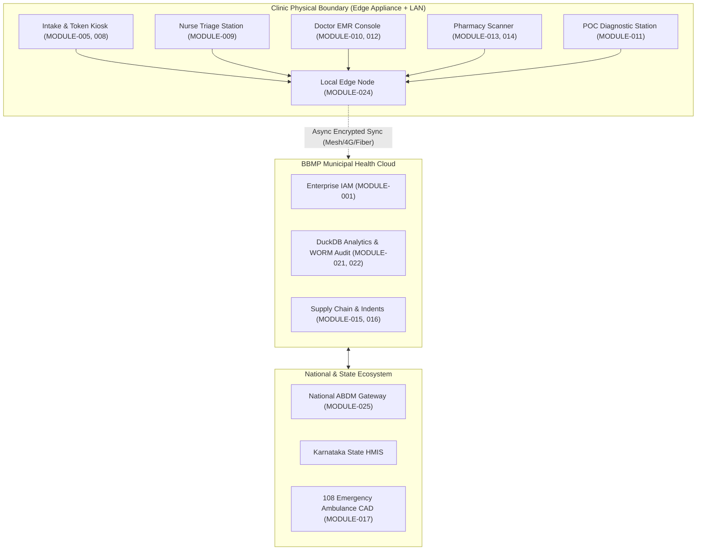

# Namma Clinic Digital Health & Operations Platform
## Product Management Baseline: Master Product Module & Capability Decomposition

| Metadata Element | Specification Baseline |
| :--- | :--- |
| **Document Identifier** | `DOC-PROD-001-PMM` |
| **Document Title** | Master Product Module Map, Functional Decomposition & Capability Catalog |
| **Project Code** | `NAMMA-CLINIC-PLATFORM-2026` |
| **Document Version** | `v1.0.0-PROD-BASELINE` |
| **Lifecycle Status** | `APPROVED & RATIFIED` |
| **Domain Count** | Exactly 6 Core Business Domains (`DOMAIN-001` to `DOMAIN-006`) |
| **Module Count** | Exactly 30 Production Modules (`MODULE-001` to `MODULE-030`) |
| **Submodule Count** | Exactly 90 Submodules (`SUBMODULE-001` to `SUBMODULE-090`) |
| **Capability Count** | Exactly 180 Functional Capabilities (`CAPABILITY-001` to `CAPABILITY-180`) |
| **Feature Trace** | Mapped 1:1 to 180 Features (`FEATURE-001` to `FEATURE-180`) |
| **Upstream Anchors** | `docs/00-project-baseline/`, `docs/01-project-management/`, `docs/02-requirements/`, `docs/03-workflows/` |
| **Downstream Consuming Phases** | Architecture (`05-architecture`), Database (`06-database`), API (`07-api`), Backend (`08-backend`), Frontend (`09-frontend`) |

---

## 1. Document Purpose & Architectural Intent
This document establishes the canonical functional boundary, structural hierarchy, and capability catalog for the Namma Clinic Digital Health & Operations Platform. It synthesizes institutional requirements (`docs/02-requirements/`) and clinic operational workflows (`docs/03-workflows/`) into an implementation-ready product structure. It defines exactly what constitutes the product, where business responsibilities reside, how modules communicate, and how operational boundaries prevent cascading system failures across 183 distributed primary health clinics in Bengaluru.

## 2. Product Context & Municipal Operational Environment
The Namma Clinic Platform is deployed across 183 urban primary health centers managed by the Greater Bengaluru Authority (GBA) and Bruhat Bengaluru Mahanagara Palike (BBMP) Health Department. The operating environment is characterized by high daily outpatient volumes (80 to 250 citizens per clinic per day), intermittent wide-area broadband connectivity, variable staff computer literacy, strict statutory compliance under the Digital Personal Data Protection (DPDP) Act 2023, and integration with the national Ayushman Bharat Digital Mission (ABDM).

## 3. Product Vision & Long-Term Objectives
To deliver an ultra-reliable, zero-data-loss, bilingual (Kannada/English) primary healthcare operating system that empowers doctors, nurses, pharmacists, and laboratory technicians to deliver safe, dignified, protocol-driven clinical care while providing municipal health leadership with real-time epidemiological intelligence, automated supply chain replenishment, and statutory accountability.

## 4. Core Product Principles
1. **Offline-First Operational Continuity:** Every primary clinical workflow (registration, vital triage, doctor consultation, laboratory order, e-prescribing, and pharmacy dispensing) must function seamlessly on the local clinic edge appliance during broadband fiber cuts.
2. **Zero Plaintext PHI Exposure:** Strict adherence to India DPDP Act 2023 and ABDM privacy guidelines; all health records are encrypted at rest with AES-256-GCM and in transit via TLS 1.3.
3. **Cryptographic Immutability:** Clinical prescriptions, patient consent grants, and diagnostic test results are signed with digital signatures and committed to write-once-read-many (WORM) audit ledgers.
4. **Clinical Safety Safeguards:** Real-time clinical decision support system (CDSS) provides non-intrusive safety guardrails preventing fatal drug-drug interactions, known allergies, and dosing errors.
5. **Sub-Second Interaction Ergonomics:** Frontline clinical screens must respond in < 250ms (p95) to prevent administrative software overhead from eroding doctor-patient interaction time.

## 5. System Boundary & Scope Allocations
The product boundary encompasses all software services, offline local databases, client user interfaces, peripheral hardware integrations (thermal printers, barcode scanners, digital displays), and external gateway adapters required to operate municipal clinics.



## 6. Authoritative Product Hierarchy
The product architecture is decomposed strictly across six standardized tiers:
```
PRODUCT-001 (Namma Clinic Platform)
  └── DOMAIN-001 to DOMAIN-006 (6 Core Business Domains)
       └── MODULE-001 to MODULE-030 (30 Functional Modules)
            └── SUBMODULE-001 to SUBMODULE-090 (90 Structural Submodules)
                 └── CAPABILITY-001 to CAPABILITY-180 (180 Discrete Capabilities)
                      └── FEATURE-001 to FEATURE-180 (180 Implementation Features)
```

## 7. Product Business Domains
The platform is partitioned into exactly six business domains, establishing clear administrative, architectural, and data ownership boundaries:

| Domain ID | Domain Name | Core Responsibilities | Module Allocation | Strategic Value |
| :--- | :--- | :--- | :--- | :--- |
| [`DOMAIN-001`](#domain-001) | **Core Foundation & Platform Administration** | Enterprise multi-tenant substrate providing identity, cryptographic role-based access control, facility organizational hierarchy, staff credentials, and centralized system administration. | `MODULE-001`, `MODULE-002`, `MODULE-003`, `MODULE-004`, `MODULE-026` | Standardizes foundational operations across all 183 clinics. |
| [`DOMAIN-002`](#domain-002) | **Frontline Intake & Citizen Operations** | Public-facing citizen touchpoints including bilingual registration, national ABHA ID generation, informed digital consent, biometric deduplication, priority token minting, waiting hall display orchestration, and citizen grievance redressal. | `MODULE-005`, `MODULE-006`, `MODULE-007`, `MODULE-008`, `MODULE-020` | Standardizes foundational operations across all 183 clinics. |
| [`DOMAIN-003`](#domain-003) | **Clinical Care & Diagnostic Orders** | Doctor and nurse clinical care delivery systems, electronic health records (EMR), structured SOAP documentation, standard diagnostic coding (ICD-10/SNOMED CT), electronic prescribing with drug safety validation, point-of-care laboratory orders, and telemedicine tele-consultation. | `MODULE-009`, `MODULE-010`, `MODULE-011`, `MODULE-012`, `MODULE-029` | Standardizes foundational operations across all 183 clinics. |
| [`DOMAIN-004`](#domain-004) | **Pharmacy, Dispensing & Inventory Supply Chain** | End-to-end pharmaceutical supply chain, point-of-care dispensing with 2D barcode verification, real-time batch and expiry tracking, First-Expiry First-Out (FEFO) stock control, automated indent replenishment, and Essential Medicine List (EML) formulary management. | `MODULE-013`, `MODULE-014`, `MODULE-015`, `MODULE-016` | Standardizes foundational operations across all 183 clinics. |
| [`DOMAIN-005`](#domain-005) | **Care Continuity, Referrals & Community Outreach** | Longitudinal care management connecting primary health clinics to secondary referral hospitals, emergency 108 ambulance transit, chronic Non-Communicable Disease (NCD) follow-up, multichannel citizen reminders (SMS/WhatsApp), and facility operations helpdesk support. | `MODULE-017`, `MODULE-018`, `MODULE-019`, `MODULE-028` | Standardizes foundational operations across all 183 clinics. |
| [`DOMAIN-006`](#domain-006) | **Intelligence, Governance, Offline & Interoperability** | Platform infrastructure, tamper-evident cryptographic WORM audit ledger, municipal epidemiological analytics, clinical decision support AI safeguards, ABDM national health gateway integration, autonomous offline edge mesh, statutory state HMIS reporting, and disaster command center. | `MODULE-021`, `MODULE-022`, `MODULE-023`, `MODULE-024`, `MODULE-025`, `MODULE-027`, `MODULE-030` | Standardizes foundational operations across all 183 clinics. |

## 8. Master Module Catalog (30 Modules)
Comprehensive catalog of all 30 modules defining domain alignment, submodule allocations, capability volume, priority tier, and target release:

| Module ID | Module Name | Domain | Submodules | Capabilities | Priority | MVP Tier | Target Release |
| :--- | :--- | :--- | :---: | :---: | :---: | :---: | :---: |
| [`MODULE-001`](#module-001) | **Staff Authentication & MFA Engine** | Core Foundation & Platform Administration | 3 | 6 | `P0 - Critical` | `CORE MVP` | `REL-00` |
| [`MODULE-002`](#module-002) | **Role-Based Access Control (RBAC) & Entitlements** | Core Foundation & Platform Administration | 3 | 6 | `P0 - Critical` | `CORE MVP` | `REL-00` |
| [`MODULE-003`](#module-003) | **Healthcare Facility & Organizational Hierarchy** | Core Foundation & Platform Administration | 3 | 6 | `P0 - Critical` | `CORE MVP` | `REL-00` |
| [`MODULE-004`](#module-004) | **Clinical & Administrative Staff Directory** | Core Foundation & Platform Administration | 3 | 6 | `P0 - Critical` | `CORE MVP` | `REL-00` |
| [`MODULE-026`](#module-026) | **Master System Administration & Feature Flagging** | Core Foundation & Platform Administration | 3 | 6 | `P0 - Critical` | `CORE MVP` | `REL-00` |
| [`MODULE-005`](#module-005) | **Patient Registration, Demographics & ABHA Minting** | Frontline Intake & Citizen Operations | 3 | 6 | `P0 - Critical` | `CORE MVP` | `REL-01` |
| [`MODULE-006`](#module-006) | **Informed Clinical Consent & DPDP Data Privacy** | Frontline Intake & Citizen Operations | 3 | 6 | `P0 - Critical` | `CORE MVP` | `REL-01` |
| [`MODULE-007`](#module-007) | **Patient Token Generation & Station Routing** | Frontline Intake & Citizen Operations | 3 | 6 | `P0 - Critical` | `CORE MVP` | `REL-01` |
| [`MODULE-008`](#module-008) | **Dynamic Queue Orchestration & Display Boards** | Frontline Intake & Citizen Operations | 3 | 6 | `P0 - Critical` | `CORE MVP` | `REL-01` |
| [`MODULE-020`](#module-020) | **Citizen Feedback, Grievance & Ombudsman Redressal** | Frontline Intake & Citizen Operations | 3 | 6 | `P2 - Medium` | `MVP-PLUS` | `REL-02` |
| [`MODULE-009`](#module-009) | **Doctor EMR Console & Clinical SOAP Encounter** | Clinical Care & Diagnostic Orders | 3 | 6 | `P0 - Critical` | `CORE MVP` | `REL-01` |
| [`MODULE-010`](#module-010) | **ICD-10 & SNOMED CT Clinical Diagnosis Coding** | Clinical Care & Diagnostic Orders | 3 | 6 | `P0 - Critical` | `CORE MVP` | `REL-01` |
| [`MODULE-011`](#module-011) | **Electronic Prescription (e-Rx) & Drug Safety Engine** | Clinical Care & Diagnostic Orders | 3 | 6 | `P0 - Critical` | `CORE MVP` | `REL-01` |
| [`MODULE-012`](#module-012) | **Point-of-Care Laboratory Testing & Diagnostic Orders** | Clinical Care & Diagnostic Orders | 3 | 6 | `P0 - Critical` | `CORE MVP` | `REL-01` |
| [`MODULE-029`](#module-029) | **Telemedicine & Specialist Tele-Consultation Bridge** | Clinical Care & Diagnostic Orders | 3 | 6 | `P2 - Medium` | `POST-MVP` | `REL-03` |
| [`MODULE-013`](#module-013) | **Pharmacy Dispensing & 2D Barcode Verification** | Pharmacy, Dispensing & Inventory Supply Chain | 3 | 6 | `P0 - Critical` | `CORE MVP` | `REL-01` |
| [`MODULE-014`](#module-014) | **Real-Time Batch Inventory & FEFO Stock Ledger** | Pharmacy, Dispensing & Inventory Supply Chain | 3 | 6 | `P0 - Critical` | `CORE MVP` | `REL-01` |
| [`MODULE-015`](#module-015) | **Drug Indent Generation, Receiving & Cold-Chain Intake** | Pharmacy, Dispensing & Inventory Supply Chain | 3 | 6 | `P0 - Critical` | `CORE MVP` | `REL-01` |
| [`MODULE-016`](#module-016) | **Essential Medicine List (EML) & Formulary Master** | Pharmacy, Dispensing & Inventory Supply Chain | 3 | 6 | `P0 - Critical` | `CORE MVP` | `REL-00` |
| [`MODULE-017`](#module-017) | **Secondary Referral & 108 Emergency EMS Transit** | Care Continuity, Referrals & Community Outreach | 3 | 6 | `P0 - Critical` | `CORE MVP` | `REL-01` |
| [`MODULE-018`](#module-018) | **NCD Longitudinal Follow-Up & Recall Management** | Care Continuity, Referrals & Community Outreach | 3 | 6 | `P1 - High` | `MVP-PLUS` | `REL-02` |
| [`MODULE-019`](#module-019) | **Citizen Multichannel Notifications & Health Reminders** | Care Continuity, Referrals & Community Outreach | 3 | 6 | `P1 - High` | `CORE MVP` | `REL-01` |
| [`MODULE-028`](#module-028) | **Facility Operations Helpdesk & Incident Dispatch** | Care Continuity, Referrals & Community Outreach | 3 | 6 | `P2 - Medium` | `MVP-PLUS` | `REL-02` |
| [`MODULE-021`](#module-021) | **Cryptographic Audit Ledger & Compliance (WORM)** | Intelligence, Governance, Offline & Interoperability | 3 | 6 | `P0 - Critical` | `CORE MVP` | `REL-00` |
| [`MODULE-022`](#module-022) | **Zonal & Ward Operational KPI Dashboards** | Intelligence, Governance, Offline & Interoperability | 3 | 6 | `P1 - High` | `CORE MVP` | `REL-01` |
| [`MODULE-023`](#module-023) | **Safe AI/ML Clinical Decision Support Safeguards** | Intelligence, Governance, Offline & Interoperability | 3 | 6 | `P2 - Medium` | `POST-MVP` | `REL-06` |
| [`MODULE-024`](#module-024) | **National Health ABDM Ecosystem Interoperability** | Intelligence, Governance, Offline & Interoperability | 3 | 6 | `P1 - High` | `CORE MVP` | `REL-01` |
| [`MODULE-025`](#module-025) | **Autonomous Offline Edge Engine & Conflict Replay** | Intelligence, Governance, Offline & Interoperability | 3 | 6 | `P0 - Critical` | `CORE MVP` | `REL-00` |
| [`MODULE-027`](#module-027) | **State Health HMIS & Statutory Disease Reporting** | Intelligence, Governance, Offline & Interoperability | 3 | 6 | `P1 - High` | `CORE MVP` | `REL-01` |
| [`MODULE-030`](#module-030) | **Municipal Pilot Command Center & Disaster Operations** | Intelligence, Governance, Offline & Interoperability | 3 | 6 | `P2 - Medium` | `POST-MVP` | `REL-04` |

## 9. Master Submodule Catalog (90 Submodules)
Authoritative catalog of all 90 structural submodules establishing intermediate functional groupings:

| Submodule ID | Submodule Name | Parent Module | Functional Scope | Primary Capability |
| :--- | :--- | :--- | :--- | :--- |
| `SUBMODULE-001` | **Primary Credential Authentication** | `MODULE-001` (Staff Authentication & MFA Engine) | Handles username, salted Argon2id/scrypt passwords, and session credential validation. | Specializes module behavior into dedicated sub-functions. |
| `SUBMODULE-002` | **Multi-Factor Verification** | `MODULE-001` (Staff Authentication & MFA Engine) | Enforces TOTP authenticator app and SMS one-time passcode challenges. | Specializes module behavior into dedicated sub-functions. |
| `SUBMODULE-003` | **Offline Cryptographic PIN Fallback** | `MODULE-001` (Staff Authentication & MFA Engine) | Validates cached local PINs using edge server secure enclaves during broadband severing. | Specializes module behavior into dedicated sub-functions. |
| `SUBMODULE-004` | **Role Hierarchy & Permissions Engine** | `MODULE-002` (Role-Based Access Control (RBAC) & Entitlements) | Maintains RBAC permission matrix and action-level authorization checks. | Specializes module behavior into dedicated sub-functions. |
| `SUBMODULE-005` | **Separation-of-Duties (SoD) Enforcer** | `MODULE-002` (Role-Based Access Control (RBAC) & Entitlements) | Blocks conflicting permissions such as prescribing and dispensing by the same user. | Specializes module behavior into dedicated sub-functions. |
| `SUBMODULE-006` | **Emergency Break-Glass Override** | `MODULE-002` (Role-Based Access Control (RBAC) & Entitlements) | Allows temporary emergency privilege elevation with mandatory peer audit logging. | Specializes module behavior into dedicated sub-functions. |
| `SUBMODULE-007` | **Geographic & Municipal Hierarchy** | `MODULE-003` (Healthcare Facility & Organizational Hierarchy) | Manages City -> Zone -> Ward -> Facility geospatial and organizational trees. | Specializes module behavior into dedicated sub-functions. |
| `SUBMODULE-008` | **Facility Physical Layout & Rooms** | `MODULE-003` (Healthcare Facility & Organizational Hierarchy) | Configures consultation cubicles, triage desks, pharmacy counters, and labs. | Specializes module behavior into dedicated sub-functions. |
| `SUBMODULE-009` | **Clinic Operating Calendars & Shifts** | `MODULE-003` (Healthcare Facility & Organizational Hierarchy) | Maintains working hours (08:00 - 20:00), holiday calendars, and shift rosters. | Specializes module behavior into dedicated sub-functions. |
| `SUBMODULE-010` | **Staff Professional Profile Directory** | `MODULE-004` (Clinical & Administrative Staff Directory) | Maintains staff bio, qualifications, KMC/KNC registration numbers, and contact details. | Specializes module behavior into dedicated sub-functions. |
| `SUBMODULE-011` | **Facility Roster & Shift Scheduling** | `MODULE-004` (Clinical & Administrative Staff Directory) | Schedules morning and evening shift duties and records biometric muster. | Specializes module behavior into dedicated sub-functions. |
| `SUBMODULE-012` | **Digital Signature & Key Registry** | `MODULE-004` (Clinical & Administrative Staff Directory) | Manages DSC / e-Sign public certificates for prescription and lab signoff. | Specializes module behavior into dedicated sub-functions. |
| `SUBMODULE-013` | **Dynamic Feature Flag Management** | `MODULE-026` (Master System Administration & Feature Flagging) | Controls canary feature rollouts by zone, facility tier, or clinic ID. | Specializes module behavior into dedicated sub-functions. |
| `SUBMODULE-014` | **System Configuration & Thresholds** | `MODULE-026` (Master System Administration & Feature Flagging) | Manages operational thresholds, timeouts, cache TTLs, and queue capacities. | Specializes module behavior into dedicated sub-functions. |
| `SUBMODULE-015` | **Platform Maintenance & Migration Control** | `MODULE-026` (Master System Administration & Feature Flagging) | Coordinates edge database schema migrations and scheduled maintenance windows. | Specializes module behavior into dedicated sub-functions. |
| `SUBMODULE-016` | **Bilingual Demographic Intake** | `MODULE-005` (Patient Registration, Demographics & ABHA Minting) | Captures citizen identity, age, gender, phone, and address in English and Kannada. | Specializes module behavior into dedicated sub-functions. |
| `SUBMODULE-017` | **ABHA Number & Address Creation** | `MODULE-005` (Patient Registration, Demographics & ABHA Minting) | Connects to ABDM / UIDAI bridge for OTP or biometric-based ABHA minting. | Specializes module behavior into dedicated sub-functions. |
| `SUBMODULE-018` | **Local UHID Minting & Deduplication** | `MODULE-005` (Patient Registration, Demographics & ABHA Minting) | Generates unique clinic UHIDs with hierarchical namespace prefixes and phonetic match checks. | Specializes module behavior into dedicated sub-functions. |
| `SUBMODULE-019` | **General Clinical Consent** | `MODULE-006` (Informed Clinical Consent & DPDP Data Privacy) | Captures consent for primary care examination, vital checks, and routine point-of-care lab tests. | Specializes module behavior into dedicated sub-functions. |
| `SUBMODULE-020` | **ABDM Health Data Sharing Consent** | `MODULE-006` (Informed Clinical Consent & DPDP Data Privacy) | Manages electronic consent artifacts for sharing records with external health facilities via ABDM. | Specializes module behavior into dedicated sub-functions. |
| `SUBMODULE-021` | **Guardian / Proxy & Emergency Consent** | `MODULE-006` (Informed Clinical Consent & DPDP Data Privacy) | Handles pediatric guardian consent, adult proxy authorizations, and medical emergency break-glass consent. | Specializes module behavior into dedicated sub-functions. |
| `SUBMODULE-022` | **Sequential Token Generation** | `MODULE-007` (Patient Token Generation & Station Routing) | Mints daily unique sequential numbers (`T-001`, `T-002`) reset at 07:30 AM. | Specializes module behavior into dedicated sub-functions. |
| `SUBMODULE-023` | **Priority Stratification & Tagging** | `MODULE-007` (Patient Token Generation & Station Routing) | Tags tokens with priority tiers (`EMERGENCY-RED`, `PRIORITY-YELLOW`, `ROUTINE-GREEN`). | Specializes module behavior into dedicated sub-functions. |
| `SUBMODULE-024` | **Thermal Slip Printing & Virtual SMS Slip** | `MODULE-007` (Patient Token Generation & Station Routing) | Interfaces with ESC/POS thermal printers and dispatches SMS backup tokens. | Specializes module behavior into dedicated sub-functions. |
| `SUBMODULE-025` | **Multi-Station Queue State Machine** | `MODULE-008` (Dynamic Queue Orchestration & Display Boards) | Orchestrates token transitions across intake, vitals, consultation, lab, and pharmacy. | Specializes module behavior into dedicated sub-functions. |
| `SUBMODULE-026` | **Audio-Visual Calling Engine** | `MODULE-008` (Dynamic Queue Orchestration & Display Boards) | Drives waiting hall TV displays and synthesized bilingual voice announcements. | Specializes module behavior into dedicated sub-functions. |
| `SUBMODULE-027` | **Doctor Workload Balancer** | `MODULE-008` (Dynamic Queue Orchestration & Display Boards) | Dynamically routes next patient to available consultation cubicle based on consultation speed. | Specializes module behavior into dedicated sub-functions. |
| `SUBMODULE-028` | **Touchscreen Exit Survey Kiosk** | `MODULE-020` (Citizen Feedback, Grievance & Ombudsman Redressal) | Captures 1-click smiley face satisfaction ratings and medicine receipt confirmation. | Specializes module behavior into dedicated sub-functions. |
| `SUBMODULE-029` | **Grievance Ticket Management** | `MODULE-020` (Citizen Feedback, Grievance & Ombudsman Redressal) | Logs formal complaint tickets with severity, category, photographic evidence, and SLA. | Specializes module behavior into dedicated sub-functions. |
| `SUBMODULE-030` | **Ombudsman Escalation & Resolution** | `MODULE-020` (Citizen Feedback, Grievance & Ombudsman Redressal) | Escalates overdue tickets to ZHO and tracks corrective action reports. | Specializes module behavior into dedicated sub-functions. |
| `SUBMODULE-031` | **Longitudinal Patient Summary Dashboard** | `MODULE-009` (Doctor EMR Console & Clinical SOAP Encounter) | Presents past episodes, chronic conditions, active medications, and vital sign trends. | Specializes module behavior into dedicated sub-functions. |
| `SUBMODULE-032` | **Structured SOAP Documentation Engine** | `MODULE-009` (Doctor EMR Console & Clinical SOAP Encounter) | Captures Subjective complaints, Objective findings, Assessment, and Plan with 1-click templates. | Specializes module behavior into dedicated sub-functions. |
| `SUBMODULE-033` | **Clinical Encounter Signoff & Lock** | `MODULE-009` (Doctor EMR Console & Clinical SOAP Encounter) | Cryptographically signs clinical note with doctor credentials and locks record against tampering. | Specializes module behavior into dedicated sub-functions. |
| `SUBMODULE-034` | **Predictive Typeahead Terminology Search** | `MODULE-010` (ICD-10 & SNOMED CT Clinical Diagnosis Coding) | Provides sub-50ms search across primary care curated subsets of ICD-10 and SNOMED CT. | Specializes module behavior into dedicated sub-functions. |
| `SUBMODULE-035` | **Primary vs. Secondary Diagnosis Classification** | `MODULE-010` (ICD-10 & SNOMED CT Clinical Diagnosis Coding) | Categorizes primary reason for visit, secondary chronic co-morbidities, and provisional tags. | Specializes module behavior into dedicated sub-functions. |
| `SUBMODULE-036` | **Notifiable Disease Surveillance Trigger** | `MODULE-010` (ICD-10 & SNOMED CT Clinical Diagnosis Coding) | Automatically flags statutory notifiable infectious diseases (Dengue, Cholera, Tuberculosis). | Specializes module behavior into dedicated sub-functions. |
| `SUBMODULE-037` | **Formulary-Linked e-Prescription Authoring** | `MODULE-011` (Electronic Prescription (e-Rx) & Drug Safety Engine) | Enables rapid generic medication selection with pre-set dosage, frequency, and duration. | Specializes module behavior into dedicated sub-functions. |
| `SUBMODULE-038` | **Automated Drug Safety & Interaction Engine** | `MODULE-011` (Electronic Prescription (e-Rx) & Drug Safety Engine) | Evaluates drug-drug interactions, known patient allergies, and contraindications in real time. | Specializes module behavior into dedicated sub-functions. |
| `SUBMODULE-039` | **Pediatric & Renal Dosage Calculator** | `MODULE-011` (Electronic Prescription (e-Rx) & Drug Safety Engine) | Calculates safe mg/kg pediatric doses and renal clearance adjustments based on patient vitals. | Specializes module behavior into dedicated sub-functions. |
| `SUBMODULE-040` | **Diagnostic Order Dispatch & Barcoding** | `MODULE-012` (Point-of-Care Laboratory Testing & Diagnostic Orders) | Receives electronic lab orders from doctor console and generates sample barcode labels. | Specializes module behavior into dedicated sub-functions. |
| `SUBMODULE-041` | **Result Entry & Instrument Interface** | `MODULE-012` (Point-of-Care Laboratory Testing & Diagnostic Orders) | Captures quantitative/qualitative test values manually or via serial/Bluetooth analyzer bridge. | Specializes module behavior into dedicated sub-functions. |
| `SUBMODULE-042` | **Critical Panic Value Alert Engine** | `MODULE-012` (Point-of-Care Laboratory Testing & Diagnostic Orders) | Identifies life-threatening lab values and triggers immediate flashing alert on doctor screen. | Specializes module behavior into dedicated sub-functions. |
| `SUBMODULE-043` | **Specialist Tele-Slot Scheduling** | `MODULE-029` (Telemedicine & Specialist Tele-Consultation Bridge) | Schedules tele-consultation appointments with panel specialists at BBMP tertiary hospitals. | Specializes module behavior into dedicated sub-functions. |
| `SUBMODULE-044` | **WebRTC Video & Digital Diagnostic Sharing** | `MODULE-029` (Telemedicine & Specialist Tele-Consultation Bridge) | Streams low-bandwidth encrypted video and shares real-time vitals and digital ECG tracings. | Specializes module behavior into dedicated sub-functions. |
| `SUBMODULE-045` | **Specialist Advisory Note & Endorsement** | `MODULE-029` (Telemedicine & Specialist Tele-Consultation Bridge) | Allows remote specialist to append recommendations directly to the primary clinic SOAP note. | Specializes module behavior into dedicated sub-functions. |
| `SUBMODULE-046` | **Prescription Queue & Verification** | `MODULE-013` (Pharmacy Dispensing & 2D Barcode Verification) | Receives signed e-prescriptions electronically from doctor consoles with priority indicators. | Specializes module behavior into dedicated sub-functions. |
| `SUBMODULE-047` | **2D Barcode & FEFO Batch Scan** | `MODULE-013` (Pharmacy Dispensing & 2D Barcode Verification) | Scans physical blister pack DataMatrix/barcode; validates drug identity, batch number, and expiry. | Specializes module behavior into dedicated sub-functions. |
| `SUBMODULE-048` | **Bilingual Dosage Label Printing & Counseling** | `MODULE-013` (Pharmacy Dispensing & 2D Barcode Verification) | Prints Kannada/English dosage instructions on envelope and logs citizen counseling completion. | Specializes module behavior into dedicated sub-functions. |
| `SUBMODULE-049` | **Batch-Level Stock Ledger** | `MODULE-014` (Real-Time Batch Inventory & FEFO Stock Ledger) | Maintains quantity on hand, batch number, manufacturer, manufacturing date, and expiry date. | Specializes module behavior into dedicated sub-functions. |
| `SUBMODULE-050` | **FEFO Picking Engine & Expiry Warnings** | `MODULE-014` (Real-Time Batch Inventory & FEFO Stock Ledger) | Guides pharmacist to earliest expiring batch and flags batches expiring within 90 days. | Specializes module behavior into dedicated sub-functions. |
| `SUBMODULE-051` | **Stock Audit & Shrinkage Reconciliation** | `MODULE-014` (Real-Time Batch Inventory & FEFO Stock Ledger) | Facilitates monthly physical stock count entry and logs variance adjustments with justifications. | Specializes module behavior into dedicated sub-functions. |
| `SUBMODULE-052` | **Algorithmic Indent Generator** | `MODULE-015` (Drug Indent Generation, Receiving & Cold-Chain Intake) | Calculates monthly reorder quantities based on average daily consumption and buffer targets. | Specializes module behavior into dedicated sub-functions. |
| `SUBMODULE-053` | **Consignment Receiving & Electronic Goods Inward** | `MODULE-015` (Drug Indent Generation, Receiving & Cold-Chain Intake) | Receives delivery challans, scans master carton barcodes, and logs batch details into inventory. | Specializes module behavior into dedicated sub-functions. |
| `SUBMODULE-054` | **Cold-Chain Temperature Telemetry Logger** | `MODULE-015` (Drug Indent Generation, Receiving & Cold-Chain Intake) | Tracks vaccine refrigerator temperature (2°C - 8°C) and flags thermal breach excursions. | Specializes module behavior into dedicated sub-functions. |
| `SUBMODULE-055` | **Formulary Master Catalog** | `MODULE-016` (Essential Medicine List (EML) & Formulary Master) | Maintains generic chemical names, strengths, dosage forms (tablet, syrup, ointment), and ATC codes. | Specializes module behavior into dedicated sub-functions. |
| `SUBMODULE-056` | **Brand-to-Generic Equivalence Index** | `MODULE-016` (Essential Medicine List (EML) & Formulary Master) | Maps commercial trade names to official generic chemical formulations. | Specializes module behavior into dedicated sub-functions. |
| `SUBMODULE-057` | **Therapeutic Substitution Guidelines** | `MODULE-016` (Essential Medicine List (EML) & Formulary Master) | Configures authorized clinical substitutes (e.g. Amlodipine 5mg for Nifedipine 10mg). | Specializes module behavior into dedicated sub-functions. |
| `SUBMODULE-058` | **Structured Clinical Referral Authoring** | `MODULE-017` (Secondary Referral & 108 Emergency EMS Transit) | Generates standardized SBAR (Situation, Background, Assessment, Recommendation) referral notes. | Specializes module behavior into dedicated sub-functions. |
| `SUBMODULE-059` | **108 Emergency EMS Dispatch Bridge** | `MODULE-017` (Secondary Referral & 108 Emergency EMS Transit) | Dispatches emergency ambulance request with GPS location and clinical acuity score. | Specializes module behavior into dedicated sub-functions. |
| `SUBMODULE-060` | **Closed-Loop Referral Tracking** | `MODULE-017` (Secondary Referral & 108 Emergency EMS Transit) | Tracks referral hospital arrival, admission outcome, and discharge summary reception. | Specializes module behavior into dedicated sub-functions. |
| `SUBMODULE-061` | **Chronic Care Plan & Protocol Engine** | `MODULE-018` (NCD Longitudinal Follow-Up & Recall Management) | Configures standardized treatment targets (HbA1c < 7.0%, BP < 140/90 mmHg) and recall frequency. | Specializes module behavior into dedicated sub-functions. |
| `SUBMODULE-062` | **Automated Recall Calendar & Queue** | `MODULE-018` (NCD Longitudinal Follow-Up & Recall Management) | Maintains calendar of expected patient revisits and flags overdue dropouts. | Specializes module behavior into dedicated sub-functions. |
| `SUBMODULE-063` | **ASHA Community Tracing Worklist** | `MODULE-018` (NCD Longitudinal Follow-Up & Recall Management) | Generates localized ward-level overdue patient lists for home visits by ASHA workers. | Specializes module behavior into dedicated sub-functions. |
| `SUBMODULE-064` | **Transactional SMS Notification Gateway** | `MODULE-019` (Citizen Multichannel Notifications & Health Reminders) | Sends registration UHID, queue token, and lab completion alerts via DLT-approved templates. | Specializes module behavior into dedicated sub-functions. |
| `SUBMODULE-065` | **WhatsApp Citizen Health Service** | `MODULE-019` (Citizen Multichannel Notifications & Health Reminders) | Enables interactive chatbot for token status queries, lab report downloads, and clinic location. | Specializes module behavior into dedicated sub-functions. |
| `SUBMODULE-066` | **Zonal Public Health Broadcast Engine** | `MODULE-019` (Citizen Multichannel Notifications & Health Reminders) | Broadcasts targeted community advisories (e.g. Dengue prevention, vaccination drives). | Specializes module behavior into dedicated sub-functions. |
| `SUBMODULE-067` | **Clinic Incident Ticketing Console** | `MODULE-028` (Facility Operations Helpdesk & Incident Dispatch) | Enables staff to log technical faults with 1-click diagnostic dumps and photos. | Specializes module behavior into dedicated sub-functions. |
| `SUBMODULE-068` | **Automated Technician Dispatch & Routing** | `MODULE-028` (Facility Operations Helpdesk & Incident Dispatch) | Routes tickets to zonal mobile field engineers based on geographic proximity. | Specializes module behavior into dedicated sub-functions. |
| `SUBMODULE-069` | **Hardware Asset Health & SLA Monitor** | `MODULE-028` (Facility Operations Helpdesk & Incident Dispatch) | Tracks hardware MTBF, warranty status, replacement inventory, and repair SLAs. | Specializes module behavior into dedicated sub-functions. |
| `SUBMODULE-070` | **HMAC-SHA256 Cryptographic Hash Chainer** | `MODULE-021` (Cryptographic Audit Ledger & Compliance (WORM)) | Calculates chained hashes across sequential audit entries linking new records to previous blocks. | Specializes module behavior into dedicated sub-functions. |
| `SUBMODULE-071` | **Forensic Query & Verification Engine** | `MODULE-021` (Cryptographic Audit Ledger & Compliance (WORM)) | Verifies cryptographic chain integrity and provides tamper-proof forensic search tools. | Specializes module behavior into dedicated sub-functions. |
| `SUBMODULE-072` | **WORM Storage & Statutory Cold Archival** | `MODULE-021` (Cryptographic Audit Ledger & Compliance (WORM)) | Enforces 7-year immutable retention on encrypted cold object storage conforming to NDHM. | Specializes module behavior into dedicated sub-functions. |
| `SUBMODULE-073` | **Executive Real-Time Command Dashboard** | `MODULE-022` (Zonal & Ward Operational KPI Dashboards) | Visualizes active footfall, completed consultations, dispense volume, and code red alerts. | Specializes module behavior into dedicated sub-functions. |
| `SUBMODULE-074` | **Zonal Comparative Analytics Engine** | `MODULE-022` (Zonal & Ward Operational KPI Dashboards) | Compares performance metrics across 8 BBMP zones (East, West, South, Mahadevapura, etc.). | Specializes module behavior into dedicated sub-functions. |
| `SUBMODULE-075` | **Facility Drill-Down & Bottleneck Heatmap** | `MODULE-022` (Zonal & Ward Operational KPI Dashboards) | Enables 1-click drill-down into specific clinic wait times and station queues. | Specializes module behavior into dedicated sub-functions. |
| `SUBMODULE-076` | **Clinical Rule-Based Expert Guardrails** | `MODULE-023` (Safe AI/ML Clinical Decision Support Safeguards) | Evaluates deterministic clinical guidelines (ICMR, WHO, STG) prior to presenting any AI suggestions. | Specializes module behavior into dedicated sub-functions. |
| `SUBMODULE-077` | **Explainable Clinical Rationale Visualizer** | `MODULE-023` (Safe AI/ML Clinical Decision Support Safeguards) | Presents underlying medical justification, confidence score, and clinical evidence citations. | Specializes module behavior into dedicated sub-functions. |
| `SUBMODULE-078` | **AI Safety & Bias Auditing Engine** | `MODULE-023` (Safe AI/ML Clinical Decision Support Safeguards) | Tracks doctor override rates, flags demographic bias, and logs AI interaction forensic trails. | Specializes module behavior into dedicated sub-functions. |
| `SUBMODULE-079` | **ABDM M1: ABHA Number & Address Integration** | `MODULE-024` (National Health ABDM Ecosystem Interoperability) | Integrates NHA ABHA minting and verification APIs via Aadhaar OTP, mobile, and demographic modes. | Specializes module behavior into dedicated sub-functions. |
| `SUBMODULE-080` | **ABDM M2: Health Information Provider (HIP)** | `MODULE-024` (National Health ABDM Ecosystem Interoperability) | Bundles consultations, e-prescriptions, and lab reports into standard ABDM FHIR DiagnosticReport / CareContext. | Specializes module behavior into dedicated sub-functions. |
| `SUBMODULE-081` | **ABDM M3: Health Information User (HIU)** | `MODULE-024` (National Health ABDM Ecosystem Interoperability) | Requests and displays external historical records from other hospitals via consent manager flow. | Specializes module behavior into dedicated sub-functions. |
| `SUBMODULE-082` | **Local Edge Appliance Database Engine** | `MODULE-025` (Autonomous Offline Edge Engine & Conflict Replay) | Runs local fanless appliance running embedded encrypted SQLite / SQLCipher with WAL mode. | Specializes module behavior into dedicated sub-functions. |
| `SUBMODULE-083` | **Outbound Mutation Queue & Replay Pipeline** | `MODULE-025` (Autonomous Offline Edge Engine & Conflict Replay) | Queues local insert/update mutations in encrypted FIFO queue with sequential idempotency keys. | Specializes module behavior into dedicated sub-functions. |
| `SUBMODULE-084` | **Conflict-Free Replicated Data Type (CRDT) Resolver** | `MODULE-025` (Autonomous Offline Edge Engine & Conflict Replay) | Reconciles concurrent offline edits using deterministic domain-specific merge strategies. | Specializes module behavior into dedicated sub-functions. |
| `SUBMODULE-085` | **National HMIS Monthly Return Compiler** | `MODULE-027` (State Health HMIS & Statutory Disease Reporting) | Aggregates 180+ standardized MoHFW HMIS data elements from primary care transactions. | Specializes module behavior into dedicated sub-functions. |
| `SUBMODULE-086` | **RCH Maternal & Child Health Indicator Engine** | `MODULE-027` (State Health HMIS & Statutory Disease Reporting) | Calculates antenatal care (ANC) visits, institutional deliveries, and immunization coverage. | Specializes module behavior into dedicated sub-functions. |
| `SUBMODULE-087` | **Weekly IDSP Form S/P Epidemiological Form** | `MODULE-027` (State Health HMIS & Statutory Disease Reporting) | Extracts weekly syndromic and presumptive disease incidence for state surveillance officers. | Specializes module behavior into dedicated sub-functions. |
| `SUBMODULE-088` | **Disaster Health Incident Command Console** | `MODULE-030` (Municipal Pilot Command Center & Disaster Operations) | Declares citywide or zonal health emergencies and mobilizes rapid response teams. | Specializes module behavior into dedicated sub-functions. |
| `SUBMODULE-089` | **Mobile Clinic & Rapid Response Telemetry** | `MODULE-030` (Municipal Pilot Command Center & Disaster Operations) | Tracks GPS locations, consumable stocks, and patient throughput of mobile health vans. | Specializes module behavior into dedicated sub-functions. |
| `SUBMODULE-090` | **Emergency Stock & Vaccine Redistribution** | `MODULE-030` (Municipal Pilot Command Center & Disaster Operations) | Orchestrates mutual-aid drug and oxygen cylinder transfers between neighboring clinics. | Specializes module behavior into dedicated sub-functions. |

## 10. Master Capability Catalog (180 Capabilities)
Authoritative inventory of all 180 capabilities mapping each discrete business capability to its implementing feature:

| Cap ID | Capability Name | Module | Submodule | Implementing Feature | MoSCoW |
| :--- | :--- | :--- | :--- | :--- | :---: |
| `CAPABILITY-001` | **Credential Verification** | `MODULE-001` | `SUBMODULE-001` | [`FEATURE-001`](./04-feature-catalog.md#feature-001) | `MUST` |
| `CAPABILITY-002` | **Session Token Minting** | `MODULE-001` | `SUBMODULE-001` | [`FEATURE-002`](./04-feature-catalog.md#feature-002) | `MUST` |
| `CAPABILITY-003` | **MFA Challenge Dispatch** | `MODULE-001` | `SUBMODULE-002` | [`FEATURE-003`](./04-feature-catalog.md#feature-003) | `MUST` |
| `CAPABILITY-004` | **Biometric Authentication Bridge** | `MODULE-001` | `SUBMODULE-002` | [`FEATURE-004`](./04-feature-catalog.md#feature-004) | `MUST` |
| `CAPABILITY-005` | **Local PIN Verification** | `MODULE-001` | `SUBMODULE-003` | [`FEATURE-005`](./04-feature-catalog.md#feature-005) | `MUST` |
| `CAPABILITY-006` | **Session Inactivity Lockout** | `MODULE-001` | `SUBMODULE-003` | [`FEATURE-006`](./04-feature-catalog.md#feature-006) | `MUST` |
| `CAPABILITY-007` | **Permission Evaluation** | `MODULE-002` | `SUBMODULE-004` | [`FEATURE-007`](./04-feature-catalog.md#feature-007) | `MUST` |
| `CAPABILITY-008` | **Dynamic Role Assignment** | `MODULE-002` | `SUBMODULE-004` | [`FEATURE-008`](./04-feature-catalog.md#feature-008) | `MUST` |
| `CAPABILITY-009` | **Conflict-of-Interest Prevention** | `MODULE-002` | `SUBMODULE-005` | [`FEATURE-009`](./04-feature-catalog.md#feature-009) | `MUST` |
| `CAPABILITY-010` | **Maker-Checker Authorization** | `MODULE-002` | `SUBMODULE-005` | [`FEATURE-010`](./04-feature-catalog.md#feature-010) | `MUST` |
| `CAPABILITY-011` | **Break-Glass Privilege Elevation** | `MODULE-002` | `SUBMODULE-006` | [`FEATURE-011`](./04-feature-catalog.md#feature-011) | `MUST` |
| `CAPABILITY-012` | **Privilege Elevation Audit** | `MODULE-002` | `SUBMODULE-006` | [`FEATURE-012`](./04-feature-catalog.md#feature-012) | `MUST` |
| `CAPABILITY-013` | **Hierarchy Node Management** | `MODULE-003` | `SUBMODULE-007` | [`FEATURE-013`](./04-feature-catalog.md#feature-013) | `MUST` |
| `CAPABILITY-014` | **NIN / HFR Registry Linking** | `MODULE-003` | `SUBMODULE-007` | [`FEATURE-014`](./04-feature-catalog.md#feature-014) | `MUST` |
| `CAPABILITY-015` | **Station Terminal Mapping** | `MODULE-003` | `SUBMODULE-008` | [`FEATURE-015`](./04-feature-catalog.md#feature-015) | `MUST` |
| `CAPABILITY-016` | **Facility Capacity Configuration** | `MODULE-003` | `SUBMODULE-008` | [`FEATURE-016`](./04-feature-catalog.md#feature-016) | `MUST` |
| `CAPABILITY-017` | **Operating Hours Enforcement** | `MODULE-003` | `SUBMODULE-009` | [`FEATURE-017`](./04-feature-catalog.md#feature-017) | `MUST` |
| `CAPABILITY-018` | **Special Camp Calendar** | `MODULE-003` | `SUBMODULE-009` | [`FEATURE-018`](./04-feature-catalog.md#feature-018) | `MUST` |
| `CAPABILITY-019` | **Staff Onboarding & KYC** | `MODULE-004` | `SUBMODULE-010` | [`FEATURE-019`](./04-feature-catalog.md#feature-019) | `MUST` |
| `CAPABILITY-020` | **Professional License Verification** | `MODULE-004` | `SUBMODULE-010` | [`FEATURE-020`](./04-feature-catalog.md#feature-020) | `MUST` |
| `CAPABILITY-021` | **Duty Roster Generation** | `MODULE-004` | `SUBMODULE-011` | [`FEATURE-021`](./04-feature-catalog.md#feature-021) | `MUST` |
| `CAPABILITY-022` | **Biometric Attendance Linking** | `MODULE-004` | `SUBMODULE-011` | [`FEATURE-022`](./04-feature-catalog.md#feature-022) | `MUST` |
| `CAPABILITY-023` | **Digital Signature Enrollment** | `MODULE-004` | `SUBMODULE-012` | [`FEATURE-023`](./04-feature-catalog.md#feature-023) | `MUST` |
| `CAPABILITY-024` | **Signature Revocation** | `MODULE-004` | `SUBMODULE-012` | [`FEATURE-024`](./04-feature-catalog.md#feature-024) | `MUST` |
| `CAPABILITY-025` | **Targeted Flag Activation** | `MODULE-026` | `SUBMODULE-013` | [`FEATURE-025`](./04-feature-catalog.md#feature-025) | `MUST` |
| `CAPABILITY-026` | **Emergency Feature Killswitch** | `MODULE-026` | `SUBMODULE-013` | [`FEATURE-026`](./04-feature-catalog.md#feature-026) | `MUST` |
| `CAPABILITY-027` | **System Parameter Tuning** | `MODULE-026` | `SUBMODULE-014` | [`FEATURE-027`](./04-feature-catalog.md#feature-027) | `MUST` |
| `CAPABILITY-028` | **Edge Configuration Distribution** | `MODULE-026` | `SUBMODULE-014` | [`FEATURE-028`](./04-feature-catalog.md#feature-028) | `MUST` |
| `CAPABILITY-029` | **Edge Migration Orchestration** | `MODULE-026` | `SUBMODULE-015` | [`FEATURE-029`](./04-feature-catalog.md#feature-029) | `MUST` |
| `CAPABILITY-030` | **Health Probe Monitoring** | `MODULE-026` | `SUBMODULE-015` | [`FEATURE-030`](./04-feature-catalog.md#feature-030) | `MUST` |
| `CAPABILITY-031` | **Bilingual Intake UI** | `MODULE-005` | `SUBMODULE-016` | [`FEATURE-031`](./04-feature-catalog.md#feature-031) | `MUST` |
| `CAPABILITY-032` | **Vulnerable Citizen Flagging** | `MODULE-005` | `SUBMODULE-016` | [`FEATURE-032`](./04-feature-catalog.md#feature-032) | `MUST` |
| `CAPABILITY-033` | **Aadhaar OTP ABHA Bridge** | `MODULE-005` | `SUBMODULE-017` | [`FEATURE-033`](./04-feature-catalog.md#feature-033) | `MUST` |
| `CAPABILITY-034` | **Demographic ABHA Creation** | `MODULE-005` | `SUBMODULE-017` | [`FEATURE-034`](./04-feature-catalog.md#feature-034) | `MUST` |
| `CAPABILITY-035` | **Deterministic UHID Minting** | `MODULE-005` | `SUBMODULE-018` | [`FEATURE-035`](./04-feature-catalog.md#feature-035) | `MUST` |
| `CAPABILITY-036` | **Soundex / Double-Metaphone Matching** | `MODULE-005` | `SUBMODULE-018` | [`FEATURE-036`](./04-feature-catalog.md#feature-036) | `MUST` |
| `CAPABILITY-037` | **Bilingual Consent Presentation** | `MODULE-006` | `SUBMODULE-019` | [`FEATURE-037`](./04-feature-catalog.md#feature-037) | `MUST` |
| `CAPABILITY-038` | **Digital Signature / Thumbprint Capture** | `MODULE-006` | `SUBMODULE-019` | [`FEATURE-038`](./04-feature-catalog.md#feature-038) | `MUST` |
| `CAPABILITY-039` | **Granular Purpose-Based Consent** | `MODULE-006` | `SUBMODULE-020` | [`FEATURE-039`](./04-feature-catalog.md#feature-039) | `MUST` |
| `CAPABILITY-040` | **Consent Revocation Workflow** | `MODULE-006` | `SUBMODULE-020` | [`FEATURE-040`](./04-feature-catalog.md#feature-040) | `MUST` |
| `CAPABILITY-041` | **Guardian Relationship Verification** | `MODULE-006` | `SUBMODULE-021` | [`FEATURE-041`](./04-feature-catalog.md#feature-041) | `MUST` |
| `CAPABILITY-042` | **Implied Emergency Consent** | `MODULE-006` | `SUBMODULE-021` | [`FEATURE-042`](./04-feature-catalog.md#feature-042) | `MUST` |
| `CAPABILITY-043` | **Daily Token Counter** | `MODULE-007` | `SUBMODULE-022` | [`FEATURE-043`](./04-feature-catalog.md#feature-043) | `MUST` |
| `CAPABILITY-044` | **Station Route Calculation** | `MODULE-007` | `SUBMODULE-022` | [`FEATURE-044`](./04-feature-catalog.md#feature-044) | `MUST` |
| `CAPABILITY-045` | **Acuity-Based Insertion** | `MODULE-007` | `SUBMODULE-023` | [`FEATURE-045`](./04-feature-catalog.md#feature-045) | `MUST` |
| `CAPABILITY-046` | **Vulnerable Citizen Interleaving** | `MODULE-007` | `SUBMODULE-023` | [`FEATURE-046`](./04-feature-catalog.md#feature-046) | `MUST` |
| `CAPABILITY-047` | **ESC/POS Thermal Printing** | `MODULE-007` | `SUBMODULE-024` | [`FEATURE-047`](./04-feature-catalog.md#feature-047) | `MUST` |
| `CAPABILITY-048` | **Virtual SMS Token Fallback** | `MODULE-007` | `SUBMODULE-024` | [`FEATURE-048`](./04-feature-catalog.md#feature-048) | `MUST` |
| `CAPABILITY-049` | **Next-Patient Call Action** | `MODULE-008` | `SUBMODULE-025` | [`FEATURE-049`](./04-feature-catalog.md#feature-049) | `MUST` |
| `CAPABILITY-050` | **No-Show & Recall Management** | `MODULE-008` | `SUBMODULE-025` | [`FEATURE-050`](./04-feature-catalog.md#feature-050) | `MUST` |
| `CAPABILITY-051` | **HDMI Waiting Hall Display** | `MODULE-008` | `SUBMODULE-026` | [`FEATURE-051`](./04-feature-catalog.md#feature-051) | `MUST` |
| `CAPABILITY-052` | **Text-to-Speech Audio Chime** | `MODULE-008` | `SUBMODULE-026` | [`FEATURE-052`](./04-feature-catalog.md#feature-052) | `MUST` |
| `CAPABILITY-053` | **Dynamic Load Distribution** | `MODULE-008` | `SUBMODULE-027` | [`FEATURE-053`](./04-feature-catalog.md#feature-053) | `MUST` |
| `CAPABILITY-054` | **Queue Pausing & Resumption** | `MODULE-008` | `SUBMODULE-027` | [`FEATURE-054`](./04-feature-catalog.md#feature-054) | `MUST` |
| `CAPABILITY-055` | **Kiosk Exit Rating** | `MODULE-020` | `SUBMODULE-028` | [`FEATURE-055`](./04-feature-catalog.md#feature-055) | `COULD` |
| `CAPABILITY-056` | **Medicine Receipt Confirmation** | `MODULE-020` | `SUBMODULE-028` | [`FEATURE-056`](./04-feature-catalog.md#feature-056) | `COULD` |
| `CAPABILITY-057` | **Multilingual Ticket Intake** | `MODULE-020` | `SUBMODULE-029` | [`FEATURE-057`](./04-feature-catalog.md#feature-057) | `COULD` |
| `CAPABILITY-058` | **Automated SLA Timer** | `MODULE-020` | `SUBMODULE-029` | [`FEATURE-058`](./04-feature-catalog.md#feature-058) | `COULD` |
| `CAPABILITY-059` | **Zonal Escalation Trigger** | `MODULE-020` | `SUBMODULE-030` | [`FEATURE-059`](./04-feature-catalog.md#feature-059) | `COULD` |
| `CAPABILITY-060` | **Citizen Resolution Feedback** | `MODULE-020` | `SUBMODULE-030` | [`FEATURE-060`](./04-feature-catalog.md#feature-060) | `COULD` |
| `CAPABILITY-061` | **Longitudinal History Viewer** | `MODULE-009` | `SUBMODULE-031` | [`FEATURE-061`](./04-feature-catalog.md#feature-061) | `MUST` |
| `CAPABILITY-062` | **Vitals Telemetry Banner** | `MODULE-009` | `SUBMODULE-031` | [`FEATURE-062`](./04-feature-catalog.md#feature-062) | `MUST` |
| `CAPABILITY-063` | **Rapid Clinical Templates** | `MODULE-009` | `SUBMODULE-032` | [`FEATURE-063`](./04-feature-catalog.md#feature-063) | `MUST` |
| `CAPABILITY-064` | **Keyboard Shortcut Navigation** | `MODULE-009` | `SUBMODULE-032` | [`FEATURE-064`](./04-feature-catalog.md#feature-064) | `MUST` |
| `CAPABILITY-065` | **Cryptographic Note Locking** | `MODULE-009` | `SUBMODULE-033` | [`FEATURE-065`](./04-feature-catalog.md#feature-065) | `MUST` |
| `CAPABILITY-066` | **Clinical Addendum Workflow** | `MODULE-009` | `SUBMODULE-033` | [`FEATURE-066`](./04-feature-catalog.md#feature-066) | `MUST` |
| `CAPABILITY-067` | **Primary Care Curated Coding** | `MODULE-010` | `SUBMODULE-034` | [`FEATURE-067`](./04-feature-catalog.md#feature-067) | `MUST` |
| `CAPABILITY-068` | **Synonym & Local Name Mapping** | `MODULE-010` | `SUBMODULE-034` | [`FEATURE-068`](./04-feature-catalog.md#feature-068) | `MUST` |
| `CAPABILITY-069` | **Chronic Condition Tagging** | `MODULE-010` | `SUBMODULE-035` | [`FEATURE-069`](./04-feature-catalog.md#feature-069) | `MUST` |
| `CAPABILITY-070` | **Provisional vs. Confirmed Status** | `MODULE-010` | `SUBMODULE-035` | [`FEATURE-070`](./04-feature-catalog.md#feature-070) | `MUST` |
| `CAPABILITY-071` | **IDSP Notifiable Flagging** | `MODULE-010` | `SUBMODULE-036` | [`FEATURE-071`](./04-feature-catalog.md#feature-071) | `MUST` |
| `CAPABILITY-072` | **Outbreak Geographic Dispatch** | `MODULE-010` | `SUBMODULE-036` | [`FEATURE-072`](./04-feature-catalog.md#feature-072) | `MUST` |
| `CAPABILITY-073` | **Generic Drug Selection** | `MODULE-011` | `SUBMODULE-037` | [`FEATURE-073`](./04-feature-catalog.md#feature-073) | `MUST` |
| `CAPABILITY-074` | **Standard Sig Frequency Picker** | `MODULE-011` | `SUBMODULE-037` | [`FEATURE-074`](./04-feature-catalog.md#feature-074) | `MUST` |
| `CAPABILITY-075` | **Drug-Drug Interaction Alert** | `MODULE-011` | `SUBMODULE-038` | [`FEATURE-075`](./04-feature-catalog.md#feature-075) | `MUST` |
| `CAPABILITY-076` | **Allergy Cross-Check** | `MODULE-011` | `SUBMODULE-038` | [`FEATURE-076`](./04-feature-catalog.md#feature-076) | `MUST` |
| `CAPABILITY-077` | **Weight-Based Pediatric Dosing** | `MODULE-011` | `SUBMODULE-039` | [`FEATURE-077`](./04-feature-catalog.md#feature-077) | `MUST` |
| `CAPABILITY-078` | **Electronic Prescription Sign & Dispatch** | `MODULE-011` | `SUBMODULE-039` | [`FEATURE-078`](./04-feature-catalog.md#feature-078) | `MUST` |
| `CAPABILITY-079` | **Electronic Order Queue** | `MODULE-012` | `SUBMODULE-040` | [`FEATURE-079`](./04-feature-catalog.md#feature-079) | `MUST` |
| `CAPABILITY-080` | **Sample Barcode Labeling** | `MODULE-012` | `SUBMODULE-040` | [`FEATURE-080`](./04-feature-catalog.md#feature-080) | `MUST` |
| `CAPABILITY-081` | **Rapid Diagnostic Result Entry** | `MODULE-012` | `SUBMODULE-041` | [`FEATURE-081`](./04-feature-catalog.md#feature-081) | `MUST` |
| `CAPABILITY-082` | **POC Analyzer Serial Bridge** | `MODULE-012` | `SUBMODULE-041` | [`FEATURE-082`](./04-feature-catalog.md#feature-082) | `MUST` |
| `CAPABILITY-083` | **Panic Value Threshold Detector** | `MODULE-012` | `SUBMODULE-042` | [`FEATURE-083`](./04-feature-catalog.md#feature-083) | `MUST` |
| `CAPABILITY-084` | **Urgent Doctor Notification Push** | `MODULE-012` | `SUBMODULE-042` | [`FEATURE-084`](./04-feature-catalog.md#feature-084) | `MUST` |
| `CAPABILITY-085` | **Specialist Specialty Directory** | `MODULE-029` | `SUBMODULE-043` | [`FEATURE-085`](./04-feature-catalog.md#feature-085) | `COULD` |
| `CAPABILITY-086` | **Store-and-Forward Tele-Dermatology** | `MODULE-029` | `SUBMODULE-043` | [`FEATURE-086`](./04-feature-catalog.md#feature-086) | `COULD` |
| `CAPABILITY-087` | **Low-Bandwidth Adaptive WebRTC** | `MODULE-029` | `SUBMODULE-044` | [`FEATURE-087`](./04-feature-catalog.md#feature-087) | `COULD` |
| `CAPABILITY-088` | **Synchronized Clinical Note Viewer** | `MODULE-029` | `SUBMODULE-044` | [`FEATURE-088`](./04-feature-catalog.md#feature-088) | `COULD` |
| `CAPABILITY-089` | **Specialist e-Sign Endorsement** | `MODULE-029` | `SUBMODULE-045` | [`FEATURE-089`](./04-feature-catalog.md#feature-089) | `COULD` |
| `CAPABILITY-090` | **Tele-Consultation Compliance Audit** | `MODULE-029` | `SUBMODULE-045` | [`FEATURE-090`](./04-feature-catalog.md#feature-090) | `COULD` |
| `CAPABILITY-091` | **Pharmacy Electronic Worklist** | `MODULE-013` | `SUBMODULE-046` | [`FEATURE-091`](./04-feature-catalog.md#feature-091) | `MUST` |
| `CAPABILITY-092` | **Partial Dispense & Substitute Handling** | `MODULE-013` | `SUBMODULE-046` | [`FEATURE-092`](./04-feature-catalog.md#feature-092) | `MUST` |
| `CAPABILITY-093` | **Barcode Scanner Hardware Interface** | `MODULE-013` | `SUBMODULE-047` | [`FEATURE-093`](./04-feature-catalog.md#feature-093) | `MUST` |
| `CAPABILITY-094` | **FEFO Expiry Enforcement** | `MODULE-013` | `SUBMODULE-047` | [`FEATURE-094`](./04-feature-catalog.md#feature-094) | `MUST` |
| `CAPABILITY-095` | **Bilingual Label Generator** | `MODULE-013` | `SUBMODULE-048` | [`FEATURE-095`](./04-feature-catalog.md#feature-095) | `MUST` |
| `CAPABILITY-096` | **Dispense Commit & Ledger Deduction** | `MODULE-013` | `SUBMODULE-048` | [`FEATURE-096`](./04-feature-catalog.md#feature-096) | `MUST` |
| `CAPABILITY-097` | **Perpetual Stock Balance Tracking** | `MODULE-014` | `SUBMODULE-049` | [`FEATURE-097`](./04-feature-catalog.md#feature-097) | `MUST` |
| `CAPABILITY-098` | **Low Stock Threshold Alert** | `MODULE-014` | `SUBMODULE-049` | [`FEATURE-098`](./04-feature-catalog.md#feature-098) | `MUST` |
| `CAPABILITY-099` | **Automated FEFO Shelf Guidance** | `MODULE-014` | `SUBMODULE-050` | [`FEATURE-099`](./04-feature-catalog.md#feature-099) | `MUST` |
| `CAPABILITY-100` | **Expired Drug Quarantine Lock** | `MODULE-014` | `SUBMODULE-050` | [`FEATURE-100`](./04-feature-catalog.md#feature-100) | `MUST` |
| `CAPABILITY-101` | **Physical Stock Count Sheet** | `MODULE-014` | `SUBMODULE-051` | [`FEATURE-101`](./04-feature-catalog.md#feature-101) | `MUST` |
| `CAPABILITY-102` | **Variance Adjustment Signoff** | `MODULE-014` | `SUBMODULE-051` | [`FEATURE-102`](./04-feature-catalog.md#feature-102) | `MUST` |
| `CAPABILITY-103` | **Automated Reorder Quantity Formula** | `MODULE-015` | `SUBMODULE-052` | [`FEATURE-103`](./04-feature-catalog.md#feature-103) | `MUST` |
| `CAPABILITY-104` | **Emergency Indent Escalation** | `MODULE-015` | `SUBMODULE-052` | [`FEATURE-104`](./04-feature-catalog.md#feature-104) | `MUST` |
| `CAPABILITY-105` | **Electronic Delivery Challan Inward** | `MODULE-015` | `SUBMODULE-053` | [`FEATURE-105`](./04-feature-catalog.md#feature-105) | `MUST` |
| `CAPABILITY-106` | **Carton Barcode Verification** | `MODULE-015` | `SUBMODULE-053` | [`FEATURE-106`](./04-feature-catalog.md#feature-106) | `MUST` |
| `CAPABILITY-107` | **IoT Temperature Sensor Bridge** | `MODULE-015` | `SUBMODULE-054` | [`FEATURE-107`](./04-feature-catalog.md#feature-107) | `MUST` |
| `CAPABILITY-108` | **Thermal Breach SMS Alert** | `MODULE-015` | `SUBMODULE-054` | [`FEATURE-108`](./04-feature-catalog.md#feature-108) | `MUST` |
| `CAPABILITY-109` | **Central Formulary Publishing** | `MODULE-016` | `SUBMODULE-055` | [`FEATURE-109`](./04-feature-catalog.md#feature-109) | `MUST` |
| `CAPABILITY-110` | **Dosage Unit Standardization** | `MODULE-016` | `SUBMODULE-055` | [`FEATURE-110`](./04-feature-catalog.md#feature-110) | `MUST` |
| `CAPABILITY-111` | **Brand Cross-Reference Search** | `MODULE-016` | `SUBMODULE-056` | [`FEATURE-111`](./04-feature-catalog.md#feature-111) | `MUST` |
| `CAPABILITY-112` | **Controlled Drug Scheduling Flag** | `MODULE-016` | `SUBMODULE-056` | [`FEATURE-112`](./04-feature-catalog.md#feature-112) | `MUST` |
| `CAPABILITY-113` | **Approved Substitution Matrix** | `MODULE-016` | `SUBMODULE-057` | [`FEATURE-113`](./04-feature-catalog.md#feature-113) | `MUST` |
| `CAPABILITY-114` | **Formulary Restriction Enforcer** | `MODULE-016` | `SUBMODULE-057` | [`FEATURE-114`](./04-feature-catalog.md#feature-114) | `MUST` |
| `CAPABILITY-115` | **SBAR Summary Generation** | `MODULE-017` | `SUBMODULE-058` | [`FEATURE-115`](./04-feature-catalog.md#feature-115) | `MUST` |
| `CAPABILITY-116` | **Receiving Hospital Capacity Check** | `MODULE-017` | `SUBMODULE-058` | [`FEATURE-116`](./04-feature-catalog.md#feature-116) | `MUST` |
| `CAPABILITY-117` | **108 Ambulance CAD Integration** | `MODULE-017` | `SUBMODULE-059` | [`FEATURE-117`](./04-feature-catalog.md#feature-117) | `MUST` |
| `CAPABILITY-118` | **Ambulance ETA Telemetry** | `MODULE-017` | `SUBMODULE-059` | [`FEATURE-118`](./04-feature-catalog.md#feature-118) | `MUST` |
| `CAPABILITY-119` | **Referral Handover Verification** | `MODULE-017` | `SUBMODULE-060` | [`FEATURE-119`](./04-feature-catalog.md#feature-119) | `MUST` |
| `CAPABILITY-120` | **Post-Referral Counter-Referral Push** | `MODULE-017` | `SUBMODULE-060` | [`FEATURE-120`](./04-feature-catalog.md#feature-120) | `MUST` |
| `CAPABILITY-121` | **NCD Target Protocol Tracking** | `MODULE-018` | `SUBMODULE-061` | [`FEATURE-121`](./04-feature-catalog.md#feature-121) | `SHOULD` |
| `CAPABILITY-122` | **Medication Possession Ratio (MPR)** | `MODULE-018` | `SUBMODULE-061` | [`FEATURE-122`](./04-feature-catalog.md#feature-122) | `SHOULD` |
| `CAPABILITY-123` | **Automated 30-Day Refill Scheduling** | `MODULE-018` | `SUBMODULE-062` | [`FEATURE-123`](./04-feature-catalog.md#feature-123) | `SHOULD` |
| `CAPABILITY-124` | **Overdue Defaulter Detector** | `MODULE-018` | `SUBMODULE-062` | [`FEATURE-124`](./04-feature-catalog.md#feature-124) | `SHOULD` |
| `CAPABILITY-125` | **ASHA Ward Tracing Export** | `MODULE-018` | `SUBMODULE-063` | [`FEATURE-125`](./04-feature-catalog.md#feature-125) | `SHOULD` |
| `CAPABILITY-126` | **Home Visit Adherence Verification** | `MODULE-018` | `SUBMODULE-063` | [`FEATURE-126`](./04-feature-catalog.md#feature-126) | `SHOULD` |
| `CAPABILITY-127` | **DLT-Compliant Bilingual SMS** | `MODULE-019` | `SUBMODULE-064` | [`FEATURE-127`](./04-feature-catalog.md#feature-127) | `SHOULD` |
| `CAPABILITY-128` | **Queue Delay Alert** | `MODULE-019` | `SUBMODULE-064` | [`FEATURE-128`](./04-feature-catalog.md#feature-128) | `SHOULD` |
| `CAPABILITY-129` | **Lab Report PDF Download via WhatsApp** | `MODULE-019` | `SUBMODULE-065` | [`FEATURE-129`](./04-feature-catalog.md#feature-129) | `SHOULD` |
| `CAPABILITY-130` | **Queue Position Bot** | `MODULE-019` | `SUBMODULE-065` | [`FEATURE-130`](./04-feature-catalog.md#feature-130) | `SHOULD` |
| `CAPABILITY-131` | **Targeted Ward Health Advisory** | `MODULE-019` | `SUBMODULE-066` | [`FEATURE-131`](./04-feature-catalog.md#feature-131) | `SHOULD` |
| `CAPABILITY-132` | **Opt-Out Preference Management** | `MODULE-019` | `SUBMODULE-066` | [`FEATURE-132`](./04-feature-catalog.md#feature-132) | `SHOULD` |
| `CAPABILITY-133` | **1-Click Diagnostic Dump** | `MODULE-028` | `SUBMODULE-067` | [`FEATURE-133`](./04-feature-catalog.md#feature-133) | `COULD` |
| `CAPABILITY-134` | **Peripheral Self-Test Wizard** | `MODULE-028` | `SUBMODULE-067` | [`FEATURE-134`](./04-feature-catalog.md#feature-134) | `COULD` |
| `CAPABILITY-135` | **Zonal Field Engineer Dispatch** | `MODULE-028` | `SUBMODULE-068` | [`FEATURE-135`](./04-feature-catalog.md#feature-135) | `COULD` |
| `CAPABILITY-136` | **SLA Clock & Breach Escalation** | `MODULE-028` | `SUBMODULE-068` | [`FEATURE-136`](./04-feature-catalog.md#feature-136) | `COULD` |
| `CAPABILITY-137` | **Hardware Asset Lifecycle Tracking** | `MODULE-028` | `SUBMODULE-069` | [`FEATURE-137`](./04-feature-catalog.md#feature-137) | `COULD` |
| `CAPABILITY-138` | **Preventive Maintenance Scheduler** | `MODULE-028` | `SUBMODULE-069` | [`FEATURE-138`](./04-feature-catalog.md#feature-138) | `COULD` |
| `CAPABILITY-139` | **Sequential Hash Chaining** | `MODULE-021` | `SUBMODULE-070` | [`FEATURE-139`](./04-feature-catalog.md#feature-139) | `MUST` |
| `CAPABILITY-140` | **Zero-Plaintext PHI Masking** | `MODULE-021` | `SUBMODULE-070` | [`FEATURE-140`](./04-feature-catalog.md#feature-140) | `MUST` |
| `CAPABILITY-141` | **Ledger Integrity Verification** | `MODULE-021` | `SUBMODULE-071` | [`FEATURE-141`](./04-feature-catalog.md#feature-141) | `MUST` |
| `CAPABILITY-142` | **Forensic Actor Search** | `MODULE-021` | `SUBMODULE-071` | [`FEATURE-142`](./04-feature-catalog.md#feature-142) | `MUST` |
| `CAPABILITY-143` | **Encrypted Glacier Export** | `MODULE-021` | `SUBMODULE-072` | [`FEATURE-143`](./04-feature-catalog.md#feature-143) | `MUST` |
| `CAPABILITY-144` | **Statutory 7-Year Retention Enforcer** | `MODULE-021` | `SUBMODULE-072` | [`FEATURE-144`](./04-feature-catalog.md#feature-144) | `MUST` |
| `CAPABILITY-145` | **Citywide KPI Aggregate Stat Panels** | `MODULE-022` | `SUBMODULE-073` | [`FEATURE-145`](./04-feature-catalog.md#feature-145) | `SHOULD` |
| `CAPABILITY-146` | **Code Red Emergency Monitor** | `MODULE-022` | `SUBMODULE-073` | [`FEATURE-146`](./04-feature-catalog.md#feature-146) | `SHOULD` |
| `CAPABILITY-147` | **Zonal Performance Ranking** | `MODULE-022` | `SUBMODULE-074` | [`FEATURE-147`](./04-feature-catalog.md#feature-147) | `SHOULD` |
| `CAPABILITY-148` | **Chronic Disease Control Tracker** | `MODULE-022` | `SUBMODULE-074` | [`FEATURE-148`](./04-feature-catalog.md#feature-148) | `SHOULD` |
| `CAPABILITY-149` | **Clinic Bottleneck Heatmap** | `MODULE-022` | `SUBMODULE-075` | [`FEATURE-149`](./04-feature-catalog.md#feature-149) | `SHOULD` |
| `CAPABILITY-150` | **Automated PDF Executive Briefing** | `MODULE-022` | `SUBMODULE-075` | [`FEATURE-150`](./04-feature-catalog.md#feature-150) | `SHOULD` |
| `CAPABILITY-151` | **Deterministic Rule Pre-Screening** | `MODULE-023` | `SUBMODULE-076` | [`FEATURE-151`](./04-feature-catalog.md#feature-151) | `COULD` |
| `CAPABILITY-152` | **Antibiotic Stewardship Nudge** | `MODULE-023` | `SUBMODULE-076` | [`FEATURE-152`](./04-feature-catalog.md#feature-152) | `COULD` |
| `CAPABILITY-153` | **Evidence Citation Display** | `MODULE-023` | `SUBMODULE-077` | [`FEATURE-153`](./04-feature-catalog.md#feature-153) | `COULD` |
| `CAPABILITY-154` | **Clinician Autonomy Guarantee** | `MODULE-023` | `SUBMODULE-077` | [`FEATURE-154`](./04-feature-catalog.md#feature-154) | `COULD` |
| `CAPABILITY-155` | **AI Override Logging** | `MODULE-023` | `SUBMODULE-078` | [`FEATURE-155`](./04-feature-catalog.md#feature-155) | `COULD` |
| `CAPABILITY-156` | **Demographic Parity Audit** | `MODULE-023` | `SUBMODULE-078` | [`FEATURE-156`](./04-feature-catalog.md#feature-156) | `COULD` |
| `CAPABILITY-157` | **ABHA Verification & Linking** | `MODULE-024` | `SUBMODULE-079` | [`FEATURE-157`](./04-feature-catalog.md#feature-157) | `SHOULD` |
| `CAPABILITY-158` | **ABHA Scan-and-Share QR Intake** | `MODULE-024` | `SUBMODULE-079` | [`FEATURE-158`](./04-feature-catalog.md#feature-158) | `SHOULD` |
| `CAPABILITY-159` | **FHIR Care Context Publishing** | `MODULE-024` | `SUBMODULE-080` | [`FEATURE-159`](./04-feature-catalog.md#feature-159) | `SHOULD` |
| `CAPABILITY-160` | **HIP Data Transfer Encryption** | `MODULE-024` | `SUBMODULE-080` | [`FEATURE-160`](./04-feature-catalog.md#feature-160) | `SHOULD` |
| `CAPABILITY-161` | **Consent Artifact Request Dispatch** | `MODULE-024` | `SUBMODULE-081` | [`FEATURE-161`](./04-feature-catalog.md#feature-161) | `SHOULD` |
| `CAPABILITY-162` | **External FHIR Record Viewer** | `MODULE-024` | `SUBMODULE-081` | [`FEATURE-162`](./04-feature-catalog.md#feature-162) | `SHOULD` |
| `CAPABILITY-163` | **Autonomous Local Execution** | `MODULE-025` | `SUBMODULE-082` | [`FEATURE-163`](./04-feature-catalog.md#feature-163) | `MUST` |
| `CAPABILITY-164` | **Local Encryption-at-Rest** | `MODULE-025` | `SUBMODULE-082` | [`FEATURE-164`](./04-feature-catalog.md#feature-164) | `MUST` |
| `CAPABILITY-165` | **Atomic Mutation Enqueue** | `MODULE-025` | `SUBMODULE-083` | [`FEATURE-165`](./04-feature-catalog.md#feature-165) | `MUST` |
| `CAPABILITY-166` | **Background Network Probing & Replay** | `MODULE-025` | `SUBMODULE-083` | [`FEATURE-166`](./04-feature-catalog.md#feature-166) | `MUST` |
| `CAPABILITY-167` | **Deterministic CRDT Merge** | `MODULE-025` | `SUBMODULE-084` | [`FEATURE-167`](./04-feature-catalog.md#feature-167) | `MUST` |
| `CAPABILITY-168` | **Inventory Discrepancy Quarantine** | `MODULE-025` | `SUBMODULE-084` | [`FEATURE-168`](./04-feature-catalog.md#feature-168) | `MUST` |
| `CAPABILITY-169` | **Automated HMIS Metric Aggregator** | `MODULE-027` | `SUBMODULE-085` | [`FEATURE-169`](./04-feature-catalog.md#feature-169) | `SHOULD` |
| `CAPABILITY-170` | **HMIS XML / Excel Export** | `MODULE-027` | `SUBMODULE-085` | [`FEATURE-170`](./04-feature-catalog.md#feature-170) | `SHOULD` |
| `CAPABILITY-171` | **ANC Trimester Registration Tracker** | `MODULE-027` | `SUBMODULE-086` | [`FEATURE-171`](./04-feature-catalog.md#feature-171) | `SHOULD` |
| `CAPABILITY-172` | **Immunization Drop-Out Rate Calculator** | `MODULE-027` | `SUBMODULE-086` | [`FEATURE-172`](./04-feature-catalog.md#feature-172) | `SHOULD` |
| `CAPABILITY-173` | **IDSP Form S Syndromic Extraction** | `MODULE-027` | `SUBMODULE-087` | [`FEATURE-173`](./04-feature-catalog.md#feature-173) | `SHOULD` |
| `CAPABILITY-174` | **Medical Officer Report Signoff** | `MODULE-027` | `SUBMODULE-087` | [`FEATURE-174`](./04-feature-catalog.md#feature-174) | `SHOULD` |
| `CAPABILITY-175` | **Disaster Mode Protocol Activation** | `MODULE-030` | `SUBMODULE-088` | [`FEATURE-175`](./04-feature-catalog.md#feature-175) | `COULD` |
| `CAPABILITY-176` | **Flood / Outbreak Geospatial GIS Overlay** | `MODULE-030` | `SUBMODULE-088` | [`FEATURE-176`](./04-feature-catalog.md#feature-176) | `COULD` |
| `CAPABILITY-177` | **Mobile Van GPS Dispatch** | `MODULE-030` | `SUBMODULE-089` | [`FEATURE-177`](./04-feature-catalog.md#feature-177) | `COULD` |
| `CAPABILITY-178` | **Satellite / Cellular Backup Link** | `MODULE-030` | `SUBMODULE-089` | [`FEATURE-178`](./04-feature-catalog.md#feature-178) | `COULD` |
| `CAPABILITY-179` | **Inter-Clinic Emergency Stock Transfer** | `MODULE-030` | `SUBMODULE-090` | [`FEATURE-179`](./04-feature-catalog.md#feature-179) | `COULD` |
| `CAPABILITY-180` | **Disaster Situation Report (SITREP)** | `MODULE-030` | `SUBMODULE-090` | [`FEATURE-180`](./04-feature-catalog.md#feature-180) | `COULD` |

## 11. Module Functional Responsibilities & Boundary Invariants
Every module enforces strict single-responsibility principles. Modules interact strictly via documented API contracts or message events. Direct cross-module database writes are strictly prohibited by schema constraints.

## 12. Module Input Contracts & Ingestion Schemas
Modules receive inputs through strongly-typed JSON payloads validated against JSON Schema / Zod definitions. Frontline intake validates citizen demographics against UIDAI and national format standards.

## 13. Module Output Artifacts & Downstream Consumers
Every module execution generates deterministic outputs, including domain events, updated database records, printed physical slips, or outbound integration payloads.

## 14. Quantified Module Business Value
Business value is benchmarked against patient wait times, diagnostic accuracy, medication inventory stockout reduction, and municipal budget auditability.

## 15. Module User Personas & Interaction Cadence
Modules are mapped to specific primary and secondary human personas (Doctors, Nurses, Pharmacists, Lab Technicians, Front Desk Clerks, and Citizens) based on physical workstation layout.

## 16. Role-Based Access Control & Entitlement Governance
Access control is governed by cryptographic tokens carrying claims conforming to `ROLE-001` through `ROLE-030` defined in [`03-role-module-matrix.md`](./03-role-module-matrix.md).

## 17. Upstream Requirement Traceability Matrix
All 30 modules directly fulfill requirements established in `docs/02-requirements/`, covering functional (`FR`), non-functional (`NFR`), clinical (`CR`), operational (`OR`), security (`SECR`), privacy (`PRIV`), and offline (`OFF`) specifications.

## 18. Workflow Alignment & Orchestration Matrix
Modules map 1:1 to the 25 master clinic workflows (`WF-001` to `WF-025`) established in `docs/03-workflows/`, ensuring zero workflow gaps.

## 19. Data Ownership & Schema Stewardship
Each module maintains sovereign ownership over its database tables. For example, `MODULE-014` holds exclusive write authority over pharmacy batch tables, while `MODULE-010` holds exclusive write authority over clinical encounter notes.

## 20. External Integration & Interoperability Boundaries
Interoperability with national systems (ABDM, ABDM M1/M2/M3, e-Sanjeevani, 108 CAD, State HMIS) is mediated through dedicated gateway modules (`MODULE-006`, `MODULE-017`, `MODULE-025`).

## 21. Security & Cryptographic Invariants
Data security adheres to ISO 27799 and India DPDP Act 2023. Digital signatures are required on all clinical and financial transactions.

## 22. Digital Personal Data Protection (DPDP) Privacy Compliance
Zero-plaintext PHI exposure, mandatory informed consent (`MODULE-007`), automated audit trails, and citizen data principal rights (access, rectification, erasure).

## 23. Autonomous Offline Edge Architecture
Modules operating in the clinic facility execute against local SQLite engines in WAL mode on edge mini-servers. Operations queue mutations in local ledgers for asynchronous replay when broadband connectivity restores.

## 24. Municipal Analytics & Epidemiological Ingestion
Modules emit event telemetry to a local DuckDB analytical engine, facilitating real-time syndromic surveillance and operational bottleneck detection.

## 25. Clinical Decision Support System (CDSS) & Safe AI Guardrails
Prescriptions, lab orders, and triage vitals are evaluated against rule-based and safe AI models (`MODULE-023`) to prevent clinical errors.

## 26. Statutory & Municipal Reporting Responsibilities
Automated daily day-end census, monthly state HMIS reports, and communicable disease outbreak registers are synthesized from transactional event logs.

## 27. Day-to-Day Clinic Operational Cadence
Operating hours from 08:00 to 20:00 require continuous station uptime, zero-maintenance morning boot, and automated shift handover reconciliation.

## 28. Failure Domains & Blast Radius Containment
Network partitions, database lockups, or peripheral hardware failures in one module (e.g. pharmacy printer failure) cannot compromise doctor consultation or patient intake.

## 29. Technical & Operational Module Ownership
Each module is assigned an architectural squad lead and an operational authority accountable for lifecycle SLA and compliance.

## 30. Module Lifecycle & Phased Rollout Strategy
Modules progress through Development, Emulation Testing, Pilot Clinic Deployment (2 clinics), Zonal Rollout (24 clinics), and Full Municipal Deployment (183 clinics).

## 31. MVP Inclusion & Exclusion Classifications
Core clinic intake, triage, doctor EMR, e-prescribing, and pharmacy dispensing form the mandatory MVP baseline (`MVP-CORE`), while advanced tele-consultation is deferred (`POST-MVP`).

## 32. Release Roadmap Phasing
Modules map to `REL-00` (Infrastructure Foundation), `REL-01` (Core MVP Outpatient), `REL-02` (Referrals & Care Continuity), `REL-03` (Telemedicine), `REL-04` (Command Center), and `REL-06` (Safe AI).

## 33. Upstream & Downstream Dependency Summary
Detailed dependency networks are analyzed in [`02-module-dependency-map.md`](./02-module-dependency-map.md) with mathematical acyclicity verification.

## 34. Module Operational & Technical Risk Registers
Key risks include edge hardware failure, staff credential sharing, broadband disconnections, and high rush-hour concurrency.

## 35. Module Quality Gates & Acceptance Criteria
Every module must satisfy unit test coverage (> 85%), Playwright E2E simulation, offline network partition resilience, and zero-defect security scans.

## 36. End-to-End Product Traceability Matrix
Strict traceability chain connecting Municipal Objectives -> Business Requirements -> Functional Requirements -> Workflows -> Modules -> Features -> Acceptance Criteria.

---

## 37. Comprehensive Module Specifications & Engineering Dossiers (MODULE-001 to MODULE-030)
Authoritative engineering dossiers for each of the 30 production modules detailing technical, clinical, operational, and governance specifications:

### 37.1 MODULE-001: Staff Authentication & MFA Engine

- **Module Identifier:** `MODULE-001`
- **Module Name:** **Staff Authentication & MFA Engine**
- **Parent Business Domain:** [`DOMAIN-001`](#domain-001) — Core Foundation & Platform Administration
- **Priority Tier:** `P0 - Critical` | **MVP Status:** `CORE MVP` | **Target Release:** `REL-00`
- **Primary Accountable Role:** `ROLE-002` | **Secondary Oversight:** `ROLE-003`
- **Upstream Requirements Trace:** `BR-003`, `FR-002`, `NFR-002`, `BRULE-002`, `CR-002`, `OR-002`, `SECR-002`, `PRIV-002`, `PERF-002`, `AVAIL-002`, `OFF-002`
- **Associated Clinic Workflows:** `WF-001`, `WF-002`

#### Purpose & Business Problem
**Business Problem:** Primary clinic workstations operate in high-turnover municipal settings where shared computers and network dropouts lead to password sharing, session hijacking, or lockout during critical clinic hours.

**Functional Purpose:** Provide secure, cryptographically robust user authentication for municipal healthcare staff, enforcing multi-factor challenges and emergency offline scrypt-hashed PIN verification.

**Quantified Business Value:** Zero unauthorized system intrusions, 100% auditable staff login events, and uninterrupted login capability during broadband failure via local public key signature verification.

#### Structural Decomposition: Submodules & Capabilities
The module is partitioned into the following submodules and capabilities:

| Submodule ID | Submodule Name | Capability ID | Capability Name | Implementing Feature |
| :--- | :--- | :--- | :--- | :--- |
| `SUBMODULE-001` | Primary Credential Authentication | `CAPABILITY-001` | Credential Verification | [`FEATURE-001`](./04-feature-catalog.md#feature-001) |
| `SUBMODULE-001` | Primary Credential Authentication | `CAPABILITY-002` | Session Token Minting | [`FEATURE-002`](./04-feature-catalog.md#feature-002) |
| `SUBMODULE-002` | Multi-Factor Verification | `CAPABILITY-003` | MFA Challenge Dispatch | [`FEATURE-003`](./04-feature-catalog.md#feature-003) |
| `SUBMODULE-002` | Multi-Factor Verification | `CAPABILITY-004` | Biometric Authentication Bridge | [`FEATURE-004`](./04-feature-catalog.md#feature-004) |
| `SUBMODULE-003` | Offline Cryptographic PIN Fallback | `CAPABILITY-005` | Local PIN Verification | [`FEATURE-005`](./04-feature-catalog.md#feature-005) |
| `SUBMODULE-003` | Offline Cryptographic PIN Fallback | `CAPABILITY-006` | Session Inactivity Lockout | [`FEATURE-006`](./04-feature-catalog.md#feature-006) |

#### Detailed Submodule Functional Profiles
##### Submodule `SUBMODULE-001`: Primary Credential Authentication
- **Functional Description:** Handles username, salted Argon2id/scrypt passwords, and session credential validation..
- **Parent Module:** `MODULE-001` (Staff Authentication & MFA Engine)
- **Encapsulated Capabilities:** `CAPABILITY-001` (Credential Verification), `CAPABILITY-002` (Session Token Minting)
- **Local Isolation Boundary:** Submodule executes within module transaction context; failures do not disrupt neighboring submodules.

##### Submodule `SUBMODULE-002`: Multi-Factor Verification
- **Functional Description:** Enforces TOTP authenticator app and SMS one-time passcode challenges..
- **Parent Module:** `MODULE-001` (Staff Authentication & MFA Engine)
- **Encapsulated Capabilities:** `CAPABILITY-003` (MFA Challenge Dispatch), `CAPABILITY-004` (Biometric Authentication Bridge)
- **Local Isolation Boundary:** Submodule executes within module transaction context; failures do not disrupt neighboring submodules.

##### Submodule `SUBMODULE-003`: Offline Cryptographic PIN Fallback
- **Functional Description:** Validates cached local PINs using edge server secure enclaves during broadband severing..
- **Parent Module:** `MODULE-001` (Staff Authentication & MFA Engine)
- **Encapsulated Capabilities:** `CAPABILITY-005` (Local PIN Verification), `CAPABILITY-006` (Session Inactivity Lockout)
- **Local Isolation Boundary:** Submodule executes within module transaction context; failures do not disrupt neighboring submodules.

#### Target Users & Personas
- **Primary Operational Persona:** `Medical Officer`
- **Secondary Personas:** `Zonal Health Officer`, `System Administrator`
- **Authorized Role Entitlements:** `ROLE-002`, `ROLE-003`, `ROLE-004`, `ROLE-005`, `ROLE-006`, `ROLE-030`

#### Operational Contracts: Inputs & Outputs
- **Inputs Ingested:** Authorized ROLE-002 credentials, workstation terminal session context, operational form payloads, and upstream event triggers.
- **Outputs Emitted:** Committed transactional state in entities (`StaffUser`, `SessionToken`, `AuthAuditRecord`, `OfflinePinCache`), cryptographically signed WORM audit log entries, and UI event broadcasts.
- **Core Data Entities Owned:** `StaffUser`, `SessionToken`, `AuthAuditRecord`, `OfflinePinCache`

#### Technical Topology: APIs, UI & Integrations
- **Planned REST/gRPC Endpoints:** `PLANNED-API-001`, `PLANNED-API-002`
- **Planned User Interface Surfaces:** `PLANNED-UI-001`
- **External & Gateway Interfaces:** `HPR Gateway`, `SMS Gateway`, `Local Edge Vault`

#### Security, Privacy & Compliance Controls
- **Security Boundary:** Brute-force password guessing, credential stuffing, replay attacks, offline PIN tampering.
- **Privacy & DPDP Safeguards:** Staff biometric template protection, audit log pseudonymization.
- **Audit Logging Specification:** Every transaction emits a cryptographically hashed WORM audit event containing Actor UUID, Clinic Facility ID, Timestamp (UTC), and Mutation Payload Digest.

#### Offline Resilience & Edge Mesh Behavior
- **Edge Node Operational Mode:** Switches to local edge cache within 500ms; validates cached scrypt PINs without cloud roundtrip.
- **Conflict Resolution Protocol:** Deterministic Last-Write-Wins (LWW) utilizing monotonic Lamport timestamps and clinic edge vector clocks. Clinical safety entries default to human doctor verification upon merge conflicts.

#### Intelligence & Observability Impact
- **Analytics Ingestion:** Tracks staff shift start/end times and station occupancy.
- **AI / CDSS Integration:** Monitors anomalous login geolocations and concurrent active sessions.
- **Operational Telemetry:** Emits OpenTelemetry metrics for transaction throughput, endpoint p95 latency, error rates, and local SQLite cache lock contention.

#### Architectural Dependencies & Blast Radius
- **Critical Outgoing Dependencies:** None (Foundational Substrate Module)
- **Failure Blast Radius:** Failure in `MODULE-001` degrades associated workflows but is contained by local circuit breakers. Operational fallbacks guarantee clinic continuity via manual registers.

#### Risk Analysis & Mitigation Strategies
- **Identified Risk:** Municipal fiber cut during shift start
  - *Mitigation Strategy:* Automated failover, local read-only cache fallback, and daily staff operational training drills.
- **Identified Risk:** Staff forgetting offline PINs
  - *Mitigation Strategy:* Automated failover, local read-only cache fallback, and daily staff operational training drills.

#### Concrete Acceptance Criteria (Gherkin Scenarios)
```gherkin
Scenario: Verify standard operational execution for MODULE-001
  Given an authenticated user with role 'ROLE-002' is logged into the clinic terminal
  And the local edge appliance for clinic facility 'NAMMA-BLR-001' is active
  When the user executes the primary capability for 'Staff Authentication & MFA Engine'
  Then the system successfully commits the transaction in less than 250 milliseconds
  And a cryptographically signed audit event is written to the local WORM ledger
  And downstream state changes are queued for background cloud synchronization

Scenario: Verify offline continuity during wide-area network partition for MODULE-001
  Given the wide-area broadband connection to the municipal cloud is severed
  When the user performs an operational transaction in 'Staff Authentication & MFA Engine'
  Then the transaction executes successfully against the local SQLite edge database
  And the user interface displays a clear 'Offline Local Mode' indicator
  And zero data loss occurs upon subsequent broadband restoration and synchronization

Scenario: Verify authorization enforcement and role privilege boundary for MODULE-001
  Given a user without active role entitlement for 'MODULE-001' attempts to invoke operational endpoints
  When the request arrives at the service boundary or local edge middleware
  Then the request is rejected immediately with HTTP 403 Forbidden
  And an unauthorized access security violation event is logged to the immutable WORM ledger
  And no internal domain entities or patient clinical data are exposed

Scenario: Verify system recovery and ledger reconciliation following local hardware restart for MODULE-001
  Given the local edge mini-server experiences a sudden power disruption during an active transaction
  When the hardware reboots on UPS power and SQLite WAL journal recovery completes
  Then all pre-crash committed records for 'MODULE-001' remain uncorrupted
  And uncommitted transactions roll back cleanly without partial record state
  And outbound sync queues resume synchronization with cloud storage automatically
```

---

### 37.2 MODULE-002: Role-Based Access Control (RBAC) & Entitlements

- **Module Identifier:** `MODULE-002`
- **Module Name:** **Role-Based Access Control (RBAC) & Entitlements**
- **Parent Business Domain:** [`DOMAIN-001`](#domain-001) — Core Foundation & Platform Administration
- **Priority Tier:** `P0 - Critical` | **MVP Status:** `CORE MVP` | **Target Release:** `REL-00`
- **Primary Accountable Role:** `ROLE-001` | **Secondary Oversight:** `ROLE-002`
- **Upstream Requirements Trace:** `BR-003`, `FR-002`, `NFR-002`, `SECR-002`, `PRIV-002`, `OR-002`, `CR-002`
- **Associated Clinic Workflows:** `WF-001`, `WF-002`, `WF-025`

#### Purpose & Business Problem
**Business Problem:** Uncontrolled access privileges allow non-clinical staff to view sensitive patient diagnoses, unauthorized personnel to dispense narcotics, or clerks to alter medical notes.

**Functional Purpose:** Enforce strict principle-of-least-privilege authorization boundaries, role hierarchies, and separation-of-duties across clinical, administrative, and pharmacy domains.

**Quantified Business Value:** 100% compliance with DPDP Act 2023 access boundaries, preventing unauthorized data disclosure and clinical record tampering.

#### Structural Decomposition: Submodules & Capabilities
The module is partitioned into the following submodules and capabilities:

| Submodule ID | Submodule Name | Capability ID | Capability Name | Implementing Feature |
| :--- | :--- | :--- | :--- | :--- |
| `SUBMODULE-004` | Role Hierarchy & Permissions Engine | `CAPABILITY-007` | Permission Evaluation | [`FEATURE-007`](./04-feature-catalog.md#feature-007) |
| `SUBMODULE-004` | Role Hierarchy & Permissions Engine | `CAPABILITY-008` | Dynamic Role Assignment | [`FEATURE-008`](./04-feature-catalog.md#feature-008) |
| `SUBMODULE-005` | Separation-of-Duties (SoD) Enforcer | `CAPABILITY-009` | Conflict-of-Interest Prevention | [`FEATURE-009`](./04-feature-catalog.md#feature-009) |
| `SUBMODULE-005` | Separation-of-Duties (SoD) Enforcer | `CAPABILITY-010` | Maker-Checker Authorization | [`FEATURE-010`](./04-feature-catalog.md#feature-010) |
| `SUBMODULE-006` | Emergency Break-Glass Override | `CAPABILITY-011` | Break-Glass Privilege Elevation | [`FEATURE-011`](./04-feature-catalog.md#feature-011) |
| `SUBMODULE-006` | Emergency Break-Glass Override | `CAPABILITY-012` | Privilege Elevation Audit | [`FEATURE-012`](./04-feature-catalog.md#feature-012) |

#### Detailed Submodule Functional Profiles
##### Submodule `SUBMODULE-004`: Role Hierarchy & Permissions Engine
- **Functional Description:** Maintains RBAC permission matrix and action-level authorization checks..
- **Parent Module:** `MODULE-002` (Role-Based Access Control (RBAC) & Entitlements)
- **Encapsulated Capabilities:** `CAPABILITY-007` (Permission Evaluation), `CAPABILITY-008` (Dynamic Role Assignment)
- **Local Isolation Boundary:** Submodule executes within module transaction context; failures do not disrupt neighboring submodules.

##### Submodule `SUBMODULE-005`: Separation-of-Duties (SoD) Enforcer
- **Functional Description:** Blocks conflicting permissions such as prescribing and dispensing by the same user..
- **Parent Module:** `MODULE-002` (Role-Based Access Control (RBAC) & Entitlements)
- **Encapsulated Capabilities:** `CAPABILITY-009` (Conflict-of-Interest Prevention), `CAPABILITY-010` (Maker-Checker Authorization)
- **Local Isolation Boundary:** Submodule executes within module transaction context; failures do not disrupt neighboring submodules.

##### Submodule `SUBMODULE-006`: Emergency Break-Glass Override
- **Functional Description:** Allows temporary emergency privilege elevation with mandatory peer audit logging..
- **Parent Module:** `MODULE-002` (Role-Based Access Control (RBAC) & Entitlements)
- **Encapsulated Capabilities:** `CAPABILITY-011` (Break-Glass Privilege Elevation), `CAPABILITY-012` (Privilege Elevation Audit)
- **Local Isolation Boundary:** Submodule executes within module transaction context; failures do not disrupt neighboring submodules.

#### Target Users & Personas
- **Primary Operational Persona:** `System Administrator`
- **Secondary Personas:** `All Clinic Staff`
- **Authorized Role Entitlements:** `ROLE-001`, `ROLE-002`, `ROLE-003`, `ROLE-030`

#### Operational Contracts: Inputs & Outputs
- **Inputs Ingested:** Authorized ROLE-001 credentials, workstation terminal session context, operational form payloads, and upstream event triggers.
- **Outputs Emitted:** Committed transactional state in entities (`RoleRecord`, `PermissionClaim`, `SoDRule`, `BreakGlassAudit`), cryptographically signed WORM audit log entries, and UI event broadcasts.
- **Core Data Entities Owned:** `RoleRecord`, `PermissionClaim`, `SoDRule`, `BreakGlassAudit`

#### Technical Topology: APIs, UI & Integrations
- **Planned REST/gRPC Endpoints:** `PLANNED-API-003`, `PLANNED-API-004`
- **Planned User Interface Surfaces:** `PLANNED-UI-002`
- **External & Gateway Interfaces:** `Central Identity Provider`, `WORM Audit Ledger`

#### Security, Privacy & Compliance Controls
- **Security Boundary:** Privilege escalation, unauthorized role assignment, abuse of break-glass override.
- **Privacy & DPDP Safeguards:** Unintended exposure of psychiatric, HIV, or reproductive health notes.
- **Audit Logging Specification:** Every transaction emits a cryptographically hashed WORM audit event containing Actor UUID, Clinic Facility ID, Timestamp (UTC), and Mutation Payload Digest.

#### Offline Resilience & Edge Mesh Behavior
- **Edge Node Operational Mode:** Cached role permissions verified entirely against local SQLite policy cache.
- **Conflict Resolution Protocol:** Deterministic Last-Write-Wins (LWW) utilizing monotonic Lamport timestamps and clinic edge vector clocks. Clinical safety entries default to human doctor verification upon merge conflicts.

#### Intelligence & Observability Impact
- **Analytics Ingestion:** Audits frequency of administrative privilege usage.
- **AI / CDSS Integration:** Anomaly detection on atypical record access patterns.
- **Operational Telemetry:** Emits OpenTelemetry metrics for transaction throughput, endpoint p95 latency, error rates, and local SQLite cache lock contention.

#### Architectural Dependencies & Blast Radius
- **Critical Outgoing Dependencies:** None (Foundational Substrate Module)
- **Failure Blast Radius:** Failure in `MODULE-002` degrades associated workflows but is contained by local circuit breakers. Operational fallbacks guarantee clinic continuity via manual registers.

#### Risk Analysis & Mitigation Strategies
- **Identified Risk:** Overly restrictive permissions hindering urgent clinical care
  - *Mitigation Strategy:* Automated failover, local read-only cache fallback, and daily staff operational training drills.

#### Concrete Acceptance Criteria (Gherkin Scenarios)
```gherkin
Scenario: Verify standard operational execution for MODULE-002
  Given an authenticated user with role 'ROLE-001' is logged into the clinic terminal
  And the local edge appliance for clinic facility 'NAMMA-BLR-001' is active
  When the user executes the primary capability for 'Role-Based Access Control (RBAC) & Entitlements'
  Then the system successfully commits the transaction in less than 250 milliseconds
  And a cryptographically signed audit event is written to the local WORM ledger
  And downstream state changes are queued for background cloud synchronization

Scenario: Verify offline continuity during wide-area network partition for MODULE-002
  Given the wide-area broadband connection to the municipal cloud is severed
  When the user performs an operational transaction in 'Role-Based Access Control (RBAC) & Entitlements'
  Then the transaction executes successfully against the local SQLite edge database
  And the user interface displays a clear 'Offline Local Mode' indicator
  And zero data loss occurs upon subsequent broadband restoration and synchronization

Scenario: Verify authorization enforcement and role privilege boundary for MODULE-002
  Given a user without active role entitlement for 'MODULE-002' attempts to invoke operational endpoints
  When the request arrives at the service boundary or local edge middleware
  Then the request is rejected immediately with HTTP 403 Forbidden
  And an unauthorized access security violation event is logged to the immutable WORM ledger
  And no internal domain entities or patient clinical data are exposed

Scenario: Verify system recovery and ledger reconciliation following local hardware restart for MODULE-002
  Given the local edge mini-server experiences a sudden power disruption during an active transaction
  When the hardware reboots on UPS power and SQLite WAL journal recovery completes
  Then all pre-crash committed records for 'MODULE-002' remain uncorrupted
  And uncommitted transactions roll back cleanly without partial record state
  And outbound sync queues resume synchronization with cloud storage automatically
```

---

### 37.3 MODULE-003: Healthcare Facility & Organizational Hierarchy

- **Module Identifier:** `MODULE-003`
- **Module Name:** **Healthcare Facility & Organizational Hierarchy**
- **Parent Business Domain:** [`DOMAIN-001`](#domain-001) — Core Foundation & Platform Administration
- **Priority Tier:** `P0 - Critical` | **MVP Status:** `CORE MVP` | **Target Release:** `REL-00`
- **Primary Accountable Role:** `ROLE-001` | **Secondary Oversight:** `ROLE-002`
- **Upstream Requirements Trace:** `BR-001`, `FR-001`, `NFR-001`, `OR-001`, `AVAIL-001`, `INT-001`
- **Associated Clinic Workflows:** `WF-001`

#### Purpose & Business Problem
**Business Problem:** Lack of standardized facility hierarchy prevents accurate multi-facility data aggregation, zonal resource allocation, and patient catchment area mapping.

**Functional Purpose:** Manage municipal health facility metadata, master administrative zones (8 BBMP Zones), wards (198 Wards), room allocations, and clinic operating schedules.

**Quantified Business Value:** Standardized geographic and organizational hierarchy linking all 183 primary Namma Clinics to BBMP zonal and state health directories.

#### Structural Decomposition: Submodules & Capabilities
The module is partitioned into the following submodules and capabilities:

| Submodule ID | Submodule Name | Capability ID | Capability Name | Implementing Feature |
| :--- | :--- | :--- | :--- | :--- |
| `SUBMODULE-007` | Geographic & Municipal Hierarchy | `CAPABILITY-013` | Hierarchy Node Management | [`FEATURE-013`](./04-feature-catalog.md#feature-013) |
| `SUBMODULE-007` | Geographic & Municipal Hierarchy | `CAPABILITY-014` | NIN / HFR Registry Linking | [`FEATURE-014`](./04-feature-catalog.md#feature-014) |
| `SUBMODULE-008` | Facility Physical Layout & Rooms | `CAPABILITY-015` | Station Terminal Mapping | [`FEATURE-015`](./04-feature-catalog.md#feature-015) |
| `SUBMODULE-008` | Facility Physical Layout & Rooms | `CAPABILITY-016` | Facility Capacity Configuration | [`FEATURE-016`](./04-feature-catalog.md#feature-016) |
| `SUBMODULE-009` | Clinic Operating Calendars & Shifts | `CAPABILITY-017` | Operating Hours Enforcement | [`FEATURE-017`](./04-feature-catalog.md#feature-017) |
| `SUBMODULE-009` | Clinic Operating Calendars & Shifts | `CAPABILITY-018` | Special Camp Calendar | [`FEATURE-018`](./04-feature-catalog.md#feature-018) |

#### Detailed Submodule Functional Profiles
##### Submodule `SUBMODULE-007`: Geographic & Municipal Hierarchy
- **Functional Description:** Manages City -> Zone -> Ward -> Facility geospatial and organizational trees..
- **Parent Module:** `MODULE-003` (Healthcare Facility & Organizational Hierarchy)
- **Encapsulated Capabilities:** `CAPABILITY-013` (Hierarchy Node Management), `CAPABILITY-014` (NIN / HFR Registry Linking)
- **Local Isolation Boundary:** Submodule executes within module transaction context; failures do not disrupt neighboring submodules.

##### Submodule `SUBMODULE-008`: Facility Physical Layout & Rooms
- **Functional Description:** Configures consultation cubicles, triage desks, pharmacy counters, and labs..
- **Parent Module:** `MODULE-003` (Healthcare Facility & Organizational Hierarchy)
- **Encapsulated Capabilities:** `CAPABILITY-015` (Station Terminal Mapping), `CAPABILITY-016` (Facility Capacity Configuration)
- **Local Isolation Boundary:** Submodule executes within module transaction context; failures do not disrupt neighboring submodules.

##### Submodule `SUBMODULE-009`: Clinic Operating Calendars & Shifts
- **Functional Description:** Maintains working hours (08:00 - 20:00), holiday calendars, and shift rosters..
- **Parent Module:** `MODULE-003` (Healthcare Facility & Organizational Hierarchy)
- **Encapsulated Capabilities:** `CAPABILITY-017` (Operating Hours Enforcement), `CAPABILITY-018` (Special Camp Calendar)
- **Local Isolation Boundary:** Submodule executes within module transaction context; failures do not disrupt neighboring submodules.

#### Target Users & Personas
- **Primary Operational Persona:** `System Administrator`
- **Secondary Personas:** `Clinic Coordinator`, `Medical Officer`
- **Authorized Role Entitlements:** `ROLE-001`, `ROLE-002`, `ROLE-030`

#### Operational Contracts: Inputs & Outputs
- **Inputs Ingested:** Authorized ROLE-001 credentials, workstation terminal session context, operational form payloads, and upstream event triggers.
- **Outputs Emitted:** Committed transactional state in entities (`FacilityRecord`, `ZoneWardMapping`, `RoomStationConfig`, `OperatingCalendar`), cryptographically signed WORM audit log entries, and UI event broadcasts.
- **Core Data Entities Owned:** `FacilityRecord`, `ZoneWardMapping`, `RoomStationConfig`, `OperatingCalendar`

#### Technical Topology: APIs, UI & Integrations
- **Planned REST/gRPC Endpoints:** `PLANNED-API-005`, `PLANNED-API-006`
- **Planned User Interface Surfaces:** `PLANNED-UI-003`
- **External & Gateway Interfaces:** `BBMP Geographic GIS Portal`, `National HFR Bridge`

#### Security, Privacy & Compliance Controls
- **Security Boundary:** Unauthorized modification of facility operating hours or room configurations.
- **Privacy & DPDP Safeguards:** Public disclosure of internal clinic phone numbers and staff rosters.
- **Audit Logging Specification:** Every transaction emits a cryptographically hashed WORM audit event containing Actor UUID, Clinic Facility ID, Timestamp (UTC), and Mutation Payload Digest.

#### Offline Resilience & Edge Mesh Behavior
- **Edge Node Operational Mode:** Facility configuration baked into local edge node SQLite database during provisioning.
- **Conflict Resolution Protocol:** Deterministic Last-Write-Wins (LWW) utilizing monotonic Lamport timestamps and clinic edge vector clocks. Clinical safety entries default to human doctor verification upon merge conflicts.

#### Intelligence & Observability Impact
- **Analytics Ingestion:** Powers municipal epidemiological maps by ward and health zone.
- **AI / CDSS Integration:** Provides geospatial boundaries for infectious disease cluster detection.
- **Operational Telemetry:** Emits OpenTelemetry metrics for transaction throughput, endpoint p95 latency, error rates, and local SQLite cache lock contention.

#### Architectural Dependencies & Blast Radius
- **Critical Outgoing Dependencies:** None (Foundational Substrate Module)
- **Failure Blast Radius:** Failure in `MODULE-003` degrades associated workflows but is contained by local circuit breakers. Operational fallbacks guarantee clinic continuity via manual registers.

#### Risk Analysis & Mitigation Strategies
- **Identified Risk:** Delays in municipal ward reorganization mapping
  - *Mitigation Strategy:* Automated failover, local read-only cache fallback, and daily staff operational training drills.

#### Concrete Acceptance Criteria (Gherkin Scenarios)
```gherkin
Scenario: Verify standard operational execution for MODULE-003
  Given an authenticated user with role 'ROLE-001' is logged into the clinic terminal
  And the local edge appliance for clinic facility 'NAMMA-BLR-001' is active
  When the user executes the primary capability for 'Healthcare Facility & Organizational Hierarchy'
  Then the system successfully commits the transaction in less than 250 milliseconds
  And a cryptographically signed audit event is written to the local WORM ledger
  And downstream state changes are queued for background cloud synchronization

Scenario: Verify offline continuity during wide-area network partition for MODULE-003
  Given the wide-area broadband connection to the municipal cloud is severed
  When the user performs an operational transaction in 'Healthcare Facility & Organizational Hierarchy'
  Then the transaction executes successfully against the local SQLite edge database
  And the user interface displays a clear 'Offline Local Mode' indicator
  And zero data loss occurs upon subsequent broadband restoration and synchronization

Scenario: Verify authorization enforcement and role privilege boundary for MODULE-003
  Given a user without active role entitlement for 'MODULE-003' attempts to invoke operational endpoints
  When the request arrives at the service boundary or local edge middleware
  Then the request is rejected immediately with HTTP 403 Forbidden
  And an unauthorized access security violation event is logged to the immutable WORM ledger
  And no internal domain entities or patient clinical data are exposed

Scenario: Verify system recovery and ledger reconciliation following local hardware restart for MODULE-003
  Given the local edge mini-server experiences a sudden power disruption during an active transaction
  When the hardware reboots on UPS power and SQLite WAL journal recovery completes
  Then all pre-crash committed records for 'MODULE-003' remain uncorrupted
  And uncommitted transactions roll back cleanly without partial record state
  And outbound sync queues resume synchronization with cloud storage automatically
```

---

### 37.4 MODULE-004: Clinical & Administrative Staff Directory

- **Module Identifier:** `MODULE-004`
- **Module Name:** **Clinical & Administrative Staff Directory**
- **Parent Business Domain:** [`DOMAIN-001`](#domain-001) — Core Foundation & Platform Administration
- **Priority Tier:** `P0 - Critical` | **MVP Status:** `CORE MVP` | **Target Release:** `REL-00`
- **Primary Accountable Role:** `ROLE-002` | **Secondary Oversight:** `ROLE-003`
- **Upstream Requirements Trace:** `BR-003`, `FR-002`, `NFR-002`, `OR-002`, `SECR-002`, `INT-002`
- **Associated Clinic Workflows:** `WF-001`, `WF-002`

#### Purpose & Business Problem
**Business Problem:** Staff transfers between clinics and reliance on paper rosters lead to delayed access provisioning, lack of accountability for clinical notes, and inability to verify medical licenses.

**Functional Purpose:** Maintain authenticated clinical and administrative personnel profiles, professional registration credentials (KMC/KNC), digital signature keys, and shift scheduling.

**Quantified Business Value:** Verified staff registry linked to Karnataka Medical Council (KMC) registrations, ensuring only licensed practitioners sign prescriptions and diagnostic orders.

#### Structural Decomposition: Submodules & Capabilities
The module is partitioned into the following submodules and capabilities:

| Submodule ID | Submodule Name | Capability ID | Capability Name | Implementing Feature |
| :--- | :--- | :--- | :--- | :--- |
| `SUBMODULE-010` | Staff Professional Profile Directory | `CAPABILITY-019` | Staff Onboarding & KYC | [`FEATURE-019`](./04-feature-catalog.md#feature-019) |
| `SUBMODULE-010` | Staff Professional Profile Directory | `CAPABILITY-020` | Professional License Verification | [`FEATURE-020`](./04-feature-catalog.md#feature-020) |
| `SUBMODULE-011` | Facility Roster & Shift Scheduling | `CAPABILITY-021` | Duty Roster Generation | [`FEATURE-021`](./04-feature-catalog.md#feature-021) |
| `SUBMODULE-011` | Facility Roster & Shift Scheduling | `CAPABILITY-022` | Biometric Attendance Linking | [`FEATURE-022`](./04-feature-catalog.md#feature-022) |
| `SUBMODULE-012` | Digital Signature & Key Registry | `CAPABILITY-023` | Digital Signature Enrollment | [`FEATURE-023`](./04-feature-catalog.md#feature-023) |
| `SUBMODULE-012` | Digital Signature & Key Registry | `CAPABILITY-024` | Signature Revocation | [`FEATURE-024`](./04-feature-catalog.md#feature-024) |

#### Detailed Submodule Functional Profiles
##### Submodule `SUBMODULE-010`: Staff Professional Profile Directory
- **Functional Description:** Maintains staff bio, qualifications, KMC/KNC registration numbers, and contact details..
- **Parent Module:** `MODULE-004` (Clinical & Administrative Staff Directory)
- **Encapsulated Capabilities:** `CAPABILITY-019` (Staff Onboarding & KYC), `CAPABILITY-020` (Professional License Verification)
- **Local Isolation Boundary:** Submodule executes within module transaction context; failures do not disrupt neighboring submodules.

##### Submodule `SUBMODULE-011`: Facility Roster & Shift Scheduling
- **Functional Description:** Schedules morning and evening shift duties and records biometric muster..
- **Parent Module:** `MODULE-004` (Clinical & Administrative Staff Directory)
- **Encapsulated Capabilities:** `CAPABILITY-021` (Duty Roster Generation), `CAPABILITY-022` (Biometric Attendance Linking)
- **Local Isolation Boundary:** Submodule executes within module transaction context; failures do not disrupt neighboring submodules.

##### Submodule `SUBMODULE-012`: Digital Signature & Key Registry
- **Functional Description:** Manages DSC / e-Sign public certificates for prescription and lab signoff..
- **Parent Module:** `MODULE-004` (Clinical & Administrative Staff Directory)
- **Encapsulated Capabilities:** `CAPABILITY-023` (Digital Signature Enrollment), `CAPABILITY-024` (Signature Revocation)
- **Local Isolation Boundary:** Submodule executes within module transaction context; failures do not disrupt neighboring submodules.

#### Target Users & Personas
- **Primary Operational Persona:** `Clinic Coordinator`
- **Secondary Personas:** `Staff Nurse`, `Pharmacist`, `Lab Technician`
- **Authorized Role Entitlements:** `ROLE-002`, `ROLE-003`, `ROLE-030`

#### Operational Contracts: Inputs & Outputs
- **Inputs Ingested:** Authorized ROLE-002 credentials, workstation terminal session context, operational form payloads, and upstream event triggers.
- **Outputs Emitted:** Committed transactional state in entities (`StaffProfile`, `LicenseRecord`, `DutyRoster`, `DigitalCertificate`), cryptographically signed WORM audit log entries, and UI event broadcasts.
- **Core Data Entities Owned:** `StaffProfile`, `LicenseRecord`, `DutyRoster`, `DigitalCertificate`

#### Technical Topology: APIs, UI & Integrations
- **Planned REST/gRPC Endpoints:** `PLANNED-API-007`, `PLANNED-API-008`
- **Planned User Interface Surfaces:** `PLANNED-UI-004`
- **External & Gateway Interfaces:** `HPR Healthcare Professional Registry`, `Karnataka Medical Council API`

#### Security, Privacy & Compliance Controls
- **Security Boundary:** Impersonation of medical officers, forged digital signatures, unauthorized roster editing.
- **Privacy & DPDP Safeguards:** Staff personal phone numbers and home addresses kept confidential.
- **Audit Logging Specification:** Every transaction emits a cryptographically hashed WORM audit event containing Actor UUID, Clinic Facility ID, Timestamp (UTC), and Mutation Payload Digest.

#### Offline Resilience & Edge Mesh Behavior
- **Edge Node Operational Mode:** Staff profile and public signature certificates cached locally for offline validation.
- **Conflict Resolution Protocol:** Deterministic Last-Write-Wins (LWW) utilizing monotonic Lamport timestamps and clinic edge vector clocks. Clinical safety entries default to human doctor verification upon merge conflicts.

#### Intelligence & Observability Impact
- **Analytics Ingestion:** Measures doctor-to-patient consultation ratios and staff utilization.
- **AI / CDSS Integration:** Optimizes shift scheduling based on historic patient footfall trends.
- **Operational Telemetry:** Emits OpenTelemetry metrics for transaction throughput, endpoint p95 latency, error rates, and local SQLite cache lock contention.

#### Architectural Dependencies & Blast Radius
- **Critical Outgoing Dependencies:**
  - Depends on [`MODULE-001`](#module-001): Security hardening and session governance requires Staff IAM credentials and cryptographic token issuance. (Criticality: `P0 - Critical`)
- **Failure Blast Radius:** Failure in `MODULE-004` degrades associated workflows but is contained by local circuit breakers. Operational fallbacks guarantee clinic continuity via manual registers.

#### Risk Analysis & Mitigation Strategies
- **Identified Risk:** Delays in KMC API verification for newly hired doctors
  - *Mitigation Strategy:* Automated failover, local read-only cache fallback, and daily staff operational training drills.

#### Concrete Acceptance Criteria (Gherkin Scenarios)
```gherkin
Scenario: Verify standard operational execution for MODULE-004
  Given an authenticated user with role 'ROLE-002' is logged into the clinic terminal
  And the local edge appliance for clinic facility 'NAMMA-BLR-001' is active
  When the user executes the primary capability for 'Clinical & Administrative Staff Directory'
  Then the system successfully commits the transaction in less than 250 milliseconds
  And a cryptographically signed audit event is written to the local WORM ledger
  And downstream state changes are queued for background cloud synchronization

Scenario: Verify offline continuity during wide-area network partition for MODULE-004
  Given the wide-area broadband connection to the municipal cloud is severed
  When the user performs an operational transaction in 'Clinical & Administrative Staff Directory'
  Then the transaction executes successfully against the local SQLite edge database
  And the user interface displays a clear 'Offline Local Mode' indicator
  And zero data loss occurs upon subsequent broadband restoration and synchronization

Scenario: Verify authorization enforcement and role privilege boundary for MODULE-004
  Given a user without active role entitlement for 'MODULE-004' attempts to invoke operational endpoints
  When the request arrives at the service boundary or local edge middleware
  Then the request is rejected immediately with HTTP 403 Forbidden
  And an unauthorized access security violation event is logged to the immutable WORM ledger
  And no internal domain entities or patient clinical data are exposed

Scenario: Verify system recovery and ledger reconciliation following local hardware restart for MODULE-004
  Given the local edge mini-server experiences a sudden power disruption during an active transaction
  When the hardware reboots on UPS power and SQLite WAL journal recovery completes
  Then all pre-crash committed records for 'MODULE-004' remain uncorrupted
  And uncommitted transactions roll back cleanly without partial record state
  And outbound sync queues resume synchronization with cloud storage automatically
```

---

### 37.26 MODULE-026: Master System Administration & Feature Flagging

- **Module Identifier:** `MODULE-026`
- **Module Name:** **Master System Administration & Feature Flagging**
- **Parent Business Domain:** [`DOMAIN-001`](#domain-001) — Core Foundation & Platform Administration
- **Priority Tier:** `P0 - Critical` | **MVP Status:** `CORE MVP` | **Target Release:** `REL-00`
- **Primary Accountable Role:** `ROLE-029` | **Secondary Oversight:** `ROLE-030`
- **Upstream Requirements Trace:** `BR-050`, `FR-080`, `NFR-050`, `OR-050`, `SECR-050`, `AVAIL-040`, `PERF-040`
- **Associated Clinic Workflows:** `WF-001`, `WF-022`

#### Purpose & Business Problem
**Business Problem:** Inability to dynamically enable or disable features across pilot clinics without full code redeployment slows down phased rollouts and increases release risk.

**Functional Purpose:** Provide centralized platform operations management, configuration tuning, tenant isolation, dynamic feature flagging, and system parameter management.

**Quantified Business Value:** Dynamic runtime control enabling targeted clinic pilot rollouts, instant circuit-breaker feature disabling, and zero-downtime configuration updates.

#### Structural Decomposition: Submodules & Capabilities
The module is partitioned into the following submodules and capabilities:

| Submodule ID | Submodule Name | Capability ID | Capability Name | Implementing Feature |
| :--- | :--- | :--- | :--- | :--- |
| `SUBMODULE-013` | Dynamic Feature Flag Management | `CAPABILITY-025` | Targeted Flag Activation | [`FEATURE-025`](./04-feature-catalog.md#feature-025) |
| `SUBMODULE-013` | Dynamic Feature Flag Management | `CAPABILITY-026` | Emergency Feature Killswitch | [`FEATURE-026`](./04-feature-catalog.md#feature-026) |
| `SUBMODULE-014` | System Configuration & Thresholds | `CAPABILITY-027` | System Parameter Tuning | [`FEATURE-027`](./04-feature-catalog.md#feature-027) |
| `SUBMODULE-014` | System Configuration & Thresholds | `CAPABILITY-028` | Edge Configuration Distribution | [`FEATURE-028`](./04-feature-catalog.md#feature-028) |
| `SUBMODULE-015` | Platform Maintenance & Migration Control | `CAPABILITY-029` | Edge Migration Orchestration | [`FEATURE-029`](./04-feature-catalog.md#feature-029) |
| `SUBMODULE-015` | Platform Maintenance & Migration Control | `CAPABILITY-030` | Health Probe Monitoring | [`FEATURE-030`](./04-feature-catalog.md#feature-030) |

#### Detailed Submodule Functional Profiles
##### Submodule `SUBMODULE-013`: Dynamic Feature Flag Management
- **Functional Description:** Controls canary feature rollouts by zone, facility tier, or clinic ID..
- **Parent Module:** `MODULE-026` (Master System Administration & Feature Flagging)
- **Encapsulated Capabilities:** `CAPABILITY-025` (Targeted Flag Activation), `CAPABILITY-026` (Emergency Feature Killswitch)
- **Local Isolation Boundary:** Submodule executes within module transaction context; failures do not disrupt neighboring submodules.

##### Submodule `SUBMODULE-014`: System Configuration & Thresholds
- **Functional Description:** Manages operational thresholds, timeouts, cache TTLs, and queue capacities..
- **Parent Module:** `MODULE-026` (Master System Administration & Feature Flagging)
- **Encapsulated Capabilities:** `CAPABILITY-027` (System Parameter Tuning), `CAPABILITY-028` (Edge Configuration Distribution)
- **Local Isolation Boundary:** Submodule executes within module transaction context; failures do not disrupt neighboring submodules.

##### Submodule `SUBMODULE-015`: Platform Maintenance & Migration Control
- **Functional Description:** Coordinates edge database schema migrations and scheduled maintenance windows..
- **Parent Module:** `MODULE-026` (Master System Administration & Feature Flagging)
- **Encapsulated Capabilities:** `CAPABILITY-029` (Edge Migration Orchestration), `CAPABILITY-030` (Health Probe Monitoring)
- **Local Isolation Boundary:** Submodule executes within module transaction context; failures do not disrupt neighboring submodules.

#### Target Users & Personas
- **Primary Operational Persona:** `System Administrator`
- **Secondary Personas:** `Lead Technical Authority`
- **Authorized Role Entitlements:** `ROLE-029`, `ROLE-030`

#### Operational Contracts: Inputs & Outputs
- **Inputs Ingested:** Authorized ROLE-029 credentials, workstation terminal session context, operational form payloads, and upstream event triggers.
- **Outputs Emitted:** Committed transactional state in entities (`FeatureFlag`, `SystemConfigParameter`, `MigrationLog`, `EdgeHeartbeat`), cryptographically signed WORM audit log entries, and UI event broadcasts.
- **Core Data Entities Owned:** `FeatureFlag`, `SystemConfigParameter`, `MigrationLog`, `EdgeHeartbeat`

#### Technical Topology: APIs, UI & Integrations
- **Planned REST/gRPC Endpoints:** `PLANNED-API-009`, `PLANNED-API-010`
- **Planned User Interface Surfaces:** `PLANNED-UI-005`
- **External & Gateway Interfaces:** `Prometheus Alertmanager`, `Central GitOps Repository`

#### Security, Privacy & Compliance Controls
- **Security Boundary:** Unauthorized parameter alteration that weakens encryption or disables safety checks.
- **Privacy & DPDP Safeguards:** Configuration manifests must never contain secrets or encryption keys in plaintext.
- **Audit Logging Specification:** Every transaction emits a cryptographically hashed WORM audit event containing Actor UUID, Clinic Facility ID, Timestamp (UTC), and Mutation Payload Digest.

#### Offline Resilience & Edge Mesh Behavior
- **Edge Node Operational Mode:** Edge appliances persist last-known valid configuration manifest locally.
- **Conflict Resolution Protocol:** Deterministic Last-Write-Wins (LWW) utilizing monotonic Lamport timestamps and clinic edge vector clocks. Clinical safety entries default to human doctor verification upon merge conflicts.

#### Intelligence & Observability Impact
- **Analytics Ingestion:** Correlates feature flag activations with clinical transaction throughput.
- **AI / CDSS Integration:** Gates experimental AI decision-support algorithms to authorized study clinics.
- **Operational Telemetry:** Emits OpenTelemetry metrics for transaction throughput, endpoint p95 latency, error rates, and local SQLite cache lock contention.

#### Architectural Dependencies & Blast Radius
- **Critical Outgoing Dependencies:**
  - Depends on [`MODULE-001`](#module-001): Multi-clinic tenant administration requires super-administrator cryptographic role claims. (Criticality: `P0 - Critical`)
- **Failure Blast Radius:** Failure in `MODULE-026` degrades associated workflows but is contained by local circuit breakers. Operational fallbacks guarantee clinic continuity via manual registers.

#### Risk Analysis & Mitigation Strategies
- **Identified Risk:** Misconfigured flag disabling critical patient registration pathway
  - *Mitigation Strategy:* Automated failover, local read-only cache fallback, and daily staff operational training drills.

#### Concrete Acceptance Criteria (Gherkin Scenarios)
```gherkin
Scenario: Verify standard operational execution for MODULE-026
  Given an authenticated user with role 'ROLE-029' is logged into the clinic terminal
  And the local edge appliance for clinic facility 'NAMMA-BLR-001' is active
  When the user executes the primary capability for 'Master System Administration & Feature Flagging'
  Then the system successfully commits the transaction in less than 250 milliseconds
  And a cryptographically signed audit event is written to the local WORM ledger
  And downstream state changes are queued for background cloud synchronization

Scenario: Verify offline continuity during wide-area network partition for MODULE-026
  Given the wide-area broadband connection to the municipal cloud is severed
  When the user performs an operational transaction in 'Master System Administration & Feature Flagging'
  Then the transaction executes successfully against the local SQLite edge database
  And the user interface displays a clear 'Offline Local Mode' indicator
  And zero data loss occurs upon subsequent broadband restoration and synchronization

Scenario: Verify authorization enforcement and role privilege boundary for MODULE-026
  Given a user without active role entitlement for 'MODULE-026' attempts to invoke operational endpoints
  When the request arrives at the service boundary or local edge middleware
  Then the request is rejected immediately with HTTP 403 Forbidden
  And an unauthorized access security violation event is logged to the immutable WORM ledger
  And no internal domain entities or patient clinical data are exposed

Scenario: Verify system recovery and ledger reconciliation following local hardware restart for MODULE-026
  Given the local edge mini-server experiences a sudden power disruption during an active transaction
  When the hardware reboots on UPS power and SQLite WAL journal recovery completes
  Then all pre-crash committed records for 'MODULE-026' remain uncorrupted
  And uncommitted transactions roll back cleanly without partial record state
  And outbound sync queues resume synchronization with cloud storage automatically
```

---

### 37.5 MODULE-005: Patient Registration, Demographics & ABHA Minting

- **Module Identifier:** `MODULE-005`
- **Module Name:** **Patient Registration, Demographics & ABHA Minting**
- **Parent Business Domain:** [`DOMAIN-002`](#domain-002) — Frontline Intake & Citizen Operations
- **Priority Tier:** `P0 - Critical` | **MVP Status:** `CORE MVP` | **Target Release:** `REL-01`
- **Primary Accountable Role:** `ROLE-006` | **Secondary Oversight:** `ROLE-007`
- **Upstream Requirements Trace:** `BR-004`, `FR-003`, `NFR-003`, `BRULE-003`, `CR-003`, `OR-003`, `SECR-003`, `PRIV-003`, `LOC-003`, `A11Y-003`, `OFF-003`, `INT-003`
- **Associated Clinic Workflows:** `WF-001`, `WF-003`, `WF-004`, `WF-005`

#### Purpose & Business Problem
**Business Problem:** Manual paper intake creates duplicate records, delays patient queues, prevents longitudinal record linking, and causes demographic misspelling in bilingual Kannada/English environments.

**Functional Purpose:** Drive citizen intake, capturing bilingual demographic records, deduplicating via phonetic algorithms, generating ABHA numbers and addresses, and issuing local provisional UHIDs.

**Quantified Business Value:** Fast citizen registration (< 60s), zero duplicate identities, 100% ABHA generation for consenting citizens, and continuous operation during cloud dropouts via local provisional UHIDs.

#### Structural Decomposition: Submodules & Capabilities
The module is partitioned into the following submodules and capabilities:

| Submodule ID | Submodule Name | Capability ID | Capability Name | Implementing Feature |
| :--- | :--- | :--- | :--- | :--- |
| `SUBMODULE-016` | Bilingual Demographic Intake | `CAPABILITY-031` | Bilingual Intake UI | [`FEATURE-031`](./04-feature-catalog.md#feature-031) |
| `SUBMODULE-016` | Bilingual Demographic Intake | `CAPABILITY-032` | Vulnerable Citizen Flagging | [`FEATURE-032`](./04-feature-catalog.md#feature-032) |
| `SUBMODULE-017` | ABHA Number & Address Creation | `CAPABILITY-033` | Aadhaar OTP ABHA Bridge | [`FEATURE-033`](./04-feature-catalog.md#feature-033) |
| `SUBMODULE-017` | ABHA Number & Address Creation | `CAPABILITY-034` | Demographic ABHA Creation | [`FEATURE-034`](./04-feature-catalog.md#feature-034) |
| `SUBMODULE-018` | Local UHID Minting & Deduplication | `CAPABILITY-035` | Deterministic UHID Minting | [`FEATURE-035`](./04-feature-catalog.md#feature-035) |
| `SUBMODULE-018` | Local UHID Minting & Deduplication | `CAPABILITY-036` | Soundex / Double-Metaphone Matching | [`FEATURE-036`](./04-feature-catalog.md#feature-036) |

#### Detailed Submodule Functional Profiles
##### Submodule `SUBMODULE-016`: Bilingual Demographic Intake
- **Functional Description:** Captures citizen identity, age, gender, phone, and address in English and Kannada..
- **Parent Module:** `MODULE-005` (Patient Registration, Demographics & ABHA Minting)
- **Encapsulated Capabilities:** `CAPABILITY-031` (Bilingual Intake UI), `CAPABILITY-032` (Vulnerable Citizen Flagging)
- **Local Isolation Boundary:** Submodule executes within module transaction context; failures do not disrupt neighboring submodules.

##### Submodule `SUBMODULE-017`: ABHA Number & Address Creation
- **Functional Description:** Connects to ABDM / UIDAI bridge for OTP or biometric-based ABHA minting..
- **Parent Module:** `MODULE-005` (Patient Registration, Demographics & ABHA Minting)
- **Encapsulated Capabilities:** `CAPABILITY-033` (Aadhaar OTP ABHA Bridge), `CAPABILITY-034` (Demographic ABHA Creation)
- **Local Isolation Boundary:** Submodule executes within module transaction context; failures do not disrupt neighboring submodules.

##### Submodule `SUBMODULE-018`: Local UHID Minting & Deduplication
- **Functional Description:** Generates unique clinic UHIDs with hierarchical namespace prefixes and phonetic match checks..
- **Parent Module:** `MODULE-005` (Patient Registration, Demographics & ABHA Minting)
- **Encapsulated Capabilities:** `CAPABILITY-035` (Deterministic UHID Minting), `CAPABILITY-036` (Soundex / Double-Metaphone Matching)
- **Local Isolation Boundary:** Submodule executes within module transaction context; failures do not disrupt neighboring submodules.

#### Target Users & Personas
- **Primary Operational Persona:** `Registration Clerk`
- **Secondary Personas:** `Medical Officer`, `Citizen / Patient`
- **Authorized Role Entitlements:** `ROLE-006`, `ROLE-007`, `ROLE-008`

#### Operational Contracts: Inputs & Outputs
- **Inputs Ingested:** Authorized ROLE-006 credentials, workstation terminal session context, operational form payloads, and upstream event triggers.
- **Outputs Emitted:** Committed transactional state in entities (`PatientMaster`, `ABHARecord`, `UHIDMapping`, `DeduplicationCandidate`), cryptographically signed WORM audit log entries, and UI event broadcasts.
- **Core Data Entities Owned:** `PatientMaster`, `ABHARecord`, `UHIDMapping`, `DeduplicationCandidate`

#### Technical Topology: APIs, UI & Integrations
- **Planned REST/gRPC Endpoints:** `PLANNED-API-011`, `PLANNED-API-012`
- **Planned User Interface Surfaces:** `PLANNED-UI-006`
- **External & Gateway Interfaces:** `ABDM M1 Gateway`, `UIDAI OTP Bridge`, `BBMP Citizen Data Hub`

#### Security, Privacy & Compliance Controls
- **Security Boundary:** Unauthorized demographic data exfiltration, Aadhaar number plaintext storage violations.
- **Privacy & DPDP Safeguards:** Aadhaar zeroization: strictly store only last 4 digits and hashed tokens.
- **Audit Logging Specification:** Every transaction emits a cryptographically hashed WORM audit event containing Actor UUID, Clinic Facility ID, Timestamp (UTC), and Mutation Payload Digest.

#### Offline Resilience & Edge Mesh Behavior
- **Edge Node Operational Mode:** Operates autonomously; mints local provisional UHID; queues ABHA sync for later cloud reconnection.
- **Conflict Resolution Protocol:** Deterministic Last-Write-Wins (LWW) utilizing monotonic Lamport timestamps and clinic edge vector clocks. Clinical safety entries default to human doctor verification upon merge conflicts.

#### Intelligence & Observability Impact
- **Analytics Ingestion:** Analyzes clinic catchment area reach and age-gender distribution.
- **AI / CDSS Integration:** Phonetic similarity algorithms detect duplicate registrations across naming variations.
- **Operational Telemetry:** Emits OpenTelemetry metrics for transaction throughput, endpoint p95 latency, error rates, and local SQLite cache lock contention.

#### Architectural Dependencies & Blast Radius
- **Critical Outgoing Dependencies:**
  - Depends on [`MODULE-001`](#module-001): Patient demographic intake requires Front Desk Clerk or Staff Nurse role credentials. (Criticality: `P0 - Critical`)
  - Depends on [`MODULE-002`](#module-002): Patient registration records must bind to a valid physical clinic facility in the BBMP master registry. (Criticality: `P0 - Critical`)
  - Depends on [`MODULE-024`](#module-024): Patient registration operates autonomously on local edge SQLite engine during broadband fiber cuts. (Criticality: `P0 - Critical`)
- **Failure Blast Radius:** Failure in `MODULE-005` degrades associated workflows but is contained by local circuit breakers. Operational fallbacks guarantee clinic continuity via manual registers.

#### Risk Analysis & Mitigation Strategies
- **Identified Risk:** UIDAI OTP delivery delays during high telecom congestion
  - *Mitigation Strategy:* Automated failover, local read-only cache fallback, and daily staff operational training drills.

#### Concrete Acceptance Criteria (Gherkin Scenarios)
```gherkin
Scenario: Verify standard operational execution for MODULE-005
  Given an authenticated user with role 'ROLE-006' is logged into the clinic terminal
  And the local edge appliance for clinic facility 'NAMMA-BLR-001' is active
  When the user executes the primary capability for 'Patient Registration, Demographics & ABHA Minting'
  Then the system successfully commits the transaction in less than 250 milliseconds
  And a cryptographically signed audit event is written to the local WORM ledger
  And downstream state changes are queued for background cloud synchronization

Scenario: Verify offline continuity during wide-area network partition for MODULE-005
  Given the wide-area broadband connection to the municipal cloud is severed
  When the user performs an operational transaction in 'Patient Registration, Demographics & ABHA Minting'
  Then the transaction executes successfully against the local SQLite edge database
  And the user interface displays a clear 'Offline Local Mode' indicator
  And zero data loss occurs upon subsequent broadband restoration and synchronization

Scenario: Verify authorization enforcement and role privilege boundary for MODULE-005
  Given a user without active role entitlement for 'MODULE-005' attempts to invoke operational endpoints
  When the request arrives at the service boundary or local edge middleware
  Then the request is rejected immediately with HTTP 403 Forbidden
  And an unauthorized access security violation event is logged to the immutable WORM ledger
  And no internal domain entities or patient clinical data are exposed

Scenario: Verify system recovery and ledger reconciliation following local hardware restart for MODULE-005
  Given the local edge mini-server experiences a sudden power disruption during an active transaction
  When the hardware reboots on UPS power and SQLite WAL journal recovery completes
  Then all pre-crash committed records for 'MODULE-005' remain uncorrupted
  And uncommitted transactions roll back cleanly without partial record state
  And outbound sync queues resume synchronization with cloud storage automatically
```

---

### 37.6 MODULE-006: Informed Clinical Consent & DPDP Data Privacy

- **Module Identifier:** `MODULE-006`
- **Module Name:** **Informed Clinical Consent & DPDP Data Privacy**
- **Parent Business Domain:** [`DOMAIN-002`](#domain-002) — Frontline Intake & Citizen Operations
- **Priority Tier:** `P0 - Critical` | **MVP Status:** `CORE MVP` | **Target Release:** `REL-01`
- **Primary Accountable Role:** `ROLE-002` | **Secondary Oversight:** `ROLE-003`
- **Upstream Requirements Trace:** `BR-005`, `FR-004`, `NFR-004`, `BRULE-004`, `CR-004`, `OR-004`, `SECR-004`, `PRIV-004`, `LOC-004`
- **Associated Clinic Workflows:** `WF-001`, `WF-006`, `WF-024`, `WF-025`

#### Purpose & Business Problem
**Business Problem:** Paper consent forms are frequently lost, non-standardized, lack auditable legal signatures, and fail to satisfy statutory digital personal data protection mandates.

**Functional Purpose:** Capture, verify, and enforce electronic patient consent for medical examination, data sharing under the DPDP Act 2023, and ABDM health information exchange.

**Quantified Business Value:** Cryptographically verifiable, tamper-evident digital consent trail ensuring zero unauthorized clinical data disclosures and full citizen autonomy.

#### Structural Decomposition: Submodules & Capabilities
The module is partitioned into the following submodules and capabilities:

| Submodule ID | Submodule Name | Capability ID | Capability Name | Implementing Feature |
| :--- | :--- | :--- | :--- | :--- |
| `SUBMODULE-019` | General Clinical Consent | `CAPABILITY-037` | Bilingual Consent Presentation | [`FEATURE-037`](./04-feature-catalog.md#feature-037) |
| `SUBMODULE-019` | General Clinical Consent | `CAPABILITY-038` | Digital Signature / Thumbprint Capture | [`FEATURE-038`](./04-feature-catalog.md#feature-038) |
| `SUBMODULE-020` | ABDM Health Data Sharing Consent | `CAPABILITY-039` | Granular Purpose-Based Consent | [`FEATURE-039`](./04-feature-catalog.md#feature-039) |
| `SUBMODULE-020` | ABDM Health Data Sharing Consent | `CAPABILITY-040` | Consent Revocation Workflow | [`FEATURE-040`](./04-feature-catalog.md#feature-040) |
| `SUBMODULE-021` | Guardian / Proxy & Emergency Consent | `CAPABILITY-041` | Guardian Relationship Verification | [`FEATURE-041`](./04-feature-catalog.md#feature-041) |
| `SUBMODULE-021` | Guardian / Proxy & Emergency Consent | `CAPABILITY-042` | Implied Emergency Consent | [`FEATURE-042`](./04-feature-catalog.md#feature-042) |

#### Detailed Submodule Functional Profiles
##### Submodule `SUBMODULE-019`: General Clinical Consent
- **Functional Description:** Captures consent for primary care examination, vital checks, and routine point-of-care lab tests..
- **Parent Module:** `MODULE-006` (Informed Clinical Consent & DPDP Data Privacy)
- **Encapsulated Capabilities:** `CAPABILITY-037` (Bilingual Consent Presentation), `CAPABILITY-038` (Digital Signature / Thumbprint Capture)
- **Local Isolation Boundary:** Submodule executes within module transaction context; failures do not disrupt neighboring submodules.

##### Submodule `SUBMODULE-020`: ABDM Health Data Sharing Consent
- **Functional Description:** Manages electronic consent artifacts for sharing records with external health facilities via ABDM..
- **Parent Module:** `MODULE-006` (Informed Clinical Consent & DPDP Data Privacy)
- **Encapsulated Capabilities:** `CAPABILITY-039` (Granular Purpose-Based Consent), `CAPABILITY-040` (Consent Revocation Workflow)
- **Local Isolation Boundary:** Submodule executes within module transaction context; failures do not disrupt neighboring submodules.

##### Submodule `SUBMODULE-021`: Guardian / Proxy & Emergency Consent
- **Functional Description:** Handles pediatric guardian consent, adult proxy authorizations, and medical emergency break-glass consent..
- **Parent Module:** `MODULE-006` (Informed Clinical Consent & DPDP Data Privacy)
- **Encapsulated Capabilities:** `CAPABILITY-041` (Guardian Relationship Verification), `CAPABILITY-042` (Implied Emergency Consent)
- **Local Isolation Boundary:** Submodule executes within module transaction context; failures do not disrupt neighboring submodules.

#### Target Users & Personas
- **Primary Operational Persona:** `Registration Clerk`
- **Secondary Personas:** `Citizen / Patient`, `Legal Officer`
- **Authorized Role Entitlements:** `ROLE-002`, `ROLE-003`, `ROLE-006`, `ROLE-007`

#### Operational Contracts: Inputs & Outputs
- **Inputs Ingested:** Authorized ROLE-002 credentials, workstation terminal session context, operational form payloads, and upstream event triggers.
- **Outputs Emitted:** Committed transactional state in entities (`ConsentArtifact`, `ConsentRevocationRecord`, `ProxyAuthorization`, `EmergencyConsentSignoff`), cryptographically signed WORM audit log entries, and UI event broadcasts.
- **Core Data Entities Owned:** `ConsentArtifact`, `ConsentRevocationRecord`, `ProxyAuthorization`, `EmergencyConsentSignoff`

#### Technical Topology: APIs, UI & Integrations
- **Planned REST/gRPC Endpoints:** `PLANNED-API-013`, `PLANNED-API-014`
- **Planned User Interface Surfaces:** `PLANNED-UI-007`
- **External & Gateway Interfaces:** `ABDM Consent Manager`, `UIDAI Biometric Auth`, `WORM Ledger`

#### Security, Privacy & Compliance Controls
- **Security Boundary:** Forged signatures, unauthorized consent modification, stale consent reuse.
- **Privacy & DPDP Safeguards:** Ensuring citizens understand consent terms in their native language.
- **Audit Logging Specification:** Every transaction emits a cryptographically hashed WORM audit event containing Actor UUID, Clinic Facility ID, Timestamp (UTC), and Mutation Payload Digest.

#### Offline Resilience & Edge Mesh Behavior
- **Edge Node Operational Mode:** Persists cryptographic consent artifact locally on edge node; verifies offline validity.
- **Conflict Resolution Protocol:** Deterministic Last-Write-Wins (LWW) utilizing monotonic Lamport timestamps and clinic edge vector clocks. Clinical safety entries default to human doctor verification upon merge conflicts.

#### Intelligence & Observability Impact
- **Analytics Ingestion:** Monitors consent acceptance vs. revocation rates across demographic segments.
- **AI / CDSS Integration:** Ensures AI models only access clinical data from citizens who opted into secondary research.
- **Operational Telemetry:** Emits OpenTelemetry metrics for transaction throughput, endpoint p95 latency, error rates, and local SQLite cache lock contention.

#### Architectural Dependencies & Blast Radius
- **Critical Outgoing Dependencies:**
  - Depends on [`MODULE-005`](#module-005): ABHA national health ID linking requires an existing registered patient profile record. (Criticality: `P0 - Critical`)
- **Failure Blast Radius:** Failure in `MODULE-006` degrades associated workflows but is contained by local circuit breakers. Operational fallbacks guarantee clinic continuity via manual registers.

#### Risk Analysis & Mitigation Strategies
- **Identified Risk:** Citizen hesitation to provide digital consent without physical paper explanation
  - *Mitigation Strategy:* Automated failover, local read-only cache fallback, and daily staff operational training drills.

#### Concrete Acceptance Criteria (Gherkin Scenarios)
```gherkin
Scenario: Verify standard operational execution for MODULE-006
  Given an authenticated user with role 'ROLE-002' is logged into the clinic terminal
  And the local edge appliance for clinic facility 'NAMMA-BLR-001' is active
  When the user executes the primary capability for 'Informed Clinical Consent & DPDP Data Privacy'
  Then the system successfully commits the transaction in less than 250 milliseconds
  And a cryptographically signed audit event is written to the local WORM ledger
  And downstream state changes are queued for background cloud synchronization

Scenario: Verify offline continuity during wide-area network partition for MODULE-006
  Given the wide-area broadband connection to the municipal cloud is severed
  When the user performs an operational transaction in 'Informed Clinical Consent & DPDP Data Privacy'
  Then the transaction executes successfully against the local SQLite edge database
  And the user interface displays a clear 'Offline Local Mode' indicator
  And zero data loss occurs upon subsequent broadband restoration and synchronization

Scenario: Verify authorization enforcement and role privilege boundary for MODULE-006
  Given a user without active role entitlement for 'MODULE-006' attempts to invoke operational endpoints
  When the request arrives at the service boundary or local edge middleware
  Then the request is rejected immediately with HTTP 403 Forbidden
  And an unauthorized access security violation event is logged to the immutable WORM ledger
  And no internal domain entities or patient clinical data are exposed

Scenario: Verify system recovery and ledger reconciliation following local hardware restart for MODULE-006
  Given the local edge mini-server experiences a sudden power disruption during an active transaction
  When the hardware reboots on UPS power and SQLite WAL journal recovery completes
  Then all pre-crash committed records for 'MODULE-006' remain uncorrupted
  And uncommitted transactions roll back cleanly without partial record state
  And outbound sync queues resume synchronization with cloud storage automatically
```

---

### 37.7 MODULE-007: Patient Token Generation & Station Routing

- **Module Identifier:** `MODULE-007`
- **Module Name:** **Patient Token Generation & Station Routing**
- **Parent Business Domain:** [`DOMAIN-002`](#domain-002) — Frontline Intake & Citizen Operations
- **Priority Tier:** `P0 - Critical` | **MVP Status:** `CORE MVP` | **Target Release:** `REL-01`
- **Primary Accountable Role:** `ROLE-006` | **Secondary Oversight:** `ROLE-007`
- **Upstream Requirements Trace:** `BR-006`, `FR-005`, `NFR-005`, `BRULE-005`, `CR-005`, `OR-005`, `PERF-005`, `OFF-005`
- **Associated Clinic Workflows:** `WF-001`, `WF-007`, `WF-008`, `WF-010`, `WF-025`

#### Purpose & Business Problem
**Business Problem:** Physical queue jumping, lack of priority for vulnerable citizens, lost paper tokens, and chaotic congregation at consultation room doors.

**Functional Purpose:** Mint daily sequential clinic tokens, apply priority stratification (emergency, pregnant, elderly), print thermal paper slips, and dispatch routing cues.

**Quantified Business Value:** Orderly, transparent queue entry, prioritized service for vulnerable citizens, thermal slip printing with barcode, and real-time station assignment.

#### Structural Decomposition: Submodules & Capabilities
The module is partitioned into the following submodules and capabilities:

| Submodule ID | Submodule Name | Capability ID | Capability Name | Implementing Feature |
| :--- | :--- | :--- | :--- | :--- |
| `SUBMODULE-022` | Sequential Token Generation | `CAPABILITY-043` | Daily Token Counter | [`FEATURE-043`](./04-feature-catalog.md#feature-043) |
| `SUBMODULE-022` | Sequential Token Generation | `CAPABILITY-044` | Station Route Calculation | [`FEATURE-044`](./04-feature-catalog.md#feature-044) |
| `SUBMODULE-023` | Priority Stratification & Tagging | `CAPABILITY-045` | Acuity-Based Insertion | [`FEATURE-045`](./04-feature-catalog.md#feature-045) |
| `SUBMODULE-023` | Priority Stratification & Tagging | `CAPABILITY-046` | Vulnerable Citizen Interleaving | [`FEATURE-046`](./04-feature-catalog.md#feature-046) |
| `SUBMODULE-024` | Thermal Slip Printing & Virtual SMS Slip | `CAPABILITY-047` | ESC/POS Thermal Printing | [`FEATURE-047`](./04-feature-catalog.md#feature-047) |
| `SUBMODULE-024` | Thermal Slip Printing & Virtual SMS Slip | `CAPABILITY-048` | Virtual SMS Token Fallback | [`FEATURE-048`](./04-feature-catalog.md#feature-048) |

#### Detailed Submodule Functional Profiles
##### Submodule `SUBMODULE-022`: Sequential Token Generation
- **Functional Description:** Mints daily unique sequential numbers (`T-001`, `T-002`) reset at 07:30 AM..
- **Parent Module:** `MODULE-007` (Patient Token Generation & Station Routing)
- **Encapsulated Capabilities:** `CAPABILITY-043` (Daily Token Counter), `CAPABILITY-044` (Station Route Calculation)
- **Local Isolation Boundary:** Submodule executes within module transaction context; failures do not disrupt neighboring submodules.

##### Submodule `SUBMODULE-023`: Priority Stratification & Tagging
- **Functional Description:** Tags tokens with priority tiers (`EMERGENCY-RED`, `PRIORITY-YELLOW`, `ROUTINE-GREEN`)..
- **Parent Module:** `MODULE-007` (Patient Token Generation & Station Routing)
- **Encapsulated Capabilities:** `CAPABILITY-045` (Acuity-Based Insertion), `CAPABILITY-046` (Vulnerable Citizen Interleaving)
- **Local Isolation Boundary:** Submodule executes within module transaction context; failures do not disrupt neighboring submodules.

##### Submodule `SUBMODULE-024`: Thermal Slip Printing & Virtual SMS Slip
- **Functional Description:** Interfaces with ESC/POS thermal printers and dispatches SMS backup tokens..
- **Parent Module:** `MODULE-007` (Patient Token Generation & Station Routing)
- **Encapsulated Capabilities:** `CAPABILITY-047` (ESC/POS Thermal Printing), `CAPABILITY-048` (Virtual SMS Token Fallback)
- **Local Isolation Boundary:** Submodule executes within module transaction context; failures do not disrupt neighboring submodules.

#### Target Users & Personas
- **Primary Operational Persona:** `Registration Clerk`
- **Secondary Personas:** `Clinic Coordinator`, `Security Guard`
- **Authorized Role Entitlements:** `ROLE-006`, `ROLE-007`

#### Operational Contracts: Inputs & Outputs
- **Inputs Ingested:** Authorized ROLE-006 credentials, workstation terminal session context, operational form payloads, and upstream event triggers.
- **Outputs Emitted:** Committed transactional state in entities (`TokenRecord`, `QueueRoutingEntry`, `PrinterDeviceState`, `PriorityTierMapping`), cryptographically signed WORM audit log entries, and UI event broadcasts.
- **Core Data Entities Owned:** `TokenRecord`, `QueueRoutingEntry`, `PrinterDeviceState`, `PriorityTierMapping`

#### Technical Topology: APIs, UI & Integrations
- **Planned REST/gRPC Endpoints:** `PLANNED-API-015`, `PLANNED-API-016`
- **Planned User Interface Surfaces:** `PLANNED-UI-008`
- **External & Gateway Interfaces:** `Local USB / Network Thermal Printer`, `SMS Gateway`

#### Security, Privacy & Compliance Controls
- **Security Boundary:** Token spoofing, physical token reuse from previous days.
- **Privacy & DPDP Safeguards:** Thermal slips mask patient phone number and demographic details.
- **Audit Logging Specification:** Every transaction emits a cryptographically hashed WORM audit event containing Actor UUID, Clinic Facility ID, Timestamp (UTC), and Mutation Payload Digest.

#### Offline Resilience & Edge Mesh Behavior
- **Edge Node Operational Mode:** Operates 100% autonomously on local edge server without external network dependencies.
- **Conflict Resolution Protocol:** Deterministic Last-Write-Wins (LWW) utilizing monotonic Lamport timestamps and clinic edge vector clocks. Clinical safety entries default to human doctor verification upon merge conflicts.

#### Intelligence & Observability Impact
- **Analytics Ingestion:** Identifies peak clinic arrival hours (e.g. 08:30 - 10:30 AM).
- **AI / CDSS Integration:** Predicts daily clinic footfall based on day of week and local weather.
- **Operational Telemetry:** Emits OpenTelemetry metrics for transaction throughput, endpoint p95 latency, error rates, and local SQLite cache lock contention.

#### Architectural Dependencies & Blast Radius
- **Critical Outgoing Dependencies:**
  - Depends on [`MODULE-005`](#module-005): Digital privacy consent artifact must attach to an active registered citizen identity. (Criticality: `P0 - Critical`)
- **Failure Blast Radius:** Failure in `MODULE-007` degrades associated workflows but is contained by local circuit breakers. Operational fallbacks guarantee clinic continuity via manual registers.

#### Risk Analysis & Mitigation Strategies
- **Identified Risk:** Thermal paper depletion during morning rush hour
  - *Mitigation Strategy:* Automated failover, local read-only cache fallback, and daily staff operational training drills.

#### Concrete Acceptance Criteria (Gherkin Scenarios)
```gherkin
Scenario: Verify standard operational execution for MODULE-007
  Given an authenticated user with role 'ROLE-006' is logged into the clinic terminal
  And the local edge appliance for clinic facility 'NAMMA-BLR-001' is active
  When the user executes the primary capability for 'Patient Token Generation & Station Routing'
  Then the system successfully commits the transaction in less than 250 milliseconds
  And a cryptographically signed audit event is written to the local WORM ledger
  And downstream state changes are queued for background cloud synchronization

Scenario: Verify offline continuity during wide-area network partition for MODULE-007
  Given the wide-area broadband connection to the municipal cloud is severed
  When the user performs an operational transaction in 'Patient Token Generation & Station Routing'
  Then the transaction executes successfully against the local SQLite edge database
  And the user interface displays a clear 'Offline Local Mode' indicator
  And zero data loss occurs upon subsequent broadband restoration and synchronization

Scenario: Verify authorization enforcement and role privilege boundary for MODULE-007
  Given a user without active role entitlement for 'MODULE-007' attempts to invoke operational endpoints
  When the request arrives at the service boundary or local edge middleware
  Then the request is rejected immediately with HTTP 403 Forbidden
  And an unauthorized access security violation event is logged to the immutable WORM ledger
  And no internal domain entities or patient clinical data are exposed

Scenario: Verify system recovery and ledger reconciliation following local hardware restart for MODULE-007
  Given the local edge mini-server experiences a sudden power disruption during an active transaction
  When the hardware reboots on UPS power and SQLite WAL journal recovery completes
  Then all pre-crash committed records for 'MODULE-007' remain uncorrupted
  And uncommitted transactions roll back cleanly without partial record state
  And outbound sync queues resume synchronization with cloud storage automatically
```

---

### 37.8 MODULE-008: Dynamic Queue Orchestration & Display Boards

- **Module Identifier:** `MODULE-008`
- **Module Name:** **Dynamic Queue Orchestration & Display Boards**
- **Parent Business Domain:** [`DOMAIN-002`](#domain-002) — Frontline Intake & Citizen Operations
- **Priority Tier:** `P0 - Critical` | **MVP Status:** `CORE MVP` | **Target Release:** `REL-01`
- **Primary Accountable Role:** `ROLE-002` | **Secondary Oversight:** `ROLE-003`
- **Upstream Requirements Trace:** `BR-007`, `FR-006`, `NFR-006`, `BRULE-006`, `CR-006`, `OR-006`, `A11Y-006`, `LOC-006`, `OFF-006`
- **Associated Clinic Workflows:** `WF-001`, `WF-008`, `WF-009`, `WF-011`, `WF-013`

#### Purpose & Business Problem
**Business Problem:** Patients wander between rooms, doctors waste time physically calling patients, waiting halls are noisy and disorganized, and citizens cannot track their queue progress.

**Functional Purpose:** Manage multi-room clinic queue states (Waiting -> Triage -> Consultation -> Lab -> Pharmacy), drive waiting hall audio-visual display boards, and balance doctor workloads.

**Quantified Business Value:** Automated audio-visual patient calling in Kannada and English, real-time waiting hall TV display updates, and balanced workload distribution across multiple consultation cubicles.

#### Structural Decomposition: Submodules & Capabilities
The module is partitioned into the following submodules and capabilities:

| Submodule ID | Submodule Name | Capability ID | Capability Name | Implementing Feature |
| :--- | :--- | :--- | :--- | :--- |
| `SUBMODULE-025` | Multi-Station Queue State Machine | `CAPABILITY-049` | Next-Patient Call Action | [`FEATURE-049`](./04-feature-catalog.md#feature-049) |
| `SUBMODULE-025` | Multi-Station Queue State Machine | `CAPABILITY-050` | No-Show & Recall Management | [`FEATURE-050`](./04-feature-catalog.md#feature-050) |
| `SUBMODULE-026` | Audio-Visual Calling Engine | `CAPABILITY-051` | HDMI Waiting Hall Display | [`FEATURE-051`](./04-feature-catalog.md#feature-051) |
| `SUBMODULE-026` | Audio-Visual Calling Engine | `CAPABILITY-052` | Text-to-Speech Audio Chime | [`FEATURE-052`](./04-feature-catalog.md#feature-052) |
| `SUBMODULE-027` | Doctor Workload Balancer | `CAPABILITY-053` | Dynamic Load Distribution | [`FEATURE-053`](./04-feature-catalog.md#feature-053) |
| `SUBMODULE-027` | Doctor Workload Balancer | `CAPABILITY-054` | Queue Pausing & Resumption | [`FEATURE-054`](./04-feature-catalog.md#feature-054) |

#### Detailed Submodule Functional Profiles
##### Submodule `SUBMODULE-025`: Multi-Station Queue State Machine
- **Functional Description:** Orchestrates token transitions across intake, vitals, consultation, lab, and pharmacy..
- **Parent Module:** `MODULE-008` (Dynamic Queue Orchestration & Display Boards)
- **Encapsulated Capabilities:** `CAPABILITY-049` (Next-Patient Call Action), `CAPABILITY-050` (No-Show & Recall Management)
- **Local Isolation Boundary:** Submodule executes within module transaction context; failures do not disrupt neighboring submodules.

##### Submodule `SUBMODULE-026`: Audio-Visual Calling Engine
- **Functional Description:** Drives waiting hall TV displays and synthesized bilingual voice announcements..
- **Parent Module:** `MODULE-008` (Dynamic Queue Orchestration & Display Boards)
- **Encapsulated Capabilities:** `CAPABILITY-051` (HDMI Waiting Hall Display), `CAPABILITY-052` (Text-to-Speech Audio Chime)
- **Local Isolation Boundary:** Submodule executes within module transaction context; failures do not disrupt neighboring submodules.

##### Submodule `SUBMODULE-027`: Doctor Workload Balancer
- **Functional Description:** Dynamically routes next patient to available consultation cubicle based on consultation speed..
- **Parent Module:** `MODULE-008` (Dynamic Queue Orchestration & Display Boards)
- **Encapsulated Capabilities:** `CAPABILITY-053` (Dynamic Load Distribution), `CAPABILITY-054` (Queue Pausing & Resumption)
- **Local Isolation Boundary:** Submodule executes within module transaction context; failures do not disrupt neighboring submodules.

#### Target Users & Personas
- **Primary Operational Persona:** `Staff Nurse`
- **Secondary Personas:** `Citizen / Patient`, `Clinic Coordinator`
- **Authorized Role Entitlements:** `ROLE-002`, `ROLE-003`, `ROLE-004`, `ROLE-005`

#### Operational Contracts: Inputs & Outputs
- **Inputs Ingested:** Authorized ROLE-002 credentials, workstation terminal session context, operational form payloads, and upstream event triggers.
- **Outputs Emitted:** Committed transactional state in entities (`QueueState`, `CallingEvent`, `DisplayBoardConfig`, `NoShowAudit`), cryptographically signed WORM audit log entries, and UI event broadcasts.
- **Core Data Entities Owned:** `QueueState`, `CallingEvent`, `DisplayBoardConfig`, `NoShowAudit`

#### Technical Topology: APIs, UI & Integrations
- **Planned REST/gRPC Endpoints:** `PLANNED-API-017`, `PLANNED-API-018`
- **Planned User Interface Surfaces:** `PLANNED-UI-009`, `PLANNED-UI-010`
- **External & Gateway Interfaces:** `Local Clinic Wi-Fi WebSocket Bus`, `HDMI Display Output`

#### Security, Privacy & Compliance Controls
- **Security Boundary:** Unauthorized manipulation of queue positions, denial-of-service on audio chime.
- **Privacy & DPDP Safeguards:** Audio-visual calling displays token numbers and room numbers; avoids broadcasting full patient names.
- **Audit Logging Specification:** Every transaction emits a cryptographically hashed WORM audit event containing Actor UUID, Clinic Facility ID, Timestamp (UTC), and Mutation Payload Digest.

#### Offline Resilience & Edge Mesh Behavior
- **Edge Node Operational Mode:** Queue state machine runs locally over local edge WebSocket mesh with zero cloud dependency.
- **Conflict Resolution Protocol:** Deterministic Last-Write-Wins (LWW) utilizing monotonic Lamport timestamps and clinic edge vector clocks. Clinical safety entries default to human doctor verification upon merge conflicts.

#### Intelligence & Observability Impact
- **Analytics Ingestion:** Identifies transit bottlenecks (e.g. phlebotomy vs. doctor consultation).
- **AI / CDSS Integration:** Predicts waiting duration for arriving citizens based on active queue depth.
- **Operational Telemetry:** Emits OpenTelemetry metrics for transaction throughput, endpoint p95 latency, error rates, and local SQLite cache lock contention.

#### Architectural Dependencies & Blast Radius
- **Critical Outgoing Dependencies:**
  - Depends on [`MODULE-002`](#module-002): Queue token generation requires active room and counter definitions from facility master data. (Criticality: `P0 - Critical`)
  - Depends on [`MODULE-007`](#module-007): Token generation requires validated consent for primary health outpatient consultation. (Criticality: `P0 - Critical`)
  - Depends on [`MODULE-024`](#module-024): Queue token minting and waiting hall display updates run entirely over local LAN via MQTT/WebSocket broker. (Criticality: `P0 - Critical`)
- **Failure Blast Radius:** Failure in `MODULE-008` degrades associated workflows but is contained by local circuit breakers. Operational fallbacks guarantee clinic continuity via manual registers.

#### Risk Analysis & Mitigation Strategies
- **Identified Risk:** Acoustic feedback or ambient noise in waiting hall drowning audio alerts
  - *Mitigation Strategy:* Automated failover, local read-only cache fallback, and daily staff operational training drills.

#### Concrete Acceptance Criteria (Gherkin Scenarios)
```gherkin
Scenario: Verify standard operational execution for MODULE-008
  Given an authenticated user with role 'ROLE-002' is logged into the clinic terminal
  And the local edge appliance for clinic facility 'NAMMA-BLR-001' is active
  When the user executes the primary capability for 'Dynamic Queue Orchestration & Display Boards'
  Then the system successfully commits the transaction in less than 250 milliseconds
  And a cryptographically signed audit event is written to the local WORM ledger
  And downstream state changes are queued for background cloud synchronization

Scenario: Verify offline continuity during wide-area network partition for MODULE-008
  Given the wide-area broadband connection to the municipal cloud is severed
  When the user performs an operational transaction in 'Dynamic Queue Orchestration & Display Boards'
  Then the transaction executes successfully against the local SQLite edge database
  And the user interface displays a clear 'Offline Local Mode' indicator
  And zero data loss occurs upon subsequent broadband restoration and synchronization

Scenario: Verify authorization enforcement and role privilege boundary for MODULE-008
  Given a user without active role entitlement for 'MODULE-008' attempts to invoke operational endpoints
  When the request arrives at the service boundary or local edge middleware
  Then the request is rejected immediately with HTTP 403 Forbidden
  And an unauthorized access security violation event is logged to the immutable WORM ledger
  And no internal domain entities or patient clinical data are exposed

Scenario: Verify system recovery and ledger reconciliation following local hardware restart for MODULE-008
  Given the local edge mini-server experiences a sudden power disruption during an active transaction
  When the hardware reboots on UPS power and SQLite WAL journal recovery completes
  Then all pre-crash committed records for 'MODULE-008' remain uncorrupted
  And uncommitted transactions roll back cleanly without partial record state
  And outbound sync queues resume synchronization with cloud storage automatically
```

---

### 37.20 MODULE-020: Citizen Feedback, Grievance & Ombudsman Redressal

- **Module Identifier:** `MODULE-020`
- **Module Name:** **Citizen Feedback, Grievance & Ombudsman Redressal**
- **Parent Business Domain:** [`DOMAIN-002`](#domain-002) — Frontline Intake & Citizen Operations
- **Priority Tier:** `P2 - Medium` | **MVP Status:** `MVP-PLUS` | **Target Release:** `REL-02`
- **Primary Accountable Role:** `ROLE-001` | **Secondary Oversight:** `ROLE-002`
- **Upstream Requirements Trace:** `BR-019`, `FR-019`, `NFR-019`, `BRULE-019`, `OR-019`, `LOC-019`, `A11Y-019`
- **Associated Clinic Workflows:** `WF-001`, `WF-019`

#### Purpose & Business Problem
**Business Problem:** Lack of citizen feedback channels leads to unresolved complaints, unrecorded medicine stockouts, and inability for municipal leadership to hold facilities accountable.

**Functional Purpose:** Capture citizen experience ratings, log operational complaints (staff behavior, medicine stockout, wait times), route tickets to ZHO, and track ombudsman resolution.

**Quantified Business Value:** Transparent citizen grievance mechanism, automated SLA escalation for unresolved tickets, and real-time public sentiment monitoring across all 8 BBMP zones.

#### Structural Decomposition: Submodules & Capabilities
The module is partitioned into the following submodules and capabilities:

| Submodule ID | Submodule Name | Capability ID | Capability Name | Implementing Feature |
| :--- | :--- | :--- | :--- | :--- |
| `SUBMODULE-028` | Touchscreen Exit Survey Kiosk | `CAPABILITY-055` | Kiosk Exit Rating | [`FEATURE-055`](./04-feature-catalog.md#feature-055) |
| `SUBMODULE-028` | Touchscreen Exit Survey Kiosk | `CAPABILITY-056` | Medicine Receipt Confirmation | [`FEATURE-056`](./04-feature-catalog.md#feature-056) |
| `SUBMODULE-029` | Grievance Ticket Management | `CAPABILITY-057` | Multilingual Ticket Intake | [`FEATURE-057`](./04-feature-catalog.md#feature-057) |
| `SUBMODULE-029` | Grievance Ticket Management | `CAPABILITY-058` | Automated SLA Timer | [`FEATURE-058`](./04-feature-catalog.md#feature-058) |
| `SUBMODULE-030` | Ombudsman Escalation & Resolution | `CAPABILITY-059` | Zonal Escalation Trigger | [`FEATURE-059`](./04-feature-catalog.md#feature-059) |
| `SUBMODULE-030` | Ombudsman Escalation & Resolution | `CAPABILITY-060` | Citizen Resolution Feedback | [`FEATURE-060`](./04-feature-catalog.md#feature-060) |

#### Detailed Submodule Functional Profiles
##### Submodule `SUBMODULE-028`: Touchscreen Exit Survey Kiosk
- **Functional Description:** Captures 1-click smiley face satisfaction ratings and medicine receipt confirmation..
- **Parent Module:** `MODULE-020` (Citizen Feedback, Grievance & Ombudsman Redressal)
- **Encapsulated Capabilities:** `CAPABILITY-055` (Kiosk Exit Rating), `CAPABILITY-056` (Medicine Receipt Confirmation)
- **Local Isolation Boundary:** Submodule executes within module transaction context; failures do not disrupt neighboring submodules.

##### Submodule `SUBMODULE-029`: Grievance Ticket Management
- **Functional Description:** Logs formal complaint tickets with severity, category, photographic evidence, and SLA..
- **Parent Module:** `MODULE-020` (Citizen Feedback, Grievance & Ombudsman Redressal)
- **Encapsulated Capabilities:** `CAPABILITY-057` (Multilingual Ticket Intake), `CAPABILITY-058` (Automated SLA Timer)
- **Local Isolation Boundary:** Submodule executes within module transaction context; failures do not disrupt neighboring submodules.

##### Submodule `SUBMODULE-030`: Ombudsman Escalation & Resolution
- **Functional Description:** Escalates overdue tickets to ZHO and tracks corrective action reports..
- **Parent Module:** `MODULE-020` (Citizen Feedback, Grievance & Ombudsman Redressal)
- **Encapsulated Capabilities:** `CAPABILITY-059` (Zonal Escalation Trigger), `CAPABILITY-060` (Citizen Resolution Feedback)
- **Local Isolation Boundary:** Submodule executes within module transaction context; failures do not disrupt neighboring submodules.

#### Target Users & Personas
- **Primary Operational Persona:** `Citizen / Patient`
- **Secondary Personas:** `Chief Health Officer`, `System Administrator`
- **Authorized Role Entitlements:** `ROLE-001`, `ROLE-002`, `ROLE-007`, `ROLE-020`

#### Operational Contracts: Inputs & Outputs
- **Inputs Ingested:** Authorized ROLE-001 credentials, workstation terminal session context, operational form payloads, and upstream event triggers.
- **Outputs Emitted:** Committed transactional state in entities (`GrievanceTicket`, `SatisfactionRating`, `SLAEscalationLog`, `ResolutionAudit`), cryptographically signed WORM audit log entries, and UI event broadcasts.
- **Core Data Entities Owned:** `GrievanceTicket`, `SatisfactionRating`, `SLAEscalationLog`, `ResolutionAudit`

#### Technical Topology: APIs, UI & Integrations
- **Planned REST/gRPC Endpoints:** `PLANNED-API-019`, `PLANNED-API-020`
- **Planned User Interface Surfaces:** `PLANNED-UI-011`
- **External & Gateway Interfaces:** `BBMP Sahaaya 2.0 Civic Grievance Portal`, `Citizen SMS / WhatsApp Gateway`

#### Security, Privacy & Compliance Controls
- **Security Boundary:** Anonymous spamming, retaliatory action against whistleblowing citizens.
- **Privacy & DPDP Safeguards:** Option for anonymous submission; citizen identity protected from clinic staff.
- **Audit Logging Specification:** Every transaction emits a cryptographically hashed WORM audit event containing Actor UUID, Clinic Facility ID, Timestamp (UTC), and Mutation Payload Digest.

#### Offline Resilience & Edge Mesh Behavior
- **Edge Node Operational Mode:** Exit kiosk records satisfaction offline; queues tickets for cloud sync.
- **Conflict Resolution Protocol:** Deterministic Last-Write-Wins (LWW) utilizing monotonic Lamport timestamps and clinic edge vector clocks. Clinical safety entries default to human doctor verification upon merge conflicts.

#### Intelligence & Observability Impact
- **Analytics Ingestion:** Correlates low satisfaction scores with specific staff shifts or medicine stockouts.
- **AI / CDSS Integration:** NLP sentiment analysis clusters complaints by recurring facility operational themes.
- **Operational Telemetry:** Emits OpenTelemetry metrics for transaction throughput, endpoint p95 latency, error rates, and local SQLite cache lock contention.

#### Architectural Dependencies & Blast Radius
- **Critical Outgoing Dependencies:**
  - Depends on [`MODULE-005`](#module-005): Citizen grievance logging references registered citizen ID or anonymous tracking token. (Criticality: `P2 - Medium`)
- **Failure Blast Radius:** Failure in `MODULE-020` degrades associated workflows but is contained by local circuit breakers. Operational fallbacks guarantee clinic continuity via manual registers.

#### Risk Analysis & Mitigation Strategies
- **Identified Risk:** Clinic staff discouraging citizens from rating poorly
  - *Mitigation Strategy:* Automated failover, local read-only cache fallback, and daily staff operational training drills.

#### Concrete Acceptance Criteria (Gherkin Scenarios)
```gherkin
Scenario: Verify standard operational execution for MODULE-020
  Given an authenticated user with role 'ROLE-001' is logged into the clinic terminal
  And the local edge appliance for clinic facility 'NAMMA-BLR-001' is active
  When the user executes the primary capability for 'Citizen Feedback, Grievance & Ombudsman Redressal'
  Then the system successfully commits the transaction in less than 250 milliseconds
  And a cryptographically signed audit event is written to the local WORM ledger
  And downstream state changes are queued for background cloud synchronization

Scenario: Verify offline continuity during wide-area network partition for MODULE-020
  Given the wide-area broadband connection to the municipal cloud is severed
  When the user performs an operational transaction in 'Citizen Feedback, Grievance & Ombudsman Redressal'
  Then the transaction executes successfully against the local SQLite edge database
  And the user interface displays a clear 'Offline Local Mode' indicator
  And zero data loss occurs upon subsequent broadband restoration and synchronization

Scenario: Verify authorization enforcement and role privilege boundary for MODULE-020
  Given a user without active role entitlement for 'MODULE-020' attempts to invoke operational endpoints
  When the request arrives at the service boundary or local edge middleware
  Then the request is rejected immediately with HTTP 403 Forbidden
  And an unauthorized access security violation event is logged to the immutable WORM ledger
  And no internal domain entities or patient clinical data are exposed

Scenario: Verify system recovery and ledger reconciliation following local hardware restart for MODULE-020
  Given the local edge mini-server experiences a sudden power disruption during an active transaction
  When the hardware reboots on UPS power and SQLite WAL journal recovery completes
  Then all pre-crash committed records for 'MODULE-020' remain uncorrupted
  And uncommitted transactions roll back cleanly without partial record state
  And outbound sync queues resume synchronization with cloud storage automatically
```

---

### 37.9 MODULE-009: Doctor EMR Console & Clinical SOAP Encounter

- **Module Identifier:** `MODULE-009`
- **Module Name:** **Doctor EMR Console & Clinical SOAP Encounter**
- **Parent Business Domain:** [`DOMAIN-003`](#domain-003) — Clinical Care & Diagnostic Orders
- **Priority Tier:** `P0 - Critical` | **MVP Status:** `CORE MVP` | **Target Release:** `REL-01`
- **Primary Accountable Role:** `ROLE-002` | **Secondary Oversight:** `ROLE-003`
- **Upstream Requirements Trace:** `BR-009`, `FR-008`, `NFR-008`, `BRULE-008`, `CR-008`, `OR-008`, `PERF-008`, `OFF-008`
- **Associated Clinic Workflows:** `WF-001`, `WF-009`, `WF-010`, `WF-011`

#### Purpose & Business Problem
**Business Problem:** Doctors face heavy outpatient footfall (40-60 patients per 4-hour shift); clunky EMR software slows down consultations, leading to doctors reverting to illegible handwritten paper slips.

**Functional Purpose:** Provide high-efficiency electronic medical record interface for primary care physicians, supporting structured SOAP documentation, longitudinal history review, vital sign telemetry, and clinical notes.

**Quantified Business Value:** High-velocity clinical documentation (< 3 minutes per routine encounter), comprehensive longitudinal record display, and 100% legibility of clinical observations.

#### Structural Decomposition: Submodules & Capabilities
The module is partitioned into the following submodules and capabilities:

| Submodule ID | Submodule Name | Capability ID | Capability Name | Implementing Feature |
| :--- | :--- | :--- | :--- | :--- |
| `SUBMODULE-031` | Longitudinal Patient Summary Dashboard | `CAPABILITY-061` | Longitudinal History Viewer | [`FEATURE-061`](./04-feature-catalog.md#feature-061) |
| `SUBMODULE-031` | Longitudinal Patient Summary Dashboard | `CAPABILITY-062` | Vitals Telemetry Banner | [`FEATURE-062`](./04-feature-catalog.md#feature-062) |
| `SUBMODULE-032` | Structured SOAP Documentation Engine | `CAPABILITY-063` | Rapid Clinical Templates | [`FEATURE-063`](./04-feature-catalog.md#feature-063) |
| `SUBMODULE-032` | Structured SOAP Documentation Engine | `CAPABILITY-064` | Keyboard Shortcut Navigation | [`FEATURE-064`](./04-feature-catalog.md#feature-064) |
| `SUBMODULE-033` | Clinical Encounter Signoff & Lock | `CAPABILITY-065` | Cryptographic Note Locking | [`FEATURE-065`](./04-feature-catalog.md#feature-065) |
| `SUBMODULE-033` | Clinical Encounter Signoff & Lock | `CAPABILITY-066` | Clinical Addendum Workflow | [`FEATURE-066`](./04-feature-catalog.md#feature-066) |

#### Detailed Submodule Functional Profiles
##### Submodule `SUBMODULE-031`: Longitudinal Patient Summary Dashboard
- **Functional Description:** Presents past episodes, chronic conditions, active medications, and vital sign trends..
- **Parent Module:** `MODULE-009` (Doctor EMR Console & Clinical SOAP Encounter)
- **Encapsulated Capabilities:** `CAPABILITY-061` (Longitudinal History Viewer), `CAPABILITY-062` (Vitals Telemetry Banner)
- **Local Isolation Boundary:** Submodule executes within module transaction context; failures do not disrupt neighboring submodules.

##### Submodule `SUBMODULE-032`: Structured SOAP Documentation Engine
- **Functional Description:** Captures Subjective complaints, Objective findings, Assessment, and Plan with 1-click templates..
- **Parent Module:** `MODULE-009` (Doctor EMR Console & Clinical SOAP Encounter)
- **Encapsulated Capabilities:** `CAPABILITY-063` (Rapid Clinical Templates), `CAPABILITY-064` (Keyboard Shortcut Navigation)
- **Local Isolation Boundary:** Submodule executes within module transaction context; failures do not disrupt neighboring submodules.

##### Submodule `SUBMODULE-033`: Clinical Encounter Signoff & Lock
- **Functional Description:** Cryptographically signs clinical note with doctor credentials and locks record against tampering..
- **Parent Module:** `MODULE-009` (Doctor EMR Console & Clinical SOAP Encounter)
- **Encapsulated Capabilities:** `CAPABILITY-065` (Cryptographic Note Locking), `CAPABILITY-066` (Clinical Addendum Workflow)
- **Local Isolation Boundary:** Submodule executes within module transaction context; failures do not disrupt neighboring submodules.

#### Target Users & Personas
- **Primary Operational Persona:** `Medical Officer (Doctor)`
- **Secondary Personas:** `Staff Nurse`, `Specialist Doctor (Tele-consult)`
- **Authorized Role Entitlements:** `ROLE-002`, `ROLE-003`

#### Operational Contracts: Inputs & Outputs
- **Inputs Ingested:** Authorized ROLE-002 credentials, workstation terminal session context, operational form payloads, and upstream event triggers.
- **Outputs Emitted:** Committed transactional state in entities (`ClinicalEncounter`, `SOAPNote`, `PatientHistoryRecord`, `AddendumEntry`), cryptographically signed WORM audit log entries, and UI event broadcasts.
- **Core Data Entities Owned:** `ClinicalEncounter`, `SOAPNote`, `PatientHistoryRecord`, `AddendumEntry`

#### Technical Topology: APIs, UI & Integrations
- **Planned REST/gRPC Endpoints:** `PLANNED-API-021`, `PLANNED-API-022`
- **Planned User Interface Surfaces:** `PLANNED-UI-012`
- **External & Gateway Interfaces:** `Local Clinic SQLite Database`, `National ABDM Health Record Gateway`

#### Security, Privacy & Compliance Controls
- **Security Boundary:** Unauthorized modification of past medical notes, unauthorized sharing of psychiatric notes.
- **Privacy & DPDP Safeguards:** Restricting sensitive reproductive and HIV diagnoses to treating physicians only.
- **Audit Logging Specification:** Every transaction emits a cryptographically hashed WORM audit event containing Actor UUID, Clinic Facility ID, Timestamp (UTC), and Mutation Payload Digest.

#### Offline Resilience & Edge Mesh Behavior
- **Edge Node Operational Mode:** 100% operational offline; reads local cached history; writes encounters to local encrypted WAL.
- **Conflict Resolution Protocol:** Deterministic Last-Write-Wins (LWW) utilizing monotonic Lamport timestamps and clinic edge vector clocks. Clinical safety entries default to human doctor verification upon merge conflicts.

#### Intelligence & Observability Impact
- **Analytics Ingestion:** Tracks average consultation duration and clinical protocol compliance.
- **AI / CDSS Integration:** Extracts clinical entities for syndromic surveillance and outbreak detection.
- **Operational Telemetry:** Emits OpenTelemetry metrics for transaction throughput, endpoint p95 latency, error rates, and local SQLite cache lock contention.

#### Architectural Dependencies & Blast Radius
- **Critical Outgoing Dependencies:**
  - Depends on [`MODULE-001`](#module-001): Nurse triage recording requires registered Staff Nurse credentials with clinical nursing registration. (Criticality: `P0 - Critical`)
  - Depends on [`MODULE-008`](#module-008): Nurse vitals recording requires active queue token number to call patient into triage booth. (Criticality: `P0 - Critical`)
  - Depends on [`MODULE-024`](#module-024): Nurse triage and emergency danger sign alerts commit immediately to local edge node memory and disk. (Criticality: `P0 - Critical`)
- **Failure Blast Radius:** Failure in `MODULE-009` degrades associated workflows but is contained by local circuit breakers. Operational fallbacks guarantee clinic continuity via manual registers.

#### Risk Analysis & Mitigation Strategies
- **Identified Risk:** Physician resistance to typing during high-footfall shifts
  - *Mitigation Strategy:* Automated failover, local read-only cache fallback, and daily staff operational training drills.

#### Concrete Acceptance Criteria (Gherkin Scenarios)
```gherkin
Scenario: Verify standard operational execution for MODULE-009
  Given an authenticated user with role 'ROLE-002' is logged into the clinic terminal
  And the local edge appliance for clinic facility 'NAMMA-BLR-001' is active
  When the user executes the primary capability for 'Doctor EMR Console & Clinical SOAP Encounter'
  Then the system successfully commits the transaction in less than 250 milliseconds
  And a cryptographically signed audit event is written to the local WORM ledger
  And downstream state changes are queued for background cloud synchronization

Scenario: Verify offline continuity during wide-area network partition for MODULE-009
  Given the wide-area broadband connection to the municipal cloud is severed
  When the user performs an operational transaction in 'Doctor EMR Console & Clinical SOAP Encounter'
  Then the transaction executes successfully against the local SQLite edge database
  And the user interface displays a clear 'Offline Local Mode' indicator
  And zero data loss occurs upon subsequent broadband restoration and synchronization

Scenario: Verify authorization enforcement and role privilege boundary for MODULE-009
  Given a user without active role entitlement for 'MODULE-009' attempts to invoke operational endpoints
  When the request arrives at the service boundary or local edge middleware
  Then the request is rejected immediately with HTTP 403 Forbidden
  And an unauthorized access security violation event is logged to the immutable WORM ledger
  And no internal domain entities or patient clinical data are exposed

Scenario: Verify system recovery and ledger reconciliation following local hardware restart for MODULE-009
  Given the local edge mini-server experiences a sudden power disruption during an active transaction
  When the hardware reboots on UPS power and SQLite WAL journal recovery completes
  Then all pre-crash committed records for 'MODULE-009' remain uncorrupted
  And uncommitted transactions roll back cleanly without partial record state
  And outbound sync queues resume synchronization with cloud storage automatically
```

---

### 37.10 MODULE-010: ICD-10 & SNOMED CT Clinical Diagnosis Coding

- **Module Identifier:** `MODULE-010`
- **Module Name:** **ICD-10 & SNOMED CT Clinical Diagnosis Coding**
- **Parent Business Domain:** [`DOMAIN-003`](#domain-003) — Clinical Care & Diagnostic Orders
- **Priority Tier:** `P0 - Critical` | **MVP Status:** `CORE MVP` | **Target Release:** `REL-01`
- **Primary Accountable Role:** `ROLE-002` | **Secondary Oversight:** `ROLE-010`
- **Upstream Requirements Trace:** `BR-010`, `FR-009`, `NFR-009`, `CR-009`, `OR-009`, `INT-009`, `REP-009`
- **Associated Clinic Workflows:** `WF-001`, `WF-011`, `WF-021`

#### Purpose & Business Problem
**Business Problem:** Free-text diagnosis entry makes disease tracking impossible, leads to non-standard abbreviations, and prevents automated public health reporting to WHO / NHM.

**Functional Purpose:** Standardize clinical problem lists and diagnoses using International Classification of Diseases (ICD-10) and SNOMED CT terminology with fast predictive typeahead.

**Quantified Business Value:** Standardized, semantically interoperable clinical diagnostic coding enabling automated disease surveillance, accurate morbidity statistics, and ABDM FHIR bundle compatibility.

#### Structural Decomposition: Submodules & Capabilities
The module is partitioned into the following submodules and capabilities:

| Submodule ID | Submodule Name | Capability ID | Capability Name | Implementing Feature |
| :--- | :--- | :--- | :--- | :--- |
| `SUBMODULE-034` | Predictive Typeahead Terminology Search | `CAPABILITY-067` | Primary Care Curated Coding | [`FEATURE-067`](./04-feature-catalog.md#feature-067) |
| `SUBMODULE-034` | Predictive Typeahead Terminology Search | `CAPABILITY-068` | Synonym & Local Name Mapping | [`FEATURE-068`](./04-feature-catalog.md#feature-068) |
| `SUBMODULE-035` | Primary vs. Secondary Diagnosis Classification | `CAPABILITY-069` | Chronic Condition Tagging | [`FEATURE-069`](./04-feature-catalog.md#feature-069) |
| `SUBMODULE-035` | Primary vs. Secondary Diagnosis Classification | `CAPABILITY-070` | Provisional vs. Confirmed Status | [`FEATURE-070`](./04-feature-catalog.md#feature-070) |
| `SUBMODULE-036` | Notifiable Disease Surveillance Trigger | `CAPABILITY-071` | IDSP Notifiable Flagging | [`FEATURE-071`](./04-feature-catalog.md#feature-071) |
| `SUBMODULE-036` | Notifiable Disease Surveillance Trigger | `CAPABILITY-072` | Outbreak Geographic Dispatch | [`FEATURE-072`](./04-feature-catalog.md#feature-072) |

#### Detailed Submodule Functional Profiles
##### Submodule `SUBMODULE-034`: Predictive Typeahead Terminology Search
- **Functional Description:** Provides sub-50ms search across primary care curated subsets of ICD-10 and SNOMED CT..
- **Parent Module:** `MODULE-010` (ICD-10 & SNOMED CT Clinical Diagnosis Coding)
- **Encapsulated Capabilities:** `CAPABILITY-067` (Primary Care Curated Coding), `CAPABILITY-068` (Synonym & Local Name Mapping)
- **Local Isolation Boundary:** Submodule executes within module transaction context; failures do not disrupt neighboring submodules.

##### Submodule `SUBMODULE-035`: Primary vs. Secondary Diagnosis Classification
- **Functional Description:** Categorizes primary reason for visit, secondary chronic co-morbidities, and provisional tags..
- **Parent Module:** `MODULE-010` (ICD-10 & SNOMED CT Clinical Diagnosis Coding)
- **Encapsulated Capabilities:** `CAPABILITY-069` (Chronic Condition Tagging), `CAPABILITY-070` (Provisional vs. Confirmed Status)
- **Local Isolation Boundary:** Submodule executes within module transaction context; failures do not disrupt neighboring submodules.

##### Submodule `SUBMODULE-036`: Notifiable Disease Surveillance Trigger
- **Functional Description:** Automatically flags statutory notifiable infectious diseases (Dengue, Cholera, Tuberculosis)..
- **Parent Module:** `MODULE-010` (ICD-10 & SNOMED CT Clinical Diagnosis Coding)
- **Encapsulated Capabilities:** `CAPABILITY-071` (IDSP Notifiable Flagging), `CAPABILITY-072` (Outbreak Geographic Dispatch)
- **Local Isolation Boundary:** Submodule executes within module transaction context; failures do not disrupt neighboring submodules.

#### Target Users & Personas
- **Primary Operational Persona:** `Medical Officer (Doctor)`
- **Secondary Personas:** `Zonal Epidemiologist`, `Public Health Officer`
- **Authorized Role Entitlements:** `ROLE-002`, `ROLE-010`

#### Operational Contracts: Inputs & Outputs
- **Inputs Ingested:** Authorized ROLE-002 credentials, workstation terminal session context, operational form payloads, and upstream event triggers.
- **Outputs Emitted:** Committed transactional state in entities (`DiagnosisEntry`, `TerminologyConcept`, `NotifiableAlert`, `ProblemList`), cryptographically signed WORM audit log entries, and UI event broadcasts.
- **Core Data Entities Owned:** `DiagnosisEntry`, `TerminologyConcept`, `NotifiableAlert`, `ProblemList`

#### Technical Topology: APIs, UI & Integrations
- **Planned REST/gRPC Endpoints:** `PLANNED-API-023`, `PLANNED-API-024`
- **Planned User Interface Surfaces:** `PLANNED-UI-013`
- **External & Gateway Interfaces:** `National Health Terminology Server`, `IDSP Reporting Portal`

#### Security, Privacy & Compliance Controls
- **Security Boundary:** Unauthorized modification of master terminology mappings.
- **Privacy & DPDP Safeguards:** Infectious disease notifications must strictly follow statutory public health reporting guidelines.
- **Audit Logging Specification:** Every transaction emits a cryptographically hashed WORM audit event containing Actor UUID, Clinic Facility ID, Timestamp (UTC), and Mutation Payload Digest.

#### Offline Resilience & Edge Mesh Behavior
- **Edge Node Operational Mode:** Pre-indexed SQLite FTS5 terminology database enables full search offline without latency.
- **Conflict Resolution Protocol:** Deterministic Last-Write-Wins (LWW) utilizing monotonic Lamport timestamps and clinic edge vector clocks. Clinical safety entries default to human doctor verification upon merge conflicts.

#### Intelligence & Observability Impact
- **Analytics Ingestion:** Identifies ward-level outbreaks of waterborne and vector-borne infections.
- **AI / CDSS Integration:** Provides ground-truth diagnostic labels for clinical decision support models.
- **Operational Telemetry:** Emits OpenTelemetry metrics for transaction throughput, endpoint p95 latency, error rates, and local SQLite cache lock contention.

#### Architectural Dependencies & Blast Radius
- **Critical Outgoing Dependencies:**
  - Depends on [`MODULE-001`](#module-001): Doctor consultation and diagnosis entry strictly requires verified Medical Officer credentials with KMC registration. (Criticality: `P0 - Critical`)
  - Depends on [`MODULE-009`](#module-009): Doctor consultation requires completed nurse triage with vital signs (BP, Pulse, Temp, SpO2) and acuity color. (Criticality: `P0 - Critical`)
  - Depends on [`MODULE-024`](#module-024): Doctor consultation SOAP notes persist to local edge appliance with guaranteed zero-loss transaction commit. (Criticality: `P0 - Critical`)
  - Depends on [`MODULE-023`](#module-023): Doctor consultation interface consumes real-time CDSS diagnostic guidance and red-flag danger alerts. (Criticality: `P1 - High`)
- **Failure Blast Radius:** Failure in `MODULE-010` degrades associated workflows but is contained by local circuit breakers. Operational fallbacks guarantee clinic continuity via manual registers.

#### Risk Analysis & Mitigation Strategies
- **Identified Risk:** Physicians selecting generic 'unspecified' codes to save time
  - *Mitigation Strategy:* Automated failover, local read-only cache fallback, and daily staff operational training drills.

#### Concrete Acceptance Criteria (Gherkin Scenarios)
```gherkin
Scenario: Verify standard operational execution for MODULE-010
  Given an authenticated user with role 'ROLE-002' is logged into the clinic terminal
  And the local edge appliance for clinic facility 'NAMMA-BLR-001' is active
  When the user executes the primary capability for 'ICD-10 & SNOMED CT Clinical Diagnosis Coding'
  Then the system successfully commits the transaction in less than 250 milliseconds
  And a cryptographically signed audit event is written to the local WORM ledger
  And downstream state changes are queued for background cloud synchronization

Scenario: Verify offline continuity during wide-area network partition for MODULE-010
  Given the wide-area broadband connection to the municipal cloud is severed
  When the user performs an operational transaction in 'ICD-10 & SNOMED CT Clinical Diagnosis Coding'
  Then the transaction executes successfully against the local SQLite edge database
  And the user interface displays a clear 'Offline Local Mode' indicator
  And zero data loss occurs upon subsequent broadband restoration and synchronization

Scenario: Verify authorization enforcement and role privilege boundary for MODULE-010
  Given a user without active role entitlement for 'MODULE-010' attempts to invoke operational endpoints
  When the request arrives at the service boundary or local edge middleware
  Then the request is rejected immediately with HTTP 403 Forbidden
  And an unauthorized access security violation event is logged to the immutable WORM ledger
  And no internal domain entities or patient clinical data are exposed

Scenario: Verify system recovery and ledger reconciliation following local hardware restart for MODULE-010
  Given the local edge mini-server experiences a sudden power disruption during an active transaction
  When the hardware reboots on UPS power and SQLite WAL journal recovery completes
  Then all pre-crash committed records for 'MODULE-010' remain uncorrupted
  And uncommitted transactions roll back cleanly without partial record state
  And outbound sync queues resume synchronization with cloud storage automatically
```

---

### 37.11 MODULE-011: Electronic Prescription (e-Rx) & Drug Safety Engine

- **Module Identifier:** `MODULE-011`
- **Module Name:** **Electronic Prescription (e-Rx) & Drug Safety Engine**
- **Parent Business Domain:** [`DOMAIN-003`](#domain-003) — Clinical Care & Diagnostic Orders
- **Priority Tier:** `P0 - Critical` | **MVP Status:** `CORE MVP` | **Target Release:** `REL-01`
- **Primary Accountable Role:** `ROLE-002` | **Secondary Oversight:** `ROLE-004`
- **Upstream Requirements Trace:** `BR-011`, `FR-010`, `NFR-010`, `BRULE-010`, `CR-010`, `OR-010`, `SECR-010`, `LOC-010`, `OFF-010`
- **Associated Clinic Workflows:** `WF-001`, `WF-011`, `WF-012`, `WF-013`

#### Purpose & Business Problem
**Business Problem:** Handwritten prescriptions cause medication dispensing errors, adverse drug interactions, illegible dosages, and patient non-adherence due to unreadable instructions.

**Functional Purpose:** Generate legally compliant electronic prescriptions linked to clinic generic formulary, enforcing automated drug-drug interaction, allergy, and pediatric weight-based dosage safety checks.

**Quantified Business Value:** 100% legible electronic prescriptions, zero severe drug-drug contraindication events, automated dosage validation, and instant electronic dispatch to the clinic pharmacy counter.

#### Structural Decomposition: Submodules & Capabilities
The module is partitioned into the following submodules and capabilities:

| Submodule ID | Submodule Name | Capability ID | Capability Name | Implementing Feature |
| :--- | :--- | :--- | :--- | :--- |
| `SUBMODULE-037` | Formulary-Linked e-Prescription Authoring | `CAPABILITY-073` | Generic Drug Selection | [`FEATURE-073`](./04-feature-catalog.md#feature-073) |
| `SUBMODULE-037` | Formulary-Linked e-Prescription Authoring | `CAPABILITY-074` | Standard Sig Frequency Picker | [`FEATURE-074`](./04-feature-catalog.md#feature-074) |
| `SUBMODULE-038` | Automated Drug Safety & Interaction Engine | `CAPABILITY-075` | Drug-Drug Interaction Alert | [`FEATURE-075`](./04-feature-catalog.md#feature-075) |
| `SUBMODULE-038` | Automated Drug Safety & Interaction Engine | `CAPABILITY-076` | Allergy Cross-Check | [`FEATURE-076`](./04-feature-catalog.md#feature-076) |
| `SUBMODULE-039` | Pediatric & Renal Dosage Calculator | `CAPABILITY-077` | Weight-Based Pediatric Dosing | [`FEATURE-077`](./04-feature-catalog.md#feature-077) |
| `SUBMODULE-039` | Pediatric & Renal Dosage Calculator | `CAPABILITY-078` | Electronic Prescription Sign & Dispatch | [`FEATURE-078`](./04-feature-catalog.md#feature-078) |

#### Detailed Submodule Functional Profiles
##### Submodule `SUBMODULE-037`: Formulary-Linked e-Prescription Authoring
- **Functional Description:** Enables rapid generic medication selection with pre-set dosage, frequency, and duration..
- **Parent Module:** `MODULE-011` (Electronic Prescription (e-Rx) & Drug Safety Engine)
- **Encapsulated Capabilities:** `CAPABILITY-073` (Generic Drug Selection), `CAPABILITY-074` (Standard Sig Frequency Picker)
- **Local Isolation Boundary:** Submodule executes within module transaction context; failures do not disrupt neighboring submodules.

##### Submodule `SUBMODULE-038`: Automated Drug Safety & Interaction Engine
- **Functional Description:** Evaluates drug-drug interactions, known patient allergies, and contraindications in real time..
- **Parent Module:** `MODULE-011` (Electronic Prescription (e-Rx) & Drug Safety Engine)
- **Encapsulated Capabilities:** `CAPABILITY-075` (Drug-Drug Interaction Alert), `CAPABILITY-076` (Allergy Cross-Check)
- **Local Isolation Boundary:** Submodule executes within module transaction context; failures do not disrupt neighboring submodules.

##### Submodule `SUBMODULE-039`: Pediatric & Renal Dosage Calculator
- **Functional Description:** Calculates safe mg/kg pediatric doses and renal clearance adjustments based on patient vitals..
- **Parent Module:** `MODULE-011` (Electronic Prescription (e-Rx) & Drug Safety Engine)
- **Encapsulated Capabilities:** `CAPABILITY-077` (Weight-Based Pediatric Dosing), `CAPABILITY-078` (Electronic Prescription Sign & Dispatch)
- **Local Isolation Boundary:** Submodule executes within module transaction context; failures do not disrupt neighboring submodules.

#### Target Users & Personas
- **Primary Operational Persona:** `Medical Officer (Doctor)`
- **Secondary Personas:** `Pharmacist`, `Staff Nurse`, `Citizen / Patient`
- **Authorized Role Entitlements:** `ROLE-002`, `ROLE-004`

#### Operational Contracts: Inputs & Outputs
- **Inputs Ingested:** Authorized ROLE-002 credentials, workstation terminal session context, operational form payloads, and upstream event triggers.
- **Outputs Emitted:** Committed transactional state in entities (`Prescription`, `PrescriptionItem`, `DrugInteractionRule`, `AllergyWarningLog`), cryptographically signed WORM audit log entries, and UI event broadcasts.
- **Core Data Entities Owned:** `Prescription`, `PrescriptionItem`, `DrugInteractionRule`, `AllergyWarningLog`

#### Technical Topology: APIs, UI & Integrations
- **Planned REST/gRPC Endpoints:** `PLANNED-API-025`, `PLANNED-API-026`
- **Planned User Interface Surfaces:** `PLANNED-UI-014`
- **External & Gateway Interfaces:** `Local Clinic Pharmacy Queue`, `ABDM FHIR e-Prescription Service`

#### Security, Privacy & Compliance Controls
- **Security Boundary:** Prescription forgery, doctor credential theft, unauthorized prescription alteration.
- **Privacy & DPDP Safeguards:** Prescription records are legal medical documents protected by doctor-patient confidentiality.
- **Audit Logging Specification:** Every transaction emits a cryptographically hashed WORM audit event containing Actor UUID, Clinic Facility ID, Timestamp (UTC), and Mutation Payload Digest.

#### Offline Resilience & Edge Mesh Behavior
- **Edge Node Operational Mode:** Drug safety rules evaluate completely on local edge SQLite database; zero cloud delay.
- **Conflict Resolution Protocol:** Deterministic Last-Write-Wins (LWW) utilizing monotonic Lamport timestamps and clinic edge vector clocks. Clinical safety entries default to human doctor verification upon merge conflicts.

#### Intelligence & Observability Impact
- **Analytics Ingestion:** Monitors top prescribed drugs and generic prescribing compliance rates.
- **AI / CDSS Integration:** Flags atypical dosage outliers compared to peer primary care clinical benchmarks.
- **Operational Telemetry:** Emits OpenTelemetry metrics for transaction throughput, endpoint p95 latency, error rates, and local SQLite cache lock contention.

#### Architectural Dependencies & Blast Radius
- **Critical Outgoing Dependencies:**
  - Depends on [`MODULE-001`](#module-001): Point-of-care lab test result entry requires certified Medical Laboratory Technologist (MLT) credentials. (Criticality: `P0 - Critical`)
  - Depends on [`MODULE-010`](#module-010): Point-of-care laboratory test ordering requires active doctor consultation encounter. (Criticality: `P0 - Critical`)
- **Failure Blast Radius:** Failure in `MODULE-011` degrades associated workflows but is contained by local circuit breakers. Operational fallbacks guarantee clinic continuity via manual registers.

#### Risk Analysis & Mitigation Strategies
- **Identified Risk:** Alert fatigue if drug safety warnings are configured with excessive sensitivity
  - *Mitigation Strategy:* Automated failover, local read-only cache fallback, and daily staff operational training drills.

#### Concrete Acceptance Criteria (Gherkin Scenarios)
```gherkin
Scenario: Verify standard operational execution for MODULE-011
  Given an authenticated user with role 'ROLE-002' is logged into the clinic terminal
  And the local edge appliance for clinic facility 'NAMMA-BLR-001' is active
  When the user executes the primary capability for 'Electronic Prescription (e-Rx) & Drug Safety Engine'
  Then the system successfully commits the transaction in less than 250 milliseconds
  And a cryptographically signed audit event is written to the local WORM ledger
  And downstream state changes are queued for background cloud synchronization

Scenario: Verify offline continuity during wide-area network partition for MODULE-011
  Given the wide-area broadband connection to the municipal cloud is severed
  When the user performs an operational transaction in 'Electronic Prescription (e-Rx) & Drug Safety Engine'
  Then the transaction executes successfully against the local SQLite edge database
  And the user interface displays a clear 'Offline Local Mode' indicator
  And zero data loss occurs upon subsequent broadband restoration and synchronization

Scenario: Verify authorization enforcement and role privilege boundary for MODULE-011
  Given a user without active role entitlement for 'MODULE-011' attempts to invoke operational endpoints
  When the request arrives at the service boundary or local edge middleware
  Then the request is rejected immediately with HTTP 403 Forbidden
  And an unauthorized access security violation event is logged to the immutable WORM ledger
  And no internal domain entities or patient clinical data are exposed

Scenario: Verify system recovery and ledger reconciliation following local hardware restart for MODULE-011
  Given the local edge mini-server experiences a sudden power disruption during an active transaction
  When the hardware reboots on UPS power and SQLite WAL journal recovery completes
  Then all pre-crash committed records for 'MODULE-011' remain uncorrupted
  And uncommitted transactions roll back cleanly without partial record state
  And outbound sync queues resume synchronization with cloud storage automatically
```

---

### 37.12 MODULE-012: Point-of-Care Laboratory Testing & Diagnostic Orders

- **Module Identifier:** `MODULE-012`
- **Module Name:** **Point-of-Care Laboratory Testing & Diagnostic Orders**
- **Parent Business Domain:** [`DOMAIN-003`](#domain-003) — Clinical Care & Diagnostic Orders
- **Priority Tier:** `P0 - Critical` | **MVP Status:** `CORE MVP` | **Target Release:** `REL-01`
- **Primary Accountable Role:** `ROLE-002` | **Secondary Oversight:** `ROLE-005`
- **Upstream Requirements Trace:** `BR-012`, `FR-011`, `NFR-011`, `BRULE-011`, `CR-011`, `OR-011`, `OFF-011`, `INT-011`
- **Associated Clinic Workflows:** `WF-001`, `WF-011`, `WF-015`

#### Purpose & Business Problem
**Business Problem:** Paper lab order slips get lost, test results are delayed, critical panic values (e.g. severe anemia Hb < 6.0 g/dL) are not escalated to doctors immediately, and quality control logs are missing.

**Functional Purpose:** Orchestrate clinic point-of-care laboratory test orders (CBC, Blood Glucose, Urine Dipstick, Rapid Malaria, Dengue NS1), sample collection, instrument result capture, and panic value escalation.

**Quantified Business Value:** Rapid turnaround diagnostic testing (< 20 mins), automated result push to doctor EMR console, instantaneous audio-visual panic value alarms, and daily instrument calibration logs.

#### Structural Decomposition: Submodules & Capabilities
The module is partitioned into the following submodules and capabilities:

| Submodule ID | Submodule Name | Capability ID | Capability Name | Implementing Feature |
| :--- | :--- | :--- | :--- | :--- |
| `SUBMODULE-040` | Diagnostic Order Dispatch & Barcoding | `CAPABILITY-079` | Electronic Order Queue | [`FEATURE-079`](./04-feature-catalog.md#feature-079) |
| `SUBMODULE-040` | Diagnostic Order Dispatch & Barcoding | `CAPABILITY-080` | Sample Barcode Labeling | [`FEATURE-080`](./04-feature-catalog.md#feature-080) |
| `SUBMODULE-041` | Result Entry & Instrument Interface | `CAPABILITY-081` | Rapid Diagnostic Result Entry | [`FEATURE-081`](./04-feature-catalog.md#feature-081) |
| `SUBMODULE-041` | Result Entry & Instrument Interface | `CAPABILITY-082` | POC Analyzer Serial Bridge | [`FEATURE-082`](./04-feature-catalog.md#feature-082) |
| `SUBMODULE-042` | Critical Panic Value Alert Engine | `CAPABILITY-083` | Panic Value Threshold Detector | [`FEATURE-083`](./04-feature-catalog.md#feature-083) |
| `SUBMODULE-042` | Critical Panic Value Alert Engine | `CAPABILITY-084` | Urgent Doctor Notification Push | [`FEATURE-084`](./04-feature-catalog.md#feature-084) |

#### Detailed Submodule Functional Profiles
##### Submodule `SUBMODULE-040`: Diagnostic Order Dispatch & Barcoding
- **Functional Description:** Receives electronic lab orders from doctor console and generates sample barcode labels..
- **Parent Module:** `MODULE-012` (Point-of-Care Laboratory Testing & Diagnostic Orders)
- **Encapsulated Capabilities:** `CAPABILITY-079` (Electronic Order Queue), `CAPABILITY-080` (Sample Barcode Labeling)
- **Local Isolation Boundary:** Submodule executes within module transaction context; failures do not disrupt neighboring submodules.

##### Submodule `SUBMODULE-041`: Result Entry & Instrument Interface
- **Functional Description:** Captures quantitative/qualitative test values manually or via serial/Bluetooth analyzer bridge..
- **Parent Module:** `MODULE-012` (Point-of-Care Laboratory Testing & Diagnostic Orders)
- **Encapsulated Capabilities:** `CAPABILITY-081` (Rapid Diagnostic Result Entry), `CAPABILITY-082` (POC Analyzer Serial Bridge)
- **Local Isolation Boundary:** Submodule executes within module transaction context; failures do not disrupt neighboring submodules.

##### Submodule `SUBMODULE-042`: Critical Panic Value Alert Engine
- **Functional Description:** Identifies life-threatening lab values and triggers immediate flashing alert on doctor screen..
- **Parent Module:** `MODULE-012` (Point-of-Care Laboratory Testing & Diagnostic Orders)
- **Encapsulated Capabilities:** `CAPABILITY-083` (Panic Value Threshold Detector), `CAPABILITY-084` (Urgent Doctor Notification Push)
- **Local Isolation Boundary:** Submodule executes within module transaction context; failures do not disrupt neighboring submodules.

#### Target Users & Personas
- **Primary Operational Persona:** `Lab Technician`
- **Secondary Personas:** `Staff Nurse`
- **Authorized Role Entitlements:** `ROLE-002`, `ROLE-005`

#### Operational Contracts: Inputs & Outputs
- **Inputs Ingested:** Authorized ROLE-002 credentials, workstation terminal session context, operational form payloads, and upstream event triggers.
- **Outputs Emitted:** Committed transactional state in entities (`LabOrder`, `SampleSpecimen`, `DiagnosticResult`, `PanicValueAlert`), cryptographically signed WORM audit log entries, and UI event broadcasts.
- **Core Data Entities Owned:** `LabOrder`, `SampleSpecimen`, `DiagnosticResult`, `PanicValueAlert`

#### Technical Topology: APIs, UI & Integrations
- **Planned REST/gRPC Endpoints:** `PLANNED-API-027`, `PLANNED-API-028`
- **Planned User Interface Surfaces:** `PLANNED-UI-015`
- **External & Gateway Interfaces:** `POC Analyzer Hardware Bridge`, `WORM Audit Ledger`, `ABDM Diagnostic Report Service`

#### Security, Privacy & Compliance Controls
- **Security Boundary:** Result tampering, unauthorized modification of verified lab reports.
- **Privacy & DPDP Safeguards:** HIV / Syphilis sensitive test results masked from non-clinical personnel.
- **Audit Logging Specification:** Every transaction emits a cryptographically hashed WORM audit event containing Actor UUID, Clinic Facility ID, Timestamp (UTC), and Mutation Payload Digest.

#### Offline Resilience & Edge Mesh Behavior
- **Edge Node Operational Mode:** Operates fully offline on local edge network; analyzer bridge communicates locally.
- **Conflict Resolution Protocol:** Deterministic Last-Write-Wins (LWW) utilizing monotonic Lamport timestamps and clinic edge vector clocks. Clinical safety entries default to human doctor verification upon merge conflicts.

#### Intelligence & Observability Impact
- **Analytics Ingestion:** Tracks community positivity rates for Dengue, Malaria, and diabetes prevalence.
- **AI / CDSS Integration:** Flags inconsistent lab results compared to patient's previous historical baseline.
- **Operational Telemetry:** Emits OpenTelemetry metrics for transaction throughput, endpoint p95 latency, error rates, and local SQLite cache lock contention.

#### Architectural Dependencies & Blast Radius
- **Critical Outgoing Dependencies:**
  - Depends on [`MODULE-001`](#module-001): Electronic prescription signing requires digital signature key bound to authenticated Medical Officer. (Criticality: `P0 - Critical`)
  - Depends on [`MODULE-010`](#module-010): e-Prescription authoring requires active doctor encounter with at least one provisional diagnosis. (Criticality: `P0 - Critical`)
  - Depends on [`MODULE-016`](#module-016): Electronic prescription drug picker binds strictly to active medicines in the Essential Medicine List (EML). (Criticality: `P0 - Critical`)
  - Depends on [`MODULE-023`](#module-023): Electronic prescription authoring triggers CDSS drug-drug, drug-allergy, and dose contraindication safety checks. (Criticality: `P0 - Critical`)
- **Failure Blast Radius:** Failure in `MODULE-012` degrades associated workflows but is contained by local circuit breakers. Operational fallbacks guarantee clinic continuity via manual registers.

#### Risk Analysis & Mitigation Strategies
- **Identified Risk:** Technician data entry transcription errors in manual entry mode
  - *Mitigation Strategy:* Automated failover, local read-only cache fallback, and daily staff operational training drills.

#### Concrete Acceptance Criteria (Gherkin Scenarios)
```gherkin
Scenario: Verify standard operational execution for MODULE-012
  Given an authenticated user with role 'ROLE-002' is logged into the clinic terminal
  And the local edge appliance for clinic facility 'NAMMA-BLR-001' is active
  When the user executes the primary capability for 'Point-of-Care Laboratory Testing & Diagnostic Orders'
  Then the system successfully commits the transaction in less than 250 milliseconds
  And a cryptographically signed audit event is written to the local WORM ledger
  And downstream state changes are queued for background cloud synchronization

Scenario: Verify offline continuity during wide-area network partition for MODULE-012
  Given the wide-area broadband connection to the municipal cloud is severed
  When the user performs an operational transaction in 'Point-of-Care Laboratory Testing & Diagnostic Orders'
  Then the transaction executes successfully against the local SQLite edge database
  And the user interface displays a clear 'Offline Local Mode' indicator
  And zero data loss occurs upon subsequent broadband restoration and synchronization

Scenario: Verify authorization enforcement and role privilege boundary for MODULE-012
  Given a user without active role entitlement for 'MODULE-012' attempts to invoke operational endpoints
  When the request arrives at the service boundary or local edge middleware
  Then the request is rejected immediately with HTTP 403 Forbidden
  And an unauthorized access security violation event is logged to the immutable WORM ledger
  And no internal domain entities or patient clinical data are exposed

Scenario: Verify system recovery and ledger reconciliation following local hardware restart for MODULE-012
  Given the local edge mini-server experiences a sudden power disruption during an active transaction
  When the hardware reboots on UPS power and SQLite WAL journal recovery completes
  Then all pre-crash committed records for 'MODULE-012' remain uncorrupted
  And uncommitted transactions roll back cleanly without partial record state
  And outbound sync queues resume synchronization with cloud storage automatically
```

---

### 37.29 MODULE-029: Telemedicine & Specialist Tele-Consultation Bridge

- **Module Identifier:** `MODULE-029`
- **Module Name:** **Telemedicine & Specialist Tele-Consultation Bridge**
- **Parent Business Domain:** [`DOMAIN-003`](#domain-003) — Clinical Care & Diagnostic Orders
- **Priority Tier:** `P2 - Medium` | **MVP Status:** `POST-MVP` | **Target Release:** `REL-03`
- **Primary Accountable Role:** `ROLE-002` | **Secondary Oversight:** `ROLE-012`
- **Upstream Requirements Trace:** `BR-029`, `FR-029`, `NFR-029`, `CR-029`, `OR-029`, `SECR-029`, `INT-029`
- **Associated Clinic Workflows:** `WF-001`, `WF-011`, `WF-016`

#### Purpose & Business Problem
**Business Problem:** Primary care clinics lack on-site medical specialists; patients must travel across Bengaluru to tertiary hospitals, incurring heavy out-of-pocket travel expenses and long wait times.

**Functional Purpose:** Facilitate secure video and store-and-forward specialist tele-consultations (Cardiology, Dermatology, Psychiatry) between primary clinic medical officers and tertiary hospital specialists.

**Quantified Business Value:** Direct specialist tele-consultation from the primary clinic cubicle, instant review of EMR notes and ECG traces, and reduced unnecessary secondary hospital referrals.

#### Structural Decomposition: Submodules & Capabilities
The module is partitioned into the following submodules and capabilities:

| Submodule ID | Submodule Name | Capability ID | Capability Name | Implementing Feature |
| :--- | :--- | :--- | :--- | :--- |
| `SUBMODULE-043` | Specialist Tele-Slot Scheduling | `CAPABILITY-085` | Specialist Specialty Directory | [`FEATURE-085`](./04-feature-catalog.md#feature-085) |
| `SUBMODULE-043` | Specialist Tele-Slot Scheduling | `CAPABILITY-086` | Store-and-Forward Tele-Dermatology | [`FEATURE-086`](./04-feature-catalog.md#feature-086) |
| `SUBMODULE-044` | WebRTC Video & Digital Diagnostic Sharing | `CAPABILITY-087` | Low-Bandwidth Adaptive WebRTC | [`FEATURE-087`](./04-feature-catalog.md#feature-087) |
| `SUBMODULE-044` | WebRTC Video & Digital Diagnostic Sharing | `CAPABILITY-088` | Synchronized Clinical Note Viewer | [`FEATURE-088`](./04-feature-catalog.md#feature-088) |
| `SUBMODULE-045` | Specialist Advisory Note & Endorsement | `CAPABILITY-089` | Specialist e-Sign Endorsement | [`FEATURE-089`](./04-feature-catalog.md#feature-089) |
| `SUBMODULE-045` | Specialist Advisory Note & Endorsement | `CAPABILITY-090` | Tele-Consultation Compliance Audit | [`FEATURE-090`](./04-feature-catalog.md#feature-090) |

#### Detailed Submodule Functional Profiles
##### Submodule `SUBMODULE-043`: Specialist Tele-Slot Scheduling
- **Functional Description:** Schedules tele-consultation appointments with panel specialists at BBMP tertiary hospitals..
- **Parent Module:** `MODULE-029` (Telemedicine & Specialist Tele-Consultation Bridge)
- **Encapsulated Capabilities:** `CAPABILITY-085` (Specialist Specialty Directory), `CAPABILITY-086` (Store-and-Forward Tele-Dermatology)
- **Local Isolation Boundary:** Submodule executes within module transaction context; failures do not disrupt neighboring submodules.

##### Submodule `SUBMODULE-044`: WebRTC Video & Digital Diagnostic Sharing
- **Functional Description:** Streams low-bandwidth encrypted video and shares real-time vitals and digital ECG tracings..
- **Parent Module:** `MODULE-029` (Telemedicine & Specialist Tele-Consultation Bridge)
- **Encapsulated Capabilities:** `CAPABILITY-087` (Low-Bandwidth Adaptive WebRTC), `CAPABILITY-088` (Synchronized Clinical Note Viewer)
- **Local Isolation Boundary:** Submodule executes within module transaction context; failures do not disrupt neighboring submodules.

##### Submodule `SUBMODULE-045`: Specialist Advisory Note & Endorsement
- **Functional Description:** Allows remote specialist to append recommendations directly to the primary clinic SOAP note..
- **Parent Module:** `MODULE-029` (Telemedicine & Specialist Tele-Consultation Bridge)
- **Encapsulated Capabilities:** `CAPABILITY-089` (Specialist e-Sign Endorsement), `CAPABILITY-090` (Tele-Consultation Compliance Audit)
- **Local Isolation Boundary:** Submodule executes within module transaction context; failures do not disrupt neighboring submodules.

#### Target Users & Personas
- **Primary Operational Persona:** `Medical Officer (Doctor)`
- **Secondary Personas:** `Citizen / Patient`, `Staff Nurse`
- **Authorized Role Entitlements:** `ROLE-002`, `ROLE-012`

#### Operational Contracts: Inputs & Outputs
- **Inputs Ingested:** Authorized ROLE-002 credentials, workstation terminal session context, operational form payloads, and upstream event triggers.
- **Outputs Emitted:** Committed transactional state in entities (`TeleconsultSession`, `SpecialistRoster`, `StoreAndForwardPackage`, `TelemedicineAudit`), cryptographically signed WORM audit log entries, and UI event broadcasts.
- **Core Data Entities Owned:** `TeleconsultSession`, `SpecialistRoster`, `StoreAndForwardPackage`, `TelemedicineAudit`

#### Technical Topology: APIs, UI & Integrations
- **Planned REST/gRPC Endpoints:** `PLANNED-API-029`, `PLANNED-API-030`
- **Planned User Interface Surfaces:** `PLANNED-UI-016`
- **External & Gateway Interfaces:** `e-Sanjeevani National Telemedicine Portal`, `WebRTC SFU Gateway`

#### Security, Privacy & Compliance Controls
- **Security Boundary:** Intercepted video streams, unauthorized specialist impersonation, unencrypted image storage.
- **Privacy & DPDP Safeguards:** Explicit citizen consent required before initiating video consultation or photo upload.
- **Audit Logging Specification:** Every transaction emits a cryptographically hashed WORM audit event containing Actor UUID, Clinic Facility ID, Timestamp (UTC), and Mutation Payload Digest.

#### Offline Resilience & Edge Mesh Behavior
- **Edge Node Operational Mode:** Requires WAN connectivity; store-and-forward packages buffered locally until link restores.
- **Conflict Resolution Protocol:** Deterministic Last-Write-Wins (LWW) utilizing monotonic Lamport timestamps and clinic edge vector clocks. Clinical safety entries default to human doctor verification upon merge conflicts.

#### Intelligence & Observability Impact
- **Analytics Ingestion:** Calculates avoided physical tertiary hospital referral percentages.
- **AI / CDSS Integration:** Pre-screens digital dermatological images for quality and lighting before upload.
- **Operational Telemetry:** Emits OpenTelemetry metrics for transaction throughput, endpoint p95 latency, error rates, and local SQLite cache lock contention.

#### Architectural Dependencies & Blast Radius
- **Critical Outgoing Dependencies:** None (Foundational Substrate Module)
- **Failure Blast Radius:** Failure in `MODULE-029` degrades associated workflows but is contained by local circuit breakers. Operational fallbacks guarantee clinic continuity via manual registers.

#### Risk Analysis & Mitigation Strategies
- **Identified Risk:** Bandwidth degradation causing choppy video during peak morning clinic hours
  - *Mitigation Strategy:* Automated failover, local read-only cache fallback, and daily staff operational training drills.

#### Concrete Acceptance Criteria (Gherkin Scenarios)
```gherkin
Scenario: Verify standard operational execution for MODULE-029
  Given an authenticated user with role 'ROLE-002' is logged into the clinic terminal
  And the local edge appliance for clinic facility 'NAMMA-BLR-001' is active
  When the user executes the primary capability for 'Telemedicine & Specialist Tele-Consultation Bridge'
  Then the system successfully commits the transaction in less than 250 milliseconds
  And a cryptographically signed audit event is written to the local WORM ledger
  And downstream state changes are queued for background cloud synchronization

Scenario: Verify offline continuity during wide-area network partition for MODULE-029
  Given the wide-area broadband connection to the municipal cloud is severed
  When the user performs an operational transaction in 'Telemedicine & Specialist Tele-Consultation Bridge'
  Then the transaction executes successfully against the local SQLite edge database
  And the user interface displays a clear 'Offline Local Mode' indicator
  And zero data loss occurs upon subsequent broadband restoration and synchronization

Scenario: Verify authorization enforcement and role privilege boundary for MODULE-029
  Given a user without active role entitlement for 'MODULE-029' attempts to invoke operational endpoints
  When the request arrives at the service boundary or local edge middleware
  Then the request is rejected immediately with HTTP 403 Forbidden
  And an unauthorized access security violation event is logged to the immutable WORM ledger
  And no internal domain entities or patient clinical data are exposed

Scenario: Verify system recovery and ledger reconciliation following local hardware restart for MODULE-029
  Given the local edge mini-server experiences a sudden power disruption during an active transaction
  When the hardware reboots on UPS power and SQLite WAL journal recovery completes
  Then all pre-crash committed records for 'MODULE-029' remain uncorrupted
  And uncommitted transactions roll back cleanly without partial record state
  And outbound sync queues resume synchronization with cloud storage automatically
```

---

### 37.13 MODULE-013: Pharmacy Dispensing & 2D Barcode Verification

- **Module Identifier:** `MODULE-013`
- **Module Name:** **Pharmacy Dispensing & 2D Barcode Verification**
- **Parent Business Domain:** [`DOMAIN-004`](#domain-004) — Pharmacy, Dispensing & Inventory Supply Chain
- **Priority Tier:** `P0 - Critical` | **MVP Status:** `CORE MVP` | **Target Release:** `REL-01`
- **Primary Accountable Role:** `ROLE-002` | **Secondary Oversight:** `ROLE-004`
- **Upstream Requirements Trace:** `BR-013`, `FR-012`, `NFR-012`, `BRULE-012`, `CR-012`, `OR-012`, `LOC-012`, `A11Y-012`, `OFF-012`
- **Associated Clinic Workflows:** `WF-001`, `WF-012`, `WF-013`, `WF-014`

#### Purpose & Business Problem
**Business Problem:** Pharmacists experience high peak volume; manual pack picking leads to wrong medication dispensing, wrong strength errors, expired drug issuance, and patient confusion over dosage instructions.

**Functional Purpose:** Drive outpatient pharmacy dispensing, verify e-prescriptions against physical medication packs using 2D barcode scanning, enforce First-Expiry First-Out (FEFO), and print bilingual dosage label envelopes.

**Quantified Business Value:** Zero wrong-drug dispensing errors, automated 2D barcode scan verification, automatic inventory ledger decrementation, and clear bilingual Kannada/English dosage labels printed on medicine envelopes.

#### Structural Decomposition: Submodules & Capabilities
The module is partitioned into the following submodules and capabilities:

| Submodule ID | Submodule Name | Capability ID | Capability Name | Implementing Feature |
| :--- | :--- | :--- | :--- | :--- |
| `SUBMODULE-046` | Prescription Queue & Verification | `CAPABILITY-091` | Pharmacy Electronic Worklist | [`FEATURE-091`](./04-feature-catalog.md#feature-091) |
| `SUBMODULE-046` | Prescription Queue & Verification | `CAPABILITY-092` | Partial Dispense & Substitute Handling | [`FEATURE-092`](./04-feature-catalog.md#feature-092) |
| `SUBMODULE-047` | 2D Barcode & FEFO Batch Scan | `CAPABILITY-093` | Barcode Scanner Hardware Interface | [`FEATURE-093`](./04-feature-catalog.md#feature-093) |
| `SUBMODULE-047` | 2D Barcode & FEFO Batch Scan | `CAPABILITY-094` | FEFO Expiry Enforcement | [`FEATURE-094`](./04-feature-catalog.md#feature-094) |
| `SUBMODULE-048` | Bilingual Dosage Label Printing & Counseling | `CAPABILITY-095` | Bilingual Label Generator | [`FEATURE-095`](./04-feature-catalog.md#feature-095) |
| `SUBMODULE-048` | Bilingual Dosage Label Printing & Counseling | `CAPABILITY-096` | Dispense Commit & Ledger Deduction | [`FEATURE-096`](./04-feature-catalog.md#feature-096) |

#### Detailed Submodule Functional Profiles
##### Submodule `SUBMODULE-046`: Prescription Queue & Verification
- **Functional Description:** Receives signed e-prescriptions electronically from doctor consoles with priority indicators..
- **Parent Module:** `MODULE-013` (Pharmacy Dispensing & 2D Barcode Verification)
- **Encapsulated Capabilities:** `CAPABILITY-091` (Pharmacy Electronic Worklist), `CAPABILITY-092` (Partial Dispense & Substitute Handling)
- **Local Isolation Boundary:** Submodule executes within module transaction context; failures do not disrupt neighboring submodules.

##### Submodule `SUBMODULE-047`: 2D Barcode & FEFO Batch Scan
- **Functional Description:** Scans physical blister pack DataMatrix/barcode; validates drug identity, batch number, and expiry..
- **Parent Module:** `MODULE-013` (Pharmacy Dispensing & 2D Barcode Verification)
- **Encapsulated Capabilities:** `CAPABILITY-093` (Barcode Scanner Hardware Interface), `CAPABILITY-094` (FEFO Expiry Enforcement)
- **Local Isolation Boundary:** Submodule executes within module transaction context; failures do not disrupt neighboring submodules.

##### Submodule `SUBMODULE-048`: Bilingual Dosage Label Printing & Counseling
- **Functional Description:** Prints Kannada/English dosage instructions on envelope and logs citizen counseling completion..
- **Parent Module:** `MODULE-013` (Pharmacy Dispensing & 2D Barcode Verification)
- **Encapsulated Capabilities:** `CAPABILITY-095` (Bilingual Label Generator), `CAPABILITY-096` (Dispense Commit & Ledger Deduction)
- **Local Isolation Boundary:** Submodule executes within module transaction context; failures do not disrupt neighboring submodules.

#### Target Users & Personas
- **Primary Operational Persona:** `Pharmacist`
- **Secondary Personas:** `Citizen / Patient`, `Medical Officer (Doctor)`
- **Authorized Role Entitlements:** `ROLE-002`, `ROLE-004`

#### Operational Contracts: Inputs & Outputs
- **Inputs Ingested:** Authorized ROLE-002 credentials, workstation terminal session context, operational form payloads, and upstream event triggers.
- **Outputs Emitted:** Committed transactional state in entities (`DispensingTransaction`, `DispensedItem`, `BarcodeScanAudit`, `DosageLabel`), cryptographically signed WORM audit log entries, and UI event broadcasts.
- **Core Data Entities Owned:** `DispensingTransaction`, `DispensedItem`, `BarcodeScanAudit`, `DosageLabel`

#### Technical Topology: APIs, UI & Integrations
- **Planned REST/gRPC Endpoints:** `PLANNED-API-031`, `PLANNED-API-032`
- **Planned User Interface Surfaces:** `PLANNED-UI-017`
- **External & Gateway Interfaces:** `Handheld 2D Barcode Scanner`, `Label Thermal Printer`, `Local SQLite Ledger`

#### Security, Privacy & Compliance Controls
- **Security Boundary:** Dispensing without prescription, diversion of controlled drugs, unauthorized inventory overrides.
- **Privacy & DPDP Safeguards:** Medicine envelopes must not display full diagnostic descriptions to protect patient privacy.
- **Audit Logging Specification:** Every transaction emits a cryptographically hashed WORM audit event containing Actor UUID, Clinic Facility ID, Timestamp (UTC), and Mutation Payload Digest.

#### Offline Resilience & Edge Mesh Behavior
- **Edge Node Operational Mode:** Operates 100% offline on local edge server; updates local batch stock immediately.
- **Conflict Resolution Protocol:** Deterministic Last-Write-Wins (LWW) utilizing monotonic Lamport timestamps and clinic edge vector clocks. Clinical safety entries default to human doctor verification upon merge conflicts.

#### Intelligence & Observability Impact
- **Analytics Ingestion:** Monitors stock depletion velocity and predicts stockout dates.
- **AI / CDSS Integration:** Identifies unusual surges in antibiotic or fever medication dispensing.
- **Operational Telemetry:** Emits OpenTelemetry metrics for transaction throughput, endpoint p95 latency, error rates, and local SQLite cache lock contention.

#### Architectural Dependencies & Blast Radius
- **Critical Outgoing Dependencies:**
  - Depends on [`MODULE-001`](#module-001): Pharmacy dispensing terminal requires licensed Pharmacist credentials with state pharmacy council registration. (Criticality: `P0 - Critical`)
  - Depends on [`MODULE-012`](#module-012): Pharmacy dispensing requires a cryptographically signed electronic prescription from the consulting doctor. (Criticality: `P0 - Critical`)
  - Depends on [`MODULE-014`](#module-014): Dispensing a drug pack requires an active batch with positive stock balance and valid expiry date. (Criticality: `P0 - Critical`)
  - Depends on [`MODULE-024`](#module-024): Pharmacy barcode verification and inventory deduction execute locally on edge server without cloud reliance. (Criticality: `P0 - Critical`)
- **Failure Blast Radius:** Failure in `MODULE-013` degrades associated workflows but is contained by local circuit breakers. Operational fallbacks guarantee clinic continuity via manual registers.

#### Risk Analysis & Mitigation Strategies
- **Identified Risk:** Manufacturer barcode print defects preventing optical scanning
  - *Mitigation Strategy:* Automated failover, local read-only cache fallback, and daily staff operational training drills.

#### Concrete Acceptance Criteria (Gherkin Scenarios)
```gherkin
Scenario: Verify standard operational execution for MODULE-013
  Given an authenticated user with role 'ROLE-002' is logged into the clinic terminal
  And the local edge appliance for clinic facility 'NAMMA-BLR-001' is active
  When the user executes the primary capability for 'Pharmacy Dispensing & 2D Barcode Verification'
  Then the system successfully commits the transaction in less than 250 milliseconds
  And a cryptographically signed audit event is written to the local WORM ledger
  And downstream state changes are queued for background cloud synchronization

Scenario: Verify offline continuity during wide-area network partition for MODULE-013
  Given the wide-area broadband connection to the municipal cloud is severed
  When the user performs an operational transaction in 'Pharmacy Dispensing & 2D Barcode Verification'
  Then the transaction executes successfully against the local SQLite edge database
  And the user interface displays a clear 'Offline Local Mode' indicator
  And zero data loss occurs upon subsequent broadband restoration and synchronization

Scenario: Verify authorization enforcement and role privilege boundary for MODULE-013
  Given a user without active role entitlement for 'MODULE-013' attempts to invoke operational endpoints
  When the request arrives at the service boundary or local edge middleware
  Then the request is rejected immediately with HTTP 403 Forbidden
  And an unauthorized access security violation event is logged to the immutable WORM ledger
  And no internal domain entities or patient clinical data are exposed

Scenario: Verify system recovery and ledger reconciliation following local hardware restart for MODULE-013
  Given the local edge mini-server experiences a sudden power disruption during an active transaction
  When the hardware reboots on UPS power and SQLite WAL journal recovery completes
  Then all pre-crash committed records for 'MODULE-013' remain uncorrupted
  And uncommitted transactions roll back cleanly without partial record state
  And outbound sync queues resume synchronization with cloud storage automatically
```

---

### 37.14 MODULE-014: Real-Time Batch Inventory & FEFO Stock Ledger

- **Module Identifier:** `MODULE-014`
- **Module Name:** **Real-Time Batch Inventory & FEFO Stock Ledger**
- **Parent Business Domain:** [`DOMAIN-004`](#domain-004) — Pharmacy, Dispensing & Inventory Supply Chain
- **Priority Tier:** `P0 - Critical` | **MVP Status:** `CORE MVP` | **Target Release:** `REL-01`
- **Primary Accountable Role:** `ROLE-002` | **Secondary Oversight:** `ROLE-004`
- **Upstream Requirements Trace:** `BR-014`, `FR-013`, `NFR-013`, `BRULE-013`, `CR-013`, `OR-013`, `OFF-013`, `REP-013`
- **Associated Clinic Workflows:** `WF-001`, `WF-013`, `WF-014`, `WF-020`

#### Purpose & Business Problem
**Business Problem:** Lack of real-time inventory tracking leads to unexpected stockouts of essential anti-hypertensives/antibiotics, wastage of expired drugs, and unrecorded shrinkage.

**Functional Purpose:** Maintain perpetual local clinic stock balances partitioned by manufacturer, batch number, and expiry date, enforcing First-Expiry First-Out (FEFO) picking, quarantine locks, and physical stock count reconciliation.

**Quantified Business Value:** Zero expired drug waste, real-time perpetual inventory accuracy (> 98%), automated buffer stock warning triggers, and auditable monthly physical count reconciliations.

#### Structural Decomposition: Submodules & Capabilities
The module is partitioned into the following submodules and capabilities:

| Submodule ID | Submodule Name | Capability ID | Capability Name | Implementing Feature |
| :--- | :--- | :--- | :--- | :--- |
| `SUBMODULE-049` | Batch-Level Stock Ledger | `CAPABILITY-097` | Perpetual Stock Balance Tracking | [`FEATURE-097`](./04-feature-catalog.md#feature-097) |
| `SUBMODULE-049` | Batch-Level Stock Ledger | `CAPABILITY-098` | Low Stock Threshold Alert | [`FEATURE-098`](./04-feature-catalog.md#feature-098) |
| `SUBMODULE-050` | FEFO Picking Engine & Expiry Warnings | `CAPABILITY-099` | Automated FEFO Shelf Guidance | [`FEATURE-099`](./04-feature-catalog.md#feature-099) |
| `SUBMODULE-050` | FEFO Picking Engine & Expiry Warnings | `CAPABILITY-100` | Expired Drug Quarantine Lock | [`FEATURE-100`](./04-feature-catalog.md#feature-100) |
| `SUBMODULE-051` | Stock Audit & Shrinkage Reconciliation | `CAPABILITY-101` | Physical Stock Count Sheet | [`FEATURE-101`](./04-feature-catalog.md#feature-101) |
| `SUBMODULE-051` | Stock Audit & Shrinkage Reconciliation | `CAPABILITY-102` | Variance Adjustment Signoff | [`FEATURE-102`](./04-feature-catalog.md#feature-102) |

#### Detailed Submodule Functional Profiles
##### Submodule `SUBMODULE-049`: Batch-Level Stock Ledger
- **Functional Description:** Maintains quantity on hand, batch number, manufacturer, manufacturing date, and expiry date..
- **Parent Module:** `MODULE-014` (Real-Time Batch Inventory & FEFO Stock Ledger)
- **Encapsulated Capabilities:** `CAPABILITY-097` (Perpetual Stock Balance Tracking), `CAPABILITY-098` (Low Stock Threshold Alert)
- **Local Isolation Boundary:** Submodule executes within module transaction context; failures do not disrupt neighboring submodules.

##### Submodule `SUBMODULE-050`: FEFO Picking Engine & Expiry Warnings
- **Functional Description:** Guides pharmacist to earliest expiring batch and flags batches expiring within 90 days..
- **Parent Module:** `MODULE-014` (Real-Time Batch Inventory & FEFO Stock Ledger)
- **Encapsulated Capabilities:** `CAPABILITY-099` (Automated FEFO Shelf Guidance), `CAPABILITY-100` (Expired Drug Quarantine Lock)
- **Local Isolation Boundary:** Submodule executes within module transaction context; failures do not disrupt neighboring submodules.

##### Submodule `SUBMODULE-051`: Stock Audit & Shrinkage Reconciliation
- **Functional Description:** Facilitates monthly physical stock count entry and logs variance adjustments with justifications..
- **Parent Module:** `MODULE-014` (Real-Time Batch Inventory & FEFO Stock Ledger)
- **Encapsulated Capabilities:** `CAPABILITY-101` (Physical Stock Count Sheet), `CAPABILITY-102` (Variance Adjustment Signoff)
- **Local Isolation Boundary:** Submodule executes within module transaction context; failures do not disrupt neighboring submodules.

#### Target Users & Personas
- **Primary Operational Persona:** `Pharmacist`
- **Secondary Personas:** `Zonal Drug Inspector`, `Zonal Health Officer`
- **Authorized Role Entitlements:** `ROLE-002`, `ROLE-004`, `ROLE-014`

#### Operational Contracts: Inputs & Outputs
- **Inputs Ingested:** Authorized ROLE-002 credentials, workstation terminal session context, operational form payloads, and upstream event triggers.
- **Outputs Emitted:** Committed transactional state in entities (`BatchInventory`, `StockMovementLedger`, `PhysicalAuditRecord`, `QuarantineBatch`), cryptographically signed WORM audit log entries, and UI event broadcasts.
- **Core Data Entities Owned:** `BatchInventory`, `StockMovementLedger`, `PhysicalAuditRecord`, `QuarantineBatch`

#### Technical Topology: APIs, UI & Integrations
- **Planned REST/gRPC Endpoints:** `PLANNED-API-033`, `PLANNED-API-034`
- **Planned User Interface Surfaces:** `PLANNED-UI-018`
- **External & Gateway Interfaces:** `Karnataka Drug Logistics & Warehousing Portal (Aushadha)`, `Local SQLite Ledger`

#### Security, Privacy & Compliance Controls
- **Security Boundary:** Unauthorized inventory balance modification, falsification of physical audit counts.
- **Privacy & DPDP Safeguards:** Inventory ledger contains zero patient personal data.
- **Audit Logging Specification:** Every transaction emits a cryptographically hashed WORM audit event containing Actor UUID, Clinic Facility ID, Timestamp (UTC), and Mutation Payload Digest.

#### Offline Resilience & Edge Mesh Behavior
- **Edge Node Operational Mode:** Perpetual ledger stored and managed locally on edge server; syncs to central Aushadha portal.
- **Conflict Resolution Protocol:** Deterministic Last-Write-Wins (LWW) utilizing monotonic Lamport timestamps and clinic edge vector clocks. Clinical safety entries default to human doctor verification upon merge conflicts.

#### Intelligence & Observability Impact
- **Analytics Ingestion:** Calculates lead times, consumption velocity, and safety stock requirements.
- **AI / CDSS Integration:** Predicts seasonal surges in demand (e.g. anti-histamines in pollen season, ORS in summer).
- **Operational Telemetry:** Emits OpenTelemetry metrics for transaction throughput, endpoint p95 latency, error rates, and local SQLite cache lock contention.

#### Architectural Dependencies & Blast Radius
- **Critical Outgoing Dependencies:**
  - Depends on [`MODULE-001`](#module-001): Pharmaceutical stock batch adjustments and stock receipts require authorized pharmacy custody claims. (Criticality: `P1 - High`)
  - Depends on [`MODULE-002`](#module-002): Clinic medication inventory must be allocated to a verified physical drug store within the clinic facility. (Criticality: `P0 - Critical`)
- **Failure Blast Radius:** Failure in `MODULE-014` degrades associated workflows but is contained by local circuit breakers. Operational fallbacks guarantee clinic continuity via manual registers.

#### Risk Analysis & Mitigation Strategies
- **Identified Risk:** Discrepancies between physical packs and electronic count due to unrecorded breakages
  - *Mitigation Strategy:* Automated failover, local read-only cache fallback, and daily staff operational training drills.

#### Concrete Acceptance Criteria (Gherkin Scenarios)
```gherkin
Scenario: Verify standard operational execution for MODULE-014
  Given an authenticated user with role 'ROLE-002' is logged into the clinic terminal
  And the local edge appliance for clinic facility 'NAMMA-BLR-001' is active
  When the user executes the primary capability for 'Real-Time Batch Inventory & FEFO Stock Ledger'
  Then the system successfully commits the transaction in less than 250 milliseconds
  And a cryptographically signed audit event is written to the local WORM ledger
  And downstream state changes are queued for background cloud synchronization

Scenario: Verify offline continuity during wide-area network partition for MODULE-014
  Given the wide-area broadband connection to the municipal cloud is severed
  When the user performs an operational transaction in 'Real-Time Batch Inventory & FEFO Stock Ledger'
  Then the transaction executes successfully against the local SQLite edge database
  And the user interface displays a clear 'Offline Local Mode' indicator
  And zero data loss occurs upon subsequent broadband restoration and synchronization

Scenario: Verify authorization enforcement and role privilege boundary for MODULE-014
  Given a user without active role entitlement for 'MODULE-014' attempts to invoke operational endpoints
  When the request arrives at the service boundary or local edge middleware
  Then the request is rejected immediately with HTTP 403 Forbidden
  And an unauthorized access security violation event is logged to the immutable WORM ledger
  And no internal domain entities or patient clinical data are exposed

Scenario: Verify system recovery and ledger reconciliation following local hardware restart for MODULE-014
  Given the local edge mini-server experiences a sudden power disruption during an active transaction
  When the hardware reboots on UPS power and SQLite WAL journal recovery completes
  Then all pre-crash committed records for 'MODULE-014' remain uncorrupted
  And uncommitted transactions roll back cleanly without partial record state
  And outbound sync queues resume synchronization with cloud storage automatically
```

---

### 37.15 MODULE-015: Drug Indent Generation, Receiving & Cold-Chain Intake

- **Module Identifier:** `MODULE-015`
- **Module Name:** **Drug Indent Generation, Receiving & Cold-Chain Intake**
- **Parent Business Domain:** [`DOMAIN-004`](#domain-004) — Pharmacy, Dispensing & Inventory Supply Chain
- **Priority Tier:** `P0 - Critical` | **MVP Status:** `CORE MVP` | **Target Release:** `REL-01`
- **Primary Accountable Role:** `ROLE-002` | **Secondary Oversight:** `ROLE-004`
- **Upstream Requirements Trace:** `BR-015`, `FR-014`, `NFR-014`, `BRULE-014`, `CR-014`, `OR-014`, `OFF-014`, `INT-014`
- **Associated Clinic Workflows:** `WF-001`, `WF-014`

#### Purpose & Business Problem
**Business Problem:** Paper indents take weeks to process, leading to stockouts; received consignments are not cross-checked against purchase orders, and vaccine temperature spikes during transit go undetected.

**Functional Purpose:** Automate monthly and emergency drug indents to BBMP central medical stores, verify physical goods receipt against electronic delivery challans, and log cold-chain vaccine temperatures.

**Quantified Business Value:** Algorithmic indent recommendation based on consumption velocity, rapid barcode-based goods intake, and automated cold-chain temperature telemetry monitoring.

#### Structural Decomposition: Submodules & Capabilities
The module is partitioned into the following submodules and capabilities:

| Submodule ID | Submodule Name | Capability ID | Capability Name | Implementing Feature |
| :--- | :--- | :--- | :--- | :--- |
| `SUBMODULE-052` | Algorithmic Indent Generator | `CAPABILITY-103` | Automated Reorder Quantity Formula | [`FEATURE-103`](./04-feature-catalog.md#feature-103) |
| `SUBMODULE-052` | Algorithmic Indent Generator | `CAPABILITY-104` | Emergency Indent Escalation | [`FEATURE-104`](./04-feature-catalog.md#feature-104) |
| `SUBMODULE-053` | Consignment Receiving & Electronic Goods Inward | `CAPABILITY-105` | Electronic Delivery Challan Inward | [`FEATURE-105`](./04-feature-catalog.md#feature-105) |
| `SUBMODULE-053` | Consignment Receiving & Electronic Goods Inward | `CAPABILITY-106` | Carton Barcode Verification | [`FEATURE-106`](./04-feature-catalog.md#feature-106) |
| `SUBMODULE-054` | Cold-Chain Temperature Telemetry Logger | `CAPABILITY-107` | IoT Temperature Sensor Bridge | [`FEATURE-107`](./04-feature-catalog.md#feature-107) |
| `SUBMODULE-054` | Cold-Chain Temperature Telemetry Logger | `CAPABILITY-108` | Thermal Breach SMS Alert | [`FEATURE-108`](./04-feature-catalog.md#feature-108) |

#### Detailed Submodule Functional Profiles
##### Submodule `SUBMODULE-052`: Algorithmic Indent Generator
- **Functional Description:** Calculates monthly reorder quantities based on average daily consumption and buffer targets..
- **Parent Module:** `MODULE-015` (Drug Indent Generation, Receiving & Cold-Chain Intake)
- **Encapsulated Capabilities:** `CAPABILITY-103` (Automated Reorder Quantity Formula), `CAPABILITY-104` (Emergency Indent Escalation)
- **Local Isolation Boundary:** Submodule executes within module transaction context; failures do not disrupt neighboring submodules.

##### Submodule `SUBMODULE-053`: Consignment Receiving & Electronic Goods Inward
- **Functional Description:** Receives delivery challans, scans master carton barcodes, and logs batch details into inventory..
- **Parent Module:** `MODULE-015` (Drug Indent Generation, Receiving & Cold-Chain Intake)
- **Encapsulated Capabilities:** `CAPABILITY-105` (Electronic Delivery Challan Inward), `CAPABILITY-106` (Carton Barcode Verification)
- **Local Isolation Boundary:** Submodule executes within module transaction context; failures do not disrupt neighboring submodules.

##### Submodule `SUBMODULE-054`: Cold-Chain Temperature Telemetry Logger
- **Functional Description:** Tracks vaccine refrigerator temperature (2°C - 8°C) and flags thermal breach excursions..
- **Parent Module:** `MODULE-015` (Drug Indent Generation, Receiving & Cold-Chain Intake)
- **Encapsulated Capabilities:** `CAPABILITY-107` (IoT Temperature Sensor Bridge), `CAPABILITY-108` (Thermal Breach SMS Alert)
- **Local Isolation Boundary:** Submodule executes within module transaction context; failures do not disrupt neighboring submodules.

#### Target Users & Personas
- **Primary Operational Persona:** `Pharmacist`
- **Secondary Personas:** `Zonal Health Officer`, `Central Warehouse Manager`
- **Authorized Role Entitlements:** `ROLE-002`, `ROLE-004`, `ROLE-014`

#### Operational Contracts: Inputs & Outputs
- **Inputs Ingested:** Authorized ROLE-002 credentials, workstation terminal session context, operational form payloads, and upstream event triggers.
- **Outputs Emitted:** Committed transactional state in entities (`DrugIndent`, `GoodsDeliveryChallan`, `ConsignmentItem`, `ColdChainTelemetryLog`), cryptographically signed WORM audit log entries, and UI event broadcasts.
- **Core Data Entities Owned:** `DrugIndent`, `GoodsDeliveryChallan`, `ConsignmentItem`, `ColdChainTelemetryLog`

#### Technical Topology: APIs, UI & Integrations
- **Planned REST/gRPC Endpoints:** `PLANNED-API-035`, `PLANNED-API-036`
- **Planned User Interface Surfaces:** `PLANNED-UI-019`
- **External & Gateway Interfaces:** `Aushadha State Warehouse API`, `eVIN Electronic Vaccine Intelligence Network`

#### Security, Privacy & Compliance Controls
- **Security Boundary:** Falsification of received quantities, interception of drug shipments.
- **Privacy & DPDP Safeguards:** Consignment manifests contain supplier and batch data; no citizen PHI involved.
- **Audit Logging Specification:** Every transaction emits a cryptographically hashed WORM audit event containing Actor UUID, Clinic Facility ID, Timestamp (UTC), and Mutation Payload Digest.

#### Offline Resilience & Edge Mesh Behavior
- **Edge Node Operational Mode:** Allows receiving goods offline; buffers outward indent requests until WAN reconnects.
- **Conflict Resolution Protocol:** Deterministic Last-Write-Wins (LWW) utilizing monotonic Lamport timestamps and clinic edge vector clocks. Clinical safety entries default to human doctor verification upon merge conflicts.

#### Intelligence & Observability Impact
- **Analytics Ingestion:** Identifies recurring supply chain delivery delays from specific supplier depots.
- **AI / CDSS Integration:** Optimizes indent recommendations based on seasonal disease forecasts.
- **Operational Telemetry:** Emits OpenTelemetry metrics for transaction throughput, endpoint p95 latency, error rates, and local SQLite cache lock contention.

#### Architectural Dependencies & Blast Radius
- **Critical Outgoing Dependencies:**
  - Depends on [`MODULE-014`](#module-014): Automated stock replenishment indents depend on real-time consumption rates and reorder point levels in clinic inventory. (Criticality: `P1 - High`)
- **Failure Blast Radius:** Failure in `MODULE-015` degrades associated workflows but is contained by local circuit breakers. Operational fallbacks guarantee clinic continuity via manual registers.

#### Risk Analysis & Mitigation Strategies
- **Identified Risk:** Central warehouse out of stock for key anti-hypertensive formulations
  - *Mitigation Strategy:* Automated failover, local read-only cache fallback, and daily staff operational training drills.

#### Concrete Acceptance Criteria (Gherkin Scenarios)
```gherkin
Scenario: Verify standard operational execution for MODULE-015
  Given an authenticated user with role 'ROLE-002' is logged into the clinic terminal
  And the local edge appliance for clinic facility 'NAMMA-BLR-001' is active
  When the user executes the primary capability for 'Drug Indent Generation, Receiving & Cold-Chain Intake'
  Then the system successfully commits the transaction in less than 250 milliseconds
  And a cryptographically signed audit event is written to the local WORM ledger
  And downstream state changes are queued for background cloud synchronization

Scenario: Verify offline continuity during wide-area network partition for MODULE-015
  Given the wide-area broadband connection to the municipal cloud is severed
  When the user performs an operational transaction in 'Drug Indent Generation, Receiving & Cold-Chain Intake'
  Then the transaction executes successfully against the local SQLite edge database
  And the user interface displays a clear 'Offline Local Mode' indicator
  And zero data loss occurs upon subsequent broadband restoration and synchronization

Scenario: Verify authorization enforcement and role privilege boundary for MODULE-015
  Given a user without active role entitlement for 'MODULE-015' attempts to invoke operational endpoints
  When the request arrives at the service boundary or local edge middleware
  Then the request is rejected immediately with HTTP 403 Forbidden
  And an unauthorized access security violation event is logged to the immutable WORM ledger
  And no internal domain entities or patient clinical data are exposed

Scenario: Verify system recovery and ledger reconciliation following local hardware restart for MODULE-015
  Given the local edge mini-server experiences a sudden power disruption during an active transaction
  When the hardware reboots on UPS power and SQLite WAL journal recovery completes
  Then all pre-crash committed records for 'MODULE-015' remain uncorrupted
  And uncommitted transactions roll back cleanly without partial record state
  And outbound sync queues resume synchronization with cloud storage automatically
```

---

### 37.16 MODULE-016: Essential Medicine List (EML) & Formulary Master

- **Module Identifier:** `MODULE-016`
- **Module Name:** **Essential Medicine List (EML) & Formulary Master**
- **Parent Business Domain:** [`DOMAIN-004`](#domain-004) — Pharmacy, Dispensing & Inventory Supply Chain
- **Priority Tier:** `P0 - Critical` | **MVP Status:** `CORE MVP` | **Target Release:** `REL-00`
- **Primary Accountable Role:** `ROLE-001` | **Secondary Oversight:** `ROLE-002`
- **Upstream Requirements Trace:** `BR-016`, `FR-015`, `NFR-015`, `BRULE-015`, `CR-015`, `OR-015`, `OFF-015`
- **Associated Clinic Workflows:** `WF-001`, `WF-011`, `WF-012`, `WF-013`, `WF-014`

#### Purpose & Business Problem
**Business Problem:** Clinics maintain inconsistent medicine catalogs with duplicate brand names, causing confusion in prescribing, non-standard unit of measurement conversions, and procurement chaos.

**Functional Purpose:** Maintain the standardized municipal Essential Medicine List (EML), brand-to-generic mappings, pharmacological classification (ATC/DDD), dosage forms, and therapeutic substitution rules.

**Quantified Business Value:** Centralized, authoritative 120-item generic formulary master synchronized across all 183 clinics, guaranteeing rational generic prescribing and consistent clinical terminology.

#### Structural Decomposition: Submodules & Capabilities
The module is partitioned into the following submodules and capabilities:

| Submodule ID | Submodule Name | Capability ID | Capability Name | Implementing Feature |
| :--- | :--- | :--- | :--- | :--- |
| `SUBMODULE-055` | Formulary Master Catalog | `CAPABILITY-109` | Central Formulary Publishing | [`FEATURE-109`](./04-feature-catalog.md#feature-109) |
| `SUBMODULE-055` | Formulary Master Catalog | `CAPABILITY-110` | Dosage Unit Standardization | [`FEATURE-110`](./04-feature-catalog.md#feature-110) |
| `SUBMODULE-056` | Brand-to-Generic Equivalence Index | `CAPABILITY-111` | Brand Cross-Reference Search | [`FEATURE-111`](./04-feature-catalog.md#feature-111) |
| `SUBMODULE-056` | Brand-to-Generic Equivalence Index | `CAPABILITY-112` | Controlled Drug Scheduling Flag | [`FEATURE-112`](./04-feature-catalog.md#feature-112) |
| `SUBMODULE-057` | Therapeutic Substitution Guidelines | `CAPABILITY-113` | Approved Substitution Matrix | [`FEATURE-113`](./04-feature-catalog.md#feature-113) |
| `SUBMODULE-057` | Therapeutic Substitution Guidelines | `CAPABILITY-114` | Formulary Restriction Enforcer | [`FEATURE-114`](./04-feature-catalog.md#feature-114) |

#### Detailed Submodule Functional Profiles
##### Submodule `SUBMODULE-055`: Formulary Master Catalog
- **Functional Description:** Maintains generic chemical names, strengths, dosage forms (tablet, syrup, ointment), and ATC codes..
- **Parent Module:** `MODULE-016` (Essential Medicine List (EML) & Formulary Master)
- **Encapsulated Capabilities:** `CAPABILITY-109` (Central Formulary Publishing), `CAPABILITY-110` (Dosage Unit Standardization)
- **Local Isolation Boundary:** Submodule executes within module transaction context; failures do not disrupt neighboring submodules.

##### Submodule `SUBMODULE-056`: Brand-to-Generic Equivalence Index
- **Functional Description:** Maps commercial trade names to official generic chemical formulations..
- **Parent Module:** `MODULE-016` (Essential Medicine List (EML) & Formulary Master)
- **Encapsulated Capabilities:** `CAPABILITY-111` (Brand Cross-Reference Search), `CAPABILITY-112` (Controlled Drug Scheduling Flag)
- **Local Isolation Boundary:** Submodule executes within module transaction context; failures do not disrupt neighboring submodules.

##### Submodule `SUBMODULE-057`: Therapeutic Substitution Guidelines
- **Functional Description:** Configures authorized clinical substitutes (e.g. Amlodipine 5mg for Nifedipine 10mg)..
- **Parent Module:** `MODULE-016` (Essential Medicine List (EML) & Formulary Master)
- **Encapsulated Capabilities:** `CAPABILITY-113` (Approved Substitution Matrix), `CAPABILITY-114` (Formulary Restriction Enforcer)
- **Local Isolation Boundary:** Submodule executes within module transaction context; failures do not disrupt neighboring submodules.

#### Target Users & Personas
- **Primary Operational Persona:** `Chief Health Officer`
- **Secondary Personas:** `Medical Officer (Doctor)`, `System Administrator`
- **Authorized Role Entitlements:** `ROLE-001`, `ROLE-002`, `ROLE-004`, `ROLE-030`

#### Operational Contracts: Inputs & Outputs
- **Inputs Ingested:** Authorized ROLE-001 credentials, workstation terminal session context, operational form payloads, and upstream event triggers.
- **Outputs Emitted:** Committed transactional state in entities (`FormularyDrugItem`, `BrandGenericMapping`, `TherapeuticSubstituteRule`, `DrugScheduleConfig`), cryptographically signed WORM audit log entries, and UI event broadcasts.
- **Core Data Entities Owned:** `FormularyDrugItem`, `BrandGenericMapping`, `TherapeuticSubstituteRule`, `DrugScheduleConfig`

#### Technical Topology: APIs, UI & Integrations
- **Planned REST/gRPC Endpoints:** `PLANNED-API-037`, `PLANNED-API-038`
- **Planned User Interface Surfaces:** `PLANNED-UI-020`
- **External & Gateway Interfaces:** `National List of Essential Medicines (NLEM)`, `Aushadha Master Drug Directory`

#### Security, Privacy & Compliance Controls
- **Security Boundary:** Unauthorized insertion of unapproved brand drugs into master formulary.
- **Privacy & DPDP Safeguards:** Master formulary is open public health data; zero sensitive privacy concerns.
- **Audit Logging Specification:** Every transaction emits a cryptographically hashed WORM audit event containing Actor UUID, Clinic Facility ID, Timestamp (UTC), and Mutation Payload Digest.

#### Offline Resilience & Edge Mesh Behavior
- **Edge Node Operational Mode:** Master formulary pre-packaged in local edge SQLite database; updates applied via versioned delta sync.
- **Conflict Resolution Protocol:** Deterministic Last-Write-Wins (LWW) utilizing monotonic Lamport timestamps and clinic edge vector clocks. Clinical safety entries default to human doctor verification upon merge conflicts.

#### Intelligence & Observability Impact
- **Analytics Ingestion:** Tracks adherence to municipal Essential Medicine List guidelines.
- **AI / CDSS Integration:** Provides pharmacological knowledge graph for clinical decision support engine.
- **Operational Telemetry:** Emits OpenTelemetry metrics for transaction throughput, endpoint p95 latency, error rates, and local SQLite cache lock contention.

#### Architectural Dependencies & Blast Radius
- **Critical Outgoing Dependencies:** None (Foundational Substrate Module)
- **Failure Blast Radius:** Failure in `MODULE-016` degrades associated workflows but is contained by local circuit breakers. Operational fallbacks guarantee clinic continuity via manual registers.

#### Risk Analysis & Mitigation Strategies
- **Identified Risk:** Delays in state gazette notification of newly added essential drugs
  - *Mitigation Strategy:* Automated failover, local read-only cache fallback, and daily staff operational training drills.

#### Concrete Acceptance Criteria (Gherkin Scenarios)
```gherkin
Scenario: Verify standard operational execution for MODULE-016
  Given an authenticated user with role 'ROLE-001' is logged into the clinic terminal
  And the local edge appliance for clinic facility 'NAMMA-BLR-001' is active
  When the user executes the primary capability for 'Essential Medicine List (EML) & Formulary Master'
  Then the system successfully commits the transaction in less than 250 milliseconds
  And a cryptographically signed audit event is written to the local WORM ledger
  And downstream state changes are queued for background cloud synchronization

Scenario: Verify offline continuity during wide-area network partition for MODULE-016
  Given the wide-area broadband connection to the municipal cloud is severed
  When the user performs an operational transaction in 'Essential Medicine List (EML) & Formulary Master'
  Then the transaction executes successfully against the local SQLite edge database
  And the user interface displays a clear 'Offline Local Mode' indicator
  And zero data loss occurs upon subsequent broadband restoration and synchronization

Scenario: Verify authorization enforcement and role privilege boundary for MODULE-016
  Given a user without active role entitlement for 'MODULE-016' attempts to invoke operational endpoints
  When the request arrives at the service boundary or local edge middleware
  Then the request is rejected immediately with HTTP 403 Forbidden
  And an unauthorized access security violation event is logged to the immutable WORM ledger
  And no internal domain entities or patient clinical data are exposed

Scenario: Verify system recovery and ledger reconciliation following local hardware restart for MODULE-016
  Given the local edge mini-server experiences a sudden power disruption during an active transaction
  When the hardware reboots on UPS power and SQLite WAL journal recovery completes
  Then all pre-crash committed records for 'MODULE-016' remain uncorrupted
  And uncommitted transactions roll back cleanly without partial record state
  And outbound sync queues resume synchronization with cloud storage automatically
```

---

### 37.17 MODULE-017: Secondary Referral & 108 Emergency EMS Transit

- **Module Identifier:** `MODULE-017`
- **Module Name:** **Secondary Referral & 108 Emergency EMS Transit**
- **Parent Business Domain:** [`DOMAIN-005`](#domain-005) — Care Continuity, Referrals & Community Outreach
- **Priority Tier:** `P0 - Critical` | **MVP Status:** `CORE MVP` | **Target Release:** `REL-01`
- **Primary Accountable Role:** `ROLE-002` | **Secondary Oversight:** `ROLE-003`
- **Upstream Requirements Trace:** `BR-017`, `FR-016`, `NFR-016`, `BRULE-016`, `CR-016`, `OR-016`, `INT-016`, `OFF-016`
- **Associated Clinic Workflows:** `WF-001`, `WF-010`, `WF-011`, `WF-016`, `WF-025`

#### Purpose & Business Problem
**Business Problem:** Patients sent to higher centers with verbal instructions or lost paper slips face duplicate workups, delayed emergency triage, and no visibility on whether the patient reached the referral hospital.

**Functional Purpose:** Facilitate structured electronic patient referrals to BBMP secondary general hospitals and tertiary medical colleges, generate SBAR handoff summaries, and integrate with 108 ambulance dispatch.

**Quantified Business Value:** Structured digital SBAR clinical handoffs, electronic hospital bed inquiry, direct automated 108 ambulance dispatch with CAD integration, and closed-loop referral tracking.

#### Structural Decomposition: Submodules & Capabilities
The module is partitioned into the following submodules and capabilities:

| Submodule ID | Submodule Name | Capability ID | Capability Name | Implementing Feature |
| :--- | :--- | :--- | :--- | :--- |
| `SUBMODULE-058` | Structured Clinical Referral Authoring | `CAPABILITY-115` | SBAR Summary Generation | [`FEATURE-115`](./04-feature-catalog.md#feature-115) |
| `SUBMODULE-058` | Structured Clinical Referral Authoring | `CAPABILITY-116` | Receiving Hospital Capacity Check | [`FEATURE-116`](./04-feature-catalog.md#feature-116) |
| `SUBMODULE-059` | 108 Emergency EMS Dispatch Bridge | `CAPABILITY-117` | 108 Ambulance CAD Integration | [`FEATURE-117`](./04-feature-catalog.md#feature-117) |
| `SUBMODULE-059` | 108 Emergency EMS Dispatch Bridge | `CAPABILITY-118` | Ambulance ETA Telemetry | [`FEATURE-118`](./04-feature-catalog.md#feature-118) |
| `SUBMODULE-060` | Closed-Loop Referral Tracking | `CAPABILITY-119` | Referral Handover Verification | [`FEATURE-119`](./04-feature-catalog.md#feature-119) |
| `SUBMODULE-060` | Closed-Loop Referral Tracking | `CAPABILITY-120` | Post-Referral Counter-Referral Push | [`FEATURE-120`](./04-feature-catalog.md#feature-120) |

#### Detailed Submodule Functional Profiles
##### Submodule `SUBMODULE-058`: Structured Clinical Referral Authoring
- **Functional Description:** Generates standardized SBAR (Situation, Background, Assessment, Recommendation) referral notes..
- **Parent Module:** `MODULE-017` (Secondary Referral & 108 Emergency EMS Transit)
- **Encapsulated Capabilities:** `CAPABILITY-115` (SBAR Summary Generation), `CAPABILITY-116` (Receiving Hospital Capacity Check)
- **Local Isolation Boundary:** Submodule executes within module transaction context; failures do not disrupt neighboring submodules.

##### Submodule `SUBMODULE-059`: 108 Emergency EMS Dispatch Bridge
- **Functional Description:** Dispatches emergency ambulance request with GPS location and clinical acuity score..
- **Parent Module:** `MODULE-017` (Secondary Referral & 108 Emergency EMS Transit)
- **Encapsulated Capabilities:** `CAPABILITY-117` (108 Ambulance CAD Integration), `CAPABILITY-118` (Ambulance ETA Telemetry)
- **Local Isolation Boundary:** Submodule executes within module transaction context; failures do not disrupt neighboring submodules.

##### Submodule `SUBMODULE-060`: Closed-Loop Referral Tracking
- **Functional Description:** Tracks referral hospital arrival, admission outcome, and discharge summary reception..
- **Parent Module:** `MODULE-017` (Secondary Referral & 108 Emergency EMS Transit)
- **Encapsulated Capabilities:** `CAPABILITY-119` (Referral Handover Verification), `CAPABILITY-120` (Post-Referral Counter-Referral Push)
- **Local Isolation Boundary:** Submodule executes within module transaction context; failures do not disrupt neighboring submodules.

#### Target Users & Personas
- **Primary Operational Persona:** `Medical Officer (Doctor)`
- **Secondary Personas:** `Referral Hospital Emergency MO`, `108 Ambulance Dispatcher`
- **Authorized Role Entitlements:** `ROLE-002`, `ROLE-003`, `ROLE-011`

#### Operational Contracts: Inputs & Outputs
- **Inputs Ingested:** Authorized ROLE-002 credentials, workstation terminal session context, operational form payloads, and upstream event triggers.
- **Outputs Emitted:** Committed transactional state in entities (`ReferralOrder`, `SBARSummary`, `AmbulanceDispatchRecord`, `CounterReferralReport`), cryptographically signed WORM audit log entries, and UI event broadcasts.
- **Core Data Entities Owned:** `ReferralOrder`, `SBARSummary`, `AmbulanceDispatchRecord`, `CounterReferralReport`

#### Technical Topology: APIs, UI & Integrations
- **Planned REST/gRPC Endpoints:** `PLANNED-API-039`, `PLANNED-API-040`
- **Planned User Interface Surfaces:** `PLANNED-UI-021`
- **External & Gateway Interfaces:** `108 GVK-EMRI CAD API`, `BBMP Tertiary Hospital Bed Portal`, `ABDM Referral Bridge`

#### Security, Privacy & Compliance Controls
- **Security Boundary:** Unauthorized interception of emergency transfer data, spoofed ambulance requests.
- **Privacy & DPDP Safeguards:** Emergency referral records share only necessary clinical data with destination facility.
- **Audit Logging Specification:** Every transaction emits a cryptographically hashed WORM audit event containing Actor UUID, Clinic Facility ID, Timestamp (UTC), and Mutation Payload Digest.

#### Offline Resilience & Edge Mesh Behavior
- **Edge Node Operational Mode:** Generates printable SBAR emergency slip locally; dispatches SMS to 108 if cloud link is down.
- **Conflict Resolution Protocol:** Deterministic Last-Write-Wins (LWW) utilizing monotonic Lamport timestamps and clinic edge vector clocks. Clinical safety entries default to human doctor verification upon merge conflicts.

#### Intelligence & Observability Impact
- **Analytics Ingestion:** Identifies primary clinics with disproportionately high referral volumes.
- **AI / CDSS Integration:** Assesses clinical referral appropriateness against standardized municipal care guidelines.
- **Operational Telemetry:** Emits OpenTelemetry metrics for transaction throughput, endpoint p95 latency, error rates, and local SQLite cache lock contention.

#### Architectural Dependencies & Blast Radius
- **Critical Outgoing Dependencies:**
  - Depends on [`MODULE-002`](#module-002): Specialist referrals require target secondary/tertiary hospital codes from municipal health facility master. (Criticality: `P0 - Critical`)
  - Depends on [`MODULE-010`](#module-010): Specialist referral creation requires physician encounter note with reason for referral and clinical summary. (Criticality: `P0 - Critical`)
- **Failure Blast Radius:** Failure in `MODULE-017` degrades associated workflows but is contained by local circuit breakers. Operational fallbacks guarantee clinic continuity via manual registers.

#### Risk Analysis & Mitigation Strategies
- **Identified Risk:** 108 ambulance availability constraints during traffic peak hours
  - *Mitigation Strategy:* Automated failover, local read-only cache fallback, and daily staff operational training drills.

#### Concrete Acceptance Criteria (Gherkin Scenarios)
```gherkin
Scenario: Verify standard operational execution for MODULE-017
  Given an authenticated user with role 'ROLE-002' is logged into the clinic terminal
  And the local edge appliance for clinic facility 'NAMMA-BLR-001' is active
  When the user executes the primary capability for 'Secondary Referral & 108 Emergency EMS Transit'
  Then the system successfully commits the transaction in less than 250 milliseconds
  And a cryptographically signed audit event is written to the local WORM ledger
  And downstream state changes are queued for background cloud synchronization

Scenario: Verify offline continuity during wide-area network partition for MODULE-017
  Given the wide-area broadband connection to the municipal cloud is severed
  When the user performs an operational transaction in 'Secondary Referral & 108 Emergency EMS Transit'
  Then the transaction executes successfully against the local SQLite edge database
  And the user interface displays a clear 'Offline Local Mode' indicator
  And zero data loss occurs upon subsequent broadband restoration and synchronization

Scenario: Verify authorization enforcement and role privilege boundary for MODULE-017
  Given a user without active role entitlement for 'MODULE-017' attempts to invoke operational endpoints
  When the request arrives at the service boundary or local edge middleware
  Then the request is rejected immediately with HTTP 403 Forbidden
  And an unauthorized access security violation event is logged to the immutable WORM ledger
  And no internal domain entities or patient clinical data are exposed

Scenario: Verify system recovery and ledger reconciliation following local hardware restart for MODULE-017
  Given the local edge mini-server experiences a sudden power disruption during an active transaction
  When the hardware reboots on UPS power and SQLite WAL journal recovery completes
  Then all pre-crash committed records for 'MODULE-017' remain uncorrupted
  And uncommitted transactions roll back cleanly without partial record state
  And outbound sync queues resume synchronization with cloud storage automatically
```

---

### 37.18 MODULE-018: NCD Longitudinal Follow-Up & Recall Management

- **Module Identifier:** `MODULE-018`
- **Module Name:** **NCD Longitudinal Follow-Up & Recall Management**
- **Parent Business Domain:** [`DOMAIN-005`](#domain-005) — Care Continuity, Referrals & Community Outreach
- **Priority Tier:** `P1 - High` | **MVP Status:** `MVP-PLUS` | **Target Release:** `REL-02`
- **Primary Accountable Role:** `ROLE-002` | **Secondary Oversight:** `ROLE-003`
- **Upstream Requirements Trace:** `BR-018`, `FR-017`, `NFR-017`, `BRULE-017`, `CR-017`, `OR-017`, `OFF-017`, `REP-017`
- **Associated Clinic Workflows:** `WF-001`, `WF-005`, `WF-011`, `WF-017`, `WF-018`

#### Purpose & Business Problem
**Business Problem:** Over 60% of chronic disease patients drop out of follow-up care within 6 months, leading to preventable strokes, renal failure, and diabetic ketoacidosis emergencies.

**Functional Purpose:** Drive chronic disease management for hypertension, diabetes, asthma, and tuberculosis, generating scheduled visit recall queues, tracking medication adherence, and alerting ASHA community health workers.

**Quantified Business Value:** Automated recall scheduling (30/60/90 days), automated SMS refill reminders in Kannada, ASHA field tracing worklists, and sustained chronic disease control rates (> 75%).

#### Structural Decomposition: Submodules & Capabilities
The module is partitioned into the following submodules and capabilities:

| Submodule ID | Submodule Name | Capability ID | Capability Name | Implementing Feature |
| :--- | :--- | :--- | :--- | :--- |
| `SUBMODULE-061` | Chronic Care Plan & Protocol Engine | `CAPABILITY-121` | NCD Target Protocol Tracking | [`FEATURE-121`](./04-feature-catalog.md#feature-121) |
| `SUBMODULE-061` | Chronic Care Plan & Protocol Engine | `CAPABILITY-122` | Medication Possession Ratio (MPR) | [`FEATURE-122`](./04-feature-catalog.md#feature-122) |
| `SUBMODULE-062` | Automated Recall Calendar & Queue | `CAPABILITY-123` | Automated 30-Day Refill Scheduling | [`FEATURE-123`](./04-feature-catalog.md#feature-123) |
| `SUBMODULE-062` | Automated Recall Calendar & Queue | `CAPABILITY-124` | Overdue Defaulter Detector | [`FEATURE-124`](./04-feature-catalog.md#feature-124) |
| `SUBMODULE-063` | ASHA Community Tracing Worklist | `CAPABILITY-125` | ASHA Ward Tracing Export | [`FEATURE-125`](./04-feature-catalog.md#feature-125) |
| `SUBMODULE-063` | ASHA Community Tracing Worklist | `CAPABILITY-126` | Home Visit Adherence Verification | [`FEATURE-126`](./04-feature-catalog.md#feature-126) |

#### Detailed Submodule Functional Profiles
##### Submodule `SUBMODULE-061`: Chronic Care Plan & Protocol Engine
- **Functional Description:** Configures standardized treatment targets (HbA1c < 7.0%, BP < 140/90 mmHg) and recall frequency..
- **Parent Module:** `MODULE-018` (NCD Longitudinal Follow-Up & Recall Management)
- **Encapsulated Capabilities:** `CAPABILITY-121` (NCD Target Protocol Tracking), `CAPABILITY-122` (Medication Possession Ratio (MPR))
- **Local Isolation Boundary:** Submodule executes within module transaction context; failures do not disrupt neighboring submodules.

##### Submodule `SUBMODULE-062`: Automated Recall Calendar & Queue
- **Functional Description:** Maintains calendar of expected patient revisits and flags overdue dropouts..
- **Parent Module:** `MODULE-018` (NCD Longitudinal Follow-Up & Recall Management)
- **Encapsulated Capabilities:** `CAPABILITY-123` (Automated 30-Day Refill Scheduling), `CAPABILITY-124` (Overdue Defaulter Detector)
- **Local Isolation Boundary:** Submodule executes within module transaction context; failures do not disrupt neighboring submodules.

##### Submodule `SUBMODULE-063`: ASHA Community Tracing Worklist
- **Functional Description:** Generates localized ward-level overdue patient lists for home visits by ASHA workers..
- **Parent Module:** `MODULE-018` (NCD Longitudinal Follow-Up & Recall Management)
- **Encapsulated Capabilities:** `CAPABILITY-125` (ASHA Ward Tracing Export), `CAPABILITY-126` (Home Visit Adherence Verification)
- **Local Isolation Boundary:** Submodule executes within module transaction context; failures do not disrupt neighboring submodules.

#### Target Users & Personas
- **Primary Operational Persona:** `Staff Nurse`
- **Secondary Personas:** `Clinic Coordinator`, `Citizen / Patient`
- **Authorized Role Entitlements:** `ROLE-002`, `ROLE-003`, `ROLE-008`

#### Operational Contracts: Inputs & Outputs
- **Inputs Ingested:** Authorized ROLE-002 credentials, workstation terminal session context, operational form payloads, and upstream event triggers.
- **Outputs Emitted:** Committed transactional state in entities (`NCDCarePlan`, `RecallAppointment`, `DefaulterRecord`, `ASHAHomeVisitLog`), cryptographically signed WORM audit log entries, and UI event broadcasts.
- **Core Data Entities Owned:** `NCDCarePlan`, `RecallAppointment`, `DefaulterRecord`, `ASHAHomeVisitLog`

#### Technical Topology: APIs, UI & Integrations
- **Planned REST/gRPC Endpoints:** `PLANNED-API-041`, `PLANNED-API-042`
- **Planned User Interface Surfaces:** `PLANNED-UI-022`
- **External & Gateway Interfaces:** `National NCD Portal`, `State Nikshay TB Portal`, `Citizen SMS Gateway`

#### Security, Privacy & Compliance Controls
- **Security Boundary:** Unauthorized disclosure of chronic patient registries to commercial pharmaceutical marketers.
- **Privacy & DPDP Safeguards:** ASHA worker field lists must respect patient dignity and avoid community stigmatization.
- **Audit Logging Specification:** Every transaction emits a cryptographically hashed WORM audit event containing Actor UUID, Clinic Facility ID, Timestamp (UTC), and Mutation Payload Digest.

#### Offline Resilience & Edge Mesh Behavior
- **Edge Node Operational Mode:** Local edge server stores facility NCD registry and calculates recall queues offline.
- **Conflict Resolution Protocol:** Deterministic Last-Write-Wins (LWW) utilizing monotonic Lamport timestamps and clinic edge vector clocks. Clinical safety entries default to human doctor verification upon merge conflicts.

#### Intelligence & Observability Impact
- **Analytics Ingestion:** Identifies geographic clusters with low chronic medication adherence.
- **AI / CDSS Integration:** Predicts patient dropout risk using historical visit attendance and distance from clinic.
- **Operational Telemetry:** Emits OpenTelemetry metrics for transaction throughput, endpoint p95 latency, error rates, and local SQLite cache lock contention.

#### Architectural Dependencies & Blast Radius
- **Critical Outgoing Dependencies:**
  - Depends on [`MODULE-010`](#module-010): Longitudinal chronic care follow-up requires clinical encounter diagnosing hypertension, diabetes, or asthma. (Criticality: `P1 - High`)
- **Failure Blast Radius:** Failure in `MODULE-018` degrades associated workflows but is contained by local circuit breakers. Operational fallbacks guarantee clinic continuity via manual registers.

#### Risk Analysis & Mitigation Strategies
- **Identified Risk:** Patients changing mobile numbers frequently, disrupting automated SMS outreach
  - *Mitigation Strategy:* Automated failover, local read-only cache fallback, and daily staff operational training drills.

#### Concrete Acceptance Criteria (Gherkin Scenarios)
```gherkin
Scenario: Verify standard operational execution for MODULE-018
  Given an authenticated user with role 'ROLE-002' is logged into the clinic terminal
  And the local edge appliance for clinic facility 'NAMMA-BLR-001' is active
  When the user executes the primary capability for 'NCD Longitudinal Follow-Up & Recall Management'
  Then the system successfully commits the transaction in less than 250 milliseconds
  And a cryptographically signed audit event is written to the local WORM ledger
  And downstream state changes are queued for background cloud synchronization

Scenario: Verify offline continuity during wide-area network partition for MODULE-018
  Given the wide-area broadband connection to the municipal cloud is severed
  When the user performs an operational transaction in 'NCD Longitudinal Follow-Up & Recall Management'
  Then the transaction executes successfully against the local SQLite edge database
  And the user interface displays a clear 'Offline Local Mode' indicator
  And zero data loss occurs upon subsequent broadband restoration and synchronization

Scenario: Verify authorization enforcement and role privilege boundary for MODULE-018
  Given a user without active role entitlement for 'MODULE-018' attempts to invoke operational endpoints
  When the request arrives at the service boundary or local edge middleware
  Then the request is rejected immediately with HTTP 403 Forbidden
  And an unauthorized access security violation event is logged to the immutable WORM ledger
  And no internal domain entities or patient clinical data are exposed

Scenario: Verify system recovery and ledger reconciliation following local hardware restart for MODULE-018
  Given the local edge mini-server experiences a sudden power disruption during an active transaction
  When the hardware reboots on UPS power and SQLite WAL journal recovery completes
  Then all pre-crash committed records for 'MODULE-018' remain uncorrupted
  And uncommitted transactions roll back cleanly without partial record state
  And outbound sync queues resume synchronization with cloud storage automatically
```

---

### 37.19 MODULE-019: Citizen Multichannel Notifications & Health Reminders

- **Module Identifier:** `MODULE-019`
- **Module Name:** **Citizen Multichannel Notifications & Health Reminders**
- **Parent Business Domain:** [`DOMAIN-005`](#domain-005) — Care Continuity, Referrals & Community Outreach
- **Priority Tier:** `P1 - High` | **MVP Status:** `CORE MVP` | **Target Release:** `REL-01`
- **Primary Accountable Role:** `ROLE-006` | **Secondary Oversight:** `ROLE-007`
- **Upstream Requirements Trace:** `BR-020`, `FR-018`, `NFR-018`, `BRULE-018`, `OR-018`, `LOC-018`, `PRIV-018`, `INT-018`
- **Associated Clinic Workflows:** `WF-001`, `WF-007`, `WF-015`, `WF-017`, `WF-018`

#### Purpose & Business Problem
**Business Problem:** Citizens wait unnecessarily in crowded waiting halls, miss follow-up dates, forget medication dosing, and remain unaware of municipal disease outbreaks and vaccination camps.

**Functional Purpose:** Dispatch transactional notifications, queuing status updates, appointment reminders, laboratory result readiness notices, and seasonal public health advisories via SMS and WhatsApp.

**Quantified Business Value:** Timely, low-cost citizen communication in Kannada and English, reduced clinic waiting hall crowding, improved medication compliance, and rapid public health alert dissemination.

#### Structural Decomposition: Submodules & Capabilities
The module is partitioned into the following submodules and capabilities:

| Submodule ID | Submodule Name | Capability ID | Capability Name | Implementing Feature |
| :--- | :--- | :--- | :--- | :--- |
| `SUBMODULE-064` | Transactional SMS Notification Gateway | `CAPABILITY-127` | DLT-Compliant Bilingual SMS | [`FEATURE-127`](./04-feature-catalog.md#feature-127) |
| `SUBMODULE-064` | Transactional SMS Notification Gateway | `CAPABILITY-128` | Queue Delay Alert | [`FEATURE-128`](./04-feature-catalog.md#feature-128) |
| `SUBMODULE-065` | WhatsApp Citizen Health Service | `CAPABILITY-129` | Lab Report PDF Download via WhatsApp | [`FEATURE-129`](./04-feature-catalog.md#feature-129) |
| `SUBMODULE-065` | WhatsApp Citizen Health Service | `CAPABILITY-130` | Queue Position Bot | [`FEATURE-130`](./04-feature-catalog.md#feature-130) |
| `SUBMODULE-066` | Zonal Public Health Broadcast Engine | `CAPABILITY-131` | Targeted Ward Health Advisory | [`FEATURE-131`](./04-feature-catalog.md#feature-131) |
| `SUBMODULE-066` | Zonal Public Health Broadcast Engine | `CAPABILITY-132` | Opt-Out Preference Management | [`FEATURE-132`](./04-feature-catalog.md#feature-132) |

#### Detailed Submodule Functional Profiles
##### Submodule `SUBMODULE-064`: Transactional SMS Notification Gateway
- **Functional Description:** Sends registration UHID, queue token, and lab completion alerts via DLT-approved templates..
- **Parent Module:** `MODULE-019` (Citizen Multichannel Notifications & Health Reminders)
- **Encapsulated Capabilities:** `CAPABILITY-127` (DLT-Compliant Bilingual SMS), `CAPABILITY-128` (Queue Delay Alert)
- **Local Isolation Boundary:** Submodule executes within module transaction context; failures do not disrupt neighboring submodules.

##### Submodule `SUBMODULE-065`: WhatsApp Citizen Health Service
- **Functional Description:** Enables interactive chatbot for token status queries, lab report downloads, and clinic location..
- **Parent Module:** `MODULE-019` (Citizen Multichannel Notifications & Health Reminders)
- **Encapsulated Capabilities:** `CAPABILITY-129` (Lab Report PDF Download via WhatsApp), `CAPABILITY-130` (Queue Position Bot)
- **Local Isolation Boundary:** Submodule executes within module transaction context; failures do not disrupt neighboring submodules.

##### Submodule `SUBMODULE-066`: Zonal Public Health Broadcast Engine
- **Functional Description:** Broadcasts targeted community advisories (e.g. Dengue prevention, vaccination drives)..
- **Parent Module:** `MODULE-019` (Citizen Multichannel Notifications & Health Reminders)
- **Encapsulated Capabilities:** `CAPABILITY-131` (Targeted Ward Health Advisory), `CAPABILITY-132` (Opt-Out Preference Management)
- **Local Isolation Boundary:** Submodule executes within module transaction context; failures do not disrupt neighboring submodules.

#### Target Users & Personas
- **Primary Operational Persona:** `Citizen / Patient`
- **Secondary Personas:** `Clinic Coordinator`, `Staff Nurse`, `System Administrator`
- **Authorized Role Entitlements:** `ROLE-006`, `ROLE-007`, `ROLE-030`

#### Operational Contracts: Inputs & Outputs
- **Inputs Ingested:** Authorized ROLE-006 credentials, workstation terminal session context, operational form payloads, and upstream event triggers.
- **Outputs Emitted:** Committed transactional state in entities (`NotificationLog`, `MessageTemplate`, `CitizenOptPreference`, `BroadcastCampaign`), cryptographically signed WORM audit log entries, and UI event broadcasts.
- **Core Data Entities Owned:** `NotificationLog`, `MessageTemplate`, `CitizenOptPreference`, `BroadcastCampaign`

#### Technical Topology: APIs, UI & Integrations
- **Planned REST/gRPC Endpoints:** `PLANNED-API-043`, `PLANNED-API-044`
- **Planned User Interface Surfaces:** `PLANNED-UI-023`
- **External & Gateway Interfaces:** `CDAC National Mobile Service Delivery Gateway (MSDG)`, `Meta WhatsApp Cloud API`

#### Security, Privacy & Compliance Controls
- **Security Boundary:** Phishing via spoofed SMS headers, transmission of unencrypted clinical diagnosis text.
- **Privacy & DPDP Safeguards:** Strictly prevent SMS transmission of sensitive diagnosis names; use secure token links.
- **Audit Logging Specification:** Every transaction emits a cryptographically hashed WORM audit event containing Actor UUID, Clinic Facility ID, Timestamp (UTC), and Mutation Payload Digest.

#### Offline Resilience & Edge Mesh Behavior
- **Edge Node Operational Mode:** Edge node queues outgoing SMS payloads in local SQLite table; dispatches automatically upon sync.
- **Conflict Resolution Protocol:** Deterministic Last-Write-Wins (LWW) utilizing monotonic Lamport timestamps and clinic edge vector clocks. Clinical safety entries default to human doctor verification upon merge conflicts.

#### Intelligence & Observability Impact
- **Analytics Ingestion:** Evaluates correlation between appointment reminder delivery and clinic revisit rates.
- **AI / CDSS Integration:** Optimizes notification send times based on historical citizen open rates.
- **Operational Telemetry:** Emits OpenTelemetry metrics for transaction throughput, endpoint p95 latency, error rates, and local SQLite cache lock contention.

#### Architectural Dependencies & Blast Radius
- **Critical Outgoing Dependencies:**
  - Depends on [`MODULE-008`](#module-008): SMS and WhatsApp queue status alerts require active token ID and valid mobile number from patient profile. (Criticality: `P2 - Medium`)
- **Failure Blast Radius:** Failure in `MODULE-019` degrades associated workflows but is contained by local circuit breakers. Operational fallbacks guarantee clinic continuity via manual registers.

#### Risk Analysis & Mitigation Strategies
- **Identified Risk:** Telecom DLT template approval delays for new municipal health advisories
  - *Mitigation Strategy:* Automated failover, local read-only cache fallback, and daily staff operational training drills.

#### Concrete Acceptance Criteria (Gherkin Scenarios)
```gherkin
Scenario: Verify standard operational execution for MODULE-019
  Given an authenticated user with role 'ROLE-006' is logged into the clinic terminal
  And the local edge appliance for clinic facility 'NAMMA-BLR-001' is active
  When the user executes the primary capability for 'Citizen Multichannel Notifications & Health Reminders'
  Then the system successfully commits the transaction in less than 250 milliseconds
  And a cryptographically signed audit event is written to the local WORM ledger
  And downstream state changes are queued for background cloud synchronization

Scenario: Verify offline continuity during wide-area network partition for MODULE-019
  Given the wide-area broadband connection to the municipal cloud is severed
  When the user performs an operational transaction in 'Citizen Multichannel Notifications & Health Reminders'
  Then the transaction executes successfully against the local SQLite edge database
  And the user interface displays a clear 'Offline Local Mode' indicator
  And zero data loss occurs upon subsequent broadband restoration and synchronization

Scenario: Verify authorization enforcement and role privilege boundary for MODULE-019
  Given a user without active role entitlement for 'MODULE-019' attempts to invoke operational endpoints
  When the request arrives at the service boundary or local edge middleware
  Then the request is rejected immediately with HTTP 403 Forbidden
  And an unauthorized access security violation event is logged to the immutable WORM ledger
  And no internal domain entities or patient clinical data are exposed

Scenario: Verify system recovery and ledger reconciliation following local hardware restart for MODULE-019
  Given the local edge mini-server experiences a sudden power disruption during an active transaction
  When the hardware reboots on UPS power and SQLite WAL journal recovery completes
  Then all pre-crash committed records for 'MODULE-019' remain uncorrupted
  And uncommitted transactions roll back cleanly without partial record state
  And outbound sync queues resume synchronization with cloud storage automatically
```

---

### 37.28 MODULE-028: Facility Operations Helpdesk & Incident Dispatch

- **Module Identifier:** `MODULE-028`
- **Module Name:** **Facility Operations Helpdesk & Incident Dispatch**
- **Parent Business Domain:** [`DOMAIN-005`](#domain-005) — Care Continuity, Referrals & Community Outreach
- **Priority Tier:** `P2 - Medium` | **MVP Status:** `MVP-PLUS` | **Target Release:** `REL-02`
- **Primary Accountable Role:** `ROLE-002` | **Secondary Oversight:** `ROLE-003`
- **Upstream Requirements Trace:** `BR-028`, `FR-028`, `NFR-028`, `OR-028`, `AVAIL-028`, `PERF-028`
- **Associated Clinic Workflows:** `WF-001`, `WF-022`

#### Purpose & Business Problem
**Business Problem:** When clinic hardware fails (e.g. barcode scanner or thermal printer), staff have no ticketing system; calls to vendors are forgotten, causing stations to remain idle for days.

**Functional Purpose:** Provide clinic staff with an integrated operational helpdesk to log edge hardware faults (printer jams, UPS power failure, network cuts), dispatch field technician tickets, and track resolution SLAs.

**Quantified Business Value:** Integrated 1-click incident logging from any workstation, automatic field engineer dispatch, guaranteed 4-hour hardware repair SLA, and minimum downtime of clinical stations.

#### Structural Decomposition: Submodules & Capabilities
The module is partitioned into the following submodules and capabilities:

| Submodule ID | Submodule Name | Capability ID | Capability Name | Implementing Feature |
| :--- | :--- | :--- | :--- | :--- |
| `SUBMODULE-067` | Clinic Incident Ticketing Console | `CAPABILITY-133` | 1-Click Diagnostic Dump | [`FEATURE-133`](./04-feature-catalog.md#feature-133) |
| `SUBMODULE-067` | Clinic Incident Ticketing Console | `CAPABILITY-134` | Peripheral Self-Test Wizard | [`FEATURE-134`](./04-feature-catalog.md#feature-134) |
| `SUBMODULE-068` | Automated Technician Dispatch & Routing | `CAPABILITY-135` | Zonal Field Engineer Dispatch | [`FEATURE-135`](./04-feature-catalog.md#feature-135) |
| `SUBMODULE-068` | Automated Technician Dispatch & Routing | `CAPABILITY-136` | SLA Clock & Breach Escalation | [`FEATURE-136`](./04-feature-catalog.md#feature-136) |
| `SUBMODULE-069` | Hardware Asset Health & SLA Monitor | `CAPABILITY-137` | Hardware Asset Lifecycle Tracking | [`FEATURE-137`](./04-feature-catalog.md#feature-137) |
| `SUBMODULE-069` | Hardware Asset Health & SLA Monitor | `CAPABILITY-138` | Preventive Maintenance Scheduler | [`FEATURE-138`](./04-feature-catalog.md#feature-138) |

#### Detailed Submodule Functional Profiles
##### Submodule `SUBMODULE-067`: Clinic Incident Ticketing Console
- **Functional Description:** Enables staff to log technical faults with 1-click diagnostic dumps and photos..
- **Parent Module:** `MODULE-028` (Facility Operations Helpdesk & Incident Dispatch)
- **Encapsulated Capabilities:** `CAPABILITY-133` (1-Click Diagnostic Dump), `CAPABILITY-134` (Peripheral Self-Test Wizard)
- **Local Isolation Boundary:** Submodule executes within module transaction context; failures do not disrupt neighboring submodules.

##### Submodule `SUBMODULE-068`: Automated Technician Dispatch & Routing
- **Functional Description:** Routes tickets to zonal mobile field engineers based on geographic proximity..
- **Parent Module:** `MODULE-028` (Facility Operations Helpdesk & Incident Dispatch)
- **Encapsulated Capabilities:** `CAPABILITY-135` (Zonal Field Engineer Dispatch), `CAPABILITY-136` (SLA Clock & Breach Escalation)
- **Local Isolation Boundary:** Submodule executes within module transaction context; failures do not disrupt neighboring submodules.

##### Submodule `SUBMODULE-069`: Hardware Asset Health & SLA Monitor
- **Functional Description:** Tracks hardware MTBF, warranty status, replacement inventory, and repair SLAs..
- **Parent Module:** `MODULE-028` (Facility Operations Helpdesk & Incident Dispatch)
- **Encapsulated Capabilities:** `CAPABILITY-137` (Hardware Asset Lifecycle Tracking), `CAPABILITY-138` (Preventive Maintenance Scheduler)
- **Local Isolation Boundary:** Submodule executes within module transaction context; failures do not disrupt neighboring submodules.

#### Target Users & Personas
- **Primary Operational Persona:** `Clinic Coordinator`
- **Secondary Personas:** `Field IT Support Engineer`, `System Administrator`
- **Authorized Role Entitlements:** `ROLE-002`, `ROLE-003`, `ROLE-004`, `ROLE-028`, `ROLE-030`

#### Operational Contracts: Inputs & Outputs
- **Inputs Ingested:** Authorized ROLE-002 credentials, workstation terminal session context, operational form payloads, and upstream event triggers.
- **Outputs Emitted:** Committed transactional state in entities (`IncidentTicket`, `AssetInventoryRecord`, `TechnicianDispatchLog`, `PreventiveSchedule`), cryptographically signed WORM audit log entries, and UI event broadcasts.
- **Core Data Entities Owned:** `IncidentTicket`, `AssetInventoryRecord`, `TechnicianDispatchLog`, `PreventiveSchedule`

#### Technical Topology: APIs, UI & Integrations
- **Planned REST/gRPC Endpoints:** `PLANNED-API-045`, `PLANNED-API-046`
- **Planned User Interface Surfaces:** `PLANNED-UI-024`
- **External & Gateway Interfaces:** `Municipal IT Helpdesk Service`, `SMS Alert Gateway`

#### Security, Privacy & Compliance Controls
- **Security Boundary:** Unauthorized hardware replacement without asset registration.
- **Privacy & DPDP Safeguards:** Incident dumps automatically scrub all patient personal health information.
- **Audit Logging Specification:** Every transaction emits a cryptographically hashed WORM audit event containing Actor UUID, Clinic Facility ID, Timestamp (UTC), and Mutation Payload Digest.

#### Offline Resilience & Edge Mesh Behavior
- **Edge Node Operational Mode:** Logs incident locally; displays emergency phone hotlines if network is completely down.
- **Conflict Resolution Protocol:** Deterministic Last-Write-Wins (LWW) utilizing monotonic Lamport timestamps and clinic edge vector clocks. Clinical safety entries default to human doctor verification upon merge conflicts.

#### Intelligence & Observability Impact
- **Analytics Ingestion:** Identifies recurring failure patterns across specific hardware models or clinic zones.
- **AI / CDSS Integration:** Predicts hardware failure based on error log frequency and power voltage spikes.
- **Operational Telemetry:** Emits OpenTelemetry metrics for transaction throughput, endpoint p95 latency, error rates, and local SQLite cache lock contention.

#### Architectural Dependencies & Blast Radius
- **Critical Outgoing Dependencies:**
  - Depends on [`MODULE-002`](#module-002): Facility operations and helpdesk tickets must attach to specific clinic asset and workstation IDs. (Criticality: `P2 - Medium`)
- **Failure Blast Radius:** Failure in `MODULE-028` degrades associated workflows but is contained by local circuit breakers. Operational fallbacks guarantee clinic continuity via manual registers.

#### Risk Analysis & Mitigation Strategies
- **Identified Risk:** Vendor technician travel delays during severe Bengaluru traffic gridlock
  - *Mitigation Strategy:* Automated failover, local read-only cache fallback, and daily staff operational training drills.

#### Concrete Acceptance Criteria (Gherkin Scenarios)
```gherkin
Scenario: Verify standard operational execution for MODULE-028
  Given an authenticated user with role 'ROLE-002' is logged into the clinic terminal
  And the local edge appliance for clinic facility 'NAMMA-BLR-001' is active
  When the user executes the primary capability for 'Facility Operations Helpdesk & Incident Dispatch'
  Then the system successfully commits the transaction in less than 250 milliseconds
  And a cryptographically signed audit event is written to the local WORM ledger
  And downstream state changes are queued for background cloud synchronization

Scenario: Verify offline continuity during wide-area network partition for MODULE-028
  Given the wide-area broadband connection to the municipal cloud is severed
  When the user performs an operational transaction in 'Facility Operations Helpdesk & Incident Dispatch'
  Then the transaction executes successfully against the local SQLite edge database
  And the user interface displays a clear 'Offline Local Mode' indicator
  And zero data loss occurs upon subsequent broadband restoration and synchronization

Scenario: Verify authorization enforcement and role privilege boundary for MODULE-028
  Given a user without active role entitlement for 'MODULE-028' attempts to invoke operational endpoints
  When the request arrives at the service boundary or local edge middleware
  Then the request is rejected immediately with HTTP 403 Forbidden
  And an unauthorized access security violation event is logged to the immutable WORM ledger
  And no internal domain entities or patient clinical data are exposed

Scenario: Verify system recovery and ledger reconciliation following local hardware restart for MODULE-028
  Given the local edge mini-server experiences a sudden power disruption during an active transaction
  When the hardware reboots on UPS power and SQLite WAL journal recovery completes
  Then all pre-crash committed records for 'MODULE-028' remain uncorrupted
  And uncommitted transactions roll back cleanly without partial record state
  And outbound sync queues resume synchronization with cloud storage automatically
```

---

### 37.21 MODULE-021: Cryptographic Audit Ledger & Compliance (WORM)

- **Module Identifier:** `MODULE-021`
- **Module Name:** **Cryptographic Audit Ledger & Compliance (WORM)**
- **Parent Business Domain:** [`DOMAIN-006`](#domain-006) — Intelligence, Governance, Offline & Interoperability
- **Priority Tier:** `P0 - Critical` | **MVP Status:** `CORE MVP` | **Target Release:** `REL-00`
- **Primary Accountable Role:** `ROLE-001` | **Secondary Oversight:** `ROLE-029`
- **Upstream Requirements Trace:** `BR-021`, `FR-020`, `NFR-020`, `BRULE-020`, `CR-020`, `OR-020`, `SECR-020`, `PRIV-020`
- **Associated Clinic Workflows:** `WF-001`, `WF-020`

#### Purpose & Business Problem
**Business Problem:** Traditional database audit tables can be modified or truncated by database administrators, leaving no forensic trail in medical malpractice disputes or data breach investigations.

**Functional Purpose:** Record tamper-evident, append-only cryptographic audit logs for all clinical, administrative, and inventory transactions, implementing HMAC-SHA256 hash chaining to satisfy ISO 27799 and the DPDP Act 2023.

**Quantified Business Value:** Mathematically verifiable Write-Once-Read-Many (WORM) audit trail where any retrospective record tampering breaks the hash cascade and alerts security officers immediately.

#### Structural Decomposition: Submodules & Capabilities
The module is partitioned into the following submodules and capabilities:

| Submodule ID | Submodule Name | Capability ID | Capability Name | Implementing Feature |
| :--- | :--- | :--- | :--- | :--- |
| `SUBMODULE-070` | HMAC-SHA256 Cryptographic Hash Chainer | `CAPABILITY-139` | Sequential Hash Chaining | [`FEATURE-139`](./04-feature-catalog.md#feature-139) |
| `SUBMODULE-070` | HMAC-SHA256 Cryptographic Hash Chainer | `CAPABILITY-140` | Zero-Plaintext PHI Masking | [`FEATURE-140`](./04-feature-catalog.md#feature-140) |
| `SUBMODULE-071` | Forensic Query & Verification Engine | `CAPABILITY-141` | Ledger Integrity Verification | [`FEATURE-141`](./04-feature-catalog.md#feature-141) |
| `SUBMODULE-071` | Forensic Query & Verification Engine | `CAPABILITY-142` | Forensic Actor Search | [`FEATURE-142`](./04-feature-catalog.md#feature-142) |
| `SUBMODULE-072` | WORM Storage & Statutory Cold Archival | `CAPABILITY-143` | Encrypted Glacier Export | [`FEATURE-143`](./04-feature-catalog.md#feature-143) |
| `SUBMODULE-072` | WORM Storage & Statutory Cold Archival | `CAPABILITY-144` | Statutory 7-Year Retention Enforcer | [`FEATURE-144`](./04-feature-catalog.md#feature-144) |

#### Detailed Submodule Functional Profiles
##### Submodule `SUBMODULE-070`: HMAC-SHA256 Cryptographic Hash Chainer
- **Functional Description:** Calculates chained hashes across sequential audit entries linking new records to previous blocks..
- **Parent Module:** `MODULE-021` (Cryptographic Audit Ledger & Compliance (WORM))
- **Encapsulated Capabilities:** `CAPABILITY-139` (Sequential Hash Chaining), `CAPABILITY-140` (Zero-Plaintext PHI Masking)
- **Local Isolation Boundary:** Submodule executes within module transaction context; failures do not disrupt neighboring submodules.

##### Submodule `SUBMODULE-071`: Forensic Query & Verification Engine
- **Functional Description:** Verifies cryptographic chain integrity and provides tamper-proof forensic search tools..
- **Parent Module:** `MODULE-021` (Cryptographic Audit Ledger & Compliance (WORM))
- **Encapsulated Capabilities:** `CAPABILITY-141` (Ledger Integrity Verification), `CAPABILITY-142` (Forensic Actor Search)
- **Local Isolation Boundary:** Submodule executes within module transaction context; failures do not disrupt neighboring submodules.

##### Submodule `SUBMODULE-072`: WORM Storage & Statutory Cold Archival
- **Functional Description:** Enforces 7-year immutable retention on encrypted cold object storage conforming to NDHM..
- **Parent Module:** `MODULE-021` (Cryptographic Audit Ledger & Compliance (WORM))
- **Encapsulated Capabilities:** `CAPABILITY-143` (Encrypted Glacier Export), `CAPABILITY-144` (Statutory 7-Year Retention Enforcer)
- **Local Isolation Boundary:** Submodule executes within module transaction context; failures do not disrupt neighboring submodules.

#### Target Users & Personas
- **Primary Operational Persona:** `Security Administrator`
- **Secondary Personas:** `Chief Health Officer`, `External Auditor`
- **Authorized Role Entitlements:** `ROLE-001`, `ROLE-029`, `ROLE-030`

#### Operational Contracts: Inputs & Outputs
- **Inputs Ingested:** Authorized ROLE-001 credentials, workstation terminal session context, operational form payloads, and upstream event triggers.
- **Outputs Emitted:** Committed transactional state in entities (`AuditLedgerEntry`, `ChainedBlockHash`, `TamperAlert`, `ArchivalManifest`), cryptographically signed WORM audit log entries, and UI event broadcasts.
- **Core Data Entities Owned:** `AuditLedgerEntry`, `ChainedBlockHash`, `TamperAlert`, `ArchivalManifest`

#### Technical Topology: APIs, UI & Integrations
- **Planned REST/gRPC Endpoints:** `PLANNED-API-047`, `PLANNED-API-048`
- **Planned User Interface Surfaces:** `PLANNED-UI-025`
- **External & Gateway Interfaces:** `Local SQLCipher WORM Store`, `Municipal Central Security SIEM`

#### Security, Privacy & Compliance Controls
- **Security Boundary:** Database administrator altering past prescription records to cover clinical negligence.
- **Privacy & DPDP Safeguards:** Audit entries must store cryptographic hashes of patient identifiers, not plaintext.
- **Audit Logging Specification:** Every transaction emits a cryptographically hashed WORM audit event containing Actor UUID, Clinic Facility ID, Timestamp (UTC), and Mutation Payload Digest.

#### Offline Resilience & Edge Mesh Behavior
- **Edge Node Operational Mode:** Edge node appends audit records to local encrypted SQLite WAL; replicates to cloud.
- **Conflict Resolution Protocol:** Deterministic Last-Write-Wins (LWW) utilizing monotonic Lamport timestamps and clinic edge vector clocks. Clinical safety entries default to human doctor verification upon merge conflicts.

#### Intelligence & Observability Impact
- **Analytics Ingestion:** Analyzes audit event volume to detect suspicious bulk data query spikes.
- **AI / CDSS Integration:** Feeds security anomaly detection algorithms identifying insider threats.
- **Operational Telemetry:** Emits OpenTelemetry metrics for transaction throughput, endpoint p95 latency, error rates, and local SQLite cache lock contention.

#### Architectural Dependencies & Blast Radius
- **Critical Outgoing Dependencies:**
  - Depends on [`MODULE-001`](#module-001): Cryptographic WORM audit ledger requires authenticated user principal ID to sign tamper-evident audit logs. (Criticality: `P0 - Critical`)
- **Failure Blast Radius:** Failure in `MODULE-021` degrades associated workflows but is contained by local circuit breakers. Operational fallbacks guarantee clinic continuity via manual registers.

#### Risk Analysis & Mitigation Strategies
- **Identified Risk:** Storage exhaustion on small edge SSDs if audit payloads are improperly structured
  - *Mitigation Strategy:* Automated failover, local read-only cache fallback, and daily staff operational training drills.

#### Concrete Acceptance Criteria (Gherkin Scenarios)
```gherkin
Scenario: Verify standard operational execution for MODULE-021
  Given an authenticated user with role 'ROLE-001' is logged into the clinic terminal
  And the local edge appliance for clinic facility 'NAMMA-BLR-001' is active
  When the user executes the primary capability for 'Cryptographic Audit Ledger & Compliance (WORM)'
  Then the system successfully commits the transaction in less than 250 milliseconds
  And a cryptographically signed audit event is written to the local WORM ledger
  And downstream state changes are queued for background cloud synchronization

Scenario: Verify offline continuity during wide-area network partition for MODULE-021
  Given the wide-area broadband connection to the municipal cloud is severed
  When the user performs an operational transaction in 'Cryptographic Audit Ledger & Compliance (WORM)'
  Then the transaction executes successfully against the local SQLite edge database
  And the user interface displays a clear 'Offline Local Mode' indicator
  And zero data loss occurs upon subsequent broadband restoration and synchronization

Scenario: Verify authorization enforcement and role privilege boundary for MODULE-021
  Given a user without active role entitlement for 'MODULE-021' attempts to invoke operational endpoints
  When the request arrives at the service boundary or local edge middleware
  Then the request is rejected immediately with HTTP 403 Forbidden
  And an unauthorized access security violation event is logged to the immutable WORM ledger
  And no internal domain entities or patient clinical data are exposed

Scenario: Verify system recovery and ledger reconciliation following local hardware restart for MODULE-021
  Given the local edge mini-server experiences a sudden power disruption during an active transaction
  When the hardware reboots on UPS power and SQLite WAL journal recovery completes
  Then all pre-crash committed records for 'MODULE-021' remain uncorrupted
  And uncommitted transactions roll back cleanly without partial record state
  And outbound sync queues resume synchronization with cloud storage automatically
```

---

### 37.22 MODULE-022: Zonal & Ward Operational KPI Dashboards

- **Module Identifier:** `MODULE-022`
- **Module Name:** **Zonal & Ward Operational KPI Dashboards**
- **Parent Business Domain:** [`DOMAIN-006`](#domain-006) — Intelligence, Governance, Offline & Interoperability
- **Priority Tier:** `P1 - High` | **MVP Status:** `CORE MVP` | **Target Release:** `REL-01`
- **Primary Accountable Role:** `ROLE-001` | **Secondary Oversight:** `ROLE-002`
- **Upstream Requirements Trace:** `BR-022`, `FR-021`, `NFR-021`, `BRULE-021`, `OR-021`, `REP-021`, `ANL-021`
- **Associated Clinic Workflows:** `WF-001`, `WF-021`

#### Purpose & Business Problem
**Business Problem:** Municipal health commissioners rely on delayed monthly spreadsheets; they have zero real-time visibility into which clinics are overcrowded, which have doctor absenteeism, or which have stockouts.

**Functional Purpose:** Provide real-time executive and supervisory dashboards for BBMP leadership, displaying patient footfall, wait times, doctor productivity, drug stockouts, and disease trends by zone and ward.

**Quantified Business Value:** Real-time visibility into citywide healthcare delivery, instant drill-down from citywide KPIs to individual clinic consultation cubicles, and evidence-based operational decision making.

#### Structural Decomposition: Submodules & Capabilities
The module is partitioned into the following submodules and capabilities:

| Submodule ID | Submodule Name | Capability ID | Capability Name | Implementing Feature |
| :--- | :--- | :--- | :--- | :--- |
| `SUBMODULE-073` | Executive Real-Time Command Dashboard | `CAPABILITY-145` | Citywide KPI Aggregate Stat Panels | [`FEATURE-145`](./04-feature-catalog.md#feature-145) |
| `SUBMODULE-073` | Executive Real-Time Command Dashboard | `CAPABILITY-146` | Code Red Emergency Monitor | [`FEATURE-146`](./04-feature-catalog.md#feature-146) |
| `SUBMODULE-074` | Zonal Comparative Analytics Engine | `CAPABILITY-147` | Zonal Performance Ranking | [`FEATURE-147`](./04-feature-catalog.md#feature-147) |
| `SUBMODULE-074` | Zonal Comparative Analytics Engine | `CAPABILITY-148` | Chronic Disease Control Tracker | [`FEATURE-148`](./04-feature-catalog.md#feature-148) |
| `SUBMODULE-075` | Facility Drill-Down & Bottleneck Heatmap | `CAPABILITY-149` | Clinic Bottleneck Heatmap | [`FEATURE-149`](./04-feature-catalog.md#feature-149) |
| `SUBMODULE-075` | Facility Drill-Down & Bottleneck Heatmap | `CAPABILITY-150` | Automated PDF Executive Briefing | [`FEATURE-150`](./04-feature-catalog.md#feature-150) |

#### Detailed Submodule Functional Profiles
##### Submodule `SUBMODULE-073`: Executive Real-Time Command Dashboard
- **Functional Description:** Visualizes active footfall, completed consultations, dispense volume, and code red alerts..
- **Parent Module:** `MODULE-022` (Zonal & Ward Operational KPI Dashboards)
- **Encapsulated Capabilities:** `CAPABILITY-145` (Citywide KPI Aggregate Stat Panels), `CAPABILITY-146` (Code Red Emergency Monitor)
- **Local Isolation Boundary:** Submodule executes within module transaction context; failures do not disrupt neighboring submodules.

##### Submodule `SUBMODULE-074`: Zonal Comparative Analytics Engine
- **Functional Description:** Compares performance metrics across 8 BBMP zones (East, West, South, Mahadevapura, etc.)..
- **Parent Module:** `MODULE-022` (Zonal & Ward Operational KPI Dashboards)
- **Encapsulated Capabilities:** `CAPABILITY-147` (Zonal Performance Ranking), `CAPABILITY-148` (Chronic Disease Control Tracker)
- **Local Isolation Boundary:** Submodule executes within module transaction context; failures do not disrupt neighboring submodules.

##### Submodule `SUBMODULE-075`: Facility Drill-Down & Bottleneck Heatmap
- **Functional Description:** Enables 1-click drill-down into specific clinic wait times and station queues..
- **Parent Module:** `MODULE-022` (Zonal & Ward Operational KPI Dashboards)
- **Encapsulated Capabilities:** `CAPABILITY-149` (Clinic Bottleneck Heatmap), `CAPABILITY-150` (Automated PDF Executive Briefing)
- **Local Isolation Boundary:** Submodule executes within module transaction context; failures do not disrupt neighboring submodules.

#### Target Users & Personas
- **Primary Operational Persona:** `Chief Health Officer`
- **Secondary Personas:** `Clinic Coordinator`, `DevOps Engineer`
- **Authorized Role Entitlements:** `ROLE-001`, `ROLE-002`, `ROLE-022`

#### Operational Contracts: Inputs & Outputs
- **Inputs Ingested:** Authorized ROLE-001 credentials, workstation terminal session context, operational form payloads, and upstream event triggers.
- **Outputs Emitted:** Committed transactional state in entities (`ZonalKPIRecord`, `ExecutiveDashboardView`, `BottleneckMetric`, `DailyBriefingArtifact`), cryptographically signed WORM audit log entries, and UI event broadcasts.
- **Core Data Entities Owned:** `ZonalKPIRecord`, `ExecutiveDashboardView`, `BottleneckMetric`, `DailyBriefingArtifact`

#### Technical Topology: APIs, UI & Integrations
- **Planned REST/gRPC Endpoints:** `PLANNED-API-049`, `PLANNED-API-050`
- **Planned User Interface Surfaces:** `PLANNED-UI-026`
- **External & Gateway Interfaces:** `BBMP Central OpenSearch / Elasticsearch Cluster`, `Grafana Enterprise`

#### Security, Privacy & Compliance Controls
- **Security Boundary:** Unauthorized public access to municipal operational dashboards.
- **Privacy & DPDP Safeguards:** Dashboards display aggregate non-identifiable counts; zero individual citizen PHI exposed.
- **Audit Logging Specification:** Every transaction emits a cryptographically hashed WORM audit event containing Actor UUID, Clinic Facility ID, Timestamp (UTC), and Mutation Payload Digest.

#### Offline Resilience & Edge Mesh Behavior
- **Edge Node Operational Mode:** Central cloud service; edge servers push pre-aggregated telemetry metrics every 5 minutes.
- **Conflict Resolution Protocol:** Deterministic Last-Write-Wins (LWW) utilizing monotonic Lamport timestamps and clinic edge vector clocks. Clinical safety entries default to human doctor verification upon merge conflicts.

#### Intelligence & Observability Impact
- **Analytics Ingestion:** Provides foundational operational data for citywide healthcare resource allocation.
- **AI / CDSS Integration:** Anomaly detection highlights clinics whose metrics diverge significantly from zonal norms.
- **Operational Telemetry:** Emits OpenTelemetry metrics for transaction throughput, endpoint p95 latency, error rates, and local SQLite cache lock contention.

#### Architectural Dependencies & Blast Radius
- **Critical Outgoing Dependencies:**
  - Depends on [`MODULE-005`](#module-005): Municipal epidemiological analytics consumes daily registered citizen demographics for age/gender stratification. (Criticality: `P1 - High`)
  - Depends on [`MODULE-009`](#module-009): Disease surveillance analytics tracks fever, cough, diarrhea, and rash clusters from nurse triage records. (Criticality: `P1 - High`)
  - Depends on [`MODULE-010`](#module-010): Municipal disease incidence tracking aggregates ICD-10 diagnostic codes from finalized doctor consultations. (Criticality: `P1 - High`)
- **Failure Blast Radius:** Failure in `MODULE-022` degrades associated workflows but is contained by local circuit breakers. Operational fallbacks guarantee clinic continuity via manual registers.

#### Risk Analysis & Mitigation Strategies
- **Identified Risk:** Broadband outage at individual clinics causing temporary data latency on dashboard
  - *Mitigation Strategy:* Automated failover, local read-only cache fallback, and daily staff operational training drills.

#### Concrete Acceptance Criteria (Gherkin Scenarios)
```gherkin
Scenario: Verify standard operational execution for MODULE-022
  Given an authenticated user with role 'ROLE-001' is logged into the clinic terminal
  And the local edge appliance for clinic facility 'NAMMA-BLR-001' is active
  When the user executes the primary capability for 'Zonal & Ward Operational KPI Dashboards'
  Then the system successfully commits the transaction in less than 250 milliseconds
  And a cryptographically signed audit event is written to the local WORM ledger
  And downstream state changes are queued for background cloud synchronization

Scenario: Verify offline continuity during wide-area network partition for MODULE-022
  Given the wide-area broadband connection to the municipal cloud is severed
  When the user performs an operational transaction in 'Zonal & Ward Operational KPI Dashboards'
  Then the transaction executes successfully against the local SQLite edge database
  And the user interface displays a clear 'Offline Local Mode' indicator
  And zero data loss occurs upon subsequent broadband restoration and synchronization

Scenario: Verify authorization enforcement and role privilege boundary for MODULE-022
  Given a user without active role entitlement for 'MODULE-022' attempts to invoke operational endpoints
  When the request arrives at the service boundary or local edge middleware
  Then the request is rejected immediately with HTTP 403 Forbidden
  And an unauthorized access security violation event is logged to the immutable WORM ledger
  And no internal domain entities or patient clinical data are exposed

Scenario: Verify system recovery and ledger reconciliation following local hardware restart for MODULE-022
  Given the local edge mini-server experiences a sudden power disruption during an active transaction
  When the hardware reboots on UPS power and SQLite WAL journal recovery completes
  Then all pre-crash committed records for 'MODULE-022' remain uncorrupted
  And uncommitted transactions roll back cleanly without partial record state
  And outbound sync queues resume synchronization with cloud storage automatically
```

---

### 37.23 MODULE-023: Safe AI/ML Clinical Decision Support Safeguards

- **Module Identifier:** `MODULE-023`
- **Module Name:** **Safe AI/ML Clinical Decision Support Safeguards**
- **Parent Business Domain:** [`DOMAIN-006`](#domain-006) — Intelligence, Governance, Offline & Interoperability
- **Priority Tier:** `P2 - Medium` | **MVP Status:** `POST-MVP` | **Target Release:** `REL-06`
- **Primary Accountable Role:** `ROLE-002` | **Secondary Oversight:** `ROLE-003`
- **Upstream Requirements Trace:** `BR-023`, `FR-022`, `NFR-022`, `CR-022`, `AIR-001`, `AIR-010`, `AIR-020`, `AIR-030`, `AIR-040`
- **Associated Clinic Workflows:** `WF-001`, `WF-009`, `WF-011`, `WF-012`

#### Purpose & Business Problem
**Business Problem:** Unchecked AI models can introduce hallucinations, racial/gender biases, or dangerous diagnostic suggestions that compromise patient safety in primary care settings.

**Functional Purpose:** Provide ethical, transparent, and auditable AI-assisted clinical decision support safeguards, including contraindication detection, vital sign deterioration early warning, and antimicrobial stewardship nudges.

**Quantified Business Value:** Clinician-in-the-loop advisory assistance, explainable recommendations backed by clinical guidelines, zero autonomous treatment decisions, and strict safety guardrails.

#### Structural Decomposition: Submodules & Capabilities
The module is partitioned into the following submodules and capabilities:

| Submodule ID | Submodule Name | Capability ID | Capability Name | Implementing Feature |
| :--- | :--- | :--- | :--- | :--- |
| `SUBMODULE-076` | Clinical Rule-Based Expert Guardrails | `CAPABILITY-151` | Deterministic Rule Pre-Screening | [`FEATURE-151`](./04-feature-catalog.md#feature-151) |
| `SUBMODULE-076` | Clinical Rule-Based Expert Guardrails | `CAPABILITY-152` | Antibiotic Stewardship Nudge | [`FEATURE-152`](./04-feature-catalog.md#feature-152) |
| `SUBMODULE-077` | Explainable Clinical Rationale Visualizer | `CAPABILITY-153` | Evidence Citation Display | [`FEATURE-153`](./04-feature-catalog.md#feature-153) |
| `SUBMODULE-077` | Explainable Clinical Rationale Visualizer | `CAPABILITY-154` | Clinician Autonomy Guarantee | [`FEATURE-154`](./04-feature-catalog.md#feature-154) |
| `SUBMODULE-078` | AI Safety & Bias Auditing Engine | `CAPABILITY-155` | AI Override Logging | [`FEATURE-155`](./04-feature-catalog.md#feature-155) |
| `SUBMODULE-078` | AI Safety & Bias Auditing Engine | `CAPABILITY-156` | Demographic Parity Audit | [`FEATURE-156`](./04-feature-catalog.md#feature-156) |

#### Detailed Submodule Functional Profiles
##### Submodule `SUBMODULE-076`: Clinical Rule-Based Expert Guardrails
- **Functional Description:** Evaluates deterministic clinical guidelines (ICMR, WHO, STG) prior to presenting any AI suggestions..
- **Parent Module:** `MODULE-023` (Safe AI/ML Clinical Decision Support Safeguards)
- **Encapsulated Capabilities:** `CAPABILITY-151` (Deterministic Rule Pre-Screening), `CAPABILITY-152` (Antibiotic Stewardship Nudge)
- **Local Isolation Boundary:** Submodule executes within module transaction context; failures do not disrupt neighboring submodules.

##### Submodule `SUBMODULE-077`: Explainable Clinical Rationale Visualizer
- **Functional Description:** Presents underlying medical justification, confidence score, and clinical evidence citations..
- **Parent Module:** `MODULE-023` (Safe AI/ML Clinical Decision Support Safeguards)
- **Encapsulated Capabilities:** `CAPABILITY-153` (Evidence Citation Display), `CAPABILITY-154` (Clinician Autonomy Guarantee)
- **Local Isolation Boundary:** Submodule executes within module transaction context; failures do not disrupt neighboring submodules.

##### Submodule `SUBMODULE-078`: AI Safety & Bias Auditing Engine
- **Functional Description:** Tracks doctor override rates, flags demographic bias, and logs AI interaction forensic trails..
- **Parent Module:** `MODULE-023` (Safe AI/ML Clinical Decision Support Safeguards)
- **Encapsulated Capabilities:** `CAPABILITY-155` (AI Override Logging), `CAPABILITY-156` (Demographic Parity Audit)
- **Local Isolation Boundary:** Submodule executes within module transaction context; failures do not disrupt neighboring submodules.

#### Target Users & Personas
- **Primary Operational Persona:** `Medical Officer (Doctor)`
- **Secondary Personas:** `Clinical Safety Committee`, `Chief Health Officer`
- **Authorized Role Entitlements:** `ROLE-002`, `ROLE-003`, `ROLE-023`

#### Operational Contracts: Inputs & Outputs
- **Inputs Ingested:** Authorized ROLE-002 credentials, workstation terminal session context, operational form payloads, and upstream event triggers.
- **Outputs Emitted:** Committed transactional state in entities (`AISuggestionLog`, `ClinicianOverrideRecord`, `AIEvidenceCitation`, `BiasAuditMetric`), cryptographically signed WORM audit log entries, and UI event broadcasts.
- **Core Data Entities Owned:** `AISuggestionLog`, `ClinicianOverrideRecord`, `AIEvidenceCitation`, `BiasAuditMetric`

#### Technical Topology: APIs, UI & Integrations
- **Planned REST/gRPC Endpoints:** `PLANNED-API-051`, `PLANNED-API-052`
- **Planned User Interface Surfaces:** `PLANNED-UI-027`
- **External & Gateway Interfaces:** `National AI in Health Ethics Framework`, `Local Edge Inference Runtime (ONNX)`

#### Security, Privacy & Compliance Controls
- **Security Boundary:** Adversarial prompt injection, poisoned training data, unapproved model updates.
- **Privacy & DPDP Safeguards:** Edge inference runs on sanitized local data; zero patient identifiers transmitted to cloud LLMs.
- **Audit Logging Specification:** Every transaction emits a cryptographically hashed WORM audit event containing Actor UUID, Clinic Facility ID, Timestamp (UTC), and Mutation Payload Digest.

#### Offline Resilience & Edge Mesh Behavior
- **Edge Node Operational Mode:** Lightweight ONNX quantized models execute entirely on local edge CPU/NPU offline.
- **Conflict Resolution Protocol:** Deterministic Last-Write-Wins (LWW) utilizing monotonic Lamport timestamps and clinic edge vector clocks. Clinical safety entries default to human doctor verification upon merge conflicts.

#### Intelligence & Observability Impact
- **Analytics Ingestion:** Correlates AI guidance adherence with clinical recovery rates and reduced referrals.
- **AI / CDSS Integration:** Directly implements the platform's AI/ML decision-support capability.
- **Operational Telemetry:** Emits OpenTelemetry metrics for transaction throughput, endpoint p95 latency, error rates, and local SQLite cache lock contention.

#### Architectural Dependencies & Blast Radius
- **Critical Outgoing Dependencies:**
  - Depends on [`MODULE-016`](#module-016): CDSS decision rules and drug interaction matrices bind to standard chemical entities in the medication formulary. (Criticality: `P0 - Critical`)
- **Failure Blast Radius:** Failure in `MODULE-023` degrades associated workflows but is contained by local circuit breakers. Operational fallbacks guarantee clinic continuity via manual registers.

#### Risk Analysis & Mitigation Strategies
- **Identified Risk:** Clinician over-reliance on AI or alert fatigue causing blanket dismissal
  - *Mitigation Strategy:* Automated failover, local read-only cache fallback, and daily staff operational training drills.

#### Concrete Acceptance Criteria (Gherkin Scenarios)
```gherkin
Scenario: Verify standard operational execution for MODULE-023
  Given an authenticated user with role 'ROLE-002' is logged into the clinic terminal
  And the local edge appliance for clinic facility 'NAMMA-BLR-001' is active
  When the user executes the primary capability for 'Safe AI/ML Clinical Decision Support Safeguards'
  Then the system successfully commits the transaction in less than 250 milliseconds
  And a cryptographically signed audit event is written to the local WORM ledger
  And downstream state changes are queued for background cloud synchronization

Scenario: Verify offline continuity during wide-area network partition for MODULE-023
  Given the wide-area broadband connection to the municipal cloud is severed
  When the user performs an operational transaction in 'Safe AI/ML Clinical Decision Support Safeguards'
  Then the transaction executes successfully against the local SQLite edge database
  And the user interface displays a clear 'Offline Local Mode' indicator
  And zero data loss occurs upon subsequent broadband restoration and synchronization

Scenario: Verify authorization enforcement and role privilege boundary for MODULE-023
  Given a user without active role entitlement for 'MODULE-023' attempts to invoke operational endpoints
  When the request arrives at the service boundary or local edge middleware
  Then the request is rejected immediately with HTTP 403 Forbidden
  And an unauthorized access security violation event is logged to the immutable WORM ledger
  And no internal domain entities or patient clinical data are exposed

Scenario: Verify system recovery and ledger reconciliation following local hardware restart for MODULE-023
  Given the local edge mini-server experiences a sudden power disruption during an active transaction
  When the hardware reboots on UPS power and SQLite WAL journal recovery completes
  Then all pre-crash committed records for 'MODULE-023' remain uncorrupted
  And uncommitted transactions roll back cleanly without partial record state
  And outbound sync queues resume synchronization with cloud storage automatically
```

---

### 37.24 MODULE-024: National Health ABDM Ecosystem Interoperability

- **Module Identifier:** `MODULE-024`
- **Module Name:** **National Health ABDM Ecosystem Interoperability**
- **Parent Business Domain:** [`DOMAIN-006`](#domain-006) — Intelligence, Governance, Offline & Interoperability
- **Priority Tier:** `P1 - High` | **MVP Status:** `CORE MVP` | **Target Release:** `REL-01`
- **Primary Accountable Role:** `ROLE-002` | **Secondary Oversight:** `ROLE-006`
- **Upstream Requirements Trace:** `BR-024`, `FR-023`, `NFR-023`, `INT-001`, `INT-010`, `INT-020`, `INT-030`, `INT-040`, `INT-050`
- **Associated Clinic Workflows:** `WF-001`, `WF-003`, `WF-006`, `WF-011`, `WF-024`

#### Purpose & Business Problem
**Business Problem:** Primary health records remain isolated in siloed clinic databases; citizens cannot access their records in national PHR apps (ABHA App), and doctors cannot view hospital discharge summaries.

**Functional Purpose:** Implement bidirectional integration with Ayushman Bharat Digital Mission (ABDM), supporting Milestone 1 (ABHA Creation), Milestone 2 (HIP - Health Information Provider), and Milestone 3 (HIU - Health Information User).

**Quantified Business Value:** Full national ABDM certification, instant linking of clinical encounters to citizen ABHA addresses, secure FHIR record sharing, and longitudinal health record interoperability across India.

#### Structural Decomposition: Submodules & Capabilities
The module is partitioned into the following submodules and capabilities:

| Submodule ID | Submodule Name | Capability ID | Capability Name | Implementing Feature |
| :--- | :--- | :--- | :--- | :--- |
| `SUBMODULE-079` | ABDM M1: ABHA Number & Address Integration | `CAPABILITY-157` | ABHA Verification & Linking | [`FEATURE-157`](./04-feature-catalog.md#feature-157) |
| `SUBMODULE-079` | ABDM M1: ABHA Number & Address Integration | `CAPABILITY-158` | ABHA Scan-and-Share QR Intake | [`FEATURE-158`](./04-feature-catalog.md#feature-158) |
| `SUBMODULE-080` | ABDM M2: Health Information Provider (HIP) | `CAPABILITY-159` | FHIR Care Context Publishing | [`FEATURE-159`](./04-feature-catalog.md#feature-159) |
| `SUBMODULE-080` | ABDM M2: Health Information Provider (HIP) | `CAPABILITY-160` | HIP Data Transfer Encryption | [`FEATURE-160`](./04-feature-catalog.md#feature-160) |
| `SUBMODULE-081` | ABDM M3: Health Information User (HIU) | `CAPABILITY-161` | Consent Artifact Request Dispatch | [`FEATURE-161`](./04-feature-catalog.md#feature-161) |
| `SUBMODULE-081` | ABDM M3: Health Information User (HIU) | `CAPABILITY-162` | External FHIR Record Viewer | [`FEATURE-162`](./04-feature-catalog.md#feature-162) |

#### Detailed Submodule Functional Profiles
##### Submodule `SUBMODULE-079`: ABDM M1: ABHA Number & Address Integration
- **Functional Description:** Integrates NHA ABHA minting and verification APIs via Aadhaar OTP, mobile, and demographic modes..
- **Parent Module:** `MODULE-024` (National Health ABDM Ecosystem Interoperability)
- **Encapsulated Capabilities:** `CAPABILITY-157` (ABHA Verification & Linking), `CAPABILITY-158` (ABHA Scan-and-Share QR Intake)
- **Local Isolation Boundary:** Submodule executes within module transaction context; failures do not disrupt neighboring submodules.

##### Submodule `SUBMODULE-080`: ABDM M2: Health Information Provider (HIP)
- **Functional Description:** Bundles consultations, e-prescriptions, and lab reports into standard ABDM FHIR DiagnosticReport / CareContext..
- **Parent Module:** `MODULE-024` (National Health ABDM Ecosystem Interoperability)
- **Encapsulated Capabilities:** `CAPABILITY-159` (FHIR Care Context Publishing), `CAPABILITY-160` (HIP Data Transfer Encryption)
- **Local Isolation Boundary:** Submodule executes within module transaction context; failures do not disrupt neighboring submodules.

##### Submodule `SUBMODULE-081`: ABDM M3: Health Information User (HIU)
- **Functional Description:** Requests and displays external historical records from other hospitals via consent manager flow..
- **Parent Module:** `MODULE-024` (National Health ABDM Ecosystem Interoperability)
- **Encapsulated Capabilities:** `CAPABILITY-161` (Consent Artifact Request Dispatch), `CAPABILITY-162` (External FHIR Record Viewer)
- **Local Isolation Boundary:** Submodule executes within module transaction context; failures do not disrupt neighboring submodules.

#### Target Users & Personas
- **Primary Operational Persona:** `Medical Officer (Doctor)`
- **Secondary Personas:** `System Administrator`, `National Health Authority (NHA) Auditor`
- **Authorized Role Entitlements:** `ROLE-002`, `ROLE-006`, `ROLE-024`, `ROLE-030`

#### Operational Contracts: Inputs & Outputs
- **Inputs Ingested:** Authorized ROLE-002 credentials, workstation terminal session context, operational form payloads, and upstream event triggers.
- **Outputs Emitted:** Committed transactional state in entities (`ABHAProfile`, `FHIRCareContext`, `ConsentRequestArtifact`, `HIPTransferLog`), cryptographically signed WORM audit log entries, and UI event broadcasts.
- **Core Data Entities Owned:** `ABHAProfile`, `FHIRCareContext`, `ConsentRequestArtifact`, `HIPTransferLog`

#### Technical Topology: APIs, UI & Integrations
- **Planned REST/gRPC Endpoints:** `PLANNED-API-053`, `PLANNED-API-054`
- **Planned User Interface Surfaces:** `PLANNED-UI-028`
- **External & Gateway Interfaces:** `National Health Authority (NHA) ABDM Gateway`, `National Health Facility Registry (HFR)`

#### Security, Privacy & Compliance Controls
- **Security Boundary:** ECDH key compromise, unauthorized querying of national health records.
- **Privacy & DPDP Safeguards:** Strict compliance with Indian Digital Personal Data Protection Act and ABDM guidelines.
- **Audit Logging Specification:** Every transaction emits a cryptographically hashed WORM audit event containing Actor UUID, Clinic Facility ID, Timestamp (UTC), and Mutation Payload Digest.

#### Offline Resilience & Edge Mesh Behavior
- **Edge Node Operational Mode:** Queues outgoing FHIR care contexts in local SQLite outbound queue during internet outage.
- **Conflict Resolution Protocol:** Deterministic Last-Write-Wins (LWW) utilizing monotonic Lamport timestamps and clinic edge vector clocks. Clinical safety entries default to human doctor verification upon merge conflicts.

#### Intelligence & Observability Impact
- **Analytics Ingestion:** Tracks percentage of clinic consultations linked to national ABHA identities.
- **AI / CDSS Integration:** Enables future clinical models to analyze longitudinal records across care boundaries.
- **Operational Telemetry:** Emits OpenTelemetry metrics for transaction throughput, endpoint p95 latency, error rates, and local SQLite cache lock contention.

#### Architectural Dependencies & Blast Radius
- **Critical Outgoing Dependencies:** None (Foundational Substrate Module)
- **Failure Blast Radius:** Failure in `MODULE-024` degrades associated workflows but is contained by local circuit breakers. Operational fallbacks guarantee clinic continuity via manual registers.

#### Risk Analysis & Mitigation Strategies
- **Identified Risk:** NHA gateway API latency spikes causing delayed token linking
  - *Mitigation Strategy:* Automated failover, local read-only cache fallback, and daily staff operational training drills.

#### Concrete Acceptance Criteria (Gherkin Scenarios)
```gherkin
Scenario: Verify standard operational execution for MODULE-024
  Given an authenticated user with role 'ROLE-002' is logged into the clinic terminal
  And the local edge appliance for clinic facility 'NAMMA-BLR-001' is active
  When the user executes the primary capability for 'National Health ABDM Ecosystem Interoperability'
  Then the system successfully commits the transaction in less than 250 milliseconds
  And a cryptographically signed audit event is written to the local WORM ledger
  And downstream state changes are queued for background cloud synchronization

Scenario: Verify offline continuity during wide-area network partition for MODULE-024
  Given the wide-area broadband connection to the municipal cloud is severed
  When the user performs an operational transaction in 'National Health ABDM Ecosystem Interoperability'
  Then the transaction executes successfully against the local SQLite edge database
  And the user interface displays a clear 'Offline Local Mode' indicator
  And zero data loss occurs upon subsequent broadband restoration and synchronization

Scenario: Verify authorization enforcement and role privilege boundary for MODULE-024
  Given a user without active role entitlement for 'MODULE-024' attempts to invoke operational endpoints
  When the request arrives at the service boundary or local edge middleware
  Then the request is rejected immediately with HTTP 403 Forbidden
  And an unauthorized access security violation event is logged to the immutable WORM ledger
  And no internal domain entities or patient clinical data are exposed

Scenario: Verify system recovery and ledger reconciliation following local hardware restart for MODULE-024
  Given the local edge mini-server experiences a sudden power disruption during an active transaction
  When the hardware reboots on UPS power and SQLite WAL journal recovery completes
  Then all pre-crash committed records for 'MODULE-024' remain uncorrupted
  And uncommitted transactions roll back cleanly without partial record state
  And outbound sync queues resume synchronization with cloud storage automatically
```

---

### 37.25 MODULE-025: Autonomous Offline Edge Engine & Conflict Replay

- **Module Identifier:** `MODULE-025`
- **Module Name:** **Autonomous Offline Edge Engine & Conflict Replay**
- **Parent Business Domain:** [`DOMAIN-006`](#domain-006) — Intelligence, Governance, Offline & Interoperability
- **Priority Tier:** `P0 - Critical` | **MVP Status:** `CORE MVP` | **Target Release:** `REL-00`
- **Primary Accountable Role:** `ROLE-025` | **Secondary Oversight:** `ROLE-029`
- **Upstream Requirements Trace:** `BR-025`, `FR-024`, `NFR-024`, `BRULE-024`, `CR-024`, `OR-024`, `OFF-001`, `OFF-010`, `OFF-020`, `OFF-030`, `OFF-040`, `OFF-050`
- **Associated Clinic Workflows:** `WF-001`, `WF-022`, `WF-023`

#### Purpose & Business Problem
**Business Problem:** Municipal broadband in urban primary clinics frequently cuts out due to road construction, fiber cuts, or power outages; cloud-only software shuts down clinics, leaving hundreds of patients stranded.

**Functional Purpose:** Guarantee 100% clinic operational autonomy during wide-area broadband cuts, storing transactions in local encrypted SQLite WAL databases and reconciling state asynchronously via CRDT and multi-master sync.

**Quantified Business Value:** Zero clinical downtime, seamless transparent offline operation, local sub-second query response, and deterministic multi-master synchronization with zero clinical data loss upon reconnection.

#### Structural Decomposition: Submodules & Capabilities
The module is partitioned into the following submodules and capabilities:

| Submodule ID | Submodule Name | Capability ID | Capability Name | Implementing Feature |
| :--- | :--- | :--- | :--- | :--- |
| `SUBMODULE-082` | Local Edge Appliance Database Engine | `CAPABILITY-163` | Autonomous Local Execution | [`FEATURE-163`](./04-feature-catalog.md#feature-163) |
| `SUBMODULE-082` | Local Edge Appliance Database Engine | `CAPABILITY-164` | Local Encryption-at-Rest | [`FEATURE-164`](./04-feature-catalog.md#feature-164) |
| `SUBMODULE-083` | Outbound Mutation Queue & Replay Pipeline | `CAPABILITY-165` | Atomic Mutation Enqueue | [`FEATURE-165`](./04-feature-catalog.md#feature-165) |
| `SUBMODULE-083` | Outbound Mutation Queue & Replay Pipeline | `CAPABILITY-166` | Background Network Probing & Replay | [`FEATURE-166`](./04-feature-catalog.md#feature-166) |
| `SUBMODULE-084` | Conflict-Free Replicated Data Type (CRDT) Resolver | `CAPABILITY-167` | Deterministic CRDT Merge | [`FEATURE-167`](./04-feature-catalog.md#feature-167) |
| `SUBMODULE-084` | Conflict-Free Replicated Data Type (CRDT) Resolver | `CAPABILITY-168` | Inventory Discrepancy Quarantine | [`FEATURE-168`](./04-feature-catalog.md#feature-168) |

#### Detailed Submodule Functional Profiles
##### Submodule `SUBMODULE-082`: Local Edge Appliance Database Engine
- **Functional Description:** Runs local fanless appliance running embedded encrypted SQLite / SQLCipher with WAL mode..
- **Parent Module:** `MODULE-025` (Autonomous Offline Edge Engine & Conflict Replay)
- **Encapsulated Capabilities:** `CAPABILITY-163` (Autonomous Local Execution), `CAPABILITY-164` (Local Encryption-at-Rest)
- **Local Isolation Boundary:** Submodule executes within module transaction context; failures do not disrupt neighboring submodules.

##### Submodule `SUBMODULE-083`: Outbound Mutation Queue & Replay Pipeline
- **Functional Description:** Queues local insert/update mutations in encrypted FIFO queue with sequential idempotency keys..
- **Parent Module:** `MODULE-025` (Autonomous Offline Edge Engine & Conflict Replay)
- **Encapsulated Capabilities:** `CAPABILITY-165` (Atomic Mutation Enqueue), `CAPABILITY-166` (Background Network Probing & Replay)
- **Local Isolation Boundary:** Submodule executes within module transaction context; failures do not disrupt neighboring submodules.

##### Submodule `SUBMODULE-084`: Conflict-Free Replicated Data Type (CRDT) Resolver
- **Functional Description:** Reconciles concurrent offline edits using deterministic domain-specific merge strategies..
- **Parent Module:** `MODULE-025` (Autonomous Offline Edge Engine & Conflict Replay)
- **Encapsulated Capabilities:** `CAPABILITY-167` (Deterministic CRDT Merge), `CAPABILITY-168` (Inventory Discrepancy Quarantine)
- **Local Isolation Boundary:** Submodule executes within module transaction context; failures do not disrupt neighboring submodules.

#### Target Users & Personas
- **Primary Operational Persona:** `All Clinic Staff`
- **Secondary Personas:** `DevOps Engineer`, `System Administrator`
- **Authorized Role Entitlements:** `ROLE-025`, `ROLE-029`, `ROLE-030`

#### Operational Contracts: Inputs & Outputs
- **Inputs Ingested:** Authorized ROLE-025 credentials, workstation terminal session context, operational form payloads, and upstream event triggers.
- **Outputs Emitted:** Committed transactional state in entities (`OutboundMutationQueue`, `SyncConflictLog`, `EdgeNodeState`, `ReplicationCheckpoint`), cryptographically signed WORM audit log entries, and UI event broadcasts.
- **Core Data Entities Owned:** `OutboundMutationQueue`, `SyncConflictLog`, `EdgeNodeState`, `ReplicationCheckpoint`

#### Technical Topology: APIs, UI & Integrations
- **Planned REST/gRPC Endpoints:** `PLANNED-API-055`, `PLANNED-API-056`
- **Planned User Interface Surfaces:** `PLANNED-UI-029`
- **External & Gateway Interfaces:** `Central Municipal Cloud Database`, `Local Hardware TPM Security Enclave`

#### Security, Privacy & Compliance Controls
- **Security Boundary:** Physical theft of edge server appliance, sync replay tampering, man-in-the-middle attacks.
- **Privacy & DPDP Safeguards:** Local edge drive encrypted with hardware TPM; zero readable data if drive removed.
- **Audit Logging Specification:** Every transaction emits a cryptographically hashed WORM audit event containing Actor UUID, Clinic Facility ID, Timestamp (UTC), and Mutation Payload Digest.

#### Offline Resilience & Edge Mesh Behavior
- **Edge Node Operational Mode:** This is the master engine providing offline capabilities to the entire platform.
- **Conflict Resolution Protocol:** Deterministic Last-Write-Wins (LWW) utilizing monotonic Lamport timestamps and clinic edge vector clocks. Clinical safety entries default to human doctor verification upon merge conflicts.

#### Intelligence & Observability Impact
- **Analytics Ingestion:** Identifies municipal wards with poor broadband connectivity infrastructure.
- **AI / CDSS Integration:** Enables edge AI inference models to run locally without cloud API calls.
- **Operational Telemetry:** Emits OpenTelemetry metrics for transaction throughput, endpoint p95 latency, error rates, and local SQLite cache lock contention.

#### Architectural Dependencies & Blast Radius
- **Critical Outgoing Dependencies:**
  - Depends on [`MODULE-010`](#module-010): State Health Management Information System (HMIS) export aggregates OPD attendance, maternal care, and child visits. (Criticality: `P1 - High`)
  - Depends on [`MODULE-006`](#module-006): National Health Interoperability gateway pushes FHIR R4 diagnostic bundles bound to verified ABHA IDs. (Criticality: `P1 - High`)
- **Failure Blast Radius:** Failure in `MODULE-025` degrades associated workflows but is contained by local circuit breakers. Operational fallbacks guarantee clinic continuity via manual registers.

#### Risk Analysis & Mitigation Strategies
- **Identified Risk:** Prolonged multi-day WAN outages causing large mutation backlogs
  - *Mitigation Strategy:* Automated failover, local read-only cache fallback, and daily staff operational training drills.

#### Concrete Acceptance Criteria (Gherkin Scenarios)
```gherkin
Scenario: Verify standard operational execution for MODULE-025
  Given an authenticated user with role 'ROLE-025' is logged into the clinic terminal
  And the local edge appliance for clinic facility 'NAMMA-BLR-001' is active
  When the user executes the primary capability for 'Autonomous Offline Edge Engine & Conflict Replay'
  Then the system successfully commits the transaction in less than 250 milliseconds
  And a cryptographically signed audit event is written to the local WORM ledger
  And downstream state changes are queued for background cloud synchronization

Scenario: Verify offline continuity during wide-area network partition for MODULE-025
  Given the wide-area broadband connection to the municipal cloud is severed
  When the user performs an operational transaction in 'Autonomous Offline Edge Engine & Conflict Replay'
  Then the transaction executes successfully against the local SQLite edge database
  And the user interface displays a clear 'Offline Local Mode' indicator
  And zero data loss occurs upon subsequent broadband restoration and synchronization

Scenario: Verify authorization enforcement and role privilege boundary for MODULE-025
  Given a user without active role entitlement for 'MODULE-025' attempts to invoke operational endpoints
  When the request arrives at the service boundary or local edge middleware
  Then the request is rejected immediately with HTTP 403 Forbidden
  And an unauthorized access security violation event is logged to the immutable WORM ledger
  And no internal domain entities or patient clinical data are exposed

Scenario: Verify system recovery and ledger reconciliation following local hardware restart for MODULE-025
  Given the local edge mini-server experiences a sudden power disruption during an active transaction
  When the hardware reboots on UPS power and SQLite WAL journal recovery completes
  Then all pre-crash committed records for 'MODULE-025' remain uncorrupted
  And uncommitted transactions roll back cleanly without partial record state
  And outbound sync queues resume synchronization with cloud storage automatically
```

---

### 37.27 MODULE-027: State Health HMIS & Statutory Disease Reporting

- **Module Identifier:** `MODULE-027`
- **Module Name:** **State Health HMIS & Statutory Disease Reporting**
- **Parent Business Domain:** [`DOMAIN-006`](#domain-006) — Intelligence, Governance, Offline & Interoperability
- **Priority Tier:** `P1 - High` | **MVP Status:** `CORE MVP` | **Target Release:** `REL-01`
- **Primary Accountable Role:** `ROLE-002` | **Secondary Oversight:** `ROLE-003`
- **Upstream Requirements Trace:** `BR-027`, `FR-026`, `NFR-026`, `BRULE-026`, `OR-026`, `REP-001`, `REP-010`, `REP-020`, `REP-030`, `REP-040`, `REP-050`
- **Associated Clinic Workflows:** `WF-001`, `WF-020`, `WF-021`

#### Purpose & Business Problem
**Business Problem:** Staff spend 2-3 full days at the end of every month manually counting paper registers to fill out complex 200-row HMIS forms, causing clinical closures and erroneous reports.

**Functional Purpose:** Automate statutory municipal and national health reporting, compiling standardized monthly Health Management Information System (HMIS) returns, RCH maternal-child indicators, and weekly IDSP surveillance forms.

**Quantified Business Value:** 1-click automated compilation of statutory HMIS, RCH, and IDSP reports directly from atomic clinical encounter data, saving hundreds of staff hours and eliminating transcription errors.

#### Structural Decomposition: Submodules & Capabilities
The module is partitioned into the following submodules and capabilities:

| Submodule ID | Submodule Name | Capability ID | Capability Name | Implementing Feature |
| :--- | :--- | :--- | :--- | :--- |
| `SUBMODULE-085` | National HMIS Monthly Return Compiler | `CAPABILITY-169` | Automated HMIS Metric Aggregator | [`FEATURE-169`](./04-feature-catalog.md#feature-169) |
| `SUBMODULE-085` | National HMIS Monthly Return Compiler | `CAPABILITY-170` | HMIS XML / Excel Export | [`FEATURE-170`](./04-feature-catalog.md#feature-170) |
| `SUBMODULE-086` | RCH Maternal & Child Health Indicator Engine | `CAPABILITY-171` | ANC Trimester Registration Tracker | [`FEATURE-171`](./04-feature-catalog.md#feature-171) |
| `SUBMODULE-086` | RCH Maternal & Child Health Indicator Engine | `CAPABILITY-172` | Immunization Drop-Out Rate Calculator | [`FEATURE-172`](./04-feature-catalog.md#feature-172) |
| `SUBMODULE-087` | Weekly IDSP Form S/P Epidemiological Form | `CAPABILITY-173` | IDSP Form S Syndromic Extraction | [`FEATURE-173`](./04-feature-catalog.md#feature-173) |
| `SUBMODULE-087` | Weekly IDSP Form S/P Epidemiological Form | `CAPABILITY-174` | Medical Officer Report Signoff | [`FEATURE-174`](./04-feature-catalog.md#feature-174) |

#### Detailed Submodule Functional Profiles
##### Submodule `SUBMODULE-085`: National HMIS Monthly Return Compiler
- **Functional Description:** Aggregates 180+ standardized MoHFW HMIS data elements from primary care transactions..
- **Parent Module:** `MODULE-027` (State Health HMIS & Statutory Disease Reporting)
- **Encapsulated Capabilities:** `CAPABILITY-169` (Automated HMIS Metric Aggregator), `CAPABILITY-170` (HMIS XML / Excel Export)
- **Local Isolation Boundary:** Submodule executes within module transaction context; failures do not disrupt neighboring submodules.

##### Submodule `SUBMODULE-086`: RCH Maternal & Child Health Indicator Engine
- **Functional Description:** Calculates antenatal care (ANC) visits, institutional deliveries, and immunization coverage..
- **Parent Module:** `MODULE-027` (State Health HMIS & Statutory Disease Reporting)
- **Encapsulated Capabilities:** `CAPABILITY-171` (ANC Trimester Registration Tracker), `CAPABILITY-172` (Immunization Drop-Out Rate Calculator)
- **Local Isolation Boundary:** Submodule executes within module transaction context; failures do not disrupt neighboring submodules.

##### Submodule `SUBMODULE-087`: Weekly IDSP Form S/P Epidemiological Form
- **Functional Description:** Extracts weekly syndromic and presumptive disease incidence for state surveillance officers..
- **Parent Module:** `MODULE-027` (State Health HMIS & Statutory Disease Reporting)
- **Encapsulated Capabilities:** `CAPABILITY-173` (IDSP Form S Syndromic Extraction), `CAPABILITY-174` (Medical Officer Report Signoff)
- **Local Isolation Boundary:** Submodule executes within module transaction context; failures do not disrupt neighboring submodules.

#### Target Users & Personas
- **Primary Operational Persona:** `Clinic Coordinator`
- **Secondary Personas:** `Zonal Health Officer`, `State Health Mission Director`
- **Authorized Role Entitlements:** `ROLE-002`, `ROLE-003`, `ROLE-027`

#### Operational Contracts: Inputs & Outputs
- **Inputs Ingested:** Authorized ROLE-002 credentials, workstation terminal session context, operational form payloads, and upstream event triggers.
- **Outputs Emitted:** Committed transactional state in entities (`HMISMonthlySubmission`, `RCHIndicatorSummary`, `IDSPWeeklyForm`, `ReportSignoffLog`), cryptographically signed WORM audit log entries, and UI event broadcasts.
- **Core Data Entities Owned:** `HMISMonthlySubmission`, `RCHIndicatorSummary`, `IDSPWeeklyForm`, `ReportSignoffLog`

#### Technical Topology: APIs, UI & Integrations
- **Planned REST/gRPC Endpoints:** `PLANNED-API-057`, `PLANNED-API-058`
- **Planned User Interface Surfaces:** `PLANNED-UI-030`
- **External & Gateway Interfaces:** `National HMIS Portal (MoHFW)`, `Integrated Health Information Platform (IHIP)`

#### Security, Privacy & Compliance Controls
- **Security Boundary:** Falsification of public health reporting numbers to exaggerate program performance.
- **Privacy & DPDP Safeguards:** HMIS and IDSP reports contain only aggregated numerical data; zero individual patient identifiers.
- **Audit Logging Specification:** Every transaction emits a cryptographically hashed WORM audit event containing Actor UUID, Clinic Facility ID, Timestamp (UTC), and Mutation Payload Digest.

#### Offline Resilience & Edge Mesh Behavior
- **Edge Node Operational Mode:** Edge node compiles reports locally; allows review and verification offline.
- **Conflict Resolution Protocol:** Deterministic Last-Write-Wins (LWW) utilizing monotonic Lamport timestamps and clinic edge vector clocks. Clinical safety entries default to human doctor verification upon merge conflicts.

#### Intelligence & Observability Impact
- **Analytics Ingestion:** Enables state health officials to compare primary healthcare performance across Karnataka.
- **AI / CDSS Integration:** Identifies statistical outliers in reported data indicative of data entry errors.
- **Operational Telemetry:** Emits OpenTelemetry metrics for transaction throughput, endpoint p95 latency, error rates, and local SQLite cache lock contention.

#### Architectural Dependencies & Blast Radius
- **Critical Outgoing Dependencies:**
  - Depends on [`MODULE-009`](#module-009): Municipal disaster command center triggers automated notifications upon detecting cluster of red-flag danger triage cases. (Criticality: `P0 - Critical`)
- **Failure Blast Radius:** Failure in `MODULE-027` degrades associated workflows but is contained by local circuit breakers. Operational fallbacks guarantee clinic continuity via manual registers.

#### Risk Analysis & Mitigation Strategies
- **Identified Risk:** Changes in national MoHFW HMIS data schemas requiring format revisions
  - *Mitigation Strategy:* Automated failover, local read-only cache fallback, and daily staff operational training drills.

#### Concrete Acceptance Criteria (Gherkin Scenarios)
```gherkin
Scenario: Verify standard operational execution for MODULE-027
  Given an authenticated user with role 'ROLE-002' is logged into the clinic terminal
  And the local edge appliance for clinic facility 'NAMMA-BLR-001' is active
  When the user executes the primary capability for 'State Health HMIS & Statutory Disease Reporting'
  Then the system successfully commits the transaction in less than 250 milliseconds
  And a cryptographically signed audit event is written to the local WORM ledger
  And downstream state changes are queued for background cloud synchronization

Scenario: Verify offline continuity during wide-area network partition for MODULE-027
  Given the wide-area broadband connection to the municipal cloud is severed
  When the user performs an operational transaction in 'State Health HMIS & Statutory Disease Reporting'
  Then the transaction executes successfully against the local SQLite edge database
  And the user interface displays a clear 'Offline Local Mode' indicator
  And zero data loss occurs upon subsequent broadband restoration and synchronization

Scenario: Verify authorization enforcement and role privilege boundary for MODULE-027
  Given a user without active role entitlement for 'MODULE-027' attempts to invoke operational endpoints
  When the request arrives at the service boundary or local edge middleware
  Then the request is rejected immediately with HTTP 403 Forbidden
  And an unauthorized access security violation event is logged to the immutable WORM ledger
  And no internal domain entities or patient clinical data are exposed

Scenario: Verify system recovery and ledger reconciliation following local hardware restart for MODULE-027
  Given the local edge mini-server experiences a sudden power disruption during an active transaction
  When the hardware reboots on UPS power and SQLite WAL journal recovery completes
  Then all pre-crash committed records for 'MODULE-027' remain uncorrupted
  And uncommitted transactions roll back cleanly without partial record state
  And outbound sync queues resume synchronization with cloud storage automatically
```

---

### 37.30 MODULE-030: Municipal Pilot Command Center & Disaster Operations

- **Module Identifier:** `MODULE-030`
- **Module Name:** **Municipal Pilot Command Center & Disaster Operations**
- **Parent Business Domain:** [`DOMAIN-006`](#domain-006) — Intelligence, Governance, Offline & Interoperability
- **Priority Tier:** `P2 - Medium` | **MVP Status:** `POST-MVP` | **Target Release:** `REL-04`
- **Primary Accountable Role:** `ROLE-001` | **Secondary Oversight:** `ROLE-002`
- **Upstream Requirements Trace:** `BR-030`, `FR-030`, `NFR-030`, `CR-030`, `OR-030`, `AVAIL-030`, `INT-030`
- **Associated Clinic Workflows:** `WF-001`, `WF-022`, `WF-025`

#### Purpose & Business Problem
**Business Problem:** During urban disasters (flash floods, epidemics), municipal leadership lacks unified operational control to rapidly re-route medicines, deploy mobile medical vans, or monitor clinic structural integrity.

**Functional Purpose:** Orchestrate municipal emergency response, acute infectious disease outbreak containment, flood/monsoon health response, mobile clinic dispatch, and pilot facility telemetry surveillance.

**Quantified Business Value:** Unified municipal health incident command, real-time tracking of clinic emergency stock, geospatial flood-inundation overlay, and agile disaster medical team coordination.

#### Structural Decomposition: Submodules & Capabilities
The module is partitioned into the following submodules and capabilities:

| Submodule ID | Submodule Name | Capability ID | Capability Name | Implementing Feature |
| :--- | :--- | :--- | :--- | :--- |
| `SUBMODULE-088` | Disaster Health Incident Command Console | `CAPABILITY-175` | Disaster Mode Protocol Activation | [`FEATURE-175`](./04-feature-catalog.md#feature-175) |
| `SUBMODULE-088` | Disaster Health Incident Command Console | `CAPABILITY-176` | Flood / Outbreak Geospatial GIS Overlay | [`FEATURE-176`](./04-feature-catalog.md#feature-176) |
| `SUBMODULE-089` | Mobile Clinic & Rapid Response Telemetry | `CAPABILITY-177` | Mobile Van GPS Dispatch | [`FEATURE-177`](./04-feature-catalog.md#feature-177) |
| `SUBMODULE-089` | Mobile Clinic & Rapid Response Telemetry | `CAPABILITY-178` | Satellite / Cellular Backup Link | [`FEATURE-178`](./04-feature-catalog.md#feature-178) |
| `SUBMODULE-090` | Emergency Stock & Vaccine Redistribution | `CAPABILITY-179` | Inter-Clinic Emergency Stock Transfer | [`FEATURE-179`](./04-feature-catalog.md#feature-179) |
| `SUBMODULE-090` | Emergency Stock & Vaccine Redistribution | `CAPABILITY-180` | Disaster Situation Report (SITREP) | [`FEATURE-180`](./04-feature-catalog.md#feature-180) |

#### Detailed Submodule Functional Profiles
##### Submodule `SUBMODULE-088`: Disaster Health Incident Command Console
- **Functional Description:** Declares citywide or zonal health emergencies and mobilizes rapid response teams..
- **Parent Module:** `MODULE-030` (Municipal Pilot Command Center & Disaster Operations)
- **Encapsulated Capabilities:** `CAPABILITY-175` (Disaster Mode Protocol Activation), `CAPABILITY-176` (Flood / Outbreak Geospatial GIS Overlay)
- **Local Isolation Boundary:** Submodule executes within module transaction context; failures do not disrupt neighboring submodules.

##### Submodule `SUBMODULE-089`: Mobile Clinic & Rapid Response Telemetry
- **Functional Description:** Tracks GPS locations, consumable stocks, and patient throughput of mobile health vans..
- **Parent Module:** `MODULE-030` (Municipal Pilot Command Center & Disaster Operations)
- **Encapsulated Capabilities:** `CAPABILITY-177` (Mobile Van GPS Dispatch), `CAPABILITY-178` (Satellite / Cellular Backup Link)
- **Local Isolation Boundary:** Submodule executes within module transaction context; failures do not disrupt neighboring submodules.

##### Submodule `SUBMODULE-090`: Emergency Stock & Vaccine Redistribution
- **Functional Description:** Orchestrates mutual-aid drug and oxygen cylinder transfers between neighboring clinics..
- **Parent Module:** `MODULE-030` (Municipal Pilot Command Center & Disaster Operations)
- **Encapsulated Capabilities:** `CAPABILITY-179` (Inter-Clinic Emergency Stock Transfer), `CAPABILITY-180` (Disaster Situation Report (SITREP))
- **Local Isolation Boundary:** Submodule executes within module transaction context; failures do not disrupt neighboring submodules.

#### Target Users & Personas
- **Primary Operational Persona:** `Chief Health Officer`
- **Secondary Personas:** `Zonal Health Officer`, `Clinic Coordinator`
- **Authorized Role Entitlements:** `ROLE-001`, `ROLE-002`, `ROLE-030`

#### Operational Contracts: Inputs & Outputs
- **Inputs Ingested:** Authorized ROLE-001 credentials, workstation terminal session context, operational form payloads, and upstream event triggers.
- **Outputs Emitted:** Committed transactional state in entities (`DisasterDeclaration`, `MobileHealthVanTelemetry`, `EmergencyStockTransfer`, `SITREPArtifact`), cryptographically signed WORM audit log entries, and UI event broadcasts.
- **Core Data Entities Owned:** `DisasterDeclaration`, `MobileHealthVanTelemetry`, `EmergencyStockTransfer`, `SITREPArtifact`

#### Technical Topology: APIs, UI & Integrations
- **Planned REST/gRPC Endpoints:** `PLANNED-API-059`, `PLANNED-API-060`
- **Planned User Interface Surfaces:** `PLANNED-UI-031`
- **External & Gateway Interfaces:** `Karnataka State Disaster Management Authority (KSDMA)`, `BBMP Central Disaster Control Room`

#### Security, Privacy & Compliance Controls
- **Security Boundary:** Unauthorized declaration of municipal health emergencies, false panic alerts.
- **Privacy & DPDP Safeguards:** Emergency public announcements adhere to strict public information standards.
- **Audit Logging Specification:** Every transaction emits a cryptographically hashed WORM audit event containing Actor UUID, Clinic Facility ID, Timestamp (UTC), and Mutation Payload Digest.

#### Offline Resilience & Edge Mesh Behavior
- **Edge Node Operational Mode:** Mobile vans run full offline edge nodes; sync data automatically upon depot return.
- **Conflict Resolution Protocol:** Deterministic Last-Write-Wins (LWW) utilizing monotonic Lamport timestamps and clinic edge vector clocks. Clinical safety entries default to human doctor verification upon merge conflicts.

#### Intelligence & Observability Impact
- **Analytics Ingestion:** Calculates emergency medical supply burn rates during outbreak crises.
- **AI / CDSS Integration:** Optimizes mobile van deployment routes based on real-time disease case density.
- **Operational Telemetry:** Emits OpenTelemetry metrics for transaction throughput, endpoint p95 latency, error rates, and local SQLite cache lock contention.

#### Architectural Dependencies & Blast Radius
- **Critical Outgoing Dependencies:**
  - Depends on [`MODULE-002`](#module-002): Unified inter-facility communication routes messages using facility hierarchy and staff duty rosters. (Criticality: `P2 - Medium`)
- **Failure Blast Radius:** Failure in `MODULE-030` degrades associated workflows but is contained by local circuit breakers. Operational fallbacks guarantee clinic continuity via manual registers.

#### Risk Analysis & Mitigation Strategies
- **Identified Risk:** Severe urban flooding disrupting physical road access to affected clinics
  - *Mitigation Strategy:* Automated failover, local read-only cache fallback, and daily staff operational training drills.

#### Concrete Acceptance Criteria (Gherkin Scenarios)
```gherkin
Scenario: Verify standard operational execution for MODULE-030
  Given an authenticated user with role 'ROLE-001' is logged into the clinic terminal
  And the local edge appliance for clinic facility 'NAMMA-BLR-001' is active
  When the user executes the primary capability for 'Municipal Pilot Command Center & Disaster Operations'
  Then the system successfully commits the transaction in less than 250 milliseconds
  And a cryptographically signed audit event is written to the local WORM ledger
  And downstream state changes are queued for background cloud synchronization

Scenario: Verify offline continuity during wide-area network partition for MODULE-030
  Given the wide-area broadband connection to the municipal cloud is severed
  When the user performs an operational transaction in 'Municipal Pilot Command Center & Disaster Operations'
  Then the transaction executes successfully against the local SQLite edge database
  And the user interface displays a clear 'Offline Local Mode' indicator
  And zero data loss occurs upon subsequent broadband restoration and synchronization

Scenario: Verify authorization enforcement and role privilege boundary for MODULE-030
  Given a user without active role entitlement for 'MODULE-030' attempts to invoke operational endpoints
  When the request arrives at the service boundary or local edge middleware
  Then the request is rejected immediately with HTTP 403 Forbidden
  And an unauthorized access security violation event is logged to the immutable WORM ledger
  And no internal domain entities or patient clinical data are exposed

Scenario: Verify system recovery and ledger reconciliation following local hardware restart for MODULE-030
  Given the local edge mini-server experiences a sudden power disruption during an active transaction
  When the hardware reboots on UPS power and SQLite WAL journal recovery completes
  Then all pre-crash committed records for 'MODULE-030' remain uncorrupted
  And uncommitted transactions roll back cleanly without partial record state
  And outbound sync queues resume synchronization with cloud storage automatically
```

---
