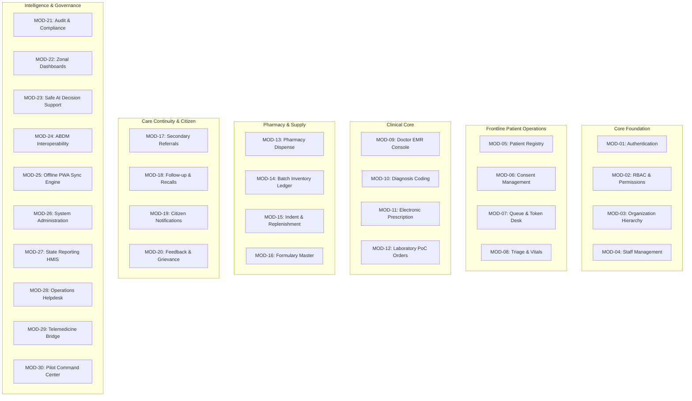

# 🗺️ Product Module Map & Domain Architecture
## Namma Clinic Digital Health & Operations Platform
**Document Code:** PRD-MOD-01 | **Status:** Approved Baseline | **Date:** September 2026

---

### 1. Complete Catalog of 30 Core Product Modules

