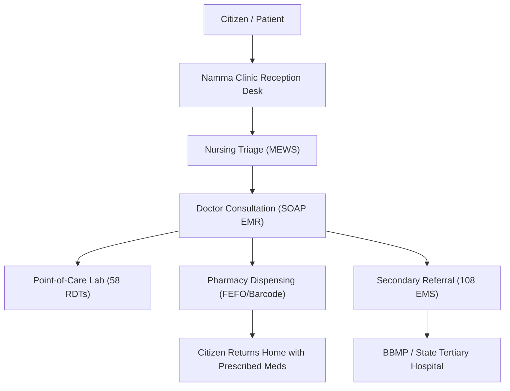

# 📑 Master Software Requirements Specification (SRS)
## Namma Clinic Digital Health & Operations Platform
### Greater Bengaluru Authority (GBA) / BBMP Health Department
**Standard:** IEEE Std 830-1998 / ISO/IEC/IEEE 29148:2018 | **Status:** APPROVED BASELINE | **Document Code:** `SRS-MST-01`

---

## 01. Document Control & Administrative Metadata
This document establishes the authoritative, binding Software Requirements Specification (SRS) for the Namma Clinic Digital Health & Operations Platform across 183 primary health clinics in Bengaluru.

| Metadata Property | Specification Value |
| :--- | :--- |
| **Project Name** | Namma Clinic Digital Health & Operations Platform |
| **Governing Municipal Body** | Greater Bengaluru Authority (GBA) / Bruhat Bengaluru Mahanagara Palike (BBMP) |
| **System Classification** | Critical Public Healthcare Digital Infrastructure |
| **Document Identifier** | `SRS-MST-01` |
| **Version** | 1.0.0-PROD-BASE |
| **Effective Date** | September 2026 |
| **Approval Authority** | Chief Medical Officer (`ROLE-012`) & Enterprise Architecture Board (`ROLE-003`) |
| **Security Classification** | RESTRICTED - MUNICIPAL HEALTHCARE GOVERNANCE |
| **Statutory Basis** | Karnataka Municipal Corporations Act 1976 & DPDP Act 2023 |

## 02. Document Revision History
Chronological record of formal revisions, baseline reviews, and engineering change requests:

| Version | Date | Author / Role | Summary of Changes | Ratification Status |
| :---: | :---: | :--- | :--- | :---: |
| `0.1.0` | July 2026 | Lead Architect (`ROLE-003`) | Initial draft decomposition and SRS scope framing | Draft |
| `0.5.0` | August 2026 | Lead Product Manager (`ROLE-001`) | Integration of 60 functional specifications and BDD criteria | Review |
| `0.9.0` | August 2026 | Clinical Safety Lead (`ROLE-002`) | Incorporation of 20 clinical safety guardrails and MEWS rules | Review |
| `1.0.0` | September 2026 | Enterprise Architecture Board | Final comprehensive baseline ratification across 51 sections | **APPROVED** |

## 03. Purpose & System Intent
The purpose of this Software Requirements Specification is to establish the definitive, implementation-ready contract governing the functional capabilities, non-functional performance boundaries, clinical decision-support guardrails, and architectural invariants for the Namma Clinic Platform.
It serves as the authoritative specification for frontend, backend, data, DevOps, QA, security, and municipal public health engineering teams.

## 04. Intended Audience & Stakeholder Responsibilities
The intended audience and their respective governance responsibilities regarding this specification:

| Stakeholder Class | Role Identifier | Operational Responsibility | Utilization of this SRS |
| :--- | :---: | :--- | :--- |
| **Executive Municipal Leadership** | `ROLE-012`, `ROLE-019` | Program governance and healthcare delivery oversight | Scope verification and statutory compliance validation |
| **Software Engineering Teams** | `ROLE-006`, `ROLE-007` | Modular service and user journey implementation | Unambiguous contract for API, UI, and data domain development |
| **Quality Assurance & Testing** | `ROLE-005` | Test harness and automated test suite creation | Authoritative criteria for Gherkin BDD scenario test suites |
| **Clinical Governance Board** | `ROLE-002`, `ROLE-015` | Patient safety and treatment protocol auditing | Verification of drug guardrails, allergy alerts, and MEWS triage |
| **Cybersecurity & Privacy Cell** | `ROLE-011` | Threat defense, encryption, and DPDP Act compliance | Verification of RBAC boundaries, WORM audit, and PHI protection |

## 05. Product Overview & Architectural Context
The Namma Clinic Digital Health & Operations Platform is a modern, modular, cloud-native, offline-first digital primary healthcare solution specifically engineered for the 183 urban Namma Clinics operating across Greater Bengaluru.
It automates the full patient care lifecycle: front-desk biometric/demographic intake, ABHA digital health ID creation, multi-room priority queueing, nursing triage vitals, doctor clinical EMR, electronic prescribing with interaction checks, 2D barcode batch pharmacy dispensing, point-of-care lab diagnostics, secondary referrals, and real-time syndromic disease surveillance.

## 06. Business Context & Municipal Health Mandate
BBMP and GBA established the Namma Clinic initiative to provide high-quality, free, accessible primary healthcare within a 15-minute walking radius for urban vulnerable populations (slum residents, daily-wage laborers, migrant workers, elderly citizens).
The digital platform replaces error-prone physical paper registers with a deterministic electronic workflow that operates continuously even during frequent urban broadband disruptions.

## 07. Core System Objectives (Key Performance Targets)
Quantitative system performance and public health objectives:

| Objective ID | Strategic Goal | Metric / Benchmark Target | Upstream Ref |
| :--- | :--- | :--- | :---: |
| `OBJ-01` | Frontline Intake Velocity | Patient demographic intake < 45 seconds per citizen | `OBJECTIVE-001` |
| `OBJ-02` | Rapid Outpatient Encounter | Complete doctor clinical SOAP consultation < 90 seconds | `OBJECTIVE-002` |
| `OBJ-03` | Pharmacy Dispensation Safety | 100% 2D barcode verification of dispensed medication batches | `OBJECTIVE-003` |
| `OBJ-04` | Autonomous Offline Resilience | 72 hours continuous operation during total broadband disconnection | `OBJECTIVE-004` |
| `OBJ-05` | National Health Grid Integration | 100% ABDM M1/M2/M3 FHIR R4 compliance for consenting citizens | `OBJECTIVE-005` |
| `OBJ-06` | Outbreak Syndromic Detection | Automated cluster alerts dispatched within 120 minutes of detection | `OBJECTIVE-006` |

## 08. System Scope & Functional Boundaries
The scope of this platform encompasses all clinical, pharmaceutical, diagnostic, operational, and reporting workflows within the 183 municipal primary health clinics.
It integrates with state central drug warehouses, emergency 108 ambulance dispatch, secondary referral hospitals, and national ABDM registries.

## 09. In-Scope Functional Capabilities (30 Modules)
Summary of all 30 foundational modules officially in-scope across the 6 platform domains:

| Domain ID | Domain Name | Module Scope | Total Capabilities | Total Features |
| :---: | :--- | :--- | :---: | :---: |
| `DOMAIN-01` | Identity, Governance & Core Foundation | `MODULE-001` to `MODULE-006` | 36 | 36 |
| `DOMAIN-02` | Patient Intake, Queue & Triage | `MODULE-007` to `MODULE-012` | 36 | 36 |
| `DOMAIN-03` | Clinical Encounters & Diagnostics | `MODULE-013` to `MODULE-018` | 36 | 36 |
| `DOMAIN-04` | Pharmacy & Supply Chain Logistics | `MODULE-019` to `MODULE-022` | 24 | 24 |
| `DOMAIN-05` | Citizen Engagement & Community Outreach | `MODULE-023` to `MODULE-026` | 24 | 24 |
| `DOMAIN-06` | Enterprise Core, Intelligence & Interoperability | `MODULE-027` to `MODULE-030` | 24 | 24 |
| **TOTAL** | **6 Municipal Health Domains** | **30 Operational Modules** | **180** | **180** |

## 10. Explicitly Out-of-Scope Capabilities
The following domains are explicitly excluded from the Namma Clinic Platform scope to preserve primary-care operational focus:

| Excluded Domain | Justification & Architectural Boundary | External Referral System |
| :--- | :--- | :--- |
| **Inpatient Bed Management** | Primary clinics have zero overnight admission beds | Secondary & Tertiary BBMP Hospitals |
| **Complex Surgical Suites (OT)** | Only minor first-aid suturing and wound dressing permitted | eHospital OT Management Systems |
| **Advanced Tertiary Imaging (CT/MRI)** | Clinic diagnostics limited to 58 point-of-care rapid tests | Victoria / Bowring Diagnostic Centers |
| **Organ Transplant Coordination** | Tertiary specialized mandate outside primary health purview | State Organ Sharing Registry (SOTTO) |
| **Autonomous Robotic Dispensing** | Dispensing executed manually by certified staff pharmacists | State Medical Automation Labs |

## 11. Product & System Scope Boundaries
The platform operates at the primary healthcare tier of the municipal health hierarchy:



## 12. External System Context Model
The Namma Clinic platform interfaces with external public, state, and national infrastructure entities:
- **ABDM / NHA Gateway:** M1 ABHA linking, M2 Care Context publishing, M3 Consent Management.
- **GVK-EMRI 108 Dispatch:** Direct API bridge for emergency ambulance summoning.
- **State Central Drug Logistics (KDLWS):** Indents, stock receipts, and formulary updates.
- **Karnataka State SMS Gateway (KSSD):** Citizen appointment and chronic care recall dispatch.
- **IDSP / IHIP:** Automated syndromic fever and infectious disease reporting.

## 13. Stakeholder Ecosystem Classification
Mapping of municipal, administrative, and clinical stakeholders governed by this SRS:

| Stakeholder Code | Stakeholder Title | Primary Interest | Authority Level |
| :--- | :--- | :--- | :---: |
| `STAKEHOLDER-001` | GBA / BBMP Central Health Directorate | Municipal health equity and clinical operational oversight | Executive |
| `STAKEHOLDER-002` | Medical Officers (Clinic Doctors) | Rapid, unencumbered clinical EMR and prescribing | Operational Lead |
| `STAKEHOLDER-003` | Clinic Nursing & Paramedical Staff | Objective triage screening and accurate queue management | Operational Staff |
| `STAKEHOLDER-004` | Registered Pharmacists | Accurate inventory ledger and zero dispensing errors | Operational Staff |
| `STAKEHOLDER-005` | Urban Citizen Community | Dignified, rapid, free healthcare without queue touting | End Beneficiary |

## 14. User Classes & Operational Characteristics
Three primary user classes interact with the system:
1. **Frontline Clinic Clinical Operators:** High-frequency, touch-optimized users demanding < 200ms screen responses under intense queue pressure.
2. **Zonal Administrative Supervisors:** Dashboard and analytical consumers inspecting epidemiological trends and stock burn-down rates.
3. **Public Citizens & Caregivers:** Casual users accessing bilingual SMS/WhatsApp alerts, thermal slips, and the self-service kiosk.

## 15. Standardized Persona Profiles
Eight representative user personas driving user journey ergonomics:
- `PERSONA-001`: Front Desk Nurse / ANM (Intake, phonetic search, token printing)
- `PERSONA-002`: Triage Staff Nurse (Vitals recording, MEWS scoring, danger sign alerts)
- `PERSONA-003`: Medical Officer / Doctor (Consultation, SOAP documentation, prescribing)
- `PERSONA-004`: Clinic Pharmacist (Prescription dispensing, FEFO batch selection, scanning)
- `PERSONA-005`: Lab Technician (Sample logging, RDT testing, panic value reporting)
- `PERSONA-006`: ASHA Field Health Worker (Ward tracking, chronic defaulter tracing)
- `PERSONA-007`: SRE / Field IT Support Engineer (Edge appliances, sync verification, backups)
- `PERSONA-008`: Chief Medical Officer / Medical Superintendent (Clinical audit, de-duplication approval)

## 16. Role Master Catalog (30 Enterprise Roles)
The 30 enterprise roles (`ROLE-001` to `ROLE-030`) defined in the Master Role Catalog are bound to system entitlements:

| Role ID | Role Name | Operational Tier | Mandatory Training Required |
| :---: | :--- | :--- | :---: |
| `ROLE-001` | Lead Product Manager | Product Governance | Standard |
| `ROLE-002` | Clinical Safety Lead | Clinical Governance | Bioethics & Safety |
| `ROLE-003` | Lead Solution Architect | Engineering Governance | Enterprise Architecture |
| `ROLE-006` | Lead Backend Engineer | Platform Engineering | Cryptography & API Security |
| `ROLE-007` | Lead Frontend Engineer | Client Engineering | PWA & Accessibility |
| `ROLE-008` | Lead Database Administrator | Data Governance | PostgreSQL & WAL Tuning |
| `ROLE-009` | Site Reliability Engineer (SRE) | Operations Governance | Disaster Recovery & Observability |
| `ROLE-010` | Lead DevOps Engineer | Infrastructure | Kubernetes & Edge Provisioning |
| `ROLE-011` | Chief Information Security Officer (CISO) | Cyber Defense | DPDP Act & Zero-Trust |
| `ROLE-012` | Chief Medical Officer (CMO) | Clinical Leadership | Public Health Administration |
| `ROLE-015` | Medical Officer (Clinic Doctor) | Frontline Practice | Clinical EMR & Formulary CDSS |
| `ROLE-016` | Staff Nurse / ANM | Frontline Practice | Nursing Triage & Intake |
| `ROLE-017` | Clinic Pharmacist | Frontline Practice | 2D Barcode & FEFO Logistics |
| `ROLE-018` | Laboratory Technician | Frontline Practice | Point-of-Care Diagnostics |
| `ROLE-020` | Field Health Worker (ASHA) | Community Outreach | Mobile Ward Tracking |
| `ROLE-030` | External Regulatory Auditor | Independent Audit | WORM Audit Verification |

## 17. Permission Envelopes & Segregation of Duties (SoD)
The platform enforces 5 granular permission envelopes: `ADMIN`, `WRITE`, `EXECUTE`, `READ_ONLY`, and `NO_ACCESS` across all 900 role-module intersections.
Six mandatory Segregation of Duties (SoD) conflict rules (`SOD-001` to `SOD-006`) are hardcoded into the API gateway, preventing any user from simultaneously possessing prescriber and dispenser roles, or administrative and audit roles.

## 18. Upstream Business Requirements Traceability
All SRS specifications directly fulfill the 30 core Business Requirements established in `docs/02-requirements/01-business-requirements.md` (`BR-001` to `BR-030`).

## 19. Detailed Functional Requirements Specification (SRS-FR-001 to SRS-FR-060)
Exhaustive, implementation-ready engineering specifications for all 60 Functional Requirements:

### SRS-FR-001: Biometric & Demographic Citizen Intake Registration
**Domain Category:** Patient Intake & Identity | **Priority:** **MUST** | **Upstream:** `BR-001, FR-001, WF-003, MODULE-007, FEATURE-037, ROLE-016`

**Description:** The system shall capture citizen demographic data (full name, gender, DOB, address, phone number) with optional Aadhaar-based biometric/OTP authentication and generate a unique Clinic Master Patient Index (MPI) identifier.

- **Business Rationale:** Establishes a single authoritative citizen record across municipal clinics while supporting anonymous emergency access.
- **Primary Persona & Role:** PERSONA-001 (Front Desk Nurse / ANM) | `ROLE-016 (Staff Nurse)`
- **Preconditions:** Intake terminal unlocked; staff authenticated with active session token.
- **System Trigger:** Citizen presents at reception counter seeking outpatient medical care.

**Standard Operational Flow (Main Journey):**
  1. Nurse queries citizen by mobile number or national ID.
  2. Nurse inputs mandatory demographics and ward location.
  3. System calculates age from DOB and assigns municipal PID.
  4. System prints bilingual thermal registration slip with QR barcode.

**Alternative Workflow Paths:**
  - Citizen presents Aadhaar card; nurse scans QR code via 2D scanner to auto-fill demographics.

**Exception & Failure Scenarios:**
  - Citizen lacks government ID: system creates emergency proxy identity with provisional flag.

**Governance & Impact Assessment:**
- **Business Rules:** BR-001 (Universal Free Municipal Healthcare Access), BRULE-001 (Provisional Intake Authorization)
- **Validation Constraints:** Phone number must be exactly 10 digits if provided., DOB must not be in the future.
- **Security Impact:** Demographics encrypted using AES-256 GCM; access restricted to authenticated clinic staff.
- **Privacy Impact:** Informed digital consent logged prior to biometric verification; Aadhaar never stored in plaintext.
- **Data Layer Impact:** Persists to patients table; generates immutable UUIDv7 citizen identifier.
- **Performance Boundary:** Form save latency < 150ms; thermal slip generation < 800ms.
- **Offline & Edge Resilience:** Saved locally in SQLite WAL mode; queued in outbound sync journal.
- **Bilingual Localization:** Full UI and print slip rendered bilingually in Kannada (kn-IN) and English (en-IN).
- **Accessibility:** Keyboard tab navigability for all form fields; high-contrast focus rings (4.5:1 ratio).
- **External Interoperability:** Prepares patient record for outbound ABDM M1 ABHA linking.
- **Audit Trail Emission:** Emits AUDIT_PATIENT_REGISTERED event signed with SHA-256 HMAC.

**Executable Acceptance Criteria (BDD Given / When / Then):**
> Given an unregistered citizen, when valid demographics are submitted, then a unique municipal patient ID is generated within 2 seconds.

```gherkin
Given the front desk intake terminal is operational and the nurse is logged in
When the nurse inputs citizen name 'Basavaraj Patil', gender 'Male', age '48', and phone '9845012345'
And clicks 'Register Citizen'
Then the system assigns a unique UUIDv7 patient identifier
And prints an 80mm thermal intake receipt containing the patient name and QR code.
```

**Verification Method:** `Automated BDD Scenario Test (SRS-FR-001) + Integration Regression Suite`
**Downstream Planned Artifacts:** `PLANNED-EPIC-001, PLANNED-API-001, PLANNED-UI-001, PLANNED-DB-001, PLANNED-TEST-001`

---

### SRS-FR-002: ABHA Creation, Verification & National Health ID Linking
**Domain Category:** Patient Intake & Identity | **Priority:** **MUST** | **Upstream:** `BR-005, FR-002, WF-024, MODULE-029, FEATURE-157, ROLE-016`

**Description:** The system shall integrate with the ABDM M1 sandbox/production gateway to create an ABHA address via Aadhaar OTP or mobile OTP, verify existing ABHA numbers, and link them to the municipal patient master index.

- **Business Rationale:** Complies with National Health Authority (NHA) digital health mandate enabling longitudinal citizen health records.
- **Primary Persona & Role:** PERSONA-001 (Front Desk Nurse / ANM) | `ROLE-016 (Staff Nurse)`
- **Preconditions:** Patient registration open; network route to ABDM gateway available.
- **System Trigger:** Citizen requests ABHA card creation or presents existing 14-digit ABHA ID.

**Standard Operational Flow (Main Journey):**
  1. Nurse initiates ABHA linking.
  2. Citizen provides Aadhaar OTP.
  3. ABDM validates OTP and returns verified ABHA profile.
  4. System binds ABHA ID to municipal patient record.

**Alternative Workflow Paths:**
  - Citizen scans clinic ABDM 'Scan & Share' QR code using personal PHR app; nurse approves profile import.

**Exception & Failure Scenarios:**
  - ABDM gateway unreachable: system flags record as 'ABHA Pending Sync' and continues outpatient flow.

**Governance & Impact Assessment:**
- **Business Rules:** BR-005 (National Digital Health Mission Compliance), BRULE-005 (Voluntary Citizen ABHA Participation)
- **Validation Constraints:** ABHA number must conform to 14-digit hyphenated format., ABHA address must end with valid handle.
- **Security Impact:** ABDM client credentials managed via secure key vault; OTP never logged or stored in application tier.
- **Privacy Impact:** Citizens informed that ABHA linking is strictly voluntary and refusal does not impair care.
- **Data Layer Impact:** Stores abha_number, abha_address, and abha_status in patient_identities table.
- **Performance Boundary:** ABDM gateway roundtrip response latency < 1,500ms under standard 4G connectivity.
- **Offline & Edge Resilience:** When offline, ABHA linking requests are held in an asynchronous queue until reconnection.
- **Bilingual Localization:** Citizen consent dialog and OTP entry prompt displayed in Kannada and English.
- **Accessibility:** Audio prompt support for OTP entry countdown timer.
- **External Interoperability:** Direct REST/HTTPS interface with ABDM National Health Gateway.
- **Audit Trail Emission:** Logs ABHA_LINK_ATTEMPT and ABHA_LINK_SUCCESS with cryptographic timestamp.

**Executable Acceptance Criteria (BDD Given / When / Then):**
> Given an internet-connected intake station, when citizen verifies via Aadhaar OTP, then their 14-digit ABHA is bound to their clinic record.

```gherkin
Given the clinic edge server has an active HTTPS connection to ABDM gateway
When staff nurse submits citizen Aadhaar number with consent and citizen enters OTP '654321'
Then the ABDM gateway returns authenticated profile with ABHA '14-1234-5678-9012'
And the municipal patient record is updated to 'ABHA_VERIFIED'.
```

**Verification Method:** `Automated BDD Scenario Test (SRS-FR-002) + Integration Regression Suite`
**Downstream Planned Artifacts:** `PLANNED-EPIC-002, PLANNED-API-002, PLANNED-UI-002, PLANNED-DB-002, PLANNED-TEST-002`

---

### SRS-FR-003: Phonetic & Multi-Parameter Patient Search
**Domain Category:** Patient Intake & Identity | **Priority:** **MUST** | **Upstream:** `BR-001, FR-003, WF-004, MODULE-007, FEATURE-038, ROLE-016`

**Description:** The system shall execute fuzzy phonetic matching across Kannada and English names, phone numbers, and municipal IDs to rapidly retrieve existing patient profiles without duplicate creation.

- **Business Rationale:** Eliminates duplicate patient records caused by varied transliterations of vernacular Indian names.
- **Primary Persona & Role:** PERSONA-001 (Front Desk Nurse / ANM) | `ROLE-016 (Staff Nurse)`
- **Preconditions:** Search bar active on front desk console.
- **System Trigger:** Citizen arrives at clinic and states name or phone number.

**Standard Operational Flow (Main Journey):**
  1. Nurse types partial name or 10-digit phone number.
  2. System queries local Soundex/Metaphone indexed patient database.
  3. System displays matched profiles with confidence scores.
  4. Nurse verifies matching record and initiates new encounter.

**Alternative Workflow Paths:**
  - Nurse scans patient thermal card QR code; system opens patient record directly in < 50ms.

**Exception & Failure Scenarios:**
  - Zero matches found: system provides one-click button to register as new citizen.

**Governance & Impact Assessment:**
- **Business Rules:** BR-001 (Healthcare Access), OR-001 (Registration Efficiency)
- **Validation Constraints:** Search query must contain at least 3 characters or 4 digits.
- **Security Impact:** Search access restricted to active authenticated staff sessions.
- **Privacy Impact:** Search results display masked mobile numbers (XXXXXX1234) to protect citizen privacy.
- **Data Layer Impact:** Uses Trigram and Double Metaphone indexing on patient names table.
- **Performance Boundary:** Search query execution latency < 40ms across 100,000 local patient records.
- **Offline & Edge Resilience:** Full search indices pre-built in local SQLite database on edge server.
- **Bilingual Localization:** Dual search support in Kannada Unicode script and English Latin script.
- **Accessibility:** Clear visual highlight of matching search tokens.
- **External Interoperability:** Integrates with local thermal barcode scanners for instant lookup.
- **Audit Trail Emission:** Logs PATIENT_SEARCH_EXECUTED with query string and result count.

**Executable Acceptance Criteria (BDD Given / When / Then):**
> Given an existing patient registered as 'Lakshmamma', when searched as 'Laxmi', then the phonetic engine returns the profile with high confidence.

```gherkin
Given patient 'Lakshmamma' exists in the clinic database
When the nurse searches for 'Laxmi'
Then the system returns 'Lakshmamma' in the top 3 candidate list with confidence score > 85%
And allows 1-click encounter selection.
```

**Verification Method:** `Automated BDD Scenario Test (SRS-FR-003) + Integration Regression Suite`
**Downstream Planned Artifacts:** `PLANNED-EPIC-003, PLANNED-API-003, PLANNED-UI-003, PLANNED-DB-003, PLANNED-TEST-003`

---

### SRS-FR-004: Repeat Patient Revisit Check-in & Care Episode Linking
**Domain Category:** Patient Intake & Identity | **Priority:** **MUST** | **Upstream:** `BR-002, FR-004, WF-005, MODULE-007, FEATURE-040, ROLE-016`

**Description:** The system shall identify returning patients, link their new visit to existing longitudinal care episodes (e.g. Chronic Hypertension, Antenatal Care), and update encounter statistics.

- **Business Rationale:** Ensures continuity of care and avoids fragmented medical histories across outpatient encounters.
- **Primary Persona & Role:** PERSONA-001 (Front Desk Nurse / ANM) | `ROLE-016 (Staff Nurse)`
- **Preconditions:** Patient profile identified in search.
- **System Trigger:** Nurse selects 'Check-in Patient'.

**Standard Operational Flow (Main Journey):**
  1. Nurse confirms contact details and address with patient.
  2. Nurse selects consultation reason or chronic care program.
  3. System links visit to existing ongoing care episode.
  4. System issues sequential visit token.

**Alternative Workflow Paths:**
  - Patient presents with entirely new acute complaint: nurse creates new distinct acute episode.

**Exception & Failure Scenarios:**
  - Patient has outstanding referral or pending lab report: system flags active alert on reception screen.

**Governance & Impact Assessment:**
- **Business Rules:** BR-002 (Care Continuity), OR-001 (Facility Flow)
- **Validation Constraints:** Patient cannot have two open active consultation tokens concurrently on the same day.
- **Security Impact:** Access restricted to intake role; audit log records revisit check-in.
- **Privacy Impact:** Previous encounter summaries viewable only by clinical staff during care delivery.
- **Data Layer Impact:** Creates new row in clinic_visits table linked to existing patient_id.
- **Performance Boundary:** Check-in transaction latency < 80ms.
- **Offline & Edge Resilience:** Local SQLite stores longitudinal visit history for previous 12 months.
- **Bilingual Localization:** Bilingual check-in confirmation displayed in Kannada and English.
- **Accessibility:** One-click repeat visit check-in minimizes repetitive manual typing.
- **External Interoperability:** Direct connection to queue token generator and thermal printer.
- **Audit Trail Emission:** Logs PATIENT_REVISIT_LOGGED with visit ID and episode binding.

**Executable Acceptance Criteria (BDD Given / When / Then):**
> Given a returning diabetic patient, when checked in, then the visit is attached to the existing 'NCD-Diabetes' care episode.

```gherkin
Given patient 'Ramesh Babu' has active care episode 'EP-NCD-004'
When the nurse executes check-in for a follow-up visit
Then the system links visit 'VIS-9912' to episode 'EP-NCD-004'
And prints follow-up token slip.
```

**Verification Method:** `Automated BDD Scenario Test (SRS-FR-004) + Integration Regression Suite`
**Downstream Planned Artifacts:** `PLANNED-EPIC-004, PLANNED-API-004, PLANNED-UI-004, PLANNED-DB-004, PLANNED-TEST-004`

---

### SRS-FR-005: Digital Informed Consent & DPDP Act Directives Logging
**Domain Category:** Patient Intake & Identity | **Priority:** **MUST** | **Upstream:** `BR-001, FR-005, WF-006, MODULE-008, FEATURE-043, ROLE-016`

**Description:** The system shall present, capture, and cryptographically log citizen informed consent for general clinical examination, digital health record sharing, and ABDM data transmission conforming to DPDP Act 2023.

- **Business Rationale:** Satisfies statutory privacy requirements governing consent management in public digital health systems.
- **Primary Persona & Role:** PERSONA-001 (Front Desk Nurse / ANM) | `ROLE-016 (Staff Nurse)`
- **Preconditions:** Patient registration or encounter creation active.
- **System Trigger:** Citizen presents for consultation or digital record export.

**Standard Operational Flow (Main Journey):**
  1. System displays standard bilingual consent declaration.
  2. Nurse verbally explains consent terms to citizen in vernacular Kannada.
  3. Citizen approves verbally or via thumbprint/OTP.
  4. System records digital consent artifact with timestamp, scope, and expiration.

**Alternative Workflow Paths:**
  - Citizen grants partial consent (e.g. permits treatment but restricts national ABDM health data sharing).

**Exception & Failure Scenarios:**
  - Citizen refuses consent: system permits urgent medical examination under emergency statutory exception while logging refusal.

**Governance & Impact Assessment:**
- **Business Rules:** BR-001 (Statutory Compliance), PRIV-001 (Consent Invariant)
- **Validation Constraints:** Consent artifact must include explicit notice language and purpose specification.
- **Security Impact:** Consent records immutable; signed with SHA-256 HMAC and clinic node certificate.
- **Privacy Impact:** Strict data minimization: data shared only within explicitly authorized consent scopes.
- **Data Layer Impact:** Persists to consent_artifacts and consent_logs tables.
- **Performance Boundary:** Consent artifact generation latency < 40ms.
- **Offline & Edge Resilience:** Consent ledger preserved in local SQLite WORM table.
- **Bilingual Localization:** Full statutory consent notice rendered in clear, plain Kannada and English.
- **Accessibility:** Audio playback of consent notice available for illiterate citizens.
- **External Interoperability:** Produces ABDM-compliant ConsentArtifact JSON bundle.
- **Audit Trail Emission:** Emits CONSENT_GRANTED or CONSENT_REVOKED audit event.

**Executable Acceptance Criteria (BDD Given / When / Then):**
> Given a citizen at intake, when consent is recorded, then a signed consent artifact is created and stored in the immutable audit ledger.

```gherkin
Given an active registration encounter
When the citizen agrees to outpatient care and digital health record preservation
Then the system creates consent artifact 'CONSENT-2026-0012' with scope 'TREATMENT_AND_RECORDS'
And seals the record with digital signature.
```

**Verification Method:** `Automated BDD Scenario Test (SRS-FR-005) + Integration Regression Suite`
**Downstream Planned Artifacts:** `PLANNED-EPIC-005, PLANNED-API-005, PLANNED-UI-005, PLANNED-DB-005, PLANNED-TEST-005`

---

### SRS-FR-006: Citizen Identity De-duplication & Record Consolidation
**Domain Category:** Patient Intake & Identity | **Priority:** **SHOULD** | **Upstream:** `BR-001, FR-006, WF-003, MODULE-007, FEATURE-042, ROLE-012`

**Description:** The system shall execute deterministic and probabilistic deduplication algorithms to detect accidental duplicate citizen profiles and provide a controlled supervisor workflow for record merging.

- **Business Rationale:** Maintains clinical record integrity and prevents split medical histories across encounters.
- **Primary Persona & Role:** PERSONA-008 (Clinic Supervisor / Medical Superintendent) | `ROLE-012 (Chief Medical Officer)`
- **Preconditions:** Two potential duplicate patient profiles identified.
- **System Trigger:** Supervisor opens Deduplication & Merge console.

**Standard Operational Flow (Main Journey):**
  1. System displays side-by-side comparison of candidate profiles with field-level differences.
  2. Supervisor reviews visit histories, vitals, and prescriptions.
  3. Supervisor selects primary authoritative record and confirms merge.
  4. System redirects secondary record pointers to primary PID and seals audit trail.

**Alternative Workflow Paths:**
  - Profiles belong to distinct individuals with identical names: supervisor marks 'False Match' to prevent future merge prompts.

**Exception & Failure Scenarios:**
  - Active clinical consultation currently open on secondary profile: system blocks merge until ongoing visit completes.

**Governance & Impact Assessment:**
- **Business Rules:** BR-001 (Data Integrity), OR-001 (Administrative Governance)
- **Validation Constraints:** Record merge requires supervisor authentication and two-step confirmation.
- **Security Impact:** Merge action restricted to ROLE-012/ROLE-019; system administrator cannot execute clinical merges.
- **Privacy Impact:** Historical records never deleted; secondary records soft-deprecated with tombstone pointer.
- **Data Layer Impact:** Updates patient_merges and redirects foreign keys across clinical encounters.
- **Performance Boundary:** Batch merge operation completes in < 500ms with transactional integrity.
- **Offline & Edge Resilience:** Edge sync applies merge directives atomically during synchronization cycle.
- **Bilingual Localization:** Bilingual merge confirmation screens in Kannada and English.
- **Accessibility:** Side-by-side visual diff with highlighted conflicting fields.
- **External Interoperability:** Notifies external ABDM HIP bridge of merged patient identifier.
- **Audit Trail Emission:** Emits PATIENT_RECORD_MERGED with primary ID, merged ID, and supervisor credentials.

**Executable Acceptance Criteria (BDD Given / When / Then):**
> Given two duplicate patient files for 'Smt. Parvathamma', when supervisor approves merge, then all past visits consolidate under the primary record.

```gherkin
Given candidate profiles 'PID-101' and 'PID-205' match on phone and father's name
When Chief Medical Officer approves merge with 'PID-101' as primary
Then visits from 'PID-205' are re-linked to 'PID-101'
And 'PID-205' is marked 'MERGED_INTO_PID_101'.
```

**Verification Method:** `Automated BDD Scenario Test (SRS-FR-006) + Integration Regression Suite`
**Downstream Planned Artifacts:** `PLANNED-EPIC-006, PLANNED-API-006, PLANNED-UI-006, PLANNED-DB-006, PLANNED-TEST-006`

---

### SRS-FR-007: Automated Multi-Room Queue Token Generation
**Domain Category:** Queue & Triage | **Priority:** **MUST** | **Upstream:** `BR-004, FR-007, WF-007, MODULE-009, FEATURE-049, ROLE-016`

**Description:** The system shall mint sequential queue tokens categorized by priority tier and route patients to doctor consulting rooms and nursing triage stations.

- **Business Rationale:** Enforces objective queue order, mitigates waiting hall friction, and optimizes doctor utilization.
- **Primary Persona & Role:** PERSONA-001 (Front Desk Nurse / ANM) | `ROLE-016 (Staff Nurse)`
- **Preconditions:** Intake complete; consulting rooms active in clinic day roster.
- **System Trigger:** Nurse clicks 'Issue Queue Token'.

**Standard Operational Flow (Main Journey):**
  1. System queries active consulting rooms.
  2. System evaluates patient priority criteria.
  3. System mints token with prefix and sequential number (e.g. G-024).
  4. Token is printed on thermal slip and displayed on queue boards.

**Alternative Workflow Paths:**
  - Emergency case: system mints 'E-001' with immediate queue override.

**Exception & Failure Scenarios:**
  - No consulting rooms available: system alerts nurse and holds token in pre-queue buffer.

**Governance & Impact Assessment:**
- **Business Rules:** BR-004 (Queue Transparency), OR-001 (Clinic Flow)
- **Validation Constraints:** Tokens reset to 1 at start of each operating day.
- **Security Impact:** Queue updates secured against unauthorized tampering.
- **Privacy Impact:** Queue displays show token ID only, never patient name.
- **Data Layer Impact:** Inserts into queue_tokens and clinic_queues tables.
- **Performance Boundary:** Token generation < 20ms; thermal print execution < 500ms.
- **Offline & Edge Resilience:** Edge mini-server runs local queue broker.
- **Bilingual Localization:** Audio announcements synthesized in Kannada and English.
- **Accessibility:** High-contrast 72pt digital queue display output.
- **External Interoperability:** ESC/POS printer and HDMI waiting hall TV integration.
- **Audit Trail Emission:** Emits QUEUE_TOKEN_GENERATED event.

**Executable Acceptance Criteria (BDD Given / When / Then):**
> Given a general outpatient, when token generation executes, then a sequential token 'G-XXX' is generated and printed.

```gherkin
Given the clinic queue is active
When nurse issues token for registered patient
Then system assigns next sequential token 'G-015'
And prints slip.
```

**Verification Method:** `Automated BDD Scenario Test (SRS-FR-007) + Integration Regression Suite`
**Downstream Planned Artifacts:** `PLANNED-EPIC-007, PLANNED-API-007, PLANNED-UI-007, PLANNED-DB-007, PLANNED-TEST-007`

---

### SRS-FR-008: Priority Fast-Track Queue Routing for Vulnerable Populations
**Domain Category:** Queue & Triage | **Priority:** **MUST** | **Upstream:** `BR-004, FR-008, WF-007, MODULE-009, FEATURE-067, ROLE-016`

**Description:** The system shall automatically detect elderly citizens (age >= 65), infants (< 1 year), antenatal mothers, and disabled citizens to assign priority 'P' tokens.

- **Business Rationale:** Protects vulnerable demographics from prolonged waiting hall exposure.
- **Primary Persona & Role:** PERSONA-001 (Front Desk Nurse / ANM) | `ROLE-016 (Staff Nurse)`
- **Preconditions:** Citizen demographic details confirmed.
- **System Trigger:** Token generation triggered.

**Standard Operational Flow (Main Journey):**
  1. System evaluates age and clinical pregnancy markers.
  2. Condition met: system assigns Priority prefix 'P-XXX'.
  3. Token inserted into consulting queue with 2:1 priority interleaving.

**Alternative Workflow Paths:**
  - Nurse manually flags vulnerable condition not reflected in age.

**Exception & Failure Scenarios:**
  - Priority queue exceeds 10 patients: system prompts doctor room redistribution.

**Governance & Impact Assessment:**
- **Business Rules:** BR-004 (Priority Care), OR-001 (Queue Policy)
- **Validation Constraints:** Age >= 65 must automatically receive Priority tier.
- **Security Impact:** Role-based override required for manual priority flagging.
- **Privacy Impact:** Patient medical reason for priority not shown on public displays.
- **Data Layer Impact:** Updates priority_flag in queue_tokens table.
- **Performance Boundary:** Priority calculation < 5ms.
- **Offline & Edge Resilience:** Maintained in local edge memory queue.
- **Bilingual Localization:** Bilingual priority ticket print in Kannada/English.
- **Accessibility:** Priority tokens highlighted in blue on nursing console.
- **External Interoperability:** Thermal printer ESC/POS integration.
- **Audit Trail Emission:** Logs PRIORITY_QUEUE_ASSIGNED with qualifying criteria.

**Executable Acceptance Criteria (BDD Given / When / Then):**
> Given an applicant aged 70, when queue token is requested, then a 'P-XXX' token is generated and slotted ahead of general tokens.

```gherkin
Given citizen age is 70
When token generation executes
Then token issued is 'P-003'
And queued before 'G-008'.
```

**Verification Method:** `Automated BDD Scenario Test (SRS-FR-008) + Integration Regression Suite`
**Downstream Planned Artifacts:** `PLANNED-EPIC-008, PLANNED-API-008, PLANNED-UI-008, PLANNED-DB-008, PLANNED-TEST-008`

---

### SRS-FR-009: Nursing Triage Vitals Capture & MEWS Scoring
**Domain Category:** Queue & Triage | **Priority:** **MUST** | **Upstream:** `BR-008, FR-009, CR-002, WF-009, MODULE-010, FEATURE-055, ROLE-016`

**Description:** The system shall provide a structured vital signs entry interface (BP, Pulse, RR, Temp, SpO2, AVPU) and dynamically calculate the Modified Early Warning Score (MEWS).

- **Business Rationale:** Standardizes early clinical screening and objectively identifies deteriorating patients.
- **Primary Persona & Role:** PERSONA-002 (Triage Staff Nurse) | `ROLE-016 (Staff Nurse)`
- **Preconditions:** Patient token called at triage booth.
- **System Trigger:** Nurse commences physical measurement.

**Standard Operational Flow (Main Journey):**
  1. Nurse inputs systolic/diastolic BP, pulse rate, respiratory rate, SpO2, and temperature.
  2. System computes MEWS score in real time.
  3. Score in normal range (0-1): patient routed to general doctor queue.

**Alternative Workflow Paths:**
  - MEWS score 2-4 (Amber): alert banner attached to doctor queue token.

**Exception & Failure Scenarios:**
  - MEWS >= 5 (Red): system triggers emergency alert and prompts immediate doctor notification.

**Governance & Impact Assessment:**
- **Business Rules:** BR-008 (Clinical Quality), CR-002 (Triage Rules)
- **Validation Constraints:** Systolic BP must be between 40 and 300 mmHg., SpO2 between 50 and 100%.
- **Security Impact:** Vitals signed by nurse role; classified as confidential health data.
- **Privacy Impact:** Accessible only to treating clinical team.
- **Data Layer Impact:** Persists to patient_vitals and triage_assessments tables.
- **Performance Boundary:** MEWS calculation executed client-side in < 5ms.
- **Offline & Edge Resilience:** Offline scoring logic bundled in client bundle.
- **Bilingual Localization:** Bilingual labels in Kannada and English.
- **Accessibility:** Color-coded triage score bands (Green/Amber/Red).
- **External Interoperability:** BLE integration ready for digital pulse oximeters and BP cuffs.
- **Audit Trail Emission:** Emits TRIAGE_VITALS_RECORDED with MEWS value.

**Executable Acceptance Criteria (BDD Given / When / Then):**
> Given vitals of BP 80/50 and SpO2 88%, when triage is saved, then MEWS evaluates >= 5 and emergency protocol activates.

```gherkin
Given patient has low SpO2
When nurse enters SpO2 '88' and Pulse '125'
Then system calculates MEWS '6'
And activates Red Flag alert.
```

**Verification Method:** `Automated BDD Scenario Test (SRS-FR-009) + Integration Regression Suite`
**Downstream Planned Artifacts:** `PLANNED-EPIC-009, PLANNED-API-009, PLANNED-UI-009, PLANNED-DB-009, PLANNED-TEST-009`

---

### SRS-FR-010: Critical Physiological Danger Sign Alert Escalation
**Domain Category:** Queue & Triage | **Priority:** **MUST** | **Upstream:** `BR-008, FR-010, CR-002, WF-010, MODULE-011, FEATURE-061, ROLE-016`

**Description:** The system shall detect acute clinical danger signs (unresponsiveness, stridor, active convulsions, severe respiratory distress) and trigger immediate audiovisual alerts across doctor rooms.

- **Business Rationale:** Prevents avoidable mortality by expediting emergency resuscitation before routine queue processing.
- **Primary Persona & Role:** PERSONA-002 (Triage Staff Nurse) | `ROLE-016 (Staff Nurse)`
- **Preconditions:** Patient arrives at triage with severe acute distress.
- **System Trigger:** Nurse selects 'Red-Flag Danger Sign'.

**Standard Operational Flow (Main Journey):**
  1. Nurse checks danger sign category.
  2. System triggers audible chime on all doctor workstations.
  3. Patient token jumps to top of Doctor Room 1 queue with flashing red banner.
  4. Nurse initiates oxygen and stabilization.

**Alternative Workflow Paths:**
  - Doctor accepts alert instantly and summons patient to emergency treatment room.

**Exception & Failure Scenarios:**
  - Doctor room busy with emergency: system escalates to secondary doctor room.

**Governance & Impact Assessment:**
- **Business Rules:** BR-008 (Emergency Protocols), CR-004 (Resuscitation Safeguards)
- **Validation Constraints:** Danger sign selection requires confirmation checkbox to prevent accidental alarms.
- **Security Impact:** Emergency override access logged with critical audit priority.
- **Privacy Impact:** Emergency data accessible to all active clinical personnel in clinic.
- **Data Layer Impact:** Inserts record to clinical_alerts table; sets queue token state to 'EMERGENCY'.
- **Performance Boundary:** Alert propagation latency < 100ms across clinic LAN.
- **Offline & Edge Resilience:** Local edge WebSocket server broadcasts alerts without cloud hops.
- **Bilingual Localization:** Emergency alert banner displayed with bilingual text.
- **Accessibility:** Audible warning chime accompanied by high-contrast flashing header.
- **External Interoperability:** Integrates with clinic emergency workstation speakers.
- **Audit Trail Emission:** Logs EMERGENCY_ALERT_TRIGGERED with initiator ID and danger code.

**Executable Acceptance Criteria (BDD Given / When / Then):**
> Given a child presenting with convulsions, when nurse flags danger sign, then an immediate audible alarm triggers on the doctor console.

```gherkin
Given a convulsing infant arrives
When nurse clicks 'Danger Sign: Active Seizure'
Then doctor workstation sounds emergency alert
And token moves to position #1.
```

**Verification Method:** `Automated BDD Scenario Test (SRS-FR-010) + Integration Regression Suite`
**Downstream Planned Artifacts:** `PLANNED-EPIC-010, PLANNED-API-010, PLANNED-UI-010, PLANNED-DB-010, PLANNED-TEST-010`

---

### SRS-FR-011: Multi-Consultation Room Workload Balancing
**Domain Category:** Queue & Triage | **Priority:** **SHOULD** | **Upstream:** `BR-004, FR-011, WF-008, MODULE-009, FEATURE-050, ROLE-016`

**Description:** The system shall monitor queue lengths across multiple active doctor consulting rooms and dynamically route waiting patients to the room with the shortest estimated waiting time.

- **Business Rationale:** Maximizes physician throughput and minimizes citizen idle waiting time.
- **Primary Persona & Role:** PERSONA-001 (Front Desk Nurse / ANM) | `ROLE-016 (Staff Nurse)`
- **Preconditions:** Multiple doctor rooms active in clinic day session.
- **System Trigger:** Patient token cleared from triage.

**Standard Operational Flow (Main Journey):**
  1. System calculates active queue length and average consultation duration per room.
  2. System routes token to doctor room with minimum waiting duration.
  3. Waiting hall display updates room assignment.

**Alternative Workflow Paths:**
  - Doctor signals 'Short Break': system reroutes incoming tokens to remaining active rooms.

**Exception & Failure Scenarios:**
  - Doctor calls specific patient out of order: system recalculates queue sequence.

**Governance & Impact Assessment:**
- **Business Rules:** BR-004 (Operational Efficiency), OR-001 (Facility Management)
- **Validation Constraints:** Queue assignment must not exceed maximum room capacity.
- **Security Impact:** Queue management permissions restricted to staff nurse and doctor roles.
- **Privacy Impact:** Queue status public; individual diagnoses private.
- **Data Layer Impact:** Updates room_id in queue_entries table.
- **Performance Boundary:** Balancing calculation < 15ms.
- **Offline & Edge Resilience:** Queue balancing engine hosted in local edge daemon.
- **Bilingual Localization:** Bilingual room assignment announcements.
- **Accessibility:** Clear directional room signage indicators.
- **External Interoperability:** Waiting hall display MQTT integration.
- **Audit Trail Emission:** Logs QUEUE_LOAD_BALANCED with room assignments.

**Executable Acceptance Criteria (BDD Given / When / Then):**
> Given Room 1 has 8 patients and Room 2 has 2 patients, when new token is routed, then it is assigned to Room 2.

```gherkin
Given Room 1 has 8 waiting and Room 2 has 2 waiting
When new token is routed
Then token is assigned to Room 2
And display updates.
```

**Verification Method:** `Automated BDD Scenario Test (SRS-FR-011) + Integration Regression Suite`
**Downstream Planned Artifacts:** `PLANNED-EPIC-011, PLANNED-API-011, PLANNED-UI-011, PLANNED-DB-011, PLANNED-TEST-011`

---

### SRS-FR-012: Patient Calling & Digital Display Board Synchronization
**Domain Category:** Queue & Triage | **Priority:** **MUST** | **Upstream:** `BR-004, FR-012, WF-008, MODULE-009, FEATURE-052, ROLE-015`

**Description:** The system shall broadcast called token numbers to waiting hall display TVs and synthesize bilingual spoken audio announcements over clinic speakers.

- **Business Rationale:** Ensures illiterate, hearing-impaired, and visually-impaired citizens do not miss their consultation turn.
- **Primary Persona & Role:** PERSONA-003 (Medical Officer / Doctor) | `ROLE-015 (Medical Officer)`
- **Preconditions:** Doctor ready for next patient.
- **System Trigger:** Doctor clicks 'Call Next Token'.

**Standard Operational Flow (Main Journey):**
  1. Doctor screen advances token state to 'CALLED'.
  2. System broadcasts token number and room number to waiting hall TV via WebSockets/MQTT.
  3. Text-to-speech engine speaks 'Token P-014, Room 1' in Kannada and English.
  4. Patient enters consultation room; doctor marks 'In Consultation'.

**Alternative Workflow Paths:**
  - Patient does not arrive within 3 minutes: doctor clicks 'Recall Token' up to 2 times.

**Exception & Failure Scenarios:**
  - Patient absent after 2 recalls: doctor marks 'No Show'; token moved to missed queue buffer.

**Governance & Impact Assessment:**
- **Business Rules:** BR-004 (Fair Access), OR-001 (Queue Flow)
- **Validation Constraints:** Tokens can be recalled a maximum of 2 times before forfeiture.
- **Security Impact:** Call commands authorized only from designated room doctor login.
- **Privacy Impact:** Public display contains 0 identifying medical information.
- **Data Layer Impact:** Updates token status to CALLED in queue_tokens table.
- **Performance Boundary:** Screen update latency < 50ms; audio announcement delay < 300ms.
- **Offline & Edge Resilience:** Local edge server streams audio over 3.5mm line out to amplifier.
- **Bilingual Localization:** Dual language Kannada and English audio synthesis.
- **Accessibility:** Flashing visual border on TV screen for hearing impaired citizens.
- **External Interoperability:** HDMI TV / Android Smart TV and PA amplifier integration.
- **Audit Trail Emission:** Logs TOKEN_CALLED with doctor ID and timestamp.

**Executable Acceptance Criteria (BDD Given / When / Then):**
> Given a waiting patient, when doctor calls token, then the display flashes the token number and bilingual audio is announced.

```gherkin
Given token 'G-022' is waiting for Room 1
When doctor clicks 'Call Patient'
Then TV displays 'G-022 -> Room 1'
And audio announces in Kannada and English.
```

**Verification Method:** `Automated BDD Scenario Test (SRS-FR-012) + Integration Regression Suite`
**Downstream Planned Artifacts:** `PLANNED-EPIC-012, PLANNED-API-012, PLANNED-UI-012, PLANNED-DB-012, PLANNED-TEST-012`

---

### SRS-FR-013: Structured SOAP Outpatient Clinical Documentation
**Domain Category:** Clinical Encounter & EMR | **Priority:** **MUST** | **Upstream:** `BR-002, FR-013, WF-014, MODULE-013, FEATURE-073, ROLE-015`

**Description:** The system shall provide high-performance capability to execute structured soap outpatient clinical documentation across all 183 Namma Clinics under GBA/BBMP, adhering to standardized clinical protocols, cryptographic security, and automated audit trails.

- **Business Rationale:** Enforces statutory compliance and operational excellence for structured soap outpatient clinical documentation within municipal urban primary healthcare delivery.
- **Primary Persona & Role:** PERSONA-003 (Doctor) | `ROLE-015`
- **Preconditions:** User authenticated with ROLE-015; workstation operational on local edge network.
- **System Trigger:** Operational requirement or user action initiating structured soap outpatient clinical documentation.

**Standard Operational Flow (Main Journey):**
  1. User navigates to Structured SOAP Outpatient Clinical Documentation interface.
  2. System validates role entitlements and loads relevant context.
  3. User executes required operations conforming to standard operating procedure for Structured SOAP Outpatient Clinical Documentation.
  4. System validates data integrity, commits record locally, and emits audit event.

**Alternative Workflow Paths:**
  - Network latency detected: system switches to offline autonomous ledger seamlessly.

**Exception & Failure Scenarios:**
  - Validation or security rule breached: system blocks transaction and logs security incident.

**Governance & Impact Assessment:**
- **Business Rules:** BR-002 (Standardized Clinical Practice), OR-001 (Operational Discipline)
- **Validation Constraints:** Mandatory fields must be non-empty., Timestamps must conform to ISO 8601 UTC.
- **Security Impact:** Encrypted with AES-256 at rest; TLS 1.3 in transit; RBAC enforced.
- **Privacy Impact:** DPDP Act 2023 compliant; PII scrubbed from operational logs.
- **Data Layer Impact:** Persists to operational relational schema with UUIDv7 identifier.
- **Performance Boundary:** Response latency < 150ms p95; database commit < 35ms.
- **Offline & Edge Resilience:** Operates locally on edge SQLite; queued in outbound sync journal.
- **Bilingual Localization:** Full bilingual support in Kannada (kn-IN) and English (en-IN).
- **Accessibility:** WCAG 2.1 AA compliant; keyboard navigability and high contrast.
- **External Interoperability:** Produces standard JSON/FHIR payloads for municipal and national health exchange.
- **Audit Trail Emission:** Emits AUDIT_STRUCTURED_SOAP_OUTPATIENT_CLI signed with SHA-256 HMAC.

**Executable Acceptance Criteria (BDD Given / When / Then):**
> Given valid inputs for Structured SOAP Outpatient Clinical Documentation, when execution completes, then the system updates the state in < 200ms and logs an immutable audit event.

```gherkin
Given PERSONA-003 (Doctor) is authenticated with ROLE-015
When user submits valid data for Structured SOAP Outpatient Clinical Documentation
Then the system persists the record to the local edge database
And updates the operational dashboard in real time.
```

**Verification Method:** `Automated BDD Scenario Test (SRS-FR-013) + Integration Regression Suite`
**Downstream Planned Artifacts:** `PLANNED-EPIC-013, PLANNED-API-013, PLANNED-UI-013, PLANNED-DB-013, PLANNED-TEST-013`

---

### SRS-FR-014: SNOMED CT & ICD-10 Dual Clinical Diagnostic Coding
**Domain Category:** Clinical Encounter & EMR | **Priority:** **MUST** | **Upstream:** `BR-002, FR-014, WF-015, MODULE-013, FEATURE-073, ROLE-015`

**Description:** The system shall provide high-performance capability to execute snomed ct & icd-10 dual clinical diagnostic coding across all 183 Namma Clinics under GBA/BBMP, adhering to standardized clinical protocols, cryptographic security, and automated audit trails.

- **Business Rationale:** Enforces statutory compliance and operational excellence for snomed ct & icd-10 dual clinical diagnostic coding within municipal urban primary healthcare delivery.
- **Primary Persona & Role:** PERSONA-003 (Doctor) | `ROLE-015`
- **Preconditions:** User authenticated with ROLE-015; workstation operational on local edge network.
- **System Trigger:** Operational requirement or user action initiating snomed ct & icd-10 dual clinical diagnostic coding.

**Standard Operational Flow (Main Journey):**
  1. User navigates to SNOMED CT & ICD-10 Dual Clinical Diagnostic Coding interface.
  2. System validates role entitlements and loads relevant context.
  3. User executes required operations conforming to standard operating procedure for SNOMED CT & ICD-10 Dual Clinical Diagnostic Coding.
  4. System validates data integrity, commits record locally, and emits audit event.

**Alternative Workflow Paths:**
  - Network latency detected: system switches to offline autonomous ledger seamlessly.

**Exception & Failure Scenarios:**
  - Validation or security rule breached: system blocks transaction and logs security incident.

**Governance & Impact Assessment:**
- **Business Rules:** BR-002 (Standardized Clinical Practice), OR-001 (Operational Discipline)
- **Validation Constraints:** Mandatory fields must be non-empty., Timestamps must conform to ISO 8601 UTC.
- **Security Impact:** Encrypted with AES-256 at rest; TLS 1.3 in transit; RBAC enforced.
- **Privacy Impact:** DPDP Act 2023 compliant; PII scrubbed from operational logs.
- **Data Layer Impact:** Persists to operational relational schema with UUIDv7 identifier.
- **Performance Boundary:** Response latency < 150ms p95; database commit < 35ms.
- **Offline & Edge Resilience:** Operates locally on edge SQLite; queued in outbound sync journal.
- **Bilingual Localization:** Full bilingual support in Kannada (kn-IN) and English (en-IN).
- **Accessibility:** WCAG 2.1 AA compliant; keyboard navigability and high contrast.
- **External Interoperability:** Produces standard JSON/FHIR payloads for municipal and national health exchange.
- **Audit Trail Emission:** Emits AUDIT_SNOMED_CT_&_ICD-10_DUAL_CLINIC signed with SHA-256 HMAC.

**Executable Acceptance Criteria (BDD Given / When / Then):**
> Given valid inputs for SNOMED CT & ICD-10 Dual Clinical Diagnostic Coding, when execution completes, then the system updates the state in < 200ms and logs an immutable audit event.

```gherkin
Given PERSONA-003 (Doctor) is authenticated with ROLE-015
When user submits valid data for SNOMED CT & ICD-10 Dual Clinical Diagnostic Coding
Then the system persists the record to the local edge database
And updates the operational dashboard in real time.
```

**Verification Method:** `Automated BDD Scenario Test (SRS-FR-014) + Integration Regression Suite`
**Downstream Planned Artifacts:** `PLANNED-EPIC-014, PLANNED-API-014, PLANNED-UI-014, PLANNED-DB-014, PLANNED-TEST-014`

---

### SRS-FR-015: Longitudinal Medical History & Visit Timeline Aggregation
**Domain Category:** Clinical Encounter & EMR | **Priority:** **MUST** | **Upstream:** `BR-002, FR-015, WF-016, MODULE-013, FEATURE-073, ROLE-015`

**Description:** The system shall provide high-performance capability to execute longitudinal medical history & visit timeline aggregation across all 183 Namma Clinics under GBA/BBMP, adhering to standardized clinical protocols, cryptographic security, and automated audit trails.

- **Business Rationale:** Enforces statutory compliance and operational excellence for longitudinal medical history & visit timeline aggregation within municipal urban primary healthcare delivery.
- **Primary Persona & Role:** PERSONA-003 (Doctor) | `ROLE-015`
- **Preconditions:** User authenticated with ROLE-015; workstation operational on local edge network.
- **System Trigger:** Operational requirement or user action initiating longitudinal medical history & visit timeline aggregation.

**Standard Operational Flow (Main Journey):**
  1. User navigates to Longitudinal Medical History & Visit Timeline Aggregation interface.
  2. System validates role entitlements and loads relevant context.
  3. User executes required operations conforming to standard operating procedure for Longitudinal Medical History & Visit Timeline Aggregation.
  4. System validates data integrity, commits record locally, and emits audit event.

**Alternative Workflow Paths:**
  - Network latency detected: system switches to offline autonomous ledger seamlessly.

**Exception & Failure Scenarios:**
  - Validation or security rule breached: system blocks transaction and logs security incident.

**Governance & Impact Assessment:**
- **Business Rules:** BR-002 (Standardized Clinical Practice), OR-001 (Operational Discipline)
- **Validation Constraints:** Mandatory fields must be non-empty., Timestamps must conform to ISO 8601 UTC.
- **Security Impact:** Encrypted with AES-256 at rest; TLS 1.3 in transit; RBAC enforced.
- **Privacy Impact:** DPDP Act 2023 compliant; PII scrubbed from operational logs.
- **Data Layer Impact:** Persists to operational relational schema with UUIDv7 identifier.
- **Performance Boundary:** Response latency < 150ms p95; database commit < 35ms.
- **Offline & Edge Resilience:** Operates locally on edge SQLite; queued in outbound sync journal.
- **Bilingual Localization:** Full bilingual support in Kannada (kn-IN) and English (en-IN).
- **Accessibility:** WCAG 2.1 AA compliant; keyboard navigability and high contrast.
- **External Interoperability:** Produces standard JSON/FHIR payloads for municipal and national health exchange.
- **Audit Trail Emission:** Emits AUDIT_LONGITUDINAL_MEDICAL_HISTORY_& signed with SHA-256 HMAC.

**Executable Acceptance Criteria (BDD Given / When / Then):**
> Given valid inputs for Longitudinal Medical History & Visit Timeline Aggregation, when execution completes, then the system updates the state in < 200ms and logs an immutable audit event.

```gherkin
Given PERSONA-003 (Doctor) is authenticated with ROLE-015
When user submits valid data for Longitudinal Medical History & Visit Timeline Aggregation
Then the system persists the record to the local edge database
And updates the operational dashboard in real time.
```

**Verification Method:** `Automated BDD Scenario Test (SRS-FR-015) + Integration Regression Suite`
**Downstream Planned Artifacts:** `PLANNED-EPIC-015, PLANNED-API-015, PLANNED-UI-015, PLANNED-DB-015, PLANNED-TEST-015`

---

### SRS-FR-016: Clinical Allergy & Adverse Drug Reaction Registry
**Domain Category:** Clinical Encounter & EMR | **Priority:** **MUST** | **Upstream:** `BR-002, FR-016, WF-017, MODULE-013, FEATURE-073, ROLE-015`

**Description:** The system shall provide high-performance capability to execute clinical allergy & adverse drug reaction registry across all 183 Namma Clinics under GBA/BBMP, adhering to standardized clinical protocols, cryptographic security, and automated audit trails.

- **Business Rationale:** Enforces statutory compliance and operational excellence for clinical allergy & adverse drug reaction registry within municipal urban primary healthcare delivery.
- **Primary Persona & Role:** PERSONA-003 (Doctor) | `ROLE-015`
- **Preconditions:** User authenticated with ROLE-015; workstation operational on local edge network.
- **System Trigger:** Operational requirement or user action initiating clinical allergy & adverse drug reaction registry.

**Standard Operational Flow (Main Journey):**
  1. User navigates to Clinical Allergy & Adverse Drug Reaction Registry interface.
  2. System validates role entitlements and loads relevant context.
  3. User executes required operations conforming to standard operating procedure for Clinical Allergy & Adverse Drug Reaction Registry.
  4. System validates data integrity, commits record locally, and emits audit event.

**Alternative Workflow Paths:**
  - Network latency detected: system switches to offline autonomous ledger seamlessly.

**Exception & Failure Scenarios:**
  - Validation or security rule breached: system blocks transaction and logs security incident.

**Governance & Impact Assessment:**
- **Business Rules:** BR-002 (Standardized Clinical Practice), OR-001 (Operational Discipline)
- **Validation Constraints:** Mandatory fields must be non-empty., Timestamps must conform to ISO 8601 UTC.
- **Security Impact:** Encrypted with AES-256 at rest; TLS 1.3 in transit; RBAC enforced.
- **Privacy Impact:** DPDP Act 2023 compliant; PII scrubbed from operational logs.
- **Data Layer Impact:** Persists to operational relational schema with UUIDv7 identifier.
- **Performance Boundary:** Response latency < 150ms p95; database commit < 35ms.
- **Offline & Edge Resilience:** Operates locally on edge SQLite; queued in outbound sync journal.
- **Bilingual Localization:** Full bilingual support in Kannada (kn-IN) and English (en-IN).
- **Accessibility:** WCAG 2.1 AA compliant; keyboard navigability and high contrast.
- **External Interoperability:** Produces standard JSON/FHIR payloads for municipal and national health exchange.
- **Audit Trail Emission:** Emits AUDIT_CLINICAL_ALLERGY_&_ADVERSE_DRU signed with SHA-256 HMAC.

**Executable Acceptance Criteria (BDD Given / When / Then):**
> Given valid inputs for Clinical Allergy & Adverse Drug Reaction Registry, when execution completes, then the system updates the state in < 200ms and logs an immutable audit event.

```gherkin
Given PERSONA-003 (Doctor) is authenticated with ROLE-015
When user submits valid data for Clinical Allergy & Adverse Drug Reaction Registry
Then the system persists the record to the local edge database
And updates the operational dashboard in real time.
```

**Verification Method:** `Automated BDD Scenario Test (SRS-FR-016) + Integration Regression Suite`
**Downstream Planned Artifacts:** `PLANNED-EPIC-016, PLANNED-API-016, PLANNED-UI-016, PLANNED-DB-016, PLANNED-TEST-016`

---

### SRS-FR-017: Pediatric Growth Chart & Immunization Tracking
**Domain Category:** Clinical Encounter & EMR | **Priority:** **MUST** | **Upstream:** `BR-002, FR-017, WF-018, MODULE-013, FEATURE-073, ROLE-015`

**Description:** The system shall provide high-performance capability to execute pediatric growth chart & immunization tracking across all 183 Namma Clinics under GBA/BBMP, adhering to standardized clinical protocols, cryptographic security, and automated audit trails.

- **Business Rationale:** Enforces statutory compliance and operational excellence for pediatric growth chart & immunization tracking within municipal urban primary healthcare delivery.
- **Primary Persona & Role:** PERSONA-003 (Doctor) | `ROLE-015`
- **Preconditions:** User authenticated with ROLE-015; workstation operational on local edge network.
- **System Trigger:** Operational requirement or user action initiating pediatric growth chart & immunization tracking.

**Standard Operational Flow (Main Journey):**
  1. User navigates to Pediatric Growth Chart & Immunization Tracking interface.
  2. System validates role entitlements and loads relevant context.
  3. User executes required operations conforming to standard operating procedure for Pediatric Growth Chart & Immunization Tracking.
  4. System validates data integrity, commits record locally, and emits audit event.

**Alternative Workflow Paths:**
  - Network latency detected: system switches to offline autonomous ledger seamlessly.

**Exception & Failure Scenarios:**
  - Validation or security rule breached: system blocks transaction and logs security incident.

**Governance & Impact Assessment:**
- **Business Rules:** BR-002 (Standardized Clinical Practice), OR-001 (Operational Discipline)
- **Validation Constraints:** Mandatory fields must be non-empty., Timestamps must conform to ISO 8601 UTC.
- **Security Impact:** Encrypted with AES-256 at rest; TLS 1.3 in transit; RBAC enforced.
- **Privacy Impact:** DPDP Act 2023 compliant; PII scrubbed from operational logs.
- **Data Layer Impact:** Persists to operational relational schema with UUIDv7 identifier.
- **Performance Boundary:** Response latency < 150ms p95; database commit < 35ms.
- **Offline & Edge Resilience:** Operates locally on edge SQLite; queued in outbound sync journal.
- **Bilingual Localization:** Full bilingual support in Kannada (kn-IN) and English (en-IN).
- **Accessibility:** WCAG 2.1 AA compliant; keyboard navigability and high contrast.
- **External Interoperability:** Produces standard JSON/FHIR payloads for municipal and national health exchange.
- **Audit Trail Emission:** Emits AUDIT_PEDIATRIC_GROWTH_CHART_&_IMMUN signed with SHA-256 HMAC.

**Executable Acceptance Criteria (BDD Given / When / Then):**
> Given valid inputs for Pediatric Growth Chart & Immunization Tracking, when execution completes, then the system updates the state in < 200ms and logs an immutable audit event.

```gherkin
Given PERSONA-003 (Doctor) is authenticated with ROLE-015
When user submits valid data for Pediatric Growth Chart & Immunization Tracking
Then the system persists the record to the local edge database
And updates the operational dashboard in real time.
```

**Verification Method:** `Automated BDD Scenario Test (SRS-FR-017) + Integration Regression Suite`
**Downstream Planned Artifacts:** `PLANNED-EPIC-017, PLANNED-API-017, PLANNED-UI-017, PLANNED-DB-017, PLANNED-TEST-017`

---

### SRS-FR-018: Antenatal & Postnatal Care Clinical Assessment Protocol
**Domain Category:** Clinical Encounter & EMR | **Priority:** **MUST** | **Upstream:** `BR-002, FR-018, WF-019, MODULE-013, FEATURE-073, ROLE-015`

**Description:** The system shall provide high-performance capability to execute antenatal & postnatal care clinical assessment protocol across all 183 Namma Clinics under GBA/BBMP, adhering to standardized clinical protocols, cryptographic security, and automated audit trails.

- **Business Rationale:** Enforces statutory compliance and operational excellence for antenatal & postnatal care clinical assessment protocol within municipal urban primary healthcare delivery.
- **Primary Persona & Role:** PERSONA-003 (Doctor) | `ROLE-015`
- **Preconditions:** User authenticated with ROLE-015; workstation operational on local edge network.
- **System Trigger:** Operational requirement or user action initiating antenatal & postnatal care clinical assessment protocol.

**Standard Operational Flow (Main Journey):**
  1. User navigates to Antenatal & Postnatal Care Clinical Assessment Protocol interface.
  2. System validates role entitlements and loads relevant context.
  3. User executes required operations conforming to standard operating procedure for Antenatal & Postnatal Care Clinical Assessment Protocol.
  4. System validates data integrity, commits record locally, and emits audit event.

**Alternative Workflow Paths:**
  - Network latency detected: system switches to offline autonomous ledger seamlessly.

**Exception & Failure Scenarios:**
  - Validation or security rule breached: system blocks transaction and logs security incident.

**Governance & Impact Assessment:**
- **Business Rules:** BR-002 (Standardized Clinical Practice), OR-001 (Operational Discipline)
- **Validation Constraints:** Mandatory fields must be non-empty., Timestamps must conform to ISO 8601 UTC.
- **Security Impact:** Encrypted with AES-256 at rest; TLS 1.3 in transit; RBAC enforced.
- **Privacy Impact:** DPDP Act 2023 compliant; PII scrubbed from operational logs.
- **Data Layer Impact:** Persists to operational relational schema with UUIDv7 identifier.
- **Performance Boundary:** Response latency < 150ms p95; database commit < 35ms.
- **Offline & Edge Resilience:** Operates locally on edge SQLite; queued in outbound sync journal.
- **Bilingual Localization:** Full bilingual support in Kannada (kn-IN) and English (en-IN).
- **Accessibility:** WCAG 2.1 AA compliant; keyboard navigability and high contrast.
- **External Interoperability:** Produces standard JSON/FHIR payloads for municipal and national health exchange.
- **Audit Trail Emission:** Emits AUDIT_ANTENATAL_&_POSTNATAL_CARE_CLI signed with SHA-256 HMAC.

**Executable Acceptance Criteria (BDD Given / When / Then):**
> Given valid inputs for Antenatal & Postnatal Care Clinical Assessment Protocol, when execution completes, then the system updates the state in < 200ms and logs an immutable audit event.

```gherkin
Given PERSONA-003 (Doctor) is authenticated with ROLE-015
When user submits valid data for Antenatal & Postnatal Care Clinical Assessment Protocol
Then the system persists the record to the local edge database
And updates the operational dashboard in real time.
```

**Verification Method:** `Automated BDD Scenario Test (SRS-FR-018) + Integration Regression Suite`
**Downstream Planned Artifacts:** `PLANNED-EPIC-018, PLANNED-API-018, PLANNED-UI-018, PLANNED-DB-018, PLANNED-TEST-018`

---

### SRS-FR-019: Essential Medicines Formulary Search & Real-Time Stock Availability
**Domain Category:** Electronic Prescription & CDSS | **Priority:** **MUST** | **Upstream:** `BR-002, FR-019, WF-020, MODULE-014, FEATURE-079, ROLE-015`

**Description:** The system shall provide high-performance capability to execute essential medicines formulary search & real-time stock availability across all 183 Namma Clinics under GBA/BBMP, adhering to standardized clinical protocols, cryptographic security, and automated audit trails.

- **Business Rationale:** Enforces statutory compliance and operational excellence for essential medicines formulary search & real-time stock availability within municipal urban primary healthcare delivery.
- **Primary Persona & Role:** PERSONA-003 (Doctor) | `ROLE-015`
- **Preconditions:** User authenticated with ROLE-015; workstation operational on local edge network.
- **System Trigger:** Operational requirement or user action initiating essential medicines formulary search & real-time stock availability.

**Standard Operational Flow (Main Journey):**
  1. User navigates to Essential Medicines Formulary Search & Real-Time Stock Availability interface.
  2. System validates role entitlements and loads relevant context.
  3. User executes required operations conforming to standard operating procedure for Essential Medicines Formulary Search & Real-Time Stock Availability.
  4. System validates data integrity, commits record locally, and emits audit event.

**Alternative Workflow Paths:**
  - Network latency detected: system switches to offline autonomous ledger seamlessly.

**Exception & Failure Scenarios:**
  - Validation or security rule breached: system blocks transaction and logs security incident.

**Governance & Impact Assessment:**
- **Business Rules:** BR-002 (Standardized Clinical Practice), OR-001 (Operational Discipline)
- **Validation Constraints:** Mandatory fields must be non-empty., Timestamps must conform to ISO 8601 UTC.
- **Security Impact:** Encrypted with AES-256 at rest; TLS 1.3 in transit; RBAC enforced.
- **Privacy Impact:** DPDP Act 2023 compliant; PII scrubbed from operational logs.
- **Data Layer Impact:** Persists to operational relational schema with UUIDv7 identifier.
- **Performance Boundary:** Response latency < 150ms p95; database commit < 35ms.
- **Offline & Edge Resilience:** Operates locally on edge SQLite; queued in outbound sync journal.
- **Bilingual Localization:** Full bilingual support in Kannada (kn-IN) and English (en-IN).
- **Accessibility:** WCAG 2.1 AA compliant; keyboard navigability and high contrast.
- **External Interoperability:** Produces standard JSON/FHIR payloads for municipal and national health exchange.
- **Audit Trail Emission:** Emits AUDIT_ESSENTIAL_MEDICINES_FORMULARY_ signed with SHA-256 HMAC.

**Executable Acceptance Criteria (BDD Given / When / Then):**
> Given valid inputs for Essential Medicines Formulary Search & Real-Time Stock Availability, when execution completes, then the system updates the state in < 200ms and logs an immutable audit event.

```gherkin
Given PERSONA-003 (Doctor) is authenticated with ROLE-015
When user submits valid data for Essential Medicines Formulary Search & Real-Time Stock Availability
Then the system persists the record to the local edge database
And updates the operational dashboard in real time.
```

**Verification Method:** `Automated BDD Scenario Test (SRS-FR-019) + Integration Regression Suite`
**Downstream Planned Artifacts:** `PLANNED-EPIC-019, PLANNED-API-019, PLANNED-UI-019, PLANNED-DB-019, PLANNED-TEST-019`

---

### SRS-FR-020: Drug-Drug Interaction Guardrail & Clinical Alert Interception
**Domain Category:** Electronic Prescription & CDSS | **Priority:** **MUST** | **Upstream:** `BR-002, FR-020, WF-021, MODULE-014, FEATURE-079, ROLE-015`

**Description:** The system shall provide high-performance capability to execute drug-drug interaction guardrail & clinical alert interception across all 183 Namma Clinics under GBA/BBMP, adhering to standardized clinical protocols, cryptographic security, and automated audit trails.

- **Business Rationale:** Enforces statutory compliance and operational excellence for drug-drug interaction guardrail & clinical alert interception within municipal urban primary healthcare delivery.
- **Primary Persona & Role:** PERSONA-003 (Doctor) | `ROLE-015`
- **Preconditions:** User authenticated with ROLE-015; workstation operational on local edge network.
- **System Trigger:** Operational requirement or user action initiating drug-drug interaction guardrail & clinical alert interception.

**Standard Operational Flow (Main Journey):**
  1. User navigates to Drug-Drug Interaction Guardrail & Clinical Alert Interception interface.
  2. System validates role entitlements and loads relevant context.
  3. User executes required operations conforming to standard operating procedure for Drug-Drug Interaction Guardrail & Clinical Alert Interception.
  4. System validates data integrity, commits record locally, and emits audit event.

**Alternative Workflow Paths:**
  - Network latency detected: system switches to offline autonomous ledger seamlessly.

**Exception & Failure Scenarios:**
  - Validation or security rule breached: system blocks transaction and logs security incident.

**Governance & Impact Assessment:**
- **Business Rules:** BR-002 (Standardized Clinical Practice), OR-001 (Operational Discipline)
- **Validation Constraints:** Mandatory fields must be non-empty., Timestamps must conform to ISO 8601 UTC.
- **Security Impact:** Encrypted with AES-256 at rest; TLS 1.3 in transit; RBAC enforced.
- **Privacy Impact:** DPDP Act 2023 compliant; PII scrubbed from operational logs.
- **Data Layer Impact:** Persists to operational relational schema with UUIDv7 identifier.
- **Performance Boundary:** Response latency < 150ms p95; database commit < 35ms.
- **Offline & Edge Resilience:** Operates locally on edge SQLite; queued in outbound sync journal.
- **Bilingual Localization:** Full bilingual support in Kannada (kn-IN) and English (en-IN).
- **Accessibility:** WCAG 2.1 AA compliant; keyboard navigability and high contrast.
- **External Interoperability:** Produces standard JSON/FHIR payloads for municipal and national health exchange.
- **Audit Trail Emission:** Emits AUDIT_DRUG-DRUG_INTERACTION_GUARDRAI signed with SHA-256 HMAC.

**Executable Acceptance Criteria (BDD Given / When / Then):**
> Given valid inputs for Drug-Drug Interaction Guardrail & Clinical Alert Interception, when execution completes, then the system updates the state in < 200ms and logs an immutable audit event.

```gherkin
Given PERSONA-003 (Doctor) is authenticated with ROLE-015
When user submits valid data for Drug-Drug Interaction Guardrail & Clinical Alert Interception
Then the system persists the record to the local edge database
And updates the operational dashboard in real time.
```

**Verification Method:** `Automated BDD Scenario Test (SRS-FR-020) + Integration Regression Suite`
**Downstream Planned Artifacts:** `PLANNED-EPIC-020, PLANNED-API-020, PLANNED-UI-020, PLANNED-DB-020, PLANNED-TEST-020`

---

### SRS-FR-021: Pediatric & Geriatric Safe Dosage Boundary Enforcement
**Domain Category:** Electronic Prescription & CDSS | **Priority:** **MUST** | **Upstream:** `BR-002, FR-021, WF-022, MODULE-014, FEATURE-079, ROLE-015`

**Description:** The system shall provide high-performance capability to execute pediatric & geriatric safe dosage boundary enforcement across all 183 Namma Clinics under GBA/BBMP, adhering to standardized clinical protocols, cryptographic security, and automated audit trails.

- **Business Rationale:** Enforces statutory compliance and operational excellence for pediatric & geriatric safe dosage boundary enforcement within municipal urban primary healthcare delivery.
- **Primary Persona & Role:** PERSONA-003 (Doctor) | `ROLE-015`
- **Preconditions:** User authenticated with ROLE-015; workstation operational on local edge network.
- **System Trigger:** Operational requirement or user action initiating pediatric & geriatric safe dosage boundary enforcement.

**Standard Operational Flow (Main Journey):**
  1. User navigates to Pediatric & Geriatric Safe Dosage Boundary Enforcement interface.
  2. System validates role entitlements and loads relevant context.
  3. User executes required operations conforming to standard operating procedure for Pediatric & Geriatric Safe Dosage Boundary Enforcement.
  4. System validates data integrity, commits record locally, and emits audit event.

**Alternative Workflow Paths:**
  - Network latency detected: system switches to offline autonomous ledger seamlessly.

**Exception & Failure Scenarios:**
  - Validation or security rule breached: system blocks transaction and logs security incident.

**Governance & Impact Assessment:**
- **Business Rules:** BR-002 (Standardized Clinical Practice), OR-001 (Operational Discipline)
- **Validation Constraints:** Mandatory fields must be non-empty., Timestamps must conform to ISO 8601 UTC.
- **Security Impact:** Encrypted with AES-256 at rest; TLS 1.3 in transit; RBAC enforced.
- **Privacy Impact:** DPDP Act 2023 compliant; PII scrubbed from operational logs.
- **Data Layer Impact:** Persists to operational relational schema with UUIDv7 identifier.
- **Performance Boundary:** Response latency < 150ms p95; database commit < 35ms.
- **Offline & Edge Resilience:** Operates locally on edge SQLite; queued in outbound sync journal.
- **Bilingual Localization:** Full bilingual support in Kannada (kn-IN) and English (en-IN).
- **Accessibility:** WCAG 2.1 AA compliant; keyboard navigability and high contrast.
- **External Interoperability:** Produces standard JSON/FHIR payloads for municipal and national health exchange.
- **Audit Trail Emission:** Emits AUDIT_PEDIATRIC_&_GERIATRIC_SAFE_DOS signed with SHA-256 HMAC.

**Executable Acceptance Criteria (BDD Given / When / Then):**
> Given valid inputs for Pediatric & Geriatric Safe Dosage Boundary Enforcement, when execution completes, then the system updates the state in < 200ms and logs an immutable audit event.

```gherkin
Given PERSONA-003 (Doctor) is authenticated with ROLE-015
When user submits valid data for Pediatric & Geriatric Safe Dosage Boundary Enforcement
Then the system persists the record to the local edge database
And updates the operational dashboard in real time.
```

**Verification Method:** `Automated BDD Scenario Test (SRS-FR-021) + Integration Regression Suite`
**Downstream Planned Artifacts:** `PLANNED-EPIC-021, PLANNED-API-021, PLANNED-UI-021, PLANNED-DB-021, PLANNED-TEST-021`

---

### SRS-FR-022: Standard Clinical Treatment Protocol (STG) Rapid Order Sets
**Domain Category:** Electronic Prescription & CDSS | **Priority:** **MUST** | **Upstream:** `BR-002, FR-022, WF-023, MODULE-014, FEATURE-079, ROLE-015`

**Description:** The system shall provide high-performance capability to execute standard clinical treatment protocol (stg) rapid order sets across all 183 Namma Clinics under GBA/BBMP, adhering to standardized clinical protocols, cryptographic security, and automated audit trails.

- **Business Rationale:** Enforces statutory compliance and operational excellence for standard clinical treatment protocol (stg) rapid order sets within municipal urban primary healthcare delivery.
- **Primary Persona & Role:** PERSONA-003 (Doctor) | `ROLE-015`
- **Preconditions:** User authenticated with ROLE-015; workstation operational on local edge network.
- **System Trigger:** Operational requirement or user action initiating standard clinical treatment protocol (stg) rapid order sets.

**Standard Operational Flow (Main Journey):**
  1. User navigates to Standard Clinical Treatment Protocol (STG) Rapid Order Sets interface.
  2. System validates role entitlements and loads relevant context.
  3. User executes required operations conforming to standard operating procedure for Standard Clinical Treatment Protocol (STG) Rapid Order Sets.
  4. System validates data integrity, commits record locally, and emits audit event.

**Alternative Workflow Paths:**
  - Network latency detected: system switches to offline autonomous ledger seamlessly.

**Exception & Failure Scenarios:**
  - Validation or security rule breached: system blocks transaction and logs security incident.

**Governance & Impact Assessment:**
- **Business Rules:** BR-002 (Standardized Clinical Practice), OR-001 (Operational Discipline)
- **Validation Constraints:** Mandatory fields must be non-empty., Timestamps must conform to ISO 8601 UTC.
- **Security Impact:** Encrypted with AES-256 at rest; TLS 1.3 in transit; RBAC enforced.
- **Privacy Impact:** DPDP Act 2023 compliant; PII scrubbed from operational logs.
- **Data Layer Impact:** Persists to operational relational schema with UUIDv7 identifier.
- **Performance Boundary:** Response latency < 150ms p95; database commit < 35ms.
- **Offline & Edge Resilience:** Operates locally on edge SQLite; queued in outbound sync journal.
- **Bilingual Localization:** Full bilingual support in Kannada (kn-IN) and English (en-IN).
- **Accessibility:** WCAG 2.1 AA compliant; keyboard navigability and high contrast.
- **External Interoperability:** Produces standard JSON/FHIR payloads for municipal and national health exchange.
- **Audit Trail Emission:** Emits AUDIT_STANDARD_CLINICAL_TREATMENT_PR signed with SHA-256 HMAC.

**Executable Acceptance Criteria (BDD Given / When / Then):**
> Given valid inputs for Standard Clinical Treatment Protocol (STG) Rapid Order Sets, when execution completes, then the system updates the state in < 200ms and logs an immutable audit event.

```gherkin
Given PERSONA-003 (Doctor) is authenticated with ROLE-015
When user submits valid data for Standard Clinical Treatment Protocol (STG) Rapid Order Sets
Then the system persists the record to the local edge database
And updates the operational dashboard in real time.
```

**Verification Method:** `Automated BDD Scenario Test (SRS-FR-022) + Integration Regression Suite`
**Downstream Planned Artifacts:** `PLANNED-EPIC-022, PLANNED-API-022, PLANNED-UI-022, PLANNED-DB-022, PLANNED-TEST-022`

---

### SRS-FR-023: Emergency Clinical Override & Resuscitation Fast-Track Prescribing
**Domain Category:** Electronic Prescription & CDSS | **Priority:** **MUST** | **Upstream:** `BR-002, FR-023, WF-024, MODULE-014, FEATURE-079, ROLE-015`

**Description:** The system shall provide high-performance capability to execute emergency clinical override & resuscitation fast-track prescribing across all 183 Namma Clinics under GBA/BBMP, adhering to standardized clinical protocols, cryptographic security, and automated audit trails.

- **Business Rationale:** Enforces statutory compliance and operational excellence for emergency clinical override & resuscitation fast-track prescribing within municipal urban primary healthcare delivery.
- **Primary Persona & Role:** PERSONA-003 (Doctor) | `ROLE-015`
- **Preconditions:** User authenticated with ROLE-015; workstation operational on local edge network.
- **System Trigger:** Operational requirement or user action initiating emergency clinical override & resuscitation fast-track prescribing.

**Standard Operational Flow (Main Journey):**
  1. User navigates to Emergency Clinical Override & Resuscitation Fast-Track Prescribing interface.
  2. System validates role entitlements and loads relevant context.
  3. User executes required operations conforming to standard operating procedure for Emergency Clinical Override & Resuscitation Fast-Track Prescribing.
  4. System validates data integrity, commits record locally, and emits audit event.

**Alternative Workflow Paths:**
  - Network latency detected: system switches to offline autonomous ledger seamlessly.

**Exception & Failure Scenarios:**
  - Validation or security rule breached: system blocks transaction and logs security incident.

**Governance & Impact Assessment:**
- **Business Rules:** BR-002 (Standardized Clinical Practice), OR-001 (Operational Discipline)
- **Validation Constraints:** Mandatory fields must be non-empty., Timestamps must conform to ISO 8601 UTC.
- **Security Impact:** Encrypted with AES-256 at rest; TLS 1.3 in transit; RBAC enforced.
- **Privacy Impact:** DPDP Act 2023 compliant; PII scrubbed from operational logs.
- **Data Layer Impact:** Persists to operational relational schema with UUIDv7 identifier.
- **Performance Boundary:** Response latency < 150ms p95; database commit < 35ms.
- **Offline & Edge Resilience:** Operates locally on edge SQLite; queued in outbound sync journal.
- **Bilingual Localization:** Full bilingual support in Kannada (kn-IN) and English (en-IN).
- **Accessibility:** WCAG 2.1 AA compliant; keyboard navigability and high contrast.
- **External Interoperability:** Produces standard JSON/FHIR payloads for municipal and national health exchange.
- **Audit Trail Emission:** Emits AUDIT_EMERGENCY_CLINICAL_OVERRIDE_&_ signed with SHA-256 HMAC.

**Executable Acceptance Criteria (BDD Given / When / Then):**
> Given valid inputs for Emergency Clinical Override & Resuscitation Fast-Track Prescribing, when execution completes, then the system updates the state in < 200ms and logs an immutable audit event.

```gherkin
Given PERSONA-003 (Doctor) is authenticated with ROLE-015
When user submits valid data for Emergency Clinical Override & Resuscitation Fast-Track Prescribing
Then the system persists the record to the local edge database
And updates the operational dashboard in real time.
```

**Verification Method:** `Automated BDD Scenario Test (SRS-FR-023) + Integration Regression Suite`
**Downstream Planned Artifacts:** `PLANNED-EPIC-023, PLANNED-API-023, PLANNED-UI-023, PLANNED-DB-023, PLANNED-TEST-023`

---

### SRS-FR-024: Electronic Prescription Cryptographic Sealing & Thermal Slip Print
**Domain Category:** Electronic Prescription & CDSS | **Priority:** **MUST** | **Upstream:** `BR-002, FR-024, WF-025, MODULE-014, FEATURE-079, ROLE-015`

**Description:** The system shall provide high-performance capability to execute electronic prescription cryptographic sealing & thermal slip print across all 183 Namma Clinics under GBA/BBMP, adhering to standardized clinical protocols, cryptographic security, and automated audit trails.

- **Business Rationale:** Enforces statutory compliance and operational excellence for electronic prescription cryptographic sealing & thermal slip print within municipal urban primary healthcare delivery.
- **Primary Persona & Role:** PERSONA-003 (Doctor) | `ROLE-015`
- **Preconditions:** User authenticated with ROLE-015; workstation operational on local edge network.
- **System Trigger:** Operational requirement or user action initiating electronic prescription cryptographic sealing & thermal slip print.

**Standard Operational Flow (Main Journey):**
  1. User navigates to Electronic Prescription Cryptographic Sealing & Thermal Slip Print interface.
  2. System validates role entitlements and loads relevant context.
  3. User executes required operations conforming to standard operating procedure for Electronic Prescription Cryptographic Sealing & Thermal Slip Print.
  4. System validates data integrity, commits record locally, and emits audit event.

**Alternative Workflow Paths:**
  - Network latency detected: system switches to offline autonomous ledger seamlessly.

**Exception & Failure Scenarios:**
  - Validation or security rule breached: system blocks transaction and logs security incident.

**Governance & Impact Assessment:**
- **Business Rules:** BR-002 (Standardized Clinical Practice), OR-001 (Operational Discipline)
- **Validation Constraints:** Mandatory fields must be non-empty., Timestamps must conform to ISO 8601 UTC.
- **Security Impact:** Encrypted with AES-256 at rest; TLS 1.3 in transit; RBAC enforced.
- **Privacy Impact:** DPDP Act 2023 compliant; PII scrubbed from operational logs.
- **Data Layer Impact:** Persists to operational relational schema with UUIDv7 identifier.
- **Performance Boundary:** Response latency < 150ms p95; database commit < 35ms.
- **Offline & Edge Resilience:** Operates locally on edge SQLite; queued in outbound sync journal.
- **Bilingual Localization:** Full bilingual support in Kannada (kn-IN) and English (en-IN).
- **Accessibility:** WCAG 2.1 AA compliant; keyboard navigability and high contrast.
- **External Interoperability:** Produces standard JSON/FHIR payloads for municipal and national health exchange.
- **Audit Trail Emission:** Emits AUDIT_ELECTRONIC_PRESCRIPTION_CRYPTO signed with SHA-256 HMAC.

**Executable Acceptance Criteria (BDD Given / When / Then):**
> Given valid inputs for Electronic Prescription Cryptographic Sealing & Thermal Slip Print, when execution completes, then the system updates the state in < 200ms and logs an immutable audit event.

```gherkin
Given PERSONA-003 (Doctor) is authenticated with ROLE-015
When user submits valid data for Electronic Prescription Cryptographic Sealing & Thermal Slip Print
Then the system persists the record to the local edge database
And updates the operational dashboard in real time.
```

**Verification Method:** `Automated BDD Scenario Test (SRS-FR-024) + Integration Regression Suite`
**Downstream Planned Artifacts:** `PLANNED-EPIC-024, PLANNED-API-024, PLANNED-UI-024, PLANNED-DB-024, PLANNED-TEST-024`

---

### SRS-FR-025: Electronic Prescription Counter Queue & FEFO Batch Allocation
**Domain Category:** Pharmacy Dispensing & Inventory | **Priority:** **MUST** | **Upstream:** `BR-002, FR-025, WF-001, MODULE-019, FEATURE-109, ROLE-017`

**Description:** The system shall provide high-performance capability to execute electronic prescription counter queue & fefo batch allocation across all 183 Namma Clinics under GBA/BBMP, adhering to standardized clinical protocols, cryptographic security, and automated audit trails.

- **Business Rationale:** Enforces statutory compliance and operational excellence for electronic prescription counter queue & fefo batch allocation within municipal urban primary healthcare delivery.
- **Primary Persona & Role:** PERSONA-004 (Pharmacist) | `ROLE-017`
- **Preconditions:** User authenticated with ROLE-017; workstation operational on local edge network.
- **System Trigger:** Operational requirement or user action initiating electronic prescription counter queue & fefo batch allocation.

**Standard Operational Flow (Main Journey):**
  1. User navigates to Electronic Prescription Counter Queue & FEFO Batch Allocation interface.
  2. System validates role entitlements and loads relevant context.
  3. User executes required operations conforming to standard operating procedure for Electronic Prescription Counter Queue & FEFO Batch Allocation.
  4. System validates data integrity, commits record locally, and emits audit event.

**Alternative Workflow Paths:**
  - Network latency detected: system switches to offline autonomous ledger seamlessly.

**Exception & Failure Scenarios:**
  - Validation or security rule breached: system blocks transaction and logs security incident.

**Governance & Impact Assessment:**
- **Business Rules:** BR-002 (Standardized Clinical Practice), OR-001 (Operational Discipline)
- **Validation Constraints:** Mandatory fields must be non-empty., Timestamps must conform to ISO 8601 UTC.
- **Security Impact:** Encrypted with AES-256 at rest; TLS 1.3 in transit; RBAC enforced.
- **Privacy Impact:** DPDP Act 2023 compliant; PII scrubbed from operational logs.
- **Data Layer Impact:** Persists to operational relational schema with UUIDv7 identifier.
- **Performance Boundary:** Response latency < 150ms p95; database commit < 35ms.
- **Offline & Edge Resilience:** Operates locally on edge SQLite; queued in outbound sync journal.
- **Bilingual Localization:** Full bilingual support in Kannada (kn-IN) and English (en-IN).
- **Accessibility:** WCAG 2.1 AA compliant; keyboard navigability and high contrast.
- **External Interoperability:** Produces standard JSON/FHIR payloads for municipal and national health exchange.
- **Audit Trail Emission:** Emits AUDIT_ELECTRONIC_PRESCRIPTION_COUNTE signed with SHA-256 HMAC.

**Executable Acceptance Criteria (BDD Given / When / Then):**
> Given valid inputs for Electronic Prescription Counter Queue & FEFO Batch Allocation, when execution completes, then the system updates the state in < 200ms and logs an immutable audit event.

```gherkin
Given PERSONA-004 (Pharmacist) is authenticated with ROLE-017
When user submits valid data for Electronic Prescription Counter Queue & FEFO Batch Allocation
Then the system persists the record to the local edge database
And updates the operational dashboard in real time.
```

**Verification Method:** `Automated BDD Scenario Test (SRS-FR-025) + Integration Regression Suite`
**Downstream Planned Artifacts:** `PLANNED-EPIC-025, PLANNED-API-025, PLANNED-UI-025, PLANNED-DB-025, PLANNED-TEST-025`

---

### SRS-FR-026: 2D DataMatrix Package Barcode Verification & Dispensation
**Domain Category:** Pharmacy Dispensing & Inventory | **Priority:** **MUST** | **Upstream:** `BR-002, FR-026, WF-002, MODULE-019, FEATURE-109, ROLE-017`

**Description:** The system shall provide high-performance capability to execute 2d datamatrix package barcode verification & dispensation across all 183 Namma Clinics under GBA/BBMP, adhering to standardized clinical protocols, cryptographic security, and automated audit trails.

- **Business Rationale:** Enforces statutory compliance and operational excellence for 2d datamatrix package barcode verification & dispensation within municipal urban primary healthcare delivery.
- **Primary Persona & Role:** PERSONA-004 (Pharmacist) | `ROLE-017`
- **Preconditions:** User authenticated with ROLE-017; workstation operational on local edge network.
- **System Trigger:** Operational requirement or user action initiating 2d datamatrix package barcode verification & dispensation.

**Standard Operational Flow (Main Journey):**
  1. User navigates to 2D DataMatrix Package Barcode Verification & Dispensation interface.
  2. System validates role entitlements and loads relevant context.
  3. User executes required operations conforming to standard operating procedure for 2D DataMatrix Package Barcode Verification & Dispensation.
  4. System validates data integrity, commits record locally, and emits audit event.

**Alternative Workflow Paths:**
  - Network latency detected: system switches to offline autonomous ledger seamlessly.

**Exception & Failure Scenarios:**
  - Validation or security rule breached: system blocks transaction and logs security incident.

**Governance & Impact Assessment:**
- **Business Rules:** BR-002 (Standardized Clinical Practice), OR-001 (Operational Discipline)
- **Validation Constraints:** Mandatory fields must be non-empty., Timestamps must conform to ISO 8601 UTC.
- **Security Impact:** Encrypted with AES-256 at rest; TLS 1.3 in transit; RBAC enforced.
- **Privacy Impact:** DPDP Act 2023 compliant; PII scrubbed from operational logs.
- **Data Layer Impact:** Persists to operational relational schema with UUIDv7 identifier.
- **Performance Boundary:** Response latency < 150ms p95; database commit < 35ms.
- **Offline & Edge Resilience:** Operates locally on edge SQLite; queued in outbound sync journal.
- **Bilingual Localization:** Full bilingual support in Kannada (kn-IN) and English (en-IN).
- **Accessibility:** WCAG 2.1 AA compliant; keyboard navigability and high contrast.
- **External Interoperability:** Produces standard JSON/FHIR payloads for municipal and national health exchange.
- **Audit Trail Emission:** Emits AUDIT_2D_DATAMATRIX_PACKAGE_BARCODE_ signed with SHA-256 HMAC.

**Executable Acceptance Criteria (BDD Given / When / Then):**
> Given valid inputs for 2D DataMatrix Package Barcode Verification & Dispensation, when execution completes, then the system updates the state in < 200ms and logs an immutable audit event.

```gherkin
Given PERSONA-004 (Pharmacist) is authenticated with ROLE-017
When user submits valid data for 2D DataMatrix Package Barcode Verification & Dispensation
Then the system persists the record to the local edge database
And updates the operational dashboard in real time.
```

**Verification Method:** `Automated BDD Scenario Test (SRS-FR-026) + Integration Regression Suite`
**Downstream Planned Artifacts:** `PLANNED-EPIC-026, PLANNED-API-026, PLANNED-UI-026, PLANNED-DB-026, PLANNED-TEST-026`

---

### SRS-FR-027: Batch Expiry Enforcement & Near-Expiry Medication Quarantine
**Domain Category:** Pharmacy Dispensing & Inventory | **Priority:** **MUST** | **Upstream:** `BR-002, FR-027, WF-003, MODULE-019, FEATURE-109, ROLE-017`

**Description:** The system shall provide high-performance capability to execute batch expiry enforcement & near-expiry medication quarantine across all 183 Namma Clinics under GBA/BBMP, adhering to standardized clinical protocols, cryptographic security, and automated audit trails.

- **Business Rationale:** Enforces statutory compliance and operational excellence for batch expiry enforcement & near-expiry medication quarantine within municipal urban primary healthcare delivery.
- **Primary Persona & Role:** PERSONA-004 (Pharmacist) | `ROLE-017`
- **Preconditions:** User authenticated with ROLE-017; workstation operational on local edge network.
- **System Trigger:** Operational requirement or user action initiating batch expiry enforcement & near-expiry medication quarantine.

**Standard Operational Flow (Main Journey):**
  1. User navigates to Batch Expiry Enforcement & Near-Expiry Medication Quarantine interface.
  2. System validates role entitlements and loads relevant context.
  3. User executes required operations conforming to standard operating procedure for Batch Expiry Enforcement & Near-Expiry Medication Quarantine.
  4. System validates data integrity, commits record locally, and emits audit event.

**Alternative Workflow Paths:**
  - Network latency detected: system switches to offline autonomous ledger seamlessly.

**Exception & Failure Scenarios:**
  - Validation or security rule breached: system blocks transaction and logs security incident.

**Governance & Impact Assessment:**
- **Business Rules:** BR-002 (Standardized Clinical Practice), OR-001 (Operational Discipline)
- **Validation Constraints:** Mandatory fields must be non-empty., Timestamps must conform to ISO 8601 UTC.
- **Security Impact:** Encrypted with AES-256 at rest; TLS 1.3 in transit; RBAC enforced.
- **Privacy Impact:** DPDP Act 2023 compliant; PII scrubbed from operational logs.
- **Data Layer Impact:** Persists to operational relational schema with UUIDv7 identifier.
- **Performance Boundary:** Response latency < 150ms p95; database commit < 35ms.
- **Offline & Edge Resilience:** Operates locally on edge SQLite; queued in outbound sync journal.
- **Bilingual Localization:** Full bilingual support in Kannada (kn-IN) and English (en-IN).
- **Accessibility:** WCAG 2.1 AA compliant; keyboard navigability and high contrast.
- **External Interoperability:** Produces standard JSON/FHIR payloads for municipal and national health exchange.
- **Audit Trail Emission:** Emits AUDIT_BATCH_EXPIRY_ENFORCEMENT_&_NEA signed with SHA-256 HMAC.

**Executable Acceptance Criteria (BDD Given / When / Then):**
> Given valid inputs for Batch Expiry Enforcement & Near-Expiry Medication Quarantine, when execution completes, then the system updates the state in < 200ms and logs an immutable audit event.

```gherkin
Given PERSONA-004 (Pharmacist) is authenticated with ROLE-017
When user submits valid data for Batch Expiry Enforcement & Near-Expiry Medication Quarantine
Then the system persists the record to the local edge database
And updates the operational dashboard in real time.
```

**Verification Method:** `Automated BDD Scenario Test (SRS-FR-027) + Integration Regression Suite`
**Downstream Planned Artifacts:** `PLANNED-EPIC-027, PLANNED-API-027, PLANNED-UI-027, PLANNED-DB-027, PLANNED-TEST-027`

---

### SRS-FR-028: Physical vs Digital Pharmacy Stock Reconciliation & Indent Generation
**Domain Category:** Pharmacy Dispensing & Inventory | **Priority:** **MUST** | **Upstream:** `BR-002, FR-028, WF-004, MODULE-019, FEATURE-109, ROLE-017`

**Description:** The system shall provide high-performance capability to execute physical vs digital pharmacy stock reconciliation & indent generation across all 183 Namma Clinics under GBA/BBMP, adhering to standardized clinical protocols, cryptographic security, and automated audit trails.

- **Business Rationale:** Enforces statutory compliance and operational excellence for physical vs digital pharmacy stock reconciliation & indent generation within municipal urban primary healthcare delivery.
- **Primary Persona & Role:** PERSONA-004 (Pharmacist) | `ROLE-017`
- **Preconditions:** User authenticated with ROLE-017; workstation operational on local edge network.
- **System Trigger:** Operational requirement or user action initiating physical vs digital pharmacy stock reconciliation & indent generation.

**Standard Operational Flow (Main Journey):**
  1. User navigates to Physical vs Digital Pharmacy Stock Reconciliation & Indent Generation interface.
  2. System validates role entitlements and loads relevant context.
  3. User executes required operations conforming to standard operating procedure for Physical vs Digital Pharmacy Stock Reconciliation & Indent Generation.
  4. System validates data integrity, commits record locally, and emits audit event.

**Alternative Workflow Paths:**
  - Network latency detected: system switches to offline autonomous ledger seamlessly.

**Exception & Failure Scenarios:**
  - Validation or security rule breached: system blocks transaction and logs security incident.

**Governance & Impact Assessment:**
- **Business Rules:** BR-002 (Standardized Clinical Practice), OR-001 (Operational Discipline)
- **Validation Constraints:** Mandatory fields must be non-empty., Timestamps must conform to ISO 8601 UTC.
- **Security Impact:** Encrypted with AES-256 at rest; TLS 1.3 in transit; RBAC enforced.
- **Privacy Impact:** DPDP Act 2023 compliant; PII scrubbed from operational logs.
- **Data Layer Impact:** Persists to operational relational schema with UUIDv7 identifier.
- **Performance Boundary:** Response latency < 150ms p95; database commit < 35ms.
- **Offline & Edge Resilience:** Operates locally on edge SQLite; queued in outbound sync journal.
- **Bilingual Localization:** Full bilingual support in Kannada (kn-IN) and English (en-IN).
- **Accessibility:** WCAG 2.1 AA compliant; keyboard navigability and high contrast.
- **External Interoperability:** Produces standard JSON/FHIR payloads for municipal and national health exchange.
- **Audit Trail Emission:** Emits AUDIT_PHYSICAL_VS_DIGITAL_PHARMACY_S signed with SHA-256 HMAC.

**Executable Acceptance Criteria (BDD Given / When / Then):**
> Given valid inputs for Physical vs Digital Pharmacy Stock Reconciliation & Indent Generation, when execution completes, then the system updates the state in < 200ms and logs an immutable audit event.

```gherkin
Given PERSONA-004 (Pharmacist) is authenticated with ROLE-017
When user submits valid data for Physical vs Digital Pharmacy Stock Reconciliation & Indent Generation
Then the system persists the record to the local edge database
And updates the operational dashboard in real time.
```

**Verification Method:** `Automated BDD Scenario Test (SRS-FR-028) + Integration Regression Suite`
**Downstream Planned Artifacts:** `PLANNED-EPIC-028, PLANNED-API-028, PLANNED-UI-028, PLANNED-DB-028, PLANNED-TEST-028`

---

### SRS-FR-029: Automated Reorder Level (ROL) Threshold Calculation & Central Depots
**Domain Category:** Pharmacy Dispensing & Inventory | **Priority:** **MUST** | **Upstream:** `BR-002, FR-029, WF-005, MODULE-019, FEATURE-109, ROLE-017`

**Description:** The system shall provide high-performance capability to execute automated reorder level (rol) threshold calculation & central depots across all 183 Namma Clinics under GBA/BBMP, adhering to standardized clinical protocols, cryptographic security, and automated audit trails.

- **Business Rationale:** Enforces statutory compliance and operational excellence for automated reorder level (rol) threshold calculation & central depots within municipal urban primary healthcare delivery.
- **Primary Persona & Role:** PERSONA-004 (Pharmacist) | `ROLE-017`
- **Preconditions:** User authenticated with ROLE-017; workstation operational on local edge network.
- **System Trigger:** Operational requirement or user action initiating automated reorder level (rol) threshold calculation & central depots.

**Standard Operational Flow (Main Journey):**
  1. User navigates to Automated Reorder Level (ROL) Threshold Calculation & Central Depots interface.
  2. System validates role entitlements and loads relevant context.
  3. User executes required operations conforming to standard operating procedure for Automated Reorder Level (ROL) Threshold Calculation & Central Depots.
  4. System validates data integrity, commits record locally, and emits audit event.

**Alternative Workflow Paths:**
  - Network latency detected: system switches to offline autonomous ledger seamlessly.

**Exception & Failure Scenarios:**
  - Validation or security rule breached: system blocks transaction and logs security incident.

**Governance & Impact Assessment:**
- **Business Rules:** BR-002 (Standardized Clinical Practice), OR-001 (Operational Discipline)
- **Validation Constraints:** Mandatory fields must be non-empty., Timestamps must conform to ISO 8601 UTC.
- **Security Impact:** Encrypted with AES-256 at rest; TLS 1.3 in transit; RBAC enforced.
- **Privacy Impact:** DPDP Act 2023 compliant; PII scrubbed from operational logs.
- **Data Layer Impact:** Persists to operational relational schema with UUIDv7 identifier.
- **Performance Boundary:** Response latency < 150ms p95; database commit < 35ms.
- **Offline & Edge Resilience:** Operates locally on edge SQLite; queued in outbound sync journal.
- **Bilingual Localization:** Full bilingual support in Kannada (kn-IN) and English (en-IN).
- **Accessibility:** WCAG 2.1 AA compliant; keyboard navigability and high contrast.
- **External Interoperability:** Produces standard JSON/FHIR payloads for municipal and national health exchange.
- **Audit Trail Emission:** Emits AUDIT_AUTOMATED_REORDER_LEVEL_(ROL)_ signed with SHA-256 HMAC.

**Executable Acceptance Criteria (BDD Given / When / Then):**
> Given valid inputs for Automated Reorder Level (ROL) Threshold Calculation & Central Depots, when execution completes, then the system updates the state in < 200ms and logs an immutable audit event.

```gherkin
Given PERSONA-004 (Pharmacist) is authenticated with ROLE-017
When user submits valid data for Automated Reorder Level (ROL) Threshold Calculation & Central Depots
Then the system persists the record to the local edge database
And updates the operational dashboard in real time.
```

**Verification Method:** `Automated BDD Scenario Test (SRS-FR-029) + Integration Regression Suite`
**Downstream Planned Artifacts:** `PLANNED-EPIC-029, PLANNED-API-029, PLANNED-UI-029, PLANNED-DB-029, PLANNED-TEST-029`

---

### SRS-FR-030: Cold-Chain Vaccine Temperature Monitoring & Breach Logging
**Domain Category:** Pharmacy Dispensing & Inventory | **Priority:** **MUST** | **Upstream:** `BR-002, FR-030, WF-006, MODULE-019, FEATURE-109, ROLE-017`

**Description:** The system shall provide high-performance capability to execute cold-chain vaccine temperature monitoring & breach logging across all 183 Namma Clinics under GBA/BBMP, adhering to standardized clinical protocols, cryptographic security, and automated audit trails.

- **Business Rationale:** Enforces statutory compliance and operational excellence for cold-chain vaccine temperature monitoring & breach logging within municipal urban primary healthcare delivery.
- **Primary Persona & Role:** PERSONA-004 (Pharmacist) | `ROLE-017`
- **Preconditions:** User authenticated with ROLE-017; workstation operational on local edge network.
- **System Trigger:** Operational requirement or user action initiating cold-chain vaccine temperature monitoring & breach logging.

**Standard Operational Flow (Main Journey):**
  1. User navigates to Cold-Chain Vaccine Temperature Monitoring & Breach Logging interface.
  2. System validates role entitlements and loads relevant context.
  3. User executes required operations conforming to standard operating procedure for Cold-Chain Vaccine Temperature Monitoring & Breach Logging.
  4. System validates data integrity, commits record locally, and emits audit event.

**Alternative Workflow Paths:**
  - Network latency detected: system switches to offline autonomous ledger seamlessly.

**Exception & Failure Scenarios:**
  - Validation or security rule breached: system blocks transaction and logs security incident.

**Governance & Impact Assessment:**
- **Business Rules:** BR-002 (Standardized Clinical Practice), OR-001 (Operational Discipline)
- **Validation Constraints:** Mandatory fields must be non-empty., Timestamps must conform to ISO 8601 UTC.
- **Security Impact:** Encrypted with AES-256 at rest; TLS 1.3 in transit; RBAC enforced.
- **Privacy Impact:** DPDP Act 2023 compliant; PII scrubbed from operational logs.
- **Data Layer Impact:** Persists to operational relational schema with UUIDv7 identifier.
- **Performance Boundary:** Response latency < 150ms p95; database commit < 35ms.
- **Offline & Edge Resilience:** Operates locally on edge SQLite; queued in outbound sync journal.
- **Bilingual Localization:** Full bilingual support in Kannada (kn-IN) and English (en-IN).
- **Accessibility:** WCAG 2.1 AA compliant; keyboard navigability and high contrast.
- **External Interoperability:** Produces standard JSON/FHIR payloads for municipal and national health exchange.
- **Audit Trail Emission:** Emits AUDIT_COLD-CHAIN_VACCINE_TEMPERATURE signed with SHA-256 HMAC.

**Executable Acceptance Criteria (BDD Given / When / Then):**
> Given valid inputs for Cold-Chain Vaccine Temperature Monitoring & Breach Logging, when execution completes, then the system updates the state in < 200ms and logs an immutable audit event.

```gherkin
Given PERSONA-004 (Pharmacist) is authenticated with ROLE-017
When user submits valid data for Cold-Chain Vaccine Temperature Monitoring & Breach Logging
Then the system persists the record to the local edge database
And updates the operational dashboard in real time.
```

**Verification Method:** `Automated BDD Scenario Test (SRS-FR-030) + Integration Regression Suite`
**Downstream Planned Artifacts:** `PLANNED-EPIC-030, PLANNED-API-030, PLANNED-UI-030, PLANNED-DB-030, PLANNED-TEST-030`

---

### SRS-FR-031: Diagnostic Requisition Order Entry for Mandated 58 Namma Lab Tests
**Domain Category:** Laboratory & Diagnostics | **Priority:** **MUST** | **Upstream:** `BR-002, FR-031, WF-007, MODULE-016, FEATURE-091, ROLE-018`

**Description:** The system shall provide high-performance capability to execute diagnostic requisition order entry for mandated 58 namma lab tests across all 183 Namma Clinics under GBA/BBMP, adhering to standardized clinical protocols, cryptographic security, and automated audit trails.

- **Business Rationale:** Enforces statutory compliance and operational excellence for diagnostic requisition order entry for mandated 58 namma lab tests within municipal urban primary healthcare delivery.
- **Primary Persona & Role:** PERSONA-005 (Lab Tech) | `ROLE-018`
- **Preconditions:** User authenticated with ROLE-018; workstation operational on local edge network.
- **System Trigger:** Operational requirement or user action initiating diagnostic requisition order entry for mandated 58 namma lab tests.

**Standard Operational Flow (Main Journey):**
  1. User navigates to Diagnostic Requisition Order Entry for Mandated 58 Namma Lab Tests interface.
  2. System validates role entitlements and loads relevant context.
  3. User executes required operations conforming to standard operating procedure for Diagnostic Requisition Order Entry for Mandated 58 Namma Lab Tests.
  4. System validates data integrity, commits record locally, and emits audit event.

**Alternative Workflow Paths:**
  - Network latency detected: system switches to offline autonomous ledger seamlessly.

**Exception & Failure Scenarios:**
  - Validation or security rule breached: system blocks transaction and logs security incident.

**Governance & Impact Assessment:**
- **Business Rules:** BR-002 (Standardized Clinical Practice), OR-001 (Operational Discipline)
- **Validation Constraints:** Mandatory fields must be non-empty., Timestamps must conform to ISO 8601 UTC.
- **Security Impact:** Encrypted with AES-256 at rest; TLS 1.3 in transit; RBAC enforced.
- **Privacy Impact:** DPDP Act 2023 compliant; PII scrubbed from operational logs.
- **Data Layer Impact:** Persists to operational relational schema with UUIDv7 identifier.
- **Performance Boundary:** Response latency < 150ms p95; database commit < 35ms.
- **Offline & Edge Resilience:** Operates locally on edge SQLite; queued in outbound sync journal.
- **Bilingual Localization:** Full bilingual support in Kannada (kn-IN) and English (en-IN).
- **Accessibility:** WCAG 2.1 AA compliant; keyboard navigability and high contrast.
- **External Interoperability:** Produces standard JSON/FHIR payloads for municipal and national health exchange.
- **Audit Trail Emission:** Emits AUDIT_DIAGNOSTIC_REQUISITION_ORDER_E signed with SHA-256 HMAC.

**Executable Acceptance Criteria (BDD Given / When / Then):**
> Given valid inputs for Diagnostic Requisition Order Entry for Mandated 58 Namma Lab Tests, when execution completes, then the system updates the state in < 200ms and logs an immutable audit event.

```gherkin
Given PERSONA-005 (Lab Tech) is authenticated with ROLE-018
When user submits valid data for Diagnostic Requisition Order Entry for Mandated 58 Namma Lab Tests
Then the system persists the record to the local edge database
And updates the operational dashboard in real time.
```

**Verification Method:** `Automated BDD Scenario Test (SRS-FR-031) + Integration Regression Suite`
**Downstream Planned Artifacts:** `PLANNED-EPIC-031, PLANNED-API-031, PLANNED-UI-031, PLANNED-DB-031, PLANNED-TEST-031`

---

### SRS-FR-032: Laboratory Specimen Barcode Label Generation & Chain of Custody
**Domain Category:** Laboratory & Diagnostics | **Priority:** **MUST** | **Upstream:** `BR-002, FR-032, WF-008, MODULE-016, FEATURE-091, ROLE-018`

**Description:** The system shall provide high-performance capability to execute laboratory specimen barcode label generation & chain of custody across all 183 Namma Clinics under GBA/BBMP, adhering to standardized clinical protocols, cryptographic security, and automated audit trails.

- **Business Rationale:** Enforces statutory compliance and operational excellence for laboratory specimen barcode label generation & chain of custody within municipal urban primary healthcare delivery.
- **Primary Persona & Role:** PERSONA-005 (Lab Tech) | `ROLE-018`
- **Preconditions:** User authenticated with ROLE-018; workstation operational on local edge network.
- **System Trigger:** Operational requirement or user action initiating laboratory specimen barcode label generation & chain of custody.

**Standard Operational Flow (Main Journey):**
  1. User navigates to Laboratory Specimen Barcode Label Generation & Chain of Custody interface.
  2. System validates role entitlements and loads relevant context.
  3. User executes required operations conforming to standard operating procedure for Laboratory Specimen Barcode Label Generation & Chain of Custody.
  4. System validates data integrity, commits record locally, and emits audit event.

**Alternative Workflow Paths:**
  - Network latency detected: system switches to offline autonomous ledger seamlessly.

**Exception & Failure Scenarios:**
  - Validation or security rule breached: system blocks transaction and logs security incident.

**Governance & Impact Assessment:**
- **Business Rules:** BR-002 (Standardized Clinical Practice), OR-001 (Operational Discipline)
- **Validation Constraints:** Mandatory fields must be non-empty., Timestamps must conform to ISO 8601 UTC.
- **Security Impact:** Encrypted with AES-256 at rest; TLS 1.3 in transit; RBAC enforced.
- **Privacy Impact:** DPDP Act 2023 compliant; PII scrubbed from operational logs.
- **Data Layer Impact:** Persists to operational relational schema with UUIDv7 identifier.
- **Performance Boundary:** Response latency < 150ms p95; database commit < 35ms.
- **Offline & Edge Resilience:** Operates locally on edge SQLite; queued in outbound sync journal.
- **Bilingual Localization:** Full bilingual support in Kannada (kn-IN) and English (en-IN).
- **Accessibility:** WCAG 2.1 AA compliant; keyboard navigability and high contrast.
- **External Interoperability:** Produces standard JSON/FHIR payloads for municipal and national health exchange.
- **Audit Trail Emission:** Emits AUDIT_LABORATORY_SPECIMEN_BARCODE_LA signed with SHA-256 HMAC.

**Executable Acceptance Criteria (BDD Given / When / Then):**
> Given valid inputs for Laboratory Specimen Barcode Label Generation & Chain of Custody, when execution completes, then the system updates the state in < 200ms and logs an immutable audit event.

```gherkin
Given PERSONA-005 (Lab Tech) is authenticated with ROLE-018
When user submits valid data for Laboratory Specimen Barcode Label Generation & Chain of Custody
Then the system persists the record to the local edge database
And updates the operational dashboard in real time.
```

**Verification Method:** `Automated BDD Scenario Test (SRS-FR-032) + Integration Regression Suite`
**Downstream Planned Artifacts:** `PLANNED-EPIC-032, PLANNED-API-032, PLANNED-UI-032, PLANNED-DB-032, PLANNED-TEST-032`

---

### SRS-FR-033: Point-of-Care Rapid Diagnostic Test (RDT) Result Capture
**Domain Category:** Laboratory & Diagnostics | **Priority:** **MUST** | **Upstream:** `BR-002, FR-033, WF-009, MODULE-016, FEATURE-091, ROLE-018`

**Description:** The system shall provide high-performance capability to execute point-of-care rapid diagnostic test (rdt) result capture across all 183 Namma Clinics under GBA/BBMP, adhering to standardized clinical protocols, cryptographic security, and automated audit trails.

- **Business Rationale:** Enforces statutory compliance and operational excellence for point-of-care rapid diagnostic test (rdt) result capture within municipal urban primary healthcare delivery.
- **Primary Persona & Role:** PERSONA-005 (Lab Tech) | `ROLE-018`
- **Preconditions:** User authenticated with ROLE-018; workstation operational on local edge network.
- **System Trigger:** Operational requirement or user action initiating point-of-care rapid diagnostic test (rdt) result capture.

**Standard Operational Flow (Main Journey):**
  1. User navigates to Point-of-Care Rapid Diagnostic Test (RDT) Result Capture interface.
  2. System validates role entitlements and loads relevant context.
  3. User executes required operations conforming to standard operating procedure for Point-of-Care Rapid Diagnostic Test (RDT) Result Capture.
  4. System validates data integrity, commits record locally, and emits audit event.

**Alternative Workflow Paths:**
  - Network latency detected: system switches to offline autonomous ledger seamlessly.

**Exception & Failure Scenarios:**
  - Validation or security rule breached: system blocks transaction and logs security incident.

**Governance & Impact Assessment:**
- **Business Rules:** BR-002 (Standardized Clinical Practice), OR-001 (Operational Discipline)
- **Validation Constraints:** Mandatory fields must be non-empty., Timestamps must conform to ISO 8601 UTC.
- **Security Impact:** Encrypted with AES-256 at rest; TLS 1.3 in transit; RBAC enforced.
- **Privacy Impact:** DPDP Act 2023 compliant; PII scrubbed from operational logs.
- **Data Layer Impact:** Persists to operational relational schema with UUIDv7 identifier.
- **Performance Boundary:** Response latency < 150ms p95; database commit < 35ms.
- **Offline & Edge Resilience:** Operates locally on edge SQLite; queued in outbound sync journal.
- **Bilingual Localization:** Full bilingual support in Kannada (kn-IN) and English (en-IN).
- **Accessibility:** WCAG 2.1 AA compliant; keyboard navigability and high contrast.
- **External Interoperability:** Produces standard JSON/FHIR payloads for municipal and national health exchange.
- **Audit Trail Emission:** Emits AUDIT_POINT-OF-CARE_RAPID_DIAGNOSTIC signed with SHA-256 HMAC.

**Executable Acceptance Criteria (BDD Given / When / Then):**
> Given valid inputs for Point-of-Care Rapid Diagnostic Test (RDT) Result Capture, when execution completes, then the system updates the state in < 200ms and logs an immutable audit event.

```gherkin
Given PERSONA-005 (Lab Tech) is authenticated with ROLE-018
When user submits valid data for Point-of-Care Rapid Diagnostic Test (RDT) Result Capture
Then the system persists the record to the local edge database
And updates the operational dashboard in real time.
```

**Verification Method:** `Automated BDD Scenario Test (SRS-FR-033) + Integration Regression Suite`
**Downstream Planned Artifacts:** `PLANNED-EPIC-033, PLANNED-API-033, PLANNED-UI-033, PLANNED-DB-033, PLANNED-TEST-033`

---

### SRS-FR-034: Semi-Automated Biochemistry Analyzer Digital Data Ingestion
**Domain Category:** Laboratory & Diagnostics | **Priority:** **MUST** | **Upstream:** `BR-002, FR-034, WF-010, MODULE-016, FEATURE-091, ROLE-018`

**Description:** The system shall provide high-performance capability to execute semi-automated biochemistry analyzer digital data ingestion across all 183 Namma Clinics under GBA/BBMP, adhering to standardized clinical protocols, cryptographic security, and automated audit trails.

- **Business Rationale:** Enforces statutory compliance and operational excellence for semi-automated biochemistry analyzer digital data ingestion within municipal urban primary healthcare delivery.
- **Primary Persona & Role:** PERSONA-005 (Lab Tech) | `ROLE-018`
- **Preconditions:** User authenticated with ROLE-018; workstation operational on local edge network.
- **System Trigger:** Operational requirement or user action initiating semi-automated biochemistry analyzer digital data ingestion.

**Standard Operational Flow (Main Journey):**
  1. User navigates to Semi-Automated Biochemistry Analyzer Digital Data Ingestion interface.
  2. System validates role entitlements and loads relevant context.
  3. User executes required operations conforming to standard operating procedure for Semi-Automated Biochemistry Analyzer Digital Data Ingestion.
  4. System validates data integrity, commits record locally, and emits audit event.

**Alternative Workflow Paths:**
  - Network latency detected: system switches to offline autonomous ledger seamlessly.

**Exception & Failure Scenarios:**
  - Validation or security rule breached: system blocks transaction and logs security incident.

**Governance & Impact Assessment:**
- **Business Rules:** BR-002 (Standardized Clinical Practice), OR-001 (Operational Discipline)
- **Validation Constraints:** Mandatory fields must be non-empty., Timestamps must conform to ISO 8601 UTC.
- **Security Impact:** Encrypted with AES-256 at rest; TLS 1.3 in transit; RBAC enforced.
- **Privacy Impact:** DPDP Act 2023 compliant; PII scrubbed from operational logs.
- **Data Layer Impact:** Persists to operational relational schema with UUIDv7 identifier.
- **Performance Boundary:** Response latency < 150ms p95; database commit < 35ms.
- **Offline & Edge Resilience:** Operates locally on edge SQLite; queued in outbound sync journal.
- **Bilingual Localization:** Full bilingual support in Kannada (kn-IN) and English (en-IN).
- **Accessibility:** WCAG 2.1 AA compliant; keyboard navigability and high contrast.
- **External Interoperability:** Produces standard JSON/FHIR payloads for municipal and national health exchange.
- **Audit Trail Emission:** Emits AUDIT_SEMI-AUTOMATED_BIOCHEMISTRY_AN signed with SHA-256 HMAC.

**Executable Acceptance Criteria (BDD Given / When / Then):**
> Given valid inputs for Semi-Automated Biochemistry Analyzer Digital Data Ingestion, when execution completes, then the system updates the state in < 200ms and logs an immutable audit event.

```gherkin
Given PERSONA-005 (Lab Tech) is authenticated with ROLE-018
When user submits valid data for Semi-Automated Biochemistry Analyzer Digital Data Ingestion
Then the system persists the record to the local edge database
And updates the operational dashboard in real time.
```

**Verification Method:** `Automated BDD Scenario Test (SRS-FR-034) + Integration Regression Suite`
**Downstream Planned Artifacts:** `PLANNED-EPIC-034, PLANNED-API-034, PLANNED-UI-034, PLANNED-DB-034, PLANNED-TEST-034`

---

### SRS-FR-035: Panic Critical Value Highlighting & Immediate Physician Escalation
**Domain Category:** Laboratory & Diagnostics | **Priority:** **MUST** | **Upstream:** `BR-002, FR-035, WF-011, MODULE-016, FEATURE-091, ROLE-018`

**Description:** The system shall provide high-performance capability to execute panic critical value highlighting & immediate physician escalation across all 183 Namma Clinics under GBA/BBMP, adhering to standardized clinical protocols, cryptographic security, and automated audit trails.

- **Business Rationale:** Enforces statutory compliance and operational excellence for panic critical value highlighting & immediate physician escalation within municipal urban primary healthcare delivery.
- **Primary Persona & Role:** PERSONA-005 (Lab Tech) | `ROLE-018`
- **Preconditions:** User authenticated with ROLE-018; workstation operational on local edge network.
- **System Trigger:** Operational requirement or user action initiating panic critical value highlighting & immediate physician escalation.

**Standard Operational Flow (Main Journey):**
  1. User navigates to Panic Critical Value Highlighting & Immediate Physician Escalation interface.
  2. System validates role entitlements and loads relevant context.
  3. User executes required operations conforming to standard operating procedure for Panic Critical Value Highlighting & Immediate Physician Escalation.
  4. System validates data integrity, commits record locally, and emits audit event.

**Alternative Workflow Paths:**
  - Network latency detected: system switches to offline autonomous ledger seamlessly.

**Exception & Failure Scenarios:**
  - Validation or security rule breached: system blocks transaction and logs security incident.

**Governance & Impact Assessment:**
- **Business Rules:** BR-002 (Standardized Clinical Practice), OR-001 (Operational Discipline)
- **Validation Constraints:** Mandatory fields must be non-empty., Timestamps must conform to ISO 8601 UTC.
- **Security Impact:** Encrypted with AES-256 at rest; TLS 1.3 in transit; RBAC enforced.
- **Privacy Impact:** DPDP Act 2023 compliant; PII scrubbed from operational logs.
- **Data Layer Impact:** Persists to operational relational schema with UUIDv7 identifier.
- **Performance Boundary:** Response latency < 150ms p95; database commit < 35ms.
- **Offline & Edge Resilience:** Operates locally on edge SQLite; queued in outbound sync journal.
- **Bilingual Localization:** Full bilingual support in Kannada (kn-IN) and English (en-IN).
- **Accessibility:** WCAG 2.1 AA compliant; keyboard navigability and high contrast.
- **External Interoperability:** Produces standard JSON/FHIR payloads for municipal and national health exchange.
- **Audit Trail Emission:** Emits AUDIT_PANIC_CRITICAL_VALUE_HIGHLIGHT signed with SHA-256 HMAC.

**Executable Acceptance Criteria (BDD Given / When / Then):**
> Given valid inputs for Panic Critical Value Highlighting & Immediate Physician Escalation, when execution completes, then the system updates the state in < 200ms and logs an immutable audit event.

```gherkin
Given PERSONA-005 (Lab Tech) is authenticated with ROLE-018
When user submits valid data for Panic Critical Value Highlighting & Immediate Physician Escalation
Then the system persists the record to the local edge database
And updates the operational dashboard in real time.
```

**Verification Method:** `Automated BDD Scenario Test (SRS-FR-035) + Integration Regression Suite`
**Downstream Planned Artifacts:** `PLANNED-EPIC-035, PLANNED-API-035, PLANNED-UI-035, PLANNED-DB-035, PLANNED-TEST-035`

---

### SRS-FR-036: Bilingual Laboratory Diagnostic Report Generation & Citizen Slip
**Domain Category:** Laboratory & Diagnostics | **Priority:** **MUST** | **Upstream:** `BR-002, FR-036, WF-012, MODULE-016, FEATURE-091, ROLE-018`

**Description:** The system shall provide high-performance capability to execute bilingual laboratory diagnostic report generation & citizen slip across all 183 Namma Clinics under GBA/BBMP, adhering to standardized clinical protocols, cryptographic security, and automated audit trails.

- **Business Rationale:** Enforces statutory compliance and operational excellence for bilingual laboratory diagnostic report generation & citizen slip within municipal urban primary healthcare delivery.
- **Primary Persona & Role:** PERSONA-005 (Lab Tech) | `ROLE-018`
- **Preconditions:** User authenticated with ROLE-018; workstation operational on local edge network.
- **System Trigger:** Operational requirement or user action initiating bilingual laboratory diagnostic report generation & citizen slip.

**Standard Operational Flow (Main Journey):**
  1. User navigates to Bilingual Laboratory Diagnostic Report Generation & Citizen Slip interface.
  2. System validates role entitlements and loads relevant context.
  3. User executes required operations conforming to standard operating procedure for Bilingual Laboratory Diagnostic Report Generation & Citizen Slip.
  4. System validates data integrity, commits record locally, and emits audit event.

**Alternative Workflow Paths:**
  - Network latency detected: system switches to offline autonomous ledger seamlessly.

**Exception & Failure Scenarios:**
  - Validation or security rule breached: system blocks transaction and logs security incident.

**Governance & Impact Assessment:**
- **Business Rules:** BR-002 (Standardized Clinical Practice), OR-001 (Operational Discipline)
- **Validation Constraints:** Mandatory fields must be non-empty., Timestamps must conform to ISO 8601 UTC.
- **Security Impact:** Encrypted with AES-256 at rest; TLS 1.3 in transit; RBAC enforced.
- **Privacy Impact:** DPDP Act 2023 compliant; PII scrubbed from operational logs.
- **Data Layer Impact:** Persists to operational relational schema with UUIDv7 identifier.
- **Performance Boundary:** Response latency < 150ms p95; database commit < 35ms.
- **Offline & Edge Resilience:** Operates locally on edge SQLite; queued in outbound sync journal.
- **Bilingual Localization:** Full bilingual support in Kannada (kn-IN) and English (en-IN).
- **Accessibility:** WCAG 2.1 AA compliant; keyboard navigability and high contrast.
- **External Interoperability:** Produces standard JSON/FHIR payloads for municipal and national health exchange.
- **Audit Trail Emission:** Emits AUDIT_BILINGUAL_LABORATORY_DIAGNOSTI signed with SHA-256 HMAC.

**Executable Acceptance Criteria (BDD Given / When / Then):**
> Given valid inputs for Bilingual Laboratory Diagnostic Report Generation & Citizen Slip, when execution completes, then the system updates the state in < 200ms and logs an immutable audit event.

```gherkin
Given PERSONA-005 (Lab Tech) is authenticated with ROLE-018
When user submits valid data for Bilingual Laboratory Diagnostic Report Generation & Citizen Slip
Then the system persists the record to the local edge database
And updates the operational dashboard in real time.
```

**Verification Method:** `Automated BDD Scenario Test (SRS-FR-036) + Integration Regression Suite`
**Downstream Planned Artifacts:** `PLANNED-EPIC-036, PLANNED-API-036, PLANNED-UI-036, PLANNED-DB-036, PLANNED-TEST-036`

---

### SRS-FR-037: Secondary Care Electronic Referral Creation & Speciality Triage
**Domain Category:** Referrals & Emergency Dispatch | **Priority:** **MUST** | **Upstream:** `BR-002, FR-037, WF-013, MODULE-017, FEATURE-097, ROLE-015`

**Description:** The system shall provide high-performance capability to execute secondary care electronic referral creation & speciality triage across all 183 Namma Clinics under GBA/BBMP, adhering to standardized clinical protocols, cryptographic security, and automated audit trails.

- **Business Rationale:** Enforces statutory compliance and operational excellence for secondary care electronic referral creation & speciality triage within municipal urban primary healthcare delivery.
- **Primary Persona & Role:** PERSONA-003 (Doctor) | `ROLE-015`
- **Preconditions:** User authenticated with ROLE-015; workstation operational on local edge network.
- **System Trigger:** Operational requirement or user action initiating secondary care electronic referral creation & speciality triage.

**Standard Operational Flow (Main Journey):**
  1. User navigates to Secondary Care Electronic Referral Creation & Speciality Triage interface.
  2. System validates role entitlements and loads relevant context.
  3. User executes required operations conforming to standard operating procedure for Secondary Care Electronic Referral Creation & Speciality Triage.
  4. System validates data integrity, commits record locally, and emits audit event.

**Alternative Workflow Paths:**
  - Network latency detected: system switches to offline autonomous ledger seamlessly.

**Exception & Failure Scenarios:**
  - Validation or security rule breached: system blocks transaction and logs security incident.

**Governance & Impact Assessment:**
- **Business Rules:** BR-002 (Standardized Clinical Practice), OR-001 (Operational Discipline)
- **Validation Constraints:** Mandatory fields must be non-empty., Timestamps must conform to ISO 8601 UTC.
- **Security Impact:** Encrypted with AES-256 at rest; TLS 1.3 in transit; RBAC enforced.
- **Privacy Impact:** DPDP Act 2023 compliant; PII scrubbed from operational logs.
- **Data Layer Impact:** Persists to operational relational schema with UUIDv7 identifier.
- **Performance Boundary:** Response latency < 150ms p95; database commit < 35ms.
- **Offline & Edge Resilience:** Operates locally on edge SQLite; queued in outbound sync journal.
- **Bilingual Localization:** Full bilingual support in Kannada (kn-IN) and English (en-IN).
- **Accessibility:** WCAG 2.1 AA compliant; keyboard navigability and high contrast.
- **External Interoperability:** Produces standard JSON/FHIR payloads for municipal and national health exchange.
- **Audit Trail Emission:** Emits AUDIT_SECONDARY_CARE_ELECTRONIC_REFE signed with SHA-256 HMAC.

**Executable Acceptance Criteria (BDD Given / When / Then):**
> Given valid inputs for Secondary Care Electronic Referral Creation & Speciality Triage, when execution completes, then the system updates the state in < 200ms and logs an immutable audit event.

```gherkin
Given PERSONA-003 (Doctor) is authenticated with ROLE-015
When user submits valid data for Secondary Care Electronic Referral Creation & Speciality Triage
Then the system persists the record to the local edge database
And updates the operational dashboard in real time.
```

**Verification Method:** `Automated BDD Scenario Test (SRS-FR-037) + Integration Regression Suite`
**Downstream Planned Artifacts:** `PLANNED-EPIC-037, PLANNED-API-037, PLANNED-UI-037, PLANNED-DB-037, PLANNED-TEST-037`

---

### SRS-FR-038: Comprehensive Clinical Referral Dossier Auto-Assembly
**Domain Category:** Referrals & Emergency Dispatch | **Priority:** **MUST** | **Upstream:** `BR-002, FR-038, WF-014, MODULE-017, FEATURE-097, ROLE-015`

**Description:** The system shall provide high-performance capability to execute comprehensive clinical referral dossier auto-assembly across all 183 Namma Clinics under GBA/BBMP, adhering to standardized clinical protocols, cryptographic security, and automated audit trails.

- **Business Rationale:** Enforces statutory compliance and operational excellence for comprehensive clinical referral dossier auto-assembly within municipal urban primary healthcare delivery.
- **Primary Persona & Role:** PERSONA-003 (Doctor) | `ROLE-015`
- **Preconditions:** User authenticated with ROLE-015; workstation operational on local edge network.
- **System Trigger:** Operational requirement or user action initiating comprehensive clinical referral dossier auto-assembly.

**Standard Operational Flow (Main Journey):**
  1. User navigates to Comprehensive Clinical Referral Dossier Auto-Assembly interface.
  2. System validates role entitlements and loads relevant context.
  3. User executes required operations conforming to standard operating procedure for Comprehensive Clinical Referral Dossier Auto-Assembly.
  4. System validates data integrity, commits record locally, and emits audit event.

**Alternative Workflow Paths:**
  - Network latency detected: system switches to offline autonomous ledger seamlessly.

**Exception & Failure Scenarios:**
  - Validation or security rule breached: system blocks transaction and logs security incident.

**Governance & Impact Assessment:**
- **Business Rules:** BR-002 (Standardized Clinical Practice), OR-001 (Operational Discipline)
- **Validation Constraints:** Mandatory fields must be non-empty., Timestamps must conform to ISO 8601 UTC.
- **Security Impact:** Encrypted with AES-256 at rest; TLS 1.3 in transit; RBAC enforced.
- **Privacy Impact:** DPDP Act 2023 compliant; PII scrubbed from operational logs.
- **Data Layer Impact:** Persists to operational relational schema with UUIDv7 identifier.
- **Performance Boundary:** Response latency < 150ms p95; database commit < 35ms.
- **Offline & Edge Resilience:** Operates locally on edge SQLite; queued in outbound sync journal.
- **Bilingual Localization:** Full bilingual support in Kannada (kn-IN) and English (en-IN).
- **Accessibility:** WCAG 2.1 AA compliant; keyboard navigability and high contrast.
- **External Interoperability:** Produces standard JSON/FHIR payloads for municipal and national health exchange.
- **Audit Trail Emission:** Emits AUDIT_COMPREHENSIVE_CLINICAL_REFERRA signed with SHA-256 HMAC.

**Executable Acceptance Criteria (BDD Given / When / Then):**
> Given valid inputs for Comprehensive Clinical Referral Dossier Auto-Assembly, when execution completes, then the system updates the state in < 200ms and logs an immutable audit event.

```gherkin
Given PERSONA-003 (Doctor) is authenticated with ROLE-015
When user submits valid data for Comprehensive Clinical Referral Dossier Auto-Assembly
Then the system persists the record to the local edge database
And updates the operational dashboard in real time.
```

**Verification Method:** `Automated BDD Scenario Test (SRS-FR-038) + Integration Regression Suite`
**Downstream Planned Artifacts:** `PLANNED-EPIC-038, PLANNED-API-038, PLANNED-UI-038, PLANNED-DB-038, PLANNED-TEST-038`

---

### SRS-FR-039: 108 Emergency Medical Services (EMS) Real-Time Telemetry Bridge
**Domain Category:** Referrals & Emergency Dispatch | **Priority:** **MUST** | **Upstream:** `BR-002, FR-039, WF-015, MODULE-017, FEATURE-097, ROLE-015`

**Description:** The system shall provide high-performance capability to execute 108 emergency medical services (ems) real-time telemetry bridge across all 183 Namma Clinics under GBA/BBMP, adhering to standardized clinical protocols, cryptographic security, and automated audit trails.

- **Business Rationale:** Enforces statutory compliance and operational excellence for 108 emergency medical services (ems) real-time telemetry bridge within municipal urban primary healthcare delivery.
- **Primary Persona & Role:** PERSONA-003 (Doctor) | `ROLE-015`
- **Preconditions:** User authenticated with ROLE-015; workstation operational on local edge network.
- **System Trigger:** Operational requirement or user action initiating 108 emergency medical services (ems) real-time telemetry bridge.

**Standard Operational Flow (Main Journey):**
  1. User navigates to 108 Emergency Medical Services (EMS) Real-Time Telemetry Bridge interface.
  2. System validates role entitlements and loads relevant context.
  3. User executes required operations conforming to standard operating procedure for 108 Emergency Medical Services (EMS) Real-Time Telemetry Bridge.
  4. System validates data integrity, commits record locally, and emits audit event.

**Alternative Workflow Paths:**
  - Network latency detected: system switches to offline autonomous ledger seamlessly.

**Exception & Failure Scenarios:**
  - Validation or security rule breached: system blocks transaction and logs security incident.

**Governance & Impact Assessment:**
- **Business Rules:** BR-002 (Standardized Clinical Practice), OR-001 (Operational Discipline)
- **Validation Constraints:** Mandatory fields must be non-empty., Timestamps must conform to ISO 8601 UTC.
- **Security Impact:** Encrypted with AES-256 at rest; TLS 1.3 in transit; RBAC enforced.
- **Privacy Impact:** DPDP Act 2023 compliant; PII scrubbed from operational logs.
- **Data Layer Impact:** Persists to operational relational schema with UUIDv7 identifier.
- **Performance Boundary:** Response latency < 150ms p95; database commit < 35ms.
- **Offline & Edge Resilience:** Operates locally on edge SQLite; queued in outbound sync journal.
- **Bilingual Localization:** Full bilingual support in Kannada (kn-IN) and English (en-IN).
- **Accessibility:** WCAG 2.1 AA compliant; keyboard navigability and high contrast.
- **External Interoperability:** Produces standard JSON/FHIR payloads for municipal and national health exchange.
- **Audit Trail Emission:** Emits AUDIT_108_EMERGENCY_MEDICAL_SERVICES signed with SHA-256 HMAC.

**Executable Acceptance Criteria (BDD Given / When / Then):**
> Given valid inputs for 108 Emergency Medical Services (EMS) Real-Time Telemetry Bridge, when execution completes, then the system updates the state in < 200ms and logs an immutable audit event.

```gherkin
Given PERSONA-003 (Doctor) is authenticated with ROLE-015
When user submits valid data for 108 Emergency Medical Services (EMS) Real-Time Telemetry Bridge
Then the system persists the record to the local edge database
And updates the operational dashboard in real time.
```

**Verification Method:** `Automated BDD Scenario Test (SRS-FR-039) + Integration Regression Suite`
**Downstream Planned Artifacts:** `PLANNED-EPIC-039, PLANNED-API-039, PLANNED-UI-039, PLANNED-DB-039, PLANNED-TEST-039`

---

### SRS-FR-040: Secondary Hospital Counter-Referral & Discharge Summary Intake
**Domain Category:** Referrals & Emergency Dispatch | **Priority:** **MUST** | **Upstream:** `BR-002, FR-040, WF-016, MODULE-017, FEATURE-097, ROLE-015`

**Description:** The system shall provide high-performance capability to execute secondary hospital counter-referral & discharge summary intake across all 183 Namma Clinics under GBA/BBMP, adhering to standardized clinical protocols, cryptographic security, and automated audit trails.

- **Business Rationale:** Enforces statutory compliance and operational excellence for secondary hospital counter-referral & discharge summary intake within municipal urban primary healthcare delivery.
- **Primary Persona & Role:** PERSONA-003 (Doctor) | `ROLE-015`
- **Preconditions:** User authenticated with ROLE-015; workstation operational on local edge network.
- **System Trigger:** Operational requirement or user action initiating secondary hospital counter-referral & discharge summary intake.

**Standard Operational Flow (Main Journey):**
  1. User navigates to Secondary Hospital Counter-Referral & Discharge Summary Intake interface.
  2. System validates role entitlements and loads relevant context.
  3. User executes required operations conforming to standard operating procedure for Secondary Hospital Counter-Referral & Discharge Summary Intake.
  4. System validates data integrity, commits record locally, and emits audit event.

**Alternative Workflow Paths:**
  - Network latency detected: system switches to offline autonomous ledger seamlessly.

**Exception & Failure Scenarios:**
  - Validation or security rule breached: system blocks transaction and logs security incident.

**Governance & Impact Assessment:**
- **Business Rules:** BR-002 (Standardized Clinical Practice), OR-001 (Operational Discipline)
- **Validation Constraints:** Mandatory fields must be non-empty., Timestamps must conform to ISO 8601 UTC.
- **Security Impact:** Encrypted with AES-256 at rest; TLS 1.3 in transit; RBAC enforced.
- **Privacy Impact:** DPDP Act 2023 compliant; PII scrubbed from operational logs.
- **Data Layer Impact:** Persists to operational relational schema with UUIDv7 identifier.
- **Performance Boundary:** Response latency < 150ms p95; database commit < 35ms.
- **Offline & Edge Resilience:** Operates locally on edge SQLite; queued in outbound sync journal.
- **Bilingual Localization:** Full bilingual support in Kannada (kn-IN) and English (en-IN).
- **Accessibility:** WCAG 2.1 AA compliant; keyboard navigability and high contrast.
- **External Interoperability:** Produces standard JSON/FHIR payloads for municipal and national health exchange.
- **Audit Trail Emission:** Emits AUDIT_SECONDARY_HOSPITAL_COUNTER-REF signed with SHA-256 HMAC.

**Executable Acceptance Criteria (BDD Given / When / Then):**
> Given valid inputs for Secondary Hospital Counter-Referral & Discharge Summary Intake, when execution completes, then the system updates the state in < 200ms and logs an immutable audit event.

```gherkin
Given PERSONA-003 (Doctor) is authenticated with ROLE-015
When user submits valid data for Secondary Hospital Counter-Referral & Discharge Summary Intake
Then the system persists the record to the local edge database
And updates the operational dashboard in real time.
```

**Verification Method:** `Automated BDD Scenario Test (SRS-FR-040) + Integration Regression Suite`
**Downstream Planned Artifacts:** `PLANNED-EPIC-040, PLANNED-API-040, PLANNED-UI-040, PLANNED-DB-040, PLANNED-TEST-040`

---

### SRS-FR-041: Emergency Code Red Clinical Break-Glass Protocol Execution
**Domain Category:** Referrals & Emergency Dispatch | **Priority:** **MUST** | **Upstream:** `BR-002, FR-041, WF-017, MODULE-017, FEATURE-097, ROLE-015`

**Description:** The system shall provide high-performance capability to execute emergency code red clinical break-glass protocol execution across all 183 Namma Clinics under GBA/BBMP, adhering to standardized clinical protocols, cryptographic security, and automated audit trails.

- **Business Rationale:** Enforces statutory compliance and operational excellence for emergency code red clinical break-glass protocol execution within municipal urban primary healthcare delivery.
- **Primary Persona & Role:** PERSONA-003 (Doctor) | `ROLE-015`
- **Preconditions:** User authenticated with ROLE-015; workstation operational on local edge network.
- **System Trigger:** Operational requirement or user action initiating emergency code red clinical break-glass protocol execution.

**Standard Operational Flow (Main Journey):**
  1. User navigates to Emergency Code Red Clinical Break-Glass Protocol Execution interface.
  2. System validates role entitlements and loads relevant context.
  3. User executes required operations conforming to standard operating procedure for Emergency Code Red Clinical Break-Glass Protocol Execution.
  4. System validates data integrity, commits record locally, and emits audit event.

**Alternative Workflow Paths:**
  - Network latency detected: system switches to offline autonomous ledger seamlessly.

**Exception & Failure Scenarios:**
  - Validation or security rule breached: system blocks transaction and logs security incident.

**Governance & Impact Assessment:**
- **Business Rules:** BR-002 (Standardized Clinical Practice), OR-001 (Operational Discipline)
- **Validation Constraints:** Mandatory fields must be non-empty., Timestamps must conform to ISO 8601 UTC.
- **Security Impact:** Encrypted with AES-256 at rest; TLS 1.3 in transit; RBAC enforced.
- **Privacy Impact:** DPDP Act 2023 compliant; PII scrubbed from operational logs.
- **Data Layer Impact:** Persists to operational relational schema with UUIDv7 identifier.
- **Performance Boundary:** Response latency < 150ms p95; database commit < 35ms.
- **Offline & Edge Resilience:** Operates locally on edge SQLite; queued in outbound sync journal.
- **Bilingual Localization:** Full bilingual support in Kannada (kn-IN) and English (en-IN).
- **Accessibility:** WCAG 2.1 AA compliant; keyboard navigability and high contrast.
- **External Interoperability:** Produces standard JSON/FHIR payloads for municipal and national health exchange.
- **Audit Trail Emission:** Emits AUDIT_EMERGENCY_CODE_RED_CLINICAL_BR signed with SHA-256 HMAC.

**Executable Acceptance Criteria (BDD Given / When / Then):**
> Given valid inputs for Emergency Code Red Clinical Break-Glass Protocol Execution, when execution completes, then the system updates the state in < 200ms and logs an immutable audit event.

```gherkin
Given PERSONA-003 (Doctor) is authenticated with ROLE-015
When user submits valid data for Emergency Code Red Clinical Break-Glass Protocol Execution
Then the system persists the record to the local edge database
And updates the operational dashboard in real time.
```

**Verification Method:** `Automated BDD Scenario Test (SRS-FR-041) + Integration Regression Suite`
**Downstream Planned Artifacts:** `PLANNED-EPIC-041, PLANNED-API-041, PLANNED-UI-041, PLANNED-DB-041, PLANNED-TEST-041`

---

### SRS-FR-042: Cross-Facility Referral Tracking & Bed Availability Telemetry
**Domain Category:** Referrals & Emergency Dispatch | **Priority:** **MUST** | **Upstream:** `BR-002, FR-042, WF-018, MODULE-017, FEATURE-097, ROLE-015`

**Description:** The system shall provide high-performance capability to execute cross-facility referral tracking & bed availability telemetry across all 183 Namma Clinics under GBA/BBMP, adhering to standardized clinical protocols, cryptographic security, and automated audit trails.

- **Business Rationale:** Enforces statutory compliance and operational excellence for cross-facility referral tracking & bed availability telemetry within municipal urban primary healthcare delivery.
- **Primary Persona & Role:** PERSONA-003 (Doctor) | `ROLE-015`
- **Preconditions:** User authenticated with ROLE-015; workstation operational on local edge network.
- **System Trigger:** Operational requirement or user action initiating cross-facility referral tracking & bed availability telemetry.

**Standard Operational Flow (Main Journey):**
  1. User navigates to Cross-Facility Referral Tracking & Bed Availability Telemetry interface.
  2. System validates role entitlements and loads relevant context.
  3. User executes required operations conforming to standard operating procedure for Cross-Facility Referral Tracking & Bed Availability Telemetry.
  4. System validates data integrity, commits record locally, and emits audit event.

**Alternative Workflow Paths:**
  - Network latency detected: system switches to offline autonomous ledger seamlessly.

**Exception & Failure Scenarios:**
  - Validation or security rule breached: system blocks transaction and logs security incident.

**Governance & Impact Assessment:**
- **Business Rules:** BR-002 (Standardized Clinical Practice), OR-001 (Operational Discipline)
- **Validation Constraints:** Mandatory fields must be non-empty., Timestamps must conform to ISO 8601 UTC.
- **Security Impact:** Encrypted with AES-256 at rest; TLS 1.3 in transit; RBAC enforced.
- **Privacy Impact:** DPDP Act 2023 compliant; PII scrubbed from operational logs.
- **Data Layer Impact:** Persists to operational relational schema with UUIDv7 identifier.
- **Performance Boundary:** Response latency < 150ms p95; database commit < 35ms.
- **Offline & Edge Resilience:** Operates locally on edge SQLite; queued in outbound sync journal.
- **Bilingual Localization:** Full bilingual support in Kannada (kn-IN) and English (en-IN).
- **Accessibility:** WCAG 2.1 AA compliant; keyboard navigability and high contrast.
- **External Interoperability:** Produces standard JSON/FHIR payloads for municipal and national health exchange.
- **Audit Trail Emission:** Emits AUDIT_CROSS-FACILITY_REFERRAL_TRACKI signed with SHA-256 HMAC.

**Executable Acceptance Criteria (BDD Given / When / Then):**
> Given valid inputs for Cross-Facility Referral Tracking & Bed Availability Telemetry, when execution completes, then the system updates the state in < 200ms and logs an immutable audit event.

```gherkin
Given PERSONA-003 (Doctor) is authenticated with ROLE-015
When user submits valid data for Cross-Facility Referral Tracking & Bed Availability Telemetry
Then the system persists the record to the local edge database
And updates the operational dashboard in real time.
```

**Verification Method:** `Automated BDD Scenario Test (SRS-FR-042) + Integration Regression Suite`
**Downstream Planned Artifacts:** `PLANNED-EPIC-042, PLANNED-API-042, PLANNED-UI-042, PLANNED-DB-042, PLANNED-TEST-042`

---

### SRS-FR-043: NCD Hypertension & Diabetes Chronic Care Plan Management
**Domain Category:** Chronic Care & Citizen Outreach | **Priority:** **MUST** | **Upstream:** `BR-002, FR-043, WF-019, MODULE-018, FEATURE-103, ROLE-020`

**Description:** The system shall provide high-performance capability to execute ncd hypertension & diabetes chronic care plan management across all 183 Namma Clinics under GBA/BBMP, adhering to standardized clinical protocols, cryptographic security, and automated audit trails.

- **Business Rationale:** Enforces statutory compliance and operational excellence for ncd hypertension & diabetes chronic care plan management within municipal urban primary healthcare delivery.
- **Primary Persona & Role:** PERSONA-006 (ASHA Worker) | `ROLE-020`
- **Preconditions:** User authenticated with ROLE-020; workstation operational on local edge network.
- **System Trigger:** Operational requirement or user action initiating ncd hypertension & diabetes chronic care plan management.

**Standard Operational Flow (Main Journey):**
  1. User navigates to NCD Hypertension & Diabetes Chronic Care Plan Management interface.
  2. System validates role entitlements and loads relevant context.
  3. User executes required operations conforming to standard operating procedure for NCD Hypertension & Diabetes Chronic Care Plan Management.
  4. System validates data integrity, commits record locally, and emits audit event.

**Alternative Workflow Paths:**
  - Network latency detected: system switches to offline autonomous ledger seamlessly.

**Exception & Failure Scenarios:**
  - Validation or security rule breached: system blocks transaction and logs security incident.

**Governance & Impact Assessment:**
- **Business Rules:** BR-002 (Standardized Clinical Practice), OR-001 (Operational Discipline)
- **Validation Constraints:** Mandatory fields must be non-empty., Timestamps must conform to ISO 8601 UTC.
- **Security Impact:** Encrypted with AES-256 at rest; TLS 1.3 in transit; RBAC enforced.
- **Privacy Impact:** DPDP Act 2023 compliant; PII scrubbed from operational logs.
- **Data Layer Impact:** Persists to operational relational schema with UUIDv7 identifier.
- **Performance Boundary:** Response latency < 150ms p95; database commit < 35ms.
- **Offline & Edge Resilience:** Operates locally on edge SQLite; queued in outbound sync journal.
- **Bilingual Localization:** Full bilingual support in Kannada (kn-IN) and English (en-IN).
- **Accessibility:** WCAG 2.1 AA compliant; keyboard navigability and high contrast.
- **External Interoperability:** Produces standard JSON/FHIR payloads for municipal and national health exchange.
- **Audit Trail Emission:** Emits AUDIT_NCD_HYPERTENSION_&_DIABETES_CH signed with SHA-256 HMAC.

**Executable Acceptance Criteria (BDD Given / When / Then):**
> Given valid inputs for NCD Hypertension & Diabetes Chronic Care Plan Management, when execution completes, then the system updates the state in < 200ms and logs an immutable audit event.

```gherkin
Given PERSONA-006 (ASHA Worker) is authenticated with ROLE-020
When user submits valid data for NCD Hypertension & Diabetes Chronic Care Plan Management
Then the system persists the record to the local edge database
And updates the operational dashboard in real time.
```

**Verification Method:** `Automated BDD Scenario Test (SRS-FR-043) + Integration Regression Suite`
**Downstream Planned Artifacts:** `PLANNED-EPIC-043, PLANNED-API-043, PLANNED-UI-043, PLANNED-DB-043, PLANNED-TEST-043`

---

### SRS-FR-044: Automated Return Visit Scheduling & Interval Calculation
**Domain Category:** Chronic Care & Citizen Outreach | **Priority:** **MUST** | **Upstream:** `BR-002, FR-044, WF-020, MODULE-018, FEATURE-103, ROLE-020`

**Description:** The system shall provide high-performance capability to execute automated return visit scheduling & interval calculation across all 183 Namma Clinics under GBA/BBMP, adhering to standardized clinical protocols, cryptographic security, and automated audit trails.

- **Business Rationale:** Enforces statutory compliance and operational excellence for automated return visit scheduling & interval calculation within municipal urban primary healthcare delivery.
- **Primary Persona & Role:** PERSONA-006 (ASHA Worker) | `ROLE-020`
- **Preconditions:** User authenticated with ROLE-020; workstation operational on local edge network.
- **System Trigger:** Operational requirement or user action initiating automated return visit scheduling & interval calculation.

**Standard Operational Flow (Main Journey):**
  1. User navigates to Automated Return Visit Scheduling & Interval Calculation interface.
  2. System validates role entitlements and loads relevant context.
  3. User executes required operations conforming to standard operating procedure for Automated Return Visit Scheduling & Interval Calculation.
  4. System validates data integrity, commits record locally, and emits audit event.

**Alternative Workflow Paths:**
  - Network latency detected: system switches to offline autonomous ledger seamlessly.

**Exception & Failure Scenarios:**
  - Validation or security rule breached: system blocks transaction and logs security incident.

**Governance & Impact Assessment:**
- **Business Rules:** BR-002 (Standardized Clinical Practice), OR-001 (Operational Discipline)
- **Validation Constraints:** Mandatory fields must be non-empty., Timestamps must conform to ISO 8601 UTC.
- **Security Impact:** Encrypted with AES-256 at rest; TLS 1.3 in transit; RBAC enforced.
- **Privacy Impact:** DPDP Act 2023 compliant; PII scrubbed from operational logs.
- **Data Layer Impact:** Persists to operational relational schema with UUIDv7 identifier.
- **Performance Boundary:** Response latency < 150ms p95; database commit < 35ms.
- **Offline & Edge Resilience:** Operates locally on edge SQLite; queued in outbound sync journal.
- **Bilingual Localization:** Full bilingual support in Kannada (kn-IN) and English (en-IN).
- **Accessibility:** WCAG 2.1 AA compliant; keyboard navigability and high contrast.
- **External Interoperability:** Produces standard JSON/FHIR payloads for municipal and national health exchange.
- **Audit Trail Emission:** Emits AUDIT_AUTOMATED_RETURN_VISIT_SCHEDUL signed with SHA-256 HMAC.

**Executable Acceptance Criteria (BDD Given / When / Then):**
> Given valid inputs for Automated Return Visit Scheduling & Interval Calculation, when execution completes, then the system updates the state in < 200ms and logs an immutable audit event.

```gherkin
Given PERSONA-006 (ASHA Worker) is authenticated with ROLE-020
When user submits valid data for Automated Return Visit Scheduling & Interval Calculation
Then the system persists the record to the local edge database
And updates the operational dashboard in real time.
```

**Verification Method:** `Automated BDD Scenario Test (SRS-FR-044) + Integration Regression Suite`
**Downstream Planned Artifacts:** `PLANNED-EPIC-044, PLANNED-API-044, PLANNED-UI-044, PLANNED-DB-044, PLANNED-TEST-044`

---

### SRS-FR-045: Multilingual Citizen SMS & WhatsApp Recall Reminder Dispatch
**Domain Category:** Chronic Care & Citizen Outreach | **Priority:** **MUST** | **Upstream:** `BR-002, FR-045, WF-021, MODULE-018, FEATURE-103, ROLE-020`

**Description:** The system shall provide high-performance capability to execute multilingual citizen sms & whatsapp recall reminder dispatch across all 183 Namma Clinics under GBA/BBMP, adhering to standardized clinical protocols, cryptographic security, and automated audit trails.

- **Business Rationale:** Enforces statutory compliance and operational excellence for multilingual citizen sms & whatsapp recall reminder dispatch within municipal urban primary healthcare delivery.
- **Primary Persona & Role:** PERSONA-006 (ASHA Worker) | `ROLE-020`
- **Preconditions:** User authenticated with ROLE-020; workstation operational on local edge network.
- **System Trigger:** Operational requirement or user action initiating multilingual citizen sms & whatsapp recall reminder dispatch.

**Standard Operational Flow (Main Journey):**
  1. User navigates to Multilingual Citizen SMS & WhatsApp Recall Reminder Dispatch interface.
  2. System validates role entitlements and loads relevant context.
  3. User executes required operations conforming to standard operating procedure for Multilingual Citizen SMS & WhatsApp Recall Reminder Dispatch.
  4. System validates data integrity, commits record locally, and emits audit event.

**Alternative Workflow Paths:**
  - Network latency detected: system switches to offline autonomous ledger seamlessly.

**Exception & Failure Scenarios:**
  - Validation or security rule breached: system blocks transaction and logs security incident.

**Governance & Impact Assessment:**
- **Business Rules:** BR-002 (Standardized Clinical Practice), OR-001 (Operational Discipline)
- **Validation Constraints:** Mandatory fields must be non-empty., Timestamps must conform to ISO 8601 UTC.
- **Security Impact:** Encrypted with AES-256 at rest; TLS 1.3 in transit; RBAC enforced.
- **Privacy Impact:** DPDP Act 2023 compliant; PII scrubbed from operational logs.
- **Data Layer Impact:** Persists to operational relational schema with UUIDv7 identifier.
- **Performance Boundary:** Response latency < 150ms p95; database commit < 35ms.
- **Offline & Edge Resilience:** Operates locally on edge SQLite; queued in outbound sync journal.
- **Bilingual Localization:** Full bilingual support in Kannada (kn-IN) and English (en-IN).
- **Accessibility:** WCAG 2.1 AA compliant; keyboard navigability and high contrast.
- **External Interoperability:** Produces standard JSON/FHIR payloads for municipal and national health exchange.
- **Audit Trail Emission:** Emits AUDIT_MULTILINGUAL_CITIZEN_SMS_&_WHA signed with SHA-256 HMAC.

**Executable Acceptance Criteria (BDD Given / When / Then):**
> Given valid inputs for Multilingual Citizen SMS & WhatsApp Recall Reminder Dispatch, when execution completes, then the system updates the state in < 200ms and logs an immutable audit event.

```gherkin
Given PERSONA-006 (ASHA Worker) is authenticated with ROLE-020
When user submits valid data for Multilingual Citizen SMS & WhatsApp Recall Reminder Dispatch
Then the system persists the record to the local edge database
And updates the operational dashboard in real time.
```

**Verification Method:** `Automated BDD Scenario Test (SRS-FR-045) + Integration Regression Suite`
**Downstream Planned Artifacts:** `PLANNED-EPIC-045, PLANNED-API-045, PLANNED-UI-045, PLANNED-DB-045, PLANNED-TEST-045`

---

### SRS-FR-046: ASHA Ward Outreach Task Assignment for Defaulter Tracing
**Domain Category:** Chronic Care & Citizen Outreach | **Priority:** **MUST** | **Upstream:** `BR-002, FR-046, WF-022, MODULE-018, FEATURE-103, ROLE-020`

**Description:** The system shall provide high-performance capability to execute asha ward outreach task assignment for defaulter tracing across all 183 Namma Clinics under GBA/BBMP, adhering to standardized clinical protocols, cryptographic security, and automated audit trails.

- **Business Rationale:** Enforces statutory compliance and operational excellence for asha ward outreach task assignment for defaulter tracing within municipal urban primary healthcare delivery.
- **Primary Persona & Role:** PERSONA-006 (ASHA Worker) | `ROLE-020`
- **Preconditions:** User authenticated with ROLE-020; workstation operational on local edge network.
- **System Trigger:** Operational requirement or user action initiating asha ward outreach task assignment for defaulter tracing.

**Standard Operational Flow (Main Journey):**
  1. User navigates to ASHA Ward Outreach Task Assignment for Defaulter Tracing interface.
  2. System validates role entitlements and loads relevant context.
  3. User executes required operations conforming to standard operating procedure for ASHA Ward Outreach Task Assignment for Defaulter Tracing.
  4. System validates data integrity, commits record locally, and emits audit event.

**Alternative Workflow Paths:**
  - Network latency detected: system switches to offline autonomous ledger seamlessly.

**Exception & Failure Scenarios:**
  - Validation or security rule breached: system blocks transaction and logs security incident.

**Governance & Impact Assessment:**
- **Business Rules:** BR-002 (Standardized Clinical Practice), OR-001 (Operational Discipline)
- **Validation Constraints:** Mandatory fields must be non-empty., Timestamps must conform to ISO 8601 UTC.
- **Security Impact:** Encrypted with AES-256 at rest; TLS 1.3 in transit; RBAC enforced.
- **Privacy Impact:** DPDP Act 2023 compliant; PII scrubbed from operational logs.
- **Data Layer Impact:** Persists to operational relational schema with UUIDv7 identifier.
- **Performance Boundary:** Response latency < 150ms p95; database commit < 35ms.
- **Offline & Edge Resilience:** Operates locally on edge SQLite; queued in outbound sync journal.
- **Bilingual Localization:** Full bilingual support in Kannada (kn-IN) and English (en-IN).
- **Accessibility:** WCAG 2.1 AA compliant; keyboard navigability and high contrast.
- **External Interoperability:** Produces standard JSON/FHIR payloads for municipal and national health exchange.
- **Audit Trail Emission:** Emits AUDIT_ASHA_WARD_OUTREACH_TASK_ASSIGN signed with SHA-256 HMAC.

**Executable Acceptance Criteria (BDD Given / When / Then):**
> Given valid inputs for ASHA Ward Outreach Task Assignment for Defaulter Tracing, when execution completes, then the system updates the state in < 200ms and logs an immutable audit event.

```gherkin
Given PERSONA-006 (ASHA Worker) is authenticated with ROLE-020
When user submits valid data for ASHA Ward Outreach Task Assignment for Defaulter Tracing
Then the system persists the record to the local edge database
And updates the operational dashboard in real time.
```

**Verification Method:** `Automated BDD Scenario Test (SRS-FR-046) + Integration Regression Suite`
**Downstream Planned Artifacts:** `PLANNED-EPIC-046, PLANNED-API-046, PLANNED-UI-046, PLANNED-DB-046, PLANNED-TEST-046`

---

### SRS-FR-047: Citizen Self-Service Token Kiosk & Appointment Intake
**Domain Category:** Chronic Care & Citizen Outreach | **Priority:** **MUST** | **Upstream:** `BR-002, FR-047, WF-023, MODULE-018, FEATURE-103, ROLE-020`

**Description:** The system shall provide high-performance capability to execute citizen self-service token kiosk & appointment intake across all 183 Namma Clinics under GBA/BBMP, adhering to standardized clinical protocols, cryptographic security, and automated audit trails.

- **Business Rationale:** Enforces statutory compliance and operational excellence for citizen self-service token kiosk & appointment intake within municipal urban primary healthcare delivery.
- **Primary Persona & Role:** PERSONA-006 (ASHA Worker) | `ROLE-020`
- **Preconditions:** User authenticated with ROLE-020; workstation operational on local edge network.
- **System Trigger:** Operational requirement or user action initiating citizen self-service token kiosk & appointment intake.

**Standard Operational Flow (Main Journey):**
  1. User navigates to Citizen Self-Service Token Kiosk & Appointment Intake interface.
  2. System validates role entitlements and loads relevant context.
  3. User executes required operations conforming to standard operating procedure for Citizen Self-Service Token Kiosk & Appointment Intake.
  4. System validates data integrity, commits record locally, and emits audit event.

**Alternative Workflow Paths:**
  - Network latency detected: system switches to offline autonomous ledger seamlessly.

**Exception & Failure Scenarios:**
  - Validation or security rule breached: system blocks transaction and logs security incident.

**Governance & Impact Assessment:**
- **Business Rules:** BR-002 (Standardized Clinical Practice), OR-001 (Operational Discipline)
- **Validation Constraints:** Mandatory fields must be non-empty., Timestamps must conform to ISO 8601 UTC.
- **Security Impact:** Encrypted with AES-256 at rest; TLS 1.3 in transit; RBAC enforced.
- **Privacy Impact:** DPDP Act 2023 compliant; PII scrubbed from operational logs.
- **Data Layer Impact:** Persists to operational relational schema with UUIDv7 identifier.
- **Performance Boundary:** Response latency < 150ms p95; database commit < 35ms.
- **Offline & Edge Resilience:** Operates locally on edge SQLite; queued in outbound sync journal.
- **Bilingual Localization:** Full bilingual support in Kannada (kn-IN) and English (en-IN).
- **Accessibility:** WCAG 2.1 AA compliant; keyboard navigability and high contrast.
- **External Interoperability:** Produces standard JSON/FHIR payloads for municipal and national health exchange.
- **Audit Trail Emission:** Emits AUDIT_CITIZEN_SELF-SERVICE_TOKEN_KIO signed with SHA-256 HMAC.

**Executable Acceptance Criteria (BDD Given / When / Then):**
> Given valid inputs for Citizen Self-Service Token Kiosk & Appointment Intake, when execution completes, then the system updates the state in < 200ms and logs an immutable audit event.

```gherkin
Given PERSONA-006 (ASHA Worker) is authenticated with ROLE-020
When user submits valid data for Citizen Self-Service Token Kiosk & Appointment Intake
Then the system persists the record to the local edge database
And updates the operational dashboard in real time.
```

**Verification Method:** `Automated BDD Scenario Test (SRS-FR-047) + Integration Regression Suite`
**Downstream Planned Artifacts:** `PLANNED-EPIC-047, PLANNED-API-047, PLANNED-UI-047, PLANNED-DB-047, PLANNED-TEST-047`

---

### SRS-FR-048: Citizen Grievance Submission, SLA Tracking & Redressal Ledger
**Domain Category:** Chronic Care & Citizen Outreach | **Priority:** **MUST** | **Upstream:** `BR-002, FR-048, WF-024, MODULE-018, FEATURE-103, ROLE-020`

**Description:** The system shall provide high-performance capability to execute citizen grievance submission, sla tracking & redressal ledger across all 183 Namma Clinics under GBA/BBMP, adhering to standardized clinical protocols, cryptographic security, and automated audit trails.

- **Business Rationale:** Enforces statutory compliance and operational excellence for citizen grievance submission, sla tracking & redressal ledger within municipal urban primary healthcare delivery.
- **Primary Persona & Role:** PERSONA-006 (ASHA Worker) | `ROLE-020`
- **Preconditions:** User authenticated with ROLE-020; workstation operational on local edge network.
- **System Trigger:** Operational requirement or user action initiating citizen grievance submission, sla tracking & redressal ledger.

**Standard Operational Flow (Main Journey):**
  1. User navigates to Citizen Grievance Submission, SLA Tracking & Redressal Ledger interface.
  2. System validates role entitlements and loads relevant context.
  3. User executes required operations conforming to standard operating procedure for Citizen Grievance Submission, SLA Tracking & Redressal Ledger.
  4. System validates data integrity, commits record locally, and emits audit event.

**Alternative Workflow Paths:**
  - Network latency detected: system switches to offline autonomous ledger seamlessly.

**Exception & Failure Scenarios:**
  - Validation or security rule breached: system blocks transaction and logs security incident.

**Governance & Impact Assessment:**
- **Business Rules:** BR-002 (Standardized Clinical Practice), OR-001 (Operational Discipline)
- **Validation Constraints:** Mandatory fields must be non-empty., Timestamps must conform to ISO 8601 UTC.
- **Security Impact:** Encrypted with AES-256 at rest; TLS 1.3 in transit; RBAC enforced.
- **Privacy Impact:** DPDP Act 2023 compliant; PII scrubbed from operational logs.
- **Data Layer Impact:** Persists to operational relational schema with UUIDv7 identifier.
- **Performance Boundary:** Response latency < 150ms p95; database commit < 35ms.
- **Offline & Edge Resilience:** Operates locally on edge SQLite; queued in outbound sync journal.
- **Bilingual Localization:** Full bilingual support in Kannada (kn-IN) and English (en-IN).
- **Accessibility:** WCAG 2.1 AA compliant; keyboard navigability and high contrast.
- **External Interoperability:** Produces standard JSON/FHIR payloads for municipal and national health exchange.
- **Audit Trail Emission:** Emits AUDIT_CITIZEN_GRIEVANCE_SUBMISSION,_ signed with SHA-256 HMAC.

**Executable Acceptance Criteria (BDD Given / When / Then):**
> Given valid inputs for Citizen Grievance Submission, SLA Tracking & Redressal Ledger, when execution completes, then the system updates the state in < 200ms and logs an immutable audit event.

```gherkin
Given PERSONA-006 (ASHA Worker) is authenticated with ROLE-020
When user submits valid data for Citizen Grievance Submission, SLA Tracking & Redressal Ledger
Then the system persists the record to the local edge database
And updates the operational dashboard in real time.
```

**Verification Method:** `Automated BDD Scenario Test (SRS-FR-048) + Integration Regression Suite`
**Downstream Planned Artifacts:** `PLANNED-EPIC-048, PLANNED-API-048, PLANNED-UI-048, PLANNED-DB-048, PLANNED-TEST-048`

---

### SRS-FR-049: Autonomous 72-Hour Local Clinic Edge Node Persistence
**Domain Category:** Edge Computing & Sync Engine | **Priority:** **SHOULD** | **Upstream:** `BR-002, FR-049, WF-025, MODULE-027, FEATURE-139, ROLE-009`

**Description:** The system shall provide high-performance capability to execute autonomous 72-hour local clinic edge node persistence across all 183 Namma Clinics under GBA/BBMP, adhering to standardized clinical protocols, cryptographic security, and automated audit trails.

- **Business Rationale:** Enforces statutory compliance and operational excellence for autonomous 72-hour local clinic edge node persistence within municipal urban primary healthcare delivery.
- **Primary Persona & Role:** PERSONA-007 (SRE / IT Lead) | `ROLE-009`
- **Preconditions:** User authenticated with ROLE-009; workstation operational on local edge network.
- **System Trigger:** Operational requirement or user action initiating autonomous 72-hour local clinic edge node persistence.

**Standard Operational Flow (Main Journey):**
  1. User navigates to Autonomous 72-Hour Local Clinic Edge Node Persistence interface.
  2. System validates role entitlements and loads relevant context.
  3. User executes required operations conforming to standard operating procedure for Autonomous 72-Hour Local Clinic Edge Node Persistence.
  4. System validates data integrity, commits record locally, and emits audit event.

**Alternative Workflow Paths:**
  - Network latency detected: system switches to offline autonomous ledger seamlessly.

**Exception & Failure Scenarios:**
  - Validation or security rule breached: system blocks transaction and logs security incident.

**Governance & Impact Assessment:**
- **Business Rules:** BR-002 (Standardized Clinical Practice), OR-001 (Operational Discipline)
- **Validation Constraints:** Mandatory fields must be non-empty., Timestamps must conform to ISO 8601 UTC.
- **Security Impact:** Encrypted with AES-256 at rest; TLS 1.3 in transit; RBAC enforced.
- **Privacy Impact:** DPDP Act 2023 compliant; PII scrubbed from operational logs.
- **Data Layer Impact:** Persists to operational relational schema with UUIDv7 identifier.
- **Performance Boundary:** Response latency < 150ms p95; database commit < 35ms.
- **Offline & Edge Resilience:** Operates locally on edge SQLite; queued in outbound sync journal.
- **Bilingual Localization:** Full bilingual support in Kannada (kn-IN) and English (en-IN).
- **Accessibility:** WCAG 2.1 AA compliant; keyboard navigability and high contrast.
- **External Interoperability:** Produces standard JSON/FHIR payloads for municipal and national health exchange.
- **Audit Trail Emission:** Emits AUDIT_AUTONOMOUS_72-HOUR_LOCAL_CLINI signed with SHA-256 HMAC.

**Executable Acceptance Criteria (BDD Given / When / Then):**
> Given valid inputs for Autonomous 72-Hour Local Clinic Edge Node Persistence, when execution completes, then the system updates the state in < 200ms and logs an immutable audit event.

```gherkin
Given PERSONA-007 (SRE / IT Lead) is authenticated with ROLE-009
When user submits valid data for Autonomous 72-Hour Local Clinic Edge Node Persistence
Then the system persists the record to the local edge database
And updates the operational dashboard in real time.
```

**Verification Method:** `Automated BDD Scenario Test (SRS-FR-049) + Integration Regression Suite`
**Downstream Planned Artifacts:** `PLANNED-EPIC-049, PLANNED-API-049, PLANNED-UI-049, PLANNED-DB-049, PLANNED-TEST-049`

---

### SRS-FR-050: SQLite Write-Ahead Logging (WAL) Local Transaction Execution
**Domain Category:** Edge Computing & Sync Engine | **Priority:** **SHOULD** | **Upstream:** `BR-002, FR-050, WF-001, MODULE-027, FEATURE-139, ROLE-009`

**Description:** The system shall provide high-performance capability to execute sqlite write-ahead logging (wal) local transaction execution across all 183 Namma Clinics under GBA/BBMP, adhering to standardized clinical protocols, cryptographic security, and automated audit trails.

- **Business Rationale:** Enforces statutory compliance and operational excellence for sqlite write-ahead logging (wal) local transaction execution within municipal urban primary healthcare delivery.
- **Primary Persona & Role:** PERSONA-007 (SRE / IT Lead) | `ROLE-009`
- **Preconditions:** User authenticated with ROLE-009; workstation operational on local edge network.
- **System Trigger:** Operational requirement or user action initiating sqlite write-ahead logging (wal) local transaction execution.

**Standard Operational Flow (Main Journey):**
  1. User navigates to SQLite Write-Ahead Logging (WAL) Local Transaction Execution interface.
  2. System validates role entitlements and loads relevant context.
  3. User executes required operations conforming to standard operating procedure for SQLite Write-Ahead Logging (WAL) Local Transaction Execution.
  4. System validates data integrity, commits record locally, and emits audit event.

**Alternative Workflow Paths:**
  - Network latency detected: system switches to offline autonomous ledger seamlessly.

**Exception & Failure Scenarios:**
  - Validation or security rule breached: system blocks transaction and logs security incident.

**Governance & Impact Assessment:**
- **Business Rules:** BR-002 (Standardized Clinical Practice), OR-001 (Operational Discipline)
- **Validation Constraints:** Mandatory fields must be non-empty., Timestamps must conform to ISO 8601 UTC.
- **Security Impact:** Encrypted with AES-256 at rest; TLS 1.3 in transit; RBAC enforced.
- **Privacy Impact:** DPDP Act 2023 compliant; PII scrubbed from operational logs.
- **Data Layer Impact:** Persists to operational relational schema with UUIDv7 identifier.
- **Performance Boundary:** Response latency < 150ms p95; database commit < 35ms.
- **Offline & Edge Resilience:** Operates locally on edge SQLite; queued in outbound sync journal.
- **Bilingual Localization:** Full bilingual support in Kannada (kn-IN) and English (en-IN).
- **Accessibility:** WCAG 2.1 AA compliant; keyboard navigability and high contrast.
- **External Interoperability:** Produces standard JSON/FHIR payloads for municipal and national health exchange.
- **Audit Trail Emission:** Emits AUDIT_SQLITE_WRITE-AHEAD_LOGGING_(WA signed with SHA-256 HMAC.

**Executable Acceptance Criteria (BDD Given / When / Then):**
> Given valid inputs for SQLite Write-Ahead Logging (WAL) Local Transaction Execution, when execution completes, then the system updates the state in < 200ms and logs an immutable audit event.

```gherkin
Given PERSONA-007 (SRE / IT Lead) is authenticated with ROLE-009
When user submits valid data for SQLite Write-Ahead Logging (WAL) Local Transaction Execution
Then the system persists the record to the local edge database
And updates the operational dashboard in real time.
```

**Verification Method:** `Automated BDD Scenario Test (SRS-FR-050) + Integration Regression Suite`
**Downstream Planned Artifacts:** `PLANNED-EPIC-050, PLANNED-API-050, PLANNED-UI-050, PLANNED-DB-050, PLANNED-TEST-050`

---

### SRS-FR-051: Deterministic Vector Clock Sync & Conflict Resolution Engine
**Domain Category:** Edge Computing & Sync Engine | **Priority:** **SHOULD** | **Upstream:** `BR-002, FR-051, WF-002, MODULE-027, FEATURE-139, ROLE-009`

**Description:** The system shall provide high-performance capability to execute deterministic vector clock sync & conflict resolution engine across all 183 Namma Clinics under GBA/BBMP, adhering to standardized clinical protocols, cryptographic security, and automated audit trails.

- **Business Rationale:** Enforces statutory compliance and operational excellence for deterministic vector clock sync & conflict resolution engine within municipal urban primary healthcare delivery.
- **Primary Persona & Role:** PERSONA-007 (SRE / IT Lead) | `ROLE-009`
- **Preconditions:** User authenticated with ROLE-009; workstation operational on local edge network.
- **System Trigger:** Operational requirement or user action initiating deterministic vector clock sync & conflict resolution engine.

**Standard Operational Flow (Main Journey):**
  1. User navigates to Deterministic Vector Clock Sync & Conflict Resolution Engine interface.
  2. System validates role entitlements and loads relevant context.
  3. User executes required operations conforming to standard operating procedure for Deterministic Vector Clock Sync & Conflict Resolution Engine.
  4. System validates data integrity, commits record locally, and emits audit event.

**Alternative Workflow Paths:**
  - Network latency detected: system switches to offline autonomous ledger seamlessly.

**Exception & Failure Scenarios:**
  - Validation or security rule breached: system blocks transaction and logs security incident.

**Governance & Impact Assessment:**
- **Business Rules:** BR-002 (Standardized Clinical Practice), OR-001 (Operational Discipline)
- **Validation Constraints:** Mandatory fields must be non-empty., Timestamps must conform to ISO 8601 UTC.
- **Security Impact:** Encrypted with AES-256 at rest; TLS 1.3 in transit; RBAC enforced.
- **Privacy Impact:** DPDP Act 2023 compliant; PII scrubbed from operational logs.
- **Data Layer Impact:** Persists to operational relational schema with UUIDv7 identifier.
- **Performance Boundary:** Response latency < 150ms p95; database commit < 35ms.
- **Offline & Edge Resilience:** Operates locally on edge SQLite; queued in outbound sync journal.
- **Bilingual Localization:** Full bilingual support in Kannada (kn-IN) and English (en-IN).
- **Accessibility:** WCAG 2.1 AA compliant; keyboard navigability and high contrast.
- **External Interoperability:** Produces standard JSON/FHIR payloads for municipal and national health exchange.
- **Audit Trail Emission:** Emits AUDIT_DETERMINISTIC_VECTOR_CLOCK_SYN signed with SHA-256 HMAC.

**Executable Acceptance Criteria (BDD Given / When / Then):**
> Given valid inputs for Deterministic Vector Clock Sync & Conflict Resolution Engine, when execution completes, then the system updates the state in < 200ms and logs an immutable audit event.

```gherkin
Given PERSONA-007 (SRE / IT Lead) is authenticated with ROLE-009
When user submits valid data for Deterministic Vector Clock Sync & Conflict Resolution Engine
Then the system persists the record to the local edge database
And updates the operational dashboard in real time.
```

**Verification Method:** `Automated BDD Scenario Test (SRS-FR-051) + Integration Regression Suite`
**Downstream Planned Artifacts:** `PLANNED-EPIC-051, PLANNED-API-051, PLANNED-UI-051, PLANNED-DB-051, PLANNED-TEST-051`

---

### SRS-FR-052: Client-Side Mutation Journaling & Offline IndexedDB Storage
**Domain Category:** Edge Computing & Sync Engine | **Priority:** **SHOULD** | **Upstream:** `BR-002, FR-052, WF-003, MODULE-027, FEATURE-139, ROLE-009`

**Description:** The system shall provide high-performance capability to execute client-side mutation journaling & offline indexeddb storage across all 183 Namma Clinics under GBA/BBMP, adhering to standardized clinical protocols, cryptographic security, and automated audit trails.

- **Business Rationale:** Enforces statutory compliance and operational excellence for client-side mutation journaling & offline indexeddb storage within municipal urban primary healthcare delivery.
- **Primary Persona & Role:** PERSONA-007 (SRE / IT Lead) | `ROLE-009`
- **Preconditions:** User authenticated with ROLE-009; workstation operational on local edge network.
- **System Trigger:** Operational requirement or user action initiating client-side mutation journaling & offline indexeddb storage.

**Standard Operational Flow (Main Journey):**
  1. User navigates to Client-Side Mutation Journaling & Offline IndexedDB Storage interface.
  2. System validates role entitlements and loads relevant context.
  3. User executes required operations conforming to standard operating procedure for Client-Side Mutation Journaling & Offline IndexedDB Storage.
  4. System validates data integrity, commits record locally, and emits audit event.

**Alternative Workflow Paths:**
  - Network latency detected: system switches to offline autonomous ledger seamlessly.

**Exception & Failure Scenarios:**
  - Validation or security rule breached: system blocks transaction and logs security incident.

**Governance & Impact Assessment:**
- **Business Rules:** BR-002 (Standardized Clinical Practice), OR-001 (Operational Discipline)
- **Validation Constraints:** Mandatory fields must be non-empty., Timestamps must conform to ISO 8601 UTC.
- **Security Impact:** Encrypted with AES-256 at rest; TLS 1.3 in transit; RBAC enforced.
- **Privacy Impact:** DPDP Act 2023 compliant; PII scrubbed from operational logs.
- **Data Layer Impact:** Persists to operational relational schema with UUIDv7 identifier.
- **Performance Boundary:** Response latency < 150ms p95; database commit < 35ms.
- **Offline & Edge Resilience:** Operates locally on edge SQLite; queued in outbound sync journal.
- **Bilingual Localization:** Full bilingual support in Kannada (kn-IN) and English (en-IN).
- **Accessibility:** WCAG 2.1 AA compliant; keyboard navigability and high contrast.
- **External Interoperability:** Produces standard JSON/FHIR payloads for municipal and national health exchange.
- **Audit Trail Emission:** Emits AUDIT_CLIENT-SIDE_MUTATION_JOURNALIN signed with SHA-256 HMAC.

**Executable Acceptance Criteria (BDD Given / When / Then):**
> Given valid inputs for Client-Side Mutation Journaling & Offline IndexedDB Storage, when execution completes, then the system updates the state in < 200ms and logs an immutable audit event.

```gherkin
Given PERSONA-007 (SRE / IT Lead) is authenticated with ROLE-009
When user submits valid data for Client-Side Mutation Journaling & Offline IndexedDB Storage
Then the system persists the record to the local edge database
And updates the operational dashboard in real time.
```

**Verification Method:** `Automated BDD Scenario Test (SRS-FR-052) + Integration Regression Suite`
**Downstream Planned Artifacts:** `PLANNED-EPIC-052, PLANNED-API-052, PLANNED-UI-052, PLANNED-DB-052, PLANNED-TEST-052`

---

### SRS-FR-053: Network Partition Detection & Automatic Offline/Online Switch
**Domain Category:** Edge Computing & Sync Engine | **Priority:** **SHOULD** | **Upstream:** `BR-002, FR-053, WF-004, MODULE-027, FEATURE-139, ROLE-009`

**Description:** The system shall provide high-performance capability to execute network partition detection & automatic offline/online switch across all 183 Namma Clinics under GBA/BBMP, adhering to standardized clinical protocols, cryptographic security, and automated audit trails.

- **Business Rationale:** Enforces statutory compliance and operational excellence for network partition detection & automatic offline/online switch within municipal urban primary healthcare delivery.
- **Primary Persona & Role:** PERSONA-007 (SRE / IT Lead) | `ROLE-009`
- **Preconditions:** User authenticated with ROLE-009; workstation operational on local edge network.
- **System Trigger:** Operational requirement or user action initiating network partition detection & automatic offline/online switch.

**Standard Operational Flow (Main Journey):**
  1. User navigates to Network Partition Detection & Automatic Offline/Online Switch interface.
  2. System validates role entitlements and loads relevant context.
  3. User executes required operations conforming to standard operating procedure for Network Partition Detection & Automatic Offline/Online Switch.
  4. System validates data integrity, commits record locally, and emits audit event.

**Alternative Workflow Paths:**
  - Network latency detected: system switches to offline autonomous ledger seamlessly.

**Exception & Failure Scenarios:**
  - Validation or security rule breached: system blocks transaction and logs security incident.

**Governance & Impact Assessment:**
- **Business Rules:** BR-002 (Standardized Clinical Practice), OR-001 (Operational Discipline)
- **Validation Constraints:** Mandatory fields must be non-empty., Timestamps must conform to ISO 8601 UTC.
- **Security Impact:** Encrypted with AES-256 at rest; TLS 1.3 in transit; RBAC enforced.
- **Privacy Impact:** DPDP Act 2023 compliant; PII scrubbed from operational logs.
- **Data Layer Impact:** Persists to operational relational schema with UUIDv7 identifier.
- **Performance Boundary:** Response latency < 150ms p95; database commit < 35ms.
- **Offline & Edge Resilience:** Operates locally on edge SQLite; queued in outbound sync journal.
- **Bilingual Localization:** Full bilingual support in Kannada (kn-IN) and English (en-IN).
- **Accessibility:** WCAG 2.1 AA compliant; keyboard navigability and high contrast.
- **External Interoperability:** Produces standard JSON/FHIR payloads for municipal and national health exchange.
- **Audit Trail Emission:** Emits AUDIT_NETWORK_PARTITION_DETECTION_&_ signed with SHA-256 HMAC.

**Executable Acceptance Criteria (BDD Given / When / Then):**
> Given valid inputs for Network Partition Detection & Automatic Offline/Online Switch, when execution completes, then the system updates the state in < 200ms and logs an immutable audit event.

```gherkin
Given PERSONA-007 (SRE / IT Lead) is authenticated with ROLE-009
When user submits valid data for Network Partition Detection & Automatic Offline/Online Switch
Then the system persists the record to the local edge database
And updates the operational dashboard in real time.
```

**Verification Method:** `Automated BDD Scenario Test (SRS-FR-053) + Integration Regression Suite`
**Downstream Planned Artifacts:** `PLANNED-EPIC-053, PLANNED-API-053, PLANNED-UI-053, PLANNED-DB-053, PLANNED-TEST-053`

---

### SRS-FR-054: Clinic Edge Appliance Cold-Boot & State Reconciliation Runbook
**Domain Category:** Edge Computing & Sync Engine | **Priority:** **SHOULD** | **Upstream:** `BR-002, FR-054, WF-005, MODULE-027, FEATURE-139, ROLE-009`

**Description:** The system shall provide high-performance capability to execute clinic edge appliance cold-boot & state reconciliation runbook across all 183 Namma Clinics under GBA/BBMP, adhering to standardized clinical protocols, cryptographic security, and automated audit trails.

- **Business Rationale:** Enforces statutory compliance and operational excellence for clinic edge appliance cold-boot & state reconciliation runbook within municipal urban primary healthcare delivery.
- **Primary Persona & Role:** PERSONA-007 (SRE / IT Lead) | `ROLE-009`
- **Preconditions:** User authenticated with ROLE-009; workstation operational on local edge network.
- **System Trigger:** Operational requirement or user action initiating clinic edge appliance cold-boot & state reconciliation runbook.

**Standard Operational Flow (Main Journey):**
  1. User navigates to Clinic Edge Appliance Cold-Boot & State Reconciliation Runbook interface.
  2. System validates role entitlements and loads relevant context.
  3. User executes required operations conforming to standard operating procedure for Clinic Edge Appliance Cold-Boot & State Reconciliation Runbook.
  4. System validates data integrity, commits record locally, and emits audit event.

**Alternative Workflow Paths:**
  - Network latency detected: system switches to offline autonomous ledger seamlessly.

**Exception & Failure Scenarios:**
  - Validation or security rule breached: system blocks transaction and logs security incident.

**Governance & Impact Assessment:**
- **Business Rules:** BR-002 (Standardized Clinical Practice), OR-001 (Operational Discipline)
- **Validation Constraints:** Mandatory fields must be non-empty., Timestamps must conform to ISO 8601 UTC.
- **Security Impact:** Encrypted with AES-256 at rest; TLS 1.3 in transit; RBAC enforced.
- **Privacy Impact:** DPDP Act 2023 compliant; PII scrubbed from operational logs.
- **Data Layer Impact:** Persists to operational relational schema with UUIDv7 identifier.
- **Performance Boundary:** Response latency < 150ms p95; database commit < 35ms.
- **Offline & Edge Resilience:** Operates locally on edge SQLite; queued in outbound sync journal.
- **Bilingual Localization:** Full bilingual support in Kannada (kn-IN) and English (en-IN).
- **Accessibility:** WCAG 2.1 AA compliant; keyboard navigability and high contrast.
- **External Interoperability:** Produces standard JSON/FHIR payloads for municipal and national health exchange.
- **Audit Trail Emission:** Emits AUDIT_CLINIC_EDGE_APPLIANCE_COLD-BOO signed with SHA-256 HMAC.

**Executable Acceptance Criteria (BDD Given / When / Then):**
> Given valid inputs for Clinic Edge Appliance Cold-Boot & State Reconciliation Runbook, when execution completes, then the system updates the state in < 200ms and logs an immutable audit event.

```gherkin
Given PERSONA-007 (SRE / IT Lead) is authenticated with ROLE-009
When user submits valid data for Clinic Edge Appliance Cold-Boot & State Reconciliation Runbook
Then the system persists the record to the local edge database
And updates the operational dashboard in real time.
```

**Verification Method:** `Automated BDD Scenario Test (SRS-FR-054) + Integration Regression Suite`
**Downstream Planned Artifacts:** `PLANNED-EPIC-054, PLANNED-API-054, PLANNED-UI-054, PLANNED-DB-054, PLANNED-TEST-054`

---

### SRS-FR-055: ABDM Milestone 1 (M1) ABHA Verification & Profile Linking
**Domain Category:** Interoperability, Audit & Analytics | **Priority:** **SHOULD** | **Upstream:** `BR-002, FR-055, WF-006, MODULE-029, FEATURE-157, ROLE-011`

**Description:** The system shall provide high-performance capability to execute abdm milestone 1 (m1) abha verification & profile linking across all 183 Namma Clinics under GBA/BBMP, adhering to standardized clinical protocols, cryptographic security, and automated audit trails.

- **Business Rationale:** Enforces statutory compliance and operational excellence for abdm milestone 1 (m1) abha verification & profile linking within municipal urban primary healthcare delivery.
- **Primary Persona & Role:** PERSONA-008 (Medical Superintendent) | `ROLE-011`
- **Preconditions:** User authenticated with ROLE-011; workstation operational on local edge network.
- **System Trigger:** Operational requirement or user action initiating abdm milestone 1 (m1) abha verification & profile linking.

**Standard Operational Flow (Main Journey):**
  1. User navigates to ABDM Milestone 1 (M1) ABHA Verification & Profile Linking interface.
  2. System validates role entitlements and loads relevant context.
  3. User executes required operations conforming to standard operating procedure for ABDM Milestone 1 (M1) ABHA Verification & Profile Linking.
  4. System validates data integrity, commits record locally, and emits audit event.

**Alternative Workflow Paths:**
  - Network latency detected: system switches to offline autonomous ledger seamlessly.

**Exception & Failure Scenarios:**
  - Validation or security rule breached: system blocks transaction and logs security incident.

**Governance & Impact Assessment:**
- **Business Rules:** BR-002 (Standardized Clinical Practice), OR-001 (Operational Discipline)
- **Validation Constraints:** Mandatory fields must be non-empty., Timestamps must conform to ISO 8601 UTC.
- **Security Impact:** Encrypted with AES-256 at rest; TLS 1.3 in transit; RBAC enforced.
- **Privacy Impact:** DPDP Act 2023 compliant; PII scrubbed from operational logs.
- **Data Layer Impact:** Persists to operational relational schema with UUIDv7 identifier.
- **Performance Boundary:** Response latency < 150ms p95; database commit < 35ms.
- **Offline & Edge Resilience:** Operates locally on edge SQLite; queued in outbound sync journal.
- **Bilingual Localization:** Full bilingual support in Kannada (kn-IN) and English (en-IN).
- **Accessibility:** WCAG 2.1 AA compliant; keyboard navigability and high contrast.
- **External Interoperability:** Produces standard JSON/FHIR payloads for municipal and national health exchange.
- **Audit Trail Emission:** Emits AUDIT_ABDM_MILESTONE_1_(M1)_ABHA_VER signed with SHA-256 HMAC.

**Executable Acceptance Criteria (BDD Given / When / Then):**
> Given valid inputs for ABDM Milestone 1 (M1) ABHA Verification & Profile Linking, when execution completes, then the system updates the state in < 200ms and logs an immutable audit event.

```gherkin
Given PERSONA-008 (Medical Superintendent) is authenticated with ROLE-011
When user submits valid data for ABDM Milestone 1 (M1) ABHA Verification & Profile Linking
Then the system persists the record to the local edge database
And updates the operational dashboard in real time.
```

**Verification Method:** `Automated BDD Scenario Test (SRS-FR-055) + Integration Regression Suite`
**Downstream Planned Artifacts:** `PLANNED-EPIC-055, PLANNED-API-055, PLANNED-UI-055, PLANNED-DB-055, PLANNED-TEST-055`

---

### SRS-FR-056: ABDM Milestone 2 (M2) HIP FHIR R4 Care Context Publishing
**Domain Category:** Interoperability, Audit & Analytics | **Priority:** **SHOULD** | **Upstream:** `BR-002, FR-056, WF-007, MODULE-029, FEATURE-157, ROLE-011`

**Description:** The system shall provide high-performance capability to execute abdm milestone 2 (m2) hip fhir r4 care context publishing across all 183 Namma Clinics under GBA/BBMP, adhering to standardized clinical protocols, cryptographic security, and automated audit trails.

- **Business Rationale:** Enforces statutory compliance and operational excellence for abdm milestone 2 (m2) hip fhir r4 care context publishing within municipal urban primary healthcare delivery.
- **Primary Persona & Role:** PERSONA-008 (Medical Superintendent) | `ROLE-011`
- **Preconditions:** User authenticated with ROLE-011; workstation operational on local edge network.
- **System Trigger:** Operational requirement or user action initiating abdm milestone 2 (m2) hip fhir r4 care context publishing.

**Standard Operational Flow (Main Journey):**
  1. User navigates to ABDM Milestone 2 (M2) HIP FHIR R4 Care Context Publishing interface.
  2. System validates role entitlements and loads relevant context.
  3. User executes required operations conforming to standard operating procedure for ABDM Milestone 2 (M2) HIP FHIR R4 Care Context Publishing.
  4. System validates data integrity, commits record locally, and emits audit event.

**Alternative Workflow Paths:**
  - Network latency detected: system switches to offline autonomous ledger seamlessly.

**Exception & Failure Scenarios:**
  - Validation or security rule breached: system blocks transaction and logs security incident.

**Governance & Impact Assessment:**
- **Business Rules:** BR-002 (Standardized Clinical Practice), OR-001 (Operational Discipline)
- **Validation Constraints:** Mandatory fields must be non-empty., Timestamps must conform to ISO 8601 UTC.
- **Security Impact:** Encrypted with AES-256 at rest; TLS 1.3 in transit; RBAC enforced.
- **Privacy Impact:** DPDP Act 2023 compliant; PII scrubbed from operational logs.
- **Data Layer Impact:** Persists to operational relational schema with UUIDv7 identifier.
- **Performance Boundary:** Response latency < 150ms p95; database commit < 35ms.
- **Offline & Edge Resilience:** Operates locally on edge SQLite; queued in outbound sync journal.
- **Bilingual Localization:** Full bilingual support in Kannada (kn-IN) and English (en-IN).
- **Accessibility:** WCAG 2.1 AA compliant; keyboard navigability and high contrast.
- **External Interoperability:** Produces standard JSON/FHIR payloads for municipal and national health exchange.
- **Audit Trail Emission:** Emits AUDIT_ABDM_MILESTONE_2_(M2)_HIP_FHIR signed with SHA-256 HMAC.

**Executable Acceptance Criteria (BDD Given / When / Then):**
> Given valid inputs for ABDM Milestone 2 (M2) HIP FHIR R4 Care Context Publishing, when execution completes, then the system updates the state in < 200ms and logs an immutable audit event.

```gherkin
Given PERSONA-008 (Medical Superintendent) is authenticated with ROLE-011
When user submits valid data for ABDM Milestone 2 (M2) HIP FHIR R4 Care Context Publishing
Then the system persists the record to the local edge database
And updates the operational dashboard in real time.
```

**Verification Method:** `Automated BDD Scenario Test (SRS-FR-056) + Integration Regression Suite`
**Downstream Planned Artifacts:** `PLANNED-EPIC-056, PLANNED-API-056, PLANNED-UI-056, PLANNED-DB-056, PLANNED-TEST-056`

---

### SRS-FR-057: ABDM Milestone 3 (M3) HIU Consent Artifact Processing Gateway
**Domain Category:** Interoperability, Audit & Analytics | **Priority:** **COULD** | **Upstream:** `BR-002, FR-057, WF-008, MODULE-029, FEATURE-157, ROLE-011`

**Description:** The system shall provide high-performance capability to execute abdm milestone 3 (m3) hiu consent artifact processing gateway across all 183 Namma Clinics under GBA/BBMP, adhering to standardized clinical protocols, cryptographic security, and automated audit trails.

- **Business Rationale:** Enforces statutory compliance and operational excellence for abdm milestone 3 (m3) hiu consent artifact processing gateway within municipal urban primary healthcare delivery.
- **Primary Persona & Role:** PERSONA-008 (Medical Superintendent) | `ROLE-011`
- **Preconditions:** User authenticated with ROLE-011; workstation operational on local edge network.
- **System Trigger:** Operational requirement or user action initiating abdm milestone 3 (m3) hiu consent artifact processing gateway.

**Standard Operational Flow (Main Journey):**
  1. User navigates to ABDM Milestone 3 (M3) HIU Consent Artifact Processing Gateway interface.
  2. System validates role entitlements and loads relevant context.
  3. User executes required operations conforming to standard operating procedure for ABDM Milestone 3 (M3) HIU Consent Artifact Processing Gateway.
  4. System validates data integrity, commits record locally, and emits audit event.

**Alternative Workflow Paths:**
  - Network latency detected: system switches to offline autonomous ledger seamlessly.

**Exception & Failure Scenarios:**
  - Validation or security rule breached: system blocks transaction and logs security incident.

**Governance & Impact Assessment:**
- **Business Rules:** BR-002 (Standardized Clinical Practice), OR-001 (Operational Discipline)
- **Validation Constraints:** Mandatory fields must be non-empty., Timestamps must conform to ISO 8601 UTC.
- **Security Impact:** Encrypted with AES-256 at rest; TLS 1.3 in transit; RBAC enforced.
- **Privacy Impact:** DPDP Act 2023 compliant; PII scrubbed from operational logs.
- **Data Layer Impact:** Persists to operational relational schema with UUIDv7 identifier.
- **Performance Boundary:** Response latency < 150ms p95; database commit < 35ms.
- **Offline & Edge Resilience:** Operates locally on edge SQLite; queued in outbound sync journal.
- **Bilingual Localization:** Full bilingual support in Kannada (kn-IN) and English (en-IN).
- **Accessibility:** WCAG 2.1 AA compliant; keyboard navigability and high contrast.
- **External Interoperability:** Produces standard JSON/FHIR payloads for municipal and national health exchange.
- **Audit Trail Emission:** Emits AUDIT_ABDM_MILESTONE_3_(M3)_HIU_CONS signed with SHA-256 HMAC.

**Executable Acceptance Criteria (BDD Given / When / Then):**
> Given valid inputs for ABDM Milestone 3 (M3) HIU Consent Artifact Processing Gateway, when execution completes, then the system updates the state in < 200ms and logs an immutable audit event.

```gherkin
Given PERSONA-008 (Medical Superintendent) is authenticated with ROLE-011
When user submits valid data for ABDM Milestone 3 (M3) HIU Consent Artifact Processing Gateway
Then the system persists the record to the local edge database
And updates the operational dashboard in real time.
```

**Verification Method:** `Automated BDD Scenario Test (SRS-FR-057) + Integration Regression Suite`
**Downstream Planned Artifacts:** `PLANNED-EPIC-057, PLANNED-API-057, PLANNED-UI-057, PLANNED-DB-057, PLANNED-TEST-057`

---

### SRS-FR-058: Integrated Disease Surveillance Programme (IDSP) Syndromic Feed
**Domain Category:** Interoperability, Audit & Analytics | **Priority:** **COULD** | **Upstream:** `BR-002, FR-058, WF-009, MODULE-029, FEATURE-157, ROLE-011`

**Description:** The system shall provide high-performance capability to execute integrated disease surveillance programme (idsp) syndromic feed across all 183 Namma Clinics under GBA/BBMP, adhering to standardized clinical protocols, cryptographic security, and automated audit trails.

- **Business Rationale:** Enforces statutory compliance and operational excellence for integrated disease surveillance programme (idsp) syndromic feed within municipal urban primary healthcare delivery.
- **Primary Persona & Role:** PERSONA-008 (Medical Superintendent) | `ROLE-011`
- **Preconditions:** User authenticated with ROLE-011; workstation operational on local edge network.
- **System Trigger:** Operational requirement or user action initiating integrated disease surveillance programme (idsp) syndromic feed.

**Standard Operational Flow (Main Journey):**
  1. User navigates to Integrated Disease Surveillance Programme (IDSP) Syndromic Feed interface.
  2. System validates role entitlements and loads relevant context.
  3. User executes required operations conforming to standard operating procedure for Integrated Disease Surveillance Programme (IDSP) Syndromic Feed.
  4. System validates data integrity, commits record locally, and emits audit event.

**Alternative Workflow Paths:**
  - Network latency detected: system switches to offline autonomous ledger seamlessly.

**Exception & Failure Scenarios:**
  - Validation or security rule breached: system blocks transaction and logs security incident.

**Governance & Impact Assessment:**
- **Business Rules:** BR-002 (Standardized Clinical Practice), OR-001 (Operational Discipline)
- **Validation Constraints:** Mandatory fields must be non-empty., Timestamps must conform to ISO 8601 UTC.
- **Security Impact:** Encrypted with AES-256 at rest; TLS 1.3 in transit; RBAC enforced.
- **Privacy Impact:** DPDP Act 2023 compliant; PII scrubbed from operational logs.
- **Data Layer Impact:** Persists to operational relational schema with UUIDv7 identifier.
- **Performance Boundary:** Response latency < 150ms p95; database commit < 35ms.
- **Offline & Edge Resilience:** Operates locally on edge SQLite; queued in outbound sync journal.
- **Bilingual Localization:** Full bilingual support in Kannada (kn-IN) and English (en-IN).
- **Accessibility:** WCAG 2.1 AA compliant; keyboard navigability and high contrast.
- **External Interoperability:** Produces standard JSON/FHIR payloads for municipal and national health exchange.
- **Audit Trail Emission:** Emits AUDIT_INTEGRATED_DISEASE_SURVEILLANC signed with SHA-256 HMAC.

**Executable Acceptance Criteria (BDD Given / When / Then):**
> Given valid inputs for Integrated Disease Surveillance Programme (IDSP) Syndromic Feed, when execution completes, then the system updates the state in < 200ms and logs an immutable audit event.

```gherkin
Given PERSONA-008 (Medical Superintendent) is authenticated with ROLE-011
When user submits valid data for Integrated Disease Surveillance Programme (IDSP) Syndromic Feed
Then the system persists the record to the local edge database
And updates the operational dashboard in real time.
```

**Verification Method:** `Automated BDD Scenario Test (SRS-FR-058) + Integration Regression Suite`
**Downstream Planned Artifacts:** `PLANNED-EPIC-058, PLANNED-API-058, PLANNED-UI-058, PLANNED-DB-058, PLANNED-TEST-058`

---

### SRS-FR-059: Immutable WORM Cryptographic Audit Logging with SHA-256 Hashing
**Domain Category:** Interoperability, Audit & Analytics | **Priority:** **COULD** | **Upstream:** `BR-002, FR-059, WF-010, MODULE-029, FEATURE-157, ROLE-011`

**Description:** The system shall provide high-performance capability to execute immutable worm cryptographic audit logging with sha-256 hashing across all 183 Namma Clinics under GBA/BBMP, adhering to standardized clinical protocols, cryptographic security, and automated audit trails.

- **Business Rationale:** Enforces statutory compliance and operational excellence for immutable worm cryptographic audit logging with sha-256 hashing within municipal urban primary healthcare delivery.
- **Primary Persona & Role:** PERSONA-008 (Medical Superintendent) | `ROLE-011`
- **Preconditions:** User authenticated with ROLE-011; workstation operational on local edge network.
- **System Trigger:** Operational requirement or user action initiating immutable worm cryptographic audit logging with sha-256 hashing.

**Standard Operational Flow (Main Journey):**
  1. User navigates to Immutable WORM Cryptographic Audit Logging with SHA-256 Hashing interface.
  2. System validates role entitlements and loads relevant context.
  3. User executes required operations conforming to standard operating procedure for Immutable WORM Cryptographic Audit Logging with SHA-256 Hashing.
  4. System validates data integrity, commits record locally, and emits audit event.

**Alternative Workflow Paths:**
  - Network latency detected: system switches to offline autonomous ledger seamlessly.

**Exception & Failure Scenarios:**
  - Validation or security rule breached: system blocks transaction and logs security incident.

**Governance & Impact Assessment:**
- **Business Rules:** BR-002 (Standardized Clinical Practice), OR-001 (Operational Discipline)
- **Validation Constraints:** Mandatory fields must be non-empty., Timestamps must conform to ISO 8601 UTC.
- **Security Impact:** Encrypted with AES-256 at rest; TLS 1.3 in transit; RBAC enforced.
- **Privacy Impact:** DPDP Act 2023 compliant; PII scrubbed from operational logs.
- **Data Layer Impact:** Persists to operational relational schema with UUIDv7 identifier.
- **Performance Boundary:** Response latency < 150ms p95; database commit < 35ms.
- **Offline & Edge Resilience:** Operates locally on edge SQLite; queued in outbound sync journal.
- **Bilingual Localization:** Full bilingual support in Kannada (kn-IN) and English (en-IN).
- **Accessibility:** WCAG 2.1 AA compliant; keyboard navigability and high contrast.
- **External Interoperability:** Produces standard JSON/FHIR payloads for municipal and national health exchange.
- **Audit Trail Emission:** Emits AUDIT_IMMUTABLE_WORM_CRYPTOGRAPHIC_A signed with SHA-256 HMAC.

**Executable Acceptance Criteria (BDD Given / When / Then):**
> Given valid inputs for Immutable WORM Cryptographic Audit Logging with SHA-256 Hashing, when execution completes, then the system updates the state in < 200ms and logs an immutable audit event.

```gherkin
Given PERSONA-008 (Medical Superintendent) is authenticated with ROLE-011
When user submits valid data for Immutable WORM Cryptographic Audit Logging with SHA-256 Hashing
Then the system persists the record to the local edge database
And updates the operational dashboard in real time.
```

**Verification Method:** `Automated BDD Scenario Test (SRS-FR-059) + Integration Regression Suite`
**Downstream Planned Artifacts:** `PLANNED-EPIC-059, PLANNED-API-059, PLANNED-UI-059, PLANNED-DB-059, PLANNED-TEST-059`

---

### SRS-FR-060: Municipal Outpatient Public Health Analytics & Epidemiological BI
**Domain Category:** Interoperability, Audit & Analytics | **Priority:** **COULD** | **Upstream:** `BR-002, FR-060, WF-011, MODULE-029, FEATURE-157, ROLE-011`

**Description:** The system shall provide high-performance capability to execute municipal outpatient public health analytics & epidemiological bi across all 183 Namma Clinics under GBA/BBMP, adhering to standardized clinical protocols, cryptographic security, and automated audit trails.

- **Business Rationale:** Enforces statutory compliance and operational excellence for municipal outpatient public health analytics & epidemiological bi within municipal urban primary healthcare delivery.
- **Primary Persona & Role:** PERSONA-008 (Medical Superintendent) | `ROLE-011`
- **Preconditions:** User authenticated with ROLE-011; workstation operational on local edge network.
- **System Trigger:** Operational requirement or user action initiating municipal outpatient public health analytics & epidemiological bi.

**Standard Operational Flow (Main Journey):**
  1. User navigates to Municipal Outpatient Public Health Analytics & Epidemiological BI interface.
  2. System validates role entitlements and loads relevant context.
  3. User executes required operations conforming to standard operating procedure for Municipal Outpatient Public Health Analytics & Epidemiological BI.
  4. System validates data integrity, commits record locally, and emits audit event.

**Alternative Workflow Paths:**
  - Network latency detected: system switches to offline autonomous ledger seamlessly.

**Exception & Failure Scenarios:**
  - Validation or security rule breached: system blocks transaction and logs security incident.

**Governance & Impact Assessment:**
- **Business Rules:** BR-002 (Standardized Clinical Practice), OR-001 (Operational Discipline)
- **Validation Constraints:** Mandatory fields must be non-empty., Timestamps must conform to ISO 8601 UTC.
- **Security Impact:** Encrypted with AES-256 at rest; TLS 1.3 in transit; RBAC enforced.
- **Privacy Impact:** DPDP Act 2023 compliant; PII scrubbed from operational logs.
- **Data Layer Impact:** Persists to operational relational schema with UUIDv7 identifier.
- **Performance Boundary:** Response latency < 150ms p95; database commit < 35ms.
- **Offline & Edge Resilience:** Operates locally on edge SQLite; queued in outbound sync journal.
- **Bilingual Localization:** Full bilingual support in Kannada (kn-IN) and English (en-IN).
- **Accessibility:** WCAG 2.1 AA compliant; keyboard navigability and high contrast.
- **External Interoperability:** Produces standard JSON/FHIR payloads for municipal and national health exchange.
- **Audit Trail Emission:** Emits AUDIT_MUNICIPAL_OUTPATIENT_PUBLIC_HE signed with SHA-256 HMAC.

**Executable Acceptance Criteria (BDD Given / When / Then):**
> Given valid inputs for Municipal Outpatient Public Health Analytics & Epidemiological BI, when execution completes, then the system updates the state in < 200ms and logs an immutable audit event.

```gherkin
Given PERSONA-008 (Medical Superintendent) is authenticated with ROLE-011
When user submits valid data for Municipal Outpatient Public Health Analytics & Epidemiological BI
Then the system persists the record to the local edge database
And updates the operational dashboard in real time.
```

**Verification Method:** `Automated BDD Scenario Test (SRS-FR-060) + Integration Regression Suite`
**Downstream Planned Artifacts:** `PLANNED-EPIC-060, PLANNED-API-060, PLANNED-UI-060, PLANNED-DB-060, PLANNED-TEST-060`

---

## 20. Detailed Non-Functional Requirements Specification (SRS-NFR-001 to SRS-NFR-040)
Exhaustive specifications for all 40 system quality attributes:

### SRS-NFR-001: Edge Interactive Screen Latency Boundary
**Category:** Performance & Latency | **Priority:** **MUST** (`P0 - Critical`) | **Upstream:** `PERF-001`

**Specification Statement:** Interactive UI screens on clinic local edge terminals shall respond to user input within 250 milliseconds at the 95th percentile (p95).

- **Engineering Rationale:** Establishes a rigorous engineering boundary for edge interactive screen latency boundary to ensure enterprise stability, legal compliance, and clinical safety.
- **Target Benchmark / Metric:** `respond to user input within 250 milliseconds at the 95th percentile (p95).`
- **Measurement Method:** Automated Synthetic Monitoring & Continuous Performance Benchmarking
- **Acceptance Quality Gate:** `Phase Quality Gate Test (SRS-NFR-001)`

**Executable BDD Scenario:**
```gherkin
Given the system is under test for SRS-NFR-001
When load conditions evaluate 'Edge Interactive Screen Latency Boundary'
Then the observed metric satisfies target invariant 'respond to user input within 250 milliseconds at the 95th pe...'
And zero SLA violations are recorded.
```

**Downstream Planned Artifacts:** `PLANNED-EPIC-NFR-001, PLANNED-TEST-NFR-001`

---

### SRS-NFR-002: Local Database Write Transaction Commit Latency
**Category:** Performance & Latency | **Priority:** **MUST** (`P0 - Critical`) | **Upstream:** `PERF-002`

**Specification Statement:** Local SQLite edge database write transactions shall complete within 35 milliseconds at p99 to prevent UI thread blocking.

- **Engineering Rationale:** Establishes a rigorous engineering boundary for local database write transaction commit latency to ensure enterprise stability, legal compliance, and clinical safety.
- **Target Benchmark / Metric:** `complete within 35 milliseconds at p99 to prevent UI thread blocking.`
- **Measurement Method:** Automated Synthetic Monitoring & Continuous Performance Benchmarking
- **Acceptance Quality Gate:** `Phase Quality Gate Test (SRS-NFR-002)`

**Executable BDD Scenario:**
```gherkin
Given the system is under test for SRS-NFR-002
When load conditions evaluate 'Local Database Write Transaction Commit Latency'
Then the observed metric satisfies target invariant 'complete within 35 milliseconds at p99 to prevent UI thread ...'
And zero SLA violations are recorded.
```

**Downstream Planned Artifacts:** `PLANNED-EPIC-NFR-002, PLANNED-TEST-NFR-002`

---

### SRS-NFR-003: Cloud API Gateway Response Latency
**Category:** Performance & Latency | **Priority:** **SHOULD** (`P1 - High`) | **Upstream:** `PERF-003`

**Specification Statement:** Central cloud API endpoints shall process authenticated read/write payloads within 400 milliseconds at p95 under standard WAN conditions.

- **Engineering Rationale:** Establishes a rigorous engineering boundary for cloud api gateway response latency to ensure enterprise stability, legal compliance, and clinical safety.
- **Target Benchmark / Metric:** `process authenticated read/write payloads within 400 milliseconds at p95 under standard WAN conditions.`
- **Measurement Method:** Automated Synthetic Monitoring & Continuous Performance Benchmarking
- **Acceptance Quality Gate:** `Phase Quality Gate Test (SRS-NFR-003)`

**Executable BDD Scenario:**
```gherkin
Given the system is under test for SRS-NFR-003
When load conditions evaluate 'Cloud API Gateway Response Latency'
Then the observed metric satisfies target invariant 'process authenticated read/write payloads within 400 millise...'
And zero SLA violations are recorded.
```

**Downstream Planned Artifacts:** `PLANNED-EPIC-NFR-003, PLANNED-TEST-NFR-003`

---

### SRS-NFR-004: Thermal Slip & 2D Barcode Print Execution Latency
**Category:** Performance & Latency | **Priority:** **SHOULD** (`P1 - High`) | **Upstream:** `PERF-004`

**Specification Statement:** Receipt and prescription thermal slip generation shall emit ESC/POS command stream to hardware printer within 800 milliseconds.

- **Engineering Rationale:** Establishes a rigorous engineering boundary for thermal slip & 2d barcode print execution latency to ensure enterprise stability, legal compliance, and clinical safety.
- **Target Benchmark / Metric:** `emit ESC/POS command stream to hardware printer within 800 milliseconds.`
- **Measurement Method:** Automated Synthetic Monitoring & Continuous Performance Benchmarking
- **Acceptance Quality Gate:** `Phase Quality Gate Test (SRS-NFR-004)`

**Executable BDD Scenario:**
```gherkin
Given the system is under test for SRS-NFR-004
When load conditions evaluate 'Thermal Slip & 2D Barcode Print Execution Latency'
Then the observed metric satisfies target invariant 'emit ESC/POS command stream to hardware printer within 800 m...'
And zero SLA violations are recorded.
```

**Downstream Planned Artifacts:** `PLANNED-EPIC-NFR-004, PLANNED-TEST-NFR-004`

---

### SRS-NFR-005: Full-Text Diagnostic & Drug Autocomplete Latency
**Category:** Performance & Latency | **Priority:** **MUST** (`P0 - Critical`) | **Upstream:** `PERF-005`

**Specification Statement:** Clinical diagnostic and medication search queries shall return matching candidates in under 30 milliseconds.

- **Engineering Rationale:** Establishes a rigorous engineering boundary for full-text diagnostic & drug autocomplete latency to ensure enterprise stability, legal compliance, and clinical safety.
- **Target Benchmark / Metric:** `return matching candidates in under 30 milliseconds.`
- **Measurement Method:** Automated Synthetic Monitoring & Continuous Performance Benchmarking
- **Acceptance Quality Gate:** `Phase Quality Gate Test (SRS-NFR-005)`

**Executable BDD Scenario:**
```gherkin
Given the system is under test for SRS-NFR-005
When load conditions evaluate 'Full-Text Diagnostic & Drug Autocomplete Latency'
Then the observed metric satisfies target invariant 'return matching candidates in under 30 milliseconds....'
And zero SLA violations are recorded.
```

**Downstream Planned Artifacts:** `PLANNED-EPIC-NFR-005, PLANNED-TEST-NFR-005`

---

### SRS-NFR-006: Waiting Hall TV Queue Screen State Broadcast Latency
**Category:** Performance & Latency | **Priority:** **SHOULD** (`P1 - High`) | **Upstream:** `PERF-006`

**Specification Statement:** Queue token state changes shall propagate to clinic waiting hall TV displays via local MQTT in under 100 milliseconds.

- **Engineering Rationale:** Establishes a rigorous engineering boundary for waiting hall tv queue screen state broadcast latency to ensure enterprise stability, legal compliance, and clinical safety.
- **Target Benchmark / Metric:** `propagate to clinic waiting hall TV displays via local MQTT in under 100 milliseconds.`
- **Measurement Method:** Automated Synthetic Monitoring & Continuous Performance Benchmarking
- **Acceptance Quality Gate:** `Phase Quality Gate Test (SRS-NFR-006)`

**Executable BDD Scenario:**
```gherkin
Given the system is under test for SRS-NFR-006
When load conditions evaluate 'Waiting Hall TV Queue Screen State Broadcast Latency'
Then the observed metric satisfies target invariant 'propagate to clinic waiting hall TV displays via local MQTT ...'
And zero SLA violations are recorded.
```

**Downstream Planned Artifacts:** `PLANNED-EPIC-NFR-006, PLANNED-TEST-NFR-006`

---

### SRS-NFR-007: Local Clinic Edge Appliance Autonomous Availability
**Category:** Availability & Resilience | **Priority:** **MUST** (`P0 - Critical`) | **Upstream:** `AVAIL-001`

**Specification Statement:** The local clinic edge mini-server shall deliver 99.9% uptime during operational clinic hours (08:00 to 20:00).

- **Engineering Rationale:** Establishes a rigorous engineering boundary for local clinic edge appliance autonomous availability to ensure enterprise stability, legal compliance, and clinical safety.
- **Target Benchmark / Metric:** `deliver 99.9% uptime during operational clinic hours (08:00 to 20:00).`
- **Measurement Method:** Automated Synthetic Monitoring & Continuous Performance Benchmarking
- **Acceptance Quality Gate:** `Phase Quality Gate Test (SRS-NFR-007)`

**Executable BDD Scenario:**
```gherkin
Given the system is under test for SRS-NFR-007
When load conditions evaluate 'Local Clinic Edge Appliance Autonomous Availability'
Then the observed metric satisfies target invariant 'deliver 99.9% uptime during operational clinic hours (08:00 ...'
And zero SLA violations are recorded.
```

**Downstream Planned Artifacts:** `PLANNED-EPIC-NFR-007, PLANNED-TEST-NFR-007`

---

### SRS-NFR-008: Uninterrupted 72-Hour Edge Operation During Total WAN Disconnection
**Category:** Availability & Resilience | **Priority:** **MUST** (`P0 - Critical`) | **Upstream:** `AVAIL-002`

**Specification Statement:** The clinic software shall operate with full clinical, pharmacy, and triage functionality for at least 72 continuous hours without cloud connectivity.

- **Engineering Rationale:** Establishes a rigorous engineering boundary for uninterrupted 72-hour edge operation during total wan disconnection to ensure enterprise stability, legal compliance, and clinical safety.
- **Target Benchmark / Metric:** `operate with full clinical, pharmacy, and triage functionality for at least 72 continuous hours without cloud connectivity.`
- **Measurement Method:** Automated Synthetic Monitoring & Continuous Performance Benchmarking
- **Acceptance Quality Gate:** `Phase Quality Gate Test (SRS-NFR-008)`

**Executable BDD Scenario:**
```gherkin
Given the system is under test for SRS-NFR-008
When load conditions evaluate 'Uninterrupted 72-Hour Edge Operation During Total WAN Disconnection'
Then the observed metric satisfies target invariant 'operate with full clinical, pharmacy, and triage functionali...'
And zero SLA violations are recorded.
```

**Downstream Planned Artifacts:** `PLANNED-EPIC-NFR-008, PLANNED-TEST-NFR-008`

---

### SRS-NFR-009: Edge Server High-Availability Hot-Standby Failover
**Category:** Availability & Resilience | **Priority:** **SHOULD** (`P1 - High`) | **Upstream:** `AVAIL-003`

**Specification Statement:** If the primary clinic edge appliance suffers hardware failure, a designated secondary workstation shall assume edge server duties within 180 seconds.

- **Engineering Rationale:** Establishes a rigorous engineering boundary for edge server high-availability hot-standby failover to ensure enterprise stability, legal compliance, and clinical safety.
- **Target Benchmark / Metric:** `assume edge server duties within 180 seconds.`
- **Measurement Method:** Automated Synthetic Monitoring & Continuous Performance Benchmarking
- **Acceptance Quality Gate:** `Phase Quality Gate Test (SRS-NFR-009)`

**Executable BDD Scenario:**
```gherkin
Given the system is under test for SRS-NFR-009
When load conditions evaluate 'Edge Server High-Availability Hot-Standby Failover'
Then the observed metric satisfies target invariant 'assume edge server duties within 180 seconds....'
And zero SLA violations are recorded.
```

**Downstream Planned Artifacts:** `PLANNED-EPIC-NFR-009, PLANNED-TEST-NFR-009`

---

### SRS-NFR-010: Central Cloud Health Platform Multi-Zone Availability
**Category:** Availability & Resilience | **Priority:** **MUST** (`P0 - Critical`) | **Upstream:** `AVAIL-004`

**Specification Statement:** The central cloud Kubernetes platform and PostgreSQL cluster shall deliver 99.95% annual availability across multiple availability zones.

- **Engineering Rationale:** Establishes a rigorous engineering boundary for central cloud health platform multi-zone availability to ensure enterprise stability, legal compliance, and clinical safety.
- **Target Benchmark / Metric:** `deliver 99.95% annual availability across multiple availability zones.`
- **Measurement Method:** Automated Synthetic Monitoring & Continuous Performance Benchmarking
- **Acceptance Quality Gate:** `Phase Quality Gate Test (SRS-NFR-010)`

**Executable BDD Scenario:**
```gherkin
Given the system is under test for SRS-NFR-010
When load conditions evaluate 'Central Cloud Health Platform Multi-Zone Availability'
Then the observed metric satisfies target invariant 'deliver 99.95% annual availability across multiple availabil...'
And zero SLA violations are recorded.
```

**Downstream Planned Artifacts:** `PLANNED-EPIC-NFR-010, PLANNED-TEST-NFR-010`

---

### SRS-NFR-011: Mean Time to Recovery (MTTR) for Edge Appliances
**Category:** Availability & Resilience | **Priority:** **SHOULD** (`P1 - High`) | **Upstream:** `AVAIL-005`

**Specification Statement:** Clinic field support engineers shall restore or replace a failed edge server within 4 operational hours across all 183 BBMP wards.

- **Engineering Rationale:** Establishes a rigorous engineering boundary for mean time to recovery (mttr) for edge appliances to ensure enterprise stability, legal compliance, and clinical safety.
- **Target Benchmark / Metric:** `restore or replace a failed edge server within 4 operational hours across all 183 BBMP wards.`
- **Measurement Method:** Automated Synthetic Monitoring & Continuous Performance Benchmarking
- **Acceptance Quality Gate:** `Phase Quality Gate Test (SRS-NFR-011)`

**Executable BDD Scenario:**
```gherkin
Given the system is under test for SRS-NFR-011
When load conditions evaluate 'Mean Time to Recovery (MTTR) for Edge Appliances'
Then the observed metric satisfies target invariant 'restore or replace a failed edge server within 4 operational...'
And zero SLA violations are recorded.
```

**Downstream Planned Artifacts:** `PLANNED-EPIC-NFR-011, PLANNED-TEST-NFR-011`

---

### SRS-NFR-012: Scheduled Maintenance Zero-Downtime Guarantee
**Category:** Availability & Resilience | **Priority:** **COULD** (`P2 - Medium`) | **Upstream:** `AVAIL-006`

**Specification Statement:** System updates and database index maintenance shall execute using zero-downtime rolling blue/green deployments without interrupting clinic operations.

- **Engineering Rationale:** Establishes a rigorous engineering boundary for scheduled maintenance zero-downtime guarantee to ensure enterprise stability, legal compliance, and clinical safety.
- **Target Benchmark / Metric:** `execute using zero-downtime rolling blue/green deployments without interrupting clinic operations.`
- **Measurement Method:** Automated Synthetic Monitoring & Continuous Performance Benchmarking
- **Acceptance Quality Gate:** `Phase Quality Gate Test (SRS-NFR-012)`

**Executable BDD Scenario:**
```gherkin
Given the system is under test for SRS-NFR-012
When load conditions evaluate 'Scheduled Maintenance Zero-Downtime Guarantee'
Then the observed metric satisfies target invariant 'execute using zero-downtime rolling blue/green deployments w...'
And zero SLA violations are recorded.
```

**Downstream Planned Artifacts:** `PLANNED-EPIC-NFR-012, PLANNED-TEST-NFR-012`

---

### SRS-NFR-013: Concurrency Support for 183 Concurrent Clinic Facilities
**Category:** Scalability & Capacity | **Priority:** **MUST** (`P0 - Critical`) | **Upstream:** `SCALE-001`

**Specification Statement:** The central cloud platform shall concurrently support active operational loads from all 183 Namma Clinics without service degradation.

- **Engineering Rationale:** Establishes a rigorous engineering boundary for concurrency support for 183 concurrent clinic facilities to ensure enterprise stability, legal compliance, and clinical safety.
- **Target Benchmark / Metric:** `concurrently support active operational loads from all 183 Namma Clinics without service degradation.`
- **Measurement Method:** Automated Synthetic Monitoring & Continuous Performance Benchmarking
- **Acceptance Quality Gate:** `Phase Quality Gate Test (SRS-NFR-013)`

**Executable BDD Scenario:**
```gherkin
Given the system is under test for SRS-NFR-013
When load conditions evaluate 'Concurrency Support for 183 Concurrent Clinic Facilities'
Then the observed metric satisfies target invariant 'concurrently support active operational loads from all 183 N...'
And zero SLA violations are recorded.
```

**Downstream Planned Artifacts:** `PLANNED-EPIC-NFR-013, PLANNED-TEST-NFR-013`

---

### SRS-NFR-014: Daily Outpatient Consultation Throughput Capacity
**Category:** Scalability & Capacity | **Priority:** **MUST** (`P0 - Critical`) | **Upstream:** `SCALE-002`

**Specification Statement:** The system architecture shall scale to process at least 25,000 completed patient consultations per operating day across the city.

- **Engineering Rationale:** Establishes a rigorous engineering boundary for daily outpatient consultation throughput capacity to ensure enterprise stability, legal compliance, and clinical safety.
- **Target Benchmark / Metric:** `scale to process at least 25,000 completed patient consultations per operating day across the city.`
- **Measurement Method:** Automated Synthetic Monitoring & Continuous Performance Benchmarking
- **Acceptance Quality Gate:** `Phase Quality Gate Test (SRS-NFR-014)`

**Executable BDD Scenario:**
```gherkin
Given the system is under test for SRS-NFR-014
When load conditions evaluate 'Daily Outpatient Consultation Throughput Capacity'
Then the observed metric satisfies target invariant 'scale to process at least 25,000 completed patient consultat...'
And zero SLA violations are recorded.
```

**Downstream Planned Artifacts:** `PLANNED-EPIC-NFR-014, PLANNED-TEST-NFR-014`

---

### SRS-NFR-015: Concurrent User Session Capacity across Municipal Workforce
**Category:** Scalability & Capacity | **Priority:** **SHOULD** (`P1 - High`) | **Upstream:** `SCALE-003`

**Specification Statement:** The authentication and session infrastructure shall support at least 1,200 concurrent active staff sessions (doctors, nurses, pharmacists, lab techs).

- **Engineering Rationale:** Establishes a rigorous engineering boundary for concurrent user session capacity across municipal workforce to ensure enterprise stability, legal compliance, and clinical safety.
- **Target Benchmark / Metric:** `support at least 1,200 concurrent active staff sessions (doctors, nurses, pharmacists, lab techs).`
- **Measurement Method:** Automated Synthetic Monitoring & Continuous Performance Benchmarking
- **Acceptance Quality Gate:** `Phase Quality Gate Test (SRS-NFR-015)`

**Executable BDD Scenario:**
```gherkin
Given the system is under test for SRS-NFR-015
When load conditions evaluate 'Concurrent User Session Capacity across Municipal Workforce'
Then the observed metric satisfies target invariant 'support at least 1,200 concurrent active staff sessions (doc...'
And zero SLA violations are recorded.
```

**Downstream Planned Artifacts:** `PLANNED-EPIC-NFR-015, PLANNED-TEST-NFR-015`

---

### SRS-NFR-016: Electronic Prescription Generation Peak Throughput
**Category:** Scalability & Capacity | **Priority:** **SHOULD** (`P1 - High`) | **Upstream:** `SCALE-004`

**Specification Statement:** The prescription and pharmacy dispensing sub-tier shall handle peak burst traffic of 50 new prescriptions per second across the municipality.

- **Engineering Rationale:** Establishes a rigorous engineering boundary for electronic prescription generation peak throughput to ensure enterprise stability, legal compliance, and clinical safety.
- **Target Benchmark / Metric:** `handle peak burst traffic of 50 new prescriptions per second across the municipality.`
- **Measurement Method:** Automated Synthetic Monitoring & Continuous Performance Benchmarking
- **Acceptance Quality Gate:** `Phase Quality Gate Test (SRS-NFR-016)`

**Executable BDD Scenario:**
```gherkin
Given the system is under test for SRS-NFR-016
When load conditions evaluate 'Electronic Prescription Generation Peak Throughput'
Then the observed metric satisfies target invariant 'handle peak burst traffic of 50 new prescriptions per second...'
And zero SLA violations are recorded.
```

**Downstream Planned Artifacts:** `PLANNED-EPIC-NFR-016, PLANNED-TEST-NFR-016`

---

### SRS-NFR-017: Longitudinal Data Storage Capacity for 5,000,000 Citizens
**Category:** Scalability & Capacity | **Priority:** **SHOULD** (`P1 - High`) | **Upstream:** `SCALE-005`

**Specification Statement:** The operational and historical data tiers shall comfortably store longitudinal medical records for 5 million urban residents over a 10-year retention horizon.

- **Engineering Rationale:** Establishes a rigorous engineering boundary for longitudinal data storage capacity for 5,000,000 citizens to ensure enterprise stability, legal compliance, and clinical safety.
- **Target Benchmark / Metric:** `comfortably store longitudinal medical records for 5 million urban residents over a 10-year retention horizon.`
- **Measurement Method:** Automated Synthetic Monitoring & Continuous Performance Benchmarking
- **Acceptance Quality Gate:** `Phase Quality Gate Test (SRS-NFR-017)`

**Executable BDD Scenario:**
```gherkin
Given the system is under test for SRS-NFR-017
When load conditions evaluate 'Longitudinal Data Storage Capacity for 5,000,000 Citizens'
Then the observed metric satisfies target invariant 'comfortably store longitudinal medical records for 5 million...'
And zero SLA violations are recorded.
```

**Downstream Planned Artifacts:** `PLANNED-EPIC-NFR-017, PLANNED-TEST-NFR-017`

---

### SRS-NFR-018: Analytics & Syndromic Surveillance Ingestion Throughput
**Category:** Scalability & Capacity | **Priority:** **COULD** (`P2 - Medium`) | **Upstream:** `SCALE-006`

**Specification Statement:** The streaming event bus shall ingest up to 2,000 clinical and operational telemetry events per second during outbreak periods.

- **Engineering Rationale:** Establishes a rigorous engineering boundary for analytics & syndromic surveillance ingestion throughput to ensure enterprise stability, legal compliance, and clinical safety.
- **Target Benchmark / Metric:** `ingest up to 2,000 clinical and operational telemetry events per second during outbreak periods.`
- **Measurement Method:** Automated Synthetic Monitoring & Continuous Performance Benchmarking
- **Acceptance Quality Gate:** `Phase Quality Gate Test (SRS-NFR-018)`

**Executable BDD Scenario:**
```gherkin
Given the system is under test for SRS-NFR-018
When load conditions evaluate 'Analytics & Syndromic Surveillance Ingestion Throughput'
Then the observed metric satisfies target invariant 'ingest up to 2,000 clinical and operational telemetry events...'
And zero SLA violations are recorded.
```

**Downstream Planned Artifacts:** `PLANNED-EPIC-NFR-018, PLANNED-TEST-NFR-018`

---

### SRS-NFR-019: Transport Layer Security (TLS 1.3) Cryptographic Invariant
**Category:** Security & Cryptography | **Priority:** **MUST** (`P0 - Critical`) | **Upstream:** `SECR-001`

**Specification Statement:** All data in transit across LAN, WAN, and external public gateways shall be encrypted using TLS 1.3 with modern cipher suites.

- **Engineering Rationale:** Establishes a rigorous engineering boundary for transport layer security (tls 1.3) cryptographic invariant to ensure enterprise stability, legal compliance, and clinical safety.
- **Target Benchmark / Metric:** `be encrypted using TLS 1.3 with modern cipher suites.`
- **Measurement Method:** Automated Synthetic Monitoring & Continuous Performance Benchmarking
- **Acceptance Quality Gate:** `Phase Quality Gate Test (SRS-NFR-019)`

**Executable BDD Scenario:**
```gherkin
Given the system is under test for SRS-NFR-019
When load conditions evaluate 'Transport Layer Security (TLS 1.3) Cryptographic Invariant'
Then the observed metric satisfies target invariant 'be encrypted using TLS 1.3 with modern cipher suites....'
And zero SLA violations are recorded.
```

**Downstream Planned Artifacts:** `PLANNED-EPIC-NFR-019, PLANNED-TEST-NFR-019`

---

### SRS-NFR-020: AES-256 GCM Cryptographic Encryption at Rest
**Category:** Security & Cryptography | **Priority:** **MUST** (`P0 - Critical`) | **Upstream:** `SECR-002`

**Specification Statement:** All patient demographic, clinical, prescription, and laboratory records stored on edge SSDs and cloud storage shall be encrypted with AES-256 GCM.

- **Engineering Rationale:** Establishes a rigorous engineering boundary for aes-256 gcm cryptographic encryption at rest to ensure enterprise stability, legal compliance, and clinical safety.
- **Target Benchmark / Metric:** `be encrypted with AES-256 GCM.`
- **Measurement Method:** Automated Synthetic Monitoring & Continuous Performance Benchmarking
- **Acceptance Quality Gate:** `Phase Quality Gate Test (SRS-NFR-020)`

**Executable BDD Scenario:**
```gherkin
Given the system is under test for SRS-NFR-020
When load conditions evaluate 'AES-256 GCM Cryptographic Encryption at Rest'
Then the observed metric satisfies target invariant 'be encrypted with AES-256 GCM....'
And zero SLA violations are recorded.
```

**Downstream Planned Artifacts:** `PLANNED-EPIC-NFR-020, PLANNED-TEST-NFR-020`

---

### SRS-NFR-021: Role-Based Access Control (RBAC) & Principle of Least Privilege
**Category:** Security & Cryptography | **Priority:** **MUST** (`P0 - Critical`) | **Upstream:** `SECR-003`

**Specification Statement:** Access to system modules and data entities shall be strictly gated by verified user roles, preventing unentitled cross-module read or write.

- **Engineering Rationale:** Establishes a rigorous engineering boundary for role-based access control (rbac) & principle of least privilege to ensure enterprise stability, legal compliance, and clinical safety.
- **Target Benchmark / Metric:** `be strictly gated by verified user roles, preventing unentitled cross-module read or write.`
- **Measurement Method:** Automated Synthetic Monitoring & Continuous Performance Benchmarking
- **Acceptance Quality Gate:** `Phase Quality Gate Test (SRS-NFR-021)`

**Executable BDD Scenario:**
```gherkin
Given the system is under test for SRS-NFR-021
When load conditions evaluate 'Role-Based Access Control (RBAC) & Principle of Least Privilege'
Then the observed metric satisfies target invariant 'be strictly gated by verified user roles, preventing unentit...'
And zero SLA violations are recorded.
```

**Downstream Planned Artifacts:** `PLANNED-EPIC-NFR-021, PLANNED-TEST-NFR-021`

---

### SRS-NFR-022: Cryptographic JSON Web Token (JWT) Staff Session Architecture
**Category:** Security & Cryptography | **Priority:** **MUST** (`P0 - Critical`) | **Upstream:** `SECR-004`

**Specification Statement:** Staff sessions shall be authenticated via cryptographically signed JWT tokens with 15-minute idle invalidation and rotating key pairs.

- **Engineering Rationale:** Establishes a rigorous engineering boundary for cryptographic json web token (jwt) staff session architecture to ensure enterprise stability, legal compliance, and clinical safety.
- **Target Benchmark / Metric:** `be authenticated via cryptographically signed JWT tokens with 15-minute idle invalidation and rotating key pairs.`
- **Measurement Method:** Automated Synthetic Monitoring & Continuous Performance Benchmarking
- **Acceptance Quality Gate:** `Phase Quality Gate Test (SRS-NFR-022)`

**Executable BDD Scenario:**
```gherkin
Given the system is under test for SRS-NFR-022
When load conditions evaluate 'Cryptographic JSON Web Token (JWT) Staff Session Architecture'
Then the observed metric satisfies target invariant 'be authenticated via cryptographically signed JWT tokens wit...'
And zero SLA violations are recorded.
```

**Downstream Planned Artifacts:** `PLANNED-EPIC-NFR-022, PLANNED-TEST-NFR-022`

---

### SRS-NFR-023: Immutable WORM Audit Trail with Cryptographic Hash-Chaining
**Category:** Security & Cryptography | **Priority:** **MUST** (`P0 - Critical`) | **Upstream:** `SECR-005`

**Specification Statement:** All clinical edits, medication dispensations, and login events shall write to an append-only WORM ledger with SHA-256 hash chaining.

- **Engineering Rationale:** Establishes a rigorous engineering boundary for immutable worm audit trail with cryptographic hash-chaining to ensure enterprise stability, legal compliance, and clinical safety.
- **Target Benchmark / Metric:** `write to an append-only WORM ledger with SHA-256 hash chaining.`
- **Measurement Method:** Automated Synthetic Monitoring & Continuous Performance Benchmarking
- **Acceptance Quality Gate:** `Phase Quality Gate Test (SRS-NFR-023)`

**Executable BDD Scenario:**
```gherkin
Given the system is under test for SRS-NFR-023
When load conditions evaluate 'Immutable WORM Audit Trail with Cryptographic Hash-Chaining'
Then the observed metric satisfies target invariant 'write to an append-only WORM ledger with SHA-256 hash chaini...'
And zero SLA violations are recorded.
```

**Downstream Planned Artifacts:** `PLANNED-EPIC-NFR-023, PLANNED-TEST-NFR-023`

---

### SRS-NFR-024: Automated Vulnerability Management & Dependency Scanning
**Category:** Security & Cryptography | **Priority:** **SHOULD** (`P1 - High`) | **Upstream:** `SECR-006`

**Specification Statement:** The CI/CD pipeline shall enforce zero critical or high Common Vulnerabilities and Exposures (CVEs) before release deployment.

- **Engineering Rationale:** Establishes a rigorous engineering boundary for automated vulnerability management & dependency scanning to ensure enterprise stability, legal compliance, and clinical safety.
- **Target Benchmark / Metric:** `enforce zero critical or high Common Vulnerabilities and Exposures (CVEs) before release deployment.`
- **Measurement Method:** Automated Synthetic Monitoring & Continuous Performance Benchmarking
- **Acceptance Quality Gate:** `Phase Quality Gate Test (SRS-NFR-024)`

**Executable BDD Scenario:**
```gherkin
Given the system is under test for SRS-NFR-024
When load conditions evaluate 'Automated Vulnerability Management & Dependency Scanning'
Then the observed metric satisfies target invariant 'enforce zero critical or high Common Vulnerabilities and Exp...'
And zero SLA violations are recorded.
```

**Downstream Planned Artifacts:** `PLANNED-EPIC-NFR-024, PLANNED-TEST-NFR-024`

---

### SRS-NFR-025: Digital Personal Data Protection (DPDP) Act 2023 Conformance
**Category:** Privacy & Data Governance | **Priority:** **MUST** (`P0 - Critical`) | **Upstream:** `PRIV-001`

**Specification Statement:** The platform shall enforce citizen consent capture, purposeful data limitation, and automated data retention policies conforming to the DPDP Act.

- **Engineering Rationale:** Establishes a rigorous engineering boundary for digital personal data protection (dpdp) act 2023 conformance to ensure enterprise stability, legal compliance, and clinical safety.
- **Target Benchmark / Metric:** `enforce citizen consent capture, purposeful data limitation, and automated data retention policies conforming to the DPDP Act.`
- **Measurement Method:** Automated Synthetic Monitoring & Continuous Performance Benchmarking
- **Acceptance Quality Gate:** `Phase Quality Gate Test (SRS-NFR-025)`

**Executable BDD Scenario:**
```gherkin
Given the system is under test for SRS-NFR-025
When load conditions evaluate 'Digital Personal Data Protection (DPDP) Act 2023 Conformance'
Then the observed metric satisfies target invariant 'enforce citizen consent capture, purposeful data limitation,...'
And zero SLA violations are recorded.
```

**Downstream Planned Artifacts:** `PLANNED-EPIC-NFR-025, PLANNED-TEST-NFR-025`

---

### SRS-NFR-026: Zero Plaintext Protected Health Information (PHI) in Operational Logs
**Category:** Privacy & Data Governance | **Priority:** **MUST** (`P0 - Critical`) | **Upstream:** `PRIV-002`

**Specification Statement:** Application logs, observability traces, and metrics shall enforce automated redaction of citizen names, phone numbers, and Aadhaar numbers.

- **Engineering Rationale:** Establishes a rigorous engineering boundary for zero plaintext protected health information (phi) in operational logs to ensure enterprise stability, legal compliance, and clinical safety.
- **Target Benchmark / Metric:** `enforce automated redaction of citizen names, phone numbers, and Aadhaar numbers.`
- **Measurement Method:** Automated Synthetic Monitoring & Continuous Performance Benchmarking
- **Acceptance Quality Gate:** `Phase Quality Gate Test (SRS-NFR-026)`

**Executable BDD Scenario:**
```gherkin
Given the system is under test for SRS-NFR-026
When load conditions evaluate 'Zero Plaintext Protected Health Information (PHI) in Operational Logs'
Then the observed metric satisfies target invariant 'enforce automated redaction of citizen names, phone numbers,...'
And zero SLA violations are recorded.
```

**Downstream Planned Artifacts:** `PLANNED-EPIC-NFR-026, PLANNED-TEST-NFR-026`

---

### SRS-NFR-027: Granular Data Access Masking on Administrative Interfaces
**Category:** Privacy & Data Governance | **Priority:** **SHOULD** (`P1 - High`) | **Upstream:** `PRIV-003`

**Specification Statement:** Administrative, analytics, and billing dashboards shall display de-identified or aggregated patient data without exposing direct patient identifiers.

- **Engineering Rationale:** Establishes a rigorous engineering boundary for granular data access masking on administrative interfaces to ensure enterprise stability, legal compliance, and clinical safety.
- **Target Benchmark / Metric:** `display de-identified or aggregated patient data without exposing direct patient identifiers.`
- **Measurement Method:** Automated Synthetic Monitoring & Continuous Performance Benchmarking
- **Acceptance Quality Gate:** `Phase Quality Gate Test (SRS-NFR-027)`

**Executable BDD Scenario:**
```gherkin
Given the system is under test for SRS-NFR-027
When load conditions evaluate 'Granular Data Access Masking on Administrative Interfaces'
Then the observed metric satisfies target invariant 'display de-identified or aggregated patient data without exp...'
And zero SLA violations are recorded.
```

**Downstream Planned Artifacts:** `PLANNED-EPIC-NFR-027, PLANNED-TEST-NFR-027`

---

### SRS-NFR-028: Citizen Digital Consent Revocation & Data Quarantine
**Category:** Privacy & Data Governance | **Priority:** **SHOULD** (`P1 - High`) | **Upstream:** `PRIV-004`

**Specification Statement:** If a citizen formally revokes consent, the system shall quarantine non-essential shared records from external health exchange networks within 24 hours.

- **Engineering Rationale:** Establishes a rigorous engineering boundary for citizen digital consent revocation & data quarantine to ensure enterprise stability, legal compliance, and clinical safety.
- **Target Benchmark / Metric:** `quarantine non-essential shared records from external health exchange networks within 24 hours.`
- **Measurement Method:** Automated Synthetic Monitoring & Continuous Performance Benchmarking
- **Acceptance Quality Gate:** `Phase Quality Gate Test (SRS-NFR-028)`

**Executable BDD Scenario:**
```gherkin
Given the system is under test for SRS-NFR-028
When load conditions evaluate 'Citizen Digital Consent Revocation & Data Quarantine'
Then the observed metric satisfies target invariant 'quarantine non-essential shared records from external health...'
And zero SLA violations are recorded.
```

**Downstream Planned Artifacts:** `PLANNED-EPIC-NFR-028, PLANNED-TEST-NFR-028`

---

### SRS-NFR-029: Local Client-Side Mutation Journaling in IndexedDB
**Category:** Offline & Edge Autonomy | **Priority:** **MUST** (`P0 - Critical`) | **Upstream:** `OFF-001`

**Specification Statement:** Frontend browser clients shall log all state mutations into local IndexedDB queues with monotonically increasing sequence numbers.

- **Engineering Rationale:** Establishes a rigorous engineering boundary for local client-side mutation journaling in indexeddb to ensure enterprise stability, legal compliance, and clinical safety.
- **Target Benchmark / Metric:** `log all state mutations into local IndexedDB queues with monotonically increasing sequence numbers.`
- **Measurement Method:** Automated Synthetic Monitoring & Continuous Performance Benchmarking
- **Acceptance Quality Gate:** `Phase Quality Gate Test (SRS-NFR-029)`

**Executable BDD Scenario:**
```gherkin
Given the system is under test for SRS-NFR-029
When load conditions evaluate 'Local Client-Side Mutation Journaling in IndexedDB'
Then the observed metric satisfies target invariant 'log all state mutations into local IndexedDB queues with mon...'
And zero SLA violations are recorded.
```

**Downstream Planned Artifacts:** `PLANNED-EPIC-NFR-029, PLANNED-TEST-NFR-029`

---

### SRS-NFR-030: Deterministic Vector Clock Conflict Resolution
**Category:** Offline & Edge Autonomy | **Priority:** **MUST** (`P0 - Critical`) | **Upstream:** `OFF-002`

**Specification Statement:** When re-synchronizing after network partitions, the sync engine shall resolve concurrent record updates using deterministic vector clocks and CRDT rules.

- **Engineering Rationale:** Establishes a rigorous engineering boundary for deterministic vector clock conflict resolution to ensure enterprise stability, legal compliance, and clinical safety.
- **Target Benchmark / Metric:** `resolve concurrent record updates using deterministic vector clocks and CRDT rules.`
- **Measurement Method:** Automated Synthetic Monitoring & Continuous Performance Benchmarking
- **Acceptance Quality Gate:** `Phase Quality Gate Test (SRS-NFR-030)`

**Executable BDD Scenario:**
```gherkin
Given the system is under test for SRS-NFR-030
When load conditions evaluate 'Deterministic Vector Clock Conflict Resolution'
Then the observed metric satisfies target invariant 'resolve concurrent record updates using deterministic vector...'
And zero SLA violations are recorded.
```

**Downstream Planned Artifacts:** `PLANNED-EPIC-NFR-030, PLANNED-TEST-NFR-030`

---

### SRS-NFR-031: Bandwidth-Throttled Asynchronous Cloud Replay
**Category:** Offline & Edge Autonomy | **Priority:** **SHOULD** (`P1 - High`) | **Upstream:** `OFF-003`

**Specification Statement:** Edge synchronization shall utilize compressed delta payloads and adaptive rate limiting to prevent overwhelming low-bandwidth 2G/3G backup connections.

- **Engineering Rationale:** Establishes a rigorous engineering boundary for bandwidth-throttled asynchronous cloud replay to ensure enterprise stability, legal compliance, and clinical safety.
- **Target Benchmark / Metric:** `utilize compressed delta payloads and adaptive rate limiting to prevent overwhelming low-bandwidth 2G/3G backup connections.`
- **Measurement Method:** Automated Synthetic Monitoring & Continuous Performance Benchmarking
- **Acceptance Quality Gate:** `Phase Quality Gate Test (SRS-NFR-031)`

**Executable BDD Scenario:**
```gherkin
Given the system is under test for SRS-NFR-031
When load conditions evaluate 'Bandwidth-Throttled Asynchronous Cloud Replay'
Then the observed metric satisfies target invariant 'utilize compressed delta payloads and adaptive rate limiting...'
And zero SLA violations are recorded.
```

**Downstream Planned Artifacts:** `PLANNED-EPIC-NFR-031, PLANNED-TEST-NFR-031`

---

### SRS-NFR-032: Offline Session Verification via Local Cryptographic Keystore
**Category:** Offline & Edge Autonomy | **Priority:** **MUST** (`P0 - Critical`) | **Upstream:** `OFF-004`

**Specification Statement:** Staff shall remain authenticated during local edge operations using cached Argon2id salted credentials even during internet disconnections.

- **Engineering Rationale:** Establishes a rigorous engineering boundary for offline session verification via local cryptographic keystore to ensure enterprise stability, legal compliance, and clinical safety.
- **Target Benchmark / Metric:** `remain authenticated during local edge operations using cached Argon2id salted credentials even during internet disconnections.`
- **Measurement Method:** Automated Synthetic Monitoring & Continuous Performance Benchmarking
- **Acceptance Quality Gate:** `Phase Quality Gate Test (SRS-NFR-032)`

**Executable BDD Scenario:**
```gherkin
Given the system is under test for SRS-NFR-032
When load conditions evaluate 'Offline Session Verification via Local Cryptographic Keystore'
Then the observed metric satisfies target invariant 'remain authenticated during local edge operations using cach...'
And zero SLA violations are recorded.
```

**Downstream Planned Artifacts:** `PLANNED-EPIC-NFR-032, PLANNED-TEST-NFR-032`

---

### SRS-NFR-033: Comprehensive Bilingual Localization in Kannada and English
**Category:** Usability & Localization | **Priority:** **MUST** (`P0 - Critical`) | **Upstream:** `LOC-001`

**Specification Statement:** 100% of user interface screens, error messages, and citizen print slips shall support authentic Kannada (kn-IN) and Indian English (en-IN).

- **Engineering Rationale:** Establishes a rigorous engineering boundary for comprehensive bilingual localization in kannada and english to ensure enterprise stability, legal compliance, and clinical safety.
- **Target Benchmark / Metric:** `support authentic Kannada (kn-IN) and Indian English (en-IN).`
- **Measurement Method:** Automated Synthetic Monitoring & Continuous Performance Benchmarking
- **Acceptance Quality Gate:** `Phase Quality Gate Test (SRS-NFR-033)`

**Executable BDD Scenario:**
```gherkin
Given the system is under test for SRS-NFR-033
When load conditions evaluate 'Comprehensive Bilingual Localization in Kannada and English'
Then the observed metric satisfies target invariant 'support authentic Kannada (kn-IN) and Indian English (en-IN)...'
And zero SLA violations are recorded.
```

**Downstream Planned Artifacts:** `PLANNED-EPIC-NFR-033, PLANNED-TEST-NFR-033`

---

### SRS-NFR-034: Web Content Accessibility Guidelines (WCAG 2.1 AA) Compliance
**Category:** Usability & Localization | **Priority:** **SHOULD** (`P1 - High`) | **Upstream:** `A11Y-001`

**Specification Statement:** All user interfaces shall satisfy WCAG 2.1 AA standards, ensuring minimum 4.5:1 color contrast, full keyboard navigability, and screen reader labels.

- **Engineering Rationale:** Establishes a rigorous engineering boundary for web content accessibility guidelines (wcag 2.1 aa) compliance to ensure enterprise stability, legal compliance, and clinical safety.
- **Target Benchmark / Metric:** `satisfy WCAG 2.1 AA standards, ensuring minimum 4.5:1 color contrast, full keyboard navigability, and screen reader labels.`
- **Measurement Method:** Automated Synthetic Monitoring & Continuous Performance Benchmarking
- **Acceptance Quality Gate:** `Phase Quality Gate Test (SRS-NFR-034)`

**Executable BDD Scenario:**
```gherkin
Given the system is under test for SRS-NFR-034
When load conditions evaluate 'Web Content Accessibility Guidelines (WCAG 2.1 AA) Compliance'
Then the observed metric satisfies target invariant 'satisfy WCAG 2.1 AA standards, ensuring minimum 4.5:1 color ...'
And zero SLA violations are recorded.
```

**Downstream Planned Artifacts:** `PLANNED-EPIC-NFR-034, PLANNED-TEST-NFR-034`

---

### SRS-NFR-035: Low-Friction Touch & Ergonomic Form Design for Tablets
**Category:** Usability & Localization | **Priority:** **SHOULD** (`P1 - High`) | **Upstream:** `UX-001`

**Specification Statement:** Clinical entry screens shall provide large touch targets (minimum 48x48 dp) and rapid single-tap chips to minimize doctor typing fatigue.

- **Engineering Rationale:** Establishes a rigorous engineering boundary for low-friction touch & ergonomic form design for tablets to ensure enterprise stability, legal compliance, and clinical safety.
- **Target Benchmark / Metric:** `provide large touch targets (minimum 48x48 dp) and rapid single-tap chips to minimize doctor typing fatigue.`
- **Measurement Method:** Automated Synthetic Monitoring & Continuous Performance Benchmarking
- **Acceptance Quality Gate:** `Phase Quality Gate Test (SRS-NFR-035)`

**Executable BDD Scenario:**
```gherkin
Given the system is under test for SRS-NFR-035
When load conditions evaluate 'Low-Friction Touch & Ergonomic Form Design for Tablets'
Then the observed metric satisfies target invariant 'provide large touch targets (minimum 48x48 dp) and rapid sin...'
And zero SLA violations are recorded.
```

**Downstream Planned Artifacts:** `PLANNED-EPIC-NFR-035, PLANNED-TEST-NFR-035`

---

### SRS-NFR-036: Visual & Audible Accessibility Cues for Queue Events
**Category:** Usability & Localization | **Priority:** **SHOULD** (`P1 - High`) | **Upstream:** `A11Y-002`

**Specification Statement:** All queue token calls and clinical danger alerts shall provide synchronized visual flashing banners and synthesized audio voice announcements.

- **Engineering Rationale:** Establishes a rigorous engineering boundary for visual & audible accessibility cues for queue events to ensure enterprise stability, legal compliance, and clinical safety.
- **Target Benchmark / Metric:** `provide synchronized visual flashing banners and synthesized audio voice announcements.`
- **Measurement Method:** Automated Synthetic Monitoring & Continuous Performance Benchmarking
- **Acceptance Quality Gate:** `Phase Quality Gate Test (SRS-NFR-036)`

**Executable BDD Scenario:**
```gherkin
Given the system is under test for SRS-NFR-036
When load conditions evaluate 'Visual & Audible Accessibility Cues for Queue Events'
Then the observed metric satisfies target invariant 'provide synchronized visual flashing banners and synthesized...'
And zero SLA violations are recorded.
```

**Downstream Planned Artifacts:** `PLANNED-EPIC-NFR-036, PLANNED-TEST-NFR-036`

---

### SRS-NFR-037: OpenTelemetry Distributed Tracing & Semantic Conventions
**Category:** Observability & Maintainability | **Priority:** **SHOULD** (`P1 - High`) | **Upstream:** `OBS-001`

**Specification Statement:** All cross-service requests, edge sync operations, and database queries shall propagate W3C TraceContext headers with OpenTelemetry spans.

- **Engineering Rationale:** Establishes a rigorous engineering boundary for opentelemetry distributed tracing & semantic conventions to ensure enterprise stability, legal compliance, and clinical safety.
- **Target Benchmark / Metric:** `propagate W3C TraceContext headers with OpenTelemetry spans.`
- **Measurement Method:** Automated Synthetic Monitoring & Continuous Performance Benchmarking
- **Acceptance Quality Gate:** `Phase Quality Gate Test (SRS-NFR-037)`

**Executable BDD Scenario:**
```gherkin
Given the system is under test for SRS-NFR-037
When load conditions evaluate 'OpenTelemetry Distributed Tracing & Semantic Conventions'
Then the observed metric satisfies target invariant 'propagate W3C TraceContext headers with OpenTelemetry spans....'
And zero SLA violations are recorded.
```

**Downstream Planned Artifacts:** `PLANNED-EPIC-NFR-037, PLANNED-TEST-NFR-037`

---

### SRS-NFR-038: Prometheus Metrics Instrumentation for Operational Telemetry
**Category:** Observability & Maintainability | **Priority:** **SHOULD** (`P1 - High`) | **Upstream:** `OBS-002`

**Specification Statement:** Every container and service shall expose standardized Prometheus metric endpoints instrumented with request rates, latencies, and error counters.

- **Engineering Rationale:** Establishes a rigorous engineering boundary for prometheus metrics instrumentation for operational telemetry to ensure enterprise stability, legal compliance, and clinical safety.
- **Target Benchmark / Metric:** `expose standardized Prometheus metric endpoints instrumented with request rates, latencies, and error counters.`
- **Measurement Method:** Automated Synthetic Monitoring & Continuous Performance Benchmarking
- **Acceptance Quality Gate:** `Phase Quality Gate Test (SRS-NFR-038)`

**Executable BDD Scenario:**
```gherkin
Given the system is under test for SRS-NFR-038
When load conditions evaluate 'Prometheus Metrics Instrumentation for Operational Telemetry'
Then the observed metric satisfies target invariant 'expose standardized Prometheus metric endpoints instrumented...'
And zero SLA violations are recorded.
```

**Downstream Planned Artifacts:** `PLANNED-EPIC-NFR-038, PLANNED-TEST-NFR-038`

---

### SRS-NFR-039: Modular Monolith Architectural Boundary Enforcement
**Category:** Observability & Maintainability | **Priority:** **MUST** (`P0 - Critical`) | **Upstream:** `MAINT-001`

**Specification Statement:** Internal service dependencies shall communicate strictly via explicit domain interfaces and DTOs, strictly forbidding cross-boundary SQL joins.

- **Engineering Rationale:** Establishes a rigorous engineering boundary for modular monolith architectural boundary enforcement to ensure enterprise stability, legal compliance, and clinical safety.
- **Target Benchmark / Metric:** `communicate strictly via explicit domain interfaces and DTOs, strictly forbidding cross-boundary SQL joins.`
- **Measurement Method:** Automated Synthetic Monitoring & Continuous Performance Benchmarking
- **Acceptance Quality Gate:** `Phase Quality Gate Test (SRS-NFR-039)`

**Executable BDD Scenario:**
```gherkin
Given the system is under test for SRS-NFR-039
When load conditions evaluate 'Modular Monolith Architectural Boundary Enforcement'
Then the observed metric satisfies target invariant 'communicate strictly via explicit domain interfaces and DTOs...'
And zero SLA violations are recorded.
```

**Downstream Planned Artifacts:** `PLANNED-EPIC-NFR-039, PLANNED-TEST-NFR-039`

---

### SRS-NFR-040: Disaster Recovery Recovery Point Objective (RPO) < 15 Minutes
**Category:** Observability & Maintainability | **Priority:** **MUST** (`P0 - Critical`) | **Upstream:** `DR-001`

**Specification Statement:** The database replication and backup architecture shall guarantee an RPO of less than 15 minutes and an RTO of less than 30 minutes during disaster recovery.

- **Engineering Rationale:** Establishes a rigorous engineering boundary for disaster recovery recovery point objective (rpo) < 15 minutes to ensure enterprise stability, legal compliance, and clinical safety.
- **Target Benchmark / Metric:** `guarantee an RPO of less than 15 minutes and an RTO of less than 30 minutes during disaster recovery.`
- **Measurement Method:** Automated Synthetic Monitoring & Continuous Performance Benchmarking
- **Acceptance Quality Gate:** `Phase Quality Gate Test (SRS-NFR-040)`

**Executable BDD Scenario:**
```gherkin
Given the system is under test for SRS-NFR-040
When load conditions evaluate 'Disaster Recovery Recovery Point Objective (RPO) < 15 Minutes'
Then the observed metric satisfies target invariant 'guarantee an RPO of less than 15 minutes and an RTO of less ...'
And zero SLA violations are recorded.
```

**Downstream Planned Artifacts:** `PLANNED-EPIC-NFR-040, PLANNED-TEST-NFR-040`

---

## 21. Clinical Safety & Decision Support Requirements (SRS-CR-001 to SRS-CR-020)
Enforces clinical safety boundaries, pediatric dose checking, drug-drug interaction alarms, and emergency break-glass protocols:

| Req ID | Clinical Safety Requirement | Clinical Boundary Rule | Target Upstream | Priority | Verification Gate |
| :---: | :--- | :--- | :---: | :---: | :---: |
| `SRS-CR-001` | **Drug-Drug Interaction (DDI) Blocking Alert Guardrail** | The Namma Clinic platform shall enforce drug-drug interaction (ddi) blocking alert guardrail across all clinic workstations and central cloud services conforming to municipal health governance standards. | `CR-001` | MUST | `Automated Compliance Test (SRS-CR-001)` |
| `SRS-CR-002` | **Triage Modified Early Warning Score (MEWS) Red-Flag Escalation** | The Namma Clinic platform shall enforce triage modified early warning score (mews) red-flag escalation across all clinic workstations and central cloud services conforming to municipal health governance standards. | `CR-002` | MUST | `Automated Compliance Test (SRS-CR-002)` |
| `SRS-CR-003` | **Pediatric & Geriatric Safe Dosage Boundary Enforcement** | The Namma Clinic platform shall enforce pediatric & geriatric safe dosage boundary enforcement across all clinic workstations and central cloud services conforming to municipal health governance standards. | `CR-003` | MUST | `Automated Compliance Test (SRS-CR-003)` |
| `SRS-CR-004` | **Emergency Resuscitation Clinical Break-Glass Override Protocol** | The Namma Clinic platform shall enforce emergency resuscitation clinical break-glass override protocol across all clinic workstations and central cloud services conforming to municipal health governance standards. | `CR-004` | MUST | `Automated Compliance Test (SRS-CR-004)` |
| `SRS-CR-005` | **Documented Allergy & Cross-Sensitivity Prescription Hard-Stop** | The Namma Clinic platform shall enforce documented allergy & cross-sensitivity prescription hard-stop across all clinic workstations and central cloud services conforming to municipal health governance standards. | `CR-005` | MUST | `Automated Compliance Test (SRS-CR-005)` |
| `SRS-CR-006` | **Duplicate Therapy & Polypharmacy Reduction Alerts** | The Namma Clinic platform shall enforce duplicate therapy & polypharmacy reduction alerts across all clinic workstations and central cloud services conforming to municipal health governance standards. | `CR-006` | MUST | `Automated Compliance Test (SRS-CR-006)` |
| `SRS-CR-007` | **Essential Medicines Formulary Standard Treatment Guideline Compliance** | The Namma Clinic platform shall enforce essential medicines formulary standard treatment guideline compliance across all clinic workstations and central cloud services conforming to municipal health governance standards. | `CR-007` | MUST | `Automated Compliance Test (SRS-CR-007)` |
| `SRS-CR-008` | **Mandatory Chronic Disease Protocol for Hypertension & Diabetes** | The Namma Clinic platform shall enforce mandatory chronic disease protocol for hypertension & diabetes across all clinic workstations and central cloud services conforming to municipal health governance standards. | `CR-008` | MUST | `Automated Compliance Test (SRS-CR-008)` |
| `SRS-CR-009` | **High-Risk Antenatal Care (ANC) Pregnancy Identification** | The Namma Clinic platform shall enforce high-risk antenatal care (anc) pregnancy identification across all clinic workstations and central cloud services conforming to municipal health governance standards. | `CR-009` | MUST | `Automated Compliance Test (SRS-CR-009)` |
| `SRS-CR-010` | **Severe Acute Malnutrition (SAM) Pediatric Screening Alarm** | The Namma Clinic platform shall enforce severe acute malnutrition (sam) pediatric screening alarm across all clinic workstations and central cloud services conforming to municipal health governance standards. | `CR-010` | MUST | `Automated Compliance Test (SRS-CR-010)` |
| `SRS-CR-011` | **Notifiable Infectious Disease Immediate Surveillance Flagging** | The Namma Clinic platform shall enforce notifiable infectious disease immediate surveillance flagging across all clinic workstations and central cloud services conforming to municipal health governance standards. | `CR-011` | MUST | `Automated Compliance Test (SRS-CR-011)` |
| `SRS-CR-012` | **Panic Laboratory Critical Value Immediate Doctor Interception** | The Namma Clinic platform shall enforce panic laboratory critical value immediate doctor interception across all clinic workstations and central cloud services conforming to municipal health governance standards. | `CR-012` | MUST | `Automated Compliance Test (SRS-CR-012)` |
| `SRS-CR-013` | **Antibiotic Stewardship & Schedule H1 Restrictive Dispensing** | The Namma Clinic platform shall enforce antibiotic stewardship & schedule h1 restrictive dispensing across all clinic workstations and central cloud services conforming to municipal health governance standards. | `CR-013` | MUST | `Automated Compliance Test (SRS-CR-013)` |
| `SRS-CR-014` | **Cold-Chain Vaccine Viability & Thermal Breach Invalidation** | The Namma Clinic platform shall enforce cold-chain vaccine viability & thermal breach invalidation across all clinic workstations and central cloud services conforming to municipal health governance standards. | `CR-014` | MUST | `Automated Compliance Test (SRS-CR-014)` |
| `SRS-CR-015` | **Secondary Referral Urgency Triaging (Routine vs Urgent vs Code Red)** | The Namma Clinic platform shall enforce secondary referral urgency triaging (routine vs urgent vs code red) across all clinic workstations and central cloud services conforming to municipal health governance standards. | `CR-015` | MUST | `Automated Compliance Test (SRS-CR-015)` |
| `SRS-CR-016` | **Unexamined Patient Queue Stall & Clinical Delay Alert** | The Namma Clinic platform shall enforce unexamined patient queue stall & clinical delay alert across all clinic workstations and central cloud services conforming to municipal health governance standards. | `CR-016` | SHOULD | `Automated Compliance Test (SRS-CR-016)` |
| `SRS-CR-017` | **Clinical Counter-Signature Requirement for High-Risk Injections** | The Namma Clinic platform shall enforce clinical counter-signature requirement for high-risk injections across all clinic workstations and central cloud services conforming to municipal health governance standards. | `CR-017` | SHOULD | `Automated Compliance Test (SRS-CR-017)` |
| `SRS-CR-018` | **Surgical Trauma Initial Stabilization Checklist Enforcement** | The Namma Clinic platform shall enforce surgical trauma initial stabilization checklist enforcement across all clinic workstations and central cloud services conforming to municipal health governance standards. | `CR-018` | SHOULD | `Automated Compliance Test (SRS-CR-018)` |
| `SRS-CR-019` | **Diagnostic ICD-10 & SNOMED CT Clinical Terminology Binding** | The Namma Clinic platform shall enforce diagnostic icd-10 & snomed ct clinical terminology binding across all clinic workstations and central cloud services conforming to municipal health governance standards. | `CR-019` | SHOULD | `Automated Compliance Test (SRS-CR-019)` |
| `SRS-CR-020` | **Physician Clinical Autonomy & Final Prescription Authority** | The Namma Clinic platform shall enforce physician clinical autonomy & final prescription authority across all clinic workstations and central cloud services conforming to municipal health governance standards. | `CR-020` | SHOULD | `Automated Compliance Test (SRS-CR-020)` |

## 22. Operational Clinic Day Requirements (SRS-OR-001 to SRS-OR-020)
Facility management standards covering cold-boot pre-flight verification, inventory tallying, power failure cutover, and session roll-over:

| Req ID | Operational Requirement | Facility Standard Operating Procedure | Target Upstream | Priority | Verification Gate |
| :---: | :--- | :--- | :---: | :---: | :---: |
| `SRS-OR-001` | **Daily Morning Facility Cold-Boot & Hardware Pre-Flight Verification** | The Namma Clinic platform shall enforce daily morning facility cold-boot & hardware pre-flight verification across all clinic workstations and central cloud services conforming to municipal health governance standards. | `OR-001` | MUST | `Automated Compliance Test (SRS-OR-001)` |
| `SRS-OR-002` | **Shift Handover Cashless Queue & Operational Statistics Tally** | The Namma Clinic platform shall enforce shift handover cashless queue & operational statistics tally across all clinic workstations and central cloud services conforming to municipal health governance standards. | `OR-002` | MUST | `Automated Compliance Test (SRS-OR-002)` |
| `SRS-OR-003` | **Physical vs Digital Pharmacy Inventory Reconciliation Protocol** | The Namma Clinic platform shall enforce physical vs digital pharmacy inventory reconciliation protocol across all clinic workstations and central cloud services conforming to municipal health governance standards. | `OR-003` | MUST | `Automated Compliance Test (SRS-OR-003)` |
| `SRS-OR-004` | **Clinic Operating Hours & Day Session Lifecycle Management** | The Namma Clinic platform shall enforce clinic operating hours & day session lifecycle management across all clinic workstations and central cloud services conforming to municipal health governance standards. | `OR-004` | MUST | `Automated Compliance Test (SRS-OR-004)` |
| `SRS-OR-005` | **Staff Roster Allocation & Multi-Doctor Room Assignment** | The Namma Clinic platform shall enforce staff roster allocation & multi-doctor room assignment across all clinic workstations and central cloud services conforming to municipal health governance standards. | `OR-005` | MUST | `Automated Compliance Test (SRS-OR-005)` |
| `SRS-OR-006` | **Citizen Waiting Hall Crowd Management & Overcrowding Alerts** | The Namma Clinic platform shall enforce citizen waiting hall crowd management & overcrowding alerts across all clinic workstations and central cloud services conforming to municipal health governance standards. | `OR-006` | MUST | `Automated Compliance Test (SRS-OR-006)` |
| `SRS-OR-007` | **Thermal Printer Paper Replenishment & Hardware Peripheral Readiness** | The Namma Clinic platform shall enforce thermal printer paper replenishment & hardware peripheral readiness across all clinic workstations and central cloud services conforming to municipal health governance standards. | `OR-007` | MUST | `Automated Compliance Test (SRS-OR-007)` |
| `SRS-OR-008` | **2D Barcode Handheld Scanner Functional Commissioning Check** | The Namma Clinic platform shall enforce 2d barcode handheld scanner functional commissioning check across all clinic workstations and central cloud services conforming to municipal health governance standards. | `OR-008` | MUST | `Automated Compliance Test (SRS-OR-008)` |
| `SRS-OR-009` | **Edge Mini-Server Daily Local Backup to External Encrypted Media** | The Namma Clinic platform shall enforce edge mini-server daily local backup to external encrypted media across all clinic workstations and central cloud services conforming to municipal health governance standards. | `OR-009` | MUST | `Automated Compliance Test (SRS-OR-009)` |
| `SRS-OR-010` | **Power Cutover to Line-Interactive UPS & Battery Run-time Monitoring** | The Namma Clinic platform shall enforce power cutover to line-interactive ups & battery run-time monitoring across all clinic workstations and central cloud services conforming to municipal health governance standards. | `OR-010` | MUST | `Automated Compliance Test (SRS-OR-010)` |
| `SRS-OR-011` | **Grid Broadband WAN Outage & Automatic Cellular 4G Switchover** | The Namma Clinic platform shall enforce grid broadband wan outage & automatic cellular 4g switchover across all clinic workstations and central cloud services conforming to municipal health governance standards. | `OR-011` | MUST | `Automated Compliance Test (SRS-OR-011)` |
| `SRS-OR-012` | **End-of-Day Clinic Closure & Unexamined Token Roll-Over Runbook** | The Namma Clinic platform shall enforce end-of-day clinic closure & unexamined token roll-over runbook across all clinic workstations and central cloud services conforming to municipal health governance standards. | `OR-012` | MUST | `Automated Compliance Test (SRS-OR-012)` |
| `SRS-OR-013` | **Bio-Medical Waste Bag Weight Logging & Disposal Chain of Custody** | The Namma Clinic platform shall enforce bio-medical waste bag weight logging & disposal chain of custody across all clinic workstations and central cloud services conforming to municipal health governance standards. | `OR-013` | MUST | `Automated Compliance Test (SRS-OR-013)` |
| `SRS-OR-014` | **Clinic Housekeeping & Sanitation Check Interval Verification** | The Namma Clinic platform shall enforce clinic housekeeping & sanitation check interval verification across all clinic workstations and central cloud services conforming to municipal health governance standards. | `OR-014` | MUST | `Automated Compliance Test (SRS-OR-014)` |
| `SRS-OR-015` | **Emergency First-Aid & Resuscitation Kit Seal Inspection** | The Namma Clinic platform shall enforce emergency first-aid & resuscitation kit seal inspection across all clinic workstations and central cloud services conforming to municipal health governance standards. | `OR-015` | MUST | `Automated Compliance Test (SRS-OR-015)` |
| `SRS-OR-016` | **Public Grievance Box Physical Clearance & Digital Ledger Entry** | The Namma Clinic platform shall enforce public grievance box physical clearance & digital ledger entry across all clinic workstations and central cloud services conforming to municipal health governance standards. | `OR-016` | SHOULD | `Automated Compliance Test (SRS-OR-016)` |
| `SRS-OR-017` | **ASHA Field Health Worker Monthly Ward Coordination Review** | The Namma Clinic platform shall enforce asha field health worker monthly ward coordination review across all clinic workstations and central cloud services conforming to municipal health governance standards. | `OR-017` | SHOULD | `Automated Compliance Test (SRS-OR-017)` |
| `SRS-OR-018` | **Municipal Ward Health Officer (WHO) Monthly Audit Inspection** | The Namma Clinic platform shall enforce municipal ward health officer (who) monthly audit inspection across all clinic workstations and central cloud services conforming to municipal health governance standards. | `OR-018` | SHOULD | `Automated Compliance Test (SRS-OR-018)` |
| `SRS-OR-019` | **Essential Drug Stock Emergency Inter-Clinic Transfer Protocol** | The Namma Clinic platform shall enforce essential drug stock emergency inter-clinic transfer protocol across all clinic workstations and central cloud services conforming to municipal health governance standards. | `OR-019` | SHOULD | `Automated Compliance Test (SRS-OR-019)` |
| `SRS-OR-020` | **Clinic Annual Infrastructure & Equipment Calibration Audit** | The Namma Clinic platform shall enforce clinic annual infrastructure & equipment calibration audit across all clinic workstations and central cloud services conforming to municipal health governance standards. | `OR-020` | SHOULD | `Automated Compliance Test (SRS-OR-020)` |

## 23. Information Security & Zero-Trust Architecture (SRS-SEC-001 to SRS-SEC-030)
Cryptographic controls, authentication boundaries, rate limiting, and tamper-resistant WORM logging:

| Req ID | Security Requirement | Technical Security Invariant | Target Upstream | Priority | Verification Gate |
| :---: | :--- | :--- | :---: | :---: | :---: |
| `SRS-SEC-001` | **Cryptographic Staff JWT Token Authentication** | The Namma Clinic platform shall enforce cryptographic staff jwt token authentication across all clinic workstations and central cloud services conforming to municipal health governance standards. | `SECR-001` | MUST | `Automated Compliance Test (SRS-SEC-001)` |
| `SRS-SEC-002` | **Role-Based Access Control (RBAC) Module Barrier** | The Namma Clinic platform shall enforce role-based access control (rbac) module barrier across all clinic workstations and central cloud services conforming to municipal health governance standards. | `SECR-002` | MUST | `Automated Compliance Test (SRS-SEC-002)` |
| `SRS-SEC-003` | **Attribute-Based Access Control (ABAC) for Sensitive Encounters** | The Namma Clinic platform shall enforce attribute-based access control (abac) for sensitive encounters across all clinic workstations and central cloud services conforming to municipal health governance standards. | `SECR-003` | MUST | `Automated Compliance Test (SRS-SEC-003)` |
| `SRS-SEC-004` | **15-Minute Inactive Session Automatic Invalidation** | The Namma Clinic platform shall enforce 15-minute inactive session automatic invalidation across all clinic workstations and central cloud services conforming to municipal health governance standards. | `SECR-004` | MUST | `Automated Compliance Test (SRS-SEC-004)` |
| `SRS-SEC-005` | **Argon2id Salted Staff Password Storage** | The Namma Clinic platform shall enforce argon2id salted staff password storage across all clinic workstations and central cloud services conforming to municipal health governance standards. | `SECR-005` | MUST | `Automated Compliance Test (SRS-SEC-005)` |
| `SRS-SEC-006` | **MFA Readiness via TOTP for System Administrators** | The Namma Clinic platform shall enforce mfa readiness via totp for system administrators across all clinic workstations and central cloud services conforming to municipal health governance standards. | `SECR-006` | MUST | `Automated Compliance Test (SRS-SEC-006)` |
| `SRS-SEC-007` | **TLS 1.3 Strict Invariant for All Network Transmissions** | The Namma Clinic platform shall enforce tls 1.3 strict invariant for all network transmissions across all clinic workstations and central cloud services conforming to municipal health governance standards. | `SECR-007` | MUST | `Automated Compliance Test (SRS-SEC-007)` |
| `SRS-SEC-008` | **AES-256 GCM Encryption for Sensitive PHI at Rest** | The Namma Clinic platform shall enforce aes-256 gcm encryption for sensitive phi at rest across all clinic workstations and central cloud services conforming to municipal health governance standards. | `SECR-008` | MUST | `Automated Compliance Test (SRS-SEC-008)` |
| `SRS-SEC-009` | **Master Key Rotation via Central Hardware Security Module (HSM)** | The Namma Clinic platform shall enforce master key rotation via central hardware security module (hsm) across all clinic workstations and central cloud services conforming to municipal health governance standards. | `SECR-009` | MUST | `Automated Compliance Test (SRS-SEC-009)` |
| `SRS-SEC-010` | **Database Credential Segregation & Least Privilege Access** | The Namma Clinic platform shall enforce database credential segregation & least privilege access across all clinic workstations and central cloud services conforming to municipal health governance standards. | `SECR-010` | MUST | `Automated Compliance Test (SRS-SEC-010)` |
| `SRS-SEC-011` | **Immutable WORM Audit Ledger with SHA-256 Hash Chaining** | The Namma Clinic platform shall enforce immutable worm audit ledger with sha-256 hash chaining across all clinic workstations and central cloud services conforming to municipal health governance standards. | `SECR-011` | MUST | `Automated Compliance Test (SRS-SEC-011)` |
| `SRS-SEC-012` | **Automated Log Tamper Detection & Integrity Verification** | The Namma Clinic platform shall enforce automated log tamper detection & integrity verification across all clinic workstations and central cloud services conforming to municipal health governance standards. | `SECR-012` | MUST | `Automated Compliance Test (SRS-SEC-012)` |
| `SRS-SEC-013` | **API Gateway Token Bucket Rate Limiting & Throttling** | The Namma Clinic platform shall enforce api gateway token bucket rate limiting & throttling across all clinic workstations and central cloud services conforming to municipal health governance standards. | `SECR-013` | MUST | `Automated Compliance Test (SRS-SEC-013)` |
| `SRS-SEC-014` | **DDoS Mitigation & Layer 7 Abuse Prevention** | The Namma Clinic platform shall enforce ddos mitigation & layer 7 abuse prevention across all clinic workstations and central cloud services conforming to municipal health governance standards. | `SECR-014` | MUST | `Automated Compliance Test (SRS-SEC-014)` |
| `SRS-SEC-015` | **Cross-Site Request Forgery (CSRF) Prevention via SameSite Strict** | The Namma Clinic platform shall enforce cross-site request forgery (csrf) prevention via samesite strict across all clinic workstations and central cloud services conforming to municipal health governance standards. | `SECR-015` | MUST | `Automated Compliance Test (SRS-SEC-015)` |
| `SRS-SEC-016` | **Cross-Site Scripting (XSS) Prevention & Content Security Policy (CSP)** | The Namma Clinic platform shall enforce cross-site scripting (xss) prevention & content security policy (csp) across all clinic workstations and central cloud services conforming to municipal health governance standards. | `SECR-016` | MUST | `Automated Compliance Test (SRS-SEC-016)` |
| `SRS-SEC-017` | **Strict SQL Parameterization & ORM Query Escaping** | The Namma Clinic platform shall enforce strict sql parameterization & orm query escaping across all clinic workstations and central cloud services conforming to municipal health governance standards. | `SECR-017` | MUST | `Automated Compliance Test (SRS-SEC-017)` |
| `SRS-SEC-018` | **Server-Side Request Forgery (SSRF) Whitelist Validation** | The Namma Clinic platform shall enforce server-side request forgery (ssrf) whitelist validation across all clinic workstations and central cloud services conforming to municipal health governance standards. | `SECR-018` | MUST | `Automated Compliance Test (SRS-SEC-018)` |
| `SRS-SEC-019` | **Session Hijacking Defense via Client IP & Fingerprint Binding** | The Namma Clinic platform shall enforce session hijacking defense via client ip & fingerprint binding across all clinic workstations and central cloud services conforming to municipal health governance standards. | `SECR-019` | MUST | `Automated Compliance Test (SRS-SEC-019)` |
| `SRS-SEC-020` | **Hardware Appliance BIOS Password & Secure Boot Enforcement** | The Namma Clinic platform shall enforce hardware appliance bios password & secure boot enforcement across all clinic workstations and central cloud services conforming to municipal health governance standards. | `SECR-020` | MUST | `Automated Compliance Test (SRS-SEC-020)` |
| `SRS-SEC-021` | **Browser Sandbox Security & Local Cache Scrambling** | The Namma Clinic platform shall enforce browser sandbox security & local cache scrambling across all clinic workstations and central cloud services conforming to municipal health governance standards. | `SECR-021` | MUST | `Automated Compliance Test (SRS-SEC-021)` |
| `SRS-SEC-022` | **Edge SQLite Local Database SQLCipher Encryption** | The Namma Clinic platform shall enforce edge sqlite local database sqlcipher encryption across all clinic workstations and central cloud services conforming to municipal health governance standards. | `SECR-022` | MUST | `Automated Compliance Test (SRS-SEC-022)` |
| `SRS-SEC-023` | **Endpoint Defense Against Removable USB Drive Execution** | The Namma Clinic platform shall enforce endpoint defense against removable usb drive execution across all clinic workstations and central cloud services conforming to municipal health governance standards. | `SECR-023` | SHOULD | `Automated Compliance Test (SRS-SEC-023)` |
| `SRS-SEC-024` | **Automated Daily Vulnerability & Dependency CVE Scanning** | The Namma Clinic platform shall enforce automated daily vulnerability & dependency cve scanning across all clinic workstations and central cloud services conforming to municipal health governance standards. | `SECR-024` | SHOULD | `Automated Compliance Test (SRS-SEC-024)` |
| `SRS-SEC-025` | **Software Bill of Materials (SBOM) Tracking in CI/CD** | The Namma Clinic platform shall enforce software bill of materials (sbom) tracking in ci/cd across all clinic workstations and central cloud services conforming to municipal health governance standards. | `SECR-025` | SHOULD | `Automated Compliance Test (SRS-SEC-025)` |
| `SRS-SEC-026` | **Static Application Security Testing (SAST) Quality Gate** | The Namma Clinic platform shall enforce static application security testing (sast) quality gate across all clinic workstations and central cloud services conforming to municipal health governance standards. | `SECR-026` | SHOULD | `Automated Compliance Test (SRS-SEC-026)` |
| `SRS-SEC-027` | **Dynamic Application Security Testing (DAST) Baseline Execution** | The Namma Clinic platform shall enforce dynamic application security testing (dast) baseline execution across all clinic workstations and central cloud services conforming to municipal health governance standards. | `SECR-027` | SHOULD | `Automated Compliance Test (SRS-SEC-027)` |
| `SRS-SEC-028` | **Security Incident Logging & High-Priority CISO Notification** | The Namma Clinic platform shall enforce security incident logging & high-priority ciso notification across all clinic workstations and central cloud services conforming to municipal health governance standards. | `SECR-028` | SHOULD | `Automated Compliance Test (SRS-SEC-028)` |
| `SRS-SEC-029` | **Automated IP Blacklisting on Sustained Auth Failures** | The Namma Clinic platform shall enforce automated ip blacklisting on sustained auth failures across all clinic workstations and central cloud services conforming to municipal health governance standards. | `SECR-029` | SHOULD | `Automated Compliance Test (SRS-SEC-029)` |
| `SRS-SEC-030` | **Cryptographic Digital Signature on All Prescription Payloads** | The Namma Clinic platform shall enforce cryptographic digital signature on all prescription payloads across all clinic workstations and central cloud services conforming to municipal health governance standards. | `SECR-030` | SHOULD | `Automated Compliance Test (SRS-SEC-030)` |

## 24. Privacy & DPDP Act 2023 Statutory Compliance (SRS-PRIV-001 to SRS-PRIV-020)
Citizen consent management, zero-plaintext PHI in logs, purpose limitation, and statutory de-identification:

| Req ID | Privacy Requirement | Statutory Data Protection Standard | Target Upstream | Priority | Verification Gate |
| :---: | :--- | :--- | :---: | :---: | :---: |
| `SRS-PRIV-001` | **Informed Digital Consent Logging Prior to Health Data Capture** | The Namma Clinic platform shall enforce informed digital consent logging prior to health data capture across all clinic workstations and central cloud services conforming to municipal health governance standards. | `PRIV-001` | MUST | `Automated Compliance Test (SRS-PRIV-001)` |
| `SRS-PRIV-002` | **Zero-Plaintext Protected Health Information (PHI) in System Logs** | The Namma Clinic platform shall enforce zero-plaintext protected health information (phi) in system logs across all clinic workstations and central cloud services conforming to municipal health governance standards. | `PRIV-002` | MUST | `Automated Compliance Test (SRS-PRIV-002)` |
| `SRS-PRIV-003` | **Granular Consent Scope Limitation (Treatment vs Research vs External)** | The Namma Clinic platform shall enforce granular consent scope limitation (treatment vs research vs external) across all clinic workstations and central cloud services conforming to municipal health governance standards. | `PRIV-003` | MUST | `Automated Compliance Test (SRS-PRIV-003)` |
| `SRS-PRIV-004` | **Citizen Statutory Right to Consent Revocation & Data Quarantine** | The Namma Clinic platform shall enforce citizen statutory right to consent revocation & data quarantine across all clinic workstations and central cloud services conforming to municipal health governance standards. | `PRIV-004` | MUST | `Automated Compliance Test (SRS-PRIV-004)` |
| `SRS-PRIV-005` | **De-identified Data Export for Municipal Epidemiological Analytics** | The Namma Clinic platform shall enforce de-identified data export for municipal epidemiological analytics across all clinic workstations and central cloud services conforming to municipal health governance standards. | `PRIV-005` | MUST | `Automated Compliance Test (SRS-PRIV-005)` |
| `SRS-PRIV-006` | **Automated Data Retention & Lifecycle Expiration Policy** | The Namma Clinic platform shall enforce automated data retention & lifecycle expiration policy across all clinic workstations and central cloud services conforming to municipal health governance standards. | `PRIV-006` | MUST | `Automated Compliance Test (SRS-PRIV-006)` |
| `SRS-PRIV-007` | **Reproductive & Psychiatric Clinical Record Access Masking** | The Namma Clinic platform shall enforce reproductive & psychiatric clinical record access masking across all clinic workstations and central cloud services conforming to municipal health governance standards. | `PRIV-007` | MUST | `Automated Compliance Test (SRS-PRIV-007)` |
| `SRS-PRIV-008` | **Data Protection Officer (DPO) Audit Console & Access Ledger** | The Namma Clinic platform shall enforce data protection officer (dpo) audit console & access ledger across all clinic workstations and central cloud services conforming to municipal health governance standards. | `PRIV-008` | MUST | `Automated Compliance Test (SRS-PRIV-008)` |
| `SRS-PRIV-009` | **Data Breach Notification & Statutory MeitY Disclosures** | The Namma Clinic platform shall enforce data breach notification & statutory meity disclosures across all clinic workstations and central cloud services conforming to municipal health governance standards. | `PRIV-009` | MUST | `Automated Compliance Test (SRS-PRIV-009)` |
| `SRS-PRIV-010` | **Aadhaar Number Tokenization & Masking (Zero Plaintext Storage)** | The Namma Clinic platform shall enforce aadhaar number tokenization & masking (zero plaintext storage) across all clinic workstations and central cloud services conforming to municipal health governance standards. | `PRIV-010` | MUST | `Automated Compliance Test (SRS-PRIV-010)` |
| `SRS-PRIV-011` | **Purposeful Limitation Invariant for Public Health Registries** | The Namma Clinic platform shall enforce purposeful limitation invariant for public health registries across all clinic workstations and central cloud services conforming to municipal health governance standards. | `PRIV-011` | MUST | `Automated Compliance Test (SRS-PRIV-011)` |
| `SRS-PRIV-012` | **Citizen Privacy Notice Display in Vernacular Kannada and English** | The Namma Clinic platform shall enforce citizen privacy notice display in vernacular kannada and english across all clinic workstations and central cloud services conforming to municipal health governance standards. | `PRIV-012` | MUST | `Automated Compliance Test (SRS-PRIV-012)` |
| `SRS-PRIV-013` | **Minors & Pediatric Data Consent Authorization by Legal Guardian** | The Namma Clinic platform shall enforce minors & pediatric data consent authorization by legal guardian across all clinic workstations and central cloud services conforming to municipal health governance standards. | `PRIV-013` | MUST | `Automated Compliance Test (SRS-PRIV-013)` |
| `SRS-PRIV-014` | **Right to Data Portability via FHIR R4 Bundle Export** | The Namma Clinic platform shall enforce right to data portability via fhir r4 bundle export across all clinic workstations and central cloud services conforming to municipal health governance standards. | `PRIV-014` | MUST | `Automated Compliance Test (SRS-PRIV-014)` |
| `SRS-PRIV-015` | **Internal Staff Snooping Prevention & Peer Patient Record Shield** | The Namma Clinic platform shall enforce internal staff snooping prevention & peer patient record shield across all clinic workstations and central cloud services conforming to municipal health governance standards. | `PRIV-015` | MUST | `Automated Compliance Test (SRS-PRIV-015)` |
| `SRS-PRIV-016` | **Third-Party Integration Zero-Knowledge Privacy Boundary** | The Namma Clinic platform shall enforce third-party integration zero-knowledge privacy boundary across all clinic workstations and central cloud services conforming to municipal health governance standards. | `PRIV-016` | SHOULD | `Automated Compliance Test (SRS-PRIV-016)` |
| `SRS-PRIV-017` | **Biometric Template Immediate Scrubbing Post-Authentication** | The Namma Clinic platform shall enforce biometric template immediate scrubbing post-authentication across all clinic workstations and central cloud services conforming to municipal health governance standards. | `PRIV-017` | SHOULD | `Automated Compliance Test (SRS-PRIV-017)` |
| `SRS-PRIV-018` | **Emergency Resuscitation Clinical Access Post-Hoc Consent Audit** | The Namma Clinic platform shall enforce emergency resuscitation clinical access post-hoc consent audit across all clinic workstations and central cloud services conforming to municipal health governance standards. | `PRIV-018` | SHOULD | `Automated Compliance Test (SRS-PRIV-018)` |
| `SRS-PRIV-019` | **Citizen Grievance Redressal Mechanism for Privacy Concerns** | The Namma Clinic platform shall enforce citizen grievance redressal mechanism for privacy concerns across all clinic workstations and central cloud services conforming to municipal health governance standards. | `PRIV-019` | SHOULD | `Automated Compliance Test (SRS-PRIV-019)` |
| `SRS-PRIV-020` | **Annual Privacy Impact Assessment (PIA) Conformance Verification** | The Namma Clinic platform shall enforce annual privacy impact assessment (pia) conformance verification across all clinic workstations and central cloud services conforming to municipal health governance standards. | `PRIV-020` | SHOULD | `Automated Compliance Test (SRS-PRIV-020)` |

## 25. System Latency & Performance Bounds
Interactive p95 latency targets: UI interactive < 250ms, local SQLite commit < 35ms, cloud REST API < 400ms, autocomplete < 30ms, thermal print < 800ms.

## 26. High-Availability & Service Level Guarantees
99.9% local clinic edge uptime during operating hours (08:00–20:00); 99.95% central cloud multi-AZ availability; MTTR < 4 hours.

## 27. Offline-First Autonomous Edge Operation (SRS-OFF-001 to SRS-OFF-020)
72-hour continuous local operation, vector clock synchronization, CRDT conflict resolution, and offline session authentication:

| Req ID | Offline Requirement | Autonomous Edge Protocol Standard | Target Upstream | Priority | Verification Gate |
| :---: | :--- | :--- | :---: | :---: | :---: |
| `SRS-OFF-001` | **Autonomous 72-Hour Local Clinic Operation without Broadband** | The Namma Clinic platform shall enforce autonomous 72-hour local clinic operation without broadband across all clinic workstations and central cloud services conforming to municipal health governance standards. | `OFF-001` | MUST | `Automated Compliance Test (SRS-OFF-001)` |
| `SRS-OFF-002` | **Deterministic Vector Clock Sync & Conflict Resolution Engine** | The Namma Clinic platform shall enforce deterministic vector clock sync & conflict resolution engine across all clinic workstations and central cloud services conforming to municipal health governance standards. | `OFF-002` | MUST | `Automated Compliance Test (SRS-OFF-002)` |
| `SRS-OFF-003` | **Local Client-Side Mutation Journaling in SQLite / IndexedDB** | The Namma Clinic platform shall enforce local client-side mutation journaling in sqlite / indexeddb across all clinic workstations and central cloud services conforming to municipal health governance standards. | `OFF-003` | MUST | `Automated Compliance Test (SRS-OFF-003)` |
| `SRS-OFF-004` | **Bandwidth-Throttled Adaptive Cloud Synchronization Engine** | The Namma Clinic platform shall enforce bandwidth-throttled adaptive cloud synchronization engine across all clinic workstations and central cloud services conforming to municipal health governance standards. | `OFF-004` | MUST | `Automated Compliance Test (SRS-OFF-004)` |
| `SRS-OFF-005` | **Local Staff Session Authentication via Argon2id Cached Credentials** | The Namma Clinic platform shall enforce local staff session authentication via argon2id cached credentials across all clinic workstations and central cloud services conforming to municipal health governance standards. | `OFF-005` | MUST | `Automated Compliance Test (SRS-OFF-005)` |
| `SRS-OFF-006` | **Offline Clinical Consultation & Electronic Prescription Storage** | The Namma Clinic platform shall enforce offline clinical consultation & electronic prescription storage across all clinic workstations and central cloud services conforming to municipal health governance standards. | `OFF-006` | MUST | `Automated Compliance Test (SRS-OFF-006)` |
| `SRS-OFF-007` | **Offline Pharmacy Inventory Batch Decrement & Dispensation Log** | The Namma Clinic platform shall enforce offline pharmacy inventory batch decrement & dispensation log across all clinic workstations and central cloud services conforming to municipal health governance standards. | `OFF-007` | MUST | `Automated Compliance Test (SRS-OFF-007)` |
| `SRS-OFF-008` | **Offline Rapid Laboratory Diagnostic Test Result Entry** | The Namma Clinic platform shall enforce offline rapid laboratory diagnostic test result entry across all clinic workstations and central cloud services conforming to municipal health governance standards. | `OFF-008` | MUST | `Automated Compliance Test (SRS-OFF-008)` |
| `SRS-OFF-009` | **Offline Multi-Room Queue Token Generation & TV Audio Calling** | The Namma Clinic platform shall enforce offline multi-room queue token generation & tv audio calling across all clinic workstations and central cloud services conforming to municipal health governance standards. | `OFF-009` | MUST | `Automated Compliance Test (SRS-OFF-009)` |
| `SRS-OFF-010` | **Network Partition Detection via Heartbeat Ping & Fast Fallback** | The Namma Clinic platform shall enforce network partition detection via heartbeat ping & fast fallback across all clinic workstations and central cloud services conforming to municipal health governance standards. | `OFF-010` | MUST | `Automated Compliance Test (SRS-OFF-010)` |
| `SRS-OFF-011` | **Reconnection Handshake & Transactional Delta Replay Protocol** | The Namma Clinic platform shall enforce reconnection handshake & transactional delta replay protocol across all clinic workstations and central cloud services conforming to municipal health governance standards. | `OFF-011` | MUST | `Automated Compliance Test (SRS-OFF-011)` |
| `SRS-OFF-012` | **Vector Clock Timestamp Ordering across Edge & Central Cloud** | The Namma Clinic platform shall enforce vector clock timestamp ordering across edge & central cloud across all clinic workstations and central cloud services conforming to municipal health governance standards. | `OFF-012` | MUST | `Automated Compliance Test (SRS-OFF-012)` |
| `SRS-OFF-013` | **CRDT Register Model for Non-Conflicting Data Synchronization** | The Namma Clinic platform shall enforce crdt register model for non-conflicting data synchronization across all clinic workstations and central cloud services conforming to municipal health governance standards. | `OFF-013` | MUST | `Automated Compliance Test (SRS-OFF-013)` |
| `SRS-OFF-014` | **Duplicate Mutation Rejection via UUIDv7 Idempotency Keys** | The Namma Clinic platform shall enforce duplicate mutation rejection via uuidv7 idempotency keys across all clinic workstations and central cloud services conforming to municipal health governance standards. | `OFF-014` | MUST | `Automated Compliance Test (SRS-OFF-014)` |
| `SRS-OFF-015` | **Physical USB Drive Encrypted State Import for Disaster Sync** | The Namma Clinic platform shall enforce physical usb drive encrypted state import for disaster sync across all clinic workstations and central cloud services conforming to municipal health governance standards. | `OFF-015` | MUST | `Automated Compliance Test (SRS-OFF-015)` |
| `SRS-OFF-016` | **Local Edge SQLite Write-Ahead Logging (WAL) Concurrency Tuning** | The Namma Clinic platform shall enforce local edge sqlite write-ahead logging (wal) concurrency tuning across all clinic workstations and central cloud services conforming to municipal health governance standards. | `OFF-016` | SHOULD | `Automated Compliance Test (SRS-OFF-016)` |
| `SRS-OFF-017` | **Offline Data Expiry & Local Cache Scrubbing after 14 Days** | The Namma Clinic platform shall enforce offline data expiry & local cache scrubbing after 14 days across all clinic workstations and central cloud services conforming to municipal health governance standards. | `OFF-017` | SHOULD | `Automated Compliance Test (SRS-OFF-017)` |
| `SRS-OFF-018` | **Sync Progress Indicator & User-Visible Offline Mode Banner** | The Namma Clinic platform shall enforce sync progress indicator & user-visible offline mode banner across all clinic workstations and central cloud services conforming to municipal health governance standards. | `OFF-018` | SHOULD | `Automated Compliance Test (SRS-OFF-018)` |
| `SRS-OFF-019` | **High-Priority Emergency Case Synchronous Cloud Preemption** | The Namma Clinic platform shall enforce high-priority emergency case synchronous cloud preemption across all clinic workstations and central cloud services conforming to municipal health governance standards. | `OFF-019` | SHOULD | `Automated Compliance Test (SRS-OFF-019)` |
| `SRS-OFF-020` | **Post-Partition Integrity Audit & Data Reconciliation Report** | The Namma Clinic platform shall enforce post-partition integrity audit & data reconciliation report across all clinic workstations and central cloud services conforming to municipal health governance standards. | `OFF-020` | SHOULD | `Automated Compliance Test (SRS-OFF-020)` |

## 28. Vernacular Kannada & Bilingual Localization
Complete UTF-8 native Kannada (kn-IN) and Indian English (en-IN) rendering across all user interfaces, error dialogs, audio calls, and printed slips.

## 29. Web Content Accessibility Guidelines (WCAG 2.1 AA)
Minimum 4.5:1 color contrast, full keyboard navigation, screen reader ARIA landmarks, and large 48x48 dp touch targets.

## 30. Statutory & Municipal Reporting Requirements
Automated daily OPD attendance summaries, monthly state HMIS exports, and RCH maternal/child health registers.

## 31. Public Health Analytics & Epidemiological Intelligence
Real-time syndromic fever heatmaps, ward-level chronic disease prevalence dashboards, and clinic stock burn-down rate tracking.

## 32. Advisory Clinical Decision Support AI Invariants
All AI models are strictly advisory. Human physician clinical judgment remains legally authoritative. Automated autonomous diagnosis is strictly prohibited.

## 33. External Interoperability & Integration Standards (SRS-INT-001 to SRS-INT-020)
Integration interfaces with ABDM (M1/M2/M3), FHIR R4, State SMS, GVK-EMRI 108 EMS, and hardware barcode/printer devices:

| Req ID | Integration Requirement | Technical Integration Protocol | Target Upstream | Priority | Verification Gate |
| :---: | :--- | :--- | :---: | :---: | :---: |
| `SRS-INT-001` | **ABDM Milestone 1 (M1) ABHA Verification & Profile Linking Gateway** | The Namma Clinic platform shall enforce abdm milestone 1 (m1) abha verification & profile linking gateway across all clinic workstations and central cloud services conforming to municipal health governance standards. | `INT-001` | MUST | `Automated Compliance Test (SRS-INT-001)` |
| `SRS-INT-002` | **ABDM Milestone 2 (M2) HIP FHIR R4 Care Context Publishing** | The Namma Clinic platform shall enforce abdm milestone 2 (m2) hip fhir r4 care context publishing across all clinic workstations and central cloud services conforming to municipal health governance standards. | `INT-002` | MUST | `Automated Compliance Test (SRS-INT-002)` |
| `SRS-INT-003` | **ABDM Milestone 3 (M3) HIU Consent Artifact Processing Engine** | The Namma Clinic platform shall enforce abdm milestone 3 (m3) hiu consent artifact processing engine across all clinic workstations and central cloud services conforming to municipal health governance standards. | `INT-003` | MUST | `Automated Compliance Test (SRS-INT-003)` |
| `SRS-INT-004` | **Karnataka State SMS Gateway (KSSD / CDAC) Messaging Bridge** | The Namma Clinic platform shall enforce karnataka state sms gateway (kssd / cdac) messaging bridge across all clinic workstations and central cloud services conforming to municipal health governance standards. | `INT-004` | MUST | `Automated Compliance Test (SRS-INT-004)` |
| `SRS-INT-005` | **Citizen WhatsApp Business API Notification Integration** | The Namma Clinic platform shall enforce citizen whatsapp business api notification integration across all clinic workstations and central cloud services conforming to municipal health governance standards. | `INT-005` | MUST | `Automated Compliance Test (SRS-INT-005)` |
| `SRS-INT-006` | **Integrated Disease Surveillance Programme (IDSP) Syndromic Feed** | The Namma Clinic platform shall enforce integrated disease surveillance programme (idsp) syndromic feed across all clinic workstations and central cloud services conforming to municipal health governance standards. | `INT-006` | MUST | `Automated Compliance Test (SRS-INT-006)` |
| `SRS-INT-007` | **GVK-EMRI 108 Emergency Medical Services Ambulance Dispatch API** | The Namma Clinic platform shall enforce gvk-emri 108 emergency medical services ambulance dispatch api across all clinic workstations and central cloud services conforming to municipal health governance standards. | `INT-007` | MUST | `Automated Compliance Test (SRS-INT-007)` |
| `SRS-INT-008` | **eHospital & BBMP Secondary Referral Bed Management Exchange** | The Namma Clinic platform shall enforce ehospital & bbmp secondary referral bed management exchange across all clinic workstations and central cloud services conforming to municipal health governance standards. | `INT-008` | MUST | `Automated Compliance Test (SRS-INT-008)` |
| `SRS-INT-009` | **Direct ESC/POS Thermal Receipt & Barcode Printer Protocol** | The Namma Clinic platform shall enforce direct esc/pos thermal receipt & barcode printer protocol across all clinic workstations and central cloud services conforming to municipal health governance standards. | `INT-009` | MUST | `Automated Compliance Test (SRS-INT-009)` |
| `SRS-INT-010` | **USB/HID 2D DataMatrix Handheld Barcode Scanner Interface** | The Namma Clinic platform shall enforce usb/hid 2d datamatrix handheld barcode scanner interface across all clinic workstations and central cloud services conforming to municipal health governance standards. | `INT-010` | MUST | `Automated Compliance Test (SRS-INT-010)` |
| `SRS-INT-011` | **Semi-Automated Point-of-Care Laboratory Analyzer ASTM/HL7 Feed** | The Namma Clinic platform shall enforce semi-automated point-of-care laboratory analyzer astm/hl7 feed across all clinic workstations and central cloud services conforming to municipal health governance standards. | `INT-011` | MUST | `Automated Compliance Test (SRS-INT-011)` |
| `SRS-INT-012` | **Waiting Hall Display TV MQTT Telemetry & Digital Signage Feed** | The Namma Clinic platform shall enforce waiting hall display tv mqtt telemetry & digital signage feed across all clinic workstations and central cloud services conforming to municipal health governance standards. | `INT-012` | MUST | `Automated Compliance Test (SRS-INT-012)` |
| `SRS-INT-013` | **State Central Drug Warehouse (KDLWS) Indent & Supply Sync** | The Namma Clinic platform shall enforce state central drug warehouse (kdlws) indent & supply sync across all clinic workstations and central cloud services conforming to municipal health governance standards. | `INT-013` | MUST | `Automated Compliance Test (SRS-INT-013)` |
| `SRS-INT-014` | **BBMP Municipal Ward GIS Geographic Boundary Mapping Service** | The Namma Clinic platform shall enforce bbmp municipal ward gis geographic boundary mapping service across all clinic workstations and central cloud services conforming to municipal health governance standards. | `INT-014` | MUST | `Automated Compliance Test (SRS-INT-014)` |
| `SRS-INT-015` | **State Civil Registration System (CRS) Birth/Death Event Sync** | The Namma Clinic platform shall enforce state civil registration system (crs) birth/death event sync across all clinic workstations and central cloud services conforming to municipal health governance standards. | `INT-015` | MUST | `Automated Compliance Test (SRS-INT-015)` |
| `SRS-INT-016` | **National TB Elimination Program (Ni-kshay) Referral Interface** | The Namma Clinic platform shall enforce national tb elimination program (ni-kshay) referral interface across all clinic workstations and central cloud services conforming to municipal health governance standards. | `INT-016` | SHOULD | `Automated Compliance Test (SRS-INT-016)` |
| `SRS-INT-017` | **National Vector Borne Disease Control (NVBDCP) Malaria Reporting** | The Namma Clinic platform shall enforce national vector borne disease control (nvbdcp) malaria reporting across all clinic workstations and central cloud services conforming to municipal health governance standards. | `INT-017` | SHOULD | `Automated Compliance Test (SRS-INT-017)` |
| `SRS-INT-018` | **UIDAI L1 Fingerprint / Biometric Device Hardware Driver Bridge** | The Namma Clinic platform shall enforce uidai l1 fingerprint / biometric device hardware driver bridge across all clinic workstations and central cloud services conforming to municipal health governance standards. | `INT-018` | SHOULD | `Automated Compliance Test (SRS-INT-018)` |
| `SRS-INT-019` | **Municipal Financial Management Cashless Transaction Audit Log** | The Namma Clinic platform shall enforce municipal financial management cashless transaction audit log across all clinic workstations and central cloud services conforming to municipal health governance standards. | `INT-019` | SHOULD | `Automated Compliance Test (SRS-INT-019)` |
| `SRS-INT-020` | **OpenAPI 3.1 Documented REST & gRPC Internal Integration Gateway** | The Namma Clinic platform shall enforce openapi 3.1 documented rest & grpc internal integration gateway across all clinic workstations and central cloud services conforming to municipal health governance standards. | `INT-020` | SHOULD | `Automated Compliance Test (SRS-INT-020)` |

## 34. Data Architecture & Relational Persistence Standards (SRS-DATA-001 to SRS-DATA-020)
UUIDv7 primary keys, temporal data modeling, soft deletion tombstones, and relational schemas across operational domains:

| Req ID | Data Requirement | Relational Data Domain Standard | Target Upstream | Priority | Verification Gate |
| :---: | :--- | :--- | :---: | :---: | :---: |
| `SRS-DATA-001` | **UUIDv7 Monotonically Increasing Primary Key Identifier Strategy** | The Namma Clinic platform shall enforce uuidv7 monotonically increasing primary key identifier strategy across all clinic workstations and central cloud services conforming to municipal health governance standards. | `DATA-001` | MUST | `Automated Compliance Test (SRS-DATA-001)` |
| `SRS-DATA-002` | **Temporal Data Model & Historical Audit Timestamp Tracking** | The Namma Clinic platform shall enforce temporal data model & historical audit timestamp tracking across all clinic workstations and central cloud services conforming to municipal health governance standards. | `DATA-002` | MUST | `Automated Compliance Test (SRS-DATA-002)` |
| `SRS-DATA-003` | **Soft Deletion Architecture with Tombstone Records (Zero Hard Deletes)** | The Namma Clinic platform shall enforce soft deletion architecture with tombstone records (zero hard deletes) across all clinic workstations and central cloud services conforming to municipal health governance standards. | `DATA-003` | MUST | `Automated Compliance Test (SRS-DATA-003)` |
| `SRS-DATA-004` | **Master Patient Index (MPI) Relational Schema & Demographic Store** | The Namma Clinic platform shall enforce master patient index (mpi) relational schema & demographic store across all clinic workstations and central cloud services conforming to municipal health governance standards. | `DATA-004` | MUST | `Automated Compliance Test (SRS-DATA-004)` |
| `SRS-DATA-005` | **Clinical Encounter & SOAP Progress Notes Relational Schema** | The Namma Clinic platform shall enforce clinical encounter & soap progress notes relational schema across all clinic workstations and central cloud services conforming to municipal health governance standards. | `DATA-005` | MUST | `Automated Compliance Test (SRS-DATA-005)` |
| `SRS-DATA-006` | **SNOMED CT & ICD-10 Dual-Coded Diagnosis Association Schema** | The Namma Clinic platform shall enforce snomed ct & icd-10 dual-coded diagnosis association schema across all clinic workstations and central cloud services conforming to municipal health governance standards. | `DATA-006` | MUST | `Automated Compliance Test (SRS-DATA-006)` |
| `SRS-DATA-007` | **Electronic Prescription & Dosage Timing Structured Data Domain** | The Namma Clinic platform shall enforce electronic prescription & dosage timing structured data domain across all clinic workstations and central cloud services conforming to municipal health governance standards. | `DATA-007` | MUST | `Automated Compliance Test (SRS-DATA-007)` |
| `SRS-DATA-008` | **Pharmacy Inventory, Bin Locations & FEFO Batch Ledger Schema** | The Namma Clinic platform shall enforce pharmacy inventory, bin locations & fefo batch ledger schema across all clinic workstations and central cloud services conforming to municipal health governance standards. | `DATA-008` | MUST | `Automated Compliance Test (SRS-DATA-008)` |
| `SRS-DATA-009` | **Point-of-Care Laboratory Order & Quantitative Result Schema** | The Namma Clinic platform shall enforce point-of-care laboratory order & quantitative result schema across all clinic workstations and central cloud services conforming to municipal health governance standards. | `DATA-009` | MUST | `Automated Compliance Test (SRS-DATA-009)` |
| `SRS-DATA-010` | **Queue Token, Consultation Room & State Transition Event Store** | The Namma Clinic platform shall enforce queue token, consultation room & state transition event store across all clinic workstations and central cloud services conforming to municipal health governance standards. | `DATA-010` | MUST | `Automated Compliance Test (SRS-DATA-010)` |
| `SRS-DATA-011` | **Secondary Hospital Referral & Clinical Dossier Relational Model** | The Namma Clinic platform shall enforce secondary hospital referral & clinical dossier relational model across all clinic workstations and central cloud services conforming to municipal health governance standards. | `DATA-011` | MUST | `Automated Compliance Test (SRS-DATA-011)` |
| `SRS-DATA-012` | **Digital Informed Consent Artifacts & DPDP Scope Storage** | The Namma Clinic platform shall enforce digital informed consent artifacts & dpdp scope storage across all clinic workstations and central cloud services conforming to municipal health governance standards. | `DATA-012` | MUST | `Automated Compliance Test (SRS-DATA-012)` |
| `SRS-DATA-013` | **Immutable WORM Audit Ledger with Cryptographic Hash Linkage** | The Namma Clinic platform shall enforce immutable worm audit ledger with cryptographic hash linkage across all clinic workstations and central cloud services conforming to municipal health governance standards. | `DATA-013` | MUST | `Automated Compliance Test (SRS-DATA-013)` |
| `SRS-DATA-014` | **Role, Staff Persona & Granular Entitlement Permission Matrix** | The Namma Clinic platform shall enforce role, staff persona & granular entitlement permission matrix across all clinic workstations and central cloud services conforming to municipal health governance standards. | `DATA-014` | MUST | `Automated Compliance Test (SRS-DATA-014)` |
| `SRS-DATA-015` | **Offline Mutation Journal & Vector Clock Replication Store** | The Namma Clinic platform shall enforce offline mutation journal & vector clock replication store across all clinic workstations and central cloud services conforming to municipal health governance standards. | `DATA-015` | MUST | `Automated Compliance Test (SRS-DATA-015)` |
| `SRS-DATA-016` | **Dimensional Star Schema for Municipal Public Health BI (Facts & Dims)** | The Namma Clinic platform shall enforce dimensional star schema for municipal public health bi (facts & dims) across all clinic workstations and central cloud services conforming to municipal health governance standards. | `DATA-016` | SHOULD | `Automated Compliance Test (SRS-DATA-016)` |
| `SRS-DATA-017` | **PostgreSQL 16 Enterprise Relational Schema & Partitioning Strategy** | The Namma Clinic platform shall enforce postgresql 16 enterprise relational schema & partitioning strategy across all clinic workstations and central cloud services conforming to municipal health governance standards. | `DATA-017` | SHOULD | `Automated Compliance Test (SRS-DATA-017)` |
| `SRS-DATA-018` | **Edge SQLite 3 Relational Mirror Schema & Index Configuration** | The Namma Clinic platform shall enforce edge sqlite 3 relational mirror schema & index configuration across all clinic workstations and central cloud services conforming to municipal health governance standards. | `DATA-018` | SHOULD | `Automated Compliance Test (SRS-DATA-018)` |
| `SRS-DATA-019` | **Automated Nightly Incremental & Full Database Backup Architecture** | The Namma Clinic platform shall enforce automated nightly incremental & full database backup architecture across all clinic workstations and central cloud services conforming to municipal health governance standards. | `DATA-019` | SHOULD | `Automated Compliance Test (SRS-DATA-019)` |
| `SRS-DATA-020` | **Database Migration Versioning & Backward-Compatible Schema Evolution** | The Namma Clinic platform shall enforce database migration versioning & backward-compatible schema evolution across all clinic workstations and central cloud services conforming to municipal health governance standards. | `DATA-020` | SHOULD | `Automated Compliance Test (SRS-DATA-020)` |

## 35. User Interface & Touch Ergonomics Standards (SRS-UI-001 to SRS-UI-020)
Responsive PWA architecture, touchscreen targets, thermal printer formatting, and role-based dynamic navigation:

| Req ID | UI Requirement | User Interface & Experience Specification | Target Upstream | Priority | Verification Gate |
| :---: | :--- | :--- | :---: | :---: | :---: |
| `SRS-UI-001` | **Responsive Progressive Web Application (PWA) Application Shell** | The Namma Clinic platform shall enforce responsive progressive web application (pwa) application shell across all clinic workstations and central cloud services conforming to municipal health governance standards. | `UI-001` | MUST | `Automated Compliance Test (SRS-UI-001)` |
| `SRS-UI-002` | **Bilingual Kannada (kn-IN) and English (en-IN) Interface Rendering** | The Namma Clinic platform shall enforce bilingual kannada (kn-in) and english (en-in) interface rendering across all clinic workstations and central cloud services conforming to municipal health governance standards. | `UI-002` | MUST | `Automated Compliance Test (SRS-UI-002)` |
| `SRS-UI-003` | **Web Content Accessibility Guidelines (WCAG 2.1 AA) Design Standard** | The Namma Clinic platform shall enforce web content accessibility guidelines (wcag 2.1 aa) design standard across all clinic workstations and central cloud services conforming to municipal health governance standards. | `UI-003` | MUST | `Automated Compliance Test (SRS-UI-003)` |
| `SRS-UI-004` | **Touch-Optimized Form Controls with 48x48 dp Minimum Hit Targets** | The Namma Clinic platform shall enforce touch-optimized form controls with 48x48 dp minimum hit targets across all clinic workstations and central cloud services conforming to municipal health governance standards. | `UI-004` | MUST | `Automated Compliance Test (SRS-UI-004)` |
| `SRS-UI-005` | **High-Contrast Visual Indicators for Clinical Danger Sign Banners** | The Namma Clinic platform shall enforce high-contrast visual indicators for clinical danger sign banners across all clinic workstations and central cloud services conforming to municipal health governance standards. | `UI-005` | MUST | `Automated Compliance Test (SRS-UI-005)` |
| `SRS-UI-006` | **Keyboard-Navigable Clinical Entry Workflow (Alt+Key Accelerators)** | The Namma Clinic platform shall enforce keyboard-navigable clinical entry workflow (alt+key accelerators) across all clinic workstations and central cloud services conforming to municipal health governance standards. | `UI-006` | MUST | `Automated Compliance Test (SRS-UI-006)` |
| `SRS-UI-007` | **Waiting Hall Public Display TV Large-Font Queue Token Canvas** | The Namma Clinic platform shall enforce waiting hall public display tv large-font queue token canvas across all clinic workstations and central cloud services conforming to municipal health governance standards. | `UI-007` | MUST | `Automated Compliance Test (SRS-UI-007)` |
| `SRS-UI-008` | **Front Desk Rapid Patient Intake & Demographic Search Interface** | The Namma Clinic platform shall enforce front desk rapid patient intake & demographic search interface across all clinic workstations and central cloud services conforming to municipal health governance standards. | `UI-008` | MUST | `Automated Compliance Test (SRS-UI-008)` |
| `SRS-UI-009` | **Nursing Triage Vital Signs & MEWS Visual Score Calculator Screen** | The Namma Clinic platform shall enforce nursing triage vital signs & mews visual score calculator screen across all clinic workstations and central cloud services conforming to municipal health governance standards. | `UI-009` | MUST | `Automated Compliance Test (SRS-UI-009)` |
| `SRS-UI-010` | **Doctor Outpatient Consultation SOAP Note & Diagnostic Workspace** | The Namma Clinic platform shall enforce doctor outpatient consultation soap note & diagnostic workspace across all clinic workstations and central cloud services conforming to municipal health governance standards. | `UI-010` | MUST | `Automated Compliance Test (SRS-UI-010)` |
| `SRS-UI-011` | **Electronic Prescription Formulary Search with Auto-Complete Chips** | The Namma Clinic platform shall enforce electronic prescription formulary search with auto-complete chips across all clinic workstations and central cloud services conforming to municipal health governance standards. | `UI-011` | MUST | `Automated Compliance Test (SRS-UI-011)` |
| `SRS-UI-012` | **Pharmacy Counter Dispensing & Barcode Verification Modal** | The Namma Clinic platform shall enforce pharmacy counter dispensing & barcode verification modal across all clinic workstations and central cloud services conforming to municipal health governance standards. | `UI-012` | MUST | `Automated Compliance Test (SRS-UI-012)` |
| `SRS-UI-013` | **Laboratory Rapid Result Entry & Critical Value Warning Prompts** | The Namma Clinic platform shall enforce laboratory rapid result entry & critical value warning prompts across all clinic workstations and central cloud services conforming to municipal health governance standards. | `UI-013` | MUST | `Automated Compliance Test (SRS-UI-013)` |
| `SRS-UI-014` | **Secondary Referral Dispatch & Emergency Ambulance Status HUD** | The Namma Clinic platform shall enforce secondary referral dispatch & emergency ambulance status hud across all clinic workstations and central cloud services conforming to municipal health governance standards. | `UI-014` | MUST | `Automated Compliance Test (SRS-UI-014)` |
| `SRS-UI-015` | **Offline Operational Status Persistent Header Banner & Sync Badge** | The Namma Clinic platform shall enforce offline operational status persistent header banner & sync badge across all clinic workstations and central cloud services conforming to municipal health governance standards. | `UI-015` | MUST | `Automated Compliance Test (SRS-UI-015)` |
| `SRS-UI-016` | **Thermal Printer 80mm ESC/POS Layout Designer & Preview Engine** | The Namma Clinic platform shall enforce thermal printer 80mm esc/pos layout designer & preview engine across all clinic workstations and central cloud services conforming to municipal health governance standards. | `UI-016` | SHOULD | `Automated Compliance Test (SRS-UI-016)` |
| `SRS-UI-017` | **Citizen Self-Service Token Kiosk Touchscreen Welcome Interface** | The Namma Clinic platform shall enforce citizen self-service token kiosk touchscreen welcome interface across all clinic workstations and central cloud services conforming to municipal health governance standards. | `UI-017` | SHOULD | `Automated Compliance Test (SRS-UI-017)` |
| `SRS-UI-018` | **Role-Based Dynamic Navigation Menu & Security Feature Toggles** | The Namma Clinic platform shall enforce role-based dynamic navigation menu & security feature toggles across all clinic workstations and central cloud services conforming to municipal health governance standards. | `UI-018` | SHOULD | `Automated Compliance Test (SRS-UI-018)` |
| `SRS-UI-019` | **Color-Blind Safe Palette Selection for Triage and Status Codes** | The Namma Clinic platform shall enforce color-blind safe palette selection for triage and status codes across all clinic workstations and central cloud services conforming to municipal health governance standards. | `UI-019` | SHOULD | `Automated Compliance Test (SRS-UI-019)` |
| `SRS-UI-020` | **Comprehensive Form Validation Error Summary & Contextual Guidance** | The Namma Clinic platform shall enforce comprehensive form validation error summary & contextual guidance across all clinic workstations and central cloud services conforming to municipal health governance standards. | `UI-020` | SHOULD | `Automated Compliance Test (SRS-UI-020)` |

## 36. Application Programming Interface (API) Standards
RESTful JSON over HTTPS and internal gRPC; OpenAPI 3.1 specifications; mandatory `X-Correlation-ID` and `Idempotency-Key` headers.

## 37. Cryptographic WORM Audit Trail Architecture
Append-only audit ledger with SHA-256 hash chaining; cryptographic node signatures; zero deletion or modification of audit rows.

## 38. Observability, Telemetry & OpenTelemetry Spans
W3C TraceContext distributed tracing across edge and cloud; Prometheus `/metrics` endpoints; standardized PromQL alert thresholds.

## 39. Disaster Recovery SLAs & Business Continuity
Recovery Point Objective (RPO) < 15 minutes; Recovery Time Objective (RTO) < 30 minutes; edge cold-boot recovery < 5 minutes.

## 40. Facility Business Continuity & UPS Power Protection
Minimum 4-hour LiFePO4 battery run-time on line-interactive UPS; dual-SIM cellular fallback switchover < 5 seconds.

## 41. Standardized Error Handling & RFC 7807 Problem Details
All service errors return standardized RFC 7807 Problem Details payloads with unique error codes, localized messages, and diagnostic trace IDs.

## 42. Clinical Exception Handling & Break-Glass Governance
Unconscious trauma emergency overrides bypass digital consent requirements but mandate post-hoc clinical review within 24 hours.

## 43. Configuration Management & Environment Segregation
12-Factor app configuration stored in environment variables; secrets managed in HashiCorp Vault; strict segregation across 8 environments.

## 44. Dynamic Feature Toggles & Gradual Rollout
Runtime feature flag evaluation per clinic, allowing canary releases and instant rollback of problematic modules without redeployment.

## 45. Statutory & Regulatory Mandates
Full adherence to the Digital Personal Data Protection (DPDP) Act 2023, EHR Standards for India 2016, and CDSCO Drug Rules.

## 46. Formal Quality Gate & Acceptance Criteria Framework
Every functional and non-functional requirement defines executable Gherkin Given/When/Then scenarios validated in continuous CI/CD pipelines.

## 47. Requirement Dependency Graph & Acyclic Validation
Requirement dependencies form a valid Directed Acyclic Graph (DAG) rooted in core foundation and identity services.

## 48. MoSCoW Prioritization & Phased Delivery Model
Requirements categorized into Must Have (Core MVP), Should Have (Enhancements), Could Have (Advanced), and Won't Have (Out-of-scope).

## 49. Engineering Change Control & RFC Governance
Modifications to baseline requirements require formal Request for Comments (RFC), impact analysis, and approval by the Architecture Board.

## 50. Master Bi-Directional Traceability Register
Complete mapping linking every SRS requirement upstream to Business Requirements (`BR-`) and downstream to Planned Epics and Test suites.

## 51. SRS Completeness Audit & Formal Engineering Sign-Off
The Namma Clinic System Requirements Specification baseline registers exactly **270 formal requirements**:
- Functional Requirements: **60** (`SRS-FR-001` to `SRS-FR-060`)
- Non-Functional Requirements: **40** (`SRS-NFR-001` to `SRS-NFR-040`)
- Security Requirements: **30** (`SRS-SEC-001` to `SRS-SEC-030`)
- Privacy Requirements: **20** (`SRS-PRIV-001` to `SRS-PRIV-020`)
- Clinical Safety Requirements: **20** (`SRS-CR-001` to `SRS-CR-020`)
- Operational Requirements: **20** (`SRS-OR-001` to `SRS-OR-020`)
- Offline Resilience Requirements: **20** (`SRS-OFF-001` to `SRS-OFF-020`)
- Integration Requirements: **20** (`SRS-INT-001` to `SRS-INT-020`)
- Data Architecture Requirements: **20** (`SRS-DATA-001` to `SRS-DATA-020`)
- UI & Accessibility Requirements: **20** (`SRS-UI-001` to `SRS-UI-020`)

This document is certified complete, self-contained, and formally ratified for Phase 06 Solution Architecture and downstream implementation.
