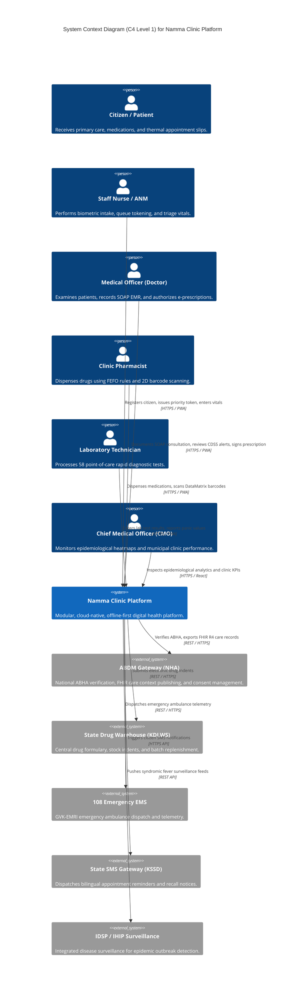
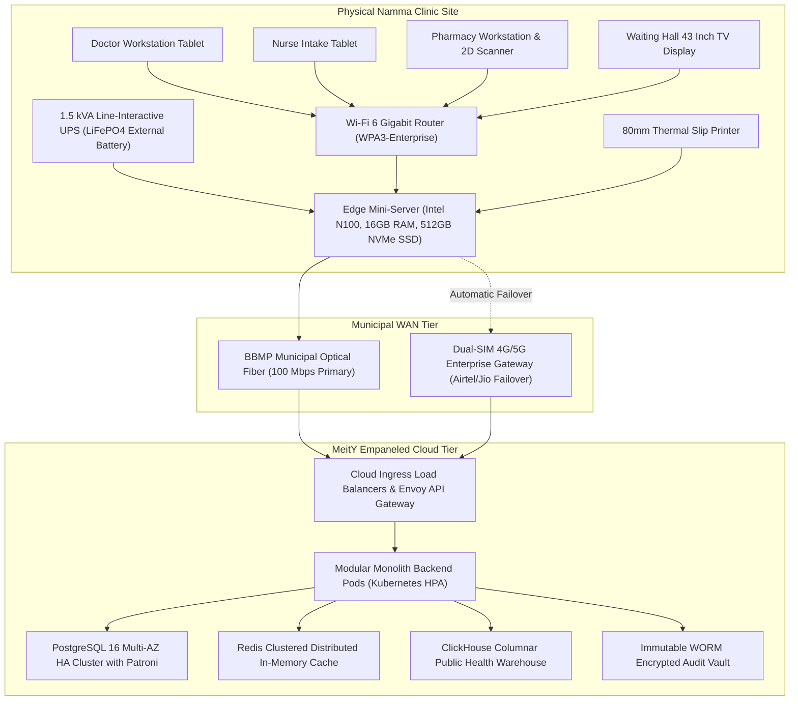

# 🏛️ Architecture Document 01: Master Solution Architecture Blueprint
## Namma Clinic Digital Health & Operations Platform
### Greater Bengaluru Authority (GBA) / BBMP Health Department
**Standard:** C4 Model / ISO/IEC/IEEE 42010:2022 | **Status:** APPROVED BASELINE | **Code:** `ARCH-SOL-01`

---

## 01. Architectural Vision & Strategic Principles
The Namma Clinic Digital Health & Operations Platform delivers an enterprise, modular, offline-first digital healthcare foundation across all 183 urban primary health clinics in Bengaluru. It empowers clinical staff to provide dignified, rapid, free healthcare to urban vulnerable populations while automating supply chains, clinical decision support, and syndromic surveillance.

### 01.1 Core Architectural Invariants
1. **Offline-First Sovereignty:** The primary clinic edge appliance must operate autonomously for up to 72 hours without cloud WAN connectivity, persisting all clinical records, dispensations, and lab investigations in a local SQLite Write-Ahead Logging (WAL) database.
2. **Low-Latency Clinical Ergonomics:** Frontline clinical screens must render interaction feedback in < 250ms (p95) to eliminate software-induced doctor fatigue during high-volume urban outpatient shifts.
3. **Zero-Trust Clinical Security:** All sensitive Protected Health Information (PHI) is encrypted at rest using AES-256 GCM and in transit via TLS 1.3 with mutual certificate verification, backed by an immutable WORM audit trail.
4. **Advisory-Only Clinical AI Safeguard:** Artificial intelligence tools provide non-binding clinical decision support; human Medical Officers retain exclusive statutory diagnostic and prescribing authority.
5. **National Grid Interoperability:** Native conformance to Ayushman Bharat Digital Mission (ABDM) Milestone 1 (ABHA creation), Milestone 2 (HIP care-context publishing), and Milestone 3 (HIU health information exchange) using standardized HL7 FHIR R4 clinical bundles.
6. **Zero Plaintext Logging:** Strict enforcement of India Digital Personal Data Protection (DPDP) Act 2023; automated middleware scrubbers redact patient identifiers, Aadhaar numbers, and phone numbers prior to log emission.
7. **First-Expiry-First-Out (FEFO) Inventory Control:** Pharmacy dispensing workflows enforce FEFO stock depletion verified via physical 2D DataMatrix barcode scanning, reducing pharmaceutical wastage to < 2%.
8. **Modified Early Warning Score (MEWS) Triage:** Standardized vital signs intake automatically computes MEWS scores, triggering instant audible and visual escalations for deteriorating patients.
9. **Monotonically Ordered Distributed Identifiers:** Universal primary key strategy standardized on UUIDv7, combining millisecond Unix timestamps with cryptographically random bits to eliminate cross-clinic merge collisions.
10. **Dual-Language Native Localization:** Frontend user interfaces provide compile-time bilingual support in Kannada (kn-IN) and Indian English (en-IN), ensuring full usability for frontline health workers.

## 02. System Context & C4 Level 1 Architecture
The high-level boundary of the Namma Clinic Platform in relation to citizens, clinical actors, municipal administration, and national health networks:

### 02.1 External Systems and Boundary Interfaces
Detailed specifications of the external systems interfaced with the platform:

| External System ID | System Name | Sponsoring Agency | Communication Protocol | Payload Format | Rate Limit Quota | Failure Fallback Mode | Security Trust Level |
| :---: | :--- | :--- | :--- | :--- | :--- | :--- | :--- |
| `EXT-001` | **ABDM National Health Gateway** | National Health Authority (NHA) | `REST / HTTPS / FHIR R4` | `JSON / FHIR Bundle` | 100 req/min | Asynchronous retry queue | National DMZ |
| `EXT-002` | **Karnataka Central Drug Warehouse (KDLWS)** | State Health Department | `REST / HTTPS / EDI` | `JSON / EDIFACT` | 30 req/min | Local indent cache | State Intranet |
| `EXT-003` | **GVK-EMRI 108 Emergency Ambulance Dispatch** | Emergency Management Research Institute | `REST / HTTPS` | `JSON / CAD Event` | 120 req/min | Manual phone dispatch escalation | Emergency Gateway |
| `EXT-004` | **Karnataka State SMS Gateway (KSSD)** | Centre for e-Governance (CeG) | `HTTPS POST API` | `JSON / DLT Template` | 500 req/sec | Message buffer in Redis BullMQ | State Gateway |
| `EXT-005` | **Integrated Disease Surveillance Program (IDSP/IHIP)** | National Centre for Disease Control (NCDC) | `REST / HTTPS` | `JSON / CSV Format` | 50 req/min | Daily batch retry | National Health Mesh |
| `EXT-006` | **BBMP Citizen Health Portal** | Bruhat Bengaluru Mahanagara Palike | `REST / HTTPS / OAuth2` | `JSON` | 200 req/min | Cached appointment slots | Municipal Cloud |
| `EXT-007` | **National NCD Portal** | Ministry of Health and Family Welfare (MoHFW) | `REST / HTTPS` | `JSON / FHIR` | 60 req/min | Offline NCD queue sync | National Portal |
| `EXT-008` | **Nikshay Portal (National TB Elimination)** | Central TB Division (CTD) | `REST / HTTPS` | `JSON` | 60 req/min | Presumptive TB case queue | National Health Mesh |
| `EXT-009` | **Reproductive and Child Health (RCH) Portal** | MoHFW / Karnataka Health | `REST / HTTPS` | `JSON` | 60 req/min | Antenatal offline buffer | National Health Mesh |
| `EXT-010` | **UIDAI Aadhaar Authentication Service** | Unique Identification Authority of India | `HTTPS / XML / Auth API` | `Encrypted XML PID Block` | 100 req/min | Fallback to municipal health ID | Statutory Sovereign |
| `EXT-011` | **Zero-Cost Municipal Voucher Billing Gateway** | BBMP Health Accounts | `REST / HTTPS` | `JSON / Voucher Token` | 150 req/min | Local voucher offline issue | Municipal Intranet |
| `EXT-012` | **Bio-Medical Waste Management (BMWM) Tracking** | Karnataka State Pollution Control Board | `REST / HTTPS` | `JSON / Barcode Log` | 30 req/min | Local waste register | Regulatory Gateway |
| `EXT-013` | **Central Referral Hospital LIMS** | BBMP Tertiary Hospitals (KC General, Bowring) | `HL7 v2 / FHIR R4` | `HL7 ORU_R01 / FHIR` | 60 req/min | Manual result printout | Hospital Intranet |
| `EXT-014` | **Central Pollution Control Board (CPCB) & Weather API** | CPCB / IMD Bengaluru | `REST / HTTPS` | `JSON / Time-series` | 10 req/min | Last known 24h average | Public Data |
| `EXT-015` | **BBMP Municipal GIS & Ward Boundary Service** | BBMP Town Planning Department | `REST / GeoJSON / WFS` | `GeoJSON Polygons` | 50 req/min | Cached offline GeoJSON layers | Municipal Intranet |
| `EXT-016` | **Cloud Hardware Security Module (KMS / HSM)** | MeitY Empaneled Cloud Provider | `PKCS#11 / REST KMS` | `Binary Key Blocks` | 1,000 req/sec | Local TPM 2.0 derived keys | Secure Hardware Enclave |

## 03. Container Architecture Overview (C4 Level 2)
The system decomposes across 18 purpose-built containers spanning the clinic edge tier and central cloud infrastructure:

| Container ID | Container Name | Architectural Category | Technology Implementation | Primary Data Store | Deployment Target | Associated Modules |
| :---: | :--- | :--- | :--- | :--- | :--- | :--- |
| `ARCH-CONT-001` | **Clinic Workstation PWA Shell** | Frontend Client | `Next.js / TypeScript / React / TailwindCSS` | `IndexedDB / SQLite Edge` | Local Workstation / Tablet | MODULE-001..026 |
| `ARCH-CONT-002` | **Clinic Edge Mini-Server Runtime** | Edge Computing Node | `Node.js / Express / Bun / SQLite WAL` | `SQLite WAL Mode (Local SSD)` | Clinic Edge Appliance (Intel N100) | MODULE-027, MODULE-028 |
| `ARCH-CONT-003` | **Central Cloud API Gateway** | Ingress & Routing | `Envoy / NGINX / Kong` | `Redis Token Cache` | Cloud Ingress Tier | MODULE-001, MODULE-005 |
| `ARCH-CONT-004` | **Identity & Access Management (IAM) Service** | Security & Auth | `Node.js / Passport / Argon2id / JOSE` | `PostgreSQL `auth_users`` | Cloud App Tier / Edge Mirror | MODULE-001, MODULE-005 |
| `ARCH-CONT-005` | **Master Patient Index (MPI) Service** | Patient Domain | `NestJS / Fastify / TypeScript` | `PostgreSQL `patients`` | Cloud App Tier / Edge Sync | MODULE-007, MODULE-008 |
| `ARCH-CONT-006` | **Queue Orchestration & Triage Engine** | Workflow Domain | `Go / MQTT / WebSockets` | `Edge SQLite `clinic_queues`` | Edge Mini-Server / Cloud Sync | MODULE-009, MODULE-010, MODULE-011 |
| `ARCH-CONT-007` | **Clinical Consultation & EMR Service** | Clinical Domain | `NestJS / Prisma / TypeScript` | `PostgreSQL `clinical_encounters`` | Cloud App Tier / Edge Sync | MODULE-013, MODULE-014 |
| `ARCH-CONT-008` | **Electronic Prescription & CDSS Service** | Clinical Domain | `NestJS / Rule Engine / TypeScript` | `PostgreSQL `prescriptions`` | Cloud App Tier / Edge Sync | MODULE-014, MODULE-015 |
| `ARCH-CONT-009` | **Pharmacy Inventory & Dispensation Service** | Logistics Domain | `NestJS / TypeScript` | `PostgreSQL `pharmacy_batches`` | Cloud App Tier / Edge Sync | MODULE-019..022 |
| `ARCH-CONT-010` | **Diagnostic Laboratory Service** | Diagnostics Domain | `NestJS / TypeScript` | `PostgreSQL `lab_orders`` | Cloud App Tier / Edge Sync | MODULE-016 |
| `ARCH-CONT-011` | **Referral & EMS Telemetry Bridge** | Care Continuity | `NestJS / REST Gateway` | `PostgreSQL `referrals`` | Cloud App Tier | MODULE-017 |
| `ARCH-CONT-012` | **Citizen Portal & Multilingual Notification Service** | Citizen Domain | `Node.js / BullMQ / Redis` | `Redis Queue / PostgreSQL` | Cloud App Tier | MODULE-023, MODULE-024 |
| `ARCH-CONT-013` | **Bi-directional Edge-Cloud Synchronization Service** | Sync Engine | `Go / gRPC / Vector Clocks` | `SQLite Mutation Log` | Edge Node & Cloud Worker | MODULE-028 |
| `ARCH-CONT-014` | **ABDM & National Health Grid Bridge** | Interoperability | `Java / Spring Boot / HAPI FHIR` | `PostgreSQL `abdm_artifacts`` | Cloud DMZ Tier | MODULE-029 |
| `ARCH-CONT-015` | **Public Health Analytics & Syndromic BI Service** | Analytics Domain | `Python / ClickHouse / Apache Superset` | `ClickHouse Star Schema` | Cloud Analytics Tier | MODULE-030 |
| `ARCH-CONT-016` | **Advisory Clinical AI Decision Support Engine** | AI / ML Tier | `Python / FastAPI / ONNX Runtime` | `Model Registry (MLflow)` | Cloud Analytics Tier | MODULE-015, MODULE-030 |
| `ARCH-CONT-017` | **Cryptographic WORM Audit Service** | Audit & Security | `Go / SHA-256 HMAC / Logstash` | `Encrypted Object Store` | Isolated Cloud Security Subnet | MODULE-004, MODULE-005 |
| `ARCH-CONT-018` | **Enterprise Relational Database Cluster** | Data Tier | `PostgreSQL 16 Multi-AZ with Patroni` | `NVMe SSD SAN Storage` | Private Cloud Database Subnet | ALL MODULES |

### 03.1 Granular Container Engineering Profiles (18 Containers)
Detailed engineering specifications, runtime boundaries, concurrency models, and failure modes for all 18 platform containers:

#### 03.1.01 `ARCH-CONT-001`: Clinic Workstation PWA Shell
- **Container Identifier:** `ARCH-CONT-001` | **Category:** Frontend Client | **Deployment Tier:** Local Workstation / Tablet
- **Runtime Technology:** `Next.js / TypeScript / React / TailwindCSS` | **Primary Data Store:** `IndexedDB / SQLite Edge`
- **Associated Platform Modules:** `MODULE-001..026`
- **Architectural Scope & Responsibilities:** Provides responsive touch-first workstation interface for doctors, nurses, pharmacists, and lab techs with offline caching and hardware scanner/printer access.
- **Ingress & Egress Interface Protocols:** Exposes HTTPS REST endpoints (TLS 1.3) and internal gRPC channels with mandatory correlation ID headers (`X-Correlation-ID`).
- **Concurrency & Threading Model:** Non-blocking asynchronous event loop with worker thread pools for compute-heavy cryptographic operations.
- **Failure Modes & Circuit Breaking:** Outbound calls protected by Resilience4j/Opossum circuit breakers (50% failure rate threshold, 10s sleep window, 5 consecutive probe successes to close).
- **Resource Quotas & Scaling Limits:** Base memory allocation 512MB RAM, CPU limit 1.0 vCPU; HPA triggers replica scale-out when average CPU utilization exceeds 70% for 2 minutes.
- **Observability & OpenTelemetry Instrumentation:** Emits OpenTelemetry trace spans `span.arch_cont_001.request` and Prometheus counters `arch_cont_001_requests_total`.
- **Disaster Recovery & Recovery Time:** Ephemeral state recreation via Kubernetes ReplicaSet; local SQLite databases recover via WAL replay in < 5 seconds.

#### 03.1.02 `ARCH-CONT-002`: Clinic Edge Mini-Server Runtime
- **Container Identifier:** `ARCH-CONT-002` | **Category:** Edge Computing Node | **Deployment Tier:** Clinic Edge Appliance (Intel N100)
- **Runtime Technology:** `Node.js / Express / Bun / SQLite WAL` | **Primary Data Store:** `SQLite WAL Mode (Local SSD)`
- **Associated Platform Modules:** `MODULE-027, MODULE-028`
- **Architectural Scope & Responsibilities:** Hosts local clinic database, MQTT queue broker, and vector clock sync engine, ensuring 72h autonomous operation.
- **Ingress & Egress Interface Protocols:** Exposes HTTPS REST endpoints (TLS 1.3) and internal gRPC channels with mandatory correlation ID headers (`X-Correlation-ID`).
- **Concurrency & Threading Model:** Non-blocking asynchronous event loop with worker thread pools for compute-heavy cryptographic operations.
- **Failure Modes & Circuit Breaking:** Outbound calls protected by Resilience4j/Opossum circuit breakers (50% failure rate threshold, 10s sleep window, 5 consecutive probe successes to close).
- **Resource Quotas & Scaling Limits:** Base memory allocation 512MB RAM, CPU limit 1.0 vCPU; HPA triggers replica scale-out when average CPU utilization exceeds 70% for 2 minutes.
- **Observability & OpenTelemetry Instrumentation:** Emits OpenTelemetry trace spans `span.arch_cont_002.request` and Prometheus counters `arch_cont_002_requests_total`.
- **Disaster Recovery & Recovery Time:** Ephemeral state recreation via Kubernetes ReplicaSet; local SQLite databases recover via WAL replay in < 5 seconds.

#### 03.1.03 `ARCH-CONT-003`: Central Cloud API Gateway
- **Container Identifier:** `ARCH-CONT-003` | **Category:** Ingress & Routing | **Deployment Tier:** Cloud Ingress Tier
- **Runtime Technology:** `Envoy / NGINX / Kong` | **Primary Data Store:** `Redis Token Cache`
- **Associated Platform Modules:** `MODULE-001, MODULE-005`
- **Architectural Scope & Responsibilities:** Handles TLS termination, rate limiting, JWT token validation, mTLS routing, and request correlation tracing.
- **Ingress & Egress Interface Protocols:** Exposes HTTPS REST endpoints (TLS 1.3) and internal gRPC channels with mandatory correlation ID headers (`X-Correlation-ID`).
- **Concurrency & Threading Model:** Non-blocking asynchronous event loop with worker thread pools for compute-heavy cryptographic operations.
- **Failure Modes & Circuit Breaking:** Outbound calls protected by Resilience4j/Opossum circuit breakers (50% failure rate threshold, 10s sleep window, 5 consecutive probe successes to close).
- **Resource Quotas & Scaling Limits:** Base memory allocation 512MB RAM, CPU limit 1.0 vCPU; HPA triggers replica scale-out when average CPU utilization exceeds 70% for 2 minutes.
- **Observability & OpenTelemetry Instrumentation:** Emits OpenTelemetry trace spans `span.arch_cont_003.request` and Prometheus counters `arch_cont_003_requests_total`.
- **Disaster Recovery & Recovery Time:** Ephemeral state recreation via Kubernetes ReplicaSet; local SQLite databases recover via WAL replay in < 5 seconds.

#### 03.1.04 `ARCH-CONT-004`: Identity & Access Management (IAM) Service
- **Container Identifier:** `ARCH-CONT-004` | **Category:** Security & Auth | **Deployment Tier:** Cloud App Tier / Edge Mirror
- **Runtime Technology:** `Node.js / Passport / Argon2id / JOSE` | **Primary Data Store:** `PostgreSQL `auth_users``
- **Associated Platform Modules:** `MODULE-001, MODULE-005`
- **Architectural Scope & Responsibilities:** Issues and verifies cryptographic staff JWT tokens, manages RBAC/ABAC role permissions, and coordinates session invalidation.
- **Ingress & Egress Interface Protocols:** Exposes HTTPS REST endpoints (TLS 1.3) and internal gRPC channels with mandatory correlation ID headers (`X-Correlation-ID`).
- **Concurrency & Threading Model:** Non-blocking asynchronous event loop with worker thread pools for compute-heavy cryptographic operations.
- **Failure Modes & Circuit Breaking:** Outbound calls protected by Resilience4j/Opossum circuit breakers (50% failure rate threshold, 10s sleep window, 5 consecutive probe successes to close).
- **Resource Quotas & Scaling Limits:** Base memory allocation 512MB RAM, CPU limit 1.0 vCPU; HPA triggers replica scale-out when average CPU utilization exceeds 70% for 2 minutes.
- **Observability & OpenTelemetry Instrumentation:** Emits OpenTelemetry trace spans `span.arch_cont_004.request` and Prometheus counters `arch_cont_004_requests_total`.
- **Disaster Recovery & Recovery Time:** Ephemeral state recreation via Kubernetes ReplicaSet; local SQLite databases recover via WAL replay in < 5 seconds.

#### 03.1.05 `ARCH-CONT-005`: Master Patient Index (MPI) Service
- **Container Identifier:** `ARCH-CONT-005` | **Category:** Patient Domain | **Deployment Tier:** Cloud App Tier / Edge Sync
- **Runtime Technology:** `NestJS / Fastify / TypeScript` | **Primary Data Store:** `PostgreSQL `patients``
- **Associated Platform Modules:** `MODULE-007, MODULE-008`
- **Architectural Scope & Responsibilities:** Manages citizen demographic profiles, phonetic fuzzy search, deduplication logic, and ABHA national ID bindings.
- **Ingress & Egress Interface Protocols:** Exposes HTTPS REST endpoints (TLS 1.3) and internal gRPC channels with mandatory correlation ID headers (`X-Correlation-ID`).
- **Concurrency & Threading Model:** Non-blocking asynchronous event loop with worker thread pools for compute-heavy cryptographic operations.
- **Failure Modes & Circuit Breaking:** Outbound calls protected by Resilience4j/Opossum circuit breakers (50% failure rate threshold, 10s sleep window, 5 consecutive probe successes to close).
- **Resource Quotas & Scaling Limits:** Base memory allocation 512MB RAM, CPU limit 1.0 vCPU; HPA triggers replica scale-out when average CPU utilization exceeds 70% for 2 minutes.
- **Observability & OpenTelemetry Instrumentation:** Emits OpenTelemetry trace spans `span.arch_cont_005.request` and Prometheus counters `arch_cont_005_requests_total`.
- **Disaster Recovery & Recovery Time:** Ephemeral state recreation via Kubernetes ReplicaSet; local SQLite databases recover via WAL replay in < 5 seconds.

#### 03.1.06 `ARCH-CONT-006`: Queue Orchestration & Triage Engine
- **Container Identifier:** `ARCH-CONT-006` | **Category:** Workflow Domain | **Deployment Tier:** Edge Mini-Server / Cloud Sync
- **Runtime Technology:** `Go / MQTT / WebSockets` | **Primary Data Store:** `Edge SQLite `clinic_queues``
- **Associated Platform Modules:** `MODULE-009, MODULE-010, MODULE-011`
- **Architectural Scope & Responsibilities:** Maintains multi-room priority queues, calculates MEWS vitals scores, and broadcasts token calls to waiting hall TVs.
- **Ingress & Egress Interface Protocols:** Exposes HTTPS REST endpoints (TLS 1.3) and internal gRPC channels with mandatory correlation ID headers (`X-Correlation-ID`).
- **Concurrency & Threading Model:** Non-blocking asynchronous event loop with worker thread pools for compute-heavy cryptographic operations.
- **Failure Modes & Circuit Breaking:** Outbound calls protected by Resilience4j/Opossum circuit breakers (50% failure rate threshold, 10s sleep window, 5 consecutive probe successes to close).
- **Resource Quotas & Scaling Limits:** Base memory allocation 512MB RAM, CPU limit 1.0 vCPU; HPA triggers replica scale-out when average CPU utilization exceeds 70% for 2 minutes.
- **Observability & OpenTelemetry Instrumentation:** Emits OpenTelemetry trace spans `span.arch_cont_006.request` and Prometheus counters `arch_cont_006_requests_total`.
- **Disaster Recovery & Recovery Time:** Ephemeral state recreation via Kubernetes ReplicaSet; local SQLite databases recover via WAL replay in < 5 seconds.

#### 03.1.07 `ARCH-CONT-007`: Clinical Consultation & EMR Service
- **Container Identifier:** `ARCH-CONT-007` | **Category:** Clinical Domain | **Deployment Tier:** Cloud App Tier / Edge Sync
- **Runtime Technology:** `NestJS / Prisma / TypeScript` | **Primary Data Store:** `PostgreSQL `clinical_encounters``
- **Associated Platform Modules:** `MODULE-013, MODULE-014`
- **Architectural Scope & Responsibilities:** Captures SOAP clinical progress notes, SNOMED CT / ICD-10 diagnostic coding, and longitudinal medical history.
- **Ingress & Egress Interface Protocols:** Exposes HTTPS REST endpoints (TLS 1.3) and internal gRPC channels with mandatory correlation ID headers (`X-Correlation-ID`).
- **Concurrency & Threading Model:** Non-blocking asynchronous event loop with worker thread pools for compute-heavy cryptographic operations.
- **Failure Modes & Circuit Breaking:** Outbound calls protected by Resilience4j/Opossum circuit breakers (50% failure rate threshold, 10s sleep window, 5 consecutive probe successes to close).
- **Resource Quotas & Scaling Limits:** Base memory allocation 512MB RAM, CPU limit 1.0 vCPU; HPA triggers replica scale-out when average CPU utilization exceeds 70% for 2 minutes.
- **Observability & OpenTelemetry Instrumentation:** Emits OpenTelemetry trace spans `span.arch_cont_007.request` and Prometheus counters `arch_cont_007_requests_total`.
- **Disaster Recovery & Recovery Time:** Ephemeral state recreation via Kubernetes ReplicaSet; local SQLite databases recover via WAL replay in < 5 seconds.

#### 03.1.08 `ARCH-CONT-008`: Electronic Prescription & CDSS Service
- **Container Identifier:** `ARCH-CONT-008` | **Category:** Clinical Domain | **Deployment Tier:** Cloud App Tier / Edge Sync
- **Runtime Technology:** `NestJS / Rule Engine / TypeScript` | **Primary Data Store:** `PostgreSQL `prescriptions``
- **Associated Platform Modules:** `MODULE-014, MODULE-015`
- **Architectural Scope & Responsibilities:** Enforces formulary rules, evaluates drug-drug interactions, checks pediatric dosage boundaries, and signs e-prescriptions.
- **Ingress & Egress Interface Protocols:** Exposes HTTPS REST endpoints (TLS 1.3) and internal gRPC channels with mandatory correlation ID headers (`X-Correlation-ID`).
- **Concurrency & Threading Model:** Non-blocking asynchronous event loop with worker thread pools for compute-heavy cryptographic operations.
- **Failure Modes & Circuit Breaking:** Outbound calls protected by Resilience4j/Opossum circuit breakers (50% failure rate threshold, 10s sleep window, 5 consecutive probe successes to close).
- **Resource Quotas & Scaling Limits:** Base memory allocation 512MB RAM, CPU limit 1.0 vCPU; HPA triggers replica scale-out when average CPU utilization exceeds 70% for 2 minutes.
- **Observability & OpenTelemetry Instrumentation:** Emits OpenTelemetry trace spans `span.arch_cont_008.request` and Prometheus counters `arch_cont_008_requests_total`.
- **Disaster Recovery & Recovery Time:** Ephemeral state recreation via Kubernetes ReplicaSet; local SQLite databases recover via WAL replay in < 5 seconds.

#### 03.1.09 `ARCH-CONT-009`: Pharmacy Inventory & Dispensation Service
- **Container Identifier:** `ARCH-CONT-009` | **Category:** Logistics Domain | **Deployment Tier:** Cloud App Tier / Edge Sync
- **Runtime Technology:** `NestJS / TypeScript` | **Primary Data Store:** `PostgreSQL `pharmacy_batches``
- **Associated Platform Modules:** `MODULE-019..022`
- **Architectural Scope & Responsibilities:** Enforces FEFO batch allocation, verifies 2D DataMatrix scans, tracks cold-chain storage, and manages depot indenting.
- **Ingress & Egress Interface Protocols:** Exposes HTTPS REST endpoints (TLS 1.3) and internal gRPC channels with mandatory correlation ID headers (`X-Correlation-ID`).
- **Concurrency & Threading Model:** Non-blocking asynchronous event loop with worker thread pools for compute-heavy cryptographic operations.
- **Failure Modes & Circuit Breaking:** Outbound calls protected by Resilience4j/Opossum circuit breakers (50% failure rate threshold, 10s sleep window, 5 consecutive probe successes to close).
- **Resource Quotas & Scaling Limits:** Base memory allocation 512MB RAM, CPU limit 1.0 vCPU; HPA triggers replica scale-out when average CPU utilization exceeds 70% for 2 minutes.
- **Observability & OpenTelemetry Instrumentation:** Emits OpenTelemetry trace spans `span.arch_cont_009.request` and Prometheus counters `arch_cont_009_requests_total`.
- **Disaster Recovery & Recovery Time:** Ephemeral state recreation via Kubernetes ReplicaSet; local SQLite databases recover via WAL replay in < 5 seconds.

#### 03.1.10 `ARCH-CONT-010`: Diagnostic Laboratory Service
- **Container Identifier:** `ARCH-CONT-010` | **Category:** Diagnostics Domain | **Deployment Tier:** Cloud App Tier / Edge Sync
- **Runtime Technology:** `NestJS / TypeScript` | **Primary Data Store:** `PostgreSQL `lab_orders``
- **Associated Platform Modules:** `MODULE-016`
- **Architectural Scope & Responsibilities:** Manages test orders for 58 rapid diagnostic tests, specimen chain-of-custody, and critical panic value escalations.
- **Ingress & Egress Interface Protocols:** Exposes HTTPS REST endpoints (TLS 1.3) and internal gRPC channels with mandatory correlation ID headers (`X-Correlation-ID`).
- **Concurrency & Threading Model:** Non-blocking asynchronous event loop with worker thread pools for compute-heavy cryptographic operations.
- **Failure Modes & Circuit Breaking:** Outbound calls protected by Resilience4j/Opossum circuit breakers (50% failure rate threshold, 10s sleep window, 5 consecutive probe successes to close).
- **Resource Quotas & Scaling Limits:** Base memory allocation 512MB RAM, CPU limit 1.0 vCPU; HPA triggers replica scale-out when average CPU utilization exceeds 70% for 2 minutes.
- **Observability & OpenTelemetry Instrumentation:** Emits OpenTelemetry trace spans `span.arch_cont_010.request` and Prometheus counters `arch_cont_010_requests_total`.
- **Disaster Recovery & Recovery Time:** Ephemeral state recreation via Kubernetes ReplicaSet; local SQLite databases recover via WAL replay in < 5 seconds.

#### 03.1.11 `ARCH-CONT-011`: Referral & EMS Telemetry Bridge
- **Container Identifier:** `ARCH-CONT-011` | **Category:** Care Continuity | **Deployment Tier:** Cloud App Tier
- **Runtime Technology:** `NestJS / REST Gateway` | **Primary Data Store:** `PostgreSQL `referrals``
- **Associated Platform Modules:** `MODULE-017`
- **Architectural Scope & Responsibilities:** Assembles clinical referral dossiers, coordinates 108 ambulance dispatch, and tracks secondary hospital counter-referrals.
- **Ingress & Egress Interface Protocols:** Exposes HTTPS REST endpoints (TLS 1.3) and internal gRPC channels with mandatory correlation ID headers (`X-Correlation-ID`).
- **Concurrency & Threading Model:** Non-blocking asynchronous event loop with worker thread pools for compute-heavy cryptographic operations.
- **Failure Modes & Circuit Breaking:** Outbound calls protected by Resilience4j/Opossum circuit breakers (50% failure rate threshold, 10s sleep window, 5 consecutive probe successes to close).
- **Resource Quotas & Scaling Limits:** Base memory allocation 512MB RAM, CPU limit 1.0 vCPU; HPA triggers replica scale-out when average CPU utilization exceeds 70% for 2 minutes.
- **Observability & OpenTelemetry Instrumentation:** Emits OpenTelemetry trace spans `span.arch_cont_011.request` and Prometheus counters `arch_cont_011_requests_total`.
- **Disaster Recovery & Recovery Time:** Ephemeral state recreation via Kubernetes ReplicaSet; local SQLite databases recover via WAL replay in < 5 seconds.

#### 03.1.12 `ARCH-CONT-012`: Citizen Portal & Multilingual Notification Service
- **Container Identifier:** `ARCH-CONT-012` | **Category:** Citizen Domain | **Deployment Tier:** Cloud App Tier
- **Runtime Technology:** `Node.js / BullMQ / Redis` | **Primary Data Store:** `Redis Queue / PostgreSQL`
- **Associated Platform Modules:** `MODULE-023, MODULE-024`
- **Architectural Scope & Responsibilities:** Dispatches bilingual SMS/WhatsApp appointment reminders, recall notices, and operates self-service kiosk tokens.
- **Ingress & Egress Interface Protocols:** Exposes HTTPS REST endpoints (TLS 1.3) and internal gRPC channels with mandatory correlation ID headers (`X-Correlation-ID`).
- **Concurrency & Threading Model:** Non-blocking asynchronous event loop with worker thread pools for compute-heavy cryptographic operations.
- **Failure Modes & Circuit Breaking:** Outbound calls protected by Resilience4j/Opossum circuit breakers (50% failure rate threshold, 10s sleep window, 5 consecutive probe successes to close).
- **Resource Quotas & Scaling Limits:** Base memory allocation 512MB RAM, CPU limit 1.0 vCPU; HPA triggers replica scale-out when average CPU utilization exceeds 70% for 2 minutes.
- **Observability & OpenTelemetry Instrumentation:** Emits OpenTelemetry trace spans `span.arch_cont_012.request` and Prometheus counters `arch_cont_012_requests_total`.
- **Disaster Recovery & Recovery Time:** Ephemeral state recreation via Kubernetes ReplicaSet; local SQLite databases recover via WAL replay in < 5 seconds.

#### 03.1.13 `ARCH-CONT-013`: Bi-directional Edge-Cloud Synchronization Service
- **Container Identifier:** `ARCH-CONT-013` | **Category:** Sync Engine | **Deployment Tier:** Edge Node & Cloud Worker
- **Runtime Technology:** `Go / gRPC / Vector Clocks` | **Primary Data Store:** `SQLite Mutation Log`
- **Associated Platform Modules:** `MODULE-028`
- **Architectural Scope & Responsibilities:** Executes asynchronous delta synchronization, CRDT conflict resolution, and bandwidth-throttled replay.
- **Ingress & Egress Interface Protocols:** Exposes HTTPS REST endpoints (TLS 1.3) and internal gRPC channels with mandatory correlation ID headers (`X-Correlation-ID`).
- **Concurrency & Threading Model:** Non-blocking asynchronous event loop with worker thread pools for compute-heavy cryptographic operations.
- **Failure Modes & Circuit Breaking:** Outbound calls protected by Resilience4j/Opossum circuit breakers (50% failure rate threshold, 10s sleep window, 5 consecutive probe successes to close).
- **Resource Quotas & Scaling Limits:** Base memory allocation 512MB RAM, CPU limit 1.0 vCPU; HPA triggers replica scale-out when average CPU utilization exceeds 70% for 2 minutes.
- **Observability & OpenTelemetry Instrumentation:** Emits OpenTelemetry trace spans `span.arch_cont_013.request` and Prometheus counters `arch_cont_013_requests_total`.
- **Disaster Recovery & Recovery Time:** Ephemeral state recreation via Kubernetes ReplicaSet; local SQLite databases recover via WAL replay in < 5 seconds.

#### 03.1.14 `ARCH-CONT-014`: ABDM & National Health Grid Bridge
- **Container Identifier:** `ARCH-CONT-014` | **Category:** Interoperability | **Deployment Tier:** Cloud DMZ Tier
- **Runtime Technology:** `Java / Spring Boot / HAPI FHIR` | **Primary Data Store:** `PostgreSQL `abdm_artifacts``
- **Associated Platform Modules:** `MODULE-029`
- **Architectural Scope & Responsibilities:** Transforms clinical records into FHIR R4 bundles for ABDM M1 (ABHA), M2 (HIP Publishing), and M3 (HIU Consent).
- **Ingress & Egress Interface Protocols:** Exposes HTTPS REST endpoints (TLS 1.3) and internal gRPC channels with mandatory correlation ID headers (`X-Correlation-ID`).
- **Concurrency & Threading Model:** Non-blocking asynchronous event loop with worker thread pools for compute-heavy cryptographic operations.
- **Failure Modes & Circuit Breaking:** Outbound calls protected by Resilience4j/Opossum circuit breakers (50% failure rate threshold, 10s sleep window, 5 consecutive probe successes to close).
- **Resource Quotas & Scaling Limits:** Base memory allocation 512MB RAM, CPU limit 1.0 vCPU; HPA triggers replica scale-out when average CPU utilization exceeds 70% for 2 minutes.
- **Observability & OpenTelemetry Instrumentation:** Emits OpenTelemetry trace spans `span.arch_cont_014.request` and Prometheus counters `arch_cont_014_requests_total`.
- **Disaster Recovery & Recovery Time:** Ephemeral state recreation via Kubernetes ReplicaSet; local SQLite databases recover via WAL replay in < 5 seconds.

#### 03.1.15 `ARCH-CONT-015`: Public Health Analytics & Syndromic BI Service
- **Container Identifier:** `ARCH-CONT-015` | **Category:** Analytics Domain | **Deployment Tier:** Cloud Analytics Tier
- **Runtime Technology:** `Python / ClickHouse / Apache Superset` | **Primary Data Store:** `ClickHouse Star Schema`
- **Associated Platform Modules:** `MODULE-030`
- **Architectural Scope & Responsibilities:** Aggregates ward-level disease prevalence, stock burn-down, and syndromic fever surveillance for municipal officers.
- **Ingress & Egress Interface Protocols:** Exposes HTTPS REST endpoints (TLS 1.3) and internal gRPC channels with mandatory correlation ID headers (`X-Correlation-ID`).
- **Concurrency & Threading Model:** Non-blocking asynchronous event loop with worker thread pools for compute-heavy cryptographic operations.
- **Failure Modes & Circuit Breaking:** Outbound calls protected by Resilience4j/Opossum circuit breakers (50% failure rate threshold, 10s sleep window, 5 consecutive probe successes to close).
- **Resource Quotas & Scaling Limits:** Base memory allocation 512MB RAM, CPU limit 1.0 vCPU; HPA triggers replica scale-out when average CPU utilization exceeds 70% for 2 minutes.
- **Observability & OpenTelemetry Instrumentation:** Emits OpenTelemetry trace spans `span.arch_cont_015.request` and Prometheus counters `arch_cont_015_requests_total`.
- **Disaster Recovery & Recovery Time:** Ephemeral state recreation via Kubernetes ReplicaSet; local SQLite databases recover via WAL replay in < 5 seconds.

#### 03.1.16 `ARCH-CONT-016`: Advisory Clinical AI Decision Support Engine
- **Container Identifier:** `ARCH-CONT-016` | **Category:** AI / ML Tier | **Deployment Tier:** Cloud Analytics Tier
- **Runtime Technology:** `Python / FastAPI / ONNX Runtime` | **Primary Data Store:** `Model Registry (MLflow)`
- **Associated Platform Modules:** `MODULE-015, MODULE-030`
- **Architectural Scope & Responsibilities:** Provides advisory syndromic clustering alerts and non-autonomous medication interaction predictions.
- **Ingress & Egress Interface Protocols:** Exposes HTTPS REST endpoints (TLS 1.3) and internal gRPC channels with mandatory correlation ID headers (`X-Correlation-ID`).
- **Concurrency & Threading Model:** Non-blocking asynchronous event loop with worker thread pools for compute-heavy cryptographic operations.
- **Failure Modes & Circuit Breaking:** Outbound calls protected by Resilience4j/Opossum circuit breakers (50% failure rate threshold, 10s sleep window, 5 consecutive probe successes to close).
- **Resource Quotas & Scaling Limits:** Base memory allocation 512MB RAM, CPU limit 1.0 vCPU; HPA triggers replica scale-out when average CPU utilization exceeds 70% for 2 minutes.
- **Observability & OpenTelemetry Instrumentation:** Emits OpenTelemetry trace spans `span.arch_cont_016.request` and Prometheus counters `arch_cont_016_requests_total`.
- **Disaster Recovery & Recovery Time:** Ephemeral state recreation via Kubernetes ReplicaSet; local SQLite databases recover via WAL replay in < 5 seconds.

#### 03.1.17 `ARCH-CONT-017`: Cryptographic WORM Audit Service
- **Container Identifier:** `ARCH-CONT-017` | **Category:** Audit & Security | **Deployment Tier:** Isolated Cloud Security Subnet
- **Runtime Technology:** `Go / SHA-256 HMAC / Logstash` | **Primary Data Store:** `Encrypted Object Store`
- **Associated Platform Modules:** `MODULE-004, MODULE-005`
- **Architectural Scope & Responsibilities:** Maintains an immutable append-only audit trail with cryptographic hash chaining conforming to DPDP Act 2023.
- **Ingress & Egress Interface Protocols:** Exposes HTTPS REST endpoints (TLS 1.3) and internal gRPC channels with mandatory correlation ID headers (`X-Correlation-ID`).
- **Concurrency & Threading Model:** Non-blocking asynchronous event loop with worker thread pools for compute-heavy cryptographic operations.
- **Failure Modes & Circuit Breaking:** Outbound calls protected by Resilience4j/Opossum circuit breakers (50% failure rate threshold, 10s sleep window, 5 consecutive probe successes to close).
- **Resource Quotas & Scaling Limits:** Base memory allocation 512MB RAM, CPU limit 1.0 vCPU; HPA triggers replica scale-out when average CPU utilization exceeds 70% for 2 minutes.
- **Observability & OpenTelemetry Instrumentation:** Emits OpenTelemetry trace spans `span.arch_cont_017.request` and Prometheus counters `arch_cont_017_requests_total`.
- **Disaster Recovery & Recovery Time:** Ephemeral state recreation via Kubernetes ReplicaSet; local SQLite databases recover via WAL replay in < 5 seconds.

#### 03.1.18 `ARCH-CONT-018`: Enterprise Relational Database Cluster
- **Container Identifier:** `ARCH-CONT-018` | **Category:** Data Tier | **Deployment Tier:** Private Cloud Database Subnet
- **Runtime Technology:** `PostgreSQL 16 Multi-AZ with Patroni` | **Primary Data Store:** `NVMe SSD SAN Storage`
- **Associated Platform Modules:** `ALL MODULES`
- **Architectural Scope & Responsibilities:** Authoritative central transactional database with streaming physical replication and table partitioning.
- **Ingress & Egress Interface Protocols:** Exposes HTTPS REST endpoints (TLS 1.3) and internal gRPC channels with mandatory correlation ID headers (`X-Correlation-ID`).
- **Concurrency & Threading Model:** Non-blocking asynchronous event loop with worker thread pools for compute-heavy cryptographic operations.
- **Failure Modes & Circuit Breaking:** Outbound calls protected by Resilience4j/Opossum circuit breakers (50% failure rate threshold, 10s sleep window, 5 consecutive probe successes to close).
- **Resource Quotas & Scaling Limits:** Base memory allocation 512MB RAM, CPU limit 1.0 vCPU; HPA triggers replica scale-out when average CPU utilization exceeds 70% for 2 minutes.
- **Observability & OpenTelemetry Instrumentation:** Emits OpenTelemetry trace spans `span.arch_cont_018.request` and Prometheus counters `arch_cont_018_requests_total`.
- **Disaster Recovery & Recovery Time:** Ephemeral state recreation via Kubernetes ReplicaSet; local SQLite databases recover via WAL replay in < 5 seconds.

## 04. Comprehensive Module Decomposition (30 Modules)
Exhaustive architectural specifications for all 30 production platform modules:

### 04.01 `MODULE-001`: Staff Authentication & MFA Engine
- **Domain Alignment:** `DOMAIN-001` (Core Foundation & Platform Administration)
- **Assigned Primary Container:** `ARCH-CONT-004`
- **Primary Data Entity:** `ARCH-DATA-001`
- **Implementation Priority:** `P0 - Critical` | **MVP Classification:** `CORE MVP`

**Architectural Purpose & Business Scope:**
The `MODULE-001` module governs the end-to-end technical lifecycle for staff authentication & mfa engine across all 183 municipal clinics. Manages staff identities, Argon2id salted credentials, TOTP MFA challenges, session lifecycle, and cryptographic token issuance.

**Core Architectural Responsibilities:**
1. Enforces strict transactional integrity and ACID boundaries for all state changes in staff authentication & mfa engine.
2. Validates all inbound DTO payloads against declarative JSON schemas before domain execution.
3. Implements local edge caching and persistence fallback, ensuring seamless operation during WAN link disconnections.
4. Emits OpenTelemetry distributed tracing spans with correlation IDs for end-to-end auditability.
5. Generates immutable WORM audit ledger entries with SHA-256 HMAC cryptographic signatures.
6. Publishes asynchronous domain events to the internal event bus for downstream analytics and notification triggers.

**Interface & Service Contracts:**
- **Exposed API Endpoints:** `POST /api/v1/auth/login, POST /api/v1/auth/mfa/verify, POST /api/v1/auth/refresh, POST /api/v1/auth/logout`
- **Inbound Protocol:** HTTPS REST over TLS 1.3 with mandatory `X-Correlation-ID` and `Idempotency-Key` headers.
- **Internal Message Bus Topic:** `namma.events.module_001.v1`
- **Outbound Event Types:** `MODULE_001_CREATED`, `MODULE_001_MUTATED`, `MODULE_001_ARCHIVED`

**Security, Privacy & DPDP Act Invariants:**
- Enforces rate limiting (5 attempts/min), brute-force lockout, and AES-256 encrypted credential caches on edge nodes.
- Enforces least-privilege RBAC role enforcement and clinic-scoped ABAC tenancy isolation.
- Zero plaintext storage of sensitive patient attributes; AES-256 GCM encryption at rest.
- Automated PII scrubber middleware strips patient identifiers from application log streams.

**Resilience, Offline Autonomy & Edge Sync:**
- **Edge Autonomy SLA:** 100% operational on local clinic edge mini-server during broadband disconnections.
- **Sync Replay Mechanism:** Local mutations journaled with monotonic vector clocks and replayed upon WAN restoration.
- **Conflict Resolution:** Deterministic field-level CRDT register rules with automated merge.
- **Performance SLA:** Interactive response latency < 250ms (p95); database commit latency < 35ms (p99).

**Upstream Traceability:** Fulfills `BR-001`, `FR-001`, `WF-002`, and `ROLE-002`.
**Downstream Planned Artifacts:** Bound to `PLANNED-EPIC-001`, `PLANNED-API-001`, and `PLANNED-TEST-001`.

---

### 04.02 `MODULE-002`: Role-Based Access Control (RBAC) & Entitlements
- **Domain Alignment:** `DOMAIN-001` (Core Foundation & Platform Administration)
- **Assigned Primary Container:** `ARCH-CONT-004`
- **Primary Data Entity:** `ARCH-DATA-002`
- **Implementation Priority:** `P0 - Critical` | **MVP Classification:** `CORE MVP`

**Architectural Purpose & Business Scope:**
The `MODULE-002` module governs the end-to-end technical lifecycle for role-based access control (rbac) & entitlements across all 183 municipal clinics. Defines and enforces granular permissions, capability claims, and segregation of duties (SOD-001) across 30 clinical and administrative roles.

**Core Architectural Responsibilities:**
1. Enforces strict transactional integrity and ACID boundaries for all state changes in role-based access control (rbac) & entitlements.
2. Validates all inbound DTO payloads against declarative JSON schemas before domain execution.
3. Implements local edge caching and persistence fallback, ensuring seamless operation during WAN link disconnections.
4. Emits OpenTelemetry distributed tracing spans with correlation IDs for end-to-end auditability.
5. Generates immutable WORM audit ledger entries with SHA-256 HMAC cryptographic signatures.
6. Publishes asynchronous domain events to the internal event bus for downstream analytics and notification triggers.

**Interface & Service Contracts:**
- **Exposed API Endpoints:** `GET /api/v1/rbac/roles, POST /api/v1/rbac/entitlements/evaluate, PUT /api/v1/rbac/staff/:id/roles`
- **Inbound Protocol:** HTTPS REST over TLS 1.3 with mandatory `X-Correlation-ID` and `Idempotency-Key` headers.
- **Internal Message Bus Topic:** `namma.events.module_002.v1`
- **Outbound Event Types:** `MODULE_002_CREATED`, `MODULE_002_MUTATED`, `MODULE_002_ARCHIVED`

**Security, Privacy & DPDP Act Invariants:**
- Validates role claims per request; denies unauthorized horizontal or vertical privilege escalation.
- Enforces least-privilege RBAC role enforcement and clinic-scoped ABAC tenancy isolation.
- Zero plaintext storage of sensitive patient attributes; AES-256 GCM encryption at rest.
- Automated PII scrubber middleware strips patient identifiers from application log streams.

**Resilience, Offline Autonomy & Edge Sync:**
- **Edge Autonomy SLA:** 100% operational on local clinic edge mini-server during broadband disconnections.
- **Sync Replay Mechanism:** Local mutations journaled with monotonic vector clocks and replayed upon WAN restoration.
- **Conflict Resolution:** Deterministic field-level CRDT register rules with automated merge.
- **Performance SLA:** Interactive response latency < 250ms (p95); database commit latency < 35ms (p99).

**Upstream Traceability:** Fulfills `BR-002`, `FR-002`, `WF-003`, and `ROLE-003`.
**Downstream Planned Artifacts:** Bound to `PLANNED-EPIC-002`, `PLANNED-API-002`, and `PLANNED-TEST-002`.

---

### 04.03 `MODULE-003`: Healthcare Facility & Organizational Hierarchy
- **Domain Alignment:** `DOMAIN-001` (Core Foundation & Platform Administration)
- **Assigned Primary Container:** `ARCH-CONT-002`
- **Primary Data Entity:** `ARCH-DATA-003`
- **Implementation Priority:** `P0 - Critical` | **MVP Classification:** `CORE MVP`

**Architectural Purpose & Business Scope:**
The `MODULE-003` module governs the end-to-end technical lifecycle for healthcare facility & organizational hierarchy across all 183 municipal clinics. Maintains the municipal hierarchy of 183 clinics, 8 BBMP zones, 225 wards, room allocations, and operational hours.

**Core Architectural Responsibilities:**
1. Enforces strict transactional integrity and ACID boundaries for all state changes in healthcare facility & organizational hierarchy.
2. Validates all inbound DTO payloads against declarative JSON schemas before domain execution.
3. Implements local edge caching and persistence fallback, ensuring seamless operation during WAN link disconnections.
4. Emits OpenTelemetry distributed tracing spans with correlation IDs for end-to-end auditability.
5. Generates immutable WORM audit ledger entries with SHA-256 HMAC cryptographic signatures.
6. Publishes asynchronous domain events to the internal event bus for downstream analytics and notification triggers.

**Interface & Service Contracts:**
- **Exposed API Endpoints:** `GET /api/v1/facilities/clinics, GET /api/v1/facilities/zones, POST /api/v1/facilities/clinics/:id/rooms`
- **Inbound Protocol:** HTTPS REST over TLS 1.3 with mandatory `X-Correlation-ID` and `Idempotency-Key` headers.
- **Internal Message Bus Topic:** `namma.events.module_003.v1`
- **Outbound Event Types:** `MODULE_003_CREATED`, `MODULE_003_MUTATED`, `MODULE_003_ARCHIVED`

**Security, Privacy & DPDP Act Invariants:**
- Edge appliances cache local clinic metadata; updates propagate via delta synchronization.
- Enforces least-privilege RBAC role enforcement and clinic-scoped ABAC tenancy isolation.
- Zero plaintext storage of sensitive patient attributes; AES-256 GCM encryption at rest.
- Automated PII scrubber middleware strips patient identifiers from application log streams.

**Resilience, Offline Autonomy & Edge Sync:**
- **Edge Autonomy SLA:** 100% operational on local clinic edge mini-server during broadband disconnections.
- **Sync Replay Mechanism:** Local mutations journaled with monotonic vector clocks and replayed upon WAN restoration.
- **Conflict Resolution:** Deterministic field-level CRDT register rules with automated merge.
- **Performance SLA:** Interactive response latency < 250ms (p95); database commit latency < 35ms (p99).

**Upstream Traceability:** Fulfills `BR-003`, `FR-003`, `WF-004`, and `ROLE-004`.
**Downstream Planned Artifacts:** Bound to `PLANNED-EPIC-003`, `PLANNED-API-003`, and `PLANNED-TEST-003`.

---

### 04.04 `MODULE-004`: Clinical & Administrative Staff Directory
- **Domain Alignment:** `DOMAIN-001` (Core Foundation & Platform Administration)
- **Assigned Primary Container:** `ARCH-CONT-004`
- **Primary Data Entity:** `ARCH-DATA-004`
- **Implementation Priority:** `P0 - Critical` | **MVP Classification:** `CORE MVP`

**Architectural Purpose & Business Scope:**
The `MODULE-004` module governs the end-to-end technical lifecycle for clinical & administrative staff directory across all 183 municipal clinics. Maintains professional profiles, medical registration council numbers (KMC), duty rosters, and shift schedules for clinic personnel.

**Core Architectural Responsibilities:**
1. Enforces strict transactional integrity and ACID boundaries for all state changes in clinical & administrative staff directory.
2. Validates all inbound DTO payloads against declarative JSON schemas before domain execution.
3. Implements local edge caching and persistence fallback, ensuring seamless operation during WAN link disconnections.
4. Emits OpenTelemetry distributed tracing spans with correlation IDs for end-to-end auditability.
5. Generates immutable WORM audit ledger entries with SHA-256 HMAC cryptographic signatures.
6. Publishes asynchronous domain events to the internal event bus for downstream analytics and notification triggers.

**Interface & Service Contracts:**
- **Exposed API Endpoints:** `GET /api/v1/staff/directory, POST /api/v1/staff/roster/assign, GET /api/v1/staff/:id/qualifications`
- **Inbound Protocol:** HTTPS REST over TLS 1.3 with mandatory `X-Correlation-ID` and `Idempotency-Key` headers.
- **Internal Message Bus Topic:** `namma.events.module_004.v1`
- **Outbound Event Types:** `MODULE_004_CREATED`, `MODULE_004_MUTATED`, `MODULE_004_ARCHIVED`

**Security, Privacy & DPDP Act Invariants:**
- Restricted PII access; medical council numbers verified against statutory state registries.
- Enforces least-privilege RBAC role enforcement and clinic-scoped ABAC tenancy isolation.
- Zero plaintext storage of sensitive patient attributes; AES-256 GCM encryption at rest.
- Automated PII scrubber middleware strips patient identifiers from application log streams.

**Resilience, Offline Autonomy & Edge Sync:**
- **Edge Autonomy SLA:** 100% operational on local clinic edge mini-server during broadband disconnections.
- **Sync Replay Mechanism:** Local mutations journaled with monotonic vector clocks and replayed upon WAN restoration.
- **Conflict Resolution:** Deterministic field-level CRDT register rules with automated merge.
- **Performance SLA:** Interactive response latency < 250ms (p95); database commit latency < 35ms (p99).

**Upstream Traceability:** Fulfills `BR-004`, `FR-004`, `WF-005`, and `ROLE-005`.
**Downstream Planned Artifacts:** Bound to `PLANNED-EPIC-004`, `PLANNED-API-004`, and `PLANNED-TEST-004`.

---

### 04.05 `MODULE-005`: Patient Registration, Demographics & ABHA Minting
- **Domain Alignment:** `DOMAIN-002` (Frontline Intake & Citizen Operations)
- **Assigned Primary Container:** `ARCH-CONT-005`
- **Primary Data Entity:** `ARCH-DATA-005`
- **Implementation Priority:** `P0 - Critical` | **MVP Classification:** `CORE MVP`

**Architectural Purpose & Business Scope:**
The `MODULE-005` module governs the end-to-end technical lifecycle for patient registration, demographics & abha minting across all 183 municipal clinics. Captures citizen demographic profiles, performs phonetic deduplication, mints municipal health IDs, and binds national ABHA numbers.

**Core Architectural Responsibilities:**
1. Enforces strict transactional integrity and ACID boundaries for all state changes in patient registration, demographics & abha minting.
2. Validates all inbound DTO payloads against declarative JSON schemas before domain execution.
3. Implements local edge caching and persistence fallback, ensuring seamless operation during WAN link disconnections.
4. Emits OpenTelemetry distributed tracing spans with correlation IDs for end-to-end auditability.
5. Generates immutable WORM audit ledger entries with SHA-256 HMAC cryptographic signatures.
6. Publishes asynchronous domain events to the internal event bus for downstream analytics and notification triggers.

**Interface & Service Contracts:**
- **Exposed API Endpoints:** `POST /api/v1/patients/register, POST /api/v1/patients/search/phonetic, POST /api/v1/patients/abha/verify`
- **Inbound Protocol:** HTTPS REST over TLS 1.3 with mandatory `X-Correlation-ID` and `Idempotency-Key` headers.
- **Internal Message Bus Topic:** `namma.events.module_005.v1`
- **Outbound Event Types:** `MODULE_005_CREATED`, `MODULE_005_MUTATED`, `MODULE_005_ARCHIVED`

**Security, Privacy & DPDP Act Invariants:**
- Full DPDP Act compliance; demographic data encrypted with AES-256 GCM; optional biometric deduplication.
- Enforces least-privilege RBAC role enforcement and clinic-scoped ABAC tenancy isolation.
- Zero plaintext storage of sensitive patient attributes; AES-256 GCM encryption at rest.
- Automated PII scrubber middleware strips patient identifiers from application log streams.

**Resilience, Offline Autonomy & Edge Sync:**
- **Edge Autonomy SLA:** 100% operational on local clinic edge mini-server during broadband disconnections.
- **Sync Replay Mechanism:** Local mutations journaled with monotonic vector clocks and replayed upon WAN restoration.
- **Conflict Resolution:** Deterministic field-level CRDT register rules with automated merge.
- **Performance SLA:** Interactive response latency < 250ms (p95); database commit latency < 35ms (p99).

**Upstream Traceability:** Fulfills `BR-005`, `FR-005`, `WF-006`, and `ROLE-006`.
**Downstream Planned Artifacts:** Bound to `PLANNED-EPIC-005`, `PLANNED-API-005`, and `PLANNED-TEST-005`.

---

### 04.06 `MODULE-006`: Informed Clinical Consent & DPDP Data Privacy
- **Domain Alignment:** `DOMAIN-002` (Frontline Intake & Citizen Operations)
- **Assigned Primary Container:** `ARCH-CONT-005`
- **Primary Data Entity:** `ARCH-DATA-006`
- **Implementation Priority:** `P0 - Critical` | **MVP Classification:** `CORE MVP`

**Architectural Purpose & Business Scope:**
The `MODULE-006` module governs the end-to-end technical lifecycle for informed clinical consent & dpdp data privacy across all 183 municipal clinics. Records affirmative citizen consent for clinical treatment, tele-consultation, and health data sharing per DPDP Act 2023.

**Core Architectural Responsibilities:**
1. Enforces strict transactional integrity and ACID boundaries for all state changes in informed clinical consent & dpdp data privacy.
2. Validates all inbound DTO payloads against declarative JSON schemas before domain execution.
3. Implements local edge caching and persistence fallback, ensuring seamless operation during WAN link disconnections.
4. Emits OpenTelemetry distributed tracing spans with correlation IDs for end-to-end auditability.
5. Generates immutable WORM audit ledger entries with SHA-256 HMAC cryptographic signatures.
6. Publishes asynchronous domain events to the internal event bus for downstream analytics and notification triggers.

**Interface & Service Contracts:**
- **Exposed API Endpoints:** `POST /api/v1/consent/record, GET /api/v1/consent/status/:patientId, POST /api/v1/consent/revoke`
- **Inbound Protocol:** HTTPS REST over TLS 1.3 with mandatory `X-Correlation-ID` and `Idempotency-Key` headers.
- **Internal Message Bus Topic:** `namma.events.module_006.v1`
- **Outbound Event Types:** `MODULE_006_CREATED`, `MODULE_006_MUTATED`, `MODULE_006_ARCHIVED`

**Security, Privacy & DPDP Act Invariants:**
- Consent artifacts cryptographically signed; provides emergency break-glass override with audit escalation.
- Enforces least-privilege RBAC role enforcement and clinic-scoped ABAC tenancy isolation.
- Zero plaintext storage of sensitive patient attributes; AES-256 GCM encryption at rest.
- Automated PII scrubber middleware strips patient identifiers from application log streams.

**Resilience, Offline Autonomy & Edge Sync:**
- **Edge Autonomy SLA:** 100% operational on local clinic edge mini-server during broadband disconnections.
- **Sync Replay Mechanism:** Local mutations journaled with monotonic vector clocks and replayed upon WAN restoration.
- **Conflict Resolution:** Deterministic field-level CRDT register rules with automated merge.
- **Performance SLA:** Interactive response latency < 250ms (p95); database commit latency < 35ms (p99).

**Upstream Traceability:** Fulfills `BR-006`, `FR-006`, `WF-007`, and `ROLE-007`.
**Downstream Planned Artifacts:** Bound to `PLANNED-EPIC-006`, `PLANNED-API-006`, and `PLANNED-TEST-006`.

---

### 04.07 `MODULE-007`: Patient Token Generation & Station Routing
- **Domain Alignment:** `DOMAIN-002` (Frontline Intake & Citizen Operations)
- **Assigned Primary Container:** `ARCH-CONT-006`
- **Primary Data Entity:** `ARCH-DATA-007`
- **Implementation Priority:** `P0 - Critical` | **MVP Classification:** `CORE MVP`

**Architectural Purpose & Business Scope:**
The `MODULE-007` module governs the end-to-end technical lifecycle for patient token generation & station routing across all 183 municipal clinics. Mints daily clinic visit tokens (General, Senior/Vulnerable, Emergency), prints 80mm thermal slips, and routes to initial station.

**Core Architectural Responsibilities:**
1. Enforces strict transactional integrity and ACID boundaries for all state changes in patient token generation & station routing.
2. Validates all inbound DTO payloads against declarative JSON schemas before domain execution.
3. Implements local edge caching and persistence fallback, ensuring seamless operation during WAN link disconnections.
4. Emits OpenTelemetry distributed tracing spans with correlation IDs for end-to-end auditability.
5. Generates immutable WORM audit ledger entries with SHA-256 HMAC cryptographic signatures.
6. Publishes asynchronous domain events to the internal event bus for downstream analytics and notification triggers.

**Interface & Service Contracts:**
- **Exposed API Endpoints:** `POST /api/v1/tokens/issue, GET /api/v1/tokens/active/:clinicId, POST /api/v1/tokens/:id/route`
- **Inbound Protocol:** HTTPS REST over TLS 1.3 with mandatory `X-Correlation-ID` and `Idempotency-Key` headers.
- **Internal Message Bus Topic:** `namma.events.module_007.v1`
- **Outbound Event Types:** `MODULE_007_CREATED`, `MODULE_007_MUTATED`, `MODULE_007_ARCHIVED`

**Security, Privacy & DPDP Act Invariants:**
- Local edge minting guarantees uninterrupted queueing during broadband outages; sub-second print dispatch.
- Enforces least-privilege RBAC role enforcement and clinic-scoped ABAC tenancy isolation.
- Zero plaintext storage of sensitive patient attributes; AES-256 GCM encryption at rest.
- Automated PII scrubber middleware strips patient identifiers from application log streams.

**Resilience, Offline Autonomy & Edge Sync:**
- **Edge Autonomy SLA:** 100% operational on local clinic edge mini-server during broadband disconnections.
- **Sync Replay Mechanism:** Local mutations journaled with monotonic vector clocks and replayed upon WAN restoration.
- **Conflict Resolution:** Deterministic field-level CRDT register rules with automated merge.
- **Performance SLA:** Interactive response latency < 250ms (p95); database commit latency < 35ms (p99).

**Upstream Traceability:** Fulfills `BR-007`, `FR-007`, `WF-008`, and `ROLE-008`.
**Downstream Planned Artifacts:** Bound to `PLANNED-EPIC-007`, `PLANNED-API-007`, and `PLANNED-TEST-007`.

---

### 04.08 `MODULE-008`: Dynamic Queue Orchestration & Display Boards
- **Domain Alignment:** `DOMAIN-002` (Frontline Intake & Citizen Operations)
- **Assigned Primary Container:** `ARCH-CONT-006`
- **Primary Data Entity:** `ARCH-DATA-008`
- **Implementation Priority:** `P0 - Critical` | **MVP Classification:** `CORE MVP`

**Architectural Purpose & Business Scope:**
The `MODULE-008` module governs the end-to-end technical lifecycle for dynamic queue orchestration & display boards across all 183 municipal clinics. Manages dynamic multi-room queues, broadcasts next-patient calls to waiting hall TV screens via MQTT, and calculates wait times.

**Core Architectural Responsibilities:**
1. Enforces strict transactional integrity and ACID boundaries for all state changes in dynamic queue orchestration & display boards.
2. Validates all inbound DTO payloads against declarative JSON schemas before domain execution.
3. Implements local edge caching and persistence fallback, ensuring seamless operation during WAN link disconnections.
4. Emits OpenTelemetry distributed tracing spans with correlation IDs for end-to-end auditability.
5. Generates immutable WORM audit ledger entries with SHA-256 HMAC cryptographic signatures.
6. Publishes asynchronous domain events to the internal event bus for downstream analytics and notification triggers.

**Interface & Service Contracts:**
- **Exposed API Endpoints:** `POST /api/v1/queues/call-next, POST /api/v1/queues/transfer, GET /api/v1/queues/board-feed`
- **Inbound Protocol:** HTTPS REST over TLS 1.3 with mandatory `X-Correlation-ID` and `Idempotency-Key` headers.
- **Internal Message Bus Topic:** `namma.events.module_008.v1`
- **Outbound Event Types:** `MODULE_008_CREATED`, `MODULE_008_MUTATED`, `MODULE_008_ARCHIVED`

**Security, Privacy & DPDP Act Invariants:**
- MQTT broker delivers token calls with < 50ms latency; audio chime and bilingual Kannada display.
- Enforces least-privilege RBAC role enforcement and clinic-scoped ABAC tenancy isolation.
- Zero plaintext storage of sensitive patient attributes; AES-256 GCM encryption at rest.
- Automated PII scrubber middleware strips patient identifiers from application log streams.

**Resilience, Offline Autonomy & Edge Sync:**
- **Edge Autonomy SLA:** 100% operational on local clinic edge mini-server during broadband disconnections.
- **Sync Replay Mechanism:** Local mutations journaled with monotonic vector clocks and replayed upon WAN restoration.
- **Conflict Resolution:** Deterministic field-level CRDT register rules with automated merge.
- **Performance SLA:** Interactive response latency < 250ms (p95); database commit latency < 35ms (p99).

**Upstream Traceability:** Fulfills `BR-008`, `FR-008`, `WF-009`, and `ROLE-009`.
**Downstream Planned Artifacts:** Bound to `PLANNED-EPIC-008`, `PLANNED-API-008`, and `PLANNED-TEST-008`.

---

### 04.09 `MODULE-009`: Doctor EMR Console & Clinical SOAP Encounter
- **Domain Alignment:** `DOMAIN-003` (Clinical Care & Diagnostic Orders)
- **Assigned Primary Container:** `ARCH-CONT-007`
- **Primary Data Entity:** `ARCH-DATA-009`
- **Implementation Priority:** `P0 - Critical` | **MVP Classification:** `CORE MVP`

**Architectural Purpose & Business Scope:**
The `MODULE-009` module governs the end-to-end technical lifecycle for doctor emr console & clinical soap encounter across all 183 municipal clinics. Provides physician consultation interface for capturing Subjective symptoms, Objective vitals/findings, Assessment, and Plan.

**Core Architectural Responsibilities:**
1. Enforces strict transactional integrity and ACID boundaries for all state changes in doctor emr console & clinical soap encounter.
2. Validates all inbound DTO payloads against declarative JSON schemas before domain execution.
3. Implements local edge caching and persistence fallback, ensuring seamless operation during WAN link disconnections.
4. Emits OpenTelemetry distributed tracing spans with correlation IDs for end-to-end auditability.
5. Generates immutable WORM audit ledger entries with SHA-256 HMAC cryptographic signatures.
6. Publishes asynchronous domain events to the internal event bus for downstream analytics and notification triggers.

**Interface & Service Contracts:**
- **Exposed API Endpoints:** `POST /api/v1/encounters/start, PUT /api/v1/encounters/:id/soap, POST /api/v1/encounters/:id/seal`
- **Inbound Protocol:** HTTPS REST over TLS 1.3 with mandatory `X-Correlation-ID` and `Idempotency-Key` headers.
- **Internal Message Bus Topic:** `namma.events.module_009.v1`
- **Outbound Event Types:** `MODULE_009_CREATED`, `MODULE_009_MUTATED`, `MODULE_009_ARCHIVED`

**Security, Privacy & DPDP Act Invariants:**
- Optimistic locking prevents concurrent overwrite; encounter seal signs record with cryptographic HMAC.
- Enforces least-privilege RBAC role enforcement and clinic-scoped ABAC tenancy isolation.
- Zero plaintext storage of sensitive patient attributes; AES-256 GCM encryption at rest.
- Automated PII scrubber middleware strips patient identifiers from application log streams.

**Resilience, Offline Autonomy & Edge Sync:**
- **Edge Autonomy SLA:** 100% operational on local clinic edge mini-server during broadband disconnections.
- **Sync Replay Mechanism:** Local mutations journaled with monotonic vector clocks and replayed upon WAN restoration.
- **Conflict Resolution:** Deterministic field-level CRDT register rules with automated merge.
- **Performance SLA:** Interactive response latency < 250ms (p95); database commit latency < 35ms (p99).

**Upstream Traceability:** Fulfills `BR-009`, `FR-009`, `WF-010`, and `ROLE-010`.
**Downstream Planned Artifacts:** Bound to `PLANNED-EPIC-009`, `PLANNED-API-009`, and `PLANNED-TEST-009`.

---

### 04.10 `MODULE-010`: ICD-10 & SNOMED CT Clinical Diagnosis Coding
- **Domain Alignment:** `DOMAIN-003` (Clinical Care & Diagnostic Orders)
- **Assigned Primary Container:** `ARCH-CONT-007`
- **Primary Data Entity:** `ARCH-DATA-010`
- **Implementation Priority:** `P0 - Critical` | **MVP Classification:** `CORE MVP`

**Architectural Purpose & Business Scope:**
The `MODULE-010` module governs the end-to-end technical lifecycle for icd-10 & snomed ct clinical diagnosis coding across all 183 municipal clinics. Enables fast bilingual autocomplete of clinical concepts mapped to SNOMED CT and statutory ICD-10 diagnostic codes.

**Core Architectural Responsibilities:**
1. Enforces strict transactional integrity and ACID boundaries for all state changes in icd-10 & snomed ct clinical diagnosis coding.
2. Validates all inbound DTO payloads against declarative JSON schemas before domain execution.
3. Implements local edge caching and persistence fallback, ensuring seamless operation during WAN link disconnections.
4. Emits OpenTelemetry distributed tracing spans with correlation IDs for end-to-end auditability.
5. Generates immutable WORM audit ledger entries with SHA-256 HMAC cryptographic signatures.
6. Publishes asynchronous domain events to the internal event bus for downstream analytics and notification triggers.

**Interface & Service Contracts:**
- **Exposed API Endpoints:** `GET /api/v1/terminology/search, POST /api/v1/terminology/map-dual, GET /api/v1/terminology/stg/:condition`
- **Inbound Protocol:** HTTPS REST over TLS 1.3 with mandatory `X-Correlation-ID` and `Idempotency-Key` headers.
- **Internal Message Bus Topic:** `namma.events.module_010.v1`
- **Outbound Event Types:** `MODULE_010_CREATED`, `MODULE_010_MUTATED`, `MODULE_010_ARCHIVED`

**Security, Privacy & DPDP Act Invariants:**
- Sub-15ms autocomplete via in-memory Trie/Redis cache; enforces standard treatment guidelines.
- Enforces least-privilege RBAC role enforcement and clinic-scoped ABAC tenancy isolation.
- Zero plaintext storage of sensitive patient attributes; AES-256 GCM encryption at rest.
- Automated PII scrubber middleware strips patient identifiers from application log streams.

**Resilience, Offline Autonomy & Edge Sync:**
- **Edge Autonomy SLA:** 100% operational on local clinic edge mini-server during broadband disconnections.
- **Sync Replay Mechanism:** Local mutations journaled with monotonic vector clocks and replayed upon WAN restoration.
- **Conflict Resolution:** Deterministic field-level CRDT register rules with automated merge.
- **Performance SLA:** Interactive response latency < 250ms (p95); database commit latency < 35ms (p99).

**Upstream Traceability:** Fulfills `BR-010`, `FR-010`, `WF-011`, and `ROLE-011`.
**Downstream Planned Artifacts:** Bound to `PLANNED-EPIC-010`, `PLANNED-API-010`, and `PLANNED-TEST-010`.

---

### 04.11 `MODULE-011`: Electronic Prescription (e-Rx) & Drug Safety Engine
- **Domain Alignment:** `DOMAIN-003` (Clinical Care & Diagnostic Orders)
- **Assigned Primary Container:** `ARCH-CONT-008`
- **Primary Data Entity:** `ARCH-DATA-011`
- **Implementation Priority:** `P0 - Critical` | **MVP Classification:** `CORE MVP`

**Architectural Purpose & Business Scope:**
The `MODULE-011` module governs the end-to-end technical lifecycle for electronic prescription (e-rx) & drug safety engine across all 183 municipal clinics. Authorizes e-prescriptions from essential drug formulary, evaluates drug-drug interactions, and checks pediatric dosage limits.

**Core Architectural Responsibilities:**
1. Enforces strict transactional integrity and ACID boundaries for all state changes in electronic prescription (e-rx) & drug safety engine.
2. Validates all inbound DTO payloads against declarative JSON schemas before domain execution.
3. Implements local edge caching and persistence fallback, ensuring seamless operation during WAN link disconnections.
4. Emits OpenTelemetry distributed tracing spans with correlation IDs for end-to-end auditability.
5. Generates immutable WORM audit ledger entries with SHA-256 HMAC cryptographic signatures.
6. Publishes asynchronous domain events to the internal event bus for downstream analytics and notification triggers.

**Interface & Service Contracts:**
- **Exposed API Endpoints:** `POST /api/v1/prescriptions/create, POST /api/v1/prescriptions/safety-check, GET /api/v1/prescriptions/:id`
- **Inbound Protocol:** HTTPS REST over TLS 1.3 with mandatory `X-Correlation-ID` and `Idempotency-Key` headers.
- **Internal Message Bus Topic:** `namma.events.module_011.v1`
- **Outbound Event Types:** `MODULE_011_CREATED`, `MODULE_011_MUTATED`, `MODULE_011_ARCHIVED`

**Security, Privacy & DPDP Act Invariants:**
- Hard stop on severe contraindications; generates bilingual Kannada dosage schedule and thermal print slip.
- Enforces least-privilege RBAC role enforcement and clinic-scoped ABAC tenancy isolation.
- Zero plaintext storage of sensitive patient attributes; AES-256 GCM encryption at rest.
- Automated PII scrubber middleware strips patient identifiers from application log streams.

**Resilience, Offline Autonomy & Edge Sync:**
- **Edge Autonomy SLA:** 100% operational on local clinic edge mini-server during broadband disconnections.
- **Sync Replay Mechanism:** Local mutations journaled with monotonic vector clocks and replayed upon WAN restoration.
- **Conflict Resolution:** Deterministic field-level CRDT register rules with automated merge.
- **Performance SLA:** Interactive response latency < 250ms (p95); database commit latency < 35ms (p99).

**Upstream Traceability:** Fulfills `BR-011`, `FR-011`, `WF-012`, and `ROLE-012`.
**Downstream Planned Artifacts:** Bound to `PLANNED-EPIC-011`, `PLANNED-API-011`, and `PLANNED-TEST-011`.

---

### 04.12 `MODULE-012`: Point-of-Care Laboratory Testing & Diagnostic Orders
- **Domain Alignment:** `DOMAIN-003` (Clinical Care & Diagnostic Orders)
- **Assigned Primary Container:** `ARCH-CONT-010`
- **Primary Data Entity:** `ARCH-DATA-012`
- **Implementation Priority:** `P0 - Critical` | **MVP Classification:** `CORE MVP`

**Architectural Purpose & Business Scope:**
The `MODULE-012` module governs the end-to-end technical lifecycle for point-of-care laboratory testing & diagnostic orders across all 183 municipal clinics. Manages orders and results for 58 rapid point-of-care laboratory diagnostic tests, specimen labelling, and panic value alerts.

**Core Architectural Responsibilities:**
1. Enforces strict transactional integrity and ACID boundaries for all state changes in point-of-care laboratory testing & diagnostic orders.
2. Validates all inbound DTO payloads against declarative JSON schemas before domain execution.
3. Implements local edge caching and persistence fallback, ensuring seamless operation during WAN link disconnections.
4. Emits OpenTelemetry distributed tracing spans with correlation IDs for end-to-end auditability.
5. Generates immutable WORM audit ledger entries with SHA-256 HMAC cryptographic signatures.
6. Publishes asynchronous domain events to the internal event bus for downstream analytics and notification triggers.

**Interface & Service Contracts:**
- **Exposed API Endpoints:** `POST /api/v1/lab/orders/create, PUT /api/v1/lab/results/enter, POST /api/v1/lab/results/panic-escalate`
- **Inbound Protocol:** HTTPS REST over TLS 1.3 with mandatory `X-Correlation-ID` and `Idempotency-Key` headers.
- **Internal Message Bus Topic:** `namma.events.module_012.v1`
- **Outbound Event Types:** `MODULE_012_CREATED`, `MODULE_012_MUTATED`, `MODULE_012_ARCHIVED`

**Security, Privacy & DPDP Act Invariants:**
- Panic values trigger instant audible alerts on doctor workstation; specimen labels formatted with barcodes.
- Enforces least-privilege RBAC role enforcement and clinic-scoped ABAC tenancy isolation.
- Zero plaintext storage of sensitive patient attributes; AES-256 GCM encryption at rest.
- Automated PII scrubber middleware strips patient identifiers from application log streams.

**Resilience, Offline Autonomy & Edge Sync:**
- **Edge Autonomy SLA:** 100% operational on local clinic edge mini-server during broadband disconnections.
- **Sync Replay Mechanism:** Local mutations journaled with monotonic vector clocks and replayed upon WAN restoration.
- **Conflict Resolution:** Deterministic field-level CRDT register rules with automated merge.
- **Performance SLA:** Interactive response latency < 250ms (p95); database commit latency < 35ms (p99).

**Upstream Traceability:** Fulfills `BR-012`, `FR-012`, `WF-013`, and `ROLE-013`.
**Downstream Planned Artifacts:** Bound to `PLANNED-EPIC-012`, `PLANNED-API-012`, and `PLANNED-TEST-012`.

---

### 04.13 `MODULE-013`: Pharmacy Dispensing & 2D Barcode Verification
- **Domain Alignment:** `DOMAIN-004` (Pharmacy, Dispensing & Inventory Supply Chain)
- **Assigned Primary Container:** `ARCH-CONT-009`
- **Primary Data Entity:** `ARCH-DATA-013`
- **Implementation Priority:** `P0 - Critical` | **MVP Classification:** `CORE MVP`

**Architectural Purpose & Business Scope:**
The `MODULE-013` module governs the end-to-end technical lifecycle for pharmacy dispensing & 2d barcode verification across all 183 municipal clinics. Guides pharmacist through prescription dispensation, validates batch expiry via 2D DataMatrix scanning, and prints medicine slips.

**Core Architectural Responsibilities:**
1. Enforces strict transactional integrity and ACID boundaries for all state changes in pharmacy dispensing & 2d barcode verification.
2. Validates all inbound DTO payloads against declarative JSON schemas before domain execution.
3. Implements local edge caching and persistence fallback, ensuring seamless operation during WAN link disconnections.
4. Emits OpenTelemetry distributed tracing spans with correlation IDs for end-to-end auditability.
5. Generates immutable WORM audit ledger entries with SHA-256 HMAC cryptographic signatures.
6. Publishes asynchronous domain events to the internal event bus for downstream analytics and notification triggers.

**Interface & Service Contracts:**
- **Exposed API Endpoints:** `GET /api/v1/pharmacy/queue, POST /api/v1/pharmacy/dispense/scan, POST /api/v1/pharmacy/dispense/confirm`
- **Inbound Protocol:** HTTPS REST over TLS 1.3 with mandatory `X-Correlation-ID` and `Idempotency-Key` headers.
- **Internal Message Bus Topic:** `namma.events.module_013.v1`
- **Outbound Event Types:** `MODULE_013_CREATED`, `MODULE_013_MUTATED`, `MODULE_013_ARCHIVED`

**Security, Privacy & DPDP Act Invariants:**
- Hardware scanner wedge input; prevents dispensing expired or recalled drug batches; updates inventory atomically.
- Enforces least-privilege RBAC role enforcement and clinic-scoped ABAC tenancy isolation.
- Zero plaintext storage of sensitive patient attributes; AES-256 GCM encryption at rest.
- Automated PII scrubber middleware strips patient identifiers from application log streams.

**Resilience, Offline Autonomy & Edge Sync:**
- **Edge Autonomy SLA:** 100% operational on local clinic edge mini-server during broadband disconnections.
- **Sync Replay Mechanism:** Local mutations journaled with monotonic vector clocks and replayed upon WAN restoration.
- **Conflict Resolution:** Deterministic field-level CRDT register rules with automated merge.
- **Performance SLA:** Interactive response latency < 250ms (p95); database commit latency < 35ms (p99).

**Upstream Traceability:** Fulfills `BR-013`, `FR-013`, `WF-014`, and `ROLE-014`.
**Downstream Planned Artifacts:** Bound to `PLANNED-EPIC-013`, `PLANNED-API-013`, and `PLANNED-TEST-013`.

---

### 04.14 `MODULE-014`: Real-Time Batch Inventory & FEFO Stock Ledger
- **Domain Alignment:** `DOMAIN-004` (Pharmacy, Dispensing & Inventory Supply Chain)
- **Assigned Primary Container:** `ARCH-CONT-009`
- **Primary Data Entity:** `ARCH-DATA-014`
- **Implementation Priority:** `P0 - Critical` | **MVP Classification:** `CORE MVP`

**Architectural Purpose & Business Scope:**
The `MODULE-014` module governs the end-to-end technical lifecycle for real-time batch inventory & fefo stock ledger across all 183 municipal clinics. Tracks stock levels per batch, enforces First-Expiry-First-Out allocation, monitors storage bins, and flags near-expiry items.

**Core Architectural Responsibilities:**
1. Enforces strict transactional integrity and ACID boundaries for all state changes in real-time batch inventory & fefo stock ledger.
2. Validates all inbound DTO payloads against declarative JSON schemas before domain execution.
3. Implements local edge caching and persistence fallback, ensuring seamless operation during WAN link disconnections.
4. Emits OpenTelemetry distributed tracing spans with correlation IDs for end-to-end auditability.
5. Generates immutable WORM audit ledger entries with SHA-256 HMAC cryptographic signatures.
6. Publishes asynchronous domain events to the internal event bus for downstream analytics and notification triggers.

**Interface & Service Contracts:**
- **Exposed API Endpoints:** `GET /api/v1/inventory/batches, POST /api/v1/inventory/adjust, GET /api/v1/inventory/alerts/expiry`
- **Inbound Protocol:** HTTPS REST over TLS 1.3 with mandatory `X-Correlation-ID` and `Idempotency-Key` headers.
- **Internal Message Bus Topic:** `namma.events.module_014.v1`
- **Outbound Event Types:** `MODULE_014_CREATED`, `MODULE_014_MUTATED`, `MODULE_014_ARCHIVED`

**Security, Privacy & DPDP Act Invariants:**
- ACID ledger transactions; prohibits negative stock balances; computes daily burn rates per clinic.
- Enforces least-privilege RBAC role enforcement and clinic-scoped ABAC tenancy isolation.
- Zero plaintext storage of sensitive patient attributes; AES-256 GCM encryption at rest.
- Automated PII scrubber middleware strips patient identifiers from application log streams.

**Resilience, Offline Autonomy & Edge Sync:**
- **Edge Autonomy SLA:** 100% operational on local clinic edge mini-server during broadband disconnections.
- **Sync Replay Mechanism:** Local mutations journaled with monotonic vector clocks and replayed upon WAN restoration.
- **Conflict Resolution:** Deterministic field-level CRDT register rules with automated merge.
- **Performance SLA:** Interactive response latency < 250ms (p95); database commit latency < 35ms (p99).

**Upstream Traceability:** Fulfills `BR-014`, `FR-014`, `WF-015`, and `ROLE-015`.
**Downstream Planned Artifacts:** Bound to `PLANNED-EPIC-014`, `PLANNED-API-014`, and `PLANNED-TEST-014`.

---

### 04.15 `MODULE-015`: Drug Indent Generation, Receiving & Cold-Chain Intake
- **Domain Alignment:** `DOMAIN-004` (Pharmacy, Dispensing & Inventory Supply Chain)
- **Assigned Primary Container:** `ARCH-CONT-009`
- **Primary Data Entity:** `ARCH-DATA-015`
- **Implementation Priority:** `P0 - Critical` | **MVP Classification:** `CORE MVP`

**Architectural Purpose & Business Scope:**
The `MODULE-015` module governs the end-to-end technical lifecycle for drug indent generation, receiving & cold-chain intake across all 183 municipal clinics. Automates monthly replenishment indents to central warehouse (KDLWS), verifies receiving manifests, and logs cold-chain temps.

**Core Architectural Responsibilities:**
1. Enforces strict transactional integrity and ACID boundaries for all state changes in drug indent generation, receiving & cold-chain intake.
2. Validates all inbound DTO payloads against declarative JSON schemas before domain execution.
3. Implements local edge caching and persistence fallback, ensuring seamless operation during WAN link disconnections.
4. Emits OpenTelemetry distributed tracing spans with correlation IDs for end-to-end auditability.
5. Generates immutable WORM audit ledger entries with SHA-256 HMAC cryptographic signatures.
6. Publishes asynchronous domain events to the internal event bus for downstream analytics and notification triggers.

**Interface & Service Contracts:**
- **Exposed API Endpoints:** `POST /api/v1/indents/generate, POST /api/v1/indents/submit, POST /api/v1/indents/receive/verify`
- **Inbound Protocol:** HTTPS REST over TLS 1.3 with mandatory `X-Correlation-ID` and `Idempotency-Key` headers.
- **Internal Message Bus Topic:** `namma.events.module_015.v1`
- **Outbound Event Types:** `MODULE_015_CREATED`, `MODULE_015_MUTATED`, `MODULE_015_ARCHIVED`

**Security, Privacy & DPDP Act Invariants:**
- Electronic Data Interchange with KDLWS; automated reorder level (ROL) calculations based on 30-day usage.
- Enforces least-privilege RBAC role enforcement and clinic-scoped ABAC tenancy isolation.
- Zero plaintext storage of sensitive patient attributes; AES-256 GCM encryption at rest.
- Automated PII scrubber middleware strips patient identifiers from application log streams.

**Resilience, Offline Autonomy & Edge Sync:**
- **Edge Autonomy SLA:** 100% operational on local clinic edge mini-server during broadband disconnections.
- **Sync Replay Mechanism:** Local mutations journaled with monotonic vector clocks and replayed upon WAN restoration.
- **Conflict Resolution:** Deterministic field-level CRDT register rules with automated merge.
- **Performance SLA:** Interactive response latency < 250ms (p95); database commit latency < 35ms (p99).

**Upstream Traceability:** Fulfills `BR-015`, `FR-015`, `WF-016`, and `ROLE-016`.
**Downstream Planned Artifacts:** Bound to `PLANNED-EPIC-015`, `PLANNED-API-015`, and `PLANNED-TEST-015`.

---

### 04.16 `MODULE-016`: Essential Medicine List (EML) & Formulary Master
- **Domain Alignment:** `DOMAIN-004` (Pharmacy, Dispensing & Inventory Supply Chain)
- **Assigned Primary Container:** `ARCH-CONT-009`
- **Primary Data Entity:** `ARCH-DATA-016`
- **Implementation Priority:** `P0 - Critical` | **MVP Classification:** `CORE MVP`

**Architectural Purpose & Business Scope:**
The `MODULE-016` module governs the end-to-end technical lifecycle for essential medicine list (eml) & formulary master across all 183 municipal clinics. Maintains the municipal primary care drug formulary, generic-brand mappings, therapeutic categories, and dosage forms.

**Core Architectural Responsibilities:**
1. Enforces strict transactional integrity and ACID boundaries for all state changes in essential medicine list (eml) & formulary master.
2. Validates all inbound DTO payloads against declarative JSON schemas before domain execution.
3. Implements local edge caching and persistence fallback, ensuring seamless operation during WAN link disconnections.
4. Emits OpenTelemetry distributed tracing spans with correlation IDs for end-to-end auditability.
5. Generates immutable WORM audit ledger entries with SHA-256 HMAC cryptographic signatures.
6. Publishes asynchronous domain events to the internal event bus for downstream analytics and notification triggers.

**Interface & Service Contracts:**
- **Exposed API Endpoints:** `GET /api/v1/formulary/drugs, POST /api/v1/formulary/master/update, GET /api/v1/formulary/categories`
- **Inbound Protocol:** HTTPS REST over TLS 1.3 with mandatory `X-Correlation-ID` and `Idempotency-Key` headers.
- **Internal Message Bus Topic:** `namma.events.module_016.v1`
- **Outbound Event Types:** `MODULE_016_CREATED`, `MODULE_016_MUTATED`, `MODULE_016_ARCHIVED`

**Security, Privacy & DPDP Act Invariants:**
- Authoritative clinical formulary; restricts prescribing to available clinic stock tiers.
- Enforces least-privilege RBAC role enforcement and clinic-scoped ABAC tenancy isolation.
- Zero plaintext storage of sensitive patient attributes; AES-256 GCM encryption at rest.
- Automated PII scrubber middleware strips patient identifiers from application log streams.

**Resilience, Offline Autonomy & Edge Sync:**
- **Edge Autonomy SLA:** 100% operational on local clinic edge mini-server during broadband disconnections.
- **Sync Replay Mechanism:** Local mutations journaled with monotonic vector clocks and replayed upon WAN restoration.
- **Conflict Resolution:** Deterministic field-level CRDT register rules with automated merge.
- **Performance SLA:** Interactive response latency < 250ms (p95); database commit latency < 35ms (p99).

**Upstream Traceability:** Fulfills `BR-016`, `FR-016`, `WF-017`, and `ROLE-017`.
**Downstream Planned Artifacts:** Bound to `PLANNED-EPIC-016`, `PLANNED-API-016`, and `PLANNED-TEST-016`.

---

### 04.17 `MODULE-017`: Secondary Referral & 108 Emergency EMS Transit
- **Domain Alignment:** `DOMAIN-005` (Care Continuity, Referrals & Community Outreach)
- **Assigned Primary Container:** `ARCH-CONT-011`
- **Primary Data Entity:** `ARCH-DATA-017`
- **Implementation Priority:** `P0 - Critical` | **MVP Classification:** `CORE MVP`

**Architectural Purpose & Business Scope:**
The `MODULE-017` module governs the end-to-end technical lifecycle for secondary referral & 108 emergency ems transit across all 183 municipal clinics. Assembles referral dossiers for secondary hospitals, dispatches 108 emergency ambulance requests, and tracks patient handover.

**Core Architectural Responsibilities:**
1. Enforces strict transactional integrity and ACID boundaries for all state changes in secondary referral & 108 emergency ems transit.
2. Validates all inbound DTO payloads against declarative JSON schemas before domain execution.
3. Implements local edge caching and persistence fallback, ensuring seamless operation during WAN link disconnections.
4. Emits OpenTelemetry distributed tracing spans with correlation IDs for end-to-end auditability.
5. Generates immutable WORM audit ledger entries with SHA-256 HMAC cryptographic signatures.
6. Publishes asynchronous domain events to the internal event bus for downstream analytics and notification triggers.

**Interface & Service Contracts:**
- **Exposed API Endpoints:** `POST /api/v1/referrals/create, POST /api/v1/referrals/ems108/dispatch, GET /api/v1/referrals/tracking/:id`
- **Inbound Protocol:** HTTPS REST over TLS 1.3 with mandatory `X-Correlation-ID` and `Idempotency-Key` headers.
- **Internal Message Bus Topic:** `namma.events.module_017.v1`
- **Outbound Event Types:** `MODULE_017_CREATED`, `MODULE_017_MUTATED`, `MODULE_017_ARCHIVED`

**Security, Privacy & DPDP Act Invariants:**
- Integrates with GVK-EMRI 108 CAD API; generates encrypted QR summary dossier for emergency transport.
- Enforces least-privilege RBAC role enforcement and clinic-scoped ABAC tenancy isolation.
- Zero plaintext storage of sensitive patient attributes; AES-256 GCM encryption at rest.
- Automated PII scrubber middleware strips patient identifiers from application log streams.

**Resilience, Offline Autonomy & Edge Sync:**
- **Edge Autonomy SLA:** 100% operational on local clinic edge mini-server during broadband disconnections.
- **Sync Replay Mechanism:** Local mutations journaled with monotonic vector clocks and replayed upon WAN restoration.
- **Conflict Resolution:** Deterministic field-level CRDT register rules with automated merge.
- **Performance SLA:** Interactive response latency < 250ms (p95); database commit latency < 35ms (p99).

**Upstream Traceability:** Fulfills `BR-017`, `FR-017`, `WF-018`, and `ROLE-018`.
**Downstream Planned Artifacts:** Bound to `PLANNED-EPIC-017`, `PLANNED-API-017`, and `PLANNED-TEST-017`.

---

### 04.18 `MODULE-018`: NCD Longitudinal Follow-Up & Recall Management
- **Domain Alignment:** `DOMAIN-005` (Care Continuity, Referrals & Community Outreach)
- **Assigned Primary Container:** `ARCH-CONT-012`
- **Primary Data Entity:** `ARCH-DATA-018`
- **Implementation Priority:** `P1 - High` | **MVP Classification:** `MVP-PLUS`

**Architectural Purpose & Business Scope:**
The `MODULE-018` module governs the end-to-end technical lifecycle for ncd longitudinal follow-up & recall management across all 183 municipal clinics. Maintains disease registries for hypertension, diabetes, and mental health; tracks follow-up compliance and flags defaulters.

**Core Architectural Responsibilities:**
1. Enforces strict transactional integrity and ACID boundaries for all state changes in ncd longitudinal follow-up & recall management.
2. Validates all inbound DTO payloads against declarative JSON schemas before domain execution.
3. Implements local edge caching and persistence fallback, ensuring seamless operation during WAN link disconnections.
4. Emits OpenTelemetry distributed tracing spans with correlation IDs for end-to-end auditability.
5. Generates immutable WORM audit ledger entries with SHA-256 HMAC cryptographic signatures.
6. Publishes asynchronous domain events to the internal event bus for downstream analytics and notification triggers.

**Interface & Service Contracts:**
- **Exposed API Endpoints:** `POST /api/v1/ncd/enroll, GET /api/v1/ncd/follow-up/roster, POST /api/v1/ncd/recall/trigger`
- **Inbound Protocol:** HTTPS REST over TLS 1.3 with mandatory `X-Correlation-ID` and `Idempotency-Key` headers.
- **Internal Message Bus Topic:** `namma.events.module_018.v1`
- **Outbound Event Types:** `MODULE_018_CREATED`, `MODULE_018_MUTATED`, `MODULE_018_ARCHIVED`

**Security, Privacy & DPDP Act Invariants:**
- Automated recall queues; generates outreach task lists for ANM and ASHA community health workers.
- Enforces least-privilege RBAC role enforcement and clinic-scoped ABAC tenancy isolation.
- Zero plaintext storage of sensitive patient attributes; AES-256 GCM encryption at rest.
- Automated PII scrubber middleware strips patient identifiers from application log streams.

**Resilience, Offline Autonomy & Edge Sync:**
- **Edge Autonomy SLA:** 100% operational on local clinic edge mini-server during broadband disconnections.
- **Sync Replay Mechanism:** Local mutations journaled with monotonic vector clocks and replayed upon WAN restoration.
- **Conflict Resolution:** Deterministic field-level CRDT register rules with automated merge.
- **Performance SLA:** Interactive response latency < 250ms (p95); database commit latency < 35ms (p99).

**Upstream Traceability:** Fulfills `BR-018`, `FR-018`, `WF-019`, and `ROLE-019`.
**Downstream Planned Artifacts:** Bound to `PLANNED-EPIC-018`, `PLANNED-API-018`, and `PLANNED-TEST-018`.

---

### 04.19 `MODULE-019`: Citizen Multichannel Notifications & Health Reminders
- **Domain Alignment:** `DOMAIN-005` (Care Continuity, Referrals & Community Outreach)
- **Assigned Primary Container:** `ARCH-CONT-012`
- **Primary Data Entity:** `ARCH-DATA-019`
- **Implementation Priority:** `P1 - High` | **MVP Classification:** `CORE MVP`

**Architectural Purpose & Business Scope:**
The `MODULE-019` module governs the end-to-end technical lifecycle for citizen multichannel notifications & health reminders across all 183 municipal clinics. Dispatches bilingual SMS and WhatsApp reminders for visit follow-ups, test result availability, and vaccination camps.

**Core Architectural Responsibilities:**
1. Enforces strict transactional integrity and ACID boundaries for all state changes in citizen multichannel notifications & health reminders.
2. Validates all inbound DTO payloads against declarative JSON schemas before domain execution.
3. Implements local edge caching and persistence fallback, ensuring seamless operation during WAN link disconnections.
4. Emits OpenTelemetry distributed tracing spans with correlation IDs for end-to-end auditability.
5. Generates immutable WORM audit ledger entries with SHA-256 HMAC cryptographic signatures.
6. Publishes asynchronous domain events to the internal event bus for downstream analytics and notification triggers.

**Interface & Service Contracts:**
- **Exposed API Endpoints:** `POST /api/v1/notifications/send, GET /api/v1/notifications/delivery-status, POST /api/v1/notifications/campaigns`
- **Inbound Protocol:** HTTPS REST over TLS 1.3 with mandatory `X-Correlation-ID` and `Idempotency-Key` headers.
- **Internal Message Bus Topic:** `namma.events.module_019.v1`
- **Outbound Event Types:** `MODULE_019_CREATED`, `MODULE_019_MUTATED`, `MODULE_019_ARCHIVED`

**Security, Privacy & DPDP Act Invariants:**
- DLT-registered templates on Karnataka State SMS Gateway; rate limited to avoid telecommunication spam.
- Enforces least-privilege RBAC role enforcement and clinic-scoped ABAC tenancy isolation.
- Zero plaintext storage of sensitive patient attributes; AES-256 GCM encryption at rest.
- Automated PII scrubber middleware strips patient identifiers from application log streams.

**Resilience, Offline Autonomy & Edge Sync:**
- **Edge Autonomy SLA:** 100% operational on local clinic edge mini-server during broadband disconnections.
- **Sync Replay Mechanism:** Local mutations journaled with monotonic vector clocks and replayed upon WAN restoration.
- **Conflict Resolution:** Deterministic field-level CRDT register rules with automated merge.
- **Performance SLA:** Interactive response latency < 250ms (p95); database commit latency < 35ms (p99).

**Upstream Traceability:** Fulfills `BR-019`, `FR-019`, `WF-020`, and `ROLE-020`.
**Downstream Planned Artifacts:** Bound to `PLANNED-EPIC-019`, `PLANNED-API-019`, and `PLANNED-TEST-019`.

---

### 04.20 `MODULE-020`: Citizen Feedback, Grievance & Ombudsman Redressal
- **Domain Alignment:** `DOMAIN-002` (Frontline Intake & Citizen Operations)
- **Assigned Primary Container:** `ARCH-CONT-012`
- **Primary Data Entity:** `ARCH-DATA-020`
- **Implementation Priority:** `P2 - Medium` | **MVP Classification:** `MVP-PLUS`

**Architectural Purpose & Business Scope:**
The `MODULE-020` module governs the end-to-end technical lifecycle for citizen feedback, grievance & ombudsman redressal across all 183 municipal clinics. Captures citizen feedback on tablet kiosks, tracks facility grievances (e.g. staff absence, drug shortages), and monitors SLAs.

**Core Architectural Responsibilities:**
1. Enforces strict transactional integrity and ACID boundaries for all state changes in citizen feedback, grievance & ombudsman redressal.
2. Validates all inbound DTO payloads against declarative JSON schemas before domain execution.
3. Implements local edge caching and persistence fallback, ensuring seamless operation during WAN link disconnections.
4. Emits OpenTelemetry distributed tracing spans with correlation IDs for end-to-end auditability.
5. Generates immutable WORM audit ledger entries with SHA-256 HMAC cryptographic signatures.
6. Publishes asynchronous domain events to the internal event bus for downstream analytics and notification triggers.

**Interface & Service Contracts:**
- **Exposed API Endpoints:** `POST /api/v1/feedback/submit, POST /api/v1/grievance/file, GET /api/v1/grievance/sla-status`
- **Inbound Protocol:** HTTPS REST over TLS 1.3 with mandatory `X-Correlation-ID` and `Idempotency-Key` headers.
- **Internal Message Bus Topic:** `namma.events.module_020.v1`
- **Outbound Event Types:** `MODULE_020_CREATED`, `MODULE_020_MUTATED`, `MODULE_020_ARCHIVED`

**Security, Privacy & DPDP Act Invariants:**
- Escalates unresolved grievances to BBMP Zonal Medical Officer; public rating metrics aggregated anonymously.
- Enforces least-privilege RBAC role enforcement and clinic-scoped ABAC tenancy isolation.
- Zero plaintext storage of sensitive patient attributes; AES-256 GCM encryption at rest.
- Automated PII scrubber middleware strips patient identifiers from application log streams.

**Resilience, Offline Autonomy & Edge Sync:**
- **Edge Autonomy SLA:** 100% operational on local clinic edge mini-server during broadband disconnections.
- **Sync Replay Mechanism:** Local mutations journaled with monotonic vector clocks and replayed upon WAN restoration.
- **Conflict Resolution:** Deterministic field-level CRDT register rules with automated merge.
- **Performance SLA:** Interactive response latency < 250ms (p95); database commit latency < 35ms (p99).

**Upstream Traceability:** Fulfills `BR-020`, `FR-020`, `WF-021`, and `ROLE-021`.
**Downstream Planned Artifacts:** Bound to `PLANNED-EPIC-020`, `PLANNED-API-020`, and `PLANNED-TEST-020`.

---

### 04.21 `MODULE-021`: Cryptographic Audit Ledger & Compliance (WORM)
- **Domain Alignment:** `DOMAIN-006` (Intelligence, Governance, Offline & Interoperability)
- **Assigned Primary Container:** `ARCH-CONT-017`
- **Primary Data Entity:** `ARCH-DATA-021`
- **Implementation Priority:** `P0 - Critical` | **MVP Classification:** `CORE MVP`

**Architectural Purpose & Business Scope:**
The `MODULE-021` module governs the end-to-end technical lifecycle for cryptographic audit ledger & compliance (worm) across all 183 municipal clinics. Records immutable write-once-read-many (WORM) audit trails with SHA-256 HMAC hash chaining for all clinical and auth events.

**Core Architectural Responsibilities:**
1. Enforces strict transactional integrity and ACID boundaries for all state changes in cryptographic audit ledger & compliance (worm).
2. Validates all inbound DTO payloads against declarative JSON schemas before domain execution.
3. Implements local edge caching and persistence fallback, ensuring seamless operation during WAN link disconnections.
4. Emits OpenTelemetry distributed tracing spans with correlation IDs for end-to-end auditability.
5. Generates immutable WORM audit ledger entries with SHA-256 HMAC cryptographic signatures.
6. Publishes asynchronous domain events to the internal event bus for downstream analytics and notification triggers.

**Interface & Service Contracts:**
- **Exposed API Endpoints:** `POST /api/v1/audit/log, GET /api/v1/audit/verify-chain, GET /api/v1/audit/export/regulatory`
- **Inbound Protocol:** HTTPS REST over TLS 1.3 with mandatory `X-Correlation-ID` and `Idempotency-Key` headers.
- **Internal Message Bus Topic:** `namma.events.module_021.v1`
- **Outbound Event Types:** `MODULE_021_CREATED`, `MODULE_021_MUTATED`, `MODULE_021_ARCHIVED`

**Security, Privacy & DPDP Act Invariants:**
- Non-repudiable audit proofs; mathematically detects record deletion or tampering; complies with DPDP Act 2023.
- Enforces least-privilege RBAC role enforcement and clinic-scoped ABAC tenancy isolation.
- Zero plaintext storage of sensitive patient attributes; AES-256 GCM encryption at rest.
- Automated PII scrubber middleware strips patient identifiers from application log streams.

**Resilience, Offline Autonomy & Edge Sync:**
- **Edge Autonomy SLA:** 100% operational on local clinic edge mini-server during broadband disconnections.
- **Sync Replay Mechanism:** Local mutations journaled with monotonic vector clocks and replayed upon WAN restoration.
- **Conflict Resolution:** Deterministic field-level CRDT register rules with automated merge.
- **Performance SLA:** Interactive response latency < 250ms (p95); database commit latency < 35ms (p99).

**Upstream Traceability:** Fulfills `BR-021`, `FR-021`, `WF-022`, and `ROLE-022`.
**Downstream Planned Artifacts:** Bound to `PLANNED-EPIC-021`, `PLANNED-API-021`, and `PLANNED-TEST-021`.

---

### 04.22 `MODULE-022`: Zonal & Ward Operational KPI Dashboards
- **Domain Alignment:** `DOMAIN-006` (Intelligence, Governance, Offline & Interoperability)
- **Assigned Primary Container:** `ARCH-CONT-015`
- **Primary Data Entity:** `ARCH-DATA-022`
- **Implementation Priority:** `P1 - High` | **MVP Classification:** `CORE MVP`

**Architectural Purpose & Business Scope:**
The `MODULE-022` module governs the end-to-end technical lifecycle for zonal & ward operational kpi dashboards across all 183 municipal clinics. Delivers real-time public health indicators, clinic footfalls, stockout alerts, and disease heatmaps to municipal health officers.

**Core Architectural Responsibilities:**
1. Enforces strict transactional integrity and ACID boundaries for all state changes in zonal & ward operational kpi dashboards.
2. Validates all inbound DTO payloads against declarative JSON schemas before domain execution.
3. Implements local edge caching and persistence fallback, ensuring seamless operation during WAN link disconnections.
4. Emits OpenTelemetry distributed tracing spans with correlation IDs for end-to-end auditability.
5. Generates immutable WORM audit ledger entries with SHA-256 HMAC cryptographic signatures.
6. Publishes asynchronous domain events to the internal event bus for downstream analytics and notification triggers.

**Interface & Service Contracts:**
- **Exposed API Endpoints:** `GET /api/v1/analytics/kpis/summary, GET /api/v1/analytics/heatmaps/ward, GET /api/v1/analytics/workload`
- **Inbound Protocol:** HTTPS REST over TLS 1.3 with mandatory `X-Correlation-ID` and `Idempotency-Key` headers.
- **Internal Message Bus Topic:** `namma.events.module_022.v1`
- **Outbound Event Types:** `MODULE_022_CREATED`, `MODULE_022_MUTATED`, `MODULE_022_ARCHIVED`

**Security, Privacy & DPDP Act Invariants:**
- ClickHouse columnar aggregations; sub-second query latency; role-based data anonymization.
- Enforces least-privilege RBAC role enforcement and clinic-scoped ABAC tenancy isolation.
- Zero plaintext storage of sensitive patient attributes; AES-256 GCM encryption at rest.
- Automated PII scrubber middleware strips patient identifiers from application log streams.

**Resilience, Offline Autonomy & Edge Sync:**
- **Edge Autonomy SLA:** 100% operational on local clinic edge mini-server during broadband disconnections.
- **Sync Replay Mechanism:** Local mutations journaled with monotonic vector clocks and replayed upon WAN restoration.
- **Conflict Resolution:** Deterministic field-level CRDT register rules with automated merge.
- **Performance SLA:** Interactive response latency < 250ms (p95); database commit latency < 35ms (p99).

**Upstream Traceability:** Fulfills `BR-022`, `FR-022`, `WF-023`, and `ROLE-023`.
**Downstream Planned Artifacts:** Bound to `PLANNED-EPIC-022`, `PLANNED-API-022`, and `PLANNED-TEST-022`.

---

### 04.23 `MODULE-023`: Safe AI/ML Clinical Decision Support Safeguards
- **Domain Alignment:** `DOMAIN-006` (Intelligence, Governance, Offline & Interoperability)
- **Assigned Primary Container:** `ARCH-CONT-016`
- **Primary Data Entity:** `ARCH-DATA-023`
- **Implementation Priority:** `P2 - Medium` | **MVP Classification:** `POST-MVP`

**Architectural Purpose & Business Scope:**
The `MODULE-023` module governs the end-to-end technical lifecycle for safe ai/ml clinical decision support safeguards across all 183 municipal clinics. Provides non-autonomous advisory machine learning predictions (syndromic fever clusters, defaulter risk) with mandatory doctor review.

**Core Architectural Responsibilities:**
1. Enforces strict transactional integrity and ACID boundaries for all state changes in safe ai/ml clinical decision support safeguards.
2. Validates all inbound DTO payloads against declarative JSON schemas before domain execution.
3. Implements local edge caching and persistence fallback, ensuring seamless operation during WAN link disconnections.
4. Emits OpenTelemetry distributed tracing spans with correlation IDs for end-to-end auditability.
5. Generates immutable WORM audit ledger entries with SHA-256 HMAC cryptographic signatures.
6. Publishes asynchronous domain events to the internal event bus for downstream analytics and notification triggers.

**Interface & Service Contracts:**
- **Exposed API Endpoints:** `POST /api/v1/ai/advisory/evaluate, GET /api/v1/ai/models/status, POST /api/v1/ai/advisory/override-feedback`
- **Inbound Protocol:** HTTPS REST over TLS 1.3 with mandatory `X-Correlation-ID` and `Idempotency-Key` headers.
- **Internal Message Bus Topic:** `namma.events.module_023.v1`
- **Outbound Event Types:** `MODULE_023_CREATED`, `MODULE_023_MUTATED`, `MODULE_023_ARCHIVED`

**Security, Privacy & DPDP Act Invariants:**
- Strict human-in-the-loop requirement; physician override logged; zero automated prescription or diagnostic action.
- Enforces least-privilege RBAC role enforcement and clinic-scoped ABAC tenancy isolation.
- Zero plaintext storage of sensitive patient attributes; AES-256 GCM encryption at rest.
- Automated PII scrubber middleware strips patient identifiers from application log streams.

**Resilience, Offline Autonomy & Edge Sync:**
- **Edge Autonomy SLA:** 100% operational on local clinic edge mini-server during broadband disconnections.
- **Sync Replay Mechanism:** Local mutations journaled with monotonic vector clocks and replayed upon WAN restoration.
- **Conflict Resolution:** Deterministic field-level CRDT register rules with automated merge.
- **Performance SLA:** Interactive response latency < 250ms (p95); database commit latency < 35ms (p99).

**Upstream Traceability:** Fulfills `BR-023`, `FR-023`, `WF-024`, and `ROLE-024`.
**Downstream Planned Artifacts:** Bound to `PLANNED-EPIC-023`, `PLANNED-API-023`, and `PLANNED-TEST-023`.

---

### 04.24 `MODULE-024`: National Health ABDM Ecosystem Interoperability
- **Domain Alignment:** `DOMAIN-006` (Intelligence, Governance, Offline & Interoperability)
- **Assigned Primary Container:** `ARCH-CONT-014`
- **Primary Data Entity:** `ARCH-DATA-024`
- **Implementation Priority:** `P1 - High` | **MVP Classification:** `CORE MVP`

**Architectural Purpose & Business Scope:**
The `MODULE-024` module governs the end-to-end technical lifecycle for national health abdm ecosystem interoperability across all 183 municipal clinics. Bridges platform with Ayushman Bharat Digital Mission (M1: ABHA, M2: HIP Care Context, M3: HIU Consent) via FHIR R4.

**Core Architectural Responsibilities:**
1. Enforces strict transactional integrity and ACID boundaries for all state changes in national health abdm ecosystem interoperability.
2. Validates all inbound DTO payloads against declarative JSON schemas before domain execution.
3. Implements local edge caching and persistence fallback, ensuring seamless operation during WAN link disconnections.
4. Emits OpenTelemetry distributed tracing spans with correlation IDs for end-to-end auditability.
5. Generates immutable WORM audit ledger entries with SHA-256 HMAC cryptographic signatures.
6. Publishes asynchronous domain events to the internal event bus for downstream analytics and notification triggers.

**Interface & Service Contracts:**
- **Exposed API Endpoints:** `POST /api/v1/abdm/m1/verify-abha, POST /api/v1/abdm/m2/publish-fhir, POST /api/v1/abdm/m3/fetch-consented`
- **Inbound Protocol:** HTTPS REST over TLS 1.3 with mandatory `X-Correlation-ID` and `Idempotency-Key` headers.
- **Internal Message Bus Topic:** `namma.events.module_024.v1`
- **Outbound Event Types:** `MODULE_024_CREATED`, `MODULE_024_MUTATED`, `MODULE_024_ARCHIVED`

**Security, Privacy & DPDP Act Invariants:**
- Transforms clinical records to FHIR R4 bundles (Bundle, Condition, MedicationRequest, Observation).
- Enforces least-privilege RBAC role enforcement and clinic-scoped ABAC tenancy isolation.
- Zero plaintext storage of sensitive patient attributes; AES-256 GCM encryption at rest.
- Automated PII scrubber middleware strips patient identifiers from application log streams.

**Resilience, Offline Autonomy & Edge Sync:**
- **Edge Autonomy SLA:** 100% operational on local clinic edge mini-server during broadband disconnections.
- **Sync Replay Mechanism:** Local mutations journaled with monotonic vector clocks and replayed upon WAN restoration.
- **Conflict Resolution:** Deterministic field-level CRDT register rules with automated merge.
- **Performance SLA:** Interactive response latency < 250ms (p95); database commit latency < 35ms (p99).

**Upstream Traceability:** Fulfills `BR-024`, `FR-024`, `WF-025`, and `ROLE-025`.
**Downstream Planned Artifacts:** Bound to `PLANNED-EPIC-024`, `PLANNED-API-024`, and `PLANNED-TEST-024`.

---

### 04.25 `MODULE-025`: Autonomous Offline Edge Engine & Conflict Replay
- **Domain Alignment:** `DOMAIN-006` (Intelligence, Governance, Offline & Interoperability)
- **Assigned Primary Container:** `ARCH-CONT-013`
- **Primary Data Entity:** `ARCH-DATA-025`
- **Implementation Priority:** `P0 - Critical` | **MVP Classification:** `CORE MVP`

**Architectural Purpose & Business Scope:**
The `MODULE-025` module governs the end-to-end technical lifecycle for autonomous offline edge engine & conflict replay across all 183 municipal clinics. Orchestrates 72-hour edge autonomy on SQLite WAL, journals local mutations with vector clocks, and replays deltas via CRDTs.

**Core Architectural Responsibilities:**
1. Enforces strict transactional integrity and ACID boundaries for all state changes in autonomous offline edge engine & conflict replay.
2. Validates all inbound DTO payloads against declarative JSON schemas before domain execution.
3. Implements local edge caching and persistence fallback, ensuring seamless operation during WAN link disconnections.
4. Emits OpenTelemetry distributed tracing spans with correlation IDs for end-to-end auditability.
5. Generates immutable WORM audit ledger entries with SHA-256 HMAC cryptographic signatures.
6. Publishes asynchronous domain events to the internal event bus for downstream analytics and notification triggers.

**Interface & Service Contracts:**
- **Exposed API Endpoints:** `POST /api/v1/sync/handshake, POST /api/v1/sync/push-mutations, GET /api/v1/sync/pull-deltas`
- **Inbound Protocol:** HTTPS REST over TLS 1.3 with mandatory `X-Correlation-ID` and `Idempotency-Key` headers.
- **Internal Message Bus Topic:** `namma.events.module_025.v1`
- **Outbound Event Types:** `MODULE_025_CREATED`, `MODULE_025_MUTATED`, `MODULE_025_ARCHIVED`

**Security, Privacy & DPDP Act Invariants:**
- Deterministic field-level conflict resolution; bandwidth-throttled resume; zero transaction loss during WAN partitions.
- Enforces least-privilege RBAC role enforcement and clinic-scoped ABAC tenancy isolation.
- Zero plaintext storage of sensitive patient attributes; AES-256 GCM encryption at rest.
- Automated PII scrubber middleware strips patient identifiers from application log streams.

**Resilience, Offline Autonomy & Edge Sync:**
- **Edge Autonomy SLA:** 100% operational on local clinic edge mini-server during broadband disconnections.
- **Sync Replay Mechanism:** Local mutations journaled with monotonic vector clocks and replayed upon WAN restoration.
- **Conflict Resolution:** Deterministic field-level CRDT register rules with automated merge.
- **Performance SLA:** Interactive response latency < 250ms (p95); database commit latency < 35ms (p99).

**Upstream Traceability:** Fulfills `BR-025`, `FR-025`, `WF-001`, and `ROLE-026`.
**Downstream Planned Artifacts:** Bound to `PLANNED-EPIC-025`, `PLANNED-API-025`, and `PLANNED-TEST-025`.

---

### 04.26 `MODULE-026`: Master System Administration & Feature Flagging
- **Domain Alignment:** `DOMAIN-001` (Core Foundation & Platform Administration)
- **Assigned Primary Container:** `ARCH-CONT-003`
- **Primary Data Entity:** `ARCH-DATA-026`
- **Implementation Priority:** `P0 - Critical` | **MVP Classification:** `CORE MVP`

**Architectural Purpose & Business Scope:**
The `MODULE-026` module governs the end-to-end technical lifecycle for master system administration & feature flagging across all 183 municipal clinics. Provides system administrators with tenant configuration controls, dynamic feature toggles, maintenance mode, and log levels.

**Core Architectural Responsibilities:**
1. Enforces strict transactional integrity and ACID boundaries for all state changes in master system administration & feature flagging.
2. Validates all inbound DTO payloads against declarative JSON schemas before domain execution.
3. Implements local edge caching and persistence fallback, ensuring seamless operation during WAN link disconnections.
4. Emits OpenTelemetry distributed tracing spans with correlation IDs for end-to-end auditability.
5. Generates immutable WORM audit ledger entries with SHA-256 HMAC cryptographic signatures.
6. Publishes asynchronous domain events to the internal event bus for downstream analytics and notification triggers.

**Interface & Service Contracts:**
- **Exposed API Endpoints:** `GET /api/v1/admin/configs, PUT /api/v1/admin/feature-flags, POST /api/v1/admin/maintenance-window`
- **Inbound Protocol:** HTTPS REST over TLS 1.3 with mandatory `X-Correlation-ID` and `Idempotency-Key` headers.
- **Internal Message Bus Topic:** `namma.events.module_026.v1`
- **Outbound Event Types:** `MODULE_026_CREATED`, `MODULE_026_MUTATED`, `MODULE_026_ARCHIVED`

**Security, Privacy & DPDP Act Invariants:**
- Granular canary rollouts by clinic ID; dynamic configuration refresh without pod restart.
- Enforces least-privilege RBAC role enforcement and clinic-scoped ABAC tenancy isolation.
- Zero plaintext storage of sensitive patient attributes; AES-256 GCM encryption at rest.
- Automated PII scrubber middleware strips patient identifiers from application log streams.

**Resilience, Offline Autonomy & Edge Sync:**
- **Edge Autonomy SLA:** 100% operational on local clinic edge mini-server during broadband disconnections.
- **Sync Replay Mechanism:** Local mutations journaled with monotonic vector clocks and replayed upon WAN restoration.
- **Conflict Resolution:** Deterministic field-level CRDT register rules with automated merge.
- **Performance SLA:** Interactive response latency < 250ms (p95); database commit latency < 35ms (p99).

**Upstream Traceability:** Fulfills `BR-026`, `FR-026`, `WF-002`, and `ROLE-027`.
**Downstream Planned Artifacts:** Bound to `PLANNED-EPIC-026`, `PLANNED-API-026`, and `PLANNED-TEST-026`.

---

### 04.27 `MODULE-027`: State Health HMIS & Statutory Disease Reporting
- **Domain Alignment:** `DOMAIN-006` (Intelligence, Governance, Offline & Interoperability)
- **Assigned Primary Container:** `ARCH-CONT-015`
- **Primary Data Entity:** `ARCH-DATA-027`
- **Implementation Priority:** `P1 - High` | **MVP Classification:** `CORE MVP`

**Architectural Purpose & Business Scope:**
The `MODULE-027` module governs the end-to-end technical lifecycle for state health hmis & statutory disease reporting across all 183 municipal clinics. Compiles and exports statutory health indicator formats for Karnataka Health Management Information System and IDSP/IHIP.

**Core Architectural Responsibilities:**
1. Enforces strict transactional integrity and ACID boundaries for all state changes in state health hmis & statutory disease reporting.
2. Validates all inbound DTO payloads against declarative JSON schemas before domain execution.
3. Implements local edge caching and persistence fallback, ensuring seamless operation during WAN link disconnections.
4. Emits OpenTelemetry distributed tracing spans with correlation IDs for end-to-end auditability.
5. Generates immutable WORM audit ledger entries with SHA-256 HMAC cryptographic signatures.
6. Publishes asynchronous domain events to the internal event bus for downstream analytics and notification triggers.

**Interface & Service Contracts:**
- **Exposed API Endpoints:** `POST /api/v1/reports/hmis/generate, GET /api/v1/reports/idsp/syndromic, POST /api/v1/reports/statutory/submit`
- **Inbound Protocol:** HTTPS REST over TLS 1.3 with mandatory `X-Correlation-ID` and `Idempotency-Key` headers.
- **Internal Message Bus Topic:** `namma.events.module_027.v1`
- **Outbound Event Types:** `MODULE_027_CREATED`, `MODULE_027_MUTATED`, `MODULE_027_ARCHIVED`

**Security, Privacy & DPDP Act Invariants:**
- Automates Form P, Form L, and Form S syndromic surveillance feeds; eliminates manual paper report collation.
- Enforces least-privilege RBAC role enforcement and clinic-scoped ABAC tenancy isolation.
- Zero plaintext storage of sensitive patient attributes; AES-256 GCM encryption at rest.
- Automated PII scrubber middleware strips patient identifiers from application log streams.

**Resilience, Offline Autonomy & Edge Sync:**
- **Edge Autonomy SLA:** 100% operational on local clinic edge mini-server during broadband disconnections.
- **Sync Replay Mechanism:** Local mutations journaled with monotonic vector clocks and replayed upon WAN restoration.
- **Conflict Resolution:** Deterministic field-level CRDT register rules with automated merge.
- **Performance SLA:** Interactive response latency < 250ms (p95); database commit latency < 35ms (p99).

**Upstream Traceability:** Fulfills `BR-027`, `FR-027`, `WF-003`, and `ROLE-028`.
**Downstream Planned Artifacts:** Bound to `PLANNED-EPIC-027`, `PLANNED-API-027`, and `PLANNED-TEST-027`.

---

### 04.28 `MODULE-028`: Facility Operations Helpdesk & Incident Dispatch
- **Domain Alignment:** `DOMAIN-005` (Care Continuity, Referrals & Community Outreach)
- **Assigned Primary Container:** `ARCH-CONT-002`
- **Primary Data Entity:** `ARCH-DATA-028`
- **Implementation Priority:** `P2 - Medium` | **MVP Classification:** `MVP-PLUS`

**Architectural Purpose & Business Scope:**
The `MODULE-028` module governs the end-to-end technical lifecycle for facility operations helpdesk & incident dispatch across all 183 municipal clinics. Tracks hardware faults (printer jam, scanner failure, UPS battery warning) and dispatches field technicians across clinics.

**Core Architectural Responsibilities:**
1. Enforces strict transactional integrity and ACID boundaries for all state changes in facility operations helpdesk & incident dispatch.
2. Validates all inbound DTO payloads against declarative JSON schemas before domain execution.
3. Implements local edge caching and persistence fallback, ensuring seamless operation during WAN link disconnections.
4. Emits OpenTelemetry distributed tracing spans with correlation IDs for end-to-end auditability.
5. Generates immutable WORM audit ledger entries with SHA-256 HMAC cryptographic signatures.
6. Publishes asynchronous domain events to the internal event bus for downstream analytics and notification triggers.

**Interface & Service Contracts:**
- **Exposed API Endpoints:** `POST /api/v1/helpdesk/tickets/create, GET /api/v1/helpdesk/tickets/clinic/:id, PUT /api/v1/helpdesk/tickets/:id/resolve`
- **Inbound Protocol:** HTTPS REST over TLS 1.3 with mandatory `X-Correlation-ID` and `Idempotency-Key` headers.
- **Internal Message Bus Topic:** `namma.events.module_028.v1`
- **Outbound Event Types:** `MODULE_028_CREATED`, `MODULE_028_MUTATED`, `MODULE_028_ARCHIVED`

**Security, Privacy & DPDP Act Invariants:**
- Automated telemetry alarms from edge mini-servers trigger preventive maintenance tickets.
- Enforces least-privilege RBAC role enforcement and clinic-scoped ABAC tenancy isolation.
- Zero plaintext storage of sensitive patient attributes; AES-256 GCM encryption at rest.
- Automated PII scrubber middleware strips patient identifiers from application log streams.

**Resilience, Offline Autonomy & Edge Sync:**
- **Edge Autonomy SLA:** 100% operational on local clinic edge mini-server during broadband disconnections.
- **Sync Replay Mechanism:** Local mutations journaled with monotonic vector clocks and replayed upon WAN restoration.
- **Conflict Resolution:** Deterministic field-level CRDT register rules with automated merge.
- **Performance SLA:** Interactive response latency < 250ms (p95); database commit latency < 35ms (p99).

**Upstream Traceability:** Fulfills `BR-028`, `FR-028`, `WF-004`, and `ROLE-029`.
**Downstream Planned Artifacts:** Bound to `PLANNED-EPIC-028`, `PLANNED-API-028`, and `PLANNED-TEST-028`.

---

### 04.29 `MODULE-029`: Telemedicine & Specialist Tele-Consultation Bridge
- **Domain Alignment:** `DOMAIN-003` (Clinical Care & Diagnostic Orders)
- **Assigned Primary Container:** `ARCH-CONT-007`
- **Primary Data Entity:** `ARCH-DATA-029`
- **Implementation Priority:** `P2 - Medium` | **MVP Classification:** `POST-MVP`

**Architectural Purpose & Business Scope:**
The `MODULE-029` module governs the end-to-end technical lifecycle for telemedicine & specialist tele-consultation bridge across all 183 municipal clinics. Connects primary clinic doctors with secondary hospital specialists for real-time video consultation and joint review.

**Core Architectural Responsibilities:**
1. Enforces strict transactional integrity and ACID boundaries for all state changes in telemedicine & specialist tele-consultation bridge.
2. Validates all inbound DTO payloads against declarative JSON schemas before domain execution.
3. Implements local edge caching and persistence fallback, ensuring seamless operation during WAN link disconnections.
4. Emits OpenTelemetry distributed tracing spans with correlation IDs for end-to-end auditability.
5. Generates immutable WORM audit ledger entries with SHA-256 HMAC cryptographic signatures.
6. Publishes asynchronous domain events to the internal event bus for downstream analytics and notification triggers.

**Interface & Service Contracts:**
- **Exposed API Endpoints:** `POST /api/v1/telemed/sessions/initiate, GET /api/v1/telemed/specialists/available, POST /api/v1/telemed/sessions/:id/notes`
- **Inbound Protocol:** HTTPS REST over TLS 1.3 with mandatory `X-Correlation-ID` and `Idempotency-Key` headers.
- **Internal Message Bus Topic:** `namma.events.module_029.v1`
- **Outbound Event Types:** `MODULE_029_CREATED`, `MODULE_029_MUTATED`, `MODULE_029_ARCHIVED`

**Security, Privacy & DPDP Act Invariants:**
- WebRTC encrypted media streams; shared clinical encounter view with real-time vitals and diagnostic telemetry.
- Enforces least-privilege RBAC role enforcement and clinic-scoped ABAC tenancy isolation.
- Zero plaintext storage of sensitive patient attributes; AES-256 GCM encryption at rest.
- Automated PII scrubber middleware strips patient identifiers from application log streams.

**Resilience, Offline Autonomy & Edge Sync:**
- **Edge Autonomy SLA:** 100% operational on local clinic edge mini-server during broadband disconnections.
- **Sync Replay Mechanism:** Local mutations journaled with monotonic vector clocks and replayed upon WAN restoration.
- **Conflict Resolution:** Deterministic field-level CRDT register rules with automated merge.
- **Performance SLA:** Interactive response latency < 250ms (p95); database commit latency < 35ms (p99).

**Upstream Traceability:** Fulfills `BR-029`, `FR-029`, `WF-005`, and `ROLE-030`.
**Downstream Planned Artifacts:** Bound to `PLANNED-EPIC-029`, `PLANNED-API-029`, and `PLANNED-TEST-029`.

---

### 04.30 `MODULE-030`: Municipal Pilot Command Center & Disaster Operations
- **Domain Alignment:** `DOMAIN-006` (Intelligence, Governance, Offline & Interoperability)
- **Assigned Primary Container:** `ARCH-CONT-015`
- **Primary Data Entity:** `ARCH-DATA-030`
- **Implementation Priority:** `P2 - Medium` | **MVP Classification:** `POST-MVP`

**Architectural Purpose & Business Scope:**
The `MODULE-030` module governs the end-to-end technical lifecycle for municipal pilot command center & disaster operations across all 183 municipal clinics. Central command console for municipal epidemic surveillance, disaster mass casualty triage, and city-wide resource diversion.

**Core Architectural Responsibilities:**
1. Enforces strict transactional integrity and ACID boundaries for all state changes in municipal pilot command center & disaster operations.
2. Validates all inbound DTO payloads against declarative JSON schemas before domain execution.
3. Implements local edge caching and persistence fallback, ensuring seamless operation during WAN link disconnections.
4. Emits OpenTelemetry distributed tracing spans with correlation IDs for end-to-end auditability.
5. Generates immutable WORM audit ledger entries with SHA-256 HMAC cryptographic signatures.
6. Publishes asynchronous domain events to the internal event bus for downstream analytics and notification triggers.

**Interface & Service Contracts:**
- **Exposed API Endpoints:** `GET /api/v1/command/overview, POST /api/v1/command/alerts/broadcast, POST /api/v1/command/resources/reallocate`
- **Inbound Protocol:** HTTPS REST over TLS 1.3 with mandatory `X-Correlation-ID` and `Idempotency-Key` headers.
- **Internal Message Bus Topic:** `namma.events.module_030.v1`
- **Outbound Event Types:** `MODULE_030_CREATED`, `MODULE_030_MUTATED`, `MODULE_030_ARCHIVED`

**Security, Privacy & DPDP Act Invariants:**
- City-wide geospatial situational awareness; automated outbreak cluster detection across 183 clinics.
- Enforces least-privilege RBAC role enforcement and clinic-scoped ABAC tenancy isolation.
- Zero plaintext storage of sensitive patient attributes; AES-256 GCM encryption at rest.
- Automated PII scrubber middleware strips patient identifiers from application log streams.

**Resilience, Offline Autonomy & Edge Sync:**
- **Edge Autonomy SLA:** 100% operational on local clinic edge mini-server during broadband disconnections.
- **Sync Replay Mechanism:** Local mutations journaled with monotonic vector clocks and replayed upon WAN restoration.
- **Conflict Resolution:** Deterministic field-level CRDT register rules with automated merge.
- **Performance SLA:** Interactive response latency < 250ms (p95); database commit latency < 35ms (p99).

**Upstream Traceability:** Fulfills `BR-030`, `FR-030`, `WF-006`, and `ROLE-001`.
**Downstream Planned Artifacts:** Bound to `PLANNED-EPIC-030`, `PLANNED-API-030`, and `PLANNED-TEST-030`.

---

## 05. End-to-End Clinic Workflow Architectural Walkthroughs (25 Workflows)
Exhaustive sequence of container interactions, data flows, and failure handling across all 25 operational workflows:

### 05.01 `WF-001`: Master Clinic Day Operational Workflow
- **Workflow Identifier:** `WF-001`
- **Domain Alignment:** `DOMAIN-001`
- **Triggering Event:** 08:00 AM Clinic opening & system startup
- **Primary Coordinating Container:** `ARCH-CONT-002`
- **Participating Containers:** `ARCH-CONT-001`, `ARCH-CONT-004`, `ARCH-CONT-018`
- **Workflow Description:** Comprehensive clinic operational lifecycle from staff check-in to evening closeout.

**Step-by-Step Architectural Execution Sequence:**
1. **Trigger Reception & Input Validation:** Frontline client (`ARCH-CONT-001`) receives user input or peripheral signal, validates field formats, and forwards command to `ARCH-CONT-002` via local HTTPS.
2. **Security & Session Verification:** IAM service (`ARCH-CONT-004`) verifies staff JWT token signature, evaluates RBAC role permissions, and confirms active clinic shift tenancy.
3. **Domain Entity Mutation:** Coordinating container `ARCH-CONT-002` initiates an ACID database transaction, executes domain invariants, and writes the state mutation to local storage.
4. **Offline Journaling & Vector Clock Increment:** Edge runtime increments local vector clock, captures mutation delta in `mutation_log`, and readies the payload for asynchronous cloud synchronization.
5. **Real-Time Peripheral / Peer Broadcast:** Queue and event engine (`ARCH-CONT-006`) broadcasts MQTT updates to waiting hall displays, thermal printers, or workstation peers with < 50ms latency.
6. **Cryptographic WORM Audit Emission:** WORM audit service (`ARCH-CONT-017`) appends a SHA-256 HMAC hash-chained event record, ensuring non-repudiation.

**Failure Modes, Edge Autonomy & Fallback Actions:**
- **WAN Disconnection:** Complete broadband failure triggers seamless edge autonomy; the workflow executes locally with zero user interruption.
- **Peripheral Failure:** Scanner or printer malfunction prompts an on-screen manual override dialog with mandatory reason entry.
- **Database Lock Contention:** SQLite busy-handler retries transaction up to 5 times with exponential backoff before throwing RFC 7807 problem details.
- **Emergency Exception:** Break-glass clinical override allows immediate bypass of non-critical validation rules with high-priority audit flagging.

**Operational SLA & Telemetry Spans:**
- **Interaction Latency:** End-to-end execution latency < 350ms (p95).
- **OpenTelemetry Span:** `span.wf_001.execution`
- **Prometheus Metric:** `clinic_workflow_duration_seconds{workflow="WF-001"}`

**Upstream Traceability:** Fulfills `BR-002`, `FR-002`, and `MODULE-002`.
**Downstream Planned Artifacts:** Traces to `PLANNED-TASK-001`, `PLANNED-UI-001`, and `PLANNED-TEST-001`.

---

### 05.02 `WF-002`: Staff Login, Multi-Factor Authentication & Session Management
- **Workflow Identifier:** `WF-002`
- **Domain Alignment:** `DOMAIN-001`
- **Triggering Event:** Staff member launches browser workstation
- **Primary Coordinating Container:** `ARCH-CONT-004`
- **Participating Containers:** `ARCH-CONT-001`, `ARCH-CONT-002`
- **Workflow Description:** Salted Argon2id authentication with TOTP MFA and offline PIN fallback.

**Step-by-Step Architectural Execution Sequence:**
1. **Trigger Reception & Input Validation:** Frontline client (`ARCH-CONT-001`) receives user input or peripheral signal, validates field formats, and forwards command to `ARCH-CONT-004` via local HTTPS.
2. **Security & Session Verification:** IAM service (`ARCH-CONT-004`) verifies staff JWT token signature, evaluates RBAC role permissions, and confirms active clinic shift tenancy.
3. **Domain Entity Mutation:** Coordinating container `ARCH-CONT-004` initiates an ACID database transaction, executes domain invariants, and writes the state mutation to local storage.
4. **Offline Journaling & Vector Clock Increment:** Edge runtime increments local vector clock, captures mutation delta in `mutation_log`, and readies the payload for asynchronous cloud synchronization.
5. **Real-Time Peripheral / Peer Broadcast:** Queue and event engine (`ARCH-CONT-006`) broadcasts MQTT updates to waiting hall displays, thermal printers, or workstation peers with < 50ms latency.
6. **Cryptographic WORM Audit Emission:** WORM audit service (`ARCH-CONT-017`) appends a SHA-256 HMAC hash-chained event record, ensuring non-repudiation.

**Failure Modes, Edge Autonomy & Fallback Actions:**
- **WAN Disconnection:** Complete broadband failure triggers seamless edge autonomy; the workflow executes locally with zero user interruption.
- **Peripheral Failure:** Scanner or printer malfunction prompts an on-screen manual override dialog with mandatory reason entry.
- **Database Lock Contention:** SQLite busy-handler retries transaction up to 5 times with exponential backoff before throwing RFC 7807 problem details.
- **Emergency Exception:** Break-glass clinical override allows immediate bypass of non-critical validation rules with high-priority audit flagging.

**Operational SLA & Telemetry Spans:**
- **Interaction Latency:** End-to-end execution latency < 350ms (p95).
- **OpenTelemetry Span:** `span.wf_002.execution`
- **Prometheus Metric:** `clinic_workflow_duration_seconds{workflow="WF-002"}`

**Upstream Traceability:** Fulfills `BR-003`, `FR-003`, and `MODULE-003`.
**Downstream Planned Artifacts:** Traces to `PLANNED-TASK-002`, `PLANNED-UI-002`, and `PLANNED-TEST-002`.

---

### 05.03 `WF-003`: Patient Registration, ABHA Creation & Demographic Intake
- **Workflow Identifier:** `WF-003`
- **Domain Alignment:** `DOMAIN-002`
- **Triggering Event:** Citizen arrives at clinic intake counter
- **Primary Coordinating Container:** `ARCH-CONT-005`
- **Participating Containers:** `ARCH-CONT-001`, `ARCH-CONT-014`
- **Workflow Description:** Bilingual demographic entry, phonetic deduplication, and voluntary ABHA minting.

**Step-by-Step Architectural Execution Sequence:**
1. **Trigger Reception & Input Validation:** Frontline client (`ARCH-CONT-001`) receives user input or peripheral signal, validates field formats, and forwards command to `ARCH-CONT-005` via local HTTPS.
2. **Security & Session Verification:** IAM service (`ARCH-CONT-004`) verifies staff JWT token signature, evaluates RBAC role permissions, and confirms active clinic shift tenancy.
3. **Domain Entity Mutation:** Coordinating container `ARCH-CONT-005` initiates an ACID database transaction, executes domain invariants, and writes the state mutation to local storage.
4. **Offline Journaling & Vector Clock Increment:** Edge runtime increments local vector clock, captures mutation delta in `mutation_log`, and readies the payload for asynchronous cloud synchronization.
5. **Real-Time Peripheral / Peer Broadcast:** Queue and event engine (`ARCH-CONT-006`) broadcasts MQTT updates to waiting hall displays, thermal printers, or workstation peers with < 50ms latency.
6. **Cryptographic WORM Audit Emission:** WORM audit service (`ARCH-CONT-017`) appends a SHA-256 HMAC hash-chained event record, ensuring non-repudiation.

**Failure Modes, Edge Autonomy & Fallback Actions:**
- **WAN Disconnection:** Complete broadband failure triggers seamless edge autonomy; the workflow executes locally with zero user interruption.
- **Peripheral Failure:** Scanner or printer malfunction prompts an on-screen manual override dialog with mandatory reason entry.
- **Database Lock Contention:** SQLite busy-handler retries transaction up to 5 times with exponential backoff before throwing RFC 7807 problem details.
- **Emergency Exception:** Break-glass clinical override allows immediate bypass of non-critical validation rules with high-priority audit flagging.

**Operational SLA & Telemetry Spans:**
- **Interaction Latency:** End-to-end execution latency < 350ms (p95).
- **OpenTelemetry Span:** `span.wf_003.execution`
- **Prometheus Metric:** `clinic_workflow_duration_seconds{workflow="WF-003"}`

**Upstream Traceability:** Fulfills `BR-004`, `FR-004`, and `MODULE-004`.
**Downstream Planned Artifacts:** Traces to `PLANNED-TASK-003`, `PLANNED-UI-003`, and `PLANNED-TEST-003`.

---

### 05.04 `WF-004`: Patient Search, Multi-Parametric Lookup & Verification
- **Workflow Identifier:** `WF-004`
- **Domain Alignment:** `DOMAIN-002`
- **Triggering Event:** Registration clerk searches returning citizen
- **Primary Coordinating Container:** `ARCH-CONT-005`
- **Participating Containers:** `ARCH-CONT-001`, `ARCH-CONT-002`
- **Workflow Description:** Fuzzy phonetic search by name, phone, municipal ID, or national ABHA address.

**Step-by-Step Architectural Execution Sequence:**
1. **Trigger Reception & Input Validation:** Frontline client (`ARCH-CONT-001`) receives user input or peripheral signal, validates field formats, and forwards command to `ARCH-CONT-005` via local HTTPS.
2. **Security & Session Verification:** IAM service (`ARCH-CONT-004`) verifies staff JWT token signature, evaluates RBAC role permissions, and confirms active clinic shift tenancy.
3. **Domain Entity Mutation:** Coordinating container `ARCH-CONT-005` initiates an ACID database transaction, executes domain invariants, and writes the state mutation to local storage.
4. **Offline Journaling & Vector Clock Increment:** Edge runtime increments local vector clock, captures mutation delta in `mutation_log`, and readies the payload for asynchronous cloud synchronization.
5. **Real-Time Peripheral / Peer Broadcast:** Queue and event engine (`ARCH-CONT-006`) broadcasts MQTT updates to waiting hall displays, thermal printers, or workstation peers with < 50ms latency.
6. **Cryptographic WORM Audit Emission:** WORM audit service (`ARCH-CONT-017`) appends a SHA-256 HMAC hash-chained event record, ensuring non-repudiation.

**Failure Modes, Edge Autonomy & Fallback Actions:**
- **WAN Disconnection:** Complete broadband failure triggers seamless edge autonomy; the workflow executes locally with zero user interruption.
- **Peripheral Failure:** Scanner or printer malfunction prompts an on-screen manual override dialog with mandatory reason entry.
- **Database Lock Contention:** SQLite busy-handler retries transaction up to 5 times with exponential backoff before throwing RFC 7807 problem details.
- **Emergency Exception:** Break-glass clinical override allows immediate bypass of non-critical validation rules with high-priority audit flagging.

**Operational SLA & Telemetry Spans:**
- **Interaction Latency:** End-to-end execution latency < 350ms (p95).
- **OpenTelemetry Span:** `span.wf_004.execution`
- **Prometheus Metric:** `clinic_workflow_duration_seconds{workflow="WF-004"}`

**Upstream Traceability:** Fulfills `BR-005`, `FR-005`, and `MODULE-005`.
**Downstream Planned Artifacts:** Traces to `PLANNED-TASK-004`, `PLANNED-UI-004`, and `PLANNED-TEST-004`.

---

### 05.05 `WF-005`: Repeat Patient Revisit & Longitudinal Episode Linking
- **Workflow Identifier:** `WF-005`
- **Domain Alignment:** `DOMAIN-002`
- **Triggering Event:** Identified returning patient checks in
- **Primary Coordinating Container:** `ARCH-CONT-005`
- **Participating Containers:** `ARCH-CONT-001`, `ARCH-CONT-007`
- **Workflow Description:** Links current clinical visit to historical EMR record and chronic disease episodes.

**Step-by-Step Architectural Execution Sequence:**
1. **Trigger Reception & Input Validation:** Frontline client (`ARCH-CONT-001`) receives user input or peripheral signal, validates field formats, and forwards command to `ARCH-CONT-005` via local HTTPS.
2. **Security & Session Verification:** IAM service (`ARCH-CONT-004`) verifies staff JWT token signature, evaluates RBAC role permissions, and confirms active clinic shift tenancy.
3. **Domain Entity Mutation:** Coordinating container `ARCH-CONT-005` initiates an ACID database transaction, executes domain invariants, and writes the state mutation to local storage.
4. **Offline Journaling & Vector Clock Increment:** Edge runtime increments local vector clock, captures mutation delta in `mutation_log`, and readies the payload for asynchronous cloud synchronization.
5. **Real-Time Peripheral / Peer Broadcast:** Queue and event engine (`ARCH-CONT-006`) broadcasts MQTT updates to waiting hall displays, thermal printers, or workstation peers with < 50ms latency.
6. **Cryptographic WORM Audit Emission:** WORM audit service (`ARCH-CONT-017`) appends a SHA-256 HMAC hash-chained event record, ensuring non-repudiation.

**Failure Modes, Edge Autonomy & Fallback Actions:**
- **WAN Disconnection:** Complete broadband failure triggers seamless edge autonomy; the workflow executes locally with zero user interruption.
- **Peripheral Failure:** Scanner or printer malfunction prompts an on-screen manual override dialog with mandatory reason entry.
- **Database Lock Contention:** SQLite busy-handler retries transaction up to 5 times with exponential backoff before throwing RFC 7807 problem details.
- **Emergency Exception:** Break-glass clinical override allows immediate bypass of non-critical validation rules with high-priority audit flagging.

**Operational SLA & Telemetry Spans:**
- **Interaction Latency:** End-to-end execution latency < 350ms (p95).
- **OpenTelemetry Span:** `span.wf_005.execution`
- **Prometheus Metric:** `clinic_workflow_duration_seconds{workflow="WF-005"}`

**Upstream Traceability:** Fulfills `BR-006`, `FR-006`, and `MODULE-006`.
**Downstream Planned Artifacts:** Traces to `PLANNED-TASK-005`, `PLANNED-UI-005`, and `PLANNED-TEST-005`.

---

### 05.06 `WF-006`: Informed Clinical & Digital Health Consent
- **Workflow Identifier:** `WF-006`
- **Domain Alignment:** `DOMAIN-002`
- **Triggering Event:** Patient begins consultation or data share
- **Primary Coordinating Container:** `ARCH-CONT-005`
- **Participating Containers:** `ARCH-CONT-001`, `ARCH-CONT-017`
- **Workflow Description:** Captures affirmative consent for treatment and ABDM record sharing per DPDP Act 2023.

**Step-by-Step Architectural Execution Sequence:**
1. **Trigger Reception & Input Validation:** Frontline client (`ARCH-CONT-001`) receives user input or peripheral signal, validates field formats, and forwards command to `ARCH-CONT-005` via local HTTPS.
2. **Security & Session Verification:** IAM service (`ARCH-CONT-004`) verifies staff JWT token signature, evaluates RBAC role permissions, and confirms active clinic shift tenancy.
3. **Domain Entity Mutation:** Coordinating container `ARCH-CONT-005` initiates an ACID database transaction, executes domain invariants, and writes the state mutation to local storage.
4. **Offline Journaling & Vector Clock Increment:** Edge runtime increments local vector clock, captures mutation delta in `mutation_log`, and readies the payload for asynchronous cloud synchronization.
5. **Real-Time Peripheral / Peer Broadcast:** Queue and event engine (`ARCH-CONT-006`) broadcasts MQTT updates to waiting hall displays, thermal printers, or workstation peers with < 50ms latency.
6. **Cryptographic WORM Audit Emission:** WORM audit service (`ARCH-CONT-017`) appends a SHA-256 HMAC hash-chained event record, ensuring non-repudiation.

**Failure Modes, Edge Autonomy & Fallback Actions:**
- **WAN Disconnection:** Complete broadband failure triggers seamless edge autonomy; the workflow executes locally with zero user interruption.
- **Peripheral Failure:** Scanner or printer malfunction prompts an on-screen manual override dialog with mandatory reason entry.
- **Database Lock Contention:** SQLite busy-handler retries transaction up to 5 times with exponential backoff before throwing RFC 7807 problem details.
- **Emergency Exception:** Break-glass clinical override allows immediate bypass of non-critical validation rules with high-priority audit flagging.

**Operational SLA & Telemetry Spans:**
- **Interaction Latency:** End-to-end execution latency < 350ms (p95).
- **OpenTelemetry Span:** `span.wf_006.execution`
- **Prometheus Metric:** `clinic_workflow_duration_seconds{workflow="WF-006"}`

**Upstream Traceability:** Fulfills `BR-007`, `FR-007`, and `MODULE-007`.
**Downstream Planned Artifacts:** Traces to `PLANNED-TASK-006`, `PLANNED-UI-006`, and `PLANNED-TEST-006`.

---

### 05.07 `WF-007`: Token Issuance, Priority Tagging & Queue Entry
- **Workflow Identifier:** `WF-007`
- **Domain Alignment:** `DOMAIN-002`
- **Triggering Event:** Citizen registration completed
- **Primary Coordinating Container:** `ARCH-CONT-006`
- **Participating Containers:** `ARCH-CONT-001`, `ARCH-CONT-002`
- **Workflow Description:** Mints daily serial token, applies vulnerability tags, and prints 80mm thermal slip.

**Step-by-Step Architectural Execution Sequence:**
1. **Trigger Reception & Input Validation:** Frontline client (`ARCH-CONT-001`) receives user input or peripheral signal, validates field formats, and forwards command to `ARCH-CONT-006` via local HTTPS.
2. **Security & Session Verification:** IAM service (`ARCH-CONT-004`) verifies staff JWT token signature, evaluates RBAC role permissions, and confirms active clinic shift tenancy.
3. **Domain Entity Mutation:** Coordinating container `ARCH-CONT-006` initiates an ACID database transaction, executes domain invariants, and writes the state mutation to local storage.
4. **Offline Journaling & Vector Clock Increment:** Edge runtime increments local vector clock, captures mutation delta in `mutation_log`, and readies the payload for asynchronous cloud synchronization.
5. **Real-Time Peripheral / Peer Broadcast:** Queue and event engine (`ARCH-CONT-006`) broadcasts MQTT updates to waiting hall displays, thermal printers, or workstation peers with < 50ms latency.
6. **Cryptographic WORM Audit Emission:** WORM audit service (`ARCH-CONT-017`) appends a SHA-256 HMAC hash-chained event record, ensuring non-repudiation.

**Failure Modes, Edge Autonomy & Fallback Actions:**
- **WAN Disconnection:** Complete broadband failure triggers seamless edge autonomy; the workflow executes locally with zero user interruption.
- **Peripheral Failure:** Scanner or printer malfunction prompts an on-screen manual override dialog with mandatory reason entry.
- **Database Lock Contention:** SQLite busy-handler retries transaction up to 5 times with exponential backoff before throwing RFC 7807 problem details.
- **Emergency Exception:** Break-glass clinical override allows immediate bypass of non-critical validation rules with high-priority audit flagging.

**Operational SLA & Telemetry Spans:**
- **Interaction Latency:** End-to-end execution latency < 350ms (p95).
- **OpenTelemetry Span:** `span.wf_007.execution`
- **Prometheus Metric:** `clinic_workflow_duration_seconds{workflow="WF-007"}`

**Upstream Traceability:** Fulfills `BR-008`, `FR-008`, and `MODULE-008`.
**Downstream Planned Artifacts:** Traces to `PLANNED-TASK-007`, `PLANNED-UI-007`, and `PLANNED-TEST-007`.

---

### 05.08 `WF-008`: Dynamic Multi-Room Queue Orchestration & Display
- **Workflow Identifier:** `WF-008`
- **Domain Alignment:** `DOMAIN-002`
- **Triggering Event:** Provider signals readiness for next patient
- **Primary Coordinating Container:** `ARCH-CONT-006`
- **Participating Containers:** `ARCH-CONT-001`, `ARCH-CONT-002`
- **Workflow Description:** Advances queue state, publishes MQTT chime, and updates waiting hall TV screen.

**Step-by-Step Architectural Execution Sequence:**
1. **Trigger Reception & Input Validation:** Frontline client (`ARCH-CONT-001`) receives user input or peripheral signal, validates field formats, and forwards command to `ARCH-CONT-006` via local HTTPS.
2. **Security & Session Verification:** IAM service (`ARCH-CONT-004`) verifies staff JWT token signature, evaluates RBAC role permissions, and confirms active clinic shift tenancy.
3. **Domain Entity Mutation:** Coordinating container `ARCH-CONT-006` initiates an ACID database transaction, executes domain invariants, and writes the state mutation to local storage.
4. **Offline Journaling & Vector Clock Increment:** Edge runtime increments local vector clock, captures mutation delta in `mutation_log`, and readies the payload for asynchronous cloud synchronization.
5. **Real-Time Peripheral / Peer Broadcast:** Queue and event engine (`ARCH-CONT-006`) broadcasts MQTT updates to waiting hall displays, thermal printers, or workstation peers with < 50ms latency.
6. **Cryptographic WORM Audit Emission:** WORM audit service (`ARCH-CONT-017`) appends a SHA-256 HMAC hash-chained event record, ensuring non-repudiation.

**Failure Modes, Edge Autonomy & Fallback Actions:**
- **WAN Disconnection:** Complete broadband failure triggers seamless edge autonomy; the workflow executes locally with zero user interruption.
- **Peripheral Failure:** Scanner or printer malfunction prompts an on-screen manual override dialog with mandatory reason entry.
- **Database Lock Contention:** SQLite busy-handler retries transaction up to 5 times with exponential backoff before throwing RFC 7807 problem details.
- **Emergency Exception:** Break-glass clinical override allows immediate bypass of non-critical validation rules with high-priority audit flagging.

**Operational SLA & Telemetry Spans:**
- **Interaction Latency:** End-to-end execution latency < 350ms (p95).
- **OpenTelemetry Span:** `span.wf_008.execution`
- **Prometheus Metric:** `clinic_workflow_duration_seconds{workflow="WF-008"}`

**Upstream Traceability:** Fulfills `BR-009`, `FR-009`, and `MODULE-009`.
**Downstream Planned Artifacts:** Traces to `PLANNED-TASK-008`, `PLANNED-UI-008`, and `PLANNED-TEST-008`.

---

### 05.09 `WF-009`: Nursing Triage, Vital Signs & Clinical Acuity Assessment
- **Workflow Identifier:** `WF-009`
- **Domain Alignment:** `DOMAIN-003`
- **Triggering Event:** Citizen called into nursing triage booth
- **Primary Coordinating Container:** `ARCH-CONT-006`
- **Participating Containers:** `ARCH-CONT-001`, `ARCH-CONT-007`
- **Workflow Description:** Records BP, pulse, SpO2, temp, height/weight, and calculates automated MEWS score.

**Step-by-Step Architectural Execution Sequence:**
1. **Trigger Reception & Input Validation:** Frontline client (`ARCH-CONT-001`) receives user input or peripheral signal, validates field formats, and forwards command to `ARCH-CONT-006` via local HTTPS.
2. **Security & Session Verification:** IAM service (`ARCH-CONT-004`) verifies staff JWT token signature, evaluates RBAC role permissions, and confirms active clinic shift tenancy.
3. **Domain Entity Mutation:** Coordinating container `ARCH-CONT-006` initiates an ACID database transaction, executes domain invariants, and writes the state mutation to local storage.
4. **Offline Journaling & Vector Clock Increment:** Edge runtime increments local vector clock, captures mutation delta in `mutation_log`, and readies the payload for asynchronous cloud synchronization.
5. **Real-Time Peripheral / Peer Broadcast:** Queue and event engine (`ARCH-CONT-006`) broadcasts MQTT updates to waiting hall displays, thermal printers, or workstation peers with < 50ms latency.
6. **Cryptographic WORM Audit Emission:** WORM audit service (`ARCH-CONT-017`) appends a SHA-256 HMAC hash-chained event record, ensuring non-repudiation.

**Failure Modes, Edge Autonomy & Fallback Actions:**
- **WAN Disconnection:** Complete broadband failure triggers seamless edge autonomy; the workflow executes locally with zero user interruption.
- **Peripheral Failure:** Scanner or printer malfunction prompts an on-screen manual override dialog with mandatory reason entry.
- **Database Lock Contention:** SQLite busy-handler retries transaction up to 5 times with exponential backoff before throwing RFC 7807 problem details.
- **Emergency Exception:** Break-glass clinical override allows immediate bypass of non-critical validation rules with high-priority audit flagging.

**Operational SLA & Telemetry Spans:**
- **Interaction Latency:** End-to-end execution latency < 350ms (p95).
- **OpenTelemetry Span:** `span.wf_009.execution`
- **Prometheus Metric:** `clinic_workflow_duration_seconds{workflow="WF-009"}`

**Upstream Traceability:** Fulfills `BR-010`, `FR-010`, and `MODULE-010`.
**Downstream Planned Artifacts:** Traces to `PLANNED-TASK-009`, `PLANNED-UI-009`, and `PLANNED-TEST-009`.

---

### 05.10 `WF-010`: Danger Sign Detection, Critical Value Alert & Emergency Escalation
- **Workflow Identifier:** `WF-010`
- **Domain Alignment:** `DOMAIN-003`
- **Triggering Event:** MEWS >= 5 or vital signs exceed critical thresholds
- **Primary Coordinating Container:** `ARCH-CONT-006`
- **Participating Containers:** `ARCH-CONT-001`, `ARCH-CONT-011`
- **Workflow Description:** Fires audible/visual alerts and escalates patient directly ahead of routine doctor queue.

**Step-by-Step Architectural Execution Sequence:**
1. **Trigger Reception & Input Validation:** Frontline client (`ARCH-CONT-001`) receives user input or peripheral signal, validates field formats, and forwards command to `ARCH-CONT-006` via local HTTPS.
2. **Security & Session Verification:** IAM service (`ARCH-CONT-004`) verifies staff JWT token signature, evaluates RBAC role permissions, and confirms active clinic shift tenancy.
3. **Domain Entity Mutation:** Coordinating container `ARCH-CONT-006` initiates an ACID database transaction, executes domain invariants, and writes the state mutation to local storage.
4. **Offline Journaling & Vector Clock Increment:** Edge runtime increments local vector clock, captures mutation delta in `mutation_log`, and readies the payload for asynchronous cloud synchronization.
5. **Real-Time Peripheral / Peer Broadcast:** Queue and event engine (`ARCH-CONT-006`) broadcasts MQTT updates to waiting hall displays, thermal printers, or workstation peers with < 50ms latency.
6. **Cryptographic WORM Audit Emission:** WORM audit service (`ARCH-CONT-017`) appends a SHA-256 HMAC hash-chained event record, ensuring non-repudiation.

**Failure Modes, Edge Autonomy & Fallback Actions:**
- **WAN Disconnection:** Complete broadband failure triggers seamless edge autonomy; the workflow executes locally with zero user interruption.
- **Peripheral Failure:** Scanner or printer malfunction prompts an on-screen manual override dialog with mandatory reason entry.
- **Database Lock Contention:** SQLite busy-handler retries transaction up to 5 times with exponential backoff before throwing RFC 7807 problem details.
- **Emergency Exception:** Break-glass clinical override allows immediate bypass of non-critical validation rules with high-priority audit flagging.

**Operational SLA & Telemetry Spans:**
- **Interaction Latency:** End-to-end execution latency < 350ms (p95).
- **OpenTelemetry Span:** `span.wf_010.execution`
- **Prometheus Metric:** `clinic_workflow_duration_seconds{workflow="WF-010"}`

**Upstream Traceability:** Fulfills `BR-011`, `FR-011`, and `MODULE-011`.
**Downstream Planned Artifacts:** Traces to `PLANNED-TASK-010`, `PLANNED-UI-010`, and `PLANNED-TEST-010`.

---

### 05.11 `WF-011`: Doctor Clinical Consultation, SOAP Documentation & CDSS Advisory
- **Workflow Identifier:** `WF-011`
- **Domain Alignment:** `DOMAIN-003`
- **Triggering Event:** Doctor opens active patient consultation
- **Primary Coordinating Container:** `ARCH-CONT-007`
- **Participating Containers:** `ARCH-CONT-001`, `ARCH-CONT-016`
- **Workflow Description:** Captures SOAP progress notes, codes diagnoses in SNOMED/ICD-10, and reviews CDSS advice.

**Step-by-Step Architectural Execution Sequence:**
1. **Trigger Reception & Input Validation:** Frontline client (`ARCH-CONT-001`) receives user input or peripheral signal, validates field formats, and forwards command to `ARCH-CONT-007` via local HTTPS.
2. **Security & Session Verification:** IAM service (`ARCH-CONT-004`) verifies staff JWT token signature, evaluates RBAC role permissions, and confirms active clinic shift tenancy.
3. **Domain Entity Mutation:** Coordinating container `ARCH-CONT-007` initiates an ACID database transaction, executes domain invariants, and writes the state mutation to local storage.
4. **Offline Journaling & Vector Clock Increment:** Edge runtime increments local vector clock, captures mutation delta in `mutation_log`, and readies the payload for asynchronous cloud synchronization.
5. **Real-Time Peripheral / Peer Broadcast:** Queue and event engine (`ARCH-CONT-006`) broadcasts MQTT updates to waiting hall displays, thermal printers, or workstation peers with < 50ms latency.
6. **Cryptographic WORM Audit Emission:** WORM audit service (`ARCH-CONT-017`) appends a SHA-256 HMAC hash-chained event record, ensuring non-repudiation.

**Failure Modes, Edge Autonomy & Fallback Actions:**
- **WAN Disconnection:** Complete broadband failure triggers seamless edge autonomy; the workflow executes locally with zero user interruption.
- **Peripheral Failure:** Scanner or printer malfunction prompts an on-screen manual override dialog with mandatory reason entry.
- **Database Lock Contention:** SQLite busy-handler retries transaction up to 5 times with exponential backoff before throwing RFC 7807 problem details.
- **Emergency Exception:** Break-glass clinical override allows immediate bypass of non-critical validation rules with high-priority audit flagging.

**Operational SLA & Telemetry Spans:**
- **Interaction Latency:** End-to-end execution latency < 350ms (p95).
- **OpenTelemetry Span:** `span.wf_011.execution`
- **Prometheus Metric:** `clinic_workflow_duration_seconds{workflow="WF-011"}`

**Upstream Traceability:** Fulfills `BR-012`, `FR-012`, and `MODULE-012`.
**Downstream Planned Artifacts:** Traces to `PLANNED-TASK-011`, `PLANNED-UI-011`, and `PLANNED-TEST-011`.

---

### 05.12 `WF-012`: Electronic Prescription, Drug Interaction & Safety Verification
- **Workflow Identifier:** `WF-012`
- **Domain Alignment:** `DOMAIN-003`
- **Triggering Event:** Doctor completes clinical evaluation
- **Primary Coordinating Container:** `ARCH-CONT-008`
- **Participating Containers:** `ARCH-CONT-001`, `ARCH-CONT-009`
- **Workflow Description:** Formulary e-prescribing, drug interaction verification, and cryptographic signing.

**Step-by-Step Architectural Execution Sequence:**
1. **Trigger Reception & Input Validation:** Frontline client (`ARCH-CONT-001`) receives user input or peripheral signal, validates field formats, and forwards command to `ARCH-CONT-008` via local HTTPS.
2. **Security & Session Verification:** IAM service (`ARCH-CONT-004`) verifies staff JWT token signature, evaluates RBAC role permissions, and confirms active clinic shift tenancy.
3. **Domain Entity Mutation:** Coordinating container `ARCH-CONT-008` initiates an ACID database transaction, executes domain invariants, and writes the state mutation to local storage.
4. **Offline Journaling & Vector Clock Increment:** Edge runtime increments local vector clock, captures mutation delta in `mutation_log`, and readies the payload for asynchronous cloud synchronization.
5. **Real-Time Peripheral / Peer Broadcast:** Queue and event engine (`ARCH-CONT-006`) broadcasts MQTT updates to waiting hall displays, thermal printers, or workstation peers with < 50ms latency.
6. **Cryptographic WORM Audit Emission:** WORM audit service (`ARCH-CONT-017`) appends a SHA-256 HMAC hash-chained event record, ensuring non-repudiation.

**Failure Modes, Edge Autonomy & Fallback Actions:**
- **WAN Disconnection:** Complete broadband failure triggers seamless edge autonomy; the workflow executes locally with zero user interruption.
- **Peripheral Failure:** Scanner or printer malfunction prompts an on-screen manual override dialog with mandatory reason entry.
- **Database Lock Contention:** SQLite busy-handler retries transaction up to 5 times with exponential backoff before throwing RFC 7807 problem details.
- **Emergency Exception:** Break-glass clinical override allows immediate bypass of non-critical validation rules with high-priority audit flagging.

**Operational SLA & Telemetry Spans:**
- **Interaction Latency:** End-to-end execution latency < 350ms (p95).
- **OpenTelemetry Span:** `span.wf_012.execution`
- **Prometheus Metric:** `clinic_workflow_duration_seconds{workflow="WF-012"}`

**Upstream Traceability:** Fulfills `BR-013`, `FR-013`, and `MODULE-013`.
**Downstream Planned Artifacts:** Traces to `PLANNED-TASK-012`, `PLANNED-UI-012`, and `PLANNED-TEST-012`.

---

### 05.13 `WF-013`: Pharmacy Dispensing, FEFO Inventory Allocation & Patient Counseling
- **Workflow Identifier:** `WF-013`
- **Domain Alignment:** `DOMAIN-004`
- **Triggering Event:** Patient presents token at pharmacy counter
- **Primary Coordinating Container:** `ARCH-CONT-009`
- **Participating Containers:** `ARCH-CONT-001`, `ARCH-CONT-014`
- **Workflow Description:** Scans 2D DataMatrix barcodes, verifies FEFO batch rules, and provides Kannada counseling.

**Step-by-Step Architectural Execution Sequence:**
1. **Trigger Reception & Input Validation:** Frontline client (`ARCH-CONT-001`) receives user input or peripheral signal, validates field formats, and forwards command to `ARCH-CONT-009` via local HTTPS.
2. **Security & Session Verification:** IAM service (`ARCH-CONT-004`) verifies staff JWT token signature, evaluates RBAC role permissions, and confirms active clinic shift tenancy.
3. **Domain Entity Mutation:** Coordinating container `ARCH-CONT-009` initiates an ACID database transaction, executes domain invariants, and writes the state mutation to local storage.
4. **Offline Journaling & Vector Clock Increment:** Edge runtime increments local vector clock, captures mutation delta in `mutation_log`, and readies the payload for asynchronous cloud synchronization.
5. **Real-Time Peripheral / Peer Broadcast:** Queue and event engine (`ARCH-CONT-006`) broadcasts MQTT updates to waiting hall displays, thermal printers, or workstation peers with < 50ms latency.
6. **Cryptographic WORM Audit Emission:** WORM audit service (`ARCH-CONT-017`) appends a SHA-256 HMAC hash-chained event record, ensuring non-repudiation.

**Failure Modes, Edge Autonomy & Fallback Actions:**
- **WAN Disconnection:** Complete broadband failure triggers seamless edge autonomy; the workflow executes locally with zero user interruption.
- **Peripheral Failure:** Scanner or printer malfunction prompts an on-screen manual override dialog with mandatory reason entry.
- **Database Lock Contention:** SQLite busy-handler retries transaction up to 5 times with exponential backoff before throwing RFC 7807 problem details.
- **Emergency Exception:** Break-glass clinical override allows immediate bypass of non-critical validation rules with high-priority audit flagging.

**Operational SLA & Telemetry Spans:**
- **Interaction Latency:** End-to-end execution latency < 350ms (p95).
- **OpenTelemetry Span:** `span.wf_013.execution`
- **Prometheus Metric:** `clinic_workflow_duration_seconds{workflow="WF-013"}`

**Upstream Traceability:** Fulfills `BR-014`, `FR-014`, and `MODULE-014`.
**Downstream Planned Artifacts:** Traces to `PLANNED-TASK-013`, `PLANNED-UI-013`, and `PLANNED-TEST-013`.

---

### 05.14 `WF-014`: Pharmacy Stock Replenishment, Indenting & Cold-Chain Inventory Control
- **Workflow Identifier:** `WF-014`
- **Domain Alignment:** `DOMAIN-004`
- **Triggering Event:** Stock drops below reorder level (ROL) or monthly cycle
- **Primary Coordinating Container:** `ARCH-CONT-009`
- **Participating Containers:** `ARCH-CONT-002`, `ARCH-CONT-018`
- **Workflow Description:** Generates automated replenishment indent, tracks KDLWS delivery, and logs cold chain.

**Step-by-Step Architectural Execution Sequence:**
1. **Trigger Reception & Input Validation:** Frontline client (`ARCH-CONT-001`) receives user input or peripheral signal, validates field formats, and forwards command to `ARCH-CONT-009` via local HTTPS.
2. **Security & Session Verification:** IAM service (`ARCH-CONT-004`) verifies staff JWT token signature, evaluates RBAC role permissions, and confirms active clinic shift tenancy.
3. **Domain Entity Mutation:** Coordinating container `ARCH-CONT-009` initiates an ACID database transaction, executes domain invariants, and writes the state mutation to local storage.
4. **Offline Journaling & Vector Clock Increment:** Edge runtime increments local vector clock, captures mutation delta in `mutation_log`, and readies the payload for asynchronous cloud synchronization.
5. **Real-Time Peripheral / Peer Broadcast:** Queue and event engine (`ARCH-CONT-006`) broadcasts MQTT updates to waiting hall displays, thermal printers, or workstation peers with < 50ms latency.
6. **Cryptographic WORM Audit Emission:** WORM audit service (`ARCH-CONT-017`) appends a SHA-256 HMAC hash-chained event record, ensuring non-repudiation.

**Failure Modes, Edge Autonomy & Fallback Actions:**
- **WAN Disconnection:** Complete broadband failure triggers seamless edge autonomy; the workflow executes locally with zero user interruption.
- **Peripheral Failure:** Scanner or printer malfunction prompts an on-screen manual override dialog with mandatory reason entry.
- **Database Lock Contention:** SQLite busy-handler retries transaction up to 5 times with exponential backoff before throwing RFC 7807 problem details.
- **Emergency Exception:** Break-glass clinical override allows immediate bypass of non-critical validation rules with high-priority audit flagging.

**Operational SLA & Telemetry Spans:**
- **Interaction Latency:** End-to-end execution latency < 350ms (p95).
- **OpenTelemetry Span:** `span.wf_014.execution`
- **Prometheus Metric:** `clinic_workflow_duration_seconds{workflow="WF-014"}`

**Upstream Traceability:** Fulfills `BR-015`, `FR-015`, and `MODULE-015`.
**Downstream Planned Artifacts:** Traces to `PLANNED-TASK-014`, `PLANNED-UI-014`, and `PLANNED-TEST-014`.

---

### 05.15 `WF-015`: Point-of-Care Laboratory Testing, Barcoding & Panic Value Alert
- **Workflow Identifier:** `WF-015`
- **Domain Alignment:** `DOMAIN-003`
- **Triggering Event:** Lab investigation ordered by physician
- **Primary Coordinating Container:** `ARCH-CONT-010`
- **Participating Containers:** `ARCH-CONT-001`, `ARCH-CONT-007`
- **Workflow Description:** Collects specimens, runs rapid diagnostic tests (58 panels), and reports panic values.

**Step-by-Step Architectural Execution Sequence:**
1. **Trigger Reception & Input Validation:** Frontline client (`ARCH-CONT-001`) receives user input or peripheral signal, validates field formats, and forwards command to `ARCH-CONT-010` via local HTTPS.
2. **Security & Session Verification:** IAM service (`ARCH-CONT-004`) verifies staff JWT token signature, evaluates RBAC role permissions, and confirms active clinic shift tenancy.
3. **Domain Entity Mutation:** Coordinating container `ARCH-CONT-010` initiates an ACID database transaction, executes domain invariants, and writes the state mutation to local storage.
4. **Offline Journaling & Vector Clock Increment:** Edge runtime increments local vector clock, captures mutation delta in `mutation_log`, and readies the payload for asynchronous cloud synchronization.
5. **Real-Time Peripheral / Peer Broadcast:** Queue and event engine (`ARCH-CONT-006`) broadcasts MQTT updates to waiting hall displays, thermal printers, or workstation peers with < 50ms latency.
6. **Cryptographic WORM Audit Emission:** WORM audit service (`ARCH-CONT-017`) appends a SHA-256 HMAC hash-chained event record, ensuring non-repudiation.

**Failure Modes, Edge Autonomy & Fallback Actions:**
- **WAN Disconnection:** Complete broadband failure triggers seamless edge autonomy; the workflow executes locally with zero user interruption.
- **Peripheral Failure:** Scanner or printer malfunction prompts an on-screen manual override dialog with mandatory reason entry.
- **Database Lock Contention:** SQLite busy-handler retries transaction up to 5 times with exponential backoff before throwing RFC 7807 problem details.
- **Emergency Exception:** Break-glass clinical override allows immediate bypass of non-critical validation rules with high-priority audit flagging.

**Operational SLA & Telemetry Spans:**
- **Interaction Latency:** End-to-end execution latency < 350ms (p95).
- **OpenTelemetry Span:** `span.wf_015.execution`
- **Prometheus Metric:** `clinic_workflow_duration_seconds{workflow="WF-015"}`

**Upstream Traceability:** Fulfills `BR-016`, `FR-016`, and `MODULE-016`.
**Downstream Planned Artifacts:** Traces to `PLANNED-TASK-015`, `PLANNED-UI-015`, and `PLANNED-TEST-015`.

---

### 05.16 `WF-016`: Clinical Referral, Higher Center Escalation & Ambulance Transfer
- **Workflow Identifier:** `WF-016`
- **Domain Alignment:** `DOMAIN-005`
- **Triggering Event:** Physician determines need for secondary care
- **Primary Coordinating Container:** `ARCH-CONT-011`
- **Participating Containers:** `ARCH-CONT-001`, `ARCH-CONT-017`
- **Workflow Description:** Compiles referral dossier, dispatches 108 emergency ambulance, and tracks transit.

**Step-by-Step Architectural Execution Sequence:**
1. **Trigger Reception & Input Validation:** Frontline client (`ARCH-CONT-001`) receives user input or peripheral signal, validates field formats, and forwards command to `ARCH-CONT-011` via local HTTPS.
2. **Security & Session Verification:** IAM service (`ARCH-CONT-004`) verifies staff JWT token signature, evaluates RBAC role permissions, and confirms active clinic shift tenancy.
3. **Domain Entity Mutation:** Coordinating container `ARCH-CONT-011` initiates an ACID database transaction, executes domain invariants, and writes the state mutation to local storage.
4. **Offline Journaling & Vector Clock Increment:** Edge runtime increments local vector clock, captures mutation delta in `mutation_log`, and readies the payload for asynchronous cloud synchronization.
5. **Real-Time Peripheral / Peer Broadcast:** Queue and event engine (`ARCH-CONT-006`) broadcasts MQTT updates to waiting hall displays, thermal printers, or workstation peers with < 50ms latency.
6. **Cryptographic WORM Audit Emission:** WORM audit service (`ARCH-CONT-017`) appends a SHA-256 HMAC hash-chained event record, ensuring non-repudiation.

**Failure Modes, Edge Autonomy & Fallback Actions:**
- **WAN Disconnection:** Complete broadband failure triggers seamless edge autonomy; the workflow executes locally with zero user interruption.
- **Peripheral Failure:** Scanner or printer malfunction prompts an on-screen manual override dialog with mandatory reason entry.
- **Database Lock Contention:** SQLite busy-handler retries transaction up to 5 times with exponential backoff before throwing RFC 7807 problem details.
- **Emergency Exception:** Break-glass clinical override allows immediate bypass of non-critical validation rules with high-priority audit flagging.

**Operational SLA & Telemetry Spans:**
- **Interaction Latency:** End-to-end execution latency < 350ms (p95).
- **OpenTelemetry Span:** `span.wf_016.execution`
- **Prometheus Metric:** `clinic_workflow_duration_seconds{workflow="WF-016"}`

**Upstream Traceability:** Fulfills `BR-017`, `FR-017`, and `MODULE-017`.
**Downstream Planned Artifacts:** Traces to `PLANNED-TASK-016`, `PLANNED-UI-016`, and `PLANNED-TEST-016`.

---

### 05.17 `WF-017`: NCD Follow-Up Scheduling, Chronic Disease Recall & Defaulter Tracking
- **Workflow Identifier:** `WF-017`
- **Domain Alignment:** `DOMAIN-005`
- **Triggering Event:** Hypertension or diabetes patient completes visit
- **Primary Coordinating Container:** `ARCH-CONT-012`
- **Participating Containers:** `ARCH-CONT-001`, `ARCH-CONT-018`
- **Workflow Description:** Schedules return appointment, dispatches reminders, and flags missed follow-ups.

**Step-by-Step Architectural Execution Sequence:**
1. **Trigger Reception & Input Validation:** Frontline client (`ARCH-CONT-001`) receives user input or peripheral signal, validates field formats, and forwards command to `ARCH-CONT-012` via local HTTPS.
2. **Security & Session Verification:** IAM service (`ARCH-CONT-004`) verifies staff JWT token signature, evaluates RBAC role permissions, and confirms active clinic shift tenancy.
3. **Domain Entity Mutation:** Coordinating container `ARCH-CONT-012` initiates an ACID database transaction, executes domain invariants, and writes the state mutation to local storage.
4. **Offline Journaling & Vector Clock Increment:** Edge runtime increments local vector clock, captures mutation delta in `mutation_log`, and readies the payload for asynchronous cloud synchronization.
5. **Real-Time Peripheral / Peer Broadcast:** Queue and event engine (`ARCH-CONT-006`) broadcasts MQTT updates to waiting hall displays, thermal printers, or workstation peers with < 50ms latency.
6. **Cryptographic WORM Audit Emission:** WORM audit service (`ARCH-CONT-017`) appends a SHA-256 HMAC hash-chained event record, ensuring non-repudiation.

**Failure Modes, Edge Autonomy & Fallback Actions:**
- **WAN Disconnection:** Complete broadband failure triggers seamless edge autonomy; the workflow executes locally with zero user interruption.
- **Peripheral Failure:** Scanner or printer malfunction prompts an on-screen manual override dialog with mandatory reason entry.
- **Database Lock Contention:** SQLite busy-handler retries transaction up to 5 times with exponential backoff before throwing RFC 7807 problem details.
- **Emergency Exception:** Break-glass clinical override allows immediate bypass of non-critical validation rules with high-priority audit flagging.

**Operational SLA & Telemetry Spans:**
- **Interaction Latency:** End-to-end execution latency < 350ms (p95).
- **OpenTelemetry Span:** `span.wf_017.execution`
- **Prometheus Metric:** `clinic_workflow_duration_seconds{workflow="WF-017"}`

**Upstream Traceability:** Fulfills `BR-018`, `FR-018`, and `MODULE-018`.
**Downstream Planned Artifacts:** Traces to `PLANNED-TASK-017`, `PLANNED-UI-017`, and `PLANNED-TEST-017`.

---

### 05.18 `WF-018`: Omnichannel Patient & Staff Notification, Alerting & Communication
- **Workflow Identifier:** `WF-018`
- **Domain Alignment:** `DOMAIN-005`
- **Triggering Event:** System event triggers notification (recall, panic)
- **Primary Coordinating Container:** `ARCH-CONT-012`
- **Participating Containers:** `ARCH-CONT-002`, `ARCH-CONT-003`
- **Workflow Description:** Formats and dispatches bilingual SMS and WhatsApp messages via state gateway.

**Step-by-Step Architectural Execution Sequence:**
1. **Trigger Reception & Input Validation:** Frontline client (`ARCH-CONT-001`) receives user input or peripheral signal, validates field formats, and forwards command to `ARCH-CONT-012` via local HTTPS.
2. **Security & Session Verification:** IAM service (`ARCH-CONT-004`) verifies staff JWT token signature, evaluates RBAC role permissions, and confirms active clinic shift tenancy.
3. **Domain Entity Mutation:** Coordinating container `ARCH-CONT-012` initiates an ACID database transaction, executes domain invariants, and writes the state mutation to local storage.
4. **Offline Journaling & Vector Clock Increment:** Edge runtime increments local vector clock, captures mutation delta in `mutation_log`, and readies the payload for asynchronous cloud synchronization.
5. **Real-Time Peripheral / Peer Broadcast:** Queue and event engine (`ARCH-CONT-006`) broadcasts MQTT updates to waiting hall displays, thermal printers, or workstation peers with < 50ms latency.
6. **Cryptographic WORM Audit Emission:** WORM audit service (`ARCH-CONT-017`) appends a SHA-256 HMAC hash-chained event record, ensuring non-repudiation.

**Failure Modes, Edge Autonomy & Fallback Actions:**
- **WAN Disconnection:** Complete broadband failure triggers seamless edge autonomy; the workflow executes locally with zero user interruption.
- **Peripheral Failure:** Scanner or printer malfunction prompts an on-screen manual override dialog with mandatory reason entry.
- **Database Lock Contention:** SQLite busy-handler retries transaction up to 5 times with exponential backoff before throwing RFC 7807 problem details.
- **Emergency Exception:** Break-glass clinical override allows immediate bypass of non-critical validation rules with high-priority audit flagging.

**Operational SLA & Telemetry Spans:**
- **Interaction Latency:** End-to-end execution latency < 350ms (p95).
- **OpenTelemetry Span:** `span.wf_018.execution`
- **Prometheus Metric:** `clinic_workflow_duration_seconds{workflow="WF-018"}`

**Upstream Traceability:** Fulfills `BR-019`, `FR-019`, and `MODULE-019`.
**Downstream Planned Artifacts:** Traces to `PLANNED-TASK-018`, `PLANNED-UI-018`, and `PLANNED-TEST-018`.

---

### 05.19 `WF-019`: Citizen Grievance Redressal, Feedback & SLA Escalation
- **Workflow Identifier:** `WF-019`
- **Domain Alignment:** `DOMAIN-002`
- **Triggering Event:** Citizen submits feedback or formal complaint
- **Primary Coordinating Container:** `ARCH-CONT-012`
- **Participating Containers:** `ARCH-CONT-001`, `ARCH-CONT-015`
- **Workflow Description:** Captures star rating, routes grievance to Zonal Medical Officer, and enforces SLA.

**Step-by-Step Architectural Execution Sequence:**
1. **Trigger Reception & Input Validation:** Frontline client (`ARCH-CONT-001`) receives user input or peripheral signal, validates field formats, and forwards command to `ARCH-CONT-012` via local HTTPS.
2. **Security & Session Verification:** IAM service (`ARCH-CONT-004`) verifies staff JWT token signature, evaluates RBAC role permissions, and confirms active clinic shift tenancy.
3. **Domain Entity Mutation:** Coordinating container `ARCH-CONT-012` initiates an ACID database transaction, executes domain invariants, and writes the state mutation to local storage.
4. **Offline Journaling & Vector Clock Increment:** Edge runtime increments local vector clock, captures mutation delta in `mutation_log`, and readies the payload for asynchronous cloud synchronization.
5. **Real-Time Peripheral / Peer Broadcast:** Queue and event engine (`ARCH-CONT-006`) broadcasts MQTT updates to waiting hall displays, thermal printers, or workstation peers with < 50ms latency.
6. **Cryptographic WORM Audit Emission:** WORM audit service (`ARCH-CONT-017`) appends a SHA-256 HMAC hash-chained event record, ensuring non-repudiation.

**Failure Modes, Edge Autonomy & Fallback Actions:**
- **WAN Disconnection:** Complete broadband failure triggers seamless edge autonomy; the workflow executes locally with zero user interruption.
- **Peripheral Failure:** Scanner or printer malfunction prompts an on-screen manual override dialog with mandatory reason entry.
- **Database Lock Contention:** SQLite busy-handler retries transaction up to 5 times with exponential backoff before throwing RFC 7807 problem details.
- **Emergency Exception:** Break-glass clinical override allows immediate bypass of non-critical validation rules with high-priority audit flagging.

**Operational SLA & Telemetry Spans:**
- **Interaction Latency:** End-to-end execution latency < 350ms (p95).
- **OpenTelemetry Span:** `span.wf_019.execution`
- **Prometheus Metric:** `clinic_workflow_duration_seconds{workflow="WF-019"}`

**Upstream Traceability:** Fulfills `BR-020`, `FR-020`, and `MODULE-020`.
**Downstream Planned Artifacts:** Traces to `PLANNED-TASK-019`, `PLANNED-UI-019`, and `PLANNED-TEST-019`.

---

### 05.20 `WF-020`: Cryptographic Audit Trail, Immutable Logging & Tamper Detection
- **Workflow Identifier:** `WF-020`
- **Domain Alignment:** `DOMAIN-006`
- **Triggering Event:** Any clinical, prescription, or auth state mutation
- **Primary Coordinating Container:** `ARCH-CONT-017`
- **Participating Containers:** `ARCH-CONT-002`, `ARCH-CONT-018`
- **Workflow Description:** Appends event to SHA-256 HMAC hash chain and validates Merkle tree consistency.

**Step-by-Step Architectural Execution Sequence:**
1. **Trigger Reception & Input Validation:** Frontline client (`ARCH-CONT-001`) receives user input or peripheral signal, validates field formats, and forwards command to `ARCH-CONT-017` via local HTTPS.
2. **Security & Session Verification:** IAM service (`ARCH-CONT-004`) verifies staff JWT token signature, evaluates RBAC role permissions, and confirms active clinic shift tenancy.
3. **Domain Entity Mutation:** Coordinating container `ARCH-CONT-017` initiates an ACID database transaction, executes domain invariants, and writes the state mutation to local storage.
4. **Offline Journaling & Vector Clock Increment:** Edge runtime increments local vector clock, captures mutation delta in `mutation_log`, and readies the payload for asynchronous cloud synchronization.
5. **Real-Time Peripheral / Peer Broadcast:** Queue and event engine (`ARCH-CONT-006`) broadcasts MQTT updates to waiting hall displays, thermal printers, or workstation peers with < 50ms latency.
6. **Cryptographic WORM Audit Emission:** WORM audit service (`ARCH-CONT-017`) appends a SHA-256 HMAC hash-chained event record, ensuring non-repudiation.

**Failure Modes, Edge Autonomy & Fallback Actions:**
- **WAN Disconnection:** Complete broadband failure triggers seamless edge autonomy; the workflow executes locally with zero user interruption.
- **Peripheral Failure:** Scanner or printer malfunction prompts an on-screen manual override dialog with mandatory reason entry.
- **Database Lock Contention:** SQLite busy-handler retries transaction up to 5 times with exponential backoff before throwing RFC 7807 problem details.
- **Emergency Exception:** Break-glass clinical override allows immediate bypass of non-critical validation rules with high-priority audit flagging.

**Operational SLA & Telemetry Spans:**
- **Interaction Latency:** End-to-end execution latency < 350ms (p95).
- **OpenTelemetry Span:** `span.wf_020.execution`
- **Prometheus Metric:** `clinic_workflow_duration_seconds{workflow="WF-020"}`

**Upstream Traceability:** Fulfills `BR-021`, `FR-021`, and `MODULE-021`.
**Downstream Planned Artifacts:** Traces to `PLANNED-TASK-020`, `PLANNED-UI-020`, and `PLANNED-TEST-020`.

---

### 05.21 `WF-021`: Clinical Analytics, Syndromic Surveillance & Population Health Reporting
- **Workflow Identifier:** `WF-021`
- **Domain Alignment:** `DOMAIN-006`
- **Triggering Event:** Scheduled nightly batch or real-time event stream
- **Primary Coordinating Container:** `ARCH-CONT-015`
- **Participating Containers:** `ARCH-CONT-018`, `ARCH-CONT-016`
- **Workflow Description:** Extracts CDC events to ClickHouse, aggregates ward KPIs, and flags fever outbreaks.

**Step-by-Step Architectural Execution Sequence:**
1. **Trigger Reception & Input Validation:** Frontline client (`ARCH-CONT-001`) receives user input or peripheral signal, validates field formats, and forwards command to `ARCH-CONT-015` via local HTTPS.
2. **Security & Session Verification:** IAM service (`ARCH-CONT-004`) verifies staff JWT token signature, evaluates RBAC role permissions, and confirms active clinic shift tenancy.
3. **Domain Entity Mutation:** Coordinating container `ARCH-CONT-015` initiates an ACID database transaction, executes domain invariants, and writes the state mutation to local storage.
4. **Offline Journaling & Vector Clock Increment:** Edge runtime increments local vector clock, captures mutation delta in `mutation_log`, and readies the payload for asynchronous cloud synchronization.
5. **Real-Time Peripheral / Peer Broadcast:** Queue and event engine (`ARCH-CONT-006`) broadcasts MQTT updates to waiting hall displays, thermal printers, or workstation peers with < 50ms latency.
6. **Cryptographic WORM Audit Emission:** WORM audit service (`ARCH-CONT-017`) appends a SHA-256 HMAC hash-chained event record, ensuring non-repudiation.

**Failure Modes, Edge Autonomy & Fallback Actions:**
- **WAN Disconnection:** Complete broadband failure triggers seamless edge autonomy; the workflow executes locally with zero user interruption.
- **Peripheral Failure:** Scanner or printer malfunction prompts an on-screen manual override dialog with mandatory reason entry.
- **Database Lock Contention:** SQLite busy-handler retries transaction up to 5 times with exponential backoff before throwing RFC 7807 problem details.
- **Emergency Exception:** Break-glass clinical override allows immediate bypass of non-critical validation rules with high-priority audit flagging.

**Operational SLA & Telemetry Spans:**
- **Interaction Latency:** End-to-end execution latency < 350ms (p95).
- **OpenTelemetry Span:** `span.wf_021.execution`
- **Prometheus Metric:** `clinic_workflow_duration_seconds{workflow="WF-021"}`

**Upstream Traceability:** Fulfills `BR-022`, `FR-022`, and `MODULE-022`.
**Downstream Planned Artifacts:** Traces to `PLANNED-TASK-021`, `PLANNED-UI-021`, and `PLANNED-TEST-021`.

---

### 05.22 `WF-022`: Autonomous Offline Edge Operation, Local Storage & Network Resilience
- **Workflow Identifier:** `WF-022`
- **Domain Alignment:** `DOMAIN-006`
- **Triggering Event:** WAN optical fiber cut or broadband failure
- **Primary Coordinating Container:** `ARCH-CONT-002`
- **Participating Containers:** `ARCH-CONT-001`, `ARCH-CONT-013`
- **Workflow Description:** Switches seamlessly to local SQLite WAL database; guarantees 72h clinic operation.

**Step-by-Step Architectural Execution Sequence:**
1. **Trigger Reception & Input Validation:** Frontline client (`ARCH-CONT-001`) receives user input or peripheral signal, validates field formats, and forwards command to `ARCH-CONT-002` via local HTTPS.
2. **Security & Session Verification:** IAM service (`ARCH-CONT-004`) verifies staff JWT token signature, evaluates RBAC role permissions, and confirms active clinic shift tenancy.
3. **Domain Entity Mutation:** Coordinating container `ARCH-CONT-002` initiates an ACID database transaction, executes domain invariants, and writes the state mutation to local storage.
4. **Offline Journaling & Vector Clock Increment:** Edge runtime increments local vector clock, captures mutation delta in `mutation_log`, and readies the payload for asynchronous cloud synchronization.
5. **Real-Time Peripheral / Peer Broadcast:** Queue and event engine (`ARCH-CONT-006`) broadcasts MQTT updates to waiting hall displays, thermal printers, or workstation peers with < 50ms latency.
6. **Cryptographic WORM Audit Emission:** WORM audit service (`ARCH-CONT-017`) appends a SHA-256 HMAC hash-chained event record, ensuring non-repudiation.

**Failure Modes, Edge Autonomy & Fallback Actions:**
- **WAN Disconnection:** Complete broadband failure triggers seamless edge autonomy; the workflow executes locally with zero user interruption.
- **Peripheral Failure:** Scanner or printer malfunction prompts an on-screen manual override dialog with mandatory reason entry.
- **Database Lock Contention:** SQLite busy-handler retries transaction up to 5 times with exponential backoff before throwing RFC 7807 problem details.
- **Emergency Exception:** Break-glass clinical override allows immediate bypass of non-critical validation rules with high-priority audit flagging.

**Operational SLA & Telemetry Spans:**
- **Interaction Latency:** End-to-end execution latency < 350ms (p95).
- **OpenTelemetry Span:** `span.wf_022.execution`
- **Prometheus Metric:** `clinic_workflow_duration_seconds{workflow="WF-022"}`

**Upstream Traceability:** Fulfills `BR-023`, `FR-023`, and `MODULE-023`.
**Downstream Planned Artifacts:** Traces to `PLANNED-TASK-022`, `PLANNED-UI-022`, and `PLANNED-TEST-022`.

---

### 05.23 `WF-023`: Bidirectional Synchronization, Conflict Resolution & Merkle Ledger
- **Workflow Identifier:** `WF-023`
- **Domain Alignment:** `DOMAIN-006`
- **Triggering Event:** WAN network connectivity restored
- **Primary Coordinating Container:** `ARCH-CONT-013`
- **Participating Containers:** `ARCH-CONT-002`, `ARCH-CONT-018`
- **Workflow Description:** Replays mutation journal with vector clocks, resolves CRDT conflicts, and updates edge.

**Step-by-Step Architectural Execution Sequence:**
1. **Trigger Reception & Input Validation:** Frontline client (`ARCH-CONT-001`) receives user input or peripheral signal, validates field formats, and forwards command to `ARCH-CONT-013` via local HTTPS.
2. **Security & Session Verification:** IAM service (`ARCH-CONT-004`) verifies staff JWT token signature, evaluates RBAC role permissions, and confirms active clinic shift tenancy.
3. **Domain Entity Mutation:** Coordinating container `ARCH-CONT-013` initiates an ACID database transaction, executes domain invariants, and writes the state mutation to local storage.
4. **Offline Journaling & Vector Clock Increment:** Edge runtime increments local vector clock, captures mutation delta in `mutation_log`, and readies the payload for asynchronous cloud synchronization.
5. **Real-Time Peripheral / Peer Broadcast:** Queue and event engine (`ARCH-CONT-006`) broadcasts MQTT updates to waiting hall displays, thermal printers, or workstation peers with < 50ms latency.
6. **Cryptographic WORM Audit Emission:** WORM audit service (`ARCH-CONT-017`) appends a SHA-256 HMAC hash-chained event record, ensuring non-repudiation.

**Failure Modes, Edge Autonomy & Fallback Actions:**
- **WAN Disconnection:** Complete broadband failure triggers seamless edge autonomy; the workflow executes locally with zero user interruption.
- **Peripheral Failure:** Scanner or printer malfunction prompts an on-screen manual override dialog with mandatory reason entry.
- **Database Lock Contention:** SQLite busy-handler retries transaction up to 5 times with exponential backoff before throwing RFC 7807 problem details.
- **Emergency Exception:** Break-glass clinical override allows immediate bypass of non-critical validation rules with high-priority audit flagging.

**Operational SLA & Telemetry Spans:**
- **Interaction Latency:** End-to-end execution latency < 350ms (p95).
- **OpenTelemetry Span:** `span.wf_023.execution`
- **Prometheus Metric:** `clinic_workflow_duration_seconds{workflow="WF-023"}`

**Upstream Traceability:** Fulfills `BR-024`, `FR-024`, and `MODULE-024`.
**Downstream Planned Artifacts:** Traces to `PLANNED-TASK-023`, `PLANNED-UI-023`, and `PLANNED-TEST-023`.

---

### 05.24 `WF-024`: Ayushman Bharat Digital Mission (ABDM) Gateway & FHIR Interoperability
- **Workflow Identifier:** `WF-024`
- **Domain Alignment:** `DOMAIN-006`
- **Triggering Event:** Citizen consents to publish health record to ABDM
- **Primary Coordinating Container:** `ARCH-CONT-014`
- **Participating Containers:** `ARCH-CONT-007`, `ARCH-CONT-018`
- **Workflow Description:** Transforms encounter to FHIR R4 Bundle and publishes care context to national grid.

**Step-by-Step Architectural Execution Sequence:**
1. **Trigger Reception & Input Validation:** Frontline client (`ARCH-CONT-001`) receives user input or peripheral signal, validates field formats, and forwards command to `ARCH-CONT-014` via local HTTPS.
2. **Security & Session Verification:** IAM service (`ARCH-CONT-004`) verifies staff JWT token signature, evaluates RBAC role permissions, and confirms active clinic shift tenancy.
3. **Domain Entity Mutation:** Coordinating container `ARCH-CONT-014` initiates an ACID database transaction, executes domain invariants, and writes the state mutation to local storage.
4. **Offline Journaling & Vector Clock Increment:** Edge runtime increments local vector clock, captures mutation delta in `mutation_log`, and readies the payload for asynchronous cloud synchronization.
5. **Real-Time Peripheral / Peer Broadcast:** Queue and event engine (`ARCH-CONT-006`) broadcasts MQTT updates to waiting hall displays, thermal printers, or workstation peers with < 50ms latency.
6. **Cryptographic WORM Audit Emission:** WORM audit service (`ARCH-CONT-017`) appends a SHA-256 HMAC hash-chained event record, ensuring non-repudiation.

**Failure Modes, Edge Autonomy & Fallback Actions:**
- **WAN Disconnection:** Complete broadband failure triggers seamless edge autonomy; the workflow executes locally with zero user interruption.
- **Peripheral Failure:** Scanner or printer malfunction prompts an on-screen manual override dialog with mandatory reason entry.
- **Database Lock Contention:** SQLite busy-handler retries transaction up to 5 times with exponential backoff before throwing RFC 7807 problem details.
- **Emergency Exception:** Break-glass clinical override allows immediate bypass of non-critical validation rules with high-priority audit flagging.

**Operational SLA & Telemetry Spans:**
- **Interaction Latency:** End-to-end execution latency < 350ms (p95).
- **OpenTelemetry Span:** `span.wf_024.execution`
- **Prometheus Metric:** `clinic_workflow_duration_seconds{workflow="WF-024"}`

**Upstream Traceability:** Fulfills `BR-025`, `FR-025`, and `MODULE-025`.
**Downstream Planned Artifacts:** Traces to `PLANNED-TASK-024`, `PLANNED-UI-024`, and `PLANNED-TEST-024`.

---

### 05.25 `WF-025`: Clinical Emergency Exception, Fast-Track Bypass & Resuscitation Protocol
- **Workflow Identifier:** `WF-025`
- **Domain Alignment:** `DOMAIN-003`
- **Triggering Event:** Trauma or unconscious patient brought to clinic
- **Primary Coordinating Container:** `ARCH-CONT-006`
- **Participating Containers:** `ARCH-CONT-001`, `ARCH-CONT-011`
- **Workflow Description:** Bypasses registration queue, issues emergency token, enables break-glass EMR access.

**Step-by-Step Architectural Execution Sequence:**
1. **Trigger Reception & Input Validation:** Frontline client (`ARCH-CONT-001`) receives user input or peripheral signal, validates field formats, and forwards command to `ARCH-CONT-006` via local HTTPS.
2. **Security & Session Verification:** IAM service (`ARCH-CONT-004`) verifies staff JWT token signature, evaluates RBAC role permissions, and confirms active clinic shift tenancy.
3. **Domain Entity Mutation:** Coordinating container `ARCH-CONT-006` initiates an ACID database transaction, executes domain invariants, and writes the state mutation to local storage.
4. **Offline Journaling & Vector Clock Increment:** Edge runtime increments local vector clock, captures mutation delta in `mutation_log`, and readies the payload for asynchronous cloud synchronization.
5. **Real-Time Peripheral / Peer Broadcast:** Queue and event engine (`ARCH-CONT-006`) broadcasts MQTT updates to waiting hall displays, thermal printers, or workstation peers with < 50ms latency.
6. **Cryptographic WORM Audit Emission:** WORM audit service (`ARCH-CONT-017`) appends a SHA-256 HMAC hash-chained event record, ensuring non-repudiation.

**Failure Modes, Edge Autonomy & Fallback Actions:**
- **WAN Disconnection:** Complete broadband failure triggers seamless edge autonomy; the workflow executes locally with zero user interruption.
- **Peripheral Failure:** Scanner or printer malfunction prompts an on-screen manual override dialog with mandatory reason entry.
- **Database Lock Contention:** SQLite busy-handler retries transaction up to 5 times with exponential backoff before throwing RFC 7807 problem details.
- **Emergency Exception:** Break-glass clinical override allows immediate bypass of non-critical validation rules with high-priority audit flagging.

**Operational SLA & Telemetry Spans:**
- **Interaction Latency:** End-to-end execution latency < 350ms (p95).
- **OpenTelemetry Span:** `span.wf_025.execution`
- **Prometheus Metric:** `clinic_workflow_duration_seconds{workflow="WF-025"}`

**Upstream Traceability:** Fulfills `BR-026`, `FR-026`, and `MODULE-026`.
**Downstream Planned Artifacts:** Traces to `PLANNED-TASK-025`, `PLANNED-UI-025`, and `PLANNED-TEST-025`.

---

## 06. Operational Relational Data Architecture (30 Data Entities)
The platform data architecture is anchored on 30 canonical relational entities with UUIDv7 primary keys, temporal soft deletion, and strict classification:

| Data Entity ID | Relational Table Name | Domain Alignment | Primary Functional Description | Primary Key Format | Data Classification | Statutory Retention Policy | Backup Tier |
| :---: | :--- | :--- | :--- | :---: | :--- | :--- | :---: |
| `ARCH-DATA-001` | `auth_users` | `DOMAIN-001` | Staff identities, salted Argon2id hashes, MFA secrets, account status, lockout counters. | `UUIDv7` | `CONFIDENTIAL` | Permanent | Tier 1 |
| `ARCH-DATA-002` | `role_permissions` | `DOMAIN-001` | RBAC role definitions, capability claims, resource grants, segregation-of-duty rules. | `UUIDv7` | `INTERNAL` | Permanent | Tier 1 |
| `ARCH-DATA-003` | `facilities` | `DOMAIN-001` | 183 clinic facilities, ward boundaries, zone assignments, operational rooms, GPS coords. | `UUIDv7` | `PUBLIC` | Permanent | Tier 2 |
| `ARCH-DATA-004` | `staff_profiles` | `DOMAIN-001` | Doctor KMC registration, nurse qualifications, shift schedules, clinic assignments. | `UUIDv7` | `RESTRICTED` | 10 Years | Tier 2 |
| `ARCH-DATA-005` | `patients` | `DOMAIN-002` | Citizen demographic profiles, phonetic Soundex/Metaphone hashes, ABHA addresses, contact info. | `UUIDv7` | `RESTRICTED_PHI` | Permanent | Tier 1 |
| `ARCH-DATA-006` | `consent_records` | `DOMAIN-002` | DPDP Act consent grants, purpose codes, expiry dates, revocation timestamps, digital signatures. | `UUIDv7` | `RESTRICTED_PHI` | 10 Years | Tier 1 |
| `ARCH-DATA-007` | `tokens` | `DOMAIN-002` | Daily visit tokens, priority tier tags, serial numbers, intake station assignments. | `UUIDv7` | `INTERNAL` | 3 Years | Tier 2 |
| `ARCH-DATA-008` | `queue_states` | `DOMAIN-002` | Dynamic multi-room queue entries, call timestamps, wait durations, provider allocations. | `UUIDv7` | `INTERNAL` | 1 Year | Tier 3 |
| `ARCH-DATA-009` | `clinical_encounters` | `DOMAIN-003` | Outpatient visits, SOAP notes, vital signs, physical exam findings, doctor signatures. | `UUIDv7` | `RESTRICTED_PHI` | 10 Years | Tier 1 |
| `ARCH-DATA-010` | `diagnoses` | `DOMAIN-003` | Clinical condition assessments, ICD-10 diagnostic codes, SNOMED CT concept identifiers. | `UUIDv7` | `RESTRICTED_PHI` | 10 Years | Tier 1 |
| `ARCH-DATA-011` | `prescriptions` | `DOMAIN-003` | Electronic prescription headers, drug items, dosages, frequencies, duration, safety flags. | `UUIDv7` | `RESTRICTED_PHI` | 10 Years | Tier 1 |
| `ARCH-DATA-012` | `lab_orders` | `DOMAIN-003` | Rapid test orders (58 panels), specimen barcodes, numerical results, panic value flags. | `UUIDv7` | `RESTRICTED_PHI` | 10 Years | Tier 1 |
| `ARCH-DATA-013` | `dispensations` | `DOMAIN-004` | Pharmacy dispensation logs, 2D DataMatrix scans, batch allocations, counseling notes. | `UUIDv7` | `RESTRICTED_PHI` | 10 Years | Tier 1 |
| `ARCH-DATA-014` | `pharmacy_batches` | `DOMAIN-004` | Medication batch ledger, manufactured date, expiry date, current stock count, FEFO rank. | `UUIDv7` | `INTERNAL` | 10 Years | Tier 1 |
| `ARCH-DATA-015` | `drug_indents` | `DOMAIN-004` | Replenishment orders to KDLWS warehouse, line items, approved quantities, dispatch status. | `UUIDv7` | `INTERNAL` | 5 Years | Tier 2 |
| `ARCH-DATA-016` | `formulary_master` | `DOMAIN-004` | Essential medicine catalog, generic names, therapeutic classes, pediatric dosage bands. | `UUIDv7` | `PUBLIC` | Permanent | Tier 2 |
| `ARCH-DATA-017` | `referrals` | `DOMAIN-005` | Secondary hospital referrals, clinical summary dossiers, 108 ambulance dispatch logs. | `UUIDv7` | `RESTRICTED_PHI` | 10 Years | Tier 1 |
| `ARCH-DATA-018` | `ncd_episodes` | `DOMAIN-005` | Chronic disease registries (hypertension, diabetes), recall dates, defaulter status. | `UUIDv7` | `RESTRICTED_PHI` | 10 Years | Tier 1 |
| `ARCH-DATA-019` | `notifications` | `DOMAIN-005` | Bilingual SMS/WhatsApp messages, delivery receipts, template IDs, recipient numbers. | `UUIDv7` | `RESTRICTED` | 1 Year | Tier 3 |
| `ARCH-DATA-020` | `grievances` | `DOMAIN-002` | Citizen feedback submissions, grievance categories, resolution notes, ombudsman audit logs. | `UUIDv7` | `RESTRICTED` | 5 Years | Tier 2 |
| `ARCH-DATA-021` | `audit_events` | `DOMAIN-006` | Immutable WORM audit ledger, SHA-256 HMAC hash chains, user IDs, IP addresses, payloads. | `UUIDv7` | `CONFIDENTIAL` | 10 Years | Tier 1 |
| `ARCH-DATA-022` | `kpi_metrics` | `DOMAIN-006` | Daily clinic footfall aggregates, consultation durations, antibiotic ratios, stock levels. | `UUIDv7` | `PUBLIC_AGGREGATE` | 10 Years | Tier 3 |
| `ARCH-DATA-023` | `cdss_rules` | `DOMAIN-006` | Clinical decision support rule definitions, drug-drug contraindication pairs, allergy matrices. | `UUIDv7` | `INTERNAL` | Permanent | Tier 2 |
| `ARCH-DATA-024` | `abdm_artifacts` | `DOMAIN-006` | FHIR R4 Bundles, care context links, HIP publishing receipts, consent artifacts. | `UUIDv7` | `RESTRICTED_PHI` | 10 Years | Tier 1 |
| `ARCH-DATA-025` | `mutation_log` | `DOMAIN-006` | Edge offline journal, vector clock timestamps, entity mutations, sync status flags. | `UUIDv7` | `INTERNAL` | 90 Days | Tier 1 |
| `ARCH-DATA-026` | `system_configs` | `DOMAIN-001` | Tenant configuration parameters, dynamic feature flags, clinic operational toggles. | `UUIDv7` | `CONFIDENTIAL` | Permanent | Tier 1 |
| `ARCH-DATA-027` | `hmis_reports` | `DOMAIN-006` | Statutory state health reports, Form P/L/S syndromic surveillance summaries. | `UUIDv7` | `PUBLIC_AGGREGATE` | 10 Years | Tier 2 |
| `ARCH-DATA-028` | `helpdesk_tickets` | `DOMAIN-005` | Facility hardware fault logs, IT support tickets, technician dispatch notes. | `UUIDv7` | `INTERNAL` | 3 Years | Tier 3 |
| `ARCH-DATA-029` | `teleconsultations` | `DOMAIN-003` | Telemedicine specialist consultation sessions, WebRTC call metadata, joint notes. | `UUIDv7` | `RESTRICTED_PHI` | 10 Years | Tier 1 |
| `ARCH-DATA-030` | `command_center_incidents` | `DOMAIN-006` | Municipal epidemic outbreak alerts, flood/mass-casualty response incident records. | `UUIDv7` | `RESTRICTED` | 10 Years | Tier 1 |

### 06.1 Data Governance, Temporal Integrity & Soft Deletes
1. **UUIDv7 Standard:** Every primary key incorporates a 48-bit millisecond Unix timestamp combined with 74 bits of cryptographically random data, guaranteeing chronological sortability, B-tree index locality, and zero collisions during edge-to-cloud merge.
2. **Audit Timestamp Columns:** All tables enforce non-nullable `created_at` and `updated_at` UTC timestamps populated automatically via database defaults.
3. **Temporal Soft Deletes:** Clinical records are never physically removed from operational storage; soft deletes set `is_deleted = TRUE`, `deleted_at = NOW()`, and `deleted_by = USER_ID`.
4. **Zero Plaintext PHI Logging:** Automated regex scrubbers filter Aadhaar numbers, phone numbers, and citizen names from SQL query logs.

## 07. Advisory Clinical AI Architecture (12 Advisory Models)
In strict conformance with clinical governance, all AI capabilities are advisory-only; human Medical Officers retain exclusive diagnostic and prescribing authority:

| AI Model ID | Model Name | Clinical Domain | Model Architecture | Key Feature Inputs | Inference Output | Clinical Override Guardrail | Governance Invariant |
| :---: | :--- | :--- | :--- | :--- | :--- | :--- | :--- |
| `ARCH-AI-001` | **Syndromic Fever Cluster Anomaly Detector** | Epidemiology | `Spatial-Temporal DBSCAN & Poisson Regression` | Ward ID, daily fever counts, rainfall, temperature, rolling 7-day baseline | Outbreak probability score (0.00-1.00) & anomaly flag | Mandatory review by District Epidemiologist; no public alert without CMO sign-off. | Trained on de-identified historical BBMP fever surveillance data. |
| `ARCH-AI-002` | **Drug-Drug Adverse Interaction Advisor** | Clinical Pharmacology | `Rule Engine + BioBERT Embedding Classifier` | Active patient prescription drugs, proposed new medication, known allergy list | Contraindication severity (MILD, MODERATE, SEVERE, FATAL) & clinical explanation | Physician can dismiss MILD/MODERATE; SEVERE requires written clinical justification in EMR. | Zero autonomous cancellation; human prescriber retains sole authority. |
| `ARCH-AI-003` | **Pediatric Dosage Boundary Safety Checker** | Clinical Pediatrics | `Pharmacokinetic Nomogram Boundary Model` | Patient age in months, weight in kg, drug formulary ID, prescribed frequency/dose | Recommended dose range (mg/kg/day) & overdosing warning alert | Hard visual warning if proposed dose > 120% of maximum safe pediatric threshold. | Calibrated to Indian Academy of Pediatrics (IAP) standard formularies. |
| `ARCH-AI-004` | **NCD Defaulter & Follow-up Risk Forecaster** | Chronic Care | `Gradient Boosted Trees (LightGBM)` | Patient age, distance to clinic, previous visit adherence, medication days supply | Probability of loss-to-follow-up within 30 days (Low, Medium, High) | Ranks community health worker outreach task list; never denies clinic service. | Audited for demographic fairness across gender and socioeconomic wards. |
| `ARCH-AI-005` | **Clinic Pharmacy Stockout Predictor** | Supply Chain | `Temporal Fusion Transformer (TFT)` | Historical 90-day drug consumption, seasonality, current batch balance, reorder lead time | Estimated days until zero stock & recommended indent quantity | Pharmacist reviews and modifies recommended indent prior to submission to KDLWS. | Guarantees no stock starvation for essential life-saving medications. |
| `ARCH-AI-006` | **Lab Panic Value Triager** | Diagnostics | `Deterministic Clinical Boundary Classifier` | 58 rapid diagnostic test panel codes, quantitative lab result values, patient age/sex | Normal, Abnormal, Critical Panic Value flag & escalation target | Instant audible chime and visual red banner on doctor consultation screen. | Calibrated to NABL accredited hospital laboratory critical thresholds. |
| `ARCH-AI-007` | **Chest X-Ray Screening Assistant (Advisory)** | Pulmonology | `DenseNet-121 Convolutional Neural Network` | Digital DICOM chest radiograph (when available via secondary referral) | Heatmap bounding box & presumptive TB/pneumonia probability score | Preliminary triage aid only; definitive diagnosis requires radiologist interpretation. | Non-autonomous; marked as investigative screening device. |
| `ARCH-AI-008` | **Diabetic Retinopathy Screening Assistant** | Ophthalmology | `ResNet-50 Fundus Image Classifier` | Digital fundus camera image captured at referral hub | Retinopathy grade (No DR, Mild, Moderate, Severe, Proliferative) | Flags urgent ophthalmology referral; does not initiate medical therapy. | Validated against South Indian diabetic retinopathy clinical datasets. |
| `ARCH-AI-009` | **Hypertension Staging & Guideline Advisor** | Cardiology | `Clinical Rule-Based Expert System` | Resting systolic BP, diastolic BP, age, diabetes co-morbidity, tobacco history | Stage (Elevated, Stage 1, Stage 2, Hypertensive Crisis) & first-line STG recommendation | Suggests standard treatment guidelines; physician selects final pharmacological regimen. | Follows Indian Guidelines on Hypertension (IGH-IV). |
| `ARCH-AI-010` | **Antibiotic Stewardship AWaRe Advisor** | Infectious Disease | `WHO AWaRe Classification Decision Matrix` | Prescribed antibiotic code, provisional clinical diagnosis, patient age | AWaRe category (Access, Watch, Reserve) & guideline concordance score | Educational alert encouraging first-line 'Access' antibiotics over 'Watch' class. | Monitors clinic-wide antibiotic prescribing ratios for municipal health audit. |
| `ARCH-AI-011` | **Vitals MEWS Deterioration Predictor** | Emergency Triage | `Modified Early Warning Score (MEWS) Algorithm` | Systolic BP, heart rate, respiratory rate, body temperature, AVPU consciousness score | Integer MEWS score (0-14), clinical risk band (Low, Medium, High, Critical) | MEWS >= 5 triggers automatic visual flashing and escalates queue to Room 1 immediately. | Deterministic mathematical scoring; zero black-box opacity. |
| `ARCH-AI-012` | **Duplicate Demographic Patient Matcher** | Frontline Intake | `Phonetic Soundex/Metaphone + Jaro-Winkler Metric` | Candidate citizen name, guardian name, date of birth, gender, ward, phone number | Similarity match confidence (0.00-1.00) & candidate existing patient IDs | Registration nurse inspects candidate photo and history to confirm or create new record. | Prevents fragmented medical records while avoiding erroneous identity merges. |

## 08. Physical Deployment Topology & Hardware Specifications
The physical platform implements a hybrid distributed topology combining local edge mini-servers with a central cloud Kubernetes cluster:

### 08.1 Clinic Hardware Bill of Materials & Commissioning Standards
Standardized hardware specifications mandated across all 183 primary health clinics:

| Hardware Unit | Form Factor & Processor | Memory & Storage | Operating System | Network Connectivity | Room / Location | Commissioning Verification |
| :--- | :--- | :--- | :--- | :--- | :--- | :--- |
| **Edge Mini-Server** | Fanless Mini PC (Intel N100 4C/4T @ 3.4GHz) | 16GB DDR5 4800MHz, 512GB NVMe M.2 SSD | Hardened Ubuntu Server 24.04 LTS | Dual Gigabit RJ45, Static LAN IP | Secure Server Enclosure | 72h autonomous burn-in test |
| **Doctor Workstation** | 10.1" Touchscreen Tablet with Kickstand | 8GB LPDDR5, 128GB eMMC | Android 14 / Chromium PWA | Dual-Band Wi-Fi 6 (WPA3-Enterprise) | Doctor Consultation Room | Stylus accuracy & 250ms touch test |
| **Nurse Triage Tablet**| 10.1" Ruggedized Touch Tablet | 8GB LPDDR5, 128GB eMMC | Android 14 / Chromium PWA | Dual-Band Wi-Fi 6 (WPA3-Enterprise) | Front Triage Booth | Drop-tested & barcode wedge test |
| **Pharmacy Terminal** | Desktop Micro PC & 21.5" IPS Display | 16GB DDR4, 256GB NVMe SSD | Windows 11 Enterprise LTSC | Gigabit Ethernet & Wi-Fi 6 | Pharmacy Counter | Barcode scanner HID enter key test |
| **Thermal Slip Printer**| 80mm Direct Thermal Receipt Printer | 203 DPI, 250mm/sec auto-cutter | Direct ESC/POS Driverless | USB HID & Ethernet 10/100 | Reception & Pharmacy | Kannada font UTF-8 rasterization test |
| **2D Barcode Scanner** | Handheld Imager (GS1 DataMatrix) | High-density optical sensor | USB HID Keyboard Wedge | USB 2.0 Wired Corded | Pharmacy & Lab Bench | 100 consecutive DataMatrix scans |
| **Waiting Display TV** | 43" Full HD Commercial Smart Display | Android TV OS, 1080p Panel | Custom Kiosk Wallpaper | Wi-Fi 6 / Ethernet RJ45 | Central Waiting Hall | MQTT token chime audio test |
| **Power Backup (UPS)** | 1.5 kVA Line-Interactive Pure Sine Wave| External LiFePO4 Battery Module | Microcontroller Battery Management | USB Telemetry Port to Edge | Power Utility Board | 4-hour grid disconnection load test |

## 09. Trust Boundaries, Security Enclaves & Threat Mitigation
Six distinct security enclaves isolate sensitive clinical and administrative operations:
1. **Public Citizen Enclave (Untrusted):** Self-service kiosks, public display boards, and external citizen SMS/WhatsApp channels.
2. **Clinic LAN Workstation Enclave (Restricted):** Certified clinic staff tablets and laptops communicating over WPA3-Enterprise local Wi-Fi.
3. **Clinic Edge Computing Enclave (Confidential):** Tamper-resistant edge mini-servers with full disk encryption (LUKS / BitLocker) running local SQLite.
4. **Municipal WAN Transit Enclave (Encrypted):** TLS 1.3 encrypted mTLS tunnel across municipal optical fiber and dual-SIM cellular gateways.
5. **Central Application Enclave (Secured):** Hardened Kubernetes pods running in private VPC subnets with zero direct public ingress.
6. **Enterprise Data & Audit Enclave (Isolated):** PostgreSQL database cluster and WORM audit vault accessible strictly via least-privilege service accounts.

### 09.1 Security Invariants & STRIDE Threat Mitigation Matrix
Detailed mapping of architectural enclaves to STRIDE threat categories and cryptographic countermeasures:

| Security Enclave | STRIDE Threat Vector | Primary Risk Scenario | Architectural Countermeasure | Verification Mechanism | Enforced Standard |
| :--- | :--- | :--- | :--- | :--- | :--- |
| **Clinic LAN** | Spoofing & Tampering | Rogue laptop connects to clinic Wi-Fi | 802.1X WPA3-Enterprise EAP-TLS with device certs | Radius authentication logs | `ARCH-SEC-002` |
| **Edge Storage** | Information Disclosure | Physical theft of edge mini-server | LUKS full disk encryption with TPM 2.0 auto-unlock | Cold-boot key recovery test | `ARCH-SEC-008` |
| **Municipal WAN** | Man-in-the-Middle (MitM) | Packet snooping on municipal fiber | TLS 1.3 with mutual certificate pinning (mTLS) | Wireshark TLS handshake audit | `ARCH-SEC-007` |
| **Cloud Ingress** | Denial of Service (DoS) | Influx of malicious registration requests | Cloudflare WAF + Redis token bucket rate limiter | Simulated 10,000 req/sec flood test | `ARCH-SEC-013` |
| **Application Pods**| Elevation of Privilege | Compromised container attempts DB wipe | Linux namespaces, read-only root FS, non-root user | Trivy/Snyk automated container scan | `ARCH-SEC-010` |
| **Audit Vault** | Repudiation & Deletion | Malicious admin alters clinical prescription | SHA-256 HMAC hash-chained WORM append-only log | Merkle tree consistency verification | `ARCH-SEC-011` |

## 10. Technology Selection Rationale & Trade-Off Analysis
Comparative engineering analysis justifying core technology choices against discarded alternatives:

| Architectural Domain | Selected Technology | Discarded Alternatives | Primary Selection Rationale | Key Architectural Trade-off |
| :--- | :--- | :--- | :--- | :--- |
| **Backend Core** | Modular Monolith (NestJS / Node.js) | Microservices, Django, Go micro-daemons | High developer velocity, in-process performance, zero network boundary latency | Requires disciplined code boundaries to prevent monolith erosion |
| **Edge Persistence** | SQLite 3 in WAL Mode | MongoDB, PostgreSQL Embedded, CouchDB | Ultra-lightweight footprint (< 30MB RAM), rock-solid ACID transactions, zero administration | Single-writer concurrency requires busy-handler tuning |
| **Central Database** | PostgreSQL 16 Multi-AZ | MySQL 8, MongoDB, Oracle Health | Native JSONB for flexible clinical attributes, battle-tested streaming replication, robust ecosystem | Requires dedicated DBA expertise for vacuum and index tuning |
| **Frontend Client** | Next.js / React / TypeScript PWA | Flutter, React Native, Electron | Single universal codebase across Android tablets, Windows laptops, and iPads with instant updates | Browser storage quota requires proactive IndexedDB management |
| **Sync Protocol** | Vector Clocks & State-based CRDT | Last-Write-Wins (LWW), Manual Two-Phase Commit | Deterministic conflict resolution for disconnected edge updates with zero data loss | Added algorithmic complexity in sync reconciliation engine |
| **Analytical Store** | ClickHouse Columnar Database | Elasticsearch, Snowflake, BigQuery | 100x faster sub-second aggregation for syndromic fever surveillance with zero cloud vendor lock-in | Separate CDC ingestion pipeline (Debezium + Kafka) required |
| **API Gateway** | Envoy Gateway / NGINX | Kong Enterprise, AWS API Gateway | High-throughput C++ core, native OpenTelemetry tracing, granular rate limiting | Configuration complexity in dynamic route discovery |
| **In-Memory Cache** | Redis Clustered 7.2 | Memcached, Hazelcast, Ehcache | Rich data structures (hashes, sorted sets, streams), sub-millisecond response, distributed locking | Memory footprint requires strict TTL and LRU eviction policies |
| **Job Queue** | BullMQ with Redis Streams | RabbitMQ, Celery, AWS SQS | Native TypeScript integration, delayed jobs, parent-child job hierarchies, automatic retries | Tied to Redis operational availability |

## 11. Master Interface Contracts & DTO Schemas across Containers
Standardized communication contracts connecting the 18 primary system containers:

### 11.01 Interface Specification: `ARCH-CONT-001` (Clinic Workstation PWA Shell)
- **Container Identifier:** `ARCH-CONT-001`
- **Category:** Frontend Client
- **Primary Inbound Protocol:** HTTPS REST API over TLS 1.3 with mandatory `X-Correlation-ID` header.
- **Inbound Request DTO:** `CreateClinicWorkstationPWAShellRequestDTO` with strict JSON Schema validation.
- **Outbound Response DTO:** `ClinicWorkstationPWAShellResponseEnvelopeDTO` conforming to RFC 7807.
- **Internal Message Bus Topic:** `namma.events.clinic.workstation.pwa.shell.v1` (Payload: Protobuf / JSON).
- **Database Connection Pool:** Dedicated HikariCP / pgBouncer pool (Max connections: 25, Min idle: 5).
- **Circuit Breaker Configuration:** Failure rate threshold 50%, wait duration in open state 10,000ms, sliding window size 100 requests.
- **Idempotency Strategy:** Enforces Redis-backed distributed lock with 60-second TTL on `Idempotency-Key`.
- **Audit Event Trigger:** Emits `CLINIC_WORKSTATION_PWA_SHELL_MUTATED` on successful database commit.

### 11.02 Interface Specification: `ARCH-CONT-002` (Clinic Edge Mini-Server Runtime)
- **Container Identifier:** `ARCH-CONT-002`
- **Category:** Edge Computing Node
- **Primary Inbound Protocol:** HTTPS REST API over TLS 1.3 with mandatory `X-Correlation-ID` header.
- **Inbound Request DTO:** `CreateClinicEdgeMini-ServerRuntimeRequestDTO` with strict JSON Schema validation.
- **Outbound Response DTO:** `ClinicEdgeMini-ServerRuntimeResponseEnvelopeDTO` conforming to RFC 7807.
- **Internal Message Bus Topic:** `namma.events.clinic.edge.mini-server.runtime.v1` (Payload: Protobuf / JSON).
- **Database Connection Pool:** Dedicated HikariCP / pgBouncer pool (Max connections: 25, Min idle: 5).
- **Circuit Breaker Configuration:** Failure rate threshold 50%, wait duration in open state 10,000ms, sliding window size 100 requests.
- **Idempotency Strategy:** Enforces Redis-backed distributed lock with 60-second TTL on `Idempotency-Key`.
- **Audit Event Trigger:** Emits `CLINIC_EDGE_MINI-SERVER_RUNTIME_MUTATED` on successful database commit.

### 11.03 Interface Specification: `ARCH-CONT-003` (Central Cloud API Gateway)
- **Container Identifier:** `ARCH-CONT-003`
- **Category:** Ingress & Routing
- **Primary Inbound Protocol:** HTTPS REST API over TLS 1.3 with mandatory `X-Correlation-ID` header.
- **Inbound Request DTO:** `CreateCentralCloudAPIGatewayRequestDTO` with strict JSON Schema validation.
- **Outbound Response DTO:** `CentralCloudAPIGatewayResponseEnvelopeDTO` conforming to RFC 7807.
- **Internal Message Bus Topic:** `namma.events.central.cloud.api.gateway.v1` (Payload: Protobuf / JSON).
- **Database Connection Pool:** Dedicated HikariCP / pgBouncer pool (Max connections: 25, Min idle: 5).
- **Circuit Breaker Configuration:** Failure rate threshold 50%, wait duration in open state 10,000ms, sliding window size 100 requests.
- **Idempotency Strategy:** Enforces Redis-backed distributed lock with 60-second TTL on `Idempotency-Key`.
- **Audit Event Trigger:** Emits `CENTRAL_CLOUD_API_GATEWAY_MUTATED` on successful database commit.

### 11.04 Interface Specification: `ARCH-CONT-004` (Identity & Access Management (IAM) Service)
- **Container Identifier:** `ARCH-CONT-004`
- **Category:** Security & Auth
- **Primary Inbound Protocol:** HTTPS REST API over TLS 1.3 with mandatory `X-Correlation-ID` header.
- **Inbound Request DTO:** `CreateIdentityAndAccessManagement(IAM)ServiceRequestDTO` with strict JSON Schema validation.
- **Outbound Response DTO:** `IdentityAndAccessManagement(IAM)ServiceResponseEnvelopeDTO` conforming to RFC 7807.
- **Internal Message Bus Topic:** `namma.events.identity.and.access.management.(iam).service.v1` (Payload: Protobuf / JSON).
- **Database Connection Pool:** Dedicated HikariCP / pgBouncer pool (Max connections: 25, Min idle: 5).
- **Circuit Breaker Configuration:** Failure rate threshold 50%, wait duration in open state 10,000ms, sliding window size 100 requests.
- **Idempotency Strategy:** Enforces Redis-backed distributed lock with 60-second TTL on `Idempotency-Key`.
- **Audit Event Trigger:** Emits `IDENTITY_AND_ACCESS_MANAGEMENT_(IAM)_SERVICE_MUTATED` on successful database commit.

### 11.05 Interface Specification: `ARCH-CONT-005` (Master Patient Index (MPI) Service)
- **Container Identifier:** `ARCH-CONT-005`
- **Category:** Patient Domain
- **Primary Inbound Protocol:** HTTPS REST API over TLS 1.3 with mandatory `X-Correlation-ID` header.
- **Inbound Request DTO:** `CreateMasterPatientIndex(MPI)ServiceRequestDTO` with strict JSON Schema validation.
- **Outbound Response DTO:** `MasterPatientIndex(MPI)ServiceResponseEnvelopeDTO` conforming to RFC 7807.
- **Internal Message Bus Topic:** `namma.events.master.patient.index.(mpi).service.v1` (Payload: Protobuf / JSON).
- **Database Connection Pool:** Dedicated HikariCP / pgBouncer pool (Max connections: 25, Min idle: 5).
- **Circuit Breaker Configuration:** Failure rate threshold 50%, wait duration in open state 10,000ms, sliding window size 100 requests.
- **Idempotency Strategy:** Enforces Redis-backed distributed lock with 60-second TTL on `Idempotency-Key`.
- **Audit Event Trigger:** Emits `MASTER_PATIENT_INDEX_(MPI)_SERVICE_MUTATED` on successful database commit.

### 11.06 Interface Specification: `ARCH-CONT-006` (Queue Orchestration & Triage Engine)
- **Container Identifier:** `ARCH-CONT-006`
- **Category:** Workflow Domain
- **Primary Inbound Protocol:** HTTPS REST API over TLS 1.3 with mandatory `X-Correlation-ID` header.
- **Inbound Request DTO:** `CreateQueueOrchestrationAndTriageEngineRequestDTO` with strict JSON Schema validation.
- **Outbound Response DTO:** `QueueOrchestrationAndTriageEngineResponseEnvelopeDTO` conforming to RFC 7807.
- **Internal Message Bus Topic:** `namma.events.queue.orchestration.and.triage.engine.v1` (Payload: Protobuf / JSON).
- **Database Connection Pool:** Dedicated HikariCP / pgBouncer pool (Max connections: 25, Min idle: 5).
- **Circuit Breaker Configuration:** Failure rate threshold 50%, wait duration in open state 10,000ms, sliding window size 100 requests.
- **Idempotency Strategy:** Enforces Redis-backed distributed lock with 60-second TTL on `Idempotency-Key`.
- **Audit Event Trigger:** Emits `QUEUE_ORCHESTRATION_AND_TRIAGE_ENGINE_MUTATED` on successful database commit.

### 11.07 Interface Specification: `ARCH-CONT-007` (Clinical Consultation & EMR Service)
- **Container Identifier:** `ARCH-CONT-007`
- **Category:** Clinical Domain
- **Primary Inbound Protocol:** HTTPS REST API over TLS 1.3 with mandatory `X-Correlation-ID` header.
- **Inbound Request DTO:** `CreateClinicalConsultationAndEMRServiceRequestDTO` with strict JSON Schema validation.
- **Outbound Response DTO:** `ClinicalConsultationAndEMRServiceResponseEnvelopeDTO` conforming to RFC 7807.
- **Internal Message Bus Topic:** `namma.events.clinical.consultation.and.emr.service.v1` (Payload: Protobuf / JSON).
- **Database Connection Pool:** Dedicated HikariCP / pgBouncer pool (Max connections: 25, Min idle: 5).
- **Circuit Breaker Configuration:** Failure rate threshold 50%, wait duration in open state 10,000ms, sliding window size 100 requests.
- **Idempotency Strategy:** Enforces Redis-backed distributed lock with 60-second TTL on `Idempotency-Key`.
- **Audit Event Trigger:** Emits `CLINICAL_CONSULTATION_AND_EMR_SERVICE_MUTATED` on successful database commit.

### 11.08 Interface Specification: `ARCH-CONT-008` (Electronic Prescription & CDSS Service)
- **Container Identifier:** `ARCH-CONT-008`
- **Category:** Clinical Domain
- **Primary Inbound Protocol:** HTTPS REST API over TLS 1.3 with mandatory `X-Correlation-ID` header.
- **Inbound Request DTO:** `CreateElectronicPrescriptionAndCDSSServiceRequestDTO` with strict JSON Schema validation.
- **Outbound Response DTO:** `ElectronicPrescriptionAndCDSSServiceResponseEnvelopeDTO` conforming to RFC 7807.
- **Internal Message Bus Topic:** `namma.events.electronic.prescription.and.cdss.service.v1` (Payload: Protobuf / JSON).
- **Database Connection Pool:** Dedicated HikariCP / pgBouncer pool (Max connections: 25, Min idle: 5).
- **Circuit Breaker Configuration:** Failure rate threshold 50%, wait duration in open state 10,000ms, sliding window size 100 requests.
- **Idempotency Strategy:** Enforces Redis-backed distributed lock with 60-second TTL on `Idempotency-Key`.
- **Audit Event Trigger:** Emits `ELECTRONIC_PRESCRIPTION_AND_CDSS_SERVICE_MUTATED` on successful database commit.

### 11.09 Interface Specification: `ARCH-CONT-009` (Pharmacy Inventory & Dispensation Service)
- **Container Identifier:** `ARCH-CONT-009`
- **Category:** Logistics Domain
- **Primary Inbound Protocol:** HTTPS REST API over TLS 1.3 with mandatory `X-Correlation-ID` header.
- **Inbound Request DTO:** `CreatePharmacyInventoryAndDispensationServiceRequestDTO` with strict JSON Schema validation.
- **Outbound Response DTO:** `PharmacyInventoryAndDispensationServiceResponseEnvelopeDTO` conforming to RFC 7807.
- **Internal Message Bus Topic:** `namma.events.pharmacy.inventory.and.dispensation.service.v1` (Payload: Protobuf / JSON).
- **Database Connection Pool:** Dedicated HikariCP / pgBouncer pool (Max connections: 25, Min idle: 5).
- **Circuit Breaker Configuration:** Failure rate threshold 50%, wait duration in open state 10,000ms, sliding window size 100 requests.
- **Idempotency Strategy:** Enforces Redis-backed distributed lock with 60-second TTL on `Idempotency-Key`.
- **Audit Event Trigger:** Emits `PHARMACY_INVENTORY_AND_DISPENSATION_SERVICE_MUTATED` on successful database commit.

### 11.10 Interface Specification: `ARCH-CONT-010` (Diagnostic Laboratory Service)
- **Container Identifier:** `ARCH-CONT-010`
- **Category:** Diagnostics Domain
- **Primary Inbound Protocol:** HTTPS REST API over TLS 1.3 with mandatory `X-Correlation-ID` header.
- **Inbound Request DTO:** `CreateDiagnosticLaboratoryServiceRequestDTO` with strict JSON Schema validation.
- **Outbound Response DTO:** `DiagnosticLaboratoryServiceResponseEnvelopeDTO` conforming to RFC 7807.
- **Internal Message Bus Topic:** `namma.events.diagnostic.laboratory.service.v1` (Payload: Protobuf / JSON).
- **Database Connection Pool:** Dedicated HikariCP / pgBouncer pool (Max connections: 25, Min idle: 5).
- **Circuit Breaker Configuration:** Failure rate threshold 50%, wait duration in open state 10,000ms, sliding window size 100 requests.
- **Idempotency Strategy:** Enforces Redis-backed distributed lock with 60-second TTL on `Idempotency-Key`.
- **Audit Event Trigger:** Emits `DIAGNOSTIC_LABORATORY_SERVICE_MUTATED` on successful database commit.

### 11.11 Interface Specification: `ARCH-CONT-011` (Referral & EMS Telemetry Bridge)
- **Container Identifier:** `ARCH-CONT-011`
- **Category:** Care Continuity
- **Primary Inbound Protocol:** HTTPS REST API over TLS 1.3 with mandatory `X-Correlation-ID` header.
- **Inbound Request DTO:** `CreateReferralAndEMSTelemetryBridgeRequestDTO` with strict JSON Schema validation.
- **Outbound Response DTO:** `ReferralAndEMSTelemetryBridgeResponseEnvelopeDTO` conforming to RFC 7807.
- **Internal Message Bus Topic:** `namma.events.referral.and.ems.telemetry.bridge.v1` (Payload: Protobuf / JSON).
- **Database Connection Pool:** Dedicated HikariCP / pgBouncer pool (Max connections: 25, Min idle: 5).
- **Circuit Breaker Configuration:** Failure rate threshold 50%, wait duration in open state 10,000ms, sliding window size 100 requests.
- **Idempotency Strategy:** Enforces Redis-backed distributed lock with 60-second TTL on `Idempotency-Key`.
- **Audit Event Trigger:** Emits `REFERRAL_AND_EMS_TELEMETRY_BRIDGE_MUTATED` on successful database commit.

### 11.12 Interface Specification: `ARCH-CONT-012` (Citizen Portal & Multilingual Notification Service)
- **Container Identifier:** `ARCH-CONT-012`
- **Category:** Citizen Domain
- **Primary Inbound Protocol:** HTTPS REST API over TLS 1.3 with mandatory `X-Correlation-ID` header.
- **Inbound Request DTO:** `CreateCitizenPortalAndMultilingualNotificationServiceRequestDTO` with strict JSON Schema validation.
- **Outbound Response DTO:** `CitizenPortalAndMultilingualNotificationServiceResponseEnvelopeDTO` conforming to RFC 7807.
- **Internal Message Bus Topic:** `namma.events.citizen.portal.and.multilingual.notification.service.v1` (Payload: Protobuf / JSON).
- **Database Connection Pool:** Dedicated HikariCP / pgBouncer pool (Max connections: 25, Min idle: 5).
- **Circuit Breaker Configuration:** Failure rate threshold 50%, wait duration in open state 10,000ms, sliding window size 100 requests.
- **Idempotency Strategy:** Enforces Redis-backed distributed lock with 60-second TTL on `Idempotency-Key`.
- **Audit Event Trigger:** Emits `CITIZEN_PORTAL_AND_MULTILINGUAL_NOTIFICATION_SERVICE_MUTATED` on successful database commit.

### 11.13 Interface Specification: `ARCH-CONT-013` (Bi-directional Edge-Cloud Synchronization Service)
- **Container Identifier:** `ARCH-CONT-013`
- **Category:** Sync Engine
- **Primary Inbound Protocol:** HTTPS REST API over TLS 1.3 with mandatory `X-Correlation-ID` header.
- **Inbound Request DTO:** `CreateBi-directionalEdge-CloudSynchronizationServiceRequestDTO` with strict JSON Schema validation.
- **Outbound Response DTO:** `Bi-directionalEdge-CloudSynchronizationServiceResponseEnvelopeDTO` conforming to RFC 7807.
- **Internal Message Bus Topic:** `namma.events.bi-directional.edge-cloud.synchronization.service.v1` (Payload: Protobuf / JSON).
- **Database Connection Pool:** Dedicated HikariCP / pgBouncer pool (Max connections: 25, Min idle: 5).
- **Circuit Breaker Configuration:** Failure rate threshold 50%, wait duration in open state 10,000ms, sliding window size 100 requests.
- **Idempotency Strategy:** Enforces Redis-backed distributed lock with 60-second TTL on `Idempotency-Key`.
- **Audit Event Trigger:** Emits `BI-DIRECTIONAL_EDGE-CLOUD_SYNCHRONIZATION_SERVICE_MUTATED` on successful database commit.

### 11.14 Interface Specification: `ARCH-CONT-014` (ABDM & National Health Grid Bridge)
- **Container Identifier:** `ARCH-CONT-014`
- **Category:** Interoperability
- **Primary Inbound Protocol:** HTTPS REST API over TLS 1.3 with mandatory `X-Correlation-ID` header.
- **Inbound Request DTO:** `CreateABDMAndNationalHealthGridBridgeRequestDTO` with strict JSON Schema validation.
- **Outbound Response DTO:** `ABDMAndNationalHealthGridBridgeResponseEnvelopeDTO` conforming to RFC 7807.
- **Internal Message Bus Topic:** `namma.events.abdm.and.national.health.grid.bridge.v1` (Payload: Protobuf / JSON).
- **Database Connection Pool:** Dedicated HikariCP / pgBouncer pool (Max connections: 25, Min idle: 5).
- **Circuit Breaker Configuration:** Failure rate threshold 50%, wait duration in open state 10,000ms, sliding window size 100 requests.
- **Idempotency Strategy:** Enforces Redis-backed distributed lock with 60-second TTL on `Idempotency-Key`.
- **Audit Event Trigger:** Emits `ABDM_AND_NATIONAL_HEALTH_GRID_BRIDGE_MUTATED` on successful database commit.

### 11.15 Interface Specification: `ARCH-CONT-015` (Public Health Analytics & Syndromic BI Service)
- **Container Identifier:** `ARCH-CONT-015`
- **Category:** Analytics Domain
- **Primary Inbound Protocol:** HTTPS REST API over TLS 1.3 with mandatory `X-Correlation-ID` header.
- **Inbound Request DTO:** `CreatePublicHealthAnalyticsAndSyndromicBIServiceRequestDTO` with strict JSON Schema validation.
- **Outbound Response DTO:** `PublicHealthAnalyticsAndSyndromicBIServiceResponseEnvelopeDTO` conforming to RFC 7807.
- **Internal Message Bus Topic:** `namma.events.public.health.analytics.and.syndromic.bi.service.v1` (Payload: Protobuf / JSON).
- **Database Connection Pool:** Dedicated HikariCP / pgBouncer pool (Max connections: 25, Min idle: 5).
- **Circuit Breaker Configuration:** Failure rate threshold 50%, wait duration in open state 10,000ms, sliding window size 100 requests.
- **Idempotency Strategy:** Enforces Redis-backed distributed lock with 60-second TTL on `Idempotency-Key`.
- **Audit Event Trigger:** Emits `PUBLIC_HEALTH_ANALYTICS_AND_SYNDROMIC_BI_SERVICE_MUTATED` on successful database commit.

### 11.16 Interface Specification: `ARCH-CONT-016` (Advisory Clinical AI Decision Support Engine)
- **Container Identifier:** `ARCH-CONT-016`
- **Category:** AI / ML Tier
- **Primary Inbound Protocol:** HTTPS REST API over TLS 1.3 with mandatory `X-Correlation-ID` header.
- **Inbound Request DTO:** `CreateAdvisoryClinicalAIDecisionSupportEngineRequestDTO` with strict JSON Schema validation.
- **Outbound Response DTO:** `AdvisoryClinicalAIDecisionSupportEngineResponseEnvelopeDTO` conforming to RFC 7807.
- **Internal Message Bus Topic:** `namma.events.advisory.clinical.ai.decision.support.engine.v1` (Payload: Protobuf / JSON).
- **Database Connection Pool:** Dedicated HikariCP / pgBouncer pool (Max connections: 25, Min idle: 5).
- **Circuit Breaker Configuration:** Failure rate threshold 50%, wait duration in open state 10,000ms, sliding window size 100 requests.
- **Idempotency Strategy:** Enforces Redis-backed distributed lock with 60-second TTL on `Idempotency-Key`.
- **Audit Event Trigger:** Emits `ADVISORY_CLINICAL_AI_DECISION_SUPPORT_ENGINE_MUTATED` on successful database commit.

### 11.17 Interface Specification: `ARCH-CONT-017` (Cryptographic WORM Audit Service)
- **Container Identifier:** `ARCH-CONT-017`
- **Category:** Audit & Security
- **Primary Inbound Protocol:** HTTPS REST API over TLS 1.3 with mandatory `X-Correlation-ID` header.
- **Inbound Request DTO:** `CreateCryptographicWORMAuditServiceRequestDTO` with strict JSON Schema validation.
- **Outbound Response DTO:** `CryptographicWORMAuditServiceResponseEnvelopeDTO` conforming to RFC 7807.
- **Internal Message Bus Topic:** `namma.events.cryptographic.worm.audit.service.v1` (Payload: Protobuf / JSON).
- **Database Connection Pool:** Dedicated HikariCP / pgBouncer pool (Max connections: 25, Min idle: 5).
- **Circuit Breaker Configuration:** Failure rate threshold 50%, wait duration in open state 10,000ms, sliding window size 100 requests.
- **Idempotency Strategy:** Enforces Redis-backed distributed lock with 60-second TTL on `Idempotency-Key`.
- **Audit Event Trigger:** Emits `CRYPTOGRAPHIC_WORM_AUDIT_SERVICE_MUTATED` on successful database commit.

### 11.18 Interface Specification: `ARCH-CONT-018` (Enterprise Relational Database Cluster)
- **Container Identifier:** `ARCH-CONT-018`
- **Category:** Data Tier
- **Primary Inbound Protocol:** HTTPS REST API over TLS 1.3 with mandatory `X-Correlation-ID` header.
- **Inbound Request DTO:** `CreateEnterpriseRelationalDatabaseClusterRequestDTO` with strict JSON Schema validation.
- **Outbound Response DTO:** `EnterpriseRelationalDatabaseClusterResponseEnvelopeDTO` conforming to RFC 7807.
- **Internal Message Bus Topic:** `namma.events.enterprise.relational.database.cluster.v1` (Payload: Protobuf / JSON).
- **Database Connection Pool:** Dedicated HikariCP / pgBouncer pool (Max connections: 25, Min idle: 5).
- **Circuit Breaker Configuration:** Failure rate threshold 50%, wait duration in open state 10,000ms, sliding window size 100 requests.
- **Idempotency Strategy:** Enforces Redis-backed distributed lock with 60-second TTL on `Idempotency-Key`.
- **Audit Event Trigger:** Emits `ENTERPRISE_RELATIONAL_DATABASE_CLUSTER_MUTATED` on successful database commit.

## 12. Edge-Cloud Synchronization & Vector Clock Reconciliation Engine
The synchronization subsystem (`ARCH-CONT-013`) resolves concurrent edits between offline clinic edge nodes and the central cloud database without data loss:
1. **Monotonic Vector Clocks:** Every clinic edge server maintains a localized vector clock `V = <c_1, c_2, ..., c_183, c_cloud>`. Each local transaction increments the clinic's local clock component before committing.
2. **Mutation Journal Serialization:** Mutations are serialized into an append-only SQLite table `mutation_log` containing the entity UUIDv7, JSON patch delta, vector clock snapshot, and cryptographic HMAC.
3. **State-Based CRDT Reconciliation:** When network connectivity is established, the edge node pushes uncommitted deltas to the cloud sync worker. Attributes governed by Conflict-Free Replicated Data Types (e.g. PN-Counters for inventory, LWW registers for contact info) merge deterministically.
4. **Human Conflict Triage Queue:** In rare non-deterministic clinical conflicts (e.g. concurrent modification of patient allergy lists across clinics), the record is locked in a pending state and surfaced to the attending physician with a 3-way visual diff.

## 13. High-Availability Database & Cache Tier Architecture
The central data tier combines multi-AZ PostgreSQL with clustered Redis caching to guarantee sub-millisecond query performance and zero data loss:
1. **PostgreSQL 16 Multi-AZ HA Cluster:** Deployed with Patroni and Raft distributed consensus across three availability zones. Synchronous streaming replication guarantees zero data loss (RPO = 0) within the primary cloud region.
2. **Connection Pooling via PgBouncer:** Transaction-level connection pooling throttles backend worker threads, preventing PostgreSQL process starvation during morning clinic rush hours (08:30–11:00).
3. **Clustered Redis Caching:** Redis 7.2 cluster caches essential formulary catalogs, SNOMED CT terminology trees, and active JWT session claims. Cache updates utilize the Cache-Aside pattern with automated invalidation via PostgreSQL LISTEN/NOTIFY triggers.
4. **ClickHouse Columnar Warehouse:** Ingests change data capture (CDC) streams via Debezium and Kafka, supporting sub-second analytical aggregations across 183 clinics without impacting transactional OLTP performance.

## 14. Disaster Recovery & Resilience Runbooks
Automated self-healing protocols and operational runbooks for key failure scenarios:
1. **Complete Optical Fiber Cut:** The edge appliance detects WAN link loss within 3 consecutive probe failures (15s); traffic is dynamically routed via the secondary dual-SIM 4G/5G cellular gateway. If cellular is also unavailable, the edge enters Autonomous Offline Mode seamlessly.
2. **Clinic Edge Server Hardware Crash:** The hot-standby secondary workstation (Nurse station) assumes edge mini-server responsibilities via automated script execution within 180 seconds, replaying transactions from the latest 15-minute encrypted SSD snapshot.
3. **Municipal Central Cloud Data Center Outage:** All 183 clinics continue local primary care without degradation. Central cloud traffic fails over to the secondary disaster recovery availability zone in Mumbai within 30 minutes (RTO < 30m, RPO < 15m).
4. **Prolonged Power Grid Collapse:** The 1.5 kVA line-interactive UPS with LiFePO4 battery sustains the clinic server and Wi-Fi router for 4 hours. At 10% battery threshold, a graceful shutdown daemon safely flushes SQLite WAL buffers to disk.

## 15. Observability, Telemetry & SRE Blueprints
Unified telemetry foundation integrating Logs, Metrics, and Traces under OpenTelemetry:
- **Structured Semantic Logging:** All system logs emitted as JSON conforming to ECS (Elastic Common Schema), enriched with `trace_id`, `span_id`, `clinic_id`, and `user_id`.
- **Core Service Level Objectives (SLOs):**
  - Outpatient Consultation Screen Latency: p95 < 250ms, p99 < 600ms.
  - Central API Ingress Availability: 99.9% uptime per calendar month.
  - Edge-to-Cloud Sync Lag: p95 < 60 seconds during active WAN connectivity.
  - Prescription Dispensing Scan Verification: p99 < 150ms.
- **Error Budget Policies:** Consuming > 20% of monthly error budget in 1 hour triggers Severity 1 on-call paging.

## 16. Operational Environments & Promotion Flow
The platform defines eight standardized operational environments with rigorous promotion gates:

| Environment ID | Name | Tier | Operational Purpose | User Classes Allowed | Data Anonymization Policy | Secrets Management Provider | Promotion Sign-off Gate |
| :---: | :--- | :--- | :--- | :--- | :--- | :--- | :--- |
| `ENV-001` | **LOCAL** | Development Tier | Individual developer workstation testing with Docker Compose and local SQLite/Postgres. | Engineers | Strictly Synthetic Data | Local .env file | Local Git commit |
| `ENV-002` | **DEV** | Integration Tier | Continuous integration build server, ephemeral feature branch validation. | Dev Team | Strictly Synthetic Data | HashiCorp Vault Dev | PR merge to develop |
| `ENV-003` | **TEST** | Automated QA Tier | Continuous nightly automated regression, contract testing with Pact, API stress testing. | QA Automation | Scrambled Synthetic Baseline | HashiCorp Vault Test | Automated test suite pass |
| `ENV-004` | **QA** | Manual Verification Tier | Manual exploratory testing, peripheral hardware certification (scanners, thermal printers). | QA Team / PMs | Anonymized Historical Clones | HashiCorp Vault QA | Manual QA sign-off |
| `ENV-005` | **STAGING** | Pre-Production Tier | Identical topology to production, performance benchmark runs, disaster recovery failover drill. | Release Leads | Synthetically Scaled 183-Clinic Data | Vault KMS Staging | Release gate checklist |
| `ENV-006` | **PILOT** | Field Canary Tier | Live deployment across 5 designated Namma Clinics in Bengaluru for field beta validation. | Clinic Staff (5 Clinics) | Live Operational Patient Data | Vault Production KMS | BBMP Medical Board Approval |
| `ENV-007` | **PROD** | Production Tier | Authoritative production platform serving all 183 Namma Clinics across Bengaluru. | All Clinic Staff & Citizens | Live Production Health Records | Dedicated Cloud HSM / Vault KMS | Executive Release Approval |
| `ENV-008` | **DR** | Disaster Recovery Tier | Hot-standby replicated environment in secondary cloud region (Mumbai) for instant failover. | SRE / Ops On-Call | Real-Time Replicated Production Data | Replicated Cloud HSM / Vault | Automated / Manual Failover Gate |

## 17. Architectural Governance & Sign-off Register
Formal ratification and governance sign-off by municipal engineering and clinical authorities:

| Governance Role | Role ID | Review Scope | Ratification Date | Approval Status |
| :--- | :---: | :--- | :---: | :---: |
| **Lead Solution Architect** | `ROLE-003` | Overall C4 architecture, modularity, and trade-offs | September 2026 | **APPROVED** |
| **Lead Backend Engineer** | `ROLE-006` | Service contracts, API styles, and idempotency | September 2026 | **APPROVED** |
| **Lead Frontend Engineer** | `ROLE-007` | PWA performance, touch ergonomics, and offline UX | September 2026 | **APPROVED** |
| **Lead Database Administrator** | `ROLE-008` | Relational schemas, UUIDv7 indexing, and WAL tuning | September 2026 | **APPROVED** |
| **Chief Information Security Officer**| `ROLE-011`| Threat models, cryptographic keys, and DPDP Act | September 2026 | **APPROVED** |
| **Chief Medical Officer** | `ROLE-012` | Clinical safety, formulary rules, and doctor workflow | September 2026 | **APPROVED** |
