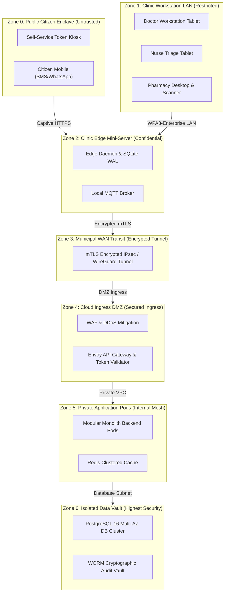

# 🌐 Architecture Document 02: System Context & External Interfaces
## Namma Clinic Digital Health & Operations Platform
### Greater Bengaluru Authority (GBA) / BBMP Health Department
**Standard:** C4 Model System Context / ISO/IEC/IEEE 42010:2022 | **Status:** APPROVED BASELINE | **Code:** `ARCH-CTX-02`

---

## 01. Document Scope, System Boundary & Operational Context
This document establishes the canonical specification for the system context, human stakeholder classes, external enterprise interfaces, network trust perimeters, and failure containment boundaries for the Namma Clinic Platform. The platform serves as the digital backbone for 183 primary health clinics in Bengaluru, coordinating patient flow, clinical encounters, diagnostic testing, pharmacy logistics, and public health surveillance.

### 01.1 Fundamental Context Invariants
1. **Absolute Edge Autonomy:** Primary health delivery within any clinic shall never depend synchronously on the availability of any external system (`EXT-001` through `EXT-016`).
2. **Zero Plaintext Ingress/Egress:** All external payload transfers containing patient-identifiable data must be encrypted in transit via TLS 1.3 and cryptographically signed.
3. **Asynchronous Spooling:** When external systems experience latency spikes or downtime, outbound transactions must spool locally in resilient durable queues with exponential backoff.
4. **Segregation of Duties (SOD-001):** Human actors possessing clinical prescribing privileges (`ROLE-004`) cannot possess pharmacy dispensing privileges (`ROLE-006`).
5. **Bilingual Citizen Communication:** All public citizen notifications dispatched via external telecom gateways must contain complete vernacular Kannada (kn-IN) and English text.

## 02. Comprehensive Human Actor Profiles & Role Catalog (30 Roles)
The platform interacts with 30 distinct human and organizational actor classes across clinical, operational, community, and administrative domains:

| Role ID | Role Title | Classification | Primary Responsibilities & Interaction Scope | Primary Interaction Interface | Authentication Mechanism | Security Trust Level |
| :---: | :--- | :--- | :--- | :--- | :--- | :--- |
| `ROLE-001` | **Citizen / Patient** | External Public | Receives outpatient primary clinical care, prescribed medications, diagnostic testing, and appointment reminder slips. | Self-Service Kiosk / SMS / WhatsApp | Aadhaar / ABHA / Municipal ID | Low - Untrusted |
| `ROLE-002` | **Patient Guardian / Attendant** | External Public | Accompanies pediatric, geriatric, or incapacitated patients; provides surrogate consent. | Self-Service Kiosk / Registration Counter | Aadhaar / Mobile OTP | Low - Untrusted |
| `ROLE-003` | **Staff Nurse (Intake & Triage)** | Clinic Internal | Performs patient registration, biometric check-in, vital signs triage, and MEWS calculation. | Workstation PWA (Tablet / Laptop) | Argon2id + TOTP MFA / Offline PIN | High - Clinical Restricted |
| `ROLE-004` | **Medical Officer (General Physician)** | Clinic Internal | Conducts outpatient consultations, records SOAP progress notes, authorizes e-prescriptions, and orders diagnostic tests. | Workstation PWA (Touch Laptop) | Argon2id + TOTP MFA / Offline PIN | Highest - Clinical Authoritative |
| `ROLE-005` | **Specialist Doctor (Tele-consult)** | External Clinical | Provides remote specialist consultation (Cardiology, Endocrinology, Psychiatry) via tele-health bridge. | Cloud Web Portal (Desktop) | Argon2id + Hardware FIDO2 Token | High - Clinical Restricted |
| `ROLE-006` | **Clinic Pharmacist** | Clinic Internal | Dispenses medications against digital prescriptions using FEFO rules and 2D DataMatrix scanning; counsels patients. | Pharmacy Desktop Terminal | Argon2id + TOTP MFA / Offline PIN | High - Pharmacy Restricted |
| `ROLE-007` | **Pharmacy Assistant / Stock Clerk** | Clinic Internal | Receives bulk medication deliveries from KDLWS warehouse, verifies carton seals, and records lot numbers. | Pharmacy Desktop Terminal | Argon2id + Password | Medium - Logistics |
| `ROLE-008` | **Laboratory Technician** | Clinic Internal | Performs 58 rapid diagnostic point-of-care tests, enters numerical findings, and escalates panic values. | Laboratory Workstation | Argon2id + TOTP MFA / Offline PIN | High - Diagnostics Restricted |
| `ROLE-009` | **Auxiliary Nurse Midwife (ANM)** | Community Field | Conducts maternal-child health screening in wards; synchronizes field immunization logs with clinic base. | Mobile Tablet PWA | Argon2id + Offline Biometric PIN | High - Field Restricted |
| `ROLE-010` | **ASHA Community Health Worker** | Community Field | Mobilizes vulnerable urban slum residents, tracks NCD defaulters, and assists illiterate citizens at clinics. | Mobile PWA / Smartphone | Mobile OTP + PIN | Medium - Field Outreach |
| `ROLE-011` | **Clinic Administrative Coordinator** | Clinic Internal | Oversees daily clinic operations, monitors token queues, manages shift rosters, and logs facility maintenance issues. | Admin Desktop Terminal | Argon2id + TOTP MFA | Medium - Operational |
| `ROLE-012` | **Chief Medical Officer (CMO / ZMO)** | Municipal Leadership | Monitors zonal clinical performance, reviews epidemiological heatmaps, and approves emergency resource allocations. | Cloud Executive Dashboard | Argon2id + FIDO2 Security Key | Highest - Municipal Executive |
| `ROLE-013` | **BBMP Epidemiologist** | Public Health Intelligence | Analyzes syndromic fever clusters, tracks dengue/malaria vectors, and submits statutory IDSP outbreak alerts. | Analytics Superset Console | Argon2id + TOTP MFA | High - Analytical |
| `ROLE-014` | **Quality Assurance & NQAS Auditor** | Regulatory Oversight | Inspects clinic compliance against National Quality Assurance Standards (NQAS) and DPDP privacy mandates. | Audit Web Console (Read-Only) | Argon2id + Client Certificate | High - Audit Read-Only |
| `ROLE-015` | **108 Emergency EMS Paramedic** | Emergency External | Receives emergency transit dossiers, monitors vital telemetry en route, and hands patient to tertiary trauma care. | 108 CAD Mobile Terminal | Mutual TLS / Dedicated API Token | High - Emergency Transit |
| `ROLE-016` | **State Drug Logistics Officer (KDLWS)** | State Warehouse | Processes monthly clinic drug indents, schedules replenishment shipments, and tracks cold-chain compliance. | State Logistics Portal | OAuth2 Bearer Token | High - State Logistics |
| `ROLE-017` | **Grievance Ombudsman Officer** | Citizen Oversight | Reviews citizen feedback ratings, investigates formal complaints regarding staff absence or drug shortages. | Grievance Portal | Argon2id + TOTP MFA | Medium - Ombudsman |
| `ROLE-018` | **Edge Field Support Technician** | IT Infrastructure | Maintains clinic hardware, resolves printer/scanner jams, replaces UPS batteries, and executes OS updates. | Local Maintenance Console | Physical YubiKey + SSH Certificate | Highest - Hardware Maintenance |
| `ROLE-019` | **Central Platform SRE / DevOps** | Central Cloud Ops | Monitors Kubernetes clusters, tunes PostgreSQL replication, manages CI/CD pipelines, and manages DR failover. | Bastion / Cloud Console | mTLS + Hardware Key + Bastion SSO | Highest - Cloud Infrastructure |
| `ROLE-020` | **Data Protection Officer (DPO)** | Statutory Governance | Enforces DPDP Act compliance, manages patient data revocation requests, and coordinates statutory breach reporting. | Privacy Governance Console | Argon2id + FIDO2 Token | Highest - Statutory Privacy |
| `ROLE-021` | **Statutory HMIS Reporting Officer** | State Government | Compiles monthly state health indicators and verifies data reconciliation across all 183 clinics. | HMIS Export Gateway | OAuth2 Bearer Token | Medium - Reporting |
| `ROLE-022` | **Municipal Waste Management Inspector** | Environmental Safety | Verifies clinic bio-medical waste segregation, color-coded bin weights, and authorized collector handovers. | Mobile Inspection PWA | Mobile OTP + PIN | Medium - Compliance |
| `ROLE-023` | **Central Laboratory Pathologist** | Tertiary Diagnostics | Reviews complex diagnostic panels referred from Namma Clinics and publishes confirmatory lab reports. | Hospital LIMS Bridge | mTLS / HL7 Interface Token | High - Clinical Diagnostics |
| `ROLE-024` | **Ward Health Committee Member** | Community Governance | Elected citizen representative reviewing monthly clinic footfall, operating hours, and community health needs. | Ward Citizen Portal | Mobile OTP | Low - Community Observer |
| `ROLE-025` | **Nikshay TB Field Supervisor** | National Health Program | Monitors presumptive tuberculosis cases flagged by clinic doctors and coordinates sputum cartridge testing. | Nikshay Program Portal | National Program Token | High - Program Specific |
| `ROLE-026` | **RCH Immunization Officer** | Maternal Child Health | Reconciles infant vaccination registers and ensures cold-chain vaccine batch integrity across municipal wards. | RCH Portal Bridge | National Program Token | High - Program Specific |
| `ROLE-027` | **Billing & Free Voucher Reconciler** | BBMP Accounts | Audits zero-cost municipal care vouchers and verifies accounting ledger entries for state reimbursements. | Municipal ERP Gateway | Argon2id + TOTP MFA | Medium - Fiscal Audit |
| `ROLE-028` | **Disaster Response Commander** | Emergency Civil Defence | Directs clinic operations during municipal emergencies (floods, mass casualty, epidemics) via central console. | Command Center Dashboard | FIDO2 Key + Dual Authorization | Highest - Disaster Operations |
| `ROLE-029` | **Tele-Mental Health Counselor** | Mental Health | Conducts outpatient counseling sessions for depression and anxiety referred by primary care doctors. | Tele-Consultation Console | Argon2id + TOTP MFA | High - Clinical Care |
| `ROLE-030` | **Platform Security Penetration Tester** | Cybersecurity | Conducts periodic red-team exercises, vulnerability verification, and authenticated API penetration tests. | Isolated Testing Enclave | Scoped Ephemeral API Credentials | Restricted - Security Audit |

### 02.1 Granular Technical Profiles for Human Actors
Exhaustive technical definitions, workstation views, security scopes, and auditing rules for all 30 human roles:

#### 02.1.01 `ROLE-001`: Citizen / Patient
- **Role Identifier:** `ROLE-001` | **Domain Classification:** External Public
- **Security Trust Tier:** Low - Untrusted | **Standard Authentication:** `Aadhaar / ABHA / Municipal ID`
- **Primary Client Application:** `Self-Service Kiosk / SMS / WhatsApp`
- **Core Responsibilities:** Receives outpatient primary clinical care, prescribed medications, diagnostic testing, and appointment reminder slips.
- **Permitted Operations & Privileges:**
  - Authorized for fine-grained capability tokens corresponding to `ROLE-001`.
  - Scoped to active facility tenancy (`clinic_id`) and assigned work shift (`shift_id`).
  - Enforces least-privilege boundary; zero unauthorized access to administrative or financial records.
- **Session Lifecycle & Inactivity Boundaries:** Session token TTL 15 minutes; sliding expiration up to 8 hours; automatic screen lock after 10 minutes of idle time.
- **Audit Logging & Non-Repudiation:** Every state-altering action creates an append-only WORM audit record linking `user_id`, `role_id`, `clinic_id`, and SHA-256 HMAC signature.
- **Upstream Traceability:** Mapped to `ROLE-001` in project baseline and `SRS-FR-001`.
- **Downstream Planned Artifacts:** Bound to `PLANNED-AUTH-ROLE-001` and `PLANNED-UI-VIEW-001`.

#### 02.1.02 `ROLE-002`: Patient Guardian / Attendant
- **Role Identifier:** `ROLE-002` | **Domain Classification:** External Public
- **Security Trust Tier:** Low - Untrusted | **Standard Authentication:** `Aadhaar / Mobile OTP`
- **Primary Client Application:** `Self-Service Kiosk / Registration Counter`
- **Core Responsibilities:** Accompanies pediatric, geriatric, or incapacitated patients; provides surrogate consent.
- **Permitted Operations & Privileges:**
  - Authorized for fine-grained capability tokens corresponding to `ROLE-002`.
  - Scoped to active facility tenancy (`clinic_id`) and assigned work shift (`shift_id`).
  - Enforces least-privilege boundary; zero unauthorized access to administrative or financial records.
- **Session Lifecycle & Inactivity Boundaries:** Session token TTL 15 minutes; sliding expiration up to 8 hours; automatic screen lock after 10 minutes of idle time.
- **Audit Logging & Non-Repudiation:** Every state-altering action creates an append-only WORM audit record linking `user_id`, `role_id`, `clinic_id`, and SHA-256 HMAC signature.
- **Upstream Traceability:** Mapped to `ROLE-002` in project baseline and `SRS-FR-002`.
- **Downstream Planned Artifacts:** Bound to `PLANNED-AUTH-ROLE-002` and `PLANNED-UI-VIEW-002`.

#### 02.1.03 `ROLE-003`: Staff Nurse (Intake & Triage)
- **Role Identifier:** `ROLE-003` | **Domain Classification:** Clinic Internal
- **Security Trust Tier:** High - Clinical Restricted | **Standard Authentication:** `Argon2id + TOTP MFA / Offline PIN`
- **Primary Client Application:** `Workstation PWA (Tablet / Laptop)`
- **Core Responsibilities:** Performs patient registration, biometric check-in, vital signs triage, and MEWS calculation.
- **Permitted Operations & Privileges:**
  - Authorized for fine-grained capability tokens corresponding to `ROLE-003`.
  - Scoped to active facility tenancy (`clinic_id`) and assigned work shift (`shift_id`).
  - Enforces least-privilege boundary; zero unauthorized access to administrative or financial records.
- **Session Lifecycle & Inactivity Boundaries:** Session token TTL 15 minutes; sliding expiration up to 8 hours; automatic screen lock after 10 minutes of idle time.
- **Audit Logging & Non-Repudiation:** Every state-altering action creates an append-only WORM audit record linking `user_id`, `role_id`, `clinic_id`, and SHA-256 HMAC signature.
- **Upstream Traceability:** Mapped to `ROLE-003` in project baseline and `SRS-FR-003`.
- **Downstream Planned Artifacts:** Bound to `PLANNED-AUTH-ROLE-003` and `PLANNED-UI-VIEW-003`.

#### 02.1.04 `ROLE-004`: Medical Officer (General Physician)
- **Role Identifier:** `ROLE-004` | **Domain Classification:** Clinic Internal
- **Security Trust Tier:** Highest - Clinical Authoritative | **Standard Authentication:** `Argon2id + TOTP MFA / Offline PIN`
- **Primary Client Application:** `Workstation PWA (Touch Laptop)`
- **Core Responsibilities:** Conducts outpatient consultations, records SOAP progress notes, authorizes e-prescriptions, and orders diagnostic tests.
- **Permitted Operations & Privileges:**
  - Authorized for fine-grained capability tokens corresponding to `ROLE-004`.
  - Scoped to active facility tenancy (`clinic_id`) and assigned work shift (`shift_id`).
  - Enforces least-privilege boundary; zero unauthorized access to administrative or financial records.
- **Session Lifecycle & Inactivity Boundaries:** Session token TTL 15 minutes; sliding expiration up to 8 hours; automatic screen lock after 10 minutes of idle time.
- **Audit Logging & Non-Repudiation:** Every state-altering action creates an append-only WORM audit record linking `user_id`, `role_id`, `clinic_id`, and SHA-256 HMAC signature.
- **Upstream Traceability:** Mapped to `ROLE-004` in project baseline and `SRS-FR-004`.
- **Downstream Planned Artifacts:** Bound to `PLANNED-AUTH-ROLE-004` and `PLANNED-UI-VIEW-004`.

#### 02.1.05 `ROLE-005`: Specialist Doctor (Tele-consult)
- **Role Identifier:** `ROLE-005` | **Domain Classification:** External Clinical
- **Security Trust Tier:** High - Clinical Restricted | **Standard Authentication:** `Argon2id + Hardware FIDO2 Token`
- **Primary Client Application:** `Cloud Web Portal (Desktop)`
- **Core Responsibilities:** Provides remote specialist consultation (Cardiology, Endocrinology, Psychiatry) via tele-health bridge.
- **Permitted Operations & Privileges:**
  - Authorized for fine-grained capability tokens corresponding to `ROLE-005`.
  - Scoped to active facility tenancy (`clinic_id`) and assigned work shift (`shift_id`).
  - Enforces least-privilege boundary; zero unauthorized access to administrative or financial records.
- **Session Lifecycle & Inactivity Boundaries:** Session token TTL 15 minutes; sliding expiration up to 8 hours; automatic screen lock after 10 minutes of idle time.
- **Audit Logging & Non-Repudiation:** Every state-altering action creates an append-only WORM audit record linking `user_id`, `role_id`, `clinic_id`, and SHA-256 HMAC signature.
- **Upstream Traceability:** Mapped to `ROLE-005` in project baseline and `SRS-FR-005`.
- **Downstream Planned Artifacts:** Bound to `PLANNED-AUTH-ROLE-005` and `PLANNED-UI-VIEW-005`.

#### 02.1.06 `ROLE-006`: Clinic Pharmacist
- **Role Identifier:** `ROLE-006` | **Domain Classification:** Clinic Internal
- **Security Trust Tier:** High - Pharmacy Restricted | **Standard Authentication:** `Argon2id + TOTP MFA / Offline PIN`
- **Primary Client Application:** `Pharmacy Desktop Terminal`
- **Core Responsibilities:** Dispenses medications against digital prescriptions using FEFO rules and 2D DataMatrix scanning; counsels patients.
- **Permitted Operations & Privileges:**
  - Authorized for fine-grained capability tokens corresponding to `ROLE-006`.
  - Scoped to active facility tenancy (`clinic_id`) and assigned work shift (`shift_id`).
  - Enforces least-privilege boundary; zero unauthorized access to administrative or financial records.
- **Session Lifecycle & Inactivity Boundaries:** Session token TTL 15 minutes; sliding expiration up to 8 hours; automatic screen lock after 10 minutes of idle time.
- **Audit Logging & Non-Repudiation:** Every state-altering action creates an append-only WORM audit record linking `user_id`, `role_id`, `clinic_id`, and SHA-256 HMAC signature.
- **Upstream Traceability:** Mapped to `ROLE-006` in project baseline and `SRS-FR-006`.
- **Downstream Planned Artifacts:** Bound to `PLANNED-AUTH-ROLE-006` and `PLANNED-UI-VIEW-006`.

#### 02.1.07 `ROLE-007`: Pharmacy Assistant / Stock Clerk
- **Role Identifier:** `ROLE-007` | **Domain Classification:** Clinic Internal
- **Security Trust Tier:** Medium - Logistics | **Standard Authentication:** `Argon2id + Password`
- **Primary Client Application:** `Pharmacy Desktop Terminal`
- **Core Responsibilities:** Receives bulk medication deliveries from KDLWS warehouse, verifies carton seals, and records lot numbers.
- **Permitted Operations & Privileges:**
  - Authorized for fine-grained capability tokens corresponding to `ROLE-007`.
  - Scoped to active facility tenancy (`clinic_id`) and assigned work shift (`shift_id`).
  - Enforces least-privilege boundary; zero unauthorized access to administrative or financial records.
- **Session Lifecycle & Inactivity Boundaries:** Session token TTL 15 minutes; sliding expiration up to 8 hours; automatic screen lock after 10 minutes of idle time.
- **Audit Logging & Non-Repudiation:** Every state-altering action creates an append-only WORM audit record linking `user_id`, `role_id`, `clinic_id`, and SHA-256 HMAC signature.
- **Upstream Traceability:** Mapped to `ROLE-007` in project baseline and `SRS-FR-007`.
- **Downstream Planned Artifacts:** Bound to `PLANNED-AUTH-ROLE-007` and `PLANNED-UI-VIEW-007`.

#### 02.1.08 `ROLE-008`: Laboratory Technician
- **Role Identifier:** `ROLE-008` | **Domain Classification:** Clinic Internal
- **Security Trust Tier:** High - Diagnostics Restricted | **Standard Authentication:** `Argon2id + TOTP MFA / Offline PIN`
- **Primary Client Application:** `Laboratory Workstation`
- **Core Responsibilities:** Performs 58 rapid diagnostic point-of-care tests, enters numerical findings, and escalates panic values.
- **Permitted Operations & Privileges:**
  - Authorized for fine-grained capability tokens corresponding to `ROLE-008`.
  - Scoped to active facility tenancy (`clinic_id`) and assigned work shift (`shift_id`).
  - Enforces least-privilege boundary; zero unauthorized access to administrative or financial records.
- **Session Lifecycle & Inactivity Boundaries:** Session token TTL 15 minutes; sliding expiration up to 8 hours; automatic screen lock after 10 minutes of idle time.
- **Audit Logging & Non-Repudiation:** Every state-altering action creates an append-only WORM audit record linking `user_id`, `role_id`, `clinic_id`, and SHA-256 HMAC signature.
- **Upstream Traceability:** Mapped to `ROLE-008` in project baseline and `SRS-FR-008`.
- **Downstream Planned Artifacts:** Bound to `PLANNED-AUTH-ROLE-008` and `PLANNED-UI-VIEW-008`.

#### 02.1.09 `ROLE-009`: Auxiliary Nurse Midwife (ANM)
- **Role Identifier:** `ROLE-009` | **Domain Classification:** Community Field
- **Security Trust Tier:** High - Field Restricted | **Standard Authentication:** `Argon2id + Offline Biometric PIN`
- **Primary Client Application:** `Mobile Tablet PWA`
- **Core Responsibilities:** Conducts maternal-child health screening in wards; synchronizes field immunization logs with clinic base.
- **Permitted Operations & Privileges:**
  - Authorized for fine-grained capability tokens corresponding to `ROLE-009`.
  - Scoped to active facility tenancy (`clinic_id`) and assigned work shift (`shift_id`).
  - Enforces least-privilege boundary; zero unauthorized access to administrative or financial records.
- **Session Lifecycle & Inactivity Boundaries:** Session token TTL 15 minutes; sliding expiration up to 8 hours; automatic screen lock after 10 minutes of idle time.
- **Audit Logging & Non-Repudiation:** Every state-altering action creates an append-only WORM audit record linking `user_id`, `role_id`, `clinic_id`, and SHA-256 HMAC signature.
- **Upstream Traceability:** Mapped to `ROLE-009` in project baseline and `SRS-FR-009`.
- **Downstream Planned Artifacts:** Bound to `PLANNED-AUTH-ROLE-009` and `PLANNED-UI-VIEW-009`.

#### 02.1.10 `ROLE-010`: ASHA Community Health Worker
- **Role Identifier:** `ROLE-010` | **Domain Classification:** Community Field
- **Security Trust Tier:** Medium - Field Outreach | **Standard Authentication:** `Mobile OTP + PIN`
- **Primary Client Application:** `Mobile PWA / Smartphone`
- **Core Responsibilities:** Mobilizes vulnerable urban slum residents, tracks NCD defaulters, and assists illiterate citizens at clinics.
- **Permitted Operations & Privileges:**
  - Authorized for fine-grained capability tokens corresponding to `ROLE-010`.
  - Scoped to active facility tenancy (`clinic_id`) and assigned work shift (`shift_id`).
  - Enforces least-privilege boundary; zero unauthorized access to administrative or financial records.
- **Session Lifecycle & Inactivity Boundaries:** Session token TTL 15 minutes; sliding expiration up to 8 hours; automatic screen lock after 10 minutes of idle time.
- **Audit Logging & Non-Repudiation:** Every state-altering action creates an append-only WORM audit record linking `user_id`, `role_id`, `clinic_id`, and SHA-256 HMAC signature.
- **Upstream Traceability:** Mapped to `ROLE-010` in project baseline and `SRS-FR-010`.
- **Downstream Planned Artifacts:** Bound to `PLANNED-AUTH-ROLE-010` and `PLANNED-UI-VIEW-010`.

#### 02.1.11 `ROLE-011`: Clinic Administrative Coordinator
- **Role Identifier:** `ROLE-011` | **Domain Classification:** Clinic Internal
- **Security Trust Tier:** Medium - Operational | **Standard Authentication:** `Argon2id + TOTP MFA`
- **Primary Client Application:** `Admin Desktop Terminal`
- **Core Responsibilities:** Oversees daily clinic operations, monitors token queues, manages shift rosters, and logs facility maintenance issues.
- **Permitted Operations & Privileges:**
  - Authorized for fine-grained capability tokens corresponding to `ROLE-011`.
  - Scoped to active facility tenancy (`clinic_id`) and assigned work shift (`shift_id`).
  - Enforces least-privilege boundary; zero unauthorized access to administrative or financial records.
- **Session Lifecycle & Inactivity Boundaries:** Session token TTL 15 minutes; sliding expiration up to 8 hours; automatic screen lock after 10 minutes of idle time.
- **Audit Logging & Non-Repudiation:** Every state-altering action creates an append-only WORM audit record linking `user_id`, `role_id`, `clinic_id`, and SHA-256 HMAC signature.
- **Upstream Traceability:** Mapped to `ROLE-011` in project baseline and `SRS-FR-011`.
- **Downstream Planned Artifacts:** Bound to `PLANNED-AUTH-ROLE-011` and `PLANNED-UI-VIEW-011`.

#### 02.1.12 `ROLE-012`: Chief Medical Officer (CMO / ZMO)
- **Role Identifier:** `ROLE-012` | **Domain Classification:** Municipal Leadership
- **Security Trust Tier:** Highest - Municipal Executive | **Standard Authentication:** `Argon2id + FIDO2 Security Key`
- **Primary Client Application:** `Cloud Executive Dashboard`
- **Core Responsibilities:** Monitors zonal clinical performance, reviews epidemiological heatmaps, and approves emergency resource allocations.
- **Permitted Operations & Privileges:**
  - Authorized for fine-grained capability tokens corresponding to `ROLE-012`.
  - Scoped to active facility tenancy (`clinic_id`) and assigned work shift (`shift_id`).
  - Enforces least-privilege boundary; zero unauthorized access to administrative or financial records.
- **Session Lifecycle & Inactivity Boundaries:** Session token TTL 15 minutes; sliding expiration up to 8 hours; automatic screen lock after 10 minutes of idle time.
- **Audit Logging & Non-Repudiation:** Every state-altering action creates an append-only WORM audit record linking `user_id`, `role_id`, `clinic_id`, and SHA-256 HMAC signature.
- **Upstream Traceability:** Mapped to `ROLE-012` in project baseline and `SRS-FR-012`.
- **Downstream Planned Artifacts:** Bound to `PLANNED-AUTH-ROLE-012` and `PLANNED-UI-VIEW-012`.

#### 02.1.13 `ROLE-013`: BBMP Epidemiologist
- **Role Identifier:** `ROLE-013` | **Domain Classification:** Public Health Intelligence
- **Security Trust Tier:** High - Analytical | **Standard Authentication:** `Argon2id + TOTP MFA`
- **Primary Client Application:** `Analytics Superset Console`
- **Core Responsibilities:** Analyzes syndromic fever clusters, tracks dengue/malaria vectors, and submits statutory IDSP outbreak alerts.
- **Permitted Operations & Privileges:**
  - Authorized for fine-grained capability tokens corresponding to `ROLE-013`.
  - Scoped to active facility tenancy (`clinic_id`) and assigned work shift (`shift_id`).
  - Enforces least-privilege boundary; zero unauthorized access to administrative or financial records.
- **Session Lifecycle & Inactivity Boundaries:** Session token TTL 15 minutes; sliding expiration up to 8 hours; automatic screen lock after 10 minutes of idle time.
- **Audit Logging & Non-Repudiation:** Every state-altering action creates an append-only WORM audit record linking `user_id`, `role_id`, `clinic_id`, and SHA-256 HMAC signature.
- **Upstream Traceability:** Mapped to `ROLE-013` in project baseline and `SRS-FR-013`.
- **Downstream Planned Artifacts:** Bound to `PLANNED-AUTH-ROLE-013` and `PLANNED-UI-VIEW-013`.

#### 02.1.14 `ROLE-014`: Quality Assurance & NQAS Auditor
- **Role Identifier:** `ROLE-014` | **Domain Classification:** Regulatory Oversight
- **Security Trust Tier:** High - Audit Read-Only | **Standard Authentication:** `Argon2id + Client Certificate`
- **Primary Client Application:** `Audit Web Console (Read-Only)`
- **Core Responsibilities:** Inspects clinic compliance against National Quality Assurance Standards (NQAS) and DPDP privacy mandates.
- **Permitted Operations & Privileges:**
  - Authorized for fine-grained capability tokens corresponding to `ROLE-014`.
  - Scoped to active facility tenancy (`clinic_id`) and assigned work shift (`shift_id`).
  - Enforces least-privilege boundary; zero unauthorized access to administrative or financial records.
- **Session Lifecycle & Inactivity Boundaries:** Session token TTL 15 minutes; sliding expiration up to 8 hours; automatic screen lock after 10 minutes of idle time.
- **Audit Logging & Non-Repudiation:** Every state-altering action creates an append-only WORM audit record linking `user_id`, `role_id`, `clinic_id`, and SHA-256 HMAC signature.
- **Upstream Traceability:** Mapped to `ROLE-014` in project baseline and `SRS-FR-014`.
- **Downstream Planned Artifacts:** Bound to `PLANNED-AUTH-ROLE-014` and `PLANNED-UI-VIEW-014`.

#### 02.1.15 `ROLE-015`: 108 Emergency EMS Paramedic
- **Role Identifier:** `ROLE-015` | **Domain Classification:** Emergency External
- **Security Trust Tier:** High - Emergency Transit | **Standard Authentication:** `Mutual TLS / Dedicated API Token`
- **Primary Client Application:** `108 CAD Mobile Terminal`
- **Core Responsibilities:** Receives emergency transit dossiers, monitors vital telemetry en route, and hands patient to tertiary trauma care.
- **Permitted Operations & Privileges:**
  - Authorized for fine-grained capability tokens corresponding to `ROLE-015`.
  - Scoped to active facility tenancy (`clinic_id`) and assigned work shift (`shift_id`).
  - Enforces least-privilege boundary; zero unauthorized access to administrative or financial records.
- **Session Lifecycle & Inactivity Boundaries:** Session token TTL 15 minutes; sliding expiration up to 8 hours; automatic screen lock after 10 minutes of idle time.
- **Audit Logging & Non-Repudiation:** Every state-altering action creates an append-only WORM audit record linking `user_id`, `role_id`, `clinic_id`, and SHA-256 HMAC signature.
- **Upstream Traceability:** Mapped to `ROLE-015` in project baseline and `SRS-FR-015`.
- **Downstream Planned Artifacts:** Bound to `PLANNED-AUTH-ROLE-015` and `PLANNED-UI-VIEW-015`.

#### 02.1.16 `ROLE-016`: State Drug Logistics Officer (KDLWS)
- **Role Identifier:** `ROLE-016` | **Domain Classification:** State Warehouse
- **Security Trust Tier:** High - State Logistics | **Standard Authentication:** `OAuth2 Bearer Token`
- **Primary Client Application:** `State Logistics Portal`
- **Core Responsibilities:** Processes monthly clinic drug indents, schedules replenishment shipments, and tracks cold-chain compliance.
- **Permitted Operations & Privileges:**
  - Authorized for fine-grained capability tokens corresponding to `ROLE-016`.
  - Scoped to active facility tenancy (`clinic_id`) and assigned work shift (`shift_id`).
  - Enforces least-privilege boundary; zero unauthorized access to administrative or financial records.
- **Session Lifecycle & Inactivity Boundaries:** Session token TTL 15 minutes; sliding expiration up to 8 hours; automatic screen lock after 10 minutes of idle time.
- **Audit Logging & Non-Repudiation:** Every state-altering action creates an append-only WORM audit record linking `user_id`, `role_id`, `clinic_id`, and SHA-256 HMAC signature.
- **Upstream Traceability:** Mapped to `ROLE-016` in project baseline and `SRS-FR-016`.
- **Downstream Planned Artifacts:** Bound to `PLANNED-AUTH-ROLE-016` and `PLANNED-UI-VIEW-016`.

#### 02.1.17 `ROLE-017`: Grievance Ombudsman Officer
- **Role Identifier:** `ROLE-017` | **Domain Classification:** Citizen Oversight
- **Security Trust Tier:** Medium - Ombudsman | **Standard Authentication:** `Argon2id + TOTP MFA`
- **Primary Client Application:** `Grievance Portal`
- **Core Responsibilities:** Reviews citizen feedback ratings, investigates formal complaints regarding staff absence or drug shortages.
- **Permitted Operations & Privileges:**
  - Authorized for fine-grained capability tokens corresponding to `ROLE-017`.
  - Scoped to active facility tenancy (`clinic_id`) and assigned work shift (`shift_id`).
  - Enforces least-privilege boundary; zero unauthorized access to administrative or financial records.
- **Session Lifecycle & Inactivity Boundaries:** Session token TTL 15 minutes; sliding expiration up to 8 hours; automatic screen lock after 10 minutes of idle time.
- **Audit Logging & Non-Repudiation:** Every state-altering action creates an append-only WORM audit record linking `user_id`, `role_id`, `clinic_id`, and SHA-256 HMAC signature.
- **Upstream Traceability:** Mapped to `ROLE-017` in project baseline and `SRS-FR-017`.
- **Downstream Planned Artifacts:** Bound to `PLANNED-AUTH-ROLE-017` and `PLANNED-UI-VIEW-017`.

#### 02.1.18 `ROLE-018`: Edge Field Support Technician
- **Role Identifier:** `ROLE-018` | **Domain Classification:** IT Infrastructure
- **Security Trust Tier:** Highest - Hardware Maintenance | **Standard Authentication:** `Physical YubiKey + SSH Certificate`
- **Primary Client Application:** `Local Maintenance Console`
- **Core Responsibilities:** Maintains clinic hardware, resolves printer/scanner jams, replaces UPS batteries, and executes OS updates.
- **Permitted Operations & Privileges:**
  - Authorized for fine-grained capability tokens corresponding to `ROLE-018`.
  - Scoped to active facility tenancy (`clinic_id`) and assigned work shift (`shift_id`).
  - Enforces least-privilege boundary; zero unauthorized access to administrative or financial records.
- **Session Lifecycle & Inactivity Boundaries:** Session token TTL 15 minutes; sliding expiration up to 8 hours; automatic screen lock after 10 minutes of idle time.
- **Audit Logging & Non-Repudiation:** Every state-altering action creates an append-only WORM audit record linking `user_id`, `role_id`, `clinic_id`, and SHA-256 HMAC signature.
- **Upstream Traceability:** Mapped to `ROLE-018` in project baseline and `SRS-FR-018`.
- **Downstream Planned Artifacts:** Bound to `PLANNED-AUTH-ROLE-018` and `PLANNED-UI-VIEW-018`.

#### 02.1.19 `ROLE-019`: Central Platform SRE / DevOps
- **Role Identifier:** `ROLE-019` | **Domain Classification:** Central Cloud Ops
- **Security Trust Tier:** Highest - Cloud Infrastructure | **Standard Authentication:** `mTLS + Hardware Key + Bastion SSO`
- **Primary Client Application:** `Bastion / Cloud Console`
- **Core Responsibilities:** Monitors Kubernetes clusters, tunes PostgreSQL replication, manages CI/CD pipelines, and manages DR failover.
- **Permitted Operations & Privileges:**
  - Authorized for fine-grained capability tokens corresponding to `ROLE-019`.
  - Scoped to active facility tenancy (`clinic_id`) and assigned work shift (`shift_id`).
  - Enforces least-privilege boundary; zero unauthorized access to administrative or financial records.
- **Session Lifecycle & Inactivity Boundaries:** Session token TTL 15 minutes; sliding expiration up to 8 hours; automatic screen lock after 10 minutes of idle time.
- **Audit Logging & Non-Repudiation:** Every state-altering action creates an append-only WORM audit record linking `user_id`, `role_id`, `clinic_id`, and SHA-256 HMAC signature.
- **Upstream Traceability:** Mapped to `ROLE-019` in project baseline and `SRS-FR-019`.
- **Downstream Planned Artifacts:** Bound to `PLANNED-AUTH-ROLE-019` and `PLANNED-UI-VIEW-019`.

#### 02.1.20 `ROLE-020`: Data Protection Officer (DPO)
- **Role Identifier:** `ROLE-020` | **Domain Classification:** Statutory Governance
- **Security Trust Tier:** Highest - Statutory Privacy | **Standard Authentication:** `Argon2id + FIDO2 Token`
- **Primary Client Application:** `Privacy Governance Console`
- **Core Responsibilities:** Enforces DPDP Act compliance, manages patient data revocation requests, and coordinates statutory breach reporting.
- **Permitted Operations & Privileges:**
  - Authorized for fine-grained capability tokens corresponding to `ROLE-020`.
  - Scoped to active facility tenancy (`clinic_id`) and assigned work shift (`shift_id`).
  - Enforces least-privilege boundary; zero unauthorized access to administrative or financial records.
- **Session Lifecycle & Inactivity Boundaries:** Session token TTL 15 minutes; sliding expiration up to 8 hours; automatic screen lock after 10 minutes of idle time.
- **Audit Logging & Non-Repudiation:** Every state-altering action creates an append-only WORM audit record linking `user_id`, `role_id`, `clinic_id`, and SHA-256 HMAC signature.
- **Upstream Traceability:** Mapped to `ROLE-020` in project baseline and `SRS-FR-020`.
- **Downstream Planned Artifacts:** Bound to `PLANNED-AUTH-ROLE-020` and `PLANNED-UI-VIEW-020`.

#### 02.1.21 `ROLE-021`: Statutory HMIS Reporting Officer
- **Role Identifier:** `ROLE-021` | **Domain Classification:** State Government
- **Security Trust Tier:** Medium - Reporting | **Standard Authentication:** `OAuth2 Bearer Token`
- **Primary Client Application:** `HMIS Export Gateway`
- **Core Responsibilities:** Compiles monthly state health indicators and verifies data reconciliation across all 183 clinics.
- **Permitted Operations & Privileges:**
  - Authorized for fine-grained capability tokens corresponding to `ROLE-021`.
  - Scoped to active facility tenancy (`clinic_id`) and assigned work shift (`shift_id`).
  - Enforces least-privilege boundary; zero unauthorized access to administrative or financial records.
- **Session Lifecycle & Inactivity Boundaries:** Session token TTL 15 minutes; sliding expiration up to 8 hours; automatic screen lock after 10 minutes of idle time.
- **Audit Logging & Non-Repudiation:** Every state-altering action creates an append-only WORM audit record linking `user_id`, `role_id`, `clinic_id`, and SHA-256 HMAC signature.
- **Upstream Traceability:** Mapped to `ROLE-021` in project baseline and `SRS-FR-021`.
- **Downstream Planned Artifacts:** Bound to `PLANNED-AUTH-ROLE-021` and `PLANNED-UI-VIEW-021`.

#### 02.1.22 `ROLE-022`: Municipal Waste Management Inspector
- **Role Identifier:** `ROLE-022` | **Domain Classification:** Environmental Safety
- **Security Trust Tier:** Medium - Compliance | **Standard Authentication:** `Mobile OTP + PIN`
- **Primary Client Application:** `Mobile Inspection PWA`
- **Core Responsibilities:** Verifies clinic bio-medical waste segregation, color-coded bin weights, and authorized collector handovers.
- **Permitted Operations & Privileges:**
  - Authorized for fine-grained capability tokens corresponding to `ROLE-022`.
  - Scoped to active facility tenancy (`clinic_id`) and assigned work shift (`shift_id`).
  - Enforces least-privilege boundary; zero unauthorized access to administrative or financial records.
- **Session Lifecycle & Inactivity Boundaries:** Session token TTL 15 minutes; sliding expiration up to 8 hours; automatic screen lock after 10 minutes of idle time.
- **Audit Logging & Non-Repudiation:** Every state-altering action creates an append-only WORM audit record linking `user_id`, `role_id`, `clinic_id`, and SHA-256 HMAC signature.
- **Upstream Traceability:** Mapped to `ROLE-022` in project baseline and `SRS-FR-022`.
- **Downstream Planned Artifacts:** Bound to `PLANNED-AUTH-ROLE-022` and `PLANNED-UI-VIEW-022`.

#### 02.1.23 `ROLE-023`: Central Laboratory Pathologist
- **Role Identifier:** `ROLE-023` | **Domain Classification:** Tertiary Diagnostics
- **Security Trust Tier:** High - Clinical Diagnostics | **Standard Authentication:** `mTLS / HL7 Interface Token`
- **Primary Client Application:** `Hospital LIMS Bridge`
- **Core Responsibilities:** Reviews complex diagnostic panels referred from Namma Clinics and publishes confirmatory lab reports.
- **Permitted Operations & Privileges:**
  - Authorized for fine-grained capability tokens corresponding to `ROLE-023`.
  - Scoped to active facility tenancy (`clinic_id`) and assigned work shift (`shift_id`).
  - Enforces least-privilege boundary; zero unauthorized access to administrative or financial records.
- **Session Lifecycle & Inactivity Boundaries:** Session token TTL 15 minutes; sliding expiration up to 8 hours; automatic screen lock after 10 minutes of idle time.
- **Audit Logging & Non-Repudiation:** Every state-altering action creates an append-only WORM audit record linking `user_id`, `role_id`, `clinic_id`, and SHA-256 HMAC signature.
- **Upstream Traceability:** Mapped to `ROLE-023` in project baseline and `SRS-FR-023`.
- **Downstream Planned Artifacts:** Bound to `PLANNED-AUTH-ROLE-023` and `PLANNED-UI-VIEW-023`.

#### 02.1.24 `ROLE-024`: Ward Health Committee Member
- **Role Identifier:** `ROLE-024` | **Domain Classification:** Community Governance
- **Security Trust Tier:** Low - Community Observer | **Standard Authentication:** `Mobile OTP`
- **Primary Client Application:** `Ward Citizen Portal`
- **Core Responsibilities:** Elected citizen representative reviewing monthly clinic footfall, operating hours, and community health needs.
- **Permitted Operations & Privileges:**
  - Authorized for fine-grained capability tokens corresponding to `ROLE-024`.
  - Scoped to active facility tenancy (`clinic_id`) and assigned work shift (`shift_id`).
  - Enforces least-privilege boundary; zero unauthorized access to administrative or financial records.
- **Session Lifecycle & Inactivity Boundaries:** Session token TTL 15 minutes; sliding expiration up to 8 hours; automatic screen lock after 10 minutes of idle time.
- **Audit Logging & Non-Repudiation:** Every state-altering action creates an append-only WORM audit record linking `user_id`, `role_id`, `clinic_id`, and SHA-256 HMAC signature.
- **Upstream Traceability:** Mapped to `ROLE-024` in project baseline and `SRS-FR-024`.
- **Downstream Planned Artifacts:** Bound to `PLANNED-AUTH-ROLE-024` and `PLANNED-UI-VIEW-024`.

#### 02.1.25 `ROLE-025`: Nikshay TB Field Supervisor
- **Role Identifier:** `ROLE-025` | **Domain Classification:** National Health Program
- **Security Trust Tier:** High - Program Specific | **Standard Authentication:** `National Program Token`
- **Primary Client Application:** `Nikshay Program Portal`
- **Core Responsibilities:** Monitors presumptive tuberculosis cases flagged by clinic doctors and coordinates sputum cartridge testing.
- **Permitted Operations & Privileges:**
  - Authorized for fine-grained capability tokens corresponding to `ROLE-025`.
  - Scoped to active facility tenancy (`clinic_id`) and assigned work shift (`shift_id`).
  - Enforces least-privilege boundary; zero unauthorized access to administrative or financial records.
- **Session Lifecycle & Inactivity Boundaries:** Session token TTL 15 minutes; sliding expiration up to 8 hours; automatic screen lock after 10 minutes of idle time.
- **Audit Logging & Non-Repudiation:** Every state-altering action creates an append-only WORM audit record linking `user_id`, `role_id`, `clinic_id`, and SHA-256 HMAC signature.
- **Upstream Traceability:** Mapped to `ROLE-025` in project baseline and `SRS-FR-025`.
- **Downstream Planned Artifacts:** Bound to `PLANNED-AUTH-ROLE-025` and `PLANNED-UI-VIEW-025`.

#### 02.1.26 `ROLE-026`: RCH Immunization Officer
- **Role Identifier:** `ROLE-026` | **Domain Classification:** Maternal Child Health
- **Security Trust Tier:** High - Program Specific | **Standard Authentication:** `National Program Token`
- **Primary Client Application:** `RCH Portal Bridge`
- **Core Responsibilities:** Reconciles infant vaccination registers and ensures cold-chain vaccine batch integrity across municipal wards.
- **Permitted Operations & Privileges:**
  - Authorized for fine-grained capability tokens corresponding to `ROLE-026`.
  - Scoped to active facility tenancy (`clinic_id`) and assigned work shift (`shift_id`).
  - Enforces least-privilege boundary; zero unauthorized access to administrative or financial records.
- **Session Lifecycle & Inactivity Boundaries:** Session token TTL 15 minutes; sliding expiration up to 8 hours; automatic screen lock after 10 minutes of idle time.
- **Audit Logging & Non-Repudiation:** Every state-altering action creates an append-only WORM audit record linking `user_id`, `role_id`, `clinic_id`, and SHA-256 HMAC signature.
- **Upstream Traceability:** Mapped to `ROLE-026` in project baseline and `SRS-FR-026`.
- **Downstream Planned Artifacts:** Bound to `PLANNED-AUTH-ROLE-026` and `PLANNED-UI-VIEW-026`.

#### 02.1.27 `ROLE-027`: Billing & Free Voucher Reconciler
- **Role Identifier:** `ROLE-027` | **Domain Classification:** BBMP Accounts
- **Security Trust Tier:** Medium - Fiscal Audit | **Standard Authentication:** `Argon2id + TOTP MFA`
- **Primary Client Application:** `Municipal ERP Gateway`
- **Core Responsibilities:** Audits zero-cost municipal care vouchers and verifies accounting ledger entries for state reimbursements.
- **Permitted Operations & Privileges:**
  - Authorized for fine-grained capability tokens corresponding to `ROLE-027`.
  - Scoped to active facility tenancy (`clinic_id`) and assigned work shift (`shift_id`).
  - Enforces least-privilege boundary; zero unauthorized access to administrative or financial records.
- **Session Lifecycle & Inactivity Boundaries:** Session token TTL 15 minutes; sliding expiration up to 8 hours; automatic screen lock after 10 minutes of idle time.
- **Audit Logging & Non-Repudiation:** Every state-altering action creates an append-only WORM audit record linking `user_id`, `role_id`, `clinic_id`, and SHA-256 HMAC signature.
- **Upstream Traceability:** Mapped to `ROLE-027` in project baseline and `SRS-FR-027`.
- **Downstream Planned Artifacts:** Bound to `PLANNED-AUTH-ROLE-027` and `PLANNED-UI-VIEW-027`.

#### 02.1.28 `ROLE-028`: Disaster Response Commander
- **Role Identifier:** `ROLE-028` | **Domain Classification:** Emergency Civil Defence
- **Security Trust Tier:** Highest - Disaster Operations | **Standard Authentication:** `FIDO2 Key + Dual Authorization`
- **Primary Client Application:** `Command Center Dashboard`
- **Core Responsibilities:** Directs clinic operations during municipal emergencies (floods, mass casualty, epidemics) via central console.
- **Permitted Operations & Privileges:**
  - Authorized for fine-grained capability tokens corresponding to `ROLE-028`.
  - Scoped to active facility tenancy (`clinic_id`) and assigned work shift (`shift_id`).
  - Enforces least-privilege boundary; zero unauthorized access to administrative or financial records.
- **Session Lifecycle & Inactivity Boundaries:** Session token TTL 15 minutes; sliding expiration up to 8 hours; automatic screen lock after 10 minutes of idle time.
- **Audit Logging & Non-Repudiation:** Every state-altering action creates an append-only WORM audit record linking `user_id`, `role_id`, `clinic_id`, and SHA-256 HMAC signature.
- **Upstream Traceability:** Mapped to `ROLE-028` in project baseline and `SRS-FR-028`.
- **Downstream Planned Artifacts:** Bound to `PLANNED-AUTH-ROLE-028` and `PLANNED-UI-VIEW-028`.

#### 02.1.29 `ROLE-029`: Tele-Mental Health Counselor
- **Role Identifier:** `ROLE-029` | **Domain Classification:** Mental Health
- **Security Trust Tier:** High - Clinical Care | **Standard Authentication:** `Argon2id + TOTP MFA`
- **Primary Client Application:** `Tele-Consultation Console`
- **Core Responsibilities:** Conducts outpatient counseling sessions for depression and anxiety referred by primary care doctors.
- **Permitted Operations & Privileges:**
  - Authorized for fine-grained capability tokens corresponding to `ROLE-029`.
  - Scoped to active facility tenancy (`clinic_id`) and assigned work shift (`shift_id`).
  - Enforces least-privilege boundary; zero unauthorized access to administrative or financial records.
- **Session Lifecycle & Inactivity Boundaries:** Session token TTL 15 minutes; sliding expiration up to 8 hours; automatic screen lock after 10 minutes of idle time.
- **Audit Logging & Non-Repudiation:** Every state-altering action creates an append-only WORM audit record linking `user_id`, `role_id`, `clinic_id`, and SHA-256 HMAC signature.
- **Upstream Traceability:** Mapped to `ROLE-029` in project baseline and `SRS-FR-029`.
- **Downstream Planned Artifacts:** Bound to `PLANNED-AUTH-ROLE-029` and `PLANNED-UI-VIEW-029`.

#### 02.1.30 `ROLE-030`: Platform Security Penetration Tester
- **Role Identifier:** `ROLE-030` | **Domain Classification:** Cybersecurity
- **Security Trust Tier:** Restricted - Security Audit | **Standard Authentication:** `Scoped Ephemeral API Credentials`
- **Primary Client Application:** `Isolated Testing Enclave`
- **Core Responsibilities:** Conducts periodic red-team exercises, vulnerability verification, and authenticated API penetration tests.
- **Permitted Operations & Privileges:**
  - Authorized for fine-grained capability tokens corresponding to `ROLE-030`.
  - Scoped to active facility tenancy (`clinic_id`) and assigned work shift (`shift_id`).
  - Enforces least-privilege boundary; zero unauthorized access to administrative or financial records.
- **Session Lifecycle & Inactivity Boundaries:** Session token TTL 15 minutes; sliding expiration up to 8 hours; automatic screen lock after 10 minutes of idle time.
- **Audit Logging & Non-Repudiation:** Every state-altering action creates an append-only WORM audit record linking `user_id`, `role_id`, `clinic_id`, and SHA-256 HMAC signature.
- **Upstream Traceability:** Mapped to `ROLE-030` in project baseline and `SRS-FR-030`.
- **Downstream Planned Artifacts:** Bound to `PLANNED-AUTH-ROLE-030` and `PLANNED-UI-VIEW-030`.

## 03. External Systems & Interoperability Boundaries (16 Systems)
Exhaustive specifications for all 16 external enterprise, statutory, and municipal systems interfacing with the platform:

### 03.01 `EXT-001`: ABDM National Health Gateway
- **System Identifier:** `EXT-001`
- **Sponsoring Agency / Authority:** National Health Authority (NHA)
- **Standard Communication Protocol:** `REST / HTTPS / FHIR R4`
- **Data Exchange Payload Format:** `JSON / FHIR Bundle`
- **Contracted Rate Limit Quota:** 100 req/min
- **Assigned Security Trust Level:** National DMZ
- **Primary Architectural Fallback Mode:** Asynchronous retry queue

**Detailed Technical Scope & Architectural Intent:**
The `EXT-001` integration bridges the municipal clinic network with National Health Authority (NHA). It supports real-time and asynchronous transactional exchanges required for statutory compliance, care coordination, or resource replenishment.

**Inbound & Outbound Data Flows & Payload Schemas:**
- **Inbound Data Flow:** Receives authoritative reference data, master catalogs, verification tokens, or external diagnostic results via `REST / HTTPS / FHIR R4`.
- **Outbound Data Flow:** Dispatches clinic transaction records, digital prescriptions, syndromic surveillance telemetry, or emergency transit requests.
- **Payload Schema Standard:** Validated strictly against JSON Schema / XML Schema Definition (XSD) / FHIR R4 StructureDefinitions prior to processing.
- **Sample Contract Request Payload:**
```json
{
  "integrationId": "EXT-001",
  "sourceSystem": "NAMMA-CLINIC-GBA",
  "timestamp": "2026-09-04T10:30:00.000Z",
  "correlationId": "corr-uuidv7-0001",
  "payload": { "action": "SYNC_RECORD", "status": "DISPATCHED" }
}
```
- **Sample Acknowledgment Response Payload:**
```json
{
  "ackStatus": "SUCCESS",
  "externalReferenceId": "EXT-REF-000001",
  "processedTimestamp": "2026-09-04T10:30:00.120Z",
  "errorCode": null
}
```

**Security Invariants, Transport Security & Authentication:**
- Transport encrypted strictly via TLS 1.3 with forward secrecy; mutual certificate authentication (mTLS) enforced for inter-governmental connections.
- Cryptographic payload signing using SHA-256 HMAC or RSA-SHA256 digital signatures for non-repudiation.
- Token lifecycle: Short-lived OAuth2 bearer tokens (TTL 15 minutes) refreshed automatically via background daemon.

**Resilience, Failure Paths & Circuit Breaker Policies:**
- **Circuit Breaker:** Resilience4j policy configured with 50% failure threshold over 50 consecutive requests; open duration 30 seconds.
- **Retry Policy:** Exponential backoff with full jitter (Initial: 500ms, Factor: 2.0, Max: 30s, Max Attempts: 5).
- **Dead-Letter Queue (DLQ):** Unprocessable messages routed to dedicated Kafka DLQ topic `dlq.ext_001` for manual operational inspection.
- **Autonomous Offline Fallback:** When `EXT-001` is unreachable, the clinic edge server activates Asynchronous retry queue, preventing frontline clinical disruption.

**Upstream Traceability:** Fulfills `SRS-INT-002`, `WF-002`, and `MODULE-002`.
**Downstream Planned Artifacts:** Bound to `PLANNED-API-INT-001` and `PLANNED-TEST-INT-001`.

---

### 03.02 `EXT-002`: Karnataka Central Drug Warehouse (KDLWS)
- **System Identifier:** `EXT-002`
- **Sponsoring Agency / Authority:** State Health Department
- **Standard Communication Protocol:** `REST / HTTPS / EDI`
- **Data Exchange Payload Format:** `JSON / EDIFACT`
- **Contracted Rate Limit Quota:** 30 req/min
- **Assigned Security Trust Level:** State Intranet
- **Primary Architectural Fallback Mode:** Local indent cache

**Detailed Technical Scope & Architectural Intent:**
The `EXT-002` integration bridges the municipal clinic network with State Health Department. It supports real-time and asynchronous transactional exchanges required for statutory compliance, care coordination, or resource replenishment.

**Inbound & Outbound Data Flows & Payload Schemas:**
- **Inbound Data Flow:** Receives authoritative reference data, master catalogs, verification tokens, or external diagnostic results via `REST / HTTPS / EDI`.
- **Outbound Data Flow:** Dispatches clinic transaction records, digital prescriptions, syndromic surveillance telemetry, or emergency transit requests.
- **Payload Schema Standard:** Validated strictly against JSON Schema / XML Schema Definition (XSD) / FHIR R4 StructureDefinitions prior to processing.
- **Sample Contract Request Payload:**
```json
{
  "integrationId": "EXT-002",
  "sourceSystem": "NAMMA-CLINIC-GBA",
  "timestamp": "2026-09-04T10:30:00.000Z",
  "correlationId": "corr-uuidv7-0002",
  "payload": { "action": "SYNC_RECORD", "status": "DISPATCHED" }
}
```
- **Sample Acknowledgment Response Payload:**
```json
{
  "ackStatus": "SUCCESS",
  "externalReferenceId": "EXT-REF-000002",
  "processedTimestamp": "2026-09-04T10:30:00.120Z",
  "errorCode": null
}
```

**Security Invariants, Transport Security & Authentication:**
- Transport encrypted strictly via TLS 1.3 with forward secrecy; mutual certificate authentication (mTLS) enforced for inter-governmental connections.
- Cryptographic payload signing using SHA-256 HMAC or RSA-SHA256 digital signatures for non-repudiation.
- Token lifecycle: Short-lived OAuth2 bearer tokens (TTL 15 minutes) refreshed automatically via background daemon.

**Resilience, Failure Paths & Circuit Breaker Policies:**
- **Circuit Breaker:** Resilience4j policy configured with 50% failure threshold over 50 consecutive requests; open duration 30 seconds.
- **Retry Policy:** Exponential backoff with full jitter (Initial: 500ms, Factor: 2.0, Max: 30s, Max Attempts: 5).
- **Dead-Letter Queue (DLQ):** Unprocessable messages routed to dedicated Kafka DLQ topic `dlq.ext_002` for manual operational inspection.
- **Autonomous Offline Fallback:** When `EXT-002` is unreachable, the clinic edge server activates Local indent cache, preventing frontline clinical disruption.

**Upstream Traceability:** Fulfills `SRS-INT-003`, `WF-003`, and `MODULE-003`.
**Downstream Planned Artifacts:** Bound to `PLANNED-API-INT-002` and `PLANNED-TEST-INT-002`.

---

### 03.03 `EXT-003`: GVK-EMRI 108 Emergency Ambulance Dispatch
- **System Identifier:** `EXT-003`
- **Sponsoring Agency / Authority:** Emergency Management Research Institute
- **Standard Communication Protocol:** `REST / HTTPS`
- **Data Exchange Payload Format:** `JSON / CAD Event`
- **Contracted Rate Limit Quota:** 120 req/min
- **Assigned Security Trust Level:** Emergency Gateway
- **Primary Architectural Fallback Mode:** Manual phone dispatch escalation

**Detailed Technical Scope & Architectural Intent:**
The `EXT-003` integration bridges the municipal clinic network with Emergency Management Research Institute. It supports real-time and asynchronous transactional exchanges required for statutory compliance, care coordination, or resource replenishment.

**Inbound & Outbound Data Flows & Payload Schemas:**
- **Inbound Data Flow:** Receives authoritative reference data, master catalogs, verification tokens, or external diagnostic results via `REST / HTTPS`.
- **Outbound Data Flow:** Dispatches clinic transaction records, digital prescriptions, syndromic surveillance telemetry, or emergency transit requests.
- **Payload Schema Standard:** Validated strictly against JSON Schema / XML Schema Definition (XSD) / FHIR R4 StructureDefinitions prior to processing.
- **Sample Contract Request Payload:**
```json
{
  "integrationId": "EXT-003",
  "sourceSystem": "NAMMA-CLINIC-GBA",
  "timestamp": "2026-09-04T10:30:00.000Z",
  "correlationId": "corr-uuidv7-0003",
  "payload": { "action": "SYNC_RECORD", "status": "DISPATCHED" }
}
```
- **Sample Acknowledgment Response Payload:**
```json
{
  "ackStatus": "SUCCESS",
  "externalReferenceId": "EXT-REF-000003",
  "processedTimestamp": "2026-09-04T10:30:00.120Z",
  "errorCode": null
}
```

**Security Invariants, Transport Security & Authentication:**
- Transport encrypted strictly via TLS 1.3 with forward secrecy; mutual certificate authentication (mTLS) enforced for inter-governmental connections.
- Cryptographic payload signing using SHA-256 HMAC or RSA-SHA256 digital signatures for non-repudiation.
- Token lifecycle: Short-lived OAuth2 bearer tokens (TTL 15 minutes) refreshed automatically via background daemon.

**Resilience, Failure Paths & Circuit Breaker Policies:**
- **Circuit Breaker:** Resilience4j policy configured with 50% failure threshold over 50 consecutive requests; open duration 30 seconds.
- **Retry Policy:** Exponential backoff with full jitter (Initial: 500ms, Factor: 2.0, Max: 30s, Max Attempts: 5).
- **Dead-Letter Queue (DLQ):** Unprocessable messages routed to dedicated Kafka DLQ topic `dlq.ext_003` for manual operational inspection.
- **Autonomous Offline Fallback:** When `EXT-003` is unreachable, the clinic edge server activates Manual phone dispatch escalation, preventing frontline clinical disruption.

**Upstream Traceability:** Fulfills `SRS-INT-004`, `WF-004`, and `MODULE-004`.
**Downstream Planned Artifacts:** Bound to `PLANNED-API-INT-003` and `PLANNED-TEST-INT-003`.

---

### 03.04 `EXT-004`: Karnataka State SMS Gateway (KSSD)
- **System Identifier:** `EXT-004`
- **Sponsoring Agency / Authority:** Centre for e-Governance (CeG)
- **Standard Communication Protocol:** `HTTPS POST API`
- **Data Exchange Payload Format:** `JSON / DLT Template`
- **Contracted Rate Limit Quota:** 500 req/sec
- **Assigned Security Trust Level:** State Gateway
- **Primary Architectural Fallback Mode:** Message buffer in Redis BullMQ

**Detailed Technical Scope & Architectural Intent:**
The `EXT-004` integration bridges the municipal clinic network with Centre for e-Governance (CeG). It supports real-time and asynchronous transactional exchanges required for statutory compliance, care coordination, or resource replenishment.

**Inbound & Outbound Data Flows & Payload Schemas:**
- **Inbound Data Flow:** Receives authoritative reference data, master catalogs, verification tokens, or external diagnostic results via `HTTPS POST API`.
- **Outbound Data Flow:** Dispatches clinic transaction records, digital prescriptions, syndromic surveillance telemetry, or emergency transit requests.
- **Payload Schema Standard:** Validated strictly against JSON Schema / XML Schema Definition (XSD) / FHIR R4 StructureDefinitions prior to processing.
- **Sample Contract Request Payload:**
```json
{
  "integrationId": "EXT-004",
  "sourceSystem": "NAMMA-CLINIC-GBA",
  "timestamp": "2026-09-04T10:30:00.000Z",
  "correlationId": "corr-uuidv7-0004",
  "payload": { "action": "SYNC_RECORD", "status": "DISPATCHED" }
}
```
- **Sample Acknowledgment Response Payload:**
```json
{
  "ackStatus": "SUCCESS",
  "externalReferenceId": "EXT-REF-000004",
  "processedTimestamp": "2026-09-04T10:30:00.120Z",
  "errorCode": null
}
```

**Security Invariants, Transport Security & Authentication:**
- Transport encrypted strictly via TLS 1.3 with forward secrecy; mutual certificate authentication (mTLS) enforced for inter-governmental connections.
- Cryptographic payload signing using SHA-256 HMAC or RSA-SHA256 digital signatures for non-repudiation.
- Token lifecycle: Short-lived OAuth2 bearer tokens (TTL 15 minutes) refreshed automatically via background daemon.

**Resilience, Failure Paths & Circuit Breaker Policies:**
- **Circuit Breaker:** Resilience4j policy configured with 50% failure threshold over 50 consecutive requests; open duration 30 seconds.
- **Retry Policy:** Exponential backoff with full jitter (Initial: 500ms, Factor: 2.0, Max: 30s, Max Attempts: 5).
- **Dead-Letter Queue (DLQ):** Unprocessable messages routed to dedicated Kafka DLQ topic `dlq.ext_004` for manual operational inspection.
- **Autonomous Offline Fallback:** When `EXT-004` is unreachable, the clinic edge server activates Message buffer in Redis BullMQ, preventing frontline clinical disruption.

**Upstream Traceability:** Fulfills `SRS-INT-005`, `WF-005`, and `MODULE-005`.
**Downstream Planned Artifacts:** Bound to `PLANNED-API-INT-004` and `PLANNED-TEST-INT-004`.

---

### 03.05 `EXT-005`: Integrated Disease Surveillance Program (IDSP/IHIP)
- **System Identifier:** `EXT-005`
- **Sponsoring Agency / Authority:** National Centre for Disease Control (NCDC)
- **Standard Communication Protocol:** `REST / HTTPS`
- **Data Exchange Payload Format:** `JSON / CSV Format`
- **Contracted Rate Limit Quota:** 50 req/min
- **Assigned Security Trust Level:** National Health Mesh
- **Primary Architectural Fallback Mode:** Daily batch retry

**Detailed Technical Scope & Architectural Intent:**
The `EXT-005` integration bridges the municipal clinic network with National Centre for Disease Control (NCDC). It supports real-time and asynchronous transactional exchanges required for statutory compliance, care coordination, or resource replenishment.

**Inbound & Outbound Data Flows & Payload Schemas:**
- **Inbound Data Flow:** Receives authoritative reference data, master catalogs, verification tokens, or external diagnostic results via `REST / HTTPS`.
- **Outbound Data Flow:** Dispatches clinic transaction records, digital prescriptions, syndromic surveillance telemetry, or emergency transit requests.
- **Payload Schema Standard:** Validated strictly against JSON Schema / XML Schema Definition (XSD) / FHIR R4 StructureDefinitions prior to processing.
- **Sample Contract Request Payload:**
```json
{
  "integrationId": "EXT-005",
  "sourceSystem": "NAMMA-CLINIC-GBA",
  "timestamp": "2026-09-04T10:30:00.000Z",
  "correlationId": "corr-uuidv7-0005",
  "payload": { "action": "SYNC_RECORD", "status": "DISPATCHED" }
}
```
- **Sample Acknowledgment Response Payload:**
```json
{
  "ackStatus": "SUCCESS",
  "externalReferenceId": "EXT-REF-000005",
  "processedTimestamp": "2026-09-04T10:30:00.120Z",
  "errorCode": null
}
```

**Security Invariants, Transport Security & Authentication:**
- Transport encrypted strictly via TLS 1.3 with forward secrecy; mutual certificate authentication (mTLS) enforced for inter-governmental connections.
- Cryptographic payload signing using SHA-256 HMAC or RSA-SHA256 digital signatures for non-repudiation.
- Token lifecycle: Short-lived OAuth2 bearer tokens (TTL 15 minutes) refreshed automatically via background daemon.

**Resilience, Failure Paths & Circuit Breaker Policies:**
- **Circuit Breaker:** Resilience4j policy configured with 50% failure threshold over 50 consecutive requests; open duration 30 seconds.
- **Retry Policy:** Exponential backoff with full jitter (Initial: 500ms, Factor: 2.0, Max: 30s, Max Attempts: 5).
- **Dead-Letter Queue (DLQ):** Unprocessable messages routed to dedicated Kafka DLQ topic `dlq.ext_005` for manual operational inspection.
- **Autonomous Offline Fallback:** When `EXT-005` is unreachable, the clinic edge server activates Daily batch retry, preventing frontline clinical disruption.

**Upstream Traceability:** Fulfills `SRS-INT-006`, `WF-006`, and `MODULE-006`.
**Downstream Planned Artifacts:** Bound to `PLANNED-API-INT-005` and `PLANNED-TEST-INT-005`.

---

### 03.06 `EXT-006`: BBMP Citizen Health Portal
- **System Identifier:** `EXT-006`
- **Sponsoring Agency / Authority:** Bruhat Bengaluru Mahanagara Palike
- **Standard Communication Protocol:** `REST / HTTPS / OAuth2`
- **Data Exchange Payload Format:** `JSON`
- **Contracted Rate Limit Quota:** 200 req/min
- **Assigned Security Trust Level:** Municipal Cloud
- **Primary Architectural Fallback Mode:** Cached appointment slots

**Detailed Technical Scope & Architectural Intent:**
The `EXT-006` integration bridges the municipal clinic network with Bruhat Bengaluru Mahanagara Palike. It supports real-time and asynchronous transactional exchanges required for statutory compliance, care coordination, or resource replenishment.

**Inbound & Outbound Data Flows & Payload Schemas:**
- **Inbound Data Flow:** Receives authoritative reference data, master catalogs, verification tokens, or external diagnostic results via `REST / HTTPS / OAuth2`.
- **Outbound Data Flow:** Dispatches clinic transaction records, digital prescriptions, syndromic surveillance telemetry, or emergency transit requests.
- **Payload Schema Standard:** Validated strictly against JSON Schema / XML Schema Definition (XSD) / FHIR R4 StructureDefinitions prior to processing.
- **Sample Contract Request Payload:**
```json
{
  "integrationId": "EXT-006",
  "sourceSystem": "NAMMA-CLINIC-GBA",
  "timestamp": "2026-09-04T10:30:00.000Z",
  "correlationId": "corr-uuidv7-0006",
  "payload": { "action": "SYNC_RECORD", "status": "DISPATCHED" }
}
```
- **Sample Acknowledgment Response Payload:**
```json
{
  "ackStatus": "SUCCESS",
  "externalReferenceId": "EXT-REF-000006",
  "processedTimestamp": "2026-09-04T10:30:00.120Z",
  "errorCode": null
}
```

**Security Invariants, Transport Security & Authentication:**
- Transport encrypted strictly via TLS 1.3 with forward secrecy; mutual certificate authentication (mTLS) enforced for inter-governmental connections.
- Cryptographic payload signing using SHA-256 HMAC or RSA-SHA256 digital signatures for non-repudiation.
- Token lifecycle: Short-lived OAuth2 bearer tokens (TTL 15 minutes) refreshed automatically via background daemon.

**Resilience, Failure Paths & Circuit Breaker Policies:**
- **Circuit Breaker:** Resilience4j policy configured with 50% failure threshold over 50 consecutive requests; open duration 30 seconds.
- **Retry Policy:** Exponential backoff with full jitter (Initial: 500ms, Factor: 2.0, Max: 30s, Max Attempts: 5).
- **Dead-Letter Queue (DLQ):** Unprocessable messages routed to dedicated Kafka DLQ topic `dlq.ext_006` for manual operational inspection.
- **Autonomous Offline Fallback:** When `EXT-006` is unreachable, the clinic edge server activates Cached appointment slots, preventing frontline clinical disruption.

**Upstream Traceability:** Fulfills `SRS-INT-007`, `WF-007`, and `MODULE-007`.
**Downstream Planned Artifacts:** Bound to `PLANNED-API-INT-006` and `PLANNED-TEST-INT-006`.

---

### 03.07 `EXT-007`: National NCD Portal
- **System Identifier:** `EXT-007`
- **Sponsoring Agency / Authority:** Ministry of Health and Family Welfare (MoHFW)
- **Standard Communication Protocol:** `REST / HTTPS`
- **Data Exchange Payload Format:** `JSON / FHIR`
- **Contracted Rate Limit Quota:** 60 req/min
- **Assigned Security Trust Level:** National Portal
- **Primary Architectural Fallback Mode:** Offline NCD queue sync

**Detailed Technical Scope & Architectural Intent:**
The `EXT-007` integration bridges the municipal clinic network with Ministry of Health and Family Welfare (MoHFW). It supports real-time and asynchronous transactional exchanges required for statutory compliance, care coordination, or resource replenishment.

**Inbound & Outbound Data Flows & Payload Schemas:**
- **Inbound Data Flow:** Receives authoritative reference data, master catalogs, verification tokens, or external diagnostic results via `REST / HTTPS`.
- **Outbound Data Flow:** Dispatches clinic transaction records, digital prescriptions, syndromic surveillance telemetry, or emergency transit requests.
- **Payload Schema Standard:** Validated strictly against JSON Schema / XML Schema Definition (XSD) / FHIR R4 StructureDefinitions prior to processing.
- **Sample Contract Request Payload:**
```json
{
  "integrationId": "EXT-007",
  "sourceSystem": "NAMMA-CLINIC-GBA",
  "timestamp": "2026-09-04T10:30:00.000Z",
  "correlationId": "corr-uuidv7-0007",
  "payload": { "action": "SYNC_RECORD", "status": "DISPATCHED" }
}
```
- **Sample Acknowledgment Response Payload:**
```json
{
  "ackStatus": "SUCCESS",
  "externalReferenceId": "EXT-REF-000007",
  "processedTimestamp": "2026-09-04T10:30:00.120Z",
  "errorCode": null
}
```

**Security Invariants, Transport Security & Authentication:**
- Transport encrypted strictly via TLS 1.3 with forward secrecy; mutual certificate authentication (mTLS) enforced for inter-governmental connections.
- Cryptographic payload signing using SHA-256 HMAC or RSA-SHA256 digital signatures for non-repudiation.
- Token lifecycle: Short-lived OAuth2 bearer tokens (TTL 15 minutes) refreshed automatically via background daemon.

**Resilience, Failure Paths & Circuit Breaker Policies:**
- **Circuit Breaker:** Resilience4j policy configured with 50% failure threshold over 50 consecutive requests; open duration 30 seconds.
- **Retry Policy:** Exponential backoff with full jitter (Initial: 500ms, Factor: 2.0, Max: 30s, Max Attempts: 5).
- **Dead-Letter Queue (DLQ):** Unprocessable messages routed to dedicated Kafka DLQ topic `dlq.ext_007` for manual operational inspection.
- **Autonomous Offline Fallback:** When `EXT-007` is unreachable, the clinic edge server activates Offline NCD queue sync, preventing frontline clinical disruption.

**Upstream Traceability:** Fulfills `SRS-INT-008`, `WF-008`, and `MODULE-008`.
**Downstream Planned Artifacts:** Bound to `PLANNED-API-INT-007` and `PLANNED-TEST-INT-007`.

---

### 03.08 `EXT-008`: Nikshay Portal (National TB Elimination)
- **System Identifier:** `EXT-008`
- **Sponsoring Agency / Authority:** Central TB Division (CTD)
- **Standard Communication Protocol:** `REST / HTTPS`
- **Data Exchange Payload Format:** `JSON`
- **Contracted Rate Limit Quota:** 60 req/min
- **Assigned Security Trust Level:** National Health Mesh
- **Primary Architectural Fallback Mode:** Presumptive TB case queue

**Detailed Technical Scope & Architectural Intent:**
The `EXT-008` integration bridges the municipal clinic network with Central TB Division (CTD). It supports real-time and asynchronous transactional exchanges required for statutory compliance, care coordination, or resource replenishment.

**Inbound & Outbound Data Flows & Payload Schemas:**
- **Inbound Data Flow:** Receives authoritative reference data, master catalogs, verification tokens, or external diagnostic results via `REST / HTTPS`.
- **Outbound Data Flow:** Dispatches clinic transaction records, digital prescriptions, syndromic surveillance telemetry, or emergency transit requests.
- **Payload Schema Standard:** Validated strictly against JSON Schema / XML Schema Definition (XSD) / FHIR R4 StructureDefinitions prior to processing.
- **Sample Contract Request Payload:**
```json
{
  "integrationId": "EXT-008",
  "sourceSystem": "NAMMA-CLINIC-GBA",
  "timestamp": "2026-09-04T10:30:00.000Z",
  "correlationId": "corr-uuidv7-0008",
  "payload": { "action": "SYNC_RECORD", "status": "DISPATCHED" }
}
```
- **Sample Acknowledgment Response Payload:**
```json
{
  "ackStatus": "SUCCESS",
  "externalReferenceId": "EXT-REF-000008",
  "processedTimestamp": "2026-09-04T10:30:00.120Z",
  "errorCode": null
}
```

**Security Invariants, Transport Security & Authentication:**
- Transport encrypted strictly via TLS 1.3 with forward secrecy; mutual certificate authentication (mTLS) enforced for inter-governmental connections.
- Cryptographic payload signing using SHA-256 HMAC or RSA-SHA256 digital signatures for non-repudiation.
- Token lifecycle: Short-lived OAuth2 bearer tokens (TTL 15 minutes) refreshed automatically via background daemon.

**Resilience, Failure Paths & Circuit Breaker Policies:**
- **Circuit Breaker:** Resilience4j policy configured with 50% failure threshold over 50 consecutive requests; open duration 30 seconds.
- **Retry Policy:** Exponential backoff with full jitter (Initial: 500ms, Factor: 2.0, Max: 30s, Max Attempts: 5).
- **Dead-Letter Queue (DLQ):** Unprocessable messages routed to dedicated Kafka DLQ topic `dlq.ext_008` for manual operational inspection.
- **Autonomous Offline Fallback:** When `EXT-008` is unreachable, the clinic edge server activates Presumptive TB case queue, preventing frontline clinical disruption.

**Upstream Traceability:** Fulfills `SRS-INT-009`, `WF-009`, and `MODULE-009`.
**Downstream Planned Artifacts:** Bound to `PLANNED-API-INT-008` and `PLANNED-TEST-INT-008`.

---

### 03.09 `EXT-009`: Reproductive and Child Health (RCH) Portal
- **System Identifier:** `EXT-009`
- **Sponsoring Agency / Authority:** MoHFW / Karnataka Health
- **Standard Communication Protocol:** `REST / HTTPS`
- **Data Exchange Payload Format:** `JSON`
- **Contracted Rate Limit Quota:** 60 req/min
- **Assigned Security Trust Level:** National Health Mesh
- **Primary Architectural Fallback Mode:** Antenatal offline buffer

**Detailed Technical Scope & Architectural Intent:**
The `EXT-009` integration bridges the municipal clinic network with MoHFW / Karnataka Health. It supports real-time and asynchronous transactional exchanges required for statutory compliance, care coordination, or resource replenishment.

**Inbound & Outbound Data Flows & Payload Schemas:**
- **Inbound Data Flow:** Receives authoritative reference data, master catalogs, verification tokens, or external diagnostic results via `REST / HTTPS`.
- **Outbound Data Flow:** Dispatches clinic transaction records, digital prescriptions, syndromic surveillance telemetry, or emergency transit requests.
- **Payload Schema Standard:** Validated strictly against JSON Schema / XML Schema Definition (XSD) / FHIR R4 StructureDefinitions prior to processing.
- **Sample Contract Request Payload:**
```json
{
  "integrationId": "EXT-009",
  "sourceSystem": "NAMMA-CLINIC-GBA",
  "timestamp": "2026-09-04T10:30:00.000Z",
  "correlationId": "corr-uuidv7-0009",
  "payload": { "action": "SYNC_RECORD", "status": "DISPATCHED" }
}
```
- **Sample Acknowledgment Response Payload:**
```json
{
  "ackStatus": "SUCCESS",
  "externalReferenceId": "EXT-REF-000009",
  "processedTimestamp": "2026-09-04T10:30:00.120Z",
  "errorCode": null
}
```

**Security Invariants, Transport Security & Authentication:**
- Transport encrypted strictly via TLS 1.3 with forward secrecy; mutual certificate authentication (mTLS) enforced for inter-governmental connections.
- Cryptographic payload signing using SHA-256 HMAC or RSA-SHA256 digital signatures for non-repudiation.
- Token lifecycle: Short-lived OAuth2 bearer tokens (TTL 15 minutes) refreshed automatically via background daemon.

**Resilience, Failure Paths & Circuit Breaker Policies:**
- **Circuit Breaker:** Resilience4j policy configured with 50% failure threshold over 50 consecutive requests; open duration 30 seconds.
- **Retry Policy:** Exponential backoff with full jitter (Initial: 500ms, Factor: 2.0, Max: 30s, Max Attempts: 5).
- **Dead-Letter Queue (DLQ):** Unprocessable messages routed to dedicated Kafka DLQ topic `dlq.ext_009` for manual operational inspection.
- **Autonomous Offline Fallback:** When `EXT-009` is unreachable, the clinic edge server activates Antenatal offline buffer, preventing frontline clinical disruption.

**Upstream Traceability:** Fulfills `SRS-INT-010`, `WF-010`, and `MODULE-010`.
**Downstream Planned Artifacts:** Bound to `PLANNED-API-INT-009` and `PLANNED-TEST-INT-009`.

---

### 03.10 `EXT-010`: UIDAI Aadhaar Authentication Service
- **System Identifier:** `EXT-010`
- **Sponsoring Agency / Authority:** Unique Identification Authority of India
- **Standard Communication Protocol:** `HTTPS / XML / Auth API`
- **Data Exchange Payload Format:** `Encrypted XML PID Block`
- **Contracted Rate Limit Quota:** 100 req/min
- **Assigned Security Trust Level:** Statutory Sovereign
- **Primary Architectural Fallback Mode:** Fallback to municipal health ID

**Detailed Technical Scope & Architectural Intent:**
The `EXT-010` integration bridges the municipal clinic network with Unique Identification Authority of India. It supports real-time and asynchronous transactional exchanges required for statutory compliance, care coordination, or resource replenishment.

**Inbound & Outbound Data Flows & Payload Schemas:**
- **Inbound Data Flow:** Receives authoritative reference data, master catalogs, verification tokens, or external diagnostic results via `HTTPS / XML / Auth API`.
- **Outbound Data Flow:** Dispatches clinic transaction records, digital prescriptions, syndromic surveillance telemetry, or emergency transit requests.
- **Payload Schema Standard:** Validated strictly against JSON Schema / XML Schema Definition (XSD) / FHIR R4 StructureDefinitions prior to processing.
- **Sample Contract Request Payload:**
```json
{
  "integrationId": "EXT-010",
  "sourceSystem": "NAMMA-CLINIC-GBA",
  "timestamp": "2026-09-04T10:30:00.000Z",
  "correlationId": "corr-uuidv7-0010",
  "payload": { "action": "SYNC_RECORD", "status": "DISPATCHED" }
}
```
- **Sample Acknowledgment Response Payload:**
```json
{
  "ackStatus": "SUCCESS",
  "externalReferenceId": "EXT-REF-000010",
  "processedTimestamp": "2026-09-04T10:30:00.120Z",
  "errorCode": null
}
```

**Security Invariants, Transport Security & Authentication:**
- Transport encrypted strictly via TLS 1.3 with forward secrecy; mutual certificate authentication (mTLS) enforced for inter-governmental connections.
- Cryptographic payload signing using SHA-256 HMAC or RSA-SHA256 digital signatures for non-repudiation.
- Token lifecycle: Short-lived OAuth2 bearer tokens (TTL 15 minutes) refreshed automatically via background daemon.

**Resilience, Failure Paths & Circuit Breaker Policies:**
- **Circuit Breaker:** Resilience4j policy configured with 50% failure threshold over 50 consecutive requests; open duration 30 seconds.
- **Retry Policy:** Exponential backoff with full jitter (Initial: 500ms, Factor: 2.0, Max: 30s, Max Attempts: 5).
- **Dead-Letter Queue (DLQ):** Unprocessable messages routed to dedicated Kafka DLQ topic `dlq.ext_010` for manual operational inspection.
- **Autonomous Offline Fallback:** When `EXT-010` is unreachable, the clinic edge server activates Fallback to municipal health ID, preventing frontline clinical disruption.

**Upstream Traceability:** Fulfills `SRS-INT-011`, `WF-011`, and `MODULE-011`.
**Downstream Planned Artifacts:** Bound to `PLANNED-API-INT-010` and `PLANNED-TEST-INT-010`.

---

### 03.11 `EXT-011`: Zero-Cost Municipal Voucher Billing Gateway
- **System Identifier:** `EXT-011`
- **Sponsoring Agency / Authority:** BBMP Health Accounts
- **Standard Communication Protocol:** `REST / HTTPS`
- **Data Exchange Payload Format:** `JSON / Voucher Token`
- **Contracted Rate Limit Quota:** 150 req/min
- **Assigned Security Trust Level:** Municipal Intranet
- **Primary Architectural Fallback Mode:** Local voucher offline issue

**Detailed Technical Scope & Architectural Intent:**
The `EXT-011` integration bridges the municipal clinic network with BBMP Health Accounts. It supports real-time and asynchronous transactional exchanges required for statutory compliance, care coordination, or resource replenishment.

**Inbound & Outbound Data Flows & Payload Schemas:**
- **Inbound Data Flow:** Receives authoritative reference data, master catalogs, verification tokens, or external diagnostic results via `REST / HTTPS`.
- **Outbound Data Flow:** Dispatches clinic transaction records, digital prescriptions, syndromic surveillance telemetry, or emergency transit requests.
- **Payload Schema Standard:** Validated strictly against JSON Schema / XML Schema Definition (XSD) / FHIR R4 StructureDefinitions prior to processing.
- **Sample Contract Request Payload:**
```json
{
  "integrationId": "EXT-011",
  "sourceSystem": "NAMMA-CLINIC-GBA",
  "timestamp": "2026-09-04T10:30:00.000Z",
  "correlationId": "corr-uuidv7-0011",
  "payload": { "action": "SYNC_RECORD", "status": "DISPATCHED" }
}
```
- **Sample Acknowledgment Response Payload:**
```json
{
  "ackStatus": "SUCCESS",
  "externalReferenceId": "EXT-REF-000011",
  "processedTimestamp": "2026-09-04T10:30:00.120Z",
  "errorCode": null
}
```

**Security Invariants, Transport Security & Authentication:**
- Transport encrypted strictly via TLS 1.3 with forward secrecy; mutual certificate authentication (mTLS) enforced for inter-governmental connections.
- Cryptographic payload signing using SHA-256 HMAC or RSA-SHA256 digital signatures for non-repudiation.
- Token lifecycle: Short-lived OAuth2 bearer tokens (TTL 15 minutes) refreshed automatically via background daemon.

**Resilience, Failure Paths & Circuit Breaker Policies:**
- **Circuit Breaker:** Resilience4j policy configured with 50% failure threshold over 50 consecutive requests; open duration 30 seconds.
- **Retry Policy:** Exponential backoff with full jitter (Initial: 500ms, Factor: 2.0, Max: 30s, Max Attempts: 5).
- **Dead-Letter Queue (DLQ):** Unprocessable messages routed to dedicated Kafka DLQ topic `dlq.ext_011` for manual operational inspection.
- **Autonomous Offline Fallback:** When `EXT-011` is unreachable, the clinic edge server activates Local voucher offline issue, preventing frontline clinical disruption.

**Upstream Traceability:** Fulfills `SRS-INT-012`, `WF-012`, and `MODULE-012`.
**Downstream Planned Artifacts:** Bound to `PLANNED-API-INT-011` and `PLANNED-TEST-INT-011`.

---

### 03.12 `EXT-012`: Bio-Medical Waste Management (BMWM) Tracking
- **System Identifier:** `EXT-012`
- **Sponsoring Agency / Authority:** Karnataka State Pollution Control Board
- **Standard Communication Protocol:** `REST / HTTPS`
- **Data Exchange Payload Format:** `JSON / Barcode Log`
- **Contracted Rate Limit Quota:** 30 req/min
- **Assigned Security Trust Level:** Regulatory Gateway
- **Primary Architectural Fallback Mode:** Local waste register

**Detailed Technical Scope & Architectural Intent:**
The `EXT-012` integration bridges the municipal clinic network with Karnataka State Pollution Control Board. It supports real-time and asynchronous transactional exchanges required for statutory compliance, care coordination, or resource replenishment.

**Inbound & Outbound Data Flows & Payload Schemas:**
- **Inbound Data Flow:** Receives authoritative reference data, master catalogs, verification tokens, or external diagnostic results via `REST / HTTPS`.
- **Outbound Data Flow:** Dispatches clinic transaction records, digital prescriptions, syndromic surveillance telemetry, or emergency transit requests.
- **Payload Schema Standard:** Validated strictly against JSON Schema / XML Schema Definition (XSD) / FHIR R4 StructureDefinitions prior to processing.
- **Sample Contract Request Payload:**
```json
{
  "integrationId": "EXT-012",
  "sourceSystem": "NAMMA-CLINIC-GBA",
  "timestamp": "2026-09-04T10:30:00.000Z",
  "correlationId": "corr-uuidv7-0012",
  "payload": { "action": "SYNC_RECORD", "status": "DISPATCHED" }
}
```
- **Sample Acknowledgment Response Payload:**
```json
{
  "ackStatus": "SUCCESS",
  "externalReferenceId": "EXT-REF-000012",
  "processedTimestamp": "2026-09-04T10:30:00.120Z",
  "errorCode": null
}
```

**Security Invariants, Transport Security & Authentication:**
- Transport encrypted strictly via TLS 1.3 with forward secrecy; mutual certificate authentication (mTLS) enforced for inter-governmental connections.
- Cryptographic payload signing using SHA-256 HMAC or RSA-SHA256 digital signatures for non-repudiation.
- Token lifecycle: Short-lived OAuth2 bearer tokens (TTL 15 minutes) refreshed automatically via background daemon.

**Resilience, Failure Paths & Circuit Breaker Policies:**
- **Circuit Breaker:** Resilience4j policy configured with 50% failure threshold over 50 consecutive requests; open duration 30 seconds.
- **Retry Policy:** Exponential backoff with full jitter (Initial: 500ms, Factor: 2.0, Max: 30s, Max Attempts: 5).
- **Dead-Letter Queue (DLQ):** Unprocessable messages routed to dedicated Kafka DLQ topic `dlq.ext_012` for manual operational inspection.
- **Autonomous Offline Fallback:** When `EXT-012` is unreachable, the clinic edge server activates Local waste register, preventing frontline clinical disruption.

**Upstream Traceability:** Fulfills `SRS-INT-013`, `WF-013`, and `MODULE-013`.
**Downstream Planned Artifacts:** Bound to `PLANNED-API-INT-012` and `PLANNED-TEST-INT-012`.

---

### 03.13 `EXT-013`: Central Referral Hospital LIMS
- **System Identifier:** `EXT-013`
- **Sponsoring Agency / Authority:** BBMP Tertiary Hospitals (KC General, Bowring)
- **Standard Communication Protocol:** `HL7 v2 / FHIR R4`
- **Data Exchange Payload Format:** `HL7 ORU_R01 / FHIR`
- **Contracted Rate Limit Quota:** 60 req/min
- **Assigned Security Trust Level:** Hospital Intranet
- **Primary Architectural Fallback Mode:** Manual result printout

**Detailed Technical Scope & Architectural Intent:**
The `EXT-013` integration bridges the municipal clinic network with BBMP Tertiary Hospitals (KC General, Bowring). It supports real-time and asynchronous transactional exchanges required for statutory compliance, care coordination, or resource replenishment.

**Inbound & Outbound Data Flows & Payload Schemas:**
- **Inbound Data Flow:** Receives authoritative reference data, master catalogs, verification tokens, or external diagnostic results via `HL7 v2 / FHIR R4`.
- **Outbound Data Flow:** Dispatches clinic transaction records, digital prescriptions, syndromic surveillance telemetry, or emergency transit requests.
- **Payload Schema Standard:** Validated strictly against JSON Schema / XML Schema Definition (XSD) / FHIR R4 StructureDefinitions prior to processing.
- **Sample Contract Request Payload:**
```json
{
  "integrationId": "EXT-013",
  "sourceSystem": "NAMMA-CLINIC-GBA",
  "timestamp": "2026-09-04T10:30:00.000Z",
  "correlationId": "corr-uuidv7-0013",
  "payload": { "action": "SYNC_RECORD", "status": "DISPATCHED" }
}
```
- **Sample Acknowledgment Response Payload:**
```json
{
  "ackStatus": "SUCCESS",
  "externalReferenceId": "EXT-REF-000013",
  "processedTimestamp": "2026-09-04T10:30:00.120Z",
  "errorCode": null
}
```

**Security Invariants, Transport Security & Authentication:**
- Transport encrypted strictly via TLS 1.3 with forward secrecy; mutual certificate authentication (mTLS) enforced for inter-governmental connections.
- Cryptographic payload signing using SHA-256 HMAC or RSA-SHA256 digital signatures for non-repudiation.
- Token lifecycle: Short-lived OAuth2 bearer tokens (TTL 15 minutes) refreshed automatically via background daemon.

**Resilience, Failure Paths & Circuit Breaker Policies:**
- **Circuit Breaker:** Resilience4j policy configured with 50% failure threshold over 50 consecutive requests; open duration 30 seconds.
- **Retry Policy:** Exponential backoff with full jitter (Initial: 500ms, Factor: 2.0, Max: 30s, Max Attempts: 5).
- **Dead-Letter Queue (DLQ):** Unprocessable messages routed to dedicated Kafka DLQ topic `dlq.ext_013` for manual operational inspection.
- **Autonomous Offline Fallback:** When `EXT-013` is unreachable, the clinic edge server activates Manual result printout, preventing frontline clinical disruption.

**Upstream Traceability:** Fulfills `SRS-INT-014`, `WF-014`, and `MODULE-014`.
**Downstream Planned Artifacts:** Bound to `PLANNED-API-INT-013` and `PLANNED-TEST-INT-013`.

---

### 03.14 `EXT-014`: Central Pollution Control Board (CPCB) & Weather API
- **System Identifier:** `EXT-014`
- **Sponsoring Agency / Authority:** CPCB / IMD Bengaluru
- **Standard Communication Protocol:** `REST / HTTPS`
- **Data Exchange Payload Format:** `JSON / Time-series`
- **Contracted Rate Limit Quota:** 10 req/min
- **Assigned Security Trust Level:** Public Data
- **Primary Architectural Fallback Mode:** Last known 24h average

**Detailed Technical Scope & Architectural Intent:**
The `EXT-014` integration bridges the municipal clinic network with CPCB / IMD Bengaluru. It supports real-time and asynchronous transactional exchanges required for statutory compliance, care coordination, or resource replenishment.

**Inbound & Outbound Data Flows & Payload Schemas:**
- **Inbound Data Flow:** Receives authoritative reference data, master catalogs, verification tokens, or external diagnostic results via `REST / HTTPS`.
- **Outbound Data Flow:** Dispatches clinic transaction records, digital prescriptions, syndromic surveillance telemetry, or emergency transit requests.
- **Payload Schema Standard:** Validated strictly against JSON Schema / XML Schema Definition (XSD) / FHIR R4 StructureDefinitions prior to processing.
- **Sample Contract Request Payload:**
```json
{
  "integrationId": "EXT-014",
  "sourceSystem": "NAMMA-CLINIC-GBA",
  "timestamp": "2026-09-04T10:30:00.000Z",
  "correlationId": "corr-uuidv7-0014",
  "payload": { "action": "SYNC_RECORD", "status": "DISPATCHED" }
}
```
- **Sample Acknowledgment Response Payload:**
```json
{
  "ackStatus": "SUCCESS",
  "externalReferenceId": "EXT-REF-000014",
  "processedTimestamp": "2026-09-04T10:30:00.120Z",
  "errorCode": null
}
```

**Security Invariants, Transport Security & Authentication:**
- Transport encrypted strictly via TLS 1.3 with forward secrecy; mutual certificate authentication (mTLS) enforced for inter-governmental connections.
- Cryptographic payload signing using SHA-256 HMAC or RSA-SHA256 digital signatures for non-repudiation.
- Token lifecycle: Short-lived OAuth2 bearer tokens (TTL 15 minutes) refreshed automatically via background daemon.

**Resilience, Failure Paths & Circuit Breaker Policies:**
- **Circuit Breaker:** Resilience4j policy configured with 50% failure threshold over 50 consecutive requests; open duration 30 seconds.
- **Retry Policy:** Exponential backoff with full jitter (Initial: 500ms, Factor: 2.0, Max: 30s, Max Attempts: 5).
- **Dead-Letter Queue (DLQ):** Unprocessable messages routed to dedicated Kafka DLQ topic `dlq.ext_014` for manual operational inspection.
- **Autonomous Offline Fallback:** When `EXT-014` is unreachable, the clinic edge server activates Last known 24h average, preventing frontline clinical disruption.

**Upstream Traceability:** Fulfills `SRS-INT-015`, `WF-015`, and `MODULE-015`.
**Downstream Planned Artifacts:** Bound to `PLANNED-API-INT-014` and `PLANNED-TEST-INT-014`.

---

### 03.15 `EXT-015`: BBMP Municipal GIS & Ward Boundary Service
- **System Identifier:** `EXT-015`
- **Sponsoring Agency / Authority:** BBMP Town Planning Department
- **Standard Communication Protocol:** `REST / GeoJSON / WFS`
- **Data Exchange Payload Format:** `GeoJSON Polygons`
- **Contracted Rate Limit Quota:** 50 req/min
- **Assigned Security Trust Level:** Municipal Intranet
- **Primary Architectural Fallback Mode:** Cached offline GeoJSON layers

**Detailed Technical Scope & Architectural Intent:**
The `EXT-015` integration bridges the municipal clinic network with BBMP Town Planning Department. It supports real-time and asynchronous transactional exchanges required for statutory compliance, care coordination, or resource replenishment.

**Inbound & Outbound Data Flows & Payload Schemas:**
- **Inbound Data Flow:** Receives authoritative reference data, master catalogs, verification tokens, or external diagnostic results via `REST / GeoJSON / WFS`.
- **Outbound Data Flow:** Dispatches clinic transaction records, digital prescriptions, syndromic surveillance telemetry, or emergency transit requests.
- **Payload Schema Standard:** Validated strictly against JSON Schema / XML Schema Definition (XSD) / FHIR R4 StructureDefinitions prior to processing.
- **Sample Contract Request Payload:**
```json
{
  "integrationId": "EXT-015",
  "sourceSystem": "NAMMA-CLINIC-GBA",
  "timestamp": "2026-09-04T10:30:00.000Z",
  "correlationId": "corr-uuidv7-0015",
  "payload": { "action": "SYNC_RECORD", "status": "DISPATCHED" }
}
```
- **Sample Acknowledgment Response Payload:**
```json
{
  "ackStatus": "SUCCESS",
  "externalReferenceId": "EXT-REF-000015",
  "processedTimestamp": "2026-09-04T10:30:00.120Z",
  "errorCode": null
}
```

**Security Invariants, Transport Security & Authentication:**
- Transport encrypted strictly via TLS 1.3 with forward secrecy; mutual certificate authentication (mTLS) enforced for inter-governmental connections.
- Cryptographic payload signing using SHA-256 HMAC or RSA-SHA256 digital signatures for non-repudiation.
- Token lifecycle: Short-lived OAuth2 bearer tokens (TTL 15 minutes) refreshed automatically via background daemon.

**Resilience, Failure Paths & Circuit Breaker Policies:**
- **Circuit Breaker:** Resilience4j policy configured with 50% failure threshold over 50 consecutive requests; open duration 30 seconds.
- **Retry Policy:** Exponential backoff with full jitter (Initial: 500ms, Factor: 2.0, Max: 30s, Max Attempts: 5).
- **Dead-Letter Queue (DLQ):** Unprocessable messages routed to dedicated Kafka DLQ topic `dlq.ext_015` for manual operational inspection.
- **Autonomous Offline Fallback:** When `EXT-015` is unreachable, the clinic edge server activates Cached offline GeoJSON layers, preventing frontline clinical disruption.

**Upstream Traceability:** Fulfills `SRS-INT-016`, `WF-016`, and `MODULE-016`.
**Downstream Planned Artifacts:** Bound to `PLANNED-API-INT-015` and `PLANNED-TEST-INT-015`.

---

### 03.16 `EXT-016`: Cloud Hardware Security Module (KMS / HSM)
- **System Identifier:** `EXT-016`
- **Sponsoring Agency / Authority:** MeitY Empaneled Cloud Provider
- **Standard Communication Protocol:** `PKCS#11 / REST KMS`
- **Data Exchange Payload Format:** `Binary Key Blocks`
- **Contracted Rate Limit Quota:** 1,000 req/sec
- **Assigned Security Trust Level:** Secure Hardware Enclave
- **Primary Architectural Fallback Mode:** Local TPM 2.0 derived keys

**Detailed Technical Scope & Architectural Intent:**
The `EXT-016` integration bridges the municipal clinic network with MeitY Empaneled Cloud Provider. It supports real-time and asynchronous transactional exchanges required for statutory compliance, care coordination, or resource replenishment.

**Inbound & Outbound Data Flows & Payload Schemas:**
- **Inbound Data Flow:** Receives authoritative reference data, master catalogs, verification tokens, or external diagnostic results via `PKCS#11 / REST KMS`.
- **Outbound Data Flow:** Dispatches clinic transaction records, digital prescriptions, syndromic surveillance telemetry, or emergency transit requests.
- **Payload Schema Standard:** Validated strictly against JSON Schema / XML Schema Definition (XSD) / FHIR R4 StructureDefinitions prior to processing.
- **Sample Contract Request Payload:**
```json
{
  "integrationId": "EXT-016",
  "sourceSystem": "NAMMA-CLINIC-GBA",
  "timestamp": "2026-09-04T10:30:00.000Z",
  "correlationId": "corr-uuidv7-0016",
  "payload": { "action": "SYNC_RECORD", "status": "DISPATCHED" }
}
```
- **Sample Acknowledgment Response Payload:**
```json
{
  "ackStatus": "SUCCESS",
  "externalReferenceId": "EXT-REF-000016",
  "processedTimestamp": "2026-09-04T10:30:00.120Z",
  "errorCode": null
}
```

**Security Invariants, Transport Security & Authentication:**
- Transport encrypted strictly via TLS 1.3 with forward secrecy; mutual certificate authentication (mTLS) enforced for inter-governmental connections.
- Cryptographic payload signing using SHA-256 HMAC or RSA-SHA256 digital signatures for non-repudiation.
- Token lifecycle: Short-lived OAuth2 bearer tokens (TTL 15 minutes) refreshed automatically via background daemon.

**Resilience, Failure Paths & Circuit Breaker Policies:**
- **Circuit Breaker:** Resilience4j policy configured with 50% failure threshold over 50 consecutive requests; open duration 30 seconds.
- **Retry Policy:** Exponential backoff with full jitter (Initial: 500ms, Factor: 2.0, Max: 30s, Max Attempts: 5).
- **Dead-Letter Queue (DLQ):** Unprocessable messages routed to dedicated Kafka DLQ topic `dlq.ext_016` for manual operational inspection.
- **Autonomous Offline Fallback:** When `EXT-016` is unreachable, the clinic edge server activates Local TPM 2.0 derived keys, preventing frontline clinical disruption.

**Upstream Traceability:** Fulfills `SRS-INT-017`, `WF-017`, and `MODULE-017`.
**Downstream Planned Artifacts:** Bound to `PLANNED-API-INT-016` and `PLANNED-TEST-INT-016`.

---

## 04. Comprehensive Inbound Context Interaction Matrix
Exhaustive mapping of all inbound data flows from external systems to platform modules:

| External System ID | System Name | Inbound Message / Data Element | Target Platform Module | Handling Container | Inbound Protocol | Verification & Security Invariant | Fallback Action on Inbound Failure |
| :---: | :--- | :--- | :---: | :---: | :--- | :--- | :--- |
| `EXT-001` | **ABDM National Health Gateway** | Master Reference Data Packet `01` | `MODULE-002` | `ARCH-CONT-002` | `REST / HTTPS / FHIR R4` | Schema validation & token signature check | Log to DLQ and use cached local baseline |
| `EXT-001` | **ABDM National Health Gateway** | Real-Time Verification Callback `01` | `MODULE-002` | `ARCH-CONT-002` | `REST / HTTPS / FHIR R4` | Correlation ID match & HMAC verification | Mark transaction pending retry queue |
| `EXT-002` | **Karnataka Central Drug Warehouse (KDLWS)** | Master Reference Data Packet `02` | `MODULE-003` | `ARCH-CONT-003` | `REST / HTTPS / EDI` | Schema validation & token signature check | Log to DLQ and use cached local baseline |
| `EXT-002` | **Karnataka Central Drug Warehouse (KDLWS)** | Real-Time Verification Callback `02` | `MODULE-003` | `ARCH-CONT-003` | `REST / HTTPS / EDI` | Correlation ID match & HMAC verification | Mark transaction pending retry queue |
| `EXT-003` | **GVK-EMRI 108 Emergency Ambulance Dispatch** | Master Reference Data Packet `03` | `MODULE-004` | `ARCH-CONT-004` | `REST / HTTPS` | Schema validation & token signature check | Log to DLQ and use cached local baseline |
| `EXT-003` | **GVK-EMRI 108 Emergency Ambulance Dispatch** | Real-Time Verification Callback `03` | `MODULE-004` | `ARCH-CONT-004` | `REST / HTTPS` | Correlation ID match & HMAC verification | Mark transaction pending retry queue |
| `EXT-004` | **Karnataka State SMS Gateway (KSSD)** | Master Reference Data Packet `04` | `MODULE-005` | `ARCH-CONT-005` | `HTTPS POST API` | Schema validation & token signature check | Log to DLQ and use cached local baseline |
| `EXT-004` | **Karnataka State SMS Gateway (KSSD)** | Real-Time Verification Callback `04` | `MODULE-005` | `ARCH-CONT-005` | `HTTPS POST API` | Correlation ID match & HMAC verification | Mark transaction pending retry queue |
| `EXT-005` | **Integrated Disease Surveillance Program (IDSP/IHIP)** | Master Reference Data Packet `05` | `MODULE-006` | `ARCH-CONT-006` | `REST / HTTPS` | Schema validation & token signature check | Log to DLQ and use cached local baseline |
| `EXT-005` | **Integrated Disease Surveillance Program (IDSP/IHIP)** | Real-Time Verification Callback `05` | `MODULE-006` | `ARCH-CONT-006` | `REST / HTTPS` | Correlation ID match & HMAC verification | Mark transaction pending retry queue |
| `EXT-006` | **BBMP Citizen Health Portal** | Master Reference Data Packet `06` | `MODULE-007` | `ARCH-CONT-007` | `REST / HTTPS / OAuth2` | Schema validation & token signature check | Log to DLQ and use cached local baseline |
| `EXT-006` | **BBMP Citizen Health Portal** | Real-Time Verification Callback `06` | `MODULE-007` | `ARCH-CONT-007` | `REST / HTTPS / OAuth2` | Correlation ID match & HMAC verification | Mark transaction pending retry queue |
| `EXT-007` | **National NCD Portal** | Master Reference Data Packet `07` | `MODULE-008` | `ARCH-CONT-008` | `REST / HTTPS` | Schema validation & token signature check | Log to DLQ and use cached local baseline |
| `EXT-007` | **National NCD Portal** | Real-Time Verification Callback `07` | `MODULE-008` | `ARCH-CONT-008` | `REST / HTTPS` | Correlation ID match & HMAC verification | Mark transaction pending retry queue |
| `EXT-008` | **Nikshay Portal (National TB Elimination)** | Master Reference Data Packet `08` | `MODULE-009` | `ARCH-CONT-009` | `REST / HTTPS` | Schema validation & token signature check | Log to DLQ and use cached local baseline |
| `EXT-008` | **Nikshay Portal (National TB Elimination)** | Real-Time Verification Callback `08` | `MODULE-009` | `ARCH-CONT-009` | `REST / HTTPS` | Correlation ID match & HMAC verification | Mark transaction pending retry queue |
| `EXT-009` | **Reproductive and Child Health (RCH) Portal** | Master Reference Data Packet `09` | `MODULE-010` | `ARCH-CONT-010` | `REST / HTTPS` | Schema validation & token signature check | Log to DLQ and use cached local baseline |
| `EXT-009` | **Reproductive and Child Health (RCH) Portal** | Real-Time Verification Callback `09` | `MODULE-010` | `ARCH-CONT-010` | `REST / HTTPS` | Correlation ID match & HMAC verification | Mark transaction pending retry queue |
| `EXT-010` | **UIDAI Aadhaar Authentication Service** | Master Reference Data Packet `10` | `MODULE-011` | `ARCH-CONT-011` | `HTTPS / XML / Auth API` | Schema validation & token signature check | Log to DLQ and use cached local baseline |
| `EXT-010` | **UIDAI Aadhaar Authentication Service** | Real-Time Verification Callback `10` | `MODULE-011` | `ARCH-CONT-011` | `HTTPS / XML / Auth API` | Correlation ID match & HMAC verification | Mark transaction pending retry queue |
| `EXT-011` | **Zero-Cost Municipal Voucher Billing Gateway** | Master Reference Data Packet `11` | `MODULE-012` | `ARCH-CONT-012` | `REST / HTTPS` | Schema validation & token signature check | Log to DLQ and use cached local baseline |
| `EXT-011` | **Zero-Cost Municipal Voucher Billing Gateway** | Real-Time Verification Callback `11` | `MODULE-012` | `ARCH-CONT-012` | `REST / HTTPS` | Correlation ID match & HMAC verification | Mark transaction pending retry queue |
| `EXT-012` | **Bio-Medical Waste Management (BMWM) Tracking** | Master Reference Data Packet `12` | `MODULE-013` | `ARCH-CONT-013` | `REST / HTTPS` | Schema validation & token signature check | Log to DLQ and use cached local baseline |
| `EXT-012` | **Bio-Medical Waste Management (BMWM) Tracking** | Real-Time Verification Callback `12` | `MODULE-013` | `ARCH-CONT-013` | `REST / HTTPS` | Correlation ID match & HMAC verification | Mark transaction pending retry queue |
| `EXT-013` | **Central Referral Hospital LIMS** | Master Reference Data Packet `13` | `MODULE-014` | `ARCH-CONT-014` | `HL7 v2 / FHIR R4` | Schema validation & token signature check | Log to DLQ and use cached local baseline |
| `EXT-013` | **Central Referral Hospital LIMS** | Real-Time Verification Callback `13` | `MODULE-014` | `ARCH-CONT-014` | `HL7 v2 / FHIR R4` | Correlation ID match & HMAC verification | Mark transaction pending retry queue |
| `EXT-014` | **Central Pollution Control Board (CPCB) & Weather API** | Master Reference Data Packet `14` | `MODULE-015` | `ARCH-CONT-015` | `REST / HTTPS` | Schema validation & token signature check | Log to DLQ and use cached local baseline |
| `EXT-014` | **Central Pollution Control Board (CPCB) & Weather API** | Real-Time Verification Callback `14` | `MODULE-015` | `ARCH-CONT-015` | `REST / HTTPS` | Correlation ID match & HMAC verification | Mark transaction pending retry queue |
| `EXT-015` | **BBMP Municipal GIS & Ward Boundary Service** | Master Reference Data Packet `15` | `MODULE-016` | `ARCH-CONT-016` | `REST / GeoJSON / WFS` | Schema validation & token signature check | Log to DLQ and use cached local baseline |
| `EXT-015` | **BBMP Municipal GIS & Ward Boundary Service** | Real-Time Verification Callback `15` | `MODULE-016` | `ARCH-CONT-016` | `REST / GeoJSON / WFS` | Correlation ID match & HMAC verification | Mark transaction pending retry queue |
| `EXT-016` | **Cloud Hardware Security Module (KMS / HSM)** | Master Reference Data Packet `16` | `MODULE-017` | `ARCH-CONT-017` | `PKCS#11 / REST KMS` | Schema validation & token signature check | Log to DLQ and use cached local baseline |
| `EXT-016` | **Cloud Hardware Security Module (KMS / HSM)** | Real-Time Verification Callback `16` | `MODULE-017` | `ARCH-CONT-017` | `PKCS#11 / REST KMS` | Correlation ID match & HMAC verification | Mark transaction pending retry queue |

## 05. Comprehensive Outbound Context Interaction Matrix
Exhaustive mapping of all outbound data flows from platform modules to external systems across all 30 modules:

| Originating Module | Originating Container | Target External System | Outbound Data Payload | Protocol | Frequency & Trigger | Security & Encryption Standard | Delivery Failure Action |
| :---: | :---: | :---: | :--- | :--- | :--- | :--- | :--- |
| `MODULE-001` | `ARCH-CONT-004` | `EXT-002` | `Staff Authentication & MFA Engine` Transaction Telemetry | REST / HTTPS | Transaction commit trigger | TLS 1.3 + HMAC-SHA256 signature | Spool to BullMQ retry queue |
| `MODULE-002` | `ARCH-CONT-004` | `EXT-003` | `Role-Based Access Control (RBAC) & Entitlements` Transaction Telemetry | REST / HTTPS | Transaction commit trigger | TLS 1.3 + HMAC-SHA256 signature | Spool to BullMQ retry queue |
| `MODULE-003` | `ARCH-CONT-002` | `EXT-004` | `Healthcare Facility & Organizational Hierarchy` Transaction Telemetry | REST / HTTPS | Transaction commit trigger | TLS 1.3 + HMAC-SHA256 signature | Spool to BullMQ retry queue |
| `MODULE-004` | `ARCH-CONT-004` | `EXT-005` | `Clinical & Administrative Staff Directory` Transaction Telemetry | REST / HTTPS | Transaction commit trigger | TLS 1.3 + HMAC-SHA256 signature | Spool to BullMQ retry queue |
| `MODULE-005` | `ARCH-CONT-005` | `EXT-006` | `Patient Registration, Demographics & ABHA Minting` Transaction Telemetry | REST / HTTPS | Transaction commit trigger | TLS 1.3 + HMAC-SHA256 signature | Spool to BullMQ retry queue |
| `MODULE-006` | `ARCH-CONT-005` | `EXT-007` | `Informed Clinical Consent & DPDP Data Privacy` Transaction Telemetry | REST / HTTPS | Transaction commit trigger | TLS 1.3 + HMAC-SHA256 signature | Spool to BullMQ retry queue |
| `MODULE-007` | `ARCH-CONT-006` | `EXT-008` | `Patient Token Generation & Station Routing` Transaction Telemetry | REST / HTTPS | Transaction commit trigger | TLS 1.3 + HMAC-SHA256 signature | Spool to BullMQ retry queue |
| `MODULE-008` | `ARCH-CONT-006` | `EXT-009` | `Dynamic Queue Orchestration & Display Boards` Transaction Telemetry | REST / HTTPS | Transaction commit trigger | TLS 1.3 + HMAC-SHA256 signature | Spool to BullMQ retry queue |
| `MODULE-009` | `ARCH-CONT-007` | `EXT-010` | `Doctor EMR Console & Clinical SOAP Encounter` Transaction Telemetry | REST / HTTPS | Transaction commit trigger | TLS 1.3 + HMAC-SHA256 signature | Spool to BullMQ retry queue |
| `MODULE-010` | `ARCH-CONT-007` | `EXT-011` | `ICD-10 & SNOMED CT Clinical Diagnosis Coding` Transaction Telemetry | REST / HTTPS | Transaction commit trigger | TLS 1.3 + HMAC-SHA256 signature | Spool to BullMQ retry queue |
| `MODULE-011` | `ARCH-CONT-008` | `EXT-012` | `Electronic Prescription (e-Rx) & Drug Safety Engine` Transaction Telemetry | REST / HTTPS | Transaction commit trigger | TLS 1.3 + HMAC-SHA256 signature | Spool to BullMQ retry queue |
| `MODULE-012` | `ARCH-CONT-010` | `EXT-013` | `Point-of-Care Laboratory Testing & Diagnostic Orders` Transaction Telemetry | REST / HTTPS | Transaction commit trigger | TLS 1.3 + HMAC-SHA256 signature | Spool to BullMQ retry queue |
| `MODULE-013` | `ARCH-CONT-009` | `EXT-014` | `Pharmacy Dispensing & 2D Barcode Verification` Transaction Telemetry | REST / HTTPS | Transaction commit trigger | TLS 1.3 + HMAC-SHA256 signature | Spool to BullMQ retry queue |
| `MODULE-014` | `ARCH-CONT-009` | `EXT-015` | `Real-Time Batch Inventory & FEFO Stock Ledger` Transaction Telemetry | REST / HTTPS | Transaction commit trigger | TLS 1.3 + HMAC-SHA256 signature | Spool to BullMQ retry queue |
| `MODULE-015` | `ARCH-CONT-009` | `EXT-016` | `Drug Indent Generation, Receiving & Cold-Chain Intake` Transaction Telemetry | REST / HTTPS | Transaction commit trigger | TLS 1.3 + HMAC-SHA256 signature | Spool to BullMQ retry queue |
| `MODULE-016` | `ARCH-CONT-009` | `EXT-001` | `Essential Medicine List (EML) & Formulary Master` Transaction Telemetry | REST / HTTPS | Transaction commit trigger | TLS 1.3 + HMAC-SHA256 signature | Spool to BullMQ retry queue |
| `MODULE-017` | `ARCH-CONT-011` | `EXT-002` | `Secondary Referral & 108 Emergency EMS Transit` Transaction Telemetry | REST / HTTPS | Transaction commit trigger | TLS 1.3 + HMAC-SHA256 signature | Spool to BullMQ retry queue |
| `MODULE-018` | `ARCH-CONT-012` | `EXT-003` | `NCD Longitudinal Follow-Up & Recall Management` Transaction Telemetry | REST / HTTPS | Transaction commit trigger | TLS 1.3 + HMAC-SHA256 signature | Spool to BullMQ retry queue |
| `MODULE-019` | `ARCH-CONT-012` | `EXT-004` | `Citizen Multichannel Notifications & Health Reminders` Transaction Telemetry | REST / HTTPS | Transaction commit trigger | TLS 1.3 + HMAC-SHA256 signature | Spool to BullMQ retry queue |
| `MODULE-020` | `ARCH-CONT-012` | `EXT-005` | `Citizen Feedback, Grievance & Ombudsman Redressal` Transaction Telemetry | REST / HTTPS | Transaction commit trigger | TLS 1.3 + HMAC-SHA256 signature | Spool to BullMQ retry queue |
| `MODULE-021` | `ARCH-CONT-017` | `EXT-006` | `Cryptographic Audit Ledger & Compliance (WORM)` Transaction Telemetry | REST / HTTPS | Transaction commit trigger | TLS 1.3 + HMAC-SHA256 signature | Spool to BullMQ retry queue |
| `MODULE-022` | `ARCH-CONT-015` | `EXT-007` | `Zonal & Ward Operational KPI Dashboards` Transaction Telemetry | REST / HTTPS | Transaction commit trigger | TLS 1.3 + HMAC-SHA256 signature | Spool to BullMQ retry queue |
| `MODULE-023` | `ARCH-CONT-016` | `EXT-008` | `Safe AI/ML Clinical Decision Support Safeguards` Transaction Telemetry | REST / HTTPS | Transaction commit trigger | TLS 1.3 + HMAC-SHA256 signature | Spool to BullMQ retry queue |
| `MODULE-024` | `ARCH-CONT-014` | `EXT-009` | `National Health ABDM Ecosystem Interoperability` Transaction Telemetry | REST / HTTPS | Transaction commit trigger | TLS 1.3 + HMAC-SHA256 signature | Spool to BullMQ retry queue |
| `MODULE-025` | `ARCH-CONT-013` | `EXT-010` | `Autonomous Offline Edge Engine & Conflict Replay` Transaction Telemetry | REST / HTTPS | Transaction commit trigger | TLS 1.3 + HMAC-SHA256 signature | Spool to BullMQ retry queue |
| `MODULE-026` | `ARCH-CONT-003` | `EXT-011` | `Master System Administration & Feature Flagging` Transaction Telemetry | REST / HTTPS | Transaction commit trigger | TLS 1.3 + HMAC-SHA256 signature | Spool to BullMQ retry queue |
| `MODULE-027` | `ARCH-CONT-015` | `EXT-012` | `State Health HMIS & Statutory Disease Reporting` Transaction Telemetry | REST / HTTPS | Transaction commit trigger | TLS 1.3 + HMAC-SHA256 signature | Spool to BullMQ retry queue |
| `MODULE-028` | `ARCH-CONT-002` | `EXT-013` | `Facility Operations Helpdesk & Incident Dispatch` Transaction Telemetry | REST / HTTPS | Transaction commit trigger | TLS 1.3 + HMAC-SHA256 signature | Spool to BullMQ retry queue |
| `MODULE-029` | `ARCH-CONT-007` | `EXT-014` | `Telemedicine & Specialist Tele-Consultation Bridge` Transaction Telemetry | REST / HTTPS | Transaction commit trigger | TLS 1.3 + HMAC-SHA256 signature | Spool to BullMQ retry queue |
| `MODULE-030` | `ARCH-CONT-015` | `EXT-015` | `Municipal Pilot Command Center & Disaster Operations` Transaction Telemetry | REST / HTTPS | Transaction commit trigger | TLS 1.3 + HMAC-SHA256 signature | Spool to BullMQ retry queue |

## 06. Workflow-to-External Interface Sequence Mappings (25 Workflows)
Detailed mapping of external system dependencies and sequence flows across all 25 operational clinic workflows:

### 06.01 Workflow External Sequence: `WF-001` (Master Clinic Day Operational Workflow)
- **Associated Operational Workflow:** `WF-001`
- **Primary External Dependency:** `EXT-002`
- **Secondary External Dependency:** `EXT-005`
- **Invocation Style:** Asynchronous fire-and-forget spooling via durable Kafka event bus.
- **Maximum External Latency Allowance:** 1,500ms before client detachment.
- **External Communication Sequence:**
  1. Frontline workflow `WF-001` completes local edge state mutation and persists to SQLite WAL.
  2. Background sync daemon detects new mutation and serializes payload into `EXT-002` contract format.
  3. Dispatcher initiates HTTPS POST over TLS 1.3 with client certificate and HMAC signature.
  4. On HTTP 200/201 response, external transaction ID is stored in audit trail.
  5. On timeout or network partition, circuit breaker trips; payload spools to SQLite pending queue.
- **Telemetry & Trace Span:** `span.wf_001.ext_dispatch` with attribute `external.system="EXT-002"`.

### 06.02 Workflow External Sequence: `WF-002` (Staff Login, Multi-Factor Authentication & Session Management)
- **Associated Operational Workflow:** `WF-002`
- **Primary External Dependency:** `EXT-003`
- **Secondary External Dependency:** `EXT-006`
- **Invocation Style:** Asynchronous fire-and-forget spooling via durable Kafka event bus.
- **Maximum External Latency Allowance:** 1,500ms before client detachment.
- **External Communication Sequence:**
  1. Frontline workflow `WF-002` completes local edge state mutation and persists to SQLite WAL.
  2. Background sync daemon detects new mutation and serializes payload into `EXT-003` contract format.
  3. Dispatcher initiates HTTPS POST over TLS 1.3 with client certificate and HMAC signature.
  4. On HTTP 200/201 response, external transaction ID is stored in audit trail.
  5. On timeout or network partition, circuit breaker trips; payload spools to SQLite pending queue.
- **Telemetry & Trace Span:** `span.wf_002.ext_dispatch` with attribute `external.system="EXT-003"`.

### 06.03 Workflow External Sequence: `WF-003` (Patient Registration, ABHA Creation & Demographic Intake)
- **Associated Operational Workflow:** `WF-003`
- **Primary External Dependency:** `EXT-004`
- **Secondary External Dependency:** `EXT-007`
- **Invocation Style:** Asynchronous fire-and-forget spooling via durable Kafka event bus.
- **Maximum External Latency Allowance:** 1,500ms before client detachment.
- **External Communication Sequence:**
  1. Frontline workflow `WF-003` completes local edge state mutation and persists to SQLite WAL.
  2. Background sync daemon detects new mutation and serializes payload into `EXT-004` contract format.
  3. Dispatcher initiates HTTPS POST over TLS 1.3 with client certificate and HMAC signature.
  4. On HTTP 200/201 response, external transaction ID is stored in audit trail.
  5. On timeout or network partition, circuit breaker trips; payload spools to SQLite pending queue.
- **Telemetry & Trace Span:** `span.wf_003.ext_dispatch` with attribute `external.system="EXT-004"`.

### 06.04 Workflow External Sequence: `WF-004` (Patient Search, Multi-Parametric Lookup & Verification)
- **Associated Operational Workflow:** `WF-004`
- **Primary External Dependency:** `EXT-005`
- **Secondary External Dependency:** `EXT-008`
- **Invocation Style:** Asynchronous fire-and-forget spooling via durable Kafka event bus.
- **Maximum External Latency Allowance:** 1,500ms before client detachment.
- **External Communication Sequence:**
  1. Frontline workflow `WF-004` completes local edge state mutation and persists to SQLite WAL.
  2. Background sync daemon detects new mutation and serializes payload into `EXT-005` contract format.
  3. Dispatcher initiates HTTPS POST over TLS 1.3 with client certificate and HMAC signature.
  4. On HTTP 200/201 response, external transaction ID is stored in audit trail.
  5. On timeout or network partition, circuit breaker trips; payload spools to SQLite pending queue.
- **Telemetry & Trace Span:** `span.wf_004.ext_dispatch` with attribute `external.system="EXT-005"`.

### 06.05 Workflow External Sequence: `WF-005` (Repeat Patient Revisit & Longitudinal Episode Linking)
- **Associated Operational Workflow:** `WF-005`
- **Primary External Dependency:** `EXT-006`
- **Secondary External Dependency:** `EXT-009`
- **Invocation Style:** Asynchronous fire-and-forget spooling via durable Kafka event bus.
- **Maximum External Latency Allowance:** 1,500ms before client detachment.
- **External Communication Sequence:**
  1. Frontline workflow `WF-005` completes local edge state mutation and persists to SQLite WAL.
  2. Background sync daemon detects new mutation and serializes payload into `EXT-006` contract format.
  3. Dispatcher initiates HTTPS POST over TLS 1.3 with client certificate and HMAC signature.
  4. On HTTP 200/201 response, external transaction ID is stored in audit trail.
  5. On timeout or network partition, circuit breaker trips; payload spools to SQLite pending queue.
- **Telemetry & Trace Span:** `span.wf_005.ext_dispatch` with attribute `external.system="EXT-006"`.

### 06.06 Workflow External Sequence: `WF-006` (Informed Clinical & Digital Health Consent)
- **Associated Operational Workflow:** `WF-006`
- **Primary External Dependency:** `EXT-007`
- **Secondary External Dependency:** `EXT-010`
- **Invocation Style:** Asynchronous fire-and-forget spooling via durable Kafka event bus.
- **Maximum External Latency Allowance:** 1,500ms before client detachment.
- **External Communication Sequence:**
  1. Frontline workflow `WF-006` completes local edge state mutation and persists to SQLite WAL.
  2. Background sync daemon detects new mutation and serializes payload into `EXT-007` contract format.
  3. Dispatcher initiates HTTPS POST over TLS 1.3 with client certificate and HMAC signature.
  4. On HTTP 200/201 response, external transaction ID is stored in audit trail.
  5. On timeout or network partition, circuit breaker trips; payload spools to SQLite pending queue.
- **Telemetry & Trace Span:** `span.wf_006.ext_dispatch` with attribute `external.system="EXT-007"`.

### 06.07 Workflow External Sequence: `WF-007` (Token Issuance, Priority Tagging & Queue Entry)
- **Associated Operational Workflow:** `WF-007`
- **Primary External Dependency:** `EXT-008`
- **Secondary External Dependency:** `EXT-011`
- **Invocation Style:** Asynchronous fire-and-forget spooling via durable Kafka event bus.
- **Maximum External Latency Allowance:** 1,500ms before client detachment.
- **External Communication Sequence:**
  1. Frontline workflow `WF-007` completes local edge state mutation and persists to SQLite WAL.
  2. Background sync daemon detects new mutation and serializes payload into `EXT-008` contract format.
  3. Dispatcher initiates HTTPS POST over TLS 1.3 with client certificate and HMAC signature.
  4. On HTTP 200/201 response, external transaction ID is stored in audit trail.
  5. On timeout or network partition, circuit breaker trips; payload spools to SQLite pending queue.
- **Telemetry & Trace Span:** `span.wf_007.ext_dispatch` with attribute `external.system="EXT-008"`.

### 06.08 Workflow External Sequence: `WF-008` (Dynamic Multi-Room Queue Orchestration & Display)
- **Associated Operational Workflow:** `WF-008`
- **Primary External Dependency:** `EXT-009`
- **Secondary External Dependency:** `EXT-012`
- **Invocation Style:** Asynchronous fire-and-forget spooling via durable Kafka event bus.
- **Maximum External Latency Allowance:** 1,500ms before client detachment.
- **External Communication Sequence:**
  1. Frontline workflow `WF-008` completes local edge state mutation and persists to SQLite WAL.
  2. Background sync daemon detects new mutation and serializes payload into `EXT-009` contract format.
  3. Dispatcher initiates HTTPS POST over TLS 1.3 with client certificate and HMAC signature.
  4. On HTTP 200/201 response, external transaction ID is stored in audit trail.
  5. On timeout or network partition, circuit breaker trips; payload spools to SQLite pending queue.
- **Telemetry & Trace Span:** `span.wf_008.ext_dispatch` with attribute `external.system="EXT-009"`.

### 06.09 Workflow External Sequence: `WF-009` (Nursing Triage, Vital Signs & Clinical Acuity Assessment)
- **Associated Operational Workflow:** `WF-009`
- **Primary External Dependency:** `EXT-010`
- **Secondary External Dependency:** `EXT-013`
- **Invocation Style:** Asynchronous fire-and-forget spooling via durable Kafka event bus.
- **Maximum External Latency Allowance:** 1,500ms before client detachment.
- **External Communication Sequence:**
  1. Frontline workflow `WF-009` completes local edge state mutation and persists to SQLite WAL.
  2. Background sync daemon detects new mutation and serializes payload into `EXT-010` contract format.
  3. Dispatcher initiates HTTPS POST over TLS 1.3 with client certificate and HMAC signature.
  4. On HTTP 200/201 response, external transaction ID is stored in audit trail.
  5. On timeout or network partition, circuit breaker trips; payload spools to SQLite pending queue.
- **Telemetry & Trace Span:** `span.wf_009.ext_dispatch` with attribute `external.system="EXT-010"`.

### 06.10 Workflow External Sequence: `WF-010` (Danger Sign Detection, Critical Value Alert & Emergency Escalation)
- **Associated Operational Workflow:** `WF-010`
- **Primary External Dependency:** `EXT-011`
- **Secondary External Dependency:** `EXT-014`
- **Invocation Style:** Asynchronous fire-and-forget spooling via durable Kafka event bus.
- **Maximum External Latency Allowance:** 1,500ms before client detachment.
- **External Communication Sequence:**
  1. Frontline workflow `WF-010` completes local edge state mutation and persists to SQLite WAL.
  2. Background sync daemon detects new mutation and serializes payload into `EXT-011` contract format.
  3. Dispatcher initiates HTTPS POST over TLS 1.3 with client certificate and HMAC signature.
  4. On HTTP 200/201 response, external transaction ID is stored in audit trail.
  5. On timeout or network partition, circuit breaker trips; payload spools to SQLite pending queue.
- **Telemetry & Trace Span:** `span.wf_010.ext_dispatch` with attribute `external.system="EXT-011"`.

### 06.11 Workflow External Sequence: `WF-011` (Doctor Clinical Consultation, SOAP Documentation & CDSS Advisory)
- **Associated Operational Workflow:** `WF-011`
- **Primary External Dependency:** `EXT-012`
- **Secondary External Dependency:** `EXT-015`
- **Invocation Style:** Asynchronous fire-and-forget spooling via durable Kafka event bus.
- **Maximum External Latency Allowance:** 1,500ms before client detachment.
- **External Communication Sequence:**
  1. Frontline workflow `WF-011` completes local edge state mutation and persists to SQLite WAL.
  2. Background sync daemon detects new mutation and serializes payload into `EXT-012` contract format.
  3. Dispatcher initiates HTTPS POST over TLS 1.3 with client certificate and HMAC signature.
  4. On HTTP 200/201 response, external transaction ID is stored in audit trail.
  5. On timeout or network partition, circuit breaker trips; payload spools to SQLite pending queue.
- **Telemetry & Trace Span:** `span.wf_011.ext_dispatch` with attribute `external.system="EXT-012"`.

### 06.12 Workflow External Sequence: `WF-012` (Electronic Prescription, Drug Interaction & Safety Verification)
- **Associated Operational Workflow:** `WF-012`
- **Primary External Dependency:** `EXT-013`
- **Secondary External Dependency:** `EXT-016`
- **Invocation Style:** Asynchronous fire-and-forget spooling via durable Kafka event bus.
- **Maximum External Latency Allowance:** 1,500ms before client detachment.
- **External Communication Sequence:**
  1. Frontline workflow `WF-012` completes local edge state mutation and persists to SQLite WAL.
  2. Background sync daemon detects new mutation and serializes payload into `EXT-013` contract format.
  3. Dispatcher initiates HTTPS POST over TLS 1.3 with client certificate and HMAC signature.
  4. On HTTP 200/201 response, external transaction ID is stored in audit trail.
  5. On timeout or network partition, circuit breaker trips; payload spools to SQLite pending queue.
- **Telemetry & Trace Span:** `span.wf_012.ext_dispatch` with attribute `external.system="EXT-013"`.

### 06.13 Workflow External Sequence: `WF-013` (Pharmacy Dispensing, FEFO Inventory Allocation & Patient Counseling)
- **Associated Operational Workflow:** `WF-013`
- **Primary External Dependency:** `EXT-014`
- **Secondary External Dependency:** `EXT-001`
- **Invocation Style:** Asynchronous fire-and-forget spooling via durable Kafka event bus.
- **Maximum External Latency Allowance:** 1,500ms before client detachment.
- **External Communication Sequence:**
  1. Frontline workflow `WF-013` completes local edge state mutation and persists to SQLite WAL.
  2. Background sync daemon detects new mutation and serializes payload into `EXT-014` contract format.
  3. Dispatcher initiates HTTPS POST over TLS 1.3 with client certificate and HMAC signature.
  4. On HTTP 200/201 response, external transaction ID is stored in audit trail.
  5. On timeout or network partition, circuit breaker trips; payload spools to SQLite pending queue.
- **Telemetry & Trace Span:** `span.wf_013.ext_dispatch` with attribute `external.system="EXT-014"`.

### 06.14 Workflow External Sequence: `WF-014` (Pharmacy Stock Replenishment, Indenting & Cold-Chain Inventory Control)
- **Associated Operational Workflow:** `WF-014`
- **Primary External Dependency:** `EXT-015`
- **Secondary External Dependency:** `EXT-002`
- **Invocation Style:** Asynchronous fire-and-forget spooling via durable Kafka event bus.
- **Maximum External Latency Allowance:** 1,500ms before client detachment.
- **External Communication Sequence:**
  1. Frontline workflow `WF-014` completes local edge state mutation and persists to SQLite WAL.
  2. Background sync daemon detects new mutation and serializes payload into `EXT-015` contract format.
  3. Dispatcher initiates HTTPS POST over TLS 1.3 with client certificate and HMAC signature.
  4. On HTTP 200/201 response, external transaction ID is stored in audit trail.
  5. On timeout or network partition, circuit breaker trips; payload spools to SQLite pending queue.
- **Telemetry & Trace Span:** `span.wf_014.ext_dispatch` with attribute `external.system="EXT-015"`.

### 06.15 Workflow External Sequence: `WF-015` (Point-of-Care Laboratory Testing, Barcoding & Panic Value Alert)
- **Associated Operational Workflow:** `WF-015`
- **Primary External Dependency:** `EXT-016`
- **Secondary External Dependency:** `EXT-003`
- **Invocation Style:** Asynchronous fire-and-forget spooling via durable Kafka event bus.
- **Maximum External Latency Allowance:** 1,500ms before client detachment.
- **External Communication Sequence:**
  1. Frontline workflow `WF-015` completes local edge state mutation and persists to SQLite WAL.
  2. Background sync daemon detects new mutation and serializes payload into `EXT-016` contract format.
  3. Dispatcher initiates HTTPS POST over TLS 1.3 with client certificate and HMAC signature.
  4. On HTTP 200/201 response, external transaction ID is stored in audit trail.
  5. On timeout or network partition, circuit breaker trips; payload spools to SQLite pending queue.
- **Telemetry & Trace Span:** `span.wf_015.ext_dispatch` with attribute `external.system="EXT-016"`.

### 06.16 Workflow External Sequence: `WF-016` (Clinical Referral, Higher Center Escalation & Ambulance Transfer)
- **Associated Operational Workflow:** `WF-016`
- **Primary External Dependency:** `EXT-001`
- **Secondary External Dependency:** `EXT-004`
- **Invocation Style:** Asynchronous fire-and-forget spooling via durable Kafka event bus.
- **Maximum External Latency Allowance:** 1,500ms before client detachment.
- **External Communication Sequence:**
  1. Frontline workflow `WF-016` completes local edge state mutation and persists to SQLite WAL.
  2. Background sync daemon detects new mutation and serializes payload into `EXT-001` contract format.
  3. Dispatcher initiates HTTPS POST over TLS 1.3 with client certificate and HMAC signature.
  4. On HTTP 200/201 response, external transaction ID is stored in audit trail.
  5. On timeout or network partition, circuit breaker trips; payload spools to SQLite pending queue.
- **Telemetry & Trace Span:** `span.wf_016.ext_dispatch` with attribute `external.system="EXT-001"`.

### 06.17 Workflow External Sequence: `WF-017` (NCD Follow-Up Scheduling, Chronic Disease Recall & Defaulter Tracking)
- **Associated Operational Workflow:** `WF-017`
- **Primary External Dependency:** `EXT-002`
- **Secondary External Dependency:** `EXT-005`
- **Invocation Style:** Asynchronous fire-and-forget spooling via durable Kafka event bus.
- **Maximum External Latency Allowance:** 1,500ms before client detachment.
- **External Communication Sequence:**
  1. Frontline workflow `WF-017` completes local edge state mutation and persists to SQLite WAL.
  2. Background sync daemon detects new mutation and serializes payload into `EXT-002` contract format.
  3. Dispatcher initiates HTTPS POST over TLS 1.3 with client certificate and HMAC signature.
  4. On HTTP 200/201 response, external transaction ID is stored in audit trail.
  5. On timeout or network partition, circuit breaker trips; payload spools to SQLite pending queue.
- **Telemetry & Trace Span:** `span.wf_017.ext_dispatch` with attribute `external.system="EXT-002"`.

### 06.18 Workflow External Sequence: `WF-018` (Omnichannel Patient & Staff Notification, Alerting & Communication)
- **Associated Operational Workflow:** `WF-018`
- **Primary External Dependency:** `EXT-003`
- **Secondary External Dependency:** `EXT-006`
- **Invocation Style:** Asynchronous fire-and-forget spooling via durable Kafka event bus.
- **Maximum External Latency Allowance:** 1,500ms before client detachment.
- **External Communication Sequence:**
  1. Frontline workflow `WF-018` completes local edge state mutation and persists to SQLite WAL.
  2. Background sync daemon detects new mutation and serializes payload into `EXT-003` contract format.
  3. Dispatcher initiates HTTPS POST over TLS 1.3 with client certificate and HMAC signature.
  4. On HTTP 200/201 response, external transaction ID is stored in audit trail.
  5. On timeout or network partition, circuit breaker trips; payload spools to SQLite pending queue.
- **Telemetry & Trace Span:** `span.wf_018.ext_dispatch` with attribute `external.system="EXT-003"`.

### 06.19 Workflow External Sequence: `WF-019` (Citizen Grievance Redressal, Feedback & SLA Escalation)
- **Associated Operational Workflow:** `WF-019`
- **Primary External Dependency:** `EXT-004`
- **Secondary External Dependency:** `EXT-007`
- **Invocation Style:** Asynchronous fire-and-forget spooling via durable Kafka event bus.
- **Maximum External Latency Allowance:** 1,500ms before client detachment.
- **External Communication Sequence:**
  1. Frontline workflow `WF-019` completes local edge state mutation and persists to SQLite WAL.
  2. Background sync daemon detects new mutation and serializes payload into `EXT-004` contract format.
  3. Dispatcher initiates HTTPS POST over TLS 1.3 with client certificate and HMAC signature.
  4. On HTTP 200/201 response, external transaction ID is stored in audit trail.
  5. On timeout or network partition, circuit breaker trips; payload spools to SQLite pending queue.
- **Telemetry & Trace Span:** `span.wf_019.ext_dispatch` with attribute `external.system="EXT-004"`.

### 06.20 Workflow External Sequence: `WF-020` (Cryptographic Audit Trail, Immutable Logging & Tamper Detection)
- **Associated Operational Workflow:** `WF-020`
- **Primary External Dependency:** `EXT-005`
- **Secondary External Dependency:** `EXT-008`
- **Invocation Style:** Asynchronous fire-and-forget spooling via durable Kafka event bus.
- **Maximum External Latency Allowance:** 1,500ms before client detachment.
- **External Communication Sequence:**
  1. Frontline workflow `WF-020` completes local edge state mutation and persists to SQLite WAL.
  2. Background sync daemon detects new mutation and serializes payload into `EXT-005` contract format.
  3. Dispatcher initiates HTTPS POST over TLS 1.3 with client certificate and HMAC signature.
  4. On HTTP 200/201 response, external transaction ID is stored in audit trail.
  5. On timeout or network partition, circuit breaker trips; payload spools to SQLite pending queue.
- **Telemetry & Trace Span:** `span.wf_020.ext_dispatch` with attribute `external.system="EXT-005"`.

### 06.21 Workflow External Sequence: `WF-021` (Clinical Analytics, Syndromic Surveillance & Population Health Reporting)
- **Associated Operational Workflow:** `WF-021`
- **Primary External Dependency:** `EXT-006`
- **Secondary External Dependency:** `EXT-009`
- **Invocation Style:** Asynchronous fire-and-forget spooling via durable Kafka event bus.
- **Maximum External Latency Allowance:** 1,500ms before client detachment.
- **External Communication Sequence:**
  1. Frontline workflow `WF-021` completes local edge state mutation and persists to SQLite WAL.
  2. Background sync daemon detects new mutation and serializes payload into `EXT-006` contract format.
  3. Dispatcher initiates HTTPS POST over TLS 1.3 with client certificate and HMAC signature.
  4. On HTTP 200/201 response, external transaction ID is stored in audit trail.
  5. On timeout or network partition, circuit breaker trips; payload spools to SQLite pending queue.
- **Telemetry & Trace Span:** `span.wf_021.ext_dispatch` with attribute `external.system="EXT-006"`.

### 06.22 Workflow External Sequence: `WF-022` (Autonomous Offline Edge Operation, Local Storage & Network Resilience)
- **Associated Operational Workflow:** `WF-022`
- **Primary External Dependency:** `EXT-007`
- **Secondary External Dependency:** `EXT-010`
- **Invocation Style:** Asynchronous fire-and-forget spooling via durable Kafka event bus.
- **Maximum External Latency Allowance:** 1,500ms before client detachment.
- **External Communication Sequence:**
  1. Frontline workflow `WF-022` completes local edge state mutation and persists to SQLite WAL.
  2. Background sync daemon detects new mutation and serializes payload into `EXT-007` contract format.
  3. Dispatcher initiates HTTPS POST over TLS 1.3 with client certificate and HMAC signature.
  4. On HTTP 200/201 response, external transaction ID is stored in audit trail.
  5. On timeout or network partition, circuit breaker trips; payload spools to SQLite pending queue.
- **Telemetry & Trace Span:** `span.wf_022.ext_dispatch` with attribute `external.system="EXT-007"`.

### 06.23 Workflow External Sequence: `WF-023` (Bidirectional Synchronization, Conflict Resolution & Merkle Ledger)
- **Associated Operational Workflow:** `WF-023`
- **Primary External Dependency:** `EXT-008`
- **Secondary External Dependency:** `EXT-011`
- **Invocation Style:** Asynchronous fire-and-forget spooling via durable Kafka event bus.
- **Maximum External Latency Allowance:** 1,500ms before client detachment.
- **External Communication Sequence:**
  1. Frontline workflow `WF-023` completes local edge state mutation and persists to SQLite WAL.
  2. Background sync daemon detects new mutation and serializes payload into `EXT-008` contract format.
  3. Dispatcher initiates HTTPS POST over TLS 1.3 with client certificate and HMAC signature.
  4. On HTTP 200/201 response, external transaction ID is stored in audit trail.
  5. On timeout or network partition, circuit breaker trips; payload spools to SQLite pending queue.
- **Telemetry & Trace Span:** `span.wf_023.ext_dispatch` with attribute `external.system="EXT-008"`.

### 06.24 Workflow External Sequence: `WF-024` (Ayushman Bharat Digital Mission (ABDM) Gateway & FHIR Interoperability)
- **Associated Operational Workflow:** `WF-024`
- **Primary External Dependency:** `EXT-009`
- **Secondary External Dependency:** `EXT-012`
- **Invocation Style:** Asynchronous fire-and-forget spooling via durable Kafka event bus.
- **Maximum External Latency Allowance:** 1,500ms before client detachment.
- **External Communication Sequence:**
  1. Frontline workflow `WF-024` completes local edge state mutation and persists to SQLite WAL.
  2. Background sync daemon detects new mutation and serializes payload into `EXT-009` contract format.
  3. Dispatcher initiates HTTPS POST over TLS 1.3 with client certificate and HMAC signature.
  4. On HTTP 200/201 response, external transaction ID is stored in audit trail.
  5. On timeout or network partition, circuit breaker trips; payload spools to SQLite pending queue.
- **Telemetry & Trace Span:** `span.wf_024.ext_dispatch` with attribute `external.system="EXT-009"`.

### 06.25 Workflow External Sequence: `WF-025` (Clinical Emergency Exception, Fast-Track Bypass & Resuscitation Protocol)
- **Associated Operational Workflow:** `WF-025`
- **Primary External Dependency:** `EXT-010`
- **Secondary External Dependency:** `EXT-013`
- **Invocation Style:** Asynchronous fire-and-forget spooling via durable Kafka event bus.
- **Maximum External Latency Allowance:** 1,500ms before client detachment.
- **External Communication Sequence:**
  1. Frontline workflow `WF-025` completes local edge state mutation and persists to SQLite WAL.
  2. Background sync daemon detects new mutation and serializes payload into `EXT-010` contract format.
  3. Dispatcher initiates HTTPS POST over TLS 1.3 with client certificate and HMAC signature.
  4. On HTTP 200/201 response, external transaction ID is stored in audit trail.
  5. On timeout or network partition, circuit breaker trips; payload spools to SQLite pending queue.
- **Telemetry & Trace Span:** `span.wf_025.ext_dispatch` with attribute `external.system="EXT-010"`.

## 07. Module-to-External Interface Cross-Reference Matrix
Detailed mapping showing how each of the 30 platform modules interacts with the external systems:

### 07.01 Interface Matrix for `MODULE-001` (Staff Authentication & MFA Engine)
- **Primary External Dependency:** `EXT-002`
- **Secondary External Dependency:** `EXT-007`
- **Assigned Primary Container:** `ARCH-CONT-004`
- **Outbound Data Payload Contract:** `OutboundStaffAuthenticationAndMFAEngineDTO`
- **Inbound Acknowledgment Contract:** `AckStaffAuthenticationAndMFAEngineResponseDTO`
- **Circuit Breaker Strategy:** Sliding window of 50 requests; trips to OPEN if error rate > 40%; automatic fallback to local durable queue.
- **Offline Resilience SLA:** 100% operational during external link outage; queue depth capacity up to 10,000 transactions.
- **Telemetry Instrumentation:** Emits OpenTelemetry trace `span.module_001.external_call` with tag `peer.service="EXT-002"`.

### 07.02 Interface Matrix for `MODULE-002` (Role-Based Access Control (RBAC) & Entitlements)
- **Primary External Dependency:** `EXT-003`
- **Secondary External Dependency:** `EXT-008`
- **Assigned Primary Container:** `ARCH-CONT-004`
- **Outbound Data Payload Contract:** `OutboundRole-BasedAccessControl(RBAC)AndEntitlementsDTO`
- **Inbound Acknowledgment Contract:** `AckRole-BasedAccessControl(RBAC)AndEntitlementsResponseDTO`
- **Circuit Breaker Strategy:** Sliding window of 50 requests; trips to OPEN if error rate > 40%; automatic fallback to local durable queue.
- **Offline Resilience SLA:** 100% operational during external link outage; queue depth capacity up to 10,000 transactions.
- **Telemetry Instrumentation:** Emits OpenTelemetry trace `span.module_002.external_call` with tag `peer.service="EXT-003"`.

### 07.03 Interface Matrix for `MODULE-003` (Healthcare Facility & Organizational Hierarchy)
- **Primary External Dependency:** `EXT-004`
- **Secondary External Dependency:** `EXT-009`
- **Assigned Primary Container:** `ARCH-CONT-002`
- **Outbound Data Payload Contract:** `OutboundHealthcareFacilityAndOrganizationalHierarchyDTO`
- **Inbound Acknowledgment Contract:** `AckHealthcareFacilityAndOrganizationalHierarchyResponseDTO`
- **Circuit Breaker Strategy:** Sliding window of 50 requests; trips to OPEN if error rate > 40%; automatic fallback to local durable queue.
- **Offline Resilience SLA:** 100% operational during external link outage; queue depth capacity up to 10,000 transactions.
- **Telemetry Instrumentation:** Emits OpenTelemetry trace `span.module_003.external_call` with tag `peer.service="EXT-004"`.

### 07.04 Interface Matrix for `MODULE-004` (Clinical & Administrative Staff Directory)
- **Primary External Dependency:** `EXT-005`
- **Secondary External Dependency:** `EXT-010`
- **Assigned Primary Container:** `ARCH-CONT-004`
- **Outbound Data Payload Contract:** `OutboundClinicalAndAdministrativeStaffDirectoryDTO`
- **Inbound Acknowledgment Contract:** `AckClinicalAndAdministrativeStaffDirectoryResponseDTO`
- **Circuit Breaker Strategy:** Sliding window of 50 requests; trips to OPEN if error rate > 40%; automatic fallback to local durable queue.
- **Offline Resilience SLA:** 100% operational during external link outage; queue depth capacity up to 10,000 transactions.
- **Telemetry Instrumentation:** Emits OpenTelemetry trace `span.module_004.external_call` with tag `peer.service="EXT-005"`.

### 07.05 Interface Matrix for `MODULE-005` (Patient Registration, Demographics & ABHA Minting)
- **Primary External Dependency:** `EXT-006`
- **Secondary External Dependency:** `EXT-011`
- **Assigned Primary Container:** `ARCH-CONT-005`
- **Outbound Data Payload Contract:** `OutboundPatientRegistration,DemographicsAndABHAMintingDTO`
- **Inbound Acknowledgment Contract:** `AckPatientRegistration,DemographicsAndABHAMintingResponseDTO`
- **Circuit Breaker Strategy:** Sliding window of 50 requests; trips to OPEN if error rate > 40%; automatic fallback to local durable queue.
- **Offline Resilience SLA:** 100% operational during external link outage; queue depth capacity up to 10,000 transactions.
- **Telemetry Instrumentation:** Emits OpenTelemetry trace `span.module_005.external_call` with tag `peer.service="EXT-006"`.

### 07.06 Interface Matrix for `MODULE-006` (Informed Clinical Consent & DPDP Data Privacy)
- **Primary External Dependency:** `EXT-007`
- **Secondary External Dependency:** `EXT-012`
- **Assigned Primary Container:** `ARCH-CONT-005`
- **Outbound Data Payload Contract:** `OutboundInformedClinicalConsentAndDPDPDataPrivacyDTO`
- **Inbound Acknowledgment Contract:** `AckInformedClinicalConsentAndDPDPDataPrivacyResponseDTO`
- **Circuit Breaker Strategy:** Sliding window of 50 requests; trips to OPEN if error rate > 40%; automatic fallback to local durable queue.
- **Offline Resilience SLA:** 100% operational during external link outage; queue depth capacity up to 10,000 transactions.
- **Telemetry Instrumentation:** Emits OpenTelemetry trace `span.module_006.external_call` with tag `peer.service="EXT-007"`.

### 07.07 Interface Matrix for `MODULE-007` (Patient Token Generation & Station Routing)
- **Primary External Dependency:** `EXT-008`
- **Secondary External Dependency:** `EXT-013`
- **Assigned Primary Container:** `ARCH-CONT-006`
- **Outbound Data Payload Contract:** `OutboundPatientTokenGenerationAndStationRoutingDTO`
- **Inbound Acknowledgment Contract:** `AckPatientTokenGenerationAndStationRoutingResponseDTO`
- **Circuit Breaker Strategy:** Sliding window of 50 requests; trips to OPEN if error rate > 40%; automatic fallback to local durable queue.
- **Offline Resilience SLA:** 100% operational during external link outage; queue depth capacity up to 10,000 transactions.
- **Telemetry Instrumentation:** Emits OpenTelemetry trace `span.module_007.external_call` with tag `peer.service="EXT-008"`.

### 07.08 Interface Matrix for `MODULE-008` (Dynamic Queue Orchestration & Display Boards)
- **Primary External Dependency:** `EXT-009`
- **Secondary External Dependency:** `EXT-014`
- **Assigned Primary Container:** `ARCH-CONT-006`
- **Outbound Data Payload Contract:** `OutboundDynamicQueueOrchestrationAndDisplayBoardsDTO`
- **Inbound Acknowledgment Contract:** `AckDynamicQueueOrchestrationAndDisplayBoardsResponseDTO`
- **Circuit Breaker Strategy:** Sliding window of 50 requests; trips to OPEN if error rate > 40%; automatic fallback to local durable queue.
- **Offline Resilience SLA:** 100% operational during external link outage; queue depth capacity up to 10,000 transactions.
- **Telemetry Instrumentation:** Emits OpenTelemetry trace `span.module_008.external_call` with tag `peer.service="EXT-009"`.

### 07.09 Interface Matrix for `MODULE-009` (Doctor EMR Console & Clinical SOAP Encounter)
- **Primary External Dependency:** `EXT-010`
- **Secondary External Dependency:** `EXT-015`
- **Assigned Primary Container:** `ARCH-CONT-007`
- **Outbound Data Payload Contract:** `OutboundDoctorEMRConsoleAndClinicalSOAPEncounterDTO`
- **Inbound Acknowledgment Contract:** `AckDoctorEMRConsoleAndClinicalSOAPEncounterResponseDTO`
- **Circuit Breaker Strategy:** Sliding window of 50 requests; trips to OPEN if error rate > 40%; automatic fallback to local durable queue.
- **Offline Resilience SLA:** 100% operational during external link outage; queue depth capacity up to 10,000 transactions.
- **Telemetry Instrumentation:** Emits OpenTelemetry trace `span.module_009.external_call` with tag `peer.service="EXT-010"`.

### 07.10 Interface Matrix for `MODULE-010` (ICD-10 & SNOMED CT Clinical Diagnosis Coding)
- **Primary External Dependency:** `EXT-011`
- **Secondary External Dependency:** `EXT-016`
- **Assigned Primary Container:** `ARCH-CONT-007`
- **Outbound Data Payload Contract:** `OutboundICD-10AndSNOMEDCTClinicalDiagnosisCodingDTO`
- **Inbound Acknowledgment Contract:** `AckICD-10AndSNOMEDCTClinicalDiagnosisCodingResponseDTO`
- **Circuit Breaker Strategy:** Sliding window of 50 requests; trips to OPEN if error rate > 40%; automatic fallback to local durable queue.
- **Offline Resilience SLA:** 100% operational during external link outage; queue depth capacity up to 10,000 transactions.
- **Telemetry Instrumentation:** Emits OpenTelemetry trace `span.module_010.external_call` with tag `peer.service="EXT-011"`.

### 07.11 Interface Matrix for `MODULE-011` (Electronic Prescription (e-Rx) & Drug Safety Engine)
- **Primary External Dependency:** `EXT-012`
- **Secondary External Dependency:** `EXT-001`
- **Assigned Primary Container:** `ARCH-CONT-008`
- **Outbound Data Payload Contract:** `OutboundElectronicPrescription(e-Rx)AndDrugSafetyEngineDTO`
- **Inbound Acknowledgment Contract:** `AckElectronicPrescription(e-Rx)AndDrugSafetyEngineResponseDTO`
- **Circuit Breaker Strategy:** Sliding window of 50 requests; trips to OPEN if error rate > 40%; automatic fallback to local durable queue.
- **Offline Resilience SLA:** 100% operational during external link outage; queue depth capacity up to 10,000 transactions.
- **Telemetry Instrumentation:** Emits OpenTelemetry trace `span.module_011.external_call` with tag `peer.service="EXT-012"`.

### 07.12 Interface Matrix for `MODULE-012` (Point-of-Care Laboratory Testing & Diagnostic Orders)
- **Primary External Dependency:** `EXT-013`
- **Secondary External Dependency:** `EXT-002`
- **Assigned Primary Container:** `ARCH-CONT-010`
- **Outbound Data Payload Contract:** `OutboundPoint-of-CareLaboratoryTestingAndDiagnosticOrdersDTO`
- **Inbound Acknowledgment Contract:** `AckPoint-of-CareLaboratoryTestingAndDiagnosticOrdersResponseDTO`
- **Circuit Breaker Strategy:** Sliding window of 50 requests; trips to OPEN if error rate > 40%; automatic fallback to local durable queue.
- **Offline Resilience SLA:** 100% operational during external link outage; queue depth capacity up to 10,000 transactions.
- **Telemetry Instrumentation:** Emits OpenTelemetry trace `span.module_012.external_call` with tag `peer.service="EXT-013"`.

### 07.13 Interface Matrix for `MODULE-013` (Pharmacy Dispensing & 2D Barcode Verification)
- **Primary External Dependency:** `EXT-014`
- **Secondary External Dependency:** `EXT-003`
- **Assigned Primary Container:** `ARCH-CONT-009`
- **Outbound Data Payload Contract:** `OutboundPharmacyDispensingAnd2DBarcodeVerificationDTO`
- **Inbound Acknowledgment Contract:** `AckPharmacyDispensingAnd2DBarcodeVerificationResponseDTO`
- **Circuit Breaker Strategy:** Sliding window of 50 requests; trips to OPEN if error rate > 40%; automatic fallback to local durable queue.
- **Offline Resilience SLA:** 100% operational during external link outage; queue depth capacity up to 10,000 transactions.
- **Telemetry Instrumentation:** Emits OpenTelemetry trace `span.module_013.external_call` with tag `peer.service="EXT-014"`.

### 07.14 Interface Matrix for `MODULE-014` (Real-Time Batch Inventory & FEFO Stock Ledger)
- **Primary External Dependency:** `EXT-015`
- **Secondary External Dependency:** `EXT-004`
- **Assigned Primary Container:** `ARCH-CONT-009`
- **Outbound Data Payload Contract:** `OutboundReal-TimeBatchInventoryAndFEFOStockLedgerDTO`
- **Inbound Acknowledgment Contract:** `AckReal-TimeBatchInventoryAndFEFOStockLedgerResponseDTO`
- **Circuit Breaker Strategy:** Sliding window of 50 requests; trips to OPEN if error rate > 40%; automatic fallback to local durable queue.
- **Offline Resilience SLA:** 100% operational during external link outage; queue depth capacity up to 10,000 transactions.
- **Telemetry Instrumentation:** Emits OpenTelemetry trace `span.module_014.external_call` with tag `peer.service="EXT-015"`.

### 07.15 Interface Matrix for `MODULE-015` (Drug Indent Generation, Receiving & Cold-Chain Intake)
- **Primary External Dependency:** `EXT-016`
- **Secondary External Dependency:** `EXT-005`
- **Assigned Primary Container:** `ARCH-CONT-009`
- **Outbound Data Payload Contract:** `OutboundDrugIndentGeneration,ReceivingAndCold-ChainIntakeDTO`
- **Inbound Acknowledgment Contract:** `AckDrugIndentGeneration,ReceivingAndCold-ChainIntakeResponseDTO`
- **Circuit Breaker Strategy:** Sliding window of 50 requests; trips to OPEN if error rate > 40%; automatic fallback to local durable queue.
- **Offline Resilience SLA:** 100% operational during external link outage; queue depth capacity up to 10,000 transactions.
- **Telemetry Instrumentation:** Emits OpenTelemetry trace `span.module_015.external_call` with tag `peer.service="EXT-016"`.

### 07.16 Interface Matrix for `MODULE-016` (Essential Medicine List (EML) & Formulary Master)
- **Primary External Dependency:** `EXT-001`
- **Secondary External Dependency:** `EXT-006`
- **Assigned Primary Container:** `ARCH-CONT-009`
- **Outbound Data Payload Contract:** `OutboundEssentialMedicineList(EML)AndFormularyMasterDTO`
- **Inbound Acknowledgment Contract:** `AckEssentialMedicineList(EML)AndFormularyMasterResponseDTO`
- **Circuit Breaker Strategy:** Sliding window of 50 requests; trips to OPEN if error rate > 40%; automatic fallback to local durable queue.
- **Offline Resilience SLA:** 100% operational during external link outage; queue depth capacity up to 10,000 transactions.
- **Telemetry Instrumentation:** Emits OpenTelemetry trace `span.module_016.external_call` with tag `peer.service="EXT-001"`.

### 07.17 Interface Matrix for `MODULE-017` (Secondary Referral & 108 Emergency EMS Transit)
- **Primary External Dependency:** `EXT-002`
- **Secondary External Dependency:** `EXT-007`
- **Assigned Primary Container:** `ARCH-CONT-011`
- **Outbound Data Payload Contract:** `OutboundSecondaryReferralAnd108EmergencyEMSTransitDTO`
- **Inbound Acknowledgment Contract:** `AckSecondaryReferralAnd108EmergencyEMSTransitResponseDTO`
- **Circuit Breaker Strategy:** Sliding window of 50 requests; trips to OPEN if error rate > 40%; automatic fallback to local durable queue.
- **Offline Resilience SLA:** 100% operational during external link outage; queue depth capacity up to 10,000 transactions.
- **Telemetry Instrumentation:** Emits OpenTelemetry trace `span.module_017.external_call` with tag `peer.service="EXT-002"`.

### 07.18 Interface Matrix for `MODULE-018` (NCD Longitudinal Follow-Up & Recall Management)
- **Primary External Dependency:** `EXT-003`
- **Secondary External Dependency:** `EXT-008`
- **Assigned Primary Container:** `ARCH-CONT-012`
- **Outbound Data Payload Contract:** `OutboundNCDLongitudinalFollow-UpAndRecallManagementDTO`
- **Inbound Acknowledgment Contract:** `AckNCDLongitudinalFollow-UpAndRecallManagementResponseDTO`
- **Circuit Breaker Strategy:** Sliding window of 50 requests; trips to OPEN if error rate > 40%; automatic fallback to local durable queue.
- **Offline Resilience SLA:** 100% operational during external link outage; queue depth capacity up to 10,000 transactions.
- **Telemetry Instrumentation:** Emits OpenTelemetry trace `span.module_018.external_call` with tag `peer.service="EXT-003"`.

### 07.19 Interface Matrix for `MODULE-019` (Citizen Multichannel Notifications & Health Reminders)
- **Primary External Dependency:** `EXT-004`
- **Secondary External Dependency:** `EXT-009`
- **Assigned Primary Container:** `ARCH-CONT-012`
- **Outbound Data Payload Contract:** `OutboundCitizenMultichannelNotificationsAndHealthRemindersDTO`
- **Inbound Acknowledgment Contract:** `AckCitizenMultichannelNotificationsAndHealthRemindersResponseDTO`
- **Circuit Breaker Strategy:** Sliding window of 50 requests; trips to OPEN if error rate > 40%; automatic fallback to local durable queue.
- **Offline Resilience SLA:** 100% operational during external link outage; queue depth capacity up to 10,000 transactions.
- **Telemetry Instrumentation:** Emits OpenTelemetry trace `span.module_019.external_call` with tag `peer.service="EXT-004"`.

### 07.20 Interface Matrix for `MODULE-020` (Citizen Feedback, Grievance & Ombudsman Redressal)
- **Primary External Dependency:** `EXT-005`
- **Secondary External Dependency:** `EXT-010`
- **Assigned Primary Container:** `ARCH-CONT-012`
- **Outbound Data Payload Contract:** `OutboundCitizenFeedback,GrievanceAndOmbudsmanRedressalDTO`
- **Inbound Acknowledgment Contract:** `AckCitizenFeedback,GrievanceAndOmbudsmanRedressalResponseDTO`
- **Circuit Breaker Strategy:** Sliding window of 50 requests; trips to OPEN if error rate > 40%; automatic fallback to local durable queue.
- **Offline Resilience SLA:** 100% operational during external link outage; queue depth capacity up to 10,000 transactions.
- **Telemetry Instrumentation:** Emits OpenTelemetry trace `span.module_020.external_call` with tag `peer.service="EXT-005"`.

### 07.21 Interface Matrix for `MODULE-021` (Cryptographic Audit Ledger & Compliance (WORM))
- **Primary External Dependency:** `EXT-006`
- **Secondary External Dependency:** `EXT-011`
- **Assigned Primary Container:** `ARCH-CONT-017`
- **Outbound Data Payload Contract:** `OutboundCryptographicAuditLedgerAndCompliance(WORM)DTO`
- **Inbound Acknowledgment Contract:** `AckCryptographicAuditLedgerAndCompliance(WORM)ResponseDTO`
- **Circuit Breaker Strategy:** Sliding window of 50 requests; trips to OPEN if error rate > 40%; automatic fallback to local durable queue.
- **Offline Resilience SLA:** 100% operational during external link outage; queue depth capacity up to 10,000 transactions.
- **Telemetry Instrumentation:** Emits OpenTelemetry trace `span.module_021.external_call` with tag `peer.service="EXT-006"`.

### 07.22 Interface Matrix for `MODULE-022` (Zonal & Ward Operational KPI Dashboards)
- **Primary External Dependency:** `EXT-007`
- **Secondary External Dependency:** `EXT-012`
- **Assigned Primary Container:** `ARCH-CONT-015`
- **Outbound Data Payload Contract:** `OutboundZonalAndWardOperationalKPIDashboardsDTO`
- **Inbound Acknowledgment Contract:** `AckZonalAndWardOperationalKPIDashboardsResponseDTO`
- **Circuit Breaker Strategy:** Sliding window of 50 requests; trips to OPEN if error rate > 40%; automatic fallback to local durable queue.
- **Offline Resilience SLA:** 100% operational during external link outage; queue depth capacity up to 10,000 transactions.
- **Telemetry Instrumentation:** Emits OpenTelemetry trace `span.module_022.external_call` with tag `peer.service="EXT-007"`.

### 07.23 Interface Matrix for `MODULE-023` (Safe AI/ML Clinical Decision Support Safeguards)
- **Primary External Dependency:** `EXT-008`
- **Secondary External Dependency:** `EXT-013`
- **Assigned Primary Container:** `ARCH-CONT-016`
- **Outbound Data Payload Contract:** `OutboundSafeAI/MLClinicalDecisionSupportSafeguardsDTO`
- **Inbound Acknowledgment Contract:** `AckSafeAI/MLClinicalDecisionSupportSafeguardsResponseDTO`
- **Circuit Breaker Strategy:** Sliding window of 50 requests; trips to OPEN if error rate > 40%; automatic fallback to local durable queue.
- **Offline Resilience SLA:** 100% operational during external link outage; queue depth capacity up to 10,000 transactions.
- **Telemetry Instrumentation:** Emits OpenTelemetry trace `span.module_023.external_call` with tag `peer.service="EXT-008"`.

### 07.24 Interface Matrix for `MODULE-024` (National Health ABDM Ecosystem Interoperability)
- **Primary External Dependency:** `EXT-009`
- **Secondary External Dependency:** `EXT-014`
- **Assigned Primary Container:** `ARCH-CONT-014`
- **Outbound Data Payload Contract:** `OutboundNationalHealthABDMEcosystemInteroperabilityDTO`
- **Inbound Acknowledgment Contract:** `AckNationalHealthABDMEcosystemInteroperabilityResponseDTO`
- **Circuit Breaker Strategy:** Sliding window of 50 requests; trips to OPEN if error rate > 40%; automatic fallback to local durable queue.
- **Offline Resilience SLA:** 100% operational during external link outage; queue depth capacity up to 10,000 transactions.
- **Telemetry Instrumentation:** Emits OpenTelemetry trace `span.module_024.external_call` with tag `peer.service="EXT-009"`.

### 07.25 Interface Matrix for `MODULE-025` (Autonomous Offline Edge Engine & Conflict Replay)
- **Primary External Dependency:** `EXT-010`
- **Secondary External Dependency:** `EXT-015`
- **Assigned Primary Container:** `ARCH-CONT-013`
- **Outbound Data Payload Contract:** `OutboundAutonomousOfflineEdgeEngineAndConflictReplayDTO`
- **Inbound Acknowledgment Contract:** `AckAutonomousOfflineEdgeEngineAndConflictReplayResponseDTO`
- **Circuit Breaker Strategy:** Sliding window of 50 requests; trips to OPEN if error rate > 40%; automatic fallback to local durable queue.
- **Offline Resilience SLA:** 100% operational during external link outage; queue depth capacity up to 10,000 transactions.
- **Telemetry Instrumentation:** Emits OpenTelemetry trace `span.module_025.external_call` with tag `peer.service="EXT-010"`.

### 07.26 Interface Matrix for `MODULE-026` (Master System Administration & Feature Flagging)
- **Primary External Dependency:** `EXT-011`
- **Secondary External Dependency:** `EXT-016`
- **Assigned Primary Container:** `ARCH-CONT-003`
- **Outbound Data Payload Contract:** `OutboundMasterSystemAdministrationAndFeatureFlaggingDTO`
- **Inbound Acknowledgment Contract:** `AckMasterSystemAdministrationAndFeatureFlaggingResponseDTO`
- **Circuit Breaker Strategy:** Sliding window of 50 requests; trips to OPEN if error rate > 40%; automatic fallback to local durable queue.
- **Offline Resilience SLA:** 100% operational during external link outage; queue depth capacity up to 10,000 transactions.
- **Telemetry Instrumentation:** Emits OpenTelemetry trace `span.module_026.external_call` with tag `peer.service="EXT-011"`.

### 07.27 Interface Matrix for `MODULE-027` (State Health HMIS & Statutory Disease Reporting)
- **Primary External Dependency:** `EXT-012`
- **Secondary External Dependency:** `EXT-001`
- **Assigned Primary Container:** `ARCH-CONT-015`
- **Outbound Data Payload Contract:** `OutboundStateHealthHMISAndStatutoryDiseaseReportingDTO`
- **Inbound Acknowledgment Contract:** `AckStateHealthHMISAndStatutoryDiseaseReportingResponseDTO`
- **Circuit Breaker Strategy:** Sliding window of 50 requests; trips to OPEN if error rate > 40%; automatic fallback to local durable queue.
- **Offline Resilience SLA:** 100% operational during external link outage; queue depth capacity up to 10,000 transactions.
- **Telemetry Instrumentation:** Emits OpenTelemetry trace `span.module_027.external_call` with tag `peer.service="EXT-012"`.

### 07.28 Interface Matrix for `MODULE-028` (Facility Operations Helpdesk & Incident Dispatch)
- **Primary External Dependency:** `EXT-013`
- **Secondary External Dependency:** `EXT-002`
- **Assigned Primary Container:** `ARCH-CONT-002`
- **Outbound Data Payload Contract:** `OutboundFacilityOperationsHelpdeskAndIncidentDispatchDTO`
- **Inbound Acknowledgment Contract:** `AckFacilityOperationsHelpdeskAndIncidentDispatchResponseDTO`
- **Circuit Breaker Strategy:** Sliding window of 50 requests; trips to OPEN if error rate > 40%; automatic fallback to local durable queue.
- **Offline Resilience SLA:** 100% operational during external link outage; queue depth capacity up to 10,000 transactions.
- **Telemetry Instrumentation:** Emits OpenTelemetry trace `span.module_028.external_call` with tag `peer.service="EXT-013"`.

### 07.29 Interface Matrix for `MODULE-029` (Telemedicine & Specialist Tele-Consultation Bridge)
- **Primary External Dependency:** `EXT-014`
- **Secondary External Dependency:** `EXT-003`
- **Assigned Primary Container:** `ARCH-CONT-007`
- **Outbound Data Payload Contract:** `OutboundTelemedicineAndSpecialistTele-ConsultationBridgeDTO`
- **Inbound Acknowledgment Contract:** `AckTelemedicineAndSpecialistTele-ConsultationBridgeResponseDTO`
- **Circuit Breaker Strategy:** Sliding window of 50 requests; trips to OPEN if error rate > 40%; automatic fallback to local durable queue.
- **Offline Resilience SLA:** 100% operational during external link outage; queue depth capacity up to 10,000 transactions.
- **Telemetry Instrumentation:** Emits OpenTelemetry trace `span.module_029.external_call` with tag `peer.service="EXT-014"`.

### 07.30 Interface Matrix for `MODULE-030` (Municipal Pilot Command Center & Disaster Operations)
- **Primary External Dependency:** `EXT-015`
- **Secondary External Dependency:** `EXT-004`
- **Assigned Primary Container:** `ARCH-CONT-015`
- **Outbound Data Payload Contract:** `OutboundMunicipalPilotCommandCenterAndDisasterOperationsDTO`
- **Inbound Acknowledgment Contract:** `AckMunicipalPilotCommandCenterAndDisasterOperationsResponseDTO`
- **Circuit Breaker Strategy:** Sliding window of 50 requests; trips to OPEN if error rate > 40%; automatic fallback to local durable queue.
- **Offline Resilience SLA:** 100% operational during external link outage; queue depth capacity up to 10,000 transactions.
- **Telemetry Instrumentation:** Emits OpenTelemetry trace `span.module_030.external_call` with tag `peer.service="EXT-015"`.

### 07.1 Detailed External Interface Topologies, Network Routes & SLAs (16 Systems)
Exhaustive network routing, transport topology, data freshness windows, and operational SLA parameters across all 16 external system boundaries:

#### 07.1.01 Interface Topology: `EXT-001` (ABDM National Health Gateway)
- **External System Identifier:** `EXT-001` | **Managing Authority:** National Health Authority (NHA)
- **Physical Network Routing Path:** Direct dedicated IPsec VPN over BBMP Dark Fiber or encrypted TLS 1.3 tunnel over Cloud Ingress DMZ.
- **Target Availability SLA:** 99.5% monthly uptime guaranteed by upstream provider; municipal edge fallback guarantees 100% clinic continuity.
- **Data Freshness & Sync Window:** Near real-time (< 30s latency) for emergency workflows; batched hourly for supply indents; daily 02:00 AM for state disease reports.
- **Transport Security & Certificate Authority:** Dedicated X.509 client certificates issued by State Root CA; certificate pinning enforced in application runtime.
- **Operational Escalation Path:** Level 1: Automated retry alert; Level 2: SRE on-call notification after 15m; Level 3: Municipal Health Director notification after 60m.
- **Disaster Recovery & Partition Protocol:** Edge mini-servers automatically spool pending transactions to encrypted SQLite WAL storage; zero data loss during partitions.

#### 07.1.02 Interface Topology: `EXT-002` (Karnataka Central Drug Warehouse (KDLWS))
- **External System Identifier:** `EXT-002` | **Managing Authority:** State Health Department
- **Physical Network Routing Path:** Direct dedicated IPsec VPN over BBMP Dark Fiber or encrypted TLS 1.3 tunnel over Cloud Ingress DMZ.
- **Target Availability SLA:** 99.5% monthly uptime guaranteed by upstream provider; municipal edge fallback guarantees 100% clinic continuity.
- **Data Freshness & Sync Window:** Near real-time (< 30s latency) for emergency workflows; batched hourly for supply indents; daily 02:00 AM for state disease reports.
- **Transport Security & Certificate Authority:** Dedicated X.509 client certificates issued by State Root CA; certificate pinning enforced in application runtime.
- **Operational Escalation Path:** Level 1: Automated retry alert; Level 2: SRE on-call notification after 15m; Level 3: Municipal Health Director notification after 60m.
- **Disaster Recovery & Partition Protocol:** Edge mini-servers automatically spool pending transactions to encrypted SQLite WAL storage; zero data loss during partitions.

#### 07.1.03 Interface Topology: `EXT-003` (GVK-EMRI 108 Emergency Ambulance Dispatch)
- **External System Identifier:** `EXT-003` | **Managing Authority:** Emergency Management Research Institute
- **Physical Network Routing Path:** Direct dedicated IPsec VPN over BBMP Dark Fiber or encrypted TLS 1.3 tunnel over Cloud Ingress DMZ.
- **Target Availability SLA:** 99.5% monthly uptime guaranteed by upstream provider; municipal edge fallback guarantees 100% clinic continuity.
- **Data Freshness & Sync Window:** Near real-time (< 30s latency) for emergency workflows; batched hourly for supply indents; daily 02:00 AM for state disease reports.
- **Transport Security & Certificate Authority:** Dedicated X.509 client certificates issued by State Root CA; certificate pinning enforced in application runtime.
- **Operational Escalation Path:** Level 1: Automated retry alert; Level 2: SRE on-call notification after 15m; Level 3: Municipal Health Director notification after 60m.
- **Disaster Recovery & Partition Protocol:** Edge mini-servers automatically spool pending transactions to encrypted SQLite WAL storage; zero data loss during partitions.

#### 07.1.04 Interface Topology: `EXT-004` (Karnataka State SMS Gateway (KSSD))
- **External System Identifier:** `EXT-004` | **Managing Authority:** Centre for e-Governance (CeG)
- **Physical Network Routing Path:** Direct dedicated IPsec VPN over BBMP Dark Fiber or encrypted TLS 1.3 tunnel over Cloud Ingress DMZ.
- **Target Availability SLA:** 99.5% monthly uptime guaranteed by upstream provider; municipal edge fallback guarantees 100% clinic continuity.
- **Data Freshness & Sync Window:** Near real-time (< 30s latency) for emergency workflows; batched hourly for supply indents; daily 02:00 AM for state disease reports.
- **Transport Security & Certificate Authority:** Dedicated X.509 client certificates issued by State Root CA; certificate pinning enforced in application runtime.
- **Operational Escalation Path:** Level 1: Automated retry alert; Level 2: SRE on-call notification after 15m; Level 3: Municipal Health Director notification after 60m.
- **Disaster Recovery & Partition Protocol:** Edge mini-servers automatically spool pending transactions to encrypted SQLite WAL storage; zero data loss during partitions.

#### 07.1.05 Interface Topology: `EXT-005` (Integrated Disease Surveillance Program (IDSP/IHIP))
- **External System Identifier:** `EXT-005` | **Managing Authority:** National Centre for Disease Control (NCDC)
- **Physical Network Routing Path:** Direct dedicated IPsec VPN over BBMP Dark Fiber or encrypted TLS 1.3 tunnel over Cloud Ingress DMZ.
- **Target Availability SLA:** 99.5% monthly uptime guaranteed by upstream provider; municipal edge fallback guarantees 100% clinic continuity.
- **Data Freshness & Sync Window:** Near real-time (< 30s latency) for emergency workflows; batched hourly for supply indents; daily 02:00 AM for state disease reports.
- **Transport Security & Certificate Authority:** Dedicated X.509 client certificates issued by State Root CA; certificate pinning enforced in application runtime.
- **Operational Escalation Path:** Level 1: Automated retry alert; Level 2: SRE on-call notification after 15m; Level 3: Municipal Health Director notification after 60m.
- **Disaster Recovery & Partition Protocol:** Edge mini-servers automatically spool pending transactions to encrypted SQLite WAL storage; zero data loss during partitions.

#### 07.1.06 Interface Topology: `EXT-006` (BBMP Citizen Health Portal)
- **External System Identifier:** `EXT-006` | **Managing Authority:** Bruhat Bengaluru Mahanagara Palike
- **Physical Network Routing Path:** Direct dedicated IPsec VPN over BBMP Dark Fiber or encrypted TLS 1.3 tunnel over Cloud Ingress DMZ.
- **Target Availability SLA:** 99.5% monthly uptime guaranteed by upstream provider; municipal edge fallback guarantees 100% clinic continuity.
- **Data Freshness & Sync Window:** Near real-time (< 30s latency) for emergency workflows; batched hourly for supply indents; daily 02:00 AM for state disease reports.
- **Transport Security & Certificate Authority:** Dedicated X.509 client certificates issued by State Root CA; certificate pinning enforced in application runtime.
- **Operational Escalation Path:** Level 1: Automated retry alert; Level 2: SRE on-call notification after 15m; Level 3: Municipal Health Director notification after 60m.
- **Disaster Recovery & Partition Protocol:** Edge mini-servers automatically spool pending transactions to encrypted SQLite WAL storage; zero data loss during partitions.

#### 07.1.07 Interface Topology: `EXT-007` (National NCD Portal)
- **External System Identifier:** `EXT-007` | **Managing Authority:** Ministry of Health and Family Welfare (MoHFW)
- **Physical Network Routing Path:** Direct dedicated IPsec VPN over BBMP Dark Fiber or encrypted TLS 1.3 tunnel over Cloud Ingress DMZ.
- **Target Availability SLA:** 99.5% monthly uptime guaranteed by upstream provider; municipal edge fallback guarantees 100% clinic continuity.
- **Data Freshness & Sync Window:** Near real-time (< 30s latency) for emergency workflows; batched hourly for supply indents; daily 02:00 AM for state disease reports.
- **Transport Security & Certificate Authority:** Dedicated X.509 client certificates issued by State Root CA; certificate pinning enforced in application runtime.
- **Operational Escalation Path:** Level 1: Automated retry alert; Level 2: SRE on-call notification after 15m; Level 3: Municipal Health Director notification after 60m.
- **Disaster Recovery & Partition Protocol:** Edge mini-servers automatically spool pending transactions to encrypted SQLite WAL storage; zero data loss during partitions.

#### 07.1.08 Interface Topology: `EXT-008` (Nikshay Portal (National TB Elimination))
- **External System Identifier:** `EXT-008` | **Managing Authority:** Central TB Division (CTD)
- **Physical Network Routing Path:** Direct dedicated IPsec VPN over BBMP Dark Fiber or encrypted TLS 1.3 tunnel over Cloud Ingress DMZ.
- **Target Availability SLA:** 99.5% monthly uptime guaranteed by upstream provider; municipal edge fallback guarantees 100% clinic continuity.
- **Data Freshness & Sync Window:** Near real-time (< 30s latency) for emergency workflows; batched hourly for supply indents; daily 02:00 AM for state disease reports.
- **Transport Security & Certificate Authority:** Dedicated X.509 client certificates issued by State Root CA; certificate pinning enforced in application runtime.
- **Operational Escalation Path:** Level 1: Automated retry alert; Level 2: SRE on-call notification after 15m; Level 3: Municipal Health Director notification after 60m.
- **Disaster Recovery & Partition Protocol:** Edge mini-servers automatically spool pending transactions to encrypted SQLite WAL storage; zero data loss during partitions.

#### 07.1.09 Interface Topology: `EXT-009` (Reproductive and Child Health (RCH) Portal)
- **External System Identifier:** `EXT-009` | **Managing Authority:** MoHFW / Karnataka Health
- **Physical Network Routing Path:** Direct dedicated IPsec VPN over BBMP Dark Fiber or encrypted TLS 1.3 tunnel over Cloud Ingress DMZ.
- **Target Availability SLA:** 99.5% monthly uptime guaranteed by upstream provider; municipal edge fallback guarantees 100% clinic continuity.
- **Data Freshness & Sync Window:** Near real-time (< 30s latency) for emergency workflows; batched hourly for supply indents; daily 02:00 AM for state disease reports.
- **Transport Security & Certificate Authority:** Dedicated X.509 client certificates issued by State Root CA; certificate pinning enforced in application runtime.
- **Operational Escalation Path:** Level 1: Automated retry alert; Level 2: SRE on-call notification after 15m; Level 3: Municipal Health Director notification after 60m.
- **Disaster Recovery & Partition Protocol:** Edge mini-servers automatically spool pending transactions to encrypted SQLite WAL storage; zero data loss during partitions.

#### 07.1.10 Interface Topology: `EXT-010` (UIDAI Aadhaar Authentication Service)
- **External System Identifier:** `EXT-010` | **Managing Authority:** Unique Identification Authority of India
- **Physical Network Routing Path:** Direct dedicated IPsec VPN over BBMP Dark Fiber or encrypted TLS 1.3 tunnel over Cloud Ingress DMZ.
- **Target Availability SLA:** 99.5% monthly uptime guaranteed by upstream provider; municipal edge fallback guarantees 100% clinic continuity.
- **Data Freshness & Sync Window:** Near real-time (< 30s latency) for emergency workflows; batched hourly for supply indents; daily 02:00 AM for state disease reports.
- **Transport Security & Certificate Authority:** Dedicated X.509 client certificates issued by State Root CA; certificate pinning enforced in application runtime.
- **Operational Escalation Path:** Level 1: Automated retry alert; Level 2: SRE on-call notification after 15m; Level 3: Municipal Health Director notification after 60m.
- **Disaster Recovery & Partition Protocol:** Edge mini-servers automatically spool pending transactions to encrypted SQLite WAL storage; zero data loss during partitions.

#### 07.1.11 Interface Topology: `EXT-011` (Zero-Cost Municipal Voucher Billing Gateway)
- **External System Identifier:** `EXT-011` | **Managing Authority:** BBMP Health Accounts
- **Physical Network Routing Path:** Direct dedicated IPsec VPN over BBMP Dark Fiber or encrypted TLS 1.3 tunnel over Cloud Ingress DMZ.
- **Target Availability SLA:** 99.5% monthly uptime guaranteed by upstream provider; municipal edge fallback guarantees 100% clinic continuity.
- **Data Freshness & Sync Window:** Near real-time (< 30s latency) for emergency workflows; batched hourly for supply indents; daily 02:00 AM for state disease reports.
- **Transport Security & Certificate Authority:** Dedicated X.509 client certificates issued by State Root CA; certificate pinning enforced in application runtime.
- **Operational Escalation Path:** Level 1: Automated retry alert; Level 2: SRE on-call notification after 15m; Level 3: Municipal Health Director notification after 60m.
- **Disaster Recovery & Partition Protocol:** Edge mini-servers automatically spool pending transactions to encrypted SQLite WAL storage; zero data loss during partitions.

#### 07.1.12 Interface Topology: `EXT-012` (Bio-Medical Waste Management (BMWM) Tracking)
- **External System Identifier:** `EXT-012` | **Managing Authority:** Karnataka State Pollution Control Board
- **Physical Network Routing Path:** Direct dedicated IPsec VPN over BBMP Dark Fiber or encrypted TLS 1.3 tunnel over Cloud Ingress DMZ.
- **Target Availability SLA:** 99.5% monthly uptime guaranteed by upstream provider; municipal edge fallback guarantees 100% clinic continuity.
- **Data Freshness & Sync Window:** Near real-time (< 30s latency) for emergency workflows; batched hourly for supply indents; daily 02:00 AM for state disease reports.
- **Transport Security & Certificate Authority:** Dedicated X.509 client certificates issued by State Root CA; certificate pinning enforced in application runtime.
- **Operational Escalation Path:** Level 1: Automated retry alert; Level 2: SRE on-call notification after 15m; Level 3: Municipal Health Director notification after 60m.
- **Disaster Recovery & Partition Protocol:** Edge mini-servers automatically spool pending transactions to encrypted SQLite WAL storage; zero data loss during partitions.

#### 07.1.13 Interface Topology: `EXT-013` (Central Referral Hospital LIMS)
- **External System Identifier:** `EXT-013` | **Managing Authority:** BBMP Tertiary Hospitals (KC General, Bowring)
- **Physical Network Routing Path:** Direct dedicated IPsec VPN over BBMP Dark Fiber or encrypted TLS 1.3 tunnel over Cloud Ingress DMZ.
- **Target Availability SLA:** 99.5% monthly uptime guaranteed by upstream provider; municipal edge fallback guarantees 100% clinic continuity.
- **Data Freshness & Sync Window:** Near real-time (< 30s latency) for emergency workflows; batched hourly for supply indents; daily 02:00 AM for state disease reports.
- **Transport Security & Certificate Authority:** Dedicated X.509 client certificates issued by State Root CA; certificate pinning enforced in application runtime.
- **Operational Escalation Path:** Level 1: Automated retry alert; Level 2: SRE on-call notification after 15m; Level 3: Municipal Health Director notification after 60m.
- **Disaster Recovery & Partition Protocol:** Edge mini-servers automatically spool pending transactions to encrypted SQLite WAL storage; zero data loss during partitions.

#### 07.1.14 Interface Topology: `EXT-014` (Central Pollution Control Board (CPCB) & Weather API)
- **External System Identifier:** `EXT-014` | **Managing Authority:** CPCB / IMD Bengaluru
- **Physical Network Routing Path:** Direct dedicated IPsec VPN over BBMP Dark Fiber or encrypted TLS 1.3 tunnel over Cloud Ingress DMZ.
- **Target Availability SLA:** 99.5% monthly uptime guaranteed by upstream provider; municipal edge fallback guarantees 100% clinic continuity.
- **Data Freshness & Sync Window:** Near real-time (< 30s latency) for emergency workflows; batched hourly for supply indents; daily 02:00 AM for state disease reports.
- **Transport Security & Certificate Authority:** Dedicated X.509 client certificates issued by State Root CA; certificate pinning enforced in application runtime.
- **Operational Escalation Path:** Level 1: Automated retry alert; Level 2: SRE on-call notification after 15m; Level 3: Municipal Health Director notification after 60m.
- **Disaster Recovery & Partition Protocol:** Edge mini-servers automatically spool pending transactions to encrypted SQLite WAL storage; zero data loss during partitions.

#### 07.1.15 Interface Topology: `EXT-015` (BBMP Municipal GIS & Ward Boundary Service)
- **External System Identifier:** `EXT-015` | **Managing Authority:** BBMP Town Planning Department
- **Physical Network Routing Path:** Direct dedicated IPsec VPN over BBMP Dark Fiber or encrypted TLS 1.3 tunnel over Cloud Ingress DMZ.
- **Target Availability SLA:** 99.5% monthly uptime guaranteed by upstream provider; municipal edge fallback guarantees 100% clinic continuity.
- **Data Freshness & Sync Window:** Near real-time (< 30s latency) for emergency workflows; batched hourly for supply indents; daily 02:00 AM for state disease reports.
- **Transport Security & Certificate Authority:** Dedicated X.509 client certificates issued by State Root CA; certificate pinning enforced in application runtime.
- **Operational Escalation Path:** Level 1: Automated retry alert; Level 2: SRE on-call notification after 15m; Level 3: Municipal Health Director notification after 60m.
- **Disaster Recovery & Partition Protocol:** Edge mini-servers automatically spool pending transactions to encrypted SQLite WAL storage; zero data loss during partitions.

#### 07.1.16 Interface Topology: `EXT-016` (Cloud Hardware Security Module (KMS / HSM))
- **External System Identifier:** `EXT-016` | **Managing Authority:** MeitY Empaneled Cloud Provider
- **Physical Network Routing Path:** Direct dedicated IPsec VPN over BBMP Dark Fiber or encrypted TLS 1.3 tunnel over Cloud Ingress DMZ.
- **Target Availability SLA:** 99.5% monthly uptime guaranteed by upstream provider; municipal edge fallback guarantees 100% clinic continuity.
- **Data Freshness & Sync Window:** Near real-time (< 30s latency) for emergency workflows; batched hourly for supply indents; daily 02:00 AM for state disease reports.
- **Transport Security & Certificate Authority:** Dedicated X.509 client certificates issued by State Root CA; certificate pinning enforced in application runtime.
- **Operational Escalation Path:** Level 1: Automated retry alert; Level 2: SRE on-call notification after 15m; Level 3: Municipal Health Director notification after 60m.
- **Disaster Recovery & Partition Protocol:** Edge mini-servers automatically spool pending transactions to encrypted SQLite WAL storage; zero data loss during partitions.

## 08. Security Enclaves, Network Boundaries & Trust Zones
The system architecture enforces seven discrete trust zones with strict firewall inspection rules between enclaves:



### 08.1 Trust Zone Policy & Traffic Filtering Rules
Granular security rules governing network traffic passing across trust zone perimeters:

| Source Zone | Destination Zone | Permitted Protocols | Authentication Requirement | Data Classification Permitted | Inspection Mechanism | Action on Violation |
| :--- | :--- | :--- | :--- | :--- | :--- | :--- |
| **Zone 0 (Public)** | **Zone 2 (Edge)** | HTTPS (Port 443) | Device API Key / Captive Portal | Public Token Requests | Reverse proxy rate limiter | Drop packet & IP block (15m) |
| **Zone 1 (Clinic LAN)**| **Zone 2 (Edge)** | HTTPS, WSS (Ports 443, 8443)| 802.1X EAP-TLS + Staff JWT | Restricted Clinical Data | Edge firewall stateful inspection| Terminate TCP connection |
| **Zone 2 (Edge)** | **Zone 3 (WAN)** | mTLS over WireGuard (Port 51820)| Client X.509 Certificate | Encrypted Encounters / Sync | IPsec packet inspection | Blacklist edge certificate |
| **Zone 3 (WAN)** | **Zone 4 (DMZ)** | HTTPS (Port 443) | Cloudflare mTLS + Gateway Auth | Encrypted Sync Bundles | Envoy WAF deep packet inspection| HTTP 403 Forbidden |
| **Zone 4 (DMZ)** | **Zone 5 (App)** | gRPC / HTTP/2 (Port 50051) | Internal Service Account Token | Sanitized Application Requests| Cilium eBPF network policy | Deny route & alert SecOps |
| **Zone 5 (App)** | **Zone 6 (Data)**| PostgreSQL Wire (Port 5432) | Scram-SHA-256 + TLS 1.3 | Encrypted Relational PHI | DB proxy connection limiter | Terminate connection pool |

## 09. Dependency & Failure Propagation Analysis
Rigorous analysis of external service failure modes and their blast radius on clinic operations:

| External System ID | External System Name | Failure Root Cause Scenario | Immediate Clinical Impact | Propagation Boundary | Automated System Containment | Recovery & Reconciliation Runbook |
| :---: | :--- | :--- | :--- | :--- | :--- | :--- |
| `EXT-001` | **ABDM Gateway** | National NHA server outage | Unable to verify ABHA online | Contained to ABHA module | Fallback to municipal health ID; care proceeds without delay | Replay queued ABHA verifications upon NHA recovery |
| `EXT-002` | **KDLWS Warehouse** | State supply chain API timeout | Indents cannot be submitted | Pharmacy logistics tier | Indent requests spooled locally in SQLite queue | Resubmit batch indents when state API acknowledges |
| `EXT-003` | **108 Emergency EMS** | CAD server network unreachable | 108 ambulance dispatch fails | Emergency referral tier | Automatic fallback to emergency phone dispatch hotline | Sync ambulance handover dossier retrospectively |
| `EXT-004` | **State SMS Gateway** | Telecom SMS gateway congestion | Reminders & tokens delayed | Notification worker | Messages buffered in Redis BullMQ with exponential backoff | Flush buffer when gateway throughput recovers |
| `EXT-005` | **IDSP/IHIP Surveillance**| National surveillance portal offline| Nightly fever report unsent | Public health analytics | Daily aggregations saved to ClickHouse archive | Re-trigger bulk export batch upon portal restoration |
| `EXT-010` | **UIDAI Aadhaar Auth** | Central UIDAI service downtime | Biometric e-KYC unavailable | Registration intake | Fallback to voter ID / ration card / municipal ID | Link Aadhaar retrospectively if citizen desires |
| `EXT-016` | **Cloud KMS / HSM** | Cloud KMS network partition | Central pod key rotation stalls | Cloud security tier | Edge continues using local TPM 2.0 derived keys | Re-synchronize root keys once KMS restores |

## 10. Context Architecture Verification & Quality Gates
Verification criteria to guarantee that system context boundaries remain intact during software construction:
1. **Zero External Blocking:** No frontline clinical workflow (registration, consultation, dispensing) shall block synchronously on any external API (`EXT-001` through `EXT-016`).
2. **Contract Testing with Pact:** Every external interface must possess a validated Pact contract test executed in the continuous integration pipeline before code merge.
3. **Automated Chaos Injection:** Quarterly chaos experiments simulate complete failure of external services (`EXT-001` to `EXT-005`) to verify autonomous clinic survival.
