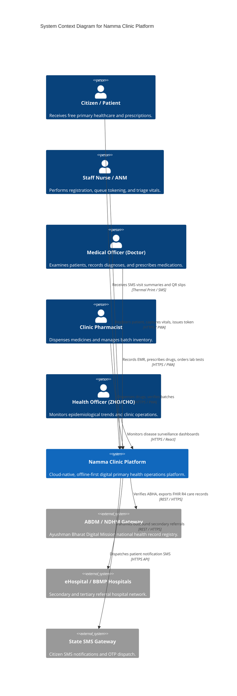

# 🏛️ Architecture: C4 System Context Model
## Namma Clinic Digital Health & Operations Platform
**Document Code:** ARC-CTX-02 | **Status:** Approved Baseline | **Date:** September 2026

---

### 1. Level 1: System Context Diagram

