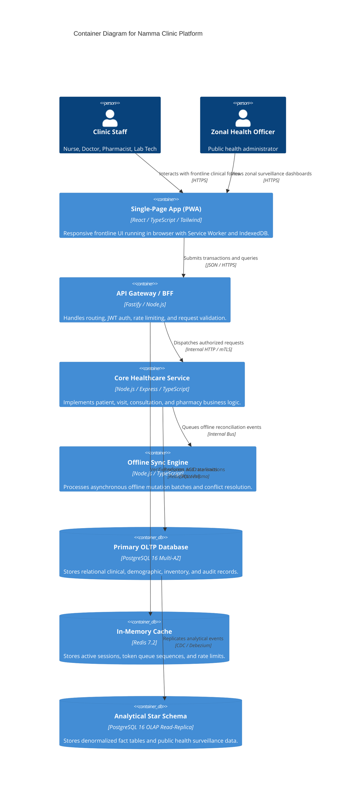

# 📦 Architecture: C4 Container Model
## Namma Clinic Digital Health & Operations Platform
**Document Code:** ARC-CON-03 | **Status:** Approved Baseline | **Date:** September 2026

---

### 1. Level 2: Container Diagram

