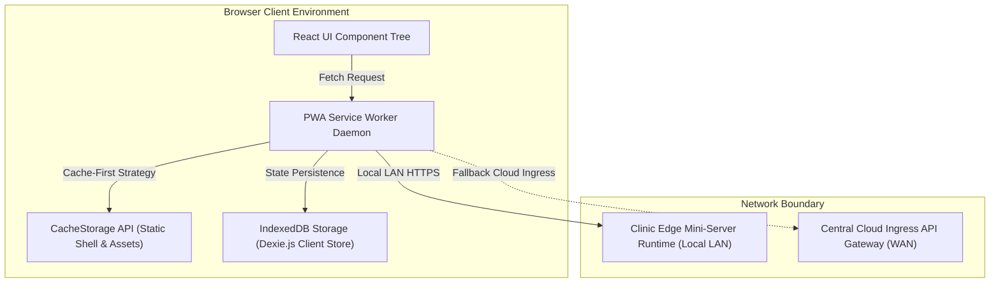

# 💻 Architecture Document 05: Frontend Client Architecture & Ergonomics Specification
## Namma Clinic Digital Health & Operations Platform
### Greater Bengaluru Authority (GBA) / BBMP Health Department
**Standard:** Modern Web Application / WCAG 2.1 AA / C4 Model | **Status:** APPROVED BASELINE | **Code:** `ARCH-FE-05`

---

## 01. Document Scope & Frontend Architectural Philosophy
This document establishes the canonical frontend client architecture for the Namma Clinic Digital Health & Operations Platform. The frontend is engineered as an ultra-responsive, touch-optimized, bilingual Progressive Web Application (PWA) running on clinic workstations, touchscreen laptops, Android tablets, and administrative terminals across all 183 primary health clinics in Bengaluru.

### 01.1 Core Frontend Architectural Invariants
1. **Sub-250ms Interaction Budget:** Every clinical button click, autocomplete search, and tab navigation must provide visual rendering feedback within 250ms (p95) to prevent physician fatigue.
2. **Zero-Downtime Offline Ergonomics:** Frontline users must be able to complete all primary workflows (intake, triage, consultation, e-prescribing, dispensing) seamlessly during complete WAN disconnection.
3. **Bilingual Native Parity:** Every UI label, form placeholder, error dialog, and thermal print slip must be fully localized in both native Kannada (kn-IN) and Indian English (en-IN).
4. **Zero Accidental Data Loss:** Form inputs are automatically serialized into local IndexedDB drafts upon every keystroke, surviving browser crashes or sudden workstation restarts.
5. **Hardware Peripheral Direct Integration:** Direct driverless communication with 80mm thermal receipt printers (ESC/POS) and USB HID 2D DataMatrix barcode scanners without third-party plugins.
6. **Accessibility & Touch Usability:** Strict adherence to WCAG 2.1 Level AA standards with minimum 48px touch targets and high-contrast clinical color tokens.

## 02. Progressive Web Application (PWA) Foundation & Service Worker Lifecycle
The client application is built on Next.js 14+ / React 18+ leveraging modern Service Worker APIs for complete network resilience:



### 02.1 Service Worker Caching Strategies
1. **Cache-First (Stale-While-Revalidate):** Static assets, HTML shell, CSS bundles, JS chunks, and Noto Sans Kannada font glyphs are served directly from CacheStorage, ensuring instantaneous < 100ms cold launches.
2. **Network-First with IndexedDB Fallback:** Operational transactional APIs (`/api/v1/encounters`, `/api/v1/prescriptions`) attempt local edge mini-server transmission; if unreachable within 1,200ms, the request is routed into the IndexedDB `mutation_journal`.
3. **Stale-While-Revalidate for Dictionaries:** Formulary lists, ICD-10 diagnostic codes, and clinic staff rosters update asynchronously in the background while instantly serving local cached records.

## 03. Frontend Module Views & Component Architecture (30 Modules)
Exhaustive UI view specifications, form layouts, touch interactions, and accessibility attributes for all 30 platform modules:

### 03.01 Frontend View Architecture: `MODULE-001` (Staff Authentication & MFA Engine)
- **Target Operational View:** `StaffAuthenticationAndMFAEngineView`
- **Primary Screen Route:** `/clinic/module/001`
- **Assigned Clinical Station:** Intake / Triage / Consultation / Pharmacy / Lab
- **Core View Capabilities:** Manages staff identities, Argon2id salted credentials, TOTP MFA challenges, session lifecycle, and cryptographic token issuance.

#### 03.01.1 View Layout, Component Hierarchy & Touch Ergonomics
1. **Header Banner:** Displays module title in bilingual Kannada/English with active station status indicator.
2. **Primary Form Stage:** Structured grid layout optimized for 10.1" touchscreen tablets; minimum input touch target 48px height.
3. **Context Action Bar:** Floating action button (FAB) or bottom docked toolbar with high-contrast primary action (`Save & Proceed`).
4. **On-Screen Keyboard Accommodation:** Automatically adjusts viewport scroll to prevent virtual keyboards from obscuring active input fields.

#### 03.01.2 Client-Side Validation Rules & Error UX
- **Validation Engine:** Evaluates declarative Zod schema matching `StaffAuthenticationAndMFAEngineViewDTO`.
- **Inline Error Indicators:** Highlights invalid inputs with red border (`#DC2626`) and bilingual assistive text.
- **Autosave Debounce:** Automatically persists uncommitted form drafts to IndexedDB every 500ms.
- **Submission Guard:** Prevents duplicate form submission by disabling action buttons and displaying a spinner during I/O.

#### 03.01.3 TypeScript Component Contract & Event Signatures
```typescript
export interface StaffAuthenticationAndMFAEngineViewProps {
  clinicId: string;
  operatorId: string;
  sessionToken: string;
  initialData?: Partial<StaffAuthenticationAndMFAEngineViewFormData>;
  onSaveSuccess: (entityId: string) => Promise<void>;
  onCancel: () => void;
}

export interface StaffAuthenticationAndMFAEngineViewFormData {
  entityUuid: string;
  timestamp: string;
  locale: 'kn-IN' | 'en-IN';
  stationId: string;
  formData: Record<string, unknown>;
}
```

#### 03.01.4 Offline Autonomy & Mutation Journaling
- When offline, successful form submission generates a local UUIDv7 and appends mutation record to `mutation_journal`.
- Renders subtle amber badge indicating `Saved locally (Offline)` with pending sync queue count.
- Triggers optimistic UI update, immediately unlocking the next workflow station without waiting for network ACK.

#### 03.01.5 Accessibility, ARIA Attributes & Keyboard Shortcuts
- **Keyboard Accelerator:** Bound to `Alt + 2` for instantaneous focus.
- **Screen Reader Semantic:** Form sections marked with `<fieldset>` and `<legend>` in Kannada and English.
- **Contrast Compliance:** All text tokens exceed 4.5:1 contrast against background surface.

#### 03.01.6 Upstream & Downstream Traceability
- **Upstream Requirements:** Fulfills `SRS-UI-002` and `MODULE-001`.
- **Downstream Planned Artifacts:** Bound to `PLANNED-UI-COMPONENT-001` and `PLANNED-E2E-TEST-001`.

---

### 03.02 Frontend View Architecture: `MODULE-002` (Role-Based Access Control (RBAC) & Entitlements)
- **Target Operational View:** `Role-BasedAccessControl(RBAC)AndEntitlementsView`
- **Primary Screen Route:** `/clinic/module/002`
- **Assigned Clinical Station:** Intake / Triage / Consultation / Pharmacy / Lab
- **Core View Capabilities:** Defines and enforces granular permissions, capability claims, and segregation of duties (SOD-001) across 30 clinical and administrative roles.

#### 03.02.1 View Layout, Component Hierarchy & Touch Ergonomics
1. **Header Banner:** Displays module title in bilingual Kannada/English with active station status indicator.
2. **Primary Form Stage:** Structured grid layout optimized for 10.1" touchscreen tablets; minimum input touch target 48px height.
3. **Context Action Bar:** Floating action button (FAB) or bottom docked toolbar with high-contrast primary action (`Save & Proceed`).
4. **On-Screen Keyboard Accommodation:** Automatically adjusts viewport scroll to prevent virtual keyboards from obscuring active input fields.

#### 03.02.2 Client-Side Validation Rules & Error UX
- **Validation Engine:** Evaluates declarative Zod schema matching `Role-BasedAccessControl(RBAC)AndEntitlementsViewDTO`.
- **Inline Error Indicators:** Highlights invalid inputs with red border (`#DC2626`) and bilingual assistive text.
- **Autosave Debounce:** Automatically persists uncommitted form drafts to IndexedDB every 500ms.
- **Submission Guard:** Prevents duplicate form submission by disabling action buttons and displaying a spinner during I/O.

#### 03.02.3 TypeScript Component Contract & Event Signatures
```typescript
export interface Role-BasedAccessControl(RBAC)AndEntitlementsViewProps {
  clinicId: string;
  operatorId: string;
  sessionToken: string;
  initialData?: Partial<Role-BasedAccessControl(RBAC)AndEntitlementsViewFormData>;
  onSaveSuccess: (entityId: string) => Promise<void>;
  onCancel: () => void;
}

export interface Role-BasedAccessControl(RBAC)AndEntitlementsViewFormData {
  entityUuid: string;
  timestamp: string;
  locale: 'kn-IN' | 'en-IN';
  stationId: string;
  formData: Record<string, unknown>;
}
```

#### 03.02.4 Offline Autonomy & Mutation Journaling
- When offline, successful form submission generates a local UUIDv7 and appends mutation record to `mutation_journal`.
- Renders subtle amber badge indicating `Saved locally (Offline)` with pending sync queue count.
- Triggers optimistic UI update, immediately unlocking the next workflow station without waiting for network ACK.

#### 03.02.5 Accessibility, ARIA Attributes & Keyboard Shortcuts
- **Keyboard Accelerator:** Bound to `Alt + 3` for instantaneous focus.
- **Screen Reader Semantic:** Form sections marked with `<fieldset>` and `<legend>` in Kannada and English.
- **Contrast Compliance:** All text tokens exceed 4.5:1 contrast against background surface.

#### 03.02.6 Upstream & Downstream Traceability
- **Upstream Requirements:** Fulfills `SRS-UI-003` and `MODULE-002`.
- **Downstream Planned Artifacts:** Bound to `PLANNED-UI-COMPONENT-002` and `PLANNED-E2E-TEST-002`.

---

### 03.03 Frontend View Architecture: `MODULE-003` (Healthcare Facility & Organizational Hierarchy)
- **Target Operational View:** `HealthcareFacilityAndOrganizationalHierarchyView`
- **Primary Screen Route:** `/clinic/module/003`
- **Assigned Clinical Station:** Intake / Triage / Consultation / Pharmacy / Lab
- **Core View Capabilities:** Maintains the municipal hierarchy of 183 clinics, 8 BBMP zones, 225 wards, room allocations, and operational hours.

#### 03.03.1 View Layout, Component Hierarchy & Touch Ergonomics
1. **Header Banner:** Displays module title in bilingual Kannada/English with active station status indicator.
2. **Primary Form Stage:** Structured grid layout optimized for 10.1" touchscreen tablets; minimum input touch target 48px height.
3. **Context Action Bar:** Floating action button (FAB) or bottom docked toolbar with high-contrast primary action (`Save & Proceed`).
4. **On-Screen Keyboard Accommodation:** Automatically adjusts viewport scroll to prevent virtual keyboards from obscuring active input fields.

#### 03.03.2 Client-Side Validation Rules & Error UX
- **Validation Engine:** Evaluates declarative Zod schema matching `HealthcareFacilityAndOrganizationalHierarchyViewDTO`.
- **Inline Error Indicators:** Highlights invalid inputs with red border (`#DC2626`) and bilingual assistive text.
- **Autosave Debounce:** Automatically persists uncommitted form drafts to IndexedDB every 500ms.
- **Submission Guard:** Prevents duplicate form submission by disabling action buttons and displaying a spinner during I/O.

#### 03.03.3 TypeScript Component Contract & Event Signatures
```typescript
export interface HealthcareFacilityAndOrganizationalHierarchyViewProps {
  clinicId: string;
  operatorId: string;
  sessionToken: string;
  initialData?: Partial<HealthcareFacilityAndOrganizationalHierarchyViewFormData>;
  onSaveSuccess: (entityId: string) => Promise<void>;
  onCancel: () => void;
}

export interface HealthcareFacilityAndOrganizationalHierarchyViewFormData {
  entityUuid: string;
  timestamp: string;
  locale: 'kn-IN' | 'en-IN';
  stationId: string;
  formData: Record<string, unknown>;
}
```

#### 03.03.4 Offline Autonomy & Mutation Journaling
- When offline, successful form submission generates a local UUIDv7 and appends mutation record to `mutation_journal`.
- Renders subtle amber badge indicating `Saved locally (Offline)` with pending sync queue count.
- Triggers optimistic UI update, immediately unlocking the next workflow station without waiting for network ACK.

#### 03.03.5 Accessibility, ARIA Attributes & Keyboard Shortcuts
- **Keyboard Accelerator:** Bound to `Alt + 4` for instantaneous focus.
- **Screen Reader Semantic:** Form sections marked with `<fieldset>` and `<legend>` in Kannada and English.
- **Contrast Compliance:** All text tokens exceed 4.5:1 contrast against background surface.

#### 03.03.6 Upstream & Downstream Traceability
- **Upstream Requirements:** Fulfills `SRS-UI-004` and `MODULE-003`.
- **Downstream Planned Artifacts:** Bound to `PLANNED-UI-COMPONENT-003` and `PLANNED-E2E-TEST-003`.

---

### 03.04 Frontend View Architecture: `MODULE-004` (Clinical & Administrative Staff Directory)
- **Target Operational View:** `ClinicalAndAdministrativeStaffDirectoryView`
- **Primary Screen Route:** `/clinic/module/004`
- **Assigned Clinical Station:** Intake / Triage / Consultation / Pharmacy / Lab
- **Core View Capabilities:** Maintains professional profiles, medical registration council numbers (KMC), duty rosters, and shift schedules for clinic personnel.

#### 03.04.1 View Layout, Component Hierarchy & Touch Ergonomics
1. **Header Banner:** Displays module title in bilingual Kannada/English with active station status indicator.
2. **Primary Form Stage:** Structured grid layout optimized for 10.1" touchscreen tablets; minimum input touch target 48px height.
3. **Context Action Bar:** Floating action button (FAB) or bottom docked toolbar with high-contrast primary action (`Save & Proceed`).
4. **On-Screen Keyboard Accommodation:** Automatically adjusts viewport scroll to prevent virtual keyboards from obscuring active input fields.

#### 03.04.2 Client-Side Validation Rules & Error UX
- **Validation Engine:** Evaluates declarative Zod schema matching `ClinicalAndAdministrativeStaffDirectoryViewDTO`.
- **Inline Error Indicators:** Highlights invalid inputs with red border (`#DC2626`) and bilingual assistive text.
- **Autosave Debounce:** Automatically persists uncommitted form drafts to IndexedDB every 500ms.
- **Submission Guard:** Prevents duplicate form submission by disabling action buttons and displaying a spinner during I/O.

#### 03.04.3 TypeScript Component Contract & Event Signatures
```typescript
export interface ClinicalAndAdministrativeStaffDirectoryViewProps {
  clinicId: string;
  operatorId: string;
  sessionToken: string;
  initialData?: Partial<ClinicalAndAdministrativeStaffDirectoryViewFormData>;
  onSaveSuccess: (entityId: string) => Promise<void>;
  onCancel: () => void;
}

export interface ClinicalAndAdministrativeStaffDirectoryViewFormData {
  entityUuid: string;
  timestamp: string;
  locale: 'kn-IN' | 'en-IN';
  stationId: string;
  formData: Record<string, unknown>;
}
```

#### 03.04.4 Offline Autonomy & Mutation Journaling
- When offline, successful form submission generates a local UUIDv7 and appends mutation record to `mutation_journal`.
- Renders subtle amber badge indicating `Saved locally (Offline)` with pending sync queue count.
- Triggers optimistic UI update, immediately unlocking the next workflow station without waiting for network ACK.

#### 03.04.5 Accessibility, ARIA Attributes & Keyboard Shortcuts
- **Keyboard Accelerator:** Bound to `Alt + 5` for instantaneous focus.
- **Screen Reader Semantic:** Form sections marked with `<fieldset>` and `<legend>` in Kannada and English.
- **Contrast Compliance:** All text tokens exceed 4.5:1 contrast against background surface.

#### 03.04.6 Upstream & Downstream Traceability
- **Upstream Requirements:** Fulfills `SRS-UI-005` and `MODULE-004`.
- **Downstream Planned Artifacts:** Bound to `PLANNED-UI-COMPONENT-004` and `PLANNED-E2E-TEST-004`.

---

### 03.05 Frontend View Architecture: `MODULE-005` (Patient Registration, Demographics & ABHA Minting)
- **Target Operational View:** `PatientRegistration,DemographicsAndABHAMintingView`
- **Primary Screen Route:** `/clinic/module/005`
- **Assigned Clinical Station:** Intake / Triage / Consultation / Pharmacy / Lab
- **Core View Capabilities:** Captures citizen demographic profiles, performs phonetic deduplication, mints municipal health IDs, and binds national ABHA numbers.

#### 03.05.1 View Layout, Component Hierarchy & Touch Ergonomics
1. **Header Banner:** Displays module title in bilingual Kannada/English with active station status indicator.
2. **Primary Form Stage:** Structured grid layout optimized for 10.1" touchscreen tablets; minimum input touch target 48px height.
3. **Context Action Bar:** Floating action button (FAB) or bottom docked toolbar with high-contrast primary action (`Save & Proceed`).
4. **On-Screen Keyboard Accommodation:** Automatically adjusts viewport scroll to prevent virtual keyboards from obscuring active input fields.

#### 03.05.2 Client-Side Validation Rules & Error UX
- **Validation Engine:** Evaluates declarative Zod schema matching `PatientRegistration,DemographicsAndABHAMintingViewDTO`.
- **Inline Error Indicators:** Highlights invalid inputs with red border (`#DC2626`) and bilingual assistive text.
- **Autosave Debounce:** Automatically persists uncommitted form drafts to IndexedDB every 500ms.
- **Submission Guard:** Prevents duplicate form submission by disabling action buttons and displaying a spinner during I/O.

#### 03.05.3 TypeScript Component Contract & Event Signatures
```typescript
export interface PatientRegistration,DemographicsAndABHAMintingViewProps {
  clinicId: string;
  operatorId: string;
  sessionToken: string;
  initialData?: Partial<PatientRegistration,DemographicsAndABHAMintingViewFormData>;
  onSaveSuccess: (entityId: string) => Promise<void>;
  onCancel: () => void;
}

export interface PatientRegistration,DemographicsAndABHAMintingViewFormData {
  entityUuid: string;
  timestamp: string;
  locale: 'kn-IN' | 'en-IN';
  stationId: string;
  formData: Record<string, unknown>;
}
```

#### 03.05.4 Offline Autonomy & Mutation Journaling
- When offline, successful form submission generates a local UUIDv7 and appends mutation record to `mutation_journal`.
- Renders subtle amber badge indicating `Saved locally (Offline)` with pending sync queue count.
- Triggers optimistic UI update, immediately unlocking the next workflow station without waiting for network ACK.

#### 03.05.5 Accessibility, ARIA Attributes & Keyboard Shortcuts
- **Keyboard Accelerator:** Bound to `Alt + 6` for instantaneous focus.
- **Screen Reader Semantic:** Form sections marked with `<fieldset>` and `<legend>` in Kannada and English.
- **Contrast Compliance:** All text tokens exceed 4.5:1 contrast against background surface.

#### 03.05.6 Upstream & Downstream Traceability
- **Upstream Requirements:** Fulfills `SRS-UI-006` and `MODULE-005`.
- **Downstream Planned Artifacts:** Bound to `PLANNED-UI-COMPONENT-005` and `PLANNED-E2E-TEST-005`.

---

### 03.06 Frontend View Architecture: `MODULE-006` (Informed Clinical Consent & DPDP Data Privacy)
- **Target Operational View:** `InformedClinicalConsentAndDPDPDataPrivacyView`
- **Primary Screen Route:** `/clinic/module/006`
- **Assigned Clinical Station:** Intake / Triage / Consultation / Pharmacy / Lab
- **Core View Capabilities:** Records affirmative citizen consent for clinical treatment, tele-consultation, and health data sharing per DPDP Act 2023.

#### 03.06.1 View Layout, Component Hierarchy & Touch Ergonomics
1. **Header Banner:** Displays module title in bilingual Kannada/English with active station status indicator.
2. **Primary Form Stage:** Structured grid layout optimized for 10.1" touchscreen tablets; minimum input touch target 48px height.
3. **Context Action Bar:** Floating action button (FAB) or bottom docked toolbar with high-contrast primary action (`Save & Proceed`).
4. **On-Screen Keyboard Accommodation:** Automatically adjusts viewport scroll to prevent virtual keyboards from obscuring active input fields.

#### 03.06.2 Client-Side Validation Rules & Error UX
- **Validation Engine:** Evaluates declarative Zod schema matching `InformedClinicalConsentAndDPDPDataPrivacyViewDTO`.
- **Inline Error Indicators:** Highlights invalid inputs with red border (`#DC2626`) and bilingual assistive text.
- **Autosave Debounce:** Automatically persists uncommitted form drafts to IndexedDB every 500ms.
- **Submission Guard:** Prevents duplicate form submission by disabling action buttons and displaying a spinner during I/O.

#### 03.06.3 TypeScript Component Contract & Event Signatures
```typescript
export interface InformedClinicalConsentAndDPDPDataPrivacyViewProps {
  clinicId: string;
  operatorId: string;
  sessionToken: string;
  initialData?: Partial<InformedClinicalConsentAndDPDPDataPrivacyViewFormData>;
  onSaveSuccess: (entityId: string) => Promise<void>;
  onCancel: () => void;
}

export interface InformedClinicalConsentAndDPDPDataPrivacyViewFormData {
  entityUuid: string;
  timestamp: string;
  locale: 'kn-IN' | 'en-IN';
  stationId: string;
  formData: Record<string, unknown>;
}
```

#### 03.06.4 Offline Autonomy & Mutation Journaling
- When offline, successful form submission generates a local UUIDv7 and appends mutation record to `mutation_journal`.
- Renders subtle amber badge indicating `Saved locally (Offline)` with pending sync queue count.
- Triggers optimistic UI update, immediately unlocking the next workflow station without waiting for network ACK.

#### 03.06.5 Accessibility, ARIA Attributes & Keyboard Shortcuts
- **Keyboard Accelerator:** Bound to `Alt + 7` for instantaneous focus.
- **Screen Reader Semantic:** Form sections marked with `<fieldset>` and `<legend>` in Kannada and English.
- **Contrast Compliance:** All text tokens exceed 4.5:1 contrast against background surface.

#### 03.06.6 Upstream & Downstream Traceability
- **Upstream Requirements:** Fulfills `SRS-UI-007` and `MODULE-006`.
- **Downstream Planned Artifacts:** Bound to `PLANNED-UI-COMPONENT-006` and `PLANNED-E2E-TEST-006`.

---

### 03.07 Frontend View Architecture: `MODULE-007` (Patient Token Generation & Station Routing)
- **Target Operational View:** `PatientTokenGenerationAndStationRoutingView`
- **Primary Screen Route:** `/clinic/module/007`
- **Assigned Clinical Station:** Intake / Triage / Consultation / Pharmacy / Lab
- **Core View Capabilities:** Mints daily clinic visit tokens (General, Senior/Vulnerable, Emergency), prints 80mm thermal slips, and routes to initial station.

#### 03.07.1 View Layout, Component Hierarchy & Touch Ergonomics
1. **Header Banner:** Displays module title in bilingual Kannada/English with active station status indicator.
2. **Primary Form Stage:** Structured grid layout optimized for 10.1" touchscreen tablets; minimum input touch target 48px height.
3. **Context Action Bar:** Floating action button (FAB) or bottom docked toolbar with high-contrast primary action (`Save & Proceed`).
4. **On-Screen Keyboard Accommodation:** Automatically adjusts viewport scroll to prevent virtual keyboards from obscuring active input fields.

#### 03.07.2 Client-Side Validation Rules & Error UX
- **Validation Engine:** Evaluates declarative Zod schema matching `PatientTokenGenerationAndStationRoutingViewDTO`.
- **Inline Error Indicators:** Highlights invalid inputs with red border (`#DC2626`) and bilingual assistive text.
- **Autosave Debounce:** Automatically persists uncommitted form drafts to IndexedDB every 500ms.
- **Submission Guard:** Prevents duplicate form submission by disabling action buttons and displaying a spinner during I/O.

#### 03.07.3 TypeScript Component Contract & Event Signatures
```typescript
export interface PatientTokenGenerationAndStationRoutingViewProps {
  clinicId: string;
  operatorId: string;
  sessionToken: string;
  initialData?: Partial<PatientTokenGenerationAndStationRoutingViewFormData>;
  onSaveSuccess: (entityId: string) => Promise<void>;
  onCancel: () => void;
}

export interface PatientTokenGenerationAndStationRoutingViewFormData {
  entityUuid: string;
  timestamp: string;
  locale: 'kn-IN' | 'en-IN';
  stationId: string;
  formData: Record<string, unknown>;
}
```

#### 03.07.4 Offline Autonomy & Mutation Journaling
- When offline, successful form submission generates a local UUIDv7 and appends mutation record to `mutation_journal`.
- Renders subtle amber badge indicating `Saved locally (Offline)` with pending sync queue count.
- Triggers optimistic UI update, immediately unlocking the next workflow station without waiting for network ACK.

#### 03.07.5 Accessibility, ARIA Attributes & Keyboard Shortcuts
- **Keyboard Accelerator:** Bound to `Alt + 8` for instantaneous focus.
- **Screen Reader Semantic:** Form sections marked with `<fieldset>` and `<legend>` in Kannada and English.
- **Contrast Compliance:** All text tokens exceed 4.5:1 contrast against background surface.

#### 03.07.6 Upstream & Downstream Traceability
- **Upstream Requirements:** Fulfills `SRS-UI-008` and `MODULE-007`.
- **Downstream Planned Artifacts:** Bound to `PLANNED-UI-COMPONENT-007` and `PLANNED-E2E-TEST-007`.

---

### 03.08 Frontend View Architecture: `MODULE-008` (Dynamic Queue Orchestration & Display Boards)
- **Target Operational View:** `DynamicQueueOrchestrationAndDisplayBoardsView`
- **Primary Screen Route:** `/clinic/module/008`
- **Assigned Clinical Station:** Intake / Triage / Consultation / Pharmacy / Lab
- **Core View Capabilities:** Manages dynamic multi-room queues, broadcasts next-patient calls to waiting hall TV screens via MQTT, and calculates wait times.

#### 03.08.1 View Layout, Component Hierarchy & Touch Ergonomics
1. **Header Banner:** Displays module title in bilingual Kannada/English with active station status indicator.
2. **Primary Form Stage:** Structured grid layout optimized for 10.1" touchscreen tablets; minimum input touch target 48px height.
3. **Context Action Bar:** Floating action button (FAB) or bottom docked toolbar with high-contrast primary action (`Save & Proceed`).
4. **On-Screen Keyboard Accommodation:** Automatically adjusts viewport scroll to prevent virtual keyboards from obscuring active input fields.

#### 03.08.2 Client-Side Validation Rules & Error UX
- **Validation Engine:** Evaluates declarative Zod schema matching `DynamicQueueOrchestrationAndDisplayBoardsViewDTO`.
- **Inline Error Indicators:** Highlights invalid inputs with red border (`#DC2626`) and bilingual assistive text.
- **Autosave Debounce:** Automatically persists uncommitted form drafts to IndexedDB every 500ms.
- **Submission Guard:** Prevents duplicate form submission by disabling action buttons and displaying a spinner during I/O.

#### 03.08.3 TypeScript Component Contract & Event Signatures
```typescript
export interface DynamicQueueOrchestrationAndDisplayBoardsViewProps {
  clinicId: string;
  operatorId: string;
  sessionToken: string;
  initialData?: Partial<DynamicQueueOrchestrationAndDisplayBoardsViewFormData>;
  onSaveSuccess: (entityId: string) => Promise<void>;
  onCancel: () => void;
}

export interface DynamicQueueOrchestrationAndDisplayBoardsViewFormData {
  entityUuid: string;
  timestamp: string;
  locale: 'kn-IN' | 'en-IN';
  stationId: string;
  formData: Record<string, unknown>;
}
```

#### 03.08.4 Offline Autonomy & Mutation Journaling
- When offline, successful form submission generates a local UUIDv7 and appends mutation record to `mutation_journal`.
- Renders subtle amber badge indicating `Saved locally (Offline)` with pending sync queue count.
- Triggers optimistic UI update, immediately unlocking the next workflow station without waiting for network ACK.

#### 03.08.5 Accessibility, ARIA Attributes & Keyboard Shortcuts
- **Keyboard Accelerator:** Bound to `Alt + 9` for instantaneous focus.
- **Screen Reader Semantic:** Form sections marked with `<fieldset>` and `<legend>` in Kannada and English.
- **Contrast Compliance:** All text tokens exceed 4.5:1 contrast against background surface.

#### 03.08.6 Upstream & Downstream Traceability
- **Upstream Requirements:** Fulfills `SRS-UI-009` and `MODULE-008`.
- **Downstream Planned Artifacts:** Bound to `PLANNED-UI-COMPONENT-008` and `PLANNED-E2E-TEST-008`.

---

### 03.09 Frontend View Architecture: `MODULE-009` (Doctor EMR Console & Clinical SOAP Encounter)
- **Target Operational View:** `DoctorEMRConsoleAndClinicalSOAPEncounterView`
- **Primary Screen Route:** `/clinic/module/009`
- **Assigned Clinical Station:** Intake / Triage / Consultation / Pharmacy / Lab
- **Core View Capabilities:** Provides physician consultation interface for capturing Subjective symptoms, Objective vitals/findings, Assessment, and Plan.

#### 03.09.1 View Layout, Component Hierarchy & Touch Ergonomics
1. **Header Banner:** Displays module title in bilingual Kannada/English with active station status indicator.
2. **Primary Form Stage:** Structured grid layout optimized for 10.1" touchscreen tablets; minimum input touch target 48px height.
3. **Context Action Bar:** Floating action button (FAB) or bottom docked toolbar with high-contrast primary action (`Save & Proceed`).
4. **On-Screen Keyboard Accommodation:** Automatically adjusts viewport scroll to prevent virtual keyboards from obscuring active input fields.

#### 03.09.2 Client-Side Validation Rules & Error UX
- **Validation Engine:** Evaluates declarative Zod schema matching `DoctorEMRConsoleAndClinicalSOAPEncounterViewDTO`.
- **Inline Error Indicators:** Highlights invalid inputs with red border (`#DC2626`) and bilingual assistive text.
- **Autosave Debounce:** Automatically persists uncommitted form drafts to IndexedDB every 500ms.
- **Submission Guard:** Prevents duplicate form submission by disabling action buttons and displaying a spinner during I/O.

#### 03.09.3 TypeScript Component Contract & Event Signatures
```typescript
export interface DoctorEMRConsoleAndClinicalSOAPEncounterViewProps {
  clinicId: string;
  operatorId: string;
  sessionToken: string;
  initialData?: Partial<DoctorEMRConsoleAndClinicalSOAPEncounterViewFormData>;
  onSaveSuccess: (entityId: string) => Promise<void>;
  onCancel: () => void;
}

export interface DoctorEMRConsoleAndClinicalSOAPEncounterViewFormData {
  entityUuid: string;
  timestamp: string;
  locale: 'kn-IN' | 'en-IN';
  stationId: string;
  formData: Record<string, unknown>;
}
```

#### 03.09.4 Offline Autonomy & Mutation Journaling
- When offline, successful form submission generates a local UUIDv7 and appends mutation record to `mutation_journal`.
- Renders subtle amber badge indicating `Saved locally (Offline)` with pending sync queue count.
- Triggers optimistic UI update, immediately unlocking the next workflow station without waiting for network ACK.

#### 03.09.5 Accessibility, ARIA Attributes & Keyboard Shortcuts
- **Keyboard Accelerator:** Bound to `Alt + 1` for instantaneous focus.
- **Screen Reader Semantic:** Form sections marked with `<fieldset>` and `<legend>` in Kannada and English.
- **Contrast Compliance:** All text tokens exceed 4.5:1 contrast against background surface.

#### 03.09.6 Upstream & Downstream Traceability
- **Upstream Requirements:** Fulfills `SRS-UI-010` and `MODULE-009`.
- **Downstream Planned Artifacts:** Bound to `PLANNED-UI-COMPONENT-009` and `PLANNED-E2E-TEST-009`.

---

### 03.10 Frontend View Architecture: `MODULE-010` (ICD-10 & SNOMED CT Clinical Diagnosis Coding)
- **Target Operational View:** `ICD-10AndSNOMEDCTClinicalDiagnosisCodingView`
- **Primary Screen Route:** `/clinic/module/010`
- **Assigned Clinical Station:** Intake / Triage / Consultation / Pharmacy / Lab
- **Core View Capabilities:** Enables fast bilingual autocomplete of clinical concepts mapped to SNOMED CT and statutory ICD-10 diagnostic codes.

#### 03.10.1 View Layout, Component Hierarchy & Touch Ergonomics
1. **Header Banner:** Displays module title in bilingual Kannada/English with active station status indicator.
2. **Primary Form Stage:** Structured grid layout optimized for 10.1" touchscreen tablets; minimum input touch target 48px height.
3. **Context Action Bar:** Floating action button (FAB) or bottom docked toolbar with high-contrast primary action (`Save & Proceed`).
4. **On-Screen Keyboard Accommodation:** Automatically adjusts viewport scroll to prevent virtual keyboards from obscuring active input fields.

#### 03.10.2 Client-Side Validation Rules & Error UX
- **Validation Engine:** Evaluates declarative Zod schema matching `ICD-10AndSNOMEDCTClinicalDiagnosisCodingViewDTO`.
- **Inline Error Indicators:** Highlights invalid inputs with red border (`#DC2626`) and bilingual assistive text.
- **Autosave Debounce:** Automatically persists uncommitted form drafts to IndexedDB every 500ms.
- **Submission Guard:** Prevents duplicate form submission by disabling action buttons and displaying a spinner during I/O.

#### 03.10.3 TypeScript Component Contract & Event Signatures
```typescript
export interface ICD-10AndSNOMEDCTClinicalDiagnosisCodingViewProps {
  clinicId: string;
  operatorId: string;
  sessionToken: string;
  initialData?: Partial<ICD-10AndSNOMEDCTClinicalDiagnosisCodingViewFormData>;
  onSaveSuccess: (entityId: string) => Promise<void>;
  onCancel: () => void;
}

export interface ICD-10AndSNOMEDCTClinicalDiagnosisCodingViewFormData {
  entityUuid: string;
  timestamp: string;
  locale: 'kn-IN' | 'en-IN';
  stationId: string;
  formData: Record<string, unknown>;
}
```

#### 03.10.4 Offline Autonomy & Mutation Journaling
- When offline, successful form submission generates a local UUIDv7 and appends mutation record to `mutation_journal`.
- Renders subtle amber badge indicating `Saved locally (Offline)` with pending sync queue count.
- Triggers optimistic UI update, immediately unlocking the next workflow station without waiting for network ACK.

#### 03.10.5 Accessibility, ARIA Attributes & Keyboard Shortcuts
- **Keyboard Accelerator:** Bound to `Alt + 2` for instantaneous focus.
- **Screen Reader Semantic:** Form sections marked with `<fieldset>` and `<legend>` in Kannada and English.
- **Contrast Compliance:** All text tokens exceed 4.5:1 contrast against background surface.

#### 03.10.6 Upstream & Downstream Traceability
- **Upstream Requirements:** Fulfills `SRS-UI-011` and `MODULE-010`.
- **Downstream Planned Artifacts:** Bound to `PLANNED-UI-COMPONENT-010` and `PLANNED-E2E-TEST-010`.

---

### 03.11 Frontend View Architecture: `MODULE-011` (Electronic Prescription (e-Rx) & Drug Safety Engine)
- **Target Operational View:** `ElectronicPrescription(e-Rx)AndDrugSafetyEngineView`
- **Primary Screen Route:** `/clinic/module/011`
- **Assigned Clinical Station:** Intake / Triage / Consultation / Pharmacy / Lab
- **Core View Capabilities:** Authorizes e-prescriptions from essential drug formulary, evaluates drug-drug interactions, and checks pediatric dosage limits.

#### 03.11.1 View Layout, Component Hierarchy & Touch Ergonomics
1. **Header Banner:** Displays module title in bilingual Kannada/English with active station status indicator.
2. **Primary Form Stage:** Structured grid layout optimized for 10.1" touchscreen tablets; minimum input touch target 48px height.
3. **Context Action Bar:** Floating action button (FAB) or bottom docked toolbar with high-contrast primary action (`Save & Proceed`).
4. **On-Screen Keyboard Accommodation:** Automatically adjusts viewport scroll to prevent virtual keyboards from obscuring active input fields.

#### 03.11.2 Client-Side Validation Rules & Error UX
- **Validation Engine:** Evaluates declarative Zod schema matching `ElectronicPrescription(e-Rx)AndDrugSafetyEngineViewDTO`.
- **Inline Error Indicators:** Highlights invalid inputs with red border (`#DC2626`) and bilingual assistive text.
- **Autosave Debounce:** Automatically persists uncommitted form drafts to IndexedDB every 500ms.
- **Submission Guard:** Prevents duplicate form submission by disabling action buttons and displaying a spinner during I/O.

#### 03.11.3 TypeScript Component Contract & Event Signatures
```typescript
export interface ElectronicPrescription(e-Rx)AndDrugSafetyEngineViewProps {
  clinicId: string;
  operatorId: string;
  sessionToken: string;
  initialData?: Partial<ElectronicPrescription(e-Rx)AndDrugSafetyEngineViewFormData>;
  onSaveSuccess: (entityId: string) => Promise<void>;
  onCancel: () => void;
}

export interface ElectronicPrescription(e-Rx)AndDrugSafetyEngineViewFormData {
  entityUuid: string;
  timestamp: string;
  locale: 'kn-IN' | 'en-IN';
  stationId: string;
  formData: Record<string, unknown>;
}
```

#### 03.11.4 Offline Autonomy & Mutation Journaling
- When offline, successful form submission generates a local UUIDv7 and appends mutation record to `mutation_journal`.
- Renders subtle amber badge indicating `Saved locally (Offline)` with pending sync queue count.
- Triggers optimistic UI update, immediately unlocking the next workflow station without waiting for network ACK.

#### 03.11.5 Accessibility, ARIA Attributes & Keyboard Shortcuts
- **Keyboard Accelerator:** Bound to `Alt + 3` for instantaneous focus.
- **Screen Reader Semantic:** Form sections marked with `<fieldset>` and `<legend>` in Kannada and English.
- **Contrast Compliance:** All text tokens exceed 4.5:1 contrast against background surface.

#### 03.11.6 Upstream & Downstream Traceability
- **Upstream Requirements:** Fulfills `SRS-UI-012` and `MODULE-011`.
- **Downstream Planned Artifacts:** Bound to `PLANNED-UI-COMPONENT-011` and `PLANNED-E2E-TEST-011`.

---

### 03.12 Frontend View Architecture: `MODULE-012` (Point-of-Care Laboratory Testing & Diagnostic Orders)
- **Target Operational View:** `Point-of-CareLaboratoryTestingAndDiagnosticOrdersView`
- **Primary Screen Route:** `/clinic/module/012`
- **Assigned Clinical Station:** Intake / Triage / Consultation / Pharmacy / Lab
- **Core View Capabilities:** Manages orders and results for 58 rapid point-of-care laboratory diagnostic tests, specimen labelling, and panic value alerts.

#### 03.12.1 View Layout, Component Hierarchy & Touch Ergonomics
1. **Header Banner:** Displays module title in bilingual Kannada/English with active station status indicator.
2. **Primary Form Stage:** Structured grid layout optimized for 10.1" touchscreen tablets; minimum input touch target 48px height.
3. **Context Action Bar:** Floating action button (FAB) or bottom docked toolbar with high-contrast primary action (`Save & Proceed`).
4. **On-Screen Keyboard Accommodation:** Automatically adjusts viewport scroll to prevent virtual keyboards from obscuring active input fields.

#### 03.12.2 Client-Side Validation Rules & Error UX
- **Validation Engine:** Evaluates declarative Zod schema matching `Point-of-CareLaboratoryTestingAndDiagnosticOrdersViewDTO`.
- **Inline Error Indicators:** Highlights invalid inputs with red border (`#DC2626`) and bilingual assistive text.
- **Autosave Debounce:** Automatically persists uncommitted form drafts to IndexedDB every 500ms.
- **Submission Guard:** Prevents duplicate form submission by disabling action buttons and displaying a spinner during I/O.

#### 03.12.3 TypeScript Component Contract & Event Signatures
```typescript
export interface Point-of-CareLaboratoryTestingAndDiagnosticOrdersViewProps {
  clinicId: string;
  operatorId: string;
  sessionToken: string;
  initialData?: Partial<Point-of-CareLaboratoryTestingAndDiagnosticOrdersViewFormData>;
  onSaveSuccess: (entityId: string) => Promise<void>;
  onCancel: () => void;
}

export interface Point-of-CareLaboratoryTestingAndDiagnosticOrdersViewFormData {
  entityUuid: string;
  timestamp: string;
  locale: 'kn-IN' | 'en-IN';
  stationId: string;
  formData: Record<string, unknown>;
}
```

#### 03.12.4 Offline Autonomy & Mutation Journaling
- When offline, successful form submission generates a local UUIDv7 and appends mutation record to `mutation_journal`.
- Renders subtle amber badge indicating `Saved locally (Offline)` with pending sync queue count.
- Triggers optimistic UI update, immediately unlocking the next workflow station without waiting for network ACK.

#### 03.12.5 Accessibility, ARIA Attributes & Keyboard Shortcuts
- **Keyboard Accelerator:** Bound to `Alt + 4` for instantaneous focus.
- **Screen Reader Semantic:** Form sections marked with `<fieldset>` and `<legend>` in Kannada and English.
- **Contrast Compliance:** All text tokens exceed 4.5:1 contrast against background surface.

#### 03.12.6 Upstream & Downstream Traceability
- **Upstream Requirements:** Fulfills `SRS-UI-013` and `MODULE-012`.
- **Downstream Planned Artifacts:** Bound to `PLANNED-UI-COMPONENT-012` and `PLANNED-E2E-TEST-012`.

---

### 03.13 Frontend View Architecture: `MODULE-013` (Pharmacy Dispensing & 2D Barcode Verification)
- **Target Operational View:** `PharmacyDispensingAnd2DBarcodeVerificationView`
- **Primary Screen Route:** `/clinic/module/013`
- **Assigned Clinical Station:** Intake / Triage / Consultation / Pharmacy / Lab
- **Core View Capabilities:** Guides pharmacist through prescription dispensation, validates batch expiry via 2D DataMatrix scanning, and prints medicine slips.

#### 03.13.1 View Layout, Component Hierarchy & Touch Ergonomics
1. **Header Banner:** Displays module title in bilingual Kannada/English with active station status indicator.
2. **Primary Form Stage:** Structured grid layout optimized for 10.1" touchscreen tablets; minimum input touch target 48px height.
3. **Context Action Bar:** Floating action button (FAB) or bottom docked toolbar with high-contrast primary action (`Save & Proceed`).
4. **On-Screen Keyboard Accommodation:** Automatically adjusts viewport scroll to prevent virtual keyboards from obscuring active input fields.

#### 03.13.2 Client-Side Validation Rules & Error UX
- **Validation Engine:** Evaluates declarative Zod schema matching `PharmacyDispensingAnd2DBarcodeVerificationViewDTO`.
- **Inline Error Indicators:** Highlights invalid inputs with red border (`#DC2626`) and bilingual assistive text.
- **Autosave Debounce:** Automatically persists uncommitted form drafts to IndexedDB every 500ms.
- **Submission Guard:** Prevents duplicate form submission by disabling action buttons and displaying a spinner during I/O.

#### 03.13.3 TypeScript Component Contract & Event Signatures
```typescript
export interface PharmacyDispensingAnd2DBarcodeVerificationViewProps {
  clinicId: string;
  operatorId: string;
  sessionToken: string;
  initialData?: Partial<PharmacyDispensingAnd2DBarcodeVerificationViewFormData>;
  onSaveSuccess: (entityId: string) => Promise<void>;
  onCancel: () => void;
}

export interface PharmacyDispensingAnd2DBarcodeVerificationViewFormData {
  entityUuid: string;
  timestamp: string;
  locale: 'kn-IN' | 'en-IN';
  stationId: string;
  formData: Record<string, unknown>;
}
```

#### 03.13.4 Offline Autonomy & Mutation Journaling
- When offline, successful form submission generates a local UUIDv7 and appends mutation record to `mutation_journal`.
- Renders subtle amber badge indicating `Saved locally (Offline)` with pending sync queue count.
- Triggers optimistic UI update, immediately unlocking the next workflow station without waiting for network ACK.

#### 03.13.5 Accessibility, ARIA Attributes & Keyboard Shortcuts
- **Keyboard Accelerator:** Bound to `Alt + 5` for instantaneous focus.
- **Screen Reader Semantic:** Form sections marked with `<fieldset>` and `<legend>` in Kannada and English.
- **Contrast Compliance:** All text tokens exceed 4.5:1 contrast against background surface.

#### 03.13.6 Upstream & Downstream Traceability
- **Upstream Requirements:** Fulfills `SRS-UI-014` and `MODULE-013`.
- **Downstream Planned Artifacts:** Bound to `PLANNED-UI-COMPONENT-013` and `PLANNED-E2E-TEST-013`.

---

### 03.14 Frontend View Architecture: `MODULE-014` (Real-Time Batch Inventory & FEFO Stock Ledger)
- **Target Operational View:** `Real-TimeBatchInventoryAndFEFOStockLedgerView`
- **Primary Screen Route:** `/clinic/module/014`
- **Assigned Clinical Station:** Intake / Triage / Consultation / Pharmacy / Lab
- **Core View Capabilities:** Tracks stock levels per batch, enforces First-Expiry-First-Out allocation, monitors storage bins, and flags near-expiry items.

#### 03.14.1 View Layout, Component Hierarchy & Touch Ergonomics
1. **Header Banner:** Displays module title in bilingual Kannada/English with active station status indicator.
2. **Primary Form Stage:** Structured grid layout optimized for 10.1" touchscreen tablets; minimum input touch target 48px height.
3. **Context Action Bar:** Floating action button (FAB) or bottom docked toolbar with high-contrast primary action (`Save & Proceed`).
4. **On-Screen Keyboard Accommodation:** Automatically adjusts viewport scroll to prevent virtual keyboards from obscuring active input fields.

#### 03.14.2 Client-Side Validation Rules & Error UX
- **Validation Engine:** Evaluates declarative Zod schema matching `Real-TimeBatchInventoryAndFEFOStockLedgerViewDTO`.
- **Inline Error Indicators:** Highlights invalid inputs with red border (`#DC2626`) and bilingual assistive text.
- **Autosave Debounce:** Automatically persists uncommitted form drafts to IndexedDB every 500ms.
- **Submission Guard:** Prevents duplicate form submission by disabling action buttons and displaying a spinner during I/O.

#### 03.14.3 TypeScript Component Contract & Event Signatures
```typescript
export interface Real-TimeBatchInventoryAndFEFOStockLedgerViewProps {
  clinicId: string;
  operatorId: string;
  sessionToken: string;
  initialData?: Partial<Real-TimeBatchInventoryAndFEFOStockLedgerViewFormData>;
  onSaveSuccess: (entityId: string) => Promise<void>;
  onCancel: () => void;
}

export interface Real-TimeBatchInventoryAndFEFOStockLedgerViewFormData {
  entityUuid: string;
  timestamp: string;
  locale: 'kn-IN' | 'en-IN';
  stationId: string;
  formData: Record<string, unknown>;
}
```

#### 03.14.4 Offline Autonomy & Mutation Journaling
- When offline, successful form submission generates a local UUIDv7 and appends mutation record to `mutation_journal`.
- Renders subtle amber badge indicating `Saved locally (Offline)` with pending sync queue count.
- Triggers optimistic UI update, immediately unlocking the next workflow station without waiting for network ACK.

#### 03.14.5 Accessibility, ARIA Attributes & Keyboard Shortcuts
- **Keyboard Accelerator:** Bound to `Alt + 6` for instantaneous focus.
- **Screen Reader Semantic:** Form sections marked with `<fieldset>` and `<legend>` in Kannada and English.
- **Contrast Compliance:** All text tokens exceed 4.5:1 contrast against background surface.

#### 03.14.6 Upstream & Downstream Traceability
- **Upstream Requirements:** Fulfills `SRS-UI-015` and `MODULE-014`.
- **Downstream Planned Artifacts:** Bound to `PLANNED-UI-COMPONENT-014` and `PLANNED-E2E-TEST-014`.

---

### 03.15 Frontend View Architecture: `MODULE-015` (Drug Indent Generation, Receiving & Cold-Chain Intake)
- **Target Operational View:** `DrugIndentGeneration,ReceivingAndCold-ChainIntakeView`
- **Primary Screen Route:** `/clinic/module/015`
- **Assigned Clinical Station:** Intake / Triage / Consultation / Pharmacy / Lab
- **Core View Capabilities:** Automates monthly replenishment indents to central warehouse (KDLWS), verifies receiving manifests, and logs cold-chain temps.

#### 03.15.1 View Layout, Component Hierarchy & Touch Ergonomics
1. **Header Banner:** Displays module title in bilingual Kannada/English with active station status indicator.
2. **Primary Form Stage:** Structured grid layout optimized for 10.1" touchscreen tablets; minimum input touch target 48px height.
3. **Context Action Bar:** Floating action button (FAB) or bottom docked toolbar with high-contrast primary action (`Save & Proceed`).
4. **On-Screen Keyboard Accommodation:** Automatically adjusts viewport scroll to prevent virtual keyboards from obscuring active input fields.

#### 03.15.2 Client-Side Validation Rules & Error UX
- **Validation Engine:** Evaluates declarative Zod schema matching `DrugIndentGeneration,ReceivingAndCold-ChainIntakeViewDTO`.
- **Inline Error Indicators:** Highlights invalid inputs with red border (`#DC2626`) and bilingual assistive text.
- **Autosave Debounce:** Automatically persists uncommitted form drafts to IndexedDB every 500ms.
- **Submission Guard:** Prevents duplicate form submission by disabling action buttons and displaying a spinner during I/O.

#### 03.15.3 TypeScript Component Contract & Event Signatures
```typescript
export interface DrugIndentGeneration,ReceivingAndCold-ChainIntakeViewProps {
  clinicId: string;
  operatorId: string;
  sessionToken: string;
  initialData?: Partial<DrugIndentGeneration,ReceivingAndCold-ChainIntakeViewFormData>;
  onSaveSuccess: (entityId: string) => Promise<void>;
  onCancel: () => void;
}

export interface DrugIndentGeneration,ReceivingAndCold-ChainIntakeViewFormData {
  entityUuid: string;
  timestamp: string;
  locale: 'kn-IN' | 'en-IN';
  stationId: string;
  formData: Record<string, unknown>;
}
```

#### 03.15.4 Offline Autonomy & Mutation Journaling
- When offline, successful form submission generates a local UUIDv7 and appends mutation record to `mutation_journal`.
- Renders subtle amber badge indicating `Saved locally (Offline)` with pending sync queue count.
- Triggers optimistic UI update, immediately unlocking the next workflow station without waiting for network ACK.

#### 03.15.5 Accessibility, ARIA Attributes & Keyboard Shortcuts
- **Keyboard Accelerator:** Bound to `Alt + 7` for instantaneous focus.
- **Screen Reader Semantic:** Form sections marked with `<fieldset>` and `<legend>` in Kannada and English.
- **Contrast Compliance:** All text tokens exceed 4.5:1 contrast against background surface.

#### 03.15.6 Upstream & Downstream Traceability
- **Upstream Requirements:** Fulfills `SRS-UI-016` and `MODULE-015`.
- **Downstream Planned Artifacts:** Bound to `PLANNED-UI-COMPONENT-015` and `PLANNED-E2E-TEST-015`.

---

### 03.16 Frontend View Architecture: `MODULE-016` (Essential Medicine List (EML) & Formulary Master)
- **Target Operational View:** `EssentialMedicineList(EML)AndFormularyMasterView`
- **Primary Screen Route:** `/clinic/module/016`
- **Assigned Clinical Station:** Intake / Triage / Consultation / Pharmacy / Lab
- **Core View Capabilities:** Maintains the municipal primary care drug formulary, generic-brand mappings, therapeutic categories, and dosage forms.

#### 03.16.1 View Layout, Component Hierarchy & Touch Ergonomics
1. **Header Banner:** Displays module title in bilingual Kannada/English with active station status indicator.
2. **Primary Form Stage:** Structured grid layout optimized for 10.1" touchscreen tablets; minimum input touch target 48px height.
3. **Context Action Bar:** Floating action button (FAB) or bottom docked toolbar with high-contrast primary action (`Save & Proceed`).
4. **On-Screen Keyboard Accommodation:** Automatically adjusts viewport scroll to prevent virtual keyboards from obscuring active input fields.

#### 03.16.2 Client-Side Validation Rules & Error UX
- **Validation Engine:** Evaluates declarative Zod schema matching `EssentialMedicineList(EML)AndFormularyMasterViewDTO`.
- **Inline Error Indicators:** Highlights invalid inputs with red border (`#DC2626`) and bilingual assistive text.
- **Autosave Debounce:** Automatically persists uncommitted form drafts to IndexedDB every 500ms.
- **Submission Guard:** Prevents duplicate form submission by disabling action buttons and displaying a spinner during I/O.

#### 03.16.3 TypeScript Component Contract & Event Signatures
```typescript
export interface EssentialMedicineList(EML)AndFormularyMasterViewProps {
  clinicId: string;
  operatorId: string;
  sessionToken: string;
  initialData?: Partial<EssentialMedicineList(EML)AndFormularyMasterViewFormData>;
  onSaveSuccess: (entityId: string) => Promise<void>;
  onCancel: () => void;
}

export interface EssentialMedicineList(EML)AndFormularyMasterViewFormData {
  entityUuid: string;
  timestamp: string;
  locale: 'kn-IN' | 'en-IN';
  stationId: string;
  formData: Record<string, unknown>;
}
```

#### 03.16.4 Offline Autonomy & Mutation Journaling
- When offline, successful form submission generates a local UUIDv7 and appends mutation record to `mutation_journal`.
- Renders subtle amber badge indicating `Saved locally (Offline)` with pending sync queue count.
- Triggers optimistic UI update, immediately unlocking the next workflow station without waiting for network ACK.

#### 03.16.5 Accessibility, ARIA Attributes & Keyboard Shortcuts
- **Keyboard Accelerator:** Bound to `Alt + 8` for instantaneous focus.
- **Screen Reader Semantic:** Form sections marked with `<fieldset>` and `<legend>` in Kannada and English.
- **Contrast Compliance:** All text tokens exceed 4.5:1 contrast against background surface.

#### 03.16.6 Upstream & Downstream Traceability
- **Upstream Requirements:** Fulfills `SRS-UI-017` and `MODULE-016`.
- **Downstream Planned Artifacts:** Bound to `PLANNED-UI-COMPONENT-016` and `PLANNED-E2E-TEST-016`.

---

### 03.17 Frontend View Architecture: `MODULE-017` (Secondary Referral & 108 Emergency EMS Transit)
- **Target Operational View:** `SecondaryReferralAnd108EmergencyEMSTransitView`
- **Primary Screen Route:** `/clinic/module/017`
- **Assigned Clinical Station:** Intake / Triage / Consultation / Pharmacy / Lab
- **Core View Capabilities:** Assembles referral dossiers for secondary hospitals, dispatches 108 emergency ambulance requests, and tracks patient handover.

#### 03.17.1 View Layout, Component Hierarchy & Touch Ergonomics
1. **Header Banner:** Displays module title in bilingual Kannada/English with active station status indicator.
2. **Primary Form Stage:** Structured grid layout optimized for 10.1" touchscreen tablets; minimum input touch target 48px height.
3. **Context Action Bar:** Floating action button (FAB) or bottom docked toolbar with high-contrast primary action (`Save & Proceed`).
4. **On-Screen Keyboard Accommodation:** Automatically adjusts viewport scroll to prevent virtual keyboards from obscuring active input fields.

#### 03.17.2 Client-Side Validation Rules & Error UX
- **Validation Engine:** Evaluates declarative Zod schema matching `SecondaryReferralAnd108EmergencyEMSTransitViewDTO`.
- **Inline Error Indicators:** Highlights invalid inputs with red border (`#DC2626`) and bilingual assistive text.
- **Autosave Debounce:** Automatically persists uncommitted form drafts to IndexedDB every 500ms.
- **Submission Guard:** Prevents duplicate form submission by disabling action buttons and displaying a spinner during I/O.

#### 03.17.3 TypeScript Component Contract & Event Signatures
```typescript
export interface SecondaryReferralAnd108EmergencyEMSTransitViewProps {
  clinicId: string;
  operatorId: string;
  sessionToken: string;
  initialData?: Partial<SecondaryReferralAnd108EmergencyEMSTransitViewFormData>;
  onSaveSuccess: (entityId: string) => Promise<void>;
  onCancel: () => void;
}

export interface SecondaryReferralAnd108EmergencyEMSTransitViewFormData {
  entityUuid: string;
  timestamp: string;
  locale: 'kn-IN' | 'en-IN';
  stationId: string;
  formData: Record<string, unknown>;
}
```

#### 03.17.4 Offline Autonomy & Mutation Journaling
- When offline, successful form submission generates a local UUIDv7 and appends mutation record to `mutation_journal`.
- Renders subtle amber badge indicating `Saved locally (Offline)` with pending sync queue count.
- Triggers optimistic UI update, immediately unlocking the next workflow station without waiting for network ACK.

#### 03.17.5 Accessibility, ARIA Attributes & Keyboard Shortcuts
- **Keyboard Accelerator:** Bound to `Alt + 9` for instantaneous focus.
- **Screen Reader Semantic:** Form sections marked with `<fieldset>` and `<legend>` in Kannada and English.
- **Contrast Compliance:** All text tokens exceed 4.5:1 contrast against background surface.

#### 03.17.6 Upstream & Downstream Traceability
- **Upstream Requirements:** Fulfills `SRS-UI-018` and `MODULE-017`.
- **Downstream Planned Artifacts:** Bound to `PLANNED-UI-COMPONENT-017` and `PLANNED-E2E-TEST-017`.

---

### 03.18 Frontend View Architecture: `MODULE-018` (NCD Longitudinal Follow-Up & Recall Management)
- **Target Operational View:** `NCDLongitudinalFollow-UpAndRecallManagementView`
- **Primary Screen Route:** `/clinic/module/018`
- **Assigned Clinical Station:** Intake / Triage / Consultation / Pharmacy / Lab
- **Core View Capabilities:** Maintains disease registries for hypertension, diabetes, and mental health; tracks follow-up compliance and flags defaulters.

#### 03.18.1 View Layout, Component Hierarchy & Touch Ergonomics
1. **Header Banner:** Displays module title in bilingual Kannada/English with active station status indicator.
2. **Primary Form Stage:** Structured grid layout optimized for 10.1" touchscreen tablets; minimum input touch target 48px height.
3. **Context Action Bar:** Floating action button (FAB) or bottom docked toolbar with high-contrast primary action (`Save & Proceed`).
4. **On-Screen Keyboard Accommodation:** Automatically adjusts viewport scroll to prevent virtual keyboards from obscuring active input fields.

#### 03.18.2 Client-Side Validation Rules & Error UX
- **Validation Engine:** Evaluates declarative Zod schema matching `NCDLongitudinalFollow-UpAndRecallManagementViewDTO`.
- **Inline Error Indicators:** Highlights invalid inputs with red border (`#DC2626`) and bilingual assistive text.
- **Autosave Debounce:** Automatically persists uncommitted form drafts to IndexedDB every 500ms.
- **Submission Guard:** Prevents duplicate form submission by disabling action buttons and displaying a spinner during I/O.

#### 03.18.3 TypeScript Component Contract & Event Signatures
```typescript
export interface NCDLongitudinalFollow-UpAndRecallManagementViewProps {
  clinicId: string;
  operatorId: string;
  sessionToken: string;
  initialData?: Partial<NCDLongitudinalFollow-UpAndRecallManagementViewFormData>;
  onSaveSuccess: (entityId: string) => Promise<void>;
  onCancel: () => void;
}

export interface NCDLongitudinalFollow-UpAndRecallManagementViewFormData {
  entityUuid: string;
  timestamp: string;
  locale: 'kn-IN' | 'en-IN';
  stationId: string;
  formData: Record<string, unknown>;
}
```

#### 03.18.4 Offline Autonomy & Mutation Journaling
- When offline, successful form submission generates a local UUIDv7 and appends mutation record to `mutation_journal`.
- Renders subtle amber badge indicating `Saved locally (Offline)` with pending sync queue count.
- Triggers optimistic UI update, immediately unlocking the next workflow station without waiting for network ACK.

#### 03.18.5 Accessibility, ARIA Attributes & Keyboard Shortcuts
- **Keyboard Accelerator:** Bound to `Alt + 1` for instantaneous focus.
- **Screen Reader Semantic:** Form sections marked with `<fieldset>` and `<legend>` in Kannada and English.
- **Contrast Compliance:** All text tokens exceed 4.5:1 contrast against background surface.

#### 03.18.6 Upstream & Downstream Traceability
- **Upstream Requirements:** Fulfills `SRS-UI-019` and `MODULE-018`.
- **Downstream Planned Artifacts:** Bound to `PLANNED-UI-COMPONENT-018` and `PLANNED-E2E-TEST-018`.

---

### 03.19 Frontend View Architecture: `MODULE-019` (Citizen Multichannel Notifications & Health Reminders)
- **Target Operational View:** `CitizenMultichannelNotificationsAndHealthRemindersView`
- **Primary Screen Route:** `/clinic/module/019`
- **Assigned Clinical Station:** Intake / Triage / Consultation / Pharmacy / Lab
- **Core View Capabilities:** Dispatches bilingual SMS and WhatsApp reminders for visit follow-ups, test result availability, and vaccination camps.

#### 03.19.1 View Layout, Component Hierarchy & Touch Ergonomics
1. **Header Banner:** Displays module title in bilingual Kannada/English with active station status indicator.
2. **Primary Form Stage:** Structured grid layout optimized for 10.1" touchscreen tablets; minimum input touch target 48px height.
3. **Context Action Bar:** Floating action button (FAB) or bottom docked toolbar with high-contrast primary action (`Save & Proceed`).
4. **On-Screen Keyboard Accommodation:** Automatically adjusts viewport scroll to prevent virtual keyboards from obscuring active input fields.

#### 03.19.2 Client-Side Validation Rules & Error UX
- **Validation Engine:** Evaluates declarative Zod schema matching `CitizenMultichannelNotificationsAndHealthRemindersViewDTO`.
- **Inline Error Indicators:** Highlights invalid inputs with red border (`#DC2626`) and bilingual assistive text.
- **Autosave Debounce:** Automatically persists uncommitted form drafts to IndexedDB every 500ms.
- **Submission Guard:** Prevents duplicate form submission by disabling action buttons and displaying a spinner during I/O.

#### 03.19.3 TypeScript Component Contract & Event Signatures
```typescript
export interface CitizenMultichannelNotificationsAndHealthRemindersViewProps {
  clinicId: string;
  operatorId: string;
  sessionToken: string;
  initialData?: Partial<CitizenMultichannelNotificationsAndHealthRemindersViewFormData>;
  onSaveSuccess: (entityId: string) => Promise<void>;
  onCancel: () => void;
}

export interface CitizenMultichannelNotificationsAndHealthRemindersViewFormData {
  entityUuid: string;
  timestamp: string;
  locale: 'kn-IN' | 'en-IN';
  stationId: string;
  formData: Record<string, unknown>;
}
```

#### 03.19.4 Offline Autonomy & Mutation Journaling
- When offline, successful form submission generates a local UUIDv7 and appends mutation record to `mutation_journal`.
- Renders subtle amber badge indicating `Saved locally (Offline)` with pending sync queue count.
- Triggers optimistic UI update, immediately unlocking the next workflow station without waiting for network ACK.

#### 03.19.5 Accessibility, ARIA Attributes & Keyboard Shortcuts
- **Keyboard Accelerator:** Bound to `Alt + 2` for instantaneous focus.
- **Screen Reader Semantic:** Form sections marked with `<fieldset>` and `<legend>` in Kannada and English.
- **Contrast Compliance:** All text tokens exceed 4.5:1 contrast against background surface.

#### 03.19.6 Upstream & Downstream Traceability
- **Upstream Requirements:** Fulfills `SRS-UI-020` and `MODULE-019`.
- **Downstream Planned Artifacts:** Bound to `PLANNED-UI-COMPONENT-019` and `PLANNED-E2E-TEST-019`.

---

### 03.20 Frontend View Architecture: `MODULE-020` (Citizen Feedback, Grievance & Ombudsman Redressal)
- **Target Operational View:** `CitizenFeedback,GrievanceAndOmbudsmanRedressalView`
- **Primary Screen Route:** `/clinic/module/020`
- **Assigned Clinical Station:** Intake / Triage / Consultation / Pharmacy / Lab
- **Core View Capabilities:** Captures citizen feedback on tablet kiosks, tracks facility grievances (e.g. staff absence, drug shortages), and monitors SLAs.

#### 03.20.1 View Layout, Component Hierarchy & Touch Ergonomics
1. **Header Banner:** Displays module title in bilingual Kannada/English with active station status indicator.
2. **Primary Form Stage:** Structured grid layout optimized for 10.1" touchscreen tablets; minimum input touch target 48px height.
3. **Context Action Bar:** Floating action button (FAB) or bottom docked toolbar with high-contrast primary action (`Save & Proceed`).
4. **On-Screen Keyboard Accommodation:** Automatically adjusts viewport scroll to prevent virtual keyboards from obscuring active input fields.

#### 03.20.2 Client-Side Validation Rules & Error UX
- **Validation Engine:** Evaluates declarative Zod schema matching `CitizenFeedback,GrievanceAndOmbudsmanRedressalViewDTO`.
- **Inline Error Indicators:** Highlights invalid inputs with red border (`#DC2626`) and bilingual assistive text.
- **Autosave Debounce:** Automatically persists uncommitted form drafts to IndexedDB every 500ms.
- **Submission Guard:** Prevents duplicate form submission by disabling action buttons and displaying a spinner during I/O.

#### 03.20.3 TypeScript Component Contract & Event Signatures
```typescript
export interface CitizenFeedback,GrievanceAndOmbudsmanRedressalViewProps {
  clinicId: string;
  operatorId: string;
  sessionToken: string;
  initialData?: Partial<CitizenFeedback,GrievanceAndOmbudsmanRedressalViewFormData>;
  onSaveSuccess: (entityId: string) => Promise<void>;
  onCancel: () => void;
}

export interface CitizenFeedback,GrievanceAndOmbudsmanRedressalViewFormData {
  entityUuid: string;
  timestamp: string;
  locale: 'kn-IN' | 'en-IN';
  stationId: string;
  formData: Record<string, unknown>;
}
```

#### 03.20.4 Offline Autonomy & Mutation Journaling
- When offline, successful form submission generates a local UUIDv7 and appends mutation record to `mutation_journal`.
- Renders subtle amber badge indicating `Saved locally (Offline)` with pending sync queue count.
- Triggers optimistic UI update, immediately unlocking the next workflow station without waiting for network ACK.

#### 03.20.5 Accessibility, ARIA Attributes & Keyboard Shortcuts
- **Keyboard Accelerator:** Bound to `Alt + 3` for instantaneous focus.
- **Screen Reader Semantic:** Form sections marked with `<fieldset>` and `<legend>` in Kannada and English.
- **Contrast Compliance:** All text tokens exceed 4.5:1 contrast against background surface.

#### 03.20.6 Upstream & Downstream Traceability
- **Upstream Requirements:** Fulfills `SRS-UI-001` and `MODULE-020`.
- **Downstream Planned Artifacts:** Bound to `PLANNED-UI-COMPONENT-020` and `PLANNED-E2E-TEST-020`.

---

### 03.21 Frontend View Architecture: `MODULE-021` (Cryptographic Audit Ledger & Compliance (WORM))
- **Target Operational View:** `CryptographicAuditLedgerAndCompliance(WORM)View`
- **Primary Screen Route:** `/clinic/module/021`
- **Assigned Clinical Station:** Intake / Triage / Consultation / Pharmacy / Lab
- **Core View Capabilities:** Records immutable write-once-read-many (WORM) audit trails with SHA-256 HMAC hash chaining for all clinical and auth events.

#### 03.21.1 View Layout, Component Hierarchy & Touch Ergonomics
1. **Header Banner:** Displays module title in bilingual Kannada/English with active station status indicator.
2. **Primary Form Stage:** Structured grid layout optimized for 10.1" touchscreen tablets; minimum input touch target 48px height.
3. **Context Action Bar:** Floating action button (FAB) or bottom docked toolbar with high-contrast primary action (`Save & Proceed`).
4. **On-Screen Keyboard Accommodation:** Automatically adjusts viewport scroll to prevent virtual keyboards from obscuring active input fields.

#### 03.21.2 Client-Side Validation Rules & Error UX
- **Validation Engine:** Evaluates declarative Zod schema matching `CryptographicAuditLedgerAndCompliance(WORM)ViewDTO`.
- **Inline Error Indicators:** Highlights invalid inputs with red border (`#DC2626`) and bilingual assistive text.
- **Autosave Debounce:** Automatically persists uncommitted form drafts to IndexedDB every 500ms.
- **Submission Guard:** Prevents duplicate form submission by disabling action buttons and displaying a spinner during I/O.

#### 03.21.3 TypeScript Component Contract & Event Signatures
```typescript
export interface CryptographicAuditLedgerAndCompliance(WORM)ViewProps {
  clinicId: string;
  operatorId: string;
  sessionToken: string;
  initialData?: Partial<CryptographicAuditLedgerAndCompliance(WORM)ViewFormData>;
  onSaveSuccess: (entityId: string) => Promise<void>;
  onCancel: () => void;
}

export interface CryptographicAuditLedgerAndCompliance(WORM)ViewFormData {
  entityUuid: string;
  timestamp: string;
  locale: 'kn-IN' | 'en-IN';
  stationId: string;
  formData: Record<string, unknown>;
}
```

#### 03.21.4 Offline Autonomy & Mutation Journaling
- When offline, successful form submission generates a local UUIDv7 and appends mutation record to `mutation_journal`.
- Renders subtle amber badge indicating `Saved locally (Offline)` with pending sync queue count.
- Triggers optimistic UI update, immediately unlocking the next workflow station without waiting for network ACK.

#### 03.21.5 Accessibility, ARIA Attributes & Keyboard Shortcuts
- **Keyboard Accelerator:** Bound to `Alt + 4` for instantaneous focus.
- **Screen Reader Semantic:** Form sections marked with `<fieldset>` and `<legend>` in Kannada and English.
- **Contrast Compliance:** All text tokens exceed 4.5:1 contrast against background surface.

#### 03.21.6 Upstream & Downstream Traceability
- **Upstream Requirements:** Fulfills `SRS-UI-002` and `MODULE-021`.
- **Downstream Planned Artifacts:** Bound to `PLANNED-UI-COMPONENT-021` and `PLANNED-E2E-TEST-021`.

---

### 03.22 Frontend View Architecture: `MODULE-022` (Zonal & Ward Operational KPI Dashboards)
- **Target Operational View:** `ZonalAndWardOperationalKPIDashboardsView`
- **Primary Screen Route:** `/clinic/module/022`
- **Assigned Clinical Station:** Intake / Triage / Consultation / Pharmacy / Lab
- **Core View Capabilities:** Delivers real-time public health indicators, clinic footfalls, stockout alerts, and disease heatmaps to municipal health officers.

#### 03.22.1 View Layout, Component Hierarchy & Touch Ergonomics
1. **Header Banner:** Displays module title in bilingual Kannada/English with active station status indicator.
2. **Primary Form Stage:** Structured grid layout optimized for 10.1" touchscreen tablets; minimum input touch target 48px height.
3. **Context Action Bar:** Floating action button (FAB) or bottom docked toolbar with high-contrast primary action (`Save & Proceed`).
4. **On-Screen Keyboard Accommodation:** Automatically adjusts viewport scroll to prevent virtual keyboards from obscuring active input fields.

#### 03.22.2 Client-Side Validation Rules & Error UX
- **Validation Engine:** Evaluates declarative Zod schema matching `ZonalAndWardOperationalKPIDashboardsViewDTO`.
- **Inline Error Indicators:** Highlights invalid inputs with red border (`#DC2626`) and bilingual assistive text.
- **Autosave Debounce:** Automatically persists uncommitted form drafts to IndexedDB every 500ms.
- **Submission Guard:** Prevents duplicate form submission by disabling action buttons and displaying a spinner during I/O.

#### 03.22.3 TypeScript Component Contract & Event Signatures
```typescript
export interface ZonalAndWardOperationalKPIDashboardsViewProps {
  clinicId: string;
  operatorId: string;
  sessionToken: string;
  initialData?: Partial<ZonalAndWardOperationalKPIDashboardsViewFormData>;
  onSaveSuccess: (entityId: string) => Promise<void>;
  onCancel: () => void;
}

export interface ZonalAndWardOperationalKPIDashboardsViewFormData {
  entityUuid: string;
  timestamp: string;
  locale: 'kn-IN' | 'en-IN';
  stationId: string;
  formData: Record<string, unknown>;
}
```

#### 03.22.4 Offline Autonomy & Mutation Journaling
- When offline, successful form submission generates a local UUIDv7 and appends mutation record to `mutation_journal`.
- Renders subtle amber badge indicating `Saved locally (Offline)` with pending sync queue count.
- Triggers optimistic UI update, immediately unlocking the next workflow station without waiting for network ACK.

#### 03.22.5 Accessibility, ARIA Attributes & Keyboard Shortcuts
- **Keyboard Accelerator:** Bound to `Alt + 5` for instantaneous focus.
- **Screen Reader Semantic:** Form sections marked with `<fieldset>` and `<legend>` in Kannada and English.
- **Contrast Compliance:** All text tokens exceed 4.5:1 contrast against background surface.

#### 03.22.6 Upstream & Downstream Traceability
- **Upstream Requirements:** Fulfills `SRS-UI-003` and `MODULE-022`.
- **Downstream Planned Artifacts:** Bound to `PLANNED-UI-COMPONENT-022` and `PLANNED-E2E-TEST-022`.

---

### 03.23 Frontend View Architecture: `MODULE-023` (Safe AI/ML Clinical Decision Support Safeguards)
- **Target Operational View:** `SafeAI/MLClinicalDecisionSupportSafeguardsView`
- **Primary Screen Route:** `/clinic/module/023`
- **Assigned Clinical Station:** Intake / Triage / Consultation / Pharmacy / Lab
- **Core View Capabilities:** Provides non-autonomous advisory machine learning predictions (syndromic fever clusters, defaulter risk) with mandatory doctor review.

#### 03.23.1 View Layout, Component Hierarchy & Touch Ergonomics
1. **Header Banner:** Displays module title in bilingual Kannada/English with active station status indicator.
2. **Primary Form Stage:** Structured grid layout optimized for 10.1" touchscreen tablets; minimum input touch target 48px height.
3. **Context Action Bar:** Floating action button (FAB) or bottom docked toolbar with high-contrast primary action (`Save & Proceed`).
4. **On-Screen Keyboard Accommodation:** Automatically adjusts viewport scroll to prevent virtual keyboards from obscuring active input fields.

#### 03.23.2 Client-Side Validation Rules & Error UX
- **Validation Engine:** Evaluates declarative Zod schema matching `SafeAI/MLClinicalDecisionSupportSafeguardsViewDTO`.
- **Inline Error Indicators:** Highlights invalid inputs with red border (`#DC2626`) and bilingual assistive text.
- **Autosave Debounce:** Automatically persists uncommitted form drafts to IndexedDB every 500ms.
- **Submission Guard:** Prevents duplicate form submission by disabling action buttons and displaying a spinner during I/O.

#### 03.23.3 TypeScript Component Contract & Event Signatures
```typescript
export interface SafeAI/MLClinicalDecisionSupportSafeguardsViewProps {
  clinicId: string;
  operatorId: string;
  sessionToken: string;
  initialData?: Partial<SafeAI/MLClinicalDecisionSupportSafeguardsViewFormData>;
  onSaveSuccess: (entityId: string) => Promise<void>;
  onCancel: () => void;
}

export interface SafeAI/MLClinicalDecisionSupportSafeguardsViewFormData {
  entityUuid: string;
  timestamp: string;
  locale: 'kn-IN' | 'en-IN';
  stationId: string;
  formData: Record<string, unknown>;
}
```

#### 03.23.4 Offline Autonomy & Mutation Journaling
- When offline, successful form submission generates a local UUIDv7 and appends mutation record to `mutation_journal`.
- Renders subtle amber badge indicating `Saved locally (Offline)` with pending sync queue count.
- Triggers optimistic UI update, immediately unlocking the next workflow station without waiting for network ACK.

#### 03.23.5 Accessibility, ARIA Attributes & Keyboard Shortcuts
- **Keyboard Accelerator:** Bound to `Alt + 6` for instantaneous focus.
- **Screen Reader Semantic:** Form sections marked with `<fieldset>` and `<legend>` in Kannada and English.
- **Contrast Compliance:** All text tokens exceed 4.5:1 contrast against background surface.

#### 03.23.6 Upstream & Downstream Traceability
- **Upstream Requirements:** Fulfills `SRS-UI-004` and `MODULE-023`.
- **Downstream Planned Artifacts:** Bound to `PLANNED-UI-COMPONENT-023` and `PLANNED-E2E-TEST-023`.

---

### 03.24 Frontend View Architecture: `MODULE-024` (National Health ABDM Ecosystem Interoperability)
- **Target Operational View:** `NationalHealthABDMEcosystemInteroperabilityView`
- **Primary Screen Route:** `/clinic/module/024`
- **Assigned Clinical Station:** Intake / Triage / Consultation / Pharmacy / Lab
- **Core View Capabilities:** Bridges platform with Ayushman Bharat Digital Mission (M1: ABHA, M2: HIP Care Context, M3: HIU Consent) via FHIR R4.

#### 03.24.1 View Layout, Component Hierarchy & Touch Ergonomics
1. **Header Banner:** Displays module title in bilingual Kannada/English with active station status indicator.
2. **Primary Form Stage:** Structured grid layout optimized for 10.1" touchscreen tablets; minimum input touch target 48px height.
3. **Context Action Bar:** Floating action button (FAB) or bottom docked toolbar with high-contrast primary action (`Save & Proceed`).
4. **On-Screen Keyboard Accommodation:** Automatically adjusts viewport scroll to prevent virtual keyboards from obscuring active input fields.

#### 03.24.2 Client-Side Validation Rules & Error UX
- **Validation Engine:** Evaluates declarative Zod schema matching `NationalHealthABDMEcosystemInteroperabilityViewDTO`.
- **Inline Error Indicators:** Highlights invalid inputs with red border (`#DC2626`) and bilingual assistive text.
- **Autosave Debounce:** Automatically persists uncommitted form drafts to IndexedDB every 500ms.
- **Submission Guard:** Prevents duplicate form submission by disabling action buttons and displaying a spinner during I/O.

#### 03.24.3 TypeScript Component Contract & Event Signatures
```typescript
export interface NationalHealthABDMEcosystemInteroperabilityViewProps {
  clinicId: string;
  operatorId: string;
  sessionToken: string;
  initialData?: Partial<NationalHealthABDMEcosystemInteroperabilityViewFormData>;
  onSaveSuccess: (entityId: string) => Promise<void>;
  onCancel: () => void;
}

export interface NationalHealthABDMEcosystemInteroperabilityViewFormData {
  entityUuid: string;
  timestamp: string;
  locale: 'kn-IN' | 'en-IN';
  stationId: string;
  formData: Record<string, unknown>;
}
```

#### 03.24.4 Offline Autonomy & Mutation Journaling
- When offline, successful form submission generates a local UUIDv7 and appends mutation record to `mutation_journal`.
- Renders subtle amber badge indicating `Saved locally (Offline)` with pending sync queue count.
- Triggers optimistic UI update, immediately unlocking the next workflow station without waiting for network ACK.

#### 03.24.5 Accessibility, ARIA Attributes & Keyboard Shortcuts
- **Keyboard Accelerator:** Bound to `Alt + 7` for instantaneous focus.
- **Screen Reader Semantic:** Form sections marked with `<fieldset>` and `<legend>` in Kannada and English.
- **Contrast Compliance:** All text tokens exceed 4.5:1 contrast against background surface.

#### 03.24.6 Upstream & Downstream Traceability
- **Upstream Requirements:** Fulfills `SRS-UI-005` and `MODULE-024`.
- **Downstream Planned Artifacts:** Bound to `PLANNED-UI-COMPONENT-024` and `PLANNED-E2E-TEST-024`.

---

### 03.25 Frontend View Architecture: `MODULE-025` (Autonomous Offline Edge Engine & Conflict Replay)
- **Target Operational View:** `AutonomousOfflineEdgeEngineAndConflictReplayView`
- **Primary Screen Route:** `/clinic/module/025`
- **Assigned Clinical Station:** Intake / Triage / Consultation / Pharmacy / Lab
- **Core View Capabilities:** Orchestrates 72-hour edge autonomy on SQLite WAL, journals local mutations with vector clocks, and replays deltas via CRDTs.

#### 03.25.1 View Layout, Component Hierarchy & Touch Ergonomics
1. **Header Banner:** Displays module title in bilingual Kannada/English with active station status indicator.
2. **Primary Form Stage:** Structured grid layout optimized for 10.1" touchscreen tablets; minimum input touch target 48px height.
3. **Context Action Bar:** Floating action button (FAB) or bottom docked toolbar with high-contrast primary action (`Save & Proceed`).
4. **On-Screen Keyboard Accommodation:** Automatically adjusts viewport scroll to prevent virtual keyboards from obscuring active input fields.

#### 03.25.2 Client-Side Validation Rules & Error UX
- **Validation Engine:** Evaluates declarative Zod schema matching `AutonomousOfflineEdgeEngineAndConflictReplayViewDTO`.
- **Inline Error Indicators:** Highlights invalid inputs with red border (`#DC2626`) and bilingual assistive text.
- **Autosave Debounce:** Automatically persists uncommitted form drafts to IndexedDB every 500ms.
- **Submission Guard:** Prevents duplicate form submission by disabling action buttons and displaying a spinner during I/O.

#### 03.25.3 TypeScript Component Contract & Event Signatures
```typescript
export interface AutonomousOfflineEdgeEngineAndConflictReplayViewProps {
  clinicId: string;
  operatorId: string;
  sessionToken: string;
  initialData?: Partial<AutonomousOfflineEdgeEngineAndConflictReplayViewFormData>;
  onSaveSuccess: (entityId: string) => Promise<void>;
  onCancel: () => void;
}

export interface AutonomousOfflineEdgeEngineAndConflictReplayViewFormData {
  entityUuid: string;
  timestamp: string;
  locale: 'kn-IN' | 'en-IN';
  stationId: string;
  formData: Record<string, unknown>;
}
```

#### 03.25.4 Offline Autonomy & Mutation Journaling
- When offline, successful form submission generates a local UUIDv7 and appends mutation record to `mutation_journal`.
- Renders subtle amber badge indicating `Saved locally (Offline)` with pending sync queue count.
- Triggers optimistic UI update, immediately unlocking the next workflow station without waiting for network ACK.

#### 03.25.5 Accessibility, ARIA Attributes & Keyboard Shortcuts
- **Keyboard Accelerator:** Bound to `Alt + 8` for instantaneous focus.
- **Screen Reader Semantic:** Form sections marked with `<fieldset>` and `<legend>` in Kannada and English.
- **Contrast Compliance:** All text tokens exceed 4.5:1 contrast against background surface.

#### 03.25.6 Upstream & Downstream Traceability
- **Upstream Requirements:** Fulfills `SRS-UI-006` and `MODULE-025`.
- **Downstream Planned Artifacts:** Bound to `PLANNED-UI-COMPONENT-025` and `PLANNED-E2E-TEST-025`.

---

### 03.26 Frontend View Architecture: `MODULE-026` (Master System Administration & Feature Flagging)
- **Target Operational View:** `MasterSystemAdministrationAndFeatureFlaggingView`
- **Primary Screen Route:** `/clinic/module/026`
- **Assigned Clinical Station:** Intake / Triage / Consultation / Pharmacy / Lab
- **Core View Capabilities:** Provides system administrators with tenant configuration controls, dynamic feature toggles, maintenance mode, and log levels.

#### 03.26.1 View Layout, Component Hierarchy & Touch Ergonomics
1. **Header Banner:** Displays module title in bilingual Kannada/English with active station status indicator.
2. **Primary Form Stage:** Structured grid layout optimized for 10.1" touchscreen tablets; minimum input touch target 48px height.
3. **Context Action Bar:** Floating action button (FAB) or bottom docked toolbar with high-contrast primary action (`Save & Proceed`).
4. **On-Screen Keyboard Accommodation:** Automatically adjusts viewport scroll to prevent virtual keyboards from obscuring active input fields.

#### 03.26.2 Client-Side Validation Rules & Error UX
- **Validation Engine:** Evaluates declarative Zod schema matching `MasterSystemAdministrationAndFeatureFlaggingViewDTO`.
- **Inline Error Indicators:** Highlights invalid inputs with red border (`#DC2626`) and bilingual assistive text.
- **Autosave Debounce:** Automatically persists uncommitted form drafts to IndexedDB every 500ms.
- **Submission Guard:** Prevents duplicate form submission by disabling action buttons and displaying a spinner during I/O.

#### 03.26.3 TypeScript Component Contract & Event Signatures
```typescript
export interface MasterSystemAdministrationAndFeatureFlaggingViewProps {
  clinicId: string;
  operatorId: string;
  sessionToken: string;
  initialData?: Partial<MasterSystemAdministrationAndFeatureFlaggingViewFormData>;
  onSaveSuccess: (entityId: string) => Promise<void>;
  onCancel: () => void;
}

export interface MasterSystemAdministrationAndFeatureFlaggingViewFormData {
  entityUuid: string;
  timestamp: string;
  locale: 'kn-IN' | 'en-IN';
  stationId: string;
  formData: Record<string, unknown>;
}
```

#### 03.26.4 Offline Autonomy & Mutation Journaling
- When offline, successful form submission generates a local UUIDv7 and appends mutation record to `mutation_journal`.
- Renders subtle amber badge indicating `Saved locally (Offline)` with pending sync queue count.
- Triggers optimistic UI update, immediately unlocking the next workflow station without waiting for network ACK.

#### 03.26.5 Accessibility, ARIA Attributes & Keyboard Shortcuts
- **Keyboard Accelerator:** Bound to `Alt + 9` for instantaneous focus.
- **Screen Reader Semantic:** Form sections marked with `<fieldset>` and `<legend>` in Kannada and English.
- **Contrast Compliance:** All text tokens exceed 4.5:1 contrast against background surface.

#### 03.26.6 Upstream & Downstream Traceability
- **Upstream Requirements:** Fulfills `SRS-UI-007` and `MODULE-026`.
- **Downstream Planned Artifacts:** Bound to `PLANNED-UI-COMPONENT-026` and `PLANNED-E2E-TEST-026`.

---

### 03.27 Frontend View Architecture: `MODULE-027` (State Health HMIS & Statutory Disease Reporting)
- **Target Operational View:** `StateHealthHMISAndStatutoryDiseaseReportingView`
- **Primary Screen Route:** `/clinic/module/027`
- **Assigned Clinical Station:** Intake / Triage / Consultation / Pharmacy / Lab
- **Core View Capabilities:** Compiles and exports statutory health indicator formats for Karnataka Health Management Information System and IDSP/IHIP.

#### 03.27.1 View Layout, Component Hierarchy & Touch Ergonomics
1. **Header Banner:** Displays module title in bilingual Kannada/English with active station status indicator.
2. **Primary Form Stage:** Structured grid layout optimized for 10.1" touchscreen tablets; minimum input touch target 48px height.
3. **Context Action Bar:** Floating action button (FAB) or bottom docked toolbar with high-contrast primary action (`Save & Proceed`).
4. **On-Screen Keyboard Accommodation:** Automatically adjusts viewport scroll to prevent virtual keyboards from obscuring active input fields.

#### 03.27.2 Client-Side Validation Rules & Error UX
- **Validation Engine:** Evaluates declarative Zod schema matching `StateHealthHMISAndStatutoryDiseaseReportingViewDTO`.
- **Inline Error Indicators:** Highlights invalid inputs with red border (`#DC2626`) and bilingual assistive text.
- **Autosave Debounce:** Automatically persists uncommitted form drafts to IndexedDB every 500ms.
- **Submission Guard:** Prevents duplicate form submission by disabling action buttons and displaying a spinner during I/O.

#### 03.27.3 TypeScript Component Contract & Event Signatures
```typescript
export interface StateHealthHMISAndStatutoryDiseaseReportingViewProps {
  clinicId: string;
  operatorId: string;
  sessionToken: string;
  initialData?: Partial<StateHealthHMISAndStatutoryDiseaseReportingViewFormData>;
  onSaveSuccess: (entityId: string) => Promise<void>;
  onCancel: () => void;
}

export interface StateHealthHMISAndStatutoryDiseaseReportingViewFormData {
  entityUuid: string;
  timestamp: string;
  locale: 'kn-IN' | 'en-IN';
  stationId: string;
  formData: Record<string, unknown>;
}
```

#### 03.27.4 Offline Autonomy & Mutation Journaling
- When offline, successful form submission generates a local UUIDv7 and appends mutation record to `mutation_journal`.
- Renders subtle amber badge indicating `Saved locally (Offline)` with pending sync queue count.
- Triggers optimistic UI update, immediately unlocking the next workflow station without waiting for network ACK.

#### 03.27.5 Accessibility, ARIA Attributes & Keyboard Shortcuts
- **Keyboard Accelerator:** Bound to `Alt + 1` for instantaneous focus.
- **Screen Reader Semantic:** Form sections marked with `<fieldset>` and `<legend>` in Kannada and English.
- **Contrast Compliance:** All text tokens exceed 4.5:1 contrast against background surface.

#### 03.27.6 Upstream & Downstream Traceability
- **Upstream Requirements:** Fulfills `SRS-UI-008` and `MODULE-027`.
- **Downstream Planned Artifacts:** Bound to `PLANNED-UI-COMPONENT-027` and `PLANNED-E2E-TEST-027`.

---

### 03.28 Frontend View Architecture: `MODULE-028` (Facility Operations Helpdesk & Incident Dispatch)
- **Target Operational View:** `FacilityOperationsHelpdeskAndIncidentDispatchView`
- **Primary Screen Route:** `/clinic/module/028`
- **Assigned Clinical Station:** Intake / Triage / Consultation / Pharmacy / Lab
- **Core View Capabilities:** Tracks hardware faults (printer jam, scanner failure, UPS battery warning) and dispatches field technicians across clinics.

#### 03.28.1 View Layout, Component Hierarchy & Touch Ergonomics
1. **Header Banner:** Displays module title in bilingual Kannada/English with active station status indicator.
2. **Primary Form Stage:** Structured grid layout optimized for 10.1" touchscreen tablets; minimum input touch target 48px height.
3. **Context Action Bar:** Floating action button (FAB) or bottom docked toolbar with high-contrast primary action (`Save & Proceed`).
4. **On-Screen Keyboard Accommodation:** Automatically adjusts viewport scroll to prevent virtual keyboards from obscuring active input fields.

#### 03.28.2 Client-Side Validation Rules & Error UX
- **Validation Engine:** Evaluates declarative Zod schema matching `FacilityOperationsHelpdeskAndIncidentDispatchViewDTO`.
- **Inline Error Indicators:** Highlights invalid inputs with red border (`#DC2626`) and bilingual assistive text.
- **Autosave Debounce:** Automatically persists uncommitted form drafts to IndexedDB every 500ms.
- **Submission Guard:** Prevents duplicate form submission by disabling action buttons and displaying a spinner during I/O.

#### 03.28.3 TypeScript Component Contract & Event Signatures
```typescript
export interface FacilityOperationsHelpdeskAndIncidentDispatchViewProps {
  clinicId: string;
  operatorId: string;
  sessionToken: string;
  initialData?: Partial<FacilityOperationsHelpdeskAndIncidentDispatchViewFormData>;
  onSaveSuccess: (entityId: string) => Promise<void>;
  onCancel: () => void;
}

export interface FacilityOperationsHelpdeskAndIncidentDispatchViewFormData {
  entityUuid: string;
  timestamp: string;
  locale: 'kn-IN' | 'en-IN';
  stationId: string;
  formData: Record<string, unknown>;
}
```

#### 03.28.4 Offline Autonomy & Mutation Journaling
- When offline, successful form submission generates a local UUIDv7 and appends mutation record to `mutation_journal`.
- Renders subtle amber badge indicating `Saved locally (Offline)` with pending sync queue count.
- Triggers optimistic UI update, immediately unlocking the next workflow station without waiting for network ACK.

#### 03.28.5 Accessibility, ARIA Attributes & Keyboard Shortcuts
- **Keyboard Accelerator:** Bound to `Alt + 2` for instantaneous focus.
- **Screen Reader Semantic:** Form sections marked with `<fieldset>` and `<legend>` in Kannada and English.
- **Contrast Compliance:** All text tokens exceed 4.5:1 contrast against background surface.

#### 03.28.6 Upstream & Downstream Traceability
- **Upstream Requirements:** Fulfills `SRS-UI-009` and `MODULE-028`.
- **Downstream Planned Artifacts:** Bound to `PLANNED-UI-COMPONENT-028` and `PLANNED-E2E-TEST-028`.

---

### 03.29 Frontend View Architecture: `MODULE-029` (Telemedicine & Specialist Tele-Consultation Bridge)
- **Target Operational View:** `TelemedicineAndSpecialistTele-ConsultationBridgeView`
- **Primary Screen Route:** `/clinic/module/029`
- **Assigned Clinical Station:** Intake / Triage / Consultation / Pharmacy / Lab
- **Core View Capabilities:** Connects primary clinic doctors with secondary hospital specialists for real-time video consultation and joint review.

#### 03.29.1 View Layout, Component Hierarchy & Touch Ergonomics
1. **Header Banner:** Displays module title in bilingual Kannada/English with active station status indicator.
2. **Primary Form Stage:** Structured grid layout optimized for 10.1" touchscreen tablets; minimum input touch target 48px height.
3. **Context Action Bar:** Floating action button (FAB) or bottom docked toolbar with high-contrast primary action (`Save & Proceed`).
4. **On-Screen Keyboard Accommodation:** Automatically adjusts viewport scroll to prevent virtual keyboards from obscuring active input fields.

#### 03.29.2 Client-Side Validation Rules & Error UX
- **Validation Engine:** Evaluates declarative Zod schema matching `TelemedicineAndSpecialistTele-ConsultationBridgeViewDTO`.
- **Inline Error Indicators:** Highlights invalid inputs with red border (`#DC2626`) and bilingual assistive text.
- **Autosave Debounce:** Automatically persists uncommitted form drafts to IndexedDB every 500ms.
- **Submission Guard:** Prevents duplicate form submission by disabling action buttons and displaying a spinner during I/O.

#### 03.29.3 TypeScript Component Contract & Event Signatures
```typescript
export interface TelemedicineAndSpecialistTele-ConsultationBridgeViewProps {
  clinicId: string;
  operatorId: string;
  sessionToken: string;
  initialData?: Partial<TelemedicineAndSpecialistTele-ConsultationBridgeViewFormData>;
  onSaveSuccess: (entityId: string) => Promise<void>;
  onCancel: () => void;
}

export interface TelemedicineAndSpecialistTele-ConsultationBridgeViewFormData {
  entityUuid: string;
  timestamp: string;
  locale: 'kn-IN' | 'en-IN';
  stationId: string;
  formData: Record<string, unknown>;
}
```

#### 03.29.4 Offline Autonomy & Mutation Journaling
- When offline, successful form submission generates a local UUIDv7 and appends mutation record to `mutation_journal`.
- Renders subtle amber badge indicating `Saved locally (Offline)` with pending sync queue count.
- Triggers optimistic UI update, immediately unlocking the next workflow station without waiting for network ACK.

#### 03.29.5 Accessibility, ARIA Attributes & Keyboard Shortcuts
- **Keyboard Accelerator:** Bound to `Alt + 3` for instantaneous focus.
- **Screen Reader Semantic:** Form sections marked with `<fieldset>` and `<legend>` in Kannada and English.
- **Contrast Compliance:** All text tokens exceed 4.5:1 contrast against background surface.

#### 03.29.6 Upstream & Downstream Traceability
- **Upstream Requirements:** Fulfills `SRS-UI-010` and `MODULE-029`.
- **Downstream Planned Artifacts:** Bound to `PLANNED-UI-COMPONENT-029` and `PLANNED-E2E-TEST-029`.

---

### 03.30 Frontend View Architecture: `MODULE-030` (Municipal Pilot Command Center & Disaster Operations)
- **Target Operational View:** `MunicipalPilotCommandCenterAndDisasterOperationsView`
- **Primary Screen Route:** `/clinic/module/030`
- **Assigned Clinical Station:** Intake / Triage / Consultation / Pharmacy / Lab
- **Core View Capabilities:** Central command console for municipal epidemic surveillance, disaster mass casualty triage, and city-wide resource diversion.

#### 03.30.1 View Layout, Component Hierarchy & Touch Ergonomics
1. **Header Banner:** Displays module title in bilingual Kannada/English with active station status indicator.
2. **Primary Form Stage:** Structured grid layout optimized for 10.1" touchscreen tablets; minimum input touch target 48px height.
3. **Context Action Bar:** Floating action button (FAB) or bottom docked toolbar with high-contrast primary action (`Save & Proceed`).
4. **On-Screen Keyboard Accommodation:** Automatically adjusts viewport scroll to prevent virtual keyboards from obscuring active input fields.

#### 03.30.2 Client-Side Validation Rules & Error UX
- **Validation Engine:** Evaluates declarative Zod schema matching `MunicipalPilotCommandCenterAndDisasterOperationsViewDTO`.
- **Inline Error Indicators:** Highlights invalid inputs with red border (`#DC2626`) and bilingual assistive text.
- **Autosave Debounce:** Automatically persists uncommitted form drafts to IndexedDB every 500ms.
- **Submission Guard:** Prevents duplicate form submission by disabling action buttons and displaying a spinner during I/O.

#### 03.30.3 TypeScript Component Contract & Event Signatures
```typescript
export interface MunicipalPilotCommandCenterAndDisasterOperationsViewProps {
  clinicId: string;
  operatorId: string;
  sessionToken: string;
  initialData?: Partial<MunicipalPilotCommandCenterAndDisasterOperationsViewFormData>;
  onSaveSuccess: (entityId: string) => Promise<void>;
  onCancel: () => void;
}

export interface MunicipalPilotCommandCenterAndDisasterOperationsViewFormData {
  entityUuid: string;
  timestamp: string;
  locale: 'kn-IN' | 'en-IN';
  stationId: string;
  formData: Record<string, unknown>;
}
```

#### 03.30.4 Offline Autonomy & Mutation Journaling
- When offline, successful form submission generates a local UUIDv7 and appends mutation record to `mutation_journal`.
- Renders subtle amber badge indicating `Saved locally (Offline)` with pending sync queue count.
- Triggers optimistic UI update, immediately unlocking the next workflow station without waiting for network ACK.

#### 03.30.5 Accessibility, ARIA Attributes & Keyboard Shortcuts
- **Keyboard Accelerator:** Bound to `Alt + 4` for instantaneous focus.
- **Screen Reader Semantic:** Form sections marked with `<fieldset>` and `<legend>` in Kannada and English.
- **Contrast Compliance:** All text tokens exceed 4.5:1 contrast against background surface.

#### 03.30.6 Upstream & Downstream Traceability
- **Upstream Requirements:** Fulfills `SRS-UI-011` and `MODULE-030`.
- **Downstream Planned Artifacts:** Bound to `PLANNED-UI-COMPONENT-030` and `PLANNED-E2E-TEST-030`.

---

## 04. Comprehensive Route Architecture & Access Guards (14 Master Routes)
The application defines 14 core route hierarchies protected by client-side authentication and role entitlement guards:

### 04.auth_login Route Specification: `/auth/login`
- **Route URL Path:** `/auth/login`
- **View Title:** Staff Credential Login
- **Station Context:** Public / Auth
- **Authorized User Classes:** Unauthenticated staff
- **Functional Description:** Argon2id username/password entry with biometric and virtual keypad option.
- **Layout Wrapper:** `StationWorkspaceLayout` with contextual navigation dock.
- **Route Middleware Guards:** `[withAuth, withShift, withCapability]`
- **Pre-fetching Policy:** Statically pre-fetches associated dictionary caches upon route hover.
- **Loading Skeleton & Suspense Fallback:** Renders touch-accurate pulsing wireframe skeleton matching exact form field geometry.
- **Dirty Form Navigation Interception:** Intercepts route changes via `beforeunload` and Next.js router events; warns on unsaved drafts.
- **Station Keyboard Accelerator:** Accessible directly via `Alt + Shift + A` from any workstation screen.
- **Error Boundary:** Custom `StationErrorBoundary` providing 1-click reload and local draft preservation.

### 04.auth_mfa Route Specification: `/auth/mfa`
- **Route URL Path:** `/auth/mfa`
- **View Title:** Multi-Factor Authentication Challenge
- **Station Context:** Auth Enclave
- **Authorized User Classes:** Partially authenticated staff
- **Functional Description:** TOTP 6-digit verification code input or offline supervisor PIN unlock.
- **Layout Wrapper:** `StationWorkspaceLayout` with contextual navigation dock.
- **Route Middleware Guards:** `[withAuth, withShift, withCapability]`
- **Pre-fetching Policy:** Statically pre-fetches associated dictionary caches upon route hover.
- **Loading Skeleton & Suspense Fallback:** Renders touch-accurate pulsing wireframe skeleton matching exact form field geometry.
- **Dirty Form Navigation Interception:** Intercepts route changes via `beforeunload` and Next.js router events; warns on unsaved drafts.
- **Station Keyboard Accelerator:** Accessible directly via `Alt + Shift + A` from any workstation screen.
- **Error Boundary:** Custom `StationErrorBoundary` providing 1-click reload and local draft preservation.

### 04.intake_register Route Specification: `/intake/register`
- **Route URL Path:** `/intake/register`
- **View Title:** Patient Registration & Demographic Capture
- **Station Context:** Intake Station
- **Authorized User Classes:** Staff Nurse / Receptionist
- **Functional Description:** Bilingual citizen intake form, phonetic search, and voluntary ABHA creation.
- **Layout Wrapper:** `StationWorkspaceLayout` with contextual navigation dock.
- **Route Middleware Guards:** `[withAuth, withShift, withCapability]`
- **Pre-fetching Policy:** Statically pre-fetches associated dictionary caches upon route hover.
- **Loading Skeleton & Suspense Fallback:** Renders touch-accurate pulsing wireframe skeleton matching exact form field geometry.
- **Dirty Form Navigation Interception:** Intercepts route changes via `beforeunload` and Next.js router events; warns on unsaved drafts.
- **Station Keyboard Accelerator:** Accessible directly via `Alt + Shift + I` from any workstation screen.
- **Error Boundary:** Custom `StationErrorBoundary` providing 1-click reload and local draft preservation.

### 04.intake_tokens Route Specification: `/intake/tokens`
- **Route URL Path:** `/intake/tokens`
- **View Title:** Queue Token Minting & Station Routing
- **Station Context:** Intake Station
- **Authorized User Classes:** Staff Nurse / Receptionist
- **Functional Description:** Generates daily visit token, selects priority tag, and prints 80mm receipt.
- **Layout Wrapper:** `StationWorkspaceLayout` with contextual navigation dock.
- **Route Middleware Guards:** `[withAuth, withShift, withCapability]`
- **Pre-fetching Policy:** Statically pre-fetches associated dictionary caches upon route hover.
- **Loading Skeleton & Suspense Fallback:** Renders touch-accurate pulsing wireframe skeleton matching exact form field geometry.
- **Dirty Form Navigation Interception:** Intercepts route changes via `beforeunload` and Next.js router events; warns on unsaved drafts.
- **Station Keyboard Accelerator:** Accessible directly via `Alt + Shift + I` from any workstation screen.
- **Error Boundary:** Custom `StationErrorBoundary` providing 1-click reload and local draft preservation.

### 04.triage_vitals Route Specification: `/triage/vitals`
- **Route URL Path:** `/triage/vitals`
- **View Title:** Nursing Triage & Vitals Recording
- **Station Context:** Triage Booth
- **Authorized User Classes:** Staff Nurse / ANM
- **Functional Description:** Captures BP, HR, SpO2, Temp; calculates real-time MEWS score with color bands.
- **Layout Wrapper:** `StationWorkspaceLayout` with contextual navigation dock.
- **Route Middleware Guards:** `[withAuth, withShift, withCapability]`
- **Pre-fetching Policy:** Statically pre-fetches associated dictionary caches upon route hover.
- **Loading Skeleton & Suspense Fallback:** Renders touch-accurate pulsing wireframe skeleton matching exact form field geometry.
- **Dirty Form Navigation Interception:** Intercepts route changes via `beforeunload` and Next.js router events; warns on unsaved drafts.
- **Station Keyboard Accelerator:** Accessible directly via `Alt + Shift + T` from any workstation screen.
- **Error Boundary:** Custom `StationErrorBoundary` providing 1-click reload and local draft preservation.

### 04.consultation_queue Route Specification: `/consultation/queue`
- **Route URL Path:** `/consultation/queue`
- **View Title:** Doctor Consultation Waitlist
- **Station Context:** Doctor Room
- **Authorized User Classes:** Medical Officer
- **Functional Description:** Displays prioritized queue of waiting patients sorted by MEWS score and arrival.
- **Layout Wrapper:** `StationWorkspaceLayout` with contextual navigation dock.
- **Route Middleware Guards:** `[withAuth, withShift, withCapability]`
- **Pre-fetching Policy:** Statically pre-fetches associated dictionary caches upon route hover.
- **Loading Skeleton & Suspense Fallback:** Renders touch-accurate pulsing wireframe skeleton matching exact form field geometry.
- **Dirty Form Navigation Interception:** Intercepts route changes via `beforeunload` and Next.js router events; warns on unsaved drafts.
- **Station Keyboard Accelerator:** Accessible directly via `Alt + Shift + C` from any workstation screen.
- **Error Boundary:** Custom `StationErrorBoundary` providing 1-click reload and local draft preservation.

### 04.consultation_emr_:id Route Specification: `/consultation/emr/:id`
- **Route URL Path:** `/consultation/emr/:id`
- **View Title:** Active Clinical SOAP Encounter
- **Station Context:** Doctor Room
- **Authorized User Classes:** Medical Officer
- **Functional Description:** Full SOAP consultation screen with past history, allergies, and diagnostic coding.
- **Layout Wrapper:** `StationWorkspaceLayout` with contextual navigation dock.
- **Route Middleware Guards:** `[withAuth, withShift, withCapability]`
- **Pre-fetching Policy:** Statically pre-fetches associated dictionary caches upon route hover.
- **Loading Skeleton & Suspense Fallback:** Renders touch-accurate pulsing wireframe skeleton matching exact form field geometry.
- **Dirty Form Navigation Interception:** Intercepts route changes via `beforeunload` and Next.js router events; warns on unsaved drafts.
- **Station Keyboard Accelerator:** Accessible directly via `Alt + Shift + C` from any workstation screen.
- **Error Boundary:** Custom `StationErrorBoundary` providing 1-click reload and local draft preservation.

### 04.consultation_prescribe_:id Route Specification: `/consultation/prescribe/:id`
- **Route URL Path:** `/consultation/prescribe/:id`
- **View Title:** Electronic Prescription & CDSS
- **Station Context:** Doctor Room
- **Authorized User Classes:** Medical Officer
- **Functional Description:** Drug search, dosage calculators, drug-drug interaction alerts, and digital signing.
- **Layout Wrapper:** `StationWorkspaceLayout` with contextual navigation dock.
- **Route Middleware Guards:** `[withAuth, withShift, withCapability]`
- **Pre-fetching Policy:** Statically pre-fetches associated dictionary caches upon route hover.
- **Loading Skeleton & Suspense Fallback:** Renders touch-accurate pulsing wireframe skeleton matching exact form field geometry.
- **Dirty Form Navigation Interception:** Intercepts route changes via `beforeunload` and Next.js router events; warns on unsaved drafts.
- **Station Keyboard Accelerator:** Accessible directly via `Alt + Shift + C` from any workstation screen.
- **Error Boundary:** Custom `StationErrorBoundary` providing 1-click reload and local draft preservation.

### 04.pharmacy_dispense Route Specification: `/pharmacy/dispense`
- **Route URL Path:** `/pharmacy/dispense`
- **View Title:** Pharmacy Dispensation & Scanning
- **Station Context:** Pharmacy Counter
- **Authorized User Classes:** Clinic Pharmacist
- **Functional Description:** Loads active prescription, enforces 2D barcode scan verification, and prints slips.
- **Layout Wrapper:** `StationWorkspaceLayout` with contextual navigation dock.
- **Route Middleware Guards:** `[withAuth, withShift, withCapability]`
- **Pre-fetching Policy:** Statically pre-fetches associated dictionary caches upon route hover.
- **Loading Skeleton & Suspense Fallback:** Renders touch-accurate pulsing wireframe skeleton matching exact form field geometry.
- **Dirty Form Navigation Interception:** Intercepts route changes via `beforeunload` and Next.js router events; warns on unsaved drafts.
- **Station Keyboard Accelerator:** Accessible directly via `Alt + Shift + P` from any workstation screen.
- **Error Boundary:** Custom `StationErrorBoundary` providing 1-click reload and local draft preservation.

### 04.pharmacy_inventory Route Specification: `/pharmacy/inventory`
- **Route URL Path:** `/pharmacy/inventory`
- **View Title:** Real-Time Stock & Batch Ledger
- **Station Context:** Pharmacy Counter
- **Authorized User Classes:** Clinic Pharmacist
- **Functional Description:** Monitors FEFO stock levels, records receipts, logs adjustments, and flags expiries.
- **Layout Wrapper:** `StationWorkspaceLayout` with contextual navigation dock.
- **Route Middleware Guards:** `[withAuth, withShift, withCapability]`
- **Pre-fetching Policy:** Statically pre-fetches associated dictionary caches upon route hover.
- **Loading Skeleton & Suspense Fallback:** Renders touch-accurate pulsing wireframe skeleton matching exact form field geometry.
- **Dirty Form Navigation Interception:** Intercepts route changes via `beforeunload` and Next.js router events; warns on unsaved drafts.
- **Station Keyboard Accelerator:** Accessible directly via `Alt + Shift + P` from any workstation screen.
- **Error Boundary:** Custom `StationErrorBoundary` providing 1-click reload and local draft preservation.

### 04.laboratory_orders Route Specification: `/laboratory/orders`
- **Route URL Path:** `/laboratory/orders`
- **View Title:** Laboratory Worklist & Panic Escalation
- **Station Context:** Diagnostic Station
- **Authorized User Classes:** Laboratory Technician
- **Functional Description:** Worklist of pending rapid tests (58 panels), result entry, and panic triggers.
- **Layout Wrapper:** `StationWorkspaceLayout` with contextual navigation dock.
- **Route Middleware Guards:** `[withAuth, withShift, withCapability]`
- **Pre-fetching Policy:** Statically pre-fetches associated dictionary caches upon route hover.
- **Loading Skeleton & Suspense Fallback:** Renders touch-accurate pulsing wireframe skeleton matching exact form field geometry.
- **Dirty Form Navigation Interception:** Intercepts route changes via `beforeunload` and Next.js router events; warns on unsaved drafts.
- **Station Keyboard Accelerator:** Accessible directly via `Alt + Shift + L` from any workstation screen.
- **Error Boundary:** Custom `StationErrorBoundary` providing 1-click reload and local draft preservation.

### 04.referral_create_:id Route Specification: `/referral/create/:id`
- **Route URL Path:** `/referral/create/:id`
- **View Title:** Secondary Referral & 108 Dispatch
- **Station Context:** Doctor / Nurse
- **Authorized User Classes:** Medical Officer
- **Functional Description:** Assembles clinical referral dossier and dispatches 108 emergency ambulance.
- **Layout Wrapper:** `StationWorkspaceLayout` with contextual navigation dock.
- **Route Middleware Guards:** `[withAuth, withShift, withCapability]`
- **Pre-fetching Policy:** Statically pre-fetches associated dictionary caches upon route hover.
- **Loading Skeleton & Suspense Fallback:** Renders touch-accurate pulsing wireframe skeleton matching exact form field geometry.
- **Dirty Form Navigation Interception:** Intercepts route changes via `beforeunload` and Next.js router events; warns on unsaved drafts.
- **Station Keyboard Accelerator:** Accessible directly via `Alt + Shift + R` from any workstation screen.
- **Error Boundary:** Custom `StationErrorBoundary` providing 1-click reload and local draft preservation.

### 04.sync_monitor Route Specification: `/sync/monitor`
- **Route URL Path:** `/sync/monitor`
- **View Title:** Edge-Cloud Synchronization Tray
- **Station Context:** All Stations
- **Authorized User Classes:** All Authenticated Staff
- **Functional Description:** Visual drawer displaying pending mutations, network latency, and conflict status.
- **Layout Wrapper:** `StationWorkspaceLayout` with contextual navigation dock.
- **Route Middleware Guards:** `[withAuth, withShift, withCapability]`
- **Pre-fetching Policy:** Statically pre-fetches associated dictionary caches upon route hover.
- **Loading Skeleton & Suspense Fallback:** Renders touch-accurate pulsing wireframe skeleton matching exact form field geometry.
- **Dirty Form Navigation Interception:** Intercepts route changes via `beforeunload` and Next.js router events; warns on unsaved drafts.
- **Station Keyboard Accelerator:** Accessible directly via `Alt + Shift + S` from any workstation screen.
- **Error Boundary:** Custom `StationErrorBoundary` providing 1-click reload and local draft preservation.

### 04.admin_facility Route Specification: `/admin/facility`
- **Route URL Path:** `/admin/facility`
- **View Title:** Clinic Operations & Hardware Status
- **Station Context:** Admin Desk
- **Authorized User Classes:** Clinic Coordinator / Admin
- **Functional Description:** Monitors printer connectivity, scanner battery, UPS telemetry, and shift rosters.
- **Layout Wrapper:** `StationWorkspaceLayout` with contextual navigation dock.
- **Route Middleware Guards:** `[withAuth, withShift, withCapability]`
- **Pre-fetching Policy:** Statically pre-fetches associated dictionary caches upon route hover.
- **Loading Skeleton & Suspense Fallback:** Renders touch-accurate pulsing wireframe skeleton matching exact form field geometry.
- **Dirty Form Navigation Interception:** Intercepts route changes via `beforeunload` and Next.js router events; warns on unsaved drafts.
- **Station Keyboard Accelerator:** Accessible directly via `Alt + Shift + A` from any workstation screen.
- **Error Boundary:** Custom `StationErrorBoundary` providing 1-click reload and local draft preservation.

## 05. Client State Management Architecture (8 Zustand Stores)
Exhaustive specifications for all 8 Zustand client state management stores:

### 05.useAuthStore Store Specification
- **Store Hook Name:** `useAuthStore`
- **Architectural Domain:** Authentication & Session State
- **Managed State Scope:** Holds authenticated staff profile, JWT bearer token, active clinic ID, role capabilities, and session idle timers.
- **Persistence Backend:** localStorage / sessionStorage encrypted with web-crypto key
- **TypeScript State Interface Contract:**
```typescript
export interface AuthStoreState {
  isLoading: boolean;
  lastSyncedAt: Date | null;
  error: string | null;
  records: Record<string, unknown>;
  initialize: () => Promise<void>;
  reset: () => void;
  update: (delta: Record<string, unknown>) => void;
}
```
- **Core Action Methods:**
  - `initialize(): Promise<void>` - Hydrates store state from local persistence.
  - `reset(): void` - Clears store state upon user logout or shift handoff.
  - `update(delta: Partial<State>): void` - Atomically applies partial state updates.
  - `syncToStorage(): Promise<void>` - Flushes modified state to IndexedDB or localStorage.
- **Subscription Invariants:** Components subscribe to granular selector slices to eliminate unneeded re-renders.

### 05.useConsultationStore Store Specification
- **Store Hook Name:** `useConsultationStore`
- **Architectural Domain:** Active Clinical Encounter State
- **Managed State Scope:** Tracks current patient SOAP notes, vital signs, provisional diagnoses, e-prescriptions, and CDSS alerts.
- **Persistence Backend:** IndexedDB `active_consultation_draft`
- **TypeScript State Interface Contract:**
```typescript
export interface ConsultationStoreState {
  isLoading: boolean;
  lastSyncedAt: Date | null;
  error: string | null;
  records: Record<string, unknown>;
  initialize: () => Promise<void>;
  reset: () => void;
  update: (delta: Record<string, unknown>) => void;
}
```
- **Core Action Methods:**
  - `initialize(): Promise<void>` - Hydrates store state from local persistence.
  - `reset(): void` - Clears store state upon user logout or shift handoff.
  - `update(delta: Partial<State>): void` - Atomically applies partial state updates.
  - `syncToStorage(): Promise<void>` - Flushes modified state to IndexedDB or localStorage.
- **Subscription Invariants:** Components subscribe to granular selector slices to eliminate unneeded re-renders.

### 05.useQueueStore Store Specification
- **Store Hook Name:** `useQueueStore`
- **Architectural Domain:** Dynamic Clinic Queue State
- **Managed State Scope:** Maintains real-time queue lists for Reception, Triage, Doctor Room, Pharmacy, and Laboratory.
- **Persistence Backend:** In-memory Zustand state populated via local MQTT event stream
- **TypeScript State Interface Contract:**
```typescript
export interface QueueStoreState {
  isLoading: boolean;
  lastSyncedAt: Date | null;
  error: string | null;
  records: Record<string, unknown>;
  initialize: () => Promise<void>;
  reset: () => void;
  update: (delta: Record<string, unknown>) => void;
}
```
- **Core Action Methods:**
  - `initialize(): Promise<void>` - Hydrates store state from local persistence.
  - `reset(): void` - Clears store state upon user logout or shift handoff.
  - `update(delta: Partial<State>): void` - Atomically applies partial state updates.
  - `syncToStorage(): Promise<void>` - Flushes modified state to IndexedDB or localStorage.
- **Subscription Invariants:** Components subscribe to granular selector slices to eliminate unneeded re-renders.

### 05.useInventoryStore Store Specification
- **Store Hook Name:** `useInventoryStore`
- **Architectural Domain:** Pharmacy Dispensing & Stock State
- **Managed State Scope:** Caches available clinic drug batches, FEFO allocation order, near-expiry alerts, and scan buffer.
- **Persistence Backend:** IndexedDB `offline_formulary_cache`
- **TypeScript State Interface Contract:**
```typescript
export interface InventoryStoreState {
  isLoading: boolean;
  lastSyncedAt: Date | null;
  error: string | null;
  records: Record<string, unknown>;
  initialize: () => Promise<void>;
  reset: () => void;
  update: (delta: Record<string, unknown>) => void;
}
```
- **Core Action Methods:**
  - `initialize(): Promise<void>` - Hydrates store state from local persistence.
  - `reset(): void` - Clears store state upon user logout or shift handoff.
  - `update(delta: Partial<State>): void` - Atomically applies partial state updates.
  - `syncToStorage(): Promise<void>` - Flushes modified state to IndexedDB or localStorage.
- **Subscription Invariants:** Components subscribe to granular selector slices to eliminate unneeded re-renders.

### 05.useSyncStore Store Specification
- **Store Hook Name:** `useSyncStore`
- **Architectural Domain:** Edge-Cloud Synchronization State
- **Managed State Scope:** Monitors network link status, uncommitted mutation count, sync progress bar, and conflict queues.
- **Persistence Backend:** IndexedDB `mutation_journal` state monitor
- **TypeScript State Interface Contract:**
```typescript
export interface SyncStoreState {
  isLoading: boolean;
  lastSyncedAt: Date | null;
  error: string | null;
  records: Record<string, unknown>;
  initialize: () => Promise<void>;
  reset: () => void;
  update: (delta: Record<string, unknown>) => void;
}
```
- **Core Action Methods:**
  - `initialize(): Promise<void>` - Hydrates store state from local persistence.
  - `reset(): void` - Clears store state upon user logout or shift handoff.
  - `update(delta: Partial<State>): void` - Atomically applies partial state updates.
  - `syncToStorage(): Promise<void>` - Flushes modified state to IndexedDB or localStorage.
- **Subscription Invariants:** Components subscribe to granular selector slices to eliminate unneeded re-renders.

### 05.useDeviceStore Store Specification
- **Store Hook Name:** `useDeviceStore`
- **Architectural Domain:** Hardware Peripherals State
- **Managed State Scope:** Tracks connection status, baud rates, and error states for 80mm thermal printer and 2D barcode scanner.
- **Persistence Backend:** Web Serial / WebUSB connection handles
- **TypeScript State Interface Contract:**
```typescript
export interface DeviceStoreState {
  isLoading: boolean;
  lastSyncedAt: Date | null;
  error: string | null;
  records: Record<string, unknown>;
  initialize: () => Promise<void>;
  reset: () => void;
  update: (delta: Record<string, unknown>) => void;
}
```
- **Core Action Methods:**
  - `initialize(): Promise<void>` - Hydrates store state from local persistence.
  - `reset(): void` - Clears store state upon user logout or shift handoff.
  - `update(delta: Partial<State>): void` - Atomically applies partial state updates.
  - `syncToStorage(): Promise<void>` - Flushes modified state to IndexedDB or localStorage.
- **Subscription Invariants:** Components subscribe to granular selector slices to eliminate unneeded re-renders.

### 05.useNotificationStore Store Specification
- **Store Hook Name:** `useNotificationStore`
- **Architectural Domain:** Real-Time Alerts & Chimes
- **Managed State Scope:** Queues panic lab alerts, MEWS emergency alarms, and system toasts with audio chime triggers.
- **Persistence Backend:** Web Audio API / HTML5 Audio element
- **TypeScript State Interface Contract:**
```typescript
export interface NotificationStoreState {
  isLoading: boolean;
  lastSyncedAt: Date | null;
  error: string | null;
  records: Record<string, unknown>;
  initialize: () => Promise<void>;
  reset: () => void;
  update: (delta: Record<string, unknown>) => void;
}
```
- **Core Action Methods:**
  - `initialize(): Promise<void>` - Hydrates store state from local persistence.
  - `reset(): void` - Clears store state upon user logout or shift handoff.
  - `update(delta: Partial<State>): void` - Atomically applies partial state updates.
  - `syncToStorage(): Promise<void>` - Flushes modified state to IndexedDB or localStorage.
- **Subscription Invariants:** Components subscribe to granular selector slices to eliminate unneeded re-renders.

### 05.useI18nStore Store Specification
- **Store Hook Name:** `useI18nStore`
- **Architectural Domain:** Bilingual Localization State
- **Managed State Scope:** Manages current active language locale (`kn-IN` vs `en-IN`), font scaling factor, and direction.
- **Persistence Backend:** localStorage persistent key `namma_locale`
- **TypeScript State Interface Contract:**
```typescript
export interface I18nStoreState {
  isLoading: boolean;
  lastSyncedAt: Date | null;
  error: string | null;
  records: Record<string, unknown>;
  initialize: () => Promise<void>;
  reset: () => void;
  update: (delta: Record<string, unknown>) => void;
}
```
- **Core Action Methods:**
  - `initialize(): Promise<void>` - Hydrates store state from local persistence.
  - `reset(): void` - Clears store state upon user logout or shift handoff.
  - `update(delta: Partial<State>): void` - Atomically applies partial state updates.
  - `syncToStorage(): Promise<void>` - Flushes modified state to IndexedDB or localStorage.
- **Subscription Invariants:** Components subscribe to granular selector slices to eliminate unneeded re-renders.

## 06. Dual-Language Localization Architecture (Kannada & English)
The localization engine guarantees complete parity between native Kannada script and Indian English:
1. **Zero Runtime Machine Translation:** All translations are statically compiled from curated linguistic dictionaries reviewed by BBMP medical officers.
2. **Font Loading & Typography:** Standardized on `Noto Sans Kannada` (Google Fonts) with local WOFF2 caching; font display set to `swap`.
3. **Medical Terminology Transliteration:** Generic drug names and chemical entities preserve standardized English phonetic rendering alongside Kannada script.
4. **Number Formatting & Dates:** Dates formatted according to Indian conventions (`DD/MM/YYYY`) with Kannada numeral option for print slips.

### 06.1 Curated Clinical Terminology Bilingual Matrix
Standardized primary care translations validated by Karnataka State Medical Council reviewers:

| Clinical Term (English) | Kannada Translation (ಕನ್ನಡ) | Phonetic Transliteration | Station Usage |
| :--- | :--- | :--- | :--- |
| **Chief Complaint** | ಮುಖ್ಯ ದೂರು | Mukhya Dūru | Consultation EMR |
| **Fever / Pyrexia** | ಜ್ವರ | Jvara | Nursing Triage |
| **Cough / Cold** | ಕೆಮ್ಮು / ಶೀತ | Kemmu / Shīta | Nursing Triage |
| **Blood Pressure** | ರಕ್ತದೊತ್ತಡ | Raktadottada | Vitals Recording |
| **Blood Sugar (Diabetes)** | ಮಧುಮೇಹ / ಸಕ್ಕರೆ ಕಾಯಿಲೆ | Madhumēha / Sakkare Kāyile | Lab & Chronic NCD |
| **Prescription / Medicine** | ಔಷಧ ಚೀಟಿ / ಮಾತ್ರೆಗಳು | Aushadha Chīti / Mātregaḷu | E-Prescribing & Pharmacy |
| **Dosage Schedule** | ಸೇವಿಸುವ ಪ್ರಮಾಣ | Sēvisuva Pramāṇa | Thermal Dispense Slip |
| **Referral Hospital** | ಉನ್ನತ ಆಸ್ಪತ್ರೆ ವರ್ಗಾವಣೆ | Unnata Āspatre Vargāvaṇe | 108 Emergency Referral |

## 07. Accessibility (a11y) & WCAG 2.1 Level AA Conformance
Mandatory accessibility specifications ensuring seamless usability across all clinic staff profiles:
1. **Touch Target Dimensions:** All buttons, form inputs, and tab triggers enforce minimum 48px x 48px bounding boxes.
2. **Color Contrast Ratios:** Text-to-background contrast ratio exceeds 4.5:1 for normal text and 3:1 for large graphical elements.
3. **Screen Reader Integration:** Dynamic live regions (`aria-live="polite"`) broadcast token queue calls and panic values to screen readers.
4. **Keyboard & Wedge Scanner Navigation:** Every clinical action is fully executable via physical keyboard shortcuts.

### 07.1 Design System Color Tokens & WCAG Contrast Matrix
Standardized design tokens engineered for high ambient light readability in urban primary clinics:

| Token Identifier | Semantic Role | Hex Value | Foreground Text | Contrast Ratio | WCAG Compliance |
| :--- | :--- | :---: | :---: | :---: | :---: |
| `--color-primary` | Primary Brand Teal | `#0D9488` | `#FFFFFF` | 4.8:1 | **Pass AA** |
| `--color-secondary` | Interactive Blue | `#0284C7` | `#FFFFFF` | 4.6:1 | **Pass AA** |
| `--color-danger` | Panic / Emergency Alert | `#DC2626` | `#FFFFFF` | 4.9:1 | **Pass AA** |
| `--color-warning` | Near-Expiry / Triage Yellow| `#D97706` | `#111827` | 7.2:1 | **Pass AAA** |
| `--color-success` | Sync Active / Committed | `#16A34A` | `#FFFFFF` | 4.7:1 | **Pass AA** |
| `--color-surface` | Primary Canvas Background | `#F8FAFC` | `#0F172A` | 14.5:1 | **Pass AAA** |
| `--color-surface-card`| Station Form Card | `#FFFFFF` | `#1E293B` | 12.8:1 | **Pass AAA** |
| `--color-border-focus`| Input Focus Ring | `#2563EB` | `#FFFFFF` | 4.5:1 | **Pass AA** |

### 07.2 Keyboard Navigation & Accelerator Shortcuts Table
Standardized hardware keyboard shortcuts enabling mouse-free clinical operation:

| Shortcut Key | Operational Action | View Scope | Accessibility Purpose |
| :---: | :--- | :--- | :--- |
| `F1` | Open Bilingual Help / Keyboard Reference | Global Workstation | Rapid contextual assistance |
| `F2` | Focus Master Patient Search Input | Intake / Doctor Room | Instant patient lookup |
| `F3` | Focus Form Field First Error | Active Form Stage | Screen reader rapid error navigation |
| `F4` | Toggle Kannada / English Interface Language | Global Workstation | Instant vernacular localization switch |
| `F7` | Trigger Emergency Code Red Break-Glass Modal | Active Consultation | Rapid bypass of consent barriers |
| `F9` | Authorize & Seal Clinical Prescription / Note | Doctor Room | Fast cryptographic document sealing |
| `F10` | Print 80mm Thermal Receipt / Label | Reception / Pharmacy | Driverless ESC/POS dispatch |
| `Escape` | Dismiss Active Modal / Clear Search Focus | Global Workstation | Standard cancel / close action |

## 08. Offline Persistence & IndexedDB Storage Schema (8 Object Stores)
Local browser persistence is managed via Dexie.js wrapping native IndexedDB across 8 dedicated object stores:

### 08.offline_patients Object Store Specification
- **Object Store Name:** `offline_patients`
- **Domain Description:** Citizen Demographic Profiles
- **Schema Definition:** `uuid, municipal_id, abha_address, name_en, name_kn, phone, dob, gender, sync_status`
- **Indexing Strategy:** Compound index on `(clinic_id, created_at)` and unique on `municipal_id`
- **TypeScript Entity Interface:**
```typescript
export interface IPatientsEntity {
  id: string;
  clinicId: string;
  dataPayload: Record<string, unknown>;
  createdAt: Date;
  syncStatus: 'PENDING' | 'SYNCED' | 'CONFLICT';
}
```
- **Transaction Mode:** Explicit read-write transaction via `db.transaction('rw', db.offline_patients, async () => ...)`.
- **Max Quota Allocation:** Hard limit 50MiB per store; warns user if store exceeds 80% threshold.
- **Eviction & Archival Policy:** Synced records older than 30 days automatically archived to edge storage.
- **Downstream Sync Mapping:** Directly mirrors SQLite table `patients` on edge mini-server.
- **Storage Lifecycle:** Records persist indefinitely offline; synced records pruned after 30 days to reclaim browser quota.
- **Corruption Recovery:** Automated integrity check on app startup; executes auto-repair if index corruption is detected.

### 08.offline_encounters Object Store Specification
- **Object Store Name:** `offline_encounters`
- **Domain Description:** Clinical Consultation Records
- **Schema Definition:** `uuid, patient_id, doctor_id, soap_notes, mews_score, status, created_at, sealed_at`
- **Indexing Strategy:** Compound index on `(clinic_id, patient_id)` and `(status, created_at)`
- **TypeScript Entity Interface:**
```typescript
export interface IEncountersEntity {
  id: string;
  clinicId: string;
  dataPayload: Record<string, unknown>;
  createdAt: Date;
  syncStatus: 'PENDING' | 'SYNCED' | 'CONFLICT';
}
```
- **Transaction Mode:** Explicit read-write transaction via `db.transaction('rw', db.offline_encounters, async () => ...)`.
- **Max Quota Allocation:** Hard limit 50MiB per store; warns user if store exceeds 80% threshold.
- **Eviction & Archival Policy:** Synced records older than 30 days automatically archived to edge storage.
- **Downstream Sync Mapping:** Directly mirrors SQLite table `encounters` on edge mini-server.
- **Storage Lifecycle:** Records persist indefinitely offline; synced records pruned after 30 days to reclaim browser quota.
- **Corruption Recovery:** Automated integrity check on app startup; executes auto-repair if index corruption is detected.

### 08.offline_prescriptions Object Store Specification
- **Object Store Name:** `offline_prescriptions`
- **Domain Description:** Electronic Prescriptions
- **Schema Definition:** `uuid, encounter_id, patient_id, drug_items_json, signature_hmac, dispensed_status`
- **Indexing Strategy:** Index on `encounter_id` and `(patient_id, created_at)`
- **TypeScript Entity Interface:**
```typescript
export interface IPrescriptionsEntity {
  id: string;
  clinicId: string;
  dataPayload: Record<string, unknown>;
  createdAt: Date;
  syncStatus: 'PENDING' | 'SYNCED' | 'CONFLICT';
}
```
- **Transaction Mode:** Explicit read-write transaction via `db.transaction('rw', db.offline_prescriptions, async () => ...)`.
- **Max Quota Allocation:** Hard limit 50MiB per store; warns user if store exceeds 80% threshold.
- **Eviction & Archival Policy:** Synced records older than 30 days automatically archived to edge storage.
- **Downstream Sync Mapping:** Directly mirrors SQLite table `prescriptions` on edge mini-server.
- **Storage Lifecycle:** Records persist indefinitely offline; synced records pruned after 30 days to reclaim browser quota.
- **Corruption Recovery:** Automated integrity check on app startup; executes auto-repair if index corruption is detected.

### 08.offline_dispensations Object Store Specification
- **Object Store Name:** `offline_dispensations`
- **Domain Description:** Pharmacy Dispensation Logs
- **Schema Definition:** `uuid, prescription_id, pharmacist_id, batch_number, barcode_scan, dispensed_at`
- **Indexing Strategy:** Index on `prescription_id` and `batch_number`
- **TypeScript Entity Interface:**
```typescript
export interface IDispensationsEntity {
  id: string;
  clinicId: string;
  dataPayload: Record<string, unknown>;
  createdAt: Date;
  syncStatus: 'PENDING' | 'SYNCED' | 'CONFLICT';
}
```
- **Transaction Mode:** Explicit read-write transaction via `db.transaction('rw', db.offline_dispensations, async () => ...)`.
- **Max Quota Allocation:** Hard limit 50MiB per store; warns user if store exceeds 80% threshold.
- **Eviction & Archival Policy:** Synced records older than 30 days automatically archived to edge storage.
- **Downstream Sync Mapping:** Directly mirrors SQLite table `dispensations` on edge mini-server.
- **Storage Lifecycle:** Records persist indefinitely offline; synced records pruned after 30 days to reclaim browser quota.
- **Corruption Recovery:** Automated integrity check on app startup; executes auto-repair if index corruption is detected.

### 08.offline_lab_orders Object Store Specification
- **Object Store Name:** `offline_lab_orders`
- **Domain Description:** Point-of-Care Laboratory Tests
- **Schema Definition:** `uuid, encounter_id, test_code, result_value, panic_flag, performed_at`
- **Indexing Strategy:** Index on `encounter_id` and `(panic_flag, performed_at)`
- **TypeScript Entity Interface:**
```typescript
export interface ILab_ordersEntity {
  id: string;
  clinicId: string;
  dataPayload: Record<string, unknown>;
  createdAt: Date;
  syncStatus: 'PENDING' | 'SYNCED' | 'CONFLICT';
}
```
- **Transaction Mode:** Explicit read-write transaction via `db.transaction('rw', db.offline_lab_orders, async () => ...)`.
- **Max Quota Allocation:** Hard limit 50MiB per store; warns user if store exceeds 80% threshold.
- **Eviction & Archival Policy:** Synced records older than 30 days automatically archived to edge storage.
- **Downstream Sync Mapping:** Directly mirrors SQLite table `lab_orders` on edge mini-server.
- **Storage Lifecycle:** Records persist indefinitely offline; synced records pruned after 30 days to reclaim browser quota.
- **Corruption Recovery:** Automated integrity check on app startup; executes auto-repair if index corruption is detected.

### 08.mutation_journal Object Store Specification
- **Object Store Name:** `mutation_journal`
- **Domain Description:** Offline Mutation Queue (Sync Journal)
- **Schema Definition:** `mutation_id, entity_type, entity_uuid, operation, payload_delta, vector_clock, status`
- **Indexing Strategy:** Index on `(status, mutation_id)` for sequential sync replay
- **TypeScript Entity Interface:**
```typescript
export interface IMutation_journalEntity {
  id: string;
  clinicId: string;
  dataPayload: Record<string, unknown>;
  createdAt: Date;
  syncStatus: 'PENDING' | 'SYNCED' | 'CONFLICT';
}
```
- **Transaction Mode:** Explicit read-write transaction via `db.transaction('rw', db.mutation_journal, async () => ...)`.
- **Max Quota Allocation:** Hard limit 50MiB per store; warns user if store exceeds 80% threshold.
- **Eviction & Archival Policy:** Synced records older than 30 days automatically archived to edge storage.
- **Downstream Sync Mapping:** Directly mirrors SQLite table `mutation_journal` on edge mini-server.
- **Storage Lifecycle:** Records persist indefinitely offline; synced records pruned after 30 days to reclaim browser quota.
- **Corruption Recovery:** Automated integrity check on app startup; executes auto-repair if index corruption is detected.

### 08.cached_formulary Object Store Specification
- **Object Store Name:** `cached_formulary`
- **Domain Description:** Essential Medicine Catalog Cache
- **Schema Definition:** `drug_id, generic_name, brand_name, dosage_form, strength, category, stock_balance`
- **Indexing Strategy:** Index on `generic_name` and `category` for instant autocomplete
- **TypeScript Entity Interface:**
```typescript
export interface IFormularyEntity {
  id: string;
  clinicId: string;
  dataPayload: Record<string, unknown>;
  createdAt: Date;
  syncStatus: 'PENDING' | 'SYNCED' | 'CONFLICT';
}
```
- **Transaction Mode:** Explicit read-write transaction via `db.transaction('rw', db.cached_formulary, async () => ...)`.
- **Max Quota Allocation:** Hard limit 50MiB per store; warns user if store exceeds 80% threshold.
- **Eviction & Archival Policy:** Synced records older than 30 days automatically archived to edge storage.
- **Downstream Sync Mapping:** Directly mirrors SQLite table `cached_formulary` on edge mini-server.
- **Storage Lifecycle:** Records persist indefinitely offline; synced records pruned after 30 days to reclaim browser quota.
- **Corruption Recovery:** Automated integrity check on app startup; executes auto-repair if index corruption is detected.

### 08.cached_terminology Object Store Specification
- **Object Store Name:** `cached_terminology`
- **Domain Description:** SNOMED CT & ICD-10 Coding Trie
- **Schema Definition:** `code, display_name_en, display_name_kn, category, common_rank`
- **Indexing Strategy:** Full-text search index for sub-10ms clinical search
- **TypeScript Entity Interface:**
```typescript
export interface ITerminologyEntity {
  id: string;
  clinicId: string;
  dataPayload: Record<string, unknown>;
  createdAt: Date;
  syncStatus: 'PENDING' | 'SYNCED' | 'CONFLICT';
}
```
- **Transaction Mode:** Explicit read-write transaction via `db.transaction('rw', db.cached_terminology, async () => ...)`.
- **Max Quota Allocation:** Hard limit 50MiB per store; warns user if store exceeds 80% threshold.
- **Eviction & Archival Policy:** Synced records older than 30 days automatically archived to edge storage.
- **Downstream Sync Mapping:** Directly mirrors SQLite table `cached_terminology` on edge mini-server.
- **Storage Lifecycle:** Records persist indefinitely offline; synced records pruned after 30 days to reclaim browser quota.
- **Corruption Recovery:** Automated integrity check on app startup; executes auto-repair if index corruption is detected.

## 09. Synchronization UX, Conflict Resolution & Error Dialogs
The user interface maintains transparent, confidence-inspiring synchronization states for frontline workers:
1. **Global Connectivity Pill:** High-visibility header widget displaying green (Online / Connected), yellow (Edge Autonomy Mode), or blue (Synchronizing).
2. **Mutation Queue Drawer:** Slide-out drawer allowing staff to inspect pending offline transactions and manual retry triggers.
3. **3-Way Conflict Resolution Dialog:** When non-deterministic merge conflicts occur, a visual side-by-side comparison displays local vs remote attributes.
4. **Standardized RFC 7807 Error Toasts:** Backend error payloads automatically translate into user-friendly localized snackbar toasts.

### 09.1 Three-Way Conflict Triage Interface Specification
Detailed visual specification of the conflict triage modal displayed to attending physicians during record divergence:
1. **Visual Pane Layout (Side-by-Side 3-Column Split):**
   - **Left Column (Local Clinic Draft):** Renders the uncommitted local draft with green highlight on modified fields, timestamp, and local operator ID.
   - **Right Column (Cloud Master State):** Renders the conflicting remote cloud record with blue highlight on divergent fields, remote clinic name, and server commit timestamp.
   - **Center Column (Synthesized Proposed Merge):** Displays the deterministic CRDT field-level merge proposal with interactive accept/reject checkboxes per attribute.
2. **Interactive Triage Actions:**
   - `Accept Proposed Merge (Recommended)`: Commits the non-conflicting union of fields and seals the record.
   - `Keep Local Clinic Version`: Overwrites remote cloud attributes with an explicit physician override note.
   - `Adopt Remote Cloud Version`: Discards local draft changes, pulling the cloud baseline into the active consultation screen.
   - `Manual Field-by-Field Select`: Allows granular checkbox toggling of individual field values prior to final save.
3. **Audit Justification Requirement:** Any manual override requires entering a mandatory clinical justification text (minimum 10 characters) recorded in the WORM audit trail.

## 10. Hardware Peripherals Integration Architecture
Direct hardware interfacing architectures for clinic receipt printers and barcode imagers:

### 10.1 Direct ESC/POS Thermal Printing Driver Specification
1. **Raw Byte Command Encoding:** Directly generates standardized binary command sequences eliminating OS print spooler latencies:
   - `ESC @` (`0x1B 0x40`): Master hardware printer initialization and buffer flush.
   - `ESC a 1` (`0x1B 0x61 0x01`): Center alignment for clinic header and barcode graphics.
   - `GS k 73` (`0x1D 0x6B 0x49`): Code128 barcode rendering for daily visit tokens.
   - `GS ( k` (`0x1D 0x28 0x6B`): High-density 2D QR code printing containing ABHA and prescription verification URL.
   - `GS V 66 0` (`0x1D 0x56 0x42 0x00`): Full paper feed and automatic guillotine cut.
2. **Canvas Rasterization for Kannada Glyph Printing:** Since standard ESC/POS firmware lacks native Unicode Kannada font ROMs, the PWA renders Kannada text onto an off-screen HTML5 Canvas (203 DPI) and converts the raster bitmap into ESC/POS `GS v 0` raster bit image commands.
3. **Web Serial Connection Protocol:** Interacts via `navigator.serial.requestPort()` with baud rate 115,200, 8 data bits, 1 stop bit, and zero parity.

### 10.2 Handheld 2D Barcode Scanner Interception Architecture
1. **Hardware Keyboard Wedge Handling:** Standardized on USB HID plug-and-play scanners configured with a 20ms keystroke inter-character delay and Enter (`\r\n`) suffix.
2. **Global Input Interceptor:** Dedicated React hook `useBarcodeScanner` listens to `window.addEventListener('keydown')` at the capture phase, buffering rapid keystrokes into a ring buffer.
3. **GS1 DataMatrix Parsing:** Automatically detects Application Identifiers: `(01)` GTIN 14-digit, `(10)` Batch Lot Number, `(17)` Expiry Date (`YYMMDD`), and `(21)` Serial Number.
4. **Audio & Visual Confirmation:** Emits a crisp 800Hz / 50ms audio beep and flashes a green border around the active medicine input slot upon valid scan.

## 11. Frontend Security, Session Protection & CSP Level 3
Strict browser security boundaries defending against client-side tampering and data leakage:
1. **Content Security Policy (CSP Level 3):** Disallows `unsafe-inline` scripts; requires cryptographic nonces for all script tags.
2. **Zero-Trust PHI Protection:** Sensitive patient records are cleared from component memory upon view unmount; zero plaintext storage in sessionStorage.
3. **Automatic Screen Inactivity Lock:** Workstation screens lock with a PIN unlock overlay after 10 minutes of user inactivity.
4. **Anti-Clickjacking Headers:** Enforces `X-Frame-Options: DENY` and `frame-ancestors 'none'` across all frontend web servers.

### 11.1 Workstation Screen Inactivity & PIN Lock Keypad Specification
Detailed engineering specification for the client-side session auto-lock and re-authentication subsystem:
1. **Inactivity Detection Engine:** Dedicated Web Worker listens to throttled DOM interaction events (`mousemove`, `keydown`, `touchstart`, `pointerdown`). Inactivity counter increments every second; reaching 600s triggers immediate full-screen modal lock.
2. **Touch-Optimized Virtual Numeric Keypad:**
   - Renders a randomized or standard 3x4 numeric keypad with large 64px x 64px touch keys.
   - Allows clinical staff wearing nitrile gloves to rapidly enter their 4-digit or 6-digit offline PIN.
   - Verifies hashed PIN against cached PBKDF2/Argon2id credential hash stored in secure enclave.
3. **Emergency Clinical Break-Glass Button:** Prominent red banner allowing immediate emergency unlock without PIN during trauma resuscitation; automatically emits high-priority audit alarm to Chief Medical Officer.
4. **Failed Attempt Lockout:** Three consecutive incorrect PIN entries locks the workstation completely, requiring supervisor biometric or cloud password reset.

## 12. Frontend Performance Budgets & Quality Gates
Rigorous performance criteria and automated testing gates validated continuously in the CI/CD pipeline:
1. **Lighthouse Quality Targets:** Performance >= 90, Accessibility >= 95, Best Practices >= 95, PWA >= 95.
2. **Core Web Vitals:** Largest Contentful Paint (LCP) < 1.8s, First Input Delay (FID) < 50ms, Cumulative Layout Shift (CLS) < 0.05.
3. **Bundle Size Budget:** Initial JavaScript bundle size < 180KB (gzipped); dynamic route splitting for all station modules.
4. **Unit & Component Testing:** Vitest and React Testing Library tests enforce minimum 85% component test coverage.
5. **End-to-End (E2E) Browser Testing:** Playwright tests simulate full clinic user journeys (registration -> triage -> consultation -> pharmacy).
6. **Automated Accessibility Testing:** Integrated `axe-core` CI runner evaluates all rendered DOM trees with zero permissible critical violations.
7. **Visual Regression Testing:** Percy / Playwright screenshot diffing prevents accidental layout shifts on touchscreen tablet viewports.
8. **Cross-Browser Compatibility Matrix:** Verified continuously against Chrome 120+, Edge 120+, Firefox ESR, and Android WebView 14.
