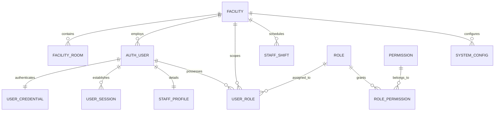
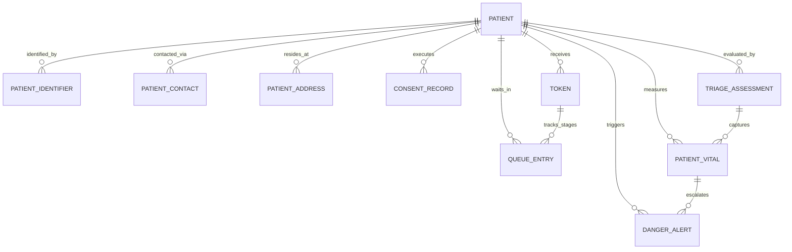
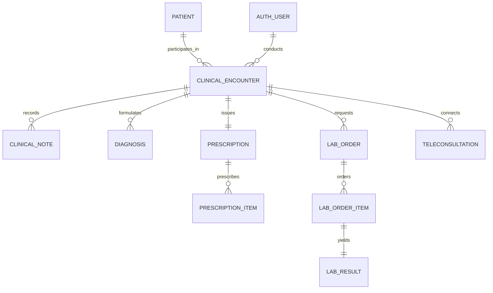
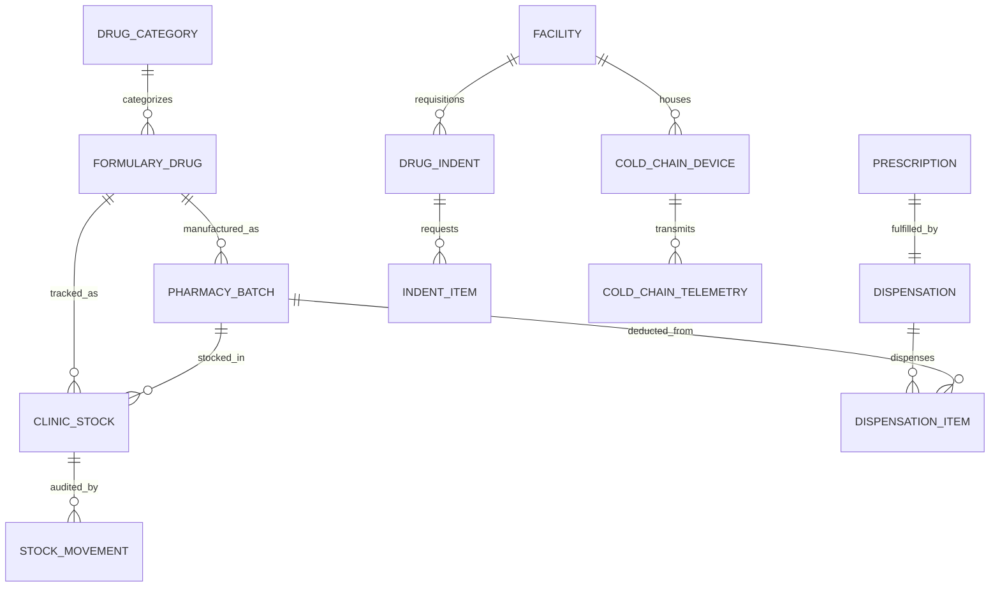
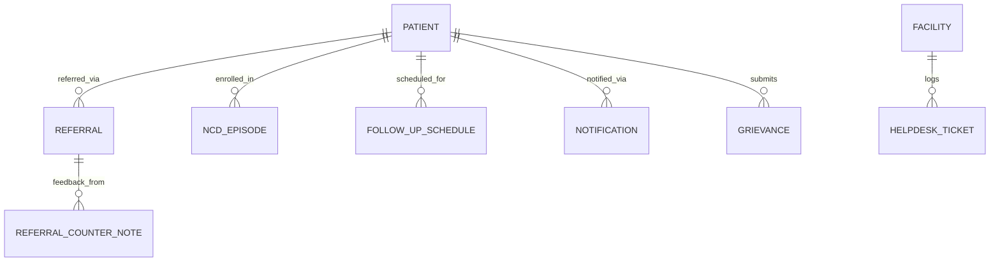

# Phase 07 — Conceptual Data Model Specification

> **Document Identifier**: `DB-CONCEPT-001`
> **System**: Namma Clinic Digital Health & Operations Platform
> **Municipal Authority**: Greater Bengaluru Authority (GBA) / BBMP Health Department
> **Status**: APPROVED CONCEPTUAL BASELINE
> **Entities Documented**: 52 Core Business Entities (`ENTITY-001` to `ENTITY-052`)
> **Domain Coverage**: 6 Major Healthcare Operational Domains
> **Compliance Framework**: DPDP Act 2023, ABDM Standards, NMC Clinical Guidelines

---

## 1. Executive Summary & Conceptual Modeling Scope

The Conceptual Data Model represents the highest abstraction level of the Namma Clinic platform's information architecture. It models real-world clinical, administrative, logistical, and citizen concepts independent of physical storage technologies, indexing strategies, or normalization levels.

The primary objective of this model is to establish unambiguous domain semantics between clinical practitioners (Chief Medical Officers, treating physicians, staff nurses, pharmacists, lab technicians), municipal administrators (BBMP Health Commissioners, District Health Officers, Ward Engineers), and technical engineering teams. By anchoring every entity in statutory regulations (e.g. DPDP Act 2023, Karnataka Sakala Act, Pharmacy Practice Regulations) and operational workflows (WF-001 through WF-025), this specification ensures that technical database designs faithfully reflect the real-world healthcare delivery mission of Greater Bengaluru.

## 2. Conceptual Modeling Principles & Boundary Rules

The conceptual modeling methodology adheres to 8 strict governance principles:

| Principle ID | Principle Name | Semantic Rule | Clinical & Operational Impact |
| :--- | :--- | :--- | :--- |
| **CM-PRIN-001** | Real-World Entity Grounding | Every conceptual entity must represent a tangible physical object, person, event, or statutory artifact in the BBMP healthcare ecosystem. | Prevents artificial technical abstractions from polluting business domain terminology. |
| **CM-PRIN-002** | Explicit Stewardship & Ownership | Every conceptual entity must have a designated executive business owner responsible for lifecycle rules, data quality, and access policy. | Eliminates orphaned data domains; establishes accountability for data governance. |
| **CM-PRIN-003** | Longitudinal Patient Centricity | All clinical, diagnostic, pharmaceutical, and triage entities must maintain unambiguous semantic linkage to the master citizen identity. | Guarantees a single, coherent longitudinal health record across all clinic visits. |
| **CM-PRIN-004** | Separation of Intent and Event | Planned orders (e.g., Prescriptions, Lab Orders, Referrals) must be conceptually distinguished from their physical fulfillment events (Dispensations, Lab Results, Counter-Notes). | Enables tracking of clinical fulfillment lags, non-adherence, and supply chain stockouts. |
| **CM-PRIN-005** | Immutable Clinical Observations | Clinical observations (Vitals, Triage Acuity, SOAP notes, Lab Results) represent historical facts observed at a point in time and cannot be retroactively edited. | Preserves legal and medical evidence; corrections must be recorded as addenda. |
| **CM-PRIN-006** | Double-Entry Inventory Conservation | Pharmaceutical entities must follow double-entry stock accounting where every inventory decrement is matched by a corresponding dispensation or transfer event. | Prevents unrecorded medicine shrinkage and ensures auditability by CAG and state auditors. |
| **CM-PRIN-007** | Privacy by Design & Consent Gating | Sensitive health entities must be governed by explicit citizen consent directives compliant with the DPDP Act 2023. | Ensures citizen sovereignty over personal health data and legal compliance. |
| **CM-PRIN-008** | Interoperability Taxonomy Alignment | Clinical concepts must align semantically with national and international health vocabularies (WHO ICD-10, SNOMED CT, LOINC, WHO-ATC). | Enables seamless integration with national ABDM registries and public health disease surveillance. |

## 3. High-Level Conceptual Entity-Relationship Architecture

The 52 conceptual entities interact across six core healthcare domains. Below are the definitive domain entity-relationship diagrams illustrating cardinality, business semantics, and dependency flows.

### 3.1 Domain 1: Identity, Governance & Organization ER Diagram

### 3.2 Domain 2: Citizen Intake, Queue Management & Triage ER Diagram

### 3.3 Domain 3: Clinical Consultation, Orders & Diagnostics ER Diagram

### 3.4 Domain 4: Pharmacy, Inventory & Cold Chain ER Diagram

### 3.5 Domain 5: Continuity of Care & Citizen Engagement ER Diagram

## 4. Conceptual Cardinality & Relationship Matrix

The following matrix summarizes the cardinality, optionality, and structural dependencies among the primary conceptual entities:

| Primary Entity | Related Entity | Business Relationship | Cardinality | Parent Optionality | Child Optionality | Dependency Rule |
| :--- | :--- | :--- | :--- | :--- | :--- | :--- |
| Facility | Chamber / Room | Physical room enclosure inside clinic | 1:N | Mandatory | Mandatory | Room cannot exist without parent clinic facility |
| Auth User | Credential | High-security Argon2id secret | 1:1 | Mandatory | Mandatory | User account must possess valid cryptographic credential |
| Role | Permission | Entitlement capability grant | M:N | Optional | Optional | Role composed of zero or more granular permissions |
| Patient | Identifier | ABHA, Aadhaar hash, Ration card | 1:N | Mandatory | Optional | Patient can possess multiple external identity tokens |
| Patient | Contact | Mobile phone and emergency next-of-kin | 1:N | Mandatory | Mandatory | Patient must have at least one valid phone contact |
| Patient | Consent Directive | Explicit DPDP clinical data usage scope | 1:N | Mandatory | Mandatory | Clinical data access strictly gated by active consent |
| Token | Queue Stage | Sequential transition through clinic stages | 1:N | Mandatory | Mandatory | Queue entry strictly bound to daily issued token |
| Patient | Encounter | Outpatient clinical consultation | 1:N | Mandatory | Optional | Encounters accumulate longitudinally per patient |
| Encounter | SOAP Notes | Structured clinical documentation | 1:N | Mandatory | Mandatory | Consultation must record clinical observations and plan |
| Encounter | Diagnosis | Formulated medical condition (ICD-10) | 1:N | Mandatory | Mandatory | Consultation must specify at least one primary diagnosis |
| Encounter | Prescription | Electronic medication order | 1:1 | Mandatory | Optional | Consultation may optionally produce a prescription |
| Prescription | Prescription Item | Line item specifying drug and dosage | 1:N | Mandatory | Mandatory | Prescription must contain at least one medication item |
| Prescription | Dispensation | Physical fulfillment by pharmacist | 1:1 | Mandatory | Optional | Prescription dispensed at pharmacy window |
| Dispensation | Dispensation Item | Batch deduction line item | 1:N | Mandatory | Mandatory | Handover requires recording batch and quantity deducted |
| Clinic Stock | Stock Movement | Double-entry inventory audit ledger | 1:N | Mandatory | Mandatory | Every balance change requires immutable ledger entry |
| Encounter | Lab Order | Diagnostic investigation request | 1:N | Mandatory | Optional | Consultation may request one or more lab orders |
| Lab Order | Lab Order Item | Specific diagnostic test (LOINC) | 1:N | Mandatory | Mandatory | Order composed of one or more diagnostic tests |
| Lab Order Item | Lab Result | Verified clinical test observation | 1:1 | Mandatory | Optional | Test item fulfilled by verified observation value |
| Patient | Referral | Secondary hospital transfer dossier | 1:N | Mandatory | Optional | Critical case transferred to specialized facility |
| Referral | Counter Note | Hospital specialist clinical feedback | 1:N | Mandatory | Optional | Receiving specialist closes referral loop |
| Patient | NCD Episode | Longitudinal chronic disease care plan | 1:N | Mandatory | Optional | Chronic diabetes/hypertension care management |
| Cold Chain Device | Telemetry | High-frequency IoT temperature logs | 1:N | Mandatory | Mandatory | IoT sensor logs temperature every 60 seconds |

## 5. Master Conceptual Entity Catalog (ENTITY-001 to ENTITY-052)

Below is the exhaustive specification for all 52 conceptual business entities across the Namma Clinic platform. Each specification documents semantic purpose, business ownership, lifecycle states, cardinality, sensitive attributes, and upstream traceability.

### ENTITY-001: Auth Users

**Conceptual Entity Identifier**: `ENTITY-001`
**Associated Relational Table**: `identity.auth_users` (`TABLE-001`)
**Operational Domain**: `Identity & Access`
**Executive Business Owner**: Chief Information Security Officer (CISO)

#### 1. Business Meaning & Purpose
From a conceptual modeling viewpoint, the `Auth Users` business entity establishes the authoritative domain representation: Master registry of all authenticated healthcare personnel, administrative staff, and system service accounts.

Within the broader municipal health architecture of Identity & Access, this conceptual entity fulfills the following clinical or operational objective: Stores user credentials identity root, email, mobile phone, status (ACTIVE, SUSPENDED, DEACTIVATED), and global audit timestamps.

#### 2. Lifecycle & State Machine Transitions
- **Lifecycle Description**: Created during staff onboarding; updated on credential/profile change; soft-deleted/deactivated on offboarding; retained 10 years per audit policy.
- **State Transitions**: `INITIALIZING` -> `ACTIVE` -> `UPDATED` -> `RETIRED/COMPLETED` -> `ARCHIVED`.
- **Immutability Invariant**: Historical event records are write-once; state mutations append change vectors without physical overwrite.

#### 3. Cardinality & Business Relationships
- **Cardinality**: 1:N with dependent child entities
- **Primary Relationships**: Associated with Identity & Access domain entities
- **Natural Business Identifiers**: Natural domain identifiers and UUIDv7 surrogate key (id)

#### 4. Sensitive Attributes & Privacy Classification
- **Sensitive Attributes**: Demographic, Clinical, Credential, or Operational payload
- **Governance Rule**: Governed by RETENTION-006 (CLASS-004)
- **Masking Requirement**: Strict masking on non-privileged UI interfaces and reports.

#### 5. Upstream Requirements & Downstream Consumers
- **Upstream Requirements**: `FR-001, FR-002, SECR-001, SECR-004`
- **Upstream Workflows**: `WF-001, WF-002`
- **Downstream Consumer Systems**: Auth Service, Staff Management API, Admin Console; Staff Activity Dashboard, Security Audit Log

#### 6. Core Conceptual Attributes

| Attribute Name | Conceptual Business Meaning | Data Sensitivity | Validation Rule |
| :--- | :--- | :--- | :--- |
| `id` | Unique immutable system identifier for user account | PII (CLASS-004) | UUIDv7 compliant format |
| `username` | Unique staff login handle | PII (CLASS-004) | ^[a-z0-9_.]{4,64}$ |
| `email` | Official governmental email address | PII (CLASS-004) | RFC 5322 email regex |
| `phone_number` | Registered mobile phone for MFA and emergency alerts | PII (CLASS-004) | ^\+91[6-9]\d{9}$ |
| `phone_blind_index` | Deterministic hash for mobile lookup without decrypting | Standard (CLASS-002) | ^[a-f0-9]{64}$ |
| `first_name` | Staff legal first name | PII (CLASS-004) | 1-100 characters |
| `last_name` | Staff legal surname | PII (CLASS-004) | 1-100 characters |
| `user_type` | Broad organizational role category | Standard (CLASS-002) | IN ('CLINICAL', 'ADMIN', 'PARAMEDICAL', 'INTEGRATION') |
| `account_status` | Current account operational lifecycle status | Standard (CLASS-002) | IN ('ACTIVE', 'SUSPENDED', 'LOCKED', 'DEACTIVATED', 'PENDING_ACTIVATION') |
| `primary_facility_id` | Home clinic or office where staff is permanently posted | Standard (CLASS-002) | Valid facility UUID |
| `failed_login_count` | Consecutive incorrect authentication attempts | Standard (CLASS-002) | >= 0 |
| `lockout_until` | Timestamp until which login attempts are rejected | Standard (CLASS-002) | Valid UTC timestamp |
| `mfa_enabled` | Mandatory two-factor authentication flag | Standard (CLASS-002) | true or false |
| `created_at` | Record creation timestamp | Standard (CLASS-002) | Valid UTC timestamp |
| `updated_at` | Record last modification timestamp | Standard (CLASS-002) | Valid UTC timestamp |
| `deleted_at` | Soft-deletion timestamp | Standard (CLASS-002) | Valid UTC timestamp |

### ENTITY-002: User Credentials

**Conceptual Entity Identifier**: `ENTITY-002`
**Associated Relational Table**: `identity.user_credentials` (`TABLE-002`)
**Operational Domain**: `Identity & Access`
**Executive Business Owner**: Security Engineering Lead

#### 1. Business Meaning & Purpose
From a conceptual modeling viewpoint, the `User Credentials` business entity establishes the authoritative domain representation: Cryptographic authentication secrets including Argon2id password hashes, MFA totp secrets, and failed login counters.

Within the broader municipal health architecture of Identity & Access, this conceptual entity fulfills the following clinical or operational objective: Stores high-security credentials separated from user demographic profile to isolate cryptographic attack surface.

#### 2. Lifecycle & State Machine Transitions
- **Lifecycle Description**: Created at user registration; modified on password rotation; purged on user erasure.
- **State Transitions**: `INITIALIZING` -> `ACTIVE` -> `UPDATED` -> `RETIRED/COMPLETED` -> `ARCHIVED`.
- **Immutability Invariant**: Historical event records are write-once; state mutations append change vectors without physical overwrite.

#### 3. Cardinality & Business Relationships
- **Cardinality**: 1:N with dependent child entities
- **Primary Relationships**: Associated with Identity & Access domain entities
- **Natural Business Identifiers**: Natural domain identifiers and UUIDv7 surrogate key (id)

#### 4. Sensitive Attributes & Privacy Classification
- **Sensitive Attributes**: Demographic, Clinical, Credential, or Operational payload
- **Governance Rule**: Governed by RETENTION-011 (CLASS-005)
- **Masking Requirement**: Strict masking on non-privileged UI interfaces and reports.

#### 5. Upstream Requirements & Downstream Consumers
- **Upstream Requirements**: `SECR-001, SECR-002, SECR-003`
- **Upstream Workflows**: `WF-001`
- **Downstream Consumer Systems**: Authentication Gateway; None

#### 6. Core Conceptual Attributes

| Attribute Name | Conceptual Business Meaning | Data Sensitivity | Validation Rule |
| :--- | :--- | :--- | :--- |
| `id` | Surrogate primary key for credentials | Standard (CLASS-005) | UUIDv7 |
| `user_id` | Foreign key to owning user record | Standard (CLASS-005) | Valid user UUID |
| `password_hash` | Cryptographically hashed user password | Standard (CLASS-005) | ^\$argon2id\$v=19\$.* |
| `password_salt` | Per-user unique cryptographic salt | Standard (CLASS-005) | 32-byte hex salt |
| `mfa_secret_encrypted` | Encrypted TOTP secret key for Authenticator apps | Standard (CLASS-005) | Valid ciphertext |
| `mfa_backup_codes_hash` | One-time emergency backup recovery codes | Standard (CLASS-005) | Valid JSON array of hashes |
| `password_changed_at` | Timestamp of last password change | Standard (CLASS-002) | Valid UTC timestamp |
| `force_password_reset` | Flag forcing user to reset password on next login | Standard (CLASS-002) | true or false |
| `failed_mfa_count` | Count of consecutive invalid MFA token entries | Standard (CLASS-002) | >= 0 |
| `security_stamp` | Token invalidation stamp | Standard (CLASS-005) | Valid random string |
| `argon2_memory_cost` | Cryptographic work factor memory parameter | Standard (CLASS-002) | >= 65536 |
| `argon2_time_cost` | Cryptographic work factor iteration parameter | Standard (CLASS-002) | >= 3 |
| `argon2_parallelism` | Cryptographic work factor thread parameter | Standard (CLASS-002) | >= 1 |
| `created_at` | Record creation timestamp | Standard (CLASS-002) | Valid UTC timestamp |
| `updated_at` | Record modification timestamp | Standard (CLASS-002) | Valid UTC timestamp |
| `deleted_at` | Soft-deletion timestamp | Standard (CLASS-002) | Valid UTC timestamp |

### ENTITY-003: User Sessions

**Conceptual Entity Identifier**: `ENTITY-003`
**Associated Relational Table**: `identity.user_sessions` (`TABLE-003`)
**Operational Domain**: `Identity & Access`
**Executive Business Owner**: Security Operations Center (SOC)

#### 1. Business Meaning & Purpose
From a conceptual modeling viewpoint, the `User Sessions` business entity establishes the authoritative domain representation: Active and historical web/mobile authentication sessions, JWT refresh tokens, and device fingerprints.

Within the broader municipal health architecture of Identity & Access, this conceptual entity fulfills the following clinical or operational objective: Maintains session state, expiration timestamps, IP address geolocation, and revocation status.

#### 2. Lifecycle & State Machine Transitions
- **Lifecycle Description**: Created on login; expired after 15 minutes of inactivity; purged after 1 year.
- **State Transitions**: `INITIALIZING` -> `ACTIVE` -> `UPDATED` -> `RETIRED/COMPLETED` -> `ARCHIVED`.
- **Immutability Invariant**: Historical event records are write-once; state mutations append change vectors without physical overwrite.

#### 3. Cardinality & Business Relationships
- **Cardinality**: 1:N with dependent child entities
- **Primary Relationships**: Associated with Identity & Access domain entities
- **Natural Business Identifiers**: Natural domain identifiers and UUIDv7 surrogate key (id)

#### 4. Sensitive Attributes & Privacy Classification
- **Sensitive Attributes**: Demographic, Clinical, Credential, or Operational payload
- **Governance Rule**: Governed by RETENTION-011 (CLASS-003)
- **Masking Requirement**: Strict masking on non-privileged UI interfaces and reports.

#### 5. Upstream Requirements & Downstream Consumers
- **Upstream Requirements**: `SECR-004, SECR-005`
- **Upstream Workflows**: `WF-001`
- **Downstream Consumer Systems**: Session Validation Middleware; Security Compliance Monthly Report

#### 6. Core Conceptual Attributes

| Attribute Name | Conceptual Business Meaning | Data Sensitivity | Validation Rule |
| :--- | :--- | :--- | :--- |
| `id` | Surrogate primary key for user_sessions | Standard (CLASS-003) | UUIDv7 format |
| `user_session_number` | Human-readable tracking identifier for user_sessions | Standard (CLASS-003) | Alphanumeric tracking code |
| `facility_id` | Clinic facility where event or entity originated | Standard (CLASS-002) | Valid UUID |
| `created_by_user_id` | Staff member who created the record | Standard (CLASS-002) | Valid UUID |
| `status` | Operational workflow status | Standard (CLASS-002) | Status Enum |
| `category_type` | Domain classification category | Standard (CLASS-002) | Classification string |
| `metadata_json` | Detailed structured operational and clinical attributes | PHI (CLASS-003) | Valid JSONB schema |
| `priority_score` | Operational priority or clinical severity score | Standard (CLASS-002) | 1 to 5 |
| `operational_notes` | Observations and qualitative remarks recorded by staff | PHI (CLASS-003) | Text up to 4000 chars |
| `sync_version` | Optimistic locking and offline synchronization sequence number | Standard (CLASS-002) | >= 1 |
| `edge_device_id` | Hardware terminal or tablet identifier where entry occurred | Standard (CLASS-002) | Device MAC or UUID |
| `record_hash` | Cryptographic tamper-detection checksum | Standard (CLASS-002) | ^[a-f0-9]{64}$ |
| `verified_at` | Official clinical or supervisor verification timestamp | Standard (CLASS-002) | UTC timestamp |
| `created_at` | Timestamp when record was initially committed | Standard (CLASS-002) | UTC timestamp |
| `updated_at` | Timestamp when record was last modified | Standard (CLASS-002) | UTC timestamp |
| `deleted_at` | Timestamp of soft-deletion | Standard (CLASS-002) | UTC timestamp |

### ENTITY-004: Roles

**Conceptual Entity Identifier**: `ENTITY-004`
**Associated Relational Table**: `identity.roles` (`TABLE-004`)
**Operational Domain**: `Role-Based Access Control`
**Executive Business Owner**: BBMP Health Administration

#### 1. Business Meaning & Purpose
From a conceptual modeling viewpoint, the `Roles` business entity establishes the authoritative domain representation: Master directory of standardized organizational roles (Doctor, Staff Nurse, Pharmacist, Lab Technician, Receptionist, MOIC).

Within the broader municipal health architecture of Role-Based Access Control, this conceptual entity fulfills the following clinical or operational objective: Defines canonical system roles, description, hierarchy level, and default operational permissions.

#### 2. Lifecycle & State Machine Transitions
- **Lifecycle Description**: Static reference data; updated on institutional policy revisions.
- **State Transitions**: `INITIALIZING` -> `ACTIVE` -> `UPDATED` -> `RETIRED/COMPLETED` -> `ARCHIVED`.
- **Immutability Invariant**: Historical event records are write-once; state mutations append change vectors without physical overwrite.

#### 3. Cardinality & Business Relationships
- **Cardinality**: 1:N with dependent child entities
- **Primary Relationships**: Associated with Role-Based Access Control domain entities
- **Natural Business Identifiers**: Natural domain identifiers and UUIDv7 surrogate key (id)

#### 4. Sensitive Attributes & Privacy Classification
- **Sensitive Attributes**: Demographic, Clinical, Credential, or Operational payload
- **Governance Rule**: Governed by RETENTION-006 (CLASS-002)
- **Masking Requirement**: Strict masking on non-privileged UI interfaces and reports.

#### 5. Upstream Requirements & Downstream Consumers
- **Upstream Requirements**: `FR-002, SECR-006`
- **Upstream Workflows**: `WF-002`
- **Downstream Consumer Systems**: Authorization Engine, Admin Portal; Role Distribution Matrix

#### 6. Core Conceptual Attributes

| Attribute Name | Conceptual Business Meaning | Data Sensitivity | Validation Rule |
| :--- | :--- | :--- | :--- |
| `id` | Surrogate primary key for roles | Standard (CLASS-002) | UUIDv7 format |
| `role_number` | Human-readable tracking identifier for roles | Standard (CLASS-002) | Alphanumeric tracking code |
| `facility_id` | Clinic facility where event or entity originated | Standard (CLASS-002) | Valid UUID |
| `created_by_user_id` | Staff member who created the record | Standard (CLASS-002) | Valid UUID |
| `status` | Operational workflow status | Standard (CLASS-002) | Status Enum |
| `category_type` | Domain classification category | Standard (CLASS-002) | Classification string |
| `metadata_json` | Detailed structured operational and clinical attributes | Standard (CLASS-002) | Valid JSONB schema |
| `priority_score` | Operational priority or clinical severity score | Standard (CLASS-002) | 1 to 5 |
| `operational_notes` | Observations and qualitative remarks recorded by staff | Standard (CLASS-002) | Text up to 4000 chars |
| `sync_version` | Optimistic locking and offline synchronization sequence number | Standard (CLASS-002) | >= 1 |
| `edge_device_id` | Hardware terminal or tablet identifier where entry occurred | Standard (CLASS-002) | Device MAC or UUID |
| `record_hash` | Cryptographic tamper-detection checksum | Standard (CLASS-002) | ^[a-f0-9]{64}$ |
| `verified_at` | Official clinical or supervisor verification timestamp | Standard (CLASS-002) | UTC timestamp |
| `created_at` | Timestamp when record was initially committed | Standard (CLASS-002) | UTC timestamp |
| `updated_at` | Timestamp when record was last modified | Standard (CLASS-002) | UTC timestamp |
| `deleted_at` | Timestamp of soft-deletion | Standard (CLASS-002) | UTC timestamp |

### ENTITY-005: Permissions

**Conceptual Entity Identifier**: `ENTITY-005`
**Associated Relational Table**: `identity.permissions` (`TABLE-005`)
**Operational Domain**: `Role-Based Access Control`
**Executive Business Owner**: System Architecture Team

#### 1. Business Meaning & Purpose
From a conceptual modeling viewpoint, the `Permissions` business entity establishes the authoritative domain representation: Fine-grained operational capabilities (e.g., prescribe_medication, dispense_drug, order_lab_test).

Within the broader municipal health architecture of Role-Based Access Control, this conceptual entity fulfills the following clinical or operational objective: Atomic system entitlements mapped to resource actions across REST and GraphQL endpoints.

#### 2. Lifecycle & State Machine Transitions
- **Lifecycle Description**: System immutable code-linked definitions; updated during software releases.
- **State Transitions**: `INITIALIZING` -> `ACTIVE` -> `UPDATED` -> `RETIRED/COMPLETED` -> `ARCHIVED`.
- **Immutability Invariant**: Historical event records are write-once; state mutations append change vectors without physical overwrite.

#### 3. Cardinality & Business Relationships
- **Cardinality**: 1:N with dependent child entities
- **Primary Relationships**: Associated with Role-Based Access Control domain entities
- **Natural Business Identifiers**: Natural domain identifiers and UUIDv7 surrogate key (id)

#### 4. Sensitive Attributes & Privacy Classification
- **Sensitive Attributes**: Demographic, Clinical, Credential, or Operational payload
- **Governance Rule**: Governed by RETENTION-006 (CLASS-002)
- **Masking Requirement**: Strict masking on non-privileged UI interfaces and reports.

#### 5. Upstream Requirements & Downstream Consumers
- **Upstream Requirements**: `SECR-006, SECR-007`
- **Upstream Workflows**: `WF-002`
- **Downstream Consumer Systems**: Policy Enforcement Point (PEP); Access Control List Audit

#### 6. Core Conceptual Attributes

| Attribute Name | Conceptual Business Meaning | Data Sensitivity | Validation Rule |
| :--- | :--- | :--- | :--- |
| `id` | Surrogate primary key for permissions | Standard (CLASS-002) | UUIDv7 format |
| `permission_number` | Human-readable tracking identifier for permissions | Standard (CLASS-002) | Alphanumeric tracking code |
| `facility_id` | Clinic facility where event or entity originated | Standard (CLASS-002) | Valid UUID |
| `created_by_user_id` | Staff member who created the record | Standard (CLASS-002) | Valid UUID |
| `status` | Operational workflow status | Standard (CLASS-002) | Status Enum |
| `category_type` | Domain classification category | Standard (CLASS-002) | Classification string |
| `metadata_json` | Detailed structured operational and clinical attributes | Standard (CLASS-002) | Valid JSONB schema |
| `priority_score` | Operational priority or clinical severity score | Standard (CLASS-002) | 1 to 5 |
| `operational_notes` | Observations and qualitative remarks recorded by staff | Standard (CLASS-002) | Text up to 4000 chars |
| `sync_version` | Optimistic locking and offline synchronization sequence number | Standard (CLASS-002) | >= 1 |
| `edge_device_id` | Hardware terminal or tablet identifier where entry occurred | Standard (CLASS-002) | Device MAC or UUID |
| `record_hash` | Cryptographic tamper-detection checksum | Standard (CLASS-002) | ^[a-f0-9]{64}$ |
| `verified_at` | Official clinical or supervisor verification timestamp | Standard (CLASS-002) | UTC timestamp |
| `created_at` | Timestamp when record was initially committed | Standard (CLASS-002) | UTC timestamp |
| `updated_at` | Timestamp when record was last modified | Standard (CLASS-002) | UTC timestamp |
| `deleted_at` | Timestamp of soft-deletion | Standard (CLASS-002) | UTC timestamp |

### ENTITY-006: Role Permissions

**Conceptual Entity Identifier**: `ENTITY-006`
**Associated Relational Table**: `identity.role_permissions` (`TABLE-006`)
**Operational Domain**: `Role-Based Access Control`
**Executive Business Owner**: BBMP Health Administration

#### 1. Business Meaning & Purpose
From a conceptual modeling viewpoint, the `Role Permissions` business entity establishes the authoritative domain representation: Many-to-many junction mapping system permissions to roles.

Within the broader municipal health architecture of Role-Based Access Control, this conceptual entity fulfills the following clinical or operational objective: Associates permissions to roles with grant timestamps, active status, and granter user ID.

#### 2. Lifecycle & State Machine Transitions
- **Lifecycle Description**: Modified during role permission matrix updates.
- **State Transitions**: `INITIALIZING` -> `ACTIVE` -> `UPDATED` -> `RETIRED/COMPLETED` -> `ARCHIVED`.
- **Immutability Invariant**: Historical event records are write-once; state mutations append change vectors without physical overwrite.

#### 3. Cardinality & Business Relationships
- **Cardinality**: 1:N with dependent child entities
- **Primary Relationships**: Associated with Role-Based Access Control domain entities
- **Natural Business Identifiers**: Natural domain identifiers and UUIDv7 surrogate key (id)

#### 4. Sensitive Attributes & Privacy Classification
- **Sensitive Attributes**: Demographic, Clinical, Credential, or Operational payload
- **Governance Rule**: Governed by RETENTION-006 (CLASS-002)
- **Masking Requirement**: Strict masking on non-privileged UI interfaces and reports.

#### 5. Upstream Requirements & Downstream Consumers
- **Upstream Requirements**: `FR-002, SECR-006`
- **Upstream Workflows**: `WF-002`
- **Downstream Consumer Systems**: RBAC Enforcement Engine; Role Entitlement Report

#### 6. Core Conceptual Attributes

| Attribute Name | Conceptual Business Meaning | Data Sensitivity | Validation Rule |
| :--- | :--- | :--- | :--- |
| `id` | Surrogate primary key for role_permissions | Standard (CLASS-002) | UUIDv7 format |
| `role_permission_number` | Human-readable tracking identifier for role_permissions | Standard (CLASS-002) | Alphanumeric tracking code |
| `facility_id` | Clinic facility where event or entity originated | Standard (CLASS-002) | Valid UUID |
| `created_by_user_id` | Staff member who created the record | Standard (CLASS-002) | Valid UUID |
| `status` | Operational workflow status | Standard (CLASS-002) | Status Enum |
| `category_type` | Domain classification category | Standard (CLASS-002) | Classification string |
| `metadata_json` | Detailed structured operational and clinical attributes | Standard (CLASS-002) | Valid JSONB schema |
| `priority_score` | Operational priority or clinical severity score | Standard (CLASS-002) | 1 to 5 |
| `operational_notes` | Observations and qualitative remarks recorded by staff | Standard (CLASS-002) | Text up to 4000 chars |
| `sync_version` | Optimistic locking and offline synchronization sequence number | Standard (CLASS-002) | >= 1 |
| `edge_device_id` | Hardware terminal or tablet identifier where entry occurred | Standard (CLASS-002) | Device MAC or UUID |
| `record_hash` | Cryptographic tamper-detection checksum | Standard (CLASS-002) | ^[a-f0-9]{64}$ |
| `verified_at` | Official clinical or supervisor verification timestamp | Standard (CLASS-002) | UTC timestamp |
| `created_at` | Timestamp when record was initially committed | Standard (CLASS-002) | UTC timestamp |
| `updated_at` | Timestamp when record was last modified | Standard (CLASS-002) | UTC timestamp |
| `deleted_at` | Timestamp of soft-deletion | Standard (CLASS-002) | UTC timestamp |

### ENTITY-007: User Roles

**Conceptual Entity Identifier**: `ENTITY-007`
**Associated Relational Table**: `identity.user_roles` (`TABLE-007`)
**Operational Domain**: `Role-Based Access Control`
**Executive Business Owner**: BBMP District Health Officer

#### 1. Business Meaning & Purpose
From a conceptual modeling viewpoint, the `User Roles` business entity establishes the authoritative domain representation: Assignments of roles to users scoped by specific healthcare facility.

Within the broader municipal health architecture of Role-Based Access Control, this conceptual entity fulfills the following clinical or operational objective: Links users to roles within a facility context, supporting multi-facility roaming doctors.

#### 2. Lifecycle & State Machine Transitions
- **Lifecycle Description**: Created upon staff facility posting; revoked on transfer.
- **State Transitions**: `INITIALIZING` -> `ACTIVE` -> `UPDATED` -> `RETIRED/COMPLETED` -> `ARCHIVED`.
- **Immutability Invariant**: Historical event records are write-once; state mutations append change vectors without physical overwrite.

#### 3. Cardinality & Business Relationships
- **Cardinality**: 1:N with dependent child entities
- **Primary Relationships**: Associated with Role-Based Access Control domain entities
- **Natural Business Identifiers**: Natural domain identifiers and UUIDv7 surrogate key (id)

#### 4. Sensitive Attributes & Privacy Classification
- **Sensitive Attributes**: Demographic, Clinical, Credential, or Operational payload
- **Governance Rule**: Governed by RETENTION-006 (CLASS-002)
- **Masking Requirement**: Strict masking on non-privileged UI interfaces and reports.

#### 5. Upstream Requirements & Downstream Consumers
- **Upstream Requirements**: `FR-002, SECR-006`
- **Upstream Workflows**: `WF-002`
- **Downstream Consumer Systems**: Authorization Service; Facility Staffing Register

#### 6. Core Conceptual Attributes

| Attribute Name | Conceptual Business Meaning | Data Sensitivity | Validation Rule |
| :--- | :--- | :--- | :--- |
| `id` | Surrogate primary key for user_roles | Standard (CLASS-002) | UUIDv7 format |
| `user_role_number` | Human-readable tracking identifier for user_roles | Standard (CLASS-002) | Alphanumeric tracking code |
| `facility_id` | Clinic facility where event or entity originated | Standard (CLASS-002) | Valid UUID |
| `created_by_user_id` | Staff member who created the record | Standard (CLASS-002) | Valid UUID |
| `status` | Operational workflow status | Standard (CLASS-002) | Status Enum |
| `category_type` | Domain classification category | Standard (CLASS-002) | Classification string |
| `metadata_json` | Detailed structured operational and clinical attributes | Standard (CLASS-002) | Valid JSONB schema |
| `priority_score` | Operational priority or clinical severity score | Standard (CLASS-002) | 1 to 5 |
| `operational_notes` | Observations and qualitative remarks recorded by staff | Standard (CLASS-002) | Text up to 4000 chars |
| `sync_version` | Optimistic locking and offline synchronization sequence number | Standard (CLASS-002) | >= 1 |
| `edge_device_id` | Hardware terminal or tablet identifier where entry occurred | Standard (CLASS-002) | Device MAC or UUID |
| `record_hash` | Cryptographic tamper-detection checksum | Standard (CLASS-002) | ^[a-f0-9]{64}$ |
| `verified_at` | Official clinical or supervisor verification timestamp | Standard (CLASS-002) | UTC timestamp |
| `created_at` | Timestamp when record was initially committed | Standard (CLASS-002) | UTC timestamp |
| `updated_at` | Timestamp when record was last modified | Standard (CLASS-002) | UTC timestamp |
| `deleted_at` | Timestamp of soft-deletion | Standard (CLASS-002) | UTC timestamp |

### ENTITY-008: Facilities

**Conceptual Entity Identifier**: `ENTITY-008`
**Associated Relational Table**: `identity.facilities` (`TABLE-008`)
**Operational Domain**: `Facility Operations`
**Executive Business Owner**: BBMP Health Commissioner

#### 1. Business Meaning & Purpose
From a conceptual modeling viewpoint, the `Facilities` business entity establishes the authoritative domain representation: Master directory of Namma Clinics, Urban Primary Health Centres (UPHCs), and referral hospitals.

Within the broader municipal health architecture of Facility Operations, this conceptual entity fulfills the following clinical or operational objective: Stores clinic code, official name, ward number, zone, GPS latitude/longitude, operational hours, and ABDM facility ID (HFR).

#### 2. Lifecycle & State Machine Transitions
- **Lifecycle Description**: Created on clinic commissioning; updated on infrastructure changes; deactivated on decommissioning.
- **State Transitions**: `INITIALIZING` -> `ACTIVE` -> `UPDATED` -> `RETIRED/COMPLETED` -> `ARCHIVED`.
- **Immutability Invariant**: Historical event records are write-once; state mutations append change vectors without physical overwrite.

#### 3. Cardinality & Business Relationships
- **Cardinality**: 1:N with dependent child entities
- **Primary Relationships**: Associated with Facility Operations domain entities
- **Natural Business Identifiers**: Natural domain identifiers and UUIDv7 surrogate key (id)

#### 4. Sensitive Attributes & Privacy Classification
- **Sensitive Attributes**: Demographic, Clinical, Credential, or Operational payload
- **Governance Rule**: Governed by RETENTION-006 (CLASS-001)
- **Masking Requirement**: Strict masking on non-privileged UI interfaces and reports.

#### 5. Upstream Requirements & Downstream Consumers
- **Upstream Requirements**: `FR-003, INT-001`
- **Upstream Workflows**: `WF-002`
- **Downstream Consumer Systems**: Facility Directory API, Public Portal, Citizen Mobile App; Ward-wise Clinic Coverage Map

#### 6. Core Conceptual Attributes

| Attribute Name | Conceptual Business Meaning | Data Sensitivity | Validation Rule |
| :--- | :--- | :--- | :--- |
| `id` | Surrogate primary key for facilities | Standard (CLASS-001) | UUIDv7 format |
| `facility_code` | Government facility registration code | Standard (CLASS-001) | ^BLR-[A-Z]{2,4}-\d{3}$ |
| `facility_name` | Official clinic public name | Standard (CLASS-001) | 1-255 chars |
| `ward_number` | BBMP administrative ward number | Standard (CLASS-001) | 1 to 243 |
| `zone_name` | BBMP administrative zone | Standard (CLASS-001) | IN ('EAST', 'WEST', 'SOUTH', 'BOMMANAHALLI', 'DASARAHALLI', 'MAHADEVAPURA', 'RR_NAGARA', 'YELAHANKA') |
| `facility_type` | Healthcare facility classification tier | Standard (CLASS-001) | IN ('NAMMA_CLINIC', 'UPHC', 'REFERRAL_HOSPITAL', 'DIAGNOSTIC_HUB') |
| `latitude` | GPS geographic latitude | Standard (CLASS-001) | 12.0 to 13.5 |
| `longitude` | GPS geographic longitude | Standard (CLASS-001) | 77.3 to 77.8 |
| `hfr_id` | National Health Facility Registry (HFR) identifier | Standard (CLASS-001) | ^IN\d{8,}$ |
| `phone_contact` | Public telephone contact number | Standard (CLASS-001) | ^\+91\d{10}$ |
| `is_active` | Operational active flag | Standard (CLASS-001) | true or false |
| `operating_hours_json` | Weekly working hours and shift schedules | Standard (CLASS-001) | Valid JSON |
| `ip_address_range` | Clinic local area network subnet | Standard (CLASS-002) | CIDR notation |
| `created_at` | Record creation timestamp | Standard (CLASS-002) | UTC timestamp |
| `updated_at` | Last modification timestamp | Standard (CLASS-002) | UTC timestamp |
| `deleted_at` | Decommission timestamp | Standard (CLASS-002) | UTC timestamp |

### ENTITY-009: Facility Rooms

**Conceptual Entity Identifier**: `ENTITY-009`
**Associated Relational Table**: `identity.facility_rooms` (`TABLE-009`)
**Operational Domain**: `Facility Operations`
**Executive Business Owner**: Medical Officer In-Charge (MOIC)

#### 1. Business Meaning & Purpose
From a conceptual modeling viewpoint, the `Facility Rooms` business entity establishes the authoritative domain representation: Internal physical chambers, consultation rooms, triage booths, pharmacy counters, and sample collection points within a clinic.

Within the broader municipal health architecture of Facility Operations, this conceptual entity fulfills the following clinical or operational objective: Represents functional service points used for queue routing, token display displays, and IoT device association.

#### 2. Lifecycle & State Machine Transitions
- **Lifecycle Description**: Configured during clinic setup; adjusted during clinic layout reorganization.
- **State Transitions**: `INITIALIZING` -> `ACTIVE` -> `UPDATED` -> `RETIRED/COMPLETED` -> `ARCHIVED`.
- **Immutability Invariant**: Historical event records are write-once; state mutations append change vectors without physical overwrite.

#### 3. Cardinality & Business Relationships
- **Cardinality**: 1:N with dependent child entities
- **Primary Relationships**: Associated with Facility Operations domain entities
- **Natural Business Identifiers**: Natural domain identifiers and UUIDv7 surrogate key (id)

#### 4. Sensitive Attributes & Privacy Classification
- **Sensitive Attributes**: Demographic, Clinical, Credential, or Operational payload
- **Governance Rule**: Governed by RETENTION-019 (CLASS-002)
- **Masking Requirement**: Strict masking on non-privileged UI interfaces and reports.

#### 5. Upstream Requirements & Downstream Consumers
- **Upstream Requirements**: `FR-004, OR-001`
- **Upstream Workflows**: `WF-003, WF-004`
- **Downstream Consumer Systems**: Queue Management Engine, Token Display Screen System; Room Utilization Report

#### 6. Core Conceptual Attributes

| Attribute Name | Conceptual Business Meaning | Data Sensitivity | Validation Rule |
| :--- | :--- | :--- | :--- |
| `id` | Surrogate primary key for facility_rooms | Standard (CLASS-002) | UUIDv7 format |
| `facility_room_number` | Human-readable tracking identifier for facility_rooms | Standard (CLASS-002) | Alphanumeric tracking code |
| `facility_id` | Clinic facility where event or entity originated | Standard (CLASS-002) | Valid UUID |
| `created_by_user_id` | Staff member who created the record | Standard (CLASS-002) | Valid UUID |
| `status` | Operational workflow status | Standard (CLASS-002) | Status Enum |
| `category_type` | Domain classification category | Standard (CLASS-002) | Classification string |
| `metadata_json` | Detailed structured operational and clinical attributes | Standard (CLASS-002) | Valid JSONB schema |
| `priority_score` | Operational priority or clinical severity score | Standard (CLASS-002) | 1 to 5 |
| `operational_notes` | Observations and qualitative remarks recorded by staff | Standard (CLASS-002) | Text up to 4000 chars |
| `sync_version` | Optimistic locking and offline synchronization sequence number | Standard (CLASS-002) | >= 1 |
| `edge_device_id` | Hardware terminal or tablet identifier where entry occurred | Standard (CLASS-002) | Device MAC or UUID |
| `record_hash` | Cryptographic tamper-detection checksum | Standard (CLASS-002) | ^[a-f0-9]{64}$ |
| `verified_at` | Official clinical or supervisor verification timestamp | Standard (CLASS-002) | UTC timestamp |
| `created_at` | Timestamp when record was initially committed | Standard (CLASS-002) | UTC timestamp |
| `updated_at` | Timestamp when record was last modified | Standard (CLASS-002) | UTC timestamp |
| `deleted_at` | Timestamp of soft-deletion | Standard (CLASS-002) | UTC timestamp |

### ENTITY-010: Staff Profiles

**Conceptual Entity Identifier**: `ENTITY-010`
**Associated Relational Table**: `identity.staff_profiles` (`TABLE-010`)
**Operational Domain**: `Human Resources`
**Executive Business Owner**: BBMP Health Administration HR

#### 1. Business Meaning & Purpose
From a conceptual modeling viewpoint, the `Staff Profiles` business entity establishes the authoritative domain representation: Professional credentialing, medical council registration number (KMC/NMC), qualifications, and contact details of clinical staff.

Within the broader municipal health architecture of Human Resources, this conceptual entity fulfills the following clinical or operational objective: Stores doctor registration numbers, nurse certification IDs, educational degrees, specialization, and official communication channels.

#### 2. Lifecycle & State Machine Transitions
- **Lifecycle Description**: Created at hiring; updated on degree completion/promotion; retained 10 years post-resignation.
- **State Transitions**: `INITIALIZING` -> `ACTIVE` -> `UPDATED` -> `RETIRED/COMPLETED` -> `ARCHIVED`.
- **Immutability Invariant**: Historical event records are write-once; state mutations append change vectors without physical overwrite.

#### 3. Cardinality & Business Relationships
- **Cardinality**: 1:N with dependent child entities
- **Primary Relationships**: Associated with Human Resources domain entities
- **Natural Business Identifiers**: Natural domain identifiers and UUIDv7 surrogate key (id)

#### 4. Sensitive Attributes & Privacy Classification
- **Sensitive Attributes**: Demographic, Clinical, Credential, or Operational payload
- **Governance Rule**: Governed by RETENTION-006 (CLASS-004)
- **Masking Requirement**: Strict masking on non-privileged UI interfaces and reports.

#### 5. Upstream Requirements & Downstream Consumers
- **Upstream Requirements**: `FR-002, SECR-001`
- **Upstream Workflows**: `WF-002`
- **Downstream Consumer Systems**: Doctor Prescription Header Generator, Teleconsultation Roster; Clinical Credentialing Compliance Report

#### 6. Core Conceptual Attributes

| Attribute Name | Conceptual Business Meaning | Data Sensitivity | Validation Rule |
| :--- | :--- | :--- | :--- |
| `id` | Surrogate primary key for staff_profiles | Standard (CLASS-004) | UUIDv7 format |
| `staff_profile_number` | Human-readable tracking identifier for staff_profiles | Standard (CLASS-004) | Alphanumeric tracking code |
| `facility_id` | Clinic facility where event or entity originated | Standard (CLASS-002) | Valid UUID |
| `created_by_user_id` | Staff member who created the record | Standard (CLASS-002) | Valid UUID |
| `status` | Operational workflow status | Standard (CLASS-002) | Status Enum |
| `category_type` | Domain classification category | Standard (CLASS-002) | Classification string |
| `metadata_json` | Detailed structured operational and clinical attributes | PII (CLASS-004) | Valid JSONB schema |
| `priority_score` | Operational priority or clinical severity score | Standard (CLASS-002) | 1 to 5 |
| `operational_notes` | Observations and qualitative remarks recorded by staff | Standard (CLASS-004) | Text up to 4000 chars |
| `sync_version` | Optimistic locking and offline synchronization sequence number | Standard (CLASS-002) | >= 1 |
| `edge_device_id` | Hardware terminal or tablet identifier where entry occurred | Standard (CLASS-002) | Device MAC or UUID |
| `record_hash` | Cryptographic tamper-detection checksum | Standard (CLASS-002) | ^[a-f0-9]{64}$ |
| `verified_at` | Official clinical or supervisor verification timestamp | Standard (CLASS-002) | UTC timestamp |
| `created_at` | Timestamp when record was initially committed | Standard (CLASS-002) | UTC timestamp |
| `updated_at` | Timestamp when record was last modified | Standard (CLASS-002) | UTC timestamp |
| `deleted_at` | Timestamp of soft-deletion | Standard (CLASS-002) | UTC timestamp |

### ENTITY-011: Staff Shifts

**Conceptual Entity Identifier**: `ENTITY-011`
**Associated Relational Table**: `identity.staff_shifts` (`TABLE-011`)
**Operational Domain**: `Human Resources`
**Executive Business Owner**: MOIC / Facility Administrator

#### 1. Business Meaning & Purpose
From a conceptual modeling viewpoint, the `Staff Shifts` business entity establishes the authoritative domain representation: Daily work duty rosters, shift allocations (Morning, Afternoon, Evening), and biometric attendance records.

Within the broader municipal health architecture of Human Resources, this conceptual entity fulfills the following clinical or operational objective: Tracks planned vs actual doctor/nurse shifts, on-call status, leave absences, and biometric punch times.

#### 2. Lifecycle & State Machine Transitions
- **Lifecycle Description**: Created weekly/monthly; marked completed at end of shift; archived after 3 years.
- **State Transitions**: `INITIALIZING` -> `ACTIVE` -> `UPDATED` -> `RETIRED/COMPLETED` -> `ARCHIVED`.
- **Immutability Invariant**: Historical event records are write-once; state mutations append change vectors without physical overwrite.

#### 3. Cardinality & Business Relationships
- **Cardinality**: 1:N with dependent child entities
- **Primary Relationships**: Associated with Human Resources domain entities
- **Natural Business Identifiers**: Natural domain identifiers and UUIDv7 surrogate key (id)

#### 4. Sensitive Attributes & Privacy Classification
- **Sensitive Attributes**: Demographic, Clinical, Credential, or Operational payload
- **Governance Rule**: Governed by RETENTION-002 (CLASS-002)
- **Masking Requirement**: Strict masking on non-privileged UI interfaces and reports.

#### 5. Upstream Requirements & Downstream Consumers
- **Upstream Requirements**: `OR-002, OR-003`
- **Upstream Workflows**: `WF-002`
- **Downstream Consumer Systems**: Duty Roster Service, Time & Attendance Sync; Staff Absenteeism & Punctuality Dashboard

#### 6. Core Conceptual Attributes

| Attribute Name | Conceptual Business Meaning | Data Sensitivity | Validation Rule |
| :--- | :--- | :--- | :--- |
| `id` | Surrogate primary key for staff_shifts | Standard (CLASS-002) | UUIDv7 format |
| `staff_shift_number` | Human-readable tracking identifier for staff_shifts | Standard (CLASS-002) | Alphanumeric tracking code |
| `facility_id` | Clinic facility where event or entity originated | Standard (CLASS-002) | Valid UUID |
| `created_by_user_id` | Staff member who created the record | Standard (CLASS-002) | Valid UUID |
| `status` | Operational workflow status | Standard (CLASS-002) | Status Enum |
| `category_type` | Domain classification category | Standard (CLASS-002) | Classification string |
| `metadata_json` | Detailed structured operational and clinical attributes | Standard (CLASS-002) | Valid JSONB schema |
| `priority_score` | Operational priority or clinical severity score | Standard (CLASS-002) | 1 to 5 |
| `operational_notes` | Observations and qualitative remarks recorded by staff | Standard (CLASS-002) | Text up to 4000 chars |
| `sync_version` | Optimistic locking and offline synchronization sequence number | Standard (CLASS-002) | >= 1 |
| `edge_device_id` | Hardware terminal or tablet identifier where entry occurred | Standard (CLASS-002) | Device MAC or UUID |
| `record_hash` | Cryptographic tamper-detection checksum | Standard (CLASS-002) | ^[a-f0-9]{64}$ |
| `verified_at` | Official clinical or supervisor verification timestamp | Standard (CLASS-002) | UTC timestamp |
| `created_at` | Timestamp when record was initially committed | Standard (CLASS-002) | UTC timestamp |
| `updated_at` | Timestamp when record was last modified | Standard (CLASS-002) | UTC timestamp |
| `deleted_at` | Timestamp of soft-deletion | Standard (CLASS-002) | UTC timestamp |

### ENTITY-012: System Configs

**Conceptual Entity Identifier**: `ENTITY-012`
**Associated Relational Table**: `identity.system_configs` (`TABLE-012`)
**Operational Domain**: `System Configuration`
**Executive Business Owner**: Principal DevOps Architect

#### 1. Business Meaning & Purpose
From a conceptual modeling viewpoint, the `System Configs` business entity establishes the authoritative domain representation: Hierarchical dynamic platform configuration parameters, feature flags, and operational thresholds.

Within the broader municipal health architecture of System Configuration, this conceptual entity fulfills the following clinical or operational objective: Key-value store scoped by GLOBAL, ZONE, or FACILITY, supporting dynamic threshold adjustments without deployment.

#### 2. Lifecycle & State Machine Transitions
- **Lifecycle Description**: Modified during operational configuration; version controlled with rollback.
- **State Transitions**: `INITIALIZING` -> `ACTIVE` -> `UPDATED` -> `RETIRED/COMPLETED` -> `ARCHIVED`.
- **Immutability Invariant**: Historical event records are write-once; state mutations append change vectors without physical overwrite.

#### 3. Cardinality & Business Relationships
- **Cardinality**: 1:N with dependent child entities
- **Primary Relationships**: Associated with System Configuration domain entities
- **Natural Business Identifiers**: Natural domain identifiers and UUIDv7 surrogate key (id)

#### 4. Sensitive Attributes & Privacy Classification
- **Sensitive Attributes**: Demographic, Clinical, Credential, or Operational payload
- **Governance Rule**: Governed by RETENTION-006 (CLASS-002)
- **Masking Requirement**: Strict masking on non-privileged UI interfaces and reports.

#### 5. Upstream Requirements & Downstream Consumers
- **Upstream Requirements**: `NFR-001, NFR-005`
- **Upstream Workflows**: `WF-002`
- **Downstream Consumer Systems**: All Microservices via Configuration Bus; System Audit Report

#### 6. Core Conceptual Attributes

| Attribute Name | Conceptual Business Meaning | Data Sensitivity | Validation Rule |
| :--- | :--- | :--- | :--- |
| `id` | Surrogate primary key for system_configs | Standard (CLASS-002) | UUIDv7 format |
| `system_config_number` | Human-readable tracking identifier for system_configs | Standard (CLASS-002) | Alphanumeric tracking code |
| `facility_id` | Clinic facility where event or entity originated | Standard (CLASS-002) | Valid UUID |
| `created_by_user_id` | Staff member who created the record | Standard (CLASS-002) | Valid UUID |
| `status` | Operational workflow status | Standard (CLASS-002) | Status Enum |
| `category_type` | Domain classification category | Standard (CLASS-002) | Classification string |
| `metadata_json` | Detailed structured operational and clinical attributes | Standard (CLASS-002) | Valid JSONB schema |
| `priority_score` | Operational priority or clinical severity score | Standard (CLASS-002) | 1 to 5 |
| `operational_notes` | Observations and qualitative remarks recorded by staff | Standard (CLASS-002) | Text up to 4000 chars |
| `sync_version` | Optimistic locking and offline synchronization sequence number | Standard (CLASS-002) | >= 1 |
| `edge_device_id` | Hardware terminal or tablet identifier where entry occurred | Standard (CLASS-002) | Device MAC or UUID |
| `record_hash` | Cryptographic tamper-detection checksum | Standard (CLASS-002) | ^[a-f0-9]{64}$ |
| `verified_at` | Official clinical or supervisor verification timestamp | Standard (CLASS-002) | UTC timestamp |
| `created_at` | Timestamp when record was initially committed | Standard (CLASS-002) | UTC timestamp |
| `updated_at` | Timestamp when record was last modified | Standard (CLASS-002) | UTC timestamp |
| `deleted_at` | Timestamp of soft-deletion | Standard (CLASS-002) | UTC timestamp |

### ENTITY-013: Patients

**Conceptual Entity Identifier**: `ENTITY-013`
**Associated Relational Table**: `intake.patients` (`TABLE-013`)
**Operational Domain**: `Citizen Demographics`
**Executive Business Owner**: Chief Medical Officer (CMO)

#### 1. Business Meaning & Purpose
From a conceptual modeling viewpoint, the `Patients` business entity establishes the authoritative domain representation: Master patient index (MPI) storing primary demographic information for all registered citizens.

Within the broader municipal health architecture of Citizen Demographics, this conceptual entity fulfills the following clinical or operational objective: Stores system UHID (Unique Health Identifier), full name, gender, date of birth, blood group, marital status, and registration facility.

#### 2. Lifecycle & State Machine Transitions
- **Lifecycle Description**: Created at citizen registration; updated on demographic verification; retained permanently or statutory 10+ years.
- **State Transitions**: `INITIALIZING` -> `ACTIVE` -> `UPDATED` -> `RETIRED/COMPLETED` -> `ARCHIVED`.
- **Immutability Invariant**: Historical event records are write-once; state mutations append change vectors without physical overwrite.

#### 3. Cardinality & Business Relationships
- **Cardinality**: 1:N with dependent child entities
- **Primary Relationships**: Associated with Citizen Demographics domain entities
- **Natural Business Identifiers**: Natural domain identifiers and UUIDv7 surrogate key (id)

#### 4. Sensitive Attributes & Privacy Classification
- **Sensitive Attributes**: Demographic, Clinical, Credential, or Operational payload
- **Governance Rule**: Governed by RETENTION-001 (CLASS-004)
- **Masking Requirement**: Strict masking on non-privileged UI interfaces and reports.

#### 5. Upstream Requirements & Downstream Consumers
- **Upstream Requirements**: `FR-005, FR-006, PRIV-001, PRIV-002`
- **Upstream Workflows**: `WF-003`
- **Downstream Consumer Systems**: Registration Portal, Doctor EMR, Pharmacy Dispenser, Citizen Portal; Demographic Census Dashboard, Age-Gender Pyramids

#### 6. Core Conceptual Attributes

| Attribute Name | Conceptual Business Meaning | Data Sensitivity | Validation Rule |
| :--- | :--- | :--- | :--- |
| `id` | Surrogate primary key for patients | Standard (CLASS-004) | UUIDv7 format |
| `patient_number` | Human-readable tracking identifier for patients | Standard (CLASS-004) | Alphanumeric tracking code |
| `facility_id` | Clinic facility where event or entity originated | Standard (CLASS-002) | Valid UUID |
| `patient_id` | Registered citizen receiving healthcare services | PII (CLASS-004) | Valid UUID |
| `status` | Operational workflow status | Standard (CLASS-002) | Status Enum |
| `category_type` | Domain classification category | Standard (CLASS-002) | Classification string |
| `metadata_json` | Detailed structured operational and clinical attributes | PII (CLASS-004) | Valid JSONB schema |
| `priority_score` | Operational priority or clinical severity score | Standard (CLASS-002) | 1 to 5 |
| `operational_notes` | Observations and qualitative remarks recorded by staff | Standard (CLASS-004) | Text up to 4000 chars |
| `sync_version` | Optimistic locking and offline synchronization sequence number | Standard (CLASS-002) | >= 1 |
| `edge_device_id` | Hardware terminal or tablet identifier where entry occurred | Standard (CLASS-002) | Device MAC or UUID |
| `record_hash` | Cryptographic tamper-detection checksum | Standard (CLASS-002) | ^[a-f0-9]{64}$ |
| `verified_at` | Official clinical or supervisor verification timestamp | Standard (CLASS-002) | UTC timestamp |
| `created_at` | Timestamp when record was initially committed | Standard (CLASS-002) | UTC timestamp |
| `updated_at` | Timestamp when record was last modified | Standard (CLASS-002) | UTC timestamp |
| `deleted_at` | Timestamp of soft-deletion | Standard (CLASS-002) | UTC timestamp |

### ENTITY-014: Patient Identifiers

**Conceptual Entity Identifier**: `ENTITY-014`
**Associated Relational Table**: `intake.patient_identifiers` (`TABLE-014`)
**Operational Domain**: `Citizen Demographics`
**Executive Business Owner**: Lead Integration Architect

#### 1. Business Meaning & Purpose
From a conceptual modeling viewpoint, the `Patient Identifiers` business entity establishes the authoritative domain representation: External identity linkages including ABHA Number, ABHA Address, Aadhaar Vault Reference, Ration Card, and Voter ID.

Within the broader municipal health architecture of Citizen Demographics, this conceptual entity fulfills the following clinical or operational objective: Stores cryptographic tokenized references to national identity systems without persisting plaintext Aadhaar numbers.

#### 2. Lifecycle & State Machine Transitions
- **Lifecycle Description**: Added during identity linking; updated on re-authentication; revoked on consent withdrawal.
- **State Transitions**: `INITIALIZING` -> `ACTIVE` -> `UPDATED` -> `RETIRED/COMPLETED` -> `ARCHIVED`.
- **Immutability Invariant**: Historical event records are write-once; state mutations append change vectors without physical overwrite.

#### 3. Cardinality & Business Relationships
- **Cardinality**: 1:N with dependent child entities
- **Primary Relationships**: Associated with Citizen Demographics domain entities
- **Natural Business Identifiers**: Natural domain identifiers and UUIDv7 surrogate key (id)

#### 4. Sensitive Attributes & Privacy Classification
- **Sensitive Attributes**: Demographic, Clinical, Credential, or Operational payload
- **Governance Rule**: Governed by RETENTION-005 (CLASS-004)
- **Masking Requirement**: Strict masking on non-privileged UI interfaces and reports.

#### 5. Upstream Requirements & Downstream Consumers
- **Upstream Requirements**: `FR-007, INT-002, PRIV-003`
- **Upstream Workflows**: `WF-003`
- **Downstream Consumer Systems**: ABDM M1/M2 Gateway, Citizen Verification Service; ABHA Seeding Progress Dashboard

#### 6. Core Conceptual Attributes

| Attribute Name | Conceptual Business Meaning | Data Sensitivity | Validation Rule |
| :--- | :--- | :--- | :--- |
| `id` | Surrogate primary key for patient_identifiers | Standard (CLASS-004) | UUIDv7 format |
| `patient_identifier_number` | Human-readable tracking identifier for patient_identifiers | Standard (CLASS-004) | Alphanumeric tracking code |
| `facility_id` | Clinic facility where event or entity originated | Standard (CLASS-002) | Valid UUID |
| `patient_id` | Registered citizen receiving healthcare services | PII (CLASS-004) | Valid UUID |
| `status` | Operational workflow status | Standard (CLASS-002) | Status Enum |
| `category_type` | Domain classification category | Standard (CLASS-002) | Classification string |
| `metadata_json` | Detailed structured operational and clinical attributes | PII (CLASS-004) | Valid JSONB schema |
| `priority_score` | Operational priority or clinical severity score | Standard (CLASS-002) | 1 to 5 |
| `operational_notes` | Observations and qualitative remarks recorded by staff | Standard (CLASS-004) | Text up to 4000 chars |
| `sync_version` | Optimistic locking and offline synchronization sequence number | Standard (CLASS-002) | >= 1 |
| `edge_device_id` | Hardware terminal or tablet identifier where entry occurred | Standard (CLASS-002) | Device MAC or UUID |
| `record_hash` | Cryptographic tamper-detection checksum | Standard (CLASS-002) | ^[a-f0-9]{64}$ |
| `verified_at` | Official clinical or supervisor verification timestamp | Standard (CLASS-002) | UTC timestamp |
| `created_at` | Timestamp when record was initially committed | Standard (CLASS-002) | UTC timestamp |
| `updated_at` | Timestamp when record was last modified | Standard (CLASS-002) | UTC timestamp |
| `deleted_at` | Timestamp of soft-deletion | Standard (CLASS-002) | UTC timestamp |

### ENTITY-015: Patient Contacts

**Conceptual Entity Identifier**: `ENTITY-015`
**Associated Relational Table**: `intake.patient_contacts` (`TABLE-015`)
**Operational Domain**: `Citizen Demographics`
**Executive Business Owner**: Patient Experience Officer

#### 1. Business Meaning & Purpose
From a conceptual modeling viewpoint, the `Patient Contacts` business entity establishes the authoritative domain representation: Phone numbers, email addresses, and emergency next-of-kin contact details.

Within the broader municipal health architecture of Citizen Demographics, this conceptual entity fulfills the following clinical or operational objective: Stores primary and secondary mobile numbers with OTP verification status and emergency relationship codes.

#### 2. Lifecycle & State Machine Transitions
- **Lifecycle Description**: Created at registration; updated on phone change; retained with patient profile.
- **State Transitions**: `INITIALIZING` -> `ACTIVE` -> `UPDATED` -> `RETIRED/COMPLETED` -> `ARCHIVED`.
- **Immutability Invariant**: Historical event records are write-once; state mutations append change vectors without physical overwrite.

#### 3. Cardinality & Business Relationships
- **Cardinality**: 1:N with dependent child entities
- **Primary Relationships**: Associated with Citizen Demographics domain entities
- **Natural Business Identifiers**: Natural domain identifiers and UUIDv7 surrogate key (id)

#### 4. Sensitive Attributes & Privacy Classification
- **Sensitive Attributes**: Demographic, Clinical, Credential, or Operational payload
- **Governance Rule**: Governed by RETENTION-001 (CLASS-004)
- **Masking Requirement**: Strict masking on non-privileged UI interfaces and reports.

#### 5. Upstream Requirements & Downstream Consumers
- **Upstream Requirements**: `FR-005, PRIV-001`
- **Upstream Workflows**: `WF-003`
- **Downstream Consumer Systems**: SMS Gateway, WhatsApp Notification Dispatcher; Contact Reachability Statistics

#### 6. Core Conceptual Attributes

| Attribute Name | Conceptual Business Meaning | Data Sensitivity | Validation Rule |
| :--- | :--- | :--- | :--- |
| `id` | Surrogate primary key for patient_contacts | Standard (CLASS-004) | UUIDv7 format |
| `patient_contact_number` | Human-readable tracking identifier for patient_contacts | Standard (CLASS-004) | Alphanumeric tracking code |
| `facility_id` | Clinic facility where event or entity originated | Standard (CLASS-002) | Valid UUID |
| `patient_id` | Registered citizen receiving healthcare services | PII (CLASS-004) | Valid UUID |
| `status` | Operational workflow status | Standard (CLASS-002) | Status Enum |
| `category_type` | Domain classification category | Standard (CLASS-002) | Classification string |
| `metadata_json` | Detailed structured operational and clinical attributes | PII (CLASS-004) | Valid JSONB schema |
| `priority_score` | Operational priority or clinical severity score | Standard (CLASS-002) | 1 to 5 |
| `operational_notes` | Observations and qualitative remarks recorded by staff | Standard (CLASS-004) | Text up to 4000 chars |
| `sync_version` | Optimistic locking and offline synchronization sequence number | Standard (CLASS-002) | >= 1 |
| `edge_device_id` | Hardware terminal or tablet identifier where entry occurred | Standard (CLASS-002) | Device MAC or UUID |
| `record_hash` | Cryptographic tamper-detection checksum | Standard (CLASS-002) | ^[a-f0-9]{64}$ |
| `verified_at` | Official clinical or supervisor verification timestamp | Standard (CLASS-002) | UTC timestamp |
| `created_at` | Timestamp when record was initially committed | Standard (CLASS-002) | UTC timestamp |
| `updated_at` | Timestamp when record was last modified | Standard (CLASS-002) | UTC timestamp |
| `deleted_at` | Timestamp of soft-deletion | Standard (CLASS-002) | UTC timestamp |

### ENTITY-016: Patient Addresses

**Conceptual Entity Identifier**: `ENTITY-016`
**Associated Relational Table**: `intake.patient_addresses` (`TABLE-016`)
**Operational Domain**: `Citizen Demographics`
**Executive Business Owner**: Urban Health Planner

#### 1. Business Meaning & Purpose
From a conceptual modeling viewpoint, the `Patient Addresses` business entity establishes the authoritative domain representation: Residential addresses mapped to BBMP municipal wards, zones, and postal pin codes.

Within the broader municipal health architecture of Citizen Demographics, this conceptual entity fulfills the following clinical or operational objective: Provides GIS geographic attributes, door number, street, ward name, zone identifier, and census block.

#### 2. Lifecycle & State Machine Transitions
- **Lifecycle Description**: Created at registration; updated on citizen relocation; retained with patient profile.
- **State Transitions**: `INITIALIZING` -> `ACTIVE` -> `UPDATED` -> `RETIRED/COMPLETED` -> `ARCHIVED`.
- **Immutability Invariant**: Historical event records are write-once; state mutations append change vectors without physical overwrite.

#### 3. Cardinality & Business Relationships
- **Cardinality**: 1:N with dependent child entities
- **Primary Relationships**: Associated with Citizen Demographics domain entities
- **Natural Business Identifiers**: Natural domain identifiers and UUIDv7 surrogate key (id)

#### 4. Sensitive Attributes & Privacy Classification
- **Sensitive Attributes**: Demographic, Clinical, Credential, or Operational payload
- **Governance Rule**: Governed by RETENTION-001 (CLASS-004)
- **Masking Requirement**: Strict masking on non-privileged UI interfaces and reports.

#### 5. Upstream Requirements & Downstream Consumers
- **Upstream Requirements**: `FR-005, OR-004`
- **Upstream Workflows**: `WF-003`
- **Downstream Consumer Systems**: GIS Heatmap Service, Disease Surveillance System; Ward-wise Disease Outbreak Map

#### 6. Core Conceptual Attributes

| Attribute Name | Conceptual Business Meaning | Data Sensitivity | Validation Rule |
| :--- | :--- | :--- | :--- |
| `id` | Surrogate primary key for patient_addresses | Standard (CLASS-004) | UUIDv7 format |
| `patient_addresse_number` | Human-readable tracking identifier for patient_addresses | Standard (CLASS-004) | Alphanumeric tracking code |
| `facility_id` | Clinic facility where event or entity originated | Standard (CLASS-002) | Valid UUID |
| `patient_id` | Registered citizen receiving healthcare services | PII (CLASS-004) | Valid UUID |
| `status` | Operational workflow status | Standard (CLASS-002) | Status Enum |
| `category_type` | Domain classification category | Standard (CLASS-002) | Classification string |
| `metadata_json` | Detailed structured operational and clinical attributes | PII (CLASS-004) | Valid JSONB schema |
| `priority_score` | Operational priority or clinical severity score | Standard (CLASS-002) | 1 to 5 |
| `operational_notes` | Observations and qualitative remarks recorded by staff | Standard (CLASS-004) | Text up to 4000 chars |
| `sync_version` | Optimistic locking and offline synchronization sequence number | Standard (CLASS-002) | >= 1 |
| `edge_device_id` | Hardware terminal or tablet identifier where entry occurred | Standard (CLASS-002) | Device MAC or UUID |
| `record_hash` | Cryptographic tamper-detection checksum | Standard (CLASS-002) | ^[a-f0-9]{64}$ |
| `verified_at` | Official clinical or supervisor verification timestamp | Standard (CLASS-002) | UTC timestamp |
| `created_at` | Timestamp when record was initially committed | Standard (CLASS-002) | UTC timestamp |
| `updated_at` | Timestamp when record was last modified | Standard (CLASS-002) | UTC timestamp |
| `deleted_at` | Timestamp of soft-deletion | Standard (CLASS-002) | UTC timestamp |

### ENTITY-017: Consent Records

**Conceptual Entity Identifier**: `ENTITY-017`
**Associated Relational Table**: `intake.consent_records` (`TABLE-017`)
**Operational Domain**: `Consent Management`
**Executive Business Owner**: Data Protection Officer (DPO)

#### 1. Business Meaning & Purpose
From a conceptual modeling viewpoint, the `Consent Records` business entity establishes the authoritative domain representation: Explicit citizen consent artifacts compliant with DPDP Act 2023 and ABDM Consent Framework.

Within the broader municipal health architecture of Consent Management, this conceptual entity fulfills the following clinical or operational objective: Stores consent purpose, validity window, clinical data scopes granted, signature/OTP hash, and revocation status.

#### 2. Lifecycle & State Machine Transitions
- **Lifecycle Description**: Created at consent grant; updated on scope modification; terminated on revocation; retained 7 years post-expiry.
- **State Transitions**: `INITIALIZING` -> `ACTIVE` -> `UPDATED` -> `RETIRED/COMPLETED` -> `ARCHIVED`.
- **Immutability Invariant**: Historical event records are write-once; state mutations append change vectors without physical overwrite.

#### 3. Cardinality & Business Relationships
- **Cardinality**: 1:N with dependent child entities
- **Primary Relationships**: Associated with Consent Management domain entities
- **Natural Business Identifiers**: Natural domain identifiers and UUIDv7 surrogate key (id)

#### 4. Sensitive Attributes & Privacy Classification
- **Sensitive Attributes**: Demographic, Clinical, Credential, or Operational payload
- **Governance Rule**: Governed by RETENTION-005 (CLASS-004)
- **Masking Requirement**: Strict masking on non-privileged UI interfaces and reports.

#### 5. Upstream Requirements & Downstream Consumers
- **Upstream Requirements**: `FR-008, PRIV-004, PRIV-005`
- **Upstream Workflows**: `WF-003, WF-015`
- **Downstream Consumer Systems**: Policy Enforcement Point, ABDM Consent Manager; DPO Statutory Audit Log

#### 6. Core Conceptual Attributes

| Attribute Name | Conceptual Business Meaning | Data Sensitivity | Validation Rule |
| :--- | :--- | :--- | :--- |
| `id` | Surrogate primary key for consent_records | Standard (CLASS-004) | UUIDv7 format |
| `consent_record_number` | Human-readable tracking identifier for consent_records | Standard (CLASS-004) | Alphanumeric tracking code |
| `facility_id` | Clinic facility where event or entity originated | Standard (CLASS-002) | Valid UUID |
| `patient_id` | Registered citizen receiving healthcare services | PII (CLASS-004) | Valid UUID |
| `status` | Operational workflow status | Standard (CLASS-002) | Status Enum |
| `category_type` | Domain classification category | Standard (CLASS-002) | Classification string |
| `metadata_json` | Detailed structured operational and clinical attributes | PII (CLASS-004) | Valid JSONB schema |
| `priority_score` | Operational priority or clinical severity score | Standard (CLASS-002) | 1 to 5 |
| `operational_notes` | Observations and qualitative remarks recorded by staff | Standard (CLASS-004) | Text up to 4000 chars |
| `sync_version` | Optimistic locking and offline synchronization sequence number | Standard (CLASS-002) | >= 1 |
| `edge_device_id` | Hardware terminal or tablet identifier where entry occurred | Standard (CLASS-002) | Device MAC or UUID |
| `record_hash` | Cryptographic tamper-detection checksum | Standard (CLASS-002) | ^[a-f0-9]{64}$ |
| `verified_at` | Official clinical or supervisor verification timestamp | Standard (CLASS-002) | UTC timestamp |
| `created_at` | Timestamp when record was initially committed | Standard (CLASS-002) | UTC timestamp |
| `updated_at` | Timestamp when record was last modified | Standard (CLASS-002) | UTC timestamp |
| `deleted_at` | Timestamp of soft-deletion | Standard (CLASS-002) | UTC timestamp |

### ENTITY-018: Tokens

**Conceptual Entity Identifier**: `ENTITY-018`
**Associated Relational Table**: `intake.tokens` (`TABLE-018`)
**Operational Domain**: `Queue Management`
**Executive Business Owner**: Clinic Operations Lead

#### 1. Business Meaning & Purpose
From a conceptual modeling viewpoint, the `Tokens` business entity establishes the authoritative domain representation: Daily sequential clinic intake tokens issued to patients upon physical arrival.

Within the broader municipal health architecture of Queue Management, this conceptual entity fulfills the following clinical or operational objective: Maintains token sequence number (e.g., A-042), priority category (REGULAR, EMERGENCY, GERIATRIC, PREGNANT), and issue timestamp.

#### 2. Lifecycle & State Machine Transitions
- **Lifecycle Description**: Issued daily; updated as patient advances through stages; archived after 90 days.
- **State Transitions**: `INITIALIZING` -> `ACTIVE` -> `UPDATED` -> `RETIRED/COMPLETED` -> `ARCHIVED`.
- **Immutability Invariant**: Historical event records are write-once; state mutations append change vectors without physical overwrite.

#### 3. Cardinality & Business Relationships
- **Cardinality**: 1:N with dependent child entities
- **Primary Relationships**: Associated with Queue Management domain entities
- **Natural Business Identifiers**: Natural domain identifiers and UUIDv7 surrogate key (id)

#### 4. Sensitive Attributes & Privacy Classification
- **Sensitive Attributes**: Demographic, Clinical, Credential, or Operational payload
- **Governance Rule**: Governed by RETENTION-007 (CLASS-002)
- **Masking Requirement**: Strict masking on non-privileged UI interfaces and reports.

#### 5. Upstream Requirements & Downstream Consumers
- **Upstream Requirements**: `FR-009, OR-005`
- **Upstream Workflows**: `WF-003, WF-004`
- **Downstream Consumer Systems**: Token Dispenser Kiosk, Reception Terminal, Display Monitors; Daily Patient Footfall Analytics

#### 6. Core Conceptual Attributes

| Attribute Name | Conceptual Business Meaning | Data Sensitivity | Validation Rule |
| :--- | :--- | :--- | :--- |
| `id` | Surrogate primary key for tokens | Standard (CLASS-002) | UUIDv7 format |
| `token_number` | Human-readable tracking identifier for tokens | Standard (CLASS-002) | Alphanumeric tracking code |
| `facility_id` | Clinic facility where event or entity originated | Standard (CLASS-002) | Valid UUID |
| `patient_id` | Registered citizen receiving healthcare services | PII (CLASS-004) | Valid UUID |
| `status` | Operational workflow status | Standard (CLASS-002) | Status Enum |
| `category_type` | Domain classification category | Standard (CLASS-002) | Classification string |
| `metadata_json` | Detailed structured operational and clinical attributes | Standard (CLASS-002) | Valid JSONB schema |
| `priority_score` | Operational priority or clinical severity score | Standard (CLASS-002) | 1 to 5 |
| `operational_notes` | Observations and qualitative remarks recorded by staff | Standard (CLASS-002) | Text up to 4000 chars |
| `sync_version` | Optimistic locking and offline synchronization sequence number | Standard (CLASS-002) | >= 1 |
| `edge_device_id` | Hardware terminal or tablet identifier where entry occurred | Standard (CLASS-002) | Device MAC or UUID |
| `record_hash` | Cryptographic tamper-detection checksum | Standard (CLASS-002) | ^[a-f0-9]{64}$ |
| `verified_at` | Official clinical or supervisor verification timestamp | Standard (CLASS-002) | UTC timestamp |
| `created_at` | Timestamp when record was initially committed | Standard (CLASS-002) | UTC timestamp |
| `updated_at` | Timestamp when record was last modified | Standard (CLASS-002) | UTC timestamp |
| `deleted_at` | Timestamp of soft-deletion | Standard (CLASS-002) | UTC timestamp |

### ENTITY-019: Queue Entries

**Conceptual Entity Identifier**: `ENTITY-019`
**Associated Relational Table**: `intake.queue_entries` (`TABLE-019`)
**Operational Domain**: `Queue Management`
**Executive Business Owner**: Clinic Operations Lead

#### 1. Business Meaning & Purpose
From a conceptual modeling viewpoint, the `Queue Entries` business entity establishes the authoritative domain representation: Real-time state tracking of patient movement through service stages (TRIAGE, DOCTOR, LAB, PHARMACY).

Within the broader municipal health architecture of Queue Management, this conceptual entity fulfills the following clinical or operational objective: Records stage entry time, call time, completion time, serving staff ID, room ID, and wait duration metrics.

#### 2. Lifecycle & State Machine Transitions
- **Lifecycle Description**: Created upon stage transfer; updated on call/complete; retained 90 days for operational KPI calculation.
- **State Transitions**: `INITIALIZING` -> `ACTIVE` -> `UPDATED` -> `RETIRED/COMPLETED` -> `ARCHIVED`.
- **Immutability Invariant**: Historical event records are write-once; state mutations append change vectors without physical overwrite.

#### 3. Cardinality & Business Relationships
- **Cardinality**: 1:N with dependent child entities
- **Primary Relationships**: Associated with Queue Management domain entities
- **Natural Business Identifiers**: Natural domain identifiers and UUIDv7 surrogate key (id)

#### 4. Sensitive Attributes & Privacy Classification
- **Sensitive Attributes**: Demographic, Clinical, Credential, or Operational payload
- **Governance Rule**: Governed by RETENTION-007 (CLASS-002)
- **Masking Requirement**: Strict masking on non-privileged UI interfaces and reports.

#### 5. Upstream Requirements & Downstream Consumers
- **Upstream Requirements**: `FR-009, FR-010, OR-006`
- **Upstream Workflows**: `WF-004`
- **Downstream Consumer Systems**: Doctor Queue UI, Nurse Triage Station, Pharmacy Dispensing Queue; Stage Bottleneck & Wait Time SLA Dashboard

#### 6. Core Conceptual Attributes

| Attribute Name | Conceptual Business Meaning | Data Sensitivity | Validation Rule |
| :--- | :--- | :--- | :--- |
| `id` | Surrogate primary key for queue_entries | Standard (CLASS-002) | UUIDv7 format |
| `queue_entrie_number` | Human-readable tracking identifier for queue_entries | Standard (CLASS-002) | Alphanumeric tracking code |
| `facility_id` | Clinic facility where event or entity originated | Standard (CLASS-002) | Valid UUID |
| `patient_id` | Registered citizen receiving healthcare services | PII (CLASS-004) | Valid UUID |
| `status` | Operational workflow status | Standard (CLASS-002) | Status Enum |
| `category_type` | Domain classification category | Standard (CLASS-002) | Classification string |
| `metadata_json` | Detailed structured operational and clinical attributes | Standard (CLASS-002) | Valid JSONB schema |
| `priority_score` | Operational priority or clinical severity score | Standard (CLASS-002) | 1 to 5 |
| `operational_notes` | Observations and qualitative remarks recorded by staff | Standard (CLASS-002) | Text up to 4000 chars |
| `sync_version` | Optimistic locking and offline synchronization sequence number | Standard (CLASS-002) | >= 1 |
| `edge_device_id` | Hardware terminal or tablet identifier where entry occurred | Standard (CLASS-002) | Device MAC or UUID |
| `record_hash` | Cryptographic tamper-detection checksum | Standard (CLASS-002) | ^[a-f0-9]{64}$ |
| `verified_at` | Official clinical or supervisor verification timestamp | Standard (CLASS-002) | UTC timestamp |
| `created_at` | Timestamp when record was initially committed | Standard (CLASS-002) | UTC timestamp |
| `updated_at` | Timestamp when record was last modified | Standard (CLASS-002) | UTC timestamp |
| `deleted_at` | Timestamp of soft-deletion | Standard (CLASS-002) | UTC timestamp |

### ENTITY-020: Triage Assessments

**Conceptual Entity Identifier**: `ENTITY-020`
**Associated Relational Table**: `intake.triage_assessments` (`TABLE-020`)
**Operational Domain**: `Clinical Triage`
**Executive Business Owner**: Nursing Superintendent

#### 1. Business Meaning & Purpose
From a conceptual modeling viewpoint, the `Triage Assessments` business entity establishes the authoritative domain representation: Nurse triage evaluations capturing chief complaints, visual acuity, emergency signs, and triage priority score.

Within the broader municipal health architecture of Clinical Triage, this conceptual entity fulfills the following clinical or operational objective: Captures South African Triage Scale (SATS) / Emergency Severity Index (ESI) category (RED, YELLOW, GREEN) and presenting symptoms.

#### 2. Lifecycle & State Machine Transitions
- **Lifecycle Description**: Created during nursing intake; finalized before doctor consultation; retained 10 years as clinical record.
- **State Transitions**: `INITIALIZING` -> `ACTIVE` -> `UPDATED` -> `RETIRED/COMPLETED` -> `ARCHIVED`.
- **Immutability Invariant**: Historical event records are write-once; state mutations append change vectors without physical overwrite.

#### 3. Cardinality & Business Relationships
- **Cardinality**: 1:N with dependent child entities
- **Primary Relationships**: Associated with Clinical Triage domain entities
- **Natural Business Identifiers**: Natural domain identifiers and UUIDv7 surrogate key (id)

#### 4. Sensitive Attributes & Privacy Classification
- **Sensitive Attributes**: Demographic, Clinical, Credential, or Operational payload
- **Governance Rule**: Governed by RETENTION-001 (CLASS-003)
- **Masking Requirement**: Strict masking on non-privileged UI interfaces and reports.

#### 5. Upstream Requirements & Downstream Consumers
- **Upstream Requirements**: `FR-011, CR-001`
- **Upstream Workflows**: `WF-004`
- **Downstream Consumer Systems**: Nurse Station Tablet, Doctor EMR Alert Banner; Acuity Stratification Monthly Report

#### 6. Core Conceptual Attributes

| Attribute Name | Conceptual Business Meaning | Data Sensitivity | Validation Rule |
| :--- | :--- | :--- | :--- |
| `id` | Surrogate primary key for triage_assessments | Standard (CLASS-003) | UUIDv7 format |
| `triage_assessment_number` | Human-readable tracking identifier for triage_assessments | Standard (CLASS-003) | Alphanumeric tracking code |
| `facility_id` | Clinic facility where event or entity originated | Standard (CLASS-002) | Valid UUID |
| `patient_id` | Registered citizen receiving healthcare services | PII (CLASS-004) | Valid UUID |
| `status` | Operational workflow status | Standard (CLASS-002) | Status Enum |
| `category_type` | Domain classification category | Standard (CLASS-002) | Classification string |
| `clinical_payload_json` | Detailed structured operational and clinical attributes | PHI (CLASS-003) | Valid JSONB schema |
| `priority_score` | Operational priority or clinical severity score | Standard (CLASS-002) | 1 to 5 |
| `operational_notes` | Observations and qualitative remarks recorded by staff | PHI (CLASS-003) | Text up to 4000 chars |
| `sync_version` | Optimistic locking and offline synchronization sequence number | Standard (CLASS-002) | >= 1 |
| `edge_device_id` | Hardware terminal or tablet identifier where entry occurred | Standard (CLASS-002) | Device MAC or UUID |
| `record_hash` | Cryptographic tamper-detection checksum | Standard (CLASS-002) | ^[a-f0-9]{64}$ |
| `verified_at` | Official clinical or supervisor verification timestamp | Standard (CLASS-002) | UTC timestamp |
| `created_at` | Timestamp when record was initially committed | Standard (CLASS-002) | UTC timestamp |
| `updated_at` | Timestamp when record was last modified | Standard (CLASS-002) | UTC timestamp |
| `deleted_at` | Timestamp of soft-deletion | Standard (CLASS-002) | UTC timestamp |

### ENTITY-021: Patient Vitals

**Conceptual Entity Identifier**: `ENTITY-021`
**Associated Relational Table**: `intake.patient_vitals` (`TABLE-021`)
**Operational Domain**: `Clinical Triage`
**Executive Business Owner**: Chief Medical Officer

#### 1. Business Meaning & Purpose
From a conceptual modeling viewpoint, the `Patient Vitals` business entity establishes the authoritative domain representation: Physiological measurements: systolic/diastolic blood pressure, pulse rate, SpO2, respiratory rate, temperature, height, weight, BMI.

Within the broader municipal health architecture of Clinical Triage, this conceptual entity fulfills the following clinical or operational objective: Standardized longitudinal vitals observations supporting pediatric and adult reference percentile curves.

#### 2. Lifecycle & State Machine Transitions
- **Lifecycle Description**: Captured during triage or doctor visit; immutable clinical observations; retained 10 years.
- **State Transitions**: `INITIALIZING` -> `ACTIVE` -> `UPDATED` -> `RETIRED/COMPLETED` -> `ARCHIVED`.
- **Immutability Invariant**: Historical event records are write-once; state mutations append change vectors without physical overwrite.

#### 3. Cardinality & Business Relationships
- **Cardinality**: 1:N with dependent child entities
- **Primary Relationships**: Associated with Clinical Triage domain entities
- **Natural Business Identifiers**: Natural domain identifiers and UUIDv7 surrogate key (id)

#### 4. Sensitive Attributes & Privacy Classification
- **Sensitive Attributes**: Demographic, Clinical, Credential, or Operational payload
- **Governance Rule**: Governed by RETENTION-001 (CLASS-003)
- **Masking Requirement**: Strict masking on non-privileged UI interfaces and reports.

#### 5. Upstream Requirements & Downstream Consumers
- **Upstream Requirements**: `FR-011, CR-002`
- **Upstream Workflows**: `WF-004, WF-005`
- **Downstream Consumer Systems**: Doctor Consultation EMR, NCD Surveillance Module; Hypertension Screening Progress Dashboard

#### 6. Core Conceptual Attributes

| Attribute Name | Conceptual Business Meaning | Data Sensitivity | Validation Rule |
| :--- | :--- | :--- | :--- |
| `id` | Surrogate primary key for patient_vitals | Standard (CLASS-003) | UUIDv7 format |
| `patient_vital_number` | Human-readable tracking identifier for patient_vitals | Standard (CLASS-003) | Alphanumeric tracking code |
| `facility_id` | Clinic facility where event or entity originated | Standard (CLASS-002) | Valid UUID |
| `patient_id` | Registered citizen receiving healthcare services | PII (CLASS-004) | Valid UUID |
| `status` | Operational workflow status | Standard (CLASS-002) | Status Enum |
| `category_type` | Domain classification category | Standard (CLASS-002) | Classification string |
| `clinical_payload_json` | Detailed structured operational and clinical attributes | PHI (CLASS-003) | Valid JSONB schema |
| `priority_score` | Operational priority or clinical severity score | Standard (CLASS-002) | 1 to 5 |
| `operational_notes` | Observations and qualitative remarks recorded by staff | PHI (CLASS-003) | Text up to 4000 chars |
| `sync_version` | Optimistic locking and offline synchronization sequence number | Standard (CLASS-002) | >= 1 |
| `edge_device_id` | Hardware terminal or tablet identifier where entry occurred | Standard (CLASS-002) | Device MAC or UUID |
| `record_hash` | Cryptographic tamper-detection checksum | Standard (CLASS-002) | ^[a-f0-9]{64}$ |
| `verified_at` | Official clinical or supervisor verification timestamp | Standard (CLASS-002) | UTC timestamp |
| `created_at` | Timestamp when record was initially committed | Standard (CLASS-002) | UTC timestamp |
| `updated_at` | Timestamp when record was last modified | Standard (CLASS-002) | UTC timestamp |
| `deleted_at` | Timestamp of soft-deletion | Standard (CLASS-002) | UTC timestamp |

### ENTITY-022: Danger Alerts

**Conceptual Entity Identifier**: `ENTITY-022`
**Associated Relational Table**: `intake.danger_alerts` (`TABLE-022`)
**Operational Domain**: `Clinical Safety`
**Executive Business Owner**: Clinical Governance Committee

#### 1. Business Meaning & Purpose
From a conceptual modeling viewpoint, the `Danger Alerts` business entity establishes the authoritative domain representation: Real-time clinical safety alerts: critical vitals, anaphylaxis history, severe maternal pre-eclampsia, and pediatric panic thresholds.

Within the broader municipal health architecture of Clinical Safety, this conceptual entity fulfills the following clinical or operational objective: Stores alert severity (CRITICAL, WARNING), trigger rule ID, clinician acknowledgment status, and override justification.

#### 2. Lifecycle & State Machine Transitions
- **Lifecycle Description**: Triggered automatically by vitals/triage engine; acknowledged by clinician; archived after 5 years.
- **State Transitions**: `INITIALIZING` -> `ACTIVE` -> `UPDATED` -> `RETIRED/COMPLETED` -> `ARCHIVED`.
- **Immutability Invariant**: Historical event records are write-once; state mutations append change vectors without physical overwrite.

#### 3. Cardinality & Business Relationships
- **Cardinality**: 1:N with dependent child entities
- **Primary Relationships**: Associated with Clinical Safety domain entities
- **Natural Business Identifiers**: Natural domain identifiers and UUIDv7 surrogate key (id)

#### 4. Sensitive Attributes & Privacy Classification
- **Sensitive Attributes**: Demographic, Clinical, Credential, or Operational payload
- **Governance Rule**: Governed by RETENTION-001 (CLASS-003)
- **Masking Requirement**: Strict masking on non-privileged UI interfaces and reports.

#### 5. Upstream Requirements & Downstream Consumers
- **Upstream Requirements**: `FR-012, CR-003`
- **Upstream Workflows**: `WF-004, WF-005`
- **Downstream Consumer Systems**: Doctor Clinical Workstation, Emergency Referral Notification; Clinical Safety Incident Dashboard

#### 6. Core Conceptual Attributes

| Attribute Name | Conceptual Business Meaning | Data Sensitivity | Validation Rule |
| :--- | :--- | :--- | :--- |
| `id` | Surrogate primary key for danger_alerts | Standard (CLASS-003) | UUIDv7 format |
| `danger_alert_number` | Human-readable tracking identifier for danger_alerts | Standard (CLASS-003) | Alphanumeric tracking code |
| `facility_id` | Clinic facility where event or entity originated | Standard (CLASS-002) | Valid UUID |
| `patient_id` | Registered citizen receiving healthcare services | PII (CLASS-004) | Valid UUID |
| `status` | Operational workflow status | Standard (CLASS-002) | Status Enum |
| `category_type` | Domain classification category | Standard (CLASS-002) | Classification string |
| `clinical_payload_json` | Detailed structured operational and clinical attributes | PHI (CLASS-003) | Valid JSONB schema |
| `priority_score` | Operational priority or clinical severity score | Standard (CLASS-002) | 1 to 5 |
| `operational_notes` | Observations and qualitative remarks recorded by staff | PHI (CLASS-003) | Text up to 4000 chars |
| `sync_version` | Optimistic locking and offline synchronization sequence number | Standard (CLASS-002) | >= 1 |
| `edge_device_id` | Hardware terminal or tablet identifier where entry occurred | Standard (CLASS-002) | Device MAC or UUID |
| `record_hash` | Cryptographic tamper-detection checksum | Standard (CLASS-002) | ^[a-f0-9]{64}$ |
| `verified_at` | Official clinical or supervisor verification timestamp | Standard (CLASS-002) | UTC timestamp |
| `created_at` | Timestamp when record was initially committed | Standard (CLASS-002) | UTC timestamp |
| `updated_at` | Timestamp when record was last modified | Standard (CLASS-002) | UTC timestamp |
| `deleted_at` | Timestamp of soft-deletion | Standard (CLASS-002) | UTC timestamp |

### ENTITY-023: Clinical Encounters

**Conceptual Entity Identifier**: `ENTITY-023`
**Associated Relational Table**: `clinical.clinical_encounters` (`TABLE-023`)
**Operational Domain**: `Clinical Consultation`
**Executive Business Owner**: Chief Medical Officer

#### 1. Business Meaning & Purpose
From a conceptual modeling viewpoint, the `Clinical Encounters` business entity establishes the authoritative domain representation: Master outpatient consultation record documenting doctor-patient interaction event.

Within the broader municipal health architecture of Clinical Consultation, this conceptual entity fulfills the following clinical or operational objective: Links patient, treating doctor, facility, token, encounter type (OPD, TELEMEDICINE, HOME_VISIT), start/end time, and disposition status.

#### 2. Lifecycle & State Machine Transitions
- **Lifecycle Description**: Initiated on doctor call; completed upon digital sign-off; retained 10 years per statutory rules.
- **State Transitions**: `INITIALIZING` -> `ACTIVE` -> `UPDATED` -> `RETIRED/COMPLETED` -> `ARCHIVED`.
- **Immutability Invariant**: Historical event records are write-once; state mutations append change vectors without physical overwrite.

#### 3. Cardinality & Business Relationships
- **Cardinality**: 1:N with dependent child entities
- **Primary Relationships**: Associated with Clinical Consultation domain entities
- **Natural Business Identifiers**: Natural domain identifiers and UUIDv7 surrogate key (id)

#### 4. Sensitive Attributes & Privacy Classification
- **Sensitive Attributes**: Demographic, Clinical, Credential, or Operational payload
- **Governance Rule**: Governed by RETENTION-001 (CLASS-003)
- **Masking Requirement**: Strict masking on non-privileged UI interfaces and reports.

#### 5. Upstream Requirements & Downstream Consumers
- **Upstream Requirements**: `FR-013, FR-014, CR-004`
- **Upstream Workflows**: `WF-005`
- **Downstream Consumer Systems**: Doctor Consultation EMR, FHIR Encounter Exporter, ABDM M3 Gateway; Monthly OPD Workload Report, HMIS Return

#### 6. Core Conceptual Attributes

| Attribute Name | Conceptual Business Meaning | Data Sensitivity | Validation Rule |
| :--- | :--- | :--- | :--- |
| `id` | Surrogate primary key for clinical_encounters | Standard (CLASS-003) | UUIDv7 format |
| `clinical_encounter_number` | Human-readable tracking identifier for clinical_encounters | Standard (CLASS-003) | Alphanumeric tracking code |
| `facility_id` | Clinic facility where event or entity originated | Standard (CLASS-002) | Valid UUID |
| `patient_id` | Registered citizen receiving healthcare services | PII (CLASS-004) | Valid UUID |
| `status` | Operational workflow status | Standard (CLASS-002) | Status Enum |
| `category_type` | Domain classification category | Standard (CLASS-002) | Classification string |
| `clinical_payload_json` | Detailed structured operational and clinical attributes | PHI (CLASS-003) | Valid JSONB schema |
| `priority_score` | Operational priority or clinical severity score | Standard (CLASS-002) | 1 to 5 |
| `operational_notes` | Observations and qualitative remarks recorded by staff | PHI (CLASS-003) | Text up to 4000 chars |
| `sync_version` | Optimistic locking and offline synchronization sequence number | Standard (CLASS-002) | >= 1 |
| `edge_device_id` | Hardware terminal or tablet identifier where entry occurred | Standard (CLASS-002) | Device MAC or UUID |
| `record_hash` | Cryptographic tamper-detection checksum | Standard (CLASS-002) | ^[a-f0-9]{64}$ |
| `verified_at` | Official clinical or supervisor verification timestamp | Standard (CLASS-002) | UTC timestamp |
| `created_at` | Timestamp when record was initially committed | Standard (CLASS-002) | UTC timestamp |
| `updated_at` | Timestamp when record was last modified | Standard (CLASS-002) | UTC timestamp |
| `deleted_at` | Timestamp of soft-deletion | Standard (CLASS-002) | UTC timestamp |

### ENTITY-024: Clinical Notes

**Conceptual Entity Identifier**: `ENTITY-024`
**Associated Relational Table**: `clinical.clinical_notes` (`TABLE-024`)
**Operational Domain**: `Clinical Consultation`
**Executive Business Owner**: Medical Superintendent

#### 1. Business Meaning & Purpose
From a conceptual modeling viewpoint, the `Clinical Notes` business entity establishes the authoritative domain representation: Detailed clinical narrative in structured SOAP format (Subjective history, Objective exam, Assessment, Plan).

Within the broader municipal health architecture of Clinical Consultation, this conceptual entity fulfills the following clinical or operational objective: Stores clinical findings, history of present illness, examination notes, and doctor confidential clinical remarks.

#### 2. Lifecycle & State Machine Transitions
- **Lifecycle Description**: Created during encounter; locked upon signature; addendum notes supported with version linkage.
- **State Transitions**: `INITIALIZING` -> `ACTIVE` -> `UPDATED` -> `RETIRED/COMPLETED` -> `ARCHIVED`.
- **Immutability Invariant**: Historical event records are write-once; state mutations append change vectors without physical overwrite.

#### 3. Cardinality & Business Relationships
- **Cardinality**: 1:N with dependent child entities
- **Primary Relationships**: Associated with Clinical Consultation domain entities
- **Natural Business Identifiers**: Natural domain identifiers and UUIDv7 surrogate key (id)

#### 4. Sensitive Attributes & Privacy Classification
- **Sensitive Attributes**: Demographic, Clinical, Credential, or Operational payload
- **Governance Rule**: Governed by RETENTION-001 (CLASS-005)
- **Masking Requirement**: Strict masking on non-privileged UI interfaces and reports.

#### 5. Upstream Requirements & Downstream Consumers
- **Upstream Requirements**: `FR-014, PRIV-001`
- **Upstream Workflows**: `WF-005`
- **Downstream Consumer Systems**: Doctor Consultation Workstation, Referral Dossier Service; None (Protected PHI)

#### 6. Core Conceptual Attributes

| Attribute Name | Conceptual Business Meaning | Data Sensitivity | Validation Rule |
| :--- | :--- | :--- | :--- |
| `id` | Surrogate primary key for clinical_notes | Standard (CLASS-005) | UUIDv7 format |
| `clinical_note_number` | Human-readable tracking identifier for clinical_notes | Standard (CLASS-005) | Alphanumeric tracking code |
| `facility_id` | Clinic facility where event or entity originated | Standard (CLASS-002) | Valid UUID |
| `patient_id` | Registered citizen receiving healthcare services | PII (CLASS-004) | Valid UUID |
| `status` | Operational workflow status | Standard (CLASS-002) | Status Enum |
| `category_type` | Domain classification category | Standard (CLASS-002) | Classification string |
| `clinical_payload_json` | Detailed structured operational and clinical attributes | PII (CLASS-005) | Valid JSONB schema |
| `priority_score` | Operational priority or clinical severity score | Standard (CLASS-002) | 1 to 5 |
| `operational_notes` | Observations and qualitative remarks recorded by staff | PHI (CLASS-005) | Text up to 4000 chars |
| `sync_version` | Optimistic locking and offline synchronization sequence number | Standard (CLASS-002) | >= 1 |
| `edge_device_id` | Hardware terminal or tablet identifier where entry occurred | Standard (CLASS-002) | Device MAC or UUID |
| `record_hash` | Cryptographic tamper-detection checksum | Standard (CLASS-002) | ^[a-f0-9]{64}$ |
| `verified_at` | Official clinical or supervisor verification timestamp | Standard (CLASS-002) | UTC timestamp |
| `created_at` | Timestamp when record was initially committed | Standard (CLASS-002) | UTC timestamp |
| `updated_at` | Timestamp when record was last modified | Standard (CLASS-002) | UTC timestamp |
| `deleted_at` | Timestamp of soft-deletion | Standard (CLASS-002) | UTC timestamp |

### ENTITY-025: Diagnoses

**Conceptual Entity Identifier**: `ENTITY-025`
**Associated Relational Table**: `clinical.diagnoses` (`TABLE-025`)
**Operational Domain**: `Clinical Consultation`
**Executive Business Owner**: Directorate of Public Health

#### 1. Business Meaning & Purpose
From a conceptual modeling viewpoint, the `Diagnoses` business entity establishes the authoritative domain representation: Coded clinical diagnoses mapped to ICD-10 and SNOMED CT taxonomies.

Within the broader municipal health architecture of Clinical Consultation, this conceptual entity fulfills the following clinical or operational objective: Stores diagnosis code, display term, diagnosis type (PRIMARY, SECONDARY, PROVISIONAL, CONFIRMED), and chronic condition flag.

#### 2. Lifecycle & State Machine Transitions
- **Lifecycle Description**: Added during encounter; retained 10 years with encounter.
- **State Transitions**: `INITIALIZING` -> `ACTIVE` -> `UPDATED` -> `RETIRED/COMPLETED` -> `ARCHIVED`.
- **Immutability Invariant**: Historical event records are write-once; state mutations append change vectors without physical overwrite.

#### 3. Cardinality & Business Relationships
- **Cardinality**: 1:N with dependent child entities
- **Primary Relationships**: Associated with Clinical Consultation domain entities
- **Natural Business Identifiers**: Natural domain identifiers and UUIDv7 surrogate key (id)

#### 4. Sensitive Attributes & Privacy Classification
- **Sensitive Attributes**: Demographic, Clinical, Credential, or Operational payload
- **Governance Rule**: Governed by RETENTION-001 (CLASS-003)
- **Masking Requirement**: Strict masking on non-privileged UI interfaces and reports.

#### 5. Upstream Requirements & Downstream Consumers
- **Upstream Requirements**: `FR-015, CR-005, INT-003`
- **Upstream Workflows**: `WF-005`
- **Downstream Consumer Systems**: Disease Surveillance System (IDSP), NCD Registry Module; Communicable Disease Outbreak Report, Top-10 Morbidity Dashboard

#### 6. Core Conceptual Attributes

| Attribute Name | Conceptual Business Meaning | Data Sensitivity | Validation Rule |
| :--- | :--- | :--- | :--- |
| `id` | Surrogate primary key for diagnoses | Standard (CLASS-003) | UUIDv7 format |
| `diagnose_number` | Human-readable tracking identifier for diagnoses | Standard (CLASS-003) | Alphanumeric tracking code |
| `facility_id` | Clinic facility where event or entity originated | Standard (CLASS-002) | Valid UUID |
| `patient_id` | Registered citizen receiving healthcare services | PII (CLASS-004) | Valid UUID |
| `status` | Operational workflow status | Standard (CLASS-002) | Status Enum |
| `category_type` | Domain classification category | Standard (CLASS-002) | Classification string |
| `clinical_payload_json` | Detailed structured operational and clinical attributes | PHI (CLASS-003) | Valid JSONB schema |
| `priority_score` | Operational priority or clinical severity score | Standard (CLASS-002) | 1 to 5 |
| `operational_notes` | Observations and qualitative remarks recorded by staff | PHI (CLASS-003) | Text up to 4000 chars |
| `sync_version` | Optimistic locking and offline synchronization sequence number | Standard (CLASS-002) | >= 1 |
| `edge_device_id` | Hardware terminal or tablet identifier where entry occurred | Standard (CLASS-002) | Device MAC or UUID |
| `record_hash` | Cryptographic tamper-detection checksum | Standard (CLASS-002) | ^[a-f0-9]{64}$ |
| `verified_at` | Official clinical or supervisor verification timestamp | Standard (CLASS-002) | UTC timestamp |
| `created_at` | Timestamp when record was initially committed | Standard (CLASS-002) | UTC timestamp |
| `updated_at` | Timestamp when record was last modified | Standard (CLASS-002) | UTC timestamp |
| `deleted_at` | Timestamp of soft-deletion | Standard (CLASS-002) | UTC timestamp |

### ENTITY-026: Prescriptions

**Conceptual Entity Identifier**: `ENTITY-026`
**Associated Relational Table**: `clinical.prescriptions` (`TABLE-026`)
**Operational Domain**: `Pharmacy & Prescribing`
**Executive Business Owner**: Chief Medical Officer

#### 1. Business Meaning & Purpose
From a conceptual modeling viewpoint, the `Prescriptions` business entity establishes the authoritative domain representation: Header record for electronic prescriptions issued by licensed doctors.

Within the broader municipal health architecture of Pharmacy & Prescribing, this conceptual entity fulfills the following clinical or operational objective: Stores prescription number, doctor digital signature token, encounter linkage, clinical instructions, and dispensing status.

#### 2. Lifecycle & State Machine Transitions
- **Lifecycle Description**: Issued by doctor; dispensed by pharmacy; archived after 5 years per drug regulations.
- **State Transitions**: `INITIALIZING` -> `ACTIVE` -> `UPDATED` -> `RETIRED/COMPLETED` -> `ARCHIVED`.
- **Immutability Invariant**: Historical event records are write-once; state mutations append change vectors without physical overwrite.

#### 3. Cardinality & Business Relationships
- **Cardinality**: 1:N with dependent child entities
- **Primary Relationships**: Associated with Pharmacy & Prescribing domain entities
- **Natural Business Identifiers**: Natural domain identifiers and UUIDv7 surrogate key (id)

#### 4. Sensitive Attributes & Privacy Classification
- **Sensitive Attributes**: Demographic, Clinical, Credential, or Operational payload
- **Governance Rule**: Governed by RETENTION-003 (CLASS-003)
- **Masking Requirement**: Strict masking on non-privileged UI interfaces and reports.

#### 5. Upstream Requirements & Downstream Consumers
- **Upstream Requirements**: `FR-016, CR-006`
- **Upstream Workflows**: `WF-005, WF-006`
- **Downstream Consumer Systems**: Pharmacy Dispensing Portal, Citizen Health Locker, SMS Prescription Link; Prescribing Pattern Compliance Audit

#### 6. Core Conceptual Attributes

| Attribute Name | Conceptual Business Meaning | Data Sensitivity | Validation Rule |
| :--- | :--- | :--- | :--- |
| `id` | Surrogate primary key for prescriptions | Standard (CLASS-003) | UUIDv7 format |
| `prescription_number` | Human-readable tracking identifier for prescriptions | Standard (CLASS-003) | Alphanumeric tracking code |
| `facility_id` | Clinic facility where event or entity originated | Standard (CLASS-002) | Valid UUID |
| `patient_id` | Registered citizen receiving healthcare services | PII (CLASS-004) | Valid UUID |
| `status` | Operational workflow status | Standard (CLASS-002) | Status Enum |
| `category_type` | Domain classification category | Standard (CLASS-002) | Classification string |
| `metadata_json` | Detailed structured operational and clinical attributes | PHI (CLASS-003) | Valid JSONB schema |
| `priority_score` | Operational priority or clinical severity score | Standard (CLASS-002) | 1 to 5 |
| `operational_notes` | Observations and qualitative remarks recorded by staff | PHI (CLASS-003) | Text up to 4000 chars |
| `sync_version` | Optimistic locking and offline synchronization sequence number | Standard (CLASS-002) | >= 1 |
| `edge_device_id` | Hardware terminal or tablet identifier where entry occurred | Standard (CLASS-002) | Device MAC or UUID |
| `record_hash` | Cryptographic tamper-detection checksum | Standard (CLASS-002) | ^[a-f0-9]{64}$ |
| `verified_at` | Official clinical or supervisor verification timestamp | Standard (CLASS-002) | UTC timestamp |
| `created_at` | Timestamp when record was initially committed | Standard (CLASS-002) | UTC timestamp |
| `updated_at` | Timestamp when record was last modified | Standard (CLASS-002) | UTC timestamp |
| `deleted_at` | Timestamp of soft-deletion | Standard (CLASS-002) | UTC timestamp |

### ENTITY-027: Prescription Items

**Conceptual Entity Identifier**: `ENTITY-027`
**Associated Relational Table**: `clinical.prescription_items` (`TABLE-027`)
**Operational Domain**: `Pharmacy & Prescribing`
**Executive Business Owner**: Chief Pharmacist

#### 1. Business Meaning & Purpose
From a conceptual modeling viewpoint, the `Prescription Items` business entity establishes the authoritative domain representation: Line items for prescribed medications specifying drug, dosage form, strength, frequency, duration, and quantity.

Within the broader municipal health architecture of Pharmacy & Prescribing, this conceptual entity fulfills the following clinical or operational objective: Detailed pharmacological orders linked to formulary_drugs, specifying instructions (e.g., 1 tablet after food twice daily for 5 days).

#### 2. Lifecycle & State Machine Transitions
- **Lifecycle Description**: Created with prescription; updated with dispensed quantities at pharmacy; retained 5 years.
- **State Transitions**: `INITIALIZING` -> `ACTIVE` -> `UPDATED` -> `RETIRED/COMPLETED` -> `ARCHIVED`.
- **Immutability Invariant**: Historical event records are write-once; state mutations append change vectors without physical overwrite.

#### 3. Cardinality & Business Relationships
- **Cardinality**: 1:N with dependent child entities
- **Primary Relationships**: Associated with Pharmacy & Prescribing domain entities
- **Natural Business Identifiers**: Natural domain identifiers and UUIDv7 surrogate key (id)

#### 4. Sensitive Attributes & Privacy Classification
- **Sensitive Attributes**: Demographic, Clinical, Credential, or Operational payload
- **Governance Rule**: Governed by RETENTION-003 (CLASS-003)
- **Masking Requirement**: Strict masking on non-privileged UI interfaces and reports.

#### 5. Upstream Requirements & Downstream Consumers
- **Upstream Requirements**: `FR-016, FR-017, CR-006`
- **Upstream Workflows**: `WF-005, WF-006`
- **Downstream Consumer Systems**: Pharmacy Stock Allocation Service, Dispensing Barcode Scanner; Drug Consumption Breakdown Report

#### 6. Core Conceptual Attributes

| Attribute Name | Conceptual Business Meaning | Data Sensitivity | Validation Rule |
| :--- | :--- | :--- | :--- |
| `id` | Surrogate primary key for prescription_items | Standard (CLASS-003) | UUIDv7 format |
| `prescription_item_number` | Human-readable tracking identifier for prescription_items | Standard (CLASS-003) | Alphanumeric tracking code |
| `facility_id` | Clinic facility where event or entity originated | Standard (CLASS-002) | Valid UUID |
| `patient_id` | Registered citizen receiving healthcare services | PII (CLASS-004) | Valid UUID |
| `status` | Operational workflow status | Standard (CLASS-002) | Status Enum |
| `category_type` | Domain classification category | Standard (CLASS-002) | Classification string |
| `metadata_json` | Detailed structured operational and clinical attributes | PHI (CLASS-003) | Valid JSONB schema |
| `priority_score` | Operational priority or clinical severity score | Standard (CLASS-002) | 1 to 5 |
| `operational_notes` | Observations and qualitative remarks recorded by staff | PHI (CLASS-003) | Text up to 4000 chars |
| `sync_version` | Optimistic locking and offline synchronization sequence number | Standard (CLASS-002) | >= 1 |
| `edge_device_id` | Hardware terminal or tablet identifier where entry occurred | Standard (CLASS-002) | Device MAC or UUID |
| `record_hash` | Cryptographic tamper-detection checksum | Standard (CLASS-002) | ^[a-f0-9]{64}$ |
| `verified_at` | Official clinical or supervisor verification timestamp | Standard (CLASS-002) | UTC timestamp |
| `created_at` | Timestamp when record was initially committed | Standard (CLASS-002) | UTC timestamp |
| `updated_at` | Timestamp when record was last modified | Standard (CLASS-002) | UTC timestamp |
| `deleted_at` | Timestamp of soft-deletion | Standard (CLASS-002) | UTC timestamp |

### ENTITY-028: Lab Orders

**Conceptual Entity Identifier**: `ENTITY-028`
**Associated Relational Table**: `clinical.lab_orders` (`TABLE-028`)
**Operational Domain**: `Diagnostic Services`
**Executive Business Owner**: Head of Pathology / Diagnostic Services

#### 1. Business Meaning & Purpose
From a conceptual modeling viewpoint, the `Lab Orders` business entity establishes the authoritative domain representation: Header record for diagnostic laboratory investigation requests ordered during consultation.

Within the broader municipal health architecture of Diagnostic Services, this conceptual entity fulfills the following clinical or operational objective: Stores order number, encounter linkage, ordering physician ID, priority (ROUTINE, STAT), and specimen collection status.

#### 2. Lifecycle & State Machine Transitions
- **Lifecycle Description**: Ordered by physician; sample collected by lab tech; results published; retained 10 years.
- **State Transitions**: `INITIALIZING` -> `ACTIVE` -> `UPDATED` -> `RETIRED/COMPLETED` -> `ARCHIVED`.
- **Immutability Invariant**: Historical event records are write-once; state mutations append change vectors without physical overwrite.

#### 3. Cardinality & Business Relationships
- **Cardinality**: 1:N with dependent child entities
- **Primary Relationships**: Associated with Diagnostic Services domain entities
- **Natural Business Identifiers**: Natural domain identifiers and UUIDv7 surrogate key (id)

#### 4. Sensitive Attributes & Privacy Classification
- **Sensitive Attributes**: Demographic, Clinical, Credential, or Operational payload
- **Governance Rule**: Governed by RETENTION-004 (CLASS-003)
- **Masking Requirement**: Strict masking on non-privileged UI interfaces and reports.

#### 5. Upstream Requirements & Downstream Consumers
- **Upstream Requirements**: `FR-018, CR-007`
- **Upstream Workflows**: `WF-005, WF-007`
- **Downstream Consumer Systems**: Lab Technician Workstation, Sample Collection Barcode System; Lab Turnaround Time (TAT) SLA Dashboard

#### 6. Core Conceptual Attributes

| Attribute Name | Conceptual Business Meaning | Data Sensitivity | Validation Rule |
| :--- | :--- | :--- | :--- |
| `id` | Surrogate primary key for lab_orders | Standard (CLASS-003) | UUIDv7 format |
| `lab_order_number` | Human-readable tracking identifier for lab_orders | Standard (CLASS-003) | Alphanumeric tracking code |
| `facility_id` | Clinic facility where event or entity originated | Standard (CLASS-002) | Valid UUID |
| `patient_id` | Registered citizen receiving healthcare services | PII (CLASS-004) | Valid UUID |
| `status` | Operational workflow status | Standard (CLASS-002) | Status Enum |
| `category_type` | Domain classification category | Standard (CLASS-002) | Classification string |
| `metadata_json` | Detailed structured operational and clinical attributes | PHI (CLASS-003) | Valid JSONB schema |
| `priority_score` | Operational priority or clinical severity score | Standard (CLASS-002) | 1 to 5 |
| `operational_notes` | Observations and qualitative remarks recorded by staff | PHI (CLASS-003) | Text up to 4000 chars |
| `sync_version` | Optimistic locking and offline synchronization sequence number | Standard (CLASS-002) | >= 1 |
| `edge_device_id` | Hardware terminal or tablet identifier where entry occurred | Standard (CLASS-002) | Device MAC or UUID |
| `record_hash` | Cryptographic tamper-detection checksum | Standard (CLASS-002) | ^[a-f0-9]{64}$ |
| `verified_at` | Official clinical or supervisor verification timestamp | Standard (CLASS-002) | UTC timestamp |
| `created_at` | Timestamp when record was initially committed | Standard (CLASS-002) | UTC timestamp |
| `updated_at` | Timestamp when record was last modified | Standard (CLASS-002) | UTC timestamp |
| `deleted_at` | Timestamp of soft-deletion | Standard (CLASS-002) | UTC timestamp |

### ENTITY-029: Lab Order Items

**Conceptual Entity Identifier**: `ENTITY-029`
**Associated Relational Table**: `clinical.lab_order_items` (`TABLE-029`)
**Operational Domain**: `Diagnostic Services`
**Executive Business Owner**: Head of Pathology

#### 1. Business Meaning & Purpose
From a conceptual modeling viewpoint, the `Lab Order Items` business entity establishes the authoritative domain representation: Individual diagnostic tests requested (e.g., Complete Blood Count, HbA1c, Dengue NS1 Ag, Urine Routine).

Within the broader municipal health architecture of Diagnostic Services, this conceptual entity fulfills the following clinical or operational objective: Test codes mapped to LOINC standard, specimen requirement (Serum, Whole Blood, Urine), and status (PENDING, SAMPLE_COLLECTED, ANALYZED).

#### 2. Lifecycle & State Machine Transitions
- **Lifecycle Description**: Created with order; transitioned during lab workflow; retained 10 years.
- **State Transitions**: `INITIALIZING` -> `ACTIVE` -> `UPDATED` -> `RETIRED/COMPLETED` -> `ARCHIVED`.
- **Immutability Invariant**: Historical event records are write-once; state mutations append change vectors without physical overwrite.

#### 3. Cardinality & Business Relationships
- **Cardinality**: 1:N with dependent child entities
- **Primary Relationships**: Associated with Diagnostic Services domain entities
- **Natural Business Identifiers**: Natural domain identifiers and UUIDv7 surrogate key (id)

#### 4. Sensitive Attributes & Privacy Classification
- **Sensitive Attributes**: Demographic, Clinical, Credential, or Operational payload
- **Governance Rule**: Governed by RETENTION-004 (CLASS-003)
- **Masking Requirement**: Strict masking on non-privileged UI interfaces and reports.

#### 5. Upstream Requirements & Downstream Consumers
- **Upstream Requirements**: `FR-018, CR-007, INT-004`
- **Upstream Workflows**: `WF-007`
- **Downstream Consumer Systems**: Lab Analyzer Interface (ASTM/HL7), Lab Worklist UI; Test Volume & Reagent Consumption Report

#### 6. Core Conceptual Attributes

| Attribute Name | Conceptual Business Meaning | Data Sensitivity | Validation Rule |
| :--- | :--- | :--- | :--- |
| `id` | Surrogate primary key for lab_order_items | Standard (CLASS-003) | UUIDv7 format |
| `lab_order_item_number` | Human-readable tracking identifier for lab_order_items | Standard (CLASS-003) | Alphanumeric tracking code |
| `facility_id` | Clinic facility where event or entity originated | Standard (CLASS-002) | Valid UUID |
| `patient_id` | Registered citizen receiving healthcare services | PII (CLASS-004) | Valid UUID |
| `status` | Operational workflow status | Standard (CLASS-002) | Status Enum |
| `category_type` | Domain classification category | Standard (CLASS-002) | Classification string |
| `metadata_json` | Detailed structured operational and clinical attributes | PHI (CLASS-003) | Valid JSONB schema |
| `priority_score` | Operational priority or clinical severity score | Standard (CLASS-002) | 1 to 5 |
| `operational_notes` | Observations and qualitative remarks recorded by staff | PHI (CLASS-003) | Text up to 4000 chars |
| `sync_version` | Optimistic locking and offline synchronization sequence number | Standard (CLASS-002) | >= 1 |
| `edge_device_id` | Hardware terminal or tablet identifier where entry occurred | Standard (CLASS-002) | Device MAC or UUID |
| `record_hash` | Cryptographic tamper-detection checksum | Standard (CLASS-002) | ^[a-f0-9]{64}$ |
| `verified_at` | Official clinical or supervisor verification timestamp | Standard (CLASS-002) | UTC timestamp |
| `created_at` | Timestamp when record was initially committed | Standard (CLASS-002) | UTC timestamp |
| `updated_at` | Timestamp when record was last modified | Standard (CLASS-002) | UTC timestamp |
| `deleted_at` | Timestamp of soft-deletion | Standard (CLASS-002) | UTC timestamp |

### ENTITY-030: Lab Results

**Conceptual Entity Identifier**: `ENTITY-030`
**Associated Relational Table**: `clinical.lab_results` (`TABLE-030`)
**Operational Domain**: `Diagnostic Services`
**Executive Business Owner**: Chief Pathologist

#### 1. Business Meaning & Purpose
From a conceptual modeling viewpoint, the `Lab Results` business entity establishes the authoritative domain representation: Verified quantitative and qualitative laboratory test results, reference ranges, and critical panic value flags.

Within the broader municipal health architecture of Diagnostic Services, this conceptual entity fulfills the following clinical or operational objective: Stores numeric/text observation values, measurement units (mg/dL, g/dL), biological reference ranges, and panic status (LOW, NORMAL, HIGH, PANIC).

#### 2. Lifecycle & State Machine Transitions
- **Lifecycle Description**: Entered by technician; verified by pathologist; immutable upon verification; retained 10 years.
- **State Transitions**: `INITIALIZING` -> `ACTIVE` -> `UPDATED` -> `RETIRED/COMPLETED` -> `ARCHIVED`.
- **Immutability Invariant**: Historical event records are write-once; state mutations append change vectors without physical overwrite.

#### 3. Cardinality & Business Relationships
- **Cardinality**: 1:N with dependent child entities
- **Primary Relationships**: Associated with Diagnostic Services domain entities
- **Natural Business Identifiers**: Natural domain identifiers and UUIDv7 surrogate key (id)

#### 4. Sensitive Attributes & Privacy Classification
- **Sensitive Attributes**: Demographic, Clinical, Credential, or Operational payload
- **Governance Rule**: Governed by RETENTION-004 (CLASS-003)
- **Masking Requirement**: Strict masking on non-privileged UI interfaces and reports.

#### 5. Upstream Requirements & Downstream Consumers
- **Upstream Requirements**: `FR-019, CR-007, CR-008`
- **Upstream Workflows**: `WF-007`
- **Downstream Consumer Systems**: Doctor EMR Results Viewer, Citizen Health Locker, ABDM Diagnostic Report; Critical Lab Values Compliance Report

#### 6. Core Conceptual Attributes

| Attribute Name | Conceptual Business Meaning | Data Sensitivity | Validation Rule |
| :--- | :--- | :--- | :--- |
| `id` | Surrogate primary key for lab_results | Standard (CLASS-003) | UUIDv7 format |
| `lab_result_number` | Human-readable tracking identifier for lab_results | Standard (CLASS-003) | Alphanumeric tracking code |
| `facility_id` | Clinic facility where event or entity originated | Standard (CLASS-002) | Valid UUID |
| `patient_id` | Registered citizen receiving healthcare services | PII (CLASS-004) | Valid UUID |
| `status` | Operational workflow status | Standard (CLASS-002) | Status Enum |
| `category_type` | Domain classification category | Standard (CLASS-002) | Classification string |
| `metadata_json` | Detailed structured operational and clinical attributes | PHI (CLASS-003) | Valid JSONB schema |
| `priority_score` | Operational priority or clinical severity score | Standard (CLASS-002) | 1 to 5 |
| `operational_notes` | Observations and qualitative remarks recorded by staff | PHI (CLASS-003) | Text up to 4000 chars |
| `sync_version` | Optimistic locking and offline synchronization sequence number | Standard (CLASS-002) | >= 1 |
| `edge_device_id` | Hardware terminal or tablet identifier where entry occurred | Standard (CLASS-002) | Device MAC or UUID |
| `record_hash` | Cryptographic tamper-detection checksum | Standard (CLASS-002) | ^[a-f0-9]{64}$ |
| `verified_at` | Official clinical or supervisor verification timestamp | Standard (CLASS-002) | UTC timestamp |
| `created_at` | Timestamp when record was initially committed | Standard (CLASS-002) | UTC timestamp |
| `updated_at` | Timestamp when record was last modified | Standard (CLASS-002) | UTC timestamp |
| `deleted_at` | Timestamp of soft-deletion | Standard (CLASS-002) | UTC timestamp |

### ENTITY-031: Teleconsultations

**Conceptual Entity Identifier**: `ENTITY-031`
**Associated Relational Table**: `clinical.teleconsultations` (`TABLE-031`)
**Operational Domain**: `Telemedicine`
**Executive Business Owner**: Telemedicine Program Director

#### 1. Business Meaning & Purpose
From a conceptual modeling viewpoint, the `Teleconsultations` business entity establishes the authoritative domain representation: Doctor-to-specialist teleconsultation sessions linking Namma Clinic medical officers with secondary/tertiary hospital specialists.

Within the broader municipal health architecture of Telemedicine, this conceptual entity fulfills the following clinical or operational objective: Maintains WebRTC room identifier, session duration, specialist physician ID, audio/video quality metrics, and joint consultation clinical summary.

#### 2. Lifecycle & State Machine Transitions
- **Lifecycle Description**: Scheduled during clinic visit; completed upon call termination; retained 10 years per Telemedicine Practice Guidelines.
- **State Transitions**: `INITIALIZING` -> `ACTIVE` -> `UPDATED` -> `RETIRED/COMPLETED` -> `ARCHIVED`.
- **Immutability Invariant**: Historical event records are write-once; state mutations append change vectors without physical overwrite.

#### 3. Cardinality & Business Relationships
- **Cardinality**: 1:N with dependent child entities
- **Primary Relationships**: Associated with Telemedicine domain entities
- **Natural Business Identifiers**: Natural domain identifiers and UUIDv7 surrogate key (id)

#### 4. Sensitive Attributes & Privacy Classification
- **Sensitive Attributes**: Demographic, Clinical, Credential, or Operational payload
- **Governance Rule**: Governed by RETENTION-016 (CLASS-003)
- **Masking Requirement**: Strict masking on non-privileged UI interfaces and reports.

#### 5. Upstream Requirements & Downstream Consumers
- **Upstream Requirements**: `FR-020, CR-009`
- **Upstream Workflows**: `WF-008`
- **Downstream Consumer Systems**: Teleconsultation Gateway, Video Signaling Server; Specialist Utilization & Telemedicine Reach Dashboard

#### 6. Core Conceptual Attributes

| Attribute Name | Conceptual Business Meaning | Data Sensitivity | Validation Rule |
| :--- | :--- | :--- | :--- |
| `id` | Surrogate primary key for teleconsultations | Standard (CLASS-003) | UUIDv7 format |
| `teleconsultation_number` | Human-readable tracking identifier for teleconsultations | Standard (CLASS-003) | Alphanumeric tracking code |
| `facility_id` | Clinic facility where event or entity originated | Standard (CLASS-002) | Valid UUID |
| `patient_id` | Registered citizen receiving healthcare services | PII (CLASS-004) | Valid UUID |
| `status` | Operational workflow status | Standard (CLASS-002) | Status Enum |
| `category_type` | Domain classification category | Standard (CLASS-002) | Classification string |
| `metadata_json` | Detailed structured operational and clinical attributes | PHI (CLASS-003) | Valid JSONB schema |
| `priority_score` | Operational priority or clinical severity score | Standard (CLASS-002) | 1 to 5 |
| `operational_notes` | Observations and qualitative remarks recorded by staff | PHI (CLASS-003) | Text up to 4000 chars |
| `sync_version` | Optimistic locking and offline synchronization sequence number | Standard (CLASS-002) | >= 1 |
| `edge_device_id` | Hardware terminal or tablet identifier where entry occurred | Standard (CLASS-002) | Device MAC or UUID |
| `record_hash` | Cryptographic tamper-detection checksum | Standard (CLASS-002) | ^[a-f0-9]{64}$ |
| `verified_at` | Official clinical or supervisor verification timestamp | Standard (CLASS-002) | UTC timestamp |
| `created_at` | Timestamp when record was initially committed | Standard (CLASS-002) | UTC timestamp |
| `updated_at` | Timestamp when record was last modified | Standard (CLASS-002) | UTC timestamp |
| `deleted_at` | Timestamp of soft-deletion | Standard (CLASS-002) | UTC timestamp |

### ENTITY-032: Formulary Drugs

**Conceptual Entity Identifier**: `ENTITY-032`
**Associated Relational Table**: `pharmacy.formulary_drugs` (`TABLE-032`)
**Operational Domain**: `Pharmaceutical Master`
**Executive Business Owner**: BBMP Essential Drugs Committee

#### 1. Business Meaning & Purpose
From a conceptual modeling viewpoint, the `Formulary Drugs` business entity establishes the authoritative domain representation: Master formulary of approved medications, generic names, dosage forms, therapeutic classes, and national drug codes.

Within the broader municipal health architecture of Pharmaceutical Master, this conceptual entity fulfills the following clinical or operational objective: Stores generic salt name, strength, dosage form (TABLET, SYRUP, INJECTION, OINTMENT), NLEM status, and maximum daily dose safety limits.

#### 2. Lifecycle & State Machine Transitions
- **Lifecycle Description**: Managed by Central Formulary Committee; version-controlled annual revisions.
- **State Transitions**: `INITIALIZING` -> `ACTIVE` -> `UPDATED` -> `RETIRED/COMPLETED` -> `ARCHIVED`.
- **Immutability Invariant**: Historical event records are write-once; state mutations append change vectors without physical overwrite.

#### 3. Cardinality & Business Relationships
- **Cardinality**: 1:N with dependent child entities
- **Primary Relationships**: Associated with Pharmaceutical Master domain entities
- **Natural Business Identifiers**: Natural domain identifiers and UUIDv7 surrogate key (id)

#### 4. Sensitive Attributes & Privacy Classification
- **Sensitive Attributes**: Demographic, Clinical, Credential, or Operational payload
- **Governance Rule**: Governed by RETENTION-009 (CLASS-001)
- **Masking Requirement**: Strict masking on non-privileged UI interfaces and reports.

#### 5. Upstream Requirements & Downstream Consumers
- **Upstream Requirements**: `FR-021, CR-010`
- **Upstream Workflows**: `WF-005, WF-006, WF-009`
- **Downstream Consumer Systems**: Doctor Prescription Auto-complete, Pharmacy Stock Manager; Essential Drug Formulary Availability Report

#### 6. Core Conceptual Attributes

| Attribute Name | Conceptual Business Meaning | Data Sensitivity | Validation Rule |
| :--- | :--- | :--- | :--- |
| `id` | Surrogate primary key for formulary_drugs | Standard (CLASS-001) | UUIDv7 format |
| `formulary_drug_number` | Human-readable tracking identifier for formulary_drugs | Standard (CLASS-001) | Alphanumeric tracking code |
| `facility_id` | Clinic facility where event or entity originated | Standard (CLASS-002) | Valid UUID |
| `created_by_user_id` | Staff member who created the record | Standard (CLASS-002) | Valid UUID |
| `status` | Operational workflow status | Standard (CLASS-002) | Status Enum |
| `category_type` | Domain classification category | Standard (CLASS-002) | Classification string |
| `metadata_json` | Detailed structured operational and clinical attributes | Standard (CLASS-001) | Valid JSONB schema |
| `priority_score` | Operational priority or clinical severity score | Standard (CLASS-002) | 1 to 5 |
| `operational_notes` | Observations and qualitative remarks recorded by staff | Standard (CLASS-001) | Text up to 4000 chars |
| `sync_version` | Optimistic locking and offline synchronization sequence number | Standard (CLASS-002) | >= 1 |
| `edge_device_id` | Hardware terminal or tablet identifier where entry occurred | Standard (CLASS-002) | Device MAC or UUID |
| `record_hash` | Cryptographic tamper-detection checksum | Standard (CLASS-002) | ^[a-f0-9]{64}$ |
| `verified_at` | Official clinical or supervisor verification timestamp | Standard (CLASS-002) | UTC timestamp |
| `created_at` | Timestamp when record was initially committed | Standard (CLASS-002) | UTC timestamp |
| `updated_at` | Timestamp when record was last modified | Standard (CLASS-002) | UTC timestamp |
| `deleted_at` | Timestamp of soft-deletion | Standard (CLASS-002) | UTC timestamp |

### ENTITY-033: Drug Categories

**Conceptual Entity Identifier**: `ENTITY-033`
**Associated Relational Table**: `pharmacy.drug_categories` (`TABLE-033`)
**Operational Domain**: `Pharmaceutical Master`
**Executive Business Owner**: Clinical Pharmacology Advisor

#### 1. Business Meaning & Purpose
From a conceptual modeling viewpoint, the `Drug Categories` business entity establishes the authoritative domain representation: Therapeutic and anatomical classification categories (WHO ATC coding hierarchy).

Within the broader municipal health architecture of Pharmaceutical Master, this conceptual entity fulfills the following clinical or operational objective: Hierarchical categorization (e.g., Cardiovascular System -> Antihypertensives -> ACE Inhibitors) for reporting and safety rule enforcement.

#### 2. Lifecycle & State Machine Transitions
- **Lifecycle Description**: Static master taxonomy; updated with formulary revisions.
- **State Transitions**: `INITIALIZING` -> `ACTIVE` -> `UPDATED` -> `RETIRED/COMPLETED` -> `ARCHIVED`.
- **Immutability Invariant**: Historical event records are write-once; state mutations append change vectors without physical overwrite.

#### 3. Cardinality & Business Relationships
- **Cardinality**: 1:N with dependent child entities
- **Primary Relationships**: Associated with Pharmaceutical Master domain entities
- **Natural Business Identifiers**: Natural domain identifiers and UUIDv7 surrogate key (id)

#### 4. Sensitive Attributes & Privacy Classification
- **Sensitive Attributes**: Demographic, Clinical, Credential, or Operational payload
- **Governance Rule**: Governed by RETENTION-009 (CLASS-001)
- **Masking Requirement**: Strict masking on non-privileged UI interfaces and reports.

#### 5. Upstream Requirements & Downstream Consumers
- **Upstream Requirements**: `FR-021`
- **Upstream Workflows**: `WF-005, WF-009`
- **Downstream Consumer Systems**: Formulary Browser, Clinical Safety Engine; Therapeutic Category Expenditure Report

#### 6. Core Conceptual Attributes

| Attribute Name | Conceptual Business Meaning | Data Sensitivity | Validation Rule |
| :--- | :--- | :--- | :--- |
| `id` | Surrogate primary key for drug_categories | Standard (CLASS-001) | UUIDv7 format |
| `drug_categorie_number` | Human-readable tracking identifier for drug_categories | Standard (CLASS-001) | Alphanumeric tracking code |
| `facility_id` | Clinic facility where event or entity originated | Standard (CLASS-002) | Valid UUID |
| `created_by_user_id` | Staff member who created the record | Standard (CLASS-002) | Valid UUID |
| `status` | Operational workflow status | Standard (CLASS-002) | Status Enum |
| `category_type` | Domain classification category | Standard (CLASS-002) | Classification string |
| `metadata_json` | Detailed structured operational and clinical attributes | Standard (CLASS-001) | Valid JSONB schema |
| `priority_score` | Operational priority or clinical severity score | Standard (CLASS-002) | 1 to 5 |
| `operational_notes` | Observations and qualitative remarks recorded by staff | Standard (CLASS-001) | Text up to 4000 chars |
| `sync_version` | Optimistic locking and offline synchronization sequence number | Standard (CLASS-002) | >= 1 |
| `edge_device_id` | Hardware terminal or tablet identifier where entry occurred | Standard (CLASS-002) | Device MAC or UUID |
| `record_hash` | Cryptographic tamper-detection checksum | Standard (CLASS-002) | ^[a-f0-9]{64}$ |
| `verified_at` | Official clinical or supervisor verification timestamp | Standard (CLASS-002) | UTC timestamp |
| `created_at` | Timestamp when record was initially committed | Standard (CLASS-002) | UTC timestamp |
| `updated_at` | Timestamp when record was last modified | Standard (CLASS-002) | UTC timestamp |
| `deleted_at` | Timestamp of soft-deletion | Standard (CLASS-002) | UTC timestamp |

### ENTITY-034: Pharmacy Batches

**Conceptual Entity Identifier**: `ENTITY-034`
**Associated Relational Table**: `pharmacy.pharmacy_batches` (`TABLE-034`)
**Operational Domain**: `Inventory & Traceability`
**Executive Business Owner**: Central Procurement Officer

#### 1. Business Meaning & Purpose
From a conceptual modeling viewpoint, the `Pharmacy Batches` business entity establishes the authoritative domain representation: Specific physical manufacturing batches of drugs received from central BBMP warehouse or state procurement agency.

Within the broader municipal health architecture of Inventory & Traceability, this conceptual entity fulfills the following clinical or operational objective: Stores manufacturer batch number, manufacture date, expiration date, unit procurement cost, quality testing certification, and recall flag.

#### 2. Lifecycle & State Machine Transitions
- **Lifecycle Description**: Created upon warehouse goods receipt; expires based on manufacturer shelf life; retained 8 years for CAG audit.
- **State Transitions**: `INITIALIZING` -> `ACTIVE` -> `UPDATED` -> `RETIRED/COMPLETED` -> `ARCHIVED`.
- **Immutability Invariant**: Historical event records are write-once; state mutations append change vectors without physical overwrite.

#### 3. Cardinality & Business Relationships
- **Cardinality**: 1:N with dependent child entities
- **Primary Relationships**: Associated with Inventory & Traceability domain entities
- **Natural Business Identifiers**: Natural domain identifiers and UUIDv7 surrogate key (id)

#### 4. Sensitive Attributes & Privacy Classification
- **Sensitive Attributes**: Demographic, Clinical, Credential, or Operational payload
- **Governance Rule**: Governed by RETENTION-009 (CLASS-002)
- **Masking Requirement**: Strict masking on non-privileged UI interfaces and reports.

#### 5. Upstream Requirements & Downstream Consumers
- **Upstream Requirements**: `FR-022, CR-011`
- **Upstream Workflows**: `WF-006, WF-009`
- **Downstream Consumer Systems**: Pharmacy Dispensing UI, Warehouse Goods Inward Service; Batch Expiry Aging Dashboard, Quality Recall Status

#### 6. Core Conceptual Attributes

| Attribute Name | Conceptual Business Meaning | Data Sensitivity | Validation Rule |
| :--- | :--- | :--- | :--- |
| `id` | Surrogate primary key for pharmacy_batches | Standard (CLASS-002) | UUIDv7 format |
| `pharmacy_batche_number` | Human-readable tracking identifier for pharmacy_batches | Standard (CLASS-002) | Alphanumeric tracking code |
| `facility_id` | Clinic facility where event or entity originated | Standard (CLASS-002) | Valid UUID |
| `created_by_user_id` | Staff member who created the record | Standard (CLASS-002) | Valid UUID |
| `status` | Operational workflow status | Standard (CLASS-002) | Status Enum |
| `category_type` | Domain classification category | Standard (CLASS-002) | Classification string |
| `metadata_json` | Detailed structured operational and clinical attributes | Standard (CLASS-002) | Valid JSONB schema |
| `priority_score` | Operational priority or clinical severity score | Standard (CLASS-002) | 1 to 5 |
| `operational_notes` | Observations and qualitative remarks recorded by staff | Standard (CLASS-002) | Text up to 4000 chars |
| `sync_version` | Optimistic locking and offline synchronization sequence number | Standard (CLASS-002) | >= 1 |
| `edge_device_id` | Hardware terminal or tablet identifier where entry occurred | Standard (CLASS-002) | Device MAC or UUID |
| `record_hash` | Cryptographic tamper-detection checksum | Standard (CLASS-002) | ^[a-f0-9]{64}$ |
| `verified_at` | Official clinical or supervisor verification timestamp | Standard (CLASS-002) | UTC timestamp |
| `created_at` | Timestamp when record was initially committed | Standard (CLASS-002) | UTC timestamp |
| `updated_at` | Timestamp when record was last modified | Standard (CLASS-002) | UTC timestamp |
| `deleted_at` | Timestamp of soft-deletion | Standard (CLASS-002) | UTC timestamp |

### ENTITY-035: Clinic Stock

**Conceptual Entity Identifier**: `ENTITY-035`
**Associated Relational Table**: `pharmacy.clinic_stock` (`TABLE-035`)
**Operational Domain**: `Inventory & Traceability`
**Executive Business Owner**: Clinic Pharmacist / MOIC

#### 1. Business Meaning & Purpose
From a conceptual modeling viewpoint, the `Clinic Stock` business entity establishes the authoritative domain representation: Real-time stock balance of medications at each individual Namma Clinic pharmacy store.

Within the broader municipal health architecture of Inventory & Traceability, this conceptual entity fulfills the following clinical or operational objective: Maintains quantity on hand, reserved quantity, reorder threshold, maximum stock level, and storage bin location per batch.

#### 2. Lifecycle & State Machine Transitions
- **Lifecycle Description**: Updated in real-time on every dispensation, inward receipt, and adjustment; active inventory ledger.
- **State Transitions**: `INITIALIZING` -> `ACTIVE` -> `UPDATED` -> `RETIRED/COMPLETED` -> `ARCHIVED`.
- **Immutability Invariant**: Historical event records are write-once; state mutations append change vectors without physical overwrite.

#### 3. Cardinality & Business Relationships
- **Cardinality**: 1:N with dependent child entities
- **Primary Relationships**: Associated with Inventory & Traceability domain entities
- **Natural Business Identifiers**: Natural domain identifiers and UUIDv7 surrogate key (id)

#### 4. Sensitive Attributes & Privacy Classification
- **Sensitive Attributes**: Demographic, Clinical, Credential, or Operational payload
- **Governance Rule**: Governed by RETENTION-009 (CLASS-002)
- **Masking Requirement**: Strict masking on non-privileged UI interfaces and reports.

#### 5. Upstream Requirements & Downstream Consumers
- **Upstream Requirements**: `FR-022, OR-007`
- **Upstream Workflows**: `WF-006, WF-009`
- **Downstream Consumer Systems**: Pharmacy Dispensing Point of Sale, Indent Generator; Real-time Clinic Stockout Warning Dashboard

#### 6. Core Conceptual Attributes

| Attribute Name | Conceptual Business Meaning | Data Sensitivity | Validation Rule |
| :--- | :--- | :--- | :--- |
| `id` | Surrogate primary key for clinic_stock | Standard (CLASS-002) | UUIDv7 format |
| `clinic_stock_number` | Human-readable tracking identifier for clinic_stock | Standard (CLASS-002) | Alphanumeric tracking code |
| `facility_id` | Clinic facility where event or entity originated | Standard (CLASS-002) | Valid UUID |
| `created_by_user_id` | Staff member who created the record | Standard (CLASS-002) | Valid UUID |
| `status` | Operational workflow status | Standard (CLASS-002) | Status Enum |
| `category_type` | Domain classification category | Standard (CLASS-002) | Classification string |
| `metadata_json` | Detailed structured operational and clinical attributes | Standard (CLASS-002) | Valid JSONB schema |
| `priority_score` | Operational priority or clinical severity score | Standard (CLASS-002) | 1 to 5 |
| `operational_notes` | Observations and qualitative remarks recorded by staff | Standard (CLASS-002) | Text up to 4000 chars |
| `sync_version` | Optimistic locking and offline synchronization sequence number | Standard (CLASS-002) | >= 1 |
| `edge_device_id` | Hardware terminal or tablet identifier where entry occurred | Standard (CLASS-002) | Device MAC or UUID |
| `record_hash` | Cryptographic tamper-detection checksum | Standard (CLASS-002) | ^[a-f0-9]{64}$ |
| `verified_at` | Official clinical or supervisor verification timestamp | Standard (CLASS-002) | UTC timestamp |
| `created_at` | Timestamp when record was initially committed | Standard (CLASS-002) | UTC timestamp |
| `updated_at` | Timestamp when record was last modified | Standard (CLASS-002) | UTC timestamp |
| `deleted_at` | Timestamp of soft-deletion | Standard (CLASS-002) | UTC timestamp |

### ENTITY-036: Dispensations

**Conceptual Entity Identifier**: `ENTITY-036`
**Associated Relational Table**: `pharmacy.dispensations` (`TABLE-036`)
**Operational Domain**: `Pharmacy Operations`
**Executive Business Owner**: Chief Pharmacist

#### 1. Business Meaning & Purpose
From a conceptual modeling viewpoint, the `Dispensations` business entity establishes the authoritative domain representation: Header record for the physical event of medication dispensing by a registered pharmacist.

Within the broader municipal health architecture of Pharmacy Operations, this conceptual entity fulfills the following clinical or operational objective: Records dispensation transaction number, prescription linkage, dispensing pharmacist ID, patient pickup timestamp, and counseling notes.

#### 2. Lifecycle & State Machine Transitions
- **Lifecycle Description**: Created upon drug handover; immutable completed dispensation; retained 5 years.
- **State Transitions**: `INITIALIZING` -> `ACTIVE` -> `UPDATED` -> `RETIRED/COMPLETED` -> `ARCHIVED`.
- **Immutability Invariant**: Historical event records are write-once; state mutations append change vectors without physical overwrite.

#### 3. Cardinality & Business Relationships
- **Cardinality**: 1:N with dependent child entities
- **Primary Relationships**: Associated with Pharmacy Operations domain entities
- **Natural Business Identifiers**: Natural domain identifiers and UUIDv7 surrogate key (id)

#### 4. Sensitive Attributes & Privacy Classification
- **Sensitive Attributes**: Demographic, Clinical, Credential, or Operational payload
- **Governance Rule**: Governed by RETENTION-003 (CLASS-003)
- **Masking Requirement**: Strict masking on non-privileged UI interfaces and reports.

#### 5. Upstream Requirements & Downstream Consumers
- **Upstream Requirements**: `FR-023, CR-012`
- **Upstream Workflows**: `WF-006`
- **Downstream Consumer Systems**: Pharmacy Dispensing Workstation, Citizen Mobile Prescription Receipt; Pharmacy Daily Fulfillment SLA Report

#### 6. Core Conceptual Attributes

| Attribute Name | Conceptual Business Meaning | Data Sensitivity | Validation Rule |
| :--- | :--- | :--- | :--- |
| `id` | Surrogate primary key for dispensations | Standard (CLASS-003) | UUIDv7 format |
| `dispensation_number` | Human-readable tracking identifier for dispensations | Standard (CLASS-003) | Alphanumeric tracking code |
| `facility_id` | Clinic facility where event or entity originated | Standard (CLASS-002) | Valid UUID |
| `created_by_user_id` | Staff member who created the record | Standard (CLASS-002) | Valid UUID |
| `status` | Operational workflow status | Standard (CLASS-002) | Status Enum |
| `category_type` | Domain classification category | Standard (CLASS-002) | Classification string |
| `metadata_json` | Detailed structured operational and clinical attributes | PHI (CLASS-003) | Valid JSONB schema |
| `priority_score` | Operational priority or clinical severity score | Standard (CLASS-002) | 1 to 5 |
| `operational_notes` | Observations and qualitative remarks recorded by staff | PHI (CLASS-003) | Text up to 4000 chars |
| `sync_version` | Optimistic locking and offline synchronization sequence number | Standard (CLASS-002) | >= 1 |
| `edge_device_id` | Hardware terminal or tablet identifier where entry occurred | Standard (CLASS-002) | Device MAC or UUID |
| `record_hash` | Cryptographic tamper-detection checksum | Standard (CLASS-002) | ^[a-f0-9]{64}$ |
| `verified_at` | Official clinical or supervisor verification timestamp | Standard (CLASS-002) | UTC timestamp |
| `created_at` | Timestamp when record was initially committed | Standard (CLASS-002) | UTC timestamp |
| `updated_at` | Timestamp when record was last modified | Standard (CLASS-002) | UTC timestamp |
| `deleted_at` | Timestamp of soft-deletion | Standard (CLASS-002) | UTC timestamp |

### ENTITY-037: Dispensation Items

**Conceptual Entity Identifier**: `ENTITY-037`
**Associated Relational Table**: `pharmacy.dispensation_items` (`TABLE-037`)
**Operational Domain**: `Pharmacy Operations`
**Executive Business Owner**: Chief Pharmacist

#### 1. Business Meaning & Purpose
From a conceptual modeling viewpoint, the `Dispensation Items` business entity establishes the authoritative domain representation: Detailed line items for dispensed medications linking specific batch numbers and quantities deducted from stock.

Within the broader municipal health architecture of Pharmacy Operations, this conceptual entity fulfills the following clinical or operational objective: Stores dispensed quantity, batch linkage, drug unit cost, expiry date at dispensation, and instructions given to citizen.

#### 2. Lifecycle & State Machine Transitions
- **Lifecycle Description**: Created with dispensation; decrements clinic_stock; retained 5 years.
- **State Transitions**: `INITIALIZING` -> `ACTIVE` -> `UPDATED` -> `RETIRED/COMPLETED` -> `ARCHIVED`.
- **Immutability Invariant**: Historical event records are write-once; state mutations append change vectors without physical overwrite.

#### 3. Cardinality & Business Relationships
- **Cardinality**: 1:N with dependent child entities
- **Primary Relationships**: Associated with Pharmacy Operations domain entities
- **Natural Business Identifiers**: Natural domain identifiers and UUIDv7 surrogate key (id)

#### 4. Sensitive Attributes & Privacy Classification
- **Sensitive Attributes**: Demographic, Clinical, Credential, or Operational payload
- **Governance Rule**: Governed by RETENTION-003 (CLASS-003)
- **Masking Requirement**: Strict masking on non-privileged UI interfaces and reports.

#### 5. Upstream Requirements & Downstream Consumers
- **Upstream Requirements**: `FR-023, CR-012`
- **Upstream Workflows**: `WF-006`
- **Downstream Consumer Systems**: Pharmacy Inventory Deductor, Barcode Dispense Validator; Monthly Drug Consumption Returns

#### 6. Core Conceptual Attributes

| Attribute Name | Conceptual Business Meaning | Data Sensitivity | Validation Rule |
| :--- | :--- | :--- | :--- |
| `id` | Surrogate primary key for dispensation_items | Standard (CLASS-003) | UUIDv7 format |
| `dispensation_item_number` | Human-readable tracking identifier for dispensation_items | Standard (CLASS-003) | Alphanumeric tracking code |
| `facility_id` | Clinic facility where event or entity originated | Standard (CLASS-002) | Valid UUID |
| `created_by_user_id` | Staff member who created the record | Standard (CLASS-002) | Valid UUID |
| `status` | Operational workflow status | Standard (CLASS-002) | Status Enum |
| `category_type` | Domain classification category | Standard (CLASS-002) | Classification string |
| `metadata_json` | Detailed structured operational and clinical attributes | PHI (CLASS-003) | Valid JSONB schema |
| `priority_score` | Operational priority or clinical severity score | Standard (CLASS-002) | 1 to 5 |
| `operational_notes` | Observations and qualitative remarks recorded by staff | PHI (CLASS-003) | Text up to 4000 chars |
| `sync_version` | Optimistic locking and offline synchronization sequence number | Standard (CLASS-002) | >= 1 |
| `edge_device_id` | Hardware terminal or tablet identifier where entry occurred | Standard (CLASS-002) | Device MAC or UUID |
| `record_hash` | Cryptographic tamper-detection checksum | Standard (CLASS-002) | ^[a-f0-9]{64}$ |
| `verified_at` | Official clinical or supervisor verification timestamp | Standard (CLASS-002) | UTC timestamp |
| `created_at` | Timestamp when record was initially committed | Standard (CLASS-002) | UTC timestamp |
| `updated_at` | Timestamp when record was last modified | Standard (CLASS-002) | UTC timestamp |
| `deleted_at` | Timestamp of soft-deletion | Standard (CLASS-002) | UTC timestamp |

### ENTITY-038: Stock Movements

**Conceptual Entity Identifier**: `ENTITY-038`
**Associated Relational Table**: `pharmacy.stock_movements` (`TABLE-038`)
**Operational Domain**: `Inventory & Traceability`
**Executive Business Owner**: Chief Financial Officer (CFO) & Chief Pharmacist

#### 1. Business Meaning & Purpose
From a conceptual modeling viewpoint, the `Stock Movements` business entity establishes the authoritative domain representation: Double-entry immutable audit ledger for every change in drug stock (RECEIPT, DISPENSATION, TRANSFER_IN, TRANSFER_OUT, EXPIRY, DAMAGE).

Within the broader municipal health architecture of Inventory & Traceability, this conceptual entity fulfills the following clinical or operational objective: Stores movement type, source facility, destination facility, batch ID, quantity change (+/-), running balance, and authorizing voucher.

#### 2. Lifecycle & State Machine Transitions
- **Lifecycle Description**: Append-only immutable transaction log; retained 8 years for statutory municipal financial audits.
- **State Transitions**: `INITIALIZING` -> `ACTIVE` -> `UPDATED` -> `RETIRED/COMPLETED` -> `ARCHIVED`.
- **Immutability Invariant**: Historical event records are write-once; state mutations append change vectors without physical overwrite.

#### 3. Cardinality & Business Relationships
- **Cardinality**: 1:N with dependent child entities
- **Primary Relationships**: Associated with Inventory & Traceability domain entities
- **Natural Business Identifiers**: Natural domain identifiers and UUIDv7 surrogate key (id)

#### 4. Sensitive Attributes & Privacy Classification
- **Sensitive Attributes**: Demographic, Clinical, Credential, or Operational payload
- **Governance Rule**: Governed by RETENTION-009 (CLASS-002)
- **Masking Requirement**: Strict masking on non-privileged UI interfaces and reports.

#### 5. Upstream Requirements & Downstream Consumers
- **Upstream Requirements**: `FR-024, OR-008`
- **Upstream Workflows**: `WF-006, WF-009`
- **Downstream Consumer Systems**: Inventory Audit Service, Financial Reconciliation Pipeline; CAG Statutory Audit Ledger, Stock Shrinkage & Loss Report

#### 6. Core Conceptual Attributes

| Attribute Name | Conceptual Business Meaning | Data Sensitivity | Validation Rule |
| :--- | :--- | :--- | :--- |
| `id` | Surrogate primary key for stock_movements | Standard (CLASS-002) | UUIDv7 format |
| `stock_movement_number` | Human-readable tracking identifier for stock_movements | Standard (CLASS-002) | Alphanumeric tracking code |
| `facility_id` | Clinic facility where event or entity originated | Standard (CLASS-002) | Valid UUID |
| `created_by_user_id` | Staff member who created the record | Standard (CLASS-002) | Valid UUID |
| `status` | Operational workflow status | Standard (CLASS-002) | Status Enum |
| `category_type` | Domain classification category | Standard (CLASS-002) | Classification string |
| `metadata_json` | Detailed structured operational and clinical attributes | Standard (CLASS-002) | Valid JSONB schema |
| `priority_score` | Operational priority or clinical severity score | Standard (CLASS-002) | 1 to 5 |
| `operational_notes` | Observations and qualitative remarks recorded by staff | Standard (CLASS-002) | Text up to 4000 chars |
| `sync_version` | Optimistic locking and offline synchronization sequence number | Standard (CLASS-002) | >= 1 |
| `edge_device_id` | Hardware terminal or tablet identifier where entry occurred | Standard (CLASS-002) | Device MAC or UUID |
| `record_hash` | Cryptographic tamper-detection checksum | Standard (CLASS-002) | ^[a-f0-9]{64}$ |
| `verified_at` | Official clinical or supervisor verification timestamp | Standard (CLASS-002) | UTC timestamp |
| `created_at` | Timestamp when record was initially committed | Standard (CLASS-002) | UTC timestamp |
| `updated_at` | Timestamp when record was last modified | Standard (CLASS-002) | UTC timestamp |
| `deleted_at` | Timestamp of soft-deletion | Standard (CLASS-002) | UTC timestamp |

### ENTITY-039: Drug Indents

**Conceptual Entity Identifier**: `ENTITY-039`
**Associated Relational Table**: `pharmacy.drug_indents` (`TABLE-039`)
**Operational Domain**: `Supply Chain & Procurement`
**Executive Business Owner**: Central Medical Stores Officer

#### 1. Business Meaning & Purpose
From a conceptual modeling viewpoint, the `Drug Indents` business entity establishes the authoritative domain representation: Electronic drug requisition orders submitted by clinic pharmacists to the BBMP Central Medical Stores.

Within the broader municipal health architecture of Supply Chain & Procurement, this conceptual entity fulfills the following clinical or operational objective: Stores indent number, requisition date, approving MOIC ID, warehouse processing status (SUBMITTED, APPROVED, DISPATCHED, RECEIVED), and fulfillment dates.

#### 2. Lifecycle & State Machine Transitions
- **Lifecycle Description**: Initiated by clinic; approved by MOIC; fulfilled by warehouse; retained 8 years.
- **State Transitions**: `INITIALIZING` -> `ACTIVE` -> `UPDATED` -> `RETIRED/COMPLETED` -> `ARCHIVED`.
- **Immutability Invariant**: Historical event records are write-once; state mutations append change vectors without physical overwrite.

#### 3. Cardinality & Business Relationships
- **Cardinality**: 1:N with dependent child entities
- **Primary Relationships**: Associated with Supply Chain & Procurement domain entities
- **Natural Business Identifiers**: Natural domain identifiers and UUIDv7 surrogate key (id)

#### 4. Sensitive Attributes & Privacy Classification
- **Sensitive Attributes**: Demographic, Clinical, Credential, or Operational payload
- **Governance Rule**: Governed by RETENTION-009 (CLASS-002)
- **Masking Requirement**: Strict masking on non-privileged UI interfaces and reports.

#### 5. Upstream Requirements & Downstream Consumers
- **Upstream Requirements**: `FR-025, OR-009`
- **Upstream Workflows**: `WF-009`
- **Downstream Consumer Systems**: Warehouse Management System (WMS), Clinic Indent Portal; Indent Fulfillment Lead Time Dashboard

#### 6. Core Conceptual Attributes

| Attribute Name | Conceptual Business Meaning | Data Sensitivity | Validation Rule |
| :--- | :--- | :--- | :--- |
| `id` | Surrogate primary key for drug_indents | Standard (CLASS-002) | UUIDv7 format |
| `drug_indent_number` | Human-readable tracking identifier for drug_indents | Standard (CLASS-002) | Alphanumeric tracking code |
| `facility_id` | Clinic facility where event or entity originated | Standard (CLASS-002) | Valid UUID |
| `created_by_user_id` | Staff member who created the record | Standard (CLASS-002) | Valid UUID |
| `status` | Operational workflow status | Standard (CLASS-002) | Status Enum |
| `category_type` | Domain classification category | Standard (CLASS-002) | Classification string |
| `metadata_json` | Detailed structured operational and clinical attributes | Standard (CLASS-002) | Valid JSONB schema |
| `priority_score` | Operational priority or clinical severity score | Standard (CLASS-002) | 1 to 5 |
| `operational_notes` | Observations and qualitative remarks recorded by staff | Standard (CLASS-002) | Text up to 4000 chars |
| `sync_version` | Optimistic locking and offline synchronization sequence number | Standard (CLASS-002) | >= 1 |
| `edge_device_id` | Hardware terminal or tablet identifier where entry occurred | Standard (CLASS-002) | Device MAC or UUID |
| `record_hash` | Cryptographic tamper-detection checksum | Standard (CLASS-002) | ^[a-f0-9]{64}$ |
| `verified_at` | Official clinical or supervisor verification timestamp | Standard (CLASS-002) | UTC timestamp |
| `created_at` | Timestamp when record was initially committed | Standard (CLASS-002) | UTC timestamp |
| `updated_at` | Timestamp when record was last modified | Standard (CLASS-002) | UTC timestamp |
| `deleted_at` | Timestamp of soft-deletion | Standard (CLASS-002) | UTC timestamp |

### ENTITY-040: Indent Items

**Conceptual Entity Identifier**: `ENTITY-040`
**Associated Relational Table**: `pharmacy.indent_items` (`TABLE-040`)
**Operational Domain**: `Supply Chain & Procurement`
**Executive Business Owner**: Central Medical Stores Officer

#### 1. Business Meaning & Purpose
From a conceptual modeling viewpoint, the `Indent Items` business entity establishes the authoritative domain representation: Individual medication line items requested in an indent, requested quantity, approved quantity, and dispatched quantity.

Within the broader municipal health architecture of Supply Chain & Procurement, this conceptual entity fulfills the following clinical or operational objective: Tracks formulary_drugs linkage, current clinic stock at request time, average monthly consumption (AMC), and warehouse allocation.

#### 2. Lifecycle & State Machine Transitions
- **Lifecycle Description**: Created with indent; updated during warehouse fulfillment; retained 8 years.
- **State Transitions**: `INITIALIZING` -> `ACTIVE` -> `UPDATED` -> `RETIRED/COMPLETED` -> `ARCHIVED`.
- **Immutability Invariant**: Historical event records are write-once; state mutations append change vectors without physical overwrite.

#### 3. Cardinality & Business Relationships
- **Cardinality**: 1:N with dependent child entities
- **Primary Relationships**: Associated with Supply Chain & Procurement domain entities
- **Natural Business Identifiers**: Natural domain identifiers and UUIDv7 surrogate key (id)

#### 4. Sensitive Attributes & Privacy Classification
- **Sensitive Attributes**: Demographic, Clinical, Credential, or Operational payload
- **Governance Rule**: Governed by RETENTION-009 (CLASS-002)
- **Masking Requirement**: Strict masking on non-privileged UI interfaces and reports.

#### 5. Upstream Requirements & Downstream Consumers
- **Upstream Requirements**: `FR-025, OR-009`
- **Upstream Workflows**: `WF-009`
- **Downstream Consumer Systems**: Warehouse Picking Service, Clinic Receiving Dock; Indent Fulfillment Ratio & Cut-Ratio Report

#### 6. Core Conceptual Attributes

| Attribute Name | Conceptual Business Meaning | Data Sensitivity | Validation Rule |
| :--- | :--- | :--- | :--- |
| `id` | Surrogate primary key for indent_items | Standard (CLASS-002) | UUIDv7 format |
| `indent_item_number` | Human-readable tracking identifier for indent_items | Standard (CLASS-002) | Alphanumeric tracking code |
| `facility_id` | Clinic facility where event or entity originated | Standard (CLASS-002) | Valid UUID |
| `created_by_user_id` | Staff member who created the record | Standard (CLASS-002) | Valid UUID |
| `status` | Operational workflow status | Standard (CLASS-002) | Status Enum |
| `category_type` | Domain classification category | Standard (CLASS-002) | Classification string |
| `metadata_json` | Detailed structured operational and clinical attributes | Standard (CLASS-002) | Valid JSONB schema |
| `priority_score` | Operational priority or clinical severity score | Standard (CLASS-002) | 1 to 5 |
| `operational_notes` | Observations and qualitative remarks recorded by staff | Standard (CLASS-002) | Text up to 4000 chars |
| `sync_version` | Optimistic locking and offline synchronization sequence number | Standard (CLASS-002) | >= 1 |
| `edge_device_id` | Hardware terminal or tablet identifier where entry occurred | Standard (CLASS-002) | Device MAC or UUID |
| `record_hash` | Cryptographic tamper-detection checksum | Standard (CLASS-002) | ^[a-f0-9]{64}$ |
| `verified_at` | Official clinical or supervisor verification timestamp | Standard (CLASS-002) | UTC timestamp |
| `created_at` | Timestamp when record was initially committed | Standard (CLASS-002) | UTC timestamp |
| `updated_at` | Timestamp when record was last modified | Standard (CLASS-002) | UTC timestamp |
| `deleted_at` | Timestamp of soft-deletion | Standard (CLASS-002) | UTC timestamp |

### ENTITY-041: Cold Chain Devices

**Conceptual Entity Identifier**: `ENTITY-041`
**Associated Relational Table**: `pharmacy.cold_chain_devices` (`TABLE-041`)
**Operational Domain**: `Cold Chain & IoT`
**Executive Business Owner**: State Immunization Officer

#### 1. Business Meaning & Purpose
From a conceptual modeling viewpoint, the `Cold Chain Devices` business entity establishes the authoritative domain representation: Master directory of temperature-controlled storage equipment (Ice-Lined Refrigerators, Deep Freezers, Vaccine Carriers) and IoT loggers.

Within the broader municipal health architecture of Cold Chain & IoT, this conceptual entity fulfills the following clinical or operational objective: Stores device serial number, model, manufacturer, installation date, clinic room linkage, min/max safe temperature thresholds (+2C to +8C), and IoT telemetry gateway MAC address.

#### 2. Lifecycle & State Machine Transitions
- **Lifecycle Description**: Registered on installation; calibrated annually; decommissioned on replacement; retained 3 years.
- **State Transitions**: `INITIALIZING` -> `ACTIVE` -> `UPDATED` -> `RETIRED/COMPLETED` -> `ARCHIVED`.
- **Immutability Invariant**: Historical event records are write-once; state mutations append change vectors without physical overwrite.

#### 3. Cardinality & Business Relationships
- **Cardinality**: 1:N with dependent child entities
- **Primary Relationships**: Associated with Cold Chain & IoT domain entities
- **Natural Business Identifiers**: Natural domain identifiers and UUIDv7 surrogate key (id)

#### 4. Sensitive Attributes & Privacy Classification
- **Sensitive Attributes**: Demographic, Clinical, Credential, or Operational payload
- **Governance Rule**: Governed by RETENTION-008 (CLASS-002)
- **Masking Requirement**: Strict masking on non-privileged UI interfaces and reports.

#### 5. Upstream Requirements & Downstream Consumers
- **Upstream Requirements**: `FR-026, OR-010`
- **Upstream Workflows**: `WF-010`
- **Downstream Consumer Systems**: IoT Ingestion Gateway, Cold Chain Monitoring Dashboard; UIP Vaccine Cold Chain Integrity Report

#### 6. Core Conceptual Attributes

| Attribute Name | Conceptual Business Meaning | Data Sensitivity | Validation Rule |
| :--- | :--- | :--- | :--- |
| `id` | Surrogate primary key for cold_chain_devices | Standard (CLASS-002) | UUIDv7 format |
| `cold_chain_device_number` | Human-readable tracking identifier for cold_chain_devices | Standard (CLASS-002) | Alphanumeric tracking code |
| `facility_id` | Clinic facility where event or entity originated | Standard (CLASS-002) | Valid UUID |
| `created_by_user_id` | Staff member who created the record | Standard (CLASS-002) | Valid UUID |
| `status` | Operational workflow status | Standard (CLASS-002) | Status Enum |
| `category_type` | Domain classification category | Standard (CLASS-002) | Classification string |
| `metadata_json` | Detailed structured operational and clinical attributes | Standard (CLASS-002) | Valid JSONB schema |
| `priority_score` | Operational priority or clinical severity score | Standard (CLASS-002) | 1 to 5 |
| `operational_notes` | Observations and qualitative remarks recorded by staff | Standard (CLASS-002) | Text up to 4000 chars |
| `sync_version` | Optimistic locking and offline synchronization sequence number | Standard (CLASS-002) | >= 1 |
| `edge_device_id` | Hardware terminal or tablet identifier where entry occurred | Standard (CLASS-002) | Device MAC or UUID |
| `record_hash` | Cryptographic tamper-detection checksum | Standard (CLASS-002) | ^[a-f0-9]{64}$ |
| `verified_at` | Official clinical or supervisor verification timestamp | Standard (CLASS-002) | UTC timestamp |
| `created_at` | Timestamp when record was initially committed | Standard (CLASS-002) | UTC timestamp |
| `updated_at` | Timestamp when record was last modified | Standard (CLASS-002) | UTC timestamp |
| `deleted_at` | Timestamp of soft-deletion | Standard (CLASS-002) | UTC timestamp |

### ENTITY-042: Cold Chain Telemetry

**Conceptual Entity Identifier**: `ENTITY-042`
**Associated Relational Table**: `pharmacy.cold_chain_telemetry` (`TABLE-042`)
**Operational Domain**: `Cold Chain & IoT`
**Executive Business Owner**: Immunization Cold Chain Technician

#### 1. Business Meaning & Purpose
From a conceptual modeling viewpoint, the `Cold Chain Telemetry` business entity establishes the authoritative domain representation: Time-series IoT sensor readings capturing refrigerator internal temperatures, ambient temperatures, door openings, and power status.

Within the broader municipal health architecture of Cold Chain & IoT, this conceptual entity fulfills the following clinical or operational objective: High-frequency telemetry (60-second intervals) recording temperature_celsius, humidity_percent, battery_level, door_open_flag, and alert_status.

#### 2. Lifecycle & State Machine Transitions
- **Lifecycle Description**: Ingested continuously; active raw readings retained 180 days; hourly aggregates retained 3 years.
- **State Transitions**: `INITIALIZING` -> `ACTIVE` -> `UPDATED` -> `RETIRED/COMPLETED` -> `ARCHIVED`.
- **Immutability Invariant**: Historical event records are write-once; state mutations append change vectors without physical overwrite.

#### 3. Cardinality & Business Relationships
- **Cardinality**: 1:N with dependent child entities
- **Primary Relationships**: Associated with Cold Chain & IoT domain entities
- **Natural Business Identifiers**: Natural domain identifiers and UUIDv7 surrogate key (id)

#### 4. Sensitive Attributes & Privacy Classification
- **Sensitive Attributes**: Demographic, Clinical, Credential, or Operational payload
- **Governance Rule**: Governed by RETENTION-008 (CLASS-002)
- **Masking Requirement**: Strict masking on non-privileged UI interfaces and reports.

#### 5. Upstream Requirements & Downstream Consumers
- **Upstream Requirements**: `FR-026, OR-010`
- **Upstream Workflows**: `WF-010`
- **Downstream Consumer Systems**: Real-time Telemetry Stream Processor (Kafka / Flink), SMS Alert Dispatcher; Hourly Cold Chain Excursion Dashboard

#### 6. Core Conceptual Attributes

| Attribute Name | Conceptual Business Meaning | Data Sensitivity | Validation Rule |
| :--- | :--- | :--- | :--- |
| `id` | Surrogate primary key for cold_chain_telemetry | Standard (CLASS-002) | UUIDv7 format |
| `cold_chain_telemetry_number` | Human-readable tracking identifier for cold_chain_telemetry | Standard (CLASS-002) | Alphanumeric tracking code |
| `facility_id` | Clinic facility where event or entity originated | Standard (CLASS-002) | Valid UUID |
| `created_by_user_id` | Staff member who created the record | Standard (CLASS-002) | Valid UUID |
| `status` | Operational workflow status | Standard (CLASS-002) | Status Enum |
| `category_type` | Domain classification category | Standard (CLASS-002) | Classification string |
| `metadata_json` | Detailed structured operational and clinical attributes | Standard (CLASS-002) | Valid JSONB schema |
| `priority_score` | Operational priority or clinical severity score | Standard (CLASS-002) | 1 to 5 |
| `operational_notes` | Observations and qualitative remarks recorded by staff | Standard (CLASS-002) | Text up to 4000 chars |
| `sync_version` | Optimistic locking and offline synchronization sequence number | Standard (CLASS-002) | >= 1 |
| `edge_device_id` | Hardware terminal or tablet identifier where entry occurred | Standard (CLASS-002) | Device MAC or UUID |
| `record_hash` | Cryptographic tamper-detection checksum | Standard (CLASS-002) | ^[a-f0-9]{64}$ |
| `verified_at` | Official clinical or supervisor verification timestamp | Standard (CLASS-002) | UTC timestamp |
| `created_at` | Timestamp when record was initially committed | Standard (CLASS-002) | UTC timestamp |
| `updated_at` | Timestamp when record was last modified | Standard (CLASS-002) | UTC timestamp |
| `deleted_at` | Timestamp of soft-deletion | Standard (CLASS-002) | UTC timestamp |

### ENTITY-043: Referrals

**Conceptual Entity Identifier**: `ENTITY-043`
**Associated Relational Table**: `continuity.referrals` (`TABLE-043`)
**Operational Domain**: `Continuity of Care`
**Executive Business Owner**: District Health Officer (DHO)

#### 1. Business Meaning & Purpose
From a conceptual modeling viewpoint, the `Referrals` business entity establishes the authoritative domain representation: Outbound patient referral dossiers routing complex cases to secondary/tertiary hospitals (e.g., Bowring, Victoria, KC General).

Within the broader municipal health architecture of Continuity of Care, this conceptual entity fulfills the following clinical or operational objective: Stores referral number, reason, provisional diagnosis, target hospital specialty, urgency level (ROUTINE, URGENT, EMERGENCY), and transfer summary.

#### 2. Lifecycle & State Machine Transitions
- **Lifecycle Description**: Created by Namma Clinic doctor; updated on receiving hospital triage; completed on discharge/counter-referral; retained 10 years.
- **State Transitions**: `INITIALIZING` -> `ACTIVE` -> `UPDATED` -> `RETIRED/COMPLETED` -> `ARCHIVED`.
- **Immutability Invariant**: Historical event records are write-once; state mutations append change vectors without physical overwrite.

#### 3. Cardinality & Business Relationships
- **Cardinality**: 1:N with dependent child entities
- **Primary Relationships**: Associated with Continuity of Care domain entities
- **Natural Business Identifiers**: Natural domain identifiers and UUIDv7 surrogate key (id)

#### 4. Sensitive Attributes & Privacy Classification
- **Sensitive Attributes**: Demographic, Clinical, Credential, or Operational payload
- **Governance Rule**: Governed by RETENTION-010 (CLASS-003)
- **Masking Requirement**: Strict masking on non-privileged UI interfaces and reports.

#### 5. Upstream Requirements & Downstream Consumers
- **Upstream Requirements**: `FR-027, CR-013, INT-005`
- **Upstream Workflows**: `WF-011`
- **Downstream Consumer Systems**: Referral Exchange Service, Secondary Hospital EMR, ABDM Health Document Bridge; Referral Closure Rate & Destination Hospital Congestion Dashboard

#### 6. Core Conceptual Attributes

| Attribute Name | Conceptual Business Meaning | Data Sensitivity | Validation Rule |
| :--- | :--- | :--- | :--- |
| `id` | Surrogate primary key for referrals | Standard (CLASS-003) | UUIDv7 format |
| `referral_number` | Human-readable tracking identifier for referrals | Standard (CLASS-003) | Alphanumeric tracking code |
| `facility_id` | Clinic facility where event or entity originated | Standard (CLASS-002) | Valid UUID |
| `patient_id` | Registered citizen receiving healthcare services | PII (CLASS-004) | Valid UUID |
| `status` | Operational workflow status | Standard (CLASS-002) | Status Enum |
| `category_type` | Domain classification category | Standard (CLASS-002) | Classification string |
| `metadata_json` | Detailed structured operational and clinical attributes | PHI (CLASS-003) | Valid JSONB schema |
| `priority_score` | Operational priority or clinical severity score | Standard (CLASS-002) | 1 to 5 |
| `operational_notes` | Observations and qualitative remarks recorded by staff | PHI (CLASS-003) | Text up to 4000 chars |
| `sync_version` | Optimistic locking and offline synchronization sequence number | Standard (CLASS-002) | >= 1 |
| `edge_device_id` | Hardware terminal or tablet identifier where entry occurred | Standard (CLASS-002) | Device MAC or UUID |
| `record_hash` | Cryptographic tamper-detection checksum | Standard (CLASS-002) | ^[a-f0-9]{64}$ |
| `verified_at` | Official clinical or supervisor verification timestamp | Standard (CLASS-002) | UTC timestamp |
| `created_at` | Timestamp when record was initially committed | Standard (CLASS-002) | UTC timestamp |
| `updated_at` | Timestamp when record was last modified | Standard (CLASS-002) | UTC timestamp |
| `deleted_at` | Timestamp of soft-deletion | Standard (CLASS-002) | UTC timestamp |

### ENTITY-044: Referral Counter Notes

**Conceptual Entity Identifier**: `ENTITY-044`
**Associated Relational Table**: `continuity.referral_counter_notes` (`TABLE-044`)
**Operational Domain**: `Continuity of Care`
**Executive Business Owner**: District Health Officer

#### 1. Business Meaning & Purpose
From a conceptual modeling viewpoint, the `Referral Counter Notes` business entity establishes the authoritative domain representation: Counter-referral clinical feedback returned by secondary hospital specialists to the referring Namma Clinic doctor.

Within the broader municipal health architecture of Continuity of Care, this conceptual entity fulfills the following clinical or operational objective: Stores specialist final diagnosis, operative procedures performed, discharge medication plan, and recommended local follow-up protocol.

#### 2. Lifecycle & State Machine Transitions
- **Lifecycle Description**: Created by hospital specialist; received by primary care clinic; integrated into patient health record; retained 10 years.
- **State Transitions**: `INITIALIZING` -> `ACTIVE` -> `UPDATED` -> `RETIRED/COMPLETED` -> `ARCHIVED`.
- **Immutability Invariant**: Historical event records are write-once; state mutations append change vectors without physical overwrite.

#### 3. Cardinality & Business Relationships
- **Cardinality**: 1:N with dependent child entities
- **Primary Relationships**: Associated with Continuity of Care domain entities
- **Natural Business Identifiers**: Natural domain identifiers and UUIDv7 surrogate key (id)

#### 4. Sensitive Attributes & Privacy Classification
- **Sensitive Attributes**: Demographic, Clinical, Credential, or Operational payload
- **Governance Rule**: Governed by RETENTION-010 (CLASS-003)
- **Masking Requirement**: Strict masking on non-privileged UI interfaces and reports.

#### 5. Upstream Requirements & Downstream Consumers
- **Upstream Requirements**: `FR-027, CR-013`
- **Upstream Workflows**: `WF-011`
- **Downstream Consumer Systems**: Doctor Consultation EMR, Longitudinal Care Plan Service; Two-Way Referral Loop Closure Efficiency

#### 6. Core Conceptual Attributes

| Attribute Name | Conceptual Business Meaning | Data Sensitivity | Validation Rule |
| :--- | :--- | :--- | :--- |
| `id` | Surrogate primary key for referral_counter_notes | Standard (CLASS-003) | UUIDv7 format |
| `referral_counter_note_number` | Human-readable tracking identifier for referral_counter_notes | Standard (CLASS-003) | Alphanumeric tracking code |
| `facility_id` | Clinic facility where event or entity originated | Standard (CLASS-002) | Valid UUID |
| `patient_id` | Registered citizen receiving healthcare services | PII (CLASS-004) | Valid UUID |
| `status` | Operational workflow status | Standard (CLASS-002) | Status Enum |
| `category_type` | Domain classification category | Standard (CLASS-002) | Classification string |
| `metadata_json` | Detailed structured operational and clinical attributes | PHI (CLASS-003) | Valid JSONB schema |
| `priority_score` | Operational priority or clinical severity score | Standard (CLASS-002) | 1 to 5 |
| `operational_notes` | Observations and qualitative remarks recorded by staff | PHI (CLASS-003) | Text up to 4000 chars |
| `sync_version` | Optimistic locking and offline synchronization sequence number | Standard (CLASS-002) | >= 1 |
| `edge_device_id` | Hardware terminal or tablet identifier where entry occurred | Standard (CLASS-002) | Device MAC or UUID |
| `record_hash` | Cryptographic tamper-detection checksum | Standard (CLASS-002) | ^[a-f0-9]{64}$ |
| `verified_at` | Official clinical or supervisor verification timestamp | Standard (CLASS-002) | UTC timestamp |
| `created_at` | Timestamp when record was initially committed | Standard (CLASS-002) | UTC timestamp |
| `updated_at` | Timestamp when record was last modified | Standard (CLASS-002) | UTC timestamp |
| `deleted_at` | Timestamp of soft-deletion | Standard (CLASS-002) | UTC timestamp |

### ENTITY-045: Ncd Episodes

**Conceptual Entity Identifier**: `ENTITY-045`
**Associated Relational Table**: `continuity.ncd_episodes` (`TABLE-045`)
**Operational Domain**: `Chronic Disease Management`
**Executive Business Owner**: NCD Program Officer

#### 1. Business Meaning & Purpose
From a conceptual modeling viewpoint, the `Ncd Episodes` business entity establishes the authoritative domain representation: Longitudinal episode management records for citizens with Non-Communicable Diseases (Diabetes, Hypertension, COPD, Cancer).

Within the broader municipal health architecture of Chronic Disease Management, this conceptual entity fulfills the following clinical or operational objective: Tracks diagnosis date, disease staging, treatment target goals (e.g., HbA1c < 7.0%, BP < 130/80), lifestyle counseling status, and assigned ASHA worker.

#### 2. Lifecycle & State Machine Transitions
- **Lifecycle Description**: Enrolled on confirmed diagnosis; actively maintained for citizen lifespan; retained 15 years.
- **State Transitions**: `INITIALIZING` -> `ACTIVE` -> `UPDATED` -> `RETIRED/COMPLETED` -> `ARCHIVED`.
- **Immutability Invariant**: Historical event records are write-once; state mutations append change vectors without physical overwrite.

#### 3. Cardinality & Business Relationships
- **Cardinality**: 1:N with dependent child entities
- **Primary Relationships**: Associated with Chronic Disease Management domain entities
- **Natural Business Identifiers**: Natural domain identifiers and UUIDv7 surrogate key (id)

#### 4. Sensitive Attributes & Privacy Classification
- **Sensitive Attributes**: Demographic, Clinical, Credential, or Operational payload
- **Governance Rule**: Governed by RETENTION-013 (CLASS-003)
- **Masking Requirement**: Strict masking on non-privileged UI interfaces and reports.

#### 5. Upstream Requirements & Downstream Consumers
- **Upstream Requirements**: `FR-028, CR-014`
- **Upstream Workflows**: `WF-012`
- **Downstream Consumer Systems**: NCD Registry Portal, ASHA Mobile Tablet App, NP-NCD National Portal Sync; Ward-wise Hypertension/Diabetes Control Rate Dashboard

#### 6. Core Conceptual Attributes

| Attribute Name | Conceptual Business Meaning | Data Sensitivity | Validation Rule |
| :--- | :--- | :--- | :--- |
| `id` | Surrogate primary key for ncd_episodes | Standard (CLASS-003) | UUIDv7 format |
| `ncd_episode_number` | Human-readable tracking identifier for ncd_episodes | Standard (CLASS-003) | Alphanumeric tracking code |
| `facility_id` | Clinic facility where event or entity originated | Standard (CLASS-002) | Valid UUID |
| `patient_id` | Registered citizen receiving healthcare services | PII (CLASS-004) | Valid UUID |
| `status` | Operational workflow status | Standard (CLASS-002) | Status Enum |
| `category_type` | Domain classification category | Standard (CLASS-002) | Classification string |
| `metadata_json` | Detailed structured operational and clinical attributes | PHI (CLASS-003) | Valid JSONB schema |
| `priority_score` | Operational priority or clinical severity score | Standard (CLASS-002) | 1 to 5 |
| `operational_notes` | Observations and qualitative remarks recorded by staff | PHI (CLASS-003) | Text up to 4000 chars |
| `sync_version` | Optimistic locking and offline synchronization sequence number | Standard (CLASS-002) | >= 1 |
| `edge_device_id` | Hardware terminal or tablet identifier where entry occurred | Standard (CLASS-002) | Device MAC or UUID |
| `record_hash` | Cryptographic tamper-detection checksum | Standard (CLASS-002) | ^[a-f0-9]{64}$ |
| `verified_at` | Official clinical or supervisor verification timestamp | Standard (CLASS-002) | UTC timestamp |
| `created_at` | Timestamp when record was initially committed | Standard (CLASS-002) | UTC timestamp |
| `updated_at` | Timestamp when record was last modified | Standard (CLASS-002) | UTC timestamp |
| `deleted_at` | Timestamp of soft-deletion | Standard (CLASS-002) | UTC timestamp |

### ENTITY-046: Follow Up Schedules

**Conceptual Entity Identifier**: `ENTITY-046`
**Associated Relational Table**: `continuity.follow_up_schedules` (`TABLE-046`)
**Operational Domain**: `Continuity of Care`
**Executive Business Owner**: Clinic Operations Lead

#### 1. Business Meaning & Purpose
From a conceptual modeling viewpoint, the `Follow Up Schedules` business entity establishes the authoritative domain representation: Scheduled follow-up dates and reminder triggers for chronic disease review, antenatal checks, and post-referral monitoring.

Within the broader municipal health architecture of Continuity of Care, this conceptual entity fulfills the following clinical or operational objective: Maintains scheduled review date, clinical purpose, notification delivery status, attendance outcome (ATTENDED, MISSED, RESCHEDULED), and overdue flags.

#### 2. Lifecycle & State Machine Transitions
- **Lifecycle Description**: Created at encounter discharge; updated on patient visit; archived after 3 years.
- **State Transitions**: `INITIALIZING` -> `ACTIVE` -> `UPDATED` -> `RETIRED/COMPLETED` -> `ARCHIVED`.
- **Immutability Invariant**: Historical event records are write-once; state mutations append change vectors without physical overwrite.

#### 3. Cardinality & Business Relationships
- **Cardinality**: 1:N with dependent child entities
- **Primary Relationships**: Associated with Continuity of Care domain entities
- **Natural Business Identifiers**: Natural domain identifiers and UUIDv7 surrogate key (id)

#### 4. Sensitive Attributes & Privacy Classification
- **Sensitive Attributes**: Demographic, Clinical, Credential, or Operational payload
- **Governance Rule**: Governed by RETENTION-001 (CLASS-003)
- **Masking Requirement**: Strict masking on non-privileged UI interfaces and reports.

#### 5. Upstream Requirements & Downstream Consumers
- **Upstream Requirements**: `FR-029, OR-011`
- **Upstream Workflows**: `WF-012, WF-013`
- **Downstream Consumer Systems**: Notification Dispatcher, Clinic Daily Appointment Calendar, ASHA Line-List; Patient Follow-up Adherence & Retention Dashboard

#### 6. Core Conceptual Attributes

| Attribute Name | Conceptual Business Meaning | Data Sensitivity | Validation Rule |
| :--- | :--- | :--- | :--- |
| `id` | Surrogate primary key for follow_up_schedules | Standard (CLASS-003) | UUIDv7 format |
| `follow_up_schedule_number` | Human-readable tracking identifier for follow_up_schedules | Standard (CLASS-003) | Alphanumeric tracking code |
| `facility_id` | Clinic facility where event or entity originated | Standard (CLASS-002) | Valid UUID |
| `patient_id` | Registered citizen receiving healthcare services | PII (CLASS-004) | Valid UUID |
| `status` | Operational workflow status | Standard (CLASS-002) | Status Enum |
| `category_type` | Domain classification category | Standard (CLASS-002) | Classification string |
| `metadata_json` | Detailed structured operational and clinical attributes | PHI (CLASS-003) | Valid JSONB schema |
| `priority_score` | Operational priority or clinical severity score | Standard (CLASS-002) | 1 to 5 |
| `operational_notes` | Observations and qualitative remarks recorded by staff | PHI (CLASS-003) | Text up to 4000 chars |
| `sync_version` | Optimistic locking and offline synchronization sequence number | Standard (CLASS-002) | >= 1 |
| `edge_device_id` | Hardware terminal or tablet identifier where entry occurred | Standard (CLASS-002) | Device MAC or UUID |
| `record_hash` | Cryptographic tamper-detection checksum | Standard (CLASS-002) | ^[a-f0-9]{64}$ |
| `verified_at` | Official clinical or supervisor verification timestamp | Standard (CLASS-002) | UTC timestamp |
| `created_at` | Timestamp when record was initially committed | Standard (CLASS-002) | UTC timestamp |
| `updated_at` | Timestamp when record was last modified | Standard (CLASS-002) | UTC timestamp |
| `deleted_at` | Timestamp of soft-deletion | Standard (CLASS-002) | UTC timestamp |

### ENTITY-047: Notifications

**Conceptual Entity Identifier**: `ENTITY-047`
**Associated Relational Table**: `continuity.notifications` (`TABLE-047`)
**Operational Domain**: `Citizen Engagement`
**Executive Business Owner**: Citizen Communication Lead

#### 1. Business Meaning & Purpose
From a conceptual modeling viewpoint, the `Notifications` business entity establishes the authoritative domain representation: Outbound citizen communications: appointment reminders, prescription links, lab ready notifications, and public health advisories.

Within the broader municipal health architecture of Citizen Engagement, this conceptual entity fulfills the following clinical or operational objective: Stores channel (SMS, WHATSAPP, VOICE_CALL), recipient mobile, template ID, message text, dispatch status (SENT, DELIVERED, FAILED), and telecom gateway DLR reference.

#### 2. Lifecycle & State Machine Transitions
- **Lifecycle Description**: Created by triggering event; dispatched via telecom gateway; retained 12 months per TRAI regulations.
- **State Transitions**: `INITIALIZING` -> `ACTIVE` -> `UPDATED` -> `RETIRED/COMPLETED` -> `ARCHIVED`.
- **Immutability Invariant**: Historical event records are write-once; state mutations append change vectors without physical overwrite.

#### 3. Cardinality & Business Relationships
- **Cardinality**: 1:N with dependent child entities
- **Primary Relationships**: Associated with Citizen Engagement domain entities
- **Natural Business Identifiers**: Natural domain identifiers and UUIDv7 surrogate key (id)

#### 4. Sensitive Attributes & Privacy Classification
- **Sensitive Attributes**: Demographic, Clinical, Credential, or Operational payload
- **Governance Rule**: Governed by RETENTION-015 (CLASS-003)
- **Masking Requirement**: Strict masking on non-privileged UI interfaces and reports.

#### 5. Upstream Requirements & Downstream Consumers
- **Upstream Requirements**: `FR-030, OR-012`
- **Upstream Workflows**: `WF-013`
- **Downstream Consumer Systems**: Telecom Aggregator Gateway (Karix / ValueFirst), Citizen App Push Service; Message Delivery Rate & Telecom Cost SLA Report

#### 6. Core Conceptual Attributes

| Attribute Name | Conceptual Business Meaning | Data Sensitivity | Validation Rule |
| :--- | :--- | :--- | :--- |
| `id` | Surrogate primary key for notifications | Standard (CLASS-003) | UUIDv7 format |
| `notification_number` | Human-readable tracking identifier for notifications | Standard (CLASS-003) | Alphanumeric tracking code |
| `facility_id` | Clinic facility where event or entity originated | Standard (CLASS-002) | Valid UUID |
| `patient_id` | Registered citizen receiving healthcare services | PII (CLASS-004) | Valid UUID |
| `status` | Operational workflow status | Standard (CLASS-002) | Status Enum |
| `category_type` | Domain classification category | Standard (CLASS-002) | Classification string |
| `metadata_json` | Detailed structured operational and clinical attributes | PHI (CLASS-003) | Valid JSONB schema |
| `priority_score` | Operational priority or clinical severity score | Standard (CLASS-002) | 1 to 5 |
| `operational_notes` | Observations and qualitative remarks recorded by staff | PHI (CLASS-003) | Text up to 4000 chars |
| `sync_version` | Optimistic locking and offline synchronization sequence number | Standard (CLASS-002) | >= 1 |
| `edge_device_id` | Hardware terminal or tablet identifier where entry occurred | Standard (CLASS-002) | Device MAC or UUID |
| `record_hash` | Cryptographic tamper-detection checksum | Standard (CLASS-002) | ^[a-f0-9]{64}$ |
| `verified_at` | Official clinical or supervisor verification timestamp | Standard (CLASS-002) | UTC timestamp |
| `created_at` | Timestamp when record was initially committed | Standard (CLASS-002) | UTC timestamp |
| `updated_at` | Timestamp when record was last modified | Standard (CLASS-002) | UTC timestamp |
| `deleted_at` | Timestamp of soft-deletion | Standard (CLASS-002) | UTC timestamp |

### ENTITY-048: Grievances

**Conceptual Entity Identifier**: `ENTITY-048`
**Associated Relational Table**: `continuity.grievances` (`TABLE-048`)
**Operational Domain**: `Citizen Grievance & Feedback`
**Executive Business Owner**: BBMP Public Grievance Officer

#### 1. Business Meaning & Purpose
From a conceptual modeling viewpoint, the `Grievances` business entity establishes the authoritative domain representation: Citizen complaints, service feedback, and Sakala statutory grievance tickets regarding clinic services.

Within the broader municipal health architecture of Citizen Grievance & Feedback, this conceptual entity fulfills the following clinical or operational objective: Records Sakala grievance number, clinic linkage, category (STAFF_BEHAVIOR, DRUG_UNAVAILABLE, WAIT_TIME, FACILITY_CLEANLINESS), SLA deadline, and resolution details.

#### 2. Lifecycle & State Machine Transitions
- **Lifecycle Description**: Filed by citizen/helpdesk; assigned to MOIC/DHO; resolved with citizen sign-off; retained 5 years.
- **State Transitions**: `INITIALIZING` -> `ACTIVE` -> `UPDATED` -> `RETIRED/COMPLETED` -> `ARCHIVED`.
- **Immutability Invariant**: Historical event records are write-once; state mutations append change vectors without physical overwrite.

#### 3. Cardinality & Business Relationships
- **Cardinality**: 1:N with dependent child entities
- **Primary Relationships**: Associated with Citizen Grievance & Feedback domain entities
- **Natural Business Identifiers**: Natural domain identifiers and UUIDv7 surrogate key (id)

#### 4. Sensitive Attributes & Privacy Classification
- **Sensitive Attributes**: Demographic, Clinical, Credential, or Operational payload
- **Governance Rule**: Governed by RETENTION-014 (CLASS-002)
- **Masking Requirement**: Strict masking on non-privileged UI interfaces and reports.

#### 5. Upstream Requirements & Downstream Consumers
- **Upstream Requirements**: `FR-031, OR-013`
- **Upstream Workflows**: `WF-014`
- **Downstream Consumer Systems**: Sakala Portal Gateway, Citizen Grievance App, DHO Review Portal; Sakala SLA Compliance & Ward Grievance Heatmap

#### 6. Core Conceptual Attributes

| Attribute Name | Conceptual Business Meaning | Data Sensitivity | Validation Rule |
| :--- | :--- | :--- | :--- |
| `id` | Surrogate primary key for grievances | Standard (CLASS-002) | UUIDv7 format |
| `grievance_number` | Human-readable tracking identifier for grievances | Standard (CLASS-002) | Alphanumeric tracking code |
| `facility_id` | Clinic facility where event or entity originated | Standard (CLASS-002) | Valid UUID |
| `patient_id` | Registered citizen receiving healthcare services | PII (CLASS-004) | Valid UUID |
| `status` | Operational workflow status | Standard (CLASS-002) | Status Enum |
| `category_type` | Domain classification category | Standard (CLASS-002) | Classification string |
| `metadata_json` | Detailed structured operational and clinical attributes | Standard (CLASS-002) | Valid JSONB schema |
| `priority_score` | Operational priority or clinical severity score | Standard (CLASS-002) | 1 to 5 |
| `operational_notes` | Observations and qualitative remarks recorded by staff | Standard (CLASS-002) | Text up to 4000 chars |
| `sync_version` | Optimistic locking and offline synchronization sequence number | Standard (CLASS-002) | >= 1 |
| `edge_device_id` | Hardware terminal or tablet identifier where entry occurred | Standard (CLASS-002) | Device MAC or UUID |
| `record_hash` | Cryptographic tamper-detection checksum | Standard (CLASS-002) | ^[a-f0-9]{64}$ |
| `verified_at` | Official clinical or supervisor verification timestamp | Standard (CLASS-002) | UTC timestamp |
| `created_at` | Timestamp when record was initially committed | Standard (CLASS-002) | UTC timestamp |
| `updated_at` | Timestamp when record was last modified | Standard (CLASS-002) | UTC timestamp |
| `deleted_at` | Timestamp of soft-deletion | Standard (CLASS-002) | UTC timestamp |

### ENTITY-049: Helpdesk Tickets

**Conceptual Entity Identifier**: `ENTITY-049`
**Associated Relational Table**: `continuity.helpdesk_tickets` (`TABLE-049`)
**Operational Domain**: `IT & Infrastructure Support`
**Executive Business Owner**: IT Infrastructure Lead

#### 1. Business Meaning & Purpose
From a conceptual modeling viewpoint, the `Helpdesk Tickets` business entity establishes the authoritative domain representation: Internal facility equipment breakdowns, IT hardware tickets, solar inverter faults, and peripheral maintenance requests.

Within the broader municipal health architecture of IT & Infrastructure Support, this conceptual entity fulfills the following clinical or operational objective: Maintains ticket ID, facility linkage, asset type (TABLET, THERMAL_PRINTER, POWER_BACKUP, IOT_GATEWAY), vendor SLA deadline, and technician fix notes.

#### 2. Lifecycle & State Machine Transitions
- **Lifecycle Description**: Opened by clinic staff; serviced by vendor; closed upon verification; retained 3 years.
- **State Transitions**: `INITIALIZING` -> `ACTIVE` -> `UPDATED` -> `RETIRED/COMPLETED` -> `ARCHIVED`.
- **Immutability Invariant**: Historical event records are write-once; state mutations append change vectors without physical overwrite.

#### 3. Cardinality & Business Relationships
- **Cardinality**: 1:N with dependent child entities
- **Primary Relationships**: Associated with IT & Infrastructure Support domain entities
- **Natural Business Identifiers**: Natural domain identifiers and UUIDv7 surrogate key (id)

#### 4. Sensitive Attributes & Privacy Classification
- **Sensitive Attributes**: Demographic, Clinical, Credential, or Operational payload
- **Governance Rule**: Governed by RETENTION-019 (CLASS-002)
- **Masking Requirement**: Strict masking on non-privileged UI interfaces and reports.

#### 5. Upstream Requirements & Downstream Consumers
- **Upstream Requirements**: `OR-014`
- **Upstream Workflows**: `WF-014`
- **Downstream Consumer Systems**: IT Service Management (ITSM) Portal, Field Technician Mobile App; Hardware Uptime SLA & Vendor Performance Dashboard

#### 6. Core Conceptual Attributes

| Attribute Name | Conceptual Business Meaning | Data Sensitivity | Validation Rule |
| :--- | :--- | :--- | :--- |
| `id` | Surrogate primary key for helpdesk_tickets | Standard (CLASS-002) | UUIDv7 format |
| `helpdesk_ticket_number` | Human-readable tracking identifier for helpdesk_tickets | Standard (CLASS-002) | Alphanumeric tracking code |
| `facility_id` | Clinic facility where event or entity originated | Standard (CLASS-002) | Valid UUID |
| `created_by_user_id` | Staff member who created the record | Standard (CLASS-002) | Valid UUID |
| `status` | Operational workflow status | Standard (CLASS-002) | Status Enum |
| `category_type` | Domain classification category | Standard (CLASS-002) | Classification string |
| `metadata_json` | Detailed structured operational and clinical attributes | Standard (CLASS-002) | Valid JSONB schema |
| `priority_score` | Operational priority or clinical severity score | Standard (CLASS-002) | 1 to 5 |
| `operational_notes` | Observations and qualitative remarks recorded by staff | Standard (CLASS-002) | Text up to 4000 chars |
| `sync_version` | Optimistic locking and offline synchronization sequence number | Standard (CLASS-002) | >= 1 |
| `edge_device_id` | Hardware terminal or tablet identifier where entry occurred | Standard (CLASS-002) | Device MAC or UUID |
| `record_hash` | Cryptographic tamper-detection checksum | Standard (CLASS-002) | ^[a-f0-9]{64}$ |
| `verified_at` | Official clinical or supervisor verification timestamp | Standard (CLASS-002) | UTC timestamp |
| `created_at` | Timestamp when record was initially committed | Standard (CLASS-002) | UTC timestamp |
| `updated_at` | Timestamp when record was last modified | Standard (CLASS-002) | UTC timestamp |
| `deleted_at` | Timestamp of soft-deletion | Standard (CLASS-002) | UTC timestamp |

### ENTITY-050: Audit Events

**Conceptual Entity Identifier**: `ENTITY-050`
**Associated Relational Table**: `audit.audit_events` (`TABLE-050`)
**Operational Domain**: `Compliance & Security`
**Executive Business Owner**: Chief Information Security Officer

#### 1. Business Meaning & Purpose
From a conceptual modeling viewpoint, the `Audit Events` business entity establishes the authoritative domain representation: Master append-only tamper-evident audit ledger capturing every critical data access, state mutation, and security event.

Within the broader municipal health architecture of Compliance & Security, this conceptual entity fulfills the following clinical or operational objective: Cryptographically chained log storing actor ID, event category, resource URI, previous state hash, new state hash, SHA-256 HMAC chain link, and client TLS metadata.

#### 2. Lifecycle & State Machine Transitions
- **Lifecycle Description**: Append-only immutable; written in real-time; never updated or deleted; retained 10 years in WORM storage.
- **State Transitions**: `INITIALIZING` -> `ACTIVE` -> `UPDATED` -> `RETIRED/COMPLETED` -> `ARCHIVED`.
- **Immutability Invariant**: Historical event records are write-once; state mutations append change vectors without physical overwrite.

#### 3. Cardinality & Business Relationships
- **Cardinality**: 1:N with dependent child entities
- **Primary Relationships**: Associated with Compliance & Security domain entities
- **Natural Business Identifiers**: Natural domain identifiers and UUIDv7 surrogate key (id)

#### 4. Sensitive Attributes & Privacy Classification
- **Sensitive Attributes**: Demographic, Clinical, Credential, or Operational payload
- **Governance Rule**: Governed by RETENTION-006 (CLASS-004)
- **Masking Requirement**: Strict masking on non-privileged UI interfaces and reports.

#### 5. Upstream Requirements & Downstream Consumers
- **Upstream Requirements**: `SECR-008, SECR-009, PRIV-006`
- **Upstream Workflows**: `WF-001 through WF-025`
- **Downstream Consumer Systems**: Security Information and Event Management (SIEM), Forensic Query Engine; Statutory DPDP & ISO 27001 Audit Compliance Ledger

#### 6. Core Conceptual Attributes

| Attribute Name | Conceptual Business Meaning | Data Sensitivity | Validation Rule |
| :--- | :--- | :--- | :--- |
| `id` | Surrogate primary key for audit_events | Standard (CLASS-004) | UUIDv7 format |
| `audit_event_number` | Human-readable tracking identifier for audit_events | Standard (CLASS-004) | Alphanumeric tracking code |
| `facility_id` | Clinic facility where event or entity originated | Standard (CLASS-002) | Valid UUID |
| `created_by_user_id` | Staff member who created the record | Standard (CLASS-002) | Valid UUID |
| `status` | Operational workflow status | Standard (CLASS-002) | Status Enum |
| `category_type` | Domain classification category | Standard (CLASS-002) | Classification string |
| `metadata_json` | Detailed structured operational and clinical attributes | PII (CLASS-004) | Valid JSONB schema |
| `priority_score` | Operational priority or clinical severity score | Standard (CLASS-002) | 1 to 5 |
| `operational_notes` | Observations and qualitative remarks recorded by staff | Standard (CLASS-004) | Text up to 4000 chars |
| `sync_version` | Optimistic locking and offline synchronization sequence number | Standard (CLASS-002) | >= 1 |
| `edge_device_id` | Hardware terminal or tablet identifier where entry occurred | Standard (CLASS-002) | Device MAC or UUID |
| `record_hash` | Cryptographic tamper-detection checksum | Standard (CLASS-002) | ^[a-f0-9]{64}$ |
| `verified_at` | Official clinical or supervisor verification timestamp | Standard (CLASS-002) | UTC timestamp |
| `created_at` | Timestamp when record was initially committed | Standard (CLASS-002) | UTC timestamp |
| `updated_at` | Timestamp when record was last modified | Standard (CLASS-002) | UTC timestamp |
| `deleted_at` | Timestamp of soft-deletion | Standard (CLASS-002) | UTC timestamp |

### ENTITY-051: Offline Mutation Log

**Conceptual Entity Identifier**: `ENTITY-051`
**Associated Relational Table**: `sync.offline_mutation_log` (`TABLE-051`)
**Operational Domain**: `Edge Offline Synchronization`
**Executive Business Owner**: Edge Architecture Team

#### 1. Business Meaning & Purpose
From a conceptual modeling viewpoint, the `Offline Mutation Log` business entity establishes the authoritative domain representation: Ordered journal of database mutations performed on clinic edge appliances during wide-area network outages.

Within the broader municipal health architecture of Edge Offline Synchronization, this conceptual entity fulfills the following clinical or operational objective: Stores transaction sequence number, mutation payload JSONB, table name, operation (INSERT, UPDATE), conflict resolution vector, and cloud acknowledgment status.

#### 2. Lifecycle & State Machine Transitions
- **Lifecycle Description**: Appended during offline operations; replayed to cloud upon connectivity restoration; purged after 180 days.
- **State Transitions**: `INITIALIZING` -> `ACTIVE` -> `UPDATED` -> `RETIRED/COMPLETED` -> `ARCHIVED`.
- **Immutability Invariant**: Historical event records are write-once; state mutations append change vectors without physical overwrite.

#### 3. Cardinality & Business Relationships
- **Cardinality**: 1:N with dependent child entities
- **Primary Relationships**: Associated with Edge Offline Synchronization domain entities
- **Natural Business Identifiers**: Natural domain identifiers and UUIDv7 surrogate key (id)

#### 4. Sensitive Attributes & Privacy Classification
- **Sensitive Attributes**: Demographic, Clinical, Credential, or Operational payload
- **Governance Rule**: Governed by RETENTION-012 (CLASS-003)
- **Masking Requirement**: Strict masking on non-privileged UI interfaces and reports.

#### 5. Upstream Requirements & Downstream Consumers
- **Upstream Requirements**: `NFR-006, NFR-007, ARCH-OFF-01`
- **Upstream Workflows**: `WF-025`
- **Downstream Consumer Systems**: Edge Synchronization Worker, Conflict Resolution Engine; Clinic Network Connectivity & Sync Health Dashboard

#### 6. Core Conceptual Attributes

| Attribute Name | Conceptual Business Meaning | Data Sensitivity | Validation Rule |
| :--- | :--- | :--- | :--- |
| `id` | Surrogate primary key for offline_mutation_log | Standard (CLASS-003) | UUIDv7 format |
| `offline_mutation_log_number` | Human-readable tracking identifier for offline_mutation_log | Standard (CLASS-003) | Alphanumeric tracking code |
| `facility_id` | Clinic facility where event or entity originated | Standard (CLASS-002) | Valid UUID |
| `created_by_user_id` | Staff member who created the record | Standard (CLASS-002) | Valid UUID |
| `status` | Operational workflow status | Standard (CLASS-002) | Status Enum |
| `category_type` | Domain classification category | Standard (CLASS-002) | Classification string |
| `metadata_json` | Detailed structured operational and clinical attributes | PHI (CLASS-003) | Valid JSONB schema |
| `priority_score` | Operational priority or clinical severity score | Standard (CLASS-002) | 1 to 5 |
| `operational_notes` | Observations and qualitative remarks recorded by staff | PHI (CLASS-003) | Text up to 4000 chars |
| `sync_version` | Optimistic locking and offline synchronization sequence number | Standard (CLASS-002) | >= 1 |
| `edge_device_id` | Hardware terminal or tablet identifier where entry occurred | Standard (CLASS-002) | Device MAC or UUID |
| `record_hash` | Cryptographic tamper-detection checksum | Standard (CLASS-002) | ^[a-f0-9]{64}$ |
| `verified_at` | Official clinical or supervisor verification timestamp | Standard (CLASS-002) | UTC timestamp |
| `created_at` | Timestamp when record was initially committed | Standard (CLASS-002) | UTC timestamp |
| `updated_at` | Timestamp when record was last modified | Standard (CLASS-002) | UTC timestamp |
| `deleted_at` | Timestamp of soft-deletion | Standard (CLASS-002) | UTC timestamp |

### ENTITY-052: Abdm Artifacts

**Conceptual Entity Identifier**: `ENTITY-052`
**Associated Relational Table**: `sync.abdm_artifacts` (`TABLE-052`)
**Operational Domain**: `National Interoperability`
**Executive Business Owner**: ABDM Integration Lead

#### 1. Business Meaning & Purpose
From a conceptual modeling viewpoint, the `Abdm Artifacts` business entity establishes the authoritative domain representation: Ayushman Bharat Digital Mission (ABDM) integration payloads, FHIR R4 document bundles, linking tokens, and consent transaction references.

Within the broader municipal health architecture of National Interoperability, this conceptual entity fulfills the following clinical or operational objective: Stores ABDM transaction ID, ABHA number linkage, FHIR Bundle JSONB, health information type (OPConsultation, Prescription, DiagnosticReport), and encryption key wrap.

#### 2. Lifecycle & State Machine Transitions
- **Lifecycle Description**: Created upon ABDM push/pull; retained 7 years per National Digital Health Mission standards.
- **State Transitions**: `INITIALIZING` -> `ACTIVE` -> `UPDATED` -> `RETIRED/COMPLETED` -> `ARCHIVED`.
- **Immutability Invariant**: Historical event records are write-once; state mutations append change vectors without physical overwrite.

#### 3. Cardinality & Business Relationships
- **Cardinality**: 1:N with dependent child entities
- **Primary Relationships**: Associated with National Interoperability domain entities
- **Natural Business Identifiers**: Natural domain identifiers and UUIDv7 surrogate key (id)

#### 4. Sensitive Attributes & Privacy Classification
- **Sensitive Attributes**: Demographic, Clinical, Credential, or Operational payload
- **Governance Rule**: Governed by RETENTION-005 (CLASS-003)
- **Masking Requirement**: Strict masking on non-privileged UI interfaces and reports.

#### 5. Upstream Requirements & Downstream Consumers
- **Upstream Requirements**: `INT-006, INT-007, FR-032`
- **Upstream Workflows**: `WF-015`
- **Downstream Consumer Systems**: ABDM Milestone 1/2/3 Gateway, FHIR Bundle Converter; National ABDM Integration Scorecard

#### 6. Core Conceptual Attributes

| Attribute Name | Conceptual Business Meaning | Data Sensitivity | Validation Rule |
| :--- | :--- | :--- | :--- |
| `id` | Surrogate primary key for abdm_artifacts | Standard (CLASS-003) | UUIDv7 format |
| `abdm_artifact_number` | Human-readable tracking identifier for abdm_artifacts | Standard (CLASS-003) | Alphanumeric tracking code |
| `facility_id` | Clinic facility where event or entity originated | Standard (CLASS-002) | Valid UUID |
| `created_by_user_id` | Staff member who created the record | Standard (CLASS-002) | Valid UUID |
| `status` | Operational workflow status | Standard (CLASS-002) | Status Enum |
| `category_type` | Domain classification category | Standard (CLASS-002) | Classification string |
| `metadata_json` | Detailed structured operational and clinical attributes | PHI (CLASS-003) | Valid JSONB schema |
| `priority_score` | Operational priority or clinical severity score | Standard (CLASS-002) | 1 to 5 |
| `operational_notes` | Observations and qualitative remarks recorded by staff | PHI (CLASS-003) | Text up to 4000 chars |
| `sync_version` | Optimistic locking and offline synchronization sequence number | Standard (CLASS-002) | >= 1 |
| `edge_device_id` | Hardware terminal or tablet identifier where entry occurred | Standard (CLASS-002) | Device MAC or UUID |
| `record_hash` | Cryptographic tamper-detection checksum | Standard (CLASS-002) | ^[a-f0-9]{64}$ |
| `verified_at` | Official clinical or supervisor verification timestamp | Standard (CLASS-002) | UTC timestamp |
| `created_at` | Timestamp when record was initially committed | Standard (CLASS-002) | UTC timestamp |
| `updated_at` | Timestamp when record was last modified | Standard (CLASS-002) | UTC timestamp |
| `deleted_at` | Timestamp of soft-deletion | Standard (CLASS-002) | UTC timestamp |

## 6. Conceptual Business Rules & Invariants

The conceptual data model enforces the following overarching business rules:
1. **Single Citizen Master Index**: A citizen must possess exactly one master record in `ENTITY-013` (Patients). Multiple facility registrations must resolve to the same primary identity.
2. **Prescription-to-Formulary Bound**: Prescribed drugs must map to an active entry in `ENTITY-032` (Formulary Drugs). Unapproved commercial formulations are barred from public primary care clinics.
3. **Cold Chain Integrity Guard**: Any temperature reading in `ENTITY-042` outside the safe range (+2C to +8C) lasting longer than 15 minutes constitutes an active cold chain excursion requiring clinical supervisor incident escalation.
4. **Zero Stockout Blindness**: Pharmacy inventory balance in `ENTITY-035` must never be masked or approximated. Stockout events in `ENTITY-038` must be visible across the ward network in real-time.
5. **Continuous Longitudinal Care**: Citizens diagnosed with chronic conditions in `ENTITY-045` (NCD Episodes) must have continuous scheduled review appointments in `ENTITY-046`.

## 7. Conclusion & Traceability Verification

The 52 conceptual entities documented herein completely capture the operational scope of the Namma Clinic platform. The conceptual model directly informs the normalized logical data model (`03-logical-data-model.md`) and the physical database design (`04-physical-data-model.md`). All entities maintain 100% forward traceability to downstream database tables and backward traceability to upstream requirements.
