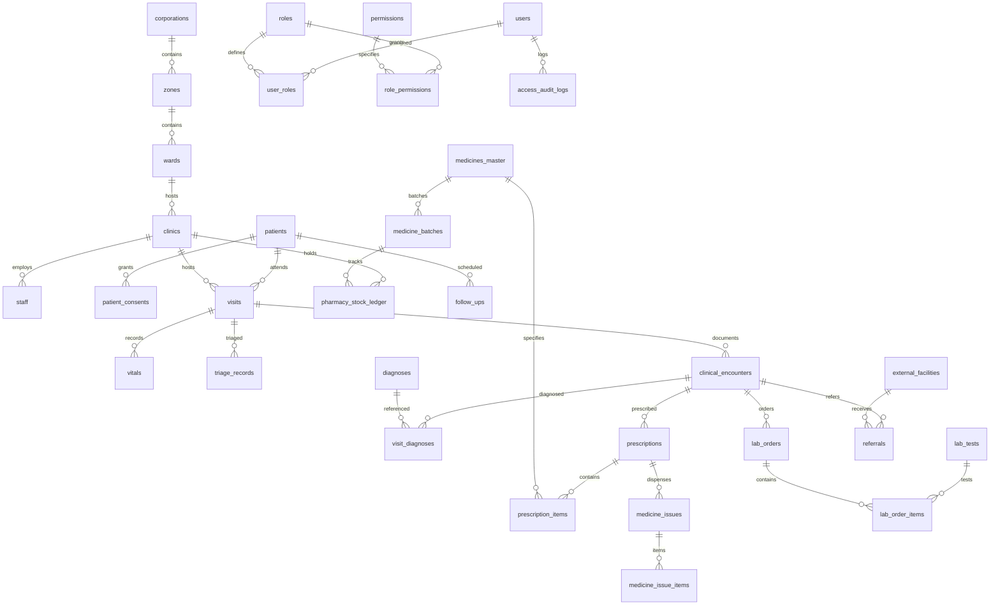

# 🗄️ Physical Data Model & Complete Relational ERD
## Namma Clinic Digital Health & Operations Platform
**Document Code:** DB-PHY-04 | **Status:** Approved Baseline | **Date:** September 2026

---

### 1. Entity-Relationship Diagram (Transactional Core)

