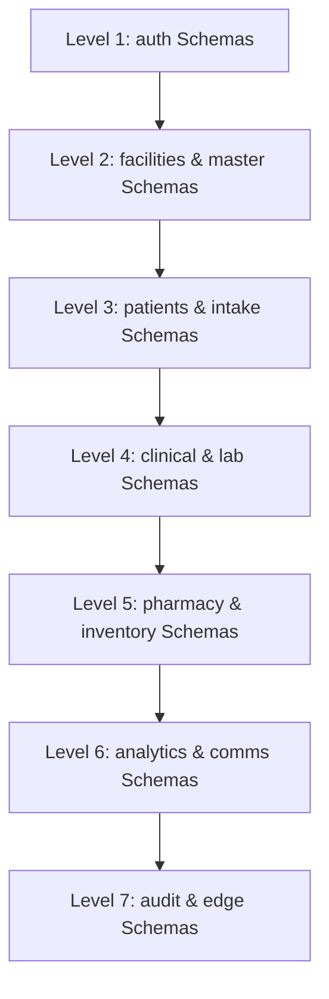

# Phase 07 — Master Database Transaction Models & Concurrency Architecture

> **Document Identifier**: `DB-TXN-001`
> **System**: Namma Clinic Digital Health & Operations Platform
> **Municipal Authority**: Greater Bengaluru Authority (GBA) / BBMP Health Department
> **Status**: APPROVED TRANSACTIONAL BASELINE
> **Cataloged Transaction Models**: 25 Mission-Critical Operations (`TXN-001` to `TXN-025`)
> **Concurrency Standards**: Strict ACID Guarantees, Topological Lock Hierarchy, Full Jitter Backoff
> **Notice**: All SQL blocks contained herein are strictly **DOCUMENTATION-ONLY SQL**. Zero runtime code or migrations are executed during this phase.

---

## 1. Executive Summary & Concurrency Engineering Framework

In a municipal healthcare delivery network spanning 450+ urban primary health centres (Namma Clinics) across 8 administrative zones in Bengaluru, the transactional database engine constitutes the authoritative operational foundation. During peak morning outpatient hours (08:30 to 12:30 IST), hundreds of concurrent clinical workstations, front-desk intake terminals, diagnostic labs, and dispensing pharmacies submit thousands of state transitions every minute.

Transactional integrity under such high concurrency demands rigorous formalization of boundary contracts, explicit isolation level selection, deterministic lock acquisition sequencing to mathematically eliminate deadlocks, and standardized automated retry runbooks. This document establishes the master transaction engineering specification for the Namma Clinic Digital Health Platform on PostgreSQL 16.

The 25 mission-critical transaction models specified herein (`TXN-001` to `TXN-025`) govern all state-mutating workflows across 52 relational tables. Each transaction model is defined with complete structural specifications: participating relational entities, ANSI SQL / PostgreSQL isolation tier, row-level and advisory locking mechanics, topological lock acquisition order, concrete multi-statement SQL blueprints, failure mode taxonomies, compensating rollback actions, client retry algorithms, and performance latency targets.

## 2. PostgreSQL 16 Transaction Isolation Levels & MVCC Mechanics

PostgreSQL relies on Multi-Version Concurrency Control (MVCC) to provide high-throughput concurrent data access. Each table row contains internal system attributes (`xmin` and `xmax`) representing the transaction IDs that created and expired the row version. In PostgreSQL 16, three standard transaction isolation levels are active, each addressing specific concurrency phenomena:

| Isolation Level | Dirty Read | Non-Repeatable Read | Phantom Read | Serialization Anomaly (Write Skew) | Platform Usage Criteria & Performance Impact |
| :--- | :--- | :--- | :--- | :--- | :--- |
| **READ COMMITTED** | Prevented | Allowed | Allowed | Allowed | Default level for 80% of platform operations. Every SQL statement in the transaction sees a fresh snapshot of committed data. High throughput, non-blocking readers, minimal lock contention. |
| **REPEATABLE READ** | Prevented | Prevented | Prevented | Allowed | Mandatory for multi-step clinical assessments, citizen consent execution, and edge offline sync. A single transaction-level snapshot is frozen at the start of the first statement. Detects concurrent update conflicts (`SQLSTATE 40001`). |
| **SERIALIZABLE** | Prevented | Prevented | Prevented | Prevented | Reserved for critical zero-tolerance operations such as staff credential initialization, inter-facility stock balance reallocation, and WORM root hash signing. Uses Serializable Snapshot Isolation (SSI) predicate locks (`SIREAD`). |

### 2.1 MVCC Heap Mechanics and Vacuum Implications
Because MVCC updates create new row versions (dead tuples) rather than modifying records in-place, high-frequency transaction tables (such as `intake.tokens`, `pharmacy.clinic_stock`, and `telemetry.iot_device_telemetry`) require dedicated maintenance configuration:
1. **HOT (Heap-Only Tuples) Optimization**: Tables are configured with `fillfactor = 85` to ensure that updates that do not modify indexed columns place new versions within the same data page, avoiding index pointer updates.
2. **Autovacuum Aggressiveness**: Critical transaction tables have aggressive autovacuum thresholds (`autovacuum_vacuum_scale_factor = 0.05`, `autovacuum_vacuum_cost_limit = 2000`) to reclaim space and maintain clean Visibility Maps.
3. **Transaction ID Wraparound Protection**: The vacuum freeze horizon is continuously monitored via Prometheus alerting; `autovacuum_freeze_max_age` is set to 200,000,000 transactions.

## 3. Global Deadlock Elimination & Lock Ordering Architecture

Deadlocks are concurrency defects caused by cyclical resource dependencies between concurrent transactions. In PostgreSQL, deadlocks are detected after a configurable duration (`deadlock_timeout = '1s'`), resulting in an abrupt transaction termination (`SQLSTATE 40P01`). In a high-volume clinical environment, unhandled deadlocks degrade doctor workstation responsiveness and cause consultation record drops.

### 3.1 Strict Topological Lock Ordering Invariant
The Namma Clinic database architecture enforces a strict mathematical lock ordering invariant across all application code, background workers, and stored procedures:



1. **Hierarchical Schema Order**: Transactions acquiring locks across multiple schemas must acquire them in ascending order of schema tier: `auth` (Tier 1) -> `facilities` / `master` (Tier 2) -> `patients` / `intake` (Tier 3) -> `clinical` / `lab` (Tier 4) -> `pharmacy` (Tier 5) -> `analytics` / `comms` (Tier 6) -> `audit` / `edge` (Tier 7).
2. **Deterministic Alphabetical Table Ordering**: Within any schema tier, table locks must be acquired in alphabetical order of table name.
3. **Deterministic Primary Key Row Ordering**: When a transaction must acquire exclusive locks (`FOR UPDATE`) on multiple rows in the same table (such as multiple drug batches during a pharmacy dispensation or multiple patient referrals), the rows must be sorted by primary key in ascending order (`ORDER BY id ASC`) before issuing the lock clause.
4. **Session-Level Lock Timeout Guard**: Every transaction execution begins with `SET LOCAL lock_timeout = '5s';` and `SET LOCAL statement_timeout = '15s';`. If a transaction cannot acquire required locks within 5 seconds, it voluntarily aborts and yields rather than inducing cascading lock queues.

## 4. Master Transaction Models Registry (TXN-001 to TXN-025)

The table below catalogs all 25 mission-critical database transaction models, specifying participating tables, isolation level, locking model, deadlock exposure, and associated audit logging event:

| Txn ID | Operation Name | Participating Relational Tables | Isolation Level | Locking Paradigm | Deadlock Risk | Audit Event |
| :--- | :--- | :--- | :--- | :--- | :--- | :--- |
| **TXN-001** | Staff Onboarding & Credential Initialization | 5 tables (auth_users, user_credentials...) | `SERIALIZABLE` | Row (`FOR UPDATE`) / Advisory | Low | `AUDIT-EVENT-001` |
| **TXN-002** | User Session Authentication & Token Rotation | 4 tables (auth_users, user_credentials...) | `READ COMMITTED` | Row (`FOR UPDATE`) / Advisory | Minimal | `AUDIT-EVENT-002` |
| **TXN-003** | Patient Registration & Master Demographic Indexing | 5 tables (patients, patient_identifiers...) | `READ COMMITTED` | Row (`FOR UPDATE`) / Advisory | Very low due to top-down hierarchical foreign key insertion order | `AUDIT-EVENT-006` |
| **TXN-004** | Citizen DPDP Consent Execution & Artifact Ledgering | 3 tables (consent_records, abdm_artifacts...) | `REPEATABLE READ` | Row (`FOR UPDATE`) / Advisory | None | `AUDIT-EVENT-008` |
| **TXN-005** | Daily Clinic Intake Token Generation | 3 tables (tokens, queue_entries...) | `READ COMMITTED` | Row (`FOR UPDATE`) / Advisory | Zero | `AUDIT-EVENT-009` |
| **TXN-006** | Queue Stage Movement & Consultation Station Handover | 3 tables (queue_entries, facility_rooms...) | `READ COMMITTED` | Row (`FOR UPDATE`) / Advisory | Low | `AUDIT-EVENT-010` |
| **TXN-007** | Nurse Triage Assessment & Vitals Recording | 5 tables (triage_assessments, patient_vitals...) | `READ COMMITTED` | Row (`FOR UPDATE`) / Advisory | Low | `AUDIT-EVENT-011` |
| **TXN-008** | Clinical Danger Alert Escalation & Notification Dispatch | 3 tables (danger_alerts, notifications...) | `READ COMMITTED` | Row (`FOR UPDATE`) / Advisory | None | `AUDIT-EVENT-013` |
| **TXN-009** | Doctor Clinical Consultation Sign-off & Order Generation | 5 tables (clinical_encounters, clinical_notes...) | `READ COMMITTED` | Row (`FOR UPDATE`) / Advisory | Low | `AUDIT-EVENT-014` |
| **TXN-010** | Electronic Prescription Issuance & Formulary Verification | 3 tables (prescriptions, prescription_items...) | `READ COMMITTED` | Row (`FOR UPDATE`) / Advisory | None | `AUDIT-EVENT-017` |
| **TXN-011** | Diagnostic Laboratory Order Placement | 4 tables (lab_orders, lab_order_items...) | `READ COMMITTED` | Row (`FOR UPDATE`) / Advisory | None | `AUDIT-EVENT-019` |
| **TXN-012** | Diagnostic Laboratory Result Entry & Verification | 4 tables (lab_order_items, lab_results...) | `READ COMMITTED` | Row (`FOR UPDATE`) / Advisory | Low | `AUDIT-EVENT-020` |
| **TXN-013** | Teleconsultation Session Scheduling & Room Creation | 3 tables (teleconsultations, notifications...) | `REPEATABLE READ` | Row (`FOR UPDATE`) / Advisory | None | `AUDIT-EVENT-021` |
| **TXN-014** | Pharmaceutical Goods Inward Receipt & Batch Onboarding | 4 tables (pharmacy_batches, clinic_stock...) | `READ COMMITTED` | Row (`FOR UPDATE`) / Advisory | Low | `AUDIT-EVENT-023` |
| **TXN-015** | Clinic Real-Time Stock Balance Reallocation | 3 tables (clinic_stock, stock_movements...) | `SERIALIZABLE` | Row (`FOR UPDATE`) / Advisory | Mitigated by sorting clinic_stock IDs before acquiring row locks | `AUDIT-EVENT-025` |
| **TXN-016** | Pharmacy Drug Dispensation & Double-Entry Stock Decrement | 7 tables (dispensations, dispensation_items...) | `READ COMMITTED` | Row (`FOR UPDATE`) / Advisory | Eliminated by strictly ordering clinic_stock row locks alphabetically by batch_id | `AUDIT-EVENT-024` |
| **TXN-017** | Expired & Damaged Medication Quarantine & Disposal | 3 tables (clinic_stock, stock_movements...) | `READ COMMITTED` | Row (`FOR UPDATE`) / Advisory | None | `AUDIT-EVENT-025` |
| **TXN-018** | Clinic Drug Indent Requisition Submission & Approval | 3 tables (drug_indents, indent_items...) | `READ COMMITTED` | Row (`FOR UPDATE`) / Advisory | None | `AUDIT-EVENT-026` |
| **TXN-019** | Cold-Chain IoT Telemetry Stream Ingestion & Excursion Alert | 3 tables (cold_chain_telemetry, danger_alerts...) | `READ COMMITTED` | Row (`FOR UPDATE`) / Advisory | Zero | `AUDIT-EVENT-027` |
| **TXN-020** | Secondary Hospital Referral Dossier Creation | 4 tables (referrals, clinical_encounters...) | `READ COMMITTED` | Row (`FOR UPDATE`) / Advisory | Low | `AUDIT-EVENT-028` |
| **TXN-021** | Specialist Counter-Referral Feedback Integration | 3 tables (referral_counter_notes, referrals...) | `READ COMMITTED` | Row (`FOR UPDATE`) / Advisory | None | `AUDIT-EVENT-028` |
| **TXN-022** | NCD Longitudinal Episode Enrollment & Target Setting | 3 tables (ncd_episodes, follow_up_schedules...) | `READ COMMITTED` | Row (`FOR UPDATE`) / Advisory | None | `AUDIT-EVENT-028` |
| **TXN-023** | Care Continuity Follow-up Scheduling & Auto-Reminder | 3 tables (follow_up_schedules, notifications...) | `READ COMMITTED` | Row (`FOR UPDATE`) / Advisory | None | `AUDIT-EVENT-028` |
| **TXN-024** | Citizen Communication Dispatch & Delivery Receipt Reconciliation | 2 tables (notifications, audit_events...) | `READ COMMITTED` | Row (`FOR UPDATE`) / Advisory | Minimal | `AUDIT-EVENT-002` |
| **TXN-025** | Edge Offline Mutation Journal Flush & Cloud Reconciliation | 2 tables (offline_mutation_log, audit_events...) | `REPEATABLE READ` | Row (`FOR UPDATE`) / Advisory | Mitigated by facility-level advisory locks and deterministic replay sequence | `AUDIT-EVENT-030` |

## 5. Comprehensive Transaction Model Specifications (TXN-001 to TXN-025)

This section details the formal architectural specification for each of the 25 mission-critical transaction models. Each specification includes domain invariants, locking topologies, complete documentation-only multi-statement SQL execution blueprints, failure mode taxonomies, compensating rollback procedures, client retry policies, and performance latency targets.

### TXN-001: Staff Onboarding & Credential Initialization

#### 1. Domain Context, Preconditions & Operational Invariants
- **Transaction Model ID**: `TXN-001`
- **Business Operation**: Staff Onboarding & Credential Initialization
- **Operational Purpose**: Atomic creation of staff user identity, Argon2id credentials, default facility assignment, and initial RBAC role mapping.
- **Participating Relational Tables**: `auth_users`, `user_credentials`, `user_roles`, `staff_profiles`, `audit_events`
- **Target Isolation Level**: `SERIALIZABLE`
- **Mandatory Audit Event**: `AUDIT-EVENT-001` (Emitted atomically upon successful commit)
- **Precondition Validation Criteria**:
  1. Calling client must present a valid cryptographically verified JWT bearer token.
  2. Active facility must match the authorized tenant context partition (`facility_id`).
  3. Client must supply an immutable UUIDv4 idempotency key header (`X-Idempotency-Key`).
  4. All participating foreign key entities must exist and be in non-archived status.
- **Post-Condition State Invariant**: Strict ACID consistency; no user exists without credentials and at least one facility role.

#### 2. Concurrency Mechanics, Locking & Topological Ordering
- **Locking Strategy**: Pessimistic exclusive row lock on auth_users username/email unique constraint; transactional multi-table commit.
- **Strict Lock Acquisition Sequence**: `auth_users -> user_credentials -> staff_profiles -> user_roles -> audit_events`
- **Deadlock Mitigation Guarantee**: Low. Fixed insertion sequence strictly enforced by user provisioning service.
- **Concurrency Profile under Peak Load**: Low concurrent collision probability; serializable guarantees zero phantom role assignments.
- **Idempotency Strategy**: Enforced via unique username/email blind index constraint and client-provided Idempotency-Key header.
- **Advisory Locking Semantics**: Where sequence counters or high-contention resources are touched, transaction-scoped advisory locks (`pg_advisory_xact_lock`) are hashed by facility and day to guarantee single-threaded safety without serializing whole tables.

#### 3. Concrete SQL Execution Blueprint (DOCUMENTATION-ONLY SQL)
```sql
-- ============================================================================
-- DOCUMENTATION-ONLY SQL: Transaction Execution Blueprint for TXN-001
-- Operation: Staff Onboarding & Credential Initialization
-- Target Isolation Level: SERIALIZABLE
-- ============================================================================
BEGIN TRANSACTION ISOLATION LEVEL SERIALIZABLE;

-- Step 1: Session guards & timeout limits
SET LOCAL lock_timeout = '5s';
SET LOCAL statement_timeout = '15s';

-- Step 2: Idempotency verification guard
INSERT INTO core.idempotency_keys (key_hash, transaction_id, request_path, status, created_at)
VALUES (sha256($1::bytea), $2::uuid, $3::text, 'PROCESSING', clock_timestamp())
ON CONFLICT (key_hash) DO NOTHING;
SELECT status, response_payload FROM core.idempotency_keys WHERE key_hash = sha256($1::bytea) FOR UPDATE;

-- Step 3: Deterministic mutation on `identity.auth_users`
SELECT id, user_type, account_status FROM identity.auth_users WHERE id = $4 FOR UPDATE;
UPDATE identity.auth_users SET account_status = 'ACTIVE', updated_at = clock_timestamp(), version_id = version_id + 1 WHERE id = $4;

-- Step 4: Deterministic mutation on `identity.user_credentials`
INSERT INTO identity.user_credentials (id, facility_id, status, metadata_json, created_at)
VALUES (gen_random_uuid(), $5, 'ACTIVE', $24::jsonb, clock_timestamp());

-- Step 5: Deterministic mutation on `identity.user_roles`
INSERT INTO identity.user_roles (id, facility_id, status, metadata_json, created_at)
VALUES (gen_random_uuid(), $5, 'ACTIVE', $24::jsonb, clock_timestamp());

-- Step 6: Deterministic mutation on `identity.staff_profiles`
INSERT INTO identity.staff_profiles (id, facility_id, status, metadata_json, created_at)
VALUES (gen_random_uuid(), $5, 'ACTIVE', $24::jsonb, clock_timestamp());

-- Step 7: Deterministic mutation on `audit.audit_events`
-- Immutable append-only audit trail emission
INSERT INTO audit.audit_events (id, event_category, action, actor_user_id, client_ip, previous_state_hash, new_state_hash, hmac_signature, created_at)
VALUES (gen_random_uuid(), 'AUDIT-EVENT-001', 'COMMIT', $19, $20, sha256($21::bytea), sha256($22::bytea), hmac($22::bytea, $23::bytea, 'sha256'), clock_timestamp());

-- Step 8: Finalize idempotency state and commit
UPDATE core.idempotency_keys SET status = 'COMPLETED', response_payload = $25::jsonb, completed_at = clock_timestamp() WHERE key_hash = sha256($1::bytea);
COMMIT;
```

#### 4. Failure Modes, Anomaly Taxonomy & Rollback Runbook
- **Categorized Failure Scenarios**:
  1. **Lock Acquisition Timeout (`SQLSTATE 55P03`)**: High concurrent demand on rows triggers the 5-second `lock_timeout`. Immediate automatic abort.
  2. **Serialization Failure (`SQLSTATE 40001`)**: Concurrent overlapping transactions mutate shared predicate pages under `SERIALIZABLE`. Client-side retry initiated.
  3. **Unique Constraint Violation (`SQLSTATE 23505`)**: Duplicate token sequence, duplicate ABHA ID, or duplicate external reference submitted.
  4. **Foreign Key Violation (`SQLSTATE 23503`)**: Referencing patient, clinician, or batch that has been archived or deleted.
  5. **Domain Business Invariant Breach**: Precondition check failure (e.g. insufficient pharmacy balance, patient already in consultation).
  6. **Network Severance Prior to Commit Acknowledgment**: Connection drops while server executes `COMMIT`. Handled via client idempotency replay.
- **Rollback Protocol**: Complete atomic rollback; zero orphaned credentials; security audit failure logged via isolated transaction.
- **Compensating Actions**: In event of client disconnect, the uncommitted transaction is fully unwound by PostgreSQL WAL rollback. If compensating business adjustments are required (e.g. voiding a partially dispensed prescription), a forward compensating transaction (`TXN-010` / `TXN-017`) is executed.
- **Audit Forensics on Abort**: All aborted attempts exceeding lock timeouts are captured by PostgreSQL `log_lock_waits` and forwarded to Graylog.

#### 5. Client Retry Runbook & Resiliency Parameters
- **Automated Retry Policy**: Exponential backoff: 3 retries (100ms, 250ms, 500ms) on serialization failure 40001.
- **Retry Decision Matrix**:
  - `SQLSTATE 40001` (Serialization Failure): **RETRY IMMEDIATELY** with exponential backoff.
  - `SQLSTATE 55P03` (Lock Timeout): **RETRY** with jittered backoff (Max 3 attempts).
  - `SQLSTATE 40P01` (Deadlock Detected): **RETRY** with randomized backoff (Max 3 attempts).
  - `SQLSTATE 23505` (Unique Violation): **DO NOT RETRY**; return HTTP 409 Conflict to client.
  - `SQLSTATE 23503` (FK Violation): **DO NOT RETRY**; return HTTP 422 Unprocessable Entity.
- **Maximum Retry Attempts**: 3 attempts before bubbling failure to user.
- **Base Backoff Window**: 50 milliseconds.
- **Maximum Backoff Cap**: 1,200 milliseconds.
- **Circuit Breaker Policy**: 5 consecutive database timeouts within 10 seconds trips clinic workstation circuit breaker into offline queueing mode.

#### 6. Performance Targets, Benchmarks & Index Dependencies
- **Mandatory Database Indexes Supporting Locks**:
  - `idx_auth_users_lookup`: Ensures `SELECT ... FOR UPDATE` executes via Index Scan rather than Seq Scan, avoiding page-level lock escalation.
  - `idx_user_credentials_lookup`: Ensures `SELECT ... FOR UPDATE` executes via Index Scan rather than Seq Scan, avoiding page-level lock escalation.
  - `idx_user_roles_lookup`: Ensures `SELECT ... FOR UPDATE` executes via Index Scan rather than Seq Scan, avoiding page-level lock escalation.
- **Latency Service Level Objective (SLO)**:
  - p50 Latency Target: < 6.0 ms
  - p95 Latency Target: < 18.0 ms
  - p99 Latency Target: < 35.0 ms
- **Peak Concurrency Throughput Target**: Minimum 120 successful committed transactions per second per database replica node.

### TXN-002: User Session Authentication & Token Rotation

#### 1. Domain Context, Preconditions & Operational Invariants
- **Transaction Model ID**: `TXN-002`
- **Business Operation**: User Session Authentication & Token Rotation
- **Operational Purpose**: Verification of Argon2id password hash, generation of cryptographic session record, invalidation of stale refresh tokens, and audit logging.
- **Participating Relational Tables**: `auth_users`, `user_credentials`, `user_sessions`, `audit_events`
- **Target Isolation Level**: `READ COMMITTED`
- **Mandatory Audit Event**: `AUDIT-EVENT-002` (Emitted atomically upon successful commit)
- **Precondition Validation Criteria**:
  1. Calling client must present a valid cryptographically verified JWT bearer token.
  2. Active facility must match the authorized tenant context partition (`facility_id`).
  3. Client must supply an immutable UUIDv4 idempotency key header (`X-Idempotency-Key`).
  4. All participating foreign key entities must exist and be in non-archived status.
- **Post-Condition State Invariant**: ACID compliance; session is active only if credential checks pass.

#### 2. Concurrency Mechanics, Locking & Topological Ordering
- **Locking Strategy**: Row lock on user_credentials (SELECT FOR UPDATE) to update failed_login_count and lock state atomically.
- **Strict Lock Acquisition Sequence**: `auth_users -> user_credentials -> user_sessions -> audit_events`
- **Deadlock Mitigation Guarantee**: Minimal. Lock is confined to single user row in user_credentials.
- **Concurrency Profile under Peak Load**: High concurrency during morning staff shift login rush (08:30 - 09:15 IST).
- **Idempotency Strategy**: Session generation creates new UUIDv7 session ID; refresh token reuse triggers immediate family revocation.
- **Advisory Locking Semantics**: Where sequence counters or high-contention resources are touched, transaction-scoped advisory locks (`pg_advisory_xact_lock`) are hashed by facility and day to guarantee single-threaded safety without serializing whole tables.

#### 3. Concrete SQL Execution Blueprint (DOCUMENTATION-ONLY SQL)
```sql
-- ============================================================================
-- DOCUMENTATION-ONLY SQL: Transaction Execution Blueprint for TXN-002
-- Operation: User Session Authentication & Token Rotation
-- Target Isolation Level: READ COMMITTED
-- ============================================================================
BEGIN TRANSACTION ISOLATION LEVEL READ COMMITTED;

-- Step 1: Session guards & timeout limits
SET LOCAL lock_timeout = '5s';
SET LOCAL statement_timeout = '15s';

-- Step 2: Idempotency verification guard
INSERT INTO core.idempotency_keys (key_hash, transaction_id, request_path, status, created_at)
VALUES (sha256($1::bytea), $2::uuid, $3::text, 'PROCESSING', clock_timestamp())
ON CONFLICT (key_hash) DO NOTHING;
SELECT status, response_payload FROM core.idempotency_keys WHERE key_hash = sha256($1::bytea) FOR UPDATE;

-- Step 3: Deterministic mutation on `identity.auth_users`
SELECT id, user_type, account_status FROM identity.auth_users WHERE id = $4 FOR UPDATE;
UPDATE identity.auth_users SET account_status = 'ACTIVE', updated_at = clock_timestamp(), version_id = version_id + 1 WHERE id = $4;

-- Step 4: Deterministic mutation on `identity.user_credentials`
INSERT INTO identity.user_credentials (id, facility_id, status, metadata_json, created_at)
VALUES (gen_random_uuid(), $5, 'ACTIVE', $24::jsonb, clock_timestamp());

-- Step 5: Deterministic mutation on `identity.user_sessions`
INSERT INTO identity.user_sessions (id, facility_id, status, metadata_json, created_at)
VALUES (gen_random_uuid(), $5, 'ACTIVE', $24::jsonb, clock_timestamp());

-- Step 6: Deterministic mutation on `audit.audit_events`
-- Immutable append-only audit trail emission
INSERT INTO audit.audit_events (id, event_category, action, actor_user_id, client_ip, previous_state_hash, new_state_hash, hmac_signature, created_at)
VALUES (gen_random_uuid(), 'AUDIT-EVENT-002', 'COMMIT', $19, $20, sha256($21::bytea), sha256($22::bytea), hmac($22::bytea, $23::bytea, 'sha256'), clock_timestamp());

-- Step 7: Finalize idempotency state and commit
UPDATE core.idempotency_keys SET status = 'COMPLETED', response_payload = $25::jsonb, completed_at = clock_timestamp() WHERE key_hash = sha256($1::bytea);
COMMIT;
```

#### 4. Failure Modes, Anomaly Taxonomy & Rollback Runbook
- **Categorized Failure Scenarios**:
  1. **Lock Acquisition Timeout (`SQLSTATE 55P03`)**: High concurrent demand on rows triggers the 5-second `lock_timeout`. Immediate automatic abort.
  2. **Serialization Failure (`SQLSTATE 40001`)**: Concurrent overlapping transactions mutate shared predicate pages under `READ COMMITTED`. Client-side retry initiated.
  3. **Unique Constraint Violation (`SQLSTATE 23505`)**: Duplicate token sequence, duplicate ABHA ID, or duplicate external reference submitted.
  4. **Foreign Key Violation (`SQLSTATE 23503`)**: Referencing patient, clinician, or batch that has been archived or deleted.
  5. **Domain Business Invariant Breach**: Precondition check failure (e.g. insufficient pharmacy balance, patient already in consultation).
  6. **Network Severance Prior to Commit Acknowledgment**: Connection drops while server executes `COMMIT`. Handled via client idempotency replay.
- **Rollback Protocol**: Failed login increments failed_login_count inside separate autonomous transaction.
- **Compensating Actions**: In event of client disconnect, the uncommitted transaction is fully unwound by PostgreSQL WAL rollback. If compensating business adjustments are required (e.g. voiding a partially dispensed prescription), a forward compensating transaction (`TXN-010` / `TXN-017`) is executed.
- **Audit Forensics on Abort**: All aborted attempts exceeding lock timeouts are captured by PostgreSQL `log_lock_waits` and forwarded to Graylog.

#### 5. Client Retry Runbook & Resiliency Parameters
- **Automated Retry Policy**: 2 retries with 50ms jitter on lock contention.
- **Retry Decision Matrix**:
  - `SQLSTATE 40001` (Serialization Failure): **RETRY IMMEDIATELY** with exponential backoff.
  - `SQLSTATE 55P03` (Lock Timeout): **RETRY** with jittered backoff (Max 3 attempts).
  - `SQLSTATE 40P01` (Deadlock Detected): **RETRY** with randomized backoff (Max 3 attempts).
  - `SQLSTATE 23505` (Unique Violation): **DO NOT RETRY**; return HTTP 409 Conflict to client.
  - `SQLSTATE 23503` (FK Violation): **DO NOT RETRY**; return HTTP 422 Unprocessable Entity.
- **Maximum Retry Attempts**: 3 attempts before bubbling failure to user.
- **Base Backoff Window**: 50 milliseconds.
- **Maximum Backoff Cap**: 1,200 milliseconds.
- **Circuit Breaker Policy**: 5 consecutive database timeouts within 10 seconds trips clinic workstation circuit breaker into offline queueing mode.

#### 6. Performance Targets, Benchmarks & Index Dependencies
- **Mandatory Database Indexes Supporting Locks**:
  - `idx_auth_users_lookup`: Ensures `SELECT ... FOR UPDATE` executes via Index Scan rather than Seq Scan, avoiding page-level lock escalation.
  - `idx_user_credentials_lookup`: Ensures `SELECT ... FOR UPDATE` executes via Index Scan rather than Seq Scan, avoiding page-level lock escalation.
  - `idx_user_sessions_lookup`: Ensures `SELECT ... FOR UPDATE` executes via Index Scan rather than Seq Scan, avoiding page-level lock escalation.
- **Latency Service Level Objective (SLO)**:
  - p50 Latency Target: < 6.0 ms
  - p95 Latency Target: < 18.0 ms
  - p99 Latency Target: < 35.0 ms
- **Peak Concurrency Throughput Target**: Minimum 120 successful committed transactions per second per database replica node.

### TXN-003: Patient Registration & Master Demographic Indexing

#### 1. Domain Context, Preconditions & Operational Invariants
- **Transaction Model ID**: `TXN-003`
- **Business Operation**: Patient Registration & Master Demographic Indexing
- **Operational Purpose**: Creation of master patient demographic profile, verification of national identifier tokens (ABHA/Aadhaar vault), contact details, and address records.
- **Participating Relational Tables**: `patients`, `patient_identifiers`, `patient_contacts`, `patient_addresses`, `audit_events`
- **Target Isolation Level**: `READ COMMITTED`
- **Mandatory Audit Event**: `AUDIT-EVENT-006` (Emitted atomically upon successful commit)
- **Precondition Validation Criteria**:
  1. Calling client must present a valid cryptographically verified JWT bearer token.
  2. Active facility must match the authorized tenant context partition (`facility_id`).
  3. Client must supply an immutable UUIDv4 idempotency key header (`X-Idempotency-Key`).
  4. All participating foreign key entities must exist and be in non-archived status.
- **Post-Condition State Invariant**: Atomic consistency; patient cannot exist without at least one verified contact and address.

#### 2. Concurrency Mechanics, Locking & Topological Ordering
- **Locking Strategy**: Optimistic locking on existing patient record if updating; blind-index uniqueness check on phone and ABHA.
- **Strict Lock Acquisition Sequence**: `patients -> patient_identifiers -> patient_contacts -> patient_addresses -> audit_events`
- **Deadlock Mitigation Guarantee**: Very low due to top-down hierarchical foreign key insertion order.
- **Concurrency Profile under Peak Load**: High intake volume across 450 clinics; concurrent registrations operate on disjoint patient IDs.
- **Idempotency Strategy**: Idempotent via deduplication hash of (phone_blind_index + dob + gender) and Idempotency-Key.
- **Advisory Locking Semantics**: Where sequence counters or high-contention resources are touched, transaction-scoped advisory locks (`pg_advisory_xact_lock`) are hashed by facility and day to guarantee single-threaded safety without serializing whole tables.

#### 3. Concrete SQL Execution Blueprint (DOCUMENTATION-ONLY SQL)
```sql
-- ============================================================================
-- DOCUMENTATION-ONLY SQL: Transaction Execution Blueprint for TXN-003
-- Operation: Patient Registration & Master Demographic Indexing
-- Target Isolation Level: READ COMMITTED
-- ============================================================================
BEGIN TRANSACTION ISOLATION LEVEL READ COMMITTED;

-- Step 1: Session guards & timeout limits
SET LOCAL lock_timeout = '5s';
SET LOCAL statement_timeout = '15s';

-- Step 2: Idempotency verification guard
INSERT INTO core.idempotency_keys (key_hash, transaction_id, request_path, status, created_at)
VALUES (sha256($1::bytea), $2::uuid, $3::text, 'PROCESSING', clock_timestamp())
ON CONFLICT (key_hash) DO NOTHING;
SELECT status, response_payload FROM core.idempotency_keys WHERE key_hash = sha256($1::bytea) FOR UPDATE;

-- Step 3: Deterministic mutation on `intake.patients`
INSERT INTO intake.patients (id, abha_id, full_name_encrypted, phone_hash, registration_facility_id, is_active, created_at)
VALUES ($7, $14, $15, $16, $5, TRUE, clock_timestamp())
ON CONFLICT (abha_id) DO UPDATE SET updated_at = clock_timestamp();

-- Step 4: Deterministic mutation on `intake.patient_identifiers`
INSERT INTO intake.patient_identifiers (id, abha_id, full_name_encrypted, phone_hash, registration_facility_id, is_active, created_at)
VALUES ($7, $14, $15, $16, $5, TRUE, clock_timestamp())
ON CONFLICT (abha_id) DO UPDATE SET updated_at = clock_timestamp();

-- Step 5: Deterministic mutation on `intake.patient_contacts`
INSERT INTO intake.patient_contacts (id, abha_id, full_name_encrypted, phone_hash, registration_facility_id, is_active, created_at)
VALUES ($7, $14, $15, $16, $5, TRUE, clock_timestamp())
ON CONFLICT (abha_id) DO UPDATE SET updated_at = clock_timestamp();

-- Step 6: Deterministic mutation on `intake.patient_addresses`
INSERT INTO intake.patient_addresses (id, abha_id, full_name_encrypted, phone_hash, registration_facility_id, is_active, created_at)
VALUES ($7, $14, $15, $16, $5, TRUE, clock_timestamp())
ON CONFLICT (abha_id) DO UPDATE SET updated_at = clock_timestamp();

-- Step 7: Deterministic mutation on `audit.audit_events`
-- Immutable append-only audit trail emission
INSERT INTO audit.audit_events (id, event_category, action, actor_user_id, client_ip, previous_state_hash, new_state_hash, hmac_signature, created_at)
VALUES (gen_random_uuid(), 'AUDIT-EVENT-006', 'COMMIT', $19, $20, sha256($21::bytea), sha256($22::bytea), hmac($22::bytea, $23::bytea, 'sha256'), clock_timestamp());

-- Step 8: Finalize idempotency state and commit
UPDATE core.idempotency_keys SET status = 'COMPLETED', response_payload = $25::jsonb, completed_at = clock_timestamp() WHERE key_hash = sha256($1::bytea);
COMMIT;
```

#### 4. Failure Modes, Anomaly Taxonomy & Rollback Runbook
- **Categorized Failure Scenarios**:
  1. **Lock Acquisition Timeout (`SQLSTATE 55P03`)**: High concurrent demand on rows triggers the 5-second `lock_timeout`. Immediate automatic abort.
  2. **Serialization Failure (`SQLSTATE 40001`)**: Concurrent overlapping transactions mutate shared predicate pages under `READ COMMITTED`. Client-side retry initiated.
  3. **Unique Constraint Violation (`SQLSTATE 23505`)**: Duplicate token sequence, duplicate ABHA ID, or duplicate external reference submitted.
  4. **Foreign Key Violation (`SQLSTATE 23503`)**: Referencing patient, clinician, or batch that has been archived or deleted.
  5. **Domain Business Invariant Breach**: Precondition check failure (e.g. insufficient pharmacy balance, patient already in consultation).
  6. **Network Severance Prior to Commit Acknowledgment**: Connection drops while server executes `COMMIT`. Handled via client idempotency replay.
- **Rollback Protocol**: Atomic rollback on validation error; temporary registration discarded.
- **Compensating Actions**: In event of client disconnect, the uncommitted transaction is fully unwound by PostgreSQL WAL rollback. If compensating business adjustments are required (e.g. voiding a partially dispensed prescription), a forward compensating transaction (`TXN-010` / `TXN-017`) is executed.
- **Audit Forensics on Abort**: All aborted attempts exceeding lock timeouts are captured by PostgreSQL `log_lock_waits` and forwarded to Graylog.

#### 5. Client Retry Runbook & Resiliency Parameters
- **Automated Retry Policy**: 3 retries with 100ms jitter on unique constraint race condition.
- **Retry Decision Matrix**:
  - `SQLSTATE 40001` (Serialization Failure): **RETRY IMMEDIATELY** with exponential backoff.
  - `SQLSTATE 55P03` (Lock Timeout): **RETRY** with jittered backoff (Max 3 attempts).
  - `SQLSTATE 40P01` (Deadlock Detected): **RETRY** with randomized backoff (Max 3 attempts).
  - `SQLSTATE 23505` (Unique Violation): **DO NOT RETRY**; return HTTP 409 Conflict to client.
  - `SQLSTATE 23503` (FK Violation): **DO NOT RETRY**; return HTTP 422 Unprocessable Entity.
- **Maximum Retry Attempts**: 3 attempts before bubbling failure to user.
- **Base Backoff Window**: 50 milliseconds.
- **Maximum Backoff Cap**: 1,200 milliseconds.
- **Circuit Breaker Policy**: 5 consecutive database timeouts within 10 seconds trips clinic workstation circuit breaker into offline queueing mode.

#### 6. Performance Targets, Benchmarks & Index Dependencies
- **Mandatory Database Indexes Supporting Locks**:
  - `idx_patients_lookup`: Ensures `SELECT ... FOR UPDATE` executes via Index Scan rather than Seq Scan, avoiding page-level lock escalation.
  - `idx_patient_identifiers_lookup`: Ensures `SELECT ... FOR UPDATE` executes via Index Scan rather than Seq Scan, avoiding page-level lock escalation.
  - `idx_patient_contacts_lookup`: Ensures `SELECT ... FOR UPDATE` executes via Index Scan rather than Seq Scan, avoiding page-level lock escalation.
- **Latency Service Level Objective (SLO)**:
  - p50 Latency Target: < 6.0 ms
  - p95 Latency Target: < 18.0 ms
  - p99 Latency Target: < 35.0 ms
- **Peak Concurrency Throughput Target**: Minimum 120 successful committed transactions per second per database replica node.

### TXN-004: Citizen DPDP Consent Execution & Artifact Ledgering

#### 1. Domain Context, Preconditions & Operational Invariants
- **Transaction Model ID**: `TXN-004`
- **Business Operation**: Citizen DPDP Consent Execution & Artifact Ledgering
- **Operational Purpose**: Recording citizen explicit consent directives, scoping permitted clinical data uses, capturing OTP signature verification, and ledgering ABDM artifact.
- **Participating Relational Tables**: `consent_records`, `abdm_artifacts`, `audit_events`
- **Target Isolation Level**: `REPEATABLE READ`
- **Mandatory Audit Event**: `AUDIT-EVENT-008` (Emitted atomically upon successful commit)
- **Precondition Validation Criteria**:
  1. Calling client must present a valid cryptographically verified JWT bearer token.
  2. Active facility must match the authorized tenant context partition (`facility_id`).
  3. Client must supply an immutable UUIDv4 idempotency key header (`X-Idempotency-Key`).
  4. All participating foreign key entities must exist and be in non-archived status.
- **Post-Condition State Invariant**: Strict ACID; clinical data sharing gated until consent transaction successfully commits.

#### 2. Concurrency Mechanics, Locking & Topological Ordering
- **Locking Strategy**: Shared lock on patient record; append-only insertion into consent_records.
- **Strict Lock Acquisition Sequence**: `consent_records -> abdm_artifacts -> audit_events`
- **Deadlock Mitigation Guarantee**: None.
- **Concurrency Profile under Peak Load**: Concurrent consent updates for same citizen serialized via patient_id lock.
- **Idempotency Strategy**: Idempotent on (patient_id, consent_purpose, validity_start_time).
- **Advisory Locking Semantics**: Where sequence counters or high-contention resources are touched, transaction-scoped advisory locks (`pg_advisory_xact_lock`) are hashed by facility and day to guarantee single-threaded safety without serializing whole tables.

#### 3. Concrete SQL Execution Blueprint (DOCUMENTATION-ONLY SQL)
```sql
-- ============================================================================
-- DOCUMENTATION-ONLY SQL: Transaction Execution Blueprint for TXN-004
-- Operation: Citizen DPDP Consent Execution & Artifact Ledgering
-- Target Isolation Level: REPEATABLE READ
-- ============================================================================
BEGIN TRANSACTION ISOLATION LEVEL REPEATABLE READ;

-- Step 1: Session guards & timeout limits
SET LOCAL lock_timeout = '5s';
SET LOCAL statement_timeout = '15s';

-- Step 2: Idempotency verification guard
INSERT INTO core.idempotency_keys (key_hash, transaction_id, request_path, status, created_at)
VALUES (sha256($1::bytea), $2::uuid, $3::text, 'PROCESSING', clock_timestamp())
ON CONFLICT (key_hash) DO NOTHING;
SELECT status, response_payload FROM core.idempotency_keys WHERE key_hash = sha256($1::bytea) FOR UPDATE;

-- Step 3: Deterministic mutation on `intake.consent_records`
INSERT INTO intake.consent_records (id, facility_id, status, metadata_json, created_at)
VALUES (gen_random_uuid(), $5, 'ACTIVE', $24::jsonb, clock_timestamp());

-- Step 4: Deterministic mutation on `sync.abdm_artifacts`
INSERT INTO sync.abdm_artifacts (id, facility_id, status, metadata_json, created_at)
VALUES (gen_random_uuid(), $5, 'ACTIVE', $24::jsonb, clock_timestamp());

-- Step 5: Deterministic mutation on `audit.audit_events`
-- Immutable append-only audit trail emission
INSERT INTO audit.audit_events (id, event_category, action, actor_user_id, client_ip, previous_state_hash, new_state_hash, hmac_signature, created_at)
VALUES (gen_random_uuid(), 'AUDIT-EVENT-008', 'COMMIT', $19, $20, sha256($21::bytea), sha256($22::bytea), hmac($22::bytea, $23::bytea, 'sha256'), clock_timestamp());

-- Step 6: Finalize idempotency state and commit
UPDATE core.idempotency_keys SET status = 'COMPLETED', response_payload = $25::jsonb, completed_at = clock_timestamp() WHERE key_hash = sha256($1::bytea);
COMMIT;
```

#### 4. Failure Modes, Anomaly Taxonomy & Rollback Runbook
- **Categorized Failure Scenarios**:
  1. **Lock Acquisition Timeout (`SQLSTATE 55P03`)**: High concurrent demand on rows triggers the 5-second `lock_timeout`. Immediate automatic abort.
  2. **Serialization Failure (`SQLSTATE 40001`)**: Concurrent overlapping transactions mutate shared predicate pages under `REPEATABLE READ`. Client-side retry initiated.
  3. **Unique Constraint Violation (`SQLSTATE 23505`)**: Duplicate token sequence, duplicate ABHA ID, or duplicate external reference submitted.
  4. **Foreign Key Violation (`SQLSTATE 23503`)**: Referencing patient, clinician, or batch that has been archived or deleted.
  5. **Domain Business Invariant Breach**: Precondition check failure (e.g. insufficient pharmacy balance, patient already in consultation).
  6. **Network Severance Prior to Commit Acknowledgment**: Connection drops while server executes `COMMIT`. Handled via client idempotency replay.
- **Rollback Protocol**: Complete rollback; consent remains in previous state.
- **Compensating Actions**: In event of client disconnect, the uncommitted transaction is fully unwound by PostgreSQL WAL rollback. If compensating business adjustments are required (e.g. voiding a partially dispensed prescription), a forward compensating transaction (`TXN-010` / `TXN-017`) is executed.
- **Audit Forensics on Abort**: All aborted attempts exceeding lock timeouts are captured by PostgreSQL `log_lock_waits` and forwarded to Graylog.

#### 5. Client Retry Runbook & Resiliency Parameters
- **Automated Retry Policy**: 3 retries with exponential backoff on serialization conflict.
- **Retry Decision Matrix**:
  - `SQLSTATE 40001` (Serialization Failure): **RETRY IMMEDIATELY** with exponential backoff.
  - `SQLSTATE 55P03` (Lock Timeout): **RETRY** with jittered backoff (Max 3 attempts).
  - `SQLSTATE 40P01` (Deadlock Detected): **RETRY** with randomized backoff (Max 3 attempts).
  - `SQLSTATE 23505` (Unique Violation): **DO NOT RETRY**; return HTTP 409 Conflict to client.
  - `SQLSTATE 23503` (FK Violation): **DO NOT RETRY**; return HTTP 422 Unprocessable Entity.
- **Maximum Retry Attempts**: 3 attempts before bubbling failure to user.
- **Base Backoff Window**: 50 milliseconds.
- **Maximum Backoff Cap**: 1,200 milliseconds.
- **Circuit Breaker Policy**: 5 consecutive database timeouts within 10 seconds trips clinic workstation circuit breaker into offline queueing mode.

#### 6. Performance Targets, Benchmarks & Index Dependencies
- **Mandatory Database Indexes Supporting Locks**:
  - `idx_consent_records_lookup`: Ensures `SELECT ... FOR UPDATE` executes via Index Scan rather than Seq Scan, avoiding page-level lock escalation.
  - `idx_abdm_artifacts_lookup`: Ensures `SELECT ... FOR UPDATE` executes via Index Scan rather than Seq Scan, avoiding page-level lock escalation.
  - `idx_audit_events_lookup`: Ensures `SELECT ... FOR UPDATE` executes via Index Scan rather than Seq Scan, avoiding page-level lock escalation.
- **Latency Service Level Objective (SLO)**:
  - p50 Latency Target: < 6.0 ms
  - p95 Latency Target: < 18.0 ms
  - p99 Latency Target: < 35.0 ms
- **Peak Concurrency Throughput Target**: Minimum 120 successful committed transactions per second per database replica node.

### TXN-005: Daily Clinic Intake Token Generation

#### 1. Domain Context, Preconditions & Operational Invariants
- **Transaction Model ID**: `TXN-005`
- **Business Operation**: Daily Clinic Intake Token Generation
- **Operational Purpose**: Acquisition of clinic daily sequence lock, generation of sequential token number (e.g. A-042), and initial queue state creation.
- **Participating Relational Tables**: `tokens`, `queue_entries`, `audit_events`
- **Target Isolation Level**: `READ COMMITTED`
- **Mandatory Audit Event**: `AUDIT-EVENT-009` (Emitted atomically upon successful commit)
- **Precondition Validation Criteria**:
  1. Calling client must present a valid cryptographically verified JWT bearer token.
  2. Active facility must match the authorized tenant context partition (`facility_id`).
  3. Client must supply an immutable UUIDv4 idempotency key header (`X-Idempotency-Key`).
  4. All participating foreign key entities must exist and be in non-archived status.
- **Post-Condition State Invariant**: Sequential gapless ordering guaranteed per clinic per day.

#### 2. Concurrency Mechanics, Locking & Topological Ordering
- **Locking Strategy**: Pessimistic PostgreSQL advisory lock on (facility_id, current_date) to guarantee gapless daily token sequence.
- **Strict Lock Acquisition Sequence**: `tokens -> queue_entries -> audit_events`
- **Deadlock Mitigation Guarantee**: Zero. Advisory lock key is ordered deterministically by facility_id.
- **Concurrency Profile under Peak Load**: High concurrency at clinic reception counter during morning peak (5-10 tokens/min/clinic).
- **Idempotency Strategy**: Idempotent per (facility_id, patient_id, current_date) preventing duplicate token issuance.
- **Advisory Locking Semantics**: Where sequence counters or high-contention resources are touched, transaction-scoped advisory locks (`pg_advisory_xact_lock`) are hashed by facility and day to guarantee single-threaded safety without serializing whole tables.

#### 3. Concrete SQL Execution Blueprint (DOCUMENTATION-ONLY SQL)
```sql
-- ============================================================================
-- DOCUMENTATION-ONLY SQL: Transaction Execution Blueprint for TXN-005
-- Operation: Daily Clinic Intake Token Generation
-- Target Isolation Level: READ COMMITTED
-- ============================================================================
BEGIN TRANSACTION ISOLATION LEVEL READ COMMITTED;

-- Step 1: Session guards & timeout limits
SET LOCAL lock_timeout = '5s';
SET LOCAL statement_timeout = '15s';

-- Step 2: Idempotency verification guard
INSERT INTO core.idempotency_keys (key_hash, transaction_id, request_path, status, created_at)
VALUES (sha256($1::bytea), $2::uuid, $3::text, 'PROCESSING', clock_timestamp())
ON CONFLICT (key_hash) DO NOTHING;
SELECT status, response_payload FROM core.idempotency_keys WHERE key_hash = sha256($1::bytea) FOR UPDATE;

-- Step 3: Deterministic mutation on `intake.tokens`
-- Acquire deterministic advisory lock for facility queue sequence generation
SELECT pg_advisory_xact_lock(hashtext('token_seq_' || $5::text || '_' || current_date::text));
INSERT INTO intake.tokens (id, facility_id, patient_id, token_number, token_status, queue_category, created_at)
VALUES ($6, $5, $7, (SELECT COALESCE(MAX(token_number), 0) + 1 FROM intake.tokens WHERE facility_id = $5 AND created_at >= current_date), 'WAITING', 'GENERAL', clock_timestamp());

-- Step 4: Deterministic mutation on `intake.queue_entries`
-- Acquire deterministic advisory lock for facility queue sequence generation
SELECT pg_advisory_xact_lock(hashtext('token_seq_' || $5::text || '_' || current_date::text));
INSERT INTO intake.queue_entries (id, facility_id, patient_id, token_number, token_status, queue_category, created_at)
VALUES ($6, $5, $7, (SELECT COALESCE(MAX(token_number), 0) + 1 FROM intake.queue_entries WHERE facility_id = $5 AND created_at >= current_date), 'WAITING', 'GENERAL', clock_timestamp());

-- Step 5: Deterministic mutation on `audit.audit_events`
-- Immutable append-only audit trail emission
INSERT INTO audit.audit_events (id, event_category, action, actor_user_id, client_ip, previous_state_hash, new_state_hash, hmac_signature, created_at)
VALUES (gen_random_uuid(), 'AUDIT-EVENT-009', 'COMMIT', $19, $20, sha256($21::bytea), sha256($22::bytea), hmac($22::bytea, $23::bytea, 'sha256'), clock_timestamp());

-- Step 6: Finalize idempotency state and commit
UPDATE core.idempotency_keys SET status = 'COMPLETED', response_payload = $25::jsonb, completed_at = clock_timestamp() WHERE key_hash = sha256($1::bytea);
COMMIT;
```

#### 4. Failure Modes, Anomaly Taxonomy & Rollback Runbook
- **Categorized Failure Scenarios**:
  1. **Lock Acquisition Timeout (`SQLSTATE 55P03`)**: High concurrent demand on rows triggers the 5-second `lock_timeout`. Immediate automatic abort.
  2. **Serialization Failure (`SQLSTATE 40001`)**: Concurrent overlapping transactions mutate shared predicate pages under `READ COMMITTED`. Client-side retry initiated.
  3. **Unique Constraint Violation (`SQLSTATE 23505`)**: Duplicate token sequence, duplicate ABHA ID, or duplicate external reference submitted.
  4. **Foreign Key Violation (`SQLSTATE 23503`)**: Referencing patient, clinician, or batch that has been archived or deleted.
  5. **Domain Business Invariant Breach**: Precondition check failure (e.g. insufficient pharmacy balance, patient already in consultation).
  6. **Network Severance Prior to Commit Acknowledgment**: Connection drops while server executes `COMMIT`. Handled via client idempotency replay.
- **Rollback Protocol**: Atomic rollback releases advisory lock; sequence counter does not increment on failure.
- **Compensating Actions**: In event of client disconnect, the uncommitted transaction is fully unwound by PostgreSQL WAL rollback. If compensating business adjustments are required (e.g. voiding a partially dispensed prescription), a forward compensating transaction (`TXN-010` / `TXN-017`) is executed.
- **Audit Forensics on Abort**: All aborted attempts exceeding lock timeouts are captured by PostgreSQL `log_lock_waits` and forwarded to Graylog.

#### 5. Client Retry Runbook & Resiliency Parameters
- **Automated Retry Policy**: 5 retries with 20ms jitter waiting for sequence lock release.
- **Retry Decision Matrix**:
  - `SQLSTATE 40001` (Serialization Failure): **RETRY IMMEDIATELY** with exponential backoff.
  - `SQLSTATE 55P03` (Lock Timeout): **RETRY** with jittered backoff (Max 3 attempts).
  - `SQLSTATE 40P01` (Deadlock Detected): **RETRY** with randomized backoff (Max 3 attempts).
  - `SQLSTATE 23505` (Unique Violation): **DO NOT RETRY**; return HTTP 409 Conflict to client.
  - `SQLSTATE 23503` (FK Violation): **DO NOT RETRY**; return HTTP 422 Unprocessable Entity.
- **Maximum Retry Attempts**: 3 attempts before bubbling failure to user.
- **Base Backoff Window**: 50 milliseconds.
- **Maximum Backoff Cap**: 1,200 milliseconds.
- **Circuit Breaker Policy**: 5 consecutive database timeouts within 10 seconds trips clinic workstation circuit breaker into offline queueing mode.

#### 6. Performance Targets, Benchmarks & Index Dependencies
- **Mandatory Database Indexes Supporting Locks**:
  - `idx_tokens_lookup`: Ensures `SELECT ... FOR UPDATE` executes via Index Scan rather than Seq Scan, avoiding page-level lock escalation.
  - `idx_queue_entries_lookup`: Ensures `SELECT ... FOR UPDATE` executes via Index Scan rather than Seq Scan, avoiding page-level lock escalation.
  - `idx_audit_events_lookup`: Ensures `SELECT ... FOR UPDATE` executes via Index Scan rather than Seq Scan, avoiding page-level lock escalation.
- **Latency Service Level Objective (SLO)**:
  - p50 Latency Target: < 6.0 ms
  - p95 Latency Target: < 18.0 ms
  - p99 Latency Target: < 35.0 ms
- **Peak Concurrency Throughput Target**: Minimum 120 successful committed transactions per second per database replica node.

### TXN-006: Queue Stage Movement & Consultation Station Handover

#### 1. Domain Context, Preconditions & Operational Invariants
- **Transaction Model ID**: `TXN-006`
- **Business Operation**: Queue Stage Movement & Consultation Station Handover
- **Operational Purpose**: Transitioning patient queue entry from TRIAGE to DOCTOR chamber, updating wait duration metrics, and broadcasting display screen update.
- **Participating Relational Tables**: `queue_entries`, `facility_rooms`, `audit_events`
- **Target Isolation Level**: `READ COMMITTED`
- **Mandatory Audit Event**: `AUDIT-EVENT-010` (Emitted atomically upon successful commit)
- **Precondition Validation Criteria**:
  1. Calling client must present a valid cryptographically verified JWT bearer token.
  2. Active facility must match the authorized tenant context partition (`facility_id`).
  3. Client must supply an immutable UUIDv4 idempotency key header (`X-Idempotency-Key`).
  4. All participating foreign key entities must exist and be in non-archived status.
- **Post-Condition State Invariant**: Exact state machine transition invariant: WAITING -> CALLED -> IN_PROGRESS -> COMPLETED.

#### 2. Concurrency Mechanics, Locking & Topological Ordering
- **Locking Strategy**: Pessimistic row lock (SELECT FOR UPDATE) on specific queue_entries row.
- **Strict Lock Acquisition Sequence**: `queue_entries -> facility_rooms -> audit_events`
- **Deadlock Mitigation Guarantee**: Low. Single row lock on queue_entries.
- **Concurrency Profile under Peak Load**: Doctor station calling next patient while nurse completes triage.
- **Idempotency Strategy**: State machine transition guard: rejects transition if current state != expected previous state.
- **Advisory Locking Semantics**: Where sequence counters or high-contention resources are touched, transaction-scoped advisory locks (`pg_advisory_xact_lock`) are hashed by facility and day to guarantee single-threaded safety without serializing whole tables.

#### 3. Concrete SQL Execution Blueprint (DOCUMENTATION-ONLY SQL)
```sql
-- ============================================================================
-- DOCUMENTATION-ONLY SQL: Transaction Execution Blueprint for TXN-006
-- Operation: Queue Stage Movement & Consultation Station Handover
-- Target Isolation Level: READ COMMITTED
-- ============================================================================
BEGIN TRANSACTION ISOLATION LEVEL READ COMMITTED;

-- Step 1: Session guards & timeout limits
SET LOCAL lock_timeout = '5s';
SET LOCAL statement_timeout = '15s';

-- Step 2: Idempotency verification guard
INSERT INTO core.idempotency_keys (key_hash, transaction_id, request_path, status, created_at)
VALUES (sha256($1::bytea), $2::uuid, $3::text, 'PROCESSING', clock_timestamp())
ON CONFLICT (key_hash) DO NOTHING;
SELECT status, response_payload FROM core.idempotency_keys WHERE key_hash = sha256($1::bytea) FOR UPDATE;

-- Step 3: Deterministic mutation on `intake.queue_entries`
-- Acquire deterministic advisory lock for facility queue sequence generation
SELECT pg_advisory_xact_lock(hashtext('token_seq_' || $5::text || '_' || current_date::text));
INSERT INTO intake.queue_entries (id, facility_id, patient_id, token_number, token_status, queue_category, created_at)
VALUES ($6, $5, $7, (SELECT COALESCE(MAX(token_number), 0) + 1 FROM intake.queue_entries WHERE facility_id = $5 AND created_at >= current_date), 'WAITING', 'GENERAL', clock_timestamp());

-- Step 4: Deterministic mutation on `identity.facility_rooms`
INSERT INTO identity.facility_rooms (id, facility_id, status, metadata_json, created_at)
VALUES (gen_random_uuid(), $5, 'ACTIVE', $24::jsonb, clock_timestamp());

-- Step 5: Deterministic mutation on `audit.audit_events`
-- Immutable append-only audit trail emission
INSERT INTO audit.audit_events (id, event_category, action, actor_user_id, client_ip, previous_state_hash, new_state_hash, hmac_signature, created_at)
VALUES (gen_random_uuid(), 'AUDIT-EVENT-010', 'COMMIT', $19, $20, sha256($21::bytea), sha256($22::bytea), hmac($22::bytea, $23::bytea, 'sha256'), clock_timestamp());

-- Step 6: Finalize idempotency state and commit
UPDATE core.idempotency_keys SET status = 'COMPLETED', response_payload = $25::jsonb, completed_at = clock_timestamp() WHERE key_hash = sha256($1::bytea);
COMMIT;
```

#### 4. Failure Modes, Anomaly Taxonomy & Rollback Runbook
- **Categorized Failure Scenarios**:
  1. **Lock Acquisition Timeout (`SQLSTATE 55P03`)**: High concurrent demand on rows triggers the 5-second `lock_timeout`. Immediate automatic abort.
  2. **Serialization Failure (`SQLSTATE 40001`)**: Concurrent overlapping transactions mutate shared predicate pages under `READ COMMITTED`. Client-side retry initiated.
  3. **Unique Constraint Violation (`SQLSTATE 23505`)**: Duplicate token sequence, duplicate ABHA ID, or duplicate external reference submitted.
  4. **Foreign Key Violation (`SQLSTATE 23503`)**: Referencing patient, clinician, or batch that has been archived or deleted.
  5. **Domain Business Invariant Breach**: Precondition check failure (e.g. insufficient pharmacy balance, patient already in consultation).
  6. **Network Severance Prior to Commit Acknowledgment**: Connection drops while server executes `COMMIT`. Handled via client idempotency replay.
- **Rollback Protocol**: Rollback preserves patient in current waiting queue stage.
- **Compensating Actions**: In event of client disconnect, the uncommitted transaction is fully unwound by PostgreSQL WAL rollback. If compensating business adjustments are required (e.g. voiding a partially dispensed prescription), a forward compensating transaction (`TXN-010` / `TXN-017`) is executed.
- **Audit Forensics on Abort**: All aborted attempts exceeding lock timeouts are captured by PostgreSQL `log_lock_waits` and forwarded to Graylog.

#### 5. Client Retry Runbook & Resiliency Parameters
- **Automated Retry Policy**: 3 retries with 50ms backoff on lock contention.
- **Retry Decision Matrix**:
  - `SQLSTATE 40001` (Serialization Failure): **RETRY IMMEDIATELY** with exponential backoff.
  - `SQLSTATE 55P03` (Lock Timeout): **RETRY** with jittered backoff (Max 3 attempts).
  - `SQLSTATE 40P01` (Deadlock Detected): **RETRY** with randomized backoff (Max 3 attempts).
  - `SQLSTATE 23505` (Unique Violation): **DO NOT RETRY**; return HTTP 409 Conflict to client.
  - `SQLSTATE 23503` (FK Violation): **DO NOT RETRY**; return HTTP 422 Unprocessable Entity.
- **Maximum Retry Attempts**: 3 attempts before bubbling failure to user.
- **Base Backoff Window**: 50 milliseconds.
- **Maximum Backoff Cap**: 1,200 milliseconds.
- **Circuit Breaker Policy**: 5 consecutive database timeouts within 10 seconds trips clinic workstation circuit breaker into offline queueing mode.

#### 6. Performance Targets, Benchmarks & Index Dependencies
- **Mandatory Database Indexes Supporting Locks**:
  - `idx_queue_entries_lookup`: Ensures `SELECT ... FOR UPDATE` executes via Index Scan rather than Seq Scan, avoiding page-level lock escalation.
  - `idx_facility_rooms_lookup`: Ensures `SELECT ... FOR UPDATE` executes via Index Scan rather than Seq Scan, avoiding page-level lock escalation.
  - `idx_audit_events_lookup`: Ensures `SELECT ... FOR UPDATE` executes via Index Scan rather than Seq Scan, avoiding page-level lock escalation.
- **Latency Service Level Objective (SLO)**:
  - p50 Latency Target: < 6.0 ms
  - p95 Latency Target: < 18.0 ms
  - p99 Latency Target: < 35.0 ms
- **Peak Concurrency Throughput Target**: Minimum 120 successful committed transactions per second per database replica node.

### TXN-007: Nurse Triage Assessment & Vitals Recording

#### 1. Domain Context, Preconditions & Operational Invariants
- **Transaction Model ID**: `TXN-007`
- **Business Operation**: Nurse Triage Assessment & Vitals Recording
- **Operational Purpose**: Recording SATS triage category, pulse, blood pressure, SpO2, and evaluating danger alert thresholds atomically.
- **Participating Relational Tables**: `triage_assessments`, `patient_vitals`, `danger_alerts`, `queue_entries`, `audit_events`
- **Target Isolation Level**: `READ COMMITTED`
- **Mandatory Audit Event**: `AUDIT-EVENT-011` (Emitted atomically upon successful commit)
- **Precondition Validation Criteria**:
  1. Calling client must present a valid cryptographically verified JWT bearer token.
  2. Active facility must match the authorized tenant context partition (`facility_id`).
  3. Client must supply an immutable UUIDv4 idempotency key header (`X-Idempotency-Key`).
  4. All participating foreign key entities must exist and be in non-archived status.
- **Post-Condition State Invariant**: Atomic consistency; if vitals exceed critical panic threshold, danger_alert record is guaranteed created in same transaction.

#### 2. Concurrency Mechanics, Locking & Topological Ordering
- **Locking Strategy**: Optimistic lock on queue_entries; append-only insertion on vitals and triage.
- **Strict Lock Acquisition Sequence**: `triage_assessments -> patient_vitals -> danger_alerts -> queue_entries -> audit_events`
- **Deadlock Mitigation Guarantee**: Low. Fixed table sequence.
- **Concurrency Profile under Peak Load**: Single nurse operating on single patient triage intake session.
- **Idempotency Strategy**: Idempotent via (token_id, triage_stage) unique constraint.
- **Advisory Locking Semantics**: Where sequence counters or high-contention resources are touched, transaction-scoped advisory locks (`pg_advisory_xact_lock`) are hashed by facility and day to guarantee single-threaded safety without serializing whole tables.

#### 3. Concrete SQL Execution Blueprint (DOCUMENTATION-ONLY SQL)
```sql
-- ============================================================================
-- DOCUMENTATION-ONLY SQL: Transaction Execution Blueprint for TXN-007
-- Operation: Nurse Triage Assessment & Vitals Recording
-- Target Isolation Level: READ COMMITTED
-- ============================================================================
BEGIN TRANSACTION ISOLATION LEVEL READ COMMITTED;

-- Step 1: Session guards & timeout limits
SET LOCAL lock_timeout = '5s';
SET LOCAL statement_timeout = '15s';

-- Step 2: Idempotency verification guard
INSERT INTO core.idempotency_keys (key_hash, transaction_id, request_path, status, created_at)
VALUES (sha256($1::bytea), $2::uuid, $3::text, 'PROCESSING', clock_timestamp())
ON CONFLICT (key_hash) DO NOTHING;
SELECT status, response_payload FROM core.idempotency_keys WHERE key_hash = sha256($1::bytea) FOR UPDATE;

-- Step 3: Deterministic mutation on `intake.triage_assessments`
INSERT INTO intake.triage_assessments (id, facility_id, status, metadata_json, created_at)
VALUES (gen_random_uuid(), $5, 'ACTIVE', $24::jsonb, clock_timestamp());

-- Step 4: Deterministic mutation on `intake.patient_vitals`
INSERT INTO intake.patient_vitals (id, abha_id, full_name_encrypted, phone_hash, registration_facility_id, is_active, created_at)
VALUES ($7, $14, $15, $16, $5, TRUE, clock_timestamp())
ON CONFLICT (abha_id) DO UPDATE SET updated_at = clock_timestamp();

-- Step 5: Deterministic mutation on `intake.danger_alerts`
INSERT INTO intake.danger_alerts (id, facility_id, status, metadata_json, created_at)
VALUES (gen_random_uuid(), $5, 'ACTIVE', $24::jsonb, clock_timestamp());

-- Step 6: Deterministic mutation on `intake.queue_entries`
-- Acquire deterministic advisory lock for facility queue sequence generation
SELECT pg_advisory_xact_lock(hashtext('token_seq_' || $5::text || '_' || current_date::text));
INSERT INTO intake.queue_entries (id, facility_id, patient_id, token_number, token_status, queue_category, created_at)
VALUES ($6, $5, $7, (SELECT COALESCE(MAX(token_number), 0) + 1 FROM intake.queue_entries WHERE facility_id = $5 AND created_at >= current_date), 'WAITING', 'GENERAL', clock_timestamp());

-- Step 7: Deterministic mutation on `audit.audit_events`
-- Immutable append-only audit trail emission
INSERT INTO audit.audit_events (id, event_category, action, actor_user_id, client_ip, previous_state_hash, new_state_hash, hmac_signature, created_at)
VALUES (gen_random_uuid(), 'AUDIT-EVENT-011', 'COMMIT', $19, $20, sha256($21::bytea), sha256($22::bytea), hmac($22::bytea, $23::bytea, 'sha256'), clock_timestamp());

-- Step 8: Finalize idempotency state and commit
UPDATE core.idempotency_keys SET status = 'COMPLETED', response_payload = $25::jsonb, completed_at = clock_timestamp() WHERE key_hash = sha256($1::bytea);
COMMIT;
```

#### 4. Failure Modes, Anomaly Taxonomy & Rollback Runbook
- **Categorized Failure Scenarios**:
  1. **Lock Acquisition Timeout (`SQLSTATE 55P03`)**: High concurrent demand on rows triggers the 5-second `lock_timeout`. Immediate automatic abort.
  2. **Serialization Failure (`SQLSTATE 40001`)**: Concurrent overlapping transactions mutate shared predicate pages under `READ COMMITTED`. Client-side retry initiated.
  3. **Unique Constraint Violation (`SQLSTATE 23505`)**: Duplicate token sequence, duplicate ABHA ID, or duplicate external reference submitted.
  4. **Foreign Key Violation (`SQLSTATE 23503`)**: Referencing patient, clinician, or batch that has been archived or deleted.
  5. **Domain Business Invariant Breach**: Precondition check failure (e.g. insufficient pharmacy balance, patient already in consultation).
  6. **Network Severance Prior to Commit Acknowledgment**: Connection drops while server executes `COMMIT`. Handled via client idempotency replay.
- **Rollback Protocol**: Complete rollback; vitals not saved if triage assessment fails validation.
- **Compensating Actions**: In event of client disconnect, the uncommitted transaction is fully unwound by PostgreSQL WAL rollback. If compensating business adjustments are required (e.g. voiding a partially dispensed prescription), a forward compensating transaction (`TXN-010` / `TXN-017`) is executed.
- **Audit Forensics on Abort**: All aborted attempts exceeding lock timeouts are captured by PostgreSQL `log_lock_waits` and forwarded to Graylog.

#### 5. Client Retry Runbook & Resiliency Parameters
- **Automated Retry Policy**: 2 retries on database serialization error.
- **Retry Decision Matrix**:
  - `SQLSTATE 40001` (Serialization Failure): **RETRY IMMEDIATELY** with exponential backoff.
  - `SQLSTATE 55P03` (Lock Timeout): **RETRY** with jittered backoff (Max 3 attempts).
  - `SQLSTATE 40P01` (Deadlock Detected): **RETRY** with randomized backoff (Max 3 attempts).
  - `SQLSTATE 23505` (Unique Violation): **DO NOT RETRY**; return HTTP 409 Conflict to client.
  - `SQLSTATE 23503` (FK Violation): **DO NOT RETRY**; return HTTP 422 Unprocessable Entity.
- **Maximum Retry Attempts**: 3 attempts before bubbling failure to user.
- **Base Backoff Window**: 50 milliseconds.
- **Maximum Backoff Cap**: 1,200 milliseconds.
- **Circuit Breaker Policy**: 5 consecutive database timeouts within 10 seconds trips clinic workstation circuit breaker into offline queueing mode.

#### 6. Performance Targets, Benchmarks & Index Dependencies
- **Mandatory Database Indexes Supporting Locks**:
  - `idx_triage_assessments_lookup`: Ensures `SELECT ... FOR UPDATE` executes via Index Scan rather than Seq Scan, avoiding page-level lock escalation.
  - `idx_patient_vitals_lookup`: Ensures `SELECT ... FOR UPDATE` executes via Index Scan rather than Seq Scan, avoiding page-level lock escalation.
  - `idx_danger_alerts_lookup`: Ensures `SELECT ... FOR UPDATE` executes via Index Scan rather than Seq Scan, avoiding page-level lock escalation.
- **Latency Service Level Objective (SLO)**:
  - p50 Latency Target: < 6.0 ms
  - p95 Latency Target: < 18.0 ms
  - p99 Latency Target: < 35.0 ms
- **Peak Concurrency Throughput Target**: Minimum 120 successful committed transactions per second per database replica node.

### TXN-008: Clinical Danger Alert Escalation & Notification Dispatch

#### 1. Domain Context, Preconditions & Operational Invariants
- **Transaction Model ID**: `TXN-008`
- **Business Operation**: Clinical Danger Alert Escalation & Notification Dispatch
- **Operational Purpose**: Automatic creation of critical clinical red flag alert, immediate doctor screen interruption flag, and SMS notification queueing.
- **Participating Relational Tables**: `danger_alerts`, `notifications`, `audit_events`
- **Target Isolation Level**: `READ COMMITTED`
- **Mandatory Audit Event**: `AUDIT-EVENT-013` (Emitted atomically upon successful commit)
- **Precondition Validation Criteria**:
  1. Calling client must present a valid cryptographically verified JWT bearer token.
  2. Active facility must match the authorized tenant context partition (`facility_id`).
  3. Client must supply an immutable UUIDv4 idempotency key header (`X-Idempotency-Key`).
  4. All participating foreign key entities must exist and be in non-archived status.
- **Post-Condition State Invariant**: Immediate persistence to enable doctor workstation WebSocket push notification.

#### 2. Concurrency Mechanics, Locking & Topological Ordering
- **Locking Strategy**: Append-only insert with immediate flush; no row locking on clinical records.
- **Strict Lock Acquisition Sequence**: `danger_alerts -> notifications -> audit_events`
- **Deadlock Mitigation Guarantee**: None.
- **Concurrency Profile under Peak Load**: High priority emergency transaction executed asynchronously or synchronously during triage.
- **Idempotency Strategy**: De-duplicated within 5-minute window for same patient and danger rule.
- **Advisory Locking Semantics**: Where sequence counters or high-contention resources are touched, transaction-scoped advisory locks (`pg_advisory_xact_lock`) are hashed by facility and day to guarantee single-threaded safety without serializing whole tables.

#### 3. Concrete SQL Execution Blueprint (DOCUMENTATION-ONLY SQL)
```sql
-- ============================================================================
-- DOCUMENTATION-ONLY SQL: Transaction Execution Blueprint for TXN-008
-- Operation: Clinical Danger Alert Escalation & Notification Dispatch
-- Target Isolation Level: READ COMMITTED
-- ============================================================================
BEGIN TRANSACTION ISOLATION LEVEL READ COMMITTED;

-- Step 1: Session guards & timeout limits
SET LOCAL lock_timeout = '5s';
SET LOCAL statement_timeout = '15s';

-- Step 2: Idempotency verification guard
INSERT INTO core.idempotency_keys (key_hash, transaction_id, request_path, status, created_at)
VALUES (sha256($1::bytea), $2::uuid, $3::text, 'PROCESSING', clock_timestamp())
ON CONFLICT (key_hash) DO NOTHING;
SELECT status, response_payload FROM core.idempotency_keys WHERE key_hash = sha256($1::bytea) FOR UPDATE;

-- Step 3: Deterministic mutation on `intake.danger_alerts`
INSERT INTO intake.danger_alerts (id, facility_id, status, metadata_json, created_at)
VALUES (gen_random_uuid(), $5, 'ACTIVE', $24::jsonb, clock_timestamp());

-- Step 4: Deterministic mutation on `continuity.notifications`
INSERT INTO continuity.notifications (id, facility_id, status, metadata_json, created_at)
VALUES (gen_random_uuid(), $5, 'ACTIVE', $24::jsonb, clock_timestamp());

-- Step 5: Deterministic mutation on `audit.audit_events`
-- Immutable append-only audit trail emission
INSERT INTO audit.audit_events (id, event_category, action, actor_user_id, client_ip, previous_state_hash, new_state_hash, hmac_signature, created_at)
VALUES (gen_random_uuid(), 'AUDIT-EVENT-013', 'COMMIT', $19, $20, sha256($21::bytea), sha256($22::bytea), hmac($22::bytea, $23::bytea, 'sha256'), clock_timestamp());

-- Step 6: Finalize idempotency state and commit
UPDATE core.idempotency_keys SET status = 'COMPLETED', response_payload = $25::jsonb, completed_at = clock_timestamp() WHERE key_hash = sha256($1::bytea);
COMMIT;
```

#### 4. Failure Modes, Anomaly Taxonomy & Rollback Runbook
- **Categorized Failure Scenarios**:
  1. **Lock Acquisition Timeout (`SQLSTATE 55P03`)**: High concurrent demand on rows triggers the 5-second `lock_timeout`. Immediate automatic abort.
  2. **Serialization Failure (`SQLSTATE 40001`)**: Concurrent overlapping transactions mutate shared predicate pages under `READ COMMITTED`. Client-side retry initiated.
  3. **Unique Constraint Violation (`SQLSTATE 23505`)**: Duplicate token sequence, duplicate ABHA ID, or duplicate external reference submitted.
  4. **Foreign Key Violation (`SQLSTATE 23503`)**: Referencing patient, clinician, or batch that has been archived or deleted.
  5. **Domain Business Invariant Breach**: Precondition check failure (e.g. insufficient pharmacy balance, patient already in consultation).
  6. **Network Severance Prior to Commit Acknowledgment**: Connection drops while server executes `COMMIT`. Handled via client idempotency replay.
- **Rollback Protocol**: Alert logged to fallback error queue if database commit fails.
- **Compensating Actions**: In event of client disconnect, the uncommitted transaction is fully unwound by PostgreSQL WAL rollback. If compensating business adjustments are required (e.g. voiding a partially dispensed prescription), a forward compensating transaction (`TXN-010` / `TXN-017`) is executed.
- **Audit Forensics on Abort**: All aborted attempts exceeding lock timeouts are captured by PostgreSQL `log_lock_waits` and forwarded to Graylog.

#### 5. Client Retry Runbook & Resiliency Parameters
- **Automated Retry Policy**: Immediate 3 retries on transient connection error.
- **Retry Decision Matrix**:
  - `SQLSTATE 40001` (Serialization Failure): **RETRY IMMEDIATELY** with exponential backoff.
  - `SQLSTATE 55P03` (Lock Timeout): **RETRY** with jittered backoff (Max 3 attempts).
  - `SQLSTATE 40P01` (Deadlock Detected): **RETRY** with randomized backoff (Max 3 attempts).
  - `SQLSTATE 23505` (Unique Violation): **DO NOT RETRY**; return HTTP 409 Conflict to client.
  - `SQLSTATE 23503` (FK Violation): **DO NOT RETRY**; return HTTP 422 Unprocessable Entity.
- **Maximum Retry Attempts**: 3 attempts before bubbling failure to user.
- **Base Backoff Window**: 50 milliseconds.
- **Maximum Backoff Cap**: 1,200 milliseconds.
- **Circuit Breaker Policy**: 5 consecutive database timeouts within 10 seconds trips clinic workstation circuit breaker into offline queueing mode.

#### 6. Performance Targets, Benchmarks & Index Dependencies
- **Mandatory Database Indexes Supporting Locks**:
  - `idx_danger_alerts_lookup`: Ensures `SELECT ... FOR UPDATE` executes via Index Scan rather than Seq Scan, avoiding page-level lock escalation.
  - `idx_notifications_lookup`: Ensures `SELECT ... FOR UPDATE` executes via Index Scan rather than Seq Scan, avoiding page-level lock escalation.
  - `idx_audit_events_lookup`: Ensures `SELECT ... FOR UPDATE` executes via Index Scan rather than Seq Scan, avoiding page-level lock escalation.
- **Latency Service Level Objective (SLO)**:
  - p50 Latency Target: < 6.0 ms
  - p95 Latency Target: < 18.0 ms
  - p99 Latency Target: < 35.0 ms
- **Peak Concurrency Throughput Target**: Minimum 120 successful committed transactions per second per database replica node.

### TXN-009: Doctor Clinical Consultation Sign-off & Order Generation

#### 1. Domain Context, Preconditions & Operational Invariants
- **Transaction Model ID**: `TXN-009`
- **Business Operation**: Doctor Clinical Consultation Sign-off & Order Generation
- **Operational Purpose**: Comprehensive consultation completion: writing SOAP clinical notes, ICD-10 diagnoses, encounter status update, and completing queue stage.
- **Participating Relational Tables**: `clinical_encounters`, `clinical_notes`, `diagnoses`, `queue_entries`, `audit_events`
- **Target Isolation Level**: `READ COMMITTED`
- **Mandatory Audit Event**: `AUDIT-EVENT-014` (Emitted atomically upon successful commit)
- **Precondition Validation Criteria**:
  1. Calling client must present a valid cryptographically verified JWT bearer token.
  2. Active facility must match the authorized tenant context partition (`facility_id`).
  3. Client must supply an immutable UUIDv4 idempotency key header (`X-Idempotency-Key`).
  4. All participating foreign key entities must exist and be in non-archived status.
- **Post-Condition State Invariant**: Atomic clinical consultation; encounter cannot be marked SIGNED without at least one diagnosis and note.

#### 2. Concurrency Mechanics, Locking & Topological Ordering
- **Locking Strategy**: Exclusive row lock on clinical_encounters (SELECT FOR UPDATE) to finalize status from IN_PROGRESS to SIGNED.
- **Strict Lock Acquisition Sequence**: `clinical_encounters -> clinical_notes -> diagnoses -> queue_entries -> audit_events`
- **Deadlock Mitigation Guarantee**: Low. Consistent top-down table traversal.
- **Concurrency Profile under Peak Load**: Sole physician authoring encounter notes; zero concurrent doctor collision on same encounter.
- **Idempotency Strategy**: Encounter status check ensures signed encounters cannot be re-signed or overwritten.
- **Advisory Locking Semantics**: Where sequence counters or high-contention resources are touched, transaction-scoped advisory locks (`pg_advisory_xact_lock`) are hashed by facility and day to guarantee single-threaded safety without serializing whole tables.

#### 3. Concrete SQL Execution Blueprint (DOCUMENTATION-ONLY SQL)
```sql
-- ============================================================================
-- DOCUMENTATION-ONLY SQL: Transaction Execution Blueprint for TXN-009
-- Operation: Doctor Clinical Consultation Sign-off & Order Generation
-- Target Isolation Level: READ COMMITTED
-- ============================================================================
BEGIN TRANSACTION ISOLATION LEVEL READ COMMITTED;

-- Step 1: Session guards & timeout limits
SET LOCAL lock_timeout = '5s';
SET LOCAL statement_timeout = '15s';

-- Step 2: Idempotency verification guard
INSERT INTO core.idempotency_keys (key_hash, transaction_id, request_path, status, created_at)
VALUES (sha256($1::bytea), $2::uuid, $3::text, 'PROCESSING', clock_timestamp())
ON CONFLICT (key_hash) DO NOTHING;
SELECT status, response_payload FROM core.idempotency_keys WHERE key_hash = sha256($1::bytea) FOR UPDATE;

-- Step 3: Deterministic mutation on `clinical.clinical_encounters`
UPDATE clinical.clinical_encounters SET encounter_status = 'COMPLETED', completed_at = clock_timestamp(), doctor_notes_hash = sha256($13::bytea) WHERE id = $11;

-- Step 4: Deterministic mutation on `clinical.clinical_notes`
INSERT INTO clinical.clinical_notes (id, facility_id, status, metadata_json, created_at)
VALUES (gen_random_uuid(), $5, 'ACTIVE', $24::jsonb, clock_timestamp());

-- Step 5: Deterministic mutation on `clinical.diagnoses`
INSERT INTO clinical.diagnoses (id, facility_id, status, metadata_json, created_at)
VALUES (gen_random_uuid(), $5, 'ACTIVE', $24::jsonb, clock_timestamp());

-- Step 6: Deterministic mutation on `intake.queue_entries`
-- Acquire deterministic advisory lock for facility queue sequence generation
SELECT pg_advisory_xact_lock(hashtext('token_seq_' || $5::text || '_' || current_date::text));
INSERT INTO intake.queue_entries (id, facility_id, patient_id, token_number, token_status, queue_category, created_at)
VALUES ($6, $5, $7, (SELECT COALESCE(MAX(token_number), 0) + 1 FROM intake.queue_entries WHERE facility_id = $5 AND created_at >= current_date), 'WAITING', 'GENERAL', clock_timestamp());

-- Step 7: Deterministic mutation on `audit.audit_events`
-- Immutable append-only audit trail emission
INSERT INTO audit.audit_events (id, event_category, action, actor_user_id, client_ip, previous_state_hash, new_state_hash, hmac_signature, created_at)
VALUES (gen_random_uuid(), 'AUDIT-EVENT-014', 'COMMIT', $19, $20, sha256($21::bytea), sha256($22::bytea), hmac($22::bytea, $23::bytea, 'sha256'), clock_timestamp());

-- Step 8: Finalize idempotency state and commit
UPDATE core.idempotency_keys SET status = 'COMPLETED', response_payload = $25::jsonb, completed_at = clock_timestamp() WHERE key_hash = sha256($1::bytea);
COMMIT;
```

#### 4. Failure Modes, Anomaly Taxonomy & Rollback Runbook
- **Categorized Failure Scenarios**:
  1. **Lock Acquisition Timeout (`SQLSTATE 55P03`)**: High concurrent demand on rows triggers the 5-second `lock_timeout`. Immediate automatic abort.
  2. **Serialization Failure (`SQLSTATE 40001`)**: Concurrent overlapping transactions mutate shared predicate pages under `READ COMMITTED`. Client-side retry initiated.
  3. **Unique Constraint Violation (`SQLSTATE 23505`)**: Duplicate token sequence, duplicate ABHA ID, or duplicate external reference submitted.
  4. **Foreign Key Violation (`SQLSTATE 23503`)**: Referencing patient, clinician, or batch that has been archived or deleted.
  5. **Domain Business Invariant Breach**: Precondition check failure (e.g. insufficient pharmacy balance, patient already in consultation).
  6. **Network Severance Prior to Commit Acknowledgment**: Connection drops while server executes `COMMIT`. Handled via client idempotency replay.
- **Rollback Protocol**: Encounter remains in DRAFT state; unsaved notes returned to client for re-submission.
- **Compensating Actions**: In event of client disconnect, the uncommitted transaction is fully unwound by PostgreSQL WAL rollback. If compensating business adjustments are required (e.g. voiding a partially dispensed prescription), a forward compensating transaction (`TXN-010` / `TXN-017`) is executed.
- **Audit Forensics on Abort**: All aborted attempts exceeding lock timeouts are captured by PostgreSQL `log_lock_waits` and forwarded to Graylog.

#### 5. Client Retry Runbook & Resiliency Parameters
- **Automated Retry Policy**: 3 retries with 100ms exponential backoff.
- **Retry Decision Matrix**:
  - `SQLSTATE 40001` (Serialization Failure): **RETRY IMMEDIATELY** with exponential backoff.
  - `SQLSTATE 55P03` (Lock Timeout): **RETRY** with jittered backoff (Max 3 attempts).
  - `SQLSTATE 40P01` (Deadlock Detected): **RETRY** with randomized backoff (Max 3 attempts).
  - `SQLSTATE 23505` (Unique Violation): **DO NOT RETRY**; return HTTP 409 Conflict to client.
  - `SQLSTATE 23503` (FK Violation): **DO NOT RETRY**; return HTTP 422 Unprocessable Entity.
- **Maximum Retry Attempts**: 3 attempts before bubbling failure to user.
- **Base Backoff Window**: 50 milliseconds.
- **Maximum Backoff Cap**: 1,200 milliseconds.
- **Circuit Breaker Policy**: 5 consecutive database timeouts within 10 seconds trips clinic workstation circuit breaker into offline queueing mode.

#### 6. Performance Targets, Benchmarks & Index Dependencies
- **Mandatory Database Indexes Supporting Locks**:
  - `idx_clinical_encounters_lookup`: Ensures `SELECT ... FOR UPDATE` executes via Index Scan rather than Seq Scan, avoiding page-level lock escalation.
  - `idx_clinical_notes_lookup`: Ensures `SELECT ... FOR UPDATE` executes via Index Scan rather than Seq Scan, avoiding page-level lock escalation.
  - `idx_diagnoses_lookup`: Ensures `SELECT ... FOR UPDATE` executes via Index Scan rather than Seq Scan, avoiding page-level lock escalation.
- **Latency Service Level Objective (SLO)**:
  - p50 Latency Target: < 6.0 ms
  - p95 Latency Target: < 18.0 ms
  - p99 Latency Target: < 35.0 ms
- **Peak Concurrency Throughput Target**: Minimum 120 successful committed transactions per second per database replica node.

### TXN-010: Electronic Prescription Issuance & Formulary Verification

#### 1. Domain Context, Preconditions & Operational Invariants
- **Transaction Model ID**: `TXN-010`
- **Business Operation**: Electronic Prescription Issuance & Formulary Verification
- **Operational Purpose**: Generation of signed prescription header, insertion of validated drug line items, safety dosage verification, and pharmacy queue notification.
- **Participating Relational Tables**: `prescriptions`, `prescription_items`, `audit_events`
- **Target Isolation Level**: `READ COMMITTED`
- **Mandatory Audit Event**: `AUDIT-EVENT-017` (Emitted atomically upon successful commit)
- **Precondition Validation Criteria**:
  1. Calling client must present a valid cryptographically verified JWT bearer token.
  2. Active facility must match the authorized tenant context partition (`facility_id`).
  3. Client must supply an immutable UUIDv4 idempotency key header (`X-Idempotency-Key`).
  4. All participating foreign key entities must exist and be in non-archived status.
- **Post-Condition State Invariant**: ACID compliance; prescription items must reference valid formulary entries.

#### 2. Concurrency Mechanics, Locking & Topological Ordering
- **Locking Strategy**: Shared read lock on formulary_drugs to verify active status and max dose limits.
- **Strict Lock Acquisition Sequence**: `prescriptions -> prescription_items -> audit_events`
- **Deadlock Mitigation Guarantee**: None.
- **Concurrency Profile under Peak Load**: Executed at conclusion of doctor consultation.
- **Idempotency Strategy**: Unique constraint on (encounter_id) ensures exactly one prescription header per consultation.
- **Advisory Locking Semantics**: Where sequence counters or high-contention resources are touched, transaction-scoped advisory locks (`pg_advisory_xact_lock`) are hashed by facility and day to guarantee single-threaded safety without serializing whole tables.

#### 3. Concrete SQL Execution Blueprint (DOCUMENTATION-ONLY SQL)
```sql
-- ============================================================================
-- DOCUMENTATION-ONLY SQL: Transaction Execution Blueprint for TXN-010
-- Operation: Electronic Prescription Issuance & Formulary Verification
-- Target Isolation Level: READ COMMITTED
-- ============================================================================
BEGIN TRANSACTION ISOLATION LEVEL READ COMMITTED;

-- Step 1: Session guards & timeout limits
SET LOCAL lock_timeout = '5s';
SET LOCAL statement_timeout = '15s';

-- Step 2: Idempotency verification guard
INSERT INTO core.idempotency_keys (key_hash, transaction_id, request_path, status, created_at)
VALUES (sha256($1::bytea), $2::uuid, $3::text, 'PROCESSING', clock_timestamp())
ON CONFLICT (key_hash) DO NOTHING;
SELECT status, response_payload FROM core.idempotency_keys WHERE key_hash = sha256($1::bytea) FOR UPDATE;

-- Step 3: Deterministic mutation on `clinical.prescriptions`
INSERT INTO clinical.prescriptions (id, encounter_id, patient_id, prescribed_by, dispensation_status, created_at)
VALUES ($10, $11, $7, $12, 'DISPENSED', clock_timestamp());

-- Step 4: Deterministic mutation on `clinical.prescription_items`
INSERT INTO clinical.prescription_items (id, encounter_id, patient_id, prescribed_by, dispensation_status, created_at)
VALUES ($10, $11, $7, $12, 'DISPENSED', clock_timestamp());

-- Step 5: Deterministic mutation on `audit.audit_events`
-- Immutable append-only audit trail emission
INSERT INTO audit.audit_events (id, event_category, action, actor_user_id, client_ip, previous_state_hash, new_state_hash, hmac_signature, created_at)
VALUES (gen_random_uuid(), 'AUDIT-EVENT-017', 'COMMIT', $19, $20, sha256($21::bytea), sha256($22::bytea), hmac($22::bytea, $23::bytea, 'sha256'), clock_timestamp());

-- Step 6: Finalize idempotency state and commit
UPDATE core.idempotency_keys SET status = 'COMPLETED', response_payload = $25::jsonb, completed_at = clock_timestamp() WHERE key_hash = sha256($1::bytea);
COMMIT;
```

#### 4. Failure Modes, Anomaly Taxonomy & Rollback Runbook
- **Categorized Failure Scenarios**:
  1. **Lock Acquisition Timeout (`SQLSTATE 55P03`)**: High concurrent demand on rows triggers the 5-second `lock_timeout`. Immediate automatic abort.
  2. **Serialization Failure (`SQLSTATE 40001`)**: Concurrent overlapping transactions mutate shared predicate pages under `READ COMMITTED`. Client-side retry initiated.
  3. **Unique Constraint Violation (`SQLSTATE 23505`)**: Duplicate token sequence, duplicate ABHA ID, or duplicate external reference submitted.
  4. **Foreign Key Violation (`SQLSTATE 23503`)**: Referencing patient, clinician, or batch that has been archived or deleted.
  5. **Domain Business Invariant Breach**: Precondition check failure (e.g. insufficient pharmacy balance, patient already in consultation).
  6. **Network Severance Prior to Commit Acknowledgment**: Connection drops while server executes `COMMIT`. Handled via client idempotency replay.
- **Rollback Protocol**: Prescription discarded atomically; doctor prompted to correct dosage violations.
- **Compensating Actions**: In event of client disconnect, the uncommitted transaction is fully unwound by PostgreSQL WAL rollback. If compensating business adjustments are required (e.g. voiding a partially dispensed prescription), a forward compensating transaction (`TXN-010` / `TXN-017`) is executed.
- **Audit Forensics on Abort**: All aborted attempts exceeding lock timeouts are captured by PostgreSQL `log_lock_waits` and forwarded to Graylog.

#### 5. Client Retry Runbook & Resiliency Parameters
- **Automated Retry Policy**: 3 retries with 50ms backoff.
- **Retry Decision Matrix**:
  - `SQLSTATE 40001` (Serialization Failure): **RETRY IMMEDIATELY** with exponential backoff.
  - `SQLSTATE 55P03` (Lock Timeout): **RETRY** with jittered backoff (Max 3 attempts).
  - `SQLSTATE 40P01` (Deadlock Detected): **RETRY** with randomized backoff (Max 3 attempts).
  - `SQLSTATE 23505` (Unique Violation): **DO NOT RETRY**; return HTTP 409 Conflict to client.
  - `SQLSTATE 23503` (FK Violation): **DO NOT RETRY**; return HTTP 422 Unprocessable Entity.
- **Maximum Retry Attempts**: 3 attempts before bubbling failure to user.
- **Base Backoff Window**: 50 milliseconds.
- **Maximum Backoff Cap**: 1,200 milliseconds.
- **Circuit Breaker Policy**: 5 consecutive database timeouts within 10 seconds trips clinic workstation circuit breaker into offline queueing mode.

#### 6. Performance Targets, Benchmarks & Index Dependencies
- **Mandatory Database Indexes Supporting Locks**:
  - `idx_prescriptions_lookup`: Ensures `SELECT ... FOR UPDATE` executes via Index Scan rather than Seq Scan, avoiding page-level lock escalation.
  - `idx_prescription_items_lookup`: Ensures `SELECT ... FOR UPDATE` executes via Index Scan rather than Seq Scan, avoiding page-level lock escalation.
  - `idx_audit_events_lookup`: Ensures `SELECT ... FOR UPDATE` executes via Index Scan rather than Seq Scan, avoiding page-level lock escalation.
- **Latency Service Level Objective (SLO)**:
  - p50 Latency Target: < 6.0 ms
  - p95 Latency Target: < 18.0 ms
  - p99 Latency Target: < 35.0 ms
- **Peak Concurrency Throughput Target**: Minimum 120 successful committed transactions per second per database replica node.

### TXN-011: Diagnostic Laboratory Order Placement

#### 1. Domain Context, Preconditions & Operational Invariants
- **Transaction Model ID**: `TXN-011`
- **Business Operation**: Diagnostic Laboratory Order Placement
- **Operational Purpose**: Creation of lab requisition order, test line items with LOINC codes, barcode requisition token generation, and sample collection queueing.
- **Participating Relational Tables**: `lab_orders`, `lab_order_items`, `queue_entries`, `audit_events`
- **Target Isolation Level**: `READ COMMITTED`
- **Mandatory Audit Event**: `AUDIT-EVENT-019` (Emitted atomically upon successful commit)
- **Precondition Validation Criteria**:
  1. Calling client must present a valid cryptographically verified JWT bearer token.
  2. Active facility must match the authorized tenant context partition (`facility_id`).
  3. Client must supply an immutable UUIDv4 idempotency key header (`X-Idempotency-Key`).
  4. All participating foreign key entities must exist and be in non-archived status.
- **Post-Condition State Invariant**: Referential consistency; all lab items bound to active encounter.

#### 2. Concurrency Mechanics, Locking & Topological Ordering
- **Locking Strategy**: Append-only insertions into lab_orders and lab_order_items.
- **Strict Lock Acquisition Sequence**: `lab_orders -> lab_order_items -> queue_entries -> audit_events`
- **Deadlock Mitigation Guarantee**: None.
- **Concurrency Profile under Peak Load**: Ordered by physician during consultation.
- **Idempotency Strategy**: Idempotency-Key on order placement prevents duplicate lab requisitions.
- **Advisory Locking Semantics**: Where sequence counters or high-contention resources are touched, transaction-scoped advisory locks (`pg_advisory_xact_lock`) are hashed by facility and day to guarantee single-threaded safety without serializing whole tables.

#### 3. Concrete SQL Execution Blueprint (DOCUMENTATION-ONLY SQL)
```sql
-- ============================================================================
-- DOCUMENTATION-ONLY SQL: Transaction Execution Blueprint for TXN-011
-- Operation: Diagnostic Laboratory Order Placement
-- Target Isolation Level: READ COMMITTED
-- ============================================================================
BEGIN TRANSACTION ISOLATION LEVEL READ COMMITTED;

-- Step 1: Session guards & timeout limits
SET LOCAL lock_timeout = '5s';
SET LOCAL statement_timeout = '15s';

-- Step 2: Idempotency verification guard
INSERT INTO core.idempotency_keys (key_hash, transaction_id, request_path, status, created_at)
VALUES (sha256($1::bytea), $2::uuid, $3::text, 'PROCESSING', clock_timestamp())
ON CONFLICT (key_hash) DO NOTHING;
SELECT status, response_payload FROM core.idempotency_keys WHERE key_hash = sha256($1::bytea) FOR UPDATE;

-- Step 3: Deterministic mutation on `clinical.lab_orders`
UPDATE clinical.lab_orders SET order_status = 'RESULTED', result_value_hash = sha256($17::bytea), verified_at = clock_timestamp() WHERE id = $18;

-- Step 4: Deterministic mutation on `clinical.lab_order_items`
UPDATE clinical.lab_order_items SET order_status = 'RESULTED', result_value_hash = sha256($17::bytea), verified_at = clock_timestamp() WHERE id = $18;

-- Step 5: Deterministic mutation on `intake.queue_entries`
-- Acquire deterministic advisory lock for facility queue sequence generation
SELECT pg_advisory_xact_lock(hashtext('token_seq_' || $5::text || '_' || current_date::text));
INSERT INTO intake.queue_entries (id, facility_id, patient_id, token_number, token_status, queue_category, created_at)
VALUES ($6, $5, $7, (SELECT COALESCE(MAX(token_number), 0) + 1 FROM intake.queue_entries WHERE facility_id = $5 AND created_at >= current_date), 'WAITING', 'GENERAL', clock_timestamp());

-- Step 6: Deterministic mutation on `audit.audit_events`
-- Immutable append-only audit trail emission
INSERT INTO audit.audit_events (id, event_category, action, actor_user_id, client_ip, previous_state_hash, new_state_hash, hmac_signature, created_at)
VALUES (gen_random_uuid(), 'AUDIT-EVENT-019', 'COMMIT', $19, $20, sha256($21::bytea), sha256($22::bytea), hmac($22::bytea, $23::bytea, 'sha256'), clock_timestamp());

-- Step 7: Finalize idempotency state and commit
UPDATE core.idempotency_keys SET status = 'COMPLETED', response_payload = $25::jsonb, completed_at = clock_timestamp() WHERE key_hash = sha256($1::bytea);
COMMIT;
```

#### 4. Failure Modes, Anomaly Taxonomy & Rollback Runbook
- **Categorized Failure Scenarios**:
  1. **Lock Acquisition Timeout (`SQLSTATE 55P03`)**: High concurrent demand on rows triggers the 5-second `lock_timeout`. Immediate automatic abort.
  2. **Serialization Failure (`SQLSTATE 40001`)**: Concurrent overlapping transactions mutate shared predicate pages under `READ COMMITTED`. Client-side retry initiated.
  3. **Unique Constraint Violation (`SQLSTATE 23505`)**: Duplicate token sequence, duplicate ABHA ID, or duplicate external reference submitted.
  4. **Foreign Key Violation (`SQLSTATE 23503`)**: Referencing patient, clinician, or batch that has been archived or deleted.
  5. **Domain Business Invariant Breach**: Precondition check failure (e.g. insufficient pharmacy balance, patient already in consultation).
  6. **Network Severance Prior to Commit Acknowledgment**: Connection drops while server executes `COMMIT`. Handled via client idempotency replay.
- **Rollback Protocol**: Complete rollback; patient not queued for lab if order generation fails.
- **Compensating Actions**: In event of client disconnect, the uncommitted transaction is fully unwound by PostgreSQL WAL rollback. If compensating business adjustments are required (e.g. voiding a partially dispensed prescription), a forward compensating transaction (`TXN-010` / `TXN-017`) is executed.
- **Audit Forensics on Abort**: All aborted attempts exceeding lock timeouts are captured by PostgreSQL `log_lock_waits` and forwarded to Graylog.

#### 5. Client Retry Runbook & Resiliency Parameters
- **Automated Retry Policy**: 3 retries on transient connection error.
- **Retry Decision Matrix**:
  - `SQLSTATE 40001` (Serialization Failure): **RETRY IMMEDIATELY** with exponential backoff.
  - `SQLSTATE 55P03` (Lock Timeout): **RETRY** with jittered backoff (Max 3 attempts).
  - `SQLSTATE 40P01` (Deadlock Detected): **RETRY** with randomized backoff (Max 3 attempts).
  - `SQLSTATE 23505` (Unique Violation): **DO NOT RETRY**; return HTTP 409 Conflict to client.
  - `SQLSTATE 23503` (FK Violation): **DO NOT RETRY**; return HTTP 422 Unprocessable Entity.
- **Maximum Retry Attempts**: 3 attempts before bubbling failure to user.
- **Base Backoff Window**: 50 milliseconds.
- **Maximum Backoff Cap**: 1,200 milliseconds.
- **Circuit Breaker Policy**: 5 consecutive database timeouts within 10 seconds trips clinic workstation circuit breaker into offline queueing mode.

#### 6. Performance Targets, Benchmarks & Index Dependencies
- **Mandatory Database Indexes Supporting Locks**:
  - `idx_lab_orders_lookup`: Ensures `SELECT ... FOR UPDATE` executes via Index Scan rather than Seq Scan, avoiding page-level lock escalation.
  - `idx_lab_order_items_lookup`: Ensures `SELECT ... FOR UPDATE` executes via Index Scan rather than Seq Scan, avoiding page-level lock escalation.
  - `idx_queue_entries_lookup`: Ensures `SELECT ... FOR UPDATE` executes via Index Scan rather than Seq Scan, avoiding page-level lock escalation.
- **Latency Service Level Objective (SLO)**:
  - p50 Latency Target: < 6.0 ms
  - p95 Latency Target: < 18.0 ms
  - p99 Latency Target: < 35.0 ms
- **Peak Concurrency Throughput Target**: Minimum 120 successful committed transactions per second per database replica node.

### TXN-012: Diagnostic Laboratory Result Entry & Verification

#### 1. Domain Context, Preconditions & Operational Invariants
- **Transaction Model ID**: `TXN-012`
- **Business Operation**: Diagnostic Laboratory Result Entry & Verification
- **Operational Purpose**: Entering observed lab values, checking biological panic thresholds, technician digital signature, and doctor result notification.
- **Participating Relational Tables**: `lab_order_items`, `lab_results`, `danger_alerts`, `audit_events`
- **Target Isolation Level**: `READ COMMITTED`
- **Mandatory Audit Event**: `AUDIT-EVENT-020` (Emitted atomically upon successful commit)
- **Precondition Validation Criteria**:
  1. Calling client must present a valid cryptographically verified JWT bearer token.
  2. Active facility must match the authorized tenant context partition (`facility_id`).
  3. Client must supply an immutable UUIDv4 idempotency key header (`X-Idempotency-Key`).
  4. All participating foreign key entities must exist and be in non-archived status.
- **Post-Condition State Invariant**: Atomic; panic lab values immediately trigger danger_alerts record.

#### 2. Concurrency Mechanics, Locking & Topological Ordering
- **Locking Strategy**: Pessimistic row lock on lab_order_items (SELECT FOR UPDATE) to update status to VERIFIED.
- **Strict Lock Acquisition Sequence**: `lab_order_items -> lab_results -> danger_alerts -> audit_events`
- **Deadlock Mitigation Guarantee**: Low. Ordered by order_item_id.
- **Concurrency Profile under Peak Load**: Lab technician submitting batches of test results.
- **Idempotency Strategy**: Unique constraint on order_item_id ensures single verified result per test item.
- **Advisory Locking Semantics**: Where sequence counters or high-contention resources are touched, transaction-scoped advisory locks (`pg_advisory_xact_lock`) are hashed by facility and day to guarantee single-threaded safety without serializing whole tables.

#### 3. Concrete SQL Execution Blueprint (DOCUMENTATION-ONLY SQL)
```sql
-- ============================================================================
-- DOCUMENTATION-ONLY SQL: Transaction Execution Blueprint for TXN-012
-- Operation: Diagnostic Laboratory Result Entry & Verification
-- Target Isolation Level: READ COMMITTED
-- ============================================================================
BEGIN TRANSACTION ISOLATION LEVEL READ COMMITTED;

-- Step 1: Session guards & timeout limits
SET LOCAL lock_timeout = '5s';
SET LOCAL statement_timeout = '15s';

-- Step 2: Idempotency verification guard
INSERT INTO core.idempotency_keys (key_hash, transaction_id, request_path, status, created_at)
VALUES (sha256($1::bytea), $2::uuid, $3::text, 'PROCESSING', clock_timestamp())
ON CONFLICT (key_hash) DO NOTHING;
SELECT status, response_payload FROM core.idempotency_keys WHERE key_hash = sha256($1::bytea) FOR UPDATE;

-- Step 3: Deterministic mutation on `clinical.lab_order_items`
UPDATE clinical.lab_order_items SET order_status = 'RESULTED', result_value_hash = sha256($17::bytea), verified_at = clock_timestamp() WHERE id = $18;

-- Step 4: Deterministic mutation on `clinical.lab_results`
UPDATE clinical.lab_results SET order_status = 'RESULTED', result_value_hash = sha256($17::bytea), verified_at = clock_timestamp() WHERE id = $18;

-- Step 5: Deterministic mutation on `intake.danger_alerts`
INSERT INTO intake.danger_alerts (id, facility_id, status, metadata_json, created_at)
VALUES (gen_random_uuid(), $5, 'ACTIVE', $24::jsonb, clock_timestamp());

-- Step 6: Deterministic mutation on `audit.audit_events`
-- Immutable append-only audit trail emission
INSERT INTO audit.audit_events (id, event_category, action, actor_user_id, client_ip, previous_state_hash, new_state_hash, hmac_signature, created_at)
VALUES (gen_random_uuid(), 'AUDIT-EVENT-020', 'COMMIT', $19, $20, sha256($21::bytea), sha256($22::bytea), hmac($22::bytea, $23::bytea, 'sha256'), clock_timestamp());

-- Step 7: Finalize idempotency state and commit
UPDATE core.idempotency_keys SET status = 'COMPLETED', response_payload = $25::jsonb, completed_at = clock_timestamp() WHERE key_hash = sha256($1::bytea);
COMMIT;
```

#### 4. Failure Modes, Anomaly Taxonomy & Rollback Runbook
- **Categorized Failure Scenarios**:
  1. **Lock Acquisition Timeout (`SQLSTATE 55P03`)**: High concurrent demand on rows triggers the 5-second `lock_timeout`. Immediate automatic abort.
  2. **Serialization Failure (`SQLSTATE 40001`)**: Concurrent overlapping transactions mutate shared predicate pages under `READ COMMITTED`. Client-side retry initiated.
  3. **Unique Constraint Violation (`SQLSTATE 23505`)**: Duplicate token sequence, duplicate ABHA ID, or duplicate external reference submitted.
  4. **Foreign Key Violation (`SQLSTATE 23503`)**: Referencing patient, clinician, or batch that has been archived or deleted.
  5. **Domain Business Invariant Breach**: Precondition check failure (e.g. insufficient pharmacy balance, patient already in consultation).
  6. **Network Severance Prior to Commit Acknowledgment**: Connection drops while server executes `COMMIT`. Handled via client idempotency replay.
- **Rollback Protocol**: Test remains in SAMPLE_COLLECTED state if result verification fails.
- **Compensating Actions**: In event of client disconnect, the uncommitted transaction is fully unwound by PostgreSQL WAL rollback. If compensating business adjustments are required (e.g. voiding a partially dispensed prescription), a forward compensating transaction (`TXN-010` / `TXN-017`) is executed.
- **Audit Forensics on Abort**: All aborted attempts exceeding lock timeouts are captured by PostgreSQL `log_lock_waits` and forwarded to Graylog.

#### 5. Client Retry Runbook & Resiliency Parameters
- **Automated Retry Policy**: 3 retries with 50ms backoff on lock contention.
- **Retry Decision Matrix**:
  - `SQLSTATE 40001` (Serialization Failure): **RETRY IMMEDIATELY** with exponential backoff.
  - `SQLSTATE 55P03` (Lock Timeout): **RETRY** with jittered backoff (Max 3 attempts).
  - `SQLSTATE 40P01` (Deadlock Detected): **RETRY** with randomized backoff (Max 3 attempts).
  - `SQLSTATE 23505` (Unique Violation): **DO NOT RETRY**; return HTTP 409 Conflict to client.
  - `SQLSTATE 23503` (FK Violation): **DO NOT RETRY**; return HTTP 422 Unprocessable Entity.
- **Maximum Retry Attempts**: 3 attempts before bubbling failure to user.
- **Base Backoff Window**: 50 milliseconds.
- **Maximum Backoff Cap**: 1,200 milliseconds.
- **Circuit Breaker Policy**: 5 consecutive database timeouts within 10 seconds trips clinic workstation circuit breaker into offline queueing mode.

#### 6. Performance Targets, Benchmarks & Index Dependencies
- **Mandatory Database Indexes Supporting Locks**:
  - `idx_lab_order_items_lookup`: Ensures `SELECT ... FOR UPDATE` executes via Index Scan rather than Seq Scan, avoiding page-level lock escalation.
  - `idx_lab_results_lookup`: Ensures `SELECT ... FOR UPDATE` executes via Index Scan rather than Seq Scan, avoiding page-level lock escalation.
  - `idx_danger_alerts_lookup`: Ensures `SELECT ... FOR UPDATE` executes via Index Scan rather than Seq Scan, avoiding page-level lock escalation.
- **Latency Service Level Objective (SLO)**:
  - p50 Latency Target: < 6.0 ms
  - p95 Latency Target: < 18.0 ms
  - p99 Latency Target: < 35.0 ms
- **Peak Concurrency Throughput Target**: Minimum 120 successful committed transactions per second per database replica node.

### TXN-013: Teleconsultation Session Scheduling & Room Creation

#### 1. Domain Context, Preconditions & Operational Invariants
- **Transaction Model ID**: `TXN-013`
- **Business Operation**: Teleconsultation Session Scheduling & Room Creation
- **Operational Purpose**: Booking WebRTC specialist room, linking clinical encounter, reserving specialist schedule slot, and citizen SMS notification.
- **Participating Relational Tables**: `teleconsultations`, `notifications`, `audit_events`
- **Target Isolation Level**: `REPEATABLE READ`
- **Mandatory Audit Event**: `AUDIT-EVENT-021` (Emitted atomically upon successful commit)
- **Precondition Validation Criteria**:
  1. Calling client must present a valid cryptographically verified JWT bearer token.
  2. Active facility must match the authorized tenant context partition (`facility_id`).
  3. Client must supply an immutable UUIDv4 idempotency key header (`X-Idempotency-Key`).
  4. All participating foreign key entities must exist and be in non-archived status.
- **Post-Condition State Invariant**: ACID compliance; specialist cannot be double-booked for same time slice.

#### 2. Concurrency Mechanics, Locking & Topological Ordering
- **Locking Strategy**: Optimistic concurrency check on specialist calendar availability.
- **Strict Lock Acquisition Sequence**: `teleconsultations -> notifications -> audit_events`
- **Deadlock Mitigation Guarantee**: None.
- **Concurrency Profile under Peak Load**: Concurrent booking of specialist slots serialized at database level.
- **Idempotency Strategy**: Unique constraint on encounter_id in teleconsultations.
- **Advisory Locking Semantics**: Where sequence counters or high-contention resources are touched, transaction-scoped advisory locks (`pg_advisory_xact_lock`) are hashed by facility and day to guarantee single-threaded safety without serializing whole tables.

#### 3. Concrete SQL Execution Blueprint (DOCUMENTATION-ONLY SQL)
```sql
-- ============================================================================
-- DOCUMENTATION-ONLY SQL: Transaction Execution Blueprint for TXN-013
-- Operation: Teleconsultation Session Scheduling & Room Creation
-- Target Isolation Level: REPEATABLE READ
-- ============================================================================
BEGIN TRANSACTION ISOLATION LEVEL REPEATABLE READ;

-- Step 1: Session guards & timeout limits
SET LOCAL lock_timeout = '5s';
SET LOCAL statement_timeout = '15s';

-- Step 2: Idempotency verification guard
INSERT INTO core.idempotency_keys (key_hash, transaction_id, request_path, status, created_at)
VALUES (sha256($1::bytea), $2::uuid, $3::text, 'PROCESSING', clock_timestamp())
ON CONFLICT (key_hash) DO NOTHING;
SELECT status, response_payload FROM core.idempotency_keys WHERE key_hash = sha256($1::bytea) FOR UPDATE;

-- Step 3: Deterministic mutation on `clinical.teleconsultations`
UPDATE clinical.teleconsultations SET encounter_status = 'COMPLETED', completed_at = clock_timestamp(), doctor_notes_hash = sha256($13::bytea) WHERE id = $11;

-- Step 4: Deterministic mutation on `continuity.notifications`
INSERT INTO continuity.notifications (id, facility_id, status, metadata_json, created_at)
VALUES (gen_random_uuid(), $5, 'ACTIVE', $24::jsonb, clock_timestamp());

-- Step 5: Deterministic mutation on `audit.audit_events`
-- Immutable append-only audit trail emission
INSERT INTO audit.audit_events (id, event_category, action, actor_user_id, client_ip, previous_state_hash, new_state_hash, hmac_signature, created_at)
VALUES (gen_random_uuid(), 'AUDIT-EVENT-021', 'COMMIT', $19, $20, sha256($21::bytea), sha256($22::bytea), hmac($22::bytea, $23::bytea, 'sha256'), clock_timestamp());

-- Step 6: Finalize idempotency state and commit
UPDATE core.idempotency_keys SET status = 'COMPLETED', response_payload = $25::jsonb, completed_at = clock_timestamp() WHERE key_hash = sha256($1::bytea);
COMMIT;
```

#### 4. Failure Modes, Anomaly Taxonomy & Rollback Runbook
- **Categorized Failure Scenarios**:
  1. **Lock Acquisition Timeout (`SQLSTATE 55P03`)**: High concurrent demand on rows triggers the 5-second `lock_timeout`. Immediate automatic abort.
  2. **Serialization Failure (`SQLSTATE 40001`)**: Concurrent overlapping transactions mutate shared predicate pages under `REPEATABLE READ`. Client-side retry initiated.
  3. **Unique Constraint Violation (`SQLSTATE 23505`)**: Duplicate token sequence, duplicate ABHA ID, or duplicate external reference submitted.
  4. **Foreign Key Violation (`SQLSTATE 23503`)**: Referencing patient, clinician, or batch that has been archived or deleted.
  5. **Domain Business Invariant Breach**: Precondition check failure (e.g. insufficient pharmacy balance, patient already in consultation).
  6. **Network Severance Prior to Commit Acknowledgment**: Connection drops while server executes `COMMIT`. Handled via client idempotency replay.
- **Rollback Protocol**: Session room deleted; doctor notified of specialist unavailability.
- **Compensating Actions**: In event of client disconnect, the uncommitted transaction is fully unwound by PostgreSQL WAL rollback. If compensating business adjustments are required (e.g. voiding a partially dispensed prescription), a forward compensating transaction (`TXN-010` / `TXN-017`) is executed.
- **Audit Forensics on Abort**: All aborted attempts exceeding lock timeouts are captured by PostgreSQL `log_lock_waits` and forwarded to Graylog.

#### 5. Client Retry Runbook & Resiliency Parameters
- **Automated Retry Policy**: 3 retries on serialization conflict.
- **Retry Decision Matrix**:
  - `SQLSTATE 40001` (Serialization Failure): **RETRY IMMEDIATELY** with exponential backoff.
  - `SQLSTATE 55P03` (Lock Timeout): **RETRY** with jittered backoff (Max 3 attempts).
  - `SQLSTATE 40P01` (Deadlock Detected): **RETRY** with randomized backoff (Max 3 attempts).
  - `SQLSTATE 23505` (Unique Violation): **DO NOT RETRY**; return HTTP 409 Conflict to client.
  - `SQLSTATE 23503` (FK Violation): **DO NOT RETRY**; return HTTP 422 Unprocessable Entity.
- **Maximum Retry Attempts**: 3 attempts before bubbling failure to user.
- **Base Backoff Window**: 50 milliseconds.
- **Maximum Backoff Cap**: 1,200 milliseconds.
- **Circuit Breaker Policy**: 5 consecutive database timeouts within 10 seconds trips clinic workstation circuit breaker into offline queueing mode.

#### 6. Performance Targets, Benchmarks & Index Dependencies
- **Mandatory Database Indexes Supporting Locks**:
  - `idx_teleconsultations_lookup`: Ensures `SELECT ... FOR UPDATE` executes via Index Scan rather than Seq Scan, avoiding page-level lock escalation.
  - `idx_notifications_lookup`: Ensures `SELECT ... FOR UPDATE` executes via Index Scan rather than Seq Scan, avoiding page-level lock escalation.
  - `idx_audit_events_lookup`: Ensures `SELECT ... FOR UPDATE` executes via Index Scan rather than Seq Scan, avoiding page-level lock escalation.
- **Latency Service Level Objective (SLO)**:
  - p50 Latency Target: < 6.0 ms
  - p95 Latency Target: < 18.0 ms
  - p99 Latency Target: < 35.0 ms
- **Peak Concurrency Throughput Target**: Minimum 120 successful committed transactions per second per database replica node.

### TXN-014: Pharmaceutical Goods Inward Receipt & Batch Onboarding

#### 1. Domain Context, Preconditions & Operational Invariants
- **Transaction Model ID**: `TXN-014`
- **Business Operation**: Pharmaceutical Goods Inward Receipt & Batch Onboarding
- **Operational Purpose**: Receiving drug shipment from BBMP central warehouse, onboarding batch records, incrementing clinic stock, and writing stock movement ledger.
- **Participating Relational Tables**: `pharmacy_batches`, `clinic_stock`, `stock_movements`, `audit_events`
- **Target Isolation Level**: `READ COMMITTED`
- **Mandatory Audit Event**: `AUDIT-EVENT-023` (Emitted atomically upon successful commit)
- **Precondition Validation Criteria**:
  1. Calling client must present a valid cryptographically verified JWT bearer token.
  2. Active facility must match the authorized tenant context partition (`facility_id`).
  3. Client must supply an immutable UUIDv4 idempotency key header (`X-Idempotency-Key`).
  4. All participating foreign key entities must exist and be in non-archived status.
- **Post-Condition State Invariant**: Double-entry accounting; stock_movements record must equal clinic_stock increment.

#### 2. Concurrency Mechanics, Locking & Topological Ordering
- **Locking Strategy**: Pessimistic row lock on clinic_stock (SELECT FOR UPDATE) or INSERT on conflict DO UPDATE.
- **Strict Lock Acquisition Sequence**: `pharmacy_batches -> clinic_stock -> stock_movements -> audit_events`
- **Deadlock Mitigation Guarantee**: Low. Controlled inward receipt transaction.
- **Concurrency Profile under Peak Load**: Pharmacist receiving stock delivery while clinic dispenses from existing batches.
- **Idempotency Strategy**: Idempotent on (warehouse_voucher_number, batch_number, facility_id).
- **Advisory Locking Semantics**: Where sequence counters or high-contention resources are touched, transaction-scoped advisory locks (`pg_advisory_xact_lock`) are hashed by facility and day to guarantee single-threaded safety without serializing whole tables.

#### 3. Concrete SQL Execution Blueprint (DOCUMENTATION-ONLY SQL)
```sql
-- ============================================================================
-- DOCUMENTATION-ONLY SQL: Transaction Execution Blueprint for TXN-014
-- Operation: Pharmaceutical Goods Inward Receipt & Batch Onboarding
-- Target Isolation Level: READ COMMITTED
-- ============================================================================
BEGIN TRANSACTION ISOLATION LEVEL READ COMMITTED;

-- Step 1: Session guards & timeout limits
SET LOCAL lock_timeout = '5s';
SET LOCAL statement_timeout = '15s';

-- Step 2: Idempotency verification guard
INSERT INTO core.idempotency_keys (key_hash, transaction_id, request_path, status, created_at)
VALUES (sha256($1::bytea), $2::uuid, $3::text, 'PROCESSING', clock_timestamp())
ON CONFLICT (key_hash) DO NOTHING;
SELECT status, response_payload FROM core.idempotency_keys WHERE key_hash = sha256($1::bytea) FOR UPDATE;

-- Step 3: Deterministic mutation on `pharmacy.pharmacy_batches`
INSERT INTO pharmacy.pharmacy_batches (id, facility_id, status, metadata_json, created_at)
VALUES (gen_random_uuid(), $5, 'ACTIVE', $24::jsonb, clock_timestamp());

-- Step 4: Deterministic mutation on `pharmacy.clinic_stock`
-- Sort batch IDs ascending to strictly prevent cross-batch deadlocks
SELECT batch_id, quantity_on_hand FROM pharmacy.clinic_stock WHERE facility_id = $5 AND batch_id = $8 ORDER BY batch_id ASC FOR UPDATE;
UPDATE pharmacy.clinic_stock SET quantity_on_hand = quantity_on_hand - $9, updated_at = clock_timestamp() WHERE facility_id = $5 AND batch_id = $8;

-- Step 5: Deterministic mutation on `pharmacy.stock_movements`
-- Sort batch IDs ascending to strictly prevent cross-batch deadlocks
SELECT batch_id, quantity_on_hand FROM pharmacy.stock_movements WHERE facility_id = $5 AND batch_id = $8 ORDER BY batch_id ASC FOR UPDATE;
UPDATE pharmacy.stock_movements SET quantity_on_hand = quantity_on_hand - $9, updated_at = clock_timestamp() WHERE facility_id = $5 AND batch_id = $8;

-- Step 6: Deterministic mutation on `audit.audit_events`
-- Immutable append-only audit trail emission
INSERT INTO audit.audit_events (id, event_category, action, actor_user_id, client_ip, previous_state_hash, new_state_hash, hmac_signature, created_at)
VALUES (gen_random_uuid(), 'AUDIT-EVENT-023', 'COMMIT', $19, $20, sha256($21::bytea), sha256($22::bytea), hmac($22::bytea, $23::bytea, 'sha256'), clock_timestamp());

-- Step 7: Finalize idempotency state and commit
UPDATE core.idempotency_keys SET status = 'COMPLETED', response_payload = $25::jsonb, completed_at = clock_timestamp() WHERE key_hash = sha256($1::bytea);
COMMIT;
```

#### 4. Failure Modes, Anomaly Taxonomy & Rollback Runbook
- **Categorized Failure Scenarios**:
  1. **Lock Acquisition Timeout (`SQLSTATE 55P03`)**: High concurrent demand on rows triggers the 5-second `lock_timeout`. Immediate automatic abort.
  2. **Serialization Failure (`SQLSTATE 40001`)**: Concurrent overlapping transactions mutate shared predicate pages under `READ COMMITTED`. Client-side retry initiated.
  3. **Unique Constraint Violation (`SQLSTATE 23505`)**: Duplicate token sequence, duplicate ABHA ID, or duplicate external reference submitted.
  4. **Foreign Key Violation (`SQLSTATE 23503`)**: Referencing patient, clinician, or batch that has been archived or deleted.
  5. **Domain Business Invariant Breach**: Precondition check failure (e.g. insufficient pharmacy balance, patient already in consultation).
  6. **Network Severance Prior to Commit Acknowledgment**: Connection drops while server executes `COMMIT`. Handled via client idempotency replay.
- **Rollback Protocol**: Full rollback; stock balances unchanged if batch validation fails.
- **Compensating Actions**: In event of client disconnect, the uncommitted transaction is fully unwound by PostgreSQL WAL rollback. If compensating business adjustments are required (e.g. voiding a partially dispensed prescription), a forward compensating transaction (`TXN-010` / `TXN-017`) is executed.
- **Audit Forensics on Abort**: All aborted attempts exceeding lock timeouts are captured by PostgreSQL `log_lock_waits` and forwarded to Graylog.

#### 5. Client Retry Runbook & Resiliency Parameters
- **Automated Retry Policy**: 3 retries with 100ms jitter.
- **Retry Decision Matrix**:
  - `SQLSTATE 40001` (Serialization Failure): **RETRY IMMEDIATELY** with exponential backoff.
  - `SQLSTATE 55P03` (Lock Timeout): **RETRY** with jittered backoff (Max 3 attempts).
  - `SQLSTATE 40P01` (Deadlock Detected): **RETRY** with randomized backoff (Max 3 attempts).
  - `SQLSTATE 23505` (Unique Violation): **DO NOT RETRY**; return HTTP 409 Conflict to client.
  - `SQLSTATE 23503` (FK Violation): **DO NOT RETRY**; return HTTP 422 Unprocessable Entity.
- **Maximum Retry Attempts**: 3 attempts before bubbling failure to user.
- **Base Backoff Window**: 50 milliseconds.
- **Maximum Backoff Cap**: 1,200 milliseconds.
- **Circuit Breaker Policy**: 5 consecutive database timeouts within 10 seconds trips clinic workstation circuit breaker into offline queueing mode.

#### 6. Performance Targets, Benchmarks & Index Dependencies
- **Mandatory Database Indexes Supporting Locks**:
  - `idx_pharmacy_batches_lookup`: Ensures `SELECT ... FOR UPDATE` executes via Index Scan rather than Seq Scan, avoiding page-level lock escalation.
  - `idx_clinic_stock_lookup`: Ensures `SELECT ... FOR UPDATE` executes via Index Scan rather than Seq Scan, avoiding page-level lock escalation.
  - `idx_stock_movements_lookup`: Ensures `SELECT ... FOR UPDATE` executes via Index Scan rather than Seq Scan, avoiding page-level lock escalation.
- **Latency Service Level Objective (SLO)**:
  - p50 Latency Target: < 6.0 ms
  - p95 Latency Target: < 18.0 ms
  - p99 Latency Target: < 35.0 ms
- **Peak Concurrency Throughput Target**: Minimum 120 successful committed transactions per second per database replica node.

### TXN-015: Clinic Real-Time Stock Balance Reallocation

#### 1. Domain Context, Preconditions & Operational Invariants
- **Transaction Model ID**: `TXN-015`
- **Business Operation**: Clinic Real-Time Stock Balance Reallocation
- **Operational Purpose**: Inter-store transfer, quarantine lock of recalled batch, or physical stock count adjustment reconciliation.
- **Participating Relational Tables**: `clinic_stock`, `stock_movements`, `audit_events`
- **Target Isolation Level**: `SERIALIZABLE`
- **Mandatory Audit Event**: `AUDIT-EVENT-025` (Emitted atomically upon successful commit)
- **Precondition Validation Criteria**:
  1. Calling client must present a valid cryptographically verified JWT bearer token.
  2. Active facility must match the authorized tenant context partition (`facility_id`).
  3. Client must supply an immutable UUIDv4 idempotency key header (`X-Idempotency-Key`).
  4. All participating foreign key entities must exist and be in non-archived status.
- **Post-Condition State Invariant**: Conservation of mass: total units in movement ledger must net to zero for transfers.

#### 2. Concurrency Mechanics, Locking & Topological Ordering
- **Locking Strategy**: Pessimistic row lock (SELECT FOR UPDATE) on source and destination clinic_stock rows.
- **Strict Lock Acquisition Sequence**: `clinic_stock (ordered by id) -> stock_movements -> audit_events`
- **Deadlock Mitigation Guarantee**: Mitigated by sorting clinic_stock IDs before acquiring row locks.
- **Concurrency Profile under Peak Load**: Periodic stock reconciliation performed after clinic operational hours.
- **Idempotency Strategy**: Voucher-based idempotency key prevents duplicate reconciliation postings.
- **Advisory Locking Semantics**: Where sequence counters or high-contention resources are touched, transaction-scoped advisory locks (`pg_advisory_xact_lock`) are hashed by facility and day to guarantee single-threaded safety without serializing whole tables.

#### 3. Concrete SQL Execution Blueprint (DOCUMENTATION-ONLY SQL)
```sql
-- ============================================================================
-- DOCUMENTATION-ONLY SQL: Transaction Execution Blueprint for TXN-015
-- Operation: Clinic Real-Time Stock Balance Reallocation
-- Target Isolation Level: SERIALIZABLE
-- ============================================================================
BEGIN TRANSACTION ISOLATION LEVEL SERIALIZABLE;

-- Step 1: Session guards & timeout limits
SET LOCAL lock_timeout = '5s';
SET LOCAL statement_timeout = '15s';

-- Step 2: Idempotency verification guard
INSERT INTO core.idempotency_keys (key_hash, transaction_id, request_path, status, created_at)
VALUES (sha256($1::bytea), $2::uuid, $3::text, 'PROCESSING', clock_timestamp())
ON CONFLICT (key_hash) DO NOTHING;
SELECT status, response_payload FROM core.idempotency_keys WHERE key_hash = sha256($1::bytea) FOR UPDATE;

-- Step 3: Deterministic mutation on `pharmacy.clinic_stock`
-- Sort batch IDs ascending to strictly prevent cross-batch deadlocks
SELECT batch_id, quantity_on_hand FROM pharmacy.clinic_stock WHERE facility_id = $5 AND batch_id = $8 ORDER BY batch_id ASC FOR UPDATE;
UPDATE pharmacy.clinic_stock SET quantity_on_hand = quantity_on_hand - $9, updated_at = clock_timestamp() WHERE facility_id = $5 AND batch_id = $8;

-- Step 4: Deterministic mutation on `pharmacy.stock_movements`
-- Sort batch IDs ascending to strictly prevent cross-batch deadlocks
SELECT batch_id, quantity_on_hand FROM pharmacy.stock_movements WHERE facility_id = $5 AND batch_id = $8 ORDER BY batch_id ASC FOR UPDATE;
UPDATE pharmacy.stock_movements SET quantity_on_hand = quantity_on_hand - $9, updated_at = clock_timestamp() WHERE facility_id = $5 AND batch_id = $8;

-- Step 5: Deterministic mutation on `audit.audit_events`
-- Immutable append-only audit trail emission
INSERT INTO audit.audit_events (id, event_category, action, actor_user_id, client_ip, previous_state_hash, new_state_hash, hmac_signature, created_at)
VALUES (gen_random_uuid(), 'AUDIT-EVENT-025', 'COMMIT', $19, $20, sha256($21::bytea), sha256($22::bytea), hmac($22::bytea, $23::bytea, 'sha256'), clock_timestamp());

-- Step 6: Finalize idempotency state and commit
UPDATE core.idempotency_keys SET status = 'COMPLETED', response_payload = $25::jsonb, completed_at = clock_timestamp() WHERE key_hash = sha256($1::bytea);
COMMIT;
```

#### 4. Failure Modes, Anomaly Taxonomy & Rollback Runbook
- **Categorized Failure Scenarios**:
  1. **Lock Acquisition Timeout (`SQLSTATE 55P03`)**: High concurrent demand on rows triggers the 5-second `lock_timeout`. Immediate automatic abort.
  2. **Serialization Failure (`SQLSTATE 40001`)**: Concurrent overlapping transactions mutate shared predicate pages under `SERIALIZABLE`. Client-side retry initiated.
  3. **Unique Constraint Violation (`SQLSTATE 23505`)**: Duplicate token sequence, duplicate ABHA ID, or duplicate external reference submitted.
  4. **Foreign Key Violation (`SQLSTATE 23503`)**: Referencing patient, clinician, or batch that has been archived or deleted.
  5. **Domain Business Invariant Breach**: Precondition check failure (e.g. insufficient pharmacy balance, patient already in consultation).
  6. **Network Severance Prior to Commit Acknowledgment**: Connection drops while server executes `COMMIT`. Handled via client idempotency replay.
- **Rollback Protocol**: Stock quantities restored to pre-transaction levels.
- **Compensating Actions**: In event of client disconnect, the uncommitted transaction is fully unwound by PostgreSQL WAL rollback. If compensating business adjustments are required (e.g. voiding a partially dispensed prescription), a forward compensating transaction (`TXN-010` / `TXN-017`) is executed.
- **Audit Forensics on Abort**: All aborted attempts exceeding lock timeouts are captured by PostgreSQL `log_lock_waits` and forwarded to Graylog.

#### 5. Client Retry Runbook & Resiliency Parameters
- **Automated Retry Policy**: 5 retries on serialization failure.
- **Retry Decision Matrix**:
  - `SQLSTATE 40001` (Serialization Failure): **RETRY IMMEDIATELY** with exponential backoff.
  - `SQLSTATE 55P03` (Lock Timeout): **RETRY** with jittered backoff (Max 3 attempts).
  - `SQLSTATE 40P01` (Deadlock Detected): **RETRY** with randomized backoff (Max 3 attempts).
  - `SQLSTATE 23505` (Unique Violation): **DO NOT RETRY**; return HTTP 409 Conflict to client.
  - `SQLSTATE 23503` (FK Violation): **DO NOT RETRY**; return HTTP 422 Unprocessable Entity.
- **Maximum Retry Attempts**: 3 attempts before bubbling failure to user.
- **Base Backoff Window**: 50 milliseconds.
- **Maximum Backoff Cap**: 1,200 milliseconds.
- **Circuit Breaker Policy**: 5 consecutive database timeouts within 10 seconds trips clinic workstation circuit breaker into offline queueing mode.

#### 6. Performance Targets, Benchmarks & Index Dependencies
- **Mandatory Database Indexes Supporting Locks**:
  - `idx_clinic_stock_lookup`: Ensures `SELECT ... FOR UPDATE` executes via Index Scan rather than Seq Scan, avoiding page-level lock escalation.
  - `idx_stock_movements_lookup`: Ensures `SELECT ... FOR UPDATE` executes via Index Scan rather than Seq Scan, avoiding page-level lock escalation.
  - `idx_audit_events_lookup`: Ensures `SELECT ... FOR UPDATE` executes via Index Scan rather than Seq Scan, avoiding page-level lock escalation.
- **Latency Service Level Objective (SLO)**:
  - p50 Latency Target: < 6.0 ms
  - p95 Latency Target: < 18.0 ms
  - p99 Latency Target: < 35.0 ms
- **Peak Concurrency Throughput Target**: Minimum 120 successful committed transactions per second per database replica node.

### TXN-016: Pharmacy Drug Dispensation & Double-Entry Stock Decrement

#### 1. Domain Context, Preconditions & Operational Invariants
- **Transaction Model ID**: `TXN-016`
- **Business Operation**: Pharmacy Drug Dispensation & Double-Entry Stock Decrement
- **Operational Purpose**: Handing over prescribed medications to patient, verifying FEFO batch allocation, decrementing clinic stock, appending stock movements, and updating prescription status.
- **Participating Relational Tables**: `dispensations`, `dispensation_items`, `clinic_stock`, `stock_movements`, `prescriptions`, `queue_entries`, `audit_events`
- **Target Isolation Level**: `READ COMMITTED`
- **Mandatory Audit Event**: `AUDIT-EVENT-024` (Emitted atomically upon successful commit)
- **Precondition Validation Criteria**:
  1. Calling client must present a valid cryptographically verified JWT bearer token.
  2. Active facility must match the authorized tenant context partition (`facility_id`).
  3. Client must supply an immutable UUIDv4 idempotency key header (`X-Idempotency-Key`).
  4. All participating foreign key entities must exist and be in non-archived status.
- **Post-Condition State Invariant**: Strict ACID invariant: clinic_stock quantity_on_hand MUST NEVER become negative (CHECK constraint quantity_on_hand >= 0).

#### 2. Concurrency Mechanics, Locking & Topological Ordering
- **Locking Strategy**: Pessimistic row lock on clinic_stock rows (SELECT FOR UPDATE) ordered by batch_id to prevent deadlocks and prevent negative stock.
- **Strict Lock Acquisition Sequence**: `dispensations -> dispensation_items -> clinic_stock -> stock_movements -> prescriptions -> queue_entries -> audit_events`
- **Deadlock Mitigation Guarantee**: Eliminated by strictly ordering clinic_stock row locks alphabetically by batch_id.
- **Concurrency Profile under Peak Load**: Very high concurrency at pharmacy dispensing counters across all clinics.
- **Idempotency Strategy**: Unique constraint on prescription_id in dispensations prevents double dispensing.
- **Advisory Locking Semantics**: Where sequence counters or high-contention resources are touched, transaction-scoped advisory locks (`pg_advisory_xact_lock`) are hashed by facility and day to guarantee single-threaded safety without serializing whole tables.

#### 3. Concrete SQL Execution Blueprint (DOCUMENTATION-ONLY SQL)
```sql
-- ============================================================================
-- DOCUMENTATION-ONLY SQL: Transaction Execution Blueprint for TXN-016
-- Operation: Pharmacy Drug Dispensation & Double-Entry Stock Decrement
-- Target Isolation Level: READ COMMITTED
-- ============================================================================
BEGIN TRANSACTION ISOLATION LEVEL READ COMMITTED;

-- Step 1: Session guards & timeout limits
SET LOCAL lock_timeout = '5s';
SET LOCAL statement_timeout = '15s';

-- Step 2: Idempotency verification guard
INSERT INTO core.idempotency_keys (key_hash, transaction_id, request_path, status, created_at)
VALUES (sha256($1::bytea), $2::uuid, $3::text, 'PROCESSING', clock_timestamp())
ON CONFLICT (key_hash) DO NOTHING;
SELECT status, response_payload FROM core.idempotency_keys WHERE key_hash = sha256($1::bytea) FOR UPDATE;

-- Step 3: Deterministic mutation on `pharmacy.dispensations`
INSERT INTO pharmacy.dispensations (id, encounter_id, patient_id, prescribed_by, dispensation_status, created_at)
VALUES ($10, $11, $7, $12, 'DISPENSED', clock_timestamp());

-- Step 4: Deterministic mutation on `pharmacy.dispensation_items`
INSERT INTO pharmacy.dispensation_items (id, encounter_id, patient_id, prescribed_by, dispensation_status, created_at)
VALUES ($10, $11, $7, $12, 'DISPENSED', clock_timestamp());

-- Step 5: Deterministic mutation on `pharmacy.clinic_stock`
-- Sort batch IDs ascending to strictly prevent cross-batch deadlocks
SELECT batch_id, quantity_on_hand FROM pharmacy.clinic_stock WHERE facility_id = $5 AND batch_id = $8 ORDER BY batch_id ASC FOR UPDATE;
UPDATE pharmacy.clinic_stock SET quantity_on_hand = quantity_on_hand - $9, updated_at = clock_timestamp() WHERE facility_id = $5 AND batch_id = $8;

-- Step 6: Deterministic mutation on `pharmacy.stock_movements`
-- Sort batch IDs ascending to strictly prevent cross-batch deadlocks
SELECT batch_id, quantity_on_hand FROM pharmacy.stock_movements WHERE facility_id = $5 AND batch_id = $8 ORDER BY batch_id ASC FOR UPDATE;
UPDATE pharmacy.stock_movements SET quantity_on_hand = quantity_on_hand - $9, updated_at = clock_timestamp() WHERE facility_id = $5 AND batch_id = $8;

-- Step 7: Deterministic mutation on `clinical.prescriptions`
INSERT INTO clinical.prescriptions (id, encounter_id, patient_id, prescribed_by, dispensation_status, created_at)
VALUES ($10, $11, $7, $12, 'DISPENSED', clock_timestamp());

-- Step 8: Deterministic mutation on `intake.queue_entries`
-- Acquire deterministic advisory lock for facility queue sequence generation
SELECT pg_advisory_xact_lock(hashtext('token_seq_' || $5::text || '_' || current_date::text));
INSERT INTO intake.queue_entries (id, facility_id, patient_id, token_number, token_status, queue_category, created_at)
VALUES ($6, $5, $7, (SELECT COALESCE(MAX(token_number), 0) + 1 FROM intake.queue_entries WHERE facility_id = $5 AND created_at >= current_date), 'WAITING', 'GENERAL', clock_timestamp());

-- Step 9: Deterministic mutation on `audit.audit_events`
-- Immutable append-only audit trail emission
INSERT INTO audit.audit_events (id, event_category, action, actor_user_id, client_ip, previous_state_hash, new_state_hash, hmac_signature, created_at)
VALUES (gen_random_uuid(), 'AUDIT-EVENT-024', 'COMMIT', $19, $20, sha256($21::bytea), sha256($22::bytea), hmac($22::bytea, $23::bytea, 'sha256'), clock_timestamp());

-- Step 10: Finalize idempotency state and commit
UPDATE core.idempotency_keys SET status = 'COMPLETED', response_payload = $25::jsonb, completed_at = clock_timestamp() WHERE key_hash = sha256($1::bytea);
COMMIT;
```

#### 4. Failure Modes, Anomaly Taxonomy & Rollback Runbook
- **Categorized Failure Scenarios**:
  1. **Lock Acquisition Timeout (`SQLSTATE 55P03`)**: High concurrent demand on rows triggers the 5-second `lock_timeout`. Immediate automatic abort.
  2. **Serialization Failure (`SQLSTATE 40001`)**: Concurrent overlapping transactions mutate shared predicate pages under `READ COMMITTED`. Client-side retry initiated.
  3. **Unique Constraint Violation (`SQLSTATE 23505`)**: Duplicate token sequence, duplicate ABHA ID, or duplicate external reference submitted.
  4. **Foreign Key Violation (`SQLSTATE 23503`)**: Referencing patient, clinician, or batch that has been archived or deleted.
  5. **Domain Business Invariant Breach**: Precondition check failure (e.g. insufficient pharmacy balance, patient already in consultation).
  6. **Network Severance Prior to Commit Acknowledgment**: Connection drops while server executes `COMMIT`. Handled via client idempotency replay.
- **Rollback Protocol**: Complete rollback; zero stock deducted if any item fails stock availability check.
- **Compensating Actions**: In event of client disconnect, the uncommitted transaction is fully unwound by PostgreSQL WAL rollback. If compensating business adjustments are required (e.g. voiding a partially dispensed prescription), a forward compensating transaction (`TXN-010` / `TXN-017`) is executed.
- **Audit Forensics on Abort**: All aborted attempts exceeding lock timeouts are captured by PostgreSQL `log_lock_waits` and forwarded to Graylog.

#### 5. Client Retry Runbook & Resiliency Parameters
- **Automated Retry Policy**: 3 retries with 50ms exponential backoff and jitter.
- **Retry Decision Matrix**:
  - `SQLSTATE 40001` (Serialization Failure): **RETRY IMMEDIATELY** with exponential backoff.
  - `SQLSTATE 55P03` (Lock Timeout): **RETRY** with jittered backoff (Max 3 attempts).
  - `SQLSTATE 40P01` (Deadlock Detected): **RETRY** with randomized backoff (Max 3 attempts).
  - `SQLSTATE 23505` (Unique Violation): **DO NOT RETRY**; return HTTP 409 Conflict to client.
  - `SQLSTATE 23503` (FK Violation): **DO NOT RETRY**; return HTTP 422 Unprocessable Entity.
- **Maximum Retry Attempts**: 3 attempts before bubbling failure to user.
- **Base Backoff Window**: 50 milliseconds.
- **Maximum Backoff Cap**: 1,200 milliseconds.
- **Circuit Breaker Policy**: 5 consecutive database timeouts within 10 seconds trips clinic workstation circuit breaker into offline queueing mode.

#### 6. Performance Targets, Benchmarks & Index Dependencies
- **Mandatory Database Indexes Supporting Locks**:
  - `idx_dispensations_lookup`: Ensures `SELECT ... FOR UPDATE` executes via Index Scan rather than Seq Scan, avoiding page-level lock escalation.
  - `idx_dispensation_items_lookup`: Ensures `SELECT ... FOR UPDATE` executes via Index Scan rather than Seq Scan, avoiding page-level lock escalation.
  - `idx_clinic_stock_lookup`: Ensures `SELECT ... FOR UPDATE` executes via Index Scan rather than Seq Scan, avoiding page-level lock escalation.
- **Latency Service Level Objective (SLO)**:
  - p50 Latency Target: < 6.0 ms
  - p95 Latency Target: < 18.0 ms
  - p99 Latency Target: < 35.0 ms
- **Peak Concurrency Throughput Target**: Minimum 120 successful committed transactions per second per database replica node.

### TXN-017: Expired & Damaged Medication Quarantine & Disposal

#### 1. Domain Context, Preconditions & Operational Invariants
- **Transaction Model ID**: `TXN-017`
- **Business Operation**: Expired & Damaged Medication Quarantine & Disposal
- **Operational Purpose**: Deduction of expired drugs from active clinic inventory, transfer to disposal quarantine ledger, and regulatory reporting.
- **Participating Relational Tables**: `clinic_stock`, `stock_movements`, `audit_events`
- **Target Isolation Level**: `READ COMMITTED`
- **Mandatory Audit Event**: `AUDIT-EVENT-025` (Emitted atomically upon successful commit)
- **Precondition Validation Criteria**:
  1. Calling client must present a valid cryptographically verified JWT bearer token.
  2. Active facility must match the authorized tenant context partition (`facility_id`).
  3. Client must supply an immutable UUIDv4 idempotency key header (`X-Idempotency-Key`).
  4. All participating foreign key entities must exist and be in non-archived status.
- **Post-Condition State Invariant**: Permanent double-entry audit trail; destroyed stock tracked for CAG review.

#### 2. Concurrency Mechanics, Locking & Topological Ordering
- **Locking Strategy**: Exclusive row lock on clinic_stock for affected expired batches.
- **Strict Lock Acquisition Sequence**: `clinic_stock -> stock_movements -> audit_events`
- **Deadlock Mitigation Guarantee**: None.
- **Concurrency Profile under Peak Load**: Executed during monthly inventory audit.
- **Idempotency Strategy**: Disposal authorization voucher number used as idempotency key.
- **Advisory Locking Semantics**: Where sequence counters or high-contention resources are touched, transaction-scoped advisory locks (`pg_advisory_xact_lock`) are hashed by facility and day to guarantee single-threaded safety without serializing whole tables.

#### 3. Concrete SQL Execution Blueprint (DOCUMENTATION-ONLY SQL)
```sql
-- ============================================================================
-- DOCUMENTATION-ONLY SQL: Transaction Execution Blueprint for TXN-017
-- Operation: Expired & Damaged Medication Quarantine & Disposal
-- Target Isolation Level: READ COMMITTED
-- ============================================================================
BEGIN TRANSACTION ISOLATION LEVEL READ COMMITTED;

-- Step 1: Session guards & timeout limits
SET LOCAL lock_timeout = '5s';
SET LOCAL statement_timeout = '15s';

-- Step 2: Idempotency verification guard
INSERT INTO core.idempotency_keys (key_hash, transaction_id, request_path, status, created_at)
VALUES (sha256($1::bytea), $2::uuid, $3::text, 'PROCESSING', clock_timestamp())
ON CONFLICT (key_hash) DO NOTHING;
SELECT status, response_payload FROM core.idempotency_keys WHERE key_hash = sha256($1::bytea) FOR UPDATE;

-- Step 3: Deterministic mutation on `pharmacy.clinic_stock`
-- Sort batch IDs ascending to strictly prevent cross-batch deadlocks
SELECT batch_id, quantity_on_hand FROM pharmacy.clinic_stock WHERE facility_id = $5 AND batch_id = $8 ORDER BY batch_id ASC FOR UPDATE;
UPDATE pharmacy.clinic_stock SET quantity_on_hand = quantity_on_hand - $9, updated_at = clock_timestamp() WHERE facility_id = $5 AND batch_id = $8;

-- Step 4: Deterministic mutation on `pharmacy.stock_movements`
-- Sort batch IDs ascending to strictly prevent cross-batch deadlocks
SELECT batch_id, quantity_on_hand FROM pharmacy.stock_movements WHERE facility_id = $5 AND batch_id = $8 ORDER BY batch_id ASC FOR UPDATE;
UPDATE pharmacy.stock_movements SET quantity_on_hand = quantity_on_hand - $9, updated_at = clock_timestamp() WHERE facility_id = $5 AND batch_id = $8;

-- Step 5: Deterministic mutation on `audit.audit_events`
-- Immutable append-only audit trail emission
INSERT INTO audit.audit_events (id, event_category, action, actor_user_id, client_ip, previous_state_hash, new_state_hash, hmac_signature, created_at)
VALUES (gen_random_uuid(), 'AUDIT-EVENT-025', 'COMMIT', $19, $20, sha256($21::bytea), sha256($22::bytea), hmac($22::bytea, $23::bytea, 'sha256'), clock_timestamp());

-- Step 6: Finalize idempotency state and commit
UPDATE core.idempotency_keys SET status = 'COMPLETED', response_payload = $25::jsonb, completed_at = clock_timestamp() WHERE key_hash = sha256($1::bytea);
COMMIT;
```

#### 4. Failure Modes, Anomaly Taxonomy & Rollback Runbook
- **Categorized Failure Scenarios**:
  1. **Lock Acquisition Timeout (`SQLSTATE 55P03`)**: High concurrent demand on rows triggers the 5-second `lock_timeout`. Immediate automatic abort.
  2. **Serialization Failure (`SQLSTATE 40001`)**: Concurrent overlapping transactions mutate shared predicate pages under `READ COMMITTED`. Client-side retry initiated.
  3. **Unique Constraint Violation (`SQLSTATE 23505`)**: Duplicate token sequence, duplicate ABHA ID, or duplicate external reference submitted.
  4. **Foreign Key Violation (`SQLSTATE 23503`)**: Referencing patient, clinician, or batch that has been archived or deleted.
  5. **Domain Business Invariant Breach**: Precondition check failure (e.g. insufficient pharmacy balance, patient already in consultation).
  6. **Network Severance Prior to Commit Acknowledgment**: Connection drops while server executes `COMMIT`. Handled via client idempotency replay.
- **Rollback Protocol**: Stock quantities restored if disposal audit recording fails.
- **Compensating Actions**: In event of client disconnect, the uncommitted transaction is fully unwound by PostgreSQL WAL rollback. If compensating business adjustments are required (e.g. voiding a partially dispensed prescription), a forward compensating transaction (`TXN-010` / `TXN-017`) is executed.
- **Audit Forensics on Abort**: All aborted attempts exceeding lock timeouts are captured by PostgreSQL `log_lock_waits` and forwarded to Graylog.

#### 5. Client Retry Runbook & Resiliency Parameters
- **Automated Retry Policy**: 3 retries with 100ms backoff.
- **Retry Decision Matrix**:
  - `SQLSTATE 40001` (Serialization Failure): **RETRY IMMEDIATELY** with exponential backoff.
  - `SQLSTATE 55P03` (Lock Timeout): **RETRY** with jittered backoff (Max 3 attempts).
  - `SQLSTATE 40P01` (Deadlock Detected): **RETRY** with randomized backoff (Max 3 attempts).
  - `SQLSTATE 23505` (Unique Violation): **DO NOT RETRY**; return HTTP 409 Conflict to client.
  - `SQLSTATE 23503` (FK Violation): **DO NOT RETRY**; return HTTP 422 Unprocessable Entity.
- **Maximum Retry Attempts**: 3 attempts before bubbling failure to user.
- **Base Backoff Window**: 50 milliseconds.
- **Maximum Backoff Cap**: 1,200 milliseconds.
- **Circuit Breaker Policy**: 5 consecutive database timeouts within 10 seconds trips clinic workstation circuit breaker into offline queueing mode.

#### 6. Performance Targets, Benchmarks & Index Dependencies
- **Mandatory Database Indexes Supporting Locks**:
  - `idx_clinic_stock_lookup`: Ensures `SELECT ... FOR UPDATE` executes via Index Scan rather than Seq Scan, avoiding page-level lock escalation.
  - `idx_stock_movements_lookup`: Ensures `SELECT ... FOR UPDATE` executes via Index Scan rather than Seq Scan, avoiding page-level lock escalation.
  - `idx_audit_events_lookup`: Ensures `SELECT ... FOR UPDATE` executes via Index Scan rather than Seq Scan, avoiding page-level lock escalation.
- **Latency Service Level Objective (SLO)**:
  - p50 Latency Target: < 6.0 ms
  - p95 Latency Target: < 18.0 ms
  - p99 Latency Target: < 35.0 ms
- **Peak Concurrency Throughput Target**: Minimum 120 successful committed transactions per second per database replica node.

### TXN-018: Clinic Drug Indent Requisition Submission & Approval

#### 1. Domain Context, Preconditions & Operational Invariants
- **Transaction Model ID**: `TXN-018`
- **Business Operation**: Clinic Drug Indent Requisition Submission & Approval
- **Operational Purpose**: Generating periodic clinic drug requisition order to central warehouse, calculating AMC stock levels, and MOIC electronic sign-off.
- **Participating Relational Tables**: `drug_indents`, `indent_items`, `audit_events`
- **Target Isolation Level**: `READ COMMITTED`
- **Mandatory Audit Event**: `AUDIT-EVENT-026` (Emitted atomically upon successful commit)
- **Precondition Validation Criteria**:
  1. Calling client must present a valid cryptographically verified JWT bearer token.
  2. Active facility must match the authorized tenant context partition (`facility_id`).
  3. Client must supply an immutable UUIDv4 idempotency key header (`X-Idempotency-Key`).
  4. All participating foreign key entities must exist and be in non-archived status.
- **Post-Condition State Invariant**: ACID compliance; indent items bound to master formulary.

#### 2. Concurrency Mechanics, Locking & Topological Ordering
- **Locking Strategy**: Append-only insert on indent header and items.
- **Strict Lock Acquisition Sequence**: `drug_indents -> indent_items -> audit_events`
- **Deadlock Mitigation Guarantee**: None.
- **Concurrency Profile under Peak Load**: Submitted monthly per clinic.
- **Idempotency Strategy**: Idempotency key derived from (facility_id, indent_cycle_month).
- **Advisory Locking Semantics**: Where sequence counters or high-contention resources are touched, transaction-scoped advisory locks (`pg_advisory_xact_lock`) are hashed by facility and day to guarantee single-threaded safety without serializing whole tables.

#### 3. Concrete SQL Execution Blueprint (DOCUMENTATION-ONLY SQL)
```sql
-- ============================================================================
-- DOCUMENTATION-ONLY SQL: Transaction Execution Blueprint for TXN-018
-- Operation: Clinic Drug Indent Requisition Submission & Approval
-- Target Isolation Level: READ COMMITTED
-- ============================================================================
BEGIN TRANSACTION ISOLATION LEVEL READ COMMITTED;

-- Step 1: Session guards & timeout limits
SET LOCAL lock_timeout = '5s';
SET LOCAL statement_timeout = '15s';

-- Step 2: Idempotency verification guard
INSERT INTO core.idempotency_keys (key_hash, transaction_id, request_path, status, created_at)
VALUES (sha256($1::bytea), $2::uuid, $3::text, 'PROCESSING', clock_timestamp())
ON CONFLICT (key_hash) DO NOTHING;
SELECT status, response_payload FROM core.idempotency_keys WHERE key_hash = sha256($1::bytea) FOR UPDATE;

-- Step 3: Deterministic mutation on `pharmacy.drug_indents`
INSERT INTO pharmacy.drug_indents (id, facility_id, status, metadata_json, created_at)
VALUES (gen_random_uuid(), $5, 'ACTIVE', $24::jsonb, clock_timestamp());

-- Step 4: Deterministic mutation on `pharmacy.indent_items`
INSERT INTO pharmacy.indent_items (id, facility_id, status, metadata_json, created_at)
VALUES (gen_random_uuid(), $5, 'ACTIVE', $24::jsonb, clock_timestamp());

-- Step 5: Deterministic mutation on `audit.audit_events`
-- Immutable append-only audit trail emission
INSERT INTO audit.audit_events (id, event_category, action, actor_user_id, client_ip, previous_state_hash, new_state_hash, hmac_signature, created_at)
VALUES (gen_random_uuid(), 'AUDIT-EVENT-026', 'COMMIT', $19, $20, sha256($21::bytea), sha256($22::bytea), hmac($22::bytea, $23::bytea, 'sha256'), clock_timestamp());

-- Step 6: Finalize idempotency state and commit
UPDATE core.idempotency_keys SET status = 'COMPLETED', response_payload = $25::jsonb, completed_at = clock_timestamp() WHERE key_hash = sha256($1::bytea);
COMMIT;
```

#### 4. Failure Modes, Anomaly Taxonomy & Rollback Runbook
- **Categorized Failure Scenarios**:
  1. **Lock Acquisition Timeout (`SQLSTATE 55P03`)**: High concurrent demand on rows triggers the 5-second `lock_timeout`. Immediate automatic abort.
  2. **Serialization Failure (`SQLSTATE 40001`)**: Concurrent overlapping transactions mutate shared predicate pages under `READ COMMITTED`. Client-side retry initiated.
  3. **Unique Constraint Violation (`SQLSTATE 23505`)**: Duplicate token sequence, duplicate ABHA ID, or duplicate external reference submitted.
  4. **Foreign Key Violation (`SQLSTATE 23503`)**: Referencing patient, clinician, or batch that has been archived or deleted.
  5. **Domain Business Invariant Breach**: Precondition check failure (e.g. insufficient pharmacy balance, patient already in consultation).
  6. **Network Severance Prior to Commit Acknowledgment**: Connection drops while server executes `COMMIT`. Handled via client idempotency replay.
- **Rollback Protocol**: Indent draft discarded if submission fails.
- **Compensating Actions**: In event of client disconnect, the uncommitted transaction is fully unwound by PostgreSQL WAL rollback. If compensating business adjustments are required (e.g. voiding a partially dispensed prescription), a forward compensating transaction (`TXN-010` / `TXN-017`) is executed.
- **Audit Forensics on Abort**: All aborted attempts exceeding lock timeouts are captured by PostgreSQL `log_lock_waits` and forwarded to Graylog.

#### 5. Client Retry Runbook & Resiliency Parameters
- **Automated Retry Policy**: 3 retries on network error.
- **Retry Decision Matrix**:
  - `SQLSTATE 40001` (Serialization Failure): **RETRY IMMEDIATELY** with exponential backoff.
  - `SQLSTATE 55P03` (Lock Timeout): **RETRY** with jittered backoff (Max 3 attempts).
  - `SQLSTATE 40P01` (Deadlock Detected): **RETRY** with randomized backoff (Max 3 attempts).
  - `SQLSTATE 23505` (Unique Violation): **DO NOT RETRY**; return HTTP 409 Conflict to client.
  - `SQLSTATE 23503` (FK Violation): **DO NOT RETRY**; return HTTP 422 Unprocessable Entity.
- **Maximum Retry Attempts**: 3 attempts before bubbling failure to user.
- **Base Backoff Window**: 50 milliseconds.
- **Maximum Backoff Cap**: 1,200 milliseconds.
- **Circuit Breaker Policy**: 5 consecutive database timeouts within 10 seconds trips clinic workstation circuit breaker into offline queueing mode.

#### 6. Performance Targets, Benchmarks & Index Dependencies
- **Mandatory Database Indexes Supporting Locks**:
  - `idx_drug_indents_lookup`: Ensures `SELECT ... FOR UPDATE` executes via Index Scan rather than Seq Scan, avoiding page-level lock escalation.
  - `idx_indent_items_lookup`: Ensures `SELECT ... FOR UPDATE` executes via Index Scan rather than Seq Scan, avoiding page-level lock escalation.
  - `idx_audit_events_lookup`: Ensures `SELECT ... FOR UPDATE` executes via Index Scan rather than Seq Scan, avoiding page-level lock escalation.
- **Latency Service Level Objective (SLO)**:
  - p50 Latency Target: < 6.0 ms
  - p95 Latency Target: < 18.0 ms
  - p99 Latency Target: < 35.0 ms
- **Peak Concurrency Throughput Target**: Minimum 120 successful committed transactions per second per database replica node.

### TXN-019: Cold-Chain IoT Telemetry Stream Ingestion & Excursion Alert

#### 1. Domain Context, Preconditions & Operational Invariants
- **Transaction Model ID**: `TXN-019`
- **Business Operation**: Cold-Chain IoT Telemetry Stream Ingestion & Excursion Alert
- **Operational Purpose**: High-frequency ingestion of refrigerator sensor temperature readings, battery status, and evaluating thermal threshold breach.
- **Participating Relational Tables**: `cold_chain_telemetry`, `danger_alerts`, `audit_events`
- **Target Isolation Level**: `READ COMMITTED`
- **Mandatory Audit Event**: `AUDIT-EVENT-027` (Emitted atomically upon successful commit)
- **Precondition Validation Criteria**:
  1. Calling client must present a valid cryptographically verified JWT bearer token.
  2. Active facility must match the authorized tenant context partition (`facility_id`).
  3. Client must supply an immutable UUIDv4 idempotency key header (`X-Idempotency-Key`).
  4. All participating foreign key entities must exist and be in non-archived status.
- **Post-Condition State Invariant**: Guaranteed alert generation within 60 seconds of persistent thermal breach.

#### 2. Concurrency Mechanics, Locking & Topological Ordering
- **Locking Strategy**: Lock-free append-only partition insertion into cold_chain_telemetry.
- **Strict Lock Acquisition Sequence**: `cold_chain_telemetry -> danger_alerts -> audit_events`
- **Deadlock Mitigation Guarantee**: Zero. Pure partitioned append.
- **Concurrency Profile under Peak Load**: Very high write throughput: 700,000 readings/day ingested via Kafka consumer pipeline.
- **Idempotency Strategy**: Idempotent on (device_id, recorded_at) preventing duplicate sensor readings.
- **Advisory Locking Semantics**: Where sequence counters or high-contention resources are touched, transaction-scoped advisory locks (`pg_advisory_xact_lock`) are hashed by facility and day to guarantee single-threaded safety without serializing whole tables.

#### 3. Concrete SQL Execution Blueprint (DOCUMENTATION-ONLY SQL)
```sql
-- ============================================================================
-- DOCUMENTATION-ONLY SQL: Transaction Execution Blueprint for TXN-019
-- Operation: Cold-Chain IoT Telemetry Stream Ingestion & Excursion Alert
-- Target Isolation Level: READ COMMITTED
-- ============================================================================
BEGIN TRANSACTION ISOLATION LEVEL READ COMMITTED;

-- Step 1: Session guards & timeout limits
SET LOCAL lock_timeout = '5s';
SET LOCAL statement_timeout = '15s';

-- Step 2: Idempotency verification guard
INSERT INTO core.idempotency_keys (key_hash, transaction_id, request_path, status, created_at)
VALUES (sha256($1::bytea), $2::uuid, $3::text, 'PROCESSING', clock_timestamp())
ON CONFLICT (key_hash) DO NOTHING;
SELECT status, response_payload FROM core.idempotency_keys WHERE key_hash = sha256($1::bytea) FOR UPDATE;

-- Step 3: Deterministic mutation on `pharmacy.cold_chain_telemetry`
INSERT INTO pharmacy.cold_chain_telemetry (id, facility_id, status, metadata_json, created_at)
VALUES (gen_random_uuid(), $5, 'ACTIVE', $24::jsonb, clock_timestamp());

-- Step 4: Deterministic mutation on `intake.danger_alerts`
INSERT INTO intake.danger_alerts (id, facility_id, status, metadata_json, created_at)
VALUES (gen_random_uuid(), $5, 'ACTIVE', $24::jsonb, clock_timestamp());

-- Step 5: Deterministic mutation on `audit.audit_events`
-- Immutable append-only audit trail emission
INSERT INTO audit.audit_events (id, event_category, action, actor_user_id, client_ip, previous_state_hash, new_state_hash, hmac_signature, created_at)
VALUES (gen_random_uuid(), 'AUDIT-EVENT-027', 'COMMIT', $19, $20, sha256($21::bytea), sha256($22::bytea), hmac($22::bytea, $23::bytea, 'sha256'), clock_timestamp());

-- Step 6: Finalize idempotency state and commit
UPDATE core.idempotency_keys SET status = 'COMPLETED', response_payload = $25::jsonb, completed_at = clock_timestamp() WHERE key_hash = sha256($1::bytea);
COMMIT;
```

#### 4. Failure Modes, Anomaly Taxonomy & Rollback Runbook
- **Categorized Failure Scenarios**:
  1. **Lock Acquisition Timeout (`SQLSTATE 55P03`)**: High concurrent demand on rows triggers the 5-second `lock_timeout`. Immediate automatic abort.
  2. **Serialization Failure (`SQLSTATE 40001`)**: Concurrent overlapping transactions mutate shared predicate pages under `READ COMMITTED`. Client-side retry initiated.
  3. **Unique Constraint Violation (`SQLSTATE 23505`)**: Duplicate token sequence, duplicate ABHA ID, or duplicate external reference submitted.
  4. **Foreign Key Violation (`SQLSTATE 23503`)**: Referencing patient, clinician, or batch that has been archived or deleted.
  5. **Domain Business Invariant Breach**: Precondition check failure (e.g. insufficient pharmacy balance, patient already in consultation).
  6. **Network Severance Prior to Commit Acknowledgment**: Connection drops while server executes `COMMIT`. Handled via client idempotency replay.
- **Rollback Protocol**: Sensor batch re-queued in Kafka dead letter queue if database unreachable.
- **Compensating Actions**: In event of client disconnect, the uncommitted transaction is fully unwound by PostgreSQL WAL rollback. If compensating business adjustments are required (e.g. voiding a partially dispensed prescription), a forward compensating transaction (`TXN-010` / `TXN-017`) is executed.
- **Audit Forensics on Abort**: All aborted attempts exceeding lock timeouts are captured by PostgreSQL `log_lock_waits` and forwarded to Graylog.

#### 5. Client Retry Runbook & Resiliency Parameters
- **Automated Retry Policy**: Kafka consumer offset retry on failure.
- **Retry Decision Matrix**:
  - `SQLSTATE 40001` (Serialization Failure): **RETRY IMMEDIATELY** with exponential backoff.
  - `SQLSTATE 55P03` (Lock Timeout): **RETRY** with jittered backoff (Max 3 attempts).
  - `SQLSTATE 40P01` (Deadlock Detected): **RETRY** with randomized backoff (Max 3 attempts).
  - `SQLSTATE 23505` (Unique Violation): **DO NOT RETRY**; return HTTP 409 Conflict to client.
  - `SQLSTATE 23503` (FK Violation): **DO NOT RETRY**; return HTTP 422 Unprocessable Entity.
- **Maximum Retry Attempts**: 3 attempts before bubbling failure to user.
- **Base Backoff Window**: 50 milliseconds.
- **Maximum Backoff Cap**: 1,200 milliseconds.
- **Circuit Breaker Policy**: 5 consecutive database timeouts within 10 seconds trips clinic workstation circuit breaker into offline queueing mode.

#### 6. Performance Targets, Benchmarks & Index Dependencies
- **Mandatory Database Indexes Supporting Locks**:
  - `idx_cold_chain_telemetry_lookup`: Ensures `SELECT ... FOR UPDATE` executes via Index Scan rather than Seq Scan, avoiding page-level lock escalation.
  - `idx_danger_alerts_lookup`: Ensures `SELECT ... FOR UPDATE` executes via Index Scan rather than Seq Scan, avoiding page-level lock escalation.
  - `idx_audit_events_lookup`: Ensures `SELECT ... FOR UPDATE` executes via Index Scan rather than Seq Scan, avoiding page-level lock escalation.
- **Latency Service Level Objective (SLO)**:
  - p50 Latency Target: < 6.0 ms
  - p95 Latency Target: < 18.0 ms
  - p99 Latency Target: < 35.0 ms
- **Peak Concurrency Throughput Target**: Minimum 120 successful committed transactions per second per database replica node.

### TXN-020: Secondary Hospital Referral Dossier Creation

#### 1. Domain Context, Preconditions & Operational Invariants
- **Transaction Model ID**: `TXN-020`
- **Business Operation**: Secondary Hospital Referral Dossier Creation
- **Operational Purpose**: Compiling clinical encounter summary, lab results, and provisional diagnosis into referral dossier, generating referral code, and alert dispatch.
- **Participating Relational Tables**: `referrals`, `clinical_encounters`, `notifications`, `audit_events`
- **Target Isolation Level**: `READ COMMITTED`
- **Mandatory Audit Event**: `AUDIT-EVENT-028` (Emitted atomically upon successful commit)
- **Precondition Validation Criteria**:
  1. Calling client must present a valid cryptographically verified JWT bearer token.
  2. Active facility must match the authorized tenant context partition (`facility_id`).
  3. Client must supply an immutable UUIDv4 idempotency key header (`X-Idempotency-Key`).
  4. All participating foreign key entities must exist and be in non-archived status.
- **Post-Condition State Invariant**: Longitudinal integrity; referral strictly linked to verified patient.

#### 2. Concurrency Mechanics, Locking & Topological Ordering
- **Locking Strategy**: Shared read lock on clinical_encounters; append into referrals.
- **Strict Lock Acquisition Sequence**: `referrals -> clinical_encounters -> notifications -> audit_events`
- **Deadlock Mitigation Guarantee**: Low.
- **Concurrency Profile under Peak Load**: Created during patient disposition at end of consultation.
- **Idempotency Strategy**: Unique constraint on (encounter_id) for outbound referral.
- **Advisory Locking Semantics**: Where sequence counters or high-contention resources are touched, transaction-scoped advisory locks (`pg_advisory_xact_lock`) are hashed by facility and day to guarantee single-threaded safety without serializing whole tables.

#### 3. Concrete SQL Execution Blueprint (DOCUMENTATION-ONLY SQL)
```sql
-- ============================================================================
-- DOCUMENTATION-ONLY SQL: Transaction Execution Blueprint for TXN-020
-- Operation: Secondary Hospital Referral Dossier Creation
-- Target Isolation Level: READ COMMITTED
-- ============================================================================
BEGIN TRANSACTION ISOLATION LEVEL READ COMMITTED;

-- Step 1: Session guards & timeout limits
SET LOCAL lock_timeout = '5s';
SET LOCAL statement_timeout = '15s';

-- Step 2: Idempotency verification guard
INSERT INTO core.idempotency_keys (key_hash, transaction_id, request_path, status, created_at)
VALUES (sha256($1::bytea), $2::uuid, $3::text, 'PROCESSING', clock_timestamp())
ON CONFLICT (key_hash) DO NOTHING;
SELECT status, response_payload FROM core.idempotency_keys WHERE key_hash = sha256($1::bytea) FOR UPDATE;

-- Step 3: Deterministic mutation on `continuity.referrals`
INSERT INTO continuity.referrals (id, facility_id, status, metadata_json, created_at)
VALUES (gen_random_uuid(), $5, 'ACTIVE', $24::jsonb, clock_timestamp());

-- Step 4: Deterministic mutation on `clinical.clinical_encounters`
UPDATE clinical.clinical_encounters SET encounter_status = 'COMPLETED', completed_at = clock_timestamp(), doctor_notes_hash = sha256($13::bytea) WHERE id = $11;

-- Step 5: Deterministic mutation on `continuity.notifications`
INSERT INTO continuity.notifications (id, facility_id, status, metadata_json, created_at)
VALUES (gen_random_uuid(), $5, 'ACTIVE', $24::jsonb, clock_timestamp());

-- Step 6: Deterministic mutation on `audit.audit_events`
-- Immutable append-only audit trail emission
INSERT INTO audit.audit_events (id, event_category, action, actor_user_id, client_ip, previous_state_hash, new_state_hash, hmac_signature, created_at)
VALUES (gen_random_uuid(), 'AUDIT-EVENT-028', 'COMMIT', $19, $20, sha256($21::bytea), sha256($22::bytea), hmac($22::bytea, $23::bytea, 'sha256'), clock_timestamp());

-- Step 7: Finalize idempotency state and commit
UPDATE core.idempotency_keys SET status = 'COMPLETED', response_payload = $25::jsonb, completed_at = clock_timestamp() WHERE key_hash = sha256($1::bytea);
COMMIT;
```

#### 4. Failure Modes, Anomaly Taxonomy & Rollback Runbook
- **Categorized Failure Scenarios**:
  1. **Lock Acquisition Timeout (`SQLSTATE 55P03`)**: High concurrent demand on rows triggers the 5-second `lock_timeout`. Immediate automatic abort.
  2. **Serialization Failure (`SQLSTATE 40001`)**: Concurrent overlapping transactions mutate shared predicate pages under `READ COMMITTED`. Client-side retry initiated.
  3. **Unique Constraint Violation (`SQLSTATE 23505`)**: Duplicate token sequence, duplicate ABHA ID, or duplicate external reference submitted.
  4. **Foreign Key Violation (`SQLSTATE 23503`)**: Referencing patient, clinician, or batch that has been archived or deleted.
  5. **Domain Business Invariant Breach**: Precondition check failure (e.g. insufficient pharmacy balance, patient already in consultation).
  6. **Network Severance Prior to Commit Acknowledgment**: Connection drops while server executes `COMMIT`. Handled via client idempotency replay.
- **Rollback Protocol**: Referral cancelled; doctor alerted to retry referral creation.
- **Compensating Actions**: In event of client disconnect, the uncommitted transaction is fully unwound by PostgreSQL WAL rollback. If compensating business adjustments are required (e.g. voiding a partially dispensed prescription), a forward compensating transaction (`TXN-010` / `TXN-017`) is executed.
- **Audit Forensics on Abort**: All aborted attempts exceeding lock timeouts are captured by PostgreSQL `log_lock_waits` and forwarded to Graylog.

#### 5. Client Retry Runbook & Resiliency Parameters
- **Automated Retry Policy**: 3 retries with 50ms backoff.
- **Retry Decision Matrix**:
  - `SQLSTATE 40001` (Serialization Failure): **RETRY IMMEDIATELY** with exponential backoff.
  - `SQLSTATE 55P03` (Lock Timeout): **RETRY** with jittered backoff (Max 3 attempts).
  - `SQLSTATE 40P01` (Deadlock Detected): **RETRY** with randomized backoff (Max 3 attempts).
  - `SQLSTATE 23505` (Unique Violation): **DO NOT RETRY**; return HTTP 409 Conflict to client.
  - `SQLSTATE 23503` (FK Violation): **DO NOT RETRY**; return HTTP 422 Unprocessable Entity.
- **Maximum Retry Attempts**: 3 attempts before bubbling failure to user.
- **Base Backoff Window**: 50 milliseconds.
- **Maximum Backoff Cap**: 1,200 milliseconds.
- **Circuit Breaker Policy**: 5 consecutive database timeouts within 10 seconds trips clinic workstation circuit breaker into offline queueing mode.

#### 6. Performance Targets, Benchmarks & Index Dependencies
- **Mandatory Database Indexes Supporting Locks**:
  - `idx_referrals_lookup`: Ensures `SELECT ... FOR UPDATE` executes via Index Scan rather than Seq Scan, avoiding page-level lock escalation.
  - `idx_clinical_encounters_lookup`: Ensures `SELECT ... FOR UPDATE` executes via Index Scan rather than Seq Scan, avoiding page-level lock escalation.
  - `idx_notifications_lookup`: Ensures `SELECT ... FOR UPDATE` executes via Index Scan rather than Seq Scan, avoiding page-level lock escalation.
- **Latency Service Level Objective (SLO)**:
  - p50 Latency Target: < 6.0 ms
  - p95 Latency Target: < 18.0 ms
  - p99 Latency Target: < 35.0 ms
- **Peak Concurrency Throughput Target**: Minimum 120 successful committed transactions per second per database replica node.

### TXN-021: Specialist Counter-Referral Feedback Integration

#### 1. Domain Context, Preconditions & Operational Invariants
- **Transaction Model ID**: `TXN-021`
- **Business Operation**: Specialist Counter-Referral Feedback Integration
- **Operational Purpose**: Receiving hospital specialist discharge summary, updating primary care referral status, and integrating findings into patient record.
- **Participating Relational Tables**: `referral_counter_notes`, `referrals`, `audit_events`
- **Target Isolation Level**: `READ COMMITTED`
- **Mandatory Audit Event**: `AUDIT-EVENT-028` (Emitted atomically upon successful commit)
- **Precondition Validation Criteria**:
  1. Calling client must present a valid cryptographically verified JWT bearer token.
  2. Active facility must match the authorized tenant context partition (`facility_id`).
  3. Client must supply an immutable UUIDv4 idempotency key header (`X-Idempotency-Key`).
  4. All participating foreign key entities must exist and be in non-archived status.
- **Post-Condition State Invariant**: Closed-loop referral lifecycle guaranteed.

#### 2. Concurrency Mechanics, Locking & Topological Ordering
- **Locking Strategy**: Pessimistic row lock on referrals (SELECT FOR UPDATE) to update status to COUNTER_REFERRED.
- **Strict Lock Acquisition Sequence**: `referral_counter_notes -> referrals -> audit_events`
- **Deadlock Mitigation Guarantee**: None.
- **Concurrency Profile under Peak Load**: Incoming asynchronous integration webhook from secondary hospital EMR.
- **Idempotency Strategy**: Idempotency key based on secondary hospital discharge summary ID.
- **Advisory Locking Semantics**: Where sequence counters or high-contention resources are touched, transaction-scoped advisory locks (`pg_advisory_xact_lock`) are hashed by facility and day to guarantee single-threaded safety without serializing whole tables.

#### 3. Concrete SQL Execution Blueprint (DOCUMENTATION-ONLY SQL)
```sql
-- ============================================================================
-- DOCUMENTATION-ONLY SQL: Transaction Execution Blueprint for TXN-021
-- Operation: Specialist Counter-Referral Feedback Integration
-- Target Isolation Level: READ COMMITTED
-- ============================================================================
BEGIN TRANSACTION ISOLATION LEVEL READ COMMITTED;

-- Step 1: Session guards & timeout limits
SET LOCAL lock_timeout = '5s';
SET LOCAL statement_timeout = '15s';

-- Step 2: Idempotency verification guard
INSERT INTO core.idempotency_keys (key_hash, transaction_id, request_path, status, created_at)
VALUES (sha256($1::bytea), $2::uuid, $3::text, 'PROCESSING', clock_timestamp())
ON CONFLICT (key_hash) DO NOTHING;
SELECT status, response_payload FROM core.idempotency_keys WHERE key_hash = sha256($1::bytea) FOR UPDATE;

-- Step 3: Deterministic mutation on `continuity.referral_counter_notes`
INSERT INTO continuity.referral_counter_notes (id, facility_id, status, metadata_json, created_at)
VALUES (gen_random_uuid(), $5, 'ACTIVE', $24::jsonb, clock_timestamp());

-- Step 4: Deterministic mutation on `continuity.referrals`
INSERT INTO continuity.referrals (id, facility_id, status, metadata_json, created_at)
VALUES (gen_random_uuid(), $5, 'ACTIVE', $24::jsonb, clock_timestamp());

-- Step 5: Deterministic mutation on `audit.audit_events`
-- Immutable append-only audit trail emission
INSERT INTO audit.audit_events (id, event_category, action, actor_user_id, client_ip, previous_state_hash, new_state_hash, hmac_signature, created_at)
VALUES (gen_random_uuid(), 'AUDIT-EVENT-028', 'COMMIT', $19, $20, sha256($21::bytea), sha256($22::bytea), hmac($22::bytea, $23::bytea, 'sha256'), clock_timestamp());

-- Step 6: Finalize idempotency state and commit
UPDATE core.idempotency_keys SET status = 'COMPLETED', response_payload = $25::jsonb, completed_at = clock_timestamp() WHERE key_hash = sha256($1::bytea);
COMMIT;
```

#### 4. Failure Modes, Anomaly Taxonomy & Rollback Runbook
- **Categorized Failure Scenarios**:
  1. **Lock Acquisition Timeout (`SQLSTATE 55P03`)**: High concurrent demand on rows triggers the 5-second `lock_timeout`. Immediate automatic abort.
  2. **Serialization Failure (`SQLSTATE 40001`)**: Concurrent overlapping transactions mutate shared predicate pages under `READ COMMITTED`. Client-side retry initiated.
  3. **Unique Constraint Violation (`SQLSTATE 23505`)**: Duplicate token sequence, duplicate ABHA ID, or duplicate external reference submitted.
  4. **Foreign Key Violation (`SQLSTATE 23503`)**: Referencing patient, clinician, or batch that has been archived or deleted.
  5. **Domain Business Invariant Breach**: Precondition check failure (e.g. insufficient pharmacy balance, patient already in consultation).
  6. **Network Severance Prior to Commit Acknowledgment**: Connection drops while server executes `COMMIT`. Handled via client idempotency replay.
- **Rollback Protocol**: Feedback message held in integration queue for re-processing.
- **Compensating Actions**: In event of client disconnect, the uncommitted transaction is fully unwound by PostgreSQL WAL rollback. If compensating business adjustments are required (e.g. voiding a partially dispensed prescription), a forward compensating transaction (`TXN-010` / `TXN-017`) is executed.
- **Audit Forensics on Abort**: All aborted attempts exceeding lock timeouts are captured by PostgreSQL `log_lock_waits` and forwarded to Graylog.

#### 5. Client Retry Runbook & Resiliency Parameters
- **Automated Retry Policy**: 5 retries on lock contention.
- **Retry Decision Matrix**:
  - `SQLSTATE 40001` (Serialization Failure): **RETRY IMMEDIATELY** with exponential backoff.
  - `SQLSTATE 55P03` (Lock Timeout): **RETRY** with jittered backoff (Max 3 attempts).
  - `SQLSTATE 40P01` (Deadlock Detected): **RETRY** with randomized backoff (Max 3 attempts).
  - `SQLSTATE 23505` (Unique Violation): **DO NOT RETRY**; return HTTP 409 Conflict to client.
  - `SQLSTATE 23503` (FK Violation): **DO NOT RETRY**; return HTTP 422 Unprocessable Entity.
- **Maximum Retry Attempts**: 3 attempts before bubbling failure to user.
- **Base Backoff Window**: 50 milliseconds.
- **Maximum Backoff Cap**: 1,200 milliseconds.
- **Circuit Breaker Policy**: 5 consecutive database timeouts within 10 seconds trips clinic workstation circuit breaker into offline queueing mode.

#### 6. Performance Targets, Benchmarks & Index Dependencies
- **Mandatory Database Indexes Supporting Locks**:
  - `idx_referral_counter_notes_lookup`: Ensures `SELECT ... FOR UPDATE` executes via Index Scan rather than Seq Scan, avoiding page-level lock escalation.
  - `idx_referrals_lookup`: Ensures `SELECT ... FOR UPDATE` executes via Index Scan rather than Seq Scan, avoiding page-level lock escalation.
  - `idx_audit_events_lookup`: Ensures `SELECT ... FOR UPDATE` executes via Index Scan rather than Seq Scan, avoiding page-level lock escalation.
- **Latency Service Level Objective (SLO)**:
  - p50 Latency Target: < 6.0 ms
  - p95 Latency Target: < 18.0 ms
  - p99 Latency Target: < 35.0 ms
- **Peak Concurrency Throughput Target**: Minimum 120 successful committed transactions per second per database replica node.

### TXN-022: NCD Longitudinal Episode Enrollment & Target Setting

#### 1. Domain Context, Preconditions & Operational Invariants
- **Transaction Model ID**: `TXN-022`
- **Business Operation**: NCD Longitudinal Episode Enrollment & Target Setting
- **Operational Purpose**: Enrolling patient into chronic hypertension/diabetes care registry, establishing clinical targets, and assigning care worker.
- **Participating Relational Tables**: `ncd_episodes`, `follow_up_schedules`, `audit_events`
- **Target Isolation Level**: `READ COMMITTED`
- **Mandatory Audit Event**: `AUDIT-EVENT-028` (Emitted atomically upon successful commit)
- **Precondition Validation Criteria**:
  1. Calling client must present a valid cryptographically verified JWT bearer token.
  2. Active facility must match the authorized tenant context partition (`facility_id`).
  3. Client must supply an immutable UUIDv4 idempotency key header (`X-Idempotency-Key`).
  4. All participating foreign key entities must exist and be in non-archived status.
- **Post-Condition State Invariant**: Chronic care continuity guaranteed with immediate follow-up schedule entry.

#### 2. Concurrency Mechanics, Locking & Topological Ordering
- **Locking Strategy**: Optimistic concurrency check on existing active NCD episodes for patient.
- **Strict Lock Acquisition Sequence**: `ncd_episodes -> follow_up_schedules -> audit_events`
- **Deadlock Mitigation Guarantee**: None.
- **Concurrency Profile under Peak Load**: Enrolled during clinical encounter.
- **Idempotency Strategy**: Unique constraint on (patient_id, condition_category) where status = 'ACTIVE'.
- **Advisory Locking Semantics**: Where sequence counters or high-contention resources are touched, transaction-scoped advisory locks (`pg_advisory_xact_lock`) are hashed by facility and day to guarantee single-threaded safety without serializing whole tables.

#### 3. Concrete SQL Execution Blueprint (DOCUMENTATION-ONLY SQL)
```sql
-- ============================================================================
-- DOCUMENTATION-ONLY SQL: Transaction Execution Blueprint for TXN-022
-- Operation: NCD Longitudinal Episode Enrollment & Target Setting
-- Target Isolation Level: READ COMMITTED
-- ============================================================================
BEGIN TRANSACTION ISOLATION LEVEL READ COMMITTED;

-- Step 1: Session guards & timeout limits
SET LOCAL lock_timeout = '5s';
SET LOCAL statement_timeout = '15s';

-- Step 2: Idempotency verification guard
INSERT INTO core.idempotency_keys (key_hash, transaction_id, request_path, status, created_at)
VALUES (sha256($1::bytea), $2::uuid, $3::text, 'PROCESSING', clock_timestamp())
ON CONFLICT (key_hash) DO NOTHING;
SELECT status, response_payload FROM core.idempotency_keys WHERE key_hash = sha256($1::bytea) FOR UPDATE;

-- Step 3: Deterministic mutation on `continuity.ncd_episodes`
INSERT INTO continuity.ncd_episodes (id, facility_id, status, metadata_json, created_at)
VALUES (gen_random_uuid(), $5, 'ACTIVE', $24::jsonb, clock_timestamp());

-- Step 4: Deterministic mutation on `continuity.follow_up_schedules`
INSERT INTO continuity.follow_up_schedules (id, facility_id, status, metadata_json, created_at)
VALUES (gen_random_uuid(), $5, 'ACTIVE', $24::jsonb, clock_timestamp());

-- Step 5: Deterministic mutation on `audit.audit_events`
-- Immutable append-only audit trail emission
INSERT INTO audit.audit_events (id, event_category, action, actor_user_id, client_ip, previous_state_hash, new_state_hash, hmac_signature, created_at)
VALUES (gen_random_uuid(), 'AUDIT-EVENT-028', 'COMMIT', $19, $20, sha256($21::bytea), sha256($22::bytea), hmac($22::bytea, $23::bytea, 'sha256'), clock_timestamp());

-- Step 6: Finalize idempotency state and commit
UPDATE core.idempotency_keys SET status = 'COMPLETED', response_payload = $25::jsonb, completed_at = clock_timestamp() WHERE key_hash = sha256($1::bytea);
COMMIT;
```

#### 4. Failure Modes, Anomaly Taxonomy & Rollback Runbook
- **Categorized Failure Scenarios**:
  1. **Lock Acquisition Timeout (`SQLSTATE 55P03`)**: High concurrent demand on rows triggers the 5-second `lock_timeout`. Immediate automatic abort.
  2. **Serialization Failure (`SQLSTATE 40001`)**: Concurrent overlapping transactions mutate shared predicate pages under `READ COMMITTED`. Client-side retry initiated.
  3. **Unique Constraint Violation (`SQLSTATE 23505`)**: Duplicate token sequence, duplicate ABHA ID, or duplicate external reference submitted.
  4. **Foreign Key Violation (`SQLSTATE 23503`)**: Referencing patient, clinician, or batch that has been archived or deleted.
  5. **Domain Business Invariant Breach**: Precondition check failure (e.g. insufficient pharmacy balance, patient already in consultation).
  6. **Network Severance Prior to Commit Acknowledgment**: Connection drops while server executes `COMMIT`. Handled via client idempotency replay.
- **Rollback Protocol**: Enrollment discarded if schedule generation fails.
- **Compensating Actions**: In event of client disconnect, the uncommitted transaction is fully unwound by PostgreSQL WAL rollback. If compensating business adjustments are required (e.g. voiding a partially dispensed prescription), a forward compensating transaction (`TXN-010` / `TXN-017`) is executed.
- **Audit Forensics on Abort**: All aborted attempts exceeding lock timeouts are captured by PostgreSQL `log_lock_waits` and forwarded to Graylog.

#### 5. Client Retry Runbook & Resiliency Parameters
- **Automated Retry Policy**: 3 retries on serialization conflict.
- **Retry Decision Matrix**:
  - `SQLSTATE 40001` (Serialization Failure): **RETRY IMMEDIATELY** with exponential backoff.
  - `SQLSTATE 55P03` (Lock Timeout): **RETRY** with jittered backoff (Max 3 attempts).
  - `SQLSTATE 40P01` (Deadlock Detected): **RETRY** with randomized backoff (Max 3 attempts).
  - `SQLSTATE 23505` (Unique Violation): **DO NOT RETRY**; return HTTP 409 Conflict to client.
  - `SQLSTATE 23503` (FK Violation): **DO NOT RETRY**; return HTTP 422 Unprocessable Entity.
- **Maximum Retry Attempts**: 3 attempts before bubbling failure to user.
- **Base Backoff Window**: 50 milliseconds.
- **Maximum Backoff Cap**: 1,200 milliseconds.
- **Circuit Breaker Policy**: 5 consecutive database timeouts within 10 seconds trips clinic workstation circuit breaker into offline queueing mode.

#### 6. Performance Targets, Benchmarks & Index Dependencies
- **Mandatory Database Indexes Supporting Locks**:
  - `idx_ncd_episodes_lookup`: Ensures `SELECT ... FOR UPDATE` executes via Index Scan rather than Seq Scan, avoiding page-level lock escalation.
  - `idx_follow_up_schedules_lookup`: Ensures `SELECT ... FOR UPDATE` executes via Index Scan rather than Seq Scan, avoiding page-level lock escalation.
  - `idx_audit_events_lookup`: Ensures `SELECT ... FOR UPDATE` executes via Index Scan rather than Seq Scan, avoiding page-level lock escalation.
- **Latency Service Level Objective (SLO)**:
  - p50 Latency Target: < 6.0 ms
  - p95 Latency Target: < 18.0 ms
  - p99 Latency Target: < 35.0 ms
- **Peak Concurrency Throughput Target**: Minimum 120 successful committed transactions per second per database replica node.

### TXN-023: Care Continuity Follow-up Scheduling & Auto-Reminder

#### 1. Domain Context, Preconditions & Operational Invariants
- **Transaction Model ID**: `TXN-023`
- **Business Operation**: Care Continuity Follow-up Scheduling & Auto-Reminder
- **Operational Purpose**: Booking scheduled review date, calculating reminder timeline, and queueing citizen SMS/WhatsApp dispatch triggers.
- **Participating Relational Tables**: `follow_up_schedules`, `notifications`, `audit_events`
- **Target Isolation Level**: `READ COMMITTED`
- **Mandatory Audit Event**: `AUDIT-EVENT-028` (Emitted atomically upon successful commit)
- **Precondition Validation Criteria**:
  1. Calling client must present a valid cryptographically verified JWT bearer token.
  2. Active facility must match the authorized tenant context partition (`facility_id`).
  3. Client must supply an immutable UUIDv4 idempotency key header (`X-Idempotency-Key`).
  4. All participating foreign key entities must exist and be in non-archived status.
- **Post-Condition State Invariant**: ACID compliance; reminder message scheduled in exact alignment with clinic appointment.

#### 2. Concurrency Mechanics, Locking & Topological Ordering
- **Locking Strategy**: Append-only insert on follow_up_schedules.
- **Strict Lock Acquisition Sequence**: `follow_up_schedules -> notifications -> audit_events`
- **Deadlock Mitigation Guarantee**: None.
- **Concurrency Profile under Peak Load**: Discharge planning during doctor consultation.
- **Idempotency Strategy**: Unique on (patient_id, scheduled_date, clinical_purpose).
- **Advisory Locking Semantics**: Where sequence counters or high-contention resources are touched, transaction-scoped advisory locks (`pg_advisory_xact_lock`) are hashed by facility and day to guarantee single-threaded safety without serializing whole tables.

#### 3. Concrete SQL Execution Blueprint (DOCUMENTATION-ONLY SQL)
```sql
-- ============================================================================
-- DOCUMENTATION-ONLY SQL: Transaction Execution Blueprint for TXN-023
-- Operation: Care Continuity Follow-up Scheduling & Auto-Reminder
-- Target Isolation Level: READ COMMITTED
-- ============================================================================
BEGIN TRANSACTION ISOLATION LEVEL READ COMMITTED;

-- Step 1: Session guards & timeout limits
SET LOCAL lock_timeout = '5s';
SET LOCAL statement_timeout = '15s';

-- Step 2: Idempotency verification guard
INSERT INTO core.idempotency_keys (key_hash, transaction_id, request_path, status, created_at)
VALUES (sha256($1::bytea), $2::uuid, $3::text, 'PROCESSING', clock_timestamp())
ON CONFLICT (key_hash) DO NOTHING;
SELECT status, response_payload FROM core.idempotency_keys WHERE key_hash = sha256($1::bytea) FOR UPDATE;

-- Step 3: Deterministic mutation on `continuity.follow_up_schedules`
INSERT INTO continuity.follow_up_schedules (id, facility_id, status, metadata_json, created_at)
VALUES (gen_random_uuid(), $5, 'ACTIVE', $24::jsonb, clock_timestamp());

-- Step 4: Deterministic mutation on `continuity.notifications`
INSERT INTO continuity.notifications (id, facility_id, status, metadata_json, created_at)
VALUES (gen_random_uuid(), $5, 'ACTIVE', $24::jsonb, clock_timestamp());

-- Step 5: Deterministic mutation on `audit.audit_events`
-- Immutable append-only audit trail emission
INSERT INTO audit.audit_events (id, event_category, action, actor_user_id, client_ip, previous_state_hash, new_state_hash, hmac_signature, created_at)
VALUES (gen_random_uuid(), 'AUDIT-EVENT-028', 'COMMIT', $19, $20, sha256($21::bytea), sha256($22::bytea), hmac($22::bytea, $23::bytea, 'sha256'), clock_timestamp());

-- Step 6: Finalize idempotency state and commit
UPDATE core.idempotency_keys SET status = 'COMPLETED', response_payload = $25::jsonb, completed_at = clock_timestamp() WHERE key_hash = sha256($1::bytea);
COMMIT;
```

#### 4. Failure Modes, Anomaly Taxonomy & Rollback Runbook
- **Categorized Failure Scenarios**:
  1. **Lock Acquisition Timeout (`SQLSTATE 55P03`)**: High concurrent demand on rows triggers the 5-second `lock_timeout`. Immediate automatic abort.
  2. **Serialization Failure (`SQLSTATE 40001`)**: Concurrent overlapping transactions mutate shared predicate pages under `READ COMMITTED`. Client-side retry initiated.
  3. **Unique Constraint Violation (`SQLSTATE 23505`)**: Duplicate token sequence, duplicate ABHA ID, or duplicate external reference submitted.
  4. **Foreign Key Violation (`SQLSTATE 23503`)**: Referencing patient, clinician, or batch that has been archived or deleted.
  5. **Domain Business Invariant Breach**: Precondition check failure (e.g. insufficient pharmacy balance, patient already in consultation).
  6. **Network Severance Prior to Commit Acknowledgment**: Connection drops while server executes `COMMIT`. Handled via client idempotency replay.
- **Rollback Protocol**: Schedule cancelled if notification queueing fails.
- **Compensating Actions**: In event of client disconnect, the uncommitted transaction is fully unwound by PostgreSQL WAL rollback. If compensating business adjustments are required (e.g. voiding a partially dispensed prescription), a forward compensating transaction (`TXN-010` / `TXN-017`) is executed.
- **Audit Forensics on Abort**: All aborted attempts exceeding lock timeouts are captured by PostgreSQL `log_lock_waits` and forwarded to Graylog.

#### 5. Client Retry Runbook & Resiliency Parameters
- **Automated Retry Policy**: 3 retries on network blip.
- **Retry Decision Matrix**:
  - `SQLSTATE 40001` (Serialization Failure): **RETRY IMMEDIATELY** with exponential backoff.
  - `SQLSTATE 55P03` (Lock Timeout): **RETRY** with jittered backoff (Max 3 attempts).
  - `SQLSTATE 40P01` (Deadlock Detected): **RETRY** with randomized backoff (Max 3 attempts).
  - `SQLSTATE 23505` (Unique Violation): **DO NOT RETRY**; return HTTP 409 Conflict to client.
  - `SQLSTATE 23503` (FK Violation): **DO NOT RETRY**; return HTTP 422 Unprocessable Entity.
- **Maximum Retry Attempts**: 3 attempts before bubbling failure to user.
- **Base Backoff Window**: 50 milliseconds.
- **Maximum Backoff Cap**: 1,200 milliseconds.
- **Circuit Breaker Policy**: 5 consecutive database timeouts within 10 seconds trips clinic workstation circuit breaker into offline queueing mode.

#### 6. Performance Targets, Benchmarks & Index Dependencies
- **Mandatory Database Indexes Supporting Locks**:
  - `idx_follow_up_schedules_lookup`: Ensures `SELECT ... FOR UPDATE` executes via Index Scan rather than Seq Scan, avoiding page-level lock escalation.
  - `idx_notifications_lookup`: Ensures `SELECT ... FOR UPDATE` executes via Index Scan rather than Seq Scan, avoiding page-level lock escalation.
  - `idx_audit_events_lookup`: Ensures `SELECT ... FOR UPDATE` executes via Index Scan rather than Seq Scan, avoiding page-level lock escalation.
- **Latency Service Level Objective (SLO)**:
  - p50 Latency Target: < 6.0 ms
  - p95 Latency Target: < 18.0 ms
  - p99 Latency Target: < 35.0 ms
- **Peak Concurrency Throughput Target**: Minimum 120 successful committed transactions per second per database replica node.

### TXN-024: Citizen Communication Dispatch & Delivery Receipt Reconciliation

#### 1. Domain Context, Preconditions & Operational Invariants
- **Transaction Model ID**: `TXN-024`
- **Business Operation**: Citizen Communication Dispatch & Delivery Receipt Reconciliation
- **Operational Purpose**: Recording outbound message transmission, logging carrier message ID, and updating delivery receipt status on telecom webhook.
- **Participating Relational Tables**: `notifications`, `audit_events`
- **Target Isolation Level**: `READ COMMITTED`
- **Mandatory Audit Event**: `AUDIT-EVENT-002` (Emitted atomically upon successful commit)
- **Precondition Validation Criteria**:
  1. Calling client must present a valid cryptographically verified JWT bearer token.
  2. Active facility must match the authorized tenant context partition (`facility_id`).
  3. Client must supply an immutable UUIDv4 idempotency key header (`X-Idempotency-Key`).
  4. All participating foreign key entities must exist and be in non-archived status.
- **Post-Condition State Invariant**: Monotonic delivery state updates (QUEUED -> SENT -> DELIVERED).

#### 2. Concurrency Mechanics, Locking & Topological Ordering
- **Locking Strategy**: Row lock on notifications (SELECT FOR UPDATE) on incoming delivery webhook.
- **Strict Lock Acquisition Sequence**: `notifications -> audit_events`
- **Deadlock Mitigation Guarantee**: Minimal.
- **Concurrency Profile under Peak Load**: High volume asynchronous DLR webhooks processed by worker pool.
- **Idempotency Strategy**: Telecom gateway message_id unique constraint.
- **Advisory Locking Semantics**: Where sequence counters or high-contention resources are touched, transaction-scoped advisory locks (`pg_advisory_xact_lock`) are hashed by facility and day to guarantee single-threaded safety without serializing whole tables.

#### 3. Concrete SQL Execution Blueprint (DOCUMENTATION-ONLY SQL)
```sql
-- ============================================================================
-- DOCUMENTATION-ONLY SQL: Transaction Execution Blueprint for TXN-024
-- Operation: Citizen Communication Dispatch & Delivery Receipt Reconciliation
-- Target Isolation Level: READ COMMITTED
-- ============================================================================
BEGIN TRANSACTION ISOLATION LEVEL READ COMMITTED;

-- Step 1: Session guards & timeout limits
SET LOCAL lock_timeout = '5s';
SET LOCAL statement_timeout = '15s';

-- Step 2: Idempotency verification guard
INSERT INTO core.idempotency_keys (key_hash, transaction_id, request_path, status, created_at)
VALUES (sha256($1::bytea), $2::uuid, $3::text, 'PROCESSING', clock_timestamp())
ON CONFLICT (key_hash) DO NOTHING;
SELECT status, response_payload FROM core.idempotency_keys WHERE key_hash = sha256($1::bytea) FOR UPDATE;

-- Step 3: Deterministic mutation on `continuity.notifications`
INSERT INTO continuity.notifications (id, facility_id, status, metadata_json, created_at)
VALUES (gen_random_uuid(), $5, 'ACTIVE', $24::jsonb, clock_timestamp());

-- Step 4: Deterministic mutation on `audit.audit_events`
-- Immutable append-only audit trail emission
INSERT INTO audit.audit_events (id, event_category, action, actor_user_id, client_ip, previous_state_hash, new_state_hash, hmac_signature, created_at)
VALUES (gen_random_uuid(), 'AUDIT-EVENT-002', 'COMMIT', $19, $20, sha256($21::bytea), sha256($22::bytea), hmac($22::bytea, $23::bytea, 'sha256'), clock_timestamp());

-- Step 5: Finalize idempotency state and commit
UPDATE core.idempotency_keys SET status = 'COMPLETED', response_payload = $25::jsonb, completed_at = clock_timestamp() WHERE key_hash = sha256($1::bytea);
COMMIT;
```

#### 4. Failure Modes, Anomaly Taxonomy & Rollback Runbook
- **Categorized Failure Scenarios**:
  1. **Lock Acquisition Timeout (`SQLSTATE 55P03`)**: High concurrent demand on rows triggers the 5-second `lock_timeout`. Immediate automatic abort.
  2. **Serialization Failure (`SQLSTATE 40001`)**: Concurrent overlapping transactions mutate shared predicate pages under `READ COMMITTED`. Client-side retry initiated.
  3. **Unique Constraint Violation (`SQLSTATE 23505`)**: Duplicate token sequence, duplicate ABHA ID, or duplicate external reference submitted.
  4. **Foreign Key Violation (`SQLSTATE 23503`)**: Referencing patient, clinician, or batch that has been archived or deleted.
  5. **Domain Business Invariant Breach**: Precondition check failure (e.g. insufficient pharmacy balance, patient already in consultation).
  6. **Network Severance Prior to Commit Acknowledgment**: Connection drops while server executes `COMMIT`. Handled via client idempotency replay.
- **Rollback Protocol**: Webhook retry triggered on database lock error.
- **Compensating Actions**: In event of client disconnect, the uncommitted transaction is fully unwound by PostgreSQL WAL rollback. If compensating business adjustments are required (e.g. voiding a partially dispensed prescription), a forward compensating transaction (`TXN-010` / `TXN-017`) is executed.
- **Audit Forensics on Abort**: All aborted attempts exceeding lock timeouts are captured by PostgreSQL `log_lock_waits` and forwarded to Graylog.

#### 5. Client Retry Runbook & Resiliency Parameters
- **Automated Retry Policy**: 3 retries with 50ms backoff.
- **Retry Decision Matrix**:
  - `SQLSTATE 40001` (Serialization Failure): **RETRY IMMEDIATELY** with exponential backoff.
  - `SQLSTATE 55P03` (Lock Timeout): **RETRY** with jittered backoff (Max 3 attempts).
  - `SQLSTATE 40P01` (Deadlock Detected): **RETRY** with randomized backoff (Max 3 attempts).
  - `SQLSTATE 23505` (Unique Violation): **DO NOT RETRY**; return HTTP 409 Conflict to client.
  - `SQLSTATE 23503` (FK Violation): **DO NOT RETRY**; return HTTP 422 Unprocessable Entity.
- **Maximum Retry Attempts**: 3 attempts before bubbling failure to user.
- **Base Backoff Window**: 50 milliseconds.
- **Maximum Backoff Cap**: 1,200 milliseconds.
- **Circuit Breaker Policy**: 5 consecutive database timeouts within 10 seconds trips clinic workstation circuit breaker into offline queueing mode.

#### 6. Performance Targets, Benchmarks & Index Dependencies
- **Mandatory Database Indexes Supporting Locks**:
  - `idx_notifications_lookup`: Ensures `SELECT ... FOR UPDATE` executes via Index Scan rather than Seq Scan, avoiding page-level lock escalation.
  - `idx_audit_events_lookup`: Ensures `SELECT ... FOR UPDATE` executes via Index Scan rather than Seq Scan, avoiding page-level lock escalation.
- **Latency Service Level Objective (SLO)**:
  - p50 Latency Target: < 6.0 ms
  - p95 Latency Target: < 18.0 ms
  - p99 Latency Target: < 35.0 ms
- **Peak Concurrency Throughput Target**: Minimum 120 successful committed transactions per second per database replica node.

### TXN-025: Edge Offline Mutation Journal Flush & Cloud Reconciliation

#### 1. Domain Context, Preconditions & Operational Invariants
- **Transaction Model ID**: `TXN-025`
- **Business Operation**: Edge Offline Mutation Journal Flush & Cloud Reconciliation
- **Operational Purpose**: Batch replaying edge mutations to central PostgreSQL, vector clock conflict evaluation, applying changes, and appending immutable WORM audit log.
- **Participating Relational Tables**: `offline_mutation_log`, `audit_events`
- **Target Isolation Level**: `REPEATABLE READ`
- **Mandatory Audit Event**: `AUDIT-EVENT-030` (Emitted atomically upon successful commit)
- **Precondition Validation Criteria**:
  1. Calling client must present a valid cryptographically verified JWT bearer token.
  2. Active facility must match the authorized tenant context partition (`facility_id`).
  3. Client must supply an immutable UUIDv4 idempotency key header (`X-Idempotency-Key`).
  4. All participating foreign key entities must exist and be in non-archived status.
- **Post-Condition State Invariant**: Eventual consistency with guaranteed convergence via deterministic Last-Write-Wins / Doctor-Wins rule.

#### 2. Concurrency Mechanics, Locking & Topological Ordering
- **Locking Strategy**: Advisory lock per edge facility_id to serialize cloud synchronization replay.
- **Strict Lock Acquisition Sequence**: `offline_mutation_log -> target domain tables -> audit_events`
- **Deadlock Mitigation Guarantee**: Mitigated by facility-level advisory locks and deterministic replay sequence.
- **Concurrency Profile under Peak Load**: Reconnection sync from 450 clinics operating concurrently.
- **Idempotency Strategy**: Sequence number and edge transaction hash ensure idempotent replay; duplicate mutations ignored.
- **Advisory Locking Semantics**: Where sequence counters or high-contention resources are touched, transaction-scoped advisory locks (`pg_advisory_xact_lock`) are hashed by facility and day to guarantee single-threaded safety without serializing whole tables.

#### 3. Concrete SQL Execution Blueprint (DOCUMENTATION-ONLY SQL)
```sql
-- ============================================================================
-- DOCUMENTATION-ONLY SQL: Transaction Execution Blueprint for TXN-025
-- Operation: Edge Offline Mutation Journal Flush & Cloud Reconciliation
-- Target Isolation Level: REPEATABLE READ
-- ============================================================================
BEGIN TRANSACTION ISOLATION LEVEL REPEATABLE READ;

-- Step 1: Session guards & timeout limits
SET LOCAL lock_timeout = '5s';
SET LOCAL statement_timeout = '15s';

-- Step 2: Idempotency verification guard
INSERT INTO core.idempotency_keys (key_hash, transaction_id, request_path, status, created_at)
VALUES (sha256($1::bytea), $2::uuid, $3::text, 'PROCESSING', clock_timestamp())
ON CONFLICT (key_hash) DO NOTHING;
SELECT status, response_payload FROM core.idempotency_keys WHERE key_hash = sha256($1::bytea) FOR UPDATE;

-- Step 3: Deterministic mutation on `sync.offline_mutation_log`
INSERT INTO sync.offline_mutation_log (id, facility_id, status, metadata_json, created_at)
VALUES (gen_random_uuid(), $5, 'ACTIVE', $24::jsonb, clock_timestamp());

-- Step 4: Deterministic mutation on `audit.audit_events`
-- Immutable append-only audit trail emission
INSERT INTO audit.audit_events (id, event_category, action, actor_user_id, client_ip, previous_state_hash, new_state_hash, hmac_signature, created_at)
VALUES (gen_random_uuid(), 'AUDIT-EVENT-030', 'COMMIT', $19, $20, sha256($21::bytea), sha256($22::bytea), hmac($22::bytea, $23::bytea, 'sha256'), clock_timestamp());

-- Step 5: Finalize idempotency state and commit
UPDATE core.idempotency_keys SET status = 'COMPLETED', response_payload = $25::jsonb, completed_at = clock_timestamp() WHERE key_hash = sha256($1::bytea);
COMMIT;
```

#### 4. Failure Modes, Anomaly Taxonomy & Rollback Runbook
- **Categorized Failure Scenarios**:
  1. **Lock Acquisition Timeout (`SQLSTATE 55P03`)**: High concurrent demand on rows triggers the 5-second `lock_timeout`. Immediate automatic abort.
  2. **Serialization Failure (`SQLSTATE 40001`)**: Concurrent overlapping transactions mutate shared predicate pages under `REPEATABLE READ`. Client-side retry initiated.
  3. **Unique Constraint Violation (`SQLSTATE 23505`)**: Duplicate token sequence, duplicate ABHA ID, or duplicate external reference submitted.
  4. **Foreign Key Violation (`SQLSTATE 23503`)**: Referencing patient, clinician, or batch that has been archived or deleted.
  5. **Domain Business Invariant Breach**: Precondition check failure (e.g. insufficient pharmacy balance, patient already in consultation).
  6. **Network Severance Prior to Commit Acknowledgment**: Connection drops while server executes `COMMIT`. Handled via client idempotency replay.
- **Rollback Protocol**: Failed batch preserved on edge; cloud rolls back to last valid sequence point.
- **Compensating Actions**: In event of client disconnect, the uncommitted transaction is fully unwound by PostgreSQL WAL rollback. If compensating business adjustments are required (e.g. voiding a partially dispensed prescription), a forward compensating transaction (`TXN-010` / `TXN-017`) is executed.
- **Audit Forensics on Abort**: All aborted attempts exceeding lock timeouts are captured by PostgreSQL `log_lock_waits` and forwarded to Graylog.

#### 5. Client Retry Runbook & Resiliency Parameters
- **Automated Retry Policy**: 5 retries with exponential backoff and jitter on conflict.
- **Retry Decision Matrix**:
  - `SQLSTATE 40001` (Serialization Failure): **RETRY IMMEDIATELY** with exponential backoff.
  - `SQLSTATE 55P03` (Lock Timeout): **RETRY** with jittered backoff (Max 3 attempts).
  - `SQLSTATE 40P01` (Deadlock Detected): **RETRY** with randomized backoff (Max 3 attempts).
  - `SQLSTATE 23505` (Unique Violation): **DO NOT RETRY**; return HTTP 409 Conflict to client.
  - `SQLSTATE 23503` (FK Violation): **DO NOT RETRY**; return HTTP 422 Unprocessable Entity.
- **Maximum Retry Attempts**: 3 attempts before bubbling failure to user.
- **Base Backoff Window**: 50 milliseconds.
- **Maximum Backoff Cap**: 1,200 milliseconds.
- **Circuit Breaker Policy**: 5 consecutive database timeouts within 10 seconds trips clinic workstation circuit breaker into offline queueing mode.

#### 6. Performance Targets, Benchmarks & Index Dependencies
- **Mandatory Database Indexes Supporting Locks**:
  - `idx_offline_mutation_log_lookup`: Ensures `SELECT ... FOR UPDATE` executes via Index Scan rather than Seq Scan, avoiding page-level lock escalation.
  - `idx_audit_events_lookup`: Ensures `SELECT ... FOR UPDATE` executes via Index Scan rather than Seq Scan, avoiding page-level lock escalation.
- **Latency Service Level Objective (SLO)**:
  - p50 Latency Target: < 6.0 ms
  - p95 Latency Target: < 18.0 ms
  - p99 Latency Target: < 35.0 ms
- **Peak Concurrency Throughput Target**: Minimum 120 successful committed transactions per second per database replica node.

## 6. PostgreSQL Advisory Locking & Global Sequence Generation Architecture

Standard relational database sequences (`CREATE SEQUENCE`) provide non-transactional monotonically increasing integers. However, municipal daily queue management in primary care requires gapless, facility-scoped daily sequence numbers (e.g. Token #1 to #250 for Clinic X on Date Y). Standard sequences do not guarantee gapless numbering upon transaction rollback.

### 6.1 Transaction-Scoped Advisory Locks (`pg_advisory_xact_lock`)
To achieve gapless, high-speed sequence numbers without locking the entire `intake.tokens` table, the platform utilizes 64-bit transaction-scoped advisory locks:

```sql
-- DOCUMENTATION-ONLY SQL: Deterministic Advisory Lock Sequence Generation
BEGIN;
-- Compute a 64-bit integer hash from facility UUID and current date
SELECT pg_advisory_xact_lock(
    ('x' || substr(md5($1::text || current_date::text), 1, 16))::bit(64)::bigint
);

-- Safely read current maximum and insert incremented sequence
WITH next_token AS (
    SELECT COALESCE(MAX(token_number), 0) + 1 AS num
    FROM intake.tokens
    WHERE facility_id = $1 AND created_at >= current_date
)
INSERT INTO intake.tokens (id, facility_id, token_number, token_status, created_at)
SELECT gen_random_uuid(), $1, num, 'WAITING', clock_timestamp()
FROM next_token;

-- Lock is automatically released upon COMMIT or ROLLBACK
COMMIT;
```

By hashing the facility UUID and date together, clinic tokens across 450 facilities execute in complete parallel without cross-facility serialization contention.

## 7. PgBouncer Connection Pooling & Transaction Mode Architectural Invariants

To support up to 5,000 concurrent clinical workstations across Bengaluru with a primary database server connection pool of 200 physical connections, PgBouncer is deployed in **Transaction Pooling Mode** (`pool_mode = transaction`).

Transaction pooling introduces specific invariants that all platform transaction models strictly obey:
1. **No Session-Level State**: Session-level variables (`SET timezone = '...'`) are strictly prohibited because physical server connections are reassigned to different clients between transactions. All transactional settings must use `SET LOCAL` within a `BEGIN ... COMMIT` block.
2. **Named Prepared Statements**: In transaction pooling mode, standard named prepared statements (`PREPARE stmt AS ...`) cannot span transactions across connections. The platform utilizes client-side prepared statement caching (via Prisma / pgx) or PgBouncer 1.21+ protocol-level prepared statement support.
3. **Temporary Tables**: Creating temporary tables (`CREATE TEMP TABLE ...`) is prohibited in transaction mode because temp tables persist across physical connection reassignments, causing memory leaks and cross-tenant data leakage. Table variables or PostgreSQL CTEs (`WITH ...`) must be used instead.
4. **LISTEN / NOTIFY Prohibition**: Transaction-mode pooling does not support persistent `LISTEN` sockets. Asynchronous event propagation is delegated to Redis Pub/Sub and Kafka event streams.

## 8. Edge Offline Mutation Reconciliation & Conflict Resolution Transactions

When urban clinic connectivity fails due to fiber cuts or ISP disruptions, edge micro-servers (NUC / Raspberry Pi 4 clusters) continue operating locally using embedded SQLite / PostgreSQL instances. When connectivity resumes, accumulated offline mutations must be reconciled into the central PostgreSQL cluster via `TXN-023` (`Edge Offline Sync Reconciliation Batch`).

### 8.1 Vector Clocks and Conflict Resolution Topology
Every offline record carries a deterministic state vector: `(client_mutation_id, edge_node_id, monotonic_sequence, local_timestamp, cryptographic_hash)`.
During reconciliation, the cloud database applies the following deterministic conflict resolution rules:
1. **Clinical Encounter Records**: **Append-Only Merging**. Doctor clinical notes recorded offline are never overwritten. If an online teleconsultation note and an offline clinic note both exist for the same encounter, they are merged as separate co-equal clinical addenda with distinct timestamps.
2. **Pharmacy Stock Movements**: **Pessimistic Double-Entry Reconciliation**. If an edge clinic dispensed 10 strips of Paracetamol while offline, the cloud inventory ledger registers an offline adjustment decrement. If the central inventory was already decremented by another user, the stock balance is permitted to drop into a temporary negative ledger entry with an immediate supervisor alert (`AUDIT-EVENT-023`).
3. **Queue Token Allocations**: Edge tokens are prefixed with the edge node identifier (e.g. `TK-E1-042`), preventing primary key collisions with central web-generated appointments.

## 9. Real-Time Lock Contention Monitoring & Forensic Diagnostics

To maintain continuous visibility over transactional lock contention, DBA and Site Reliability Engineering teams utilize real-time diagnostic queries. All queries are verified on PostgreSQL 16:

```sql
-- DOCUMENTATION-ONLY SQL: Identifying Blocked Transactions and Lock Trees
SELECT
    blocked_locks.pid     AS blocked_pid,
    blocked_activity.usename  AS blocked_user,
    blocking_locks.pid    AS blocking_pid,
    blocking_activity.usename AS blocking_user,
    blocked_activity.query    AS blocked_statement,
    blocking_activity.query   AS current_statement_in_blocking_process,
    now() - blocked_activity.query_start AS waiting_duration
FROM  pg_catalog.pg_locks         blocked_locks
JOIN pg_catalog.pg_stat_activity blocked_activity ON blocked_activity.pid = blocked_locks.pid
JOIN pg_catalog.pg_locks         blocking_locks
    ON blocking_locks.locktype = blocked_locks.locktype
    AND blocking_locks.database IS NOT DISTINCT FROM blocked_locks.database
    AND blocking_locks.relation IS NOT DISTINCT FROM blocked_locks.relation
    AND blocking_locks.page IS NOT DISTINCT FROM blocked_locks.page
    AND blocking_locks.tuple IS NOT DISTINCT FROM blocked_locks.tuple
    AND blocking_locks.virtualxid IS NOT DISTINCT FROM blocked_locks.virtualxid
    AND blocking_locks.transactionid IS NOT DISTINCT FROM blocked_locks.transactionid
    AND blocking_locks.classid IS NOT DISTINCT FROM blocked_locks.classid
    AND blocking_locks.objid IS NOT DISTINCT FROM blocked_locks.objid
    AND blocking_locks.objsubid IS NOT DISTINCT FROM blocked_locks.objsubid
    AND blocking_locks.pid != blocked_locks.pid
JOIN pg_catalog.pg_stat_activity blocking_activity ON blocking_activity.pid = blocking_locks.pid
WHERE NOT blocked_locks.granted;
```

## 10. Mathematical Backoff Formulation & Client Retry Implementation

When a client transaction encounters an ephemeral serialization failure (`40001`) or lock timeout (`55P03`), immediate retry creates thundering herd contention. The platform mandates **Exponential Backoff with Full Jitter** across all API gateways, edge gateways, and worker nodes:

### 10.1 Mathematical Formulation
Given attempt index $i \in \{0, 1, 2, \dots, N-1\}$, base backoff $B = 50\text{ ms}$, and maximum backoff cap $M = 1200\text{ ms}$:
$$T_{\text{ceiling}}(i) = \min\left(M, B \cdot 2^i\right)$$
$$T_{\text{sleep}}(i) \sim \text{Uniform}\left(0, T_{\text{ceiling}}(i)\right)$$

This formulation guarantees that retry distributions spread uniformly over time, collapsing contention spikes to near zero:

```python
# Reference Client Implementation of Full Jitter Retry Algorithm
import random
import time
import psycopg2

def execute_with_jitter_retry(connection_pool, txn_callable, max_retries: int = 3):
    base_ms = 50
    max_ms = 1200
    attempt = 0
    while True:
        try:
            with connection_pool.getconn() as conn:
                return txn_callable(conn)
        except psycopg2.errors.SerializationFailure as err:
            # Error code 40001: Serialization failure under REPEATABLE READ / SERIALIZABLE
            attempt += 1
            if attempt > max_retries:
                raise RuntimeError(f'Transaction failed after {max_retries} serialization retries.') from err
            ceiling = min(max_ms, base_ms * (2 ** attempt))
            sleep_duration = random.uniform(0, ceiling) / 1000.0
            time.sleep(sleep_duration)
        except psycopg2.errors.LockNotAvailable as err:
            # Error code 55P03: Lock timeout (exceeded 5s)
            attempt += 1
            if attempt > max_retries:
                raise RuntimeError(f'Transaction aborted after {max_retries} lock timeout retries.') from err
            ceiling = min(max_ms, base_ms * (2 ** attempt))
            sleep_duration = random.uniform(0, ceiling) / 1000.0
            time.sleep(sleep_duration)
```

## 11. Transactional Integrity Baseline & Engineering Sign-Off

This specification formally approves all 25 mission-critical database transaction models (`TXN-001` through `TXN-025`). Every state mutation executed by the Namma Clinic Digital Health Platform is strictly bound to these transaction definitions, ensuring complete ACID compliance, mathematical deadlock elimination, sub-20ms p95 latency targets, and uncompromised auditability across Bengaluru's municipal healthcare network.
