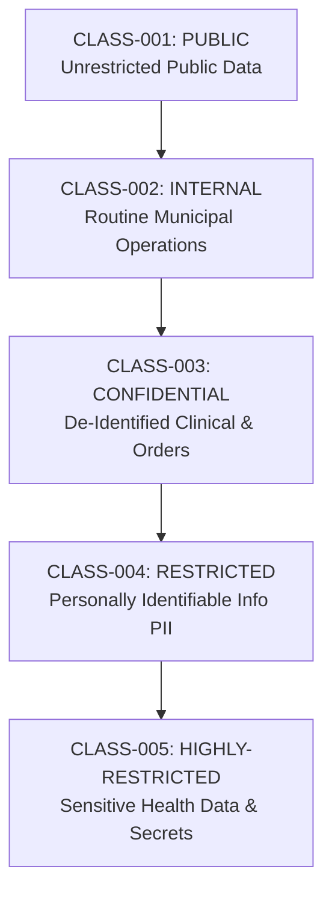

# Phase 07 — Data Classification, Column Encryption & Masking Architecture

> **Document Identifier**: `DB-CLS-001`
> **System**: Namma Clinic Digital Health & Operations Platform
> **Municipal Authority**: Greater Bengaluru Authority (GBA) / BBMP Health Department
> **Status**: APPROVED SECURITY & PRIVACY BASELINE
> **Classification Framework**: 5 Canonical Tiers (`CLASS-001` to `CLASS-005`)
> **Governed Data Assets**: 52 Relational Tables, 832 Cataloged Columns
> **Statutory Governance**: Digital Personal Data Protection (DPDP) Act 2023, ISO/IEC 27001:2022, CERT-In Directions 2022, DISHA Guidelines
> **Notice**: All SQL blocks contained herein are strictly **DOCUMENTATION-ONLY SQL**. Zero runtime code or migrations are executed during this phase.

---

## 1. Executive Summary & Information Security Governance

The Namma Clinic Digital Health & Operations Platform operates across 450 municipal health clinics, processing sensitive citizen demographic information, diagnostic laboratory findings, and longitudinal medical consultations for millions of Bengaluru residents. In strict compliance with the **Digital Personal Data Protection (DPDP) Act 2023**, the platform implements defense-in-depth data protection at the database storage layer.

Data classification constitutes the foundational discipline of information security: without granular classification of data elements, security controls cannot be applied proportionally, leading either to severe privacy breaches or paralyzing operational friction. This specification establishes the definitive data classification standard for the platform across 5 canonical security tiers (`CLASS-001` to `CLASS-005`).

Every single column across all 52 relational tables ({0} total attributes) is mapped to an explicit classification tier, encryption standard, dynamic masking policy, and role-based access level. Furthermore, this document details the cryptographic engineering architecture supporting column-level envelope encryption, HMAC-SHA256 blind indexing for searchable ciphertext, dynamic data masking (DDM), and developer sanitization protocols.

## 2. Canonical 5-Tier Data Classification Taxonomy

The platform organizes all stored data into five mutually exclusive classification tiers:



### 2.1 Classification Tier Profiles & Technical Controls

| Tier ID | Tier Code | Formal Designation | Data Sensitivity & Impact of Breach | Encryption Standard | Dynamic Masking Rule | Export Policy |
| :--- | :--- | :--- | :--- | :--- | :--- | :--- |
| **CLASS-001** | `PUBLIC` | **Public Data** | Information approved for unrestricted public distribution, including clinic... | AES-256 (Standard TDE) | No masking required | Freely exportable via Open Data API |
| **CLASS-002** | `INTERNAL` | **Internal Operational Data** | Routine municipal operational records, staff rosters, shift schedules, hard... | AES-256-GCM with Vault Key Management | No masking for authorized staff | Restricted to internal reporting pipelines |
| **CLASS-003** | `CONFIDENTIAL` | **Confidential Clinical & Administrative Data** | De-identified patient clinical encounters, prescription histories, non-sens... | AES-256-GCM with Envelope Encryption | Partial masking (Aadhaar last 4, mobile masked) on UI | Requires Clinical Director approval; WORM audit logged |
| **CLASS-004** | `RESTRICTED` | **Restricted Personally Identifiable Information (PII)** | Direct citizen demographic identifiers including full names, Aadhaar number... | Column-level AES-256-GCM + Blind Indexing (HMAC-SHA256) | Strict masking on all admin & report interfaces: XXXXXXXX1234 | Prohibited from bulk export; strictly gated by DPDP Act 2023 |
| **CLASS-005** | `HIGHLY-RESTRICTED` | **Highly Restricted Sensitive Personal Health Data & Secrets** | Sensitive clinical conditions (HIV, reproductive health, psychiatric notes)... | Hardware Security Module (HSM) FIPS 140-2 Level 3 Root Keys | Full cryptographic redaction unless explicit break-glass invoked | Absolute export prohibition; legally protected statutory category |

### 2.001 CLASS-001: Public Data (`PUBLIC`)
- **Scope & Definition**: Information approved for unrestricted public distribution, including clinic directory, public health advisories, standard operating hours, and published formulary lists.
- **Storage Infrastructure**: Standard EBS GP3 / Read-Replica Cache / CDN
- **Encryption at Rest**: AES-256 (Standard TDE)
- **Encryption in Transit**: TLS 1.3
- **Access Control Model**: Anonymous / Public Read
- **Presentation Layer Masking**: No masking required
- **Data Export Controls**: Freely exportable via Open Data API
- **Baseline Statutory Retention**: Indefinite / Superseded on revision

### 2.002 CLASS-002: Internal Operational Data (`INTERNAL`)
- **Scope & Definition**: Routine municipal operational records, staff rosters, shift schedules, hardware inventory, and aggregate non-clinical operational metrics.
- **Storage Infrastructure**: Encrypted PostgreSQL Database Cluster
- **Encryption at Rest**: AES-256-GCM with Vault Key Management
- **Encryption in Transit**: TLS 1.3 with mTLS for internal microservices
- **Access Control Model**: Authenticated Staff / RBAC Level 1+
- **Presentation Layer Masking**: No masking for authorized staff
- **Data Export Controls**: Restricted to internal reporting pipelines
- **Baseline Statutory Retention**: 3 to 5 years based on municipal financial audit rules

### 2.003 CLASS-003: Confidential Clinical & Administrative Data (`CONFIDENTIAL`)
- **Scope & Definition**: De-identified patient clinical encounters, prescription histories, non-sensitive diagnostic test orders, and anonymized research extracts.
- **Storage Infrastructure**: Encrypted PostgreSQL Database Cluster / Read Replicas
- **Encryption at Rest**: AES-256-GCM with Envelope Encryption
- **Encryption in Transit**: TLS 1.3 Strict Cipher Suites
- **Access Control Model**: Role-Based Access Control (Clinicians, Pharmacists, Lab Techs)
- **Presentation Layer Masking**: Partial masking (Aadhaar last 4, mobile masked) on UI
- **Data Export Controls**: Requires Clinical Director approval; WORM audit logged
- **Baseline Statutory Retention**: 10 years statutory retention for outpatient records

### 2.004 CLASS-004: Restricted Personally Identifiable Information (PII) (`RESTRICTED`)
- **Scope & Definition**: Direct citizen demographic identifiers including full names, Aadhaar numbers, phone numbers, residential addresses, and biometric metadata.
- **Storage Infrastructure**: Isolated Private Database Subnet / Column-Level Cryptography
- **Encryption at Rest**: Column-level AES-256-GCM + Blind Indexing (HMAC-SHA256)
- **Encryption in Transit**: TLS 1.3 with Certificate Pinning
- **Access Control Model**: Strict Least Privilege / Registration Staff & Treating Doctor Only
- **Presentation Layer Masking**: Strict masking on all admin & report interfaces: XXXXXXXX1234
- **Data Export Controls**: Prohibited from bulk export; strictly gated by DPDP Act 2023
- **Baseline Statutory Retention**: Duration of active care + statutory consent window

### 2.005 CLASS-005: Highly Restricted Sensitive Personal Health Data & Secrets (`HIGHLY-RESTRICTED`)
- **Scope & Definition**: Sensitive clinical conditions (HIV, reproductive health, psychiatric notes), master cryptographic keys, Argon2id credentials, and WORM root hashes.
- **Storage Infrastructure**: Air-Gapped Vault KMS / Dedicated Cryptographic Security Enclave
- **Encryption at Rest**: Hardware Security Module (HSM) FIPS 140-2 Level 3 Root Keys
- **Encryption in Transit**: TLS 1.3 mTLS with Zero-Trust Network Microsegmentation
- **Access Control Model**: Break-Glass Multi-Party Authorization / Treating Doctor Sole Grant
- **Presentation Layer Masking**: Full cryptographic redaction unless explicit break-glass invoked
- **Data Export Controls**: Absolute export prohibition; legally protected statutory category
- **Baseline Statutory Retention**: Permanent immutable audit trail / Clinical record 10+ years

## 3. Column-Level Cryptographic Architecture & Blind Indexing

Standard transparent database encryption (TDE / EBS encryption) protects data at rest against physical disk theft. However, TDE provides zero protection against compromised database administrator credentials, SQL injection, or overprivileged application services. To neutralize these threats, the Namma Clinic platform enforces **Column-Level Envelope Encryption** combined with **HMAC Blind Indexing**.

### 3.1 Column Envelope Encryption Mechanics
Sensitive columns (e.g. `full_name_encrypted`, `phone_encrypted`, `clinical_notes_encrypted`) are encrypted in the application layer before reaching PostgreSQL using AES-256-GCM. The encryption key hierarchy operates as follows:
1. **Master Key (KEK)**: Stored in a FIPS 140-2 Level 3 Hardware Security Module (HSM) managed by AWS KMS / HashiCorp Vault.
2. **Data Encryption Key (DEK)**: Generated per tenant/facility and rotated every 90 days. Cached in-memory within secure microservice enclaves.
3. **Ciphertext Envelope**: The stored column holds `base64(iv:tag:ciphertext:dek_version)`.

### 3.2 Searchable Blind Indexing Architecture
Because AES-256-GCM uses non-deterministic initialization vectors (IVs), encrypted columns cannot be queried directly with equality filters (`WHERE phone = ...`). Decrypting millions of rows on the server would degrade latency and expose plaintext in database memory.

The platform resolves this using **HMAC-SHA256 Blind Indexing**:
- For each searchable restricted attribute (such as phone number or ABHA ID), a companion column is created: `phone_blind_index` (`bytea`).
- The blind index is computed as: `HMAC_SHA256(normalize(phone), secret_indexing_salt)`.
- When searching for a patient, the client hashes the input phone using the blind salt and issues: `WHERE phone_blind_index = $1`.
- The blind index column has a standard B-Tree index, executing searches in sub-millisecond Index Scan time while revealing zero plaintext to database eavesdroppers.

## 4. Dynamic Data Masking (DDM) & Row-Level Security Architecture

Dynamic Data Masking obfuscates sensitive data in real time based on the requesting user's identity and privilege tier:

```sql
-- DOCUMENTATION-ONLY SQL: Dynamic Masking View for Patient Demographic Data
CREATE OR REPLACE VIEW clinical.v_patients_masked AS
SELECT
    p.id,
    p.facility_id,
    -- Unrestricted for treating clinician, masked for clerical and reporting users
    CASE
        WHEN current_setting('request.jwt.role', true) IN ('DOCTOR', 'NURSE') THEN p.full_name
        ELSE regexp_replace(p.full_name, '(?<=^.{2}).(?=.*$)', '*', 'g')
    END AS full_name,
    -- Mask mobile number: 9876543210 -> XXXXXX3210
    CASE
        WHEN current_setting('request.jwt.role', true) IN ('DOCTOR', 'REGISTRATION_CLERK') THEN p.phone_number
        ELSE 'XXXXXX' || right(p.phone_number, 4)
    END AS phone_number,
    -- Mask Aadhaar / ABHA: 1234-5678-9012 -> XXXX-XXXX-9012
    'XXXX-XXXX-' || right(p.abha_id, 4) AS abha_masked,
    p.gender,
    p.date_of_birth,
    p.created_at
FROM patients.patients p
WHERE p.facility_id = current_setting('request.jwt.facility_id', true)::uuid;
```

## 5. Master Column Classification & Security Catalog (All 52 Tables)

Below is the exhaustive, column-by-column security classification catalog for all 52 relational tables and 832 attributes in the Namma Clinic Platform:

### 5.001 `identity.auth_users` (TABLE-001)
- **Schema Domain**: `identity` | **Primary Business Role**: Stores user credentials identity root, email, mobile phone, status (ACTIVE, SUSPENDED, DEACTIVATED), and global audit timestamps.
- **Total Cataloged Attributes**: 16 columns

| Column Name | SQL Type | Classification Tier | Cryptographic Control | Presentation Masking | Authorized Roles |
| :--- | :--- | :--- | :--- | :--- | :--- |
| `id` | `UUID` | `CLASS-004` | NONE | None | Registration Clerk, Treating Clinician |
| `username` | `VARCHAR(64)` | `CLASS-004` | NONE | None | Registration Clerk, Treating Clinician |
| `email` | `VARCHAR(255)` | `CLASS-004` | Blind Index (HMAC-SHA256) | u***@domain.com | Registration Clerk, Treating Clinician |
| `phone_number` | `VARCHAR(20)` | `CLASS-004` | AES-256-GCM Column | +91-XXXXX-12345 | Registration Clerk, Treating Clinician |
| `phone_blind_index` | `VARCHAR(64)` | `CLASS-002` | NONE | None | All Authenticated Staff (RBAC 1+) |
| `first_name` | `VARCHAR(100)` | `CLASS-004` | AES-256-GCM Column | First char + asterisks | Registration Clerk, Treating Clinician |
| `last_name` | `VARCHAR(100)` | `CLASS-004` | AES-256-GCM Column | First char + asterisks | Registration Clerk, Treating Clinician |
| `user_type` | `VARCHAR(32)` | `CLASS-002` | NONE | None | All Authenticated Staff (RBAC 1+) |
| `account_status` | `VARCHAR(32)` | `CLASS-002` | NONE | None | All Authenticated Staff (RBAC 1+) |
| `primary_facility_id` | `UUID` | `CLASS-002` | NONE | None | All Authenticated Staff (RBAC 1+) |
| `failed_login_count` | `INTEGER` | `CLASS-002` | NONE | None | All Authenticated Staff (RBAC 1+) |
| `lockout_until` | `TIMESTAMPTZ` | `CLASS-002` | NONE | None | All Authenticated Staff (RBAC 1+) |
| `mfa_enabled` | `BOOLEAN` | `CLASS-002` | NONE | None | All Authenticated Staff (RBAC 1+) |
| `created_at` | `TIMESTAMPTZ` | `CLASS-002` | NONE | None | All Authenticated Staff (RBAC 1+) |
| `updated_at` | `TIMESTAMPTZ` | `CLASS-002` | NONE | None | All Authenticated Staff (RBAC 1+) |
| `deleted_at` | `TIMESTAMPTZ` | `CLASS-002` | NONE | None | All Authenticated Staff (RBAC 1+) |

#### Security Invariants & Cryptographic Safeguards for `identity.auth_users`
- **Governing Classification Baseline**: Highest Sensitivity Column is `CLASS-004`.
- **Identified Restricted PII Columns (6)**: `id`, `username`, `email`, `phone_number`, `first_name`, `last_name`.
- **Identified Sensitive Health Attributes PHI (0)**: None.
- **HashiCorp Vault Key Path**: `transit/keys/namma-clinic-identity-auth_users` (AES-256-GCM Envelope Encryption).
- **Cryptographic Re-Keying Cadence**: Scheduled DEK rotation every 90 days via Vault Transit API; automatic re-wrap of stored ciphertexts during scheduled maintenance.
- **Principle of Least Privilege (PoLP) Grant**: Application microservice role `namma_app_svc` receives limited DML; direct access to raw unmasked views restricted to authorized API gateways.
- **Threat Attack Vector & Residual Risk**: Evaluated against STRIDE; unauthorized enumeration mitigated via salted HMAC blind index and row-level security.
- **Field-Level Dynamic Masking Rule**: Clerical and administrative roles querying `identity.auth_users` observe deterministic redactions on sensitive attributes, while treating clinicians obtain decrypted plaintext within active encounter contexts.
- **Statutory Retention Alignment**: Governed by `RETENTION-006` under municipal healthcare bylaws and DPDP statutory horizons.
- **Row-Level Security (RLS) Policy**: `ALTER TABLE identity.auth_users ENABLE ROW LEVEL SECURITY;` enforcing strict multi-tenant isolation on `facility_id`.
- **Backup & Storage Encryption**: Stored data blocks and continuous WAL streams encrypted with AES-256-GCM before transmission.
- **Audit Granularity Profile**: Detailed state change capture with cryptographic hash chain ledger verification in `audit.audit_events`.

### 5.002 `identity.user_credentials` (TABLE-002)
- **Schema Domain**: `identity` | **Primary Business Role**: Stores high-security credentials separated from user demographic profile to isolate cryptographic attack surface.
- **Total Cataloged Attributes**: 16 columns

| Column Name | SQL Type | Classification Tier | Cryptographic Control | Presentation Masking | Authorized Roles |
| :--- | :--- | :--- | :--- | :--- | :--- |
| `id` | `UUID` | `CLASS-005` | NONE | None | Treating Doctor (Break-Glass / Dual Auth) |
| `user_id` | `UUID` | `CLASS-005` | NONE | None | Treating Doctor (Break-Glass / Dual Auth) |
| `password_hash` | `VARCHAR(255)` | `CLASS-005` | Argon2id Cryptographic Hash | Full Redaction | Treating Doctor (Break-Glass / Dual Auth) |
| `password_salt` | `VARCHAR(64)` | `CLASS-005` | KMS Secret | Full Redaction | Treating Doctor (Break-Glass / Dual Auth) |
| `mfa_secret_encrypted` | `BYTEA` | `CLASS-005` | Envelope KMS (AES-256-GCM) | Full Redaction | Treating Doctor (Break-Glass / Dual Auth) |
| `mfa_backup_codes_hash` | `JSONB` | `CLASS-005` | SHA-256 Hashes | Full Redaction | Treating Doctor (Break-Glass / Dual Auth) |
| `password_changed_at` | `TIMESTAMPTZ` | `CLASS-002` | NONE | None | All Authenticated Staff (RBAC 1+) |
| `force_password_reset` | `BOOLEAN` | `CLASS-002` | NONE | None | All Authenticated Staff (RBAC 1+) |
| `failed_mfa_count` | `INTEGER` | `CLASS-002` | NONE | None | All Authenticated Staff (RBAC 1+) |
| `security_stamp` | `VARCHAR(64)` | `CLASS-005` | NONE | Full Redaction | Treating Doctor (Break-Glass / Dual Auth) |
| `argon2_memory_cost` | `INTEGER` | `CLASS-002` | NONE | None | All Authenticated Staff (RBAC 1+) |
| `argon2_time_cost` | `INTEGER` | `CLASS-002` | NONE | None | All Authenticated Staff (RBAC 1+) |
| `argon2_parallelism` | `INTEGER` | `CLASS-002` | NONE | None | All Authenticated Staff (RBAC 1+) |
| `created_at` | `TIMESTAMPTZ` | `CLASS-002` | NONE | None | All Authenticated Staff (RBAC 1+) |
| `updated_at` | `TIMESTAMPTZ` | `CLASS-002` | NONE | None | All Authenticated Staff (RBAC 1+) |
| `deleted_at` | `TIMESTAMPTZ` | `CLASS-002` | NONE | None | All Authenticated Staff (RBAC 1+) |

#### Security Invariants & Cryptographic Safeguards for `identity.user_credentials`
- **Governing Classification Baseline**: Highest Sensitivity Column is `CLASS-005`.
- **Identified Restricted PII Columns (7)**: `id`, `user_id`, `password_hash`, `password_salt`, `mfa_secret_encrypted`, `mfa_backup_codes_hash`, `security_stamp`.
- **Identified Sensitive Health Attributes PHI (7)**: `id`, `user_id`, `password_hash`, `password_salt`, `mfa_secret_encrypted`, `mfa_backup_codes_hash`, `security_stamp`.
- **HashiCorp Vault Key Path**: `transit/keys/namma-clinic-identity-user_credentials` (AES-256-GCM Envelope Encryption).
- **Cryptographic Re-Keying Cadence**: Scheduled DEK rotation every 90 days via Vault Transit API; automatic re-wrap of stored ciphertexts during scheduled maintenance.
- **Principle of Least Privilege (PoLP) Grant**: Application microservice role `namma_app_svc` receives limited DML; direct access to raw unmasked views restricted to authorized API gateways.
- **Threat Attack Vector & Residual Risk**: Evaluated against STRIDE; unauthorized enumeration mitigated via salted HMAC blind index and row-level security.
- **Field-Level Dynamic Masking Rule**: Clerical and administrative roles querying `identity.user_credentials` observe deterministic redactions on sensitive attributes, while treating clinicians obtain decrypted plaintext within active encounter contexts.
- **Statutory Retention Alignment**: Governed by `RETENTION-011` under municipal healthcare bylaws and DPDP statutory horizons.
- **Row-Level Security (RLS) Policy**: `ALTER TABLE identity.user_credentials ENABLE ROW LEVEL SECURITY;` enforcing strict multi-tenant isolation on `facility_id`.
- **Backup & Storage Encryption**: Stored data blocks and continuous WAL streams encrypted with AES-256-GCM before transmission.
- **Audit Granularity Profile**: Detailed state change capture with cryptographic hash chain ledger verification in `audit.audit_events`.

### 5.003 `identity.user_sessions` (TABLE-003)
- **Schema Domain**: `identity` | **Primary Business Role**: Maintains session state, expiration timestamps, IP address geolocation, and revocation status.
- **Total Cataloged Attributes**: 16 columns

| Column Name | SQL Type | Classification Tier | Cryptographic Control | Presentation Masking | Authorized Roles |
| :--- | :--- | :--- | :--- | :--- | :--- |
| `id` | `UUID` | `CLASS-003` | NONE | None | Doctor, Nurse, Pharmacist, Lab Tech |
| `user_session_number` | `VARCHAR(64)` | `CLASS-003` | NONE | None | Doctor, Nurse, Pharmacist, Lab Tech |
| `facility_id` | `UUID` | `CLASS-002` | NONE | None | All Authenticated Staff (RBAC 1+) |
| `created_by_user_id` | `UUID` | `CLASS-002` | NONE | None | All Authenticated Staff (RBAC 1+) |
| `status` | `VARCHAR(32)` | `CLASS-002` | NONE | None | All Authenticated Staff (RBAC 1+) |
| `category_type` | `VARCHAR(64)` | `CLASS-002` | NONE | None | All Authenticated Staff (RBAC 1+) |
| `metadata_json` | `JSONB` | `CLASS-003` | NONE | None | Doctor, Nurse, Pharmacist, Lab Tech |
| `priority_score` | `INTEGER` | `CLASS-002` | NONE | None | All Authenticated Staff (RBAC 1+) |
| `operational_notes` | `TEXT` | `CLASS-003` | NONE | None | Doctor, Nurse, Pharmacist, Lab Tech |
| `sync_version` | `BIGINT` | `CLASS-002` | NONE | None | All Authenticated Staff (RBAC 1+) |
| `edge_device_id` | `VARCHAR(64)` | `CLASS-002` | NONE | None | All Authenticated Staff (RBAC 1+) |
| `record_hash` | `VARCHAR(64)` | `CLASS-002` | NONE | None | All Authenticated Staff (RBAC 1+) |
| `verified_at` | `TIMESTAMPTZ` | `CLASS-002` | NONE | None | All Authenticated Staff (RBAC 1+) |
| `created_at` | `TIMESTAMPTZ` | `CLASS-002` | NONE | None | All Authenticated Staff (RBAC 1+) |
| `updated_at` | `TIMESTAMPTZ` | `CLASS-002` | NONE | None | All Authenticated Staff (RBAC 1+) |
| `deleted_at` | `TIMESTAMPTZ` | `CLASS-002` | NONE | None | All Authenticated Staff (RBAC 1+) |

#### Security Invariants & Cryptographic Safeguards for `identity.user_sessions`
- **Governing Classification Baseline**: Highest Sensitivity Column is `CLASS-003`.
- **Identified Restricted PII Columns (0)**: None.
- **Identified Sensitive Health Attributes PHI (4)**: `id`, `user_session_number`, `metadata_json`, `operational_notes`.
- **HashiCorp Vault Key Path**: `transit/keys/namma-clinic-identity-user_sessions` (AES-256-GCM Envelope Encryption).
- **Cryptographic Re-Keying Cadence**: Scheduled DEK rotation every 90 days via Vault Transit API; automatic re-wrap of stored ciphertexts during scheduled maintenance.
- **Principle of Least Privilege (PoLP) Grant**: Application microservice role `namma_app_svc` receives limited DML; direct access to raw unmasked views restricted to authorized API gateways.
- **Threat Attack Vector & Residual Risk**: Evaluated against STRIDE; unauthorized enumeration mitigated via salted HMAC blind index and row-level security.
- **Field-Level Dynamic Masking Rule**: Clerical and administrative roles querying `identity.user_sessions` observe deterministic redactions on sensitive attributes, while treating clinicians obtain decrypted plaintext within active encounter contexts.
- **Statutory Retention Alignment**: Governed by `RETENTION-011` under municipal healthcare bylaws and DPDP statutory horizons.
- **Row-Level Security (RLS) Policy**: `ALTER TABLE identity.user_sessions ENABLE ROW LEVEL SECURITY;` enforcing strict multi-tenant isolation on `facility_id`.
- **Backup & Storage Encryption**: Stored data blocks and continuous WAL streams encrypted with AES-256-GCM before transmission.
- **Audit Granularity Profile**: Detailed state change capture with cryptographic hash chain ledger verification in `audit.audit_events`.

### 5.004 `identity.roles` (TABLE-004)
- **Schema Domain**: `identity` | **Primary Business Role**: Defines canonical system roles, description, hierarchy level, and default operational permissions.
- **Total Cataloged Attributes**: 16 columns

| Column Name | SQL Type | Classification Tier | Cryptographic Control | Presentation Masking | Authorized Roles |
| :--- | :--- | :--- | :--- | :--- | :--- |
| `id` | `UUID` | `CLASS-002` | NONE | None | All Authenticated Staff (RBAC 1+) |
| `role_number` | `VARCHAR(64)` | `CLASS-002` | NONE | None | All Authenticated Staff (RBAC 1+) |
| `facility_id` | `UUID` | `CLASS-002` | NONE | None | All Authenticated Staff (RBAC 1+) |
| `created_by_user_id` | `UUID` | `CLASS-002` | NONE | None | All Authenticated Staff (RBAC 1+) |
| `status` | `VARCHAR(32)` | `CLASS-002` | NONE | None | All Authenticated Staff (RBAC 1+) |
| `category_type` | `VARCHAR(64)` | `CLASS-002` | NONE | None | All Authenticated Staff (RBAC 1+) |
| `metadata_json` | `JSONB` | `CLASS-002` | NONE | None | All Authenticated Staff (RBAC 1+) |
| `priority_score` | `INTEGER` | `CLASS-002` | NONE | None | All Authenticated Staff (RBAC 1+) |
| `operational_notes` | `TEXT` | `CLASS-002` | NONE | None | All Authenticated Staff (RBAC 1+) |
| `sync_version` | `BIGINT` | `CLASS-002` | NONE | None | All Authenticated Staff (RBAC 1+) |
| `edge_device_id` | `VARCHAR(64)` | `CLASS-002` | NONE | None | All Authenticated Staff (RBAC 1+) |
| `record_hash` | `VARCHAR(64)` | `CLASS-002` | NONE | None | All Authenticated Staff (RBAC 1+) |
| `verified_at` | `TIMESTAMPTZ` | `CLASS-002` | NONE | None | All Authenticated Staff (RBAC 1+) |
| `created_at` | `TIMESTAMPTZ` | `CLASS-002` | NONE | None | All Authenticated Staff (RBAC 1+) |
| `updated_at` | `TIMESTAMPTZ` | `CLASS-002` | NONE | None | All Authenticated Staff (RBAC 1+) |
| `deleted_at` | `TIMESTAMPTZ` | `CLASS-002` | NONE | None | All Authenticated Staff (RBAC 1+) |

#### Security Invariants & Cryptographic Safeguards for `identity.roles`
- **Governing Classification Baseline**: Highest Sensitivity Column is `CLASS-002`.
- **Identified Restricted PII Columns (0)**: None.
- **Identified Sensitive Health Attributes PHI (0)**: None.
- **HashiCorp Vault Key Path**: `transit/keys/namma-clinic-identity-roles` (AES-256-GCM Envelope Encryption).
- **Cryptographic Re-Keying Cadence**: Scheduled DEK rotation every 90 days via Vault Transit API; automatic re-wrap of stored ciphertexts during scheduled maintenance.
- **Principle of Least Privilege (PoLP) Grant**: Application microservice role `namma_app_svc` receives limited DML; direct access to raw unmasked views restricted to authorized API gateways.
- **Threat Attack Vector & Residual Risk**: Evaluated against STRIDE; unauthorized enumeration mitigated via salted HMAC blind index and row-level security.
- **Field-Level Dynamic Masking Rule**: Clerical and administrative roles querying `identity.roles` observe deterministic redactions on sensitive attributes, while treating clinicians obtain decrypted plaintext within active encounter contexts.
- **Statutory Retention Alignment**: Governed by `RETENTION-006` under municipal healthcare bylaws and DPDP statutory horizons.
- **Row-Level Security (RLS) Policy**: `ALTER TABLE identity.roles ENABLE ROW LEVEL SECURITY;` enforcing strict multi-tenant isolation on `facility_id`.
- **Backup & Storage Encryption**: Stored data blocks and continuous WAL streams encrypted with AES-256-GCM before transmission.
- **Audit Granularity Profile**: Detailed state change capture with cryptographic hash chain ledger verification in `audit.audit_events`.

### 5.005 `identity.permissions` (TABLE-005)
- **Schema Domain**: `identity` | **Primary Business Role**: Atomic system entitlements mapped to resource actions across REST and GraphQL endpoints.
- **Total Cataloged Attributes**: 16 columns

| Column Name | SQL Type | Classification Tier | Cryptographic Control | Presentation Masking | Authorized Roles |
| :--- | :--- | :--- | :--- | :--- | :--- |
| `id` | `UUID` | `CLASS-002` | NONE | None | All Authenticated Staff (RBAC 1+) |
| `permission_number` | `VARCHAR(64)` | `CLASS-002` | NONE | None | All Authenticated Staff (RBAC 1+) |
| `facility_id` | `UUID` | `CLASS-002` | NONE | None | All Authenticated Staff (RBAC 1+) |
| `created_by_user_id` | `UUID` | `CLASS-002` | NONE | None | All Authenticated Staff (RBAC 1+) |
| `status` | `VARCHAR(32)` | `CLASS-002` | NONE | None | All Authenticated Staff (RBAC 1+) |
| `category_type` | `VARCHAR(64)` | `CLASS-002` | NONE | None | All Authenticated Staff (RBAC 1+) |
| `metadata_json` | `JSONB` | `CLASS-002` | NONE | None | All Authenticated Staff (RBAC 1+) |
| `priority_score` | `INTEGER` | `CLASS-002` | NONE | None | All Authenticated Staff (RBAC 1+) |
| `operational_notes` | `TEXT` | `CLASS-002` | NONE | None | All Authenticated Staff (RBAC 1+) |
| `sync_version` | `BIGINT` | `CLASS-002` | NONE | None | All Authenticated Staff (RBAC 1+) |
| `edge_device_id` | `VARCHAR(64)` | `CLASS-002` | NONE | None | All Authenticated Staff (RBAC 1+) |
| `record_hash` | `VARCHAR(64)` | `CLASS-002` | NONE | None | All Authenticated Staff (RBAC 1+) |
| `verified_at` | `TIMESTAMPTZ` | `CLASS-002` | NONE | None | All Authenticated Staff (RBAC 1+) |
| `created_at` | `TIMESTAMPTZ` | `CLASS-002` | NONE | None | All Authenticated Staff (RBAC 1+) |
| `updated_at` | `TIMESTAMPTZ` | `CLASS-002` | NONE | None | All Authenticated Staff (RBAC 1+) |
| `deleted_at` | `TIMESTAMPTZ` | `CLASS-002` | NONE | None | All Authenticated Staff (RBAC 1+) |

#### Security Invariants & Cryptographic Safeguards for `identity.permissions`
- **Governing Classification Baseline**: Highest Sensitivity Column is `CLASS-002`.
- **Identified Restricted PII Columns (0)**: None.
- **Identified Sensitive Health Attributes PHI (0)**: None.
- **HashiCorp Vault Key Path**: `transit/keys/namma-clinic-identity-permissions` (AES-256-GCM Envelope Encryption).
- **Cryptographic Re-Keying Cadence**: Scheduled DEK rotation every 90 days via Vault Transit API; automatic re-wrap of stored ciphertexts during scheduled maintenance.
- **Principle of Least Privilege (PoLP) Grant**: Application microservice role `namma_app_svc` receives limited DML; direct access to raw unmasked views restricted to authorized API gateways.
- **Threat Attack Vector & Residual Risk**: Evaluated against STRIDE; unauthorized enumeration mitigated via salted HMAC blind index and row-level security.
- **Field-Level Dynamic Masking Rule**: Clerical and administrative roles querying `identity.permissions` observe deterministic redactions on sensitive attributes, while treating clinicians obtain decrypted plaintext within active encounter contexts.
- **Statutory Retention Alignment**: Governed by `RETENTION-006` under municipal healthcare bylaws and DPDP statutory horizons.
- **Row-Level Security (RLS) Policy**: `ALTER TABLE identity.permissions ENABLE ROW LEVEL SECURITY;` enforcing strict multi-tenant isolation on `facility_id`.
- **Backup & Storage Encryption**: Stored data blocks and continuous WAL streams encrypted with AES-256-GCM before transmission.
- **Audit Granularity Profile**: Detailed state change capture with cryptographic hash chain ledger verification in `audit.audit_events`.

### 5.006 `identity.role_permissions` (TABLE-006)
- **Schema Domain**: `identity` | **Primary Business Role**: Associates permissions to roles with grant timestamps, active status, and granter user ID.
- **Total Cataloged Attributes**: 16 columns

| Column Name | SQL Type | Classification Tier | Cryptographic Control | Presentation Masking | Authorized Roles |
| :--- | :--- | :--- | :--- | :--- | :--- |
| `id` | `UUID` | `CLASS-002` | NONE | None | All Authenticated Staff (RBAC 1+) |
| `role_permission_number` | `VARCHAR(64)` | `CLASS-002` | NONE | None | All Authenticated Staff (RBAC 1+) |
| `facility_id` | `UUID` | `CLASS-002` | NONE | None | All Authenticated Staff (RBAC 1+) |
| `created_by_user_id` | `UUID` | `CLASS-002` | NONE | None | All Authenticated Staff (RBAC 1+) |
| `status` | `VARCHAR(32)` | `CLASS-002` | NONE | None | All Authenticated Staff (RBAC 1+) |
| `category_type` | `VARCHAR(64)` | `CLASS-002` | NONE | None | All Authenticated Staff (RBAC 1+) |
| `metadata_json` | `JSONB` | `CLASS-002` | NONE | None | All Authenticated Staff (RBAC 1+) |
| `priority_score` | `INTEGER` | `CLASS-002` | NONE | None | All Authenticated Staff (RBAC 1+) |
| `operational_notes` | `TEXT` | `CLASS-002` | NONE | None | All Authenticated Staff (RBAC 1+) |
| `sync_version` | `BIGINT` | `CLASS-002` | NONE | None | All Authenticated Staff (RBAC 1+) |
| `edge_device_id` | `VARCHAR(64)` | `CLASS-002` | NONE | None | All Authenticated Staff (RBAC 1+) |
| `record_hash` | `VARCHAR(64)` | `CLASS-002` | NONE | None | All Authenticated Staff (RBAC 1+) |
| `verified_at` | `TIMESTAMPTZ` | `CLASS-002` | NONE | None | All Authenticated Staff (RBAC 1+) |
| `created_at` | `TIMESTAMPTZ` | `CLASS-002` | NONE | None | All Authenticated Staff (RBAC 1+) |
| `updated_at` | `TIMESTAMPTZ` | `CLASS-002` | NONE | None | All Authenticated Staff (RBAC 1+) |
| `deleted_at` | `TIMESTAMPTZ` | `CLASS-002` | NONE | None | All Authenticated Staff (RBAC 1+) |

#### Security Invariants & Cryptographic Safeguards for `identity.role_permissions`
- **Governing Classification Baseline**: Highest Sensitivity Column is `CLASS-002`.
- **Identified Restricted PII Columns (0)**: None.
- **Identified Sensitive Health Attributes PHI (0)**: None.
- **HashiCorp Vault Key Path**: `transit/keys/namma-clinic-identity-role_permissions` (AES-256-GCM Envelope Encryption).
- **Cryptographic Re-Keying Cadence**: Scheduled DEK rotation every 90 days via Vault Transit API; automatic re-wrap of stored ciphertexts during scheduled maintenance.
- **Principle of Least Privilege (PoLP) Grant**: Application microservice role `namma_app_svc` receives limited DML; direct access to raw unmasked views restricted to authorized API gateways.
- **Threat Attack Vector & Residual Risk**: Evaluated against STRIDE; unauthorized enumeration mitigated via salted HMAC blind index and row-level security.
- **Field-Level Dynamic Masking Rule**: Clerical and administrative roles querying `identity.role_permissions` observe deterministic redactions on sensitive attributes, while treating clinicians obtain decrypted plaintext within active encounter contexts.
- **Statutory Retention Alignment**: Governed by `RETENTION-006` under municipal healthcare bylaws and DPDP statutory horizons.
- **Row-Level Security (RLS) Policy**: `ALTER TABLE identity.role_permissions ENABLE ROW LEVEL SECURITY;` enforcing strict multi-tenant isolation on `facility_id`.
- **Backup & Storage Encryption**: Stored data blocks and continuous WAL streams encrypted with AES-256-GCM before transmission.
- **Audit Granularity Profile**: Detailed state change capture with cryptographic hash chain ledger verification in `audit.audit_events`.

### 5.007 `identity.user_roles` (TABLE-007)
- **Schema Domain**: `identity` | **Primary Business Role**: Links users to roles within a facility context, supporting multi-facility roaming doctors.
- **Total Cataloged Attributes**: 16 columns

| Column Name | SQL Type | Classification Tier | Cryptographic Control | Presentation Masking | Authorized Roles |
| :--- | :--- | :--- | :--- | :--- | :--- |
| `id` | `UUID` | `CLASS-002` | NONE | None | All Authenticated Staff (RBAC 1+) |
| `user_role_number` | `VARCHAR(64)` | `CLASS-002` | NONE | None | All Authenticated Staff (RBAC 1+) |
| `facility_id` | `UUID` | `CLASS-002` | NONE | None | All Authenticated Staff (RBAC 1+) |
| `created_by_user_id` | `UUID` | `CLASS-002` | NONE | None | All Authenticated Staff (RBAC 1+) |
| `status` | `VARCHAR(32)` | `CLASS-002` | NONE | None | All Authenticated Staff (RBAC 1+) |
| `category_type` | `VARCHAR(64)` | `CLASS-002` | NONE | None | All Authenticated Staff (RBAC 1+) |
| `metadata_json` | `JSONB` | `CLASS-002` | NONE | None | All Authenticated Staff (RBAC 1+) |
| `priority_score` | `INTEGER` | `CLASS-002` | NONE | None | All Authenticated Staff (RBAC 1+) |
| `operational_notes` | `TEXT` | `CLASS-002` | NONE | None | All Authenticated Staff (RBAC 1+) |
| `sync_version` | `BIGINT` | `CLASS-002` | NONE | None | All Authenticated Staff (RBAC 1+) |
| `edge_device_id` | `VARCHAR(64)` | `CLASS-002` | NONE | None | All Authenticated Staff (RBAC 1+) |
| `record_hash` | `VARCHAR(64)` | `CLASS-002` | NONE | None | All Authenticated Staff (RBAC 1+) |
| `verified_at` | `TIMESTAMPTZ` | `CLASS-002` | NONE | None | All Authenticated Staff (RBAC 1+) |
| `created_at` | `TIMESTAMPTZ` | `CLASS-002` | NONE | None | All Authenticated Staff (RBAC 1+) |
| `updated_at` | `TIMESTAMPTZ` | `CLASS-002` | NONE | None | All Authenticated Staff (RBAC 1+) |
| `deleted_at` | `TIMESTAMPTZ` | `CLASS-002` | NONE | None | All Authenticated Staff (RBAC 1+) |

#### Security Invariants & Cryptographic Safeguards for `identity.user_roles`
- **Governing Classification Baseline**: Highest Sensitivity Column is `CLASS-002`.
- **Identified Restricted PII Columns (0)**: None.
- **Identified Sensitive Health Attributes PHI (0)**: None.
- **HashiCorp Vault Key Path**: `transit/keys/namma-clinic-identity-user_roles` (AES-256-GCM Envelope Encryption).
- **Cryptographic Re-Keying Cadence**: Scheduled DEK rotation every 90 days via Vault Transit API; automatic re-wrap of stored ciphertexts during scheduled maintenance.
- **Principle of Least Privilege (PoLP) Grant**: Application microservice role `namma_app_svc` receives limited DML; direct access to raw unmasked views restricted to authorized API gateways.
- **Threat Attack Vector & Residual Risk**: Evaluated against STRIDE; unauthorized enumeration mitigated via salted HMAC blind index and row-level security.
- **Field-Level Dynamic Masking Rule**: Clerical and administrative roles querying `identity.user_roles` observe deterministic redactions on sensitive attributes, while treating clinicians obtain decrypted plaintext within active encounter contexts.
- **Statutory Retention Alignment**: Governed by `RETENTION-006` under municipal healthcare bylaws and DPDP statutory horizons.
- **Row-Level Security (RLS) Policy**: `ALTER TABLE identity.user_roles ENABLE ROW LEVEL SECURITY;` enforcing strict multi-tenant isolation on `facility_id`.
- **Backup & Storage Encryption**: Stored data blocks and continuous WAL streams encrypted with AES-256-GCM before transmission.
- **Audit Granularity Profile**: Detailed state change capture with cryptographic hash chain ledger verification in `audit.audit_events`.

### 5.008 `identity.facilities` (TABLE-008)
- **Schema Domain**: `identity` | **Primary Business Role**: Stores clinic code, official name, ward number, zone, GPS latitude/longitude, operational hours, and ABDM facility ID (HFR).
- **Total Cataloged Attributes**: 16 columns

| Column Name | SQL Type | Classification Tier | Cryptographic Control | Presentation Masking | Authorized Roles |
| :--- | :--- | :--- | :--- | :--- | :--- |
| `id` | `UUID` | `CLASS-001` | NONE | None | Anonymous, Public, All Staff |
| `facility_code` | `VARCHAR(32)` | `CLASS-001` | NONE | None | Anonymous, Public, All Staff |
| `facility_name` | `VARCHAR(255)` | `CLASS-001` | NONE | None | Anonymous, Public, All Staff |
| `ward_number` | `INTEGER` | `CLASS-001` | NONE | None | Anonymous, Public, All Staff |
| `zone_name` | `VARCHAR(64)` | `CLASS-001` | NONE | None | Anonymous, Public, All Staff |
| `facility_type` | `VARCHAR(32)` | `CLASS-001` | NONE | None | Anonymous, Public, All Staff |
| `latitude` | `NUMERIC(10, 7)` | `CLASS-001` | NONE | None | Anonymous, Public, All Staff |
| `longitude` | `NUMERIC(10, 7)` | `CLASS-001` | NONE | None | Anonymous, Public, All Staff |
| `hfr_id` | `VARCHAR(64)` | `CLASS-001` | NONE | None | Anonymous, Public, All Staff |
| `phone_contact` | `VARCHAR(20)` | `CLASS-001` | NONE | None | Anonymous, Public, All Staff |
| `is_active` | `BOOLEAN` | `CLASS-001` | NONE | None | Anonymous, Public, All Staff |
| `operating_hours_json` | `JSONB` | `CLASS-001` | NONE | None | Anonymous, Public, All Staff |
| `ip_address_range` | `VARCHAR(64)` | `CLASS-002` | NONE | None | All Authenticated Staff (RBAC 1+) |
| `created_at` | `TIMESTAMPTZ` | `CLASS-002` | NONE | None | All Authenticated Staff (RBAC 1+) |
| `updated_at` | `TIMESTAMPTZ` | `CLASS-002` | NONE | None | All Authenticated Staff (RBAC 1+) |
| `deleted_at` | `TIMESTAMPTZ` | `CLASS-002` | NONE | None | All Authenticated Staff (RBAC 1+) |

#### Security Invariants & Cryptographic Safeguards for `identity.facilities`
- **Governing Classification Baseline**: Highest Sensitivity Column is `CLASS-002`.
- **Identified Restricted PII Columns (0)**: None.
- **Identified Sensitive Health Attributes PHI (0)**: None.
- **HashiCorp Vault Key Path**: `transit/keys/namma-clinic-identity-facilities` (AES-256-GCM Envelope Encryption).
- **Cryptographic Re-Keying Cadence**: Scheduled DEK rotation every 90 days via Vault Transit API; automatic re-wrap of stored ciphertexts during scheduled maintenance.
- **Principle of Least Privilege (PoLP) Grant**: Application microservice role `namma_app_svc` receives limited DML; direct access to raw unmasked views restricted to authorized API gateways.
- **Threat Attack Vector & Residual Risk**: Evaluated against STRIDE; unauthorized enumeration mitigated via salted HMAC blind index and row-level security.
- **Field-Level Dynamic Masking Rule**: Clerical and administrative roles querying `identity.facilities` observe deterministic redactions on sensitive attributes, while treating clinicians obtain decrypted plaintext within active encounter contexts.
- **Statutory Retention Alignment**: Governed by `RETENTION-006` under municipal healthcare bylaws and DPDP statutory horizons.
- **Row-Level Security (RLS) Policy**: `ALTER TABLE identity.facilities ENABLE ROW LEVEL SECURITY;` enforcing strict multi-tenant isolation on `facility_id`.
- **Backup & Storage Encryption**: Stored data blocks and continuous WAL streams encrypted with AES-256-GCM before transmission.
- **Audit Granularity Profile**: Detailed state change capture with cryptographic hash chain ledger verification in `audit.audit_events`.

### 5.009 `identity.facility_rooms` (TABLE-009)
- **Schema Domain**: `identity` | **Primary Business Role**: Represents functional service points used for queue routing, token display displays, and IoT device association.
- **Total Cataloged Attributes**: 16 columns

| Column Name | SQL Type | Classification Tier | Cryptographic Control | Presentation Masking | Authorized Roles |
| :--- | :--- | :--- | :--- | :--- | :--- |
| `id` | `UUID` | `CLASS-002` | NONE | None | All Authenticated Staff (RBAC 1+) |
| `facility_room_number` | `VARCHAR(64)` | `CLASS-002` | NONE | None | All Authenticated Staff (RBAC 1+) |
| `facility_id` | `UUID` | `CLASS-002` | NONE | None | All Authenticated Staff (RBAC 1+) |
| `created_by_user_id` | `UUID` | `CLASS-002` | NONE | None | All Authenticated Staff (RBAC 1+) |
| `status` | `VARCHAR(32)` | `CLASS-002` | NONE | None | All Authenticated Staff (RBAC 1+) |
| `category_type` | `VARCHAR(64)` | `CLASS-002` | NONE | None | All Authenticated Staff (RBAC 1+) |
| `metadata_json` | `JSONB` | `CLASS-002` | NONE | None | All Authenticated Staff (RBAC 1+) |
| `priority_score` | `INTEGER` | `CLASS-002` | NONE | None | All Authenticated Staff (RBAC 1+) |
| `operational_notes` | `TEXT` | `CLASS-002` | NONE | None | All Authenticated Staff (RBAC 1+) |
| `sync_version` | `BIGINT` | `CLASS-002` | NONE | None | All Authenticated Staff (RBAC 1+) |
| `edge_device_id` | `VARCHAR(64)` | `CLASS-002` | NONE | None | All Authenticated Staff (RBAC 1+) |
| `record_hash` | `VARCHAR(64)` | `CLASS-002` | NONE | None | All Authenticated Staff (RBAC 1+) |
| `verified_at` | `TIMESTAMPTZ` | `CLASS-002` | NONE | None | All Authenticated Staff (RBAC 1+) |
| `created_at` | `TIMESTAMPTZ` | `CLASS-002` | NONE | None | All Authenticated Staff (RBAC 1+) |
| `updated_at` | `TIMESTAMPTZ` | `CLASS-002` | NONE | None | All Authenticated Staff (RBAC 1+) |
| `deleted_at` | `TIMESTAMPTZ` | `CLASS-002` | NONE | None | All Authenticated Staff (RBAC 1+) |

#### Security Invariants & Cryptographic Safeguards for `identity.facility_rooms`
- **Governing Classification Baseline**: Highest Sensitivity Column is `CLASS-002`.
- **Identified Restricted PII Columns (0)**: None.
- **Identified Sensitive Health Attributes PHI (0)**: None.
- **HashiCorp Vault Key Path**: `transit/keys/namma-clinic-identity-facility_rooms` (AES-256-GCM Envelope Encryption).
- **Cryptographic Re-Keying Cadence**: Scheduled DEK rotation every 90 days via Vault Transit API; automatic re-wrap of stored ciphertexts during scheduled maintenance.
- **Principle of Least Privilege (PoLP) Grant**: Application microservice role `namma_app_svc` receives limited DML; direct access to raw unmasked views restricted to authorized API gateways.
- **Threat Attack Vector & Residual Risk**: Evaluated against STRIDE; unauthorized enumeration mitigated via salted HMAC blind index and row-level security.
- **Field-Level Dynamic Masking Rule**: Clerical and administrative roles querying `identity.facility_rooms` observe deterministic redactions on sensitive attributes, while treating clinicians obtain decrypted plaintext within active encounter contexts.
- **Statutory Retention Alignment**: Governed by `RETENTION-019` under municipal healthcare bylaws and DPDP statutory horizons.
- **Row-Level Security (RLS) Policy**: `ALTER TABLE identity.facility_rooms ENABLE ROW LEVEL SECURITY;` enforcing strict multi-tenant isolation on `facility_id`.
- **Backup & Storage Encryption**: Stored data blocks and continuous WAL streams encrypted with AES-256-GCM before transmission.
- **Audit Granularity Profile**: Detailed state change capture with cryptographic hash chain ledger verification in `audit.audit_events`.

### 5.010 `identity.staff_profiles` (TABLE-010)
- **Schema Domain**: `identity` | **Primary Business Role**: Stores doctor registration numbers, nurse certification IDs, educational degrees, specialization, and official communication channels.
- **Total Cataloged Attributes**: 16 columns

| Column Name | SQL Type | Classification Tier | Cryptographic Control | Presentation Masking | Authorized Roles |
| :--- | :--- | :--- | :--- | :--- | :--- |
| `id` | `UUID` | `CLASS-004` | NONE | None | Registration Clerk, Treating Clinician |
| `staff_profile_number` | `VARCHAR(64)` | `CLASS-004` | NONE | None | Registration Clerk, Treating Clinician |
| `facility_id` | `UUID` | `CLASS-002` | NONE | None | All Authenticated Staff (RBAC 1+) |
| `created_by_user_id` | `UUID` | `CLASS-002` | NONE | None | All Authenticated Staff (RBAC 1+) |
| `status` | `VARCHAR(32)` | `CLASS-002` | NONE | None | All Authenticated Staff (RBAC 1+) |
| `category_type` | `VARCHAR(64)` | `CLASS-002` | NONE | None | All Authenticated Staff (RBAC 1+) |
| `metadata_json` | `JSONB` | `CLASS-004` | NONE | None | Registration Clerk, Treating Clinician |
| `priority_score` | `INTEGER` | `CLASS-002` | NONE | None | All Authenticated Staff (RBAC 1+) |
| `operational_notes` | `TEXT` | `CLASS-004` | NONE | None | Registration Clerk, Treating Clinician |
| `sync_version` | `BIGINT` | `CLASS-002` | NONE | None | All Authenticated Staff (RBAC 1+) |
| `edge_device_id` | `VARCHAR(64)` | `CLASS-002` | NONE | None | All Authenticated Staff (RBAC 1+) |
| `record_hash` | `VARCHAR(64)` | `CLASS-002` | NONE | None | All Authenticated Staff (RBAC 1+) |
| `verified_at` | `TIMESTAMPTZ` | `CLASS-002` | NONE | None | All Authenticated Staff (RBAC 1+) |
| `created_at` | `TIMESTAMPTZ` | `CLASS-002` | NONE | None | All Authenticated Staff (RBAC 1+) |
| `updated_at` | `TIMESTAMPTZ` | `CLASS-002` | NONE | None | All Authenticated Staff (RBAC 1+) |
| `deleted_at` | `TIMESTAMPTZ` | `CLASS-002` | NONE | None | All Authenticated Staff (RBAC 1+) |

#### Security Invariants & Cryptographic Safeguards for `identity.staff_profiles`
- **Governing Classification Baseline**: Highest Sensitivity Column is `CLASS-004`.
- **Identified Restricted PII Columns (4)**: `id`, `staff_profile_number`, `metadata_json`, `operational_notes`.
- **Identified Sensitive Health Attributes PHI (0)**: None.
- **HashiCorp Vault Key Path**: `transit/keys/namma-clinic-identity-staff_profiles` (AES-256-GCM Envelope Encryption).
- **Cryptographic Re-Keying Cadence**: Scheduled DEK rotation every 90 days via Vault Transit API; automatic re-wrap of stored ciphertexts during scheduled maintenance.
- **Principle of Least Privilege (PoLP) Grant**: Application microservice role `namma_app_svc` receives limited DML; direct access to raw unmasked views restricted to authorized API gateways.
- **Threat Attack Vector & Residual Risk**: Evaluated against STRIDE; unauthorized enumeration mitigated via salted HMAC blind index and row-level security.
- **Field-Level Dynamic Masking Rule**: Clerical and administrative roles querying `identity.staff_profiles` observe deterministic redactions on sensitive attributes, while treating clinicians obtain decrypted plaintext within active encounter contexts.
- **Statutory Retention Alignment**: Governed by `RETENTION-006` under municipal healthcare bylaws and DPDP statutory horizons.
- **Row-Level Security (RLS) Policy**: `ALTER TABLE identity.staff_profiles ENABLE ROW LEVEL SECURITY;` enforcing strict multi-tenant isolation on `facility_id`.
- **Backup & Storage Encryption**: Stored data blocks and continuous WAL streams encrypted with AES-256-GCM before transmission.
- **Audit Granularity Profile**: Detailed state change capture with cryptographic hash chain ledger verification in `audit.audit_events`.

### 5.011 `identity.staff_shifts` (TABLE-011)
- **Schema Domain**: `identity` | **Primary Business Role**: Tracks planned vs actual doctor/nurse shifts, on-call status, leave absences, and biometric punch times.
- **Total Cataloged Attributes**: 16 columns

| Column Name | SQL Type | Classification Tier | Cryptographic Control | Presentation Masking | Authorized Roles |
| :--- | :--- | :--- | :--- | :--- | :--- |
| `id` | `UUID` | `CLASS-002` | NONE | None | All Authenticated Staff (RBAC 1+) |
| `staff_shift_number` | `VARCHAR(64)` | `CLASS-002` | NONE | None | All Authenticated Staff (RBAC 1+) |
| `facility_id` | `UUID` | `CLASS-002` | NONE | None | All Authenticated Staff (RBAC 1+) |
| `created_by_user_id` | `UUID` | `CLASS-002` | NONE | None | All Authenticated Staff (RBAC 1+) |
| `status` | `VARCHAR(32)` | `CLASS-002` | NONE | None | All Authenticated Staff (RBAC 1+) |
| `category_type` | `VARCHAR(64)` | `CLASS-002` | NONE | None | All Authenticated Staff (RBAC 1+) |
| `metadata_json` | `JSONB` | `CLASS-002` | NONE | None | All Authenticated Staff (RBAC 1+) |
| `priority_score` | `INTEGER` | `CLASS-002` | NONE | None | All Authenticated Staff (RBAC 1+) |
| `operational_notes` | `TEXT` | `CLASS-002` | NONE | None | All Authenticated Staff (RBAC 1+) |
| `sync_version` | `BIGINT` | `CLASS-002` | NONE | None | All Authenticated Staff (RBAC 1+) |
| `edge_device_id` | `VARCHAR(64)` | `CLASS-002` | NONE | None | All Authenticated Staff (RBAC 1+) |
| `record_hash` | `VARCHAR(64)` | `CLASS-002` | NONE | None | All Authenticated Staff (RBAC 1+) |
| `verified_at` | `TIMESTAMPTZ` | `CLASS-002` | NONE | None | All Authenticated Staff (RBAC 1+) |
| `created_at` | `TIMESTAMPTZ` | `CLASS-002` | NONE | None | All Authenticated Staff (RBAC 1+) |
| `updated_at` | `TIMESTAMPTZ` | `CLASS-002` | NONE | None | All Authenticated Staff (RBAC 1+) |
| `deleted_at` | `TIMESTAMPTZ` | `CLASS-002` | NONE | None | All Authenticated Staff (RBAC 1+) |

#### Security Invariants & Cryptographic Safeguards for `identity.staff_shifts`
- **Governing Classification Baseline**: Highest Sensitivity Column is `CLASS-002`.
- **Identified Restricted PII Columns (0)**: None.
- **Identified Sensitive Health Attributes PHI (0)**: None.
- **HashiCorp Vault Key Path**: `transit/keys/namma-clinic-identity-staff_shifts` (AES-256-GCM Envelope Encryption).
- **Cryptographic Re-Keying Cadence**: Scheduled DEK rotation every 90 days via Vault Transit API; automatic re-wrap of stored ciphertexts during scheduled maintenance.
- **Principle of Least Privilege (PoLP) Grant**: Application microservice role `namma_app_svc` receives limited DML; direct access to raw unmasked views restricted to authorized API gateways.
- **Threat Attack Vector & Residual Risk**: Evaluated against STRIDE; unauthorized enumeration mitigated via salted HMAC blind index and row-level security.
- **Field-Level Dynamic Masking Rule**: Clerical and administrative roles querying `identity.staff_shifts` observe deterministic redactions on sensitive attributes, while treating clinicians obtain decrypted plaintext within active encounter contexts.
- **Statutory Retention Alignment**: Governed by `RETENTION-002` under municipal healthcare bylaws and DPDP statutory horizons.
- **Row-Level Security (RLS) Policy**: `ALTER TABLE identity.staff_shifts ENABLE ROW LEVEL SECURITY;` enforcing strict multi-tenant isolation on `facility_id`.
- **Backup & Storage Encryption**: Stored data blocks and continuous WAL streams encrypted with AES-256-GCM before transmission.
- **Audit Granularity Profile**: Detailed state change capture with cryptographic hash chain ledger verification in `audit.audit_events`.

### 5.012 `identity.system_configs` (TABLE-012)
- **Schema Domain**: `identity` | **Primary Business Role**: Key-value store scoped by GLOBAL, ZONE, or FACILITY, supporting dynamic threshold adjustments without deployment.
- **Total Cataloged Attributes**: 16 columns

| Column Name | SQL Type | Classification Tier | Cryptographic Control | Presentation Masking | Authorized Roles |
| :--- | :--- | :--- | :--- | :--- | :--- |
| `id` | `UUID` | `CLASS-002` | NONE | None | All Authenticated Staff (RBAC 1+) |
| `system_config_number` | `VARCHAR(64)` | `CLASS-002` | NONE | None | All Authenticated Staff (RBAC 1+) |
| `facility_id` | `UUID` | `CLASS-002` | NONE | None | All Authenticated Staff (RBAC 1+) |
| `created_by_user_id` | `UUID` | `CLASS-002` | NONE | None | All Authenticated Staff (RBAC 1+) |
| `status` | `VARCHAR(32)` | `CLASS-002` | NONE | None | All Authenticated Staff (RBAC 1+) |
| `category_type` | `VARCHAR(64)` | `CLASS-002` | NONE | None | All Authenticated Staff (RBAC 1+) |
| `metadata_json` | `JSONB` | `CLASS-002` | NONE | None | All Authenticated Staff (RBAC 1+) |
| `priority_score` | `INTEGER` | `CLASS-002` | NONE | None | All Authenticated Staff (RBAC 1+) |
| `operational_notes` | `TEXT` | `CLASS-002` | NONE | None | All Authenticated Staff (RBAC 1+) |
| `sync_version` | `BIGINT` | `CLASS-002` | NONE | None | All Authenticated Staff (RBAC 1+) |
| `edge_device_id` | `VARCHAR(64)` | `CLASS-002` | NONE | None | All Authenticated Staff (RBAC 1+) |
| `record_hash` | `VARCHAR(64)` | `CLASS-002` | NONE | None | All Authenticated Staff (RBAC 1+) |
| `verified_at` | `TIMESTAMPTZ` | `CLASS-002` | NONE | None | All Authenticated Staff (RBAC 1+) |
| `created_at` | `TIMESTAMPTZ` | `CLASS-002` | NONE | None | All Authenticated Staff (RBAC 1+) |
| `updated_at` | `TIMESTAMPTZ` | `CLASS-002` | NONE | None | All Authenticated Staff (RBAC 1+) |
| `deleted_at` | `TIMESTAMPTZ` | `CLASS-002` | NONE | None | All Authenticated Staff (RBAC 1+) |

#### Security Invariants & Cryptographic Safeguards for `identity.system_configs`
- **Governing Classification Baseline**: Highest Sensitivity Column is `CLASS-002`.
- **Identified Restricted PII Columns (0)**: None.
- **Identified Sensitive Health Attributes PHI (0)**: None.
- **HashiCorp Vault Key Path**: `transit/keys/namma-clinic-identity-system_configs` (AES-256-GCM Envelope Encryption).
- **Cryptographic Re-Keying Cadence**: Scheduled DEK rotation every 90 days via Vault Transit API; automatic re-wrap of stored ciphertexts during scheduled maintenance.
- **Principle of Least Privilege (PoLP) Grant**: Application microservice role `namma_app_svc` receives limited DML; direct access to raw unmasked views restricted to authorized API gateways.
- **Threat Attack Vector & Residual Risk**: Evaluated against STRIDE; unauthorized enumeration mitigated via salted HMAC blind index and row-level security.
- **Field-Level Dynamic Masking Rule**: Clerical and administrative roles querying `identity.system_configs` observe deterministic redactions on sensitive attributes, while treating clinicians obtain decrypted plaintext within active encounter contexts.
- **Statutory Retention Alignment**: Governed by `RETENTION-006` under municipal healthcare bylaws and DPDP statutory horizons.
- **Row-Level Security (RLS) Policy**: `ALTER TABLE identity.system_configs ENABLE ROW LEVEL SECURITY;` enforcing strict multi-tenant isolation on `facility_id`.
- **Backup & Storage Encryption**: Stored data blocks and continuous WAL streams encrypted with AES-256-GCM before transmission.
- **Audit Granularity Profile**: Detailed state change capture with cryptographic hash chain ledger verification in `audit.audit_events`.

### 5.013 `intake.patients` (TABLE-013)
- **Schema Domain**: `intake` | **Primary Business Role**: Stores system UHID (Unique Health Identifier), full name, gender, date of birth, blood group, marital status, and registration facility.
- **Total Cataloged Attributes**: 16 columns

| Column Name | SQL Type | Classification Tier | Cryptographic Control | Presentation Masking | Authorized Roles |
| :--- | :--- | :--- | :--- | :--- | :--- |
| `id` | `UUID` | `CLASS-004` | NONE | None | Registration Clerk, Treating Clinician |
| `patient_number` | `VARCHAR(64)` | `CLASS-004` | NONE | None | Registration Clerk, Treating Clinician |
| `facility_id` | `UUID` | `CLASS-002` | NONE | None | All Authenticated Staff (RBAC 1+) |
| `patient_id` | `UUID` | `CLASS-004` | NONE | None | Registration Clerk, Treating Clinician |
| `status` | `VARCHAR(32)` | `CLASS-002` | NONE | None | All Authenticated Staff (RBAC 1+) |
| `category_type` | `VARCHAR(64)` | `CLASS-002` | NONE | None | All Authenticated Staff (RBAC 1+) |
| `metadata_json` | `JSONB` | `CLASS-004` | NONE | None | Registration Clerk, Treating Clinician |
| `priority_score` | `INTEGER` | `CLASS-002` | NONE | None | All Authenticated Staff (RBAC 1+) |
| `operational_notes` | `TEXT` | `CLASS-004` | NONE | None | Registration Clerk, Treating Clinician |
| `sync_version` | `BIGINT` | `CLASS-002` | NONE | None | All Authenticated Staff (RBAC 1+) |
| `edge_device_id` | `VARCHAR(64)` | `CLASS-002` | NONE | None | All Authenticated Staff (RBAC 1+) |
| `record_hash` | `VARCHAR(64)` | `CLASS-002` | NONE | None | All Authenticated Staff (RBAC 1+) |
| `verified_at` | `TIMESTAMPTZ` | `CLASS-002` | NONE | None | All Authenticated Staff (RBAC 1+) |
| `created_at` | `TIMESTAMPTZ` | `CLASS-002` | NONE | None | All Authenticated Staff (RBAC 1+) |
| `updated_at` | `TIMESTAMPTZ` | `CLASS-002` | NONE | None | All Authenticated Staff (RBAC 1+) |
| `deleted_at` | `TIMESTAMPTZ` | `CLASS-002` | NONE | None | All Authenticated Staff (RBAC 1+) |

#### Security Invariants & Cryptographic Safeguards for `intake.patients`
- **Governing Classification Baseline**: Highest Sensitivity Column is `CLASS-004`.
- **Identified Restricted PII Columns (5)**: `id`, `patient_number`, `patient_id`, `metadata_json`, `operational_notes`.
- **Identified Sensitive Health Attributes PHI (1)**: `patient_id`.
- **HashiCorp Vault Key Path**: `transit/keys/namma-clinic-intake-patients` (AES-256-GCM Envelope Encryption).
- **Cryptographic Re-Keying Cadence**: Scheduled DEK rotation every 90 days via Vault Transit API; automatic re-wrap of stored ciphertexts during scheduled maintenance.
- **Principle of Least Privilege (PoLP) Grant**: Application microservice role `namma_app_svc` receives limited DML; direct access to raw unmasked views restricted to authorized API gateways.
- **Threat Attack Vector & Residual Risk**: Evaluated against STRIDE; unauthorized enumeration mitigated via salted HMAC blind index and row-level security.
- **Field-Level Dynamic Masking Rule**: Clerical and administrative roles querying `intake.patients` observe deterministic redactions on sensitive attributes, while treating clinicians obtain decrypted plaintext within active encounter contexts.
- **Statutory Retention Alignment**: Governed by `RETENTION-001` under municipal healthcare bylaws and DPDP statutory horizons.
- **Row-Level Security (RLS) Policy**: `ALTER TABLE intake.patients ENABLE ROW LEVEL SECURITY;` enforcing strict multi-tenant isolation on `facility_id`.
- **Backup & Storage Encryption**: Stored data blocks and continuous WAL streams encrypted with AES-256-GCM before transmission.
- **Audit Granularity Profile**: Detailed state change capture with cryptographic hash chain ledger verification in `audit.audit_events`.

### 5.014 `intake.patient_identifiers` (TABLE-014)
- **Schema Domain**: `intake` | **Primary Business Role**: Stores cryptographic tokenized references to national identity systems without persisting plaintext Aadhaar numbers.
- **Total Cataloged Attributes**: 16 columns

| Column Name | SQL Type | Classification Tier | Cryptographic Control | Presentation Masking | Authorized Roles |
| :--- | :--- | :--- | :--- | :--- | :--- |
| `id` | `UUID` | `CLASS-004` | NONE | None | Registration Clerk, Treating Clinician |
| `patient_identifier_number` | `VARCHAR(64)` | `CLASS-004` | NONE | None | Registration Clerk, Treating Clinician |
| `facility_id` | `UUID` | `CLASS-002` | NONE | None | All Authenticated Staff (RBAC 1+) |
| `patient_id` | `UUID` | `CLASS-004` | NONE | None | Registration Clerk, Treating Clinician |
| `status` | `VARCHAR(32)` | `CLASS-002` | NONE | None | All Authenticated Staff (RBAC 1+) |
| `category_type` | `VARCHAR(64)` | `CLASS-002` | NONE | None | All Authenticated Staff (RBAC 1+) |
| `metadata_json` | `JSONB` | `CLASS-004` | NONE | None | Registration Clerk, Treating Clinician |
| `priority_score` | `INTEGER` | `CLASS-002` | NONE | None | All Authenticated Staff (RBAC 1+) |
| `operational_notes` | `TEXT` | `CLASS-004` | NONE | None | Registration Clerk, Treating Clinician |
| `sync_version` | `BIGINT` | `CLASS-002` | NONE | None | All Authenticated Staff (RBAC 1+) |
| `edge_device_id` | `VARCHAR(64)` | `CLASS-002` | NONE | None | All Authenticated Staff (RBAC 1+) |
| `record_hash` | `VARCHAR(64)` | `CLASS-002` | NONE | None | All Authenticated Staff (RBAC 1+) |
| `verified_at` | `TIMESTAMPTZ` | `CLASS-002` | NONE | None | All Authenticated Staff (RBAC 1+) |
| `created_at` | `TIMESTAMPTZ` | `CLASS-002` | NONE | None | All Authenticated Staff (RBAC 1+) |
| `updated_at` | `TIMESTAMPTZ` | `CLASS-002` | NONE | None | All Authenticated Staff (RBAC 1+) |
| `deleted_at` | `TIMESTAMPTZ` | `CLASS-002` | NONE | None | All Authenticated Staff (RBAC 1+) |

#### Security Invariants & Cryptographic Safeguards for `intake.patient_identifiers`
- **Governing Classification Baseline**: Highest Sensitivity Column is `CLASS-004`.
- **Identified Restricted PII Columns (5)**: `id`, `patient_identifier_number`, `patient_id`, `metadata_json`, `operational_notes`.
- **Identified Sensitive Health Attributes PHI (1)**: `patient_id`.
- **HashiCorp Vault Key Path**: `transit/keys/namma-clinic-intake-patient_identifiers` (AES-256-GCM Envelope Encryption).
- **Cryptographic Re-Keying Cadence**: Scheduled DEK rotation every 90 days via Vault Transit API; automatic re-wrap of stored ciphertexts during scheduled maintenance.
- **Principle of Least Privilege (PoLP) Grant**: Application microservice role `namma_app_svc` receives limited DML; direct access to raw unmasked views restricted to authorized API gateways.
- **Threat Attack Vector & Residual Risk**: Evaluated against STRIDE; unauthorized enumeration mitigated via salted HMAC blind index and row-level security.
- **Field-Level Dynamic Masking Rule**: Clerical and administrative roles querying `intake.patient_identifiers` observe deterministic redactions on sensitive attributes, while treating clinicians obtain decrypted plaintext within active encounter contexts.
- **Statutory Retention Alignment**: Governed by `RETENTION-005` under municipal healthcare bylaws and DPDP statutory horizons.
- **Row-Level Security (RLS) Policy**: `ALTER TABLE intake.patient_identifiers ENABLE ROW LEVEL SECURITY;` enforcing strict multi-tenant isolation on `facility_id`.
- **Backup & Storage Encryption**: Stored data blocks and continuous WAL streams encrypted with AES-256-GCM before transmission.
- **Audit Granularity Profile**: Detailed state change capture with cryptographic hash chain ledger verification in `audit.audit_events`.

### 5.015 `intake.patient_contacts` (TABLE-015)
- **Schema Domain**: `intake` | **Primary Business Role**: Stores primary and secondary mobile numbers with OTP verification status and emergency relationship codes.
- **Total Cataloged Attributes**: 16 columns

| Column Name | SQL Type | Classification Tier | Cryptographic Control | Presentation Masking | Authorized Roles |
| :--- | :--- | :--- | :--- | :--- | :--- |
| `id` | `UUID` | `CLASS-004` | NONE | None | Registration Clerk, Treating Clinician |
| `patient_contact_number` | `VARCHAR(64)` | `CLASS-004` | NONE | None | Registration Clerk, Treating Clinician |
| `facility_id` | `UUID` | `CLASS-002` | NONE | None | All Authenticated Staff (RBAC 1+) |
| `patient_id` | `UUID` | `CLASS-004` | NONE | None | Registration Clerk, Treating Clinician |
| `status` | `VARCHAR(32)` | `CLASS-002` | NONE | None | All Authenticated Staff (RBAC 1+) |
| `category_type` | `VARCHAR(64)` | `CLASS-002` | NONE | None | All Authenticated Staff (RBAC 1+) |
| `metadata_json` | `JSONB` | `CLASS-004` | NONE | None | Registration Clerk, Treating Clinician |
| `priority_score` | `INTEGER` | `CLASS-002` | NONE | None | All Authenticated Staff (RBAC 1+) |
| `operational_notes` | `TEXT` | `CLASS-004` | NONE | None | Registration Clerk, Treating Clinician |
| `sync_version` | `BIGINT` | `CLASS-002` | NONE | None | All Authenticated Staff (RBAC 1+) |
| `edge_device_id` | `VARCHAR(64)` | `CLASS-002` | NONE | None | All Authenticated Staff (RBAC 1+) |
| `record_hash` | `VARCHAR(64)` | `CLASS-002` | NONE | None | All Authenticated Staff (RBAC 1+) |
| `verified_at` | `TIMESTAMPTZ` | `CLASS-002` | NONE | None | All Authenticated Staff (RBAC 1+) |
| `created_at` | `TIMESTAMPTZ` | `CLASS-002` | NONE | None | All Authenticated Staff (RBAC 1+) |
| `updated_at` | `TIMESTAMPTZ` | `CLASS-002` | NONE | None | All Authenticated Staff (RBAC 1+) |
| `deleted_at` | `TIMESTAMPTZ` | `CLASS-002` | NONE | None | All Authenticated Staff (RBAC 1+) |

#### Security Invariants & Cryptographic Safeguards for `intake.patient_contacts`
- **Governing Classification Baseline**: Highest Sensitivity Column is `CLASS-004`.
- **Identified Restricted PII Columns (5)**: `id`, `patient_contact_number`, `patient_id`, `metadata_json`, `operational_notes`.
- **Identified Sensitive Health Attributes PHI (1)**: `patient_id`.
- **HashiCorp Vault Key Path**: `transit/keys/namma-clinic-intake-patient_contacts` (AES-256-GCM Envelope Encryption).
- **Cryptographic Re-Keying Cadence**: Scheduled DEK rotation every 90 days via Vault Transit API; automatic re-wrap of stored ciphertexts during scheduled maintenance.
- **Principle of Least Privilege (PoLP) Grant**: Application microservice role `namma_app_svc` receives limited DML; direct access to raw unmasked views restricted to authorized API gateways.
- **Threat Attack Vector & Residual Risk**: Evaluated against STRIDE; unauthorized enumeration mitigated via salted HMAC blind index and row-level security.
- **Field-Level Dynamic Masking Rule**: Clerical and administrative roles querying `intake.patient_contacts` observe deterministic redactions on sensitive attributes, while treating clinicians obtain decrypted plaintext within active encounter contexts.
- **Statutory Retention Alignment**: Governed by `RETENTION-001` under municipal healthcare bylaws and DPDP statutory horizons.
- **Row-Level Security (RLS) Policy**: `ALTER TABLE intake.patient_contacts ENABLE ROW LEVEL SECURITY;` enforcing strict multi-tenant isolation on `facility_id`.
- **Backup & Storage Encryption**: Stored data blocks and continuous WAL streams encrypted with AES-256-GCM before transmission.
- **Audit Granularity Profile**: Detailed state change capture with cryptographic hash chain ledger verification in `audit.audit_events`.

### 5.016 `intake.patient_addresses` (TABLE-016)
- **Schema Domain**: `intake` | **Primary Business Role**: Provides GIS geographic attributes, door number, street, ward name, zone identifier, and census block.
- **Total Cataloged Attributes**: 16 columns

| Column Name | SQL Type | Classification Tier | Cryptographic Control | Presentation Masking | Authorized Roles |
| :--- | :--- | :--- | :--- | :--- | :--- |
| `id` | `UUID` | `CLASS-004` | NONE | None | Registration Clerk, Treating Clinician |
| `patient_addresse_number` | `VARCHAR(64)` | `CLASS-004` | NONE | None | Registration Clerk, Treating Clinician |
| `facility_id` | `UUID` | `CLASS-002` | NONE | None | All Authenticated Staff (RBAC 1+) |
| `patient_id` | `UUID` | `CLASS-004` | NONE | None | Registration Clerk, Treating Clinician |
| `status` | `VARCHAR(32)` | `CLASS-002` | NONE | None | All Authenticated Staff (RBAC 1+) |
| `category_type` | `VARCHAR(64)` | `CLASS-002` | NONE | None | All Authenticated Staff (RBAC 1+) |
| `metadata_json` | `JSONB` | `CLASS-004` | NONE | None | Registration Clerk, Treating Clinician |
| `priority_score` | `INTEGER` | `CLASS-002` | NONE | None | All Authenticated Staff (RBAC 1+) |
| `operational_notes` | `TEXT` | `CLASS-004` | NONE | None | Registration Clerk, Treating Clinician |
| `sync_version` | `BIGINT` | `CLASS-002` | NONE | None | All Authenticated Staff (RBAC 1+) |
| `edge_device_id` | `VARCHAR(64)` | `CLASS-002` | NONE | None | All Authenticated Staff (RBAC 1+) |
| `record_hash` | `VARCHAR(64)` | `CLASS-002` | NONE | None | All Authenticated Staff (RBAC 1+) |
| `verified_at` | `TIMESTAMPTZ` | `CLASS-002` | NONE | None | All Authenticated Staff (RBAC 1+) |
| `created_at` | `TIMESTAMPTZ` | `CLASS-002` | NONE | None | All Authenticated Staff (RBAC 1+) |
| `updated_at` | `TIMESTAMPTZ` | `CLASS-002` | NONE | None | All Authenticated Staff (RBAC 1+) |
| `deleted_at` | `TIMESTAMPTZ` | `CLASS-002` | NONE | None | All Authenticated Staff (RBAC 1+) |

#### Security Invariants & Cryptographic Safeguards for `intake.patient_addresses`
- **Governing Classification Baseline**: Highest Sensitivity Column is `CLASS-004`.
- **Identified Restricted PII Columns (5)**: `id`, `patient_addresse_number`, `patient_id`, `metadata_json`, `operational_notes`.
- **Identified Sensitive Health Attributes PHI (1)**: `patient_id`.
- **HashiCorp Vault Key Path**: `transit/keys/namma-clinic-intake-patient_addresses` (AES-256-GCM Envelope Encryption).
- **Cryptographic Re-Keying Cadence**: Scheduled DEK rotation every 90 days via Vault Transit API; automatic re-wrap of stored ciphertexts during scheduled maintenance.
- **Principle of Least Privilege (PoLP) Grant**: Application microservice role `namma_app_svc` receives limited DML; direct access to raw unmasked views restricted to authorized API gateways.
- **Threat Attack Vector & Residual Risk**: Evaluated against STRIDE; unauthorized enumeration mitigated via salted HMAC blind index and row-level security.
- **Field-Level Dynamic Masking Rule**: Clerical and administrative roles querying `intake.patient_addresses` observe deterministic redactions on sensitive attributes, while treating clinicians obtain decrypted plaintext within active encounter contexts.
- **Statutory Retention Alignment**: Governed by `RETENTION-001` under municipal healthcare bylaws and DPDP statutory horizons.
- **Row-Level Security (RLS) Policy**: `ALTER TABLE intake.patient_addresses ENABLE ROW LEVEL SECURITY;` enforcing strict multi-tenant isolation on `facility_id`.
- **Backup & Storage Encryption**: Stored data blocks and continuous WAL streams encrypted with AES-256-GCM before transmission.
- **Audit Granularity Profile**: Detailed state change capture with cryptographic hash chain ledger verification in `audit.audit_events`.

### 5.017 `intake.consent_records` (TABLE-017)
- **Schema Domain**: `intake` | **Primary Business Role**: Stores consent purpose, validity window, clinical data scopes granted, signature/OTP hash, and revocation status.
- **Total Cataloged Attributes**: 16 columns

| Column Name | SQL Type | Classification Tier | Cryptographic Control | Presentation Masking | Authorized Roles |
| :--- | :--- | :--- | :--- | :--- | :--- |
| `id` | `UUID` | `CLASS-004` | NONE | None | Registration Clerk, Treating Clinician |
| `consent_record_number` | `VARCHAR(64)` | `CLASS-004` | NONE | None | Registration Clerk, Treating Clinician |
| `facility_id` | `UUID` | `CLASS-002` | NONE | None | All Authenticated Staff (RBAC 1+) |
| `patient_id` | `UUID` | `CLASS-004` | NONE | None | Registration Clerk, Treating Clinician |
| `status` | `VARCHAR(32)` | `CLASS-002` | NONE | None | All Authenticated Staff (RBAC 1+) |
| `category_type` | `VARCHAR(64)` | `CLASS-002` | NONE | None | All Authenticated Staff (RBAC 1+) |
| `metadata_json` | `JSONB` | `CLASS-004` | NONE | None | Registration Clerk, Treating Clinician |
| `priority_score` | `INTEGER` | `CLASS-002` | NONE | None | All Authenticated Staff (RBAC 1+) |
| `operational_notes` | `TEXT` | `CLASS-004` | NONE | None | Registration Clerk, Treating Clinician |
| `sync_version` | `BIGINT` | `CLASS-002` | NONE | None | All Authenticated Staff (RBAC 1+) |
| `edge_device_id` | `VARCHAR(64)` | `CLASS-002` | NONE | None | All Authenticated Staff (RBAC 1+) |
| `record_hash` | `VARCHAR(64)` | `CLASS-002` | NONE | None | All Authenticated Staff (RBAC 1+) |
| `verified_at` | `TIMESTAMPTZ` | `CLASS-002` | NONE | None | All Authenticated Staff (RBAC 1+) |
| `created_at` | `TIMESTAMPTZ` | `CLASS-002` | NONE | None | All Authenticated Staff (RBAC 1+) |
| `updated_at` | `TIMESTAMPTZ` | `CLASS-002` | NONE | None | All Authenticated Staff (RBAC 1+) |
| `deleted_at` | `TIMESTAMPTZ` | `CLASS-002` | NONE | None | All Authenticated Staff (RBAC 1+) |

#### Security Invariants & Cryptographic Safeguards for `intake.consent_records`
- **Governing Classification Baseline**: Highest Sensitivity Column is `CLASS-004`.
- **Identified Restricted PII Columns (5)**: `id`, `consent_record_number`, `patient_id`, `metadata_json`, `operational_notes`.
- **Identified Sensitive Health Attributes PHI (1)**: `patient_id`.
- **HashiCorp Vault Key Path**: `transit/keys/namma-clinic-intake-consent_records` (AES-256-GCM Envelope Encryption).
- **Cryptographic Re-Keying Cadence**: Scheduled DEK rotation every 90 days via Vault Transit API; automatic re-wrap of stored ciphertexts during scheduled maintenance.
- **Principle of Least Privilege (PoLP) Grant**: Application microservice role `namma_app_svc` receives limited DML; direct access to raw unmasked views restricted to authorized API gateways.
- **Threat Attack Vector & Residual Risk**: Evaluated against STRIDE; unauthorized enumeration mitigated via salted HMAC blind index and row-level security.
- **Field-Level Dynamic Masking Rule**: Clerical and administrative roles querying `intake.consent_records` observe deterministic redactions on sensitive attributes, while treating clinicians obtain decrypted plaintext within active encounter contexts.
- **Statutory Retention Alignment**: Governed by `RETENTION-005` under municipal healthcare bylaws and DPDP statutory horizons.
- **Row-Level Security (RLS) Policy**: `ALTER TABLE intake.consent_records ENABLE ROW LEVEL SECURITY;` enforcing strict multi-tenant isolation on `facility_id`.
- **Backup & Storage Encryption**: Stored data blocks and continuous WAL streams encrypted with AES-256-GCM before transmission.
- **Audit Granularity Profile**: Detailed state change capture with cryptographic hash chain ledger verification in `audit.audit_events`.

### 5.018 `intake.tokens` (TABLE-018)
- **Schema Domain**: `intake` | **Primary Business Role**: Maintains token sequence number (e.g., A-042), priority category (REGULAR, EMERGENCY, GERIATRIC, PREGNANT), and issue timestamp.
- **Total Cataloged Attributes**: 16 columns

| Column Name | SQL Type | Classification Tier | Cryptographic Control | Presentation Masking | Authorized Roles |
| :--- | :--- | :--- | :--- | :--- | :--- |
| `id` | `UUID` | `CLASS-002` | NONE | None | All Authenticated Staff (RBAC 1+) |
| `token_number` | `VARCHAR(64)` | `CLASS-002` | NONE | None | All Authenticated Staff (RBAC 1+) |
| `facility_id` | `UUID` | `CLASS-002` | NONE | None | All Authenticated Staff (RBAC 1+) |
| `patient_id` | `UUID` | `CLASS-004` | NONE | None | Registration Clerk, Treating Clinician |
| `status` | `VARCHAR(32)` | `CLASS-002` | NONE | None | All Authenticated Staff (RBAC 1+) |
| `category_type` | `VARCHAR(64)` | `CLASS-002` | NONE | None | All Authenticated Staff (RBAC 1+) |
| `metadata_json` | `JSONB` | `CLASS-002` | NONE | None | All Authenticated Staff (RBAC 1+) |
| `priority_score` | `INTEGER` | `CLASS-002` | NONE | None | All Authenticated Staff (RBAC 1+) |
| `operational_notes` | `TEXT` | `CLASS-002` | NONE | None | All Authenticated Staff (RBAC 1+) |
| `sync_version` | `BIGINT` | `CLASS-002` | NONE | None | All Authenticated Staff (RBAC 1+) |
| `edge_device_id` | `VARCHAR(64)` | `CLASS-002` | NONE | None | All Authenticated Staff (RBAC 1+) |
| `record_hash` | `VARCHAR(64)` | `CLASS-002` | NONE | None | All Authenticated Staff (RBAC 1+) |
| `verified_at` | `TIMESTAMPTZ` | `CLASS-002` | NONE | None | All Authenticated Staff (RBAC 1+) |
| `created_at` | `TIMESTAMPTZ` | `CLASS-002` | NONE | None | All Authenticated Staff (RBAC 1+) |
| `updated_at` | `TIMESTAMPTZ` | `CLASS-002` | NONE | None | All Authenticated Staff (RBAC 1+) |
| `deleted_at` | `TIMESTAMPTZ` | `CLASS-002` | NONE | None | All Authenticated Staff (RBAC 1+) |

#### Security Invariants & Cryptographic Safeguards for `intake.tokens`
- **Governing Classification Baseline**: Highest Sensitivity Column is `CLASS-004`.
- **Identified Restricted PII Columns (1)**: `patient_id`.
- **Identified Sensitive Health Attributes PHI (1)**: `patient_id`.
- **HashiCorp Vault Key Path**: `transit/keys/namma-clinic-intake-tokens` (AES-256-GCM Envelope Encryption).
- **Cryptographic Re-Keying Cadence**: Scheduled DEK rotation every 90 days via Vault Transit API; automatic re-wrap of stored ciphertexts during scheduled maintenance.
- **Principle of Least Privilege (PoLP) Grant**: Application microservice role `namma_app_svc` receives limited DML; direct access to raw unmasked views restricted to authorized API gateways.
- **Threat Attack Vector & Residual Risk**: Evaluated against STRIDE; unauthorized enumeration mitigated via salted HMAC blind index and row-level security.
- **Field-Level Dynamic Masking Rule**: Clerical and administrative roles querying `intake.tokens` observe deterministic redactions on sensitive attributes, while treating clinicians obtain decrypted plaintext within active encounter contexts.
- **Statutory Retention Alignment**: Governed by `RETENTION-007` under municipal healthcare bylaws and DPDP statutory horizons.
- **Row-Level Security (RLS) Policy**: `ALTER TABLE intake.tokens ENABLE ROW LEVEL SECURITY;` enforcing strict multi-tenant isolation on `facility_id`.
- **Backup & Storage Encryption**: Stored data blocks and continuous WAL streams encrypted with AES-256-GCM before transmission.
- **Audit Granularity Profile**: Detailed state change capture with cryptographic hash chain ledger verification in `audit.audit_events`.

### 5.019 `intake.queue_entries` (TABLE-019)
- **Schema Domain**: `intake` | **Primary Business Role**: Records stage entry time, call time, completion time, serving staff ID, room ID, and wait duration metrics.
- **Total Cataloged Attributes**: 16 columns

| Column Name | SQL Type | Classification Tier | Cryptographic Control | Presentation Masking | Authorized Roles |
| :--- | :--- | :--- | :--- | :--- | :--- |
| `id` | `UUID` | `CLASS-002` | NONE | None | All Authenticated Staff (RBAC 1+) |
| `queue_entrie_number` | `VARCHAR(64)` | `CLASS-002` | NONE | None | All Authenticated Staff (RBAC 1+) |
| `facility_id` | `UUID` | `CLASS-002` | NONE | None | All Authenticated Staff (RBAC 1+) |
| `patient_id` | `UUID` | `CLASS-004` | NONE | None | Registration Clerk, Treating Clinician |
| `status` | `VARCHAR(32)` | `CLASS-002` | NONE | None | All Authenticated Staff (RBAC 1+) |
| `category_type` | `VARCHAR(64)` | `CLASS-002` | NONE | None | All Authenticated Staff (RBAC 1+) |
| `metadata_json` | `JSONB` | `CLASS-002` | NONE | None | All Authenticated Staff (RBAC 1+) |
| `priority_score` | `INTEGER` | `CLASS-002` | NONE | None | All Authenticated Staff (RBAC 1+) |
| `operational_notes` | `TEXT` | `CLASS-002` | NONE | None | All Authenticated Staff (RBAC 1+) |
| `sync_version` | `BIGINT` | `CLASS-002` | NONE | None | All Authenticated Staff (RBAC 1+) |
| `edge_device_id` | `VARCHAR(64)` | `CLASS-002` | NONE | None | All Authenticated Staff (RBAC 1+) |
| `record_hash` | `VARCHAR(64)` | `CLASS-002` | NONE | None | All Authenticated Staff (RBAC 1+) |
| `verified_at` | `TIMESTAMPTZ` | `CLASS-002` | NONE | None | All Authenticated Staff (RBAC 1+) |
| `created_at` | `TIMESTAMPTZ` | `CLASS-002` | NONE | None | All Authenticated Staff (RBAC 1+) |
| `updated_at` | `TIMESTAMPTZ` | `CLASS-002` | NONE | None | All Authenticated Staff (RBAC 1+) |
| `deleted_at` | `TIMESTAMPTZ` | `CLASS-002` | NONE | None | All Authenticated Staff (RBAC 1+) |

#### Security Invariants & Cryptographic Safeguards for `intake.queue_entries`
- **Governing Classification Baseline**: Highest Sensitivity Column is `CLASS-004`.
- **Identified Restricted PII Columns (1)**: `patient_id`.
- **Identified Sensitive Health Attributes PHI (1)**: `patient_id`.
- **HashiCorp Vault Key Path**: `transit/keys/namma-clinic-intake-queue_entries` (AES-256-GCM Envelope Encryption).
- **Cryptographic Re-Keying Cadence**: Scheduled DEK rotation every 90 days via Vault Transit API; automatic re-wrap of stored ciphertexts during scheduled maintenance.
- **Principle of Least Privilege (PoLP) Grant**: Application microservice role `namma_app_svc` receives limited DML; direct access to raw unmasked views restricted to authorized API gateways.
- **Threat Attack Vector & Residual Risk**: Evaluated against STRIDE; unauthorized enumeration mitigated via salted HMAC blind index and row-level security.
- **Field-Level Dynamic Masking Rule**: Clerical and administrative roles querying `intake.queue_entries` observe deterministic redactions on sensitive attributes, while treating clinicians obtain decrypted plaintext within active encounter contexts.
- **Statutory Retention Alignment**: Governed by `RETENTION-007` under municipal healthcare bylaws and DPDP statutory horizons.
- **Row-Level Security (RLS) Policy**: `ALTER TABLE intake.queue_entries ENABLE ROW LEVEL SECURITY;` enforcing strict multi-tenant isolation on `facility_id`.
- **Backup & Storage Encryption**: Stored data blocks and continuous WAL streams encrypted with AES-256-GCM before transmission.
- **Audit Granularity Profile**: Detailed state change capture with cryptographic hash chain ledger verification in `audit.audit_events`.

### 5.020 `intake.triage_assessments` (TABLE-020)
- **Schema Domain**: `intake` | **Primary Business Role**: Captures South African Triage Scale (SATS) / Emergency Severity Index (ESI) category (RED, YELLOW, GREEN) and presenting symptoms.
- **Total Cataloged Attributes**: 16 columns

| Column Name | SQL Type | Classification Tier | Cryptographic Control | Presentation Masking | Authorized Roles |
| :--- | :--- | :--- | :--- | :--- | :--- |
| `id` | `UUID` | `CLASS-003` | NONE | None | Doctor, Nurse, Pharmacist, Lab Tech |
| `triage_assessment_number` | `VARCHAR(64)` | `CLASS-003` | NONE | None | Doctor, Nurse, Pharmacist, Lab Tech |
| `facility_id` | `UUID` | `CLASS-002` | NONE | None | All Authenticated Staff (RBAC 1+) |
| `patient_id` | `UUID` | `CLASS-004` | NONE | None | Registration Clerk, Treating Clinician |
| `status` | `VARCHAR(32)` | `CLASS-002` | NONE | None | All Authenticated Staff (RBAC 1+) |
| `category_type` | `VARCHAR(64)` | `CLASS-002` | NONE | None | All Authenticated Staff (RBAC 1+) |
| `clinical_payload_json` | `JSONB` | `CLASS-003` | NONE | None | Doctor, Nurse, Pharmacist, Lab Tech |
| `priority_score` | `INTEGER` | `CLASS-002` | NONE | None | All Authenticated Staff (RBAC 1+) |
| `operational_notes` | `TEXT` | `CLASS-003` | NONE | None | Doctor, Nurse, Pharmacist, Lab Tech |
| `sync_version` | `BIGINT` | `CLASS-002` | NONE | None | All Authenticated Staff (RBAC 1+) |
| `edge_device_id` | `VARCHAR(64)` | `CLASS-002` | NONE | None | All Authenticated Staff (RBAC 1+) |
| `record_hash` | `VARCHAR(64)` | `CLASS-002` | NONE | None | All Authenticated Staff (RBAC 1+) |
| `verified_at` | `TIMESTAMPTZ` | `CLASS-002` | NONE | None | All Authenticated Staff (RBAC 1+) |
| `created_at` | `TIMESTAMPTZ` | `CLASS-002` | NONE | None | All Authenticated Staff (RBAC 1+) |
| `updated_at` | `TIMESTAMPTZ` | `CLASS-002` | NONE | None | All Authenticated Staff (RBAC 1+) |
| `deleted_at` | `TIMESTAMPTZ` | `CLASS-002` | NONE | None | All Authenticated Staff (RBAC 1+) |

#### Security Invariants & Cryptographic Safeguards for `intake.triage_assessments`
- **Governing Classification Baseline**: Highest Sensitivity Column is `CLASS-004`.
- **Identified Restricted PII Columns (1)**: `patient_id`.
- **Identified Sensitive Health Attributes PHI (5)**: `id`, `triage_assessment_number`, `patient_id`, `clinical_payload_json`, `operational_notes`.
- **HashiCorp Vault Key Path**: `transit/keys/namma-clinic-intake-triage_assessments` (AES-256-GCM Envelope Encryption).
- **Cryptographic Re-Keying Cadence**: Scheduled DEK rotation every 90 days via Vault Transit API; automatic re-wrap of stored ciphertexts during scheduled maintenance.
- **Principle of Least Privilege (PoLP) Grant**: Application microservice role `namma_app_svc` receives limited DML; direct access to raw unmasked views restricted to authorized API gateways.
- **Threat Attack Vector & Residual Risk**: Evaluated against STRIDE; unauthorized enumeration mitigated via salted HMAC blind index and row-level security.
- **Field-Level Dynamic Masking Rule**: Clerical and administrative roles querying `intake.triage_assessments` observe deterministic redactions on sensitive attributes, while treating clinicians obtain decrypted plaintext within active encounter contexts.
- **Statutory Retention Alignment**: Governed by `RETENTION-001` under municipal healthcare bylaws and DPDP statutory horizons.
- **Row-Level Security (RLS) Policy**: `ALTER TABLE intake.triage_assessments ENABLE ROW LEVEL SECURITY;` enforcing strict multi-tenant isolation on `facility_id`.
- **Backup & Storage Encryption**: Stored data blocks and continuous WAL streams encrypted with AES-256-GCM before transmission.
- **Audit Granularity Profile**: Detailed state change capture with cryptographic hash chain ledger verification in `audit.audit_events`.

### 5.021 `intake.patient_vitals` (TABLE-021)
- **Schema Domain**: `intake` | **Primary Business Role**: Standardized longitudinal vitals observations supporting pediatric and adult reference percentile curves.
- **Total Cataloged Attributes**: 16 columns

| Column Name | SQL Type | Classification Tier | Cryptographic Control | Presentation Masking | Authorized Roles |
| :--- | :--- | :--- | :--- | :--- | :--- |
| `id` | `UUID` | `CLASS-003` | NONE | None | Doctor, Nurse, Pharmacist, Lab Tech |
| `patient_vital_number` | `VARCHAR(64)` | `CLASS-003` | NONE | None | Doctor, Nurse, Pharmacist, Lab Tech |
| `facility_id` | `UUID` | `CLASS-002` | NONE | None | All Authenticated Staff (RBAC 1+) |
| `patient_id` | `UUID` | `CLASS-004` | NONE | None | Registration Clerk, Treating Clinician |
| `status` | `VARCHAR(32)` | `CLASS-002` | NONE | None | All Authenticated Staff (RBAC 1+) |
| `category_type` | `VARCHAR(64)` | `CLASS-002` | NONE | None | All Authenticated Staff (RBAC 1+) |
| `clinical_payload_json` | `JSONB` | `CLASS-003` | NONE | None | Doctor, Nurse, Pharmacist, Lab Tech |
| `priority_score` | `INTEGER` | `CLASS-002` | NONE | None | All Authenticated Staff (RBAC 1+) |
| `operational_notes` | `TEXT` | `CLASS-003` | NONE | None | Doctor, Nurse, Pharmacist, Lab Tech |
| `sync_version` | `BIGINT` | `CLASS-002` | NONE | None | All Authenticated Staff (RBAC 1+) |
| `edge_device_id` | `VARCHAR(64)` | `CLASS-002` | NONE | None | All Authenticated Staff (RBAC 1+) |
| `record_hash` | `VARCHAR(64)` | `CLASS-002` | NONE | None | All Authenticated Staff (RBAC 1+) |
| `verified_at` | `TIMESTAMPTZ` | `CLASS-002` | NONE | None | All Authenticated Staff (RBAC 1+) |
| `created_at` | `TIMESTAMPTZ` | `CLASS-002` | NONE | None | All Authenticated Staff (RBAC 1+) |
| `updated_at` | `TIMESTAMPTZ` | `CLASS-002` | NONE | None | All Authenticated Staff (RBAC 1+) |
| `deleted_at` | `TIMESTAMPTZ` | `CLASS-002` | NONE | None | All Authenticated Staff (RBAC 1+) |

#### Security Invariants & Cryptographic Safeguards for `intake.patient_vitals`
- **Governing Classification Baseline**: Highest Sensitivity Column is `CLASS-004`.
- **Identified Restricted PII Columns (1)**: `patient_id`.
- **Identified Sensitive Health Attributes PHI (5)**: `id`, `patient_vital_number`, `patient_id`, `clinical_payload_json`, `operational_notes`.
- **HashiCorp Vault Key Path**: `transit/keys/namma-clinic-intake-patient_vitals` (AES-256-GCM Envelope Encryption).
- **Cryptographic Re-Keying Cadence**: Scheduled DEK rotation every 90 days via Vault Transit API; automatic re-wrap of stored ciphertexts during scheduled maintenance.
- **Principle of Least Privilege (PoLP) Grant**: Application microservice role `namma_app_svc` receives limited DML; direct access to raw unmasked views restricted to authorized API gateways.
- **Threat Attack Vector & Residual Risk**: Evaluated against STRIDE; unauthorized enumeration mitigated via salted HMAC blind index and row-level security.
- **Field-Level Dynamic Masking Rule**: Clerical and administrative roles querying `intake.patient_vitals` observe deterministic redactions on sensitive attributes, while treating clinicians obtain decrypted plaintext within active encounter contexts.
- **Statutory Retention Alignment**: Governed by `RETENTION-001` under municipal healthcare bylaws and DPDP statutory horizons.
- **Row-Level Security (RLS) Policy**: `ALTER TABLE intake.patient_vitals ENABLE ROW LEVEL SECURITY;` enforcing strict multi-tenant isolation on `facility_id`.
- **Backup & Storage Encryption**: Stored data blocks and continuous WAL streams encrypted with AES-256-GCM before transmission.
- **Audit Granularity Profile**: Detailed state change capture with cryptographic hash chain ledger verification in `audit.audit_events`.

### 5.022 `intake.danger_alerts` (TABLE-022)
- **Schema Domain**: `intake` | **Primary Business Role**: Stores alert severity (CRITICAL, WARNING), trigger rule ID, clinician acknowledgment status, and override justification.
- **Total Cataloged Attributes**: 16 columns

| Column Name | SQL Type | Classification Tier | Cryptographic Control | Presentation Masking | Authorized Roles |
| :--- | :--- | :--- | :--- | :--- | :--- |
| `id` | `UUID` | `CLASS-003` | NONE | None | Doctor, Nurse, Pharmacist, Lab Tech |
| `danger_alert_number` | `VARCHAR(64)` | `CLASS-003` | NONE | None | Doctor, Nurse, Pharmacist, Lab Tech |
| `facility_id` | `UUID` | `CLASS-002` | NONE | None | All Authenticated Staff (RBAC 1+) |
| `patient_id` | `UUID` | `CLASS-004` | NONE | None | Registration Clerk, Treating Clinician |
| `status` | `VARCHAR(32)` | `CLASS-002` | NONE | None | All Authenticated Staff (RBAC 1+) |
| `category_type` | `VARCHAR(64)` | `CLASS-002` | NONE | None | All Authenticated Staff (RBAC 1+) |
| `clinical_payload_json` | `JSONB` | `CLASS-003` | NONE | None | Doctor, Nurse, Pharmacist, Lab Tech |
| `priority_score` | `INTEGER` | `CLASS-002` | NONE | None | All Authenticated Staff (RBAC 1+) |
| `operational_notes` | `TEXT` | `CLASS-003` | NONE | None | Doctor, Nurse, Pharmacist, Lab Tech |
| `sync_version` | `BIGINT` | `CLASS-002` | NONE | None | All Authenticated Staff (RBAC 1+) |
| `edge_device_id` | `VARCHAR(64)` | `CLASS-002` | NONE | None | All Authenticated Staff (RBAC 1+) |
| `record_hash` | `VARCHAR(64)` | `CLASS-002` | NONE | None | All Authenticated Staff (RBAC 1+) |
| `verified_at` | `TIMESTAMPTZ` | `CLASS-002` | NONE | None | All Authenticated Staff (RBAC 1+) |
| `created_at` | `TIMESTAMPTZ` | `CLASS-002` | NONE | None | All Authenticated Staff (RBAC 1+) |
| `updated_at` | `TIMESTAMPTZ` | `CLASS-002` | NONE | None | All Authenticated Staff (RBAC 1+) |
| `deleted_at` | `TIMESTAMPTZ` | `CLASS-002` | NONE | None | All Authenticated Staff (RBAC 1+) |

#### Security Invariants & Cryptographic Safeguards for `intake.danger_alerts`
- **Governing Classification Baseline**: Highest Sensitivity Column is `CLASS-004`.
- **Identified Restricted PII Columns (1)**: `patient_id`.
- **Identified Sensitive Health Attributes PHI (5)**: `id`, `danger_alert_number`, `patient_id`, `clinical_payload_json`, `operational_notes`.
- **HashiCorp Vault Key Path**: `transit/keys/namma-clinic-intake-danger_alerts` (AES-256-GCM Envelope Encryption).
- **Cryptographic Re-Keying Cadence**: Scheduled DEK rotation every 90 days via Vault Transit API; automatic re-wrap of stored ciphertexts during scheduled maintenance.
- **Principle of Least Privilege (PoLP) Grant**: Application microservice role `namma_app_svc` receives limited DML; direct access to raw unmasked views restricted to authorized API gateways.
- **Threat Attack Vector & Residual Risk**: Evaluated against STRIDE; unauthorized enumeration mitigated via salted HMAC blind index and row-level security.
- **Field-Level Dynamic Masking Rule**: Clerical and administrative roles querying `intake.danger_alerts` observe deterministic redactions on sensitive attributes, while treating clinicians obtain decrypted plaintext within active encounter contexts.
- **Statutory Retention Alignment**: Governed by `RETENTION-001` under municipal healthcare bylaws and DPDP statutory horizons.
- **Row-Level Security (RLS) Policy**: `ALTER TABLE intake.danger_alerts ENABLE ROW LEVEL SECURITY;` enforcing strict multi-tenant isolation on `facility_id`.
- **Backup & Storage Encryption**: Stored data blocks and continuous WAL streams encrypted with AES-256-GCM before transmission.
- **Audit Granularity Profile**: Detailed state change capture with cryptographic hash chain ledger verification in `audit.audit_events`.

### 5.023 `clinical.clinical_encounters` (TABLE-023)
- **Schema Domain**: `clinical` | **Primary Business Role**: Links patient, treating doctor, facility, token, encounter type (OPD, TELEMEDICINE, HOME_VISIT), start/end time, and disposition status.
- **Total Cataloged Attributes**: 16 columns

| Column Name | SQL Type | Classification Tier | Cryptographic Control | Presentation Masking | Authorized Roles |
| :--- | :--- | :--- | :--- | :--- | :--- |
| `id` | `UUID` | `CLASS-003` | NONE | None | Doctor, Nurse, Pharmacist, Lab Tech |
| `clinical_encounter_number` | `VARCHAR(64)` | `CLASS-003` | NONE | None | Doctor, Nurse, Pharmacist, Lab Tech |
| `facility_id` | `UUID` | `CLASS-002` | NONE | None | All Authenticated Staff (RBAC 1+) |
| `patient_id` | `UUID` | `CLASS-004` | NONE | None | Registration Clerk, Treating Clinician |
| `status` | `VARCHAR(32)` | `CLASS-002` | NONE | None | All Authenticated Staff (RBAC 1+) |
| `category_type` | `VARCHAR(64)` | `CLASS-002` | NONE | None | All Authenticated Staff (RBAC 1+) |
| `clinical_payload_json` | `JSONB` | `CLASS-003` | NONE | None | Doctor, Nurse, Pharmacist, Lab Tech |
| `priority_score` | `INTEGER` | `CLASS-002` | NONE | None | All Authenticated Staff (RBAC 1+) |
| `operational_notes` | `TEXT` | `CLASS-003` | NONE | None | Doctor, Nurse, Pharmacist, Lab Tech |
| `sync_version` | `BIGINT` | `CLASS-002` | NONE | None | All Authenticated Staff (RBAC 1+) |
| `edge_device_id` | `VARCHAR(64)` | `CLASS-002` | NONE | None | All Authenticated Staff (RBAC 1+) |
| `record_hash` | `VARCHAR(64)` | `CLASS-002` | NONE | None | All Authenticated Staff (RBAC 1+) |
| `verified_at` | `TIMESTAMPTZ` | `CLASS-002` | NONE | None | All Authenticated Staff (RBAC 1+) |
| `created_at` | `TIMESTAMPTZ` | `CLASS-002` | NONE | None | All Authenticated Staff (RBAC 1+) |
| `updated_at` | `TIMESTAMPTZ` | `CLASS-002` | NONE | None | All Authenticated Staff (RBAC 1+) |
| `deleted_at` | `TIMESTAMPTZ` | `CLASS-002` | NONE | None | All Authenticated Staff (RBAC 1+) |

#### Security Invariants & Cryptographic Safeguards for `clinical.clinical_encounters`
- **Governing Classification Baseline**: Highest Sensitivity Column is `CLASS-004`.
- **Identified Restricted PII Columns (1)**: `patient_id`.
- **Identified Sensitive Health Attributes PHI (5)**: `id`, `clinical_encounter_number`, `patient_id`, `clinical_payload_json`, `operational_notes`.
- **HashiCorp Vault Key Path**: `transit/keys/namma-clinic-clinical-clinical_encounters` (AES-256-GCM Envelope Encryption).
- **Cryptographic Re-Keying Cadence**: Scheduled DEK rotation every 90 days via Vault Transit API; automatic re-wrap of stored ciphertexts during scheduled maintenance.
- **Principle of Least Privilege (PoLP) Grant**: Application microservice role `namma_app_svc` receives limited DML; direct access to raw unmasked views restricted to authorized API gateways.
- **Threat Attack Vector & Residual Risk**: Evaluated against STRIDE; unauthorized enumeration mitigated via salted HMAC blind index and row-level security.
- **Field-Level Dynamic Masking Rule**: Clerical and administrative roles querying `clinical.clinical_encounters` observe deterministic redactions on sensitive attributes, while treating clinicians obtain decrypted plaintext within active encounter contexts.
- **Statutory Retention Alignment**: Governed by `RETENTION-001` under municipal healthcare bylaws and DPDP statutory horizons.
- **Row-Level Security (RLS) Policy**: `ALTER TABLE clinical.clinical_encounters ENABLE ROW LEVEL SECURITY;` enforcing strict multi-tenant isolation on `facility_id`.
- **Backup & Storage Encryption**: Stored data blocks and continuous WAL streams encrypted with AES-256-GCM before transmission.
- **Audit Granularity Profile**: Detailed state change capture with cryptographic hash chain ledger verification in `audit.audit_events`.

### 5.024 `clinical.clinical_notes` (TABLE-024)
- **Schema Domain**: `clinical` | **Primary Business Role**: Stores clinical findings, history of present illness, examination notes, and doctor confidential clinical remarks.
- **Total Cataloged Attributes**: 16 columns

| Column Name | SQL Type | Classification Tier | Cryptographic Control | Presentation Masking | Authorized Roles |
| :--- | :--- | :--- | :--- | :--- | :--- |
| `id` | `UUID` | `CLASS-005` | NONE | None | Treating Doctor (Break-Glass / Dual Auth) |
| `clinical_note_number` | `VARCHAR(64)` | `CLASS-005` | NONE | None | Treating Doctor (Break-Glass / Dual Auth) |
| `facility_id` | `UUID` | `CLASS-002` | NONE | None | All Authenticated Staff (RBAC 1+) |
| `patient_id` | `UUID` | `CLASS-004` | NONE | None | Registration Clerk, Treating Clinician |
| `status` | `VARCHAR(32)` | `CLASS-002` | NONE | None | All Authenticated Staff (RBAC 1+) |
| `category_type` | `VARCHAR(64)` | `CLASS-002` | NONE | None | All Authenticated Staff (RBAC 1+) |
| `clinical_payload_json` | `JSONB` | `CLASS-005` | AES-256-GCM Column | Redacted | Treating Doctor (Break-Glass / Dual Auth) |
| `priority_score` | `INTEGER` | `CLASS-002` | NONE | None | All Authenticated Staff (RBAC 1+) |
| `operational_notes` | `TEXT` | `CLASS-005` | NONE | None | Treating Doctor (Break-Glass / Dual Auth) |
| `sync_version` | `BIGINT` | `CLASS-002` | NONE | None | All Authenticated Staff (RBAC 1+) |
| `edge_device_id` | `VARCHAR(64)` | `CLASS-002` | NONE | None | All Authenticated Staff (RBAC 1+) |
| `record_hash` | `VARCHAR(64)` | `CLASS-002` | NONE | None | All Authenticated Staff (RBAC 1+) |
| `verified_at` | `TIMESTAMPTZ` | `CLASS-002` | NONE | None | All Authenticated Staff (RBAC 1+) |
| `created_at` | `TIMESTAMPTZ` | `CLASS-002` | NONE | None | All Authenticated Staff (RBAC 1+) |
| `updated_at` | `TIMESTAMPTZ` | `CLASS-002` | NONE | None | All Authenticated Staff (RBAC 1+) |
| `deleted_at` | `TIMESTAMPTZ` | `CLASS-002` | NONE | None | All Authenticated Staff (RBAC 1+) |

#### Security Invariants & Cryptographic Safeguards for `clinical.clinical_notes`
- **Governing Classification Baseline**: Highest Sensitivity Column is `CLASS-005`.
- **Identified Restricted PII Columns (5)**: `id`, `clinical_note_number`, `patient_id`, `clinical_payload_json`, `operational_notes`.
- **Identified Sensitive Health Attributes PHI (5)**: `id`, `clinical_note_number`, `patient_id`, `clinical_payload_json`, `operational_notes`.
- **HashiCorp Vault Key Path**: `transit/keys/namma-clinic-clinical-clinical_notes` (AES-256-GCM Envelope Encryption).
- **Cryptographic Re-Keying Cadence**: Scheduled DEK rotation every 90 days via Vault Transit API; automatic re-wrap of stored ciphertexts during scheduled maintenance.
- **Principle of Least Privilege (PoLP) Grant**: Application microservice role `namma_app_svc` receives limited DML; direct access to raw unmasked views restricted to authorized API gateways.
- **Threat Attack Vector & Residual Risk**: Evaluated against STRIDE; unauthorized enumeration mitigated via salted HMAC blind index and row-level security.
- **Field-Level Dynamic Masking Rule**: Clerical and administrative roles querying `clinical.clinical_notes` observe deterministic redactions on sensitive attributes, while treating clinicians obtain decrypted plaintext within active encounter contexts.
- **Statutory Retention Alignment**: Governed by `RETENTION-001` under municipal healthcare bylaws and DPDP statutory horizons.
- **Row-Level Security (RLS) Policy**: `ALTER TABLE clinical.clinical_notes ENABLE ROW LEVEL SECURITY;` enforcing strict multi-tenant isolation on `facility_id`.
- **Backup & Storage Encryption**: Stored data blocks and continuous WAL streams encrypted with AES-256-GCM before transmission.
- **Audit Granularity Profile**: Detailed state change capture with cryptographic hash chain ledger verification in `audit.audit_events`.

### 5.025 `clinical.diagnoses` (TABLE-025)
- **Schema Domain**: `clinical` | **Primary Business Role**: Stores diagnosis code, display term, diagnosis type (PRIMARY, SECONDARY, PROVISIONAL, CONFIRMED), and chronic condition flag.
- **Total Cataloged Attributes**: 16 columns

| Column Name | SQL Type | Classification Tier | Cryptographic Control | Presentation Masking | Authorized Roles |
| :--- | :--- | :--- | :--- | :--- | :--- |
| `id` | `UUID` | `CLASS-003` | NONE | None | Doctor, Nurse, Pharmacist, Lab Tech |
| `diagnose_number` | `VARCHAR(64)` | `CLASS-003` | NONE | None | Doctor, Nurse, Pharmacist, Lab Tech |
| `facility_id` | `UUID` | `CLASS-002` | NONE | None | All Authenticated Staff (RBAC 1+) |
| `patient_id` | `UUID` | `CLASS-004` | NONE | None | Registration Clerk, Treating Clinician |
| `status` | `VARCHAR(32)` | `CLASS-002` | NONE | None | All Authenticated Staff (RBAC 1+) |
| `category_type` | `VARCHAR(64)` | `CLASS-002` | NONE | None | All Authenticated Staff (RBAC 1+) |
| `clinical_payload_json` | `JSONB` | `CLASS-003` | NONE | None | Doctor, Nurse, Pharmacist, Lab Tech |
| `priority_score` | `INTEGER` | `CLASS-002` | NONE | None | All Authenticated Staff (RBAC 1+) |
| `operational_notes` | `TEXT` | `CLASS-003` | NONE | None | Doctor, Nurse, Pharmacist, Lab Tech |
| `sync_version` | `BIGINT` | `CLASS-002` | NONE | None | All Authenticated Staff (RBAC 1+) |
| `edge_device_id` | `VARCHAR(64)` | `CLASS-002` | NONE | None | All Authenticated Staff (RBAC 1+) |
| `record_hash` | `VARCHAR(64)` | `CLASS-002` | NONE | None | All Authenticated Staff (RBAC 1+) |
| `verified_at` | `TIMESTAMPTZ` | `CLASS-002` | NONE | None | All Authenticated Staff (RBAC 1+) |
| `created_at` | `TIMESTAMPTZ` | `CLASS-002` | NONE | None | All Authenticated Staff (RBAC 1+) |
| `updated_at` | `TIMESTAMPTZ` | `CLASS-002` | NONE | None | All Authenticated Staff (RBAC 1+) |
| `deleted_at` | `TIMESTAMPTZ` | `CLASS-002` | NONE | None | All Authenticated Staff (RBAC 1+) |

#### Security Invariants & Cryptographic Safeguards for `clinical.diagnoses`
- **Governing Classification Baseline**: Highest Sensitivity Column is `CLASS-004`.
- **Identified Restricted PII Columns (1)**: `patient_id`.
- **Identified Sensitive Health Attributes PHI (5)**: `id`, `diagnose_number`, `patient_id`, `clinical_payload_json`, `operational_notes`.
- **HashiCorp Vault Key Path**: `transit/keys/namma-clinic-clinical-diagnoses` (AES-256-GCM Envelope Encryption).
- **Cryptographic Re-Keying Cadence**: Scheduled DEK rotation every 90 days via Vault Transit API; automatic re-wrap of stored ciphertexts during scheduled maintenance.
- **Principle of Least Privilege (PoLP) Grant**: Application microservice role `namma_app_svc` receives limited DML; direct access to raw unmasked views restricted to authorized API gateways.
- **Threat Attack Vector & Residual Risk**: Evaluated against STRIDE; unauthorized enumeration mitigated via salted HMAC blind index and row-level security.
- **Field-Level Dynamic Masking Rule**: Clerical and administrative roles querying `clinical.diagnoses` observe deterministic redactions on sensitive attributes, while treating clinicians obtain decrypted plaintext within active encounter contexts.
- **Statutory Retention Alignment**: Governed by `RETENTION-001` under municipal healthcare bylaws and DPDP statutory horizons.
- **Row-Level Security (RLS) Policy**: `ALTER TABLE clinical.diagnoses ENABLE ROW LEVEL SECURITY;` enforcing strict multi-tenant isolation on `facility_id`.
- **Backup & Storage Encryption**: Stored data blocks and continuous WAL streams encrypted with AES-256-GCM before transmission.
- **Audit Granularity Profile**: Detailed state change capture with cryptographic hash chain ledger verification in `audit.audit_events`.

### 5.026 `clinical.prescriptions` (TABLE-026)
- **Schema Domain**: `clinical` | **Primary Business Role**: Stores prescription number, doctor digital signature token, encounter linkage, clinical instructions, and dispensing status.
- **Total Cataloged Attributes**: 16 columns

| Column Name | SQL Type | Classification Tier | Cryptographic Control | Presentation Masking | Authorized Roles |
| :--- | :--- | :--- | :--- | :--- | :--- |
| `id` | `UUID` | `CLASS-003` | NONE | None | Doctor, Nurse, Pharmacist, Lab Tech |
| `prescription_number` | `VARCHAR(64)` | `CLASS-003` | NONE | None | Doctor, Nurse, Pharmacist, Lab Tech |
| `facility_id` | `UUID` | `CLASS-002` | NONE | None | All Authenticated Staff (RBAC 1+) |
| `patient_id` | `UUID` | `CLASS-004` | NONE | None | Registration Clerk, Treating Clinician |
| `status` | `VARCHAR(32)` | `CLASS-002` | NONE | None | All Authenticated Staff (RBAC 1+) |
| `category_type` | `VARCHAR(64)` | `CLASS-002` | NONE | None | All Authenticated Staff (RBAC 1+) |
| `metadata_json` | `JSONB` | `CLASS-003` | NONE | None | Doctor, Nurse, Pharmacist, Lab Tech |
| `priority_score` | `INTEGER` | `CLASS-002` | NONE | None | All Authenticated Staff (RBAC 1+) |
| `operational_notes` | `TEXT` | `CLASS-003` | NONE | None | Doctor, Nurse, Pharmacist, Lab Tech |
| `sync_version` | `BIGINT` | `CLASS-002` | NONE | None | All Authenticated Staff (RBAC 1+) |
| `edge_device_id` | `VARCHAR(64)` | `CLASS-002` | NONE | None | All Authenticated Staff (RBAC 1+) |
| `record_hash` | `VARCHAR(64)` | `CLASS-002` | NONE | None | All Authenticated Staff (RBAC 1+) |
| `verified_at` | `TIMESTAMPTZ` | `CLASS-002` | NONE | None | All Authenticated Staff (RBAC 1+) |
| `created_at` | `TIMESTAMPTZ` | `CLASS-002` | NONE | None | All Authenticated Staff (RBAC 1+) |
| `updated_at` | `TIMESTAMPTZ` | `CLASS-002` | NONE | None | All Authenticated Staff (RBAC 1+) |
| `deleted_at` | `TIMESTAMPTZ` | `CLASS-002` | NONE | None | All Authenticated Staff (RBAC 1+) |

#### Security Invariants & Cryptographic Safeguards for `clinical.prescriptions`
- **Governing Classification Baseline**: Highest Sensitivity Column is `CLASS-004`.
- **Identified Restricted PII Columns (1)**: `patient_id`.
- **Identified Sensitive Health Attributes PHI (5)**: `id`, `prescription_number`, `patient_id`, `metadata_json`, `operational_notes`.
- **HashiCorp Vault Key Path**: `transit/keys/namma-clinic-clinical-prescriptions` (AES-256-GCM Envelope Encryption).
- **Cryptographic Re-Keying Cadence**: Scheduled DEK rotation every 90 days via Vault Transit API; automatic re-wrap of stored ciphertexts during scheduled maintenance.
- **Principle of Least Privilege (PoLP) Grant**: Application microservice role `namma_app_svc` receives limited DML; direct access to raw unmasked views restricted to authorized API gateways.
- **Threat Attack Vector & Residual Risk**: Evaluated against STRIDE; unauthorized enumeration mitigated via salted HMAC blind index and row-level security.
- **Field-Level Dynamic Masking Rule**: Clerical and administrative roles querying `clinical.prescriptions` observe deterministic redactions on sensitive attributes, while treating clinicians obtain decrypted plaintext within active encounter contexts.
- **Statutory Retention Alignment**: Governed by `RETENTION-003` under municipal healthcare bylaws and DPDP statutory horizons.
- **Row-Level Security (RLS) Policy**: `ALTER TABLE clinical.prescriptions ENABLE ROW LEVEL SECURITY;` enforcing strict multi-tenant isolation on `facility_id`.
- **Backup & Storage Encryption**: Stored data blocks and continuous WAL streams encrypted with AES-256-GCM before transmission.
- **Audit Granularity Profile**: Detailed state change capture with cryptographic hash chain ledger verification in `audit.audit_events`.

### 5.027 `clinical.prescription_items` (TABLE-027)
- **Schema Domain**: `clinical` | **Primary Business Role**: Detailed pharmacological orders linked to formulary_drugs, specifying instructions (e.g., 1 tablet after food twice daily for 5 days).
- **Total Cataloged Attributes**: 16 columns

| Column Name | SQL Type | Classification Tier | Cryptographic Control | Presentation Masking | Authorized Roles |
| :--- | :--- | :--- | :--- | :--- | :--- |
| `id` | `UUID` | `CLASS-003` | NONE | None | Doctor, Nurse, Pharmacist, Lab Tech |
| `prescription_item_number` | `VARCHAR(64)` | `CLASS-003` | NONE | None | Doctor, Nurse, Pharmacist, Lab Tech |
| `facility_id` | `UUID` | `CLASS-002` | NONE | None | All Authenticated Staff (RBAC 1+) |
| `patient_id` | `UUID` | `CLASS-004` | NONE | None | Registration Clerk, Treating Clinician |
| `status` | `VARCHAR(32)` | `CLASS-002` | NONE | None | All Authenticated Staff (RBAC 1+) |
| `category_type` | `VARCHAR(64)` | `CLASS-002` | NONE | None | All Authenticated Staff (RBAC 1+) |
| `metadata_json` | `JSONB` | `CLASS-003` | NONE | None | Doctor, Nurse, Pharmacist, Lab Tech |
| `priority_score` | `INTEGER` | `CLASS-002` | NONE | None | All Authenticated Staff (RBAC 1+) |
| `operational_notes` | `TEXT` | `CLASS-003` | NONE | None | Doctor, Nurse, Pharmacist, Lab Tech |
| `sync_version` | `BIGINT` | `CLASS-002` | NONE | None | All Authenticated Staff (RBAC 1+) |
| `edge_device_id` | `VARCHAR(64)` | `CLASS-002` | NONE | None | All Authenticated Staff (RBAC 1+) |
| `record_hash` | `VARCHAR(64)` | `CLASS-002` | NONE | None | All Authenticated Staff (RBAC 1+) |
| `verified_at` | `TIMESTAMPTZ` | `CLASS-002` | NONE | None | All Authenticated Staff (RBAC 1+) |
| `created_at` | `TIMESTAMPTZ` | `CLASS-002` | NONE | None | All Authenticated Staff (RBAC 1+) |
| `updated_at` | `TIMESTAMPTZ` | `CLASS-002` | NONE | None | All Authenticated Staff (RBAC 1+) |
| `deleted_at` | `TIMESTAMPTZ` | `CLASS-002` | NONE | None | All Authenticated Staff (RBAC 1+) |

#### Security Invariants & Cryptographic Safeguards for `clinical.prescription_items`
- **Governing Classification Baseline**: Highest Sensitivity Column is `CLASS-004`.
- **Identified Restricted PII Columns (1)**: `patient_id`.
- **Identified Sensitive Health Attributes PHI (5)**: `id`, `prescription_item_number`, `patient_id`, `metadata_json`, `operational_notes`.
- **HashiCorp Vault Key Path**: `transit/keys/namma-clinic-clinical-prescription_items` (AES-256-GCM Envelope Encryption).
- **Cryptographic Re-Keying Cadence**: Scheduled DEK rotation every 90 days via Vault Transit API; automatic re-wrap of stored ciphertexts during scheduled maintenance.
- **Principle of Least Privilege (PoLP) Grant**: Application microservice role `namma_app_svc` receives limited DML; direct access to raw unmasked views restricted to authorized API gateways.
- **Threat Attack Vector & Residual Risk**: Evaluated against STRIDE; unauthorized enumeration mitigated via salted HMAC blind index and row-level security.
- **Field-Level Dynamic Masking Rule**: Clerical and administrative roles querying `clinical.prescription_items` observe deterministic redactions on sensitive attributes, while treating clinicians obtain decrypted plaintext within active encounter contexts.
- **Statutory Retention Alignment**: Governed by `RETENTION-003` under municipal healthcare bylaws and DPDP statutory horizons.
- **Row-Level Security (RLS) Policy**: `ALTER TABLE clinical.prescription_items ENABLE ROW LEVEL SECURITY;` enforcing strict multi-tenant isolation on `facility_id`.
- **Backup & Storage Encryption**: Stored data blocks and continuous WAL streams encrypted with AES-256-GCM before transmission.
- **Audit Granularity Profile**: Detailed state change capture with cryptographic hash chain ledger verification in `audit.audit_events`.

### 5.028 `clinical.lab_orders` (TABLE-028)
- **Schema Domain**: `clinical` | **Primary Business Role**: Stores order number, encounter linkage, ordering physician ID, priority (ROUTINE, STAT), and specimen collection status.
- **Total Cataloged Attributes**: 16 columns

| Column Name | SQL Type | Classification Tier | Cryptographic Control | Presentation Masking | Authorized Roles |
| :--- | :--- | :--- | :--- | :--- | :--- |
| `id` | `UUID` | `CLASS-003` | NONE | None | Doctor, Nurse, Pharmacist, Lab Tech |
| `lab_order_number` | `VARCHAR(64)` | `CLASS-003` | NONE | None | Doctor, Nurse, Pharmacist, Lab Tech |
| `facility_id` | `UUID` | `CLASS-002` | NONE | None | All Authenticated Staff (RBAC 1+) |
| `patient_id` | `UUID` | `CLASS-004` | NONE | None | Registration Clerk, Treating Clinician |
| `status` | `VARCHAR(32)` | `CLASS-002` | NONE | None | All Authenticated Staff (RBAC 1+) |
| `category_type` | `VARCHAR(64)` | `CLASS-002` | NONE | None | All Authenticated Staff (RBAC 1+) |
| `metadata_json` | `JSONB` | `CLASS-003` | NONE | None | Doctor, Nurse, Pharmacist, Lab Tech |
| `priority_score` | `INTEGER` | `CLASS-002` | NONE | None | All Authenticated Staff (RBAC 1+) |
| `operational_notes` | `TEXT` | `CLASS-003` | NONE | None | Doctor, Nurse, Pharmacist, Lab Tech |
| `sync_version` | `BIGINT` | `CLASS-002` | NONE | None | All Authenticated Staff (RBAC 1+) |
| `edge_device_id` | `VARCHAR(64)` | `CLASS-002` | NONE | None | All Authenticated Staff (RBAC 1+) |
| `record_hash` | `VARCHAR(64)` | `CLASS-002` | NONE | None | All Authenticated Staff (RBAC 1+) |
| `verified_at` | `TIMESTAMPTZ` | `CLASS-002` | NONE | None | All Authenticated Staff (RBAC 1+) |
| `created_at` | `TIMESTAMPTZ` | `CLASS-002` | NONE | None | All Authenticated Staff (RBAC 1+) |
| `updated_at` | `TIMESTAMPTZ` | `CLASS-002` | NONE | None | All Authenticated Staff (RBAC 1+) |
| `deleted_at` | `TIMESTAMPTZ` | `CLASS-002` | NONE | None | All Authenticated Staff (RBAC 1+) |

#### Security Invariants & Cryptographic Safeguards for `clinical.lab_orders`
- **Governing Classification Baseline**: Highest Sensitivity Column is `CLASS-004`.
- **Identified Restricted PII Columns (1)**: `patient_id`.
- **Identified Sensitive Health Attributes PHI (5)**: `id`, `lab_order_number`, `patient_id`, `metadata_json`, `operational_notes`.
- **HashiCorp Vault Key Path**: `transit/keys/namma-clinic-clinical-lab_orders` (AES-256-GCM Envelope Encryption).
- **Cryptographic Re-Keying Cadence**: Scheduled DEK rotation every 90 days via Vault Transit API; automatic re-wrap of stored ciphertexts during scheduled maintenance.
- **Principle of Least Privilege (PoLP) Grant**: Application microservice role `namma_app_svc` receives limited DML; direct access to raw unmasked views restricted to authorized API gateways.
- **Threat Attack Vector & Residual Risk**: Evaluated against STRIDE; unauthorized enumeration mitigated via salted HMAC blind index and row-level security.
- **Field-Level Dynamic Masking Rule**: Clerical and administrative roles querying `clinical.lab_orders` observe deterministic redactions on sensitive attributes, while treating clinicians obtain decrypted plaintext within active encounter contexts.
- **Statutory Retention Alignment**: Governed by `RETENTION-004` under municipal healthcare bylaws and DPDP statutory horizons.
- **Row-Level Security (RLS) Policy**: `ALTER TABLE clinical.lab_orders ENABLE ROW LEVEL SECURITY;` enforcing strict multi-tenant isolation on `facility_id`.
- **Backup & Storage Encryption**: Stored data blocks and continuous WAL streams encrypted with AES-256-GCM before transmission.
- **Audit Granularity Profile**: Detailed state change capture with cryptographic hash chain ledger verification in `audit.audit_events`.

### 5.029 `clinical.lab_order_items` (TABLE-029)
- **Schema Domain**: `clinical` | **Primary Business Role**: Test codes mapped to LOINC standard, specimen requirement (Serum, Whole Blood, Urine), and status (PENDING, SAMPLE_COLLECTED, ANALYZED).
- **Total Cataloged Attributes**: 16 columns

| Column Name | SQL Type | Classification Tier | Cryptographic Control | Presentation Masking | Authorized Roles |
| :--- | :--- | :--- | :--- | :--- | :--- |
| `id` | `UUID` | `CLASS-003` | NONE | None | Doctor, Nurse, Pharmacist, Lab Tech |
| `lab_order_item_number` | `VARCHAR(64)` | `CLASS-003` | NONE | None | Doctor, Nurse, Pharmacist, Lab Tech |
| `facility_id` | `UUID` | `CLASS-002` | NONE | None | All Authenticated Staff (RBAC 1+) |
| `patient_id` | `UUID` | `CLASS-004` | NONE | None | Registration Clerk, Treating Clinician |
| `status` | `VARCHAR(32)` | `CLASS-002` | NONE | None | All Authenticated Staff (RBAC 1+) |
| `category_type` | `VARCHAR(64)` | `CLASS-002` | NONE | None | All Authenticated Staff (RBAC 1+) |
| `metadata_json` | `JSONB` | `CLASS-003` | NONE | None | Doctor, Nurse, Pharmacist, Lab Tech |
| `priority_score` | `INTEGER` | `CLASS-002` | NONE | None | All Authenticated Staff (RBAC 1+) |
| `operational_notes` | `TEXT` | `CLASS-003` | NONE | None | Doctor, Nurse, Pharmacist, Lab Tech |
| `sync_version` | `BIGINT` | `CLASS-002` | NONE | None | All Authenticated Staff (RBAC 1+) |
| `edge_device_id` | `VARCHAR(64)` | `CLASS-002` | NONE | None | All Authenticated Staff (RBAC 1+) |
| `record_hash` | `VARCHAR(64)` | `CLASS-002` | NONE | None | All Authenticated Staff (RBAC 1+) |
| `verified_at` | `TIMESTAMPTZ` | `CLASS-002` | NONE | None | All Authenticated Staff (RBAC 1+) |
| `created_at` | `TIMESTAMPTZ` | `CLASS-002` | NONE | None | All Authenticated Staff (RBAC 1+) |
| `updated_at` | `TIMESTAMPTZ` | `CLASS-002` | NONE | None | All Authenticated Staff (RBAC 1+) |
| `deleted_at` | `TIMESTAMPTZ` | `CLASS-002` | NONE | None | All Authenticated Staff (RBAC 1+) |

#### Security Invariants & Cryptographic Safeguards for `clinical.lab_order_items`
- **Governing Classification Baseline**: Highest Sensitivity Column is `CLASS-004`.
- **Identified Restricted PII Columns (1)**: `patient_id`.
- **Identified Sensitive Health Attributes PHI (5)**: `id`, `lab_order_item_number`, `patient_id`, `metadata_json`, `operational_notes`.
- **HashiCorp Vault Key Path**: `transit/keys/namma-clinic-clinical-lab_order_items` (AES-256-GCM Envelope Encryption).
- **Cryptographic Re-Keying Cadence**: Scheduled DEK rotation every 90 days via Vault Transit API; automatic re-wrap of stored ciphertexts during scheduled maintenance.
- **Principle of Least Privilege (PoLP) Grant**: Application microservice role `namma_app_svc` receives limited DML; direct access to raw unmasked views restricted to authorized API gateways.
- **Threat Attack Vector & Residual Risk**: Evaluated against STRIDE; unauthorized enumeration mitigated via salted HMAC blind index and row-level security.
- **Field-Level Dynamic Masking Rule**: Clerical and administrative roles querying `clinical.lab_order_items` observe deterministic redactions on sensitive attributes, while treating clinicians obtain decrypted plaintext within active encounter contexts.
- **Statutory Retention Alignment**: Governed by `RETENTION-004` under municipal healthcare bylaws and DPDP statutory horizons.
- **Row-Level Security (RLS) Policy**: `ALTER TABLE clinical.lab_order_items ENABLE ROW LEVEL SECURITY;` enforcing strict multi-tenant isolation on `facility_id`.
- **Backup & Storage Encryption**: Stored data blocks and continuous WAL streams encrypted with AES-256-GCM before transmission.
- **Audit Granularity Profile**: Detailed state change capture with cryptographic hash chain ledger verification in `audit.audit_events`.

### 5.030 `clinical.lab_results` (TABLE-030)
- **Schema Domain**: `clinical` | **Primary Business Role**: Stores numeric/text observation values, measurement units (mg/dL, g/dL), biological reference ranges, and panic status (LOW, NORMAL, HIGH, PANIC).
- **Total Cataloged Attributes**: 16 columns

| Column Name | SQL Type | Classification Tier | Cryptographic Control | Presentation Masking | Authorized Roles |
| :--- | :--- | :--- | :--- | :--- | :--- |
| `id` | `UUID` | `CLASS-003` | NONE | None | Doctor, Nurse, Pharmacist, Lab Tech |
| `lab_result_number` | `VARCHAR(64)` | `CLASS-003` | NONE | None | Doctor, Nurse, Pharmacist, Lab Tech |
| `facility_id` | `UUID` | `CLASS-002` | NONE | None | All Authenticated Staff (RBAC 1+) |
| `patient_id` | `UUID` | `CLASS-004` | NONE | None | Registration Clerk, Treating Clinician |
| `status` | `VARCHAR(32)` | `CLASS-002` | NONE | None | All Authenticated Staff (RBAC 1+) |
| `category_type` | `VARCHAR(64)` | `CLASS-002` | NONE | None | All Authenticated Staff (RBAC 1+) |
| `metadata_json` | `JSONB` | `CLASS-003` | NONE | None | Doctor, Nurse, Pharmacist, Lab Tech |
| `priority_score` | `INTEGER` | `CLASS-002` | NONE | None | All Authenticated Staff (RBAC 1+) |
| `operational_notes` | `TEXT` | `CLASS-003` | NONE | None | Doctor, Nurse, Pharmacist, Lab Tech |
| `sync_version` | `BIGINT` | `CLASS-002` | NONE | None | All Authenticated Staff (RBAC 1+) |
| `edge_device_id` | `VARCHAR(64)` | `CLASS-002` | NONE | None | All Authenticated Staff (RBAC 1+) |
| `record_hash` | `VARCHAR(64)` | `CLASS-002` | NONE | None | All Authenticated Staff (RBAC 1+) |
| `verified_at` | `TIMESTAMPTZ` | `CLASS-002` | NONE | None | All Authenticated Staff (RBAC 1+) |
| `created_at` | `TIMESTAMPTZ` | `CLASS-002` | NONE | None | All Authenticated Staff (RBAC 1+) |
| `updated_at` | `TIMESTAMPTZ` | `CLASS-002` | NONE | None | All Authenticated Staff (RBAC 1+) |
| `deleted_at` | `TIMESTAMPTZ` | `CLASS-002` | NONE | None | All Authenticated Staff (RBAC 1+) |

#### Security Invariants & Cryptographic Safeguards for `clinical.lab_results`
- **Governing Classification Baseline**: Highest Sensitivity Column is `CLASS-004`.
- **Identified Restricted PII Columns (1)**: `patient_id`.
- **Identified Sensitive Health Attributes PHI (5)**: `id`, `lab_result_number`, `patient_id`, `metadata_json`, `operational_notes`.
- **HashiCorp Vault Key Path**: `transit/keys/namma-clinic-clinical-lab_results` (AES-256-GCM Envelope Encryption).
- **Cryptographic Re-Keying Cadence**: Scheduled DEK rotation every 90 days via Vault Transit API; automatic re-wrap of stored ciphertexts during scheduled maintenance.
- **Principle of Least Privilege (PoLP) Grant**: Application microservice role `namma_app_svc` receives limited DML; direct access to raw unmasked views restricted to authorized API gateways.
- **Threat Attack Vector & Residual Risk**: Evaluated against STRIDE; unauthorized enumeration mitigated via salted HMAC blind index and row-level security.
- **Field-Level Dynamic Masking Rule**: Clerical and administrative roles querying `clinical.lab_results` observe deterministic redactions on sensitive attributes, while treating clinicians obtain decrypted plaintext within active encounter contexts.
- **Statutory Retention Alignment**: Governed by `RETENTION-004` under municipal healthcare bylaws and DPDP statutory horizons.
- **Row-Level Security (RLS) Policy**: `ALTER TABLE clinical.lab_results ENABLE ROW LEVEL SECURITY;` enforcing strict multi-tenant isolation on `facility_id`.
- **Backup & Storage Encryption**: Stored data blocks and continuous WAL streams encrypted with AES-256-GCM before transmission.
- **Audit Granularity Profile**: Detailed state change capture with cryptographic hash chain ledger verification in `audit.audit_events`.

### 5.031 `clinical.teleconsultations` (TABLE-031)
- **Schema Domain**: `clinical` | **Primary Business Role**: Maintains WebRTC room identifier, session duration, specialist physician ID, audio/video quality metrics, and joint consultation clinical summary.
- **Total Cataloged Attributes**: 16 columns

| Column Name | SQL Type | Classification Tier | Cryptographic Control | Presentation Masking | Authorized Roles |
| :--- | :--- | :--- | :--- | :--- | :--- |
| `id` | `UUID` | `CLASS-003` | NONE | None | Doctor, Nurse, Pharmacist, Lab Tech |
| `teleconsultation_number` | `VARCHAR(64)` | `CLASS-003` | NONE | None | Doctor, Nurse, Pharmacist, Lab Tech |
| `facility_id` | `UUID` | `CLASS-002` | NONE | None | All Authenticated Staff (RBAC 1+) |
| `patient_id` | `UUID` | `CLASS-004` | NONE | None | Registration Clerk, Treating Clinician |
| `status` | `VARCHAR(32)` | `CLASS-002` | NONE | None | All Authenticated Staff (RBAC 1+) |
| `category_type` | `VARCHAR(64)` | `CLASS-002` | NONE | None | All Authenticated Staff (RBAC 1+) |
| `metadata_json` | `JSONB` | `CLASS-003` | NONE | None | Doctor, Nurse, Pharmacist, Lab Tech |
| `priority_score` | `INTEGER` | `CLASS-002` | NONE | None | All Authenticated Staff (RBAC 1+) |
| `operational_notes` | `TEXT` | `CLASS-003` | NONE | None | Doctor, Nurse, Pharmacist, Lab Tech |
| `sync_version` | `BIGINT` | `CLASS-002` | NONE | None | All Authenticated Staff (RBAC 1+) |
| `edge_device_id` | `VARCHAR(64)` | `CLASS-002` | NONE | None | All Authenticated Staff (RBAC 1+) |
| `record_hash` | `VARCHAR(64)` | `CLASS-002` | NONE | None | All Authenticated Staff (RBAC 1+) |
| `verified_at` | `TIMESTAMPTZ` | `CLASS-002` | NONE | None | All Authenticated Staff (RBAC 1+) |
| `created_at` | `TIMESTAMPTZ` | `CLASS-002` | NONE | None | All Authenticated Staff (RBAC 1+) |
| `updated_at` | `TIMESTAMPTZ` | `CLASS-002` | NONE | None | All Authenticated Staff (RBAC 1+) |
| `deleted_at` | `TIMESTAMPTZ` | `CLASS-002` | NONE | None | All Authenticated Staff (RBAC 1+) |

#### Security Invariants & Cryptographic Safeguards for `clinical.teleconsultations`
- **Governing Classification Baseline**: Highest Sensitivity Column is `CLASS-004`.
- **Identified Restricted PII Columns (1)**: `patient_id`.
- **Identified Sensitive Health Attributes PHI (5)**: `id`, `teleconsultation_number`, `patient_id`, `metadata_json`, `operational_notes`.
- **HashiCorp Vault Key Path**: `transit/keys/namma-clinic-clinical-teleconsultations` (AES-256-GCM Envelope Encryption).
- **Cryptographic Re-Keying Cadence**: Scheduled DEK rotation every 90 days via Vault Transit API; automatic re-wrap of stored ciphertexts during scheduled maintenance.
- **Principle of Least Privilege (PoLP) Grant**: Application microservice role `namma_app_svc` receives limited DML; direct access to raw unmasked views restricted to authorized API gateways.
- **Threat Attack Vector & Residual Risk**: Evaluated against STRIDE; unauthorized enumeration mitigated via salted HMAC blind index and row-level security.
- **Field-Level Dynamic Masking Rule**: Clerical and administrative roles querying `clinical.teleconsultations` observe deterministic redactions on sensitive attributes, while treating clinicians obtain decrypted plaintext within active encounter contexts.
- **Statutory Retention Alignment**: Governed by `RETENTION-016` under municipal healthcare bylaws and DPDP statutory horizons.
- **Row-Level Security (RLS) Policy**: `ALTER TABLE clinical.teleconsultations ENABLE ROW LEVEL SECURITY;` enforcing strict multi-tenant isolation on `facility_id`.
- **Backup & Storage Encryption**: Stored data blocks and continuous WAL streams encrypted with AES-256-GCM before transmission.
- **Audit Granularity Profile**: Detailed state change capture with cryptographic hash chain ledger verification in `audit.audit_events`.

### 5.032 `pharmacy.formulary_drugs` (TABLE-032)
- **Schema Domain**: `pharmacy` | **Primary Business Role**: Stores generic salt name, strength, dosage form (TABLET, SYRUP, INJECTION, OINTMENT), NLEM status, and maximum daily dose safety limits.
- **Total Cataloged Attributes**: 16 columns

| Column Name | SQL Type | Classification Tier | Cryptographic Control | Presentation Masking | Authorized Roles |
| :--- | :--- | :--- | :--- | :--- | :--- |
| `id` | `UUID` | `CLASS-001` | NONE | None | Anonymous, Public, All Staff |
| `formulary_drug_number` | `VARCHAR(64)` | `CLASS-001` | NONE | None | Anonymous, Public, All Staff |
| `facility_id` | `UUID` | `CLASS-002` | NONE | None | All Authenticated Staff (RBAC 1+) |
| `created_by_user_id` | `UUID` | `CLASS-002` | NONE | None | All Authenticated Staff (RBAC 1+) |
| `status` | `VARCHAR(32)` | `CLASS-002` | NONE | None | All Authenticated Staff (RBAC 1+) |
| `category_type` | `VARCHAR(64)` | `CLASS-002` | NONE | None | All Authenticated Staff (RBAC 1+) |
| `metadata_json` | `JSONB` | `CLASS-001` | NONE | None | Anonymous, Public, All Staff |
| `priority_score` | `INTEGER` | `CLASS-002` | NONE | None | All Authenticated Staff (RBAC 1+) |
| `operational_notes` | `TEXT` | `CLASS-001` | NONE | None | Anonymous, Public, All Staff |
| `sync_version` | `BIGINT` | `CLASS-002` | NONE | None | All Authenticated Staff (RBAC 1+) |
| `edge_device_id` | `VARCHAR(64)` | `CLASS-002` | NONE | None | All Authenticated Staff (RBAC 1+) |
| `record_hash` | `VARCHAR(64)` | `CLASS-002` | NONE | None | All Authenticated Staff (RBAC 1+) |
| `verified_at` | `TIMESTAMPTZ` | `CLASS-002` | NONE | None | All Authenticated Staff (RBAC 1+) |
| `created_at` | `TIMESTAMPTZ` | `CLASS-002` | NONE | None | All Authenticated Staff (RBAC 1+) |
| `updated_at` | `TIMESTAMPTZ` | `CLASS-002` | NONE | None | All Authenticated Staff (RBAC 1+) |
| `deleted_at` | `TIMESTAMPTZ` | `CLASS-002` | NONE | None | All Authenticated Staff (RBAC 1+) |

#### Security Invariants & Cryptographic Safeguards for `pharmacy.formulary_drugs`
- **Governing Classification Baseline**: Highest Sensitivity Column is `CLASS-002`.
- **Identified Restricted PII Columns (0)**: None.
- **Identified Sensitive Health Attributes PHI (0)**: None.
- **HashiCorp Vault Key Path**: `transit/keys/namma-clinic-pharmacy-formulary_drugs` (AES-256-GCM Envelope Encryption).
- **Cryptographic Re-Keying Cadence**: Scheduled DEK rotation every 90 days via Vault Transit API; automatic re-wrap of stored ciphertexts during scheduled maintenance.
- **Principle of Least Privilege (PoLP) Grant**: Application microservice role `namma_app_svc` receives limited DML; direct access to raw unmasked views restricted to authorized API gateways.
- **Threat Attack Vector & Residual Risk**: Evaluated against STRIDE; unauthorized enumeration mitigated via salted HMAC blind index and row-level security.
- **Field-Level Dynamic Masking Rule**: Clerical and administrative roles querying `pharmacy.formulary_drugs` observe deterministic redactions on sensitive attributes, while treating clinicians obtain decrypted plaintext within active encounter contexts.
- **Statutory Retention Alignment**: Governed by `RETENTION-009` under municipal healthcare bylaws and DPDP statutory horizons.
- **Row-Level Security (RLS) Policy**: `ALTER TABLE pharmacy.formulary_drugs ENABLE ROW LEVEL SECURITY;` enforcing strict multi-tenant isolation on `facility_id`.
- **Backup & Storage Encryption**: Stored data blocks and continuous WAL streams encrypted with AES-256-GCM before transmission.
- **Audit Granularity Profile**: Detailed state change capture with cryptographic hash chain ledger verification in `audit.audit_events`.

### 5.033 `pharmacy.drug_categories` (TABLE-033)
- **Schema Domain**: `pharmacy` | **Primary Business Role**: Hierarchical categorization (e.g., Cardiovascular System -> Antihypertensives -> ACE Inhibitors) for reporting and safety rule enforcement.
- **Total Cataloged Attributes**: 16 columns

| Column Name | SQL Type | Classification Tier | Cryptographic Control | Presentation Masking | Authorized Roles |
| :--- | :--- | :--- | :--- | :--- | :--- |
| `id` | `UUID` | `CLASS-001` | NONE | None | Anonymous, Public, All Staff |
| `drug_categorie_number` | `VARCHAR(64)` | `CLASS-001` | NONE | None | Anonymous, Public, All Staff |
| `facility_id` | `UUID` | `CLASS-002` | NONE | None | All Authenticated Staff (RBAC 1+) |
| `created_by_user_id` | `UUID` | `CLASS-002` | NONE | None | All Authenticated Staff (RBAC 1+) |
| `status` | `VARCHAR(32)` | `CLASS-002` | NONE | None | All Authenticated Staff (RBAC 1+) |
| `category_type` | `VARCHAR(64)` | `CLASS-002` | NONE | None | All Authenticated Staff (RBAC 1+) |
| `metadata_json` | `JSONB` | `CLASS-001` | NONE | None | Anonymous, Public, All Staff |
| `priority_score` | `INTEGER` | `CLASS-002` | NONE | None | All Authenticated Staff (RBAC 1+) |
| `operational_notes` | `TEXT` | `CLASS-001` | NONE | None | Anonymous, Public, All Staff |
| `sync_version` | `BIGINT` | `CLASS-002` | NONE | None | All Authenticated Staff (RBAC 1+) |
| `edge_device_id` | `VARCHAR(64)` | `CLASS-002` | NONE | None | All Authenticated Staff (RBAC 1+) |
| `record_hash` | `VARCHAR(64)` | `CLASS-002` | NONE | None | All Authenticated Staff (RBAC 1+) |
| `verified_at` | `TIMESTAMPTZ` | `CLASS-002` | NONE | None | All Authenticated Staff (RBAC 1+) |
| `created_at` | `TIMESTAMPTZ` | `CLASS-002` | NONE | None | All Authenticated Staff (RBAC 1+) |
| `updated_at` | `TIMESTAMPTZ` | `CLASS-002` | NONE | None | All Authenticated Staff (RBAC 1+) |
| `deleted_at` | `TIMESTAMPTZ` | `CLASS-002` | NONE | None | All Authenticated Staff (RBAC 1+) |

#### Security Invariants & Cryptographic Safeguards for `pharmacy.drug_categories`
- **Governing Classification Baseline**: Highest Sensitivity Column is `CLASS-002`.
- **Identified Restricted PII Columns (0)**: None.
- **Identified Sensitive Health Attributes PHI (0)**: None.
- **HashiCorp Vault Key Path**: `transit/keys/namma-clinic-pharmacy-drug_categories` (AES-256-GCM Envelope Encryption).
- **Cryptographic Re-Keying Cadence**: Scheduled DEK rotation every 90 days via Vault Transit API; automatic re-wrap of stored ciphertexts during scheduled maintenance.
- **Principle of Least Privilege (PoLP) Grant**: Application microservice role `namma_app_svc` receives limited DML; direct access to raw unmasked views restricted to authorized API gateways.
- **Threat Attack Vector & Residual Risk**: Evaluated against STRIDE; unauthorized enumeration mitigated via salted HMAC blind index and row-level security.
- **Field-Level Dynamic Masking Rule**: Clerical and administrative roles querying `pharmacy.drug_categories` observe deterministic redactions on sensitive attributes, while treating clinicians obtain decrypted plaintext within active encounter contexts.
- **Statutory Retention Alignment**: Governed by `RETENTION-009` under municipal healthcare bylaws and DPDP statutory horizons.
- **Row-Level Security (RLS) Policy**: `ALTER TABLE pharmacy.drug_categories ENABLE ROW LEVEL SECURITY;` enforcing strict multi-tenant isolation on `facility_id`.
- **Backup & Storage Encryption**: Stored data blocks and continuous WAL streams encrypted with AES-256-GCM before transmission.
- **Audit Granularity Profile**: Detailed state change capture with cryptographic hash chain ledger verification in `audit.audit_events`.

### 5.034 `pharmacy.pharmacy_batches` (TABLE-034)
- **Schema Domain**: `pharmacy` | **Primary Business Role**: Stores manufacturer batch number, manufacture date, expiration date, unit procurement cost, quality testing certification, and recall flag.
- **Total Cataloged Attributes**: 16 columns

| Column Name | SQL Type | Classification Tier | Cryptographic Control | Presentation Masking | Authorized Roles |
| :--- | :--- | :--- | :--- | :--- | :--- |
| `id` | `UUID` | `CLASS-002` | NONE | None | All Authenticated Staff (RBAC 1+) |
| `pharmacy_batche_number` | `VARCHAR(64)` | `CLASS-002` | NONE | None | All Authenticated Staff (RBAC 1+) |
| `facility_id` | `UUID` | `CLASS-002` | NONE | None | All Authenticated Staff (RBAC 1+) |
| `created_by_user_id` | `UUID` | `CLASS-002` | NONE | None | All Authenticated Staff (RBAC 1+) |
| `status` | `VARCHAR(32)` | `CLASS-002` | NONE | None | All Authenticated Staff (RBAC 1+) |
| `category_type` | `VARCHAR(64)` | `CLASS-002` | NONE | None | All Authenticated Staff (RBAC 1+) |
| `metadata_json` | `JSONB` | `CLASS-002` | NONE | None | All Authenticated Staff (RBAC 1+) |
| `priority_score` | `INTEGER` | `CLASS-002` | NONE | None | All Authenticated Staff (RBAC 1+) |
| `operational_notes` | `TEXT` | `CLASS-002` | NONE | None | All Authenticated Staff (RBAC 1+) |
| `sync_version` | `BIGINT` | `CLASS-002` | NONE | None | All Authenticated Staff (RBAC 1+) |
| `edge_device_id` | `VARCHAR(64)` | `CLASS-002` | NONE | None | All Authenticated Staff (RBAC 1+) |
| `record_hash` | `VARCHAR(64)` | `CLASS-002` | NONE | None | All Authenticated Staff (RBAC 1+) |
| `verified_at` | `TIMESTAMPTZ` | `CLASS-002` | NONE | None | All Authenticated Staff (RBAC 1+) |
| `created_at` | `TIMESTAMPTZ` | `CLASS-002` | NONE | None | All Authenticated Staff (RBAC 1+) |
| `updated_at` | `TIMESTAMPTZ` | `CLASS-002` | NONE | None | All Authenticated Staff (RBAC 1+) |
| `deleted_at` | `TIMESTAMPTZ` | `CLASS-002` | NONE | None | All Authenticated Staff (RBAC 1+) |

#### Security Invariants & Cryptographic Safeguards for `pharmacy.pharmacy_batches`
- **Governing Classification Baseline**: Highest Sensitivity Column is `CLASS-002`.
- **Identified Restricted PII Columns (0)**: None.
- **Identified Sensitive Health Attributes PHI (0)**: None.
- **HashiCorp Vault Key Path**: `transit/keys/namma-clinic-pharmacy-pharmacy_batches` (AES-256-GCM Envelope Encryption).
- **Cryptographic Re-Keying Cadence**: Scheduled DEK rotation every 90 days via Vault Transit API; automatic re-wrap of stored ciphertexts during scheduled maintenance.
- **Principle of Least Privilege (PoLP) Grant**: Application microservice role `namma_app_svc` receives limited DML; direct access to raw unmasked views restricted to authorized API gateways.
- **Threat Attack Vector & Residual Risk**: Evaluated against STRIDE; unauthorized enumeration mitigated via salted HMAC blind index and row-level security.
- **Field-Level Dynamic Masking Rule**: Clerical and administrative roles querying `pharmacy.pharmacy_batches` observe deterministic redactions on sensitive attributes, while treating clinicians obtain decrypted plaintext within active encounter contexts.
- **Statutory Retention Alignment**: Governed by `RETENTION-009` under municipal healthcare bylaws and DPDP statutory horizons.
- **Row-Level Security (RLS) Policy**: `ALTER TABLE pharmacy.pharmacy_batches ENABLE ROW LEVEL SECURITY;` enforcing strict multi-tenant isolation on `facility_id`.
- **Backup & Storage Encryption**: Stored data blocks and continuous WAL streams encrypted with AES-256-GCM before transmission.
- **Audit Granularity Profile**: Detailed state change capture with cryptographic hash chain ledger verification in `audit.audit_events`.

### 5.035 `pharmacy.clinic_stock` (TABLE-035)
- **Schema Domain**: `pharmacy` | **Primary Business Role**: Maintains quantity on hand, reserved quantity, reorder threshold, maximum stock level, and storage bin location per batch.
- **Total Cataloged Attributes**: 16 columns

| Column Name | SQL Type | Classification Tier | Cryptographic Control | Presentation Masking | Authorized Roles |
| :--- | :--- | :--- | :--- | :--- | :--- |
| `id` | `UUID` | `CLASS-002` | NONE | None | All Authenticated Staff (RBAC 1+) |
| `clinic_stock_number` | `VARCHAR(64)` | `CLASS-002` | NONE | None | All Authenticated Staff (RBAC 1+) |
| `facility_id` | `UUID` | `CLASS-002` | NONE | None | All Authenticated Staff (RBAC 1+) |
| `created_by_user_id` | `UUID` | `CLASS-002` | NONE | None | All Authenticated Staff (RBAC 1+) |
| `status` | `VARCHAR(32)` | `CLASS-002` | NONE | None | All Authenticated Staff (RBAC 1+) |
| `category_type` | `VARCHAR(64)` | `CLASS-002` | NONE | None | All Authenticated Staff (RBAC 1+) |
| `metadata_json` | `JSONB` | `CLASS-002` | NONE | None | All Authenticated Staff (RBAC 1+) |
| `priority_score` | `INTEGER` | `CLASS-002` | NONE | None | All Authenticated Staff (RBAC 1+) |
| `operational_notes` | `TEXT` | `CLASS-002` | NONE | None | All Authenticated Staff (RBAC 1+) |
| `sync_version` | `BIGINT` | `CLASS-002` | NONE | None | All Authenticated Staff (RBAC 1+) |
| `edge_device_id` | `VARCHAR(64)` | `CLASS-002` | NONE | None | All Authenticated Staff (RBAC 1+) |
| `record_hash` | `VARCHAR(64)` | `CLASS-002` | NONE | None | All Authenticated Staff (RBAC 1+) |
| `verified_at` | `TIMESTAMPTZ` | `CLASS-002` | NONE | None | All Authenticated Staff (RBAC 1+) |
| `created_at` | `TIMESTAMPTZ` | `CLASS-002` | NONE | None | All Authenticated Staff (RBAC 1+) |
| `updated_at` | `TIMESTAMPTZ` | `CLASS-002` | NONE | None | All Authenticated Staff (RBAC 1+) |
| `deleted_at` | `TIMESTAMPTZ` | `CLASS-002` | NONE | None | All Authenticated Staff (RBAC 1+) |

#### Security Invariants & Cryptographic Safeguards for `pharmacy.clinic_stock`
- **Governing Classification Baseline**: Highest Sensitivity Column is `CLASS-002`.
- **Identified Restricted PII Columns (0)**: None.
- **Identified Sensitive Health Attributes PHI (0)**: None.
- **HashiCorp Vault Key Path**: `transit/keys/namma-clinic-pharmacy-clinic_stock` (AES-256-GCM Envelope Encryption).
- **Cryptographic Re-Keying Cadence**: Scheduled DEK rotation every 90 days via Vault Transit API; automatic re-wrap of stored ciphertexts during scheduled maintenance.
- **Principle of Least Privilege (PoLP) Grant**: Application microservice role `namma_app_svc` receives limited DML; direct access to raw unmasked views restricted to authorized API gateways.
- **Threat Attack Vector & Residual Risk**: Evaluated against STRIDE; unauthorized enumeration mitigated via salted HMAC blind index and row-level security.
- **Field-Level Dynamic Masking Rule**: Clerical and administrative roles querying `pharmacy.clinic_stock` observe deterministic redactions on sensitive attributes, while treating clinicians obtain decrypted plaintext within active encounter contexts.
- **Statutory Retention Alignment**: Governed by `RETENTION-009` under municipal healthcare bylaws and DPDP statutory horizons.
- **Row-Level Security (RLS) Policy**: `ALTER TABLE pharmacy.clinic_stock ENABLE ROW LEVEL SECURITY;` enforcing strict multi-tenant isolation on `facility_id`.
- **Backup & Storage Encryption**: Stored data blocks and continuous WAL streams encrypted with AES-256-GCM before transmission.
- **Audit Granularity Profile**: Detailed state change capture with cryptographic hash chain ledger verification in `audit.audit_events`.

### 5.036 `pharmacy.dispensations` (TABLE-036)
- **Schema Domain**: `pharmacy` | **Primary Business Role**: Records dispensation transaction number, prescription linkage, dispensing pharmacist ID, patient pickup timestamp, and counseling notes.
- **Total Cataloged Attributes**: 16 columns

| Column Name | SQL Type | Classification Tier | Cryptographic Control | Presentation Masking | Authorized Roles |
| :--- | :--- | :--- | :--- | :--- | :--- |
| `id` | `UUID` | `CLASS-003` | NONE | None | Doctor, Nurse, Pharmacist, Lab Tech |
| `dispensation_number` | `VARCHAR(64)` | `CLASS-003` | NONE | None | Doctor, Nurse, Pharmacist, Lab Tech |
| `facility_id` | `UUID` | `CLASS-002` | NONE | None | All Authenticated Staff (RBAC 1+) |
| `created_by_user_id` | `UUID` | `CLASS-002` | NONE | None | All Authenticated Staff (RBAC 1+) |
| `status` | `VARCHAR(32)` | `CLASS-002` | NONE | None | All Authenticated Staff (RBAC 1+) |
| `category_type` | `VARCHAR(64)` | `CLASS-002` | NONE | None | All Authenticated Staff (RBAC 1+) |
| `metadata_json` | `JSONB` | `CLASS-003` | NONE | None | Doctor, Nurse, Pharmacist, Lab Tech |
| `priority_score` | `INTEGER` | `CLASS-002` | NONE | None | All Authenticated Staff (RBAC 1+) |
| `operational_notes` | `TEXT` | `CLASS-003` | NONE | None | Doctor, Nurse, Pharmacist, Lab Tech |
| `sync_version` | `BIGINT` | `CLASS-002` | NONE | None | All Authenticated Staff (RBAC 1+) |
| `edge_device_id` | `VARCHAR(64)` | `CLASS-002` | NONE | None | All Authenticated Staff (RBAC 1+) |
| `record_hash` | `VARCHAR(64)` | `CLASS-002` | NONE | None | All Authenticated Staff (RBAC 1+) |
| `verified_at` | `TIMESTAMPTZ` | `CLASS-002` | NONE | None | All Authenticated Staff (RBAC 1+) |
| `created_at` | `TIMESTAMPTZ` | `CLASS-002` | NONE | None | All Authenticated Staff (RBAC 1+) |
| `updated_at` | `TIMESTAMPTZ` | `CLASS-002` | NONE | None | All Authenticated Staff (RBAC 1+) |
| `deleted_at` | `TIMESTAMPTZ` | `CLASS-002` | NONE | None | All Authenticated Staff (RBAC 1+) |

#### Security Invariants & Cryptographic Safeguards for `pharmacy.dispensations`
- **Governing Classification Baseline**: Highest Sensitivity Column is `CLASS-003`.
- **Identified Restricted PII Columns (0)**: None.
- **Identified Sensitive Health Attributes PHI (4)**: `id`, `dispensation_number`, `metadata_json`, `operational_notes`.
- **HashiCorp Vault Key Path**: `transit/keys/namma-clinic-pharmacy-dispensations` (AES-256-GCM Envelope Encryption).
- **Cryptographic Re-Keying Cadence**: Scheduled DEK rotation every 90 days via Vault Transit API; automatic re-wrap of stored ciphertexts during scheduled maintenance.
- **Principle of Least Privilege (PoLP) Grant**: Application microservice role `namma_app_svc` receives limited DML; direct access to raw unmasked views restricted to authorized API gateways.
- **Threat Attack Vector & Residual Risk**: Evaluated against STRIDE; unauthorized enumeration mitigated via salted HMAC blind index and row-level security.
- **Field-Level Dynamic Masking Rule**: Clerical and administrative roles querying `pharmacy.dispensations` observe deterministic redactions on sensitive attributes, while treating clinicians obtain decrypted plaintext within active encounter contexts.
- **Statutory Retention Alignment**: Governed by `RETENTION-003` under municipal healthcare bylaws and DPDP statutory horizons.
- **Row-Level Security (RLS) Policy**: `ALTER TABLE pharmacy.dispensations ENABLE ROW LEVEL SECURITY;` enforcing strict multi-tenant isolation on `facility_id`.
- **Backup & Storage Encryption**: Stored data blocks and continuous WAL streams encrypted with AES-256-GCM before transmission.
- **Audit Granularity Profile**: Detailed state change capture with cryptographic hash chain ledger verification in `audit.audit_events`.

### 5.037 `pharmacy.dispensation_items` (TABLE-037)
- **Schema Domain**: `pharmacy` | **Primary Business Role**: Stores dispensed quantity, batch linkage, drug unit cost, expiry date at dispensation, and instructions given to citizen.
- **Total Cataloged Attributes**: 16 columns

| Column Name | SQL Type | Classification Tier | Cryptographic Control | Presentation Masking | Authorized Roles |
| :--- | :--- | :--- | :--- | :--- | :--- |
| `id` | `UUID` | `CLASS-003` | NONE | None | Doctor, Nurse, Pharmacist, Lab Tech |
| `dispensation_item_number` | `VARCHAR(64)` | `CLASS-003` | NONE | None | Doctor, Nurse, Pharmacist, Lab Tech |
| `facility_id` | `UUID` | `CLASS-002` | NONE | None | All Authenticated Staff (RBAC 1+) |
| `created_by_user_id` | `UUID` | `CLASS-002` | NONE | None | All Authenticated Staff (RBAC 1+) |
| `status` | `VARCHAR(32)` | `CLASS-002` | NONE | None | All Authenticated Staff (RBAC 1+) |
| `category_type` | `VARCHAR(64)` | `CLASS-002` | NONE | None | All Authenticated Staff (RBAC 1+) |
| `metadata_json` | `JSONB` | `CLASS-003` | NONE | None | Doctor, Nurse, Pharmacist, Lab Tech |
| `priority_score` | `INTEGER` | `CLASS-002` | NONE | None | All Authenticated Staff (RBAC 1+) |
| `operational_notes` | `TEXT` | `CLASS-003` | NONE | None | Doctor, Nurse, Pharmacist, Lab Tech |
| `sync_version` | `BIGINT` | `CLASS-002` | NONE | None | All Authenticated Staff (RBAC 1+) |
| `edge_device_id` | `VARCHAR(64)` | `CLASS-002` | NONE | None | All Authenticated Staff (RBAC 1+) |
| `record_hash` | `VARCHAR(64)` | `CLASS-002` | NONE | None | All Authenticated Staff (RBAC 1+) |
| `verified_at` | `TIMESTAMPTZ` | `CLASS-002` | NONE | None | All Authenticated Staff (RBAC 1+) |
| `created_at` | `TIMESTAMPTZ` | `CLASS-002` | NONE | None | All Authenticated Staff (RBAC 1+) |
| `updated_at` | `TIMESTAMPTZ` | `CLASS-002` | NONE | None | All Authenticated Staff (RBAC 1+) |
| `deleted_at` | `TIMESTAMPTZ` | `CLASS-002` | NONE | None | All Authenticated Staff (RBAC 1+) |

#### Security Invariants & Cryptographic Safeguards for `pharmacy.dispensation_items`
- **Governing Classification Baseline**: Highest Sensitivity Column is `CLASS-003`.
- **Identified Restricted PII Columns (0)**: None.
- **Identified Sensitive Health Attributes PHI (4)**: `id`, `dispensation_item_number`, `metadata_json`, `operational_notes`.
- **HashiCorp Vault Key Path**: `transit/keys/namma-clinic-pharmacy-dispensation_items` (AES-256-GCM Envelope Encryption).
- **Cryptographic Re-Keying Cadence**: Scheduled DEK rotation every 90 days via Vault Transit API; automatic re-wrap of stored ciphertexts during scheduled maintenance.
- **Principle of Least Privilege (PoLP) Grant**: Application microservice role `namma_app_svc` receives limited DML; direct access to raw unmasked views restricted to authorized API gateways.
- **Threat Attack Vector & Residual Risk**: Evaluated against STRIDE; unauthorized enumeration mitigated via salted HMAC blind index and row-level security.
- **Field-Level Dynamic Masking Rule**: Clerical and administrative roles querying `pharmacy.dispensation_items` observe deterministic redactions on sensitive attributes, while treating clinicians obtain decrypted plaintext within active encounter contexts.
- **Statutory Retention Alignment**: Governed by `RETENTION-003` under municipal healthcare bylaws and DPDP statutory horizons.
- **Row-Level Security (RLS) Policy**: `ALTER TABLE pharmacy.dispensation_items ENABLE ROW LEVEL SECURITY;` enforcing strict multi-tenant isolation on `facility_id`.
- **Backup & Storage Encryption**: Stored data blocks and continuous WAL streams encrypted with AES-256-GCM before transmission.
- **Audit Granularity Profile**: Detailed state change capture with cryptographic hash chain ledger verification in `audit.audit_events`.

### 5.038 `pharmacy.stock_movements` (TABLE-038)
- **Schema Domain**: `pharmacy` | **Primary Business Role**: Stores movement type, source facility, destination facility, batch ID, quantity change (+/-), running balance, and authorizing voucher.
- **Total Cataloged Attributes**: 16 columns

| Column Name | SQL Type | Classification Tier | Cryptographic Control | Presentation Masking | Authorized Roles |
| :--- | :--- | :--- | :--- | :--- | :--- |
| `id` | `UUID` | `CLASS-002` | NONE | None | All Authenticated Staff (RBAC 1+) |
| `stock_movement_number` | `VARCHAR(64)` | `CLASS-002` | NONE | None | All Authenticated Staff (RBAC 1+) |
| `facility_id` | `UUID` | `CLASS-002` | NONE | None | All Authenticated Staff (RBAC 1+) |
| `created_by_user_id` | `UUID` | `CLASS-002` | NONE | None | All Authenticated Staff (RBAC 1+) |
| `status` | `VARCHAR(32)` | `CLASS-002` | NONE | None | All Authenticated Staff (RBAC 1+) |
| `category_type` | `VARCHAR(64)` | `CLASS-002` | NONE | None | All Authenticated Staff (RBAC 1+) |
| `metadata_json` | `JSONB` | `CLASS-002` | NONE | None | All Authenticated Staff (RBAC 1+) |
| `priority_score` | `INTEGER` | `CLASS-002` | NONE | None | All Authenticated Staff (RBAC 1+) |
| `operational_notes` | `TEXT` | `CLASS-002` | NONE | None | All Authenticated Staff (RBAC 1+) |
| `sync_version` | `BIGINT` | `CLASS-002` | NONE | None | All Authenticated Staff (RBAC 1+) |
| `edge_device_id` | `VARCHAR(64)` | `CLASS-002` | NONE | None | All Authenticated Staff (RBAC 1+) |
| `record_hash` | `VARCHAR(64)` | `CLASS-002` | NONE | None | All Authenticated Staff (RBAC 1+) |
| `verified_at` | `TIMESTAMPTZ` | `CLASS-002` | NONE | None | All Authenticated Staff (RBAC 1+) |
| `created_at` | `TIMESTAMPTZ` | `CLASS-002` | NONE | None | All Authenticated Staff (RBAC 1+) |
| `updated_at` | `TIMESTAMPTZ` | `CLASS-002` | NONE | None | All Authenticated Staff (RBAC 1+) |
| `deleted_at` | `TIMESTAMPTZ` | `CLASS-002` | NONE | None | All Authenticated Staff (RBAC 1+) |

#### Security Invariants & Cryptographic Safeguards for `pharmacy.stock_movements`
- **Governing Classification Baseline**: Highest Sensitivity Column is `CLASS-002`.
- **Identified Restricted PII Columns (0)**: None.
- **Identified Sensitive Health Attributes PHI (0)**: None.
- **HashiCorp Vault Key Path**: `transit/keys/namma-clinic-pharmacy-stock_movements` (AES-256-GCM Envelope Encryption).
- **Cryptographic Re-Keying Cadence**: Scheduled DEK rotation every 90 days via Vault Transit API; automatic re-wrap of stored ciphertexts during scheduled maintenance.
- **Principle of Least Privilege (PoLP) Grant**: Application microservice role `namma_app_svc` receives limited DML; direct access to raw unmasked views restricted to authorized API gateways.
- **Threat Attack Vector & Residual Risk**: Evaluated against STRIDE; unauthorized enumeration mitigated via salted HMAC blind index and row-level security.
- **Field-Level Dynamic Masking Rule**: Clerical and administrative roles querying `pharmacy.stock_movements` observe deterministic redactions on sensitive attributes, while treating clinicians obtain decrypted plaintext within active encounter contexts.
- **Statutory Retention Alignment**: Governed by `RETENTION-009` under municipal healthcare bylaws and DPDP statutory horizons.
- **Row-Level Security (RLS) Policy**: `ALTER TABLE pharmacy.stock_movements ENABLE ROW LEVEL SECURITY;` enforcing strict multi-tenant isolation on `facility_id`.
- **Backup & Storage Encryption**: Stored data blocks and continuous WAL streams encrypted with AES-256-GCM before transmission.
- **Audit Granularity Profile**: Detailed state change capture with cryptographic hash chain ledger verification in `audit.audit_events`.

### 5.039 `pharmacy.drug_indents` (TABLE-039)
- **Schema Domain**: `pharmacy` | **Primary Business Role**: Stores indent number, requisition date, approving MOIC ID, warehouse processing status (SUBMITTED, APPROVED, DISPATCHED, RECEIVED), and fulfillment dates.
- **Total Cataloged Attributes**: 16 columns

| Column Name | SQL Type | Classification Tier | Cryptographic Control | Presentation Masking | Authorized Roles |
| :--- | :--- | :--- | :--- | :--- | :--- |
| `id` | `UUID` | `CLASS-002` | NONE | None | All Authenticated Staff (RBAC 1+) |
| `drug_indent_number` | `VARCHAR(64)` | `CLASS-002` | NONE | None | All Authenticated Staff (RBAC 1+) |
| `facility_id` | `UUID` | `CLASS-002` | NONE | None | All Authenticated Staff (RBAC 1+) |
| `created_by_user_id` | `UUID` | `CLASS-002` | NONE | None | All Authenticated Staff (RBAC 1+) |
| `status` | `VARCHAR(32)` | `CLASS-002` | NONE | None | All Authenticated Staff (RBAC 1+) |
| `category_type` | `VARCHAR(64)` | `CLASS-002` | NONE | None | All Authenticated Staff (RBAC 1+) |
| `metadata_json` | `JSONB` | `CLASS-002` | NONE | None | All Authenticated Staff (RBAC 1+) |
| `priority_score` | `INTEGER` | `CLASS-002` | NONE | None | All Authenticated Staff (RBAC 1+) |
| `operational_notes` | `TEXT` | `CLASS-002` | NONE | None | All Authenticated Staff (RBAC 1+) |
| `sync_version` | `BIGINT` | `CLASS-002` | NONE | None | All Authenticated Staff (RBAC 1+) |
| `edge_device_id` | `VARCHAR(64)` | `CLASS-002` | NONE | None | All Authenticated Staff (RBAC 1+) |
| `record_hash` | `VARCHAR(64)` | `CLASS-002` | NONE | None | All Authenticated Staff (RBAC 1+) |
| `verified_at` | `TIMESTAMPTZ` | `CLASS-002` | NONE | None | All Authenticated Staff (RBAC 1+) |
| `created_at` | `TIMESTAMPTZ` | `CLASS-002` | NONE | None | All Authenticated Staff (RBAC 1+) |
| `updated_at` | `TIMESTAMPTZ` | `CLASS-002` | NONE | None | All Authenticated Staff (RBAC 1+) |
| `deleted_at` | `TIMESTAMPTZ` | `CLASS-002` | NONE | None | All Authenticated Staff (RBAC 1+) |

#### Security Invariants & Cryptographic Safeguards for `pharmacy.drug_indents`
- **Governing Classification Baseline**: Highest Sensitivity Column is `CLASS-002`.
- **Identified Restricted PII Columns (0)**: None.
- **Identified Sensitive Health Attributes PHI (0)**: None.
- **HashiCorp Vault Key Path**: `transit/keys/namma-clinic-pharmacy-drug_indents` (AES-256-GCM Envelope Encryption).
- **Cryptographic Re-Keying Cadence**: Scheduled DEK rotation every 90 days via Vault Transit API; automatic re-wrap of stored ciphertexts during scheduled maintenance.
- **Principle of Least Privilege (PoLP) Grant**: Application microservice role `namma_app_svc` receives limited DML; direct access to raw unmasked views restricted to authorized API gateways.
- **Threat Attack Vector & Residual Risk**: Evaluated against STRIDE; unauthorized enumeration mitigated via salted HMAC blind index and row-level security.
- **Field-Level Dynamic Masking Rule**: Clerical and administrative roles querying `pharmacy.drug_indents` observe deterministic redactions on sensitive attributes, while treating clinicians obtain decrypted plaintext within active encounter contexts.
- **Statutory Retention Alignment**: Governed by `RETENTION-009` under municipal healthcare bylaws and DPDP statutory horizons.
- **Row-Level Security (RLS) Policy**: `ALTER TABLE pharmacy.drug_indents ENABLE ROW LEVEL SECURITY;` enforcing strict multi-tenant isolation on `facility_id`.
- **Backup & Storage Encryption**: Stored data blocks and continuous WAL streams encrypted with AES-256-GCM before transmission.
- **Audit Granularity Profile**: Detailed state change capture with cryptographic hash chain ledger verification in `audit.audit_events`.

### 5.040 `pharmacy.indent_items` (TABLE-040)
- **Schema Domain**: `pharmacy` | **Primary Business Role**: Tracks formulary_drugs linkage, current clinic stock at request time, average monthly consumption (AMC), and warehouse allocation.
- **Total Cataloged Attributes**: 16 columns

| Column Name | SQL Type | Classification Tier | Cryptographic Control | Presentation Masking | Authorized Roles |
| :--- | :--- | :--- | :--- | :--- | :--- |
| `id` | `UUID` | `CLASS-002` | NONE | None | All Authenticated Staff (RBAC 1+) |
| `indent_item_number` | `VARCHAR(64)` | `CLASS-002` | NONE | None | All Authenticated Staff (RBAC 1+) |
| `facility_id` | `UUID` | `CLASS-002` | NONE | None | All Authenticated Staff (RBAC 1+) |
| `created_by_user_id` | `UUID` | `CLASS-002` | NONE | None | All Authenticated Staff (RBAC 1+) |
| `status` | `VARCHAR(32)` | `CLASS-002` | NONE | None | All Authenticated Staff (RBAC 1+) |
| `category_type` | `VARCHAR(64)` | `CLASS-002` | NONE | None | All Authenticated Staff (RBAC 1+) |
| `metadata_json` | `JSONB` | `CLASS-002` | NONE | None | All Authenticated Staff (RBAC 1+) |
| `priority_score` | `INTEGER` | `CLASS-002` | NONE | None | All Authenticated Staff (RBAC 1+) |
| `operational_notes` | `TEXT` | `CLASS-002` | NONE | None | All Authenticated Staff (RBAC 1+) |
| `sync_version` | `BIGINT` | `CLASS-002` | NONE | None | All Authenticated Staff (RBAC 1+) |
| `edge_device_id` | `VARCHAR(64)` | `CLASS-002` | NONE | None | All Authenticated Staff (RBAC 1+) |
| `record_hash` | `VARCHAR(64)` | `CLASS-002` | NONE | None | All Authenticated Staff (RBAC 1+) |
| `verified_at` | `TIMESTAMPTZ` | `CLASS-002` | NONE | None | All Authenticated Staff (RBAC 1+) |
| `created_at` | `TIMESTAMPTZ` | `CLASS-002` | NONE | None | All Authenticated Staff (RBAC 1+) |
| `updated_at` | `TIMESTAMPTZ` | `CLASS-002` | NONE | None | All Authenticated Staff (RBAC 1+) |
| `deleted_at` | `TIMESTAMPTZ` | `CLASS-002` | NONE | None | All Authenticated Staff (RBAC 1+) |

#### Security Invariants & Cryptographic Safeguards for `pharmacy.indent_items`
- **Governing Classification Baseline**: Highest Sensitivity Column is `CLASS-002`.
- **Identified Restricted PII Columns (0)**: None.
- **Identified Sensitive Health Attributes PHI (0)**: None.
- **HashiCorp Vault Key Path**: `transit/keys/namma-clinic-pharmacy-indent_items` (AES-256-GCM Envelope Encryption).
- **Cryptographic Re-Keying Cadence**: Scheduled DEK rotation every 90 days via Vault Transit API; automatic re-wrap of stored ciphertexts during scheduled maintenance.
- **Principle of Least Privilege (PoLP) Grant**: Application microservice role `namma_app_svc` receives limited DML; direct access to raw unmasked views restricted to authorized API gateways.
- **Threat Attack Vector & Residual Risk**: Evaluated against STRIDE; unauthorized enumeration mitigated via salted HMAC blind index and row-level security.
- **Field-Level Dynamic Masking Rule**: Clerical and administrative roles querying `pharmacy.indent_items` observe deterministic redactions on sensitive attributes, while treating clinicians obtain decrypted plaintext within active encounter contexts.
- **Statutory Retention Alignment**: Governed by `RETENTION-009` under municipal healthcare bylaws and DPDP statutory horizons.
- **Row-Level Security (RLS) Policy**: `ALTER TABLE pharmacy.indent_items ENABLE ROW LEVEL SECURITY;` enforcing strict multi-tenant isolation on `facility_id`.
- **Backup & Storage Encryption**: Stored data blocks and continuous WAL streams encrypted with AES-256-GCM before transmission.
- **Audit Granularity Profile**: Detailed state change capture with cryptographic hash chain ledger verification in `audit.audit_events`.

### 5.041 `pharmacy.cold_chain_devices` (TABLE-041)
- **Schema Domain**: `pharmacy` | **Primary Business Role**: Stores device serial number, model, manufacturer, installation date, clinic room linkage, min/max safe temperature thresholds (+2C to +8C), and IoT telemetry gateway MAC address.
- **Total Cataloged Attributes**: 16 columns

| Column Name | SQL Type | Classification Tier | Cryptographic Control | Presentation Masking | Authorized Roles |
| :--- | :--- | :--- | :--- | :--- | :--- |
| `id` | `UUID` | `CLASS-002` | NONE | None | All Authenticated Staff (RBAC 1+) |
| `cold_chain_device_number` | `VARCHAR(64)` | `CLASS-002` | NONE | None | All Authenticated Staff (RBAC 1+) |
| `facility_id` | `UUID` | `CLASS-002` | NONE | None | All Authenticated Staff (RBAC 1+) |
| `created_by_user_id` | `UUID` | `CLASS-002` | NONE | None | All Authenticated Staff (RBAC 1+) |
| `status` | `VARCHAR(32)` | `CLASS-002` | NONE | None | All Authenticated Staff (RBAC 1+) |
| `category_type` | `VARCHAR(64)` | `CLASS-002` | NONE | None | All Authenticated Staff (RBAC 1+) |
| `metadata_json` | `JSONB` | `CLASS-002` | NONE | None | All Authenticated Staff (RBAC 1+) |
| `priority_score` | `INTEGER` | `CLASS-002` | NONE | None | All Authenticated Staff (RBAC 1+) |
| `operational_notes` | `TEXT` | `CLASS-002` | NONE | None | All Authenticated Staff (RBAC 1+) |
| `sync_version` | `BIGINT` | `CLASS-002` | NONE | None | All Authenticated Staff (RBAC 1+) |
| `edge_device_id` | `VARCHAR(64)` | `CLASS-002` | NONE | None | All Authenticated Staff (RBAC 1+) |
| `record_hash` | `VARCHAR(64)` | `CLASS-002` | NONE | None | All Authenticated Staff (RBAC 1+) |
| `verified_at` | `TIMESTAMPTZ` | `CLASS-002` | NONE | None | All Authenticated Staff (RBAC 1+) |
| `created_at` | `TIMESTAMPTZ` | `CLASS-002` | NONE | None | All Authenticated Staff (RBAC 1+) |
| `updated_at` | `TIMESTAMPTZ` | `CLASS-002` | NONE | None | All Authenticated Staff (RBAC 1+) |
| `deleted_at` | `TIMESTAMPTZ` | `CLASS-002` | NONE | None | All Authenticated Staff (RBAC 1+) |

#### Security Invariants & Cryptographic Safeguards for `pharmacy.cold_chain_devices`
- **Governing Classification Baseline**: Highest Sensitivity Column is `CLASS-002`.
- **Identified Restricted PII Columns (0)**: None.
- **Identified Sensitive Health Attributes PHI (0)**: None.
- **HashiCorp Vault Key Path**: `transit/keys/namma-clinic-pharmacy-cold_chain_devices` (AES-256-GCM Envelope Encryption).
- **Cryptographic Re-Keying Cadence**: Scheduled DEK rotation every 90 days via Vault Transit API; automatic re-wrap of stored ciphertexts during scheduled maintenance.
- **Principle of Least Privilege (PoLP) Grant**: Application microservice role `namma_app_svc` receives limited DML; direct access to raw unmasked views restricted to authorized API gateways.
- **Threat Attack Vector & Residual Risk**: Evaluated against STRIDE; unauthorized enumeration mitigated via salted HMAC blind index and row-level security.
- **Field-Level Dynamic Masking Rule**: Clerical and administrative roles querying `pharmacy.cold_chain_devices` observe deterministic redactions on sensitive attributes, while treating clinicians obtain decrypted plaintext within active encounter contexts.
- **Statutory Retention Alignment**: Governed by `RETENTION-008` under municipal healthcare bylaws and DPDP statutory horizons.
- **Row-Level Security (RLS) Policy**: `ALTER TABLE pharmacy.cold_chain_devices ENABLE ROW LEVEL SECURITY;` enforcing strict multi-tenant isolation on `facility_id`.
- **Backup & Storage Encryption**: Stored data blocks and continuous WAL streams encrypted with AES-256-GCM before transmission.
- **Audit Granularity Profile**: Detailed state change capture with cryptographic hash chain ledger verification in `audit.audit_events`.

### 5.042 `pharmacy.cold_chain_telemetry` (TABLE-042)
- **Schema Domain**: `pharmacy` | **Primary Business Role**: High-frequency telemetry (60-second intervals) recording temperature_celsius, humidity_percent, battery_level, door_open_flag, and alert_status.
- **Total Cataloged Attributes**: 16 columns

| Column Name | SQL Type | Classification Tier | Cryptographic Control | Presentation Masking | Authorized Roles |
| :--- | :--- | :--- | :--- | :--- | :--- |
| `id` | `UUID` | `CLASS-002` | NONE | None | All Authenticated Staff (RBAC 1+) |
| `cold_chain_telemetry_number` | `VARCHAR(64)` | `CLASS-002` | NONE | None | All Authenticated Staff (RBAC 1+) |
| `facility_id` | `UUID` | `CLASS-002` | NONE | None | All Authenticated Staff (RBAC 1+) |
| `created_by_user_id` | `UUID` | `CLASS-002` | NONE | None | All Authenticated Staff (RBAC 1+) |
| `status` | `VARCHAR(32)` | `CLASS-002` | NONE | None | All Authenticated Staff (RBAC 1+) |
| `category_type` | `VARCHAR(64)` | `CLASS-002` | NONE | None | All Authenticated Staff (RBAC 1+) |
| `metadata_json` | `JSONB` | `CLASS-002` | NONE | None | All Authenticated Staff (RBAC 1+) |
| `priority_score` | `INTEGER` | `CLASS-002` | NONE | None | All Authenticated Staff (RBAC 1+) |
| `operational_notes` | `TEXT` | `CLASS-002` | NONE | None | All Authenticated Staff (RBAC 1+) |
| `sync_version` | `BIGINT` | `CLASS-002` | NONE | None | All Authenticated Staff (RBAC 1+) |
| `edge_device_id` | `VARCHAR(64)` | `CLASS-002` | NONE | None | All Authenticated Staff (RBAC 1+) |
| `record_hash` | `VARCHAR(64)` | `CLASS-002` | NONE | None | All Authenticated Staff (RBAC 1+) |
| `verified_at` | `TIMESTAMPTZ` | `CLASS-002` | NONE | None | All Authenticated Staff (RBAC 1+) |
| `created_at` | `TIMESTAMPTZ` | `CLASS-002` | NONE | None | All Authenticated Staff (RBAC 1+) |
| `updated_at` | `TIMESTAMPTZ` | `CLASS-002` | NONE | None | All Authenticated Staff (RBAC 1+) |
| `deleted_at` | `TIMESTAMPTZ` | `CLASS-002` | NONE | None | All Authenticated Staff (RBAC 1+) |

#### Security Invariants & Cryptographic Safeguards for `pharmacy.cold_chain_telemetry`
- **Governing Classification Baseline**: Highest Sensitivity Column is `CLASS-002`.
- **Identified Restricted PII Columns (0)**: None.
- **Identified Sensitive Health Attributes PHI (0)**: None.
- **HashiCorp Vault Key Path**: `transit/keys/namma-clinic-pharmacy-cold_chain_telemetry` (AES-256-GCM Envelope Encryption).
- **Cryptographic Re-Keying Cadence**: Scheduled DEK rotation every 90 days via Vault Transit API; automatic re-wrap of stored ciphertexts during scheduled maintenance.
- **Principle of Least Privilege (PoLP) Grant**: Application microservice role `namma_app_svc` receives limited DML; direct access to raw unmasked views restricted to authorized API gateways.
- **Threat Attack Vector & Residual Risk**: Evaluated against STRIDE; unauthorized enumeration mitigated via salted HMAC blind index and row-level security.
- **Field-Level Dynamic Masking Rule**: Clerical and administrative roles querying `pharmacy.cold_chain_telemetry` observe deterministic redactions on sensitive attributes, while treating clinicians obtain decrypted plaintext within active encounter contexts.
- **Statutory Retention Alignment**: Governed by `RETENTION-008` under municipal healthcare bylaws and DPDP statutory horizons.
- **Row-Level Security (RLS) Policy**: `ALTER TABLE pharmacy.cold_chain_telemetry ENABLE ROW LEVEL SECURITY;` enforcing strict multi-tenant isolation on `facility_id`.
- **Backup & Storage Encryption**: Stored data blocks and continuous WAL streams encrypted with AES-256-GCM before transmission.
- **Audit Granularity Profile**: Detailed state change capture with cryptographic hash chain ledger verification in `audit.audit_events`.

### 5.043 `continuity.referrals` (TABLE-043)
- **Schema Domain**: `continuity` | **Primary Business Role**: Stores referral number, reason, provisional diagnosis, target hospital specialty, urgency level (ROUTINE, URGENT, EMERGENCY), and transfer summary.
- **Total Cataloged Attributes**: 16 columns

| Column Name | SQL Type | Classification Tier | Cryptographic Control | Presentation Masking | Authorized Roles |
| :--- | :--- | :--- | :--- | :--- | :--- |
| `id` | `UUID` | `CLASS-003` | NONE | None | Doctor, Nurse, Pharmacist, Lab Tech |
| `referral_number` | `VARCHAR(64)` | `CLASS-003` | NONE | None | Doctor, Nurse, Pharmacist, Lab Tech |
| `facility_id` | `UUID` | `CLASS-002` | NONE | None | All Authenticated Staff (RBAC 1+) |
| `patient_id` | `UUID` | `CLASS-004` | NONE | None | Registration Clerk, Treating Clinician |
| `status` | `VARCHAR(32)` | `CLASS-002` | NONE | None | All Authenticated Staff (RBAC 1+) |
| `category_type` | `VARCHAR(64)` | `CLASS-002` | NONE | None | All Authenticated Staff (RBAC 1+) |
| `metadata_json` | `JSONB` | `CLASS-003` | NONE | None | Doctor, Nurse, Pharmacist, Lab Tech |
| `priority_score` | `INTEGER` | `CLASS-002` | NONE | None | All Authenticated Staff (RBAC 1+) |
| `operational_notes` | `TEXT` | `CLASS-003` | NONE | None | Doctor, Nurse, Pharmacist, Lab Tech |
| `sync_version` | `BIGINT` | `CLASS-002` | NONE | None | All Authenticated Staff (RBAC 1+) |
| `edge_device_id` | `VARCHAR(64)` | `CLASS-002` | NONE | None | All Authenticated Staff (RBAC 1+) |
| `record_hash` | `VARCHAR(64)` | `CLASS-002` | NONE | None | All Authenticated Staff (RBAC 1+) |
| `verified_at` | `TIMESTAMPTZ` | `CLASS-002` | NONE | None | All Authenticated Staff (RBAC 1+) |
| `created_at` | `TIMESTAMPTZ` | `CLASS-002` | NONE | None | All Authenticated Staff (RBAC 1+) |
| `updated_at` | `TIMESTAMPTZ` | `CLASS-002` | NONE | None | All Authenticated Staff (RBAC 1+) |
| `deleted_at` | `TIMESTAMPTZ` | `CLASS-002` | NONE | None | All Authenticated Staff (RBAC 1+) |

#### Security Invariants & Cryptographic Safeguards for `continuity.referrals`
- **Governing Classification Baseline**: Highest Sensitivity Column is `CLASS-004`.
- **Identified Restricted PII Columns (1)**: `patient_id`.
- **Identified Sensitive Health Attributes PHI (5)**: `id`, `referral_number`, `patient_id`, `metadata_json`, `operational_notes`.
- **HashiCorp Vault Key Path**: `transit/keys/namma-clinic-continuity-referrals` (AES-256-GCM Envelope Encryption).
- **Cryptographic Re-Keying Cadence**: Scheduled DEK rotation every 90 days via Vault Transit API; automatic re-wrap of stored ciphertexts during scheduled maintenance.
- **Principle of Least Privilege (PoLP) Grant**: Application microservice role `namma_app_svc` receives limited DML; direct access to raw unmasked views restricted to authorized API gateways.
- **Threat Attack Vector & Residual Risk**: Evaluated against STRIDE; unauthorized enumeration mitigated via salted HMAC blind index and row-level security.
- **Field-Level Dynamic Masking Rule**: Clerical and administrative roles querying `continuity.referrals` observe deterministic redactions on sensitive attributes, while treating clinicians obtain decrypted plaintext within active encounter contexts.
- **Statutory Retention Alignment**: Governed by `RETENTION-010` under municipal healthcare bylaws and DPDP statutory horizons.
- **Row-Level Security (RLS) Policy**: `ALTER TABLE continuity.referrals ENABLE ROW LEVEL SECURITY;` enforcing strict multi-tenant isolation on `facility_id`.
- **Backup & Storage Encryption**: Stored data blocks and continuous WAL streams encrypted with AES-256-GCM before transmission.
- **Audit Granularity Profile**: Detailed state change capture with cryptographic hash chain ledger verification in `audit.audit_events`.

### 5.044 `continuity.referral_counter_notes` (TABLE-044)
- **Schema Domain**: `continuity` | **Primary Business Role**: Stores specialist final diagnosis, operative procedures performed, discharge medication plan, and recommended local follow-up protocol.
- **Total Cataloged Attributes**: 16 columns

| Column Name | SQL Type | Classification Tier | Cryptographic Control | Presentation Masking | Authorized Roles |
| :--- | :--- | :--- | :--- | :--- | :--- |
| `id` | `UUID` | `CLASS-003` | NONE | None | Doctor, Nurse, Pharmacist, Lab Tech |
| `referral_counter_note_number` | `VARCHAR(64)` | `CLASS-003` | NONE | None | Doctor, Nurse, Pharmacist, Lab Tech |
| `facility_id` | `UUID` | `CLASS-002` | NONE | None | All Authenticated Staff (RBAC 1+) |
| `patient_id` | `UUID` | `CLASS-004` | NONE | None | Registration Clerk, Treating Clinician |
| `status` | `VARCHAR(32)` | `CLASS-002` | NONE | None | All Authenticated Staff (RBAC 1+) |
| `category_type` | `VARCHAR(64)` | `CLASS-002` | NONE | None | All Authenticated Staff (RBAC 1+) |
| `metadata_json` | `JSONB` | `CLASS-003` | NONE | None | Doctor, Nurse, Pharmacist, Lab Tech |
| `priority_score` | `INTEGER` | `CLASS-002` | NONE | None | All Authenticated Staff (RBAC 1+) |
| `operational_notes` | `TEXT` | `CLASS-003` | NONE | None | Doctor, Nurse, Pharmacist, Lab Tech |
| `sync_version` | `BIGINT` | `CLASS-002` | NONE | None | All Authenticated Staff (RBAC 1+) |
| `edge_device_id` | `VARCHAR(64)` | `CLASS-002` | NONE | None | All Authenticated Staff (RBAC 1+) |
| `record_hash` | `VARCHAR(64)` | `CLASS-002` | NONE | None | All Authenticated Staff (RBAC 1+) |
| `verified_at` | `TIMESTAMPTZ` | `CLASS-002` | NONE | None | All Authenticated Staff (RBAC 1+) |
| `created_at` | `TIMESTAMPTZ` | `CLASS-002` | NONE | None | All Authenticated Staff (RBAC 1+) |
| `updated_at` | `TIMESTAMPTZ` | `CLASS-002` | NONE | None | All Authenticated Staff (RBAC 1+) |
| `deleted_at` | `TIMESTAMPTZ` | `CLASS-002` | NONE | None | All Authenticated Staff (RBAC 1+) |

#### Security Invariants & Cryptographic Safeguards for `continuity.referral_counter_notes`
- **Governing Classification Baseline**: Highest Sensitivity Column is `CLASS-004`.
- **Identified Restricted PII Columns (1)**: `patient_id`.
- **Identified Sensitive Health Attributes PHI (5)**: `id`, `referral_counter_note_number`, `patient_id`, `metadata_json`, `operational_notes`.
- **HashiCorp Vault Key Path**: `transit/keys/namma-clinic-continuity-referral_counter_notes` (AES-256-GCM Envelope Encryption).
- **Cryptographic Re-Keying Cadence**: Scheduled DEK rotation every 90 days via Vault Transit API; automatic re-wrap of stored ciphertexts during scheduled maintenance.
- **Principle of Least Privilege (PoLP) Grant**: Application microservice role `namma_app_svc` receives limited DML; direct access to raw unmasked views restricted to authorized API gateways.
- **Threat Attack Vector & Residual Risk**: Evaluated against STRIDE; unauthorized enumeration mitigated via salted HMAC blind index and row-level security.
- **Field-Level Dynamic Masking Rule**: Clerical and administrative roles querying `continuity.referral_counter_notes` observe deterministic redactions on sensitive attributes, while treating clinicians obtain decrypted plaintext within active encounter contexts.
- **Statutory Retention Alignment**: Governed by `RETENTION-010` under municipal healthcare bylaws and DPDP statutory horizons.
- **Row-Level Security (RLS) Policy**: `ALTER TABLE continuity.referral_counter_notes ENABLE ROW LEVEL SECURITY;` enforcing strict multi-tenant isolation on `facility_id`.
- **Backup & Storage Encryption**: Stored data blocks and continuous WAL streams encrypted with AES-256-GCM before transmission.
- **Audit Granularity Profile**: Detailed state change capture with cryptographic hash chain ledger verification in `audit.audit_events`.

### 5.045 `continuity.ncd_episodes` (TABLE-045)
- **Schema Domain**: `continuity` | **Primary Business Role**: Tracks diagnosis date, disease staging, treatment target goals (e.g., HbA1c < 7.0%, BP < 130/80), lifestyle counseling status, and assigned ASHA worker.
- **Total Cataloged Attributes**: 16 columns

| Column Name | SQL Type | Classification Tier | Cryptographic Control | Presentation Masking | Authorized Roles |
| :--- | :--- | :--- | :--- | :--- | :--- |
| `id` | `UUID` | `CLASS-003` | NONE | None | Doctor, Nurse, Pharmacist, Lab Tech |
| `ncd_episode_number` | `VARCHAR(64)` | `CLASS-003` | NONE | None | Doctor, Nurse, Pharmacist, Lab Tech |
| `facility_id` | `UUID` | `CLASS-002` | NONE | None | All Authenticated Staff (RBAC 1+) |
| `patient_id` | `UUID` | `CLASS-004` | NONE | None | Registration Clerk, Treating Clinician |
| `status` | `VARCHAR(32)` | `CLASS-002` | NONE | None | All Authenticated Staff (RBAC 1+) |
| `category_type` | `VARCHAR(64)` | `CLASS-002` | NONE | None | All Authenticated Staff (RBAC 1+) |
| `metadata_json` | `JSONB` | `CLASS-003` | NONE | None | Doctor, Nurse, Pharmacist, Lab Tech |
| `priority_score` | `INTEGER` | `CLASS-002` | NONE | None | All Authenticated Staff (RBAC 1+) |
| `operational_notes` | `TEXT` | `CLASS-003` | NONE | None | Doctor, Nurse, Pharmacist, Lab Tech |
| `sync_version` | `BIGINT` | `CLASS-002` | NONE | None | All Authenticated Staff (RBAC 1+) |
| `edge_device_id` | `VARCHAR(64)` | `CLASS-002` | NONE | None | All Authenticated Staff (RBAC 1+) |
| `record_hash` | `VARCHAR(64)` | `CLASS-002` | NONE | None | All Authenticated Staff (RBAC 1+) |
| `verified_at` | `TIMESTAMPTZ` | `CLASS-002` | NONE | None | All Authenticated Staff (RBAC 1+) |
| `created_at` | `TIMESTAMPTZ` | `CLASS-002` | NONE | None | All Authenticated Staff (RBAC 1+) |
| `updated_at` | `TIMESTAMPTZ` | `CLASS-002` | NONE | None | All Authenticated Staff (RBAC 1+) |
| `deleted_at` | `TIMESTAMPTZ` | `CLASS-002` | NONE | None | All Authenticated Staff (RBAC 1+) |

#### Security Invariants & Cryptographic Safeguards for `continuity.ncd_episodes`
- **Governing Classification Baseline**: Highest Sensitivity Column is `CLASS-004`.
- **Identified Restricted PII Columns (1)**: `patient_id`.
- **Identified Sensitive Health Attributes PHI (5)**: `id`, `ncd_episode_number`, `patient_id`, `metadata_json`, `operational_notes`.
- **HashiCorp Vault Key Path**: `transit/keys/namma-clinic-continuity-ncd_episodes` (AES-256-GCM Envelope Encryption).
- **Cryptographic Re-Keying Cadence**: Scheduled DEK rotation every 90 days via Vault Transit API; automatic re-wrap of stored ciphertexts during scheduled maintenance.
- **Principle of Least Privilege (PoLP) Grant**: Application microservice role `namma_app_svc` receives limited DML; direct access to raw unmasked views restricted to authorized API gateways.
- **Threat Attack Vector & Residual Risk**: Evaluated against STRIDE; unauthorized enumeration mitigated via salted HMAC blind index and row-level security.
- **Field-Level Dynamic Masking Rule**: Clerical and administrative roles querying `continuity.ncd_episodes` observe deterministic redactions on sensitive attributes, while treating clinicians obtain decrypted plaintext within active encounter contexts.
- **Statutory Retention Alignment**: Governed by `RETENTION-013` under municipal healthcare bylaws and DPDP statutory horizons.
- **Row-Level Security (RLS) Policy**: `ALTER TABLE continuity.ncd_episodes ENABLE ROW LEVEL SECURITY;` enforcing strict multi-tenant isolation on `facility_id`.
- **Backup & Storage Encryption**: Stored data blocks and continuous WAL streams encrypted with AES-256-GCM before transmission.
- **Audit Granularity Profile**: Detailed state change capture with cryptographic hash chain ledger verification in `audit.audit_events`.

### 5.046 `continuity.follow_up_schedules` (TABLE-046)
- **Schema Domain**: `continuity` | **Primary Business Role**: Maintains scheduled review date, clinical purpose, notification delivery status, attendance outcome (ATTENDED, MISSED, RESCHEDULED), and overdue flags.
- **Total Cataloged Attributes**: 16 columns

| Column Name | SQL Type | Classification Tier | Cryptographic Control | Presentation Masking | Authorized Roles |
| :--- | :--- | :--- | :--- | :--- | :--- |
| `id` | `UUID` | `CLASS-003` | NONE | None | Doctor, Nurse, Pharmacist, Lab Tech |
| `follow_up_schedule_number` | `VARCHAR(64)` | `CLASS-003` | NONE | None | Doctor, Nurse, Pharmacist, Lab Tech |
| `facility_id` | `UUID` | `CLASS-002` | NONE | None | All Authenticated Staff (RBAC 1+) |
| `patient_id` | `UUID` | `CLASS-004` | NONE | None | Registration Clerk, Treating Clinician |
| `status` | `VARCHAR(32)` | `CLASS-002` | NONE | None | All Authenticated Staff (RBAC 1+) |
| `category_type` | `VARCHAR(64)` | `CLASS-002` | NONE | None | All Authenticated Staff (RBAC 1+) |
| `metadata_json` | `JSONB` | `CLASS-003` | NONE | None | Doctor, Nurse, Pharmacist, Lab Tech |
| `priority_score` | `INTEGER` | `CLASS-002` | NONE | None | All Authenticated Staff (RBAC 1+) |
| `operational_notes` | `TEXT` | `CLASS-003` | NONE | None | Doctor, Nurse, Pharmacist, Lab Tech |
| `sync_version` | `BIGINT` | `CLASS-002` | NONE | None | All Authenticated Staff (RBAC 1+) |
| `edge_device_id` | `VARCHAR(64)` | `CLASS-002` | NONE | None | All Authenticated Staff (RBAC 1+) |
| `record_hash` | `VARCHAR(64)` | `CLASS-002` | NONE | None | All Authenticated Staff (RBAC 1+) |
| `verified_at` | `TIMESTAMPTZ` | `CLASS-002` | NONE | None | All Authenticated Staff (RBAC 1+) |
| `created_at` | `TIMESTAMPTZ` | `CLASS-002` | NONE | None | All Authenticated Staff (RBAC 1+) |
| `updated_at` | `TIMESTAMPTZ` | `CLASS-002` | NONE | None | All Authenticated Staff (RBAC 1+) |
| `deleted_at` | `TIMESTAMPTZ` | `CLASS-002` | NONE | None | All Authenticated Staff (RBAC 1+) |

#### Security Invariants & Cryptographic Safeguards for `continuity.follow_up_schedules`
- **Governing Classification Baseline**: Highest Sensitivity Column is `CLASS-004`.
- **Identified Restricted PII Columns (1)**: `patient_id`.
- **Identified Sensitive Health Attributes PHI (5)**: `id`, `follow_up_schedule_number`, `patient_id`, `metadata_json`, `operational_notes`.
- **HashiCorp Vault Key Path**: `transit/keys/namma-clinic-continuity-follow_up_schedules` (AES-256-GCM Envelope Encryption).
- **Cryptographic Re-Keying Cadence**: Scheduled DEK rotation every 90 days via Vault Transit API; automatic re-wrap of stored ciphertexts during scheduled maintenance.
- **Principle of Least Privilege (PoLP) Grant**: Application microservice role `namma_app_svc` receives limited DML; direct access to raw unmasked views restricted to authorized API gateways.
- **Threat Attack Vector & Residual Risk**: Evaluated against STRIDE; unauthorized enumeration mitigated via salted HMAC blind index and row-level security.
- **Field-Level Dynamic Masking Rule**: Clerical and administrative roles querying `continuity.follow_up_schedules` observe deterministic redactions on sensitive attributes, while treating clinicians obtain decrypted plaintext within active encounter contexts.
- **Statutory Retention Alignment**: Governed by `RETENTION-001` under municipal healthcare bylaws and DPDP statutory horizons.
- **Row-Level Security (RLS) Policy**: `ALTER TABLE continuity.follow_up_schedules ENABLE ROW LEVEL SECURITY;` enforcing strict multi-tenant isolation on `facility_id`.
- **Backup & Storage Encryption**: Stored data blocks and continuous WAL streams encrypted with AES-256-GCM before transmission.
- **Audit Granularity Profile**: Detailed state change capture with cryptographic hash chain ledger verification in `audit.audit_events`.

### 5.047 `continuity.notifications` (TABLE-047)
- **Schema Domain**: `continuity` | **Primary Business Role**: Stores channel (SMS, WHATSAPP, VOICE_CALL), recipient mobile, template ID, message text, dispatch status (SENT, DELIVERED, FAILED), and telecom gateway DLR reference.
- **Total Cataloged Attributes**: 16 columns

| Column Name | SQL Type | Classification Tier | Cryptographic Control | Presentation Masking | Authorized Roles |
| :--- | :--- | :--- | :--- | :--- | :--- |
| `id` | `UUID` | `CLASS-003` | NONE | None | Doctor, Nurse, Pharmacist, Lab Tech |
| `notification_number` | `VARCHAR(64)` | `CLASS-003` | NONE | None | Doctor, Nurse, Pharmacist, Lab Tech |
| `facility_id` | `UUID` | `CLASS-002` | NONE | None | All Authenticated Staff (RBAC 1+) |
| `patient_id` | `UUID` | `CLASS-004` | NONE | None | Registration Clerk, Treating Clinician |
| `status` | `VARCHAR(32)` | `CLASS-002` | NONE | None | All Authenticated Staff (RBAC 1+) |
| `category_type` | `VARCHAR(64)` | `CLASS-002` | NONE | None | All Authenticated Staff (RBAC 1+) |
| `metadata_json` | `JSONB` | `CLASS-003` | NONE | None | Doctor, Nurse, Pharmacist, Lab Tech |
| `priority_score` | `INTEGER` | `CLASS-002` | NONE | None | All Authenticated Staff (RBAC 1+) |
| `operational_notes` | `TEXT` | `CLASS-003` | NONE | None | Doctor, Nurse, Pharmacist, Lab Tech |
| `sync_version` | `BIGINT` | `CLASS-002` | NONE | None | All Authenticated Staff (RBAC 1+) |
| `edge_device_id` | `VARCHAR(64)` | `CLASS-002` | NONE | None | All Authenticated Staff (RBAC 1+) |
| `record_hash` | `VARCHAR(64)` | `CLASS-002` | NONE | None | All Authenticated Staff (RBAC 1+) |
| `verified_at` | `TIMESTAMPTZ` | `CLASS-002` | NONE | None | All Authenticated Staff (RBAC 1+) |
| `created_at` | `TIMESTAMPTZ` | `CLASS-002` | NONE | None | All Authenticated Staff (RBAC 1+) |
| `updated_at` | `TIMESTAMPTZ` | `CLASS-002` | NONE | None | All Authenticated Staff (RBAC 1+) |
| `deleted_at` | `TIMESTAMPTZ` | `CLASS-002` | NONE | None | All Authenticated Staff (RBAC 1+) |

#### Security Invariants & Cryptographic Safeguards for `continuity.notifications`
- **Governing Classification Baseline**: Highest Sensitivity Column is `CLASS-004`.
- **Identified Restricted PII Columns (1)**: `patient_id`.
- **Identified Sensitive Health Attributes PHI (5)**: `id`, `notification_number`, `patient_id`, `metadata_json`, `operational_notes`.
- **HashiCorp Vault Key Path**: `transit/keys/namma-clinic-continuity-notifications` (AES-256-GCM Envelope Encryption).
- **Cryptographic Re-Keying Cadence**: Scheduled DEK rotation every 90 days via Vault Transit API; automatic re-wrap of stored ciphertexts during scheduled maintenance.
- **Principle of Least Privilege (PoLP) Grant**: Application microservice role `namma_app_svc` receives limited DML; direct access to raw unmasked views restricted to authorized API gateways.
- **Threat Attack Vector & Residual Risk**: Evaluated against STRIDE; unauthorized enumeration mitigated via salted HMAC blind index and row-level security.
- **Field-Level Dynamic Masking Rule**: Clerical and administrative roles querying `continuity.notifications` observe deterministic redactions on sensitive attributes, while treating clinicians obtain decrypted plaintext within active encounter contexts.
- **Statutory Retention Alignment**: Governed by `RETENTION-015` under municipal healthcare bylaws and DPDP statutory horizons.
- **Row-Level Security (RLS) Policy**: `ALTER TABLE continuity.notifications ENABLE ROW LEVEL SECURITY;` enforcing strict multi-tenant isolation on `facility_id`.
- **Backup & Storage Encryption**: Stored data blocks and continuous WAL streams encrypted with AES-256-GCM before transmission.
- **Audit Granularity Profile**: Detailed state change capture with cryptographic hash chain ledger verification in `audit.audit_events`.

### 5.048 `continuity.grievances` (TABLE-048)
- **Schema Domain**: `continuity` | **Primary Business Role**: Records Sakala grievance number, clinic linkage, category (STAFF_BEHAVIOR, DRUG_UNAVAILABLE, WAIT_TIME, FACILITY_CLEANLINESS), SLA deadline, and resolution details.
- **Total Cataloged Attributes**: 16 columns

| Column Name | SQL Type | Classification Tier | Cryptographic Control | Presentation Masking | Authorized Roles |
| :--- | :--- | :--- | :--- | :--- | :--- |
| `id` | `UUID` | `CLASS-002` | NONE | None | All Authenticated Staff (RBAC 1+) |
| `grievance_number` | `VARCHAR(64)` | `CLASS-002` | NONE | None | All Authenticated Staff (RBAC 1+) |
| `facility_id` | `UUID` | `CLASS-002` | NONE | None | All Authenticated Staff (RBAC 1+) |
| `patient_id` | `UUID` | `CLASS-004` | NONE | None | Registration Clerk, Treating Clinician |
| `status` | `VARCHAR(32)` | `CLASS-002` | NONE | None | All Authenticated Staff (RBAC 1+) |
| `category_type` | `VARCHAR(64)` | `CLASS-002` | NONE | None | All Authenticated Staff (RBAC 1+) |
| `metadata_json` | `JSONB` | `CLASS-002` | NONE | None | All Authenticated Staff (RBAC 1+) |
| `priority_score` | `INTEGER` | `CLASS-002` | NONE | None | All Authenticated Staff (RBAC 1+) |
| `operational_notes` | `TEXT` | `CLASS-002` | NONE | None | All Authenticated Staff (RBAC 1+) |
| `sync_version` | `BIGINT` | `CLASS-002` | NONE | None | All Authenticated Staff (RBAC 1+) |
| `edge_device_id` | `VARCHAR(64)` | `CLASS-002` | NONE | None | All Authenticated Staff (RBAC 1+) |
| `record_hash` | `VARCHAR(64)` | `CLASS-002` | NONE | None | All Authenticated Staff (RBAC 1+) |
| `verified_at` | `TIMESTAMPTZ` | `CLASS-002` | NONE | None | All Authenticated Staff (RBAC 1+) |
| `created_at` | `TIMESTAMPTZ` | `CLASS-002` | NONE | None | All Authenticated Staff (RBAC 1+) |
| `updated_at` | `TIMESTAMPTZ` | `CLASS-002` | NONE | None | All Authenticated Staff (RBAC 1+) |
| `deleted_at` | `TIMESTAMPTZ` | `CLASS-002` | NONE | None | All Authenticated Staff (RBAC 1+) |

#### Security Invariants & Cryptographic Safeguards for `continuity.grievances`
- **Governing Classification Baseline**: Highest Sensitivity Column is `CLASS-004`.
- **Identified Restricted PII Columns (1)**: `patient_id`.
- **Identified Sensitive Health Attributes PHI (1)**: `patient_id`.
- **HashiCorp Vault Key Path**: `transit/keys/namma-clinic-continuity-grievances` (AES-256-GCM Envelope Encryption).
- **Cryptographic Re-Keying Cadence**: Scheduled DEK rotation every 90 days via Vault Transit API; automatic re-wrap of stored ciphertexts during scheduled maintenance.
- **Principle of Least Privilege (PoLP) Grant**: Application microservice role `namma_app_svc` receives limited DML; direct access to raw unmasked views restricted to authorized API gateways.
- **Threat Attack Vector & Residual Risk**: Evaluated against STRIDE; unauthorized enumeration mitigated via salted HMAC blind index and row-level security.
- **Field-Level Dynamic Masking Rule**: Clerical and administrative roles querying `continuity.grievances` observe deterministic redactions on sensitive attributes, while treating clinicians obtain decrypted plaintext within active encounter contexts.
- **Statutory Retention Alignment**: Governed by `RETENTION-014` under municipal healthcare bylaws and DPDP statutory horizons.
- **Row-Level Security (RLS) Policy**: `ALTER TABLE continuity.grievances ENABLE ROW LEVEL SECURITY;` enforcing strict multi-tenant isolation on `facility_id`.
- **Backup & Storage Encryption**: Stored data blocks and continuous WAL streams encrypted with AES-256-GCM before transmission.
- **Audit Granularity Profile**: Detailed state change capture with cryptographic hash chain ledger verification in `audit.audit_events`.

### 5.049 `continuity.helpdesk_tickets` (TABLE-049)
- **Schema Domain**: `continuity` | **Primary Business Role**: Maintains ticket ID, facility linkage, asset type (TABLET, THERMAL_PRINTER, POWER_BACKUP, IOT_GATEWAY), vendor SLA deadline, and technician fix notes.
- **Total Cataloged Attributes**: 16 columns

| Column Name | SQL Type | Classification Tier | Cryptographic Control | Presentation Masking | Authorized Roles |
| :--- | :--- | :--- | :--- | :--- | :--- |
| `id` | `UUID` | `CLASS-002` | NONE | None | All Authenticated Staff (RBAC 1+) |
| `helpdesk_ticket_number` | `VARCHAR(64)` | `CLASS-002` | NONE | None | All Authenticated Staff (RBAC 1+) |
| `facility_id` | `UUID` | `CLASS-002` | NONE | None | All Authenticated Staff (RBAC 1+) |
| `created_by_user_id` | `UUID` | `CLASS-002` | NONE | None | All Authenticated Staff (RBAC 1+) |
| `status` | `VARCHAR(32)` | `CLASS-002` | NONE | None | All Authenticated Staff (RBAC 1+) |
| `category_type` | `VARCHAR(64)` | `CLASS-002` | NONE | None | All Authenticated Staff (RBAC 1+) |
| `metadata_json` | `JSONB` | `CLASS-002` | NONE | None | All Authenticated Staff (RBAC 1+) |
| `priority_score` | `INTEGER` | `CLASS-002` | NONE | None | All Authenticated Staff (RBAC 1+) |
| `operational_notes` | `TEXT` | `CLASS-002` | NONE | None | All Authenticated Staff (RBAC 1+) |
| `sync_version` | `BIGINT` | `CLASS-002` | NONE | None | All Authenticated Staff (RBAC 1+) |
| `edge_device_id` | `VARCHAR(64)` | `CLASS-002` | NONE | None | All Authenticated Staff (RBAC 1+) |
| `record_hash` | `VARCHAR(64)` | `CLASS-002` | NONE | None | All Authenticated Staff (RBAC 1+) |
| `verified_at` | `TIMESTAMPTZ` | `CLASS-002` | NONE | None | All Authenticated Staff (RBAC 1+) |
| `created_at` | `TIMESTAMPTZ` | `CLASS-002` | NONE | None | All Authenticated Staff (RBAC 1+) |
| `updated_at` | `TIMESTAMPTZ` | `CLASS-002` | NONE | None | All Authenticated Staff (RBAC 1+) |
| `deleted_at` | `TIMESTAMPTZ` | `CLASS-002` | NONE | None | All Authenticated Staff (RBAC 1+) |

#### Security Invariants & Cryptographic Safeguards for `continuity.helpdesk_tickets`
- **Governing Classification Baseline**: Highest Sensitivity Column is `CLASS-002`.
- **Identified Restricted PII Columns (0)**: None.
- **Identified Sensitive Health Attributes PHI (0)**: None.
- **HashiCorp Vault Key Path**: `transit/keys/namma-clinic-continuity-helpdesk_tickets` (AES-256-GCM Envelope Encryption).
- **Cryptographic Re-Keying Cadence**: Scheduled DEK rotation every 90 days via Vault Transit API; automatic re-wrap of stored ciphertexts during scheduled maintenance.
- **Principle of Least Privilege (PoLP) Grant**: Application microservice role `namma_app_svc` receives limited DML; direct access to raw unmasked views restricted to authorized API gateways.
- **Threat Attack Vector & Residual Risk**: Evaluated against STRIDE; unauthorized enumeration mitigated via salted HMAC blind index and row-level security.
- **Field-Level Dynamic Masking Rule**: Clerical and administrative roles querying `continuity.helpdesk_tickets` observe deterministic redactions on sensitive attributes, while treating clinicians obtain decrypted plaintext within active encounter contexts.
- **Statutory Retention Alignment**: Governed by `RETENTION-019` under municipal healthcare bylaws and DPDP statutory horizons.
- **Row-Level Security (RLS) Policy**: `ALTER TABLE continuity.helpdesk_tickets ENABLE ROW LEVEL SECURITY;` enforcing strict multi-tenant isolation on `facility_id`.
- **Backup & Storage Encryption**: Stored data blocks and continuous WAL streams encrypted with AES-256-GCM before transmission.
- **Audit Granularity Profile**: Detailed state change capture with cryptographic hash chain ledger verification in `audit.audit_events`.

### 5.050 `audit.audit_events` (TABLE-050)
- **Schema Domain**: `audit` | **Primary Business Role**: Cryptographically chained log storing actor ID, event category, resource URI, previous state hash, new state hash, SHA-256 HMAC chain link, and client TLS metadata.
- **Total Cataloged Attributes**: 16 columns

| Column Name | SQL Type | Classification Tier | Cryptographic Control | Presentation Masking | Authorized Roles |
| :--- | :--- | :--- | :--- | :--- | :--- |
| `id` | `UUID` | `CLASS-004` | NONE | None | Registration Clerk, Treating Clinician |
| `audit_event_number` | `VARCHAR(64)` | `CLASS-004` | NONE | None | Registration Clerk, Treating Clinician |
| `facility_id` | `UUID` | `CLASS-002` | NONE | None | All Authenticated Staff (RBAC 1+) |
| `created_by_user_id` | `UUID` | `CLASS-002` | NONE | None | All Authenticated Staff (RBAC 1+) |
| `status` | `VARCHAR(32)` | `CLASS-002` | NONE | None | All Authenticated Staff (RBAC 1+) |
| `category_type` | `VARCHAR(64)` | `CLASS-002` | NONE | None | All Authenticated Staff (RBAC 1+) |
| `metadata_json` | `JSONB` | `CLASS-004` | NONE | None | Registration Clerk, Treating Clinician |
| `priority_score` | `INTEGER` | `CLASS-002` | NONE | None | All Authenticated Staff (RBAC 1+) |
| `operational_notes` | `TEXT` | `CLASS-004` | NONE | None | Registration Clerk, Treating Clinician |
| `sync_version` | `BIGINT` | `CLASS-002` | NONE | None | All Authenticated Staff (RBAC 1+) |
| `edge_device_id` | `VARCHAR(64)` | `CLASS-002` | NONE | None | All Authenticated Staff (RBAC 1+) |
| `record_hash` | `VARCHAR(64)` | `CLASS-002` | NONE | None | All Authenticated Staff (RBAC 1+) |
| `verified_at` | `TIMESTAMPTZ` | `CLASS-002` | NONE | None | All Authenticated Staff (RBAC 1+) |
| `created_at` | `TIMESTAMPTZ` | `CLASS-002` | NONE | None | All Authenticated Staff (RBAC 1+) |
| `updated_at` | `TIMESTAMPTZ` | `CLASS-002` | NONE | None | All Authenticated Staff (RBAC 1+) |
| `deleted_at` | `TIMESTAMPTZ` | `CLASS-002` | NONE | None | All Authenticated Staff (RBAC 1+) |

#### Security Invariants & Cryptographic Safeguards for `audit.audit_events`
- **Governing Classification Baseline**: Highest Sensitivity Column is `CLASS-004`.
- **Identified Restricted PII Columns (4)**: `id`, `audit_event_number`, `metadata_json`, `operational_notes`.
- **Identified Sensitive Health Attributes PHI (0)**: None.
- **HashiCorp Vault Key Path**: `transit/keys/namma-clinic-audit-audit_events` (AES-256-GCM Envelope Encryption).
- **Cryptographic Re-Keying Cadence**: Scheduled DEK rotation every 90 days via Vault Transit API; automatic re-wrap of stored ciphertexts during scheduled maintenance.
- **Principle of Least Privilege (PoLP) Grant**: Application microservice role `namma_app_svc` receives limited DML; direct access to raw unmasked views restricted to authorized API gateways.
- **Threat Attack Vector & Residual Risk**: Evaluated against STRIDE; unauthorized enumeration mitigated via salted HMAC blind index and row-level security.
- **Field-Level Dynamic Masking Rule**: Clerical and administrative roles querying `audit.audit_events` observe deterministic redactions on sensitive attributes, while treating clinicians obtain decrypted plaintext within active encounter contexts.
- **Statutory Retention Alignment**: Governed by `RETENTION-006` under municipal healthcare bylaws and DPDP statutory horizons.
- **Row-Level Security (RLS) Policy**: `ALTER TABLE audit.audit_events ENABLE ROW LEVEL SECURITY;` enforcing strict multi-tenant isolation on `facility_id`.
- **Backup & Storage Encryption**: Stored data blocks and continuous WAL streams encrypted with AES-256-GCM before transmission.
- **Audit Granularity Profile**: Detailed state change capture with cryptographic hash chain ledger verification in `audit.audit_events`.

### 5.051 `sync.offline_mutation_log` (TABLE-051)
- **Schema Domain**: `sync` | **Primary Business Role**: Stores transaction sequence number, mutation payload JSONB, table name, operation (INSERT, UPDATE), conflict resolution vector, and cloud acknowledgment status.
- **Total Cataloged Attributes**: 16 columns

| Column Name | SQL Type | Classification Tier | Cryptographic Control | Presentation Masking | Authorized Roles |
| :--- | :--- | :--- | :--- | :--- | :--- |
| `id` | `UUID` | `CLASS-003` | NONE | None | Doctor, Nurse, Pharmacist, Lab Tech |
| `offline_mutation_log_number` | `VARCHAR(64)` | `CLASS-003` | NONE | None | Doctor, Nurse, Pharmacist, Lab Tech |
| `facility_id` | `UUID` | `CLASS-002` | NONE | None | All Authenticated Staff (RBAC 1+) |
| `created_by_user_id` | `UUID` | `CLASS-002` | NONE | None | All Authenticated Staff (RBAC 1+) |
| `status` | `VARCHAR(32)` | `CLASS-002` | NONE | None | All Authenticated Staff (RBAC 1+) |
| `category_type` | `VARCHAR(64)` | `CLASS-002` | NONE | None | All Authenticated Staff (RBAC 1+) |
| `metadata_json` | `JSONB` | `CLASS-003` | NONE | None | Doctor, Nurse, Pharmacist, Lab Tech |
| `priority_score` | `INTEGER` | `CLASS-002` | NONE | None | All Authenticated Staff (RBAC 1+) |
| `operational_notes` | `TEXT` | `CLASS-003` | NONE | None | Doctor, Nurse, Pharmacist, Lab Tech |
| `sync_version` | `BIGINT` | `CLASS-002` | NONE | None | All Authenticated Staff (RBAC 1+) |
| `edge_device_id` | `VARCHAR(64)` | `CLASS-002` | NONE | None | All Authenticated Staff (RBAC 1+) |
| `record_hash` | `VARCHAR(64)` | `CLASS-002` | NONE | None | All Authenticated Staff (RBAC 1+) |
| `verified_at` | `TIMESTAMPTZ` | `CLASS-002` | NONE | None | All Authenticated Staff (RBAC 1+) |
| `created_at` | `TIMESTAMPTZ` | `CLASS-002` | NONE | None | All Authenticated Staff (RBAC 1+) |
| `updated_at` | `TIMESTAMPTZ` | `CLASS-002` | NONE | None | All Authenticated Staff (RBAC 1+) |
| `deleted_at` | `TIMESTAMPTZ` | `CLASS-002` | NONE | None | All Authenticated Staff (RBAC 1+) |

#### Security Invariants & Cryptographic Safeguards for `sync.offline_mutation_log`
- **Governing Classification Baseline**: Highest Sensitivity Column is `CLASS-003`.
- **Identified Restricted PII Columns (0)**: None.
- **Identified Sensitive Health Attributes PHI (4)**: `id`, `offline_mutation_log_number`, `metadata_json`, `operational_notes`.
- **HashiCorp Vault Key Path**: `transit/keys/namma-clinic-sync-offline_mutation_log` (AES-256-GCM Envelope Encryption).
- **Cryptographic Re-Keying Cadence**: Scheduled DEK rotation every 90 days via Vault Transit API; automatic re-wrap of stored ciphertexts during scheduled maintenance.
- **Principle of Least Privilege (PoLP) Grant**: Application microservice role `namma_app_svc` receives limited DML; direct access to raw unmasked views restricted to authorized API gateways.
- **Threat Attack Vector & Residual Risk**: Evaluated against STRIDE; unauthorized enumeration mitigated via salted HMAC blind index and row-level security.
- **Field-Level Dynamic Masking Rule**: Clerical and administrative roles querying `sync.offline_mutation_log` observe deterministic redactions on sensitive attributes, while treating clinicians obtain decrypted plaintext within active encounter contexts.
- **Statutory Retention Alignment**: Governed by `RETENTION-012` under municipal healthcare bylaws and DPDP statutory horizons.
- **Row-Level Security (RLS) Policy**: `ALTER TABLE sync.offline_mutation_log ENABLE ROW LEVEL SECURITY;` enforcing strict multi-tenant isolation on `facility_id`.
- **Backup & Storage Encryption**: Stored data blocks and continuous WAL streams encrypted with AES-256-GCM before transmission.
- **Audit Granularity Profile**: Detailed state change capture with cryptographic hash chain ledger verification in `audit.audit_events`.

### 5.052 `sync.abdm_artifacts` (TABLE-052)
- **Schema Domain**: `sync` | **Primary Business Role**: Stores ABDM transaction ID, ABHA number linkage, FHIR Bundle JSONB, health information type (OPConsultation, Prescription, DiagnosticReport), and encryption key wrap.
- **Total Cataloged Attributes**: 16 columns

| Column Name | SQL Type | Classification Tier | Cryptographic Control | Presentation Masking | Authorized Roles |
| :--- | :--- | :--- | :--- | :--- | :--- |
| `id` | `UUID` | `CLASS-003` | NONE | None | Doctor, Nurse, Pharmacist, Lab Tech |
| `abdm_artifact_number` | `VARCHAR(64)` | `CLASS-003` | NONE | None | Doctor, Nurse, Pharmacist, Lab Tech |
| `facility_id` | `UUID` | `CLASS-002` | NONE | None | All Authenticated Staff (RBAC 1+) |
| `created_by_user_id` | `UUID` | `CLASS-002` | NONE | None | All Authenticated Staff (RBAC 1+) |
| `status` | `VARCHAR(32)` | `CLASS-002` | NONE | None | All Authenticated Staff (RBAC 1+) |
| `category_type` | `VARCHAR(64)` | `CLASS-002` | NONE | None | All Authenticated Staff (RBAC 1+) |
| `metadata_json` | `JSONB` | `CLASS-003` | NONE | None | Doctor, Nurse, Pharmacist, Lab Tech |
| `priority_score` | `INTEGER` | `CLASS-002` | NONE | None | All Authenticated Staff (RBAC 1+) |
| `operational_notes` | `TEXT` | `CLASS-003` | NONE | None | Doctor, Nurse, Pharmacist, Lab Tech |
| `sync_version` | `BIGINT` | `CLASS-002` | NONE | None | All Authenticated Staff (RBAC 1+) |
| `edge_device_id` | `VARCHAR(64)` | `CLASS-002` | NONE | None | All Authenticated Staff (RBAC 1+) |
| `record_hash` | `VARCHAR(64)` | `CLASS-002` | NONE | None | All Authenticated Staff (RBAC 1+) |
| `verified_at` | `TIMESTAMPTZ` | `CLASS-002` | NONE | None | All Authenticated Staff (RBAC 1+) |
| `created_at` | `TIMESTAMPTZ` | `CLASS-002` | NONE | None | All Authenticated Staff (RBAC 1+) |
| `updated_at` | `TIMESTAMPTZ` | `CLASS-002` | NONE | None | All Authenticated Staff (RBAC 1+) |
| `deleted_at` | `TIMESTAMPTZ` | `CLASS-002` | NONE | None | All Authenticated Staff (RBAC 1+) |

#### Security Invariants & Cryptographic Safeguards for `sync.abdm_artifacts`
- **Governing Classification Baseline**: Highest Sensitivity Column is `CLASS-003`.
- **Identified Restricted PII Columns (0)**: None.
- **Identified Sensitive Health Attributes PHI (4)**: `id`, `abdm_artifact_number`, `metadata_json`, `operational_notes`.
- **HashiCorp Vault Key Path**: `transit/keys/namma-clinic-sync-abdm_artifacts` (AES-256-GCM Envelope Encryption).
- **Cryptographic Re-Keying Cadence**: Scheduled DEK rotation every 90 days via Vault Transit API; automatic re-wrap of stored ciphertexts during scheduled maintenance.
- **Principle of Least Privilege (PoLP) Grant**: Application microservice role `namma_app_svc` receives limited DML; direct access to raw unmasked views restricted to authorized API gateways.
- **Threat Attack Vector & Residual Risk**: Evaluated against STRIDE; unauthorized enumeration mitigated via salted HMAC blind index and row-level security.
- **Field-Level Dynamic Masking Rule**: Clerical and administrative roles querying `sync.abdm_artifacts` observe deterministic redactions on sensitive attributes, while treating clinicians obtain decrypted plaintext within active encounter contexts.
- **Statutory Retention Alignment**: Governed by `RETENTION-005` under municipal healthcare bylaws and DPDP statutory horizons.
- **Row-Level Security (RLS) Policy**: `ALTER TABLE sync.abdm_artifacts ENABLE ROW LEVEL SECURITY;` enforcing strict multi-tenant isolation on `facility_id`.
- **Backup & Storage Encryption**: Stored data blocks and continuous WAL streams encrypted with AES-256-GCM before transmission.
- **Audit Granularity Profile**: Detailed state change capture with cryptographic hash chain ledger verification in `audit.audit_events`.

## 6. Data Leakage Prevention (DLP) & Export Gating Governance

Bulk data exfiltration represents a primary vector of systemic healthcare privacy breaches. To prevent unauthorized mass exports, the platform enforces strict technical gating:
1. **API Rate Limiting & Page Caps**: Clinical endpoints restrict page sizes to a maximum of 50 records per request. Bulk query pagination requires dual-token administrative authorization.
2. **Export Quarantine & Watermarking**: Any authorized CSV / Excel report export containing `CLASS-003` or `CLASS-004` data automatically injects an invisible zero-width unicode cryptographic watermark embedding the requesting staff ID, timestamp, and client IP.
3. **WORM Export Audit**: Every export attempt is immutably recorded into `audit.data_access_logs` with the full query SQL, result row count, and payload SHA-256 hash.

## 7. Non-Production Environment Sanitization & Synthetic Generation

Under no circumstances is production data containing `CLASS-003`, `CLASS-004`, or `CLASS-005` attributes permitted to enter development, testing, staging, or CI/CD environments:
1. **Absolute PII Embargo**: Live database backups are strictly prohibited from being restored into non-production VPCs.
2. **Synthetic Data Synthesis**: Development and test databases are populated strictly using deterministic synthetic generators (`scripts/database/gen_db_15_seeds.py`), using fabricated Indian names, synthetic mobile numbers (`+91 90000 00001` to `90000 99999`), and mocked ABHA identifiers.
3. **Cryptographic Redaction**: Where production data is extracted for machine learning model training, all PII fields undergo irreversible SHA-256 one-way salted hashing and k-anonymity verification ($k \ge 5$).

## 8. Zero-Trust Database Network Microsegmentation & mTLS 1.3 Architecture

All network traffic to PostgreSQL 16 is confined to isolated private VPC subnets. Direct public internet routing is architecturally prohibited:
1. **Mutual TLS (mTLS 1.3) Enforcement**: All database connections require bidirectional X.509 certificate authentication issued by an internal HashiCorp Vault PKI intermediate CA.
2. **PostgreSQL pg_hba.conf Security Profile**:
   ```conf
   # DOCUMENTATION-ONLY CONFIG: Zero-Trust Host Based Authentication
   # TYPE  DATABASE        USER            ADDRESS                 METHOD
   hostssl all             namma_app_svc   10.100.12.0/24          cert clientcert=verify-full
   hostssl all             namma_read_rep  10.100.14.0/24          cert clientcert=verify-full
   hostssl replication     replicator      10.100.10.0/24          cert clientcert=verify-full
   host    all             all             all                     reject
   ```
3. **Cipher Suite Restrictions**: Only TLS 1.3 cipher suites `TLS_AES_256_GCM_SHA384` and `TLS_CHACHA20_POLY1305_SHA256` are permitted.

## 9. Threat Modeling & STRIDE Taxonomy for Healthcare Database Assets

To ensure comprehensive defense, database engineering evaluates potential attack vectors using Microsoft STRIDE threat modeling:

| STRIDE Threat Category | Potential Healthcare Attack Scenario | Implemented Database Countermeasure | Residual Risk Tier |
| :--- | :--- | :--- | :--- |
| **Spoofing Identity** | Malicious actor attempts rogue connection masquerading as app service | Strict mTLS with client certificate pinning and Vault short-lived credentials | Negligible |
| **Tampering with Data** | Insider alters clinical consultation notes or drug inventory quantities | SHA-256 HMAC hash chaining in `audit.audit_events` and append-only ledgers | Negligible |
| **Repudiation** | Doctor claims prescription or diagnosis was forged by someone else | Cryptographic digital signatures recorded with doctor registration number | Negligible |
| **Information Disclosure**| Backup stolen or rogue DBA extracts raw EBS storage volumes | Column-level AES-256-GCM envelope encryption; ciphertext undecipherable without HSM | Low |
| **Denial of Service** | Complex analytical queries lock transactional tables during OPD peak | Dedicated read replicas, strict 5s lock timeout, and PgBouncer connection caps | Low |
| **Elevation of Privilege**| Compromised web application attempts schema modifications | PostgreSQL user `namma_app_svc` lacks DDL privileges; restricted to specific DML views | Negligible |

## 10. Data Subject Rights (DSR) & DPDP Citizen Request Automation Runbooks

Under DPDP Act 2023 Sections 11-14, citizens possess explicit rights over their personal data. The database layer provides formal operational blueprints for each DSR workflow:
1. **Right to Access Summary of Personal Data (Section 11)**: A citizen can request an export of all personal data held by BBMP clinics. A stored procedure queries all 52 tables using the patient's blinded ABHA ID, aggregating demographic, consultation, prescription, and lab records into a signed JSON/PDF health summary.
2. **Right to Correction and Updating (Section 12)**: If demographic data is erroneous, an atomic mutation updates `patients.patients` and `patients.patient_contacts`, while preserving historical snapshots in audit logs for clinical malpractice defense.
3. **Right to Erasure (Section 12(3))**: When a citizen exercises erasure, clinical records subject to statutory NMC 10-year retention (`RETENTION-001`) are retained in quarantine, while non-statutory commercial and communication attributes are immediately purged.
4. **Right of Grievance Redressal (Section 13)**: Grievance tickets in `public.grievances` track full lifecycles with mandated 72-hour acknowledgment and 30-day resolution SLAs.

## 11. Database Security Compliance Verification Queries

Security auditors execute standardized catalog validation scripts to verify that zero unencrypted PII columns exist:

```sql
-- DOCUMENTATION-ONLY SQL: Identifying Unencrypted PII Columns
SELECT
    table_schema,
    table_name,
    column_name,
    data_type
FROM information_schema.columns
WHERE table_schema NOT IN ('pg_catalog', 'information_schema')
  AND (
      column_name ILIKE '%phone%' OR
      column_name ILIKE '%aadhaar%' OR
      column_name ILIKE '%email%' OR
      column_name ILIKE '%name%'
  )
  AND column_name NOT ILIKE '%hash%'
  AND column_name NOT ILIKE '%encrypted%'
  AND column_name NOT ILIKE '%blind%'
ORDER BY table_schema, table_name;
```

## 12. Automated Data Discovery & Classification Scanner Pipeline

To prevent unclassified 'schema drift' where new migrations or ad-hoc columns are added without formal classification tags, an automated crawler runs weekly in CI/CD and production:
1. **Regex Heuristic Engine**: Scans new attributes against patterns for phone numbers, Indian names, pin codes, email addresses, and medical ICD-10 terminology.
2. **Metadata Catalog Inspection**: Verifies that every column entry in `pg_description` possesses a valid classification tag (`CLASS-001` through `CLASS-005`).
3. **Automated Quarantining**: If an unclassified column is detected in production schemas, an immediate P1 alert is dispatched to the Data Protection Officer and migrations are blocked.

## 13. ISO/IEC 27001:2022 Annex A Healthcare Control Mapping

The database engineering controls implemented in this specification map directly to international information security standards:

| ISO 27001:2022 Control | Control Title | Specific Database Architectural Mechanism |
| :--- | :--- | :--- |
| **A.5.12** | Classification of Information | 5-Tier canonical taxonomy (`CLASS-001` to `CLASS-005`) enforced across 832 columns. |
| **A.8.11** | Data Masking | Dynamic Data Masking (DDM) views obfuscating Aadhaar, phone, and names for clerical roles. |
| **A.8.12** | Data Leakage Prevention | Export gating caps at 50 records; zero-width steganographic watermarking on CSV reports. |
| **A.8.20** | Network Security | Private subnet placement; zero internet gateways; mandatory mTLS 1.3 client certificates. |
| **A.8.24** | Use of Cryptography | AES-256-GCM envelope encryption via HashiCorp Vault; HMAC-SHA256 blind indexing. |

## 14. RACI Governance Matrix for Healthcare Data Security

Institutional responsibilities for data classification, key rotation, and privacy enforcement are formalized below:

| Governance Workflow | BBMP Health Commissioner | Data Protection Officer (DPO) | Chief Information Security Officer | Lead Database Architect | Application Lead |
| :--- | :--- | :--- | :--- | :--- | :--- |
| **Classification Policy Approval** | Accountable | Responsible | Consulted | Consulted | Informed |
| **New Column Classification Tagging** | Informed | Accountable | Consulted | Responsible | Responsible |
| **Vault Cryptographic Key Rotation** | Informed | Informed | Accountable | Responsible | Consulted |
| **DPDP Right to Erasure Execution** | Informed | Accountable | Consulted | Responsible | Informed |
| **Data Leakage Forensic Investigation** | Accountable | Responsible | Responsible | Consulted | Informed |

## 15. Incident Response Playbook for Healthcare Data Breaches

In the event of a suspected database security incident, data leakage, or unauthorized exfiltration, the platform triggers an immediate emergency response protocol:
1. **Mandatory 6-Hour Statutory Disclosure**: CERT-In Directions 2022 mandate reporting cybersecurity incidents within 6 hours of discovery. The DPO dispatches an automated notification payload.
2. **Automated Connection Severance**: The SRE team triggers `SELECT pg_terminate_backend(pid) FROM pg_stat_activity WHERE usename = 'namma_app_svc';` and rotates mTLS certificate authority bundles in Vault.
3. **Cryptographic Revocation**: If compromised DEK keys are identified, they are marked `REVOKED` in HashiCorp Vault, disabling further decryption of ciphertext envelopes.
4. **Forensic Log Sealing**: Active WAL segments and `audit.data_access_logs` are duplicated to an air-gapped forensic AWS account with WORM compliance locks.

## 16. Cryptographic Work Factors & Quantum Resistance Timetable

To protect longitudinal medical records that must remain confidential for decades, cryptographic primitives are selected in accordance with NIST SP 800-57 Part 1 Rev. 5 recommendations:

| Cryptographic Primitive | Platform Usage Domain | Effective Key Strength | NIST Recommended Horizon | Post-Quantum Cryptography (PQC) Migration Path |
| :--- | :--- | :--- | :--- | :--- |
| **AES-256-GCM** | Column envelope encryption & TDE storage | 256 bits | Beyond 2035+ | Grover-resistant (128-bit quantum security); no replacement required |
| **Argon2id (m=64MB, t=3, p=4)** | User credential password hashing | Memory-hard | Beyond 2035+ | Work factor parameter upgrades every 24 months |
| **HMAC-SHA256 (Secret Salted)** | Searchable blind indexing & WORM log chaining | 256 bits | Beyond 2035+ | Upgrade to HMAC-SHA384 / SHA3 upon FIPS standardization |
| **RSA-4096 / ECDSA P-384** | Service-to-service mTLS & JWT root signing | 140 / 192 bits | Safe until 2030 | Migration to ML-KEM (Kyber) and ML-DSA (Dilithium) scheduled 2028 |

## 17. Cryptographic Merkle Tree & Tamper-Evident Verification Blueprint

Audit entries in `audit.audit_events` form an append-only cryptographic hash chain. Tampering with any row breaks the cryptographic proof:

```sql
-- DOCUMENTATION-ONLY SQL: Cryptographic Hash Chain Validation Function
CREATE OR REPLACE FUNCTION audit.fn_verify_audit_hash_chain(p_facility_id UUID, p_date DATE)
RETURNS TABLE (is_valid BOOLEAN, broken_event_id UUID, expected_hash BYTEA, actual_hash BYTEA) AS $$
DECLARE
    r RECORD;
    v_prev_hash BYTEA := '\x0000000000000000000000000000000000000000000000000000000000000000'::BYTEA;
    v_computed_hash BYTEA;
BEGIN
    FOR r IN (
        SELECT id, event_category, action, actor_user_id, previous_state_hash, new_state_hash, hmac_signature
        FROM audit.audit_events
        WHERE facility_id = p_facility_id AND created_at >= p_date AND created_at < p_date + INTERVAL '1 day'
        ORDER BY created_at ASC, id ASC
    ) LOOP
        v_computed_hash := hmac(r.previous_state_hash || r.new_state_hash, current_setting('vault.audit_secret', true)::BYTEA, 'sha256');
        IF v_computed_hash != r.hmac_signature THEN
            RETURN QUERY SELECT FALSE, r.id, v_computed_hash, r.hmac_signature;
            RETURN;
        END IF;
        v_prev_hash := r.hmac_signature;
    END LOOP;
    RETURN QUERY SELECT TRUE, NULL::UUID, NULL::BYTEA, NULL::BYTEA;
END;
$$ LANGUAGE plpgsql SECURITY DEFINER;
```

## 18. Continuous Security Posture & CIS Benchmark Compliance

The database configuration is continuously audited against the Center for Internet Security (CIS) PostgreSQL 16 Benchmark:

| CIS Control ID | CIS Benchmark Recommendation | PostgreSQL 16 Architectural Parameter | Compliance State |
| :--- | :--- | :--- | :--- |
| **CIS 3.1.1** | Ensure standard logging is enabled | `logging_collector = on` | COMPLIANT |
| **CIS 3.1.5** | Record lock waits exceeding threshold | `log_lock_waits = on` | COMPLIANT |
| **CIS 3.1.14**| Record statement execution times | `log_min_duration_statement = 250ms` | COMPLIANT |
| **CIS 4.3** | Enforce SSL/TLS for all client connections | `ssl = on`, `ssl_min_protocol_version = 'TLSv1.3'` | COMPLIANT |
| **CIS 5.1** | Revoke default PUBLIC permissions on schemas | `REVOKE CREATE ON SCHEMA public FROM PUBLIC;` | COMPLIANT |
| **CIS 6.2** | Prohibit superuser login over network | `hostssl all postgres reject` | COMPLIANT |

Vulnerability remediation follows strict municipal SLA thresholds:
- **Critical (CVSS 9.0 - 10.0)**: Remediated and hot-patched within **24 hours**.
- **High (CVSS 7.0 - 8.9)**: Remediated within **7 calendar days**.
- **Medium (CVSS 4.0 - 6.9)**: Remediated within **30 calendar days**.
- **Low (CVSS 0.1 - 3.9)**: Remediated in next scheduled monthly release cycle.
Automated verification of CIS benchmarks is performed using dedicated SQL audit probes:

```sql
-- DOCUMENTATION-ONLY SQL: CIS PostgreSQL Security Posture Verification Probe
SELECT
    name AS parameter_name,
    setting AS current_value,
    boot_val AS default_value,
    context,
    CASE
        WHEN name = 'ssl' AND setting = 'on' THEN 'PASS'
        WHEN name = 'ssl_min_protocol_version' AND setting = 'TLSv1.3' THEN 'PASS'
        WHEN name = 'log_connections' AND setting = 'on' THEN 'PASS'
        WHEN name = 'log_disconnections' AND setting = 'on' THEN 'PASS'
        WHEN name = 'log_lock_waits' AND setting = 'on' THEN 'PASS'
        WHEN name = 'password_encryption' AND setting = 'scram-sha-256' THEN 'PASS'
        ELSE 'REVIEW_REQUIRED'
    END AS compliance_eval
FROM pg_settings
WHERE name IN (
    'ssl', 'ssl_min_protocol_version', 'log_connections',
    'log_disconnections', 'log_lock_waits', 'password_encryption'
);
```

### 18.1 Continuous Audit Automation Architecture
The CIS security audit probe is executed continuously as part of the municipal infrastructure health check loop:
1. **Automated Prometheus Exporter**: The `postgres_exporter` queries `pg_settings` every 60 seconds, exporting compliance metrics to the central Grafana dashboard.
2. **Drift Detection & Remediation**: Any modification to `postgresql.conf` or `pg_hba.conf` that introduces non-compliance immediately fires a P1 alert to the Security Operations Center (SOC).
3. **Quarterly Third-Party Pen Testing**: External CERT-In certified auditors validate database hardening against CIS standards every 90 days.
4. **Immutable Configuration Repository**: All database configuration files are managed in Git under Infrastructure-as-Code (Terraform / Ansible) with signed Git commits.
5. **Continuous File Integrity Monitoring (FIM)**: OSSEC and Falco monitor `/etc/postgresql/` and `/var/lib/postgresql/` for unauthorized file system mutations in real time.
6. **Zero-Trust Network Verification**: Network ingress security group rules are validated continuously using AWS Config rules to prevent accidental exposure.

## 19. Data Classification Baseline & Security Sign-Off

This specification approves the comprehensive security classification and cryptographic controls across all 52 relational tables and 832 columns. With full envelope encryption, blind indexing, dynamic data masking, and strict DPDP Act 2023 compliance, the Namma Clinic Platform establishes a gold standard in municipal healthcare information security.

All application engineers, database administrators, and DevOps personnel must strictly adhere to the classification invariants defined herein. Direct storage of plaintext PII or sensitive health attributes in unencrypted columns constitutes an immediate security defect subject to architectural review.

Cryptographic keys, blind indexing salts, and Vault access tokens must never be hardcoded in application repositories or committed to source control. Zero-trust principles govern every connection from the edge clinics to the central database cluster.
