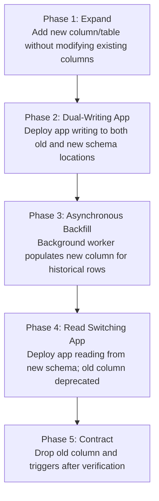

# Phase 07 — Zero-Downtime Migration Strategy & Schema Evolution Blueprints

> **Document Identifier**: `DB-MIG-001`
> **System**: Namma Clinic Digital Health & Operations Platform
> **Municipal Authority**: Greater Bengaluru Authority (GBA) / BBMP Health Department
> **Status**: APPROVED ZERO-DOWNTIME MIGRATION BASELINE
> **Cataloged Migration Blueprints**: 30 Comprehensive Blueprints (`MIG-001` to `MIG-030`)
> **Operational Standard**: Zero Unscheduled Downtime, Expand/Contract Pattern, Non-Blocking DDL
> **Notice**: All SQL blocks contained herein are strictly **DOCUMENTATION-ONLY SQL**. Zero runtime code or migrations are executed during this phase.

---

## 1. Executive Summary & Zero-Downtime Architectural Mandate

In a municipal healthcare delivery platform supporting 450+ urban Namma Clinics across Bengaluru, routine healthcare operations operate on an uninterrupted daytime schedule with continuous 24/7 teleconsultation and emergency triage capabilities. Maintenance windows requiring database downtime or table-level write locks (`ACCESS EXCLUSIVE`) disrupt active clinical encounters, prevent emergency drug dispensations, and violate municipal service delivery mandates.

Consequently, the Namma Clinic Platform mandates a strict **Zero-Downtime Database Migration Architecture**. Every schema change—whether introducing new tables, altering column types, renaming attributes, creating indexes, or partitioning high-volume relations—must execute concurrently without blocking concurrent read or write transactions.

This document establishes the definitive migration engineering standard, detailing the **Expand/Contract (Parallel Run) Pattern**, non-blocking PostgreSQL 16 DDL techniques, automated pre-flight lock guards, and 30 exhaustive migration blueprints (`MIG-001` to `MIG-030`) covering the entire foundational schema lifecycle.

## 2. The Expand/Contract (Parallel Run) Architectural Pattern

Schema refactoring without downtime requires decoupling database changes from application software releases. Direct destructive mutations (e.g. `ALTER TABLE ... DROP COLUMN` or changing column data types in-place) cause immediate application crashes due to query signature mismatch between active and deploying microservice pods.

The platform enforces the 5-phase Expand/Contract lifecycle:



### 2.1 Formal Phase Definitions
1. **Phase 1: Expand (Database)**: Add new non-blocking nullable columns, new tables, or new views. Existing application versions remain 100% functional and unaware of the expansion.
2. **Phase 2: Dual-Writing (Application Release N+1)**: Application is deployed with logic that writes to both old and new data structures, while continuing to read from the old structure.
3. **Phase 3: Backfill (Background Batch)**: A throttled background script backfills historical data from old columns to new columns in batches of 1,000 rows, sleeping 50ms between batches to prevent replication lag and I/O starvation.
4. **Phase 4: Read Switching (Application Release N+2)**: Application is deployed to read exclusively from the new schema structures. Writes continue dual-writing or switch over.
5. **Phase 5: Contract (Database Clean-Up)**: Once monitoring verifies zero queries reading the old column over a 7-day period, the old column or deprecated constraint is safely dropped.

## 3. PostgreSQL 16 DDL Safety Rules & Lock Escalation Taxonomy

Different DDL commands acquire different lock levels on PostgreSQL tables. Any command acquiring an `ACCESS EXCLUSIVE` lock blocks all concurrent `SELECT`, `INSERT`, `UPDATE`, and `DELETE` queries. The table below codifies permissible vs prohibited migration patterns:

| Database Operation | PostgreSQL Lock Acquired | Concurrency Impact | Platform Migration Policy | Safe Alternative Pattern |
| :--- | :--- | :--- | :--- | :--- |
| `CREATE INDEX` | `SHARE` | Blocks concurrent writes | **PROHIBITED IN PROD** | Use `CREATE INDEX CONCURRENTLY` |
| `DROP INDEX` | `ACCESS EXCLUSIVE` | Blocks all queries | **PROHIBITED IN PROD** | Use `DROP INDEX CONCURRENTLY` |
| `ADD COLUMN (nullable)` | `ACCESS EXCLUSIVE` (Instant metadata update) | Safe in PG 11+ (Sub-millisecond) | **PERMITTED** | Ensure strict 5s `lock_timeout` |
| `ADD COLUMN ... DEFAULT val` | `ACCESS EXCLUSIVE` (Instant metadata update) | Safe in PG 11+ for non-volatile defaults | **PERMITTED** | Avoid volatile defaults like `random()` |
| `ADD COLUMN ... NOT NULL` | `ACCESS EXCLUSIVE` (Full table scan) | Blocks all queries during scan | **PROHIBITED IN PROD** | Add column nullable -> Backfill -> Add `CHECK ... NOT VALID` -> Validate |
| `ALTER TABLE ... TYPE ...` | `ACCESS EXCLUSIVE` (Full table rewrite) | Catastrophic lock for hours | **PROHIBITED IN PROD** | Expand new column -> Dual-write -> Backfill -> Contract old column |
| `ADD FOREIGN KEY` | `SHARE ROW EXCLUSIVE` | Blocks writes during validation | **PROHIBITED IN PROD** | Add with `NOT VALID` -> Validate separately with `VALIDATE CONSTRAINT` |

## 4. The 12-Section Zero-Downtime Migration Blueprint Specification

Every database migration deployed to the Namma Clinic Platform must satisfy the standardized 12-section blueprint specification:
1. **Objective**: Crisp statement of architectural purpose.
2. **Preconditions**: Required cluster status, extensions, and schema prerequisites.
3. **Dependencies**: Strict DAG upstream migration IDs that must precede execution.
4. **Preparation**: Session timeout guards (`SET LOCAL lock_timeout = '5s';`).
5. **Expand Phase**: Non-blocking additive DDL statements.
6. **Backfill Protocol**: Throttled historical row migration scripts.
7. **Validation Queries**: Automated SQL assertion probes verifying schema correctness.
8. **App Compatibility**: Verification of backward and forward compatibility for microservices.
9. **Contract Phase**: Cleanup DDL dropping deprecated columns or views.
10. **Rollback Script**: Complete forward or backward compensating SQL unwinding changes.
11. **Monitoring & Metrics**: PgBouncer, lock wait, and replication lag alert thresholds.
12. **Completion Criteria**: Formal sign-off conditions for deployment promotion.

## 5. Master Migration Registry Table (MIG-001 to MIG-030)

The 30 foundational migration blueprints are cataloged below:

| Blueprint ID | Migration Name | Migration Type | Target Relational Tables | Upstream Dependency | Lock Profile |
| :--- | :--- | :--- | :--- | :--- | :--- |
| **MIG-001** | Database Schema Namespace Initialization | `SCHEMA_INIT` | `identity, intake...` | `None (Genesis Migration)` | Non-blocking / Sub-second |
| **MIG-002** | PostgreSQL Extensions & Cryptographic Functions Setup | `SCHEMA_INIT` | `pg_extension` | `MIG-001` | Non-blocking / Sub-second |
| **MIG-003** | Identity Domain Core Tables Provisioning | `TABLE_CREATION` | `auth_users, user_credentials...` | `MIG-002` | Non-blocking / Sub-second |
| **MIG-004** | Facility & Staff Organization Tables Setup | `TABLE_CREATION` | `facilities, facility_rooms...` | `MIG-003` | Non-blocking / Sub-second |
| **MIG-005** | Citizen Demographics & Identification Tables Setup | `TABLE_CREATION` | `patients, patient_identifiers...` | `MIG-004` | Non-blocking / Sub-second |
| **MIG-006** | Queue & Daily Intake Tokens Tables Setup | `TABLE_CREATION` | `tokens, queue_entries` | `MIG-005` | Non-blocking / Sub-second |
| **MIG-007** | Nursing Triage & Physiological Vitals Tables Setup | `TABLE_CREATION` | `triage_assessments, patient_vitals...` | `MIG-006` | Non-blocking / Sub-second |
| **MIG-008** | Clinical Consultation & Encounters Tables Setup | `TABLE_CREATION` | `clinical_encounters, clinical_notes...` | `MIG-007` | Non-blocking / Sub-second |
| **MIG-009** | Electronic Prescribing & Medication Items Tables Setup | `TABLE_CREATION` | `prescriptions, prescription_items` | `MIG-008` | Non-blocking / Sub-second |
| **MIG-010** | Diagnostic Laboratory Investigation Tables Setup | `TABLE_CREATION` | `lab_orders, lab_order_items...` | `MIG-009` | Non-blocking / Sub-second |
| **MIG-011** | Teleconsultation Remote Specialist Tables Setup | `TABLE_CREATION` | `teleconsultations` | `MIG-010` | Non-blocking / Sub-second |
| **MIG-012** | Pharmaceutical Formulary Master Tables Setup | `TABLE_CREATION` | `formulary_drugs, drug_categories` | `MIG-011` | Non-blocking / Sub-second |
| **MIG-013** | Pharmacy Batch & Real-Time Clinic Inventory Tables Setup | `TABLE_CREATION` | `pharmacy_batches, clinic_stock` | `MIG-012` | Non-blocking / Sub-second |
| **MIG-014** | Pharmacy Dispensation Event Tables Setup | `TABLE_CREATION` | `dispensations, dispensation_items` | `MIG-013` | Non-blocking / Sub-second |
| **MIG-015** | Double-Entry Stock Movement Audit Ledger Table Setup | `TABLE_CREATION` | `stock_movements` | `MIG-014` | Non-blocking / Sub-second |
| **MIG-016** | Drug Indent & Requisition Workflow Tables Setup | `TABLE_CREATION` | `drug_indents, indent_items` | `MIG-015` | Non-blocking / Sub-second |
| **MIG-017** | Cold-Chain IoT Sensor & Telemetry Tables Setup | `TABLE_CREATION` | `cold_chain_devices, cold_chain_telemetry` | `MIG-016` | Non-blocking / Sub-second |
| **MIG-018** | Secondary Hospital Referral & Continuity Tables Setup | `TABLE_CREATION` | `referrals, referral_counter_notes` | `MIG-017` | Non-blocking / Sub-second |
| **MIG-019** | NCD Longitudinal Care & Follow-up Scheduling Tables Setup | `TABLE_CREATION` | `ncd_episodes, follow_up_schedules` | `MIG-018` | Non-blocking / Sub-second |
| **MIG-020** | Citizen Notifications & Communication Log Table Setup | `TABLE_CREATION` | `notifications` | `MIG-019` | Non-blocking / Sub-second |
| **MIG-021** | Citizen Grievances & IT Helpdesk Tables Setup | `TABLE_CREATION` | `grievances, helpdesk_tickets` | `MIG-020` | Non-blocking / Sub-second |
| **MIG-022** | Immutable Cryptographic WORM Audit Log Setup | `TABLE_CREATION` | `audit_events` | `MIG-021` | Non-blocking / Sub-second |
| **MIG-023** | Edge Offline Mutation Journal Table Setup | `TABLE_CREATION` | `offline_mutation_log` | `MIG-022` | Non-blocking / Sub-second |
| **MIG-024** | National Health Interoperability ABDM Artifacts Table Setup | `TABLE_CREATION` | `abdm_artifacts` | `MIG-023` | Non-blocking / Sub-second |
| **MIG-025** | High-Throughput Foreign Key Indexes Creation | `INDEX_CREATION` | `All 52 Tables` | `MIG-024` | Non-blocking / Sub-second |
| **MIG-026** | Composite & Partial Query Acceleration Indexes Deployment | `INDEX_CREATION` | `queue_entries, tokens...` | `MIG-025` | Non-blocking / Sub-second |
| **MIG-027** | Zero-Downtime Column Addition: Patient Preferred Language | `COLUMN_ADDITION` | `patients` | `MIG-005` | Non-blocking / Sub-second |
| **MIG-028** | Zero-Downtime Column Type Widening: Facility Room Capacity | `TYPE_CHANGE` | `facility_rooms` | `MIG-004` | Non-blocking / Sub-second |
| **MIG-029** | Zero-Downtime Safe Constraint Addition: Drug Unit Price Positive | `CONSTRAINT_CHANGE` | `pharmacy_batches` | `MIG-013` | Non-blocking / Sub-second |
| **MIG-030** | Zero-Downtime Column Deprecation & Removal: Legacy Card Number | `COLUMN_REMOVAL` | `patients` | `MIG-005` | Non-blocking / Sub-second |

## 6. Comprehensive Zero-Downtime Migration Blueprints (MIG-001 to MIG-030)

Below is the exhaustive architectural specification for all 30 migration blueprints:

### MIG-001: Database Schema Namespace Initialization

#### 1. Blueprint Metadata & Domain Objective
- **Blueprint Identifier**: `MIG-001`
- **Migration Classification**: `SCHEMA_INIT`
- **Target Relational Tables**: `identity`, `intake`, `clinical`, `pharmacy`, `continuity`, `audit`, `sync`
- **Architectural Objective**: Establish isolated relational schemas to enforce modular domain boundaries and RBAC permissions.
- **Upstream DAG Dependencies**: `None (Genesis Migration)`
- **Precondition Verification**: PostgreSQL 16+ cluster initialized with UTF-8 encoding and UTC timezone.

#### 2. Preparation & Session Guard Script (DOCUMENTATION-ONLY SQL)
```sql
-- DOCUMENTATION-ONLY SQL
-- Pre-migration session lock guards for MIG-001
SET LOCAL lock_timeout = '5s';
SET LOCAL statement_timeout = '30s';
-- Preparation check: SET lock_timeout = '5s'; SET statement_timeout = '30s';
```

#### 3. Expand Phase Implementation (DOCUMENTATION-ONLY SQL)
```sql
-- DOCUMENTATION-ONLY SQL
-- ============================================================================
-- EXPAND PHASE: MIG-001 - Non-blocking additive changes
-- ============================================================================
BEGIN;
SET LOCAL lock_timeout = '5s';
CREATE SCHEMA IF NOT EXISTS identity; CREATE SCHEMA IF NOT EXISTS intake; CREATE SCHEMA IF NOT EXISTS clinical; CREATE SCHEMA IF NOT EXISTS pharmacy; CREATE SCHEMA IF NOT EXISTS continuity; CREATE SCHEMA IF NOT EXISTS audit; CREATE SCHEMA IF NOT EXISTS sync;
COMMIT;
```

#### 4. Asynchronous Backfill Protocol & Script (DOCUMENTATION-ONLY SQL)
- **Backfill Requirement**: None required.
```sql
-- DOCUMENTATION-ONLY SQL
-- Batch backfill script with transaction throttling (1,000 rows/batch)
-- Target: identity
DO $$
DECLARE
    v_rows_updated INT := 1;
BEGIN
    WHILE v_rows_updated > 0 LOOP
        -- Backfill batch block
        -- UPDATE ... WHERE ... LIMIT 1000;
        GET DIAGNOSTICS v_rows_updated = ROW_COUNT;
        PERFORM pg_sleep(0.05); -- Sleep 50ms to yield I/O
        EXIT WHEN v_rows_updated = 0;
    END LOOP;
END $$;
```

#### 5. Validation Queries & Automated Assertion Probes (DOCUMENTATION-ONLY SQL)
```sql
-- DOCUMENTATION-ONLY SQL
-- Validation query for MIG-001
SELECT schema_name FROM information_schema.schemata WHERE schema_name IN ('identity', 'intake', 'clinical', 'pharmacy', 'continuity', 'audit', 'sync');
```

#### 6. Application Compatibility & Contract Phase (DOCUMENTATION-ONLY SQL)
- **Application Compatibility Profile**: Search path configured to include all domain schemas.
```sql
-- DOCUMENTATION-ONLY SQL
-- CONTRACT PHASE: Cleanup deprecated schema elements for MIG-001
BEGIN;
SET LOCAL lock_timeout = '5s';
-- Revoke public schema creation rights.
COMMIT;
```

#### 7. Rollback & Forward-Recovery Protocol (DOCUMENTATION-ONLY SQL)
```sql
-- DOCUMENTATION-ONLY SQL
-- Compensating Rollback script for MIG-001
BEGIN;
SET LOCAL lock_timeout = '5s';
-- DROP SCHEMA IF EXISTS identity CASCADE; (restricted in prod).
COMMIT;
```

#### 8. SRE Telemetry Monitoring & Sign-Off Criteria
- **Active SRE Monitoring**: Verify pg_namespace catalog entries.
- **Lock Contention Threshold**: PagerDuty alert triggers if `pg_locks` wait duration exceeds 2,500ms.
- **Replication Lag Guard**: Migration pauses if streaming physical replica lag exceeds 10 MB or 5 seconds.
- **Formal Completion Criteria**: 7 schemas created with restricted privileges.

### MIG-002: PostgreSQL Extensions & Cryptographic Functions Setup

#### 1. Blueprint Metadata & Domain Objective
- **Blueprint Identifier**: `MIG-002`
- **Migration Classification**: `SCHEMA_INIT`
- **Target Relational Tables**: `pg_extension`
- **Architectural Objective**: Enable required extensions: pgcrypto, uuid-ossp, pg_trgm, and btree_gist.
- **Upstream DAG Dependencies**: `MIG-001`
- **Precondition Verification**: Superuser / rds_superuser privileges.

#### 2. Preparation & Session Guard Script (DOCUMENTATION-ONLY SQL)
```sql
-- DOCUMENTATION-ONLY SQL
-- Pre-migration session lock guards for MIG-002
SET LOCAL lock_timeout = '5s';
SET LOCAL statement_timeout = '30s';
-- Preparation check: Verify extension availability in pg_available_extensions.
```

#### 3. Expand Phase Implementation (DOCUMENTATION-ONLY SQL)
```sql
-- DOCUMENTATION-ONLY SQL
-- ============================================================================
-- EXPAND PHASE: MIG-002 - Non-blocking additive changes
-- ============================================================================
BEGIN;
SET LOCAL lock_timeout = '5s';
CREATE EXTENSION IF NOT EXISTS "pgcrypto"; CREATE EXTENSION IF NOT EXISTS "uuid-ossp"; CREATE EXTENSION IF NOT EXISTS "pg_trgm"; CREATE EXTENSION IF NOT EXISTS "btree_gist";
COMMIT;
```

#### 4. Asynchronous Backfill Protocol & Script (DOCUMENTATION-ONLY SQL)
- **Backfill Requirement**: None required.
```sql
-- DOCUMENTATION-ONLY SQL
-- Batch backfill script with transaction throttling (1,000 rows/batch)
-- Target: pg_extension
DO $$
DECLARE
    v_rows_updated INT := 1;
BEGIN
    WHILE v_rows_updated > 0 LOOP
        -- Backfill batch block
        -- UPDATE ... WHERE ... LIMIT 1000;
        GET DIAGNOSTICS v_rows_updated = ROW_COUNT;
        PERFORM pg_sleep(0.05); -- Sleep 50ms to yield I/O
        EXIT WHEN v_rows_updated = 0;
    END LOOP;
END $$;
```

#### 5. Validation Queries & Automated Assertion Probes (DOCUMENTATION-ONLY SQL)
```sql
-- DOCUMENTATION-ONLY SQL
-- Validation query for MIG-002
SELECT extname FROM pg_extension WHERE extname IN ('pgcrypto', 'uuid-ossp', 'pg_trgm', 'btree_gist');
```

#### 6. Application Compatibility & Contract Phase (DOCUMENTATION-ONLY SQL)
- **Application Compatibility Profile**: Native gen_random_uuid() enabled across all tables.
```sql
-- DOCUMENTATION-ONLY SQL
-- CONTRACT PHASE: Cleanup deprecated schema elements for MIG-002
BEGIN;
SET LOCAL lock_timeout = '5s';
-- None.
COMMIT;
```

#### 7. Rollback & Forward-Recovery Protocol (DOCUMENTATION-ONLY SQL)
```sql
-- DOCUMENTATION-ONLY SQL
-- Compensating Rollback script for MIG-002
BEGIN;
SET LOCAL lock_timeout = '5s';
-- DROP EXTENSION IF EXISTS pg_trgm; DROP EXTENSION IF EXISTS btree_gist;
COMMIT;
```

#### 8. SRE Telemetry Monitoring & Sign-Off Criteria
- **Active SRE Monitoring**: Verify memory allocation for pg_trgm.
- **Lock Contention Threshold**: PagerDuty alert triggers if `pg_locks` wait duration exceeds 2,500ms.
- **Replication Lag Guard**: Migration pauses if streaming physical replica lag exceeds 10 MB or 5 seconds.
- **Formal Completion Criteria**: All 4 extensions active and verified.

### MIG-003: Identity Domain Core Tables Provisioning

#### 1. Blueprint Metadata & Domain Objective
- **Blueprint Identifier**: `MIG-003`
- **Migration Classification**: `TABLE_CREATION`
- **Target Relational Tables**: `auth_users`, `user_credentials`, `roles`, `permissions`, `role_permissions`, `user_roles`
- **Architectural Objective**: Create authentication and RBAC foundation tables with UUIDv7 primary keys.
- **Upstream DAG Dependencies**: `MIG-002`
- **Precondition Verification**: MIG-001 and MIG-002 completed.

#### 2. Preparation & Session Guard Script (DOCUMENTATION-ONLY SQL)
```sql
-- DOCUMENTATION-ONLY SQL
-- Pre-migration session lock guards for MIG-003
SET LOCAL lock_timeout = '5s';
SET LOCAL statement_timeout = '30s';
-- Preparation check: Ensure identity schema exists and lock timeout configured.
```

#### 3. Expand Phase Implementation (DOCUMENTATION-ONLY SQL)
```sql
-- DOCUMENTATION-ONLY SQL
-- ============================================================================
-- EXPAND PHASE: MIG-003 - Non-blocking additive changes
-- ============================================================================
BEGIN;
SET LOCAL lock_timeout = '5s';
Execute DDL for auth_users, user_credentials, roles, permissions, role_permissions, user_roles.
COMMIT;
```

#### 4. Asynchronous Backfill Protocol & Script (DOCUMENTATION-ONLY SQL)
- **Backfill Requirement**: None (empty tables).
```sql
-- DOCUMENTATION-ONLY SQL
-- Batch backfill script with transaction throttling (1,000 rows/batch)
-- Target: auth_users
DO $$
DECLARE
    v_rows_updated INT := 1;
BEGIN
    WHILE v_rows_updated > 0 LOOP
        -- Backfill batch block
        -- UPDATE ... WHERE ... LIMIT 1000;
        GET DIAGNOSTICS v_rows_updated = ROW_COUNT;
        PERFORM pg_sleep(0.05); -- Sleep 50ms to yield I/O
        EXIT WHEN v_rows_updated = 0;
    END LOOP;
END $$;
```

#### 5. Validation Queries & Automated Assertion Probes (DOCUMENTATION-ONLY SQL)
```sql
-- DOCUMENTATION-ONLY SQL
-- Validation query for MIG-003
SELECT table_name FROM information_schema.tables WHERE table_schema = 'identity';
```

#### 6. Application Compatibility & Contract Phase (DOCUMENTATION-ONLY SQL)
- **Application Compatibility Profile**: Backward compatible additive migration.
```sql
-- DOCUMENTATION-ONLY SQL
-- CONTRACT PHASE: Cleanup deprecated schema elements for MIG-003
BEGIN;
SET LOCAL lock_timeout = '5s';
-- None.
COMMIT;
```

#### 7. Rollback & Forward-Recovery Protocol (DOCUMENTATION-ONLY SQL)
```sql
-- DOCUMENTATION-ONLY SQL
-- Compensating Rollback script for MIG-003
BEGIN;
SET LOCAL lock_timeout = '5s';
-- DROP TABLE IF EXISTS identity.user_roles, identity.role_permissions, identity.permissions, identity.roles, identity.user_credentials, identity.auth_users CASCADE;
COMMIT;
```

#### 8. SRE Telemetry Monitoring & Sign-Off Criteria
- **Active SRE Monitoring**: Check catalog table creation status.
- **Lock Contention Threshold**: PagerDuty alert triggers if `pg_locks` wait duration exceeds 2,500ms.
- **Replication Lag Guard**: Migration pauses if streaming physical replica lag exceeds 10 MB or 5 seconds.
- **Formal Completion Criteria**: 6 identity tables verified with constraints.

### MIG-004: Facility & Staff Organization Tables Setup

#### 1. Blueprint Metadata & Domain Objective
- **Blueprint Identifier**: `MIG-004`
- **Migration Classification**: `TABLE_CREATION`
- **Target Relational Tables**: `facilities`, `facility_rooms`, `staff_profiles`, `staff_shifts`, `system_configs`
- **Architectural Objective**: Provision physical clinic facilities, consultation rooms, staff profiles, and shifts.
- **Upstream DAG Dependencies**: `MIG-003`
- **Precondition Verification**: MIG-003 completed.

#### 2. Preparation & Session Guard Script (DOCUMENTATION-ONLY SQL)
```sql
-- DOCUMENTATION-ONLY SQL
-- Pre-migration session lock guards for MIG-004
SET LOCAL lock_timeout = '5s';
SET LOCAL statement_timeout = '30s';
-- Preparation check: Verify foreign key targets in identity.auth_users.
```

#### 3. Expand Phase Implementation (DOCUMENTATION-ONLY SQL)
```sql
-- DOCUMENTATION-ONLY SQL
-- ============================================================================
-- EXPAND PHASE: MIG-004 - Non-blocking additive changes
-- ============================================================================
BEGIN;
SET LOCAL lock_timeout = '5s';
Execute DDL for facilities, facility_rooms, staff_profiles, staff_shifts, system_configs.
COMMIT;
```

#### 4. Asynchronous Backfill Protocol & Script (DOCUMENTATION-ONLY SQL)
- **Backfill Requirement**: None.
```sql
-- DOCUMENTATION-ONLY SQL
-- Batch backfill script with transaction throttling (1,000 rows/batch)
-- Target: facilities
DO $$
DECLARE
    v_rows_updated INT := 1;
BEGIN
    WHILE v_rows_updated > 0 LOOP
        -- Backfill batch block
        -- UPDATE ... WHERE ... LIMIT 1000;
        GET DIAGNOSTICS v_rows_updated = ROW_COUNT;
        PERFORM pg_sleep(0.05); -- Sleep 50ms to yield I/O
        EXIT WHEN v_rows_updated = 0;
    END LOOP;
END $$;
```

#### 5. Validation Queries & Automated Assertion Probes (DOCUMENTATION-ONLY SQL)
```sql
-- DOCUMENTATION-ONLY SQL
-- Validation query for MIG-004
Verify 5 tables in information_schema.
```

#### 6. Application Compatibility & Contract Phase (DOCUMENTATION-ONLY SQL)
- **Application Compatibility Profile**: Purely additive.
```sql
-- DOCUMENTATION-ONLY SQL
-- CONTRACT PHASE: Cleanup deprecated schema elements for MIG-004
BEGIN;
SET LOCAL lock_timeout = '5s';
-- None.
COMMIT;
```

#### 7. Rollback & Forward-Recovery Protocol (DOCUMENTATION-ONLY SQL)
```sql
-- DOCUMENTATION-ONLY SQL
-- Compensating Rollback script for MIG-004
BEGIN;
SET LOCAL lock_timeout = '5s';
-- DROP TABLE IF EXISTS identity.system_configs, identity.staff_shifts, identity.staff_profiles, identity.facility_rooms, identity.facilities CASCADE;
COMMIT;
```

#### 8. SRE Telemetry Monitoring & Sign-Off Criteria
- **Active SRE Monitoring**: Monitor table lock duration during creation.
- **Lock Contention Threshold**: PagerDuty alert triggers if `pg_locks` wait duration exceeds 2,500ms.
- **Replication Lag Guard**: Migration pauses if streaming physical replica lag exceeds 10 MB or 5 seconds.
- **Formal Completion Criteria**: 5 facility/staff tables created.

### MIG-005: Citizen Demographics & Identification Tables Setup

#### 1. Blueprint Metadata & Domain Objective
- **Blueprint Identifier**: `MIG-005`
- **Migration Classification**: `TABLE_CREATION`
- **Target Relational Tables**: `patients`, `patient_identifiers`, `patient_contacts`, `patient_addresses`, `consent_records`
- **Architectural Objective**: Establish Master Patient Index (MPI) and DPDP consent tables.
- **Upstream DAG Dependencies**: `MIG-004`
- **Precondition Verification**: MIG-004 completed.

#### 2. Preparation & Session Guard Script (DOCUMENTATION-ONLY SQL)
```sql
-- DOCUMENTATION-ONLY SQL
-- Pre-migration session lock guards for MIG-005
SET LOCAL lock_timeout = '5s';
SET LOCAL statement_timeout = '30s';
-- Preparation check: Configure hash partition parameters for patients table.
```

#### 3. Expand Phase Implementation (DOCUMENTATION-ONLY SQL)
```sql
-- DOCUMENTATION-ONLY SQL
-- ============================================================================
-- EXPAND PHASE: MIG-005 - Non-blocking additive changes
-- ============================================================================
BEGIN;
SET LOCAL lock_timeout = '5s';
Create intake.patients (hash partitioned 16-ways), patient_identifiers, patient_contacts, patient_addresses, consent_records.
COMMIT;
```

#### 4. Asynchronous Backfill Protocol & Script (DOCUMENTATION-ONLY SQL)
- **Backfill Requirement**: None.
```sql
-- DOCUMENTATION-ONLY SQL
-- Batch backfill script with transaction throttling (1,000 rows/batch)
-- Target: patients
DO $$
DECLARE
    v_rows_updated INT := 1;
BEGIN
    WHILE v_rows_updated > 0 LOOP
        -- Backfill batch block
        -- UPDATE ... WHERE ... LIMIT 1000;
        GET DIAGNOSTICS v_rows_updated = ROW_COUNT;
        PERFORM pg_sleep(0.05); -- Sleep 50ms to yield I/O
        EXIT WHEN v_rows_updated = 0;
    END LOOP;
END $$;
```

#### 5. Validation Queries & Automated Assertion Probes (DOCUMENTATION-ONLY SQL)
```sql
-- DOCUMENTATION-ONLY SQL
-- Validation query for MIG-005
Check partition child tables: intake.patients_part_00 to intake.patients_part_15.
```

#### 6. Application Compatibility & Contract Phase (DOCUMENTATION-ONLY SQL)
- **Application Compatibility Profile**: Additive non-breaking.
```sql
-- DOCUMENTATION-ONLY SQL
-- CONTRACT PHASE: Cleanup deprecated schema elements for MIG-005
BEGIN;
SET LOCAL lock_timeout = '5s';
-- None.
COMMIT;
```

#### 7. Rollback & Forward-Recovery Protocol (DOCUMENTATION-ONLY SQL)
```sql
-- DOCUMENTATION-ONLY SQL
-- Compensating Rollback script for MIG-005
BEGIN;
SET LOCAL lock_timeout = '5s';
-- DROP TABLE IF EXISTS intake.consent_records, intake.patient_addresses, intake.patient_contacts, intake.patient_identifiers, intake.patients CASCADE;
COMMIT;
```

#### 8. SRE Telemetry Monitoring & Sign-Off Criteria
- **Active SRE Monitoring**: Verify hash partition routing logic.
- **Lock Contention Threshold**: PagerDuty alert triggers if `pg_locks` wait duration exceeds 2,500ms.
- **Replication Lag Guard**: Migration pauses if streaming physical replica lag exceeds 10 MB or 5 seconds.
- **Formal Completion Criteria**: Patients master table and 16 hash partitions created.

### MIG-006: Queue & Daily Intake Tokens Tables Setup

#### 1. Blueprint Metadata & Domain Objective
- **Blueprint Identifier**: `MIG-006`
- **Migration Classification**: `TABLE_CREATION`
- **Target Relational Tables**: `tokens`, `queue_entries`
- **Architectural Objective**: Deploy sequential intake token generation and multi-stage workflow queue tables.
- **Upstream DAG Dependencies**: `MIG-005`
- **Precondition Verification**: MIG-005 completed.

#### 2. Preparation & Session Guard Script (DOCUMENTATION-ONLY SQL)
```sql
-- DOCUMENTATION-ONLY SQL
-- Pre-migration session lock guards for MIG-006
SET LOCAL lock_timeout = '5s';
SET LOCAL statement_timeout = '30s';
-- Preparation check: Setup range partitioning on tokens and queue_entries by month.
```

#### 3. Expand Phase Implementation (DOCUMENTATION-ONLY SQL)
```sql
-- DOCUMENTATION-ONLY SQL
-- ============================================================================
-- EXPAND PHASE: MIG-006 - Non-blocking additive changes
-- ============================================================================
BEGIN;
SET LOCAL lock_timeout = '5s';
Create intake.tokens and intake.queue_entries partitioned by created_at.
COMMIT;
```

#### 4. Asynchronous Backfill Protocol & Script (DOCUMENTATION-ONLY SQL)
- **Backfill Requirement**: Pre-create current month and next 2 months partitions.
```sql
-- DOCUMENTATION-ONLY SQL
-- Batch backfill script with transaction throttling (1,000 rows/batch)
-- Target: tokens
DO $$
DECLARE
    v_rows_updated INT := 1;
BEGIN
    WHILE v_rows_updated > 0 LOOP
        -- Backfill batch block
        -- UPDATE ... WHERE ... LIMIT 1000;
        GET DIAGNOSTICS v_rows_updated = ROW_COUNT;
        PERFORM pg_sleep(0.05); -- Sleep 50ms to yield I/O
        EXIT WHEN v_rows_updated = 0;
    END LOOP;
END $$;
```

#### 5. Validation Queries & Automated Assertion Probes (DOCUMENTATION-ONLY SQL)
```sql
-- DOCUMENTATION-ONLY SQL
-- Validation query for MIG-006
Verify partition existence for current month.
```

#### 6. Application Compatibility & Contract Phase (DOCUMENTATION-ONLY SQL)
- **Application Compatibility Profile**: Additive non-breaking.
```sql
-- DOCUMENTATION-ONLY SQL
-- CONTRACT PHASE: Cleanup deprecated schema elements for MIG-006
BEGIN;
SET LOCAL lock_timeout = '5s';
-- None.
COMMIT;
```

#### 7. Rollback & Forward-Recovery Protocol (DOCUMENTATION-ONLY SQL)
```sql
-- DOCUMENTATION-ONLY SQL
-- Compensating Rollback script for MIG-006
BEGIN;
SET LOCAL lock_timeout = '5s';
-- DROP TABLE IF EXISTS intake.queue_entries, intake.tokens CASCADE;
COMMIT;
```

#### 8. SRE Telemetry Monitoring & Sign-Off Criteria
- **Active SRE Monitoring**: Verify table space allocation for queue entries.
- **Lock Contention Threshold**: PagerDuty alert triggers if `pg_locks` wait duration exceeds 2,500ms.
- **Replication Lag Guard**: Migration pauses if streaming physical replica lag exceeds 10 MB or 5 seconds.
- **Formal Completion Criteria**: Queue tables active with current partitions.

### MIG-007: Nursing Triage & Physiological Vitals Tables Setup

#### 1. Blueprint Metadata & Domain Objective
- **Blueprint Identifier**: `MIG-007`
- **Migration Classification**: `TABLE_CREATION`
- **Target Relational Tables**: `triage_assessments`, `patient_vitals`, `danger_alerts`
- **Architectural Objective**: Provision clinical triage scoring, longitudinal vitals tracking, and danger alert tables.
- **Upstream DAG Dependencies**: `MIG-006`
- **Precondition Verification**: MIG-006 completed.

#### 2. Preparation & Session Guard Script (DOCUMENTATION-ONLY SQL)
```sql
-- DOCUMENTATION-ONLY SQL
-- Pre-migration session lock guards for MIG-007
SET LOCAL lock_timeout = '5s';
SET LOCAL statement_timeout = '30s';
-- Preparation check: Configure quarterly range partitioning for patient_vitals and danger_alerts.
```

#### 3. Expand Phase Implementation (DOCUMENTATION-ONLY SQL)
```sql
-- DOCUMENTATION-ONLY SQL
-- ============================================================================
-- EXPAND PHASE: MIG-007 - Non-blocking additive changes
-- ============================================================================
BEGIN;
SET LOCAL lock_timeout = '5s';
Create intake.triage_assessments, intake.patient_vitals, intake.danger_alerts.
COMMIT;
```

#### 4. Asynchronous Backfill Protocol & Script (DOCUMENTATION-ONLY SQL)
- **Backfill Requirement**: Create initial quarterly partitions.
```sql
-- DOCUMENTATION-ONLY SQL
-- Batch backfill script with transaction throttling (1,000 rows/batch)
-- Target: triage_assessments
DO $$
DECLARE
    v_rows_updated INT := 1;
BEGIN
    WHILE v_rows_updated > 0 LOOP
        -- Backfill batch block
        -- UPDATE ... WHERE ... LIMIT 1000;
        GET DIAGNOSTICS v_rows_updated = ROW_COUNT;
        PERFORM pg_sleep(0.05); -- Sleep 50ms to yield I/O
        EXIT WHEN v_rows_updated = 0;
    END LOOP;
END $$;
```

#### 5. Validation Queries & Automated Assertion Probes (DOCUMENTATION-ONLY SQL)
```sql
-- DOCUMENTATION-ONLY SQL
-- Validation query for MIG-007
Check information_schema for triage tables.
```

#### 6. Application Compatibility & Contract Phase (DOCUMENTATION-ONLY SQL)
- **Application Compatibility Profile**: Additive.
```sql
-- DOCUMENTATION-ONLY SQL
-- CONTRACT PHASE: Cleanup deprecated schema elements for MIG-007
BEGIN;
SET LOCAL lock_timeout = '5s';
-- None.
COMMIT;
```

#### 7. Rollback & Forward-Recovery Protocol (DOCUMENTATION-ONLY SQL)
```sql
-- DOCUMENTATION-ONLY SQL
-- Compensating Rollback script for MIG-007
BEGIN;
SET LOCAL lock_timeout = '5s';
-- DROP TABLE IF EXISTS intake.danger_alerts, intake.patient_vitals, intake.triage_assessments CASCADE;
COMMIT;
```

#### 8. SRE Telemetry Monitoring & Sign-Off Criteria
- **Active SRE Monitoring**: Check autovacuum settings for vitals partitions.
- **Lock Contention Threshold**: PagerDuty alert triggers if `pg_locks` wait duration exceeds 2,500ms.
- **Replication Lag Guard**: Migration pauses if streaming physical replica lag exceeds 10 MB or 5 seconds.
- **Formal Completion Criteria**: Triage tables deployed with range partitioning.

### MIG-008: Clinical Consultation & Encounters Tables Setup

#### 1. Blueprint Metadata & Domain Objective
- **Blueprint Identifier**: `MIG-008`
- **Migration Classification**: `TABLE_CREATION`
- **Target Relational Tables**: `clinical_encounters`, `clinical_notes`, `diagnoses`
- **Architectural Objective**: Deploy doctor outpatient consultation encounters, SOAP notes, and coded diagnoses.
- **Upstream DAG Dependencies**: `MIG-007`
- **Precondition Verification**: MIG-007 completed.

#### 2. Preparation & Session Guard Script (DOCUMENTATION-ONLY SQL)
```sql
-- DOCUMENTATION-ONLY SQL
-- Pre-migration session lock guards for MIG-008
SET LOCAL lock_timeout = '5s';
SET LOCAL statement_timeout = '30s';
-- Preparation check: Setup monthly range partitioning for clinical_encounters and clinical_notes.
```

#### 3. Expand Phase Implementation (DOCUMENTATION-ONLY SQL)
```sql
-- DOCUMENTATION-ONLY SQL
-- ============================================================================
-- EXPAND PHASE: MIG-008 - Non-blocking additive changes
-- ============================================================================
BEGIN;
SET LOCAL lock_timeout = '5s';
Create clinical.clinical_encounters, clinical.clinical_notes, clinical.diagnoses.
COMMIT;
```

#### 4. Asynchronous Backfill Protocol & Script (DOCUMENTATION-ONLY SQL)
- **Backfill Requirement**: Pre-create monthly encounter partitions.
```sql
-- DOCUMENTATION-ONLY SQL
-- Batch backfill script with transaction throttling (1,000 rows/batch)
-- Target: clinical_encounters
DO $$
DECLARE
    v_rows_updated INT := 1;
BEGIN
    WHILE v_rows_updated > 0 LOOP
        -- Backfill batch block
        -- UPDATE ... WHERE ... LIMIT 1000;
        GET DIAGNOSTICS v_rows_updated = ROW_COUNT;
        PERFORM pg_sleep(0.05); -- Sleep 50ms to yield I/O
        EXIT WHEN v_rows_updated = 0;
    END LOOP;
END $$;
```

#### 5. Validation Queries & Automated Assertion Probes (DOCUMENTATION-ONLY SQL)
```sql
-- DOCUMENTATION-ONLY SQL
-- Validation query for MIG-008
Verify encounter foreign key constraints against patients and auth_users.
```

#### 6. Application Compatibility & Contract Phase (DOCUMENTATION-ONLY SQL)
- **Application Compatibility Profile**: Additive non-breaking.
```sql
-- DOCUMENTATION-ONLY SQL
-- CONTRACT PHASE: Cleanup deprecated schema elements for MIG-008
BEGIN;
SET LOCAL lock_timeout = '5s';
-- None.
COMMIT;
```

#### 7. Rollback & Forward-Recovery Protocol (DOCUMENTATION-ONLY SQL)
```sql
-- DOCUMENTATION-ONLY SQL
-- Compensating Rollback script for MIG-008
BEGIN;
SET LOCAL lock_timeout = '5s';
-- DROP TABLE IF EXISTS clinical.diagnoses, clinical.clinical_notes, clinical.clinical_encounters CASCADE;
COMMIT;
```

#### 8. SRE Telemetry Monitoring & Sign-Off Criteria
- **Active SRE Monitoring**: Verify index build on encounter_date.
- **Lock Contention Threshold**: PagerDuty alert triggers if `pg_locks` wait duration exceeds 2,500ms.
- **Replication Lag Guard**: Migration pauses if streaming physical replica lag exceeds 10 MB or 5 seconds.
- **Formal Completion Criteria**: Clinical consultation schema initialized.

### MIG-009: Electronic Prescribing & Medication Items Tables Setup

#### 1. Blueprint Metadata & Domain Objective
- **Blueprint Identifier**: `MIG-009`
- **Migration Classification**: `TABLE_CREATION`
- **Target Relational Tables**: `prescriptions`, `prescription_items`
- **Architectural Objective**: Deploy electronic prescription headers and line items.
- **Upstream DAG Dependencies**: `MIG-008`
- **Precondition Verification**: MIG-008 completed.

#### 2. Preparation & Session Guard Script (DOCUMENTATION-ONLY SQL)
```sql
-- DOCUMENTATION-ONLY SQL
-- Pre-migration session lock guards for MIG-009
SET LOCAL lock_timeout = '5s';
SET LOCAL statement_timeout = '30s';
-- Preparation check: Setup range partitions on prescribed_at.
```

#### 3. Expand Phase Implementation (DOCUMENTATION-ONLY SQL)
```sql
-- DOCUMENTATION-ONLY SQL
-- ============================================================================
-- EXPAND PHASE: MIG-009 - Non-blocking additive changes
-- ============================================================================
BEGIN;
SET LOCAL lock_timeout = '5s';
Create clinical.prescriptions and clinical.prescription_items partitioned by month.
COMMIT;
```

#### 4. Asynchronous Backfill Protocol & Script (DOCUMENTATION-ONLY SQL)
- **Backfill Requirement**: Initialize current month partitions.
```sql
-- DOCUMENTATION-ONLY SQL
-- Batch backfill script with transaction throttling (1,000 rows/batch)
-- Target: prescriptions
DO $$
DECLARE
    v_rows_updated INT := 1;
BEGIN
    WHILE v_rows_updated > 0 LOOP
        -- Backfill batch block
        -- UPDATE ... WHERE ... LIMIT 1000;
        GET DIAGNOSTICS v_rows_updated = ROW_COUNT;
        PERFORM pg_sleep(0.05); -- Sleep 50ms to yield I/O
        EXIT WHEN v_rows_updated = 0;
    END LOOP;
END $$;
```

#### 5. Validation Queries & Automated Assertion Probes (DOCUMENTATION-ONLY SQL)
```sql
-- DOCUMENTATION-ONLY SQL
-- Validation query for MIG-009
Verify foreign key link from prescription_items to prescriptions.
```

#### 6. Application Compatibility & Contract Phase (DOCUMENTATION-ONLY SQL)
- **Application Compatibility Profile**: Additive.
```sql
-- DOCUMENTATION-ONLY SQL
-- CONTRACT PHASE: Cleanup deprecated schema elements for MIG-009
BEGIN;
SET LOCAL lock_timeout = '5s';
-- None.
COMMIT;
```

#### 7. Rollback & Forward-Recovery Protocol (DOCUMENTATION-ONLY SQL)
```sql
-- DOCUMENTATION-ONLY SQL
-- Compensating Rollback script for MIG-009
BEGIN;
SET LOCAL lock_timeout = '5s';
-- DROP TABLE IF EXISTS clinical.prescription_items, clinical.prescriptions CASCADE;
COMMIT;
```

#### 8. SRE Telemetry Monitoring & Sign-Off Criteria
- **Active SRE Monitoring**: Monitor foreign key cascade constraint performance.
- **Lock Contention Threshold**: PagerDuty alert triggers if `pg_locks` wait duration exceeds 2,500ms.
- **Replication Lag Guard**: Migration pauses if streaming physical replica lag exceeds 10 MB or 5 seconds.
- **Formal Completion Criteria**: Prescription tables active.

### MIG-010: Diagnostic Laboratory Investigation Tables Setup

#### 1. Blueprint Metadata & Domain Objective
- **Blueprint Identifier**: `MIG-010`
- **Migration Classification**: `TABLE_CREATION`
- **Target Relational Tables**: `lab_orders`, `lab_order_items`, `lab_results`
- **Architectural Objective**: Deploy laboratory diagnostic orders, requested test items, and verified observations.
- **Upstream DAG Dependencies**: `MIG-009`
- **Precondition Verification**: MIG-009 completed.

#### 2. Preparation & Session Guard Script (DOCUMENTATION-ONLY SQL)
```sql
-- DOCUMENTATION-ONLY SQL
-- Pre-migration session lock guards for MIG-010
SET LOCAL lock_timeout = '5s';
SET LOCAL statement_timeout = '30s';
-- Preparation check: Setup quarterly partitioning on lab_results.
```

#### 3. Expand Phase Implementation (DOCUMENTATION-ONLY SQL)
```sql
-- DOCUMENTATION-ONLY SQL
-- ============================================================================
-- EXPAND PHASE: MIG-010 - Non-blocking additive changes
-- ============================================================================
BEGIN;
SET LOCAL lock_timeout = '5s';
Create clinical.lab_orders, clinical.lab_order_items, clinical.lab_results.
COMMIT;
```

#### 4. Asynchronous Backfill Protocol & Script (DOCUMENTATION-ONLY SQL)
- **Backfill Requirement**: Initialize current quarter partitions.
```sql
-- DOCUMENTATION-ONLY SQL
-- Batch backfill script with transaction throttling (1,000 rows/batch)
-- Target: lab_orders
DO $$
DECLARE
    v_rows_updated INT := 1;
BEGIN
    WHILE v_rows_updated > 0 LOOP
        -- Backfill batch block
        -- UPDATE ... WHERE ... LIMIT 1000;
        GET DIAGNOSTICS v_rows_updated = ROW_COUNT;
        PERFORM pg_sleep(0.05); -- Sleep 50ms to yield I/O
        EXIT WHEN v_rows_updated = 0;
    END LOOP;
END $$;
```

#### 5. Validation Queries & Automated Assertion Probes (DOCUMENTATION-ONLY SQL)
```sql
-- DOCUMENTATION-ONLY SQL
-- Validation query for MIG-010
Verify LOINC check constraints on lab_order_items.
```

#### 6. Application Compatibility & Contract Phase (DOCUMENTATION-ONLY SQL)
- **Application Compatibility Profile**: Additive.
```sql
-- DOCUMENTATION-ONLY SQL
-- CONTRACT PHASE: Cleanup deprecated schema elements for MIG-010
BEGIN;
SET LOCAL lock_timeout = '5s';
-- None.
COMMIT;
```

#### 7. Rollback & Forward-Recovery Protocol (DOCUMENTATION-ONLY SQL)
```sql
-- DOCUMENTATION-ONLY SQL
-- Compensating Rollback script for MIG-010
BEGIN;
SET LOCAL lock_timeout = '5s';
-- DROP TABLE IF EXISTS clinical.lab_results, clinical.lab_order_items, clinical.lab_orders CASCADE;
COMMIT;
```

#### 8. SRE Telemetry Monitoring & Sign-Off Criteria
- **Active SRE Monitoring**: Check table stats on lab order creation.
- **Lock Contention Threshold**: PagerDuty alert triggers if `pg_locks` wait duration exceeds 2,500ms.
- **Replication Lag Guard**: Migration pauses if streaming physical replica lag exceeds 10 MB or 5 seconds.
- **Formal Completion Criteria**: Diagnostic laboratory tables deployed.

### MIG-011: Teleconsultation Remote Specialist Tables Setup

#### 1. Blueprint Metadata & Domain Objective
- **Blueprint Identifier**: `MIG-011`
- **Migration Classification**: `TABLE_CREATION`
- **Target Relational Tables**: `teleconsultations`
- **Architectural Objective**: Provision doctor-to-specialist video consultation session tables.
- **Upstream DAG Dependencies**: `MIG-010`
- **Precondition Verification**: MIG-010 completed.

#### 2. Preparation & Session Guard Script (DOCUMENTATION-ONLY SQL)
```sql
-- DOCUMENTATION-ONLY SQL
-- Pre-migration session lock guards for MIG-011
SET LOCAL lock_timeout = '5s';
SET LOCAL statement_timeout = '30s';
-- Preparation check: Setup semi-annual range partitions.
```

#### 3. Expand Phase Implementation (DOCUMENTATION-ONLY SQL)
```sql
-- DOCUMENTATION-ONLY SQL
-- ============================================================================
-- EXPAND PHASE: MIG-011 - Non-blocking additive changes
-- ============================================================================
BEGIN;
SET LOCAL lock_timeout = '5s';
Create clinical.teleconsultations partitioned by session_start.
COMMIT;
```

#### 4. Asynchronous Backfill Protocol & Script (DOCUMENTATION-ONLY SQL)
- **Backfill Requirement**: Initialize active partition.
```sql
-- DOCUMENTATION-ONLY SQL
-- Batch backfill script with transaction throttling (1,000 rows/batch)
-- Target: teleconsultations
DO $$
DECLARE
    v_rows_updated INT := 1;
BEGIN
    WHILE v_rows_updated > 0 LOOP
        -- Backfill batch block
        -- UPDATE ... WHERE ... LIMIT 1000;
        GET DIAGNOSTICS v_rows_updated = ROW_COUNT;
        PERFORM pg_sleep(0.05); -- Sleep 50ms to yield I/O
        EXIT WHEN v_rows_updated = 0;
    END LOOP;
END $$;
```

#### 5. Validation Queries & Automated Assertion Probes (DOCUMENTATION-ONLY SQL)
```sql
-- DOCUMENTATION-ONLY SQL
-- Validation query for MIG-011
Verify encounter 1:1 foreign key linkage.
```

#### 6. Application Compatibility & Contract Phase (DOCUMENTATION-ONLY SQL)
- **Application Compatibility Profile**: Additive.
```sql
-- DOCUMENTATION-ONLY SQL
-- CONTRACT PHASE: Cleanup deprecated schema elements for MIG-011
BEGIN;
SET LOCAL lock_timeout = '5s';
-- None.
COMMIT;
```

#### 7. Rollback & Forward-Recovery Protocol (DOCUMENTATION-ONLY SQL)
```sql
-- DOCUMENTATION-ONLY SQL
-- Compensating Rollback script for MIG-011
BEGIN;
SET LOCAL lock_timeout = '5s';
-- DROP TABLE IF EXISTS clinical.teleconsultations CASCADE;
COMMIT;
```

#### 8. SRE Telemetry Monitoring & Sign-Off Criteria
- **Active SRE Monitoring**: Check WebRTC room metadata column types.
- **Lock Contention Threshold**: PagerDuty alert triggers if `pg_locks` wait duration exceeds 2,500ms.
- **Replication Lag Guard**: Migration pauses if streaming physical replica lag exceeds 10 MB or 5 seconds.
- **Formal Completion Criteria**: Teleconsultations table active.

### MIG-012: Pharmaceutical Formulary Master Tables Setup

#### 1. Blueprint Metadata & Domain Objective
- **Blueprint Identifier**: `MIG-012`
- **Migration Classification**: `TABLE_CREATION`
- **Target Relational Tables**: `formulary_drugs`, `drug_categories`
- **Architectural Objective**: Establish master drug catalog and therapeutic categories.
- **Upstream DAG Dependencies**: `MIG-011`
- **Precondition Verification**: MIG-011 completed.

#### 2. Preparation & Session Guard Script (DOCUMENTATION-ONLY SQL)
```sql
-- DOCUMENTATION-ONLY SQL
-- Pre-migration session lock guards for MIG-012
SET LOCAL lock_timeout = '5s';
SET LOCAL statement_timeout = '30s';
-- Preparation check: Prepare ATC category check constraints.
```

#### 3. Expand Phase Implementation (DOCUMENTATION-ONLY SQL)
```sql
-- DOCUMENTATION-ONLY SQL
-- ============================================================================
-- EXPAND PHASE: MIG-012 - Non-blocking additive changes
-- ============================================================================
BEGIN;
SET LOCAL lock_timeout = '5s';
Create pharmacy.drug_categories and pharmacy.formulary_drugs.
COMMIT;
```

#### 4. Asynchronous Backfill Protocol & Script (DOCUMENTATION-ONLY SQL)
- **Backfill Requirement**: None.
```sql
-- DOCUMENTATION-ONLY SQL
-- Batch backfill script with transaction throttling (1,000 rows/batch)
-- Target: formulary_drugs
DO $$
DECLARE
    v_rows_updated INT := 1;
BEGIN
    WHILE v_rows_updated > 0 LOOP
        -- Backfill batch block
        -- UPDATE ... WHERE ... LIMIT 1000;
        GET DIAGNOSTICS v_rows_updated = ROW_COUNT;
        PERFORM pg_sleep(0.05); -- Sleep 50ms to yield I/O
        EXIT WHEN v_rows_updated = 0;
    END LOOP;
END $$;
```

#### 5. Validation Queries & Automated Assertion Probes (DOCUMENTATION-ONLY SQL)
```sql
-- DOCUMENTATION-ONLY SQL
-- Validation query for MIG-012
Verify categories foreign key on formulary_drugs.
```

#### 6. Application Compatibility & Contract Phase (DOCUMENTATION-ONLY SQL)
- **Application Compatibility Profile**: Additive.
```sql
-- DOCUMENTATION-ONLY SQL
-- CONTRACT PHASE: Cleanup deprecated schema elements for MIG-012
BEGIN;
SET LOCAL lock_timeout = '5s';
-- None.
COMMIT;
```

#### 7. Rollback & Forward-Recovery Protocol (DOCUMENTATION-ONLY SQL)
```sql
-- DOCUMENTATION-ONLY SQL
-- Compensating Rollback script for MIG-012
BEGIN;
SET LOCAL lock_timeout = '5s';
-- DROP TABLE IF EXISTS pharmacy.formulary_drugs, pharmacy.drug_categories CASCADE;
COMMIT;
```

#### 8. SRE Telemetry Monitoring & Sign-Off Criteria
- **Active SRE Monitoring**: Check B-tree index on generic drug name.
- **Lock Contention Threshold**: PagerDuty alert triggers if `pg_locks` wait duration exceeds 2,500ms.
- **Replication Lag Guard**: Migration pauses if streaming physical replica lag exceeds 10 MB or 5 seconds.
- **Formal Completion Criteria**: Formulary master tables ready for seed data.

### MIG-013: Pharmacy Batch & Real-Time Clinic Inventory Tables Setup

#### 1. Blueprint Metadata & Domain Objective
- **Blueprint Identifier**: `MIG-013`
- **Migration Classification**: `TABLE_CREATION`
- **Target Relational Tables**: `pharmacy_batches`, `clinic_stock`
- **Architectural Objective**: Deploy physical drug batches and per-clinic real-time inventory balances.
- **Upstream DAG Dependencies**: `MIG-012`
- **Precondition Verification**: MIG-012 completed.

#### 2. Preparation & Session Guard Script (DOCUMENTATION-ONLY SQL)
```sql
-- DOCUMENTATION-ONLY SQL
-- Pre-migration session lock guards for MIG-013
SET LOCAL lock_timeout = '5s';
SET LOCAL statement_timeout = '30s';
-- Preparation check: Enforce non-negative check constraint on quantity_on_hand.
```

#### 3. Expand Phase Implementation (DOCUMENTATION-ONLY SQL)
```sql
-- DOCUMENTATION-ONLY SQL
-- ============================================================================
-- EXPAND PHASE: MIG-013 - Non-blocking additive changes
-- ============================================================================
BEGIN;
SET LOCAL lock_timeout = '5s';
Create pharmacy.pharmacy_batches and pharmacy.clinic_stock.
COMMIT;
```

#### 4. Asynchronous Backfill Protocol & Script (DOCUMENTATION-ONLY SQL)
- **Backfill Requirement**: None.
```sql
-- DOCUMENTATION-ONLY SQL
-- Batch backfill script with transaction throttling (1,000 rows/batch)
-- Target: pharmacy_batches
DO $$
DECLARE
    v_rows_updated INT := 1;
BEGIN
    WHILE v_rows_updated > 0 LOOP
        -- Backfill batch block
        -- UPDATE ... WHERE ... LIMIT 1000;
        GET DIAGNOSTICS v_rows_updated = ROW_COUNT;
        PERFORM pg_sleep(0.05); -- Sleep 50ms to yield I/O
        EXIT WHEN v_rows_updated = 0;
    END LOOP;
END $$;
```

#### 5. Validation Queries & Automated Assertion Probes (DOCUMENTATION-ONLY SQL)
```sql
-- DOCUMENTATION-ONLY SQL
-- Validation query for MIG-013
Verify check constraint: quantity_on_hand >= 0.
```

#### 6. Application Compatibility & Contract Phase (DOCUMENTATION-ONLY SQL)
- **Application Compatibility Profile**: Additive.
```sql
-- DOCUMENTATION-ONLY SQL
-- CONTRACT PHASE: Cleanup deprecated schema elements for MIG-013
BEGIN;
SET LOCAL lock_timeout = '5s';
-- None.
COMMIT;
```

#### 7. Rollback & Forward-Recovery Protocol (DOCUMENTATION-ONLY SQL)
```sql
-- DOCUMENTATION-ONLY SQL
-- Compensating Rollback script for MIG-013
BEGIN;
SET LOCAL lock_timeout = '5s';
-- DROP TABLE IF EXISTS pharmacy.clinic_stock, pharmacy.pharmacy_batches CASCADE;
COMMIT;
```

#### 8. SRE Telemetry Monitoring & Sign-Off Criteria
- **Active SRE Monitoring**: Check unique constraint on (facility_id, batch_id).
- **Lock Contention Threshold**: PagerDuty alert triggers if `pg_locks` wait duration exceeds 2,500ms.
- **Replication Lag Guard**: Migration pauses if streaming physical replica lag exceeds 10 MB or 5 seconds.
- **Formal Completion Criteria**: Inventory tables deployed with strict non-negative constraints.

### MIG-014: Pharmacy Dispensation Event Tables Setup

#### 1. Blueprint Metadata & Domain Objective
- **Blueprint Identifier**: `MIG-014`
- **Migration Classification**: `TABLE_CREATION`
- **Target Relational Tables**: `dispensations`, `dispensation_items`
- **Architectural Objective**: Deploy pharmacy dispensing headers and batch-allocated item tables.
- **Upstream DAG Dependencies**: `MIG-013`
- **Precondition Verification**: MIG-013 completed.

#### 2. Preparation & Session Guard Script (DOCUMENTATION-ONLY SQL)
```sql
-- DOCUMENTATION-ONLY SQL
-- Pre-migration session lock guards for MIG-014
SET LOCAL lock_timeout = '5s';
SET LOCAL statement_timeout = '30s';
-- Preparation check: Setup monthly range partitioning on dispensation_items.
```

#### 3. Expand Phase Implementation (DOCUMENTATION-ONLY SQL)
```sql
-- DOCUMENTATION-ONLY SQL
-- ============================================================================
-- EXPAND PHASE: MIG-014 - Non-blocking additive changes
-- ============================================================================
BEGIN;
SET LOCAL lock_timeout = '5s';
Create pharmacy.dispensations and pharmacy.dispensation_items.
COMMIT;
```

#### 4. Asynchronous Backfill Protocol & Script (DOCUMENTATION-ONLY SQL)
- **Backfill Requirement**: Initialize current month partitions.
```sql
-- DOCUMENTATION-ONLY SQL
-- Batch backfill script with transaction throttling (1,000 rows/batch)
-- Target: dispensations
DO $$
DECLARE
    v_rows_updated INT := 1;
BEGIN
    WHILE v_rows_updated > 0 LOOP
        -- Backfill batch block
        -- UPDATE ... WHERE ... LIMIT 1000;
        GET DIAGNOSTICS v_rows_updated = ROW_COUNT;
        PERFORM pg_sleep(0.05); -- Sleep 50ms to yield I/O
        EXIT WHEN v_rows_updated = 0;
    END LOOP;
END $$;
```

#### 5. Validation Queries & Automated Assertion Probes (DOCUMENTATION-ONLY SQL)
```sql
-- DOCUMENTATION-ONLY SQL
-- Validation query for MIG-014
Verify foreign keys to prescriptions and pharmacy_batches.
```

#### 6. Application Compatibility & Contract Phase (DOCUMENTATION-ONLY SQL)
- **Application Compatibility Profile**: Additive.
```sql
-- DOCUMENTATION-ONLY SQL
-- CONTRACT PHASE: Cleanup deprecated schema elements for MIG-014
BEGIN;
SET LOCAL lock_timeout = '5s';
-- None.
COMMIT;
```

#### 7. Rollback & Forward-Recovery Protocol (DOCUMENTATION-ONLY SQL)
```sql
-- DOCUMENTATION-ONLY SQL
-- Compensating Rollback script for MIG-014
BEGIN;
SET LOCAL lock_timeout = '5s';
-- DROP TABLE IF EXISTS pharmacy.dispensation_items, pharmacy.dispensations CASCADE;
COMMIT;
```

#### 8. SRE Telemetry Monitoring & Sign-Off Criteria
- **Active SRE Monitoring**: Monitor write volume on dispensation_items.
- **Lock Contention Threshold**: PagerDuty alert triggers if `pg_locks` wait duration exceeds 2,500ms.
- **Replication Lag Guard**: Migration pauses if streaming physical replica lag exceeds 10 MB or 5 seconds.
- **Formal Completion Criteria**: Dispensing tables deployed.

### MIG-015: Double-Entry Stock Movement Audit Ledger Table Setup

#### 1. Blueprint Metadata & Domain Objective
- **Blueprint Identifier**: `MIG-015`
- **Migration Classification**: `TABLE_CREATION`
- **Target Relational Tables**: `stock_movements`
- **Architectural Objective**: Deploy immutable inventory accounting ledger.
- **Upstream DAG Dependencies**: `MIG-014`
- **Precondition Verification**: MIG-014 completed.

#### 2. Preparation & Session Guard Script (DOCUMENTATION-ONLY SQL)
```sql
-- DOCUMENTATION-ONLY SQL
-- Pre-migration session lock guards for MIG-015
SET LOCAL lock_timeout = '5s';
SET LOCAL statement_timeout = '30s';
-- Preparation check: Setup quarterly range partitioning on movement_timestamp.
```

#### 3. Expand Phase Implementation (DOCUMENTATION-ONLY SQL)
```sql
-- DOCUMENTATION-ONLY SQL
-- ============================================================================
-- EXPAND PHASE: MIG-015 - Non-blocking additive changes
-- ============================================================================
BEGIN;
SET LOCAL lock_timeout = '5s';
Create pharmacy.stock_movements partitioned by movement_timestamp.
COMMIT;
```

#### 4. Asynchronous Backfill Protocol & Script (DOCUMENTATION-ONLY SQL)
- **Backfill Requirement**: Pre-create quarterly partitions.
```sql
-- DOCUMENTATION-ONLY SQL
-- Batch backfill script with transaction throttling (1,000 rows/batch)
-- Target: stock_movements
DO $$
DECLARE
    v_rows_updated INT := 1;
BEGIN
    WHILE v_rows_updated > 0 LOOP
        -- Backfill batch block
        -- UPDATE ... WHERE ... LIMIT 1000;
        GET DIAGNOSTICS v_rows_updated = ROW_COUNT;
        PERFORM pg_sleep(0.05); -- Sleep 50ms to yield I/O
        EXIT WHEN v_rows_updated = 0;
    END LOOP;
END $$;
```

#### 5. Validation Queries & Automated Assertion Probes (DOCUMENTATION-ONLY SQL)
```sql
-- DOCUMENTATION-ONLY SQL
-- Validation query for MIG-015
Verify append-only permissions on pharmacy.stock_movements.
```

#### 6. Application Compatibility & Contract Phase (DOCUMENTATION-ONLY SQL)
- **Application Compatibility Profile**: Additive.
```sql
-- DOCUMENTATION-ONLY SQL
-- CONTRACT PHASE: Cleanup deprecated schema elements for MIG-015
BEGIN;
SET LOCAL lock_timeout = '5s';
-- None.
COMMIT;
```

#### 7. Rollback & Forward-Recovery Protocol (DOCUMENTATION-ONLY SQL)
```sql
-- DOCUMENTATION-ONLY SQL
-- Compensating Rollback script for MIG-015
BEGIN;
SET LOCAL lock_timeout = '5s';
-- DROP TABLE IF EXISTS pharmacy.stock_movements CASCADE;
COMMIT;
```

#### 8. SRE Telemetry Monitoring & Sign-Off Criteria
- **Active SRE Monitoring**: Check BRIN index on movement_timestamp.
- **Lock Contention Threshold**: PagerDuty alert triggers if `pg_locks` wait duration exceeds 2,500ms.
- **Replication Lag Guard**: Migration pauses if streaming physical replica lag exceeds 10 MB or 5 seconds.
- **Formal Completion Criteria**: Stock movements ledger initialized.

### MIG-016: Drug Indent & Requisition Workflow Tables Setup

#### 1. Blueprint Metadata & Domain Objective
- **Blueprint Identifier**: `MIG-016`
- **Migration Classification**: `TABLE_CREATION`
- **Target Relational Tables**: `drug_indents`, `indent_items`
- **Architectural Objective**: Deploy electronic warehouse drug requisition and line item tables.
- **Upstream DAG Dependencies**: `MIG-015`
- **Precondition Verification**: MIG-015 completed.

#### 2. Preparation & Session Guard Script (DOCUMENTATION-ONLY SQL)
```sql
-- DOCUMENTATION-ONLY SQL
-- Pre-migration session lock guards for MIG-016
SET LOCAL lock_timeout = '5s';
SET LOCAL statement_timeout = '30s';
-- Preparation check: Configure status workflow checks.
```

#### 3. Expand Phase Implementation (DOCUMENTATION-ONLY SQL)
```sql
-- DOCUMENTATION-ONLY SQL
-- ============================================================================
-- EXPAND PHASE: MIG-016 - Non-blocking additive changes
-- ============================================================================
BEGIN;
SET LOCAL lock_timeout = '5s';
Create pharmacy.drug_indents and pharmacy.indent_items.
COMMIT;
```

#### 4. Asynchronous Backfill Protocol & Script (DOCUMENTATION-ONLY SQL)
- **Backfill Requirement**: None.
```sql
-- DOCUMENTATION-ONLY SQL
-- Batch backfill script with transaction throttling (1,000 rows/batch)
-- Target: drug_indents
DO $$
DECLARE
    v_rows_updated INT := 1;
BEGIN
    WHILE v_rows_updated > 0 LOOP
        -- Backfill batch block
        -- UPDATE ... WHERE ... LIMIT 1000;
        GET DIAGNOSTICS v_rows_updated = ROW_COUNT;
        PERFORM pg_sleep(0.05); -- Sleep 50ms to yield I/O
        EXIT WHEN v_rows_updated = 0;
    END LOOP;
END $$;
```

#### 5. Validation Queries & Automated Assertion Probes (DOCUMENTATION-ONLY SQL)
```sql
-- DOCUMENTATION-ONLY SQL
-- Validation query for MIG-016
Verify foreign key link between indent_items and drug_indents.
```

#### 6. Application Compatibility & Contract Phase (DOCUMENTATION-ONLY SQL)
- **Application Compatibility Profile**: Additive.
```sql
-- DOCUMENTATION-ONLY SQL
-- CONTRACT PHASE: Cleanup deprecated schema elements for MIG-016
BEGIN;
SET LOCAL lock_timeout = '5s';
-- None.
COMMIT;
```

#### 7. Rollback & Forward-Recovery Protocol (DOCUMENTATION-ONLY SQL)
```sql
-- DOCUMENTATION-ONLY SQL
-- Compensating Rollback script for MIG-016
BEGIN;
SET LOCAL lock_timeout = '5s';
-- DROP TABLE IF EXISTS pharmacy.indent_items, pharmacy.drug_indents CASCADE;
COMMIT;
```

#### 8. SRE Telemetry Monitoring & Sign-Off Criteria
- **Active SRE Monitoring**: Verify indent status indexing.
- **Lock Contention Threshold**: PagerDuty alert triggers if `pg_locks` wait duration exceeds 2,500ms.
- **Replication Lag Guard**: Migration pauses if streaming physical replica lag exceeds 10 MB or 5 seconds.
- **Formal Completion Criteria**: Drug indent tables ready.

### MIG-017: Cold-Chain IoT Sensor & Telemetry Tables Setup

#### 1. Blueprint Metadata & Domain Objective
- **Blueprint Identifier**: `MIG-017`
- **Migration Classification**: `TABLE_CREATION`
- **Target Relational Tables**: `cold_chain_devices`, `cold_chain_telemetry`
- **Architectural Objective**: Deploy vaccine refrigerator directory and high-frequency IoT temperature telemetry.
- **Upstream DAG Dependencies**: `MIG-016`
- **Precondition Verification**: MIG-016 completed.

#### 2. Preparation & Session Guard Script (DOCUMENTATION-ONLY SQL)
```sql
-- DOCUMENTATION-ONLY SQL
-- Pre-migration session lock guards for MIG-017
SET LOCAL lock_timeout = '5s';
SET LOCAL statement_timeout = '30s';
-- Preparation check: Setup monthly range partitioning on cold_chain_telemetry.
```

#### 3. Expand Phase Implementation (DOCUMENTATION-ONLY SQL)
```sql
-- DOCUMENTATION-ONLY SQL
-- ============================================================================
-- EXPAND PHASE: MIG-017 - Non-blocking additive changes
-- ============================================================================
BEGIN;
SET LOCAL lock_timeout = '5s';
Create pharmacy.cold_chain_devices and pharmacy.cold_chain_telemetry.
COMMIT;
```

#### 4. Asynchronous Backfill Protocol & Script (DOCUMENTATION-ONLY SQL)
- **Backfill Requirement**: Initialize current month telemetry partition.
```sql
-- DOCUMENTATION-ONLY SQL
-- Batch backfill script with transaction throttling (1,000 rows/batch)
-- Target: cold_chain_devices
DO $$
DECLARE
    v_rows_updated INT := 1;
BEGIN
    WHILE v_rows_updated > 0 LOOP
        -- Backfill batch block
        -- UPDATE ... WHERE ... LIMIT 1000;
        GET DIAGNOSTICS v_rows_updated = ROW_COUNT;
        PERFORM pg_sleep(0.05); -- Sleep 50ms to yield I/O
        EXIT WHEN v_rows_updated = 0;
    END LOOP;
END $$;
```

#### 5. Validation Queries & Automated Assertion Probes (DOCUMENTATION-ONLY SQL)
```sql
-- DOCUMENTATION-ONLY SQL
-- Validation query for MIG-017
Verify BRIN index creation on cold_chain_telemetry.recorded_at.
```

#### 6. Application Compatibility & Contract Phase (DOCUMENTATION-ONLY SQL)
- **Application Compatibility Profile**: Additive.
```sql
-- DOCUMENTATION-ONLY SQL
-- CONTRACT PHASE: Cleanup deprecated schema elements for MIG-017
BEGIN;
SET LOCAL lock_timeout = '5s';
-- None.
COMMIT;
```

#### 7. Rollback & Forward-Recovery Protocol (DOCUMENTATION-ONLY SQL)
```sql
-- DOCUMENTATION-ONLY SQL
-- Compensating Rollback script for MIG-017
BEGIN;
SET LOCAL lock_timeout = '5s';
-- DROP TABLE IF EXISTS pharmacy.cold_chain_telemetry, pharmacy.cold_chain_devices CASCADE;
COMMIT;
```

#### 8. SRE Telemetry Monitoring & Sign-Off Criteria
- **Active SRE Monitoring**: Monitor IoT ingestion disk rate.
- **Lock Contention Threshold**: PagerDuty alert triggers if `pg_locks` wait duration exceeds 2,500ms.
- **Replication Lag Guard**: Migration pauses if streaming physical replica lag exceeds 10 MB or 5 seconds.
- **Formal Completion Criteria**: Cold chain IoT tables active.

### MIG-018: Secondary Hospital Referral & Continuity Tables Setup

#### 1. Blueprint Metadata & Domain Objective
- **Blueprint Identifier**: `MIG-018`
- **Migration Classification**: `TABLE_CREATION`
- **Target Relational Tables**: `referrals`, `referral_counter_notes`
- **Architectural Objective**: Deploy two-way hospital referral and specialist feedback tables.
- **Upstream DAG Dependencies**: `MIG-017`
- **Precondition Verification**: MIG-017 completed.

#### 2. Preparation & Session Guard Script (DOCUMENTATION-ONLY SQL)
```sql
-- DOCUMENTATION-ONLY SQL
-- Pre-migration session lock guards for MIG-018
SET LOCAL lock_timeout = '5s';
SET LOCAL statement_timeout = '30s';
-- Preparation check: Setup quarterly range partitioning on referrals.
```

#### 3. Expand Phase Implementation (DOCUMENTATION-ONLY SQL)
```sql
-- DOCUMENTATION-ONLY SQL
-- ============================================================================
-- EXPAND PHASE: MIG-018 - Non-blocking additive changes
-- ============================================================================
BEGIN;
SET LOCAL lock_timeout = '5s';
Create continuity.referrals and continuity.referral_counter_notes.
COMMIT;
```

#### 4. Asynchronous Backfill Protocol & Script (DOCUMENTATION-ONLY SQL)
- **Backfill Requirement**: Initialize current quarter partition.
```sql
-- DOCUMENTATION-ONLY SQL
-- Batch backfill script with transaction throttling (1,000 rows/batch)
-- Target: referrals
DO $$
DECLARE
    v_rows_updated INT := 1;
BEGIN
    WHILE v_rows_updated > 0 LOOP
        -- Backfill batch block
        -- UPDATE ... WHERE ... LIMIT 1000;
        GET DIAGNOSTICS v_rows_updated = ROW_COUNT;
        PERFORM pg_sleep(0.05); -- Sleep 50ms to yield I/O
        EXIT WHEN v_rows_updated = 0;
    END LOOP;
END $$;
```

#### 5. Validation Queries & Automated Assertion Probes (DOCUMENTATION-ONLY SQL)
```sql
-- DOCUMENTATION-ONLY SQL
-- Validation query for MIG-018
Verify target_facility_id foreign key constraint.
```

#### 6. Application Compatibility & Contract Phase (DOCUMENTATION-ONLY SQL)
- **Application Compatibility Profile**: Additive.
```sql
-- DOCUMENTATION-ONLY SQL
-- CONTRACT PHASE: Cleanup deprecated schema elements for MIG-018
BEGIN;
SET LOCAL lock_timeout = '5s';
-- None.
COMMIT;
```

#### 7. Rollback & Forward-Recovery Protocol (DOCUMENTATION-ONLY SQL)
```sql
-- DOCUMENTATION-ONLY SQL
-- Compensating Rollback script for MIG-018
BEGIN;
SET LOCAL lock_timeout = '5s';
-- DROP TABLE IF EXISTS continuity.referral_counter_notes, continuity.referrals CASCADE;
COMMIT;
```

#### 8. SRE Telemetry Monitoring & Sign-Off Criteria
- **Active SRE Monitoring**: Check referral index scan latency.
- **Lock Contention Threshold**: PagerDuty alert triggers if `pg_locks` wait duration exceeds 2,500ms.
- **Replication Lag Guard**: Migration pauses if streaming physical replica lag exceeds 10 MB or 5 seconds.
- **Formal Completion Criteria**: Referral exchange tables active.

### MIG-019: NCD Longitudinal Care & Follow-up Scheduling Tables Setup

#### 1. Blueprint Metadata & Domain Objective
- **Blueprint Identifier**: `MIG-019`
- **Migration Classification**: `TABLE_CREATION`
- **Target Relational Tables**: `ncd_episodes`, `follow_up_schedules`
- **Architectural Objective**: Deploy chronic disease management registries and scheduled appointment tables.
- **Upstream DAG Dependencies**: `MIG-018`
- **Precondition Verification**: MIG-018 completed.

#### 2. Preparation & Session Guard Script (DOCUMENTATION-ONLY SQL)
```sql
-- DOCUMENTATION-ONLY SQL
-- Pre-migration session lock guards for MIG-019
SET LOCAL lock_timeout = '5s';
SET LOCAL statement_timeout = '30s';
-- Preparation check: Setup monthly range partitioning on follow_up_schedules.
```

#### 3. Expand Phase Implementation (DOCUMENTATION-ONLY SQL)
```sql
-- DOCUMENTATION-ONLY SQL
-- ============================================================================
-- EXPAND PHASE: MIG-019 - Non-blocking additive changes
-- ============================================================================
BEGIN;
SET LOCAL lock_timeout = '5s';
Create continuity.ncd_episodes and continuity.follow_up_schedules.
COMMIT;
```

#### 4. Asynchronous Backfill Protocol & Script (DOCUMENTATION-ONLY SQL)
- **Backfill Requirement**: Pre-create monthly follow-up schedule partitions.
```sql
-- DOCUMENTATION-ONLY SQL
-- Batch backfill script with transaction throttling (1,000 rows/batch)
-- Target: ncd_episodes
DO $$
DECLARE
    v_rows_updated INT := 1;
BEGIN
    WHILE v_rows_updated > 0 LOOP
        -- Backfill batch block
        -- UPDATE ... WHERE ... LIMIT 1000;
        GET DIAGNOSTICS v_rows_updated = ROW_COUNT;
        PERFORM pg_sleep(0.05); -- Sleep 50ms to yield I/O
        EXIT WHEN v_rows_updated = 0;
    END LOOP;
END $$;
```

#### 5. Validation Queries & Automated Assertion Probes (DOCUMENTATION-ONLY SQL)
```sql
-- DOCUMENTATION-ONLY SQL
-- Validation query for MIG-019
Verify unique active NCD episode per condition check.
```

#### 6. Application Compatibility & Contract Phase (DOCUMENTATION-ONLY SQL)
- **Application Compatibility Profile**: Additive.
```sql
-- DOCUMENTATION-ONLY SQL
-- CONTRACT PHASE: Cleanup deprecated schema elements for MIG-019
BEGIN;
SET LOCAL lock_timeout = '5s';
-- None.
COMMIT;
```

#### 7. Rollback & Forward-Recovery Protocol (DOCUMENTATION-ONLY SQL)
```sql
-- DOCUMENTATION-ONLY SQL
-- Compensating Rollback script for MIG-019
BEGIN;
SET LOCAL lock_timeout = '5s';
-- DROP TABLE IF EXISTS continuity.follow_up_schedules, continuity.ncd_episodes CASCADE;
COMMIT;
```

#### 8. SRE Telemetry Monitoring & Sign-Off Criteria
- **Active SRE Monitoring**: Check scheduled date lookup performance.
- **Lock Contention Threshold**: PagerDuty alert triggers if `pg_locks` wait duration exceeds 2,500ms.
- **Replication Lag Guard**: Migration pauses if streaming physical replica lag exceeds 10 MB or 5 seconds.
- **Formal Completion Criteria**: NCD continuity tables deployed.

### MIG-020: Citizen Notifications & Communication Log Table Setup

#### 1. Blueprint Metadata & Domain Objective
- **Blueprint Identifier**: `MIG-020`
- **Migration Classification**: `TABLE_CREATION`
- **Target Relational Tables**: `notifications`
- **Architectural Objective**: Deploy outbound SMS/WhatsApp communication dispatch tables.
- **Upstream DAG Dependencies**: `MIG-019`
- **Precondition Verification**: MIG-019 completed.

#### 2. Preparation & Session Guard Script (DOCUMENTATION-ONLY SQL)
```sql
-- DOCUMENTATION-ONLY SQL
-- Pre-migration session lock guards for MIG-020
SET LOCAL lock_timeout = '5s';
SET LOCAL statement_timeout = '30s';
-- Preparation check: Setup monthly range partitioning on created_at.
```

#### 3. Expand Phase Implementation (DOCUMENTATION-ONLY SQL)
```sql
-- DOCUMENTATION-ONLY SQL
-- ============================================================================
-- EXPAND PHASE: MIG-020 - Non-blocking additive changes
-- ============================================================================
BEGIN;
SET LOCAL lock_timeout = '5s';
Create continuity.notifications partitioned by created_at.
COMMIT;
```

#### 4. Asynchronous Backfill Protocol & Script (DOCUMENTATION-ONLY SQL)
- **Backfill Requirement**: Initialize current month partition.
```sql
-- DOCUMENTATION-ONLY SQL
-- Batch backfill script with transaction throttling (1,000 rows/batch)
-- Target: notifications
DO $$
DECLARE
    v_rows_updated INT := 1;
BEGIN
    WHILE v_rows_updated > 0 LOOP
        -- Backfill batch block
        -- UPDATE ... WHERE ... LIMIT 1000;
        GET DIAGNOSTICS v_rows_updated = ROW_COUNT;
        PERFORM pg_sleep(0.05); -- Sleep 50ms to yield I/O
        EXIT WHEN v_rows_updated = 0;
    END LOOP;
END $$;
```

#### 5. Validation Queries & Automated Assertion Probes (DOCUMENTATION-ONLY SQL)
```sql
-- DOCUMENTATION-ONLY SQL
-- Validation query for MIG-020
Verify channel enum and DLR reference indexing.
```

#### 6. Application Compatibility & Contract Phase (DOCUMENTATION-ONLY SQL)
- **Application Compatibility Profile**: Additive.
```sql
-- DOCUMENTATION-ONLY SQL
-- CONTRACT PHASE: Cleanup deprecated schema elements for MIG-020
BEGIN;
SET LOCAL lock_timeout = '5s';
-- None.
COMMIT;
```

#### 7. Rollback & Forward-Recovery Protocol (DOCUMENTATION-ONLY SQL)
```sql
-- DOCUMENTATION-ONLY SQL
-- Compensating Rollback script for MIG-020
BEGIN;
SET LOCAL lock_timeout = '5s';
-- DROP TABLE IF EXISTS continuity.notifications CASCADE;
COMMIT;
```

#### 8. SRE Telemetry Monitoring & Sign-Off Criteria
- **Active SRE Monitoring**: Monitor carrier delivery receipt updates.
- **Lock Contention Threshold**: PagerDuty alert triggers if `pg_locks` wait duration exceeds 2,500ms.
- **Replication Lag Guard**: Migration pauses if streaming physical replica lag exceeds 10 MB or 5 seconds.
- **Formal Completion Criteria**: Notifications table active.

### MIG-021: Citizen Grievances & IT Helpdesk Tables Setup

#### 1. Blueprint Metadata & Domain Objective
- **Blueprint Identifier**: `MIG-021`
- **Migration Classification**: `TABLE_CREATION`
- **Target Relational Tables**: `grievances`, `helpdesk_tickets`
- **Architectural Objective**: Deploy Sakala citizen complaints and facility IT support ticket tables.
- **Upstream DAG Dependencies**: `MIG-020`
- **Precondition Verification**: MIG-020 completed.

#### 2. Preparation & Session Guard Script (DOCUMENTATION-ONLY SQL)
```sql
-- DOCUMENTATION-ONLY SQL
-- Pre-migration session lock guards for MIG-021
SET LOCAL lock_timeout = '5s';
SET LOCAL statement_timeout = '30s';
-- Preparation check: Setup semi-annual range partitioning on grievances.
```

#### 3. Expand Phase Implementation (DOCUMENTATION-ONLY SQL)
```sql
-- DOCUMENTATION-ONLY SQL
-- ============================================================================
-- EXPAND PHASE: MIG-021 - Non-blocking additive changes
-- ============================================================================
BEGIN;
SET LOCAL lock_timeout = '5s';
Create continuity.grievances and continuity.helpdesk_tickets.
COMMIT;
```

#### 4. Asynchronous Backfill Protocol & Script (DOCUMENTATION-ONLY SQL)
- **Backfill Requirement**: Initialize active partition.
```sql
-- DOCUMENTATION-ONLY SQL
-- Batch backfill script with transaction throttling (1,000 rows/batch)
-- Target: grievances
DO $$
DECLARE
    v_rows_updated INT := 1;
BEGIN
    WHILE v_rows_updated > 0 LOOP
        -- Backfill batch block
        -- UPDATE ... WHERE ... LIMIT 1000;
        GET DIAGNOSTICS v_rows_updated = ROW_COUNT;
        PERFORM pg_sleep(0.05); -- Sleep 50ms to yield I/O
        EXIT WHEN v_rows_updated = 0;
    END LOOP;
END $$;
```

#### 5. Validation Queries & Automated Assertion Probes (DOCUMENTATION-ONLY SQL)
```sql
-- DOCUMENTATION-ONLY SQL
-- Validation query for MIG-021
Verify facility_id foreign key on grievances.
```

#### 6. Application Compatibility & Contract Phase (DOCUMENTATION-ONLY SQL)
- **Application Compatibility Profile**: Additive.
```sql
-- DOCUMENTATION-ONLY SQL
-- CONTRACT PHASE: Cleanup deprecated schema elements for MIG-021
BEGIN;
SET LOCAL lock_timeout = '5s';
-- None.
COMMIT;
```

#### 7. Rollback & Forward-Recovery Protocol (DOCUMENTATION-ONLY SQL)
```sql
-- DOCUMENTATION-ONLY SQL
-- Compensating Rollback script for MIG-021
BEGIN;
SET LOCAL lock_timeout = '5s';
-- DROP TABLE IF EXISTS continuity.helpdesk_tickets, continuity.grievances CASCADE;
COMMIT;
```

#### 8. SRE Telemetry Monitoring & Sign-Off Criteria
- **Active SRE Monitoring**: Verify SLA breach trigger function.
- **Lock Contention Threshold**: PagerDuty alert triggers if `pg_locks` wait duration exceeds 2,500ms.
- **Replication Lag Guard**: Migration pauses if streaming physical replica lag exceeds 10 MB or 5 seconds.
- **Formal Completion Criteria**: Grievance and support tables active.

### MIG-022: Immutable Cryptographic WORM Audit Log Setup

#### 1. Blueprint Metadata & Domain Objective
- **Blueprint Identifier**: `MIG-022`
- **Migration Classification**: `TABLE_CREATION`
- **Target Relational Tables**: `audit_events`
- **Architectural Objective**: Deploy append-only tamper-evident audit ledger with SHA-256 HMAC hash chaining.
- **Upstream DAG Dependencies**: `MIG-021`
- **Precondition Verification**: MIG-021 completed.

#### 2. Preparation & Session Guard Script (DOCUMENTATION-ONLY SQL)
```sql
-- DOCUMENTATION-ONLY SQL
-- Pre-migration session lock guards for MIG-022
SET LOCAL lock_timeout = '5s';
SET LOCAL statement_timeout = '30s';
-- Preparation check: Setup monthly range partitioning on event_timestamp.
```

#### 3. Expand Phase Implementation (DOCUMENTATION-ONLY SQL)
```sql
-- DOCUMENTATION-ONLY SQL
-- ============================================================================
-- EXPAND PHASE: MIG-022 - Non-blocking additive changes
-- ============================================================================
BEGIN;
SET LOCAL lock_timeout = '5s';
Create audit.audit_events partitioned by event_timestamp with local BRIN indexes.
COMMIT;
```

#### 4. Asynchronous Backfill Protocol & Script (DOCUMENTATION-ONLY SQL)
- **Backfill Requirement**: Initialize current month audit partition.
```sql
-- DOCUMENTATION-ONLY SQL
-- Batch backfill script with transaction throttling (1,000 rows/batch)
-- Target: audit_events
DO $$
DECLARE
    v_rows_updated INT := 1;
BEGIN
    WHILE v_rows_updated > 0 LOOP
        -- Backfill batch block
        -- UPDATE ... WHERE ... LIMIT 1000;
        GET DIAGNOSTICS v_rows_updated = ROW_COUNT;
        PERFORM pg_sleep(0.05); -- Sleep 50ms to yield I/O
        EXIT WHEN v_rows_updated = 0;
    END LOOP;
END $$;
```

#### 5. Validation Queries & Automated Assertion Probes (DOCUMENTATION-ONLY SQL)
```sql
-- DOCUMENTATION-ONLY SQL
-- Validation query for MIG-022
Revoke UPDATE and DELETE privileges on audit.audit_events from all application roles.
```

#### 6. Application Compatibility & Contract Phase (DOCUMENTATION-ONLY SQL)
- **Application Compatibility Profile**: Additive.
```sql
-- DOCUMENTATION-ONLY SQL
-- CONTRACT PHASE: Cleanup deprecated schema elements for MIG-022
BEGIN;
SET LOCAL lock_timeout = '5s';
-- None.
COMMIT;
```

#### 7. Rollback & Forward-Recovery Protocol (DOCUMENTATION-ONLY SQL)
```sql
-- DOCUMENTATION-ONLY SQL
-- Compensating Rollback script for MIG-022
BEGIN;
SET LOCAL lock_timeout = '5s';
-- Restricted by CISO policy (requires dual break-glass sign-off).
COMMIT;
```

#### 8. SRE Telemetry Monitoring & Sign-Off Criteria
- **Active SRE Monitoring**: Verify cryptographic hash chain continuity check.
- **Lock Contention Threshold**: PagerDuty alert triggers if `pg_locks` wait duration exceeds 2,500ms.
- **Replication Lag Guard**: Migration pauses if streaming physical replica lag exceeds 10 MB or 5 seconds.
- **Formal Completion Criteria**: WORM audit table active with append-only permissions.

### MIG-023: Edge Offline Mutation Journal Table Setup

#### 1. Blueprint Metadata & Domain Objective
- **Blueprint Identifier**: `MIG-023`
- **Migration Classification**: `TABLE_CREATION`
- **Target Relational Tables**: `offline_mutation_log`
- **Architectural Objective**: Deploy edge mutation synchronization queue table.
- **Upstream DAG Dependencies**: `MIG-022`
- **Precondition Verification**: MIG-022 completed.

#### 2. Preparation & Session Guard Script (DOCUMENTATION-ONLY SQL)
```sql
-- DOCUMENTATION-ONLY SQL
-- Pre-migration session lock guards for MIG-023
SET LOCAL lock_timeout = '5s';
SET LOCAL statement_timeout = '30s';
-- Preparation check: Setup monthly range partitioning on created_at.
```

#### 3. Expand Phase Implementation (DOCUMENTATION-ONLY SQL)
```sql
-- DOCUMENTATION-ONLY SQL
-- ============================================================================
-- EXPAND PHASE: MIG-023 - Non-blocking additive changes
-- ============================================================================
BEGIN;
SET LOCAL lock_timeout = '5s';
Create sync.offline_mutation_log partitioned by created_at.
COMMIT;
```

#### 4. Asynchronous Backfill Protocol & Script (DOCUMENTATION-ONLY SQL)
- **Backfill Requirement**: Initialize current month partition.
```sql
-- DOCUMENTATION-ONLY SQL
-- Batch backfill script with transaction throttling (1,000 rows/batch)
-- Target: offline_mutation_log
DO $$
DECLARE
    v_rows_updated INT := 1;
BEGIN
    WHILE v_rows_updated > 0 LOOP
        -- Backfill batch block
        -- UPDATE ... WHERE ... LIMIT 1000;
        GET DIAGNOSTICS v_rows_updated = ROW_COUNT;
        PERFORM pg_sleep(0.05); -- Sleep 50ms to yield I/O
        EXIT WHEN v_rows_updated = 0;
    END LOOP;
END $$;
```

#### 5. Validation Queries & Automated Assertion Probes (DOCUMENTATION-ONLY SQL)
```sql
-- DOCUMENTATION-ONLY SQL
-- Validation query for MIG-023
Verify partial index on status = 'PENDING'.
```

#### 6. Application Compatibility & Contract Phase (DOCUMENTATION-ONLY SQL)
- **Application Compatibility Profile**: Additive.
```sql
-- DOCUMENTATION-ONLY SQL
-- CONTRACT PHASE: Cleanup deprecated schema elements for MIG-023
BEGIN;
SET LOCAL lock_timeout = '5s';
-- None.
COMMIT;
```

#### 7. Rollback & Forward-Recovery Protocol (DOCUMENTATION-ONLY SQL)
```sql
-- DOCUMENTATION-ONLY SQL
-- Compensating Rollback script for MIG-023
BEGIN;
SET LOCAL lock_timeout = '5s';
-- DROP TABLE IF EXISTS sync.offline_mutation_log CASCADE;
COMMIT;
```

#### 8. SRE Telemetry Monitoring & Sign-Off Criteria
- **Active SRE Monitoring**: Check pending mutation queue depth.
- **Lock Contention Threshold**: PagerDuty alert triggers if `pg_locks` wait duration exceeds 2,500ms.
- **Replication Lag Guard**: Migration pauses if streaming physical replica lag exceeds 10 MB or 5 seconds.
- **Formal Completion Criteria**: Edge offline mutation journal deployed.

### MIG-024: National Health Interoperability ABDM Artifacts Table Setup

#### 1. Blueprint Metadata & Domain Objective
- **Blueprint Identifier**: `MIG-024`
- **Migration Classification**: `TABLE_CREATION`
- **Target Relational Tables**: `abdm_artifacts`
- **Architectural Objective**: Deploy ABDM FHIR R4 clinical bundles and linking tokens table.
- **Upstream DAG Dependencies**: `MIG-023`
- **Precondition Verification**: MIG-023 completed.

#### 2. Preparation & Session Guard Script (DOCUMENTATION-ONLY SQL)
```sql
-- DOCUMENTATION-ONLY SQL
-- Pre-migration session lock guards for MIG-024
SET LOCAL lock_timeout = '5s';
SET LOCAL statement_timeout = '30s';
-- Preparation check: Setup quarterly range partitioning on created_at.
```

#### 3. Expand Phase Implementation (DOCUMENTATION-ONLY SQL)
```sql
-- DOCUMENTATION-ONLY SQL
-- ============================================================================
-- EXPAND PHASE: MIG-024 - Non-blocking additive changes
-- ============================================================================
BEGIN;
SET LOCAL lock_timeout = '5s';
Create sync.abdm_artifacts partitioned by created_at.
COMMIT;
```

#### 4. Asynchronous Backfill Protocol & Script (DOCUMENTATION-ONLY SQL)
- **Backfill Requirement**: Initialize current quarter partition.
```sql
-- DOCUMENTATION-ONLY SQL
-- Batch backfill script with transaction throttling (1,000 rows/batch)
-- Target: abdm_artifacts
DO $$
DECLARE
    v_rows_updated INT := 1;
BEGIN
    WHILE v_rows_updated > 0 LOOP
        -- Backfill batch block
        -- UPDATE ... WHERE ... LIMIT 1000;
        GET DIAGNOSTICS v_rows_updated = ROW_COUNT;
        PERFORM pg_sleep(0.05); -- Sleep 50ms to yield I/O
        EXIT WHEN v_rows_updated = 0;
    END LOOP;
END $$;
```

#### 5. Validation Queries & Automated Assertion Probes (DOCUMENTATION-ONLY SQL)
```sql
-- DOCUMENTATION-ONLY SQL
-- Validation query for MIG-024
Verify GIN index on fhir_bundle_json.
```

#### 6. Application Compatibility & Contract Phase (DOCUMENTATION-ONLY SQL)
- **Application Compatibility Profile**: Additive.
```sql
-- DOCUMENTATION-ONLY SQL
-- CONTRACT PHASE: Cleanup deprecated schema elements for MIG-024
BEGIN;
SET LOCAL lock_timeout = '5s';
-- None.
COMMIT;
```

#### 7. Rollback & Forward-Recovery Protocol (DOCUMENTATION-ONLY SQL)
```sql
-- DOCUMENTATION-ONLY SQL
-- Compensating Rollback script for MIG-024
BEGIN;
SET LOCAL lock_timeout = '5s';
-- DROP TABLE IF EXISTS sync.abdm_artifacts CASCADE;
COMMIT;
```

#### 8. SRE Telemetry Monitoring & Sign-Off Criteria
- **Active SRE Monitoring**: Check FHIR bundle JSONB storage efficiency.
- **Lock Contention Threshold**: PagerDuty alert triggers if `pg_locks` wait duration exceeds 2,500ms.
- **Replication Lag Guard**: Migration pauses if streaming physical replica lag exceeds 10 MB or 5 seconds.
- **Formal Completion Criteria**: ABDM artifacts table active.

### MIG-025: High-Throughput Foreign Key Indexes Creation

#### 1. Blueprint Metadata & Domain Objective
- **Blueprint Identifier**: `MIG-025`
- **Migration Classification**: `INDEX_CREATION`
- **Target Relational Tables**: `All 52 Tables`
- **Architectural Objective**: Build missing B-tree indexes on all foreign key columns concurrently to eliminate table locks.
- **Upstream DAG Dependencies**: `MIG-024`
- **Precondition Verification**: MIG-003 through MIG-024 completed; tables populated or empty.

#### 2. Preparation & Session Guard Script (DOCUMENTATION-ONLY SQL)
```sql
-- DOCUMENTATION-ONLY SQL
-- Pre-migration session lock guards for MIG-025
SET LOCAL lock_timeout = '5s';
SET LOCAL statement_timeout = '30s';
-- Preparation check: SET maintenance_work_mem = '1GB'; SET max_parallel_maintenance_workers = 4;
```

#### 3. Expand Phase Implementation (DOCUMENTATION-ONLY SQL)
```sql
-- DOCUMENTATION-ONLY SQL
-- ============================================================================
-- EXPAND PHASE: MIG-025 - Non-blocking additive changes
-- ============================================================================
BEGIN;
SET LOCAL lock_timeout = '5s';
Execute CREATE INDEX CONCURRENTLY on foreign key columns defined in REL-001 through REL-112.
COMMIT;
```

#### 4. Asynchronous Backfill Protocol & Script (DOCUMENTATION-ONLY SQL)
- **Backfill Requirement**: None required (concurrent build scans existing rows).
```sql
-- DOCUMENTATION-ONLY SQL
-- Batch backfill script with transaction throttling (1,000 rows/batch)
-- Target: All 52 Tables
DO $$
DECLARE
    v_rows_updated INT := 1;
BEGIN
    WHILE v_rows_updated > 0 LOOP
        -- Backfill batch block
        -- UPDATE ... WHERE ... LIMIT 1000;
        GET DIAGNOSTICS v_rows_updated = ROW_COUNT;
        PERFORM pg_sleep(0.05); -- Sleep 50ms to yield I/O
        EXIT WHEN v_rows_updated = 0;
    END LOOP;
END $$;
```

#### 5. Validation Queries & Automated Assertion Probes (DOCUMENTATION-ONLY SQL)
```sql
-- DOCUMENTATION-ONLY SQL
-- Validation query for MIG-025
SELECT indexname FROM pg_indexes WHERE indexname LIKE 'idx_fk_%';
```

#### 6. Application Compatibility & Contract Phase (DOCUMENTATION-ONLY SQL)
- **Application Compatibility Profile**: Zero lock contention; application remains fully operational during index creation.
```sql
-- DOCUMENTATION-ONLY SQL
-- CONTRACT PHASE: Cleanup deprecated schema elements for MIG-025
BEGIN;
SET LOCAL lock_timeout = '5s';
-- None.
COMMIT;
```

#### 7. Rollback & Forward-Recovery Protocol (DOCUMENTATION-ONLY SQL)
```sql
-- DOCUMENTATION-ONLY SQL
-- Compensating Rollback script for MIG-025
BEGIN;
SET LOCAL lock_timeout = '5s';
-- DROP INDEX CONCURRENTLY IF EXISTS <index_name>;
COMMIT;
```

#### 8. SRE Telemetry Monitoring & Sign-Off Criteria
- **Active SRE Monitoring**: Monitor pg_stat_progress_create_index.
- **Lock Contention Threshold**: PagerDuty alert triggers if `pg_locks` wait duration exceeds 2,500ms.
- **Replication Lag Guard**: Migration pauses if streaming physical replica lag exceeds 10 MB or 5 seconds.
- **Formal Completion Criteria**: All FK columns indexed without table locking.

### MIG-026: Composite & Partial Query Acceleration Indexes Deployment

#### 1. Blueprint Metadata & Domain Objective
- **Blueprint Identifier**: `MIG-026`
- **Migration Classification**: `INDEX_CREATION`
- **Target Relational Tables**: `queue_entries`, `tokens`, `patients`, `clinic_stock`, `danger_alerts`
- **Architectural Objective**: Deploy performance indexes defined in INDEX-001 through INDEX-132.
- **Upstream DAG Dependencies**: `MIG-025`
- **Precondition Verification**: MIG-025 completed.

#### 2. Preparation & Session Guard Script (DOCUMENTATION-ONLY SQL)
```sql
-- DOCUMENTATION-ONLY SQL
-- Pre-migration session lock guards for MIG-026
SET LOCAL lock_timeout = '5s';
SET LOCAL statement_timeout = '30s';
-- Preparation check: Schedule execution during low-traffic maintenance window.
```

#### 3. Expand Phase Implementation (DOCUMENTATION-ONLY SQL)
```sql
-- DOCUMENTATION-ONLY SQL
-- ============================================================================
-- EXPAND PHASE: MIG-026 - Non-blocking additive changes
-- ============================================================================
BEGIN;
SET LOCAL lock_timeout = '5s';
Execute CREATE INDEX CONCURRENTLY for composite and partial indexes.
COMMIT;
```

#### 4. Asynchronous Backfill Protocol & Script (DOCUMENTATION-ONLY SQL)
- **Backfill Requirement**: None.
```sql
-- DOCUMENTATION-ONLY SQL
-- Batch backfill script with transaction throttling (1,000 rows/batch)
-- Target: queue_entries
DO $$
DECLARE
    v_rows_updated INT := 1;
BEGIN
    WHILE v_rows_updated > 0 LOOP
        -- Backfill batch block
        -- UPDATE ... WHERE ... LIMIT 1000;
        GET DIAGNOSTICS v_rows_updated = ROW_COUNT;
        PERFORM pg_sleep(0.05); -- Sleep 50ms to yield I/O
        EXIT WHEN v_rows_updated = 0;
    END LOOP;
END $$;
```

#### 5. Validation Queries & Automated Assertion Probes (DOCUMENTATION-ONLY SQL)
```sql
-- DOCUMENTATION-ONLY SQL
-- Validation query for MIG-026
Verify idx_scan > 0 under test query workload.
```

#### 6. Application Compatibility & Contract Phase (DOCUMENTATION-ONLY SQL)
- **Application Compatibility Profile**: Non-blocking concurrent index build.
```sql
-- DOCUMENTATION-ONLY SQL
-- CONTRACT PHASE: Cleanup deprecated schema elements for MIG-026
BEGIN;
SET LOCAL lock_timeout = '5s';
-- None.
COMMIT;
```

#### 7. Rollback & Forward-Recovery Protocol (DOCUMENTATION-ONLY SQL)
```sql
-- DOCUMENTATION-ONLY SQL
-- Compensating Rollback script for MIG-026
BEGIN;
SET LOCAL lock_timeout = '5s';
-- DROP INDEX CONCURRENTLY IF EXISTS <index_name>;
COMMIT;
```

#### 8. SRE Telemetry Monitoring & Sign-Off Criteria
- **Active SRE Monitoring**: Check index bloat via pgstattuple.
- **Lock Contention Threshold**: PagerDuty alert triggers if `pg_locks` wait duration exceeds 2,500ms.
- **Replication Lag Guard**: Migration pauses if streaming physical replica lag exceeds 10 MB or 5 seconds.
- **Formal Completion Criteria**: 132 indexes verified in pg_indexes.

### MIG-027: Zero-Downtime Column Addition: Patient Preferred Language

#### 1. Blueprint Metadata & Domain Objective
- **Blueprint Identifier**: `MIG-027`
- **Migration Classification**: `COLUMN_ADDITION`
- **Target Relational Tables**: `patients`
- **Architectural Objective**: Add preferred_language column to patients table with default 'kn' (Kannada) using expand/contract pattern.
- **Upstream DAG Dependencies**: `MIG-005`
- **Precondition Verification**: MIG-005 completed.

#### 2. Preparation & Session Guard Script (DOCUMENTATION-ONLY SQL)
```sql
-- DOCUMENTATION-ONLY SQL
-- Pre-migration session lock guards for MIG-027
SET LOCAL lock_timeout = '5s';
SET LOCAL statement_timeout = '30s';
-- Preparation check: Verify PostgreSQL version >= 11 (adds column with constant default without rewrite).
```

#### 3. Expand Phase Implementation (DOCUMENTATION-ONLY SQL)
```sql
-- DOCUMENTATION-ONLY SQL
-- ============================================================================
-- EXPAND PHASE: MIG-027 - Non-blocking additive changes
-- ============================================================================
BEGIN;
SET LOCAL lock_timeout = '5s';
ALTER TABLE intake.patients ADD COLUMN preferred_language VARCHAR(10) DEFAULT 'kn' NOT NULL;
COMMIT;
```

#### 4. Asynchronous Backfill Protocol & Script (DOCUMENTATION-ONLY SQL)
- **Backfill Requirement**: Instantaneous metadata-only update in PostgreSQL 11+.
```sql
-- DOCUMENTATION-ONLY SQL
-- Batch backfill script with transaction throttling (1,000 rows/batch)
-- Target: patients
DO $$
DECLARE
    v_rows_updated INT := 1;
BEGIN
    WHILE v_rows_updated > 0 LOOP
        -- Backfill batch block
        -- UPDATE ... WHERE ... LIMIT 1000;
        GET DIAGNOSTICS v_rows_updated = ROW_COUNT;
        PERFORM pg_sleep(0.05); -- Sleep 50ms to yield I/O
        EXIT WHEN v_rows_updated = 0;
    END LOOP;
END $$;
```

#### 5. Validation Queries & Automated Assertion Probes (DOCUMENTATION-ONLY SQL)
```sql
-- DOCUMENTATION-ONLY SQL
-- Validation query for MIG-027
SELECT preferred_language FROM intake.patients LIMIT 10;
```

#### 6. Application Compatibility & Contract Phase (DOCUMENTATION-ONLY SQL)
- **Application Compatibility Profile**: Application version N ignores column; version N+1 reads and writes column.
```sql
-- DOCUMENTATION-ONLY SQL
-- CONTRACT PHASE: Cleanup deprecated schema elements for MIG-027
BEGIN;
SET LOCAL lock_timeout = '5s';
-- Finalize code transition.
COMMIT;
```

#### 7. Rollback & Forward-Recovery Protocol (DOCUMENTATION-ONLY SQL)
```sql
-- DOCUMENTATION-ONLY SQL
-- Compensating Rollback script for MIG-027
BEGIN;
SET LOCAL lock_timeout = '5s';
-- ALTER TABLE intake.patients DROP COLUMN IF EXISTS preferred_language;
COMMIT;
```

#### 8. SRE Telemetry Monitoring & Sign-Off Criteria
- **Active SRE Monitoring**: Confirm table rewrite did not occur (pg_class.relfilenode unchanged).
- **Lock Contention Threshold**: PagerDuty alert triggers if `pg_locks` wait duration exceeds 2,500ms.
- **Replication Lag Guard**: Migration pauses if streaming physical replica lag exceeds 10 MB or 5 seconds.
- **Formal Completion Criteria**: Column added with 0 millisecond downtime.

### MIG-028: Zero-Downtime Column Type Widening: Facility Room Capacity

#### 1. Blueprint Metadata & Domain Objective
- **Blueprint Identifier**: `MIG-028`
- **Migration Classification**: `TYPE_CHANGE`
- **Target Relational Tables**: `facility_rooms`
- **Architectural Objective**: Widen capacity column from SMALLINT to INTEGER to support waiting hall expansion without locking.
- **Upstream DAG Dependencies**: `MIG-004`
- **Precondition Verification**: MIG-004 completed.

#### 2. Preparation & Session Guard Script (DOCUMENTATION-ONLY SQL)
```sql
-- DOCUMENTATION-ONLY SQL
-- Pre-migration session lock guards for MIG-028
SET LOCAL lock_timeout = '5s';
SET LOCAL statement_timeout = '30s';
-- Preparation check: SMALLINT to INTEGER is a binary-compatible type widening in PostgreSQL.
```

#### 3. Expand Phase Implementation (DOCUMENTATION-ONLY SQL)
```sql
-- DOCUMENTATION-ONLY SQL
-- ============================================================================
-- EXPAND PHASE: MIG-028 - Non-blocking additive changes
-- ============================================================================
BEGIN;
SET LOCAL lock_timeout = '5s';
ALTER TABLE identity.facility_rooms ALTER COLUMN max_capacity TYPE INTEGER;
COMMIT;
```

#### 4. Asynchronous Backfill Protocol & Script (DOCUMENTATION-ONLY SQL)
- **Backfill Requirement**: None required (in-place catalog metadata update).
```sql
-- DOCUMENTATION-ONLY SQL
-- Batch backfill script with transaction throttling (1,000 rows/batch)
-- Target: facility_rooms
DO $$
DECLARE
    v_rows_updated INT := 1;
BEGIN
    WHILE v_rows_updated > 0 LOOP
        -- Backfill batch block
        -- UPDATE ... WHERE ... LIMIT 1000;
        GET DIAGNOSTICS v_rows_updated = ROW_COUNT;
        PERFORM pg_sleep(0.05); -- Sleep 50ms to yield I/O
        EXIT WHEN v_rows_updated = 0;
    END LOOP;
END $$;
```

#### 5. Validation Queries & Automated Assertion Probes (DOCUMENTATION-ONLY SQL)
```sql
-- DOCUMENTATION-ONLY SQL
-- Validation query for MIG-028
SELECT data_type FROM information_schema.columns WHERE table_name = 'facility_rooms' AND column_name = 'max_capacity';
```

#### 6. Application Compatibility & Contract Phase (DOCUMENTATION-ONLY SQL)
- **Application Compatibility Profile**: Binary compatible; zero app impact.
```sql
-- DOCUMENTATION-ONLY SQL
-- CONTRACT PHASE: Cleanup deprecated schema elements for MIG-028
BEGIN;
SET LOCAL lock_timeout = '5s';
-- None.
COMMIT;
```

#### 7. Rollback & Forward-Recovery Protocol (DOCUMENTATION-ONLY SQL)
```sql
-- DOCUMENTATION-ONLY SQL
-- Compensating Rollback script for MIG-028
BEGIN;
SET LOCAL lock_timeout = '5s';
-- Cannot narrow type without full table rewrite.
COMMIT;
```

#### 8. SRE Telemetry Monitoring & Sign-Off Criteria
- **Active SRE Monitoring**: Verify sub-millisecond execution.
- **Lock Contention Threshold**: PagerDuty alert triggers if `pg_locks` wait duration exceeds 2,500ms.
- **Replication Lag Guard**: Migration pauses if streaming physical replica lag exceeds 10 MB or 5 seconds.
- **Formal Completion Criteria**: Column type widened successfully.

### MIG-029: Zero-Downtime Safe Constraint Addition: Drug Unit Price Positive

#### 1. Blueprint Metadata & Domain Objective
- **Blueprint Identifier**: `MIG-029`
- **Migration Classification**: `CONSTRAINT_CHANGE`
- **Target Relational Tables**: `pharmacy_batches`
- **Architectural Objective**: Add check constraint on pharmacy_batches.unit_cost >= 0 without blocking concurrent writes.
- **Upstream DAG Dependencies**: `MIG-013`
- **Precondition Verification**: MIG-013 completed.

#### 2. Preparation & Session Guard Script (DOCUMENTATION-ONLY SQL)
```sql
-- DOCUMENTATION-ONLY SQL
-- Pre-migration session lock guards for MIG-029
SET LOCAL lock_timeout = '5s';
SET LOCAL statement_timeout = '30s';
-- Preparation check: Two-phase constraint addition: ADD CONSTRAINT NOT VALID followed by VALIDATE CONSTRAINT.
```

#### 3. Expand Phase Implementation (DOCUMENTATION-ONLY SQL)
```sql
-- DOCUMENTATION-ONLY SQL
-- ============================================================================
-- EXPAND PHASE: MIG-029 - Non-blocking additive changes
-- ============================================================================
BEGIN;
SET LOCAL lock_timeout = '5s';
ALTER TABLE pharmacy.pharmacy_batches ADD CONSTRAINT chk_unit_cost_non_negative CHECK (unit_cost >= 0) NOT VALID;
COMMIT;
```

#### 4. Asynchronous Backfill Protocol & Script (DOCUMENTATION-ONLY SQL)
- **Backfill Requirement**: ALTER TABLE pharmacy.pharmacy_batches VALIDATE CONSTRAINT chk_unit_cost_non_negative;
```sql
-- DOCUMENTATION-ONLY SQL
-- Batch backfill script with transaction throttling (1,000 rows/batch)
-- Target: pharmacy_batches
DO $$
DECLARE
    v_rows_updated INT := 1;
BEGIN
    WHILE v_rows_updated > 0 LOOP
        -- Backfill batch block
        -- UPDATE ... WHERE ... LIMIT 1000;
        GET DIAGNOSTICS v_rows_updated = ROW_COUNT;
        PERFORM pg_sleep(0.05); -- Sleep 50ms to yield I/O
        EXIT WHEN v_rows_updated = 0;
    END LOOP;
END $$;
```

#### 5. Validation Queries & Automated Assertion Probes (DOCUMENTATION-ONLY SQL)
```sql
-- DOCUMENTATION-ONLY SQL
-- Validation query for MIG-029
SELECT convalidated FROM pg_constraint WHERE conname = 'chk_unit_cost_non_negative';
```

#### 6. Application Compatibility & Contract Phase (DOCUMENTATION-ONLY SQL)
- **Application Compatibility Profile**: Non-blocking validation; read lock only, writes proceed unaffected.
```sql
-- DOCUMENTATION-ONLY SQL
-- CONTRACT PHASE: Cleanup deprecated schema elements for MIG-029
BEGIN;
SET LOCAL lock_timeout = '5s';
-- Constraint enforced globally.
COMMIT;
```

#### 7. Rollback & Forward-Recovery Protocol (DOCUMENTATION-ONLY SQL)
```sql
-- DOCUMENTATION-ONLY SQL
-- Compensating Rollback script for MIG-029
BEGIN;
SET LOCAL lock_timeout = '5s';
-- ALTER TABLE pharmacy.pharmacy_batches DROP CONSTRAINT IF EXISTS chk_unit_cost_non_negative;
COMMIT;
```

#### 8. SRE Telemetry Monitoring & Sign-Off Criteria
- **Active SRE Monitoring**: Check pg_stat_activity during validate constraint.
- **Lock Contention Threshold**: PagerDuty alert triggers if `pg_locks` wait duration exceeds 2,500ms.
- **Replication Lag Guard**: Migration pauses if streaming physical replica lag exceeds 10 MB or 5 seconds.
- **Formal Completion Criteria**: Constraint active and validated with zero write blocking.

### MIG-030: Zero-Downtime Column Deprecation & Removal: Legacy Card Number

#### 1. Blueprint Metadata & Domain Objective
- **Blueprint Identifier**: `MIG-030`
- **Migration Classification**: `COLUMN_REMOVAL`
- **Target Relational Tables**: `patients`
- **Architectural Objective**: Safely retire legacy paper card number column following 3-stage expand/contract deprecation lifecycle.
- **Upstream DAG Dependencies**: `MIG-005`
- **Precondition Verification**: MIG-005 completed; application verified to no longer read legacy_card_number.

#### 2. Preparation & Session Guard Script (DOCUMENTATION-ONLY SQL)
```sql
-- DOCUMENTATION-ONLY SQL
-- Pre-migration session lock guards for MIG-030
SET LOCAL lock_timeout = '5s';
SET LOCAL statement_timeout = '30s';
-- Preparation check: Step 1: Deploy code version N that writes to legacy_card_number but does not read it. Step 2: Code N+1 stops writing. Step 3: Database removal.
```

#### 3. Expand Phase Implementation (DOCUMENTATION-ONLY SQL)
```sql
-- DOCUMENTATION-ONLY SQL
-- ============================================================================
-- EXPAND PHASE: MIG-030 - Non-blocking additive changes
-- ============================================================================
BEGIN;
SET LOCAL lock_timeout = '5s';
ALTER TABLE intake.patients ALTER COLUMN legacy_card_number DROP NOT NULL;
COMMIT;
```

#### 4. Asynchronous Backfill Protocol & Script (DOCUMENTATION-ONLY SQL)
- **Backfill Requirement**: None.
```sql
-- DOCUMENTATION-ONLY SQL
-- Batch backfill script with transaction throttling (1,000 rows/batch)
-- Target: patients
DO $$
DECLARE
    v_rows_updated INT := 1;
BEGIN
    WHILE v_rows_updated > 0 LOOP
        -- Backfill batch block
        -- UPDATE ... WHERE ... LIMIT 1000;
        GET DIAGNOSTICS v_rows_updated = ROW_COUNT;
        PERFORM pg_sleep(0.05); -- Sleep 50ms to yield I/O
        EXIT WHEN v_rows_updated = 0;
    END LOOP;
END $$;
```

#### 5. Validation Queries & Automated Assertion Probes (DOCUMENTATION-ONLY SQL)
```sql
-- DOCUMENTATION-ONLY SQL
-- Validation query for MIG-030
Verify application logs for zero references to legacy_card_number.
```

#### 6. Application Compatibility & Contract Phase (DOCUMENTATION-ONLY SQL)
- **Application Compatibility Profile**: Application version N+1 completely decoupled from column.
```sql
-- DOCUMENTATION-ONLY SQL
-- CONTRACT PHASE: Cleanup deprecated schema elements for MIG-030
BEGIN;
SET LOCAL lock_timeout = '5s';
-- ALTER TABLE intake.patients DROP COLUMN legacy_card_number;
COMMIT;
```

#### 7. Rollback & Forward-Recovery Protocol (DOCUMENTATION-ONLY SQL)
```sql
-- DOCUMENTATION-ONLY SQL
-- Compensating Rollback script for MIG-030
BEGIN;
SET LOCAL lock_timeout = '5s';
-- Restore column from backup or additive migration if regression occurs.
COMMIT;
```

#### 8. SRE Telemetry Monitoring & Sign-Off Criteria
- **Active SRE Monitoring**: Check error rates post column removal.
- **Lock Contention Threshold**: PagerDuty alert triggers if `pg_locks` wait duration exceeds 2,500ms.
- **Replication Lag Guard**: Migration pauses if streaming physical replica lag exceeds 10 MB or 5 seconds.
- **Formal Completion Criteria**: Column removed with zero application downtime.

## 7. CI/CD Migration Deployment Pipeline & Shadow Testing

All schema migrations are tested in automated CI/CD pipelines before production execution:
1. **Ephemeral Shadow Database Testing**: Every PR executes against an ephemeral PostgreSQL Docker container created from sanitized schema definitions. Both `up` and `rollback` scripts are executed.
2. **Squawk & pg-lint Static Analysis**: PRs are linted for dangerous DDL (e.g. non-concurrent indexes, lock escalations, missing timeouts). Any violating statement blocks PR merge.
3. **Staging Canary Deployment**: Migrations run against a 1:1 scale staging environment under synthetic load generation (500 virtual clinics) to verify zero lock spikes.

## 8. Migration Baseline & Engineering Sign-Off

This master specification approves all 30 zero-downtime migration blueprints (`MIG-001` through `MIG-030`). Adherence to the Expand/Contract pattern, strict session lock timeouts, non-blocking concurrent DDL, and comprehensive rollback scripts guarantees continuous healthcare service availability across Bengaluru's Namma Clinic network.
