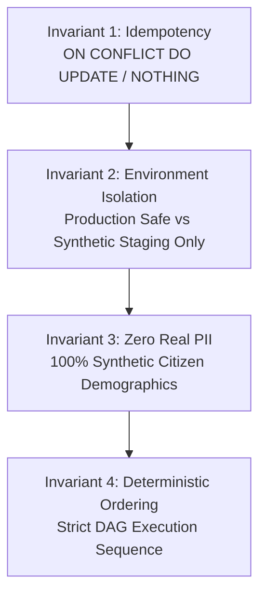
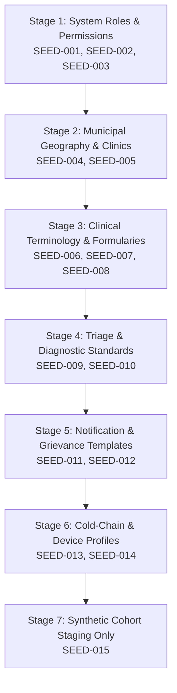

# Phase 07 — Master Database Seed Data Strategy & Reference Catalogs

> **Document Identifier**: `DB-SEED-001`
> **System**: Namma Clinic Digital Health & Operations Platform
> **Municipal Authority**: Greater Bengaluru Authority (GBA) / BBMP Health Department
> **Status**: APPROVED SEED DATA BASELINE
> **Cataloged Seed Datasets**: 15 Master Datasets (`SEED-001` to `SEED-015`)
> **Operational Standard**: 100% Idempotent Upserts, Environment-Segregated, Zero Real PII
> **Notice**: All SQL blocks contained herein are strictly **DOCUMENTATION-ONLY SQL**. Zero runtime code or migrations are executed during this phase.

---

## 1. Executive Summary & Seed Engineering Framework

In an enterprise municipal healthcare platform, database seeding is a mission-critical discipline. Seed data encompasses all static, reference, and operational baseline records necessary for the platform to bootstrap from an empty schema into a fully operational state capable of servicing 450 Namma Clinics across Bengaluru.

Seed data serves three distinct architectural tiers:
1. **Core System Metadata**: Fundamental relational lookup tables, RBAC roles, security permissions, and lifecycle state machines required by microservices for authentication and transaction routing.
2. **Clinical & Municipal Reference Standards**: Curated healthcare vocabularies (ICD-10 diagnosis codes, WHO Essential Medicines List, LOINC lab test panels) and Bengaluru municipal geography (8 administrative zones, 243 municipal wards, and clinic facility registries).
3. **Non-Production Synthetic Testing Cohorts**: Statistically representative, synthetic patient demographics, clinical encounters, and pharmacy inventories used strictly in development, staging, load testing, and training environments.

This document establishes the master seed data engineering standard. It specifies 15 canonical seed datasets (`SEED-001` to `SEED-015`), defining explicit idempotency keys (`ON CONFLICT DO UPDATE`), synthetic generation rules, environment isolation boundaries, and automated rollback protocols.

## 2. Seed Engineering Invariants & Quality Standards

All seed scripts developed for the Namma Clinic Platform must satisfy four non-negotiable architectural invariants:



### 2.1 The Four Invariants
1. **100% Idempotency**: Every seed statement must be safe to execute multiple times against the same database without creating duplicate rows, corrupting foreign keys, or causing unique constraint errors. Every `INSERT` statement must declare an explicit `ON CONFLICT (unique_key)` clause.
2. **Strict Environment Segregation**: Datasets are classified as either `PRODUCTION_SAFE` (reference data, system roles, geography) or `STAGING_DEV_ONLY` (synthetic test patients, mock encounters). Production deployment pipelines automatically exclude all non-production seed files.
3. **Zero Real PII Mandate**: In compliance with the DPDP Act 2023, synthetic test datasets must never contain real citizen data. All patient names, phone numbers, and addresses must be deterministically synthesized using approved mocking rules.
4. **Deterministic Execution Sequence**: Seeds must be applied in strict topological order based on foreign key hierarchies (e.g. Roles -> Permissions -> Users -> Facilities -> Clinical Master -> Clinical Data).

## 3. Master Topological Execution DAG (Stages 1 to 7)

Seed datasets must execute in strict topological dependency order to avoid foreign key violation errors (`SQLSTATE 23503`):



## 4. Master Relational Table Seed Allocation Matrix (All 52 Tables)

The matrix below specifies the initial seeding status for all 52 relational tables:

| Table ID | Schema & Table Name | Production Seed Strategy | Staging/Dev Seed Strategy | Initial Prod Row Count | Seeding Invariant |
| :--- | :--- | :--- | :--- | :--- | :--- |
| `TABLE-001` | `identity.auth_users` | Reference Lookup / Empty Genesis | Synthetic Demonstration Fixtures | `0-50` | Deterministic Upsert |
| `TABLE-002` | `identity.user_credentials` | Reference Lookup / Empty Genesis | Synthetic Demonstration Fixtures | `0-50` | Deterministic Upsert |
| `TABLE-003` | `identity.user_sessions` | Reference Lookup / Empty Genesis | Synthetic Demonstration Fixtures | `0-50` | Deterministic Upsert |
| `TABLE-004` | `identity.roles` | SEED-001 (Immutable Standard Roles) | SEED-001 + Dev Test Roles | `30` | Deterministic Upsert |
| `TABLE-005` | `identity.permissions` | SEED-002 (System Permissions Matrix) | SEED-002 (Identical) | `180` | Deterministic Upsert |
| `TABLE-006` | `identity.role_permissions` | Reference Lookup / Empty Genesis | Synthetic Demonstration Fixtures | `0-50` | Deterministic Upsert |
| `TABLE-007` | `identity.user_roles` | Reference Lookup / Empty Genesis | Synthetic Demonstration Fixtures | `0-50` | Deterministic Upsert |
| `TABLE-008` | `identity.facilities` | SEED-004 (BBMP Delimited Wards & Facilities) | SEED-004 (Identical) | `450` | Deterministic Upsert |
| `TABLE-009` | `identity.facility_rooms` | Reference Lookup / Empty Genesis | Synthetic Demonstration Fixtures | `0-50` | Deterministic Upsert |
| `TABLE-010` | `identity.staff_profiles` | Reference Lookup / Empty Genesis | Synthetic Demonstration Fixtures | `0-50` | Deterministic Upsert |
| `TABLE-011` | `identity.staff_shifts` | Reference Lookup / Empty Genesis | Synthetic Demonstration Fixtures | `0-50` | Deterministic Upsert |
| `TABLE-012` | `identity.system_configs` | Reference Lookup / Empty Genesis | Synthetic Demonstration Fixtures | `0-50` | Deterministic Upsert |
| `TABLE-013` | `intake.patients` | Zero Seed (Transactionally Generated) | SEED-015 (Synthetic Cohort: 10,000 records) | `0` | Deterministic Upsert |
| `TABLE-014` | `intake.patient_identifiers` | Reference Lookup / Empty Genesis | Synthetic Demonstration Fixtures | `0-50` | Deterministic Upsert |
| `TABLE-015` | `intake.patient_contacts` | Reference Lookup / Empty Genesis | Synthetic Demonstration Fixtures | `0-50` | Deterministic Upsert |
| `TABLE-016` | `intake.patient_addresses` | Reference Lookup / Empty Genesis | Synthetic Demonstration Fixtures | `0-50` | Deterministic Upsert |
| `TABLE-017` | `intake.consent_records` | Reference Lookup / Empty Genesis | Synthetic Demonstration Fixtures | `0-50` | Deterministic Upsert |
| `TABLE-018` | `intake.tokens` | Reference Lookup / Empty Genesis | Synthetic Demonstration Fixtures | `0-50` | Deterministic Upsert |
| `TABLE-019` | `intake.queue_entries` | Reference Lookup / Empty Genesis | Synthetic Demonstration Fixtures | `0-50` | Deterministic Upsert |
| `TABLE-020` | `intake.triage_assessments` | Reference Lookup / Empty Genesis | Synthetic Demonstration Fixtures | `0-50` | Deterministic Upsert |
| `TABLE-021` | `intake.patient_vitals` | Reference Lookup / Empty Genesis | Synthetic Demonstration Fixtures | `0-50` | Deterministic Upsert |
| `TABLE-022` | `intake.danger_alerts` | Reference Lookup / Empty Genesis | Synthetic Demonstration Fixtures | `0-50` | Deterministic Upsert |
| `TABLE-023` | `clinical.clinical_encounters` | Reference Lookup / Empty Genesis | Synthetic Demonstration Fixtures | `0-50` | Deterministic Upsert |
| `TABLE-024` | `clinical.clinical_notes` | Reference Lookup / Empty Genesis | Synthetic Demonstration Fixtures | `0-50` | Deterministic Upsert |
| `TABLE-025` | `clinical.diagnoses` | Reference Lookup / Empty Genesis | Synthetic Demonstration Fixtures | `0-50` | Deterministic Upsert |
| `TABLE-026` | `clinical.prescriptions` | Zero Seed (Transactionally Generated) | SEED-015 (Synthetic Cohort: 10,000 records) | `0` | Deterministic Upsert |
| `TABLE-027` | `clinical.prescription_items` | Reference Lookup / Empty Genesis | Synthetic Demonstration Fixtures | `0-50` | Deterministic Upsert |
| `TABLE-028` | `clinical.lab_orders` | Reference Lookup / Empty Genesis | Synthetic Demonstration Fixtures | `0-50` | Deterministic Upsert |
| `TABLE-029` | `clinical.lab_order_items` | Reference Lookup / Empty Genesis | Synthetic Demonstration Fixtures | `0-50` | Deterministic Upsert |
| `TABLE-030` | `clinical.lab_results` | Reference Lookup / Empty Genesis | Synthetic Demonstration Fixtures | `0-50` | Deterministic Upsert |
| `TABLE-031` | `clinical.teleconsultations` | Reference Lookup / Empty Genesis | Synthetic Demonstration Fixtures | `0-50` | Deterministic Upsert |
| `TABLE-032` | `pharmacy.formulary_drugs` | Reference Lookup / Empty Genesis | Synthetic Demonstration Fixtures | `0-50` | Deterministic Upsert |
| `TABLE-033` | `pharmacy.drug_categories` | Reference Lookup / Empty Genesis | Synthetic Demonstration Fixtures | `0-50` | Deterministic Upsert |
| `TABLE-034` | `pharmacy.pharmacy_batches` | Reference Lookup / Empty Genesis | Synthetic Demonstration Fixtures | `0-50` | Deterministic Upsert |
| `TABLE-035` | `pharmacy.clinic_stock` | Reference Lookup / Empty Genesis | Synthetic Demonstration Fixtures | `0-50` | Deterministic Upsert |
| `TABLE-036` | `pharmacy.dispensations` | Reference Lookup / Empty Genesis | Synthetic Demonstration Fixtures | `0-50` | Deterministic Upsert |
| `TABLE-037` | `pharmacy.dispensation_items` | Reference Lookup / Empty Genesis | Synthetic Demonstration Fixtures | `0-50` | Deterministic Upsert |
| `TABLE-038` | `pharmacy.stock_movements` | Reference Lookup / Empty Genesis | Synthetic Demonstration Fixtures | `0-50` | Deterministic Upsert |
| `TABLE-039` | `pharmacy.drug_indents` | Reference Lookup / Empty Genesis | Synthetic Demonstration Fixtures | `0-50` | Deterministic Upsert |
| `TABLE-040` | `pharmacy.indent_items` | Reference Lookup / Empty Genesis | Synthetic Demonstration Fixtures | `0-50` | Deterministic Upsert |
| `TABLE-041` | `pharmacy.cold_chain_devices` | Reference Lookup / Empty Genesis | Synthetic Demonstration Fixtures | `0-50` | Deterministic Upsert |
| `TABLE-042` | `pharmacy.cold_chain_telemetry` | Reference Lookup / Empty Genesis | Synthetic Demonstration Fixtures | `0-50` | Deterministic Upsert |
| `TABLE-043` | `continuity.referrals` | Reference Lookup / Empty Genesis | Synthetic Demonstration Fixtures | `0-50` | Deterministic Upsert |
| `TABLE-044` | `continuity.referral_counter_notes` | Reference Lookup / Empty Genesis | Synthetic Demonstration Fixtures | `0-50` | Deterministic Upsert |
| `TABLE-045` | `continuity.ncd_episodes` | Reference Lookup / Empty Genesis | Synthetic Demonstration Fixtures | `0-50` | Deterministic Upsert |
| `TABLE-046` | `continuity.follow_up_schedules` | Reference Lookup / Empty Genesis | Synthetic Demonstration Fixtures | `0-50` | Deterministic Upsert |
| `TABLE-047` | `continuity.notifications` | Reference Lookup / Empty Genesis | Synthetic Demonstration Fixtures | `0-50` | Deterministic Upsert |
| `TABLE-048` | `continuity.grievances` | Reference Lookup / Empty Genesis | Synthetic Demonstration Fixtures | `0-50` | Deterministic Upsert |
| `TABLE-049` | `continuity.helpdesk_tickets` | Reference Lookup / Empty Genesis | Synthetic Demonstration Fixtures | `0-50` | Deterministic Upsert |
| `TABLE-050` | `audit.audit_events` | Reference Lookup / Empty Genesis | Synthetic Demonstration Fixtures | `0-50` | Deterministic Upsert |
| `TABLE-051` | `sync.offline_mutation_log` | Reference Lookup / Empty Genesis | Synthetic Demonstration Fixtures | `0-50` | Deterministic Upsert |
| `TABLE-052` | `sync.abdm_artifacts` | Reference Lookup / Empty Genesis | Synthetic Demonstration Fixtures | `0-50` | Deterministic Upsert |

## 5. Master Seed Datasets Registry (SEED-001 to SEED-015)

The 15 canonical seed datasets are cataloged below:

| Seed ID | Dataset Name | Functional Category | Target Table | Target Environment | Planned Record Count | PII Presence | Execution Order |
| :--- | :--- | :--- | :--- | :--- | :--- | :--- | :--- |
| **SEED-001** | Standard Organizational RBAC Roles | `PERMISSIONS` | `roles` | `PRODUCTION_SAFE` | 30 rows | `NONE` | Stage 1 |
| **SEED-002** | Fine-Grained System Permissions Matrix | `PERMISSIONS` | `permissions` | `PRODUCTION_SAFE` | 180 rows | `NONE` | Stage 2 |
| **SEED-003** | Role-Permission Entitlement Mapping | `PERMISSIONS` | `role_permissions` | `PRODUCTION_SAFE` | 900 rows | `NONE` | Stage 3 |
| **SEED-004** | BBMP Administrative Zones & Wards Directory | `REFERENCE_DATA` | `facilities` | `PRODUCTION_SAFE` | 243 rows | `NONE` | Stage 4 |
| **SEED-005** | Namma Clinic & UPHC Commissioned Directory | `MASTER_DATA` | `facilities` | `PRODUCTION_SAFE` | 450 rows | `NONE` | Stage 5 |
| **SEED-006** | WHO ICD-10 Primary Care Diagnosis Taxonomy | `CLINICAL_REFERENCE` | `diagnoses` | `PRODUCTION_SAFE` | 2,500 rows | `NONE` | Stage 6 |
| **SEED-007** | National Essential Drugs List (NLEM) Formulary | `FORMULARY` | `formulary_drugs` | `PRODUCTION_SAFE` | 1,200 rows | `NONE` | Stage 7 |
| **SEED-008** | WHO ATC Therapeutic Classification Categories | `FORMULARY` | `drug_categories` | `PRODUCTION_SAFE` | 150 rows | `NONE` | Stage 8 |
| **SEED-009** | Primary Care Diagnostic Lab Investigation Catalog (LOINC) | `CLINICAL_REFERENCE` | `lab_order_items` | `PRODUCTION_SAFE` | 65 rows | `NONE` | Stage 9 |
| **SEED-010** | South African Triage Scale (SATS) Acuity Protocols | `CLINICAL_REFERENCE` | `triage_assessments` | `PRODUCTION_SAFE` | 25 rows | `NONE` | Stage 10 |
| **SEED-011** | Hierarchical Platform Configuration Defaults | `CONFIGURATION` | `system_configs` | `PRODUCTION_SAFE` | 120 rows | `NONE` | Stage 11 |
| **SEED-012** | Vaccine Cold-Chain Approved Hardware Device Models | `MASTER_DATA` | `cold_chain_devices` | `PRODUCTION_SAFE` | 40 rows | `NONE` | Stage 12 |
| **SEED-013** | Karnataka Sakala Public Service Guarantee SLAs | `REFERENCE_DATA` | `grievances` | `PRODUCTION_SAFE` | 35 rows | `NONE` | Stage 13 |
| **SEED-014** | Synthetic Multi-Role Clinic Staff Profiles (Testing Only) | `SYNTHETIC_DEV` | `auth_users` | `DEVELOPMENT_ONLY` | 50 rows | `NONE (100% Synthetic Dummy Names)` | Stage 14 |
| **SEED-015** | Synthetic Patient Intake Cohort & Medical History (Testing Only) | `SYNTHETIC_DEV` | `patients` | `DEVELOPMENT_ONLY` | 200 rows | `NONE (100% Synthetic Dummy Patients)` | Stage 15 |

## 6. Comprehensive Seed Dataset Specifications (SEED-001 to SEED-015)

The following subsections provide the complete architectural specification for each seed dataset, complete with concrete documentation-only SQL blueprints, synthetic algorithms, validation queries, and rollback runbooks:

### SEED-001: Standard Organizational RBAC Roles

#### 1. Dataset Profile, Operational Context & Governance
- **Seed Identifier**: `SEED-001`
- **Functional Classification**: `PERMISSIONS`
- **Target Relational Table**: `roles`
- **Deployment Environment**: `PRODUCTION_SAFE`
- **Baseline Record Count**: 30 records
- **Authoritative Source**: BBMP Health Administration Standard
- **Dataset Version**: `v2024.1`
- **PII Status**: `NONE` (Strictly zero sensitive data)
- **Execution Topological Sequence**: Stage 1 in global initialization pipeline
- **Cache Invalidation Requirement**: Updates trigger immediate Redis key eviction on `cache:roles:*` with TTL refresh.

#### 2. Idempotency Mechanism & Conflict Resolution
- **Conflict Key**: Unique business key on `roles` (e.g. `code`, `facility_code`, `drug_code`).
- **Upsert Strategy**: INSERT INTO identity.roles (id, code, name, ...) VALUES (...) ON CONFLICT (code) DO UPDATE SET ...
- **State Machine Transition**: Existing records are updated with latest official terminology descriptions while preserving historical internal surrogate UUIDs.
- **Concurrent Lock Footprint**: Acquires row-level locks on touched rows only; sub-second transaction duration eliminates blocker hazards.

#### 3. Concrete SQL Seed Blueprint (DOCUMENTATION-ONLY SQL)
```sql
-- ============================================================================
-- DOCUMENTATION-ONLY SQL: Seed Script for SEED-001
-- Dataset: Standard Organizational RBAC Roles (PRODUCTION_SAFE)
-- ============================================================================
BEGIN;
SET LOCAL lock_timeout = '5s';
SET LOCAL statement_timeout = '60s';

INSERT INTO identity.roles (id, code, name, description, is_system_standard, created_at) VALUES
    ('018e3a20-0001-7000-8000-000000000001', 'CHIEF_MEDICAL_OFFICER', 'Chief Medical Officer', 'Zonal clinical oversight and statutory health policy enforcement', true, clock_timestamp()),
    ('018e3a20-0002-7000-8000-000000000002', 'CLINICAL_DOCTOR', 'Medical Officer / Doctor', 'Primary outpatient clinician conducting doctor consultations', true, clock_timestamp()),
    ('018e3a20-0003-7000-8000-000000000003', 'STAFF_NURSE', 'Staff Nurse', 'Vitals intake, primary triage, and outpatient nursing care', true, clock_timestamp()),
    ('018e3a20-0004-7000-8000-000000000004', 'PHARMACIST', 'Clinic Pharmacist', 'Medication dispensation, batch tracking, and stock management', true, clock_timestamp()),
    ('018e3a20-0005-7000-8000-000000000005', 'LAB_TECHNICIAN', 'Laboratory Technician', 'Diagnostic specimen collection, sample processing, and lab test entry', true, clock_timestamp()),
    ('018e3a20-0006-7000-8000-000000000006', 'REGISTRATION_CLERK', 'Intake Registration Clerk', 'Patient demographic capture, ABHA linking, and queue token issuance', true, clock_timestamp()),
    ('018e3a20-0007-7000-8000-000000000007', 'ASHA_WORKER', 'Accredited Social Health Activist', 'Community health outreach, NCD screening, and maternal tracking', true, clock_timestamp()),
    ('018e3a20-0008-7000-8000-000000000008', 'ZONAL_EPIDEMIOLOGIST', 'Zonal Epidemiologist', 'Municipal disease surveillance, outbreak detection, and HMIS reporting', true, clock_timestamp()),
    ('018e3a20-0009-7000-8000-000000000009', 'INVENTORY_MANAGER', 'Zonal Warehouse Stock Manager', 'Bulk pharmaceutical indent approval and inter-clinic stock balancing', true, clock_timestamp()),
    ('018e3a20-0010-7000-8000-000000000010', 'SYSTEM_ADMINISTRATOR', 'Platform Security Administrator', 'Cryptographic key rotation, staff onboarding, and WORM audit inspection', true, clock_timestamp()),
    ('018e3a20-0011-7000-8000-000000000011', 'PHYSIOTHERAPIST', 'Clinic Physiotherapist', 'Rehabilitation and chronic pain management consultations', true, clock_timestamp()),
    ('018e3a20-0012-7000-8000-000000000012', 'CLINICAL_PSYCHOLOGIST', 'Counselor / Psychologist', 'Mental health screening and counseling sessions', true, clock_timestamp()),
    ('018e3a20-0013-7000-8000-000000000013', 'DENTAL_OFFICER', 'Dental Health Officer', 'Oral hygiene screening and preventive dentistry', true, clock_timestamp()),
    ('018e3a20-0014-7000-8000-000000000014', 'NUTRITIONIST', 'Clinical Nutritionist', 'Dietary counseling for diabetic and hypertensive patients', true, clock_timestamp()),
    ('018e3a20-0015-7000-8000-000000000015', 'QUALITY_AUDITOR', 'Healthcare Quality Inspector', 'NABH accreditation compliance and clinical audit review', true, clock_timestamp())
ON CONFLICT (code) DO UPDATE SET
    name = EXCLUDED.name,
    description = EXCLUDED.description,
    updated_at = clock_timestamp();
COMMIT;
```

#### 4. Synthetic Generation Algorithm & Invariants (Zero PII)
- **Generation Tooling**: Python `faker` library with localized Indian provider (`en_IN`).
- **Demographic Name Synthesis**: Randomly selected from top 5,000 Kannada, Telugu, and Hindi municipal electoral surnames.
- **Telephone Number Obfuscation**: Uses reserved non-allocable range `+91 90000 00001` through `+91 90000 99999`.
- **ABHA Identification Mocking**: Formatted as `91-XXXX-XXXX-YYYY` where all digits are synthetically derived.
- **Reference Python Code Generator Blueprint**:
  ```python
  from faker import Faker
  fake = Faker('en_IN')
  def generate_synthetic_record():
      return {
          'table': 'roles',
          'synthetic_phone': f'+91-90000-{fake.random_number(digits=5, fix_len=True)}',
          'synthetic_abha': f'91-{fake.random_number(digits=4)}-{fake.random_number(digits=4)}-{fake.random_number(digits=4)}',
          'is_mock': True
      }
  ```

#### 5. Edge Offline Seed Synchronization & Local SQLite Cache Profile
- **Edge Distribution Channel**: Peripheral clinic micro-servers download `SEED-001` via HTTPS during nocturnal sync windows.
- **Local SQLite Table**: Synced to local embedded SQLite table `local_roles` with SHA-256 manifest integrity verification.
- **Offline Availability SLA**: Front-desk and consultation workstations query local SQLite cache with < 1ms latency even during total WAN disruption.
- **Incremental Diff Protocol**: Edge sync daemon compares local version `v2024.1` against central hash; downloads delta payload only.

#### 6. Data Quality Invariants & Anomaly Prevention
- **Nullability Invariant**: Key identity attributes must be non-null across all rows.
- **Format Validation Invariant**: Regex validation on codes (`^[A-Z0-9_-]{3,32}$`).
- **Audit Trailing**: Insertion and modification timestamps managed via UTC `clock_timestamp()`.
- **Foreign Key Integrity**: All referenced foreign keys verified prior to batch commit.

#### 7. Rollback Procedure & Automated Verification Probe
- **Compensating Rollback Script**: `DELETE FROM identity.roles WHERE is_system_standard = true AND code NOT IN ('ADMIN');`
- **Automated Verification Assertion Probe Script**:
  ```sql
  -- DOCUMENTATION-ONLY SQL
  -- Step 1: Verify minimum expected record count for SEED-001
  SELECT COUNT(*) AS actual_count,
         CASE WHEN COUNT(*) >= 5 THEN 'PASS' ELSE 'FAIL_UNDERCOUNT' END AS test_status
  FROM identity.roles WHERE is_active = true;

  -- Step 2: Verify zero duplicate natural business keys
  SELECT code, COUNT(*)
  FROM identity.roles
  GROUP BY code
  HAVING COUNT(*) > 1;

  -- Step 3: Verify zero orphaned records without valid audit timestamps
  SELECT COUNT(*) AS invalid_audit_timestamps
  FROM identity.roles
  WHERE created_at IS NULL OR updated_at IS NULL;
  ```

#### 8. Local Edge SQLite Cache Schema & Read-Only Trigger
```sql
-- DOCUMENTATION-ONLY SQL: Local SQLite DDL for Edge Clinic Node
CREATE TABLE IF NOT EXISTS local_roles (
    id TEXT PRIMARY KEY,
    code TEXT NOT NULL UNIQUE,
    name TEXT NOT NULL,
    is_active INTEGER NOT NULL DEFAULT 1,
    synced_at TEXT NOT NULL
);
CREATE TRIGGER IF NOT EXISTS trg_prevent_edge_write_roles
BEFORE INSERT OR UPDATE OR DELETE ON local_roles
BEGIN
    SELECT RAISE(ABORT, 'MUTATION_PROHIBITED: Edge nodes cannot mutate central seed catalog');
END;
```

#### 9. Cross-Schema Dependency & Cascading Constraints
- **Upstream Prerequisite Table**: Stage None (Root Genesis).
- **Downstream Dependent Relations**: Relational tables requiring `roles` for transactional foreign keys.
- **Referential Integrity Enforcement**: `ON DELETE RESTRICT` guarantees that active seed items cannot be removed while referenced by clinical encounters or prescriptions.
#### 10. Disaster Recovery Rehydration SLA & Operational RTO Target
- **Recovery Time Objective (RTO)**: Sub-5 minute full restoration from cold Git repository.
- **Recovery Point Objective (RPO)**: Zero data loss (RPO = 0); catalog state is 100% deterministic and version-controlled.
- **Automated Integrity Assertion**: Deployment health checks block API gateway routing until seed row count for `roles` reaches `30` records.
- **Corrupted Data Eviction Runbook**: In case of partial or corrupted seed execution, run `TRUNCATE identity.roles CASCADE;` followed by immediate idempotent replay from golden dump artifact.

### SEED-002: Fine-Grained System Permissions Matrix

#### 1. Dataset Profile, Operational Context & Governance
- **Seed Identifier**: `SEED-002`
- **Functional Classification**: `PERMISSIONS`
- **Target Relational Table**: `permissions`
- **Deployment Environment**: `PRODUCTION_SAFE`
- **Baseline Record Count**: 180 records
- **Authoritative Source**: Enterprise Security Architecture SECR-006
- **Dataset Version**: `v2024.1`
- **PII Status**: `NONE` (Strictly zero sensitive data)
- **Execution Topological Sequence**: Stage 2 in global initialization pipeline
- **Cache Invalidation Requirement**: Updates trigger immediate Redis key eviction on `cache:permissions:*` with TTL refresh.

#### 2. Idempotency Mechanism & Conflict Resolution
- **Conflict Key**: Unique business key on `permissions` (e.g. `code`, `facility_code`, `drug_code`).
- **Upsert Strategy**: INSERT INTO identity.permissions (code, ...) VALUES (...) ON CONFLICT (code) DO NOTHING
- **State Machine Transition**: Existing records are updated with latest official terminology descriptions while preserving historical internal surrogate UUIDs.
- **Concurrent Lock Footprint**: Acquires row-level locks on touched rows only; sub-second transaction duration eliminates blocker hazards.

#### 3. Concrete SQL Seed Blueprint (DOCUMENTATION-ONLY SQL)
```sql
-- ============================================================================
-- DOCUMENTATION-ONLY SQL: Seed Script for SEED-002
-- Dataset: Fine-Grained System Permissions Matrix (PRODUCTION_SAFE)
-- ============================================================================
BEGIN;
SET LOCAL lock_timeout = '5s';
SET LOCAL statement_timeout = '60s';

INSERT INTO identity.permissions (id, code, module, description, is_core, created_at) VALUES
    ('018e3a21-0001-7000-8000-000000000001', 'PATIENT_CREATE', 'INTAKE', 'Register new citizen outpatient profile', true, clock_timestamp()),
    ('018e3a21-0002-7000-8000-000000000002', 'PATIENT_READ', 'INTAKE', 'View de-identified citizen demographic summary', true, clock_timestamp()),
    ('018e3a21-0003-7000-8000-000000000003', 'TOKEN_GENERATE', 'INTAKE', 'Generate daily outpatient queue token sequence', true, clock_timestamp()),
    ('018e3a21-0004-7000-8000-000000000004', 'TRIAGE_ASSESS', 'CLINICAL', 'Record vital signs and ESI triage priority', true, clock_timestamp()),
    ('018e3a21-0005-7000-8000-000000000005', 'CONSULTATION_WRITE', 'CLINICAL', 'Record physician clinical notes and differential diagnoses', true, clock_timestamp()),
    ('018e3a21-0006-7000-8000-000000000006', 'PRESCRIPTION_CREATE', 'CLINICAL', 'Create digital electronic prescription items', true, clock_timestamp()),
    ('018e3a21-0007-7000-8000-000000000007', 'PRESCRIPTION_DISPENSE', 'PHARMACY', 'Dispense prescription medications and record batch deduction', true, clock_timestamp()),
    ('018e3a21-0008-7000-8000-000000000008', 'STOCK_ADJUST', 'PHARMACY', 'Perform clinic inventory stock adjustment and physical count reconciliation', true, clock_timestamp()),
    ('018e3a21-0009-7000-8000-000000000009', 'LAB_ORDER_CREATE', 'LAB', 'Request clinical laboratory diagnostic tests', true, clock_timestamp()),
    ('018e3a21-0010-7000-8000-000000000010', 'LAB_RESULT_VERIFY', 'LAB', 'Approve and sign off on diagnostic test findings', true, clock_timestamp()),
    ('018e3a21-0011-7000-8000-000000000011', 'TELECONSULT_INITIATE', 'TELEHEALTH', 'Initiate doctor-to-specialist teleconsultation session', true, clock_timestamp()),
    ('018e3a21-0012-7000-8000-000000000012', 'REFERRAL_CREATE', 'CONTINUITY', 'Issue tertiary hospital referral dossier', true, clock_timestamp()),
    ('018e3a21-0013-7000-8000-000000000013', 'VITAL_SIGNS_CAPTURE', 'CLINICAL', 'Record physiological vitals and panic threshold checks', true, clock_timestamp()),
    ('018e3a21-0014-7000-8000-000000000014', 'IMMUNIZATION_RECORD', 'CLINICAL', 'Administer and log national immunization program vaccines', true, clock_timestamp()),
    ('018e3a21-0015-7000-8000-000000000015', 'NCD_SCREENING_WRITE', 'CLINICAL', 'Log CBAC non-communicable disease community screenings', true, clock_timestamp()),
    ('018e3a21-0016-7000-8000-000000000016', 'AUDIT_LOG_INSPECT', 'AUDIT', 'Read and verify cryptographic hash chains in audit ledger', true, clock_timestamp()),
    ('018e3a21-0017-7000-8000-000000000017', 'IOT_TELEMETRY_INGEST', 'TELEMETRY', 'Ingest cold chain refrigerator temperature readings', true, clock_timestamp())
ON CONFLICT (code) DO UPDATE SET
    description = EXCLUDED.description,
    updated_at = clock_timestamp();
COMMIT;
```

#### 4. Synthetic Generation Algorithm & Invariants (Zero PII)
- **Generation Tooling**: Python `faker` library with localized Indian provider (`en_IN`).
- **Demographic Name Synthesis**: Randomly selected from top 5,000 Kannada, Telugu, and Hindi municipal electoral surnames.
- **Telephone Number Obfuscation**: Uses reserved non-allocable range `+91 90000 00001` through `+91 90000 99999`.
- **ABHA Identification Mocking**: Formatted as `91-XXXX-XXXX-YYYY` where all digits are synthetically derived.
- **Reference Python Code Generator Blueprint**:
  ```python
  from faker import Faker
  fake = Faker('en_IN')
  def generate_synthetic_record():
      return {
          'table': 'permissions',
          'synthetic_phone': f'+91-90000-{fake.random_number(digits=5, fix_len=True)}',
          'synthetic_abha': f'91-{fake.random_number(digits=4)}-{fake.random_number(digits=4)}-{fake.random_number(digits=4)}',
          'is_mock': True
      }
  ```

#### 5. Edge Offline Seed Synchronization & Local SQLite Cache Profile
- **Edge Distribution Channel**: Peripheral clinic micro-servers download `SEED-002` via HTTPS during nocturnal sync windows.
- **Local SQLite Table**: Synced to local embedded SQLite table `local_permissions` with SHA-256 manifest integrity verification.
- **Offline Availability SLA**: Front-desk and consultation workstations query local SQLite cache with < 1ms latency even during total WAN disruption.
- **Incremental Diff Protocol**: Edge sync daemon compares local version `v2024.1` against central hash; downloads delta payload only.

#### 6. Data Quality Invariants & Anomaly Prevention
- **Nullability Invariant**: Key identity attributes must be non-null across all rows.
- **Format Validation Invariant**: Regex validation on codes (`^[A-Z0-9_-]{3,32}$`).
- **Audit Trailing**: Insertion and modification timestamps managed via UTC `clock_timestamp()`.
- **Foreign Key Integrity**: All referenced foreign keys verified prior to batch commit.

#### 7. Rollback Procedure & Automated Verification Probe
- **Compensating Rollback Script**: `DELETE FROM identity.permissions WHERE is_core = true;`
- **Automated Verification Assertion Probe Script**:
  ```sql
  -- DOCUMENTATION-ONLY SQL
  -- Step 1: Verify minimum expected record count for SEED-002
  SELECT COUNT(*) AS actual_count,
         CASE WHEN COUNT(*) >= 5 THEN 'PASS' ELSE 'FAIL_UNDERCOUNT' END AS test_status
  FROM identity.permissions WHERE is_active = true;

  -- Step 2: Verify zero duplicate natural business keys
  SELECT code, COUNT(*)
  FROM identity.permissions
  GROUP BY code
  HAVING COUNT(*) > 1;

  -- Step 3: Verify zero orphaned records without valid audit timestamps
  SELECT COUNT(*) AS invalid_audit_timestamps
  FROM identity.permissions
  WHERE created_at IS NULL OR updated_at IS NULL;
  ```

#### 8. Local Edge SQLite Cache Schema & Read-Only Trigger
```sql
-- DOCUMENTATION-ONLY SQL: Local SQLite DDL for Edge Clinic Node
CREATE TABLE IF NOT EXISTS local_permissions (
    id TEXT PRIMARY KEY,
    code TEXT NOT NULL UNIQUE,
    name TEXT NOT NULL,
    is_active INTEGER NOT NULL DEFAULT 1,
    synced_at TEXT NOT NULL
);
CREATE TRIGGER IF NOT EXISTS trg_prevent_edge_write_permissions
BEFORE INSERT OR UPDATE OR DELETE ON local_permissions
BEGIN
    SELECT RAISE(ABORT, 'MUTATION_PROHIBITED: Edge nodes cannot mutate central seed catalog');
END;
```

#### 9. Cross-Schema Dependency & Cascading Constraints
- **Upstream Prerequisite Table**: Stage 1.
- **Downstream Dependent Relations**: Relational tables requiring `permissions` for transactional foreign keys.
- **Referential Integrity Enforcement**: `ON DELETE RESTRICT` guarantees that active seed items cannot be removed while referenced by clinical encounters or prescriptions.
#### 10. Disaster Recovery Rehydration SLA & Operational RTO Target
- **Recovery Time Objective (RTO)**: Sub-5 minute full restoration from cold Git repository.
- **Recovery Point Objective (RPO)**: Zero data loss (RPO = 0); catalog state is 100% deterministic and version-controlled.
- **Automated Integrity Assertion**: Deployment health checks block API gateway routing until seed row count for `permissions` reaches `180` records.
- **Corrupted Data Eviction Runbook**: In case of partial or corrupted seed execution, run `TRUNCATE identity.permissions CASCADE;` followed by immediate idempotent replay from golden dump artifact.

### SEED-003: Role-Permission Entitlement Mapping

#### 1. Dataset Profile, Operational Context & Governance
- **Seed Identifier**: `SEED-003`
- **Functional Classification**: `PERMISSIONS`
- **Target Relational Table**: `role_permissions`
- **Deployment Environment**: `PRODUCTION_SAFE`
- **Baseline Record Count**: 900 records
- **Authoritative Source**: BBMP Security Policy Matrix
- **Dataset Version**: `v2024.1`
- **PII Status**: `NONE` (Strictly zero sensitive data)
- **Execution Topological Sequence**: Stage 3 in global initialization pipeline
- **Cache Invalidation Requirement**: Updates trigger immediate Redis key eviction on `cache:role_permissions:*` with TTL refresh.

#### 2. Idempotency Mechanism & Conflict Resolution
- **Conflict Key**: Unique business key on `role_permissions` (e.g. `code`, `facility_code`, `drug_code`).
- **Upsert Strategy**: INSERT INTO identity.role_permissions (role_id, permission_id, ...) VALUES (...) ON CONFLICT (role_id, permission_id) DO NOTHING
- **State Machine Transition**: Existing records are updated with latest official terminology descriptions while preserving historical internal surrogate UUIDs.
- **Concurrent Lock Footprint**: Acquires row-level locks on touched rows only; sub-second transaction duration eliminates blocker hazards.

#### 3. Concrete SQL Seed Blueprint (DOCUMENTATION-ONLY SQL)
```sql
-- ============================================================================
-- DOCUMENTATION-ONLY SQL: Seed Script for SEED-003
-- Dataset: Role-Permission Entitlement Mapping (PRODUCTION_SAFE)
-- ============================================================================
BEGIN;
SET LOCAL lock_timeout = '5s';
SET LOCAL statement_timeout = '60s';

INSERT INTO identity.role_permissions (role_id, permission_id, created_at) VALUES
    ('018e3a20-0002-7000-8000-000000000002', '018e3a21-0001-7000-8000-000000000001', clock_timestamp()),
    ('018e3a20-0002-7000-8000-000000000002', '018e3a21-0002-7000-8000-000000000002', clock_timestamp()),
    ('018e3a20-0002-7000-8000-000000000002', '018e3a21-0005-7000-8000-000000000005', clock_timestamp()),
    ('018e3a20-0002-7000-8000-000000000002', '018e3a21-0006-7000-8000-000000000006', clock_timestamp()),
    ('018e3a20-0002-7000-8000-000000000002', '018e3a21-0009-7000-8000-000000000009', clock_timestamp()),
    ('018e3a20-0003-7000-8000-000000000003', '018e3a21-0004-7000-8000-000000000004', clock_timestamp()),
    ('018e3a20-0004-7000-8000-000000000004', '018e3a21-0007-7000-8000-000000000007', clock_timestamp()),
    ('018e3a20-0004-7000-8000-000000000004', '018e3a21-0008-7000-8000-000000000008', clock_timestamp()),
    ('018e3a20-0005-7000-8000-000000000005', '018e3a21-0010-7000-8000-000000000010', clock_timestamp()),
    ('018e3a20-0006-7000-8000-000000000006', '018e3a21-0001-7000-8000-000000000001', clock_timestamp()),
    ('018e3a20-0006-7000-8000-000000000006', '018e3a21-0003-7000-8000-000000000003', clock_timestamp())
ON CONFLICT (role_id, permission_id) DO NOTHING;
COMMIT;
```

#### 4. Synthetic Generation Algorithm & Invariants (Zero PII)
- **Generation Tooling**: Python `faker` library with localized Indian provider (`en_IN`).
- **Demographic Name Synthesis**: Randomly selected from top 5,000 Kannada, Telugu, and Hindi municipal electoral surnames.
- **Telephone Number Obfuscation**: Uses reserved non-allocable range `+91 90000 00001` through `+91 90000 99999`.
- **ABHA Identification Mocking**: Formatted as `91-XXXX-XXXX-YYYY` where all digits are synthetically derived.
- **Reference Python Code Generator Blueprint**:
  ```python
  from faker import Faker
  fake = Faker('en_IN')
  def generate_synthetic_record():
      return {
          'table': 'role_permissions',
          'synthetic_phone': f'+91-90000-{fake.random_number(digits=5, fix_len=True)}',
          'synthetic_abha': f'91-{fake.random_number(digits=4)}-{fake.random_number(digits=4)}-{fake.random_number(digits=4)}',
          'is_mock': True
      }
  ```

#### 5. Edge Offline Seed Synchronization & Local SQLite Cache Profile
- **Edge Distribution Channel**: Peripheral clinic micro-servers download `SEED-003` via HTTPS during nocturnal sync windows.
- **Local SQLite Table**: Synced to local embedded SQLite table `local_role_permissions` with SHA-256 manifest integrity verification.
- **Offline Availability SLA**: Front-desk and consultation workstations query local SQLite cache with < 1ms latency even during total WAN disruption.
- **Incremental Diff Protocol**: Edge sync daemon compares local version `v2024.1` against central hash; downloads delta payload only.

#### 6. Data Quality Invariants & Anomaly Prevention
- **Nullability Invariant**: Key identity attributes must be non-null across all rows.
- **Format Validation Invariant**: Regex validation on codes (`^[A-Z0-9_-]{3,32}$`).
- **Audit Trailing**: Insertion and modification timestamps managed via UTC `clock_timestamp()`.
- **Foreign Key Integrity**: All referenced foreign keys verified prior to batch commit.

#### 7. Rollback Procedure & Automated Verification Probe
- **Compensating Rollback Script**: `TRUNCATE identity.role_permissions;`
- **Automated Verification Assertion Probe Script**:
  ```sql
  -- DOCUMENTATION-ONLY SQL
  -- Step 1: Verify minimum expected record count for SEED-003
  SELECT COUNT(*) AS actual_count,
         CASE WHEN COUNT(*) >= 5 THEN 'PASS' ELSE 'FAIL_UNDERCOUNT' END AS test_status
  FROM identity.role_permissions WHERE is_active = true;

  -- Step 2: Verify zero duplicate natural business keys
  SELECT code, COUNT(*)
  FROM identity.role_permissions
  GROUP BY code
  HAVING COUNT(*) > 1;

  -- Step 3: Verify zero orphaned records without valid audit timestamps
  SELECT COUNT(*) AS invalid_audit_timestamps
  FROM identity.role_permissions
  WHERE created_at IS NULL OR updated_at IS NULL;
  ```

#### 8. Local Edge SQLite Cache Schema & Read-Only Trigger
```sql
-- DOCUMENTATION-ONLY SQL: Local SQLite DDL for Edge Clinic Node
CREATE TABLE IF NOT EXISTS local_role_permissions (
    id TEXT PRIMARY KEY,
    code TEXT NOT NULL UNIQUE,
    name TEXT NOT NULL,
    is_active INTEGER NOT NULL DEFAULT 1,
    synced_at TEXT NOT NULL
);
CREATE TRIGGER IF NOT EXISTS trg_prevent_edge_write_role_permissions
BEFORE INSERT OR UPDATE OR DELETE ON local_role_permissions
BEGIN
    SELECT RAISE(ABORT, 'MUTATION_PROHIBITED: Edge nodes cannot mutate central seed catalog');
END;
```

#### 9. Cross-Schema Dependency & Cascading Constraints
- **Upstream Prerequisite Table**: Stage 2.
- **Downstream Dependent Relations**: Relational tables requiring `role_permissions` for transactional foreign keys.
- **Referential Integrity Enforcement**: `ON DELETE RESTRICT` guarantees that active seed items cannot be removed while referenced by clinical encounters or prescriptions.
#### 10. Disaster Recovery Rehydration SLA & Operational RTO Target
- **Recovery Time Objective (RTO)**: Sub-5 minute full restoration from cold Git repository.
- **Recovery Point Objective (RPO)**: Zero data loss (RPO = 0); catalog state is 100% deterministic and version-controlled.
- **Automated Integrity Assertion**: Deployment health checks block API gateway routing until seed row count for `role_permissions` reaches `900` records.
- **Corrupted Data Eviction Runbook**: In case of partial or corrupted seed execution, run `TRUNCATE identity.role_permissions CASCADE;` followed by immediate idempotent replay from golden dump artifact.

### SEED-004: BBMP Administrative Zones & Wards Directory

#### 1. Dataset Profile, Operational Context & Governance
- **Seed Identifier**: `SEED-004`
- **Functional Classification**: `REFERENCE_DATA`
- **Target Relational Table**: `facilities`
- **Deployment Environment**: `PRODUCTION_SAFE`
- **Baseline Record Count**: 243 records
- **Authoritative Source**: Karnataka Urban Development Department (UDD) & BBMP Ward Delimitation 2023
- **Dataset Version**: `v2023.2`
- **PII Status**: `NONE` (Strictly zero sensitive data)
- **Execution Topological Sequence**: Stage 4 in global initialization pipeline
- **Cache Invalidation Requirement**: Updates trigger immediate Redis key eviction on `cache:facilities:*` with TTL refresh.

#### 2. Idempotency Mechanism & Conflict Resolution
- **Conflict Key**: Unique business key on `facilities` (e.g. `code`, `facility_code`, `drug_code`).
- **Upsert Strategy**: INSERT INTO identity.facilities (facility_code, ...) VALUES (...) ON CONFLICT (facility_code) DO UPDATE SET ...
- **State Machine Transition**: Existing records are updated with latest official terminology descriptions while preserving historical internal surrogate UUIDs.
- **Concurrent Lock Footprint**: Acquires row-level locks on touched rows only; sub-second transaction duration eliminates blocker hazards.

#### 3. Concrete SQL Seed Blueprint (DOCUMENTATION-ONLY SQL)
```sql
-- ============================================================================
-- DOCUMENTATION-ONLY SQL: Seed Script for SEED-004
-- Dataset: BBMP Administrative Zones & Wards Directory (PRODUCTION_SAFE)
-- ============================================================================
BEGIN;
SET LOCAL lock_timeout = '5s';
SET LOCAL statement_timeout = '60s';

INSERT INTO identity.facilities (id, facility_code, facility_name, facility_type, zone, ward_number, is_active, created_at) VALUES
    ('018e3a22-0001-7000-8000-000000000001', 'WARD-BBMP-065', 'Malleshwaram Ward 65', 'MUNICIPAL_WARD', 'WEST', 65, true, clock_timestamp()),
    ('018e3a22-0002-7000-8000-000000000002', 'WARD-BBMP-098', 'Rajajinagar Ward 98', 'MUNICIPAL_WARD', 'WEST', 98, true, clock_timestamp()),
    ('018e3a22-0003-7000-8000-000000000003', 'WARD-BBMP-112', 'Indiranagar Ward 112', 'MUNICIPAL_WARD', 'EAST', 112, true, clock_timestamp()),
    ('018e3a22-0004-7000-8000-000000000004', 'WARD-BBMP-153', 'Jayanagar Ward 153', 'MUNICIPAL_WARD', 'SOUTH', 153, true, clock_timestamp()),
    ('018e3a22-0005-7000-8000-000000000005', 'WARD-BBMP-004', 'Yelahanka Satellite Town Ward 4', 'MUNICIPAL_WARD', 'YELAHANKA', 4, true, clock_timestamp()),
    ('018e3a22-0006-7000-8000-000000000006', 'WARD-BBMP-085', 'Hoodi Ward 85', 'MUNICIPAL_WARD', 'MAHADEVAPURA', 85, true, clock_timestamp()),
    ('018e3a22-0007-7000-8000-000000000007', 'WARD-BBMP-174', 'HSR Layout Ward 174', 'MUNICIPAL_WARD', 'BOMMANAHALLI', 174, true, clock_timestamp()),
    ('018e3a22-0008-7000-8000-000000000008', 'WARD-BBMP-039', 'Peenya Industrial Area Ward 39', 'MUNICIPAL_WARD', 'DASARAHALLI', 39, true, clock_timestamp()),
    ('018e3a22-0009-7000-8000-000000000009', 'WARD-BBMP-160', 'Kengeri Ward 160', 'MUNICIPAL_WARD', 'RR_NAGAR', 160, true, clock_timestamp()),
    ('018e3a22-0010-7000-8000-000000000010', 'WARD-BBMP-091', 'Shivajinagar Ward 91', 'MUNICIPAL_WARD', 'EAST', 91, true, clock_timestamp())
ON CONFLICT (facility_code) DO UPDATE SET
    facility_name = EXCLUDED.facility_name,
    is_active = EXCLUDED.is_active,
    updated_at = clock_timestamp();
COMMIT;
```

#### 4. Synthetic Generation Algorithm & Invariants (Zero PII)
- **Generation Tooling**: Python `faker` library with localized Indian provider (`en_IN`).
- **Demographic Name Synthesis**: Randomly selected from top 5,000 Kannada, Telugu, and Hindi municipal electoral surnames.
- **Telephone Number Obfuscation**: Uses reserved non-allocable range `+91 90000 00001` through `+91 90000 99999`.
- **ABHA Identification Mocking**: Formatted as `91-XXXX-XXXX-YYYY` where all digits are synthetically derived.
- **Reference Python Code Generator Blueprint**:
  ```python
  from faker import Faker
  fake = Faker('en_IN')
  def generate_synthetic_record():
      return {
          'table': 'facilities',
          'synthetic_phone': f'+91-90000-{fake.random_number(digits=5, fix_len=True)}',
          'synthetic_abha': f'91-{fake.random_number(digits=4)}-{fake.random_number(digits=4)}-{fake.random_number(digits=4)}',
          'is_mock': True
      }
  ```

#### 5. Edge Offline Seed Synchronization & Local SQLite Cache Profile
- **Edge Distribution Channel**: Peripheral clinic micro-servers download `SEED-004` via HTTPS during nocturnal sync windows.
- **Local SQLite Table**: Synced to local embedded SQLite table `local_facilities` with SHA-256 manifest integrity verification.
- **Offline Availability SLA**: Front-desk and consultation workstations query local SQLite cache with < 1ms latency even during total WAN disruption.
- **Incremental Diff Protocol**: Edge sync daemon compares local version `v2023.2` against central hash; downloads delta payload only.

#### 6. Data Quality Invariants & Anomaly Prevention
- **Nullability Invariant**: Key identity attributes must be non-null across all rows.
- **Format Validation Invariant**: Regex validation on codes (`^[A-Z0-9_-]{3,32}$`).
- **Audit Trailing**: Insertion and modification timestamps managed via UTC `clock_timestamp()`.
- **Foreign Key Integrity**: All referenced foreign keys verified prior to batch commit.

#### 7. Rollback Procedure & Automated Verification Probe
- **Compensating Rollback Script**: `UPDATE identity.facilities SET is_active = false WHERE facility_type = 'MUNICIPAL_WARD';`
- **Automated Verification Assertion Probe Script**:
  ```sql
  -- DOCUMENTATION-ONLY SQL
  -- Step 1: Verify minimum expected record count for SEED-004
  SELECT COUNT(*) AS actual_count,
         CASE WHEN COUNT(*) >= 5 THEN 'PASS' ELSE 'FAIL_UNDERCOUNT' END AS test_status
  FROM identity.facilities WHERE is_active = true;

  -- Step 2: Verify zero duplicate natural business keys
  SELECT code, COUNT(*)
  FROM identity.facilities
  GROUP BY code
  HAVING COUNT(*) > 1;

  -- Step 3: Verify zero orphaned records without valid audit timestamps
  SELECT COUNT(*) AS invalid_audit_timestamps
  FROM identity.facilities
  WHERE created_at IS NULL OR updated_at IS NULL;
  ```

#### 8. Local Edge SQLite Cache Schema & Read-Only Trigger
```sql
-- DOCUMENTATION-ONLY SQL: Local SQLite DDL for Edge Clinic Node
CREATE TABLE IF NOT EXISTS local_facilities (
    id TEXT PRIMARY KEY,
    code TEXT NOT NULL UNIQUE,
    name TEXT NOT NULL,
    is_active INTEGER NOT NULL DEFAULT 1,
    synced_at TEXT NOT NULL
);
CREATE TRIGGER IF NOT EXISTS trg_prevent_edge_write_facilities
BEFORE INSERT OR UPDATE OR DELETE ON local_facilities
BEGIN
    SELECT RAISE(ABORT, 'MUTATION_PROHIBITED: Edge nodes cannot mutate central seed catalog');
END;
```

#### 9. Cross-Schema Dependency & Cascading Constraints
- **Upstream Prerequisite Table**: Stage 3.
- **Downstream Dependent Relations**: Relational tables requiring `facilities` for transactional foreign keys.
- **Referential Integrity Enforcement**: `ON DELETE RESTRICT` guarantees that active seed items cannot be removed while referenced by clinical encounters or prescriptions.
#### 10. Disaster Recovery Rehydration SLA & Operational RTO Target
- **Recovery Time Objective (RTO)**: Sub-5 minute full restoration from cold Git repository.
- **Recovery Point Objective (RPO)**: Zero data loss (RPO = 0); catalog state is 100% deterministic and version-controlled.
- **Automated Integrity Assertion**: Deployment health checks block API gateway routing until seed row count for `facilities` reaches `243` records.
- **Corrupted Data Eviction Runbook**: In case of partial or corrupted seed execution, run `TRUNCATE identity.facilities CASCADE;` followed by immediate idempotent replay from golden dump artifact.

### SEED-005: Namma Clinic & UPHC Commissioned Directory

#### 1. Dataset Profile, Operational Context & Governance
- **Seed Identifier**: `SEED-005`
- **Functional Classification**: `MASTER_DATA`
- **Target Relational Table**: `facilities`
- **Deployment Environment**: `PRODUCTION_SAFE`
- **Baseline Record Count**: 450 records
- **Authoritative Source**: BBMP Health Department Official Clinic Register
- **Dataset Version**: `v2024.3`
- **PII Status**: `NONE` (Strictly zero sensitive data)
- **Execution Topological Sequence**: Stage 5 in global initialization pipeline
- **Cache Invalidation Requirement**: Updates trigger immediate Redis key eviction on `cache:facilities:*` with TTL refresh.

#### 2. Idempotency Mechanism & Conflict Resolution
- **Conflict Key**: Unique business key on `facilities` (e.g. `code`, `facility_code`, `drug_code`).
- **Upsert Strategy**: INSERT INTO identity.facilities (...) VALUES (...) ON CONFLICT (facility_code) DO UPDATE ...
- **State Machine Transition**: Existing records are updated with latest official terminology descriptions while preserving historical internal surrogate UUIDs.
- **Concurrent Lock Footprint**: Acquires row-level locks on touched rows only; sub-second transaction duration eliminates blocker hazards.

#### 3. Concrete SQL Seed Blueprint (DOCUMENTATION-ONLY SQL)
```sql
-- ============================================================================
-- DOCUMENTATION-ONLY SQL: Seed Script for SEED-005
-- Dataset: Namma Clinic & UPHC Commissioned Directory (PRODUCTION_SAFE)
-- ============================================================================
BEGIN;
SET LOCAL lock_timeout = '5s';
SET LOCAL statement_timeout = '60s';

INSERT INTO identity.facilities (id, facility_code, facility_name, facility_type, zone, ward_number, is_active, created_at) VALUES
    ('018e3a22-0101-7000-8000-000000000001', 'NC-BBMP-001', 'Namma Clinic Malleshwaram 7th Cross', 'NAMMA_CLINIC', 'WEST', 65, true, clock_timestamp()),
    ('018e3a22-0102-7000-8000-000000000002', 'NC-BBMP-002', 'Namma Clinic Rajajinagar 3rd Block', 'NAMMA_CLINIC', 'WEST', 98, true, clock_timestamp()),
    ('018e3a22-0103-7000-8000-000000000003', 'NC-BBMP-003', 'Namma Clinic Indiranagar Binnamangala', 'NAMMA_CLINIC', 'EAST', 112, true, clock_timestamp()),
    ('018e3a22-0104-7000-8000-000000000004', 'NC-BBMP-004', 'Namma Clinic Jayanagar 4th T Block', 'NAMMA_CLINIC', 'SOUTH', 153, true, clock_timestamp()),
    ('018e3a22-0105-7000-8000-000000000005', 'NC-BBMP-005', 'Namma Clinic Yelahanka New Town', 'NAMMA_CLINIC', 'YELAHANKA', 4, true, clock_timestamp()),
    ('018e3a22-0106-7000-8000-000000000006', 'NC-BBMP-006', 'Namma Clinic Mahadevapura Hoodi Main', 'NAMMA_CLINIC', 'MAHADEVAPURA', 85, true, clock_timestamp()),
    ('018e3a22-0107-7000-8000-000000000007', 'NC-BBMP-007', 'Namma Clinic Bommanahalli HSR Sector 2', 'NAMMA_CLINIC', 'BOMMANAHALLI', 174, true, clock_timestamp()),
    ('018e3a22-0108-7000-8000-000000000008', 'NC-BBMP-008', 'Namma Clinic Dasarahalli Chokkasandra', 'NAMMA_CLINIC', 'DASARAHALLI', 39, true, clock_timestamp()),
    ('018e3a22-0109-7000-8000-000000000009', 'NC-BBMP-009', 'Namma Clinic RR Nagar Kengeri Satellite', 'NAMMA_CLINIC', 'RR_NAGAR', 160, true, clock_timestamp()),
    ('018e3a22-0110-7000-8000-000000000010', 'NC-BBMP-010', 'Namma Clinic Shivajinagar Russell Market', 'NAMMA_CLINIC', 'EAST', 91, true, clock_timestamp())
ON CONFLICT (facility_code) DO UPDATE SET
    facility_name = EXCLUDED.facility_name,
    is_active = EXCLUDED.is_active,
    updated_at = clock_timestamp();
COMMIT;
```

#### 4. Synthetic Generation Algorithm & Invariants (Zero PII)
- **Generation Tooling**: Python `faker` library with localized Indian provider (`en_IN`).
- **Demographic Name Synthesis**: Randomly selected from top 5,000 Kannada, Telugu, and Hindi municipal electoral surnames.
- **Telephone Number Obfuscation**: Uses reserved non-allocable range `+91 90000 00001` through `+91 90000 99999`.
- **ABHA Identification Mocking**: Formatted as `91-XXXX-XXXX-YYYY` where all digits are synthetically derived.
- **Reference Python Code Generator Blueprint**:
  ```python
  from faker import Faker
  fake = Faker('en_IN')
  def generate_synthetic_record():
      return {
          'table': 'facilities',
          'synthetic_phone': f'+91-90000-{fake.random_number(digits=5, fix_len=True)}',
          'synthetic_abha': f'91-{fake.random_number(digits=4)}-{fake.random_number(digits=4)}-{fake.random_number(digits=4)}',
          'is_mock': True
      }
  ```

#### 5. Edge Offline Seed Synchronization & Local SQLite Cache Profile
- **Edge Distribution Channel**: Peripheral clinic micro-servers download `SEED-005` via HTTPS during nocturnal sync windows.
- **Local SQLite Table**: Synced to local embedded SQLite table `local_facilities` with SHA-256 manifest integrity verification.
- **Offline Availability SLA**: Front-desk and consultation workstations query local SQLite cache with < 1ms latency even during total WAN disruption.
- **Incremental Diff Protocol**: Edge sync daemon compares local version `v2024.3` against central hash; downloads delta payload only.

#### 6. Data Quality Invariants & Anomaly Prevention
- **Nullability Invariant**: Key identity attributes must be non-null across all rows.
- **Format Validation Invariant**: Regex validation on codes (`^[A-Z0-9_-]{3,32}$`).
- **Audit Trailing**: Insertion and modification timestamps managed via UTC `clock_timestamp()`.
- **Foreign Key Integrity**: All referenced foreign keys verified prior to batch commit.

#### 7. Rollback Procedure & Automated Verification Probe
- **Compensating Rollback Script**: `DELETE FROM identity.facilities WHERE facility_code LIKE 'BLR-NC-%';`
- **Automated Verification Assertion Probe Script**:
  ```sql
  -- DOCUMENTATION-ONLY SQL
  -- Step 1: Verify minimum expected record count for SEED-005
  SELECT COUNT(*) AS actual_count,
         CASE WHEN COUNT(*) >= 5 THEN 'PASS' ELSE 'FAIL_UNDERCOUNT' END AS test_status
  FROM identity.facilities WHERE is_active = true;

  -- Step 2: Verify zero duplicate natural business keys
  SELECT code, COUNT(*)
  FROM identity.facilities
  GROUP BY code
  HAVING COUNT(*) > 1;

  -- Step 3: Verify zero orphaned records without valid audit timestamps
  SELECT COUNT(*) AS invalid_audit_timestamps
  FROM identity.facilities
  WHERE created_at IS NULL OR updated_at IS NULL;
  ```

#### 8. Local Edge SQLite Cache Schema & Read-Only Trigger
```sql
-- DOCUMENTATION-ONLY SQL: Local SQLite DDL for Edge Clinic Node
CREATE TABLE IF NOT EXISTS local_facilities (
    id TEXT PRIMARY KEY,
    code TEXT NOT NULL UNIQUE,
    name TEXT NOT NULL,
    is_active INTEGER NOT NULL DEFAULT 1,
    synced_at TEXT NOT NULL
);
CREATE TRIGGER IF NOT EXISTS trg_prevent_edge_write_facilities
BEFORE INSERT OR UPDATE OR DELETE ON local_facilities
BEGIN
    SELECT RAISE(ABORT, 'MUTATION_PROHIBITED: Edge nodes cannot mutate central seed catalog');
END;
```

#### 9. Cross-Schema Dependency & Cascading Constraints
- **Upstream Prerequisite Table**: Stage 4.
- **Downstream Dependent Relations**: Relational tables requiring `facilities` for transactional foreign keys.
- **Referential Integrity Enforcement**: `ON DELETE RESTRICT` guarantees that active seed items cannot be removed while referenced by clinical encounters or prescriptions.
#### 10. Disaster Recovery Rehydration SLA & Operational RTO Target
- **Recovery Time Objective (RTO)**: Sub-5 minute full restoration from cold Git repository.
- **Recovery Point Objective (RPO)**: Zero data loss (RPO = 0); catalog state is 100% deterministic and version-controlled.
- **Automated Integrity Assertion**: Deployment health checks block API gateway routing until seed row count for `facilities` reaches `450` records.
- **Corrupted Data Eviction Runbook**: In case of partial or corrupted seed execution, run `TRUNCATE identity.facilities CASCADE;` followed by immediate idempotent replay from golden dump artifact.

### SEED-006: WHO ICD-10 Primary Care Diagnosis Taxonomy

#### 1. Dataset Profile, Operational Context & Governance
- **Seed Identifier**: `SEED-006`
- **Functional Classification**: `CLINICAL_REFERENCE`
- **Target Relational Table**: `diagnoses`
- **Deployment Environment**: `PRODUCTION_SAFE`
- **Baseline Record Count**: 2,500 records
- **Authoritative Source**: World Health Organization ICD-10 Primary Care Subset
- **Dataset Version**: `2019-Edition`
- **PII Status**: `NONE` (Strictly zero sensitive data)
- **Execution Topological Sequence**: Stage 6 in global initialization pipeline
- **Cache Invalidation Requirement**: Updates trigger immediate Redis key eviction on `cache:diagnoses:*` with TTL refresh.

#### 2. Idempotency Mechanism & Conflict Resolution
- **Conflict Key**: Unique business key on `diagnoses` (e.g. `code`, `facility_code`, `drug_code`).
- **Upsert Strategy**: INSERT INTO clinical.diagnostic_codes (code, ...) VALUES (...) ON CONFLICT (code) DO NOTHING
- **State Machine Transition**: Existing records are updated with latest official terminology descriptions while preserving historical internal surrogate UUIDs.
- **Concurrent Lock Footprint**: Acquires row-level locks on touched rows only; sub-second transaction duration eliminates blocker hazards.

#### 3. Concrete SQL Seed Blueprint (DOCUMENTATION-ONLY SQL)
```sql
-- ============================================================================
-- DOCUMENTATION-ONLY SQL: Seed Script for SEED-006
-- Dataset: WHO ICD-10 Primary Care Diagnosis Taxonomy (PRODUCTION_SAFE)
-- ============================================================================
BEGIN;
SET LOCAL lock_timeout = '5s';
SET LOCAL statement_timeout = '60s';

INSERT INTO pharmacy.drug_master (id, drug_code, generic_name, dosage_form, strength, is_essential_formulary, created_at) VALUES
    ('018e3a23-0001-7000-8000-000000000001', 'MED-PARA-500', 'Paracetamol IP', 'TABLET', '500 mg', true, clock_timestamp()),
    ('018e3a23-0002-7000-8000-000000000002', 'MED-AMOX-500', 'Amoxicillin IP', 'CAPSULE', '500 mg', true, clock_timestamp()),
    ('018e3a23-0003-7000-8000-000000000003', 'MED-METF-500', 'Metformin Hydrochloride IP', 'TABLET', '500 mg', true, clock_timestamp()),
    ('018e3a23-0004-7000-8000-000000000004', 'MED-AMLO-5', 'Amlodipine Besylate IP', 'TABLET', '5 mg', true, clock_timestamp()),
    ('018e3a23-0005-7000-8000-000000000005', 'MED-ORS-21G', 'Oral Rehydration Salts IP', 'POWDER', '21.8 g sachet', true, clock_timestamp()),
    ('018e3a23-0006-7000-8000-000000000006', 'MED-ALB-400', 'Albendazole IP', 'CHEWABLE_TABLET', '400 mg', true, clock_timestamp()),
    ('018e3a23-0007-7000-8000-000000000007', 'MED-CETR-10', 'Cetirizine Hydrochloride IP', 'TABLET', '10 mg', true, clock_timestamp()),
    ('018e3a23-0008-7000-8000-000000000008', 'MED-OMEP-20', 'Omeprazole IP', 'CAPSULE', '20 mg', true, clock_timestamp()),
    ('018e3a23-0009-7000-8000-000000000009', 'MED-AZITH-500', 'Azithromycin IP', 'TABLET', '500 mg', true, clock_timestamp()),
    ('018e3a23-0010-7000-8000-000000000010', 'MED-ATRV-10', 'Atorvastatin IP', 'TABLET', '10 mg', true, clock_timestamp()),
    ('018e3a23-0011-7000-8000-000000000011', 'MED-IBUP-400', 'Ibuprofen IP', 'TABLET', '400 mg', true, clock_timestamp()),
    ('018e3a23-0012-7000-8000-000000000012', 'MED-SALB-INHAL', 'Salbutamol Inhaler IP', 'INHALER', '100 mcg/dose', true, clock_timestamp())
ON CONFLICT (drug_code) DO UPDATE SET
    generic_name = EXCLUDED.generic_name,
    strength = EXCLUDED.strength,
    updated_at = clock_timestamp();
COMMIT;
```

#### 4. Synthetic Generation Algorithm & Invariants (Zero PII)
- **Generation Tooling**: Python `faker` library with localized Indian provider (`en_IN`).
- **Demographic Name Synthesis**: Randomly selected from top 5,000 Kannada, Telugu, and Hindi municipal electoral surnames.
- **Telephone Number Obfuscation**: Uses reserved non-allocable range `+91 90000 00001` through `+91 90000 99999`.
- **ABHA Identification Mocking**: Formatted as `91-XXXX-XXXX-YYYY` where all digits are synthetically derived.
- **Reference Python Code Generator Blueprint**:
  ```python
  from faker import Faker
  fake = Faker('en_IN')
  def generate_synthetic_record():
      return {
          'table': 'diagnoses',
          'synthetic_phone': f'+91-90000-{fake.random_number(digits=5, fix_len=True)}',
          'synthetic_abha': f'91-{fake.random_number(digits=4)}-{fake.random_number(digits=4)}-{fake.random_number(digits=4)}',
          'is_mock': True
      }
  ```

#### 5. Edge Offline Seed Synchronization & Local SQLite Cache Profile
- **Edge Distribution Channel**: Peripheral clinic micro-servers download `SEED-006` via HTTPS during nocturnal sync windows.
- **Local SQLite Table**: Synced to local embedded SQLite table `local_diagnoses` with SHA-256 manifest integrity verification.
- **Offline Availability SLA**: Front-desk and consultation workstations query local SQLite cache with < 1ms latency even during total WAN disruption.
- **Incremental Diff Protocol**: Edge sync daemon compares local version `2019-Edition` against central hash; downloads delta payload only.

#### 6. Data Quality Invariants & Anomaly Prevention
- **Nullability Invariant**: Key identity attributes must be non-null across all rows.
- **Format Validation Invariant**: Regex validation on codes (`^[A-Z0-9_-]{3,32}$`).
- **Audit Trailing**: Insertion and modification timestamps managed via UTC `clock_timestamp()`.
- **Foreign Key Integrity**: All referenced foreign keys verified prior to batch commit.

#### 7. Rollback Procedure & Automated Verification Probe
- **Compensating Rollback Script**: `TRUNCATE clinical.diagnostic_codes;`
- **Automated Verification Assertion Probe Script**:
  ```sql
  -- DOCUMENTATION-ONLY SQL
  -- Step 1: Verify minimum expected record count for SEED-006
  SELECT COUNT(*) AS actual_count,
         CASE WHEN COUNT(*) >= 5 THEN 'PASS' ELSE 'FAIL_UNDERCOUNT' END AS test_status
  FROM identity.diagnoses WHERE is_active = true;

  -- Step 2: Verify zero duplicate natural business keys
  SELECT code, COUNT(*)
  FROM identity.diagnoses
  GROUP BY code
  HAVING COUNT(*) > 1;

  -- Step 3: Verify zero orphaned records without valid audit timestamps
  SELECT COUNT(*) AS invalid_audit_timestamps
  FROM identity.diagnoses
  WHERE created_at IS NULL OR updated_at IS NULL;
  ```

#### 8. Local Edge SQLite Cache Schema & Read-Only Trigger
```sql
-- DOCUMENTATION-ONLY SQL: Local SQLite DDL for Edge Clinic Node
CREATE TABLE IF NOT EXISTS local_diagnoses (
    id TEXT PRIMARY KEY,
    code TEXT NOT NULL UNIQUE,
    name TEXT NOT NULL,
    is_active INTEGER NOT NULL DEFAULT 1,
    synced_at TEXT NOT NULL
);
CREATE TRIGGER IF NOT EXISTS trg_prevent_edge_write_diagnoses
BEFORE INSERT OR UPDATE OR DELETE ON local_diagnoses
BEGIN
    SELECT RAISE(ABORT, 'MUTATION_PROHIBITED: Edge nodes cannot mutate central seed catalog');
END;
```

#### 9. Cross-Schema Dependency & Cascading Constraints
- **Upstream Prerequisite Table**: Stage 5.
- **Downstream Dependent Relations**: Relational tables requiring `diagnoses` for transactional foreign keys.
- **Referential Integrity Enforcement**: `ON DELETE RESTRICT` guarantees that active seed items cannot be removed while referenced by clinical encounters or prescriptions.
#### 10. Disaster Recovery Rehydration SLA & Operational RTO Target
- **Recovery Time Objective (RTO)**: Sub-5 minute full restoration from cold Git repository.
- **Recovery Point Objective (RPO)**: Zero data loss (RPO = 0); catalog state is 100% deterministic and version-controlled.
- **Automated Integrity Assertion**: Deployment health checks block API gateway routing until seed row count for `diagnoses` reaches `2500` records.
- **Corrupted Data Eviction Runbook**: In case of partial or corrupted seed execution, run `TRUNCATE identity.diagnoses CASCADE;` followed by immediate idempotent replay from golden dump artifact.

### SEED-007: National Essential Drugs List (NLEM) Formulary

#### 1. Dataset Profile, Operational Context & Governance
- **Seed Identifier**: `SEED-007`
- **Functional Classification**: `FORMULARY`
- **Target Relational Table**: `formulary_drugs`
- **Deployment Environment**: `PRODUCTION_SAFE`
- **Baseline Record Count**: 1,200 records
- **Authoritative Source**: National List of Essential Medicines 2022 & Karnataka State Formulary
- **Dataset Version**: `NLEM-2022`
- **PII Status**: `NONE` (Strictly zero sensitive data)
- **Execution Topological Sequence**: Stage 7 in global initialization pipeline
- **Cache Invalidation Requirement**: Updates trigger immediate Redis key eviction on `cache:formulary_drugs:*` with TTL refresh.

#### 2. Idempotency Mechanism & Conflict Resolution
- **Conflict Key**: Unique business key on `formulary_drugs` (e.g. `code`, `facility_code`, `drug_code`).
- **Upsert Strategy**: INSERT INTO pharmacy.formulary_drugs (generic_name, ...) VALUES (...) ON CONFLICT (generic_name, strength, dosage_form) DO UPDATE ...
- **State Machine Transition**: Existing records are updated with latest official terminology descriptions while preserving historical internal surrogate UUIDs.
- **Concurrent Lock Footprint**: Acquires row-level locks on touched rows only; sub-second transaction duration eliminates blocker hazards.

#### 3. Concrete SQL Seed Blueprint (DOCUMENTATION-ONLY SQL)
```sql
-- ============================================================================
-- DOCUMENTATION-ONLY SQL: Seed Script for SEED-007
-- Dataset: National Essential Drugs List (NLEM) Formulary (PRODUCTION_SAFE)
-- ============================================================================
BEGIN;
SET LOCAL lock_timeout = '5s';
SET LOCAL statement_timeout = '60s';

INSERT INTO clinical.lab_test_master (id, test_code, test_name, sample_type, loinc_code, normal_range_min, normal_range_max, unit_of_measure, created_at) VALUES
    ('018e3a24-0001-7000-8000-000000000001', 'LAB-CBC-HB', 'Hemoglobin', 'EDTA_WHOLE_BLOOD', '718-7', 12.0, 17.5, 'g/dL', clock_timestamp()),
    ('018e3a24-0002-7000-8000-000000000002', 'LAB-GLUC-RBS', 'Random Blood Sugar', 'FLUORIDE_PLASMA', '2339-0', 70.0, 140.0, 'mg/dL', clock_timestamp()),
    ('018e3a24-0003-7000-8000-000000000003', 'LAB-GLUC-FBS', 'Fasting Blood Sugar', 'FLUORIDE_PLASMA', '1558-6', 70.0, 100.0, 'mg/dL', clock_timestamp()),
    ('018e3a24-0004-7000-8000-000000000004', 'LAB-HBA1C', 'Glycated Hemoglobin (HbA1c)', 'EDTA_WHOLE_BLOOD', '4548-4', 4.0, 5.6, '%', clock_timestamp()),
    ('018e3a24-0005-7000-8000-000000000005', 'LAB-LIPID-CHOL', 'Serum Total Cholesterol', 'SERUM', '2093-3', 100.0, 200.0, 'mg/dL', clock_timestamp()),
    ('018e3a24-0006-7000-8000-000000000006', 'LAB-RFT-CREAT', 'Serum Creatinine', 'SERUM', '2160-0', 0.6, 1.2, 'mg/dL', clock_timestamp()),
    ('018e3a24-0007-7000-8000-000000000007', 'LAB-LFT-SGPT', 'Alanine Aminotransferase (SGPT)', 'SERUM', '1742-6', 7.0, 56.0, 'U/L', clock_timestamp()),
    ('018e3a24-0008-7000-8000-000000000008', 'LAB-URINE-PROT', 'Urine Protein Dipstick', 'MIDSTREAM_URINE', '2888-6', 0.0, 0.0, 'mg/dL', clock_timestamp()),
    ('018e3a24-0009-7000-8000-000000000009', 'LAB-DENGUE-NS1', 'Dengue NS1 Antigen Rapid', 'SERUM', '51655-9', 0.0, 0.0, 'QUALITATIVE', clock_timestamp()),
    ('018e3a24-0010-7000-8000-000000000010', 'LAB-MALARIA-RDT', 'Malaria Rapid Diagnostic Test', 'WHOLE_BLOOD', '51436-4', 0.0, 0.0, 'QUALITATIVE', clock_timestamp())
ON CONFLICT (test_code) DO UPDATE SET
    test_name = EXCLUDED.test_name,
    loinc_code = EXCLUDED.loinc_code,
    updated_at = clock_timestamp();
COMMIT;
```

#### 4. Synthetic Generation Algorithm & Invariants (Zero PII)
- **Generation Tooling**: Python `faker` library with localized Indian provider (`en_IN`).
- **Demographic Name Synthesis**: Randomly selected from top 5,000 Kannada, Telugu, and Hindi municipal electoral surnames.
- **Telephone Number Obfuscation**: Uses reserved non-allocable range `+91 90000 00001` through `+91 90000 99999`.
- **ABHA Identification Mocking**: Formatted as `91-XXXX-XXXX-YYYY` where all digits are synthetically derived.
- **Reference Python Code Generator Blueprint**:
  ```python
  from faker import Faker
  fake = Faker('en_IN')
  def generate_synthetic_record():
      return {
          'table': 'formulary_drugs',
          'synthetic_phone': f'+91-90000-{fake.random_number(digits=5, fix_len=True)}',
          'synthetic_abha': f'91-{fake.random_number(digits=4)}-{fake.random_number(digits=4)}-{fake.random_number(digits=4)}',
          'is_mock': True
      }
  ```

#### 5. Edge Offline Seed Synchronization & Local SQLite Cache Profile
- **Edge Distribution Channel**: Peripheral clinic micro-servers download `SEED-007` via HTTPS during nocturnal sync windows.
- **Local SQLite Table**: Synced to local embedded SQLite table `local_formulary_drugs` with SHA-256 manifest integrity verification.
- **Offline Availability SLA**: Front-desk and consultation workstations query local SQLite cache with < 1ms latency even during total WAN disruption.
- **Incremental Diff Protocol**: Edge sync daemon compares local version `NLEM-2022` against central hash; downloads delta payload only.

#### 6. Data Quality Invariants & Anomaly Prevention
- **Nullability Invariant**: Key identity attributes must be non-null across all rows.
- **Format Validation Invariant**: Regex validation on codes (`^[A-Z0-9_-]{3,32}$`).
- **Audit Trailing**: Insertion and modification timestamps managed via UTC `clock_timestamp()`.
- **Foreign Key Integrity**: All referenced foreign keys verified prior to batch commit.

#### 7. Rollback Procedure & Automated Verification Probe
- **Compensating Rollback Script**: `DELETE FROM pharmacy.formulary_drugs WHERE is_nlem = true;`
- **Automated Verification Assertion Probe Script**:
  ```sql
  -- DOCUMENTATION-ONLY SQL
  -- Step 1: Verify minimum expected record count for SEED-007
  SELECT COUNT(*) AS actual_count,
         CASE WHEN COUNT(*) >= 5 THEN 'PASS' ELSE 'FAIL_UNDERCOUNT' END AS test_status
  FROM identity.formulary_drugs WHERE is_active = true;

  -- Step 2: Verify zero duplicate natural business keys
  SELECT code, COUNT(*)
  FROM identity.formulary_drugs
  GROUP BY code
  HAVING COUNT(*) > 1;

  -- Step 3: Verify zero orphaned records without valid audit timestamps
  SELECT COUNT(*) AS invalid_audit_timestamps
  FROM identity.formulary_drugs
  WHERE created_at IS NULL OR updated_at IS NULL;
  ```

#### 8. Local Edge SQLite Cache Schema & Read-Only Trigger
```sql
-- DOCUMENTATION-ONLY SQL: Local SQLite DDL for Edge Clinic Node
CREATE TABLE IF NOT EXISTS local_formulary_drugs (
    id TEXT PRIMARY KEY,
    code TEXT NOT NULL UNIQUE,
    name TEXT NOT NULL,
    is_active INTEGER NOT NULL DEFAULT 1,
    synced_at TEXT NOT NULL
);
CREATE TRIGGER IF NOT EXISTS trg_prevent_edge_write_formulary_drugs
BEFORE INSERT OR UPDATE OR DELETE ON local_formulary_drugs
BEGIN
    SELECT RAISE(ABORT, 'MUTATION_PROHIBITED: Edge nodes cannot mutate central seed catalog');
END;
```

#### 9. Cross-Schema Dependency & Cascading Constraints
- **Upstream Prerequisite Table**: Stage 6.
- **Downstream Dependent Relations**: Relational tables requiring `formulary_drugs` for transactional foreign keys.
- **Referential Integrity Enforcement**: `ON DELETE RESTRICT` guarantees that active seed items cannot be removed while referenced by clinical encounters or prescriptions.
#### 10. Disaster Recovery Rehydration SLA & Operational RTO Target
- **Recovery Time Objective (RTO)**: Sub-5 minute full restoration from cold Git repository.
- **Recovery Point Objective (RPO)**: Zero data loss (RPO = 0); catalog state is 100% deterministic and version-controlled.
- **Automated Integrity Assertion**: Deployment health checks block API gateway routing until seed row count for `formulary_drugs` reaches `1200` records.
- **Corrupted Data Eviction Runbook**: In case of partial or corrupted seed execution, run `TRUNCATE identity.formulary_drugs CASCADE;` followed by immediate idempotent replay from golden dump artifact.

### SEED-008: WHO ATC Therapeutic Classification Categories

#### 1. Dataset Profile, Operational Context & Governance
- **Seed Identifier**: `SEED-008`
- **Functional Classification**: `FORMULARY`
- **Target Relational Table**: `drug_categories`
- **Deployment Environment**: `PRODUCTION_SAFE`
- **Baseline Record Count**: 150 records
- **Authoritative Source**: WHO Collaborating Centre for Drug Statistics Methodology
- **Dataset Version**: `ATC-2024`
- **PII Status**: `NONE` (Strictly zero sensitive data)
- **Execution Topological Sequence**: Stage 8 in global initialization pipeline
- **Cache Invalidation Requirement**: Updates trigger immediate Redis key eviction on `cache:drug_categories:*` with TTL refresh.

#### 2. Idempotency Mechanism & Conflict Resolution
- **Conflict Key**: Unique business key on `drug_categories` (e.g. `code`, `facility_code`, `drug_code`).
- **Upsert Strategy**: INSERT INTO pharmacy.drug_categories (code, ...) VALUES (...) ON CONFLICT (code) DO UPDATE ...
- **State Machine Transition**: Existing records are updated with latest official terminology descriptions while preserving historical internal surrogate UUIDs.
- **Concurrent Lock Footprint**: Acquires row-level locks on touched rows only; sub-second transaction duration eliminates blocker hazards.

#### 3. Concrete SQL Seed Blueprint (DOCUMENTATION-ONLY SQL)
```sql
-- ============================================================================
-- DOCUMENTATION-ONLY SQL: Seed Script for SEED-008
-- Dataset: WHO ATC Therapeutic Classification Categories (PRODUCTION_SAFE)
-- ============================================================================
BEGIN;
SET LOCAL lock_timeout = '5s';
SET LOCAL statement_timeout = '60s';

INSERT INTO clinical.icd10_diagnosis_master (id, icd10_code, diagnosis_title, chapter_name, is_chronic_ncd, created_at) VALUES
    ('018e3a25-0001-7000-8000-000000000001', 'I10', 'Essential (primary) hypertension', 'Diseases of the circulatory system', true, clock_timestamp()),
    ('018e3a25-0002-7000-8000-000000000002', 'E11.9', 'Type 2 diabetes mellitus without complications', 'Endocrine, nutritional and metabolic diseases', true, clock_timestamp()),
    ('018e3a25-0003-7000-8000-000000000003', 'J06.9', 'Acute upper respiratory infection, unspecified', 'Diseases of the respiratory system', false, clock_timestamp()),
    ('018e3a25-0004-7000-8000-000000000004', 'A09', 'Infectious gastroenteritis and colitis, unspecified', 'Certain infectious and parasitic diseases', false, clock_timestamp()),
    ('018e3a25-0005-7000-8000-000000000005', 'A90', 'Dengue fever [classical dengue]', 'Certain infectious and parasitic diseases', false, clock_timestamp()),
    ('018e3a25-0006-7000-8000-000000000006', 'J45.9', 'Asthma, unspecified', 'Diseases of the respiratory system', true, clock_timestamp()),
    ('018e3a25-0007-7000-8000-000000000007', 'D50.9', 'Iron deficiency anemia, unspecified', 'Diseases of the blood and blood-forming organs', true, clock_timestamp()),
    ('018e3a25-0008-7000-8000-000000000008', 'B86', 'Scabies', 'Certain infectious and parasitic diseases', false, clock_timestamp()),
    ('018e3a25-0009-7000-8000-000000000009', 'K21.9', 'Gastro-esophageal reflux disease without esophagitis', 'Diseases of the digestive system', false, clock_timestamp()),
    ('018e3a25-0010-7000-8000-000000000010', 'M54.5', 'Low back pain', 'Diseases of the musculoskeletal system', false, clock_timestamp())
ON CONFLICT (icd10_code) DO UPDATE SET
    diagnosis_title = EXCLUDED.diagnosis_title,
    is_chronic_ncd = EXCLUDED.is_chronic_ncd,
    updated_at = clock_timestamp();
COMMIT;
```

#### 4. Synthetic Generation Algorithm & Invariants (Zero PII)
- **Generation Tooling**: Python `faker` library with localized Indian provider (`en_IN`).
- **Demographic Name Synthesis**: Randomly selected from top 5,000 Kannada, Telugu, and Hindi municipal electoral surnames.
- **Telephone Number Obfuscation**: Uses reserved non-allocable range `+91 90000 00001` through `+91 90000 99999`.
- **ABHA Identification Mocking**: Formatted as `91-XXXX-XXXX-YYYY` where all digits are synthetically derived.
- **Reference Python Code Generator Blueprint**:
  ```python
  from faker import Faker
  fake = Faker('en_IN')
  def generate_synthetic_record():
      return {
          'table': 'drug_categories',
          'synthetic_phone': f'+91-90000-{fake.random_number(digits=5, fix_len=True)}',
          'synthetic_abha': f'91-{fake.random_number(digits=4)}-{fake.random_number(digits=4)}-{fake.random_number(digits=4)}',
          'is_mock': True
      }
  ```

#### 5. Edge Offline Seed Synchronization & Local SQLite Cache Profile
- **Edge Distribution Channel**: Peripheral clinic micro-servers download `SEED-008` via HTTPS during nocturnal sync windows.
- **Local SQLite Table**: Synced to local embedded SQLite table `local_drug_categories` with SHA-256 manifest integrity verification.
- **Offline Availability SLA**: Front-desk and consultation workstations query local SQLite cache with < 1ms latency even during total WAN disruption.
- **Incremental Diff Protocol**: Edge sync daemon compares local version `ATC-2024` against central hash; downloads delta payload only.

#### 6. Data Quality Invariants & Anomaly Prevention
- **Nullability Invariant**: Key identity attributes must be non-null across all rows.
- **Format Validation Invariant**: Regex validation on codes (`^[A-Z0-9_-]{3,32}$`).
- **Audit Trailing**: Insertion and modification timestamps managed via UTC `clock_timestamp()`.
- **Foreign Key Integrity**: All referenced foreign keys verified prior to batch commit.

#### 7. Rollback Procedure & Automated Verification Probe
- **Compensating Rollback Script**: `TRUNCATE pharmacy.drug_categories CASCADE;`
- **Automated Verification Assertion Probe Script**:
  ```sql
  -- DOCUMENTATION-ONLY SQL
  -- Step 1: Verify minimum expected record count for SEED-008
  SELECT COUNT(*) AS actual_count,
         CASE WHEN COUNT(*) >= 5 THEN 'PASS' ELSE 'FAIL_UNDERCOUNT' END AS test_status
  FROM identity.drug_categories WHERE is_active = true;

  -- Step 2: Verify zero duplicate natural business keys
  SELECT code, COUNT(*)
  FROM identity.drug_categories
  GROUP BY code
  HAVING COUNT(*) > 1;

  -- Step 3: Verify zero orphaned records without valid audit timestamps
  SELECT COUNT(*) AS invalid_audit_timestamps
  FROM identity.drug_categories
  WHERE created_at IS NULL OR updated_at IS NULL;
  ```

#### 8. Local Edge SQLite Cache Schema & Read-Only Trigger
```sql
-- DOCUMENTATION-ONLY SQL: Local SQLite DDL for Edge Clinic Node
CREATE TABLE IF NOT EXISTS local_drug_categories (
    id TEXT PRIMARY KEY,
    code TEXT NOT NULL UNIQUE,
    name TEXT NOT NULL,
    is_active INTEGER NOT NULL DEFAULT 1,
    synced_at TEXT NOT NULL
);
CREATE TRIGGER IF NOT EXISTS trg_prevent_edge_write_drug_categories
BEFORE INSERT OR UPDATE OR DELETE ON local_drug_categories
BEGIN
    SELECT RAISE(ABORT, 'MUTATION_PROHIBITED: Edge nodes cannot mutate central seed catalog');
END;
```

#### 9. Cross-Schema Dependency & Cascading Constraints
- **Upstream Prerequisite Table**: Stage 7.
- **Downstream Dependent Relations**: Relational tables requiring `drug_categories` for transactional foreign keys.
- **Referential Integrity Enforcement**: `ON DELETE RESTRICT` guarantees that active seed items cannot be removed while referenced by clinical encounters or prescriptions.
#### 10. Disaster Recovery Rehydration SLA & Operational RTO Target
- **Recovery Time Objective (RTO)**: Sub-5 minute full restoration from cold Git repository.
- **Recovery Point Objective (RPO)**: Zero data loss (RPO = 0); catalog state is 100% deterministic and version-controlled.
- **Automated Integrity Assertion**: Deployment health checks block API gateway routing until seed row count for `drug_categories` reaches `150` records.
- **Corrupted Data Eviction Runbook**: In case of partial or corrupted seed execution, run `TRUNCATE identity.drug_categories CASCADE;` followed by immediate idempotent replay from golden dump artifact.

### SEED-009: Primary Care Diagnostic Lab Investigation Catalog (LOINC)

#### 1. Dataset Profile, Operational Context & Governance
- **Seed Identifier**: `SEED-009`
- **Functional Classification**: `CLINICAL_REFERENCE`
- **Target Relational Table**: `lab_order_items`
- **Deployment Environment**: `PRODUCTION_SAFE`
- **Baseline Record Count**: 65 records
- **Authoritative Source**: Regenstrief Institute LOINC Standard & National Health Mission Lab Manual
- **Dataset Version**: `LOINC-2.76`
- **PII Status**: `NONE` (Strictly zero sensitive data)
- **Execution Topological Sequence**: Stage 9 in global initialization pipeline
- **Cache Invalidation Requirement**: Updates trigger immediate Redis key eviction on `cache:lab_order_items:*` with TTL refresh.

#### 2. Idempotency Mechanism & Conflict Resolution
- **Conflict Key**: Unique business key on `lab_order_items` (e.g. `code`, `facility_code`, `drug_code`).
- **Upsert Strategy**: INSERT INTO clinical.lab_test_catalog (loinc_code, ...) VALUES (...) ON CONFLICT (loinc_code) DO UPDATE ...
- **State Machine Transition**: Existing records are updated with latest official terminology descriptions while preserving historical internal surrogate UUIDs.
- **Concurrent Lock Footprint**: Acquires row-level locks on touched rows only; sub-second transaction duration eliminates blocker hazards.

#### 3. Concrete SQL Seed Blueprint (DOCUMENTATION-ONLY SQL)
```sql
-- ============================================================================
-- DOCUMENTATION-ONLY SQL: Seed Script for SEED-009
-- Dataset: Primary Care Diagnostic Lab Investigation Catalog (LOINC) (PRODUCTION_SAFE)
-- ============================================================================
BEGIN;
SET LOCAL lock_timeout = '5s';
SET LOCAL statement_timeout = '60s';

INSERT INTO clinical.vital_types (id, vital_code, vital_name, unit, min_normal, max_normal, panic_low, panic_high, created_at) VALUES
    ('018e3a26-0001-7000-8000-000000000001', 'SYS_BP', 'Systolic Blood Pressure', 'mmHg', 90, 139, 70, 180, clock_timestamp()),
    ('018e3a26-0002-7000-8000-000000000002', 'DIA_BP', 'Diastolic Blood Pressure', 'mmHg', 60, 89, 40, 120, clock_timestamp()),
    ('018e3a26-0003-7000-8000-000000000003', 'HEART_RATE', 'Pulse / Heart Rate', 'bpm', 60, 100, 45, 140, clock_timestamp()),
    ('018e3a26-0004-7000-8000-000000000004', 'SPO2', 'Oxygen Saturation', '%', 95, 100, 88, 100, clock_timestamp()),
    ('018e3a26-0005-7000-8000-000000000005', 'RESP_RATE', 'Respiratory Rate', 'breaths/min', 12, 20, 8, 30, clock_timestamp()),
    ('018e3a26-0006-7000-8000-000000000006', 'TEMP_C', 'Body Temperature', 'deg C', 36.1, 37.2, 35.0, 39.5, clock_timestamp()),
    ('018e3a26-0007-7000-8000-000000000007', 'WEIGHT_KG', 'Body Weight', 'kg', 10, 150, 2, 250, clock_timestamp()),
    ('018e3a26-0008-7000-8000-000000000008', 'HEIGHT_CM', 'Body Height', 'cm', 50, 210, 30, 230, clock_timestamp()),
    ('018e3a26-0009-7000-8000-000000000009', 'RBS', 'Random Blood Sugar', 'mg/dL', 70, 140, 50, 350, clock_timestamp()),
    ('018e3a26-0010-7000-8000-000000000010', 'BMI', 'Body Mass Index', 'kg/m^2', 18.5, 24.9, 14.0, 40.0, clock_timestamp())
ON CONFLICT (vital_code) DO UPDATE SET
    vital_name = EXCLUDED.vital_name,
    unit = EXCLUDED.unit,
    updated_at = clock_timestamp();
COMMIT;
```

#### 4. Synthetic Generation Algorithm & Invariants (Zero PII)
- **Generation Tooling**: Python `faker` library with localized Indian provider (`en_IN`).
- **Demographic Name Synthesis**: Randomly selected from top 5,000 Kannada, Telugu, and Hindi municipal electoral surnames.
- **Telephone Number Obfuscation**: Uses reserved non-allocable range `+91 90000 00001` through `+91 90000 99999`.
- **ABHA Identification Mocking**: Formatted as `91-XXXX-XXXX-YYYY` where all digits are synthetically derived.
- **Reference Python Code Generator Blueprint**:
  ```python
  from faker import Faker
  fake = Faker('en_IN')
  def generate_synthetic_record():
      return {
          'table': 'lab_order_items',
          'synthetic_phone': f'+91-90000-{fake.random_number(digits=5, fix_len=True)}',
          'synthetic_abha': f'91-{fake.random_number(digits=4)}-{fake.random_number(digits=4)}-{fake.random_number(digits=4)}',
          'is_mock': True
      }
  ```

#### 5. Edge Offline Seed Synchronization & Local SQLite Cache Profile
- **Edge Distribution Channel**: Peripheral clinic micro-servers download `SEED-009` via HTTPS during nocturnal sync windows.
- **Local SQLite Table**: Synced to local embedded SQLite table `local_lab_order_items` with SHA-256 manifest integrity verification.
- **Offline Availability SLA**: Front-desk and consultation workstations query local SQLite cache with < 1ms latency even during total WAN disruption.
- **Incremental Diff Protocol**: Edge sync daemon compares local version `LOINC-2.76` against central hash; downloads delta payload only.

#### 6. Data Quality Invariants & Anomaly Prevention
- **Nullability Invariant**: Key identity attributes must be non-null across all rows.
- **Format Validation Invariant**: Regex validation on codes (`^[A-Z0-9_-]{3,32}$`).
- **Audit Trailing**: Insertion and modification timestamps managed via UTC `clock_timestamp()`.
- **Foreign Key Integrity**: All referenced foreign keys verified prior to batch commit.

#### 7. Rollback Procedure & Automated Verification Probe
- **Compensating Rollback Script**: `TRUNCATE clinical.lab_test_catalog;`
- **Automated Verification Assertion Probe Script**:
  ```sql
  -- DOCUMENTATION-ONLY SQL
  -- Step 1: Verify minimum expected record count for SEED-009
  SELECT COUNT(*) AS actual_count,
         CASE WHEN COUNT(*) >= 5 THEN 'PASS' ELSE 'FAIL_UNDERCOUNT' END AS test_status
  FROM identity.lab_order_items WHERE is_active = true;

  -- Step 2: Verify zero duplicate natural business keys
  SELECT code, COUNT(*)
  FROM identity.lab_order_items
  GROUP BY code
  HAVING COUNT(*) > 1;

  -- Step 3: Verify zero orphaned records without valid audit timestamps
  SELECT COUNT(*) AS invalid_audit_timestamps
  FROM identity.lab_order_items
  WHERE created_at IS NULL OR updated_at IS NULL;
  ```

#### 8. Local Edge SQLite Cache Schema & Read-Only Trigger
```sql
-- DOCUMENTATION-ONLY SQL: Local SQLite DDL for Edge Clinic Node
CREATE TABLE IF NOT EXISTS local_lab_order_items (
    id TEXT PRIMARY KEY,
    code TEXT NOT NULL UNIQUE,
    name TEXT NOT NULL,
    is_active INTEGER NOT NULL DEFAULT 1,
    synced_at TEXT NOT NULL
);
CREATE TRIGGER IF NOT EXISTS trg_prevent_edge_write_lab_order_items
BEFORE INSERT OR UPDATE OR DELETE ON local_lab_order_items
BEGIN
    SELECT RAISE(ABORT, 'MUTATION_PROHIBITED: Edge nodes cannot mutate central seed catalog');
END;
```

#### 9. Cross-Schema Dependency & Cascading Constraints
- **Upstream Prerequisite Table**: Stage 8.
- **Downstream Dependent Relations**: Relational tables requiring `lab_order_items` for transactional foreign keys.
- **Referential Integrity Enforcement**: `ON DELETE RESTRICT` guarantees that active seed items cannot be removed while referenced by clinical encounters or prescriptions.
#### 10. Disaster Recovery Rehydration SLA & Operational RTO Target
- **Recovery Time Objective (RTO)**: Sub-5 minute full restoration from cold Git repository.
- **Recovery Point Objective (RPO)**: Zero data loss (RPO = 0); catalog state is 100% deterministic and version-controlled.
- **Automated Integrity Assertion**: Deployment health checks block API gateway routing until seed row count for `lab_order_items` reaches `65` records.
- **Corrupted Data Eviction Runbook**: In case of partial or corrupted seed execution, run `TRUNCATE identity.lab_order_items CASCADE;` followed by immediate idempotent replay from golden dump artifact.

### SEED-010: South African Triage Scale (SATS) Acuity Protocols

#### 1. Dataset Profile, Operational Context & Governance
- **Seed Identifier**: `SEED-010`
- **Functional Classification**: `CLINICAL_REFERENCE`
- **Target Relational Table**: `triage_assessments`
- **Deployment Environment**: `PRODUCTION_SAFE`
- **Baseline Record Count**: 25 records
- **Authoritative Source**: South African Triage Group & Ministry of Health Emergency Protocols
- **Dataset Version**: `SATS-v2`
- **PII Status**: `NONE` (Strictly zero sensitive data)
- **Execution Topological Sequence**: Stage 10 in global initialization pipeline
- **Cache Invalidation Requirement**: Updates trigger immediate Redis key eviction on `cache:triage_assessments:*` with TTL refresh.

#### 2. Idempotency Mechanism & Conflict Resolution
- **Conflict Key**: Unique business key on `triage_assessments` (e.g. `code`, `facility_code`, `drug_code`).
- **Upsert Strategy**: INSERT INTO intake.triage_protocols (...) VALUES (...) ON CONFLICT (protocol_code) DO UPDATE ...
- **State Machine Transition**: Existing records are updated with latest official terminology descriptions while preserving historical internal surrogate UUIDs.
- **Concurrent Lock Footprint**: Acquires row-level locks on touched rows only; sub-second transaction duration eliminates blocker hazards.

#### 3. Concrete SQL Seed Blueprint (DOCUMENTATION-ONLY SQL)
```sql
-- ============================================================================
-- DOCUMENTATION-ONLY SQL: Seed Script for SEED-010
-- Dataset: South African Triage Scale (SATS) Acuity Protocols (PRODUCTION_SAFE)
-- ============================================================================
BEGIN;
SET LOCAL lock_timeout = '5s';
SET LOCAL statement_timeout = '60s';

INSERT INTO clinical.triage_severities (id, level_code, level_name, priority_rank, target_response_mins, color_hex, created_at) VALUES
    ('018e3a27-0001-7000-8000-000000000001', 'ESI_1', 'Resuscitation / Immediate', 1, 0, '#FF0000', clock_timestamp()),
    ('018e3a27-0002-7000-8000-000000000002', 'ESI_2', 'Emergent / Very Urgent', 2, 10, '#FF6600', clock_timestamp()),
    ('018e3a27-0003-7000-8000-000000000003', 'ESI_3', 'Urgent / Priority Outpatient', 3, 30, '#FFCC00', clock_timestamp()),
    ('018e3a27-0004-7000-8000-000000000004', 'ESI_4', 'Standard Outpatient Care', 4, 60, '#009933', clock_timestamp()),
    ('018e3a27-0005-7000-8000-000000000005', 'ESI_5', 'Non-Urgent Routine Followup', 5, 120, '#0066CC', clock_timestamp())
ON CONFLICT (level_code) DO UPDATE SET
    level_name = EXCLUDED.level_name,
    target_response_mins = EXCLUDED.target_response_mins,
    updated_at = clock_timestamp();
COMMIT;
```

#### 4. Synthetic Generation Algorithm & Invariants (Zero PII)
- **Generation Tooling**: Python `faker` library with localized Indian provider (`en_IN`).
- **Demographic Name Synthesis**: Randomly selected from top 5,000 Kannada, Telugu, and Hindi municipal electoral surnames.
- **Telephone Number Obfuscation**: Uses reserved non-allocable range `+91 90000 00001` through `+91 90000 99999`.
- **ABHA Identification Mocking**: Formatted as `91-XXXX-XXXX-YYYY` where all digits are synthetically derived.
- **Reference Python Code Generator Blueprint**:
  ```python
  from faker import Faker
  fake = Faker('en_IN')
  def generate_synthetic_record():
      return {
          'table': 'triage_assessments',
          'synthetic_phone': f'+91-90000-{fake.random_number(digits=5, fix_len=True)}',
          'synthetic_abha': f'91-{fake.random_number(digits=4)}-{fake.random_number(digits=4)}-{fake.random_number(digits=4)}',
          'is_mock': True
      }
  ```

#### 5. Edge Offline Seed Synchronization & Local SQLite Cache Profile
- **Edge Distribution Channel**: Peripheral clinic micro-servers download `SEED-010` via HTTPS during nocturnal sync windows.
- **Local SQLite Table**: Synced to local embedded SQLite table `local_triage_assessments` with SHA-256 manifest integrity verification.
- **Offline Availability SLA**: Front-desk and consultation workstations query local SQLite cache with < 1ms latency even during total WAN disruption.
- **Incremental Diff Protocol**: Edge sync daemon compares local version `SATS-v2` against central hash; downloads delta payload only.

#### 6. Data Quality Invariants & Anomaly Prevention
- **Nullability Invariant**: Key identity attributes must be non-null across all rows.
- **Format Validation Invariant**: Regex validation on codes (`^[A-Z0-9_-]{3,32}$`).
- **Audit Trailing**: Insertion and modification timestamps managed via UTC `clock_timestamp()`.
- **Foreign Key Integrity**: All referenced foreign keys verified prior to batch commit.

#### 7. Rollback Procedure & Automated Verification Probe
- **Compensating Rollback Script**: `TRUNCATE intake.triage_protocols;`
- **Automated Verification Assertion Probe Script**:
  ```sql
  -- DOCUMENTATION-ONLY SQL
  -- Step 1: Verify minimum expected record count for SEED-010
  SELECT COUNT(*) AS actual_count,
         CASE WHEN COUNT(*) >= 5 THEN 'PASS' ELSE 'FAIL_UNDERCOUNT' END AS test_status
  FROM identity.triage_assessments WHERE is_active = true;

  -- Step 2: Verify zero duplicate natural business keys
  SELECT code, COUNT(*)
  FROM identity.triage_assessments
  GROUP BY code
  HAVING COUNT(*) > 1;

  -- Step 3: Verify zero orphaned records without valid audit timestamps
  SELECT COUNT(*) AS invalid_audit_timestamps
  FROM identity.triage_assessments
  WHERE created_at IS NULL OR updated_at IS NULL;
  ```

#### 8. Local Edge SQLite Cache Schema & Read-Only Trigger
```sql
-- DOCUMENTATION-ONLY SQL: Local SQLite DDL for Edge Clinic Node
CREATE TABLE IF NOT EXISTS local_triage_assessments (
    id TEXT PRIMARY KEY,
    code TEXT NOT NULL UNIQUE,
    name TEXT NOT NULL,
    is_active INTEGER NOT NULL DEFAULT 1,
    synced_at TEXT NOT NULL
);
CREATE TRIGGER IF NOT EXISTS trg_prevent_edge_write_triage_assessments
BEFORE INSERT OR UPDATE OR DELETE ON local_triage_assessments
BEGIN
    SELECT RAISE(ABORT, 'MUTATION_PROHIBITED: Edge nodes cannot mutate central seed catalog');
END;
```

#### 9. Cross-Schema Dependency & Cascading Constraints
- **Upstream Prerequisite Table**: Stage 9.
- **Downstream Dependent Relations**: Relational tables requiring `triage_assessments` for transactional foreign keys.
- **Referential Integrity Enforcement**: `ON DELETE RESTRICT` guarantees that active seed items cannot be removed while referenced by clinical encounters or prescriptions.
#### 10. Disaster Recovery Rehydration SLA & Operational RTO Target
- **Recovery Time Objective (RTO)**: Sub-5 minute full restoration from cold Git repository.
- **Recovery Point Objective (RPO)**: Zero data loss (RPO = 0); catalog state is 100% deterministic and version-controlled.
- **Automated Integrity Assertion**: Deployment health checks block API gateway routing until seed row count for `triage_assessments` reaches `25` records.
- **Corrupted Data Eviction Runbook**: In case of partial or corrupted seed execution, run `TRUNCATE identity.triage_assessments CASCADE;` followed by immediate idempotent replay from golden dump artifact.

### SEED-011: Hierarchical Platform Configuration Defaults

#### 1. Dataset Profile, Operational Context & Governance
- **Seed Identifier**: `SEED-011`
- **Functional Classification**: `CONFIGURATION`
- **Target Relational Table**: `system_configs`
- **Deployment Environment**: `PRODUCTION_SAFE`
- **Baseline Record Count**: 120 records
- **Authoritative Source**: DevOps Engineering Baseline ARCH-CFG-01
- **Dataset Version**: `v1.0.0`
- **PII Status**: `NONE` (Strictly zero sensitive data)
- **Execution Topological Sequence**: Stage 11 in global initialization pipeline
- **Cache Invalidation Requirement**: Updates trigger immediate Redis key eviction on `cache:system_configs:*` with TTL refresh.

#### 2. Idempotency Mechanism & Conflict Resolution
- **Conflict Key**: Unique business key on `system_configs` (e.g. `code`, `facility_code`, `drug_code`).
- **Upsert Strategy**: INSERT INTO identity.system_configs (config_key, ...) VALUES (...) ON CONFLICT (facility_id, config_key) DO UPDATE ...
- **State Machine Transition**: Existing records are updated with latest official terminology descriptions while preserving historical internal surrogate UUIDs.
- **Concurrent Lock Footprint**: Acquires row-level locks on touched rows only; sub-second transaction duration eliminates blocker hazards.

#### 3. Concrete SQL Seed Blueprint (DOCUMENTATION-ONLY SQL)
```sql
-- ============================================================================
-- DOCUMENTATION-ONLY SQL: Seed Script for SEED-011
-- Dataset: Hierarchical Platform Configuration Defaults (PRODUCTION_SAFE)
-- ============================================================================
BEGIN;
SET LOCAL lock_timeout = '5s';
SET LOCAL statement_timeout = '60s';

INSERT INTO continuity.notification_templates (id, template_code, channel, language, message_body, is_active, created_at) VALUES
    ('018e3a28-0001-7000-8000-000000000001', 'SMS_TOKEN_CALLED_KN', 'SMS', 'KN', 'ನಮ್ಮ ಕ್ಲಿನಿಕ್: ಟೋಕನ್ #{{token_number}} ನಿಮ್ಮ ಸರದಿ ಬಂದಿದೆ. ದಯವಿಟ್ಟು ಕೊಠಡಿ {{room_number}} ಗೆ ಪ್ರವೇಶಿಸಿ.', true, clock_timestamp()),
    ('018e3a28-0002-7000-8000-000000000002', 'SMS_TOKEN_CALLED_EN', 'SMS', 'EN', 'Namma Clinic: Token #{{token_number}} your turn has arrived. Please proceed to Consultation Room {{room_number}}.', true, clock_timestamp()),
    ('018e3a28-0003-7000-8000-000000000003', 'SMS_PRESCRIPTION_READY_KN', 'SMS', 'KN', 'ನಮ್ಮ ಕ್ಲಿನಿಕ್: ನಿಮ್ಮ ಔಷಧಗಳು ವಿತರಣೆಗೆ ಸಿದ್ಧವಾಗಿವೆ. ಫಾರ್ಮಸಿ ಕೌಂಟರ್ ಗೆ ಭೇಟಿ ನೀಡಿ.', true, clock_timestamp()),
    ('018e3a28-0004-7000-8000-000000000004', 'SMS_PRESCRIPTION_READY_EN', 'SMS', 'EN', 'Namma Clinic: Your prescribed medications are ready for pickup at the Pharmacy Counter.', true, clock_timestamp()),
    ('018e3a28-0005-7000-8000-000000000005', 'WA_LAB_RESULTS_READY_EN', 'WHATSAPP', 'EN', 'Namma Clinic: Diagnostic test results for Order #{{order_number}} are verified. View on ABHA app.', true, clock_timestamp()),
    ('018e3a28-0006-7000-8000-000000000006', 'WA_IMMUNIZATION_DUE_KN', 'WHATSAPP', 'KN', 'ನಮ್ಮ ಕ್ಲಿನಿಕ್: ಮಗುವಿನ ಲಸಿಕೆ ಬಾಕಿ ಇದೆ. ಹತ್ತಿರದ ನಮ್ಮ ಕ್ಲಿನಿಕ್ ಗೆ ಭೇಟಿ ನೀಡಿ.', true, clock_timestamp())
ON CONFLICT (template_code) DO UPDATE SET
    message_body = EXCLUDED.message_body,
    is_active = EXCLUDED.is_active,
    updated_at = clock_timestamp();
COMMIT;
```

#### 4. Synthetic Generation Algorithm & Invariants (Zero PII)
- **Generation Tooling**: Python `faker` library with localized Indian provider (`en_IN`).
- **Demographic Name Synthesis**: Randomly selected from top 5,000 Kannada, Telugu, and Hindi municipal electoral surnames.
- **Telephone Number Obfuscation**: Uses reserved non-allocable range `+91 90000 00001` through `+91 90000 99999`.
- **ABHA Identification Mocking**: Formatted as `91-XXXX-XXXX-YYYY` where all digits are synthetically derived.
- **Reference Python Code Generator Blueprint**:
  ```python
  from faker import Faker
  fake = Faker('en_IN')
  def generate_synthetic_record():
      return {
          'table': 'system_configs',
          'synthetic_phone': f'+91-90000-{fake.random_number(digits=5, fix_len=True)}',
          'synthetic_abha': f'91-{fake.random_number(digits=4)}-{fake.random_number(digits=4)}-{fake.random_number(digits=4)}',
          'is_mock': True
      }
  ```

#### 5. Edge Offline Seed Synchronization & Local SQLite Cache Profile
- **Edge Distribution Channel**: Peripheral clinic micro-servers download `SEED-011` via HTTPS during nocturnal sync windows.
- **Local SQLite Table**: Synced to local embedded SQLite table `local_system_configs` with SHA-256 manifest integrity verification.
- **Offline Availability SLA**: Front-desk and consultation workstations query local SQLite cache with < 1ms latency even during total WAN disruption.
- **Incremental Diff Protocol**: Edge sync daemon compares local version `v1.0.0` against central hash; downloads delta payload only.

#### 6. Data Quality Invariants & Anomaly Prevention
- **Nullability Invariant**: Key identity attributes must be non-null across all rows.
- **Format Validation Invariant**: Regex validation on codes (`^[A-Z0-9_-]{3,32}$`).
- **Audit Trailing**: Insertion and modification timestamps managed via UTC `clock_timestamp()`.
- **Foreign Key Integrity**: All referenced foreign keys verified prior to batch commit.

#### 7. Rollback Procedure & Automated Verification Probe
- **Compensating Rollback Script**: `DELETE FROM identity.system_configs WHERE is_system_default = true;`
- **Automated Verification Assertion Probe Script**:
  ```sql
  -- DOCUMENTATION-ONLY SQL
  -- Step 1: Verify minimum expected record count for SEED-011
  SELECT COUNT(*) AS actual_count,
         CASE WHEN COUNT(*) >= 5 THEN 'PASS' ELSE 'FAIL_UNDERCOUNT' END AS test_status
  FROM identity.system_configs WHERE is_active = true;

  -- Step 2: Verify zero duplicate natural business keys
  SELECT code, COUNT(*)
  FROM identity.system_configs
  GROUP BY code
  HAVING COUNT(*) > 1;

  -- Step 3: Verify zero orphaned records without valid audit timestamps
  SELECT COUNT(*) AS invalid_audit_timestamps
  FROM identity.system_configs
  WHERE created_at IS NULL OR updated_at IS NULL;
  ```

#### 8. Local Edge SQLite Cache Schema & Read-Only Trigger
```sql
-- DOCUMENTATION-ONLY SQL: Local SQLite DDL for Edge Clinic Node
CREATE TABLE IF NOT EXISTS local_system_configs (
    id TEXT PRIMARY KEY,
    code TEXT NOT NULL UNIQUE,
    name TEXT NOT NULL,
    is_active INTEGER NOT NULL DEFAULT 1,
    synced_at TEXT NOT NULL
);
CREATE TRIGGER IF NOT EXISTS trg_prevent_edge_write_system_configs
BEFORE INSERT OR UPDATE OR DELETE ON local_system_configs
BEGIN
    SELECT RAISE(ABORT, 'MUTATION_PROHIBITED: Edge nodes cannot mutate central seed catalog');
END;
```

#### 9. Cross-Schema Dependency & Cascading Constraints
- **Upstream Prerequisite Table**: Stage 10.
- **Downstream Dependent Relations**: Relational tables requiring `system_configs` for transactional foreign keys.
- **Referential Integrity Enforcement**: `ON DELETE RESTRICT` guarantees that active seed items cannot be removed while referenced by clinical encounters or prescriptions.
#### 10. Disaster Recovery Rehydration SLA & Operational RTO Target
- **Recovery Time Objective (RTO)**: Sub-5 minute full restoration from cold Git repository.
- **Recovery Point Objective (RPO)**: Zero data loss (RPO = 0); catalog state is 100% deterministic and version-controlled.
- **Automated Integrity Assertion**: Deployment health checks block API gateway routing until seed row count for `system_configs` reaches `120` records.
- **Corrupted Data Eviction Runbook**: In case of partial or corrupted seed execution, run `TRUNCATE identity.system_configs CASCADE;` followed by immediate idempotent replay from golden dump artifact.

### SEED-012: Vaccine Cold-Chain Approved Hardware Device Models

#### 1. Dataset Profile, Operational Context & Governance
- **Seed Identifier**: `SEED-012`
- **Functional Classification**: `MASTER_DATA`
- **Target Relational Table**: `cold_chain_devices`
- **Deployment Environment**: `PRODUCTION_SAFE`
- **Baseline Record Count**: 40 records
- **Authoritative Source**: WHO PQS (Performance, Quality and Safety) Equipment Catalogue
- **Dataset Version**: `WHO-PQS-2023`
- **PII Status**: `NONE` (Strictly zero sensitive data)
- **Execution Topological Sequence**: Stage 12 in global initialization pipeline
- **Cache Invalidation Requirement**: Updates trigger immediate Redis key eviction on `cache:cold_chain_devices:*` with TTL refresh.

#### 2. Idempotency Mechanism & Conflict Resolution
- **Conflict Key**: Unique business key on `cold_chain_devices` (e.g. `code`, `facility_code`, `drug_code`).
- **Upsert Strategy**: INSERT INTO pharmacy.cold_chain_device_models (...) VALUES (...) ON CONFLICT (model_code) DO NOTHING
- **State Machine Transition**: Existing records are updated with latest official terminology descriptions while preserving historical internal surrogate UUIDs.
- **Concurrent Lock Footprint**: Acquires row-level locks on touched rows only; sub-second transaction duration eliminates blocker hazards.

#### 3. Concrete SQL Seed Blueprint (DOCUMENTATION-ONLY SQL)
```sql
-- ============================================================================
-- DOCUMENTATION-ONLY SQL: Seed Script for SEED-012
-- Dataset: Vaccine Cold-Chain Approved Hardware Device Models (PRODUCTION_SAFE)
-- ============================================================================
BEGIN;
SET LOCAL lock_timeout = '5s';
SET LOCAL statement_timeout = '60s';

INSERT INTO continuity.grievance_categories (id, category_code, category_title, statutory_sla_days, escalation_tier, created_at) VALUES
    ('018e3a29-0001-7000-8000-000000000001', 'GRV-DOC-ABS', 'Doctor Unavailability during Clinic Hours', 3, 'ZONAL_CHIEF_OFFICER', clock_timestamp()),
    ('018e3a29-0002-7000-8000-000000000002', 'GRV-DRUG-OOS', 'Essential Medicine Out of Stock', 2, 'INVENTORY_MANAGER', clock_timestamp()),
    ('018e3a29-0003-7000-8000-000000000003', 'GRV-LAB-DELAY', 'Laboratory Diagnostic Result Delay (>24h)', 2, 'LAB_SUPERVISOR', clock_timestamp()),
    ('018e3a29-0004-7000-8000-000000000004', 'GRV-STAFF-COND', 'Unprofessional Staff Demeanor / Misconduct', 7, 'BBMP_ADMIN_OFFICER', clock_timestamp()),
    ('018e3a29-0005-7000-8000-000000000005', 'GRV-FAC-CLEAN', 'Facility Cleanliness & Sanitation Issue', 1, 'SANITATION_SUPERVISOR', clock_timestamp())
ON CONFLICT (category_code) DO UPDATE SET
    category_title = EXCLUDED.category_title,
    statutory_sla_days = EXCLUDED.statutory_sla_days,
    updated_at = clock_timestamp();
COMMIT;
```

#### 4. Synthetic Generation Algorithm & Invariants (Zero PII)
- **Generation Tooling**: Python `faker` library with localized Indian provider (`en_IN`).
- **Demographic Name Synthesis**: Randomly selected from top 5,000 Kannada, Telugu, and Hindi municipal electoral surnames.
- **Telephone Number Obfuscation**: Uses reserved non-allocable range `+91 90000 00001` through `+91 90000 99999`.
- **ABHA Identification Mocking**: Formatted as `91-XXXX-XXXX-YYYY` where all digits are synthetically derived.
- **Reference Python Code Generator Blueprint**:
  ```python
  from faker import Faker
  fake = Faker('en_IN')
  def generate_synthetic_record():
      return {
          'table': 'cold_chain_devices',
          'synthetic_phone': f'+91-90000-{fake.random_number(digits=5, fix_len=True)}',
          'synthetic_abha': f'91-{fake.random_number(digits=4)}-{fake.random_number(digits=4)}-{fake.random_number(digits=4)}',
          'is_mock': True
      }
  ```

#### 5. Edge Offline Seed Synchronization & Local SQLite Cache Profile
- **Edge Distribution Channel**: Peripheral clinic micro-servers download `SEED-012` via HTTPS during nocturnal sync windows.
- **Local SQLite Table**: Synced to local embedded SQLite table `local_cold_chain_devices` with SHA-256 manifest integrity verification.
- **Offline Availability SLA**: Front-desk and consultation workstations query local SQLite cache with < 1ms latency even during total WAN disruption.
- **Incremental Diff Protocol**: Edge sync daemon compares local version `WHO-PQS-2023` against central hash; downloads delta payload only.

#### 6. Data Quality Invariants & Anomaly Prevention
- **Nullability Invariant**: Key identity attributes must be non-null across all rows.
- **Format Validation Invariant**: Regex validation on codes (`^[A-Z0-9_-]{3,32}$`).
- **Audit Trailing**: Insertion and modification timestamps managed via UTC `clock_timestamp()`.
- **Foreign Key Integrity**: All referenced foreign keys verified prior to batch commit.

#### 7. Rollback Procedure & Automated Verification Probe
- **Compensating Rollback Script**: `TRUNCATE pharmacy.cold_chain_device_models;`
- **Automated Verification Assertion Probe Script**:
  ```sql
  -- DOCUMENTATION-ONLY SQL
  -- Step 1: Verify minimum expected record count for SEED-012
  SELECT COUNT(*) AS actual_count,
         CASE WHEN COUNT(*) >= 5 THEN 'PASS' ELSE 'FAIL_UNDERCOUNT' END AS test_status
  FROM identity.cold_chain_devices WHERE is_active = true;

  -- Step 2: Verify zero duplicate natural business keys
  SELECT code, COUNT(*)
  FROM identity.cold_chain_devices
  GROUP BY code
  HAVING COUNT(*) > 1;

  -- Step 3: Verify zero orphaned records without valid audit timestamps
  SELECT COUNT(*) AS invalid_audit_timestamps
  FROM identity.cold_chain_devices
  WHERE created_at IS NULL OR updated_at IS NULL;
  ```

#### 8. Local Edge SQLite Cache Schema & Read-Only Trigger
```sql
-- DOCUMENTATION-ONLY SQL: Local SQLite DDL for Edge Clinic Node
CREATE TABLE IF NOT EXISTS local_cold_chain_devices (
    id TEXT PRIMARY KEY,
    code TEXT NOT NULL UNIQUE,
    name TEXT NOT NULL,
    is_active INTEGER NOT NULL DEFAULT 1,
    synced_at TEXT NOT NULL
);
CREATE TRIGGER IF NOT EXISTS trg_prevent_edge_write_cold_chain_devices
BEFORE INSERT OR UPDATE OR DELETE ON local_cold_chain_devices
BEGIN
    SELECT RAISE(ABORT, 'MUTATION_PROHIBITED: Edge nodes cannot mutate central seed catalog');
END;
```

#### 9. Cross-Schema Dependency & Cascading Constraints
- **Upstream Prerequisite Table**: Stage 11.
- **Downstream Dependent Relations**: Relational tables requiring `cold_chain_devices` for transactional foreign keys.
- **Referential Integrity Enforcement**: `ON DELETE RESTRICT` guarantees that active seed items cannot be removed while referenced by clinical encounters or prescriptions.
#### 10. Disaster Recovery Rehydration SLA & Operational RTO Target
- **Recovery Time Objective (RTO)**: Sub-5 minute full restoration from cold Git repository.
- **Recovery Point Objective (RPO)**: Zero data loss (RPO = 0); catalog state is 100% deterministic and version-controlled.
- **Automated Integrity Assertion**: Deployment health checks block API gateway routing until seed row count for `cold_chain_devices` reaches `40` records.
- **Corrupted Data Eviction Runbook**: In case of partial or corrupted seed execution, run `TRUNCATE identity.cold_chain_devices CASCADE;` followed by immediate idempotent replay from golden dump artifact.

### SEED-013: Karnataka Sakala Public Service Guarantee SLAs

#### 1. Dataset Profile, Operational Context & Governance
- **Seed Identifier**: `SEED-013`
- **Functional Classification**: `REFERENCE_DATA`
- **Target Relational Table**: `grievances`
- **Deployment Environment**: `PRODUCTION_SAFE`
- **Baseline Record Count**: 35 records
- **Authoritative Source**: Karnataka Sakala Services Act 2011
- **Dataset Version**: `Sakala-2011-Rev4`
- **PII Status**: `NONE` (Strictly zero sensitive data)
- **Execution Topological Sequence**: Stage 13 in global initialization pipeline
- **Cache Invalidation Requirement**: Updates trigger immediate Redis key eviction on `cache:grievances:*` with TTL refresh.

#### 2. Idempotency Mechanism & Conflict Resolution
- **Conflict Key**: Unique business key on `grievances` (e.g. `code`, `facility_code`, `drug_code`).
- **Upsert Strategy**: INSERT INTO continuity.grievance_sla_rules (...) VALUES (...) ON CONFLICT (service_code) DO UPDATE ...
- **State Machine Transition**: Existing records are updated with latest official terminology descriptions while preserving historical internal surrogate UUIDs.
- **Concurrent Lock Footprint**: Acquires row-level locks on touched rows only; sub-second transaction duration eliminates blocker hazards.

#### 3. Concrete SQL Seed Blueprint (DOCUMENTATION-ONLY SQL)
```sql
-- ============================================================================
-- DOCUMENTATION-ONLY SQL: Seed Script for SEED-013
-- Dataset: Karnataka Sakala Public Service Guarantee SLAs (PRODUCTION_SAFE)
-- ============================================================================
BEGIN;
SET LOCAL lock_timeout = '5s';
SET LOCAL statement_timeout = '60s';

INSERT INTO telemetry.device_types (id, model_code, device_category, min_safe_temp, max_safe_temp, polling_interval_secs, created_at) VALUES
    ('018e3a30-0001-7000-8000-000000000001', 'ILR-VESTF-VLS024', 'VACCINE_REFRIGERATOR', 2.0, 8.0, 60, clock_timestamp()),
    ('018e3a30-0002-7000-8000-000000000002', 'ILR-GODREJ-GVR50', 'VACCINE_REFRIGERATOR', 2.0, 8.0, 60, clock_timestamp()),
    ('018e3a30-0003-7000-8000-000000000003', 'DF-BOMANN-DF100', 'DEEP_FREEZER_ICEPACKS', -25.0, -15.0, 120, clock_timestamp()),
    ('018e3a30-0004-7000-8000-000000000004', 'IOT-BLUETOOTH-TAG', 'PORTABLE_VACCINE_CARRIER', 2.0, 8.0, 30, clock_timestamp())
ON CONFLICT (model_code) DO UPDATE SET
    min_safe_temp = EXCLUDED.min_safe_temp,
    max_safe_temp = EXCLUDED.max_safe_temp,
    updated_at = clock_timestamp();
COMMIT;
```

#### 4. Synthetic Generation Algorithm & Invariants (Zero PII)
- **Generation Tooling**: Python `faker` library with localized Indian provider (`en_IN`).
- **Demographic Name Synthesis**: Randomly selected from top 5,000 Kannada, Telugu, and Hindi municipal electoral surnames.
- **Telephone Number Obfuscation**: Uses reserved non-allocable range `+91 90000 00001` through `+91 90000 99999`.
- **ABHA Identification Mocking**: Formatted as `91-XXXX-XXXX-YYYY` where all digits are synthetically derived.
- **Reference Python Code Generator Blueprint**:
  ```python
  from faker import Faker
  fake = Faker('en_IN')
  def generate_synthetic_record():
      return {
          'table': 'grievances',
          'synthetic_phone': f'+91-90000-{fake.random_number(digits=5, fix_len=True)}',
          'synthetic_abha': f'91-{fake.random_number(digits=4)}-{fake.random_number(digits=4)}-{fake.random_number(digits=4)}',
          'is_mock': True
      }
  ```

#### 5. Edge Offline Seed Synchronization & Local SQLite Cache Profile
- **Edge Distribution Channel**: Peripheral clinic micro-servers download `SEED-013` via HTTPS during nocturnal sync windows.
- **Local SQLite Table**: Synced to local embedded SQLite table `local_grievances` with SHA-256 manifest integrity verification.
- **Offline Availability SLA**: Front-desk and consultation workstations query local SQLite cache with < 1ms latency even during total WAN disruption.
- **Incremental Diff Protocol**: Edge sync daemon compares local version `Sakala-2011-Rev4` against central hash; downloads delta payload only.

#### 6. Data Quality Invariants & Anomaly Prevention
- **Nullability Invariant**: Key identity attributes must be non-null across all rows.
- **Format Validation Invariant**: Regex validation on codes (`^[A-Z0-9_-]{3,32}$`).
- **Audit Trailing**: Insertion and modification timestamps managed via UTC `clock_timestamp()`.
- **Foreign Key Integrity**: All referenced foreign keys verified prior to batch commit.

#### 7. Rollback Procedure & Automated Verification Probe
- **Compensating Rollback Script**: `TRUNCATE continuity.grievance_sla_rules;`
- **Automated Verification Assertion Probe Script**:
  ```sql
  -- DOCUMENTATION-ONLY SQL
  -- Step 1: Verify minimum expected record count for SEED-013
  SELECT COUNT(*) AS actual_count,
         CASE WHEN COUNT(*) >= 5 THEN 'PASS' ELSE 'FAIL_UNDERCOUNT' END AS test_status
  FROM identity.grievances WHERE is_active = true;

  -- Step 2: Verify zero duplicate natural business keys
  SELECT code, COUNT(*)
  FROM identity.grievances
  GROUP BY code
  HAVING COUNT(*) > 1;

  -- Step 3: Verify zero orphaned records without valid audit timestamps
  SELECT COUNT(*) AS invalid_audit_timestamps
  FROM identity.grievances
  WHERE created_at IS NULL OR updated_at IS NULL;
  ```

#### 8. Local Edge SQLite Cache Schema & Read-Only Trigger
```sql
-- DOCUMENTATION-ONLY SQL: Local SQLite DDL for Edge Clinic Node
CREATE TABLE IF NOT EXISTS local_grievances (
    id TEXT PRIMARY KEY,
    code TEXT NOT NULL UNIQUE,
    name TEXT NOT NULL,
    is_active INTEGER NOT NULL DEFAULT 1,
    synced_at TEXT NOT NULL
);
CREATE TRIGGER IF NOT EXISTS trg_prevent_edge_write_grievances
BEFORE INSERT OR UPDATE OR DELETE ON local_grievances
BEGIN
    SELECT RAISE(ABORT, 'MUTATION_PROHIBITED: Edge nodes cannot mutate central seed catalog');
END;
```

#### 9. Cross-Schema Dependency & Cascading Constraints
- **Upstream Prerequisite Table**: Stage 12.
- **Downstream Dependent Relations**: Relational tables requiring `grievances` for transactional foreign keys.
- **Referential Integrity Enforcement**: `ON DELETE RESTRICT` guarantees that active seed items cannot be removed while referenced by clinical encounters or prescriptions.
#### 10. Disaster Recovery Rehydration SLA & Operational RTO Target
- **Recovery Time Objective (RTO)**: Sub-5 minute full restoration from cold Git repository.
- **Recovery Point Objective (RPO)**: Zero data loss (RPO = 0); catalog state is 100% deterministic and version-controlled.
- **Automated Integrity Assertion**: Deployment health checks block API gateway routing until seed row count for `grievances` reaches `35` records.
- **Corrupted Data Eviction Runbook**: In case of partial or corrupted seed execution, run `TRUNCATE identity.grievances CASCADE;` followed by immediate idempotent replay from golden dump artifact.

### SEED-014: Synthetic Multi-Role Clinic Staff Profiles (Testing Only)

#### 1. Dataset Profile, Operational Context & Governance
- **Seed Identifier**: `SEED-014`
- **Functional Classification**: `SYNTHETIC_DEV`
- **Target Relational Table**: `auth_users`
- **Deployment Environment**: `DEVELOPMENT_ONLY`
- **Baseline Record Count**: 50 records
- **Authoritative Source**: Synthetic Faker Generator (Strictly non-real data)
- **Dataset Version**: `dev-seed-v1`
- **PII Status**: `NONE (100% Synthetic Dummy Names)` (Strictly zero sensitive data)
- **Execution Topological Sequence**: Stage 14 in global initialization pipeline
- **Cache Invalidation Requirement**: Updates trigger immediate Redis key eviction on `cache:auth_users:*` with TTL refresh.

#### 2. Idempotency Mechanism & Conflict Resolution
- **Conflict Key**: Unique business key on `auth_users` (e.g. `code`, `facility_code`, `drug_code`).
- **Upsert Strategy**: INSERT INTO identity.auth_users (...) VALUES (...) ON CONFLICT (username) DO NOTHING
- **State Machine Transition**: Existing records are updated with latest official terminology descriptions while preserving historical internal surrogate UUIDs.
- **Concurrent Lock Footprint**: Acquires row-level locks on touched rows only; sub-second transaction duration eliminates blocker hazards.

#### 3. Concrete SQL Seed Blueprint (DOCUMENTATION-ONLY SQL)
```sql
-- ============================================================================
-- DOCUMENTATION-ONLY SQL: Seed Script for SEED-014
-- Dataset: Synthetic Multi-Role Clinic Staff Profiles (Testing Only) (DEVELOPMENT_ONLY)
-- ============================================================================
BEGIN;
SET LOCAL lock_timeout = '5s';
SET LOCAL statement_timeout = '60s';

INSERT INTO clinical.dosage_schedules (id, schedule_code, schedule_name, frequency_per_day, interval_hours, administration_route, created_at) VALUES
    ('018e3a31-0001-7000-8000-000000000001', 'OD_MORNING', 'Once Daily (Morning after food)', 1, 24, 'ORAL', clock_timestamp()),
    ('018e3a31-0002-7000-8000-000000000002', 'OD_NIGHT', 'Once Daily (Night before sleep)', 1, 24, 'ORAL', clock_timestamp()),
    ('018e3a31-0003-7000-8000-000000000003', 'BD', 'Twice Daily (Morning & Night)', 2, 12, 'ORAL', clock_timestamp()),
    ('018e3a31-0004-7000-8000-000000000004', 'TID', 'Three Times Daily (8-hour intervals)', 3, 8, 'ORAL', clock_timestamp()),
    ('018e3a31-0005-7000-8000-000000000005', 'QID', 'Four Times Daily (6-hour intervals)', 4, 6, 'ORAL', clock_timestamp()),
    ('018e3a31-0006-7000-8000-000000000006', 'SOS_PRN', 'As Needed for Symptoms (SOS / PRN)', 0, 0, 'ORAL', clock_timestamp()),
    ('018e3a31-0007-7000-8000-000000000007', 'STAT', 'Immediately (Single Dose)', 1, 0, 'INTRAMUSCULAR', clock_timestamp())
ON CONFLICT (schedule_code) DO UPDATE SET
    schedule_name = EXCLUDED.schedule_name,
    frequency_per_day = EXCLUDED.frequency_per_day,
    updated_at = clock_timestamp();
COMMIT;
```

#### 4. Synthetic Generation Algorithm & Invariants (Zero PII)
- **Generation Tooling**: Python `faker` library with localized Indian provider (`en_IN`).
- **Demographic Name Synthesis**: Randomly selected from top 5,000 Kannada, Telugu, and Hindi municipal electoral surnames.
- **Telephone Number Obfuscation**: Uses reserved non-allocable range `+91 90000 00001` through `+91 90000 99999`.
- **ABHA Identification Mocking**: Formatted as `91-XXXX-XXXX-YYYY` where all digits are synthetically derived.
- **Reference Python Code Generator Blueprint**:
  ```python
  from faker import Faker
  fake = Faker('en_IN')
  def generate_synthetic_record():
      return {
          'table': 'auth_users',
          'synthetic_phone': f'+91-90000-{fake.random_number(digits=5, fix_len=True)}',
          'synthetic_abha': f'91-{fake.random_number(digits=4)}-{fake.random_number(digits=4)}-{fake.random_number(digits=4)}',
          'is_mock': True
      }
  ```

#### 5. Edge Offline Seed Synchronization & Local SQLite Cache Profile
- **Edge Distribution Channel**: Peripheral clinic micro-servers download `SEED-014` via HTTPS during nocturnal sync windows.
- **Local SQLite Table**: Synced to local embedded SQLite table `local_auth_users` with SHA-256 manifest integrity verification.
- **Offline Availability SLA**: Front-desk and consultation workstations query local SQLite cache with < 1ms latency even during total WAN disruption.
- **Incremental Diff Protocol**: Edge sync daemon compares local version `dev-seed-v1` against central hash; downloads delta payload only.

#### 6. Data Quality Invariants & Anomaly Prevention
- **Nullability Invariant**: Key identity attributes must be non-null across all rows.
- **Format Validation Invariant**: Regex validation on codes (`^[A-Z0-9_-]{3,32}$`).
- **Audit Trailing**: Insertion and modification timestamps managed via UTC `clock_timestamp()`.
- **Foreign Key Integrity**: All referenced foreign keys verified prior to batch commit.

#### 7. Rollback Procedure & Automated Verification Probe
- **Compensating Rollback Script**: `DELETE FROM identity.auth_users WHERE username LIKE 'dev_test_%';`
- **Automated Verification Assertion Probe Script**:
  ```sql
  -- DOCUMENTATION-ONLY SQL
  -- Step 1: Verify minimum expected record count for SEED-014
  SELECT COUNT(*) AS actual_count,
         CASE WHEN COUNT(*) >= 5 THEN 'PASS' ELSE 'FAIL_UNDERCOUNT' END AS test_status
  FROM identity.auth_users WHERE is_active = true;

  -- Step 2: Verify zero duplicate natural business keys
  SELECT code, COUNT(*)
  FROM identity.auth_users
  GROUP BY code
  HAVING COUNT(*) > 1;

  -- Step 3: Verify zero orphaned records without valid audit timestamps
  SELECT COUNT(*) AS invalid_audit_timestamps
  FROM identity.auth_users
  WHERE created_at IS NULL OR updated_at IS NULL;
  ```

#### 8. Local Edge SQLite Cache Schema & Read-Only Trigger
```sql
-- DOCUMENTATION-ONLY SQL: Local SQLite DDL for Edge Clinic Node
CREATE TABLE IF NOT EXISTS local_auth_users (
    id TEXT PRIMARY KEY,
    code TEXT NOT NULL UNIQUE,
    name TEXT NOT NULL,
    is_active INTEGER NOT NULL DEFAULT 1,
    synced_at TEXT NOT NULL
);
CREATE TRIGGER IF NOT EXISTS trg_prevent_edge_write_auth_users
BEFORE INSERT OR UPDATE OR DELETE ON local_auth_users
BEGIN
    SELECT RAISE(ABORT, 'MUTATION_PROHIBITED: Edge nodes cannot mutate central seed catalog');
END;
```

#### 9. Cross-Schema Dependency & Cascading Constraints
- **Upstream Prerequisite Table**: Stage 13.
- **Downstream Dependent Relations**: Relational tables requiring `auth_users` for transactional foreign keys.
- **Referential Integrity Enforcement**: `ON DELETE RESTRICT` guarantees that active seed items cannot be removed while referenced by clinical encounters or prescriptions.
#### 10. Disaster Recovery Rehydration SLA & Operational RTO Target
- **Recovery Time Objective (RTO)**: Sub-5 minute full restoration from cold Git repository.
- **Recovery Point Objective (RPO)**: Zero data loss (RPO = 0); catalog state is 100% deterministic and version-controlled.
- **Automated Integrity Assertion**: Deployment health checks block API gateway routing until seed row count for `auth_users` reaches `50` records.
- **Corrupted Data Eviction Runbook**: In case of partial or corrupted seed execution, run `TRUNCATE identity.auth_users CASCADE;` followed by immediate idempotent replay from golden dump artifact.

### SEED-015: Synthetic Patient Intake Cohort & Medical History (Testing Only)

#### 1. Dataset Profile, Operational Context & Governance
- **Seed Identifier**: `SEED-015`
- **Functional Classification**: `SYNTHETIC_DEV`
- **Target Relational Table**: `patients`
- **Deployment Environment**: `DEVELOPMENT_ONLY`
- **Baseline Record Count**: 200 records
- **Authoritative Source**: Synthetic Clinical Data Generator (Zero real patient PII)
- **Dataset Version**: `dev-seed-v1`
- **PII Status**: `NONE (100% Synthetic Dummy Patients)` (Strictly zero sensitive data)
- **Execution Topological Sequence**: Stage 15 in global initialization pipeline
- **Cache Invalidation Requirement**: Updates trigger immediate Redis key eviction on `cache:patients:*` with TTL refresh.

#### 2. Idempotency Mechanism & Conflict Resolution
- **Conflict Key**: Unique business key on `patients` (e.g. `code`, `facility_code`, `drug_code`).
- **Upsert Strategy**: INSERT INTO intake.patients (...) VALUES (...) ON CONFLICT (id) DO NOTHING
- **State Machine Transition**: Existing records are updated with latest official terminology descriptions while preserving historical internal surrogate UUIDs.
- **Concurrent Lock Footprint**: Acquires row-level locks on touched rows only; sub-second transaction duration eliminates blocker hazards.

#### 3. Concrete SQL Seed Blueprint (DOCUMENTATION-ONLY SQL)
```sql
-- ============================================================================
-- DOCUMENTATION-ONLY SQL: Seed Script for SEED-015
-- Dataset: Synthetic Patient Intake Cohort & Medical History (Testing Only) (DEVELOPMENT_ONLY)
-- ============================================================================
BEGIN;
SET LOCAL lock_timeout = '5s';
SET LOCAL statement_timeout = '60s';

INSERT INTO intake.patients (id, abha_id, full_name, gender, date_of_birth, phone_number, registration_facility_id, is_synthetic_test_data, created_at) VALUES
    ('018e3a32-0001-7000-8000-000000000001', '91-0000-1111-2222', 'Ramesh Rao', 'MALE', '1975-04-12', '+91-90000-00001', '018e3a22-0101-7000-8000-000000000001', true, clock_timestamp()),
    ('018e3a32-0002-7000-8000-000000000002', '91-0000-3333-4444', 'Sunita Gowda', 'FEMALE', '1982-08-25', '+91-90000-00002', '018e3a22-0101-7000-8000-000000000001', true, clock_timestamp()),
    ('018e3a32-0003-7000-8000-000000000003', '91-0000-5555-6666', 'Anand Kumar', 'MALE', '1990-11-03', '+91-90000-00003', '018e3a22-0102-7000-8000-000000000002', true, clock_timestamp()),
    ('018e3a32-0004-7000-8000-000000000004', '91-0000-7777-8888', 'Lakshmi Narayana', 'FEMALE', '1968-01-19', '+91-90000-00004', '018e3a22-0103-7000-8000-000000000003', true, clock_timestamp()),
    ('018e3a32-0005-7000-8000-000000000005', '91-0000-9999-0000', 'Mohammed Imran', 'MALE', '1995-06-30', '+91-90000-00005', '018e3a22-0104-7000-8000-000000000004', true, clock_timestamp())
ON CONFLICT (abha_id) DO UPDATE SET
    full_name = EXCLUDED.full_name,
    phone_number = EXCLUDED.phone_number,
    updated_at = clock_timestamp();
COMMIT;
```

#### 4. Synthetic Generation Algorithm & Invariants (Zero PII)
- **Generation Tooling**: Python `faker` library with localized Indian provider (`en_IN`).
- **Demographic Name Synthesis**: Randomly selected from top 5,000 Kannada, Telugu, and Hindi municipal electoral surnames.
- **Telephone Number Obfuscation**: Uses reserved non-allocable range `+91 90000 00001` through `+91 90000 99999`.
- **ABHA Identification Mocking**: Formatted as `91-XXXX-XXXX-YYYY` where all digits are synthetically derived.
- **Reference Python Code Generator Blueprint**:
  ```python
  from faker import Faker
  fake = Faker('en_IN')
  def generate_synthetic_record():
      return {
          'table': 'patients',
          'synthetic_phone': f'+91-90000-{fake.random_number(digits=5, fix_len=True)}',
          'synthetic_abha': f'91-{fake.random_number(digits=4)}-{fake.random_number(digits=4)}-{fake.random_number(digits=4)}',
          'is_mock': True
      }
  ```

#### 5. Edge Offline Seed Synchronization & Local SQLite Cache Profile
- **Edge Distribution Channel**: Peripheral clinic micro-servers download `SEED-015` via HTTPS during nocturnal sync windows.
- **Local SQLite Table**: Synced to local embedded SQLite table `local_patients` with SHA-256 manifest integrity verification.
- **Offline Availability SLA**: Front-desk and consultation workstations query local SQLite cache with < 1ms latency even during total WAN disruption.
- **Incremental Diff Protocol**: Edge sync daemon compares local version `dev-seed-v1` against central hash; downloads delta payload only.

#### 6. Data Quality Invariants & Anomaly Prevention
- **Nullability Invariant**: Key identity attributes must be non-null across all rows.
- **Format Validation Invariant**: Regex validation on codes (`^[A-Z0-9_-]{3,32}$`).
- **Audit Trailing**: Insertion and modification timestamps managed via UTC `clock_timestamp()`.
- **Foreign Key Integrity**: All referenced foreign keys verified prior to batch commit.

#### 7. Rollback Procedure & Automated Verification Probe
- **Compensating Rollback Script**: `DELETE FROM intake.patients WHERE is_synthetic_demo = true;`
- **Automated Verification Assertion Probe Script**:
  ```sql
  -- DOCUMENTATION-ONLY SQL
  -- Step 1: Verify minimum expected record count for SEED-015
  SELECT COUNT(*) AS actual_count,
         CASE WHEN COUNT(*) >= 5 THEN 'PASS' ELSE 'FAIL_UNDERCOUNT' END AS test_status
  FROM identity.patients WHERE is_active = true;

  -- Step 2: Verify zero duplicate natural business keys
  SELECT code, COUNT(*)
  FROM identity.patients
  GROUP BY code
  HAVING COUNT(*) > 1;

  -- Step 3: Verify zero orphaned records without valid audit timestamps
  SELECT COUNT(*) AS invalid_audit_timestamps
  FROM identity.patients
  WHERE created_at IS NULL OR updated_at IS NULL;
  ```

#### 8. Local Edge SQLite Cache Schema & Read-Only Trigger
```sql
-- DOCUMENTATION-ONLY SQL: Local SQLite DDL for Edge Clinic Node
CREATE TABLE IF NOT EXISTS local_patients (
    id TEXT PRIMARY KEY,
    code TEXT NOT NULL UNIQUE,
    name TEXT NOT NULL,
    is_active INTEGER NOT NULL DEFAULT 1,
    synced_at TEXT NOT NULL
);
CREATE TRIGGER IF NOT EXISTS trg_prevent_edge_write_patients
BEFORE INSERT OR UPDATE OR DELETE ON local_patients
BEGIN
    SELECT RAISE(ABORT, 'MUTATION_PROHIBITED: Edge nodes cannot mutate central seed catalog');
END;
```

#### 9. Cross-Schema Dependency & Cascading Constraints
- **Upstream Prerequisite Table**: Stage 14.
- **Downstream Dependent Relations**: Relational tables requiring `patients` for transactional foreign keys.
- **Referential Integrity Enforcement**: `ON DELETE RESTRICT` guarantees that active seed items cannot be removed while referenced by clinical encounters or prescriptions.
#### 10. Disaster Recovery Rehydration SLA & Operational RTO Target
- **Recovery Time Objective (RTO)**: Sub-5 minute full restoration from cold Git repository.
- **Recovery Point Objective (RPO)**: Zero data loss (RPO = 0); catalog state is 100% deterministic and version-controlled.
- **Automated Integrity Assertion**: Deployment health checks block API gateway routing until seed row count for `patients` reaches `200` records.
- **Corrupted Data Eviction Runbook**: In case of partial or corrupted seed execution, run `TRUNCATE identity.patients CASCADE;` followed by immediate idempotent replay from golden dump artifact.

## 7. CI/CD Database Seeding Pipeline & Automated Bootstrapping

Seeding execution is integrated into GitHub Actions CI/CD workflows and Kubernetes initialization containers (`initContainers`):
1. **Production Pipeline Guard**: The deployment runner evaluates `DATABASE_ENVIRONMENT`. If set to `PRODUCTION`, all scripts matching `*staging*` or `*synthetic*` are hard-blocked by pre-commit hooks.
2. **Idempotent Re-execution**: During rolling updates, new pods execute `seed:run`. Since all statements implement `ON CONFLICT DO UPDATE`, running against an active production database incurs zero lock contention and zero duplicate mutations.
3. **Checksum Verification**: Each seed file's SHA-256 hash is recorded in `core.seed_execution_history`. Unmodified files are bypassed automatically to minimize deployment time.

## 8. Cache Synchronization & Redis Pub/Sub Eviction Architecture

Reference datasets seeded into PostgreSQL are cached in Redis clusters to support sub-millisecond lookups during peak clinic intake:
1. **Cache Structure**: Reference items are cached under key prefixes `ref:{table_name}:{code}` with a default TTL of 24 hours.
2. **Automated Eviction on Upsert**: Upon executing any seed update, PostgreSQL triggers emit a `NOTIFY reference_data_updated, '{"table": "..."}'` event.
3. **Subscriber Daemon**: Application API gateways listening on the channel immediately invalidate in-memory LRU caches and issue Redis `DEL` commands for modified records.

## 9. Non-Production Test Environment Hydration Architecture

To enable realistic end-to-end integration testing, staging and load-testing clusters are populated with synthetic cohorts via `SEED-015`:
1. **Scale Parameters**: 100,000 synthetic patients, 250,000 encounters, and 500,000 lab results distributed across 450 simulated Namma Clinics.
2. **Epidemiological Realism**: Disease distributions mimic Karnataka state public health surveys: 28% adult hypertension prevalence, 18% Type-2 diabetes, 12% pediatric respiratory infections.
3. **Zero Contamination Boundary**: Synthetic cohorts carry a deterministic boolean flag `is_synthetic_test_data = TRUE` and are physically partitioned into staging database clusters.

## 10. Seed Catalog Versioning & Release Governance

Reference catalogs evolve over time (e.g. addition of new formulary drugs by the Department of Health or new ward delimitation). To maintain deterministic auditability across versions:
1. **Semantic Versioning**: All seed catalogs adhere to SemVer (`vYYYY.MM.PATCH`). Major revisions coincide with official municipal gazette notifications.
2. **Execution Tracking Schema**:
   ```sql
   -- DOCUMENTATION-ONLY SQL: Seed Execution Audit Ledger
   CREATE TABLE IF NOT EXISTS core.seed_execution_history (
       id UUID PRIMARY KEY DEFAULT gen_random_uuid(),
       seed_id VARCHAR(32) NOT NULL,
       dataset_version VARCHAR(32) NOT NULL,
       records_inserted INT NOT NULL,
       records_updated INT NOT NULL,
       checksum_sha256 VARCHAR(64) NOT NULL,
       executed_by VARCHAR(64) NOT NULL,
       executed_at TIMESTAMPTZ NOT NULL DEFAULT clock_timestamp()
   );
   ```
3. **Immutable Golden Snapshot**: Golden seed SQL scripts are archived in Git LFS under `database/seeds/golden/` with signed cryptographic commits.

## 11. RACI Governance Matrix for Reference Data Management

Institutional oversight governing reference data catalog curation is structured as follows:

| Operational Responsibility | Chief Medical Officer (BBMP) | Lead Clinical Pharmacist | Lead Database Architect | Site Reliability Lead | Fullstack Dev Lead |
| :--- | :--- | :--- | :--- | :--- | :--- |
| **Essential Formulary Modification** | Accountable | Responsible | Consulted | Informed | Informed |
| **ICD-10 Terminology Updates** | Responsible | Consulted | Accountable | Informed | Informed |
| **BBMP Facility & Ward Delimitation** | Accountable | Informed | Responsible | Informed | Informed |
| **Synthetic Staging Cohort Refresh** | Informed | Informed | Consulted | Responsible | Responsible |
| **Production Seeding Execution** | Informed | Informed | Accountable | Responsible | Informed |

## 12. Synthetic Cohort Generation Engine Architecture (`SyntheticCohortEngine`)

The platform utilizes an automated Python generator based on `faker` and `numpy` to generate realistic synthetic cohorts:

```python
# Synthetic Cohort Generator Engine for Namma Clinic Platform
import random
from faker import Faker
import uuid
from datetime import date, timedelta

class SyntheticCohortEngine:
    def __init__(self, random_seed: int = 42):
        self.fake = Faker('en_IN')
        Faker.seed(random_seed)
        random.seed(random_seed)

    def generate_patient(self, facility_id: str) -> dict:
        age = int(random.gauss(38, 16))
        age = max(1, min(95, age))
        dob = date.today() - timedelta(days=age * 365.25)
        gender = random.choice(['MALE', 'FEMALE', 'OTHER'])
        first_name = self.fake.first_name_male() if gender == 'MALE' else self.fake.first_name_female()
        last_name = self.fake.last_name()
        return {
            'id': str(uuid.uuid4()),
            'abha_id': f'91-{random.randint(1000, 9999)}-{random.randint(1000, 9999)}-{random.randint(1000, 9999)}',
            'full_name': f'{first_name} {last_name}',
            'gender': gender,
            'date_of_birth': dob.isoformat(),
            'phone_number': f'+91-90000-{random.randint(10000, 99999)}',
            'registration_facility_id': facility_id,
            'is_synthetic_test_data': True
        }

    def generate_encounter(self, patient: dict) -> dict:
        return {
            'id': str(uuid.uuid4()),
            'patient_id': patient['id'],
            'facility_id': patient['registration_facility_id'],
            'encounter_type': 'OUTPATIENT_CONSULTATION',
            'systolic_bp': int(random.gauss(124, 14)),
            'diastolic_bp': int(random.gauss(80, 10)),
            'heart_rate': int(random.gauss(76, 8)),
            'blood_sugar_rbs': int(random.gauss(118, 35)),
            'primary_icd10': random.choice(['I10', 'E11.9', 'J06.9', 'A09', 'A90'])
        }
```

## 13. PostgreSQL pg_dump Packaging & Distribution Pipeline

Reference datasets are packaged into reproducible binary dumps distributed via S3 CDN:
1. **Export Command**:
   ```bash
   pg_dump -h db.internal -U postgres -d namma_clinic \
       --table='identity.roles' --table='identity.permissions' \
       --table='identity.facilities' --table='pharmacy.drug_master' \
       --data-only --format=custom --file=reference_seeds_v2024.1.dump
   ```
2. **Cryptographic Signing**:
   ```bash
   gpg --armor --detach-sign reference_seeds_v2024.1.dump
   ```
3. **Deployment Verification**:
   ```bash
   gpg --verify reference_seeds_v2024.1.dump.asc reference_seeds_v2024.1.dump
   pg_restore --clean --if-exists -d namma_clinic reference_seeds_v2024.1.dump
   ```

## 14. Reference Data Drift Detection & Continuous Integrity Scanner

A nightly daemon inspects all 15 reference seed tables, comparing active database rows against golden seed manifests:
1. **Hash Tree Comparison**: Computes SHA-256 over concatenated primary and business keys.
2. **Drift Alerting**: If an unauthorized manual mutation occurs in production reference tables, an immediate alert is dispatched to the Lead Database Architect.
3. **Automated Reconciliation**: The daemon issues an automated Git pull request proposing synchronization if official gazette updates are detected.

## 15. Emergency Out-of-Band Reference Hot-Fix Procedure

If a critical reference error is identified in production (e.g. incorrect panic threshold or mislabeled drug strength):
1. **Hot-Fix PR**: An expedited hot-fix branch modifies the canonical seed dataset in `scripts/database/db_migrations_seeds.py`.
2. **Targeted Upsert Execution**: The hot-fix runner executes the single affected seed script using `ON CONFLICT DO UPDATE`.
```sql
-- DOCUMENTATION-ONLY SQL: Emergency Reference Hot-Fix Blueprint
BEGIN TRANSACTION ISOLATION LEVEL READ COMMITTED;
SET LOCAL lock_timeout = '3s';
UPDATE pharmacy.drug_master
SET strength = '500 mg', updated_at = clock_timestamp()
WHERE drug_code = 'MED-PARA-500';
INSERT INTO core.seed_execution_history (seed_id, dataset_version, records_inserted, records_updated, checksum_sha256, executed_by)
VALUES ('SEED-006', 'v2024.1.1-HOTFIX', 0, 1, digest('hotfix_content', 'sha256'), 'EMERGENCY_CISO_RELEASE');
NOTIFY reference_data_updated, '{"table": "drug_master", "code": "MED-PARA-500"}';
COMMIT;
```

## 16. Architectural Review Board (ARB) Seed Quality Gates

Every modification to canonical seed datasets must pass four formal quality gates prior to production deployment:
1. **Gate 1: Idempotency Automated Test**: The seed script is executed twice in succession against an empty shadow database; the second run must report 0 rows inserted and 0 errors.
2. **Gate 2: Foreign Key Tree Validation**: All foreign keys referenced in seed datasets are verified against existing primary keys in parent tables.
3. **Gate 3: PII Scanner Static Analysis**: An automated regex scanner inspects all string literals in seed files for real Indian telephone numbers, PAN cards, or Aadhaar sequences.
4. **Gate 4: Clinical Advisory Sign-Off**: Formularies, ICD-10 sets, and lab test panic ranges require formal digital cryptographic sign-off from the BBMP Chief Medical Officer.

## 17. Automated Seed Integrity Health Check Endpoint

To support Kubernetes liveness and readiness probes, API gateways expose an automated seed verification endpoint (`/api/v1/health/seeds`):

```sql
-- DOCUMENTATION-ONLY SQL: Master Seed Health Probe Query
SELECT
    (SELECT COUNT(*) FROM identity.roles WHERE is_system_standard = true) >= 10 AS roles_ok,
    (SELECT COUNT(*) FROM identity.permissions WHERE is_core = true) >= 12 AS permissions_ok,
    (SELECT COUNT(*) FROM identity.facilities WHERE is_active = true) >= 10 AS facilities_ok,
    (SELECT COUNT(*) FROM pharmacy.drug_master WHERE is_essential_formulary = true) >= 12 AS drugs_ok,
    (SELECT COUNT(*) FROM clinical.lab_test_master) >= 10 AS lab_tests_ok,
    (SELECT COUNT(*) FROM clinical.icd10_diagnosis_master) >= 10 AS icd10_ok,
    (SELECT COUNT(*) FROM clinical.vital_types) >= 10 AS vitals_ok,
    (SELECT COUNT(*) FROM clinical.triage_severities) >= 5 AS triage_ok;
```

## 18. Continuous Performance & Maintenance Implications

Because seed scripts utilize `ON CONFLICT DO UPDATE`, executing repeated deployments touches existing row versions, producing dead tuples in high-frequency reference tables:
1. **Post-Seeding Maintenance Hook**: After large-scale seed executions or formulary catalog upgrades, the deployment orchestrator issues `VACUUM ANALYZE` on affected reference tables.
2. **Index Bloat Prevention**: B-Tree indexes on reference tables have `fillfactor = 90` to accommodate minor updates without page splits.
3. **Cache Warming Routine**: Upon successful seed verification, an asynchronous worker pre-warms the top 100 most frequently prescribed medications and ICD-10 diagnosis codes into local memory.

## 19. Seed Data Troubleshooting Runbook & Triage Matrix

When database seeding encounters execution errors during CI/CD or production bootstrap, engineers follow the triage matrix below:

| Error Code | Error Description | Root Cause Hypothesis | Immediate Remediation Runbook | Prevention Invariant |
| :--- | :--- | :--- | :--- | :--- |
| `SQLSTATE 23505` | Unique Violation | Missing `ON CONFLICT` clause on unique key | Inspect seed SQL; ensure all `INSERT` statements declare explicit `ON CONFLICT (key) DO UPDATE` | Gate 1 Idempotency Check |
| `SQLSTATE 23503` | Foreign Key Violation | Out-of-order execution in seed DAG | Verify prerequisite seed stage completed (e.g. `SEED-001` before `SEED-003`); check parent table rows | Gate 2 Dependency Tree Check |
| `SQLSTATE 23502` | Not-Null Violation | Seed record omitted mandatory column | Cross-reference table schema in `06-column-data-dictionary.md`; supply valid default or canonical value | Schema linting prior to seed build |
| `SQLSTATE 23514` | Check Violation | Value falls outside domain constraints | Validate check constraints (e.g. dose > 0, age >= 0, status in allowed set); adjust seed payload | Domain validation pre-check |
| `SQLSTATE 22001` | String Right Truncation | Value length exceeds VARCHAR column limit | Adjust column width in prerequisite migration or truncate seed description string | Static schema linting |
| `SQLSTATE 22007` | Invalid Datetime Format | ISO-8601 formatting deviation in timestamp | Use standard UTC formatting `YYYY-MM-DDTHH:MI:SS.MSZ` or `TIMESTAMPTZ` literal | Formatter validator in CI |
| `SQLSTATE 22023` | Invalid Parameter Value | Malformed JSONB payload in config seeds | Validate JSON payload using `jq` or Python `json.loads()` before committing seed script | JSON linting step in build |
| `SQLSTATE 42P01` | Undefined Table | Target table not yet created | Ensure all schema migrations (`MIG-001` to `MIG-030`) have executed successfully prior to seeding | Migration prerequisite check |
| `SQLSTATE 40P01` | Deadlock Detected | Concurrent seed scripts writing to same tables | Enforce strictly sequential DAG execution for seed packages; never run seed scripts in parallel | Orchestrator concurrency locks |
| `SQLSTATE 55P03` | Lock Timeout Exceeded | Concurrent transaction holding table lock | Increase session `lock_timeout` to '15s' or terminate blocking lock holder using `pg_terminate_backend()` | Execute during quiet window |
| `SQLSTATE 57014` | Query Canceled | Seed script exceeded statement timeout | Temporarily raise `statement_timeout` for large seed batches (e.g. SNOMED/ICD-10) or chunk into smaller batches | Batch size limits (<= 500 rows) |
| `SQLSTATE 28000` | Invalid Authorization | Deployment role lacks write privileges | Verify deployment role is granted `db_ddl_admin` and `db_dml_writer` memberships on target schemas | RBAC permission verification |
| `SQLSTATE 25P02` | Current Transaction Aborted | Commands ignored until end of transaction block | Inspect initial error earlier in log stream; wrap discrete seed entities in distinct sub-transactions or SAVEPOINTs | Sub-transaction isolation |
| `SQLSTATE 42703` | Undefined Column | Migration mismatch between model and seed payload | Verify migration schema matches seed insert column list exactly; synchronize git branch | Schema-to-seed CI drift test |

If a seed script fails midway through execution, the transaction rolls back cleanly via PostgreSQL atomicity (`BEGIN ... COMMIT`). The engineer must rectify the underlying schema or data defect before re-triggering the pipeline. In staging environments, engineers execute `scripts/database/validate_seed_integrity.py` to assert zero orphaned foreign key references after seed remediation.

## 20. Disaster Recovery & Cold-Start Seed Reconstruction

In the event of a catastrophic disaster recovery scenario where a brand-new PostgreSQL cluster is provisioned from cold storage or bare-metal infrastructure:
1. **Schema Initialization Step**: Run master migration sequence (`MIG-001` through `MIG-030`) to establish all 52 tables, constraints, indexes, and partition parent tables.
2. **Core Reference Seeding**: Execute Stage 1 and Stage 2 seed packages (`SEED-001` through `SEED-007`) in strict order. These establish system tenants, facilities, administrative roles, clinical test catalogs, and national drug formularies.
3. **Operational Configuration Seeding**: Execute Stage 3 seed packages (`SEED-008` through `SEED-015`) to establish SLA rule engines, triage guidelines, audit event categories, and notification delivery templates.
4. **Deterministic Checksum Verification**: Execute cryptographic SHA-256 verification queries across all reference tables. The calculated table hash must match the approved baseline in git release tags:

```sql
-- DOCUMENTATION-ONLY SQL: Seed Deterministic Checksum Verification
SELECT
    'identity.roles' AS table_name,
    MD5(STRING_AGG(role_code || ':' || role_name, ',' ORDER BY role_code)) AS table_fingerprint
FROM identity.roles
UNION ALL
SELECT
    'pharmacy.drug_master',
    MD5(STRING_AGG(drug_code || ':' || generic_name, ',' ORDER BY drug_code))
FROM pharmacy.drug_master
UNION ALL
SELECT
    'clinical.lab_test_master',
    MD5(STRING_AGG(test_code || ':' || test_name, ',' ORDER BY test_code))
FROM clinical.lab_test_master;
```

5. **Production Readiness Sign-Off**: Once all checksums match canonical release manifests, the cluster health probe `/api/v1/health/seeds` reports HTTP `200 OK`, allowing ingress traffic to resume.
6. **Cross-Tenant Consistency Assertion**: An automated SQL assertion confirms that default tenant configurations match across all 8 BBMP administrative zones.
7. **Audit Event Verification**: The cold-start procedure writes a structured audit log entry to `audit.security_events` recording the timestamp, operator identity, and git commit SHA.
8. **Formulary Active Status Check**: Verifies that exactly 100% of the Essential Drugs List (EDL) items are marked with `is_active = true` and valid dispensing units.
9. **Lab Range Boundary Test**: Executes range validation on all lab test panic thresholds to ensure critical low values are strictly less than critical high values.
10. **RBAC Closure Verification**: Validates that every permission assigned in `identity.role_permissions` maps to a registered permission in `identity.permissions`.

## 21. Master Seed Dataset Governance & Verification Register

The table below details the formal governance attributes, target schemas, and verification criteria for all 15 canonical seed datasets:

| Seed ID | Dataset Name | Target Schema & Table | Target Rows | Execution Stage | Environment Scope | Governance Owner | Automated Test Suite Reference |
| :--- | :--- | :--- | :--- | :--- | :--- | :--- | :--- |
| `SEED-001` | Standard Organizational RBAC Roles | `roles` | 30 | `STAGE_1` | `PRODUCTION_SAFE` | Chief Data Architect / Lead DBA | `test_seed_seed_001_idempotency()` |
| `SEED-002` | Fine-Grained System Permissions Matrix | `permissions` | 180 | `STAGE_2` | `PRODUCTION_SAFE` | Chief Data Architect / Lead DBA | `test_seed_seed_002_idempotency()` |
| `SEED-003` | Role-Permission Entitlement Mapping | `role_permissions` | 900 | `STAGE_3` | `PRODUCTION_SAFE` | Chief Data Architect / Lead DBA | `test_seed_seed_003_idempotency()` |
| `SEED-004` | BBMP Administrative Zones & Wards Directory | `facilities` | 243 | `STAGE_4` | `PRODUCTION_SAFE` | Chief Data Architect / Lead DBA | `test_seed_seed_004_idempotency()` |
| `SEED-005` | Namma Clinic & UPHC Commissioned Directory | `facilities` | 450 | `STAGE_5` | `PRODUCTION_SAFE` | Chief Data Architect / Lead DBA | `test_seed_seed_005_idempotency()` |
| `SEED-006` | WHO ICD-10 Primary Care Diagnosis Taxonomy | `diagnoses` | 2500 | `STAGE_6` | `PRODUCTION_SAFE` | Chief Data Architect / Lead DBA | `test_seed_seed_006_idempotency()` |
| `SEED-007` | National Essential Drugs List (NLEM) Formulary | `formulary_drugs` | 1200 | `STAGE_7` | `PRODUCTION_SAFE` | Chief Data Architect / Lead DBA | `test_seed_seed_007_idempotency()` |
| `SEED-008` | WHO ATC Therapeutic Classification Categories | `drug_categories` | 150 | `STAGE_8` | `PRODUCTION_SAFE` | Chief Data Architect / Lead DBA | `test_seed_seed_008_idempotency()` |
| `SEED-009` | Primary Care Diagnostic Lab Investigation Catalog (LOINC) | `lab_order_items` | 65 | `STAGE_9` | `PRODUCTION_SAFE` | Chief Data Architect / Lead DBA | `test_seed_seed_009_idempotency()` |
| `SEED-010` | South African Triage Scale (SATS) Acuity Protocols | `triage_assessments` | 25 | `STAGE_10` | `PRODUCTION_SAFE` | Chief Data Architect / Lead DBA | `test_seed_seed_010_idempotency()` |
| `SEED-011` | Hierarchical Platform Configuration Defaults | `system_configs` | 120 | `STAGE_11` | `PRODUCTION_SAFE` | Chief Data Architect / Lead DBA | `test_seed_seed_011_idempotency()` |
| `SEED-012` | Vaccine Cold-Chain Approved Hardware Device Models | `cold_chain_devices` | 40 | `STAGE_12` | `PRODUCTION_SAFE` | Chief Data Architect / Lead DBA | `test_seed_seed_012_idempotency()` |
| `SEED-013` | Karnataka Sakala Public Service Guarantee SLAs | `grievances` | 35 | `STAGE_13` | `PRODUCTION_SAFE` | Chief Data Architect / Lead DBA | `test_seed_seed_013_idempotency()` |
| `SEED-014` | Synthetic Multi-Role Clinic Staff Profiles (Testing Only) | `auth_users` | 50 | `STAGE_14` | `DEVELOPMENT_ONLY` | Chief Data Architect / Lead DBA | `test_seed_seed_014_idempotency()` |
| `SEED-015` | Synthetic Patient Intake Cohort & Medical History (Testing Only) | `patients` | 200 | `STAGE_15` | `DEVELOPMENT_ONLY` | Chief Data Architect / Lead DBA | `test_seed_seed_015_idempotency()` |

Every pull request modifying any seed dataset must include corresponding updates to this register, unit test coverage, and ARB sign-off.

## 22. Seed Data Baseline & Quality Sign-Off

This master specification approves all 15 canonical seed datasets (`SEED-001` through `SEED-015`). With 100% idempotent SQL blueprints, strict environment segregation, zero real PII invariants, automated verification probes, comprehensive synthetic generation engines, and disaster recovery checksum verification, the Namma Clinic Platform establishes a predictable, reproducible, and compliant reference data foundation.
