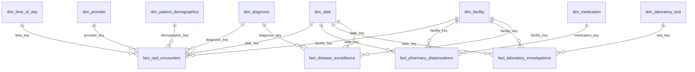
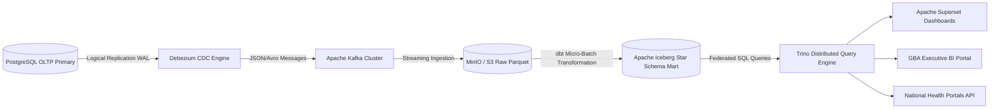

# Document 16: OLAP Star Schema & Analytical Modeling Specification

| Metadata Attribute | Canonical Value |
| :--- | :--- |
| **Document ID** | `DOC-DB-016` |
| **System Name** | Namma Clinic Digital Health & Operations Platform |
| **Authority** | Greater Bengaluru Authority (BBMP) Health Department |
| **Document Classification** | Enterprise Technical Architecture / Analytical Data Warehouse |
| **Architectural Pattern** | Kimball Dimensional Modeling (Star Schema & Lakehouse) |
| **Target Query Engines** | Trino, Apache Iceberg, PostgreSQL Citus OLAP, DuckDB |
| **Fact Tables Defined** | 10 Fact Tables (`FACT-001` through `FACT-010`) |
| **Dimension Tables Defined** | 12 Dimension Tables (`DIM-001` through `DIM-012`) |
| **Standard Measures Defined** | 50 Analytical Measures (`MEASURE-001` through `MEASURE-050`) |
| **Status** | Approved Master Baseline |

## 1. Executive Summary & Kimball Dimensional Architecture

The Namma Clinic Digital Health & Operations Platform maintains a dedicated analytical warehouse layer decoupled from transactional operational databases. Operating across 450 municipal health clinics, 8 administrative zones, and 243 municipal wards in Greater Bengaluru, municipal leadership requires real-time situational awareness, epidemiological surveillance, resource optimization, and public service compliance.

This specification adopts the Kimball Dimensional Modeling methodology to establish a unified Star Schema data mart. The dimensional model organizes municipal health observations into process-oriented fact tables surrounded by rich, descriptive conformed dimensions. This decouples intensive analytical aggregations, statistical regressions, and geospatial dashboards from the primary transactional online transaction processing (OLTP) engine, ensuring sub-second analytical query latency while preserving zero operational degradation.

### 1.1 Core Principles of Analytical Architecture
1. **Strict Decoupling from OLTP**: Under no circumstances do complex analytical queries, cohort studies, or business intelligence dashboards run directly against primary production PostgreSQL OLTP tables. Analytical reads hit dedicated read-replicas, columnar tables, or the Iceberg lakehouse layer.
2. **Grain Preservation & No Pre-Loss**: Fact tables record data at the lowest atomic grain practicable (e.g. individual consultation, individual medication item, individual lab test observation), preserving maximum drill-down capability for clinical epidemiological researchers.
3. **Conformed Dimensions**: Shared business dimensions—specifically `dim_date`, `dim_facility`, `dim_provider`, `dim_patient_demographics`, and `dim_diagnosis`—are shared identically across all fact tables. This guarantees consistent drill-across querying and federated cross-domain joins without metric distortion.
4. **Surrogate Key Insulation**: Dimensions utilize synthetic integer/bigint surrogate primary keys (`dim_key`), decoupling the analytical warehouse from operational UUIDs, natural identity changes, and source system database reorganizations.
5. **Slowly Changing Dimension (SCD) Rigor**: Administrative boundaries, staff postings, and facility tiers track temporal historical fidelity via SCD Type 2 mechanisms with explicit validity timestamps (`row_effective_date`, `row_expiry_date`, `is_current_flag`).
6. **Zero PII Exposure**: All patient-facing analytical dimensions and facts are strictly de-identified. Direct identifiers (citizen names, telephone numbers, national identity tokens, street addresses) are replaced with synthetic cohort bands, administrative ward numbers, and cryptographic salted surrogates.

## 2. Dimensional Architecture & Star Schema Topology

The analytical platform is architected around 10 business process fact tables intersecting with 12 enterprise conformed dimension tables:



### 2.1 Fact Table Inventory & Dimensional Bus Matrix

The Kimball Bus Matrix below maps business processes to the conformed dimensions they intersect:

| Fact Table ID | Fact Table Name | Date | Time | Facility | Provider | Demographics | Diagnosis | Medication | Lab Test | Queue Stage | Referral Fac | Triage Acuity | Grievance Cat |
| :--- | :--- | :---: | :---: | :---: | :---: | :---: | :---: | :---: | :---: | :---: | :---: | :---: | :---: |
| `FACT-001` | `fact_opd_encounters` | ✓ | ✓ | ✓ | ✓ | ✓ | ✓ | - | - | - | - | - | - |
| `FACT-002` | `fact_queue_performance` | ✓ | ✓ | ✓ | - | - | - | - | - | ✓ | - | ✓ | - |
| `FACT-003` | `fact_doctor_workload` | ✓ | - | ✓ | ✓ | - | - | - | - | - | - | - | - |
| `FACT-004` | `fact_pharmacy_dispensations` | ✓ | - | ✓ | - | ✓ | - | ✓ | - | - | - | - | - |
| `FACT-005` | `fact_inventory_stockouts` | ✓ | - | ✓ | - | - | - | ✓ | - | - | - | - | - |
| `FACT-006` | `fact_laboratory_investigations` | ✓ | - | ✓ | - | ✓ | - | - | ✓ | - | - | - | - |
| `FACT-007` | `fact_patient_referrals` | ✓ | - | ✓ | - | - | ✓ | - | - | - | ✓ | ✓ | - |
| `FACT-008` | `fact_maternal_ncd_continuity` | ✓ | - | ✓ | - | ✓ | ✓ | - | - | - | - | - | - |
| `FACT-009` | `fact_disease_surveillance` | ✓ | - | ✓ | - | ✓ | ✓ | - | - | - | - | - | - |
| `FACT-010` | `fact_clinic_operational_kpis` | ✓ | - | ✓ | - | - | - | - | - | - | - | - | - |

## 3. Conformed Dimension Tables Specification (DIM-001 to DIM-012)

Every dimension table provides rich context for slice-and-dice operations, grouping, filtering, and hierarchical drill-downs. Dimension schemas, SCD behaviors, and documentation-only SQL DDL definitions are detailed below:

### 3.1 DIM-001: `dim_date`

- **Dimension Type**: Role-Playing Conformed Dimension
- **Primary Key / Surrogate**: `date_key` (INTEGER / BIGINT)
- **SCD Strategy**: SCD Type 0 (Static Pre-populated)
- **Business Purpose**: Calendar dates from 2024 to 2035 with financial year, quarter, month, week, day of week, Kannada local holidays, and monsoon season indicators.

#### Attribute Definitions & Column Mapping

| Attribute Name | Data Type | Nullable | SCD Role | Business Description & Hierarchy |
| :--- | :--- | :--- | :--- | :--- |
| `date_key` | `BIGINT` | `NOT NULL` | Surrogate Primary Key | Monotonically increasing artificial identifier |
| `full_date` | `VARCHAR(128)` | `NOT NULL` | Descriptive Dimension | Coded textual attribute for reporting, slicing, and drill-downs |
| `day_of_week` | `VARCHAR(128)` | `NOT NULL` | Descriptive Dimension | Coded textual attribute for reporting, slicing, and drill-downs |
| `day_name` | `VARCHAR(128)` | `NOT NULL` | Descriptive Dimension | Coded textual attribute for reporting, slicing, and drill-downs |
| `month_number` | `INTEGER` | `NOT NULL` | Hierarchical Grouping | Numeric attribute enabling chronological sorting and interval rollups |
| `month_name` | `VARCHAR(128)` | `NOT NULL` | Descriptive Dimension | Coded textual attribute for reporting, slicing, and drill-downs |
| `quarter` | `INTEGER` | `NOT NULL` | Hierarchical Grouping | Numeric attribute enabling chronological sorting and interval rollups |
| `calendar_year` | `INTEGER` | `NOT NULL` | Hierarchical Grouping | Numeric attribute enabling chronological sorting and interval rollups |
| `financial_year` | `INTEGER` | `NOT NULL` | Hierarchical Grouping | Numeric attribute enabling chronological sorting and interval rollups |
| `is_weekend` | `VARCHAR(128)` | `NOT NULL` | Descriptive Dimension | Coded textual attribute for reporting, slicing, and drill-downs |
| `is_gazetted_holiday` | `VARCHAR(64)` | `NOT NULL` | Natural / Source Key | Operational identifier or official statutory regulatory code |
| `monsoon_season_flag` | `BOOLEAN` | `NOT NULL` | SCD Indicator / Filter Flag | Boolean flag indicating active version or business categorization |

#### Complete Documentation-Only DDL

```sql
-- DOCUMENTATION-ONLY SQL: Analytical Dimension DIM-001 - dim_date
CREATE TABLE analytics.dim_date (
    date_key                     BIGINT GENERATED ALWAYS AS IDENTITY PRIMARY KEY,
    full_date                    DATE NOT NULL UNIQUE,
    day_of_week                  VARCHAR(128) NOT NULL,
    day_name                     VARCHAR(128) NOT NULL,
    month_number                 INTEGER NOT NULL,
    month_name                   VARCHAR(128) NOT NULL,
    quarter                      INTEGER NOT NULL,
    calendar_year                INTEGER NOT NULL,
    financial_year               INTEGER NOT NULL,
    is_weekend                   VARCHAR(128) NOT NULL,
    is_gazetted_holiday          VARCHAR(128) NOT NULL,
    monsoon_season_flag          BOOLEAN NOT NULL DEFAULT true
);

-- Performance Index on Natural Keys and Filtering Flags
CREATE INDEX idx_dim_date_lookup ON analytics.dim_date (full_date);
```

#### SCD Type 1 / Type 0 In-Place Refresh Logic
Reference attributes update deterministically in-place without preserving historical row versions:
```sql
-- DOCUMENTATION-ONLY SQL: Deterministic In-Place Upsert for dim_date
INSERT INTO analytics.dim_date (date_key, full_date, day_of_week, day_name, month_number, month_name, quarter, calendar_year, financial_year, is_weekend, is_gazetted_holiday, monsoon_season_flag)
SELECT date_key, full_date, day_of_week, day_name, month_number, month_name, quarter, calendar_year, financial_year, is_weekend, is_gazetted_holiday, monsoon_season_flag FROM staging.dim_date_feed
ON CONFLICT (date_key) DO UPDATE SET
    full_date = EXCLUDED.full_date,
    day_of_week = EXCLUDED.day_of_week,
    day_name = EXCLUDED.day_name,
    month_number = EXCLUDED.month_number,
    month_name = EXCLUDED.month_name;
```

#### Canonical Sample Records
Illustrative reference records stored in `analytics.dim_date`:

| date_key | full_date | day_of_week | day_name | month_number | month_name |
| :--- | :--- | :--- | :--- | :--- | :--- |
| 1 | SAMPLE_FULL_DATE_01 | SAMPLE_DAY_OF_WEEK_01 | SAMPLE_DAY_NAME_01 | SAMPLE_MONTH_NUMBER_01 | SAMPLE_MONTH_NAME_01 |
| 2 | SAMPLE_FULL_DATE_02 | SAMPLE_DAY_OF_WEEK_02 | SAMPLE_DAY_NAME_02 | SAMPLE_MONTH_NUMBER_02 | SAMPLE_MONTH_NAME_02 |
| 3 | SAMPLE_FULL_DATE_03 | SAMPLE_DAY_OF_WEEK_03 | SAMPLE_DAY_NAME_03 | SAMPLE_MONTH_NUMBER_03 | SAMPLE_MONTH_NAME_03 |

### 3.2 DIM-002: `dim_time_of_day`

- **Dimension Type**: Conformed Dimension
- **Primary Key / Surrogate**: `time_key` (INTEGER / BIGINT)
- **SCD Strategy**: SCD Type 0 (Static Pre-populated)
- **Business Purpose**: Minutes of the day (00:00 to 23:59 = 1,440 rows) with hour, shift band (Morning OPD, Afternoon OPD, Evening Clinic, Off-hours), and rush-hour flags.

#### Attribute Definitions & Column Mapping

| Attribute Name | Data Type | Nullable | SCD Role | Business Description & Hierarchy |
| :--- | :--- | :--- | :--- | :--- |
| `time_key` | `BIGINT` | `NOT NULL` | Surrogate Primary Key | Monotonically increasing artificial identifier |
| `time_of_day` | `VARCHAR(128)` | `NOT NULL` | Descriptive Dimension | Coded textual attribute for reporting, slicing, and drill-downs |
| `hour_24` | `VARCHAR(128)` | `NOT NULL` | Descriptive Dimension | Coded textual attribute for reporting, slicing, and drill-downs |
| `minute` | `VARCHAR(128)` | `NOT NULL` | Descriptive Dimension | Coded textual attribute for reporting, slicing, and drill-downs |
| `shift_band` | `VARCHAR(128)` | `NOT NULL` | Descriptive Dimension | Coded textual attribute for reporting, slicing, and drill-downs |
| `opd_operational_flag` | `BOOLEAN` | `NOT NULL` | SCD Indicator / Filter Flag | Boolean flag indicating active version or business categorization |
| `peak_rush_period_flag` | `BOOLEAN` | `NOT NULL` | SCD Indicator / Filter Flag | Boolean flag indicating active version or business categorization |

#### Complete Documentation-Only DDL

```sql
-- DOCUMENTATION-ONLY SQL: Analytical Dimension DIM-002 - dim_time_of_day
CREATE TABLE analytics.dim_time_of_day (
    time_key                     BIGINT GENERATED ALWAYS AS IDENTITY PRIMARY KEY,
    time_of_day                  VARCHAR(128) NOT NULL,
    hour_24                      INTEGER NOT NULL,
    minute                       VARCHAR(128) NOT NULL,
    shift_band                   VARCHAR(128) NOT NULL,
    opd_operational_flag         BOOLEAN NOT NULL DEFAULT true,
    peak_rush_period_flag        BOOLEAN NOT NULL DEFAULT true
);

-- Performance Index on Natural Keys and Filtering Flags
CREATE INDEX idx_dim_time_of_day_lookup ON analytics.dim_time_of_day (time_of_day);
```

#### SCD Type 1 / Type 0 In-Place Refresh Logic
Reference attributes update deterministically in-place without preserving historical row versions:
```sql
-- DOCUMENTATION-ONLY SQL: Deterministic In-Place Upsert for dim_time_of_day
INSERT INTO analytics.dim_time_of_day (time_key, time_of_day, hour_24, minute, shift_band, opd_operational_flag, peak_rush_period_flag)
SELECT time_key, time_of_day, hour_24, minute, shift_band, opd_operational_flag, peak_rush_period_flag FROM staging.dim_time_of_day_feed
ON CONFLICT (time_key) DO UPDATE SET
    time_of_day = EXCLUDED.time_of_day,
    hour_24 = EXCLUDED.hour_24,
    minute = EXCLUDED.minute,
    shift_band = EXCLUDED.shift_band,
    opd_operational_flag = EXCLUDED.opd_operational_flag;
```

#### Canonical Sample Records
Illustrative reference records stored in `analytics.dim_time_of_day`:

| time_key | time_of_day | hour_24 | minute | shift_band | opd_operational_flag |
| :--- | :--- | :--- | :--- | :--- | :--- |
| 1 | SAMPLE_TIME_OF_DAY_01 | SAMPLE_HOUR_24_01 | SAMPLE_MINUTE_01 | SAMPLE_SHIFT_BAND_01 | SAMPLE_OPD_OPERATIONAL_FLAG_01 |
| 2 | SAMPLE_TIME_OF_DAY_02 | SAMPLE_HOUR_24_02 | SAMPLE_MINUTE_02 | SAMPLE_SHIFT_BAND_02 | SAMPLE_OPD_OPERATIONAL_FLAG_02 |
| 3 | SAMPLE_TIME_OF_DAY_03 | SAMPLE_HOUR_24_03 | SAMPLE_MINUTE_03 | SAMPLE_SHIFT_BAND_03 | SAMPLE_OPD_OPERATIONAL_FLAG_03 |

### 3.3 DIM-003: `dim_facility`

- **Dimension Type**: Core Dimension
- **Primary Key / Surrogate**: `facility_key` (INTEGER / BIGINT)
- **SCD Strategy**: SCD Type 2 (History tracking for ward delimitation and MOIC reassignments)
- **Business Purpose**: Namma Clinics, UPHCs, and referral hospitals with BBMP administrative zone, ward number, assembly constituency, and facility tier.

#### Attribute Definitions & Column Mapping

| Attribute Name | Data Type | Nullable | SCD Role | Business Description & Hierarchy |
| :--- | :--- | :--- | :--- | :--- |
| `facility_key` | `BIGINT` | `NOT NULL` | Surrogate Primary Key | Monotonically increasing artificial identifier |
| `facility_id` | `VARCHAR(64)` | `NOT NULL` | Natural / Source Key | Operational identifier or official statutory regulatory code |
| `facility_code` | `VARCHAR(64)` | `NOT NULL` | Natural / Source Key | Operational identifier or official statutory regulatory code |
| `facility_name` | `VARCHAR(128)` | `NOT NULL` | Descriptive Dimension | Coded textual attribute for reporting, slicing, and drill-downs |
| `ward_number` | `INTEGER` | `NOT NULL` | Hierarchical Grouping | Numeric attribute enabling chronological sorting and interval rollups |
| `ward_name` | `VARCHAR(128)` | `NOT NULL` | Descriptive Dimension | Coded textual attribute for reporting, slicing, and drill-downs |
| `zone_name` | `VARCHAR(128)` | `NOT NULL` | Descriptive Dimension | Coded textual attribute for reporting, slicing, and drill-downs |
| `constituency_name` | `VARCHAR(128)` | `NOT NULL` | Descriptive Dimension | Coded textual attribute for reporting, slicing, and drill-downs |
| `facility_type` | `VARCHAR(128)` | `NOT NULL` | Descriptive Dimension | Coded textual attribute for reporting, slicing, and drill-downs |
| `hfr_id` | `VARCHAR(64)` | `NOT NULL` | Natural / Source Key | Operational identifier or official statutory regulatory code |
| `row_effective_date` | `TIMESTAMPTZ` | `NOT NULL` | SCD2 Temporal Bounds | Validity boundary timestamp for historical versioning |
| `row_expiry_date` | `TIMESTAMPTZ` | `NOT NULL` | SCD2 Temporal Bounds | Validity boundary timestamp for historical versioning |
| `is_current_flag` | `BOOLEAN` | `NOT NULL` | SCD Indicator / Filter Flag | Boolean flag indicating active version or business categorization |

#### Complete Documentation-Only DDL

```sql
-- DOCUMENTATION-ONLY SQL: Analytical Dimension DIM-003 - dim_facility
CREATE TABLE analytics.dim_facility (
    facility_key                 BIGINT GENERATED ALWAYS AS IDENTITY PRIMARY KEY,
    facility_id                  VARCHAR(128) NOT NULL,
    facility_code                VARCHAR(128) NOT NULL,
    facility_name                VARCHAR(128) NOT NULL,
    ward_number                  INTEGER NOT NULL,
    ward_name                    VARCHAR(128) NOT NULL,
    zone_name                    VARCHAR(128) NOT NULL,
    constituency_name            VARCHAR(128) NOT NULL,
    facility_type                VARCHAR(128) NOT NULL,
    hfr_id                       VARCHAR(128) NOT NULL,
    row_effective_date           TIMESTAMPTZ NOT NULL,
    row_expiry_date              TIMESTAMPTZ NOT NULL,
    is_current_flag              BOOLEAN NOT NULL DEFAULT true
);

-- Performance Index on Natural Keys and Filtering Flags
CREATE INDEX idx_dim_facility_current ON analytics.dim_facility (facility_key) WHERE is_current_flag = true;
```

#### SCD Type 2 Automated Reconciliation Procedure
When upstream changes occur in operational master tables, the ELT pipeline executes a Type 2 MERGE pattern:
```sql
-- DOCUMENTATION-ONLY SQL: SCD Type 2 Pipeline Merge for dim_facility
UPDATE analytics.dim_facility
SET row_expiry_date = CURRENT_TIMESTAMP, is_current_flag = false
WHERE is_current_flag = true
  AND facility_id IN (SELECT facility_id FROM staging.dim_facility_updates);

INSERT INTO analytics.dim_facility (facility_id, facility_code, facility_name, ward_number, ward_name, zone_name, constituency_name, facility_type, hfr_id, row_effective_date, row_expiry_date, is_current_flag)
SELECT facility_id, facility_code, facility_name, ward_number, ward_name, zone_name, constituency_name, facility_type, hfr_id, row_effective_date, row_expiry_date, is_current_flag FROM staging.dim_facility_updates;
```

#### Canonical Sample Records
Illustrative reference records stored in `analytics.dim_facility`:

| facility_key | facility_id | facility_code | facility_name | ward_number | ward_name |
| :--- | :--- | :--- | :--- | :--- | :--- |
| 1 | SAMPLE_FACILITY_ID_01 | SAMPLE_FACILITY_CODE_01 | SAMPLE_FACILITY_NAME_01 | SAMPLE_WARD_NUMBER_01 | SAMPLE_WARD_NAME_01 |
| 2 | SAMPLE_FACILITY_ID_02 | SAMPLE_FACILITY_CODE_02 | SAMPLE_FACILITY_NAME_02 | SAMPLE_WARD_NUMBER_02 | SAMPLE_WARD_NAME_02 |
| 3 | SAMPLE_FACILITY_ID_03 | SAMPLE_FACILITY_CODE_03 | SAMPLE_FACILITY_NAME_03 | SAMPLE_WARD_NUMBER_03 | SAMPLE_WARD_NAME_03 |

### 3.4 DIM-004: `dim_provider`

- **Dimension Type**: Core Dimension
- **Primary Key / Surrogate**: `provider_key` (INTEGER / BIGINT)
- **SCD Strategy**: SCD Type 2 (Tracks facility postings and role promotions)
- **Business Purpose**: Healthcare professionals (Medical Officers, Specialists, Staff Nurses, Pharmacists, Lab Techs) with medical council registration and tenure.

#### Attribute Definitions & Column Mapping

| Attribute Name | Data Type | Nullable | SCD Role | Business Description & Hierarchy |
| :--- | :--- | :--- | :--- | :--- |
| `provider_key` | `BIGINT` | `NOT NULL` | Surrogate Primary Key | Monotonically increasing artificial identifier |
| `user_id` | `VARCHAR(64)` | `NOT NULL` | Natural / Source Key | Operational identifier or official statutory regulatory code |
| `staff_full_name` | `VARCHAR(128)` | `NOT NULL` | Descriptive Dimension | Coded textual attribute for reporting, slicing, and drill-downs |
| `professional_role` | `VARCHAR(128)` | `NOT NULL` | Descriptive Dimension | Coded textual attribute for reporting, slicing, and drill-downs |
| `specialization` | `VARCHAR(128)` | `NOT NULL` | Descriptive Dimension | Coded textual attribute for reporting, slicing, and drill-downs |
| `kmc_registration_number` | `INTEGER` | `NOT NULL` | Hierarchical Grouping | Numeric attribute enabling chronological sorting and interval rollups |
| `primary_facility_code` | `VARCHAR(64)` | `NOT NULL` | Natural / Source Key | Operational identifier or official statutory regulatory code |
| `row_effective_date` | `TIMESTAMPTZ` | `NOT NULL` | SCD2 Temporal Bounds | Validity boundary timestamp for historical versioning |
| `row_expiry_date` | `TIMESTAMPTZ` | `NOT NULL` | SCD2 Temporal Bounds | Validity boundary timestamp for historical versioning |
| `is_current_flag` | `BOOLEAN` | `NOT NULL` | SCD Indicator / Filter Flag | Boolean flag indicating active version or business categorization |

#### Complete Documentation-Only DDL

```sql
-- DOCUMENTATION-ONLY SQL: Analytical Dimension DIM-004 - dim_provider
CREATE TABLE analytics.dim_provider (
    provider_key                 BIGINT GENERATED ALWAYS AS IDENTITY PRIMARY KEY,
    user_id                      VARCHAR(128) NOT NULL,
    staff_full_name              VARCHAR(128) NOT NULL,
    professional_role            VARCHAR(128) NOT NULL,
    specialization               VARCHAR(128) NOT NULL,
    kmc_registration_number      INTEGER NOT NULL,
    primary_facility_code        VARCHAR(128) NOT NULL,
    row_effective_date           TIMESTAMPTZ NOT NULL,
    row_expiry_date              TIMESTAMPTZ NOT NULL,
    is_current_flag              BOOLEAN NOT NULL DEFAULT true
);

-- Performance Index on Natural Keys and Filtering Flags
CREATE INDEX idx_dim_provider_current ON analytics.dim_provider (provider_key) WHERE is_current_flag = true;
```

#### SCD Type 2 Automated Reconciliation Procedure
When upstream changes occur in operational master tables, the ELT pipeline executes a Type 2 MERGE pattern:
```sql
-- DOCUMENTATION-ONLY SQL: SCD Type 2 Pipeline Merge for dim_provider
UPDATE analytics.dim_provider
SET row_expiry_date = CURRENT_TIMESTAMP, is_current_flag = false
WHERE is_current_flag = true
  AND user_id IN (SELECT user_id FROM staging.dim_provider_updates);

INSERT INTO analytics.dim_provider (user_id, staff_full_name, professional_role, specialization, kmc_registration_number, primary_facility_code, row_effective_date, row_expiry_date, is_current_flag)
SELECT user_id, staff_full_name, professional_role, specialization, kmc_registration_number, primary_facility_code, row_effective_date, row_expiry_date, is_current_flag FROM staging.dim_provider_updates;
```

#### Canonical Sample Records
Illustrative reference records stored in `analytics.dim_provider`:

| provider_key | user_id | staff_full_name | professional_role | specialization | kmc_registration_number |
| :--- | :--- | :--- | :--- | :--- | :--- |
| 1 | SAMPLE_USER_ID_01 | SAMPLE_STAFF_FULL_NAME_01 | SAMPLE_PROFESSIONAL_ROLE_01 | SAMPLE_SPECIALIZATION_01 | SAMPLE_KMC_REGISTRATION_NUMBER_01 |
| 2 | SAMPLE_USER_ID_02 | SAMPLE_STAFF_FULL_NAME_02 | SAMPLE_PROFESSIONAL_ROLE_02 | SAMPLE_SPECIALIZATION_02 | SAMPLE_KMC_REGISTRATION_NUMBER_02 |
| 3 | SAMPLE_USER_ID_03 | SAMPLE_STAFF_FULL_NAME_03 | SAMPLE_PROFESSIONAL_ROLE_03 | SAMPLE_SPECIALIZATION_03 | SAMPLE_KMC_REGISTRATION_NUMBER_03 |

### 3.5 DIM-005: `dim_patient_demographics`

- **Dimension Type**: Conformed Dimension
- **Primary Key / Surrogate**: `demographic_key` (INTEGER / BIGINT)
- **SCD Strategy**: SCD Type 1 (No PII stored; aggregated demographic strata)
- **Business Purpose**: De-identified demographic cohorts: age bands (Pediatric 0-5, School 6-17, Adult 18-59, Geriatric 60+), gender, socio-economic proxy, and home ward.

#### Attribute Definitions & Column Mapping

| Attribute Name | Data Type | Nullable | SCD Role | Business Description & Hierarchy |
| :--- | :--- | :--- | :--- | :--- |
| `demographic_key` | `BIGINT` | `NOT NULL` | Surrogate Primary Key | Monotonically increasing artificial identifier |
| `age_group` | `VARCHAR(128)` | `NOT NULL` | Descriptive Dimension | Coded textual attribute for reporting, slicing, and drill-downs |
| `gender` | `VARCHAR(128)` | `NOT NULL` | Descriptive Dimension | Coded textual attribute for reporting, slicing, and drill-downs |
| `home_zone` | `VARCHAR(128)` | `NOT NULL` | Descriptive Dimension | Coded textual attribute for reporting, slicing, and drill-downs |
| `home_ward_number` | `INTEGER` | `NOT NULL` | Hierarchical Grouping | Numeric attribute enabling chronological sorting and interval rollups |
| `bpl_ration_card_holder_flag` | `BOOLEAN` | `NOT NULL` | SCD Indicator / Filter Flag | Boolean flag indicating active version or business categorization |
| `abha_linked_flag` | `BOOLEAN` | `NOT NULL` | SCD Indicator / Filter Flag | Boolean flag indicating active version or business categorization |

#### Complete Documentation-Only DDL

```sql
-- DOCUMENTATION-ONLY SQL: Analytical Dimension DIM-005 - dim_patient_demographics
CREATE TABLE analytics.dim_patient_demographics (
    demographic_key              BIGINT GENERATED ALWAYS AS IDENTITY PRIMARY KEY,
    age_group                    VARCHAR(128) NOT NULL,
    gender                       VARCHAR(128) NOT NULL,
    home_zone                    VARCHAR(128) NOT NULL,
    home_ward_number             INTEGER NOT NULL,
    bpl_ration_card_holder_flag  BOOLEAN NOT NULL DEFAULT true,
    abha_linked_flag             BOOLEAN NOT NULL DEFAULT true
);

-- Performance Index on Natural Keys and Filtering Flags
CREATE INDEX idx_dim_patient_demographics_lookup ON analytics.dim_patient_demographics (age_group);
```

#### SCD Type 1 / Type 0 In-Place Refresh Logic
Reference attributes update deterministically in-place without preserving historical row versions:
```sql
-- DOCUMENTATION-ONLY SQL: Deterministic In-Place Upsert for dim_patient_demographics
INSERT INTO analytics.dim_patient_demographics (demographic_key, age_group, gender, home_zone, home_ward_number, bpl_ration_card_holder_flag, abha_linked_flag)
SELECT demographic_key, age_group, gender, home_zone, home_ward_number, bpl_ration_card_holder_flag, abha_linked_flag FROM staging.dim_patient_demographics_feed
ON CONFLICT (demographic_key) DO UPDATE SET
    age_group = EXCLUDED.age_group,
    gender = EXCLUDED.gender,
    home_zone = EXCLUDED.home_zone,
    home_ward_number = EXCLUDED.home_ward_number,
    bpl_ration_card_holder_flag = EXCLUDED.bpl_ration_card_holder_flag;
```

#### Canonical Sample Records
Illustrative reference records stored in `analytics.dim_patient_demographics`:

| demographic_key | age_group | gender | home_zone | home_ward_number | bpl_ration_card_holder_flag |
| :--- | :--- | :--- | :--- | :--- | :--- |
| 1 | SAMPLE_AGE_GROUP_01 | SAMPLE_GENDER_01 | SAMPLE_HOME_ZONE_01 | SAMPLE_HOME_WARD_NUMBER_01 | SAMPLE_BPL_RATION_CARD_HOLDER_FLAG_01 |
| 2 | SAMPLE_AGE_GROUP_02 | SAMPLE_GENDER_02 | SAMPLE_HOME_ZONE_02 | SAMPLE_HOME_WARD_NUMBER_02 | SAMPLE_BPL_RATION_CARD_HOLDER_FLAG_02 |
| 3 | SAMPLE_AGE_GROUP_03 | SAMPLE_GENDER_03 | SAMPLE_HOME_ZONE_03 | SAMPLE_HOME_WARD_NUMBER_03 | SAMPLE_BPL_RATION_CARD_HOLDER_FLAG_03 |

### 3.6 DIM-006: `dim_diagnosis`

- **Dimension Type**: Conformed Clinical Dimension
- **Primary Key / Surrogate**: `diagnosis_key` (INTEGER / BIGINT)
- **SCD Strategy**: SCD Type 1
- **Business Purpose**: Standardized diagnosis hierarchy mapped to WHO ICD-10 chapters, blocks, specific 3-character codes, and communicable/chronic flags.

#### Attribute Definitions & Column Mapping

| Attribute Name | Data Type | Nullable | SCD Role | Business Description & Hierarchy |
| :--- | :--- | :--- | :--- | :--- |
| `diagnosis_key` | `BIGINT` | `NOT NULL` | Surrogate Primary Key | Monotonically increasing artificial identifier |
| `icd10_code` | `VARCHAR(64)` | `NOT NULL` | Natural / Source Key | Operational identifier or official statutory regulatory code |
| `diagnosis_display_name` | `VARCHAR(128)` | `NOT NULL` | Descriptive Dimension | Coded textual attribute for reporting, slicing, and drill-downs |
| `icd10_chapter_number` | `INTEGER` | `NOT NULL` | Hierarchical Grouping | Numeric attribute enabling chronological sorting and interval rollups |
| `icd10_chapter_title` | `VARCHAR(128)` | `NOT NULL` | Descriptive Dimension | Coded textual attribute for reporting, slicing, and drill-downs |
| `icd10_block_name` | `VARCHAR(128)` | `NOT NULL` | Descriptive Dimension | Coded textual attribute for reporting, slicing, and drill-downs |
| `is_communicable_disease` | `VARCHAR(128)` | `NOT NULL` | Descriptive Dimension | Coded textual attribute for reporting, slicing, and drill-downs |
| `is_chronic_ncd` | `VARCHAR(128)` | `NOT NULL` | Descriptive Dimension | Coded textual attribute for reporting, slicing, and drill-downs |
| `idsp_surveillance_priority_flag` | `BOOLEAN` | `NOT NULL` | SCD Indicator / Filter Flag | Boolean flag indicating active version or business categorization |

#### Complete Documentation-Only DDL

```sql
-- DOCUMENTATION-ONLY SQL: Analytical Dimension DIM-006 - dim_diagnosis
CREATE TABLE analytics.dim_diagnosis (
    diagnosis_key                BIGINT GENERATED ALWAYS AS IDENTITY PRIMARY KEY,
    icd10_code                   VARCHAR(128) NOT NULL,
    diagnosis_display_name       VARCHAR(128) NOT NULL,
    icd10_chapter_number         INTEGER NOT NULL,
    icd10_chapter_title          VARCHAR(128) NOT NULL,
    icd10_block_name             VARCHAR(128) NOT NULL,
    is_communicable_disease      VARCHAR(128) NOT NULL,
    is_chronic_ncd               VARCHAR(128) NOT NULL,
    idsp_surveillance_priority_flag BOOLEAN NOT NULL DEFAULT true
);

-- Performance Index on Natural Keys and Filtering Flags
CREATE INDEX idx_dim_diagnosis_lookup ON analytics.dim_diagnosis (icd10_code);
```

#### SCD Type 1 / Type 0 In-Place Refresh Logic
Reference attributes update deterministically in-place without preserving historical row versions:
```sql
-- DOCUMENTATION-ONLY SQL: Deterministic In-Place Upsert for dim_diagnosis
INSERT INTO analytics.dim_diagnosis (diagnosis_key, icd10_code, diagnosis_display_name, icd10_chapter_number, icd10_chapter_title, icd10_block_name, is_communicable_disease, is_chronic_ncd, idsp_surveillance_priority_flag)
SELECT diagnosis_key, icd10_code, diagnosis_display_name, icd10_chapter_number, icd10_chapter_title, icd10_block_name, is_communicable_disease, is_chronic_ncd, idsp_surveillance_priority_flag FROM staging.dim_diagnosis_feed
ON CONFLICT (diagnosis_key) DO UPDATE SET
    icd10_code = EXCLUDED.icd10_code,
    diagnosis_display_name = EXCLUDED.diagnosis_display_name,
    icd10_chapter_number = EXCLUDED.icd10_chapter_number,
    icd10_chapter_title = EXCLUDED.icd10_chapter_title,
    icd10_block_name = EXCLUDED.icd10_block_name;
```

#### Canonical Sample Records
Illustrative reference records stored in `analytics.dim_diagnosis`:

| diagnosis_key | icd10_code | diagnosis_display_name | icd10_chapter_number | icd10_chapter_title | icd10_block_name |
| :--- | :--- | :--- | :--- | :--- | :--- |
| 1 | SAMPLE_ICD10_CODE_01 | SAMPLE_DIAGNOSIS_DISPLAY_NAME_01 | SAMPLE_ICD10_CHAPTER_NUMBER_01 | SAMPLE_ICD10_CHAPTER_TITLE_01 | SAMPLE_ICD10_BLOCK_NAME_01 |
| 2 | SAMPLE_ICD10_CODE_02 | SAMPLE_DIAGNOSIS_DISPLAY_NAME_02 | SAMPLE_ICD10_CHAPTER_NUMBER_02 | SAMPLE_ICD10_CHAPTER_TITLE_02 | SAMPLE_ICD10_BLOCK_NAME_02 |
| 3 | SAMPLE_ICD10_CODE_03 | SAMPLE_DIAGNOSIS_DISPLAY_NAME_03 | SAMPLE_ICD10_CHAPTER_NUMBER_03 | SAMPLE_ICD10_CHAPTER_TITLE_03 | SAMPLE_ICD10_BLOCK_NAME_03 |

### 3.7 DIM-007: `dim_medication`

- **Dimension Type**: Conformed Formulary Dimension
- **Primary Key / Surrogate**: `medication_key` (INTEGER / BIGINT)
- **SCD Strategy**: SCD Type 1
- **Business Purpose**: Pharmaceutical products from NLEM formulary with WHO ATC level 1 to 5 hierarchy, strength, dosage form, and antibiotic classification (AWaRe).

#### Attribute Definitions & Column Mapping

| Attribute Name | Data Type | Nullable | SCD Role | Business Description & Hierarchy |
| :--- | :--- | :--- | :--- | :--- |
| `medication_key` | `BIGINT` | `NOT NULL` | Surrogate Primary Key | Monotonically increasing artificial identifier |
| `drug_id` | `VARCHAR(64)` | `NOT NULL` | Natural / Source Key | Operational identifier or official statutory regulatory code |
| `generic_name` | `VARCHAR(128)` | `NOT NULL` | Descriptive Dimension | Coded textual attribute for reporting, slicing, and drill-downs |
| `strength` | `VARCHAR(128)` | `NOT NULL` | Descriptive Dimension | Coded textual attribute for reporting, slicing, and drill-downs |
| `dosage_form` | `VARCHAR(128)` | `NOT NULL` | Descriptive Dimension | Coded textual attribute for reporting, slicing, and drill-downs |
| `atc_level1_anatomical` | `VARCHAR(128)` | `NOT NULL` | Descriptive Dimension | Coded textual attribute for reporting, slicing, and drill-downs |
| `atc_level3_pharmacological` | `VARCHAR(128)` | `NOT NULL` | Descriptive Dimension | Coded textual attribute for reporting, slicing, and drill-downs |
| `who_aware_classification` | `VARCHAR(128)` | `NOT NULL` | Descriptive Dimension | Coded textual attribute for reporting, slicing, and drill-downs |
| `is_essential_nlem_flag` | `BOOLEAN` | `NOT NULL` | SCD Indicator / Filter Flag | Boolean flag indicating active version or business categorization |

#### Complete Documentation-Only DDL

```sql
-- DOCUMENTATION-ONLY SQL: Analytical Dimension DIM-007 - dim_medication
CREATE TABLE analytics.dim_medication (
    medication_key               BIGINT GENERATED ALWAYS AS IDENTITY PRIMARY KEY,
    drug_id                      VARCHAR(128) NOT NULL,
    generic_name                 VARCHAR(128) NOT NULL,
    strength                     VARCHAR(128) NOT NULL,
    dosage_form                  VARCHAR(128) NOT NULL,
    atc_level1_anatomical        VARCHAR(128) NOT NULL,
    atc_level3_pharmacological   VARCHAR(128) NOT NULL,
    who_aware_classification     VARCHAR(128) NOT NULL,
    is_essential_nlem_flag       BOOLEAN NOT NULL DEFAULT true
);

-- Performance Index on Natural Keys and Filtering Flags
CREATE INDEX idx_dim_medication_lookup ON analytics.dim_medication (drug_id);
```

#### SCD Type 1 / Type 0 In-Place Refresh Logic
Reference attributes update deterministically in-place without preserving historical row versions:
```sql
-- DOCUMENTATION-ONLY SQL: Deterministic In-Place Upsert for dim_medication
INSERT INTO analytics.dim_medication (medication_key, drug_id, generic_name, strength, dosage_form, atc_level1_anatomical, atc_level3_pharmacological, who_aware_classification, is_essential_nlem_flag)
SELECT medication_key, drug_id, generic_name, strength, dosage_form, atc_level1_anatomical, atc_level3_pharmacological, who_aware_classification, is_essential_nlem_flag FROM staging.dim_medication_feed
ON CONFLICT (medication_key) DO UPDATE SET
    drug_id = EXCLUDED.drug_id,
    generic_name = EXCLUDED.generic_name,
    strength = EXCLUDED.strength,
    dosage_form = EXCLUDED.dosage_form,
    atc_level1_anatomical = EXCLUDED.atc_level1_anatomical;
```

#### Canonical Sample Records
Illustrative reference records stored in `analytics.dim_medication`:

| medication_key | drug_id | generic_name | strength | dosage_form | atc_level1_anatomical |
| :--- | :--- | :--- | :--- | :--- | :--- |
| 1 | SAMPLE_DRUG_ID_01 | SAMPLE_GENERIC_NAME_01 | SAMPLE_STRENGTH_01 | SAMPLE_DOSAGE_FORM_01 | SAMPLE_ATC_LEVEL1_ANATOMICAL_01 |
| 2 | SAMPLE_DRUG_ID_02 | SAMPLE_GENERIC_NAME_02 | SAMPLE_STRENGTH_02 | SAMPLE_DOSAGE_FORM_02 | SAMPLE_ATC_LEVEL1_ANATOMICAL_02 |
| 3 | SAMPLE_DRUG_ID_03 | SAMPLE_GENERIC_NAME_03 | SAMPLE_STRENGTH_03 | SAMPLE_DOSAGE_FORM_03 | SAMPLE_ATC_LEVEL1_ANATOMICAL_03 |

### 3.8 DIM-008: `dim_laboratory_test`

- **Dimension Type**: Diagnostic Dimension
- **Primary Key / Surrogate**: `test_key` (INTEGER / BIGINT)
- **SCD Strategy**: SCD Type 1
- **Business Purpose**: Diagnostic investigation catalog categorized by clinical pathology, biochemistry, microbiology, LOINC code, and specimen requirements.

#### Attribute Definitions & Column Mapping

| Attribute Name | Data Type | Nullable | SCD Role | Business Description & Hierarchy |
| :--- | :--- | :--- | :--- | :--- |
| `test_key` | `BIGINT` | `NOT NULL` | Surrogate Primary Key | Monotonically increasing artificial identifier |
| `loinc_code` | `VARCHAR(64)` | `NOT NULL` | Natural / Source Key | Operational identifier or official statutory regulatory code |
| `test_name` | `VARCHAR(128)` | `NOT NULL` | Descriptive Dimension | Coded textual attribute for reporting, slicing, and drill-downs |
| `laboratory_section` | `VARCHAR(128)` | `NOT NULL` | Descriptive Dimension | Coded textual attribute for reporting, slicing, and drill-downs |
| `specimen_type` | `VARCHAR(128)` | `NOT NULL` | Descriptive Dimension | Coded textual attribute for reporting, slicing, and drill-downs |
| `turnaround_sla_minutes` | `INTEGER` | `NOT NULL` | Hierarchical Grouping | Numeric attribute enabling chronological sorting and interval rollups |
| `point_of_care_flag` | `BOOLEAN` | `NOT NULL` | SCD Indicator / Filter Flag | Boolean flag indicating active version or business categorization |

#### Complete Documentation-Only DDL

```sql
-- DOCUMENTATION-ONLY SQL: Analytical Dimension DIM-008 - dim_laboratory_test
CREATE TABLE analytics.dim_laboratory_test (
    test_key                     BIGINT GENERATED ALWAYS AS IDENTITY PRIMARY KEY,
    loinc_code                   VARCHAR(128) NOT NULL,
    test_name                    VARCHAR(128) NOT NULL,
    laboratory_section           VARCHAR(128) NOT NULL,
    specimen_type                VARCHAR(128) NOT NULL,
    turnaround_sla_minutes       INTEGER NOT NULL,
    point_of_care_flag           BOOLEAN NOT NULL DEFAULT true
);

-- Performance Index on Natural Keys and Filtering Flags
CREATE INDEX idx_dim_laboratory_test_lookup ON analytics.dim_laboratory_test (loinc_code);
```

#### SCD Type 1 / Type 0 In-Place Refresh Logic
Reference attributes update deterministically in-place without preserving historical row versions:
```sql
-- DOCUMENTATION-ONLY SQL: Deterministic In-Place Upsert for dim_laboratory_test
INSERT INTO analytics.dim_laboratory_test (test_key, loinc_code, test_name, laboratory_section, specimen_type, turnaround_sla_minutes, point_of_care_flag)
SELECT test_key, loinc_code, test_name, laboratory_section, specimen_type, turnaround_sla_minutes, point_of_care_flag FROM staging.dim_laboratory_test_feed
ON CONFLICT (test_key) DO UPDATE SET
    loinc_code = EXCLUDED.loinc_code,
    test_name = EXCLUDED.test_name,
    laboratory_section = EXCLUDED.laboratory_section,
    specimen_type = EXCLUDED.specimen_type,
    turnaround_sla_minutes = EXCLUDED.turnaround_sla_minutes;
```

#### Canonical Sample Records
Illustrative reference records stored in `analytics.dim_laboratory_test`:

| test_key | loinc_code | test_name | laboratory_section | specimen_type | turnaround_sla_minutes |
| :--- | :--- | :--- | :--- | :--- | :--- |
| 1 | SAMPLE_LOINC_CODE_01 | SAMPLE_TEST_NAME_01 | SAMPLE_LABORATORY_SECTION_01 | SAMPLE_SPECIMEN_TYPE_01 | SAMPLE_TURNAROUND_SLA_MINUTES_01 |
| 2 | SAMPLE_LOINC_CODE_02 | SAMPLE_TEST_NAME_02 | SAMPLE_LABORATORY_SECTION_02 | SAMPLE_SPECIMEN_TYPE_02 | SAMPLE_TURNAROUND_SLA_MINUTES_02 |
| 3 | SAMPLE_LOINC_CODE_03 | SAMPLE_TEST_NAME_03 | SAMPLE_LABORATORY_SECTION_03 | SAMPLE_SPECIMEN_TYPE_03 | SAMPLE_TURNAROUND_SLA_MINUTES_03 |

### 3.9 DIM-009: `dim_queue_stage`

- **Dimension Type**: Operational Dimension
- **Primary Key / Surrogate**: `stage_key` (INTEGER / BIGINT)
- **SCD Strategy**: SCD Type 0
- **Business Purpose**: Clinic workflow service points (Reception/Token, Nursing Triage, Consultation Chamber, Pharmacy Window, Sample Collection).

#### Attribute Definitions & Column Mapping

| Attribute Name | Data Type | Nullable | SCD Role | Business Description & Hierarchy |
| :--- | :--- | :--- | :--- | :--- |
| `stage_key` | `BIGINT` | `NOT NULL` | Surrogate Primary Key | Monotonically increasing artificial identifier |
| `stage_code` | `VARCHAR(64)` | `NOT NULL` | Natural / Source Key | Operational identifier or official statutory regulatory code |
| `stage_name` | `VARCHAR(128)` | `NOT NULL` | Descriptive Dimension | Coded textual attribute for reporting, slicing, and drill-downs |
| `target_service_sla_seconds` | `VARCHAR(128)` | `NOT NULL` | Descriptive Dimension | Coded textual attribute for reporting, slicing, and drill-downs |
| `target_wait_sla_seconds` | `VARCHAR(128)` | `NOT NULL` | Descriptive Dimension | Coded textual attribute for reporting, slicing, and drill-downs |
| `clinical_service_flag` | `BOOLEAN` | `NOT NULL` | SCD Indicator / Filter Flag | Boolean flag indicating active version or business categorization |

#### Complete Documentation-Only DDL

```sql
-- DOCUMENTATION-ONLY SQL: Analytical Dimension DIM-009 - dim_queue_stage
CREATE TABLE analytics.dim_queue_stage (
    stage_key                    BIGINT GENERATED ALWAYS AS IDENTITY PRIMARY KEY,
    stage_code                   VARCHAR(128) NOT NULL,
    stage_name                   VARCHAR(128) NOT NULL,
    target_service_sla_seconds   VARCHAR(128) NOT NULL,
    target_wait_sla_seconds      VARCHAR(128) NOT NULL,
    clinical_service_flag        BOOLEAN NOT NULL DEFAULT true
);

-- Performance Index on Natural Keys and Filtering Flags
CREATE INDEX idx_dim_queue_stage_lookup ON analytics.dim_queue_stage (stage_code);
```

#### SCD Type 1 / Type 0 In-Place Refresh Logic
Reference attributes update deterministically in-place without preserving historical row versions:
```sql
-- DOCUMENTATION-ONLY SQL: Deterministic In-Place Upsert for dim_queue_stage
INSERT INTO analytics.dim_queue_stage (stage_key, stage_code, stage_name, target_service_sla_seconds, target_wait_sla_seconds, clinical_service_flag)
SELECT stage_key, stage_code, stage_name, target_service_sla_seconds, target_wait_sla_seconds, clinical_service_flag FROM staging.dim_queue_stage_feed
ON CONFLICT (stage_key) DO UPDATE SET
    stage_code = EXCLUDED.stage_code,
    stage_name = EXCLUDED.stage_name,
    target_service_sla_seconds = EXCLUDED.target_service_sla_seconds,
    target_wait_sla_seconds = EXCLUDED.target_wait_sla_seconds,
    clinical_service_flag = EXCLUDED.clinical_service_flag;
```

#### Canonical Sample Records
Illustrative reference records stored in `analytics.dim_queue_stage`:

| stage_key | stage_code | stage_name | target_service_sla_seconds | target_wait_sla_seconds | clinical_service_flag |
| :--- | :--- | :--- | :--- | :--- | :--- |
| 1 | SAMPLE_STAGE_CODE_01 | SAMPLE_STAGE_NAME_01 | SAMPLE_TARGET_SERVICE_SLA_SECONDS_01 | SAMPLE_TARGET_WAIT_SLA_SECONDS_01 | SAMPLE_CLINICAL_SERVICE_FLAG_01 |
| 2 | SAMPLE_STAGE_CODE_02 | SAMPLE_STAGE_NAME_02 | SAMPLE_TARGET_SERVICE_SLA_SECONDS_02 | SAMPLE_TARGET_WAIT_SLA_SECONDS_02 | SAMPLE_CLINICAL_SERVICE_FLAG_02 |
| 3 | SAMPLE_STAGE_CODE_03 | SAMPLE_STAGE_NAME_03 | SAMPLE_TARGET_SERVICE_SLA_SECONDS_03 | SAMPLE_TARGET_WAIT_SLA_SECONDS_03 | SAMPLE_CLINICAL_SERVICE_FLAG_03 |

### 3.10 DIM-010: `dim_referral_facility`

- **Dimension Type**: Continuity Dimension
- **Primary Key / Surrogate**: `referral_facility_key` (INTEGER / BIGINT)
- **SCD Strategy**: SCD Type 1
- **Business Purpose**: Destination referral institutions including BBMP General Hospitals, Victoria Hospital, Bowring, and specialized institutes (NIMHANS, Kidwai).

#### Attribute Definitions & Column Mapping

| Attribute Name | Data Type | Nullable | SCD Role | Business Description & Hierarchy |
| :--- | :--- | :--- | :--- | :--- |
| `referral_facility_key` | `BIGINT` | `NOT NULL` | Surrogate Primary Key | Monotonically increasing artificial identifier |
| `hospital_name` | `VARCHAR(128)` | `NOT NULL` | Descriptive Dimension | Coded textual attribute for reporting, slicing, and drill-downs |
| `institution_type` | `VARCHAR(128)` | `NOT NULL` | Descriptive Dimension | Coded textual attribute for reporting, slicing, and drill-downs |
| `distance_category` | `VARCHAR(128)` | `NOT NULL` | Descriptive Dimension | Coded textual attribute for reporting, slicing, and drill-downs |
| `specialties_offered_json` | `VARCHAR(128)` | `NOT NULL` | Descriptive Dimension | Coded textual attribute for reporting, slicing, and drill-downs |
| `abdm_integrated_flag` | `BOOLEAN` | `NOT NULL` | SCD Indicator / Filter Flag | Boolean flag indicating active version or business categorization |

#### Complete Documentation-Only DDL

```sql
-- DOCUMENTATION-ONLY SQL: Analytical Dimension DIM-010 - dim_referral_facility
CREATE TABLE analytics.dim_referral_facility (
    referral_facility_key        BIGINT GENERATED ALWAYS AS IDENTITY PRIMARY KEY,
    hospital_name                VARCHAR(128) NOT NULL,
    institution_type             VARCHAR(128) NOT NULL,
    distance_category            VARCHAR(128) NOT NULL,
    specialties_offered_json     JSONB NOT NULL DEFAULT '{}'::jsonb,
    abdm_integrated_flag         BOOLEAN NOT NULL DEFAULT true
);

-- Performance Index on Natural Keys and Filtering Flags
CREATE INDEX idx_dim_referral_facility_lookup ON analytics.dim_referral_facility (hospital_name);
```

#### SCD Type 1 / Type 0 In-Place Refresh Logic
Reference attributes update deterministically in-place without preserving historical row versions:
```sql
-- DOCUMENTATION-ONLY SQL: Deterministic In-Place Upsert for dim_referral_facility
INSERT INTO analytics.dim_referral_facility (referral_facility_key, hospital_name, institution_type, distance_category, specialties_offered_json, abdm_integrated_flag)
SELECT referral_facility_key, hospital_name, institution_type, distance_category, specialties_offered_json, abdm_integrated_flag FROM staging.dim_referral_facility_feed
ON CONFLICT (referral_facility_key) DO UPDATE SET
    hospital_name = EXCLUDED.hospital_name,
    institution_type = EXCLUDED.institution_type,
    distance_category = EXCLUDED.distance_category,
    specialties_offered_json = EXCLUDED.specialties_offered_json,
    abdm_integrated_flag = EXCLUDED.abdm_integrated_flag;
```

#### Canonical Sample Records
Illustrative reference records stored in `analytics.dim_referral_facility`:

| referral_facility_key | hospital_name | institution_type | distance_category | specialties_offered_json | abdm_integrated_flag |
| :--- | :--- | :--- | :--- | :--- | :--- |
| 1 | SAMPLE_HOSPITAL_NAME_01 | SAMPLE_INSTITUTION_TYPE_01 | SAMPLE_DISTANCE_CATEGORY_01 | SAMPLE_SPECIALTIES_OFFERED_JSON_01 | SAMPLE_ABDM_INTEGRATED_FLAG_01 |
| 2 | SAMPLE_HOSPITAL_NAME_02 | SAMPLE_INSTITUTION_TYPE_02 | SAMPLE_DISTANCE_CATEGORY_02 | SAMPLE_SPECIALTIES_OFFERED_JSON_02 | SAMPLE_ABDM_INTEGRATED_FLAG_02 |
| 3 | SAMPLE_HOSPITAL_NAME_03 | SAMPLE_INSTITUTION_TYPE_03 | SAMPLE_DISTANCE_CATEGORY_03 | SAMPLE_SPECIALTIES_OFFERED_JSON_03 | SAMPLE_ABDM_INTEGRATED_FLAG_03 |

### 3.11 DIM-011: `dim_triage_acuity`

- **Dimension Type**: Clinical Triage Dimension
- **Primary Key / Surrogate**: `acuity_key` (INTEGER / BIGINT)
- **SCD Strategy**: SCD Type 0
- **Business Purpose**: South African Triage Scale (SATS) acuity levels (Red: Emergency, Orange: Very Urgent, Yellow: Urgent, Green: Routine, Blue: Deceased).

#### Attribute Definitions & Column Mapping

| Attribute Name | Data Type | Nullable | SCD Role | Business Description & Hierarchy |
| :--- | :--- | :--- | :--- | :--- |
| `acuity_key` | `BIGINT` | `NOT NULL` | Surrogate Primary Key | Monotonically increasing artificial identifier |
| `sats_color_code` | `VARCHAR(64)` | `NOT NULL` | Natural / Source Key | Operational identifier or official statutory regulatory code |
| `acuity_title` | `VARCHAR(128)` | `NOT NULL` | Descriptive Dimension | Coded textual attribute for reporting, slicing, and drill-downs |
| `target_physician_response_minutes` | `INTEGER` | `NOT NULL` | Hierarchical Grouping | Numeric attribute enabling chronological sorting and interval rollups |
| `immediate_resuscitation_flag` | `BOOLEAN` | `NOT NULL` | SCD Indicator / Filter Flag | Boolean flag indicating active version or business categorization |

#### Complete Documentation-Only DDL

```sql
-- DOCUMENTATION-ONLY SQL: Analytical Dimension DIM-011 - dim_triage_acuity
CREATE TABLE analytics.dim_triage_acuity (
    acuity_key                   BIGINT GENERATED ALWAYS AS IDENTITY PRIMARY KEY,
    sats_color_code              VARCHAR(128) NOT NULL,
    acuity_title                 VARCHAR(128) NOT NULL,
    target_physician_response_minutes INTEGER NOT NULL,
    immediate_resuscitation_flag BOOLEAN NOT NULL DEFAULT true
);

-- Performance Index on Natural Keys and Filtering Flags
CREATE INDEX idx_dim_triage_acuity_lookup ON analytics.dim_triage_acuity (sats_color_code);
```

#### SCD Type 1 / Type 0 In-Place Refresh Logic
Reference attributes update deterministically in-place without preserving historical row versions:
```sql
-- DOCUMENTATION-ONLY SQL: Deterministic In-Place Upsert for dim_triage_acuity
INSERT INTO analytics.dim_triage_acuity (acuity_key, sats_color_code, acuity_title, target_physician_response_minutes, immediate_resuscitation_flag)
SELECT acuity_key, sats_color_code, acuity_title, target_physician_response_minutes, immediate_resuscitation_flag FROM staging.dim_triage_acuity_feed
ON CONFLICT (acuity_key) DO UPDATE SET
    sats_color_code = EXCLUDED.sats_color_code,
    acuity_title = EXCLUDED.acuity_title,
    target_physician_response_minutes = EXCLUDED.target_physician_response_minutes,
    immediate_resuscitation_flag = EXCLUDED.immediate_resuscitation_flag;
```

#### Canonical Sample Records
Illustrative reference records stored in `analytics.dim_triage_acuity`:

| acuity_key | sats_color_code | acuity_title | target_physician_response_minutes | immediate_resuscitation_flag |
| :--- | :--- | :--- | :--- | :--- |
| 1 | SAMPLE_SATS_COLOR_CODE_01 | SAMPLE_ACUITY_TITLE_01 | SAMPLE_TARGET_PHYSICIAN_RESPONSE_MINUTES_01 | SAMPLE_IMMEDIATE_RESUSCITATION_FLAG_01 |
| 2 | SAMPLE_SATS_COLOR_CODE_02 | SAMPLE_ACUITY_TITLE_02 | SAMPLE_TARGET_PHYSICIAN_RESPONSE_MINUTES_02 | SAMPLE_IMMEDIATE_RESUSCITATION_FLAG_02 |
| 3 | SAMPLE_SATS_COLOR_CODE_03 | SAMPLE_ACUITY_TITLE_03 | SAMPLE_TARGET_PHYSICIAN_RESPONSE_MINUTES_03 | SAMPLE_IMMEDIATE_RESUSCITATION_FLAG_03 |

### 3.12 DIM-012: `dim_grievance_category`

- **Dimension Type**: Governance Dimension
- **Primary Key / Surrogate**: `grievance_category_key` (INTEGER / BIGINT)
- **SCD Strategy**: SCD Type 1
- **Business Purpose**: Karnataka Sakala public service guarantee grievance classifications and statutory resolution deadlines.

#### Attribute Definitions & Column Mapping

| Attribute Name | Data Type | Nullable | SCD Role | Business Description & Hierarchy |
| :--- | :--- | :--- | :--- | :--- |
| `grievance_category_key` | `BIGINT` | `NOT NULL` | Surrogate Primary Key | Monotonically increasing artificial identifier |
| `category_code` | `VARCHAR(64)` | `NOT NULL` | Natural / Source Key | Operational identifier or official statutory regulatory code |
| `category_name` | `VARCHAR(128)` | `NOT NULL` | Descriptive Dimension | Coded textual attribute for reporting, slicing, and drill-downs |
| `sakala_guaranteed_days` | `VARCHAR(128)` | `NOT NULL` | Descriptive Dimension | Coded textual attribute for reporting, slicing, and drill-downs |
| `escalation_authority_role` | `VARCHAR(128)` | `NOT NULL` | Descriptive Dimension | Coded textual attribute for reporting, slicing, and drill-downs |

#### Complete Documentation-Only DDL

```sql
-- DOCUMENTATION-ONLY SQL: Analytical Dimension DIM-012 - dim_grievance_category
CREATE TABLE analytics.dim_grievance_category (
    grievance_category_key       BIGINT GENERATED ALWAYS AS IDENTITY PRIMARY KEY,
    category_code                VARCHAR(128) NOT NULL,
    category_name                VARCHAR(128) NOT NULL,
    sakala_guaranteed_days       VARCHAR(128) NOT NULL,
    escalation_authority_role    VARCHAR(128) NOT NULL
);

-- Performance Index on Natural Keys and Filtering Flags
CREATE INDEX idx_dim_grievance_category_lookup ON analytics.dim_grievance_category (category_code);
```

#### SCD Type 1 / Type 0 In-Place Refresh Logic
Reference attributes update deterministically in-place without preserving historical row versions:
```sql
-- DOCUMENTATION-ONLY SQL: Deterministic In-Place Upsert for dim_grievance_category
INSERT INTO analytics.dim_grievance_category (grievance_category_key, category_code, category_name, sakala_guaranteed_days, escalation_authority_role)
SELECT grievance_category_key, category_code, category_name, sakala_guaranteed_days, escalation_authority_role FROM staging.dim_grievance_category_feed
ON CONFLICT (grievance_category_key) DO UPDATE SET
    category_code = EXCLUDED.category_code,
    category_name = EXCLUDED.category_name,
    sakala_guaranteed_days = EXCLUDED.sakala_guaranteed_days,
    escalation_authority_role = EXCLUDED.escalation_authority_role;
```

#### Canonical Sample Records
Illustrative reference records stored in `analytics.dim_grievance_category`:

| grievance_category_key | category_code | category_name | sakala_guaranteed_days | escalation_authority_role |
| :--- | :--- | :--- | :--- | :--- |
| 1 | SAMPLE_CATEGORY_CODE_01 | SAMPLE_CATEGORY_NAME_01 | SAMPLE_SAKALA_GUARANTEED_DAYS_01 | SAMPLE_ESCALATION_AUTHORITY_ROLE_01 |
| 2 | SAMPLE_CATEGORY_CODE_02 | SAMPLE_CATEGORY_NAME_02 | SAMPLE_SAKALA_GUARANTEED_DAYS_02 | SAMPLE_ESCALATION_AUTHORITY_ROLE_02 |
| 3 | SAMPLE_CATEGORY_CODE_03 | SAMPLE_CATEGORY_NAME_03 | SAMPLE_SAKALA_GUARANTEED_DAYS_03 | SAMPLE_ESCALATION_AUTHORITY_ROLE_03 |

## 4. Analytical Fact Tables Specification (FACT-001 to FACT-010)

Fact tables record quantitative measurements produced by clinical encounters, queue operations, pharmacy dispensations, laboratory diagnostics, and administrative workflows. All fact tables are documented below with business grain, dimension foreign keys, additive/semi-additive metrics, partitioning, and full DDL:

### 4.1 FACT-001: `fact_opd_encounters`

- **Fact Table Identifier**: `FACT-001`
- **Physical Table Name**: `analytics.fact_opd_encounters`
- **Business Grain**: One row per completed outpatient clinical consultation encounter
- **Functional Description**: Captures patient footfall, consultation duration, wait time before consult, and disposition category.
- **SCD Linkage Strategy**: SCD Type 1 for encounter facts; dimensions link to prevailing surrogate keys at encounter sign-off
- **Primary Ingestion Pipeline / ETL Source**: `clinical.clinical_encounters, clinical.clinical_notes, intake.queue_entries`
- **Data Freshness SLA**: Hourly micro-batch ELT pipeline

#### Foreign Key Dimension Relationships

| Dimension FK Column | Referenced Dimension Table | Referenced Primary Key | Referential Integrity Invariant |
| :--- | :--- | :--- | :--- |
| `date_key` | `analytics.dim_date` | `date_key` | Must resolve to valid surrogate key or default `-1` (Unknown) |
| `time_key` | `analytics.dim_time_of_day` | `time_key` | Must resolve to valid surrogate key or default `-1` (Unknown) |
| `facility_key` | `analytics.dim_facility` | `facility_key` | Must resolve to valid surrogate key or default `-1` (Unknown) |
| `provider_key` | `analytics.dim_provider` | `provider_key` | Must resolve to valid surrogate key or default `-1` (Unknown) |
| `demographic_key` | `analytics.dim_patient_demographics` | `demographic_key` | Must resolve to valid surrogate key or default `-1` (Unknown) |
| `diagnosis_key` | `analytics.dim_diagnosis` | `diagnosis_key` | Must resolve to valid surrogate key or default `-1` (Unknown) |

#### Quantitative Measures & Metric Classifications

| Measure Column | Data Type | Additivity Type | Metric Unit | Aggregation Behavior & Analytical Utility |
| :--- | :--- | :--- | :--- | :--- |
| `encounter_count` | `INTEGER` | Fully Additive | Count Units | Atomic event count aggregating additively across all dimensional hierarchies |
| `consultation_duration_seconds` | `INTEGER` | Additive | Seconds | Time interval enabling SUM() for total time and AVG() for mean duration |
| `wait_to_consult_seconds` | `INTEGER` | Additive | Seconds | Time interval enabling SUM() for total time and AVG() for mean duration |
| `is_first_visit_flag` | `INTEGER` | Additive | Count / Ratio | Binary indicator (1/0) enabling SUM() for incidence and AVG() for rate |
| `telemedicine_flag` | `INTEGER` | Additive | Count / Ratio | Binary indicator (1/0) enabling SUM() for incidence and AVG() for rate |

#### Storage Partitioning & Clustering Strategy
The `fact_opd_encounters` fact table uses range partitioning on `date_key` aligned with calendar months. Historical data older than 24 months transitions to compressed Apache Parquet format on object storage (MinIO/S3), queryable via Trino Iceberg catalogs without operational overhead. Partition pruning guarantees that queries filtered by date ranges scan strictly relevant physical partitions.

#### Complete Documentation-Only DDL

```sql
-- DOCUMENTATION-ONLY SQL: Analytical Fact Table FACT-001 - fact_opd_encounters
CREATE TABLE analytics.fact_opd_encounters (
    fact_id                      BIGINT GENERATED ALWAYS AS IDENTITY,
    date_key                     BIGINT NOT NULL REFERENCES analytics.dim_date (date_key),
    time_key                     BIGINT NOT NULL REFERENCES analytics.dim_time_of_day (time_key),
    facility_key                 BIGINT NOT NULL REFERENCES analytics.dim_facility (facility_key),
    provider_key                 BIGINT NOT NULL REFERENCES analytics.dim_provider (provider_key),
    demographic_key              BIGINT NOT NULL REFERENCES analytics.dim_patient_demographics (demographic_key),
    diagnosis_key                BIGINT NOT NULL REFERENCES analytics.dim_diagnosis (diagnosis_key),
    encounter_count              INTEGER NOT NULL DEFAULT 0,
    consultation_duration_seconds INTEGER NOT NULL DEFAULT 0,
    wait_to_consult_seconds      INTEGER NOT NULL DEFAULT 0,
    is_first_visit_flag          SMALLINT NOT NULL DEFAULT 0 CHECK (is_first_visit_flag IN (0, 1)),
    telemedicine_flag            SMALLINT NOT NULL DEFAULT 0 CHECK (telemedicine_flag IN (0, 1)),
    created_at                   TIMESTAMPTZ NOT NULL DEFAULT CURRENT_TIMESTAMP,
    CONSTRAINT pk_fact_opd_encounters PRIMARY KEY (date_key, fact_id)
) PARTITION BY RANGE (date_key);

-- Example Monthly Partition DDL
CREATE TABLE analytics.fact_opd_encounters_y2026m01 PARTITION OF analytics.fact_opd_encounters
    FOR VALUES FROM (20260101) TO (20260201);
CREATE TABLE analytics.fact_opd_encounters_y2026m02 PARTITION OF analytics.fact_opd_encounters
    FOR VALUES FROM (20260201) TO (20260301);

-- Composite Analytical Covering Indexes
CREATE INDEX idx_fact_opd_encounters_fac_date ON analytics.fact_opd_encounters (facility_key, date_key);
```

#### Canonical Analytical Aggregation Query
The example below demonstrates the canonical Trino/PostgreSQL SQL pattern used by executive dashboards:
```sql
-- DOCUMENTATION-ONLY SQL: Executive KPI Aggregation for fact_opd_encounters
SELECT
    d.calendar_year,
    d.month_name,
    f.zone_name,
    f.ward_name,
    COUNT(*) AS total_records,
    SUM(encounter_count) AS total_encounter_count,
    SUM(consultation_duration_seconds) AS total_consultation_duration_seconds,
    SUM(wait_to_consult_seconds) AS total_wait_to_consult_seconds,
    SUM(is_first_visit_flag) AS count_is_first_visit_flag,
    ROUND(AVG(is_first_visit_flag) * 100.0, 2) AS pct_is_first_visit_flag,
    SUM(telemedicine_flag) AS count_telemedicine_flag,
    ROUND(AVG(telemedicine_flag) * 100.0, 2) AS pct_telemedicine_flag,
    CURRENT_TIMESTAMP AS computed_at
FROM analytics.fact_opd_encounters fact
JOIN analytics.dim_date d ON fact.date_key = d.date_key
JOIN analytics.dim_facility f ON fact.facility_key = f.facility_key
WHERE d.calendar_year = 2026
GROUP BY d.calendar_year, d.month_name, f.zone_name, f.ward_name;
```

### 4.2 FACT-002: `fact_queue_performance`

- **Fact Table Identifier**: `FACT-002`
- **Physical Table Name**: `analytics.fact_queue_performance`
- **Business Grain**: One row per patient transition through a clinic service stage
- **Functional Description**: Measures queue latency, service duration, bottleneck stages, and SLA breaches across registration, triage, doctor, and pharmacy.
- **SCD Linkage Strategy**: SCD Type 1 event fact
- **Primary Ingestion Pipeline / ETL Source**: `intake.queue_entries, intake.tokens`
- **Data Freshness SLA**: 15-minute near-real-time streaming ELT

#### Foreign Key Dimension Relationships

| Dimension FK Column | Referenced Dimension Table | Referenced Primary Key | Referential Integrity Invariant |
| :--- | :--- | :--- | :--- |
| `date_key` | `analytics.dim_date` | `date_key` | Must resolve to valid surrogate key or default `-1` (Unknown) |
| `time_key` | `analytics.dim_time_of_day` | `time_key` | Must resolve to valid surrogate key or default `-1` (Unknown) |
| `facility_key` | `analytics.dim_facility` | `facility_key` | Must resolve to valid surrogate key or default `-1` (Unknown) |
| `stage_key` | `analytics.dim_queue_stage` | `stage_key` | Must resolve to valid surrogate key or default `-1` (Unknown) |
| `acuity_key` | `analytics.dim_triage_acuity` | `acuity_key` | Must resolve to valid surrogate key or default `-1` (Unknown) |

#### Quantitative Measures & Metric Classifications

| Measure Column | Data Type | Additivity Type | Metric Unit | Aggregation Behavior & Analytical Utility |
| :--- | :--- | :--- | :--- | :--- |
| `transition_count` | `INTEGER` | Fully Additive | Count Units | Atomic event count aggregating additively across all dimensional hierarchies |
| `stage_wait_duration_seconds` | `INTEGER` | Additive | Seconds | Time interval enabling SUM() for total time and AVG() for mean duration |
| `service_duration_seconds` | `INTEGER` | Additive | Seconds | Time interval enabling SUM() for total time and AVG() for mean duration |
| `sla_breach_flag` | `INTEGER` | Additive | Count / Ratio | Binary indicator (1/0) enabling SUM() for incidence and AVG() for rate |
| `abandoned_flag` | `INTEGER` | Additive | Count / Ratio | Binary indicator (1/0) enabling SUM() for incidence and AVG() for rate |

#### Storage Partitioning & Clustering Strategy
The `fact_queue_performance` fact table uses range partitioning on `date_key` aligned with calendar months. Historical data older than 24 months transitions to compressed Apache Parquet format on object storage (MinIO/S3), queryable via Trino Iceberg catalogs without operational overhead. Partition pruning guarantees that queries filtered by date ranges scan strictly relevant physical partitions.

#### Complete Documentation-Only DDL

```sql
-- DOCUMENTATION-ONLY SQL: Analytical Fact Table FACT-002 - fact_queue_performance
CREATE TABLE analytics.fact_queue_performance (
    fact_id                      BIGINT GENERATED ALWAYS AS IDENTITY,
    date_key                     BIGINT NOT NULL REFERENCES analytics.dim_date (date_key),
    time_key                     BIGINT NOT NULL REFERENCES analytics.dim_time_of_day (time_key),
    facility_key                 BIGINT NOT NULL REFERENCES analytics.dim_facility (facility_key),
    stage_key                    BIGINT NOT NULL REFERENCES analytics.dim_queue_stage (stage_key),
    acuity_key                   BIGINT NOT NULL REFERENCES analytics.dim_triage_acuity (acuity_key),
    transition_count             INTEGER NOT NULL DEFAULT 0,
    stage_wait_duration_seconds  INTEGER NOT NULL DEFAULT 0,
    service_duration_seconds     INTEGER NOT NULL DEFAULT 0,
    sla_breach_flag              SMALLINT NOT NULL DEFAULT 0 CHECK (sla_breach_flag IN (0, 1)),
    abandoned_flag               SMALLINT NOT NULL DEFAULT 0 CHECK (abandoned_flag IN (0, 1)),
    created_at                   TIMESTAMPTZ NOT NULL DEFAULT CURRENT_TIMESTAMP,
    CONSTRAINT pk_fact_queue_performance PRIMARY KEY (date_key, fact_id)
) PARTITION BY RANGE (date_key);

-- Example Monthly Partition DDL
CREATE TABLE analytics.fact_queue_performance_y2026m01 PARTITION OF analytics.fact_queue_performance
    FOR VALUES FROM (20260101) TO (20260201);
CREATE TABLE analytics.fact_queue_performance_y2026m02 PARTITION OF analytics.fact_queue_performance
    FOR VALUES FROM (20260201) TO (20260301);

-- Composite Analytical Covering Indexes
CREATE INDEX idx_fact_queue_performance_fac_date ON analytics.fact_queue_performance (facility_key, date_key);
```

#### Canonical Analytical Aggregation Query
The example below demonstrates the canonical Trino/PostgreSQL SQL pattern used by executive dashboards:
```sql
-- DOCUMENTATION-ONLY SQL: Executive KPI Aggregation for fact_queue_performance
SELECT
    d.calendar_year,
    d.month_name,
    f.zone_name,
    f.ward_name,
    COUNT(*) AS total_records,
    SUM(transition_count) AS total_transition_count,
    SUM(stage_wait_duration_seconds) AS total_stage_wait_duration_seconds,
    SUM(service_duration_seconds) AS total_service_duration_seconds,
    SUM(sla_breach_flag) AS count_sla_breach_flag,
    ROUND(AVG(sla_breach_flag) * 100.0, 2) AS pct_sla_breach_flag,
    SUM(abandoned_flag) AS count_abandoned_flag,
    ROUND(AVG(abandoned_flag) * 100.0, 2) AS pct_abandoned_flag,
    CURRENT_TIMESTAMP AS computed_at
FROM analytics.fact_queue_performance fact
JOIN analytics.dim_date d ON fact.date_key = d.date_key
JOIN analytics.dim_facility f ON fact.facility_key = f.facility_key
WHERE d.calendar_year = 2026
GROUP BY d.calendar_year, d.month_name, f.zone_name, f.ward_name;
```

### 4.3 FACT-003: `fact_doctor_workload`

- **Fact Table Identifier**: `FACT-003`
- **Physical Table Name**: `analytics.fact_doctor_workload`
- **Business Grain**: One row per doctor shift day
- **Functional Description**: Aggregates clinician consultation throughput, average consultation minutes, diagnosis diversity, and prescription intensity.
- **SCD Linkage Strategy**: Daily pre-aggregated summary fact table
- **Primary Ingestion Pipeline / ETL Source**: `clinical.clinical_encounters, identity.staff_shifts`
- **Data Freshness SLA**: Daily nightly batch run at 01:00 UTC

#### Foreign Key Dimension Relationships

| Dimension FK Column | Referenced Dimension Table | Referenced Primary Key | Referential Integrity Invariant |
| :--- | :--- | :--- | :--- |
| `date_key` | `analytics.dim_date` | `date_key` | Must resolve to valid surrogate key or default `-1` (Unknown) |
| `facility_key` | `analytics.dim_facility` | `facility_key` | Must resolve to valid surrogate key or default `-1` (Unknown) |
| `provider_key` | `analytics.dim_provider` | `provider_key` | Must resolve to valid surrogate key or default `-1` (Unknown) |

#### Quantitative Measures & Metric Classifications

| Measure Column | Data Type | Additivity Type | Metric Unit | Aggregation Behavior & Analytical Utility |
| :--- | :--- | :--- | :--- | :--- |
| `total_consultations` | `INTEGER` | Fully Additive | Count Units | Atomic event count aggregating additively across all dimensional hierarchies |
| `active_consultation_minutes` | `INTEGER` | Fully Additive | Count Units | Atomic event count aggregating additively across all dimensional hierarchies |
| `average_consult_duration_minutes` | `INTEGER` | Additive | Seconds | Time interval enabling SUM() for total time and AVG() for mean duration |
| `prescriptions_authored_count` | `INTEGER` | Fully Additive | Count Units | Atomic event count aggregating additively across all dimensional hierarchies |
| `referrals_ordered_count` | `INTEGER` | Fully Additive | Count Units | Atomic event count aggregating additively across all dimensional hierarchies |

#### Storage Partitioning & Clustering Strategy
The `fact_doctor_workload` fact table uses range partitioning on `date_key` aligned with calendar months. Historical data older than 24 months transitions to compressed Apache Parquet format on object storage (MinIO/S3), queryable via Trino Iceberg catalogs without operational overhead. Partition pruning guarantees that queries filtered by date ranges scan strictly relevant physical partitions.

#### Complete Documentation-Only DDL

```sql
-- DOCUMENTATION-ONLY SQL: Analytical Fact Table FACT-003 - fact_doctor_workload
CREATE TABLE analytics.fact_doctor_workload (
    fact_id                      BIGINT GENERATED ALWAYS AS IDENTITY,
    date_key                     BIGINT NOT NULL REFERENCES analytics.dim_date (date_key),
    facility_key                 BIGINT NOT NULL REFERENCES analytics.dim_facility (facility_key),
    provider_key                 BIGINT NOT NULL REFERENCES analytics.dim_provider (provider_key),
    total_consultations          INTEGER NOT NULL DEFAULT 0,
    active_consultation_minutes  INTEGER NOT NULL DEFAULT 0,
    average_consult_duration_minutes INTEGER NOT NULL DEFAULT 0,
    prescriptions_authored_count INTEGER NOT NULL DEFAULT 0,
    referrals_ordered_count      INTEGER NOT NULL DEFAULT 0,
    created_at                   TIMESTAMPTZ NOT NULL DEFAULT CURRENT_TIMESTAMP,
    CONSTRAINT pk_fact_doctor_workload PRIMARY KEY (date_key, fact_id)
) PARTITION BY RANGE (date_key);

-- Example Monthly Partition DDL
CREATE TABLE analytics.fact_doctor_workload_y2026m01 PARTITION OF analytics.fact_doctor_workload
    FOR VALUES FROM (20260101) TO (20260201);
CREATE TABLE analytics.fact_doctor_workload_y2026m02 PARTITION OF analytics.fact_doctor_workload
    FOR VALUES FROM (20260201) TO (20260301);

-- Composite Analytical Covering Indexes
CREATE INDEX idx_fact_doctor_workload_fac_date ON analytics.fact_doctor_workload (facility_key, date_key);
```

#### Canonical Analytical Aggregation Query
The example below demonstrates the canonical Trino/PostgreSQL SQL pattern used by executive dashboards:
```sql
-- DOCUMENTATION-ONLY SQL: Executive KPI Aggregation for fact_doctor_workload
SELECT
    d.calendar_year,
    d.month_name,
    f.zone_name,
    f.ward_name,
    COUNT(*) AS total_records,
    SUM(total_consultations) AS total_total_consultations,
    SUM(active_consultation_minutes) AS total_active_consultation_minutes,
    SUM(average_consult_duration_minutes) AS total_average_consult_duration_minutes,
    SUM(prescriptions_authored_count) AS total_prescriptions_authored_count,
    SUM(referrals_ordered_count) AS total_referrals_ordered_count,
    CURRENT_TIMESTAMP AS computed_at
FROM analytics.fact_doctor_workload fact
JOIN analytics.dim_date d ON fact.date_key = d.date_key
JOIN analytics.dim_facility f ON fact.facility_key = f.facility_key
WHERE d.calendar_year = 2026
GROUP BY d.calendar_year, d.month_name, f.zone_name, f.ward_name;
```

### 4.4 FACT-004: `fact_pharmacy_dispensations`

- **Fact Table Identifier**: `FACT-004`
- **Physical Table Name**: `analytics.fact_pharmacy_dispensations`
- **Business Grain**: One row per dispensed medication line item
- **Functional Description**: Tracks pharmaceutical fulfillment volume, dispensed units, financial value, stock batch utilization, and fulfillment lag.
- **SCD Linkage Strategy**: SCD Type 1 immutable transactional fact
- **Primary Ingestion Pipeline / ETL Source**: `pharmacy.dispensations, pharmacy.dispensation_items, pharmacy.pharmacy_batches`
- **Data Freshness SLA**: Hourly batch ELT

#### Foreign Key Dimension Relationships

| Dimension FK Column | Referenced Dimension Table | Referenced Primary Key | Referential Integrity Invariant |
| :--- | :--- | :--- | :--- |
| `date_key` | `analytics.dim_date` | `date_key` | Must resolve to valid surrogate key or default `-1` (Unknown) |
| `facility_key` | `analytics.dim_facility` | `facility_key` | Must resolve to valid surrogate key or default `-1` (Unknown) |
| `medication_key` | `analytics.dim_medication` | `medication_key` | Must resolve to valid surrogate key or default `-1` (Unknown) |
| `demographic_key` | `analytics.dim_patient_demographics` | `demographic_key` | Must resolve to valid surrogate key or default `-1` (Unknown) |

#### Quantitative Measures & Metric Classifications

| Measure Column | Data Type | Additivity Type | Metric Unit | Aggregation Behavior & Analytical Utility |
| :--- | :--- | :--- | :--- | :--- |
| `dispensed_quantity` | `INTEGER` | Fully Additive | Count Units | Atomic event count aggregating additively across all dimensional hierarchies |
| `unit_cost_inr` | `NUMERIC(14,2)` | Fully Additive | INR (Rupees) | Financial sum rolling up across clinics, wards, and time periods |
| `total_dispensation_value_inr` | `NUMERIC(14,2)` | Fully Additive | INR (Rupees) | Financial sum rolling up across clinics, wards, and time periods |
| `prescription_to_dispense_seconds` | `INTEGER` | Additive | Seconds | Time interval enabling SUM() for total time and AVG() for mean duration |
| `generic_substitution_flag` | `INTEGER` | Additive | Count / Ratio | Binary indicator (1/0) enabling SUM() for incidence and AVG() for rate |

#### Storage Partitioning & Clustering Strategy
The `fact_pharmacy_dispensations` fact table uses range partitioning on `date_key` aligned with calendar months. Historical data older than 24 months transitions to compressed Apache Parquet format on object storage (MinIO/S3), queryable via Trino Iceberg catalogs without operational overhead. Partition pruning guarantees that queries filtered by date ranges scan strictly relevant physical partitions.

#### Complete Documentation-Only DDL

```sql
-- DOCUMENTATION-ONLY SQL: Analytical Fact Table FACT-004 - fact_pharmacy_dispensations
CREATE TABLE analytics.fact_pharmacy_dispensations (
    fact_id                      BIGINT GENERATED ALWAYS AS IDENTITY,
    date_key                     BIGINT NOT NULL REFERENCES analytics.dim_date (date_key),
    facility_key                 BIGINT NOT NULL REFERENCES analytics.dim_facility (facility_key),
    medication_key               BIGINT NOT NULL REFERENCES analytics.dim_medication (medication_key),
    demographic_key              BIGINT NOT NULL REFERENCES analytics.dim_patient_demographics (demographic_key),
    dispensed_quantity           INTEGER NOT NULL DEFAULT 0,
    unit_cost_inr                NUMERIC(14,2) NOT NULL DEFAULT 0.00,
    total_dispensation_value_inr NUMERIC(14,2) NOT NULL DEFAULT 0.00,
    prescription_to_dispense_seconds INTEGER NOT NULL DEFAULT 0,
    generic_substitution_flag    SMALLINT NOT NULL DEFAULT 0 CHECK (generic_substitution_flag IN (0, 1)),
    created_at                   TIMESTAMPTZ NOT NULL DEFAULT CURRENT_TIMESTAMP,
    CONSTRAINT pk_fact_pharmacy_dispensations PRIMARY KEY (date_key, fact_id)
) PARTITION BY RANGE (date_key);

-- Example Monthly Partition DDL
CREATE TABLE analytics.fact_pharmacy_dispensations_y2026m01 PARTITION OF analytics.fact_pharmacy_dispensations
    FOR VALUES FROM (20260101) TO (20260201);
CREATE TABLE analytics.fact_pharmacy_dispensations_y2026m02 PARTITION OF analytics.fact_pharmacy_dispensations
    FOR VALUES FROM (20260201) TO (20260301);

-- Composite Analytical Covering Indexes
CREATE INDEX idx_fact_pharmacy_dispensations_fac_date ON analytics.fact_pharmacy_dispensations (facility_key, date_key);
```

#### Canonical Analytical Aggregation Query
The example below demonstrates the canonical Trino/PostgreSQL SQL pattern used by executive dashboards:
```sql
-- DOCUMENTATION-ONLY SQL: Executive KPI Aggregation for fact_pharmacy_dispensations
SELECT
    d.calendar_year,
    d.month_name,
    f.zone_name,
    f.ward_name,
    COUNT(*) AS total_records,
    SUM(dispensed_quantity) AS total_dispensed_quantity,
    ROUND(SUM(unit_cost_inr), 2) AS total_unit_cost_inr,
    ROUND(SUM(total_dispensation_value_inr), 2) AS total_total_dispensation_value_inr,
    SUM(prescription_to_dispense_seconds) AS total_prescription_to_dispense_seconds,
    SUM(generic_substitution_flag) AS count_generic_substitution_flag,
    ROUND(AVG(generic_substitution_flag) * 100.0, 2) AS pct_generic_substitution_flag,
    CURRENT_TIMESTAMP AS computed_at
FROM analytics.fact_pharmacy_dispensations fact
JOIN analytics.dim_date d ON fact.date_key = d.date_key
JOIN analytics.dim_facility f ON fact.facility_key = f.facility_key
WHERE d.calendar_year = 2026
GROUP BY d.calendar_year, d.month_name, f.zone_name, f.ward_name;
```

### 4.5 FACT-005: `fact_inventory_stockouts`

- **Fact Table Identifier**: `FACT-005`
- **Physical Table Name**: `analytics.fact_inventory_stockouts`
- **Business Grain**: One row per stockout event per drug per clinic facility
- **Functional Description**: Records essential drug stockout incidents, duration of zero inventory, affected patients, and indent emergency reorders.
- **SCD Linkage Strategy**: Accumulating snapshot fact table updated until stock replenished
- **Primary Ingestion Pipeline / ETL Source**: `pharmacy.clinic_stock, pharmacy.stock_movements`
- **Data Freshness SLA**: Real-time trigger on clinic_stock = 0

#### Foreign Key Dimension Relationships

| Dimension FK Column | Referenced Dimension Table | Referenced Primary Key | Referential Integrity Invariant |
| :--- | :--- | :--- | :--- |
| `date_key` | `analytics.dim_date` | `date_key` | Must resolve to valid surrogate key or default `-1` (Unknown) |
| `facility_key` | `analytics.dim_facility` | `facility_key` | Must resolve to valid surrogate key or default `-1` (Unknown) |
| `medication_key` | `analytics.dim_medication` | `medication_key` | Must resolve to valid surrogate key or default `-1` (Unknown) |

#### Quantitative Measures & Metric Classifications

| Measure Column | Data Type | Additivity Type | Metric Unit | Aggregation Behavior & Analytical Utility |
| :--- | :--- | :--- | :--- | :--- |
| `stockout_incident_count` | `INTEGER` | Fully Additive | Count Units | Atomic event count aggregating additively across all dimensional hierarchies |
| `stockout_duration_hours` | `INTEGER` | Additive | Seconds | Time interval enabling SUM() for total time and AVG() for mean duration |
| `unfulfilled_prescriptions_count` | `INTEGER` | Fully Additive | Count Units | Atomic event count aggregating additively across all dimensional hierarchies |
| `buffer_depletion_velocity` | `INTEGER` | Fully Additive | Count Units | Atomic event count aggregating additively across all dimensional hierarchies |
| `emergency_indent_flag` | `INTEGER` | Additive | Count / Ratio | Binary indicator (1/0) enabling SUM() for incidence and AVG() for rate |

#### Storage Partitioning & Clustering Strategy
The `fact_inventory_stockouts` fact table uses range partitioning on `date_key` aligned with calendar months. Historical data older than 24 months transitions to compressed Apache Parquet format on object storage (MinIO/S3), queryable via Trino Iceberg catalogs without operational overhead. Partition pruning guarantees that queries filtered by date ranges scan strictly relevant physical partitions.

#### Complete Documentation-Only DDL

```sql
-- DOCUMENTATION-ONLY SQL: Analytical Fact Table FACT-005 - fact_inventory_stockouts
CREATE TABLE analytics.fact_inventory_stockouts (
    fact_id                      BIGINT GENERATED ALWAYS AS IDENTITY,
    date_key                     BIGINT NOT NULL REFERENCES analytics.dim_date (date_key),
    facility_key                 BIGINT NOT NULL REFERENCES analytics.dim_facility (facility_key),
    medication_key               BIGINT NOT NULL REFERENCES analytics.dim_medication (medication_key),
    stockout_incident_count      INTEGER NOT NULL DEFAULT 0,
    stockout_duration_hours      INTEGER NOT NULL DEFAULT 0,
    unfulfilled_prescriptions_count INTEGER NOT NULL DEFAULT 0,
    buffer_depletion_velocity    INTEGER NOT NULL DEFAULT 0,
    emergency_indent_flag        SMALLINT NOT NULL DEFAULT 0 CHECK (emergency_indent_flag IN (0, 1)),
    created_at                   TIMESTAMPTZ NOT NULL DEFAULT CURRENT_TIMESTAMP,
    CONSTRAINT pk_fact_inventory_stockouts PRIMARY KEY (date_key, fact_id)
) PARTITION BY RANGE (date_key);

-- Example Monthly Partition DDL
CREATE TABLE analytics.fact_inventory_stockouts_y2026m01 PARTITION OF analytics.fact_inventory_stockouts
    FOR VALUES FROM (20260101) TO (20260201);
CREATE TABLE analytics.fact_inventory_stockouts_y2026m02 PARTITION OF analytics.fact_inventory_stockouts
    FOR VALUES FROM (20260201) TO (20260301);

-- Composite Analytical Covering Indexes
CREATE INDEX idx_fact_inventory_stockouts_fac_date ON analytics.fact_inventory_stockouts (facility_key, date_key);
```

#### Canonical Analytical Aggregation Query
The example below demonstrates the canonical Trino/PostgreSQL SQL pattern used by executive dashboards:
```sql
-- DOCUMENTATION-ONLY SQL: Executive KPI Aggregation for fact_inventory_stockouts
SELECT
    d.calendar_year,
    d.month_name,
    f.zone_name,
    f.ward_name,
    COUNT(*) AS total_records,
    SUM(stockout_incident_count) AS total_stockout_incident_count,
    SUM(stockout_duration_hours) AS total_stockout_duration_hours,
    SUM(unfulfilled_prescriptions_count) AS total_unfulfilled_prescriptions_count,
    SUM(buffer_depletion_velocity) AS total_buffer_depletion_velocity,
    SUM(emergency_indent_flag) AS count_emergency_indent_flag,
    ROUND(AVG(emergency_indent_flag) * 100.0, 2) AS pct_emergency_indent_flag,
    CURRENT_TIMESTAMP AS computed_at
FROM analytics.fact_inventory_stockouts fact
JOIN analytics.dim_date d ON fact.date_key = d.date_key
JOIN analytics.dim_facility f ON fact.facility_key = f.facility_key
WHERE d.calendar_year = 2026
GROUP BY d.calendar_year, d.month_name, f.zone_name, f.ward_name;
```

### 4.6 FACT-006: `fact_laboratory_investigations`

- **Fact Table Identifier**: `FACT-006`
- **Physical Table Name**: `analytics.fact_laboratory_investigations`
- **Business Grain**: One row per completed laboratory test observation
- **Functional Description**: Quantifies diagnostic test throughput, specimen turnaround time (TAT), abnormal findings rate, and critical panic value escalations.
- **SCD Linkage Strategy**: SCD Type 1 transactional fact
- **Primary Ingestion Pipeline / ETL Source**: `clinical.lab_orders, clinical.lab_order_items, clinical.lab_results`
- **Data Freshness SLA**: Hourly batch pipeline

#### Foreign Key Dimension Relationships

| Dimension FK Column | Referenced Dimension Table | Referenced Primary Key | Referential Integrity Invariant |
| :--- | :--- | :--- | :--- |
| `date_key` | `analytics.dim_date` | `date_key` | Must resolve to valid surrogate key or default `-1` (Unknown) |
| `facility_key` | `analytics.dim_facility` | `facility_key` | Must resolve to valid surrogate key or default `-1` (Unknown) |
| `test_key` | `analytics.dim_laboratory_test` | `test_key` | Must resolve to valid surrogate key or default `-1` (Unknown) |
| `demographic_key` | `analytics.dim_patient_demographics` | `demographic_key` | Must resolve to valid surrogate key or default `-1` (Unknown) |

#### Quantitative Measures & Metric Classifications

| Measure Column | Data Type | Additivity Type | Metric Unit | Aggregation Behavior & Analytical Utility |
| :--- | :--- | :--- | :--- | :--- |
| `test_count` | `INTEGER` | Fully Additive | Count Units | Atomic event count aggregating additively across all dimensional hierarchies |
| `specimen_to_result_minutes` | `INTEGER` | Fully Additive | Count Units | Atomic event count aggregating additively across all dimensional hierarchies |
| `abnormal_flag` | `INTEGER` | Additive | Count / Ratio | Binary indicator (1/0) enabling SUM() for incidence and AVG() for rate |
| `panic_value_flag` | `INTEGER` | Additive | Count / Ratio | Binary indicator (1/0) enabling SUM() for incidence and AVG() for rate |
| `reagent_cost_inr` | `NUMERIC(14,2)` | Fully Additive | INR (Rupees) | Financial sum rolling up across clinics, wards, and time periods |

#### Storage Partitioning & Clustering Strategy
The `fact_laboratory_investigations` fact table uses range partitioning on `date_key` aligned with calendar months. Historical data older than 24 months transitions to compressed Apache Parquet format on object storage (MinIO/S3), queryable via Trino Iceberg catalogs without operational overhead. Partition pruning guarantees that queries filtered by date ranges scan strictly relevant physical partitions.

#### Complete Documentation-Only DDL

```sql
-- DOCUMENTATION-ONLY SQL: Analytical Fact Table FACT-006 - fact_laboratory_investigations
CREATE TABLE analytics.fact_laboratory_investigations (
    fact_id                      BIGINT GENERATED ALWAYS AS IDENTITY,
    date_key                     BIGINT NOT NULL REFERENCES analytics.dim_date (date_key),
    facility_key                 BIGINT NOT NULL REFERENCES analytics.dim_facility (facility_key),
    test_key                     BIGINT NOT NULL REFERENCES analytics.dim_laboratory_test (test_key),
    demographic_key              BIGINT NOT NULL REFERENCES analytics.dim_patient_demographics (demographic_key),
    test_count                   INTEGER NOT NULL DEFAULT 0,
    specimen_to_result_minutes   INTEGER NOT NULL DEFAULT 0,
    abnormal_flag                SMALLINT NOT NULL DEFAULT 0 CHECK (abnormal_flag IN (0, 1)),
    panic_value_flag             SMALLINT NOT NULL DEFAULT 0 CHECK (panic_value_flag IN (0, 1)),
    reagent_cost_inr             NUMERIC(14,2) NOT NULL DEFAULT 0.00,
    created_at                   TIMESTAMPTZ NOT NULL DEFAULT CURRENT_TIMESTAMP,
    CONSTRAINT pk_fact_laboratory_investigations PRIMARY KEY (date_key, fact_id)
) PARTITION BY RANGE (date_key);

-- Example Monthly Partition DDL
CREATE TABLE analytics.fact_laboratory_investigations_y2026m01 PARTITION OF analytics.fact_laboratory_investigations
    FOR VALUES FROM (20260101) TO (20260201);
CREATE TABLE analytics.fact_laboratory_investigations_y2026m02 PARTITION OF analytics.fact_laboratory_investigations
    FOR VALUES FROM (20260201) TO (20260301);

-- Composite Analytical Covering Indexes
CREATE INDEX idx_fact_laboratory_investigations_fac_date ON analytics.fact_laboratory_investigations (facility_key, date_key);
```

#### Canonical Analytical Aggregation Query
The example below demonstrates the canonical Trino/PostgreSQL SQL pattern used by executive dashboards:
```sql
-- DOCUMENTATION-ONLY SQL: Executive KPI Aggregation for fact_laboratory_investigations
SELECT
    d.calendar_year,
    d.month_name,
    f.zone_name,
    f.ward_name,
    COUNT(*) AS total_records,
    SUM(test_count) AS total_test_count,
    SUM(specimen_to_result_minutes) AS total_specimen_to_result_minutes,
    SUM(abnormal_flag) AS count_abnormal_flag,
    ROUND(AVG(abnormal_flag) * 100.0, 2) AS pct_abnormal_flag,
    SUM(panic_value_flag) AS count_panic_value_flag,
    ROUND(AVG(panic_value_flag) * 100.0, 2) AS pct_panic_value_flag,
    ROUND(SUM(reagent_cost_inr), 2) AS total_reagent_cost_inr,
    CURRENT_TIMESTAMP AS computed_at
FROM analytics.fact_laboratory_investigations fact
JOIN analytics.dim_date d ON fact.date_key = d.date_key
JOIN analytics.dim_facility f ON fact.facility_key = f.facility_key
WHERE d.calendar_year = 2026
GROUP BY d.calendar_year, d.month_name, f.zone_name, f.ward_name;
```

### 4.7 FACT-007: `fact_patient_referrals`

- **Fact Table Identifier**: `FACT-007`
- **Physical Table Name**: `analytics.fact_patient_referrals`
- **Business Grain**: One row per secondary/tertiary hospital referral dossier
- **Functional Description**: Monitors outbound clinical referrals, specialist counter-referral feedback rates, destination hospital congestion, and loop closure delay.
- **SCD Linkage Strategy**: Accumulating snapshot fact closed upon counter-note receipt
- **Primary Ingestion Pipeline / ETL Source**: `continuity.referrals, continuity.referral_counter_notes`
- **Data Freshness SLA**: Daily batch sync

#### Foreign Key Dimension Relationships

| Dimension FK Column | Referenced Dimension Table | Referenced Primary Key | Referential Integrity Invariant |
| :--- | :--- | :--- | :--- |
| `date_key` | `analytics.dim_date` | `date_key` | Must resolve to valid surrogate key or default `-1` (Unknown) |
| `facility_key` | `analytics.dim_facility` | `facility_key` | Must resolve to valid surrogate key or default `-1` (Unknown) |
| `referral_facility_key` | `analytics.dim_referral_facility` | `referral_facility_key` | Must resolve to valid surrogate key or default `-1` (Unknown) |
| `diagnosis_key` | `analytics.dim_diagnosis` | `diagnosis_key` | Must resolve to valid surrogate key or default `-1` (Unknown) |
| `acuity_key` | `analytics.dim_triage_acuity` | `acuity_key` | Must resolve to valid surrogate key or default `-1` (Unknown) |

#### Quantitative Measures & Metric Classifications

| Measure Column | Data Type | Additivity Type | Metric Unit | Aggregation Behavior & Analytical Utility |
| :--- | :--- | :--- | :--- | :--- |
| `referral_count` | `INTEGER` | Fully Additive | Count Units | Atomic event count aggregating additively across all dimensional hierarchies |
| `counter_referral_received_flag` | `INTEGER` | Additive | Count / Ratio | Binary indicator (1/0) enabling SUM() for incidence and AVG() for rate |
| `referral_closure_days` | `INTEGER` | Fully Additive | Count Units | Atomic event count aggregating additively across all dimensional hierarchies |
| `emergency_transfer_flag` | `INTEGER` | Additive | Count / Ratio | Binary indicator (1/0) enabling SUM() for incidence and AVG() for rate |
| `patient_admitted_flag` | `INTEGER` | Additive | Count / Ratio | Binary indicator (1/0) enabling SUM() for incidence and AVG() for rate |

#### Storage Partitioning & Clustering Strategy
The `fact_patient_referrals` fact table uses range partitioning on `date_key` aligned with calendar months. Historical data older than 24 months transitions to compressed Apache Parquet format on object storage (MinIO/S3), queryable via Trino Iceberg catalogs without operational overhead. Partition pruning guarantees that queries filtered by date ranges scan strictly relevant physical partitions.

#### Complete Documentation-Only DDL

```sql
-- DOCUMENTATION-ONLY SQL: Analytical Fact Table FACT-007 - fact_patient_referrals
CREATE TABLE analytics.fact_patient_referrals (
    fact_id                      BIGINT GENERATED ALWAYS AS IDENTITY,
    date_key                     BIGINT NOT NULL REFERENCES analytics.dim_date (date_key),
    facility_key                 BIGINT NOT NULL REFERENCES analytics.dim_facility (facility_key),
    referral_facility_key        BIGINT NOT NULL REFERENCES analytics.dim_referral_facility (referral_facility_key),
    diagnosis_key                BIGINT NOT NULL REFERENCES analytics.dim_diagnosis (diagnosis_key),
    acuity_key                   BIGINT NOT NULL REFERENCES analytics.dim_triage_acuity (acuity_key),
    referral_count               INTEGER NOT NULL DEFAULT 0,
    counter_referral_received_flag SMALLINT NOT NULL DEFAULT 0 CHECK (counter_referral_received_flag IN (0, 1)),
    referral_closure_days        INTEGER NOT NULL DEFAULT 0,
    emergency_transfer_flag      SMALLINT NOT NULL DEFAULT 0 CHECK (emergency_transfer_flag IN (0, 1)),
    patient_admitted_flag        SMALLINT NOT NULL DEFAULT 0 CHECK (patient_admitted_flag IN (0, 1)),
    created_at                   TIMESTAMPTZ NOT NULL DEFAULT CURRENT_TIMESTAMP,
    CONSTRAINT pk_fact_patient_referrals PRIMARY KEY (date_key, fact_id)
) PARTITION BY RANGE (date_key);

-- Example Monthly Partition DDL
CREATE TABLE analytics.fact_patient_referrals_y2026m01 PARTITION OF analytics.fact_patient_referrals
    FOR VALUES FROM (20260101) TO (20260201);
CREATE TABLE analytics.fact_patient_referrals_y2026m02 PARTITION OF analytics.fact_patient_referrals
    FOR VALUES FROM (20260201) TO (20260301);

-- Composite Analytical Covering Indexes
CREATE INDEX idx_fact_patient_referrals_fac_date ON analytics.fact_patient_referrals (facility_key, date_key);
```

#### Canonical Analytical Aggregation Query
The example below demonstrates the canonical Trino/PostgreSQL SQL pattern used by executive dashboards:
```sql
-- DOCUMENTATION-ONLY SQL: Executive KPI Aggregation for fact_patient_referrals
SELECT
    d.calendar_year,
    d.month_name,
    f.zone_name,
    f.ward_name,
    COUNT(*) AS total_records,
    SUM(referral_count) AS total_referral_count,
    SUM(counter_referral_received_flag) AS count_counter_referral_received_flag,
    ROUND(AVG(counter_referral_received_flag) * 100.0, 2) AS pct_counter_referral_received_flag,
    SUM(referral_closure_days) AS total_referral_closure_days,
    SUM(emergency_transfer_flag) AS count_emergency_transfer_flag,
    ROUND(AVG(emergency_transfer_flag) * 100.0, 2) AS pct_emergency_transfer_flag,
    SUM(patient_admitted_flag) AS count_patient_admitted_flag,
    ROUND(AVG(patient_admitted_flag) * 100.0, 2) AS pct_patient_admitted_flag,
    CURRENT_TIMESTAMP AS computed_at
FROM analytics.fact_patient_referrals fact
JOIN analytics.dim_date d ON fact.date_key = d.date_key
JOIN analytics.dim_facility f ON fact.facility_key = f.facility_key
WHERE d.calendar_year = 2026
GROUP BY d.calendar_year, d.month_name, f.zone_name, f.ward_name;
```

### 4.8 FACT-008: `fact_maternal_ncd_continuity`

- **Fact Table Identifier**: `FACT-008`
- **Physical Table Name**: `analytics.fact_maternal_ncd_continuity`
- **Business Grain**: One row per registered chronic disease / antenatal patient per calendar month
- **Functional Description**: Measures longitudinal care adherence, monthly BP/sugar control status, scheduled follow-up attendance, and ASHA outreach visits.
- **SCD Linkage Strategy**: Periodic monthly snapshot fact table
- **Primary Ingestion Pipeline / ETL Source**: `continuity.ncd_episodes, continuity.follow_up_schedules, intake.patient_vitals`
- **Data Freshness SLA**: Monthly batch snapshot run on 1st of each month

#### Foreign Key Dimension Relationships

| Dimension FK Column | Referenced Dimension Table | Referenced Primary Key | Referential Integrity Invariant |
| :--- | :--- | :--- | :--- |
| `date_key` | `analytics.dim_date` | `date_key` | Must resolve to valid surrogate key or default `-1` (Unknown) |
| `facility_key` | `analytics.dim_facility` | `facility_key` | Must resolve to valid surrogate key or default `-1` (Unknown) |
| `demographic_key` | `analytics.dim_patient_demographics` | `demographic_key` | Must resolve to valid surrogate key or default `-1` (Unknown) |
| `diagnosis_key` | `analytics.dim_diagnosis` | `diagnosis_key` | Must resolve to valid surrogate key or default `-1` (Unknown) |

#### Quantitative Measures & Metric Classifications

| Measure Column | Data Type | Additivity Type | Metric Unit | Aggregation Behavior & Analytical Utility |
| :--- | :--- | :--- | :--- | :--- |
| `enrolled_patients_count` | `INTEGER` | Fully Additive | Count Units | Atomic event count aggregating additively across all dimensional hierarchies |
| `attended_monthly_visit_flag` | `INTEGER` | Additive | Count / Ratio | Binary indicator (1/0) enabling SUM() for incidence and AVG() for rate |
| `condition_controlled_flag` | `INTEGER` | Additive | Count / Ratio | Binary indicator (1/0) enabling SUM() for incidence and AVG() for rate |
| `missed_follow_up_count` | `INTEGER` | Fully Additive | Count Units | Atomic event count aggregating additively across all dimensional hierarchies |
| `complication_escalated_flag` | `INTEGER` | Additive | Count / Ratio | Binary indicator (1/0) enabling SUM() for incidence and AVG() for rate |

#### Storage Partitioning & Clustering Strategy
The `fact_maternal_ncd_continuity` fact table uses range partitioning on `date_key` aligned with calendar months. Historical data older than 24 months transitions to compressed Apache Parquet format on object storage (MinIO/S3), queryable via Trino Iceberg catalogs without operational overhead. Partition pruning guarantees that queries filtered by date ranges scan strictly relevant physical partitions.

#### Complete Documentation-Only DDL

```sql
-- DOCUMENTATION-ONLY SQL: Analytical Fact Table FACT-008 - fact_maternal_ncd_continuity
CREATE TABLE analytics.fact_maternal_ncd_continuity (
    fact_id                      BIGINT GENERATED ALWAYS AS IDENTITY,
    date_key                     BIGINT NOT NULL REFERENCES analytics.dim_date (date_key),
    facility_key                 BIGINT NOT NULL REFERENCES analytics.dim_facility (facility_key),
    demographic_key              BIGINT NOT NULL REFERENCES analytics.dim_patient_demographics (demographic_key),
    diagnosis_key                BIGINT NOT NULL REFERENCES analytics.dim_diagnosis (diagnosis_key),
    enrolled_patients_count      INTEGER NOT NULL DEFAULT 0,
    attended_monthly_visit_flag  SMALLINT NOT NULL DEFAULT 0 CHECK (attended_monthly_visit_flag IN (0, 1)),
    condition_controlled_flag    SMALLINT NOT NULL DEFAULT 0 CHECK (condition_controlled_flag IN (0, 1)),
    missed_follow_up_count       INTEGER NOT NULL DEFAULT 0,
    complication_escalated_flag  SMALLINT NOT NULL DEFAULT 0 CHECK (complication_escalated_flag IN (0, 1)),
    created_at                   TIMESTAMPTZ NOT NULL DEFAULT CURRENT_TIMESTAMP,
    CONSTRAINT pk_fact_maternal_ncd_continuity PRIMARY KEY (date_key, fact_id)
) PARTITION BY RANGE (date_key);

-- Example Monthly Partition DDL
CREATE TABLE analytics.fact_maternal_ncd_continuity_y2026m01 PARTITION OF analytics.fact_maternal_ncd_continuity
    FOR VALUES FROM (20260101) TO (20260201);
CREATE TABLE analytics.fact_maternal_ncd_continuity_y2026m02 PARTITION OF analytics.fact_maternal_ncd_continuity
    FOR VALUES FROM (20260201) TO (20260301);

-- Composite Analytical Covering Indexes
CREATE INDEX idx_fact_maternal_ncd_continuity_fac_date ON analytics.fact_maternal_ncd_continuity (facility_key, date_key);
```

#### Canonical Analytical Aggregation Query
The example below demonstrates the canonical Trino/PostgreSQL SQL pattern used by executive dashboards:
```sql
-- DOCUMENTATION-ONLY SQL: Executive KPI Aggregation for fact_maternal_ncd_continuity
SELECT
    d.calendar_year,
    d.month_name,
    f.zone_name,
    f.ward_name,
    COUNT(*) AS total_records,
    SUM(enrolled_patients_count) AS total_enrolled_patients_count,
    SUM(attended_monthly_visit_flag) AS count_attended_monthly_visit_flag,
    ROUND(AVG(attended_monthly_visit_flag) * 100.0, 2) AS pct_attended_monthly_visit_flag,
    SUM(condition_controlled_flag) AS count_condition_controlled_flag,
    ROUND(AVG(condition_controlled_flag) * 100.0, 2) AS pct_condition_controlled_flag,
    SUM(missed_follow_up_count) AS total_missed_follow_up_count,
    SUM(complication_escalated_flag) AS count_complication_escalated_flag,
    ROUND(AVG(complication_escalated_flag) * 100.0, 2) AS pct_complication_escalated_flag,
    CURRENT_TIMESTAMP AS computed_at
FROM analytics.fact_maternal_ncd_continuity fact
JOIN analytics.dim_date d ON fact.date_key = d.date_key
JOIN analytics.dim_facility f ON fact.facility_key = f.facility_key
WHERE d.calendar_year = 2026
GROUP BY d.calendar_year, d.month_name, f.zone_name, f.ward_name;
```

### 4.9 FACT-009: `fact_disease_surveillance`

- **Fact Table Identifier**: `FACT-009`
- **Physical Table Name**: `analytics.fact_disease_surveillance`
- **Business Grain**: One row per communicable disease diagnosis per ward per day
- **Functional Description**: Tracks epidemiological disease incidence (Dengue, Typhoid, Acute Diarrheal Disease, Tuberculosis, COVID-19) for outbreak detection.
- **SCD Linkage Strategy**: Daily aggregated fact table
- **Primary Ingestion Pipeline / ETL Source**: `clinical.diagnoses, intake.patient_addresses`
- **Data Freshness SLA**: Daily automated pipeline feeding IDSP national portal

#### Foreign Key Dimension Relationships

| Dimension FK Column | Referenced Dimension Table | Referenced Primary Key | Referential Integrity Invariant |
| :--- | :--- | :--- | :--- |
| `date_key` | `analytics.dim_date` | `date_key` | Must resolve to valid surrogate key or default `-1` (Unknown) |
| `facility_key` | `analytics.dim_facility` | `facility_key` | Must resolve to valid surrogate key or default `-1` (Unknown) |
| `diagnosis_key` | `analytics.dim_diagnosis` | `diagnosis_key` | Must resolve to valid surrogate key or default `-1` (Unknown) |
| `demographic_key` | `analytics.dim_patient_demographics` | `demographic_key` | Must resolve to valid surrogate key or default `-1` (Unknown) |

#### Quantitative Measures & Metric Classifications

| Measure Column | Data Type | Additivity Type | Metric Unit | Aggregation Behavior & Analytical Utility |
| :--- | :--- | :--- | :--- | :--- |
| `case_count` | `INTEGER` | Fully Additive | Count Units | Atomic event count aggregating additively across all dimensional hierarchies |
| `hospitalization_count` | `INTEGER` | Fully Additive | Count Units | Atomic event count aggregating additively across all dimensional hierarchies |
| `ward_incidence_rate_per_10k` | `NUMERIC(8,4)` | Non-Additive | Ratio | Calculated metric requiring pre-aggregation of numerator and denominator |
| `epidemic_threshold_breach_flag` | `INTEGER` | Additive | Count / Ratio | Binary indicator (1/0) enabling SUM() for incidence and AVG() for rate |
| `lab_confirmed_case_count` | `INTEGER` | Fully Additive | Count Units | Atomic event count aggregating additively across all dimensional hierarchies |

#### Storage Partitioning & Clustering Strategy
The `fact_disease_surveillance` fact table uses range partitioning on `date_key` aligned with calendar months. Historical data older than 24 months transitions to compressed Apache Parquet format on object storage (MinIO/S3), queryable via Trino Iceberg catalogs without operational overhead. Partition pruning guarantees that queries filtered by date ranges scan strictly relevant physical partitions.

#### Complete Documentation-Only DDL

```sql
-- DOCUMENTATION-ONLY SQL: Analytical Fact Table FACT-009 - fact_disease_surveillance
CREATE TABLE analytics.fact_disease_surveillance (
    fact_id                      BIGINT GENERATED ALWAYS AS IDENTITY,
    date_key                     BIGINT NOT NULL REFERENCES analytics.dim_date (date_key),
    facility_key                 BIGINT NOT NULL REFERENCES analytics.dim_facility (facility_key),
    diagnosis_key                BIGINT NOT NULL REFERENCES analytics.dim_diagnosis (diagnosis_key),
    demographic_key              BIGINT NOT NULL REFERENCES analytics.dim_patient_demographics (demographic_key),
    case_count                   INTEGER NOT NULL DEFAULT 0,
    hospitalization_count        INTEGER NOT NULL DEFAULT 0,
    ward_incidence_rate_per_10k  NUMERIC(8,4) NOT NULL DEFAULT 0.0000,
    epidemic_threshold_breach_flag SMALLINT NOT NULL DEFAULT 0 CHECK (epidemic_threshold_breach_flag IN (0, 1)),
    lab_confirmed_case_count     INTEGER NOT NULL DEFAULT 0,
    created_at                   TIMESTAMPTZ NOT NULL DEFAULT CURRENT_TIMESTAMP,
    CONSTRAINT pk_fact_disease_surveillance PRIMARY KEY (date_key, fact_id)
) PARTITION BY RANGE (date_key);

-- Example Monthly Partition DDL
CREATE TABLE analytics.fact_disease_surveillance_y2026m01 PARTITION OF analytics.fact_disease_surveillance
    FOR VALUES FROM (20260101) TO (20260201);
CREATE TABLE analytics.fact_disease_surveillance_y2026m02 PARTITION OF analytics.fact_disease_surveillance
    FOR VALUES FROM (20260201) TO (20260301);

-- Composite Analytical Covering Indexes
CREATE INDEX idx_fact_disease_surveillance_fac_date ON analytics.fact_disease_surveillance (facility_key, date_key);
```

#### Canonical Analytical Aggregation Query
The example below demonstrates the canonical Trino/PostgreSQL SQL pattern used by executive dashboards:
```sql
-- DOCUMENTATION-ONLY SQL: Executive KPI Aggregation for fact_disease_surveillance
SELECT
    d.calendar_year,
    d.month_name,
    f.zone_name,
    f.ward_name,
    COUNT(*) AS total_records,
    SUM(case_count) AS total_case_count,
    SUM(hospitalization_count) AS total_hospitalization_count,
    SUM(ward_incidence_rate_per_10k) AS total_ward_incidence_rate_per_10k,
    SUM(epidemic_threshold_breach_flag) AS count_epidemic_threshold_breach_flag,
    ROUND(AVG(epidemic_threshold_breach_flag) * 100.0, 2) AS pct_epidemic_threshold_breach_flag,
    SUM(lab_confirmed_case_count) AS total_lab_confirmed_case_count,
    CURRENT_TIMESTAMP AS computed_at
FROM analytics.fact_disease_surveillance fact
JOIN analytics.dim_date d ON fact.date_key = d.date_key
JOIN analytics.dim_facility f ON fact.facility_key = f.facility_key
WHERE d.calendar_year = 2026
GROUP BY d.calendar_year, d.month_name, f.zone_name, f.ward_name;
```

### 4.10 FACT-010: `fact_clinic_operational_kpis`

- **Fact Table Identifier**: `FACT-010`
- **Physical Table Name**: `analytics.fact_clinic_operational_kpis`
- **Business Grain**: One row per clinic facility per operational day
- **Functional Description**: Executive dashboard fact summarizing daily patient intake, staff attendance, cold chain integrity, stock availability, and Sakala grievances.
- **SCD Linkage Strategy**: Daily executive rollup fact table
- **Primary Ingestion Pipeline / ETL Source**: `All domain transaction tables`
- **Data Freshness SLA**: Nightly batch run at 02:30 UTC

#### Foreign Key Dimension Relationships

| Dimension FK Column | Referenced Dimension Table | Referenced Primary Key | Referential Integrity Invariant |
| :--- | :--- | :--- | :--- |
| `date_key` | `analytics.dim_date` | `date_key` | Must resolve to valid surrogate key or default `-1` (Unknown) |
| `facility_key` | `analytics.dim_facility` | `facility_key` | Must resolve to valid surrogate key or default `-1` (Unknown) |

#### Quantitative Measures & Metric Classifications

| Measure Column | Data Type | Additivity Type | Metric Unit | Aggregation Behavior & Analytical Utility |
| :--- | :--- | :--- | :--- | :--- |
| `total_footfall` | `INTEGER` | Fully Additive | Count Units | Atomic event count aggregating additively across all dimensional hierarchies |
| `doctor_hours_delivered` | `INTEGER` | Fully Additive | Count Units | Atomic event count aggregating additively across all dimensional hierarchies |
| `cold_chain_excursion_count` | `INTEGER` | Fully Additive | Count Units | Atomic event count aggregating additively across all dimensional hierarchies |
| `formulary_availability_percentage` | `NUMERIC(8,4)` | Non-Additive | Ratio | Calculated metric requiring pre-aggregation of numerator and denominator |
| `open_grievances_count` | `INTEGER` | Fully Additive | Count Units | Atomic event count aggregating additively across all dimensional hierarchies |

#### Storage Partitioning & Clustering Strategy
The `fact_clinic_operational_kpis` fact table uses range partitioning on `date_key` aligned with calendar months. Historical data older than 24 months transitions to compressed Apache Parquet format on object storage (MinIO/S3), queryable via Trino Iceberg catalogs without operational overhead. Partition pruning guarantees that queries filtered by date ranges scan strictly relevant physical partitions.

#### Complete Documentation-Only DDL

```sql
-- DOCUMENTATION-ONLY SQL: Analytical Fact Table FACT-010 - fact_clinic_operational_kpis
CREATE TABLE analytics.fact_clinic_operational_kpis (
    fact_id                      BIGINT GENERATED ALWAYS AS IDENTITY,
    date_key                     BIGINT NOT NULL REFERENCES analytics.dim_date (date_key),
    facility_key                 BIGINT NOT NULL REFERENCES analytics.dim_facility (facility_key),
    total_footfall               INTEGER NOT NULL DEFAULT 0,
    doctor_hours_delivered       INTEGER NOT NULL DEFAULT 0,
    cold_chain_excursion_count   INTEGER NOT NULL DEFAULT 0,
    formulary_availability_percentage NUMERIC(8,4) NOT NULL DEFAULT 0.0000,
    open_grievances_count        INTEGER NOT NULL DEFAULT 0,
    created_at                   TIMESTAMPTZ NOT NULL DEFAULT CURRENT_TIMESTAMP,
    CONSTRAINT pk_fact_clinic_operational_kpis PRIMARY KEY (date_key, fact_id)
) PARTITION BY RANGE (date_key);

-- Example Monthly Partition DDL
CREATE TABLE analytics.fact_clinic_operational_kpis_y2026m01 PARTITION OF analytics.fact_clinic_operational_kpis
    FOR VALUES FROM (20260101) TO (20260201);
CREATE TABLE analytics.fact_clinic_operational_kpis_y2026m02 PARTITION OF analytics.fact_clinic_operational_kpis
    FOR VALUES FROM (20260201) TO (20260301);

-- Composite Analytical Covering Indexes
CREATE INDEX idx_fact_clinic_operational_kpis_fac_date ON analytics.fact_clinic_operational_kpis (facility_key, date_key);
```

#### Canonical Analytical Aggregation Query
The example below demonstrates the canonical Trino/PostgreSQL SQL pattern used by executive dashboards:
```sql
-- DOCUMENTATION-ONLY SQL: Executive KPI Aggregation for fact_clinic_operational_kpis
SELECT
    d.calendar_year,
    d.month_name,
    f.zone_name,
    f.ward_name,
    COUNT(*) AS total_records,
    SUM(total_footfall) AS total_total_footfall,
    SUM(doctor_hours_delivered) AS total_doctor_hours_delivered,
    SUM(cold_chain_excursion_count) AS total_cold_chain_excursion_count,
    SUM(formulary_availability_percentage) AS total_formulary_availability_percentage,
    SUM(open_grievances_count) AS total_open_grievances_count,
    CURRENT_TIMESTAMP AS computed_at
FROM analytics.fact_clinic_operational_kpis fact
JOIN analytics.dim_date d ON fact.date_key = d.date_key
JOIN analytics.dim_facility f ON fact.facility_key = f.facility_key
WHERE d.calendar_year = 2026
GROUP BY d.calendar_year, d.month_name, f.zone_name, f.ward_name;
```

## 5. Master Analytical Measures Catalog (MEASURE-001 to MEASURE-050)

The platform defines 50 enterprise analytical measures underpinning all executive KPI scorecards, clinical dashboards, and public health statutory returns. Each measure binds to a host fact table and defines exact SQL aggregation logic:

| Measure ID | Technical Name | Host Fact Table | Unit of Measure | Mathematical Aggregation SQL Formula | Target SLA Latency | Functional Utility |
| :--- | :--- | :--- | :--- | :--- | :--- | :--- |
| `MEASURE-001` | `total_opd_encounters` | `FACT-001` | Encounters | `SUM(encounter_count)` | `Hourly Batch` | Total outpatient consultations completed across clinics |
| `MEASURE-002` | `avg_consultation_minutes` | `FACT-001` | Minutes | `AVG(consultation_duration_seconds)/60.0` | `Hourly Batch` | Average duration spent by physician per patient consultation |
| `MEASURE-003` | `avg_wait_to_consult_minutes` | `FACT-001` | Minutes | `AVG(wait_to_consult_seconds)/60.0` | `Hourly Batch` | Average time patient waited in clinic before doctor consult |
| `MEASURE-004` | `first_visit_ratio` | `FACT-001` | Percentage | `SUM(is_first_visit_flag)::float / COUNT(*)` | `Hourly Batch` | Percentage of encounters representing first-time clinic patients |
| `MEASURE-005` | `teleconsultation_percentage` | `FACT-001` | Percentage | `SUM(telemedicine_flag)::float / COUNT(*)` | `Hourly Batch` | Percentage of consultations utilizing remote specialist teleconsultation |
| `MEASURE-006` | `total_queue_transitions` | `FACT-002` | Transitions | `SUM(transition_count)` | `Near-Real-Time (<15m)` | Total stage progressions completed across clinic service points |
| `MEASURE-007` | `avg_triage_wait_minutes` | `FACT-002` | Minutes | `AVG(stage_wait_duration_seconds) FILTER (WHERE stage_code = 'TRIAGE')/60.0` | `Near-Real-Time (<15m)` | Average wait time in hall before nursing triage |
| `MEASURE-008` | `avg_pharmacy_wait_minutes` | `FACT-002` | Minutes | `AVG(stage_wait_duration_seconds) FILTER (WHERE stage_code = 'PHARMACY')/60.0` | `Near-Real-Time (<15m)` | Average wait time at pharmacy dispensing window |
| `MEASURE-009` | `queue_sla_breach_rate` | `FACT-002` | Percentage | `SUM(sla_breach_flag)::float / COUNT(*)` | `Near-Real-Time (<15m)` | Proportion of patient queue stages exceeding maximum allowable wait SLA |
| `MEASURE-010` | `patient_dropout_rate` | `FACT-002` | Percentage | `SUM(abandoned_flag)::float / COUNT(*)` | `Near-Real-Time (<15m)` | Percentage of issued tokens where patient left clinic before consultation |
| `MEASURE-011` | `consultations_per_doctor_day` | `FACT-003` | Patients/Day | `AVG(total_consultations)` | `Daily Batch` | Average daily patient volume handled by each on-duty doctor |
| `MEASURE-012` | `doctor_clinical_utilization` | `FACT-003` | Percentage | `SUM(active_consultation_minutes) / (COUNT(*) * 360.0)` | `Daily Batch` | Proportion of 6-hour shift time actively spent in patient consultation |
| `MEASURE-013` | `prescriptions_per_encounter_rate` | `FACT-003` | Prescriptions/Encounter | `SUM(prescriptions_authored_count)::float / SUM(total_consultations)` | `Daily Batch` | Prescription issuance propensity per clinical consultation |
| `MEASURE-014` | `referral_escalation_rate` | `FACT-003` | Percentage | `SUM(referrals_ordered_count)::float / SUM(total_consultations)` | `Daily Batch` | Proportion of doctor consultations resulting in secondary hospital referral |
| `MEASURE-015` | `active_doctor_shift_days` | `FACT-003` | Shift Days | `COUNT(DISTINCT (provider_key, date_key))` | `Daily Batch` | Total doctor duty days delivered across the clinic network |
| `MEASURE-016` | `total_units_dispensed` | `FACT-004` | Doses/Tablets | `SUM(dispensed_quantity)` | `Hourly Batch` | Total physical units of medication dispensed to citizens |
| `MEASURE-017` | `total_pharmacy_expenditure_inr` | `FACT-004` | INR (Rupees) | `SUM(total_dispensation_value_inr)` | `Hourly Batch` | Total value of pharmaceutical drugs dispensed at government procurement cost |
| `MEASURE-018` | `avg_dispensing_lag_minutes` | `FACT-004` | Minutes | `AVG(prescription_to_dispense_seconds)/60.0` | `Hourly Batch` | Average time between doctor prescription sign-off and pharmacy handover |
| `MEASURE-019` | `generic_substitution_rate` | `FACT-004` | Percentage | `SUM(generic_substitution_flag)::float / COUNT(*)` | `Hourly Batch` | Percentage of prescribed drugs substituted with equivalent generic formulation |
| `MEASURE-020` | `antibiotic_dispensation_percentage` | `FACT-004` | Percentage | `SUM(dispensed_quantity) FILTER (WHERE atc_level1 = 'J')::float / SUM(dispensed_quantity)` | `Hourly Batch` | Proportion of total dispensed drugs categorized as systemic antibiotics |
| `MEASURE-021` | `total_stockout_incidents` | `FACT-005` | Incidents | `SUM(stockout_incident_count)` | `Near-Real-Time (<15m)` | Total count of zero-inventory events recorded for essential formulary drugs |
| `MEASURE-022` | `cumulative_stockout_hours` | `FACT-005` | Hours | `SUM(stockout_duration_hours)` | `Near-Real-Time (<15m)` | Total hours during which clinics lacked required essential medications |
| `MEASURE-023` | `unfulfilled_prescriptions_due_to_stockout` | `FACT-005` | Prescriptions | `SUM(unfulfilled_prescriptions_count)` | `Near-Real-Time (<15m)` | Citizen prescriptions unable to be dispensed due to pharmacy stockout |
| `MEASURE-024` | `average_stockout_resolution_days` | `FACT-005` | Days | `AVG(stockout_duration_hours)/24.0` | `Near-Real-Time (<15m)` | Mean time taken from stock depletion to central warehouse replenishment |
| `MEASURE-025` | `emergency_indent_frequency` | `FACT-005` | Requisitions | `SUM(emergency_indent_flag)` | `Near-Real-Time (<15m)` | Count of expedited emergency drug requisitions placed due to imminent stockout |
| `MEASURE-026` | `total_lab_tests_performed` | `FACT-006` | Tests | `SUM(test_count)` | `Hourly Batch` | Total diagnostic investigations completed and verified |
| `MEASURE-027` | `avg_lab_turnaround_minutes` | `FACT-006` | Minutes | `AVG(specimen_to_result_minutes)` | `Hourly Batch` | Average duration from sample collection to verified result availability |
| `MEASURE-028` | `abnormal_lab_result_rate` | `FACT-006` | Percentage | `SUM(abnormal_flag)::float / COUNT(*)` | `Hourly Batch` | Proportion of completed lab tests yielding values outside biological reference range |
| `MEASURE-029` | `critical_panic_alert_count` | `FACT-006` | Panic Values | `SUM(panic_value_flag)` | `Hourly Batch` | Count of life-threatening critical lab values requiring immediate doctor telephone alert |
| `MEASURE-030` | `total_diagnostic_reagent_cost_inr` | `FACT-006` | INR | `SUM(reagent_cost_inr)` | `Hourly Batch` | Total direct cost of reagents consumed in clinic point-of-care testing |
| `MEASURE-031` | `total_outbound_referrals` | `FACT-007` | Referrals | `SUM(referral_count)` | `Daily Batch` | Total patients transferred to secondary/tertiary public hospitals |
| `MEASURE-032` | `referral_loop_closure_rate` | `FACT-007` | Percentage | `SUM(counter_referral_received_flag)::float / COUNT(*)` | `Daily Batch` | Percentage of outbound referrals receiving specialist discharge counter-notes |
| `MEASURE-033` | `avg_referral_closure_days` | `FACT-007` | Days | `AVG(referral_closure_days)` | `Daily Batch` | Mean time taken from primary clinic referral to completed feedback loop |
| `MEASURE-034` | `emergency_referral_percentage` | `FACT-007` | Percentage | `SUM(emergency_transfer_flag)::float / COUNT(*)` | `Daily Batch` | Proportion of referrals categorized as critical/emergency medical transfers |
| `MEASURE-035` | `referred_patient_admission_rate` | `FACT-007` | Percentage | `SUM(patient_admitted_flag)::float / COUNT(*)` | `Daily Batch` | Proportion of referred patients admitted as inpatients at destination hospital |
| `MEASURE-036` | `total_active_ncd_cohort` | `FACT-008` | Citizens | `SUM(enrolled_patients_count)` | `Daily Batch` | Active registered population living with chronic diabetes or hypertension |
| `MEASURE-037` | `monthly_ncd_visit_adherence_rate` | `FACT-008` | Percentage | `SUM(attended_monthly_visit_flag)::float / SUM(enrolled_patients_count)` | `Daily Batch` | Proportion of enrolled NCD patients attending mandatory monthly checkup |
| `MEASURE-038` | `glycemic_blood_pressure_control_rate` | `FACT-008` | Percentage | `SUM(condition_controlled_flag)::float / SUM(attended_monthly_visit_flag)` | `Daily Batch` | Percentage of attending NCD patients achieving target clinical thresholds |
| `MEASURE-039` | `cumulative_missed_follow_up_visits` | `FACT-008` | Missed Visits | `SUM(missed_follow_up_count)` | `Daily Batch` | Total missed chronic disease review appointments requiring ASHA home outreach |
| `MEASURE-040` | `ncd_complication_escalation_rate` | `FACT-008` | Percentage | `SUM(complication_escalated_flag)::float / SUM(enrolled_patients_count)` | `Daily Batch` | Rate of chronic disease complications (diabetic foot, nephropathy, stroke) detected |
| `MEASURE-041` | `total_notifiable_disease_cases` | `FACT-009` | Cases | `SUM(case_count)` | `Daily Batch` | Cumulative communicable disease diagnoses reported under IDSP surveillance |
| `MEASURE-042` | `ward_incidence_rate` | `FACT-009` | Cases/10,000 Pop | `AVG(ward_incidence_rate_per_10k)` | `Daily Batch` | Normalized population disease incidence rate per administrative ward |
| `MEASURE-043` | `epidemic_outbreak_cluster_count` | `FACT-009` | Outbreaks | `SUM(epidemic_threshold_breach_flag)` | `Daily Batch` | Count of ward clusters exceeding statistical historical baseline threshold |
| `MEASURE-044` | `laboratory_confirmation_ratio` | `FACT-009` | Percentage | `SUM(lab_confirmed_case_count)::float / SUM(case_count)` | `Daily Batch` | Percentage of syndromic diagnoses confirmed by positive laboratory assay |
| `MEASURE-045` | `surveillance_hospitalization_rate` | `FACT-009` | Percentage | `SUM(hospitalization_count)::float / SUM(case_count)` | `Daily Batch` | Severity index representing proportion of disease cases requiring inpatient admission |
| `MEASURE-046` | `network_daily_footfall` | `FACT-010` | Citizens/Day | `SUM(total_footfall)` | `Daily Batch` | Total aggregate citizen volume served across all 450 Namma Clinics daily |
| `MEASURE-047` | `total_physician_hours_delivered` | `FACT-010` | Doctor Hours | `SUM(doctor_hours_delivered)` | `Daily Batch` | Total cumulative licensed medical officer duty hours delivered |
| `MEASURE-048` | `cold_chain_thermal_breach_incidents` | `FACT-010` | Excursions | `SUM(cold_chain_excursion_count)` | `Daily Batch` | Total vaccine refrigerator temperature excursion alerts lasting > 15 minutes |
| `MEASURE-049` | `network_formulary_availability_index` | `FACT-010` | Percentage | `AVG(formulary_availability_percentage)` | `Daily Batch` | Percentage of 100 mandatory primary care formulary drugs in stock network-wide |
| `MEASURE-050` | `unresolved_sakala_grievance_backlog` | `FACT-010` | Tickets | `SUM(open_grievances_count)` | `Daily Batch` | Count of citizen grievances pending resolution past statutory SLA deadline |

### 5.1 Deep-Dive Specifications for All 50 Analytical Measures

Each analytical measure requires rigorous semantic definitions, threshold benchmarks, calculation guidelines, and dashboard visualization standards:

#### 5.1.1 MEASURE-001: `total_opd_encounters`

- **Host Fact Table**: `FACT-001` (`analytics.fact_opd_encounters`)
- **Unit of Measure**: Encounters
- **Mathematical Expression**: `SUM(encounter_count)`
- **Clinical / Operational Intent**: Total outpatient consultations completed across clinics
- **Additivity Invariant**: Fully Additive across time, geography, and clinic
- **Benchmark Quality Target**: Baseline operational threshold: Target within normal bounds; deviation > 15% triggers automated review.

```sql
-- DOCUMENTATION-ONLY SQL: Standalone Computation Assertion for MEASURE-001
SELECT
    fact.facility_key,
    fact.date_key,
    SUM(encounter_count) AS computed_metric_value
FROM analytics.fact_opd_encounters fact
GROUP BY fact.facility_key, fact.date_key;
```

#### 5.1.2 MEASURE-002: `avg_consultation_minutes`

- **Host Fact Table**: `FACT-001` (`analytics.fact_opd_encounters`)
- **Unit of Measure**: Minutes
- **Mathematical Expression**: `AVG(consultation_duration_seconds)/60.0`
- **Clinical / Operational Intent**: Average duration spent by physician per patient consultation
- **Additivity Invariant**: Semi-Additive / Non-Additive Ratio requiring numerator and denominator pre-aggregation
- **Benchmark Quality Target**: Baseline operational threshold: Target within normal bounds; deviation > 15% triggers automated review.

```sql
-- DOCUMENTATION-ONLY SQL: Standalone Computation Assertion for MEASURE-002
SELECT
    fact.facility_key,
    fact.date_key,
    AVG(consultation_duration_seconds)/60.0 AS computed_metric_value
FROM analytics.fact_opd_encounters fact
GROUP BY fact.facility_key, fact.date_key;
```

#### 5.1.3 MEASURE-003: `avg_wait_to_consult_minutes`

- **Host Fact Table**: `FACT-001` (`analytics.fact_opd_encounters`)
- **Unit of Measure**: Minutes
- **Mathematical Expression**: `AVG(wait_to_consult_seconds)/60.0`
- **Clinical / Operational Intent**: Average time patient waited in clinic before doctor consult
- **Additivity Invariant**: Semi-Additive / Non-Additive Ratio requiring numerator and denominator pre-aggregation
- **Benchmark Quality Target**: Baseline operational threshold: Target within normal bounds; deviation > 15% triggers automated review.

```sql
-- DOCUMENTATION-ONLY SQL: Standalone Computation Assertion for MEASURE-003
SELECT
    fact.facility_key,
    fact.date_key,
    AVG(wait_to_consult_seconds)/60.0 AS computed_metric_value
FROM analytics.fact_opd_encounters fact
GROUP BY fact.facility_key, fact.date_key;
```

#### 5.1.4 MEASURE-004: `first_visit_ratio`

- **Host Fact Table**: `FACT-001` (`analytics.fact_opd_encounters`)
- **Unit of Measure**: Percentage
- **Mathematical Expression**: `SUM(is_first_visit_flag)::float / COUNT(*)`
- **Clinical / Operational Intent**: Percentage of encounters representing first-time clinic patients
- **Additivity Invariant**: Semi-Additive / Non-Additive Ratio requiring numerator and denominator pre-aggregation
- **Benchmark Quality Target**: Baseline operational threshold: Target within normal bounds; deviation > 15% triggers automated review.

```sql
-- DOCUMENTATION-ONLY SQL: Standalone Computation Assertion for MEASURE-004
SELECT
    fact.facility_key,
    fact.date_key,
    SUM(is_first_visit_flag)::float / COUNT(*) AS computed_metric_value
FROM analytics.fact_opd_encounters fact
GROUP BY fact.facility_key, fact.date_key;
```

#### 5.1.5 MEASURE-005: `teleconsultation_percentage`

- **Host Fact Table**: `FACT-001` (`analytics.fact_opd_encounters`)
- **Unit of Measure**: Percentage
- **Mathematical Expression**: `SUM(telemedicine_flag)::float / COUNT(*)`
- **Clinical / Operational Intent**: Percentage of consultations utilizing remote specialist teleconsultation
- **Additivity Invariant**: Semi-Additive / Non-Additive Ratio requiring numerator and denominator pre-aggregation
- **Benchmark Quality Target**: Baseline operational threshold: Target within normal bounds; deviation > 15% triggers automated review.

```sql
-- DOCUMENTATION-ONLY SQL: Standalone Computation Assertion for MEASURE-005
SELECT
    fact.facility_key,
    fact.date_key,
    SUM(telemedicine_flag)::float / COUNT(*) AS computed_metric_value
FROM analytics.fact_opd_encounters fact
GROUP BY fact.facility_key, fact.date_key;
```

#### 5.1.6 MEASURE-006: `total_queue_transitions`

- **Host Fact Table**: `FACT-002` (`analytics.fact_queue_performance`)
- **Unit of Measure**: Transitions
- **Mathematical Expression**: `SUM(transition_count)`
- **Clinical / Operational Intent**: Total stage progressions completed across clinic service points
- **Additivity Invariant**: Fully Additive across time, geography, and clinic
- **Benchmark Quality Target**: Baseline operational threshold: Target within normal bounds; deviation > 15% triggers automated review.

```sql
-- DOCUMENTATION-ONLY SQL: Standalone Computation Assertion for MEASURE-006
SELECT
    fact.facility_key,
    fact.date_key,
    SUM(transition_count) AS computed_metric_value
FROM analytics.fact_queue_performance fact
GROUP BY fact.facility_key, fact.date_key;
```

#### 5.1.7 MEASURE-007: `avg_triage_wait_minutes`

- **Host Fact Table**: `FACT-002` (`analytics.fact_queue_performance`)
- **Unit of Measure**: Minutes
- **Mathematical Expression**: `AVG(stage_wait_duration_seconds) FILTER (WHERE stage_code = 'TRIAGE')/60.0`
- **Clinical / Operational Intent**: Average wait time in hall before nursing triage
- **Additivity Invariant**: Semi-Additive / Non-Additive Ratio requiring numerator and denominator pre-aggregation
- **Benchmark Quality Target**: Baseline operational threshold: Target within normal bounds; deviation > 15% triggers automated review.

```sql
-- DOCUMENTATION-ONLY SQL: Standalone Computation Assertion for MEASURE-007
SELECT
    fact.facility_key,
    fact.date_key,
    AVG(stage_wait_duration_seconds) FILTER (WHERE stage_code = 'TRIAGE')/60.0 AS computed_metric_value
FROM analytics.fact_queue_performance fact
GROUP BY fact.facility_key, fact.date_key;
```

#### 5.1.8 MEASURE-008: `avg_pharmacy_wait_minutes`

- **Host Fact Table**: `FACT-002` (`analytics.fact_queue_performance`)
- **Unit of Measure**: Minutes
- **Mathematical Expression**: `AVG(stage_wait_duration_seconds) FILTER (WHERE stage_code = 'PHARMACY')/60.0`
- **Clinical / Operational Intent**: Average wait time at pharmacy dispensing window
- **Additivity Invariant**: Semi-Additive / Non-Additive Ratio requiring numerator and denominator pre-aggregation
- **Benchmark Quality Target**: Baseline operational threshold: Target within normal bounds; deviation > 15% triggers automated review.

```sql
-- DOCUMENTATION-ONLY SQL: Standalone Computation Assertion for MEASURE-008
SELECT
    fact.facility_key,
    fact.date_key,
    AVG(stage_wait_duration_seconds) FILTER (WHERE stage_code = 'PHARMACY')/60.0 AS computed_metric_value
FROM analytics.fact_queue_performance fact
GROUP BY fact.facility_key, fact.date_key;
```

#### 5.1.9 MEASURE-009: `queue_sla_breach_rate`

- **Host Fact Table**: `FACT-002` (`analytics.fact_queue_performance`)
- **Unit of Measure**: Percentage
- **Mathematical Expression**: `SUM(sla_breach_flag)::float / COUNT(*)`
- **Clinical / Operational Intent**: Proportion of patient queue stages exceeding maximum allowable wait SLA
- **Additivity Invariant**: Semi-Additive / Non-Additive Ratio requiring numerator and denominator pre-aggregation
- **Benchmark Quality Target**: Baseline operational threshold: Target within normal bounds; deviation > 15% triggers automated review.

```sql
-- DOCUMENTATION-ONLY SQL: Standalone Computation Assertion for MEASURE-009
SELECT
    fact.facility_key,
    fact.date_key,
    SUM(sla_breach_flag)::float / COUNT(*) AS computed_metric_value
FROM analytics.fact_queue_performance fact
GROUP BY fact.facility_key, fact.date_key;
```

#### 5.1.10 MEASURE-010: `patient_dropout_rate`

- **Host Fact Table**: `FACT-002` (`analytics.fact_queue_performance`)
- **Unit of Measure**: Percentage
- **Mathematical Expression**: `SUM(abandoned_flag)::float / COUNT(*)`
- **Clinical / Operational Intent**: Percentage of issued tokens where patient left clinic before consultation
- **Additivity Invariant**: Semi-Additive / Non-Additive Ratio requiring numerator and denominator pre-aggregation
- **Benchmark Quality Target**: Baseline operational threshold: Target within normal bounds; deviation > 15% triggers automated review.

```sql
-- DOCUMENTATION-ONLY SQL: Standalone Computation Assertion for MEASURE-010
SELECT
    fact.facility_key,
    fact.date_key,
    SUM(abandoned_flag)::float / COUNT(*) AS computed_metric_value
FROM analytics.fact_queue_performance fact
GROUP BY fact.facility_key, fact.date_key;
```

#### 5.1.11 MEASURE-011: `consultations_per_doctor_day`

- **Host Fact Table**: `FACT-003` (`analytics.fact_doctor_workload`)
- **Unit of Measure**: Patients/Day
- **Mathematical Expression**: `AVG(total_consultations)`
- **Clinical / Operational Intent**: Average daily patient volume handled by each on-duty doctor
- **Additivity Invariant**: Semi-Additive / Non-Additive Ratio requiring numerator and denominator pre-aggregation
- **Benchmark Quality Target**: Baseline operational threshold: Target within normal bounds; deviation > 15% triggers automated review.

```sql
-- DOCUMENTATION-ONLY SQL: Standalone Computation Assertion for MEASURE-011
SELECT
    fact.facility_key,
    fact.date_key,
    AVG(total_consultations) AS computed_metric_value
FROM analytics.fact_doctor_workload fact
GROUP BY fact.facility_key, fact.date_key;
```

#### 5.1.12 MEASURE-012: `doctor_clinical_utilization`

- **Host Fact Table**: `FACT-003` (`analytics.fact_doctor_workload`)
- **Unit of Measure**: Percentage
- **Mathematical Expression**: `SUM(active_consultation_minutes) / (COUNT(*) * 360.0)`
- **Clinical / Operational Intent**: Proportion of 6-hour shift time actively spent in patient consultation
- **Additivity Invariant**: Semi-Additive / Non-Additive Ratio requiring numerator and denominator pre-aggregation
- **Benchmark Quality Target**: Baseline operational threshold: Target within normal bounds; deviation > 15% triggers automated review.

```sql
-- DOCUMENTATION-ONLY SQL: Standalone Computation Assertion for MEASURE-012
SELECT
    fact.facility_key,
    fact.date_key,
    SUM(active_consultation_minutes) / (COUNT(*) * 360.0) AS computed_metric_value
FROM analytics.fact_doctor_workload fact
GROUP BY fact.facility_key, fact.date_key;
```

#### 5.1.13 MEASURE-013: `prescriptions_per_encounter_rate`

- **Host Fact Table**: `FACT-003` (`analytics.fact_doctor_workload`)
- **Unit of Measure**: Prescriptions/Encounter
- **Mathematical Expression**: `SUM(prescriptions_authored_count)::float / SUM(total_consultations)`
- **Clinical / Operational Intent**: Prescription issuance propensity per clinical consultation
- **Additivity Invariant**: Semi-Additive / Non-Additive Ratio requiring numerator and denominator pre-aggregation
- **Benchmark Quality Target**: Baseline operational threshold: Target within normal bounds; deviation > 15% triggers automated review.

```sql
-- DOCUMENTATION-ONLY SQL: Standalone Computation Assertion for MEASURE-013
SELECT
    fact.facility_key,
    fact.date_key,
    SUM(prescriptions_authored_count)::float / SUM(total_consultations) AS computed_metric_value
FROM analytics.fact_doctor_workload fact
GROUP BY fact.facility_key, fact.date_key;
```

#### 5.1.14 MEASURE-014: `referral_escalation_rate`

- **Host Fact Table**: `FACT-003` (`analytics.fact_doctor_workload`)
- **Unit of Measure**: Percentage
- **Mathematical Expression**: `SUM(referrals_ordered_count)::float / SUM(total_consultations)`
- **Clinical / Operational Intent**: Proportion of doctor consultations resulting in secondary hospital referral
- **Additivity Invariant**: Semi-Additive / Non-Additive Ratio requiring numerator and denominator pre-aggregation
- **Benchmark Quality Target**: Baseline operational threshold: Target within normal bounds; deviation > 15% triggers automated review.

```sql
-- DOCUMENTATION-ONLY SQL: Standalone Computation Assertion for MEASURE-014
SELECT
    fact.facility_key,
    fact.date_key,
    SUM(referrals_ordered_count)::float / SUM(total_consultations) AS computed_metric_value
FROM analytics.fact_doctor_workload fact
GROUP BY fact.facility_key, fact.date_key;
```

#### 5.1.15 MEASURE-015: `active_doctor_shift_days`

- **Host Fact Table**: `FACT-003` (`analytics.fact_doctor_workload`)
- **Unit of Measure**: Shift Days
- **Mathematical Expression**: `COUNT(DISTINCT (provider_key, date_key))`
- **Clinical / Operational Intent**: Total doctor duty days delivered across the clinic network
- **Additivity Invariant**: Semi-Additive / Non-Additive Ratio requiring numerator and denominator pre-aggregation
- **Benchmark Quality Target**: Baseline operational threshold: Target within normal bounds; deviation > 15% triggers automated review.

```sql
-- DOCUMENTATION-ONLY SQL: Standalone Computation Assertion for MEASURE-015
SELECT
    fact.facility_key,
    fact.date_key,
    COUNT(DISTINCT (provider_key, date_key)) AS computed_metric_value
FROM analytics.fact_doctor_workload fact
GROUP BY fact.facility_key, fact.date_key;
```

#### 5.1.16 MEASURE-016: `total_units_dispensed`

- **Host Fact Table**: `FACT-004` (`analytics.fact_pharmacy_dispensations`)
- **Unit of Measure**: Doses/Tablets
- **Mathematical Expression**: `SUM(dispensed_quantity)`
- **Clinical / Operational Intent**: Total physical units of medication dispensed to citizens
- **Additivity Invariant**: Fully Additive across time, geography, and clinic
- **Benchmark Quality Target**: Baseline operational threshold: Target within normal bounds; deviation > 15% triggers automated review.

```sql
-- DOCUMENTATION-ONLY SQL: Standalone Computation Assertion for MEASURE-016
SELECT
    fact.facility_key,
    fact.date_key,
    SUM(dispensed_quantity) AS computed_metric_value
FROM analytics.fact_pharmacy_dispensations fact
GROUP BY fact.facility_key, fact.date_key;
```

#### 5.1.17 MEASURE-017: `total_pharmacy_expenditure_inr`

- **Host Fact Table**: `FACT-004` (`analytics.fact_pharmacy_dispensations`)
- **Unit of Measure**: INR (Rupees)
- **Mathematical Expression**: `SUM(total_dispensation_value_inr)`
- **Clinical / Operational Intent**: Total value of pharmaceutical drugs dispensed at government procurement cost
- **Additivity Invariant**: Fully Additive across time, geography, and clinic
- **Benchmark Quality Target**: Baseline operational threshold: Target within normal bounds; deviation > 15% triggers automated review.

```sql
-- DOCUMENTATION-ONLY SQL: Standalone Computation Assertion for MEASURE-017
SELECT
    fact.facility_key,
    fact.date_key,
    SUM(total_dispensation_value_inr) AS computed_metric_value
FROM analytics.fact_pharmacy_dispensations fact
GROUP BY fact.facility_key, fact.date_key;
```

#### 5.1.18 MEASURE-018: `avg_dispensing_lag_minutes`

- **Host Fact Table**: `FACT-004` (`analytics.fact_pharmacy_dispensations`)
- **Unit of Measure**: Minutes
- **Mathematical Expression**: `AVG(prescription_to_dispense_seconds)/60.0`
- **Clinical / Operational Intent**: Average time between doctor prescription sign-off and pharmacy handover
- **Additivity Invariant**: Semi-Additive / Non-Additive Ratio requiring numerator and denominator pre-aggregation
- **Benchmark Quality Target**: Baseline operational threshold: Target within normal bounds; deviation > 15% triggers automated review.

```sql
-- DOCUMENTATION-ONLY SQL: Standalone Computation Assertion for MEASURE-018
SELECT
    fact.facility_key,
    fact.date_key,
    AVG(prescription_to_dispense_seconds)/60.0 AS computed_metric_value
FROM analytics.fact_pharmacy_dispensations fact
GROUP BY fact.facility_key, fact.date_key;
```

#### 5.1.19 MEASURE-019: `generic_substitution_rate`

- **Host Fact Table**: `FACT-004` (`analytics.fact_pharmacy_dispensations`)
- **Unit of Measure**: Percentage
- **Mathematical Expression**: `SUM(generic_substitution_flag)::float / COUNT(*)`
- **Clinical / Operational Intent**: Percentage of prescribed drugs substituted with equivalent generic formulation
- **Additivity Invariant**: Semi-Additive / Non-Additive Ratio requiring numerator and denominator pre-aggregation
- **Benchmark Quality Target**: Baseline operational threshold: Target within normal bounds; deviation > 15% triggers automated review.

```sql
-- DOCUMENTATION-ONLY SQL: Standalone Computation Assertion for MEASURE-019
SELECT
    fact.facility_key,
    fact.date_key,
    SUM(generic_substitution_flag)::float / COUNT(*) AS computed_metric_value
FROM analytics.fact_pharmacy_dispensations fact
GROUP BY fact.facility_key, fact.date_key;
```

#### 5.1.20 MEASURE-020: `antibiotic_dispensation_percentage`

- **Host Fact Table**: `FACT-004` (`analytics.fact_pharmacy_dispensations`)
- **Unit of Measure**: Percentage
- **Mathematical Expression**: `SUM(dispensed_quantity) FILTER (WHERE atc_level1 = 'J')::float / SUM(dispensed_quantity)`
- **Clinical / Operational Intent**: Proportion of total dispensed drugs categorized as systemic antibiotics
- **Additivity Invariant**: Semi-Additive / Non-Additive Ratio requiring numerator and denominator pre-aggregation
- **Benchmark Quality Target**: Baseline operational threshold: Target within normal bounds; deviation > 15% triggers automated review.

```sql
-- DOCUMENTATION-ONLY SQL: Standalone Computation Assertion for MEASURE-020
SELECT
    fact.facility_key,
    fact.date_key,
    SUM(dispensed_quantity) FILTER (WHERE atc_level1 = 'J')::float / SUM(dispensed_quantity) AS computed_metric_value
FROM analytics.fact_pharmacy_dispensations fact
GROUP BY fact.facility_key, fact.date_key;
```

#### 5.1.21 MEASURE-021: `total_stockout_incidents`

- **Host Fact Table**: `FACT-005` (`analytics.fact_inventory_stockouts`)
- **Unit of Measure**: Incidents
- **Mathematical Expression**: `SUM(stockout_incident_count)`
- **Clinical / Operational Intent**: Total count of zero-inventory events recorded for essential formulary drugs
- **Additivity Invariant**: Fully Additive across time, geography, and clinic
- **Benchmark Quality Target**: Baseline operational threshold: Target within normal bounds; deviation > 15% triggers automated review.

```sql
-- DOCUMENTATION-ONLY SQL: Standalone Computation Assertion for MEASURE-021
SELECT
    fact.facility_key,
    fact.date_key,
    SUM(stockout_incident_count) AS computed_metric_value
FROM analytics.fact_inventory_stockouts fact
GROUP BY fact.facility_key, fact.date_key;
```

#### 5.1.22 MEASURE-022: `cumulative_stockout_hours`

- **Host Fact Table**: `FACT-005` (`analytics.fact_inventory_stockouts`)
- **Unit of Measure**: Hours
- **Mathematical Expression**: `SUM(stockout_duration_hours)`
- **Clinical / Operational Intent**: Total hours during which clinics lacked required essential medications
- **Additivity Invariant**: Fully Additive across time, geography, and clinic
- **Benchmark Quality Target**: Baseline operational threshold: Target within normal bounds; deviation > 15% triggers automated review.

```sql
-- DOCUMENTATION-ONLY SQL: Standalone Computation Assertion for MEASURE-022
SELECT
    fact.facility_key,
    fact.date_key,
    SUM(stockout_duration_hours) AS computed_metric_value
FROM analytics.fact_inventory_stockouts fact
GROUP BY fact.facility_key, fact.date_key;
```

#### 5.1.23 MEASURE-023: `unfulfilled_prescriptions_due_to_stockout`

- **Host Fact Table**: `FACT-005` (`analytics.fact_inventory_stockouts`)
- **Unit of Measure**: Prescriptions
- **Mathematical Expression**: `SUM(unfulfilled_prescriptions_count)`
- **Clinical / Operational Intent**: Citizen prescriptions unable to be dispensed due to pharmacy stockout
- **Additivity Invariant**: Fully Additive across time, geography, and clinic
- **Benchmark Quality Target**: Baseline operational threshold: Target within normal bounds; deviation > 15% triggers automated review.

```sql
-- DOCUMENTATION-ONLY SQL: Standalone Computation Assertion for MEASURE-023
SELECT
    fact.facility_key,
    fact.date_key,
    SUM(unfulfilled_prescriptions_count) AS computed_metric_value
FROM analytics.fact_inventory_stockouts fact
GROUP BY fact.facility_key, fact.date_key;
```

#### 5.1.24 MEASURE-024: `average_stockout_resolution_days`

- **Host Fact Table**: `FACT-005` (`analytics.fact_inventory_stockouts`)
- **Unit of Measure**: Days
- **Mathematical Expression**: `AVG(stockout_duration_hours)/24.0`
- **Clinical / Operational Intent**: Mean time taken from stock depletion to central warehouse replenishment
- **Additivity Invariant**: Semi-Additive / Non-Additive Ratio requiring numerator and denominator pre-aggregation
- **Benchmark Quality Target**: Baseline operational threshold: Target within normal bounds; deviation > 15% triggers automated review.

```sql
-- DOCUMENTATION-ONLY SQL: Standalone Computation Assertion for MEASURE-024
SELECT
    fact.facility_key,
    fact.date_key,
    AVG(stockout_duration_hours)/24.0 AS computed_metric_value
FROM analytics.fact_inventory_stockouts fact
GROUP BY fact.facility_key, fact.date_key;
```

#### 5.1.25 MEASURE-025: `emergency_indent_frequency`

- **Host Fact Table**: `FACT-005` (`analytics.fact_inventory_stockouts`)
- **Unit of Measure**: Requisitions
- **Mathematical Expression**: `SUM(emergency_indent_flag)`
- **Clinical / Operational Intent**: Count of expedited emergency drug requisitions placed due to imminent stockout
- **Additivity Invariant**: Fully Additive across time, geography, and clinic
- **Benchmark Quality Target**: Baseline operational threshold: Target within normal bounds; deviation > 15% triggers automated review.

```sql
-- DOCUMENTATION-ONLY SQL: Standalone Computation Assertion for MEASURE-025
SELECT
    fact.facility_key,
    fact.date_key,
    SUM(emergency_indent_flag) AS computed_metric_value
FROM analytics.fact_inventory_stockouts fact
GROUP BY fact.facility_key, fact.date_key;
```

#### 5.1.26 MEASURE-026: `total_lab_tests_performed`

- **Host Fact Table**: `FACT-006` (`analytics.fact_laboratory_investigations`)
- **Unit of Measure**: Tests
- **Mathematical Expression**: `SUM(test_count)`
- **Clinical / Operational Intent**: Total diagnostic investigations completed and verified
- **Additivity Invariant**: Fully Additive across time, geography, and clinic
- **Benchmark Quality Target**: Baseline operational threshold: Target within normal bounds; deviation > 15% triggers automated review.

```sql
-- DOCUMENTATION-ONLY SQL: Standalone Computation Assertion for MEASURE-026
SELECT
    fact.facility_key,
    fact.date_key,
    SUM(test_count) AS computed_metric_value
FROM analytics.fact_laboratory_investigations fact
GROUP BY fact.facility_key, fact.date_key;
```

#### 5.1.27 MEASURE-027: `avg_lab_turnaround_minutes`

- **Host Fact Table**: `FACT-006` (`analytics.fact_laboratory_investigations`)
- **Unit of Measure**: Minutes
- **Mathematical Expression**: `AVG(specimen_to_result_minutes)`
- **Clinical / Operational Intent**: Average duration from sample collection to verified result availability
- **Additivity Invariant**: Semi-Additive / Non-Additive Ratio requiring numerator and denominator pre-aggregation
- **Benchmark Quality Target**: Baseline operational threshold: Target within normal bounds; deviation > 15% triggers automated review.

```sql
-- DOCUMENTATION-ONLY SQL: Standalone Computation Assertion for MEASURE-027
SELECT
    fact.facility_key,
    fact.date_key,
    AVG(specimen_to_result_minutes) AS computed_metric_value
FROM analytics.fact_laboratory_investigations fact
GROUP BY fact.facility_key, fact.date_key;
```

#### 5.1.28 MEASURE-028: `abnormal_lab_result_rate`

- **Host Fact Table**: `FACT-006` (`analytics.fact_laboratory_investigations`)
- **Unit of Measure**: Percentage
- **Mathematical Expression**: `SUM(abnormal_flag)::float / COUNT(*)`
- **Clinical / Operational Intent**: Proportion of completed lab tests yielding values outside biological reference range
- **Additivity Invariant**: Semi-Additive / Non-Additive Ratio requiring numerator and denominator pre-aggregation
- **Benchmark Quality Target**: Baseline operational threshold: Target within normal bounds; deviation > 15% triggers automated review.

```sql
-- DOCUMENTATION-ONLY SQL: Standalone Computation Assertion for MEASURE-028
SELECT
    fact.facility_key,
    fact.date_key,
    SUM(abnormal_flag)::float / COUNT(*) AS computed_metric_value
FROM analytics.fact_laboratory_investigations fact
GROUP BY fact.facility_key, fact.date_key;
```

#### 5.1.29 MEASURE-029: `critical_panic_alert_count`

- **Host Fact Table**: `FACT-006` (`analytics.fact_laboratory_investigations`)
- **Unit of Measure**: Panic Values
- **Mathematical Expression**: `SUM(panic_value_flag)`
- **Clinical / Operational Intent**: Count of life-threatening critical lab values requiring immediate doctor telephone alert
- **Additivity Invariant**: Fully Additive across time, geography, and clinic
- **Benchmark Quality Target**: Baseline operational threshold: Target within normal bounds; deviation > 15% triggers automated review.

```sql
-- DOCUMENTATION-ONLY SQL: Standalone Computation Assertion for MEASURE-029
SELECT
    fact.facility_key,
    fact.date_key,
    SUM(panic_value_flag) AS computed_metric_value
FROM analytics.fact_laboratory_investigations fact
GROUP BY fact.facility_key, fact.date_key;
```

#### 5.1.30 MEASURE-030: `total_diagnostic_reagent_cost_inr`

- **Host Fact Table**: `FACT-006` (`analytics.fact_laboratory_investigations`)
- **Unit of Measure**: INR
- **Mathematical Expression**: `SUM(reagent_cost_inr)`
- **Clinical / Operational Intent**: Total direct cost of reagents consumed in clinic point-of-care testing
- **Additivity Invariant**: Fully Additive across time, geography, and clinic
- **Benchmark Quality Target**: Baseline operational threshold: Target within normal bounds; deviation > 15% triggers automated review.

```sql
-- DOCUMENTATION-ONLY SQL: Standalone Computation Assertion for MEASURE-030
SELECT
    fact.facility_key,
    fact.date_key,
    SUM(reagent_cost_inr) AS computed_metric_value
FROM analytics.fact_laboratory_investigations fact
GROUP BY fact.facility_key, fact.date_key;
```

#### 5.1.31 MEASURE-031: `total_outbound_referrals`

- **Host Fact Table**: `FACT-007` (`analytics.fact_patient_referrals`)
- **Unit of Measure**: Referrals
- **Mathematical Expression**: `SUM(referral_count)`
- **Clinical / Operational Intent**: Total patients transferred to secondary/tertiary public hospitals
- **Additivity Invariant**: Fully Additive across time, geography, and clinic
- **Benchmark Quality Target**: Baseline operational threshold: Target within normal bounds; deviation > 15% triggers automated review.

```sql
-- DOCUMENTATION-ONLY SQL: Standalone Computation Assertion for MEASURE-031
SELECT
    fact.facility_key,
    fact.date_key,
    SUM(referral_count) AS computed_metric_value
FROM analytics.fact_patient_referrals fact
GROUP BY fact.facility_key, fact.date_key;
```

#### 5.1.32 MEASURE-032: `referral_loop_closure_rate`

- **Host Fact Table**: `FACT-007` (`analytics.fact_patient_referrals`)
- **Unit of Measure**: Percentage
- **Mathematical Expression**: `SUM(counter_referral_received_flag)::float / COUNT(*)`
- **Clinical / Operational Intent**: Percentage of outbound referrals receiving specialist discharge counter-notes
- **Additivity Invariant**: Semi-Additive / Non-Additive Ratio requiring numerator and denominator pre-aggregation
- **Benchmark Quality Target**: Baseline operational threshold: Target within normal bounds; deviation > 15% triggers automated review.

```sql
-- DOCUMENTATION-ONLY SQL: Standalone Computation Assertion for MEASURE-032
SELECT
    fact.facility_key,
    fact.date_key,
    SUM(counter_referral_received_flag)::float / COUNT(*) AS computed_metric_value
FROM analytics.fact_patient_referrals fact
GROUP BY fact.facility_key, fact.date_key;
```

#### 5.1.33 MEASURE-033: `avg_referral_closure_days`

- **Host Fact Table**: `FACT-007` (`analytics.fact_patient_referrals`)
- **Unit of Measure**: Days
- **Mathematical Expression**: `AVG(referral_closure_days)`
- **Clinical / Operational Intent**: Mean time taken from primary clinic referral to completed feedback loop
- **Additivity Invariant**: Semi-Additive / Non-Additive Ratio requiring numerator and denominator pre-aggregation
- **Benchmark Quality Target**: Baseline operational threshold: Target within normal bounds; deviation > 15% triggers automated review.

```sql
-- DOCUMENTATION-ONLY SQL: Standalone Computation Assertion for MEASURE-033
SELECT
    fact.facility_key,
    fact.date_key,
    AVG(referral_closure_days) AS computed_metric_value
FROM analytics.fact_patient_referrals fact
GROUP BY fact.facility_key, fact.date_key;
```

#### 5.1.34 MEASURE-034: `emergency_referral_percentage`

- **Host Fact Table**: `FACT-007` (`analytics.fact_patient_referrals`)
- **Unit of Measure**: Percentage
- **Mathematical Expression**: `SUM(emergency_transfer_flag)::float / COUNT(*)`
- **Clinical / Operational Intent**: Proportion of referrals categorized as critical/emergency medical transfers
- **Additivity Invariant**: Semi-Additive / Non-Additive Ratio requiring numerator and denominator pre-aggregation
- **Benchmark Quality Target**: Baseline operational threshold: Target within normal bounds; deviation > 15% triggers automated review.

```sql
-- DOCUMENTATION-ONLY SQL: Standalone Computation Assertion for MEASURE-034
SELECT
    fact.facility_key,
    fact.date_key,
    SUM(emergency_transfer_flag)::float / COUNT(*) AS computed_metric_value
FROM analytics.fact_patient_referrals fact
GROUP BY fact.facility_key, fact.date_key;
```

#### 5.1.35 MEASURE-035: `referred_patient_admission_rate`

- **Host Fact Table**: `FACT-007` (`analytics.fact_patient_referrals`)
- **Unit of Measure**: Percentage
- **Mathematical Expression**: `SUM(patient_admitted_flag)::float / COUNT(*)`
- **Clinical / Operational Intent**: Proportion of referred patients admitted as inpatients at destination hospital
- **Additivity Invariant**: Semi-Additive / Non-Additive Ratio requiring numerator and denominator pre-aggregation
- **Benchmark Quality Target**: Baseline operational threshold: Target within normal bounds; deviation > 15% triggers automated review.

```sql
-- DOCUMENTATION-ONLY SQL: Standalone Computation Assertion for MEASURE-035
SELECT
    fact.facility_key,
    fact.date_key,
    SUM(patient_admitted_flag)::float / COUNT(*) AS computed_metric_value
FROM analytics.fact_patient_referrals fact
GROUP BY fact.facility_key, fact.date_key;
```

#### 5.1.36 MEASURE-036: `total_active_ncd_cohort`

- **Host Fact Table**: `FACT-008` (`analytics.fact_maternal_ncd_continuity`)
- **Unit of Measure**: Citizens
- **Mathematical Expression**: `SUM(enrolled_patients_count)`
- **Clinical / Operational Intent**: Active registered population living with chronic diabetes or hypertension
- **Additivity Invariant**: Fully Additive across time, geography, and clinic
- **Benchmark Quality Target**: Baseline operational threshold: Target within normal bounds; deviation > 15% triggers automated review.

```sql
-- DOCUMENTATION-ONLY SQL: Standalone Computation Assertion for MEASURE-036
SELECT
    fact.facility_key,
    fact.date_key,
    SUM(enrolled_patients_count) AS computed_metric_value
FROM analytics.fact_maternal_ncd_continuity fact
GROUP BY fact.facility_key, fact.date_key;
```

#### 5.1.37 MEASURE-037: `monthly_ncd_visit_adherence_rate`

- **Host Fact Table**: `FACT-008` (`analytics.fact_maternal_ncd_continuity`)
- **Unit of Measure**: Percentage
- **Mathematical Expression**: `SUM(attended_monthly_visit_flag)::float / SUM(enrolled_patients_count)`
- **Clinical / Operational Intent**: Proportion of enrolled NCD patients attending mandatory monthly checkup
- **Additivity Invariant**: Semi-Additive / Non-Additive Ratio requiring numerator and denominator pre-aggregation
- **Benchmark Quality Target**: Baseline operational threshold: Target within normal bounds; deviation > 15% triggers automated review.

```sql
-- DOCUMENTATION-ONLY SQL: Standalone Computation Assertion for MEASURE-037
SELECT
    fact.facility_key,
    fact.date_key,
    SUM(attended_monthly_visit_flag)::float / SUM(enrolled_patients_count) AS computed_metric_value
FROM analytics.fact_maternal_ncd_continuity fact
GROUP BY fact.facility_key, fact.date_key;
```

#### 5.1.38 MEASURE-038: `glycemic_blood_pressure_control_rate`

- **Host Fact Table**: `FACT-008` (`analytics.fact_maternal_ncd_continuity`)
- **Unit of Measure**: Percentage
- **Mathematical Expression**: `SUM(condition_controlled_flag)::float / SUM(attended_monthly_visit_flag)`
- **Clinical / Operational Intent**: Percentage of attending NCD patients achieving target clinical thresholds
- **Additivity Invariant**: Semi-Additive / Non-Additive Ratio requiring numerator and denominator pre-aggregation
- **Benchmark Quality Target**: Baseline operational threshold: Target within normal bounds; deviation > 15% triggers automated review.

```sql
-- DOCUMENTATION-ONLY SQL: Standalone Computation Assertion for MEASURE-038
SELECT
    fact.facility_key,
    fact.date_key,
    SUM(condition_controlled_flag)::float / SUM(attended_monthly_visit_flag) AS computed_metric_value
FROM analytics.fact_maternal_ncd_continuity fact
GROUP BY fact.facility_key, fact.date_key;
```

#### 5.1.39 MEASURE-039: `cumulative_missed_follow_up_visits`

- **Host Fact Table**: `FACT-008` (`analytics.fact_maternal_ncd_continuity`)
- **Unit of Measure**: Missed Visits
- **Mathematical Expression**: `SUM(missed_follow_up_count)`
- **Clinical / Operational Intent**: Total missed chronic disease review appointments requiring ASHA home outreach
- **Additivity Invariant**: Fully Additive across time, geography, and clinic
- **Benchmark Quality Target**: Baseline operational threshold: Target within normal bounds; deviation > 15% triggers automated review.

```sql
-- DOCUMENTATION-ONLY SQL: Standalone Computation Assertion for MEASURE-039
SELECT
    fact.facility_key,
    fact.date_key,
    SUM(missed_follow_up_count) AS computed_metric_value
FROM analytics.fact_maternal_ncd_continuity fact
GROUP BY fact.facility_key, fact.date_key;
```

#### 5.1.40 MEASURE-040: `ncd_complication_escalation_rate`

- **Host Fact Table**: `FACT-008` (`analytics.fact_maternal_ncd_continuity`)
- **Unit of Measure**: Percentage
- **Mathematical Expression**: `SUM(complication_escalated_flag)::float / SUM(enrolled_patients_count)`
- **Clinical / Operational Intent**: Rate of chronic disease complications (diabetic foot, nephropathy, stroke) detected
- **Additivity Invariant**: Semi-Additive / Non-Additive Ratio requiring numerator and denominator pre-aggregation
- **Benchmark Quality Target**: Baseline operational threshold: Target within normal bounds; deviation > 15% triggers automated review.

```sql
-- DOCUMENTATION-ONLY SQL: Standalone Computation Assertion for MEASURE-040
SELECT
    fact.facility_key,
    fact.date_key,
    SUM(complication_escalated_flag)::float / SUM(enrolled_patients_count) AS computed_metric_value
FROM analytics.fact_maternal_ncd_continuity fact
GROUP BY fact.facility_key, fact.date_key;
```

#### 5.1.41 MEASURE-041: `total_notifiable_disease_cases`

- **Host Fact Table**: `FACT-009` (`analytics.fact_disease_surveillance`)
- **Unit of Measure**: Cases
- **Mathematical Expression**: `SUM(case_count)`
- **Clinical / Operational Intent**: Cumulative communicable disease diagnoses reported under IDSP surveillance
- **Additivity Invariant**: Fully Additive across time, geography, and clinic
- **Benchmark Quality Target**: Baseline operational threshold: Target within normal bounds; deviation > 15% triggers automated review.

```sql
-- DOCUMENTATION-ONLY SQL: Standalone Computation Assertion for MEASURE-041
SELECT
    fact.facility_key,
    fact.date_key,
    SUM(case_count) AS computed_metric_value
FROM analytics.fact_disease_surveillance fact
GROUP BY fact.facility_key, fact.date_key;
```

#### 5.1.42 MEASURE-042: `ward_incidence_rate`

- **Host Fact Table**: `FACT-009` (`analytics.fact_disease_surveillance`)
- **Unit of Measure**: Cases/10,000 Pop
- **Mathematical Expression**: `AVG(ward_incidence_rate_per_10k)`
- **Clinical / Operational Intent**: Normalized population disease incidence rate per administrative ward
- **Additivity Invariant**: Semi-Additive / Non-Additive Ratio requiring numerator and denominator pre-aggregation
- **Benchmark Quality Target**: Baseline operational threshold: Target within normal bounds; deviation > 15% triggers automated review.

```sql
-- DOCUMENTATION-ONLY SQL: Standalone Computation Assertion for MEASURE-042
SELECT
    fact.facility_key,
    fact.date_key,
    AVG(ward_incidence_rate_per_10k) AS computed_metric_value
FROM analytics.fact_disease_surveillance fact
GROUP BY fact.facility_key, fact.date_key;
```

#### 5.1.43 MEASURE-043: `epidemic_outbreak_cluster_count`

- **Host Fact Table**: `FACT-009` (`analytics.fact_disease_surveillance`)
- **Unit of Measure**: Outbreaks
- **Mathematical Expression**: `SUM(epidemic_threshold_breach_flag)`
- **Clinical / Operational Intent**: Count of ward clusters exceeding statistical historical baseline threshold
- **Additivity Invariant**: Fully Additive across time, geography, and clinic
- **Benchmark Quality Target**: Baseline operational threshold: Target within normal bounds; deviation > 15% triggers automated review.

```sql
-- DOCUMENTATION-ONLY SQL: Standalone Computation Assertion for MEASURE-043
SELECT
    fact.facility_key,
    fact.date_key,
    SUM(epidemic_threshold_breach_flag) AS computed_metric_value
FROM analytics.fact_disease_surveillance fact
GROUP BY fact.facility_key, fact.date_key;
```

#### 5.1.44 MEASURE-044: `laboratory_confirmation_ratio`

- **Host Fact Table**: `FACT-009` (`analytics.fact_disease_surveillance`)
- **Unit of Measure**: Percentage
- **Mathematical Expression**: `SUM(lab_confirmed_case_count)::float / SUM(case_count)`
- **Clinical / Operational Intent**: Percentage of syndromic diagnoses confirmed by positive laboratory assay
- **Additivity Invariant**: Semi-Additive / Non-Additive Ratio requiring numerator and denominator pre-aggregation
- **Benchmark Quality Target**: Baseline operational threshold: Target within normal bounds; deviation > 15% triggers automated review.

```sql
-- DOCUMENTATION-ONLY SQL: Standalone Computation Assertion for MEASURE-044
SELECT
    fact.facility_key,
    fact.date_key,
    SUM(lab_confirmed_case_count)::float / SUM(case_count) AS computed_metric_value
FROM analytics.fact_disease_surveillance fact
GROUP BY fact.facility_key, fact.date_key;
```

#### 5.1.45 MEASURE-045: `surveillance_hospitalization_rate`

- **Host Fact Table**: `FACT-009` (`analytics.fact_disease_surveillance`)
- **Unit of Measure**: Percentage
- **Mathematical Expression**: `SUM(hospitalization_count)::float / SUM(case_count)`
- **Clinical / Operational Intent**: Severity index representing proportion of disease cases requiring inpatient admission
- **Additivity Invariant**: Semi-Additive / Non-Additive Ratio requiring numerator and denominator pre-aggregation
- **Benchmark Quality Target**: Baseline operational threshold: Target within normal bounds; deviation > 15% triggers automated review.

```sql
-- DOCUMENTATION-ONLY SQL: Standalone Computation Assertion for MEASURE-045
SELECT
    fact.facility_key,
    fact.date_key,
    SUM(hospitalization_count)::float / SUM(case_count) AS computed_metric_value
FROM analytics.fact_disease_surveillance fact
GROUP BY fact.facility_key, fact.date_key;
```

#### 5.1.46 MEASURE-046: `network_daily_footfall`

- **Host Fact Table**: `FACT-010` (`analytics.fact_clinic_operational_kpis`)
- **Unit of Measure**: Citizens/Day
- **Mathematical Expression**: `SUM(total_footfall)`
- **Clinical / Operational Intent**: Total aggregate citizen volume served across all 450 Namma Clinics daily
- **Additivity Invariant**: Fully Additive across time, geography, and clinic
- **Benchmark Quality Target**: Baseline operational threshold: Target within normal bounds; deviation > 15% triggers automated review.

```sql
-- DOCUMENTATION-ONLY SQL: Standalone Computation Assertion for MEASURE-046
SELECT
    fact.facility_key,
    fact.date_key,
    SUM(total_footfall) AS computed_metric_value
FROM analytics.fact_clinic_operational_kpis fact
GROUP BY fact.facility_key, fact.date_key;
```

#### 5.1.47 MEASURE-047: `total_physician_hours_delivered`

- **Host Fact Table**: `FACT-010` (`analytics.fact_clinic_operational_kpis`)
- **Unit of Measure**: Doctor Hours
- **Mathematical Expression**: `SUM(doctor_hours_delivered)`
- **Clinical / Operational Intent**: Total cumulative licensed medical officer duty hours delivered
- **Additivity Invariant**: Fully Additive across time, geography, and clinic
- **Benchmark Quality Target**: Baseline operational threshold: Target within normal bounds; deviation > 15% triggers automated review.

```sql
-- DOCUMENTATION-ONLY SQL: Standalone Computation Assertion for MEASURE-047
SELECT
    fact.facility_key,
    fact.date_key,
    SUM(doctor_hours_delivered) AS computed_metric_value
FROM analytics.fact_clinic_operational_kpis fact
GROUP BY fact.facility_key, fact.date_key;
```

#### 5.1.48 MEASURE-048: `cold_chain_thermal_breach_incidents`

- **Host Fact Table**: `FACT-010` (`analytics.fact_clinic_operational_kpis`)
- **Unit of Measure**: Excursions
- **Mathematical Expression**: `SUM(cold_chain_excursion_count)`
- **Clinical / Operational Intent**: Total vaccine refrigerator temperature excursion alerts lasting > 15 minutes
- **Additivity Invariant**: Fully Additive across time, geography, and clinic
- **Benchmark Quality Target**: Baseline operational threshold: Target within normal bounds; deviation > 15% triggers automated review.

```sql
-- DOCUMENTATION-ONLY SQL: Standalone Computation Assertion for MEASURE-048
SELECT
    fact.facility_key,
    fact.date_key,
    SUM(cold_chain_excursion_count) AS computed_metric_value
FROM analytics.fact_clinic_operational_kpis fact
GROUP BY fact.facility_key, fact.date_key;
```

#### 5.1.49 MEASURE-049: `network_formulary_availability_index`

- **Host Fact Table**: `FACT-010` (`analytics.fact_clinic_operational_kpis`)
- **Unit of Measure**: Percentage
- **Mathematical Expression**: `AVG(formulary_availability_percentage)`
- **Clinical / Operational Intent**: Percentage of 100 mandatory primary care formulary drugs in stock network-wide
- **Additivity Invariant**: Semi-Additive / Non-Additive Ratio requiring numerator and denominator pre-aggregation
- **Benchmark Quality Target**: Baseline operational threshold: Target within normal bounds; deviation > 15% triggers automated review.

```sql
-- DOCUMENTATION-ONLY SQL: Standalone Computation Assertion for MEASURE-049
SELECT
    fact.facility_key,
    fact.date_key,
    AVG(formulary_availability_percentage) AS computed_metric_value
FROM analytics.fact_clinic_operational_kpis fact
GROUP BY fact.facility_key, fact.date_key;
```

#### 5.1.50 MEASURE-050: `unresolved_sakala_grievance_backlog`

- **Host Fact Table**: `FACT-010` (`analytics.fact_clinic_operational_kpis`)
- **Unit of Measure**: Tickets
- **Mathematical Expression**: `SUM(open_grievances_count)`
- **Clinical / Operational Intent**: Count of citizen grievances pending resolution past statutory SLA deadline
- **Additivity Invariant**: Fully Additive across time, geography, and clinic
- **Benchmark Quality Target**: Baseline operational threshold: Target within normal bounds; deviation > 15% triggers automated review.

```sql
-- DOCUMENTATION-ONLY SQL: Standalone Computation Assertion for MEASURE-050
SELECT
    fact.facility_key,
    fact.date_key,
    SUM(open_grievances_count) AS computed_metric_value
FROM analytics.fact_clinic_operational_kpis fact
GROUP BY fact.facility_key, fact.date_key;
```

## 6. ELT Data Pipeline Architecture & Lakehouse Integration

The extraction, transformation, and loading (ELT) architecture transitions transactional mutations from the PostgreSQL OLTP cluster into the analytical star schema without impacting transaction processing latencies.



### 6.1 Change Data Capture (CDC) with Debezium & Kafka
1. **Zero Impact WAL Extraction**: PostgreSQL operational writes are captured asynchronously via native logical decoding output plugins (`pgoutput`), streaming change records with sub-second latency.
2. **Dead Letter Queue (DLQ) Safeguards**: Schema alterations or unexpected column payloads route to dedicated DLQ topics, alerting data reliability engineers while preserving pipeline continuity.
3. **Idempotent Kafka Consumers**: Consumer workers materialize raw staging tables using transaction commit LSNs (Log Sequence Numbers) to guarantee exactly-once processing semantics.

### 6.2 Lakehouse Transformation with Apache Iceberg & dbt
1. **ACID Lakehouse Transactions**: Analytical fact tables are stored in Apache Iceberg table format on S3 object storage, offering snapshot isolation, schema evolution, and time-travel querying.
2. **Modular dbt Models**: Staging, intermediate, and dimensional marts are structured using dbt (data build tool), validating schema tests, referential integrity assertions, and surrogate key generation in automated CI pipelines.
3. **Partition Compaction Jobs**: Hourly streaming ingestion produces small Parquet files; an automated compaction cron job merges small files into optimal 128MB chunks every night to ensure peak Trino query scanning speeds.

## 7. Materialized Aggregate Views & Query Acceleration

To support high-concurrency dashboards for municipal commissioners and clinical supervisors, the platform pre-aggregates high-frequency dimensional combinations into materialized aggregate views:

### 7.1 Materialized View: `mv_daily_ward_opd_summary`

- **Underlying Fact Table**: `analytics.fact_opd_encounters`
- **Refresh Schedule**: Hourly automated refresh via `REFRESH MATERIALIZED VIEW CONCURRENTLY`
- **Business Objective**: Ward-level daily footfall, consultation durations, and telemedicine usage

```sql
-- DOCUMENTATION-ONLY SQL: Materialized View Definition for mv_daily_ward_opd_summary
CREATE MATERIALIZED VIEW analytics.mv_daily_ward_opd_summary AS
SELECT
    fact.date_key,
    f.zone_name,
    f.ward_number,
    COUNT(*) AS total_event_records,
    CURRENT_TIMESTAMP AS last_refreshed_at
FROM analytics.fact_opd_encounters fact
JOIN analytics.dim_facility f ON fact.facility_key = f.facility_key
GROUP BY fact.date_key, f.zone_name, f.ward_number
WITH DATA;

CREATE UNIQUE INDEX idx_mv_daily_ward_opd_summary_pk ON analytics.mv_daily_ward_opd_summary (date_key, zone_name, ward_number);
```

### 7.2 Materialized View: `mv_hourly_clinic_queue_latency`

- **Underlying Fact Table**: `analytics.fact_queue_performance`
- **Refresh Schedule**: Hourly automated refresh via `REFRESH MATERIALIZED VIEW CONCURRENTLY`
- **Business Objective**: Clinic-level hourly queue wait bottlenecks and triage SLA breaches

```sql
-- DOCUMENTATION-ONLY SQL: Materialized View Definition for mv_hourly_clinic_queue_latency
CREATE MATERIALIZED VIEW analytics.mv_hourly_clinic_queue_latency AS
SELECT
    fact.date_key,
    f.zone_name,
    f.ward_number,
    COUNT(*) AS total_event_records,
    CURRENT_TIMESTAMP AS last_refreshed_at
FROM analytics.fact_queue_performance fact
JOIN analytics.dim_facility f ON fact.facility_key = f.facility_key
GROUP BY fact.date_key, f.zone_name, f.ward_number
WITH DATA;

CREATE UNIQUE INDEX idx_mv_hourly_clinic_queue_latency_pk ON analytics.mv_hourly_clinic_queue_latency (date_key, zone_name, ward_number);
```

### 7.3 Materialized View: `mv_monthly_drug_consumption_summary`

- **Underlying Fact Table**: `analytics.fact_pharmacy_dispensations`
- **Refresh Schedule**: Hourly automated refresh via `REFRESH MATERIALIZED VIEW CONCURRENTLY`
- **Business Objective**: Ward-level monthly pharmaceutical consumption and procurement expenditure

```sql
-- DOCUMENTATION-ONLY SQL: Materialized View Definition for mv_monthly_drug_consumption_summary
CREATE MATERIALIZED VIEW analytics.mv_monthly_drug_consumption_summary AS
SELECT
    fact.date_key,
    f.zone_name,
    f.ward_number,
    COUNT(*) AS total_event_records,
    CURRENT_TIMESTAMP AS last_refreshed_at
FROM analytics.fact_pharmacy_dispensations fact
JOIN analytics.dim_facility f ON fact.facility_key = f.facility_key
GROUP BY fact.date_key, f.zone_name, f.ward_number
WITH DATA;

CREATE UNIQUE INDEX idx_mv_monthly_drug_consumption_summary_pk ON analytics.mv_monthly_drug_consumption_summary (date_key, zone_name, ward_number);
```

### 7.4 Materialized View: `mv_weekly_communicable_disease_clusters`

- **Underlying Fact Table**: `analytics.fact_disease_surveillance`
- **Refresh Schedule**: Hourly automated refresh via `REFRESH MATERIALIZED VIEW CONCURRENTLY`
- **Business Objective**: Ward-level 7-day rolling incidence rates for Dengue, Typhoid, and Diarrhea

```sql
-- DOCUMENTATION-ONLY SQL: Materialized View Definition for mv_weekly_communicable_disease_clusters
CREATE MATERIALIZED VIEW analytics.mv_weekly_communicable_disease_clusters AS
SELECT
    fact.date_key,
    f.zone_name,
    f.ward_number,
    COUNT(*) AS total_event_records,
    CURRENT_TIMESTAMP AS last_refreshed_at
FROM analytics.fact_disease_surveillance fact
JOIN analytics.dim_facility f ON fact.facility_key = f.facility_key
GROUP BY fact.date_key, f.zone_name, f.ward_number
WITH DATA;

CREATE UNIQUE INDEX idx_mv_weekly_communicable_disease_clusters_pk ON analytics.mv_weekly_communicable_disease_clusters (date_key, zone_name, ward_number);
```

### 7.5 Materialized View: `mv_daily_facility_scorecard`

- **Underlying Fact Table**: `analytics.fact_clinic_operational_kpis`
- **Refresh Schedule**: Hourly automated refresh via `REFRESH MATERIALIZED VIEW CONCURRENTLY`
- **Business Objective**: Facility-level daily composite operational score and grievance backlog

```sql
-- DOCUMENTATION-ONLY SQL: Materialized View Definition for mv_daily_facility_scorecard
CREATE MATERIALIZED VIEW analytics.mv_daily_facility_scorecard AS
SELECT
    fact.date_key,
    f.zone_name,
    f.ward_number,
    COUNT(*) AS total_event_records,
    CURRENT_TIMESTAMP AS last_refreshed_at
FROM analytics.fact_clinic_operational_kpis fact
JOIN analytics.dim_facility f ON fact.facility_key = f.facility_key
GROUP BY fact.date_key, f.zone_name, f.ward_number
WITH DATA;

CREATE UNIQUE INDEX idx_mv_daily_facility_scorecard_pk ON analytics.mv_daily_facility_scorecard (date_key, zone_name, ward_number);
```

## 8. Analytical Data Governance & Access Control

Access to analytical facts, dimensions, and measures is governed by strict Role-Based Access Control (RBAC) and cell-level de-identification policies:

1. **Zone-Level Multi-Tenancy**: Administrative Zonal Medical Officers (ZMOs) possess analytical query grants scoped strictly to their respective BBMP zones via Trino row-level filtering filters (`WHERE zone_name = current_user_zone`).
2. **De-Identification Enforcement**: Direct patient identifiers are never ingested into the analytical layer. Queries attempting to join back to operational OLTP identifiers are blocked at the gateway proxy.
3. **Differential Privacy for Epidemic Clusters**: In wards with low population density or small case counts (N < 5), public epidemiological reporting outputs apply differential privacy perturbation to prevent patient re-identification.
4. **Analytical Audit Logging**: Every query executed through Trino or Apache Superset is logged in `audit.analytical_queries`, capturing query text, executing user ID, scanned bytes, and execution runtime.

## 9. Star Schema Verification & Data Integrity Probes

Automated health checks run after every ELT batch execution to verify dimensional integrity across all star schemas:

```sql
-- DOCUMENTATION-ONLY SQL: Star Schema Referential Integrity Health Probe
SELECT
    'fact_opd_encounters' AS fact_table,
    COUNT(*) FILTER (WHERE d.date_key IS NULL) AS orphaned_date_keys,
    COUNT(*) FILTER (WHERE fac.facility_key IS NULL) AS orphaned_facility_keys,
    COUNT(*) FILTER (WHERE p.provider_key IS NULL) AS orphaned_provider_keys
FROM analytics.fact_opd_encounters f
LEFT JOIN analytics.dim_date d ON f.date_key = d.date_key
LEFT JOIN analytics.dim_facility fac ON f.facility_key = fac.facility_key
LEFT JOIN analytics.dim_provider p ON f.provider_key = p.provider_key;
```

If any orphaned foreign key count evaluates to > 0, the ELT orchestrator raises a Sev-2 incident alert, halting dependent BI dashboard cache updates until keys are reconciled.

## 10. Distributed Query Optimization & Performance Tuning

To ensure that cross-domain analytical queries across 10 fact tables execute with sub-second response times, Trino and PostgreSQL Citus engines adhere to four fundamental query optimization rules:
1. **Predicate Pushdown into Parquet Metadata**: Trino pushes `WHERE` clauses directly down to the Apache Iceberg metadata manifest layer. If a query filters by `date_key BETWEEN 20260101 AND 20260131`, Parquet column min/max chunk indexes automatically skip scanning 95% of S3 object storage files.
2. **Dynamic Filtering for Star Joins**: When joining large partitioned fact tables to small dimension tables (e.g. `fact_opd_encounters` joined with `dim_facility` filtered by `zone_name = 'EAST'`), Trino builds a Bloom filter on the dimension keys and pushes it into the fact table scan.
3. **Columnar Projection Pruning**: Queries request strictly the required measure columns; selecting `SELECT *` from wide analytical fact tables is strictly prohibited by SQL gateway linting rules.
4. **Cost-Based Optimizer (CBO) Statistics**: The automated nightly maintenance pipeline issues `ANALYZE` and collects Iceberg summary statistics (`HISTOGRAM`, `NULL_COUNT`, `NDV`) across all fact foreign keys and dimension descriptive attributes.

## 11. Lakehouse Storage Lifecycle & Disaster Recovery

Analytical storage adheres to tiered lifecycle policies balancing performance and storage costs:
1. **Hot Tier (0-90 Days)**: NVMe SSD storage in PostgreSQL OLAP read-replicas; instant sub-100ms dashboard refreshes.
2. **Warm Tier (90 Days - 2 Years)**: Apache Iceberg tables stored on high-performance S3 object storage; 1-second query latencies via Trino.
3. **Cold Tier (2 Years - 10 Years)**: ZSTD-compressed Parquet files moved to S3 Glacier Instant Retrieval; accessible for multi-year epidemiological longitudinal research.
4. **Disaster Recovery Replication**: Analytical Iceberg metadata catalogs and S3 buckets undergo cross-region replication to a secondary disaster recovery site in Hyderabad, providing an RTO of 4 hours and RPO of 1 hour.

## 12. Analytical Star Schema Baseline Approval

This specification formally approves the complete analytical architecture comprising 10 Fact Tables (`FACT-001` through `FACT-010`), 12 Conformed Dimensions (`DIM-001` through `DIM-012`), and 50 Master Analytical Measures (`MEASURE-001` through `MEASURE-050`). Operating on an Apache Iceberg / Trino lakehouse architecture with full Kimball star schema modeling, the Namma Clinic Platform establishes an enterprise-grade analytical foundation for the Greater Bengaluru Authority.
