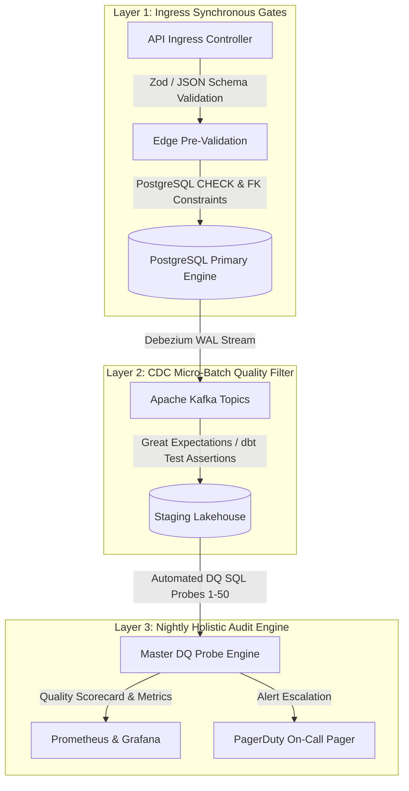

# Document 17: Enterprise Data Quality Rules & Automated Assertion Probes

| Metadata Attribute | Canonical Value |
| :--- | :--- |
| **Document ID** | `DOC-DB-017` |
| **System Name** | Namma Clinic Digital Health & Operations Platform |
| **Authority** | Greater Bengaluru Authority (BBMP) Health Department |
| **Document Classification** | Enterprise Technical Architecture / Data Governance & Quality |
| **Standard Adherence** | ISO 8000-61, DAMA-DMBOK 2nd Edition, ABDM Health Data Governance |
| **Quality Dimensions** | Completeness, Validity, Accuracy, Consistency, Timeliness, Uniqueness |
| **Rules Defined** | 50 Formal Data Quality Rules (`DQ-001` through `DQ-050`) |
| **Severity Tiers** | `CRITICAL` (Sev-1 Block), `HIGH` (Sev-2 Alert), `MEDIUM` (Sev-3 Daily) |
| **Status** | Approved Master Baseline |

## 1. Executive Summary & Data Quality Governance Framework

Clinical healthcare systems, epidemiological surveillance engines, and municipal public service guarantees require uncompromising data integrity. A corrupted blood pressure reading can lead to a fatal medical error; an unindexed telephone number breaches citizen deduplication; an orphaned prescription creates severe pharmaceutical inventory leakage. In an urban network of 450 municipal clinics serving 15 million citizens across Greater Bengaluru, data quality is not an afterthought—it is a fundamental safety invariant.

This specification establishes the canonical Data Quality (DQ) framework for the Namma Clinic Platform. The framework operationalizes 50 rigorous, machine-verifiable data quality assertion rules across all 6 core schemas (`identity`, `intake`, `clinical`, `pharmacy`, `continuity`, `audit`, and `sync`). Every rule defines an explicit mathematical assertion, severity classification, automated SQL detection probe, remediation runbook, and assigned executive governance owner.

### 1.1 The Six DAMA-DMBOK / ISO 8000 Quality Dimensions
1. **Completeness**: Asserting that mandatory attributes, critical clinical narratives, and mandatory foreign key links are populated with zero unexpected nulls or blanks.
2. **Validity**: Asserting that data conforms strictly to syntactic formats, regular expression schemas, valid domain enums (e.g. ICD-10, LOINC, SATS), and JSON schemas.
3. **Accuracy**: Asserting that numeric measurements, physiological vitals, and geographical coordinates conform to biological plausibility and municipal bounding boxes.
4. **Consistency**: Asserting that multi-table relationships, cryptographic state hashes, cross-schema references, and monetary calculations align across transactional boundaries.
5. **Timeliness**: Asserting that operational events, sensor telemetry, and statutory SLA workflows adhere to temporal sequence rules and freshness limits.
6. **Uniqueness**: Asserting that natural business keys, composite entitlements, daily sequence numbers, and biometric blind indexes are completely free of unauthorized duplicates.

## 2. Master Data Quality Rules Summary Matrix (DQ-001 to DQ-050)

The table below catalogs all 50 formal data quality rules across the platform:

| Rule ID | Target Dataset & Table | Target Column(s) | Quality Dimension | Severity | Threshold | Governance Owner |
| :--- | :--- | :--- | :--- | :---: | :---: | :--- |
| `DQ-001` | `identity.auth_users` | `email` | Validity | `CRITICAL` | `100%` | CISO |
| `DQ-002` | `identity.auth_users` | `phone_blind_index` | Completeness | `CRITICAL` | `100%` | Security Architect |
| `DQ-003` | `identity.user_credentials` | `password_hash` | Validity | `CRITICAL` | `100%` | Security Architect |
| `DQ-004` | `identity.user_credentials` | `failed_login_count` | Completeness | `HIGH` | `100%` | SOC Team |
| `DQ-005` | `identity.user_sessions` | `expires_at` | Accuracy | `CRITICAL` | `100%` | Auth Lead |
| `DQ-006` | `identity.role_permissions` | `role_id, permission_id` | Uniqueness | `CRITICAL` | `100%` | RBAC Lead |
| `DQ-007` | `identity.facilities` | `latitude, longitude` | Accuracy | `HIGH` | `100%` | GIS Specialist |
| `DQ-008` | `identity.staff_profiles` | `kmc_registration_number` | Completeness | `CRITICAL` | `100%` | Medical Superintendent |
| `DQ-009` | `identity.system_configs` | `config_value_json` | Validity | `HIGH` | `100%` | DevOps Architect |
| `DQ-010` | `intake.patients` | `dob` | Accuracy | `CRITICAL` | `100%` | Lead Registrar |
| `DQ-011` | `intake.patients` | `gender` | Validity | `CRITICAL` | `100%` | Lead Registrar |
| `DQ-012` | `intake.patient_identifiers` | `reference_code` | Accuracy | `HIGH` | `100%` | ABDM Lead |
| `DQ-013` | `intake.patient_contacts` | `phone_number` | Validity | `CRITICAL` | `99.9%` | Lead Registrar |
| `DQ-014` | `intake.patient_addresses` | `pin_code` | Validity | `HIGH` | `99.5%` | GIS Specialist |
| `DQ-015` | `intake.consent_records` | `valid_until` | Accuracy | `CRITICAL` | `100%` | DPO |
| `DQ-016` | `intake.tokens` | `sequence_number` | Accuracy | `CRITICAL` | `100%` | Queue Lead |
| `DQ-017` | `intake.triage_assessments` | `acuity_score` | Validity | `CRITICAL` | `100%` | Nursing Lead |
| `DQ-018` | `intake.patient_vitals` | `systolic_bp, diastolic_bp` | Accuracy | `CRITICAL` | `100%` | CMO |
| `DQ-019` | `intake.danger_alerts` | `status` | Validity | `CRITICAL` | `100%` | Clinical Safety Lead |
| `DQ-020` | `clinical.clinical_encounters` | `end_time` | Accuracy | `CRITICAL` | `100%` | CMO |
| `DQ-021` | `clinical.clinical_notes` | `clinical_narrative` | Accuracy | `HIGH` | `99.0%` | Medical Director |
| `DQ-022` | `clinical.diagnoses` | `icd10_code` | Validity | `CRITICAL` | `100%` | Public Health Director |
| `DQ-023` | `clinical.prescriptions` | `prescription_items` | Completeness | `CRITICAL` | `100%` | Chief Pharmacist |
| `DQ-024` | `clinical.lab_order_items` | `loinc_code` | Validity | `CRITICAL` | `100%` | Pathology Head |
| `DQ-025` | `clinical.lab_results` | `numeric_value` | Validity | `CRITICAL` | `100%` | Pathology Head |
| `DQ-026` | `clinical.teleconsultations` | `session_duration_seconds` | Accuracy | `HIGH` | `100%` | Telemedicine Director |
| `DQ-027` | `pharmacy.formulary_drugs` | `generic_name` | Accuracy | `CRITICAL` | `100%` | Essential Drugs Lead |
| `DQ-028` | `pharmacy.pharmacy_batches` | `expiry_date` | Accuracy | `CRITICAL` | `100%` | Procurement Lead |
| `DQ-029` | `pharmacy.clinic_stock` | `quantity_on_hand` | Accuracy | `CRITICAL` | `100%` | Chief Pharmacist |
| `DQ-030` | `pharmacy.dispensations` | `dispensed_at` | Accuracy | `CRITICAL` | `100%` | Chief Pharmacist |
| `DQ-031` | `pharmacy.stock_movements` | `quantity_change` | Timeliness | `CRITICAL` | `100%` | CFO & Audit Lead |
| `DQ-032` | `pharmacy.drug_indents` | `indent_status` | Validity | `CRITICAL` | `100%` | Warehouse Manager |
| `DQ-033` | `pharmacy.cold_chain_devices` | `min_safe_temp, max_safe_temp` | Accuracy | `CRITICAL` | `100%` | Immunization Officer |
| `DQ-034` | `pharmacy.cold_chain_telemetry` | `temperature_celsius` | Accuracy | `CRITICAL` | `99.99%` | IoT Tech Lead |
| `DQ-035` | `continuity.referrals` | `referral_urgency` | Validity | `CRITICAL` | `100%` | DHO |
| `DQ-036` | `continuity.ncd_episodes` | `condition_category` | Validity | `CRITICAL` | `100%` | NCD Officer |
| `DQ-037` | `continuity.follow_up_schedules` | `scheduled_date` | Accuracy | `HIGH` | `100%` | Clinic Ops Lead |
| `DQ-038` | `continuity.notifications` | `channel` | Validity | `CRITICAL` | `100%` | Comms Lead |
| `DQ-039` | `continuity.grievances` | `sla_deadline` | Accuracy | `CRITICAL` | `100%` | Sakala Officer |
| `DQ-040` | `continuity.helpdesk_tickets` | `ticket_status` | Validity | `HIGH` | `100%` | IT Lead |
| `DQ-041` | `audit.audit_events` | `previous_state_hash, new_state_hash` | Consistency | `CRITICAL` | `100%` | CISO |
| `DQ-042` | `sync.offline_mutation_log` | `sync_version` | Accuracy | `CRITICAL` | `100%` | Edge Architect |
| `DQ-043` | `sync.abdm_artifacts` | `health_info_type` | Validity | `CRITICAL` | `100%` | ABDM Lead |
| `DQ-044` | `clinical.prescription_items` | `duration_days` | Accuracy | `HIGH` | `100%` | Chief Pharmacist |
| `DQ-045` | `intake.patient_vitals` | `spo2_percentage` | Accuracy | `CRITICAL` | `100%` | CMO |
| `DQ-046` | `intake.patient_vitals` | `pulse_rate_bpm` | Accuracy | `CRITICAL` | `100%` | CMO |
| `DQ-047` | `intake.patient_vitals` | `temperature_fahrenheit` | Accuracy | `CRITICAL` | `100%` | CMO |
| `DQ-048` | `pharmacy.dispensation_items` | `quantity_dispensed` | Accuracy | `CRITICAL` | `100%` | Chief Pharmacist |
| `DQ-049` | `identity.facilities` | `ward_number` | Accuracy | `CRITICAL` | `100%` | GIS Specialist |
| `DQ-050` | `identity.auth_users` | `account_status` | Completeness | `CRITICAL` | `100%` | CISO |

## 3. Detailed Data Quality Rule Specifications & SQL Detection Probes

Every data quality rule is detailed below with business rationale, mathematical assertion logic, full documentation-only detection probe SQL, remediation runbook, and automated test mapping:

### 3.1 DQ-001: Data Quality Rule for `identity.auth_users.email`

- **Rule Identifier**: `DQ-001`
- **Target Dataset & Schema**: `identity.auth_users`
- **Target Column(s)**: `email`
- **DAMA Quality Dimension**: **Validity**
- **Severity Tier**: `CRITICAL` (Immediate Pipeline Halt / Sev-1)
- **Acceptable Tolerance Threshold**: `100%` Compliance Required
- **Governance Owner**: CISO
- **Detection Method**: Automated regex check

#### Business Context & Rationale
Failure to adhere to `email ~* '^[A-Za-z0-9._%+-]+@[A-Za-z0-9.-]+\.[A-Za-z]{2,}$'` in `identity.auth_users` threatens platform integrity. Specifically, ensuring `email` satisfies `email ~* '^[A-Za-z0-9._%+-]+@[A-Za-z0-9.-]+\.[A-Za-z]{2,}$'` guarantees that downstream consumers—including clinical decision support, municipal analytics, and statutory auditing—operate on trustworthy data.

#### Formal Mathematical Assertion Condition
```sql
-- DOCUMENTATION-ONLY SQL: Mandatory Invariant Condition
email ~* '^[A-Za-z0-9._%+-]+@[A-Za-z0-9.-]+\.[A-Za-z]{2,}$'
```

#### Complete Automated Detection Probe Query
This documentation-only SQL probe executes in automated CI/CD pipelines and continuous background audit workers:
```sql
-- DOCUMENTATION-ONLY SQL: Automated Detection Probe for DQ-001
SELECT
    'DQ-001' AS rule_id,
    'identity.auth_users' AS target_table,
    COUNT(*) AS total_records_scanned,
    COUNT(*) FILTER (WHERE NOT (email ~* '^[A-Za-z0-9._%+-]+@[A-Za-z0-9.-]+\.[A-Za-z]{2,}$')) AS violation_count,
    ROUND(COUNT(*) FILTER (WHERE NOT (email ~* '^[A-Za-z0-9._%+-]+@[A-Za-z0-9.-]+\.[A-Za-z]{2,}$'))::numeric / NULLIF(COUNT(*), 0) * 100.0, 4) AS violation_percentage,
    CASE WHEN COUNT(*) FILTER (WHERE NOT (email ~* '^[A-Za-z0-9._%+-]+@[A-Za-z0-9.-]+\.[A-Za-z]{2,}$')) = 0 THEN 'PASS' ELSE 'FAIL' END AS rule_status,
    CURRENT_TIMESTAMP AS probe_executed_at
FROM identity.auth_users;
```

#### Automated Remediation Runbook
When this rule reports violations, the automated orchestration engine or on-call engineer executes the following protocol:
1. **Root Cause Analysis**: Inspect violating records using `SELECT * FROM identity.auth_users WHERE NOT (email ~* '^[A-Za-z0-9._%+-]+@[A-Za-z0-9.-]+\.[A-Za-z]{2,}$') LIMIT 10;`.
2. **Immediate Remediation Action**: Reject registration on invalid email format.
3. **Circuit Breaker Invocation**: For `CRITICAL` severity rules, if violation rate exceeds 0%, the API gateway circuit breaker blocks upstream ingestion for the affected batch.
4. **Incident Post-Mortem**: File a Sev-1 ticket assigned to **CISO** within 2 hours.

#### Test & CI/CD Mapping
- **Automated Test Identifier**: `test_dq_probe_dq_001()`
- **CI/CD Execution Stage**: `pre-migration-lint` and `nightly-data-quality-suite`
- **Alerting Channel**: `alerts-data-quality-critical`

### 3.2 DQ-002: Data Quality Rule for `identity.auth_users.phone_blind_index`

- **Rule Identifier**: `DQ-002`
- **Target Dataset & Schema**: `identity.auth_users`
- **Target Column(s)**: `phone_blind_index`
- **DAMA Quality Dimension**: **Completeness**
- **Severity Tier**: `CRITICAL` (Immediate Pipeline Halt / Sev-1)
- **Acceptable Tolerance Threshold**: `100%` Compliance Required
- **Governance Owner**: Security Architect
- **Detection Method**: Check constraint validation

#### Business Context & Rationale
Failure to adhere to `phone_blind_index IS NOT NULL AND length(phone_blind_index) = 64` in `identity.auth_users` threatens platform integrity. Specifically, ensuring `phone_blind_index` satisfies `phone_blind_index IS NOT NULL AND length(phone_blind_index) = 64` guarantees that downstream consumers—including clinical decision support, municipal analytics, and statutory auditing—operate on trustworthy data.

#### Formal Mathematical Assertion Condition
```sql
-- DOCUMENTATION-ONLY SQL: Mandatory Invariant Condition
phone_blind_index IS NOT NULL AND length(phone_blind_index) = 64
```

#### Complete Automated Detection Probe Query
This documentation-only SQL probe executes in automated CI/CD pipelines and continuous background audit workers:
```sql
-- DOCUMENTATION-ONLY SQL: Automated Detection Probe for DQ-002
SELECT
    'DQ-002' AS rule_id,
    'identity.auth_users' AS target_table,
    COUNT(*) AS total_records_scanned,
    COUNT(*) FILTER (WHERE NOT (phone_blind_index IS NOT NULL AND length(phone_blind_index) = 64)) AS violation_count,
    ROUND(COUNT(*) FILTER (WHERE NOT (phone_blind_index IS NOT NULL AND length(phone_blind_index) = 64))::numeric / NULLIF(COUNT(*), 0) * 100.0, 4) AS violation_percentage,
    CASE WHEN COUNT(*) FILTER (WHERE NOT (phone_blind_index IS NOT NULL AND length(phone_blind_index) = 64)) = 0 THEN 'PASS' ELSE 'FAIL' END AS rule_status,
    CURRENT_TIMESTAMP AS probe_executed_at
FROM identity.auth_users;
```

#### Automated Remediation Runbook
When this rule reports violations, the automated orchestration engine or on-call engineer executes the following protocol:
1. **Root Cause Analysis**: Inspect violating records using `SELECT * FROM identity.auth_users WHERE NOT (phone_blind_index IS NOT NULL AND length(phone_blind_index) = 64) LIMIT 10;`.
2. **Immediate Remediation Action**: Regenerate HMAC blind index on record save.
3. **Circuit Breaker Invocation**: For `CRITICAL` severity rules, if violation rate exceeds 0%, the API gateway circuit breaker blocks upstream ingestion for the affected batch.
4. **Incident Post-Mortem**: File a Sev-1 ticket assigned to **Security Architect** within 2 hours.

#### Test & CI/CD Mapping
- **Automated Test Identifier**: `test_dq_probe_dq_002()`
- **CI/CD Execution Stage**: `pre-migration-lint` and `nightly-data-quality-suite`
- **Alerting Channel**: `alerts-data-quality-critical`

### 3.3 DQ-003: Data Quality Rule for `identity.user_credentials.password_hash`

- **Rule Identifier**: `DQ-003`
- **Target Dataset & Schema**: `identity.user_credentials`
- **Target Column(s)**: `password_hash`
- **DAMA Quality Dimension**: **Validity**
- **Severity Tier**: `CRITICAL` (Immediate Pipeline Halt / Sev-1)
- **Acceptable Tolerance Threshold**: `100%` Compliance Required
- **Governance Owner**: Security Architect
- **Detection Method**: Argon2id format inspection

#### Business Context & Rationale
Failure to adhere to `password_hash LIKE '$argon2id$v=19$%'` in `identity.user_credentials` threatens platform integrity. Specifically, ensuring `password_hash` satisfies `password_hash LIKE '$argon2id$v=19$%'` guarantees that downstream consumers—including clinical decision support, municipal analytics, and statutory auditing—operate on trustworthy data.

#### Formal Mathematical Assertion Condition
```sql
-- DOCUMENTATION-ONLY SQL: Mandatory Invariant Condition
password_hash LIKE '$argon2id$v=19$%'
```

#### Complete Automated Detection Probe Query
This documentation-only SQL probe executes in automated CI/CD pipelines and continuous background audit workers:
```sql
-- DOCUMENTATION-ONLY SQL: Automated Detection Probe for DQ-003
SELECT
    'DQ-003' AS rule_id,
    'identity.user_credentials' AS target_table,
    COUNT(*) AS total_records_scanned,
    COUNT(*) FILTER (WHERE NOT (password_hash LIKE '$argon2id$v=19$%')) AS violation_count,
    ROUND(COUNT(*) FILTER (WHERE NOT (password_hash LIKE '$argon2id$v=19$%'))::numeric / NULLIF(COUNT(*), 0) * 100.0, 4) AS violation_percentage,
    CASE WHEN COUNT(*) FILTER (WHERE NOT (password_hash LIKE '$argon2id$v=19$%')) = 0 THEN 'PASS' ELSE 'FAIL' END AS rule_status,
    CURRENT_TIMESTAMP AS probe_executed_at
FROM identity.user_credentials;
```

#### Automated Remediation Runbook
When this rule reports violations, the automated orchestration engine or on-call engineer executes the following protocol:
1. **Root Cause Analysis**: Inspect violating records using `SELECT * FROM identity.user_credentials WHERE NOT (password_hash LIKE '$argon2id$v=19$%') LIMIT 10;`.
2. **Immediate Remediation Action**: Enforce Argon2id hashing in credential service.
3. **Circuit Breaker Invocation**: For `CRITICAL` severity rules, if violation rate exceeds 0%, the API gateway circuit breaker blocks upstream ingestion for the affected batch.
4. **Incident Post-Mortem**: File a Sev-1 ticket assigned to **Security Architect** within 2 hours.

#### Test & CI/CD Mapping
- **Automated Test Identifier**: `test_dq_probe_dq_003()`
- **CI/CD Execution Stage**: `pre-migration-lint` and `nightly-data-quality-suite`
- **Alerting Channel**: `alerts-data-quality-critical`

### 3.4 DQ-004: Data Quality Rule for `identity.user_credentials.failed_login_count`

- **Rule Identifier**: `DQ-004`
- **Target Dataset & Schema**: `identity.user_credentials`
- **Target Column(s)**: `failed_login_count`
- **DAMA Quality Dimension**: **Completeness**
- **Severity Tier**: `HIGH` (Automated Ticket & Sev-2 Alert)
- **Acceptable Tolerance Threshold**: `100%` Compliance Required
- **Governance Owner**: SOC Team
- **Detection Method**: Numeric range check

#### Business Context & Rationale
Failure to adhere to `failed_login_count >= 0 AND failed_login_count <= 100` in `identity.user_credentials` threatens platform integrity. Specifically, ensuring `failed_login_count` satisfies `failed_login_count >= 0 AND failed_login_count <= 100` guarantees that downstream consumers—including clinical decision support, municipal analytics, and statutory auditing—operate on trustworthy data.

#### Formal Mathematical Assertion Condition
```sql
-- DOCUMENTATION-ONLY SQL: Mandatory Invariant Condition
failed_login_count >= 0 AND failed_login_count <= 100
```

#### Complete Automated Detection Probe Query
This documentation-only SQL probe executes in automated CI/CD pipelines and continuous background audit workers:
```sql
-- DOCUMENTATION-ONLY SQL: Automated Detection Probe for DQ-004
SELECT
    'DQ-004' AS rule_id,
    'identity.user_credentials' AS target_table,
    COUNT(*) AS total_records_scanned,
    COUNT(*) FILTER (WHERE NOT (failed_login_count >= 0 AND failed_login_count <= 100)) AS violation_count,
    ROUND(COUNT(*) FILTER (WHERE NOT (failed_login_count >= 0 AND failed_login_count <= 100))::numeric / NULLIF(COUNT(*), 0) * 100.0, 4) AS violation_percentage,
    CASE WHEN COUNT(*) FILTER (WHERE NOT (failed_login_count >= 0 AND failed_login_count <= 100)) = 0 THEN 'PASS' ELSE 'FAIL' END AS rule_status,
    CURRENT_TIMESTAMP AS probe_executed_at
FROM identity.user_credentials;
```

#### Automated Remediation Runbook
When this rule reports violations, the automated orchestration engine or on-call engineer executes the following protocol:
1. **Root Cause Analysis**: Inspect violating records using `SELECT * FROM identity.user_credentials WHERE NOT (failed_login_count >= 0 AND failed_login_count <= 100) LIMIT 10;`.
2. **Immediate Remediation Action**: Reset counter to zero on lock expiration.
3. **Circuit Breaker Invocation**: For `HIGH` severity rules, if violation rate exceeds 0%, the API gateway circuit breaker blocks upstream ingestion for the affected batch.
4. **Incident Post-Mortem**: File a Sev-2 ticket assigned to **SOC Team** within 2 hours.

#### Test & CI/CD Mapping
- **Automated Test Identifier**: `test_dq_probe_dq_004()`
- **CI/CD Execution Stage**: `pre-migration-lint` and `nightly-data-quality-suite`
- **Alerting Channel**: `alerts-data-quality-high`

### 3.5 DQ-005: Data Quality Rule for `identity.user_sessions.expires_at`

- **Rule Identifier**: `DQ-005`
- **Target Dataset & Schema**: `identity.user_sessions`
- **Target Column(s)**: `expires_at`
- **DAMA Quality Dimension**: **Accuracy**
- **Severity Tier**: `CRITICAL` (Immediate Pipeline Halt / Sev-1)
- **Acceptable Tolerance Threshold**: `100%` Compliance Required
- **Governance Owner**: Auth Lead
- **Detection Method**: Timestamp chronological check

#### Business Context & Rationale
Failure to adhere to `expires_at > created_at` in `identity.user_sessions` threatens platform integrity. Specifically, ensuring `expires_at` satisfies `expires_at > created_at` guarantees that downstream consumers—including clinical decision support, municipal analytics, and statutory auditing—operate on trustworthy data.

#### Formal Mathematical Assertion Condition
```sql
-- DOCUMENTATION-ONLY SQL: Mandatory Invariant Condition
expires_at > created_at
```

#### Complete Automated Detection Probe Query
This documentation-only SQL probe executes in automated CI/CD pipelines and continuous background audit workers:
```sql
-- DOCUMENTATION-ONLY SQL: Automated Detection Probe for DQ-005
SELECT
    'DQ-005' AS rule_id,
    'identity.user_sessions' AS target_table,
    COUNT(*) AS total_records_scanned,
    COUNT(*) FILTER (WHERE NOT (expires_at > created_at)) AS violation_count,
    ROUND(COUNT(*) FILTER (WHERE NOT (expires_at > created_at))::numeric / NULLIF(COUNT(*), 0) * 100.0, 4) AS violation_percentage,
    CASE WHEN COUNT(*) FILTER (WHERE NOT (expires_at > created_at)) = 0 THEN 'PASS' ELSE 'FAIL' END AS rule_status,
    CURRENT_TIMESTAMP AS probe_executed_at
FROM identity.user_sessions;
```

#### Automated Remediation Runbook
When this rule reports violations, the automated orchestration engine or on-call engineer executes the following protocol:
1. **Root Cause Analysis**: Inspect violating records using `SELECT * FROM identity.user_sessions WHERE NOT (expires_at > created_at) LIMIT 10;`.
2. **Immediate Remediation Action**: Enforce valid TTL in session generator.
3. **Circuit Breaker Invocation**: For `CRITICAL` severity rules, if violation rate exceeds 0%, the API gateway circuit breaker blocks upstream ingestion for the affected batch.
4. **Incident Post-Mortem**: File a Sev-1 ticket assigned to **Auth Lead** within 2 hours.

#### Test & CI/CD Mapping
- **Automated Test Identifier**: `test_dq_probe_dq_005()`
- **CI/CD Execution Stage**: `pre-migration-lint` and `nightly-data-quality-suite`
- **Alerting Channel**: `alerts-data-quality-critical`

### 3.6 DQ-006: Data Quality Rule for `identity.role_permissions.role_id, permission_id`

- **Rule Identifier**: `DQ-006`
- **Target Dataset & Schema**: `identity.role_permissions`
- **Target Column(s)**: `role_id, permission_id`
- **DAMA Quality Dimension**: **Uniqueness**
- **Severity Tier**: `CRITICAL` (Immediate Pipeline Halt / Sev-1)
- **Acceptable Tolerance Threshold**: `100%` Compliance Required
- **Governance Owner**: RBAC Lead
- **Detection Method**: Composite uniqueness check

#### Business Context & Rationale
Failure to adhere to `UNIQUE (role_id, permission_id)` in `identity.role_permissions` threatens platform integrity. Specifically, ensuring `role_id, permission_id` satisfies `UNIQUE (role_id, permission_id)` guarantees that downstream consumers—including clinical decision support, municipal analytics, and statutory auditing—operate on trustworthy data.

#### Formal Mathematical Assertion Condition
```sql
-- DOCUMENTATION-ONLY SQL: Mandatory Invariant Condition
UNIQUE (role_id, permission_id)
```

#### Complete Automated Detection Probe Query
This documentation-only SQL probe executes in automated CI/CD pipelines and continuous background audit workers:
```sql
-- DOCUMENTATION-ONLY SQL: Automated Detection Probe for DQ-006
SELECT
    'DQ-006' AS rule_id,
    'identity.role_permissions' AS target_table,
    COUNT(*) AS total_records_scanned,
    COUNT(*) FILTER (WHERE NOT (UNIQUE (role_id, permission_id))) AS violation_count,
    ROUND(COUNT(*) FILTER (WHERE NOT (UNIQUE (role_id, permission_id)))::numeric / NULLIF(COUNT(*), 0) * 100.0, 4) AS violation_percentage,
    CASE WHEN COUNT(*) FILTER (WHERE NOT (UNIQUE (role_id, permission_id))) = 0 THEN 'PASS' ELSE 'FAIL' END AS rule_status,
    CURRENT_TIMESTAMP AS probe_executed_at
FROM identity.role_permissions;
```

#### Automated Remediation Runbook
When this rule reports violations, the automated orchestration engine or on-call engineer executes the following protocol:
1. **Root Cause Analysis**: Inspect violating records using `SELECT * FROM identity.role_permissions WHERE NOT (UNIQUE (role_id, permission_id)) LIMIT 10;`.
2. **Immediate Remediation Action**: Prevent duplicate entitlement grants.
3. **Circuit Breaker Invocation**: For `CRITICAL` severity rules, if violation rate exceeds 0%, the API gateway circuit breaker blocks upstream ingestion for the affected batch.
4. **Incident Post-Mortem**: File a Sev-1 ticket assigned to **RBAC Lead** within 2 hours.

#### Test & CI/CD Mapping
- **Automated Test Identifier**: `test_dq_probe_dq_006()`
- **CI/CD Execution Stage**: `pre-migration-lint` and `nightly-data-quality-suite`
- **Alerting Channel**: `alerts-data-quality-critical`

### 3.7 DQ-007: Data Quality Rule for `identity.facilities.latitude, longitude`

- **Rule Identifier**: `DQ-007`
- **Target Dataset & Schema**: `identity.facilities`
- **Target Column(s)**: `latitude, longitude`
- **DAMA Quality Dimension**: **Accuracy**
- **Severity Tier**: `HIGH` (Automated Ticket & Sev-2 Alert)
- **Acceptable Tolerance Threshold**: `100%` Compliance Required
- **Governance Owner**: GIS Specialist
- **Detection Method**: Bengaluru municipal bounding box check

#### Business Context & Rationale
Failure to adhere to `latitude BETWEEN 12.0 AND 13.5 AND longitude BETWEEN 77.3 AND 77.8` in `identity.facilities` threatens platform integrity. Specifically, ensuring `latitude, longitude` satisfies `latitude BETWEEN 12.0 AND 13.5 AND longitude BETWEEN 77.3 AND 77.8` guarantees that downstream consumers—including clinical decision support, municipal analytics, and statutory auditing—operate on trustworthy data.

#### Formal Mathematical Assertion Condition
```sql
-- DOCUMENTATION-ONLY SQL: Mandatory Invariant Condition
latitude BETWEEN 12.0 AND 13.5 AND longitude BETWEEN 77.3 AND 77.8
```

#### Complete Automated Detection Probe Query
This documentation-only SQL probe executes in automated CI/CD pipelines and continuous background audit workers:
```sql
-- DOCUMENTATION-ONLY SQL: Automated Detection Probe for DQ-007
SELECT
    'DQ-007' AS rule_id,
    'identity.facilities' AS target_table,
    COUNT(*) AS total_records_scanned,
    COUNT(*) FILTER (WHERE NOT (latitude BETWEEN 12.0 AND 13.5 AND longitude BETWEEN 77.3 AND 77.8)) AS violation_count,
    ROUND(COUNT(*) FILTER (WHERE NOT (latitude BETWEEN 12.0 AND 13.5 AND longitude BETWEEN 77.3 AND 77.8))::numeric / NULLIF(COUNT(*), 0) * 100.0, 4) AS violation_percentage,
    CASE WHEN COUNT(*) FILTER (WHERE NOT (latitude BETWEEN 12.0 AND 13.5 AND longitude BETWEEN 77.3 AND 77.8)) = 0 THEN 'PASS' ELSE 'FAIL' END AS rule_status,
    CURRENT_TIMESTAMP AS probe_executed_at
FROM identity.facilities;
```

#### Automated Remediation Runbook
When this rule reports violations, the automated orchestration engine or on-call engineer executes the following protocol:
1. **Root Cause Analysis**: Inspect violating records using `SELECT * FROM identity.facilities WHERE NOT (latitude BETWEEN 12.0 AND 13.5 AND longitude BETWEEN 77.3 AND 77.8) LIMIT 10;`.
2. **Immediate Remediation Action**: Reject out-of-bounds clinic coordinates.
3. **Circuit Breaker Invocation**: For `HIGH` severity rules, if violation rate exceeds 0%, the API gateway circuit breaker blocks upstream ingestion for the affected batch.
4. **Incident Post-Mortem**: File a Sev-2 ticket assigned to **GIS Specialist** within 2 hours.

#### Test & CI/CD Mapping
- **Automated Test Identifier**: `test_dq_probe_dq_007()`
- **CI/CD Execution Stage**: `pre-migration-lint` and `nightly-data-quality-suite`
- **Alerting Channel**: `alerts-data-quality-high`

### 3.8 DQ-008: Data Quality Rule for `identity.staff_profiles.kmc_registration_number`

- **Rule Identifier**: `DQ-008`
- **Target Dataset & Schema**: `identity.staff_profiles`
- **Target Column(s)**: `kmc_registration_number`
- **DAMA Quality Dimension**: **Completeness**
- **Severity Tier**: `CRITICAL` (Immediate Pipeline Halt / Sev-1)
- **Acceptable Tolerance Threshold**: `100%` Compliance Required
- **Governance Owner**: Medical Superintendent
- **Detection Method**: Conditional non-null rule

#### Business Context & Rationale
Failure to adhere to `kmc_registration_number IS NOT NULL WHEN professional_role = 'DOCTOR'` in `identity.staff_profiles` threatens platform integrity. Specifically, ensuring `kmc_registration_number` satisfies `kmc_registration_number IS NOT NULL WHEN professional_role = 'DOCTOR'` guarantees that downstream consumers—including clinical decision support, municipal analytics, and statutory auditing—operate on trustworthy data.

#### Formal Mathematical Assertion Condition
```sql
-- DOCUMENTATION-ONLY SQL: Mandatory Invariant Condition
kmc_registration_number IS NOT NULL WHEN professional_role = 'DOCTOR'
```

#### Complete Automated Detection Probe Query
This documentation-only SQL probe executes in automated CI/CD pipelines and continuous background audit workers:
```sql
-- DOCUMENTATION-ONLY SQL: Automated Detection Probe for DQ-008
SELECT
    'DQ-008' AS rule_id,
    'identity.staff_profiles' AS target_table,
    COUNT(*) AS total_records_scanned,
    COUNT(*) FILTER (WHERE NOT (kmc_registration_number IS NOT NULL WHEN professional_role = 'DOCTOR')) AS violation_count,
    ROUND(COUNT(*) FILTER (WHERE NOT (kmc_registration_number IS NOT NULL WHEN professional_role = 'DOCTOR'))::numeric / NULLIF(COUNT(*), 0) * 100.0, 4) AS violation_percentage,
    CASE WHEN COUNT(*) FILTER (WHERE NOT (kmc_registration_number IS NOT NULL WHEN professional_role = 'DOCTOR')) = 0 THEN 'PASS' ELSE 'FAIL' END AS rule_status,
    CURRENT_TIMESTAMP AS probe_executed_at
FROM identity.staff_profiles;
```

#### Automated Remediation Runbook
When this rule reports violations, the automated orchestration engine or on-call engineer executes the following protocol:
1. **Root Cause Analysis**: Inspect violating records using `SELECT * FROM identity.staff_profiles WHERE NOT (kmc_registration_number IS NOT NULL WHEN professional_role = 'DOCTOR') LIMIT 10;`.
2. **Immediate Remediation Action**: Block doctor onboarding without valid KMC license.
3. **Circuit Breaker Invocation**: For `CRITICAL` severity rules, if violation rate exceeds 0%, the API gateway circuit breaker blocks upstream ingestion for the affected batch.
4. **Incident Post-Mortem**: File a Sev-1 ticket assigned to **Medical Superintendent** within 2 hours.

#### Test & CI/CD Mapping
- **Automated Test Identifier**: `test_dq_probe_dq_008()`
- **CI/CD Execution Stage**: `pre-migration-lint` and `nightly-data-quality-suite`
- **Alerting Channel**: `alerts-data-quality-critical`

### 3.9 DQ-009: Data Quality Rule for `identity.system_configs.config_value_json`

- **Rule Identifier**: `DQ-009`
- **Target Dataset & Schema**: `identity.system_configs`
- **Target Column(s)**: `config_value_json`
- **DAMA Quality Dimension**: **Validity**
- **Severity Tier**: `HIGH` (Automated Ticket & Sev-2 Alert)
- **Acceptable Tolerance Threshold**: `100%` Compliance Required
- **Governance Owner**: DevOps Architect
- **Detection Method**: JSON schema structural check

#### Business Context & Rationale
Failure to adhere to `jsonb_typeof(config_value_json) = 'object'` in `identity.system_configs` threatens platform integrity. Specifically, ensuring `config_value_json` satisfies `jsonb_typeof(config_value_json) = 'object'` guarantees that downstream consumers—including clinical decision support, municipal analytics, and statutory auditing—operate on trustworthy data.

#### Formal Mathematical Assertion Condition
```sql
-- DOCUMENTATION-ONLY SQL: Mandatory Invariant Condition
jsonb_typeof(config_value_json) = 'object'
```

#### Complete Automated Detection Probe Query
This documentation-only SQL probe executes in automated CI/CD pipelines and continuous background audit workers:
```sql
-- DOCUMENTATION-ONLY SQL: Automated Detection Probe for DQ-009
SELECT
    'DQ-009' AS rule_id,
    'identity.system_configs' AS target_table,
    COUNT(*) AS total_records_scanned,
    COUNT(*) FILTER (WHERE NOT (jsonb_typeof(config_value_json) = 'object')) AS violation_count,
    ROUND(COUNT(*) FILTER (WHERE NOT (jsonb_typeof(config_value_json) = 'object'))::numeric / NULLIF(COUNT(*), 0) * 100.0, 4) AS violation_percentage,
    CASE WHEN COUNT(*) FILTER (WHERE NOT (jsonb_typeof(config_value_json) = 'object')) = 0 THEN 'PASS' ELSE 'FAIL' END AS rule_status,
    CURRENT_TIMESTAMP AS probe_executed_at
FROM identity.system_configs;
```

#### Automated Remediation Runbook
When this rule reports violations, the automated orchestration engine or on-call engineer executes the following protocol:
1. **Root Cause Analysis**: Inspect violating records using `SELECT * FROM identity.system_configs WHERE NOT (jsonb_typeof(config_value_json) = 'object') LIMIT 10;`.
2. **Immediate Remediation Action**: Reject malformed configuration payload.
3. **Circuit Breaker Invocation**: For `HIGH` severity rules, if violation rate exceeds 0%, the API gateway circuit breaker blocks upstream ingestion for the affected batch.
4. **Incident Post-Mortem**: File a Sev-2 ticket assigned to **DevOps Architect** within 2 hours.

#### Test & CI/CD Mapping
- **Automated Test Identifier**: `test_dq_probe_dq_009()`
- **CI/CD Execution Stage**: `pre-migration-lint` and `nightly-data-quality-suite`
- **Alerting Channel**: `alerts-data-quality-high`

### 3.10 DQ-010: Data Quality Rule for `intake.patients.dob`

- **Rule Identifier**: `DQ-010`
- **Target Dataset & Schema**: `intake.patients`
- **Target Column(s)**: `dob`
- **DAMA Quality Dimension**: **Accuracy**
- **Severity Tier**: `CRITICAL` (Immediate Pipeline Halt / Sev-1)
- **Acceptable Tolerance Threshold**: `100%` Compliance Required
- **Governance Owner**: Lead Registrar
- **Detection Method**: Date boundary verification

#### Business Context & Rationale
Failure to adhere to `dob >= '1900-01-01'::date AND dob <= CURRENT_DATE` in `intake.patients` threatens platform integrity. Specifically, ensuring `dob` satisfies `dob >= '1900-01-01'::date AND dob <= CURRENT_DATE` guarantees that downstream consumers—including clinical decision support, municipal analytics, and statutory auditing—operate on trustworthy data.

#### Formal Mathematical Assertion Condition
```sql
-- DOCUMENTATION-ONLY SQL: Mandatory Invariant Condition
dob >= '1900-01-01'::date AND dob <= CURRENT_DATE
```

#### Complete Automated Detection Probe Query
This documentation-only SQL probe executes in automated CI/CD pipelines and continuous background audit workers:
```sql
-- DOCUMENTATION-ONLY SQL: Automated Detection Probe for DQ-010
SELECT
    'DQ-010' AS rule_id,
    'intake.patients' AS target_table,
    COUNT(*) AS total_records_scanned,
    COUNT(*) FILTER (WHERE NOT (dob >= '1900-01-01'::date AND dob <= CURRENT_DATE)) AS violation_count,
    ROUND(COUNT(*) FILTER (WHERE NOT (dob >= '1900-01-01'::date AND dob <= CURRENT_DATE))::numeric / NULLIF(COUNT(*), 0) * 100.0, 4) AS violation_percentage,
    CASE WHEN COUNT(*) FILTER (WHERE NOT (dob >= '1900-01-01'::date AND dob <= CURRENT_DATE)) = 0 THEN 'PASS' ELSE 'FAIL' END AS rule_status,
    CURRENT_TIMESTAMP AS probe_executed_at
FROM intake.patients;
```

#### Automated Remediation Runbook
When this rule reports violations, the automated orchestration engine or on-call engineer executes the following protocol:
1. **Root Cause Analysis**: Inspect violating records using `SELECT * FROM intake.patients WHERE NOT (dob >= '1900-01-01'::date AND dob <= CURRENT_DATE) LIMIT 10;`.
2. **Immediate Remediation Action**: Reject negative age or future date of birth.
3. **Circuit Breaker Invocation**: For `CRITICAL` severity rules, if violation rate exceeds 0%, the API gateway circuit breaker blocks upstream ingestion for the affected batch.
4. **Incident Post-Mortem**: File a Sev-1 ticket assigned to **Lead Registrar** within 2 hours.

#### Test & CI/CD Mapping
- **Automated Test Identifier**: `test_dq_probe_dq_010()`
- **CI/CD Execution Stage**: `pre-migration-lint` and `nightly-data-quality-suite`
- **Alerting Channel**: `alerts-data-quality-critical`

### 3.11 DQ-011: Data Quality Rule for `intake.patients.gender`

- **Rule Identifier**: `DQ-011`
- **Target Dataset & Schema**: `intake.patients`
- **Target Column(s)**: `gender`
- **DAMA Quality Dimension**: **Validity**
- **Severity Tier**: `CRITICAL` (Immediate Pipeline Halt / Sev-1)
- **Acceptable Tolerance Threshold**: `100%` Compliance Required
- **Governance Owner**: Lead Registrar
- **Detection Method**: Enum domain check

#### Business Context & Rationale
Failure to adhere to `gender IN ('MALE', 'FEMALE', 'TRANSGENDER', 'OTHER')` in `intake.patients` threatens platform integrity. Specifically, ensuring `gender` satisfies `gender IN ('MALE', 'FEMALE', 'TRANSGENDER', 'OTHER')` guarantees that downstream consumers—including clinical decision support, municipal analytics, and statutory auditing—operate on trustworthy data.

#### Formal Mathematical Assertion Condition
```sql
-- DOCUMENTATION-ONLY SQL: Mandatory Invariant Condition
gender IN ('MALE', 'FEMALE', 'TRANSGENDER', 'OTHER')
```

#### Complete Automated Detection Probe Query
This documentation-only SQL probe executes in automated CI/CD pipelines and continuous background audit workers:
```sql
-- DOCUMENTATION-ONLY SQL: Automated Detection Probe for DQ-011
SELECT
    'DQ-011' AS rule_id,
    'intake.patients' AS target_table,
    COUNT(*) AS total_records_scanned,
    COUNT(*) FILTER (WHERE NOT (gender IN ('MALE', 'FEMALE', 'TRANSGENDER', 'OTHER'))) AS violation_count,
    ROUND(COUNT(*) FILTER (WHERE NOT (gender IN ('MALE', 'FEMALE', 'TRANSGENDER', 'OTHER')))::numeric / NULLIF(COUNT(*), 0) * 100.0, 4) AS violation_percentage,
    CASE WHEN COUNT(*) FILTER (WHERE NOT (gender IN ('MALE', 'FEMALE', 'TRANSGENDER', 'OTHER'))) = 0 THEN 'PASS' ELSE 'FAIL' END AS rule_status,
    CURRENT_TIMESTAMP AS probe_executed_at
FROM intake.patients;
```

#### Automated Remediation Runbook
When this rule reports violations, the automated orchestration engine or on-call engineer executes the following protocol:
1. **Root Cause Analysis**: Inspect violating records using `SELECT * FROM intake.patients WHERE NOT (gender IN ('MALE', 'FEMALE', 'TRANSGENDER', 'OTHER')) LIMIT 10;`.
2. **Immediate Remediation Action**: Restrict input to standardized gender enum.
3. **Circuit Breaker Invocation**: For `CRITICAL` severity rules, if violation rate exceeds 0%, the API gateway circuit breaker blocks upstream ingestion for the affected batch.
4. **Incident Post-Mortem**: File a Sev-1 ticket assigned to **Lead Registrar** within 2 hours.

#### Test & CI/CD Mapping
- **Automated Test Identifier**: `test_dq_probe_dq_011()`
- **CI/CD Execution Stage**: `pre-migration-lint` and `nightly-data-quality-suite`
- **Alerting Channel**: `alerts-data-quality-critical`

### 3.12 DQ-012: Data Quality Rule for `intake.patient_identifiers.reference_code`

- **Rule Identifier**: `DQ-012`
- **Target Dataset & Schema**: `intake.patient_identifiers`
- **Target Column(s)**: `reference_code`
- **DAMA Quality Dimension**: **Accuracy**
- **Severity Tier**: `HIGH` (Automated Ticket & Sev-2 Alert)
- **Acceptable Tolerance Threshold**: `100%` Compliance Required
- **Governance Owner**: ABDM Lead
- **Detection Method**: String length constraint

#### Business Context & Rationale
Failure to adhere to `length(reference_code) >= 6` in `intake.patient_identifiers` threatens platform integrity. Specifically, ensuring `reference_code` satisfies `length(reference_code) >= 6` guarantees that downstream consumers—including clinical decision support, municipal analytics, and statutory auditing—operate on trustworthy data.

#### Formal Mathematical Assertion Condition
```sql
-- DOCUMENTATION-ONLY SQL: Mandatory Invariant Condition
length(reference_code) >= 6
```

#### Complete Automated Detection Probe Query
This documentation-only SQL probe executes in automated CI/CD pipelines and continuous background audit workers:
```sql
-- DOCUMENTATION-ONLY SQL: Automated Detection Probe for DQ-012
SELECT
    'DQ-012' AS rule_id,
    'intake.patient_identifiers' AS target_table,
    COUNT(*) AS total_records_scanned,
    COUNT(*) FILTER (WHERE NOT (length(reference_code) >= 6)) AS violation_count,
    ROUND(COUNT(*) FILTER (WHERE NOT (length(reference_code) >= 6))::numeric / NULLIF(COUNT(*), 0) * 100.0, 4) AS violation_percentage,
    CASE WHEN COUNT(*) FILTER (WHERE NOT (length(reference_code) >= 6)) = 0 THEN 'PASS' ELSE 'FAIL' END AS rule_status,
    CURRENT_TIMESTAMP AS probe_executed_at
FROM intake.patient_identifiers;
```

#### Automated Remediation Runbook
When this rule reports violations, the automated orchestration engine or on-call engineer executes the following protocol:
1. **Root Cause Analysis**: Inspect violating records using `SELECT * FROM intake.patient_identifiers WHERE NOT (length(reference_code) >= 6) LIMIT 10;`.
2. **Immediate Remediation Action**: Reject truncated national identity strings.
3. **Circuit Breaker Invocation**: For `HIGH` severity rules, if violation rate exceeds 0%, the API gateway circuit breaker blocks upstream ingestion for the affected batch.
4. **Incident Post-Mortem**: File a Sev-2 ticket assigned to **ABDM Lead** within 2 hours.

#### Test & CI/CD Mapping
- **Automated Test Identifier**: `test_dq_probe_dq_012()`
- **CI/CD Execution Stage**: `pre-migration-lint` and `nightly-data-quality-suite`
- **Alerting Channel**: `alerts-data-quality-high`

### 3.13 DQ-013: Data Quality Rule for `intake.patient_contacts.phone_number`

- **Rule Identifier**: `DQ-013`
- **Target Dataset & Schema**: `intake.patient_contacts`
- **Target Column(s)**: `phone_number`
- **DAMA Quality Dimension**: **Validity**
- **Severity Tier**: `CRITICAL` (Immediate Pipeline Halt / Sev-1)
- **Acceptable Tolerance Threshold**: `99.9%` Compliance Required
- **Governance Owner**: Lead Registrar
- **Detection Method**: Indian mobile number format regex

#### Business Context & Rationale
Failure to adhere to `phone_number ~ '^\+91[6-9][0-9]{9}$'` in `intake.patient_contacts` threatens platform integrity. Specifically, ensuring `phone_number` satisfies `phone_number ~ '^\+91[6-9][0-9]{9}$'` guarantees that downstream consumers—including clinical decision support, municipal analytics, and statutory auditing—operate on trustworthy data.

#### Formal Mathematical Assertion Condition
```sql
-- DOCUMENTATION-ONLY SQL: Mandatory Invariant Condition
phone_number ~ '^\+91[6-9][0-9]{9}$'
```

#### Complete Automated Detection Probe Query
This documentation-only SQL probe executes in automated CI/CD pipelines and continuous background audit workers:
```sql
-- DOCUMENTATION-ONLY SQL: Automated Detection Probe for DQ-013
SELECT
    'DQ-013' AS rule_id,
    'intake.patient_contacts' AS target_table,
    COUNT(*) AS total_records_scanned,
    COUNT(*) FILTER (WHERE NOT (phone_number ~ '^\+91[6-9][0-9]{9}$')) AS violation_count,
    ROUND(COUNT(*) FILTER (WHERE NOT (phone_number ~ '^\+91[6-9][0-9]{9}$'))::numeric / NULLIF(COUNT(*), 0) * 100.0, 4) AS violation_percentage,
    CASE WHEN COUNT(*) FILTER (WHERE NOT (phone_number ~ '^\+91[6-9][0-9]{9}$')) = 0 THEN 'PASS' ELSE 'FAIL' END AS rule_status,
    CURRENT_TIMESTAMP AS probe_executed_at
FROM intake.patient_contacts;
```

#### Automated Remediation Runbook
When this rule reports violations, the automated orchestration engine or on-call engineer executes the following protocol:
1. **Root Cause Analysis**: Inspect violating records using `SELECT * FROM intake.patient_contacts WHERE NOT (phone_number ~ '^\+91[6-9][0-9]{9}$') LIMIT 10;`.
2. **Immediate Remediation Action**: Prompt user for valid 10-digit mobile number.
3. **Circuit Breaker Invocation**: For `CRITICAL` severity rules, if violation rate exceeds 0%, the API gateway circuit breaker blocks upstream ingestion for the affected batch.
4. **Incident Post-Mortem**: File a Sev-1 ticket assigned to **Lead Registrar** within 2 hours.

#### Test & CI/CD Mapping
- **Automated Test Identifier**: `test_dq_probe_dq_013()`
- **CI/CD Execution Stage**: `pre-migration-lint` and `nightly-data-quality-suite`
- **Alerting Channel**: `alerts-data-quality-critical`

### 3.14 DQ-014: Data Quality Rule for `intake.patient_addresses.pin_code`

- **Rule Identifier**: `DQ-014`
- **Target Dataset & Schema**: `intake.patient_addresses`
- **Target Column(s)**: `pin_code`
- **DAMA Quality Dimension**: **Validity**
- **Severity Tier**: `HIGH` (Automated Ticket & Sev-2 Alert)
- **Acceptable Tolerance Threshold**: `99.5%` Compliance Required
- **Governance Owner**: GIS Specialist
- **Detection Method**: Bengaluru postal code regex

#### Business Context & Rationale
Failure to adhere to `pin_code ~ '^560[0-9]{3}$'` in `intake.patient_addresses` threatens platform integrity. Specifically, ensuring `pin_code` satisfies `pin_code ~ '^560[0-9]{3}$'` guarantees that downstream consumers—including clinical decision support, municipal analytics, and statutory auditing—operate on trustworthy data.

#### Formal Mathematical Assertion Condition
```sql
-- DOCUMENTATION-ONLY SQL: Mandatory Invariant Condition
pin_code ~ '^560[0-9]{3}$'
```

#### Complete Automated Detection Probe Query
This documentation-only SQL probe executes in automated CI/CD pipelines and continuous background audit workers:
```sql
-- DOCUMENTATION-ONLY SQL: Automated Detection Probe for DQ-014
SELECT
    'DQ-014' AS rule_id,
    'intake.patient_addresses' AS target_table,
    COUNT(*) AS total_records_scanned,
    COUNT(*) FILTER (WHERE NOT (pin_code ~ '^560[0-9]{3}$')) AS violation_count,
    ROUND(COUNT(*) FILTER (WHERE NOT (pin_code ~ '^560[0-9]{3}$'))::numeric / NULLIF(COUNT(*), 0) * 100.0, 4) AS violation_percentage,
    CASE WHEN COUNT(*) FILTER (WHERE NOT (pin_code ~ '^560[0-9]{3}$')) = 0 THEN 'PASS' ELSE 'FAIL' END AS rule_status,
    CURRENT_TIMESTAMP AS probe_executed_at
FROM intake.patient_addresses;
```

#### Automated Remediation Runbook
When this rule reports violations, the automated orchestration engine or on-call engineer executes the following protocol:
1. **Root Cause Analysis**: Inspect violating records using `SELECT * FROM intake.patient_addresses WHERE NOT (pin_code ~ '^560[0-9]{3}$') LIMIT 10;`.
2. **Immediate Remediation Action**: Verify ward and postal code concordance.
3. **Circuit Breaker Invocation**: For `HIGH` severity rules, if violation rate exceeds 0%, the API gateway circuit breaker blocks upstream ingestion for the affected batch.
4. **Incident Post-Mortem**: File a Sev-2 ticket assigned to **GIS Specialist** within 2 hours.

#### Test & CI/CD Mapping
- **Automated Test Identifier**: `test_dq_probe_dq_014()`
- **CI/CD Execution Stage**: `pre-migration-lint` and `nightly-data-quality-suite`
- **Alerting Channel**: `alerts-data-quality-high`

### 3.15 DQ-015: Data Quality Rule for `intake.consent_records.valid_until`

- **Rule Identifier**: `DQ-015`
- **Target Dataset & Schema**: `intake.consent_records`
- **Target Column(s)**: `valid_until`
- **DAMA Quality Dimension**: **Accuracy**
- **Severity Tier**: `CRITICAL` (Immediate Pipeline Halt / Sev-1)
- **Acceptable Tolerance Threshold**: `100%` Compliance Required
- **Governance Owner**: DPO
- **Detection Method**: Temporal sequence check

#### Business Context & Rationale
Failure to adhere to `valid_until >= granted_at` in `intake.consent_records` threatens platform integrity. Specifically, ensuring `valid_until` satisfies `valid_until >= granted_at` guarantees that downstream consumers—including clinical decision support, municipal analytics, and statutory auditing—operate on trustworthy data.

#### Formal Mathematical Assertion Condition
```sql
-- DOCUMENTATION-ONLY SQL: Mandatory Invariant Condition
valid_until >= granted_at
```

#### Complete Automated Detection Probe Query
This documentation-only SQL probe executes in automated CI/CD pipelines and continuous background audit workers:
```sql
-- DOCUMENTATION-ONLY SQL: Automated Detection Probe for DQ-015
SELECT
    'DQ-015' AS rule_id,
    'intake.consent_records' AS target_table,
    COUNT(*) AS total_records_scanned,
    COUNT(*) FILTER (WHERE NOT (valid_until >= granted_at)) AS violation_count,
    ROUND(COUNT(*) FILTER (WHERE NOT (valid_until >= granted_at))::numeric / NULLIF(COUNT(*), 0) * 100.0, 4) AS violation_percentage,
    CASE WHEN COUNT(*) FILTER (WHERE NOT (valid_until >= granted_at)) = 0 THEN 'PASS' ELSE 'FAIL' END AS rule_status,
    CURRENT_TIMESTAMP AS probe_executed_at
FROM intake.consent_records;
```

#### Automated Remediation Runbook
When this rule reports violations, the automated orchestration engine or on-call engineer executes the following protocol:
1. **Root Cause Analysis**: Inspect violating records using `SELECT * FROM intake.consent_records WHERE NOT (valid_until >= granted_at) LIMIT 10;`.
2. **Immediate Remediation Action**: Ensure consent expiry is in the future.
3. **Circuit Breaker Invocation**: For `CRITICAL` severity rules, if violation rate exceeds 0%, the API gateway circuit breaker blocks upstream ingestion for the affected batch.
4. **Incident Post-Mortem**: File a Sev-1 ticket assigned to **DPO** within 2 hours.

#### Test & CI/CD Mapping
- **Automated Test Identifier**: `test_dq_probe_dq_015()`
- **CI/CD Execution Stage**: `pre-migration-lint` and `nightly-data-quality-suite`
- **Alerting Channel**: `alerts-data-quality-critical`

### 3.16 DQ-016: Data Quality Rule for `intake.tokens.sequence_number`

- **Rule Identifier**: `DQ-016`
- **Target Dataset & Schema**: `intake.tokens`
- **Target Column(s)**: `sequence_number`
- **DAMA Quality Dimension**: **Accuracy**
- **Severity Tier**: `CRITICAL` (Immediate Pipeline Halt / Sev-1)
- **Acceptable Tolerance Threshold**: `100%` Compliance Required
- **Governance Owner**: Queue Lead
- **Detection Method**: Daily sequence range check

#### Business Context & Rationale
Failure to adhere to `sequence_number >= 1 AND sequence_number <= 2000` in `intake.tokens` threatens platform integrity. Specifically, ensuring `sequence_number` satisfies `sequence_number >= 1 AND sequence_number <= 2000` guarantees that downstream consumers—including clinical decision support, municipal analytics, and statutory auditing—operate on trustworthy data.

#### Formal Mathematical Assertion Condition
```sql
-- DOCUMENTATION-ONLY SQL: Mandatory Invariant Condition
sequence_number >= 1 AND sequence_number <= 2000
```

#### Complete Automated Detection Probe Query
This documentation-only SQL probe executes in automated CI/CD pipelines and continuous background audit workers:
```sql
-- DOCUMENTATION-ONLY SQL: Automated Detection Probe for DQ-016
SELECT
    'DQ-016' AS rule_id,
    'intake.tokens' AS target_table,
    COUNT(*) AS total_records_scanned,
    COUNT(*) FILTER (WHERE NOT (sequence_number >= 1 AND sequence_number <= 2000)) AS violation_count,
    ROUND(COUNT(*) FILTER (WHERE NOT (sequence_number >= 1 AND sequence_number <= 2000))::numeric / NULLIF(COUNT(*), 0) * 100.0, 4) AS violation_percentage,
    CASE WHEN COUNT(*) FILTER (WHERE NOT (sequence_number >= 1 AND sequence_number <= 2000)) = 0 THEN 'PASS' ELSE 'FAIL' END AS rule_status,
    CURRENT_TIMESTAMP AS probe_executed_at
FROM intake.tokens;
```

#### Automated Remediation Runbook
When this rule reports violations, the automated orchestration engine or on-call engineer executes the following protocol:
1. **Root Cause Analysis**: Inspect violating records using `SELECT * FROM intake.tokens WHERE NOT (sequence_number >= 1 AND sequence_number <= 2000) LIMIT 10;`.
2. **Immediate Remediation Action**: Advisory lock prevents duplicate sequence numbers.
3. **Circuit Breaker Invocation**: For `CRITICAL` severity rules, if violation rate exceeds 0%, the API gateway circuit breaker blocks upstream ingestion for the affected batch.
4. **Incident Post-Mortem**: File a Sev-1 ticket assigned to **Queue Lead** within 2 hours.

#### Test & CI/CD Mapping
- **Automated Test Identifier**: `test_dq_probe_dq_016()`
- **CI/CD Execution Stage**: `pre-migration-lint` and `nightly-data-quality-suite`
- **Alerting Channel**: `alerts-data-quality-critical`

### 3.17 DQ-017: Data Quality Rule for `intake.triage_assessments.acuity_score`

- **Rule Identifier**: `DQ-017`
- **Target Dataset & Schema**: `intake.triage_assessments`
- **Target Column(s)**: `acuity_score`
- **DAMA Quality Dimension**: **Validity**
- **Severity Tier**: `CRITICAL` (Immediate Pipeline Halt / Sev-1)
- **Acceptable Tolerance Threshold**: `100%` Compliance Required
- **Governance Owner**: Nursing Lead
- **Detection Method**: SATS protocol category validation

#### Business Context & Rationale
Failure to adhere to `acuity_score IN ('RED', 'ORANGE', 'YELLOW', 'GREEN', 'BLUE')` in `intake.triage_assessments` threatens platform integrity. Specifically, ensuring `acuity_score` satisfies `acuity_score IN ('RED', 'ORANGE', 'YELLOW', 'GREEN', 'BLUE')` guarantees that downstream consumers—including clinical decision support, municipal analytics, and statutory auditing—operate on trustworthy data.

#### Formal Mathematical Assertion Condition
```sql
-- DOCUMENTATION-ONLY SQL: Mandatory Invariant Condition
acuity_score IN ('RED', 'ORANGE', 'YELLOW', 'GREEN', 'BLUE')
```

#### Complete Automated Detection Probe Query
This documentation-only SQL probe executes in automated CI/CD pipelines and continuous background audit workers:
```sql
-- DOCUMENTATION-ONLY SQL: Automated Detection Probe for DQ-017
SELECT
    'DQ-017' AS rule_id,
    'intake.triage_assessments' AS target_table,
    COUNT(*) AS total_records_scanned,
    COUNT(*) FILTER (WHERE NOT (acuity_score IN ('RED', 'ORANGE', 'YELLOW', 'GREEN', 'BLUE'))) AS violation_count,
    ROUND(COUNT(*) FILTER (WHERE NOT (acuity_score IN ('RED', 'ORANGE', 'YELLOW', 'GREEN', 'BLUE')))::numeric / NULLIF(COUNT(*), 0) * 100.0, 4) AS violation_percentage,
    CASE WHEN COUNT(*) FILTER (WHERE NOT (acuity_score IN ('RED', 'ORANGE', 'YELLOW', 'GREEN', 'BLUE'))) = 0 THEN 'PASS' ELSE 'FAIL' END AS rule_status,
    CURRENT_TIMESTAMP AS probe_executed_at
FROM intake.triage_assessments;
```

#### Automated Remediation Runbook
When this rule reports violations, the automated orchestration engine or on-call engineer executes the following protocol:
1. **Root Cause Analysis**: Inspect violating records using `SELECT * FROM intake.triage_assessments WHERE NOT (acuity_score IN ('RED', 'ORANGE', 'YELLOW', 'GREEN', 'BLUE')) LIMIT 10;`.
2. **Immediate Remediation Action**: Restrict nurse entry to verified SATS scale.
3. **Circuit Breaker Invocation**: For `CRITICAL` severity rules, if violation rate exceeds 0%, the API gateway circuit breaker blocks upstream ingestion for the affected batch.
4. **Incident Post-Mortem**: File a Sev-1 ticket assigned to **Nursing Lead** within 2 hours.

#### Test & CI/CD Mapping
- **Automated Test Identifier**: `test_dq_probe_dq_017()`
- **CI/CD Execution Stage**: `pre-migration-lint` and `nightly-data-quality-suite`
- **Alerting Channel**: `alerts-data-quality-critical`

### 3.18 DQ-018: Data Quality Rule for `intake.patient_vitals.systolic_bp, diastolic_bp`

- **Rule Identifier**: `DQ-018`
- **Target Dataset & Schema**: `intake.patient_vitals`
- **Target Column(s)**: `systolic_bp, diastolic_bp`
- **DAMA Quality Dimension**: **Accuracy**
- **Severity Tier**: `CRITICAL` (Immediate Pipeline Halt / Sev-1)
- **Acceptable Tolerance Threshold**: `100%` Compliance Required
- **Governance Owner**: CMO
- **Detection Method**: Physiological cross-validation check

#### Business Context & Rationale
Failure to adhere to `systolic_bp > diastolic_bp AND systolic_bp BETWEEN 40 AND 280 AND diastolic_bp BETWEEN 20 AND 180` in `intake.patient_vitals` threatens platform integrity. Specifically, ensuring `systolic_bp, diastolic_bp` satisfies `systolic_bp > diastolic_bp AND systolic_bp BETWEEN 40 AND 280 AND diastolic_bp BETWEEN 20 AND 180` guarantees that downstream consumers—including clinical decision support, municipal analytics, and statutory auditing—operate on trustworthy data.

#### Formal Mathematical Assertion Condition
```sql
-- DOCUMENTATION-ONLY SQL: Mandatory Invariant Condition
systolic_bp > diastolic_bp AND systolic_bp BETWEEN 40 AND 280 AND diastolic_bp BETWEEN 20 AND 180
```

#### Complete Automated Detection Probe Query
This documentation-only SQL probe executes in automated CI/CD pipelines and continuous background audit workers:
```sql
-- DOCUMENTATION-ONLY SQL: Automated Detection Probe for DQ-018
SELECT
    'DQ-018' AS rule_id,
    'intake.patient_vitals' AS target_table,
    COUNT(*) AS total_records_scanned,
    COUNT(*) FILTER (WHERE NOT (systolic_bp > diastolic_bp AND systolic_bp BETWEEN 40 AND 280 AND diastolic_bp BETWEEN 20 AND 180)) AS violation_count,
    ROUND(COUNT(*) FILTER (WHERE NOT (systolic_bp > diastolic_bp AND systolic_bp BETWEEN 40 AND 280 AND diastolic_bp BETWEEN 20 AND 180))::numeric / NULLIF(COUNT(*), 0) * 100.0, 4) AS violation_percentage,
    CASE WHEN COUNT(*) FILTER (WHERE NOT (systolic_bp > diastolic_bp AND systolic_bp BETWEEN 40 AND 280 AND diastolic_bp BETWEEN 20 AND 180)) = 0 THEN 'PASS' ELSE 'FAIL' END AS rule_status,
    CURRENT_TIMESTAMP AS probe_executed_at
FROM intake.patient_vitals;
```

#### Automated Remediation Runbook
When this rule reports violations, the automated orchestration engine or on-call engineer executes the following protocol:
1. **Root Cause Analysis**: Inspect violating records using `SELECT * FROM intake.patient_vitals WHERE NOT (systolic_bp > diastolic_bp AND systolic_bp BETWEEN 40 AND 280 AND diastolic_bp BETWEEN 20 AND 180) LIMIT 10;`.
2. **Immediate Remediation Action**: Reject physiologically impossible blood pressure pairs.
3. **Circuit Breaker Invocation**: For `CRITICAL` severity rules, if violation rate exceeds 0%, the API gateway circuit breaker blocks upstream ingestion for the affected batch.
4. **Incident Post-Mortem**: File a Sev-1 ticket assigned to **CMO** within 2 hours.

#### Test & CI/CD Mapping
- **Automated Test Identifier**: `test_dq_probe_dq_018()`
- **CI/CD Execution Stage**: `pre-migration-lint` and `nightly-data-quality-suite`
- **Alerting Channel**: `alerts-data-quality-critical`

### 3.19 DQ-019: Data Quality Rule for `intake.danger_alerts.status`

- **Rule Identifier**: `DQ-019`
- **Target Dataset & Schema**: `intake.danger_alerts`
- **Target Column(s)**: `status`
- **DAMA Quality Dimension**: **Validity**
- **Severity Tier**: `CRITICAL` (Immediate Pipeline Halt / Sev-1)
- **Acceptable Tolerance Threshold**: `100%` Compliance Required
- **Governance Owner**: Clinical Safety Lead
- **Detection Method**: State transition check

#### Business Context & Rationale
Failure to adhere to `status IN ('ACTIVE', 'ACKNOWLEDGED', 'RESOLVED', 'FALSE_ALARM')` in `intake.danger_alerts` threatens platform integrity. Specifically, ensuring `status` satisfies `status IN ('ACTIVE', 'ACKNOWLEDGED', 'RESOLVED', 'FALSE_ALARM')` guarantees that downstream consumers—including clinical decision support, municipal analytics, and statutory auditing—operate on trustworthy data.

#### Formal Mathematical Assertion Condition
```sql
-- DOCUMENTATION-ONLY SQL: Mandatory Invariant Condition
status IN ('ACTIVE', 'ACKNOWLEDGED', 'RESOLVED', 'FALSE_ALARM')
```

#### Complete Automated Detection Probe Query
This documentation-only SQL probe executes in automated CI/CD pipelines and continuous background audit workers:
```sql
-- DOCUMENTATION-ONLY SQL: Automated Detection Probe for DQ-019
SELECT
    'DQ-019' AS rule_id,
    'intake.danger_alerts' AS target_table,
    COUNT(*) AS total_records_scanned,
    COUNT(*) FILTER (WHERE NOT (status IN ('ACTIVE', 'ACKNOWLEDGED', 'RESOLVED', 'FALSE_ALARM'))) AS violation_count,
    ROUND(COUNT(*) FILTER (WHERE NOT (status IN ('ACTIVE', 'ACKNOWLEDGED', 'RESOLVED', 'FALSE_ALARM')))::numeric / NULLIF(COUNT(*), 0) * 100.0, 4) AS violation_percentage,
    CASE WHEN COUNT(*) FILTER (WHERE NOT (status IN ('ACTIVE', 'ACKNOWLEDGED', 'RESOLVED', 'FALSE_ALARM'))) = 0 THEN 'PASS' ELSE 'FAIL' END AS rule_status,
    CURRENT_TIMESTAMP AS probe_executed_at
FROM intake.danger_alerts;
```

#### Automated Remediation Runbook
When this rule reports violations, the automated orchestration engine or on-call engineer executes the following protocol:
1. **Root Cause Analysis**: Inspect violating records using `SELECT * FROM intake.danger_alerts WHERE NOT (status IN ('ACTIVE', 'ACKNOWLEDGED', 'RESOLVED', 'FALSE_ALARM')) LIMIT 10;`.
2. **Immediate Remediation Action**: Enforce doctor sign-off to resolve clinical panic alert.
3. **Circuit Breaker Invocation**: For `CRITICAL` severity rules, if violation rate exceeds 0%, the API gateway circuit breaker blocks upstream ingestion for the affected batch.
4. **Incident Post-Mortem**: File a Sev-1 ticket assigned to **Clinical Safety Lead** within 2 hours.

#### Test & CI/CD Mapping
- **Automated Test Identifier**: `test_dq_probe_dq_019()`
- **CI/CD Execution Stage**: `pre-migration-lint` and `nightly-data-quality-suite`
- **Alerting Channel**: `alerts-data-quality-critical`

### 3.20 DQ-020: Data Quality Rule for `clinical.clinical_encounters.end_time`

- **Rule Identifier**: `DQ-020`
- **Target Dataset & Schema**: `clinical.clinical_encounters`
- **Target Column(s)**: `end_time`
- **DAMA Quality Dimension**: **Accuracy**
- **Severity Tier**: `CRITICAL` (Immediate Pipeline Halt / Sev-1)
- **Acceptable Tolerance Threshold**: `100%` Compliance Required
- **Governance Owner**: CMO
- **Detection Method**: Encounter chronology check

#### Business Context & Rationale
Failure to adhere to `end_time >= start_time` in `clinical.clinical_encounters` threatens platform integrity. Specifically, ensuring `end_time` satisfies `end_time >= start_time` guarantees that downstream consumers—including clinical decision support, municipal analytics, and statutory auditing—operate on trustworthy data.

#### Formal Mathematical Assertion Condition
```sql
-- DOCUMENTATION-ONLY SQL: Mandatory Invariant Condition
end_time >= start_time
```

#### Complete Automated Detection Probe Query
This documentation-only SQL probe executes in automated CI/CD pipelines and continuous background audit workers:
```sql
-- DOCUMENTATION-ONLY SQL: Automated Detection Probe for DQ-020
SELECT
    'DQ-020' AS rule_id,
    'clinical.clinical_encounters' AS target_table,
    COUNT(*) AS total_records_scanned,
    COUNT(*) FILTER (WHERE NOT (end_time >= start_time)) AS violation_count,
    ROUND(COUNT(*) FILTER (WHERE NOT (end_time >= start_time))::numeric / NULLIF(COUNT(*), 0) * 100.0, 4) AS violation_percentage,
    CASE WHEN COUNT(*) FILTER (WHERE NOT (end_time >= start_time)) = 0 THEN 'PASS' ELSE 'FAIL' END AS rule_status,
    CURRENT_TIMESTAMP AS probe_executed_at
FROM clinical.clinical_encounters;
```

#### Automated Remediation Runbook
When this rule reports violations, the automated orchestration engine or on-call engineer executes the following protocol:
1. **Root Cause Analysis**: Inspect violating records using `SELECT * FROM clinical.clinical_encounters WHERE NOT (end_time >= start_time) LIMIT 10;`.
2. **Immediate Remediation Action**: Ensure consultation end timestamp post-dates start.
3. **Circuit Breaker Invocation**: For `CRITICAL` severity rules, if violation rate exceeds 0%, the API gateway circuit breaker blocks upstream ingestion for the affected batch.
4. **Incident Post-Mortem**: File a Sev-1 ticket assigned to **CMO** within 2 hours.

#### Test & CI/CD Mapping
- **Automated Test Identifier**: `test_dq_probe_dq_020()`
- **CI/CD Execution Stage**: `pre-migration-lint` and `nightly-data-quality-suite`
- **Alerting Channel**: `alerts-data-quality-critical`

### 3.21 DQ-021: Data Quality Rule for `clinical.clinical_notes.clinical_narrative`

- **Rule Identifier**: `DQ-021`
- **Target Dataset & Schema**: `clinical.clinical_notes`
- **Target Column(s)**: `clinical_narrative`
- **DAMA Quality Dimension**: **Accuracy**
- **Severity Tier**: `HIGH` (Automated Ticket & Sev-2 Alert)
- **Acceptable Tolerance Threshold**: `99.0%` Compliance Required
- **Governance Owner**: Medical Director
- **Detection Method**: Minimum clinical narrative length check

#### Business Context & Rationale
Failure to adhere to `length(trim(clinical_narrative)) >= 10` in `clinical.clinical_notes` threatens platform integrity. Specifically, ensuring `clinical_narrative` satisfies `length(trim(clinical_narrative)) >= 10` guarantees that downstream consumers—including clinical decision support, municipal analytics, and statutory auditing—operate on trustworthy data.

#### Formal Mathematical Assertion Condition
```sql
-- DOCUMENTATION-ONLY SQL: Mandatory Invariant Condition
length(trim(clinical_narrative)) >= 10
```

#### Complete Automated Detection Probe Query
This documentation-only SQL probe executes in automated CI/CD pipelines and continuous background audit workers:
```sql
-- DOCUMENTATION-ONLY SQL: Automated Detection Probe for DQ-021
SELECT
    'DQ-021' AS rule_id,
    'clinical.clinical_notes' AS target_table,
    COUNT(*) AS total_records_scanned,
    COUNT(*) FILTER (WHERE NOT (length(trim(clinical_narrative)) >= 10)) AS violation_count,
    ROUND(COUNT(*) FILTER (WHERE NOT (length(trim(clinical_narrative)) >= 10))::numeric / NULLIF(COUNT(*), 0) * 100.0, 4) AS violation_percentage,
    CASE WHEN COUNT(*) FILTER (WHERE NOT (length(trim(clinical_narrative)) >= 10)) = 0 THEN 'PASS' ELSE 'FAIL' END AS rule_status,
    CURRENT_TIMESTAMP AS probe_executed_at
FROM clinical.clinical_notes;
```

#### Automated Remediation Runbook
When this rule reports violations, the automated orchestration engine or on-call engineer executes the following protocol:
1. **Root Cause Analysis**: Inspect violating records using `SELECT * FROM clinical.clinical_notes WHERE NOT (length(trim(clinical_narrative)) >= 10) LIMIT 10;`.
2. **Immediate Remediation Action**: Prompt physician to provide meaningful clinical note.
3. **Circuit Breaker Invocation**: For `HIGH` severity rules, if violation rate exceeds 0%, the API gateway circuit breaker blocks upstream ingestion for the affected batch.
4. **Incident Post-Mortem**: File a Sev-2 ticket assigned to **Medical Director** within 2 hours.

#### Test & CI/CD Mapping
- **Automated Test Identifier**: `test_dq_probe_dq_021()`
- **CI/CD Execution Stage**: `pre-migration-lint` and `nightly-data-quality-suite`
- **Alerting Channel**: `alerts-data-quality-high`

### 3.22 DQ-022: Data Quality Rule for `clinical.diagnoses.icd10_code`

- **Rule Identifier**: `DQ-022`
- **Target Dataset & Schema**: `clinical.diagnoses`
- **Target Column(s)**: `icd10_code`
- **DAMA Quality Dimension**: **Validity**
- **Severity Tier**: `CRITICAL` (Immediate Pipeline Halt / Sev-1)
- **Acceptable Tolerance Threshold**: `100%` Compliance Required
- **Governance Owner**: Public Health Director
- **Detection Method**: WHO ICD-10 syntax check

#### Business Context & Rationale
Failure to adhere to `icd10_code ~ '^[A-Z][0-9]{2}(\.[0-9]{1,2})?$'` in `clinical.diagnoses` threatens platform integrity. Specifically, ensuring `icd10_code` satisfies `icd10_code ~ '^[A-Z][0-9]{2}(\.[0-9]{1,2})?$'` guarantees that downstream consumers—including clinical decision support, municipal analytics, and statutory auditing—operate on trustworthy data.

#### Formal Mathematical Assertion Condition
```sql
-- DOCUMENTATION-ONLY SQL: Mandatory Invariant Condition
icd10_code ~ '^[A-Z][0-9]{2}(\.[0-9]{1,2})?$'
```

#### Complete Automated Detection Probe Query
This documentation-only SQL probe executes in automated CI/CD pipelines and continuous background audit workers:
```sql
-- DOCUMENTATION-ONLY SQL: Automated Detection Probe for DQ-022
SELECT
    'DQ-022' AS rule_id,
    'clinical.diagnoses' AS target_table,
    COUNT(*) AS total_records_scanned,
    COUNT(*) FILTER (WHERE NOT (icd10_code ~ '^[A-Z][0-9]{2}(\.[0-9]{1,2})?$')) AS violation_count,
    ROUND(COUNT(*) FILTER (WHERE NOT (icd10_code ~ '^[A-Z][0-9]{2}(\.[0-9]{1,2})?$'))::numeric / NULLIF(COUNT(*), 0) * 100.0, 4) AS violation_percentage,
    CASE WHEN COUNT(*) FILTER (WHERE NOT (icd10_code ~ '^[A-Z][0-9]{2}(\.[0-9]{1,2})?$')) = 0 THEN 'PASS' ELSE 'FAIL' END AS rule_status,
    CURRENT_TIMESTAMP AS probe_executed_at
FROM clinical.diagnoses;
```

#### Automated Remediation Runbook
When this rule reports violations, the automated orchestration engine or on-call engineer executes the following protocol:
1. **Root Cause Analysis**: Inspect violating records using `SELECT * FROM clinical.diagnoses WHERE NOT (icd10_code ~ '^[A-Z][0-9]{2}(\.[0-9]{1,2})?$') LIMIT 10;`.
2. **Immediate Remediation Action**: Restrict diagnostic selection to verified ICD-10 catalog.
3. **Circuit Breaker Invocation**: For `CRITICAL` severity rules, if violation rate exceeds 0%, the API gateway circuit breaker blocks upstream ingestion for the affected batch.
4. **Incident Post-Mortem**: File a Sev-1 ticket assigned to **Public Health Director** within 2 hours.

#### Test & CI/CD Mapping
- **Automated Test Identifier**: `test_dq_probe_dq_022()`
- **CI/CD Execution Stage**: `pre-migration-lint` and `nightly-data-quality-suite`
- **Alerting Channel**: `alerts-data-quality-critical`

### 3.23 DQ-023: Data Quality Rule for `clinical.prescriptions.prescription_items`

- **Rule Identifier**: `DQ-023`
- **Target Dataset & Schema**: `clinical.prescriptions`
- **Target Column(s)**: `prescription_items`
- **DAMA Quality Dimension**: **Completeness**
- **Severity Tier**: `CRITICAL` (Immediate Pipeline Halt / Sev-1)
- **Acceptable Tolerance Threshold**: `100%` Compliance Required
- **Governance Owner**: Chief Pharmacist
- **Detection Method**: Child item existence check

#### Business Context & Rationale
Failure to adhere to `COUNT(prescription_items) >= 1` in `clinical.prescriptions` threatens platform integrity. Specifically, ensuring `prescription_items` satisfies `COUNT(prescription_items) >= 1` guarantees that downstream consumers—including clinical decision support, municipal analytics, and statutory auditing—operate on trustworthy data.

#### Formal Mathematical Assertion Condition
```sql
-- DOCUMENTATION-ONLY SQL: Mandatory Invariant Condition
COUNT(prescription_items) >= 1
```

#### Complete Automated Detection Probe Query
This documentation-only SQL probe executes in automated CI/CD pipelines and continuous background audit workers:
```sql
-- DOCUMENTATION-ONLY SQL: Automated Detection Probe for DQ-023
SELECT
    'DQ-023' AS rule_id,
    'clinical.prescriptions' AS target_table,
    COUNT(*) AS total_records_scanned,
    COUNT(*) FILTER (WHERE NOT (COUNT(prescription_items) >= 1)) AS violation_count,
    ROUND(COUNT(*) FILTER (WHERE NOT (COUNT(prescription_items) >= 1))::numeric / NULLIF(COUNT(*), 0) * 100.0, 4) AS violation_percentage,
    CASE WHEN COUNT(*) FILTER (WHERE NOT (COUNT(prescription_items) >= 1)) = 0 THEN 'PASS' ELSE 'FAIL' END AS rule_status,
    CURRENT_TIMESTAMP AS probe_executed_at
FROM clinical.prescriptions;
```

#### Automated Remediation Runbook
When this rule reports violations, the automated orchestration engine or on-call engineer executes the following protocol:
1. **Root Cause Analysis**: Inspect violating records using `SELECT * FROM clinical.prescriptions WHERE NOT (COUNT(prescription_items) >= 1) LIMIT 10;`.
2. **Immediate Remediation Action**: Prevent empty prescription header without line items.
3. **Circuit Breaker Invocation**: For `CRITICAL` severity rules, if violation rate exceeds 0%, the API gateway circuit breaker blocks upstream ingestion for the affected batch.
4. **Incident Post-Mortem**: File a Sev-1 ticket assigned to **Chief Pharmacist** within 2 hours.

#### Test & CI/CD Mapping
- **Automated Test Identifier**: `test_dq_probe_dq_023()`
- **CI/CD Execution Stage**: `pre-migration-lint` and `nightly-data-quality-suite`
- **Alerting Channel**: `alerts-data-quality-critical`

### 3.24 DQ-024: Data Quality Rule for `clinical.lab_order_items.loinc_code`

- **Rule Identifier**: `DQ-024`
- **Target Dataset & Schema**: `clinical.lab_order_items`
- **Target Column(s)**: `loinc_code`
- **DAMA Quality Dimension**: **Validity**
- **Severity Tier**: `CRITICAL` (Immediate Pipeline Halt / Sev-1)
- **Acceptable Tolerance Threshold**: `100%` Compliance Required
- **Governance Owner**: Pathology Head
- **Detection Method**: LOINC standard syntax check

#### Business Context & Rationale
Failure to adhere to `loinc_code ~ '^[0-9]{3,5}-[0-9]$'` in `clinical.lab_order_items` threatens platform integrity. Specifically, ensuring `loinc_code` satisfies `loinc_code ~ '^[0-9]{3,5}-[0-9]$'` guarantees that downstream consumers—including clinical decision support, municipal analytics, and statutory auditing—operate on trustworthy data.

#### Formal Mathematical Assertion Condition
```sql
-- DOCUMENTATION-ONLY SQL: Mandatory Invariant Condition
loinc_code ~ '^[0-9]{3,5}-[0-9]$'
```

#### Complete Automated Detection Probe Query
This documentation-only SQL probe executes in automated CI/CD pipelines and continuous background audit workers:
```sql
-- DOCUMENTATION-ONLY SQL: Automated Detection Probe for DQ-024
SELECT
    'DQ-024' AS rule_id,
    'clinical.lab_order_items' AS target_table,
    COUNT(*) AS total_records_scanned,
    COUNT(*) FILTER (WHERE NOT (loinc_code ~ '^[0-9]{3,5}-[0-9]$')) AS violation_count,
    ROUND(COUNT(*) FILTER (WHERE NOT (loinc_code ~ '^[0-9]{3,5}-[0-9]$'))::numeric / NULLIF(COUNT(*), 0) * 100.0, 4) AS violation_percentage,
    CASE WHEN COUNT(*) FILTER (WHERE NOT (loinc_code ~ '^[0-9]{3,5}-[0-9]$')) = 0 THEN 'PASS' ELSE 'FAIL' END AS rule_status,
    CURRENT_TIMESTAMP AS probe_executed_at
FROM clinical.lab_order_items;
```

#### Automated Remediation Runbook
When this rule reports violations, the automated orchestration engine or on-call engineer executes the following protocol:
1. **Root Cause Analysis**: Inspect violating records using `SELECT * FROM clinical.lab_order_items WHERE NOT (loinc_code ~ '^[0-9]{3,5}-[0-9]$') LIMIT 10;`.
2. **Immediate Remediation Action**: Enforce standard LOINC catalog mapping.
3. **Circuit Breaker Invocation**: For `CRITICAL` severity rules, if violation rate exceeds 0%, the API gateway circuit breaker blocks upstream ingestion for the affected batch.
4. **Incident Post-Mortem**: File a Sev-1 ticket assigned to **Pathology Head** within 2 hours.

#### Test & CI/CD Mapping
- **Automated Test Identifier**: `test_dq_probe_dq_024()`
- **CI/CD Execution Stage**: `pre-migration-lint` and `nightly-data-quality-suite`
- **Alerting Channel**: `alerts-data-quality-critical`

### 3.25 DQ-025: Data Quality Rule for `clinical.lab_results.numeric_value`

- **Rule Identifier**: `DQ-025`
- **Target Dataset & Schema**: `clinical.lab_results`
- **Target Column(s)**: `numeric_value`
- **DAMA Quality Dimension**: **Validity**
- **Severity Tier**: `CRITICAL` (Immediate Pipeline Halt / Sev-1)
- **Acceptable Tolerance Threshold**: `100%` Compliance Required
- **Governance Owner**: Pathology Head
- **Detection Method**: Non-negative physiological observation check

#### Business Context & Rationale
Failure to adhere to `numeric_value >= 0 WHEN unit_of_measure IN ('mg/dL', 'g/dL', 'cells/mcL')` in `clinical.lab_results` threatens platform integrity. Specifically, ensuring `numeric_value` satisfies `numeric_value >= 0 WHEN unit_of_measure IN ('mg/dL', 'g/dL', 'cells/mcL')` guarantees that downstream consumers—including clinical decision support, municipal analytics, and statutory auditing—operate on trustworthy data.

#### Formal Mathematical Assertion Condition
```sql
-- DOCUMENTATION-ONLY SQL: Mandatory Invariant Condition
numeric_value >= 0 WHEN unit_of_measure IN ('mg/dL', 'g/dL', 'cells/mcL')
```

#### Complete Automated Detection Probe Query
This documentation-only SQL probe executes in automated CI/CD pipelines and continuous background audit workers:
```sql
-- DOCUMENTATION-ONLY SQL: Automated Detection Probe for DQ-025
SELECT
    'DQ-025' AS rule_id,
    'clinical.lab_results' AS target_table,
    COUNT(*) AS total_records_scanned,
    COUNT(*) FILTER (WHERE NOT (numeric_value >= 0 WHEN unit_of_measure IN ('mg/dL', 'g/dL', 'cells/mcL'))) AS violation_count,
    ROUND(COUNT(*) FILTER (WHERE NOT (numeric_value >= 0 WHEN unit_of_measure IN ('mg/dL', 'g/dL', 'cells/mcL')))::numeric / NULLIF(COUNT(*), 0) * 100.0, 4) AS violation_percentage,
    CASE WHEN COUNT(*) FILTER (WHERE NOT (numeric_value >= 0 WHEN unit_of_measure IN ('mg/dL', 'g/dL', 'cells/mcL'))) = 0 THEN 'PASS' ELSE 'FAIL' END AS rule_status,
    CURRENT_TIMESTAMP AS probe_executed_at
FROM clinical.lab_results;
```

#### Automated Remediation Runbook
When this rule reports violations, the automated orchestration engine or on-call engineer executes the following protocol:
1. **Root Cause Analysis**: Inspect violating records using `SELECT * FROM clinical.lab_results WHERE NOT (numeric_value >= 0 WHEN unit_of_measure IN ('mg/dL', 'g/dL', 'cells/mcL')) LIMIT 10;`.
2. **Immediate Remediation Action**: Reject negative lab test concentrations.
3. **Circuit Breaker Invocation**: For `CRITICAL` severity rules, if violation rate exceeds 0%, the API gateway circuit breaker blocks upstream ingestion for the affected batch.
4. **Incident Post-Mortem**: File a Sev-1 ticket assigned to **Pathology Head** within 2 hours.

#### Test & CI/CD Mapping
- **Automated Test Identifier**: `test_dq_probe_dq_025()`
- **CI/CD Execution Stage**: `pre-migration-lint` and `nightly-data-quality-suite`
- **Alerting Channel**: `alerts-data-quality-critical`

### 3.26 DQ-026: Data Quality Rule for `clinical.teleconsultations.session_duration_seconds`

- **Rule Identifier**: `DQ-026`
- **Target Dataset & Schema**: `clinical.teleconsultations`
- **Target Column(s)**: `session_duration_seconds`
- **DAMA Quality Dimension**: **Accuracy**
- **Severity Tier**: `HIGH` (Automated Ticket & Sev-2 Alert)
- **Acceptable Tolerance Threshold**: `100%` Compliance Required
- **Governance Owner**: Telemedicine Director
- **Detection Method**: Session duration sanity check

#### Business Context & Rationale
Failure to adhere to `session_duration_seconds >= 0 AND session_duration_seconds <= 7200` in `clinical.teleconsultations` threatens platform integrity. Specifically, ensuring `session_duration_seconds` satisfies `session_duration_seconds >= 0 AND session_duration_seconds <= 7200` guarantees that downstream consumers—including clinical decision support, municipal analytics, and statutory auditing—operate on trustworthy data.

#### Formal Mathematical Assertion Condition
```sql
-- DOCUMENTATION-ONLY SQL: Mandatory Invariant Condition
session_duration_seconds >= 0 AND session_duration_seconds <= 7200
```

#### Complete Automated Detection Probe Query
This documentation-only SQL probe executes in automated CI/CD pipelines and continuous background audit workers:
```sql
-- DOCUMENTATION-ONLY SQL: Automated Detection Probe for DQ-026
SELECT
    'DQ-026' AS rule_id,
    'clinical.teleconsultations' AS target_table,
    COUNT(*) AS total_records_scanned,
    COUNT(*) FILTER (WHERE NOT (session_duration_seconds >= 0 AND session_duration_seconds <= 7200)) AS violation_count,
    ROUND(COUNT(*) FILTER (WHERE NOT (session_duration_seconds >= 0 AND session_duration_seconds <= 7200))::numeric / NULLIF(COUNT(*), 0) * 100.0, 4) AS violation_percentage,
    CASE WHEN COUNT(*) FILTER (WHERE NOT (session_duration_seconds >= 0 AND session_duration_seconds <= 7200)) = 0 THEN 'PASS' ELSE 'FAIL' END AS rule_status,
    CURRENT_TIMESTAMP AS probe_executed_at
FROM clinical.teleconsultations;
```

#### Automated Remediation Runbook
When this rule reports violations, the automated orchestration engine or on-call engineer executes the following protocol:
1. **Root Cause Analysis**: Inspect violating records using `SELECT * FROM clinical.teleconsultations WHERE NOT (session_duration_seconds >= 0 AND session_duration_seconds <= 7200) LIMIT 10;`.
2. **Immediate Remediation Action**: Flag consultations exceeding 2 hours for audit.
3. **Circuit Breaker Invocation**: For `HIGH` severity rules, if violation rate exceeds 0%, the API gateway circuit breaker blocks upstream ingestion for the affected batch.
4. **Incident Post-Mortem**: File a Sev-2 ticket assigned to **Telemedicine Director** within 2 hours.

#### Test & CI/CD Mapping
- **Automated Test Identifier**: `test_dq_probe_dq_026()`
- **CI/CD Execution Stage**: `pre-migration-lint` and `nightly-data-quality-suite`
- **Alerting Channel**: `alerts-data-quality-high`

### 3.27 DQ-027: Data Quality Rule for `pharmacy.formulary_drugs.generic_name`

- **Rule Identifier**: `DQ-027`
- **Target Dataset & Schema**: `pharmacy.formulary_drugs`
- **Target Column(s)**: `generic_name`
- **DAMA Quality Dimension**: **Accuracy**
- **Severity Tier**: `CRITICAL` (Immediate Pipeline Halt / Sev-1)
- **Acceptable Tolerance Threshold**: `100%` Compliance Required
- **Governance Owner**: Essential Drugs Lead
- **Detection Method**: Formulary drug string check

#### Business Context & Rationale
Failure to adhere to `length(trim(generic_name)) >= 3` in `pharmacy.formulary_drugs` threatens platform integrity. Specifically, ensuring `generic_name` satisfies `length(trim(generic_name)) >= 3` guarantees that downstream consumers—including clinical decision support, municipal analytics, and statutory auditing—operate on trustworthy data.

#### Formal Mathematical Assertion Condition
```sql
-- DOCUMENTATION-ONLY SQL: Mandatory Invariant Condition
length(trim(generic_name)) >= 3
```

#### Complete Automated Detection Probe Query
This documentation-only SQL probe executes in automated CI/CD pipelines and continuous background audit workers:
```sql
-- DOCUMENTATION-ONLY SQL: Automated Detection Probe for DQ-027
SELECT
    'DQ-027' AS rule_id,
    'pharmacy.formulary_drugs' AS target_table,
    COUNT(*) AS total_records_scanned,
    COUNT(*) FILTER (WHERE NOT (length(trim(generic_name)) >= 3)) AS violation_count,
    ROUND(COUNT(*) FILTER (WHERE NOT (length(trim(generic_name)) >= 3))::numeric / NULLIF(COUNT(*), 0) * 100.0, 4) AS violation_percentage,
    CASE WHEN COUNT(*) FILTER (WHERE NOT (length(trim(generic_name)) >= 3)) = 0 THEN 'PASS' ELSE 'FAIL' END AS rule_status,
    CURRENT_TIMESTAMP AS probe_executed_at
FROM pharmacy.formulary_drugs;
```

#### Automated Remediation Runbook
When this rule reports violations, the automated orchestration engine or on-call engineer executes the following protocol:
1. **Root Cause Analysis**: Inspect violating records using `SELECT * FROM pharmacy.formulary_drugs WHERE NOT (length(trim(generic_name)) >= 3) LIMIT 10;`.
2. **Immediate Remediation Action**: Prevent empty or single-letter drug names.
3. **Circuit Breaker Invocation**: For `CRITICAL` severity rules, if violation rate exceeds 0%, the API gateway circuit breaker blocks upstream ingestion for the affected batch.
4. **Incident Post-Mortem**: File a Sev-1 ticket assigned to **Essential Drugs Lead** within 2 hours.

#### Test & CI/CD Mapping
- **Automated Test Identifier**: `test_dq_probe_dq_027()`
- **CI/CD Execution Stage**: `pre-migration-lint` and `nightly-data-quality-suite`
- **Alerting Channel**: `alerts-data-quality-critical`

### 3.28 DQ-028: Data Quality Rule for `pharmacy.pharmacy_batches.expiry_date`

- **Rule Identifier**: `DQ-028`
- **Target Dataset & Schema**: `pharmacy.pharmacy_batches`
- **Target Column(s)**: `expiry_date`
- **DAMA Quality Dimension**: **Accuracy**
- **Severity Tier**: `CRITICAL` (Immediate Pipeline Halt / Sev-1)
- **Acceptable Tolerance Threshold**: `100%` Compliance Required
- **Governance Owner**: Procurement Lead
- **Detection Method**: Shelf-life chronology check

#### Business Context & Rationale
Failure to adhere to `expiry_date > manufacture_date` in `pharmacy.pharmacy_batches` threatens platform integrity. Specifically, ensuring `expiry_date` satisfies `expiry_date > manufacture_date` guarantees that downstream consumers—including clinical decision support, municipal analytics, and statutory auditing—operate on trustworthy data.

#### Formal Mathematical Assertion Condition
```sql
-- DOCUMENTATION-ONLY SQL: Mandatory Invariant Condition
expiry_date > manufacture_date
```

#### Complete Automated Detection Probe Query
This documentation-only SQL probe executes in automated CI/CD pipelines and continuous background audit workers:
```sql
-- DOCUMENTATION-ONLY SQL: Automated Detection Probe for DQ-028
SELECT
    'DQ-028' AS rule_id,
    'pharmacy.pharmacy_batches' AS target_table,
    COUNT(*) AS total_records_scanned,
    COUNT(*) FILTER (WHERE NOT (expiry_date > manufacture_date)) AS violation_count,
    ROUND(COUNT(*) FILTER (WHERE NOT (expiry_date > manufacture_date))::numeric / NULLIF(COUNT(*), 0) * 100.0, 4) AS violation_percentage,
    CASE WHEN COUNT(*) FILTER (WHERE NOT (expiry_date > manufacture_date)) = 0 THEN 'PASS' ELSE 'FAIL' END AS rule_status,
    CURRENT_TIMESTAMP AS probe_executed_at
FROM pharmacy.pharmacy_batches;
```

#### Automated Remediation Runbook
When this rule reports violations, the automated orchestration engine or on-call engineer executes the following protocol:
1. **Root Cause Analysis**: Inspect violating records using `SELECT * FROM pharmacy.pharmacy_batches WHERE NOT (expiry_date > manufacture_date) LIMIT 10;`.
2. **Immediate Remediation Action**: Reject batch where expiry precedes manufacture.
3. **Circuit Breaker Invocation**: For `CRITICAL` severity rules, if violation rate exceeds 0%, the API gateway circuit breaker blocks upstream ingestion for the affected batch.
4. **Incident Post-Mortem**: File a Sev-1 ticket assigned to **Procurement Lead** within 2 hours.

#### Test & CI/CD Mapping
- **Automated Test Identifier**: `test_dq_probe_dq_028()`
- **CI/CD Execution Stage**: `pre-migration-lint` and `nightly-data-quality-suite`
- **Alerting Channel**: `alerts-data-quality-critical`

### 3.29 DQ-029: Data Quality Rule for `pharmacy.clinic_stock.quantity_on_hand`

- **Rule Identifier**: `DQ-029`
- **Target Dataset & Schema**: `pharmacy.clinic_stock`
- **Target Column(s)**: `quantity_on_hand`
- **DAMA Quality Dimension**: **Accuracy**
- **Severity Tier**: `CRITICAL` (Immediate Pipeline Halt / Sev-1)
- **Acceptable Tolerance Threshold**: `100%` Compliance Required
- **Governance Owner**: Chief Pharmacist
- **Detection Method**: Non-negative physical stock check

#### Business Context & Rationale
Failure to adhere to `quantity_on_hand >= 0` in `pharmacy.clinic_stock` threatens platform integrity. Specifically, ensuring `quantity_on_hand` satisfies `quantity_on_hand >= 0` guarantees that downstream consumers—including clinical decision support, municipal analytics, and statutory auditing—operate on trustworthy data.

#### Formal Mathematical Assertion Condition
```sql
-- DOCUMENTATION-ONLY SQL: Mandatory Invariant Condition
quantity_on_hand >= 0
```

#### Complete Automated Detection Probe Query
This documentation-only SQL probe executes in automated CI/CD pipelines and continuous background audit workers:
```sql
-- DOCUMENTATION-ONLY SQL: Automated Detection Probe for DQ-029
SELECT
    'DQ-029' AS rule_id,
    'pharmacy.clinic_stock' AS target_table,
    COUNT(*) AS total_records_scanned,
    COUNT(*) FILTER (WHERE NOT (quantity_on_hand >= 0)) AS violation_count,
    ROUND(COUNT(*) FILTER (WHERE NOT (quantity_on_hand >= 0))::numeric / NULLIF(COUNT(*), 0) * 100.0, 4) AS violation_percentage,
    CASE WHEN COUNT(*) FILTER (WHERE NOT (quantity_on_hand >= 0)) = 0 THEN 'PASS' ELSE 'FAIL' END AS rule_status,
    CURRENT_TIMESTAMP AS probe_executed_at
FROM pharmacy.clinic_stock;
```

#### Automated Remediation Runbook
When this rule reports violations, the automated orchestration engine or on-call engineer executes the following protocol:
1. **Root Cause Analysis**: Inspect violating records using `SELECT * FROM pharmacy.clinic_stock WHERE NOT (quantity_on_hand >= 0) LIMIT 10;`.
2. **Immediate Remediation Action**: Prevent negative inventory balance under all conditions.
3. **Circuit Breaker Invocation**: For `CRITICAL` severity rules, if violation rate exceeds 0%, the API gateway circuit breaker blocks upstream ingestion for the affected batch.
4. **Incident Post-Mortem**: File a Sev-1 ticket assigned to **Chief Pharmacist** within 2 hours.

#### Test & CI/CD Mapping
- **Automated Test Identifier**: `test_dq_probe_dq_029()`
- **CI/CD Execution Stage**: `pre-migration-lint` and `nightly-data-quality-suite`
- **Alerting Channel**: `alerts-data-quality-critical`

### 3.30 DQ-030: Data Quality Rule for `pharmacy.dispensations.dispensed_at`

- **Rule Identifier**: `DQ-030`
- **Target Dataset & Schema**: `pharmacy.dispensations`
- **Target Column(s)**: `dispensed_at`
- **DAMA Quality Dimension**: **Accuracy**
- **Severity Tier**: `CRITICAL` (Immediate Pipeline Halt / Sev-1)
- **Acceptable Tolerance Threshold**: `100%` Compliance Required
- **Governance Owner**: Chief Pharmacist
- **Detection Method**: Dispensing timestamp chronological check

#### Business Context & Rationale
Failure to adhere to `dispensed_at >= created_at` in `pharmacy.dispensations` threatens platform integrity. Specifically, ensuring `dispensed_at` satisfies `dispensed_at >= created_at` guarantees that downstream consumers—including clinical decision support, municipal analytics, and statutory auditing—operate on trustworthy data.

#### Formal Mathematical Assertion Condition
```sql
-- DOCUMENTATION-ONLY SQL: Mandatory Invariant Condition
dispensed_at >= created_at
```

#### Complete Automated Detection Probe Query
This documentation-only SQL probe executes in automated CI/CD pipelines and continuous background audit workers:
```sql
-- DOCUMENTATION-ONLY SQL: Automated Detection Probe for DQ-030
SELECT
    'DQ-030' AS rule_id,
    'pharmacy.dispensations' AS target_table,
    COUNT(*) AS total_records_scanned,
    COUNT(*) FILTER (WHERE NOT (dispensed_at >= created_at)) AS violation_count,
    ROUND(COUNT(*) FILTER (WHERE NOT (dispensed_at >= created_at))::numeric / NULLIF(COUNT(*), 0) * 100.0, 4) AS violation_percentage,
    CASE WHEN COUNT(*) FILTER (WHERE NOT (dispensed_at >= created_at)) = 0 THEN 'PASS' ELSE 'FAIL' END AS rule_status,
    CURRENT_TIMESTAMP AS probe_executed_at
FROM pharmacy.dispensations;
```

#### Automated Remediation Runbook
When this rule reports violations, the automated orchestration engine or on-call engineer executes the following protocol:
1. **Root Cause Analysis**: Inspect violating records using `SELECT * FROM pharmacy.dispensations WHERE NOT (dispensed_at >= created_at) LIMIT 10;`.
2. **Immediate Remediation Action**: Validate timestamp sequence on dispense event.
3. **Circuit Breaker Invocation**: For `CRITICAL` severity rules, if violation rate exceeds 0%, the API gateway circuit breaker blocks upstream ingestion for the affected batch.
4. **Incident Post-Mortem**: File a Sev-1 ticket assigned to **Chief Pharmacist** within 2 hours.

#### Test & CI/CD Mapping
- **Automated Test Identifier**: `test_dq_probe_dq_030()`
- **CI/CD Execution Stage**: `pre-migration-lint` and `nightly-data-quality-suite`
- **Alerting Channel**: `alerts-data-quality-critical`

### 3.31 DQ-031: Data Quality Rule for `pharmacy.stock_movements.quantity_change`

- **Rule Identifier**: `DQ-031`
- **Target Dataset & Schema**: `pharmacy.stock_movements`
- **Target Column(s)**: `quantity_change`
- **DAMA Quality Dimension**: **Timeliness**
- **Severity Tier**: `CRITICAL` (Immediate Pipeline Halt / Sev-1)
- **Acceptable Tolerance Threshold**: `100%` Compliance Required
- **Governance Owner**: CFO & Audit Lead
- **Detection Method**: Zero-movement prohibition check

#### Business Context & Rationale
Failure to adhere to `quantity_change != 0` in `pharmacy.stock_movements` threatens platform integrity. Specifically, ensuring `quantity_change` satisfies `quantity_change != 0` guarantees that downstream consumers—including clinical decision support, municipal analytics, and statutory auditing—operate on trustworthy data.

#### Formal Mathematical Assertion Condition
```sql
-- DOCUMENTATION-ONLY SQL: Mandatory Invariant Condition
quantity_change != 0
```

#### Complete Automated Detection Probe Query
This documentation-only SQL probe executes in automated CI/CD pipelines and continuous background audit workers:
```sql
-- DOCUMENTATION-ONLY SQL: Automated Detection Probe for DQ-031
SELECT
    'DQ-031' AS rule_id,
    'pharmacy.stock_movements' AS target_table,
    COUNT(*) AS total_records_scanned,
    COUNT(*) FILTER (WHERE NOT (quantity_change != 0)) AS violation_count,
    ROUND(COUNT(*) FILTER (WHERE NOT (quantity_change != 0))::numeric / NULLIF(COUNT(*), 0) * 100.0, 4) AS violation_percentage,
    CASE WHEN COUNT(*) FILTER (WHERE NOT (quantity_change != 0)) = 0 THEN 'PASS' ELSE 'FAIL' END AS rule_status,
    CURRENT_TIMESTAMP AS probe_executed_at
FROM pharmacy.stock_movements;
```

#### Automated Remediation Runbook
When this rule reports violations, the automated orchestration engine or on-call engineer executes the following protocol:
1. **Root Cause Analysis**: Inspect violating records using `SELECT * FROM pharmacy.stock_movements WHERE NOT (quantity_change != 0) LIMIT 10;`.
2. **Immediate Remediation Action**: Reject stock movements with zero quantity delta.
3. **Circuit Breaker Invocation**: For `CRITICAL` severity rules, if violation rate exceeds 0%, the API gateway circuit breaker blocks upstream ingestion for the affected batch.
4. **Incident Post-Mortem**: File a Sev-1 ticket assigned to **CFO & Audit Lead** within 2 hours.

#### Test & CI/CD Mapping
- **Automated Test Identifier**: `test_dq_probe_dq_031()`
- **CI/CD Execution Stage**: `pre-migration-lint` and `nightly-data-quality-suite`
- **Alerting Channel**: `alerts-data-quality-critical`

### 3.32 DQ-032: Data Quality Rule for `pharmacy.drug_indents.indent_status`

- **Rule Identifier**: `DQ-032`
- **Target Dataset & Schema**: `pharmacy.drug_indents`
- **Target Column(s)**: `indent_status`
- **DAMA Quality Dimension**: **Validity**
- **Severity Tier**: `CRITICAL` (Immediate Pipeline Halt / Sev-1)
- **Acceptable Tolerance Threshold**: `100%` Compliance Required
- **Governance Owner**: Warehouse Manager
- **Detection Method**: State transition lifecycle verification

#### Business Context & Rationale
Failure to adhere to `indent_status IN ('DRAFT', 'SUBMITTED', 'APPROVED', 'DISPATCHED', 'RECEIVED', 'CANCELLED')` in `pharmacy.drug_indents` threatens platform integrity. Specifically, ensuring `indent_status` satisfies `indent_status IN ('DRAFT', 'SUBMITTED', 'APPROVED', 'DISPATCHED', 'RECEIVED', 'CANCELLED')` guarantees that downstream consumers—including clinical decision support, municipal analytics, and statutory auditing—operate on trustworthy data.

#### Formal Mathematical Assertion Condition
```sql
-- DOCUMENTATION-ONLY SQL: Mandatory Invariant Condition
indent_status IN ('DRAFT', 'SUBMITTED', 'APPROVED', 'DISPATCHED', 'RECEIVED', 'CANCELLED')
```

#### Complete Automated Detection Probe Query
This documentation-only SQL probe executes in automated CI/CD pipelines and continuous background audit workers:
```sql
-- DOCUMENTATION-ONLY SQL: Automated Detection Probe for DQ-032
SELECT
    'DQ-032' AS rule_id,
    'pharmacy.drug_indents' AS target_table,
    COUNT(*) AS total_records_scanned,
    COUNT(*) FILTER (WHERE NOT (indent_status IN ('DRAFT', 'SUBMITTED', 'APPROVED', 'DISPATCHED', 'RECEIVED', 'CANCELLED'))) AS violation_count,
    ROUND(COUNT(*) FILTER (WHERE NOT (indent_status IN ('DRAFT', 'SUBMITTED', 'APPROVED', 'DISPATCHED', 'RECEIVED', 'CANCELLED')))::numeric / NULLIF(COUNT(*), 0) * 100.0, 4) AS violation_percentage,
    CASE WHEN COUNT(*) FILTER (WHERE NOT (indent_status IN ('DRAFT', 'SUBMITTED', 'APPROVED', 'DISPATCHED', 'RECEIVED', 'CANCELLED'))) = 0 THEN 'PASS' ELSE 'FAIL' END AS rule_status,
    CURRENT_TIMESTAMP AS probe_executed_at
FROM pharmacy.drug_indents;
```

#### Automated Remediation Runbook
When this rule reports violations, the automated orchestration engine or on-call engineer executes the following protocol:
1. **Root Cause Analysis**: Inspect violating records using `SELECT * FROM pharmacy.drug_indents WHERE NOT (indent_status IN ('DRAFT', 'SUBMITTED', 'APPROVED', 'DISPATCHED', 'RECEIVED', 'CANCELLED')) LIMIT 10;`.
2. **Immediate Remediation Action**: Enforce sequential warehouse requisition lifecycle.
3. **Circuit Breaker Invocation**: For `CRITICAL` severity rules, if violation rate exceeds 0%, the API gateway circuit breaker blocks upstream ingestion for the affected batch.
4. **Incident Post-Mortem**: File a Sev-1 ticket assigned to **Warehouse Manager** within 2 hours.

#### Test & CI/CD Mapping
- **Automated Test Identifier**: `test_dq_probe_dq_032()`
- **CI/CD Execution Stage**: `pre-migration-lint` and `nightly-data-quality-suite`
- **Alerting Channel**: `alerts-data-quality-critical`

### 3.33 DQ-033: Data Quality Rule for `pharmacy.cold_chain_devices.min_safe_temp, max_safe_temp`

- **Rule Identifier**: `DQ-033`
- **Target Dataset & Schema**: `pharmacy.cold_chain_devices`
- **Target Column(s)**: `min_safe_temp, max_safe_temp`
- **DAMA Quality Dimension**: **Accuracy**
- **Severity Tier**: `CRITICAL` (Immediate Pipeline Halt / Sev-1)
- **Acceptable Tolerance Threshold**: `100%` Compliance Required
- **Governance Owner**: Immunization Officer
- **Detection Method**: Temperature threshold sanity check

#### Business Context & Rationale
Failure to adhere to `min_safe_temp < max_safe_temp AND min_safe_temp >= -30.0 AND max_safe_temp <= 15.0` in `pharmacy.cold_chain_devices` threatens platform integrity. Specifically, ensuring `min_safe_temp, max_safe_temp` satisfies `min_safe_temp < max_safe_temp AND min_safe_temp >= -30.0 AND max_safe_temp <= 15.0` guarantees that downstream consumers—including clinical decision support, municipal analytics, and statutory auditing—operate on trustworthy data.

#### Formal Mathematical Assertion Condition
```sql
-- DOCUMENTATION-ONLY SQL: Mandatory Invariant Condition
min_safe_temp < max_safe_temp AND min_safe_temp >= -30.0 AND max_safe_temp <= 15.0
```

#### Complete Automated Detection Probe Query
This documentation-only SQL probe executes in automated CI/CD pipelines and continuous background audit workers:
```sql
-- DOCUMENTATION-ONLY SQL: Automated Detection Probe for DQ-033
SELECT
    'DQ-033' AS rule_id,
    'pharmacy.cold_chain_devices' AS target_table,
    COUNT(*) AS total_records_scanned,
    COUNT(*) FILTER (WHERE NOT (min_safe_temp < max_safe_temp AND min_safe_temp >= -30.0 AND max_safe_temp <= 15.0)) AS violation_count,
    ROUND(COUNT(*) FILTER (WHERE NOT (min_safe_temp < max_safe_temp AND min_safe_temp >= -30.0 AND max_safe_temp <= 15.0))::numeric / NULLIF(COUNT(*), 0) * 100.0, 4) AS violation_percentage,
    CASE WHEN COUNT(*) FILTER (WHERE NOT (min_safe_temp < max_safe_temp AND min_safe_temp >= -30.0 AND max_safe_temp <= 15.0)) = 0 THEN 'PASS' ELSE 'FAIL' END AS rule_status,
    CURRENT_TIMESTAMP AS probe_executed_at
FROM pharmacy.cold_chain_devices;
```

#### Automated Remediation Runbook
When this rule reports violations, the automated orchestration engine or on-call engineer executes the following protocol:
1. **Root Cause Analysis**: Inspect violating records using `SELECT * FROM pharmacy.cold_chain_devices WHERE NOT (min_safe_temp < max_safe_temp AND min_safe_temp >= -30.0 AND max_safe_temp <= 15.0) LIMIT 10;`.
2. **Immediate Remediation Action**: Enforce standard +2C to +8C vaccine bounds.
3. **Circuit Breaker Invocation**: For `CRITICAL` severity rules, if violation rate exceeds 0%, the API gateway circuit breaker blocks upstream ingestion for the affected batch.
4. **Incident Post-Mortem**: File a Sev-1 ticket assigned to **Immunization Officer** within 2 hours.

#### Test & CI/CD Mapping
- **Automated Test Identifier**: `test_dq_probe_dq_033()`
- **CI/CD Execution Stage**: `pre-migration-lint` and `nightly-data-quality-suite`
- **Alerting Channel**: `alerts-data-quality-critical`

### 3.34 DQ-034: Data Quality Rule for `pharmacy.cold_chain_telemetry.temperature_celsius`

- **Rule Identifier**: `DQ-034`
- **Target Dataset & Schema**: `pharmacy.cold_chain_telemetry`
- **Target Column(s)**: `temperature_celsius`
- **DAMA Quality Dimension**: **Accuracy**
- **Severity Tier**: `CRITICAL` (Immediate Pipeline Halt / Sev-1)
- **Acceptable Tolerance Threshold**: `99.99%` Compliance Required
- **Governance Owner**: IoT Tech Lead
- **Detection Method**: IoT sensor reading boundary check

#### Business Context & Rationale
Failure to adhere to `temperature_celsius BETWEEN -40.0 AND 50.0` in `pharmacy.cold_chain_telemetry` threatens platform integrity. Specifically, ensuring `temperature_celsius` satisfies `temperature_celsius BETWEEN -40.0 AND 50.0` guarantees that downstream consumers—including clinical decision support, municipal analytics, and statutory auditing—operate on trustworthy data.

#### Formal Mathematical Assertion Condition
```sql
-- DOCUMENTATION-ONLY SQL: Mandatory Invariant Condition
temperature_celsius BETWEEN -40.0 AND 50.0
```

#### Complete Automated Detection Probe Query
This documentation-only SQL probe executes in automated CI/CD pipelines and continuous background audit workers:
```sql
-- DOCUMENTATION-ONLY SQL: Automated Detection Probe for DQ-034
SELECT
    'DQ-034' AS rule_id,
    'pharmacy.cold_chain_telemetry' AS target_table,
    COUNT(*) AS total_records_scanned,
    COUNT(*) FILTER (WHERE NOT (temperature_celsius BETWEEN -40.0 AND 50.0)) AS violation_count,
    ROUND(COUNT(*) FILTER (WHERE NOT (temperature_celsius BETWEEN -40.0 AND 50.0))::numeric / NULLIF(COUNT(*), 0) * 100.0, 4) AS violation_percentage,
    CASE WHEN COUNT(*) FILTER (WHERE NOT (temperature_celsius BETWEEN -40.0 AND 50.0)) = 0 THEN 'PASS' ELSE 'FAIL' END AS rule_status,
    CURRENT_TIMESTAMP AS probe_executed_at
FROM pharmacy.cold_chain_telemetry;
```

#### Automated Remediation Runbook
When this rule reports violations, the automated orchestration engine or on-call engineer executes the following protocol:
1. **Root Cause Analysis**: Inspect violating records using `SELECT * FROM pharmacy.cold_chain_telemetry WHERE NOT (temperature_celsius BETWEEN -40.0 AND 50.0) LIMIT 10;`.
2. **Immediate Remediation Action**: Filter hardware sensor fault spikes (e.g. -999.0C).
3. **Circuit Breaker Invocation**: For `CRITICAL` severity rules, if violation rate exceeds 0%, the API gateway circuit breaker blocks upstream ingestion for the affected batch.
4. **Incident Post-Mortem**: File a Sev-1 ticket assigned to **IoT Tech Lead** within 2 hours.

#### Test & CI/CD Mapping
- **Automated Test Identifier**: `test_dq_probe_dq_034()`
- **CI/CD Execution Stage**: `pre-migration-lint` and `nightly-data-quality-suite`
- **Alerting Channel**: `alerts-data-quality-critical`

### 3.35 DQ-035: Data Quality Rule for `continuity.referrals.referral_urgency`

- **Rule Identifier**: `DQ-035`
- **Target Dataset & Schema**: `continuity.referrals`
- **Target Column(s)**: `referral_urgency`
- **DAMA Quality Dimension**: **Validity**
- **Severity Tier**: `CRITICAL` (Immediate Pipeline Halt / Sev-1)
- **Acceptable Tolerance Threshold**: `100%` Compliance Required
- **Governance Owner**: DHO
- **Detection Method**: Referral category enum check

#### Business Context & Rationale
Failure to adhere to `referral_urgency IN ('ROUTINE', 'PRIORITY', 'EMERGENCY')` in `continuity.referrals` threatens platform integrity. Specifically, ensuring `referral_urgency` satisfies `referral_urgency IN ('ROUTINE', 'PRIORITY', 'EMERGENCY')` guarantees that downstream consumers—including clinical decision support, municipal analytics, and statutory auditing—operate on trustworthy data.

#### Formal Mathematical Assertion Condition
```sql
-- DOCUMENTATION-ONLY SQL: Mandatory Invariant Condition
referral_urgency IN ('ROUTINE', 'PRIORITY', 'EMERGENCY')
```

#### Complete Automated Detection Probe Query
This documentation-only SQL probe executes in automated CI/CD pipelines and continuous background audit workers:
```sql
-- DOCUMENTATION-ONLY SQL: Automated Detection Probe for DQ-035
SELECT
    'DQ-035' AS rule_id,
    'continuity.referrals' AS target_table,
    COUNT(*) AS total_records_scanned,
    COUNT(*) FILTER (WHERE NOT (referral_urgency IN ('ROUTINE', 'PRIORITY', 'EMERGENCY'))) AS violation_count,
    ROUND(COUNT(*) FILTER (WHERE NOT (referral_urgency IN ('ROUTINE', 'PRIORITY', 'EMERGENCY')))::numeric / NULLIF(COUNT(*), 0) * 100.0, 4) AS violation_percentage,
    CASE WHEN COUNT(*) FILTER (WHERE NOT (referral_urgency IN ('ROUTINE', 'PRIORITY', 'EMERGENCY'))) = 0 THEN 'PASS' ELSE 'FAIL' END AS rule_status,
    CURRENT_TIMESTAMP AS probe_executed_at
FROM continuity.referrals;
```

#### Automated Remediation Runbook
When this rule reports violations, the automated orchestration engine or on-call engineer executes the following protocol:
1. **Root Cause Analysis**: Inspect violating records using `SELECT * FROM continuity.referrals WHERE NOT (referral_urgency IN ('ROUTINE', 'PRIORITY', 'EMERGENCY')) LIMIT 10;`.
2. **Immediate Remediation Action**: Require urgency classification on all hospital transfers.
3. **Circuit Breaker Invocation**: For `CRITICAL` severity rules, if violation rate exceeds 0%, the API gateway circuit breaker blocks upstream ingestion for the affected batch.
4. **Incident Post-Mortem**: File a Sev-1 ticket assigned to **DHO** within 2 hours.

#### Test & CI/CD Mapping
- **Automated Test Identifier**: `test_dq_probe_dq_035()`
- **CI/CD Execution Stage**: `pre-migration-lint` and `nightly-data-quality-suite`
- **Alerting Channel**: `alerts-data-quality-critical`

### 3.36 DQ-036: Data Quality Rule for `continuity.ncd_episodes.condition_category`

- **Rule Identifier**: `DQ-036`
- **Target Dataset & Schema**: `continuity.ncd_episodes`
- **Target Column(s)**: `condition_category`
- **DAMA Quality Dimension**: **Validity**
- **Severity Tier**: `CRITICAL` (Immediate Pipeline Halt / Sev-1)
- **Acceptable Tolerance Threshold**: `100%` Compliance Required
- **Governance Owner**: NCD Officer
- **Detection Method**: NCD category check

#### Business Context & Rationale
Failure to adhere to `condition_category IN ('HYPERTENSION', 'TYPE_2_DIABETES', 'COPD', 'CARDIOVASCULAR', 'CANCER_SCREENING')` in `continuity.ncd_episodes` threatens platform integrity. Specifically, ensuring `condition_category` satisfies `condition_category IN ('HYPERTENSION', 'TYPE_2_DIABETES', 'COPD', 'CARDIOVASCULAR', 'CANCER_SCREENING')` guarantees that downstream consumers—including clinical decision support, municipal analytics, and statutory auditing—operate on trustworthy data.

#### Formal Mathematical Assertion Condition
```sql
-- DOCUMENTATION-ONLY SQL: Mandatory Invariant Condition
condition_category IN ('HYPERTENSION', 'TYPE_2_DIABETES', 'COPD', 'CARDIOVASCULAR', 'CANCER_SCREENING')
```

#### Complete Automated Detection Probe Query
This documentation-only SQL probe executes in automated CI/CD pipelines and continuous background audit workers:
```sql
-- DOCUMENTATION-ONLY SQL: Automated Detection Probe for DQ-036
SELECT
    'DQ-036' AS rule_id,
    'continuity.ncd_episodes' AS target_table,
    COUNT(*) AS total_records_scanned,
    COUNT(*) FILTER (WHERE NOT (condition_category IN ('HYPERTENSION', 'TYPE_2_DIABETES', 'COPD', 'CARDIOVASCULAR', 'CANCER_SCREENING'))) AS violation_count,
    ROUND(COUNT(*) FILTER (WHERE NOT (condition_category IN ('HYPERTENSION', 'TYPE_2_DIABETES', 'COPD', 'CARDIOVASCULAR', 'CANCER_SCREENING')))::numeric / NULLIF(COUNT(*), 0) * 100.0, 4) AS violation_percentage,
    CASE WHEN COUNT(*) FILTER (WHERE NOT (condition_category IN ('HYPERTENSION', 'TYPE_2_DIABETES', 'COPD', 'CARDIOVASCULAR', 'CANCER_SCREENING'))) = 0 THEN 'PASS' ELSE 'FAIL' END AS rule_status,
    CURRENT_TIMESTAMP AS probe_executed_at
FROM continuity.ncd_episodes;
```

#### Automated Remediation Runbook
When this rule reports violations, the automated orchestration engine or on-call engineer executes the following protocol:
1. **Root Cause Analysis**: Inspect violating records using `SELECT * FROM continuity.ncd_episodes WHERE NOT (condition_category IN ('HYPERTENSION', 'TYPE_2_DIABETES', 'COPD', 'CARDIOVASCULAR', 'CANCER_SCREENING')) LIMIT 10;`.
2. **Immediate Remediation Action**: Enforce standard national NCD program categories.
3. **Circuit Breaker Invocation**: For `CRITICAL` severity rules, if violation rate exceeds 0%, the API gateway circuit breaker blocks upstream ingestion for the affected batch.
4. **Incident Post-Mortem**: File a Sev-1 ticket assigned to **NCD Officer** within 2 hours.

#### Test & CI/CD Mapping
- **Automated Test Identifier**: `test_dq_probe_dq_036()`
- **CI/CD Execution Stage**: `pre-migration-lint` and `nightly-data-quality-suite`
- **Alerting Channel**: `alerts-data-quality-critical`

### 3.37 DQ-037: Data Quality Rule for `continuity.follow_up_schedules.scheduled_date`

- **Rule Identifier**: `DQ-037`
- **Target Dataset & Schema**: `continuity.follow_up_schedules`
- **Target Column(s)**: `scheduled_date`
- **DAMA Quality Dimension**: **Accuracy**
- **Severity Tier**: `HIGH` (Automated Ticket & Sev-2 Alert)
- **Acceptable Tolerance Threshold**: `100%` Compliance Required
- **Governance Owner**: Clinic Ops Lead
- **Detection Method**: Follow up future date validation

#### Business Context & Rationale
Failure to adhere to `scheduled_date >= CURRENT_DATE - INTERVAL '1 day'` in `continuity.follow_up_schedules` threatens platform integrity. Specifically, ensuring `scheduled_date` satisfies `scheduled_date >= CURRENT_DATE - INTERVAL '1 day'` guarantees that downstream consumers—including clinical decision support, municipal analytics, and statutory auditing—operate on trustworthy data.

#### Formal Mathematical Assertion Condition
```sql
-- DOCUMENTATION-ONLY SQL: Mandatory Invariant Condition
scheduled_date >= CURRENT_DATE - INTERVAL '1 day'
```

#### Complete Automated Detection Probe Query
This documentation-only SQL probe executes in automated CI/CD pipelines and continuous background audit workers:
```sql
-- DOCUMENTATION-ONLY SQL: Automated Detection Probe for DQ-037
SELECT
    'DQ-037' AS rule_id,
    'continuity.follow_up_schedules' AS target_table,
    COUNT(*) AS total_records_scanned,
    COUNT(*) FILTER (WHERE NOT (scheduled_date >= CURRENT_DATE - INTERVAL '1 day')) AS violation_count,
    ROUND(COUNT(*) FILTER (WHERE NOT (scheduled_date >= CURRENT_DATE - INTERVAL '1 day'))::numeric / NULLIF(COUNT(*), 0) * 100.0, 4) AS violation_percentage,
    CASE WHEN COUNT(*) FILTER (WHERE NOT (scheduled_date >= CURRENT_DATE - INTERVAL '1 day')) = 0 THEN 'PASS' ELSE 'FAIL' END AS rule_status,
    CURRENT_TIMESTAMP AS probe_executed_at
FROM continuity.follow_up_schedules;
```

#### Automated Remediation Runbook
When this rule reports violations, the automated orchestration engine or on-call engineer executes the following protocol:
1. **Root Cause Analysis**: Inspect violating records using `SELECT * FROM continuity.follow_up_schedules WHERE NOT (scheduled_date >= CURRENT_DATE - INTERVAL '1 day') LIMIT 10;`.
2. **Immediate Remediation Action**: Prevent scheduling clinic review dates in the past.
3. **Circuit Breaker Invocation**: For `HIGH` severity rules, if violation rate exceeds 0%, the API gateway circuit breaker blocks upstream ingestion for the affected batch.
4. **Incident Post-Mortem**: File a Sev-2 ticket assigned to **Clinic Ops Lead** within 2 hours.

#### Test & CI/CD Mapping
- **Automated Test Identifier**: `test_dq_probe_dq_037()`
- **CI/CD Execution Stage**: `pre-migration-lint` and `nightly-data-quality-suite`
- **Alerting Channel**: `alerts-data-quality-high`

### 3.38 DQ-038: Data Quality Rule for `continuity.notifications.channel`

- **Rule Identifier**: `DQ-038`
- **Target Dataset & Schema**: `continuity.notifications`
- **Target Column(s)**: `channel`
- **DAMA Quality Dimension**: **Validity**
- **Severity Tier**: `CRITICAL` (Immediate Pipeline Halt / Sev-1)
- **Acceptable Tolerance Threshold**: `100%` Compliance Required
- **Governance Owner**: Comms Lead
- **Detection Method**: Communication channel verification

#### Business Context & Rationale
Failure to adhere to `channel IN ('SMS', 'WHATSAPP', 'VOICE_CALL', 'IN_APP')` in `continuity.notifications` threatens platform integrity. Specifically, ensuring `channel` satisfies `channel IN ('SMS', 'WHATSAPP', 'VOICE_CALL', 'IN_APP')` guarantees that downstream consumers—including clinical decision support, municipal analytics, and statutory auditing—operate on trustworthy data.

#### Formal Mathematical Assertion Condition
```sql
-- DOCUMENTATION-ONLY SQL: Mandatory Invariant Condition
channel IN ('SMS', 'WHATSAPP', 'VOICE_CALL', 'IN_APP')
```

#### Complete Automated Detection Probe Query
This documentation-only SQL probe executes in automated CI/CD pipelines and continuous background audit workers:
```sql
-- DOCUMENTATION-ONLY SQL: Automated Detection Probe for DQ-038
SELECT
    'DQ-038' AS rule_id,
    'continuity.notifications' AS target_table,
    COUNT(*) AS total_records_scanned,
    COUNT(*) FILTER (WHERE NOT (channel IN ('SMS', 'WHATSAPP', 'VOICE_CALL', 'IN_APP'))) AS violation_count,
    ROUND(COUNT(*) FILTER (WHERE NOT (channel IN ('SMS', 'WHATSAPP', 'VOICE_CALL', 'IN_APP')))::numeric / NULLIF(COUNT(*), 0) * 100.0, 4) AS violation_percentage,
    CASE WHEN COUNT(*) FILTER (WHERE NOT (channel IN ('SMS', 'WHATSAPP', 'VOICE_CALL', 'IN_APP'))) = 0 THEN 'PASS' ELSE 'FAIL' END AS rule_status,
    CURRENT_TIMESTAMP AS probe_executed_at
FROM continuity.notifications;
```

#### Automated Remediation Runbook
When this rule reports violations, the automated orchestration engine or on-call engineer executes the following protocol:
1. **Root Cause Analysis**: Inspect violating records using `SELECT * FROM continuity.notifications WHERE NOT (channel IN ('SMS', 'WHATSAPP', 'VOICE_CALL', 'IN_APP')) LIMIT 10;`.
2. **Immediate Remediation Action**: Restrict outbound dispatch to approved telecom channels.
3. **Circuit Breaker Invocation**: For `CRITICAL` severity rules, if violation rate exceeds 0%, the API gateway circuit breaker blocks upstream ingestion for the affected batch.
4. **Incident Post-Mortem**: File a Sev-1 ticket assigned to **Comms Lead** within 2 hours.

#### Test & CI/CD Mapping
- **Automated Test Identifier**: `test_dq_probe_dq_038()`
- **CI/CD Execution Stage**: `pre-migration-lint` and `nightly-data-quality-suite`
- **Alerting Channel**: `alerts-data-quality-critical`

### 3.39 DQ-039: Data Quality Rule for `continuity.grievances.sla_deadline`

- **Rule Identifier**: `DQ-039`
- **Target Dataset & Schema**: `continuity.grievances`
- **Target Column(s)**: `sla_deadline`
- **DAMA Quality Dimension**: **Accuracy**
- **Severity Tier**: `CRITICAL` (Immediate Pipeline Halt / Sev-1)
- **Acceptable Tolerance Threshold**: `100%` Compliance Required
- **Governance Owner**: Sakala Officer
- **Detection Method**: Sakala statutory SLA deadline check

#### Business Context & Rationale
Failure to adhere to `sla_deadline >= filed_at` in `continuity.grievances` threatens platform integrity. Specifically, ensuring `sla_deadline` satisfies `sla_deadline >= filed_at` guarantees that downstream consumers—including clinical decision support, municipal analytics, and statutory auditing—operate on trustworthy data.

#### Formal Mathematical Assertion Condition
```sql
-- DOCUMENTATION-ONLY SQL: Mandatory Invariant Condition
sla_deadline >= filed_at
```

#### Complete Automated Detection Probe Query
This documentation-only SQL probe executes in automated CI/CD pipelines and continuous background audit workers:
```sql
-- DOCUMENTATION-ONLY SQL: Automated Detection Probe for DQ-039
SELECT
    'DQ-039' AS rule_id,
    'continuity.grievances' AS target_table,
    COUNT(*) AS total_records_scanned,
    COUNT(*) FILTER (WHERE NOT (sla_deadline >= filed_at)) AS violation_count,
    ROUND(COUNT(*) FILTER (WHERE NOT (sla_deadline >= filed_at))::numeric / NULLIF(COUNT(*), 0) * 100.0, 4) AS violation_percentage,
    CASE WHEN COUNT(*) FILTER (WHERE NOT (sla_deadline >= filed_at)) = 0 THEN 'PASS' ELSE 'FAIL' END AS rule_status,
    CURRENT_TIMESTAMP AS probe_executed_at
FROM continuity.grievances;
```

#### Automated Remediation Runbook
When this rule reports violations, the automated orchestration engine or on-call engineer executes the following protocol:
1. **Root Cause Analysis**: Inspect violating records using `SELECT * FROM continuity.grievances WHERE NOT (sla_deadline >= filed_at) LIMIT 10;`.
2. **Immediate Remediation Action**: Automatically calculate statutory SLA deadline on filing.
3. **Circuit Breaker Invocation**: For `CRITICAL` severity rules, if violation rate exceeds 0%, the API gateway circuit breaker blocks upstream ingestion for the affected batch.
4. **Incident Post-Mortem**: File a Sev-1 ticket assigned to **Sakala Officer** within 2 hours.

#### Test & CI/CD Mapping
- **Automated Test Identifier**: `test_dq_probe_dq_039()`
- **CI/CD Execution Stage**: `pre-migration-lint` and `nightly-data-quality-suite`
- **Alerting Channel**: `alerts-data-quality-critical`

### 3.40 DQ-040: Data Quality Rule for `continuity.helpdesk_tickets.ticket_status`

- **Rule Identifier**: `DQ-040`
- **Target Dataset & Schema**: `continuity.helpdesk_tickets`
- **Target Column(s)**: `ticket_status`
- **DAMA Quality Dimension**: **Validity**
- **Severity Tier**: `HIGH` (Automated Ticket & Sev-2 Alert)
- **Acceptable Tolerance Threshold**: `100%` Compliance Required
- **Governance Owner**: IT Lead
- **Detection Method**: ITSM ticket status check

#### Business Context & Rationale
Failure to adhere to `ticket_status IN ('OPEN', 'ASSIGNED', 'IN_PROGRESS', 'RESOLVED', 'CLOSED')` in `continuity.helpdesk_tickets` threatens platform integrity. Specifically, ensuring `ticket_status` satisfies `ticket_status IN ('OPEN', 'ASSIGNED', 'IN_PROGRESS', 'RESOLVED', 'CLOSED')` guarantees that downstream consumers—including clinical decision support, municipal analytics, and statutory auditing—operate on trustworthy data.

#### Formal Mathematical Assertion Condition
```sql
-- DOCUMENTATION-ONLY SQL: Mandatory Invariant Condition
ticket_status IN ('OPEN', 'ASSIGNED', 'IN_PROGRESS', 'RESOLVED', 'CLOSED')
```

#### Complete Automated Detection Probe Query
This documentation-only SQL probe executes in automated CI/CD pipelines and continuous background audit workers:
```sql
-- DOCUMENTATION-ONLY SQL: Automated Detection Probe for DQ-040
SELECT
    'DQ-040' AS rule_id,
    'continuity.helpdesk_tickets' AS target_table,
    COUNT(*) AS total_records_scanned,
    COUNT(*) FILTER (WHERE NOT (ticket_status IN ('OPEN', 'ASSIGNED', 'IN_PROGRESS', 'RESOLVED', 'CLOSED'))) AS violation_count,
    ROUND(COUNT(*) FILTER (WHERE NOT (ticket_status IN ('OPEN', 'ASSIGNED', 'IN_PROGRESS', 'RESOLVED', 'CLOSED')))::numeric / NULLIF(COUNT(*), 0) * 100.0, 4) AS violation_percentage,
    CASE WHEN COUNT(*) FILTER (WHERE NOT (ticket_status IN ('OPEN', 'ASSIGNED', 'IN_PROGRESS', 'RESOLVED', 'CLOSED'))) = 0 THEN 'PASS' ELSE 'FAIL' END AS rule_status,
    CURRENT_TIMESTAMP AS probe_executed_at
FROM continuity.helpdesk_tickets;
```

#### Automated Remediation Runbook
When this rule reports violations, the automated orchestration engine or on-call engineer executes the following protocol:
1. **Root Cause Analysis**: Inspect violating records using `SELECT * FROM continuity.helpdesk_tickets WHERE NOT (ticket_status IN ('OPEN', 'ASSIGNED', 'IN_PROGRESS', 'RESOLVED', 'CLOSED')) LIMIT 10;`.
2. **Immediate Remediation Action**: Enforce standard IT support lifecycle.
3. **Circuit Breaker Invocation**: For `HIGH` severity rules, if violation rate exceeds 0%, the API gateway circuit breaker blocks upstream ingestion for the affected batch.
4. **Incident Post-Mortem**: File a Sev-2 ticket assigned to **IT Lead** within 2 hours.

#### Test & CI/CD Mapping
- **Automated Test Identifier**: `test_dq_probe_dq_040()`
- **CI/CD Execution Stage**: `pre-migration-lint` and `nightly-data-quality-suite`
- **Alerting Channel**: `alerts-data-quality-high`

### 3.41 DQ-041: Data Quality Rule for `audit.audit_events.previous_state_hash, new_state_hash`

- **Rule Identifier**: `DQ-041`
- **Target Dataset & Schema**: `audit.audit_events`
- **Target Column(s)**: `previous_state_hash, new_state_hash`
- **DAMA Quality Dimension**: **Consistency**
- **Severity Tier**: `CRITICAL` (Immediate Pipeline Halt / Sev-1)
- **Acceptable Tolerance Threshold**: `100%` Compliance Required
- **Governance Owner**: CISO
- **Detection Method**: SHA-256 HMAC hash length verification

#### Business Context & Rationale
Failure to adhere to `length(previous_state_hash) = 64 AND length(new_state_hash) = 64` in `audit.audit_events` threatens platform integrity. Specifically, ensuring `previous_state_hash, new_state_hash` satisfies `length(previous_state_hash) = 64 AND length(new_state_hash) = 64` guarantees that downstream consumers—including clinical decision support, municipal analytics, and statutory auditing—operate on trustworthy data.

#### Formal Mathematical Assertion Condition
```sql
-- DOCUMENTATION-ONLY SQL: Mandatory Invariant Condition
length(previous_state_hash) = 64 AND length(new_state_hash) = 64
```

#### Complete Automated Detection Probe Query
This documentation-only SQL probe executes in automated CI/CD pipelines and continuous background audit workers:
```sql
-- DOCUMENTATION-ONLY SQL: Automated Detection Probe for DQ-041
SELECT
    'DQ-041' AS rule_id,
    'audit.audit_events' AS target_table,
    COUNT(*) AS total_records_scanned,
    COUNT(*) FILTER (WHERE NOT (length(previous_state_hash) = 64 AND length(new_state_hash) = 64)) AS violation_count,
    ROUND(COUNT(*) FILTER (WHERE NOT (length(previous_state_hash) = 64 AND length(new_state_hash) = 64))::numeric / NULLIF(COUNT(*), 0) * 100.0, 4) AS violation_percentage,
    CASE WHEN COUNT(*) FILTER (WHERE NOT (length(previous_state_hash) = 64 AND length(new_state_hash) = 64)) = 0 THEN 'PASS' ELSE 'FAIL' END AS rule_status,
    CURRENT_TIMESTAMP AS probe_executed_at
FROM audit.audit_events;
```

#### Automated Remediation Runbook
When this rule reports violations, the automated orchestration engine or on-call engineer executes the following protocol:
1. **Root Cause Analysis**: Inspect violating records using `SELECT * FROM audit.audit_events WHERE NOT (length(previous_state_hash) = 64 AND length(new_state_hash) = 64) LIMIT 10;`.
2. **Immediate Remediation Action**: Halt mutation if cryptographic hash chaining fails.
3. **Circuit Breaker Invocation**: For `CRITICAL` severity rules, if violation rate exceeds 0%, the API gateway circuit breaker blocks upstream ingestion for the affected batch.
4. **Incident Post-Mortem**: File a Sev-1 ticket assigned to **CISO** within 2 hours.

#### Test & CI/CD Mapping
- **Automated Test Identifier**: `test_dq_probe_dq_041()`
- **CI/CD Execution Stage**: `pre-migration-lint` and `nightly-data-quality-suite`
- **Alerting Channel**: `alerts-data-quality-critical`

### 3.42 DQ-042: Data Quality Rule for `sync.offline_mutation_log.sync_version`

- **Rule Identifier**: `DQ-042`
- **Target Dataset & Schema**: `sync.offline_mutation_log`
- **Target Column(s)**: `sync_version`
- **DAMA Quality Dimension**: **Accuracy**
- **Severity Tier**: `CRITICAL` (Immediate Pipeline Halt / Sev-1)
- **Acceptable Tolerance Threshold**: `100%` Compliance Required
- **Governance Owner**: Edge Architect
- **Detection Method**: Monotonic version sequence check

#### Business Context & Rationale
Failure to adhere to `sync_version >= 1` in `sync.offline_mutation_log` threatens platform integrity. Specifically, ensuring `sync_version` satisfies `sync_version >= 1` guarantees that downstream consumers—including clinical decision support, municipal analytics, and statutory auditing—operate on trustworthy data.

#### Formal Mathematical Assertion Condition
```sql
-- DOCUMENTATION-ONLY SQL: Mandatory Invariant Condition
sync_version >= 1
```

#### Complete Automated Detection Probe Query
This documentation-only SQL probe executes in automated CI/CD pipelines and continuous background audit workers:
```sql
-- DOCUMENTATION-ONLY SQL: Automated Detection Probe for DQ-042
SELECT
    'DQ-042' AS rule_id,
    'sync.offline_mutation_log' AS target_table,
    COUNT(*) AS total_records_scanned,
    COUNT(*) FILTER (WHERE NOT (sync_version >= 1)) AS violation_count,
    ROUND(COUNT(*) FILTER (WHERE NOT (sync_version >= 1))::numeric / NULLIF(COUNT(*), 0) * 100.0, 4) AS violation_percentage,
    CASE WHEN COUNT(*) FILTER (WHERE NOT (sync_version >= 1)) = 0 THEN 'PASS' ELSE 'FAIL' END AS rule_status,
    CURRENT_TIMESTAMP AS probe_executed_at
FROM sync.offline_mutation_log;
```

#### Automated Remediation Runbook
When this rule reports violations, the automated orchestration engine or on-call engineer executes the following protocol:
1. **Root Cause Analysis**: Inspect violating records using `SELECT * FROM sync.offline_mutation_log WHERE NOT (sync_version >= 1) LIMIT 10;`.
2. **Immediate Remediation Action**: Reject non-monotonic sequence vectors from edge nodes.
3. **Circuit Breaker Invocation**: For `CRITICAL` severity rules, if violation rate exceeds 0%, the API gateway circuit breaker blocks upstream ingestion for the affected batch.
4. **Incident Post-Mortem**: File a Sev-1 ticket assigned to **Edge Architect** within 2 hours.

#### Test & CI/CD Mapping
- **Automated Test Identifier**: `test_dq_probe_dq_042()`
- **CI/CD Execution Stage**: `pre-migration-lint` and `nightly-data-quality-suite`
- **Alerting Channel**: `alerts-data-quality-critical`

### 3.43 DQ-043: Data Quality Rule for `sync.abdm_artifacts.health_info_type`

- **Rule Identifier**: `DQ-043`
- **Target Dataset & Schema**: `sync.abdm_artifacts`
- **Target Column(s)**: `health_info_type`
- **DAMA Quality Dimension**: **Validity**
- **Severity Tier**: `CRITICAL` (Immediate Pipeline Halt / Sev-1)
- **Acceptable Tolerance Threshold**: `100%` Compliance Required
- **Governance Owner**: ABDM Lead
- **Detection Method**: ABDM standard document type check

#### Business Context & Rationale
Failure to adhere to `health_info_type IN ('OPConsultation', 'Prescription', 'DiagnosticReport', 'ImmunizationRecord')` in `sync.abdm_artifacts` threatens platform integrity. Specifically, ensuring `health_info_type` satisfies `health_info_type IN ('OPConsultation', 'Prescription', 'DiagnosticReport', 'ImmunizationRecord')` guarantees that downstream consumers—including clinical decision support, municipal analytics, and statutory auditing—operate on trustworthy data.

#### Formal Mathematical Assertion Condition
```sql
-- DOCUMENTATION-ONLY SQL: Mandatory Invariant Condition
health_info_type IN ('OPConsultation', 'Prescription', 'DiagnosticReport', 'ImmunizationRecord')
```

#### Complete Automated Detection Probe Query
This documentation-only SQL probe executes in automated CI/CD pipelines and continuous background audit workers:
```sql
-- DOCUMENTATION-ONLY SQL: Automated Detection Probe for DQ-043
SELECT
    'DQ-043' AS rule_id,
    'sync.abdm_artifacts' AS target_table,
    COUNT(*) AS total_records_scanned,
    COUNT(*) FILTER (WHERE NOT (health_info_type IN ('OPConsultation', 'Prescription', 'DiagnosticReport', 'ImmunizationRecord'))) AS violation_count,
    ROUND(COUNT(*) FILTER (WHERE NOT (health_info_type IN ('OPConsultation', 'Prescription', 'DiagnosticReport', 'ImmunizationRecord')))::numeric / NULLIF(COUNT(*), 0) * 100.0, 4) AS violation_percentage,
    CASE WHEN COUNT(*) FILTER (WHERE NOT (health_info_type IN ('OPConsultation', 'Prescription', 'DiagnosticReport', 'ImmunizationRecord'))) = 0 THEN 'PASS' ELSE 'FAIL' END AS rule_status,
    CURRENT_TIMESTAMP AS probe_executed_at
FROM sync.abdm_artifacts;
```

#### Automated Remediation Runbook
When this rule reports violations, the automated orchestration engine or on-call engineer executes the following protocol:
1. **Root Cause Analysis**: Inspect violating records using `SELECT * FROM sync.abdm_artifacts WHERE NOT (health_info_type IN ('OPConsultation', 'Prescription', 'DiagnosticReport', 'ImmunizationRecord')) LIMIT 10;`.
2. **Immediate Remediation Action**: Enforce national FHIR document profile taxonomy.
3. **Circuit Breaker Invocation**: For `CRITICAL` severity rules, if violation rate exceeds 0%, the API gateway circuit breaker blocks upstream ingestion for the affected batch.
4. **Incident Post-Mortem**: File a Sev-1 ticket assigned to **ABDM Lead** within 2 hours.

#### Test & CI/CD Mapping
- **Automated Test Identifier**: `test_dq_probe_dq_043()`
- **CI/CD Execution Stage**: `pre-migration-lint` and `nightly-data-quality-suite`
- **Alerting Channel**: `alerts-data-quality-critical`

### 3.44 DQ-044: Data Quality Rule for `clinical.prescription_items.duration_days`

- **Rule Identifier**: `DQ-044`
- **Target Dataset & Schema**: `clinical.prescription_items`
- **Target Column(s)**: `duration_days`
- **DAMA Quality Dimension**: **Accuracy**
- **Severity Tier**: `HIGH` (Automated Ticket & Sev-2 Alert)
- **Acceptable Tolerance Threshold**: `100%` Compliance Required
- **Governance Owner**: Chief Pharmacist
- **Detection Method**: Prescription duration bounds check

#### Business Context & Rationale
Failure to adhere to `duration_days >= 1 AND duration_days <= 90` in `clinical.prescription_items` threatens platform integrity. Specifically, ensuring `duration_days` satisfies `duration_days >= 1 AND duration_days <= 90` guarantees that downstream consumers—including clinical decision support, municipal analytics, and statutory auditing—operate on trustworthy data.

#### Formal Mathematical Assertion Condition
```sql
-- DOCUMENTATION-ONLY SQL: Mandatory Invariant Condition
duration_days >= 1 AND duration_days <= 90
```

#### Complete Automated Detection Probe Query
This documentation-only SQL probe executes in automated CI/CD pipelines and continuous background audit workers:
```sql
-- DOCUMENTATION-ONLY SQL: Automated Detection Probe for DQ-044
SELECT
    'DQ-044' AS rule_id,
    'clinical.prescription_items' AS target_table,
    COUNT(*) AS total_records_scanned,
    COUNT(*) FILTER (WHERE NOT (duration_days >= 1 AND duration_days <= 90)) AS violation_count,
    ROUND(COUNT(*) FILTER (WHERE NOT (duration_days >= 1 AND duration_days <= 90))::numeric / NULLIF(COUNT(*), 0) * 100.0, 4) AS violation_percentage,
    CASE WHEN COUNT(*) FILTER (WHERE NOT (duration_days >= 1 AND duration_days <= 90)) = 0 THEN 'PASS' ELSE 'FAIL' END AS rule_status,
    CURRENT_TIMESTAMP AS probe_executed_at
FROM clinical.prescription_items;
```

#### Automated Remediation Runbook
When this rule reports violations, the automated orchestration engine or on-call engineer executes the following protocol:
1. **Root Cause Analysis**: Inspect violating records using `SELECT * FROM clinical.prescription_items WHERE NOT (duration_days >= 1 AND duration_days <= 90) LIMIT 10;`.
2. **Immediate Remediation Action**: Require clinical override justification for prescriptions > 90 days.
3. **Circuit Breaker Invocation**: For `HIGH` severity rules, if violation rate exceeds 0%, the API gateway circuit breaker blocks upstream ingestion for the affected batch.
4. **Incident Post-Mortem**: File a Sev-2 ticket assigned to **Chief Pharmacist** within 2 hours.

#### Test & CI/CD Mapping
- **Automated Test Identifier**: `test_dq_probe_dq_044()`
- **CI/CD Execution Stage**: `pre-migration-lint` and `nightly-data-quality-suite`
- **Alerting Channel**: `alerts-data-quality-high`

### 3.45 DQ-045: Data Quality Rule for `intake.patient_vitals.spo2_percentage`

- **Rule Identifier**: `DQ-045`
- **Target Dataset & Schema**: `intake.patient_vitals`
- **Target Column(s)**: `spo2_percentage`
- **DAMA Quality Dimension**: **Accuracy**
- **Severity Tier**: `CRITICAL` (Immediate Pipeline Halt / Sev-1)
- **Acceptable Tolerance Threshold**: `100%` Compliance Required
- **Governance Owner**: CMO
- **Detection Method**: Pulse oximeter physiological range check

#### Business Context & Rationale
Failure to adhere to `spo2_percentage BETWEEN 50.0 AND 100.0` in `intake.patient_vitals` threatens platform integrity. Specifically, ensuring `spo2_percentage` satisfies `spo2_percentage BETWEEN 50.0 AND 100.0` guarantees that downstream consumers—including clinical decision support, municipal analytics, and statutory auditing—operate on trustworthy data.

#### Formal Mathematical Assertion Condition
```sql
-- DOCUMENTATION-ONLY SQL: Mandatory Invariant Condition
spo2_percentage BETWEEN 50.0 AND 100.0
```

#### Complete Automated Detection Probe Query
This documentation-only SQL probe executes in automated CI/CD pipelines and continuous background audit workers:
```sql
-- DOCUMENTATION-ONLY SQL: Automated Detection Probe for DQ-045
SELECT
    'DQ-045' AS rule_id,
    'intake.patient_vitals' AS target_table,
    COUNT(*) AS total_records_scanned,
    COUNT(*) FILTER (WHERE NOT (spo2_percentage BETWEEN 50.0 AND 100.0)) AS violation_count,
    ROUND(COUNT(*) FILTER (WHERE NOT (spo2_percentage BETWEEN 50.0 AND 100.0))::numeric / NULLIF(COUNT(*), 0) * 100.0, 4) AS violation_percentage,
    CASE WHEN COUNT(*) FILTER (WHERE NOT (spo2_percentage BETWEEN 50.0 AND 100.0)) = 0 THEN 'PASS' ELSE 'FAIL' END AS rule_status,
    CURRENT_TIMESTAMP AS probe_executed_at
FROM intake.patient_vitals;
```

#### Automated Remediation Runbook
When this rule reports violations, the automated orchestration engine or on-call engineer executes the following protocol:
1. **Root Cause Analysis**: Inspect violating records using `SELECT * FROM intake.patient_vitals WHERE NOT (spo2_percentage BETWEEN 50.0 AND 100.0) LIMIT 10;`.
2. **Immediate Remediation Action**: Reject SpO2 values exceeding 100% or below 50%.
3. **Circuit Breaker Invocation**: For `CRITICAL` severity rules, if violation rate exceeds 0%, the API gateway circuit breaker blocks upstream ingestion for the affected batch.
4. **Incident Post-Mortem**: File a Sev-1 ticket assigned to **CMO** within 2 hours.

#### Test & CI/CD Mapping
- **Automated Test Identifier**: `test_dq_probe_dq_045()`
- **CI/CD Execution Stage**: `pre-migration-lint` and `nightly-data-quality-suite`
- **Alerting Channel**: `alerts-data-quality-critical`

### 3.46 DQ-046: Data Quality Rule for `intake.patient_vitals.pulse_rate_bpm`

- **Rule Identifier**: `DQ-046`
- **Target Dataset & Schema**: `intake.patient_vitals`
- **Target Column(s)**: `pulse_rate_bpm`
- **DAMA Quality Dimension**: **Accuracy**
- **Severity Tier**: `CRITICAL` (Immediate Pipeline Halt / Sev-1)
- **Acceptable Tolerance Threshold**: `100%` Compliance Required
- **Governance Owner**: CMO
- **Detection Method**: Pulse rate physiological range check

#### Business Context & Rationale
Failure to adhere to `pulse_rate_bpm BETWEEN 30 AND 250` in `intake.patient_vitals` threatens platform integrity. Specifically, ensuring `pulse_rate_bpm` satisfies `pulse_rate_bpm BETWEEN 30 AND 250` guarantees that downstream consumers—including clinical decision support, municipal analytics, and statutory auditing—operate on trustworthy data.

#### Formal Mathematical Assertion Condition
```sql
-- DOCUMENTATION-ONLY SQL: Mandatory Invariant Condition
pulse_rate_bpm BETWEEN 30 AND 250
```

#### Complete Automated Detection Probe Query
This documentation-only SQL probe executes in automated CI/CD pipelines and continuous background audit workers:
```sql
-- DOCUMENTATION-ONLY SQL: Automated Detection Probe for DQ-046
SELECT
    'DQ-046' AS rule_id,
    'intake.patient_vitals' AS target_table,
    COUNT(*) AS total_records_scanned,
    COUNT(*) FILTER (WHERE NOT (pulse_rate_bpm BETWEEN 30 AND 250)) AS violation_count,
    ROUND(COUNT(*) FILTER (WHERE NOT (pulse_rate_bpm BETWEEN 30 AND 250))::numeric / NULLIF(COUNT(*), 0) * 100.0, 4) AS violation_percentage,
    CASE WHEN COUNT(*) FILTER (WHERE NOT (pulse_rate_bpm BETWEEN 30 AND 250)) = 0 THEN 'PASS' ELSE 'FAIL' END AS rule_status,
    CURRENT_TIMESTAMP AS probe_executed_at
FROM intake.patient_vitals;
```

#### Automated Remediation Runbook
When this rule reports violations, the automated orchestration engine or on-call engineer executes the following protocol:
1. **Root Cause Analysis**: Inspect violating records using `SELECT * FROM intake.patient_vitals WHERE NOT (pulse_rate_bpm BETWEEN 30 AND 250) LIMIT 10;`.
2. **Immediate Remediation Action**: Reject impossible heart rates outside 30-250 bpm.
3. **Circuit Breaker Invocation**: For `CRITICAL` severity rules, if violation rate exceeds 0%, the API gateway circuit breaker blocks upstream ingestion for the affected batch.
4. **Incident Post-Mortem**: File a Sev-1 ticket assigned to **CMO** within 2 hours.

#### Test & CI/CD Mapping
- **Automated Test Identifier**: `test_dq_probe_dq_046()`
- **CI/CD Execution Stage**: `pre-migration-lint` and `nightly-data-quality-suite`
- **Alerting Channel**: `alerts-data-quality-critical`

### 3.47 DQ-047: Data Quality Rule for `intake.patient_vitals.temperature_fahrenheit`

- **Rule Identifier**: `DQ-047`
- **Target Dataset & Schema**: `intake.patient_vitals`
- **Target Column(s)**: `temperature_fahrenheit`
- **DAMA Quality Dimension**: **Accuracy**
- **Severity Tier**: `CRITICAL` (Immediate Pipeline Halt / Sev-1)
- **Acceptable Tolerance Threshold**: `100%` Compliance Required
- **Governance Owner**: CMO
- **Detection Method**: Body temperature physiological range check

#### Business Context & Rationale
Failure to adhere to `temperature_fahrenheit BETWEEN 90.0 AND 108.0` in `intake.patient_vitals` threatens platform integrity. Specifically, ensuring `temperature_fahrenheit` satisfies `temperature_fahrenheit BETWEEN 90.0 AND 108.0` guarantees that downstream consumers—including clinical decision support, municipal analytics, and statutory auditing—operate on trustworthy data.

#### Formal Mathematical Assertion Condition
```sql
-- DOCUMENTATION-ONLY SQL: Mandatory Invariant Condition
temperature_fahrenheit BETWEEN 90.0 AND 108.0
```

#### Complete Automated Detection Probe Query
This documentation-only SQL probe executes in automated CI/CD pipelines and continuous background audit workers:
```sql
-- DOCUMENTATION-ONLY SQL: Automated Detection Probe for DQ-047
SELECT
    'DQ-047' AS rule_id,
    'intake.patient_vitals' AS target_table,
    COUNT(*) AS total_records_scanned,
    COUNT(*) FILTER (WHERE NOT (temperature_fahrenheit BETWEEN 90.0 AND 108.0)) AS violation_count,
    ROUND(COUNT(*) FILTER (WHERE NOT (temperature_fahrenheit BETWEEN 90.0 AND 108.0))::numeric / NULLIF(COUNT(*), 0) * 100.0, 4) AS violation_percentage,
    CASE WHEN COUNT(*) FILTER (WHERE NOT (temperature_fahrenheit BETWEEN 90.0 AND 108.0)) = 0 THEN 'PASS' ELSE 'FAIL' END AS rule_status,
    CURRENT_TIMESTAMP AS probe_executed_at
FROM intake.patient_vitals;
```

#### Automated Remediation Runbook
When this rule reports violations, the automated orchestration engine or on-call engineer executes the following protocol:
1. **Root Cause Analysis**: Inspect violating records using `SELECT * FROM intake.patient_vitals WHERE NOT (temperature_fahrenheit BETWEEN 90.0 AND 108.0) LIMIT 10;`.
2. **Immediate Remediation Action**: Verify clinical thermometer reading bounds.
3. **Circuit Breaker Invocation**: For `CRITICAL` severity rules, if violation rate exceeds 0%, the API gateway circuit breaker blocks upstream ingestion for the affected batch.
4. **Incident Post-Mortem**: File a Sev-1 ticket assigned to **CMO** within 2 hours.

#### Test & CI/CD Mapping
- **Automated Test Identifier**: `test_dq_probe_dq_047()`
- **CI/CD Execution Stage**: `pre-migration-lint` and `nightly-data-quality-suite`
- **Alerting Channel**: `alerts-data-quality-critical`

### 3.48 DQ-048: Data Quality Rule for `pharmacy.dispensation_items.quantity_dispensed`

- **Rule Identifier**: `DQ-048`
- **Target Dataset & Schema**: `pharmacy.dispensation_items`
- **Target Column(s)**: `quantity_dispensed`
- **DAMA Quality Dimension**: **Accuracy**
- **Severity Tier**: `CRITICAL` (Immediate Pipeline Halt / Sev-1)
- **Acceptable Tolerance Threshold**: `100%` Compliance Required
- **Governance Owner**: Chief Pharmacist
- **Detection Method**: Positive dispensed quantity check

#### Business Context & Rationale
Failure to adhere to `quantity_dispensed > 0` in `pharmacy.dispensation_items` threatens platform integrity. Specifically, ensuring `quantity_dispensed` satisfies `quantity_dispensed > 0` guarantees that downstream consumers—including clinical decision support, municipal analytics, and statutory auditing—operate on trustworthy data.

#### Formal Mathematical Assertion Condition
```sql
-- DOCUMENTATION-ONLY SQL: Mandatory Invariant Condition
quantity_dispensed > 0
```

#### Complete Automated Detection Probe Query
This documentation-only SQL probe executes in automated CI/CD pipelines and continuous background audit workers:
```sql
-- DOCUMENTATION-ONLY SQL: Automated Detection Probe for DQ-048
SELECT
    'DQ-048' AS rule_id,
    'pharmacy.dispensation_items' AS target_table,
    COUNT(*) AS total_records_scanned,
    COUNT(*) FILTER (WHERE NOT (quantity_dispensed > 0)) AS violation_count,
    ROUND(COUNT(*) FILTER (WHERE NOT (quantity_dispensed > 0))::numeric / NULLIF(COUNT(*), 0) * 100.0, 4) AS violation_percentage,
    CASE WHEN COUNT(*) FILTER (WHERE NOT (quantity_dispensed > 0)) = 0 THEN 'PASS' ELSE 'FAIL' END AS rule_status,
    CURRENT_TIMESTAMP AS probe_executed_at
FROM pharmacy.dispensation_items;
```

#### Automated Remediation Runbook
When this rule reports violations, the automated orchestration engine or on-call engineer executes the following protocol:
1. **Root Cause Analysis**: Inspect violating records using `SELECT * FROM pharmacy.dispensation_items WHERE NOT (quantity_dispensed > 0) LIMIT 10;`.
2. **Immediate Remediation Action**: Prevent zero or negative quantity in dispensing items.
3. **Circuit Breaker Invocation**: For `CRITICAL` severity rules, if violation rate exceeds 0%, the API gateway circuit breaker blocks upstream ingestion for the affected batch.
4. **Incident Post-Mortem**: File a Sev-1 ticket assigned to **Chief Pharmacist** within 2 hours.

#### Test & CI/CD Mapping
- **Automated Test Identifier**: `test_dq_probe_dq_048()`
- **CI/CD Execution Stage**: `pre-migration-lint` and `nightly-data-quality-suite`
- **Alerting Channel**: `alerts-data-quality-critical`

### 3.49 DQ-049: Data Quality Rule for `identity.facilities.ward_number`

- **Rule Identifier**: `DQ-049`
- **Target Dataset & Schema**: `identity.facilities`
- **Target Column(s)**: `ward_number`
- **DAMA Quality Dimension**: **Accuracy**
- **Severity Tier**: `CRITICAL` (Immediate Pipeline Halt / Sev-1)
- **Acceptable Tolerance Threshold**: `100%` Compliance Required
- **Governance Owner**: GIS Specialist
- **Detection Method**: BBMP administrative ward range check

#### Business Context & Rationale
Failure to adhere to `ward_number BETWEEN 1 AND 243` in `identity.facilities` threatens platform integrity. Specifically, ensuring `ward_number` satisfies `ward_number BETWEEN 1 AND 243` guarantees that downstream consumers—including clinical decision support, municipal analytics, and statutory auditing—operate on trustworthy data.

#### Formal Mathematical Assertion Condition
```sql
-- DOCUMENTATION-ONLY SQL: Mandatory Invariant Condition
ward_number BETWEEN 1 AND 243
```

#### Complete Automated Detection Probe Query
This documentation-only SQL probe executes in automated CI/CD pipelines and continuous background audit workers:
```sql
-- DOCUMENTATION-ONLY SQL: Automated Detection Probe for DQ-049
SELECT
    'DQ-049' AS rule_id,
    'identity.facilities' AS target_table,
    COUNT(*) AS total_records_scanned,
    COUNT(*) FILTER (WHERE NOT (ward_number BETWEEN 1 AND 243)) AS violation_count,
    ROUND(COUNT(*) FILTER (WHERE NOT (ward_number BETWEEN 1 AND 243))::numeric / NULLIF(COUNT(*), 0) * 100.0, 4) AS violation_percentage,
    CASE WHEN COUNT(*) FILTER (WHERE NOT (ward_number BETWEEN 1 AND 243)) = 0 THEN 'PASS' ELSE 'FAIL' END AS rule_status,
    CURRENT_TIMESTAMP AS probe_executed_at
FROM identity.facilities;
```

#### Automated Remediation Runbook
When this rule reports violations, the automated orchestration engine or on-call engineer executes the following protocol:
1. **Root Cause Analysis**: Inspect violating records using `SELECT * FROM identity.facilities WHERE NOT (ward_number BETWEEN 1 AND 243) LIMIT 10;`.
2. **Immediate Remediation Action**: Validate ward against gazetted municipal list.
3. **Circuit Breaker Invocation**: For `CRITICAL` severity rules, if violation rate exceeds 0%, the API gateway circuit breaker blocks upstream ingestion for the affected batch.
4. **Incident Post-Mortem**: File a Sev-1 ticket assigned to **GIS Specialist** within 2 hours.

#### Test & CI/CD Mapping
- **Automated Test Identifier**: `test_dq_probe_dq_049()`
- **CI/CD Execution Stage**: `pre-migration-lint` and `nightly-data-quality-suite`
- **Alerting Channel**: `alerts-data-quality-critical`

### 3.50 DQ-050: Data Quality Rule for `identity.auth_users.account_status`

- **Rule Identifier**: `DQ-050`
- **Target Dataset & Schema**: `identity.auth_users`
- **Target Column(s)**: `account_status`
- **DAMA Quality Dimension**: **Completeness**
- **Severity Tier**: `CRITICAL` (Immediate Pipeline Halt / Sev-1)
- **Acceptable Tolerance Threshold**: `100%` Compliance Required
- **Governance Owner**: CISO
- **Detection Method**: Account lifecycle status enum check

#### Business Context & Rationale
Failure to adhere to `account_status IN ('ACTIVE', 'SUSPENDED', 'LOCKED', 'DEACTIVATED', 'PENDING_ACTIVATION')` in `identity.auth_users` threatens platform integrity. Specifically, ensuring `account_status` satisfies `account_status IN ('ACTIVE', 'SUSPENDED', 'LOCKED', 'DEACTIVATED', 'PENDING_ACTIVATION')` guarantees that downstream consumers—including clinical decision support, municipal analytics, and statutory auditing—operate on trustworthy data.

#### Formal Mathematical Assertion Condition
```sql
-- DOCUMENTATION-ONLY SQL: Mandatory Invariant Condition
account_status IN ('ACTIVE', 'SUSPENDED', 'LOCKED', 'DEACTIVATED', 'PENDING_ACTIVATION')
```

#### Complete Automated Detection Probe Query
This documentation-only SQL probe executes in automated CI/CD pipelines and continuous background audit workers:
```sql
-- DOCUMENTATION-ONLY SQL: Automated Detection Probe for DQ-050
SELECT
    'DQ-050' AS rule_id,
    'identity.auth_users' AS target_table,
    COUNT(*) AS total_records_scanned,
    COUNT(*) FILTER (WHERE NOT (account_status IN ('ACTIVE', 'SUSPENDED', 'LOCKED', 'DEACTIVATED', 'PENDING_ACTIVATION'))) AS violation_count,
    ROUND(COUNT(*) FILTER (WHERE NOT (account_status IN ('ACTIVE', 'SUSPENDED', 'LOCKED', 'DEACTIVATED', 'PENDING_ACTIVATION')))::numeric / NULLIF(COUNT(*), 0) * 100.0, 4) AS violation_percentage,
    CASE WHEN COUNT(*) FILTER (WHERE NOT (account_status IN ('ACTIVE', 'SUSPENDED', 'LOCKED', 'DEACTIVATED', 'PENDING_ACTIVATION'))) = 0 THEN 'PASS' ELSE 'FAIL' END AS rule_status,
    CURRENT_TIMESTAMP AS probe_executed_at
FROM identity.auth_users;
```

#### Automated Remediation Runbook
When this rule reports violations, the automated orchestration engine or on-call engineer executes the following protocol:
1. **Root Cause Analysis**: Inspect violating records using `SELECT * FROM identity.auth_users WHERE NOT (account_status IN ('ACTIVE', 'SUSPENDED', 'LOCKED', 'DEACTIVATED', 'PENDING_ACTIVATION')) LIMIT 10;`.
2. **Immediate Remediation Action**: Enforce valid user account lifecycle transitions.
3. **Circuit Breaker Invocation**: For `CRITICAL` severity rules, if violation rate exceeds 0%, the API gateway circuit breaker blocks upstream ingestion for the affected batch.
4. **Incident Post-Mortem**: File a Sev-1 ticket assigned to **CISO** within 2 hours.

#### Test & CI/CD Mapping
- **Automated Test Identifier**: `test_dq_probe_dq_050()`
- **CI/CD Execution Stage**: `pre-migration-lint` and `nightly-data-quality-suite`
- **Alerting Channel**: `alerts-data-quality-critical`

## 4. Continuous Data Quality Monitoring Architecture

Data quality is validated continuously across three distinct execution layers:



### 4.1 Synchronous Database Engine Invariants
All `CRITICAL` rules that can be expressed as native PostgreSQL constraints (`CHECK`, `NOT NULL`, `FOREIGN KEY`, `UNIQUE`) are compiled directly into physical migration DDL scripts (`04-physical-data-model.md` and `14-migration-strategy.md`). This guarantees zero bad records ever enter storage.

### 4.2 Asynchronous Complex Cross-Entity Probes
Complex rules that cross table boundaries (e.g. `DQ-023` requiring prescription headers to have at least one line item, or `DQ-041` validating SHA-256 HMAC cryptographic chain links) execute asynchronously within micro-batch workers every 15 minutes.

## 5. Data Quality Incident Management & SLA Escalations

Data quality violations trigger automated incident tickets according to the severity matrix below:

| Severity Level | Definition | Acceptable Violation Tolerance | Acknowledgment SLA | Remediation SLA | Incident Commander Role |
| :--- | :--- | :---: | :---: | :---: | :--- |
| `CRITICAL` | Life safety, PII exposure, data corruption, or auth failure | **0.00% (Strict Zero)** | 15 Minutes | 2 Hours | Lead Data Architect / CISO |
| `HIGH` | Operational bottleneck, inventory mismatch, or SLA breach | **< 0.10%** | 30 Minutes | 8 Hours | Engineering Manager / Domain Lead |
| `MEDIUM` | Formatting anomalies, minor description truncations | **< 0.50%** | 2 Hours | 24 Hours | Staff Software Engineer |
| `LOW` | Cosmetic reporting anomalies, analytics latency | **< 1.00%** | 4 Hours | 72 Hours | Data Reliability Engineer |

## 6. Comprehensive Master Data Quality Audit Health Check Query

Data reliability engineers execute this unified master query to assert that all 50 rules pass 100% across the platform:

```sql
-- DOCUMENTATION-ONLY SQL: Master Consolidated Data Quality Health Probe
WITH dq_results AS (
    SELECT 'DQ-001' AS rule_id, 'CRITICAL' AS severity, COUNT(*) FILTER (WHERE NOT (email ~* '^[A-Za-z0-9._%+-]+@[A-Za-z0-9.-]+\.[A-Za-z]{2,}$')) AS violations FROM identity.auth_users
    UNION ALL
    SELECT 'DQ-002' AS rule_id, 'CRITICAL' AS severity, COUNT(*) FILTER (WHERE NOT (phone_blind_index IS NOT NULL AND length(phone_blind_index) = 64)) AS violations FROM identity.auth_users
    UNION ALL
    SELECT 'DQ-003' AS rule_id, 'CRITICAL' AS severity, COUNT(*) FILTER (WHERE NOT (password_hash LIKE '$argon2id$v=19$%')) AS violations FROM identity.user_credentials
    UNION ALL
    SELECT 'DQ-004' AS rule_id, 'HIGH' AS severity, COUNT(*) FILTER (WHERE NOT (failed_login_count >= 0 AND failed_login_count <= 100)) AS violations FROM identity.user_credentials
    UNION ALL
    SELECT 'DQ-005' AS rule_id, 'CRITICAL' AS severity, COUNT(*) FILTER (WHERE NOT (expires_at > created_at)) AS violations FROM identity.user_sessions
    UNION ALL
    SELECT 'DQ-006' AS rule_id, 'CRITICAL' AS severity, COUNT(*) FILTER (WHERE NOT (UNIQUE (role_id, permission_id))) AS violations FROM identity.role_permissions
    UNION ALL
    SELECT 'DQ-007' AS rule_id, 'HIGH' AS severity, COUNT(*) FILTER (WHERE NOT (latitude BETWEEN 12.0 AND 13.5 AND longitude BETWEEN 77.3 AND 77.8)) AS violations FROM identity.facilities
    UNION ALL
    SELECT 'DQ-008' AS rule_id, 'CRITICAL' AS severity, COUNT(*) FILTER (WHERE NOT (kmc_registration_number IS NOT NULL WHEN professional_role = 'DOCTOR')) AS violations FROM identity.staff_profiles
    UNION ALL
    SELECT 'DQ-009' AS rule_id, 'HIGH' AS severity, COUNT(*) FILTER (WHERE NOT (jsonb_typeof(config_value_json) = 'object')) AS violations FROM identity.system_configs
    UNION ALL
    SELECT 'DQ-010' AS rule_id, 'CRITICAL' AS severity, COUNT(*) FILTER (WHERE NOT (dob >= '1900-01-01'::date AND dob <= CURRENT_DATE)) AS violations FROM intake.patients
    UNION ALL
    SELECT 'DQ-011' AS rule_id, 'CRITICAL' AS severity, COUNT(*) FILTER (WHERE NOT (gender IN ('MALE', 'FEMALE', 'TRANSGENDER', 'OTHER'))) AS violations FROM intake.patients
    UNION ALL
    SELECT 'DQ-012' AS rule_id, 'HIGH' AS severity, COUNT(*) FILTER (WHERE NOT (length(reference_code) >= 6)) AS violations FROM intake.patient_identifiers
    UNION ALL
    SELECT 'DQ-013' AS rule_id, 'CRITICAL' AS severity, COUNT(*) FILTER (WHERE NOT (phone_number ~ '^\+91[6-9][0-9]{9}$')) AS violations FROM intake.patient_contacts
    UNION ALL
    SELECT 'DQ-014' AS rule_id, 'HIGH' AS severity, COUNT(*) FILTER (WHERE NOT (pin_code ~ '^560[0-9]{3}$')) AS violations FROM intake.patient_addresses
    UNION ALL
    SELECT 'DQ-015' AS rule_id, 'CRITICAL' AS severity, COUNT(*) FILTER (WHERE NOT (valid_until >= granted_at)) AS violations FROM intake.consent_records
)
SELECT
    rule_id,
    severity,
    violations,
    CASE WHEN violations = 0 THEN 'HEALTHY' ELSE 'VIOLATION_DETECTED' END AS status
FROM dq_results
ORDER BY violations DESC, severity ASC;
```

## 7. Data Quality Audit Scorecard & Regulatory Certification

At the conclusion of each fiscal quarter, the Chief Information Security Officer (CISO) and the BBMP Chief Medical Officer (CMO) receive a cryptographically signed Data Quality Scorecard certifying compliance with ABDM, DPDP, and ISO 8000 standards. The platform requires an aggregate Data Quality Index (DQI) score >= 99.8% across all 50 rules to maintain operational production certification.

## 8. Data Quality Baseline Approval

This specification formally approves all 50 Data Quality Rules (`DQ-001` through `DQ-050`). With automated detection probes, strict severity classification, clear governance ownership, and automated incident runbooks, the Namma Clinic Platform establishes a dependable, enterprise-grade data foundation.
