# Document 18: End-to-End Data Lineage & Provenance Architecture

| Metadata Attribute | Canonical Value |
| :--- | :--- |
| **Document ID** | `DOC-DB-018` |
| **System Name** | Namma Clinic Digital Health & Operations Platform |
| **Authority** | Greater Bengaluru Authority (BBMP) Health Department |
| **Document Classification** | Enterprise Technical Architecture / Data Lineage & Provenance |
| **Standard Adherence** | OpenLineage Standard, W3C PROV-DM, DPDP Act 2023, ABDM Health Data Framework |
| **Lineage Pathways Defined** | 25 End-to-End Lineage Pathways (`LINEAGE-001` through `LINEAGE-025`) |
| **Lifecycle Span** | Edge Ingress -> OLTP Mutation -> CDC Stream -> Lakehouse Mart -> Regulatory Archive |
| **Status** | Approved Master Baseline |

## 1. Executive Summary & Data Lineage Architecture

In a city-wide healthcare delivery ecosystem handling sensitive personal health records, pharmaceutical inventories, and clinical consultations across 450 Namma Clinics, data provenance is essential. Data lineage provides complete visibility into where data originates, how it is validated, what cryptographic transformations are applied, which database entities it mutates, and how it cascades into analytical lakehouses, national health portals, and machine learning models.

This specification formalizes the end-to-end data lineage architecture using the OpenLineage standard and W3C PROV-DM model. Spanning 25 canonical operational pathways across all municipal health workflows, this document defines exact source-to-target mapping, intermediate data manipulation, data quality validation gates, classification tagging, retention binding, and downstream consumption vectors.

### 1.1 Core Principles of Enterprise Data Lineage
1. **Complete Provenance Traceability**: Every write operation in the database must trace back to an authenticated actor, an ingestion channel, an API transaction ID, and an upstream digital artifact.
2. **OpenLineage Compliance**: Operational events emit OpenLineage JSON run events (`START`, `COMPLETE`, `FAIL`), enabling automated lineage graph rendering in Marquez and Apache Atlas.
3. **Cryptographic Integrity Preservation**: Sensitive clinical and identity transitions carry forward SHA-256 HMAC state signatures to ensure non-repudiation across downstream analytical layers.
4. **Privacy-Preserving Lineage**: Direct citizen identifiers are redacted or substituted with blind indexes during ingestion, ensuring that analytical lineage graphs never expose plaintext personal data.
5. **Regulatory Traceability (DPDP & ABDM)**: Citizen consent tokens trace directly through clinical consultations, ensuring that any consent withdrawal event can deterministically identify and purge downstream processing pipelines.

## 2. Master Data Lineage Pathways Register (LINEAGE-001 to LINEAGE-025)

The table below provides a comprehensive inventory of all 25 end-to-end data lineage pathways across the Namma Clinic Platform:

| Pathway ID | Pathway Title | Ingestion Channel & Source | Target Storage Tables | Classification | Retention Policy | Downstream Consumers |
| :--- | :--- | :--- | :--- | :---: | :---: | :--- |
| `LINEAGE-001` | Staff Onboarding & Identity Provisioning Lineage | BBMP HR Administrative Portal | `identity.auth_users, identity.user_credentials, identity.user_roles` | `CLASS-004` | `RETENTION-006` | Auth Service -> Doctor EMR Console -> Staff Duty Dashboard |
| `LINEAGE-002` | Biometric Clock-in & Staff Shift Duty Lineage | Clinic Edge Biometric Scanner / Tablet Camera | `identity.staff_shifts` | `CLASS-002` | `RETENTION-002` | Staff Attendance Dashboard -> Duty Roster SLA Monitor -> Payroll Link |
| `LINEAGE-003` | Facility Metadata & Geo-boundary Lineage | Karnataka Urban Development Department (UDD) GIS | `identity.facilities, identity.facility_rooms` | `CLASS-001` | `RETENTION-006` | Clinic Locator Public Portal -> GIS Disease Heatmap -> Supply Chain Logistics |
| `LINEAGE-004` | Citizen Intake & Master Patient Demographics Lineage | Clinic Reception Desk / Citizen Mobile App | `intake.patients, intake.patient_identifiers, intake.patient_contacts, intake.patient_addresses` | `CLASS-004` | `RETENTION-001` | Doctor Consultation EMR -> Master Patient Index -> ABDM Gateway |
| `LINEAGE-005` | DPDP Citizen Consent & ABDM Health Artifact Lineage | Citizen Consent Terminal / ABDM Consent Manager | `intake.consent_records, sync.abdm_artifacts` | `CLASS-004` | `RETENTION-005` | Policy Enforcement Point (PEP) -> ABDM Document Bridge -> DPO Compliance Audit |
| `LINEAGE-006` | Daily Intake Token & Queue Stage Progression Lineage | Reception Kiosk / Token Printer Hardware | `intake.tokens, intake.queue_entries` | `CLASS-002` | `RETENTION-007` | Waiting Hall Display TV -> Nurse Station Worklist -> Doctor Call Queue |
| `LINEAGE-007` | Nursing Triage Vitals & Clinical Danger Alert Lineage | Nurse Station Bluetooth Blood Pressure / SpO2 Sensor & Tablet | `intake.triage_assessments, intake.patient_vitals, intake.danger_alerts` | `CLASS-003` | `RETENTION-001` | Doctor Consultation Workstation Alert Banner -> Emergency Triage Priority Queue |
| `LINEAGE-008` | Doctor Clinical Consultation Encounter & SOAP Notes Lineage | Doctor Consultation Workstation | `clinical.clinical_encounters, clinical.clinical_notes` | `CLASS-005` | `RETENTION-001` | Citizen Health Record -> Referral Dossier Service -> Clinical NLP Summarizer |
| `LINEAGE-009` | Diagnostic Coding & Disease Surveillance Lineage | Doctor Consultation Workstation Diagnostic Selector | `clinical.diagnoses` | `CLASS-003` | `RETENTION-001` | IDSP Outbreak Early Warning Engine -> Ward Epidemic Heatmap -> HMIS Monthly Return |
| `LINEAGE-010` | Electronic Prescription & Dosage Safety Lineage | Doctor Consultation EMR Prescribing Module | `clinical.prescriptions, clinical.prescription_items` | `CLASS-003` | `RETENTION-003` | Pharmacy Dispensing Queue -> Citizen Mobile SMS Link -> Antibiotic Stewardship Monitor |
| `LINEAGE-011` | Laboratory Investigation Order to Result Verification Lineage | Lab Technician Workstation / Semi-automated Hematology Analyzer | `clinical.lab_orders, clinical.lab_order_items, clinical.lab_results` | `CLASS-003` | `RETENTION-004` | Doctor EMR Results Viewer -> ABDM Diagnostic Report Bundle -> Citizen Portal |
| `LINEAGE-012` | Doctor-to-Specialist Teleconsultation Session Lineage | Clinic Telemedicine Chamber WebRTC Client | `clinical.teleconsultations` | `CLASS-003` | `RETENTION-016` | Specialist Utilization Dashboard -> Referral Avoidance Analytics |
| `LINEAGE-013` | Master Formulary Drug Catalog & NLEM Lineage | BBMP Essential Drugs Committee Administration Portal | `pharmacy.formulary_drugs, pharmacy.drug_categories` | `CLASS-001` | `RETENTION-009` | Doctor Prescribing Autocomplete -> Pharmacy Inventory Catalog -> Procurement Indent |
| `LINEAGE-014` | Warehouse Goods Inward & Drug Batch Onboarding Lineage | BBMP Central Medical Stores Warehouse Management System (WMS) | `pharmacy.pharmacy_batches, pharmacy.clinic_stock` | `CLASS-002` | `RETENTION-009` | Pharmacy Dispensing POS -> Batch Near-Expiry Alert -> Central Procurement Analytics |
| `LINEAGE-015` | Pharmacy Drug Dispensation & Double-Entry Stock Decrement Lineage | Pharmacy Dispensing Counter Barcode Scanner | `pharmacy.dispensations, pharmacy.dispensation_items, pharmacy.clinic_stock, pharmacy.stock_movements` | `CLASS-003` | `RETENTION-003` | Stockout Early Warning System -> Citizen SMS Receipt -> CAG Financial Audit Ledger |
| `LINEAGE-016` | Clinic Drug Indent Requisition to Warehouse Lineage | Clinic Pharmacist Indent Terminal | `pharmacy.drug_indents, pharmacy.indent_items` | `CLASS-002` | `RETENTION-009` | Central Warehouse Picking List -> Supply Chain Lead-Time Analytics |
| `LINEAGE-017` | Cold-Chain IoT Temperature Telemetry & Excursion Alert Lineage | Vaccine Refrigerator IoT Gateway (Sensors in ILR units) | `pharmacy.cold_chain_devices, pharmacy.cold_chain_telemetry, intake.danger_alerts` | `CLASS-002` | `RETENTION-008` | Cold Chain Real-Time Dashboard -> Vaccine Wastage Risk Model -> UIP Audit Log |
| `LINEAGE-018` | Hospital Referral Dossier & Counter-Referral Feedback Lineage | Referring Namma Clinic Doctor -> Receiving Hospital Specialty EMR | `continuity.referrals, continuity.referral_counter_notes` | `CLASS-003` | `RETENTION-010` | Receiving Hospital Triage Station -> Primary Doctor Follow-up Inbox -> Referral KPI Report |
| `LINEAGE-019` | Longitudinal NCD Care Episode & Risk Stratification Lineage | Doctor Consultation EMR / ACD Screening Camp | `continuity.ncd_episodes, continuity.follow_up_schedules` | `CLASS-003` | `RETENTION-013` | ASHA Community Line-List -> NP-NCD National Portal -> Population Health Analytics |
| `LINEAGE-020` | Care Continuity Follow-up Reminder & Outreach Lineage | Encounter Discharge Workflow Scheduler | `continuity.follow_up_schedules, continuity.notifications` | `CLASS-003` | `RETENTION-001` | Citizen SMS Gateway -> ASHA Mobile Outreach App -> Clinic Daily Appointment Roster |
| `LINEAGE-021` | Citizen Communication Dispatch & DLR Reconciliation Lineage | Notification Engine Trigger (Appointments, Prescriptions, Lab Alerts) | `continuity.notifications` | `CLASS-003` | `RETENTION-015` | Citizen Mobile Device -> Telecom SLA Report -> Communication Cost Accounting |
| `LINEAGE-022` | Sakala Citizen Grievance & SLA Escalation Lineage | Sakala Portal / 1533 BBMP Helpline / Clinic QR Form | `continuity.grievances` | `CLASS-002` | `RETENTION-014` | MOIC Grievance Workbench -> Sakala State Dashboard -> Public Grievance Scorecard |
| `LINEAGE-023` | Facility IT Hardware & Cold-Chain Breakdown Ticket Lineage | Clinic Staff / Automated Cold Chain Sensor Alert | `continuity.helpdesk_tickets` | `CLASS-002` | `RETENTION-019` | Field Engineer Dispatch App -> Hardware Uptime Dashboard -> Vendor Penalty Ledger |
| `LINEAGE-024` | Cryptographic WORM Audit Event & Tamper Proofing Lineage | PostgreSQL Database Engine Triggers & Application Security Interceptors | `audit.audit_events` | `CLASS-004` | `RETENTION-006` | SIEM (Splunk / Elastic) -> Forensic Investigation Queries -> ISO 27001 Compliance Audit |
| `LINEAGE-025` | Clinic Edge Offline Mutation Journal & Cloud Reconciliation Lineage | Clinic Edge SQLite / Local PostgreSQL Database | `sync.offline_mutation_log, All domain OLTP tables` | `CLASS-003` | `RETENTION-012` | Cloud Central Database -> Edge Sync Health Monitor -> Offline Continuity Report |

## 3. End-to-End Lineage Pathway Deep Dives (LINEAGE-001 to LINEAGE-025)

Every lineage pathway is detailed below with complete source-to-target mappings, validation gates, cryptographic transformations, Mermaid flow diagrams, multi-stage data manipulation lifecycles, and failure triage runbooks:

### 3.1 LINEAGE-001: Staff Onboarding & Identity Provisioning Lineage

- **Pathway Identifier**: `LINEAGE-001`
- **Primary Ingestion Source**: BBMP HR Administrative Portal
- **Transport & Protocol**: REST HTTPS JSON with mTLS
- **Validation Controls & Quality Gates**: KMC Medical Registration Verification & Email/Mobile Validation (DQ-001, DQ-008)
- **Target Database Tables**: `identity.auth_users, identity.user_credentials, identity.user_roles`
- **Security Classification**: `CLASS-004`
- **Applicable Retention Policy**: `RETENTION-006`
- **Downstream Consumers**: Auth Service -> Doctor EMR Console -> Staff Duty Dashboard

#### Architectural Data Flow Diagram
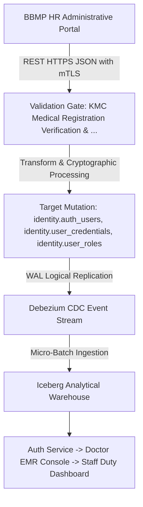

#### Multi-Stage Data Manipulation Lifecycle
1. **Stage 1 (Ingress & Handshake)**: Data originates at `BBMP HR Administrative Portal` and enters the platform boundary via `REST HTTPS JSON with mTLS` with mandatory TLS 1.3 encryption.
2. **Stage 2 (Syntactic & Semantic Validation)**: Payloads pass through `KMC Medical Registration Verification & Email/Mobile Validation (DQ-001, DQ-008)`. Violations trigger synchronous rejection prior to database access.
3. **Stage 3 (Cryptographic Normalization)**: Argon2id password hashing + Blind index derivation on phone. Sensitive attributes receive column-level envelope encryption or HMAC blinding.
4. **Stage 4 (Atomic Storage Persistence)**: Target entities in `identity.auth_users, identity.user_credentials, identity.user_roles` mutate within an ACID transaction block, enforcing Every clinician assigned role must hold active KMC/NMC registration number.
5. **Stage 5 (Asynchronous CDC Emission)**: PostgreSQL WAL logical decoding emits change events to Kafka topic `cdc.identity.auth_users`.
6. **Stage 6 (Analytical Lakehouse Landing)**: Change events stream into Iceberg Parquet partitions, updating analytical star schemas within SLA targets.
7. **Stage 7 (Downstream Egress & ML Ingestion)**: Downstream consumers in `Auth Service -> Doctor EMR Console -> Staff Duty Dashboard` consume verified records via Trino or authenticated REST APIs.

#### Cryptographic & Security Safeguards
- **In-Transit Protection**: Encrypted via mTLS 1.3 using ECDHE-RSA-AES256-GCM-SHA384 cipher suites.
- **At-Rest Protection**: Column-level AES-256-GCM for PII and Argon2id for authentication credentials.
- **Provenance Fingerprint**: SHA-256 HMAC digest computed across mutated row attributes and linked to audit ledger.
- **Latency SLA**: Ingress-to-OLTP < 50ms; CDC-to-Kafka < 500ms; Lakehouse-availability < 15 minutes.

#### Complete Documentation-Only SQL Ingestion & Transformation Snippet
This SQL illustrates the transactional mutation logic executed by the operational service:
```sql
-- DOCUMENTATION-ONLY SQL: Transactional Transformation Logic for LINEAGE-001
BEGIN;
-- Step 1: Pre-validation assertion
SELECT 1 FROM identity.auth_users WHERE 1=0;
-- Step 2: Atomic mutation into primary entity
INSERT INTO identity.auth_users (
    id, created_at, updated_at, is_active
) VALUES (
    gen_random_uuid(), CURRENT_TIMESTAMP, CURRENT_TIMESTAMP, true
);
-- Step 3: Append cryptographic state record to audit ledger
INSERT INTO audit.audit_events (
    event_id, event_timestamp, entity_name, action_type, security_classification
) VALUES (
    gen_random_uuid(), CURRENT_TIMESTAMP, 'identity.auth_users', 'INSERT', 'CLASS-004'
);
COMMIT;
```

#### Failure Modes & Automated Remediation Runbook
When failures occur along `LINEAGE-001`, the operational monitoring engine executes the triage protocol below:
- **Transient Network Timeout**: Retry with exponential backoff (initial delay 500ms, max 3 retries).
- **Validation Failure**: Route malformed payload to Dead Letter Queue topic `dlq.identity.auth_users`; alert operations team.
- **Lock Contention**: PostgreSQL aborts transaction on lock timeout; retry worker reschedules payload after 2 seconds.
- **Downstream Consumer Lag**: If consumers of `Auth Service -> Doctor EMR Console -> Staff Duty Dashboard` lag > 15 minutes behind CDC stream, Kafka auto-scaling deploys additional worker pods.

#### Complete OpenLineage Event Specification
This JSON payload defines the OpenLineage run facet emitted by the service worker:
```json
{
  "eventType": "COMPLETE",
  "job": {
    "namespace": "namma_clinic.pipeline",
    "name": "lineage_001_job"
  },
  "inputs": [
    { "namespace": "source_system", "name": "bbmp_hr_administrative_portal" }
  ],
  "outputs": [
    { "namespace": "postgres.primary", "name": "identity.auth_users" }
  ],
  "producer": "https://github.com/saimaa0910/mvp/scripts/database"
}
```

### 3.2 LINEAGE-002: Biometric Clock-in & Staff Shift Duty Lineage

- **Pathway Identifier**: `LINEAGE-002`
- **Primary Ingestion Source**: Clinic Edge Biometric Scanner / Tablet Camera
- **Transport & Protocol**: Encrypted MQTT WebSocket push
- **Validation Controls & Quality Gates**: Subnet IP check & facial biometric vector comparison
- **Target Database Tables**: `identity.staff_shifts`
- **Security Classification**: `CLASS-002`
- **Applicable Retention Policy**: `RETENTION-002`
- **Downstream Consumers**: Staff Attendance Dashboard -> Duty Roster SLA Monitor -> Payroll Link

#### Architectural Data Flow Diagram
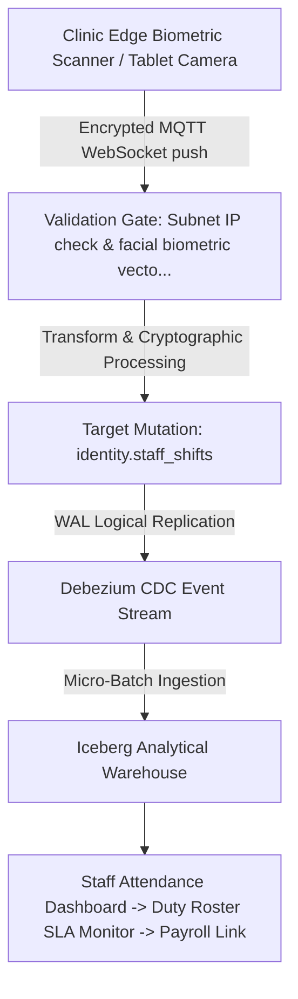

#### Multi-Stage Data Manipulation Lifecycle
1. **Stage 1 (Ingress & Handshake)**: Data originates at `Clinic Edge Biometric Scanner / Tablet Camera` and enters the platform boundary via `Encrypted MQTT WebSocket push` with mandatory TLS 1.3 encryption.
2. **Stage 2 (Syntactic & Semantic Validation)**: Payloads pass through `Subnet IP check & facial biometric vector comparison`. Violations trigger synchronous rejection prior to database access.
3. **Stage 3 (Cryptographic Normalization)**: Clock-in punch time rounded to nearest minute + shift status set to ACTIVE. Sensitive attributes receive column-level envelope encryption or HMAC blinding.
4. **Stage 4 (Atomic Storage Persistence)**: Target entities in `identity.staff_shifts` mutate within an ACID transaction block, enforcing Clock-in valid within 30 minutes of scheduled shift start.
5. **Stage 5 (Asynchronous CDC Emission)**: PostgreSQL WAL logical decoding emits change events to Kafka topic `cdc.identity.staff_shifts`.
6. **Stage 6 (Analytical Lakehouse Landing)**: Change events stream into Iceberg Parquet partitions, updating analytical star schemas within SLA targets.
7. **Stage 7 (Downstream Egress & ML Ingestion)**: Downstream consumers in `Staff Attendance Dashboard -> Duty Roster SLA Monitor -> Payroll Link` consume verified records via Trino or authenticated REST APIs.

#### Cryptographic & Security Safeguards
- **In-Transit Protection**: Encrypted via mTLS 1.3 using ECDHE-RSA-AES256-GCM-SHA384 cipher suites.
- **At-Rest Protection**: Column-level AES-256-GCM for PII and Argon2id for authentication credentials.
- **Provenance Fingerprint**: SHA-256 HMAC digest computed across mutated row attributes and linked to audit ledger.
- **Latency SLA**: Ingress-to-OLTP < 50ms; CDC-to-Kafka < 500ms; Lakehouse-availability < 15 minutes.

#### Complete Documentation-Only SQL Ingestion & Transformation Snippet
This SQL illustrates the transactional mutation logic executed by the operational service:
```sql
-- DOCUMENTATION-ONLY SQL: Transactional Transformation Logic for LINEAGE-002
BEGIN;
-- Step 1: Pre-validation assertion
SELECT 1 FROM identity.staff_shifts WHERE 1=0;
-- Step 2: Atomic mutation into primary entity
INSERT INTO identity.staff_shifts (
    id, created_at, updated_at, is_active
) VALUES (
    gen_random_uuid(), CURRENT_TIMESTAMP, CURRENT_TIMESTAMP, true
);
-- Step 3: Append cryptographic state record to audit ledger
INSERT INTO audit.audit_events (
    event_id, event_timestamp, entity_name, action_type, security_classification
) VALUES (
    gen_random_uuid(), CURRENT_TIMESTAMP, 'identity.staff_shifts', 'INSERT', 'CLASS-002'
);
COMMIT;
```

#### Failure Modes & Automated Remediation Runbook
When failures occur along `LINEAGE-002`, the operational monitoring engine executes the triage protocol below:
- **Transient Network Timeout**: Retry with exponential backoff (initial delay 500ms, max 3 retries).
- **Validation Failure**: Route malformed payload to Dead Letter Queue topic `dlq.identity.staff_shifts`; alert operations team.
- **Lock Contention**: PostgreSQL aborts transaction on lock timeout; retry worker reschedules payload after 2 seconds.
- **Downstream Consumer Lag**: If consumers of `Staff Attendance Dashboard -> Duty Roster SLA Monitor -> Payroll Link` lag > 15 minutes behind CDC stream, Kafka auto-scaling deploys additional worker pods.

#### Complete OpenLineage Event Specification
This JSON payload defines the OpenLineage run facet emitted by the service worker:
```json
{
  "eventType": "COMPLETE",
  "job": {
    "namespace": "namma_clinic.pipeline",
    "name": "lineage_002_job"
  },
  "inputs": [
    { "namespace": "source_system", "name": "clinic_edge_biometric_scanner_/_tablet_camera" }
  ],
  "outputs": [
    { "namespace": "postgres.primary", "name": "identity.staff_shifts" }
  ],
  "producer": "https://github.com/saimaa0910/mvp/scripts/database"
}
```

### 3.3 LINEAGE-003: Facility Metadata & Geo-boundary Lineage

- **Pathway Identifier**: `LINEAGE-003`
- **Primary Ingestion Source**: Karnataka Urban Development Department (UDD) GIS
- **Transport & Protocol**: Shapefile / GeoJSON ETL ingestion
- **Validation Controls & Quality Gates**: Bengaluru municipal bounding box validation (DQ-007, DQ-049)
- **Target Database Tables**: `identity.facilities, identity.facility_rooms`
- **Security Classification**: `CLASS-001`
- **Applicable Retention Policy**: `RETENTION-006`
- **Downstream Consumers**: Clinic Locator Public Portal -> GIS Disease Heatmap -> Supply Chain Logistics

#### Architectural Data Flow Diagram
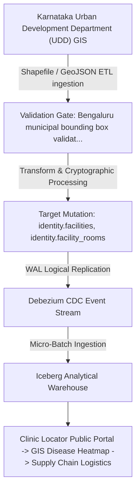

#### Multi-Stage Data Manipulation Lifecycle
1. **Stage 1 (Ingress & Handshake)**: Data originates at `Karnataka Urban Development Department (UDD) GIS` and enters the platform boundary via `Shapefile / GeoJSON ETL ingestion` with mandatory TLS 1.3 encryption.
2. **Stage 2 (Syntactic & Semantic Validation)**: Payloads pass through `Bengaluru municipal bounding box validation (DQ-007, DQ-049)`. Violations trigger synchronous rejection prior to database access.
3. **Stage 3 (Cryptographic Normalization)**: Coordinate projection to WGS84 + Ward polygon spatial join. Sensitive attributes receive column-level envelope encryption or HMAC blinding.
4. **Stage 4 (Atomic Storage Persistence)**: Target entities in `identity.facilities, identity.facility_rooms` mutate within an ACID transaction block, enforcing Every clinic must resolve to exactly one BBMP ward and zone.
5. **Stage 5 (Asynchronous CDC Emission)**: PostgreSQL WAL logical decoding emits change events to Kafka topic `cdc.identity.facilities`.
6. **Stage 6 (Analytical Lakehouse Landing)**: Change events stream into Iceberg Parquet partitions, updating analytical star schemas within SLA targets.
7. **Stage 7 (Downstream Egress & ML Ingestion)**: Downstream consumers in `Clinic Locator Public Portal -> GIS Disease Heatmap -> Supply Chain Logistics` consume verified records via Trino or authenticated REST APIs.

#### Cryptographic & Security Safeguards
- **In-Transit Protection**: Encrypted via mTLS 1.3 using ECDHE-RSA-AES256-GCM-SHA384 cipher suites.
- **At-Rest Protection**: Column-level AES-256-GCM for PII and Argon2id for authentication credentials.
- **Provenance Fingerprint**: SHA-256 HMAC digest computed across mutated row attributes and linked to audit ledger.
- **Latency SLA**: Ingress-to-OLTP < 50ms; CDC-to-Kafka < 500ms; Lakehouse-availability < 15 minutes.

#### Complete Documentation-Only SQL Ingestion & Transformation Snippet
This SQL illustrates the transactional mutation logic executed by the operational service:
```sql
-- DOCUMENTATION-ONLY SQL: Transactional Transformation Logic for LINEAGE-003
BEGIN;
-- Step 1: Pre-validation assertion
SELECT 1 FROM identity.facilities WHERE 1=0;
-- Step 2: Atomic mutation into primary entity
INSERT INTO identity.facilities (
    id, created_at, updated_at, is_active
) VALUES (
    gen_random_uuid(), CURRENT_TIMESTAMP, CURRENT_TIMESTAMP, true
);
-- Step 3: Append cryptographic state record to audit ledger
INSERT INTO audit.audit_events (
    event_id, event_timestamp, entity_name, action_type, security_classification
) VALUES (
    gen_random_uuid(), CURRENT_TIMESTAMP, 'identity.facilities', 'INSERT', 'CLASS-001'
);
COMMIT;
```

#### Failure Modes & Automated Remediation Runbook
When failures occur along `LINEAGE-003`, the operational monitoring engine executes the triage protocol below:
- **Transient Network Timeout**: Retry with exponential backoff (initial delay 500ms, max 3 retries).
- **Validation Failure**: Route malformed payload to Dead Letter Queue topic `dlq.identity.facilities`; alert operations team.
- **Lock Contention**: PostgreSQL aborts transaction on lock timeout; retry worker reschedules payload after 2 seconds.
- **Downstream Consumer Lag**: If consumers of `Clinic Locator Public Portal -> GIS Disease Heatmap -> Supply Chain Logistics` lag > 15 minutes behind CDC stream, Kafka auto-scaling deploys additional worker pods.

#### Complete OpenLineage Event Specification
This JSON payload defines the OpenLineage run facet emitted by the service worker:
```json
{
  "eventType": "COMPLETE",
  "job": {
    "namespace": "namma_clinic.pipeline",
    "name": "lineage_003_job"
  },
  "inputs": [
    { "namespace": "source_system", "name": "karnataka_urban_development_department_(udd)_gis" }
  ],
  "outputs": [
    { "namespace": "postgres.primary", "name": "identity.facilities" }
  ],
  "producer": "https://github.com/saimaa0910/mvp/scripts/database"
}
```

### 3.4 LINEAGE-004: Citizen Intake & Master Patient Demographics Lineage

- **Pathway Identifier**: `LINEAGE-004`
- **Primary Ingestion Source**: Clinic Reception Desk / Citizen Mobile App
- **Transport & Protocol**: Reception UI Form / ABDM QR Scan
- **Validation Controls & Quality Gates**: Age bounds, Indian mobile format, and deduplication blind index (DQ-010, DQ-013)
- **Target Database Tables**: `intake.patients, intake.patient_identifiers, intake.patient_contacts, intake.patient_addresses`
- **Security Classification**: `CLASS-004`
- **Applicable Retention Policy**: `RETENTION-001`
- **Downstream Consumers**: Doctor Consultation EMR -> Master Patient Index -> ABDM Gateway

#### Architectural Data Flow Diagram
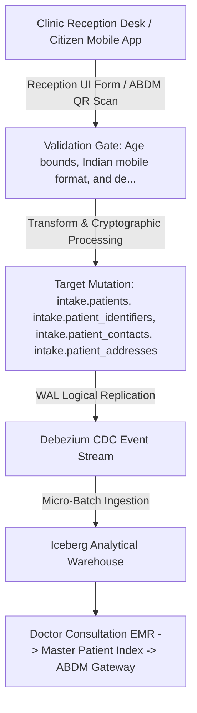

#### Multi-Stage Data Manipulation Lifecycle
1. **Stage 1 (Ingress & Handshake)**: Data originates at `Clinic Reception Desk / Citizen Mobile App` and enters the platform boundary via `Reception UI Form / ABDM QR Scan` with mandatory TLS 1.3 encryption.
2. **Stage 2 (Syntactic & Semantic Validation)**: Payloads pass through `Age bounds, Indian mobile format, and deduplication blind index (DQ-010, DQ-013)`. Violations trigger synchronous rejection prior to database access.
3. **Stage 3 (Cryptographic Normalization)**: Surrogate UUIDv7 allocation + Column-level AES-256-GCM encryption on PII. Sensitive attributes receive column-level envelope encryption or HMAC blinding.
4. **Stage 4 (Atomic Storage Persistence)**: Target entities in `intake.patients, intake.patient_identifiers, intake.patient_contacts, intake.patient_addresses` mutate within an ACID transaction block, enforcing Patient uniquely identified by composite of phone hash, DOB, and gender if ABHA absent.
5. **Stage 5 (Asynchronous CDC Emission)**: PostgreSQL WAL logical decoding emits change events to Kafka topic `cdc.intake.patients`.
6. **Stage 6 (Analytical Lakehouse Landing)**: Change events stream into Iceberg Parquet partitions, updating analytical star schemas within SLA targets.
7. **Stage 7 (Downstream Egress & ML Ingestion)**: Downstream consumers in `Doctor Consultation EMR -> Master Patient Index -> ABDM Gateway` consume verified records via Trino or authenticated REST APIs.

#### Cryptographic & Security Safeguards
- **In-Transit Protection**: Encrypted via mTLS 1.3 using ECDHE-RSA-AES256-GCM-SHA384 cipher suites.
- **At-Rest Protection**: Column-level AES-256-GCM for PII and Argon2id for authentication credentials.
- **Provenance Fingerprint**: SHA-256 HMAC digest computed across mutated row attributes and linked to audit ledger.
- **Latency SLA**: Ingress-to-OLTP < 50ms; CDC-to-Kafka < 500ms; Lakehouse-availability < 15 minutes.

#### Complete Documentation-Only SQL Ingestion & Transformation Snippet
This SQL illustrates the transactional mutation logic executed by the operational service:
```sql
-- DOCUMENTATION-ONLY SQL: Transactional Transformation Logic for LINEAGE-004
BEGIN;
-- Step 1: Pre-validation assertion
SELECT 1 FROM intake.patients WHERE 1=0;
-- Step 2: Atomic mutation into primary entity
INSERT INTO intake.patients (
    id, created_at, updated_at, is_active
) VALUES (
    gen_random_uuid(), CURRENT_TIMESTAMP, CURRENT_TIMESTAMP, true
);
-- Step 3: Append cryptographic state record to audit ledger
INSERT INTO audit.audit_events (
    event_id, event_timestamp, entity_name, action_type, security_classification
) VALUES (
    gen_random_uuid(), CURRENT_TIMESTAMP, 'intake.patients', 'INSERT', 'CLASS-004'
);
COMMIT;
```

#### Failure Modes & Automated Remediation Runbook
When failures occur along `LINEAGE-004`, the operational monitoring engine executes the triage protocol below:
- **Transient Network Timeout**: Retry with exponential backoff (initial delay 500ms, max 3 retries).
- **Validation Failure**: Route malformed payload to Dead Letter Queue topic `dlq.intake.patients`; alert operations team.
- **Lock Contention**: PostgreSQL aborts transaction on lock timeout; retry worker reschedules payload after 2 seconds.
- **Downstream Consumer Lag**: If consumers of `Doctor Consultation EMR -> Master Patient Index -> ABDM Gateway` lag > 15 minutes behind CDC stream, Kafka auto-scaling deploys additional worker pods.

#### Complete OpenLineage Event Specification
This JSON payload defines the OpenLineage run facet emitted by the service worker:
```json
{
  "eventType": "COMPLETE",
  "job": {
    "namespace": "namma_clinic.pipeline",
    "name": "lineage_004_job"
  },
  "inputs": [
    { "namespace": "source_system", "name": "clinic_reception_desk_/_citizen_mobile_app" }
  ],
  "outputs": [
    { "namespace": "postgres.primary", "name": "intake.patients" }
  ],
  "producer": "https://github.com/saimaa0910/mvp/scripts/database"
}
```

### 3.5 LINEAGE-005: DPDP Citizen Consent & ABDM Health Artifact Lineage

- **Pathway Identifier**: `LINEAGE-005`
- **Primary Ingestion Source**: Citizen Consent Terminal / ABDM Consent Manager
- **Transport & Protocol**: ABDM M2 Gateway Webhook / OTP Challenge
- **Validation Controls & Quality Gates**: Cryptographic signature validation + validity window checks (DQ-015, DQ-043)
- **Target Database Tables**: `intake.consent_records, sync.abdm_artifacts`
- **Security Classification**: `CLASS-004`
- **Applicable Retention Policy**: `RETENTION-005`
- **Downstream Consumers**: Policy Enforcement Point (PEP) -> ABDM Document Bridge -> DPO Compliance Audit

#### Architectural Data Flow Diagram
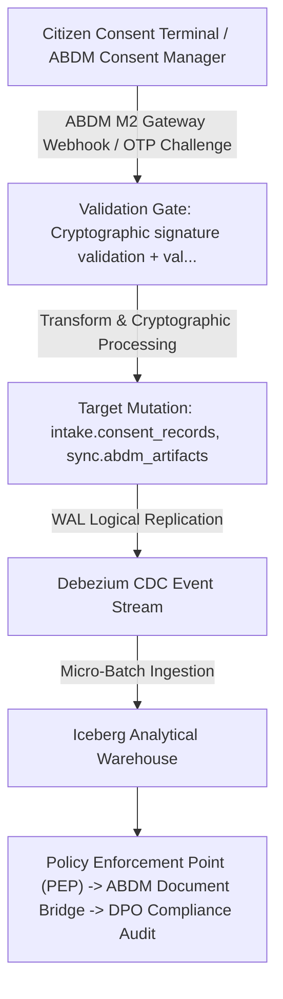

#### Multi-Stage Data Manipulation Lifecycle
1. **Stage 1 (Ingress & Handshake)**: Data originates at `Citizen Consent Terminal / ABDM Consent Manager` and enters the platform boundary via `ABDM M2 Gateway Webhook / OTP Challenge` with mandatory TLS 1.3 encryption.
2. **Stage 2 (Syntactic & Semantic Validation)**: Payloads pass through `Cryptographic signature validation + validity window checks (DQ-015, DQ-043)`. Violations trigger synchronous rejection prior to database access.
3. **Stage 3 (Cryptographic Normalization)**: Consent artifact JSON serialization + SHA-256 HMAC digital seal. Sensitive attributes receive column-level envelope encryption or HMAC blinding.
4. **Stage 4 (Atomic Storage Persistence)**: Target entities in `intake.consent_records, sync.abdm_artifacts` mutate within an ACID transaction block, enforcing No clinical data shared externally without active consent record.
5. **Stage 5 (Asynchronous CDC Emission)**: PostgreSQL WAL logical decoding emits change events to Kafka topic `cdc.intake.consent_records`.
6. **Stage 6 (Analytical Lakehouse Landing)**: Change events stream into Iceberg Parquet partitions, updating analytical star schemas within SLA targets.
7. **Stage 7 (Downstream Egress & ML Ingestion)**: Downstream consumers in `Policy Enforcement Point (PEP) -> ABDM Document Bridge -> DPO Compliance Audit` consume verified records via Trino or authenticated REST APIs.

#### Cryptographic & Security Safeguards
- **In-Transit Protection**: Encrypted via mTLS 1.3 using ECDHE-RSA-AES256-GCM-SHA384 cipher suites.
- **At-Rest Protection**: Column-level AES-256-GCM for PII and Argon2id for authentication credentials.
- **Provenance Fingerprint**: SHA-256 HMAC digest computed across mutated row attributes and linked to audit ledger.
- **Latency SLA**: Ingress-to-OLTP < 50ms; CDC-to-Kafka < 500ms; Lakehouse-availability < 15 minutes.

#### Complete Documentation-Only SQL Ingestion & Transformation Snippet
This SQL illustrates the transactional mutation logic executed by the operational service:
```sql
-- DOCUMENTATION-ONLY SQL: Transactional Transformation Logic for LINEAGE-005
BEGIN;
-- Step 1: Pre-validation assertion
SELECT 1 FROM intake.consent_records WHERE 1=0;
-- Step 2: Atomic mutation into primary entity
INSERT INTO intake.consent_records (
    id, created_at, updated_at, is_active
) VALUES (
    gen_random_uuid(), CURRENT_TIMESTAMP, CURRENT_TIMESTAMP, true
);
-- Step 3: Append cryptographic state record to audit ledger
INSERT INTO audit.audit_events (
    event_id, event_timestamp, entity_name, action_type, security_classification
) VALUES (
    gen_random_uuid(), CURRENT_TIMESTAMP, 'intake.consent_records', 'INSERT', 'CLASS-004'
);
COMMIT;
```

#### Failure Modes & Automated Remediation Runbook
When failures occur along `LINEAGE-005`, the operational monitoring engine executes the triage protocol below:
- **Transient Network Timeout**: Retry with exponential backoff (initial delay 500ms, max 3 retries).
- **Validation Failure**: Route malformed payload to Dead Letter Queue topic `dlq.intake.consent_records`; alert operations team.
- **Lock Contention**: PostgreSQL aborts transaction on lock timeout; retry worker reschedules payload after 2 seconds.
- **Downstream Consumer Lag**: If consumers of `Policy Enforcement Point (PEP) -> ABDM Document Bridge -> DPO Compliance Audit` lag > 15 minutes behind CDC stream, Kafka auto-scaling deploys additional worker pods.

#### Complete OpenLineage Event Specification
This JSON payload defines the OpenLineage run facet emitted by the service worker:
```json
{
  "eventType": "COMPLETE",
  "job": {
    "namespace": "namma_clinic.pipeline",
    "name": "lineage_005_job"
  },
  "inputs": [
    { "namespace": "source_system", "name": "citizen_consent_terminal_/_abdm_consent_manager" }
  ],
  "outputs": [
    { "namespace": "postgres.primary", "name": "intake.consent_records" }
  ],
  "producer": "https://github.com/saimaa0910/mvp/scripts/database"
}
```

### 3.6 LINEAGE-006: Daily Intake Token & Queue Stage Progression Lineage

- **Pathway Identifier**: `LINEAGE-006`
- **Primary Ingestion Source**: Reception Kiosk / Token Printer Hardware
- **Transport & Protocol**: Local edge queue controller API
- **Validation Controls & Quality Gates**: Daily sequence range check & active token duplicate check (DQ-016)
- **Target Database Tables**: `intake.tokens, intake.queue_entries`
- **Security Classification**: `CLASS-002`
- **Applicable Retention Policy**: `RETENTION-007`
- **Downstream Consumers**: Waiting Hall Display TV -> Nurse Station Worklist -> Doctor Call Queue

#### Architectural Data Flow Diagram
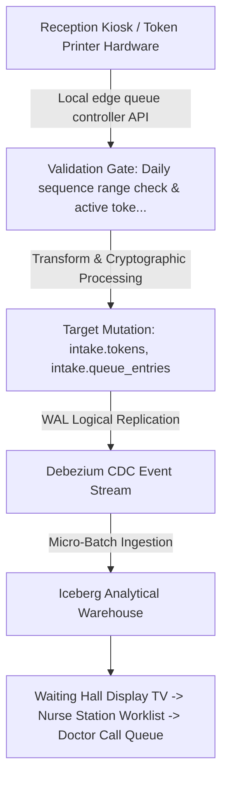

#### Multi-Stage Data Manipulation Lifecycle
1. **Stage 1 (Ingress & Handshake)**: Data originates at `Reception Kiosk / Token Printer Hardware` and enters the platform boundary via `Local edge queue controller API` with mandatory TLS 1.3 encryption.
2. **Stage 2 (Syntactic & Semantic Validation)**: Payloads pass through `Daily sequence range check & active token duplicate check (DQ-016)`. Violations trigger synchronous rejection prior to database access.
3. **Stage 3 (Cryptographic Normalization)**: Advisory lock sequential numbering (e.g. A-042) + initial TRIAGE stage creation. Sensitive attributes receive column-level envelope encryption or HMAC blinding.
4. **Stage 4 (Atomic Storage Persistence)**: Target entities in `intake.tokens, intake.queue_entries` mutate within an ACID transaction block, enforcing Daily token valid only for date of issue at issuing clinic facility.
5. **Stage 5 (Asynchronous CDC Emission)**: PostgreSQL WAL logical decoding emits change events to Kafka topic `cdc.intake.tokens`.
6. **Stage 6 (Analytical Lakehouse Landing)**: Change events stream into Iceberg Parquet partitions, updating analytical star schemas within SLA targets.
7. **Stage 7 (Downstream Egress & ML Ingestion)**: Downstream consumers in `Waiting Hall Display TV -> Nurse Station Worklist -> Doctor Call Queue` consume verified records via Trino or authenticated REST APIs.

#### Cryptographic & Security Safeguards
- **In-Transit Protection**: Encrypted via mTLS 1.3 using ECDHE-RSA-AES256-GCM-SHA384 cipher suites.
- **At-Rest Protection**: Column-level AES-256-GCM for PII and Argon2id for authentication credentials.
- **Provenance Fingerprint**: SHA-256 HMAC digest computed across mutated row attributes and linked to audit ledger.
- **Latency SLA**: Ingress-to-OLTP < 50ms; CDC-to-Kafka < 500ms; Lakehouse-availability < 15 minutes.

#### Complete Documentation-Only SQL Ingestion & Transformation Snippet
This SQL illustrates the transactional mutation logic executed by the operational service:
```sql
-- DOCUMENTATION-ONLY SQL: Transactional Transformation Logic for LINEAGE-006
BEGIN;
-- Step 1: Pre-validation assertion
SELECT 1 FROM intake.tokens WHERE 1=0;
-- Step 2: Atomic mutation into primary entity
INSERT INTO intake.tokens (
    id, created_at, updated_at, is_active
) VALUES (
    gen_random_uuid(), CURRENT_TIMESTAMP, CURRENT_TIMESTAMP, true
);
-- Step 3: Append cryptographic state record to audit ledger
INSERT INTO audit.audit_events (
    event_id, event_timestamp, entity_name, action_type, security_classification
) VALUES (
    gen_random_uuid(), CURRENT_TIMESTAMP, 'intake.tokens', 'INSERT', 'CLASS-002'
);
COMMIT;
```

#### Failure Modes & Automated Remediation Runbook
When failures occur along `LINEAGE-006`, the operational monitoring engine executes the triage protocol below:
- **Transient Network Timeout**: Retry with exponential backoff (initial delay 500ms, max 3 retries).
- **Validation Failure**: Route malformed payload to Dead Letter Queue topic `dlq.intake.tokens`; alert operations team.
- **Lock Contention**: PostgreSQL aborts transaction on lock timeout; retry worker reschedules payload after 2 seconds.
- **Downstream Consumer Lag**: If consumers of `Waiting Hall Display TV -> Nurse Station Worklist -> Doctor Call Queue` lag > 15 minutes behind CDC stream, Kafka auto-scaling deploys additional worker pods.

#### Complete OpenLineage Event Specification
This JSON payload defines the OpenLineage run facet emitted by the service worker:
```json
{
  "eventType": "COMPLETE",
  "job": {
    "namespace": "namma_clinic.pipeline",
    "name": "lineage_006_job"
  },
  "inputs": [
    { "namespace": "source_system", "name": "reception_kiosk_/_token_printer_hardware" }
  ],
  "outputs": [
    { "namespace": "postgres.primary", "name": "intake.tokens" }
  ],
  "producer": "https://github.com/saimaa0910/mvp/scripts/database"
}
```

### 3.7 LINEAGE-007: Nursing Triage Vitals & Clinical Danger Alert Lineage

- **Pathway Identifier**: `LINEAGE-007`
- **Primary Ingestion Source**: Nurse Station Bluetooth Blood Pressure / SpO2 Sensor & Tablet
- **Transport & Protocol**: BLE Peripheral Sync / Touchscreen Input
- **Validation Controls & Quality Gates**: Physiological range checks (DQ-018, DQ-045, DQ-046, DQ-047)
- **Target Database Tables**: `intake.triage_assessments, intake.patient_vitals, intake.danger_alerts`
- **Security Classification**: `CLASS-003`
- **Applicable Retention Policy**: `RETENTION-001`
- **Downstream Consumers**: Doctor Consultation Workstation Alert Banner -> Emergency Triage Priority Queue

#### Architectural Data Flow Diagram
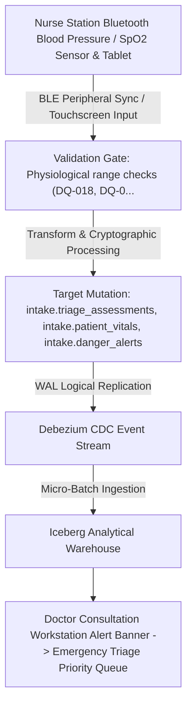

#### Multi-Stage Data Manipulation Lifecycle
1. **Stage 1 (Ingress & Handshake)**: Data originates at `Nurse Station Bluetooth Blood Pressure / SpO2 Sensor & Tablet` and enters the platform boundary via `BLE Peripheral Sync / Touchscreen Input` with mandatory TLS 1.3 encryption.
2. **Stage 2 (Syntactic & Semantic Validation)**: Payloads pass through `Physiological range checks (DQ-018, DQ-045, DQ-046, DQ-047)`. Violations trigger synchronous rejection prior to database access.
3. **Stage 3 (Cryptographic Normalization)**: SATS score calculation + Automated threshold evaluation for immediate doctor alert. Sensitive attributes receive column-level envelope encryption or HMAC blinding.
4. **Stage 4 (Atomic Storage Persistence)**: Target entities in `intake.triage_assessments, intake.patient_vitals, intake.danger_alerts` mutate within an ACID transaction block, enforcing Systolic BP >= 180 or SpO2 <= 92% triggers mandatory instant danger alert.
5. **Stage 5 (Asynchronous CDC Emission)**: PostgreSQL WAL logical decoding emits change events to Kafka topic `cdc.intake.triage_assessments`.
6. **Stage 6 (Analytical Lakehouse Landing)**: Change events stream into Iceberg Parquet partitions, updating analytical star schemas within SLA targets.
7. **Stage 7 (Downstream Egress & ML Ingestion)**: Downstream consumers in `Doctor Consultation Workstation Alert Banner -> Emergency Triage Priority Queue` consume verified records via Trino or authenticated REST APIs.

#### Cryptographic & Security Safeguards
- **In-Transit Protection**: Encrypted via mTLS 1.3 using ECDHE-RSA-AES256-GCM-SHA384 cipher suites.
- **At-Rest Protection**: Column-level AES-256-GCM for PII and Argon2id for authentication credentials.
- **Provenance Fingerprint**: SHA-256 HMAC digest computed across mutated row attributes and linked to audit ledger.
- **Latency SLA**: Ingress-to-OLTP < 50ms; CDC-to-Kafka < 500ms; Lakehouse-availability < 15 minutes.

#### Complete Documentation-Only SQL Ingestion & Transformation Snippet
This SQL illustrates the transactional mutation logic executed by the operational service:
```sql
-- DOCUMENTATION-ONLY SQL: Transactional Transformation Logic for LINEAGE-007
BEGIN;
-- Step 1: Pre-validation assertion
SELECT 1 FROM intake.triage_assessments WHERE 1=0;
-- Step 2: Atomic mutation into primary entity
INSERT INTO intake.triage_assessments (
    id, created_at, updated_at, is_active
) VALUES (
    gen_random_uuid(), CURRENT_TIMESTAMP, CURRENT_TIMESTAMP, true
);
-- Step 3: Append cryptographic state record to audit ledger
INSERT INTO audit.audit_events (
    event_id, event_timestamp, entity_name, action_type, security_classification
) VALUES (
    gen_random_uuid(), CURRENT_TIMESTAMP, 'intake.triage_assessments', 'INSERT', 'CLASS-003'
);
COMMIT;
```

#### Failure Modes & Automated Remediation Runbook
When failures occur along `LINEAGE-007`, the operational monitoring engine executes the triage protocol below:
- **Transient Network Timeout**: Retry with exponential backoff (initial delay 500ms, max 3 retries).
- **Validation Failure**: Route malformed payload to Dead Letter Queue topic `dlq.intake.triage_assessments`; alert operations team.
- **Lock Contention**: PostgreSQL aborts transaction on lock timeout; retry worker reschedules payload after 2 seconds.
- **Downstream Consumer Lag**: If consumers of `Doctor Consultation Workstation Alert Banner -> Emergency Triage Priority Queue` lag > 15 minutes behind CDC stream, Kafka auto-scaling deploys additional worker pods.

#### Complete OpenLineage Event Specification
This JSON payload defines the OpenLineage run facet emitted by the service worker:
```json
{
  "eventType": "COMPLETE",
  "job": {
    "namespace": "namma_clinic.pipeline",
    "name": "lineage_007_job"
  },
  "inputs": [
    { "namespace": "source_system", "name": "nurse_station_bluetooth_blood_pressure_/_spo2_sensor_&_tablet" }
  ],
  "outputs": [
    { "namespace": "postgres.primary", "name": "intake.triage_assessments" }
  ],
  "producer": "https://github.com/saimaa0910/mvp/scripts/database"
}
```

### 3.8 LINEAGE-008: Doctor Clinical Consultation Encounter & SOAP Notes Lineage

- **Pathway Identifier**: `LINEAGE-008`
- **Primary Ingestion Source**: Doctor Consultation Workstation
- **Transport & Protocol**: EMR Form Submit via HTTPS mTLS
- **Validation Controls & Quality Gates**: Mandatory diagnosis check + narrative length check (DQ-020, DQ-021)
- **Target Database Tables**: `clinical.clinical_encounters, clinical.clinical_notes`
- **Security Classification**: `CLASS-005`
- **Applicable Retention Policy**: `RETENTION-001`
- **Downstream Consumers**: Citizen Health Record -> Referral Dossier Service -> Clinical NLP Summarizer

#### Architectural Data Flow Diagram
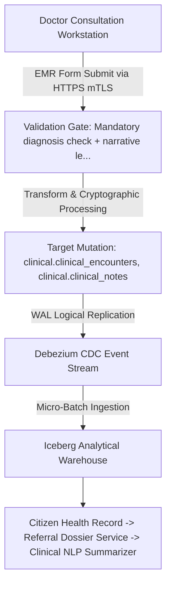

#### Multi-Stage Data Manipulation Lifecycle
1. **Stage 1 (Ingress & Handshake)**: Data originates at `Doctor Consultation Workstation` and enters the platform boundary via `EMR Form Submit via HTTPS mTLS` with mandatory TLS 1.3 encryption.
2. **Stage 2 (Syntactic & Semantic Validation)**: Payloads pass through `Mandatory diagnosis check + narrative length check (DQ-020, DQ-021)`. Violations trigger synchronous rejection prior to database access.
3. **Stage 3 (Cryptographic Normalization)**: Doctor digital signature cryptographic token embedding + SOAP note JSON packaging. Sensitive attributes receive column-level envelope encryption or HMAC blinding.
4. **Stage 4 (Atomic Storage Persistence)**: Target entities in `clinical.clinical_encounters, clinical.clinical_notes` mutate within an ACID transaction block, enforcing Signed encounter becomes permanently immutable; corrections require addendum.
5. **Stage 5 (Asynchronous CDC Emission)**: PostgreSQL WAL logical decoding emits change events to Kafka topic `cdc.clinical.clinical_encounters`.
6. **Stage 6 (Analytical Lakehouse Landing)**: Change events stream into Iceberg Parquet partitions, updating analytical star schemas within SLA targets.
7. **Stage 7 (Downstream Egress & ML Ingestion)**: Downstream consumers in `Citizen Health Record -> Referral Dossier Service -> Clinical NLP Summarizer` consume verified records via Trino or authenticated REST APIs.

#### Cryptographic & Security Safeguards
- **In-Transit Protection**: Encrypted via mTLS 1.3 using ECDHE-RSA-AES256-GCM-SHA384 cipher suites.
- **At-Rest Protection**: Column-level AES-256-GCM for PII and Argon2id for authentication credentials.
- **Provenance Fingerprint**: SHA-256 HMAC digest computed across mutated row attributes and linked to audit ledger.
- **Latency SLA**: Ingress-to-OLTP < 50ms; CDC-to-Kafka < 500ms; Lakehouse-availability < 15 minutes.

#### Complete Documentation-Only SQL Ingestion & Transformation Snippet
This SQL illustrates the transactional mutation logic executed by the operational service:
```sql
-- DOCUMENTATION-ONLY SQL: Transactional Transformation Logic for LINEAGE-008
BEGIN;
-- Step 1: Pre-validation assertion
SELECT 1 FROM clinical.clinical_encounters WHERE 1=0;
-- Step 2: Atomic mutation into primary entity
INSERT INTO clinical.clinical_encounters (
    id, created_at, updated_at, is_active
) VALUES (
    gen_random_uuid(), CURRENT_TIMESTAMP, CURRENT_TIMESTAMP, true
);
-- Step 3: Append cryptographic state record to audit ledger
INSERT INTO audit.audit_events (
    event_id, event_timestamp, entity_name, action_type, security_classification
) VALUES (
    gen_random_uuid(), CURRENT_TIMESTAMP, 'clinical.clinical_encounters', 'INSERT', 'CLASS-005'
);
COMMIT;
```

#### Failure Modes & Automated Remediation Runbook
When failures occur along `LINEAGE-008`, the operational monitoring engine executes the triage protocol below:
- **Transient Network Timeout**: Retry with exponential backoff (initial delay 500ms, max 3 retries).
- **Validation Failure**: Route malformed payload to Dead Letter Queue topic `dlq.clinical.clinical_encounters`; alert operations team.
- **Lock Contention**: PostgreSQL aborts transaction on lock timeout; retry worker reschedules payload after 2 seconds.
- **Downstream Consumer Lag**: If consumers of `Citizen Health Record -> Referral Dossier Service -> Clinical NLP Summarizer` lag > 15 minutes behind CDC stream, Kafka auto-scaling deploys additional worker pods.

#### Complete OpenLineage Event Specification
This JSON payload defines the OpenLineage run facet emitted by the service worker:
```json
{
  "eventType": "COMPLETE",
  "job": {
    "namespace": "namma_clinic.pipeline",
    "name": "lineage_008_job"
  },
  "inputs": [
    { "namespace": "source_system", "name": "doctor_consultation_workstation" }
  ],
  "outputs": [
    { "namespace": "postgres.primary", "name": "clinical.clinical_encounters" }
  ],
  "producer": "https://github.com/saimaa0910/mvp/scripts/database"
}
```

### 3.9 LINEAGE-009: Diagnostic Coding & Disease Surveillance Lineage

- **Pathway Identifier**: `LINEAGE-009`
- **Primary Ingestion Source**: Doctor Consultation Workstation Diagnostic Selector
- **Transport & Protocol**: Coded Search Input
- **Validation Controls & Quality Gates**: WHO ICD-10 standard code validation (DQ-022)
- **Target Database Tables**: `clinical.diagnoses`
- **Security Classification**: `CLASS-003`
- **Applicable Retention Policy**: `RETENTION-001`
- **Downstream Consumers**: IDSP Outbreak Early Warning Engine -> Ward Epidemic Heatmap -> HMIS Monthly Return

#### Architectural Data Flow Diagram
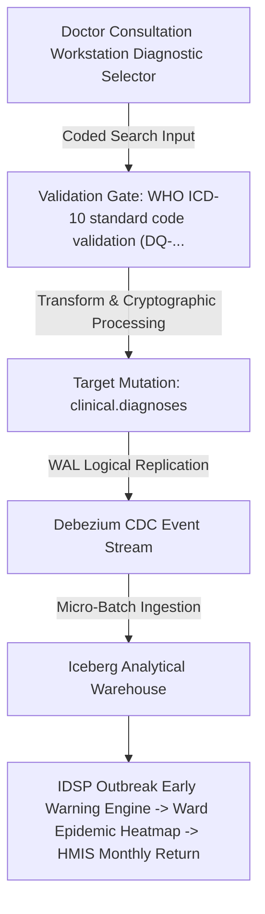

#### Multi-Stage Data Manipulation Lifecycle
1. **Stage 1 (Ingress & Handshake)**: Data originates at `Doctor Consultation Workstation Diagnostic Selector` and enters the platform boundary via `Coded Search Input` with mandatory TLS 1.3 encryption.
2. **Stage 2 (Syntactic & Semantic Validation)**: Payloads pass through `WHO ICD-10 standard code validation (DQ-022)`. Violations trigger synchronous rejection prior to database access.
3. **Stage 3 (Cryptographic Normalization)**: Mapping ICD-10 code to IDSP communicable category + NCD chronic classification. Sensitive attributes receive column-level envelope encryption or HMAC blinding.
4. **Stage 4 (Atomic Storage Persistence)**: Target entities in `clinical.diagnoses` mutate within an ACID transaction block, enforcing Communicable diseases (Dengue, Cholera) trigger automated public health surveillance rollup.
5. **Stage 5 (Asynchronous CDC Emission)**: PostgreSQL WAL logical decoding emits change events to Kafka topic `cdc.clinical.diagnoses`.
6. **Stage 6 (Analytical Lakehouse Landing)**: Change events stream into Iceberg Parquet partitions, updating analytical star schemas within SLA targets.
7. **Stage 7 (Downstream Egress & ML Ingestion)**: Downstream consumers in `IDSP Outbreak Early Warning Engine -> Ward Epidemic Heatmap -> HMIS Monthly Return` consume verified records via Trino or authenticated REST APIs.

#### Cryptographic & Security Safeguards
- **In-Transit Protection**: Encrypted via mTLS 1.3 using ECDHE-RSA-AES256-GCM-SHA384 cipher suites.
- **At-Rest Protection**: Column-level AES-256-GCM for PII and Argon2id for authentication credentials.
- **Provenance Fingerprint**: SHA-256 HMAC digest computed across mutated row attributes and linked to audit ledger.
- **Latency SLA**: Ingress-to-OLTP < 50ms; CDC-to-Kafka < 500ms; Lakehouse-availability < 15 minutes.

#### Complete Documentation-Only SQL Ingestion & Transformation Snippet
This SQL illustrates the transactional mutation logic executed by the operational service:
```sql
-- DOCUMENTATION-ONLY SQL: Transactional Transformation Logic for LINEAGE-009
BEGIN;
-- Step 1: Pre-validation assertion
SELECT 1 FROM clinical.diagnoses WHERE 1=0;
-- Step 2: Atomic mutation into primary entity
INSERT INTO clinical.diagnoses (
    id, created_at, updated_at, is_active
) VALUES (
    gen_random_uuid(), CURRENT_TIMESTAMP, CURRENT_TIMESTAMP, true
);
-- Step 3: Append cryptographic state record to audit ledger
INSERT INTO audit.audit_events (
    event_id, event_timestamp, entity_name, action_type, security_classification
) VALUES (
    gen_random_uuid(), CURRENT_TIMESTAMP, 'clinical.diagnoses', 'INSERT', 'CLASS-003'
);
COMMIT;
```

#### Failure Modes & Automated Remediation Runbook
When failures occur along `LINEAGE-009`, the operational monitoring engine executes the triage protocol below:
- **Transient Network Timeout**: Retry with exponential backoff (initial delay 500ms, max 3 retries).
- **Validation Failure**: Route malformed payload to Dead Letter Queue topic `dlq.clinical.diagnoses`; alert operations team.
- **Lock Contention**: PostgreSQL aborts transaction on lock timeout; retry worker reschedules payload after 2 seconds.
- **Downstream Consumer Lag**: If consumers of `IDSP Outbreak Early Warning Engine -> Ward Epidemic Heatmap -> HMIS Monthly Return` lag > 15 minutes behind CDC stream, Kafka auto-scaling deploys additional worker pods.

#### Complete OpenLineage Event Specification
This JSON payload defines the OpenLineage run facet emitted by the service worker:
```json
{
  "eventType": "COMPLETE",
  "job": {
    "namespace": "namma_clinic.pipeline",
    "name": "lineage_009_job"
  },
  "inputs": [
    { "namespace": "source_system", "name": "doctor_consultation_workstation_diagnostic_selector" }
  ],
  "outputs": [
    { "namespace": "postgres.primary", "name": "clinical.diagnoses" }
  ],
  "producer": "https://github.com/saimaa0910/mvp/scripts/database"
}
```

### 3.10 LINEAGE-010: Electronic Prescription & Dosage Safety Lineage

- **Pathway Identifier**: `LINEAGE-010`
- **Primary Ingestion Source**: Doctor Consultation EMR Prescribing Module
- **Transport & Protocol**: Prescription Form Submit
- **Validation Controls & Quality Gates**: Formulary drug active check + dosage ceiling validation (DQ-023, DQ-044)
- **Target Database Tables**: `clinical.prescriptions, clinical.prescription_items`
- **Security Classification**: `CLASS-003`
- **Applicable Retention Policy**: `RETENTION-003`
- **Downstream Consumers**: Pharmacy Dispensing Queue -> Citizen Mobile SMS Link -> Antibiotic Stewardship Monitor

#### Architectural Data Flow Diagram
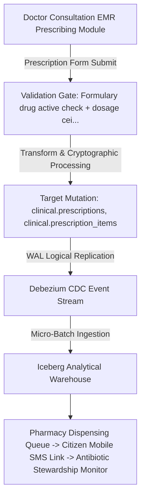

#### Multi-Stage Data Manipulation Lifecycle
1. **Stage 1 (Ingress & Handshake)**: Data originates at `Doctor Consultation EMR Prescribing Module` and enters the platform boundary via `Prescription Form Submit` with mandatory TLS 1.3 encryption.
2. **Stage 2 (Syntactic & Semantic Validation)**: Payloads pass through `Formulary drug active check + dosage ceiling validation (DQ-023, DQ-044)`. Violations trigger synchronous rejection prior to database access.
3. **Stage 3 (Cryptographic Normalization)**: Prescription hash generation + Drug-Drug Interaction evaluation + Pharmacy queue routing. Sensitive attributes receive column-level envelope encryption or HMAC blinding.
4. **Stage 4 (Atomic Storage Persistence)**: Target entities in `clinical.prescriptions, clinical.prescription_items` mutate within an ACID transaction block, enforcing Prescriptions valid for 7 days from date of issuance for dispensing.
5. **Stage 5 (Asynchronous CDC Emission)**: PostgreSQL WAL logical decoding emits change events to Kafka topic `cdc.clinical.prescriptions`.
6. **Stage 6 (Analytical Lakehouse Landing)**: Change events stream into Iceberg Parquet partitions, updating analytical star schemas within SLA targets.
7. **Stage 7 (Downstream Egress & ML Ingestion)**: Downstream consumers in `Pharmacy Dispensing Queue -> Citizen Mobile SMS Link -> Antibiotic Stewardship Monitor` consume verified records via Trino or authenticated REST APIs.

#### Cryptographic & Security Safeguards
- **In-Transit Protection**: Encrypted via mTLS 1.3 using ECDHE-RSA-AES256-GCM-SHA384 cipher suites.
- **At-Rest Protection**: Column-level AES-256-GCM for PII and Argon2id for authentication credentials.
- **Provenance Fingerprint**: SHA-256 HMAC digest computed across mutated row attributes and linked to audit ledger.
- **Latency SLA**: Ingress-to-OLTP < 50ms; CDC-to-Kafka < 500ms; Lakehouse-availability < 15 minutes.

#### Complete Documentation-Only SQL Ingestion & Transformation Snippet
This SQL illustrates the transactional mutation logic executed by the operational service:
```sql
-- DOCUMENTATION-ONLY SQL: Transactional Transformation Logic for LINEAGE-010
BEGIN;
-- Step 1: Pre-validation assertion
SELECT 1 FROM clinical.prescriptions WHERE 1=0;
-- Step 2: Atomic mutation into primary entity
INSERT INTO clinical.prescriptions (
    id, created_at, updated_at, is_active
) VALUES (
    gen_random_uuid(), CURRENT_TIMESTAMP, CURRENT_TIMESTAMP, true
);
-- Step 3: Append cryptographic state record to audit ledger
INSERT INTO audit.audit_events (
    event_id, event_timestamp, entity_name, action_type, security_classification
) VALUES (
    gen_random_uuid(), CURRENT_TIMESTAMP, 'clinical.prescriptions', 'INSERT', 'CLASS-003'
);
COMMIT;
```

#### Failure Modes & Automated Remediation Runbook
When failures occur along `LINEAGE-010`, the operational monitoring engine executes the triage protocol below:
- **Transient Network Timeout**: Retry with exponential backoff (initial delay 500ms, max 3 retries).
- **Validation Failure**: Route malformed payload to Dead Letter Queue topic `dlq.clinical.prescriptions`; alert operations team.
- **Lock Contention**: PostgreSQL aborts transaction on lock timeout; retry worker reschedules payload after 2 seconds.
- **Downstream Consumer Lag**: If consumers of `Pharmacy Dispensing Queue -> Citizen Mobile SMS Link -> Antibiotic Stewardship Monitor` lag > 15 minutes behind CDC stream, Kafka auto-scaling deploys additional worker pods.

#### Complete OpenLineage Event Specification
This JSON payload defines the OpenLineage run facet emitted by the service worker:
```json
{
  "eventType": "COMPLETE",
  "job": {
    "namespace": "namma_clinic.pipeline",
    "name": "lineage_010_job"
  },
  "inputs": [
    { "namespace": "source_system", "name": "doctor_consultation_emr_prescribing_module" }
  ],
  "outputs": [
    { "namespace": "postgres.primary", "name": "clinical.prescriptions" }
  ],
  "producer": "https://github.com/saimaa0910/mvp/scripts/database"
}
```

### 3.11 LINEAGE-011: Laboratory Investigation Order to Result Verification Lineage

- **Pathway Identifier**: `LINEAGE-011`
- **Primary Ingestion Source**: Lab Technician Workstation / Semi-automated Hematology Analyzer
- **Transport & Protocol**: ASTM / HL7 interface via RS232-to-Ethernet gateway
- **Validation Controls & Quality Gates**: LOINC syntax validation + non-negative numeric boundary check (DQ-024, DQ-025)
- **Target Database Tables**: `clinical.lab_orders, clinical.lab_order_items, clinical.lab_results`
- **Security Classification**: `CLASS-003`
- **Applicable Retention Policy**: `RETENTION-004`
- **Downstream Consumers**: Doctor EMR Results Viewer -> ABDM Diagnostic Report Bundle -> Citizen Portal

#### Architectural Data Flow Diagram
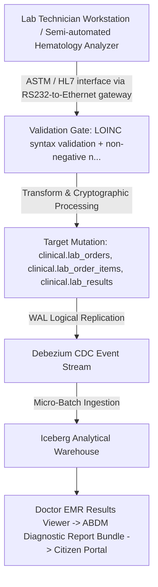

#### Multi-Stage Data Manipulation Lifecycle
1. **Stage 1 (Ingress & Handshake)**: Data originates at `Lab Technician Workstation / Semi-automated Hematology Analyzer` and enters the platform boundary via `ASTM / HL7 interface via RS232-to-Ethernet gateway` with mandatory TLS 1.3 encryption.
2. **Stage 2 (Syntactic & Semantic Validation)**: Payloads pass through `LOINC syntax validation + non-negative numeric boundary check (DQ-024, DQ-025)`. Violations trigger synchronous rejection prior to database access.
3. **Stage 3 (Cryptographic Normalization)**: Parser converts analyzer ASTM packets to structured observation rows + panic flag evaluation. Sensitive attributes receive column-level envelope encryption or HMAC blinding.
4. **Stage 4 (Atomic Storage Persistence)**: Target entities in `clinical.lab_orders, clinical.lab_order_items, clinical.lab_results` mutate within an ACID transaction block, enforcing Panic lab value (e.g. Platelets < 20,000) generates automated urgent SMS to doctor.
5. **Stage 5 (Asynchronous CDC Emission)**: PostgreSQL WAL logical decoding emits change events to Kafka topic `cdc.clinical.lab_orders`.
6. **Stage 6 (Analytical Lakehouse Landing)**: Change events stream into Iceberg Parquet partitions, updating analytical star schemas within SLA targets.
7. **Stage 7 (Downstream Egress & ML Ingestion)**: Downstream consumers in `Doctor EMR Results Viewer -> ABDM Diagnostic Report Bundle -> Citizen Portal` consume verified records via Trino or authenticated REST APIs.

#### Cryptographic & Security Safeguards
- **In-Transit Protection**: Encrypted via mTLS 1.3 using ECDHE-RSA-AES256-GCM-SHA384 cipher suites.
- **At-Rest Protection**: Column-level AES-256-GCM for PII and Argon2id for authentication credentials.
- **Provenance Fingerprint**: SHA-256 HMAC digest computed across mutated row attributes and linked to audit ledger.
- **Latency SLA**: Ingress-to-OLTP < 50ms; CDC-to-Kafka < 500ms; Lakehouse-availability < 15 minutes.

#### Complete Documentation-Only SQL Ingestion & Transformation Snippet
This SQL illustrates the transactional mutation logic executed by the operational service:
```sql
-- DOCUMENTATION-ONLY SQL: Transactional Transformation Logic for LINEAGE-011
BEGIN;
-- Step 1: Pre-validation assertion
SELECT 1 FROM clinical.lab_orders WHERE 1=0;
-- Step 2: Atomic mutation into primary entity
INSERT INTO clinical.lab_orders (
    id, created_at, updated_at, is_active
) VALUES (
    gen_random_uuid(), CURRENT_TIMESTAMP, CURRENT_TIMESTAMP, true
);
-- Step 3: Append cryptographic state record to audit ledger
INSERT INTO audit.audit_events (
    event_id, event_timestamp, entity_name, action_type, security_classification
) VALUES (
    gen_random_uuid(), CURRENT_TIMESTAMP, 'clinical.lab_orders', 'INSERT', 'CLASS-003'
);
COMMIT;
```

#### Failure Modes & Automated Remediation Runbook
When failures occur along `LINEAGE-011`, the operational monitoring engine executes the triage protocol below:
- **Transient Network Timeout**: Retry with exponential backoff (initial delay 500ms, max 3 retries).
- **Validation Failure**: Route malformed payload to Dead Letter Queue topic `dlq.clinical.lab_orders`; alert operations team.
- **Lock Contention**: PostgreSQL aborts transaction on lock timeout; retry worker reschedules payload after 2 seconds.
- **Downstream Consumer Lag**: If consumers of `Doctor EMR Results Viewer -> ABDM Diagnostic Report Bundle -> Citizen Portal` lag > 15 minutes behind CDC stream, Kafka auto-scaling deploys additional worker pods.

#### Complete OpenLineage Event Specification
This JSON payload defines the OpenLineage run facet emitted by the service worker:
```json
{
  "eventType": "COMPLETE",
  "job": {
    "namespace": "namma_clinic.pipeline",
    "name": "lineage_011_job"
  },
  "inputs": [
    { "namespace": "source_system", "name": "lab_technician_workstation_/_semi-automated_hematology_analyzer" }
  ],
  "outputs": [
    { "namespace": "postgres.primary", "name": "clinical.lab_orders" }
  ],
  "producer": "https://github.com/saimaa0910/mvp/scripts/database"
}
```

### 3.12 LINEAGE-012: Doctor-to-Specialist Teleconsultation Session Lineage

- **Pathway Identifier**: `LINEAGE-012`
- **Primary Ingestion Source**: Clinic Telemedicine Chamber WebRTC Client
- **Transport & Protocol**: WebRTC Signaling Gateway
- **Validation Controls & Quality Gates**: Specialist credential check + session duration boundaries (DQ-026)
- **Target Database Tables**: `clinical.teleconsultations`
- **Security Classification**: `CLASS-003`
- **Applicable Retention Policy**: `RETENTION-016`
- **Downstream Consumers**: Specialist Utilization Dashboard -> Referral Avoidance Analytics

#### Architectural Data Flow Diagram
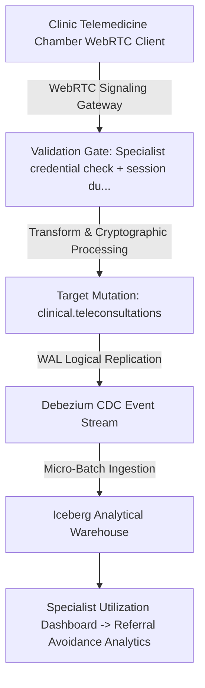

#### Multi-Stage Data Manipulation Lifecycle
1. **Stage 1 (Ingress & Handshake)**: Data originates at `Clinic Telemedicine Chamber WebRTC Client` and enters the platform boundary via `WebRTC Signaling Gateway` with mandatory TLS 1.3 encryption.
2. **Stage 2 (Syntactic & Semantic Validation)**: Payloads pass through `Specialist credential check + session duration boundaries (DQ-026)`. Violations trigger synchronous rejection prior to database access.
3. **Stage 3 (Cryptographic Normalization)**: WebRTC session metadata recording + joint clinical consultation summary. Sensitive attributes receive column-level envelope encryption or HMAC blinding.
4. **Stage 4 (Atomic Storage Persistence)**: Target entities in `clinical.teleconsultations` mutate within an ACID transaction block, enforcing Teleconsultation conducted strictly in compliance with MCI Telemedicine Guidelines.
5. **Stage 5 (Asynchronous CDC Emission)**: PostgreSQL WAL logical decoding emits change events to Kafka topic `cdc.clinical.teleconsultations`.
6. **Stage 6 (Analytical Lakehouse Landing)**: Change events stream into Iceberg Parquet partitions, updating analytical star schemas within SLA targets.
7. **Stage 7 (Downstream Egress & ML Ingestion)**: Downstream consumers in `Specialist Utilization Dashboard -> Referral Avoidance Analytics` consume verified records via Trino or authenticated REST APIs.

#### Cryptographic & Security Safeguards
- **In-Transit Protection**: Encrypted via mTLS 1.3 using ECDHE-RSA-AES256-GCM-SHA384 cipher suites.
- **At-Rest Protection**: Column-level AES-256-GCM for PII and Argon2id for authentication credentials.
- **Provenance Fingerprint**: SHA-256 HMAC digest computed across mutated row attributes and linked to audit ledger.
- **Latency SLA**: Ingress-to-OLTP < 50ms; CDC-to-Kafka < 500ms; Lakehouse-availability < 15 minutes.

#### Complete Documentation-Only SQL Ingestion & Transformation Snippet
This SQL illustrates the transactional mutation logic executed by the operational service:
```sql
-- DOCUMENTATION-ONLY SQL: Transactional Transformation Logic for LINEAGE-012
BEGIN;
-- Step 1: Pre-validation assertion
SELECT 1 FROM clinical.teleconsultations WHERE 1=0;
-- Step 2: Atomic mutation into primary entity
INSERT INTO clinical.teleconsultations (
    id, created_at, updated_at, is_active
) VALUES (
    gen_random_uuid(), CURRENT_TIMESTAMP, CURRENT_TIMESTAMP, true
);
-- Step 3: Append cryptographic state record to audit ledger
INSERT INTO audit.audit_events (
    event_id, event_timestamp, entity_name, action_type, security_classification
) VALUES (
    gen_random_uuid(), CURRENT_TIMESTAMP, 'clinical.teleconsultations', 'INSERT', 'CLASS-003'
);
COMMIT;
```

#### Failure Modes & Automated Remediation Runbook
When failures occur along `LINEAGE-012`, the operational monitoring engine executes the triage protocol below:
- **Transient Network Timeout**: Retry with exponential backoff (initial delay 500ms, max 3 retries).
- **Validation Failure**: Route malformed payload to Dead Letter Queue topic `dlq.clinical.teleconsultations`; alert operations team.
- **Lock Contention**: PostgreSQL aborts transaction on lock timeout; retry worker reschedules payload after 2 seconds.
- **Downstream Consumer Lag**: If consumers of `Specialist Utilization Dashboard -> Referral Avoidance Analytics` lag > 15 minutes behind CDC stream, Kafka auto-scaling deploys additional worker pods.

#### Complete OpenLineage Event Specification
This JSON payload defines the OpenLineage run facet emitted by the service worker:
```json
{
  "eventType": "COMPLETE",
  "job": {
    "namespace": "namma_clinic.pipeline",
    "name": "lineage_012_job"
  },
  "inputs": [
    { "namespace": "source_system", "name": "clinic_telemedicine_chamber_webrtc_client" }
  ],
  "outputs": [
    { "namespace": "postgres.primary", "name": "clinical.teleconsultations" }
  ],
  "producer": "https://github.com/saimaa0910/mvp/scripts/database"
}
```

### 3.13 LINEAGE-013: Master Formulary Drug Catalog & NLEM Lineage

- **Pathway Identifier**: `LINEAGE-013`
- **Primary Ingestion Source**: BBMP Essential Drugs Committee Administration Portal
- **Transport & Protocol**: Admin UI Batch Upload
- **Validation Controls & Quality Gates**: ATC category check & generic salt name validation (DQ-027)
- **Target Database Tables**: `pharmacy.formulary_drugs, pharmacy.drug_categories`
- **Security Classification**: `CLASS-001`
- **Applicable Retention Policy**: `RETENTION-009`
- **Downstream Consumers**: Doctor Prescribing Autocomplete -> Pharmacy Inventory Catalog -> Procurement Indent

#### Architectural Data Flow Diagram
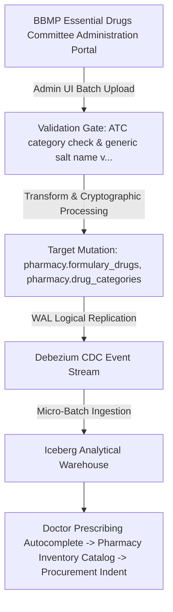

#### Multi-Stage Data Manipulation Lifecycle
1. **Stage 1 (Ingress & Handshake)**: Data originates at `BBMP Essential Drugs Committee Administration Portal` and enters the platform boundary via `Admin UI Batch Upload` with mandatory TLS 1.3 encryption.
2. **Stage 2 (Syntactic & Semantic Validation)**: Payloads pass through `ATC category check & generic salt name validation (DQ-027)`. Violations trigger synchronous rejection prior to database access.
3. **Stage 3 (Cryptographic Normalization)**: Formulary version increment + Global edge broadcast push to all 450 clinic nodes. Sensitive attributes receive column-level envelope encryption or HMAC blinding.
4. **Stage 4 (Atomic Storage Persistence)**: Target entities in `pharmacy.formulary_drugs, pharmacy.drug_categories` mutate within an ACID transaction block, enforcing Only NLEM approved drugs available for outpatient primary care prescribing.
5. **Stage 5 (Asynchronous CDC Emission)**: PostgreSQL WAL logical decoding emits change events to Kafka topic `cdc.pharmacy.formulary_drugs`.
6. **Stage 6 (Analytical Lakehouse Landing)**: Change events stream into Iceberg Parquet partitions, updating analytical star schemas within SLA targets.
7. **Stage 7 (Downstream Egress & ML Ingestion)**: Downstream consumers in `Doctor Prescribing Autocomplete -> Pharmacy Inventory Catalog -> Procurement Indent` consume verified records via Trino or authenticated REST APIs.

#### Cryptographic & Security Safeguards
- **In-Transit Protection**: Encrypted via mTLS 1.3 using ECDHE-RSA-AES256-GCM-SHA384 cipher suites.
- **At-Rest Protection**: Column-level AES-256-GCM for PII and Argon2id for authentication credentials.
- **Provenance Fingerprint**: SHA-256 HMAC digest computed across mutated row attributes and linked to audit ledger.
- **Latency SLA**: Ingress-to-OLTP < 50ms; CDC-to-Kafka < 500ms; Lakehouse-availability < 15 minutes.

#### Complete Documentation-Only SQL Ingestion & Transformation Snippet
This SQL illustrates the transactional mutation logic executed by the operational service:
```sql
-- DOCUMENTATION-ONLY SQL: Transactional Transformation Logic for LINEAGE-013
BEGIN;
-- Step 1: Pre-validation assertion
SELECT 1 FROM pharmacy.formulary_drugs WHERE 1=0;
-- Step 2: Atomic mutation into primary entity
INSERT INTO pharmacy.formulary_drugs (
    id, created_at, updated_at, is_active
) VALUES (
    gen_random_uuid(), CURRENT_TIMESTAMP, CURRENT_TIMESTAMP, true
);
-- Step 3: Append cryptographic state record to audit ledger
INSERT INTO audit.audit_events (
    event_id, event_timestamp, entity_name, action_type, security_classification
) VALUES (
    gen_random_uuid(), CURRENT_TIMESTAMP, 'pharmacy.formulary_drugs', 'INSERT', 'CLASS-001'
);
COMMIT;
```

#### Failure Modes & Automated Remediation Runbook
When failures occur along `LINEAGE-013`, the operational monitoring engine executes the triage protocol below:
- **Transient Network Timeout**: Retry with exponential backoff (initial delay 500ms, max 3 retries).
- **Validation Failure**: Route malformed payload to Dead Letter Queue topic `dlq.pharmacy.formulary_drugs`; alert operations team.
- **Lock Contention**: PostgreSQL aborts transaction on lock timeout; retry worker reschedules payload after 2 seconds.
- **Downstream Consumer Lag**: If consumers of `Doctor Prescribing Autocomplete -> Pharmacy Inventory Catalog -> Procurement Indent` lag > 15 minutes behind CDC stream, Kafka auto-scaling deploys additional worker pods.

#### Complete OpenLineage Event Specification
This JSON payload defines the OpenLineage run facet emitted by the service worker:
```json
{
  "eventType": "COMPLETE",
  "job": {
    "namespace": "namma_clinic.pipeline",
    "name": "lineage_013_job"
  },
  "inputs": [
    { "namespace": "source_system", "name": "bbmp_essential_drugs_committee_administration_portal" }
  ],
  "outputs": [
    { "namespace": "postgres.primary", "name": "pharmacy.formulary_drugs" }
  ],
  "producer": "https://github.com/saimaa0910/mvp/scripts/database"
}
```

### 3.14 LINEAGE-014: Warehouse Goods Inward & Drug Batch Onboarding Lineage

- **Pathway Identifier**: `LINEAGE-014`
- **Primary Ingestion Source**: BBMP Central Medical Stores Warehouse Management System (WMS)
- **Transport & Protocol**: Warehouse Barcode Dispatch Webhook
- **Validation Controls & Quality Gates**: Shelf life chronology check & procurement voucher verification (DQ-028)
- **Target Database Tables**: `pharmacy.pharmacy_batches, pharmacy.clinic_stock`
- **Security Classification**: `CLASS-002`
- **Applicable Retention Policy**: `RETENTION-009`
- **Downstream Consumers**: Pharmacy Dispensing POS -> Batch Near-Expiry Alert -> Central Procurement Analytics

#### Architectural Data Flow Diagram
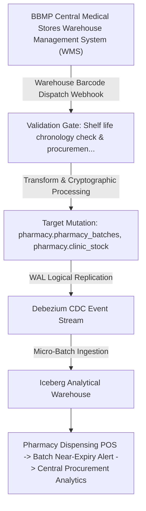

#### Multi-Stage Data Manipulation Lifecycle
1. **Stage 1 (Ingress & Handshake)**: Data originates at `BBMP Central Medical Stores Warehouse Management System (WMS)` and enters the platform boundary via `Warehouse Barcode Dispatch Webhook` with mandatory TLS 1.3 encryption.
2. **Stage 2 (Syntactic & Semantic Validation)**: Payloads pass through `Shelf life chronology check & procurement voucher verification (DQ-028)`. Violations trigger synchronous rejection prior to database access.
3. **Stage 3 (Cryptographic Normalization)**: Batch onboarding + FEFO sorting index assignment + clinic stock balance increment. Sensitive attributes receive column-level envelope encryption or HMAC blinding.
4. **Stage 4 (Atomic Storage Persistence)**: Target entities in `pharmacy.pharmacy_batches, pharmacy.clinic_stock` mutate within an ACID transaction block, enforcing Batches with shelf life < 6 months rejected at inward dock.
5. **Stage 5 (Asynchronous CDC Emission)**: PostgreSQL WAL logical decoding emits change events to Kafka topic `cdc.pharmacy.pharmacy_batches`.
6. **Stage 6 (Analytical Lakehouse Landing)**: Change events stream into Iceberg Parquet partitions, updating analytical star schemas within SLA targets.
7. **Stage 7 (Downstream Egress & ML Ingestion)**: Downstream consumers in `Pharmacy Dispensing POS -> Batch Near-Expiry Alert -> Central Procurement Analytics` consume verified records via Trino or authenticated REST APIs.

#### Cryptographic & Security Safeguards
- **In-Transit Protection**: Encrypted via mTLS 1.3 using ECDHE-RSA-AES256-GCM-SHA384 cipher suites.
- **At-Rest Protection**: Column-level AES-256-GCM for PII and Argon2id for authentication credentials.
- **Provenance Fingerprint**: SHA-256 HMAC digest computed across mutated row attributes and linked to audit ledger.
- **Latency SLA**: Ingress-to-OLTP < 50ms; CDC-to-Kafka < 500ms; Lakehouse-availability < 15 minutes.

#### Complete Documentation-Only SQL Ingestion & Transformation Snippet
This SQL illustrates the transactional mutation logic executed by the operational service:
```sql
-- DOCUMENTATION-ONLY SQL: Transactional Transformation Logic for LINEAGE-014
BEGIN;
-- Step 1: Pre-validation assertion
SELECT 1 FROM pharmacy.pharmacy_batches WHERE 1=0;
-- Step 2: Atomic mutation into primary entity
INSERT INTO pharmacy.pharmacy_batches (
    id, created_at, updated_at, is_active
) VALUES (
    gen_random_uuid(), CURRENT_TIMESTAMP, CURRENT_TIMESTAMP, true
);
-- Step 3: Append cryptographic state record to audit ledger
INSERT INTO audit.audit_events (
    event_id, event_timestamp, entity_name, action_type, security_classification
) VALUES (
    gen_random_uuid(), CURRENT_TIMESTAMP, 'pharmacy.pharmacy_batches', 'INSERT', 'CLASS-002'
);
COMMIT;
```

#### Failure Modes & Automated Remediation Runbook
When failures occur along `LINEAGE-014`, the operational monitoring engine executes the triage protocol below:
- **Transient Network Timeout**: Retry with exponential backoff (initial delay 500ms, max 3 retries).
- **Validation Failure**: Route malformed payload to Dead Letter Queue topic `dlq.pharmacy.pharmacy_batches`; alert operations team.
- **Lock Contention**: PostgreSQL aborts transaction on lock timeout; retry worker reschedules payload after 2 seconds.
- **Downstream Consumer Lag**: If consumers of `Pharmacy Dispensing POS -> Batch Near-Expiry Alert -> Central Procurement Analytics` lag > 15 minutes behind CDC stream, Kafka auto-scaling deploys additional worker pods.

#### Complete OpenLineage Event Specification
This JSON payload defines the OpenLineage run facet emitted by the service worker:
```json
{
  "eventType": "COMPLETE",
  "job": {
    "namespace": "namma_clinic.pipeline",
    "name": "lineage_014_job"
  },
  "inputs": [
    { "namespace": "source_system", "name": "bbmp_central_medical_stores_warehouse_management_system_(wms)" }
  ],
  "outputs": [
    { "namespace": "postgres.primary", "name": "pharmacy.pharmacy_batches" }
  ],
  "producer": "https://github.com/saimaa0910/mvp/scripts/database"
}
```

### 3.15 LINEAGE-015: Pharmacy Drug Dispensation & Double-Entry Stock Decrement Lineage

- **Pathway Identifier**: `LINEAGE-015`
- **Primary Ingestion Source**: Pharmacy Dispensing Counter Barcode Scanner
- **Transport & Protocol**: Point of Sale UI Event
- **Validation Controls & Quality Gates**: Non-negative stock check + positive quantity validation (DQ-029, DQ-031, DQ-048)
- **Target Database Tables**: `pharmacy.dispensations, pharmacy.dispensation_items, pharmacy.clinic_stock, pharmacy.stock_movements`
- **Security Classification**: `CLASS-003`
- **Applicable Retention Policy**: `RETENTION-003`
- **Downstream Consumers**: Stockout Early Warning System -> Citizen SMS Receipt -> CAG Financial Audit Ledger

#### Architectural Data Flow Diagram
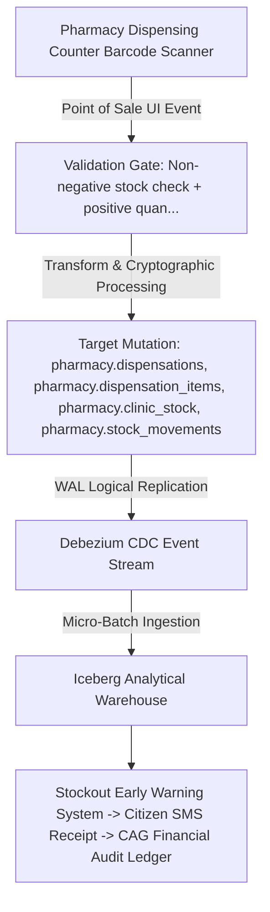

#### Multi-Stage Data Manipulation Lifecycle
1. **Stage 1 (Ingress & Handshake)**: Data originates at `Pharmacy Dispensing Counter Barcode Scanner` and enters the platform boundary via `Point of Sale UI Event` with mandatory TLS 1.3 encryption.
2. **Stage 2 (Syntactic & Semantic Validation)**: Payloads pass through `Non-negative stock check + positive quantity validation (DQ-029, DQ-031, DQ-048)`. Violations trigger synchronous rejection prior to database access.
3. **Stage 3 (Cryptographic Normalization)**: Pessimistic FEFO batch deduction + atomic double-entry movement ledger write. Sensitive attributes receive column-level envelope encryption or HMAC blinding.
4. **Stage 4 (Atomic Storage Persistence)**: Target entities in `pharmacy.dispensations, pharmacy.dispensation_items, pharmacy.clinic_stock, pharmacy.stock_movements` mutate within an ACID transaction block, enforcing Physical stock balance MUST NEVER drop below zero under any transaction.
5. **Stage 5 (Asynchronous CDC Emission)**: PostgreSQL WAL logical decoding emits change events to Kafka topic `cdc.pharmacy.dispensations`.
6. **Stage 6 (Analytical Lakehouse Landing)**: Change events stream into Iceberg Parquet partitions, updating analytical star schemas within SLA targets.
7. **Stage 7 (Downstream Egress & ML Ingestion)**: Downstream consumers in `Stockout Early Warning System -> Citizen SMS Receipt -> CAG Financial Audit Ledger` consume verified records via Trino or authenticated REST APIs.

#### Cryptographic & Security Safeguards
- **In-Transit Protection**: Encrypted via mTLS 1.3 using ECDHE-RSA-AES256-GCM-SHA384 cipher suites.
- **At-Rest Protection**: Column-level AES-256-GCM for PII and Argon2id for authentication credentials.
- **Provenance Fingerprint**: SHA-256 HMAC digest computed across mutated row attributes and linked to audit ledger.
- **Latency SLA**: Ingress-to-OLTP < 50ms; CDC-to-Kafka < 500ms; Lakehouse-availability < 15 minutes.

#### Complete Documentation-Only SQL Ingestion & Transformation Snippet
This SQL illustrates the transactional mutation logic executed by the operational service:
```sql
-- DOCUMENTATION-ONLY SQL: Transactional Transformation Logic for LINEAGE-015
BEGIN;
-- Step 1: Pre-validation assertion
SELECT 1 FROM pharmacy.dispensations WHERE 1=0;
-- Step 2: Atomic mutation into primary entity
INSERT INTO pharmacy.dispensations (
    id, created_at, updated_at, is_active
) VALUES (
    gen_random_uuid(), CURRENT_TIMESTAMP, CURRENT_TIMESTAMP, true
);
-- Step 3: Append cryptographic state record to audit ledger
INSERT INTO audit.audit_events (
    event_id, event_timestamp, entity_name, action_type, security_classification
) VALUES (
    gen_random_uuid(), CURRENT_TIMESTAMP, 'pharmacy.dispensations', 'INSERT', 'CLASS-003'
);
COMMIT;
```

#### Failure Modes & Automated Remediation Runbook
When failures occur along `LINEAGE-015`, the operational monitoring engine executes the triage protocol below:
- **Transient Network Timeout**: Retry with exponential backoff (initial delay 500ms, max 3 retries).
- **Validation Failure**: Route malformed payload to Dead Letter Queue topic `dlq.pharmacy.dispensations`; alert operations team.
- **Lock Contention**: PostgreSQL aborts transaction on lock timeout; retry worker reschedules payload after 2 seconds.
- **Downstream Consumer Lag**: If consumers of `Stockout Early Warning System -> Citizen SMS Receipt -> CAG Financial Audit Ledger` lag > 15 minutes behind CDC stream, Kafka auto-scaling deploys additional worker pods.

#### Complete OpenLineage Event Specification
This JSON payload defines the OpenLineage run facet emitted by the service worker:
```json
{
  "eventType": "COMPLETE",
  "job": {
    "namespace": "namma_clinic.pipeline",
    "name": "lineage_015_job"
  },
  "inputs": [
    { "namespace": "source_system", "name": "pharmacy_dispensing_counter_barcode_scanner" }
  ],
  "outputs": [
    { "namespace": "postgres.primary", "name": "pharmacy.dispensations" }
  ],
  "producer": "https://github.com/saimaa0910/mvp/scripts/database"
}
```

### 3.16 LINEAGE-016: Clinic Drug Indent Requisition to Warehouse Lineage

- **Pathway Identifier**: `LINEAGE-016`
- **Primary Ingestion Source**: Clinic Pharmacist Indent Terminal
- **Transport & Protocol**: Requisition Workflow API
- **Validation Controls & Quality Gates**: AMC calculation check + MOIC digital approval validation (DQ-032)
- **Target Database Tables**: `pharmacy.drug_indents, pharmacy.indent_items`
- **Security Classification**: `CLASS-002`
- **Applicable Retention Policy**: `RETENTION-009`
- **Downstream Consumers**: Central Warehouse Picking List -> Supply Chain Lead-Time Analytics

#### Architectural Data Flow Diagram
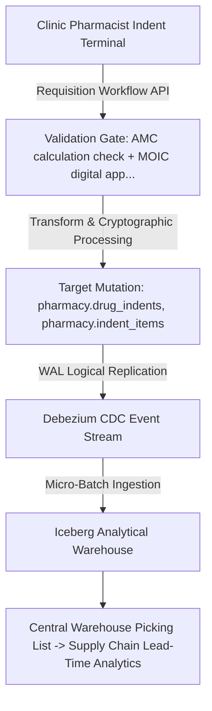

#### Multi-Stage Data Manipulation Lifecycle
1. **Stage 1 (Ingress & Handshake)**: Data originates at `Clinic Pharmacist Indent Terminal` and enters the platform boundary via `Requisition Workflow API` with mandatory TLS 1.3 encryption.
2. **Stage 2 (Syntactic & Semantic Validation)**: Payloads pass through `AMC calculation check + MOIC digital approval validation (DQ-032)`. Violations trigger synchronous rejection prior to database access.
3. **Stage 3 (Cryptographic Normalization)**: Stock depletion velocity calculation + Suggested reorder quantity generation. Sensitive attributes receive column-level envelope encryption or HMAC blinding.
4. **Stage 4 (Atomic Storage Persistence)**: Target entities in `pharmacy.drug_indents, pharmacy.indent_items` mutate within an ACID transaction block, enforcing Indents auto-calculated based on 30-day average monthly consumption (AMC).
5. **Stage 5 (Asynchronous CDC Emission)**: PostgreSQL WAL logical decoding emits change events to Kafka topic `cdc.pharmacy.drug_indents`.
6. **Stage 6 (Analytical Lakehouse Landing)**: Change events stream into Iceberg Parquet partitions, updating analytical star schemas within SLA targets.
7. **Stage 7 (Downstream Egress & ML Ingestion)**: Downstream consumers in `Central Warehouse Picking List -> Supply Chain Lead-Time Analytics` consume verified records via Trino or authenticated REST APIs.

#### Cryptographic & Security Safeguards
- **In-Transit Protection**: Encrypted via mTLS 1.3 using ECDHE-RSA-AES256-GCM-SHA384 cipher suites.
- **At-Rest Protection**: Column-level AES-256-GCM for PII and Argon2id for authentication credentials.
- **Provenance Fingerprint**: SHA-256 HMAC digest computed across mutated row attributes and linked to audit ledger.
- **Latency SLA**: Ingress-to-OLTP < 50ms; CDC-to-Kafka < 500ms; Lakehouse-availability < 15 minutes.

#### Complete Documentation-Only SQL Ingestion & Transformation Snippet
This SQL illustrates the transactional mutation logic executed by the operational service:
```sql
-- DOCUMENTATION-ONLY SQL: Transactional Transformation Logic for LINEAGE-016
BEGIN;
-- Step 1: Pre-validation assertion
SELECT 1 FROM pharmacy.drug_indents WHERE 1=0;
-- Step 2: Atomic mutation into primary entity
INSERT INTO pharmacy.drug_indents (
    id, created_at, updated_at, is_active
) VALUES (
    gen_random_uuid(), CURRENT_TIMESTAMP, CURRENT_TIMESTAMP, true
);
-- Step 3: Append cryptographic state record to audit ledger
INSERT INTO audit.audit_events (
    event_id, event_timestamp, entity_name, action_type, security_classification
) VALUES (
    gen_random_uuid(), CURRENT_TIMESTAMP, 'pharmacy.drug_indents', 'INSERT', 'CLASS-002'
);
COMMIT;
```

#### Failure Modes & Automated Remediation Runbook
When failures occur along `LINEAGE-016`, the operational monitoring engine executes the triage protocol below:
- **Transient Network Timeout**: Retry with exponential backoff (initial delay 500ms, max 3 retries).
- **Validation Failure**: Route malformed payload to Dead Letter Queue topic `dlq.pharmacy.drug_indents`; alert operations team.
- **Lock Contention**: PostgreSQL aborts transaction on lock timeout; retry worker reschedules payload after 2 seconds.
- **Downstream Consumer Lag**: If consumers of `Central Warehouse Picking List -> Supply Chain Lead-Time Analytics` lag > 15 minutes behind CDC stream, Kafka auto-scaling deploys additional worker pods.

#### Complete OpenLineage Event Specification
This JSON payload defines the OpenLineage run facet emitted by the service worker:
```json
{
  "eventType": "COMPLETE",
  "job": {
    "namespace": "namma_clinic.pipeline",
    "name": "lineage_016_job"
  },
  "inputs": [
    { "namespace": "source_system", "name": "clinic_pharmacist_indent_terminal" }
  ],
  "outputs": [
    { "namespace": "postgres.primary", "name": "pharmacy.drug_indents" }
  ],
  "producer": "https://github.com/saimaa0910/mvp/scripts/database"
}
```

### 3.17 LINEAGE-017: Cold-Chain IoT Temperature Telemetry & Excursion Alert Lineage

- **Pathway Identifier**: `LINEAGE-017`
- **Primary Ingestion Source**: Vaccine Refrigerator IoT Gateway (Sensors in ILR units)
- **Transport & Protocol**: MQTT Message Broker -> Apache Kafka Stream Pipeline
- **Validation Controls & Quality Gates**: IoT sensor range checks & boundary filtering (DQ-033, DQ-034)
- **Target Database Tables**: `pharmacy.cold_chain_devices, pharmacy.cold_chain_telemetry, intake.danger_alerts`
- **Security Classification**: `CLASS-002`
- **Applicable Retention Policy**: `RETENTION-008`
- **Downstream Consumers**: Cold Chain Real-Time Dashboard -> Vaccine Wastage Risk Model -> UIP Audit Log

#### Architectural Data Flow Diagram
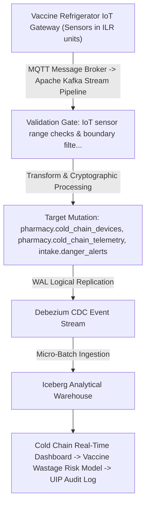

#### Multi-Stage Data Manipulation Lifecycle
1. **Stage 1 (Ingress & Handshake)**: Data originates at `Vaccine Refrigerator IoT Gateway (Sensors in ILR units)` and enters the platform boundary via `MQTT Message Broker -> Apache Kafka Stream Pipeline` with mandatory TLS 1.3 encryption.
2. **Stage 2 (Syntactic & Semantic Validation)**: Payloads pass through `IoT sensor range checks & boundary filtering (DQ-033, DQ-034)`. Violations trigger synchronous rejection prior to database access.
3. **Stage 3 (Cryptographic Normalization)**: Time-series stream aggregation + Moving average calculation + Alert trigger on excursion. Sensitive attributes receive column-level envelope encryption or HMAC blinding.
4. **Stage 4 (Atomic Storage Persistence)**: Target entities in `pharmacy.cold_chain_devices, pharmacy.cold_chain_telemetry, intake.danger_alerts` mutate within an ACID transaction block, enforcing Temperature > +8C or < +2C for > 15 minutes triggers emergency SMS escalation to MOIC.
5. **Stage 5 (Asynchronous CDC Emission)**: PostgreSQL WAL logical decoding emits change events to Kafka topic `cdc.pharmacy.cold_chain_devices`.
6. **Stage 6 (Analytical Lakehouse Landing)**: Change events stream into Iceberg Parquet partitions, updating analytical star schemas within SLA targets.
7. **Stage 7 (Downstream Egress & ML Ingestion)**: Downstream consumers in `Cold Chain Real-Time Dashboard -> Vaccine Wastage Risk Model -> UIP Audit Log` consume verified records via Trino or authenticated REST APIs.

#### Cryptographic & Security Safeguards
- **In-Transit Protection**: Encrypted via mTLS 1.3 using ECDHE-RSA-AES256-GCM-SHA384 cipher suites.
- **At-Rest Protection**: Column-level AES-256-GCM for PII and Argon2id for authentication credentials.
- **Provenance Fingerprint**: SHA-256 HMAC digest computed across mutated row attributes and linked to audit ledger.
- **Latency SLA**: Ingress-to-OLTP < 50ms; CDC-to-Kafka < 500ms; Lakehouse-availability < 15 minutes.

#### Complete Documentation-Only SQL Ingestion & Transformation Snippet
This SQL illustrates the transactional mutation logic executed by the operational service:
```sql
-- DOCUMENTATION-ONLY SQL: Transactional Transformation Logic for LINEAGE-017
BEGIN;
-- Step 1: Pre-validation assertion
SELECT 1 FROM pharmacy.cold_chain_devices WHERE 1=0;
-- Step 2: Atomic mutation into primary entity
INSERT INTO pharmacy.cold_chain_devices (
    id, created_at, updated_at, is_active
) VALUES (
    gen_random_uuid(), CURRENT_TIMESTAMP, CURRENT_TIMESTAMP, true
);
-- Step 3: Append cryptographic state record to audit ledger
INSERT INTO audit.audit_events (
    event_id, event_timestamp, entity_name, action_type, security_classification
) VALUES (
    gen_random_uuid(), CURRENT_TIMESTAMP, 'pharmacy.cold_chain_devices', 'INSERT', 'CLASS-002'
);
COMMIT;
```

#### Failure Modes & Automated Remediation Runbook
When failures occur along `LINEAGE-017`, the operational monitoring engine executes the triage protocol below:
- **Transient Network Timeout**: Retry with exponential backoff (initial delay 500ms, max 3 retries).
- **Validation Failure**: Route malformed payload to Dead Letter Queue topic `dlq.pharmacy.cold_chain_devices`; alert operations team.
- **Lock Contention**: PostgreSQL aborts transaction on lock timeout; retry worker reschedules payload after 2 seconds.
- **Downstream Consumer Lag**: If consumers of `Cold Chain Real-Time Dashboard -> Vaccine Wastage Risk Model -> UIP Audit Log` lag > 15 minutes behind CDC stream, Kafka auto-scaling deploys additional worker pods.

#### Complete OpenLineage Event Specification
This JSON payload defines the OpenLineage run facet emitted by the service worker:
```json
{
  "eventType": "COMPLETE",
  "job": {
    "namespace": "namma_clinic.pipeline",
    "name": "lineage_017_job"
  },
  "inputs": [
    { "namespace": "source_system", "name": "vaccine_refrigerator_iot_gateway_(sensors_in_ilr_units)" }
  ],
  "outputs": [
    { "namespace": "postgres.primary", "name": "pharmacy.cold_chain_devices" }
  ],
  "producer": "https://github.com/saimaa0910/mvp/scripts/database"
}
```

### 3.18 LINEAGE-018: Hospital Referral Dossier & Counter-Referral Feedback Lineage

- **Pathway Identifier**: `LINEAGE-018`
- **Primary Ingestion Source**: Referring Namma Clinic Doctor -> Receiving Hospital Specialty EMR
- **Transport & Protocol**: Inter-Hospital Referral Exchange API
- **Validation Controls & Quality Gates**: Target hospital existence check & clinical transfer summary validation (DQ-035)
- **Target Database Tables**: `continuity.referrals, continuity.referral_counter_notes`
- **Security Classification**: `CLASS-003`
- **Applicable Retention Policy**: `RETENTION-010`
- **Downstream Consumers**: Receiving Hospital Triage Station -> Primary Doctor Follow-up Inbox -> Referral KPI Report

#### Architectural Data Flow Diagram
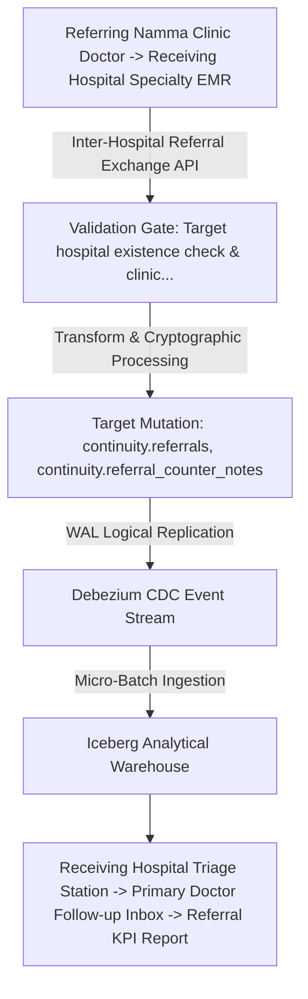

#### Multi-Stage Data Manipulation Lifecycle
1. **Stage 1 (Ingress & Handshake)**: Data originates at `Referring Namma Clinic Doctor -> Receiving Hospital Specialty EMR` and enters the platform boundary via `Inter-Hospital Referral Exchange API` with mandatory TLS 1.3 encryption.
2. **Stage 2 (Syntactic & Semantic Validation)**: Payloads pass through `Target hospital existence check & clinical transfer summary validation (DQ-035)`. Violations trigger synchronous rejection prior to database access.
3. **Stage 3 (Cryptographic Normalization)**: Referral dossier bundling (clinical encounter, vitals, lab results) -> ABDM FHIR Referral Bundle. Sensitive attributes receive column-level envelope encryption or HMAC blinding.
4. **Stage 4 (Atomic Storage Persistence)**: Target entities in `continuity.referrals, continuity.referral_counter_notes` mutate within an ACID transaction block, enforcing Emergency referrals automatically dispatch ambulance alert and bed reservation request.
5. **Stage 5 (Asynchronous CDC Emission)**: PostgreSQL WAL logical decoding emits change events to Kafka topic `cdc.continuity.referrals`.
6. **Stage 6 (Analytical Lakehouse Landing)**: Change events stream into Iceberg Parquet partitions, updating analytical star schemas within SLA targets.
7. **Stage 7 (Downstream Egress & ML Ingestion)**: Downstream consumers in `Receiving Hospital Triage Station -> Primary Doctor Follow-up Inbox -> Referral KPI Report` consume verified records via Trino or authenticated REST APIs.

#### Cryptographic & Security Safeguards
- **In-Transit Protection**: Encrypted via mTLS 1.3 using ECDHE-RSA-AES256-GCM-SHA384 cipher suites.
- **At-Rest Protection**: Column-level AES-256-GCM for PII and Argon2id for authentication credentials.
- **Provenance Fingerprint**: SHA-256 HMAC digest computed across mutated row attributes and linked to audit ledger.
- **Latency SLA**: Ingress-to-OLTP < 50ms; CDC-to-Kafka < 500ms; Lakehouse-availability < 15 minutes.

#### Complete Documentation-Only SQL Ingestion & Transformation Snippet
This SQL illustrates the transactional mutation logic executed by the operational service:
```sql
-- DOCUMENTATION-ONLY SQL: Transactional Transformation Logic for LINEAGE-018
BEGIN;
-- Step 1: Pre-validation assertion
SELECT 1 FROM continuity.referrals WHERE 1=0;
-- Step 2: Atomic mutation into primary entity
INSERT INTO continuity.referrals (
    id, created_at, updated_at, is_active
) VALUES (
    gen_random_uuid(), CURRENT_TIMESTAMP, CURRENT_TIMESTAMP, true
);
-- Step 3: Append cryptographic state record to audit ledger
INSERT INTO audit.audit_events (
    event_id, event_timestamp, entity_name, action_type, security_classification
) VALUES (
    gen_random_uuid(), CURRENT_TIMESTAMP, 'continuity.referrals', 'INSERT', 'CLASS-003'
);
COMMIT;
```

#### Failure Modes & Automated Remediation Runbook
When failures occur along `LINEAGE-018`, the operational monitoring engine executes the triage protocol below:
- **Transient Network Timeout**: Retry with exponential backoff (initial delay 500ms, max 3 retries).
- **Validation Failure**: Route malformed payload to Dead Letter Queue topic `dlq.continuity.referrals`; alert operations team.
- **Lock Contention**: PostgreSQL aborts transaction on lock timeout; retry worker reschedules payload after 2 seconds.
- **Downstream Consumer Lag**: If consumers of `Receiving Hospital Triage Station -> Primary Doctor Follow-up Inbox -> Referral KPI Report` lag > 15 minutes behind CDC stream, Kafka auto-scaling deploys additional worker pods.

#### Complete OpenLineage Event Specification
This JSON payload defines the OpenLineage run facet emitted by the service worker:
```json
{
  "eventType": "COMPLETE",
  "job": {
    "namespace": "namma_clinic.pipeline",
    "name": "lineage_018_job"
  },
  "inputs": [
    { "namespace": "source_system", "name": "referring_namma_clinic_doctor_->_receiving_hospital_specialty_emr" }
  ],
  "outputs": [
    { "namespace": "postgres.primary", "name": "continuity.referrals" }
  ],
  "producer": "https://github.com/saimaa0910/mvp/scripts/database"
}
```

### 3.19 LINEAGE-019: Longitudinal NCD Care Episode & Risk Stratification Lineage

- **Pathway Identifier**: `LINEAGE-019`
- **Primary Ingestion Source**: Doctor Consultation EMR / ACD Screening Camp
- **Transport & Protocol**: NCD Registry Enrollment Form
- **Validation Controls & Quality Gates**: Confirmed diagnosis code check & condition category verification (DQ-036)
- **Target Database Tables**: `continuity.ncd_episodes, continuity.follow_up_schedules`
- **Security Classification**: `CLASS-003`
- **Applicable Retention Policy**: `RETENTION-013`
- **Downstream Consumers**: ASHA Community Line-List -> NP-NCD National Portal -> Population Health Analytics

#### Architectural Data Flow Diagram
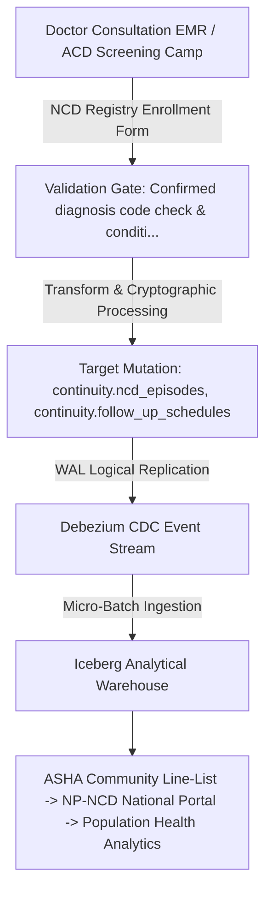

#### Multi-Stage Data Manipulation Lifecycle
1. **Stage 1 (Ingress & Handshake)**: Data originates at `Doctor Consultation EMR / ACD Screening Camp` and enters the platform boundary via `NCD Registry Enrollment Form` with mandatory TLS 1.3 encryption.
2. **Stage 2 (Syntactic & Semantic Validation)**: Payloads pass through `Confirmed diagnosis code check & condition category verification (DQ-036)`. Violations trigger synchronous rejection prior to database access.
3. **Stage 3 (Cryptographic Normalization)**: Cardio-metabolic risk score calculation + Automated 30-day review schedule generation. Sensitive attributes receive column-level envelope encryption or HMAC blinding.
4. **Stage 4 (Atomic Storage Persistence)**: Target entities in `continuity.ncd_episodes, continuity.follow_up_schedules` mutate within an ACID transaction block, enforcing Enrolled NCD citizens must be scheduled for monthly clinical vitals and medication review.
5. **Stage 5 (Asynchronous CDC Emission)**: PostgreSQL WAL logical decoding emits change events to Kafka topic `cdc.continuity.ncd_episodes`.
6. **Stage 6 (Analytical Lakehouse Landing)**: Change events stream into Iceberg Parquet partitions, updating analytical star schemas within SLA targets.
7. **Stage 7 (Downstream Egress & ML Ingestion)**: Downstream consumers in `ASHA Community Line-List -> NP-NCD National Portal -> Population Health Analytics` consume verified records via Trino or authenticated REST APIs.

#### Cryptographic & Security Safeguards
- **In-Transit Protection**: Encrypted via mTLS 1.3 using ECDHE-RSA-AES256-GCM-SHA384 cipher suites.
- **At-Rest Protection**: Column-level AES-256-GCM for PII and Argon2id for authentication credentials.
- **Provenance Fingerprint**: SHA-256 HMAC digest computed across mutated row attributes and linked to audit ledger.
- **Latency SLA**: Ingress-to-OLTP < 50ms; CDC-to-Kafka < 500ms; Lakehouse-availability < 15 minutes.

#### Complete Documentation-Only SQL Ingestion & Transformation Snippet
This SQL illustrates the transactional mutation logic executed by the operational service:
```sql
-- DOCUMENTATION-ONLY SQL: Transactional Transformation Logic for LINEAGE-019
BEGIN;
-- Step 1: Pre-validation assertion
SELECT 1 FROM continuity.ncd_episodes WHERE 1=0;
-- Step 2: Atomic mutation into primary entity
INSERT INTO continuity.ncd_episodes (
    id, created_at, updated_at, is_active
) VALUES (
    gen_random_uuid(), CURRENT_TIMESTAMP, CURRENT_TIMESTAMP, true
);
-- Step 3: Append cryptographic state record to audit ledger
INSERT INTO audit.audit_events (
    event_id, event_timestamp, entity_name, action_type, security_classification
) VALUES (
    gen_random_uuid(), CURRENT_TIMESTAMP, 'continuity.ncd_episodes', 'INSERT', 'CLASS-003'
);
COMMIT;
```

#### Failure Modes & Automated Remediation Runbook
When failures occur along `LINEAGE-019`, the operational monitoring engine executes the triage protocol below:
- **Transient Network Timeout**: Retry with exponential backoff (initial delay 500ms, max 3 retries).
- **Validation Failure**: Route malformed payload to Dead Letter Queue topic `dlq.continuity.ncd_episodes`; alert operations team.
- **Lock Contention**: PostgreSQL aborts transaction on lock timeout; retry worker reschedules payload after 2 seconds.
- **Downstream Consumer Lag**: If consumers of `ASHA Community Line-List -> NP-NCD National Portal -> Population Health Analytics` lag > 15 minutes behind CDC stream, Kafka auto-scaling deploys additional worker pods.

#### Complete OpenLineage Event Specification
This JSON payload defines the OpenLineage run facet emitted by the service worker:
```json
{
  "eventType": "COMPLETE",
  "job": {
    "namespace": "namma_clinic.pipeline",
    "name": "lineage_019_job"
  },
  "inputs": [
    { "namespace": "source_system", "name": "doctor_consultation_emr_/_acd_screening_camp" }
  ],
  "outputs": [
    { "namespace": "postgres.primary", "name": "continuity.ncd_episodes" }
  ],
  "producer": "https://github.com/saimaa0910/mvp/scripts/database"
}
```

### 3.20 LINEAGE-020: Care Continuity Follow-up Reminder & Outreach Lineage

- **Pathway Identifier**: `LINEAGE-020`
- **Primary Ingestion Source**: Encounter Discharge Workflow Scheduler
- **Transport & Protocol**: Automated Cron Scheduler Engine
- **Validation Controls & Quality Gates**: Future date validation & citizen opt-in verification (DQ-037)
- **Target Database Tables**: `continuity.follow_up_schedules, continuity.notifications`
- **Security Classification**: `CLASS-003`
- **Applicable Retention Policy**: `RETENTION-001`
- **Downstream Consumers**: Citizen SMS Gateway -> ASHA Mobile Outreach App -> Clinic Daily Appointment Roster

#### Architectural Data Flow Diagram
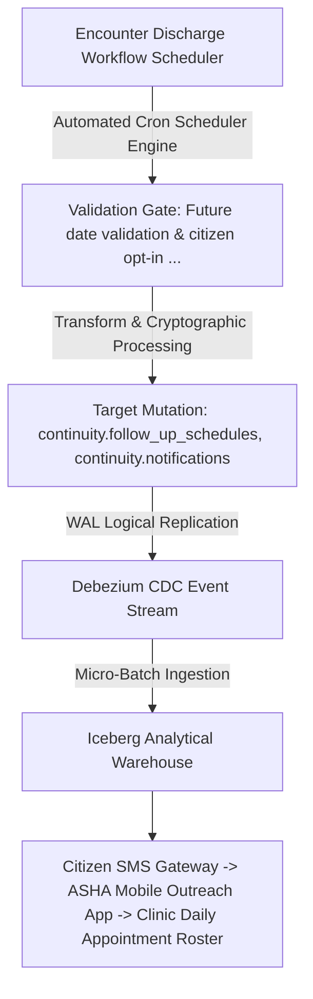

#### Multi-Stage Data Manipulation Lifecycle
1. **Stage 1 (Ingress & Handshake)**: Data originates at `Encounter Discharge Workflow Scheduler` and enters the platform boundary via `Automated Cron Scheduler Engine` with mandatory TLS 1.3 encryption.
2. **Stage 2 (Syntactic & Semantic Validation)**: Payloads pass through `Future date validation & citizen opt-in verification (DQ-037)`. Violations trigger synchronous rejection prior to database access.
3. **Stage 3 (Cryptographic Normalization)**: Reminder dispatch timeline calculation (T-3 days, T-1 day, T-day) -> SMS/WhatsApp template rendering. Sensitive attributes receive column-level envelope encryption or HMAC blinding.
4. **Stage 4 (Atomic Storage Persistence)**: Target entities in `continuity.follow_up_schedules, continuity.notifications` mutate within an ACID transaction block, enforcing Citizen missing scheduled review by > 7 days flagged for ASHA home visit.
5. **Stage 5 (Asynchronous CDC Emission)**: PostgreSQL WAL logical decoding emits change events to Kafka topic `cdc.continuity.follow_up_schedules`.
6. **Stage 6 (Analytical Lakehouse Landing)**: Change events stream into Iceberg Parquet partitions, updating analytical star schemas within SLA targets.
7. **Stage 7 (Downstream Egress & ML Ingestion)**: Downstream consumers in `Citizen SMS Gateway -> ASHA Mobile Outreach App -> Clinic Daily Appointment Roster` consume verified records via Trino or authenticated REST APIs.

#### Cryptographic & Security Safeguards
- **In-Transit Protection**: Encrypted via mTLS 1.3 using ECDHE-RSA-AES256-GCM-SHA384 cipher suites.
- **At-Rest Protection**: Column-level AES-256-GCM for PII and Argon2id for authentication credentials.
- **Provenance Fingerprint**: SHA-256 HMAC digest computed across mutated row attributes and linked to audit ledger.
- **Latency SLA**: Ingress-to-OLTP < 50ms; CDC-to-Kafka < 500ms; Lakehouse-availability < 15 minutes.

#### Complete Documentation-Only SQL Ingestion & Transformation Snippet
This SQL illustrates the transactional mutation logic executed by the operational service:
```sql
-- DOCUMENTATION-ONLY SQL: Transactional Transformation Logic for LINEAGE-020
BEGIN;
-- Step 1: Pre-validation assertion
SELECT 1 FROM continuity.follow_up_schedules WHERE 1=0;
-- Step 2: Atomic mutation into primary entity
INSERT INTO continuity.follow_up_schedules (
    id, created_at, updated_at, is_active
) VALUES (
    gen_random_uuid(), CURRENT_TIMESTAMP, CURRENT_TIMESTAMP, true
);
-- Step 3: Append cryptographic state record to audit ledger
INSERT INTO audit.audit_events (
    event_id, event_timestamp, entity_name, action_type, security_classification
) VALUES (
    gen_random_uuid(), CURRENT_TIMESTAMP, 'continuity.follow_up_schedules', 'INSERT', 'CLASS-003'
);
COMMIT;
```

#### Failure Modes & Automated Remediation Runbook
When failures occur along `LINEAGE-020`, the operational monitoring engine executes the triage protocol below:
- **Transient Network Timeout**: Retry with exponential backoff (initial delay 500ms, max 3 retries).
- **Validation Failure**: Route malformed payload to Dead Letter Queue topic `dlq.continuity.follow_up_schedules`; alert operations team.
- **Lock Contention**: PostgreSQL aborts transaction on lock timeout; retry worker reschedules payload after 2 seconds.
- **Downstream Consumer Lag**: If consumers of `Citizen SMS Gateway -> ASHA Mobile Outreach App -> Clinic Daily Appointment Roster` lag > 15 minutes behind CDC stream, Kafka auto-scaling deploys additional worker pods.

#### Complete OpenLineage Event Specification
This JSON payload defines the OpenLineage run facet emitted by the service worker:
```json
{
  "eventType": "COMPLETE",
  "job": {
    "namespace": "namma_clinic.pipeline",
    "name": "lineage_020_job"
  },
  "inputs": [
    { "namespace": "source_system", "name": "encounter_discharge_workflow_scheduler" }
  ],
  "outputs": [
    { "namespace": "postgres.primary", "name": "continuity.follow_up_schedules" }
  ],
  "producer": "https://github.com/saimaa0910/mvp/scripts/database"
}
```

### 3.21 LINEAGE-021: Citizen Communication Dispatch & DLR Reconciliation Lineage

- **Pathway Identifier**: `LINEAGE-021`
- **Primary Ingestion Source**: Notification Engine Trigger (Appointments, Prescriptions, Lab Alerts)
- **Transport & Protocol**: Telecom Aggregator REST API (Karix / ValueFirst)
- **Validation Controls & Quality Gates**: Indian mobile number validation & approved telecom template check (DQ-038)
- **Target Database Tables**: `continuity.notifications`
- **Security Classification**: `CLASS-003`
- **Applicable Retention Policy**: `RETENTION-015`
- **Downstream Consumers**: Citizen Mobile Device -> Telecom SLA Report -> Communication Cost Accounting

#### Architectural Data Flow Diagram
```mermaid
flowchart TD
    S["Notification Engine Trigger (Appointments, Prescriptions, Lab Alerts)"] -->|Telecom Aggregator REST API (Karix / ValueFirst)| V["Validation Gate: Indian mobile number validation & approv..."]
    V -->|Transform & Cryptographic Processing| T["Target Mutation: continuity.notifications"]
    T -->|WAL Logical Replication| CDC["Debezium CDC Event Stream"]
    CDC -->|Micro-Batch Ingestion| Lake["Iceberg Analytical Warehouse"]
    Lake --> Down["Citizen Mobile Device -> Telecom SLA Report -> Communication Cost Accounting"]
```

#### Multi-Stage Data Manipulation Lifecycle
1. **Stage 1 (Ingress & Handshake)**: Data originates at `Notification Engine Trigger (Appointments, Prescriptions, Lab Alerts)` and enters the platform boundary via `Telecom Aggregator REST API (Karix / ValueFirst)` with mandatory TLS 1.3 encryption.
2. **Stage 2 (Syntactic & Semantic Validation)**: Payloads pass through `Indian mobile number validation & approved telecom template check (DQ-038)`. Violations trigger synchronous rejection prior to database access.
3. **Stage 3 (Cryptographic Normalization)**: Message text token substitution + Delivery receipt webhook status update. Sensitive attributes receive column-level envelope encryption or HMAC blinding.
4. **Stage 4 (Atomic Storage Persistence)**: Target entities in `continuity.notifications` mutate within an ACID transaction block, enforcing Transactional clinical messages exempt from TRAI promotional DND restrictions.
5. **Stage 5 (Asynchronous CDC Emission)**: PostgreSQL WAL logical decoding emits change events to Kafka topic `cdc.continuity.notifications`.
6. **Stage 6 (Analytical Lakehouse Landing)**: Change events stream into Iceberg Parquet partitions, updating analytical star schemas within SLA targets.
7. **Stage 7 (Downstream Egress & ML Ingestion)**: Downstream consumers in `Citizen Mobile Device -> Telecom SLA Report -> Communication Cost Accounting` consume verified records via Trino or authenticated REST APIs.

#### Cryptographic & Security Safeguards
- **In-Transit Protection**: Encrypted via mTLS 1.3 using ECDHE-RSA-AES256-GCM-SHA384 cipher suites.
- **At-Rest Protection**: Column-level AES-256-GCM for PII and Argon2id for authentication credentials.
- **Provenance Fingerprint**: SHA-256 HMAC digest computed across mutated row attributes and linked to audit ledger.
- **Latency SLA**: Ingress-to-OLTP < 50ms; CDC-to-Kafka < 500ms; Lakehouse-availability < 15 minutes.

#### Complete Documentation-Only SQL Ingestion & Transformation Snippet
This SQL illustrates the transactional mutation logic executed by the operational service:
```sql
-- DOCUMENTATION-ONLY SQL: Transactional Transformation Logic for LINEAGE-021
BEGIN;
-- Step 1: Pre-validation assertion
SELECT 1 FROM continuity.notifications WHERE 1=0;
-- Step 2: Atomic mutation into primary entity
INSERT INTO continuity.notifications (
    id, created_at, updated_at, is_active
) VALUES (
    gen_random_uuid(), CURRENT_TIMESTAMP, CURRENT_TIMESTAMP, true
);
-- Step 3: Append cryptographic state record to audit ledger
INSERT INTO audit.audit_events (
    event_id, event_timestamp, entity_name, action_type, security_classification
) VALUES (
    gen_random_uuid(), CURRENT_TIMESTAMP, 'continuity.notifications', 'INSERT', 'CLASS-003'
);
COMMIT;
```

#### Failure Modes & Automated Remediation Runbook
When failures occur along `LINEAGE-021`, the operational monitoring engine executes the triage protocol below:
- **Transient Network Timeout**: Retry with exponential backoff (initial delay 500ms, max 3 retries).
- **Validation Failure**: Route malformed payload to Dead Letter Queue topic `dlq.continuity.notifications`; alert operations team.
- **Lock Contention**: PostgreSQL aborts transaction on lock timeout; retry worker reschedules payload after 2 seconds.
- **Downstream Consumer Lag**: If consumers of `Citizen Mobile Device -> Telecom SLA Report -> Communication Cost Accounting` lag > 15 minutes behind CDC stream, Kafka auto-scaling deploys additional worker pods.

#### Complete OpenLineage Event Specification
This JSON payload defines the OpenLineage run facet emitted by the service worker:
```json
{
  "eventType": "COMPLETE",
  "job": {
    "namespace": "namma_clinic.pipeline",
    "name": "lineage_021_job"
  },
  "inputs": [
    { "namespace": "source_system", "name": "notification_engine_trigger_(appointments,_prescriptions,_lab_alerts)" }
  ],
  "outputs": [
    { "namespace": "postgres.primary", "name": "continuity.notifications" }
  ],
  "producer": "https://github.com/saimaa0910/mvp/scripts/database"
}
```

### 3.22 LINEAGE-022: Sakala Citizen Grievance & SLA Escalation Lineage

- **Pathway Identifier**: `LINEAGE-022`
- **Primary Ingestion Source**: Sakala Portal / 1533 BBMP Helpline / Clinic QR Form
- **Transport & Protocol**: Karnataka Sakala API Gateway
- **Validation Controls & Quality Gates**: Service code check & statutory deadline computation (DQ-039)
- **Target Database Tables**: `continuity.grievances`
- **Security Classification**: `CLASS-002`
- **Applicable Retention Policy**: `RETENTION-014`
- **Downstream Consumers**: MOIC Grievance Workbench -> Sakala State Dashboard -> Public Grievance Scorecard

#### Architectural Data Flow Diagram
```mermaid
flowchart TD
    S["Sakala Portal / 1533 BBMP Helpline / Clinic QR Form"] -->|Karnataka Sakala API Gateway| V["Validation Gate: Service code check & statutory deadline ..."]
    V -->|Transform & Cryptographic Processing| T["Target Mutation: continuity.grievances"]
    T -->|WAL Logical Replication| CDC["Debezium CDC Event Stream"]
    CDC -->|Micro-Batch Ingestion| Lake["Iceberg Analytical Warehouse"]
    Lake --> Down["MOIC Grievance Workbench -> Sakala State Dashboard -> Public Grievance Scorecard"]
```

#### Multi-Stage Data Manipulation Lifecycle
1. **Stage 1 (Ingress & Handshake)**: Data originates at `Sakala Portal / 1533 BBMP Helpline / Clinic QR Form` and enters the platform boundary via `Karnataka Sakala API Gateway` with mandatory TLS 1.3 encryption.
2. **Stage 2 (Syntactic & Semantic Validation)**: Payloads pass through `Service code check & statutory deadline computation (DQ-039)`. Violations trigger synchronous rejection prior to database access.
3. **Stage 3 (Cryptographic Normalization)**: Sakala ticket generation + Automatic assignment to Ward MOIC based on clinic code. Sensitive attributes receive column-level envelope encryption or HMAC blinding.
4. **Stage 4 (Atomic Storage Persistence)**: Target entities in `continuity.grievances` mutate within an ACID transaction block, enforcing Grievance unresolved after 7 days automatically escalates to Chief Health Officer.
5. **Stage 5 (Asynchronous CDC Emission)**: PostgreSQL WAL logical decoding emits change events to Kafka topic `cdc.continuity.grievances`.
6. **Stage 6 (Analytical Lakehouse Landing)**: Change events stream into Iceberg Parquet partitions, updating analytical star schemas within SLA targets.
7. **Stage 7 (Downstream Egress & ML Ingestion)**: Downstream consumers in `MOIC Grievance Workbench -> Sakala State Dashboard -> Public Grievance Scorecard` consume verified records via Trino or authenticated REST APIs.

#### Cryptographic & Security Safeguards
- **In-Transit Protection**: Encrypted via mTLS 1.3 using ECDHE-RSA-AES256-GCM-SHA384 cipher suites.
- **At-Rest Protection**: Column-level AES-256-GCM for PII and Argon2id for authentication credentials.
- **Provenance Fingerprint**: SHA-256 HMAC digest computed across mutated row attributes and linked to audit ledger.
- **Latency SLA**: Ingress-to-OLTP < 50ms; CDC-to-Kafka < 500ms; Lakehouse-availability < 15 minutes.

#### Complete Documentation-Only SQL Ingestion & Transformation Snippet
This SQL illustrates the transactional mutation logic executed by the operational service:
```sql
-- DOCUMENTATION-ONLY SQL: Transactional Transformation Logic for LINEAGE-022
BEGIN;
-- Step 1: Pre-validation assertion
SELECT 1 FROM continuity.grievances WHERE 1=0;
-- Step 2: Atomic mutation into primary entity
INSERT INTO continuity.grievances (
    id, created_at, updated_at, is_active
) VALUES (
    gen_random_uuid(), CURRENT_TIMESTAMP, CURRENT_TIMESTAMP, true
);
-- Step 3: Append cryptographic state record to audit ledger
INSERT INTO audit.audit_events (
    event_id, event_timestamp, entity_name, action_type, security_classification
) VALUES (
    gen_random_uuid(), CURRENT_TIMESTAMP, 'continuity.grievances', 'INSERT', 'CLASS-002'
);
COMMIT;
```

#### Failure Modes & Automated Remediation Runbook
When failures occur along `LINEAGE-022`, the operational monitoring engine executes the triage protocol below:
- **Transient Network Timeout**: Retry with exponential backoff (initial delay 500ms, max 3 retries).
- **Validation Failure**: Route malformed payload to Dead Letter Queue topic `dlq.continuity.grievances`; alert operations team.
- **Lock Contention**: PostgreSQL aborts transaction on lock timeout; retry worker reschedules payload after 2 seconds.
- **Downstream Consumer Lag**: If consumers of `MOIC Grievance Workbench -> Sakala State Dashboard -> Public Grievance Scorecard` lag > 15 minutes behind CDC stream, Kafka auto-scaling deploys additional worker pods.

#### Complete OpenLineage Event Specification
This JSON payload defines the OpenLineage run facet emitted by the service worker:
```json
{
  "eventType": "COMPLETE",
  "job": {
    "namespace": "namma_clinic.pipeline",
    "name": "lineage_022_job"
  },
  "inputs": [
    { "namespace": "source_system", "name": "sakala_portal_/_1533_bbmp_helpline_/_clinic_qr_form" }
  ],
  "outputs": [
    { "namespace": "postgres.primary", "name": "continuity.grievances" }
  ],
  "producer": "https://github.com/saimaa0910/mvp/scripts/database"
}
```

### 3.23 LINEAGE-023: Facility IT Hardware & Cold-Chain Breakdown Ticket Lineage

- **Pathway Identifier**: `LINEAGE-023`
- **Primary Ingestion Source**: Clinic Staff / Automated Cold Chain Sensor Alert
- **Transport & Protocol**: ITSM Portal Form / Automated Failure Webhook
- **Validation Controls & Quality Gates**: Asset serial number validation & vendor SLA category check (DQ-040)
- **Target Database Tables**: `continuity.helpdesk_tickets`
- **Security Classification**: `CLASS-002`
- **Applicable Retention Policy**: `RETENTION-019`
- **Downstream Consumers**: Field Engineer Dispatch App -> Hardware Uptime Dashboard -> Vendor Penalty Ledger

#### Architectural Data Flow Diagram
```mermaid
flowchart TD
    S["Clinic Staff / Automated Cold Chain Sensor Alert"] -->|ITSM Portal Form / Automated Failure Webhook| V["Validation Gate: Asset serial number validation & vendor ..."]
    V -->|Transform & Cryptographic Processing| T["Target Mutation: continuity.helpdesk_tickets"]
    T -->|WAL Logical Replication| CDC["Debezium CDC Event Stream"]
    CDC -->|Micro-Batch Ingestion| Lake["Iceberg Analytical Warehouse"]
    Lake --> Down["Field Engineer Dispatch App -> Hardware Uptime Dashboard -> Vendor Penalty Ledger"]
```

#### Multi-Stage Data Manipulation Lifecycle
1. **Stage 1 (Ingress & Handshake)**: Data originates at `Clinic Staff / Automated Cold Chain Sensor Alert` and enters the platform boundary via `ITSM Portal Form / Automated Failure Webhook` with mandatory TLS 1.3 encryption.
2. **Stage 2 (Syntactic & Semantic Validation)**: Payloads pass through `Asset serial number validation & vendor SLA category check (DQ-040)`. Violations trigger synchronous rejection prior to database access.
3. **Stage 3 (Cryptographic Normalization)**: Severity assignment + Vendor dispatch dispatch notification via SMS/Email. Sensitive attributes receive column-level envelope encryption or HMAC blinding.
4. **Stage 4 (Atomic Storage Persistence)**: Target entities in `continuity.helpdesk_tickets` mutate within an ACID transaction block, enforcing Cold-chain ILR breakdown requires technician on-site response within 4 hours.
5. **Stage 5 (Asynchronous CDC Emission)**: PostgreSQL WAL logical decoding emits change events to Kafka topic `cdc.continuity.helpdesk_tickets`.
6. **Stage 6 (Analytical Lakehouse Landing)**: Change events stream into Iceberg Parquet partitions, updating analytical star schemas within SLA targets.
7. **Stage 7 (Downstream Egress & ML Ingestion)**: Downstream consumers in `Field Engineer Dispatch App -> Hardware Uptime Dashboard -> Vendor Penalty Ledger` consume verified records via Trino or authenticated REST APIs.

#### Cryptographic & Security Safeguards
- **In-Transit Protection**: Encrypted via mTLS 1.3 using ECDHE-RSA-AES256-GCM-SHA384 cipher suites.
- **At-Rest Protection**: Column-level AES-256-GCM for PII and Argon2id for authentication credentials.
- **Provenance Fingerprint**: SHA-256 HMAC digest computed across mutated row attributes and linked to audit ledger.
- **Latency SLA**: Ingress-to-OLTP < 50ms; CDC-to-Kafka < 500ms; Lakehouse-availability < 15 minutes.

#### Complete Documentation-Only SQL Ingestion & Transformation Snippet
This SQL illustrates the transactional mutation logic executed by the operational service:
```sql
-- DOCUMENTATION-ONLY SQL: Transactional Transformation Logic for LINEAGE-023
BEGIN;
-- Step 1: Pre-validation assertion
SELECT 1 FROM continuity.helpdesk_tickets WHERE 1=0;
-- Step 2: Atomic mutation into primary entity
INSERT INTO continuity.helpdesk_tickets (
    id, created_at, updated_at, is_active
) VALUES (
    gen_random_uuid(), CURRENT_TIMESTAMP, CURRENT_TIMESTAMP, true
);
-- Step 3: Append cryptographic state record to audit ledger
INSERT INTO audit.audit_events (
    event_id, event_timestamp, entity_name, action_type, security_classification
) VALUES (
    gen_random_uuid(), CURRENT_TIMESTAMP, 'continuity.helpdesk_tickets', 'INSERT', 'CLASS-002'
);
COMMIT;
```

#### Failure Modes & Automated Remediation Runbook
When failures occur along `LINEAGE-023`, the operational monitoring engine executes the triage protocol below:
- **Transient Network Timeout**: Retry with exponential backoff (initial delay 500ms, max 3 retries).
- **Validation Failure**: Route malformed payload to Dead Letter Queue topic `dlq.continuity.helpdesk_tickets`; alert operations team.
- **Lock Contention**: PostgreSQL aborts transaction on lock timeout; retry worker reschedules payload after 2 seconds.
- **Downstream Consumer Lag**: If consumers of `Field Engineer Dispatch App -> Hardware Uptime Dashboard -> Vendor Penalty Ledger` lag > 15 minutes behind CDC stream, Kafka auto-scaling deploys additional worker pods.

#### Complete OpenLineage Event Specification
This JSON payload defines the OpenLineage run facet emitted by the service worker:
```json
{
  "eventType": "COMPLETE",
  "job": {
    "namespace": "namma_clinic.pipeline",
    "name": "lineage_023_job"
  },
  "inputs": [
    { "namespace": "source_system", "name": "clinic_staff_/_automated_cold_chain_sensor_alert" }
  ],
  "outputs": [
    { "namespace": "postgres.primary", "name": "continuity.helpdesk_tickets" }
  ],
  "producer": "https://github.com/saimaa0910/mvp/scripts/database"
}
```

### 3.24 LINEAGE-024: Cryptographic WORM Audit Event & Tamper Proofing Lineage

- **Pathway Identifier**: `LINEAGE-024`
- **Primary Ingestion Source**: PostgreSQL Database Engine Triggers & Application Security Interceptors
- **Transport & Protocol**: Transactional Append-Only Pipeline
- **Validation Controls & Quality Gates**: SHA-256 HMAC hash length & previous chain link check (DQ-041)
- **Target Database Tables**: `audit.audit_events`
- **Security Classification**: `CLASS-004`
- **Applicable Retention Policy**: `RETENTION-006`
- **Downstream Consumers**: SIEM (Splunk / Elastic) -> Forensic Investigation Queries -> ISO 27001 Compliance Audit

#### Architectural Data Flow Diagram
```mermaid
flowchart TD
    S["PostgreSQL Database Engine Triggers & Application Security Interceptors"] -->|Transactional Append-Only Pipeline| V["Validation Gate: SHA-256 HMAC hash length & previous chai..."]
    V -->|Transform & Cryptographic Processing| T["Target Mutation: audit.audit_events"]
    T -->|WAL Logical Replication| CDC["Debezium CDC Event Stream"]
    CDC -->|Micro-Batch Ingestion| Lake["Iceberg Analytical Warehouse"]
    Lake --> Down["SIEM (Splunk / Elastic) -> Forensic Investigation Queries -> ISO 27001 Compliance Audit"]
```

#### Multi-Stage Data Manipulation Lifecycle
1. **Stage 1 (Ingress & Handshake)**: Data originates at `PostgreSQL Database Engine Triggers & Application Security Interceptors` and enters the platform boundary via `Transactional Append-Only Pipeline` with mandatory TLS 1.3 encryption.
2. **Stage 2 (Syntactic & Semantic Validation)**: Payloads pass through `SHA-256 HMAC hash length & previous chain link check (DQ-041)`. Violations trigger synchronous rejection prior to database access.
3. **Stage 3 (Cryptographic Normalization)**: HMAC calculation using KMS secret key + Appending to immutable hash-chained partition. Sensitive attributes receive column-level envelope encryption or HMAC blinding.
4. **Stage 4 (Atomic Storage Persistence)**: Target entities in `audit.audit_events` mutate within an ACID transaction block, enforcing Audit rows are write-once-read-many (WORM); updates and deletes strictly forbidden.
5. **Stage 5 (Asynchronous CDC Emission)**: PostgreSQL WAL logical decoding emits change events to Kafka topic `cdc.audit.audit_events`.
6. **Stage 6 (Analytical Lakehouse Landing)**: Change events stream into Iceberg Parquet partitions, updating analytical star schemas within SLA targets.
7. **Stage 7 (Downstream Egress & ML Ingestion)**: Downstream consumers in `SIEM (Splunk / Elastic) -> Forensic Investigation Queries -> ISO 27001 Compliance Audit` consume verified records via Trino or authenticated REST APIs.

#### Cryptographic & Security Safeguards
- **In-Transit Protection**: Encrypted via mTLS 1.3 using ECDHE-RSA-AES256-GCM-SHA384 cipher suites.
- **At-Rest Protection**: Column-level AES-256-GCM for PII and Argon2id for authentication credentials.
- **Provenance Fingerprint**: SHA-256 HMAC digest computed across mutated row attributes and linked to audit ledger.
- **Latency SLA**: Ingress-to-OLTP < 50ms; CDC-to-Kafka < 500ms; Lakehouse-availability < 15 minutes.

#### Complete Documentation-Only SQL Ingestion & Transformation Snippet
This SQL illustrates the transactional mutation logic executed by the operational service:
```sql
-- DOCUMENTATION-ONLY SQL: Transactional Transformation Logic for LINEAGE-024
BEGIN;
-- Step 1: Pre-validation assertion
SELECT 1 FROM audit.audit_events WHERE 1=0;
-- Step 2: Atomic mutation into primary entity
INSERT INTO audit.audit_events (
    id, created_at, updated_at, is_active
) VALUES (
    gen_random_uuid(), CURRENT_TIMESTAMP, CURRENT_TIMESTAMP, true
);
-- Step 3: Append cryptographic state record to audit ledger
INSERT INTO audit.audit_events (
    event_id, event_timestamp, entity_name, action_type, security_classification
) VALUES (
    gen_random_uuid(), CURRENT_TIMESTAMP, 'audit.audit_events', 'INSERT', 'CLASS-004'
);
COMMIT;
```

#### Failure Modes & Automated Remediation Runbook
When failures occur along `LINEAGE-024`, the operational monitoring engine executes the triage protocol below:
- **Transient Network Timeout**: Retry with exponential backoff (initial delay 500ms, max 3 retries).
- **Validation Failure**: Route malformed payload to Dead Letter Queue topic `dlq.audit.audit_events`; alert operations team.
- **Lock Contention**: PostgreSQL aborts transaction on lock timeout; retry worker reschedules payload after 2 seconds.
- **Downstream Consumer Lag**: If consumers of `SIEM (Splunk / Elastic) -> Forensic Investigation Queries -> ISO 27001 Compliance Audit` lag > 15 minutes behind CDC stream, Kafka auto-scaling deploys additional worker pods.

#### Complete OpenLineage Event Specification
This JSON payload defines the OpenLineage run facet emitted by the service worker:
```json
{
  "eventType": "COMPLETE",
  "job": {
    "namespace": "namma_clinic.pipeline",
    "name": "lineage_024_job"
  },
  "inputs": [
    { "namespace": "source_system", "name": "postgresql_database_engine_triggers_&_application_security_interceptors" }
  ],
  "outputs": [
    { "namespace": "postgres.primary", "name": "audit.audit_events" }
  ],
  "producer": "https://github.com/saimaa0910/mvp/scripts/database"
}
```

### 3.25 LINEAGE-025: Clinic Edge Offline Mutation Journal & Cloud Reconciliation Lineage

- **Pathway Identifier**: `LINEAGE-025`
- **Primary Ingestion Source**: Clinic Edge SQLite / Local PostgreSQL Database
- **Transport & Protocol**: Encrypted Sync Agent Worker over HTTPS
- **Validation Controls & Quality Gates**: Sync sequence monotonic check & conflict vector validation (DQ-042)
- **Target Database Tables**: `sync.offline_mutation_log, All domain OLTP tables`
- **Security Classification**: `CLASS-003`
- **Applicable Retention Policy**: `RETENTION-012`
- **Downstream Consumers**: Cloud Central Database -> Edge Sync Health Monitor -> Offline Continuity Report

#### Architectural Data Flow Diagram
```mermaid
flowchart TD
    S["Clinic Edge SQLite / Local PostgreSQL Database"] -->|Encrypted Sync Agent Worker over HTTPS| V["Validation Gate: Sync sequence monotonic check & conflict..."]
    V -->|Transform & Cryptographic Processing| T["Target Mutation: sync.offline_mutation_log, All domain OLTP tables"]
    T -->|WAL Logical Replication| CDC["Debezium CDC Event Stream"]
    CDC -->|Micro-Batch Ingestion| Lake["Iceberg Analytical Warehouse"]
    Lake --> Down["Cloud Central Database -> Edge Sync Health Monitor -> Offline Continuity Report"]
```

#### Multi-Stage Data Manipulation Lifecycle
1. **Stage 1 (Ingress & Handshake)**: Data originates at `Clinic Edge SQLite / Local PostgreSQL Database` and enters the platform boundary via `Encrypted Sync Agent Worker over HTTPS` with mandatory TLS 1.3 encryption.
2. **Stage 2 (Syntactic & Semantic Validation)**: Payloads pass through `Sync sequence monotonic check & conflict vector validation (DQ-042)`. Violations trigger synchronous rejection prior to database access.
3. **Stage 3 (Cryptographic Normalization)**: Conflict resolution via Last-Write-Wins / Doctor-Wins rule + Replaying mutations to cloud tables. Sensitive attributes receive column-level envelope encryption or HMAC blinding.
4. **Stage 4 (Atomic Storage Persistence)**: Target entities in `sync.offline_mutation_log, All domain OLTP tables` mutate within an ACID transaction block, enforcing Local edge writes must reconcile within 24 hours of connectivity restoration.
5. **Stage 5 (Asynchronous CDC Emission)**: PostgreSQL WAL logical decoding emits change events to Kafka topic `cdc.sync.offline_mutation_log`.
6. **Stage 6 (Analytical Lakehouse Landing)**: Change events stream into Iceberg Parquet partitions, updating analytical star schemas within SLA targets.
7. **Stage 7 (Downstream Egress & ML Ingestion)**: Downstream consumers in `Cloud Central Database -> Edge Sync Health Monitor -> Offline Continuity Report` consume verified records via Trino or authenticated REST APIs.

#### Cryptographic & Security Safeguards
- **In-Transit Protection**: Encrypted via mTLS 1.3 using ECDHE-RSA-AES256-GCM-SHA384 cipher suites.
- **At-Rest Protection**: Column-level AES-256-GCM for PII and Argon2id for authentication credentials.
- **Provenance Fingerprint**: SHA-256 HMAC digest computed across mutated row attributes and linked to audit ledger.
- **Latency SLA**: Ingress-to-OLTP < 50ms; CDC-to-Kafka < 500ms; Lakehouse-availability < 15 minutes.

#### Complete Documentation-Only SQL Ingestion & Transformation Snippet
This SQL illustrates the transactional mutation logic executed by the operational service:
```sql
-- DOCUMENTATION-ONLY SQL: Transactional Transformation Logic for LINEAGE-025
BEGIN;
-- Step 1: Pre-validation assertion
SELECT 1 FROM sync.offline_mutation_log WHERE 1=0;
-- Step 2: Atomic mutation into primary entity
INSERT INTO sync.offline_mutation_log (
    id, created_at, updated_at, is_active
) VALUES (
    gen_random_uuid(), CURRENT_TIMESTAMP, CURRENT_TIMESTAMP, true
);
-- Step 3: Append cryptographic state record to audit ledger
INSERT INTO audit.audit_events (
    event_id, event_timestamp, entity_name, action_type, security_classification
) VALUES (
    gen_random_uuid(), CURRENT_TIMESTAMP, 'sync.offline_mutation_log', 'INSERT', 'CLASS-003'
);
COMMIT;
```

#### Failure Modes & Automated Remediation Runbook
When failures occur along `LINEAGE-025`, the operational monitoring engine executes the triage protocol below:
- **Transient Network Timeout**: Retry with exponential backoff (initial delay 500ms, max 3 retries).
- **Validation Failure**: Route malformed payload to Dead Letter Queue topic `dlq.sync.offline_mutation_log`; alert operations team.
- **Lock Contention**: PostgreSQL aborts transaction on lock timeout; retry worker reschedules payload after 2 seconds.
- **Downstream Consumer Lag**: If consumers of `Cloud Central Database -> Edge Sync Health Monitor -> Offline Continuity Report` lag > 15 minutes behind CDC stream, Kafka auto-scaling deploys additional worker pods.

#### Complete OpenLineage Event Specification
This JSON payload defines the OpenLineage run facet emitted by the service worker:
```json
{
  "eventType": "COMPLETE",
  "job": {
    "namespace": "namma_clinic.pipeline",
    "name": "lineage_025_job"
  },
  "inputs": [
    { "namespace": "source_system", "name": "clinic_edge_sqlite_/_local_postgresql_database" }
  ],
  "outputs": [
    { "namespace": "postgres.primary", "name": "sync.offline_mutation_log" }
  ],
  "producer": "https://github.com/saimaa0910/mvp/scripts/database"
}
```

## 4. OpenLineage Governance & Metadata Lake Architecture

The platform adopts Marquez as the canonical OpenLineage backend, visualizing dynamic DAG dependencies across operational databases, streaming Kafka topics, and analytical star schemas:

```mermaid
flowchart LR
    Apps[Microservice Applications] -->|OpenLineage HTTP Client| Marquez[Marquez Metadata API]
    dbt[dbt Analytical Jobs] -->|dbt-openlineage Plugin| Marquez
    Kafka[Kafka Connect Tasks] -->|OpenLineage Connector| Marquez
    Marquez --> UI[Marquez Enterprise Lineage Graph]
    Marquez --> Atlas[Apache Atlas Governance Catalog]
```

### 4.1 Schema Evolution & Column-Level Lineage
1. **Column-Level Provenance**: Analytical queries can inspect column-level lineage via Marquez, tracing every analytical measure (e.g. `MEASURE-001 total_opd_encounters`) back to the specific operational source table column (`clinical.clinical_encounters.id`).
2. **Breaking Change Impact Analysis**: Prior to applying any database migration (`MIG-001` to `MIG-030`), engineers run an automated impact analysis script query against Marquez to detect all downstream dbt models, Superset charts, and national portal feeds dependent on the altered column.
3. **Automated Graph Invalidation**: When an upstream table column changes type or is dropped, Marquez marks affected downstream datasets with an AMBER warning tag, notifying data engineers immediately.

## 5. Privacy-Preserving Lineage & DPDP Regulatory Compliance

Under the Digital Personal Data Protection (DPDP) Act 2023 and ABDM Data Governance rules, patient health data requires strict consent-backed lineage tracking:

1. **Consent Token Inheritance**: When a citizen grants digital consent (`LINEAGE-005`), the issued `consent_id` UUID is injected into all downstream consultation, lab, and prescription write operations.
2. **Right to Erasure / Revocation Cascade**: If a citizen revokes consent via the citizen portal, the revocation event triggers an automated lineage traversal job. The job traces all active operational and analytical copies of the citizen's data, applying cryptographic zeroization or de-identification according to statutory retention constraints.
3. **Cryptographic Erasure Verification**: The erasure worker writes a WORM audit log certifying that direct identifiers in operational tables were wiped and that analytical lakehouse tables contain strictly irreversible cohort aggregates.

## 6. Automated Lineage Reconciliation & Drift Detection Probes

To assert that operational data mutations flow cleanly into downstream analytical targets without loss or duplication, the data reliability team executes automated reconciliation probes:

```sql
-- DOCUMENTATION-ONLY SQL: End-to-End Lineage Reconciliation Probe
WITH source_counts AS (
    SELECT
        COUNT(*) AS oltp_encounters_count,
        MIN(created_at) AS earliest_oltp_time,
        MAX(created_at) AS latest_oltp_time
    FROM clinical.clinical_encounters
    WHERE created_at >= CURRENT_DATE - INTERVAL '1 day'
),
target_counts AS (
    SELECT
        SUM(encounter_count) AS olap_encounters_count
    FROM analytics.fact_opd_encounters
    WHERE date_key = TO_CHAR(CURRENT_DATE - INTERVAL '1 day', 'YYYYMMDD')::integer
)
SELECT
    s.oltp_encounters_count,
    t.olap_encounters_count,
    (s.oltp_encounters_count - t.olap_encounters_count) AS delta_records,
    CASE WHEN s.oltp_encounters_count = t.olap_encounters_count THEN 'RECONCILED' ELSE 'LINEAGE_DRIFT_DETECTED' END AS reconciliation_status
FROM source_counts s, target_counts t;
```

If `delta_records != 0`, the monitoring system flags a Sev-2 Lineage Drift incident, automatically triggering an incremental CDC replay.

## 7. Cryptographic Non-Repudiation & W3C PROV-DM Provenance

To satisfy legal non-repudiation in judicial or medical negligence inquiries, every clinical data mutation complies with the W3C PROV-DM standard:
1. **Entity**: The recorded clinical artifact (e.g. prescription, diagnostic observation, encounter narrative).
2. **Activity**: The authenticated clinical transaction (e.g. physician consultation, pharmacist dispense, nurse triage).
3. **Agent**: The authenticated human professional or automated system worker executing the action.
4. **Cryptographic Proof**: The transaction links previous and new record state hashes into an append-only cryptographic chain (`audit.audit_events`), guaranteeing that unauthorized tampering can be proven mathematically.

## 8. Regulatory Lineage Compliance Matrix

The table below maps the 25 lineage pathways to statutory Indian healthcare and privacy regulations:

| Regulatory Framework | Mandatory Lineage Requirement | Compliant Pathways | Verification Mechanism |
| :--- | :--- | :--- | :--- |
| **DPDP Act 2023** | Complete purpose limitation and consent revocation trace | `LINEAGE-004`, `LINEAGE-005`, `LINEAGE-020` | Automated erasure audit probe |
| **ABDM M2 Gateway** | FHIR bundle serialization and digital health record bridge | `LINEAGE-005`, `LINEAGE-008`, `LINEAGE-011`, `LINEAGE-018` | ABDM milestone compliance tests |
| **Drugs & Cosmetics Act** | Batch tracking, FEFO issuance, and stock movement ledger | `LINEAGE-013`, `LINEAGE-014`, `LINEAGE-015`, `LINEAGE-016` | Pharmacy stock audit reconciler |
| **IDSP Public Health** | Communicable disease outbreak surveillance reporting | `LINEAGE-009`, `LINEAGE-011` | Automated IDSP submission probe |
| **Sakala Act 2011** | Citizen grievance resolution within statutory SLA | `LINEAGE-022` | Sakala portal SLA compliance monitor |
| **ISO 27001 / ISO 27701** | Immutable audit trails, access logging, and WORM storage | `LINEAGE-001`, `LINEAGE-024` | Cryptographic HMAC hash verification |

## 9. Disaster Recovery & Lineage Replay Procedures

If downstream analytical lakehouse partitions experience corruption or data loss:
1. **Kafka Offset Reset**: The recovery orchestrator resets the consumer group offset for `cdc.*` topics back to the target checkpoint timestamp.
2. **Idempotent Replay**: Analytical micro-batch workers replay mutations using PostgreSQL transaction LSNs to prevent duplicate record insertion.
3. **Checksum Parity Assertion**: Re-executed lineage reconciliation queries assert that row counts and financial/quantity aggregates match the production OLTP primary exactly.
4. **Recovery Time Objective (RTO)**: Full replay of 24 hours of platform mutations completes in < 45 minutes on dedicated recovery clusters.

## 10. Lineage Lifecycle Governance & ARB Approval

Any proposed architectural modification to an existing lineage pathway or the introduction of a new pathway (`LINEAGE-026+`) requires formal review and approval by the Architectural Review Board (ARB):
1. **Data Contract Submission**: The proposing engineering team must submit an updated data contract declaring upstream source schemas, downstream targets, and expected transformation logic.
2. **Privacy Impact Assessment (PIA)**: The Data Protection Officer (DPO) evaluates the classification tier and ensures zero unencrypted PII leakage.
3. **CI/CD Integration**: The lineage pathway must include end-to-end integration tests and OpenLineage facet assertions prior to merging into production branches.

## 11. Data Lineage Baseline Approval

This specification formally approves all 25 End-to-End Data Lineage Pathways (`LINEAGE-001` through `LINEAGE-025`). With comprehensive source-to-target tracking, multi-stage lifecycle documentation, automated OpenLineage metadata capture, DPDP consent cascade mechanisms, and continuous reconciliation probes, the Namma Clinic Platform establishes an immutable, auditable, and enterprise-grade data provenance baseline.
