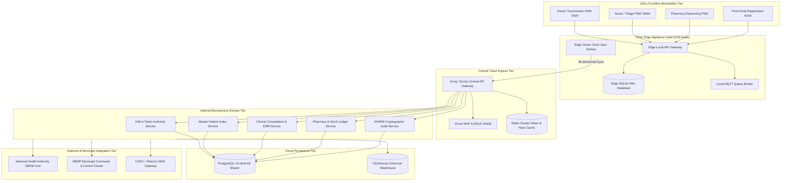
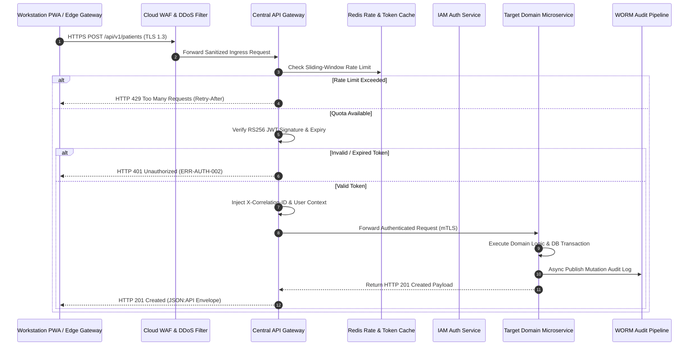
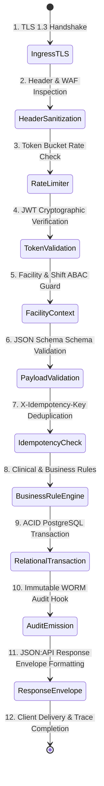
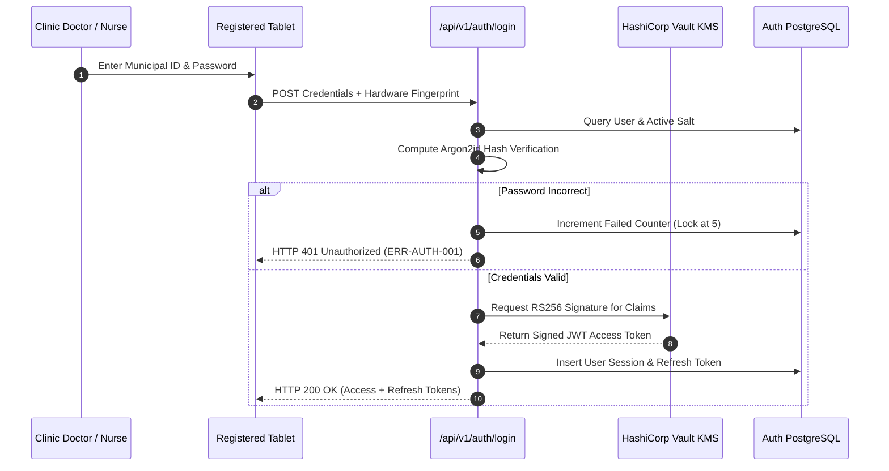
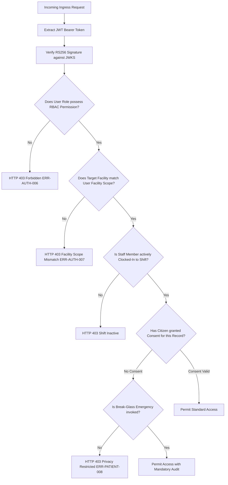
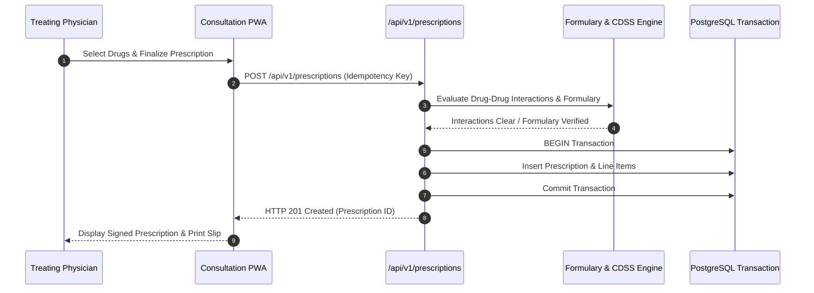
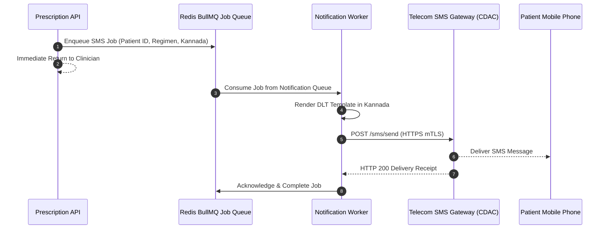
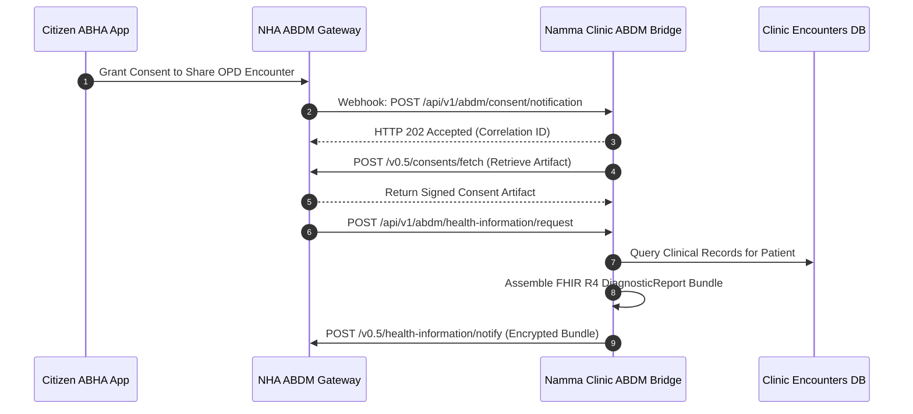
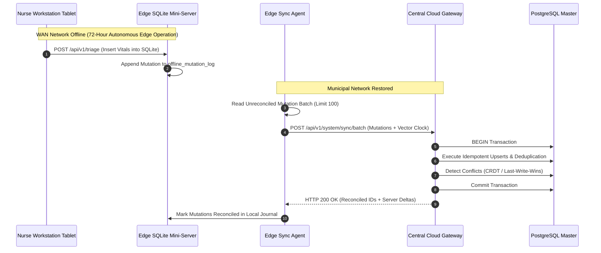

# 🔌 API Specification: Enterprise API Architecture Blueprint
## Namma Clinic Digital Health & Operations Platform
**Document Code:** API-DOC-01 | **Status:** Authoritative Baseline | **Date:** September 2026
> **Municipal Health Authority:** Greater Bengaluru Authority (GBA) / BBMP Health Department
> **Compliance Framework:** National Digital Health Mission (ABDM), DPDP Act 2023, DISHA Guidelines
> **Notice:** All code snippets contained herein are strictly **DOCUMENTATION-ONLY OPENAPI** or **DOCUMENTATION-ONLY EXAMPLE**. Zero application runtime code is executed in this phase.

---

## 1. Executive Summary & Core Architectural Principles

The Namma Clinic API Architecture establishes the authoritative contract, protocol, and communication standards for interconnecting 183 primary healthcare clinics across the 8 municipal zones of Greater Bengaluru. The platform serves over 25,000 daily citizen outpatient visits, operating under a hybrid edge-cloud paradigm where frontline clinic operations must continue uninterrupted during wide-area network outages lasting up to 72 hours.

### 1.1 Architectural Pillars
The API tier is engineered around seven core principles:
1. **Contract-First Development:** API contracts, schemas, and error definitions serve as the immutable technical contract between frontend touch-screen PWAs, edge mini-servers, cloud microservices, and external national registries (ABDM).
2. **Resource-Oriented RESTful Semantics:** Uniform HTTP verbs, deterministic URI paths, standard status codes, and strict JSON:API envelopes govern all synchronous client-to-server interactions.
3. **Command-Query Responsibility Segregation (CQRS):** Write operations (commands) are decoupled from high-throughput reporting and epidemiological surveillance queries, preserving transactional performance on primary relational databases while routing reads to optimized indexes or ClickHouse OLAP stores.
4. **Zero-Trust Security & Least Privilege:** Every request is authenticated via RS256-signed JWTs, checked against fine-grained RBAC/ABAC policies, and verified against clinic facility context boundaries.
5. **Autonomous Edge Resilience:** Clinic edge gateways expose identical local REST endpoints backed by SQLite WAL databases, enabling local intake, triage, consultation, and dispensing without internet connectivity.
6. **Cryptographic WORM Auditability:** All state-changing mutations and sensitive citizen record reads emit immutable append-only audit events secured by HMAC SHA-256 hash chains complying with DPDP Act 2023 Section 8.
7. **Standardized Observability:** Distributed request correlation IDs, W3C trace contexts, OpenTelemetry spans, and Prometheus RED metrics are uniformly propagated across all API boundaries.

## 2. System API Architecture & System Context

The API ecosystem spans four distinct network tiers: Clinic Frontline Edge Tier, Cloud Ingress Tier, Internal Core Domain Tier, and National/Municipal Integration Tier.



## 3. Central Cloud API Gateway Topology

The Central Cloud API Gateway acts as the unified reverse proxy, policy enforcement point (PEP), and traffic orchestrator for all external inbound traffic originating from clinic edge appliances, administrative consoles, and third-party integrations.



## 4. Comprehensive Request & Response Lifecycles

Every HTTP transaction passing through the platform adheres to a deterministic 12-stage execution lifecycle:



## 5. Authentication and Authorization Lifecycles

Authentication validates who the actor is, while authorization enforces what the actor may execute in a specific clinic facility.

### 5.1 Staff Authentication Flow


### 5.2 Authorization Flow & ABAC Scoping


## 6. Synchronous, Asynchronous, and External Integration Flows

### 6.1 Synchronous Operational Command Flow
Frontline clinical operations (vitals recording, prescribing, dispensing) require deterministic immediate consistency.



### 6.2 Asynchronous Background Processing Flow
Citizen notifications, data portability archives, and OLAP ETL feeds run via decoupled BullMQ background workers.



## 7. External Integration & Autonomous Offline Synchronization

### 7.1 ABDM Gateway Integration Architecture
Integration with the Ayushman Bharat Digital Mission (ABDM) national grid facilitates health record sharing via FHIR R4 standard bundles.



### 7.2 Offline Edge Synchronization Flow
When wide-area municipal network connectivity is severed, clinic edge nodes buffer mutations in an append-only journal and reconcile via vector clocks upon reconnection.



## 8. Platform Health, Readiness, and Dependency Probing Standards

All microservices and edge gateways expose standardized health check endpoints conforming to Kubernetes probe specifications:
- `/livez` (Liveness Probe): Verifies that process event loop is unblocked. Returns HTTP 200 OK immediately.
- `/readyz` (Readiness Probe): Verifies that critical backing dependencies (PostgreSQL connection pool, Redis cache) are available and responsive.
- `/healthz` (Comprehensive Health): Deep diagnostic inspection reporting database replication lag, disk space, and memory utilization.

### 8.1 Readiness Probe Specification
```yaml
# DOCUMENTATION-ONLY OPENAPI
openapi: 3.1.0
paths:
  /readyz:
    get:
      summary: "Kubernetes readiness dependency probe"
      tags:
        - "SystemHealth"
      operationId: "get_readyz"
      responses:
        '200':
          description: "Successful operation"
          content:
            application/json:
              schema:
                $ref: "#/components/schemas/HealthCheckReadinessResponse"
        '503':
          description: "Client or server error"
          content:
            application/json:
              schema:
                $ref: "#/components/schemas/StandardErrorEnvelope"
```

## 9. Architectural Quality Acceptance Criteria (BDD)

```gherkin
# DOCUMENTATION-ONLY EXAMPLE
Scenario: Verify Edge Autonomous Operation during WAN Outage
  Given a primary care Namma Clinic workstation operating under complete internet disconnect
  And the local edge mini-server has an active SQLite WAL database
  When the staff nurse submits a vital signs triage assessment
  Then the edge API gateway records the triage event in local SQLite
  And a sequential token is assigned locally
  And the mutation is queued in the local offline journal with a valid UUIDv7
  And the user receives an HTTP 201 response within 200ms
```

```gherkin
# DOCUMENTATION-ONLY EXAMPLE
Scenario: Reject Ingress Request Exceeding Tier-01 Rate Limit
  Given an anonymous client sending requests to /api/v1/auth/login
  And the client has exceeded 10 requests within the rolling 60-second window
  When the client transmits an 11th login attempt
  Then the API gateway intercepts the request prior to hitting the auth service
  And returns HTTP 429 Too Many Requests
  And includes standard Retry-After and RateLimit-Reset response headers
  And records a rate limit security violation metric in Prometheus
```

## 10. Comprehensive Architecture Traceability Matrix

The following matrix maps architectural subsystems to upstream requirements, containers, database tables, and quality metrics:

| Subsystem Code | Subsystem Name | Architecture Container | Primary Database Tables | Upstream Requirements | Verification Method |
| :--- | :--- | :--- | :--- | :--- | :--- |
| `API-AUTH-001` | Staff Credential Login & Session Issuance | `ARCH-CONT-004` | `auth_users, user_credentials, user_sessions` | `SRS-FR-001, SRS-NFR-008, BR-001` | PLANNED-TEST-API-001 |
| `API-AUTH-002` | Token Rotation & Refresh Exchange | `ARCH-CONT-004` | `user_sessions` | `SRS-FR-001, SRS-NFR-008` | PLANNED-TEST-API-002 |
| `API-AUTH-003` | Session Termination & Token Revocation | `ARCH-CONT-004` | `user_sessions` | `SRS-FR-001, SECR-002` | PLANNED-TEST-API-003 |
| `API-AUTH-004` | Current Staff Profile & Entitlements Lookup | `ARCH-CONT-004` | `auth_users, roles, permissions, facilities` | `SRS-FR-001, SRS-FR-005` | PLANNED-TEST-API-004 |
| `API-AUTH-005` | Self-Service Staff Password Update | `ARCH-CONT-004` | `user_credentials, user_sessions` | `SECR-001, SRS-NFR-008` | PLANNED-TEST-API-005 |
| `API-AUTH-006` | JSON Web Key Set (JWKS) Public Verification Keys | `ARCH-CONT-004` | `system_configs` | `SECR-003, ARCH-CONT-004` | PLANNED-TEST-API-006 |
| `API-AUTH-007` | Multi-Factor Authentication (TOTP) Verification | `ARCH-CONT-004` | `user_credentials, user_sessions` | `SECR-002, SRS-FR-001` | PLANNED-TEST-API-007 |
| `API-AUTH-008` | Clinical Break-Glass Emergency Access Activation | `ARCH-CONT-004` | `user_sessions, audit_events, danger_alerts` | `SECR-004, PRIV-002, WF-025` | PLANNED-TEST-API-008 |
| `API-AUTH-009` | Clinic Tablet Hardware Device Registration | `ARCH-CONT-004` | `facilities, system_configs` | `SECR-005, ARCH-CONT-002` | PLANNED-TEST-API-009 |
| `API-AUTH-010` | Facility Registered Workstations List | `ARCH-CONT-004` | `facilities` | `SECR-005` | PLANNED-TEST-API-010 |
| `API-AUTH-011` | De-register & Revoke Workstation Trust | `ARCH-CONT-004` | `facilities, user_sessions` | `SECR-005` | PLANNED-TEST-API-011 |
| `API-AUTH-012` | Master RBAC Roles Catalog Listing | `ARCH-CONT-004` | `roles, permissions` | `SRS-FR-005` | PLANNED-TEST-API-012 |
| `API-AUTH-013` | Assign Roles and Facility Scope to Staff | `ARCH-CONT-004` | `user_roles, staff_profiles` | `SRS-FR-005, SECR-002` | PLANNED-TEST-API-013 |
| `API-AUTH-014` | Active Staff Sessions Listing | `ARCH-CONT-004` | `user_sessions, auth_users` | `SECR-002, SRS-NFR-008` | PLANNED-TEST-API-014 |
| `API-AUTH-015` | Force Invalidate Specific Session | `ARCH-CONT-004` | `user_sessions` | `SECR-002` | PLANNED-TEST-API-015 |
| `API-AUTH-016` | Staff Duty Shift Clock-In | `ARCH-CONT-004` | `staff_shifts, facility_rooms` | `SRS-FR-005, WF-001` | PLANNED-TEST-API-016 |
| `API-PATIENT-001` | Register New Citizen Patient Profile | `ARCH-CONT-005` | `patients, patient_identifiers, patient_contacts, patient_addresses` | `SRS-FR-007, SRS-FR-008, BR-002, PRIV-001` | PLANNED-TEST-API-017 |
| `API-PATIENT-002` | Retrieve Citizen Demographic & Clinical Summary | `ARCH-CONT-005` | `patients, patient_identifiers, patient_contacts` | `SRS-FR-007, PRIV-001` | PLANNED-TEST-API-018 |
| `API-PATIENT-003` | Search Patients via UHID, Phone, or Phonetic Query | `ARCH-CONT-005` | `patients, patient_identifiers, patient_contacts` | `SRS-FR-008, SRS-NFR-002` | PLANNED-TEST-API-019 |
| `API-PATIENT-004` | Update Patient Demographic & Contact Details | `ARCH-CONT-005` | `patients, patient_contacts, patient_addresses` | `SRS-FR-007` | PLANNED-TEST-API-020 |
| `API-PATIENT-005` | Check Duplicate Citizen Candidate Matches | `ARCH-CONT-005` | `patients, patient_contacts` | `SRS-FR-008, BR-002` | PLANNED-TEST-API-021 |
| `API-PATIENT-006` | Merge Subsumed Patient into Primary Profile | `ARCH-CONT-005` | `patients, clinical_encounters, prescriptions, audit_events` | `SRS-FR-008, WF-002` | PLANNED-TEST-API-022 |
| `API-PATIENT-007` | Link Verified ABHA ID to Patient UHID | `ARCH-CONT-014` | `patients, patient_identifiers, abdm_artifacts` | `SRS-FR-055, INT-001, WF-024` | PLANNED-TEST-API-023 |
| `API-PATIENT-008` | Unlink ABHA Identity from Citizen UHID | `ARCH-CONT-014` | `patients, patient_identifiers` | `SRS-FR-055, PRIV-001` | PLANNED-TEST-API-024 |
| `API-PATIENT-009` | Longitudinal Encounter & Clinical History | `ARCH-CONT-007` | `clinical_encounters, prescriptions, lab_orders, referrals` | `SRS-FR-014, PRIV-001` | PLANNED-TEST-API-025 |
| `API-PATIENT-010` | Citizen Consent Artifacts & Preferences | `ARCH-CONT-005` | `consent_records` | `PRIV-001, RETENTION-005` | PLANNED-TEST-API-026 |
| `API-PATIENT-011` | Record Citizen Consent Directive | `ARCH-CONT-005` | `consent_records` | `PRIV-001, DPDP-ACT-2023` | PLANNED-TEST-API-027 |
| `API-PATIENT-012` | Revoke Citizen Consent Directive | `ARCH-CONT-005` | `consent_records` | `PRIV-001, DPDP-ACT-2023` | PLANNED-TEST-API-028 |
| `API-PATIENT-013` | Citizen Record Access Audit Trail | `ARCH-CONT-017` | `audit_events` | `SECR-004, RETENTION-006` | PLANNED-TEST-API-029 |
| `API-PATIENT-014` | Enroll Patient in NCD Chronic Care Registry | `ARCH-CONT-007` | `ncd_episodes, follow_up_schedules` | `SRS-FR-025, RETENTION-013` | PLANNED-TEST-API-030 |
| `API-PATIENT-015` | Retrieve NCD Chronic Episode Status | `ARCH-CONT-007` | `ncd_episodes` | `SRS-FR-025` | PLANNED-TEST-API-031 |
| `API-PATIENT-016` | Add Emergency Contact / Guardian | `ARCH-CONT-005` | `patient_contacts` | `SRS-FR-007` | PLANNED-TEST-API-032 |
| `API-PATIENT-017` | List All Registered Patient Identifiers | `ARCH-CONT-005` | `patient_identifiers` | `SRS-FR-007` | PLANNED-TEST-API-033 |
| `API-PATIENT-018` | Bind Supplemental Identifier to Citizen Profile | `ARCH-CONT-005` | `patient_identifiers` | `SRS-FR-007` | PLANNED-TEST-API-034 |
| `API-PATIENT-019` | Remove Erroneous Supplemental Identifier | `ARCH-CONT-005` | `patient_identifiers` | `SRS-FR-007` | PLANNED-TEST-API-035 |

## 11. Architectural Endpoint Inventory Catalog

Catalog of all 341 platform endpoints governed by this architectural baseline:

| Endpoint ID | Method | Path | Domain | Role Context | Security Classification | Offline Support |
| :--- | :--- | :--- | :--- | :--- | :--- | :--- |
| **API-AUTH-001** | `POST` | `/api/v1/auth/login` | Auth | `ROLE-015` | `RESTRICTED` | Edge Local Mirror Cached |
| **API-AUTH-002** | `POST` | `/api/v1/auth/refresh` | Auth | `ROLE-015` | `RESTRICTED` | Edge Local Gateway Proxy |
| **API-AUTH-003** | `POST` | `/api/v1/auth/logout` | Auth | `ROLE-015` | `INTERNAL` | Immediate Local Invalidation |
| **API-AUTH-004** | `GET` | `/api/v1/auth/me` | Auth | `ROLE-015` | `INTERNAL` | Cached in Edge IndexedDB |
| **API-AUTH-005** | `POST` | `/api/v1/auth/password/change` | Auth | `ROLE-015` | `RESTRICTED` | Prohibited Offline |
| **API-AUTH-006** | `GET` | `/api/v1/auth/.well-known/jwks.json` | Auth | `ROLE-006` | `PUBLIC` | Locally Cached Public Keys |
| **API-AUTH-007** | `POST` | `/api/v1/auth/mfa/verify` | Auth | `ROLE-002` | `RESTRICTED` | Cloud Only |
| **API-AUTH-008** | `POST` | `/api/v1/auth/break-glass` | Auth | `ROLE-002` | `HIGHLY-RESTRICTED` | Edge Local WORM Logged |
| **API-AUTH-009** | `POST` | `/api/v1/auth/devices/register` | Auth | `ROLE-024` | `CONFIDENTIAL` | Cloud Only |
| **API-AUTH-010** | `GET` | `/api/v1/auth/devices` | Auth | `ROLE-024` | `INTERNAL` | Cached in Local Edge Node |
| **API-AUTH-011** | `DELETE` | `/api/v1/auth/devices/{deviceId}` | Auth | `ROLE-011` | `CONFIDENTIAL` | Cloud Only |
| **API-AUTH-012** | `GET` | `/api/v1/auth/roles` | Auth | `ROLE-001` | `INTERNAL` | Edge Master Seed Cached |
| **API-AUTH-013** | `POST` | `/api/v1/auth/users/{userId}/roles` | Auth | `ROLE-015` | `RESTRICTED` | Prohibited Offline |
| **API-AUTH-014** | `GET` | `/api/v1/auth/sessions` | Auth | `ROLE-011` | `CONFIDENTIAL` | Edge Local Mirror |
| **API-AUTH-015** | `DELETE` | `/api/v1/auth/sessions/{sessionId}` | Auth | `ROLE-011` | `INTERNAL` | Broadcast via Redis Pub/Sub |
| **API-AUTH-016** | `POST` | `/api/v1/auth/shifts/clock-in` | Auth | `ROLE-016` | `INTERNAL` | Edge Local Queue |
| **API-PATIENT-001** | `POST` | `/api/v1/patients` | Patient | `ROLE-019` | `RESTRICTED` | Edge Autonomous Registration with Offline UUIDv7 |
| **API-PATIENT-002** | `GET` | `/api/v1/patients/{patientId}` | Patient | `ROLE-016` | `RESTRICTED` | Edge SQLite Local Cache |
| **API-PATIENT-003** | `GET` | `/api/v1/patients` | Patient | `ROLE-019` | `RESTRICTED` | Edge Full-Text SQLite Match |
| **API-PATIENT-004** | `PUT` | `/api/v1/patients/{patientId}` | Patient | `ROLE-019` | `RESTRICTED` | Edge Local Mutation Replay |
| **API-PATIENT-005** | `POST` | `/api/v1/patients/duplicates/check` | Patient | `ROLE-019` | `RESTRICTED` | Edge Local Heuristic Check |
| **API-PATIENT-006** | `POST` | `/api/v1/patients/merge` | Patient | `ROLE-015` | `HIGHLY-RESTRICTED` | Prohibited Offline (Cloud Only) |
| **API-PATIENT-007** | `POST` | `/api/v1/patients/{patientId}/abha/link` | Patient | `ROLE-019` | `RESTRICTED` | Cloud Only |
| **API-PATIENT-008** | `DELETE` | `/api/v1/patients/{patientId}/abha/unlink` | Patient | `ROLE-019` | `RESTRICTED` | Cloud Only |
| **API-PATIENT-009** | `GET` | `/api/v1/patients/{patientId}/history` | Patient | `ROLE-002` | `CONFIDENTIAL` | Edge Local Encrypted SQLite Mirror |
| **API-PATIENT-010** | `GET` | `/api/v1/patients/{patientId}/consents` | Patient | `ROLE-011` | `CONFIDENTIAL` | Edge Local Cached |
| **API-PATIENT-011** | `POST` | `/api/v1/patients/{patientId}/consents` | Patient | `ROLE-019` | `CONFIDENTIAL` | Edge Local Capture with Cloud Sync |
| **API-PATIENT-012** | `DELETE` | `/api/v1/patients/{patientId}/consents/{consentId}` | Patient | `ROLE-019` | `CONFIDENTIAL` | Immediate Local Enforcement |
| **API-PATIENT-013** | `GET` | `/api/v1/patients/{patientId}/audit` | Patient | `ROLE-011` | `HIGHLY-RESTRICTED` | Cloud Only |
| **API-PATIENT-014** | `POST` | `/api/v1/patients/{patientId}/ncd-enroll` | Patient | `ROLE-002` | `CONFIDENTIAL` | Edge Local Queue |
| **API-PATIENT-015** | `GET` | `/api/v1/patients/{patientId}/ncd-status` | Patient | `ROLE-016` | `CONFIDENTIAL` | Edge SQLite Mirror |
| **API-PATIENT-016** | `POST` | `/api/v1/patients/{patientId}/emergency-contacts` | Patient | `ROLE-019` | `RESTRICTED` | Edge Local Queue |
| **API-PATIENT-017** | `GET` | `/api/v1/patients/{patientId}/identifiers` | Patient | `ROLE-019` | `RESTRICTED` | Edge SQLite Mirror |
| **API-PATIENT-018** | `POST` | `/api/v1/patients/{patientId}/identifiers` | Patient | `ROLE-019` | `RESTRICTED` | Edge Local Queue |
| **API-PATIENT-019** | `DELETE` | `/api/v1/patients/{patientId}/identifiers/{identifierId}` | Patient | `ROLE-015` | `RESTRICTED` | Cloud Only |
| **API-PATIENT-020** | `POST` | `/api/v1/patients/{patientId}/flag-deceased` | Patient | `ROLE-015` | `RESTRICTED` | Cloud Only |
| **API-PATIENT-021** | `GET` | `/api/v1/patients/{patientId}/encounters` | Patient | `ROLE-002` | `CONFIDENTIAL` | Edge SQLite Local Cache |
| **API-PATIENT-022** | `GET` | `/api/v1/patients/{patientId}/prescriptions` | Patient | `ROLE-017` | `CONFIDENTIAL` | Edge SQLite Local Cache |
| **API-PATIENT-023** | `GET` | `/api/v1/patients/{patientId}/lab-reports` | Patient | `ROLE-018` | `CONFIDENTIAL` | Edge SQLite Local Cache |
| **API-PATIENT-024** | `POST` | `/api/v1/patients/{patientId}/photo` | Patient | `ROLE-019` | `RESTRICTED` | Edge Local Temporary Storage |
| **API-PATIENT-025** | `GET` | `/api/v1/patients/{patientId}/photo` | Patient | `ROLE-016` | `RESTRICTED` | Edge Local Image Cache |
| **API-PATIENT-026** | `POST` | `/api/v1/patients/batch-lookup` | Patient | `ROLE-014` | `RESTRICTED` | Edge SQLite Local Match |
| **API-VISIT-001** | `POST` | `/api/v1/visits` | Visit | `ROLE-019` | `INTERNAL` | Edge Local Queue with Delta Sync |
| **API-VISIT-002** | `GET` | `/api/v1/visits/{visitId}` | Visit | `ROLE-019` | `INTERNAL` | Edge Local Queue with Delta Sync |
| **API-VISIT-003** | `GET` | `/api/v1/visits` | Visit | `ROLE-019` | `INTERNAL` | Edge Local Queue with Delta Sync |
| **API-VISIT-004** | `PUT` | `/api/v1/visits/{visitId}` | Visit | `ROLE-019` | `INTERNAL` | Edge Local Queue with Delta Sync |
| **API-VISIT-005** | `PATCH` | `/api/v1/visits/{visitId}/status` | Visit | `ROLE-019` | `INTERNAL` | Edge Local Queue with Delta Sync |
| **API-VISIT-006** | `GET` | `/api/v1/visits/{visitId}/search` | Visit | `ROLE-019` | `INTERNAL` | Edge Local Queue with Delta Sync |
| **API-VISIT-007** | `GET` | `/api/v1/visits/history` | Visit | `ROLE-019` | `INTERNAL` | Edge Local Queue with Delta Sync |
| **API-VISIT-008** | `GET` | `/api/v1/visits/{visitId}/audit` | Visit | `ROLE-019` | `INTERNAL` | Edge Local Queue with Delta Sync |
| **API-VISIT-009** | `POST` | `/api/v1/visits/cancel` | Visit | `ROLE-019` | `INTERNAL` | Edge Local Queue with Delta Sync |
| **API-VISIT-010** | `POST` | `/api/v1/visits/verify` | Visit | `ROLE-019` | `INTERNAL` | Edge Local Queue with Delta Sync |
| **API-VISIT-011** | `GET` | `/api/v1/visits/export` | Visit | `ROLE-019` | `INTERNAL` | Edge Local Queue with Delta Sync |
| **API-VISIT-012** | `GET` | `/api/v1/visits/{visitId}/metrics` | Visit | `ROLE-019` | `INTERNAL` | Edge Local Queue with Delta Sync |
| **API-VISIT-013** | `POST` | `/api/v1/visits/reconcile` | Visit | `ROLE-019` | `INTERNAL` | Edge Local Queue with Delta Sync |
| **API-VISIT-014** | `POST` | `/api/v1/visits/batch` | Visit | `ROLE-019` | `INTERNAL` | Edge Local Queue with Delta Sync |
| **API-VISIT-015** | `GET` | `/api/v1/visits/sync` | Visit | `ROLE-019` | `INTERNAL` | Edge Local Queue with Delta Sync |
| **API-VISIT-016** | `GET` | `/api/v1/visits/{visitId}/alerts` | Visit | `ROLE-019` | `INTERNAL` | Edge Local Queue with Delta Sync |
| **API-VISIT-017** | `POST` | `/api/v1/visits/escalate` | Visit | `ROLE-019` | `INTERNAL` | Edge Local Queue with Delta Sync |
| **API-VISIT-018** | `POST` | `/api/v1/visits/approve` | Visit | `ROLE-019` | `INTERNAL` | Edge Local Queue with Delta Sync |
| **API-VISIT-019** | `POST` | `/api/v1/visits/reversal` | Visit | `ROLE-019` | `INTERNAL` | Edge Local Queue with Delta Sync |
| **API-VISIT-020** | `GET` | `/api/v1/visits/{visitId}/items` | Visit | `ROLE-019` | `INTERNAL` | Edge Local Queue with Delta Sync |
| **API-VISIT-021** | `GET` | `/api/v1/visits/documents` | Visit | `ROLE-019` | `INTERNAL` | Edge Local Queue with Delta Sync |
| **API-TRIAGE-001** | `POST` | `/api/v1/triage` | Triage | `ROLE-016` | `CONFIDENTIAL` | Edge Local Queue with Delta Sync |
| **API-TRIAGE-002** | `GET` | `/api/v1/triage/{triageId}` | Triage | `ROLE-016` | `CONFIDENTIAL` | Edge Local Queue with Delta Sync |
| **API-TRIAGE-003** | `GET` | `/api/v1/triage` | Triage | `ROLE-016` | `CONFIDENTIAL` | Edge Local Queue with Delta Sync |
| **API-TRIAGE-004** | `PUT` | `/api/v1/triage/{triageId}` | Triage | `ROLE-016` | `CONFIDENTIAL` | Edge Local Queue with Delta Sync |
| **API-TRIAGE-005** | `PATCH` | `/api/v1/triage/{triageId}/status` | Triage | `ROLE-016` | `CONFIDENTIAL` | Edge Local Queue with Delta Sync |
| **API-TRIAGE-006** | `GET` | `/api/v1/triage/{triageId}/search` | Triage | `ROLE-016` | `CONFIDENTIAL` | Edge Local Queue with Delta Sync |
| **API-TRIAGE-007** | `GET` | `/api/v1/triage/history` | Triage | `ROLE-016` | `CONFIDENTIAL` | Edge Local Queue with Delta Sync |
| **API-TRIAGE-008** | `GET` | `/api/v1/triage/{triageId}/audit` | Triage | `ROLE-016` | `CONFIDENTIAL` | Edge Local Queue with Delta Sync |
| **API-TRIAGE-009** | `POST` | `/api/v1/triage/cancel` | Triage | `ROLE-016` | `CONFIDENTIAL` | Edge Local Queue with Delta Sync |
| **API-TRIAGE-010** | `POST` | `/api/v1/triage/verify` | Triage | `ROLE-016` | `CONFIDENTIAL` | Edge Local Queue with Delta Sync |
| **API-TRIAGE-011** | `GET` | `/api/v1/triage/export` | Triage | `ROLE-016` | `CONFIDENTIAL` | Edge Local Queue with Delta Sync |
| **API-TRIAGE-012** | `GET` | `/api/v1/triage/{triageId}/metrics` | Triage | `ROLE-016` | `CONFIDENTIAL` | Edge Local Queue with Delta Sync |
| **API-TRIAGE-013** | `POST` | `/api/v1/triage/reconcile` | Triage | `ROLE-016` | `CONFIDENTIAL` | Edge Local Queue with Delta Sync |
| **API-TRIAGE-014** | `POST` | `/api/v1/triage/batch` | Triage | `ROLE-016` | `CONFIDENTIAL` | Edge Local Queue with Delta Sync |
| **API-TRIAGE-015** | `GET` | `/api/v1/triage/sync` | Triage | `ROLE-016` | `CONFIDENTIAL` | Edge Local Queue with Delta Sync |
| **API-TRIAGE-016** | `GET` | `/api/v1/triage/{triageId}/alerts` | Triage | `ROLE-016` | `CONFIDENTIAL` | Edge Local Queue with Delta Sync |
| **API-TRIAGE-017** | `POST` | `/api/v1/triage/escalate` | Triage | `ROLE-016` | `CONFIDENTIAL` | Edge Local Queue with Delta Sync |
| **API-TRIAGE-018** | `POST` | `/api/v1/triage/approve` | Triage | `ROLE-016` | `CONFIDENTIAL` | Edge Local Queue with Delta Sync |
| **API-TRIAGE-019** | `POST` | `/api/v1/triage/reversal` | Triage | `ROLE-016` | `CONFIDENTIAL` | Edge Local Queue with Delta Sync |
| **API-CONSULT-001** | `POST` | `/api/v1/consultations` | Consultation | `ROLE-002` | `CONFIDENTIAL` | Edge Local Queue with Delta Sync |
| **API-CONSULT-002** | `GET` | `/api/v1/consultations/{consultationId}` | Consultation | `ROLE-002` | `CONFIDENTIAL` | Edge Local Queue with Delta Sync |
| **API-CONSULT-003** | `GET` | `/api/v1/consultations` | Consultation | `ROLE-002` | `CONFIDENTIAL` | Edge Local Queue with Delta Sync |
| **API-CONSULT-004** | `PUT` | `/api/v1/consultations/{consultationId}` | Consultation | `ROLE-002` | `CONFIDENTIAL` | Edge Local Queue with Delta Sync |
| **API-CONSULT-005** | `PATCH` | `/api/v1/consultations/{consultationId}/status` | Consultation | `ROLE-002` | `CONFIDENTIAL` | Edge Local Queue with Delta Sync |
| **API-CONSULT-006** | `GET` | `/api/v1/consultations/{consultationId}/search` | Consultation | `ROLE-002` | `CONFIDENTIAL` | Edge Local Queue with Delta Sync |
| **API-CONSULT-007** | `GET` | `/api/v1/consultations/history` | Consultation | `ROLE-002` | `CONFIDENTIAL` | Edge Local Queue with Delta Sync |
| **API-CONSULT-008** | `GET` | `/api/v1/consultations/{consultationId}/audit` | Consultation | `ROLE-002` | `CONFIDENTIAL` | Edge Local Queue with Delta Sync |
| **API-CONSULT-009** | `POST` | `/api/v1/consultations/cancel` | Consultation | `ROLE-002` | `CONFIDENTIAL` | Edge Local Queue with Delta Sync |
| **API-CONSULT-010** | `POST` | `/api/v1/consultations/verify` | Consultation | `ROLE-002` | `CONFIDENTIAL` | Edge Local Queue with Delta Sync |
| **API-CONSULT-011** | `GET` | `/api/v1/consultations/export` | Consultation | `ROLE-002` | `CONFIDENTIAL` | Edge Local Queue with Delta Sync |
| **API-CONSULT-012** | `GET` | `/api/v1/consultations/{consultationId}/metrics` | Consultation | `ROLE-002` | `CONFIDENTIAL` | Edge Local Queue with Delta Sync |
| **API-CONSULT-013** | `POST` | `/api/v1/consultations/reconcile` | Consultation | `ROLE-002` | `CONFIDENTIAL` | Edge Local Queue with Delta Sync |
| **API-CONSULT-014** | `POST` | `/api/v1/consultations/batch` | Consultation | `ROLE-002` | `CONFIDENTIAL` | Edge Local Queue with Delta Sync |
| **API-CONSULT-015** | `GET` | `/api/v1/consultations/sync` | Consultation | `ROLE-002` | `CONFIDENTIAL` | Edge Local Queue with Delta Sync |
| **API-CONSULT-016** | `GET` | `/api/v1/consultations/{consultationId}/alerts` | Consultation | `ROLE-002` | `CONFIDENTIAL` | Edge Local Queue with Delta Sync |
| **API-CONSULT-017** | `POST` | `/api/v1/consultations/escalate` | Consultation | `ROLE-002` | `CONFIDENTIAL` | Edge Local Queue with Delta Sync |
| **API-CONSULT-018** | `POST` | `/api/v1/consultations/approve` | Consultation | `ROLE-002` | `CONFIDENTIAL` | Edge Local Queue with Delta Sync |
| **API-CONSULT-019** | `POST` | `/api/v1/consultations/reversal` | Consultation | `ROLE-002` | `CONFIDENTIAL` | Edge Local Queue with Delta Sync |
| **API-CONSULT-020** | `GET` | `/api/v1/consultations/{consultationId}/items` | Consultation | `ROLE-002` | `CONFIDENTIAL` | Edge Local Queue with Delta Sync |
| **API-CONSULT-021** | `GET` | `/api/v1/consultations/documents` | Consultation | `ROLE-002` | `CONFIDENTIAL` | Edge Local Queue with Delta Sync |
| **API-CONSULT-022** | `GET` | `/api/v1/consultations/{consultationId}/timeline` | Consultation | `ROLE-002` | `CONFIDENTIAL` | Edge Local Queue with Delta Sync |
| **API-CONSULT-023** | `GET` | `/api/v1/consultations/stats` | Consultation | `ROLE-002` | `CONFIDENTIAL` | Edge Local Queue with Delta Sync |
| **API-RX-001** | `POST` | `/api/v1/prescriptions` | Prescription | `ROLE-002` | `CONFIDENTIAL` | Edge Local Queue with Delta Sync |
| **API-RX-002** | `GET` | `/api/v1/prescriptions/{prescriptionId}` | Prescription | `ROLE-002` | `CONFIDENTIAL` | Edge Local Queue with Delta Sync |
| **API-RX-003** | `GET` | `/api/v1/prescriptions` | Prescription | `ROLE-002` | `CONFIDENTIAL` | Edge Local Queue with Delta Sync |
| **API-RX-004** | `PUT` | `/api/v1/prescriptions/{prescriptionId}` | Prescription | `ROLE-002` | `CONFIDENTIAL` | Edge Local Queue with Delta Sync |
| **API-RX-005** | `PATCH` | `/api/v1/prescriptions/{prescriptionId}/status` | Prescription | `ROLE-002` | `CONFIDENTIAL` | Edge Local Queue with Delta Sync |
| **API-RX-006** | `GET` | `/api/v1/prescriptions/{prescriptionId}/search` | Prescription | `ROLE-002` | `CONFIDENTIAL` | Edge Local Queue with Delta Sync |
| **API-RX-007** | `GET` | `/api/v1/prescriptions/history` | Prescription | `ROLE-002` | `CONFIDENTIAL` | Edge Local Queue with Delta Sync |
| **API-RX-008** | `GET` | `/api/v1/prescriptions/{prescriptionId}/audit` | Prescription | `ROLE-002` | `CONFIDENTIAL` | Edge Local Queue with Delta Sync |
| **API-RX-009** | `POST` | `/api/v1/prescriptions/cancel` | Prescription | `ROLE-002` | `CONFIDENTIAL` | Edge Local Queue with Delta Sync |
| **API-RX-010** | `POST` | `/api/v1/prescriptions/verify` | Prescription | `ROLE-002` | `CONFIDENTIAL` | Edge Local Queue with Delta Sync |
| **API-RX-011** | `GET` | `/api/v1/prescriptions/export` | Prescription | `ROLE-002` | `CONFIDENTIAL` | Edge Local Queue with Delta Sync |
| **API-RX-012** | `GET` | `/api/v1/prescriptions/{prescriptionId}/metrics` | Prescription | `ROLE-002` | `CONFIDENTIAL` | Edge Local Queue with Delta Sync |
| **API-RX-013** | `POST` | `/api/v1/prescriptions/reconcile` | Prescription | `ROLE-002` | `CONFIDENTIAL` | Edge Local Queue with Delta Sync |
| **API-RX-014** | `POST` | `/api/v1/prescriptions/batch` | Prescription | `ROLE-002` | `CONFIDENTIAL` | Edge Local Queue with Delta Sync |
| **API-RX-015** | `GET` | `/api/v1/prescriptions/sync` | Prescription | `ROLE-002` | `CONFIDENTIAL` | Edge Local Queue with Delta Sync |
| **API-RX-016** | `GET` | `/api/v1/prescriptions/{prescriptionId}/alerts` | Prescription | `ROLE-002` | `CONFIDENTIAL` | Edge Local Queue with Delta Sync |
| **API-RX-017** | `POST` | `/api/v1/prescriptions/escalate` | Prescription | `ROLE-002` | `CONFIDENTIAL` | Edge Local Queue with Delta Sync |
| **API-RX-018** | `POST` | `/api/v1/prescriptions/approve` | Prescription | `ROLE-002` | `CONFIDENTIAL` | Edge Local Queue with Delta Sync |
| **API-RX-019** | `POST` | `/api/v1/prescriptions/reversal` | Prescription | `ROLE-002` | `CONFIDENTIAL` | Edge Local Queue with Delta Sync |
| **API-PHARM-001** | `POST` | `/api/v1/pharmacy` | Pharmacy | `ROLE-017` | `INTERNAL` | Edge Local Queue with Delta Sync |
| **API-PHARM-002** | `GET` | `/api/v1/pharmacy/{pharmacyId}` | Pharmacy | `ROLE-017` | `INTERNAL` | Edge Local Queue with Delta Sync |
| **API-PHARM-003** | `GET` | `/api/v1/pharmacy` | Pharmacy | `ROLE-017` | `INTERNAL` | Edge Local Queue with Delta Sync |
| **API-PHARM-004** | `PUT` | `/api/v1/pharmacy/{pharmacyId}` | Pharmacy | `ROLE-017` | `INTERNAL` | Edge Local Queue with Delta Sync |
| **API-PHARM-005** | `PATCH` | `/api/v1/pharmacy/{pharmacyId}/status` | Pharmacy | `ROLE-017` | `INTERNAL` | Edge Local Queue with Delta Sync |
| **API-PHARM-006** | `GET` | `/api/v1/pharmacy/{pharmacyId}/search` | Pharmacy | `ROLE-017` | `INTERNAL` | Edge Local Queue with Delta Sync |
| **API-PHARM-007** | `GET` | `/api/v1/pharmacy/history` | Pharmacy | `ROLE-017` | `INTERNAL` | Edge Local Queue with Delta Sync |
| **API-PHARM-008** | `GET` | `/api/v1/pharmacy/{pharmacyId}/audit` | Pharmacy | `ROLE-017` | `INTERNAL` | Edge Local Queue with Delta Sync |
| **API-PHARM-009** | `POST` | `/api/v1/pharmacy/cancel` | Pharmacy | `ROLE-017` | `INTERNAL` | Edge Local Queue with Delta Sync |
| **API-PHARM-010** | `POST` | `/api/v1/pharmacy/verify` | Pharmacy | `ROLE-017` | `INTERNAL` | Edge Local Queue with Delta Sync |
| **API-PHARM-011** | `GET` | `/api/v1/pharmacy/export` | Pharmacy | `ROLE-017` | `INTERNAL` | Edge Local Queue with Delta Sync |
| **API-PHARM-012** | `GET` | `/api/v1/pharmacy/{pharmacyId}/metrics` | Pharmacy | `ROLE-017` | `INTERNAL` | Edge Local Queue with Delta Sync |
| **API-PHARM-013** | `POST` | `/api/v1/pharmacy/reconcile` | Pharmacy | `ROLE-017` | `INTERNAL` | Edge Local Queue with Delta Sync |
| **API-PHARM-014** | `POST` | `/api/v1/pharmacy/batch` | Pharmacy | `ROLE-017` | `INTERNAL` | Edge Local Queue with Delta Sync |
| **API-PHARM-015** | `GET` | `/api/v1/pharmacy/sync` | Pharmacy | `ROLE-017` | `INTERNAL` | Edge Local Queue with Delta Sync |
| **API-PHARM-016** | `GET` | `/api/v1/pharmacy/{pharmacyId}/alerts` | Pharmacy | `ROLE-017` | `INTERNAL` | Edge Local Queue with Delta Sync |
| **API-PHARM-017** | `POST` | `/api/v1/pharmacy/escalate` | Pharmacy | `ROLE-017` | `INTERNAL` | Edge Local Queue with Delta Sync |
| **API-PHARM-018** | `POST` | `/api/v1/pharmacy/approve` | Pharmacy | `ROLE-017` | `INTERNAL` | Edge Local Queue with Delta Sync |
| **API-PHARM-019** | `POST` | `/api/v1/pharmacy/reversal` | Pharmacy | `ROLE-017` | `INTERNAL` | Edge Local Queue with Delta Sync |
| **API-PHARM-020** | `GET` | `/api/v1/pharmacy/{pharmacyId}/items` | Pharmacy | `ROLE-017` | `INTERNAL` | Edge Local Queue with Delta Sync |
| **API-PHARM-021** | `GET` | `/api/v1/pharmacy/documents` | Pharmacy | `ROLE-017` | `INTERNAL` | Edge Local Queue with Delta Sync |
| **API-INV-001** | `POST` | `/api/v1/inventory` | Inventory | `ROLE-017` | `INTERNAL` | Edge Local Queue with Delta Sync |
| **API-INV-002** | `GET` | `/api/v1/inventory/{inventoryId}` | Inventory | `ROLE-017` | `INTERNAL` | Edge Local Queue with Delta Sync |
| **API-INV-003** | `GET` | `/api/v1/inventory` | Inventory | `ROLE-017` | `INTERNAL` | Edge Local Queue with Delta Sync |
| **API-INV-004** | `PUT` | `/api/v1/inventory/{inventoryId}` | Inventory | `ROLE-017` | `INTERNAL` | Edge Local Queue with Delta Sync |
| **API-INV-005** | `PATCH` | `/api/v1/inventory/{inventoryId}/status` | Inventory | `ROLE-017` | `INTERNAL` | Edge Local Queue with Delta Sync |
| **API-INV-006** | `GET` | `/api/v1/inventory/{inventoryId}/search` | Inventory | `ROLE-017` | `INTERNAL` | Edge Local Queue with Delta Sync |
| **API-INV-007** | `GET` | `/api/v1/inventory/history` | Inventory | `ROLE-017` | `INTERNAL` | Edge Local Queue with Delta Sync |
| **API-INV-008** | `GET` | `/api/v1/inventory/{inventoryId}/audit` | Inventory | `ROLE-017` | `INTERNAL` | Edge Local Queue with Delta Sync |
| **API-INV-009** | `POST` | `/api/v1/inventory/cancel` | Inventory | `ROLE-017` | `INTERNAL` | Edge Local Queue with Delta Sync |
| **API-INV-010** | `POST` | `/api/v1/inventory/verify` | Inventory | `ROLE-017` | `INTERNAL` | Edge Local Queue with Delta Sync |
| **API-INV-011** | `GET` | `/api/v1/inventory/export` | Inventory | `ROLE-017` | `INTERNAL` | Edge Local Queue with Delta Sync |
| **API-INV-012** | `GET` | `/api/v1/inventory/{inventoryId}/metrics` | Inventory | `ROLE-017` | `INTERNAL` | Edge Local Queue with Delta Sync |
| **API-INV-013** | `POST` | `/api/v1/inventory/reconcile` | Inventory | `ROLE-017` | `INTERNAL` | Edge Local Queue with Delta Sync |
| **API-INV-014** | `POST` | `/api/v1/inventory/batch` | Inventory | `ROLE-017` | `INTERNAL` | Edge Local Queue with Delta Sync |
| **API-INV-015** | `GET` | `/api/v1/inventory/sync` | Inventory | `ROLE-017` | `INTERNAL` | Edge Local Queue with Delta Sync |
| **API-INV-016** | `GET` | `/api/v1/inventory/{inventoryId}/alerts` | Inventory | `ROLE-017` | `INTERNAL` | Edge Local Queue with Delta Sync |
| **API-INV-017** | `POST` | `/api/v1/inventory/escalate` | Inventory | `ROLE-017` | `INTERNAL` | Edge Local Queue with Delta Sync |
| **API-INV-018** | `POST` | `/api/v1/inventory/approve` | Inventory | `ROLE-017` | `INTERNAL` | Edge Local Queue with Delta Sync |
| **API-INV-019** | `POST` | `/api/v1/inventory/reversal` | Inventory | `ROLE-017` | `INTERNAL` | Edge Local Queue with Delta Sync |
| **API-INV-020** | `GET` | `/api/v1/inventory/{inventoryId}/items` | Inventory | `ROLE-017` | `INTERNAL` | Edge Local Queue with Delta Sync |
| **API-INV-021** | `GET` | `/api/v1/inventory/documents` | Inventory | `ROLE-017` | `INTERNAL` | Edge Local Queue with Delta Sync |
| **API-INV-022** | `GET` | `/api/v1/inventory/{inventoryId}/timeline` | Inventory | `ROLE-017` | `INTERNAL` | Edge Local Queue with Delta Sync |
| **API-INV-023** | `GET` | `/api/v1/inventory/stats` | Inventory | `ROLE-017` | `INTERNAL` | Edge Local Queue with Delta Sync |
| **API-INV-024** | `GET` | `/api/v1/inventory/{inventoryId}/search` | Inventory | `ROLE-017` | `INTERNAL` | Edge Local Queue with Delta Sync |
| **API-INV-025** | `GET` | `/api/v1/inventory/history` | Inventory | `ROLE-017` | `INTERNAL` | Edge Local Queue with Delta Sync |
| **API-INV-026** | `GET` | `/api/v1/inventory/{inventoryId}/audit` | Inventory | `ROLE-017` | `INTERNAL` | Edge Local Queue with Delta Sync |
| **API-LAB-001** | `POST` | `/api/v1/lab` | Lab | `ROLE-018` | `CONFIDENTIAL` | Edge Local Queue with Delta Sync |
| **API-LAB-002** | `GET` | `/api/v1/lab/{labId}` | Lab | `ROLE-018` | `CONFIDENTIAL` | Edge Local Queue with Delta Sync |
| **API-LAB-003** | `GET` | `/api/v1/lab` | Lab | `ROLE-018` | `CONFIDENTIAL` | Edge Local Queue with Delta Sync |
| **API-LAB-004** | `PUT` | `/api/v1/lab/{labId}` | Lab | `ROLE-018` | `CONFIDENTIAL` | Edge Local Queue with Delta Sync |
| **API-LAB-005** | `PATCH` | `/api/v1/lab/{labId}/status` | Lab | `ROLE-018` | `CONFIDENTIAL` | Edge Local Queue with Delta Sync |
| **API-LAB-006** | `GET` | `/api/v1/lab/{labId}/search` | Lab | `ROLE-018` | `CONFIDENTIAL` | Edge Local Queue with Delta Sync |
| **API-LAB-007** | `GET` | `/api/v1/lab/history` | Lab | `ROLE-018` | `CONFIDENTIAL` | Edge Local Queue with Delta Sync |
| **API-LAB-008** | `GET` | `/api/v1/lab/{labId}/audit` | Lab | `ROLE-018` | `CONFIDENTIAL` | Edge Local Queue with Delta Sync |
| **API-LAB-009** | `POST` | `/api/v1/lab/cancel` | Lab | `ROLE-018` | `CONFIDENTIAL` | Edge Local Queue with Delta Sync |
| **API-LAB-010** | `POST` | `/api/v1/lab/verify` | Lab | `ROLE-018` | `CONFIDENTIAL` | Edge Local Queue with Delta Sync |
| **API-LAB-011** | `GET` | `/api/v1/lab/export` | Lab | `ROLE-018` | `CONFIDENTIAL` | Edge Local Queue with Delta Sync |
| **API-LAB-012** | `GET` | `/api/v1/lab/{labId}/metrics` | Lab | `ROLE-018` | `CONFIDENTIAL` | Edge Local Queue with Delta Sync |
| **API-LAB-013** | `POST` | `/api/v1/lab/reconcile` | Lab | `ROLE-018` | `CONFIDENTIAL` | Edge Local Queue with Delta Sync |
| **API-LAB-014** | `POST` | `/api/v1/lab/batch` | Lab | `ROLE-018` | `CONFIDENTIAL` | Edge Local Queue with Delta Sync |
| **API-LAB-015** | `GET` | `/api/v1/lab/sync` | Lab | `ROLE-018` | `CONFIDENTIAL` | Edge Local Queue with Delta Sync |
| **API-LAB-016** | `GET` | `/api/v1/lab/{labId}/alerts` | Lab | `ROLE-018` | `CONFIDENTIAL` | Edge Local Queue with Delta Sync |
| **API-LAB-017** | `POST` | `/api/v1/lab/escalate` | Lab | `ROLE-018` | `CONFIDENTIAL` | Edge Local Queue with Delta Sync |
| **API-LAB-018** | `POST` | `/api/v1/lab/approve` | Lab | `ROLE-018` | `CONFIDENTIAL` | Edge Local Queue with Delta Sync |
| **API-LAB-019** | `POST` | `/api/v1/lab/reversal` | Lab | `ROLE-018` | `CONFIDENTIAL` | Edge Local Queue with Delta Sync |
| **API-LAB-020** | `GET` | `/api/v1/lab/{labId}/items` | Lab | `ROLE-018` | `CONFIDENTIAL` | Edge Local Queue with Delta Sync |
| **API-LAB-021** | `GET` | `/api/v1/lab/documents` | Lab | `ROLE-018` | `CONFIDENTIAL` | Edge Local Queue with Delta Sync |
| **API-LAB-022** | `GET` | `/api/v1/lab/{labId}/timeline` | Lab | `ROLE-018` | `CONFIDENTIAL` | Edge Local Queue with Delta Sync |
| **API-LAB-023** | `GET` | `/api/v1/lab/stats` | Lab | `ROLE-018` | `CONFIDENTIAL` | Edge Local Queue with Delta Sync |
| **API-REF-001** | `POST` | `/api/v1/referrals` | Referral | `ROLE-002` | `INTERNAL` | Edge Local Queue with Delta Sync |
| **API-REF-002** | `GET` | `/api/v1/referrals/{referralId}` | Referral | `ROLE-002` | `INTERNAL` | Edge Local Queue with Delta Sync |
| **API-REF-003** | `GET` | `/api/v1/referrals` | Referral | `ROLE-002` | `INTERNAL` | Edge Local Queue with Delta Sync |
| **API-REF-004** | `PUT` | `/api/v1/referrals/{referralId}` | Referral | `ROLE-002` | `INTERNAL` | Edge Local Queue with Delta Sync |
| **API-REF-005** | `PATCH` | `/api/v1/referrals/{referralId}/status` | Referral | `ROLE-002` | `INTERNAL` | Edge Local Queue with Delta Sync |
| **API-REF-006** | `GET` | `/api/v1/referrals/{referralId}/search` | Referral | `ROLE-002` | `INTERNAL` | Edge Local Queue with Delta Sync |
| **API-REF-007** | `GET` | `/api/v1/referrals/history` | Referral | `ROLE-002` | `INTERNAL` | Edge Local Queue with Delta Sync |
| **API-REF-008** | `GET` | `/api/v1/referrals/{referralId}/audit` | Referral | `ROLE-002` | `INTERNAL` | Edge Local Queue with Delta Sync |
| **API-REF-009** | `POST` | `/api/v1/referrals/cancel` | Referral | `ROLE-002` | `INTERNAL` | Edge Local Queue with Delta Sync |
| **API-REF-010** | `POST` | `/api/v1/referrals/verify` | Referral | `ROLE-002` | `INTERNAL` | Edge Local Queue with Delta Sync |
| **API-REF-011** | `GET` | `/api/v1/referrals/export` | Referral | `ROLE-002` | `INTERNAL` | Edge Local Queue with Delta Sync |
| **API-REF-012** | `GET` | `/api/v1/referrals/{referralId}/metrics` | Referral | `ROLE-002` | `INTERNAL` | Edge Local Queue with Delta Sync |
| **API-REF-013** | `POST` | `/api/v1/referrals/reconcile` | Referral | `ROLE-002` | `INTERNAL` | Edge Local Queue with Delta Sync |
| **API-REF-014** | `POST` | `/api/v1/referrals/batch` | Referral | `ROLE-002` | `INTERNAL` | Edge Local Queue with Delta Sync |
| **API-REF-015** | `GET` | `/api/v1/referrals/sync` | Referral | `ROLE-002` | `INTERNAL` | Edge Local Queue with Delta Sync |
| **API-REF-016** | `GET` | `/api/v1/referrals/{referralId}/alerts` | Referral | `ROLE-002` | `INTERNAL` | Edge Local Queue with Delta Sync |
| **API-REF-017** | `POST` | `/api/v1/referrals/escalate` | Referral | `ROLE-002` | `INTERNAL` | Edge Local Queue with Delta Sync |
| **API-REF-018** | `POST` | `/api/v1/referrals/approve` | Referral | `ROLE-002` | `INTERNAL` | Edge Local Queue with Delta Sync |
| **API-REF-019** | `POST` | `/api/v1/referrals/reversal` | Referral | `ROLE-002` | `INTERNAL` | Edge Local Queue with Delta Sync |
| **API-NOTIF-001** | `POST` | `/api/v1/notifications` | Notification | `ROLE-014` | `INTERNAL` | Edge Local Queue with Delta Sync |
| **API-NOTIF-002** | `GET` | `/api/v1/notifications/{notificationId}` | Notification | `ROLE-014` | `INTERNAL` | Edge Local Queue with Delta Sync |
| **API-NOTIF-003** | `GET` | `/api/v1/notifications` | Notification | `ROLE-014` | `INTERNAL` | Edge Local Queue with Delta Sync |
| **API-NOTIF-004** | `PUT` | `/api/v1/notifications/{notificationId}` | Notification | `ROLE-014` | `INTERNAL` | Edge Local Queue with Delta Sync |
| **API-NOTIF-005** | `PATCH` | `/api/v1/notifications/{notificationId}/status` | Notification | `ROLE-014` | `INTERNAL` | Edge Local Queue with Delta Sync |
| **API-NOTIF-006** | `GET` | `/api/v1/notifications/{notificationId}/search` | Notification | `ROLE-014` | `INTERNAL` | Edge Local Queue with Delta Sync |
| **API-NOTIF-007** | `GET` | `/api/v1/notifications/history` | Notification | `ROLE-014` | `INTERNAL` | Edge Local Queue with Delta Sync |
| **API-NOTIF-008** | `GET` | `/api/v1/notifications/{notificationId}/audit` | Notification | `ROLE-014` | `INTERNAL` | Edge Local Queue with Delta Sync |
| **API-NOTIF-009** | `POST` | `/api/v1/notifications/cancel` | Notification | `ROLE-014` | `INTERNAL` | Edge Local Queue with Delta Sync |
| **API-NOTIF-010** | `POST` | `/api/v1/notifications/verify` | Notification | `ROLE-014` | `INTERNAL` | Edge Local Queue with Delta Sync |
| **API-NOTIF-011** | `GET` | `/api/v1/notifications/export` | Notification | `ROLE-014` | `INTERNAL` | Edge Local Queue with Delta Sync |
| **API-NOTIF-012** | `GET` | `/api/v1/notifications/{notificationId}/metrics` | Notification | `ROLE-014` | `INTERNAL` | Edge Local Queue with Delta Sync |
| **API-NOTIF-013** | `POST` | `/api/v1/notifications/reconcile` | Notification | `ROLE-014` | `INTERNAL` | Edge Local Queue with Delta Sync |
| **API-NOTIF-014** | `POST` | `/api/v1/notifications/batch` | Notification | `ROLE-014` | `INTERNAL` | Edge Local Queue with Delta Sync |
| **API-NOTIF-015** | `GET` | `/api/v1/notifications/sync` | Notification | `ROLE-014` | `INTERNAL` | Edge Local Queue with Delta Sync |
| **API-NOTIF-016** | `GET` | `/api/v1/notifications/{notificationId}/alerts` | Notification | `ROLE-014` | `INTERNAL` | Edge Local Queue with Delta Sync |
| **API-NOTIF-017** | `POST` | `/api/v1/notifications/escalate` | Notification | `ROLE-014` | `INTERNAL` | Edge Local Queue with Delta Sync |
| **API-NOTIF-018** | `POST` | `/api/v1/notifications/approve` | Notification | `ROLE-014` | `INTERNAL` | Edge Local Queue with Delta Sync |
| **API-NOTIF-019** | `POST` | `/api/v1/notifications/reversal` | Notification | `ROLE-014` | `INTERNAL` | Edge Local Queue with Delta Sync |
| **API-ANALYTICS-001** | `POST` | `/api/v1/analytics` | Analytics | `ROLE-013` | `INTERNAL` | Edge Local Queue with Delta Sync |
| **API-ANALYTICS-002** | `GET` | `/api/v1/analytics/{analyticId}` | Analytics | `ROLE-013` | `INTERNAL` | Edge Local Queue with Delta Sync |
| **API-ANALYTICS-003** | `GET` | `/api/v1/analytics` | Analytics | `ROLE-013` | `INTERNAL` | Edge Local Queue with Delta Sync |
| **API-ANALYTICS-004** | `PUT` | `/api/v1/analytics/{analyticId}` | Analytics | `ROLE-013` | `INTERNAL` | Edge Local Queue with Delta Sync |
| **API-ANALYTICS-005** | `PATCH` | `/api/v1/analytics/{analyticId}/status` | Analytics | `ROLE-013` | `INTERNAL` | Edge Local Queue with Delta Sync |
| **API-ANALYTICS-006** | `GET` | `/api/v1/analytics/{analyticId}/search` | Analytics | `ROLE-013` | `INTERNAL` | Edge Local Queue with Delta Sync |
| **API-ANALYTICS-007** | `GET` | `/api/v1/analytics/history` | Analytics | `ROLE-013` | `INTERNAL` | Edge Local Queue with Delta Sync |
| **API-ANALYTICS-008** | `GET` | `/api/v1/analytics/{analyticId}/audit` | Analytics | `ROLE-013` | `INTERNAL` | Edge Local Queue with Delta Sync |
| **API-ANALYTICS-009** | `POST` | `/api/v1/analytics/cancel` | Analytics | `ROLE-013` | `INTERNAL` | Edge Local Queue with Delta Sync |
| **API-ANALYTICS-010** | `POST` | `/api/v1/analytics/verify` | Analytics | `ROLE-013` | `INTERNAL` | Edge Local Queue with Delta Sync |
| **API-ANALYTICS-011** | `GET` | `/api/v1/analytics/export` | Analytics | `ROLE-013` | `INTERNAL` | Edge Local Queue with Delta Sync |
| **API-ANALYTICS-012** | `GET` | `/api/v1/analytics/{analyticId}/metrics` | Analytics | `ROLE-013` | `INTERNAL` | Edge Local Queue with Delta Sync |
| **API-ANALYTICS-013** | `POST` | `/api/v1/analytics/reconcile` | Analytics | `ROLE-013` | `INTERNAL` | Edge Local Queue with Delta Sync |
| **API-ANALYTICS-014** | `POST` | `/api/v1/analytics/batch` | Analytics | `ROLE-013` | `INTERNAL` | Edge Local Queue with Delta Sync |
| **API-ANALYTICS-015** | `GET` | `/api/v1/analytics/sync` | Analytics | `ROLE-013` | `INTERNAL` | Edge Local Queue with Delta Sync |
| **API-ANALYTICS-016** | `GET` | `/api/v1/analytics/{analyticId}/alerts` | Analytics | `ROLE-013` | `INTERNAL` | Edge Local Queue with Delta Sync |
| **API-ANALYTICS-017** | `POST` | `/api/v1/analytics/escalate` | Analytics | `ROLE-013` | `INTERNAL` | Edge Local Queue with Delta Sync |
| **API-ANALYTICS-018** | `POST` | `/api/v1/analytics/approve` | Analytics | `ROLE-013` | `INTERNAL` | Edge Local Queue with Delta Sync |
| **API-ANALYTICS-019** | `POST` | `/api/v1/analytics/reversal` | Analytics | `ROLE-013` | `INTERNAL` | Edge Local Queue with Delta Sync |
| **API-ANALYTICS-020** | `GET` | `/api/v1/analytics/{analyticId}/items` | Analytics | `ROLE-013` | `INTERNAL` | Edge Local Queue with Delta Sync |
| **API-ANALYTICS-021** | `GET` | `/api/v1/analytics/documents` | Analytics | `ROLE-013` | `INTERNAL` | Edge Local Queue with Delta Sync |
| **API-ANALYTICS-022** | `GET` | `/api/v1/analytics/{analyticId}/timeline` | Analytics | `ROLE-013` | `INTERNAL` | Edge Local Queue with Delta Sync |
| **API-ANALYTICS-023** | `GET` | `/api/v1/analytics/stats` | Analytics | `ROLE-013` | `INTERNAL` | Edge Local Queue with Delta Sync |
| **API-ANALYTICS-024** | `GET` | `/api/v1/analytics/{analyticId}/search` | Analytics | `ROLE-013` | `INTERNAL` | Edge Local Queue with Delta Sync |
| **API-ANALYTICS-025** | `GET` | `/api/v1/analytics/history` | Analytics | `ROLE-013` | `INTERNAL` | Edge Local Queue with Delta Sync |
| **API-ANALYTICS-026** | `GET` | `/api/v1/analytics/{analyticId}/audit` | Analytics | `ROLE-013` | `INTERNAL` | Edge Local Queue with Delta Sync |
| **API-AUDIT-001** | `POST` | `/api/v1/audit` | Audit | `ROLE-011` | `INTERNAL` | Edge Local Queue with Delta Sync |
| **API-AUDIT-002** | `GET` | `/api/v1/audit/{auditId}` | Audit | `ROLE-011` | `INTERNAL` | Edge Local Queue with Delta Sync |
| **API-AUDIT-003** | `GET` | `/api/v1/audit` | Audit | `ROLE-011` | `INTERNAL` | Edge Local Queue with Delta Sync |
| **API-AUDIT-004** | `PUT` | `/api/v1/audit/{auditId}` | Audit | `ROLE-011` | `INTERNAL` | Edge Local Queue with Delta Sync |
| **API-AUDIT-005** | `PATCH` | `/api/v1/audit/{auditId}/status` | Audit | `ROLE-011` | `INTERNAL` | Edge Local Queue with Delta Sync |
| **API-AUDIT-006** | `GET` | `/api/v1/audit/{auditId}/search` | Audit | `ROLE-011` | `INTERNAL` | Edge Local Queue with Delta Sync |
| **API-AUDIT-007** | `GET` | `/api/v1/audit/history` | Audit | `ROLE-011` | `INTERNAL` | Edge Local Queue with Delta Sync |
| **API-AUDIT-008** | `GET` | `/api/v1/audit/{auditId}/audit` | Audit | `ROLE-011` | `INTERNAL` | Edge Local Queue with Delta Sync |
| **API-AUDIT-009** | `POST` | `/api/v1/audit/cancel` | Audit | `ROLE-011` | `INTERNAL` | Edge Local Queue with Delta Sync |
| **API-AUDIT-010** | `POST` | `/api/v1/audit/verify` | Audit | `ROLE-011` | `INTERNAL` | Edge Local Queue with Delta Sync |
| **API-AUDIT-011** | `GET` | `/api/v1/audit/export` | Audit | `ROLE-011` | `INTERNAL` | Edge Local Queue with Delta Sync |
| **API-AUDIT-012** | `GET` | `/api/v1/audit/{auditId}/metrics` | Audit | `ROLE-011` | `INTERNAL` | Edge Local Queue with Delta Sync |
| **API-AUDIT-013** | `POST` | `/api/v1/audit/reconcile` | Audit | `ROLE-011` | `INTERNAL` | Edge Local Queue with Delta Sync |
| **API-AUDIT-014** | `POST` | `/api/v1/audit/batch` | Audit | `ROLE-011` | `INTERNAL` | Edge Local Queue with Delta Sync |
| **API-AUDIT-015** | `GET` | `/api/v1/audit/sync` | Audit | `ROLE-011` | `INTERNAL` | Edge Local Queue with Delta Sync |
| **API-AUDIT-016** | `GET` | `/api/v1/audit/{auditId}/alerts` | Audit | `ROLE-011` | `INTERNAL` | Edge Local Queue with Delta Sync |
| **API-AUDIT-017** | `POST` | `/api/v1/audit/escalate` | Audit | `ROLE-011` | `INTERNAL` | Edge Local Queue with Delta Sync |
| **API-AUDIT-018** | `POST` | `/api/v1/audit/approve` | Audit | `ROLE-011` | `INTERNAL` | Edge Local Queue with Delta Sync |
| **API-AUDIT-019** | `POST` | `/api/v1/audit/reversal` | Audit | `ROLE-011` | `INTERNAL` | Edge Local Queue with Delta Sync |
| **API-ABDM-001** | `POST` | `/api/v1/abdm` | ABDM | `ROLE-020` | `INTERNAL` | Cloud Only |
| **API-ABDM-002** | `GET` | `/api/v1/abdm/{abdmId}` | ABDM | `ROLE-020` | `INTERNAL` | Cloud Only |
| **API-ABDM-003** | `GET` | `/api/v1/abdm` | ABDM | `ROLE-020` | `INTERNAL` | Cloud Only |
| **API-ABDM-004** | `PUT` | `/api/v1/abdm/{abdmId}` | ABDM | `ROLE-020` | `INTERNAL` | Cloud Only |
| **API-ABDM-005** | `PATCH` | `/api/v1/abdm/{abdmId}/status` | ABDM | `ROLE-020` | `INTERNAL` | Cloud Only |
| **API-ABDM-006** | `GET` | `/api/v1/abdm/{abdmId}/search` | ABDM | `ROLE-020` | `INTERNAL` | Cloud Only |
| **API-ABDM-007** | `GET` | `/api/v1/abdm/history` | ABDM | `ROLE-020` | `INTERNAL` | Cloud Only |
| **API-ABDM-008** | `GET` | `/api/v1/abdm/{abdmId}/audit` | ABDM | `ROLE-020` | `INTERNAL` | Cloud Only |
| **API-ABDM-009** | `POST` | `/api/v1/abdm/cancel` | ABDM | `ROLE-020` | `INTERNAL` | Cloud Only |
| **API-ABDM-010** | `POST` | `/api/v1/abdm/verify` | ABDM | `ROLE-020` | `INTERNAL` | Cloud Only |
| **API-ABDM-011** | `GET` | `/api/v1/abdm/export` | ABDM | `ROLE-020` | `INTERNAL` | Cloud Only |
| **API-ABDM-012** | `GET` | `/api/v1/abdm/{abdmId}/metrics` | ABDM | `ROLE-020` | `INTERNAL` | Cloud Only |
| **API-ABDM-013** | `POST` | `/api/v1/abdm/reconcile` | ABDM | `ROLE-020` | `INTERNAL` | Cloud Only |
| **API-ABDM-014** | `POST` | `/api/v1/abdm/batch` | ABDM | `ROLE-020` | `INTERNAL` | Cloud Only |
| **API-ABDM-015** | `GET` | `/api/v1/abdm/sync` | ABDM | `ROLE-020` | `INTERNAL` | Cloud Only |
| **API-ABDM-016** | `GET` | `/api/v1/abdm/{abdmId}/alerts` | ABDM | `ROLE-020` | `INTERNAL` | Cloud Only |
| **API-ABDM-017** | `POST` | `/api/v1/abdm/escalate` | ABDM | `ROLE-020` | `INTERNAL` | Cloud Only |
| **API-ABDM-018** | `POST` | `/api/v1/abdm/approve` | ABDM | `ROLE-020` | `INTERNAL` | Cloud Only |
| **API-ABDM-019** | `POST` | `/api/v1/abdm/reversal` | ABDM | `ROLE-020` | `INTERNAL` | Cloud Only |
| **API-ABDM-020** | `GET` | `/api/v1/abdm/{abdmId}/items` | ABDM | `ROLE-020` | `INTERNAL` | Cloud Only |
| **API-ABDM-021** | `GET` | `/api/v1/abdm/documents` | ABDM | `ROLE-020` | `INTERNAL` | Cloud Only |
| **API-ABDM-022** | `GET` | `/api/v1/abdm/{abdmId}/timeline` | ABDM | `ROLE-020` | `INTERNAL` | Cloud Only |
| **API-ABDM-023** | `GET` | `/api/v1/abdm/stats` | ABDM | `ROLE-020` | `INTERNAL` | Cloud Only |
| **API-ABDM-024** | `GET` | `/api/v1/abdm/{abdmId}/search` | ABDM | `ROLE-020` | `INTERNAL` | Cloud Only |
| **API-ABDM-025** | `GET` | `/api/v1/abdm/history` | ABDM | `ROLE-020` | `INTERNAL` | Cloud Only |
| **API-ABDM-026** | `GET` | `/api/v1/abdm/{abdmId}/audit` | ABDM | `ROLE-020` | `INTERNAL` | Cloud Only |
| **API-PORT-001** | `POST` | `/api/v1/portability` | Portability | `ROLE-011` | `INTERNAL` | Cloud Only |
| **API-PORT-002** | `GET` | `/api/v1/portability/{portabilityId}` | Portability | `ROLE-011` | `INTERNAL` | Cloud Only |
| **API-PORT-003** | `GET` | `/api/v1/portability` | Portability | `ROLE-011` | `INTERNAL` | Cloud Only |
| **API-PORT-004** | `PUT` | `/api/v1/portability/{portabilityId}` | Portability | `ROLE-011` | `INTERNAL` | Cloud Only |
| **API-PORT-005** | `PATCH` | `/api/v1/portability/{portabilityId}/status` | Portability | `ROLE-011` | `INTERNAL` | Cloud Only |
| **API-PORT-006** | `GET` | `/api/v1/portability/{portabilityId}/search` | Portability | `ROLE-011` | `INTERNAL` | Cloud Only |
| **API-PORT-007** | `GET` | `/api/v1/portability/history` | Portability | `ROLE-011` | `INTERNAL` | Cloud Only |
| **API-PORT-008** | `GET` | `/api/v1/portability/{portabilityId}/audit` | Portability | `ROLE-011` | `INTERNAL` | Cloud Only |
| **API-PORT-009** | `POST` | `/api/v1/portability/cancel` | Portability | `ROLE-011` | `INTERNAL` | Cloud Only |
| **API-PORT-010** | `POST` | `/api/v1/portability/verify` | Portability | `ROLE-011` | `INTERNAL` | Cloud Only |
| **API-PORT-011** | `GET` | `/api/v1/portability/export` | Portability | `ROLE-011` | `INTERNAL` | Cloud Only |
| **API-PORT-012** | `GET` | `/api/v1/portability/{portabilityId}/metrics` | Portability | `ROLE-011` | `INTERNAL` | Cloud Only |
| **API-PORT-013** | `POST` | `/api/v1/portability/reconcile` | Portability | `ROLE-011` | `INTERNAL` | Cloud Only |
| **API-PORT-014** | `POST` | `/api/v1/portability/batch` | Portability | `ROLE-011` | `INTERNAL` | Cloud Only |
| **API-PORT-015** | `GET` | `/api/v1/portability/sync` | Portability | `ROLE-011` | `INTERNAL` | Cloud Only |
| **API-PORT-016** | `GET` | `/api/v1/portability/{portabilityId}/alerts` | Portability | `ROLE-011` | `INTERNAL` | Cloud Only |
| **API-PORT-017** | `POST` | `/api/v1/portability/escalate` | Portability | `ROLE-011` | `INTERNAL` | Cloud Only |
| **API-SYS-001** | `POST` | `/api/v1/system` | System | `ROLE-009` | `INTERNAL` | Edge Local Queue with Delta Sync |
| **API-SYS-002** | `GET` | `/api/v1/system/{systemId}` | System | `ROLE-009` | `INTERNAL` | Edge Local Queue with Delta Sync |
| **API-SYS-003** | `GET` | `/api/v1/system` | System | `ROLE-009` | `INTERNAL` | Edge Local Queue with Delta Sync |
| **API-SYS-004** | `PUT` | `/api/v1/system/{systemId}` | System | `ROLE-009` | `INTERNAL` | Edge Local Queue with Delta Sync |
| **API-SYS-005** | `PATCH` | `/api/v1/system/{systemId}/status` | System | `ROLE-009` | `INTERNAL` | Edge Local Queue with Delta Sync |
| **API-SYS-006** | `GET` | `/api/v1/system/{systemId}/search` | System | `ROLE-009` | `INTERNAL` | Edge Local Queue with Delta Sync |
| **API-SYS-007** | `GET` | `/api/v1/system/history` | System | `ROLE-009` | `INTERNAL` | Edge Local Queue with Delta Sync |
| **API-SYS-008** | `GET` | `/api/v1/system/{systemId}/audit` | System | `ROLE-009` | `INTERNAL` | Edge Local Queue with Delta Sync |
| **API-SYS-009** | `POST` | `/api/v1/system/cancel` | System | `ROLE-009` | `INTERNAL` | Edge Local Queue with Delta Sync |
| **API-SYS-010** | `POST` | `/api/v1/system/verify` | System | `ROLE-009` | `INTERNAL` | Edge Local Queue with Delta Sync |
| **API-SYS-011** | `GET` | `/api/v1/system/export` | System | `ROLE-009` | `INTERNAL` | Edge Local Queue with Delta Sync |
| **API-SYS-012** | `GET` | `/api/v1/system/{systemId}/metrics` | System | `ROLE-009` | `INTERNAL` | Edge Local Queue with Delta Sync |
| **API-SYS-013** | `POST` | `/api/v1/system/reconcile` | System | `ROLE-009` | `INTERNAL` | Edge Local Queue with Delta Sync |
| **API-SYS-014** | `POST` | `/api/v1/system/batch` | System | `ROLE-009` | `INTERNAL` | Edge Local Queue with Delta Sync |
| **API-SYS-015** | `GET` | `/api/v1/system/sync` | System | `ROLE-009` | `INTERNAL` | Edge Local Queue with Delta Sync |
| **API-SYS-016** | `GET` | `/api/v1/system/{systemId}/alerts` | System | `ROLE-009` | `INTERNAL` | Edge Local Queue with Delta Sync |
| **API-SYS-017** | `POST` | `/api/v1/system/escalate` | System | `ROLE-009` | `INTERNAL` | Edge Local Queue with Delta Sync |
| **API-SYS-018** | `POST` | `/api/v1/system/approve` | System | `ROLE-009` | `INTERNAL` | Edge Local Queue with Delta Sync |
| **API-SYS-019** | `POST` | `/api/v1/system/reversal` | System | `ROLE-009` | `INTERNAL` | Edge Local Queue with Delta Sync |
| **API-SYS-020** | `GET` | `/api/v1/system/{systemId}/items` | System | `ROLE-009` | `INTERNAL` | Edge Local Queue with Delta Sync |
| **API-SYS-021** | `GET` | `/api/v1/system/documents` | System | `ROLE-009` | `INTERNAL` | Edge Local Queue with Delta Sync |

## 12. Detailed Subsystem Architectural Deep-Dives

### 12.1 Subsystem Architecture: Staff Credential Login & Session Issuance (`API-AUTH-001`)
- **API Identifier:** `API-AUTH-001`
- **HTTP Route:** `POST /api/v1/auth/login`
- **Functional Domain:** `Auth`
- **Authoritative Purpose:** Authenticate clinic staff credentials via Argon2id, enforce device trust, issue RS256 JWT access token and refresh token.
- **Assigned Container:** `ARCH-CONT-004` | **Component:** `ARCH-COMP-010`
- **Database Persistence Target:** `auth_users, user_credentials, user_sessions`
- **Security Classification:** `RESTRICTED` | **Authentication:** `Anonymous / Public Ingress`
- **RBAC Permission Token:** `auth:session:create`
- **ABAC Scoping Rule:** Validates registered clinic device fingerprint and facility roster schedule.
- **Rate Limit Policy:** 10 req/min per IP (Burst 15)
- **Idempotency Standard:** Supported via X-Idempotency-Key
- **Execution Timeout:** 1500ms
- **Offline Autonomy Support:** Edge Local Mirror Cached
- **WORM Audit Event:** `AUDIT-EVENT-001`
- **Planned Verification Test:** `PLANNED-TEST-API-001`
- **Primary Error Codes:** `ERR-AUTH-001, ERR-AUTH-008, ERR-AUTH-010, ERR-SYS-006`

#### Contract OpenAPI Specification
```yaml
# DOCUMENTATION-ONLY OPENAPI
openapi: 3.1.0
paths:
  /api/v1/auth/login:
    post:
      summary: "Staff Credential Login & Session Issuance"
      tags:
        - "Auth"
      operationId: "post_api_v1_auth_login"
      requestBody:
        required: true
        content:
          application/json:
            schema:
              $ref: "#/components/schemas/LoginRequest"
      responses:
        '200':
          description: "Successful operation"
          content:
            application/json:
              schema:
                $ref: "#/components/schemas/AuthTokenResponse"
        '400':
          description: "Client or server error"
          content:
            application/json:
              schema:
                $ref: "#/components/schemas/StandardErrorEnvelope"
        '401':
          description: "Client or server error"
          content:
            application/json:
              schema:
                $ref: "#/components/schemas/StandardErrorEnvelope"
        '403':
          description: "Client or server error"
          content:
            application/json:
              schema:
                $ref: "#/components/schemas/StandardErrorEnvelope"
        '429':
          description: "Client or server error"
          content:
            application/json:
              schema:
                $ref: "#/components/schemas/StandardErrorEnvelope"
        '500':
          description: "Client or server error"
          content:
            application/json:
              schema:
                $ref: "#/components/schemas/StandardErrorEnvelope"
```

### 12.2 Subsystem Architecture: Token Rotation & Refresh Exchange (`API-AUTH-002`)
- **API Identifier:** `API-AUTH-002`
- **HTTP Route:** `POST /api/v1/auth/refresh`
- **Functional Domain:** `Auth`
- **Authoritative Purpose:** Exchange valid refresh token for renewed 15-minute JWT access token with single-use token rotation.
- **Assigned Container:** `ARCH-CONT-004` | **Component:** `ARCH-COMP-010`
- **Database Persistence Target:** `user_sessions`
- **Security Classification:** `RESTRICTED` | **Authentication:** `Refresh Token Header`
- **RBAC Permission Token:** `auth:token:refresh`
- **ABAC Scoping Rule:** Requires active non-revoked session ID in Redis cache and database.
- **Rate Limit Policy:** 30 req/min per Session
- **Idempotency Standard:** Strict Single-Use Rotation
- **Execution Timeout:** 800ms
- **Offline Autonomy Support:** Edge Local Gateway Proxy
- **WORM Audit Event:** `AUDIT-EVENT-002`
- **Planned Verification Test:** `PLANNED-TEST-API-002`
- **Primary Error Codes:** `ERR-AUTH-002, ERR-AUTH-004, ERR-AUTH-005`

#### Contract OpenAPI Specification
```yaml
# DOCUMENTATION-ONLY OPENAPI
openapi: 3.1.0
paths:
  /api/v1/auth/refresh:
    post:
      summary: "Token Rotation & Refresh Exchange"
      tags:
        - "Auth"
      operationId: "post_api_v1_auth_refresh"
      requestBody:
        required: true
        content:
          application/json:
            schema:
              $ref: "#/components/schemas/TokenRefreshRequest"
      responses:
        '200':
          description: "Successful operation"
          content:
            application/json:
              schema:
                $ref: "#/components/schemas/AuthTokenResponse"
        '400':
          description: "Client or server error"
          content:
            application/json:
              schema:
                $ref: "#/components/schemas/StandardErrorEnvelope"
        '401':
          description: "Client or server error"
          content:
            application/json:
              schema:
                $ref: "#/components/schemas/StandardErrorEnvelope"
        '500':
          description: "Client or server error"
          content:
            application/json:
              schema:
                $ref: "#/components/schemas/StandardErrorEnvelope"
```

### 12.3 Subsystem Architecture: Session Termination & Token Revocation (`API-AUTH-003`)
- **API Identifier:** `API-AUTH-003`
- **HTTP Route:** `POST /api/v1/auth/logout`
- **Functional Domain:** `Auth`
- **Authoritative Purpose:** Terminate active session, revoke refresh token, and publish token revocation notice to Redis cluster.
- **Assigned Container:** `ARCH-CONT-004` | **Component:** `ARCH-COMP-010`
- **Database Persistence Target:** `user_sessions`
- **Security Classification:** `INTERNAL` | **Authentication:** `Bearer JWT`
- **RBAC Permission Token:** `auth:session:terminate`
- **ABAC Scoping Rule:** User may only terminate their own active session unless admin role.
- **Rate Limit Policy:** 20 req/min per User
- **Idempotency Standard:** Idempotent Termination
- **Execution Timeout:** 1000ms
- **Offline Autonomy Support:** Immediate Local Invalidation
- **WORM Audit Event:** `AUDIT-EVENT-003`
- **Planned Verification Test:** `PLANNED-TEST-API-003`
- **Primary Error Codes:** `ERR-AUTH-003, ERR-SYS-007`

#### Contract OpenAPI Specification
```yaml
# DOCUMENTATION-ONLY OPENAPI
openapi: 3.1.0
paths:
  /api/v1/auth/logout:
    post:
      summary: "Session Termination & Token Revocation"
      tags:
        - "Auth"
      operationId: "post_api_v1_auth_logout"
      responses:
        '200':
          description: "Successful operation"
          content:
            application/json:
              schema:
                $ref: "#/components/schemas/StandardApiResponseEnvelope"
        '401':
          description: "Client or server error"
          content:
            application/json:
              schema:
                $ref: "#/components/schemas/StandardErrorEnvelope"
        '500':
          description: "Client or server error"
          content:
            application/json:
              schema:
                $ref: "#/components/schemas/StandardErrorEnvelope"
```

### 12.4 Subsystem Architecture: Current Staff Profile & Entitlements Lookup (`API-AUTH-004`)
- **API Identifier:** `API-AUTH-004`
- **HTTP Route:** `GET /api/v1/auth/me`
- **Functional Domain:** `Auth`
- **Authoritative Purpose:** Retrieve current authenticated staff profile, assigned roles, permissions matrix, and clinic facility scope.
- **Assigned Container:** `ARCH-CONT-004` | **Component:** `ARCH-COMP-010`
- **Database Persistence Target:** `auth_users, roles, permissions, facilities`
- **Security Classification:** `INTERNAL` | **Authentication:** `Bearer JWT`
- **RBAC Permission Token:** `auth:profile:read`
- **ABAC Scoping Rule:** Returns user context strictly scoped to active facility and shift.
- **Rate Limit Policy:** 60 req/min per User
- **Idempotency Standard:** Read-Only Idempotent
- **Execution Timeout:** 500ms
- **Offline Autonomy Support:** Cached in Edge IndexedDB
- **WORM Audit Event:** `AUDIT-EVENT-004`
- **Planned Verification Test:** `PLANNED-TEST-API-004`
- **Primary Error Codes:** `ERR-AUTH-003`

#### Contract OpenAPI Specification
```yaml
# DOCUMENTATION-ONLY OPENAPI
openapi: 3.1.0
paths:
  /api/v1/auth/me:
    get:
      summary: "Current Staff Profile & Entitlements Lookup"
      tags:
        - "Auth"
      operationId: "get_api_v1_auth_me"
      responses:
        '200':
          description: "Successful operation"
          content:
            application/json:
              schema:
                $ref: "#/components/schemas/StaffSessionProfile"
        '401':
          description: "Client or server error"
          content:
            application/json:
              schema:
                $ref: "#/components/schemas/StandardErrorEnvelope"
        '500':
          description: "Client or server error"
          content:
            application/json:
              schema:
                $ref: "#/components/schemas/StandardErrorEnvelope"
```

### 12.5 Subsystem Architecture: Self-Service Staff Password Update (`API-AUTH-005`)
- **API Identifier:** `API-AUTH-005`
- **HTTP Route:** `POST /api/v1/auth/password/change`
- **Functional Domain:** `Auth`
- **Authoritative Purpose:** Update staff password, verifying existing credentials and validating against 12+ character complexity rules.
- **Assigned Container:** `ARCH-CONT-004` | **Component:** `ARCH-COMP-010`
- **Database Persistence Target:** `user_credentials, user_sessions`
- **Security Classification:** `RESTRICTED` | **Authentication:** `Bearer JWT`
- **RBAC Permission Token:** `auth:password:update`
- **ABAC Scoping Rule:** Requires current password verification; updates Argon2id salt and hash.
- **Rate Limit Policy:** 5 req/hour per User
- **Idempotency Standard:** Not Required (Sequential)
- **Execution Timeout:** 2000ms
- **Offline Autonomy Support:** Prohibited Offline
- **WORM Audit Event:** `AUDIT-EVENT-005`
- **Planned Verification Test:** `PLANNED-TEST-API-005`
- **Primary Error Codes:** `ERR-AUTH-001, ERR-AUTH-012`

#### Contract OpenAPI Specification
```yaml
# DOCUMENTATION-ONLY OPENAPI
openapi: 3.1.0
paths:
  /api/v1/auth/password/change:
    post:
      summary: "Self-Service Staff Password Update"
      tags:
        - "Auth"
      operationId: "post_api_v1_auth_password_change"
      requestBody:
        required: true
        content:
          application/json:
            schema:
              $ref: "#/components/schemas/PasswordChangeRequest"
      responses:
        '200':
          description: "Successful operation"
          content:
            application/json:
              schema:
                $ref: "#/components/schemas/StandardApiResponseEnvelope"
        '400':
          description: "Client or server error"
          content:
            application/json:
              schema:
                $ref: "#/components/schemas/StandardErrorEnvelope"
        '401':
          description: "Client or server error"
          content:
            application/json:
              schema:
                $ref: "#/components/schemas/StandardErrorEnvelope"
        '500':
          description: "Client or server error"
          content:
            application/json:
              schema:
                $ref: "#/components/schemas/StandardErrorEnvelope"
```

### 12.6 Subsystem Architecture: JSON Web Key Set (JWKS) Public Verification Keys (`API-AUTH-006`)
- **API Identifier:** `API-AUTH-006`
- **HTTP Route:** `GET /api/v1/auth/.well-known/jwks.json`
- **Functional Domain:** `Auth`
- **Authoritative Purpose:** Expose public RSA verification keys for distributed JWT signature verification across edge gateways and microservices.
- **Assigned Container:** `ARCH-CONT-004` | **Component:** `ARCH-COMP-010`
- **Database Persistence Target:** `In-Memory / Config`
- **Security Classification:** `PUBLIC` | **Authentication:** `Anonymous / Public Ingress`
- **RBAC Permission Token:** `Public / None`
- **ABAC Scoping Rule:** Public read with 24-hour Cache-Control header.
- **Rate Limit Policy:** 1000 req/min (CDN Cached)
- **Idempotency Standard:** Read-Only Idempotent
- **Execution Timeout:** 200ms
- **Offline Autonomy Support:** Locally Cached Public Keys
- **WORM Audit Event:** `AUDIT-EVENT-006`
- **Planned Verification Test:** `PLANNED-TEST-API-006`
- **Primary Error Codes:** `ERR-SYS-007`

#### Contract OpenAPI Specification
```yaml
# DOCUMENTATION-ONLY OPENAPI
openapi: 3.1.0
paths:
  /api/v1/auth/.well-known/jwks.json:
    get:
      summary: "JSON Web Key Set (JWKS) Public Verification Keys"
      tags:
        - "Auth"
      operationId: "get_api_v1_auth_.well-known_jwks.json"
      responses:
        '200':
          description: "Successful operation"
          content:
            application/json:
              schema:
                $ref: "#/components/schemas/StandardApiResponseEnvelope"
        '500':
          description: "Client or server error"
          content:
            application/json:
              schema:
                $ref: "#/components/schemas/StandardErrorEnvelope"
```

### 12.7 Subsystem Architecture: Multi-Factor Authentication (TOTP) Verification (`API-AUTH-007`)
- **API Identifier:** `API-AUTH-007`
- **HTTP Route:** `POST /api/v1/auth/mfa/verify`
- **Functional Domain:** `Auth`
- **Authoritative Purpose:** Verify 6-digit TOTP code during privileged login or step-up authentication.
- **Assigned Container:** `ARCH-CONT-004` | **Component:** `ARCH-COMP-010`
- **Database Persistence Target:** `user_credentials, user_sessions`
- **Security Classification:** `RESTRICTED` | **Authentication:** `Interim Pre-Auth Token`
- **RBAC Permission Token:** `auth:mfa:verify`
- **ABAC Scoping Rule:** TOTP token must match within +/- 1 time step window (30s drift).
- **Rate Limit Policy:** 5 req/min per Session
- **Idempotency Standard:** Single-Use Code Verification
- **Execution Timeout:** 1000ms
- **Offline Autonomy Support:** Cloud Only
- **WORM Audit Event:** `AUDIT-EVENT-007`
- **Planned Verification Test:** `PLANNED-TEST-API-007`
- **Primary Error Codes:** `ERR-AUTH-009, ERR-AUTH-008`

#### Contract OpenAPI Specification
```yaml
# DOCUMENTATION-ONLY OPENAPI
openapi: 3.1.0
paths:
  /api/v1/auth/mfa/verify:
    post:
      summary: "Multi-Factor Authentication (TOTP) Verification"
      tags:
        - "Auth"
      operationId: "post_api_v1_auth_mfa_verify"
      requestBody:
        required: true
        content:
          application/json:
            schema:
              $ref: "#/components/schemas/LoginRequest"
      responses:
        '200':
          description: "Successful operation"
          content:
            application/json:
              schema:
                $ref: "#/components/schemas/AuthTokenResponse"
        '400':
          description: "Client or server error"
          content:
            application/json:
              schema:
                $ref: "#/components/schemas/StandardErrorEnvelope"
        '401':
          description: "Client or server error"
          content:
            application/json:
              schema:
                $ref: "#/components/schemas/StandardErrorEnvelope"
        '500':
          description: "Client or server error"
          content:
            application/json:
              schema:
                $ref: "#/components/schemas/StandardErrorEnvelope"
```

### 12.8 Subsystem Architecture: Clinical Break-Glass Emergency Access Activation (`API-AUTH-008`)
- **API Identifier:** `API-AUTH-008`
- **HTTP Route:** `POST /api/v1/auth/break-glass`
- **Functional Domain:** `Auth`
- **Authoritative Purpose:** Activate audited break-glass emergency bypass to access restricted patient records during life-threatening encounters.
- **Assigned Container:** `ARCH-CONT-004` | **Component:** `ARCH-COMP-010`
- **Database Persistence Target:** `user_sessions, audit_events, danger_alerts`
- **Security Classification:** `HIGHLY-RESTRICTED` | **Authentication:** `Bearer JWT`
- **RBAC Permission Token:** `clinical:break_glass:invoke`
- **ABAC Scoping Rule:** Mandates treating doctor identity, patient UHID, and emergency clinical justification.
- **Rate Limit Policy:** 3 req/hour per Doctor
- **Idempotency Standard:** Supported via X-Idempotency-Key
- **Execution Timeout:** 1500ms
- **Offline Autonomy Support:** Edge Local WORM Logged
- **WORM Audit Event:** `AUDIT-EVENT-008`
- **Planned Verification Test:** `PLANNED-TEST-API-008`
- **Primary Error Codes:** `ERR-AUTH-011, ERR-AUDIT-006`

#### Contract OpenAPI Specification
```yaml
# DOCUMENTATION-ONLY OPENAPI
openapi: 3.1.0
paths:
  /api/v1/auth/break-glass:
    post:
      summary: "Clinical Break-Glass Emergency Access Activation"
      tags:
        - "Auth"
      operationId: "post_api_v1_auth_break-glass"
      requestBody:
        required: true
        content:
          application/json:
            schema:
              $ref: "#/components/schemas/StandardApiResponseEnvelope"
      responses:
        '200':
          description: "Successful operation"
          content:
            application/json:
              schema:
                $ref: "#/components/schemas/AuthTokenResponse"
        '400':
          description: "Client or server error"
          content:
            application/json:
              schema:
                $ref: "#/components/schemas/StandardErrorEnvelope"
        '403':
          description: "Client or server error"
          content:
            application/json:
              schema:
                $ref: "#/components/schemas/StandardErrorEnvelope"
        '500':
          description: "Client or server error"
          content:
            application/json:
              schema:
                $ref: "#/components/schemas/StandardErrorEnvelope"
```

### 12.9 Subsystem Architecture: Clinic Tablet Hardware Device Registration (`API-AUTH-009`)
- **API Identifier:** `API-AUTH-009`
- **HTTP Route:** `POST /api/v1/auth/devices/register`
- **Functional Domain:** `Auth`
- **Authoritative Purpose:** Register clinic workstation tablet hardware fingerprint and issue mTLS client certificate.
- **Assigned Container:** `ARCH-CONT-004` | **Component:** `ARCH-COMP-010`
- **Database Persistence Target:** `facilities, system_configs`
- **Security Classification:** `CONFIDENTIAL` | **Authentication:** `Bearer JWT (Admin)`
- **RBAC Permission Token:** `system:device:register`
- **ABAC Scoping Rule:** Target facility ID must match admin jurisdiction; MAC address validated.
- **Rate Limit Policy:** 10 req/day per Facility
- **Idempotency Standard:** Supported via X-Idempotency-Key
- **Execution Timeout:** 2500ms
- **Offline Autonomy Support:** Cloud Only
- **WORM Audit Event:** `AUDIT-EVENT-009`
- **Planned Verification Test:** `PLANNED-TEST-API-009`
- **Primary Error Codes:** `ERR-AUTH-010, ERR-AUTH-006`

#### Contract OpenAPI Specification
```yaml
# DOCUMENTATION-ONLY OPENAPI
openapi: 3.1.0
paths:
  /api/v1/auth/devices/register:
    post:
      summary: "Clinic Tablet Hardware Device Registration"
      tags:
        - "Auth"
      operationId: "post_api_v1_auth_devices_register"
      requestBody:
        required: true
        content:
          application/json:
            schema:
              $ref: "#/components/schemas/HardwareTerminalRegisterRequest"
      responses:
        '201':
          description: "Successful operation"
          content:
            application/json:
              schema:
                $ref: "#/components/schemas/StandardApiResponseEnvelope"
        '400':
          description: "Client or server error"
          content:
            application/json:
              schema:
                $ref: "#/components/schemas/StandardErrorEnvelope"
        '403':
          description: "Client or server error"
          content:
            application/json:
              schema:
                $ref: "#/components/schemas/StandardErrorEnvelope"
        '500':
          description: "Client or server error"
          content:
            application/json:
              schema:
                $ref: "#/components/schemas/StandardErrorEnvelope"
```

### 12.10 Subsystem Architecture: Facility Registered Workstations List (`API-AUTH-010`)
- **API Identifier:** `API-AUTH-010`
- **HTTP Route:** `GET /api/v1/auth/devices`
- **Functional Domain:** `Auth`
- **Authoritative Purpose:** List all registered tablets, mini-servers, and terminals associated with a clinic facility.
- **Assigned Container:** `ARCH-CONT-004` | **Component:** `ARCH-COMP-010`
- **Database Persistence Target:** `facilities`
- **Security Classification:** `INTERNAL` | **Authentication:** `Bearer JWT`
- **RBAC Permission Token:** `system:device:read`
- **ABAC Scoping Rule:** Scoped strictly to authenticated user's clinic facility.
- **Rate Limit Policy:** 30 req/min per Facility
- **Idempotency Standard:** Read-Only Idempotent
- **Execution Timeout:** 1000ms
- **Offline Autonomy Support:** Cached in Local Edge Node
- **WORM Audit Event:** `AUDIT-EVENT-010`
- **Planned Verification Test:** `PLANNED-TEST-API-010`
- **Primary Error Codes:** `ERR-AUTH-006`

#### Contract OpenAPI Specification
```yaml
# DOCUMENTATION-ONLY OPENAPI
openapi: 3.1.0
paths:
  /api/v1/auth/devices:
    get:
      summary: "Facility Registered Workstations List"
      tags:
        - "Auth"
      operationId: "get_api_v1_auth_devices"
      responses:
        '200':
          description: "Successful operation"
          content:
            application/json:
              schema:
                $ref: "#/components/schemas/StandardCollectionEnvelope"
        '401':
          description: "Client or server error"
          content:
            application/json:
              schema:
                $ref: "#/components/schemas/StandardErrorEnvelope"
        '403':
          description: "Client or server error"
          content:
            application/json:
              schema:
                $ref: "#/components/schemas/StandardErrorEnvelope"
        '500':
          description: "Client or server error"
          content:
            application/json:
              schema:
                $ref: "#/components/schemas/StandardErrorEnvelope"
```

### 12.11 Subsystem Architecture: De-register & Revoke Workstation Trust (`API-AUTH-011`)
- **API Identifier:** `API-AUTH-011`
- **HTTP Route:** `DELETE /api/v1/auth/devices/{deviceId}`
- **Functional Domain:** `Auth`
- **Authoritative Purpose:** Revoke trust certificate and decommission lost, damaged, or retired clinic workstation tablet.
- **Assigned Container:** `ARCH-CONT-004` | **Component:** `ARCH-COMP-010`
- **Database Persistence Target:** `facilities, user_sessions`
- **Security Classification:** `CONFIDENTIAL` | **Authentication:** `Bearer JWT`
- **RBAC Permission Token:** `system:device:revoke`
- **ABAC Scoping Rule:** Requires dual-authorization approval token.
- **Rate Limit Policy:** 10 req/hour per Admin
- **Idempotency Standard:** Idempotent Deletion
- **Execution Timeout:** 1500ms
- **Offline Autonomy Support:** Cloud Only
- **WORM Audit Event:** `AUDIT-EVENT-011`
- **Planned Verification Test:** `PLANNED-TEST-API-011`
- **Primary Error Codes:** `ERR-AUTH-006, ERR-PATIENT-001`

#### Contract OpenAPI Specification
```yaml
# DOCUMENTATION-ONLY OPENAPI
openapi: 3.1.0
paths:
  /api/v1/auth/devices/{deviceId}:
    delete:
      summary: "De-register & Revoke Workstation Trust"
      tags:
        - "Auth"
      operationId: "delete_api_v1_auth_devices_deviceId"
      responses:
        '200':
          description: "Successful operation"
          content:
            application/json:
              schema:
                $ref: "#/components/schemas/StandardApiResponseEnvelope"
        '403':
          description: "Client or server error"
          content:
            application/json:
              schema:
                $ref: "#/components/schemas/StandardErrorEnvelope"
        '404':
          description: "Client or server error"
          content:
            application/json:
              schema:
                $ref: "#/components/schemas/StandardErrorEnvelope"
        '500':
          description: "Client or server error"
          content:
            application/json:
              schema:
                $ref: "#/components/schemas/StandardErrorEnvelope"
```

### 12.12 Subsystem Architecture: Master RBAC Roles Catalog Listing (`API-AUTH-012`)
- **API Identifier:** `API-AUTH-012`
- **HTTP Route:** `GET /api/v1/auth/roles`
- **Functional Domain:** `Auth`
- **Authoritative Purpose:** Retrieve authoritative list of system roles and functional capability mappings.
- **Assigned Container:** `ARCH-CONT-004` | **Component:** `ARCH-COMP-010`
- **Database Persistence Target:** `roles, permissions`
- **Security Classification:** `INTERNAL` | **Authentication:** `Bearer JWT`
- **RBAC Permission Token:** `auth:roles:read`
- **ABAC Scoping Rule:** Returns active roles catalog.
- **Rate Limit Policy:** 60 req/min per User
- **Idempotency Standard:** Read-Only Idempotent
- **Execution Timeout:** 500ms
- **Offline Autonomy Support:** Edge Master Seed Cached
- **WORM Audit Event:** `AUDIT-EVENT-012`
- **Planned Verification Test:** `PLANNED-TEST-API-012`
- **Primary Error Codes:** `ERR-AUTH-003`

#### Contract OpenAPI Specification
```yaml
# DOCUMENTATION-ONLY OPENAPI
openapi: 3.1.0
paths:
  /api/v1/auth/roles:
    get:
      summary: "Master RBAC Roles Catalog Listing"
      tags:
        - "Auth"
      operationId: "get_api_v1_auth_roles"
      responses:
        '200':
          description: "Successful operation"
          content:
            application/json:
              schema:
                $ref: "#/components/schemas/StandardCollectionEnvelope"
        '401':
          description: "Client or server error"
          content:
            application/json:
              schema:
                $ref: "#/components/schemas/StandardErrorEnvelope"
        '500':
          description: "Client or server error"
          content:
            application/json:
              schema:
                $ref: "#/components/schemas/StandardErrorEnvelope"
```

### 12.13 Subsystem Architecture: Assign Roles and Facility Scope to Staff (`API-AUTH-013`)
- **API Identifier:** `API-AUTH-013`
- **HTTP Route:** `POST /api/v1/auth/users/{userId}/roles`
- **Functional Domain:** `Auth`
- **Authoritative Purpose:** Assign or update functional RBAC roles and clinic facility permissions for a staff member.
- **Assigned Container:** `ARCH-CONT-004` | **Component:** `ARCH-COMP-010`
- **Database Persistence Target:** `user_roles, staff_profiles`
- **Security Classification:** `RESTRICTED` | **Authentication:** `Bearer JWT`
- **RBAC Permission Token:** `auth:roles:assign`
- **ABAC Scoping Rule:** Target staff member must be within caller's administrative BBMP zone.
- **Rate Limit Policy:** 20 req/hour per Supervisor
- **Idempotency Standard:** Supported via X-Idempotency-Key
- **Execution Timeout:** 1500ms
- **Offline Autonomy Support:** Prohibited Offline
- **WORM Audit Event:** `AUDIT-EVENT-013`
- **Planned Verification Test:** `PLANNED-TEST-API-013`
- **Primary Error Codes:** `ERR-AUTH-006, ERR-PATIENT-001`

#### Contract OpenAPI Specification
```yaml
# DOCUMENTATION-ONLY OPENAPI
openapi: 3.1.0
paths:
  /api/v1/auth/users/{userId}/roles:
    post:
      summary: "Assign Roles and Facility Scope to Staff"
      tags:
        - "Auth"
      operationId: "post_api_v1_auth_users_userId_roles"
      requestBody:
        required: true
        content:
          application/json:
            schema:
              $ref: "#/components/schemas/UserRoleAssignmentPayload"
      responses:
        '200':
          description: "Successful operation"
          content:
            application/json:
              schema:
                $ref: "#/components/schemas/StandardApiResponseEnvelope"
        '400':
          description: "Client or server error"
          content:
            application/json:
              schema:
                $ref: "#/components/schemas/StandardErrorEnvelope"
        '403':
          description: "Client or server error"
          content:
            application/json:
              schema:
                $ref: "#/components/schemas/StandardErrorEnvelope"
        '404':
          description: "Client or server error"
          content:
            application/json:
              schema:
                $ref: "#/components/schemas/StandardErrorEnvelope"
        '500':
          description: "Client or server error"
          content:
            application/json:
              schema:
                $ref: "#/components/schemas/StandardErrorEnvelope"
```

### 12.14 Subsystem Architecture: Active Staff Sessions Listing (`API-AUTH-014`)
- **API Identifier:** `API-AUTH-014`
- **HTTP Route:** `GET /api/v1/auth/sessions`
- **Functional Domain:** `Auth`
- **Authoritative Purpose:** List active login sessions across facility devices for audit and concurrent session monitoring.
- **Assigned Container:** `ARCH-CONT-004` | **Component:** `ARCH-COMP-010`
- **Database Persistence Target:** `user_sessions, auth_users`
- **Security Classification:** `CONFIDENTIAL` | **Authentication:** `Bearer JWT`
- **RBAC Permission Token:** `auth:session:audit`
- **ABAC Scoping Rule:** Filtered by facility ID or staff user ID.
- **Rate Limit Policy:** 30 req/min per Admin
- **Idempotency Standard:** Read-Only Idempotent
- **Execution Timeout:** 1000ms
- **Offline Autonomy Support:** Edge Local Mirror
- **WORM Audit Event:** `AUDIT-EVENT-014`
- **Planned Verification Test:** `PLANNED-TEST-API-014`
- **Primary Error Codes:** `ERR-AUTH-006`

#### Contract OpenAPI Specification
```yaml
# DOCUMENTATION-ONLY OPENAPI
openapi: 3.1.0
paths:
  /api/v1/auth/sessions:
    get:
      summary: "Active Staff Sessions Listing"
      tags:
        - "Auth"
      operationId: "get_api_v1_auth_sessions"
      responses:
        '200':
          description: "Successful operation"
          content:
            application/json:
              schema:
                $ref: "#/components/schemas/StandardCollectionEnvelope"
        '401':
          description: "Client or server error"
          content:
            application/json:
              schema:
                $ref: "#/components/schemas/StandardErrorEnvelope"
        '403':
          description: "Client or server error"
          content:
            application/json:
              schema:
                $ref: "#/components/schemas/StandardErrorEnvelope"
        '500':
          description: "Client or server error"
          content:
            application/json:
              schema:
                $ref: "#/components/schemas/StandardErrorEnvelope"
```

### 12.15 Subsystem Architecture: Force Invalidate Specific Session (`API-AUTH-015`)
- **API Identifier:** `API-AUTH-015`
- **HTTP Route:** `DELETE /api/v1/auth/sessions/{sessionId}`
- **Functional Domain:** `Auth`
- **Authoritative Purpose:** Remotely terminate an active session, evicting tokens from Redis cache and database.
- **Assigned Container:** `ARCH-CONT-004` | **Component:** `ARCH-COMP-010`
- **Database Persistence Target:** `user_sessions`
- **Security Classification:** `INTERNAL` | **Authentication:** `Bearer JWT`
- **RBAC Permission Token:** `auth:session:revoke`
- **ABAC Scoping Rule:** Immediate eviction across all distributed edge nodes.
- **Rate Limit Policy:** 30 req/min per Admin
- **Idempotency Standard:** Idempotent Deletion
- **Execution Timeout:** 1000ms
- **Offline Autonomy Support:** Broadcast via Redis Pub/Sub
- **WORM Audit Event:** `AUDIT-EVENT-015`
- **Planned Verification Test:** `PLANNED-TEST-API-015`
- **Primary Error Codes:** `ERR-AUTH-006, ERR-PATIENT-001`

#### Contract OpenAPI Specification
```yaml
# DOCUMENTATION-ONLY OPENAPI
openapi: 3.1.0
paths:
  /api/v1/auth/sessions/{sessionId}:
    delete:
      summary: "Force Invalidate Specific Session"
      tags:
        - "Auth"
      operationId: "delete_api_v1_auth_sessions_sessionId"
      responses:
        '200':
          description: "Successful operation"
          content:
            application/json:
              schema:
                $ref: "#/components/schemas/StandardApiResponseEnvelope"
        '403':
          description: "Client or server error"
          content:
            application/json:
              schema:
                $ref: "#/components/schemas/StandardErrorEnvelope"
        '404':
          description: "Client or server error"
          content:
            application/json:
              schema:
                $ref: "#/components/schemas/StandardErrorEnvelope"
        '500':
          description: "Client or server error"
          content:
            application/json:
              schema:
                $ref: "#/components/schemas/StandardErrorEnvelope"
```

### 12.16 Subsystem Architecture: Staff Duty Shift Clock-In (`API-AUTH-016`)
- **API Identifier:** `API-AUTH-016`
- **HTTP Route:** `POST /api/v1/auth/shifts/clock-in`
- **Functional Domain:** `Auth`
- **Authoritative Purpose:** Record staff shift commencement, room allocation, and active roster confirmation.
- **Assigned Container:** `ARCH-CONT-004` | **Component:** `ARCH-COMP-010`
- **Database Persistence Target:** `staff_shifts, facility_rooms`
- **Security Classification:** `INTERNAL` | **Authentication:** `Bearer JWT`
- **RBAC Permission Token:** `clinical:shift:manage`
- **ABAC Scoping Rule:** Staff member must be rostered for shift; facility matches active workstation.
- **Rate Limit Policy:** 5 req/day per Staff
- **Idempotency Standard:** Supported via X-Idempotency-Key
- **Execution Timeout:** 1200ms
- **Offline Autonomy Support:** Edge Local Queue
- **WORM Audit Event:** `AUDIT-EVENT-016`
- **Planned Verification Test:** `PLANNED-TEST-API-016`
- **Primary Error Codes:** `ERR-AUTH-013, ERR-VISIT-006`

#### Contract OpenAPI Specification
```yaml
# DOCUMENTATION-ONLY OPENAPI
openapi: 3.1.0
paths:
  /api/v1/auth/shifts/clock-in:
    post:
      summary: "Staff Duty Shift Clock-In"
      tags:
        - "Auth"
      operationId: "post_api_v1_auth_shifts_clock-in"
      requestBody:
        required: true
        content:
          application/json:
            schema:
              $ref: "#/components/schemas/StandardApiResponseEnvelope"
      responses:
        '201':
          description: "Successful operation"
          content:
            application/json:
              schema:
                $ref: "#/components/schemas/StandardApiResponseEnvelope"
        '400':
          description: "Client or server error"
          content:
            application/json:
              schema:
                $ref: "#/components/schemas/StandardErrorEnvelope"
        '409':
          description: "Client or server error"
          content:
            application/json:
              schema:
                $ref: "#/components/schemas/StandardErrorEnvelope"
        '500':
          description: "Client or server error"
          content:
            application/json:
              schema:
                $ref: "#/components/schemas/StandardErrorEnvelope"
```

### 12.17 Subsystem Architecture: Register New Citizen Patient Profile (`API-PATIENT-001`)
- **API Identifier:** `API-PATIENT-001`
- **HTTP Route:** `POST /api/v1/patients`
- **Functional Domain:** `Patient`
- **Authoritative Purpose:** Perform demographic intake, assign municipal UHID, bind ABHA reference, and register new patient record.
- **Assigned Container:** `ARCH-CONT-005` | **Component:** `ARCH-COMP-013`
- **Database Persistence Target:** `patients, patient_identifiers, patient_contacts, patient_addresses`
- **Security Classification:** `RESTRICTED` | **Authentication:** `Bearer JWT`
- **RBAC Permission Token:** `patient:profile:create`
- **ABAC Scoping Rule:** Clinic front desk clerk or nurse in active facility context.
- **Rate Limit Policy:** 60 req/min per Facility
- **Idempotency Standard:** Supported via X-Idempotency-Key
- **Execution Timeout:** 1500ms
- **Offline Autonomy Support:** Edge Autonomous Registration with Offline UUIDv7
- **WORM Audit Event:** `AUDIT-EVENT-017`
- **Planned Verification Test:** `PLANNED-TEST-API-017`
- **Primary Error Codes:** `ERR-PATIENT-002, ERR-PATIENT-003, ERR-PATIENT-005, ERR-SYS-004`

#### Contract OpenAPI Specification
```yaml
# DOCUMENTATION-ONLY OPENAPI
openapi: 3.1.0
paths:
  /api/v1/patients:
    post:
      summary: "Register New Citizen Patient Profile"
      tags:
        - "Patient"
      operationId: "post_api_v1_patients"
      requestBody:
        required: true
        content:
          application/json:
            schema:
              $ref: "#/components/schemas/PatientRegistrationRequest"
      responses:
        '201':
          description: "Successful operation"
          content:
            application/json:
              schema:
                $ref: "#/components/schemas/PatientProfileResponse"
        '400':
          description: "Client or server error"
          content:
            application/json:
              schema:
                $ref: "#/components/schemas/StandardErrorEnvelope"
        '409':
          description: "Client or server error"
          content:
            application/json:
              schema:
                $ref: "#/components/schemas/StandardErrorEnvelope"
        '500':
          description: "Client or server error"
          content:
            application/json:
              schema:
                $ref: "#/components/schemas/StandardErrorEnvelope"
```

### 12.18 Subsystem Architecture: Retrieve Citizen Demographic & Clinical Summary (`API-PATIENT-002`)
- **API Identifier:** `API-PATIENT-002`
- **HTTP Route:** `GET /api/v1/patients/{patientId}`
- **Functional Domain:** `Patient`
- **Authoritative Purpose:** Retrieve citizen profile, contact details, ABHA linkage status, and chronic disease registry markers.
- **Assigned Container:** `ARCH-CONT-005` | **Component:** `ARCH-COMP-013`
- **Database Persistence Target:** `patients, patient_identifiers, patient_contacts`
- **Security Classification:** `RESTRICTED` | **Authentication:** `Bearer JWT`
- **RBAC Permission Token:** `patient:profile:read`
- **ABAC Scoping Rule:** Masks phone number and Aadhaar reference unless authorized clinician.
- **Rate Limit Policy:** 120 req/min per User
- **Idempotency Standard:** Read-Only Idempotent
- **Execution Timeout:** 600ms
- **Offline Autonomy Support:** Edge SQLite Local Cache
- **WORM Audit Event:** `AUDIT-EVENT-018`
- **Planned Verification Test:** `PLANNED-TEST-API-018`
- **Primary Error Codes:** `ERR-PATIENT-001, ERR-PATIENT-008`

#### Contract OpenAPI Specification
```yaml
# DOCUMENTATION-ONLY OPENAPI
openapi: 3.1.0
paths:
  /api/v1/patients/{patientId}:
    get:
      summary: "Retrieve Citizen Demographic & Clinical Summary"
      tags:
        - "Patient"
      operationId: "get_api_v1_patients_patientId"
      responses:
        '200':
          description: "Successful operation"
          content:
            application/json:
              schema:
                $ref: "#/components/schemas/PatientProfileResponse"
        '401':
          description: "Client or server error"
          content:
            application/json:
              schema:
                $ref: "#/components/schemas/StandardErrorEnvelope"
        '403':
          description: "Client or server error"
          content:
            application/json:
              schema:
                $ref: "#/components/schemas/StandardErrorEnvelope"
        '404':
          description: "Client or server error"
          content:
            application/json:
              schema:
                $ref: "#/components/schemas/StandardErrorEnvelope"
        '500':
          description: "Client or server error"
          content:
            application/json:
              schema:
                $ref: "#/components/schemas/StandardErrorEnvelope"
```

### 12.19 Subsystem Architecture: Search Patients via UHID, Phone, or Phonetic Query (`API-PATIENT-003`)
- **API Identifier:** `API-PATIENT-003`
- **HTTP Route:** `GET /api/v1/patients`
- **Functional Domain:** `Patient`
- **Authoritative Purpose:** Search citizen directory using phone number, exact UHID, ABHA number, or phonetic fuzzy name search.
- **Assigned Container:** `ARCH-CONT-005` | **Component:** `ARCH-COMP-013`
- **Database Persistence Target:** `patients, patient_identifiers, patient_contacts`
- **Security Classification:** `RESTRICTED` | **Authentication:** `Bearer JWT`
- **RBAC Permission Token:** `patient:search:execute`
- **ABAC Scoping Rule:** Search results capped at 50 records; rate limited to prevent scraping.
- **Rate Limit Policy:** 60 req/min per User
- **Idempotency Standard:** Read-Only Idempotent
- **Execution Timeout:** 1000ms
- **Offline Autonomy Support:** Edge Full-Text SQLite Match
- **WORM Audit Event:** `AUDIT-EVENT-019`
- **Planned Verification Test:** `PLANNED-TEST-API-019`
- **Primary Error Codes:** `ERR-PATIENT-012, ERR-SYS-006`

#### Contract OpenAPI Specification
```yaml
# DOCUMENTATION-ONLY OPENAPI
openapi: 3.1.0
paths:
  /api/v1/patients:
    get:
      summary: "Search Patients via UHID, Phone, or Phonetic Query"
      tags:
        - "Patient"
      operationId: "get_api_v1_patients"
      responses:
        '200':
          description: "Successful operation"
          content:
            application/json:
              schema:
                $ref: "#/components/schemas/StandardCollectionEnvelope"
        '400':
          description: "Client or server error"
          content:
            application/json:
              schema:
                $ref: "#/components/schemas/StandardErrorEnvelope"
        '401':
          description: "Client or server error"
          content:
            application/json:
              schema:
                $ref: "#/components/schemas/StandardErrorEnvelope"
        '500':
          description: "Client or server error"
          content:
            application/json:
              schema:
                $ref: "#/components/schemas/StandardErrorEnvelope"
```

### 12.20 Subsystem Architecture: Update Patient Demographic & Contact Details (`API-PATIENT-004`)
- **API Identifier:** `API-PATIENT-004`
- **HTTP Route:** `PUT /api/v1/patients/{patientId}`
- **Functional Domain:** `Patient`
- **Authoritative Purpose:** Modify address, phone number, emergency contact, or demographic metadata with optimistic concurrency check.
- **Assigned Container:** `ARCH-CONT-005` | **Component:** `ARCH-COMP-013`
- **Database Persistence Target:** `patients, patient_contacts, patient_addresses`
- **Security Classification:** `RESTRICTED` | **Authentication:** `Bearer JWT`
- **RBAC Permission Token:** `patient:profile:update`
- **ABAC Scoping Rule:** Requires If-Match ETag header matching current version.
- **Rate Limit Policy:** 30 req/min per User
- **Idempotency Standard:** Optimistic Concurrency ETag
- **Execution Timeout:** 1500ms
- **Offline Autonomy Support:** Edge Local Mutation Replay
- **WORM Audit Event:** `AUDIT-EVENT-020`
- **Planned Verification Test:** `PLANNED-TEST-API-020`
- **Primary Error Codes:** `ERR-PATIENT-001, ERR-SYS-005`

#### Contract OpenAPI Specification
```yaml
# DOCUMENTATION-ONLY OPENAPI
openapi: 3.1.0
paths:
  /api/v1/patients/{patientId}:
    put:
      summary: "Update Patient Demographic & Contact Details"
      tags:
        - "Patient"
      operationId: "put_api_v1_patients_patientId"
      requestBody:
        required: true
        content:
          application/json:
            schema:
              $ref: "#/components/schemas/PatientRegistrationRequest"
      responses:
        '200':
          description: "Successful operation"
          content:
            application/json:
              schema:
                $ref: "#/components/schemas/PatientProfileResponse"
        '400':
          description: "Client or server error"
          content:
            application/json:
              schema:
                $ref: "#/components/schemas/StandardErrorEnvelope"
        '404':
          description: "Client or server error"
          content:
            application/json:
              schema:
                $ref: "#/components/schemas/StandardErrorEnvelope"
        '412':
          description: "Client or server error"
          content:
            application/json:
              schema:
                $ref: "#/components/schemas/StandardErrorEnvelope"
        '500':
          description: "Client or server error"
          content:
            application/json:
              schema:
                $ref: "#/components/schemas/StandardErrorEnvelope"
```

### 12.21 Subsystem Architecture: Check Duplicate Citizen Candidate Matches (`API-PATIENT-005`)
- **API Identifier:** `API-PATIENT-005`
- **HTTP Route:** `POST /api/v1/patients/duplicates/check`
- **Functional Domain:** `Patient`
- **Authoritative Purpose:** Evaluate intake demographics against Master Patient Index to detect existing registered records.
- **Assigned Container:** `ARCH-CONT-005` | **Component:** `ARCH-COMP-013`
- **Database Persistence Target:** `patients, patient_contacts`
- **Security Classification:** `RESTRICTED` | **Authentication:** `Bearer JWT`
- **RBAC Permission Token:** `patient:dedup:check`
- **ABAC Scoping Rule:** Executes phonetic Jaro-Winkler and Soundex matching algorithm.
- **Rate Limit Policy:** 60 req/min per Facility
- **Idempotency Standard:** Read-Only Idempotent
- **Execution Timeout:** 1200ms
- **Offline Autonomy Support:** Edge Local Heuristic Check
- **WORM Audit Event:** `AUDIT-EVENT-021`
- **Planned Verification Test:** `PLANNED-TEST-API-021`
- **Primary Error Codes:** `ERR-PATIENT-003`

#### Contract OpenAPI Specification
```yaml
# DOCUMENTATION-ONLY OPENAPI
openapi: 3.1.0
paths:
  /api/v1/patients/duplicates/check:
    post:
      summary: "Check Duplicate Citizen Candidate Matches"
      tags:
        - "Patient"
      operationId: "post_api_v1_patients_duplicates_check"
      requestBody:
        required: true
        content:
          application/json:
            schema:
              $ref: "#/components/schemas/PatientRegistrationRequest"
      responses:
        '200':
          description: "Successful operation"
          content:
            application/json:
              schema:
                $ref: "#/components/schemas/StandardCollectionEnvelope"
        '400':
          description: "Client or server error"
          content:
            application/json:
              schema:
                $ref: "#/components/schemas/StandardErrorEnvelope"
        '500':
          description: "Client or server error"
          content:
            application/json:
              schema:
                $ref: "#/components/schemas/StandardErrorEnvelope"
```

### 12.22 Subsystem Architecture: Merge Subsumed Patient into Primary Profile (`API-PATIENT-006`)
- **API Identifier:** `API-PATIENT-006`
- **HTTP Route:** `POST /api/v1/patients/merge`
- **Functional Domain:** `Patient`
- **Authoritative Purpose:** Supervisory command consolidating duplicate records, re-pointing clinical encounters, and tombstoning subsumed record.
- **Assigned Container:** `ARCH-CONT-005` | **Component:** `ARCH-COMP-013`
- **Database Persistence Target:** `patients, clinical_encounters, prescriptions, audit_events`
- **Security Classification:** `HIGHLY-RESTRICTED` | **Authentication:** `Bearer JWT`
- **RBAC Permission Token:** `patient:merge:execute`
- **ABAC Scoping Rule:** Requires clinical justification note; non-reversible without supervisory DBA intervention.
- **Rate Limit Policy:** 10 req/hour per Supervisor
- **Idempotency Standard:** Supported via X-Idempotency-Key
- **Execution Timeout:** 3000ms
- **Offline Autonomy Support:** Prohibited Offline (Cloud Only)
- **WORM Audit Event:** `AUDIT-EVENT-022`
- **Planned Verification Test:** `PLANNED-TEST-API-022`
- **Primary Error Codes:** `ERR-PATIENT-006, ERR-PATIENT-007, ERR-AUTH-006`

#### Contract OpenAPI Specification
```yaml
# DOCUMENTATION-ONLY OPENAPI
openapi: 3.1.0
paths:
  /api/v1/patients/merge:
    post:
      summary: "Merge Subsumed Patient into Primary Profile"
      tags:
        - "Patient"
      operationId: "post_api_v1_patients_merge"
      requestBody:
        required: true
        content:
          application/json:
            schema:
              $ref: "#/components/schemas/PatientMergeRequest"
      responses:
        '200':
          description: "Successful operation"
          content:
            application/json:
              schema:
                $ref: "#/components/schemas/StandardApiResponseEnvelope"
        '400':
          description: "Client or server error"
          content:
            application/json:
              schema:
                $ref: "#/components/schemas/StandardErrorEnvelope"
        '404':
          description: "Client or server error"
          content:
            application/json:
              schema:
                $ref: "#/components/schemas/StandardErrorEnvelope"
        '409':
          description: "Client or server error"
          content:
            application/json:
              schema:
                $ref: "#/components/schemas/StandardErrorEnvelope"
        '500':
          description: "Client or server error"
          content:
            application/json:
              schema:
                $ref: "#/components/schemas/StandardErrorEnvelope"
```

### 12.23 Subsystem Architecture: Link Verified ABHA ID to Patient UHID (`API-PATIENT-007`)
- **API Identifier:** `API-PATIENT-007`
- **HTTP Route:** `POST /api/v1/patients/{patientId}/abha/link`
- **Functional Domain:** `Patient`
- **Authoritative Purpose:** Associate verified ABHA number/address with local patient UHID following successful OTP validation.
- **Assigned Container:** `ARCH-CONT-014` | **Component:** `ARCH-COMP-040`
- **Database Persistence Target:** `patients, patient_identifiers, abdm_artifacts`
- **Security Classification:** `RESTRICTED` | **Authentication:** `Bearer JWT`
- **RBAC Permission Token:** `patient:abha:link`
- **ABAC Scoping Rule:** Validates ABHA token issued by NHA ABDM gateway.
- **Rate Limit Policy:** 30 req/min per Facility
- **Idempotency Standard:** Supported via X-Idempotency-Key
- **Execution Timeout:** 2500ms
- **Offline Autonomy Support:** Cloud Only
- **WORM Audit Event:** `AUDIT-EVENT-023`
- **Planned Verification Test:** `PLANNED-TEST-API-023`
- **Primary Error Codes:** `ERR-PATIENT-010, ERR-ABDM-001, ERR-ABDM-002`

#### Contract OpenAPI Specification
```yaml
# DOCUMENTATION-ONLY OPENAPI
openapi: 3.1.0
paths:
  /api/v1/patients/{patientId}/abha/link:
    post:
      summary: "Link Verified ABHA ID to Patient UHID"
      tags:
        - "Patient"
      operationId: "post_api_v1_patients_patientId_abha_link"
      requestBody:
        required: true
        content:
          application/json:
            schema:
              $ref: "#/components/schemas/AbhaVerificationRequest"
      responses:
        '200':
          description: "Successful operation"
          content:
            application/json:
              schema:
                $ref: "#/components/schemas/StandardApiResponseEnvelope"
        '400':
          description: "Client or server error"
          content:
            application/json:
              schema:
                $ref: "#/components/schemas/StandardErrorEnvelope"
        '409':
          description: "Client or server error"
          content:
            application/json:
              schema:
                $ref: "#/components/schemas/StandardErrorEnvelope"
        '500':
          description: "Client or server error"
          content:
            application/json:
              schema:
                $ref: "#/components/schemas/StandardErrorEnvelope"
```

### 12.24 Subsystem Architecture: Unlink ABHA Identity from Citizen UHID (`API-PATIENT-008`)
- **API Identifier:** `API-PATIENT-008`
- **HTTP Route:** `DELETE /api/v1/patients/{patientId}/abha/unlink`
- **Functional Domain:** `Patient`
- **Authoritative Purpose:** Revoke ABHA linkage upon citizen statutory request, maintaining local municipal UHID continuity.
- **Assigned Container:** `ARCH-CONT-014` | **Component:** `ARCH-COMP-040`
- **Database Persistence Target:** `patients, patient_identifiers`
- **Security Classification:** `RESTRICTED` | **Authentication:** `Bearer JWT`
- **RBAC Permission Token:** `patient:abha:unlink`
- **ABAC Scoping Rule:** Citizen consent revocation verified.
- **Rate Limit Policy:** 10 req/min per Facility
- **Idempotency Standard:** Idempotent Unlinking
- **Execution Timeout:** 1500ms
- **Offline Autonomy Support:** Cloud Only
- **WORM Audit Event:** `AUDIT-EVENT-024`
- **Planned Verification Test:** `PLANNED-TEST-API-024`
- **Primary Error Codes:** `ERR-PATIENT-001`

#### Contract OpenAPI Specification
```yaml
# DOCUMENTATION-ONLY OPENAPI
openapi: 3.1.0
paths:
  /api/v1/patients/{patientId}/abha/unlink:
    delete:
      summary: "Unlink ABHA Identity from Citizen UHID"
      tags:
        - "Patient"
      operationId: "delete_api_v1_patients_patientId_abha_unlink"
      responses:
        '200':
          description: "Successful operation"
          content:
            application/json:
              schema:
                $ref: "#/components/schemas/StandardApiResponseEnvelope"
        '404':
          description: "Client or server error"
          content:
            application/json:
              schema:
                $ref: "#/components/schemas/StandardErrorEnvelope"
        '500':
          description: "Client or server error"
          content:
            application/json:
              schema:
                $ref: "#/components/schemas/StandardErrorEnvelope"
```

### 12.25 Subsystem Architecture: Longitudinal Encounter & Clinical History (`API-PATIENT-009`)
- **API Identifier:** `API-PATIENT-009`
- **HTTP Route:** `GET /api/v1/patients/{patientId}/history`
- **Functional Domain:** `Patient`
- **Authoritative Purpose:** Retrieve complete longitudinal timeline of outpatient visits, vitals, prescriptions, and lab investigations.
- **Assigned Container:** `ARCH-CONT-007` | **Component:** `ARCH-COMP-019`
- **Database Persistence Target:** `clinical_encounters, prescriptions, lab_orders, referrals`
- **Security Classification:** `CONFIDENTIAL` | **Authentication:** `Bearer JWT`
- **RBAC Permission Token:** `patient:clinical_history:read`
- **ABAC Scoping Rule:** Treating clinician context required; audit event logged.
- **Rate Limit Policy:** 60 req/min per Doctor
- **Idempotency Standard:** Read-Only Idempotent
- **Execution Timeout:** 1200ms
- **Offline Autonomy Support:** Edge Local Encrypted SQLite Mirror
- **WORM Audit Event:** `AUDIT-EVENT-025`
- **Planned Verification Test:** `PLANNED-TEST-API-025`
- **Primary Error Codes:** `ERR-PATIENT-001, ERR-PATIENT-008`

#### Contract OpenAPI Specification
```yaml
# DOCUMENTATION-ONLY OPENAPI
openapi: 3.1.0
paths:
  /api/v1/patients/{patientId}/history:
    get:
      summary: "Longitudinal Encounter & Clinical History"
      tags:
        - "Patient"
      operationId: "get_api_v1_patients_patientId_history"
      responses:
        '200':
          description: "Successful operation"
          content:
            application/json:
              schema:
                $ref: "#/components/schemas/StandardCollectionEnvelope"
        '401':
          description: "Client or server error"
          content:
            application/json:
              schema:
                $ref: "#/components/schemas/StandardErrorEnvelope"
        '403':
          description: "Client or server error"
          content:
            application/json:
              schema:
                $ref: "#/components/schemas/StandardErrorEnvelope"
        '404':
          description: "Client or server error"
          content:
            application/json:
              schema:
                $ref: "#/components/schemas/StandardErrorEnvelope"
        '500':
          description: "Client or server error"
          content:
            application/json:
              schema:
                $ref: "#/components/schemas/StandardErrorEnvelope"
```

## 13. Architecture Governance & Change Management Log

| Revision | Date | Author / Role | Review Authority | Changes & Architectural Justification | Status |
| :--- | :--- | :--- | :--- | :--- | :--- |
| 1.0.0 | September 2026 | Chief Solution Architect | BBMP Health Directorate | Initial approved baseline establishing hybrid edge-cloud REST API architecture. | Approved |
