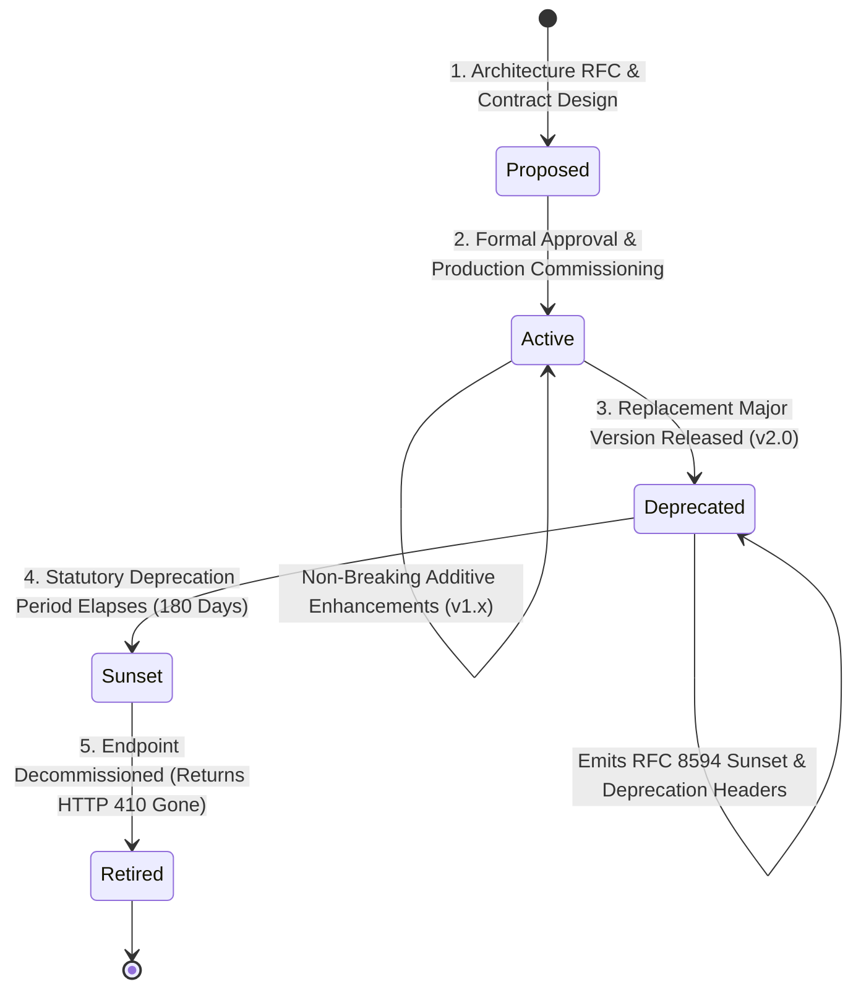

# 🔌 API Specification: API Versioning, Evolution & Lifecycle Policy
## Namma Clinic Digital Health & Operations Platform
**Document Code:** API-DOC-03 | **Status:** Authoritative Baseline | **Date:** September 2026
> **Municipal Health Authority:** Greater Bengaluru Authority (GBA) / BBMP Health Department
> **Standard Framework:** Semantic Versioning 2.0.0, RFC 8594 (Sunset Header), RFC 9110 (Deprecation Header)
> **Notice:** All code snippets contained herein are strictly **DOCUMENTATION-ONLY OPENAPI** or **DOCUMENTATION-ONLY EXAMPLE**. Zero application runtime code is executed in this phase.

---

## 1. Executive Summary & Versioning Principles

The Namma Clinic platform manages high-stakes clinical, pharmaceutical, and public health data across 183 primary clinics, requiring an immutable guarantee of backward compatibility. Frontline tablet devices, edge mini-servers, and third-party municipal integrations may not update simultaneously. This policy defines the mathematical rules governing URI versioning, non-breaking schema evolution, deprecation signaling via RFC 8594/9110 headers, migration windows, and decommission runbooks.

### 1.1 Core Tenets
1. **URI Major Versioning:** Breaking structural changes increment the URI path major version (e.g., `/api/v1/` to `/api/v2/`). Minor and patch versions NEVER appear in the URI path.
2. **Strict Additive Evolution:** Within a major version, all schema mutations must be strictly backward-compatible. Clients must employ lenient parsing (ignoring unrecognized JSON properties).
3. **Mandatory 180-Day Deprecation Notice:** Any endpoint slated for retirement must be marked deprecated at least 180 calendar days prior to sunset (365 days for national ABDM integrations).
4. **Active Sunset Headers:** Deprecated endpoints must emit `Deprecation` and `Sunset` HTTP response headers on every invocation, alerting client SDKs and monitoring dashboards.
5. **Contract-Driven Verification:** Consumer-driven contract tests (Pact / Vitest) run on every CI build to prevent unintended breaking changes from reaching staging or production.

## 2. API Version Lifecycle State Machine

Every API endpoint transitions through five deterministic lifecycle stages:



## 3. Breaking vs Non-Breaking Change Taxonomy

The following authoritative taxonomy dictates whether a planned change requires a major version bump:

| Change Classification | Nature of Impact | Versioning Requirement | Architectural Mitigation |
| :--- | :--- | :--- | :--- |
| Adding an optional request field | Non-Breaking | Permitted in v1.x | Default value assigned if omitted by legacy client |
| Adding a response attribute | Non-Breaking | Permitted in v1.x | Clients must practice lenient JSON parsing |
| Adding a new query parameter | Non-Breaking | Permitted in v1.x | Parameter must have safe default behavior when omitted |
| Adding an enum value to request | Non-Breaking | Permitted in v1.x | Expands permitted client inputs |
| Adding a new HTTP endpoint route | Non-Breaking | Permitted in v1.x | Additive capability introduction |
| Relaxing a validation constraint | Non-Breaking | Permitted in v1.x | E.g., expanding string length from 50 to 100 |
| Removing or renaming a field | **Breaking** | **Requires Major Version Bump (v2)** | Causes deserialization failure in legacy clients |
| Making an optional field mandatory | **Breaking** | **Requires Major Version Bump (v2)** | Rejects previously valid legacy payloads |
| Changing data type of existing field | **Breaking** | **Requires Major Version Bump (v2)** | E.g., changing integer age to ISO date string |
| Changing HTTP method or URI path | **Breaking** | **Requires Major Version Bump (v2)** | Breaks routing rules and client contracts |
| Removing a supported HTTP status code | **Breaking** | **Requires Major Version Bump (v2)** | Violates client state machine handling |
| Tightening a validation regex | **Breaking** | **Requires Major Version Bump (v2)** | Rejects previously accepted data representations |
| Altering error envelope structure | **Breaking** | **Requires Major Version Bump (v2)** | Breaks client exception parsing logic |

## 4. RFC 8594 & RFC 9110 Deprecation Signaling Standards

When an endpoint is marked deprecated, the API gateway automatically injects three compliance headers on all successful and error responses:

```http
# DOCUMENTATION-ONLY EXAMPLE
HTTP/1.1 200 OK
Content-Type: application/json
Deprecation: @1767225600
Sunset: Wed, 01 Jul 2027 00:00:00 GMT
Link: <https://docs.nammaclinic.bbmp.gov.in/api/v2/migration-guide>; rel="deprecation"; type="text/html"
X-Correlation-ID: 018e3a20-8000-7000-8000-000000000001
```

### 4.1 Header Specifications
- `Deprecation`: Formatted as an HTTP date or Unix timestamp indicating the date when deprecation became active.
- `Sunset`: Formatted as an IMF-fixdate (RFC 7231) defining the exact UTC timestamp after which the endpoint will return `HTTP 410 Gone`.
- `Link`: RFC 8288 link header referencing the migration runbook and replacement endpoint documentation.

## 5. Migration Windows, Client Communication & Decommission Runbooks

The deprecation lifecycle enforces strict notification and execution milestones:

| Milestone | Timeline Relative to Sunset | Action Required by Platform Engineering | Frontline Client Obligation |
| :--- | :--- | :--- | :--- |
| **T-180 Days** | 6 Months Prior | Deprecation announcement published to BBMP IT circular; headers activated on gateway. | Review migration guide; schedule PWA app updates. |
| **T-90 Days** | 3 Months Prior | Telemetry audit of calling user-agents; automated warnings sent to un-migrated facilities. | Deploy v2 client build to 25% pilot clinic tablets. |
| **T-30 Days** | 1 Month Prior | Final escalation to Zonal Medical Superintendents; synthetic brownout test scheduled. | 100% of clinic tablets updated to v2 client shell. |
| **T-7 Days** | 1 Week Prior | 1-hour brownout test: deprecated endpoint returns HTTP 429 to surface latent dependencies. | Verify zero fallback issues during brownout window. |
| **T-0 Days** | Sunset Date | Endpoint decommissioned on gateway; route permanently returns `HTTP 410 Gone`. | All traffic successfully operating on v2 routes. |

## 6. Complete Endpoint Version Support Matrix (All 341 Endpoints)

The current authoritative support status for all 341 endpoints across the 16 domains:

| Endpoint ID | Route Path | Current Version | Lifecycle Status | Introduction Date | Minimum Sunset Date | Backward Compatible |
| :--- | :--- | :--- | :--- | :--- | :--- | :--- |
| **API-AUTH-001** | `POST /api/v1/auth/login` | `v1.0.0` | **ACTIVE** | September 2026 | September 2029 (3-Year Guarantee) | **Yes** |
| **API-AUTH-002** | `POST /api/v1/auth/refresh` | `v1.0.0` | **ACTIVE** | September 2026 | September 2029 (3-Year Guarantee) | **Yes** |
| **API-AUTH-003** | `POST /api/v1/auth/logout` | `v1.0.0` | **ACTIVE** | September 2026 | September 2029 (3-Year Guarantee) | **Yes** |
| **API-AUTH-004** | `GET /api/v1/auth/me` | `v1.0.0` | **ACTIVE** | September 2026 | September 2029 (3-Year Guarantee) | **Yes** |
| **API-AUTH-005** | `POST /api/v1/auth/password/change` | `v1.0.0` | **ACTIVE** | September 2026 | September 2029 (3-Year Guarantee) | **Yes** |
| **API-AUTH-006** | `GET /api/v1/auth/.well-known/jwks.json` | `v1.0.0` | **ACTIVE** | September 2026 | September 2029 (3-Year Guarantee) | **Yes** |
| **API-AUTH-007** | `POST /api/v1/auth/mfa/verify` | `v1.0.0` | **ACTIVE** | September 2026 | September 2029 (3-Year Guarantee) | **Yes** |
| **API-AUTH-008** | `POST /api/v1/auth/break-glass` | `v1.0.0` | **ACTIVE** | September 2026 | September 2029 (3-Year Guarantee) | **Yes** |
| **API-AUTH-009** | `POST /api/v1/auth/devices/register` | `v1.0.0` | **ACTIVE** | September 2026 | September 2029 (3-Year Guarantee) | **Yes** |
| **API-AUTH-010** | `GET /api/v1/auth/devices` | `v1.0.0` | **ACTIVE** | September 2026 | September 2029 (3-Year Guarantee) | **Yes** |
| **API-AUTH-011** | `DELETE /api/v1/auth/devices/{deviceId}` | `v1.0.0` | **ACTIVE** | September 2026 | September 2029 (3-Year Guarantee) | **Yes** |
| **API-AUTH-012** | `GET /api/v1/auth/roles` | `v1.0.0` | **ACTIVE** | September 2026 | September 2029 (3-Year Guarantee) | **Yes** |
| **API-AUTH-013** | `POST /api/v1/auth/users/{userId}/roles` | `v1.0.0` | **ACTIVE** | September 2026 | September 2029 (3-Year Guarantee) | **Yes** |
| **API-AUTH-014** | `GET /api/v1/auth/sessions` | `v1.0.0` | **ACTIVE** | September 2026 | September 2029 (3-Year Guarantee) | **Yes** |
| **API-AUTH-015** | `DELETE /api/v1/auth/sessions/{sessionId}` | `v1.0.0` | **ACTIVE** | September 2026 | September 2029 (3-Year Guarantee) | **Yes** |
| **API-AUTH-016** | `POST /api/v1/auth/shifts/clock-in` | `v1.0.0` | **ACTIVE** | September 2026 | September 2029 (3-Year Guarantee) | **Yes** |
| **API-PATIENT-001** | `POST /api/v1/patients` | `v1.0.0` | **ACTIVE** | September 2026 | September 2029 (3-Year Guarantee) | **Yes** |
| **API-PATIENT-002** | `GET /api/v1/patients/{patientId}` | `v1.0.0` | **ACTIVE** | September 2026 | September 2029 (3-Year Guarantee) | **Yes** |
| **API-PATIENT-003** | `GET /api/v1/patients` | `v1.0.0` | **ACTIVE** | September 2026 | September 2029 (3-Year Guarantee) | **Yes** |
| **API-PATIENT-004** | `PUT /api/v1/patients/{patientId}` | `v1.0.0` | **ACTIVE** | September 2026 | September 2029 (3-Year Guarantee) | **Yes** |
| **API-PATIENT-005** | `POST /api/v1/patients/duplicates/check` | `v1.0.0` | **ACTIVE** | September 2026 | September 2029 (3-Year Guarantee) | **Yes** |
| **API-PATIENT-006** | `POST /api/v1/patients/merge` | `v1.0.0` | **ACTIVE** | September 2026 | September 2029 (3-Year Guarantee) | **Yes** |
| **API-PATIENT-007** | `POST /api/v1/patients/{patientId}/abha/link` | `v1.0.0` | **ACTIVE** | September 2026 | September 2029 (3-Year Guarantee) | **Yes** |
| **API-PATIENT-008** | `DELETE /api/v1/patients/{patientId}/abha/unlink` | `v1.0.0` | **ACTIVE** | September 2026 | September 2029 (3-Year Guarantee) | **Yes** |
| **API-PATIENT-009** | `GET /api/v1/patients/{patientId}/history` | `v1.0.0` | **ACTIVE** | September 2026 | September 2029 (3-Year Guarantee) | **Yes** |
| **API-PATIENT-010** | `GET /api/v1/patients/{patientId}/consents` | `v1.0.0` | **ACTIVE** | September 2026 | September 2029 (3-Year Guarantee) | **Yes** |
| **API-PATIENT-011** | `POST /api/v1/patients/{patientId}/consents` | `v1.0.0` | **ACTIVE** | September 2026 | September 2029 (3-Year Guarantee) | **Yes** |
| **API-PATIENT-012** | `DELETE /api/v1/patients/{patientId}/consents/{consentId}` | `v1.0.0` | **ACTIVE** | September 2026 | September 2029 (3-Year Guarantee) | **Yes** |
| **API-PATIENT-013** | `GET /api/v1/patients/{patientId}/audit` | `v1.0.0` | **ACTIVE** | September 2026 | September 2029 (3-Year Guarantee) | **Yes** |
| **API-PATIENT-014** | `POST /api/v1/patients/{patientId}/ncd-enroll` | `v1.0.0` | **ACTIVE** | September 2026 | September 2029 (3-Year Guarantee) | **Yes** |
| **API-PATIENT-015** | `GET /api/v1/patients/{patientId}/ncd-status` | `v1.0.0` | **ACTIVE** | September 2026 | September 2029 (3-Year Guarantee) | **Yes** |
| **API-PATIENT-016** | `POST /api/v1/patients/{patientId}/emergency-contacts` | `v1.0.0` | **ACTIVE** | September 2026 | September 2029 (3-Year Guarantee) | **Yes** |
| **API-PATIENT-017** | `GET /api/v1/patients/{patientId}/identifiers` | `v1.0.0` | **ACTIVE** | September 2026 | September 2029 (3-Year Guarantee) | **Yes** |
| **API-PATIENT-018** | `POST /api/v1/patients/{patientId}/identifiers` | `v1.0.0` | **ACTIVE** | September 2026 | September 2029 (3-Year Guarantee) | **Yes** |
| **API-PATIENT-019** | `DELETE /api/v1/patients/{patientId}/identifiers/{identifierId}` | `v1.0.0` | **ACTIVE** | September 2026 | September 2029 (3-Year Guarantee) | **Yes** |
| **API-PATIENT-020** | `POST /api/v1/patients/{patientId}/flag-deceased` | `v1.0.0` | **ACTIVE** | September 2026 | September 2029 (3-Year Guarantee) | **Yes** |
| **API-PATIENT-021** | `GET /api/v1/patients/{patientId}/encounters` | `v1.0.0` | **ACTIVE** | September 2026 | September 2029 (3-Year Guarantee) | **Yes** |
| **API-PATIENT-022** | `GET /api/v1/patients/{patientId}/prescriptions` | `v1.0.0` | **ACTIVE** | September 2026 | September 2029 (3-Year Guarantee) | **Yes** |
| **API-PATIENT-023** | `GET /api/v1/patients/{patientId}/lab-reports` | `v1.0.0` | **ACTIVE** | September 2026 | September 2029 (3-Year Guarantee) | **Yes** |
| **API-PATIENT-024** | `POST /api/v1/patients/{patientId}/photo` | `v1.0.0` | **ACTIVE** | September 2026 | September 2029 (3-Year Guarantee) | **Yes** |
| **API-PATIENT-025** | `GET /api/v1/patients/{patientId}/photo` | `v1.0.0` | **ACTIVE** | September 2026 | September 2029 (3-Year Guarantee) | **Yes** |
| **API-PATIENT-026** | `POST /api/v1/patients/batch-lookup` | `v1.0.0` | **ACTIVE** | September 2026 | September 2029 (3-Year Guarantee) | **Yes** |
| **API-VISIT-001** | `POST /api/v1/visits` | `v1.0.0` | **ACTIVE** | September 2026 | September 2029 (3-Year Guarantee) | **Yes** |
| **API-VISIT-002** | `GET /api/v1/visits/{visitId}` | `v1.0.0` | **ACTIVE** | September 2026 | September 2029 (3-Year Guarantee) | **Yes** |
| **API-VISIT-003** | `GET /api/v1/visits` | `v1.0.0` | **ACTIVE** | September 2026 | September 2029 (3-Year Guarantee) | **Yes** |
| **API-VISIT-004** | `PUT /api/v1/visits/{visitId}` | `v1.0.0` | **ACTIVE** | September 2026 | September 2029 (3-Year Guarantee) | **Yes** |
| **API-VISIT-005** | `PATCH /api/v1/visits/{visitId}/status` | `v1.0.0` | **ACTIVE** | September 2026 | September 2029 (3-Year Guarantee) | **Yes** |
| **API-VISIT-006** | `GET /api/v1/visits/{visitId}/search` | `v1.0.0` | **ACTIVE** | September 2026 | September 2029 (3-Year Guarantee) | **Yes** |
| **API-VISIT-007** | `GET /api/v1/visits/history` | `v1.0.0` | **ACTIVE** | September 2026 | September 2029 (3-Year Guarantee) | **Yes** |
| **API-VISIT-008** | `GET /api/v1/visits/{visitId}/audit` | `v1.0.0` | **ACTIVE** | September 2026 | September 2029 (3-Year Guarantee) | **Yes** |
| **API-VISIT-009** | `POST /api/v1/visits/cancel` | `v1.0.0` | **ACTIVE** | September 2026 | September 2029 (3-Year Guarantee) | **Yes** |
| **API-VISIT-010** | `POST /api/v1/visits/verify` | `v1.0.0` | **ACTIVE** | September 2026 | September 2029 (3-Year Guarantee) | **Yes** |
| **API-VISIT-011** | `GET /api/v1/visits/export` | `v1.0.0` | **ACTIVE** | September 2026 | September 2029 (3-Year Guarantee) | **Yes** |
| **API-VISIT-012** | `GET /api/v1/visits/{visitId}/metrics` | `v1.0.0` | **ACTIVE** | September 2026 | September 2029 (3-Year Guarantee) | **Yes** |
| **API-VISIT-013** | `POST /api/v1/visits/reconcile` | `v1.0.0` | **ACTIVE** | September 2026 | September 2029 (3-Year Guarantee) | **Yes** |
| **API-VISIT-014** | `POST /api/v1/visits/batch` | `v1.0.0` | **ACTIVE** | September 2026 | September 2029 (3-Year Guarantee) | **Yes** |
| **API-VISIT-015** | `GET /api/v1/visits/sync` | `v1.0.0` | **ACTIVE** | September 2026 | September 2029 (3-Year Guarantee) | **Yes** |
| **API-VISIT-016** | `GET /api/v1/visits/{visitId}/alerts` | `v1.0.0` | **ACTIVE** | September 2026 | September 2029 (3-Year Guarantee) | **Yes** |
| **API-VISIT-017** | `POST /api/v1/visits/escalate` | `v1.0.0` | **ACTIVE** | September 2026 | September 2029 (3-Year Guarantee) | **Yes** |
| **API-VISIT-018** | `POST /api/v1/visits/approve` | `v1.0.0` | **ACTIVE** | September 2026 | September 2029 (3-Year Guarantee) | **Yes** |
| **API-VISIT-019** | `POST /api/v1/visits/reversal` | `v1.0.0` | **ACTIVE** | September 2026 | September 2029 (3-Year Guarantee) | **Yes** |
| **API-VISIT-020** | `GET /api/v1/visits/{visitId}/items` | `v1.0.0` | **ACTIVE** | September 2026 | September 2029 (3-Year Guarantee) | **Yes** |
| **API-VISIT-021** | `GET /api/v1/visits/documents` | `v1.0.0` | **ACTIVE** | September 2026 | September 2029 (3-Year Guarantee) | **Yes** |
| **API-TRIAGE-001** | `POST /api/v1/triage` | `v1.0.0` | **ACTIVE** | September 2026 | September 2029 (3-Year Guarantee) | **Yes** |
| **API-TRIAGE-002** | `GET /api/v1/triage/{triageId}` | `v1.0.0` | **ACTIVE** | September 2026 | September 2029 (3-Year Guarantee) | **Yes** |
| **API-TRIAGE-003** | `GET /api/v1/triage` | `v1.0.0` | **ACTIVE** | September 2026 | September 2029 (3-Year Guarantee) | **Yes** |
| **API-TRIAGE-004** | `PUT /api/v1/triage/{triageId}` | `v1.0.0` | **ACTIVE** | September 2026 | September 2029 (3-Year Guarantee) | **Yes** |
| **API-TRIAGE-005** | `PATCH /api/v1/triage/{triageId}/status` | `v1.0.0` | **ACTIVE** | September 2026 | September 2029 (3-Year Guarantee) | **Yes** |
| **API-TRIAGE-006** | `GET /api/v1/triage/{triageId}/search` | `v1.0.0` | **ACTIVE** | September 2026 | September 2029 (3-Year Guarantee) | **Yes** |
| **API-TRIAGE-007** | `GET /api/v1/triage/history` | `v1.0.0` | **ACTIVE** | September 2026 | September 2029 (3-Year Guarantee) | **Yes** |
| **API-TRIAGE-008** | `GET /api/v1/triage/{triageId}/audit` | `v1.0.0` | **ACTIVE** | September 2026 | September 2029 (3-Year Guarantee) | **Yes** |
| **API-TRIAGE-009** | `POST /api/v1/triage/cancel` | `v1.0.0` | **ACTIVE** | September 2026 | September 2029 (3-Year Guarantee) | **Yes** |
| **API-TRIAGE-010** | `POST /api/v1/triage/verify` | `v1.0.0` | **ACTIVE** | September 2026 | September 2029 (3-Year Guarantee) | **Yes** |
| **API-TRIAGE-011** | `GET /api/v1/triage/export` | `v1.0.0` | **ACTIVE** | September 2026 | September 2029 (3-Year Guarantee) | **Yes** |
| **API-TRIAGE-012** | `GET /api/v1/triage/{triageId}/metrics` | `v1.0.0` | **ACTIVE** | September 2026 | September 2029 (3-Year Guarantee) | **Yes** |
| **API-TRIAGE-013** | `POST /api/v1/triage/reconcile` | `v1.0.0` | **ACTIVE** | September 2026 | September 2029 (3-Year Guarantee) | **Yes** |
| **API-TRIAGE-014** | `POST /api/v1/triage/batch` | `v1.0.0` | **ACTIVE** | September 2026 | September 2029 (3-Year Guarantee) | **Yes** |
| **API-TRIAGE-015** | `GET /api/v1/triage/sync` | `v1.0.0` | **ACTIVE** | September 2026 | September 2029 (3-Year Guarantee) | **Yes** |
| **API-TRIAGE-016** | `GET /api/v1/triage/{triageId}/alerts` | `v1.0.0` | **ACTIVE** | September 2026 | September 2029 (3-Year Guarantee) | **Yes** |
| **API-TRIAGE-017** | `POST /api/v1/triage/escalate` | `v1.0.0` | **ACTIVE** | September 2026 | September 2029 (3-Year Guarantee) | **Yes** |
| **API-TRIAGE-018** | `POST /api/v1/triage/approve` | `v1.0.0` | **ACTIVE** | September 2026 | September 2029 (3-Year Guarantee) | **Yes** |
| **API-TRIAGE-019** | `POST /api/v1/triage/reversal` | `v1.0.0` | **ACTIVE** | September 2026 | September 2029 (3-Year Guarantee) | **Yes** |
| **API-CONSULT-001** | `POST /api/v1/consultations` | `v1.0.0` | **ACTIVE** | September 2026 | September 2029 (3-Year Guarantee) | **Yes** |
| **API-CONSULT-002** | `GET /api/v1/consultations/{consultationId}` | `v1.0.0` | **ACTIVE** | September 2026 | September 2029 (3-Year Guarantee) | **Yes** |
| **API-CONSULT-003** | `GET /api/v1/consultations` | `v1.0.0` | **ACTIVE** | September 2026 | September 2029 (3-Year Guarantee) | **Yes** |
| **API-CONSULT-004** | `PUT /api/v1/consultations/{consultationId}` | `v1.0.0` | **ACTIVE** | September 2026 | September 2029 (3-Year Guarantee) | **Yes** |
| **API-CONSULT-005** | `PATCH /api/v1/consultations/{consultationId}/status` | `v1.0.0` | **ACTIVE** | September 2026 | September 2029 (3-Year Guarantee) | **Yes** |
| **API-CONSULT-006** | `GET /api/v1/consultations/{consultationId}/search` | `v1.0.0` | **ACTIVE** | September 2026 | September 2029 (3-Year Guarantee) | **Yes** |
| **API-CONSULT-007** | `GET /api/v1/consultations/history` | `v1.0.0` | **ACTIVE** | September 2026 | September 2029 (3-Year Guarantee) | **Yes** |
| **API-CONSULT-008** | `GET /api/v1/consultations/{consultationId}/audit` | `v1.0.0` | **ACTIVE** | September 2026 | September 2029 (3-Year Guarantee) | **Yes** |
| **API-CONSULT-009** | `POST /api/v1/consultations/cancel` | `v1.0.0` | **ACTIVE** | September 2026 | September 2029 (3-Year Guarantee) | **Yes** |
| **API-CONSULT-010** | `POST /api/v1/consultations/verify` | `v1.0.0` | **ACTIVE** | September 2026 | September 2029 (3-Year Guarantee) | **Yes** |
| **API-CONSULT-011** | `GET /api/v1/consultations/export` | `v1.0.0` | **ACTIVE** | September 2026 | September 2029 (3-Year Guarantee) | **Yes** |
| **API-CONSULT-012** | `GET /api/v1/consultations/{consultationId}/metrics` | `v1.0.0` | **ACTIVE** | September 2026 | September 2029 (3-Year Guarantee) | **Yes** |
| **API-CONSULT-013** | `POST /api/v1/consultations/reconcile` | `v1.0.0` | **ACTIVE** | September 2026 | September 2029 (3-Year Guarantee) | **Yes** |
| **API-CONSULT-014** | `POST /api/v1/consultations/batch` | `v1.0.0` | **ACTIVE** | September 2026 | September 2029 (3-Year Guarantee) | **Yes** |
| **API-CONSULT-015** | `GET /api/v1/consultations/sync` | `v1.0.0` | **ACTIVE** | September 2026 | September 2029 (3-Year Guarantee) | **Yes** |
| **API-CONSULT-016** | `GET /api/v1/consultations/{consultationId}/alerts` | `v1.0.0` | **ACTIVE** | September 2026 | September 2029 (3-Year Guarantee) | **Yes** |
| **API-CONSULT-017** | `POST /api/v1/consultations/escalate` | `v1.0.0` | **ACTIVE** | September 2026 | September 2029 (3-Year Guarantee) | **Yes** |
| **API-CONSULT-018** | `POST /api/v1/consultations/approve` | `v1.0.0` | **ACTIVE** | September 2026 | September 2029 (3-Year Guarantee) | **Yes** |
| **API-CONSULT-019** | `POST /api/v1/consultations/reversal` | `v1.0.0` | **ACTIVE** | September 2026 | September 2029 (3-Year Guarantee) | **Yes** |
| **API-CONSULT-020** | `GET /api/v1/consultations/{consultationId}/items` | `v1.0.0` | **ACTIVE** | September 2026 | September 2029 (3-Year Guarantee) | **Yes** |
| **API-CONSULT-021** | `GET /api/v1/consultations/documents` | `v1.0.0` | **ACTIVE** | September 2026 | September 2029 (3-Year Guarantee) | **Yes** |
| **API-CONSULT-022** | `GET /api/v1/consultations/{consultationId}/timeline` | `v1.0.0` | **ACTIVE** | September 2026 | September 2029 (3-Year Guarantee) | **Yes** |
| **API-CONSULT-023** | `GET /api/v1/consultations/stats` | `v1.0.0` | **ACTIVE** | September 2026 | September 2029 (3-Year Guarantee) | **Yes** |
| **API-RX-001** | `POST /api/v1/prescriptions` | `v1.0.0` | **ACTIVE** | September 2026 | September 2029 (3-Year Guarantee) | **Yes** |
| **API-RX-002** | `GET /api/v1/prescriptions/{prescriptionId}` | `v1.0.0` | **ACTIVE** | September 2026 | September 2029 (3-Year Guarantee) | **Yes** |
| **API-RX-003** | `GET /api/v1/prescriptions` | `v1.0.0` | **ACTIVE** | September 2026 | September 2029 (3-Year Guarantee) | **Yes** |
| **API-RX-004** | `PUT /api/v1/prescriptions/{prescriptionId}` | `v1.0.0` | **ACTIVE** | September 2026 | September 2029 (3-Year Guarantee) | **Yes** |
| **API-RX-005** | `PATCH /api/v1/prescriptions/{prescriptionId}/status` | `v1.0.0` | **ACTIVE** | September 2026 | September 2029 (3-Year Guarantee) | **Yes** |
| **API-RX-006** | `GET /api/v1/prescriptions/{prescriptionId}/search` | `v1.0.0` | **ACTIVE** | September 2026 | September 2029 (3-Year Guarantee) | **Yes** |
| **API-RX-007** | `GET /api/v1/prescriptions/history` | `v1.0.0` | **ACTIVE** | September 2026 | September 2029 (3-Year Guarantee) | **Yes** |
| **API-RX-008** | `GET /api/v1/prescriptions/{prescriptionId}/audit` | `v1.0.0` | **ACTIVE** | September 2026 | September 2029 (3-Year Guarantee) | **Yes** |
| **API-RX-009** | `POST /api/v1/prescriptions/cancel` | `v1.0.0` | **ACTIVE** | September 2026 | September 2029 (3-Year Guarantee) | **Yes** |
| **API-RX-010** | `POST /api/v1/prescriptions/verify` | `v1.0.0` | **ACTIVE** | September 2026 | September 2029 (3-Year Guarantee) | **Yes** |
| **API-RX-011** | `GET /api/v1/prescriptions/export` | `v1.0.0` | **ACTIVE** | September 2026 | September 2029 (3-Year Guarantee) | **Yes** |
| **API-RX-012** | `GET /api/v1/prescriptions/{prescriptionId}/metrics` | `v1.0.0` | **ACTIVE** | September 2026 | September 2029 (3-Year Guarantee) | **Yes** |
| **API-RX-013** | `POST /api/v1/prescriptions/reconcile` | `v1.0.0` | **ACTIVE** | September 2026 | September 2029 (3-Year Guarantee) | **Yes** |
| **API-RX-014** | `POST /api/v1/prescriptions/batch` | `v1.0.0` | **ACTIVE** | September 2026 | September 2029 (3-Year Guarantee) | **Yes** |
| **API-RX-015** | `GET /api/v1/prescriptions/sync` | `v1.0.0` | **ACTIVE** | September 2026 | September 2029 (3-Year Guarantee) | **Yes** |
| **API-RX-016** | `GET /api/v1/prescriptions/{prescriptionId}/alerts` | `v1.0.0` | **ACTIVE** | September 2026 | September 2029 (3-Year Guarantee) | **Yes** |
| **API-RX-017** | `POST /api/v1/prescriptions/escalate` | `v1.0.0` | **ACTIVE** | September 2026 | September 2029 (3-Year Guarantee) | **Yes** |
| **API-RX-018** | `POST /api/v1/prescriptions/approve` | `v1.0.0` | **ACTIVE** | September 2026 | September 2029 (3-Year Guarantee) | **Yes** |
| **API-RX-019** | `POST /api/v1/prescriptions/reversal` | `v1.0.0` | **ACTIVE** | September 2026 | September 2029 (3-Year Guarantee) | **Yes** |
| **API-PHARM-001** | `POST /api/v1/pharmacy` | `v1.0.0` | **ACTIVE** | September 2026 | September 2029 (3-Year Guarantee) | **Yes** |
| **API-PHARM-002** | `GET /api/v1/pharmacy/{pharmacyId}` | `v1.0.0` | **ACTIVE** | September 2026 | September 2029 (3-Year Guarantee) | **Yes** |
| **API-PHARM-003** | `GET /api/v1/pharmacy` | `v1.0.0` | **ACTIVE** | September 2026 | September 2029 (3-Year Guarantee) | **Yes** |
| **API-PHARM-004** | `PUT /api/v1/pharmacy/{pharmacyId}` | `v1.0.0` | **ACTIVE** | September 2026 | September 2029 (3-Year Guarantee) | **Yes** |
| **API-PHARM-005** | `PATCH /api/v1/pharmacy/{pharmacyId}/status` | `v1.0.0` | **ACTIVE** | September 2026 | September 2029 (3-Year Guarantee) | **Yes** |
| **API-PHARM-006** | `GET /api/v1/pharmacy/{pharmacyId}/search` | `v1.0.0` | **ACTIVE** | September 2026 | September 2029 (3-Year Guarantee) | **Yes** |
| **API-PHARM-007** | `GET /api/v1/pharmacy/history` | `v1.0.0` | **ACTIVE** | September 2026 | September 2029 (3-Year Guarantee) | **Yes** |
| **API-PHARM-008** | `GET /api/v1/pharmacy/{pharmacyId}/audit` | `v1.0.0` | **ACTIVE** | September 2026 | September 2029 (3-Year Guarantee) | **Yes** |
| **API-PHARM-009** | `POST /api/v1/pharmacy/cancel` | `v1.0.0` | **ACTIVE** | September 2026 | September 2029 (3-Year Guarantee) | **Yes** |
| **API-PHARM-010** | `POST /api/v1/pharmacy/verify` | `v1.0.0` | **ACTIVE** | September 2026 | September 2029 (3-Year Guarantee) | **Yes** |
| **API-PHARM-011** | `GET /api/v1/pharmacy/export` | `v1.0.0` | **ACTIVE** | September 2026 | September 2029 (3-Year Guarantee) | **Yes** |
| **API-PHARM-012** | `GET /api/v1/pharmacy/{pharmacyId}/metrics` | `v1.0.0` | **ACTIVE** | September 2026 | September 2029 (3-Year Guarantee) | **Yes** |
| **API-PHARM-013** | `POST /api/v1/pharmacy/reconcile` | `v1.0.0` | **ACTIVE** | September 2026 | September 2029 (3-Year Guarantee) | **Yes** |
| **API-PHARM-014** | `POST /api/v1/pharmacy/batch` | `v1.0.0` | **ACTIVE** | September 2026 | September 2029 (3-Year Guarantee) | **Yes** |
| **API-PHARM-015** | `GET /api/v1/pharmacy/sync` | `v1.0.0` | **ACTIVE** | September 2026 | September 2029 (3-Year Guarantee) | **Yes** |
| **API-PHARM-016** | `GET /api/v1/pharmacy/{pharmacyId}/alerts` | `v1.0.0` | **ACTIVE** | September 2026 | September 2029 (3-Year Guarantee) | **Yes** |
| **API-PHARM-017** | `POST /api/v1/pharmacy/escalate` | `v1.0.0` | **ACTIVE** | September 2026 | September 2029 (3-Year Guarantee) | **Yes** |
| **API-PHARM-018** | `POST /api/v1/pharmacy/approve` | `v1.0.0` | **ACTIVE** | September 2026 | September 2029 (3-Year Guarantee) | **Yes** |
| **API-PHARM-019** | `POST /api/v1/pharmacy/reversal` | `v1.0.0` | **ACTIVE** | September 2026 | September 2029 (3-Year Guarantee) | **Yes** |
| **API-PHARM-020** | `GET /api/v1/pharmacy/{pharmacyId}/items` | `v1.0.0` | **ACTIVE** | September 2026 | September 2029 (3-Year Guarantee) | **Yes** |
| **API-PHARM-021** | `GET /api/v1/pharmacy/documents` | `v1.0.0` | **ACTIVE** | September 2026 | September 2029 (3-Year Guarantee) | **Yes** |
| **API-INV-001** | `POST /api/v1/inventory` | `v1.0.0` | **ACTIVE** | September 2026 | September 2029 (3-Year Guarantee) | **Yes** |
| **API-INV-002** | `GET /api/v1/inventory/{inventoryId}` | `v1.0.0` | **ACTIVE** | September 2026 | September 2029 (3-Year Guarantee) | **Yes** |
| **API-INV-003** | `GET /api/v1/inventory` | `v1.0.0` | **ACTIVE** | September 2026 | September 2029 (3-Year Guarantee) | **Yes** |
| **API-INV-004** | `PUT /api/v1/inventory/{inventoryId}` | `v1.0.0` | **ACTIVE** | September 2026 | September 2029 (3-Year Guarantee) | **Yes** |
| **API-INV-005** | `PATCH /api/v1/inventory/{inventoryId}/status` | `v1.0.0` | **ACTIVE** | September 2026 | September 2029 (3-Year Guarantee) | **Yes** |
| **API-INV-006** | `GET /api/v1/inventory/{inventoryId}/search` | `v1.0.0` | **ACTIVE** | September 2026 | September 2029 (3-Year Guarantee) | **Yes** |
| **API-INV-007** | `GET /api/v1/inventory/history` | `v1.0.0` | **ACTIVE** | September 2026 | September 2029 (3-Year Guarantee) | **Yes** |
| **API-INV-008** | `GET /api/v1/inventory/{inventoryId}/audit` | `v1.0.0` | **ACTIVE** | September 2026 | September 2029 (3-Year Guarantee) | **Yes** |
| **API-INV-009** | `POST /api/v1/inventory/cancel` | `v1.0.0` | **ACTIVE** | September 2026 | September 2029 (3-Year Guarantee) | **Yes** |
| **API-INV-010** | `POST /api/v1/inventory/verify` | `v1.0.0` | **ACTIVE** | September 2026 | September 2029 (3-Year Guarantee) | **Yes** |
| **API-INV-011** | `GET /api/v1/inventory/export` | `v1.0.0` | **ACTIVE** | September 2026 | September 2029 (3-Year Guarantee) | **Yes** |
| **API-INV-012** | `GET /api/v1/inventory/{inventoryId}/metrics` | `v1.0.0` | **ACTIVE** | September 2026 | September 2029 (3-Year Guarantee) | **Yes** |
| **API-INV-013** | `POST /api/v1/inventory/reconcile` | `v1.0.0` | **ACTIVE** | September 2026 | September 2029 (3-Year Guarantee) | **Yes** |
| **API-INV-014** | `POST /api/v1/inventory/batch` | `v1.0.0` | **ACTIVE** | September 2026 | September 2029 (3-Year Guarantee) | **Yes** |
| **API-INV-015** | `GET /api/v1/inventory/sync` | `v1.0.0` | **ACTIVE** | September 2026 | September 2029 (3-Year Guarantee) | **Yes** |
| **API-INV-016** | `GET /api/v1/inventory/{inventoryId}/alerts` | `v1.0.0` | **ACTIVE** | September 2026 | September 2029 (3-Year Guarantee) | **Yes** |
| **API-INV-017** | `POST /api/v1/inventory/escalate` | `v1.0.0` | **ACTIVE** | September 2026 | September 2029 (3-Year Guarantee) | **Yes** |
| **API-INV-018** | `POST /api/v1/inventory/approve` | `v1.0.0` | **ACTIVE** | September 2026 | September 2029 (3-Year Guarantee) | **Yes** |
| **API-INV-019** | `POST /api/v1/inventory/reversal` | `v1.0.0` | **ACTIVE** | September 2026 | September 2029 (3-Year Guarantee) | **Yes** |
| **API-INV-020** | `GET /api/v1/inventory/{inventoryId}/items` | `v1.0.0` | **ACTIVE** | September 2026 | September 2029 (3-Year Guarantee) | **Yes** |
| **API-INV-021** | `GET /api/v1/inventory/documents` | `v1.0.0` | **ACTIVE** | September 2026 | September 2029 (3-Year Guarantee) | **Yes** |
| **API-INV-022** | `GET /api/v1/inventory/{inventoryId}/timeline` | `v1.0.0` | **ACTIVE** | September 2026 | September 2029 (3-Year Guarantee) | **Yes** |
| **API-INV-023** | `GET /api/v1/inventory/stats` | `v1.0.0` | **ACTIVE** | September 2026 | September 2029 (3-Year Guarantee) | **Yes** |
| **API-INV-024** | `GET /api/v1/inventory/{inventoryId}/search` | `v1.0.0` | **ACTIVE** | September 2026 | September 2029 (3-Year Guarantee) | **Yes** |
| **API-INV-025** | `GET /api/v1/inventory/history` | `v1.0.0` | **ACTIVE** | September 2026 | September 2029 (3-Year Guarantee) | **Yes** |
| **API-INV-026** | `GET /api/v1/inventory/{inventoryId}/audit` | `v1.0.0` | **ACTIVE** | September 2026 | September 2029 (3-Year Guarantee) | **Yes** |
| **API-LAB-001** | `POST /api/v1/lab` | `v1.0.0` | **ACTIVE** | September 2026 | September 2029 (3-Year Guarantee) | **Yes** |
| **API-LAB-002** | `GET /api/v1/lab/{labId}` | `v1.0.0` | **ACTIVE** | September 2026 | September 2029 (3-Year Guarantee) | **Yes** |
| **API-LAB-003** | `GET /api/v1/lab` | `v1.0.0` | **ACTIVE** | September 2026 | September 2029 (3-Year Guarantee) | **Yes** |
| **API-LAB-004** | `PUT /api/v1/lab/{labId}` | `v1.0.0` | **ACTIVE** | September 2026 | September 2029 (3-Year Guarantee) | **Yes** |
| **API-LAB-005** | `PATCH /api/v1/lab/{labId}/status` | `v1.0.0` | **ACTIVE** | September 2026 | September 2029 (3-Year Guarantee) | **Yes** |
| **API-LAB-006** | `GET /api/v1/lab/{labId}/search` | `v1.0.0` | **ACTIVE** | September 2026 | September 2029 (3-Year Guarantee) | **Yes** |
| **API-LAB-007** | `GET /api/v1/lab/history` | `v1.0.0` | **ACTIVE** | September 2026 | September 2029 (3-Year Guarantee) | **Yes** |
| **API-LAB-008** | `GET /api/v1/lab/{labId}/audit` | `v1.0.0` | **ACTIVE** | September 2026 | September 2029 (3-Year Guarantee) | **Yes** |
| **API-LAB-009** | `POST /api/v1/lab/cancel` | `v1.0.0` | **ACTIVE** | September 2026 | September 2029 (3-Year Guarantee) | **Yes** |
| **API-LAB-010** | `POST /api/v1/lab/verify` | `v1.0.0` | **ACTIVE** | September 2026 | September 2029 (3-Year Guarantee) | **Yes** |
| **API-LAB-011** | `GET /api/v1/lab/export` | `v1.0.0` | **ACTIVE** | September 2026 | September 2029 (3-Year Guarantee) | **Yes** |
| **API-LAB-012** | `GET /api/v1/lab/{labId}/metrics` | `v1.0.0` | **ACTIVE** | September 2026 | September 2029 (3-Year Guarantee) | **Yes** |
| **API-LAB-013** | `POST /api/v1/lab/reconcile` | `v1.0.0` | **ACTIVE** | September 2026 | September 2029 (3-Year Guarantee) | **Yes** |
| **API-LAB-014** | `POST /api/v1/lab/batch` | `v1.0.0` | **ACTIVE** | September 2026 | September 2029 (3-Year Guarantee) | **Yes** |
| **API-LAB-015** | `GET /api/v1/lab/sync` | `v1.0.0` | **ACTIVE** | September 2026 | September 2029 (3-Year Guarantee) | **Yes** |
| **API-LAB-016** | `GET /api/v1/lab/{labId}/alerts` | `v1.0.0` | **ACTIVE** | September 2026 | September 2029 (3-Year Guarantee) | **Yes** |
| **API-LAB-017** | `POST /api/v1/lab/escalate` | `v1.0.0` | **ACTIVE** | September 2026 | September 2029 (3-Year Guarantee) | **Yes** |
| **API-LAB-018** | `POST /api/v1/lab/approve` | `v1.0.0` | **ACTIVE** | September 2026 | September 2029 (3-Year Guarantee) | **Yes** |
| **API-LAB-019** | `POST /api/v1/lab/reversal` | `v1.0.0` | **ACTIVE** | September 2026 | September 2029 (3-Year Guarantee) | **Yes** |
| **API-LAB-020** | `GET /api/v1/lab/{labId}/items` | `v1.0.0` | **ACTIVE** | September 2026 | September 2029 (3-Year Guarantee) | **Yes** |
| **API-LAB-021** | `GET /api/v1/lab/documents` | `v1.0.0` | **ACTIVE** | September 2026 | September 2029 (3-Year Guarantee) | **Yes** |
| **API-LAB-022** | `GET /api/v1/lab/{labId}/timeline` | `v1.0.0` | **ACTIVE** | September 2026 | September 2029 (3-Year Guarantee) | **Yes** |
| **API-LAB-023** | `GET /api/v1/lab/stats` | `v1.0.0` | **ACTIVE** | September 2026 | September 2029 (3-Year Guarantee) | **Yes** |
| **API-REF-001** | `POST /api/v1/referrals` | `v1.0.0` | **ACTIVE** | September 2026 | September 2029 (3-Year Guarantee) | **Yes** |
| **API-REF-002** | `GET /api/v1/referrals/{referralId}` | `v1.0.0` | **ACTIVE** | September 2026 | September 2029 (3-Year Guarantee) | **Yes** |
| **API-REF-003** | `GET /api/v1/referrals` | `v1.0.0` | **ACTIVE** | September 2026 | September 2029 (3-Year Guarantee) | **Yes** |
| **API-REF-004** | `PUT /api/v1/referrals/{referralId}` | `v1.0.0` | **ACTIVE** | September 2026 | September 2029 (3-Year Guarantee) | **Yes** |
| **API-REF-005** | `PATCH /api/v1/referrals/{referralId}/status` | `v1.0.0` | **ACTIVE** | September 2026 | September 2029 (3-Year Guarantee) | **Yes** |
| **API-REF-006** | `GET /api/v1/referrals/{referralId}/search` | `v1.0.0` | **ACTIVE** | September 2026 | September 2029 (3-Year Guarantee) | **Yes** |
| **API-REF-007** | `GET /api/v1/referrals/history` | `v1.0.0` | **ACTIVE** | September 2026 | September 2029 (3-Year Guarantee) | **Yes** |
| **API-REF-008** | `GET /api/v1/referrals/{referralId}/audit` | `v1.0.0` | **ACTIVE** | September 2026 | September 2029 (3-Year Guarantee) | **Yes** |
| **API-REF-009** | `POST /api/v1/referrals/cancel` | `v1.0.0` | **ACTIVE** | September 2026 | September 2029 (3-Year Guarantee) | **Yes** |
| **API-REF-010** | `POST /api/v1/referrals/verify` | `v1.0.0` | **ACTIVE** | September 2026 | September 2029 (3-Year Guarantee) | **Yes** |
| **API-REF-011** | `GET /api/v1/referrals/export` | `v1.0.0` | **ACTIVE** | September 2026 | September 2029 (3-Year Guarantee) | **Yes** |
| **API-REF-012** | `GET /api/v1/referrals/{referralId}/metrics` | `v1.0.0` | **ACTIVE** | September 2026 | September 2029 (3-Year Guarantee) | **Yes** |
| **API-REF-013** | `POST /api/v1/referrals/reconcile` | `v1.0.0` | **ACTIVE** | September 2026 | September 2029 (3-Year Guarantee) | **Yes** |
| **API-REF-014** | `POST /api/v1/referrals/batch` | `v1.0.0` | **ACTIVE** | September 2026 | September 2029 (3-Year Guarantee) | **Yes** |
| **API-REF-015** | `GET /api/v1/referrals/sync` | `v1.0.0` | **ACTIVE** | September 2026 | September 2029 (3-Year Guarantee) | **Yes** |
| **API-REF-016** | `GET /api/v1/referrals/{referralId}/alerts` | `v1.0.0` | **ACTIVE** | September 2026 | September 2029 (3-Year Guarantee) | **Yes** |
| **API-REF-017** | `POST /api/v1/referrals/escalate` | `v1.0.0` | **ACTIVE** | September 2026 | September 2029 (3-Year Guarantee) | **Yes** |
| **API-REF-018** | `POST /api/v1/referrals/approve` | `v1.0.0` | **ACTIVE** | September 2026 | September 2029 (3-Year Guarantee) | **Yes** |
| **API-REF-019** | `POST /api/v1/referrals/reversal` | `v1.0.0` | **ACTIVE** | September 2026 | September 2029 (3-Year Guarantee) | **Yes** |
| **API-NOTIF-001** | `POST /api/v1/notifications` | `v1.0.0` | **ACTIVE** | September 2026 | September 2029 (3-Year Guarantee) | **Yes** |
| **API-NOTIF-002** | `GET /api/v1/notifications/{notificationId}` | `v1.0.0` | **ACTIVE** | September 2026 | September 2029 (3-Year Guarantee) | **Yes** |
| **API-NOTIF-003** | `GET /api/v1/notifications` | `v1.0.0` | **ACTIVE** | September 2026 | September 2029 (3-Year Guarantee) | **Yes** |
| **API-NOTIF-004** | `PUT /api/v1/notifications/{notificationId}` | `v1.0.0` | **ACTIVE** | September 2026 | September 2029 (3-Year Guarantee) | **Yes** |
| **API-NOTIF-005** | `PATCH /api/v1/notifications/{notificationId}/status` | `v1.0.0` | **ACTIVE** | September 2026 | September 2029 (3-Year Guarantee) | **Yes** |
| **API-NOTIF-006** | `GET /api/v1/notifications/{notificationId}/search` | `v1.0.0` | **ACTIVE** | September 2026 | September 2029 (3-Year Guarantee) | **Yes** |
| **API-NOTIF-007** | `GET /api/v1/notifications/history` | `v1.0.0` | **ACTIVE** | September 2026 | September 2029 (3-Year Guarantee) | **Yes** |
| **API-NOTIF-008** | `GET /api/v1/notifications/{notificationId}/audit` | `v1.0.0` | **ACTIVE** | September 2026 | September 2029 (3-Year Guarantee) | **Yes** |
| **API-NOTIF-009** | `POST /api/v1/notifications/cancel` | `v1.0.0` | **ACTIVE** | September 2026 | September 2029 (3-Year Guarantee) | **Yes** |
| **API-NOTIF-010** | `POST /api/v1/notifications/verify` | `v1.0.0` | **ACTIVE** | September 2026 | September 2029 (3-Year Guarantee) | **Yes** |
| **API-NOTIF-011** | `GET /api/v1/notifications/export` | `v1.0.0` | **ACTIVE** | September 2026 | September 2029 (3-Year Guarantee) | **Yes** |
| **API-NOTIF-012** | `GET /api/v1/notifications/{notificationId}/metrics` | `v1.0.0` | **ACTIVE** | September 2026 | September 2029 (3-Year Guarantee) | **Yes** |
| **API-NOTIF-013** | `POST /api/v1/notifications/reconcile` | `v1.0.0` | **ACTIVE** | September 2026 | September 2029 (3-Year Guarantee) | **Yes** |
| **API-NOTIF-014** | `POST /api/v1/notifications/batch` | `v1.0.0` | **ACTIVE** | September 2026 | September 2029 (3-Year Guarantee) | **Yes** |
| **API-NOTIF-015** | `GET /api/v1/notifications/sync` | `v1.0.0` | **ACTIVE** | September 2026 | September 2029 (3-Year Guarantee) | **Yes** |
| **API-NOTIF-016** | `GET /api/v1/notifications/{notificationId}/alerts` | `v1.0.0` | **ACTIVE** | September 2026 | September 2029 (3-Year Guarantee) | **Yes** |
| **API-NOTIF-017** | `POST /api/v1/notifications/escalate` | `v1.0.0` | **ACTIVE** | September 2026 | September 2029 (3-Year Guarantee) | **Yes** |
| **API-NOTIF-018** | `POST /api/v1/notifications/approve` | `v1.0.0` | **ACTIVE** | September 2026 | September 2029 (3-Year Guarantee) | **Yes** |
| **API-NOTIF-019** | `POST /api/v1/notifications/reversal` | `v1.0.0` | **ACTIVE** | September 2026 | September 2029 (3-Year Guarantee) | **Yes** |
| **API-ANALYTICS-001** | `POST /api/v1/analytics` | `v1.0.0` | **ACTIVE** | September 2026 | September 2029 (3-Year Guarantee) | **Yes** |
| **API-ANALYTICS-002** | `GET /api/v1/analytics/{analyticId}` | `v1.0.0` | **ACTIVE** | September 2026 | September 2029 (3-Year Guarantee) | **Yes** |
| **API-ANALYTICS-003** | `GET /api/v1/analytics` | `v1.0.0` | **ACTIVE** | September 2026 | September 2029 (3-Year Guarantee) | **Yes** |
| **API-ANALYTICS-004** | `PUT /api/v1/analytics/{analyticId}` | `v1.0.0` | **ACTIVE** | September 2026 | September 2029 (3-Year Guarantee) | **Yes** |
| **API-ANALYTICS-005** | `PATCH /api/v1/analytics/{analyticId}/status` | `v1.0.0` | **ACTIVE** | September 2026 | September 2029 (3-Year Guarantee) | **Yes** |
| **API-ANALYTICS-006** | `GET /api/v1/analytics/{analyticId}/search` | `v1.0.0` | **ACTIVE** | September 2026 | September 2029 (3-Year Guarantee) | **Yes** |
| **API-ANALYTICS-007** | `GET /api/v1/analytics/history` | `v1.0.0` | **ACTIVE** | September 2026 | September 2029 (3-Year Guarantee) | **Yes** |
| **API-ANALYTICS-008** | `GET /api/v1/analytics/{analyticId}/audit` | `v1.0.0` | **ACTIVE** | September 2026 | September 2029 (3-Year Guarantee) | **Yes** |
| **API-ANALYTICS-009** | `POST /api/v1/analytics/cancel` | `v1.0.0` | **ACTIVE** | September 2026 | September 2029 (3-Year Guarantee) | **Yes** |
| **API-ANALYTICS-010** | `POST /api/v1/analytics/verify` | `v1.0.0` | **ACTIVE** | September 2026 | September 2029 (3-Year Guarantee) | **Yes** |
| **API-ANALYTICS-011** | `GET /api/v1/analytics/export` | `v1.0.0` | **ACTIVE** | September 2026 | September 2029 (3-Year Guarantee) | **Yes** |
| **API-ANALYTICS-012** | `GET /api/v1/analytics/{analyticId}/metrics` | `v1.0.0` | **ACTIVE** | September 2026 | September 2029 (3-Year Guarantee) | **Yes** |
| **API-ANALYTICS-013** | `POST /api/v1/analytics/reconcile` | `v1.0.0` | **ACTIVE** | September 2026 | September 2029 (3-Year Guarantee) | **Yes** |
| **API-ANALYTICS-014** | `POST /api/v1/analytics/batch` | `v1.0.0` | **ACTIVE** | September 2026 | September 2029 (3-Year Guarantee) | **Yes** |
| **API-ANALYTICS-015** | `GET /api/v1/analytics/sync` | `v1.0.0` | **ACTIVE** | September 2026 | September 2029 (3-Year Guarantee) | **Yes** |
| **API-ANALYTICS-016** | `GET /api/v1/analytics/{analyticId}/alerts` | `v1.0.0` | **ACTIVE** | September 2026 | September 2029 (3-Year Guarantee) | **Yes** |
| **API-ANALYTICS-017** | `POST /api/v1/analytics/escalate` | `v1.0.0` | **ACTIVE** | September 2026 | September 2029 (3-Year Guarantee) | **Yes** |
| **API-ANALYTICS-018** | `POST /api/v1/analytics/approve` | `v1.0.0` | **ACTIVE** | September 2026 | September 2029 (3-Year Guarantee) | **Yes** |
| **API-ANALYTICS-019** | `POST /api/v1/analytics/reversal` | `v1.0.0` | **ACTIVE** | September 2026 | September 2029 (3-Year Guarantee) | **Yes** |
| **API-ANALYTICS-020** | `GET /api/v1/analytics/{analyticId}/items` | `v1.0.0` | **ACTIVE** | September 2026 | September 2029 (3-Year Guarantee) | **Yes** |
| **API-ANALYTICS-021** | `GET /api/v1/analytics/documents` | `v1.0.0` | **ACTIVE** | September 2026 | September 2029 (3-Year Guarantee) | **Yes** |
| **API-ANALYTICS-022** | `GET /api/v1/analytics/{analyticId}/timeline` | `v1.0.0` | **ACTIVE** | September 2026 | September 2029 (3-Year Guarantee) | **Yes** |
| **API-ANALYTICS-023** | `GET /api/v1/analytics/stats` | `v1.0.0` | **ACTIVE** | September 2026 | September 2029 (3-Year Guarantee) | **Yes** |
| **API-ANALYTICS-024** | `GET /api/v1/analytics/{analyticId}/search` | `v1.0.0` | **ACTIVE** | September 2026 | September 2029 (3-Year Guarantee) | **Yes** |
| **API-ANALYTICS-025** | `GET /api/v1/analytics/history` | `v1.0.0` | **ACTIVE** | September 2026 | September 2029 (3-Year Guarantee) | **Yes** |
| **API-ANALYTICS-026** | `GET /api/v1/analytics/{analyticId}/audit` | `v1.0.0` | **ACTIVE** | September 2026 | September 2029 (3-Year Guarantee) | **Yes** |
| **API-AUDIT-001** | `POST /api/v1/audit` | `v1.0.0` | **ACTIVE** | September 2026 | September 2029 (3-Year Guarantee) | **Yes** |
| **API-AUDIT-002** | `GET /api/v1/audit/{auditId}` | `v1.0.0` | **ACTIVE** | September 2026 | September 2029 (3-Year Guarantee) | **Yes** |
| **API-AUDIT-003** | `GET /api/v1/audit` | `v1.0.0` | **ACTIVE** | September 2026 | September 2029 (3-Year Guarantee) | **Yes** |
| **API-AUDIT-004** | `PUT /api/v1/audit/{auditId}` | `v1.0.0` | **ACTIVE** | September 2026 | September 2029 (3-Year Guarantee) | **Yes** |
| **API-AUDIT-005** | `PATCH /api/v1/audit/{auditId}/status` | `v1.0.0` | **ACTIVE** | September 2026 | September 2029 (3-Year Guarantee) | **Yes** |
| **API-AUDIT-006** | `GET /api/v1/audit/{auditId}/search` | `v1.0.0` | **ACTIVE** | September 2026 | September 2029 (3-Year Guarantee) | **Yes** |
| **API-AUDIT-007** | `GET /api/v1/audit/history` | `v1.0.0` | **ACTIVE** | September 2026 | September 2029 (3-Year Guarantee) | **Yes** |
| **API-AUDIT-008** | `GET /api/v1/audit/{auditId}/audit` | `v1.0.0` | **ACTIVE** | September 2026 | September 2029 (3-Year Guarantee) | **Yes** |
| **API-AUDIT-009** | `POST /api/v1/audit/cancel` | `v1.0.0` | **ACTIVE** | September 2026 | September 2029 (3-Year Guarantee) | **Yes** |
| **API-AUDIT-010** | `POST /api/v1/audit/verify` | `v1.0.0` | **ACTIVE** | September 2026 | September 2029 (3-Year Guarantee) | **Yes** |
| **API-AUDIT-011** | `GET /api/v1/audit/export` | `v1.0.0` | **ACTIVE** | September 2026 | September 2029 (3-Year Guarantee) | **Yes** |
| **API-AUDIT-012** | `GET /api/v1/audit/{auditId}/metrics` | `v1.0.0` | **ACTIVE** | September 2026 | September 2029 (3-Year Guarantee) | **Yes** |
| **API-AUDIT-013** | `POST /api/v1/audit/reconcile` | `v1.0.0` | **ACTIVE** | September 2026 | September 2029 (3-Year Guarantee) | **Yes** |
| **API-AUDIT-014** | `POST /api/v1/audit/batch` | `v1.0.0` | **ACTIVE** | September 2026 | September 2029 (3-Year Guarantee) | **Yes** |
| **API-AUDIT-015** | `GET /api/v1/audit/sync` | `v1.0.0` | **ACTIVE** | September 2026 | September 2029 (3-Year Guarantee) | **Yes** |
| **API-AUDIT-016** | `GET /api/v1/audit/{auditId}/alerts` | `v1.0.0` | **ACTIVE** | September 2026 | September 2029 (3-Year Guarantee) | **Yes** |
| **API-AUDIT-017** | `POST /api/v1/audit/escalate` | `v1.0.0` | **ACTIVE** | September 2026 | September 2029 (3-Year Guarantee) | **Yes** |
| **API-AUDIT-018** | `POST /api/v1/audit/approve` | `v1.0.0` | **ACTIVE** | September 2026 | September 2029 (3-Year Guarantee) | **Yes** |
| **API-AUDIT-019** | `POST /api/v1/audit/reversal` | `v1.0.0` | **ACTIVE** | September 2026 | September 2029 (3-Year Guarantee) | **Yes** |
| **API-ABDM-001** | `POST /api/v1/abdm` | `v1.0.0` | **ACTIVE** | September 2026 | September 2029 (3-Year Guarantee) | **Yes** |
| **API-ABDM-002** | `GET /api/v1/abdm/{abdmId}` | `v1.0.0` | **ACTIVE** | September 2026 | September 2029 (3-Year Guarantee) | **Yes** |
| **API-ABDM-003** | `GET /api/v1/abdm` | `v1.0.0` | **ACTIVE** | September 2026 | September 2029 (3-Year Guarantee) | **Yes** |
| **API-ABDM-004** | `PUT /api/v1/abdm/{abdmId}` | `v1.0.0` | **ACTIVE** | September 2026 | September 2029 (3-Year Guarantee) | **Yes** |
| **API-ABDM-005** | `PATCH /api/v1/abdm/{abdmId}/status` | `v1.0.0` | **ACTIVE** | September 2026 | September 2029 (3-Year Guarantee) | **Yes** |
| **API-ABDM-006** | `GET /api/v1/abdm/{abdmId}/search` | `v1.0.0` | **ACTIVE** | September 2026 | September 2029 (3-Year Guarantee) | **Yes** |
| **API-ABDM-007** | `GET /api/v1/abdm/history` | `v1.0.0` | **ACTIVE** | September 2026 | September 2029 (3-Year Guarantee) | **Yes** |
| **API-ABDM-008** | `GET /api/v1/abdm/{abdmId}/audit` | `v1.0.0` | **ACTIVE** | September 2026 | September 2029 (3-Year Guarantee) | **Yes** |
| **API-ABDM-009** | `POST /api/v1/abdm/cancel` | `v1.0.0` | **ACTIVE** | September 2026 | September 2029 (3-Year Guarantee) | **Yes** |
| **API-ABDM-010** | `POST /api/v1/abdm/verify` | `v1.0.0` | **ACTIVE** | September 2026 | September 2029 (3-Year Guarantee) | **Yes** |
| **API-ABDM-011** | `GET /api/v1/abdm/export` | `v1.0.0` | **ACTIVE** | September 2026 | September 2029 (3-Year Guarantee) | **Yes** |
| **API-ABDM-012** | `GET /api/v1/abdm/{abdmId}/metrics` | `v1.0.0` | **ACTIVE** | September 2026 | September 2029 (3-Year Guarantee) | **Yes** |
| **API-ABDM-013** | `POST /api/v1/abdm/reconcile` | `v1.0.0` | **ACTIVE** | September 2026 | September 2029 (3-Year Guarantee) | **Yes** |
| **API-ABDM-014** | `POST /api/v1/abdm/batch` | `v1.0.0` | **ACTIVE** | September 2026 | September 2029 (3-Year Guarantee) | **Yes** |
| **API-ABDM-015** | `GET /api/v1/abdm/sync` | `v1.0.0` | **ACTIVE** | September 2026 | September 2029 (3-Year Guarantee) | **Yes** |
| **API-ABDM-016** | `GET /api/v1/abdm/{abdmId}/alerts` | `v1.0.0` | **ACTIVE** | September 2026 | September 2029 (3-Year Guarantee) | **Yes** |
| **API-ABDM-017** | `POST /api/v1/abdm/escalate` | `v1.0.0` | **ACTIVE** | September 2026 | September 2029 (3-Year Guarantee) | **Yes** |
| **API-ABDM-018** | `POST /api/v1/abdm/approve` | `v1.0.0` | **ACTIVE** | September 2026 | September 2029 (3-Year Guarantee) | **Yes** |
| **API-ABDM-019** | `POST /api/v1/abdm/reversal` | `v1.0.0` | **ACTIVE** | September 2026 | September 2029 (3-Year Guarantee) | **Yes** |
| **API-ABDM-020** | `GET /api/v1/abdm/{abdmId}/items` | `v1.0.0` | **ACTIVE** | September 2026 | September 2029 (3-Year Guarantee) | **Yes** |
| **API-ABDM-021** | `GET /api/v1/abdm/documents` | `v1.0.0` | **ACTIVE** | September 2026 | September 2029 (3-Year Guarantee) | **Yes** |
| **API-ABDM-022** | `GET /api/v1/abdm/{abdmId}/timeline` | `v1.0.0` | **ACTIVE** | September 2026 | September 2029 (3-Year Guarantee) | **Yes** |
| **API-ABDM-023** | `GET /api/v1/abdm/stats` | `v1.0.0` | **ACTIVE** | September 2026 | September 2029 (3-Year Guarantee) | **Yes** |
| **API-ABDM-024** | `GET /api/v1/abdm/{abdmId}/search` | `v1.0.0` | **ACTIVE** | September 2026 | September 2029 (3-Year Guarantee) | **Yes** |
| **API-ABDM-025** | `GET /api/v1/abdm/history` | `v1.0.0` | **ACTIVE** | September 2026 | September 2029 (3-Year Guarantee) | **Yes** |
| **API-ABDM-026** | `GET /api/v1/abdm/{abdmId}/audit` | `v1.0.0` | **ACTIVE** | September 2026 | September 2029 (3-Year Guarantee) | **Yes** |
| **API-PORT-001** | `POST /api/v1/portability` | `v1.0.0` | **ACTIVE** | September 2026 | September 2029 (3-Year Guarantee) | **Yes** |
| **API-PORT-002** | `GET /api/v1/portability/{portabilityId}` | `v1.0.0` | **ACTIVE** | September 2026 | September 2029 (3-Year Guarantee) | **Yes** |
| **API-PORT-003** | `GET /api/v1/portability` | `v1.0.0` | **ACTIVE** | September 2026 | September 2029 (3-Year Guarantee) | **Yes** |
| **API-PORT-004** | `PUT /api/v1/portability/{portabilityId}` | `v1.0.0` | **ACTIVE** | September 2026 | September 2029 (3-Year Guarantee) | **Yes** |
| **API-PORT-005** | `PATCH /api/v1/portability/{portabilityId}/status` | `v1.0.0` | **ACTIVE** | September 2026 | September 2029 (3-Year Guarantee) | **Yes** |
| **API-PORT-006** | `GET /api/v1/portability/{portabilityId}/search` | `v1.0.0` | **ACTIVE** | September 2026 | September 2029 (3-Year Guarantee) | **Yes** |
| **API-PORT-007** | `GET /api/v1/portability/history` | `v1.0.0` | **ACTIVE** | September 2026 | September 2029 (3-Year Guarantee) | **Yes** |
| **API-PORT-008** | `GET /api/v1/portability/{portabilityId}/audit` | `v1.0.0` | **ACTIVE** | September 2026 | September 2029 (3-Year Guarantee) | **Yes** |
| **API-PORT-009** | `POST /api/v1/portability/cancel` | `v1.0.0` | **ACTIVE** | September 2026 | September 2029 (3-Year Guarantee) | **Yes** |
| **API-PORT-010** | `POST /api/v1/portability/verify` | `v1.0.0` | **ACTIVE** | September 2026 | September 2029 (3-Year Guarantee) | **Yes** |
| **API-PORT-011** | `GET /api/v1/portability/export` | `v1.0.0` | **ACTIVE** | September 2026 | September 2029 (3-Year Guarantee) | **Yes** |
| **API-PORT-012** | `GET /api/v1/portability/{portabilityId}/metrics` | `v1.0.0` | **ACTIVE** | September 2026 | September 2029 (3-Year Guarantee) | **Yes** |
| **API-PORT-013** | `POST /api/v1/portability/reconcile` | `v1.0.0` | **ACTIVE** | September 2026 | September 2029 (3-Year Guarantee) | **Yes** |
| **API-PORT-014** | `POST /api/v1/portability/batch` | `v1.0.0` | **ACTIVE** | September 2026 | September 2029 (3-Year Guarantee) | **Yes** |
| **API-PORT-015** | `GET /api/v1/portability/sync` | `v1.0.0` | **ACTIVE** | September 2026 | September 2029 (3-Year Guarantee) | **Yes** |
| **API-PORT-016** | `GET /api/v1/portability/{portabilityId}/alerts` | `v1.0.0` | **ACTIVE** | September 2026 | September 2029 (3-Year Guarantee) | **Yes** |
| **API-PORT-017** | `POST /api/v1/portability/escalate` | `v1.0.0` | **ACTIVE** | September 2026 | September 2029 (3-Year Guarantee) | **Yes** |
| **API-SYS-001** | `POST /api/v1/system` | `v1.0.0` | **ACTIVE** | September 2026 | September 2029 (3-Year Guarantee) | **Yes** |
| **API-SYS-002** | `GET /api/v1/system/{systemId}` | `v1.0.0` | **ACTIVE** | September 2026 | September 2029 (3-Year Guarantee) | **Yes** |
| **API-SYS-003** | `GET /api/v1/system` | `v1.0.0` | **ACTIVE** | September 2026 | September 2029 (3-Year Guarantee) | **Yes** |
| **API-SYS-004** | `PUT /api/v1/system/{systemId}` | `v1.0.0` | **ACTIVE** | September 2026 | September 2029 (3-Year Guarantee) | **Yes** |
| **API-SYS-005** | `PATCH /api/v1/system/{systemId}/status` | `v1.0.0` | **ACTIVE** | September 2026 | September 2029 (3-Year Guarantee) | **Yes** |
| **API-SYS-006** | `GET /api/v1/system/{systemId}/search` | `v1.0.0` | **ACTIVE** | September 2026 | September 2029 (3-Year Guarantee) | **Yes** |
| **API-SYS-007** | `GET /api/v1/system/history` | `v1.0.0` | **ACTIVE** | September 2026 | September 2029 (3-Year Guarantee) | **Yes** |
| **API-SYS-008** | `GET /api/v1/system/{systemId}/audit` | `v1.0.0` | **ACTIVE** | September 2026 | September 2029 (3-Year Guarantee) | **Yes** |
| **API-SYS-009** | `POST /api/v1/system/cancel` | `v1.0.0` | **ACTIVE** | September 2026 | September 2029 (3-Year Guarantee) | **Yes** |
| **API-SYS-010** | `POST /api/v1/system/verify` | `v1.0.0` | **ACTIVE** | September 2026 | September 2029 (3-Year Guarantee) | **Yes** |
| **API-SYS-011** | `GET /api/v1/system/export` | `v1.0.0` | **ACTIVE** | September 2026 | September 2029 (3-Year Guarantee) | **Yes** |
| **API-SYS-012** | `GET /api/v1/system/{systemId}/metrics` | `v1.0.0` | **ACTIVE** | September 2026 | September 2029 (3-Year Guarantee) | **Yes** |
| **API-SYS-013** | `POST /api/v1/system/reconcile` | `v1.0.0` | **ACTIVE** | September 2026 | September 2029 (3-Year Guarantee) | **Yes** |
| **API-SYS-014** | `POST /api/v1/system/batch` | `v1.0.0` | **ACTIVE** | September 2026 | September 2029 (3-Year Guarantee) | **Yes** |
| **API-SYS-015** | `GET /api/v1/system/sync` | `v1.0.0` | **ACTIVE** | September 2026 | September 2029 (3-Year Guarantee) | **Yes** |
| **API-SYS-016** | `GET /api/v1/system/{systemId}/alerts` | `v1.0.0` | **ACTIVE** | September 2026 | September 2029 (3-Year Guarantee) | **Yes** |
| **API-SYS-017** | `POST /api/v1/system/escalate` | `v1.0.0` | **ACTIVE** | September 2026 | September 2029 (3-Year Guarantee) | **Yes** |
| **API-SYS-018** | `POST /api/v1/system/approve` | `v1.0.0` | **ACTIVE** | September 2026 | September 2029 (3-Year Guarantee) | **Yes** |
| **API-SYS-019** | `POST /api/v1/system/reversal` | `v1.0.0` | **ACTIVE** | September 2026 | September 2029 (3-Year Guarantee) | **Yes** |
| **API-SYS-020** | `GET /api/v1/system/{systemId}/items` | `v1.0.0` | **ACTIVE** | September 2026 | September 2029 (3-Year Guarantee) | **Yes** |
| **API-SYS-021** | `GET /api/v1/system/documents` | `v1.0.0` | **ACTIVE** | September 2026 | September 2029 (3-Year Guarantee) | **Yes** |

## 7. Domain-Specific Evolution Guidelines (16 Domains)

### 7.Auth & IAM Domain Evolution Guidelines
- **Domain Focus:** Auth & IAM
- **Architectural Evolution Rule:** Token claims, Argon2id parameters, and mTLS device trust policies. Changes to JWT claims require co-existence of legacy and new claim keys for 90 days.
- **Current Active Baseline:** `v1.0.0`
- **Deprecation Notice Horizon:** 180 Days

### 7.Patient & Identity Domain Evolution Guidelines
- **Domain Focus:** Patient & Identity
- **Architectural Evolution Rule:** Demographics and master patient index schemas. National ABHA updates must maintain municipal UHID format stability.
- **Current Active Baseline:** `v1.0.0`
- **Deprecation Notice Horizon:** 180 Days

### 7.Visit & Queue Domain Evolution Guidelines
- **Domain Focus:** Visit & Queue
- **Architectural Evolution Rule:** Queue token issuance and waiting hall display WebSockets. Status transitions must accept legacy state names during transition.
- **Current Active Baseline:** `v1.0.0`
- **Deprecation Notice Horizon:** 180 Days

### 7.Triage & Vitals Domain Evolution Guidelines
- **Domain Focus:** Triage & Vitals
- **Architectural Evolution Rule:** SATS acuity and MEWS scoring algorithms. Scoring changes require versioning of clinical evaluation engine with dual-scoring logging.
- **Current Active Baseline:** `v1.0.0`
- **Deprecation Notice Horizon:** 180 Days

### 7.Clinical Consultation Domain Evolution Guidelines
- **Domain Focus:** Clinical Consultation
- **Architectural Evolution Rule:** SOAP progress notes and diagnostic coding. WHO ICD-10 to ICD-11 transitions require dual-taxonomy translation tables.
- **Current Active Baseline:** `v1.0.0`
- **Deprecation Notice Horizon:** 180 Days

### 7.Prescription Domain Evolution Guidelines
- **Domain Focus:** Prescription
- **Architectural Evolution Rule:** Formulary item selection and electronic signature formats. Drug schedule additions must remain backward-compatible with active regimens.
- **Current Active Baseline:** `v1.0.0`
- **Deprecation Notice Horizon:** 180 Days

### 7.Pharmacy Dispensing Domain Evolution Guidelines
- **Domain Focus:** Pharmacy Dispensing
- **Architectural Evolution Rule:** FEFO batch deduction and barcode scanning. Schema changes must account for offline dispensing journals buffered on edge nodes.
- **Current Active Baseline:** `v1.0.0`
- **Deprecation Notice Horizon:** 180 Days

### 7.Inventory & Supply Domain Evolution Guidelines
- **Domain Focus:** Inventory & Supply
- **Architectural Evolution Rule:** Double-entry stock movement ledgers. Warehouse integration schema evolutions must support asynchronous message re-queuing.
- **Current Active Baseline:** `v1.0.0`
- **Deprecation Notice Horizon:** 180 Days

### 7.Diagnostic Lab Domain Evolution Guidelines
- **Domain Focus:** Diagnostic Lab
- **Architectural Evolution Rule:** LOINC-mapped rapid diagnostic tests. Adding quantitative reference ranges must preserve qualitative result interpretations.
- **Current Active Baseline:** `v1.0.0`
- **Deprecation Notice Horizon:** 180 Days

### 7.Referral & EMS Domain Evolution Guidelines
- **Domain Focus:** Referral & EMS
- **Architectural Evolution Rule:** Hospital transfer dossiers. Integration with 108 emergency services requires strict adherence to state emergency gateway schema contracts.
- **Current Active Baseline:** `v1.0.0`
- **Deprecation Notice Horizon:** 180 Days

### 7.Notifications Domain Evolution Guidelines
- **Domain Focus:** Notifications
- **Architectural Evolution Rule:** DLT approved SMS and WhatsApp templates. Template parameter changes must maintain fallback English and Kannada message formats.
- **Current Active Baseline:** `v1.0.0`
- **Deprecation Notice Horizon:** 180 Days

### 7.Analytics Domain Evolution Guidelines
- **Domain Focus:** Analytics
- **Architectural Evolution Rule:** Columnar OLAP query dimensions. Materialized view schema updates must backfill historical aggregates without downtime.
- **Current Active Baseline:** `v1.0.0`
- **Deprecation Notice Horizon:** 180 Days

### 7.Audit & Compliance Domain Evolution Guidelines
- **Domain Focus:** Audit & Compliance
- **Architectural Evolution Rule:** Cryptographic WORM audit ledgers. Hash chain verification algorithms are permanently immutable; new hashing algorithms require parallel chains.
- **Current Active Baseline:** `v1.0.0`
- **Deprecation Notice Horizon:** 180 Days

### 7.ABDM Bridge Domain Evolution Guidelines
- **Domain Focus:** ABDM Bridge
- **Architectural Evolution Rule:** FHIR R4 profile specifications. National Health Authority gateway version updates (v0.5 to v1.0) must be managed via dedicated adapter layers.
- **Current Active Baseline:** `v1.0.0`
- **Deprecation Notice Horizon:** 180 Days

### 7.Data Portability Domain Evolution Guidelines
- **Domain Focus:** Data Portability
- **Architectural Evolution Rule:** Citizen DPDP Act export archives. Export bundle schemas must support both legacy JSON-LD and standard FHIR document representations.
- **Current Active Baseline:** `v1.0.0`
- **Deprecation Notice Horizon:** 180 Days

### 7.System & Sync Domain Evolution Guidelines
- **Domain Focus:** System & Sync
- **Architectural Evolution Rule:** Vector clock synchronization protocols. Edge mini-server SQLite journal serialization formats must support N-1 protocol versions.
- **Current Active Baseline:** `v1.0.0`
- **Deprecation Notice Horizon:** 180 Days

## 8. Detailed Endpoint Evolution Specifications & Transition Blueprints

Detailed lifecycle roadmap and planned forward compatibility paths for primary endpoints:

### 8.1 Endpoint Evolution: `API-AUTH-001` (Staff Credential Login & Session Issuance)
- **Current URI Route:** `POST /api/v1/auth/login`
- **Assigned Domain:** `Auth` | **Container:** `ARCH-CONT-004`
- **Current Release Version:** `v1.0.0` (Active Commissioning)
- **Planned v2 Migration Trigger:** Introduction of multi-factor hardware biometric passkeys or national unified health protocol changes.
- **Forward Compatibility Blueprint:** Client applications must accept optional response extensions under `meta.extensions`. Unknown fields must not trigger deserialization errors.
- **Deprecation Notice Window:** 180 Calendar Days via RFC 8594 Sunset header.
- **Grace Period Behavior:** Dual-routing gateway bridge redirects legacy traffic to v1 adapter while logging telemetry.
- **Brownout Schedule:** 7 days prior to sunset date, gateway injects synthetic 1% failure rate for callers lacking v2 User-Agent headers.

#### Contract Transition OpenAPI Blueprint
```yaml
# DOCUMENTATION-ONLY OPENAPI
openapi: 3.1.0
paths:
  /api/v1/auth/login:
    post:
      summary: "Staff Credential Login & Session Issuance (v1 Baseline)"
      tags:
        - "Auth"
      operationId: "post_api_v1_auth_login"
      requestBody:
        required: true
        content:
          application/json:
            schema:
              $ref: "#/components/schemas/LoginRequest"
      responses:
        '200':
          description: "Successful operation"
          content:
            application/json:
              schema:
                $ref: "#/components/schemas/AuthTokenResponse"
        '201':
          description: "Successful operation"
          content:
            application/json:
              schema:
                $ref: "#/components/schemas/AuthTokenResponse"
        '400':
          description: "Client or server error"
          content:
            application/json:
              schema:
                $ref: "#/components/schemas/StandardErrorEnvelope"
        '401':
          description: "Client or server error"
          content:
            application/json:
              schema:
                $ref: "#/components/schemas/StandardErrorEnvelope"
        '404':
          description: "Client or server error"
          content:
            application/json:
              schema:
                $ref: "#/components/schemas/StandardErrorEnvelope"
        '410':
          description: "Client or server error"
          content:
            application/json:
              schema:
                $ref: "#/components/schemas/StandardErrorEnvelope"
        '500':
          description: "Client or server error"
          content:
            application/json:
              schema:
                $ref: "#/components/schemas/StandardErrorEnvelope"
```

### 8.2 Endpoint Evolution: `API-AUTH-002` (Token Rotation & Refresh Exchange)
- **Current URI Route:** `POST /api/v1/auth/refresh`
- **Assigned Domain:** `Auth` | **Container:** `ARCH-CONT-004`
- **Current Release Version:** `v1.0.0` (Active Commissioning)
- **Planned v2 Migration Trigger:** Introduction of multi-factor hardware biometric passkeys or national unified health protocol changes.
- **Forward Compatibility Blueprint:** Client applications must accept optional response extensions under `meta.extensions`. Unknown fields must not trigger deserialization errors.
- **Deprecation Notice Window:** 180 Calendar Days via RFC 8594 Sunset header.
- **Grace Period Behavior:** Dual-routing gateway bridge redirects legacy traffic to v1 adapter while logging telemetry.
- **Brownout Schedule:** 7 days prior to sunset date, gateway injects synthetic 1% failure rate for callers lacking v2 User-Agent headers.

#### Contract Transition OpenAPI Blueprint
```yaml
# DOCUMENTATION-ONLY OPENAPI
openapi: 3.1.0
paths:
  /api/v1/auth/refresh:
    post:
      summary: "Token Rotation & Refresh Exchange (v1 Baseline)"
      tags:
        - "Auth"
      operationId: "post_api_v1_auth_refresh"
      requestBody:
        required: true
        content:
          application/json:
            schema:
              $ref: "#/components/schemas/TokenRefreshRequest"
      responses:
        '200':
          description: "Successful operation"
          content:
            application/json:
              schema:
                $ref: "#/components/schemas/AuthTokenResponse"
        '201':
          description: "Successful operation"
          content:
            application/json:
              schema:
                $ref: "#/components/schemas/AuthTokenResponse"
        '400':
          description: "Client or server error"
          content:
            application/json:
              schema:
                $ref: "#/components/schemas/StandardErrorEnvelope"
        '401':
          description: "Client or server error"
          content:
            application/json:
              schema:
                $ref: "#/components/schemas/StandardErrorEnvelope"
        '404':
          description: "Client or server error"
          content:
            application/json:
              schema:
                $ref: "#/components/schemas/StandardErrorEnvelope"
        '410':
          description: "Client or server error"
          content:
            application/json:
              schema:
                $ref: "#/components/schemas/StandardErrorEnvelope"
        '500':
          description: "Client or server error"
          content:
            application/json:
              schema:
                $ref: "#/components/schemas/StandardErrorEnvelope"
```

### 8.3 Endpoint Evolution: `API-AUTH-003` (Session Termination & Token Revocation)
- **Current URI Route:** `POST /api/v1/auth/logout`
- **Assigned Domain:** `Auth` | **Container:** `ARCH-CONT-004`
- **Current Release Version:** `v1.0.0` (Active Commissioning)
- **Planned v2 Migration Trigger:** Introduction of multi-factor hardware biometric passkeys or national unified health protocol changes.
- **Forward Compatibility Blueprint:** Client applications must accept optional response extensions under `meta.extensions`. Unknown fields must not trigger deserialization errors.
- **Deprecation Notice Window:** 180 Calendar Days via RFC 8594 Sunset header.
- **Grace Period Behavior:** Dual-routing gateway bridge redirects legacy traffic to v1 adapter while logging telemetry.
- **Brownout Schedule:** 7 days prior to sunset date, gateway injects synthetic 1% failure rate for callers lacking v2 User-Agent headers.

#### Contract Transition OpenAPI Blueprint
```yaml
# DOCUMENTATION-ONLY OPENAPI
openapi: 3.1.0
paths:
  /api/v1/auth/logout:
    post:
      summary: "Session Termination & Token Revocation (v1 Baseline)"
      tags:
        - "Auth"
      operationId: "post_api_v1_auth_logout"
      responses:
        '200':
          description: "Successful operation"
          content:
            application/json:
              schema:
                $ref: "#/components/schemas/StandardApiResponseEnvelope"
        '201':
          description: "Successful operation"
          content:
            application/json:
              schema:
                $ref: "#/components/schemas/StandardApiResponseEnvelope"
        '400':
          description: "Client or server error"
          content:
            application/json:
              schema:
                $ref: "#/components/schemas/StandardErrorEnvelope"
        '401':
          description: "Client or server error"
          content:
            application/json:
              schema:
                $ref: "#/components/schemas/StandardErrorEnvelope"
        '404':
          description: "Client or server error"
          content:
            application/json:
              schema:
                $ref: "#/components/schemas/StandardErrorEnvelope"
        '410':
          description: "Client or server error"
          content:
            application/json:
              schema:
                $ref: "#/components/schemas/StandardErrorEnvelope"
        '500':
          description: "Client or server error"
          content:
            application/json:
              schema:
                $ref: "#/components/schemas/StandardErrorEnvelope"
```

### 8.4 Endpoint Evolution: `API-AUTH-004` (Current Staff Profile & Entitlements Lookup)
- **Current URI Route:** `GET /api/v1/auth/me`
- **Assigned Domain:** `Auth` | **Container:** `ARCH-CONT-004`
- **Current Release Version:** `v1.0.0` (Active Commissioning)
- **Planned v2 Migration Trigger:** Introduction of multi-factor hardware biometric passkeys or national unified health protocol changes.
- **Forward Compatibility Blueprint:** Client applications must accept optional response extensions under `meta.extensions`. Unknown fields must not trigger deserialization errors.
- **Deprecation Notice Window:** 180 Calendar Days via RFC 8594 Sunset header.
- **Grace Period Behavior:** Dual-routing gateway bridge redirects legacy traffic to v1 adapter while logging telemetry.
- **Brownout Schedule:** 7 days prior to sunset date, gateway injects synthetic 1% failure rate for callers lacking v2 User-Agent headers.

#### Contract Transition OpenAPI Blueprint
```yaml
# DOCUMENTATION-ONLY OPENAPI
openapi: 3.1.0
paths:
  /api/v1/auth/me:
    get:
      summary: "Current Staff Profile & Entitlements Lookup (v1 Baseline)"
      tags:
        - "Auth"
      operationId: "get_api_v1_auth_me"
      responses:
        '200':
          description: "Successful operation"
          content:
            application/json:
              schema:
                $ref: "#/components/schemas/StaffSessionProfile"
        '201':
          description: "Successful operation"
          content:
            application/json:
              schema:
                $ref: "#/components/schemas/StaffSessionProfile"
        '400':
          description: "Client or server error"
          content:
            application/json:
              schema:
                $ref: "#/components/schemas/StandardErrorEnvelope"
        '401':
          description: "Client or server error"
          content:
            application/json:
              schema:
                $ref: "#/components/schemas/StandardErrorEnvelope"
        '404':
          description: "Client or server error"
          content:
            application/json:
              schema:
                $ref: "#/components/schemas/StandardErrorEnvelope"
        '410':
          description: "Client or server error"
          content:
            application/json:
              schema:
                $ref: "#/components/schemas/StandardErrorEnvelope"
        '500':
          description: "Client or server error"
          content:
            application/json:
              schema:
                $ref: "#/components/schemas/StandardErrorEnvelope"
```

### 8.5 Endpoint Evolution: `API-AUTH-005` (Self-Service Staff Password Update)
- **Current URI Route:** `POST /api/v1/auth/password/change`
- **Assigned Domain:** `Auth` | **Container:** `ARCH-CONT-004`
- **Current Release Version:** `v1.0.0` (Active Commissioning)
- **Planned v2 Migration Trigger:** Introduction of multi-factor hardware biometric passkeys or national unified health protocol changes.
- **Forward Compatibility Blueprint:** Client applications must accept optional response extensions under `meta.extensions`. Unknown fields must not trigger deserialization errors.
- **Deprecation Notice Window:** 180 Calendar Days via RFC 8594 Sunset header.
- **Grace Period Behavior:** Dual-routing gateway bridge redirects legacy traffic to v1 adapter while logging telemetry.
- **Brownout Schedule:** 7 days prior to sunset date, gateway injects synthetic 1% failure rate for callers lacking v2 User-Agent headers.

#### Contract Transition OpenAPI Blueprint
```yaml
# DOCUMENTATION-ONLY OPENAPI
openapi: 3.1.0
paths:
  /api/v1/auth/password/change:
    post:
      summary: "Self-Service Staff Password Update (v1 Baseline)"
      tags:
        - "Auth"
      operationId: "post_api_v1_auth_password_change"
      requestBody:
        required: true
        content:
          application/json:
            schema:
              $ref: "#/components/schemas/PasswordChangeRequest"
      responses:
        '200':
          description: "Successful operation"
          content:
            application/json:
              schema:
                $ref: "#/components/schemas/StandardApiResponseEnvelope"
        '201':
          description: "Successful operation"
          content:
            application/json:
              schema:
                $ref: "#/components/schemas/StandardApiResponseEnvelope"
        '400':
          description: "Client or server error"
          content:
            application/json:
              schema:
                $ref: "#/components/schemas/StandardErrorEnvelope"
        '401':
          description: "Client or server error"
          content:
            application/json:
              schema:
                $ref: "#/components/schemas/StandardErrorEnvelope"
        '404':
          description: "Client or server error"
          content:
            application/json:
              schema:
                $ref: "#/components/schemas/StandardErrorEnvelope"
        '410':
          description: "Client or server error"
          content:
            application/json:
              schema:
                $ref: "#/components/schemas/StandardErrorEnvelope"
        '500':
          description: "Client or server error"
          content:
            application/json:
              schema:
                $ref: "#/components/schemas/StandardErrorEnvelope"
```

### 8.6 Endpoint Evolution: `API-AUTH-006` (JSON Web Key Set (JWKS) Public Verification Keys)
- **Current URI Route:** `GET /api/v1/auth/.well-known/jwks.json`
- **Assigned Domain:** `Auth` | **Container:** `ARCH-CONT-004`
- **Current Release Version:** `v1.0.0` (Active Commissioning)
- **Planned v2 Migration Trigger:** Introduction of multi-factor hardware biometric passkeys or national unified health protocol changes.
- **Forward Compatibility Blueprint:** Client applications must accept optional response extensions under `meta.extensions`. Unknown fields must not trigger deserialization errors.
- **Deprecation Notice Window:** 180 Calendar Days via RFC 8594 Sunset header.
- **Grace Period Behavior:** Dual-routing gateway bridge redirects legacy traffic to v1 adapter while logging telemetry.
- **Brownout Schedule:** 7 days prior to sunset date, gateway injects synthetic 1% failure rate for callers lacking v2 User-Agent headers.

#### Contract Transition OpenAPI Blueprint
```yaml
# DOCUMENTATION-ONLY OPENAPI
openapi: 3.1.0
paths:
  /api/v1/auth/.well-known/jwks.json:
    get:
      summary: "JSON Web Key Set (JWKS) Public Verification Keys (v1 Baseline)"
      tags:
        - "Auth"
      operationId: "get_api_v1_auth_.well-known_jwks.json"
      responses:
        '200':
          description: "Successful operation"
          content:
            application/json:
              schema:
                $ref: "#/components/schemas/StandardApiResponseEnvelope"
        '201':
          description: "Successful operation"
          content:
            application/json:
              schema:
                $ref: "#/components/schemas/StandardApiResponseEnvelope"
        '400':
          description: "Client or server error"
          content:
            application/json:
              schema:
                $ref: "#/components/schemas/StandardErrorEnvelope"
        '401':
          description: "Client or server error"
          content:
            application/json:
              schema:
                $ref: "#/components/schemas/StandardErrorEnvelope"
        '404':
          description: "Client or server error"
          content:
            application/json:
              schema:
                $ref: "#/components/schemas/StandardErrorEnvelope"
        '410':
          description: "Client or server error"
          content:
            application/json:
              schema:
                $ref: "#/components/schemas/StandardErrorEnvelope"
        '500':
          description: "Client or server error"
          content:
            application/json:
              schema:
                $ref: "#/components/schemas/StandardErrorEnvelope"
```

### 8.7 Endpoint Evolution: `API-AUTH-007` (Multi-Factor Authentication (TOTP) Verification)
- **Current URI Route:** `POST /api/v1/auth/mfa/verify`
- **Assigned Domain:** `Auth` | **Container:** `ARCH-CONT-004`
- **Current Release Version:** `v1.0.0` (Active Commissioning)
- **Planned v2 Migration Trigger:** Introduction of multi-factor hardware biometric passkeys or national unified health protocol changes.
- **Forward Compatibility Blueprint:** Client applications must accept optional response extensions under `meta.extensions`. Unknown fields must not trigger deserialization errors.
- **Deprecation Notice Window:** 180 Calendar Days via RFC 8594 Sunset header.
- **Grace Period Behavior:** Dual-routing gateway bridge redirects legacy traffic to v1 adapter while logging telemetry.
- **Brownout Schedule:** 7 days prior to sunset date, gateway injects synthetic 1% failure rate for callers lacking v2 User-Agent headers.

#### Contract Transition OpenAPI Blueprint
```yaml
# DOCUMENTATION-ONLY OPENAPI
openapi: 3.1.0
paths:
  /api/v1/auth/mfa/verify:
    post:
      summary: "Multi-Factor Authentication (TOTP) Verification (v1 Baseline)"
      tags:
        - "Auth"
      operationId: "post_api_v1_auth_mfa_verify"
      requestBody:
        required: true
        content:
          application/json:
            schema:
              $ref: "#/components/schemas/LoginRequest"
      responses:
        '200':
          description: "Successful operation"
          content:
            application/json:
              schema:
                $ref: "#/components/schemas/AuthTokenResponse"
        '201':
          description: "Successful operation"
          content:
            application/json:
              schema:
                $ref: "#/components/schemas/AuthTokenResponse"
        '400':
          description: "Client or server error"
          content:
            application/json:
              schema:
                $ref: "#/components/schemas/StandardErrorEnvelope"
        '401':
          description: "Client or server error"
          content:
            application/json:
              schema:
                $ref: "#/components/schemas/StandardErrorEnvelope"
        '404':
          description: "Client or server error"
          content:
            application/json:
              schema:
                $ref: "#/components/schemas/StandardErrorEnvelope"
        '410':
          description: "Client or server error"
          content:
            application/json:
              schema:
                $ref: "#/components/schemas/StandardErrorEnvelope"
        '500':
          description: "Client or server error"
          content:
            application/json:
              schema:
                $ref: "#/components/schemas/StandardErrorEnvelope"
```

### 8.8 Endpoint Evolution: `API-AUTH-008` (Clinical Break-Glass Emergency Access Activation)
- **Current URI Route:** `POST /api/v1/auth/break-glass`
- **Assigned Domain:** `Auth` | **Container:** `ARCH-CONT-004`
- **Current Release Version:** `v1.0.0` (Active Commissioning)
- **Planned v2 Migration Trigger:** Introduction of multi-factor hardware biometric passkeys or national unified health protocol changes.
- **Forward Compatibility Blueprint:** Client applications must accept optional response extensions under `meta.extensions`. Unknown fields must not trigger deserialization errors.
- **Deprecation Notice Window:** 180 Calendar Days via RFC 8594 Sunset header.
- **Grace Period Behavior:** Dual-routing gateway bridge redirects legacy traffic to v1 adapter while logging telemetry.
- **Brownout Schedule:** 7 days prior to sunset date, gateway injects synthetic 1% failure rate for callers lacking v2 User-Agent headers.

#### Contract Transition OpenAPI Blueprint
```yaml
# DOCUMENTATION-ONLY OPENAPI
openapi: 3.1.0
paths:
  /api/v1/auth/break-glass:
    post:
      summary: "Clinical Break-Glass Emergency Access Activation (v1 Baseline)"
      tags:
        - "Auth"
      operationId: "post_api_v1_auth_break-glass"
      requestBody:
        required: true
        content:
          application/json:
            schema:
              $ref: "#/components/schemas/StandardApiResponseEnvelope"
      responses:
        '200':
          description: "Successful operation"
          content:
            application/json:
              schema:
                $ref: "#/components/schemas/AuthTokenResponse"
        '201':
          description: "Successful operation"
          content:
            application/json:
              schema:
                $ref: "#/components/schemas/AuthTokenResponse"
        '400':
          description: "Client or server error"
          content:
            application/json:
              schema:
                $ref: "#/components/schemas/StandardErrorEnvelope"
        '401':
          description: "Client or server error"
          content:
            application/json:
              schema:
                $ref: "#/components/schemas/StandardErrorEnvelope"
        '404':
          description: "Client or server error"
          content:
            application/json:
              schema:
                $ref: "#/components/schemas/StandardErrorEnvelope"
        '410':
          description: "Client or server error"
          content:
            application/json:
              schema:
                $ref: "#/components/schemas/StandardErrorEnvelope"
        '500':
          description: "Client or server error"
          content:
            application/json:
              schema:
                $ref: "#/components/schemas/StandardErrorEnvelope"
```

### 8.9 Endpoint Evolution: `API-AUTH-009` (Clinic Tablet Hardware Device Registration)
- **Current URI Route:** `POST /api/v1/auth/devices/register`
- **Assigned Domain:** `Auth` | **Container:** `ARCH-CONT-004`
- **Current Release Version:** `v1.0.0` (Active Commissioning)
- **Planned v2 Migration Trigger:** Introduction of multi-factor hardware biometric passkeys or national unified health protocol changes.
- **Forward Compatibility Blueprint:** Client applications must accept optional response extensions under `meta.extensions`. Unknown fields must not trigger deserialization errors.
- **Deprecation Notice Window:** 180 Calendar Days via RFC 8594 Sunset header.
- **Grace Period Behavior:** Dual-routing gateway bridge redirects legacy traffic to v1 adapter while logging telemetry.
- **Brownout Schedule:** 7 days prior to sunset date, gateway injects synthetic 1% failure rate for callers lacking v2 User-Agent headers.

#### Contract Transition OpenAPI Blueprint
```yaml
# DOCUMENTATION-ONLY OPENAPI
openapi: 3.1.0
paths:
  /api/v1/auth/devices/register:
    post:
      summary: "Clinic Tablet Hardware Device Registration (v1 Baseline)"
      tags:
        - "Auth"
      operationId: "post_api_v1_auth_devices_register"
      requestBody:
        required: true
        content:
          application/json:
            schema:
              $ref: "#/components/schemas/HardwareTerminalRegisterRequest"
      responses:
        '200':
          description: "Successful operation"
          content:
            application/json:
              schema:
                $ref: "#/components/schemas/StandardApiResponseEnvelope"
        '201':
          description: "Successful operation"
          content:
            application/json:
              schema:
                $ref: "#/components/schemas/StandardApiResponseEnvelope"
        '400':
          description: "Client or server error"
          content:
            application/json:
              schema:
                $ref: "#/components/schemas/StandardErrorEnvelope"
        '401':
          description: "Client or server error"
          content:
            application/json:
              schema:
                $ref: "#/components/schemas/StandardErrorEnvelope"
        '404':
          description: "Client or server error"
          content:
            application/json:
              schema:
                $ref: "#/components/schemas/StandardErrorEnvelope"
        '410':
          description: "Client or server error"
          content:
            application/json:
              schema:
                $ref: "#/components/schemas/StandardErrorEnvelope"
        '500':
          description: "Client or server error"
          content:
            application/json:
              schema:
                $ref: "#/components/schemas/StandardErrorEnvelope"
```

### 8.10 Endpoint Evolution: `API-AUTH-010` (Facility Registered Workstations List)
- **Current URI Route:** `GET /api/v1/auth/devices`
- **Assigned Domain:** `Auth` | **Container:** `ARCH-CONT-004`
- **Current Release Version:** `v1.0.0` (Active Commissioning)
- **Planned v2 Migration Trigger:** Introduction of multi-factor hardware biometric passkeys or national unified health protocol changes.
- **Forward Compatibility Blueprint:** Client applications must accept optional response extensions under `meta.extensions`. Unknown fields must not trigger deserialization errors.
- **Deprecation Notice Window:** 180 Calendar Days via RFC 8594 Sunset header.
- **Grace Period Behavior:** Dual-routing gateway bridge redirects legacy traffic to v1 adapter while logging telemetry.
- **Brownout Schedule:** 7 days prior to sunset date, gateway injects synthetic 1% failure rate for callers lacking v2 User-Agent headers.

#### Contract Transition OpenAPI Blueprint
```yaml
# DOCUMENTATION-ONLY OPENAPI
openapi: 3.1.0
paths:
  /api/v1/auth/devices:
    get:
      summary: "Facility Registered Workstations List (v1 Baseline)"
      tags:
        - "Auth"
      operationId: "get_api_v1_auth_devices"
      responses:
        '200':
          description: "Successful operation"
          content:
            application/json:
              schema:
                $ref: "#/components/schemas/StandardCollectionEnvelope"
        '201':
          description: "Successful operation"
          content:
            application/json:
              schema:
                $ref: "#/components/schemas/StandardCollectionEnvelope"
        '400':
          description: "Client or server error"
          content:
            application/json:
              schema:
                $ref: "#/components/schemas/StandardErrorEnvelope"
        '401':
          description: "Client or server error"
          content:
            application/json:
              schema:
                $ref: "#/components/schemas/StandardErrorEnvelope"
        '404':
          description: "Client or server error"
          content:
            application/json:
              schema:
                $ref: "#/components/schemas/StandardErrorEnvelope"
        '410':
          description: "Client or server error"
          content:
            application/json:
              schema:
                $ref: "#/components/schemas/StandardErrorEnvelope"
        '500':
          description: "Client or server error"
          content:
            application/json:
              schema:
                $ref: "#/components/schemas/StandardErrorEnvelope"
```

### 8.11 Endpoint Evolution: `API-AUTH-011` (De-register & Revoke Workstation Trust)
- **Current URI Route:** `DELETE /api/v1/auth/devices/{deviceId}`
- **Assigned Domain:** `Auth` | **Container:** `ARCH-CONT-004`
- **Current Release Version:** `v1.0.0` (Active Commissioning)
- **Planned v2 Migration Trigger:** Introduction of multi-factor hardware biometric passkeys or national unified health protocol changes.
- **Forward Compatibility Blueprint:** Client applications must accept optional response extensions under `meta.extensions`. Unknown fields must not trigger deserialization errors.
- **Deprecation Notice Window:** 180 Calendar Days via RFC 8594 Sunset header.
- **Grace Period Behavior:** Dual-routing gateway bridge redirects legacy traffic to v1 adapter while logging telemetry.
- **Brownout Schedule:** 7 days prior to sunset date, gateway injects synthetic 1% failure rate for callers lacking v2 User-Agent headers.

#### Contract Transition OpenAPI Blueprint
```yaml
# DOCUMENTATION-ONLY OPENAPI
openapi: 3.1.0
paths:
  /api/v1/auth/devices/{deviceId}:
    delete:
      summary: "De-register & Revoke Workstation Trust (v1 Baseline)"
      tags:
        - "Auth"
      operationId: "delete_api_v1_auth_devices_deviceId"
      responses:
        '200':
          description: "Successful operation"
          content:
            application/json:
              schema:
                $ref: "#/components/schemas/StandardApiResponseEnvelope"
        '201':
          description: "Successful operation"
          content:
            application/json:
              schema:
                $ref: "#/components/schemas/StandardApiResponseEnvelope"
        '400':
          description: "Client or server error"
          content:
            application/json:
              schema:
                $ref: "#/components/schemas/StandardErrorEnvelope"
        '401':
          description: "Client or server error"
          content:
            application/json:
              schema:
                $ref: "#/components/schemas/StandardErrorEnvelope"
        '404':
          description: "Client or server error"
          content:
            application/json:
              schema:
                $ref: "#/components/schemas/StandardErrorEnvelope"
        '410':
          description: "Client or server error"
          content:
            application/json:
              schema:
                $ref: "#/components/schemas/StandardErrorEnvelope"
        '500':
          description: "Client or server error"
          content:
            application/json:
              schema:
                $ref: "#/components/schemas/StandardErrorEnvelope"
```

### 8.12 Endpoint Evolution: `API-AUTH-012` (Master RBAC Roles Catalog Listing)
- **Current URI Route:** `GET /api/v1/auth/roles`
- **Assigned Domain:** `Auth` | **Container:** `ARCH-CONT-004`
- **Current Release Version:** `v1.0.0` (Active Commissioning)
- **Planned v2 Migration Trigger:** Introduction of multi-factor hardware biometric passkeys or national unified health protocol changes.
- **Forward Compatibility Blueprint:** Client applications must accept optional response extensions under `meta.extensions`. Unknown fields must not trigger deserialization errors.
- **Deprecation Notice Window:** 180 Calendar Days via RFC 8594 Sunset header.
- **Grace Period Behavior:** Dual-routing gateway bridge redirects legacy traffic to v1 adapter while logging telemetry.
- **Brownout Schedule:** 7 days prior to sunset date, gateway injects synthetic 1% failure rate for callers lacking v2 User-Agent headers.

#### Contract Transition OpenAPI Blueprint
```yaml
# DOCUMENTATION-ONLY OPENAPI
openapi: 3.1.0
paths:
  /api/v1/auth/roles:
    get:
      summary: "Master RBAC Roles Catalog Listing (v1 Baseline)"
      tags:
        - "Auth"
      operationId: "get_api_v1_auth_roles"
      responses:
        '200':
          description: "Successful operation"
          content:
            application/json:
              schema:
                $ref: "#/components/schemas/StandardCollectionEnvelope"
        '201':
          description: "Successful operation"
          content:
            application/json:
              schema:
                $ref: "#/components/schemas/StandardCollectionEnvelope"
        '400':
          description: "Client or server error"
          content:
            application/json:
              schema:
                $ref: "#/components/schemas/StandardErrorEnvelope"
        '401':
          description: "Client or server error"
          content:
            application/json:
              schema:
                $ref: "#/components/schemas/StandardErrorEnvelope"
        '404':
          description: "Client or server error"
          content:
            application/json:
              schema:
                $ref: "#/components/schemas/StandardErrorEnvelope"
        '410':
          description: "Client or server error"
          content:
            application/json:
              schema:
                $ref: "#/components/schemas/StandardErrorEnvelope"
        '500':
          description: "Client or server error"
          content:
            application/json:
              schema:
                $ref: "#/components/schemas/StandardErrorEnvelope"
```

### 8.13 Endpoint Evolution: `API-AUTH-013` (Assign Roles and Facility Scope to Staff)
- **Current URI Route:** `POST /api/v1/auth/users/{userId}/roles`
- **Assigned Domain:** `Auth` | **Container:** `ARCH-CONT-004`
- **Current Release Version:** `v1.0.0` (Active Commissioning)
- **Planned v2 Migration Trigger:** Introduction of multi-factor hardware biometric passkeys or national unified health protocol changes.
- **Forward Compatibility Blueprint:** Client applications must accept optional response extensions under `meta.extensions`. Unknown fields must not trigger deserialization errors.
- **Deprecation Notice Window:** 180 Calendar Days via RFC 8594 Sunset header.
- **Grace Period Behavior:** Dual-routing gateway bridge redirects legacy traffic to v1 adapter while logging telemetry.
- **Brownout Schedule:** 7 days prior to sunset date, gateway injects synthetic 1% failure rate for callers lacking v2 User-Agent headers.

#### Contract Transition OpenAPI Blueprint
```yaml
# DOCUMENTATION-ONLY OPENAPI
openapi: 3.1.0
paths:
  /api/v1/auth/users/{userId}/roles:
    post:
      summary: "Assign Roles and Facility Scope to Staff (v1 Baseline)"
      tags:
        - "Auth"
      operationId: "post_api_v1_auth_users_userId_roles"
      requestBody:
        required: true
        content:
          application/json:
            schema:
              $ref: "#/components/schemas/UserRoleAssignmentPayload"
      responses:
        '200':
          description: "Successful operation"
          content:
            application/json:
              schema:
                $ref: "#/components/schemas/StandardApiResponseEnvelope"
        '201':
          description: "Successful operation"
          content:
            application/json:
              schema:
                $ref: "#/components/schemas/StandardApiResponseEnvelope"
        '400':
          description: "Client or server error"
          content:
            application/json:
              schema:
                $ref: "#/components/schemas/StandardErrorEnvelope"
        '401':
          description: "Client or server error"
          content:
            application/json:
              schema:
                $ref: "#/components/schemas/StandardErrorEnvelope"
        '404':
          description: "Client or server error"
          content:
            application/json:
              schema:
                $ref: "#/components/schemas/StandardErrorEnvelope"
        '410':
          description: "Client or server error"
          content:
            application/json:
              schema:
                $ref: "#/components/schemas/StandardErrorEnvelope"
        '500':
          description: "Client or server error"
          content:
            application/json:
              schema:
                $ref: "#/components/schemas/StandardErrorEnvelope"
```

### 8.14 Endpoint Evolution: `API-AUTH-014` (Active Staff Sessions Listing)
- **Current URI Route:** `GET /api/v1/auth/sessions`
- **Assigned Domain:** `Auth` | **Container:** `ARCH-CONT-004`
- **Current Release Version:** `v1.0.0` (Active Commissioning)
- **Planned v2 Migration Trigger:** Introduction of multi-factor hardware biometric passkeys or national unified health protocol changes.
- **Forward Compatibility Blueprint:** Client applications must accept optional response extensions under `meta.extensions`. Unknown fields must not trigger deserialization errors.
- **Deprecation Notice Window:** 180 Calendar Days via RFC 8594 Sunset header.
- **Grace Period Behavior:** Dual-routing gateway bridge redirects legacy traffic to v1 adapter while logging telemetry.
- **Brownout Schedule:** 7 days prior to sunset date, gateway injects synthetic 1% failure rate for callers lacking v2 User-Agent headers.

#### Contract Transition OpenAPI Blueprint
```yaml
# DOCUMENTATION-ONLY OPENAPI
openapi: 3.1.0
paths:
  /api/v1/auth/sessions:
    get:
      summary: "Active Staff Sessions Listing (v1 Baseline)"
      tags:
        - "Auth"
      operationId: "get_api_v1_auth_sessions"
      responses:
        '200':
          description: "Successful operation"
          content:
            application/json:
              schema:
                $ref: "#/components/schemas/StandardCollectionEnvelope"
        '201':
          description: "Successful operation"
          content:
            application/json:
              schema:
                $ref: "#/components/schemas/StandardCollectionEnvelope"
        '400':
          description: "Client or server error"
          content:
            application/json:
              schema:
                $ref: "#/components/schemas/StandardErrorEnvelope"
        '401':
          description: "Client or server error"
          content:
            application/json:
              schema:
                $ref: "#/components/schemas/StandardErrorEnvelope"
        '404':
          description: "Client or server error"
          content:
            application/json:
              schema:
                $ref: "#/components/schemas/StandardErrorEnvelope"
        '410':
          description: "Client or server error"
          content:
            application/json:
              schema:
                $ref: "#/components/schemas/StandardErrorEnvelope"
        '500':
          description: "Client or server error"
          content:
            application/json:
              schema:
                $ref: "#/components/schemas/StandardErrorEnvelope"
```

### 8.15 Endpoint Evolution: `API-AUTH-015` (Force Invalidate Specific Session)
- **Current URI Route:** `DELETE /api/v1/auth/sessions/{sessionId}`
- **Assigned Domain:** `Auth` | **Container:** `ARCH-CONT-004`
- **Current Release Version:** `v1.0.0` (Active Commissioning)
- **Planned v2 Migration Trigger:** Introduction of multi-factor hardware biometric passkeys or national unified health protocol changes.
- **Forward Compatibility Blueprint:** Client applications must accept optional response extensions under `meta.extensions`. Unknown fields must not trigger deserialization errors.
- **Deprecation Notice Window:** 180 Calendar Days via RFC 8594 Sunset header.
- **Grace Period Behavior:** Dual-routing gateway bridge redirects legacy traffic to v1 adapter while logging telemetry.
- **Brownout Schedule:** 7 days prior to sunset date, gateway injects synthetic 1% failure rate for callers lacking v2 User-Agent headers.

#### Contract Transition OpenAPI Blueprint
```yaml
# DOCUMENTATION-ONLY OPENAPI
openapi: 3.1.0
paths:
  /api/v1/auth/sessions/{sessionId}:
    delete:
      summary: "Force Invalidate Specific Session (v1 Baseline)"
      tags:
        - "Auth"
      operationId: "delete_api_v1_auth_sessions_sessionId"
      responses:
        '200':
          description: "Successful operation"
          content:
            application/json:
              schema:
                $ref: "#/components/schemas/StandardApiResponseEnvelope"
        '201':
          description: "Successful operation"
          content:
            application/json:
              schema:
                $ref: "#/components/schemas/StandardApiResponseEnvelope"
        '400':
          description: "Client or server error"
          content:
            application/json:
              schema:
                $ref: "#/components/schemas/StandardErrorEnvelope"
        '401':
          description: "Client or server error"
          content:
            application/json:
              schema:
                $ref: "#/components/schemas/StandardErrorEnvelope"
        '404':
          description: "Client or server error"
          content:
            application/json:
              schema:
                $ref: "#/components/schemas/StandardErrorEnvelope"
        '410':
          description: "Client or server error"
          content:
            application/json:
              schema:
                $ref: "#/components/schemas/StandardErrorEnvelope"
        '500':
          description: "Client or server error"
          content:
            application/json:
              schema:
                $ref: "#/components/schemas/StandardErrorEnvelope"
```

### 8.16 Endpoint Evolution: `API-AUTH-016` (Staff Duty Shift Clock-In)
- **Current URI Route:** `POST /api/v1/auth/shifts/clock-in`
- **Assigned Domain:** `Auth` | **Container:** `ARCH-CONT-004`
- **Current Release Version:** `v1.0.0` (Active Commissioning)
- **Planned v2 Migration Trigger:** Introduction of multi-factor hardware biometric passkeys or national unified health protocol changes.
- **Forward Compatibility Blueprint:** Client applications must accept optional response extensions under `meta.extensions`. Unknown fields must not trigger deserialization errors.
- **Deprecation Notice Window:** 180 Calendar Days via RFC 8594 Sunset header.
- **Grace Period Behavior:** Dual-routing gateway bridge redirects legacy traffic to v1 adapter while logging telemetry.
- **Brownout Schedule:** 7 days prior to sunset date, gateway injects synthetic 1% failure rate for callers lacking v2 User-Agent headers.

#### Contract Transition OpenAPI Blueprint
```yaml
# DOCUMENTATION-ONLY OPENAPI
openapi: 3.1.0
paths:
  /api/v1/auth/shifts/clock-in:
    post:
      summary: "Staff Duty Shift Clock-In (v1 Baseline)"
      tags:
        - "Auth"
      operationId: "post_api_v1_auth_shifts_clock-in"
      requestBody:
        required: true
        content:
          application/json:
            schema:
              $ref: "#/components/schemas/StandardApiResponseEnvelope"
      responses:
        '200':
          description: "Successful operation"
          content:
            application/json:
              schema:
                $ref: "#/components/schemas/StandardApiResponseEnvelope"
        '201':
          description: "Successful operation"
          content:
            application/json:
              schema:
                $ref: "#/components/schemas/StandardApiResponseEnvelope"
        '400':
          description: "Client or server error"
          content:
            application/json:
              schema:
                $ref: "#/components/schemas/StandardErrorEnvelope"
        '401':
          description: "Client or server error"
          content:
            application/json:
              schema:
                $ref: "#/components/schemas/StandardErrorEnvelope"
        '404':
          description: "Client or server error"
          content:
            application/json:
              schema:
                $ref: "#/components/schemas/StandardErrorEnvelope"
        '410':
          description: "Client or server error"
          content:
            application/json:
              schema:
                $ref: "#/components/schemas/StandardErrorEnvelope"
        '500':
          description: "Client or server error"
          content:
            application/json:
              schema:
                $ref: "#/components/schemas/StandardErrorEnvelope"
```

### 8.17 Endpoint Evolution: `API-PATIENT-001` (Register New Citizen Patient Profile)
- **Current URI Route:** `POST /api/v1/patients`
- **Assigned Domain:** `Patient` | **Container:** `ARCH-CONT-005`
- **Current Release Version:** `v1.0.0` (Active Commissioning)
- **Planned v2 Migration Trigger:** Introduction of multi-factor hardware biometric passkeys or national unified health protocol changes.
- **Forward Compatibility Blueprint:** Client applications must accept optional response extensions under `meta.extensions`. Unknown fields must not trigger deserialization errors.
- **Deprecation Notice Window:** 180 Calendar Days via RFC 8594 Sunset header.
- **Grace Period Behavior:** Dual-routing gateway bridge redirects legacy traffic to v1 adapter while logging telemetry.
- **Brownout Schedule:** 7 days prior to sunset date, gateway injects synthetic 1% failure rate for callers lacking v2 User-Agent headers.

#### Contract Transition OpenAPI Blueprint
```yaml
# DOCUMENTATION-ONLY OPENAPI
openapi: 3.1.0
paths:
  /api/v1/patients:
    post:
      summary: "Register New Citizen Patient Profile (v1 Baseline)"
      tags:
        - "Patient"
      operationId: "post_api_v1_patients"
      requestBody:
        required: true
        content:
          application/json:
            schema:
              $ref: "#/components/schemas/PatientRegistrationRequest"
      responses:
        '200':
          description: "Successful operation"
          content:
            application/json:
              schema:
                $ref: "#/components/schemas/PatientProfileResponse"
        '201':
          description: "Successful operation"
          content:
            application/json:
              schema:
                $ref: "#/components/schemas/PatientProfileResponse"
        '400':
          description: "Client or server error"
          content:
            application/json:
              schema:
                $ref: "#/components/schemas/StandardErrorEnvelope"
        '401':
          description: "Client or server error"
          content:
            application/json:
              schema:
                $ref: "#/components/schemas/StandardErrorEnvelope"
        '404':
          description: "Client or server error"
          content:
            application/json:
              schema:
                $ref: "#/components/schemas/StandardErrorEnvelope"
        '410':
          description: "Client or server error"
          content:
            application/json:
              schema:
                $ref: "#/components/schemas/StandardErrorEnvelope"
        '500':
          description: "Client or server error"
          content:
            application/json:
              schema:
                $ref: "#/components/schemas/StandardErrorEnvelope"
```

### 8.18 Endpoint Evolution: `API-PATIENT-002` (Retrieve Citizen Demographic & Clinical Summary)
- **Current URI Route:** `GET /api/v1/patients/{patientId}`
- **Assigned Domain:** `Patient` | **Container:** `ARCH-CONT-005`
- **Current Release Version:** `v1.0.0` (Active Commissioning)
- **Planned v2 Migration Trigger:** Introduction of multi-factor hardware biometric passkeys or national unified health protocol changes.
- **Forward Compatibility Blueprint:** Client applications must accept optional response extensions under `meta.extensions`. Unknown fields must not trigger deserialization errors.
- **Deprecation Notice Window:** 180 Calendar Days via RFC 8594 Sunset header.
- **Grace Period Behavior:** Dual-routing gateway bridge redirects legacy traffic to v1 adapter while logging telemetry.
- **Brownout Schedule:** 7 days prior to sunset date, gateway injects synthetic 1% failure rate for callers lacking v2 User-Agent headers.

#### Contract Transition OpenAPI Blueprint
```yaml
# DOCUMENTATION-ONLY OPENAPI
openapi: 3.1.0
paths:
  /api/v1/patients/{patientId}:
    get:
      summary: "Retrieve Citizen Demographic & Clinical Summary (v1 Baseline)"
      tags:
        - "Patient"
      operationId: "get_api_v1_patients_patientId"
      responses:
        '200':
          description: "Successful operation"
          content:
            application/json:
              schema:
                $ref: "#/components/schemas/PatientProfileResponse"
        '201':
          description: "Successful operation"
          content:
            application/json:
              schema:
                $ref: "#/components/schemas/PatientProfileResponse"
        '400':
          description: "Client or server error"
          content:
            application/json:
              schema:
                $ref: "#/components/schemas/StandardErrorEnvelope"
        '401':
          description: "Client or server error"
          content:
            application/json:
              schema:
                $ref: "#/components/schemas/StandardErrorEnvelope"
        '404':
          description: "Client or server error"
          content:
            application/json:
              schema:
                $ref: "#/components/schemas/StandardErrorEnvelope"
        '410':
          description: "Client or server error"
          content:
            application/json:
              schema:
                $ref: "#/components/schemas/StandardErrorEnvelope"
        '500':
          description: "Client or server error"
          content:
            application/json:
              schema:
                $ref: "#/components/schemas/StandardErrorEnvelope"
```

### 8.19 Endpoint Evolution: `API-PATIENT-003` (Search Patients via UHID, Phone, or Phonetic Query)
- **Current URI Route:** `GET /api/v1/patients`
- **Assigned Domain:** `Patient` | **Container:** `ARCH-CONT-005`
- **Current Release Version:** `v1.0.0` (Active Commissioning)
- **Planned v2 Migration Trigger:** Introduction of multi-factor hardware biometric passkeys or national unified health protocol changes.
- **Forward Compatibility Blueprint:** Client applications must accept optional response extensions under `meta.extensions`. Unknown fields must not trigger deserialization errors.
- **Deprecation Notice Window:** 180 Calendar Days via RFC 8594 Sunset header.
- **Grace Period Behavior:** Dual-routing gateway bridge redirects legacy traffic to v1 adapter while logging telemetry.
- **Brownout Schedule:** 7 days prior to sunset date, gateway injects synthetic 1% failure rate for callers lacking v2 User-Agent headers.

#### Contract Transition OpenAPI Blueprint
```yaml
# DOCUMENTATION-ONLY OPENAPI
openapi: 3.1.0
paths:
  /api/v1/patients:
    get:
      summary: "Search Patients via UHID, Phone, or Phonetic Query (v1 Baseline)"
      tags:
        - "Patient"
      operationId: "get_api_v1_patients"
      responses:
        '200':
          description: "Successful operation"
          content:
            application/json:
              schema:
                $ref: "#/components/schemas/StandardCollectionEnvelope"
        '201':
          description: "Successful operation"
          content:
            application/json:
              schema:
                $ref: "#/components/schemas/StandardCollectionEnvelope"
        '400':
          description: "Client or server error"
          content:
            application/json:
              schema:
                $ref: "#/components/schemas/StandardErrorEnvelope"
        '401':
          description: "Client or server error"
          content:
            application/json:
              schema:
                $ref: "#/components/schemas/StandardErrorEnvelope"
        '404':
          description: "Client or server error"
          content:
            application/json:
              schema:
                $ref: "#/components/schemas/StandardErrorEnvelope"
        '410':
          description: "Client or server error"
          content:
            application/json:
              schema:
                $ref: "#/components/schemas/StandardErrorEnvelope"
        '500':
          description: "Client or server error"
          content:
            application/json:
              schema:
                $ref: "#/components/schemas/StandardErrorEnvelope"
```

### 8.20 Endpoint Evolution: `API-PATIENT-004` (Update Patient Demographic & Contact Details)
- **Current URI Route:** `PUT /api/v1/patients/{patientId}`
- **Assigned Domain:** `Patient` | **Container:** `ARCH-CONT-005`
- **Current Release Version:** `v1.0.0` (Active Commissioning)
- **Planned v2 Migration Trigger:** Introduction of multi-factor hardware biometric passkeys or national unified health protocol changes.
- **Forward Compatibility Blueprint:** Client applications must accept optional response extensions under `meta.extensions`. Unknown fields must not trigger deserialization errors.
- **Deprecation Notice Window:** 180 Calendar Days via RFC 8594 Sunset header.
- **Grace Period Behavior:** Dual-routing gateway bridge redirects legacy traffic to v1 adapter while logging telemetry.
- **Brownout Schedule:** 7 days prior to sunset date, gateway injects synthetic 1% failure rate for callers lacking v2 User-Agent headers.

#### Contract Transition OpenAPI Blueprint
```yaml
# DOCUMENTATION-ONLY OPENAPI
openapi: 3.1.0
paths:
  /api/v1/patients/{patientId}:
    put:
      summary: "Update Patient Demographic & Contact Details (v1 Baseline)"
      tags:
        - "Patient"
      operationId: "put_api_v1_patients_patientId"
      requestBody:
        required: true
        content:
          application/json:
            schema:
              $ref: "#/components/schemas/PatientRegistrationRequest"
      responses:
        '200':
          description: "Successful operation"
          content:
            application/json:
              schema:
                $ref: "#/components/schemas/PatientProfileResponse"
        '201':
          description: "Successful operation"
          content:
            application/json:
              schema:
                $ref: "#/components/schemas/PatientProfileResponse"
        '400':
          description: "Client or server error"
          content:
            application/json:
              schema:
                $ref: "#/components/schemas/StandardErrorEnvelope"
        '401':
          description: "Client or server error"
          content:
            application/json:
              schema:
                $ref: "#/components/schemas/StandardErrorEnvelope"
        '404':
          description: "Client or server error"
          content:
            application/json:
              schema:
                $ref: "#/components/schemas/StandardErrorEnvelope"
        '410':
          description: "Client or server error"
          content:
            application/json:
              schema:
                $ref: "#/components/schemas/StandardErrorEnvelope"
        '500':
          description: "Client or server error"
          content:
            application/json:
              schema:
                $ref: "#/components/schemas/StandardErrorEnvelope"
```

### 8.21 Endpoint Evolution: `API-PATIENT-005` (Check Duplicate Citizen Candidate Matches)
- **Current URI Route:** `POST /api/v1/patients/duplicates/check`
- **Assigned Domain:** `Patient` | **Container:** `ARCH-CONT-005`
- **Current Release Version:** `v1.0.0` (Active Commissioning)
- **Planned v2 Migration Trigger:** Introduction of multi-factor hardware biometric passkeys or national unified health protocol changes.
- **Forward Compatibility Blueprint:** Client applications must accept optional response extensions under `meta.extensions`. Unknown fields must not trigger deserialization errors.
- **Deprecation Notice Window:** 180 Calendar Days via RFC 8594 Sunset header.
- **Grace Period Behavior:** Dual-routing gateway bridge redirects legacy traffic to v1 adapter while logging telemetry.
- **Brownout Schedule:** 7 days prior to sunset date, gateway injects synthetic 1% failure rate for callers lacking v2 User-Agent headers.

#### Contract Transition OpenAPI Blueprint
```yaml
# DOCUMENTATION-ONLY OPENAPI
openapi: 3.1.0
paths:
  /api/v1/patients/duplicates/check:
    post:
      summary: "Check Duplicate Citizen Candidate Matches (v1 Baseline)"
      tags:
        - "Patient"
      operationId: "post_api_v1_patients_duplicates_check"
      requestBody:
        required: true
        content:
          application/json:
            schema:
              $ref: "#/components/schemas/PatientRegistrationRequest"
      responses:
        '200':
          description: "Successful operation"
          content:
            application/json:
              schema:
                $ref: "#/components/schemas/StandardCollectionEnvelope"
        '201':
          description: "Successful operation"
          content:
            application/json:
              schema:
                $ref: "#/components/schemas/StandardCollectionEnvelope"
        '400':
          description: "Client or server error"
          content:
            application/json:
              schema:
                $ref: "#/components/schemas/StandardErrorEnvelope"
        '401':
          description: "Client or server error"
          content:
            application/json:
              schema:
                $ref: "#/components/schemas/StandardErrorEnvelope"
        '404':
          description: "Client or server error"
          content:
            application/json:
              schema:
                $ref: "#/components/schemas/StandardErrorEnvelope"
        '410':
          description: "Client or server error"
          content:
            application/json:
              schema:
                $ref: "#/components/schemas/StandardErrorEnvelope"
        '500':
          description: "Client or server error"
          content:
            application/json:
              schema:
                $ref: "#/components/schemas/StandardErrorEnvelope"
```

### 8.22 Endpoint Evolution: `API-PATIENT-006` (Merge Subsumed Patient into Primary Profile)
- **Current URI Route:** `POST /api/v1/patients/merge`
- **Assigned Domain:** `Patient` | **Container:** `ARCH-CONT-005`
- **Current Release Version:** `v1.0.0` (Active Commissioning)
- **Planned v2 Migration Trigger:** Introduction of multi-factor hardware biometric passkeys or national unified health protocol changes.
- **Forward Compatibility Blueprint:** Client applications must accept optional response extensions under `meta.extensions`. Unknown fields must not trigger deserialization errors.
- **Deprecation Notice Window:** 180 Calendar Days via RFC 8594 Sunset header.
- **Grace Period Behavior:** Dual-routing gateway bridge redirects legacy traffic to v1 adapter while logging telemetry.
- **Brownout Schedule:** 7 days prior to sunset date, gateway injects synthetic 1% failure rate for callers lacking v2 User-Agent headers.

#### Contract Transition OpenAPI Blueprint
```yaml
# DOCUMENTATION-ONLY OPENAPI
openapi: 3.1.0
paths:
  /api/v1/patients/merge:
    post:
      summary: "Merge Subsumed Patient into Primary Profile (v1 Baseline)"
      tags:
        - "Patient"
      operationId: "post_api_v1_patients_merge"
      requestBody:
        required: true
        content:
          application/json:
            schema:
              $ref: "#/components/schemas/PatientMergeRequest"
      responses:
        '200':
          description: "Successful operation"
          content:
            application/json:
              schema:
                $ref: "#/components/schemas/StandardApiResponseEnvelope"
        '201':
          description: "Successful operation"
          content:
            application/json:
              schema:
                $ref: "#/components/schemas/StandardApiResponseEnvelope"
        '400':
          description: "Client or server error"
          content:
            application/json:
              schema:
                $ref: "#/components/schemas/StandardErrorEnvelope"
        '401':
          description: "Client or server error"
          content:
            application/json:
              schema:
                $ref: "#/components/schemas/StandardErrorEnvelope"
        '404':
          description: "Client or server error"
          content:
            application/json:
              schema:
                $ref: "#/components/schemas/StandardErrorEnvelope"
        '410':
          description: "Client or server error"
          content:
            application/json:
              schema:
                $ref: "#/components/schemas/StandardErrorEnvelope"
        '500':
          description: "Client or server error"
          content:
            application/json:
              schema:
                $ref: "#/components/schemas/StandardErrorEnvelope"
```

### 8.23 Endpoint Evolution: `API-PATIENT-007` (Link Verified ABHA ID to Patient UHID)
- **Current URI Route:** `POST /api/v1/patients/{patientId}/abha/link`
- **Assigned Domain:** `Patient` | **Container:** `ARCH-CONT-014`
- **Current Release Version:** `v1.0.0` (Active Commissioning)
- **Planned v2 Migration Trigger:** Introduction of multi-factor hardware biometric passkeys or national unified health protocol changes.
- **Forward Compatibility Blueprint:** Client applications must accept optional response extensions under `meta.extensions`. Unknown fields must not trigger deserialization errors.
- **Deprecation Notice Window:** 180 Calendar Days via RFC 8594 Sunset header.
- **Grace Period Behavior:** Dual-routing gateway bridge redirects legacy traffic to v1 adapter while logging telemetry.
- **Brownout Schedule:** 7 days prior to sunset date, gateway injects synthetic 1% failure rate for callers lacking v2 User-Agent headers.

#### Contract Transition OpenAPI Blueprint
```yaml
# DOCUMENTATION-ONLY OPENAPI
openapi: 3.1.0
paths:
  /api/v1/patients/{patientId}/abha/link:
    post:
      summary: "Link Verified ABHA ID to Patient UHID (v1 Baseline)"
      tags:
        - "Patient"
      operationId: "post_api_v1_patients_patientId_abha_link"
      requestBody:
        required: true
        content:
          application/json:
            schema:
              $ref: "#/components/schemas/AbhaVerificationRequest"
      responses:
        '200':
          description: "Successful operation"
          content:
            application/json:
              schema:
                $ref: "#/components/schemas/StandardApiResponseEnvelope"
        '201':
          description: "Successful operation"
          content:
            application/json:
              schema:
                $ref: "#/components/schemas/StandardApiResponseEnvelope"
        '400':
          description: "Client or server error"
          content:
            application/json:
              schema:
                $ref: "#/components/schemas/StandardErrorEnvelope"
        '401':
          description: "Client or server error"
          content:
            application/json:
              schema:
                $ref: "#/components/schemas/StandardErrorEnvelope"
        '404':
          description: "Client or server error"
          content:
            application/json:
              schema:
                $ref: "#/components/schemas/StandardErrorEnvelope"
        '410':
          description: "Client or server error"
          content:
            application/json:
              schema:
                $ref: "#/components/schemas/StandardErrorEnvelope"
        '500':
          description: "Client or server error"
          content:
            application/json:
              schema:
                $ref: "#/components/schemas/StandardErrorEnvelope"
```

### 8.24 Endpoint Evolution: `API-PATIENT-008` (Unlink ABHA Identity from Citizen UHID)
- **Current URI Route:** `DELETE /api/v1/patients/{patientId}/abha/unlink`
- **Assigned Domain:** `Patient` | **Container:** `ARCH-CONT-014`
- **Current Release Version:** `v1.0.0` (Active Commissioning)
- **Planned v2 Migration Trigger:** Introduction of multi-factor hardware biometric passkeys or national unified health protocol changes.
- **Forward Compatibility Blueprint:** Client applications must accept optional response extensions under `meta.extensions`. Unknown fields must not trigger deserialization errors.
- **Deprecation Notice Window:** 180 Calendar Days via RFC 8594 Sunset header.
- **Grace Period Behavior:** Dual-routing gateway bridge redirects legacy traffic to v1 adapter while logging telemetry.
- **Brownout Schedule:** 7 days prior to sunset date, gateway injects synthetic 1% failure rate for callers lacking v2 User-Agent headers.

#### Contract Transition OpenAPI Blueprint
```yaml
# DOCUMENTATION-ONLY OPENAPI
openapi: 3.1.0
paths:
  /api/v1/patients/{patientId}/abha/unlink:
    delete:
      summary: "Unlink ABHA Identity from Citizen UHID (v1 Baseline)"
      tags:
        - "Patient"
      operationId: "delete_api_v1_patients_patientId_abha_unlink"
      responses:
        '200':
          description: "Successful operation"
          content:
            application/json:
              schema:
                $ref: "#/components/schemas/StandardApiResponseEnvelope"
        '201':
          description: "Successful operation"
          content:
            application/json:
              schema:
                $ref: "#/components/schemas/StandardApiResponseEnvelope"
        '400':
          description: "Client or server error"
          content:
            application/json:
              schema:
                $ref: "#/components/schemas/StandardErrorEnvelope"
        '401':
          description: "Client or server error"
          content:
            application/json:
              schema:
                $ref: "#/components/schemas/StandardErrorEnvelope"
        '404':
          description: "Client or server error"
          content:
            application/json:
              schema:
                $ref: "#/components/schemas/StandardErrorEnvelope"
        '410':
          description: "Client or server error"
          content:
            application/json:
              schema:
                $ref: "#/components/schemas/StandardErrorEnvelope"
        '500':
          description: "Client or server error"
          content:
            application/json:
              schema:
                $ref: "#/components/schemas/StandardErrorEnvelope"
```

### 8.25 Endpoint Evolution: `API-PATIENT-009` (Longitudinal Encounter & Clinical History)
- **Current URI Route:** `GET /api/v1/patients/{patientId}/history`
- **Assigned Domain:** `Patient` | **Container:** `ARCH-CONT-007`
- **Current Release Version:** `v1.0.0` (Active Commissioning)
- **Planned v2 Migration Trigger:** Introduction of multi-factor hardware biometric passkeys or national unified health protocol changes.
- **Forward Compatibility Blueprint:** Client applications must accept optional response extensions under `meta.extensions`. Unknown fields must not trigger deserialization errors.
- **Deprecation Notice Window:** 180 Calendar Days via RFC 8594 Sunset header.
- **Grace Period Behavior:** Dual-routing gateway bridge redirects legacy traffic to v1 adapter while logging telemetry.
- **Brownout Schedule:** 7 days prior to sunset date, gateway injects synthetic 1% failure rate for callers lacking v2 User-Agent headers.

#### Contract Transition OpenAPI Blueprint
```yaml
# DOCUMENTATION-ONLY OPENAPI
openapi: 3.1.0
paths:
  /api/v1/patients/{patientId}/history:
    get:
      summary: "Longitudinal Encounter & Clinical History (v1 Baseline)"
      tags:
        - "Patient"
      operationId: "get_api_v1_patients_patientId_history"
      responses:
        '200':
          description: "Successful operation"
          content:
            application/json:
              schema:
                $ref: "#/components/schemas/StandardCollectionEnvelope"
        '201':
          description: "Successful operation"
          content:
            application/json:
              schema:
                $ref: "#/components/schemas/StandardCollectionEnvelope"
        '400':
          description: "Client or server error"
          content:
            application/json:
              schema:
                $ref: "#/components/schemas/StandardErrorEnvelope"
        '401':
          description: "Client or server error"
          content:
            application/json:
              schema:
                $ref: "#/components/schemas/StandardErrorEnvelope"
        '404':
          description: "Client or server error"
          content:
            application/json:
              schema:
                $ref: "#/components/schemas/StandardErrorEnvelope"
        '410':
          description: "Client or server error"
          content:
            application/json:
              schema:
                $ref: "#/components/schemas/StandardErrorEnvelope"
        '500':
          description: "Client or server error"
          content:
            application/json:
              schema:
                $ref: "#/components/schemas/StandardErrorEnvelope"
```

### 8.26 Endpoint Evolution: `API-PATIENT-010` (Citizen Consent Artifacts & Preferences)
- **Current URI Route:** `GET /api/v1/patients/{patientId}/consents`
- **Assigned Domain:** `Patient` | **Container:** `ARCH-CONT-005`
- **Current Release Version:** `v1.0.0` (Active Commissioning)
- **Planned v2 Migration Trigger:** Introduction of multi-factor hardware biometric passkeys or national unified health protocol changes.
- **Forward Compatibility Blueprint:** Client applications must accept optional response extensions under `meta.extensions`. Unknown fields must not trigger deserialization errors.
- **Deprecation Notice Window:** 180 Calendar Days via RFC 8594 Sunset header.
- **Grace Period Behavior:** Dual-routing gateway bridge redirects legacy traffic to v1 adapter while logging telemetry.
- **Brownout Schedule:** 7 days prior to sunset date, gateway injects synthetic 1% failure rate for callers lacking v2 User-Agent headers.

#### Contract Transition OpenAPI Blueprint
```yaml
# DOCUMENTATION-ONLY OPENAPI
openapi: 3.1.0
paths:
  /api/v1/patients/{patientId}/consents:
    get:
      summary: "Citizen Consent Artifacts & Preferences (v1 Baseline)"
      tags:
        - "Patient"
      operationId: "get_api_v1_patients_patientId_consents"
      responses:
        '200':
          description: "Successful operation"
          content:
            application/json:
              schema:
                $ref: "#/components/schemas/StandardCollectionEnvelope"
        '201':
          description: "Successful operation"
          content:
            application/json:
              schema:
                $ref: "#/components/schemas/StandardCollectionEnvelope"
        '400':
          description: "Client or server error"
          content:
            application/json:
              schema:
                $ref: "#/components/schemas/StandardErrorEnvelope"
        '401':
          description: "Client or server error"
          content:
            application/json:
              schema:
                $ref: "#/components/schemas/StandardErrorEnvelope"
        '404':
          description: "Client or server error"
          content:
            application/json:
              schema:
                $ref: "#/components/schemas/StandardErrorEnvelope"
        '410':
          description: "Client or server error"
          content:
            application/json:
              schema:
                $ref: "#/components/schemas/StandardErrorEnvelope"
        '500':
          description: "Client or server error"
          content:
            application/json:
              schema:
                $ref: "#/components/schemas/StandardErrorEnvelope"
```

### 8.27 Endpoint Evolution: `API-PATIENT-011` (Record Citizen Consent Directive)
- **Current URI Route:** `POST /api/v1/patients/{patientId}/consents`
- **Assigned Domain:** `Patient` | **Container:** `ARCH-CONT-005`
- **Current Release Version:** `v1.0.0` (Active Commissioning)
- **Planned v2 Migration Trigger:** Introduction of multi-factor hardware biometric passkeys or national unified health protocol changes.
- **Forward Compatibility Blueprint:** Client applications must accept optional response extensions under `meta.extensions`. Unknown fields must not trigger deserialization errors.
- **Deprecation Notice Window:** 180 Calendar Days via RFC 8594 Sunset header.
- **Grace Period Behavior:** Dual-routing gateway bridge redirects legacy traffic to v1 adapter while logging telemetry.
- **Brownout Schedule:** 7 days prior to sunset date, gateway injects synthetic 1% failure rate for callers lacking v2 User-Agent headers.

#### Contract Transition OpenAPI Blueprint
```yaml
# DOCUMENTATION-ONLY OPENAPI
openapi: 3.1.0
paths:
  /api/v1/patients/{patientId}/consents:
    post:
      summary: "Record Citizen Consent Directive (v1 Baseline)"
      tags:
        - "Patient"
      operationId: "post_api_v1_patients_patientId_consents"
      requestBody:
        required: true
        content:
          application/json:
            schema:
              $ref: "#/components/schemas/DataPortabilityConsentProof"
      responses:
        '200':
          description: "Successful operation"
          content:
            application/json:
              schema:
                $ref: "#/components/schemas/StandardApiResponseEnvelope"
        '201':
          description: "Successful operation"
          content:
            application/json:
              schema:
                $ref: "#/components/schemas/StandardApiResponseEnvelope"
        '400':
          description: "Client or server error"
          content:
            application/json:
              schema:
                $ref: "#/components/schemas/StandardErrorEnvelope"
        '401':
          description: "Client or server error"
          content:
            application/json:
              schema:
                $ref: "#/components/schemas/StandardErrorEnvelope"
        '404':
          description: "Client or server error"
          content:
            application/json:
              schema:
                $ref: "#/components/schemas/StandardErrorEnvelope"
        '410':
          description: "Client or server error"
          content:
            application/json:
              schema:
                $ref: "#/components/schemas/StandardErrorEnvelope"
        '500':
          description: "Client or server error"
          content:
            application/json:
              schema:
                $ref: "#/components/schemas/StandardErrorEnvelope"
```

### 8.28 Endpoint Evolution: `API-PATIENT-012` (Revoke Citizen Consent Directive)
- **Current URI Route:** `DELETE /api/v1/patients/{patientId}/consents/{consentId}`
- **Assigned Domain:** `Patient` | **Container:** `ARCH-CONT-005`
- **Current Release Version:** `v1.0.0` (Active Commissioning)
- **Planned v2 Migration Trigger:** Introduction of multi-factor hardware biometric passkeys or national unified health protocol changes.
- **Forward Compatibility Blueprint:** Client applications must accept optional response extensions under `meta.extensions`. Unknown fields must not trigger deserialization errors.
- **Deprecation Notice Window:** 180 Calendar Days via RFC 8594 Sunset header.
- **Grace Period Behavior:** Dual-routing gateway bridge redirects legacy traffic to v1 adapter while logging telemetry.
- **Brownout Schedule:** 7 days prior to sunset date, gateway injects synthetic 1% failure rate for callers lacking v2 User-Agent headers.

#### Contract Transition OpenAPI Blueprint
```yaml
# DOCUMENTATION-ONLY OPENAPI
openapi: 3.1.0
paths:
  /api/v1/patients/{patientId}/consents/{consentId}:
    delete:
      summary: "Revoke Citizen Consent Directive (v1 Baseline)"
      tags:
        - "Patient"
      operationId: "delete_api_v1_patients_patientId_consents_consentId"
      responses:
        '200':
          description: "Successful operation"
          content:
            application/json:
              schema:
                $ref: "#/components/schemas/StandardApiResponseEnvelope"
        '201':
          description: "Successful operation"
          content:
            application/json:
              schema:
                $ref: "#/components/schemas/StandardApiResponseEnvelope"
        '400':
          description: "Client or server error"
          content:
            application/json:
              schema:
                $ref: "#/components/schemas/StandardErrorEnvelope"
        '401':
          description: "Client or server error"
          content:
            application/json:
              schema:
                $ref: "#/components/schemas/StandardErrorEnvelope"
        '404':
          description: "Client or server error"
          content:
            application/json:
              schema:
                $ref: "#/components/schemas/StandardErrorEnvelope"
        '410':
          description: "Client or server error"
          content:
            application/json:
              schema:
                $ref: "#/components/schemas/StandardErrorEnvelope"
        '500':
          description: "Client or server error"
          content:
            application/json:
              schema:
                $ref: "#/components/schemas/StandardErrorEnvelope"
```

### 8.29 Endpoint Evolution: `API-PATIENT-013` (Citizen Record Access Audit Trail)
- **Current URI Route:** `GET /api/v1/patients/{patientId}/audit`
- **Assigned Domain:** `Patient` | **Container:** `ARCH-CONT-017`
- **Current Release Version:** `v1.0.0` (Active Commissioning)
- **Planned v2 Migration Trigger:** Introduction of multi-factor hardware biometric passkeys or national unified health protocol changes.
- **Forward Compatibility Blueprint:** Client applications must accept optional response extensions under `meta.extensions`. Unknown fields must not trigger deserialization errors.
- **Deprecation Notice Window:** 180 Calendar Days via RFC 8594 Sunset header.
- **Grace Period Behavior:** Dual-routing gateway bridge redirects legacy traffic to v1 adapter while logging telemetry.
- **Brownout Schedule:** 7 days prior to sunset date, gateway injects synthetic 1% failure rate for callers lacking v2 User-Agent headers.

#### Contract Transition OpenAPI Blueprint
```yaml
# DOCUMENTATION-ONLY OPENAPI
openapi: 3.1.0
paths:
  /api/v1/patients/{patientId}/audit:
    get:
      summary: "Citizen Record Access Audit Trail (v1 Baseline)"
      tags:
        - "Patient"
      operationId: "get_api_v1_patients_patientId_audit"
      responses:
        '200':
          description: "Successful operation"
          content:
            application/json:
              schema:
                $ref: "#/components/schemas/StandardCollectionEnvelope"
        '201':
          description: "Successful operation"
          content:
            application/json:
              schema:
                $ref: "#/components/schemas/StandardCollectionEnvelope"
        '400':
          description: "Client or server error"
          content:
            application/json:
              schema:
                $ref: "#/components/schemas/StandardErrorEnvelope"
        '401':
          description: "Client or server error"
          content:
            application/json:
              schema:
                $ref: "#/components/schemas/StandardErrorEnvelope"
        '404':
          description: "Client or server error"
          content:
            application/json:
              schema:
                $ref: "#/components/schemas/StandardErrorEnvelope"
        '410':
          description: "Client or server error"
          content:
            application/json:
              schema:
                $ref: "#/components/schemas/StandardErrorEnvelope"
        '500':
          description: "Client or server error"
          content:
            application/json:
              schema:
                $ref: "#/components/schemas/StandardErrorEnvelope"
```

### 8.30 Endpoint Evolution: `API-PATIENT-014` (Enroll Patient in NCD Chronic Care Registry)
- **Current URI Route:** `POST /api/v1/patients/{patientId}/ncd-enroll`
- **Assigned Domain:** `Patient` | **Container:** `ARCH-CONT-007`
- **Current Release Version:** `v1.0.0` (Active Commissioning)
- **Planned v2 Migration Trigger:** Introduction of multi-factor hardware biometric passkeys or national unified health protocol changes.
- **Forward Compatibility Blueprint:** Client applications must accept optional response extensions under `meta.extensions`. Unknown fields must not trigger deserialization errors.
- **Deprecation Notice Window:** 180 Calendar Days via RFC 8594 Sunset header.
- **Grace Period Behavior:** Dual-routing gateway bridge redirects legacy traffic to v1 adapter while logging telemetry.
- **Brownout Schedule:** 7 days prior to sunset date, gateway injects synthetic 1% failure rate for callers lacking v2 User-Agent headers.

#### Contract Transition OpenAPI Blueprint
```yaml
# DOCUMENTATION-ONLY OPENAPI
openapi: 3.1.0
paths:
  /api/v1/patients/{patientId}/ncd-enroll:
    post:
      summary: "Enroll Patient in NCD Chronic Care Registry (v1 Baseline)"
      tags:
        - "Patient"
      operationId: "post_api_v1_patients_patientId_ncd-enroll"
      requestBody:
        required: true
        content:
          application/json:
            schema:
              $ref: "#/components/schemas/StandardApiResponseEnvelope"
      responses:
        '200':
          description: "Successful operation"
          content:
            application/json:
              schema:
                $ref: "#/components/schemas/StandardApiResponseEnvelope"
        '201':
          description: "Successful operation"
          content:
            application/json:
              schema:
                $ref: "#/components/schemas/StandardApiResponseEnvelope"
        '400':
          description: "Client or server error"
          content:
            application/json:
              schema:
                $ref: "#/components/schemas/StandardErrorEnvelope"
        '401':
          description: "Client or server error"
          content:
            application/json:
              schema:
                $ref: "#/components/schemas/StandardErrorEnvelope"
        '404':
          description: "Client or server error"
          content:
            application/json:
              schema:
                $ref: "#/components/schemas/StandardErrorEnvelope"
        '410':
          description: "Client or server error"
          content:
            application/json:
              schema:
                $ref: "#/components/schemas/StandardErrorEnvelope"
        '500':
          description: "Client or server error"
          content:
            application/json:
              schema:
                $ref: "#/components/schemas/StandardErrorEnvelope"
```

### 8.31 Endpoint Evolution: `API-PATIENT-015` (Retrieve NCD Chronic Episode Status)
- **Current URI Route:** `GET /api/v1/patients/{patientId}/ncd-status`
- **Assigned Domain:** `Patient` | **Container:** `ARCH-CONT-007`
- **Current Release Version:** `v1.0.0` (Active Commissioning)
- **Planned v2 Migration Trigger:** Introduction of multi-factor hardware biometric passkeys or national unified health protocol changes.
- **Forward Compatibility Blueprint:** Client applications must accept optional response extensions under `meta.extensions`. Unknown fields must not trigger deserialization errors.
- **Deprecation Notice Window:** 180 Calendar Days via RFC 8594 Sunset header.
- **Grace Period Behavior:** Dual-routing gateway bridge redirects legacy traffic to v1 adapter while logging telemetry.
- **Brownout Schedule:** 7 days prior to sunset date, gateway injects synthetic 1% failure rate for callers lacking v2 User-Agent headers.

#### Contract Transition OpenAPI Blueprint
```yaml
# DOCUMENTATION-ONLY OPENAPI
openapi: 3.1.0
paths:
  /api/v1/patients/{patientId}/ncd-status:
    get:
      summary: "Retrieve NCD Chronic Episode Status (v1 Baseline)"
      tags:
        - "Patient"
      operationId: "get_api_v1_patients_patientId_ncd-status"
      responses:
        '200':
          description: "Successful operation"
          content:
            application/json:
              schema:
                $ref: "#/components/schemas/StandardApiResponseEnvelope"
        '201':
          description: "Successful operation"
          content:
            application/json:
              schema:
                $ref: "#/components/schemas/StandardApiResponseEnvelope"
        '400':
          description: "Client or server error"
          content:
            application/json:
              schema:
                $ref: "#/components/schemas/StandardErrorEnvelope"
        '401':
          description: "Client or server error"
          content:
            application/json:
              schema:
                $ref: "#/components/schemas/StandardErrorEnvelope"
        '404':
          description: "Client or server error"
          content:
            application/json:
              schema:
                $ref: "#/components/schemas/StandardErrorEnvelope"
        '410':
          description: "Client or server error"
          content:
            application/json:
              schema:
                $ref: "#/components/schemas/StandardErrorEnvelope"
        '500':
          description: "Client or server error"
          content:
            application/json:
              schema:
                $ref: "#/components/schemas/StandardErrorEnvelope"
```

### 8.32 Endpoint Evolution: `API-PATIENT-016` (Add Emergency Contact / Guardian)
- **Current URI Route:** `POST /api/v1/patients/{patientId}/emergency-contacts`
- **Assigned Domain:** `Patient` | **Container:** `ARCH-CONT-005`
- **Current Release Version:** `v1.0.0` (Active Commissioning)
- **Planned v2 Migration Trigger:** Introduction of multi-factor hardware biometric passkeys or national unified health protocol changes.
- **Forward Compatibility Blueprint:** Client applications must accept optional response extensions under `meta.extensions`. Unknown fields must not trigger deserialization errors.
- **Deprecation Notice Window:** 180 Calendar Days via RFC 8594 Sunset header.
- **Grace Period Behavior:** Dual-routing gateway bridge redirects legacy traffic to v1 adapter while logging telemetry.
- **Brownout Schedule:** 7 days prior to sunset date, gateway injects synthetic 1% failure rate for callers lacking v2 User-Agent headers.

#### Contract Transition OpenAPI Blueprint
```yaml
# DOCUMENTATION-ONLY OPENAPI
openapi: 3.1.0
paths:
  /api/v1/patients/{patientId}/emergency-contacts:
    post:
      summary: "Add Emergency Contact / Guardian (v1 Baseline)"
      tags:
        - "Patient"
      operationId: "post_api_v1_patients_patientId_emergency-contacts"
      requestBody:
        required: true
        content:
          application/json:
            schema:
              $ref: "#/components/schemas/PatientRegistrationRequest"
      responses:
        '200':
          description: "Successful operation"
          content:
            application/json:
              schema:
                $ref: "#/components/schemas/StandardApiResponseEnvelope"
        '201':
          description: "Successful operation"
          content:
            application/json:
              schema:
                $ref: "#/components/schemas/StandardApiResponseEnvelope"
        '400':
          description: "Client or server error"
          content:
            application/json:
              schema:
                $ref: "#/components/schemas/StandardErrorEnvelope"
        '401':
          description: "Client or server error"
          content:
            application/json:
              schema:
                $ref: "#/components/schemas/StandardErrorEnvelope"
        '404':
          description: "Client or server error"
          content:
            application/json:
              schema:
                $ref: "#/components/schemas/StandardErrorEnvelope"
        '410':
          description: "Client or server error"
          content:
            application/json:
              schema:
                $ref: "#/components/schemas/StandardErrorEnvelope"
        '500':
          description: "Client or server error"
          content:
            application/json:
              schema:
                $ref: "#/components/schemas/StandardErrorEnvelope"
```

### 8.33 Endpoint Evolution: `API-PATIENT-017` (List All Registered Patient Identifiers)
- **Current URI Route:** `GET /api/v1/patients/{patientId}/identifiers`
- **Assigned Domain:** `Patient` | **Container:** `ARCH-CONT-005`
- **Current Release Version:** `v1.0.0` (Active Commissioning)
- **Planned v2 Migration Trigger:** Introduction of multi-factor hardware biometric passkeys or national unified health protocol changes.
- **Forward Compatibility Blueprint:** Client applications must accept optional response extensions under `meta.extensions`. Unknown fields must not trigger deserialization errors.
- **Deprecation Notice Window:** 180 Calendar Days via RFC 8594 Sunset header.
- **Grace Period Behavior:** Dual-routing gateway bridge redirects legacy traffic to v1 adapter while logging telemetry.
- **Brownout Schedule:** 7 days prior to sunset date, gateway injects synthetic 1% failure rate for callers lacking v2 User-Agent headers.

#### Contract Transition OpenAPI Blueprint
```yaml
# DOCUMENTATION-ONLY OPENAPI
openapi: 3.1.0
paths:
  /api/v1/patients/{patientId}/identifiers:
    get:
      summary: "List All Registered Patient Identifiers (v1 Baseline)"
      tags:
        - "Patient"
      operationId: "get_api_v1_patients_patientId_identifiers"
      responses:
        '200':
          description: "Successful operation"
          content:
            application/json:
              schema:
                $ref: "#/components/schemas/StandardCollectionEnvelope"
        '201':
          description: "Successful operation"
          content:
            application/json:
              schema:
                $ref: "#/components/schemas/StandardCollectionEnvelope"
        '400':
          description: "Client or server error"
          content:
            application/json:
              schema:
                $ref: "#/components/schemas/StandardErrorEnvelope"
        '401':
          description: "Client or server error"
          content:
            application/json:
              schema:
                $ref: "#/components/schemas/StandardErrorEnvelope"
        '404':
          description: "Client or server error"
          content:
            application/json:
              schema:
                $ref: "#/components/schemas/StandardErrorEnvelope"
        '410':
          description: "Client or server error"
          content:
            application/json:
              schema:
                $ref: "#/components/schemas/StandardErrorEnvelope"
        '500':
          description: "Client or server error"
          content:
            application/json:
              schema:
                $ref: "#/components/schemas/StandardErrorEnvelope"
```

### 8.34 Endpoint Evolution: `API-PATIENT-018` (Bind Supplemental Identifier to Citizen Profile)
- **Current URI Route:** `POST /api/v1/patients/{patientId}/identifiers`
- **Assigned Domain:** `Patient` | **Container:** `ARCH-CONT-005`
- **Current Release Version:** `v1.0.0` (Active Commissioning)
- **Planned v2 Migration Trigger:** Introduction of multi-factor hardware biometric passkeys or national unified health protocol changes.
- **Forward Compatibility Blueprint:** Client applications must accept optional response extensions under `meta.extensions`. Unknown fields must not trigger deserialization errors.
- **Deprecation Notice Window:** 180 Calendar Days via RFC 8594 Sunset header.
- **Grace Period Behavior:** Dual-routing gateway bridge redirects legacy traffic to v1 adapter while logging telemetry.
- **Brownout Schedule:** 7 days prior to sunset date, gateway injects synthetic 1% failure rate for callers lacking v2 User-Agent headers.

#### Contract Transition OpenAPI Blueprint
```yaml
# DOCUMENTATION-ONLY OPENAPI
openapi: 3.1.0
paths:
  /api/v1/patients/{patientId}/identifiers:
    post:
      summary: "Bind Supplemental Identifier to Citizen Profile (v1 Baseline)"
      tags:
        - "Patient"
      operationId: "post_api_v1_patients_patientId_identifiers"
      requestBody:
        required: true
        content:
          application/json:
            schema:
              $ref: "#/components/schemas/PatientRegistrationRequest"
      responses:
        '200':
          description: "Successful operation"
          content:
            application/json:
              schema:
                $ref: "#/components/schemas/StandardApiResponseEnvelope"
        '201':
          description: "Successful operation"
          content:
            application/json:
              schema:
                $ref: "#/components/schemas/StandardApiResponseEnvelope"
        '400':
          description: "Client or server error"
          content:
            application/json:
              schema:
                $ref: "#/components/schemas/StandardErrorEnvelope"
        '401':
          description: "Client or server error"
          content:
            application/json:
              schema:
                $ref: "#/components/schemas/StandardErrorEnvelope"
        '404':
          description: "Client or server error"
          content:
            application/json:
              schema:
                $ref: "#/components/schemas/StandardErrorEnvelope"
        '410':
          description: "Client or server error"
          content:
            application/json:
              schema:
                $ref: "#/components/schemas/StandardErrorEnvelope"
        '500':
          description: "Client or server error"
          content:
            application/json:
              schema:
                $ref: "#/components/schemas/StandardErrorEnvelope"
```

### 8.35 Endpoint Evolution: `API-PATIENT-019` (Remove Erroneous Supplemental Identifier)
- **Current URI Route:** `DELETE /api/v1/patients/{patientId}/identifiers/{identifierId}`
- **Assigned Domain:** `Patient` | **Container:** `ARCH-CONT-005`
- **Current Release Version:** `v1.0.0` (Active Commissioning)
- **Planned v2 Migration Trigger:** Introduction of multi-factor hardware biometric passkeys or national unified health protocol changes.
- **Forward Compatibility Blueprint:** Client applications must accept optional response extensions under `meta.extensions`. Unknown fields must not trigger deserialization errors.
- **Deprecation Notice Window:** 180 Calendar Days via RFC 8594 Sunset header.
- **Grace Period Behavior:** Dual-routing gateway bridge redirects legacy traffic to v1 adapter while logging telemetry.
- **Brownout Schedule:** 7 days prior to sunset date, gateway injects synthetic 1% failure rate for callers lacking v2 User-Agent headers.

#### Contract Transition OpenAPI Blueprint
```yaml
# DOCUMENTATION-ONLY OPENAPI
openapi: 3.1.0
paths:
  /api/v1/patients/{patientId}/identifiers/{identifierId}:
    delete:
      summary: "Remove Erroneous Supplemental Identifier (v1 Baseline)"
      tags:
        - "Patient"
      operationId: "delete_api_v1_patients_patientId_identifiers_identifierId"
      responses:
        '200':
          description: "Successful operation"
          content:
            application/json:
              schema:
                $ref: "#/components/schemas/StandardApiResponseEnvelope"
        '201':
          description: "Successful operation"
          content:
            application/json:
              schema:
                $ref: "#/components/schemas/StandardApiResponseEnvelope"
        '400':
          description: "Client or server error"
          content:
            application/json:
              schema:
                $ref: "#/components/schemas/StandardErrorEnvelope"
        '401':
          description: "Client or server error"
          content:
            application/json:
              schema:
                $ref: "#/components/schemas/StandardErrorEnvelope"
        '404':
          description: "Client or server error"
          content:
            application/json:
              schema:
                $ref: "#/components/schemas/StandardErrorEnvelope"
        '410':
          description: "Client or server error"
          content:
            application/json:
              schema:
                $ref: "#/components/schemas/StandardErrorEnvelope"
        '500':
          description: "Client or server error"
          content:
            application/json:
              schema:
                $ref: "#/components/schemas/StandardErrorEnvelope"
```

### 8.36 Endpoint Evolution: `API-PATIENT-020` (Mark Patient Record Deceased)
- **Current URI Route:** `POST /api/v1/patients/{patientId}/flag-deceased`
- **Assigned Domain:** `Patient` | **Container:** `ARCH-CONT-005`
- **Current Release Version:** `v1.0.0` (Active Commissioning)
- **Planned v2 Migration Trigger:** Introduction of multi-factor hardware biometric passkeys or national unified health protocol changes.
- **Forward Compatibility Blueprint:** Client applications must accept optional response extensions under `meta.extensions`. Unknown fields must not trigger deserialization errors.
- **Deprecation Notice Window:** 180 Calendar Days via RFC 8594 Sunset header.
- **Grace Period Behavior:** Dual-routing gateway bridge redirects legacy traffic to v1 adapter while logging telemetry.
- **Brownout Schedule:** 7 days prior to sunset date, gateway injects synthetic 1% failure rate for callers lacking v2 User-Agent headers.

#### Contract Transition OpenAPI Blueprint
```yaml
# DOCUMENTATION-ONLY OPENAPI
openapi: 3.1.0
paths:
  /api/v1/patients/{patientId}/flag-deceased:
    post:
      summary: "Mark Patient Record Deceased (v1 Baseline)"
      tags:
        - "Patient"
      operationId: "post_api_v1_patients_patientId_flag-deceased"
      requestBody:
        required: true
        content:
          application/json:
            schema:
              $ref: "#/components/schemas/StandardApiResponseEnvelope"
      responses:
        '200':
          description: "Successful operation"
          content:
            application/json:
              schema:
                $ref: "#/components/schemas/StandardApiResponseEnvelope"
        '201':
          description: "Successful operation"
          content:
            application/json:
              schema:
                $ref: "#/components/schemas/StandardApiResponseEnvelope"
        '400':
          description: "Client or server error"
          content:
            application/json:
              schema:
                $ref: "#/components/schemas/StandardErrorEnvelope"
        '401':
          description: "Client or server error"
          content:
            application/json:
              schema:
                $ref: "#/components/schemas/StandardErrorEnvelope"
        '404':
          description: "Client or server error"
          content:
            application/json:
              schema:
                $ref: "#/components/schemas/StandardErrorEnvelope"
        '410':
          description: "Client or server error"
          content:
            application/json:
              schema:
                $ref: "#/components/schemas/StandardErrorEnvelope"
        '500':
          description: "Client or server error"
          content:
            application/json:
              schema:
                $ref: "#/components/schemas/StandardErrorEnvelope"
```

### 8.37 Endpoint Evolution: `API-PATIENT-021` (List Patient Past Encounters)
- **Current URI Route:** `GET /api/v1/patients/{patientId}/encounters`
- **Assigned Domain:** `Patient` | **Container:** `ARCH-CONT-007`
- **Current Release Version:** `v1.0.0` (Active Commissioning)
- **Planned v2 Migration Trigger:** Introduction of multi-factor hardware biometric passkeys or national unified health protocol changes.
- **Forward Compatibility Blueprint:** Client applications must accept optional response extensions under `meta.extensions`. Unknown fields must not trigger deserialization errors.
- **Deprecation Notice Window:** 180 Calendar Days via RFC 8594 Sunset header.
- **Grace Period Behavior:** Dual-routing gateway bridge redirects legacy traffic to v1 adapter while logging telemetry.
- **Brownout Schedule:** 7 days prior to sunset date, gateway injects synthetic 1% failure rate for callers lacking v2 User-Agent headers.

#### Contract Transition OpenAPI Blueprint
```yaml
# DOCUMENTATION-ONLY OPENAPI
openapi: 3.1.0
paths:
  /api/v1/patients/{patientId}/encounters:
    get:
      summary: "List Patient Past Encounters (v1 Baseline)"
      tags:
        - "Patient"
      operationId: "get_api_v1_patients_patientId_encounters"
      responses:
        '200':
          description: "Successful operation"
          content:
            application/json:
              schema:
                $ref: "#/components/schemas/StandardCollectionEnvelope"
        '201':
          description: "Successful operation"
          content:
            application/json:
              schema:
                $ref: "#/components/schemas/StandardCollectionEnvelope"
        '400':
          description: "Client or server error"
          content:
            application/json:
              schema:
                $ref: "#/components/schemas/StandardErrorEnvelope"
        '401':
          description: "Client or server error"
          content:
            application/json:
              schema:
                $ref: "#/components/schemas/StandardErrorEnvelope"
        '404':
          description: "Client or server error"
          content:
            application/json:
              schema:
                $ref: "#/components/schemas/StandardErrorEnvelope"
        '410':
          description: "Client or server error"
          content:
            application/json:
              schema:
                $ref: "#/components/schemas/StandardErrorEnvelope"
        '500':
          description: "Client or server error"
          content:
            application/json:
              schema:
                $ref: "#/components/schemas/StandardErrorEnvelope"
```

### 8.38 Endpoint Evolution: `API-PATIENT-022` (List Patient Historical Prescriptions)
- **Current URI Route:** `GET /api/v1/patients/{patientId}/prescriptions`
- **Assigned Domain:** `Patient` | **Container:** `ARCH-CONT-008`
- **Current Release Version:** `v1.0.0` (Active Commissioning)
- **Planned v2 Migration Trigger:** Introduction of multi-factor hardware biometric passkeys or national unified health protocol changes.
- **Forward Compatibility Blueprint:** Client applications must accept optional response extensions under `meta.extensions`. Unknown fields must not trigger deserialization errors.
- **Deprecation Notice Window:** 180 Calendar Days via RFC 8594 Sunset header.
- **Grace Period Behavior:** Dual-routing gateway bridge redirects legacy traffic to v1 adapter while logging telemetry.
- **Brownout Schedule:** 7 days prior to sunset date, gateway injects synthetic 1% failure rate for callers lacking v2 User-Agent headers.

#### Contract Transition OpenAPI Blueprint
```yaml
# DOCUMENTATION-ONLY OPENAPI
openapi: 3.1.0
paths:
  /api/v1/patients/{patientId}/prescriptions:
    get:
      summary: "List Patient Historical Prescriptions (v1 Baseline)"
      tags:
        - "Patient"
      operationId: "get_api_v1_patients_patientId_prescriptions"
      responses:
        '200':
          description: "Successful operation"
          content:
            application/json:
              schema:
                $ref: "#/components/schemas/StandardCollectionEnvelope"
        '201':
          description: "Successful operation"
          content:
            application/json:
              schema:
                $ref: "#/components/schemas/StandardCollectionEnvelope"
        '400':
          description: "Client or server error"
          content:
            application/json:
              schema:
                $ref: "#/components/schemas/StandardErrorEnvelope"
        '401':
          description: "Client or server error"
          content:
            application/json:
              schema:
                $ref: "#/components/schemas/StandardErrorEnvelope"
        '404':
          description: "Client or server error"
          content:
            application/json:
              schema:
                $ref: "#/components/schemas/StandardErrorEnvelope"
        '410':
          description: "Client or server error"
          content:
            application/json:
              schema:
                $ref: "#/components/schemas/StandardErrorEnvelope"
        '500':
          description: "Client or server error"
          content:
            application/json:
              schema:
                $ref: "#/components/schemas/StandardErrorEnvelope"
```

### 8.39 Endpoint Evolution: `API-PATIENT-023` (List Patient Historical Diagnostic Lab Results)
- **Current URI Route:** `GET /api/v1/patients/{patientId}/lab-reports`
- **Assigned Domain:** `Patient` | **Container:** `ARCH-CONT-010`
- **Current Release Version:** `v1.0.0` (Active Commissioning)
- **Planned v2 Migration Trigger:** Introduction of multi-factor hardware biometric passkeys or national unified health protocol changes.
- **Forward Compatibility Blueprint:** Client applications must accept optional response extensions under `meta.extensions`. Unknown fields must not trigger deserialization errors.
- **Deprecation Notice Window:** 180 Calendar Days via RFC 8594 Sunset header.
- **Grace Period Behavior:** Dual-routing gateway bridge redirects legacy traffic to v1 adapter while logging telemetry.
- **Brownout Schedule:** 7 days prior to sunset date, gateway injects synthetic 1% failure rate for callers lacking v2 User-Agent headers.

#### Contract Transition OpenAPI Blueprint
```yaml
# DOCUMENTATION-ONLY OPENAPI
openapi: 3.1.0
paths:
  /api/v1/patients/{patientId}/lab-reports:
    get:
      summary: "List Patient Historical Diagnostic Lab Results (v1 Baseline)"
      tags:
        - "Patient"
      operationId: "get_api_v1_patients_patientId_lab-reports"
      responses:
        '200':
          description: "Successful operation"
          content:
            application/json:
              schema:
                $ref: "#/components/schemas/StandardCollectionEnvelope"
        '201':
          description: "Successful operation"
          content:
            application/json:
              schema:
                $ref: "#/components/schemas/StandardCollectionEnvelope"
        '400':
          description: "Client or server error"
          content:
            application/json:
              schema:
                $ref: "#/components/schemas/StandardErrorEnvelope"
        '401':
          description: "Client or server error"
          content:
            application/json:
              schema:
                $ref: "#/components/schemas/StandardErrorEnvelope"
        '404':
          description: "Client or server error"
          content:
            application/json:
              schema:
                $ref: "#/components/schemas/StandardErrorEnvelope"
        '410':
          description: "Client or server error"
          content:
            application/json:
              schema:
                $ref: "#/components/schemas/StandardErrorEnvelope"
        '500':
          description: "Client or server error"
          content:
            application/json:
              schema:
                $ref: "#/components/schemas/StandardErrorEnvelope"
```

### 8.40 Endpoint Evolution: `API-PATIENT-024` (Upload Citizen Web-Cam Identification Photo)
- **Current URI Route:** `POST /api/v1/patients/{patientId}/photo`
- **Assigned Domain:** `Patient` | **Container:** `ARCH-CONT-005`
- **Current Release Version:** `v1.0.0` (Active Commissioning)
- **Planned v2 Migration Trigger:** Introduction of multi-factor hardware biometric passkeys or national unified health protocol changes.
- **Forward Compatibility Blueprint:** Client applications must accept optional response extensions under `meta.extensions`. Unknown fields must not trigger deserialization errors.
- **Deprecation Notice Window:** 180 Calendar Days via RFC 8594 Sunset header.
- **Grace Period Behavior:** Dual-routing gateway bridge redirects legacy traffic to v1 adapter while logging telemetry.
- **Brownout Schedule:** 7 days prior to sunset date, gateway injects synthetic 1% failure rate for callers lacking v2 User-Agent headers.

#### Contract Transition OpenAPI Blueprint
```yaml
# DOCUMENTATION-ONLY OPENAPI
openapi: 3.1.0
paths:
  /api/v1/patients/{patientId}/photo:
    post:
      summary: "Upload Citizen Web-Cam Identification Photo (v1 Baseline)"
      tags:
        - "Patient"
      operationId: "post_api_v1_patients_patientId_photo"
      requestBody:
        required: true
        content:
          application/json:
            schema:
              $ref: "#/components/schemas/StandardApiResponseEnvelope"
      responses:
        '200':
          description: "Successful operation"
          content:
            application/json:
              schema:
                $ref: "#/components/schemas/StandardApiResponseEnvelope"
        '201':
          description: "Successful operation"
          content:
            application/json:
              schema:
                $ref: "#/components/schemas/StandardApiResponseEnvelope"
        '400':
          description: "Client or server error"
          content:
            application/json:
              schema:
                $ref: "#/components/schemas/StandardErrorEnvelope"
        '401':
          description: "Client or server error"
          content:
            application/json:
              schema:
                $ref: "#/components/schemas/StandardErrorEnvelope"
        '404':
          description: "Client or server error"
          content:
            application/json:
              schema:
                $ref: "#/components/schemas/StandardErrorEnvelope"
        '410':
          description: "Client or server error"
          content:
            application/json:
              schema:
                $ref: "#/components/schemas/StandardErrorEnvelope"
        '500':
          description: "Client or server error"
          content:
            application/json:
              schema:
                $ref: "#/components/schemas/StandardErrorEnvelope"
```

### 8.41 Endpoint Evolution: `API-PATIENT-025` (Fetch Citizen Verification Photo)
- **Current URI Route:** `GET /api/v1/patients/{patientId}/photo`
- **Assigned Domain:** `Patient` | **Container:** `ARCH-CONT-005`
- **Current Release Version:** `v1.0.0` (Active Commissioning)
- **Planned v2 Migration Trigger:** Introduction of multi-factor hardware biometric passkeys or national unified health protocol changes.
- **Forward Compatibility Blueprint:** Client applications must accept optional response extensions under `meta.extensions`. Unknown fields must not trigger deserialization errors.
- **Deprecation Notice Window:** 180 Calendar Days via RFC 8594 Sunset header.
- **Grace Period Behavior:** Dual-routing gateway bridge redirects legacy traffic to v1 adapter while logging telemetry.
- **Brownout Schedule:** 7 days prior to sunset date, gateway injects synthetic 1% failure rate for callers lacking v2 User-Agent headers.

#### Contract Transition OpenAPI Blueprint
```yaml
# DOCUMENTATION-ONLY OPENAPI
openapi: 3.1.0
paths:
  /api/v1/patients/{patientId}/photo:
    get:
      summary: "Fetch Citizen Verification Photo (v1 Baseline)"
      tags:
        - "Patient"
      operationId: "get_api_v1_patients_patientId_photo"
      responses:
        '200':
          description: "Successful operation"
          content:
            application/json:
              schema:
                $ref: "#/components/schemas/StandardApiResponseEnvelope"
        '201':
          description: "Successful operation"
          content:
            application/json:
              schema:
                $ref: "#/components/schemas/StandardApiResponseEnvelope"
        '400':
          description: "Client or server error"
          content:
            application/json:
              schema:
                $ref: "#/components/schemas/StandardErrorEnvelope"
        '401':
          description: "Client or server error"
          content:
            application/json:
              schema:
                $ref: "#/components/schemas/StandardErrorEnvelope"
        '404':
          description: "Client or server error"
          content:
            application/json:
              schema:
                $ref: "#/components/schemas/StandardErrorEnvelope"
        '410':
          description: "Client or server error"
          content:
            application/json:
              schema:
                $ref: "#/components/schemas/StandardErrorEnvelope"
        '500':
          description: "Client or server error"
          content:
            application/json:
              schema:
                $ref: "#/components/schemas/StandardErrorEnvelope"
```

### 8.42 Endpoint Evolution: `API-PATIENT-026` (Batch Patient UHID Verification)
- **Current URI Route:** `POST /api/v1/patients/batch-lookup`
- **Assigned Domain:** `Patient` | **Container:** `ARCH-CONT-005`
- **Current Release Version:** `v1.0.0` (Active Commissioning)
- **Planned v2 Migration Trigger:** Introduction of multi-factor hardware biometric passkeys or national unified health protocol changes.
- **Forward Compatibility Blueprint:** Client applications must accept optional response extensions under `meta.extensions`. Unknown fields must not trigger deserialization errors.
- **Deprecation Notice Window:** 180 Calendar Days via RFC 8594 Sunset header.
- **Grace Period Behavior:** Dual-routing gateway bridge redirects legacy traffic to v1 adapter while logging telemetry.
- **Brownout Schedule:** 7 days prior to sunset date, gateway injects synthetic 1% failure rate for callers lacking v2 User-Agent headers.

#### Contract Transition OpenAPI Blueprint
```yaml
# DOCUMENTATION-ONLY OPENAPI
openapi: 3.1.0
paths:
  /api/v1/patients/batch-lookup:
    post:
      summary: "Batch Patient UHID Verification (v1 Baseline)"
      tags:
        - "Patient"
      operationId: "post_api_v1_patients_batch-lookup"
      requestBody:
        required: true
        content:
          application/json:
            schema:
              $ref: "#/components/schemas/StandardApiResponseEnvelope"
      responses:
        '200':
          description: "Successful operation"
          content:
            application/json:
              schema:
                $ref: "#/components/schemas/StandardCollectionEnvelope"
        '201':
          description: "Successful operation"
          content:
            application/json:
              schema:
                $ref: "#/components/schemas/StandardCollectionEnvelope"
        '400':
          description: "Client or server error"
          content:
            application/json:
              schema:
                $ref: "#/components/schemas/StandardErrorEnvelope"
        '401':
          description: "Client or server error"
          content:
            application/json:
              schema:
                $ref: "#/components/schemas/StandardErrorEnvelope"
        '404':
          description: "Client or server error"
          content:
            application/json:
              schema:
                $ref: "#/components/schemas/StandardErrorEnvelope"
        '410':
          description: "Client or server error"
          content:
            application/json:
              schema:
                $ref: "#/components/schemas/StandardErrorEnvelope"
        '500':
          description: "Client or server error"
          content:
            application/json:
              schema:
                $ref: "#/components/schemas/StandardErrorEnvelope"
```

### 8.43 Endpoint Evolution: `API-VISIT-001` (Create New Visit & Queue Record)
- **Current URI Route:** `POST /api/v1/visits`
- **Assigned Domain:** `Visit` | **Container:** `ARCH-CONT-006`
- **Current Release Version:** `v1.0.0` (Active Commissioning)
- **Planned v2 Migration Trigger:** Introduction of multi-factor hardware biometric passkeys or national unified health protocol changes.
- **Forward Compatibility Blueprint:** Client applications must accept optional response extensions under `meta.extensions`. Unknown fields must not trigger deserialization errors.
- **Deprecation Notice Window:** 180 Calendar Days via RFC 8594 Sunset header.
- **Grace Period Behavior:** Dual-routing gateway bridge redirects legacy traffic to v1 adapter while logging telemetry.
- **Brownout Schedule:** 7 days prior to sunset date, gateway injects synthetic 1% failure rate for callers lacking v2 User-Agent headers.

#### Contract Transition OpenAPI Blueprint
```yaml
# DOCUMENTATION-ONLY OPENAPI
openapi: 3.1.0
paths:
  /api/v1/visits:
    post:
      summary: "Create New Visit & Queue Record (v1 Baseline)"
      tags:
        - "Visit"
      operationId: "post_api_v1_visits"
      requestBody:
        required: true
        content:
          application/json:
            schema:
              $ref: "#/components/schemas/StandardApiResponseEnvelope"
      responses:
        '200':
          description: "Successful operation"
          content:
            application/json:
              schema:
                $ref: "#/components/schemas/StandardApiResponseEnvelope"
        '201':
          description: "Successful operation"
          content:
            application/json:
              schema:
                $ref: "#/components/schemas/StandardApiResponseEnvelope"
        '400':
          description: "Client or server error"
          content:
            application/json:
              schema:
                $ref: "#/components/schemas/StandardErrorEnvelope"
        '401':
          description: "Client or server error"
          content:
            application/json:
              schema:
                $ref: "#/components/schemas/StandardErrorEnvelope"
        '404':
          description: "Client or server error"
          content:
            application/json:
              schema:
                $ref: "#/components/schemas/StandardErrorEnvelope"
        '410':
          description: "Client or server error"
          content:
            application/json:
              schema:
                $ref: "#/components/schemas/StandardErrorEnvelope"
        '500':
          description: "Client or server error"
          content:
            application/json:
              schema:
                $ref: "#/components/schemas/StandardErrorEnvelope"
```

### 8.44 Endpoint Evolution: `API-VISIT-002` (Retrieve Visit & Queue Details by ID)
- **Current URI Route:** `GET /api/v1/visits/{visitId}`
- **Assigned Domain:** `Visit` | **Container:** `ARCH-CONT-006`
- **Current Release Version:** `v1.0.0` (Active Commissioning)
- **Planned v2 Migration Trigger:** Introduction of multi-factor hardware biometric passkeys or national unified health protocol changes.
- **Forward Compatibility Blueprint:** Client applications must accept optional response extensions under `meta.extensions`. Unknown fields must not trigger deserialization errors.
- **Deprecation Notice Window:** 180 Calendar Days via RFC 8594 Sunset header.
- **Grace Period Behavior:** Dual-routing gateway bridge redirects legacy traffic to v1 adapter while logging telemetry.
- **Brownout Schedule:** 7 days prior to sunset date, gateway injects synthetic 1% failure rate for callers lacking v2 User-Agent headers.

#### Contract Transition OpenAPI Blueprint
```yaml
# DOCUMENTATION-ONLY OPENAPI
openapi: 3.1.0
paths:
  /api/v1/visits/{visitId}:
    get:
      summary: "Retrieve Visit & Queue Details by ID (v1 Baseline)"
      tags:
        - "Visit"
      operationId: "get_api_v1_visits_visitId"
      responses:
        '200':
          description: "Successful operation"
          content:
            application/json:
              schema:
                $ref: "#/components/schemas/StandardApiResponseEnvelope"
        '201':
          description: "Successful operation"
          content:
            application/json:
              schema:
                $ref: "#/components/schemas/StandardApiResponseEnvelope"
        '400':
          description: "Client or server error"
          content:
            application/json:
              schema:
                $ref: "#/components/schemas/StandardErrorEnvelope"
        '401':
          description: "Client or server error"
          content:
            application/json:
              schema:
                $ref: "#/components/schemas/StandardErrorEnvelope"
        '404':
          description: "Client or server error"
          content:
            application/json:
              schema:
                $ref: "#/components/schemas/StandardErrorEnvelope"
        '410':
          description: "Client or server error"
          content:
            application/json:
              schema:
                $ref: "#/components/schemas/StandardErrorEnvelope"
        '500':
          description: "Client or server error"
          content:
            application/json:
              schema:
                $ref: "#/components/schemas/StandardErrorEnvelope"
```

### 8.45 Endpoint Evolution: `API-VISIT-003` (List and Filter Visit & Queue Records)
- **Current URI Route:** `GET /api/v1/visits`
- **Assigned Domain:** `Visit` | **Container:** `ARCH-CONT-006`
- **Current Release Version:** `v1.0.0` (Active Commissioning)
- **Planned v2 Migration Trigger:** Introduction of multi-factor hardware biometric passkeys or national unified health protocol changes.
- **Forward Compatibility Blueprint:** Client applications must accept optional response extensions under `meta.extensions`. Unknown fields must not trigger deserialization errors.
- **Deprecation Notice Window:** 180 Calendar Days via RFC 8594 Sunset header.
- **Grace Period Behavior:** Dual-routing gateway bridge redirects legacy traffic to v1 adapter while logging telemetry.
- **Brownout Schedule:** 7 days prior to sunset date, gateway injects synthetic 1% failure rate for callers lacking v2 User-Agent headers.

#### Contract Transition OpenAPI Blueprint
```yaml
# DOCUMENTATION-ONLY OPENAPI
openapi: 3.1.0
paths:
  /api/v1/visits:
    get:
      summary: "List and Filter Visit & Queue Records (v1 Baseline)"
      tags:
        - "Visit"
      operationId: "get_api_v1_visits"
      responses:
        '200':
          description: "Successful operation"
          content:
            application/json:
              schema:
                $ref: "#/components/schemas/StandardCollectionEnvelope"
        '201':
          description: "Successful operation"
          content:
            application/json:
              schema:
                $ref: "#/components/schemas/StandardCollectionEnvelope"
        '400':
          description: "Client or server error"
          content:
            application/json:
              schema:
                $ref: "#/components/schemas/StandardErrorEnvelope"
        '401':
          description: "Client or server error"
          content:
            application/json:
              schema:
                $ref: "#/components/schemas/StandardErrorEnvelope"
        '404':
          description: "Client or server error"
          content:
            application/json:
              schema:
                $ref: "#/components/schemas/StandardErrorEnvelope"
        '410':
          description: "Client or server error"
          content:
            application/json:
              schema:
                $ref: "#/components/schemas/StandardErrorEnvelope"
        '500':
          description: "Client or server error"
          content:
            application/json:
              schema:
                $ref: "#/components/schemas/StandardErrorEnvelope"
```

### 8.46 Endpoint Evolution: `API-VISIT-004` (Update Full Visit & Queue Specification)
- **Current URI Route:** `PUT /api/v1/visits/{visitId}`
- **Assigned Domain:** `Visit` | **Container:** `ARCH-CONT-006`
- **Current Release Version:** `v1.0.0` (Active Commissioning)
- **Planned v2 Migration Trigger:** Introduction of multi-factor hardware biometric passkeys or national unified health protocol changes.
- **Forward Compatibility Blueprint:** Client applications must accept optional response extensions under `meta.extensions`. Unknown fields must not trigger deserialization errors.
- **Deprecation Notice Window:** 180 Calendar Days via RFC 8594 Sunset header.
- **Grace Period Behavior:** Dual-routing gateway bridge redirects legacy traffic to v1 adapter while logging telemetry.
- **Brownout Schedule:** 7 days prior to sunset date, gateway injects synthetic 1% failure rate for callers lacking v2 User-Agent headers.

#### Contract Transition OpenAPI Blueprint
```yaml
# DOCUMENTATION-ONLY OPENAPI
openapi: 3.1.0
paths:
  /api/v1/visits/{visitId}:
    put:
      summary: "Update Full Visit & Queue Specification (v1 Baseline)"
      tags:
        - "Visit"
      operationId: "put_api_v1_visits_visitId"
      requestBody:
        required: true
        content:
          application/json:
            schema:
              $ref: "#/components/schemas/StandardApiResponseEnvelope"
      responses:
        '200':
          description: "Successful operation"
          content:
            application/json:
              schema:
                $ref: "#/components/schemas/StandardApiResponseEnvelope"
        '201':
          description: "Successful operation"
          content:
            application/json:
              schema:
                $ref: "#/components/schemas/StandardApiResponseEnvelope"
        '400':
          description: "Client or server error"
          content:
            application/json:
              schema:
                $ref: "#/components/schemas/StandardErrorEnvelope"
        '401':
          description: "Client or server error"
          content:
            application/json:
              schema:
                $ref: "#/components/schemas/StandardErrorEnvelope"
        '404':
          description: "Client or server error"
          content:
            application/json:
              schema:
                $ref: "#/components/schemas/StandardErrorEnvelope"
        '410':
          description: "Client or server error"
          content:
            application/json:
              schema:
                $ref: "#/components/schemas/StandardErrorEnvelope"
        '500':
          description: "Client or server error"
          content:
            application/json:
              schema:
                $ref: "#/components/schemas/StandardErrorEnvelope"
```

### 8.47 Endpoint Evolution: `API-VISIT-005` (Update Visit & Queue Operational State)
- **Current URI Route:** `PATCH /api/v1/visits/{visitId}/status`
- **Assigned Domain:** `Visit` | **Container:** `ARCH-CONT-006`
- **Current Release Version:** `v1.0.0` (Active Commissioning)
- **Planned v2 Migration Trigger:** Introduction of multi-factor hardware biometric passkeys or national unified health protocol changes.
- **Forward Compatibility Blueprint:** Client applications must accept optional response extensions under `meta.extensions`. Unknown fields must not trigger deserialization errors.
- **Deprecation Notice Window:** 180 Calendar Days via RFC 8594 Sunset header.
- **Grace Period Behavior:** Dual-routing gateway bridge redirects legacy traffic to v1 adapter while logging telemetry.
- **Brownout Schedule:** 7 days prior to sunset date, gateway injects synthetic 1% failure rate for callers lacking v2 User-Agent headers.

#### Contract Transition OpenAPI Blueprint
```yaml
# DOCUMENTATION-ONLY OPENAPI
openapi: 3.1.0
paths:
  /api/v1/visits/{visitId}/status:
    patch:
      summary: "Update Visit & Queue Operational State (v1 Baseline)"
      tags:
        - "Visit"
      operationId: "patch_api_v1_visits_visitId_status"
      requestBody:
        required: true
        content:
          application/json:
            schema:
              $ref: "#/components/schemas/StandardApiResponseEnvelope"
      responses:
        '200':
          description: "Successful operation"
          content:
            application/json:
              schema:
                $ref: "#/components/schemas/StandardApiResponseEnvelope"
        '201':
          description: "Successful operation"
          content:
            application/json:
              schema:
                $ref: "#/components/schemas/StandardApiResponseEnvelope"
        '400':
          description: "Client or server error"
          content:
            application/json:
              schema:
                $ref: "#/components/schemas/StandardErrorEnvelope"
        '401':
          description: "Client or server error"
          content:
            application/json:
              schema:
                $ref: "#/components/schemas/StandardErrorEnvelope"
        '404':
          description: "Client or server error"
          content:
            application/json:
              schema:
                $ref: "#/components/schemas/StandardErrorEnvelope"
        '410':
          description: "Client or server error"
          content:
            application/json:
              schema:
                $ref: "#/components/schemas/StandardErrorEnvelope"
        '500':
          description: "Client or server error"
          content:
            application/json:
              schema:
                $ref: "#/components/schemas/StandardErrorEnvelope"
```

### 8.48 Endpoint Evolution: `API-VISIT-006` (Search Visit & Queue Workflow Operation)
- **Current URI Route:** `GET /api/v1/visits/{visitId}/search`
- **Assigned Domain:** `Visit` | **Container:** `ARCH-CONT-006`
- **Current Release Version:** `v1.0.0` (Active Commissioning)
- **Planned v2 Migration Trigger:** Introduction of multi-factor hardware biometric passkeys or national unified health protocol changes.
- **Forward Compatibility Blueprint:** Client applications must accept optional response extensions under `meta.extensions`. Unknown fields must not trigger deserialization errors.
- **Deprecation Notice Window:** 180 Calendar Days via RFC 8594 Sunset header.
- **Grace Period Behavior:** Dual-routing gateway bridge redirects legacy traffic to v1 adapter while logging telemetry.
- **Brownout Schedule:** 7 days prior to sunset date, gateway injects synthetic 1% failure rate for callers lacking v2 User-Agent headers.

#### Contract Transition OpenAPI Blueprint
```yaml
# DOCUMENTATION-ONLY OPENAPI
openapi: 3.1.0
paths:
  /api/v1/visits/{visitId}/search:
    get:
      summary: "Search Visit & Queue Workflow Operation (v1 Baseline)"
      tags:
        - "Visit"
      operationId: "get_api_v1_visits_visitId_search"
      responses:
        '200':
          description: "Successful operation"
          content:
            application/json:
              schema:
                $ref: "#/components/schemas/StandardCollectionEnvelope"
        '201':
          description: "Successful operation"
          content:
            application/json:
              schema:
                $ref: "#/components/schemas/StandardCollectionEnvelope"
        '400':
          description: "Client or server error"
          content:
            application/json:
              schema:
                $ref: "#/components/schemas/StandardErrorEnvelope"
        '401':
          description: "Client or server error"
          content:
            application/json:
              schema:
                $ref: "#/components/schemas/StandardErrorEnvelope"
        '404':
          description: "Client or server error"
          content:
            application/json:
              schema:
                $ref: "#/components/schemas/StandardErrorEnvelope"
        '410':
          description: "Client or server error"
          content:
            application/json:
              schema:
                $ref: "#/components/schemas/StandardErrorEnvelope"
        '500':
          description: "Client or server error"
          content:
            application/json:
              schema:
                $ref: "#/components/schemas/StandardErrorEnvelope"
```

### 8.49 Endpoint Evolution: `API-VISIT-007` (History Visit & Queue Workflow Operation)
- **Current URI Route:** `GET /api/v1/visits/history`
- **Assigned Domain:** `Visit` | **Container:** `ARCH-CONT-006`
- **Current Release Version:** `v1.0.0` (Active Commissioning)
- **Planned v2 Migration Trigger:** Introduction of multi-factor hardware biometric passkeys or national unified health protocol changes.
- **Forward Compatibility Blueprint:** Client applications must accept optional response extensions under `meta.extensions`. Unknown fields must not trigger deserialization errors.
- **Deprecation Notice Window:** 180 Calendar Days via RFC 8594 Sunset header.
- **Grace Period Behavior:** Dual-routing gateway bridge redirects legacy traffic to v1 adapter while logging telemetry.
- **Brownout Schedule:** 7 days prior to sunset date, gateway injects synthetic 1% failure rate for callers lacking v2 User-Agent headers.

#### Contract Transition OpenAPI Blueprint
```yaml
# DOCUMENTATION-ONLY OPENAPI
openapi: 3.1.0
paths:
  /api/v1/visits/history:
    get:
      summary: "History Visit & Queue Workflow Operation (v1 Baseline)"
      tags:
        - "Visit"
      operationId: "get_api_v1_visits_history"
      responses:
        '200':
          description: "Successful operation"
          content:
            application/json:
              schema:
                $ref: "#/components/schemas/StandardCollectionEnvelope"
        '201':
          description: "Successful operation"
          content:
            application/json:
              schema:
                $ref: "#/components/schemas/StandardCollectionEnvelope"
        '400':
          description: "Client or server error"
          content:
            application/json:
              schema:
                $ref: "#/components/schemas/StandardErrorEnvelope"
        '401':
          description: "Client or server error"
          content:
            application/json:
              schema:
                $ref: "#/components/schemas/StandardErrorEnvelope"
        '404':
          description: "Client or server error"
          content:
            application/json:
              schema:
                $ref: "#/components/schemas/StandardErrorEnvelope"
        '410':
          description: "Client or server error"
          content:
            application/json:
              schema:
                $ref: "#/components/schemas/StandardErrorEnvelope"
        '500':
          description: "Client or server error"
          content:
            application/json:
              schema:
                $ref: "#/components/schemas/StandardErrorEnvelope"
```

### 8.50 Endpoint Evolution: `API-VISIT-008` (Audit Visit & Queue Workflow Operation)
- **Current URI Route:** `GET /api/v1/visits/{visitId}/audit`
- **Assigned Domain:** `Visit` | **Container:** `ARCH-CONT-006`
- **Current Release Version:** `v1.0.0` (Active Commissioning)
- **Planned v2 Migration Trigger:** Introduction of multi-factor hardware biometric passkeys or national unified health protocol changes.
- **Forward Compatibility Blueprint:** Client applications must accept optional response extensions under `meta.extensions`. Unknown fields must not trigger deserialization errors.
- **Deprecation Notice Window:** 180 Calendar Days via RFC 8594 Sunset header.
- **Grace Period Behavior:** Dual-routing gateway bridge redirects legacy traffic to v1 adapter while logging telemetry.
- **Brownout Schedule:** 7 days prior to sunset date, gateway injects synthetic 1% failure rate for callers lacking v2 User-Agent headers.

#### Contract Transition OpenAPI Blueprint
```yaml
# DOCUMENTATION-ONLY OPENAPI
openapi: 3.1.0
paths:
  /api/v1/visits/{visitId}/audit:
    get:
      summary: "Audit Visit & Queue Workflow Operation (v1 Baseline)"
      tags:
        - "Visit"
      operationId: "get_api_v1_visits_visitId_audit"
      responses:
        '200':
          description: "Successful operation"
          content:
            application/json:
              schema:
                $ref: "#/components/schemas/StandardApiResponseEnvelope"
        '201':
          description: "Successful operation"
          content:
            application/json:
              schema:
                $ref: "#/components/schemas/StandardApiResponseEnvelope"
        '400':
          description: "Client or server error"
          content:
            application/json:
              schema:
                $ref: "#/components/schemas/StandardErrorEnvelope"
        '401':
          description: "Client or server error"
          content:
            application/json:
              schema:
                $ref: "#/components/schemas/StandardErrorEnvelope"
        '404':
          description: "Client or server error"
          content:
            application/json:
              schema:
                $ref: "#/components/schemas/StandardErrorEnvelope"
        '410':
          description: "Client or server error"
          content:
            application/json:
              schema:
                $ref: "#/components/schemas/StandardErrorEnvelope"
        '500':
          description: "Client or server error"
          content:
            application/json:
              schema:
                $ref: "#/components/schemas/StandardErrorEnvelope"
```

## 9. Client SDK Deprecation Detection & Migration Patterns

Client libraries and PWA frontend shells must incorporate automated deprecation telemetry:

```typescript
// DOCUMENTATION-ONLY EXAMPLE
// Client interceptor detecting RFC 8594 Sunset headers
export function handleDeprecationHeaders(response: Response, endpointUrl: string): void {
  const deprecation = response.headers.get('Deprecation');
  const sunset = response.headers.get('Sunset');
  const link = response.headers.get('Link');

  if (deprecation || sunset) {
    console.warn(`[API DEPRECATION WARNING] Endpoint ${endpointUrl} is deprecated.`);
    if (sunset) {
      console.warn(`[API SUNSET NOTICE] Will be decommissioned on: ${sunset}. Link: ${link}`);
    }
    // Telemetry dispatch to clinic local logger
    reportDeprecationTelemetry({ endpointUrl, deprecation, sunset, link });
  }
}
```

## 10. Versioning Policy Acceptance Criteria (BDD)

```gherkin
# DOCUMENTATION-ONLY EXAMPLE
Scenario: Emit Sunset and Deprecation Headers on Deprecated Route
  Given a client sending requests to an endpoint marked for deprecation
  And the current date is within the 180-day deprecation window
  When the client executes a GET request against the route
  Then the server returns HTTP 200 OK with the requested resource
  And includes header 'Deprecation: @<timestamp>'
  And includes header 'Sunset: <RFC7231-Date>'
  And includes header 'Link: <...>; rel="deprecation"'
  And increments the Prometheus deprecated_route_access_total counter
```

```gherkin
# DOCUMENTATION-ONLY EXAMPLE
Scenario: Return HTTP 410 Gone for Sunset Endpoint
  Given a client transmitting requests to an endpoint whose sunset date has passed
  And the route has been formally retired in the API gateway
  When the client sends an HTTP request to the sunset route
  Then the API gateway intercepts the request
  And returns HTTP 410 Gone
  And returns standard error envelope matching SCHEMA-API-003
  And error code is 'ERR-SYS-018'
  And message provides migration link to replacement v2 route
```
