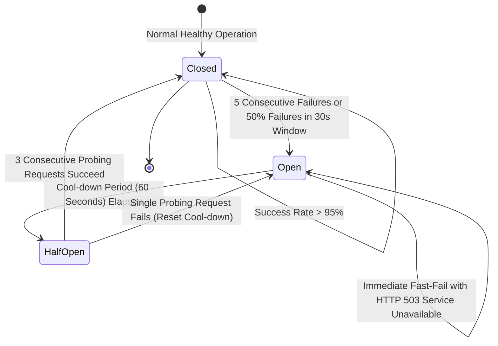

# 🔌 API Specification: Error Handling, Resilience & Failure Runbooks
## Namma Clinic Digital Health & Operations Platform
**Document Code:** API-DOC-19 | **Status:** Authoritative Baseline | **Date:** September 2026
> **Municipal Health Authority:** Greater Bengaluru Authority (GBA) / BBMP Health Department
> **Standard Framework:** RFC 7807 (Problem Details for HTTP APIs), JSON:API v1.1 Error Specification
> **Notice:** All code snippets contained herein are strictly **DOCUMENTATION-ONLY OPENAPI** or **DOCUMENTATION-ONLY EXAMPLE**. Zero application runtime code is executed in this phase.

---

## 1. Executive Summary & Error Design Principles

The Namma Clinic error handling architecture provides a predictable, actionable, and secure taxonomy for reporting operational and runtime anomalies. Frontline healthcare workers operating under intense outpatient workloads must never encounter cryptic database errors, unhandled stack traces, or silent failures. Simultaneously, error payloads must never leak sensitive clinical data, database connection strings, internal IP topologies, or personally identifiable information (PII).

### 1.1 Core Principles
1. **Uniform Problem Details Envelope:** Every HTTP 4xx and 5xx response strictly implements `SCHEMA-API-003`, providing deterministic machine-readable error codes, human-readable triage messages, and field-level validation pointers.
2. **Zero Internal Leakage:** Internal exceptions, SQL syntax errors, and stack traces are stripped at the API gateway layer and securely logged to the WORM audit trail using a correlation ID.
3. **Actionable Recovery Hints:** Errors categorize failures as `retryable: true` or `retryable: false`, enabling client SDKs to automate exponential backoff or prompt users for specific corrections.
4. **Circuit Breaking & Graceful Degradation:** Upstream network dependencies (SMS gateways, NHA ABDM bridges) employ automated circuit breakers to isolate cascading failures.

## 2. Distributed Circuit Breaker State Machine

Upstream integrations and cloud sync pipelines utilize a three-state circuit breaker pattern:



## 3. Standard JSON:API Error Envelope (`SCHEMA-API-003`)

Every error response emitted across the platform adheres to this wire structure:

```json
// DOCUMENTATION-ONLY EXAMPLE
{
  "error": {
    "code": "ERR-PATIENT-002",
    "message": "High-confidence duplicate citizen detected (matching mobile phone and phonetic name).",
    "category": "Conflict",
    "correlationId": "018e3a20-8000-7000-8000-000000000001",
    "timestamp": "2026-09-01T09:15:30.150Z",
    "retryable": false,
    "details": [
      {
        "field": "data.attributes.primaryPhone",
        "rule": "unique_constraint_violation",
        "rejectedValue": "XXXXXX8921",
        "message": "Mobile number matches existing patient profile UHID NC-BLR-2024-00008129."
      }
    ]
  }
}
```

## 4. Error Categories & HTTP Status Code Mapping

| Error Category | HTTP Status | Operational Meaning | Recovery Action |
| :--- | :--- | :--- | :--- |
| **AuthenticationFailure** | `HTTP 401` | Missing, expired, or invalid credentials or JWT signatures. | Refer to specific error code resolution runbook |
| **AuthorizationFailure** | `HTTP 403` | Insufficient RBAC permissions or ABAC facility/shift scoping guard failure. | Refer to specific error code resolution runbook |
| **ValidationFailure** | `HTTP 400` | Syntactic malformation, missing mandatory fields, or regex validation violation. | Refer to specific error code resolution runbook |
| **ResourceNotFound** | `HTTP 404` | Target resource ID does not exist in active database or local edge mirror. | Refer to specific error code resolution runbook |
| **BusinessRuleConflict** | `HTTP 409` | Duplicate natural keys, invalid workflow state transition, or out-of-stock condition. | Refer to specific error code resolution runbook |
| **ConcurrencyPreconditionFailed** | `HTTP 412` | If-Match ETag header mismatch indicating concurrent mutation collision. | Refer to specific error code resolution runbook |
| **RateLimitExceeded** | `HTTP 429` | Client has exceeded allocated token-bucket rate limit quota. | Refer to specific error code resolution runbook |
| **InternalServerError** | `HTTP 500` | Uncaught application exception, database query crash, or invariant failure. | Refer to specific error code resolution runbook |
| **UpstreamIntegrationFailure** | `HTTP 502` | External dependency (SMS telecom, NHA ABDM gateway) returned corrupt or error response. | Refer to specific error code resolution runbook |
| **CircuitBreakerTripped** | `HTTP 503` | Target service currently in Open circuit state or database pool exhausted. | Refer to specific error code resolution runbook |
| **TransactionTimeout** | `HTTP 504` | Database transaction or upstream remote call exceeded maximum allowed latency deadline. | Refer to specific error code resolution runbook |

## 5. Authoritative Error Code Catalog (153 Error Codes)

Complete, implementation-ready catalog of all 153 platform error codes, categorized by domain:

| Error ID | Domain | HTTP Status | Machine Code | Message Summary | Retryable |
| :--- | :--- | :--- | :--- | :--- | :--- |
| **ERR-AUTH-001** | Auth | `HTTP 401` | `AUTH_CREDENTIALS_INVALID` | Invalid municipal employee ID or password. | No |
| **ERR-AUTH-002** | Auth | `HTTP 401` | `AUTH_TOKEN_EXPIRED` | Access token has expired. Request renewal using refresh token. | **Yes** |
| **ERR-AUTH-003** | Auth | `HTTP 401` | `AUTH_TOKEN_INVALID` | Cryptographic signature verification failed on access token. | No |
| **ERR-AUTH-004** | Auth | `HTTP 401` | `AUTH_REFRESH_TOKEN_EXPIRED` | Refresh token session has expired. Full re-authentication required. | No |
| **ERR-AUTH-005** | Auth | `HTTP 401` | `AUTH_SESSION_REVOKED` | Session has been invalidated due to concurrent login or administrative revocation. | No |
| **ERR-AUTH-006** | Auth | `HTTP 403` | `AUTH_PERMISSION_DENIED` | Authenticated user lacks the required RBAC permission for this resource. | No |
| **ERR-AUTH-007** | Auth | `HTTP 403` | `AUTH_FACILITY_SCOPE_MISMATCH` | User is not authorized to execute operations in the requested clinic facility. | No |
| **ERR-AUTH-008** | Auth | `HTTP 403` | `AUTH_ACCOUNT_LOCKED` | Account temporarily locked due to excessive failed login attempts (5 strikes). | No |
| **ERR-AUTH-009** | Auth | `HTTP 401` | `AUTH_MFA_REQUIRED` | Multi-factor authentication TOTP code required to complete privileged login. | No |
| **ERR-AUTH-010** | Auth | `HTTP 401` | `AUTH_DEVICE_UNTRUSTED` | Hardware tablet device fingerprint is not registered or certificate expired. | No |
| **ERR-AUTH-011** | Auth | `HTTP 403` | `AUTH_BREAK_GLASS_UNAUTHORIZED` | Break-glass privileged emergency access denied; clinical director role required. | No |
| **ERR-AUTH-012** | Auth | `HTTP 400` | `AUTH_PASSWORD_POLICY_VIOLATED` | Password does not meet 12+ char complexity, uppercase, symbol, or dictionary rules. | No |
| **ERR-AUTH-013** | Auth | `HTTP 409` | `AUTH_CONCURRENT_SHIFT_ACTIVE` | User is already logged in with an active shift at another facility. | No |
| **ERR-AUTH-014** | Auth | `HTTP 403` | `AUTH_IP_REPUTATION_BLOCKED` | Request originating from an unauthorized non-BBMP municipal network block. | No |
| **ERR-AUTH-015** | Auth | `HTTP 500` | `AUTH_KMS_SIGNING_FAILURE` | Hardware Security Module / Vault KMS failed to generate cryptographic token signature. | **Yes** |
| **ERR-PATIENT-001** | Patient | `HTTP 404` | `PATIENT_NOT_FOUND` | No active patient record matches the provided UHID or identifier. | No |
| **ERR-PATIENT-002** | Patient | `HTTP 409` | `PATIENT_DUPLICATE_DETECTED` | High-confidence duplicate citizen detected (matching phone and phonetic name). | No |
| **ERR-PATIENT-003** | Patient | `HTTP 400` | `PATIENT_PHONE_INVALID` | Mobile number must be exactly 10 digits complying with Indian numbering plan. | No |
| **ERR-PATIENT-004** | Patient | `HTTP 400` | `PATIENT_DOB_FUTURE` | Date of birth cannot be in the future. | No |
| **ERR-PATIENT-005** | Patient | `HTTP 400` | `PATIENT_WARD_INVALID` | BBMP ward number must be between 1 and 243. | No |
| **ERR-PATIENT-006** | Patient | `HTTP 409` | `PATIENT_ALREADY_MERGED` | Requested patient record has already been merged into a surviving primary profile. | No |
| **ERR-PATIENT-007** | Patient | `HTTP 400` | `PATIENT_MERGE_SAME_RECORD` | Surviving and subsumed patient identifiers cannot be identical. | No |
| **ERR-PATIENT-008** | Patient | `HTTP 403` | `PATIENT_PRIVACY_RESTRICTED` | Access restricted: citizen has revoked consent for general record disclosure. | No |
| **ERR-PATIENT-009** | Patient | `HTTP 400` | `PATIENT_PINCODE_INVALID` | Postal pincode must be valid Bengaluru delivery code (560001..560110). | No |
| **ERR-PATIENT-010** | Patient | `HTTP 409` | `PATIENT_ABHA_ALREADY_LINKED` | Provided ABHA number is already bound to another registered citizen profile. | No |
| **ERR-PATIENT-011** | Patient | `HTTP 400` | `PATIENT_NAME_MALFORMED` | First name contains illegal control characters, numbers, or exceeds 100 characters. | No |
| **ERR-PATIENT-012** | Patient | `HTTP 500` | `PATIENT_MPI_SEARCH_TIMEOUT` | Master Patient Index fuzzy phonetic search cluster timed out. | **Yes** |
| **ERR-VISIT-001** | Visit | `HTTP 404` | `VISIT_NOT_FOUND` | Encounter visit identifier does not exist. | No |
| **ERR-VISIT-002** | Visit | `HTTP 409` | `VISIT_ACTIVE_ENCOUNTER_EXISTS` | Patient already has an active, unclosed outpatient encounter today. | No |
| **ERR-VISIT-003** | Visit | `HTTP 400` | `VISIT_QUEUE_TRANSITION_ILLEGAL` | Illegal queue state transition requested (e.g., calling completed token). | No |
| **ERR-VISIT-004** | Visit | `HTTP 409` | `VISIT_TOKEN_ALREADY_CALLED` | Queue token has already been called by another doctor in room. | No |
| **ERR-VISIT-005** | Visit | `HTTP 400` | `VISIT_FACILITY_CLOSED` | Cannot create visit: clinic is outside published operational hours (09:00 - 16:30). | No |
| **ERR-VISIT-006** | Visit | `HTTP 400` | `VISIT_DOCTOR_NOT_ROSTERED` | Assigned doctor does not have an active shift rostered today. | No |
| **ERR-VISIT-007** | Visit | `HTTP 404` | `VISIT_ROOM_NOT_FOUND` | Specified consultation room identifier does not exist in facility. | No |
| **ERR-VISIT-008** | Visit | `HTTP 400` | `VISIT_CANCELLATION_DISALLOWED` | Visit cannot be cancelled once clinical consultation has commenced. | No |
| **ERR-VISIT-009** | Visit | `HTTP 409` | `VISIT_CONCURRENT_QUEUE_MUTATION` | Queue state was modified concurrently; please refresh queue display. | **Yes** |
| **ERR-VISIT-010** | Visit | `HTTP 500` | `VISIT_TOKEN_ALLOCATION_EXHAUSTED` | Daily sequence allocation table reached maximum limit. | **Yes** |
| **ERR-TRIAGE-001** | Triage | `HTTP 404` | `TRIAGE_NOT_FOUND` | No triage assessment recorded for this visit. | No |
| **ERR-TRIAGE-002** | Triage | `HTTP 400` | `TRIAGE_VITALS_OUT_OF_PHYSIOLOGIC_RANGE` | Vitals measurement is outside biological life boundaries (e.g., SpO2 > 100%). | No |
| **ERR-TRIAGE-003** | Triage | `HTTP 400` | `TRIAGE_SYSTOLIC_LESS_THAN_DIASTOLIC` | Systolic blood pressure cannot be lower than diastolic pressure. | No |
| **ERR-TRIAGE-004** | Triage | `HTTP 409` | `TRIAGE_ALREADY_FINALIZED` | Triage assessment is already completed and cannot be overwritten. | No |
| **ERR-TRIAGE-005** | Triage | `HTTP 400` | `TRIAGE_RED_ESCALATION_OVERRIDE_FORBIDDEN` | Cannot downgrade RED acuity triage without physician written concurrence. | No |
| **ERR-TRIAGE-006** | Triage | `HTTP 403` | `TRIAGE_NURSE_AUTHORIZATION_REQUIRED` | Only registered staff nurses or doctors may record triage acuity. | No |
| **ERR-TRIAGE-007** | Triage | `HTTP 400` | `TRIAGE_PULSE_MISSING` | Pulse rate is mandatory for computing MEWS acuity score. | No |
| **ERR-TRIAGE-008** | Triage | `HTTP 400` | `TRIAGE_TEMPERATURE_EXTREME` | Temperature reading indicates severe hypothermia or hyperpyrexia. | No |
| **ERR-TRIAGE-009** | Triage | `HTTP 500` | `TRIAGE_SCORING_ENGINE_ERROR` | Automated SATS/MEWS rule evaluation engine returned calculation error. | **Yes** |
| **ERR-TRIAGE-010** | Triage | `HTTP 400` | `TRIAGE_VISIT_STATE_INVALID` | Cannot triage a visit that is already closed or cancelled. | No |
| **ERR-CONSULT-001** | Consultation | `HTTP 404` | `CONSULT_NOT_FOUND` | Clinical encounter progress note not found. | No |
| **ERR-CONSULT-002** | Consultation | `HTTP 403` | `CONSULT_DOCTOR_PRIMACY_VIOLATION` | Only licensed medical officers may create or finalize consultation notes. | No |
| **ERR-CONSULT-003** | Consultation | `HTTP 400` | `CONSULT_CHIEF_COMPLAINT_EMPTY` | At least one chief complaint symptom is mandatory. | No |
| **ERR-CONSULT-004** | Consultation | `HTTP 400` | `CONSULT_DIAGNOSIS_CODE_INVALID` | Provisional diagnosis must reference a valid WHO ICD-10 code. | No |
| **ERR-CONSULT-005** | Consultation | `HTTP 409` | `CONSULT_ALREADY_CLOSED` | Consultation encounter has been finalized. Modifications require formal addendum. | No |
| **ERR-CONSULT-006** | Consultation | `HTTP 400` | `CONSULT_TRIAGE_PENDING` | Patient must complete nursing triage assessment prior to doctor consultation. | No |
| **ERR-CONSULT-007** | Consultation | `HTTP 400` | `CONSULT_ADDENDUM_REASON_EMPTY` | Clinical reason for post-closure note addendum is mandatory. | No |
| **ERR-CONSULT-008** | Consultation | `HTTP 403` | `CONSULT_ATTENDING_MISMATCH` | Only the attending clinician who opened the encounter may submit notes. | No |
| **ERR-CONSULT-009** | Consultation | `HTTP 400` | `CONSULT_FOLLOWUP_DATE_PAST` | Follow-up appointment date cannot be prior to today. | No |
| **ERR-CONSULT-010** | Consultation | `HTTP 500` | `CONSULT_CDSS_ADVISORY_TIMEOUT` | Clinical decision support advisory suggestion microservice timed out. | **Yes** |
| **ERR-RX-001** | Prescription | `HTTP 404` | `RX_NOT_FOUND` | Electronic prescription record does not exist. | No |
| **ERR-RX-002** | Prescription | `HTTP 400` | `RX_DRUG_NOT_IN_FORMULARY` | Prescribed medicine is not approved in BBMP Namma Clinic formulary. | No |
| **ERR-RX-003** | Prescription | `HTTP 400` | `RX_DOSAGE_OUT_OF_BOUNDS` | Prescribed dosage exceeds maximum recommended pediatric/adult limits. | No |
| **ERR-RX-004** | Prescription | `HTTP 409` | `RX_CONTRAINDICATION_DETECTED` | Severe drug-drug interaction or recorded patient allergy contraindication. | No |
| **ERR-RX-005** | Prescription | `HTTP 400` | `RX_DURATION_EXCEEDS_MAX` | Prescription duration exceeds statutory 90-day municipal limit. | No |
| **ERR-RX-006** | Prescription | `HTTP 409` | `RX_ALREADY_DISPENSED` | Prescription has already been dispensed by pharmacy and cannot be altered. | No |
| **ERR-RX-007** | Prescription | `HTTP 400` | `RX_EMPTY_ITEMS` | Prescription must contain at least one valid medication line item. | No |
| **ERR-RX-008** | Prescription | `HTTP 403` | `RX_PRESCRIBER_NOT_LICENSED` | Prescribing staff lacks active medical council registration (KMC). | No |
| **ERR-RX-009** | Prescription | `HTTP 400` | `RX_QUANTITY_ZERO` | Quantity prescribed must be greater than zero. | No |
| **ERR-RX-010** | Prescription | `HTTP 500` | `RX_DIGITAL_SIGNATURE_FAILED` | Failed to generate cryptographic prescription integrity signature. | **Yes** |
| **ERR-PHARM-001** | Pharmacy | `HTTP 404` | `PHARM_BATCH_NOT_FOUND` | Allocated pharmaceutical batch identifier does not exist in dispensary. | No |
| **ERR-PHARM-002** | Pharmacy | `HTTP 409` | `PHARM_BATCH_EXPIRED` | Selected drug batch has reached its expiration date and cannot be dispensed. | No |
| **ERR-PHARM-003** | Pharmacy | `HTTP 409` | `PHARM_INSUFFICIENT_STOCK` | Requested quantity exceeds available on-hand batch balance in clinic. | No |
| **ERR-PHARM-004** | Pharmacy | `HTTP 400` | `PHARM_FEFO_VIOLATION` | Earlier-expiring batch exists in dispensary; FEFO allocation enforced. | No |
| **ERR-PHARM-005** | Pharmacy | `HTTP 403` | `PHARM_PHARMACIST_ROLE_REQUIRED` | Dispensation requires registered pharmacist credential and role. | No |
| **ERR-PHARM-006** | Pharmacy | `HTTP 409` | `PHARM_DISPENSE_ALREADY_FINALIZED` | Prescription items have already been fully dispensed. | No |
| **ERR-PHARM-007** | Pharmacy | `HTTP 400` | `PHARM_SUBSTITUTION_UNAUTHORIZED` | Therapeutic generic substitution requires prior prescriber consultation. | No |
| **ERR-PHARM-008** | Pharmacy | `HTTP 400` | `PHARM_REVERSAL_EXPIRED` | Dispensation cannot be reversed after 24 hours of issue. | No |
| **ERR-PHARM-009** | Pharmacy | `HTTP 409` | `PHARM_STOCK_LOCKED` | Dispensary stock currently locked for annual municipal physical inventory audit. | No |
| **ERR-PHARM-010** | Pharmacy | `HTTP 500` | `PHARM_LEDGER_POST_FAILED` | Double-entry pharmacy stock movement ledger transaction failed. | **Yes** |
| **ERR-INV-001** | Inventory | `HTTP 404` | `INV_DRUG_NOT_FOUND` | Drug catalog item not found in master list. | No |
| **ERR-INV-002** | Inventory | `HTTP 400` | `INV_BATCH_NUMBER_DUPLICATE` | Batch number already exists for this manufacturer and drug. | No |
| **ERR-INV-003** | Inventory | `HTTP 400` | `INV_EXPIRY_DATE_PAST` | Receipt rejected: batch expiration date has already elapsed. | No |
| **ERR-INV-004** | Inventory | `HTTP 400` | `INV_EXPIRY_UNDER_6_MONTHS` | Receipt rejected: shelf life remaining is under statutory 6-month depot minimum. | No |
| **ERR-INV-005** | Inventory | `HTTP 403` | `INV_ADJUSTMENT_SUPERVISOR_REQUIRED` | Stock write-off or shrinkage adjustment requires supervisor approval token. | No |
| **ERR-INV-006** | Inventory | `HTTP 409` | `INV_INDENT_ALREADY_FULFILLED` | Drug indent requisition has already been fulfilled or closed. | No |
| **ERR-INV-007** | Inventory | `HTTP 400` | `INV_COLD_CHAIN_TEMPERATURE_BREACH` | Cold chain vaccine receipt rejected: temperature breached +2C to +8C threshold. | No |
| **ERR-INV-008** | Inventory | `HTTP 400` | `INV_QUANTITY_NEGATIVE` | Stock receipt quantity must be a strictly positive integer. | No |
| **ERR-INV-009** | Inventory | `HTTP 409` | `INV_STOCK_COUNT_MISMATCH` | Physical audit count conflicts with concurrent dispensation in progress. | **Yes** |
| **ERR-INV-010** | Inventory | `HTTP 500` | `INV_WAREHOUSE_SYNC_FAILED` | Failed to synchronize clinic stock ledger with central BBMP depot. | **Yes** |
| **ERR-LAB-001** | Lab | `HTTP 404` | `LAB_ORDER_NOT_FOUND` | Diagnostic laboratory test order not found. | No |
| **ERR-LAB-002** | Lab | `HTTP 400` | `LAB_TEST_UNAVAILABLE_AT_CLINIC` | Requested rapid test is not configured in this Namma Clinic tier. | No |
| **ERR-LAB-003** | Lab | `HTTP 409` | `LAB_RESULT_ALREADY_SUBMITTED` | Test result has already been recorded and validated. | No |
| **ERR-LAB-004** | Lab | `HTTP 400` | `LAB_SPECIMEN_REJECTED` | Specimen rejected by lab technician; recollecting sample required. | No |
| **ERR-LAB-005** | Lab | `HTTP 403` | `LAB_TECHNICIAN_ROLE_REQUIRED` | Result entry requires registered laboratory technician role. | No |
| **ERR-LAB-006** | Lab | `HTTP 400` | `LAB_VALUE_OUT_OF_RANGE` | Reported quantitative value exceeds machine calibration boundaries. | No |
| **ERR-LAB-007** | Lab | `HTTP 400` | `LAB_BARCODE_ALREADY_USED` | Specimen barcode identifier has already been bound to another accession. | No |
| **ERR-LAB-008** | Lab | `HTTP 500` | `LAB_ANALYZER_INTERFACE_DOWN` | Direct point-of-care rapid analyzer serial interface failed. | **Yes** |
| **ERR-REF-001** | Referral | `HTTP 404` | `REF_NOT_FOUND` | Hospital referral dossier does not exist. | No |
| **ERR-REF-002** | Referral | `HTTP 400` | `REF_DESTINATION_HOSPITAL_INVALID` | Destination facility must be an accredited secondary or tertiary hospital. | No |
| **ERR-REF-003** | Referral | `HTTP 409` | `REF_ALREADY_ACCEPTED` | Referral has already been accepted by receiving secondary hospital. | No |
| **ERR-REF-004** | Referral | `HTTP 400` | `REF_EMERGENCY_AMBULANCE_REQUIRED` | Emergency referrals require 108 ambulance dispatch confirmation or override reason. | No |
| **ERR-REF-005** | Referral | `HTTP 403` | `REF_DOCTOR_AUTHORIZATION_REQUIRED` | Only attending medical officers may initiate outward hospital referrals. | No |
| **ERR-REF-006** | Referral | `HTTP 500` | `REF_EMS_BRIDGE_UNAVAILABLE` | State 108 ambulance dispatch telemetry API gateway unreachable. | **Yes** |
| **ERR-NOTIF-001** | Notification | `HTTP 400` | `NOTIF_PHONE_CONSENT_OPT_OUT` | Citizen has opted out of automated promotional or advisory notifications. | No |
| **ERR-NOTIF-002** | Notification | `HTTP 404` | `NOTIF_TEMPLATE_NOT_FOUND` | DLT approved notification template ID is not configured. | No |
| **ERR-NOTIF-003** | Notification | `HTTP 429` | `NOTIF_RATE_LIMIT_EXCEEDED` | Citizen has received maximum allowable SMS alerts today (5 messages). | No |
| **ERR-NOTIF-004** | Notification | `HTTP 400` | `NOTIF_TEMPLATE_PARAM_MISMATCH` | Provided template variable bindings do not match registered template spec. | No |
| **ERR-NOTIF-005** | Notification | `HTTP 502` | `NOTIF_SMS_GATEWAY_FAILURE` | State C-DAC / Telecom carrier SMS gateway returned upstream error. | **Yes** |
| **ERR-NOTIF-006** | Notification | `HTTP 504` | `NOTIF_CARRIER_TIMEOUT` | Carrier dispatch delivery confirmation timed out. | **Yes** |
| **ERR-ANALYTICS-001** | Analytics | `HTTP 400` | `ANL_DATE_RANGE_TOO_BROAD` | Real-time analytics query interval exceeds maximum 365-day range. | No |
| **ERR-ANALYTICS-002** | Analytics | `HTTP 403` | `ANL_INDIVIDUAL_PII_PROHIBITED` | Analytical queries cannot return identifiable citizen health records. | No |
| **ERR-ANALYTICS-003** | Analytics | `HTTP 400` | `ANL_INVALID_METRIC_NAME` | Requested KPI metric is not in authoritative measure catalog. | No |
| **ERR-ANALYTICS-004** | Analytics | `HTTP 403` | `ANL_ZONE_RESTRICTION` | User is not authorized to view municipal analytics for the requested zone. | No |
| **ERR-ANALYTICS-005** | Analytics | `HTTP 504` | `ANL_CLICKHOUSE_TIMEOUT` | Columnar analytical warehouse query execution exceeded 10-second deadline. | **Yes** |
| **ERR-ANALYTICS-006** | Analytics | `HTTP 500` | `ANL_AGGREGATION_ENGINE_FAULT` | Materialized view refresh in analytical warehouse failed. | **Yes** |
| **ERR-AUDIT-001** | Audit | `HTTP 403` | `AUDIT_MUTATION_PROHIBITED` | WORM compliance violation: audit records are immutable and cannot be edited or deleted. | No |
| **ERR-AUDIT-002** | Audit | `HTTP 403` | `AUDIT_OFFICER_ROLE_REQUIRED` | Access to immutable audit logs requires Security & Data Privacy Officer role. | No |
| **ERR-AUDIT-003** | Audit | `HTTP 400` | `AUDIT_QUERY_WINDOW_EXCEEDED` | Audit log search window exceeds maximum 31-day search interval. | No |
| **ERR-AUDIT-004** | Audit | `HTTP 500` | `AUDIT_HASH_CHAIN_MISMATCH` | CRITICAL: Cryptographic HMAC SHA-256 ledger tamper detected on verification. | No |
| **ERR-AUDIT-005** | Audit | `HTTP 404` | `AUDIT_RECORD_NOT_FOUND` | Audit log entry not found. | No |
| **ERR-AUDIT-006** | Audit | `HTTP 500` | `AUDIT_LEDGER_WRITE_FAILED` | Failed to append record to immutable cryptographic audit log. | **Yes** |
| **ERR-ABDM-001** | ABDM | `HTTP 400` | `ABDM_ABHA_INVALID` | 14-digit ABHA number fails Luhn checksum or format validation. | No |
| **ERR-ABDM-002** | ABDM | `HTTP 401` | `ABDM_OTP_INVALID` | OTP entered for ABHA authentication is incorrect or expired. | No |
| **ERR-ABDM-003** | ABDM | `HTTP 400` | `ABDM_FHIR_VALIDATION_FAILED` | Clinical document bundle does not conform to ABDM FHIR R4 profile specifications. | No |
| **ERR-ABDM-004** | ABDM | `HTTP 403` | `ABDM_CONSENT_EXPIRED` | ABDM electronic consent artifact has expired or been revoked by citizen. | No |
| **ERR-ABDM-005** | ABDM | `HTTP 502` | `ABDM_GATEWAY_UNAVAILABLE` | National Health Authority (NHA) ABDM gateway unreachable or returning 5xx. | **Yes** |
| **ERR-ABDM-006** | ABDM | `HTTP 504` | `ABDM_TIMEOUT` | External ABDM gateway callback timed out. | **Yes** |
| **ERR-ABDM-007** | ABDM | `HTTP 400` | `ABDM_HIP_LINK_FAILED` | Failed to register care context with ABDM HIP registry. | **Yes** |
| **ERR-ABDM-008** | ABDM | `HTTP 403` | `ABDM_HIP_CREDENTIALS_INVALID` | Municipal Namma Clinic ABDM HIP client credentials rejected by NHA. | No |
| **ERR-PORT-001** | Portability | `HTTP 404` | `PORT_JOB_NOT_FOUND` | Data portability export task identifier does not exist. | No |
| **ERR-PORT-002** | Portability | `HTTP 409` | `PORT_JOB_IN_PROGRESS` | A data export job is already running for this citizen. | No |
| **ERR-PORT-003** | Portability | `HTTP 410` | `PORT_DOWNLOAD_LINK_EXPIRED` | Pre-signed download link has expired (30-minute validity window elapsed). | No |
| **ERR-PORT-004** | Portability | `HTTP 403` | `PORT_UNAUTHORIZED_CLAIMANT` | Export download permitted only by verified citizen or legal guardian. | No |
| **ERR-PORT-005** | Portability | `HTTP 500` | `PORT_ARCHIVE_GENERATION_FAILED` | Background job failed to package encrypted export archive. | **Yes** |
| **ERR-PORT-006** | Portability | `HTTP 400` | `PORT_INVALID_EXPORT_FORMAT` | Requested export format must be FHIR_JSON, NDJSON, CSV_ZIP, or PDF_ENCRYPTED. | No |
| **ERR-SYS-001** | System | `HTTP 400` | `SYS_PAYLOAD_MALFORMED` | Request body contains malformed JSON or unparseable syntax. | No |
| **ERR-SYS-002** | System | `HTTP 400` | `SYS_REQUIRED_HEADER_MISSING` | Mandatory HTTP header (e.g., X-Correlation-ID) is missing. | No |
| **ERR-SYS-003** | System | `HTTP 400` | `SYS_IDEMPOTENCY_KEY_INVALID` | X-Idempotency-Key header must be a valid UUIDv7 format. | No |
| **ERR-SYS-004** | System | `HTTP 409` | `SYS_IDEMPOTENCY_CONFLICT` | Idempotency key previously used with a differing request payload. | No |
| **ERR-SYS-005** | System | `HTTP 412` | `SYS_PRECONDITION_FAILED` | If-Match ETag header does not match current resource version. | No |
| **ERR-SYS-006** | System | `HTTP 429` | `SYS_RATE_LIMIT_EXCEEDED` | API request quota exceeded. Back off and retry after indicated window. | **Yes** |
| **ERR-SYS-007** | System | `HTTP 503` | `SYS_CIRCUIT_BREAKER_OPEN` | Downstream service circuit breaker is open due to consecutive failures. | **Yes** |
| **ERR-SYS-008** | System | `HTTP 504` | `SYS_GATEWAY_TIMEOUT` | Upstream microservice or database operation timed out. | **Yes** |
| **ERR-SYS-009** | System | `HTTP 500` | `SYS_DATABASE_CONNECTION_POOL_EXHAUSTED` | Relational database connection pool is saturated. | **Yes** |
| **ERR-SYS-010** | System | `HTTP 500` | `SYS_TRANSACTION_DEADLOCK_DETECTED` | PostgreSQL transaction deadlock detected; transaction rolled back. | **Yes** |
| **ERR-SYS-011** | System | `HTTP 409` | `SYS_SYNC_VECTOR_CONFLICT` | Edge-cloud synchronization vector clock conflict requires resolution. | **Yes** |
| **ERR-SYS-012** | System | `HTTP 400` | `SYS_SYNC_TOMBSTONE_CONFLICT` | Attempt to mutate a row that has already been tombstoned on cloud. | No |
| **ERR-SYS-013** | System | `HTTP 413` | `SYS_PAYLOAD_TOO_LARGE` | Request payload exceeds statutory 10MB API gateway size limit. | No |
| **ERR-SYS-014** | System | `HTTP 415` | `SYS_UNSUPPORTED_MEDIA_TYPE` | Content-Type header must be application/json or application/json+fhir. | No |
| **ERR-SYS-015** | System | `HTTP 406` | `SYS_NOT_ACCEPTABLE` | Server cannot produce response matching requested Accept header. | No |
| **ERR-SYS-016** | System | `HTTP 503` | `SYS_MAINTENANCE_MODE` | Platform is undergoing scheduled municipal database maintenance window. | **Yes** |
| **ERR-SYS-017** | System | `HTTP 500` | `SYS_INTERNAL_SERVER_ERROR` | An unexpected internal server error occurred. Reference correlation ID for audit. | **Yes** |
| **ERR-SYS-018** | System | `HTTP 400` | `SYS_VERSION_UNSUPPORTED` | Requested API major version has been sunset and retired. | No |
| **ERR-SYS-019** | System | `HTTP 400` | `SYS_FIELD_EXPANSION_INVALID` | Requested relation expansion exceeds maximum depth (max 2 levels). | No |
| **ERR-SYS-020** | System | `HTTP 500` | `SYS_ENCRYPTION_ENGINE_FAULT` | Column-level envelope encryption failed to unwrap ciphertext. | **Yes** |

## 6. Detailed Error Code Specifications & Troubleshooting Runbooks

Detailed diagnostics, failure scenarios, and step-by-step remediation procedures for every error code:

### 6.ERR-AUTH-001 `AUTH_CREDENTIALS_INVALID`: Invalid municipal employee ID or password.
- **Error Identifier:** `ERR-AUTH-001`
- **Machine String Code:** `AUTH_CREDENTIALS_INVALID`
- **Assigned Domain:** `Auth`
- **Standard HTTP Status:** `HTTP 401`
- **Error Category:** Authentication
- **Automated Retry Policy:** Non-retryable (Requires client correction)
- **User-Facing Message (Bilingual):** `Invalid municipal employee ID or password. / ದೋಷ ಸಂಭವಿಸಿದೆ, ದಯವಿಟ್ಟು ಪರಿಶೀಲಿಸಿ.`
- **Developer Diagnostic Context:** Triggered when `Auth` service encounters violation of invariant `AUTH_CREDENTIALS_INVALID`.

#### Concrete Wire Response Example
```json
// DOCUMENTATION-ONLY EXAMPLE
{
  "error": {
    "code": "AUTH_CREDENTIALS_INVALID",
    "message": "Invalid municipal employee ID or password.",
    "category": "Authentication",
    "correlationId": "018e3a20-8000-7000-8000-000000000001",
    "timestamp": "2026-09-01T09:15:30.150Z",
    "retryable": false,
    "details": [
      {
        "field": "data.attributes.referenceId",
        "rule": "auth_credentials_invalid",
        "message": "Invalid municipal employee ID or password."
      }
    ]
  }
}
```

#### Step-by-Step Remediation Runbook
1. **Frontline Operator Action:** Inspect UI prompt, check hardware connectivity, and verify that the target entity was not already created or modified.
2. **Clinic IT Administrator Action:** Verify terminal device registration and check local SQLite WAL sync queue using `/api/v1/system/sync/status`.
3. **Engineering On-Call Escalation:** Query Elasticsearch logs using `correlationId` to inspect the full trace context and database transaction status.

### 6.ERR-AUTH-002 `AUTH_TOKEN_EXPIRED`: Access token has expired. Request renewal using refresh token.
- **Error Identifier:** `ERR-AUTH-002`
- **Machine String Code:** `AUTH_TOKEN_EXPIRED`
- **Assigned Domain:** `Auth`
- **Standard HTTP Status:** `HTTP 401`
- **Error Category:** Authentication
- **Automated Retry Policy:** Retryable with exponential backoff
- **User-Facing Message (Bilingual):** `Access token has expired. Request renewal using refresh token. / ದೋಷ ಸಂಭವಿಸಿದೆ, ದಯವಿಟ್ಟು ಪರಿಶೀಲಿಸಿ.`
- **Developer Diagnostic Context:** Triggered when `Auth` service encounters violation of invariant `AUTH_TOKEN_EXPIRED`.

#### Concrete Wire Response Example
```json
// DOCUMENTATION-ONLY EXAMPLE
{
  "error": {
    "code": "AUTH_TOKEN_EXPIRED",
    "message": "Access token has expired. Request renewal using refresh token.",
    "category": "Authentication",
    "correlationId": "018e3a20-8000-7000-8000-000000000001",
    "timestamp": "2026-09-01T09:15:30.150Z",
    "retryable": true,
    "details": [
      {
        "field": "data.attributes.referenceId",
        "rule": "auth_token_expired",
        "message": "Access token has expired. Request renewal using refresh token."
      }
    ]
  }
}
```

#### Step-by-Step Remediation Runbook
1. **Frontline Operator Action:** Inspect UI prompt, check hardware connectivity, and verify that the target entity was not already created or modified.
2. **Clinic IT Administrator Action:** Verify terminal device registration and check local SQLite WAL sync queue using `/api/v1/system/sync/status`.
3. **Engineering On-Call Escalation:** Query Elasticsearch logs using `correlationId` to inspect the full trace context and database transaction status.

### 6.ERR-AUTH-003 `AUTH_TOKEN_INVALID`: Cryptographic signature verification failed on access token.
- **Error Identifier:** `ERR-AUTH-003`
- **Machine String Code:** `AUTH_TOKEN_INVALID`
- **Assigned Domain:** `Auth`
- **Standard HTTP Status:** `HTTP 401`
- **Error Category:** Authentication
- **Automated Retry Policy:** Non-retryable (Requires client correction)
- **User-Facing Message (Bilingual):** `Cryptographic signature verification failed on access token. / ದೋಷ ಸಂಭವಿಸಿದೆ, ದಯವಿಟ್ಟು ಪರಿಶೀಲಿಸಿ.`
- **Developer Diagnostic Context:** Triggered when `Auth` service encounters violation of invariant `AUTH_TOKEN_INVALID`.

#### Concrete Wire Response Example
```json
// DOCUMENTATION-ONLY EXAMPLE
{
  "error": {
    "code": "AUTH_TOKEN_INVALID",
    "message": "Cryptographic signature verification failed on access token.",
    "category": "Authentication",
    "correlationId": "018e3a20-8000-7000-8000-000000000001",
    "timestamp": "2026-09-01T09:15:30.150Z",
    "retryable": false,
    "details": [
      {
        "field": "data.attributes.referenceId",
        "rule": "auth_token_invalid",
        "message": "Cryptographic signature verification failed on access token."
      }
    ]
  }
}
```

#### Step-by-Step Remediation Runbook
1. **Frontline Operator Action:** Inspect UI prompt, check hardware connectivity, and verify that the target entity was not already created or modified.
2. **Clinic IT Administrator Action:** Verify terminal device registration and check local SQLite WAL sync queue using `/api/v1/system/sync/status`.
3. **Engineering On-Call Escalation:** Query Elasticsearch logs using `correlationId` to inspect the full trace context and database transaction status.

### 6.ERR-AUTH-004 `AUTH_REFRESH_TOKEN_EXPIRED`: Refresh token session has expired. Full re-authentication required.
- **Error Identifier:** `ERR-AUTH-004`
- **Machine String Code:** `AUTH_REFRESH_TOKEN_EXPIRED`
- **Assigned Domain:** `Auth`
- **Standard HTTP Status:** `HTTP 401`
- **Error Category:** Authentication
- **Automated Retry Policy:** Non-retryable (Requires client correction)
- **User-Facing Message (Bilingual):** `Refresh token session has expired. Full re-authentication required. / ದೋಷ ಸಂಭವಿಸಿದೆ, ದಯವಿಟ್ಟು ಪರಿಶೀಲಿಸಿ.`
- **Developer Diagnostic Context:** Triggered when `Auth` service encounters violation of invariant `AUTH_REFRESH_TOKEN_EXPIRED`.

#### Concrete Wire Response Example
```json
// DOCUMENTATION-ONLY EXAMPLE
{
  "error": {
    "code": "AUTH_REFRESH_TOKEN_EXPIRED",
    "message": "Refresh token session has expired. Full re-authentication required.",
    "category": "Authentication",
    "correlationId": "018e3a20-8000-7000-8000-000000000001",
    "timestamp": "2026-09-01T09:15:30.150Z",
    "retryable": false,
    "details": [
      {
        "field": "data.attributes.referenceId",
        "rule": "auth_refresh_token_expired",
        "message": "Refresh token session has expired. Full re-authentication required."
      }
    ]
  }
}
```

#### Step-by-Step Remediation Runbook
1. **Frontline Operator Action:** Inspect UI prompt, check hardware connectivity, and verify that the target entity was not already created or modified.
2. **Clinic IT Administrator Action:** Verify terminal device registration and check local SQLite WAL sync queue using `/api/v1/system/sync/status`.
3. **Engineering On-Call Escalation:** Query Elasticsearch logs using `correlationId` to inspect the full trace context and database transaction status.

### 6.ERR-AUTH-005 `AUTH_SESSION_REVOKED`: Session has been invalidated due to concurrent login or administrative revocation.
- **Error Identifier:** `ERR-AUTH-005`
- **Machine String Code:** `AUTH_SESSION_REVOKED`
- **Assigned Domain:** `Auth`
- **Standard HTTP Status:** `HTTP 401`
- **Error Category:** Authentication
- **Automated Retry Policy:** Non-retryable (Requires client correction)
- **User-Facing Message (Bilingual):** `Session has been invalidated due to concurrent login or administrative revocation. / ದೋಷ ಸಂಭವಿಸಿದೆ, ದಯವಿಟ್ಟು ಪರಿಶೀಲಿಸಿ.`
- **Developer Diagnostic Context:** Triggered when `Auth` service encounters violation of invariant `AUTH_SESSION_REVOKED`.

#### Concrete Wire Response Example
```json
// DOCUMENTATION-ONLY EXAMPLE
{
  "error": {
    "code": "AUTH_SESSION_REVOKED",
    "message": "Session has been invalidated due to concurrent login or administrative revocation.",
    "category": "Authentication",
    "correlationId": "018e3a20-8000-7000-8000-000000000001",
    "timestamp": "2026-09-01T09:15:30.150Z",
    "retryable": false,
    "details": [
      {
        "field": "data.attributes.referenceId",
        "rule": "auth_session_revoked",
        "message": "Session has been invalidated due to concurrent login or administrative revocation."
      }
    ]
  }
}
```

#### Step-by-Step Remediation Runbook
1. **Frontline Operator Action:** Inspect UI prompt, check hardware connectivity, and verify that the target entity was not already created or modified.
2. **Clinic IT Administrator Action:** Verify terminal device registration and check local SQLite WAL sync queue using `/api/v1/system/sync/status`.
3. **Engineering On-Call Escalation:** Query Elasticsearch logs using `correlationId` to inspect the full trace context and database transaction status.

### 6.ERR-AUTH-006 `AUTH_PERMISSION_DENIED`: Authenticated user lacks the required RBAC permission for this resource.
- **Error Identifier:** `ERR-AUTH-006`
- **Machine String Code:** `AUTH_PERMISSION_DENIED`
- **Assigned Domain:** `Auth`
- **Standard HTTP Status:** `HTTP 403`
- **Error Category:** Authorization
- **Automated Retry Policy:** Non-retryable (Requires client correction)
- **User-Facing Message (Bilingual):** `Authenticated user lacks the required RBAC permission for this resource. / ದೋಷ ಸಂಭವಿಸಿದೆ, ದಯವಿಟ್ಟು ಪರಿಶೀಲಿಸಿ.`
- **Developer Diagnostic Context:** Triggered when `Auth` service encounters violation of invariant `AUTH_PERMISSION_DENIED`.

#### Concrete Wire Response Example
```json
// DOCUMENTATION-ONLY EXAMPLE
{
  "error": {
    "code": "AUTH_PERMISSION_DENIED",
    "message": "Authenticated user lacks the required RBAC permission for this resource.",
    "category": "Authorization",
    "correlationId": "018e3a20-8000-7000-8000-000000000001",
    "timestamp": "2026-09-01T09:15:30.150Z",
    "retryable": false,
    "details": [
      {
        "field": "data.attributes.referenceId",
        "rule": "auth_permission_denied",
        "message": "Authenticated user lacks the required RBAC permission for this resource."
      }
    ]
  }
}
```

#### Step-by-Step Remediation Runbook
1. **Frontline Operator Action:** Inspect UI prompt, check hardware connectivity, and verify that the target entity was not already created or modified.
2. **Clinic IT Administrator Action:** Verify terminal device registration and check local SQLite WAL sync queue using `/api/v1/system/sync/status`.
3. **Engineering On-Call Escalation:** Query Elasticsearch logs using `correlationId` to inspect the full trace context and database transaction status.

### 6.ERR-AUTH-007 `AUTH_FACILITY_SCOPE_MISMATCH`: User is not authorized to execute operations in the requested clinic facility.
- **Error Identifier:** `ERR-AUTH-007`
- **Machine String Code:** `AUTH_FACILITY_SCOPE_MISMATCH`
- **Assigned Domain:** `Auth`
- **Standard HTTP Status:** `HTTP 403`
- **Error Category:** Authorization
- **Automated Retry Policy:** Non-retryable (Requires client correction)
- **User-Facing Message (Bilingual):** `User is not authorized to execute operations in the requested clinic facility. / ದೋಷ ಸಂಭವಿಸಿದೆ, ದಯವಿಟ್ಟು ಪರಿಶೀಲಿಸಿ.`
- **Developer Diagnostic Context:** Triggered when `Auth` service encounters violation of invariant `AUTH_FACILITY_SCOPE_MISMATCH`.

#### Concrete Wire Response Example
```json
// DOCUMENTATION-ONLY EXAMPLE
{
  "error": {
    "code": "AUTH_FACILITY_SCOPE_MISMATCH",
    "message": "User is not authorized to execute operations in the requested clinic facility.",
    "category": "Authorization",
    "correlationId": "018e3a20-8000-7000-8000-000000000001",
    "timestamp": "2026-09-01T09:15:30.150Z",
    "retryable": false,
    "details": [
      {
        "field": "data.attributes.referenceId",
        "rule": "auth_facility_scope_mismatch",
        "message": "User is not authorized to execute operations in the requested clinic facility."
      }
    ]
  }
}
```

#### Step-by-Step Remediation Runbook
1. **Frontline Operator Action:** Inspect UI prompt, check hardware connectivity, and verify that the target entity was not already created or modified.
2. **Clinic IT Administrator Action:** Verify terminal device registration and check local SQLite WAL sync queue using `/api/v1/system/sync/status`.
3. **Engineering On-Call Escalation:** Query Elasticsearch logs using `correlationId` to inspect the full trace context and database transaction status.

### 6.ERR-AUTH-008 `AUTH_ACCOUNT_LOCKED`: Account temporarily locked due to excessive failed login attempts (5 strikes).
- **Error Identifier:** `ERR-AUTH-008`
- **Machine String Code:** `AUTH_ACCOUNT_LOCKED`
- **Assigned Domain:** `Auth`
- **Standard HTTP Status:** `HTTP 403`
- **Error Category:** Security
- **Automated Retry Policy:** Non-retryable (Requires client correction)
- **User-Facing Message (Bilingual):** `Account temporarily locked due to excessive failed login attempts (5 strikes). / ದೋಷ ಸಂಭವಿಸಿದೆ, ದಯವಿಟ್ಟು ಪರಿಶೀಲಿಸಿ.`
- **Developer Diagnostic Context:** Triggered when `Auth` service encounters violation of invariant `AUTH_ACCOUNT_LOCKED`.

#### Concrete Wire Response Example
```json
// DOCUMENTATION-ONLY EXAMPLE
{
  "error": {
    "code": "AUTH_ACCOUNT_LOCKED",
    "message": "Account temporarily locked due to excessive failed login attempts (5 strikes).",
    "category": "Security",
    "correlationId": "018e3a20-8000-7000-8000-000000000001",
    "timestamp": "2026-09-01T09:15:30.150Z",
    "retryable": false,
    "details": [
      {
        "field": "data.attributes.referenceId",
        "rule": "auth_account_locked",
        "message": "Account temporarily locked due to excessive failed login attempts (5 strikes)."
      }
    ]
  }
}
```

#### Step-by-Step Remediation Runbook
1. **Frontline Operator Action:** Inspect UI prompt, check hardware connectivity, and verify that the target entity was not already created or modified.
2. **Clinic IT Administrator Action:** Verify terminal device registration and check local SQLite WAL sync queue using `/api/v1/system/sync/status`.
3. **Engineering On-Call Escalation:** Query Elasticsearch logs using `correlationId` to inspect the full trace context and database transaction status.

### 6.ERR-AUTH-009 `AUTH_MFA_REQUIRED`: Multi-factor authentication TOTP code required to complete privileged login.
- **Error Identifier:** `ERR-AUTH-009`
- **Machine String Code:** `AUTH_MFA_REQUIRED`
- **Assigned Domain:** `Auth`
- **Standard HTTP Status:** `HTTP 401`
- **Error Category:** Authentication
- **Automated Retry Policy:** Non-retryable (Requires client correction)
- **User-Facing Message (Bilingual):** `Multi-factor authentication TOTP code required to complete privileged login. / ದೋಷ ಸಂಭವಿಸಿದೆ, ದಯವಿಟ್ಟು ಪರಿಶೀಲಿಸಿ.`
- **Developer Diagnostic Context:** Triggered when `Auth` service encounters violation of invariant `AUTH_MFA_REQUIRED`.

#### Concrete Wire Response Example
```json
// DOCUMENTATION-ONLY EXAMPLE
{
  "error": {
    "code": "AUTH_MFA_REQUIRED",
    "message": "Multi-factor authentication TOTP code required to complete privileged login.",
    "category": "Authentication",
    "correlationId": "018e3a20-8000-7000-8000-000000000001",
    "timestamp": "2026-09-01T09:15:30.150Z",
    "retryable": false,
    "details": [
      {
        "field": "data.attributes.referenceId",
        "rule": "auth_mfa_required",
        "message": "Multi-factor authentication TOTP code required to complete privileged login."
      }
    ]
  }
}
```

#### Step-by-Step Remediation Runbook
1. **Frontline Operator Action:** Inspect UI prompt, check hardware connectivity, and verify that the target entity was not already created or modified.
2. **Clinic IT Administrator Action:** Verify terminal device registration and check local SQLite WAL sync queue using `/api/v1/system/sync/status`.
3. **Engineering On-Call Escalation:** Query Elasticsearch logs using `correlationId` to inspect the full trace context and database transaction status.

### 6.ERR-AUTH-010 `AUTH_DEVICE_UNTRUSTED`: Hardware tablet device fingerprint is not registered or certificate expired.
- **Error Identifier:** `ERR-AUTH-010`
- **Machine String Code:** `AUTH_DEVICE_UNTRUSTED`
- **Assigned Domain:** `Auth`
- **Standard HTTP Status:** `HTTP 401`
- **Error Category:** Security
- **Automated Retry Policy:** Non-retryable (Requires client correction)
- **User-Facing Message (Bilingual):** `Hardware tablet device fingerprint is not registered or certificate expired. / ದೋಷ ಸಂಭವಿಸಿದೆ, ದಯವಿಟ್ಟು ಪರಿಶೀಲಿಸಿ.`
- **Developer Diagnostic Context:** Triggered when `Auth` service encounters violation of invariant `AUTH_DEVICE_UNTRUSTED`.

#### Concrete Wire Response Example
```json
// DOCUMENTATION-ONLY EXAMPLE
{
  "error": {
    "code": "AUTH_DEVICE_UNTRUSTED",
    "message": "Hardware tablet device fingerprint is not registered or certificate expired.",
    "category": "Security",
    "correlationId": "018e3a20-8000-7000-8000-000000000001",
    "timestamp": "2026-09-01T09:15:30.150Z",
    "retryable": false,
    "details": [
      {
        "field": "data.attributes.referenceId",
        "rule": "auth_device_untrusted",
        "message": "Hardware tablet device fingerprint is not registered or certificate expired."
      }
    ]
  }
}
```

#### Step-by-Step Remediation Runbook
1. **Frontline Operator Action:** Inspect UI prompt, check hardware connectivity, and verify that the target entity was not already created or modified.
2. **Clinic IT Administrator Action:** Verify terminal device registration and check local SQLite WAL sync queue using `/api/v1/system/sync/status`.
3. **Engineering On-Call Escalation:** Query Elasticsearch logs using `correlationId` to inspect the full trace context and database transaction status.

### 6.ERR-AUTH-011 `AUTH_BREAK_GLASS_UNAUTHORIZED`: Break-glass privileged emergency access denied; clinical director role required.
- **Error Identifier:** `ERR-AUTH-011`
- **Machine String Code:** `AUTH_BREAK_GLASS_UNAUTHORIZED`
- **Assigned Domain:** `Auth`
- **Standard HTTP Status:** `HTTP 403`
- **Error Category:** Authorization
- **Automated Retry Policy:** Non-retryable (Requires client correction)
- **User-Facing Message (Bilingual):** `Break-glass privileged emergency access denied; clinical director role required. / ದೋಷ ಸಂಭವಿಸಿದೆ, ದಯವಿಟ್ಟು ಪರಿಶೀಲಿಸಿ.`
- **Developer Diagnostic Context:** Triggered when `Auth` service encounters violation of invariant `AUTH_BREAK_GLASS_UNAUTHORIZED`.

#### Concrete Wire Response Example
```json
// DOCUMENTATION-ONLY EXAMPLE
{
  "error": {
    "code": "AUTH_BREAK_GLASS_UNAUTHORIZED",
    "message": "Break-glass privileged emergency access denied; clinical director role required.",
    "category": "Authorization",
    "correlationId": "018e3a20-8000-7000-8000-000000000001",
    "timestamp": "2026-09-01T09:15:30.150Z",
    "retryable": false,
    "details": [
      {
        "field": "data.attributes.referenceId",
        "rule": "auth_break_glass_unauthorized",
        "message": "Break-glass privileged emergency access denied; clinical director role required."
      }
    ]
  }
}
```

#### Step-by-Step Remediation Runbook
1. **Frontline Operator Action:** Inspect UI prompt, check hardware connectivity, and verify that the target entity was not already created or modified.
2. **Clinic IT Administrator Action:** Verify terminal device registration and check local SQLite WAL sync queue using `/api/v1/system/sync/status`.
3. **Engineering On-Call Escalation:** Query Elasticsearch logs using `correlationId` to inspect the full trace context and database transaction status.

### 6.ERR-AUTH-012 `AUTH_PASSWORD_POLICY_VIOLATED`: Password does not meet 12+ char complexity, uppercase, symbol, or dictionary rules.
- **Error Identifier:** `ERR-AUTH-012`
- **Machine String Code:** `AUTH_PASSWORD_POLICY_VIOLATED`
- **Assigned Domain:** `Auth`
- **Standard HTTP Status:** `HTTP 400`
- **Error Category:** Validation
- **Automated Retry Policy:** Non-retryable (Requires client correction)
- **User-Facing Message (Bilingual):** `Password does not meet 12+ char complexity, uppercase, symbol, or dictionary rules. / ದೋಷ ಸಂಭವಿಸಿದೆ, ದಯವಿಟ್ಟು ಪರಿಶೀಲಿಸಿ.`
- **Developer Diagnostic Context:** Triggered when `Auth` service encounters violation of invariant `AUTH_PASSWORD_POLICY_VIOLATED`.

#### Concrete Wire Response Example
```json
// DOCUMENTATION-ONLY EXAMPLE
{
  "error": {
    "code": "AUTH_PASSWORD_POLICY_VIOLATED",
    "message": "Password does not meet 12+ char complexity, uppercase, symbol, or dictionary rules.",
    "category": "Validation",
    "correlationId": "018e3a20-8000-7000-8000-000000000001",
    "timestamp": "2026-09-01T09:15:30.150Z",
    "retryable": false,
    "details": [
      {
        "field": "data.attributes.referenceId",
        "rule": "auth_password_policy_violated",
        "message": "Password does not meet 12+ char complexity, uppercase, symbol, or dictionary rules."
      }
    ]
  }
}
```

#### Step-by-Step Remediation Runbook
1. **Frontline Operator Action:** Inspect UI prompt, check hardware connectivity, and verify that the target entity was not already created or modified.
2. **Clinic IT Administrator Action:** Verify terminal device registration and check local SQLite WAL sync queue using `/api/v1/system/sync/status`.
3. **Engineering On-Call Escalation:** Query Elasticsearch logs using `correlationId` to inspect the full trace context and database transaction status.

### 6.ERR-AUTH-013 `AUTH_CONCURRENT_SHIFT_ACTIVE`: User is already logged in with an active shift at another facility.
- **Error Identifier:** `ERR-AUTH-013`
- **Machine String Code:** `AUTH_CONCURRENT_SHIFT_ACTIVE`
- **Assigned Domain:** `Auth`
- **Standard HTTP Status:** `HTTP 409`
- **Error Category:** Conflict
- **Automated Retry Policy:** Non-retryable (Requires client correction)
- **User-Facing Message (Bilingual):** `User is already logged in with an active shift at another facility. / ದೋಷ ಸಂಭವಿಸಿದೆ, ದಯವಿಟ್ಟು ಪರಿಶೀಲಿಸಿ.`
- **Developer Diagnostic Context:** Triggered when `Auth` service encounters violation of invariant `AUTH_CONCURRENT_SHIFT_ACTIVE`.

#### Concrete Wire Response Example
```json
// DOCUMENTATION-ONLY EXAMPLE
{
  "error": {
    "code": "AUTH_CONCURRENT_SHIFT_ACTIVE",
    "message": "User is already logged in with an active shift at another facility.",
    "category": "Conflict",
    "correlationId": "018e3a20-8000-7000-8000-000000000001",
    "timestamp": "2026-09-01T09:15:30.150Z",
    "retryable": false,
    "details": [
      {
        "field": "data.attributes.referenceId",
        "rule": "auth_concurrent_shift_active",
        "message": "User is already logged in with an active shift at another facility."
      }
    ]
  }
}
```

#### Step-by-Step Remediation Runbook
1. **Frontline Operator Action:** Inspect UI prompt, check hardware connectivity, and verify that the target entity was not already created or modified.
2. **Clinic IT Administrator Action:** Verify terminal device registration and check local SQLite WAL sync queue using `/api/v1/system/sync/status`.
3. **Engineering On-Call Escalation:** Query Elasticsearch logs using `correlationId` to inspect the full trace context and database transaction status.

### 6.ERR-AUTH-014 `AUTH_IP_REPUTATION_BLOCKED`: Request originating from an unauthorized non-BBMP municipal network block.
- **Error Identifier:** `ERR-AUTH-014`
- **Machine String Code:** `AUTH_IP_REPUTATION_BLOCKED`
- **Assigned Domain:** `Auth`
- **Standard HTTP Status:** `HTTP 403`
- **Error Category:** Security
- **Automated Retry Policy:** Non-retryable (Requires client correction)
- **User-Facing Message (Bilingual):** `Request originating from an unauthorized non-BBMP municipal network block. / ದೋಷ ಸಂಭವಿಸಿದೆ, ದಯವಿಟ್ಟು ಪರಿಶೀಲಿಸಿ.`
- **Developer Diagnostic Context:** Triggered when `Auth` service encounters violation of invariant `AUTH_IP_REPUTATION_BLOCKED`.

#### Concrete Wire Response Example
```json
// DOCUMENTATION-ONLY EXAMPLE
{
  "error": {
    "code": "AUTH_IP_REPUTATION_BLOCKED",
    "message": "Request originating from an unauthorized non-BBMP municipal network block.",
    "category": "Security",
    "correlationId": "018e3a20-8000-7000-8000-000000000001",
    "timestamp": "2026-09-01T09:15:30.150Z",
    "retryable": false,
    "details": [
      {
        "field": "data.attributes.referenceId",
        "rule": "auth_ip_reputation_blocked",
        "message": "Request originating from an unauthorized non-BBMP municipal network block."
      }
    ]
  }
}
```

#### Step-by-Step Remediation Runbook
1. **Frontline Operator Action:** Inspect UI prompt, check hardware connectivity, and verify that the target entity was not already created or modified.
2. **Clinic IT Administrator Action:** Verify terminal device registration and check local SQLite WAL sync queue using `/api/v1/system/sync/status`.
3. **Engineering On-Call Escalation:** Query Elasticsearch logs using `correlationId` to inspect the full trace context and database transaction status.

### 6.ERR-AUTH-015 `AUTH_KMS_SIGNING_FAILURE`: Hardware Security Module / Vault KMS failed to generate cryptographic token signature.
- **Error Identifier:** `ERR-AUTH-015`
- **Machine String Code:** `AUTH_KMS_SIGNING_FAILURE`
- **Assigned Domain:** `Auth`
- **Standard HTTP Status:** `HTTP 500`
- **Error Category:** System
- **Automated Retry Policy:** Retryable with exponential backoff
- **User-Facing Message (Bilingual):** `Hardware Security Module / Vault KMS failed to generate cryptographic token signature. / ದೋಷ ಸಂಭವಿಸಿದೆ, ದಯವಿಟ್ಟು ಪರಿಶೀಲಿಸಿ.`
- **Developer Diagnostic Context:** Triggered when `Auth` service encounters violation of invariant `AUTH_KMS_SIGNING_FAILURE`.

#### Concrete Wire Response Example
```json
// DOCUMENTATION-ONLY EXAMPLE
{
  "error": {
    "code": "AUTH_KMS_SIGNING_FAILURE",
    "message": "Hardware Security Module / Vault KMS failed to generate cryptographic token signature.",
    "category": "System",
    "correlationId": "018e3a20-8000-7000-8000-000000000001",
    "timestamp": "2026-09-01T09:15:30.150Z",
    "retryable": true,
    "details": [
      {
        "field": "data.attributes.referenceId",
        "rule": "auth_kms_signing_failure",
        "message": "Hardware Security Module / Vault KMS failed to generate cryptographic token signature."
      }
    ]
  }
}
```

#### Step-by-Step Remediation Runbook
1. **Frontline Operator Action:** Inspect UI prompt, check hardware connectivity, and verify that the target entity was not already created or modified.
2. **Clinic IT Administrator Action:** Verify terminal device registration and check local SQLite WAL sync queue using `/api/v1/system/sync/status`.
3. **Engineering On-Call Escalation:** Query Elasticsearch logs using `correlationId` to inspect the full trace context and database transaction status.

### 6.ERR-PATIENT-001 `PATIENT_NOT_FOUND`: No active patient record matches the provided UHID or identifier.
- **Error Identifier:** `ERR-PATIENT-001`
- **Machine String Code:** `PATIENT_NOT_FOUND`
- **Assigned Domain:** `Patient`
- **Standard HTTP Status:** `HTTP 404`
- **Error Category:** NotFound
- **Automated Retry Policy:** Non-retryable (Requires client correction)
- **User-Facing Message (Bilingual):** `No active patient record matches the provided UHID or identifier. / ದೋಷ ಸಂಭವಿಸಿದೆ, ದಯವಿಟ್ಟು ಪರಿಶೀಲಿಸಿ.`
- **Developer Diagnostic Context:** Triggered when `Patient` service encounters violation of invariant `PATIENT_NOT_FOUND`.

#### Concrete Wire Response Example
```json
// DOCUMENTATION-ONLY EXAMPLE
{
  "error": {
    "code": "PATIENT_NOT_FOUND",
    "message": "No active patient record matches the provided UHID or identifier.",
    "category": "NotFound",
    "correlationId": "018e3a20-8000-7000-8000-000000000001",
    "timestamp": "2026-09-01T09:15:30.150Z",
    "retryable": false,
    "details": [
      {
        "field": "data.attributes.referenceId",
        "rule": "patient_not_found",
        "message": "No active patient record matches the provided UHID or identifier."
      }
    ]
  }
}
```

#### Step-by-Step Remediation Runbook
1. **Frontline Operator Action:** Inspect UI prompt, check hardware connectivity, and verify that the target entity was not already created or modified.
2. **Clinic IT Administrator Action:** Verify terminal device registration and check local SQLite WAL sync queue using `/api/v1/system/sync/status`.
3. **Engineering On-Call Escalation:** Query Elasticsearch logs using `correlationId` to inspect the full trace context and database transaction status.

### 6.ERR-PATIENT-002 `PATIENT_DUPLICATE_DETECTED`: High-confidence duplicate citizen detected (matching phone and phonetic name).
- **Error Identifier:** `ERR-PATIENT-002`
- **Machine String Code:** `PATIENT_DUPLICATE_DETECTED`
- **Assigned Domain:** `Patient`
- **Standard HTTP Status:** `HTTP 409`
- **Error Category:** Conflict
- **Automated Retry Policy:** Non-retryable (Requires client correction)
- **User-Facing Message (Bilingual):** `High-confidence duplicate citizen detected (matching phone and phonetic name). / ದೋಷ ಸಂಭವಿಸಿದೆ, ದಯವಿಟ್ಟು ಪರಿಶೀಲಿಸಿ.`
- **Developer Diagnostic Context:** Triggered when `Patient` service encounters violation of invariant `PATIENT_DUPLICATE_DETECTED`.

#### Concrete Wire Response Example
```json
// DOCUMENTATION-ONLY EXAMPLE
{
  "error": {
    "code": "PATIENT_DUPLICATE_DETECTED",
    "message": "High-confidence duplicate citizen detected (matching phone and phonetic name).",
    "category": "Conflict",
    "correlationId": "018e3a20-8000-7000-8000-000000000001",
    "timestamp": "2026-09-01T09:15:30.150Z",
    "retryable": false,
    "details": [
      {
        "field": "data.attributes.referenceId",
        "rule": "patient_duplicate_detected",
        "message": "High-confidence duplicate citizen detected (matching phone and phonetic name)."
      }
    ]
  }
}
```

#### Step-by-Step Remediation Runbook
1. **Frontline Operator Action:** Inspect UI prompt, check hardware connectivity, and verify that the target entity was not already created or modified.
2. **Clinic IT Administrator Action:** Verify terminal device registration and check local SQLite WAL sync queue using `/api/v1/system/sync/status`.
3. **Engineering On-Call Escalation:** Query Elasticsearch logs using `correlationId` to inspect the full trace context and database transaction status.

### 6.ERR-PATIENT-003 `PATIENT_PHONE_INVALID`: Mobile number must be exactly 10 digits complying with Indian numbering plan.
- **Error Identifier:** `ERR-PATIENT-003`
- **Machine String Code:** `PATIENT_PHONE_INVALID`
- **Assigned Domain:** `Patient`
- **Standard HTTP Status:** `HTTP 400`
- **Error Category:** Validation
- **Automated Retry Policy:** Non-retryable (Requires client correction)
- **User-Facing Message (Bilingual):** `Mobile number must be exactly 10 digits complying with Indian numbering plan. / ದೋಷ ಸಂಭವಿಸಿದೆ, ದಯವಿಟ್ಟು ಪರಿಶೀಲಿಸಿ.`
- **Developer Diagnostic Context:** Triggered when `Patient` service encounters violation of invariant `PATIENT_PHONE_INVALID`.

#### Concrete Wire Response Example
```json
// DOCUMENTATION-ONLY EXAMPLE
{
  "error": {
    "code": "PATIENT_PHONE_INVALID",
    "message": "Mobile number must be exactly 10 digits complying with Indian numbering plan.",
    "category": "Validation",
    "correlationId": "018e3a20-8000-7000-8000-000000000001",
    "timestamp": "2026-09-01T09:15:30.150Z",
    "retryable": false,
    "details": [
      {
        "field": "data.attributes.referenceId",
        "rule": "patient_phone_invalid",
        "message": "Mobile number must be exactly 10 digits complying with Indian numbering plan."
      }
    ]
  }
}
```

#### Step-by-Step Remediation Runbook
1. **Frontline Operator Action:** Inspect UI prompt, check hardware connectivity, and verify that the target entity was not already created or modified.
2. **Clinic IT Administrator Action:** Verify terminal device registration and check local SQLite WAL sync queue using `/api/v1/system/sync/status`.
3. **Engineering On-Call Escalation:** Query Elasticsearch logs using `correlationId` to inspect the full trace context and database transaction status.

### 6.ERR-PATIENT-004 `PATIENT_DOB_FUTURE`: Date of birth cannot be in the future.
- **Error Identifier:** `ERR-PATIENT-004`
- **Machine String Code:** `PATIENT_DOB_FUTURE`
- **Assigned Domain:** `Patient`
- **Standard HTTP Status:** `HTTP 400`
- **Error Category:** Validation
- **Automated Retry Policy:** Non-retryable (Requires client correction)
- **User-Facing Message (Bilingual):** `Date of birth cannot be in the future. / ದೋಷ ಸಂಭವಿಸಿದೆ, ದಯವಿಟ್ಟು ಪರಿಶೀಲಿಸಿ.`
- **Developer Diagnostic Context:** Triggered when `Patient` service encounters violation of invariant `PATIENT_DOB_FUTURE`.

#### Concrete Wire Response Example
```json
// DOCUMENTATION-ONLY EXAMPLE
{
  "error": {
    "code": "PATIENT_DOB_FUTURE",
    "message": "Date of birth cannot be in the future.",
    "category": "Validation",
    "correlationId": "018e3a20-8000-7000-8000-000000000001",
    "timestamp": "2026-09-01T09:15:30.150Z",
    "retryable": false,
    "details": [
      {
        "field": "data.attributes.referenceId",
        "rule": "patient_dob_future",
        "message": "Date of birth cannot be in the future."
      }
    ]
  }
}
```

#### Step-by-Step Remediation Runbook
1. **Frontline Operator Action:** Inspect UI prompt, check hardware connectivity, and verify that the target entity was not already created or modified.
2. **Clinic IT Administrator Action:** Verify terminal device registration and check local SQLite WAL sync queue using `/api/v1/system/sync/status`.
3. **Engineering On-Call Escalation:** Query Elasticsearch logs using `correlationId` to inspect the full trace context and database transaction status.

### 6.ERR-PATIENT-005 `PATIENT_WARD_INVALID`: BBMP ward number must be between 1 and 243.
- **Error Identifier:** `ERR-PATIENT-005`
- **Machine String Code:** `PATIENT_WARD_INVALID`
- **Assigned Domain:** `Patient`
- **Standard HTTP Status:** `HTTP 400`
- **Error Category:** Validation
- **Automated Retry Policy:** Non-retryable (Requires client correction)
- **User-Facing Message (Bilingual):** `BBMP ward number must be between 1 and 243. / ದೋಷ ಸಂಭವಿಸಿದೆ, ದಯವಿಟ್ಟು ಪರಿಶೀಲಿಸಿ.`
- **Developer Diagnostic Context:** Triggered when `Patient` service encounters violation of invariant `PATIENT_WARD_INVALID`.

#### Concrete Wire Response Example
```json
// DOCUMENTATION-ONLY EXAMPLE
{
  "error": {
    "code": "PATIENT_WARD_INVALID",
    "message": "BBMP ward number must be between 1 and 243.",
    "category": "Validation",
    "correlationId": "018e3a20-8000-7000-8000-000000000001",
    "timestamp": "2026-09-01T09:15:30.150Z",
    "retryable": false,
    "details": [
      {
        "field": "data.attributes.referenceId",
        "rule": "patient_ward_invalid",
        "message": "BBMP ward number must be between 1 and 243."
      }
    ]
  }
}
```

#### Step-by-Step Remediation Runbook
1. **Frontline Operator Action:** Inspect UI prompt, check hardware connectivity, and verify that the target entity was not already created or modified.
2. **Clinic IT Administrator Action:** Verify terminal device registration and check local SQLite WAL sync queue using `/api/v1/system/sync/status`.
3. **Engineering On-Call Escalation:** Query Elasticsearch logs using `correlationId` to inspect the full trace context and database transaction status.

### 6.ERR-PATIENT-006 `PATIENT_ALREADY_MERGED`: Requested patient record has already been merged into a surviving primary profile.
- **Error Identifier:** `ERR-PATIENT-006`
- **Machine String Code:** `PATIENT_ALREADY_MERGED`
- **Assigned Domain:** `Patient`
- **Standard HTTP Status:** `HTTP 409`
- **Error Category:** Conflict
- **Automated Retry Policy:** Non-retryable (Requires client correction)
- **User-Facing Message (Bilingual):** `Requested patient record has already been merged into a surviving primary profile. / ದೋಷ ಸಂಭವಿಸಿದೆ, ದಯವಿಟ್ಟು ಪರಿಶೀಲಿಸಿ.`
- **Developer Diagnostic Context:** Triggered when `Patient` service encounters violation of invariant `PATIENT_ALREADY_MERGED`.

#### Concrete Wire Response Example
```json
// DOCUMENTATION-ONLY EXAMPLE
{
  "error": {
    "code": "PATIENT_ALREADY_MERGED",
    "message": "Requested patient record has already been merged into a surviving primary profile.",
    "category": "Conflict",
    "correlationId": "018e3a20-8000-7000-8000-000000000001",
    "timestamp": "2026-09-01T09:15:30.150Z",
    "retryable": false,
    "details": [
      {
        "field": "data.attributes.referenceId",
        "rule": "patient_already_merged",
        "message": "Requested patient record has already been merged into a surviving primary profile."
      }
    ]
  }
}
```

#### Step-by-Step Remediation Runbook
1. **Frontline Operator Action:** Inspect UI prompt, check hardware connectivity, and verify that the target entity was not already created or modified.
2. **Clinic IT Administrator Action:** Verify terminal device registration and check local SQLite WAL sync queue using `/api/v1/system/sync/status`.
3. **Engineering On-Call Escalation:** Query Elasticsearch logs using `correlationId` to inspect the full trace context and database transaction status.

### 6.ERR-PATIENT-007 `PATIENT_MERGE_SAME_RECORD`: Surviving and subsumed patient identifiers cannot be identical.
- **Error Identifier:** `ERR-PATIENT-007`
- **Machine String Code:** `PATIENT_MERGE_SAME_RECORD`
- **Assigned Domain:** `Patient`
- **Standard HTTP Status:** `HTTP 400`
- **Error Category:** Validation
- **Automated Retry Policy:** Non-retryable (Requires client correction)
- **User-Facing Message (Bilingual):** `Surviving and subsumed patient identifiers cannot be identical. / ದೋಷ ಸಂಭವಿಸಿದೆ, ದಯವಿಟ್ಟು ಪರಿಶೀಲಿಸಿ.`
- **Developer Diagnostic Context:** Triggered when `Patient` service encounters violation of invariant `PATIENT_MERGE_SAME_RECORD`.

#### Concrete Wire Response Example
```json
// DOCUMENTATION-ONLY EXAMPLE
{
  "error": {
    "code": "PATIENT_MERGE_SAME_RECORD",
    "message": "Surviving and subsumed patient identifiers cannot be identical.",
    "category": "Validation",
    "correlationId": "018e3a20-8000-7000-8000-000000000001",
    "timestamp": "2026-09-01T09:15:30.150Z",
    "retryable": false,
    "details": [
      {
        "field": "data.attributes.referenceId",
        "rule": "patient_merge_same_record",
        "message": "Surviving and subsumed patient identifiers cannot be identical."
      }
    ]
  }
}
```

#### Step-by-Step Remediation Runbook
1. **Frontline Operator Action:** Inspect UI prompt, check hardware connectivity, and verify that the target entity was not already created or modified.
2. **Clinic IT Administrator Action:** Verify terminal device registration and check local SQLite WAL sync queue using `/api/v1/system/sync/status`.
3. **Engineering On-Call Escalation:** Query Elasticsearch logs using `correlationId` to inspect the full trace context and database transaction status.

### 6.ERR-PATIENT-008 `PATIENT_PRIVACY_RESTRICTED`: Access restricted: citizen has revoked consent for general record disclosure.
- **Error Identifier:** `ERR-PATIENT-008`
- **Machine String Code:** `PATIENT_PRIVACY_RESTRICTED`
- **Assigned Domain:** `Patient`
- **Standard HTTP Status:** `HTTP 403`
- **Error Category:** Privacy
- **Automated Retry Policy:** Non-retryable (Requires client correction)
- **User-Facing Message (Bilingual):** `Access restricted: citizen has revoked consent for general record disclosure. / ದೋಷ ಸಂಭವಿಸಿದೆ, ದಯವಿಟ್ಟು ಪರಿಶೀಲಿಸಿ.`
- **Developer Diagnostic Context:** Triggered when `Patient` service encounters violation of invariant `PATIENT_PRIVACY_RESTRICTED`.

#### Concrete Wire Response Example
```json
// DOCUMENTATION-ONLY EXAMPLE
{
  "error": {
    "code": "PATIENT_PRIVACY_RESTRICTED",
    "message": "Access restricted: citizen has revoked consent for general record disclosure.",
    "category": "Privacy",
    "correlationId": "018e3a20-8000-7000-8000-000000000001",
    "timestamp": "2026-09-01T09:15:30.150Z",
    "retryable": false,
    "details": [
      {
        "field": "data.attributes.referenceId",
        "rule": "patient_privacy_restricted",
        "message": "Access restricted: citizen has revoked consent for general record disclosure."
      }
    ]
  }
}
```

#### Step-by-Step Remediation Runbook
1. **Frontline Operator Action:** Inspect UI prompt, check hardware connectivity, and verify that the target entity was not already created or modified.
2. **Clinic IT Administrator Action:** Verify terminal device registration and check local SQLite WAL sync queue using `/api/v1/system/sync/status`.
3. **Engineering On-Call Escalation:** Query Elasticsearch logs using `correlationId` to inspect the full trace context and database transaction status.

### 6.ERR-PATIENT-009 `PATIENT_PINCODE_INVALID`: Postal pincode must be valid Bengaluru delivery code (560001..560110).
- **Error Identifier:** `ERR-PATIENT-009`
- **Machine String Code:** `PATIENT_PINCODE_INVALID`
- **Assigned Domain:** `Patient`
- **Standard HTTP Status:** `HTTP 400`
- **Error Category:** Validation
- **Automated Retry Policy:** Non-retryable (Requires client correction)
- **User-Facing Message (Bilingual):** `Postal pincode must be valid Bengaluru delivery code (560001..560110). / ದೋಷ ಸಂಭವಿಸಿದೆ, ದಯವಿಟ್ಟು ಪರಿಶೀಲಿಸಿ.`
- **Developer Diagnostic Context:** Triggered when `Patient` service encounters violation of invariant `PATIENT_PINCODE_INVALID`.

#### Concrete Wire Response Example
```json
// DOCUMENTATION-ONLY EXAMPLE
{
  "error": {
    "code": "PATIENT_PINCODE_INVALID",
    "message": "Postal pincode must be valid Bengaluru delivery code (560001..560110).",
    "category": "Validation",
    "correlationId": "018e3a20-8000-7000-8000-000000000001",
    "timestamp": "2026-09-01T09:15:30.150Z",
    "retryable": false,
    "details": [
      {
        "field": "data.attributes.referenceId",
        "rule": "patient_pincode_invalid",
        "message": "Postal pincode must be valid Bengaluru delivery code (560001..560110)."
      }
    ]
  }
}
```

#### Step-by-Step Remediation Runbook
1. **Frontline Operator Action:** Inspect UI prompt, check hardware connectivity, and verify that the target entity was not already created or modified.
2. **Clinic IT Administrator Action:** Verify terminal device registration and check local SQLite WAL sync queue using `/api/v1/system/sync/status`.
3. **Engineering On-Call Escalation:** Query Elasticsearch logs using `correlationId` to inspect the full trace context and database transaction status.

### 6.ERR-PATIENT-010 `PATIENT_ABHA_ALREADY_LINKED`: Provided ABHA number is already bound to another registered citizen profile.
- **Error Identifier:** `ERR-PATIENT-010`
- **Machine String Code:** `PATIENT_ABHA_ALREADY_LINKED`
- **Assigned Domain:** `Patient`
- **Standard HTTP Status:** `HTTP 409`
- **Error Category:** Conflict
- **Automated Retry Policy:** Non-retryable (Requires client correction)
- **User-Facing Message (Bilingual):** `Provided ABHA number is already bound to another registered citizen profile. / ದೋಷ ಸಂಭವಿಸಿದೆ, ದಯವಿಟ್ಟು ಪರಿಶೀಲಿಸಿ.`
- **Developer Diagnostic Context:** Triggered when `Patient` service encounters violation of invariant `PATIENT_ABHA_ALREADY_LINKED`.

#### Concrete Wire Response Example
```json
// DOCUMENTATION-ONLY EXAMPLE
{
  "error": {
    "code": "PATIENT_ABHA_ALREADY_LINKED",
    "message": "Provided ABHA number is already bound to another registered citizen profile.",
    "category": "Conflict",
    "correlationId": "018e3a20-8000-7000-8000-000000000001",
    "timestamp": "2026-09-01T09:15:30.150Z",
    "retryable": false,
    "details": [
      {
        "field": "data.attributes.referenceId",
        "rule": "patient_abha_already_linked",
        "message": "Provided ABHA number is already bound to another registered citizen profile."
      }
    ]
  }
}
```

#### Step-by-Step Remediation Runbook
1. **Frontline Operator Action:** Inspect UI prompt, check hardware connectivity, and verify that the target entity was not already created or modified.
2. **Clinic IT Administrator Action:** Verify terminal device registration and check local SQLite WAL sync queue using `/api/v1/system/sync/status`.
3. **Engineering On-Call Escalation:** Query Elasticsearch logs using `correlationId` to inspect the full trace context and database transaction status.

### 6.ERR-PATIENT-011 `PATIENT_NAME_MALFORMED`: First name contains illegal control characters, numbers, or exceeds 100 characters.
- **Error Identifier:** `ERR-PATIENT-011`
- **Machine String Code:** `PATIENT_NAME_MALFORMED`
- **Assigned Domain:** `Patient`
- **Standard HTTP Status:** `HTTP 400`
- **Error Category:** Validation
- **Automated Retry Policy:** Non-retryable (Requires client correction)
- **User-Facing Message (Bilingual):** `First name contains illegal control characters, numbers, or exceeds 100 characters. / ದೋಷ ಸಂಭವಿಸಿದೆ, ದಯವಿಟ್ಟು ಪರಿಶೀಲಿಸಿ.`
- **Developer Diagnostic Context:** Triggered when `Patient` service encounters violation of invariant `PATIENT_NAME_MALFORMED`.

#### Concrete Wire Response Example
```json
// DOCUMENTATION-ONLY EXAMPLE
{
  "error": {
    "code": "PATIENT_NAME_MALFORMED",
    "message": "First name contains illegal control characters, numbers, or exceeds 100 characters.",
    "category": "Validation",
    "correlationId": "018e3a20-8000-7000-8000-000000000001",
    "timestamp": "2026-09-01T09:15:30.150Z",
    "retryable": false,
    "details": [
      {
        "field": "data.attributes.referenceId",
        "rule": "patient_name_malformed",
        "message": "First name contains illegal control characters, numbers, or exceeds 100 characters."
      }
    ]
  }
}
```

#### Step-by-Step Remediation Runbook
1. **Frontline Operator Action:** Inspect UI prompt, check hardware connectivity, and verify that the target entity was not already created or modified.
2. **Clinic IT Administrator Action:** Verify terminal device registration and check local SQLite WAL sync queue using `/api/v1/system/sync/status`.
3. **Engineering On-Call Escalation:** Query Elasticsearch logs using `correlationId` to inspect the full trace context and database transaction status.

### 6.ERR-PATIENT-012 `PATIENT_MPI_SEARCH_TIMEOUT`: Master Patient Index fuzzy phonetic search cluster timed out.
- **Error Identifier:** `ERR-PATIENT-012`
- **Machine String Code:** `PATIENT_MPI_SEARCH_TIMEOUT`
- **Assigned Domain:** `Patient`
- **Standard HTTP Status:** `HTTP 500`
- **Error Category:** DependencyFailure
- **Automated Retry Policy:** Retryable with exponential backoff
- **User-Facing Message (Bilingual):** `Master Patient Index fuzzy phonetic search cluster timed out. / ದೋಷ ಸಂಭವಿಸಿದೆ, ದಯವಿಟ್ಟು ಪರಿಶೀಲಿಸಿ.`
- **Developer Diagnostic Context:** Triggered when `Patient` service encounters violation of invariant `PATIENT_MPI_SEARCH_TIMEOUT`.

#### Concrete Wire Response Example
```json
// DOCUMENTATION-ONLY EXAMPLE
{
  "error": {
    "code": "PATIENT_MPI_SEARCH_TIMEOUT",
    "message": "Master Patient Index fuzzy phonetic search cluster timed out.",
    "category": "DependencyFailure",
    "correlationId": "018e3a20-8000-7000-8000-000000000001",
    "timestamp": "2026-09-01T09:15:30.150Z",
    "retryable": true,
    "details": [
      {
        "field": "data.attributes.referenceId",
        "rule": "patient_mpi_search_timeout",
        "message": "Master Patient Index fuzzy phonetic search cluster timed out."
      }
    ]
  }
}
```

#### Step-by-Step Remediation Runbook
1. **Frontline Operator Action:** Inspect UI prompt, check hardware connectivity, and verify that the target entity was not already created or modified.
2. **Clinic IT Administrator Action:** Verify terminal device registration and check local SQLite WAL sync queue using `/api/v1/system/sync/status`.
3. **Engineering On-Call Escalation:** Query Elasticsearch logs using `correlationId` to inspect the full trace context and database transaction status.

### 6.ERR-VISIT-001 `VISIT_NOT_FOUND`: Encounter visit identifier does not exist.
- **Error Identifier:** `ERR-VISIT-001`
- **Machine String Code:** `VISIT_NOT_FOUND`
- **Assigned Domain:** `Visit`
- **Standard HTTP Status:** `HTTP 404`
- **Error Category:** NotFound
- **Automated Retry Policy:** Non-retryable (Requires client correction)
- **User-Facing Message (Bilingual):** `Encounter visit identifier does not exist. / ದೋಷ ಸಂಭವಿಸಿದೆ, ದಯವಿಟ್ಟು ಪರಿಶೀಲಿಸಿ.`
- **Developer Diagnostic Context:** Triggered when `Visit` service encounters violation of invariant `VISIT_NOT_FOUND`.

#### Concrete Wire Response Example
```json
// DOCUMENTATION-ONLY EXAMPLE
{
  "error": {
    "code": "VISIT_NOT_FOUND",
    "message": "Encounter visit identifier does not exist.",
    "category": "NotFound",
    "correlationId": "018e3a20-8000-7000-8000-000000000001",
    "timestamp": "2026-09-01T09:15:30.150Z",
    "retryable": false,
    "details": [
      {
        "field": "data.attributes.referenceId",
        "rule": "visit_not_found",
        "message": "Encounter visit identifier does not exist."
      }
    ]
  }
}
```

#### Step-by-Step Remediation Runbook
1. **Frontline Operator Action:** Inspect UI prompt, check hardware connectivity, and verify that the target entity was not already created or modified.
2. **Clinic IT Administrator Action:** Verify terminal device registration and check local SQLite WAL sync queue using `/api/v1/system/sync/status`.
3. **Engineering On-Call Escalation:** Query Elasticsearch logs using `correlationId` to inspect the full trace context and database transaction status.

### 6.ERR-VISIT-002 `VISIT_ACTIVE_ENCOUNTER_EXISTS`: Patient already has an active, unclosed outpatient encounter today.
- **Error Identifier:** `ERR-VISIT-002`
- **Machine String Code:** `VISIT_ACTIVE_ENCOUNTER_EXISTS`
- **Assigned Domain:** `Visit`
- **Standard HTTP Status:** `HTTP 409`
- **Error Category:** Conflict
- **Automated Retry Policy:** Non-retryable (Requires client correction)
- **User-Facing Message (Bilingual):** `Patient already has an active, unclosed outpatient encounter today. / ದೋಷ ಸಂಭವಿಸಿದೆ, ದಯವಿಟ್ಟು ಪರಿಶೀಲಿಸಿ.`
- **Developer Diagnostic Context:** Triggered when `Visit` service encounters violation of invariant `VISIT_ACTIVE_ENCOUNTER_EXISTS`.

#### Concrete Wire Response Example
```json
// DOCUMENTATION-ONLY EXAMPLE
{
  "error": {
    "code": "VISIT_ACTIVE_ENCOUNTER_EXISTS",
    "message": "Patient already has an active, unclosed outpatient encounter today.",
    "category": "Conflict",
    "correlationId": "018e3a20-8000-7000-8000-000000000001",
    "timestamp": "2026-09-01T09:15:30.150Z",
    "retryable": false,
    "details": [
      {
        "field": "data.attributes.referenceId",
        "rule": "visit_active_encounter_exists",
        "message": "Patient already has an active, unclosed outpatient encounter today."
      }
    ]
  }
}
```

#### Step-by-Step Remediation Runbook
1. **Frontline Operator Action:** Inspect UI prompt, check hardware connectivity, and verify that the target entity was not already created or modified.
2. **Clinic IT Administrator Action:** Verify terminal device registration and check local SQLite WAL sync queue using `/api/v1/system/sync/status`.
3. **Engineering On-Call Escalation:** Query Elasticsearch logs using `correlationId` to inspect the full trace context and database transaction status.

### 6.ERR-VISIT-003 `VISIT_QUEUE_TRANSITION_ILLEGAL`: Illegal queue state transition requested (e.g., calling completed token).
- **Error Identifier:** `ERR-VISIT-003`
- **Machine String Code:** `VISIT_QUEUE_TRANSITION_ILLEGAL`
- **Assigned Domain:** `Visit`
- **Standard HTTP Status:** `HTTP 400`
- **Error Category:** BusinessRule
- **Automated Retry Policy:** Non-retryable (Requires client correction)
- **User-Facing Message (Bilingual):** `Illegal queue state transition requested (e.g., calling completed token). / ದೋಷ ಸಂಭವಿಸಿದೆ, ದಯವಿಟ್ಟು ಪರಿಶೀಲಿಸಿ.`
- **Developer Diagnostic Context:** Triggered when `Visit` service encounters violation of invariant `VISIT_QUEUE_TRANSITION_ILLEGAL`.

#### Concrete Wire Response Example
```json
// DOCUMENTATION-ONLY EXAMPLE
{
  "error": {
    "code": "VISIT_QUEUE_TRANSITION_ILLEGAL",
    "message": "Illegal queue state transition requested (e.g., calling completed token).",
    "category": "BusinessRule",
    "correlationId": "018e3a20-8000-7000-8000-000000000001",
    "timestamp": "2026-09-01T09:15:30.150Z",
    "retryable": false,
    "details": [
      {
        "field": "data.attributes.referenceId",
        "rule": "visit_queue_transition_illegal",
        "message": "Illegal queue state transition requested (e.g., calling completed token)."
      }
    ]
  }
}
```

#### Step-by-Step Remediation Runbook
1. **Frontline Operator Action:** Inspect UI prompt, check hardware connectivity, and verify that the target entity was not already created or modified.
2. **Clinic IT Administrator Action:** Verify terminal device registration and check local SQLite WAL sync queue using `/api/v1/system/sync/status`.
3. **Engineering On-Call Escalation:** Query Elasticsearch logs using `correlationId` to inspect the full trace context and database transaction status.

### 6.ERR-VISIT-004 `VISIT_TOKEN_ALREADY_CALLED`: Queue token has already been called by another doctor in room.
- **Error Identifier:** `ERR-VISIT-004`
- **Machine String Code:** `VISIT_TOKEN_ALREADY_CALLED`
- **Assigned Domain:** `Visit`
- **Standard HTTP Status:** `HTTP 409`
- **Error Category:** Concurrency
- **Automated Retry Policy:** Non-retryable (Requires client correction)
- **User-Facing Message (Bilingual):** `Queue token has already been called by another doctor in room. / ದೋಷ ಸಂಭವಿಸಿದೆ, ದಯವಿಟ್ಟು ಪರಿಶೀಲಿಸಿ.`
- **Developer Diagnostic Context:** Triggered when `Visit` service encounters violation of invariant `VISIT_TOKEN_ALREADY_CALLED`.

#### Concrete Wire Response Example
```json
// DOCUMENTATION-ONLY EXAMPLE
{
  "error": {
    "code": "VISIT_TOKEN_ALREADY_CALLED",
    "message": "Queue token has already been called by another doctor in room.",
    "category": "Concurrency",
    "correlationId": "018e3a20-8000-7000-8000-000000000001",
    "timestamp": "2026-09-01T09:15:30.150Z",
    "retryable": false,
    "details": [
      {
        "field": "data.attributes.referenceId",
        "rule": "visit_token_already_called",
        "message": "Queue token has already been called by another doctor in room."
      }
    ]
  }
}
```

#### Step-by-Step Remediation Runbook
1. **Frontline Operator Action:** Inspect UI prompt, check hardware connectivity, and verify that the target entity was not already created or modified.
2. **Clinic IT Administrator Action:** Verify terminal device registration and check local SQLite WAL sync queue using `/api/v1/system/sync/status`.
3. **Engineering On-Call Escalation:** Query Elasticsearch logs using `correlationId` to inspect the full trace context and database transaction status.

### 6.ERR-VISIT-005 `VISIT_FACILITY_CLOSED`: Cannot create visit: clinic is outside published operational hours (09:00 - 16:30).
- **Error Identifier:** `ERR-VISIT-005`
- **Machine String Code:** `VISIT_FACILITY_CLOSED`
- **Assigned Domain:** `Visit`
- **Standard HTTP Status:** `HTTP 400`
- **Error Category:** BusinessRule
- **Automated Retry Policy:** Non-retryable (Requires client correction)
- **User-Facing Message (Bilingual):** `Cannot create visit: clinic is outside published operational hours (09:00 - 16:30). / ದೋಷ ಸಂಭವಿಸಿದೆ, ದಯವಿಟ್ಟು ಪರಿಶೀಲಿಸಿ.`
- **Developer Diagnostic Context:** Triggered when `Visit` service encounters violation of invariant `VISIT_FACILITY_CLOSED`.

#### Concrete Wire Response Example
```json
// DOCUMENTATION-ONLY EXAMPLE
{
  "error": {
    "code": "VISIT_FACILITY_CLOSED",
    "message": "Cannot create visit: clinic is outside published operational hours (09:00 - 16:30).",
    "category": "BusinessRule",
    "correlationId": "018e3a20-8000-7000-8000-000000000001",
    "timestamp": "2026-09-01T09:15:30.150Z",
    "retryable": false,
    "details": [
      {
        "field": "data.attributes.referenceId",
        "rule": "visit_facility_closed",
        "message": "Cannot create visit: clinic is outside published operational hours (09:00 - 16:30)."
      }
    ]
  }
}
```

#### Step-by-Step Remediation Runbook
1. **Frontline Operator Action:** Inspect UI prompt, check hardware connectivity, and verify that the target entity was not already created or modified.
2. **Clinic IT Administrator Action:** Verify terminal device registration and check local SQLite WAL sync queue using `/api/v1/system/sync/status`.
3. **Engineering On-Call Escalation:** Query Elasticsearch logs using `correlationId` to inspect the full trace context and database transaction status.

### 6.ERR-VISIT-006 `VISIT_DOCTOR_NOT_ROSTERED`: Assigned doctor does not have an active shift rostered today.
- **Error Identifier:** `ERR-VISIT-006`
- **Machine String Code:** `VISIT_DOCTOR_NOT_ROSTERED`
- **Assigned Domain:** `Visit`
- **Standard HTTP Status:** `HTTP 400`
- **Error Category:** Validation
- **Automated Retry Policy:** Non-retryable (Requires client correction)
- **User-Facing Message (Bilingual):** `Assigned doctor does not have an active shift rostered today. / ದೋಷ ಸಂಭವಿಸಿದೆ, ದಯವಿಟ್ಟು ಪರಿಶೀಲಿಸಿ.`
- **Developer Diagnostic Context:** Triggered when `Visit` service encounters violation of invariant `VISIT_DOCTOR_NOT_ROSTERED`.

#### Concrete Wire Response Example
```json
// DOCUMENTATION-ONLY EXAMPLE
{
  "error": {
    "code": "VISIT_DOCTOR_NOT_ROSTERED",
    "message": "Assigned doctor does not have an active shift rostered today.",
    "category": "Validation",
    "correlationId": "018e3a20-8000-7000-8000-000000000001",
    "timestamp": "2026-09-01T09:15:30.150Z",
    "retryable": false,
    "details": [
      {
        "field": "data.attributes.referenceId",
        "rule": "visit_doctor_not_rostered",
        "message": "Assigned doctor does not have an active shift rostered today."
      }
    ]
  }
}
```

#### Step-by-Step Remediation Runbook
1. **Frontline Operator Action:** Inspect UI prompt, check hardware connectivity, and verify that the target entity was not already created or modified.
2. **Clinic IT Administrator Action:** Verify terminal device registration and check local SQLite WAL sync queue using `/api/v1/system/sync/status`.
3. **Engineering On-Call Escalation:** Query Elasticsearch logs using `correlationId` to inspect the full trace context and database transaction status.

### 6.ERR-VISIT-007 `VISIT_ROOM_NOT_FOUND`: Specified consultation room identifier does not exist in facility.
- **Error Identifier:** `ERR-VISIT-007`
- **Machine String Code:** `VISIT_ROOM_NOT_FOUND`
- **Assigned Domain:** `Visit`
- **Standard HTTP Status:** `HTTP 404`
- **Error Category:** NotFound
- **Automated Retry Policy:** Non-retryable (Requires client correction)
- **User-Facing Message (Bilingual):** `Specified consultation room identifier does not exist in facility. / ದೋಷ ಸಂಭವಿಸಿದೆ, ದಯವಿಟ್ಟು ಪರಿಶೀಲಿಸಿ.`
- **Developer Diagnostic Context:** Triggered when `Visit` service encounters violation of invariant `VISIT_ROOM_NOT_FOUND`.

#### Concrete Wire Response Example
```json
// DOCUMENTATION-ONLY EXAMPLE
{
  "error": {
    "code": "VISIT_ROOM_NOT_FOUND",
    "message": "Specified consultation room identifier does not exist in facility.",
    "category": "NotFound",
    "correlationId": "018e3a20-8000-7000-8000-000000000001",
    "timestamp": "2026-09-01T09:15:30.150Z",
    "retryable": false,
    "details": [
      {
        "field": "data.attributes.referenceId",
        "rule": "visit_room_not_found",
        "message": "Specified consultation room identifier does not exist in facility."
      }
    ]
  }
}
```

#### Step-by-Step Remediation Runbook
1. **Frontline Operator Action:** Inspect UI prompt, check hardware connectivity, and verify that the target entity was not already created or modified.
2. **Clinic IT Administrator Action:** Verify terminal device registration and check local SQLite WAL sync queue using `/api/v1/system/sync/status`.
3. **Engineering On-Call Escalation:** Query Elasticsearch logs using `correlationId` to inspect the full trace context and database transaction status.

### 6.ERR-VISIT-008 `VISIT_CANCELLATION_DISALLOWED`: Visit cannot be cancelled once clinical consultation has commenced.
- **Error Identifier:** `ERR-VISIT-008`
- **Machine String Code:** `VISIT_CANCELLATION_DISALLOWED`
- **Assigned Domain:** `Visit`
- **Standard HTTP Status:** `HTTP 400`
- **Error Category:** BusinessRule
- **Automated Retry Policy:** Non-retryable (Requires client correction)
- **User-Facing Message (Bilingual):** `Visit cannot be cancelled once clinical consultation has commenced. / ದೋಷ ಸಂಭವಿಸಿದೆ, ದಯವಿಟ್ಟು ಪರಿಶೀಲಿಸಿ.`
- **Developer Diagnostic Context:** Triggered when `Visit` service encounters violation of invariant `VISIT_CANCELLATION_DISALLOWED`.

#### Concrete Wire Response Example
```json
// DOCUMENTATION-ONLY EXAMPLE
{
  "error": {
    "code": "VISIT_CANCELLATION_DISALLOWED",
    "message": "Visit cannot be cancelled once clinical consultation has commenced.",
    "category": "BusinessRule",
    "correlationId": "018e3a20-8000-7000-8000-000000000001",
    "timestamp": "2026-09-01T09:15:30.150Z",
    "retryable": false,
    "details": [
      {
        "field": "data.attributes.referenceId",
        "rule": "visit_cancellation_disallowed",
        "message": "Visit cannot be cancelled once clinical consultation has commenced."
      }
    ]
  }
}
```

#### Step-by-Step Remediation Runbook
1. **Frontline Operator Action:** Inspect UI prompt, check hardware connectivity, and verify that the target entity was not already created or modified.
2. **Clinic IT Administrator Action:** Verify terminal device registration and check local SQLite WAL sync queue using `/api/v1/system/sync/status`.
3. **Engineering On-Call Escalation:** Query Elasticsearch logs using `correlationId` to inspect the full trace context and database transaction status.

### 6.ERR-VISIT-009 `VISIT_CONCURRENT_QUEUE_MUTATION`: Queue state was modified concurrently; please refresh queue display.
- **Error Identifier:** `ERR-VISIT-009`
- **Machine String Code:** `VISIT_CONCURRENT_QUEUE_MUTATION`
- **Assigned Domain:** `Visit`
- **Standard HTTP Status:** `HTTP 409`
- **Error Category:** Concurrency
- **Automated Retry Policy:** Retryable with exponential backoff
- **User-Facing Message (Bilingual):** `Queue state was modified concurrently; please refresh queue display. / ದೋಷ ಸಂಭವಿಸಿದೆ, ದಯವಿಟ್ಟು ಪರಿಶೀಲಿಸಿ.`
- **Developer Diagnostic Context:** Triggered when `Visit` service encounters violation of invariant `VISIT_CONCURRENT_QUEUE_MUTATION`.

#### Concrete Wire Response Example
```json
// DOCUMENTATION-ONLY EXAMPLE
{
  "error": {
    "code": "VISIT_CONCURRENT_QUEUE_MUTATION",
    "message": "Queue state was modified concurrently; please refresh queue display.",
    "category": "Concurrency",
    "correlationId": "018e3a20-8000-7000-8000-000000000001",
    "timestamp": "2026-09-01T09:15:30.150Z",
    "retryable": true,
    "details": [
      {
        "field": "data.attributes.referenceId",
        "rule": "visit_concurrent_queue_mutation",
        "message": "Queue state was modified concurrently; please refresh queue display."
      }
    ]
  }
}
```

#### Step-by-Step Remediation Runbook
1. **Frontline Operator Action:** Inspect UI prompt, check hardware connectivity, and verify that the target entity was not already created or modified.
2. **Clinic IT Administrator Action:** Verify terminal device registration and check local SQLite WAL sync queue using `/api/v1/system/sync/status`.
3. **Engineering On-Call Escalation:** Query Elasticsearch logs using `correlationId` to inspect the full trace context and database transaction status.

### 6.ERR-VISIT-010 `VISIT_TOKEN_ALLOCATION_EXHAUSTED`: Daily sequence allocation table reached maximum limit.
- **Error Identifier:** `ERR-VISIT-010`
- **Machine String Code:** `VISIT_TOKEN_ALLOCATION_EXHAUSTED`
- **Assigned Domain:** `Visit`
- **Standard HTTP Status:** `HTTP 500`
- **Error Category:** System
- **Automated Retry Policy:** Retryable with exponential backoff
- **User-Facing Message (Bilingual):** `Daily sequence allocation table reached maximum limit. / ದೋಷ ಸಂಭವಿಸಿದೆ, ದಯವಿಟ್ಟು ಪರಿಶೀಲಿಸಿ.`
- **Developer Diagnostic Context:** Triggered when `Visit` service encounters violation of invariant `VISIT_TOKEN_ALLOCATION_EXHAUSTED`.

#### Concrete Wire Response Example
```json
// DOCUMENTATION-ONLY EXAMPLE
{
  "error": {
    "code": "VISIT_TOKEN_ALLOCATION_EXHAUSTED",
    "message": "Daily sequence allocation table reached maximum limit.",
    "category": "System",
    "correlationId": "018e3a20-8000-7000-8000-000000000001",
    "timestamp": "2026-09-01T09:15:30.150Z",
    "retryable": true,
    "details": [
      {
        "field": "data.attributes.referenceId",
        "rule": "visit_token_allocation_exhausted",
        "message": "Daily sequence allocation table reached maximum limit."
      }
    ]
  }
}
```

#### Step-by-Step Remediation Runbook
1. **Frontline Operator Action:** Inspect UI prompt, check hardware connectivity, and verify that the target entity was not already created or modified.
2. **Clinic IT Administrator Action:** Verify terminal device registration and check local SQLite WAL sync queue using `/api/v1/system/sync/status`.
3. **Engineering On-Call Escalation:** Query Elasticsearch logs using `correlationId` to inspect the full trace context and database transaction status.

### 6.ERR-TRIAGE-001 `TRIAGE_NOT_FOUND`: No triage assessment recorded for this visit.
- **Error Identifier:** `ERR-TRIAGE-001`
- **Machine String Code:** `TRIAGE_NOT_FOUND`
- **Assigned Domain:** `Triage`
- **Standard HTTP Status:** `HTTP 404`
- **Error Category:** NotFound
- **Automated Retry Policy:** Non-retryable (Requires client correction)
- **User-Facing Message (Bilingual):** `No triage assessment recorded for this visit. / ದೋಷ ಸಂಭವಿಸಿದೆ, ದಯವಿಟ್ಟು ಪರಿಶೀಲಿಸಿ.`
- **Developer Diagnostic Context:** Triggered when `Triage` service encounters violation of invariant `TRIAGE_NOT_FOUND`.

#### Concrete Wire Response Example
```json
// DOCUMENTATION-ONLY EXAMPLE
{
  "error": {
    "code": "TRIAGE_NOT_FOUND",
    "message": "No triage assessment recorded for this visit.",
    "category": "NotFound",
    "correlationId": "018e3a20-8000-7000-8000-000000000001",
    "timestamp": "2026-09-01T09:15:30.150Z",
    "retryable": false,
    "details": [
      {
        "field": "data.attributes.referenceId",
        "rule": "triage_not_found",
        "message": "No triage assessment recorded for this visit."
      }
    ]
  }
}
```

#### Step-by-Step Remediation Runbook
1. **Frontline Operator Action:** Inspect UI prompt, check hardware connectivity, and verify that the target entity was not already created or modified.
2. **Clinic IT Administrator Action:** Verify terminal device registration and check local SQLite WAL sync queue using `/api/v1/system/sync/status`.
3. **Engineering On-Call Escalation:** Query Elasticsearch logs using `correlationId` to inspect the full trace context and database transaction status.

### 6.ERR-TRIAGE-002 `TRIAGE_VITALS_OUT_OF_PHYSIOLOGIC_RANGE`: Vitals measurement is outside biological life boundaries (e.g., SpO2 > 100%).
- **Error Identifier:** `ERR-TRIAGE-002`
- **Machine String Code:** `TRIAGE_VITALS_OUT_OF_PHYSIOLOGIC_RANGE`
- **Assigned Domain:** `Triage`
- **Standard HTTP Status:** `HTTP 400`
- **Error Category:** ClinicalSafety
- **Automated Retry Policy:** Non-retryable (Requires client correction)
- **User-Facing Message (Bilingual):** `Vitals measurement is outside biological life boundaries (e.g., SpO2 > 100%). / ದೋಷ ಸಂಭವಿಸಿದೆ, ದಯವಿಟ್ಟು ಪರಿಶೀಲಿಸಿ.`
- **Developer Diagnostic Context:** Triggered when `Triage` service encounters violation of invariant `TRIAGE_VITALS_OUT_OF_PHYSIOLOGIC_RANGE`.

#### Concrete Wire Response Example
```json
// DOCUMENTATION-ONLY EXAMPLE
{
  "error": {
    "code": "TRIAGE_VITALS_OUT_OF_PHYSIOLOGIC_RANGE",
    "message": "Vitals measurement is outside biological life boundaries (e.g., SpO2 > 100%).",
    "category": "ClinicalSafety",
    "correlationId": "018e3a20-8000-7000-8000-000000000001",
    "timestamp": "2026-09-01T09:15:30.150Z",
    "retryable": false,
    "details": [
      {
        "field": "data.attributes.referenceId",
        "rule": "triage_vitals_out_of_physiologic_range",
        "message": "Vitals measurement is outside biological life boundaries (e.g., SpO2 > 100%)."
      }
    ]
  }
}
```

#### Step-by-Step Remediation Runbook
1. **Frontline Operator Action:** Inspect UI prompt, check hardware connectivity, and verify that the target entity was not already created or modified.
2. **Clinic IT Administrator Action:** Verify terminal device registration and check local SQLite WAL sync queue using `/api/v1/system/sync/status`.
3. **Engineering On-Call Escalation:** Query Elasticsearch logs using `correlationId` to inspect the full trace context and database transaction status.

### 6.ERR-TRIAGE-003 `TRIAGE_SYSTOLIC_LESS_THAN_DIASTOLIC`: Systolic blood pressure cannot be lower than diastolic pressure.
- **Error Identifier:** `ERR-TRIAGE-003`
- **Machine String Code:** `TRIAGE_SYSTOLIC_LESS_THAN_DIASTOLIC`
- **Assigned Domain:** `Triage`
- **Standard HTTP Status:** `HTTP 400`
- **Error Category:** Validation
- **Automated Retry Policy:** Non-retryable (Requires client correction)
- **User-Facing Message (Bilingual):** `Systolic blood pressure cannot be lower than diastolic pressure. / ದೋಷ ಸಂಭವಿಸಿದೆ, ದಯವಿಟ್ಟು ಪರಿಶೀಲಿಸಿ.`
- **Developer Diagnostic Context:** Triggered when `Triage` service encounters violation of invariant `TRIAGE_SYSTOLIC_LESS_THAN_DIASTOLIC`.

#### Concrete Wire Response Example
```json
// DOCUMENTATION-ONLY EXAMPLE
{
  "error": {
    "code": "TRIAGE_SYSTOLIC_LESS_THAN_DIASTOLIC",
    "message": "Systolic blood pressure cannot be lower than diastolic pressure.",
    "category": "Validation",
    "correlationId": "018e3a20-8000-7000-8000-000000000001",
    "timestamp": "2026-09-01T09:15:30.150Z",
    "retryable": false,
    "details": [
      {
        "field": "data.attributes.referenceId",
        "rule": "triage_systolic_less_than_diastolic",
        "message": "Systolic blood pressure cannot be lower than diastolic pressure."
      }
    ]
  }
}
```

#### Step-by-Step Remediation Runbook
1. **Frontline Operator Action:** Inspect UI prompt, check hardware connectivity, and verify that the target entity was not already created or modified.
2. **Clinic IT Administrator Action:** Verify terminal device registration and check local SQLite WAL sync queue using `/api/v1/system/sync/status`.
3. **Engineering On-Call Escalation:** Query Elasticsearch logs using `correlationId` to inspect the full trace context and database transaction status.

### 6.ERR-TRIAGE-004 `TRIAGE_ALREADY_FINALIZED`: Triage assessment is already completed and cannot be overwritten.
- **Error Identifier:** `ERR-TRIAGE-004`
- **Machine String Code:** `TRIAGE_ALREADY_FINALIZED`
- **Assigned Domain:** `Triage`
- **Standard HTTP Status:** `HTTP 409`
- **Error Category:** Conflict
- **Automated Retry Policy:** Non-retryable (Requires client correction)
- **User-Facing Message (Bilingual):** `Triage assessment is already completed and cannot be overwritten. / ದೋಷ ಸಂಭವಿಸಿದೆ, ದಯವಿಟ್ಟು ಪರಿಶೀಲಿಸಿ.`
- **Developer Diagnostic Context:** Triggered when `Triage` service encounters violation of invariant `TRIAGE_ALREADY_FINALIZED`.

#### Concrete Wire Response Example
```json
// DOCUMENTATION-ONLY EXAMPLE
{
  "error": {
    "code": "TRIAGE_ALREADY_FINALIZED",
    "message": "Triage assessment is already completed and cannot be overwritten.",
    "category": "Conflict",
    "correlationId": "018e3a20-8000-7000-8000-000000000001",
    "timestamp": "2026-09-01T09:15:30.150Z",
    "retryable": false,
    "details": [
      {
        "field": "data.attributes.referenceId",
        "rule": "triage_already_finalized",
        "message": "Triage assessment is already completed and cannot be overwritten."
      }
    ]
  }
}
```

#### Step-by-Step Remediation Runbook
1. **Frontline Operator Action:** Inspect UI prompt, check hardware connectivity, and verify that the target entity was not already created or modified.
2. **Clinic IT Administrator Action:** Verify terminal device registration and check local SQLite WAL sync queue using `/api/v1/system/sync/status`.
3. **Engineering On-Call Escalation:** Query Elasticsearch logs using `correlationId` to inspect the full trace context and database transaction status.

### 6.ERR-TRIAGE-005 `TRIAGE_RED_ESCALATION_OVERRIDE_FORBIDDEN`: Cannot downgrade RED acuity triage without physician written concurrence.
- **Error Identifier:** `ERR-TRIAGE-005`
- **Machine String Code:** `TRIAGE_RED_ESCALATION_OVERRIDE_FORBIDDEN`
- **Assigned Domain:** `Triage`
- **Standard HTTP Status:** `HTTP 400`
- **Error Category:** ClinicalSafety
- **Automated Retry Policy:** Non-retryable (Requires client correction)
- **User-Facing Message (Bilingual):** `Cannot downgrade RED acuity triage without physician written concurrence. / ದೋಷ ಸಂಭವಿಸಿದೆ, ದಯವಿಟ್ಟು ಪರಿಶೀಲಿಸಿ.`
- **Developer Diagnostic Context:** Triggered when `Triage` service encounters violation of invariant `TRIAGE_RED_ESCALATION_OVERRIDE_FORBIDDEN`.

#### Concrete Wire Response Example
```json
// DOCUMENTATION-ONLY EXAMPLE
{
  "error": {
    "code": "TRIAGE_RED_ESCALATION_OVERRIDE_FORBIDDEN",
    "message": "Cannot downgrade RED acuity triage without physician written concurrence.",
    "category": "ClinicalSafety",
    "correlationId": "018e3a20-8000-7000-8000-000000000001",
    "timestamp": "2026-09-01T09:15:30.150Z",
    "retryable": false,
    "details": [
      {
        "field": "data.attributes.referenceId",
        "rule": "triage_red_escalation_override_forbidden",
        "message": "Cannot downgrade RED acuity triage without physician written concurrence."
      }
    ]
  }
}
```

#### Step-by-Step Remediation Runbook
1. **Frontline Operator Action:** Inspect UI prompt, check hardware connectivity, and verify that the target entity was not already created or modified.
2. **Clinic IT Administrator Action:** Verify terminal device registration and check local SQLite WAL sync queue using `/api/v1/system/sync/status`.
3. **Engineering On-Call Escalation:** Query Elasticsearch logs using `correlationId` to inspect the full trace context and database transaction status.

### 6.ERR-TRIAGE-006 `TRIAGE_NURSE_AUTHORIZATION_REQUIRED`: Only registered staff nurses or doctors may record triage acuity.
- **Error Identifier:** `ERR-TRIAGE-006`
- **Machine String Code:** `TRIAGE_NURSE_AUTHORIZATION_REQUIRED`
- **Assigned Domain:** `Triage`
- **Standard HTTP Status:** `HTTP 403`
- **Error Category:** Authorization
- **Automated Retry Policy:** Non-retryable (Requires client correction)
- **User-Facing Message (Bilingual):** `Only registered staff nurses or doctors may record triage acuity. / ದೋಷ ಸಂಭವಿಸಿದೆ, ದಯವಿಟ್ಟು ಪರಿಶೀಲಿಸಿ.`
- **Developer Diagnostic Context:** Triggered when `Triage` service encounters violation of invariant `TRIAGE_NURSE_AUTHORIZATION_REQUIRED`.

#### Concrete Wire Response Example
```json
// DOCUMENTATION-ONLY EXAMPLE
{
  "error": {
    "code": "TRIAGE_NURSE_AUTHORIZATION_REQUIRED",
    "message": "Only registered staff nurses or doctors may record triage acuity.",
    "category": "Authorization",
    "correlationId": "018e3a20-8000-7000-8000-000000000001",
    "timestamp": "2026-09-01T09:15:30.150Z",
    "retryable": false,
    "details": [
      {
        "field": "data.attributes.referenceId",
        "rule": "triage_nurse_authorization_required",
        "message": "Only registered staff nurses or doctors may record triage acuity."
      }
    ]
  }
}
```

#### Step-by-Step Remediation Runbook
1. **Frontline Operator Action:** Inspect UI prompt, check hardware connectivity, and verify that the target entity was not already created or modified.
2. **Clinic IT Administrator Action:** Verify terminal device registration and check local SQLite WAL sync queue using `/api/v1/system/sync/status`.
3. **Engineering On-Call Escalation:** Query Elasticsearch logs using `correlationId` to inspect the full trace context and database transaction status.

### 6.ERR-TRIAGE-007 `TRIAGE_PULSE_MISSING`: Pulse rate is mandatory for computing MEWS acuity score.
- **Error Identifier:** `ERR-TRIAGE-007`
- **Machine String Code:** `TRIAGE_PULSE_MISSING`
- **Assigned Domain:** `Triage`
- **Standard HTTP Status:** `HTTP 400`
- **Error Category:** Validation
- **Automated Retry Policy:** Non-retryable (Requires client correction)
- **User-Facing Message (Bilingual):** `Pulse rate is mandatory for computing MEWS acuity score. / ದೋಷ ಸಂಭವಿಸಿದೆ, ದಯವಿಟ್ಟು ಪರಿಶೀಲಿಸಿ.`
- **Developer Diagnostic Context:** Triggered when `Triage` service encounters violation of invariant `TRIAGE_PULSE_MISSING`.

#### Concrete Wire Response Example
```json
// DOCUMENTATION-ONLY EXAMPLE
{
  "error": {
    "code": "TRIAGE_PULSE_MISSING",
    "message": "Pulse rate is mandatory for computing MEWS acuity score.",
    "category": "Validation",
    "correlationId": "018e3a20-8000-7000-8000-000000000001",
    "timestamp": "2026-09-01T09:15:30.150Z",
    "retryable": false,
    "details": [
      {
        "field": "data.attributes.referenceId",
        "rule": "triage_pulse_missing",
        "message": "Pulse rate is mandatory for computing MEWS acuity score."
      }
    ]
  }
}
```

#### Step-by-Step Remediation Runbook
1. **Frontline Operator Action:** Inspect UI prompt, check hardware connectivity, and verify that the target entity was not already created or modified.
2. **Clinic IT Administrator Action:** Verify terminal device registration and check local SQLite WAL sync queue using `/api/v1/system/sync/status`.
3. **Engineering On-Call Escalation:** Query Elasticsearch logs using `correlationId` to inspect the full trace context and database transaction status.

### 6.ERR-TRIAGE-008 `TRIAGE_TEMPERATURE_EXTREME`: Temperature reading indicates severe hypothermia or hyperpyrexia.
- **Error Identifier:** `ERR-TRIAGE-008`
- **Machine String Code:** `TRIAGE_TEMPERATURE_EXTREME`
- **Assigned Domain:** `Triage`
- **Standard HTTP Status:** `HTTP 400`
- **Error Category:** ClinicalSafety
- **Automated Retry Policy:** Non-retryable (Requires client correction)
- **User-Facing Message (Bilingual):** `Temperature reading indicates severe hypothermia or hyperpyrexia. / ದೋಷ ಸಂಭವಿಸಿದೆ, ದಯವಿಟ್ಟು ಪರಿಶೀಲಿಸಿ.`
- **Developer Diagnostic Context:** Triggered when `Triage` service encounters violation of invariant `TRIAGE_TEMPERATURE_EXTREME`.

#### Concrete Wire Response Example
```json
// DOCUMENTATION-ONLY EXAMPLE
{
  "error": {
    "code": "TRIAGE_TEMPERATURE_EXTREME",
    "message": "Temperature reading indicates severe hypothermia or hyperpyrexia.",
    "category": "ClinicalSafety",
    "correlationId": "018e3a20-8000-7000-8000-000000000001",
    "timestamp": "2026-09-01T09:15:30.150Z",
    "retryable": false,
    "details": [
      {
        "field": "data.attributes.referenceId",
        "rule": "triage_temperature_extreme",
        "message": "Temperature reading indicates severe hypothermia or hyperpyrexia."
      }
    ]
  }
}
```

#### Step-by-Step Remediation Runbook
1. **Frontline Operator Action:** Inspect UI prompt, check hardware connectivity, and verify that the target entity was not already created or modified.
2. **Clinic IT Administrator Action:** Verify terminal device registration and check local SQLite WAL sync queue using `/api/v1/system/sync/status`.
3. **Engineering On-Call Escalation:** Query Elasticsearch logs using `correlationId` to inspect the full trace context and database transaction status.

### 6.ERR-TRIAGE-009 `TRIAGE_SCORING_ENGINE_ERROR`: Automated SATS/MEWS rule evaluation engine returned calculation error.
- **Error Identifier:** `ERR-TRIAGE-009`
- **Machine String Code:** `TRIAGE_SCORING_ENGINE_ERROR`
- **Assigned Domain:** `Triage`
- **Standard HTTP Status:** `HTTP 500`
- **Error Category:** System
- **Automated Retry Policy:** Retryable with exponential backoff
- **User-Facing Message (Bilingual):** `Automated SATS/MEWS rule evaluation engine returned calculation error. / ದೋಷ ಸಂಭವಿಸಿದೆ, ದಯವಿಟ್ಟು ಪರಿಶೀಲಿಸಿ.`
- **Developer Diagnostic Context:** Triggered when `Triage` service encounters violation of invariant `TRIAGE_SCORING_ENGINE_ERROR`.

#### Concrete Wire Response Example
```json
// DOCUMENTATION-ONLY EXAMPLE
{
  "error": {
    "code": "TRIAGE_SCORING_ENGINE_ERROR",
    "message": "Automated SATS/MEWS rule evaluation engine returned calculation error.",
    "category": "System",
    "correlationId": "018e3a20-8000-7000-8000-000000000001",
    "timestamp": "2026-09-01T09:15:30.150Z",
    "retryable": true,
    "details": [
      {
        "field": "data.attributes.referenceId",
        "rule": "triage_scoring_engine_error",
        "message": "Automated SATS/MEWS rule evaluation engine returned calculation error."
      }
    ]
  }
}
```

#### Step-by-Step Remediation Runbook
1. **Frontline Operator Action:** Inspect UI prompt, check hardware connectivity, and verify that the target entity was not already created or modified.
2. **Clinic IT Administrator Action:** Verify terminal device registration and check local SQLite WAL sync queue using `/api/v1/system/sync/status`.
3. **Engineering On-Call Escalation:** Query Elasticsearch logs using `correlationId` to inspect the full trace context and database transaction status.

### 6.ERR-TRIAGE-010 `TRIAGE_VISIT_STATE_INVALID`: Cannot triage a visit that is already closed or cancelled.
- **Error Identifier:** `ERR-TRIAGE-010`
- **Machine String Code:** `TRIAGE_VISIT_STATE_INVALID`
- **Assigned Domain:** `Triage`
- **Standard HTTP Status:** `HTTP 400`
- **Error Category:** BusinessRule
- **Automated Retry Policy:** Non-retryable (Requires client correction)
- **User-Facing Message (Bilingual):** `Cannot triage a visit that is already closed or cancelled. / ದೋಷ ಸಂಭವಿಸಿದೆ, ದಯವಿಟ್ಟು ಪರಿಶೀಲಿಸಿ.`
- **Developer Diagnostic Context:** Triggered when `Triage` service encounters violation of invariant `TRIAGE_VISIT_STATE_INVALID`.

#### Concrete Wire Response Example
```json
// DOCUMENTATION-ONLY EXAMPLE
{
  "error": {
    "code": "TRIAGE_VISIT_STATE_INVALID",
    "message": "Cannot triage a visit that is already closed or cancelled.",
    "category": "BusinessRule",
    "correlationId": "018e3a20-8000-7000-8000-000000000001",
    "timestamp": "2026-09-01T09:15:30.150Z",
    "retryable": false,
    "details": [
      {
        "field": "data.attributes.referenceId",
        "rule": "triage_visit_state_invalid",
        "message": "Cannot triage a visit that is already closed or cancelled."
      }
    ]
  }
}
```

#### Step-by-Step Remediation Runbook
1. **Frontline Operator Action:** Inspect UI prompt, check hardware connectivity, and verify that the target entity was not already created or modified.
2. **Clinic IT Administrator Action:** Verify terminal device registration and check local SQLite WAL sync queue using `/api/v1/system/sync/status`.
3. **Engineering On-Call Escalation:** Query Elasticsearch logs using `correlationId` to inspect the full trace context and database transaction status.

### 6.ERR-CONSULT-001 `CONSULT_NOT_FOUND`: Clinical encounter progress note not found.
- **Error Identifier:** `ERR-CONSULT-001`
- **Machine String Code:** `CONSULT_NOT_FOUND`
- **Assigned Domain:** `Consultation`
- **Standard HTTP Status:** `HTTP 404`
- **Error Category:** NotFound
- **Automated Retry Policy:** Non-retryable (Requires client correction)
- **User-Facing Message (Bilingual):** `Clinical encounter progress note not found. / ದೋಷ ಸಂಭವಿಸಿದೆ, ದಯವಿಟ್ಟು ಪರಿಶೀಲಿಸಿ.`
- **Developer Diagnostic Context:** Triggered when `Consultation` service encounters violation of invariant `CONSULT_NOT_FOUND`.

#### Concrete Wire Response Example
```json
// DOCUMENTATION-ONLY EXAMPLE
{
  "error": {
    "code": "CONSULT_NOT_FOUND",
    "message": "Clinical encounter progress note not found.",
    "category": "NotFound",
    "correlationId": "018e3a20-8000-7000-8000-000000000001",
    "timestamp": "2026-09-01T09:15:30.150Z",
    "retryable": false,
    "details": [
      {
        "field": "data.attributes.referenceId",
        "rule": "consult_not_found",
        "message": "Clinical encounter progress note not found."
      }
    ]
  }
}
```

#### Step-by-Step Remediation Runbook
1. **Frontline Operator Action:** Inspect UI prompt, check hardware connectivity, and verify that the target entity was not already created or modified.
2. **Clinic IT Administrator Action:** Verify terminal device registration and check local SQLite WAL sync queue using `/api/v1/system/sync/status`.
3. **Engineering On-Call Escalation:** Query Elasticsearch logs using `correlationId` to inspect the full trace context and database transaction status.

### 6.ERR-CONSULT-002 `CONSULT_DOCTOR_PRIMACY_VIOLATION`: Only licensed medical officers may create or finalize consultation notes.
- **Error Identifier:** `ERR-CONSULT-002`
- **Machine String Code:** `CONSULT_DOCTOR_PRIMACY_VIOLATION`
- **Assigned Domain:** `Consultation`
- **Standard HTTP Status:** `HTTP 403`
- **Error Category:** Authorization
- **Automated Retry Policy:** Non-retryable (Requires client correction)
- **User-Facing Message (Bilingual):** `Only licensed medical officers may create or finalize consultation notes. / ದೋಷ ಸಂಭವಿಸಿದೆ, ದಯವಿಟ್ಟು ಪರಿಶೀಲಿಸಿ.`
- **Developer Diagnostic Context:** Triggered when `Consultation` service encounters violation of invariant `CONSULT_DOCTOR_PRIMACY_VIOLATION`.

#### Concrete Wire Response Example
```json
// DOCUMENTATION-ONLY EXAMPLE
{
  "error": {
    "code": "CONSULT_DOCTOR_PRIMACY_VIOLATION",
    "message": "Only licensed medical officers may create or finalize consultation notes.",
    "category": "Authorization",
    "correlationId": "018e3a20-8000-7000-8000-000000000001",
    "timestamp": "2026-09-01T09:15:30.150Z",
    "retryable": false,
    "details": [
      {
        "field": "data.attributes.referenceId",
        "rule": "consult_doctor_primacy_violation",
        "message": "Only licensed medical officers may create or finalize consultation notes."
      }
    ]
  }
}
```

#### Step-by-Step Remediation Runbook
1. **Frontline Operator Action:** Inspect UI prompt, check hardware connectivity, and verify that the target entity was not already created or modified.
2. **Clinic IT Administrator Action:** Verify terminal device registration and check local SQLite WAL sync queue using `/api/v1/system/sync/status`.
3. **Engineering On-Call Escalation:** Query Elasticsearch logs using `correlationId` to inspect the full trace context and database transaction status.

### 6.ERR-CONSULT-003 `CONSULT_CHIEF_COMPLAINT_EMPTY`: At least one chief complaint symptom is mandatory.
- **Error Identifier:** `ERR-CONSULT-003`
- **Machine String Code:** `CONSULT_CHIEF_COMPLAINT_EMPTY`
- **Assigned Domain:** `Consultation`
- **Standard HTTP Status:** `HTTP 400`
- **Error Category:** Validation
- **Automated Retry Policy:** Non-retryable (Requires client correction)
- **User-Facing Message (Bilingual):** `At least one chief complaint symptom is mandatory. / ದೋಷ ಸಂಭವಿಸಿದೆ, ದಯವಿಟ್ಟು ಪರಿಶೀಲಿಸಿ.`
- **Developer Diagnostic Context:** Triggered when `Consultation` service encounters violation of invariant `CONSULT_CHIEF_COMPLAINT_EMPTY`.

#### Concrete Wire Response Example
```json
// DOCUMENTATION-ONLY EXAMPLE
{
  "error": {
    "code": "CONSULT_CHIEF_COMPLAINT_EMPTY",
    "message": "At least one chief complaint symptom is mandatory.",
    "category": "Validation",
    "correlationId": "018e3a20-8000-7000-8000-000000000001",
    "timestamp": "2026-09-01T09:15:30.150Z",
    "retryable": false,
    "details": [
      {
        "field": "data.attributes.referenceId",
        "rule": "consult_chief_complaint_empty",
        "message": "At least one chief complaint symptom is mandatory."
      }
    ]
  }
}
```

#### Step-by-Step Remediation Runbook
1. **Frontline Operator Action:** Inspect UI prompt, check hardware connectivity, and verify that the target entity was not already created or modified.
2. **Clinic IT Administrator Action:** Verify terminal device registration and check local SQLite WAL sync queue using `/api/v1/system/sync/status`.
3. **Engineering On-Call Escalation:** Query Elasticsearch logs using `correlationId` to inspect the full trace context and database transaction status.

### 6.ERR-CONSULT-004 `CONSULT_DIAGNOSIS_CODE_INVALID`: Provisional diagnosis must reference a valid WHO ICD-10 code.
- **Error Identifier:** `ERR-CONSULT-004`
- **Machine String Code:** `CONSULT_DIAGNOSIS_CODE_INVALID`
- **Assigned Domain:** `Consultation`
- **Standard HTTP Status:** `HTTP 400`
- **Error Category:** Validation
- **Automated Retry Policy:** Non-retryable (Requires client correction)
- **User-Facing Message (Bilingual):** `Provisional diagnosis must reference a valid WHO ICD-10 code. / ದೋಷ ಸಂಭವಿಸಿದೆ, ದಯವಿಟ್ಟು ಪರಿಶೀಲಿಸಿ.`
- **Developer Diagnostic Context:** Triggered when `Consultation` service encounters violation of invariant `CONSULT_DIAGNOSIS_CODE_INVALID`.

#### Concrete Wire Response Example
```json
// DOCUMENTATION-ONLY EXAMPLE
{
  "error": {
    "code": "CONSULT_DIAGNOSIS_CODE_INVALID",
    "message": "Provisional diagnosis must reference a valid WHO ICD-10 code.",
    "category": "Validation",
    "correlationId": "018e3a20-8000-7000-8000-000000000001",
    "timestamp": "2026-09-01T09:15:30.150Z",
    "retryable": false,
    "details": [
      {
        "field": "data.attributes.referenceId",
        "rule": "consult_diagnosis_code_invalid",
        "message": "Provisional diagnosis must reference a valid WHO ICD-10 code."
      }
    ]
  }
}
```

#### Step-by-Step Remediation Runbook
1. **Frontline Operator Action:** Inspect UI prompt, check hardware connectivity, and verify that the target entity was not already created or modified.
2. **Clinic IT Administrator Action:** Verify terminal device registration and check local SQLite WAL sync queue using `/api/v1/system/sync/status`.
3. **Engineering On-Call Escalation:** Query Elasticsearch logs using `correlationId` to inspect the full trace context and database transaction status.

### 6.ERR-CONSULT-005 `CONSULT_ALREADY_CLOSED`: Consultation encounter has been finalized. Modifications require formal addendum.
- **Error Identifier:** `ERR-CONSULT-005`
- **Machine String Code:** `CONSULT_ALREADY_CLOSED`
- **Assigned Domain:** `Consultation`
- **Standard HTTP Status:** `HTTP 409`
- **Error Category:** Conflict
- **Automated Retry Policy:** Non-retryable (Requires client correction)
- **User-Facing Message (Bilingual):** `Consultation encounter has been finalized. Modifications require formal addendum. / ದೋಷ ಸಂಭವಿಸಿದೆ, ದಯವಿಟ್ಟು ಪರಿಶೀಲಿಸಿ.`
- **Developer Diagnostic Context:** Triggered when `Consultation` service encounters violation of invariant `CONSULT_ALREADY_CLOSED`.

#### Concrete Wire Response Example
```json
// DOCUMENTATION-ONLY EXAMPLE
{
  "error": {
    "code": "CONSULT_ALREADY_CLOSED",
    "message": "Consultation encounter has been finalized. Modifications require formal addendum.",
    "category": "Conflict",
    "correlationId": "018e3a20-8000-7000-8000-000000000001",
    "timestamp": "2026-09-01T09:15:30.150Z",
    "retryable": false,
    "details": [
      {
        "field": "data.attributes.referenceId",
        "rule": "consult_already_closed",
        "message": "Consultation encounter has been finalized. Modifications require formal addendum."
      }
    ]
  }
}
```

#### Step-by-Step Remediation Runbook
1. **Frontline Operator Action:** Inspect UI prompt, check hardware connectivity, and verify that the target entity was not already created or modified.
2. **Clinic IT Administrator Action:** Verify terminal device registration and check local SQLite WAL sync queue using `/api/v1/system/sync/status`.
3. **Engineering On-Call Escalation:** Query Elasticsearch logs using `correlationId` to inspect the full trace context and database transaction status.

### 6.ERR-CONSULT-006 `CONSULT_TRIAGE_PENDING`: Patient must complete nursing triage assessment prior to doctor consultation.
- **Error Identifier:** `ERR-CONSULT-006`
- **Machine String Code:** `CONSULT_TRIAGE_PENDING`
- **Assigned Domain:** `Consultation`
- **Standard HTTP Status:** `HTTP 400`
- **Error Category:** BusinessRule
- **Automated Retry Policy:** Non-retryable (Requires client correction)
- **User-Facing Message (Bilingual):** `Patient must complete nursing triage assessment prior to doctor consultation. / ದೋಷ ಸಂಭವಿಸಿದೆ, ದಯವಿಟ್ಟು ಪರಿಶೀಲಿಸಿ.`
- **Developer Diagnostic Context:** Triggered when `Consultation` service encounters violation of invariant `CONSULT_TRIAGE_PENDING`.

#### Concrete Wire Response Example
```json
// DOCUMENTATION-ONLY EXAMPLE
{
  "error": {
    "code": "CONSULT_TRIAGE_PENDING",
    "message": "Patient must complete nursing triage assessment prior to doctor consultation.",
    "category": "BusinessRule",
    "correlationId": "018e3a20-8000-7000-8000-000000000001",
    "timestamp": "2026-09-01T09:15:30.150Z",
    "retryable": false,
    "details": [
      {
        "field": "data.attributes.referenceId",
        "rule": "consult_triage_pending",
        "message": "Patient must complete nursing triage assessment prior to doctor consultation."
      }
    ]
  }
}
```

#### Step-by-Step Remediation Runbook
1. **Frontline Operator Action:** Inspect UI prompt, check hardware connectivity, and verify that the target entity was not already created or modified.
2. **Clinic IT Administrator Action:** Verify terminal device registration and check local SQLite WAL sync queue using `/api/v1/system/sync/status`.
3. **Engineering On-Call Escalation:** Query Elasticsearch logs using `correlationId` to inspect the full trace context and database transaction status.

### 6.ERR-CONSULT-007 `CONSULT_ADDENDUM_REASON_EMPTY`: Clinical reason for post-closure note addendum is mandatory.
- **Error Identifier:** `ERR-CONSULT-007`
- **Machine String Code:** `CONSULT_ADDENDUM_REASON_EMPTY`
- **Assigned Domain:** `Consultation`
- **Standard HTTP Status:** `HTTP 400`
- **Error Category:** Validation
- **Automated Retry Policy:** Non-retryable (Requires client correction)
- **User-Facing Message (Bilingual):** `Clinical reason for post-closure note addendum is mandatory. / ದೋಷ ಸಂಭವಿಸಿದೆ, ದಯವಿಟ್ಟು ಪರಿಶೀಲಿಸಿ.`
- **Developer Diagnostic Context:** Triggered when `Consultation` service encounters violation of invariant `CONSULT_ADDENDUM_REASON_EMPTY`.

#### Concrete Wire Response Example
```json
// DOCUMENTATION-ONLY EXAMPLE
{
  "error": {
    "code": "CONSULT_ADDENDUM_REASON_EMPTY",
    "message": "Clinical reason for post-closure note addendum is mandatory.",
    "category": "Validation",
    "correlationId": "018e3a20-8000-7000-8000-000000000001",
    "timestamp": "2026-09-01T09:15:30.150Z",
    "retryable": false,
    "details": [
      {
        "field": "data.attributes.referenceId",
        "rule": "consult_addendum_reason_empty",
        "message": "Clinical reason for post-closure note addendum is mandatory."
      }
    ]
  }
}
```

#### Step-by-Step Remediation Runbook
1. **Frontline Operator Action:** Inspect UI prompt, check hardware connectivity, and verify that the target entity was not already created or modified.
2. **Clinic IT Administrator Action:** Verify terminal device registration and check local SQLite WAL sync queue using `/api/v1/system/sync/status`.
3. **Engineering On-Call Escalation:** Query Elasticsearch logs using `correlationId` to inspect the full trace context and database transaction status.

### 6.ERR-CONSULT-008 `CONSULT_ATTENDING_MISMATCH`: Only the attending clinician who opened the encounter may submit notes.
- **Error Identifier:** `ERR-CONSULT-008`
- **Machine String Code:** `CONSULT_ATTENDING_MISMATCH`
- **Assigned Domain:** `Consultation`
- **Standard HTTP Status:** `HTTP 403`
- **Error Category:** Authorization
- **Automated Retry Policy:** Non-retryable (Requires client correction)
- **User-Facing Message (Bilingual):** `Only the attending clinician who opened the encounter may submit notes. / ದೋಷ ಸಂಭವಿಸಿದೆ, ದಯವಿಟ್ಟು ಪರಿಶೀಲಿಸಿ.`
- **Developer Diagnostic Context:** Triggered when `Consultation` service encounters violation of invariant `CONSULT_ATTENDING_MISMATCH`.

#### Concrete Wire Response Example
```json
// DOCUMENTATION-ONLY EXAMPLE
{
  "error": {
    "code": "CONSULT_ATTENDING_MISMATCH",
    "message": "Only the attending clinician who opened the encounter may submit notes.",
    "category": "Authorization",
    "correlationId": "018e3a20-8000-7000-8000-000000000001",
    "timestamp": "2026-09-01T09:15:30.150Z",
    "retryable": false,
    "details": [
      {
        "field": "data.attributes.referenceId",
        "rule": "consult_attending_mismatch",
        "message": "Only the attending clinician who opened the encounter may submit notes."
      }
    ]
  }
}
```

#### Step-by-Step Remediation Runbook
1. **Frontline Operator Action:** Inspect UI prompt, check hardware connectivity, and verify that the target entity was not already created or modified.
2. **Clinic IT Administrator Action:** Verify terminal device registration and check local SQLite WAL sync queue using `/api/v1/system/sync/status`.
3. **Engineering On-Call Escalation:** Query Elasticsearch logs using `correlationId` to inspect the full trace context and database transaction status.

### 6.ERR-CONSULT-009 `CONSULT_FOLLOWUP_DATE_PAST`: Follow-up appointment date cannot be prior to today.
- **Error Identifier:** `ERR-CONSULT-009`
- **Machine String Code:** `CONSULT_FOLLOWUP_DATE_PAST`
- **Assigned Domain:** `Consultation`
- **Standard HTTP Status:** `HTTP 400`
- **Error Category:** Validation
- **Automated Retry Policy:** Non-retryable (Requires client correction)
- **User-Facing Message (Bilingual):** `Follow-up appointment date cannot be prior to today. / ದೋಷ ಸಂಭವಿಸಿದೆ, ದಯವಿಟ್ಟು ಪರಿಶೀಲಿಸಿ.`
- **Developer Diagnostic Context:** Triggered when `Consultation` service encounters violation of invariant `CONSULT_FOLLOWUP_DATE_PAST`.

#### Concrete Wire Response Example
```json
// DOCUMENTATION-ONLY EXAMPLE
{
  "error": {
    "code": "CONSULT_FOLLOWUP_DATE_PAST",
    "message": "Follow-up appointment date cannot be prior to today.",
    "category": "Validation",
    "correlationId": "018e3a20-8000-7000-8000-000000000001",
    "timestamp": "2026-09-01T09:15:30.150Z",
    "retryable": false,
    "details": [
      {
        "field": "data.attributes.referenceId",
        "rule": "consult_followup_date_past",
        "message": "Follow-up appointment date cannot be prior to today."
      }
    ]
  }
}
```

#### Step-by-Step Remediation Runbook
1. **Frontline Operator Action:** Inspect UI prompt, check hardware connectivity, and verify that the target entity was not already created or modified.
2. **Clinic IT Administrator Action:** Verify terminal device registration and check local SQLite WAL sync queue using `/api/v1/system/sync/status`.
3. **Engineering On-Call Escalation:** Query Elasticsearch logs using `correlationId` to inspect the full trace context and database transaction status.

### 6.ERR-CONSULT-010 `CONSULT_CDSS_ADVISORY_TIMEOUT`: Clinical decision support advisory suggestion microservice timed out.
- **Error Identifier:** `ERR-CONSULT-010`
- **Machine String Code:** `CONSULT_CDSS_ADVISORY_TIMEOUT`
- **Assigned Domain:** `Consultation`
- **Standard HTTP Status:** `HTTP 500`
- **Error Category:** DependencyFailure
- **Automated Retry Policy:** Retryable with exponential backoff
- **User-Facing Message (Bilingual):** `Clinical decision support advisory suggestion microservice timed out. / ದೋಷ ಸಂಭವಿಸಿದೆ, ದಯವಿಟ್ಟು ಪರಿಶೀಲಿಸಿ.`
- **Developer Diagnostic Context:** Triggered when `Consultation` service encounters violation of invariant `CONSULT_CDSS_ADVISORY_TIMEOUT`.

#### Concrete Wire Response Example
```json
// DOCUMENTATION-ONLY EXAMPLE
{
  "error": {
    "code": "CONSULT_CDSS_ADVISORY_TIMEOUT",
    "message": "Clinical decision support advisory suggestion microservice timed out.",
    "category": "DependencyFailure",
    "correlationId": "018e3a20-8000-7000-8000-000000000001",
    "timestamp": "2026-09-01T09:15:30.150Z",
    "retryable": true,
    "details": [
      {
        "field": "data.attributes.referenceId",
        "rule": "consult_cdss_advisory_timeout",
        "message": "Clinical decision support advisory suggestion microservice timed out."
      }
    ]
  }
}
```

#### Step-by-Step Remediation Runbook
1. **Frontline Operator Action:** Inspect UI prompt, check hardware connectivity, and verify that the target entity was not already created or modified.
2. **Clinic IT Administrator Action:** Verify terminal device registration and check local SQLite WAL sync queue using `/api/v1/system/sync/status`.
3. **Engineering On-Call Escalation:** Query Elasticsearch logs using `correlationId` to inspect the full trace context and database transaction status.

### 6.ERR-RX-001 `RX_NOT_FOUND`: Electronic prescription record does not exist.
- **Error Identifier:** `ERR-RX-001`
- **Machine String Code:** `RX_NOT_FOUND`
- **Assigned Domain:** `Prescription`
- **Standard HTTP Status:** `HTTP 404`
- **Error Category:** NotFound
- **Automated Retry Policy:** Non-retryable (Requires client correction)
- **User-Facing Message (Bilingual):** `Electronic prescription record does not exist. / ದೋಷ ಸಂಭವಿಸಿದೆ, ದಯವಿಟ್ಟು ಪರಿಶೀಲಿಸಿ.`
- **Developer Diagnostic Context:** Triggered when `Prescription` service encounters violation of invariant `RX_NOT_FOUND`.

#### Concrete Wire Response Example
```json
// DOCUMENTATION-ONLY EXAMPLE
{
  "error": {
    "code": "RX_NOT_FOUND",
    "message": "Electronic prescription record does not exist.",
    "category": "NotFound",
    "correlationId": "018e3a20-8000-7000-8000-000000000001",
    "timestamp": "2026-09-01T09:15:30.150Z",
    "retryable": false,
    "details": [
      {
        "field": "data.attributes.referenceId",
        "rule": "rx_not_found",
        "message": "Electronic prescription record does not exist."
      }
    ]
  }
}
```

#### Step-by-Step Remediation Runbook
1. **Frontline Operator Action:** Inspect UI prompt, check hardware connectivity, and verify that the target entity was not already created or modified.
2. **Clinic IT Administrator Action:** Verify terminal device registration and check local SQLite WAL sync queue using `/api/v1/system/sync/status`.
3. **Engineering On-Call Escalation:** Query Elasticsearch logs using `correlationId` to inspect the full trace context and database transaction status.

### 6.ERR-RX-002 `RX_DRUG_NOT_IN_FORMULARY`: Prescribed medicine is not approved in BBMP Namma Clinic formulary.
- **Error Identifier:** `ERR-RX-002`
- **Machine String Code:** `RX_DRUG_NOT_IN_FORMULARY`
- **Assigned Domain:** `Prescription`
- **Standard HTTP Status:** `HTTP 400`
- **Error Category:** ClinicalSafety
- **Automated Retry Policy:** Non-retryable (Requires client correction)
- **User-Facing Message (Bilingual):** `Prescribed medicine is not approved in BBMP Namma Clinic formulary. / ದೋಷ ಸಂಭವಿಸಿದೆ, ದಯವಿಟ್ಟು ಪರಿಶೀಲಿಸಿ.`
- **Developer Diagnostic Context:** Triggered when `Prescription` service encounters violation of invariant `RX_DRUG_NOT_IN_FORMULARY`.

#### Concrete Wire Response Example
```json
// DOCUMENTATION-ONLY EXAMPLE
{
  "error": {
    "code": "RX_DRUG_NOT_IN_FORMULARY",
    "message": "Prescribed medicine is not approved in BBMP Namma Clinic formulary.",
    "category": "ClinicalSafety",
    "correlationId": "018e3a20-8000-7000-8000-000000000001",
    "timestamp": "2026-09-01T09:15:30.150Z",
    "retryable": false,
    "details": [
      {
        "field": "data.attributes.referenceId",
        "rule": "rx_drug_not_in_formulary",
        "message": "Prescribed medicine is not approved in BBMP Namma Clinic formulary."
      }
    ]
  }
}
```

#### Step-by-Step Remediation Runbook
1. **Frontline Operator Action:** Inspect UI prompt, check hardware connectivity, and verify that the target entity was not already created or modified.
2. **Clinic IT Administrator Action:** Verify terminal device registration and check local SQLite WAL sync queue using `/api/v1/system/sync/status`.
3. **Engineering On-Call Escalation:** Query Elasticsearch logs using `correlationId` to inspect the full trace context and database transaction status.

### 6.ERR-RX-003 `RX_DOSAGE_OUT_OF_BOUNDS`: Prescribed dosage exceeds maximum recommended pediatric/adult limits.
- **Error Identifier:** `ERR-RX-003`
- **Machine String Code:** `RX_DOSAGE_OUT_OF_BOUNDS`
- **Assigned Domain:** `Prescription`
- **Standard HTTP Status:** `HTTP 400`
- **Error Category:** ClinicalSafety
- **Automated Retry Policy:** Non-retryable (Requires client correction)
- **User-Facing Message (Bilingual):** `Prescribed dosage exceeds maximum recommended pediatric/adult limits. / ದೋಷ ಸಂಭವಿಸಿದೆ, ದಯವಿಟ್ಟು ಪರಿಶೀಲಿಸಿ.`
- **Developer Diagnostic Context:** Triggered when `Prescription` service encounters violation of invariant `RX_DOSAGE_OUT_OF_BOUNDS`.

#### Concrete Wire Response Example
```json
// DOCUMENTATION-ONLY EXAMPLE
{
  "error": {
    "code": "RX_DOSAGE_OUT_OF_BOUNDS",
    "message": "Prescribed dosage exceeds maximum recommended pediatric/adult limits.",
    "category": "ClinicalSafety",
    "correlationId": "018e3a20-8000-7000-8000-000000000001",
    "timestamp": "2026-09-01T09:15:30.150Z",
    "retryable": false,
    "details": [
      {
        "field": "data.attributes.referenceId",
        "rule": "rx_dosage_out_of_bounds",
        "message": "Prescribed dosage exceeds maximum recommended pediatric/adult limits."
      }
    ]
  }
}
```

#### Step-by-Step Remediation Runbook
1. **Frontline Operator Action:** Inspect UI prompt, check hardware connectivity, and verify that the target entity was not already created or modified.
2. **Clinic IT Administrator Action:** Verify terminal device registration and check local SQLite WAL sync queue using `/api/v1/system/sync/status`.
3. **Engineering On-Call Escalation:** Query Elasticsearch logs using `correlationId` to inspect the full trace context and database transaction status.

### 6.ERR-RX-004 `RX_CONTRAINDICATION_DETECTED`: Severe drug-drug interaction or recorded patient allergy contraindication.
- **Error Identifier:** `ERR-RX-004`
- **Machine String Code:** `RX_CONTRAINDICATION_DETECTED`
- **Assigned Domain:** `Prescription`
- **Standard HTTP Status:** `HTTP 409`
- **Error Category:** ClinicalSafety
- **Automated Retry Policy:** Non-retryable (Requires client correction)
- **User-Facing Message (Bilingual):** `Severe drug-drug interaction or recorded patient allergy contraindication. / ದೋಷ ಸಂಭವಿಸಿದೆ, ದಯವಿಟ್ಟು ಪರಿಶೀಲಿಸಿ.`
- **Developer Diagnostic Context:** Triggered when `Prescription` service encounters violation of invariant `RX_CONTRAINDICATION_DETECTED`.

#### Concrete Wire Response Example
```json
// DOCUMENTATION-ONLY EXAMPLE
{
  "error": {
    "code": "RX_CONTRAINDICATION_DETECTED",
    "message": "Severe drug-drug interaction or recorded patient allergy contraindication.",
    "category": "ClinicalSafety",
    "correlationId": "018e3a20-8000-7000-8000-000000000001",
    "timestamp": "2026-09-01T09:15:30.150Z",
    "retryable": false,
    "details": [
      {
        "field": "data.attributes.referenceId",
        "rule": "rx_contraindication_detected",
        "message": "Severe drug-drug interaction or recorded patient allergy contraindication."
      }
    ]
  }
}
```

#### Step-by-Step Remediation Runbook
1. **Frontline Operator Action:** Inspect UI prompt, check hardware connectivity, and verify that the target entity was not already created or modified.
2. **Clinic IT Administrator Action:** Verify terminal device registration and check local SQLite WAL sync queue using `/api/v1/system/sync/status`.
3. **Engineering On-Call Escalation:** Query Elasticsearch logs using `correlationId` to inspect the full trace context and database transaction status.

### 6.ERR-RX-005 `RX_DURATION_EXCEEDS_MAX`: Prescription duration exceeds statutory 90-day municipal limit.
- **Error Identifier:** `ERR-RX-005`
- **Machine String Code:** `RX_DURATION_EXCEEDS_MAX`
- **Assigned Domain:** `Prescription`
- **Standard HTTP Status:** `HTTP 400`
- **Error Category:** Validation
- **Automated Retry Policy:** Non-retryable (Requires client correction)
- **User-Facing Message (Bilingual):** `Prescription duration exceeds statutory 90-day municipal limit. / ದೋಷ ಸಂಭವಿಸಿದೆ, ದಯವಿಟ್ಟು ಪರಿಶೀಲಿಸಿ.`
- **Developer Diagnostic Context:** Triggered when `Prescription` service encounters violation of invariant `RX_DURATION_EXCEEDS_MAX`.

#### Concrete Wire Response Example
```json
// DOCUMENTATION-ONLY EXAMPLE
{
  "error": {
    "code": "RX_DURATION_EXCEEDS_MAX",
    "message": "Prescription duration exceeds statutory 90-day municipal limit.",
    "category": "Validation",
    "correlationId": "018e3a20-8000-7000-8000-000000000001",
    "timestamp": "2026-09-01T09:15:30.150Z",
    "retryable": false,
    "details": [
      {
        "field": "data.attributes.referenceId",
        "rule": "rx_duration_exceeds_max",
        "message": "Prescription duration exceeds statutory 90-day municipal limit."
      }
    ]
  }
}
```

#### Step-by-Step Remediation Runbook
1. **Frontline Operator Action:** Inspect UI prompt, check hardware connectivity, and verify that the target entity was not already created or modified.
2. **Clinic IT Administrator Action:** Verify terminal device registration and check local SQLite WAL sync queue using `/api/v1/system/sync/status`.
3. **Engineering On-Call Escalation:** Query Elasticsearch logs using `correlationId` to inspect the full trace context and database transaction status.

### 6.ERR-RX-006 `RX_ALREADY_DISPENSED`: Prescription has already been dispensed by pharmacy and cannot be altered.
- **Error Identifier:** `ERR-RX-006`
- **Machine String Code:** `RX_ALREADY_DISPENSED`
- **Assigned Domain:** `Prescription`
- **Standard HTTP Status:** `HTTP 409`
- **Error Category:** Conflict
- **Automated Retry Policy:** Non-retryable (Requires client correction)
- **User-Facing Message (Bilingual):** `Prescription has already been dispensed by pharmacy and cannot be altered. / ದೋಷ ಸಂಭವಿಸಿದೆ, ದಯವಿಟ್ಟು ಪರಿಶೀಲಿಸಿ.`
- **Developer Diagnostic Context:** Triggered when `Prescription` service encounters violation of invariant `RX_ALREADY_DISPENSED`.

#### Concrete Wire Response Example
```json
// DOCUMENTATION-ONLY EXAMPLE
{
  "error": {
    "code": "RX_ALREADY_DISPENSED",
    "message": "Prescription has already been dispensed by pharmacy and cannot be altered.",
    "category": "Conflict",
    "correlationId": "018e3a20-8000-7000-8000-000000000001",
    "timestamp": "2026-09-01T09:15:30.150Z",
    "retryable": false,
    "details": [
      {
        "field": "data.attributes.referenceId",
        "rule": "rx_already_dispensed",
        "message": "Prescription has already been dispensed by pharmacy and cannot be altered."
      }
    ]
  }
}
```

#### Step-by-Step Remediation Runbook
1. **Frontline Operator Action:** Inspect UI prompt, check hardware connectivity, and verify that the target entity was not already created or modified.
2. **Clinic IT Administrator Action:** Verify terminal device registration and check local SQLite WAL sync queue using `/api/v1/system/sync/status`.
3. **Engineering On-Call Escalation:** Query Elasticsearch logs using `correlationId` to inspect the full trace context and database transaction status.

### 6.ERR-RX-007 `RX_EMPTY_ITEMS`: Prescription must contain at least one valid medication line item.
- **Error Identifier:** `ERR-RX-007`
- **Machine String Code:** `RX_EMPTY_ITEMS`
- **Assigned Domain:** `Prescription`
- **Standard HTTP Status:** `HTTP 400`
- **Error Category:** Validation
- **Automated Retry Policy:** Non-retryable (Requires client correction)
- **User-Facing Message (Bilingual):** `Prescription must contain at least one valid medication line item. / ದೋಷ ಸಂಭವಿಸಿದೆ, ದಯವಿಟ್ಟು ಪರಿಶೀಲಿಸಿ.`
- **Developer Diagnostic Context:** Triggered when `Prescription` service encounters violation of invariant `RX_EMPTY_ITEMS`.

#### Concrete Wire Response Example
```json
// DOCUMENTATION-ONLY EXAMPLE
{
  "error": {
    "code": "RX_EMPTY_ITEMS",
    "message": "Prescription must contain at least one valid medication line item.",
    "category": "Validation",
    "correlationId": "018e3a20-8000-7000-8000-000000000001",
    "timestamp": "2026-09-01T09:15:30.150Z",
    "retryable": false,
    "details": [
      {
        "field": "data.attributes.referenceId",
        "rule": "rx_empty_items",
        "message": "Prescription must contain at least one valid medication line item."
      }
    ]
  }
}
```

#### Step-by-Step Remediation Runbook
1. **Frontline Operator Action:** Inspect UI prompt, check hardware connectivity, and verify that the target entity was not already created or modified.
2. **Clinic IT Administrator Action:** Verify terminal device registration and check local SQLite WAL sync queue using `/api/v1/system/sync/status`.
3. **Engineering On-Call Escalation:** Query Elasticsearch logs using `correlationId` to inspect the full trace context and database transaction status.

### 6.ERR-RX-008 `RX_PRESCRIBER_NOT_LICENSED`: Prescribing staff lacks active medical council registration (KMC).
- **Error Identifier:** `ERR-RX-008`
- **Machine String Code:** `RX_PRESCRIBER_NOT_LICENSED`
- **Assigned Domain:** `Prescription`
- **Standard HTTP Status:** `HTTP 403`
- **Error Category:** Authorization
- **Automated Retry Policy:** Non-retryable (Requires client correction)
- **User-Facing Message (Bilingual):** `Prescribing staff lacks active medical council registration (KMC). / ದೋಷ ಸಂಭವಿಸಿದೆ, ದಯವಿಟ್ಟು ಪರಿಶೀಲಿಸಿ.`
- **Developer Diagnostic Context:** Triggered when `Prescription` service encounters violation of invariant `RX_PRESCRIBER_NOT_LICENSED`.

#### Concrete Wire Response Example
```json
// DOCUMENTATION-ONLY EXAMPLE
{
  "error": {
    "code": "RX_PRESCRIBER_NOT_LICENSED",
    "message": "Prescribing staff lacks active medical council registration (KMC).",
    "category": "Authorization",
    "correlationId": "018e3a20-8000-7000-8000-000000000001",
    "timestamp": "2026-09-01T09:15:30.150Z",
    "retryable": false,
    "details": [
      {
        "field": "data.attributes.referenceId",
        "rule": "rx_prescriber_not_licensed",
        "message": "Prescribing staff lacks active medical council registration (KMC)."
      }
    ]
  }
}
```

#### Step-by-Step Remediation Runbook
1. **Frontline Operator Action:** Inspect UI prompt, check hardware connectivity, and verify that the target entity was not already created or modified.
2. **Clinic IT Administrator Action:** Verify terminal device registration and check local SQLite WAL sync queue using `/api/v1/system/sync/status`.
3. **Engineering On-Call Escalation:** Query Elasticsearch logs using `correlationId` to inspect the full trace context and database transaction status.

### 6.ERR-RX-009 `RX_QUANTITY_ZERO`: Quantity prescribed must be greater than zero.
- **Error Identifier:** `ERR-RX-009`
- **Machine String Code:** `RX_QUANTITY_ZERO`
- **Assigned Domain:** `Prescription`
- **Standard HTTP Status:** `HTTP 400`
- **Error Category:** Validation
- **Automated Retry Policy:** Non-retryable (Requires client correction)
- **User-Facing Message (Bilingual):** `Quantity prescribed must be greater than zero. / ದೋಷ ಸಂಭವಿಸಿದೆ, ದಯವಿಟ್ಟು ಪರಿಶೀಲಿಸಿ.`
- **Developer Diagnostic Context:** Triggered when `Prescription` service encounters violation of invariant `RX_QUANTITY_ZERO`.

#### Concrete Wire Response Example
```json
// DOCUMENTATION-ONLY EXAMPLE
{
  "error": {
    "code": "RX_QUANTITY_ZERO",
    "message": "Quantity prescribed must be greater than zero.",
    "category": "Validation",
    "correlationId": "018e3a20-8000-7000-8000-000000000001",
    "timestamp": "2026-09-01T09:15:30.150Z",
    "retryable": false,
    "details": [
      {
        "field": "data.attributes.referenceId",
        "rule": "rx_quantity_zero",
        "message": "Quantity prescribed must be greater than zero."
      }
    ]
  }
}
```

#### Step-by-Step Remediation Runbook
1. **Frontline Operator Action:** Inspect UI prompt, check hardware connectivity, and verify that the target entity was not already created or modified.
2. **Clinic IT Administrator Action:** Verify terminal device registration and check local SQLite WAL sync queue using `/api/v1/system/sync/status`.
3. **Engineering On-Call Escalation:** Query Elasticsearch logs using `correlationId` to inspect the full trace context and database transaction status.

### 6.ERR-RX-010 `RX_DIGITAL_SIGNATURE_FAILED`: Failed to generate cryptographic prescription integrity signature.
- **Error Identifier:** `ERR-RX-010`
- **Machine String Code:** `RX_DIGITAL_SIGNATURE_FAILED`
- **Assigned Domain:** `Prescription`
- **Standard HTTP Status:** `HTTP 500`
- **Error Category:** System
- **Automated Retry Policy:** Retryable with exponential backoff
- **User-Facing Message (Bilingual):** `Failed to generate cryptographic prescription integrity signature. / ದೋಷ ಸಂಭವಿಸಿದೆ, ದಯವಿಟ್ಟು ಪರಿಶೀಲಿಸಿ.`
- **Developer Diagnostic Context:** Triggered when `Prescription` service encounters violation of invariant `RX_DIGITAL_SIGNATURE_FAILED`.

#### Concrete Wire Response Example
```json
// DOCUMENTATION-ONLY EXAMPLE
{
  "error": {
    "code": "RX_DIGITAL_SIGNATURE_FAILED",
    "message": "Failed to generate cryptographic prescription integrity signature.",
    "category": "System",
    "correlationId": "018e3a20-8000-7000-8000-000000000001",
    "timestamp": "2026-09-01T09:15:30.150Z",
    "retryable": true,
    "details": [
      {
        "field": "data.attributes.referenceId",
        "rule": "rx_digital_signature_failed",
        "message": "Failed to generate cryptographic prescription integrity signature."
      }
    ]
  }
}
```

#### Step-by-Step Remediation Runbook
1. **Frontline Operator Action:** Inspect UI prompt, check hardware connectivity, and verify that the target entity was not already created or modified.
2. **Clinic IT Administrator Action:** Verify terminal device registration and check local SQLite WAL sync queue using `/api/v1/system/sync/status`.
3. **Engineering On-Call Escalation:** Query Elasticsearch logs using `correlationId` to inspect the full trace context and database transaction status.

### 6.ERR-PHARM-001 `PHARM_BATCH_NOT_FOUND`: Allocated pharmaceutical batch identifier does not exist in dispensary.
- **Error Identifier:** `ERR-PHARM-001`
- **Machine String Code:** `PHARM_BATCH_NOT_FOUND`
- **Assigned Domain:** `Pharmacy`
- **Standard HTTP Status:** `HTTP 404`
- **Error Category:** NotFound
- **Automated Retry Policy:** Non-retryable (Requires client correction)
- **User-Facing Message (Bilingual):** `Allocated pharmaceutical batch identifier does not exist in dispensary. / ದೋಷ ಸಂಭವಿಸಿದೆ, ದಯವಿಟ್ಟು ಪರಿಶೀಲಿಸಿ.`
- **Developer Diagnostic Context:** Triggered when `Pharmacy` service encounters violation of invariant `PHARM_BATCH_NOT_FOUND`.

#### Concrete Wire Response Example
```json
// DOCUMENTATION-ONLY EXAMPLE
{
  "error": {
    "code": "PHARM_BATCH_NOT_FOUND",
    "message": "Allocated pharmaceutical batch identifier does not exist in dispensary.",
    "category": "NotFound",
    "correlationId": "018e3a20-8000-7000-8000-000000000001",
    "timestamp": "2026-09-01T09:15:30.150Z",
    "retryable": false,
    "details": [
      {
        "field": "data.attributes.referenceId",
        "rule": "pharm_batch_not_found",
        "message": "Allocated pharmaceutical batch identifier does not exist in dispensary."
      }
    ]
  }
}
```

#### Step-by-Step Remediation Runbook
1. **Frontline Operator Action:** Inspect UI prompt, check hardware connectivity, and verify that the target entity was not already created or modified.
2. **Clinic IT Administrator Action:** Verify terminal device registration and check local SQLite WAL sync queue using `/api/v1/system/sync/status`.
3. **Engineering On-Call Escalation:** Query Elasticsearch logs using `correlationId` to inspect the full trace context and database transaction status.

### 6.ERR-PHARM-002 `PHARM_BATCH_EXPIRED`: Selected drug batch has reached its expiration date and cannot be dispensed.
- **Error Identifier:** `ERR-PHARM-002`
- **Machine String Code:** `PHARM_BATCH_EXPIRED`
- **Assigned Domain:** `Pharmacy`
- **Standard HTTP Status:** `HTTP 409`
- **Error Category:** ClinicalSafety
- **Automated Retry Policy:** Non-retryable (Requires client correction)
- **User-Facing Message (Bilingual):** `Selected drug batch has reached its expiration date and cannot be dispensed. / ದೋಷ ಸಂಭವಿಸಿದೆ, ದಯವಿಟ್ಟು ಪರಿಶೀಲಿಸಿ.`
- **Developer Diagnostic Context:** Triggered when `Pharmacy` service encounters violation of invariant `PHARM_BATCH_EXPIRED`.

#### Concrete Wire Response Example
```json
// DOCUMENTATION-ONLY EXAMPLE
{
  "error": {
    "code": "PHARM_BATCH_EXPIRED",
    "message": "Selected drug batch has reached its expiration date and cannot be dispensed.",
    "category": "ClinicalSafety",
    "correlationId": "018e3a20-8000-7000-8000-000000000001",
    "timestamp": "2026-09-01T09:15:30.150Z",
    "retryable": false,
    "details": [
      {
        "field": "data.attributes.referenceId",
        "rule": "pharm_batch_expired",
        "message": "Selected drug batch has reached its expiration date and cannot be dispensed."
      }
    ]
  }
}
```

#### Step-by-Step Remediation Runbook
1. **Frontline Operator Action:** Inspect UI prompt, check hardware connectivity, and verify that the target entity was not already created or modified.
2. **Clinic IT Administrator Action:** Verify terminal device registration and check local SQLite WAL sync queue using `/api/v1/system/sync/status`.
3. **Engineering On-Call Escalation:** Query Elasticsearch logs using `correlationId` to inspect the full trace context and database transaction status.

### 6.ERR-PHARM-003 `PHARM_INSUFFICIENT_STOCK`: Requested quantity exceeds available on-hand batch balance in clinic.
- **Error Identifier:** `ERR-PHARM-003`
- **Machine String Code:** `PHARM_INSUFFICIENT_STOCK`
- **Assigned Domain:** `Pharmacy`
- **Standard HTTP Status:** `HTTP 409`
- **Error Category:** Conflict
- **Automated Retry Policy:** Non-retryable (Requires client correction)
- **User-Facing Message (Bilingual):** `Requested quantity exceeds available on-hand batch balance in clinic. / ದೋಷ ಸಂಭವಿಸಿದೆ, ದಯವಿಟ್ಟು ಪರಿಶೀಲಿಸಿ.`
- **Developer Diagnostic Context:** Triggered when `Pharmacy` service encounters violation of invariant `PHARM_INSUFFICIENT_STOCK`.

#### Concrete Wire Response Example
```json
// DOCUMENTATION-ONLY EXAMPLE
{
  "error": {
    "code": "PHARM_INSUFFICIENT_STOCK",
    "message": "Requested quantity exceeds available on-hand batch balance in clinic.",
    "category": "Conflict",
    "correlationId": "018e3a20-8000-7000-8000-000000000001",
    "timestamp": "2026-09-01T09:15:30.150Z",
    "retryable": false,
    "details": [
      {
        "field": "data.attributes.referenceId",
        "rule": "pharm_insufficient_stock",
        "message": "Requested quantity exceeds available on-hand batch balance in clinic."
      }
    ]
  }
}
```

#### Step-by-Step Remediation Runbook
1. **Frontline Operator Action:** Inspect UI prompt, check hardware connectivity, and verify that the target entity was not already created or modified.
2. **Clinic IT Administrator Action:** Verify terminal device registration and check local SQLite WAL sync queue using `/api/v1/system/sync/status`.
3. **Engineering On-Call Escalation:** Query Elasticsearch logs using `correlationId` to inspect the full trace context and database transaction status.

### 6.ERR-PHARM-004 `PHARM_FEFO_VIOLATION`: Earlier-expiring batch exists in dispensary; FEFO allocation enforced.
- **Error Identifier:** `ERR-PHARM-004`
- **Machine String Code:** `PHARM_FEFO_VIOLATION`
- **Assigned Domain:** `Pharmacy`
- **Standard HTTP Status:** `HTTP 400`
- **Error Category:** BusinessRule
- **Automated Retry Policy:** Non-retryable (Requires client correction)
- **User-Facing Message (Bilingual):** `Earlier-expiring batch exists in dispensary; FEFO allocation enforced. / ದೋಷ ಸಂಭವಿಸಿದೆ, ದಯವಿಟ್ಟು ಪರಿಶೀಲಿಸಿ.`
- **Developer Diagnostic Context:** Triggered when `Pharmacy` service encounters violation of invariant `PHARM_FEFO_VIOLATION`.

#### Concrete Wire Response Example
```json
// DOCUMENTATION-ONLY EXAMPLE
{
  "error": {
    "code": "PHARM_FEFO_VIOLATION",
    "message": "Earlier-expiring batch exists in dispensary; FEFO allocation enforced.",
    "category": "BusinessRule",
    "correlationId": "018e3a20-8000-7000-8000-000000000001",
    "timestamp": "2026-09-01T09:15:30.150Z",
    "retryable": false,
    "details": [
      {
        "field": "data.attributes.referenceId",
        "rule": "pharm_fefo_violation",
        "message": "Earlier-expiring batch exists in dispensary; FEFO allocation enforced."
      }
    ]
  }
}
```

#### Step-by-Step Remediation Runbook
1. **Frontline Operator Action:** Inspect UI prompt, check hardware connectivity, and verify that the target entity was not already created or modified.
2. **Clinic IT Administrator Action:** Verify terminal device registration and check local SQLite WAL sync queue using `/api/v1/system/sync/status`.
3. **Engineering On-Call Escalation:** Query Elasticsearch logs using `correlationId` to inspect the full trace context and database transaction status.

### 6.ERR-PHARM-005 `PHARM_PHARMACIST_ROLE_REQUIRED`: Dispensation requires registered pharmacist credential and role.
- **Error Identifier:** `ERR-PHARM-005`
- **Machine String Code:** `PHARM_PHARMACIST_ROLE_REQUIRED`
- **Assigned Domain:** `Pharmacy`
- **Standard HTTP Status:** `HTTP 403`
- **Error Category:** Authorization
- **Automated Retry Policy:** Non-retryable (Requires client correction)
- **User-Facing Message (Bilingual):** `Dispensation requires registered pharmacist credential and role. / ದೋಷ ಸಂಭವಿಸಿದೆ, ದಯವಿಟ್ಟು ಪರಿಶೀಲಿಸಿ.`
- **Developer Diagnostic Context:** Triggered when `Pharmacy` service encounters violation of invariant `PHARM_PHARMACIST_ROLE_REQUIRED`.

#### Concrete Wire Response Example
```json
// DOCUMENTATION-ONLY EXAMPLE
{
  "error": {
    "code": "PHARM_PHARMACIST_ROLE_REQUIRED",
    "message": "Dispensation requires registered pharmacist credential and role.",
    "category": "Authorization",
    "correlationId": "018e3a20-8000-7000-8000-000000000001",
    "timestamp": "2026-09-01T09:15:30.150Z",
    "retryable": false,
    "details": [
      {
        "field": "data.attributes.referenceId",
        "rule": "pharm_pharmacist_role_required",
        "message": "Dispensation requires registered pharmacist credential and role."
      }
    ]
  }
}
```

#### Step-by-Step Remediation Runbook
1. **Frontline Operator Action:** Inspect UI prompt, check hardware connectivity, and verify that the target entity was not already created or modified.
2. **Clinic IT Administrator Action:** Verify terminal device registration and check local SQLite WAL sync queue using `/api/v1/system/sync/status`.
3. **Engineering On-Call Escalation:** Query Elasticsearch logs using `correlationId` to inspect the full trace context and database transaction status.

### 6.ERR-PHARM-006 `PHARM_DISPENSE_ALREADY_FINALIZED`: Prescription items have already been fully dispensed.
- **Error Identifier:** `ERR-PHARM-006`
- **Machine String Code:** `PHARM_DISPENSE_ALREADY_FINALIZED`
- **Assigned Domain:** `Pharmacy`
- **Standard HTTP Status:** `HTTP 409`
- **Error Category:** Conflict
- **Automated Retry Policy:** Non-retryable (Requires client correction)
- **User-Facing Message (Bilingual):** `Prescription items have already been fully dispensed. / ದೋಷ ಸಂಭವಿಸಿದೆ, ದಯವಿಟ್ಟು ಪರಿಶೀಲಿಸಿ.`
- **Developer Diagnostic Context:** Triggered when `Pharmacy` service encounters violation of invariant `PHARM_DISPENSE_ALREADY_FINALIZED`.

#### Concrete Wire Response Example
```json
// DOCUMENTATION-ONLY EXAMPLE
{
  "error": {
    "code": "PHARM_DISPENSE_ALREADY_FINALIZED",
    "message": "Prescription items have already been fully dispensed.",
    "category": "Conflict",
    "correlationId": "018e3a20-8000-7000-8000-000000000001",
    "timestamp": "2026-09-01T09:15:30.150Z",
    "retryable": false,
    "details": [
      {
        "field": "data.attributes.referenceId",
        "rule": "pharm_dispense_already_finalized",
        "message": "Prescription items have already been fully dispensed."
      }
    ]
  }
}
```

#### Step-by-Step Remediation Runbook
1. **Frontline Operator Action:** Inspect UI prompt, check hardware connectivity, and verify that the target entity was not already created or modified.
2. **Clinic IT Administrator Action:** Verify terminal device registration and check local SQLite WAL sync queue using `/api/v1/system/sync/status`.
3. **Engineering On-Call Escalation:** Query Elasticsearch logs using `correlationId` to inspect the full trace context and database transaction status.

### 6.ERR-PHARM-007 `PHARM_SUBSTITUTION_UNAUTHORIZED`: Therapeutic generic substitution requires prior prescriber consultation.
- **Error Identifier:** `ERR-PHARM-007`
- **Machine String Code:** `PHARM_SUBSTITUTION_UNAUTHORIZED`
- **Assigned Domain:** `Pharmacy`
- **Standard HTTP Status:** `HTTP 400`
- **Error Category:** ClinicalSafety
- **Automated Retry Policy:** Non-retryable (Requires client correction)
- **User-Facing Message (Bilingual):** `Therapeutic generic substitution requires prior prescriber consultation. / ದೋಷ ಸಂಭವಿಸಿದೆ, ದಯವಿಟ್ಟು ಪರಿಶೀಲಿಸಿ.`
- **Developer Diagnostic Context:** Triggered when `Pharmacy` service encounters violation of invariant `PHARM_SUBSTITUTION_UNAUTHORIZED`.

#### Concrete Wire Response Example
```json
// DOCUMENTATION-ONLY EXAMPLE
{
  "error": {
    "code": "PHARM_SUBSTITUTION_UNAUTHORIZED",
    "message": "Therapeutic generic substitution requires prior prescriber consultation.",
    "category": "ClinicalSafety",
    "correlationId": "018e3a20-8000-7000-8000-000000000001",
    "timestamp": "2026-09-01T09:15:30.150Z",
    "retryable": false,
    "details": [
      {
        "field": "data.attributes.referenceId",
        "rule": "pharm_substitution_unauthorized",
        "message": "Therapeutic generic substitution requires prior prescriber consultation."
      }
    ]
  }
}
```

#### Step-by-Step Remediation Runbook
1. **Frontline Operator Action:** Inspect UI prompt, check hardware connectivity, and verify that the target entity was not already created or modified.
2. **Clinic IT Administrator Action:** Verify terminal device registration and check local SQLite WAL sync queue using `/api/v1/system/sync/status`.
3. **Engineering On-Call Escalation:** Query Elasticsearch logs using `correlationId` to inspect the full trace context and database transaction status.

### 6.ERR-PHARM-008 `PHARM_REVERSAL_EXPIRED`: Dispensation cannot be reversed after 24 hours of issue.
- **Error Identifier:** `ERR-PHARM-008`
- **Machine String Code:** `PHARM_REVERSAL_EXPIRED`
- **Assigned Domain:** `Pharmacy`
- **Standard HTTP Status:** `HTTP 400`
- **Error Category:** BusinessRule
- **Automated Retry Policy:** Non-retryable (Requires client correction)
- **User-Facing Message (Bilingual):** `Dispensation cannot be reversed after 24 hours of issue. / ದೋಷ ಸಂಭವಿಸಿದೆ, ದಯವಿಟ್ಟು ಪರಿಶೀಲಿಸಿ.`
- **Developer Diagnostic Context:** Triggered when `Pharmacy` service encounters violation of invariant `PHARM_REVERSAL_EXPIRED`.

#### Concrete Wire Response Example
```json
// DOCUMENTATION-ONLY EXAMPLE
{
  "error": {
    "code": "PHARM_REVERSAL_EXPIRED",
    "message": "Dispensation cannot be reversed after 24 hours of issue.",
    "category": "BusinessRule",
    "correlationId": "018e3a20-8000-7000-8000-000000000001",
    "timestamp": "2026-09-01T09:15:30.150Z",
    "retryable": false,
    "details": [
      {
        "field": "data.attributes.referenceId",
        "rule": "pharm_reversal_expired",
        "message": "Dispensation cannot be reversed after 24 hours of issue."
      }
    ]
  }
}
```

#### Step-by-Step Remediation Runbook
1. **Frontline Operator Action:** Inspect UI prompt, check hardware connectivity, and verify that the target entity was not already created or modified.
2. **Clinic IT Administrator Action:** Verify terminal device registration and check local SQLite WAL sync queue using `/api/v1/system/sync/status`.
3. **Engineering On-Call Escalation:** Query Elasticsearch logs using `correlationId` to inspect the full trace context and database transaction status.

### 6.ERR-PHARM-009 `PHARM_STOCK_LOCKED`: Dispensary stock currently locked for annual municipal physical inventory audit.
- **Error Identifier:** `ERR-PHARM-009`
- **Machine String Code:** `PHARM_STOCK_LOCKED`
- **Assigned Domain:** `Pharmacy`
- **Standard HTTP Status:** `HTTP 409`
- **Error Category:** Conflict
- **Automated Retry Policy:** Non-retryable (Requires client correction)
- **User-Facing Message (Bilingual):** `Dispensary stock currently locked for annual municipal physical inventory audit. / ದೋಷ ಸಂಭವಿಸಿದೆ, ದಯವಿಟ್ಟು ಪರಿಶೀಲಿಸಿ.`
- **Developer Diagnostic Context:** Triggered when `Pharmacy` service encounters violation of invariant `PHARM_STOCK_LOCKED`.

#### Concrete Wire Response Example
```json
// DOCUMENTATION-ONLY EXAMPLE
{
  "error": {
    "code": "PHARM_STOCK_LOCKED",
    "message": "Dispensary stock currently locked for annual municipal physical inventory audit.",
    "category": "Conflict",
    "correlationId": "018e3a20-8000-7000-8000-000000000001",
    "timestamp": "2026-09-01T09:15:30.150Z",
    "retryable": false,
    "details": [
      {
        "field": "data.attributes.referenceId",
        "rule": "pharm_stock_locked",
        "message": "Dispensary stock currently locked for annual municipal physical inventory audit."
      }
    ]
  }
}
```

#### Step-by-Step Remediation Runbook
1. **Frontline Operator Action:** Inspect UI prompt, check hardware connectivity, and verify that the target entity was not already created or modified.
2. **Clinic IT Administrator Action:** Verify terminal device registration and check local SQLite WAL sync queue using `/api/v1/system/sync/status`.
3. **Engineering On-Call Escalation:** Query Elasticsearch logs using `correlationId` to inspect the full trace context and database transaction status.

### 6.ERR-PHARM-010 `PHARM_LEDGER_POST_FAILED`: Double-entry pharmacy stock movement ledger transaction failed.
- **Error Identifier:** `ERR-PHARM-010`
- **Machine String Code:** `PHARM_LEDGER_POST_FAILED`
- **Assigned Domain:** `Pharmacy`
- **Standard HTTP Status:** `HTTP 500`
- **Error Category:** DatabaseFailure
- **Automated Retry Policy:** Retryable with exponential backoff
- **User-Facing Message (Bilingual):** `Double-entry pharmacy stock movement ledger transaction failed. / ದೋಷ ಸಂಭವಿಸಿದೆ, ದಯವಿಟ್ಟು ಪರಿಶೀಲಿಸಿ.`
- **Developer Diagnostic Context:** Triggered when `Pharmacy` service encounters violation of invariant `PHARM_LEDGER_POST_FAILED`.

#### Concrete Wire Response Example
```json
// DOCUMENTATION-ONLY EXAMPLE
{
  "error": {
    "code": "PHARM_LEDGER_POST_FAILED",
    "message": "Double-entry pharmacy stock movement ledger transaction failed.",
    "category": "DatabaseFailure",
    "correlationId": "018e3a20-8000-7000-8000-000000000001",
    "timestamp": "2026-09-01T09:15:30.150Z",
    "retryable": true,
    "details": [
      {
        "field": "data.attributes.referenceId",
        "rule": "pharm_ledger_post_failed",
        "message": "Double-entry pharmacy stock movement ledger transaction failed."
      }
    ]
  }
}
```

#### Step-by-Step Remediation Runbook
1. **Frontline Operator Action:** Inspect UI prompt, check hardware connectivity, and verify that the target entity was not already created or modified.
2. **Clinic IT Administrator Action:** Verify terminal device registration and check local SQLite WAL sync queue using `/api/v1/system/sync/status`.
3. **Engineering On-Call Escalation:** Query Elasticsearch logs using `correlationId` to inspect the full trace context and database transaction status.

### 6.ERR-INV-001 `INV_DRUG_NOT_FOUND`: Drug catalog item not found in master list.
- **Error Identifier:** `ERR-INV-001`
- **Machine String Code:** `INV_DRUG_NOT_FOUND`
- **Assigned Domain:** `Inventory`
- **Standard HTTP Status:** `HTTP 404`
- **Error Category:** NotFound
- **Automated Retry Policy:** Non-retryable (Requires client correction)
- **User-Facing Message (Bilingual):** `Drug catalog item not found in master list. / ದೋಷ ಸಂಭವಿಸಿದೆ, ದಯವಿಟ್ಟು ಪರಿಶೀಲಿಸಿ.`
- **Developer Diagnostic Context:** Triggered when `Inventory` service encounters violation of invariant `INV_DRUG_NOT_FOUND`.

#### Concrete Wire Response Example
```json
// DOCUMENTATION-ONLY EXAMPLE
{
  "error": {
    "code": "INV_DRUG_NOT_FOUND",
    "message": "Drug catalog item not found in master list.",
    "category": "NotFound",
    "correlationId": "018e3a20-8000-7000-8000-000000000001",
    "timestamp": "2026-09-01T09:15:30.150Z",
    "retryable": false,
    "details": [
      {
        "field": "data.attributes.referenceId",
        "rule": "inv_drug_not_found",
        "message": "Drug catalog item not found in master list."
      }
    ]
  }
}
```

#### Step-by-Step Remediation Runbook
1. **Frontline Operator Action:** Inspect UI prompt, check hardware connectivity, and verify that the target entity was not already created or modified.
2. **Clinic IT Administrator Action:** Verify terminal device registration and check local SQLite WAL sync queue using `/api/v1/system/sync/status`.
3. **Engineering On-Call Escalation:** Query Elasticsearch logs using `correlationId` to inspect the full trace context and database transaction status.

### 6.ERR-INV-002 `INV_BATCH_NUMBER_DUPLICATE`: Batch number already exists for this manufacturer and drug.
- **Error Identifier:** `ERR-INV-002`
- **Machine String Code:** `INV_BATCH_NUMBER_DUPLICATE`
- **Assigned Domain:** `Inventory`
- **Standard HTTP Status:** `HTTP 400`
- **Error Category:** Conflict
- **Automated Retry Policy:** Non-retryable (Requires client correction)
- **User-Facing Message (Bilingual):** `Batch number already exists for this manufacturer and drug. / ದೋಷ ಸಂಭವಿಸಿದೆ, ದಯವಿಟ್ಟು ಪರಿಶೀಲಿಸಿ.`
- **Developer Diagnostic Context:** Triggered when `Inventory` service encounters violation of invariant `INV_BATCH_NUMBER_DUPLICATE`.

#### Concrete Wire Response Example
```json
// DOCUMENTATION-ONLY EXAMPLE
{
  "error": {
    "code": "INV_BATCH_NUMBER_DUPLICATE",
    "message": "Batch number already exists for this manufacturer and drug.",
    "category": "Conflict",
    "correlationId": "018e3a20-8000-7000-8000-000000000001",
    "timestamp": "2026-09-01T09:15:30.150Z",
    "retryable": false,
    "details": [
      {
        "field": "data.attributes.referenceId",
        "rule": "inv_batch_number_duplicate",
        "message": "Batch number already exists for this manufacturer and drug."
      }
    ]
  }
}
```

#### Step-by-Step Remediation Runbook
1. **Frontline Operator Action:** Inspect UI prompt, check hardware connectivity, and verify that the target entity was not already created or modified.
2. **Clinic IT Administrator Action:** Verify terminal device registration and check local SQLite WAL sync queue using `/api/v1/system/sync/status`.
3. **Engineering On-Call Escalation:** Query Elasticsearch logs using `correlationId` to inspect the full trace context and database transaction status.

### 6.ERR-INV-003 `INV_EXPIRY_DATE_PAST`: Receipt rejected: batch expiration date has already elapsed.
- **Error Identifier:** `ERR-INV-003`
- **Machine String Code:** `INV_EXPIRY_DATE_PAST`
- **Assigned Domain:** `Inventory`
- **Standard HTTP Status:** `HTTP 400`
- **Error Category:** Validation
- **Automated Retry Policy:** Non-retryable (Requires client correction)
- **User-Facing Message (Bilingual):** `Receipt rejected: batch expiration date has already elapsed. / ದೋಷ ಸಂಭವಿಸಿದೆ, ದಯವಿಟ್ಟು ಪರಿಶೀಲಿಸಿ.`
- **Developer Diagnostic Context:** Triggered when `Inventory` service encounters violation of invariant `INV_EXPIRY_DATE_PAST`.

#### Concrete Wire Response Example
```json
// DOCUMENTATION-ONLY EXAMPLE
{
  "error": {
    "code": "INV_EXPIRY_DATE_PAST",
    "message": "Receipt rejected: batch expiration date has already elapsed.",
    "category": "Validation",
    "correlationId": "018e3a20-8000-7000-8000-000000000001",
    "timestamp": "2026-09-01T09:15:30.150Z",
    "retryable": false,
    "details": [
      {
        "field": "data.attributes.referenceId",
        "rule": "inv_expiry_date_past",
        "message": "Receipt rejected: batch expiration date has already elapsed."
      }
    ]
  }
}
```

#### Step-by-Step Remediation Runbook
1. **Frontline Operator Action:** Inspect UI prompt, check hardware connectivity, and verify that the target entity was not already created or modified.
2. **Clinic IT Administrator Action:** Verify terminal device registration and check local SQLite WAL sync queue using `/api/v1/system/sync/status`.
3. **Engineering On-Call Escalation:** Query Elasticsearch logs using `correlationId` to inspect the full trace context and database transaction status.

### 6.ERR-INV-004 `INV_EXPIRY_UNDER_6_MONTHS`: Receipt rejected: shelf life remaining is under statutory 6-month depot minimum.
- **Error Identifier:** `ERR-INV-004`
- **Machine String Code:** `INV_EXPIRY_UNDER_6_MONTHS`
- **Assigned Domain:** `Inventory`
- **Standard HTTP Status:** `HTTP 400`
- **Error Category:** BusinessRule
- **Automated Retry Policy:** Non-retryable (Requires client correction)
- **User-Facing Message (Bilingual):** `Receipt rejected: shelf life remaining is under statutory 6-month depot minimum. / ದೋಷ ಸಂಭವಿಸಿದೆ, ದಯವಿಟ್ಟು ಪರಿಶೀಲಿಸಿ.`
- **Developer Diagnostic Context:** Triggered when `Inventory` service encounters violation of invariant `INV_EXPIRY_UNDER_6_MONTHS`.

#### Concrete Wire Response Example
```json
// DOCUMENTATION-ONLY EXAMPLE
{
  "error": {
    "code": "INV_EXPIRY_UNDER_6_MONTHS",
    "message": "Receipt rejected: shelf life remaining is under statutory 6-month depot minimum.",
    "category": "BusinessRule",
    "correlationId": "018e3a20-8000-7000-8000-000000000001",
    "timestamp": "2026-09-01T09:15:30.150Z",
    "retryable": false,
    "details": [
      {
        "field": "data.attributes.referenceId",
        "rule": "inv_expiry_under_6_months",
        "message": "Receipt rejected: shelf life remaining is under statutory 6-month depot minimum."
      }
    ]
  }
}
```

#### Step-by-Step Remediation Runbook
1. **Frontline Operator Action:** Inspect UI prompt, check hardware connectivity, and verify that the target entity was not already created or modified.
2. **Clinic IT Administrator Action:** Verify terminal device registration and check local SQLite WAL sync queue using `/api/v1/system/sync/status`.
3. **Engineering On-Call Escalation:** Query Elasticsearch logs using `correlationId` to inspect the full trace context and database transaction status.

### 6.ERR-INV-005 `INV_ADJUSTMENT_SUPERVISOR_REQUIRED`: Stock write-off or shrinkage adjustment requires supervisor approval token.
- **Error Identifier:** `ERR-INV-005`
- **Machine String Code:** `INV_ADJUSTMENT_SUPERVISOR_REQUIRED`
- **Assigned Domain:** `Inventory`
- **Standard HTTP Status:** `HTTP 403`
- **Error Category:** Authorization
- **Automated Retry Policy:** Non-retryable (Requires client correction)
- **User-Facing Message (Bilingual):** `Stock write-off or shrinkage adjustment requires supervisor approval token. / ದೋಷ ಸಂಭವಿಸಿದೆ, ದಯವಿಟ್ಟು ಪರಿಶೀಲಿಸಿ.`
- **Developer Diagnostic Context:** Triggered when `Inventory` service encounters violation of invariant `INV_ADJUSTMENT_SUPERVISOR_REQUIRED`.

#### Concrete Wire Response Example
```json
// DOCUMENTATION-ONLY EXAMPLE
{
  "error": {
    "code": "INV_ADJUSTMENT_SUPERVISOR_REQUIRED",
    "message": "Stock write-off or shrinkage adjustment requires supervisor approval token.",
    "category": "Authorization",
    "correlationId": "018e3a20-8000-7000-8000-000000000001",
    "timestamp": "2026-09-01T09:15:30.150Z",
    "retryable": false,
    "details": [
      {
        "field": "data.attributes.referenceId",
        "rule": "inv_adjustment_supervisor_required",
        "message": "Stock write-off or shrinkage adjustment requires supervisor approval token."
      }
    ]
  }
}
```

#### Step-by-Step Remediation Runbook
1. **Frontline Operator Action:** Inspect UI prompt, check hardware connectivity, and verify that the target entity was not already created or modified.
2. **Clinic IT Administrator Action:** Verify terminal device registration and check local SQLite WAL sync queue using `/api/v1/system/sync/status`.
3. **Engineering On-Call Escalation:** Query Elasticsearch logs using `correlationId` to inspect the full trace context and database transaction status.

### 6.ERR-INV-006 `INV_INDENT_ALREADY_FULFILLED`: Drug indent requisition has already been fulfilled or closed.
- **Error Identifier:** `ERR-INV-006`
- **Machine String Code:** `INV_INDENT_ALREADY_FULFILLED`
- **Assigned Domain:** `Inventory`
- **Standard HTTP Status:** `HTTP 409`
- **Error Category:** Conflict
- **Automated Retry Policy:** Non-retryable (Requires client correction)
- **User-Facing Message (Bilingual):** `Drug indent requisition has already been fulfilled or closed. / ದೋಷ ಸಂಭವಿಸಿದೆ, ದಯವಿಟ್ಟು ಪರಿಶೀಲಿಸಿ.`
- **Developer Diagnostic Context:** Triggered when `Inventory` service encounters violation of invariant `INV_INDENT_ALREADY_FULFILLED`.

#### Concrete Wire Response Example
```json
// DOCUMENTATION-ONLY EXAMPLE
{
  "error": {
    "code": "INV_INDENT_ALREADY_FULFILLED",
    "message": "Drug indent requisition has already been fulfilled or closed.",
    "category": "Conflict",
    "correlationId": "018e3a20-8000-7000-8000-000000000001",
    "timestamp": "2026-09-01T09:15:30.150Z",
    "retryable": false,
    "details": [
      {
        "field": "data.attributes.referenceId",
        "rule": "inv_indent_already_fulfilled",
        "message": "Drug indent requisition has already been fulfilled or closed."
      }
    ]
  }
}
```

#### Step-by-Step Remediation Runbook
1. **Frontline Operator Action:** Inspect UI prompt, check hardware connectivity, and verify that the target entity was not already created or modified.
2. **Clinic IT Administrator Action:** Verify terminal device registration and check local SQLite WAL sync queue using `/api/v1/system/sync/status`.
3. **Engineering On-Call Escalation:** Query Elasticsearch logs using `correlationId` to inspect the full trace context and database transaction status.

### 6.ERR-INV-007 `INV_COLD_CHAIN_TEMPERATURE_BREACH`: Cold chain vaccine receipt rejected: temperature breached +2C to +8C threshold.
- **Error Identifier:** `ERR-INV-007`
- **Machine String Code:** `INV_COLD_CHAIN_TEMPERATURE_BREACH`
- **Assigned Domain:** `Inventory`
- **Standard HTTP Status:** `HTTP 400`
- **Error Category:** ClinicalSafety
- **Automated Retry Policy:** Non-retryable (Requires client correction)
- **User-Facing Message (Bilingual):** `Cold chain vaccine receipt rejected: temperature breached +2C to +8C threshold. / ದೋಷ ಸಂಭವಿಸಿದೆ, ದಯವಿಟ್ಟು ಪರಿಶೀಲಿಸಿ.`
- **Developer Diagnostic Context:** Triggered when `Inventory` service encounters violation of invariant `INV_COLD_CHAIN_TEMPERATURE_BREACH`.

#### Concrete Wire Response Example
```json
// DOCUMENTATION-ONLY EXAMPLE
{
  "error": {
    "code": "INV_COLD_CHAIN_TEMPERATURE_BREACH",
    "message": "Cold chain vaccine receipt rejected: temperature breached +2C to +8C threshold.",
    "category": "ClinicalSafety",
    "correlationId": "018e3a20-8000-7000-8000-000000000001",
    "timestamp": "2026-09-01T09:15:30.150Z",
    "retryable": false,
    "details": [
      {
        "field": "data.attributes.referenceId",
        "rule": "inv_cold_chain_temperature_breach",
        "message": "Cold chain vaccine receipt rejected: temperature breached +2C to +8C threshold."
      }
    ]
  }
}
```

#### Step-by-Step Remediation Runbook
1. **Frontline Operator Action:** Inspect UI prompt, check hardware connectivity, and verify that the target entity was not already created or modified.
2. **Clinic IT Administrator Action:** Verify terminal device registration and check local SQLite WAL sync queue using `/api/v1/system/sync/status`.
3. **Engineering On-Call Escalation:** Query Elasticsearch logs using `correlationId` to inspect the full trace context and database transaction status.

### 6.ERR-INV-008 `INV_QUANTITY_NEGATIVE`: Stock receipt quantity must be a strictly positive integer.
- **Error Identifier:** `ERR-INV-008`
- **Machine String Code:** `INV_QUANTITY_NEGATIVE`
- **Assigned Domain:** `Inventory`
- **Standard HTTP Status:** `HTTP 400`
- **Error Category:** Validation
- **Automated Retry Policy:** Non-retryable (Requires client correction)
- **User-Facing Message (Bilingual):** `Stock receipt quantity must be a strictly positive integer. / ದೋಷ ಸಂಭವಿಸಿದೆ, ದಯವಿಟ್ಟು ಪರಿಶೀಲಿಸಿ.`
- **Developer Diagnostic Context:** Triggered when `Inventory` service encounters violation of invariant `INV_QUANTITY_NEGATIVE`.

#### Concrete Wire Response Example
```json
// DOCUMENTATION-ONLY EXAMPLE
{
  "error": {
    "code": "INV_QUANTITY_NEGATIVE",
    "message": "Stock receipt quantity must be a strictly positive integer.",
    "category": "Validation",
    "correlationId": "018e3a20-8000-7000-8000-000000000001",
    "timestamp": "2026-09-01T09:15:30.150Z",
    "retryable": false,
    "details": [
      {
        "field": "data.attributes.referenceId",
        "rule": "inv_quantity_negative",
        "message": "Stock receipt quantity must be a strictly positive integer."
      }
    ]
  }
}
```

#### Step-by-Step Remediation Runbook
1. **Frontline Operator Action:** Inspect UI prompt, check hardware connectivity, and verify that the target entity was not already created or modified.
2. **Clinic IT Administrator Action:** Verify terminal device registration and check local SQLite WAL sync queue using `/api/v1/system/sync/status`.
3. **Engineering On-Call Escalation:** Query Elasticsearch logs using `correlationId` to inspect the full trace context and database transaction status.

### 6.ERR-INV-009 `INV_STOCK_COUNT_MISMATCH`: Physical audit count conflicts with concurrent dispensation in progress.
- **Error Identifier:** `ERR-INV-009`
- **Machine String Code:** `INV_STOCK_COUNT_MISMATCH`
- **Assigned Domain:** `Inventory`
- **Standard HTTP Status:** `HTTP 409`
- **Error Category:** Concurrency
- **Automated Retry Policy:** Retryable with exponential backoff
- **User-Facing Message (Bilingual):** `Physical audit count conflicts with concurrent dispensation in progress. / ದೋಷ ಸಂಭವಿಸಿದೆ, ದಯವಿಟ್ಟು ಪರಿಶೀಲಿಸಿ.`
- **Developer Diagnostic Context:** Triggered when `Inventory` service encounters violation of invariant `INV_STOCK_COUNT_MISMATCH`.

#### Concrete Wire Response Example
```json
// DOCUMENTATION-ONLY EXAMPLE
{
  "error": {
    "code": "INV_STOCK_COUNT_MISMATCH",
    "message": "Physical audit count conflicts with concurrent dispensation in progress.",
    "category": "Concurrency",
    "correlationId": "018e3a20-8000-7000-8000-000000000001",
    "timestamp": "2026-09-01T09:15:30.150Z",
    "retryable": true,
    "details": [
      {
        "field": "data.attributes.referenceId",
        "rule": "inv_stock_count_mismatch",
        "message": "Physical audit count conflicts with concurrent dispensation in progress."
      }
    ]
  }
}
```

#### Step-by-Step Remediation Runbook
1. **Frontline Operator Action:** Inspect UI prompt, check hardware connectivity, and verify that the target entity was not already created or modified.
2. **Clinic IT Administrator Action:** Verify terminal device registration and check local SQLite WAL sync queue using `/api/v1/system/sync/status`.
3. **Engineering On-Call Escalation:** Query Elasticsearch logs using `correlationId` to inspect the full trace context and database transaction status.

### 6.ERR-INV-010 `INV_WAREHOUSE_SYNC_FAILED`: Failed to synchronize clinic stock ledger with central BBMP depot.
- **Error Identifier:** `ERR-INV-010`
- **Machine String Code:** `INV_WAREHOUSE_SYNC_FAILED`
- **Assigned Domain:** `Inventory`
- **Standard HTTP Status:** `HTTP 500`
- **Error Category:** IntegrationFailure
- **Automated Retry Policy:** Retryable with exponential backoff
- **User-Facing Message (Bilingual):** `Failed to synchronize clinic stock ledger with central BBMP depot. / ದೋಷ ಸಂಭವಿಸಿದೆ, ದಯವಿಟ್ಟು ಪರಿಶೀಲಿಸಿ.`
- **Developer Diagnostic Context:** Triggered when `Inventory` service encounters violation of invariant `INV_WAREHOUSE_SYNC_FAILED`.

#### Concrete Wire Response Example
```json
// DOCUMENTATION-ONLY EXAMPLE
{
  "error": {
    "code": "INV_WAREHOUSE_SYNC_FAILED",
    "message": "Failed to synchronize clinic stock ledger with central BBMP depot.",
    "category": "IntegrationFailure",
    "correlationId": "018e3a20-8000-7000-8000-000000000001",
    "timestamp": "2026-09-01T09:15:30.150Z",
    "retryable": true,
    "details": [
      {
        "field": "data.attributes.referenceId",
        "rule": "inv_warehouse_sync_failed",
        "message": "Failed to synchronize clinic stock ledger with central BBMP depot."
      }
    ]
  }
}
```

#### Step-by-Step Remediation Runbook
1. **Frontline Operator Action:** Inspect UI prompt, check hardware connectivity, and verify that the target entity was not already created or modified.
2. **Clinic IT Administrator Action:** Verify terminal device registration and check local SQLite WAL sync queue using `/api/v1/system/sync/status`.
3. **Engineering On-Call Escalation:** Query Elasticsearch logs using `correlationId` to inspect the full trace context and database transaction status.

### 6.ERR-LAB-001 `LAB_ORDER_NOT_FOUND`: Diagnostic laboratory test order not found.
- **Error Identifier:** `ERR-LAB-001`
- **Machine String Code:** `LAB_ORDER_NOT_FOUND`
- **Assigned Domain:** `Lab`
- **Standard HTTP Status:** `HTTP 404`
- **Error Category:** NotFound
- **Automated Retry Policy:** Non-retryable (Requires client correction)
- **User-Facing Message (Bilingual):** `Diagnostic laboratory test order not found. / ದೋಷ ಸಂಭವಿಸಿದೆ, ದಯವಿಟ್ಟು ಪರಿಶೀಲಿಸಿ.`
- **Developer Diagnostic Context:** Triggered when `Lab` service encounters violation of invariant `LAB_ORDER_NOT_FOUND`.

#### Concrete Wire Response Example
```json
// DOCUMENTATION-ONLY EXAMPLE
{
  "error": {
    "code": "LAB_ORDER_NOT_FOUND",
    "message": "Diagnostic laboratory test order not found.",
    "category": "NotFound",
    "correlationId": "018e3a20-8000-7000-8000-000000000001",
    "timestamp": "2026-09-01T09:15:30.150Z",
    "retryable": false,
    "details": [
      {
        "field": "data.attributes.referenceId",
        "rule": "lab_order_not_found",
        "message": "Diagnostic laboratory test order not found."
      }
    ]
  }
}
```

#### Step-by-Step Remediation Runbook
1. **Frontline Operator Action:** Inspect UI prompt, check hardware connectivity, and verify that the target entity was not already created or modified.
2. **Clinic IT Administrator Action:** Verify terminal device registration and check local SQLite WAL sync queue using `/api/v1/system/sync/status`.
3. **Engineering On-Call Escalation:** Query Elasticsearch logs using `correlationId` to inspect the full trace context and database transaction status.

### 6.ERR-LAB-002 `LAB_TEST_UNAVAILABLE_AT_CLINIC`: Requested rapid test is not configured in this Namma Clinic tier.
- **Error Identifier:** `ERR-LAB-002`
- **Machine String Code:** `LAB_TEST_UNAVAILABLE_AT_CLINIC`
- **Assigned Domain:** `Lab`
- **Standard HTTP Status:** `HTTP 400`
- **Error Category:** BusinessRule
- **Automated Retry Policy:** Non-retryable (Requires client correction)
- **User-Facing Message (Bilingual):** `Requested rapid test is not configured in this Namma Clinic tier. / ದೋಷ ಸಂಭವಿಸಿದೆ, ದಯವಿಟ್ಟು ಪರಿಶೀಲಿಸಿ.`
- **Developer Diagnostic Context:** Triggered when `Lab` service encounters violation of invariant `LAB_TEST_UNAVAILABLE_AT_CLINIC`.

#### Concrete Wire Response Example
```json
// DOCUMENTATION-ONLY EXAMPLE
{
  "error": {
    "code": "LAB_TEST_UNAVAILABLE_AT_CLINIC",
    "message": "Requested rapid test is not configured in this Namma Clinic tier.",
    "category": "BusinessRule",
    "correlationId": "018e3a20-8000-7000-8000-000000000001",
    "timestamp": "2026-09-01T09:15:30.150Z",
    "retryable": false,
    "details": [
      {
        "field": "data.attributes.referenceId",
        "rule": "lab_test_unavailable_at_clinic",
        "message": "Requested rapid test is not configured in this Namma Clinic tier."
      }
    ]
  }
}
```

#### Step-by-Step Remediation Runbook
1. **Frontline Operator Action:** Inspect UI prompt, check hardware connectivity, and verify that the target entity was not already created or modified.
2. **Clinic IT Administrator Action:** Verify terminal device registration and check local SQLite WAL sync queue using `/api/v1/system/sync/status`.
3. **Engineering On-Call Escalation:** Query Elasticsearch logs using `correlationId` to inspect the full trace context and database transaction status.

### 6.ERR-LAB-003 `LAB_RESULT_ALREADY_SUBMITTED`: Test result has already been recorded and validated.
- **Error Identifier:** `ERR-LAB-003`
- **Machine String Code:** `LAB_RESULT_ALREADY_SUBMITTED`
- **Assigned Domain:** `Lab`
- **Standard HTTP Status:** `HTTP 409`
- **Error Category:** Conflict
- **Automated Retry Policy:** Non-retryable (Requires client correction)
- **User-Facing Message (Bilingual):** `Test result has already been recorded and validated. / ದೋಷ ಸಂಭವಿಸಿದೆ, ದಯವಿಟ್ಟು ಪರಿಶೀಲಿಸಿ.`
- **Developer Diagnostic Context:** Triggered when `Lab` service encounters violation of invariant `LAB_RESULT_ALREADY_SUBMITTED`.

#### Concrete Wire Response Example
```json
// DOCUMENTATION-ONLY EXAMPLE
{
  "error": {
    "code": "LAB_RESULT_ALREADY_SUBMITTED",
    "message": "Test result has already been recorded and validated.",
    "category": "Conflict",
    "correlationId": "018e3a20-8000-7000-8000-000000000001",
    "timestamp": "2026-09-01T09:15:30.150Z",
    "retryable": false,
    "details": [
      {
        "field": "data.attributes.referenceId",
        "rule": "lab_result_already_submitted",
        "message": "Test result has already been recorded and validated."
      }
    ]
  }
}
```

#### Step-by-Step Remediation Runbook
1. **Frontline Operator Action:** Inspect UI prompt, check hardware connectivity, and verify that the target entity was not already created or modified.
2. **Clinic IT Administrator Action:** Verify terminal device registration and check local SQLite WAL sync queue using `/api/v1/system/sync/status`.
3. **Engineering On-Call Escalation:** Query Elasticsearch logs using `correlationId` to inspect the full trace context and database transaction status.

### 6.ERR-LAB-004 `LAB_SPECIMEN_REJECTED`: Specimen rejected by lab technician; recollecting sample required.
- **Error Identifier:** `ERR-LAB-004`
- **Machine String Code:** `LAB_SPECIMEN_REJECTED`
- **Assigned Domain:** `Lab`
- **Standard HTTP Status:** `HTTP 400`
- **Error Category:** BusinessRule
- **Automated Retry Policy:** Non-retryable (Requires client correction)
- **User-Facing Message (Bilingual):** `Specimen rejected by lab technician; recollecting sample required. / ದೋಷ ಸಂಭವಿಸಿದೆ, ದಯವಿಟ್ಟು ಪರಿಶೀಲಿಸಿ.`
- **Developer Diagnostic Context:** Triggered when `Lab` service encounters violation of invariant `LAB_SPECIMEN_REJECTED`.

#### Concrete Wire Response Example
```json
// DOCUMENTATION-ONLY EXAMPLE
{
  "error": {
    "code": "LAB_SPECIMEN_REJECTED",
    "message": "Specimen rejected by lab technician; recollecting sample required.",
    "category": "BusinessRule",
    "correlationId": "018e3a20-8000-7000-8000-000000000001",
    "timestamp": "2026-09-01T09:15:30.150Z",
    "retryable": false,
    "details": [
      {
        "field": "data.attributes.referenceId",
        "rule": "lab_specimen_rejected",
        "message": "Specimen rejected by lab technician; recollecting sample required."
      }
    ]
  }
}
```

#### Step-by-Step Remediation Runbook
1. **Frontline Operator Action:** Inspect UI prompt, check hardware connectivity, and verify that the target entity was not already created or modified.
2. **Clinic IT Administrator Action:** Verify terminal device registration and check local SQLite WAL sync queue using `/api/v1/system/sync/status`.
3. **Engineering On-Call Escalation:** Query Elasticsearch logs using `correlationId` to inspect the full trace context and database transaction status.

### 6.ERR-LAB-005 `LAB_TECHNICIAN_ROLE_REQUIRED`: Result entry requires registered laboratory technician role.
- **Error Identifier:** `ERR-LAB-005`
- **Machine String Code:** `LAB_TECHNICIAN_ROLE_REQUIRED`
- **Assigned Domain:** `Lab`
- **Standard HTTP Status:** `HTTP 403`
- **Error Category:** Authorization
- **Automated Retry Policy:** Non-retryable (Requires client correction)
- **User-Facing Message (Bilingual):** `Result entry requires registered laboratory technician role. / ದೋಷ ಸಂಭವಿಸಿದೆ, ದಯವಿಟ್ಟು ಪರಿಶೀಲಿಸಿ.`
- **Developer Diagnostic Context:** Triggered when `Lab` service encounters violation of invariant `LAB_TECHNICIAN_ROLE_REQUIRED`.

#### Concrete Wire Response Example
```json
// DOCUMENTATION-ONLY EXAMPLE
{
  "error": {
    "code": "LAB_TECHNICIAN_ROLE_REQUIRED",
    "message": "Result entry requires registered laboratory technician role.",
    "category": "Authorization",
    "correlationId": "018e3a20-8000-7000-8000-000000000001",
    "timestamp": "2026-09-01T09:15:30.150Z",
    "retryable": false,
    "details": [
      {
        "field": "data.attributes.referenceId",
        "rule": "lab_technician_role_required",
        "message": "Result entry requires registered laboratory technician role."
      }
    ]
  }
}
```

#### Step-by-Step Remediation Runbook
1. **Frontline Operator Action:** Inspect UI prompt, check hardware connectivity, and verify that the target entity was not already created or modified.
2. **Clinic IT Administrator Action:** Verify terminal device registration and check local SQLite WAL sync queue using `/api/v1/system/sync/status`.
3. **Engineering On-Call Escalation:** Query Elasticsearch logs using `correlationId` to inspect the full trace context and database transaction status.

### 6.ERR-LAB-006 `LAB_VALUE_OUT_OF_RANGE`: Reported quantitative value exceeds machine calibration boundaries.
- **Error Identifier:** `ERR-LAB-006`
- **Machine String Code:** `LAB_VALUE_OUT_OF_RANGE`
- **Assigned Domain:** `Lab`
- **Standard HTTP Status:** `HTTP 400`
- **Error Category:** Validation
- **Automated Retry Policy:** Non-retryable (Requires client correction)
- **User-Facing Message (Bilingual):** `Reported quantitative value exceeds machine calibration boundaries. / ದೋಷ ಸಂಭವಿಸಿದೆ, ದಯವಿಟ್ಟು ಪರಿಶೀಲಿಸಿ.`
- **Developer Diagnostic Context:** Triggered when `Lab` service encounters violation of invariant `LAB_VALUE_OUT_OF_RANGE`.

#### Concrete Wire Response Example
```json
// DOCUMENTATION-ONLY EXAMPLE
{
  "error": {
    "code": "LAB_VALUE_OUT_OF_RANGE",
    "message": "Reported quantitative value exceeds machine calibration boundaries.",
    "category": "Validation",
    "correlationId": "018e3a20-8000-7000-8000-000000000001",
    "timestamp": "2026-09-01T09:15:30.150Z",
    "retryable": false,
    "details": [
      {
        "field": "data.attributes.referenceId",
        "rule": "lab_value_out_of_range",
        "message": "Reported quantitative value exceeds machine calibration boundaries."
      }
    ]
  }
}
```

#### Step-by-Step Remediation Runbook
1. **Frontline Operator Action:** Inspect UI prompt, check hardware connectivity, and verify that the target entity was not already created or modified.
2. **Clinic IT Administrator Action:** Verify terminal device registration and check local SQLite WAL sync queue using `/api/v1/system/sync/status`.
3. **Engineering On-Call Escalation:** Query Elasticsearch logs using `correlationId` to inspect the full trace context and database transaction status.

### 6.ERR-LAB-007 `LAB_BARCODE_ALREADY_USED`: Specimen barcode identifier has already been bound to another accession.
- **Error Identifier:** `ERR-LAB-007`
- **Machine String Code:** `LAB_BARCODE_ALREADY_USED`
- **Assigned Domain:** `Lab`
- **Standard HTTP Status:** `HTTP 400`
- **Error Category:** Conflict
- **Automated Retry Policy:** Non-retryable (Requires client correction)
- **User-Facing Message (Bilingual):** `Specimen barcode identifier has already been bound to another accession. / ದೋಷ ಸಂಭವಿಸಿದೆ, ದಯವಿಟ್ಟು ಪರಿಶೀಲಿಸಿ.`
- **Developer Diagnostic Context:** Triggered when `Lab` service encounters violation of invariant `LAB_BARCODE_ALREADY_USED`.

#### Concrete Wire Response Example
```json
// DOCUMENTATION-ONLY EXAMPLE
{
  "error": {
    "code": "LAB_BARCODE_ALREADY_USED",
    "message": "Specimen barcode identifier has already been bound to another accession.",
    "category": "Conflict",
    "correlationId": "018e3a20-8000-7000-8000-000000000001",
    "timestamp": "2026-09-01T09:15:30.150Z",
    "retryable": false,
    "details": [
      {
        "field": "data.attributes.referenceId",
        "rule": "lab_barcode_already_used",
        "message": "Specimen barcode identifier has already been bound to another accession."
      }
    ]
  }
}
```

#### Step-by-Step Remediation Runbook
1. **Frontline Operator Action:** Inspect UI prompt, check hardware connectivity, and verify that the target entity was not already created or modified.
2. **Clinic IT Administrator Action:** Verify terminal device registration and check local SQLite WAL sync queue using `/api/v1/system/sync/status`.
3. **Engineering On-Call Escalation:** Query Elasticsearch logs using `correlationId` to inspect the full trace context and database transaction status.

### 6.ERR-LAB-008 `LAB_ANALYZER_INTERFACE_DOWN`: Direct point-of-care rapid analyzer serial interface failed.
- **Error Identifier:** `ERR-LAB-008`
- **Machine String Code:** `LAB_ANALYZER_INTERFACE_DOWN`
- **Assigned Domain:** `Lab`
- **Standard HTTP Status:** `HTTP 500`
- **Error Category:** IntegrationFailure
- **Automated Retry Policy:** Retryable with exponential backoff
- **User-Facing Message (Bilingual):** `Direct point-of-care rapid analyzer serial interface failed. / ದೋಷ ಸಂಭವಿಸಿದೆ, ದಯವಿಟ್ಟು ಪರಿಶೀಲಿಸಿ.`
- **Developer Diagnostic Context:** Triggered when `Lab` service encounters violation of invariant `LAB_ANALYZER_INTERFACE_DOWN`.

#### Concrete Wire Response Example
```json
// DOCUMENTATION-ONLY EXAMPLE
{
  "error": {
    "code": "LAB_ANALYZER_INTERFACE_DOWN",
    "message": "Direct point-of-care rapid analyzer serial interface failed.",
    "category": "IntegrationFailure",
    "correlationId": "018e3a20-8000-7000-8000-000000000001",
    "timestamp": "2026-09-01T09:15:30.150Z",
    "retryable": true,
    "details": [
      {
        "field": "data.attributes.referenceId",
        "rule": "lab_analyzer_interface_down",
        "message": "Direct point-of-care rapid analyzer serial interface failed."
      }
    ]
  }
}
```

#### Step-by-Step Remediation Runbook
1. **Frontline Operator Action:** Inspect UI prompt, check hardware connectivity, and verify that the target entity was not already created or modified.
2. **Clinic IT Administrator Action:** Verify terminal device registration and check local SQLite WAL sync queue using `/api/v1/system/sync/status`.
3. **Engineering On-Call Escalation:** Query Elasticsearch logs using `correlationId` to inspect the full trace context and database transaction status.

### 6.ERR-REF-001 `REF_NOT_FOUND`: Hospital referral dossier does not exist.
- **Error Identifier:** `ERR-REF-001`
- **Machine String Code:** `REF_NOT_FOUND`
- **Assigned Domain:** `Referral`
- **Standard HTTP Status:** `HTTP 404`
- **Error Category:** NotFound
- **Automated Retry Policy:** Non-retryable (Requires client correction)
- **User-Facing Message (Bilingual):** `Hospital referral dossier does not exist. / ದೋಷ ಸಂಭವಿಸಿದೆ, ದಯವಿಟ್ಟು ಪರಿಶೀಲಿಸಿ.`
- **Developer Diagnostic Context:** Triggered when `Referral` service encounters violation of invariant `REF_NOT_FOUND`.

#### Concrete Wire Response Example
```json
// DOCUMENTATION-ONLY EXAMPLE
{
  "error": {
    "code": "REF_NOT_FOUND",
    "message": "Hospital referral dossier does not exist.",
    "category": "NotFound",
    "correlationId": "018e3a20-8000-7000-8000-000000000001",
    "timestamp": "2026-09-01T09:15:30.150Z",
    "retryable": false,
    "details": [
      {
        "field": "data.attributes.referenceId",
        "rule": "ref_not_found",
        "message": "Hospital referral dossier does not exist."
      }
    ]
  }
}
```

#### Step-by-Step Remediation Runbook
1. **Frontline Operator Action:** Inspect UI prompt, check hardware connectivity, and verify that the target entity was not already created or modified.
2. **Clinic IT Administrator Action:** Verify terminal device registration and check local SQLite WAL sync queue using `/api/v1/system/sync/status`.
3. **Engineering On-Call Escalation:** Query Elasticsearch logs using `correlationId` to inspect the full trace context and database transaction status.

### 6.ERR-REF-002 `REF_DESTINATION_HOSPITAL_INVALID`: Destination facility must be an accredited secondary or tertiary hospital.
- **Error Identifier:** `ERR-REF-002`
- **Machine String Code:** `REF_DESTINATION_HOSPITAL_INVALID`
- **Assigned Domain:** `Referral`
- **Standard HTTP Status:** `HTTP 400`
- **Error Category:** Validation
- **Automated Retry Policy:** Non-retryable (Requires client correction)
- **User-Facing Message (Bilingual):** `Destination facility must be an accredited secondary or tertiary hospital. / ದೋಷ ಸಂಭವಿಸಿದೆ, ದಯವಿಟ್ಟು ಪರಿಶೀಲಿಸಿ.`
- **Developer Diagnostic Context:** Triggered when `Referral` service encounters violation of invariant `REF_DESTINATION_HOSPITAL_INVALID`.

#### Concrete Wire Response Example
```json
// DOCUMENTATION-ONLY EXAMPLE
{
  "error": {
    "code": "REF_DESTINATION_HOSPITAL_INVALID",
    "message": "Destination facility must be an accredited secondary or tertiary hospital.",
    "category": "Validation",
    "correlationId": "018e3a20-8000-7000-8000-000000000001",
    "timestamp": "2026-09-01T09:15:30.150Z",
    "retryable": false,
    "details": [
      {
        "field": "data.attributes.referenceId",
        "rule": "ref_destination_hospital_invalid",
        "message": "Destination facility must be an accredited secondary or tertiary hospital."
      }
    ]
  }
}
```

#### Step-by-Step Remediation Runbook
1. **Frontline Operator Action:** Inspect UI prompt, check hardware connectivity, and verify that the target entity was not already created or modified.
2. **Clinic IT Administrator Action:** Verify terminal device registration and check local SQLite WAL sync queue using `/api/v1/system/sync/status`.
3. **Engineering On-Call Escalation:** Query Elasticsearch logs using `correlationId` to inspect the full trace context and database transaction status.

### 6.ERR-REF-003 `REF_ALREADY_ACCEPTED`: Referral has already been accepted by receiving secondary hospital.
- **Error Identifier:** `ERR-REF-003`
- **Machine String Code:** `REF_ALREADY_ACCEPTED`
- **Assigned Domain:** `Referral`
- **Standard HTTP Status:** `HTTP 409`
- **Error Category:** Conflict
- **Automated Retry Policy:** Non-retryable (Requires client correction)
- **User-Facing Message (Bilingual):** `Referral has already been accepted by receiving secondary hospital. / ದೋಷ ಸಂಭವಿಸಿದೆ, ದಯವಿಟ್ಟು ಪರಿಶೀಲಿಸಿ.`
- **Developer Diagnostic Context:** Triggered when `Referral` service encounters violation of invariant `REF_ALREADY_ACCEPTED`.

#### Concrete Wire Response Example
```json
// DOCUMENTATION-ONLY EXAMPLE
{
  "error": {
    "code": "REF_ALREADY_ACCEPTED",
    "message": "Referral has already been accepted by receiving secondary hospital.",
    "category": "Conflict",
    "correlationId": "018e3a20-8000-7000-8000-000000000001",
    "timestamp": "2026-09-01T09:15:30.150Z",
    "retryable": false,
    "details": [
      {
        "field": "data.attributes.referenceId",
        "rule": "ref_already_accepted",
        "message": "Referral has already been accepted by receiving secondary hospital."
      }
    ]
  }
}
```

#### Step-by-Step Remediation Runbook
1. **Frontline Operator Action:** Inspect UI prompt, check hardware connectivity, and verify that the target entity was not already created or modified.
2. **Clinic IT Administrator Action:** Verify terminal device registration and check local SQLite WAL sync queue using `/api/v1/system/sync/status`.
3. **Engineering On-Call Escalation:** Query Elasticsearch logs using `correlationId` to inspect the full trace context and database transaction status.

### 6.ERR-REF-004 `REF_EMERGENCY_AMBULANCE_REQUIRED`: Emergency referrals require 108 ambulance dispatch confirmation or override reason.
- **Error Identifier:** `ERR-REF-004`
- **Machine String Code:** `REF_EMERGENCY_AMBULANCE_REQUIRED`
- **Assigned Domain:** `Referral`
- **Standard HTTP Status:** `HTTP 400`
- **Error Category:** ClinicalSafety
- **Automated Retry Policy:** Non-retryable (Requires client correction)
- **User-Facing Message (Bilingual):** `Emergency referrals require 108 ambulance dispatch confirmation or override reason. / ದೋಷ ಸಂಭವಿಸಿದೆ, ದಯವಿಟ್ಟು ಪರಿಶೀಲಿಸಿ.`
- **Developer Diagnostic Context:** Triggered when `Referral` service encounters violation of invariant `REF_EMERGENCY_AMBULANCE_REQUIRED`.

#### Concrete Wire Response Example
```json
// DOCUMENTATION-ONLY EXAMPLE
{
  "error": {
    "code": "REF_EMERGENCY_AMBULANCE_REQUIRED",
    "message": "Emergency referrals require 108 ambulance dispatch confirmation or override reason.",
    "category": "ClinicalSafety",
    "correlationId": "018e3a20-8000-7000-8000-000000000001",
    "timestamp": "2026-09-01T09:15:30.150Z",
    "retryable": false,
    "details": [
      {
        "field": "data.attributes.referenceId",
        "rule": "ref_emergency_ambulance_required",
        "message": "Emergency referrals require 108 ambulance dispatch confirmation or override reason."
      }
    ]
  }
}
```

#### Step-by-Step Remediation Runbook
1. **Frontline Operator Action:** Inspect UI prompt, check hardware connectivity, and verify that the target entity was not already created or modified.
2. **Clinic IT Administrator Action:** Verify terminal device registration and check local SQLite WAL sync queue using `/api/v1/system/sync/status`.
3. **Engineering On-Call Escalation:** Query Elasticsearch logs using `correlationId` to inspect the full trace context and database transaction status.

### 6.ERR-REF-005 `REF_DOCTOR_AUTHORIZATION_REQUIRED`: Only attending medical officers may initiate outward hospital referrals.
- **Error Identifier:** `ERR-REF-005`
- **Machine String Code:** `REF_DOCTOR_AUTHORIZATION_REQUIRED`
- **Assigned Domain:** `Referral`
- **Standard HTTP Status:** `HTTP 403`
- **Error Category:** Authorization
- **Automated Retry Policy:** Non-retryable (Requires client correction)
- **User-Facing Message (Bilingual):** `Only attending medical officers may initiate outward hospital referrals. / ದೋಷ ಸಂಭವಿಸಿದೆ, ದಯವಿಟ್ಟು ಪರಿಶೀಲಿಸಿ.`
- **Developer Diagnostic Context:** Triggered when `Referral` service encounters violation of invariant `REF_DOCTOR_AUTHORIZATION_REQUIRED`.

#### Concrete Wire Response Example
```json
// DOCUMENTATION-ONLY EXAMPLE
{
  "error": {
    "code": "REF_DOCTOR_AUTHORIZATION_REQUIRED",
    "message": "Only attending medical officers may initiate outward hospital referrals.",
    "category": "Authorization",
    "correlationId": "018e3a20-8000-7000-8000-000000000001",
    "timestamp": "2026-09-01T09:15:30.150Z",
    "retryable": false,
    "details": [
      {
        "field": "data.attributes.referenceId",
        "rule": "ref_doctor_authorization_required",
        "message": "Only attending medical officers may initiate outward hospital referrals."
      }
    ]
  }
}
```

#### Step-by-Step Remediation Runbook
1. **Frontline Operator Action:** Inspect UI prompt, check hardware connectivity, and verify that the target entity was not already created or modified.
2. **Clinic IT Administrator Action:** Verify terminal device registration and check local SQLite WAL sync queue using `/api/v1/system/sync/status`.
3. **Engineering On-Call Escalation:** Query Elasticsearch logs using `correlationId` to inspect the full trace context and database transaction status.

### 6.ERR-REF-006 `REF_EMS_BRIDGE_UNAVAILABLE`: State 108 ambulance dispatch telemetry API gateway unreachable.
- **Error Identifier:** `ERR-REF-006`
- **Machine String Code:** `REF_EMS_BRIDGE_UNAVAILABLE`
- **Assigned Domain:** `Referral`
- **Standard HTTP Status:** `HTTP 500`
- **Error Category:** IntegrationFailure
- **Automated Retry Policy:** Retryable with exponential backoff
- **User-Facing Message (Bilingual):** `State 108 ambulance dispatch telemetry API gateway unreachable. / ದೋಷ ಸಂಭವಿಸಿದೆ, ದಯವಿಟ್ಟು ಪರಿಶೀಲಿಸಿ.`
- **Developer Diagnostic Context:** Triggered when `Referral` service encounters violation of invariant `REF_EMS_BRIDGE_UNAVAILABLE`.

#### Concrete Wire Response Example
```json
// DOCUMENTATION-ONLY EXAMPLE
{
  "error": {
    "code": "REF_EMS_BRIDGE_UNAVAILABLE",
    "message": "State 108 ambulance dispatch telemetry API gateway unreachable.",
    "category": "IntegrationFailure",
    "correlationId": "018e3a20-8000-7000-8000-000000000001",
    "timestamp": "2026-09-01T09:15:30.150Z",
    "retryable": true,
    "details": [
      {
        "field": "data.attributes.referenceId",
        "rule": "ref_ems_bridge_unavailable",
        "message": "State 108 ambulance dispatch telemetry API gateway unreachable."
      }
    ]
  }
}
```

#### Step-by-Step Remediation Runbook
1. **Frontline Operator Action:** Inspect UI prompt, check hardware connectivity, and verify that the target entity was not already created or modified.
2. **Clinic IT Administrator Action:** Verify terminal device registration and check local SQLite WAL sync queue using `/api/v1/system/sync/status`.
3. **Engineering On-Call Escalation:** Query Elasticsearch logs using `correlationId` to inspect the full trace context and database transaction status.

### 6.ERR-NOTIF-001 `NOTIF_PHONE_CONSENT_OPT_OUT`: Citizen has opted out of automated promotional or advisory notifications.
- **Error Identifier:** `ERR-NOTIF-001`
- **Machine String Code:** `NOTIF_PHONE_CONSENT_OPT_OUT`
- **Assigned Domain:** `Notification`
- **Standard HTTP Status:** `HTTP 400`
- **Error Category:** Privacy
- **Automated Retry Policy:** Non-retryable (Requires client correction)
- **User-Facing Message (Bilingual):** `Citizen has opted out of automated promotional or advisory notifications. / ದೋಷ ಸಂಭವಿಸಿದೆ, ದಯವಿಟ್ಟು ಪರಿಶೀಲಿಸಿ.`
- **Developer Diagnostic Context:** Triggered when `Notification` service encounters violation of invariant `NOTIF_PHONE_CONSENT_OPT_OUT`.

#### Concrete Wire Response Example
```json
// DOCUMENTATION-ONLY EXAMPLE
{
  "error": {
    "code": "NOTIF_PHONE_CONSENT_OPT_OUT",
    "message": "Citizen has opted out of automated promotional or advisory notifications.",
    "category": "Privacy",
    "correlationId": "018e3a20-8000-7000-8000-000000000001",
    "timestamp": "2026-09-01T09:15:30.150Z",
    "retryable": false,
    "details": [
      {
        "field": "data.attributes.referenceId",
        "rule": "notif_phone_consent_opt_out",
        "message": "Citizen has opted out of automated promotional or advisory notifications."
      }
    ]
  }
}
```

#### Step-by-Step Remediation Runbook
1. **Frontline Operator Action:** Inspect UI prompt, check hardware connectivity, and verify that the target entity was not already created or modified.
2. **Clinic IT Administrator Action:** Verify terminal device registration and check local SQLite WAL sync queue using `/api/v1/system/sync/status`.
3. **Engineering On-Call Escalation:** Query Elasticsearch logs using `correlationId` to inspect the full trace context and database transaction status.

### 6.ERR-NOTIF-002 `NOTIF_TEMPLATE_NOT_FOUND`: DLT approved notification template ID is not configured.
- **Error Identifier:** `ERR-NOTIF-002`
- **Machine String Code:** `NOTIF_TEMPLATE_NOT_FOUND`
- **Assigned Domain:** `Notification`
- **Standard HTTP Status:** `HTTP 404`
- **Error Category:** NotFound
- **Automated Retry Policy:** Non-retryable (Requires client correction)
- **User-Facing Message (Bilingual):** `DLT approved notification template ID is not configured. / ದೋಷ ಸಂಭವಿಸಿದೆ, ದಯವಿಟ್ಟು ಪರಿಶೀಲಿಸಿ.`
- **Developer Diagnostic Context:** Triggered when `Notification` service encounters violation of invariant `NOTIF_TEMPLATE_NOT_FOUND`.

#### Concrete Wire Response Example
```json
// DOCUMENTATION-ONLY EXAMPLE
{
  "error": {
    "code": "NOTIF_TEMPLATE_NOT_FOUND",
    "message": "DLT approved notification template ID is not configured.",
    "category": "NotFound",
    "correlationId": "018e3a20-8000-7000-8000-000000000001",
    "timestamp": "2026-09-01T09:15:30.150Z",
    "retryable": false,
    "details": [
      {
        "field": "data.attributes.referenceId",
        "rule": "notif_template_not_found",
        "message": "DLT approved notification template ID is not configured."
      }
    ]
  }
}
```

#### Step-by-Step Remediation Runbook
1. **Frontline Operator Action:** Inspect UI prompt, check hardware connectivity, and verify that the target entity was not already created or modified.
2. **Clinic IT Administrator Action:** Verify terminal device registration and check local SQLite WAL sync queue using `/api/v1/system/sync/status`.
3. **Engineering On-Call Escalation:** Query Elasticsearch logs using `correlationId` to inspect the full trace context and database transaction status.

### 6.ERR-NOTIF-003 `NOTIF_RATE_LIMIT_EXCEEDED`: Citizen has received maximum allowable SMS alerts today (5 messages).
- **Error Identifier:** `ERR-NOTIF-003`
- **Machine String Code:** `NOTIF_RATE_LIMIT_EXCEEDED`
- **Assigned Domain:** `Notification`
- **Standard HTTP Status:** `HTTP 429`
- **Error Category:** RateLimiting
- **Automated Retry Policy:** Non-retryable (Requires client correction)
- **User-Facing Message (Bilingual):** `Citizen has received maximum allowable SMS alerts today (5 messages). / ದೋಷ ಸಂಭವಿಸಿದೆ, ದಯವಿಟ್ಟು ಪರಿಶೀಲಿಸಿ.`
- **Developer Diagnostic Context:** Triggered when `Notification` service encounters violation of invariant `NOTIF_RATE_LIMIT_EXCEEDED`.

#### Concrete Wire Response Example
```json
// DOCUMENTATION-ONLY EXAMPLE
{
  "error": {
    "code": "NOTIF_RATE_LIMIT_EXCEEDED",
    "message": "Citizen has received maximum allowable SMS alerts today (5 messages).",
    "category": "RateLimiting",
    "correlationId": "018e3a20-8000-7000-8000-000000000001",
    "timestamp": "2026-09-01T09:15:30.150Z",
    "retryable": false,
    "details": [
      {
        "field": "data.attributes.referenceId",
        "rule": "notif_rate_limit_exceeded",
        "message": "Citizen has received maximum allowable SMS alerts today (5 messages)."
      }
    ]
  }
}
```

#### Step-by-Step Remediation Runbook
1. **Frontline Operator Action:** Inspect UI prompt, check hardware connectivity, and verify that the target entity was not already created or modified.
2. **Clinic IT Administrator Action:** Verify terminal device registration and check local SQLite WAL sync queue using `/api/v1/system/sync/status`.
3. **Engineering On-Call Escalation:** Query Elasticsearch logs using `correlationId` to inspect the full trace context and database transaction status.

### 6.ERR-NOTIF-004 `NOTIF_TEMPLATE_PARAM_MISMATCH`: Provided template variable bindings do not match registered template spec.
- **Error Identifier:** `ERR-NOTIF-004`
- **Machine String Code:** `NOTIF_TEMPLATE_PARAM_MISMATCH`
- **Assigned Domain:** `Notification`
- **Standard HTTP Status:** `HTTP 400`
- **Error Category:** Validation
- **Automated Retry Policy:** Non-retryable (Requires client correction)
- **User-Facing Message (Bilingual):** `Provided template variable bindings do not match registered template spec. / ದೋಷ ಸಂಭವಿಸಿದೆ, ದಯವಿಟ್ಟು ಪರಿಶೀಲಿಸಿ.`
- **Developer Diagnostic Context:** Triggered when `Notification` service encounters violation of invariant `NOTIF_TEMPLATE_PARAM_MISMATCH`.

#### Concrete Wire Response Example
```json
// DOCUMENTATION-ONLY EXAMPLE
{
  "error": {
    "code": "NOTIF_TEMPLATE_PARAM_MISMATCH",
    "message": "Provided template variable bindings do not match registered template spec.",
    "category": "Validation",
    "correlationId": "018e3a20-8000-7000-8000-000000000001",
    "timestamp": "2026-09-01T09:15:30.150Z",
    "retryable": false,
    "details": [
      {
        "field": "data.attributes.referenceId",
        "rule": "notif_template_param_mismatch",
        "message": "Provided template variable bindings do not match registered template spec."
      }
    ]
  }
}
```

#### Step-by-Step Remediation Runbook
1. **Frontline Operator Action:** Inspect UI prompt, check hardware connectivity, and verify that the target entity was not already created or modified.
2. **Clinic IT Administrator Action:** Verify terminal device registration and check local SQLite WAL sync queue using `/api/v1/system/sync/status`.
3. **Engineering On-Call Escalation:** Query Elasticsearch logs using `correlationId` to inspect the full trace context and database transaction status.

### 6.ERR-NOTIF-005 `NOTIF_SMS_GATEWAY_FAILURE`: State C-DAC / Telecom carrier SMS gateway returned upstream error.
- **Error Identifier:** `ERR-NOTIF-005`
- **Machine String Code:** `NOTIF_SMS_GATEWAY_FAILURE`
- **Assigned Domain:** `Notification`
- **Standard HTTP Status:** `HTTP 502`
- **Error Category:** IntegrationFailure
- **Automated Retry Policy:** Retryable with exponential backoff
- **User-Facing Message (Bilingual):** `State C-DAC / Telecom carrier SMS gateway returned upstream error. / ದೋಷ ಸಂಭವಿಸಿದೆ, ದಯವಿಟ್ಟು ಪರಿಶೀಲಿಸಿ.`
- **Developer Diagnostic Context:** Triggered when `Notification` service encounters violation of invariant `NOTIF_SMS_GATEWAY_FAILURE`.

#### Concrete Wire Response Example
```json
// DOCUMENTATION-ONLY EXAMPLE
{
  "error": {
    "code": "NOTIF_SMS_GATEWAY_FAILURE",
    "message": "State C-DAC / Telecom carrier SMS gateway returned upstream error.",
    "category": "IntegrationFailure",
    "correlationId": "018e3a20-8000-7000-8000-000000000001",
    "timestamp": "2026-09-01T09:15:30.150Z",
    "retryable": true,
    "details": [
      {
        "field": "data.attributes.referenceId",
        "rule": "notif_sms_gateway_failure",
        "message": "State C-DAC / Telecom carrier SMS gateway returned upstream error."
      }
    ]
  }
}
```

#### Step-by-Step Remediation Runbook
1. **Frontline Operator Action:** Inspect UI prompt, check hardware connectivity, and verify that the target entity was not already created or modified.
2. **Clinic IT Administrator Action:** Verify terminal device registration and check local SQLite WAL sync queue using `/api/v1/system/sync/status`.
3. **Engineering On-Call Escalation:** Query Elasticsearch logs using `correlationId` to inspect the full trace context and database transaction status.

### 6.ERR-NOTIF-006 `NOTIF_CARRIER_TIMEOUT`: Carrier dispatch delivery confirmation timed out.
- **Error Identifier:** `ERR-NOTIF-006`
- **Machine String Code:** `NOTIF_CARRIER_TIMEOUT`
- **Assigned Domain:** `Notification`
- **Standard HTTP Status:** `HTTP 504`
- **Error Category:** Timeout
- **Automated Retry Policy:** Retryable with exponential backoff
- **User-Facing Message (Bilingual):** `Carrier dispatch delivery confirmation timed out. / ದೋಷ ಸಂಭವಿಸಿದೆ, ದಯವಿಟ್ಟು ಪರಿಶೀಲಿಸಿ.`
- **Developer Diagnostic Context:** Triggered when `Notification` service encounters violation of invariant `NOTIF_CARRIER_TIMEOUT`.

#### Concrete Wire Response Example
```json
// DOCUMENTATION-ONLY EXAMPLE
{
  "error": {
    "code": "NOTIF_CARRIER_TIMEOUT",
    "message": "Carrier dispatch delivery confirmation timed out.",
    "category": "Timeout",
    "correlationId": "018e3a20-8000-7000-8000-000000000001",
    "timestamp": "2026-09-01T09:15:30.150Z",
    "retryable": true,
    "details": [
      {
        "field": "data.attributes.referenceId",
        "rule": "notif_carrier_timeout",
        "message": "Carrier dispatch delivery confirmation timed out."
      }
    ]
  }
}
```

#### Step-by-Step Remediation Runbook
1. **Frontline Operator Action:** Inspect UI prompt, check hardware connectivity, and verify that the target entity was not already created or modified.
2. **Clinic IT Administrator Action:** Verify terminal device registration and check local SQLite WAL sync queue using `/api/v1/system/sync/status`.
3. **Engineering On-Call Escalation:** Query Elasticsearch logs using `correlationId` to inspect the full trace context and database transaction status.

### 6.ERR-ANALYTICS-001 `ANL_DATE_RANGE_TOO_BROAD`: Real-time analytics query interval exceeds maximum 365-day range.
- **Error Identifier:** `ERR-ANALYTICS-001`
- **Machine String Code:** `ANL_DATE_RANGE_TOO_BROAD`
- **Assigned Domain:** `Analytics`
- **Standard HTTP Status:** `HTTP 400`
- **Error Category:** Validation
- **Automated Retry Policy:** Non-retryable (Requires client correction)
- **User-Facing Message (Bilingual):** `Real-time analytics query interval exceeds maximum 365-day range. / ದೋಷ ಸಂಭವಿಸಿದೆ, ದಯವಿಟ್ಟು ಪರಿಶೀಲಿಸಿ.`
- **Developer Diagnostic Context:** Triggered when `Analytics` service encounters violation of invariant `ANL_DATE_RANGE_TOO_BROAD`.

#### Concrete Wire Response Example
```json
// DOCUMENTATION-ONLY EXAMPLE
{
  "error": {
    "code": "ANL_DATE_RANGE_TOO_BROAD",
    "message": "Real-time analytics query interval exceeds maximum 365-day range.",
    "category": "Validation",
    "correlationId": "018e3a20-8000-7000-8000-000000000001",
    "timestamp": "2026-09-01T09:15:30.150Z",
    "retryable": false,
    "details": [
      {
        "field": "data.attributes.referenceId",
        "rule": "anl_date_range_too_broad",
        "message": "Real-time analytics query interval exceeds maximum 365-day range."
      }
    ]
  }
}
```

#### Step-by-Step Remediation Runbook
1. **Frontline Operator Action:** Inspect UI prompt, check hardware connectivity, and verify that the target entity was not already created or modified.
2. **Clinic IT Administrator Action:** Verify terminal device registration and check local SQLite WAL sync queue using `/api/v1/system/sync/status`.
3. **Engineering On-Call Escalation:** Query Elasticsearch logs using `correlationId` to inspect the full trace context and database transaction status.

### 6.ERR-ANALYTICS-002 `ANL_INDIVIDUAL_PII_PROHIBITED`: Analytical queries cannot return identifiable citizen health records.
- **Error Identifier:** `ERR-ANALYTICS-002`
- **Machine String Code:** `ANL_INDIVIDUAL_PII_PROHIBITED`
- **Assigned Domain:** `Analytics`
- **Standard HTTP Status:** `HTTP 403`
- **Error Category:** Privacy
- **Automated Retry Policy:** Non-retryable (Requires client correction)
- **User-Facing Message (Bilingual):** `Analytical queries cannot return identifiable citizen health records. / ದೋಷ ಸಂಭವಿಸಿದೆ, ದಯವಿಟ್ಟು ಪರಿಶೀಲಿಸಿ.`
- **Developer Diagnostic Context:** Triggered when `Analytics` service encounters violation of invariant `ANL_INDIVIDUAL_PII_PROHIBITED`.

#### Concrete Wire Response Example
```json
// DOCUMENTATION-ONLY EXAMPLE
{
  "error": {
    "code": "ANL_INDIVIDUAL_PII_PROHIBITED",
    "message": "Analytical queries cannot return identifiable citizen health records.",
    "category": "Privacy",
    "correlationId": "018e3a20-8000-7000-8000-000000000001",
    "timestamp": "2026-09-01T09:15:30.150Z",
    "retryable": false,
    "details": [
      {
        "field": "data.attributes.referenceId",
        "rule": "anl_individual_pii_prohibited",
        "message": "Analytical queries cannot return identifiable citizen health records."
      }
    ]
  }
}
```

#### Step-by-Step Remediation Runbook
1. **Frontline Operator Action:** Inspect UI prompt, check hardware connectivity, and verify that the target entity was not already created or modified.
2. **Clinic IT Administrator Action:** Verify terminal device registration and check local SQLite WAL sync queue using `/api/v1/system/sync/status`.
3. **Engineering On-Call Escalation:** Query Elasticsearch logs using `correlationId` to inspect the full trace context and database transaction status.

### 6.ERR-ANALYTICS-003 `ANL_INVALID_METRIC_NAME`: Requested KPI metric is not in authoritative measure catalog.
- **Error Identifier:** `ERR-ANALYTICS-003`
- **Machine String Code:** `ANL_INVALID_METRIC_NAME`
- **Assigned Domain:** `Analytics`
- **Standard HTTP Status:** `HTTP 400`
- **Error Category:** Validation
- **Automated Retry Policy:** Non-retryable (Requires client correction)
- **User-Facing Message (Bilingual):** `Requested KPI metric is not in authoritative measure catalog. / ದೋಷ ಸಂಭವಿಸಿದೆ, ದಯವಿಟ್ಟು ಪರಿಶೀಲಿಸಿ.`
- **Developer Diagnostic Context:** Triggered when `Analytics` service encounters violation of invariant `ANL_INVALID_METRIC_NAME`.

#### Concrete Wire Response Example
```json
// DOCUMENTATION-ONLY EXAMPLE
{
  "error": {
    "code": "ANL_INVALID_METRIC_NAME",
    "message": "Requested KPI metric is not in authoritative measure catalog.",
    "category": "Validation",
    "correlationId": "018e3a20-8000-7000-8000-000000000001",
    "timestamp": "2026-09-01T09:15:30.150Z",
    "retryable": false,
    "details": [
      {
        "field": "data.attributes.referenceId",
        "rule": "anl_invalid_metric_name",
        "message": "Requested KPI metric is not in authoritative measure catalog."
      }
    ]
  }
}
```

#### Step-by-Step Remediation Runbook
1. **Frontline Operator Action:** Inspect UI prompt, check hardware connectivity, and verify that the target entity was not already created or modified.
2. **Clinic IT Administrator Action:** Verify terminal device registration and check local SQLite WAL sync queue using `/api/v1/system/sync/status`.
3. **Engineering On-Call Escalation:** Query Elasticsearch logs using `correlationId` to inspect the full trace context and database transaction status.

### 6.ERR-ANALYTICS-004 `ANL_ZONE_RESTRICTION`: User is not authorized to view municipal analytics for the requested zone.
- **Error Identifier:** `ERR-ANALYTICS-004`
- **Machine String Code:** `ANL_ZONE_RESTRICTION`
- **Assigned Domain:** `Analytics`
- **Standard HTTP Status:** `HTTP 403`
- **Error Category:** Authorization
- **Automated Retry Policy:** Non-retryable (Requires client correction)
- **User-Facing Message (Bilingual):** `User is not authorized to view municipal analytics for the requested zone. / ದೋಷ ಸಂಭವಿಸಿದೆ, ದಯವಿಟ್ಟು ಪರಿಶೀಲಿಸಿ.`
- **Developer Diagnostic Context:** Triggered when `Analytics` service encounters violation of invariant `ANL_ZONE_RESTRICTION`.

#### Concrete Wire Response Example
```json
// DOCUMENTATION-ONLY EXAMPLE
{
  "error": {
    "code": "ANL_ZONE_RESTRICTION",
    "message": "User is not authorized to view municipal analytics for the requested zone.",
    "category": "Authorization",
    "correlationId": "018e3a20-8000-7000-8000-000000000001",
    "timestamp": "2026-09-01T09:15:30.150Z",
    "retryable": false,
    "details": [
      {
        "field": "data.attributes.referenceId",
        "rule": "anl_zone_restriction",
        "message": "User is not authorized to view municipal analytics for the requested zone."
      }
    ]
  }
}
```

#### Step-by-Step Remediation Runbook
1. **Frontline Operator Action:** Inspect UI prompt, check hardware connectivity, and verify that the target entity was not already created or modified.
2. **Clinic IT Administrator Action:** Verify terminal device registration and check local SQLite WAL sync queue using `/api/v1/system/sync/status`.
3. **Engineering On-Call Escalation:** Query Elasticsearch logs using `correlationId` to inspect the full trace context and database transaction status.

### 6.ERR-ANALYTICS-005 `ANL_CLICKHOUSE_TIMEOUT`: Columnar analytical warehouse query execution exceeded 10-second deadline.
- **Error Identifier:** `ERR-ANALYTICS-005`
- **Machine String Code:** `ANL_CLICKHOUSE_TIMEOUT`
- **Assigned Domain:** `Analytics`
- **Standard HTTP Status:** `HTTP 504`
- **Error Category:** Timeout
- **Automated Retry Policy:** Retryable with exponential backoff
- **User-Facing Message (Bilingual):** `Columnar analytical warehouse query execution exceeded 10-second deadline. / ದೋಷ ಸಂಭವಿಸಿದೆ, ದಯವಿಟ್ಟು ಪರಿಶೀಲಿಸಿ.`
- **Developer Diagnostic Context:** Triggered when `Analytics` service encounters violation of invariant `ANL_CLICKHOUSE_TIMEOUT`.

#### Concrete Wire Response Example
```json
// DOCUMENTATION-ONLY EXAMPLE
{
  "error": {
    "code": "ANL_CLICKHOUSE_TIMEOUT",
    "message": "Columnar analytical warehouse query execution exceeded 10-second deadline.",
    "category": "Timeout",
    "correlationId": "018e3a20-8000-7000-8000-000000000001",
    "timestamp": "2026-09-01T09:15:30.150Z",
    "retryable": true,
    "details": [
      {
        "field": "data.attributes.referenceId",
        "rule": "anl_clickhouse_timeout",
        "message": "Columnar analytical warehouse query execution exceeded 10-second deadline."
      }
    ]
  }
}
```

#### Step-by-Step Remediation Runbook
1. **Frontline Operator Action:** Inspect UI prompt, check hardware connectivity, and verify that the target entity was not already created or modified.
2. **Clinic IT Administrator Action:** Verify terminal device registration and check local SQLite WAL sync queue using `/api/v1/system/sync/status`.
3. **Engineering On-Call Escalation:** Query Elasticsearch logs using `correlationId` to inspect the full trace context and database transaction status.

### 6.ERR-ANALYTICS-006 `ANL_AGGREGATION_ENGINE_FAULT`: Materialized view refresh in analytical warehouse failed.
- **Error Identifier:** `ERR-ANALYTICS-006`
- **Machine String Code:** `ANL_AGGREGATION_ENGINE_FAULT`
- **Assigned Domain:** `Analytics`
- **Standard HTTP Status:** `HTTP 500`
- **Error Category:** System
- **Automated Retry Policy:** Retryable with exponential backoff
- **User-Facing Message (Bilingual):** `Materialized view refresh in analytical warehouse failed. / ದೋಷ ಸಂಭವಿಸಿದೆ, ದಯವಿಟ್ಟು ಪರಿಶೀಲಿಸಿ.`
- **Developer Diagnostic Context:** Triggered when `Analytics` service encounters violation of invariant `ANL_AGGREGATION_ENGINE_FAULT`.

#### Concrete Wire Response Example
```json
// DOCUMENTATION-ONLY EXAMPLE
{
  "error": {
    "code": "ANL_AGGREGATION_ENGINE_FAULT",
    "message": "Materialized view refresh in analytical warehouse failed.",
    "category": "System",
    "correlationId": "018e3a20-8000-7000-8000-000000000001",
    "timestamp": "2026-09-01T09:15:30.150Z",
    "retryable": true,
    "details": [
      {
        "field": "data.attributes.referenceId",
        "rule": "anl_aggregation_engine_fault",
        "message": "Materialized view refresh in analytical warehouse failed."
      }
    ]
  }
}
```

#### Step-by-Step Remediation Runbook
1. **Frontline Operator Action:** Inspect UI prompt, check hardware connectivity, and verify that the target entity was not already created or modified.
2. **Clinic IT Administrator Action:** Verify terminal device registration and check local SQLite WAL sync queue using `/api/v1/system/sync/status`.
3. **Engineering On-Call Escalation:** Query Elasticsearch logs using `correlationId` to inspect the full trace context and database transaction status.

### 6.ERR-AUDIT-001 `AUDIT_MUTATION_PROHIBITED`: WORM compliance violation: audit records are immutable and cannot be edited or deleted.
- **Error Identifier:** `ERR-AUDIT-001`
- **Machine String Code:** `AUDIT_MUTATION_PROHIBITED`
- **Assigned Domain:** `Audit`
- **Standard HTTP Status:** `HTTP 403`
- **Error Category:** Security
- **Automated Retry Policy:** Non-retryable (Requires client correction)
- **User-Facing Message (Bilingual):** `WORM compliance violation: audit records are immutable and cannot be edited or deleted. / ದೋಷ ಸಂಭವಿಸಿದೆ, ದಯವಿಟ್ಟು ಪರಿಶೀಲಿಸಿ.`
- **Developer Diagnostic Context:** Triggered when `Audit` service encounters violation of invariant `AUDIT_MUTATION_PROHIBITED`.

#### Concrete Wire Response Example
```json
// DOCUMENTATION-ONLY EXAMPLE
{
  "error": {
    "code": "AUDIT_MUTATION_PROHIBITED",
    "message": "WORM compliance violation: audit records are immutable and cannot be edited or deleted.",
    "category": "Security",
    "correlationId": "018e3a20-8000-7000-8000-000000000001",
    "timestamp": "2026-09-01T09:15:30.150Z",
    "retryable": false,
    "details": [
      {
        "field": "data.attributes.referenceId",
        "rule": "audit_mutation_prohibited",
        "message": "WORM compliance violation: audit records are immutable and cannot be edited or deleted."
      }
    ]
  }
}
```

#### Step-by-Step Remediation Runbook
1. **Frontline Operator Action:** Inspect UI prompt, check hardware connectivity, and verify that the target entity was not already created or modified.
2. **Clinic IT Administrator Action:** Verify terminal device registration and check local SQLite WAL sync queue using `/api/v1/system/sync/status`.
3. **Engineering On-Call Escalation:** Query Elasticsearch logs using `correlationId` to inspect the full trace context and database transaction status.

### 6.ERR-AUDIT-002 `AUDIT_OFFICER_ROLE_REQUIRED`: Access to immutable audit logs requires Security & Data Privacy Officer role.
- **Error Identifier:** `ERR-AUDIT-002`
- **Machine String Code:** `AUDIT_OFFICER_ROLE_REQUIRED`
- **Assigned Domain:** `Audit`
- **Standard HTTP Status:** `HTTP 403`
- **Error Category:** Authorization
- **Automated Retry Policy:** Non-retryable (Requires client correction)
- **User-Facing Message (Bilingual):** `Access to immutable audit logs requires Security & Data Privacy Officer role. / ದೋಷ ಸಂಭವಿಸಿದೆ, ದಯವಿಟ್ಟು ಪರಿಶೀಲಿಸಿ.`
- **Developer Diagnostic Context:** Triggered when `Audit` service encounters violation of invariant `AUDIT_OFFICER_ROLE_REQUIRED`.

#### Concrete Wire Response Example
```json
// DOCUMENTATION-ONLY EXAMPLE
{
  "error": {
    "code": "AUDIT_OFFICER_ROLE_REQUIRED",
    "message": "Access to immutable audit logs requires Security & Data Privacy Officer role.",
    "category": "Authorization",
    "correlationId": "018e3a20-8000-7000-8000-000000000001",
    "timestamp": "2026-09-01T09:15:30.150Z",
    "retryable": false,
    "details": [
      {
        "field": "data.attributes.referenceId",
        "rule": "audit_officer_role_required",
        "message": "Access to immutable audit logs requires Security & Data Privacy Officer role."
      }
    ]
  }
}
```

#### Step-by-Step Remediation Runbook
1. **Frontline Operator Action:** Inspect UI prompt, check hardware connectivity, and verify that the target entity was not already created or modified.
2. **Clinic IT Administrator Action:** Verify terminal device registration and check local SQLite WAL sync queue using `/api/v1/system/sync/status`.
3. **Engineering On-Call Escalation:** Query Elasticsearch logs using `correlationId` to inspect the full trace context and database transaction status.

### 6.ERR-AUDIT-003 `AUDIT_QUERY_WINDOW_EXCEEDED`: Audit log search window exceeds maximum 31-day search interval.
- **Error Identifier:** `ERR-AUDIT-003`
- **Machine String Code:** `AUDIT_QUERY_WINDOW_EXCEEDED`
- **Assigned Domain:** `Audit`
- **Standard HTTP Status:** `HTTP 400`
- **Error Category:** Validation
- **Automated Retry Policy:** Non-retryable (Requires client correction)
- **User-Facing Message (Bilingual):** `Audit log search window exceeds maximum 31-day search interval. / ದೋಷ ಸಂಭವಿಸಿದೆ, ದಯವಿಟ್ಟು ಪರಿಶೀಲಿಸಿ.`
- **Developer Diagnostic Context:** Triggered when `Audit` service encounters violation of invariant `AUDIT_QUERY_WINDOW_EXCEEDED`.

#### Concrete Wire Response Example
```json
// DOCUMENTATION-ONLY EXAMPLE
{
  "error": {
    "code": "AUDIT_QUERY_WINDOW_EXCEEDED",
    "message": "Audit log search window exceeds maximum 31-day search interval.",
    "category": "Validation",
    "correlationId": "018e3a20-8000-7000-8000-000000000001",
    "timestamp": "2026-09-01T09:15:30.150Z",
    "retryable": false,
    "details": [
      {
        "field": "data.attributes.referenceId",
        "rule": "audit_query_window_exceeded",
        "message": "Audit log search window exceeds maximum 31-day search interval."
      }
    ]
  }
}
```

#### Step-by-Step Remediation Runbook
1. **Frontline Operator Action:** Inspect UI prompt, check hardware connectivity, and verify that the target entity was not already created or modified.
2. **Clinic IT Administrator Action:** Verify terminal device registration and check local SQLite WAL sync queue using `/api/v1/system/sync/status`.
3. **Engineering On-Call Escalation:** Query Elasticsearch logs using `correlationId` to inspect the full trace context and database transaction status.

### 6.ERR-AUDIT-004 `AUDIT_HASH_CHAIN_MISMATCH`: CRITICAL: Cryptographic HMAC SHA-256 ledger tamper detected on verification.
- **Error Identifier:** `ERR-AUDIT-004`
- **Machine String Code:** `AUDIT_HASH_CHAIN_MISMATCH`
- **Assigned Domain:** `Audit`
- **Standard HTTP Status:** `HTTP 500`
- **Error Category:** Security
- **Automated Retry Policy:** Non-retryable (Requires client correction)
- **User-Facing Message (Bilingual):** `CRITICAL: Cryptographic HMAC SHA-256 ledger tamper detected on verification. / ದೋಷ ಸಂಭವಿಸಿದೆ, ದಯವಿಟ್ಟು ಪರಿಶೀಲಿಸಿ.`
- **Developer Diagnostic Context:** Triggered when `Audit` service encounters violation of invariant `AUDIT_HASH_CHAIN_MISMATCH`.

#### Concrete Wire Response Example
```json
// DOCUMENTATION-ONLY EXAMPLE
{
  "error": {
    "code": "AUDIT_HASH_CHAIN_MISMATCH",
    "message": "CRITICAL: Cryptographic HMAC SHA-256 ledger tamper detected on verification.",
    "category": "Security",
    "correlationId": "018e3a20-8000-7000-8000-000000000001",
    "timestamp": "2026-09-01T09:15:30.150Z",
    "retryable": false,
    "details": [
      {
        "field": "data.attributes.referenceId",
        "rule": "audit_hash_chain_mismatch",
        "message": "CRITICAL: Cryptographic HMAC SHA-256 ledger tamper detected on verification."
      }
    ]
  }
}
```

#### Step-by-Step Remediation Runbook
1. **Frontline Operator Action:** Inspect UI prompt, check hardware connectivity, and verify that the target entity was not already created or modified.
2. **Clinic IT Administrator Action:** Verify terminal device registration and check local SQLite WAL sync queue using `/api/v1/system/sync/status`.
3. **Engineering On-Call Escalation:** Query Elasticsearch logs using `correlationId` to inspect the full trace context and database transaction status.

### 6.ERR-AUDIT-005 `AUDIT_RECORD_NOT_FOUND`: Audit log entry not found.
- **Error Identifier:** `ERR-AUDIT-005`
- **Machine String Code:** `AUDIT_RECORD_NOT_FOUND`
- **Assigned Domain:** `Audit`
- **Standard HTTP Status:** `HTTP 404`
- **Error Category:** NotFound
- **Automated Retry Policy:** Non-retryable (Requires client correction)
- **User-Facing Message (Bilingual):** `Audit log entry not found. / ದೋಷ ಸಂಭವಿಸಿದೆ, ದಯವಿಟ್ಟು ಪರಿಶೀಲಿಸಿ.`
- **Developer Diagnostic Context:** Triggered when `Audit` service encounters violation of invariant `AUDIT_RECORD_NOT_FOUND`.

#### Concrete Wire Response Example
```json
// DOCUMENTATION-ONLY EXAMPLE
{
  "error": {
    "code": "AUDIT_RECORD_NOT_FOUND",
    "message": "Audit log entry not found.",
    "category": "NotFound",
    "correlationId": "018e3a20-8000-7000-8000-000000000001",
    "timestamp": "2026-09-01T09:15:30.150Z",
    "retryable": false,
    "details": [
      {
        "field": "data.attributes.referenceId",
        "rule": "audit_record_not_found",
        "message": "Audit log entry not found."
      }
    ]
  }
}
```

#### Step-by-Step Remediation Runbook
1. **Frontline Operator Action:** Inspect UI prompt, check hardware connectivity, and verify that the target entity was not already created or modified.
2. **Clinic IT Administrator Action:** Verify terminal device registration and check local SQLite WAL sync queue using `/api/v1/system/sync/status`.
3. **Engineering On-Call Escalation:** Query Elasticsearch logs using `correlationId` to inspect the full trace context and database transaction status.

### 6.ERR-AUDIT-006 `AUDIT_LEDGER_WRITE_FAILED`: Failed to append record to immutable cryptographic audit log.
- **Error Identifier:** `ERR-AUDIT-006`
- **Machine String Code:** `AUDIT_LEDGER_WRITE_FAILED`
- **Assigned Domain:** `Audit`
- **Standard HTTP Status:** `HTTP 500`
- **Error Category:** DatabaseFailure
- **Automated Retry Policy:** Retryable with exponential backoff
- **User-Facing Message (Bilingual):** `Failed to append record to immutable cryptographic audit log. / ದೋಷ ಸಂಭವಿಸಿದೆ, ದಯವಿಟ್ಟು ಪರಿಶೀಲಿಸಿ.`
- **Developer Diagnostic Context:** Triggered when `Audit` service encounters violation of invariant `AUDIT_LEDGER_WRITE_FAILED`.

#### Concrete Wire Response Example
```json
// DOCUMENTATION-ONLY EXAMPLE
{
  "error": {
    "code": "AUDIT_LEDGER_WRITE_FAILED",
    "message": "Failed to append record to immutable cryptographic audit log.",
    "category": "DatabaseFailure",
    "correlationId": "018e3a20-8000-7000-8000-000000000001",
    "timestamp": "2026-09-01T09:15:30.150Z",
    "retryable": true,
    "details": [
      {
        "field": "data.attributes.referenceId",
        "rule": "audit_ledger_write_failed",
        "message": "Failed to append record to immutable cryptographic audit log."
      }
    ]
  }
}
```

#### Step-by-Step Remediation Runbook
1. **Frontline Operator Action:** Inspect UI prompt, check hardware connectivity, and verify that the target entity was not already created or modified.
2. **Clinic IT Administrator Action:** Verify terminal device registration and check local SQLite WAL sync queue using `/api/v1/system/sync/status`.
3. **Engineering On-Call Escalation:** Query Elasticsearch logs using `correlationId` to inspect the full trace context and database transaction status.

### 6.ERR-ABDM-001 `ABDM_ABHA_INVALID`: 14-digit ABHA number fails Luhn checksum or format validation.
- **Error Identifier:** `ERR-ABDM-001`
- **Machine String Code:** `ABDM_ABHA_INVALID`
- **Assigned Domain:** `ABDM`
- **Standard HTTP Status:** `HTTP 400`
- **Error Category:** Validation
- **Automated Retry Policy:** Non-retryable (Requires client correction)
- **User-Facing Message (Bilingual):** `14-digit ABHA number fails Luhn checksum or format validation. / ದೋಷ ಸಂಭವಿಸಿದೆ, ದಯವಿಟ್ಟು ಪರಿಶೀಲಿಸಿ.`
- **Developer Diagnostic Context:** Triggered when `ABDM` service encounters violation of invariant `ABDM_ABHA_INVALID`.

#### Concrete Wire Response Example
```json
// DOCUMENTATION-ONLY EXAMPLE
{
  "error": {
    "code": "ABDM_ABHA_INVALID",
    "message": "14-digit ABHA number fails Luhn checksum or format validation.",
    "category": "Validation",
    "correlationId": "018e3a20-8000-7000-8000-000000000001",
    "timestamp": "2026-09-01T09:15:30.150Z",
    "retryable": false,
    "details": [
      {
        "field": "data.attributes.referenceId",
        "rule": "abdm_abha_invalid",
        "message": "14-digit ABHA number fails Luhn checksum or format validation."
      }
    ]
  }
}
```

#### Step-by-Step Remediation Runbook
1. **Frontline Operator Action:** Inspect UI prompt, check hardware connectivity, and verify that the target entity was not already created or modified.
2. **Clinic IT Administrator Action:** Verify terminal device registration and check local SQLite WAL sync queue using `/api/v1/system/sync/status`.
3. **Engineering On-Call Escalation:** Query Elasticsearch logs using `correlationId` to inspect the full trace context and database transaction status.

### 6.ERR-ABDM-002 `ABDM_OTP_INVALID`: OTP entered for ABHA authentication is incorrect or expired.
- **Error Identifier:** `ERR-ABDM-002`
- **Machine String Code:** `ABDM_OTP_INVALID`
- **Assigned Domain:** `ABDM`
- **Standard HTTP Status:** `HTTP 401`
- **Error Category:** Authentication
- **Automated Retry Policy:** Non-retryable (Requires client correction)
- **User-Facing Message (Bilingual):** `OTP entered for ABHA authentication is incorrect or expired. / ದೋಷ ಸಂಭವಿಸಿದೆ, ದಯವಿಟ್ಟು ಪರಿಶೀಲಿಸಿ.`
- **Developer Diagnostic Context:** Triggered when `ABDM` service encounters violation of invariant `ABDM_OTP_INVALID`.

#### Concrete Wire Response Example
```json
// DOCUMENTATION-ONLY EXAMPLE
{
  "error": {
    "code": "ABDM_OTP_INVALID",
    "message": "OTP entered for ABHA authentication is incorrect or expired.",
    "category": "Authentication",
    "correlationId": "018e3a20-8000-7000-8000-000000000001",
    "timestamp": "2026-09-01T09:15:30.150Z",
    "retryable": false,
    "details": [
      {
        "field": "data.attributes.referenceId",
        "rule": "abdm_otp_invalid",
        "message": "OTP entered for ABHA authentication is incorrect or expired."
      }
    ]
  }
}
```

#### Step-by-Step Remediation Runbook
1. **Frontline Operator Action:** Inspect UI prompt, check hardware connectivity, and verify that the target entity was not already created or modified.
2. **Clinic IT Administrator Action:** Verify terminal device registration and check local SQLite WAL sync queue using `/api/v1/system/sync/status`.
3. **Engineering On-Call Escalation:** Query Elasticsearch logs using `correlationId` to inspect the full trace context and database transaction status.

### 6.ERR-ABDM-003 `ABDM_FHIR_VALIDATION_FAILED`: Clinical document bundle does not conform to ABDM FHIR R4 profile specifications.
- **Error Identifier:** `ERR-ABDM-003`
- **Machine String Code:** `ABDM_FHIR_VALIDATION_FAILED`
- **Assigned Domain:** `ABDM`
- **Standard HTTP Status:** `HTTP 400`
- **Error Category:** Validation
- **Automated Retry Policy:** Non-retryable (Requires client correction)
- **User-Facing Message (Bilingual):** `Clinical document bundle does not conform to ABDM FHIR R4 profile specifications. / ದೋಷ ಸಂಭವಿಸಿದೆ, ದಯವಿಟ್ಟು ಪರಿಶೀಲಿಸಿ.`
- **Developer Diagnostic Context:** Triggered when `ABDM` service encounters violation of invariant `ABDM_FHIR_VALIDATION_FAILED`.

#### Concrete Wire Response Example
```json
// DOCUMENTATION-ONLY EXAMPLE
{
  "error": {
    "code": "ABDM_FHIR_VALIDATION_FAILED",
    "message": "Clinical document bundle does not conform to ABDM FHIR R4 profile specifications.",
    "category": "Validation",
    "correlationId": "018e3a20-8000-7000-8000-000000000001",
    "timestamp": "2026-09-01T09:15:30.150Z",
    "retryable": false,
    "details": [
      {
        "field": "data.attributes.referenceId",
        "rule": "abdm_fhir_validation_failed",
        "message": "Clinical document bundle does not conform to ABDM FHIR R4 profile specifications."
      }
    ]
  }
}
```

#### Step-by-Step Remediation Runbook
1. **Frontline Operator Action:** Inspect UI prompt, check hardware connectivity, and verify that the target entity was not already created or modified.
2. **Clinic IT Administrator Action:** Verify terminal device registration and check local SQLite WAL sync queue using `/api/v1/system/sync/status`.
3. **Engineering On-Call Escalation:** Query Elasticsearch logs using `correlationId` to inspect the full trace context and database transaction status.

### 6.ERR-ABDM-004 `ABDM_CONSENT_EXPIRED`: ABDM electronic consent artifact has expired or been revoked by citizen.
- **Error Identifier:** `ERR-ABDM-004`
- **Machine String Code:** `ABDM_CONSENT_EXPIRED`
- **Assigned Domain:** `ABDM`
- **Standard HTTP Status:** `HTTP 403`
- **Error Category:** Privacy
- **Automated Retry Policy:** Non-retryable (Requires client correction)
- **User-Facing Message (Bilingual):** `ABDM electronic consent artifact has expired or been revoked by citizen. / ದೋಷ ಸಂಭವಿಸಿದೆ, ದಯವಿಟ್ಟು ಪರಿಶೀಲಿಸಿ.`
- **Developer Diagnostic Context:** Triggered when `ABDM` service encounters violation of invariant `ABDM_CONSENT_EXPIRED`.

#### Concrete Wire Response Example
```json
// DOCUMENTATION-ONLY EXAMPLE
{
  "error": {
    "code": "ABDM_CONSENT_EXPIRED",
    "message": "ABDM electronic consent artifact has expired or been revoked by citizen.",
    "category": "Privacy",
    "correlationId": "018e3a20-8000-7000-8000-000000000001",
    "timestamp": "2026-09-01T09:15:30.150Z",
    "retryable": false,
    "details": [
      {
        "field": "data.attributes.referenceId",
        "rule": "abdm_consent_expired",
        "message": "ABDM electronic consent artifact has expired or been revoked by citizen."
      }
    ]
  }
}
```

#### Step-by-Step Remediation Runbook
1. **Frontline Operator Action:** Inspect UI prompt, check hardware connectivity, and verify that the target entity was not already created or modified.
2. **Clinic IT Administrator Action:** Verify terminal device registration and check local SQLite WAL sync queue using `/api/v1/system/sync/status`.
3. **Engineering On-Call Escalation:** Query Elasticsearch logs using `correlationId` to inspect the full trace context and database transaction status.

### 6.ERR-ABDM-005 `ABDM_GATEWAY_UNAVAILABLE`: National Health Authority (NHA) ABDM gateway unreachable or returning 5xx.
- **Error Identifier:** `ERR-ABDM-005`
- **Machine String Code:** `ABDM_GATEWAY_UNAVAILABLE`
- **Assigned Domain:** `ABDM`
- **Standard HTTP Status:** `HTTP 502`
- **Error Category:** IntegrationFailure
- **Automated Retry Policy:** Retryable with exponential backoff
- **User-Facing Message (Bilingual):** `National Health Authority (NHA) ABDM gateway unreachable or returning 5xx. / ದೋಷ ಸಂಭವಿಸಿದೆ, ದಯವಿಟ್ಟು ಪರಿಶೀಲಿಸಿ.`
- **Developer Diagnostic Context:** Triggered when `ABDM` service encounters violation of invariant `ABDM_GATEWAY_UNAVAILABLE`.

#### Concrete Wire Response Example
```json
// DOCUMENTATION-ONLY EXAMPLE
{
  "error": {
    "code": "ABDM_GATEWAY_UNAVAILABLE",
    "message": "National Health Authority (NHA) ABDM gateway unreachable or returning 5xx.",
    "category": "IntegrationFailure",
    "correlationId": "018e3a20-8000-7000-8000-000000000001",
    "timestamp": "2026-09-01T09:15:30.150Z",
    "retryable": true,
    "details": [
      {
        "field": "data.attributes.referenceId",
        "rule": "abdm_gateway_unavailable",
        "message": "National Health Authority (NHA) ABDM gateway unreachable or returning 5xx."
      }
    ]
  }
}
```

#### Step-by-Step Remediation Runbook
1. **Frontline Operator Action:** Inspect UI prompt, check hardware connectivity, and verify that the target entity was not already created or modified.
2. **Clinic IT Administrator Action:** Verify terminal device registration and check local SQLite WAL sync queue using `/api/v1/system/sync/status`.
3. **Engineering On-Call Escalation:** Query Elasticsearch logs using `correlationId` to inspect the full trace context and database transaction status.

### 6.ERR-ABDM-006 `ABDM_TIMEOUT`: External ABDM gateway callback timed out.
- **Error Identifier:** `ERR-ABDM-006`
- **Machine String Code:** `ABDM_TIMEOUT`
- **Assigned Domain:** `ABDM`
- **Standard HTTP Status:** `HTTP 504`
- **Error Category:** Timeout
- **Automated Retry Policy:** Retryable with exponential backoff
- **User-Facing Message (Bilingual):** `External ABDM gateway callback timed out. / ದೋಷ ಸಂಭವಿಸಿದೆ, ದಯವಿಟ್ಟು ಪರಿಶೀಲಿಸಿ.`
- **Developer Diagnostic Context:** Triggered when `ABDM` service encounters violation of invariant `ABDM_TIMEOUT`.

#### Concrete Wire Response Example
```json
// DOCUMENTATION-ONLY EXAMPLE
{
  "error": {
    "code": "ABDM_TIMEOUT",
    "message": "External ABDM gateway callback timed out.",
    "category": "Timeout",
    "correlationId": "018e3a20-8000-7000-8000-000000000001",
    "timestamp": "2026-09-01T09:15:30.150Z",
    "retryable": true,
    "details": [
      {
        "field": "data.attributes.referenceId",
        "rule": "abdm_timeout",
        "message": "External ABDM gateway callback timed out."
      }
    ]
  }
}
```

#### Step-by-Step Remediation Runbook
1. **Frontline Operator Action:** Inspect UI prompt, check hardware connectivity, and verify that the target entity was not already created or modified.
2. **Clinic IT Administrator Action:** Verify terminal device registration and check local SQLite WAL sync queue using `/api/v1/system/sync/status`.
3. **Engineering On-Call Escalation:** Query Elasticsearch logs using `correlationId` to inspect the full trace context and database transaction status.

### 6.ERR-ABDM-007 `ABDM_HIP_LINK_FAILED`: Failed to register care context with ABDM HIP registry.
- **Error Identifier:** `ERR-ABDM-007`
- **Machine String Code:** `ABDM_HIP_LINK_FAILED`
- **Assigned Domain:** `ABDM`
- **Standard HTTP Status:** `HTTP 400`
- **Error Category:** IntegrationFailure
- **Automated Retry Policy:** Retryable with exponential backoff
- **User-Facing Message (Bilingual):** `Failed to register care context with ABDM HIP registry. / ದೋಷ ಸಂಭವಿಸಿದೆ, ದಯವಿಟ್ಟು ಪರಿಶೀಲಿಸಿ.`
- **Developer Diagnostic Context:** Triggered when `ABDM` service encounters violation of invariant `ABDM_HIP_LINK_FAILED`.

#### Concrete Wire Response Example
```json
// DOCUMENTATION-ONLY EXAMPLE
{
  "error": {
    "code": "ABDM_HIP_LINK_FAILED",
    "message": "Failed to register care context with ABDM HIP registry.",
    "category": "IntegrationFailure",
    "correlationId": "018e3a20-8000-7000-8000-000000000001",
    "timestamp": "2026-09-01T09:15:30.150Z",
    "retryable": true,
    "details": [
      {
        "field": "data.attributes.referenceId",
        "rule": "abdm_hip_link_failed",
        "message": "Failed to register care context with ABDM HIP registry."
      }
    ]
  }
}
```

#### Step-by-Step Remediation Runbook
1. **Frontline Operator Action:** Inspect UI prompt, check hardware connectivity, and verify that the target entity was not already created or modified.
2. **Clinic IT Administrator Action:** Verify terminal device registration and check local SQLite WAL sync queue using `/api/v1/system/sync/status`.
3. **Engineering On-Call Escalation:** Query Elasticsearch logs using `correlationId` to inspect the full trace context and database transaction status.

### 6.ERR-ABDM-008 `ABDM_HIP_CREDENTIALS_INVALID`: Municipal Namma Clinic ABDM HIP client credentials rejected by NHA.
- **Error Identifier:** `ERR-ABDM-008`
- **Machine String Code:** `ABDM_HIP_CREDENTIALS_INVALID`
- **Assigned Domain:** `ABDM`
- **Standard HTTP Status:** `HTTP 403`
- **Error Category:** Security
- **Automated Retry Policy:** Non-retryable (Requires client correction)
- **User-Facing Message (Bilingual):** `Municipal Namma Clinic ABDM HIP client credentials rejected by NHA. / ದೋಷ ಸಂಭವಿಸಿದೆ, ದಯವಿಟ್ಟು ಪರಿಶೀಲಿಸಿ.`
- **Developer Diagnostic Context:** Triggered when `ABDM` service encounters violation of invariant `ABDM_HIP_CREDENTIALS_INVALID`.

#### Concrete Wire Response Example
```json
// DOCUMENTATION-ONLY EXAMPLE
{
  "error": {
    "code": "ABDM_HIP_CREDENTIALS_INVALID",
    "message": "Municipal Namma Clinic ABDM HIP client credentials rejected by NHA.",
    "category": "Security",
    "correlationId": "018e3a20-8000-7000-8000-000000000001",
    "timestamp": "2026-09-01T09:15:30.150Z",
    "retryable": false,
    "details": [
      {
        "field": "data.attributes.referenceId",
        "rule": "abdm_hip_credentials_invalid",
        "message": "Municipal Namma Clinic ABDM HIP client credentials rejected by NHA."
      }
    ]
  }
}
```

#### Step-by-Step Remediation Runbook
1. **Frontline Operator Action:** Inspect UI prompt, check hardware connectivity, and verify that the target entity was not already created or modified.
2. **Clinic IT Administrator Action:** Verify terminal device registration and check local SQLite WAL sync queue using `/api/v1/system/sync/status`.
3. **Engineering On-Call Escalation:** Query Elasticsearch logs using `correlationId` to inspect the full trace context and database transaction status.

### 6.ERR-PORT-001 `PORT_JOB_NOT_FOUND`: Data portability export task identifier does not exist.
- **Error Identifier:** `ERR-PORT-001`
- **Machine String Code:** `PORT_JOB_NOT_FOUND`
- **Assigned Domain:** `Portability`
- **Standard HTTP Status:** `HTTP 404`
- **Error Category:** NotFound
- **Automated Retry Policy:** Non-retryable (Requires client correction)
- **User-Facing Message (Bilingual):** `Data portability export task identifier does not exist. / ದೋಷ ಸಂಭವಿಸಿದೆ, ದಯವಿಟ್ಟು ಪರಿಶೀಲಿಸಿ.`
- **Developer Diagnostic Context:** Triggered when `Portability` service encounters violation of invariant `PORT_JOB_NOT_FOUND`.

#### Concrete Wire Response Example
```json
// DOCUMENTATION-ONLY EXAMPLE
{
  "error": {
    "code": "PORT_JOB_NOT_FOUND",
    "message": "Data portability export task identifier does not exist.",
    "category": "NotFound",
    "correlationId": "018e3a20-8000-7000-8000-000000000001",
    "timestamp": "2026-09-01T09:15:30.150Z",
    "retryable": false,
    "details": [
      {
        "field": "data.attributes.referenceId",
        "rule": "port_job_not_found",
        "message": "Data portability export task identifier does not exist."
      }
    ]
  }
}
```

#### Step-by-Step Remediation Runbook
1. **Frontline Operator Action:** Inspect UI prompt, check hardware connectivity, and verify that the target entity was not already created or modified.
2. **Clinic IT Administrator Action:** Verify terminal device registration and check local SQLite WAL sync queue using `/api/v1/system/sync/status`.
3. **Engineering On-Call Escalation:** Query Elasticsearch logs using `correlationId` to inspect the full trace context and database transaction status.

### 6.ERR-PORT-002 `PORT_JOB_IN_PROGRESS`: A data export job is already running for this citizen.
- **Error Identifier:** `ERR-PORT-002`
- **Machine String Code:** `PORT_JOB_IN_PROGRESS`
- **Assigned Domain:** `Portability`
- **Standard HTTP Status:** `HTTP 409`
- **Error Category:** Conflict
- **Automated Retry Policy:** Non-retryable (Requires client correction)
- **User-Facing Message (Bilingual):** `A data export job is already running for this citizen. / ದೋಷ ಸಂಭವಿಸಿದೆ, ದಯವಿಟ್ಟು ಪರಿಶೀಲಿಸಿ.`
- **Developer Diagnostic Context:** Triggered when `Portability` service encounters violation of invariant `PORT_JOB_IN_PROGRESS`.

#### Concrete Wire Response Example
```json
// DOCUMENTATION-ONLY EXAMPLE
{
  "error": {
    "code": "PORT_JOB_IN_PROGRESS",
    "message": "A data export job is already running for this citizen.",
    "category": "Conflict",
    "correlationId": "018e3a20-8000-7000-8000-000000000001",
    "timestamp": "2026-09-01T09:15:30.150Z",
    "retryable": false,
    "details": [
      {
        "field": "data.attributes.referenceId",
        "rule": "port_job_in_progress",
        "message": "A data export job is already running for this citizen."
      }
    ]
  }
}
```

#### Step-by-Step Remediation Runbook
1. **Frontline Operator Action:** Inspect UI prompt, check hardware connectivity, and verify that the target entity was not already created or modified.
2. **Clinic IT Administrator Action:** Verify terminal device registration and check local SQLite WAL sync queue using `/api/v1/system/sync/status`.
3. **Engineering On-Call Escalation:** Query Elasticsearch logs using `correlationId` to inspect the full trace context and database transaction status.

### 6.ERR-PORT-003 `PORT_DOWNLOAD_LINK_EXPIRED`: Pre-signed download link has expired (30-minute validity window elapsed).
- **Error Identifier:** `ERR-PORT-003`
- **Machine String Code:** `PORT_DOWNLOAD_LINK_EXPIRED`
- **Assigned Domain:** `Portability`
- **Standard HTTP Status:** `HTTP 410`
- **Error Category:** Security
- **Automated Retry Policy:** Non-retryable (Requires client correction)
- **User-Facing Message (Bilingual):** `Pre-signed download link has expired (30-minute validity window elapsed). / ದೋಷ ಸಂಭವಿಸಿದೆ, ದಯವಿಟ್ಟು ಪರಿಶೀಲಿಸಿ.`
- **Developer Diagnostic Context:** Triggered when `Portability` service encounters violation of invariant `PORT_DOWNLOAD_LINK_EXPIRED`.

#### Concrete Wire Response Example
```json
// DOCUMENTATION-ONLY EXAMPLE
{
  "error": {
    "code": "PORT_DOWNLOAD_LINK_EXPIRED",
    "message": "Pre-signed download link has expired (30-minute validity window elapsed).",
    "category": "Security",
    "correlationId": "018e3a20-8000-7000-8000-000000000001",
    "timestamp": "2026-09-01T09:15:30.150Z",
    "retryable": false,
    "details": [
      {
        "field": "data.attributes.referenceId",
        "rule": "port_download_link_expired",
        "message": "Pre-signed download link has expired (30-minute validity window elapsed)."
      }
    ]
  }
}
```

#### Step-by-Step Remediation Runbook
1. **Frontline Operator Action:** Inspect UI prompt, check hardware connectivity, and verify that the target entity was not already created or modified.
2. **Clinic IT Administrator Action:** Verify terminal device registration and check local SQLite WAL sync queue using `/api/v1/system/sync/status`.
3. **Engineering On-Call Escalation:** Query Elasticsearch logs using `correlationId` to inspect the full trace context and database transaction status.

### 6.ERR-PORT-004 `PORT_UNAUTHORIZED_CLAIMANT`: Export download permitted only by verified citizen or legal guardian.
- **Error Identifier:** `ERR-PORT-004`
- **Machine String Code:** `PORT_UNAUTHORIZED_CLAIMANT`
- **Assigned Domain:** `Portability`
- **Standard HTTP Status:** `HTTP 403`
- **Error Category:** Privacy
- **Automated Retry Policy:** Non-retryable (Requires client correction)
- **User-Facing Message (Bilingual):** `Export download permitted only by verified citizen or legal guardian. / ದೋಷ ಸಂಭವಿಸಿದೆ, ದಯವಿಟ್ಟು ಪರಿಶೀಲಿಸಿ.`
- **Developer Diagnostic Context:** Triggered when `Portability` service encounters violation of invariant `PORT_UNAUTHORIZED_CLAIMANT`.

#### Concrete Wire Response Example
```json
// DOCUMENTATION-ONLY EXAMPLE
{
  "error": {
    "code": "PORT_UNAUTHORIZED_CLAIMANT",
    "message": "Export download permitted only by verified citizen or legal guardian.",
    "category": "Privacy",
    "correlationId": "018e3a20-8000-7000-8000-000000000001",
    "timestamp": "2026-09-01T09:15:30.150Z",
    "retryable": false,
    "details": [
      {
        "field": "data.attributes.referenceId",
        "rule": "port_unauthorized_claimant",
        "message": "Export download permitted only by verified citizen or legal guardian."
      }
    ]
  }
}
```

#### Step-by-Step Remediation Runbook
1. **Frontline Operator Action:** Inspect UI prompt, check hardware connectivity, and verify that the target entity was not already created or modified.
2. **Clinic IT Administrator Action:** Verify terminal device registration and check local SQLite WAL sync queue using `/api/v1/system/sync/status`.
3. **Engineering On-Call Escalation:** Query Elasticsearch logs using `correlationId` to inspect the full trace context and database transaction status.

### 6.ERR-PORT-005 `PORT_ARCHIVE_GENERATION_FAILED`: Background job failed to package encrypted export archive.
- **Error Identifier:** `ERR-PORT-005`
- **Machine String Code:** `PORT_ARCHIVE_GENERATION_FAILED`
- **Assigned Domain:** `Portability`
- **Standard HTTP Status:** `HTTP 500`
- **Error Category:** System
- **Automated Retry Policy:** Retryable with exponential backoff
- **User-Facing Message (Bilingual):** `Background job failed to package encrypted export archive. / ದೋಷ ಸಂಭವಿಸಿದೆ, ದಯವಿಟ್ಟು ಪರಿಶೀಲಿಸಿ.`
- **Developer Diagnostic Context:** Triggered when `Portability` service encounters violation of invariant `PORT_ARCHIVE_GENERATION_FAILED`.

#### Concrete Wire Response Example
```json
// DOCUMENTATION-ONLY EXAMPLE
{
  "error": {
    "code": "PORT_ARCHIVE_GENERATION_FAILED",
    "message": "Background job failed to package encrypted export archive.",
    "category": "System",
    "correlationId": "018e3a20-8000-7000-8000-000000000001",
    "timestamp": "2026-09-01T09:15:30.150Z",
    "retryable": true,
    "details": [
      {
        "field": "data.attributes.referenceId",
        "rule": "port_archive_generation_failed",
        "message": "Background job failed to package encrypted export archive."
      }
    ]
  }
}
```

#### Step-by-Step Remediation Runbook
1. **Frontline Operator Action:** Inspect UI prompt, check hardware connectivity, and verify that the target entity was not already created or modified.
2. **Clinic IT Administrator Action:** Verify terminal device registration and check local SQLite WAL sync queue using `/api/v1/system/sync/status`.
3. **Engineering On-Call Escalation:** Query Elasticsearch logs using `correlationId` to inspect the full trace context and database transaction status.

### 6.ERR-PORT-006 `PORT_INVALID_EXPORT_FORMAT`: Requested export format must be FHIR_JSON, NDJSON, CSV_ZIP, or PDF_ENCRYPTED.
- **Error Identifier:** `ERR-PORT-006`
- **Machine String Code:** `PORT_INVALID_EXPORT_FORMAT`
- **Assigned Domain:** `Portability`
- **Standard HTTP Status:** `HTTP 400`
- **Error Category:** Validation
- **Automated Retry Policy:** Non-retryable (Requires client correction)
- **User-Facing Message (Bilingual):** `Requested export format must be FHIR_JSON, NDJSON, CSV_ZIP, or PDF_ENCRYPTED. / ದೋಷ ಸಂಭವಿಸಿದೆ, ದಯವಿಟ್ಟು ಪರಿಶೀಲಿಸಿ.`
- **Developer Diagnostic Context:** Triggered when `Portability` service encounters violation of invariant `PORT_INVALID_EXPORT_FORMAT`.

#### Concrete Wire Response Example
```json
// DOCUMENTATION-ONLY EXAMPLE
{
  "error": {
    "code": "PORT_INVALID_EXPORT_FORMAT",
    "message": "Requested export format must be FHIR_JSON, NDJSON, CSV_ZIP, or PDF_ENCRYPTED.",
    "category": "Validation",
    "correlationId": "018e3a20-8000-7000-8000-000000000001",
    "timestamp": "2026-09-01T09:15:30.150Z",
    "retryable": false,
    "details": [
      {
        "field": "data.attributes.referenceId",
        "rule": "port_invalid_export_format",
        "message": "Requested export format must be FHIR_JSON, NDJSON, CSV_ZIP, or PDF_ENCRYPTED."
      }
    ]
  }
}
```

#### Step-by-Step Remediation Runbook
1. **Frontline Operator Action:** Inspect UI prompt, check hardware connectivity, and verify that the target entity was not already created or modified.
2. **Clinic IT Administrator Action:** Verify terminal device registration and check local SQLite WAL sync queue using `/api/v1/system/sync/status`.
3. **Engineering On-Call Escalation:** Query Elasticsearch logs using `correlationId` to inspect the full trace context and database transaction status.

### 6.ERR-SYS-001 `SYS_PAYLOAD_MALFORMED`: Request body contains malformed JSON or unparseable syntax.
- **Error Identifier:** `ERR-SYS-001`
- **Machine String Code:** `SYS_PAYLOAD_MALFORMED`
- **Assigned Domain:** `System`
- **Standard HTTP Status:** `HTTP 400`
- **Error Category:** Validation
- **Automated Retry Policy:** Non-retryable (Requires client correction)
- **User-Facing Message (Bilingual):** `Request body contains malformed JSON or unparseable syntax. / ದೋಷ ಸಂಭವಿಸಿದೆ, ದಯವಿಟ್ಟು ಪರಿಶೀಲಿಸಿ.`
- **Developer Diagnostic Context:** Triggered when `System` service encounters violation of invariant `SYS_PAYLOAD_MALFORMED`.

#### Concrete Wire Response Example
```json
// DOCUMENTATION-ONLY EXAMPLE
{
  "error": {
    "code": "SYS_PAYLOAD_MALFORMED",
    "message": "Request body contains malformed JSON or unparseable syntax.",
    "category": "Validation",
    "correlationId": "018e3a20-8000-7000-8000-000000000001",
    "timestamp": "2026-09-01T09:15:30.150Z",
    "retryable": false,
    "details": [
      {
        "field": "data.attributes.referenceId",
        "rule": "sys_payload_malformed",
        "message": "Request body contains malformed JSON or unparseable syntax."
      }
    ]
  }
}
```

#### Step-by-Step Remediation Runbook
1. **Frontline Operator Action:** Inspect UI prompt, check hardware connectivity, and verify that the target entity was not already created or modified.
2. **Clinic IT Administrator Action:** Verify terminal device registration and check local SQLite WAL sync queue using `/api/v1/system/sync/status`.
3. **Engineering On-Call Escalation:** Query Elasticsearch logs using `correlationId` to inspect the full trace context and database transaction status.

### 6.ERR-SYS-002 `SYS_REQUIRED_HEADER_MISSING`: Mandatory HTTP header (e.g., X-Correlation-ID) is missing.
- **Error Identifier:** `ERR-SYS-002`
- **Machine String Code:** `SYS_REQUIRED_HEADER_MISSING`
- **Assigned Domain:** `System`
- **Standard HTTP Status:** `HTTP 400`
- **Error Category:** Validation
- **Automated Retry Policy:** Non-retryable (Requires client correction)
- **User-Facing Message (Bilingual):** `Mandatory HTTP header (e.g., X-Correlation-ID) is missing. / ದೋಷ ಸಂಭವಿಸಿದೆ, ದಯವಿಟ್ಟು ಪರಿಶೀಲಿಸಿ.`
- **Developer Diagnostic Context:** Triggered when `System` service encounters violation of invariant `SYS_REQUIRED_HEADER_MISSING`.

#### Concrete Wire Response Example
```json
// DOCUMENTATION-ONLY EXAMPLE
{
  "error": {
    "code": "SYS_REQUIRED_HEADER_MISSING",
    "message": "Mandatory HTTP header (e.g., X-Correlation-ID) is missing.",
    "category": "Validation",
    "correlationId": "018e3a20-8000-7000-8000-000000000001",
    "timestamp": "2026-09-01T09:15:30.150Z",
    "retryable": false,
    "details": [
      {
        "field": "data.attributes.referenceId",
        "rule": "sys_required_header_missing",
        "message": "Mandatory HTTP header (e.g., X-Correlation-ID) is missing."
      }
    ]
  }
}
```

#### Step-by-Step Remediation Runbook
1. **Frontline Operator Action:** Inspect UI prompt, check hardware connectivity, and verify that the target entity was not already created or modified.
2. **Clinic IT Administrator Action:** Verify terminal device registration and check local SQLite WAL sync queue using `/api/v1/system/sync/status`.
3. **Engineering On-Call Escalation:** Query Elasticsearch logs using `correlationId` to inspect the full trace context and database transaction status.

### 6.ERR-SYS-003 `SYS_IDEMPOTENCY_KEY_INVALID`: X-Idempotency-Key header must be a valid UUIDv7 format.
- **Error Identifier:** `ERR-SYS-003`
- **Machine String Code:** `SYS_IDEMPOTENCY_KEY_INVALID`
- **Assigned Domain:** `System`
- **Standard HTTP Status:** `HTTP 400`
- **Error Category:** Validation
- **Automated Retry Policy:** Non-retryable (Requires client correction)
- **User-Facing Message (Bilingual):** `X-Idempotency-Key header must be a valid UUIDv7 format. / ದೋಷ ಸಂಭವಿಸಿದೆ, ದಯವಿಟ್ಟು ಪರಿಶೀಲಿಸಿ.`
- **Developer Diagnostic Context:** Triggered when `System` service encounters violation of invariant `SYS_IDEMPOTENCY_KEY_INVALID`.

#### Concrete Wire Response Example
```json
// DOCUMENTATION-ONLY EXAMPLE
{
  "error": {
    "code": "SYS_IDEMPOTENCY_KEY_INVALID",
    "message": "X-Idempotency-Key header must be a valid UUIDv7 format.",
    "category": "Validation",
    "correlationId": "018e3a20-8000-7000-8000-000000000001",
    "timestamp": "2026-09-01T09:15:30.150Z",
    "retryable": false,
    "details": [
      {
        "field": "data.attributes.referenceId",
        "rule": "sys_idempotency_key_invalid",
        "message": "X-Idempotency-Key header must be a valid UUIDv7 format."
      }
    ]
  }
}
```

#### Step-by-Step Remediation Runbook
1. **Frontline Operator Action:** Inspect UI prompt, check hardware connectivity, and verify that the target entity was not already created or modified.
2. **Clinic IT Administrator Action:** Verify terminal device registration and check local SQLite WAL sync queue using `/api/v1/system/sync/status`.
3. **Engineering On-Call Escalation:** Query Elasticsearch logs using `correlationId` to inspect the full trace context and database transaction status.

### 6.ERR-SYS-004 `SYS_IDEMPOTENCY_CONFLICT`: Idempotency key previously used with a differing request payload.
- **Error Identifier:** `ERR-SYS-004`
- **Machine String Code:** `SYS_IDEMPOTENCY_CONFLICT`
- **Assigned Domain:** `System`
- **Standard HTTP Status:** `HTTP 409`
- **Error Category:** Conflict
- **Automated Retry Policy:** Non-retryable (Requires client correction)
- **User-Facing Message (Bilingual):** `Idempotency key previously used with a differing request payload. / ದೋಷ ಸಂಭವಿಸಿದೆ, ದಯವಿಟ್ಟು ಪರಿಶೀಲಿಸಿ.`
- **Developer Diagnostic Context:** Triggered when `System` service encounters violation of invariant `SYS_IDEMPOTENCY_CONFLICT`.

#### Concrete Wire Response Example
```json
// DOCUMENTATION-ONLY EXAMPLE
{
  "error": {
    "code": "SYS_IDEMPOTENCY_CONFLICT",
    "message": "Idempotency key previously used with a differing request payload.",
    "category": "Conflict",
    "correlationId": "018e3a20-8000-7000-8000-000000000001",
    "timestamp": "2026-09-01T09:15:30.150Z",
    "retryable": false,
    "details": [
      {
        "field": "data.attributes.referenceId",
        "rule": "sys_idempotency_conflict",
        "message": "Idempotency key previously used with a differing request payload."
      }
    ]
  }
}
```

#### Step-by-Step Remediation Runbook
1. **Frontline Operator Action:** Inspect UI prompt, check hardware connectivity, and verify that the target entity was not already created or modified.
2. **Clinic IT Administrator Action:** Verify terminal device registration and check local SQLite WAL sync queue using `/api/v1/system/sync/status`.
3. **Engineering On-Call Escalation:** Query Elasticsearch logs using `correlationId` to inspect the full trace context and database transaction status.

### 6.ERR-SYS-005 `SYS_PRECONDITION_FAILED`: If-Match ETag header does not match current resource version.
- **Error Identifier:** `ERR-SYS-005`
- **Machine String Code:** `SYS_PRECONDITION_FAILED`
- **Assigned Domain:** `System`
- **Standard HTTP Status:** `HTTP 412`
- **Error Category:** Concurrency
- **Automated Retry Policy:** Non-retryable (Requires client correction)
- **User-Facing Message (Bilingual):** `If-Match ETag header does not match current resource version. / ದೋಷ ಸಂಭವಿಸಿದೆ, ದಯವಿಟ್ಟು ಪರಿಶೀಲಿಸಿ.`
- **Developer Diagnostic Context:** Triggered when `System` service encounters violation of invariant `SYS_PRECONDITION_FAILED`.

#### Concrete Wire Response Example
```json
// DOCUMENTATION-ONLY EXAMPLE
{
  "error": {
    "code": "SYS_PRECONDITION_FAILED",
    "message": "If-Match ETag header does not match current resource version.",
    "category": "Concurrency",
    "correlationId": "018e3a20-8000-7000-8000-000000000001",
    "timestamp": "2026-09-01T09:15:30.150Z",
    "retryable": false,
    "details": [
      {
        "field": "data.attributes.referenceId",
        "rule": "sys_precondition_failed",
        "message": "If-Match ETag header does not match current resource version."
      }
    ]
  }
}
```

#### Step-by-Step Remediation Runbook
1. **Frontline Operator Action:** Inspect UI prompt, check hardware connectivity, and verify that the target entity was not already created or modified.
2. **Clinic IT Administrator Action:** Verify terminal device registration and check local SQLite WAL sync queue using `/api/v1/system/sync/status`.
3. **Engineering On-Call Escalation:** Query Elasticsearch logs using `correlationId` to inspect the full trace context and database transaction status.

### 6.ERR-SYS-006 `SYS_RATE_LIMIT_EXCEEDED`: API request quota exceeded. Back off and retry after indicated window.
- **Error Identifier:** `ERR-SYS-006`
- **Machine String Code:** `SYS_RATE_LIMIT_EXCEEDED`
- **Assigned Domain:** `System`
- **Standard HTTP Status:** `HTTP 429`
- **Error Category:** RateLimiting
- **Automated Retry Policy:** Retryable with exponential backoff
- **User-Facing Message (Bilingual):** `API request quota exceeded. Back off and retry after indicated window. / ದೋಷ ಸಂಭವಿಸಿದೆ, ದಯವಿಟ್ಟು ಪರಿಶೀಲಿಸಿ.`
- **Developer Diagnostic Context:** Triggered when `System` service encounters violation of invariant `SYS_RATE_LIMIT_EXCEEDED`.

#### Concrete Wire Response Example
```json
// DOCUMENTATION-ONLY EXAMPLE
{
  "error": {
    "code": "SYS_RATE_LIMIT_EXCEEDED",
    "message": "API request quota exceeded. Back off and retry after indicated window.",
    "category": "RateLimiting",
    "correlationId": "018e3a20-8000-7000-8000-000000000001",
    "timestamp": "2026-09-01T09:15:30.150Z",
    "retryable": true,
    "details": [
      {
        "field": "data.attributes.referenceId",
        "rule": "sys_rate_limit_exceeded",
        "message": "API request quota exceeded. Back off and retry after indicated window."
      }
    ]
  }
}
```

#### Step-by-Step Remediation Runbook
1. **Frontline Operator Action:** Inspect UI prompt, check hardware connectivity, and verify that the target entity was not already created or modified.
2. **Clinic IT Administrator Action:** Verify terminal device registration and check local SQLite WAL sync queue using `/api/v1/system/sync/status`.
3. **Engineering On-Call Escalation:** Query Elasticsearch logs using `correlationId` to inspect the full trace context and database transaction status.

### 6.ERR-SYS-007 `SYS_CIRCUIT_BREAKER_OPEN`: Downstream service circuit breaker is open due to consecutive failures.
- **Error Identifier:** `ERR-SYS-007`
- **Machine String Code:** `SYS_CIRCUIT_BREAKER_OPEN`
- **Assigned Domain:** `System`
- **Standard HTTP Status:** `HTTP 503`
- **Error Category:** DependencyFailure
- **Automated Retry Policy:** Retryable with exponential backoff
- **User-Facing Message (Bilingual):** `Downstream service circuit breaker is open due to consecutive failures. / ದೋಷ ಸಂಭವಿಸಿದೆ, ದಯವಿಟ್ಟು ಪರಿಶೀಲಿಸಿ.`
- **Developer Diagnostic Context:** Triggered when `System` service encounters violation of invariant `SYS_CIRCUIT_BREAKER_OPEN`.

#### Concrete Wire Response Example
```json
// DOCUMENTATION-ONLY EXAMPLE
{
  "error": {
    "code": "SYS_CIRCUIT_BREAKER_OPEN",
    "message": "Downstream service circuit breaker is open due to consecutive failures.",
    "category": "DependencyFailure",
    "correlationId": "018e3a20-8000-7000-8000-000000000001",
    "timestamp": "2026-09-01T09:15:30.150Z",
    "retryable": true,
    "details": [
      {
        "field": "data.attributes.referenceId",
        "rule": "sys_circuit_breaker_open",
        "message": "Downstream service circuit breaker is open due to consecutive failures."
      }
    ]
  }
}
```

#### Step-by-Step Remediation Runbook
1. **Frontline Operator Action:** Inspect UI prompt, check hardware connectivity, and verify that the target entity was not already created or modified.
2. **Clinic IT Administrator Action:** Verify terminal device registration and check local SQLite WAL sync queue using `/api/v1/system/sync/status`.
3. **Engineering On-Call Escalation:** Query Elasticsearch logs using `correlationId` to inspect the full trace context and database transaction status.

### 6.ERR-SYS-008 `SYS_GATEWAY_TIMEOUT`: Upstream microservice or database operation timed out.
- **Error Identifier:** `ERR-SYS-008`
- **Machine String Code:** `SYS_GATEWAY_TIMEOUT`
- **Assigned Domain:** `System`
- **Standard HTTP Status:** `HTTP 504`
- **Error Category:** Timeout
- **Automated Retry Policy:** Retryable with exponential backoff
- **User-Facing Message (Bilingual):** `Upstream microservice or database operation timed out. / ದೋಷ ಸಂಭವಿಸಿದೆ, ದಯವಿಟ್ಟು ಪರಿಶೀಲಿಸಿ.`
- **Developer Diagnostic Context:** Triggered when `System` service encounters violation of invariant `SYS_GATEWAY_TIMEOUT`.

#### Concrete Wire Response Example
```json
// DOCUMENTATION-ONLY EXAMPLE
{
  "error": {
    "code": "SYS_GATEWAY_TIMEOUT",
    "message": "Upstream microservice or database operation timed out.",
    "category": "Timeout",
    "correlationId": "018e3a20-8000-7000-8000-000000000001",
    "timestamp": "2026-09-01T09:15:30.150Z",
    "retryable": true,
    "details": [
      {
        "field": "data.attributes.referenceId",
        "rule": "sys_gateway_timeout",
        "message": "Upstream microservice or database operation timed out."
      }
    ]
  }
}
```

#### Step-by-Step Remediation Runbook
1. **Frontline Operator Action:** Inspect UI prompt, check hardware connectivity, and verify that the target entity was not already created or modified.
2. **Clinic IT Administrator Action:** Verify terminal device registration and check local SQLite WAL sync queue using `/api/v1/system/sync/status`.
3. **Engineering On-Call Escalation:** Query Elasticsearch logs using `correlationId` to inspect the full trace context and database transaction status.

### 6.ERR-SYS-009 `SYS_DATABASE_CONNECTION_POOL_EXHAUSTED`: Relational database connection pool is saturated.
- **Error Identifier:** `ERR-SYS-009`
- **Machine String Code:** `SYS_DATABASE_CONNECTION_POOL_EXHAUSTED`
- **Assigned Domain:** `System`
- **Standard HTTP Status:** `HTTP 500`
- **Error Category:** DatabaseFailure
- **Automated Retry Policy:** Retryable with exponential backoff
- **User-Facing Message (Bilingual):** `Relational database connection pool is saturated. / ದೋಷ ಸಂಭವಿಸಿದೆ, ದಯವಿಟ್ಟು ಪರಿಶೀಲಿಸಿ.`
- **Developer Diagnostic Context:** Triggered when `System` service encounters violation of invariant `SYS_DATABASE_CONNECTION_POOL_EXHAUSTED`.

#### Concrete Wire Response Example
```json
// DOCUMENTATION-ONLY EXAMPLE
{
  "error": {
    "code": "SYS_DATABASE_CONNECTION_POOL_EXHAUSTED",
    "message": "Relational database connection pool is saturated.",
    "category": "DatabaseFailure",
    "correlationId": "018e3a20-8000-7000-8000-000000000001",
    "timestamp": "2026-09-01T09:15:30.150Z",
    "retryable": true,
    "details": [
      {
        "field": "data.attributes.referenceId",
        "rule": "sys_database_connection_pool_exhausted",
        "message": "Relational database connection pool is saturated."
      }
    ]
  }
}
```

#### Step-by-Step Remediation Runbook
1. **Frontline Operator Action:** Inspect UI prompt, check hardware connectivity, and verify that the target entity was not already created or modified.
2. **Clinic IT Administrator Action:** Verify terminal device registration and check local SQLite WAL sync queue using `/api/v1/system/sync/status`.
3. **Engineering On-Call Escalation:** Query Elasticsearch logs using `correlationId` to inspect the full trace context and database transaction status.

### 6.ERR-SYS-010 `SYS_TRANSACTION_DEADLOCK_DETECTED`: PostgreSQL transaction deadlock detected; transaction rolled back.
- **Error Identifier:** `ERR-SYS-010`
- **Machine String Code:** `SYS_TRANSACTION_DEADLOCK_DETECTED`
- **Assigned Domain:** `System`
- **Standard HTTP Status:** `HTTP 500`
- **Error Category:** DatabaseFailure
- **Automated Retry Policy:** Retryable with exponential backoff
- **User-Facing Message (Bilingual):** `PostgreSQL transaction deadlock detected; transaction rolled back. / ದೋಷ ಸಂಭವಿಸಿದೆ, ದಯವಿಟ್ಟು ಪರಿಶೀಲಿಸಿ.`
- **Developer Diagnostic Context:** Triggered when `System` service encounters violation of invariant `SYS_TRANSACTION_DEADLOCK_DETECTED`.

#### Concrete Wire Response Example
```json
// DOCUMENTATION-ONLY EXAMPLE
{
  "error": {
    "code": "SYS_TRANSACTION_DEADLOCK_DETECTED",
    "message": "PostgreSQL transaction deadlock detected; transaction rolled back.",
    "category": "DatabaseFailure",
    "correlationId": "018e3a20-8000-7000-8000-000000000001",
    "timestamp": "2026-09-01T09:15:30.150Z",
    "retryable": true,
    "details": [
      {
        "field": "data.attributes.referenceId",
        "rule": "sys_transaction_deadlock_detected",
        "message": "PostgreSQL transaction deadlock detected; transaction rolled back."
      }
    ]
  }
}
```

#### Step-by-Step Remediation Runbook
1. **Frontline Operator Action:** Inspect UI prompt, check hardware connectivity, and verify that the target entity was not already created or modified.
2. **Clinic IT Administrator Action:** Verify terminal device registration and check local SQLite WAL sync queue using `/api/v1/system/sync/status`.
3. **Engineering On-Call Escalation:** Query Elasticsearch logs using `correlationId` to inspect the full trace context and database transaction status.

### 6.ERR-SYS-011 `SYS_SYNC_VECTOR_CONFLICT`: Edge-cloud synchronization vector clock conflict requires resolution.
- **Error Identifier:** `ERR-SYS-011`
- **Machine String Code:** `SYS_SYNC_VECTOR_CONFLICT`
- **Assigned Domain:** `System`
- **Standard HTTP Status:** `HTTP 409`
- **Error Category:** OfflineSync
- **Automated Retry Policy:** Retryable with exponential backoff
- **User-Facing Message (Bilingual):** `Edge-cloud synchronization vector clock conflict requires resolution. / ದೋಷ ಸಂಭವಿಸಿದೆ, ದಯವಿಟ್ಟು ಪರಿಶೀಲಿಸಿ.`
- **Developer Diagnostic Context:** Triggered when `System` service encounters violation of invariant `SYS_SYNC_VECTOR_CONFLICT`.

#### Concrete Wire Response Example
```json
// DOCUMENTATION-ONLY EXAMPLE
{
  "error": {
    "code": "SYS_SYNC_VECTOR_CONFLICT",
    "message": "Edge-cloud synchronization vector clock conflict requires resolution.",
    "category": "OfflineSync",
    "correlationId": "018e3a20-8000-7000-8000-000000000001",
    "timestamp": "2026-09-01T09:15:30.150Z",
    "retryable": true,
    "details": [
      {
        "field": "data.attributes.referenceId",
        "rule": "sys_sync_vector_conflict",
        "message": "Edge-cloud synchronization vector clock conflict requires resolution."
      }
    ]
  }
}
```

#### Step-by-Step Remediation Runbook
1. **Frontline Operator Action:** Inspect UI prompt, check hardware connectivity, and verify that the target entity was not already created or modified.
2. **Clinic IT Administrator Action:** Verify terminal device registration and check local SQLite WAL sync queue using `/api/v1/system/sync/status`.
3. **Engineering On-Call Escalation:** Query Elasticsearch logs using `correlationId` to inspect the full trace context and database transaction status.

### 6.ERR-SYS-012 `SYS_SYNC_TOMBSTONE_CONFLICT`: Attempt to mutate a row that has already been tombstoned on cloud.
- **Error Identifier:** `ERR-SYS-012`
- **Machine String Code:** `SYS_SYNC_TOMBSTONE_CONFLICT`
- **Assigned Domain:** `System`
- **Standard HTTP Status:** `HTTP 400`
- **Error Category:** OfflineSync
- **Automated Retry Policy:** Non-retryable (Requires client correction)
- **User-Facing Message (Bilingual):** `Attempt to mutate a row that has already been tombstoned on cloud. / ದೋಷ ಸಂಭವಿಸಿದೆ, ದಯವಿಟ್ಟು ಪರಿಶೀಲಿಸಿ.`
- **Developer Diagnostic Context:** Triggered when `System` service encounters violation of invariant `SYS_SYNC_TOMBSTONE_CONFLICT`.

#### Concrete Wire Response Example
```json
// DOCUMENTATION-ONLY EXAMPLE
{
  "error": {
    "code": "SYS_SYNC_TOMBSTONE_CONFLICT",
    "message": "Attempt to mutate a row that has already been tombstoned on cloud.",
    "category": "OfflineSync",
    "correlationId": "018e3a20-8000-7000-8000-000000000001",
    "timestamp": "2026-09-01T09:15:30.150Z",
    "retryable": false,
    "details": [
      {
        "field": "data.attributes.referenceId",
        "rule": "sys_sync_tombstone_conflict",
        "message": "Attempt to mutate a row that has already been tombstoned on cloud."
      }
    ]
  }
}
```

#### Step-by-Step Remediation Runbook
1. **Frontline Operator Action:** Inspect UI prompt, check hardware connectivity, and verify that the target entity was not already created or modified.
2. **Clinic IT Administrator Action:** Verify terminal device registration and check local SQLite WAL sync queue using `/api/v1/system/sync/status`.
3. **Engineering On-Call Escalation:** Query Elasticsearch logs using `correlationId` to inspect the full trace context and database transaction status.

### 6.ERR-SYS-013 `SYS_PAYLOAD_TOO_LARGE`: Request payload exceeds statutory 10MB API gateway size limit.
- **Error Identifier:** `ERR-SYS-013`
- **Machine String Code:** `SYS_PAYLOAD_TOO_LARGE`
- **Assigned Domain:** `System`
- **Standard HTTP Status:** `HTTP 413`
- **Error Category:** Validation
- **Automated Retry Policy:** Non-retryable (Requires client correction)
- **User-Facing Message (Bilingual):** `Request payload exceeds statutory 10MB API gateway size limit. / ದೋಷ ಸಂಭವಿಸಿದೆ, ದಯವಿಟ್ಟು ಪರಿಶೀಲಿಸಿ.`
- **Developer Diagnostic Context:** Triggered when `System` service encounters violation of invariant `SYS_PAYLOAD_TOO_LARGE`.

#### Concrete Wire Response Example
```json
// DOCUMENTATION-ONLY EXAMPLE
{
  "error": {
    "code": "SYS_PAYLOAD_TOO_LARGE",
    "message": "Request payload exceeds statutory 10MB API gateway size limit.",
    "category": "Validation",
    "correlationId": "018e3a20-8000-7000-8000-000000000001",
    "timestamp": "2026-09-01T09:15:30.150Z",
    "retryable": false,
    "details": [
      {
        "field": "data.attributes.referenceId",
        "rule": "sys_payload_too_large",
        "message": "Request payload exceeds statutory 10MB API gateway size limit."
      }
    ]
  }
}
```

#### Step-by-Step Remediation Runbook
1. **Frontline Operator Action:** Inspect UI prompt, check hardware connectivity, and verify that the target entity was not already created or modified.
2. **Clinic IT Administrator Action:** Verify terminal device registration and check local SQLite WAL sync queue using `/api/v1/system/sync/status`.
3. **Engineering On-Call Escalation:** Query Elasticsearch logs using `correlationId` to inspect the full trace context and database transaction status.

### 6.ERR-SYS-014 `SYS_UNSUPPORTED_MEDIA_TYPE`: Content-Type header must be application/json or application/json+fhir.
- **Error Identifier:** `ERR-SYS-014`
- **Machine String Code:** `SYS_UNSUPPORTED_MEDIA_TYPE`
- **Assigned Domain:** `System`
- **Standard HTTP Status:** `HTTP 415`
- **Error Category:** Validation
- **Automated Retry Policy:** Non-retryable (Requires client correction)
- **User-Facing Message (Bilingual):** `Content-Type header must be application/json or application/json+fhir. / ದೋಷ ಸಂಭವಿಸಿದೆ, ದಯವಿಟ್ಟು ಪರಿಶೀಲಿಸಿ.`
- **Developer Diagnostic Context:** Triggered when `System` service encounters violation of invariant `SYS_UNSUPPORTED_MEDIA_TYPE`.

#### Concrete Wire Response Example
```json
// DOCUMENTATION-ONLY EXAMPLE
{
  "error": {
    "code": "SYS_UNSUPPORTED_MEDIA_TYPE",
    "message": "Content-Type header must be application/json or application/json+fhir.",
    "category": "Validation",
    "correlationId": "018e3a20-8000-7000-8000-000000000001",
    "timestamp": "2026-09-01T09:15:30.150Z",
    "retryable": false,
    "details": [
      {
        "field": "data.attributes.referenceId",
        "rule": "sys_unsupported_media_type",
        "message": "Content-Type header must be application/json or application/json+fhir."
      }
    ]
  }
}
```

#### Step-by-Step Remediation Runbook
1. **Frontline Operator Action:** Inspect UI prompt, check hardware connectivity, and verify that the target entity was not already created or modified.
2. **Clinic IT Administrator Action:** Verify terminal device registration and check local SQLite WAL sync queue using `/api/v1/system/sync/status`.
3. **Engineering On-Call Escalation:** Query Elasticsearch logs using `correlationId` to inspect the full trace context and database transaction status.

### 6.ERR-SYS-015 `SYS_NOT_ACCEPTABLE`: Server cannot produce response matching requested Accept header.
- **Error Identifier:** `ERR-SYS-015`
- **Machine String Code:** `SYS_NOT_ACCEPTABLE`
- **Assigned Domain:** `System`
- **Standard HTTP Status:** `HTTP 406`
- **Error Category:** Validation
- **Automated Retry Policy:** Non-retryable (Requires client correction)
- **User-Facing Message (Bilingual):** `Server cannot produce response matching requested Accept header. / ದೋಷ ಸಂಭವಿಸಿದೆ, ದಯವಿಟ್ಟು ಪರಿಶೀಲಿಸಿ.`
- **Developer Diagnostic Context:** Triggered when `System` service encounters violation of invariant `SYS_NOT_ACCEPTABLE`.

#### Concrete Wire Response Example
```json
// DOCUMENTATION-ONLY EXAMPLE
{
  "error": {
    "code": "SYS_NOT_ACCEPTABLE",
    "message": "Server cannot produce response matching requested Accept header.",
    "category": "Validation",
    "correlationId": "018e3a20-8000-7000-8000-000000000001",
    "timestamp": "2026-09-01T09:15:30.150Z",
    "retryable": false,
    "details": [
      {
        "field": "data.attributes.referenceId",
        "rule": "sys_not_acceptable",
        "message": "Server cannot produce response matching requested Accept header."
      }
    ]
  }
}
```

#### Step-by-Step Remediation Runbook
1. **Frontline Operator Action:** Inspect UI prompt, check hardware connectivity, and verify that the target entity was not already created or modified.
2. **Clinic IT Administrator Action:** Verify terminal device registration and check local SQLite WAL sync queue using `/api/v1/system/sync/status`.
3. **Engineering On-Call Escalation:** Query Elasticsearch logs using `correlationId` to inspect the full trace context and database transaction status.

### 6.ERR-SYS-016 `SYS_MAINTENANCE_MODE`: Platform is undergoing scheduled municipal database maintenance window.
- **Error Identifier:** `ERR-SYS-016`
- **Machine String Code:** `SYS_MAINTENANCE_MODE`
- **Assigned Domain:** `System`
- **Standard HTTP Status:** `HTTP 503`
- **Error Category:** System
- **Automated Retry Policy:** Retryable with exponential backoff
- **User-Facing Message (Bilingual):** `Platform is undergoing scheduled municipal database maintenance window. / ದೋಷ ಸಂಭವಿಸಿದೆ, ದಯವಿಟ್ಟು ಪರಿಶೀಲಿಸಿ.`
- **Developer Diagnostic Context:** Triggered when `System` service encounters violation of invariant `SYS_MAINTENANCE_MODE`.

#### Concrete Wire Response Example
```json
// DOCUMENTATION-ONLY EXAMPLE
{
  "error": {
    "code": "SYS_MAINTENANCE_MODE",
    "message": "Platform is undergoing scheduled municipal database maintenance window.",
    "category": "System",
    "correlationId": "018e3a20-8000-7000-8000-000000000001",
    "timestamp": "2026-09-01T09:15:30.150Z",
    "retryable": true,
    "details": [
      {
        "field": "data.attributes.referenceId",
        "rule": "sys_maintenance_mode",
        "message": "Platform is undergoing scheduled municipal database maintenance window."
      }
    ]
  }
}
```

#### Step-by-Step Remediation Runbook
1. **Frontline Operator Action:** Inspect UI prompt, check hardware connectivity, and verify that the target entity was not already created or modified.
2. **Clinic IT Administrator Action:** Verify terminal device registration and check local SQLite WAL sync queue using `/api/v1/system/sync/status`.
3. **Engineering On-Call Escalation:** Query Elasticsearch logs using `correlationId` to inspect the full trace context and database transaction status.

### 6.ERR-SYS-017 `SYS_INTERNAL_SERVER_ERROR`: An unexpected internal server error occurred. Reference correlation ID for audit.
- **Error Identifier:** `ERR-SYS-017`
- **Machine String Code:** `SYS_INTERNAL_SERVER_ERROR`
- **Assigned Domain:** `System`
- **Standard HTTP Status:** `HTTP 500`
- **Error Category:** System
- **Automated Retry Policy:** Retryable with exponential backoff
- **User-Facing Message (Bilingual):** `An unexpected internal server error occurred. Reference correlation ID for audit. / ದೋಷ ಸಂಭವಿಸಿದೆ, ದಯವಿಟ್ಟು ಪರಿಶೀಲಿಸಿ.`
- **Developer Diagnostic Context:** Triggered when `System` service encounters violation of invariant `SYS_INTERNAL_SERVER_ERROR`.

#### Concrete Wire Response Example
```json
// DOCUMENTATION-ONLY EXAMPLE
{
  "error": {
    "code": "SYS_INTERNAL_SERVER_ERROR",
    "message": "An unexpected internal server error occurred. Reference correlation ID for audit.",
    "category": "System",
    "correlationId": "018e3a20-8000-7000-8000-000000000001",
    "timestamp": "2026-09-01T09:15:30.150Z",
    "retryable": true,
    "details": [
      {
        "field": "data.attributes.referenceId",
        "rule": "sys_internal_server_error",
        "message": "An unexpected internal server error occurred. Reference correlation ID for audit."
      }
    ]
  }
}
```

#### Step-by-Step Remediation Runbook
1. **Frontline Operator Action:** Inspect UI prompt, check hardware connectivity, and verify that the target entity was not already created or modified.
2. **Clinic IT Administrator Action:** Verify terminal device registration and check local SQLite WAL sync queue using `/api/v1/system/sync/status`.
3. **Engineering On-Call Escalation:** Query Elasticsearch logs using `correlationId` to inspect the full trace context and database transaction status.

### 6.ERR-SYS-018 `SYS_VERSION_UNSUPPORTED`: Requested API major version has been sunset and retired.
- **Error Identifier:** `ERR-SYS-018`
- **Machine String Code:** `SYS_VERSION_UNSUPPORTED`
- **Assigned Domain:** `System`
- **Standard HTTP Status:** `HTTP 400`
- **Error Category:** Versioning
- **Automated Retry Policy:** Non-retryable (Requires client correction)
- **User-Facing Message (Bilingual):** `Requested API major version has been sunset and retired. / ದೋಷ ಸಂಭವಿಸಿದೆ, ದಯವಿಟ್ಟು ಪರಿಶೀಲಿಸಿ.`
- **Developer Diagnostic Context:** Triggered when `System` service encounters violation of invariant `SYS_VERSION_UNSUPPORTED`.

#### Concrete Wire Response Example
```json
// DOCUMENTATION-ONLY EXAMPLE
{
  "error": {
    "code": "SYS_VERSION_UNSUPPORTED",
    "message": "Requested API major version has been sunset and retired.",
    "category": "Versioning",
    "correlationId": "018e3a20-8000-7000-8000-000000000001",
    "timestamp": "2026-09-01T09:15:30.150Z",
    "retryable": false,
    "details": [
      {
        "field": "data.attributes.referenceId",
        "rule": "sys_version_unsupported",
        "message": "Requested API major version has been sunset and retired."
      }
    ]
  }
}
```

#### Step-by-Step Remediation Runbook
1. **Frontline Operator Action:** Inspect UI prompt, check hardware connectivity, and verify that the target entity was not already created or modified.
2. **Clinic IT Administrator Action:** Verify terminal device registration and check local SQLite WAL sync queue using `/api/v1/system/sync/status`.
3. **Engineering On-Call Escalation:** Query Elasticsearch logs using `correlationId` to inspect the full trace context and database transaction status.

### 6.ERR-SYS-019 `SYS_FIELD_EXPANSION_INVALID`: Requested relation expansion exceeds maximum depth (max 2 levels).
- **Error Identifier:** `ERR-SYS-019`
- **Machine String Code:** `SYS_FIELD_EXPANSION_INVALID`
- **Assigned Domain:** `System`
- **Standard HTTP Status:** `HTTP 400`
- **Error Category:** Validation
- **Automated Retry Policy:** Non-retryable (Requires client correction)
- **User-Facing Message (Bilingual):** `Requested relation expansion exceeds maximum depth (max 2 levels). / ದೋಷ ಸಂಭವಿಸಿದೆ, ದಯವಿಟ್ಟು ಪರಿಶೀಲಿಸಿ.`
- **Developer Diagnostic Context:** Triggered when `System` service encounters violation of invariant `SYS_FIELD_EXPANSION_INVALID`.

#### Concrete Wire Response Example
```json
// DOCUMENTATION-ONLY EXAMPLE
{
  "error": {
    "code": "SYS_FIELD_EXPANSION_INVALID",
    "message": "Requested relation expansion exceeds maximum depth (max 2 levels).",
    "category": "Validation",
    "correlationId": "018e3a20-8000-7000-8000-000000000001",
    "timestamp": "2026-09-01T09:15:30.150Z",
    "retryable": false,
    "details": [
      {
        "field": "data.attributes.referenceId",
        "rule": "sys_field_expansion_invalid",
        "message": "Requested relation expansion exceeds maximum depth (max 2 levels)."
      }
    ]
  }
}
```

#### Step-by-Step Remediation Runbook
1. **Frontline Operator Action:** Inspect UI prompt, check hardware connectivity, and verify that the target entity was not already created or modified.
2. **Clinic IT Administrator Action:** Verify terminal device registration and check local SQLite WAL sync queue using `/api/v1/system/sync/status`.
3. **Engineering On-Call Escalation:** Query Elasticsearch logs using `correlationId` to inspect the full trace context and database transaction status.

### 6.ERR-SYS-020 `SYS_ENCRYPTION_ENGINE_FAULT`: Column-level envelope encryption failed to unwrap ciphertext.
- **Error Identifier:** `ERR-SYS-020`
- **Machine String Code:** `SYS_ENCRYPTION_ENGINE_FAULT`
- **Assigned Domain:** `System`
- **Standard HTTP Status:** `HTTP 500`
- **Error Category:** Security
- **Automated Retry Policy:** Retryable with exponential backoff
- **User-Facing Message (Bilingual):** `Column-level envelope encryption failed to unwrap ciphertext. / ದೋಷ ಸಂಭವಿಸಿದೆ, ದಯವಿಟ್ಟು ಪರಿಶೀಲಿಸಿ.`
- **Developer Diagnostic Context:** Triggered when `System` service encounters violation of invariant `SYS_ENCRYPTION_ENGINE_FAULT`.

#### Concrete Wire Response Example
```json
// DOCUMENTATION-ONLY EXAMPLE
{
  "error": {
    "code": "SYS_ENCRYPTION_ENGINE_FAULT",
    "message": "Column-level envelope encryption failed to unwrap ciphertext.",
    "category": "Security",
    "correlationId": "018e3a20-8000-7000-8000-000000000001",
    "timestamp": "2026-09-01T09:15:30.150Z",
    "retryable": true,
    "details": [
      {
        "field": "data.attributes.referenceId",
        "rule": "sys_encryption_engine_fault",
        "message": "Column-level envelope encryption failed to unwrap ciphertext."
      }
    ]
  }
}
```

#### Step-by-Step Remediation Runbook
1. **Frontline Operator Action:** Inspect UI prompt, check hardware connectivity, and verify that the target entity was not already created or modified.
2. **Clinic IT Administrator Action:** Verify terminal device registration and check local SQLite WAL sync queue using `/api/v1/system/sync/status`.
3. **Engineering On-Call Escalation:** Query Elasticsearch logs using `correlationId` to inspect the full trace context and database transaction status.

## 7. Error Handling Acceptance Criteria (BDD)

```gherkin
# DOCUMENTATION-ONLY EXAMPLE
Scenario: Standardized Error Envelope on Resource Not Found
  Given an authenticated client
  And requesting non-existent patient UHID 'NC-BLR-1999-00000000'
  When the client sends GET /api/v1/patients/018e3a20-0000-7000-8000-000000000000
  Then the API gateway returns HTTP 404 Not Found
  And response body matches SCHEMA-API-003
  And error code is 'ERR-PATIENT-001'
  And retryable is false
  And correlation ID matches the X-Correlation-ID header
```
