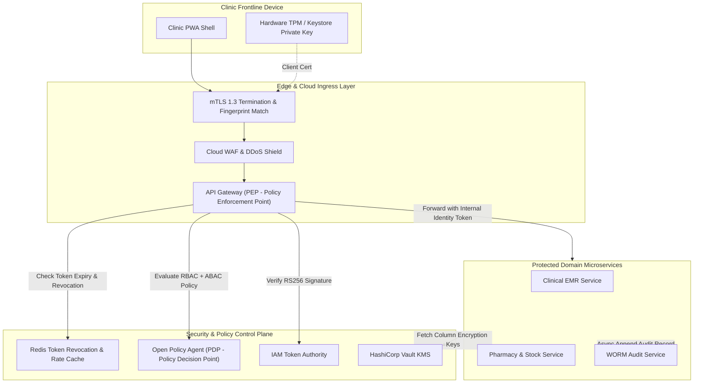
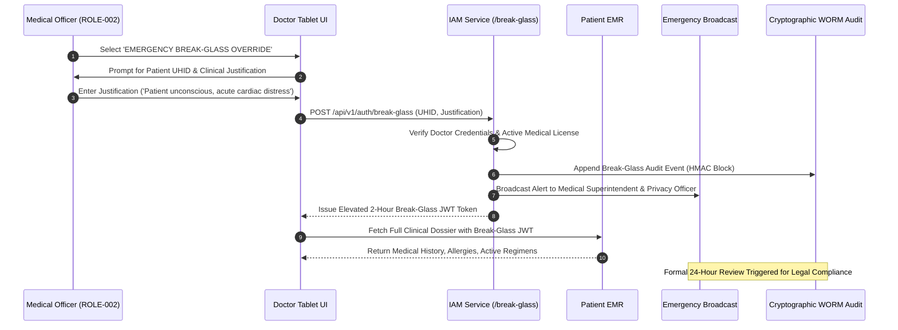

# 🔌 API Specification: Zero-Trust API Security, IAM & Data Protection
## Namma Clinic Digital Health & Operations Platform
**Document Code:** API-DOC-20 | **Status:** Authoritative Baseline | **Date:** September 2026
> **Municipal Health Authority:** Greater Bengaluru Authority (GBA) / BBMP Health Department
> **Standard Framework:** NIST SP 800-207 (Zero Trust), RFC 7519 (JWT), OWASP API Security Top 10 (2023), DPDP Act 2023
> **Notice:** All code snippets contained herein are strictly **DOCUMENTATION-ONLY OPENAPI** or **DOCUMENTATION-ONLY EXAMPLE**. Zero application runtime code is executed in this phase.

---

## 1. Executive Summary & Zero-Trust Architectural Principles

The Namma Clinic security architecture operates under strict **Zero Trust** principles: *never trust, always verify*. Frontline clinic terminals, edge mini-servers, cloud microservices, and external national health grids must explicitly authenticate and authorize every network transaction. Perimeter defense alone is recognized as insufficient; every API endpoint enforces cryptographic verification, least privilege authorization, hardware-bound identity, and tamper-evident audit logging.

### 1.1 Core Security Invariants
1. **Cryptographic Identity for All Actors:** Every actor—whether a clinic doctor, triage nurse, edge appliance, or national bridge—must present cryptographically verified credentials (RS256 JWT, mTLS X.509 certificate, or Ed25519 payload signature).
2. **Hardware Device Binding:** Clinical workstations and tablets are enrolled with unique hardware fingerprints and issued device-bound mTLS client certificates, preventing credential reuse from unmanaged personal devices.
3. **Contextual ABAC Scoping:** RBAC permissions are strictly evaluated within dynamic ABAC boundaries: clinic facility ID, active shift roster, treating clinician relationship, and citizen consent directives.
4. **Envelope & Column-Level Encryption:** Sensitive medical progress notes, HIV/STI diagnoses, psychiatric records, and national identifiers are encrypted at rest using AES-256-GCM envelope encryption with keys managed in HashiCorp Vault.
5. **Continuous Threat Mitigation:** Automated defenses against OWASP API Security Top 10 risks are active at the WAF, API gateway, and microservice layers.

## 2. Zero-Trust Policy Enforcement Topology



## 3. Authentication Standards: RS256 JWT, JWKS & Session Rotation

### 3.1 JWT Claims Structure
All authenticated access tokens are compact RS256-signed JSON Web Tokens conforming to the following claim schema:
```json
// DOCUMENTATION-ONLY EXAMPLE
{
  "iss": "https://auth.nammaclinic.bbmp.gov.in",
  "sub": "018e3a20-0005-7000-8000-000000000001",
  "aud": "https://api.nammaclinic.bbmp.gov.in",
  "jti": "018e3a20-8000-7000-8000-000000000001",
  "iat": 1767225600,
  "nbf": 1767225600,
  "exp": 1767226500,
  "user": {
    "username": "DOC-BLR-1024",
    "displayName": "Dr. Ramesh Kumar",
    "medicalRegistrationNumber": "KMC-19842",
    "primaryRole": "ROLE-002",
    "assignedRoles": ["ROLE-002", "ROLE-016"]
  },
  "context": {
    "facilityId": "018e3a20-0008-7000-8000-000000000001",
    "facilityWard": 142,
    "shiftId": "018e3a20-0010-7000-8000-000000000001",
    "deviceFingerprint": "tab-n100-blr-042",
    "breakGlassActive": false
  },
  "permissions": [
    "consultations:read",
    "consultations:create",
    "prescriptions:create",
    "lab_orders:create"
  ]
}
```

## 4. Emergency Clinical Break-Glass Access Architecture

In life-threatening medical emergencies (e.g., unconscious patient, acute trauma), treating physicians require instantaneous access to the patient's longitudinal record, allergies, and chronic conditions—even if citizen consent has not been granted or normal facility scoping restrictions would block access.



## 5. OWASP API Security Top 10 (2023) Mitigation Controls

| OWASP Risk Identifier | Platform Defensive Control Implementation | Architectural Enforcement Layer |
| :--- | :--- | :--- |
| **API1:2023 - Broken Object Level Authorization (BOLA)** | Every endpoint verifies that requested object belongs to caller's facility context or treating clinician relationship. Synthetic IDs use UUIDv7; direct sequential IDs forbidden. | Central Gateway + Microservice OPA Guard |
| **API2:2023 - Broken Authentication** | Argon2id password hashing, RS256 JWTs with 15m expiration, sliding-window rate limiting on login, automated account lockout after 5 consecutive failures, mTLS client certificates on workstations. | Central Gateway + Microservice OPA Guard |
| **API3:2023 - Broken Object Property Level Authorization** | Strict JSON schema validation at gateway; mass assignment prohibited via explicit DTO mapping; response filters strip internal fields (hashes, raw tokens) based on caller role. | Central Gateway + Microservice OPA Guard |
| **API4:2023 - Unrestricted Resource Consumption** | Token bucket rate limiting per IP and user; strict payload size limits (max 10MB); mandatory cursor pagination on all collection endpoints (default 25, max 100). | Central Gateway + Microservice OPA Guard |
| **API5:2023 - Broken Function Level Authorization** | Unified Open Policy Agent (OPA) middleware checks required permission tokens before invoking controllers; admin endpoints isolated on private ingress routes. | Central Gateway + Microservice OPA Guard |
| **API6:2023 - Unrestricted Access to Sensitive Business Flows** | Critical flows (patient registration, medication dispensing, stock deduction) require X-Idempotency-Key deduplication, transaction locks, and CAPTCHA / rate guards on public portals. | Central Gateway + Microservice OPA Guard |
| **API7:2023 - Server Side Request Forgery (SSRF)** | All outbound HTTP integrations (SMS gateway, ABDM national router) use fixed DNS egress proxies; user-controlled callback URLs are strictly prohibited. | Central Gateway + Microservice OPA Guard |
| **API8:2023 - Security Misconfiguration** | All development debug endpoints disabled in production; TLS 1.3 enforced with HSTS (max-age=31536000); detailed stack traces replaced by standard error envelopes matching SCHEMA-API-003. | Central Gateway + Microservice OPA Guard |
| **API9:2023 - Improper Inventory Management** | Every active endpoint documented in OpenAPI 3.1 baseline; retired endpoints decommissioned via RFC 8594 Sunset headers; shadow APIs prevented by strict gateway route registries. | Central Gateway + Microservice OPA Guard |
| **API10:2023 - Unsafe Consumption of APIs** | All external data received from national ABDM gateways or carrier SMS webhooks is validated against strict JSON schemas and sanitized before relational persistence. | Central Gateway + Microservice OPA Guard |

## 6. Comprehensive Endpoint Security & RBAC Enforcement Catalog

Authoritative security profiles for all 341 platform endpoints:

| Endpoint ID | Route Path | Auth Requirement | Primary RBAC Token | ABAC Context Guard | Security Classification |
| :--- | :--- | :--- | :--- | :--- | :--- |
| **API-AUTH-001** | `POST /api/v1/auth/login` | `Anonymous / Public Ingress` | `auth:session:create` | Validates registered clinic device fingerprint and facility roster schedule. | `RESTRICTED` |
| **API-AUTH-002** | `POST /api/v1/auth/refresh` | `Refresh Token Header` | `auth:token:refresh` | Requires active non-revoked session ID in Redis cache and database. | `RESTRICTED` |
| **API-AUTH-003** | `POST /api/v1/auth/logout` | `Bearer JWT` | `auth:session:terminate` | User may only terminate their own active session unless admin role. | `INTERNAL` |
| **API-AUTH-004** | `GET /api/v1/auth/me` | `Bearer JWT` | `auth:profile:read` | Returns user context strictly scoped to active facility and shift. | `INTERNAL` |
| **API-AUTH-005** | `POST /api/v1/auth/password/change` | `Bearer JWT` | `auth:password:update` | Requires current password verification; updates Argon2id salt and hash. | `RESTRICTED` |
| **API-AUTH-006** | `GET /api/v1/auth/.well-known/jwks.json` | `Anonymous / Public Ingress` | `Public / Anonymous` | Public read with 24-hour Cache-Control header. | `PUBLIC` |
| **API-AUTH-007** | `POST /api/v1/auth/mfa/verify` | `Interim Pre-Auth Token` | `auth:mfa:verify` | TOTP token must match within +/- 1 time step window (30s drift). | `RESTRICTED` |
| **API-AUTH-008** | `POST /api/v1/auth/break-glass` | `Bearer JWT` | `clinical:break_glass:invoke` | Mandates treating doctor identity, patient UHID, and emergency clinical justification. | `HIGHLY-RESTRICTED` |
| **API-AUTH-009** | `POST /api/v1/auth/devices/register` | `Bearer JWT (Admin)` | `system:device:register` | Target facility ID must match admin jurisdiction; MAC address validated. | `CONFIDENTIAL` |
| **API-AUTH-010** | `GET /api/v1/auth/devices` | `Bearer JWT` | `system:device:read` | Scoped strictly to authenticated user's clinic facility. | `INTERNAL` |
| **API-AUTH-011** | `DELETE /api/v1/auth/devices/{deviceId}` | `Bearer JWT` | `system:device:revoke` | Requires dual-authorization approval token. | `CONFIDENTIAL` |
| **API-AUTH-012** | `GET /api/v1/auth/roles` | `Bearer JWT` | `auth:roles:read` | Returns active roles catalog. | `INTERNAL` |
| **API-AUTH-013** | `POST /api/v1/auth/users/{userId}/roles` | `Bearer JWT` | `auth:roles:assign` | Target staff member must be within caller's administrative BBMP zone. | `RESTRICTED` |
| **API-AUTH-014** | `GET /api/v1/auth/sessions` | `Bearer JWT` | `auth:session:audit` | Filtered by facility ID or staff user ID. | `CONFIDENTIAL` |
| **API-AUTH-015** | `DELETE /api/v1/auth/sessions/{sessionId}` | `Bearer JWT` | `auth:session:revoke` | Immediate eviction across all distributed edge nodes. | `INTERNAL` |
| **API-AUTH-016** | `POST /api/v1/auth/shifts/clock-in` | `Bearer JWT` | `clinical:shift:manage` | Staff member must be rostered for shift; facility matches active workstation. | `INTERNAL` |
| **API-PATIENT-001** | `POST /api/v1/patients` | `Bearer JWT` | `patient:profile:create` | Clinic front desk clerk or nurse in active facility context. | `RESTRICTED` |
| **API-PATIENT-002** | `GET /api/v1/patients/{patientId}` | `Bearer JWT` | `patient:profile:read` | Masks phone number and Aadhaar reference unless authorized clinician. | `RESTRICTED` |
| **API-PATIENT-003** | `GET /api/v1/patients` | `Bearer JWT` | `patient:search:execute` | Search results capped at 50 records; rate limited to prevent scraping. | `RESTRICTED` |
| **API-PATIENT-004** | `PUT /api/v1/patients/{patientId}` | `Bearer JWT` | `patient:profile:update` | Requires If-Match ETag header matching current version. | `RESTRICTED` |
| **API-PATIENT-005** | `POST /api/v1/patients/duplicates/check` | `Bearer JWT` | `patient:dedup:check` | Executes phonetic Jaro-Winkler and Soundex matching algorithm. | `RESTRICTED` |
| **API-PATIENT-006** | `POST /api/v1/patients/merge` | `Bearer JWT` | `patient:merge:execute` | Requires clinical justification note; non-reversible without supervisory DBA intervention. | `HIGHLY-RESTRICTED` |
| **API-PATIENT-007** | `POST /api/v1/patients/{patientId}/abha/link` | `Bearer JWT` | `patient:abha:link` | Validates ABHA token issued by NHA ABDM gateway. | `RESTRICTED` |
| **API-PATIENT-008** | `DELETE /api/v1/patients/{patientId}/abha/unlink` | `Bearer JWT` | `patient:abha:unlink` | Citizen consent revocation verified. | `RESTRICTED` |
| **API-PATIENT-009** | `GET /api/v1/patients/{patientId}/history` | `Bearer JWT` | `patient:clinical_history:read` | Treating clinician context required; audit event logged. | `CONFIDENTIAL` |
| **API-PATIENT-010** | `GET /api/v1/patients/{patientId}/consents` | `Bearer JWT` | `patient:consent:read` | DPDP Act 2023 compliance verification. | `CONFIDENTIAL` |
| **API-PATIENT-011** | `POST /api/v1/patients/{patientId}/consents` | `Bearer JWT` | `patient:consent:record` | Must specify purpose, validity period, and authorized data scope. | `CONFIDENTIAL` |
| **API-PATIENT-012** | `DELETE /api/v1/patients/{patientId}/consents/{consentId}` | `Bearer JWT` | `patient:consent:revoke` | Immediate cessation of non-essential processing. | `CONFIDENTIAL` |
| **API-PATIENT-013** | `GET /api/v1/patients/{patientId}/audit` | `Bearer JWT` | `patient:audit:read` | Requires authorized compliance audit justification. | `HIGHLY-RESTRICTED` |
| **API-PATIENT-014** | `POST /api/v1/patients/{patientId}/ncd-enroll` | `Bearer JWT` | `patient:ncd:enroll` | Patient must have confirmed diagnosis of hypertension, diabetes, or cardiovascular risk. | `CONFIDENTIAL` |
| **API-PATIENT-015** | `GET /api/v1/patients/{patientId}/ncd-status` | `Bearer JWT` | `patient:ncd:read` | Active clinic care team context. | `CONFIDENTIAL` |
| **API-PATIENT-016** | `POST /api/v1/patients/{patientId}/emergency-contacts` | `Bearer JWT` | `patient:profile:update` | Valid 10-digit mobile number required. | `RESTRICTED` |
| **API-PATIENT-017** | `GET /api/v1/patients/{patientId}/identifiers` | `Bearer JWT` | `patient:profile:read` | Masks sensitive national ID digits on non-admin interface. | `RESTRICTED` |
| **API-PATIENT-018** | `POST /api/v1/patients/{patientId}/identifiers` | `Bearer JWT` | `patient:profile:update` | Validates format against identifier type schema. | `RESTRICTED` |
| **API-PATIENT-019** | `DELETE /api/v1/patients/{patientId}/identifiers/{identifierId}` | `Bearer JWT` | `patient:profile:update` | Primary UHID deletion prohibited; audit justification mandatory. | `RESTRICTED` |
| **API-PATIENT-020** | `POST /api/v1/patients/{patientId}/flag-deceased` | `Bearer JWT` | `patient:status:deceased` | Requires municipal death registration number or clinician confirmation. | `RESTRICTED` |
| **API-PATIENT-021** | `GET /api/v1/patients/{patientId}/encounters` | `Bearer JWT` | `patient:encounters:read` | Filtered by date range or clinical encounter type. | `CONFIDENTIAL` |
| **API-PATIENT-022** | `GET /api/v1/patients/{patientId}/prescriptions` | `Bearer JWT` | `prescription:history:read` | Scoped to active patient encounter. | `CONFIDENTIAL` |
| **API-PATIENT-023** | `GET /api/v1/patients/{patientId}/lab-reports` | `Bearer JWT` | `lab:history:read` | Full reports returned for verified clinicians. | `CONFIDENTIAL` |
| **API-PATIENT-024** | `POST /api/v1/patients/{patientId}/photo` | `Bearer JWT` | `patient:profile:update` | Image clamped to max 500KB JPEG; processed for biometric compliance. | `RESTRICTED` |
| **API-PATIENT-025** | `GET /api/v1/patients/{patientId}/photo` | `Bearer JWT` | `patient:profile:read` | Returns pre-signed URL or base64 data stream. | `RESTRICTED` |
| **API-PATIENT-026** | `POST /api/v1/patients/batch-lookup` | `Bearer JWT` | `patient:batch:read` | Max 100 UHIDs per batch request. | `RESTRICTED` |
| **API-VISIT-001** | `POST /api/v1/visits` | `Bearer JWT` | `visits:post` | Restricted to authorized Visit personnel in active clinic context. | `INTERNAL` |
| **API-VISIT-002** | `GET /api/v1/visits/{visitId}` | `Bearer JWT` | `visits:get` | Restricted to authorized Visit personnel in active clinic context. | `INTERNAL` |
| **API-VISIT-003** | `GET /api/v1/visits` | `Bearer JWT` | `visits:get` | Restricted to authorized Visit personnel in active clinic context. | `INTERNAL` |
| **API-VISIT-004** | `PUT /api/v1/visits/{visitId}` | `Bearer JWT` | `visits:put` | Restricted to authorized Visit personnel in active clinic context. | `INTERNAL` |
| **API-VISIT-005** | `PATCH /api/v1/visits/{visitId}/status` | `Bearer JWT` | `visits:patch` | Restricted to authorized Visit personnel in active clinic context. | `INTERNAL` |
| **API-VISIT-006** | `GET /api/v1/visits/{visitId}/search` | `Bearer JWT` | `visits:get` | Restricted to authorized Visit personnel in active clinic context. | `INTERNAL` |
| **API-VISIT-007** | `GET /api/v1/visits/history` | `Bearer JWT` | `visits:get` | Restricted to authorized Visit personnel in active clinic context. | `INTERNAL` |
| **API-VISIT-008** | `GET /api/v1/visits/{visitId}/audit` | `Bearer JWT` | `visits:get` | Restricted to authorized Visit personnel in active clinic context. | `INTERNAL` |
| **API-VISIT-009** | `POST /api/v1/visits/cancel` | `Bearer JWT` | `visits:post` | Restricted to authorized Visit personnel in active clinic context. | `INTERNAL` |
| **API-VISIT-010** | `POST /api/v1/visits/verify` | `Bearer JWT` | `visits:post` | Restricted to authorized Visit personnel in active clinic context. | `INTERNAL` |
| **API-VISIT-011** | `GET /api/v1/visits/export` | `Bearer JWT` | `visits:get` | Restricted to authorized Visit personnel in active clinic context. | `INTERNAL` |
| **API-VISIT-012** | `GET /api/v1/visits/{visitId}/metrics` | `Bearer JWT` | `visits:get` | Restricted to authorized Visit personnel in active clinic context. | `INTERNAL` |
| **API-VISIT-013** | `POST /api/v1/visits/reconcile` | `Bearer JWT` | `visits:post` | Restricted to authorized Visit personnel in active clinic context. | `INTERNAL` |
| **API-VISIT-014** | `POST /api/v1/visits/batch` | `Bearer JWT` | `visits:post` | Restricted to authorized Visit personnel in active clinic context. | `INTERNAL` |
| **API-VISIT-015** | `GET /api/v1/visits/sync` | `Bearer JWT` | `visits:get` | Restricted to authorized Visit personnel in active clinic context. | `INTERNAL` |
| **API-VISIT-016** | `GET /api/v1/visits/{visitId}/alerts` | `Bearer JWT` | `visits:get` | Restricted to authorized Visit personnel in active clinic context. | `INTERNAL` |
| **API-VISIT-017** | `POST /api/v1/visits/escalate` | `Bearer JWT` | `visits:post` | Restricted to authorized Visit personnel in active clinic context. | `INTERNAL` |
| **API-VISIT-018** | `POST /api/v1/visits/approve` | `Bearer JWT` | `visits:post` | Restricted to authorized Visit personnel in active clinic context. | `INTERNAL` |
| **API-VISIT-019** | `POST /api/v1/visits/reversal` | `Bearer JWT` | `visits:post` | Restricted to authorized Visit personnel in active clinic context. | `INTERNAL` |
| **API-VISIT-020** | `GET /api/v1/visits/{visitId}/items` | `Bearer JWT` | `visits:get` | Restricted to authorized Visit personnel in active clinic context. | `INTERNAL` |
| **API-VISIT-021** | `GET /api/v1/visits/documents` | `Bearer JWT` | `visits:get` | Restricted to authorized Visit personnel in active clinic context. | `INTERNAL` |
| **API-TRIAGE-001** | `POST /api/v1/triage` | `Bearer JWT` | `triage:post` | Restricted to authorized Triage personnel in active clinic context. | `CONFIDENTIAL` |
| **API-TRIAGE-002** | `GET /api/v1/triage/{triageId}` | `Bearer JWT` | `triage:get` | Restricted to authorized Triage personnel in active clinic context. | `CONFIDENTIAL` |
| **API-TRIAGE-003** | `GET /api/v1/triage` | `Bearer JWT` | `triage:get` | Restricted to authorized Triage personnel in active clinic context. | `CONFIDENTIAL` |
| **API-TRIAGE-004** | `PUT /api/v1/triage/{triageId}` | `Bearer JWT` | `triage:put` | Restricted to authorized Triage personnel in active clinic context. | `CONFIDENTIAL` |
| **API-TRIAGE-005** | `PATCH /api/v1/triage/{triageId}/status` | `Bearer JWT` | `triage:patch` | Restricted to authorized Triage personnel in active clinic context. | `CONFIDENTIAL` |
| **API-TRIAGE-006** | `GET /api/v1/triage/{triageId}/search` | `Bearer JWT` | `triage:get` | Restricted to authorized Triage personnel in active clinic context. | `CONFIDENTIAL` |
| **API-TRIAGE-007** | `GET /api/v1/triage/history` | `Bearer JWT` | `triage:get` | Restricted to authorized Triage personnel in active clinic context. | `CONFIDENTIAL` |
| **API-TRIAGE-008** | `GET /api/v1/triage/{triageId}/audit` | `Bearer JWT` | `triage:get` | Restricted to authorized Triage personnel in active clinic context. | `CONFIDENTIAL` |
| **API-TRIAGE-009** | `POST /api/v1/triage/cancel` | `Bearer JWT` | `triage:post` | Restricted to authorized Triage personnel in active clinic context. | `CONFIDENTIAL` |
| **API-TRIAGE-010** | `POST /api/v1/triage/verify` | `Bearer JWT` | `triage:post` | Restricted to authorized Triage personnel in active clinic context. | `CONFIDENTIAL` |
| **API-TRIAGE-011** | `GET /api/v1/triage/export` | `Bearer JWT` | `triage:get` | Restricted to authorized Triage personnel in active clinic context. | `CONFIDENTIAL` |
| **API-TRIAGE-012** | `GET /api/v1/triage/{triageId}/metrics` | `Bearer JWT` | `triage:get` | Restricted to authorized Triage personnel in active clinic context. | `CONFIDENTIAL` |
| **API-TRIAGE-013** | `POST /api/v1/triage/reconcile` | `Bearer JWT` | `triage:post` | Restricted to authorized Triage personnel in active clinic context. | `CONFIDENTIAL` |
| **API-TRIAGE-014** | `POST /api/v1/triage/batch` | `Bearer JWT` | `triage:post` | Restricted to authorized Triage personnel in active clinic context. | `CONFIDENTIAL` |
| **API-TRIAGE-015** | `GET /api/v1/triage/sync` | `Bearer JWT` | `triage:get` | Restricted to authorized Triage personnel in active clinic context. | `CONFIDENTIAL` |
| **API-TRIAGE-016** | `GET /api/v1/triage/{triageId}/alerts` | `Bearer JWT` | `triage:get` | Restricted to authorized Triage personnel in active clinic context. | `CONFIDENTIAL` |
| **API-TRIAGE-017** | `POST /api/v1/triage/escalate` | `Bearer JWT` | `triage:post` | Restricted to authorized Triage personnel in active clinic context. | `CONFIDENTIAL` |
| **API-TRIAGE-018** | `POST /api/v1/triage/approve` | `Bearer JWT` | `triage:post` | Restricted to authorized Triage personnel in active clinic context. | `CONFIDENTIAL` |
| **API-TRIAGE-019** | `POST /api/v1/triage/reversal` | `Bearer JWT` | `triage:post` | Restricted to authorized Triage personnel in active clinic context. | `CONFIDENTIAL` |
| **API-CONSULT-001** | `POST /api/v1/consultations` | `Bearer JWT` | `consultations:post` | Restricted to authorized Consultation personnel in active clinic context. | `CONFIDENTIAL` |
| **API-CONSULT-002** | `GET /api/v1/consultations/{consultationId}` | `Bearer JWT` | `consultations:get` | Restricted to authorized Consultation personnel in active clinic context. | `CONFIDENTIAL` |
| **API-CONSULT-003** | `GET /api/v1/consultations` | `Bearer JWT` | `consultations:get` | Restricted to authorized Consultation personnel in active clinic context. | `CONFIDENTIAL` |
| **API-CONSULT-004** | `PUT /api/v1/consultations/{consultationId}` | `Bearer JWT` | `consultations:put` | Restricted to authorized Consultation personnel in active clinic context. | `CONFIDENTIAL` |
| **API-CONSULT-005** | `PATCH /api/v1/consultations/{consultationId}/status` | `Bearer JWT` | `consultations:patch` | Restricted to authorized Consultation personnel in active clinic context. | `CONFIDENTIAL` |
| **API-CONSULT-006** | `GET /api/v1/consultations/{consultationId}/search` | `Bearer JWT` | `consultations:get` | Restricted to authorized Consultation personnel in active clinic context. | `CONFIDENTIAL` |
| **API-CONSULT-007** | `GET /api/v1/consultations/history` | `Bearer JWT` | `consultations:get` | Restricted to authorized Consultation personnel in active clinic context. | `CONFIDENTIAL` |
| **API-CONSULT-008** | `GET /api/v1/consultations/{consultationId}/audit` | `Bearer JWT` | `consultations:get` | Restricted to authorized Consultation personnel in active clinic context. | `CONFIDENTIAL` |
| **API-CONSULT-009** | `POST /api/v1/consultations/cancel` | `Bearer JWT` | `consultations:post` | Restricted to authorized Consultation personnel in active clinic context. | `CONFIDENTIAL` |
| **API-CONSULT-010** | `POST /api/v1/consultations/verify` | `Bearer JWT` | `consultations:post` | Restricted to authorized Consultation personnel in active clinic context. | `CONFIDENTIAL` |
| **API-CONSULT-011** | `GET /api/v1/consultations/export` | `Bearer JWT` | `consultations:get` | Restricted to authorized Consultation personnel in active clinic context. | `CONFIDENTIAL` |
| **API-CONSULT-012** | `GET /api/v1/consultations/{consultationId}/metrics` | `Bearer JWT` | `consultations:get` | Restricted to authorized Consultation personnel in active clinic context. | `CONFIDENTIAL` |
| **API-CONSULT-013** | `POST /api/v1/consultations/reconcile` | `Bearer JWT` | `consultations:post` | Restricted to authorized Consultation personnel in active clinic context. | `CONFIDENTIAL` |
| **API-CONSULT-014** | `POST /api/v1/consultations/batch` | `Bearer JWT` | `consultations:post` | Restricted to authorized Consultation personnel in active clinic context. | `CONFIDENTIAL` |
| **API-CONSULT-015** | `GET /api/v1/consultations/sync` | `Bearer JWT` | `consultations:get` | Restricted to authorized Consultation personnel in active clinic context. | `CONFIDENTIAL` |
| **API-CONSULT-016** | `GET /api/v1/consultations/{consultationId}/alerts` | `Bearer JWT` | `consultations:get` | Restricted to authorized Consultation personnel in active clinic context. | `CONFIDENTIAL` |
| **API-CONSULT-017** | `POST /api/v1/consultations/escalate` | `Bearer JWT` | `consultations:post` | Restricted to authorized Consultation personnel in active clinic context. | `CONFIDENTIAL` |
| **API-CONSULT-018** | `POST /api/v1/consultations/approve` | `Bearer JWT` | `consultations:post` | Restricted to authorized Consultation personnel in active clinic context. | `CONFIDENTIAL` |
| **API-CONSULT-019** | `POST /api/v1/consultations/reversal` | `Bearer JWT` | `consultations:post` | Restricted to authorized Consultation personnel in active clinic context. | `CONFIDENTIAL` |
| **API-CONSULT-020** | `GET /api/v1/consultations/{consultationId}/items` | `Bearer JWT` | `consultations:get` | Restricted to authorized Consultation personnel in active clinic context. | `CONFIDENTIAL` |
| **API-CONSULT-021** | `GET /api/v1/consultations/documents` | `Bearer JWT` | `consultations:get` | Restricted to authorized Consultation personnel in active clinic context. | `CONFIDENTIAL` |
| **API-CONSULT-022** | `GET /api/v1/consultations/{consultationId}/timeline` | `Bearer JWT` | `consultations:get` | Restricted to authorized Consultation personnel in active clinic context. | `CONFIDENTIAL` |
| **API-CONSULT-023** | `GET /api/v1/consultations/stats` | `Bearer JWT` | `consultations:get` | Restricted to authorized Consultation personnel in active clinic context. | `CONFIDENTIAL` |
| **API-RX-001** | `POST /api/v1/prescriptions` | `Bearer JWT` | `prescriptions:post` | Restricted to authorized Prescription personnel in active clinic context. | `CONFIDENTIAL` |
| **API-RX-002** | `GET /api/v1/prescriptions/{prescriptionId}` | `Bearer JWT` | `prescriptions:get` | Restricted to authorized Prescription personnel in active clinic context. | `CONFIDENTIAL` |
| **API-RX-003** | `GET /api/v1/prescriptions` | `Bearer JWT` | `prescriptions:get` | Restricted to authorized Prescription personnel in active clinic context. | `CONFIDENTIAL` |
| **API-RX-004** | `PUT /api/v1/prescriptions/{prescriptionId}` | `Bearer JWT` | `prescriptions:put` | Restricted to authorized Prescription personnel in active clinic context. | `CONFIDENTIAL` |
| **API-RX-005** | `PATCH /api/v1/prescriptions/{prescriptionId}/status` | `Bearer JWT` | `prescriptions:patch` | Restricted to authorized Prescription personnel in active clinic context. | `CONFIDENTIAL` |
| **API-RX-006** | `GET /api/v1/prescriptions/{prescriptionId}/search` | `Bearer JWT` | `prescriptions:get` | Restricted to authorized Prescription personnel in active clinic context. | `CONFIDENTIAL` |
| **API-RX-007** | `GET /api/v1/prescriptions/history` | `Bearer JWT` | `prescriptions:get` | Restricted to authorized Prescription personnel in active clinic context. | `CONFIDENTIAL` |
| **API-RX-008** | `GET /api/v1/prescriptions/{prescriptionId}/audit` | `Bearer JWT` | `prescriptions:get` | Restricted to authorized Prescription personnel in active clinic context. | `CONFIDENTIAL` |
| **API-RX-009** | `POST /api/v1/prescriptions/cancel` | `Bearer JWT` | `prescriptions:post` | Restricted to authorized Prescription personnel in active clinic context. | `CONFIDENTIAL` |
| **API-RX-010** | `POST /api/v1/prescriptions/verify` | `Bearer JWT` | `prescriptions:post` | Restricted to authorized Prescription personnel in active clinic context. | `CONFIDENTIAL` |
| **API-RX-011** | `GET /api/v1/prescriptions/export` | `Bearer JWT` | `prescriptions:get` | Restricted to authorized Prescription personnel in active clinic context. | `CONFIDENTIAL` |
| **API-RX-012** | `GET /api/v1/prescriptions/{prescriptionId}/metrics` | `Bearer JWT` | `prescriptions:get` | Restricted to authorized Prescription personnel in active clinic context. | `CONFIDENTIAL` |
| **API-RX-013** | `POST /api/v1/prescriptions/reconcile` | `Bearer JWT` | `prescriptions:post` | Restricted to authorized Prescription personnel in active clinic context. | `CONFIDENTIAL` |
| **API-RX-014** | `POST /api/v1/prescriptions/batch` | `Bearer JWT` | `prescriptions:post` | Restricted to authorized Prescription personnel in active clinic context. | `CONFIDENTIAL` |
| **API-RX-015** | `GET /api/v1/prescriptions/sync` | `Bearer JWT` | `prescriptions:get` | Restricted to authorized Prescription personnel in active clinic context. | `CONFIDENTIAL` |
| **API-RX-016** | `GET /api/v1/prescriptions/{prescriptionId}/alerts` | `Bearer JWT` | `prescriptions:get` | Restricted to authorized Prescription personnel in active clinic context. | `CONFIDENTIAL` |
| **API-RX-017** | `POST /api/v1/prescriptions/escalate` | `Bearer JWT` | `prescriptions:post` | Restricted to authorized Prescription personnel in active clinic context. | `CONFIDENTIAL` |
| **API-RX-018** | `POST /api/v1/prescriptions/approve` | `Bearer JWT` | `prescriptions:post` | Restricted to authorized Prescription personnel in active clinic context. | `CONFIDENTIAL` |
| **API-RX-019** | `POST /api/v1/prescriptions/reversal` | `Bearer JWT` | `prescriptions:post` | Restricted to authorized Prescription personnel in active clinic context. | `CONFIDENTIAL` |
| **API-PHARM-001** | `POST /api/v1/pharmacy` | `Bearer JWT` | `pharmacy:post` | Restricted to authorized Pharmacy personnel in active clinic context. | `INTERNAL` |
| **API-PHARM-002** | `GET /api/v1/pharmacy/{pharmacyId}` | `Bearer JWT` | `pharmacy:get` | Restricted to authorized Pharmacy personnel in active clinic context. | `INTERNAL` |
| **API-PHARM-003** | `GET /api/v1/pharmacy` | `Bearer JWT` | `pharmacy:get` | Restricted to authorized Pharmacy personnel in active clinic context. | `INTERNAL` |
| **API-PHARM-004** | `PUT /api/v1/pharmacy/{pharmacyId}` | `Bearer JWT` | `pharmacy:put` | Restricted to authorized Pharmacy personnel in active clinic context. | `INTERNAL` |
| **API-PHARM-005** | `PATCH /api/v1/pharmacy/{pharmacyId}/status` | `Bearer JWT` | `pharmacy:patch` | Restricted to authorized Pharmacy personnel in active clinic context. | `INTERNAL` |
| **API-PHARM-006** | `GET /api/v1/pharmacy/{pharmacyId}/search` | `Bearer JWT` | `pharmacy:get` | Restricted to authorized Pharmacy personnel in active clinic context. | `INTERNAL` |
| **API-PHARM-007** | `GET /api/v1/pharmacy/history` | `Bearer JWT` | `pharmacy:get` | Restricted to authorized Pharmacy personnel in active clinic context. | `INTERNAL` |
| **API-PHARM-008** | `GET /api/v1/pharmacy/{pharmacyId}/audit` | `Bearer JWT` | `pharmacy:get` | Restricted to authorized Pharmacy personnel in active clinic context. | `INTERNAL` |
| **API-PHARM-009** | `POST /api/v1/pharmacy/cancel` | `Bearer JWT` | `pharmacy:post` | Restricted to authorized Pharmacy personnel in active clinic context. | `INTERNAL` |
| **API-PHARM-010** | `POST /api/v1/pharmacy/verify` | `Bearer JWT` | `pharmacy:post` | Restricted to authorized Pharmacy personnel in active clinic context. | `INTERNAL` |
| **API-PHARM-011** | `GET /api/v1/pharmacy/export` | `Bearer JWT` | `pharmacy:get` | Restricted to authorized Pharmacy personnel in active clinic context. | `INTERNAL` |
| **API-PHARM-012** | `GET /api/v1/pharmacy/{pharmacyId}/metrics` | `Bearer JWT` | `pharmacy:get` | Restricted to authorized Pharmacy personnel in active clinic context. | `INTERNAL` |
| **API-PHARM-013** | `POST /api/v1/pharmacy/reconcile` | `Bearer JWT` | `pharmacy:post` | Restricted to authorized Pharmacy personnel in active clinic context. | `INTERNAL` |
| **API-PHARM-014** | `POST /api/v1/pharmacy/batch` | `Bearer JWT` | `pharmacy:post` | Restricted to authorized Pharmacy personnel in active clinic context. | `INTERNAL` |
| **API-PHARM-015** | `GET /api/v1/pharmacy/sync` | `Bearer JWT` | `pharmacy:get` | Restricted to authorized Pharmacy personnel in active clinic context. | `INTERNAL` |
| **API-PHARM-016** | `GET /api/v1/pharmacy/{pharmacyId}/alerts` | `Bearer JWT` | `pharmacy:get` | Restricted to authorized Pharmacy personnel in active clinic context. | `INTERNAL` |
| **API-PHARM-017** | `POST /api/v1/pharmacy/escalate` | `Bearer JWT` | `pharmacy:post` | Restricted to authorized Pharmacy personnel in active clinic context. | `INTERNAL` |
| **API-PHARM-018** | `POST /api/v1/pharmacy/approve` | `Bearer JWT` | `pharmacy:post` | Restricted to authorized Pharmacy personnel in active clinic context. | `INTERNAL` |
| **API-PHARM-019** | `POST /api/v1/pharmacy/reversal` | `Bearer JWT` | `pharmacy:post` | Restricted to authorized Pharmacy personnel in active clinic context. | `INTERNAL` |
| **API-PHARM-020** | `GET /api/v1/pharmacy/{pharmacyId}/items` | `Bearer JWT` | `pharmacy:get` | Restricted to authorized Pharmacy personnel in active clinic context. | `INTERNAL` |
| **API-PHARM-021** | `GET /api/v1/pharmacy/documents` | `Bearer JWT` | `pharmacy:get` | Restricted to authorized Pharmacy personnel in active clinic context. | `INTERNAL` |
| **API-INV-001** | `POST /api/v1/inventory` | `Bearer JWT` | `inventory:post` | Restricted to authorized Inventory personnel in active clinic context. | `INTERNAL` |
| **API-INV-002** | `GET /api/v1/inventory/{inventoryId}` | `Bearer JWT` | `inventory:get` | Restricted to authorized Inventory personnel in active clinic context. | `INTERNAL` |
| **API-INV-003** | `GET /api/v1/inventory` | `Bearer JWT` | `inventory:get` | Restricted to authorized Inventory personnel in active clinic context. | `INTERNAL` |
| **API-INV-004** | `PUT /api/v1/inventory/{inventoryId}` | `Bearer JWT` | `inventory:put` | Restricted to authorized Inventory personnel in active clinic context. | `INTERNAL` |
| **API-INV-005** | `PATCH /api/v1/inventory/{inventoryId}/status` | `Bearer JWT` | `inventory:patch` | Restricted to authorized Inventory personnel in active clinic context. | `INTERNAL` |
| **API-INV-006** | `GET /api/v1/inventory/{inventoryId}/search` | `Bearer JWT` | `inventory:get` | Restricted to authorized Inventory personnel in active clinic context. | `INTERNAL` |
| **API-INV-007** | `GET /api/v1/inventory/history` | `Bearer JWT` | `inventory:get` | Restricted to authorized Inventory personnel in active clinic context. | `INTERNAL` |
| **API-INV-008** | `GET /api/v1/inventory/{inventoryId}/audit` | `Bearer JWT` | `inventory:get` | Restricted to authorized Inventory personnel in active clinic context. | `INTERNAL` |
| **API-INV-009** | `POST /api/v1/inventory/cancel` | `Bearer JWT` | `inventory:post` | Restricted to authorized Inventory personnel in active clinic context. | `INTERNAL` |
| **API-INV-010** | `POST /api/v1/inventory/verify` | `Bearer JWT` | `inventory:post` | Restricted to authorized Inventory personnel in active clinic context. | `INTERNAL` |
| **API-INV-011** | `GET /api/v1/inventory/export` | `Bearer JWT` | `inventory:get` | Restricted to authorized Inventory personnel in active clinic context. | `INTERNAL` |
| **API-INV-012** | `GET /api/v1/inventory/{inventoryId}/metrics` | `Bearer JWT` | `inventory:get` | Restricted to authorized Inventory personnel in active clinic context. | `INTERNAL` |
| **API-INV-013** | `POST /api/v1/inventory/reconcile` | `Bearer JWT` | `inventory:post` | Restricted to authorized Inventory personnel in active clinic context. | `INTERNAL` |
| **API-INV-014** | `POST /api/v1/inventory/batch` | `Bearer JWT` | `inventory:post` | Restricted to authorized Inventory personnel in active clinic context. | `INTERNAL` |
| **API-INV-015** | `GET /api/v1/inventory/sync` | `Bearer JWT` | `inventory:get` | Restricted to authorized Inventory personnel in active clinic context. | `INTERNAL` |
| **API-INV-016** | `GET /api/v1/inventory/{inventoryId}/alerts` | `Bearer JWT` | `inventory:get` | Restricted to authorized Inventory personnel in active clinic context. | `INTERNAL` |
| **API-INV-017** | `POST /api/v1/inventory/escalate` | `Bearer JWT` | `inventory:post` | Restricted to authorized Inventory personnel in active clinic context. | `INTERNAL` |
| **API-INV-018** | `POST /api/v1/inventory/approve` | `Bearer JWT` | `inventory:post` | Restricted to authorized Inventory personnel in active clinic context. | `INTERNAL` |
| **API-INV-019** | `POST /api/v1/inventory/reversal` | `Bearer JWT` | `inventory:post` | Restricted to authorized Inventory personnel in active clinic context. | `INTERNAL` |
| **API-INV-020** | `GET /api/v1/inventory/{inventoryId}/items` | `Bearer JWT` | `inventory:get` | Restricted to authorized Inventory personnel in active clinic context. | `INTERNAL` |
| **API-INV-021** | `GET /api/v1/inventory/documents` | `Bearer JWT` | `inventory:get` | Restricted to authorized Inventory personnel in active clinic context. | `INTERNAL` |
| **API-INV-022** | `GET /api/v1/inventory/{inventoryId}/timeline` | `Bearer JWT` | `inventory:get` | Restricted to authorized Inventory personnel in active clinic context. | `INTERNAL` |
| **API-INV-023** | `GET /api/v1/inventory/stats` | `Bearer JWT` | `inventory:get` | Restricted to authorized Inventory personnel in active clinic context. | `INTERNAL` |
| **API-INV-024** | `GET /api/v1/inventory/{inventoryId}/search` | `Bearer JWT` | `inventory:get` | Restricted to authorized Inventory personnel in active clinic context. | `INTERNAL` |
| **API-INV-025** | `GET /api/v1/inventory/history` | `Bearer JWT` | `inventory:get` | Restricted to authorized Inventory personnel in active clinic context. | `INTERNAL` |
| **API-INV-026** | `GET /api/v1/inventory/{inventoryId}/audit` | `Bearer JWT` | `inventory:get` | Restricted to authorized Inventory personnel in active clinic context. | `INTERNAL` |
| **API-LAB-001** | `POST /api/v1/lab` | `Bearer JWT` | `lab:post` | Restricted to authorized Lab personnel in active clinic context. | `CONFIDENTIAL` |
| **API-LAB-002** | `GET /api/v1/lab/{labId}` | `Bearer JWT` | `lab:get` | Restricted to authorized Lab personnel in active clinic context. | `CONFIDENTIAL` |
| **API-LAB-003** | `GET /api/v1/lab` | `Bearer JWT` | `lab:get` | Restricted to authorized Lab personnel in active clinic context. | `CONFIDENTIAL` |
| **API-LAB-004** | `PUT /api/v1/lab/{labId}` | `Bearer JWT` | `lab:put` | Restricted to authorized Lab personnel in active clinic context. | `CONFIDENTIAL` |
| **API-LAB-005** | `PATCH /api/v1/lab/{labId}/status` | `Bearer JWT` | `lab:patch` | Restricted to authorized Lab personnel in active clinic context. | `CONFIDENTIAL` |
| **API-LAB-006** | `GET /api/v1/lab/{labId}/search` | `Bearer JWT` | `lab:get` | Restricted to authorized Lab personnel in active clinic context. | `CONFIDENTIAL` |
| **API-LAB-007** | `GET /api/v1/lab/history` | `Bearer JWT` | `lab:get` | Restricted to authorized Lab personnel in active clinic context. | `CONFIDENTIAL` |
| **API-LAB-008** | `GET /api/v1/lab/{labId}/audit` | `Bearer JWT` | `lab:get` | Restricted to authorized Lab personnel in active clinic context. | `CONFIDENTIAL` |
| **API-LAB-009** | `POST /api/v1/lab/cancel` | `Bearer JWT` | `lab:post` | Restricted to authorized Lab personnel in active clinic context. | `CONFIDENTIAL` |
| **API-LAB-010** | `POST /api/v1/lab/verify` | `Bearer JWT` | `lab:post` | Restricted to authorized Lab personnel in active clinic context. | `CONFIDENTIAL` |
| **API-LAB-011** | `GET /api/v1/lab/export` | `Bearer JWT` | `lab:get` | Restricted to authorized Lab personnel in active clinic context. | `CONFIDENTIAL` |
| **API-LAB-012** | `GET /api/v1/lab/{labId}/metrics` | `Bearer JWT` | `lab:get` | Restricted to authorized Lab personnel in active clinic context. | `CONFIDENTIAL` |
| **API-LAB-013** | `POST /api/v1/lab/reconcile` | `Bearer JWT` | `lab:post` | Restricted to authorized Lab personnel in active clinic context. | `CONFIDENTIAL` |
| **API-LAB-014** | `POST /api/v1/lab/batch` | `Bearer JWT` | `lab:post` | Restricted to authorized Lab personnel in active clinic context. | `CONFIDENTIAL` |
| **API-LAB-015** | `GET /api/v1/lab/sync` | `Bearer JWT` | `lab:get` | Restricted to authorized Lab personnel in active clinic context. | `CONFIDENTIAL` |
| **API-LAB-016** | `GET /api/v1/lab/{labId}/alerts` | `Bearer JWT` | `lab:get` | Restricted to authorized Lab personnel in active clinic context. | `CONFIDENTIAL` |
| **API-LAB-017** | `POST /api/v1/lab/escalate` | `Bearer JWT` | `lab:post` | Restricted to authorized Lab personnel in active clinic context. | `CONFIDENTIAL` |
| **API-LAB-018** | `POST /api/v1/lab/approve` | `Bearer JWT` | `lab:post` | Restricted to authorized Lab personnel in active clinic context. | `CONFIDENTIAL` |
| **API-LAB-019** | `POST /api/v1/lab/reversal` | `Bearer JWT` | `lab:post` | Restricted to authorized Lab personnel in active clinic context. | `CONFIDENTIAL` |
| **API-LAB-020** | `GET /api/v1/lab/{labId}/items` | `Bearer JWT` | `lab:get` | Restricted to authorized Lab personnel in active clinic context. | `CONFIDENTIAL` |
| **API-LAB-021** | `GET /api/v1/lab/documents` | `Bearer JWT` | `lab:get` | Restricted to authorized Lab personnel in active clinic context. | `CONFIDENTIAL` |
| **API-LAB-022** | `GET /api/v1/lab/{labId}/timeline` | `Bearer JWT` | `lab:get` | Restricted to authorized Lab personnel in active clinic context. | `CONFIDENTIAL` |
| **API-LAB-023** | `GET /api/v1/lab/stats` | `Bearer JWT` | `lab:get` | Restricted to authorized Lab personnel in active clinic context. | `CONFIDENTIAL` |
| **API-REF-001** | `POST /api/v1/referrals` | `Bearer JWT` | `referrals:post` | Restricted to authorized Referral personnel in active clinic context. | `INTERNAL` |
| **API-REF-002** | `GET /api/v1/referrals/{referralId}` | `Bearer JWT` | `referrals:get` | Restricted to authorized Referral personnel in active clinic context. | `INTERNAL` |
| **API-REF-003** | `GET /api/v1/referrals` | `Bearer JWT` | `referrals:get` | Restricted to authorized Referral personnel in active clinic context. | `INTERNAL` |
| **API-REF-004** | `PUT /api/v1/referrals/{referralId}` | `Bearer JWT` | `referrals:put` | Restricted to authorized Referral personnel in active clinic context. | `INTERNAL` |
| **API-REF-005** | `PATCH /api/v1/referrals/{referralId}/status` | `Bearer JWT` | `referrals:patch` | Restricted to authorized Referral personnel in active clinic context. | `INTERNAL` |
| **API-REF-006** | `GET /api/v1/referrals/{referralId}/search` | `Bearer JWT` | `referrals:get` | Restricted to authorized Referral personnel in active clinic context. | `INTERNAL` |
| **API-REF-007** | `GET /api/v1/referrals/history` | `Bearer JWT` | `referrals:get` | Restricted to authorized Referral personnel in active clinic context. | `INTERNAL` |
| **API-REF-008** | `GET /api/v1/referrals/{referralId}/audit` | `Bearer JWT` | `referrals:get` | Restricted to authorized Referral personnel in active clinic context. | `INTERNAL` |
| **API-REF-009** | `POST /api/v1/referrals/cancel` | `Bearer JWT` | `referrals:post` | Restricted to authorized Referral personnel in active clinic context. | `INTERNAL` |
| **API-REF-010** | `POST /api/v1/referrals/verify` | `Bearer JWT` | `referrals:post` | Restricted to authorized Referral personnel in active clinic context. | `INTERNAL` |
| **API-REF-011** | `GET /api/v1/referrals/export` | `Bearer JWT` | `referrals:get` | Restricted to authorized Referral personnel in active clinic context. | `INTERNAL` |
| **API-REF-012** | `GET /api/v1/referrals/{referralId}/metrics` | `Bearer JWT` | `referrals:get` | Restricted to authorized Referral personnel in active clinic context. | `INTERNAL` |
| **API-REF-013** | `POST /api/v1/referrals/reconcile` | `Bearer JWT` | `referrals:post` | Restricted to authorized Referral personnel in active clinic context. | `INTERNAL` |
| **API-REF-014** | `POST /api/v1/referrals/batch` | `Bearer JWT` | `referrals:post` | Restricted to authorized Referral personnel in active clinic context. | `INTERNAL` |
| **API-REF-015** | `GET /api/v1/referrals/sync` | `Bearer JWT` | `referrals:get` | Restricted to authorized Referral personnel in active clinic context. | `INTERNAL` |
| **API-REF-016** | `GET /api/v1/referrals/{referralId}/alerts` | `Bearer JWT` | `referrals:get` | Restricted to authorized Referral personnel in active clinic context. | `INTERNAL` |
| **API-REF-017** | `POST /api/v1/referrals/escalate` | `Bearer JWT` | `referrals:post` | Restricted to authorized Referral personnel in active clinic context. | `INTERNAL` |
| **API-REF-018** | `POST /api/v1/referrals/approve` | `Bearer JWT` | `referrals:post` | Restricted to authorized Referral personnel in active clinic context. | `INTERNAL` |
| **API-REF-019** | `POST /api/v1/referrals/reversal` | `Bearer JWT` | `referrals:post` | Restricted to authorized Referral personnel in active clinic context. | `INTERNAL` |
| **API-NOTIF-001** | `POST /api/v1/notifications` | `Bearer JWT` | `notifications:post` | Restricted to authorized Notification personnel in active clinic context. | `INTERNAL` |
| **API-NOTIF-002** | `GET /api/v1/notifications/{notificationId}` | `Bearer JWT` | `notifications:get` | Restricted to authorized Notification personnel in active clinic context. | `INTERNAL` |
| **API-NOTIF-003** | `GET /api/v1/notifications` | `Bearer JWT` | `notifications:get` | Restricted to authorized Notification personnel in active clinic context. | `INTERNAL` |
| **API-NOTIF-004** | `PUT /api/v1/notifications/{notificationId}` | `Bearer JWT` | `notifications:put` | Restricted to authorized Notification personnel in active clinic context. | `INTERNAL` |
| **API-NOTIF-005** | `PATCH /api/v1/notifications/{notificationId}/status` | `Bearer JWT` | `notifications:patch` | Restricted to authorized Notification personnel in active clinic context. | `INTERNAL` |
| **API-NOTIF-006** | `GET /api/v1/notifications/{notificationId}/search` | `Bearer JWT` | `notifications:get` | Restricted to authorized Notification personnel in active clinic context. | `INTERNAL` |
| **API-NOTIF-007** | `GET /api/v1/notifications/history` | `Bearer JWT` | `notifications:get` | Restricted to authorized Notification personnel in active clinic context. | `INTERNAL` |
| **API-NOTIF-008** | `GET /api/v1/notifications/{notificationId}/audit` | `Bearer JWT` | `notifications:get` | Restricted to authorized Notification personnel in active clinic context. | `INTERNAL` |
| **API-NOTIF-009** | `POST /api/v1/notifications/cancel` | `Bearer JWT` | `notifications:post` | Restricted to authorized Notification personnel in active clinic context. | `INTERNAL` |
| **API-NOTIF-010** | `POST /api/v1/notifications/verify` | `Bearer JWT` | `notifications:post` | Restricted to authorized Notification personnel in active clinic context. | `INTERNAL` |
| **API-NOTIF-011** | `GET /api/v1/notifications/export` | `Bearer JWT` | `notifications:get` | Restricted to authorized Notification personnel in active clinic context. | `INTERNAL` |
| **API-NOTIF-012** | `GET /api/v1/notifications/{notificationId}/metrics` | `Bearer JWT` | `notifications:get` | Restricted to authorized Notification personnel in active clinic context. | `INTERNAL` |
| **API-NOTIF-013** | `POST /api/v1/notifications/reconcile` | `Bearer JWT` | `notifications:post` | Restricted to authorized Notification personnel in active clinic context. | `INTERNAL` |
| **API-NOTIF-014** | `POST /api/v1/notifications/batch` | `Bearer JWT` | `notifications:post` | Restricted to authorized Notification personnel in active clinic context. | `INTERNAL` |
| **API-NOTIF-015** | `GET /api/v1/notifications/sync` | `Bearer JWT` | `notifications:get` | Restricted to authorized Notification personnel in active clinic context. | `INTERNAL` |
| **API-NOTIF-016** | `GET /api/v1/notifications/{notificationId}/alerts` | `Bearer JWT` | `notifications:get` | Restricted to authorized Notification personnel in active clinic context. | `INTERNAL` |
| **API-NOTIF-017** | `POST /api/v1/notifications/escalate` | `Bearer JWT` | `notifications:post` | Restricted to authorized Notification personnel in active clinic context. | `INTERNAL` |
| **API-NOTIF-018** | `POST /api/v1/notifications/approve` | `Bearer JWT` | `notifications:post` | Restricted to authorized Notification personnel in active clinic context. | `INTERNAL` |
| **API-NOTIF-019** | `POST /api/v1/notifications/reversal` | `Bearer JWT` | `notifications:post` | Restricted to authorized Notification personnel in active clinic context. | `INTERNAL` |
| **API-ANALYTICS-001** | `POST /api/v1/analytics` | `Bearer JWT` | `analytics:post` | Restricted to authorized Analytics personnel in active clinic context. | `INTERNAL` |
| **API-ANALYTICS-002** | `GET /api/v1/analytics/{analyticId}` | `Bearer JWT` | `analytics:get` | Restricted to authorized Analytics personnel in active clinic context. | `INTERNAL` |
| **API-ANALYTICS-003** | `GET /api/v1/analytics` | `Bearer JWT` | `analytics:get` | Restricted to authorized Analytics personnel in active clinic context. | `INTERNAL` |
| **API-ANALYTICS-004** | `PUT /api/v1/analytics/{analyticId}` | `Bearer JWT` | `analytics:put` | Restricted to authorized Analytics personnel in active clinic context. | `INTERNAL` |
| **API-ANALYTICS-005** | `PATCH /api/v1/analytics/{analyticId}/status` | `Bearer JWT` | `analytics:patch` | Restricted to authorized Analytics personnel in active clinic context. | `INTERNAL` |
| **API-ANALYTICS-006** | `GET /api/v1/analytics/{analyticId}/search` | `Bearer JWT` | `analytics:get` | Restricted to authorized Analytics personnel in active clinic context. | `INTERNAL` |
| **API-ANALYTICS-007** | `GET /api/v1/analytics/history` | `Bearer JWT` | `analytics:get` | Restricted to authorized Analytics personnel in active clinic context. | `INTERNAL` |
| **API-ANALYTICS-008** | `GET /api/v1/analytics/{analyticId}/audit` | `Bearer JWT` | `analytics:get` | Restricted to authorized Analytics personnel in active clinic context. | `INTERNAL` |
| **API-ANALYTICS-009** | `POST /api/v1/analytics/cancel` | `Bearer JWT` | `analytics:post` | Restricted to authorized Analytics personnel in active clinic context. | `INTERNAL` |
| **API-ANALYTICS-010** | `POST /api/v1/analytics/verify` | `Bearer JWT` | `analytics:post` | Restricted to authorized Analytics personnel in active clinic context. | `INTERNAL` |
| **API-ANALYTICS-011** | `GET /api/v1/analytics/export` | `Bearer JWT` | `analytics:get` | Restricted to authorized Analytics personnel in active clinic context. | `INTERNAL` |
| **API-ANALYTICS-012** | `GET /api/v1/analytics/{analyticId}/metrics` | `Bearer JWT` | `analytics:get` | Restricted to authorized Analytics personnel in active clinic context. | `INTERNAL` |
| **API-ANALYTICS-013** | `POST /api/v1/analytics/reconcile` | `Bearer JWT` | `analytics:post` | Restricted to authorized Analytics personnel in active clinic context. | `INTERNAL` |
| **API-ANALYTICS-014** | `POST /api/v1/analytics/batch` | `Bearer JWT` | `analytics:post` | Restricted to authorized Analytics personnel in active clinic context. | `INTERNAL` |
| **API-ANALYTICS-015** | `GET /api/v1/analytics/sync` | `Bearer JWT` | `analytics:get` | Restricted to authorized Analytics personnel in active clinic context. | `INTERNAL` |
| **API-ANALYTICS-016** | `GET /api/v1/analytics/{analyticId}/alerts` | `Bearer JWT` | `analytics:get` | Restricted to authorized Analytics personnel in active clinic context. | `INTERNAL` |
| **API-ANALYTICS-017** | `POST /api/v1/analytics/escalate` | `Bearer JWT` | `analytics:post` | Restricted to authorized Analytics personnel in active clinic context. | `INTERNAL` |
| **API-ANALYTICS-018** | `POST /api/v1/analytics/approve` | `Bearer JWT` | `analytics:post` | Restricted to authorized Analytics personnel in active clinic context. | `INTERNAL` |
| **API-ANALYTICS-019** | `POST /api/v1/analytics/reversal` | `Bearer JWT` | `analytics:post` | Restricted to authorized Analytics personnel in active clinic context. | `INTERNAL` |
| **API-ANALYTICS-020** | `GET /api/v1/analytics/{analyticId}/items` | `Bearer JWT` | `analytics:get` | Restricted to authorized Analytics personnel in active clinic context. | `INTERNAL` |
| **API-ANALYTICS-021** | `GET /api/v1/analytics/documents` | `Bearer JWT` | `analytics:get` | Restricted to authorized Analytics personnel in active clinic context. | `INTERNAL` |
| **API-ANALYTICS-022** | `GET /api/v1/analytics/{analyticId}/timeline` | `Bearer JWT` | `analytics:get` | Restricted to authorized Analytics personnel in active clinic context. | `INTERNAL` |
| **API-ANALYTICS-023** | `GET /api/v1/analytics/stats` | `Bearer JWT` | `analytics:get` | Restricted to authorized Analytics personnel in active clinic context. | `INTERNAL` |
| **API-ANALYTICS-024** | `GET /api/v1/analytics/{analyticId}/search` | `Bearer JWT` | `analytics:get` | Restricted to authorized Analytics personnel in active clinic context. | `INTERNAL` |
| **API-ANALYTICS-025** | `GET /api/v1/analytics/history` | `Bearer JWT` | `analytics:get` | Restricted to authorized Analytics personnel in active clinic context. | `INTERNAL` |
| **API-ANALYTICS-026** | `GET /api/v1/analytics/{analyticId}/audit` | `Bearer JWT` | `analytics:get` | Restricted to authorized Analytics personnel in active clinic context. | `INTERNAL` |
| **API-AUDIT-001** | `POST /api/v1/audit` | `Bearer JWT` | `audit:post` | Restricted to authorized Audit personnel in active clinic context. | `INTERNAL` |
| **API-AUDIT-002** | `GET /api/v1/audit/{auditId}` | `Bearer JWT` | `audit:get` | Restricted to authorized Audit personnel in active clinic context. | `INTERNAL` |
| **API-AUDIT-003** | `GET /api/v1/audit` | `Bearer JWT` | `audit:get` | Restricted to authorized Audit personnel in active clinic context. | `INTERNAL` |
| **API-AUDIT-004** | `PUT /api/v1/audit/{auditId}` | `Bearer JWT` | `audit:put` | Restricted to authorized Audit personnel in active clinic context. | `INTERNAL` |
| **API-AUDIT-005** | `PATCH /api/v1/audit/{auditId}/status` | `Bearer JWT` | `audit:patch` | Restricted to authorized Audit personnel in active clinic context. | `INTERNAL` |
| **API-AUDIT-006** | `GET /api/v1/audit/{auditId}/search` | `Bearer JWT` | `audit:get` | Restricted to authorized Audit personnel in active clinic context. | `INTERNAL` |
| **API-AUDIT-007** | `GET /api/v1/audit/history` | `Bearer JWT` | `audit:get` | Restricted to authorized Audit personnel in active clinic context. | `INTERNAL` |
| **API-AUDIT-008** | `GET /api/v1/audit/{auditId}/audit` | `Bearer JWT` | `audit:get` | Restricted to authorized Audit personnel in active clinic context. | `INTERNAL` |
| **API-AUDIT-009** | `POST /api/v1/audit/cancel` | `Bearer JWT` | `audit:post` | Restricted to authorized Audit personnel in active clinic context. | `INTERNAL` |
| **API-AUDIT-010** | `POST /api/v1/audit/verify` | `Bearer JWT` | `audit:post` | Restricted to authorized Audit personnel in active clinic context. | `INTERNAL` |
| **API-AUDIT-011** | `GET /api/v1/audit/export` | `Bearer JWT` | `audit:get` | Restricted to authorized Audit personnel in active clinic context. | `INTERNAL` |
| **API-AUDIT-012** | `GET /api/v1/audit/{auditId}/metrics` | `Bearer JWT` | `audit:get` | Restricted to authorized Audit personnel in active clinic context. | `INTERNAL` |
| **API-AUDIT-013** | `POST /api/v1/audit/reconcile` | `Bearer JWT` | `audit:post` | Restricted to authorized Audit personnel in active clinic context. | `INTERNAL` |
| **API-AUDIT-014** | `POST /api/v1/audit/batch` | `Bearer JWT` | `audit:post` | Restricted to authorized Audit personnel in active clinic context. | `INTERNAL` |
| **API-AUDIT-015** | `GET /api/v1/audit/sync` | `Bearer JWT` | `audit:get` | Restricted to authorized Audit personnel in active clinic context. | `INTERNAL` |
| **API-AUDIT-016** | `GET /api/v1/audit/{auditId}/alerts` | `Bearer JWT` | `audit:get` | Restricted to authorized Audit personnel in active clinic context. | `INTERNAL` |
| **API-AUDIT-017** | `POST /api/v1/audit/escalate` | `Bearer JWT` | `audit:post` | Restricted to authorized Audit personnel in active clinic context. | `INTERNAL` |
| **API-AUDIT-018** | `POST /api/v1/audit/approve` | `Bearer JWT` | `audit:post` | Restricted to authorized Audit personnel in active clinic context. | `INTERNAL` |
| **API-AUDIT-019** | `POST /api/v1/audit/reversal` | `Bearer JWT` | `audit:post` | Restricted to authorized Audit personnel in active clinic context. | `INTERNAL` |
| **API-ABDM-001** | `POST /api/v1/abdm` | `Bearer JWT` | `abdm:post` | Restricted to authorized ABDM personnel in active clinic context. | `INTERNAL` |
| **API-ABDM-002** | `GET /api/v1/abdm/{abdmId}` | `Bearer JWT` | `abdm:get` | Restricted to authorized ABDM personnel in active clinic context. | `INTERNAL` |
| **API-ABDM-003** | `GET /api/v1/abdm` | `Bearer JWT` | `abdm:get` | Restricted to authorized ABDM personnel in active clinic context. | `INTERNAL` |
| **API-ABDM-004** | `PUT /api/v1/abdm/{abdmId}` | `Bearer JWT` | `abdm:put` | Restricted to authorized ABDM personnel in active clinic context. | `INTERNAL` |
| **API-ABDM-005** | `PATCH /api/v1/abdm/{abdmId}/status` | `Bearer JWT` | `abdm:patch` | Restricted to authorized ABDM personnel in active clinic context. | `INTERNAL` |
| **API-ABDM-006** | `GET /api/v1/abdm/{abdmId}/search` | `Bearer JWT` | `abdm:get` | Restricted to authorized ABDM personnel in active clinic context. | `INTERNAL` |
| **API-ABDM-007** | `GET /api/v1/abdm/history` | `Bearer JWT` | `abdm:get` | Restricted to authorized ABDM personnel in active clinic context. | `INTERNAL` |
| **API-ABDM-008** | `GET /api/v1/abdm/{abdmId}/audit` | `Bearer JWT` | `abdm:get` | Restricted to authorized ABDM personnel in active clinic context. | `INTERNAL` |
| **API-ABDM-009** | `POST /api/v1/abdm/cancel` | `Bearer JWT` | `abdm:post` | Restricted to authorized ABDM personnel in active clinic context. | `INTERNAL` |
| **API-ABDM-010** | `POST /api/v1/abdm/verify` | `Bearer JWT` | `abdm:post` | Restricted to authorized ABDM personnel in active clinic context. | `INTERNAL` |
| **API-ABDM-011** | `GET /api/v1/abdm/export` | `Bearer JWT` | `abdm:get` | Restricted to authorized ABDM personnel in active clinic context. | `INTERNAL` |
| **API-ABDM-012** | `GET /api/v1/abdm/{abdmId}/metrics` | `Bearer JWT` | `abdm:get` | Restricted to authorized ABDM personnel in active clinic context. | `INTERNAL` |
| **API-ABDM-013** | `POST /api/v1/abdm/reconcile` | `Bearer JWT` | `abdm:post` | Restricted to authorized ABDM personnel in active clinic context. | `INTERNAL` |
| **API-ABDM-014** | `POST /api/v1/abdm/batch` | `Bearer JWT` | `abdm:post` | Restricted to authorized ABDM personnel in active clinic context. | `INTERNAL` |
| **API-ABDM-015** | `GET /api/v1/abdm/sync` | `Bearer JWT` | `abdm:get` | Restricted to authorized ABDM personnel in active clinic context. | `INTERNAL` |
| **API-ABDM-016** | `GET /api/v1/abdm/{abdmId}/alerts` | `Bearer JWT` | `abdm:get` | Restricted to authorized ABDM personnel in active clinic context. | `INTERNAL` |
| **API-ABDM-017** | `POST /api/v1/abdm/escalate` | `Bearer JWT` | `abdm:post` | Restricted to authorized ABDM personnel in active clinic context. | `INTERNAL` |
| **API-ABDM-018** | `POST /api/v1/abdm/approve` | `Bearer JWT` | `abdm:post` | Restricted to authorized ABDM personnel in active clinic context. | `INTERNAL` |
| **API-ABDM-019** | `POST /api/v1/abdm/reversal` | `Bearer JWT` | `abdm:post` | Restricted to authorized ABDM personnel in active clinic context. | `INTERNAL` |
| **API-ABDM-020** | `GET /api/v1/abdm/{abdmId}/items` | `Bearer JWT` | `abdm:get` | Restricted to authorized ABDM personnel in active clinic context. | `INTERNAL` |
| **API-ABDM-021** | `GET /api/v1/abdm/documents` | `Bearer JWT` | `abdm:get` | Restricted to authorized ABDM personnel in active clinic context. | `INTERNAL` |
| **API-ABDM-022** | `GET /api/v1/abdm/{abdmId}/timeline` | `Bearer JWT` | `abdm:get` | Restricted to authorized ABDM personnel in active clinic context. | `INTERNAL` |
| **API-ABDM-023** | `GET /api/v1/abdm/stats` | `Bearer JWT` | `abdm:get` | Restricted to authorized ABDM personnel in active clinic context. | `INTERNAL` |
| **API-ABDM-024** | `GET /api/v1/abdm/{abdmId}/search` | `Bearer JWT` | `abdm:get` | Restricted to authorized ABDM personnel in active clinic context. | `INTERNAL` |
| **API-ABDM-025** | `GET /api/v1/abdm/history` | `Bearer JWT` | `abdm:get` | Restricted to authorized ABDM personnel in active clinic context. | `INTERNAL` |
| **API-ABDM-026** | `GET /api/v1/abdm/{abdmId}/audit` | `Bearer JWT` | `abdm:get` | Restricted to authorized ABDM personnel in active clinic context. | `INTERNAL` |
| **API-PORT-001** | `POST /api/v1/portability` | `Bearer JWT` | `portability:post` | Restricted to authorized Portability personnel in active clinic context. | `INTERNAL` |
| **API-PORT-002** | `GET /api/v1/portability/{portabilityId}` | `Bearer JWT` | `portability:get` | Restricted to authorized Portability personnel in active clinic context. | `INTERNAL` |
| **API-PORT-003** | `GET /api/v1/portability` | `Bearer JWT` | `portability:get` | Restricted to authorized Portability personnel in active clinic context. | `INTERNAL` |
| **API-PORT-004** | `PUT /api/v1/portability/{portabilityId}` | `Bearer JWT` | `portability:put` | Restricted to authorized Portability personnel in active clinic context. | `INTERNAL` |
| **API-PORT-005** | `PATCH /api/v1/portability/{portabilityId}/status` | `Bearer JWT` | `portability:patch` | Restricted to authorized Portability personnel in active clinic context. | `INTERNAL` |
| **API-PORT-006** | `GET /api/v1/portability/{portabilityId}/search` | `Bearer JWT` | `portability:get` | Restricted to authorized Portability personnel in active clinic context. | `INTERNAL` |
| **API-PORT-007** | `GET /api/v1/portability/history` | `Bearer JWT` | `portability:get` | Restricted to authorized Portability personnel in active clinic context. | `INTERNAL` |
| **API-PORT-008** | `GET /api/v1/portability/{portabilityId}/audit` | `Bearer JWT` | `portability:get` | Restricted to authorized Portability personnel in active clinic context. | `INTERNAL` |
| **API-PORT-009** | `POST /api/v1/portability/cancel` | `Bearer JWT` | `portability:post` | Restricted to authorized Portability personnel in active clinic context. | `INTERNAL` |
| **API-PORT-010** | `POST /api/v1/portability/verify` | `Bearer JWT` | `portability:post` | Restricted to authorized Portability personnel in active clinic context. | `INTERNAL` |
| **API-PORT-011** | `GET /api/v1/portability/export` | `Bearer JWT` | `portability:get` | Restricted to authorized Portability personnel in active clinic context. | `INTERNAL` |
| **API-PORT-012** | `GET /api/v1/portability/{portabilityId}/metrics` | `Bearer JWT` | `portability:get` | Restricted to authorized Portability personnel in active clinic context. | `INTERNAL` |
| **API-PORT-013** | `POST /api/v1/portability/reconcile` | `Bearer JWT` | `portability:post` | Restricted to authorized Portability personnel in active clinic context. | `INTERNAL` |
| **API-PORT-014** | `POST /api/v1/portability/batch` | `Bearer JWT` | `portability:post` | Restricted to authorized Portability personnel in active clinic context. | `INTERNAL` |
| **API-PORT-015** | `GET /api/v1/portability/sync` | `Bearer JWT` | `portability:get` | Restricted to authorized Portability personnel in active clinic context. | `INTERNAL` |
| **API-PORT-016** | `GET /api/v1/portability/{portabilityId}/alerts` | `Bearer JWT` | `portability:get` | Restricted to authorized Portability personnel in active clinic context. | `INTERNAL` |
| **API-PORT-017** | `POST /api/v1/portability/escalate` | `Bearer JWT` | `portability:post` | Restricted to authorized Portability personnel in active clinic context. | `INTERNAL` |
| **API-SYS-001** | `POST /api/v1/system` | `Bearer JWT` | `system:post` | Restricted to authorized System personnel in active clinic context. | `INTERNAL` |
| **API-SYS-002** | `GET /api/v1/system/{systemId}` | `Bearer JWT` | `system:get` | Restricted to authorized System personnel in active clinic context. | `INTERNAL` |
| **API-SYS-003** | `GET /api/v1/system` | `Bearer JWT` | `system:get` | Restricted to authorized System personnel in active clinic context. | `INTERNAL` |
| **API-SYS-004** | `PUT /api/v1/system/{systemId}` | `Bearer JWT` | `system:put` | Restricted to authorized System personnel in active clinic context. | `INTERNAL` |
| **API-SYS-005** | `PATCH /api/v1/system/{systemId}/status` | `Bearer JWT` | `system:patch` | Restricted to authorized System personnel in active clinic context. | `INTERNAL` |
| **API-SYS-006** | `GET /api/v1/system/{systemId}/search` | `Bearer JWT` | `system:get` | Restricted to authorized System personnel in active clinic context. | `INTERNAL` |
| **API-SYS-007** | `GET /api/v1/system/history` | `Bearer JWT` | `system:get` | Restricted to authorized System personnel in active clinic context. | `INTERNAL` |
| **API-SYS-008** | `GET /api/v1/system/{systemId}/audit` | `Bearer JWT` | `system:get` | Restricted to authorized System personnel in active clinic context. | `INTERNAL` |
| **API-SYS-009** | `POST /api/v1/system/cancel` | `Bearer JWT` | `system:post` | Restricted to authorized System personnel in active clinic context. | `INTERNAL` |
| **API-SYS-010** | `POST /api/v1/system/verify` | `Bearer JWT` | `system:post` | Restricted to authorized System personnel in active clinic context. | `INTERNAL` |
| **API-SYS-011** | `GET /api/v1/system/export` | `Bearer JWT` | `system:get` | Restricted to authorized System personnel in active clinic context. | `INTERNAL` |
| **API-SYS-012** | `GET /api/v1/system/{systemId}/metrics` | `Bearer JWT` | `system:get` | Restricted to authorized System personnel in active clinic context. | `INTERNAL` |
| **API-SYS-013** | `POST /api/v1/system/reconcile` | `Bearer JWT` | `system:post` | Restricted to authorized System personnel in active clinic context. | `INTERNAL` |
| **API-SYS-014** | `POST /api/v1/system/batch` | `Bearer JWT` | `system:post` | Restricted to authorized System personnel in active clinic context. | `INTERNAL` |
| **API-SYS-015** | `GET /api/v1/system/sync` | `Bearer JWT` | `system:get` | Restricted to authorized System personnel in active clinic context. | `INTERNAL` |
| **API-SYS-016** | `GET /api/v1/system/{systemId}/alerts` | `Bearer JWT` | `system:get` | Restricted to authorized System personnel in active clinic context. | `INTERNAL` |
| **API-SYS-017** | `POST /api/v1/system/escalate` | `Bearer JWT` | `system:post` | Restricted to authorized System personnel in active clinic context. | `INTERNAL` |
| **API-SYS-018** | `POST /api/v1/system/approve` | `Bearer JWT` | `system:post` | Restricted to authorized System personnel in active clinic context. | `INTERNAL` |
| **API-SYS-019** | `POST /api/v1/system/reversal` | `Bearer JWT` | `system:post` | Restricted to authorized System personnel in active clinic context. | `INTERNAL` |
| **API-SYS-020** | `GET /api/v1/system/{systemId}/items` | `Bearer JWT` | `system:get` | Restricted to authorized System personnel in active clinic context. | `INTERNAL` |
| **API-SYS-021** | `GET /api/v1/system/documents` | `Bearer JWT` | `system:get` | Restricted to authorized System personnel in active clinic context. | `INTERNAL` |

## 7. Endpoint-Specific Threat Modeling & Defensive Invariants

Detailed threat model, OWASP vectors, and OpenAPI security definitions for primary operational endpoints:

### 7.1 Threat Model: `API-AUTH-001` (Staff Credential Login & Session Issuance)
- **Protected Route:** `POST /api/v1/auth/login`
- **Functional Domain:** `Auth` | **Classification:** `RESTRICTED`
- **Authentication Standard:** `Anonymous / Public Ingress`
- **Required RBAC Scope:** `auth:session:create`
- **Enforced ABAC Boundary:** Validates registered clinic device fingerprint and facility roster schedule.
- **Primary Threat Vectors:** BOLA tampering with URL path parameters, credential replay attacks, rate quota exhaustion.
- **Defensive Gateway Policy:** OPA pre-routing filter checks caller facility matching target entity record; rate limiter enforces `10 req/min per IP (Burst 15)`.
- **Cryptographic Audit Action:** On mutation or sensitive view, appends `AUDIT-EVENT-001` with caller user ID, IP address, and correlation ID.

#### OpenAPI Security Specification
```yaml
# DOCUMENTATION-ONLY OPENAPI
openapi: 3.1.0
paths:
  /api/v1/auth/login:
    post:
      summary: "Secure Staff Credential Login & Session Issuance"
      tags:
        - "Auth"
      operationId: "post_api_v1_auth_login"
      requestBody:
        required: true
        content:
          application/json:
            schema:
              $ref: "#/components/schemas/LoginRequest"
      responses:
        '200':
          description: "Successful operation"
          content:
            application/json:
              schema:
                $ref: "#/components/schemas/AuthTokenResponse"
        '401':
          description: "Client or server error"
          content:
            application/json:
              schema:
                $ref: "#/components/schemas/StandardErrorEnvelope"
        '403':
          description: "Client or server error"
          content:
            application/json:
              schema:
                $ref: "#/components/schemas/StandardErrorEnvelope"
        '429':
          description: "Client or server error"
          content:
            application/json:
              schema:
                $ref: "#/components/schemas/StandardErrorEnvelope"
```

### 7.2 Threat Model: `API-AUTH-002` (Token Rotation & Refresh Exchange)
- **Protected Route:** `POST /api/v1/auth/refresh`
- **Functional Domain:** `Auth` | **Classification:** `RESTRICTED`
- **Authentication Standard:** `Refresh Token Header`
- **Required RBAC Scope:** `auth:token:refresh`
- **Enforced ABAC Boundary:** Requires active non-revoked session ID in Redis cache and database.
- **Primary Threat Vectors:** BOLA tampering with URL path parameters, credential replay attacks, rate quota exhaustion.
- **Defensive Gateway Policy:** OPA pre-routing filter checks caller facility matching target entity record; rate limiter enforces `30 req/min per Session`.
- **Cryptographic Audit Action:** On mutation or sensitive view, appends `AUDIT-EVENT-002` with caller user ID, IP address, and correlation ID.

#### OpenAPI Security Specification
```yaml
# DOCUMENTATION-ONLY OPENAPI
openapi: 3.1.0
paths:
  /api/v1/auth/refresh:
    post:
      summary: "Secure Token Rotation & Refresh Exchange"
      tags:
        - "Auth"
      operationId: "post_api_v1_auth_refresh"
      requestBody:
        required: true
        content:
          application/json:
            schema:
              $ref: "#/components/schemas/TokenRefreshRequest"
      responses:
        '200':
          description: "Successful operation"
          content:
            application/json:
              schema:
                $ref: "#/components/schemas/AuthTokenResponse"
        '401':
          description: "Client or server error"
          content:
            application/json:
              schema:
                $ref: "#/components/schemas/StandardErrorEnvelope"
        '403':
          description: "Client or server error"
          content:
            application/json:
              schema:
                $ref: "#/components/schemas/StandardErrorEnvelope"
        '429':
          description: "Client or server error"
          content:
            application/json:
              schema:
                $ref: "#/components/schemas/StandardErrorEnvelope"
```

### 7.3 Threat Model: `API-AUTH-003` (Session Termination & Token Revocation)
- **Protected Route:** `POST /api/v1/auth/logout`
- **Functional Domain:** `Auth` | **Classification:** `INTERNAL`
- **Authentication Standard:** `Bearer JWT`
- **Required RBAC Scope:** `auth:session:terminate`
- **Enforced ABAC Boundary:** User may only terminate their own active session unless admin role.
- **Primary Threat Vectors:** BOLA tampering with URL path parameters, credential replay attacks, rate quota exhaustion.
- **Defensive Gateway Policy:** OPA pre-routing filter checks caller facility matching target entity record; rate limiter enforces `20 req/min per User`.
- **Cryptographic Audit Action:** On mutation or sensitive view, appends `AUDIT-EVENT-003` with caller user ID, IP address, and correlation ID.

#### OpenAPI Security Specification
```yaml
# DOCUMENTATION-ONLY OPENAPI
openapi: 3.1.0
paths:
  /api/v1/auth/logout:
    post:
      summary: "Secure Session Termination & Token Revocation"
      tags:
        - "Auth"
      operationId: "post_api_v1_auth_logout"
      responses:
        '200':
          description: "Successful operation"
          content:
            application/json:
              schema:
                $ref: "#/components/schemas/StandardApiResponseEnvelope"
        '401':
          description: "Client or server error"
          content:
            application/json:
              schema:
                $ref: "#/components/schemas/StandardErrorEnvelope"
        '403':
          description: "Client or server error"
          content:
            application/json:
              schema:
                $ref: "#/components/schemas/StandardErrorEnvelope"
        '429':
          description: "Client or server error"
          content:
            application/json:
              schema:
                $ref: "#/components/schemas/StandardErrorEnvelope"
```

### 7.4 Threat Model: `API-AUTH-004` (Current Staff Profile & Entitlements Lookup)
- **Protected Route:** `GET /api/v1/auth/me`
- **Functional Domain:** `Auth` | **Classification:** `INTERNAL`
- **Authentication Standard:** `Bearer JWT`
- **Required RBAC Scope:** `auth:profile:read`
- **Enforced ABAC Boundary:** Returns user context strictly scoped to active facility and shift.
- **Primary Threat Vectors:** BOLA tampering with URL path parameters, credential replay attacks, rate quota exhaustion.
- **Defensive Gateway Policy:** OPA pre-routing filter checks caller facility matching target entity record; rate limiter enforces `60 req/min per User`.
- **Cryptographic Audit Action:** On mutation or sensitive view, appends `AUDIT-EVENT-004` with caller user ID, IP address, and correlation ID.

#### OpenAPI Security Specification
```yaml
# DOCUMENTATION-ONLY OPENAPI
openapi: 3.1.0
paths:
  /api/v1/auth/me:
    get:
      summary: "Secure Current Staff Profile & Entitlements Lookup"
      tags:
        - "Auth"
      operationId: "get_api_v1_auth_me"
      responses:
        '200':
          description: "Successful operation"
          content:
            application/json:
              schema:
                $ref: "#/components/schemas/StaffSessionProfile"
        '401':
          description: "Client or server error"
          content:
            application/json:
              schema:
                $ref: "#/components/schemas/StandardErrorEnvelope"
        '403':
          description: "Client or server error"
          content:
            application/json:
              schema:
                $ref: "#/components/schemas/StandardErrorEnvelope"
        '429':
          description: "Client or server error"
          content:
            application/json:
              schema:
                $ref: "#/components/schemas/StandardErrorEnvelope"
```

### 7.5 Threat Model: `API-AUTH-005` (Self-Service Staff Password Update)
- **Protected Route:** `POST /api/v1/auth/password/change`
- **Functional Domain:** `Auth` | **Classification:** `RESTRICTED`
- **Authentication Standard:** `Bearer JWT`
- **Required RBAC Scope:** `auth:password:update`
- **Enforced ABAC Boundary:** Requires current password verification; updates Argon2id salt and hash.
- **Primary Threat Vectors:** BOLA tampering with URL path parameters, credential replay attacks, rate quota exhaustion.
- **Defensive Gateway Policy:** OPA pre-routing filter checks caller facility matching target entity record; rate limiter enforces `5 req/hour per User`.
- **Cryptographic Audit Action:** On mutation or sensitive view, appends `AUDIT-EVENT-005` with caller user ID, IP address, and correlation ID.

#### OpenAPI Security Specification
```yaml
# DOCUMENTATION-ONLY OPENAPI
openapi: 3.1.0
paths:
  /api/v1/auth/password/change:
    post:
      summary: "Secure Self-Service Staff Password Update"
      tags:
        - "Auth"
      operationId: "post_api_v1_auth_password_change"
      requestBody:
        required: true
        content:
          application/json:
            schema:
              $ref: "#/components/schemas/PasswordChangeRequest"
      responses:
        '200':
          description: "Successful operation"
          content:
            application/json:
              schema:
                $ref: "#/components/schemas/StandardApiResponseEnvelope"
        '401':
          description: "Client or server error"
          content:
            application/json:
              schema:
                $ref: "#/components/schemas/StandardErrorEnvelope"
        '403':
          description: "Client or server error"
          content:
            application/json:
              schema:
                $ref: "#/components/schemas/StandardErrorEnvelope"
        '429':
          description: "Client or server error"
          content:
            application/json:
              schema:
                $ref: "#/components/schemas/StandardErrorEnvelope"
```

### 7.6 Threat Model: `API-AUTH-006` (JSON Web Key Set (JWKS) Public Verification Keys)
- **Protected Route:** `GET /api/v1/auth/.well-known/jwks.json`
- **Functional Domain:** `Auth` | **Classification:** `PUBLIC`
- **Authentication Standard:** `Anonymous / Public Ingress`
- **Required RBAC Scope:** `None (Public Ingress)`
- **Enforced ABAC Boundary:** Public read with 24-hour Cache-Control header.
- **Primary Threat Vectors:** BOLA tampering with URL path parameters, credential replay attacks, rate quota exhaustion.
- **Defensive Gateway Policy:** OPA pre-routing filter checks caller facility matching target entity record; rate limiter enforces `1000 req/min (CDN Cached)`.
- **Cryptographic Audit Action:** On mutation or sensitive view, appends `AUDIT-EVENT-006` with caller user ID, IP address, and correlation ID.

#### OpenAPI Security Specification
```yaml
# DOCUMENTATION-ONLY OPENAPI
openapi: 3.1.0
paths:
  /api/v1/auth/.well-known/jwks.json:
    get:
      summary: "Secure JSON Web Key Set (JWKS) Public Verification Keys"
      tags:
        - "Auth"
      operationId: "get_api_v1_auth_.well-known_jwks.json"
      responses:
        '200':
          description: "Successful operation"
          content:
            application/json:
              schema:
                $ref: "#/components/schemas/StandardApiResponseEnvelope"
        '401':
          description: "Client or server error"
          content:
            application/json:
              schema:
                $ref: "#/components/schemas/StandardErrorEnvelope"
        '403':
          description: "Client or server error"
          content:
            application/json:
              schema:
                $ref: "#/components/schemas/StandardErrorEnvelope"
        '429':
          description: "Client or server error"
          content:
            application/json:
              schema:
                $ref: "#/components/schemas/StandardErrorEnvelope"
```

### 7.7 Threat Model: `API-AUTH-007` (Multi-Factor Authentication (TOTP) Verification)
- **Protected Route:** `POST /api/v1/auth/mfa/verify`
- **Functional Domain:** `Auth` | **Classification:** `RESTRICTED`
- **Authentication Standard:** `Interim Pre-Auth Token`
- **Required RBAC Scope:** `auth:mfa:verify`
- **Enforced ABAC Boundary:** TOTP token must match within +/- 1 time step window (30s drift).
- **Primary Threat Vectors:** BOLA tampering with URL path parameters, credential replay attacks, rate quota exhaustion.
- **Defensive Gateway Policy:** OPA pre-routing filter checks caller facility matching target entity record; rate limiter enforces `5 req/min per Session`.
- **Cryptographic Audit Action:** On mutation or sensitive view, appends `AUDIT-EVENT-007` with caller user ID, IP address, and correlation ID.

#### OpenAPI Security Specification
```yaml
# DOCUMENTATION-ONLY OPENAPI
openapi: 3.1.0
paths:
  /api/v1/auth/mfa/verify:
    post:
      summary: "Secure Multi-Factor Authentication (TOTP) Verification"
      tags:
        - "Auth"
      operationId: "post_api_v1_auth_mfa_verify"
      requestBody:
        required: true
        content:
          application/json:
            schema:
              $ref: "#/components/schemas/LoginRequest"
      responses:
        '200':
          description: "Successful operation"
          content:
            application/json:
              schema:
                $ref: "#/components/schemas/AuthTokenResponse"
        '401':
          description: "Client or server error"
          content:
            application/json:
              schema:
                $ref: "#/components/schemas/StandardErrorEnvelope"
        '403':
          description: "Client or server error"
          content:
            application/json:
              schema:
                $ref: "#/components/schemas/StandardErrorEnvelope"
        '429':
          description: "Client or server error"
          content:
            application/json:
              schema:
                $ref: "#/components/schemas/StandardErrorEnvelope"
```

### 7.8 Threat Model: `API-AUTH-008` (Clinical Break-Glass Emergency Access Activation)
- **Protected Route:** `POST /api/v1/auth/break-glass`
- **Functional Domain:** `Auth` | **Classification:** `HIGHLY-RESTRICTED`
- **Authentication Standard:** `Bearer JWT`
- **Required RBAC Scope:** `clinical:break_glass:invoke`
- **Enforced ABAC Boundary:** Mandates treating doctor identity, patient UHID, and emergency clinical justification.
- **Primary Threat Vectors:** BOLA tampering with URL path parameters, credential replay attacks, rate quota exhaustion.
- **Defensive Gateway Policy:** OPA pre-routing filter checks caller facility matching target entity record; rate limiter enforces `3 req/hour per Doctor`.
- **Cryptographic Audit Action:** On mutation or sensitive view, appends `AUDIT-EVENT-008` with caller user ID, IP address, and correlation ID.

#### OpenAPI Security Specification
```yaml
# DOCUMENTATION-ONLY OPENAPI
openapi: 3.1.0
paths:
  /api/v1/auth/break-glass:
    post:
      summary: "Secure Clinical Break-Glass Emergency Access Activation"
      tags:
        - "Auth"
      operationId: "post_api_v1_auth_break-glass"
      requestBody:
        required: true
        content:
          application/json:
            schema:
              $ref: "#/components/schemas/StandardApiResponseEnvelope"
      responses:
        '200':
          description: "Successful operation"
          content:
            application/json:
              schema:
                $ref: "#/components/schemas/AuthTokenResponse"
        '401':
          description: "Client or server error"
          content:
            application/json:
              schema:
                $ref: "#/components/schemas/StandardErrorEnvelope"
        '403':
          description: "Client or server error"
          content:
            application/json:
              schema:
                $ref: "#/components/schemas/StandardErrorEnvelope"
        '429':
          description: "Client or server error"
          content:
            application/json:
              schema:
                $ref: "#/components/schemas/StandardErrorEnvelope"
```

### 7.9 Threat Model: `API-AUTH-009` (Clinic Tablet Hardware Device Registration)
- **Protected Route:** `POST /api/v1/auth/devices/register`
- **Functional Domain:** `Auth` | **Classification:** `CONFIDENTIAL`
- **Authentication Standard:** `Bearer JWT (Admin)`
- **Required RBAC Scope:** `system:device:register`
- **Enforced ABAC Boundary:** Target facility ID must match admin jurisdiction; MAC address validated.
- **Primary Threat Vectors:** BOLA tampering with URL path parameters, credential replay attacks, rate quota exhaustion.
- **Defensive Gateway Policy:** OPA pre-routing filter checks caller facility matching target entity record; rate limiter enforces `10 req/day per Facility`.
- **Cryptographic Audit Action:** On mutation or sensitive view, appends `AUDIT-EVENT-009` with caller user ID, IP address, and correlation ID.

#### OpenAPI Security Specification
```yaml
# DOCUMENTATION-ONLY OPENAPI
openapi: 3.1.0
paths:
  /api/v1/auth/devices/register:
    post:
      summary: "Secure Clinic Tablet Hardware Device Registration"
      tags:
        - "Auth"
      operationId: "post_api_v1_auth_devices_register"
      requestBody:
        required: true
        content:
          application/json:
            schema:
              $ref: "#/components/schemas/HardwareTerminalRegisterRequest"
      responses:
        '200':
          description: "Successful operation"
          content:
            application/json:
              schema:
                $ref: "#/components/schemas/StandardApiResponseEnvelope"
        '401':
          description: "Client or server error"
          content:
            application/json:
              schema:
                $ref: "#/components/schemas/StandardErrorEnvelope"
        '403':
          description: "Client or server error"
          content:
            application/json:
              schema:
                $ref: "#/components/schemas/StandardErrorEnvelope"
        '429':
          description: "Client or server error"
          content:
            application/json:
              schema:
                $ref: "#/components/schemas/StandardErrorEnvelope"
```

### 7.10 Threat Model: `API-AUTH-010` (Facility Registered Workstations List)
- **Protected Route:** `GET /api/v1/auth/devices`
- **Functional Domain:** `Auth` | **Classification:** `INTERNAL`
- **Authentication Standard:** `Bearer JWT`
- **Required RBAC Scope:** `system:device:read`
- **Enforced ABAC Boundary:** Scoped strictly to authenticated user's clinic facility.
- **Primary Threat Vectors:** BOLA tampering with URL path parameters, credential replay attacks, rate quota exhaustion.
- **Defensive Gateway Policy:** OPA pre-routing filter checks caller facility matching target entity record; rate limiter enforces `30 req/min per Facility`.
- **Cryptographic Audit Action:** On mutation or sensitive view, appends `AUDIT-EVENT-010` with caller user ID, IP address, and correlation ID.

#### OpenAPI Security Specification
```yaml
# DOCUMENTATION-ONLY OPENAPI
openapi: 3.1.0
paths:
  /api/v1/auth/devices:
    get:
      summary: "Secure Facility Registered Workstations List"
      tags:
        - "Auth"
      operationId: "get_api_v1_auth_devices"
      responses:
        '200':
          description: "Successful operation"
          content:
            application/json:
              schema:
                $ref: "#/components/schemas/StandardCollectionEnvelope"
        '401':
          description: "Client or server error"
          content:
            application/json:
              schema:
                $ref: "#/components/schemas/StandardErrorEnvelope"
        '403':
          description: "Client or server error"
          content:
            application/json:
              schema:
                $ref: "#/components/schemas/StandardErrorEnvelope"
        '429':
          description: "Client or server error"
          content:
            application/json:
              schema:
                $ref: "#/components/schemas/StandardErrorEnvelope"
```

### 7.11 Threat Model: `API-AUTH-011` (De-register & Revoke Workstation Trust)
- **Protected Route:** `DELETE /api/v1/auth/devices/{deviceId}`
- **Functional Domain:** `Auth` | **Classification:** `CONFIDENTIAL`
- **Authentication Standard:** `Bearer JWT`
- **Required RBAC Scope:** `system:device:revoke`
- **Enforced ABAC Boundary:** Requires dual-authorization approval token.
- **Primary Threat Vectors:** BOLA tampering with URL path parameters, credential replay attacks, rate quota exhaustion.
- **Defensive Gateway Policy:** OPA pre-routing filter checks caller facility matching target entity record; rate limiter enforces `10 req/hour per Admin`.
- **Cryptographic Audit Action:** On mutation or sensitive view, appends `AUDIT-EVENT-011` with caller user ID, IP address, and correlation ID.

#### OpenAPI Security Specification
```yaml
# DOCUMENTATION-ONLY OPENAPI
openapi: 3.1.0
paths:
  /api/v1/auth/devices/{deviceId}:
    delete:
      summary: "Secure De-register & Revoke Workstation Trust"
      tags:
        - "Auth"
      operationId: "delete_api_v1_auth_devices_deviceId"
      responses:
        '200':
          description: "Successful operation"
          content:
            application/json:
              schema:
                $ref: "#/components/schemas/StandardApiResponseEnvelope"
        '401':
          description: "Client or server error"
          content:
            application/json:
              schema:
                $ref: "#/components/schemas/StandardErrorEnvelope"
        '403':
          description: "Client or server error"
          content:
            application/json:
              schema:
                $ref: "#/components/schemas/StandardErrorEnvelope"
        '429':
          description: "Client or server error"
          content:
            application/json:
              schema:
                $ref: "#/components/schemas/StandardErrorEnvelope"
```

### 7.12 Threat Model: `API-AUTH-012` (Master RBAC Roles Catalog Listing)
- **Protected Route:** `GET /api/v1/auth/roles`
- **Functional Domain:** `Auth` | **Classification:** `INTERNAL`
- **Authentication Standard:** `Bearer JWT`
- **Required RBAC Scope:** `auth:roles:read`
- **Enforced ABAC Boundary:** Returns active roles catalog.
- **Primary Threat Vectors:** BOLA tampering with URL path parameters, credential replay attacks, rate quota exhaustion.
- **Defensive Gateway Policy:** OPA pre-routing filter checks caller facility matching target entity record; rate limiter enforces `60 req/min per User`.
- **Cryptographic Audit Action:** On mutation or sensitive view, appends `AUDIT-EVENT-012` with caller user ID, IP address, and correlation ID.

#### OpenAPI Security Specification
```yaml
# DOCUMENTATION-ONLY OPENAPI
openapi: 3.1.0
paths:
  /api/v1/auth/roles:
    get:
      summary: "Secure Master RBAC Roles Catalog Listing"
      tags:
        - "Auth"
      operationId: "get_api_v1_auth_roles"
      responses:
        '200':
          description: "Successful operation"
          content:
            application/json:
              schema:
                $ref: "#/components/schemas/StandardCollectionEnvelope"
        '401':
          description: "Client or server error"
          content:
            application/json:
              schema:
                $ref: "#/components/schemas/StandardErrorEnvelope"
        '403':
          description: "Client or server error"
          content:
            application/json:
              schema:
                $ref: "#/components/schemas/StandardErrorEnvelope"
        '429':
          description: "Client or server error"
          content:
            application/json:
              schema:
                $ref: "#/components/schemas/StandardErrorEnvelope"
```

### 7.13 Threat Model: `API-AUTH-013` (Assign Roles and Facility Scope to Staff)
- **Protected Route:** `POST /api/v1/auth/users/{userId}/roles`
- **Functional Domain:** `Auth` | **Classification:** `RESTRICTED`
- **Authentication Standard:** `Bearer JWT`
- **Required RBAC Scope:** `auth:roles:assign`
- **Enforced ABAC Boundary:** Target staff member must be within caller's administrative BBMP zone.
- **Primary Threat Vectors:** BOLA tampering with URL path parameters, credential replay attacks, rate quota exhaustion.
- **Defensive Gateway Policy:** OPA pre-routing filter checks caller facility matching target entity record; rate limiter enforces `20 req/hour per Supervisor`.
- **Cryptographic Audit Action:** On mutation or sensitive view, appends `AUDIT-EVENT-013` with caller user ID, IP address, and correlation ID.

#### OpenAPI Security Specification
```yaml
# DOCUMENTATION-ONLY OPENAPI
openapi: 3.1.0
paths:
  /api/v1/auth/users/{userId}/roles:
    post:
      summary: "Secure Assign Roles and Facility Scope to Staff"
      tags:
        - "Auth"
      operationId: "post_api_v1_auth_users_userId_roles"
      requestBody:
        required: true
        content:
          application/json:
            schema:
              $ref: "#/components/schemas/UserRoleAssignmentPayload"
      responses:
        '200':
          description: "Successful operation"
          content:
            application/json:
              schema:
                $ref: "#/components/schemas/StandardApiResponseEnvelope"
        '401':
          description: "Client or server error"
          content:
            application/json:
              schema:
                $ref: "#/components/schemas/StandardErrorEnvelope"
        '403':
          description: "Client or server error"
          content:
            application/json:
              schema:
                $ref: "#/components/schemas/StandardErrorEnvelope"
        '429':
          description: "Client or server error"
          content:
            application/json:
              schema:
                $ref: "#/components/schemas/StandardErrorEnvelope"
```

### 7.14 Threat Model: `API-AUTH-014` (Active Staff Sessions Listing)
- **Protected Route:** `GET /api/v1/auth/sessions`
- **Functional Domain:** `Auth` | **Classification:** `CONFIDENTIAL`
- **Authentication Standard:** `Bearer JWT`
- **Required RBAC Scope:** `auth:session:audit`
- **Enforced ABAC Boundary:** Filtered by facility ID or staff user ID.
- **Primary Threat Vectors:** BOLA tampering with URL path parameters, credential replay attacks, rate quota exhaustion.
- **Defensive Gateway Policy:** OPA pre-routing filter checks caller facility matching target entity record; rate limiter enforces `30 req/min per Admin`.
- **Cryptographic Audit Action:** On mutation or sensitive view, appends `AUDIT-EVENT-014` with caller user ID, IP address, and correlation ID.

#### OpenAPI Security Specification
```yaml
# DOCUMENTATION-ONLY OPENAPI
openapi: 3.1.0
paths:
  /api/v1/auth/sessions:
    get:
      summary: "Secure Active Staff Sessions Listing"
      tags:
        - "Auth"
      operationId: "get_api_v1_auth_sessions"
      responses:
        '200':
          description: "Successful operation"
          content:
            application/json:
              schema:
                $ref: "#/components/schemas/StandardCollectionEnvelope"
        '401':
          description: "Client or server error"
          content:
            application/json:
              schema:
                $ref: "#/components/schemas/StandardErrorEnvelope"
        '403':
          description: "Client or server error"
          content:
            application/json:
              schema:
                $ref: "#/components/schemas/StandardErrorEnvelope"
        '429':
          description: "Client or server error"
          content:
            application/json:
              schema:
                $ref: "#/components/schemas/StandardErrorEnvelope"
```

### 7.15 Threat Model: `API-AUTH-015` (Force Invalidate Specific Session)
- **Protected Route:** `DELETE /api/v1/auth/sessions/{sessionId}`
- **Functional Domain:** `Auth` | **Classification:** `INTERNAL`
- **Authentication Standard:** `Bearer JWT`
- **Required RBAC Scope:** `auth:session:revoke`
- **Enforced ABAC Boundary:** Immediate eviction across all distributed edge nodes.
- **Primary Threat Vectors:** BOLA tampering with URL path parameters, credential replay attacks, rate quota exhaustion.
- **Defensive Gateway Policy:** OPA pre-routing filter checks caller facility matching target entity record; rate limiter enforces `30 req/min per Admin`.
- **Cryptographic Audit Action:** On mutation or sensitive view, appends `AUDIT-EVENT-015` with caller user ID, IP address, and correlation ID.

#### OpenAPI Security Specification
```yaml
# DOCUMENTATION-ONLY OPENAPI
openapi: 3.1.0
paths:
  /api/v1/auth/sessions/{sessionId}:
    delete:
      summary: "Secure Force Invalidate Specific Session"
      tags:
        - "Auth"
      operationId: "delete_api_v1_auth_sessions_sessionId"
      responses:
        '200':
          description: "Successful operation"
          content:
            application/json:
              schema:
                $ref: "#/components/schemas/StandardApiResponseEnvelope"
        '401':
          description: "Client or server error"
          content:
            application/json:
              schema:
                $ref: "#/components/schemas/StandardErrorEnvelope"
        '403':
          description: "Client or server error"
          content:
            application/json:
              schema:
                $ref: "#/components/schemas/StandardErrorEnvelope"
        '429':
          description: "Client or server error"
          content:
            application/json:
              schema:
                $ref: "#/components/schemas/StandardErrorEnvelope"
```

### 7.16 Threat Model: `API-AUTH-016` (Staff Duty Shift Clock-In)
- **Protected Route:** `POST /api/v1/auth/shifts/clock-in`
- **Functional Domain:** `Auth` | **Classification:** `INTERNAL`
- **Authentication Standard:** `Bearer JWT`
- **Required RBAC Scope:** `clinical:shift:manage`
- **Enforced ABAC Boundary:** Staff member must be rostered for shift; facility matches active workstation.
- **Primary Threat Vectors:** BOLA tampering with URL path parameters, credential replay attacks, rate quota exhaustion.
- **Defensive Gateway Policy:** OPA pre-routing filter checks caller facility matching target entity record; rate limiter enforces `5 req/day per Staff`.
- **Cryptographic Audit Action:** On mutation or sensitive view, appends `AUDIT-EVENT-016` with caller user ID, IP address, and correlation ID.

#### OpenAPI Security Specification
```yaml
# DOCUMENTATION-ONLY OPENAPI
openapi: 3.1.0
paths:
  /api/v1/auth/shifts/clock-in:
    post:
      summary: "Secure Staff Duty Shift Clock-In"
      tags:
        - "Auth"
      operationId: "post_api_v1_auth_shifts_clock-in"
      requestBody:
        required: true
        content:
          application/json:
            schema:
              $ref: "#/components/schemas/StandardApiResponseEnvelope"
      responses:
        '200':
          description: "Successful operation"
          content:
            application/json:
              schema:
                $ref: "#/components/schemas/StandardApiResponseEnvelope"
        '401':
          description: "Client or server error"
          content:
            application/json:
              schema:
                $ref: "#/components/schemas/StandardErrorEnvelope"
        '403':
          description: "Client or server error"
          content:
            application/json:
              schema:
                $ref: "#/components/schemas/StandardErrorEnvelope"
        '429':
          description: "Client or server error"
          content:
            application/json:
              schema:
                $ref: "#/components/schemas/StandardErrorEnvelope"
```

### 7.17 Threat Model: `API-PATIENT-001` (Register New Citizen Patient Profile)
- **Protected Route:** `POST /api/v1/patients`
- **Functional Domain:** `Patient` | **Classification:** `RESTRICTED`
- **Authentication Standard:** `Bearer JWT`
- **Required RBAC Scope:** `patient:profile:create`
- **Enforced ABAC Boundary:** Clinic front desk clerk or nurse in active facility context.
- **Primary Threat Vectors:** BOLA tampering with URL path parameters, credential replay attacks, rate quota exhaustion.
- **Defensive Gateway Policy:** OPA pre-routing filter checks caller facility matching target entity record; rate limiter enforces `60 req/min per Facility`.
- **Cryptographic Audit Action:** On mutation or sensitive view, appends `AUDIT-EVENT-017` with caller user ID, IP address, and correlation ID.

#### OpenAPI Security Specification
```yaml
# DOCUMENTATION-ONLY OPENAPI
openapi: 3.1.0
paths:
  /api/v1/patients:
    post:
      summary: "Secure Register New Citizen Patient Profile"
      tags:
        - "Patient"
      operationId: "post_api_v1_patients"
      requestBody:
        required: true
        content:
          application/json:
            schema:
              $ref: "#/components/schemas/PatientRegistrationRequest"
      responses:
        '200':
          description: "Successful operation"
          content:
            application/json:
              schema:
                $ref: "#/components/schemas/PatientProfileResponse"
        '401':
          description: "Client or server error"
          content:
            application/json:
              schema:
                $ref: "#/components/schemas/StandardErrorEnvelope"
        '403':
          description: "Client or server error"
          content:
            application/json:
              schema:
                $ref: "#/components/schemas/StandardErrorEnvelope"
        '429':
          description: "Client or server error"
          content:
            application/json:
              schema:
                $ref: "#/components/schemas/StandardErrorEnvelope"
```

### 7.18 Threat Model: `API-PATIENT-002` (Retrieve Citizen Demographic & Clinical Summary)
- **Protected Route:** `GET /api/v1/patients/{patientId}`
- **Functional Domain:** `Patient` | **Classification:** `RESTRICTED`
- **Authentication Standard:** `Bearer JWT`
- **Required RBAC Scope:** `patient:profile:read`
- **Enforced ABAC Boundary:** Masks phone number and Aadhaar reference unless authorized clinician.
- **Primary Threat Vectors:** BOLA tampering with URL path parameters, credential replay attacks, rate quota exhaustion.
- **Defensive Gateway Policy:** OPA pre-routing filter checks caller facility matching target entity record; rate limiter enforces `120 req/min per User`.
- **Cryptographic Audit Action:** On mutation or sensitive view, appends `AUDIT-EVENT-018` with caller user ID, IP address, and correlation ID.

#### OpenAPI Security Specification
```yaml
# DOCUMENTATION-ONLY OPENAPI
openapi: 3.1.0
paths:
  /api/v1/patients/{patientId}:
    get:
      summary: "Secure Retrieve Citizen Demographic & Clinical Summary"
      tags:
        - "Patient"
      operationId: "get_api_v1_patients_patientId"
      responses:
        '200':
          description: "Successful operation"
          content:
            application/json:
              schema:
                $ref: "#/components/schemas/PatientProfileResponse"
        '401':
          description: "Client or server error"
          content:
            application/json:
              schema:
                $ref: "#/components/schemas/StandardErrorEnvelope"
        '403':
          description: "Client or server error"
          content:
            application/json:
              schema:
                $ref: "#/components/schemas/StandardErrorEnvelope"
        '429':
          description: "Client or server error"
          content:
            application/json:
              schema:
                $ref: "#/components/schemas/StandardErrorEnvelope"
```

### 7.19 Threat Model: `API-PATIENT-003` (Search Patients via UHID, Phone, or Phonetic Query)
- **Protected Route:** `GET /api/v1/patients`
- **Functional Domain:** `Patient` | **Classification:** `RESTRICTED`
- **Authentication Standard:** `Bearer JWT`
- **Required RBAC Scope:** `patient:search:execute`
- **Enforced ABAC Boundary:** Search results capped at 50 records; rate limited to prevent scraping.
- **Primary Threat Vectors:** BOLA tampering with URL path parameters, credential replay attacks, rate quota exhaustion.
- **Defensive Gateway Policy:** OPA pre-routing filter checks caller facility matching target entity record; rate limiter enforces `60 req/min per User`.
- **Cryptographic Audit Action:** On mutation or sensitive view, appends `AUDIT-EVENT-019` with caller user ID, IP address, and correlation ID.

#### OpenAPI Security Specification
```yaml
# DOCUMENTATION-ONLY OPENAPI
openapi: 3.1.0
paths:
  /api/v1/patients:
    get:
      summary: "Secure Search Patients via UHID, Phone, or Phonetic Query"
      tags:
        - "Patient"
      operationId: "get_api_v1_patients"
      responses:
        '200':
          description: "Successful operation"
          content:
            application/json:
              schema:
                $ref: "#/components/schemas/StandardCollectionEnvelope"
        '401':
          description: "Client or server error"
          content:
            application/json:
              schema:
                $ref: "#/components/schemas/StandardErrorEnvelope"
        '403':
          description: "Client or server error"
          content:
            application/json:
              schema:
                $ref: "#/components/schemas/StandardErrorEnvelope"
        '429':
          description: "Client or server error"
          content:
            application/json:
              schema:
                $ref: "#/components/schemas/StandardErrorEnvelope"
```

### 7.20 Threat Model: `API-PATIENT-004` (Update Patient Demographic & Contact Details)
- **Protected Route:** `PUT /api/v1/patients/{patientId}`
- **Functional Domain:** `Patient` | **Classification:** `RESTRICTED`
- **Authentication Standard:** `Bearer JWT`
- **Required RBAC Scope:** `patient:profile:update`
- **Enforced ABAC Boundary:** Requires If-Match ETag header matching current version.
- **Primary Threat Vectors:** BOLA tampering with URL path parameters, credential replay attacks, rate quota exhaustion.
- **Defensive Gateway Policy:** OPA pre-routing filter checks caller facility matching target entity record; rate limiter enforces `30 req/min per User`.
- **Cryptographic Audit Action:** On mutation or sensitive view, appends `AUDIT-EVENT-020` with caller user ID, IP address, and correlation ID.

#### OpenAPI Security Specification
```yaml
# DOCUMENTATION-ONLY OPENAPI
openapi: 3.1.0
paths:
  /api/v1/patients/{patientId}:
    put:
      summary: "Secure Update Patient Demographic & Contact Details"
      tags:
        - "Patient"
      operationId: "put_api_v1_patients_patientId"
      requestBody:
        required: true
        content:
          application/json:
            schema:
              $ref: "#/components/schemas/PatientRegistrationRequest"
      responses:
        '200':
          description: "Successful operation"
          content:
            application/json:
              schema:
                $ref: "#/components/schemas/PatientProfileResponse"
        '401':
          description: "Client or server error"
          content:
            application/json:
              schema:
                $ref: "#/components/schemas/StandardErrorEnvelope"
        '403':
          description: "Client or server error"
          content:
            application/json:
              schema:
                $ref: "#/components/schemas/StandardErrorEnvelope"
        '429':
          description: "Client or server error"
          content:
            application/json:
              schema:
                $ref: "#/components/schemas/StandardErrorEnvelope"
```

### 7.21 Threat Model: `API-PATIENT-005` (Check Duplicate Citizen Candidate Matches)
- **Protected Route:** `POST /api/v1/patients/duplicates/check`
- **Functional Domain:** `Patient` | **Classification:** `RESTRICTED`
- **Authentication Standard:** `Bearer JWT`
- **Required RBAC Scope:** `patient:dedup:check`
- **Enforced ABAC Boundary:** Executes phonetic Jaro-Winkler and Soundex matching algorithm.
- **Primary Threat Vectors:** BOLA tampering with URL path parameters, credential replay attacks, rate quota exhaustion.
- **Defensive Gateway Policy:** OPA pre-routing filter checks caller facility matching target entity record; rate limiter enforces `60 req/min per Facility`.
- **Cryptographic Audit Action:** On mutation or sensitive view, appends `AUDIT-EVENT-021` with caller user ID, IP address, and correlation ID.

#### OpenAPI Security Specification
```yaml
# DOCUMENTATION-ONLY OPENAPI
openapi: 3.1.0
paths:
  /api/v1/patients/duplicates/check:
    post:
      summary: "Secure Check Duplicate Citizen Candidate Matches"
      tags:
        - "Patient"
      operationId: "post_api_v1_patients_duplicates_check"
      requestBody:
        required: true
        content:
          application/json:
            schema:
              $ref: "#/components/schemas/PatientRegistrationRequest"
      responses:
        '200':
          description: "Successful operation"
          content:
            application/json:
              schema:
                $ref: "#/components/schemas/StandardCollectionEnvelope"
        '401':
          description: "Client or server error"
          content:
            application/json:
              schema:
                $ref: "#/components/schemas/StandardErrorEnvelope"
        '403':
          description: "Client or server error"
          content:
            application/json:
              schema:
                $ref: "#/components/schemas/StandardErrorEnvelope"
        '429':
          description: "Client or server error"
          content:
            application/json:
              schema:
                $ref: "#/components/schemas/StandardErrorEnvelope"
```

### 7.22 Threat Model: `API-PATIENT-006` (Merge Subsumed Patient into Primary Profile)
- **Protected Route:** `POST /api/v1/patients/merge`
- **Functional Domain:** `Patient` | **Classification:** `HIGHLY-RESTRICTED`
- **Authentication Standard:** `Bearer JWT`
- **Required RBAC Scope:** `patient:merge:execute`
- **Enforced ABAC Boundary:** Requires clinical justification note; non-reversible without supervisory DBA intervention.
- **Primary Threat Vectors:** BOLA tampering with URL path parameters, credential replay attacks, rate quota exhaustion.
- **Defensive Gateway Policy:** OPA pre-routing filter checks caller facility matching target entity record; rate limiter enforces `10 req/hour per Supervisor`.
- **Cryptographic Audit Action:** On mutation or sensitive view, appends `AUDIT-EVENT-022` with caller user ID, IP address, and correlation ID.

#### OpenAPI Security Specification
```yaml
# DOCUMENTATION-ONLY OPENAPI
openapi: 3.1.0
paths:
  /api/v1/patients/merge:
    post:
      summary: "Secure Merge Subsumed Patient into Primary Profile"
      tags:
        - "Patient"
      operationId: "post_api_v1_patients_merge"
      requestBody:
        required: true
        content:
          application/json:
            schema:
              $ref: "#/components/schemas/PatientMergeRequest"
      responses:
        '200':
          description: "Successful operation"
          content:
            application/json:
              schema:
                $ref: "#/components/schemas/StandardApiResponseEnvelope"
        '401':
          description: "Client or server error"
          content:
            application/json:
              schema:
                $ref: "#/components/schemas/StandardErrorEnvelope"
        '403':
          description: "Client or server error"
          content:
            application/json:
              schema:
                $ref: "#/components/schemas/StandardErrorEnvelope"
        '429':
          description: "Client or server error"
          content:
            application/json:
              schema:
                $ref: "#/components/schemas/StandardErrorEnvelope"
```

### 7.23 Threat Model: `API-PATIENT-007` (Link Verified ABHA ID to Patient UHID)
- **Protected Route:** `POST /api/v1/patients/{patientId}/abha/link`
- **Functional Domain:** `Patient` | **Classification:** `RESTRICTED`
- **Authentication Standard:** `Bearer JWT`
- **Required RBAC Scope:** `patient:abha:link`
- **Enforced ABAC Boundary:** Validates ABHA token issued by NHA ABDM gateway.
- **Primary Threat Vectors:** BOLA tampering with URL path parameters, credential replay attacks, rate quota exhaustion.
- **Defensive Gateway Policy:** OPA pre-routing filter checks caller facility matching target entity record; rate limiter enforces `30 req/min per Facility`.
- **Cryptographic Audit Action:** On mutation or sensitive view, appends `AUDIT-EVENT-023` with caller user ID, IP address, and correlation ID.

#### OpenAPI Security Specification
```yaml
# DOCUMENTATION-ONLY OPENAPI
openapi: 3.1.0
paths:
  /api/v1/patients/{patientId}/abha/link:
    post:
      summary: "Secure Link Verified ABHA ID to Patient UHID"
      tags:
        - "Patient"
      operationId: "post_api_v1_patients_patientId_abha_link"
      requestBody:
        required: true
        content:
          application/json:
            schema:
              $ref: "#/components/schemas/AbhaVerificationRequest"
      responses:
        '200':
          description: "Successful operation"
          content:
            application/json:
              schema:
                $ref: "#/components/schemas/StandardApiResponseEnvelope"
        '401':
          description: "Client or server error"
          content:
            application/json:
              schema:
                $ref: "#/components/schemas/StandardErrorEnvelope"
        '403':
          description: "Client or server error"
          content:
            application/json:
              schema:
                $ref: "#/components/schemas/StandardErrorEnvelope"
        '429':
          description: "Client or server error"
          content:
            application/json:
              schema:
                $ref: "#/components/schemas/StandardErrorEnvelope"
```

### 7.24 Threat Model: `API-PATIENT-008` (Unlink ABHA Identity from Citizen UHID)
- **Protected Route:** `DELETE /api/v1/patients/{patientId}/abha/unlink`
- **Functional Domain:** `Patient` | **Classification:** `RESTRICTED`
- **Authentication Standard:** `Bearer JWT`
- **Required RBAC Scope:** `patient:abha:unlink`
- **Enforced ABAC Boundary:** Citizen consent revocation verified.
- **Primary Threat Vectors:** BOLA tampering with URL path parameters, credential replay attacks, rate quota exhaustion.
- **Defensive Gateway Policy:** OPA pre-routing filter checks caller facility matching target entity record; rate limiter enforces `10 req/min per Facility`.
- **Cryptographic Audit Action:** On mutation or sensitive view, appends `AUDIT-EVENT-024` with caller user ID, IP address, and correlation ID.

#### OpenAPI Security Specification
```yaml
# DOCUMENTATION-ONLY OPENAPI
openapi: 3.1.0
paths:
  /api/v1/patients/{patientId}/abha/unlink:
    delete:
      summary: "Secure Unlink ABHA Identity from Citizen UHID"
      tags:
        - "Patient"
      operationId: "delete_api_v1_patients_patientId_abha_unlink"
      responses:
        '200':
          description: "Successful operation"
          content:
            application/json:
              schema:
                $ref: "#/components/schemas/StandardApiResponseEnvelope"
        '401':
          description: "Client or server error"
          content:
            application/json:
              schema:
                $ref: "#/components/schemas/StandardErrorEnvelope"
        '403':
          description: "Client or server error"
          content:
            application/json:
              schema:
                $ref: "#/components/schemas/StandardErrorEnvelope"
        '429':
          description: "Client or server error"
          content:
            application/json:
              schema:
                $ref: "#/components/schemas/StandardErrorEnvelope"
```

### 7.25 Threat Model: `API-PATIENT-009` (Longitudinal Encounter & Clinical History)
- **Protected Route:** `GET /api/v1/patients/{patientId}/history`
- **Functional Domain:** `Patient` | **Classification:** `CONFIDENTIAL`
- **Authentication Standard:** `Bearer JWT`
- **Required RBAC Scope:** `patient:clinical_history:read`
- **Enforced ABAC Boundary:** Treating clinician context required; audit event logged.
- **Primary Threat Vectors:** BOLA tampering with URL path parameters, credential replay attacks, rate quota exhaustion.
- **Defensive Gateway Policy:** OPA pre-routing filter checks caller facility matching target entity record; rate limiter enforces `60 req/min per Doctor`.
- **Cryptographic Audit Action:** On mutation or sensitive view, appends `AUDIT-EVENT-025` with caller user ID, IP address, and correlation ID.

#### OpenAPI Security Specification
```yaml
# DOCUMENTATION-ONLY OPENAPI
openapi: 3.1.0
paths:
  /api/v1/patients/{patientId}/history:
    get:
      summary: "Secure Longitudinal Encounter & Clinical History"
      tags:
        - "Patient"
      operationId: "get_api_v1_patients_patientId_history"
      responses:
        '200':
          description: "Successful operation"
          content:
            application/json:
              schema:
                $ref: "#/components/schemas/StandardCollectionEnvelope"
        '401':
          description: "Client or server error"
          content:
            application/json:
              schema:
                $ref: "#/components/schemas/StandardErrorEnvelope"
        '403':
          description: "Client or server error"
          content:
            application/json:
              schema:
                $ref: "#/components/schemas/StandardErrorEnvelope"
        '429':
          description: "Client or server error"
          content:
            application/json:
              schema:
                $ref: "#/components/schemas/StandardErrorEnvelope"
```

### 7.26 Threat Model: `API-PATIENT-010` (Citizen Consent Artifacts & Preferences)
- **Protected Route:** `GET /api/v1/patients/{patientId}/consents`
- **Functional Domain:** `Patient` | **Classification:** `CONFIDENTIAL`
- **Authentication Standard:** `Bearer JWT`
- **Required RBAC Scope:** `patient:consent:read`
- **Enforced ABAC Boundary:** DPDP Act 2023 compliance verification.
- **Primary Threat Vectors:** BOLA tampering with URL path parameters, credential replay attacks, rate quota exhaustion.
- **Defensive Gateway Policy:** OPA pre-routing filter checks caller facility matching target entity record; rate limiter enforces `60 req/min per User`.
- **Cryptographic Audit Action:** On mutation or sensitive view, appends `AUDIT-EVENT-026` with caller user ID, IP address, and correlation ID.

#### OpenAPI Security Specification
```yaml
# DOCUMENTATION-ONLY OPENAPI
openapi: 3.1.0
paths:
  /api/v1/patients/{patientId}/consents:
    get:
      summary: "Secure Citizen Consent Artifacts & Preferences"
      tags:
        - "Patient"
      operationId: "get_api_v1_patients_patientId_consents"
      responses:
        '200':
          description: "Successful operation"
          content:
            application/json:
              schema:
                $ref: "#/components/schemas/StandardCollectionEnvelope"
        '401':
          description: "Client or server error"
          content:
            application/json:
              schema:
                $ref: "#/components/schemas/StandardErrorEnvelope"
        '403':
          description: "Client or server error"
          content:
            application/json:
              schema:
                $ref: "#/components/schemas/StandardErrorEnvelope"
        '429':
          description: "Client or server error"
          content:
            application/json:
              schema:
                $ref: "#/components/schemas/StandardErrorEnvelope"
```

### 7.27 Threat Model: `API-PATIENT-011` (Record Citizen Consent Directive)
- **Protected Route:** `POST /api/v1/patients/{patientId}/consents`
- **Functional Domain:** `Patient` | **Classification:** `CONFIDENTIAL`
- **Authentication Standard:** `Bearer JWT`
- **Required RBAC Scope:** `patient:consent:record`
- **Enforced ABAC Boundary:** Must specify purpose, validity period, and authorized data scope.
- **Primary Threat Vectors:** BOLA tampering with URL path parameters, credential replay attacks, rate quota exhaustion.
- **Defensive Gateway Policy:** OPA pre-routing filter checks caller facility matching target entity record; rate limiter enforces `30 req/min per Facility`.
- **Cryptographic Audit Action:** On mutation or sensitive view, appends `AUDIT-EVENT-027` with caller user ID, IP address, and correlation ID.

#### OpenAPI Security Specification
```yaml
# DOCUMENTATION-ONLY OPENAPI
openapi: 3.1.0
paths:
  /api/v1/patients/{patientId}/consents:
    post:
      summary: "Secure Record Citizen Consent Directive"
      tags:
        - "Patient"
      operationId: "post_api_v1_patients_patientId_consents"
      requestBody:
        required: true
        content:
          application/json:
            schema:
              $ref: "#/components/schemas/DataPortabilityConsentProof"
      responses:
        '200':
          description: "Successful operation"
          content:
            application/json:
              schema:
                $ref: "#/components/schemas/StandardApiResponseEnvelope"
        '401':
          description: "Client or server error"
          content:
            application/json:
              schema:
                $ref: "#/components/schemas/StandardErrorEnvelope"
        '403':
          description: "Client or server error"
          content:
            application/json:
              schema:
                $ref: "#/components/schemas/StandardErrorEnvelope"
        '429':
          description: "Client or server error"
          content:
            application/json:
              schema:
                $ref: "#/components/schemas/StandardErrorEnvelope"
```

### 7.28 Threat Model: `API-PATIENT-012` (Revoke Citizen Consent Directive)
- **Protected Route:** `DELETE /api/v1/patients/{patientId}/consents/{consentId}`
- **Functional Domain:** `Patient` | **Classification:** `CONFIDENTIAL`
- **Authentication Standard:** `Bearer JWT`
- **Required RBAC Scope:** `patient:consent:revoke`
- **Enforced ABAC Boundary:** Immediate cessation of non-essential processing.
- **Primary Threat Vectors:** BOLA tampering with URL path parameters, credential replay attacks, rate quota exhaustion.
- **Defensive Gateway Policy:** OPA pre-routing filter checks caller facility matching target entity record; rate limiter enforces `20 req/min per Facility`.
- **Cryptographic Audit Action:** On mutation or sensitive view, appends `AUDIT-EVENT-028` with caller user ID, IP address, and correlation ID.

#### OpenAPI Security Specification
```yaml
# DOCUMENTATION-ONLY OPENAPI
openapi: 3.1.0
paths:
  /api/v1/patients/{patientId}/consents/{consentId}:
    delete:
      summary: "Secure Revoke Citizen Consent Directive"
      tags:
        - "Patient"
      operationId: "delete_api_v1_patients_patientId_consents_consentId"
      responses:
        '200':
          description: "Successful operation"
          content:
            application/json:
              schema:
                $ref: "#/components/schemas/StandardApiResponseEnvelope"
        '401':
          description: "Client or server error"
          content:
            application/json:
              schema:
                $ref: "#/components/schemas/StandardErrorEnvelope"
        '403':
          description: "Client or server error"
          content:
            application/json:
              schema:
                $ref: "#/components/schemas/StandardErrorEnvelope"
        '429':
          description: "Client or server error"
          content:
            application/json:
              schema:
                $ref: "#/components/schemas/StandardErrorEnvelope"
```

### 7.29 Threat Model: `API-PATIENT-013` (Citizen Record Access Audit Trail)
- **Protected Route:** `GET /api/v1/patients/{patientId}/audit`
- **Functional Domain:** `Patient` | **Classification:** `HIGHLY-RESTRICTED`
- **Authentication Standard:** `Bearer JWT`
- **Required RBAC Scope:** `patient:audit:read`
- **Enforced ABAC Boundary:** Requires authorized compliance audit justification.
- **Primary Threat Vectors:** BOLA tampering with URL path parameters, credential replay attacks, rate quota exhaustion.
- **Defensive Gateway Policy:** OPA pre-routing filter checks caller facility matching target entity record; rate limiter enforces `20 req/min per Auditor`.
- **Cryptographic Audit Action:** On mutation or sensitive view, appends `AUDIT-EVENT-029` with caller user ID, IP address, and correlation ID.

#### OpenAPI Security Specification
```yaml
# DOCUMENTATION-ONLY OPENAPI
openapi: 3.1.0
paths:
  /api/v1/patients/{patientId}/audit:
    get:
      summary: "Secure Citizen Record Access Audit Trail"
      tags:
        - "Patient"
      operationId: "get_api_v1_patients_patientId_audit"
      responses:
        '200':
          description: "Successful operation"
          content:
            application/json:
              schema:
                $ref: "#/components/schemas/StandardCollectionEnvelope"
        '401':
          description: "Client or server error"
          content:
            application/json:
              schema:
                $ref: "#/components/schemas/StandardErrorEnvelope"
        '403':
          description: "Client or server error"
          content:
            application/json:
              schema:
                $ref: "#/components/schemas/StandardErrorEnvelope"
        '429':
          description: "Client or server error"
          content:
            application/json:
              schema:
                $ref: "#/components/schemas/StandardErrorEnvelope"
```

### 7.30 Threat Model: `API-PATIENT-014` (Enroll Patient in NCD Chronic Care Registry)
- **Protected Route:** `POST /api/v1/patients/{patientId}/ncd-enroll`
- **Functional Domain:** `Patient` | **Classification:** `CONFIDENTIAL`
- **Authentication Standard:** `Bearer JWT`
- **Required RBAC Scope:** `patient:ncd:enroll`
- **Enforced ABAC Boundary:** Patient must have confirmed diagnosis of hypertension, diabetes, or cardiovascular risk.
- **Primary Threat Vectors:** BOLA tampering with URL path parameters, credential replay attacks, rate quota exhaustion.
- **Defensive Gateway Policy:** OPA pre-routing filter checks caller facility matching target entity record; rate limiter enforces `30 req/min per Clinician`.
- **Cryptographic Audit Action:** On mutation or sensitive view, appends `AUDIT-EVENT-030` with caller user ID, IP address, and correlation ID.

#### OpenAPI Security Specification
```yaml
# DOCUMENTATION-ONLY OPENAPI
openapi: 3.1.0
paths:
  /api/v1/patients/{patientId}/ncd-enroll:
    post:
      summary: "Secure Enroll Patient in NCD Chronic Care Registry"
      tags:
        - "Patient"
      operationId: "post_api_v1_patients_patientId_ncd-enroll"
      requestBody:
        required: true
        content:
          application/json:
            schema:
              $ref: "#/components/schemas/StandardApiResponseEnvelope"
      responses:
        '200':
          description: "Successful operation"
          content:
            application/json:
              schema:
                $ref: "#/components/schemas/StandardApiResponseEnvelope"
        '401':
          description: "Client or server error"
          content:
            application/json:
              schema:
                $ref: "#/components/schemas/StandardErrorEnvelope"
        '403':
          description: "Client or server error"
          content:
            application/json:
              schema:
                $ref: "#/components/schemas/StandardErrorEnvelope"
        '429':
          description: "Client or server error"
          content:
            application/json:
              schema:
                $ref: "#/components/schemas/StandardErrorEnvelope"
```

### 7.31 Threat Model: `API-PATIENT-015` (Retrieve NCD Chronic Episode Status)
- **Protected Route:** `GET /api/v1/patients/{patientId}/ncd-status`
- **Functional Domain:** `Patient` | **Classification:** `CONFIDENTIAL`
- **Authentication Standard:** `Bearer JWT`
- **Required RBAC Scope:** `patient:ncd:read`
- **Enforced ABAC Boundary:** Active clinic care team context.
- **Primary Threat Vectors:** BOLA tampering with URL path parameters, credential replay attacks, rate quota exhaustion.
- **Defensive Gateway Policy:** OPA pre-routing filter checks caller facility matching target entity record; rate limiter enforces `60 req/min per User`.
- **Cryptographic Audit Action:** On mutation or sensitive view, appends `AUDIT-EVENT-031` with caller user ID, IP address, and correlation ID.

#### OpenAPI Security Specification
```yaml
# DOCUMENTATION-ONLY OPENAPI
openapi: 3.1.0
paths:
  /api/v1/patients/{patientId}/ncd-status:
    get:
      summary: "Secure Retrieve NCD Chronic Episode Status"
      tags:
        - "Patient"
      operationId: "get_api_v1_patients_patientId_ncd-status"
      responses:
        '200':
          description: "Successful operation"
          content:
            application/json:
              schema:
                $ref: "#/components/schemas/StandardApiResponseEnvelope"
        '401':
          description: "Client or server error"
          content:
            application/json:
              schema:
                $ref: "#/components/schemas/StandardErrorEnvelope"
        '403':
          description: "Client or server error"
          content:
            application/json:
              schema:
                $ref: "#/components/schemas/StandardErrorEnvelope"
        '429':
          description: "Client or server error"
          content:
            application/json:
              schema:
                $ref: "#/components/schemas/StandardErrorEnvelope"
```

### 7.32 Threat Model: `API-PATIENT-016` (Add Emergency Contact / Guardian)
- **Protected Route:** `POST /api/v1/patients/{patientId}/emergency-contacts`
- **Functional Domain:** `Patient` | **Classification:** `RESTRICTED`
- **Authentication Standard:** `Bearer JWT`
- **Required RBAC Scope:** `patient:profile:update`
- **Enforced ABAC Boundary:** Valid 10-digit mobile number required.
- **Primary Threat Vectors:** BOLA tampering with URL path parameters, credential replay attacks, rate quota exhaustion.
- **Defensive Gateway Policy:** OPA pre-routing filter checks caller facility matching target entity record; rate limiter enforces `30 req/min per User`.
- **Cryptographic Audit Action:** On mutation or sensitive view, appends `AUDIT-EVENT-032` with caller user ID, IP address, and correlation ID.

#### OpenAPI Security Specification
```yaml
# DOCUMENTATION-ONLY OPENAPI
openapi: 3.1.0
paths:
  /api/v1/patients/{patientId}/emergency-contacts:
    post:
      summary: "Secure Add Emergency Contact / Guardian"
      tags:
        - "Patient"
      operationId: "post_api_v1_patients_patientId_emergency-contacts"
      requestBody:
        required: true
        content:
          application/json:
            schema:
              $ref: "#/components/schemas/PatientRegistrationRequest"
      responses:
        '200':
          description: "Successful operation"
          content:
            application/json:
              schema:
                $ref: "#/components/schemas/StandardApiResponseEnvelope"
        '401':
          description: "Client or server error"
          content:
            application/json:
              schema:
                $ref: "#/components/schemas/StandardErrorEnvelope"
        '403':
          description: "Client or server error"
          content:
            application/json:
              schema:
                $ref: "#/components/schemas/StandardErrorEnvelope"
        '429':
          description: "Client or server error"
          content:
            application/json:
              schema:
                $ref: "#/components/schemas/StandardErrorEnvelope"
```

### 7.33 Threat Model: `API-PATIENT-017` (List All Registered Patient Identifiers)
- **Protected Route:** `GET /api/v1/patients/{patientId}/identifiers`
- **Functional Domain:** `Patient` | **Classification:** `RESTRICTED`
- **Authentication Standard:** `Bearer JWT`
- **Required RBAC Scope:** `patient:profile:read`
- **Enforced ABAC Boundary:** Masks sensitive national ID digits on non-admin interface.
- **Primary Threat Vectors:** BOLA tampering with URL path parameters, credential replay attacks, rate quota exhaustion.
- **Defensive Gateway Policy:** OPA pre-routing filter checks caller facility matching target entity record; rate limiter enforces `60 req/min per User`.
- **Cryptographic Audit Action:** On mutation or sensitive view, appends `AUDIT-EVENT-033` with caller user ID, IP address, and correlation ID.

#### OpenAPI Security Specification
```yaml
# DOCUMENTATION-ONLY OPENAPI
openapi: 3.1.0
paths:
  /api/v1/patients/{patientId}/identifiers:
    get:
      summary: "Secure List All Registered Patient Identifiers"
      tags:
        - "Patient"
      operationId: "get_api_v1_patients_patientId_identifiers"
      responses:
        '200':
          description: "Successful operation"
          content:
            application/json:
              schema:
                $ref: "#/components/schemas/StandardCollectionEnvelope"
        '401':
          description: "Client or server error"
          content:
            application/json:
              schema:
                $ref: "#/components/schemas/StandardErrorEnvelope"
        '403':
          description: "Client or server error"
          content:
            application/json:
              schema:
                $ref: "#/components/schemas/StandardErrorEnvelope"
        '429':
          description: "Client or server error"
          content:
            application/json:
              schema:
                $ref: "#/components/schemas/StandardErrorEnvelope"
```

### 7.34 Threat Model: `API-PATIENT-018` (Bind Supplemental Identifier to Citizen Profile)
- **Protected Route:** `POST /api/v1/patients/{patientId}/identifiers`
- **Functional Domain:** `Patient` | **Classification:** `RESTRICTED`
- **Authentication Standard:** `Bearer JWT`
- **Required RBAC Scope:** `patient:profile:update`
- **Enforced ABAC Boundary:** Validates format against identifier type schema.
- **Primary Threat Vectors:** BOLA tampering with URL path parameters, credential replay attacks, rate quota exhaustion.
- **Defensive Gateway Policy:** OPA pre-routing filter checks caller facility matching target entity record; rate limiter enforces `30 req/min per Facility`.
- **Cryptographic Audit Action:** On mutation or sensitive view, appends `AUDIT-EVENT-034` with caller user ID, IP address, and correlation ID.

#### OpenAPI Security Specification
```yaml
# DOCUMENTATION-ONLY OPENAPI
openapi: 3.1.0
paths:
  /api/v1/patients/{patientId}/identifiers:
    post:
      summary: "Secure Bind Supplemental Identifier to Citizen Profile"
      tags:
        - "Patient"
      operationId: "post_api_v1_patients_patientId_identifiers"
      requestBody:
        required: true
        content:
          application/json:
            schema:
              $ref: "#/components/schemas/PatientRegistrationRequest"
      responses:
        '200':
          description: "Successful operation"
          content:
            application/json:
              schema:
                $ref: "#/components/schemas/StandardApiResponseEnvelope"
        '401':
          description: "Client or server error"
          content:
            application/json:
              schema:
                $ref: "#/components/schemas/StandardErrorEnvelope"
        '403':
          description: "Client or server error"
          content:
            application/json:
              schema:
                $ref: "#/components/schemas/StandardErrorEnvelope"
        '429':
          description: "Client or server error"
          content:
            application/json:
              schema:
                $ref: "#/components/schemas/StandardErrorEnvelope"
```

### 7.35 Threat Model: `API-PATIENT-019` (Remove Erroneous Supplemental Identifier)
- **Protected Route:** `DELETE /api/v1/patients/{patientId}/identifiers/{identifierId}`
- **Functional Domain:** `Patient` | **Classification:** `RESTRICTED`
- **Authentication Standard:** `Bearer JWT`
- **Required RBAC Scope:** `patient:profile:update`
- **Enforced ABAC Boundary:** Primary UHID deletion prohibited; audit justification mandatory.
- **Primary Threat Vectors:** BOLA tampering with URL path parameters, credential replay attacks, rate quota exhaustion.
- **Defensive Gateway Policy:** OPA pre-routing filter checks caller facility matching target entity record; rate limiter enforces `10 req/min per Supervisor`.
- **Cryptographic Audit Action:** On mutation or sensitive view, appends `AUDIT-EVENT-035` with caller user ID, IP address, and correlation ID.

#### OpenAPI Security Specification
```yaml
# DOCUMENTATION-ONLY OPENAPI
openapi: 3.1.0
paths:
  /api/v1/patients/{patientId}/identifiers/{identifierId}:
    delete:
      summary: "Secure Remove Erroneous Supplemental Identifier"
      tags:
        - "Patient"
      operationId: "delete_api_v1_patients_patientId_identifiers_identifierId"
      responses:
        '200':
          description: "Successful operation"
          content:
            application/json:
              schema:
                $ref: "#/components/schemas/StandardApiResponseEnvelope"
        '401':
          description: "Client or server error"
          content:
            application/json:
              schema:
                $ref: "#/components/schemas/StandardErrorEnvelope"
        '403':
          description: "Client or server error"
          content:
            application/json:
              schema:
                $ref: "#/components/schemas/StandardErrorEnvelope"
        '429':
          description: "Client or server error"
          content:
            application/json:
              schema:
                $ref: "#/components/schemas/StandardErrorEnvelope"
```

### 7.36 Threat Model: `API-PATIENT-020` (Mark Patient Record Deceased)
- **Protected Route:** `POST /api/v1/patients/{patientId}/flag-deceased`
- **Functional Domain:** `Patient` | **Classification:** `RESTRICTED`
- **Authentication Standard:** `Bearer JWT`
- **Required RBAC Scope:** `patient:status:deceased`
- **Enforced ABAC Boundary:** Requires municipal death registration number or clinician confirmation.
- **Primary Threat Vectors:** BOLA tampering with URL path parameters, credential replay attacks, rate quota exhaustion.
- **Defensive Gateway Policy:** OPA pre-routing filter checks caller facility matching target entity record; rate limiter enforces `10 req/day per Supervisor`.
- **Cryptographic Audit Action:** On mutation or sensitive view, appends `AUDIT-EVENT-036` with caller user ID, IP address, and correlation ID.

#### OpenAPI Security Specification
```yaml
# DOCUMENTATION-ONLY OPENAPI
openapi: 3.1.0
paths:
  /api/v1/patients/{patientId}/flag-deceased:
    post:
      summary: "Secure Mark Patient Record Deceased"
      tags:
        - "Patient"
      operationId: "post_api_v1_patients_patientId_flag-deceased"
      requestBody:
        required: true
        content:
          application/json:
            schema:
              $ref: "#/components/schemas/StandardApiResponseEnvelope"
      responses:
        '200':
          description: "Successful operation"
          content:
            application/json:
              schema:
                $ref: "#/components/schemas/StandardApiResponseEnvelope"
        '401':
          description: "Client or server error"
          content:
            application/json:
              schema:
                $ref: "#/components/schemas/StandardErrorEnvelope"
        '403':
          description: "Client or server error"
          content:
            application/json:
              schema:
                $ref: "#/components/schemas/StandardErrorEnvelope"
        '429':
          description: "Client or server error"
          content:
            application/json:
              schema:
                $ref: "#/components/schemas/StandardErrorEnvelope"
```

### 7.37 Threat Model: `API-PATIENT-021` (List Patient Past Encounters)
- **Protected Route:** `GET /api/v1/patients/{patientId}/encounters`
- **Functional Domain:** `Patient` | **Classification:** `CONFIDENTIAL`
- **Authentication Standard:** `Bearer JWT`
- **Required RBAC Scope:** `patient:encounters:read`
- **Enforced ABAC Boundary:** Filtered by date range or clinical encounter type.
- **Primary Threat Vectors:** BOLA tampering with URL path parameters, credential replay attacks, rate quota exhaustion.
- **Defensive Gateway Policy:** OPA pre-routing filter checks caller facility matching target entity record; rate limiter enforces `60 req/min per Doctor`.
- **Cryptographic Audit Action:** On mutation or sensitive view, appends `AUDIT-EVENT-037` with caller user ID, IP address, and correlation ID.

#### OpenAPI Security Specification
```yaml
# DOCUMENTATION-ONLY OPENAPI
openapi: 3.1.0
paths:
  /api/v1/patients/{patientId}/encounters:
    get:
      summary: "Secure List Patient Past Encounters"
      tags:
        - "Patient"
      operationId: "get_api_v1_patients_patientId_encounters"
      responses:
        '200':
          description: "Successful operation"
          content:
            application/json:
              schema:
                $ref: "#/components/schemas/StandardCollectionEnvelope"
        '401':
          description: "Client or server error"
          content:
            application/json:
              schema:
                $ref: "#/components/schemas/StandardErrorEnvelope"
        '403':
          description: "Client or server error"
          content:
            application/json:
              schema:
                $ref: "#/components/schemas/StandardErrorEnvelope"
        '429':
          description: "Client or server error"
          content:
            application/json:
              schema:
                $ref: "#/components/schemas/StandardErrorEnvelope"
```

### 7.38 Threat Model: `API-PATIENT-022` (List Patient Historical Prescriptions)
- **Protected Route:** `GET /api/v1/patients/{patientId}/prescriptions`
- **Functional Domain:** `Patient` | **Classification:** `CONFIDENTIAL`
- **Authentication Standard:** `Bearer JWT`
- **Required RBAC Scope:** `prescription:history:read`
- **Enforced ABAC Boundary:** Scoped to active patient encounter.
- **Primary Threat Vectors:** BOLA tampering with URL path parameters, credential replay attacks, rate quota exhaustion.
- **Defensive Gateway Policy:** OPA pre-routing filter checks caller facility matching target entity record; rate limiter enforces `60 req/min per User`.
- **Cryptographic Audit Action:** On mutation or sensitive view, appends `AUDIT-EVENT-038` with caller user ID, IP address, and correlation ID.

#### OpenAPI Security Specification
```yaml
# DOCUMENTATION-ONLY OPENAPI
openapi: 3.1.0
paths:
  /api/v1/patients/{patientId}/prescriptions:
    get:
      summary: "Secure List Patient Historical Prescriptions"
      tags:
        - "Patient"
      operationId: "get_api_v1_patients_patientId_prescriptions"
      responses:
        '200':
          description: "Successful operation"
          content:
            application/json:
              schema:
                $ref: "#/components/schemas/StandardCollectionEnvelope"
        '401':
          description: "Client or server error"
          content:
            application/json:
              schema:
                $ref: "#/components/schemas/StandardErrorEnvelope"
        '403':
          description: "Client or server error"
          content:
            application/json:
              schema:
                $ref: "#/components/schemas/StandardErrorEnvelope"
        '429':
          description: "Client or server error"
          content:
            application/json:
              schema:
                $ref: "#/components/schemas/StandardErrorEnvelope"
```

### 7.39 Threat Model: `API-PATIENT-023` (List Patient Historical Diagnostic Lab Results)
- **Protected Route:** `GET /api/v1/patients/{patientId}/lab-reports`
- **Functional Domain:** `Patient` | **Classification:** `CONFIDENTIAL`
- **Authentication Standard:** `Bearer JWT`
- **Required RBAC Scope:** `lab:history:read`
- **Enforced ABAC Boundary:** Full reports returned for verified clinicians.
- **Primary Threat Vectors:** BOLA tampering with URL path parameters, credential replay attacks, rate quota exhaustion.
- **Defensive Gateway Policy:** OPA pre-routing filter checks caller facility matching target entity record; rate limiter enforces `60 req/min per User`.
- **Cryptographic Audit Action:** On mutation or sensitive view, appends `AUDIT-EVENT-039` with caller user ID, IP address, and correlation ID.

#### OpenAPI Security Specification
```yaml
# DOCUMENTATION-ONLY OPENAPI
openapi: 3.1.0
paths:
  /api/v1/patients/{patientId}/lab-reports:
    get:
      summary: "Secure List Patient Historical Diagnostic Lab Results"
      tags:
        - "Patient"
      operationId: "get_api_v1_patients_patientId_lab-reports"
      responses:
        '200':
          description: "Successful operation"
          content:
            application/json:
              schema:
                $ref: "#/components/schemas/StandardCollectionEnvelope"
        '401':
          description: "Client or server error"
          content:
            application/json:
              schema:
                $ref: "#/components/schemas/StandardErrorEnvelope"
        '403':
          description: "Client or server error"
          content:
            application/json:
              schema:
                $ref: "#/components/schemas/StandardErrorEnvelope"
        '429':
          description: "Client or server error"
          content:
            application/json:
              schema:
                $ref: "#/components/schemas/StandardErrorEnvelope"
```

### 7.40 Threat Model: `API-PATIENT-024` (Upload Citizen Web-Cam Identification Photo)
- **Protected Route:** `POST /api/v1/patients/{patientId}/photo`
- **Functional Domain:** `Patient` | **Classification:** `RESTRICTED`
- **Authentication Standard:** `Bearer JWT`
- **Required RBAC Scope:** `patient:profile:update`
- **Enforced ABAC Boundary:** Image clamped to max 500KB JPEG; processed for biometric compliance.
- **Primary Threat Vectors:** BOLA tampering with URL path parameters, credential replay attacks, rate quota exhaustion.
- **Defensive Gateway Policy:** OPA pre-routing filter checks caller facility matching target entity record; rate limiter enforces `30 req/min per Facility`.
- **Cryptographic Audit Action:** On mutation or sensitive view, appends `AUDIT-EVENT-040` with caller user ID, IP address, and correlation ID.

#### OpenAPI Security Specification
```yaml
# DOCUMENTATION-ONLY OPENAPI
openapi: 3.1.0
paths:
  /api/v1/patients/{patientId}/photo:
    post:
      summary: "Secure Upload Citizen Web-Cam Identification Photo"
      tags:
        - "Patient"
      operationId: "post_api_v1_patients_patientId_photo"
      requestBody:
        required: true
        content:
          application/json:
            schema:
              $ref: "#/components/schemas/StandardApiResponseEnvelope"
      responses:
        '200':
          description: "Successful operation"
          content:
            application/json:
              schema:
                $ref: "#/components/schemas/StandardApiResponseEnvelope"
        '401':
          description: "Client or server error"
          content:
            application/json:
              schema:
                $ref: "#/components/schemas/StandardErrorEnvelope"
        '403':
          description: "Client or server error"
          content:
            application/json:
              schema:
                $ref: "#/components/schemas/StandardErrorEnvelope"
        '429':
          description: "Client or server error"
          content:
            application/json:
              schema:
                $ref: "#/components/schemas/StandardErrorEnvelope"
```

### 7.41 Threat Model: `API-PATIENT-025` (Fetch Citizen Verification Photo)
- **Protected Route:** `GET /api/v1/patients/{patientId}/photo`
- **Functional Domain:** `Patient` | **Classification:** `RESTRICTED`
- **Authentication Standard:** `Bearer JWT`
- **Required RBAC Scope:** `patient:profile:read`
- **Enforced ABAC Boundary:** Returns pre-signed URL or base64 data stream.
- **Primary Threat Vectors:** BOLA tampering with URL path parameters, credential replay attacks, rate quota exhaustion.
- **Defensive Gateway Policy:** OPA pre-routing filter checks caller facility matching target entity record; rate limiter enforces `60 req/min per User`.
- **Cryptographic Audit Action:** On mutation or sensitive view, appends `AUDIT-EVENT-041` with caller user ID, IP address, and correlation ID.

#### OpenAPI Security Specification
```yaml
# DOCUMENTATION-ONLY OPENAPI
openapi: 3.1.0
paths:
  /api/v1/patients/{patientId}/photo:
    get:
      summary: "Secure Fetch Citizen Verification Photo"
      tags:
        - "Patient"
      operationId: "get_api_v1_patients_patientId_photo"
      responses:
        '200':
          description: "Successful operation"
          content:
            application/json:
              schema:
                $ref: "#/components/schemas/StandardApiResponseEnvelope"
        '401':
          description: "Client or server error"
          content:
            application/json:
              schema:
                $ref: "#/components/schemas/StandardErrorEnvelope"
        '403':
          description: "Client or server error"
          content:
            application/json:
              schema:
                $ref: "#/components/schemas/StandardErrorEnvelope"
        '429':
          description: "Client or server error"
          content:
            application/json:
              schema:
                $ref: "#/components/schemas/StandardErrorEnvelope"
```

### 7.42 Threat Model: `API-PATIENT-026` (Batch Patient UHID Verification)
- **Protected Route:** `POST /api/v1/patients/batch-lookup`
- **Functional Domain:** `Patient` | **Classification:** `RESTRICTED`
- **Authentication Standard:** `Bearer JWT`
- **Required RBAC Scope:** `patient:batch:read`
- **Enforced ABAC Boundary:** Max 100 UHIDs per batch request.
- **Primary Threat Vectors:** BOLA tampering with URL path parameters, credential replay attacks, rate quota exhaustion.
- **Defensive Gateway Policy:** OPA pre-routing filter checks caller facility matching target entity record; rate limiter enforces `10 req/min per Nurse`.
- **Cryptographic Audit Action:** On mutation or sensitive view, appends `AUDIT-EVENT-042` with caller user ID, IP address, and correlation ID.

#### OpenAPI Security Specification
```yaml
# DOCUMENTATION-ONLY OPENAPI
openapi: 3.1.0
paths:
  /api/v1/patients/batch-lookup:
    post:
      summary: "Secure Batch Patient UHID Verification"
      tags:
        - "Patient"
      operationId: "post_api_v1_patients_batch-lookup"
      requestBody:
        required: true
        content:
          application/json:
            schema:
              $ref: "#/components/schemas/StandardApiResponseEnvelope"
      responses:
        '200':
          description: "Successful operation"
          content:
            application/json:
              schema:
                $ref: "#/components/schemas/StandardCollectionEnvelope"
        '401':
          description: "Client or server error"
          content:
            application/json:
              schema:
                $ref: "#/components/schemas/StandardErrorEnvelope"
        '403':
          description: "Client or server error"
          content:
            application/json:
              schema:
                $ref: "#/components/schemas/StandardErrorEnvelope"
        '429':
          description: "Client or server error"
          content:
            application/json:
              schema:
                $ref: "#/components/schemas/StandardErrorEnvelope"
```

### 7.43 Threat Model: `API-VISIT-001` (Create New Visit & Queue Record)
- **Protected Route:** `POST /api/v1/visits`
- **Functional Domain:** `Visit` | **Classification:** `INTERNAL`
- **Authentication Standard:** `Bearer JWT`
- **Required RBAC Scope:** `visits:post`
- **Enforced ABAC Boundary:** Restricted to authorized Visit personnel in active clinic context.
- **Primary Threat Vectors:** BOLA tampering with URL path parameters, credential replay attacks, rate quota exhaustion.
- **Defensive Gateway Policy:** OPA pre-routing filter checks caller facility matching target entity record; rate limiter enforces `60 req/min per User`.
- **Cryptographic Audit Action:** On mutation or sensitive view, appends `AUDIT-EVENT-014` with caller user ID, IP address, and correlation ID.

#### OpenAPI Security Specification
```yaml
# DOCUMENTATION-ONLY OPENAPI
openapi: 3.1.0
paths:
  /api/v1/visits:
    post:
      summary: "Secure Create New Visit & Queue Record"
      tags:
        - "Visit"
      operationId: "post_api_v1_visits"
      requestBody:
        required: true
        content:
          application/json:
            schema:
              $ref: "#/components/schemas/StandardApiResponseEnvelope"
      responses:
        '200':
          description: "Successful operation"
          content:
            application/json:
              schema:
                $ref: "#/components/schemas/StandardApiResponseEnvelope"
        '401':
          description: "Client or server error"
          content:
            application/json:
              schema:
                $ref: "#/components/schemas/StandardErrorEnvelope"
        '403':
          description: "Client or server error"
          content:
            application/json:
              schema:
                $ref: "#/components/schemas/StandardErrorEnvelope"
        '429':
          description: "Client or server error"
          content:
            application/json:
              schema:
                $ref: "#/components/schemas/StandardErrorEnvelope"
```

### 7.44 Threat Model: `API-VISIT-002` (Retrieve Visit & Queue Details by ID)
- **Protected Route:** `GET /api/v1/visits/{visitId}`
- **Functional Domain:** `Visit` | **Classification:** `INTERNAL`
- **Authentication Standard:** `Bearer JWT`
- **Required RBAC Scope:** `visits:get`
- **Enforced ABAC Boundary:** Restricted to authorized Visit personnel in active clinic context.
- **Primary Threat Vectors:** BOLA tampering with URL path parameters, credential replay attacks, rate quota exhaustion.
- **Defensive Gateway Policy:** OPA pre-routing filter checks caller facility matching target entity record; rate limiter enforces `60 req/min per User`.
- **Cryptographic Audit Action:** On mutation or sensitive view, appends `AUDIT-EVENT-015` with caller user ID, IP address, and correlation ID.

#### OpenAPI Security Specification
```yaml
# DOCUMENTATION-ONLY OPENAPI
openapi: 3.1.0
paths:
  /api/v1/visits/{visitId}:
    get:
      summary: "Secure Retrieve Visit & Queue Details by ID"
      tags:
        - "Visit"
      operationId: "get_api_v1_visits_visitId"
      responses:
        '200':
          description: "Successful operation"
          content:
            application/json:
              schema:
                $ref: "#/components/schemas/StandardApiResponseEnvelope"
        '401':
          description: "Client or server error"
          content:
            application/json:
              schema:
                $ref: "#/components/schemas/StandardErrorEnvelope"
        '403':
          description: "Client or server error"
          content:
            application/json:
              schema:
                $ref: "#/components/schemas/StandardErrorEnvelope"
        '429':
          description: "Client or server error"
          content:
            application/json:
              schema:
                $ref: "#/components/schemas/StandardErrorEnvelope"
```

### 7.45 Threat Model: `API-VISIT-003` (List and Filter Visit & Queue Records)
- **Protected Route:** `GET /api/v1/visits`
- **Functional Domain:** `Visit` | **Classification:** `INTERNAL`
- **Authentication Standard:** `Bearer JWT`
- **Required RBAC Scope:** `visits:get`
- **Enforced ABAC Boundary:** Restricted to authorized Visit personnel in active clinic context.
- **Primary Threat Vectors:** BOLA tampering with URL path parameters, credential replay attacks, rate quota exhaustion.
- **Defensive Gateway Policy:** OPA pre-routing filter checks caller facility matching target entity record; rate limiter enforces `60 req/min per User`.
- **Cryptographic Audit Action:** On mutation or sensitive view, appends `AUDIT-EVENT-016` with caller user ID, IP address, and correlation ID.

#### OpenAPI Security Specification
```yaml
# DOCUMENTATION-ONLY OPENAPI
openapi: 3.1.0
paths:
  /api/v1/visits:
    get:
      summary: "Secure List and Filter Visit & Queue Records"
      tags:
        - "Visit"
      operationId: "get_api_v1_visits"
      responses:
        '200':
          description: "Successful operation"
          content:
            application/json:
              schema:
                $ref: "#/components/schemas/StandardCollectionEnvelope"
        '401':
          description: "Client or server error"
          content:
            application/json:
              schema:
                $ref: "#/components/schemas/StandardErrorEnvelope"
        '403':
          description: "Client or server error"
          content:
            application/json:
              schema:
                $ref: "#/components/schemas/StandardErrorEnvelope"
        '429':
          description: "Client or server error"
          content:
            application/json:
              schema:
                $ref: "#/components/schemas/StandardErrorEnvelope"
```

## 8. Cryptographic Key Management & Data Protection Lifecycle

The platform implements multi-layered encryption in compliance with DPDP Act Section 8:
- **Data in Transit:** TLS 1.3 mandatory across all public and internal interfaces. Permitted cipher suites: `TLS_AES_256_GCM_SHA384` and `TLS_CHACHA20_POLY1305_SHA256`. TLS 1.0, 1.1, and 1.2 are disabled.
- **Data at Rest:** Transparent Data Encryption (TDE) at filesystem layer (LUKS / dm-crypt) combined with column-level AES-256-GCM encryption for sensitive demographic and clinical columns.
- **Key Rotation Schedule:** Root KMS keys in HashiCorp Vault rotated annually; JWKS token signing keys rotated every 90 days; database connection credentials rotated every 30 days via automated Vault agent.

## 9. Security Quality Acceptance Criteria (BDD)

```gherkin
# DOCUMENTATION-ONLY EXAMPLE
Scenario: Prevent BOLA Access to Patient Record in Different Facility
  Given an authenticated clinical user assigned strictly to Facility A (Ward 142)
  And requesting medical history for a patient registered exclusively at Facility B (Ward 180) without clinical referral
  When the clinician sends GET /api/v1/patients/{patientId}/history
  Then the OPA authorization engine evaluates facility boundaries
  And the API gateway rejects the request with HTTP 403 Forbidden
  And returns error code 'ERR-AUTH-007'
  And emits a security violation audit alert to the WORM log
```

```gherkin
# DOCUMENTATION-ONLY EXAMPLE
Scenario: Authorize Emergency Break-Glass Access with Mandatory Audit
  Given an authenticated treating doctor facing an emergency resuscitation encounter
  And submitting valid clinical justification to /api/v1/auth/break-glass
  When the doctor submits the break-glass request
  Then the IAM service verifies active clinician credentials
  And issues an elevated 2-hour break-glass JWT token
  And emits an immutable audit block to the WORM ledger
  And dispatches an urgent broadcast to the Medical Superintendent
  And allows temporary read access to the patient's critical clinical records
```
