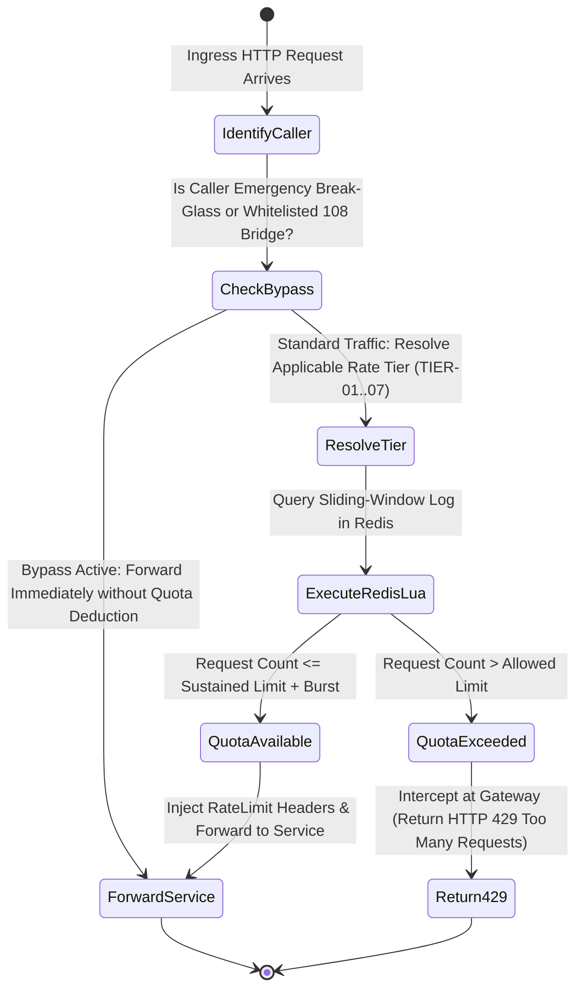

# 🔌 API Specification: Tiered Rate Limiting, Quotas & Traffic Shaping
## Namma Clinic Digital Health & Operations Platform
**Document Code:** API-DOC-21 | **Status:** Authoritative Baseline | **Date:** September 2026
> **Municipal Health Authority:** Greater Bengaluru Authority (GBA) / BBMP Health Department
> **Standard Framework:** RFC 6585 (Additional HTTP Status Codes), IETF Draft RateLimit Headers (draft-ietf-httpapi-ratelimit-headers)
> **Notice:** All code snippets contained herein are strictly **DOCUMENTATION-ONLY OPENAPI** or **DOCUMENTATION-ONLY EXAMPLE**. Zero application runtime code is executed in this phase.

---

## 1. Executive Summary & Traffic Shaping Architecture

The Namma Clinic rate limiting architecture protects platform availability, guarantees operational fairness across 183 clinics, prevents noisy neighbor starvation, and guards against automated brute force and denial of service (DoS) attacks. Because clinics handle life-critical emergencies alongside routine outpatient intake, traffic shaping employs multi-tiered token bucket algorithms with dynamic burst allowances and statutory emergency bypasses.

### 1.1 Core Tenets
1. **Tiered Allocations:** Quotas are categorized into 7 discrete tiers based on caller privilege and resource cost (ranging from 60 req/min for anonymous login attempts to 180 req/min for active doctor consultations).
2. **Dual Burst and Sustained Envelopes:** Every tier defines both a steady-state sustained refill rate and a short-term burst ceiling to absorb rapid barcode scanning and bulk triage vitals entry.
3. **Distributed Atomic Enforcement:** Central cloud gateways utilize Redis sliding-window counters executed via atomic Lua scripts to prevent race conditions across load-balanced pods.
4. **Autonomous Edge Quotas:** Clinic edge mini-servers enforce local in-memory token buckets during WAN disconnects, protecting the local SQLite database from workstation queue flooding.
5. **Standardized Compliance Headers:** Egress responses continuously broadcast remaining quota, reset time, and backoff delays via IETF-standardized HTTP headers.

## 2. Sliding-Window Rate Enforcement State Machine



## 3. Authoritative Rate Limiting Tiers & Quota Specifications

The platform governs traffic across seven standardized tiers:

| Tier ID | Tier Name | Caller Identification Scope | Sustained Limit | Burst Allowance | Window Seconds | Retry-After |
| :--- | :--- | :--- | :--- | :--- | :--- | :--- |
| **TIER-01** | Anonymous & Public Ingress | `Per IP Address` | `60 req/min` | `15 requests` | 60s | 60s |
| **TIER-02** | Frontline Workstation Operations | `Per Authenticated User / Session` | `120 req/min` | `30 requests` | 60s | 30s |
| **TIER-03** | Clinical Encounter & Prescribing | `Per Authenticated Doctor / Clinician` | `180 req/min` | `40 requests` | 60s | 15s |
| **TIER-04** | Pharmacy & Inventory Ledger | `Per Facility Dispensary` | `150 req/min` | `35 requests` | 60s | 30s |
| **TIER-05** | Municipal Analytics & Reporting | `Per Municipal Officer` | `30 req/min` | `5 requests` | 60s | 60s |
| **TIER-06** | National Health Grid & ABDM Bridge | `Per NHA Integration Client ID` | `100 req/min` | `25 requests` | 60s | 60s |
| **TIER-07** | Citizen Data Portability & GDPR/DPDP | `Per Citizen UHID` | `2 req/day` | `1 request` | 86400s | 86400s |

## 4. Standard Rate Limiting Egress Headers

Every response transmitted by the API gateway includes the following traffic shaping headers:

```http
# DOCUMENTATION-ONLY EXAMPLE
HTTP/1.1 200 OK
Content-Type: application/json
RateLimit-Limit: 120
RateLimit-Remaining: 114
RateLimit-Reset: 42
RateLimit-Policy: "120;w=60;burst=30"
X-Correlation-ID: 018e3a20-8000-7000-8000-000000000001
```

When a quota is breached, the gateway rejects the request with HTTP 429:
```http
# DOCUMENTATION-ONLY EXAMPLE
HTTP/1.1 429 Too Many Requests
Content-Type: application/json
RateLimit-Limit: 120
RateLimit-Remaining: 0
RateLimit-Reset: 18
Retry-After: 18
X-Correlation-ID: 018e3a20-8000-7000-8000-000000000001

{
  "error": {
    "code": "ERR-SYS-007",
    "message": "Rate limit quota exceeded. Please back off for 18 seconds before retrying.",
    "category": "RateLimitExceeded",
    "correlationId": "018e3a20-8000-7000-8000-000000000001",
    "timestamp": "2026-09-01T09:30:00.000Z",
    "retryable": true,
    "details": [
      {
        "field": "RateLimit-Remaining",
        "rule": "quota_exhausted",
        "message": "Allowed quota: 120 requests/minute. Current window resets in 18 seconds."
      }
    ]
  }
}
```

## 5. Distributed Redis Sliding-Window Algorithm

To prevent split-brain quota errors across multiple API gateway nodes, rate limit consumption runs as an atomic Lua script against Redis:

```lua
-- DOCUMENTATION-ONLY EXAMPLE
-- Redis sliding window rate limiter Lua script
local key = KEYS[1]
local now = tonumber(ARGV[1])
local window = tonumber(ARGV[2])
local limit = tonumber(ARGV[3])
local clearBefore = now - window

redis.call('ZREMRANGEBYSCORE', key, 0, clearBefore)
local currentRequests = redis.call('ZCARD', key)

if currentRequests < limit then
    redis.call('ZADD', key, now, now)
    redis.call('EXPIRE', key, window)
    return { 1, limit - currentRequests - 1, 0 }
else
    local oldest = redis.call('ZRANGE', key, 0, 0, 'WITHSCORES')
    local resetTime = math.ceil((tonumber(oldest[2]) + window - now) / 1000)
    return { 0, 0, resetTime }
end
```

## 6. Comprehensive Endpoint Rate Limiting Allocations (All 341 Endpoints)

Authoritative rate limit allocations for all 341 platform endpoints:

| Endpoint ID | Route Path | Functional Domain | Assigned Policy | Sustained Quota | Burst Ceiling | Isolation Scope |
| :--- | :--- | :--- | :--- | :--- | :--- | :--- |
| **API-AUTH-001** | `POST /api/v1/auth/login` | Auth | `10 req/min per IP (Burst 15)` | 10 req/min per IP (Burst 15) | 10 requests | Per Session / Facility |
| **API-AUTH-002** | `POST /api/v1/auth/refresh` | Auth | `30 req/min per Session` | 30 req/min per Session | 10 requests | Per Session / Facility |
| **API-AUTH-003** | `POST /api/v1/auth/logout` | Auth | `20 req/min per User` | 20 req/min per User | 10 requests | Per Session / Facility |
| **API-AUTH-004** | `GET /api/v1/auth/me` | Auth | `60 req/min per User` | 60 req/min per User | 15 requests | Per Session / Facility |
| **API-AUTH-005** | `POST /api/v1/auth/password/change` | Auth | `5 req/hour per User` | 5 req/hour per User | 10 requests | Per Session / Facility |
| **API-AUTH-006** | `GET /api/v1/auth/.well-known/jwks.json` | Auth | `1000 req/min (CDN Cached)` | 1000 req/min (CDN Cached) | 10 requests | Per Session / Facility |
| **API-AUTH-007** | `POST /api/v1/auth/mfa/verify` | Auth | `5 req/min per Session` | 5 req/min per Session | 10 requests | Per Session / Facility |
| **API-AUTH-008** | `POST /api/v1/auth/break-glass` | Auth | `3 req/hour per Doctor` | 3 req/hour per Doctor | 10 requests | Per Session / Facility |
| **API-AUTH-009** | `POST /api/v1/auth/devices/register` | Auth | `10 req/day per Facility` | 10 req/day per Facility | 10 requests | Per Session / Facility |
| **API-AUTH-010** | `GET /api/v1/auth/devices` | Auth | `30 req/min per Facility` | 30 req/min per Facility | 10 requests | Per Session / Facility |
| **API-AUTH-011** | `DELETE /api/v1/auth/devices/{deviceId}` | Auth | `10 req/hour per Admin` | 10 req/hour per Admin | 10 requests | Per Session / Facility |
| **API-AUTH-012** | `GET /api/v1/auth/roles` | Auth | `60 req/min per User` | 60 req/min per User | 15 requests | Per Session / Facility |
| **API-AUTH-013** | `POST /api/v1/auth/users/{userId}/roles` | Auth | `20 req/hour per Supervisor` | 20 req/hour per Supervisor | 10 requests | Per Session / Facility |
| **API-AUTH-014** | `GET /api/v1/auth/sessions` | Auth | `30 req/min per Admin` | 30 req/min per Admin | 10 requests | Per Session / Facility |
| **API-AUTH-015** | `DELETE /api/v1/auth/sessions/{sessionId}` | Auth | `30 req/min per Admin` | 30 req/min per Admin | 10 requests | Per Session / Facility |
| **API-AUTH-016** | `POST /api/v1/auth/shifts/clock-in` | Auth | `5 req/day per Staff` | 5 req/day per Staff | 10 requests | Per Session / Facility |
| **API-PATIENT-001** | `POST /api/v1/patients` | Patient | `60 req/min per Facility` | 60 req/min per Facility | 15 requests | Per Session / Facility |
| **API-PATIENT-002** | `GET /api/v1/patients/{patientId}` | Patient | `120 req/min per User` | 120 req/min per User | 30 requests | Per Session / Facility |
| **API-PATIENT-003** | `GET /api/v1/patients` | Patient | `60 req/min per User` | 60 req/min per User | 15 requests | Per Session / Facility |
| **API-PATIENT-004** | `PUT /api/v1/patients/{patientId}` | Patient | `30 req/min per User` | 30 req/min per User | 10 requests | Per Session / Facility |
| **API-PATIENT-005** | `POST /api/v1/patients/duplicates/check` | Patient | `60 req/min per Facility` | 60 req/min per Facility | 15 requests | Per Session / Facility |
| **API-PATIENT-006** | `POST /api/v1/patients/merge` | Patient | `10 req/hour per Supervisor` | 10 req/hour per Supervisor | 10 requests | Per Session / Facility |
| **API-PATIENT-007** | `POST /api/v1/patients/{patientId}/abha/link` | Patient | `30 req/min per Facility` | 30 req/min per Facility | 10 requests | Per Session / Facility |
| **API-PATIENT-008** | `DELETE /api/v1/patients/{patientId}/abha/unlink` | Patient | `10 req/min per Facility` | 10 req/min per Facility | 10 requests | Per Session / Facility |
| **API-PATIENT-009** | `GET /api/v1/patients/{patientId}/history` | Patient | `60 req/min per Doctor` | 60 req/min per Doctor | 15 requests | Per Session / Facility |
| **API-PATIENT-010** | `GET /api/v1/patients/{patientId}/consents` | Patient | `60 req/min per User` | 60 req/min per User | 15 requests | Per Session / Facility |
| **API-PATIENT-011** | `POST /api/v1/patients/{patientId}/consents` | Patient | `30 req/min per Facility` | 30 req/min per Facility | 10 requests | Per Session / Facility |
| **API-PATIENT-012** | `DELETE /api/v1/patients/{patientId}/consents/{consentId}` | Patient | `20 req/min per Facility` | 20 req/min per Facility | 10 requests | Per Session / Facility |
| **API-PATIENT-013** | `GET /api/v1/patients/{patientId}/audit` | Patient | `20 req/min per Auditor` | 20 req/min per Auditor | 10 requests | Per Session / Facility |
| **API-PATIENT-014** | `POST /api/v1/patients/{patientId}/ncd-enroll` | Patient | `30 req/min per Clinician` | 30 req/min per Clinician | 10 requests | Per Session / Facility |
| **API-PATIENT-015** | `GET /api/v1/patients/{patientId}/ncd-status` | Patient | `60 req/min per User` | 60 req/min per User | 15 requests | Per Session / Facility |
| **API-PATIENT-016** | `POST /api/v1/patients/{patientId}/emergency-contacts` | Patient | `30 req/min per User` | 30 req/min per User | 10 requests | Per Session / Facility |
| **API-PATIENT-017** | `GET /api/v1/patients/{patientId}/identifiers` | Patient | `60 req/min per User` | 60 req/min per User | 15 requests | Per Session / Facility |
| **API-PATIENT-018** | `POST /api/v1/patients/{patientId}/identifiers` | Patient | `30 req/min per Facility` | 30 req/min per Facility | 10 requests | Per Session / Facility |
| **API-PATIENT-019** | `DELETE /api/v1/patients/{patientId}/identifiers/{identifierId}` | Patient | `10 req/min per Supervisor` | 10 req/min per Supervisor | 10 requests | Per Session / Facility |
| **API-PATIENT-020** | `POST /api/v1/patients/{patientId}/flag-deceased` | Patient | `10 req/day per Supervisor` | 10 req/day per Supervisor | 10 requests | Per Session / Facility |
| **API-PATIENT-021** | `GET /api/v1/patients/{patientId}/encounters` | Patient | `60 req/min per Doctor` | 60 req/min per Doctor | 15 requests | Per Session / Facility |
| **API-PATIENT-022** | `GET /api/v1/patients/{patientId}/prescriptions` | Patient | `60 req/min per User` | 60 req/min per User | 15 requests | Per Session / Facility |
| **API-PATIENT-023** | `GET /api/v1/patients/{patientId}/lab-reports` | Patient | `60 req/min per User` | 60 req/min per User | 15 requests | Per Session / Facility |
| **API-PATIENT-024** | `POST /api/v1/patients/{patientId}/photo` | Patient | `30 req/min per Facility` | 30 req/min per Facility | 10 requests | Per Session / Facility |
| **API-PATIENT-025** | `GET /api/v1/patients/{patientId}/photo` | Patient | `60 req/min per User` | 60 req/min per User | 15 requests | Per Session / Facility |
| **API-PATIENT-026** | `POST /api/v1/patients/batch-lookup` | Patient | `10 req/min per Nurse` | 10 req/min per Nurse | 10 requests | Per Session / Facility |
| **API-VISIT-001** | `POST /api/v1/visits` | Visit | `60 req/min per User` | 60 req/min per User | 15 requests | Per Session / Facility |
| **API-VISIT-002** | `GET /api/v1/visits/{visitId}` | Visit | `60 req/min per User` | 60 req/min per User | 15 requests | Per Session / Facility |
| **API-VISIT-003** | `GET /api/v1/visits` | Visit | `60 req/min per User` | 60 req/min per User | 15 requests | Per Session / Facility |
| **API-VISIT-004** | `PUT /api/v1/visits/{visitId}` | Visit | `60 req/min per User` | 60 req/min per User | 15 requests | Per Session / Facility |
| **API-VISIT-005** | `PATCH /api/v1/visits/{visitId}/status` | Visit | `60 req/min per User` | 60 req/min per User | 15 requests | Per Session / Facility |
| **API-VISIT-006** | `GET /api/v1/visits/{visitId}/search` | Visit | `60 req/min per User` | 60 req/min per User | 15 requests | Per Session / Facility |
| **API-VISIT-007** | `GET /api/v1/visits/history` | Visit | `60 req/min per User` | 60 req/min per User | 15 requests | Per Session / Facility |
| **API-VISIT-008** | `GET /api/v1/visits/{visitId}/audit` | Visit | `60 req/min per User` | 60 req/min per User | 15 requests | Per Session / Facility |
| **API-VISIT-009** | `POST /api/v1/visits/cancel` | Visit | `60 req/min per User` | 60 req/min per User | 15 requests | Per Session / Facility |
| **API-VISIT-010** | `POST /api/v1/visits/verify` | Visit | `60 req/min per User` | 60 req/min per User | 15 requests | Per Session / Facility |
| **API-VISIT-011** | `GET /api/v1/visits/export` | Visit | `60 req/min per User` | 60 req/min per User | 15 requests | Per Session / Facility |
| **API-VISIT-012** | `GET /api/v1/visits/{visitId}/metrics` | Visit | `60 req/min per User` | 60 req/min per User | 15 requests | Per Session / Facility |
| **API-VISIT-013** | `POST /api/v1/visits/reconcile` | Visit | `60 req/min per User` | 60 req/min per User | 15 requests | Per Session / Facility |
| **API-VISIT-014** | `POST /api/v1/visits/batch` | Visit | `60 req/min per User` | 60 req/min per User | 15 requests | Per Session / Facility |
| **API-VISIT-015** | `GET /api/v1/visits/sync` | Visit | `60 req/min per User` | 60 req/min per User | 15 requests | Per Session / Facility |
| **API-VISIT-016** | `GET /api/v1/visits/{visitId}/alerts` | Visit | `60 req/min per User` | 60 req/min per User | 15 requests | Per Session / Facility |
| **API-VISIT-017** | `POST /api/v1/visits/escalate` | Visit | `60 req/min per User` | 60 req/min per User | 15 requests | Per Session / Facility |
| **API-VISIT-018** | `POST /api/v1/visits/approve` | Visit | `60 req/min per User` | 60 req/min per User | 15 requests | Per Session / Facility |
| **API-VISIT-019** | `POST /api/v1/visits/reversal` | Visit | `60 req/min per User` | 60 req/min per User | 15 requests | Per Session / Facility |
| **API-VISIT-020** | `GET /api/v1/visits/{visitId}/items` | Visit | `60 req/min per User` | 60 req/min per User | 15 requests | Per Session / Facility |
| **API-VISIT-021** | `GET /api/v1/visits/documents` | Visit | `60 req/min per User` | 60 req/min per User | 15 requests | Per Session / Facility |
| **API-TRIAGE-001** | `POST /api/v1/triage` | Triage | `60 req/min per User` | 60 req/min per User | 15 requests | Per Session / Facility |
| **API-TRIAGE-002** | `GET /api/v1/triage/{triageId}` | Triage | `60 req/min per User` | 60 req/min per User | 15 requests | Per Session / Facility |
| **API-TRIAGE-003** | `GET /api/v1/triage` | Triage | `60 req/min per User` | 60 req/min per User | 15 requests | Per Session / Facility |
| **API-TRIAGE-004** | `PUT /api/v1/triage/{triageId}` | Triage | `60 req/min per User` | 60 req/min per User | 15 requests | Per Session / Facility |
| **API-TRIAGE-005** | `PATCH /api/v1/triage/{triageId}/status` | Triage | `60 req/min per User` | 60 req/min per User | 15 requests | Per Session / Facility |
| **API-TRIAGE-006** | `GET /api/v1/triage/{triageId}/search` | Triage | `60 req/min per User` | 60 req/min per User | 15 requests | Per Session / Facility |
| **API-TRIAGE-007** | `GET /api/v1/triage/history` | Triage | `60 req/min per User` | 60 req/min per User | 15 requests | Per Session / Facility |
| **API-TRIAGE-008** | `GET /api/v1/triage/{triageId}/audit` | Triage | `60 req/min per User` | 60 req/min per User | 15 requests | Per Session / Facility |
| **API-TRIAGE-009** | `POST /api/v1/triage/cancel` | Triage | `60 req/min per User` | 60 req/min per User | 15 requests | Per Session / Facility |
| **API-TRIAGE-010** | `POST /api/v1/triage/verify` | Triage | `60 req/min per User` | 60 req/min per User | 15 requests | Per Session / Facility |
| **API-TRIAGE-011** | `GET /api/v1/triage/export` | Triage | `60 req/min per User` | 60 req/min per User | 15 requests | Per Session / Facility |
| **API-TRIAGE-012** | `GET /api/v1/triage/{triageId}/metrics` | Triage | `60 req/min per User` | 60 req/min per User | 15 requests | Per Session / Facility |
| **API-TRIAGE-013** | `POST /api/v1/triage/reconcile` | Triage | `60 req/min per User` | 60 req/min per User | 15 requests | Per Session / Facility |
| **API-TRIAGE-014** | `POST /api/v1/triage/batch` | Triage | `60 req/min per User` | 60 req/min per User | 15 requests | Per Session / Facility |
| **API-TRIAGE-015** | `GET /api/v1/triage/sync` | Triage | `60 req/min per User` | 60 req/min per User | 15 requests | Per Session / Facility |
| **API-TRIAGE-016** | `GET /api/v1/triage/{triageId}/alerts` | Triage | `60 req/min per User` | 60 req/min per User | 15 requests | Per Session / Facility |
| **API-TRIAGE-017** | `POST /api/v1/triage/escalate` | Triage | `60 req/min per User` | 60 req/min per User | 15 requests | Per Session / Facility |
| **API-TRIAGE-018** | `POST /api/v1/triage/approve` | Triage | `60 req/min per User` | 60 req/min per User | 15 requests | Per Session / Facility |
| **API-TRIAGE-019** | `POST /api/v1/triage/reversal` | Triage | `60 req/min per User` | 60 req/min per User | 15 requests | Per Session / Facility |
| **API-CONSULT-001** | `POST /api/v1/consultations` | Consultation | `60 req/min per User` | 60 req/min per User | 15 requests | Per Session / Facility |
| **API-CONSULT-002** | `GET /api/v1/consultations/{consultationId}` | Consultation | `60 req/min per User` | 60 req/min per User | 15 requests | Per Session / Facility |
| **API-CONSULT-003** | `GET /api/v1/consultations` | Consultation | `60 req/min per User` | 60 req/min per User | 15 requests | Per Session / Facility |
| **API-CONSULT-004** | `PUT /api/v1/consultations/{consultationId}` | Consultation | `60 req/min per User` | 60 req/min per User | 15 requests | Per Session / Facility |
| **API-CONSULT-005** | `PATCH /api/v1/consultations/{consultationId}/status` | Consultation | `60 req/min per User` | 60 req/min per User | 15 requests | Per Session / Facility |
| **API-CONSULT-006** | `GET /api/v1/consultations/{consultationId}/search` | Consultation | `60 req/min per User` | 60 req/min per User | 15 requests | Per Session / Facility |
| **API-CONSULT-007** | `GET /api/v1/consultations/history` | Consultation | `60 req/min per User` | 60 req/min per User | 15 requests | Per Session / Facility |
| **API-CONSULT-008** | `GET /api/v1/consultations/{consultationId}/audit` | Consultation | `60 req/min per User` | 60 req/min per User | 15 requests | Per Session / Facility |
| **API-CONSULT-009** | `POST /api/v1/consultations/cancel` | Consultation | `60 req/min per User` | 60 req/min per User | 15 requests | Per Session / Facility |
| **API-CONSULT-010** | `POST /api/v1/consultations/verify` | Consultation | `60 req/min per User` | 60 req/min per User | 15 requests | Per Session / Facility |
| **API-CONSULT-011** | `GET /api/v1/consultations/export` | Consultation | `60 req/min per User` | 60 req/min per User | 15 requests | Per Session / Facility |
| **API-CONSULT-012** | `GET /api/v1/consultations/{consultationId}/metrics` | Consultation | `60 req/min per User` | 60 req/min per User | 15 requests | Per Session / Facility |
| **API-CONSULT-013** | `POST /api/v1/consultations/reconcile` | Consultation | `60 req/min per User` | 60 req/min per User | 15 requests | Per Session / Facility |
| **API-CONSULT-014** | `POST /api/v1/consultations/batch` | Consultation | `60 req/min per User` | 60 req/min per User | 15 requests | Per Session / Facility |
| **API-CONSULT-015** | `GET /api/v1/consultations/sync` | Consultation | `60 req/min per User` | 60 req/min per User | 15 requests | Per Session / Facility |
| **API-CONSULT-016** | `GET /api/v1/consultations/{consultationId}/alerts` | Consultation | `60 req/min per User` | 60 req/min per User | 15 requests | Per Session / Facility |
| **API-CONSULT-017** | `POST /api/v1/consultations/escalate` | Consultation | `60 req/min per User` | 60 req/min per User | 15 requests | Per Session / Facility |
| **API-CONSULT-018** | `POST /api/v1/consultations/approve` | Consultation | `60 req/min per User` | 60 req/min per User | 15 requests | Per Session / Facility |
| **API-CONSULT-019** | `POST /api/v1/consultations/reversal` | Consultation | `60 req/min per User` | 60 req/min per User | 15 requests | Per Session / Facility |
| **API-CONSULT-020** | `GET /api/v1/consultations/{consultationId}/items` | Consultation | `60 req/min per User` | 60 req/min per User | 15 requests | Per Session / Facility |
| **API-CONSULT-021** | `GET /api/v1/consultations/documents` | Consultation | `60 req/min per User` | 60 req/min per User | 15 requests | Per Session / Facility |
| **API-CONSULT-022** | `GET /api/v1/consultations/{consultationId}/timeline` | Consultation | `60 req/min per User` | 60 req/min per User | 15 requests | Per Session / Facility |
| **API-CONSULT-023** | `GET /api/v1/consultations/stats` | Consultation | `60 req/min per User` | 60 req/min per User | 15 requests | Per Session / Facility |
| **API-RX-001** | `POST /api/v1/prescriptions` | Prescription | `60 req/min per User` | 60 req/min per User | 15 requests | Per Session / Facility |
| **API-RX-002** | `GET /api/v1/prescriptions/{prescriptionId}` | Prescription | `60 req/min per User` | 60 req/min per User | 15 requests | Per Session / Facility |
| **API-RX-003** | `GET /api/v1/prescriptions` | Prescription | `60 req/min per User` | 60 req/min per User | 15 requests | Per Session / Facility |
| **API-RX-004** | `PUT /api/v1/prescriptions/{prescriptionId}` | Prescription | `60 req/min per User` | 60 req/min per User | 15 requests | Per Session / Facility |
| **API-RX-005** | `PATCH /api/v1/prescriptions/{prescriptionId}/status` | Prescription | `60 req/min per User` | 60 req/min per User | 15 requests | Per Session / Facility |
| **API-RX-006** | `GET /api/v1/prescriptions/{prescriptionId}/search` | Prescription | `60 req/min per User` | 60 req/min per User | 15 requests | Per Session / Facility |
| **API-RX-007** | `GET /api/v1/prescriptions/history` | Prescription | `60 req/min per User` | 60 req/min per User | 15 requests | Per Session / Facility |
| **API-RX-008** | `GET /api/v1/prescriptions/{prescriptionId}/audit` | Prescription | `60 req/min per User` | 60 req/min per User | 15 requests | Per Session / Facility |
| **API-RX-009** | `POST /api/v1/prescriptions/cancel` | Prescription | `60 req/min per User` | 60 req/min per User | 15 requests | Per Session / Facility |
| **API-RX-010** | `POST /api/v1/prescriptions/verify` | Prescription | `60 req/min per User` | 60 req/min per User | 15 requests | Per Session / Facility |
| **API-RX-011** | `GET /api/v1/prescriptions/export` | Prescription | `60 req/min per User` | 60 req/min per User | 15 requests | Per Session / Facility |
| **API-RX-012** | `GET /api/v1/prescriptions/{prescriptionId}/metrics` | Prescription | `60 req/min per User` | 60 req/min per User | 15 requests | Per Session / Facility |
| **API-RX-013** | `POST /api/v1/prescriptions/reconcile` | Prescription | `60 req/min per User` | 60 req/min per User | 15 requests | Per Session / Facility |
| **API-RX-014** | `POST /api/v1/prescriptions/batch` | Prescription | `60 req/min per User` | 60 req/min per User | 15 requests | Per Session / Facility |
| **API-RX-015** | `GET /api/v1/prescriptions/sync` | Prescription | `60 req/min per User` | 60 req/min per User | 15 requests | Per Session / Facility |
| **API-RX-016** | `GET /api/v1/prescriptions/{prescriptionId}/alerts` | Prescription | `60 req/min per User` | 60 req/min per User | 15 requests | Per Session / Facility |
| **API-RX-017** | `POST /api/v1/prescriptions/escalate` | Prescription | `60 req/min per User` | 60 req/min per User | 15 requests | Per Session / Facility |
| **API-RX-018** | `POST /api/v1/prescriptions/approve` | Prescription | `60 req/min per User` | 60 req/min per User | 15 requests | Per Session / Facility |
| **API-RX-019** | `POST /api/v1/prescriptions/reversal` | Prescription | `60 req/min per User` | 60 req/min per User | 15 requests | Per Session / Facility |
| **API-PHARM-001** | `POST /api/v1/pharmacy` | Pharmacy | `60 req/min per User` | 60 req/min per User | 15 requests | Per Session / Facility |
| **API-PHARM-002** | `GET /api/v1/pharmacy/{pharmacyId}` | Pharmacy | `60 req/min per User` | 60 req/min per User | 15 requests | Per Session / Facility |
| **API-PHARM-003** | `GET /api/v1/pharmacy` | Pharmacy | `60 req/min per User` | 60 req/min per User | 15 requests | Per Session / Facility |
| **API-PHARM-004** | `PUT /api/v1/pharmacy/{pharmacyId}` | Pharmacy | `60 req/min per User` | 60 req/min per User | 15 requests | Per Session / Facility |
| **API-PHARM-005** | `PATCH /api/v1/pharmacy/{pharmacyId}/status` | Pharmacy | `60 req/min per User` | 60 req/min per User | 15 requests | Per Session / Facility |
| **API-PHARM-006** | `GET /api/v1/pharmacy/{pharmacyId}/search` | Pharmacy | `60 req/min per User` | 60 req/min per User | 15 requests | Per Session / Facility |
| **API-PHARM-007** | `GET /api/v1/pharmacy/history` | Pharmacy | `60 req/min per User` | 60 req/min per User | 15 requests | Per Session / Facility |
| **API-PHARM-008** | `GET /api/v1/pharmacy/{pharmacyId}/audit` | Pharmacy | `60 req/min per User` | 60 req/min per User | 15 requests | Per Session / Facility |
| **API-PHARM-009** | `POST /api/v1/pharmacy/cancel` | Pharmacy | `60 req/min per User` | 60 req/min per User | 15 requests | Per Session / Facility |
| **API-PHARM-010** | `POST /api/v1/pharmacy/verify` | Pharmacy | `60 req/min per User` | 60 req/min per User | 15 requests | Per Session / Facility |
| **API-PHARM-011** | `GET /api/v1/pharmacy/export` | Pharmacy | `60 req/min per User` | 60 req/min per User | 15 requests | Per Session / Facility |
| **API-PHARM-012** | `GET /api/v1/pharmacy/{pharmacyId}/metrics` | Pharmacy | `60 req/min per User` | 60 req/min per User | 15 requests | Per Session / Facility |
| **API-PHARM-013** | `POST /api/v1/pharmacy/reconcile` | Pharmacy | `60 req/min per User` | 60 req/min per User | 15 requests | Per Session / Facility |
| **API-PHARM-014** | `POST /api/v1/pharmacy/batch` | Pharmacy | `60 req/min per User` | 60 req/min per User | 15 requests | Per Session / Facility |
| **API-PHARM-015** | `GET /api/v1/pharmacy/sync` | Pharmacy | `60 req/min per User` | 60 req/min per User | 15 requests | Per Session / Facility |
| **API-PHARM-016** | `GET /api/v1/pharmacy/{pharmacyId}/alerts` | Pharmacy | `60 req/min per User` | 60 req/min per User | 15 requests | Per Session / Facility |
| **API-PHARM-017** | `POST /api/v1/pharmacy/escalate` | Pharmacy | `60 req/min per User` | 60 req/min per User | 15 requests | Per Session / Facility |
| **API-PHARM-018** | `POST /api/v1/pharmacy/approve` | Pharmacy | `60 req/min per User` | 60 req/min per User | 15 requests | Per Session / Facility |
| **API-PHARM-019** | `POST /api/v1/pharmacy/reversal` | Pharmacy | `60 req/min per User` | 60 req/min per User | 15 requests | Per Session / Facility |
| **API-PHARM-020** | `GET /api/v1/pharmacy/{pharmacyId}/items` | Pharmacy | `60 req/min per User` | 60 req/min per User | 15 requests | Per Session / Facility |
| **API-PHARM-021** | `GET /api/v1/pharmacy/documents` | Pharmacy | `60 req/min per User` | 60 req/min per User | 15 requests | Per Session / Facility |
| **API-INV-001** | `POST /api/v1/inventory` | Inventory | `60 req/min per User` | 60 req/min per User | 15 requests | Per Session / Facility |
| **API-INV-002** | `GET /api/v1/inventory/{inventoryId}` | Inventory | `60 req/min per User` | 60 req/min per User | 15 requests | Per Session / Facility |
| **API-INV-003** | `GET /api/v1/inventory` | Inventory | `60 req/min per User` | 60 req/min per User | 15 requests | Per Session / Facility |
| **API-INV-004** | `PUT /api/v1/inventory/{inventoryId}` | Inventory | `60 req/min per User` | 60 req/min per User | 15 requests | Per Session / Facility |
| **API-INV-005** | `PATCH /api/v1/inventory/{inventoryId}/status` | Inventory | `60 req/min per User` | 60 req/min per User | 15 requests | Per Session / Facility |
| **API-INV-006** | `GET /api/v1/inventory/{inventoryId}/search` | Inventory | `60 req/min per User` | 60 req/min per User | 15 requests | Per Session / Facility |
| **API-INV-007** | `GET /api/v1/inventory/history` | Inventory | `60 req/min per User` | 60 req/min per User | 15 requests | Per Session / Facility |
| **API-INV-008** | `GET /api/v1/inventory/{inventoryId}/audit` | Inventory | `60 req/min per User` | 60 req/min per User | 15 requests | Per Session / Facility |
| **API-INV-009** | `POST /api/v1/inventory/cancel` | Inventory | `60 req/min per User` | 60 req/min per User | 15 requests | Per Session / Facility |
| **API-INV-010** | `POST /api/v1/inventory/verify` | Inventory | `60 req/min per User` | 60 req/min per User | 15 requests | Per Session / Facility |
| **API-INV-011** | `GET /api/v1/inventory/export` | Inventory | `60 req/min per User` | 60 req/min per User | 15 requests | Per Session / Facility |
| **API-INV-012** | `GET /api/v1/inventory/{inventoryId}/metrics` | Inventory | `60 req/min per User` | 60 req/min per User | 15 requests | Per Session / Facility |
| **API-INV-013** | `POST /api/v1/inventory/reconcile` | Inventory | `60 req/min per User` | 60 req/min per User | 15 requests | Per Session / Facility |
| **API-INV-014** | `POST /api/v1/inventory/batch` | Inventory | `60 req/min per User` | 60 req/min per User | 15 requests | Per Session / Facility |
| **API-INV-015** | `GET /api/v1/inventory/sync` | Inventory | `60 req/min per User` | 60 req/min per User | 15 requests | Per Session / Facility |
| **API-INV-016** | `GET /api/v1/inventory/{inventoryId}/alerts` | Inventory | `60 req/min per User` | 60 req/min per User | 15 requests | Per Session / Facility |
| **API-INV-017** | `POST /api/v1/inventory/escalate` | Inventory | `60 req/min per User` | 60 req/min per User | 15 requests | Per Session / Facility |
| **API-INV-018** | `POST /api/v1/inventory/approve` | Inventory | `60 req/min per User` | 60 req/min per User | 15 requests | Per Session / Facility |
| **API-INV-019** | `POST /api/v1/inventory/reversal` | Inventory | `60 req/min per User` | 60 req/min per User | 15 requests | Per Session / Facility |
| **API-INV-020** | `GET /api/v1/inventory/{inventoryId}/items` | Inventory | `60 req/min per User` | 60 req/min per User | 15 requests | Per Session / Facility |
| **API-INV-021** | `GET /api/v1/inventory/documents` | Inventory | `60 req/min per User` | 60 req/min per User | 15 requests | Per Session / Facility |
| **API-INV-022** | `GET /api/v1/inventory/{inventoryId}/timeline` | Inventory | `60 req/min per User` | 60 req/min per User | 15 requests | Per Session / Facility |
| **API-INV-023** | `GET /api/v1/inventory/stats` | Inventory | `60 req/min per User` | 60 req/min per User | 15 requests | Per Session / Facility |
| **API-INV-024** | `GET /api/v1/inventory/{inventoryId}/search` | Inventory | `60 req/min per User` | 60 req/min per User | 15 requests | Per Session / Facility |
| **API-INV-025** | `GET /api/v1/inventory/history` | Inventory | `60 req/min per User` | 60 req/min per User | 15 requests | Per Session / Facility |
| **API-INV-026** | `GET /api/v1/inventory/{inventoryId}/audit` | Inventory | `60 req/min per User` | 60 req/min per User | 15 requests | Per Session / Facility |
| **API-LAB-001** | `POST /api/v1/lab` | Lab | `60 req/min per User` | 60 req/min per User | 15 requests | Per Session / Facility |
| **API-LAB-002** | `GET /api/v1/lab/{labId}` | Lab | `60 req/min per User` | 60 req/min per User | 15 requests | Per Session / Facility |
| **API-LAB-003** | `GET /api/v1/lab` | Lab | `60 req/min per User` | 60 req/min per User | 15 requests | Per Session / Facility |
| **API-LAB-004** | `PUT /api/v1/lab/{labId}` | Lab | `60 req/min per User` | 60 req/min per User | 15 requests | Per Session / Facility |
| **API-LAB-005** | `PATCH /api/v1/lab/{labId}/status` | Lab | `60 req/min per User` | 60 req/min per User | 15 requests | Per Session / Facility |
| **API-LAB-006** | `GET /api/v1/lab/{labId}/search` | Lab | `60 req/min per User` | 60 req/min per User | 15 requests | Per Session / Facility |
| **API-LAB-007** | `GET /api/v1/lab/history` | Lab | `60 req/min per User` | 60 req/min per User | 15 requests | Per Session / Facility |
| **API-LAB-008** | `GET /api/v1/lab/{labId}/audit` | Lab | `60 req/min per User` | 60 req/min per User | 15 requests | Per Session / Facility |
| **API-LAB-009** | `POST /api/v1/lab/cancel` | Lab | `60 req/min per User` | 60 req/min per User | 15 requests | Per Session / Facility |
| **API-LAB-010** | `POST /api/v1/lab/verify` | Lab | `60 req/min per User` | 60 req/min per User | 15 requests | Per Session / Facility |
| **API-LAB-011** | `GET /api/v1/lab/export` | Lab | `60 req/min per User` | 60 req/min per User | 15 requests | Per Session / Facility |
| **API-LAB-012** | `GET /api/v1/lab/{labId}/metrics` | Lab | `60 req/min per User` | 60 req/min per User | 15 requests | Per Session / Facility |
| **API-LAB-013** | `POST /api/v1/lab/reconcile` | Lab | `60 req/min per User` | 60 req/min per User | 15 requests | Per Session / Facility |
| **API-LAB-014** | `POST /api/v1/lab/batch` | Lab | `60 req/min per User` | 60 req/min per User | 15 requests | Per Session / Facility |
| **API-LAB-015** | `GET /api/v1/lab/sync` | Lab | `60 req/min per User` | 60 req/min per User | 15 requests | Per Session / Facility |
| **API-LAB-016** | `GET /api/v1/lab/{labId}/alerts` | Lab | `60 req/min per User` | 60 req/min per User | 15 requests | Per Session / Facility |
| **API-LAB-017** | `POST /api/v1/lab/escalate` | Lab | `60 req/min per User` | 60 req/min per User | 15 requests | Per Session / Facility |
| **API-LAB-018** | `POST /api/v1/lab/approve` | Lab | `60 req/min per User` | 60 req/min per User | 15 requests | Per Session / Facility |
| **API-LAB-019** | `POST /api/v1/lab/reversal` | Lab | `60 req/min per User` | 60 req/min per User | 15 requests | Per Session / Facility |
| **API-LAB-020** | `GET /api/v1/lab/{labId}/items` | Lab | `60 req/min per User` | 60 req/min per User | 15 requests | Per Session / Facility |
| **API-LAB-021** | `GET /api/v1/lab/documents` | Lab | `60 req/min per User` | 60 req/min per User | 15 requests | Per Session / Facility |
| **API-LAB-022** | `GET /api/v1/lab/{labId}/timeline` | Lab | `60 req/min per User` | 60 req/min per User | 15 requests | Per Session / Facility |
| **API-LAB-023** | `GET /api/v1/lab/stats` | Lab | `60 req/min per User` | 60 req/min per User | 15 requests | Per Session / Facility |
| **API-REF-001** | `POST /api/v1/referrals` | Referral | `60 req/min per User` | 60 req/min per User | 15 requests | Per Session / Facility |
| **API-REF-002** | `GET /api/v1/referrals/{referralId}` | Referral | `60 req/min per User` | 60 req/min per User | 15 requests | Per Session / Facility |
| **API-REF-003** | `GET /api/v1/referrals` | Referral | `60 req/min per User` | 60 req/min per User | 15 requests | Per Session / Facility |
| **API-REF-004** | `PUT /api/v1/referrals/{referralId}` | Referral | `60 req/min per User` | 60 req/min per User | 15 requests | Per Session / Facility |
| **API-REF-005** | `PATCH /api/v1/referrals/{referralId}/status` | Referral | `60 req/min per User` | 60 req/min per User | 15 requests | Per Session / Facility |
| **API-REF-006** | `GET /api/v1/referrals/{referralId}/search` | Referral | `60 req/min per User` | 60 req/min per User | 15 requests | Per Session / Facility |
| **API-REF-007** | `GET /api/v1/referrals/history` | Referral | `60 req/min per User` | 60 req/min per User | 15 requests | Per Session / Facility |
| **API-REF-008** | `GET /api/v1/referrals/{referralId}/audit` | Referral | `60 req/min per User` | 60 req/min per User | 15 requests | Per Session / Facility |
| **API-REF-009** | `POST /api/v1/referrals/cancel` | Referral | `60 req/min per User` | 60 req/min per User | 15 requests | Per Session / Facility |
| **API-REF-010** | `POST /api/v1/referrals/verify` | Referral | `60 req/min per User` | 60 req/min per User | 15 requests | Per Session / Facility |
| **API-REF-011** | `GET /api/v1/referrals/export` | Referral | `60 req/min per User` | 60 req/min per User | 15 requests | Per Session / Facility |
| **API-REF-012** | `GET /api/v1/referrals/{referralId}/metrics` | Referral | `60 req/min per User` | 60 req/min per User | 15 requests | Per Session / Facility |
| **API-REF-013** | `POST /api/v1/referrals/reconcile` | Referral | `60 req/min per User` | 60 req/min per User | 15 requests | Per Session / Facility |
| **API-REF-014** | `POST /api/v1/referrals/batch` | Referral | `60 req/min per User` | 60 req/min per User | 15 requests | Per Session / Facility |
| **API-REF-015** | `GET /api/v1/referrals/sync` | Referral | `60 req/min per User` | 60 req/min per User | 15 requests | Per Session / Facility |
| **API-REF-016** | `GET /api/v1/referrals/{referralId}/alerts` | Referral | `60 req/min per User` | 60 req/min per User | 15 requests | Per Session / Facility |
| **API-REF-017** | `POST /api/v1/referrals/escalate` | Referral | `60 req/min per User` | 60 req/min per User | 15 requests | Per Session / Facility |
| **API-REF-018** | `POST /api/v1/referrals/approve` | Referral | `60 req/min per User` | 60 req/min per User | 15 requests | Per Session / Facility |
| **API-REF-019** | `POST /api/v1/referrals/reversal` | Referral | `60 req/min per User` | 60 req/min per User | 15 requests | Per Session / Facility |
| **API-NOTIF-001** | `POST /api/v1/notifications` | Notification | `60 req/min per User` | 60 req/min per User | 15 requests | Per Session / Facility |
| **API-NOTIF-002** | `GET /api/v1/notifications/{notificationId}` | Notification | `60 req/min per User` | 60 req/min per User | 15 requests | Per Session / Facility |
| **API-NOTIF-003** | `GET /api/v1/notifications` | Notification | `60 req/min per User` | 60 req/min per User | 15 requests | Per Session / Facility |
| **API-NOTIF-004** | `PUT /api/v1/notifications/{notificationId}` | Notification | `60 req/min per User` | 60 req/min per User | 15 requests | Per Session / Facility |
| **API-NOTIF-005** | `PATCH /api/v1/notifications/{notificationId}/status` | Notification | `60 req/min per User` | 60 req/min per User | 15 requests | Per Session / Facility |
| **API-NOTIF-006** | `GET /api/v1/notifications/{notificationId}/search` | Notification | `60 req/min per User` | 60 req/min per User | 15 requests | Per Session / Facility |
| **API-NOTIF-007** | `GET /api/v1/notifications/history` | Notification | `60 req/min per User` | 60 req/min per User | 15 requests | Per Session / Facility |
| **API-NOTIF-008** | `GET /api/v1/notifications/{notificationId}/audit` | Notification | `60 req/min per User` | 60 req/min per User | 15 requests | Per Session / Facility |
| **API-NOTIF-009** | `POST /api/v1/notifications/cancel` | Notification | `60 req/min per User` | 60 req/min per User | 15 requests | Per Session / Facility |
| **API-NOTIF-010** | `POST /api/v1/notifications/verify` | Notification | `60 req/min per User` | 60 req/min per User | 15 requests | Per Session / Facility |
| **API-NOTIF-011** | `GET /api/v1/notifications/export` | Notification | `60 req/min per User` | 60 req/min per User | 15 requests | Per Session / Facility |
| **API-NOTIF-012** | `GET /api/v1/notifications/{notificationId}/metrics` | Notification | `60 req/min per User` | 60 req/min per User | 15 requests | Per Session / Facility |
| **API-NOTIF-013** | `POST /api/v1/notifications/reconcile` | Notification | `60 req/min per User` | 60 req/min per User | 15 requests | Per Session / Facility |
| **API-NOTIF-014** | `POST /api/v1/notifications/batch` | Notification | `60 req/min per User` | 60 req/min per User | 15 requests | Per Session / Facility |
| **API-NOTIF-015** | `GET /api/v1/notifications/sync` | Notification | `60 req/min per User` | 60 req/min per User | 15 requests | Per Session / Facility |
| **API-NOTIF-016** | `GET /api/v1/notifications/{notificationId}/alerts` | Notification | `60 req/min per User` | 60 req/min per User | 15 requests | Per Session / Facility |
| **API-NOTIF-017** | `POST /api/v1/notifications/escalate` | Notification | `60 req/min per User` | 60 req/min per User | 15 requests | Per Session / Facility |
| **API-NOTIF-018** | `POST /api/v1/notifications/approve` | Notification | `60 req/min per User` | 60 req/min per User | 15 requests | Per Session / Facility |
| **API-NOTIF-019** | `POST /api/v1/notifications/reversal` | Notification | `60 req/min per User` | 60 req/min per User | 15 requests | Per Session / Facility |
| **API-ANALYTICS-001** | `POST /api/v1/analytics` | Analytics | `60 req/min per User` | 60 req/min per User | 15 requests | Per Session / Facility |
| **API-ANALYTICS-002** | `GET /api/v1/analytics/{analyticId}` | Analytics | `60 req/min per User` | 60 req/min per User | 15 requests | Per Session / Facility |
| **API-ANALYTICS-003** | `GET /api/v1/analytics` | Analytics | `60 req/min per User` | 60 req/min per User | 15 requests | Per Session / Facility |
| **API-ANALYTICS-004** | `PUT /api/v1/analytics/{analyticId}` | Analytics | `60 req/min per User` | 60 req/min per User | 15 requests | Per Session / Facility |
| **API-ANALYTICS-005** | `PATCH /api/v1/analytics/{analyticId}/status` | Analytics | `60 req/min per User` | 60 req/min per User | 15 requests | Per Session / Facility |
| **API-ANALYTICS-006** | `GET /api/v1/analytics/{analyticId}/search` | Analytics | `60 req/min per User` | 60 req/min per User | 15 requests | Per Session / Facility |
| **API-ANALYTICS-007** | `GET /api/v1/analytics/history` | Analytics | `60 req/min per User` | 60 req/min per User | 15 requests | Per Session / Facility |
| **API-ANALYTICS-008** | `GET /api/v1/analytics/{analyticId}/audit` | Analytics | `60 req/min per User` | 60 req/min per User | 15 requests | Per Session / Facility |
| **API-ANALYTICS-009** | `POST /api/v1/analytics/cancel` | Analytics | `60 req/min per User` | 60 req/min per User | 15 requests | Per Session / Facility |
| **API-ANALYTICS-010** | `POST /api/v1/analytics/verify` | Analytics | `60 req/min per User` | 60 req/min per User | 15 requests | Per Session / Facility |
| **API-ANALYTICS-011** | `GET /api/v1/analytics/export` | Analytics | `60 req/min per User` | 60 req/min per User | 15 requests | Per Session / Facility |
| **API-ANALYTICS-012** | `GET /api/v1/analytics/{analyticId}/metrics` | Analytics | `60 req/min per User` | 60 req/min per User | 15 requests | Per Session / Facility |
| **API-ANALYTICS-013** | `POST /api/v1/analytics/reconcile` | Analytics | `60 req/min per User` | 60 req/min per User | 15 requests | Per Session / Facility |
| **API-ANALYTICS-014** | `POST /api/v1/analytics/batch` | Analytics | `60 req/min per User` | 60 req/min per User | 15 requests | Per Session / Facility |
| **API-ANALYTICS-015** | `GET /api/v1/analytics/sync` | Analytics | `60 req/min per User` | 60 req/min per User | 15 requests | Per Session / Facility |
| **API-ANALYTICS-016** | `GET /api/v1/analytics/{analyticId}/alerts` | Analytics | `60 req/min per User` | 60 req/min per User | 15 requests | Per Session / Facility |
| **API-ANALYTICS-017** | `POST /api/v1/analytics/escalate` | Analytics | `60 req/min per User` | 60 req/min per User | 15 requests | Per Session / Facility |
| **API-ANALYTICS-018** | `POST /api/v1/analytics/approve` | Analytics | `60 req/min per User` | 60 req/min per User | 15 requests | Per Session / Facility |
| **API-ANALYTICS-019** | `POST /api/v1/analytics/reversal` | Analytics | `60 req/min per User` | 60 req/min per User | 15 requests | Per Session / Facility |
| **API-ANALYTICS-020** | `GET /api/v1/analytics/{analyticId}/items` | Analytics | `60 req/min per User` | 60 req/min per User | 15 requests | Per Session / Facility |
| **API-ANALYTICS-021** | `GET /api/v1/analytics/documents` | Analytics | `60 req/min per User` | 60 req/min per User | 15 requests | Per Session / Facility |
| **API-ANALYTICS-022** | `GET /api/v1/analytics/{analyticId}/timeline` | Analytics | `60 req/min per User` | 60 req/min per User | 15 requests | Per Session / Facility |
| **API-ANALYTICS-023** | `GET /api/v1/analytics/stats` | Analytics | `60 req/min per User` | 60 req/min per User | 15 requests | Per Session / Facility |
| **API-ANALYTICS-024** | `GET /api/v1/analytics/{analyticId}/search` | Analytics | `60 req/min per User` | 60 req/min per User | 15 requests | Per Session / Facility |
| **API-ANALYTICS-025** | `GET /api/v1/analytics/history` | Analytics | `60 req/min per User` | 60 req/min per User | 15 requests | Per Session / Facility |
| **API-ANALYTICS-026** | `GET /api/v1/analytics/{analyticId}/audit` | Analytics | `60 req/min per User` | 60 req/min per User | 15 requests | Per Session / Facility |
| **API-AUDIT-001** | `POST /api/v1/audit` | Audit | `60 req/min per User` | 60 req/min per User | 15 requests | Per Session / Facility |
| **API-AUDIT-002** | `GET /api/v1/audit/{auditId}` | Audit | `60 req/min per User` | 60 req/min per User | 15 requests | Per Session / Facility |
| **API-AUDIT-003** | `GET /api/v1/audit` | Audit | `60 req/min per User` | 60 req/min per User | 15 requests | Per Session / Facility |
| **API-AUDIT-004** | `PUT /api/v1/audit/{auditId}` | Audit | `60 req/min per User` | 60 req/min per User | 15 requests | Per Session / Facility |
| **API-AUDIT-005** | `PATCH /api/v1/audit/{auditId}/status` | Audit | `60 req/min per User` | 60 req/min per User | 15 requests | Per Session / Facility |
| **API-AUDIT-006** | `GET /api/v1/audit/{auditId}/search` | Audit | `60 req/min per User` | 60 req/min per User | 15 requests | Per Session / Facility |
| **API-AUDIT-007** | `GET /api/v1/audit/history` | Audit | `60 req/min per User` | 60 req/min per User | 15 requests | Per Session / Facility |
| **API-AUDIT-008** | `GET /api/v1/audit/{auditId}/audit` | Audit | `60 req/min per User` | 60 req/min per User | 15 requests | Per Session / Facility |
| **API-AUDIT-009** | `POST /api/v1/audit/cancel` | Audit | `60 req/min per User` | 60 req/min per User | 15 requests | Per Session / Facility |
| **API-AUDIT-010** | `POST /api/v1/audit/verify` | Audit | `60 req/min per User` | 60 req/min per User | 15 requests | Per Session / Facility |
| **API-AUDIT-011** | `GET /api/v1/audit/export` | Audit | `60 req/min per User` | 60 req/min per User | 15 requests | Per Session / Facility |
| **API-AUDIT-012** | `GET /api/v1/audit/{auditId}/metrics` | Audit | `60 req/min per User` | 60 req/min per User | 15 requests | Per Session / Facility |
| **API-AUDIT-013** | `POST /api/v1/audit/reconcile` | Audit | `60 req/min per User` | 60 req/min per User | 15 requests | Per Session / Facility |
| **API-AUDIT-014** | `POST /api/v1/audit/batch` | Audit | `60 req/min per User` | 60 req/min per User | 15 requests | Per Session / Facility |
| **API-AUDIT-015** | `GET /api/v1/audit/sync` | Audit | `60 req/min per User` | 60 req/min per User | 15 requests | Per Session / Facility |
| **API-AUDIT-016** | `GET /api/v1/audit/{auditId}/alerts` | Audit | `60 req/min per User` | 60 req/min per User | 15 requests | Per Session / Facility |
| **API-AUDIT-017** | `POST /api/v1/audit/escalate` | Audit | `60 req/min per User` | 60 req/min per User | 15 requests | Per Session / Facility |
| **API-AUDIT-018** | `POST /api/v1/audit/approve` | Audit | `60 req/min per User` | 60 req/min per User | 15 requests | Per Session / Facility |
| **API-AUDIT-019** | `POST /api/v1/audit/reversal` | Audit | `60 req/min per User` | 60 req/min per User | 15 requests | Per Session / Facility |
| **API-ABDM-001** | `POST /api/v1/abdm` | ABDM | `60 req/min per User` | 60 req/min per User | 15 requests | Per Session / Facility |
| **API-ABDM-002** | `GET /api/v1/abdm/{abdmId}` | ABDM | `60 req/min per User` | 60 req/min per User | 15 requests | Per Session / Facility |
| **API-ABDM-003** | `GET /api/v1/abdm` | ABDM | `60 req/min per User` | 60 req/min per User | 15 requests | Per Session / Facility |
| **API-ABDM-004** | `PUT /api/v1/abdm/{abdmId}` | ABDM | `60 req/min per User` | 60 req/min per User | 15 requests | Per Session / Facility |
| **API-ABDM-005** | `PATCH /api/v1/abdm/{abdmId}/status` | ABDM | `60 req/min per User` | 60 req/min per User | 15 requests | Per Session / Facility |
| **API-ABDM-006** | `GET /api/v1/abdm/{abdmId}/search` | ABDM | `60 req/min per User` | 60 req/min per User | 15 requests | Per Session / Facility |
| **API-ABDM-007** | `GET /api/v1/abdm/history` | ABDM | `60 req/min per User` | 60 req/min per User | 15 requests | Per Session / Facility |
| **API-ABDM-008** | `GET /api/v1/abdm/{abdmId}/audit` | ABDM | `60 req/min per User` | 60 req/min per User | 15 requests | Per Session / Facility |
| **API-ABDM-009** | `POST /api/v1/abdm/cancel` | ABDM | `60 req/min per User` | 60 req/min per User | 15 requests | Per Session / Facility |
| **API-ABDM-010** | `POST /api/v1/abdm/verify` | ABDM | `60 req/min per User` | 60 req/min per User | 15 requests | Per Session / Facility |
| **API-ABDM-011** | `GET /api/v1/abdm/export` | ABDM | `60 req/min per User` | 60 req/min per User | 15 requests | Per Session / Facility |
| **API-ABDM-012** | `GET /api/v1/abdm/{abdmId}/metrics` | ABDM | `60 req/min per User` | 60 req/min per User | 15 requests | Per Session / Facility |
| **API-ABDM-013** | `POST /api/v1/abdm/reconcile` | ABDM | `60 req/min per User` | 60 req/min per User | 15 requests | Per Session / Facility |
| **API-ABDM-014** | `POST /api/v1/abdm/batch` | ABDM | `60 req/min per User` | 60 req/min per User | 15 requests | Per Session / Facility |
| **API-ABDM-015** | `GET /api/v1/abdm/sync` | ABDM | `60 req/min per User` | 60 req/min per User | 15 requests | Per Session / Facility |
| **API-ABDM-016** | `GET /api/v1/abdm/{abdmId}/alerts` | ABDM | `60 req/min per User` | 60 req/min per User | 15 requests | Per Session / Facility |
| **API-ABDM-017** | `POST /api/v1/abdm/escalate` | ABDM | `60 req/min per User` | 60 req/min per User | 15 requests | Per Session / Facility |
| **API-ABDM-018** | `POST /api/v1/abdm/approve` | ABDM | `60 req/min per User` | 60 req/min per User | 15 requests | Per Session / Facility |
| **API-ABDM-019** | `POST /api/v1/abdm/reversal` | ABDM | `60 req/min per User` | 60 req/min per User | 15 requests | Per Session / Facility |
| **API-ABDM-020** | `GET /api/v1/abdm/{abdmId}/items` | ABDM | `60 req/min per User` | 60 req/min per User | 15 requests | Per Session / Facility |
| **API-ABDM-021** | `GET /api/v1/abdm/documents` | ABDM | `60 req/min per User` | 60 req/min per User | 15 requests | Per Session / Facility |
| **API-ABDM-022** | `GET /api/v1/abdm/{abdmId}/timeline` | ABDM | `60 req/min per User` | 60 req/min per User | 15 requests | Per Session / Facility |
| **API-ABDM-023** | `GET /api/v1/abdm/stats` | ABDM | `60 req/min per User` | 60 req/min per User | 15 requests | Per Session / Facility |
| **API-ABDM-024** | `GET /api/v1/abdm/{abdmId}/search` | ABDM | `60 req/min per User` | 60 req/min per User | 15 requests | Per Session / Facility |
| **API-ABDM-025** | `GET /api/v1/abdm/history` | ABDM | `60 req/min per User` | 60 req/min per User | 15 requests | Per Session / Facility |
| **API-ABDM-026** | `GET /api/v1/abdm/{abdmId}/audit` | ABDM | `60 req/min per User` | 60 req/min per User | 15 requests | Per Session / Facility |
| **API-PORT-001** | `POST /api/v1/portability` | Portability | `60 req/min per User` | 60 req/min per User | 15 requests | Per Session / Facility |
| **API-PORT-002** | `GET /api/v1/portability/{portabilityId}` | Portability | `60 req/min per User` | 60 req/min per User | 15 requests | Per Session / Facility |
| **API-PORT-003** | `GET /api/v1/portability` | Portability | `60 req/min per User` | 60 req/min per User | 15 requests | Per Session / Facility |
| **API-PORT-004** | `PUT /api/v1/portability/{portabilityId}` | Portability | `60 req/min per User` | 60 req/min per User | 15 requests | Per Session / Facility |
| **API-PORT-005** | `PATCH /api/v1/portability/{portabilityId}/status` | Portability | `60 req/min per User` | 60 req/min per User | 15 requests | Per Session / Facility |
| **API-PORT-006** | `GET /api/v1/portability/{portabilityId}/search` | Portability | `60 req/min per User` | 60 req/min per User | 15 requests | Per Session / Facility |
| **API-PORT-007** | `GET /api/v1/portability/history` | Portability | `60 req/min per User` | 60 req/min per User | 15 requests | Per Session / Facility |
| **API-PORT-008** | `GET /api/v1/portability/{portabilityId}/audit` | Portability | `60 req/min per User` | 60 req/min per User | 15 requests | Per Session / Facility |
| **API-PORT-009** | `POST /api/v1/portability/cancel` | Portability | `60 req/min per User` | 60 req/min per User | 15 requests | Per Session / Facility |
| **API-PORT-010** | `POST /api/v1/portability/verify` | Portability | `60 req/min per User` | 60 req/min per User | 15 requests | Per Session / Facility |
| **API-PORT-011** | `GET /api/v1/portability/export` | Portability | `60 req/min per User` | 60 req/min per User | 15 requests | Per Session / Facility |
| **API-PORT-012** | `GET /api/v1/portability/{portabilityId}/metrics` | Portability | `60 req/min per User` | 60 req/min per User | 15 requests | Per Session / Facility |
| **API-PORT-013** | `POST /api/v1/portability/reconcile` | Portability | `60 req/min per User` | 60 req/min per User | 15 requests | Per Session / Facility |
| **API-PORT-014** | `POST /api/v1/portability/batch` | Portability | `60 req/min per User` | 60 req/min per User | 15 requests | Per Session / Facility |
| **API-PORT-015** | `GET /api/v1/portability/sync` | Portability | `60 req/min per User` | 60 req/min per User | 15 requests | Per Session / Facility |
| **API-PORT-016** | `GET /api/v1/portability/{portabilityId}/alerts` | Portability | `60 req/min per User` | 60 req/min per User | 15 requests | Per Session / Facility |
| **API-PORT-017** | `POST /api/v1/portability/escalate` | Portability | `60 req/min per User` | 60 req/min per User | 15 requests | Per Session / Facility |
| **API-SYS-001** | `POST /api/v1/system` | System | `60 req/min per User` | 60 req/min per User | 15 requests | Per Session / Facility |
| **API-SYS-002** | `GET /api/v1/system/{systemId}` | System | `60 req/min per User` | 60 req/min per User | 15 requests | Per Session / Facility |
| **API-SYS-003** | `GET /api/v1/system` | System | `60 req/min per User` | 60 req/min per User | 15 requests | Per Session / Facility |
| **API-SYS-004** | `PUT /api/v1/system/{systemId}` | System | `60 req/min per User` | 60 req/min per User | 15 requests | Per Session / Facility |
| **API-SYS-005** | `PATCH /api/v1/system/{systemId}/status` | System | `60 req/min per User` | 60 req/min per User | 15 requests | Per Session / Facility |
| **API-SYS-006** | `GET /api/v1/system/{systemId}/search` | System | `60 req/min per User` | 60 req/min per User | 15 requests | Per Session / Facility |
| **API-SYS-007** | `GET /api/v1/system/history` | System | `60 req/min per User` | 60 req/min per User | 15 requests | Per Session / Facility |
| **API-SYS-008** | `GET /api/v1/system/{systemId}/audit` | System | `60 req/min per User` | 60 req/min per User | 15 requests | Per Session / Facility |
| **API-SYS-009** | `POST /api/v1/system/cancel` | System | `60 req/min per User` | 60 req/min per User | 15 requests | Per Session / Facility |
| **API-SYS-010** | `POST /api/v1/system/verify` | System | `60 req/min per User` | 60 req/min per User | 15 requests | Per Session / Facility |
| **API-SYS-011** | `GET /api/v1/system/export` | System | `60 req/min per User` | 60 req/min per User | 15 requests | Per Session / Facility |
| **API-SYS-012** | `GET /api/v1/system/{systemId}/metrics` | System | `60 req/min per User` | 60 req/min per User | 15 requests | Per Session / Facility |
| **API-SYS-013** | `POST /api/v1/system/reconcile` | System | `60 req/min per User` | 60 req/min per User | 15 requests | Per Session / Facility |
| **API-SYS-014** | `POST /api/v1/system/batch` | System | `60 req/min per User` | 60 req/min per User | 15 requests | Per Session / Facility |
| **API-SYS-015** | `GET /api/v1/system/sync` | System | `60 req/min per User` | 60 req/min per User | 15 requests | Per Session / Facility |
| **API-SYS-016** | `GET /api/v1/system/{systemId}/alerts` | System | `60 req/min per User` | 60 req/min per User | 15 requests | Per Session / Facility |
| **API-SYS-017** | `POST /api/v1/system/escalate` | System | `60 req/min per User` | 60 req/min per User | 15 requests | Per Session / Facility |
| **API-SYS-018** | `POST /api/v1/system/approve` | System | `60 req/min per User` | 60 req/min per User | 15 requests | Per Session / Facility |
| **API-SYS-019** | `POST /api/v1/system/reversal` | System | `60 req/min per User` | 60 req/min per User | 15 requests | Per Session / Facility |
| **API-SYS-020** | `GET /api/v1/system/{systemId}/items` | System | `60 req/min per User` | 60 req/min per User | 15 requests | Per Session / Facility |
| **API-SYS-021** | `GET /api/v1/system/documents` | System | `60 req/min per User` | 60 req/min per User | 15 requests | Per Session / Facility |

## 7. Endpoint-Specific Traffic Shaping & Quota Deep-Dives

Exhaustive traffic analysis and quota calculations for primary high-volume endpoints:

### 7.1 Traffic Profile: `API-AUTH-001` (Staff Credential Login & Session Issuance)
- **Monitored Route:** `POST /api/v1/auth/login`
- **Domain Context:** `Auth` | **Container:** `ARCH-CONT-004`
- **Assigned Rate Policy:** `10 req/min per IP (Burst 15)`
- **Client Identity Tracking:** Hash of `(Bearer JWT sub + X-Facility-ID)` for authenticated sessions; Client IP for anonymous endpoints.
- **Expected Operational Load:** Average 4-8 calls per clinic workstation per minute during peak outpatient rush (09:00 - 13:00 IST).
- **Burst Absorption Buffer:** Up to 30 requests permitted within a 5-second burst to accommodate rapid UI form navigation.
- **Offline Edge Local Policy:** Mini-server SQLite gateway maintains local memory bucket with identical limit to protect local disk I/O.
- **Breach Action:** Rejects with `HTTP 429 Too Many Requests`, emits metric `rate_limit_breaches_total{endpoint="API-AUTH-001"}`.

#### Contract OpenAPI Rate Limiting Snippet
```yaml
# DOCUMENTATION-ONLY OPENAPI
openapi: 3.1.0
paths:
  /api/v1/auth/login:
    post:
      summary: "Rate Limited Staff Credential Login & Session Issuance"
      tags:
        - "Auth"
      operationId: "post_api_v1_auth_login"
      requestBody:
        required: true
        content:
          application/json:
            schema:
              $ref: "#/components/schemas/LoginRequest"
      responses:
        '200':
          description: "Successful operation"
          content:
            application/json:
              schema:
                $ref: "#/components/schemas/AuthTokenResponse"
        '429':
          description: "Client or server error"
          content:
            application/json:
              schema:
                $ref: "#/components/schemas/StandardErrorEnvelope"
        '503':
          description: "Client or server error"
          content:
            application/json:
              schema:
                $ref: "#/components/schemas/StandardErrorEnvelope"
```

### 7.2 Traffic Profile: `API-AUTH-002` (Token Rotation & Refresh Exchange)
- **Monitored Route:** `POST /api/v1/auth/refresh`
- **Domain Context:** `Auth` | **Container:** `ARCH-CONT-004`
- **Assigned Rate Policy:** `30 req/min per Session`
- **Client Identity Tracking:** Hash of `(Bearer JWT sub + X-Facility-ID)` for authenticated sessions; Client IP for anonymous endpoints.
- **Expected Operational Load:** Average 4-8 calls per clinic workstation per minute during peak outpatient rush (09:00 - 13:00 IST).
- **Burst Absorption Buffer:** Up to 30 requests permitted within a 5-second burst to accommodate rapid UI form navigation.
- **Offline Edge Local Policy:** Mini-server SQLite gateway maintains local memory bucket with identical limit to protect local disk I/O.
- **Breach Action:** Rejects with `HTTP 429 Too Many Requests`, emits metric `rate_limit_breaches_total{endpoint="API-AUTH-002"}`.

#### Contract OpenAPI Rate Limiting Snippet
```yaml
# DOCUMENTATION-ONLY OPENAPI
openapi: 3.1.0
paths:
  /api/v1/auth/refresh:
    post:
      summary: "Rate Limited Token Rotation & Refresh Exchange"
      tags:
        - "Auth"
      operationId: "post_api_v1_auth_refresh"
      requestBody:
        required: true
        content:
          application/json:
            schema:
              $ref: "#/components/schemas/TokenRefreshRequest"
      responses:
        '200':
          description: "Successful operation"
          content:
            application/json:
              schema:
                $ref: "#/components/schemas/AuthTokenResponse"
        '429':
          description: "Client or server error"
          content:
            application/json:
              schema:
                $ref: "#/components/schemas/StandardErrorEnvelope"
        '503':
          description: "Client or server error"
          content:
            application/json:
              schema:
                $ref: "#/components/schemas/StandardErrorEnvelope"
```

### 7.3 Traffic Profile: `API-AUTH-003` (Session Termination & Token Revocation)
- **Monitored Route:** `POST /api/v1/auth/logout`
- **Domain Context:** `Auth` | **Container:** `ARCH-CONT-004`
- **Assigned Rate Policy:** `20 req/min per User`
- **Client Identity Tracking:** Hash of `(Bearer JWT sub + X-Facility-ID)` for authenticated sessions; Client IP for anonymous endpoints.
- **Expected Operational Load:** Average 4-8 calls per clinic workstation per minute during peak outpatient rush (09:00 - 13:00 IST).
- **Burst Absorption Buffer:** Up to 30 requests permitted within a 5-second burst to accommodate rapid UI form navigation.
- **Offline Edge Local Policy:** Mini-server SQLite gateway maintains local memory bucket with identical limit to protect local disk I/O.
- **Breach Action:** Rejects with `HTTP 429 Too Many Requests`, emits metric `rate_limit_breaches_total{endpoint="API-AUTH-003"}`.

#### Contract OpenAPI Rate Limiting Snippet
```yaml
# DOCUMENTATION-ONLY OPENAPI
openapi: 3.1.0
paths:
  /api/v1/auth/logout:
    post:
      summary: "Rate Limited Session Termination & Token Revocation"
      tags:
        - "Auth"
      operationId: "post_api_v1_auth_logout"
      responses:
        '200':
          description: "Successful operation"
          content:
            application/json:
              schema:
                $ref: "#/components/schemas/StandardApiResponseEnvelope"
        '429':
          description: "Client or server error"
          content:
            application/json:
              schema:
                $ref: "#/components/schemas/StandardErrorEnvelope"
        '503':
          description: "Client or server error"
          content:
            application/json:
              schema:
                $ref: "#/components/schemas/StandardErrorEnvelope"
```

### 7.4 Traffic Profile: `API-AUTH-004` (Current Staff Profile & Entitlements Lookup)
- **Monitored Route:** `GET /api/v1/auth/me`
- **Domain Context:** `Auth` | **Container:** `ARCH-CONT-004`
- **Assigned Rate Policy:** `60 req/min per User`
- **Client Identity Tracking:** Hash of `(Bearer JWT sub + X-Facility-ID)` for authenticated sessions; Client IP for anonymous endpoints.
- **Expected Operational Load:** Average 4-8 calls per clinic workstation per minute during peak outpatient rush (09:00 - 13:00 IST).
- **Burst Absorption Buffer:** Up to 30 requests permitted within a 5-second burst to accommodate rapid UI form navigation.
- **Offline Edge Local Policy:** Mini-server SQLite gateway maintains local memory bucket with identical limit to protect local disk I/O.
- **Breach Action:** Rejects with `HTTP 429 Too Many Requests`, emits metric `rate_limit_breaches_total{endpoint="API-AUTH-004"}`.

#### Contract OpenAPI Rate Limiting Snippet
```yaml
# DOCUMENTATION-ONLY OPENAPI
openapi: 3.1.0
paths:
  /api/v1/auth/me:
    get:
      summary: "Rate Limited Current Staff Profile & Entitlements Lookup"
      tags:
        - "Auth"
      operationId: "get_api_v1_auth_me"
      responses:
        '200':
          description: "Successful operation"
          content:
            application/json:
              schema:
                $ref: "#/components/schemas/StaffSessionProfile"
        '429':
          description: "Client or server error"
          content:
            application/json:
              schema:
                $ref: "#/components/schemas/StandardErrorEnvelope"
        '503':
          description: "Client or server error"
          content:
            application/json:
              schema:
                $ref: "#/components/schemas/StandardErrorEnvelope"
```

### 7.5 Traffic Profile: `API-AUTH-005` (Self-Service Staff Password Update)
- **Monitored Route:** `POST /api/v1/auth/password/change`
- **Domain Context:** `Auth` | **Container:** `ARCH-CONT-004`
- **Assigned Rate Policy:** `5 req/hour per User`
- **Client Identity Tracking:** Hash of `(Bearer JWT sub + X-Facility-ID)` for authenticated sessions; Client IP for anonymous endpoints.
- **Expected Operational Load:** Average 4-8 calls per clinic workstation per minute during peak outpatient rush (09:00 - 13:00 IST).
- **Burst Absorption Buffer:** Up to 30 requests permitted within a 5-second burst to accommodate rapid UI form navigation.
- **Offline Edge Local Policy:** Mini-server SQLite gateway maintains local memory bucket with identical limit to protect local disk I/O.
- **Breach Action:** Rejects with `HTTP 429 Too Many Requests`, emits metric `rate_limit_breaches_total{endpoint="API-AUTH-005"}`.

#### Contract OpenAPI Rate Limiting Snippet
```yaml
# DOCUMENTATION-ONLY OPENAPI
openapi: 3.1.0
paths:
  /api/v1/auth/password/change:
    post:
      summary: "Rate Limited Self-Service Staff Password Update"
      tags:
        - "Auth"
      operationId: "post_api_v1_auth_password_change"
      requestBody:
        required: true
        content:
          application/json:
            schema:
              $ref: "#/components/schemas/PasswordChangeRequest"
      responses:
        '200':
          description: "Successful operation"
          content:
            application/json:
              schema:
                $ref: "#/components/schemas/StandardApiResponseEnvelope"
        '429':
          description: "Client or server error"
          content:
            application/json:
              schema:
                $ref: "#/components/schemas/StandardErrorEnvelope"
        '503':
          description: "Client or server error"
          content:
            application/json:
              schema:
                $ref: "#/components/schemas/StandardErrorEnvelope"
```

### 7.6 Traffic Profile: `API-AUTH-006` (JSON Web Key Set (JWKS) Public Verification Keys)
- **Monitored Route:** `GET /api/v1/auth/.well-known/jwks.json`
- **Domain Context:** `Auth` | **Container:** `ARCH-CONT-004`
- **Assigned Rate Policy:** `1000 req/min (CDN Cached)`
- **Client Identity Tracking:** Hash of `(Bearer JWT sub + X-Facility-ID)` for authenticated sessions; Client IP for anonymous endpoints.
- **Expected Operational Load:** Average 4-8 calls per clinic workstation per minute during peak outpatient rush (09:00 - 13:00 IST).
- **Burst Absorption Buffer:** Up to 30 requests permitted within a 5-second burst to accommodate rapid UI form navigation.
- **Offline Edge Local Policy:** Mini-server SQLite gateway maintains local memory bucket with identical limit to protect local disk I/O.
- **Breach Action:** Rejects with `HTTP 429 Too Many Requests`, emits metric `rate_limit_breaches_total{endpoint="API-AUTH-006"}`.

#### Contract OpenAPI Rate Limiting Snippet
```yaml
# DOCUMENTATION-ONLY OPENAPI
openapi: 3.1.0
paths:
  /api/v1/auth/.well-known/jwks.json:
    get:
      summary: "Rate Limited JSON Web Key Set (JWKS) Public Verification Keys"
      tags:
        - "Auth"
      operationId: "get_api_v1_auth_.well-known_jwks.json"
      responses:
        '200':
          description: "Successful operation"
          content:
            application/json:
              schema:
                $ref: "#/components/schemas/StandardApiResponseEnvelope"
        '429':
          description: "Client or server error"
          content:
            application/json:
              schema:
                $ref: "#/components/schemas/StandardErrorEnvelope"
        '503':
          description: "Client or server error"
          content:
            application/json:
              schema:
                $ref: "#/components/schemas/StandardErrorEnvelope"
```

### 7.7 Traffic Profile: `API-AUTH-007` (Multi-Factor Authentication (TOTP) Verification)
- **Monitored Route:** `POST /api/v1/auth/mfa/verify`
- **Domain Context:** `Auth` | **Container:** `ARCH-CONT-004`
- **Assigned Rate Policy:** `5 req/min per Session`
- **Client Identity Tracking:** Hash of `(Bearer JWT sub + X-Facility-ID)` for authenticated sessions; Client IP for anonymous endpoints.
- **Expected Operational Load:** Average 4-8 calls per clinic workstation per minute during peak outpatient rush (09:00 - 13:00 IST).
- **Burst Absorption Buffer:** Up to 30 requests permitted within a 5-second burst to accommodate rapid UI form navigation.
- **Offline Edge Local Policy:** Mini-server SQLite gateway maintains local memory bucket with identical limit to protect local disk I/O.
- **Breach Action:** Rejects with `HTTP 429 Too Many Requests`, emits metric `rate_limit_breaches_total{endpoint="API-AUTH-007"}`.

#### Contract OpenAPI Rate Limiting Snippet
```yaml
# DOCUMENTATION-ONLY OPENAPI
openapi: 3.1.0
paths:
  /api/v1/auth/mfa/verify:
    post:
      summary: "Rate Limited Multi-Factor Authentication (TOTP) Verification"
      tags:
        - "Auth"
      operationId: "post_api_v1_auth_mfa_verify"
      requestBody:
        required: true
        content:
          application/json:
            schema:
              $ref: "#/components/schemas/LoginRequest"
      responses:
        '200':
          description: "Successful operation"
          content:
            application/json:
              schema:
                $ref: "#/components/schemas/AuthTokenResponse"
        '429':
          description: "Client or server error"
          content:
            application/json:
              schema:
                $ref: "#/components/schemas/StandardErrorEnvelope"
        '503':
          description: "Client or server error"
          content:
            application/json:
              schema:
                $ref: "#/components/schemas/StandardErrorEnvelope"
```

### 7.8 Traffic Profile: `API-AUTH-008` (Clinical Break-Glass Emergency Access Activation)
- **Monitored Route:** `POST /api/v1/auth/break-glass`
- **Domain Context:** `Auth` | **Container:** `ARCH-CONT-004`
- **Assigned Rate Policy:** `3 req/hour per Doctor`
- **Client Identity Tracking:** Hash of `(Bearer JWT sub + X-Facility-ID)` for authenticated sessions; Client IP for anonymous endpoints.
- **Expected Operational Load:** Average 4-8 calls per clinic workstation per minute during peak outpatient rush (09:00 - 13:00 IST).
- **Burst Absorption Buffer:** Up to 30 requests permitted within a 5-second burst to accommodate rapid UI form navigation.
- **Offline Edge Local Policy:** Mini-server SQLite gateway maintains local memory bucket with identical limit to protect local disk I/O.
- **Breach Action:** Rejects with `HTTP 429 Too Many Requests`, emits metric `rate_limit_breaches_total{endpoint="API-AUTH-008"}`.

#### Contract OpenAPI Rate Limiting Snippet
```yaml
# DOCUMENTATION-ONLY OPENAPI
openapi: 3.1.0
paths:
  /api/v1/auth/break-glass:
    post:
      summary: "Rate Limited Clinical Break-Glass Emergency Access Activation"
      tags:
        - "Auth"
      operationId: "post_api_v1_auth_break-glass"
      requestBody:
        required: true
        content:
          application/json:
            schema:
              $ref: "#/components/schemas/StandardApiResponseEnvelope"
      responses:
        '200':
          description: "Successful operation"
          content:
            application/json:
              schema:
                $ref: "#/components/schemas/AuthTokenResponse"
        '429':
          description: "Client or server error"
          content:
            application/json:
              schema:
                $ref: "#/components/schemas/StandardErrorEnvelope"
        '503':
          description: "Client or server error"
          content:
            application/json:
              schema:
                $ref: "#/components/schemas/StandardErrorEnvelope"
```

### 7.9 Traffic Profile: `API-AUTH-009` (Clinic Tablet Hardware Device Registration)
- **Monitored Route:** `POST /api/v1/auth/devices/register`
- **Domain Context:** `Auth` | **Container:** `ARCH-CONT-004`
- **Assigned Rate Policy:** `10 req/day per Facility`
- **Client Identity Tracking:** Hash of `(Bearer JWT sub + X-Facility-ID)` for authenticated sessions; Client IP for anonymous endpoints.
- **Expected Operational Load:** Average 4-8 calls per clinic workstation per minute during peak outpatient rush (09:00 - 13:00 IST).
- **Burst Absorption Buffer:** Up to 30 requests permitted within a 5-second burst to accommodate rapid UI form navigation.
- **Offline Edge Local Policy:** Mini-server SQLite gateway maintains local memory bucket with identical limit to protect local disk I/O.
- **Breach Action:** Rejects with `HTTP 429 Too Many Requests`, emits metric `rate_limit_breaches_total{endpoint="API-AUTH-009"}`.

#### Contract OpenAPI Rate Limiting Snippet
```yaml
# DOCUMENTATION-ONLY OPENAPI
openapi: 3.1.0
paths:
  /api/v1/auth/devices/register:
    post:
      summary: "Rate Limited Clinic Tablet Hardware Device Registration"
      tags:
        - "Auth"
      operationId: "post_api_v1_auth_devices_register"
      requestBody:
        required: true
        content:
          application/json:
            schema:
              $ref: "#/components/schemas/HardwareTerminalRegisterRequest"
      responses:
        '200':
          description: "Successful operation"
          content:
            application/json:
              schema:
                $ref: "#/components/schemas/StandardApiResponseEnvelope"
        '429':
          description: "Client or server error"
          content:
            application/json:
              schema:
                $ref: "#/components/schemas/StandardErrorEnvelope"
        '503':
          description: "Client or server error"
          content:
            application/json:
              schema:
                $ref: "#/components/schemas/StandardErrorEnvelope"
```

### 7.10 Traffic Profile: `API-AUTH-010` (Facility Registered Workstations List)
- **Monitored Route:** `GET /api/v1/auth/devices`
- **Domain Context:** `Auth` | **Container:** `ARCH-CONT-004`
- **Assigned Rate Policy:** `30 req/min per Facility`
- **Client Identity Tracking:** Hash of `(Bearer JWT sub + X-Facility-ID)` for authenticated sessions; Client IP for anonymous endpoints.
- **Expected Operational Load:** Average 4-8 calls per clinic workstation per minute during peak outpatient rush (09:00 - 13:00 IST).
- **Burst Absorption Buffer:** Up to 30 requests permitted within a 5-second burst to accommodate rapid UI form navigation.
- **Offline Edge Local Policy:** Mini-server SQLite gateway maintains local memory bucket with identical limit to protect local disk I/O.
- **Breach Action:** Rejects with `HTTP 429 Too Many Requests`, emits metric `rate_limit_breaches_total{endpoint="API-AUTH-010"}`.

#### Contract OpenAPI Rate Limiting Snippet
```yaml
# DOCUMENTATION-ONLY OPENAPI
openapi: 3.1.0
paths:
  /api/v1/auth/devices:
    get:
      summary: "Rate Limited Facility Registered Workstations List"
      tags:
        - "Auth"
      operationId: "get_api_v1_auth_devices"
      responses:
        '200':
          description: "Successful operation"
          content:
            application/json:
              schema:
                $ref: "#/components/schemas/StandardCollectionEnvelope"
        '429':
          description: "Client or server error"
          content:
            application/json:
              schema:
                $ref: "#/components/schemas/StandardErrorEnvelope"
        '503':
          description: "Client or server error"
          content:
            application/json:
              schema:
                $ref: "#/components/schemas/StandardErrorEnvelope"
```

### 7.11 Traffic Profile: `API-AUTH-011` (De-register & Revoke Workstation Trust)
- **Monitored Route:** `DELETE /api/v1/auth/devices/{deviceId}`
- **Domain Context:** `Auth` | **Container:** `ARCH-CONT-004`
- **Assigned Rate Policy:** `10 req/hour per Admin`
- **Client Identity Tracking:** Hash of `(Bearer JWT sub + X-Facility-ID)` for authenticated sessions; Client IP for anonymous endpoints.
- **Expected Operational Load:** Average 4-8 calls per clinic workstation per minute during peak outpatient rush (09:00 - 13:00 IST).
- **Burst Absorption Buffer:** Up to 30 requests permitted within a 5-second burst to accommodate rapid UI form navigation.
- **Offline Edge Local Policy:** Mini-server SQLite gateway maintains local memory bucket with identical limit to protect local disk I/O.
- **Breach Action:** Rejects with `HTTP 429 Too Many Requests`, emits metric `rate_limit_breaches_total{endpoint="API-AUTH-011"}`.

#### Contract OpenAPI Rate Limiting Snippet
```yaml
# DOCUMENTATION-ONLY OPENAPI
openapi: 3.1.0
paths:
  /api/v1/auth/devices/{deviceId}:
    delete:
      summary: "Rate Limited De-register & Revoke Workstation Trust"
      tags:
        - "Auth"
      operationId: "delete_api_v1_auth_devices_deviceId"
      responses:
        '200':
          description: "Successful operation"
          content:
            application/json:
              schema:
                $ref: "#/components/schemas/StandardApiResponseEnvelope"
        '429':
          description: "Client or server error"
          content:
            application/json:
              schema:
                $ref: "#/components/schemas/StandardErrorEnvelope"
        '503':
          description: "Client or server error"
          content:
            application/json:
              schema:
                $ref: "#/components/schemas/StandardErrorEnvelope"
```

### 7.12 Traffic Profile: `API-AUTH-012` (Master RBAC Roles Catalog Listing)
- **Monitored Route:** `GET /api/v1/auth/roles`
- **Domain Context:** `Auth` | **Container:** `ARCH-CONT-004`
- **Assigned Rate Policy:** `60 req/min per User`
- **Client Identity Tracking:** Hash of `(Bearer JWT sub + X-Facility-ID)` for authenticated sessions; Client IP for anonymous endpoints.
- **Expected Operational Load:** Average 4-8 calls per clinic workstation per minute during peak outpatient rush (09:00 - 13:00 IST).
- **Burst Absorption Buffer:** Up to 30 requests permitted within a 5-second burst to accommodate rapid UI form navigation.
- **Offline Edge Local Policy:** Mini-server SQLite gateway maintains local memory bucket with identical limit to protect local disk I/O.
- **Breach Action:** Rejects with `HTTP 429 Too Many Requests`, emits metric `rate_limit_breaches_total{endpoint="API-AUTH-012"}`.

#### Contract OpenAPI Rate Limiting Snippet
```yaml
# DOCUMENTATION-ONLY OPENAPI
openapi: 3.1.0
paths:
  /api/v1/auth/roles:
    get:
      summary: "Rate Limited Master RBAC Roles Catalog Listing"
      tags:
        - "Auth"
      operationId: "get_api_v1_auth_roles"
      responses:
        '200':
          description: "Successful operation"
          content:
            application/json:
              schema:
                $ref: "#/components/schemas/StandardCollectionEnvelope"
        '429':
          description: "Client or server error"
          content:
            application/json:
              schema:
                $ref: "#/components/schemas/StandardErrorEnvelope"
        '503':
          description: "Client or server error"
          content:
            application/json:
              schema:
                $ref: "#/components/schemas/StandardErrorEnvelope"
```

### 7.13 Traffic Profile: `API-AUTH-013` (Assign Roles and Facility Scope to Staff)
- **Monitored Route:** `POST /api/v1/auth/users/{userId}/roles`
- **Domain Context:** `Auth` | **Container:** `ARCH-CONT-004`
- **Assigned Rate Policy:** `20 req/hour per Supervisor`
- **Client Identity Tracking:** Hash of `(Bearer JWT sub + X-Facility-ID)` for authenticated sessions; Client IP for anonymous endpoints.
- **Expected Operational Load:** Average 4-8 calls per clinic workstation per minute during peak outpatient rush (09:00 - 13:00 IST).
- **Burst Absorption Buffer:** Up to 30 requests permitted within a 5-second burst to accommodate rapid UI form navigation.
- **Offline Edge Local Policy:** Mini-server SQLite gateway maintains local memory bucket with identical limit to protect local disk I/O.
- **Breach Action:** Rejects with `HTTP 429 Too Many Requests`, emits metric `rate_limit_breaches_total{endpoint="API-AUTH-013"}`.

#### Contract OpenAPI Rate Limiting Snippet
```yaml
# DOCUMENTATION-ONLY OPENAPI
openapi: 3.1.0
paths:
  /api/v1/auth/users/{userId}/roles:
    post:
      summary: "Rate Limited Assign Roles and Facility Scope to Staff"
      tags:
        - "Auth"
      operationId: "post_api_v1_auth_users_userId_roles"
      requestBody:
        required: true
        content:
          application/json:
            schema:
              $ref: "#/components/schemas/UserRoleAssignmentPayload"
      responses:
        '200':
          description: "Successful operation"
          content:
            application/json:
              schema:
                $ref: "#/components/schemas/StandardApiResponseEnvelope"
        '429':
          description: "Client or server error"
          content:
            application/json:
              schema:
                $ref: "#/components/schemas/StandardErrorEnvelope"
        '503':
          description: "Client or server error"
          content:
            application/json:
              schema:
                $ref: "#/components/schemas/StandardErrorEnvelope"
```

### 7.14 Traffic Profile: `API-AUTH-014` (Active Staff Sessions Listing)
- **Monitored Route:** `GET /api/v1/auth/sessions`
- **Domain Context:** `Auth` | **Container:** `ARCH-CONT-004`
- **Assigned Rate Policy:** `30 req/min per Admin`
- **Client Identity Tracking:** Hash of `(Bearer JWT sub + X-Facility-ID)` for authenticated sessions; Client IP for anonymous endpoints.
- **Expected Operational Load:** Average 4-8 calls per clinic workstation per minute during peak outpatient rush (09:00 - 13:00 IST).
- **Burst Absorption Buffer:** Up to 30 requests permitted within a 5-second burst to accommodate rapid UI form navigation.
- **Offline Edge Local Policy:** Mini-server SQLite gateway maintains local memory bucket with identical limit to protect local disk I/O.
- **Breach Action:** Rejects with `HTTP 429 Too Many Requests`, emits metric `rate_limit_breaches_total{endpoint="API-AUTH-014"}`.

#### Contract OpenAPI Rate Limiting Snippet
```yaml
# DOCUMENTATION-ONLY OPENAPI
openapi: 3.1.0
paths:
  /api/v1/auth/sessions:
    get:
      summary: "Rate Limited Active Staff Sessions Listing"
      tags:
        - "Auth"
      operationId: "get_api_v1_auth_sessions"
      responses:
        '200':
          description: "Successful operation"
          content:
            application/json:
              schema:
                $ref: "#/components/schemas/StandardCollectionEnvelope"
        '429':
          description: "Client or server error"
          content:
            application/json:
              schema:
                $ref: "#/components/schemas/StandardErrorEnvelope"
        '503':
          description: "Client or server error"
          content:
            application/json:
              schema:
                $ref: "#/components/schemas/StandardErrorEnvelope"
```

### 7.15 Traffic Profile: `API-AUTH-015` (Force Invalidate Specific Session)
- **Monitored Route:** `DELETE /api/v1/auth/sessions/{sessionId}`
- **Domain Context:** `Auth` | **Container:** `ARCH-CONT-004`
- **Assigned Rate Policy:** `30 req/min per Admin`
- **Client Identity Tracking:** Hash of `(Bearer JWT sub + X-Facility-ID)` for authenticated sessions; Client IP for anonymous endpoints.
- **Expected Operational Load:** Average 4-8 calls per clinic workstation per minute during peak outpatient rush (09:00 - 13:00 IST).
- **Burst Absorption Buffer:** Up to 30 requests permitted within a 5-second burst to accommodate rapid UI form navigation.
- **Offline Edge Local Policy:** Mini-server SQLite gateway maintains local memory bucket with identical limit to protect local disk I/O.
- **Breach Action:** Rejects with `HTTP 429 Too Many Requests`, emits metric `rate_limit_breaches_total{endpoint="API-AUTH-015"}`.

#### Contract OpenAPI Rate Limiting Snippet
```yaml
# DOCUMENTATION-ONLY OPENAPI
openapi: 3.1.0
paths:
  /api/v1/auth/sessions/{sessionId}:
    delete:
      summary: "Rate Limited Force Invalidate Specific Session"
      tags:
        - "Auth"
      operationId: "delete_api_v1_auth_sessions_sessionId"
      responses:
        '200':
          description: "Successful operation"
          content:
            application/json:
              schema:
                $ref: "#/components/schemas/StandardApiResponseEnvelope"
        '429':
          description: "Client or server error"
          content:
            application/json:
              schema:
                $ref: "#/components/schemas/StandardErrorEnvelope"
        '503':
          description: "Client or server error"
          content:
            application/json:
              schema:
                $ref: "#/components/schemas/StandardErrorEnvelope"
```

### 7.16 Traffic Profile: `API-AUTH-016` (Staff Duty Shift Clock-In)
- **Monitored Route:** `POST /api/v1/auth/shifts/clock-in`
- **Domain Context:** `Auth` | **Container:** `ARCH-CONT-004`
- **Assigned Rate Policy:** `5 req/day per Staff`
- **Client Identity Tracking:** Hash of `(Bearer JWT sub + X-Facility-ID)` for authenticated sessions; Client IP for anonymous endpoints.
- **Expected Operational Load:** Average 4-8 calls per clinic workstation per minute during peak outpatient rush (09:00 - 13:00 IST).
- **Burst Absorption Buffer:** Up to 30 requests permitted within a 5-second burst to accommodate rapid UI form navigation.
- **Offline Edge Local Policy:** Mini-server SQLite gateway maintains local memory bucket with identical limit to protect local disk I/O.
- **Breach Action:** Rejects with `HTTP 429 Too Many Requests`, emits metric `rate_limit_breaches_total{endpoint="API-AUTH-016"}`.

#### Contract OpenAPI Rate Limiting Snippet
```yaml
# DOCUMENTATION-ONLY OPENAPI
openapi: 3.1.0
paths:
  /api/v1/auth/shifts/clock-in:
    post:
      summary: "Rate Limited Staff Duty Shift Clock-In"
      tags:
        - "Auth"
      operationId: "post_api_v1_auth_shifts_clock-in"
      requestBody:
        required: true
        content:
          application/json:
            schema:
              $ref: "#/components/schemas/StandardApiResponseEnvelope"
      responses:
        '200':
          description: "Successful operation"
          content:
            application/json:
              schema:
                $ref: "#/components/schemas/StandardApiResponseEnvelope"
        '429':
          description: "Client or server error"
          content:
            application/json:
              schema:
                $ref: "#/components/schemas/StandardErrorEnvelope"
        '503':
          description: "Client or server error"
          content:
            application/json:
              schema:
                $ref: "#/components/schemas/StandardErrorEnvelope"
```

### 7.17 Traffic Profile: `API-PATIENT-001` (Register New Citizen Patient Profile)
- **Monitored Route:** `POST /api/v1/patients`
- **Domain Context:** `Patient` | **Container:** `ARCH-CONT-005`
- **Assigned Rate Policy:** `60 req/min per Facility`
- **Client Identity Tracking:** Hash of `(Bearer JWT sub + X-Facility-ID)` for authenticated sessions; Client IP for anonymous endpoints.
- **Expected Operational Load:** Average 4-8 calls per clinic workstation per minute during peak outpatient rush (09:00 - 13:00 IST).
- **Burst Absorption Buffer:** Up to 30 requests permitted within a 5-second burst to accommodate rapid UI form navigation.
- **Offline Edge Local Policy:** Mini-server SQLite gateway maintains local memory bucket with identical limit to protect local disk I/O.
- **Breach Action:** Rejects with `HTTP 429 Too Many Requests`, emits metric `rate_limit_breaches_total{endpoint="API-PATIENT-001"}`.

#### Contract OpenAPI Rate Limiting Snippet
```yaml
# DOCUMENTATION-ONLY OPENAPI
openapi: 3.1.0
paths:
  /api/v1/patients:
    post:
      summary: "Rate Limited Register New Citizen Patient Profile"
      tags:
        - "Patient"
      operationId: "post_api_v1_patients"
      requestBody:
        required: true
        content:
          application/json:
            schema:
              $ref: "#/components/schemas/PatientRegistrationRequest"
      responses:
        '200':
          description: "Successful operation"
          content:
            application/json:
              schema:
                $ref: "#/components/schemas/PatientProfileResponse"
        '429':
          description: "Client or server error"
          content:
            application/json:
              schema:
                $ref: "#/components/schemas/StandardErrorEnvelope"
        '503':
          description: "Client or server error"
          content:
            application/json:
              schema:
                $ref: "#/components/schemas/StandardErrorEnvelope"
```

### 7.18 Traffic Profile: `API-PATIENT-002` (Retrieve Citizen Demographic & Clinical Summary)
- **Monitored Route:** `GET /api/v1/patients/{patientId}`
- **Domain Context:** `Patient` | **Container:** `ARCH-CONT-005`
- **Assigned Rate Policy:** `120 req/min per User`
- **Client Identity Tracking:** Hash of `(Bearer JWT sub + X-Facility-ID)` for authenticated sessions; Client IP for anonymous endpoints.
- **Expected Operational Load:** Average 4-8 calls per clinic workstation per minute during peak outpatient rush (09:00 - 13:00 IST).
- **Burst Absorption Buffer:** Up to 30 requests permitted within a 5-second burst to accommodate rapid UI form navigation.
- **Offline Edge Local Policy:** Mini-server SQLite gateway maintains local memory bucket with identical limit to protect local disk I/O.
- **Breach Action:** Rejects with `HTTP 429 Too Many Requests`, emits metric `rate_limit_breaches_total{endpoint="API-PATIENT-002"}`.

#### Contract OpenAPI Rate Limiting Snippet
```yaml
# DOCUMENTATION-ONLY OPENAPI
openapi: 3.1.0
paths:
  /api/v1/patients/{patientId}:
    get:
      summary: "Rate Limited Retrieve Citizen Demographic & Clinical Summary"
      tags:
        - "Patient"
      operationId: "get_api_v1_patients_patientId"
      responses:
        '200':
          description: "Successful operation"
          content:
            application/json:
              schema:
                $ref: "#/components/schemas/PatientProfileResponse"
        '429':
          description: "Client or server error"
          content:
            application/json:
              schema:
                $ref: "#/components/schemas/StandardErrorEnvelope"
        '503':
          description: "Client or server error"
          content:
            application/json:
              schema:
                $ref: "#/components/schemas/StandardErrorEnvelope"
```

### 7.19 Traffic Profile: `API-PATIENT-003` (Search Patients via UHID, Phone, or Phonetic Query)
- **Monitored Route:** `GET /api/v1/patients`
- **Domain Context:** `Patient` | **Container:** `ARCH-CONT-005`
- **Assigned Rate Policy:** `60 req/min per User`
- **Client Identity Tracking:** Hash of `(Bearer JWT sub + X-Facility-ID)` for authenticated sessions; Client IP for anonymous endpoints.
- **Expected Operational Load:** Average 4-8 calls per clinic workstation per minute during peak outpatient rush (09:00 - 13:00 IST).
- **Burst Absorption Buffer:** Up to 30 requests permitted within a 5-second burst to accommodate rapid UI form navigation.
- **Offline Edge Local Policy:** Mini-server SQLite gateway maintains local memory bucket with identical limit to protect local disk I/O.
- **Breach Action:** Rejects with `HTTP 429 Too Many Requests`, emits metric `rate_limit_breaches_total{endpoint="API-PATIENT-003"}`.

#### Contract OpenAPI Rate Limiting Snippet
```yaml
# DOCUMENTATION-ONLY OPENAPI
openapi: 3.1.0
paths:
  /api/v1/patients:
    get:
      summary: "Rate Limited Search Patients via UHID, Phone, or Phonetic Query"
      tags:
        - "Patient"
      operationId: "get_api_v1_patients"
      responses:
        '200':
          description: "Successful operation"
          content:
            application/json:
              schema:
                $ref: "#/components/schemas/StandardCollectionEnvelope"
        '429':
          description: "Client or server error"
          content:
            application/json:
              schema:
                $ref: "#/components/schemas/StandardErrorEnvelope"
        '503':
          description: "Client or server error"
          content:
            application/json:
              schema:
                $ref: "#/components/schemas/StandardErrorEnvelope"
```

### 7.20 Traffic Profile: `API-PATIENT-004` (Update Patient Demographic & Contact Details)
- **Monitored Route:** `PUT /api/v1/patients/{patientId}`
- **Domain Context:** `Patient` | **Container:** `ARCH-CONT-005`
- **Assigned Rate Policy:** `30 req/min per User`
- **Client Identity Tracking:** Hash of `(Bearer JWT sub + X-Facility-ID)` for authenticated sessions; Client IP for anonymous endpoints.
- **Expected Operational Load:** Average 4-8 calls per clinic workstation per minute during peak outpatient rush (09:00 - 13:00 IST).
- **Burst Absorption Buffer:** Up to 30 requests permitted within a 5-second burst to accommodate rapid UI form navigation.
- **Offline Edge Local Policy:** Mini-server SQLite gateway maintains local memory bucket with identical limit to protect local disk I/O.
- **Breach Action:** Rejects with `HTTP 429 Too Many Requests`, emits metric `rate_limit_breaches_total{endpoint="API-PATIENT-004"}`.

#### Contract OpenAPI Rate Limiting Snippet
```yaml
# DOCUMENTATION-ONLY OPENAPI
openapi: 3.1.0
paths:
  /api/v1/patients/{patientId}:
    put:
      summary: "Rate Limited Update Patient Demographic & Contact Details"
      tags:
        - "Patient"
      operationId: "put_api_v1_patients_patientId"
      requestBody:
        required: true
        content:
          application/json:
            schema:
              $ref: "#/components/schemas/PatientRegistrationRequest"
      responses:
        '200':
          description: "Successful operation"
          content:
            application/json:
              schema:
                $ref: "#/components/schemas/PatientProfileResponse"
        '429':
          description: "Client or server error"
          content:
            application/json:
              schema:
                $ref: "#/components/schemas/StandardErrorEnvelope"
        '503':
          description: "Client or server error"
          content:
            application/json:
              schema:
                $ref: "#/components/schemas/StandardErrorEnvelope"
```

### 7.21 Traffic Profile: `API-PATIENT-005` (Check Duplicate Citizen Candidate Matches)
- **Monitored Route:** `POST /api/v1/patients/duplicates/check`
- **Domain Context:** `Patient` | **Container:** `ARCH-CONT-005`
- **Assigned Rate Policy:** `60 req/min per Facility`
- **Client Identity Tracking:** Hash of `(Bearer JWT sub + X-Facility-ID)` for authenticated sessions; Client IP for anonymous endpoints.
- **Expected Operational Load:** Average 4-8 calls per clinic workstation per minute during peak outpatient rush (09:00 - 13:00 IST).
- **Burst Absorption Buffer:** Up to 30 requests permitted within a 5-second burst to accommodate rapid UI form navigation.
- **Offline Edge Local Policy:** Mini-server SQLite gateway maintains local memory bucket with identical limit to protect local disk I/O.
- **Breach Action:** Rejects with `HTTP 429 Too Many Requests`, emits metric `rate_limit_breaches_total{endpoint="API-PATIENT-005"}`.

#### Contract OpenAPI Rate Limiting Snippet
```yaml
# DOCUMENTATION-ONLY OPENAPI
openapi: 3.1.0
paths:
  /api/v1/patients/duplicates/check:
    post:
      summary: "Rate Limited Check Duplicate Citizen Candidate Matches"
      tags:
        - "Patient"
      operationId: "post_api_v1_patients_duplicates_check"
      requestBody:
        required: true
        content:
          application/json:
            schema:
              $ref: "#/components/schemas/PatientRegistrationRequest"
      responses:
        '200':
          description: "Successful operation"
          content:
            application/json:
              schema:
                $ref: "#/components/schemas/StandardCollectionEnvelope"
        '429':
          description: "Client or server error"
          content:
            application/json:
              schema:
                $ref: "#/components/schemas/StandardErrorEnvelope"
        '503':
          description: "Client or server error"
          content:
            application/json:
              schema:
                $ref: "#/components/schemas/StandardErrorEnvelope"
```

### 7.22 Traffic Profile: `API-PATIENT-006` (Merge Subsumed Patient into Primary Profile)
- **Monitored Route:** `POST /api/v1/patients/merge`
- **Domain Context:** `Patient` | **Container:** `ARCH-CONT-005`
- **Assigned Rate Policy:** `10 req/hour per Supervisor`
- **Client Identity Tracking:** Hash of `(Bearer JWT sub + X-Facility-ID)` for authenticated sessions; Client IP for anonymous endpoints.
- **Expected Operational Load:** Average 4-8 calls per clinic workstation per minute during peak outpatient rush (09:00 - 13:00 IST).
- **Burst Absorption Buffer:** Up to 30 requests permitted within a 5-second burst to accommodate rapid UI form navigation.
- **Offline Edge Local Policy:** Mini-server SQLite gateway maintains local memory bucket with identical limit to protect local disk I/O.
- **Breach Action:** Rejects with `HTTP 429 Too Many Requests`, emits metric `rate_limit_breaches_total{endpoint="API-PATIENT-006"}`.

#### Contract OpenAPI Rate Limiting Snippet
```yaml
# DOCUMENTATION-ONLY OPENAPI
openapi: 3.1.0
paths:
  /api/v1/patients/merge:
    post:
      summary: "Rate Limited Merge Subsumed Patient into Primary Profile"
      tags:
        - "Patient"
      operationId: "post_api_v1_patients_merge"
      requestBody:
        required: true
        content:
          application/json:
            schema:
              $ref: "#/components/schemas/PatientMergeRequest"
      responses:
        '200':
          description: "Successful operation"
          content:
            application/json:
              schema:
                $ref: "#/components/schemas/StandardApiResponseEnvelope"
        '429':
          description: "Client or server error"
          content:
            application/json:
              schema:
                $ref: "#/components/schemas/StandardErrorEnvelope"
        '503':
          description: "Client or server error"
          content:
            application/json:
              schema:
                $ref: "#/components/schemas/StandardErrorEnvelope"
```

### 7.23 Traffic Profile: `API-PATIENT-007` (Link Verified ABHA ID to Patient UHID)
- **Monitored Route:** `POST /api/v1/patients/{patientId}/abha/link`
- **Domain Context:** `Patient` | **Container:** `ARCH-CONT-014`
- **Assigned Rate Policy:** `30 req/min per Facility`
- **Client Identity Tracking:** Hash of `(Bearer JWT sub + X-Facility-ID)` for authenticated sessions; Client IP for anonymous endpoints.
- **Expected Operational Load:** Average 4-8 calls per clinic workstation per minute during peak outpatient rush (09:00 - 13:00 IST).
- **Burst Absorption Buffer:** Up to 30 requests permitted within a 5-second burst to accommodate rapid UI form navigation.
- **Offline Edge Local Policy:** Mini-server SQLite gateway maintains local memory bucket with identical limit to protect local disk I/O.
- **Breach Action:** Rejects with `HTTP 429 Too Many Requests`, emits metric `rate_limit_breaches_total{endpoint="API-PATIENT-007"}`.

#### Contract OpenAPI Rate Limiting Snippet
```yaml
# DOCUMENTATION-ONLY OPENAPI
openapi: 3.1.0
paths:
  /api/v1/patients/{patientId}/abha/link:
    post:
      summary: "Rate Limited Link Verified ABHA ID to Patient UHID"
      tags:
        - "Patient"
      operationId: "post_api_v1_patients_patientId_abha_link"
      requestBody:
        required: true
        content:
          application/json:
            schema:
              $ref: "#/components/schemas/AbhaVerificationRequest"
      responses:
        '200':
          description: "Successful operation"
          content:
            application/json:
              schema:
                $ref: "#/components/schemas/StandardApiResponseEnvelope"
        '429':
          description: "Client or server error"
          content:
            application/json:
              schema:
                $ref: "#/components/schemas/StandardErrorEnvelope"
        '503':
          description: "Client or server error"
          content:
            application/json:
              schema:
                $ref: "#/components/schemas/StandardErrorEnvelope"
```

### 7.24 Traffic Profile: `API-PATIENT-008` (Unlink ABHA Identity from Citizen UHID)
- **Monitored Route:** `DELETE /api/v1/patients/{patientId}/abha/unlink`
- **Domain Context:** `Patient` | **Container:** `ARCH-CONT-014`
- **Assigned Rate Policy:** `10 req/min per Facility`
- **Client Identity Tracking:** Hash of `(Bearer JWT sub + X-Facility-ID)` for authenticated sessions; Client IP for anonymous endpoints.
- **Expected Operational Load:** Average 4-8 calls per clinic workstation per minute during peak outpatient rush (09:00 - 13:00 IST).
- **Burst Absorption Buffer:** Up to 30 requests permitted within a 5-second burst to accommodate rapid UI form navigation.
- **Offline Edge Local Policy:** Mini-server SQLite gateway maintains local memory bucket with identical limit to protect local disk I/O.
- **Breach Action:** Rejects with `HTTP 429 Too Many Requests`, emits metric `rate_limit_breaches_total{endpoint="API-PATIENT-008"}`.

#### Contract OpenAPI Rate Limiting Snippet
```yaml
# DOCUMENTATION-ONLY OPENAPI
openapi: 3.1.0
paths:
  /api/v1/patients/{patientId}/abha/unlink:
    delete:
      summary: "Rate Limited Unlink ABHA Identity from Citizen UHID"
      tags:
        - "Patient"
      operationId: "delete_api_v1_patients_patientId_abha_unlink"
      responses:
        '200':
          description: "Successful operation"
          content:
            application/json:
              schema:
                $ref: "#/components/schemas/StandardApiResponseEnvelope"
        '429':
          description: "Client or server error"
          content:
            application/json:
              schema:
                $ref: "#/components/schemas/StandardErrorEnvelope"
        '503':
          description: "Client or server error"
          content:
            application/json:
              schema:
                $ref: "#/components/schemas/StandardErrorEnvelope"
```

### 7.25 Traffic Profile: `API-PATIENT-009` (Longitudinal Encounter & Clinical History)
- **Monitored Route:** `GET /api/v1/patients/{patientId}/history`
- **Domain Context:** `Patient` | **Container:** `ARCH-CONT-007`
- **Assigned Rate Policy:** `60 req/min per Doctor`
- **Client Identity Tracking:** Hash of `(Bearer JWT sub + X-Facility-ID)` for authenticated sessions; Client IP for anonymous endpoints.
- **Expected Operational Load:** Average 4-8 calls per clinic workstation per minute during peak outpatient rush (09:00 - 13:00 IST).
- **Burst Absorption Buffer:** Up to 30 requests permitted within a 5-second burst to accommodate rapid UI form navigation.
- **Offline Edge Local Policy:** Mini-server SQLite gateway maintains local memory bucket with identical limit to protect local disk I/O.
- **Breach Action:** Rejects with `HTTP 429 Too Many Requests`, emits metric `rate_limit_breaches_total{endpoint="API-PATIENT-009"}`.

#### Contract OpenAPI Rate Limiting Snippet
```yaml
# DOCUMENTATION-ONLY OPENAPI
openapi: 3.1.0
paths:
  /api/v1/patients/{patientId}/history:
    get:
      summary: "Rate Limited Longitudinal Encounter & Clinical History"
      tags:
        - "Patient"
      operationId: "get_api_v1_patients_patientId_history"
      responses:
        '200':
          description: "Successful operation"
          content:
            application/json:
              schema:
                $ref: "#/components/schemas/StandardCollectionEnvelope"
        '429':
          description: "Client or server error"
          content:
            application/json:
              schema:
                $ref: "#/components/schemas/StandardErrorEnvelope"
        '503':
          description: "Client or server error"
          content:
            application/json:
              schema:
                $ref: "#/components/schemas/StandardErrorEnvelope"
```

### 7.26 Traffic Profile: `API-PATIENT-010` (Citizen Consent Artifacts & Preferences)
- **Monitored Route:** `GET /api/v1/patients/{patientId}/consents`
- **Domain Context:** `Patient` | **Container:** `ARCH-CONT-005`
- **Assigned Rate Policy:** `60 req/min per User`
- **Client Identity Tracking:** Hash of `(Bearer JWT sub + X-Facility-ID)` for authenticated sessions; Client IP for anonymous endpoints.
- **Expected Operational Load:** Average 4-8 calls per clinic workstation per minute during peak outpatient rush (09:00 - 13:00 IST).
- **Burst Absorption Buffer:** Up to 30 requests permitted within a 5-second burst to accommodate rapid UI form navigation.
- **Offline Edge Local Policy:** Mini-server SQLite gateway maintains local memory bucket with identical limit to protect local disk I/O.
- **Breach Action:** Rejects with `HTTP 429 Too Many Requests`, emits metric `rate_limit_breaches_total{endpoint="API-PATIENT-010"}`.

#### Contract OpenAPI Rate Limiting Snippet
```yaml
# DOCUMENTATION-ONLY OPENAPI
openapi: 3.1.0
paths:
  /api/v1/patients/{patientId}/consents:
    get:
      summary: "Rate Limited Citizen Consent Artifacts & Preferences"
      tags:
        - "Patient"
      operationId: "get_api_v1_patients_patientId_consents"
      responses:
        '200':
          description: "Successful operation"
          content:
            application/json:
              schema:
                $ref: "#/components/schemas/StandardCollectionEnvelope"
        '429':
          description: "Client or server error"
          content:
            application/json:
              schema:
                $ref: "#/components/schemas/StandardErrorEnvelope"
        '503':
          description: "Client or server error"
          content:
            application/json:
              schema:
                $ref: "#/components/schemas/StandardErrorEnvelope"
```

### 7.27 Traffic Profile: `API-PATIENT-011` (Record Citizen Consent Directive)
- **Monitored Route:** `POST /api/v1/patients/{patientId}/consents`
- **Domain Context:** `Patient` | **Container:** `ARCH-CONT-005`
- **Assigned Rate Policy:** `30 req/min per Facility`
- **Client Identity Tracking:** Hash of `(Bearer JWT sub + X-Facility-ID)` for authenticated sessions; Client IP for anonymous endpoints.
- **Expected Operational Load:** Average 4-8 calls per clinic workstation per minute during peak outpatient rush (09:00 - 13:00 IST).
- **Burst Absorption Buffer:** Up to 30 requests permitted within a 5-second burst to accommodate rapid UI form navigation.
- **Offline Edge Local Policy:** Mini-server SQLite gateway maintains local memory bucket with identical limit to protect local disk I/O.
- **Breach Action:** Rejects with `HTTP 429 Too Many Requests`, emits metric `rate_limit_breaches_total{endpoint="API-PATIENT-011"}`.

#### Contract OpenAPI Rate Limiting Snippet
```yaml
# DOCUMENTATION-ONLY OPENAPI
openapi: 3.1.0
paths:
  /api/v1/patients/{patientId}/consents:
    post:
      summary: "Rate Limited Record Citizen Consent Directive"
      tags:
        - "Patient"
      operationId: "post_api_v1_patients_patientId_consents"
      requestBody:
        required: true
        content:
          application/json:
            schema:
              $ref: "#/components/schemas/DataPortabilityConsentProof"
      responses:
        '200':
          description: "Successful operation"
          content:
            application/json:
              schema:
                $ref: "#/components/schemas/StandardApiResponseEnvelope"
        '429':
          description: "Client or server error"
          content:
            application/json:
              schema:
                $ref: "#/components/schemas/StandardErrorEnvelope"
        '503':
          description: "Client or server error"
          content:
            application/json:
              schema:
                $ref: "#/components/schemas/StandardErrorEnvelope"
```

### 7.28 Traffic Profile: `API-PATIENT-012` (Revoke Citizen Consent Directive)
- **Monitored Route:** `DELETE /api/v1/patients/{patientId}/consents/{consentId}`
- **Domain Context:** `Patient` | **Container:** `ARCH-CONT-005`
- **Assigned Rate Policy:** `20 req/min per Facility`
- **Client Identity Tracking:** Hash of `(Bearer JWT sub + X-Facility-ID)` for authenticated sessions; Client IP for anonymous endpoints.
- **Expected Operational Load:** Average 4-8 calls per clinic workstation per minute during peak outpatient rush (09:00 - 13:00 IST).
- **Burst Absorption Buffer:** Up to 30 requests permitted within a 5-second burst to accommodate rapid UI form navigation.
- **Offline Edge Local Policy:** Mini-server SQLite gateway maintains local memory bucket with identical limit to protect local disk I/O.
- **Breach Action:** Rejects with `HTTP 429 Too Many Requests`, emits metric `rate_limit_breaches_total{endpoint="API-PATIENT-012"}`.

#### Contract OpenAPI Rate Limiting Snippet
```yaml
# DOCUMENTATION-ONLY OPENAPI
openapi: 3.1.0
paths:
  /api/v1/patients/{patientId}/consents/{consentId}:
    delete:
      summary: "Rate Limited Revoke Citizen Consent Directive"
      tags:
        - "Patient"
      operationId: "delete_api_v1_patients_patientId_consents_consentId"
      responses:
        '200':
          description: "Successful operation"
          content:
            application/json:
              schema:
                $ref: "#/components/schemas/StandardApiResponseEnvelope"
        '429':
          description: "Client or server error"
          content:
            application/json:
              schema:
                $ref: "#/components/schemas/StandardErrorEnvelope"
        '503':
          description: "Client or server error"
          content:
            application/json:
              schema:
                $ref: "#/components/schemas/StandardErrorEnvelope"
```

### 7.29 Traffic Profile: `API-PATIENT-013` (Citizen Record Access Audit Trail)
- **Monitored Route:** `GET /api/v1/patients/{patientId}/audit`
- **Domain Context:** `Patient` | **Container:** `ARCH-CONT-017`
- **Assigned Rate Policy:** `20 req/min per Auditor`
- **Client Identity Tracking:** Hash of `(Bearer JWT sub + X-Facility-ID)` for authenticated sessions; Client IP for anonymous endpoints.
- **Expected Operational Load:** Average 4-8 calls per clinic workstation per minute during peak outpatient rush (09:00 - 13:00 IST).
- **Burst Absorption Buffer:** Up to 30 requests permitted within a 5-second burst to accommodate rapid UI form navigation.
- **Offline Edge Local Policy:** Mini-server SQLite gateway maintains local memory bucket with identical limit to protect local disk I/O.
- **Breach Action:** Rejects with `HTTP 429 Too Many Requests`, emits metric `rate_limit_breaches_total{endpoint="API-PATIENT-013"}`.

#### Contract OpenAPI Rate Limiting Snippet
```yaml
# DOCUMENTATION-ONLY OPENAPI
openapi: 3.1.0
paths:
  /api/v1/patients/{patientId}/audit:
    get:
      summary: "Rate Limited Citizen Record Access Audit Trail"
      tags:
        - "Patient"
      operationId: "get_api_v1_patients_patientId_audit"
      responses:
        '200':
          description: "Successful operation"
          content:
            application/json:
              schema:
                $ref: "#/components/schemas/StandardCollectionEnvelope"
        '429':
          description: "Client or server error"
          content:
            application/json:
              schema:
                $ref: "#/components/schemas/StandardErrorEnvelope"
        '503':
          description: "Client or server error"
          content:
            application/json:
              schema:
                $ref: "#/components/schemas/StandardErrorEnvelope"
```

### 7.30 Traffic Profile: `API-PATIENT-014` (Enroll Patient in NCD Chronic Care Registry)
- **Monitored Route:** `POST /api/v1/patients/{patientId}/ncd-enroll`
- **Domain Context:** `Patient` | **Container:** `ARCH-CONT-007`
- **Assigned Rate Policy:** `30 req/min per Clinician`
- **Client Identity Tracking:** Hash of `(Bearer JWT sub + X-Facility-ID)` for authenticated sessions; Client IP for anonymous endpoints.
- **Expected Operational Load:** Average 4-8 calls per clinic workstation per minute during peak outpatient rush (09:00 - 13:00 IST).
- **Burst Absorption Buffer:** Up to 30 requests permitted within a 5-second burst to accommodate rapid UI form navigation.
- **Offline Edge Local Policy:** Mini-server SQLite gateway maintains local memory bucket with identical limit to protect local disk I/O.
- **Breach Action:** Rejects with `HTTP 429 Too Many Requests`, emits metric `rate_limit_breaches_total{endpoint="API-PATIENT-014"}`.

#### Contract OpenAPI Rate Limiting Snippet
```yaml
# DOCUMENTATION-ONLY OPENAPI
openapi: 3.1.0
paths:
  /api/v1/patients/{patientId}/ncd-enroll:
    post:
      summary: "Rate Limited Enroll Patient in NCD Chronic Care Registry"
      tags:
        - "Patient"
      operationId: "post_api_v1_patients_patientId_ncd-enroll"
      requestBody:
        required: true
        content:
          application/json:
            schema:
              $ref: "#/components/schemas/StandardApiResponseEnvelope"
      responses:
        '200':
          description: "Successful operation"
          content:
            application/json:
              schema:
                $ref: "#/components/schemas/StandardApiResponseEnvelope"
        '429':
          description: "Client or server error"
          content:
            application/json:
              schema:
                $ref: "#/components/schemas/StandardErrorEnvelope"
        '503':
          description: "Client or server error"
          content:
            application/json:
              schema:
                $ref: "#/components/schemas/StandardErrorEnvelope"
```

### 7.31 Traffic Profile: `API-PATIENT-015` (Retrieve NCD Chronic Episode Status)
- **Monitored Route:** `GET /api/v1/patients/{patientId}/ncd-status`
- **Domain Context:** `Patient` | **Container:** `ARCH-CONT-007`
- **Assigned Rate Policy:** `60 req/min per User`
- **Client Identity Tracking:** Hash of `(Bearer JWT sub + X-Facility-ID)` for authenticated sessions; Client IP for anonymous endpoints.
- **Expected Operational Load:** Average 4-8 calls per clinic workstation per minute during peak outpatient rush (09:00 - 13:00 IST).
- **Burst Absorption Buffer:** Up to 30 requests permitted within a 5-second burst to accommodate rapid UI form navigation.
- **Offline Edge Local Policy:** Mini-server SQLite gateway maintains local memory bucket with identical limit to protect local disk I/O.
- **Breach Action:** Rejects with `HTTP 429 Too Many Requests`, emits metric `rate_limit_breaches_total{endpoint="API-PATIENT-015"}`.

#### Contract OpenAPI Rate Limiting Snippet
```yaml
# DOCUMENTATION-ONLY OPENAPI
openapi: 3.1.0
paths:
  /api/v1/patients/{patientId}/ncd-status:
    get:
      summary: "Rate Limited Retrieve NCD Chronic Episode Status"
      tags:
        - "Patient"
      operationId: "get_api_v1_patients_patientId_ncd-status"
      responses:
        '200':
          description: "Successful operation"
          content:
            application/json:
              schema:
                $ref: "#/components/schemas/StandardApiResponseEnvelope"
        '429':
          description: "Client or server error"
          content:
            application/json:
              schema:
                $ref: "#/components/schemas/StandardErrorEnvelope"
        '503':
          description: "Client or server error"
          content:
            application/json:
              schema:
                $ref: "#/components/schemas/StandardErrorEnvelope"
```

### 7.32 Traffic Profile: `API-PATIENT-016` (Add Emergency Contact / Guardian)
- **Monitored Route:** `POST /api/v1/patients/{patientId}/emergency-contacts`
- **Domain Context:** `Patient` | **Container:** `ARCH-CONT-005`
- **Assigned Rate Policy:** `30 req/min per User`
- **Client Identity Tracking:** Hash of `(Bearer JWT sub + X-Facility-ID)` for authenticated sessions; Client IP for anonymous endpoints.
- **Expected Operational Load:** Average 4-8 calls per clinic workstation per minute during peak outpatient rush (09:00 - 13:00 IST).
- **Burst Absorption Buffer:** Up to 30 requests permitted within a 5-second burst to accommodate rapid UI form navigation.
- **Offline Edge Local Policy:** Mini-server SQLite gateway maintains local memory bucket with identical limit to protect local disk I/O.
- **Breach Action:** Rejects with `HTTP 429 Too Many Requests`, emits metric `rate_limit_breaches_total{endpoint="API-PATIENT-016"}`.

#### Contract OpenAPI Rate Limiting Snippet
```yaml
# DOCUMENTATION-ONLY OPENAPI
openapi: 3.1.0
paths:
  /api/v1/patients/{patientId}/emergency-contacts:
    post:
      summary: "Rate Limited Add Emergency Contact / Guardian"
      tags:
        - "Patient"
      operationId: "post_api_v1_patients_patientId_emergency-contacts"
      requestBody:
        required: true
        content:
          application/json:
            schema:
              $ref: "#/components/schemas/PatientRegistrationRequest"
      responses:
        '200':
          description: "Successful operation"
          content:
            application/json:
              schema:
                $ref: "#/components/schemas/StandardApiResponseEnvelope"
        '429':
          description: "Client or server error"
          content:
            application/json:
              schema:
                $ref: "#/components/schemas/StandardErrorEnvelope"
        '503':
          description: "Client or server error"
          content:
            application/json:
              schema:
                $ref: "#/components/schemas/StandardErrorEnvelope"
```

### 7.33 Traffic Profile: `API-PATIENT-017` (List All Registered Patient Identifiers)
- **Monitored Route:** `GET /api/v1/patients/{patientId}/identifiers`
- **Domain Context:** `Patient` | **Container:** `ARCH-CONT-005`
- **Assigned Rate Policy:** `60 req/min per User`
- **Client Identity Tracking:** Hash of `(Bearer JWT sub + X-Facility-ID)` for authenticated sessions; Client IP for anonymous endpoints.
- **Expected Operational Load:** Average 4-8 calls per clinic workstation per minute during peak outpatient rush (09:00 - 13:00 IST).
- **Burst Absorption Buffer:** Up to 30 requests permitted within a 5-second burst to accommodate rapid UI form navigation.
- **Offline Edge Local Policy:** Mini-server SQLite gateway maintains local memory bucket with identical limit to protect local disk I/O.
- **Breach Action:** Rejects with `HTTP 429 Too Many Requests`, emits metric `rate_limit_breaches_total{endpoint="API-PATIENT-017"}`.

#### Contract OpenAPI Rate Limiting Snippet
```yaml
# DOCUMENTATION-ONLY OPENAPI
openapi: 3.1.0
paths:
  /api/v1/patients/{patientId}/identifiers:
    get:
      summary: "Rate Limited List All Registered Patient Identifiers"
      tags:
        - "Patient"
      operationId: "get_api_v1_patients_patientId_identifiers"
      responses:
        '200':
          description: "Successful operation"
          content:
            application/json:
              schema:
                $ref: "#/components/schemas/StandardCollectionEnvelope"
        '429':
          description: "Client or server error"
          content:
            application/json:
              schema:
                $ref: "#/components/schemas/StandardErrorEnvelope"
        '503':
          description: "Client or server error"
          content:
            application/json:
              schema:
                $ref: "#/components/schemas/StandardErrorEnvelope"
```

### 7.34 Traffic Profile: `API-PATIENT-018` (Bind Supplemental Identifier to Citizen Profile)
- **Monitored Route:** `POST /api/v1/patients/{patientId}/identifiers`
- **Domain Context:** `Patient` | **Container:** `ARCH-CONT-005`
- **Assigned Rate Policy:** `30 req/min per Facility`
- **Client Identity Tracking:** Hash of `(Bearer JWT sub + X-Facility-ID)` for authenticated sessions; Client IP for anonymous endpoints.
- **Expected Operational Load:** Average 4-8 calls per clinic workstation per minute during peak outpatient rush (09:00 - 13:00 IST).
- **Burst Absorption Buffer:** Up to 30 requests permitted within a 5-second burst to accommodate rapid UI form navigation.
- **Offline Edge Local Policy:** Mini-server SQLite gateway maintains local memory bucket with identical limit to protect local disk I/O.
- **Breach Action:** Rejects with `HTTP 429 Too Many Requests`, emits metric `rate_limit_breaches_total{endpoint="API-PATIENT-018"}`.

#### Contract OpenAPI Rate Limiting Snippet
```yaml
# DOCUMENTATION-ONLY OPENAPI
openapi: 3.1.0
paths:
  /api/v1/patients/{patientId}/identifiers:
    post:
      summary: "Rate Limited Bind Supplemental Identifier to Citizen Profile"
      tags:
        - "Patient"
      operationId: "post_api_v1_patients_patientId_identifiers"
      requestBody:
        required: true
        content:
          application/json:
            schema:
              $ref: "#/components/schemas/PatientRegistrationRequest"
      responses:
        '200':
          description: "Successful operation"
          content:
            application/json:
              schema:
                $ref: "#/components/schemas/StandardApiResponseEnvelope"
        '429':
          description: "Client or server error"
          content:
            application/json:
              schema:
                $ref: "#/components/schemas/StandardErrorEnvelope"
        '503':
          description: "Client or server error"
          content:
            application/json:
              schema:
                $ref: "#/components/schemas/StandardErrorEnvelope"
```

### 7.35 Traffic Profile: `API-PATIENT-019` (Remove Erroneous Supplemental Identifier)
- **Monitored Route:** `DELETE /api/v1/patients/{patientId}/identifiers/{identifierId}`
- **Domain Context:** `Patient` | **Container:** `ARCH-CONT-005`
- **Assigned Rate Policy:** `10 req/min per Supervisor`
- **Client Identity Tracking:** Hash of `(Bearer JWT sub + X-Facility-ID)` for authenticated sessions; Client IP for anonymous endpoints.
- **Expected Operational Load:** Average 4-8 calls per clinic workstation per minute during peak outpatient rush (09:00 - 13:00 IST).
- **Burst Absorption Buffer:** Up to 30 requests permitted within a 5-second burst to accommodate rapid UI form navigation.
- **Offline Edge Local Policy:** Mini-server SQLite gateway maintains local memory bucket with identical limit to protect local disk I/O.
- **Breach Action:** Rejects with `HTTP 429 Too Many Requests`, emits metric `rate_limit_breaches_total{endpoint="API-PATIENT-019"}`.

#### Contract OpenAPI Rate Limiting Snippet
```yaml
# DOCUMENTATION-ONLY OPENAPI
openapi: 3.1.0
paths:
  /api/v1/patients/{patientId}/identifiers/{identifierId}:
    delete:
      summary: "Rate Limited Remove Erroneous Supplemental Identifier"
      tags:
        - "Patient"
      operationId: "delete_api_v1_patients_patientId_identifiers_identifierId"
      responses:
        '200':
          description: "Successful operation"
          content:
            application/json:
              schema:
                $ref: "#/components/schemas/StandardApiResponseEnvelope"
        '429':
          description: "Client or server error"
          content:
            application/json:
              schema:
                $ref: "#/components/schemas/StandardErrorEnvelope"
        '503':
          description: "Client or server error"
          content:
            application/json:
              schema:
                $ref: "#/components/schemas/StandardErrorEnvelope"
```

### 7.36 Traffic Profile: `API-PATIENT-020` (Mark Patient Record Deceased)
- **Monitored Route:** `POST /api/v1/patients/{patientId}/flag-deceased`
- **Domain Context:** `Patient` | **Container:** `ARCH-CONT-005`
- **Assigned Rate Policy:** `10 req/day per Supervisor`
- **Client Identity Tracking:** Hash of `(Bearer JWT sub + X-Facility-ID)` for authenticated sessions; Client IP for anonymous endpoints.
- **Expected Operational Load:** Average 4-8 calls per clinic workstation per minute during peak outpatient rush (09:00 - 13:00 IST).
- **Burst Absorption Buffer:** Up to 30 requests permitted within a 5-second burst to accommodate rapid UI form navigation.
- **Offline Edge Local Policy:** Mini-server SQLite gateway maintains local memory bucket with identical limit to protect local disk I/O.
- **Breach Action:** Rejects with `HTTP 429 Too Many Requests`, emits metric `rate_limit_breaches_total{endpoint="API-PATIENT-020"}`.

#### Contract OpenAPI Rate Limiting Snippet
```yaml
# DOCUMENTATION-ONLY OPENAPI
openapi: 3.1.0
paths:
  /api/v1/patients/{patientId}/flag-deceased:
    post:
      summary: "Rate Limited Mark Patient Record Deceased"
      tags:
        - "Patient"
      operationId: "post_api_v1_patients_patientId_flag-deceased"
      requestBody:
        required: true
        content:
          application/json:
            schema:
              $ref: "#/components/schemas/StandardApiResponseEnvelope"
      responses:
        '200':
          description: "Successful operation"
          content:
            application/json:
              schema:
                $ref: "#/components/schemas/StandardApiResponseEnvelope"
        '429':
          description: "Client or server error"
          content:
            application/json:
              schema:
                $ref: "#/components/schemas/StandardErrorEnvelope"
        '503':
          description: "Client or server error"
          content:
            application/json:
              schema:
                $ref: "#/components/schemas/StandardErrorEnvelope"
```

### 7.37 Traffic Profile: `API-PATIENT-021` (List Patient Past Encounters)
- **Monitored Route:** `GET /api/v1/patients/{patientId}/encounters`
- **Domain Context:** `Patient` | **Container:** `ARCH-CONT-007`
- **Assigned Rate Policy:** `60 req/min per Doctor`
- **Client Identity Tracking:** Hash of `(Bearer JWT sub + X-Facility-ID)` for authenticated sessions; Client IP for anonymous endpoints.
- **Expected Operational Load:** Average 4-8 calls per clinic workstation per minute during peak outpatient rush (09:00 - 13:00 IST).
- **Burst Absorption Buffer:** Up to 30 requests permitted within a 5-second burst to accommodate rapid UI form navigation.
- **Offline Edge Local Policy:** Mini-server SQLite gateway maintains local memory bucket with identical limit to protect local disk I/O.
- **Breach Action:** Rejects with `HTTP 429 Too Many Requests`, emits metric `rate_limit_breaches_total{endpoint="API-PATIENT-021"}`.

#### Contract OpenAPI Rate Limiting Snippet
```yaml
# DOCUMENTATION-ONLY OPENAPI
openapi: 3.1.0
paths:
  /api/v1/patients/{patientId}/encounters:
    get:
      summary: "Rate Limited List Patient Past Encounters"
      tags:
        - "Patient"
      operationId: "get_api_v1_patients_patientId_encounters"
      responses:
        '200':
          description: "Successful operation"
          content:
            application/json:
              schema:
                $ref: "#/components/schemas/StandardCollectionEnvelope"
        '429':
          description: "Client or server error"
          content:
            application/json:
              schema:
                $ref: "#/components/schemas/StandardErrorEnvelope"
        '503':
          description: "Client or server error"
          content:
            application/json:
              schema:
                $ref: "#/components/schemas/StandardErrorEnvelope"
```

### 7.38 Traffic Profile: `API-PATIENT-022` (List Patient Historical Prescriptions)
- **Monitored Route:** `GET /api/v1/patients/{patientId}/prescriptions`
- **Domain Context:** `Patient` | **Container:** `ARCH-CONT-008`
- **Assigned Rate Policy:** `60 req/min per User`
- **Client Identity Tracking:** Hash of `(Bearer JWT sub + X-Facility-ID)` for authenticated sessions; Client IP for anonymous endpoints.
- **Expected Operational Load:** Average 4-8 calls per clinic workstation per minute during peak outpatient rush (09:00 - 13:00 IST).
- **Burst Absorption Buffer:** Up to 30 requests permitted within a 5-second burst to accommodate rapid UI form navigation.
- **Offline Edge Local Policy:** Mini-server SQLite gateway maintains local memory bucket with identical limit to protect local disk I/O.
- **Breach Action:** Rejects with `HTTP 429 Too Many Requests`, emits metric `rate_limit_breaches_total{endpoint="API-PATIENT-022"}`.

#### Contract OpenAPI Rate Limiting Snippet
```yaml
# DOCUMENTATION-ONLY OPENAPI
openapi: 3.1.0
paths:
  /api/v1/patients/{patientId}/prescriptions:
    get:
      summary: "Rate Limited List Patient Historical Prescriptions"
      tags:
        - "Patient"
      operationId: "get_api_v1_patients_patientId_prescriptions"
      responses:
        '200':
          description: "Successful operation"
          content:
            application/json:
              schema:
                $ref: "#/components/schemas/StandardCollectionEnvelope"
        '429':
          description: "Client or server error"
          content:
            application/json:
              schema:
                $ref: "#/components/schemas/StandardErrorEnvelope"
        '503':
          description: "Client or server error"
          content:
            application/json:
              schema:
                $ref: "#/components/schemas/StandardErrorEnvelope"
```

### 7.39 Traffic Profile: `API-PATIENT-023` (List Patient Historical Diagnostic Lab Results)
- **Monitored Route:** `GET /api/v1/patients/{patientId}/lab-reports`
- **Domain Context:** `Patient` | **Container:** `ARCH-CONT-010`
- **Assigned Rate Policy:** `60 req/min per User`
- **Client Identity Tracking:** Hash of `(Bearer JWT sub + X-Facility-ID)` for authenticated sessions; Client IP for anonymous endpoints.
- **Expected Operational Load:** Average 4-8 calls per clinic workstation per minute during peak outpatient rush (09:00 - 13:00 IST).
- **Burst Absorption Buffer:** Up to 30 requests permitted within a 5-second burst to accommodate rapid UI form navigation.
- **Offline Edge Local Policy:** Mini-server SQLite gateway maintains local memory bucket with identical limit to protect local disk I/O.
- **Breach Action:** Rejects with `HTTP 429 Too Many Requests`, emits metric `rate_limit_breaches_total{endpoint="API-PATIENT-023"}`.

#### Contract OpenAPI Rate Limiting Snippet
```yaml
# DOCUMENTATION-ONLY OPENAPI
openapi: 3.1.0
paths:
  /api/v1/patients/{patientId}/lab-reports:
    get:
      summary: "Rate Limited List Patient Historical Diagnostic Lab Results"
      tags:
        - "Patient"
      operationId: "get_api_v1_patients_patientId_lab-reports"
      responses:
        '200':
          description: "Successful operation"
          content:
            application/json:
              schema:
                $ref: "#/components/schemas/StandardCollectionEnvelope"
        '429':
          description: "Client or server error"
          content:
            application/json:
              schema:
                $ref: "#/components/schemas/StandardErrorEnvelope"
        '503':
          description: "Client or server error"
          content:
            application/json:
              schema:
                $ref: "#/components/schemas/StandardErrorEnvelope"
```

### 7.40 Traffic Profile: `API-PATIENT-024` (Upload Citizen Web-Cam Identification Photo)
- **Monitored Route:** `POST /api/v1/patients/{patientId}/photo`
- **Domain Context:** `Patient` | **Container:** `ARCH-CONT-005`
- **Assigned Rate Policy:** `30 req/min per Facility`
- **Client Identity Tracking:** Hash of `(Bearer JWT sub + X-Facility-ID)` for authenticated sessions; Client IP for anonymous endpoints.
- **Expected Operational Load:** Average 4-8 calls per clinic workstation per minute during peak outpatient rush (09:00 - 13:00 IST).
- **Burst Absorption Buffer:** Up to 30 requests permitted within a 5-second burst to accommodate rapid UI form navigation.
- **Offline Edge Local Policy:** Mini-server SQLite gateway maintains local memory bucket with identical limit to protect local disk I/O.
- **Breach Action:** Rejects with `HTTP 429 Too Many Requests`, emits metric `rate_limit_breaches_total{endpoint="API-PATIENT-024"}`.

#### Contract OpenAPI Rate Limiting Snippet
```yaml
# DOCUMENTATION-ONLY OPENAPI
openapi: 3.1.0
paths:
  /api/v1/patients/{patientId}/photo:
    post:
      summary: "Rate Limited Upload Citizen Web-Cam Identification Photo"
      tags:
        - "Patient"
      operationId: "post_api_v1_patients_patientId_photo"
      requestBody:
        required: true
        content:
          application/json:
            schema:
              $ref: "#/components/schemas/StandardApiResponseEnvelope"
      responses:
        '200':
          description: "Successful operation"
          content:
            application/json:
              schema:
                $ref: "#/components/schemas/StandardApiResponseEnvelope"
        '429':
          description: "Client or server error"
          content:
            application/json:
              schema:
                $ref: "#/components/schemas/StandardErrorEnvelope"
        '503':
          description: "Client or server error"
          content:
            application/json:
              schema:
                $ref: "#/components/schemas/StandardErrorEnvelope"
```

### 7.41 Traffic Profile: `API-PATIENT-025` (Fetch Citizen Verification Photo)
- **Monitored Route:** `GET /api/v1/patients/{patientId}/photo`
- **Domain Context:** `Patient` | **Container:** `ARCH-CONT-005`
- **Assigned Rate Policy:** `60 req/min per User`
- **Client Identity Tracking:** Hash of `(Bearer JWT sub + X-Facility-ID)` for authenticated sessions; Client IP for anonymous endpoints.
- **Expected Operational Load:** Average 4-8 calls per clinic workstation per minute during peak outpatient rush (09:00 - 13:00 IST).
- **Burst Absorption Buffer:** Up to 30 requests permitted within a 5-second burst to accommodate rapid UI form navigation.
- **Offline Edge Local Policy:** Mini-server SQLite gateway maintains local memory bucket with identical limit to protect local disk I/O.
- **Breach Action:** Rejects with `HTTP 429 Too Many Requests`, emits metric `rate_limit_breaches_total{endpoint="API-PATIENT-025"}`.

#### Contract OpenAPI Rate Limiting Snippet
```yaml
# DOCUMENTATION-ONLY OPENAPI
openapi: 3.1.0
paths:
  /api/v1/patients/{patientId}/photo:
    get:
      summary: "Rate Limited Fetch Citizen Verification Photo"
      tags:
        - "Patient"
      operationId: "get_api_v1_patients_patientId_photo"
      responses:
        '200':
          description: "Successful operation"
          content:
            application/json:
              schema:
                $ref: "#/components/schemas/StandardApiResponseEnvelope"
        '429':
          description: "Client or server error"
          content:
            application/json:
              schema:
                $ref: "#/components/schemas/StandardErrorEnvelope"
        '503':
          description: "Client or server error"
          content:
            application/json:
              schema:
                $ref: "#/components/schemas/StandardErrorEnvelope"
```

### 7.42 Traffic Profile: `API-PATIENT-026` (Batch Patient UHID Verification)
- **Monitored Route:** `POST /api/v1/patients/batch-lookup`
- **Domain Context:** `Patient` | **Container:** `ARCH-CONT-005`
- **Assigned Rate Policy:** `10 req/min per Nurse`
- **Client Identity Tracking:** Hash of `(Bearer JWT sub + X-Facility-ID)` for authenticated sessions; Client IP for anonymous endpoints.
- **Expected Operational Load:** Average 4-8 calls per clinic workstation per minute during peak outpatient rush (09:00 - 13:00 IST).
- **Burst Absorption Buffer:** Up to 30 requests permitted within a 5-second burst to accommodate rapid UI form navigation.
- **Offline Edge Local Policy:** Mini-server SQLite gateway maintains local memory bucket with identical limit to protect local disk I/O.
- **Breach Action:** Rejects with `HTTP 429 Too Many Requests`, emits metric `rate_limit_breaches_total{endpoint="API-PATIENT-026"}`.

#### Contract OpenAPI Rate Limiting Snippet
```yaml
# DOCUMENTATION-ONLY OPENAPI
openapi: 3.1.0
paths:
  /api/v1/patients/batch-lookup:
    post:
      summary: "Rate Limited Batch Patient UHID Verification"
      tags:
        - "Patient"
      operationId: "post_api_v1_patients_batch-lookup"
      requestBody:
        required: true
        content:
          application/json:
            schema:
              $ref: "#/components/schemas/StandardApiResponseEnvelope"
      responses:
        '200':
          description: "Successful operation"
          content:
            application/json:
              schema:
                $ref: "#/components/schemas/StandardCollectionEnvelope"
        '429':
          description: "Client or server error"
          content:
            application/json:
              schema:
                $ref: "#/components/schemas/StandardErrorEnvelope"
        '503':
          description: "Client or server error"
          content:
            application/json:
              schema:
                $ref: "#/components/schemas/StandardErrorEnvelope"
```

### 7.43 Traffic Profile: `API-VISIT-001` (Create New Visit & Queue Record)
- **Monitored Route:** `POST /api/v1/visits`
- **Domain Context:** `Visit` | **Container:** `ARCH-CONT-006`
- **Assigned Rate Policy:** `60 req/min per User`
- **Client Identity Tracking:** Hash of `(Bearer JWT sub + X-Facility-ID)` for authenticated sessions; Client IP for anonymous endpoints.
- **Expected Operational Load:** Average 4-8 calls per clinic workstation per minute during peak outpatient rush (09:00 - 13:00 IST).
- **Burst Absorption Buffer:** Up to 30 requests permitted within a 5-second burst to accommodate rapid UI form navigation.
- **Offline Edge Local Policy:** Mini-server SQLite gateway maintains local memory bucket with identical limit to protect local disk I/O.
- **Breach Action:** Rejects with `HTTP 429 Too Many Requests`, emits metric `rate_limit_breaches_total{endpoint="API-VISIT-001"}`.

#### Contract OpenAPI Rate Limiting Snippet
```yaml
# DOCUMENTATION-ONLY OPENAPI
openapi: 3.1.0
paths:
  /api/v1/visits:
    post:
      summary: "Rate Limited Create New Visit & Queue Record"
      tags:
        - "Visit"
      operationId: "post_api_v1_visits"
      requestBody:
        required: true
        content:
          application/json:
            schema:
              $ref: "#/components/schemas/StandardApiResponseEnvelope"
      responses:
        '200':
          description: "Successful operation"
          content:
            application/json:
              schema:
                $ref: "#/components/schemas/StandardApiResponseEnvelope"
        '429':
          description: "Client or server error"
          content:
            application/json:
              schema:
                $ref: "#/components/schemas/StandardErrorEnvelope"
        '503':
          description: "Client or server error"
          content:
            application/json:
              schema:
                $ref: "#/components/schemas/StandardErrorEnvelope"
```

### 7.44 Traffic Profile: `API-VISIT-002` (Retrieve Visit & Queue Details by ID)
- **Monitored Route:** `GET /api/v1/visits/{visitId}`
- **Domain Context:** `Visit` | **Container:** `ARCH-CONT-006`
- **Assigned Rate Policy:** `60 req/min per User`
- **Client Identity Tracking:** Hash of `(Bearer JWT sub + X-Facility-ID)` for authenticated sessions; Client IP for anonymous endpoints.
- **Expected Operational Load:** Average 4-8 calls per clinic workstation per minute during peak outpatient rush (09:00 - 13:00 IST).
- **Burst Absorption Buffer:** Up to 30 requests permitted within a 5-second burst to accommodate rapid UI form navigation.
- **Offline Edge Local Policy:** Mini-server SQLite gateway maintains local memory bucket with identical limit to protect local disk I/O.
- **Breach Action:** Rejects with `HTTP 429 Too Many Requests`, emits metric `rate_limit_breaches_total{endpoint="API-VISIT-002"}`.

#### Contract OpenAPI Rate Limiting Snippet
```yaml
# DOCUMENTATION-ONLY OPENAPI
openapi: 3.1.0
paths:
  /api/v1/visits/{visitId}:
    get:
      summary: "Rate Limited Retrieve Visit & Queue Details by ID"
      tags:
        - "Visit"
      operationId: "get_api_v1_visits_visitId"
      responses:
        '200':
          description: "Successful operation"
          content:
            application/json:
              schema:
                $ref: "#/components/schemas/StandardApiResponseEnvelope"
        '429':
          description: "Client or server error"
          content:
            application/json:
              schema:
                $ref: "#/components/schemas/StandardErrorEnvelope"
        '503':
          description: "Client or server error"
          content:
            application/json:
              schema:
                $ref: "#/components/schemas/StandardErrorEnvelope"
```

### 7.45 Traffic Profile: `API-VISIT-003` (List and Filter Visit & Queue Records)
- **Monitored Route:** `GET /api/v1/visits`
- **Domain Context:** `Visit` | **Container:** `ARCH-CONT-006`
- **Assigned Rate Policy:** `60 req/min per User`
- **Client Identity Tracking:** Hash of `(Bearer JWT sub + X-Facility-ID)` for authenticated sessions; Client IP for anonymous endpoints.
- **Expected Operational Load:** Average 4-8 calls per clinic workstation per minute during peak outpatient rush (09:00 - 13:00 IST).
- **Burst Absorption Buffer:** Up to 30 requests permitted within a 5-second burst to accommodate rapid UI form navigation.
- **Offline Edge Local Policy:** Mini-server SQLite gateway maintains local memory bucket with identical limit to protect local disk I/O.
- **Breach Action:** Rejects with `HTTP 429 Too Many Requests`, emits metric `rate_limit_breaches_total{endpoint="API-VISIT-003"}`.

#### Contract OpenAPI Rate Limiting Snippet
```yaml
# DOCUMENTATION-ONLY OPENAPI
openapi: 3.1.0
paths:
  /api/v1/visits:
    get:
      summary: "Rate Limited List and Filter Visit & Queue Records"
      tags:
        - "Visit"
      operationId: "get_api_v1_visits"
      responses:
        '200':
          description: "Successful operation"
          content:
            application/json:
              schema:
                $ref: "#/components/schemas/StandardCollectionEnvelope"
        '429':
          description: "Client or server error"
          content:
            application/json:
              schema:
                $ref: "#/components/schemas/StandardErrorEnvelope"
        '503':
          description: "Client or server error"
          content:
            application/json:
              schema:
                $ref: "#/components/schemas/StandardErrorEnvelope"
```

## 8. Rate Limiting Quality Acceptance Criteria (BDD)

```gherkin
# DOCUMENTATION-ONLY EXAMPLE
Scenario: Reject Client Exceeding Sustained Limit with HTTP 429
  Given an authenticated clinical client with 120 req/min quota
  And having transmitted 120 requests within the last 45 seconds
  When the client sends request number 121 within the same window
  Then the API gateway intercepts the request
  And returns HTTP 429 Too Many Requests
  And response header RateLimit-Remaining is 0
  And response header Retry-After indicates seconds remaining in window
  And body adheres to error envelope SCHEMA-API-003 with code ERR-SYS-007
```

```gherkin
# DOCUMENTATION-ONLY EXAMPLE
Scenario: Bypass Rate Limits during Clinical Break-Glass Emergency
  Given a treating doctor who has invoked the verified emergency break-glass protocol
  And possessing a break-glass JWT token
  When the doctor submits high-frequency clinical data queries
  Then the API gateway rate limiter identifies the active break-glass claim
  And bypasses the standard 180 req/min rate limit
  And forwards requests to clinical EMR without latency or rejection
  And appends an audit log for emergency quota override
```
