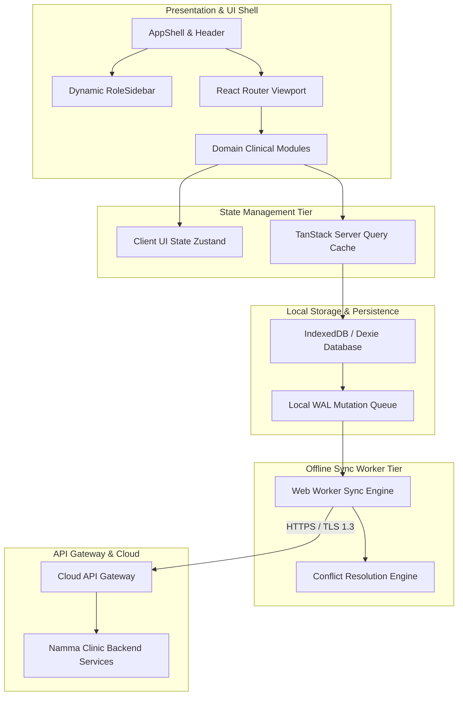
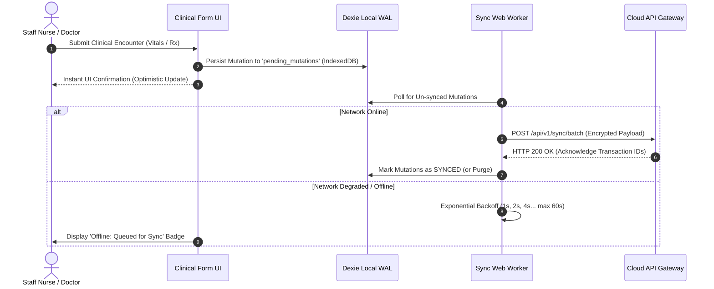

# Namma Clinic Frontend Architecture Specification

## 1. Architectural Vision & Operational Context
The Namma Clinic Frontend Architecture provides an enterprise-grade, local-first, highly responsive web application framework designed to run autonomously within 183 primary healthcare clinics under the Greater Bengaluru Authority (GBA) / BBMP Health Department. Due to frequent metropolitan telecommunication fiber disruptions, power fluctuations, and variable cellular reception across Bengaluru's municipal wards, the frontend architecture treats **offline execution as a primary operational state**, rather than an exceptional failure mode.

## 2. Comprehensive Architecture Topology
The client-side topology is organized into six strictly decoupled architectural tiers:
1. **Presentation & UI Component Tier:** Design system primitives, form controls, clinical status widgets, and accessible shell layouts.
2. **Domain Feature Module Tier:** 30 domain-isolated feature modules encapsulating clinical workflows (Registration, Triage, Consultation, Dispensing, Lab, Inventory).
3. **State Management Tier:** TanStack Query for server cache, Zustand for client UI state, and local Dexie / IndexedDB for durable persistence.
4. **Data Access & API Gateway Client Tier:** Strongly-typed Axios / Fetch client with RS256 JWT interception, automatic token refresh, and request signing.
5. **Offline Synchronization & Write-Ahead Log (WAL) Tier:** Background sync worker capturing mutations during outages, managing local SQLite / Dexie queues, and handling conflict resolution.
6. **Hardware & Peripheral Bridge Tier:** Web Serial, Web USB, and ESC/POS thermal printer interfaces connecting barcode scanners, receipt printers, and medical analyzer devices.

### 2.1 Logical Architecture Diagram


### 2.2 Offline Synchronization Lifecycle


## 3. Module & Feature Boundaries
The codebase follows strict architectural boundary rules. Cross-module direct imports are prohibited; modules interact exclusively through defined domain event contracts or shared core primitives.

### Architectural Specification for Screen: SCREEN-001 — User Login Screen
- **Module Assignment:** `MODULE-001` | **Primary Route:** `/login`
- **Primary Role Entitlement:** `ROLE-001` | **Offline Tier:** `Online Only`
- **API Gateways:** `API-AUTH-001, API-AUTH-002` | **Underlying Entities:** `auth_users, user_sessions`
- **Automated Test Binding:** `PLANNED-TEST-FE-001`

#### Boundary Invariants & Data Flow
The `User Login Screen` screen governs the operational boundary for Credential entry with Argon2id client hashing and biometric prompt. Data flow initiates via TanStack Query hooks checking the local IndexedDB cache before making network dispatch. During offline periods, state is maintained locally with zero latency disruption to the clinical operator.

#### Architectural Error Boundaries & Fallback
Screen `SCREEN-001` is wrapped in a dedicated React Error Boundary (`COMP-017 / COMP-019`). Unhandled component crashes or corrupt local IndexedDB schemas trigger an isolated error fallback without terminating the overall AppShell, allowing adjacent clinic workstations to remain operational.

#### Documentation-Only TypeScript Architecture Definition
```typescript
// DOCUMENTATION-ONLY TYPESCRIPT
export interface SCREEN_001_ArchitectureContract {
  screenId: 'SCREEN-001';
  routePath: '/login';
  moduleDomain: 'MODULE-001';
  offlineCapability: 'Online Only';
  primaryApiDependency: 'API-AUTH-001';
  localCacheTable: 'auth_users';
  maxStaleTimeMs: number; // 300000 ms (5 min default)
  isCriticalClinicalFlow: boolean; // Triggers immediate WAL sync
}
```

---

### Architectural Specification for Screen: SCREEN-002 — MFA Verification Screen
- **Module Assignment:** `MODULE-001` | **Primary Route:** `/login/mfa`
- **Primary Role Entitlement:** `ROLE-001` | **Offline Tier:** `Online Only`
- **API Gateways:** `API-AUTH-002` | **Underlying Entities:** `user_sessions`
- **Automated Test Binding:** `PLANNED-TEST-FE-002`

#### Boundary Invariants & Data Flow
The `MFA Verification Screen` screen governs the operational boundary for Time-based OTP or WebAuthn hardware security key verification. Data flow initiates via TanStack Query hooks checking the local IndexedDB cache before making network dispatch. During offline periods, state is maintained locally with zero latency disruption to the clinical operator.

#### Architectural Error Boundaries & Fallback
Screen `SCREEN-002` is wrapped in a dedicated React Error Boundary (`COMP-017 / COMP-019`). Unhandled component crashes or corrupt local IndexedDB schemas trigger an isolated error fallback without terminating the overall AppShell, allowing adjacent clinic workstations to remain operational.

#### Documentation-Only TypeScript Architecture Definition
```typescript
// DOCUMENTATION-ONLY TYPESCRIPT
export interface SCREEN_002_ArchitectureContract {
  screenId: 'SCREEN-002';
  routePath: '/login/mfa';
  moduleDomain: 'MODULE-001';
  offlineCapability: 'Online Only';
  primaryApiDependency: 'API-AUTH-002';
  localCacheTable: 'user_sessions';
  maxStaleTimeMs: number; // 300000 ms (5 min default)
  isCriticalClinicalFlow: boolean; // Triggers immediate WAL sync
}
```

---

### Architectural Specification for Screen: SCREEN-003 — Terminal Pairing & Device Enrollment
- **Module Assignment:** `MODULE-001` | **Primary Route:** `/system/device-enroll`
- **Primary Role Entitlement:** `ROLE-006` | **Offline Tier:** `Online Only`
- **API Gateways:** `API-SYS-001` | **Underlying Entities:** `hardware_terminals`
- **Automated Test Binding:** `PLANNED-TEST-FE-003`

#### Boundary Invariants & Data Flow
The `Terminal Pairing & Device Enrollment` screen governs the operational boundary for Hardware fingerprint registration and mTLS cert binding. Data flow initiates via TanStack Query hooks checking the local IndexedDB cache before making network dispatch. During offline periods, state is maintained locally with zero latency disruption to the clinical operator.

#### Architectural Error Boundaries & Fallback
Screen `SCREEN-003` is wrapped in a dedicated React Error Boundary (`COMP-017 / COMP-019`). Unhandled component crashes or corrupt local IndexedDB schemas trigger an isolated error fallback without terminating the overall AppShell, allowing adjacent clinic workstations to remain operational.

#### Documentation-Only TypeScript Architecture Definition
```typescript
// DOCUMENTATION-ONLY TYPESCRIPT
export interface SCREEN_003_ArchitectureContract {
  screenId: 'SCREEN-003';
  routePath: '/system/device-enroll';
  moduleDomain: 'MODULE-001';
  offlineCapability: 'Online Only';
  primaryApiDependency: 'API-SYS-001';
  localCacheTable: 'hardware_terminals';
  maxStaleTimeMs: number; // 300000 ms (5 min default)
  isCriticalClinicalFlow: boolean; // Triggers immediate WAL sync
}
```

---

### Architectural Specification for Screen: SCREEN-004 — Clinic Shift Check-In & Handover
- **Module Assignment:** `MODULE-001` | **Primary Route:** `/shift/checkin`
- **Primary Role Entitlement:** `ROLE-001` | **Offline Tier:** `Degraded Offline`
- **API Gateways:** `API-AUTH-005` | **Underlying Entities:** `clinic_shifts`
- **Automated Test Binding:** `PLANNED-TEST-FE-004`

#### Boundary Invariants & Data Flow
The `Clinic Shift Check-In & Handover` screen governs the operational boundary for Active roster confirmation, station assignment, and cash float check. Data flow initiates via TanStack Query hooks checking the local IndexedDB cache before making network dispatch. During offline periods, state is maintained locally with zero latency disruption to the clinical operator.

#### Architectural Error Boundaries & Fallback
Screen `SCREEN-004` is wrapped in a dedicated React Error Boundary (`COMP-017 / COMP-019`). Unhandled component crashes or corrupt local IndexedDB schemas trigger an isolated error fallback without terminating the overall AppShell, allowing adjacent clinic workstations to remain operational.

#### Documentation-Only TypeScript Architecture Definition
```typescript
// DOCUMENTATION-ONLY TYPESCRIPT
export interface SCREEN_004_ArchitectureContract {
  screenId: 'SCREEN-004';
  routePath: '/shift/checkin';
  moduleDomain: 'MODULE-001';
  offlineCapability: 'Degraded Offline';
  primaryApiDependency: 'API-AUTH-005';
  localCacheTable: 'clinic_shifts';
  maxStaleTimeMs: number; // 300000 ms (5 min default)
  isCriticalClinicalFlow: boolean; // Triggers immediate WAL sync
}
```

---

### Architectural Specification for Screen: SCREEN-005 — Emergency Break-Glass Authorization
- **Module Assignment:** `MODULE-001` | **Primary Route:** `/auth/break-glass`
- **Primary Role Entitlement:** `ROLE-002` | **Offline Tier:** `Full Offline`
- **API Gateways:** `API-AUTH-004` | **Underlying Entities:** `audit_events, consultations`
- **Automated Test Binding:** `PLANNED-TEST-FE-005`

#### Boundary Invariants & Data Flow
The `Emergency Break-Glass Authorization` screen governs the operational boundary for High-priority override with statutory justification and WORM audit logging. Data flow initiates via TanStack Query hooks checking the local IndexedDB cache before making network dispatch. During offline periods, state is maintained locally with zero latency disruption to the clinical operator.

#### Architectural Error Boundaries & Fallback
Screen `SCREEN-005` is wrapped in a dedicated React Error Boundary (`COMP-017 / COMP-019`). Unhandled component crashes or corrupt local IndexedDB schemas trigger an isolated error fallback without terminating the overall AppShell, allowing adjacent clinic workstations to remain operational.

#### Documentation-Only TypeScript Architecture Definition
```typescript
// DOCUMENTATION-ONLY TYPESCRIPT
export interface SCREEN_005_ArchitectureContract {
  screenId: 'SCREEN-005';
  routePath: '/auth/break-glass';
  moduleDomain: 'MODULE-001';
  offlineCapability: 'Full Offline';
  primaryApiDependency: 'API-AUTH-004';
  localCacheTable: 'audit_events';
  maxStaleTimeMs: number; // 300000 ms (5 min default)
  isCriticalClinicalFlow: boolean; // Triggers immediate WAL sync
}
```

---

### Architectural Specification for Screen: SCREEN-006 — Master Clinic Dashboard
- **Module Assignment:** `MODULE-002` | **Primary Route:** `/dashboard`
- **Primary Role Entitlement:** `ROLE-001` | **Offline Tier:** `Degraded Offline`
- **API Gateways:** `API-ANL-001` | **Underlying Entities:** `visits, triage_assessments, pharmacy_batches`
- **Automated Test Binding:** `PLANNED-TEST-FE-006`

#### Boundary Invariants & Data Flow
The `Master Clinic Dashboard` screen governs the operational boundary for Live OPD operational metrics, triage queue health, and stock alerts. Data flow initiates via TanStack Query hooks checking the local IndexedDB cache before making network dispatch. During offline periods, state is maintained locally with zero latency disruption to the clinical operator.

#### Architectural Error Boundaries & Fallback
Screen `SCREEN-006` is wrapped in a dedicated React Error Boundary (`COMP-017 / COMP-019`). Unhandled component crashes or corrupt local IndexedDB schemas trigger an isolated error fallback without terminating the overall AppShell, allowing adjacent clinic workstations to remain operational.

#### Documentation-Only TypeScript Architecture Definition
```typescript
// DOCUMENTATION-ONLY TYPESCRIPT
export interface SCREEN_006_ArchitectureContract {
  screenId: 'SCREEN-006';
  routePath: '/dashboard';
  moduleDomain: 'MODULE-002';
  offlineCapability: 'Degraded Offline';
  primaryApiDependency: 'API-ANL-001';
  localCacheTable: 'visits';
  maxStaleTimeMs: number; // 300000 ms (5 min default)
  isCriticalClinicalFlow: boolean; // Triggers immediate WAL sync
}
```

---

### Architectural Specification for Screen: SCREEN-007 — Doctor Outpatient Console
- **Module Assignment:** `MODULE-002` | **Primary Route:** `/doctor/console`
- **Primary Role Entitlement:** `ROLE-002` | **Offline Tier:** `Full Offline`
- **API Gateways:** `API-VST-001, API-CON-001` | **Underlying Entities:** `visits, consultations`
- **Automated Test Binding:** `PLANNED-TEST-FE-007`

#### Boundary Invariants & Data Flow
The `Doctor Outpatient Console` screen governs the operational boundary for Active patient waiting list, vitals preview, and consultation launcher. Data flow initiates via TanStack Query hooks checking the local IndexedDB cache before making network dispatch. During offline periods, state is maintained locally with zero latency disruption to the clinical operator.

#### Architectural Error Boundaries & Fallback
Screen `SCREEN-007` is wrapped in a dedicated React Error Boundary (`COMP-017 / COMP-019`). Unhandled component crashes or corrupt local IndexedDB schemas trigger an isolated error fallback without terminating the overall AppShell, allowing adjacent clinic workstations to remain operational.

#### Documentation-Only TypeScript Architecture Definition
```typescript
// DOCUMENTATION-ONLY TYPESCRIPT
export interface SCREEN_007_ArchitectureContract {
  screenId: 'SCREEN-007';
  routePath: '/doctor/console';
  moduleDomain: 'MODULE-002';
  offlineCapability: 'Full Offline';
  primaryApiDependency: 'API-VST-001';
  localCacheTable: 'visits';
  maxStaleTimeMs: number; // 300000 ms (5 min default)
  isCriticalClinicalFlow: boolean; // Triggers immediate WAL sync
}
```

---

### Architectural Specification for Screen: SCREEN-008 — Staff Nurse Triage Workbench
- **Module Assignment:** `MODULE-002` | **Primary Route:** `/nurse/triage`
- **Primary Role Entitlement:** `ROLE-003` | **Offline Tier:** `Full Offline`
- **API Gateways:** `API-TRG-001` | **Underlying Entities:** `triage_assessments`
- **Automated Test Binding:** `PLANNED-TEST-FE-008`

#### Boundary Invariants & Data Flow
The `Staff Nurse Triage Workbench` screen governs the operational boundary for Rapid intake vitals grid, early warning score calculator, and queue routing. Data flow initiates via TanStack Query hooks checking the local IndexedDB cache before making network dispatch. During offline periods, state is maintained locally with zero latency disruption to the clinical operator.

#### Architectural Error Boundaries & Fallback
Screen `SCREEN-008` is wrapped in a dedicated React Error Boundary (`COMP-017 / COMP-019`). Unhandled component crashes or corrupt local IndexedDB schemas trigger an isolated error fallback without terminating the overall AppShell, allowing adjacent clinic workstations to remain operational.

#### Documentation-Only TypeScript Architecture Definition
```typescript
// DOCUMENTATION-ONLY TYPESCRIPT
export interface SCREEN_008_ArchitectureContract {
  screenId: 'SCREEN-008';
  routePath: '/nurse/triage';
  moduleDomain: 'MODULE-002';
  offlineCapability: 'Full Offline';
  primaryApiDependency: 'API-TRG-001';
  localCacheTable: 'triage_assessments';
  maxStaleTimeMs: number; // 300000 ms (5 min default)
  isCriticalClinicalFlow: boolean; // Triggers immediate WAL sync
}
```

---

### Architectural Specification for Screen: SCREEN-009 — Pharmacy Dispensing Console
- **Module Assignment:** `MODULE-002` | **Primary Route:** `/pharmacy/dispense`
- **Primary Role Entitlement:** `ROLE-004` | **Offline Tier:** `Full Offline`
- **API Gateways:** `API-PHR-001` | **Underlying Entities:** `prescriptions, pharmacy_batches`
- **Automated Test Binding:** `PLANNED-TEST-FE-009`

#### Boundary Invariants & Data Flow
The `Pharmacy Dispensing Console` screen governs the operational boundary for Prescription verification, barcode scanning, and FEFO stock deduction. Data flow initiates via TanStack Query hooks checking the local IndexedDB cache before making network dispatch. During offline periods, state is maintained locally with zero latency disruption to the clinical operator.

#### Architectural Error Boundaries & Fallback
Screen `SCREEN-009` is wrapped in a dedicated React Error Boundary (`COMP-017 / COMP-019`). Unhandled component crashes or corrupt local IndexedDB schemas trigger an isolated error fallback without terminating the overall AppShell, allowing adjacent clinic workstations to remain operational.

#### Documentation-Only TypeScript Architecture Definition
```typescript
// DOCUMENTATION-ONLY TYPESCRIPT
export interface SCREEN_009_ArchitectureContract {
  screenId: 'SCREEN-009';
  routePath: '/pharmacy/dispense';
  moduleDomain: 'MODULE-002';
  offlineCapability: 'Full Offline';
  primaryApiDependency: 'API-PHR-001';
  localCacheTable: 'prescriptions';
  maxStaleTimeMs: number; // 300000 ms (5 min default)
  isCriticalClinicalFlow: boolean; // Triggers immediate WAL sync
}
```

---

### Architectural Specification for Screen: SCREEN-010 — Diagnostic Laboratory Workbench
- **Module Assignment:** `MODULE-002` | **Primary Route:** `/lab/workbench`
- **Primary Role Entitlement:** `ROLE-005` | **Offline Tier:** `Full Offline`
- **API Gateways:** `API-LAB-001` | **Underlying Entities:** `lab_orders, lab_results`
- **Automated Test Binding:** `PLANNED-TEST-FE-010`

#### Boundary Invariants & Data Flow
The `Diagnostic Laboratory Workbench` screen governs the operational boundary for Specimen collection, rapid test kit entry, and result authorization. Data flow initiates via TanStack Query hooks checking the local IndexedDB cache before making network dispatch. During offline periods, state is maintained locally with zero latency disruption to the clinical operator.

#### Architectural Error Boundaries & Fallback
Screen `SCREEN-010` is wrapped in a dedicated React Error Boundary (`COMP-017 / COMP-019`). Unhandled component crashes or corrupt local IndexedDB schemas trigger an isolated error fallback without terminating the overall AppShell, allowing adjacent clinic workstations to remain operational.

#### Documentation-Only TypeScript Architecture Definition
```typescript
// DOCUMENTATION-ONLY TYPESCRIPT
export interface SCREEN_010_ArchitectureContract {
  screenId: 'SCREEN-010';
  routePath: '/lab/workbench';
  moduleDomain: 'MODULE-002';
  offlineCapability: 'Full Offline';
  primaryApiDependency: 'API-LAB-001';
  localCacheTable: 'lab_orders';
  maxStaleTimeMs: number; // 300000 ms (5 min default)
  isCriticalClinicalFlow: boolean; // Triggers immediate WAL sync
}
```

---

### Architectural Specification for Screen: SCREEN-011 — Citizen New Registration Screen
- **Module Assignment:** `MODULE-003` | **Primary Route:** `/patients/new`
- **Primary Role Entitlement:** `ROLE-001` | **Offline Tier:** `Full Offline`
- **API Gateways:** `API-PAT-001` | **Underlying Entities:** `patients`
- **Automated Test Binding:** `PLANNED-TEST-FE-011`

#### Boundary Invariants & Data Flow
The `Citizen New Registration Screen` screen governs the operational boundary for Demographic entry, mobile OTP verification, and photo capture. Data flow initiates via TanStack Query hooks checking the local IndexedDB cache before making network dispatch. During offline periods, state is maintained locally with zero latency disruption to the clinical operator.

#### Architectural Error Boundaries & Fallback
Screen `SCREEN-011` is wrapped in a dedicated React Error Boundary (`COMP-017 / COMP-019`). Unhandled component crashes or corrupt local IndexedDB schemas trigger an isolated error fallback without terminating the overall AppShell, allowing adjacent clinic workstations to remain operational.

#### Documentation-Only TypeScript Architecture Definition
```typescript
// DOCUMENTATION-ONLY TYPESCRIPT
export interface SCREEN_011_ArchitectureContract {
  screenId: 'SCREEN-011';
  routePath: '/patients/new';
  moduleDomain: 'MODULE-003';
  offlineCapability: 'Full Offline';
  primaryApiDependency: 'API-PAT-001';
  localCacheTable: 'patients';
  maxStaleTimeMs: number; // 300000 ms (5 min default)
  isCriticalClinicalFlow: boolean; // Triggers immediate WAL sync
}
```

---

### Architectural Specification for Screen: SCREEN-012 — Citizen Search & Retrieval Screen
- **Module Assignment:** `MODULE-003` | **Primary Route:** `/patients/search`
- **Primary Role Entitlement:** `ROLE-001` | **Offline Tier:** `Full Offline`
- **API Gateways:** `API-PAT-002` | **Underlying Entities:** `patients`
- **Automated Test Binding:** `PLANNED-TEST-FE-012`

#### Boundary Invariants & Data Flow
The `Citizen Search & Retrieval Screen` screen governs the operational boundary for Phonetic Kannada/English search by UHID, phone number, or name. Data flow initiates via TanStack Query hooks checking the local IndexedDB cache before making network dispatch. During offline periods, state is maintained locally with zero latency disruption to the clinical operator.

#### Architectural Error Boundaries & Fallback
Screen `SCREEN-012` is wrapped in a dedicated React Error Boundary (`COMP-017 / COMP-019`). Unhandled component crashes or corrupt local IndexedDB schemas trigger an isolated error fallback without terminating the overall AppShell, allowing adjacent clinic workstations to remain operational.

#### Documentation-Only TypeScript Architecture Definition
```typescript
// DOCUMENTATION-ONLY TYPESCRIPT
export interface SCREEN_012_ArchitectureContract {
  screenId: 'SCREEN-012';
  routePath: '/patients/search';
  moduleDomain: 'MODULE-003';
  offlineCapability: 'Full Offline';
  primaryApiDependency: 'API-PAT-002';
  localCacheTable: 'patients';
  maxStaleTimeMs: number; // 300000 ms (5 min default)
  isCriticalClinicalFlow: boolean; // Triggers immediate WAL sync
}
```

---

### Architectural Specification for Screen: SCREEN-013 — Patient Longitudinal Profile View
- **Module Assignment:** `MODULE-003` | **Primary Route:** `/patients/:id`
- **Primary Role Entitlement:** `ROLE-002` | **Offline Tier:** `Full Offline`
- **API Gateways:** `API-PAT-003` | **Underlying Entities:** `patients, visits, consultations`
- **Automated Test Binding:** `PLANNED-TEST-FE-013`

#### Boundary Invariants & Data Flow
The `Patient Longitudinal Profile View` screen governs the operational boundary for Unified timeline of past visits, vitals trends, allergies, and diagnoses. Data flow initiates via TanStack Query hooks checking the local IndexedDB cache before making network dispatch. During offline periods, state is maintained locally with zero latency disruption to the clinical operator.

#### Architectural Error Boundaries & Fallback
Screen `SCREEN-013` is wrapped in a dedicated React Error Boundary (`COMP-017 / COMP-019`). Unhandled component crashes or corrupt local IndexedDB schemas trigger an isolated error fallback without terminating the overall AppShell, allowing adjacent clinic workstations to remain operational.

#### Documentation-Only TypeScript Architecture Definition
```typescript
// DOCUMENTATION-ONLY TYPESCRIPT
export interface SCREEN_013_ArchitectureContract {
  screenId: 'SCREEN-013';
  routePath: '/patients/:id';
  moduleDomain: 'MODULE-003';
  offlineCapability: 'Full Offline';
  primaryApiDependency: 'API-PAT-003';
  localCacheTable: 'patients';
  maxStaleTimeMs: number; // 300000 ms (5 min default)
  isCriticalClinicalFlow: boolean; // Triggers immediate WAL sync
}
```

---

### Architectural Specification for Screen: SCREEN-014 — Repeat Patient Fast Intake
- **Module Assignment:** `MODULE-003` | **Primary Route:** `/patients/:id/repeat-intake`
- **Primary Role Entitlement:** `ROLE-001` | **Offline Tier:** `Full Offline`
- **API Gateways:** `API-VST-001` | **Underlying Entities:** `visits`
- **Automated Test Binding:** `PLANNED-TEST-FE-014`

#### Boundary Invariants & Data Flow
The `Repeat Patient Fast Intake` screen governs the operational boundary for Quick verification of active profile and instant token dispatch. Data flow initiates via TanStack Query hooks checking the local IndexedDB cache before making network dispatch. During offline periods, state is maintained locally with zero latency disruption to the clinical operator.

#### Architectural Error Boundaries & Fallback
Screen `SCREEN-014` is wrapped in a dedicated React Error Boundary (`COMP-017 / COMP-019`). Unhandled component crashes or corrupt local IndexedDB schemas trigger an isolated error fallback without terminating the overall AppShell, allowing adjacent clinic workstations to remain operational.

#### Documentation-Only TypeScript Architecture Definition
```typescript
// DOCUMENTATION-ONLY TYPESCRIPT
export interface SCREEN_014_ArchitectureContract {
  screenId: 'SCREEN-014';
  routePath: '/patients/:id/repeat-intake';
  moduleDomain: 'MODULE-003';
  offlineCapability: 'Full Offline';
  primaryApiDependency: 'API-VST-001';
  localCacheTable: 'visits';
  maxStaleTimeMs: number; // 300000 ms (5 min default)
  isCriticalClinicalFlow: boolean; // Triggers immediate WAL sync
}
```

---

### Architectural Specification for Screen: SCREEN-015 — Biometric & ABHA Card Scan Modal
- **Module Assignment:** `MODULE-003` | **Primary Route:** `/patients/abha-scan`
- **Primary Role Entitlement:** `ROLE-001` | **Offline Tier:** `Degraded Offline`
- **API Gateways:** `API-ABDM-001` | **Underlying Entities:** `patients, abdm_profiles`
- **Automated Test Binding:** `PLANNED-TEST-FE-015`

#### Boundary Invariants & Data Flow
The `Biometric & ABHA Card Scan Modal` screen governs the operational boundary for ABHA QR code scanning and national grid profile pre-population. Data flow initiates via TanStack Query hooks checking the local IndexedDB cache before making network dispatch. During offline periods, state is maintained locally with zero latency disruption to the clinical operator.

#### Architectural Error Boundaries & Fallback
Screen `SCREEN-015` is wrapped in a dedicated React Error Boundary (`COMP-017 / COMP-019`). Unhandled component crashes or corrupt local IndexedDB schemas trigger an isolated error fallback without terminating the overall AppShell, allowing adjacent clinic workstations to remain operational.

#### Documentation-Only TypeScript Architecture Definition
```typescript
// DOCUMENTATION-ONLY TYPESCRIPT
export interface SCREEN_015_ArchitectureContract {
  screenId: 'SCREEN-015';
  routePath: '/patients/abha-scan';
  moduleDomain: 'MODULE-003';
  offlineCapability: 'Degraded Offline';
  primaryApiDependency: 'API-ABDM-001';
  localCacheTable: 'patients';
  maxStaleTimeMs: number; // 300000 ms (5 min default)
  isCriticalClinicalFlow: boolean; // Triggers immediate WAL sync
}
```

---

### Architectural Specification for Screen: SCREEN-016 — Citizen Demographic Correction Form
- **Module Assignment:** `MODULE-003` | **Primary Route:** `/patients/:id/edit`
- **Primary Role Entitlement:** `ROLE-001` | **Offline Tier:** `Degraded Offline`
- **API Gateways:** `API-PAT-004` | **Underlying Entities:** `patients, audit_events`
- **Automated Test Binding:** `PLANNED-TEST-FE-016`

#### Boundary Invariants & Data Flow
The `Citizen Demographic Correction Form` screen governs the operational boundary for Formal profile modification with reason logging and audit trail. Data flow initiates via TanStack Query hooks checking the local IndexedDB cache before making network dispatch. During offline periods, state is maintained locally with zero latency disruption to the clinical operator.

#### Architectural Error Boundaries & Fallback
Screen `SCREEN-016` is wrapped in a dedicated React Error Boundary (`COMP-017 / COMP-019`). Unhandled component crashes or corrupt local IndexedDB schemas trigger an isolated error fallback without terminating the overall AppShell, allowing adjacent clinic workstations to remain operational.

#### Documentation-Only TypeScript Architecture Definition
```typescript
// DOCUMENTATION-ONLY TYPESCRIPT
export interface SCREEN_016_ArchitectureContract {
  screenId: 'SCREEN-016';
  routePath: '/patients/:id/edit';
  moduleDomain: 'MODULE-003';
  offlineCapability: 'Degraded Offline';
  primaryApiDependency: 'API-PAT-004';
  localCacheTable: 'patients';
  maxStaleTimeMs: number; // 300000 ms (5 min default)
  isCriticalClinicalFlow: boolean; // Triggers immediate WAL sync
}
```

---

### Architectural Specification for Screen: SCREEN-017 — Duplicate Citizen Merge Modal
- **Module Assignment:** `MODULE-003` | **Primary Route:** `/patients/merge`
- **Primary Role Entitlement:** `ROLE-006` | **Offline Tier:** `Online Only`
- **API Gateways:** `API-PAT-005` | **Underlying Entities:** `patients, audit_events`
- **Automated Test Binding:** `PLANNED-TEST-FE-017`

#### Boundary Invariants & Data Flow
The `Duplicate Citizen Merge Modal` screen governs the operational boundary for Side-by-side comparison and deduplication with record re-linking. Data flow initiates via TanStack Query hooks checking the local IndexedDB cache before making network dispatch. During offline periods, state is maintained locally with zero latency disruption to the clinical operator.

#### Architectural Error Boundaries & Fallback
Screen `SCREEN-017` is wrapped in a dedicated React Error Boundary (`COMP-017 / COMP-019`). Unhandled component crashes or corrupt local IndexedDB schemas trigger an isolated error fallback without terminating the overall AppShell, allowing adjacent clinic workstations to remain operational.

#### Documentation-Only TypeScript Architecture Definition
```typescript
// DOCUMENTATION-ONLY TYPESCRIPT
export interface SCREEN_017_ArchitectureContract {
  screenId: 'SCREEN-017';
  routePath: '/patients/merge';
  moduleDomain: 'MODULE-003';
  offlineCapability: 'Online Only';
  primaryApiDependency: 'API-PAT-005';
  localCacheTable: 'patients';
  maxStaleTimeMs: number; // 300000 ms (5 min default)
  isCriticalClinicalFlow: boolean; // Triggers immediate WAL sync
}
```

---

### Architectural Specification for Screen: SCREEN-018 — Citizen Digital Photo Capture
- **Module Assignment:** `MODULE-003` | **Primary Route:** `/patients/:id/photo`
- **Primary Role Entitlement:** `ROLE-001` | **Offline Tier:** `Full Offline`
- **API Gateways:** `API-PAT-006` | **Underlying Entities:** `patients`
- **Automated Test Binding:** `PLANNED-TEST-FE-018`

#### Boundary Invariants & Data Flow
The `Citizen Digital Photo Capture` screen governs the operational boundary for Webcam capture with client-side cropping and privacy masking. Data flow initiates via TanStack Query hooks checking the local IndexedDB cache before making network dispatch. During offline periods, state is maintained locally with zero latency disruption to the clinical operator.

#### Architectural Error Boundaries & Fallback
Screen `SCREEN-018` is wrapped in a dedicated React Error Boundary (`COMP-017 / COMP-019`). Unhandled component crashes or corrupt local IndexedDB schemas trigger an isolated error fallback without terminating the overall AppShell, allowing adjacent clinic workstations to remain operational.

#### Documentation-Only TypeScript Architecture Definition
```typescript
// DOCUMENTATION-ONLY TYPESCRIPT
export interface SCREEN_018_ArchitectureContract {
  screenId: 'SCREEN-018';
  routePath: '/patients/:id/photo';
  moduleDomain: 'MODULE-003';
  offlineCapability: 'Full Offline';
  primaryApiDependency: 'API-PAT-006';
  localCacheTable: 'patients';
  maxStaleTimeMs: number; // 300000 ms (5 min default)
  isCriticalClinicalFlow: boolean; // Triggers immediate WAL sync
}
```

---

### Architectural Specification for Screen: SCREEN-019 — DPDP Informed Consent Capture Screen
- **Module Assignment:** `MODULE-004` | **Primary Route:** `/patients/:id/consent`
- **Primary Role Entitlement:** `ROLE-001` | **Offline Tier:** `Full Offline`
- **API Gateways:** `API-PAT-007` | **Underlying Entities:** `patient_consents`
- **Automated Test Binding:** `PLANNED-TEST-FE-019`

#### Boundary Invariants & Data Flow
The `DPDP Informed Consent Capture Screen` screen governs the operational boundary for Bilingual purpose selection, digital signature, and guardian declaration. Data flow initiates via TanStack Query hooks checking the local IndexedDB cache before making network dispatch. During offline periods, state is maintained locally with zero latency disruption to the clinical operator.

#### Architectural Error Boundaries & Fallback
Screen `SCREEN-019` is wrapped in a dedicated React Error Boundary (`COMP-017 / COMP-019`). Unhandled component crashes or corrupt local IndexedDB schemas trigger an isolated error fallback without terminating the overall AppShell, allowing adjacent clinic workstations to remain operational.

#### Documentation-Only TypeScript Architecture Definition
```typescript
// DOCUMENTATION-ONLY TYPESCRIPT
export interface SCREEN_019_ArchitectureContract {
  screenId: 'SCREEN-019';
  routePath: '/patients/:id/consent';
  moduleDomain: 'MODULE-004';
  offlineCapability: 'Full Offline';
  primaryApiDependency: 'API-PAT-007';
  localCacheTable: 'patient_consents';
  maxStaleTimeMs: number; // 300000 ms (5 min default)
  isCriticalClinicalFlow: boolean; // Triggers immediate WAL sync
}
```

---

### Architectural Specification for Screen: SCREEN-020 — Consent History & Revocation Console
- **Module Assignment:** `MODULE-004` | **Primary Route:** `/patients/:id/consents`
- **Primary Role Entitlement:** `ROLE-001` | **Offline Tier:** `Full Offline`
- **API Gateways:** `API-PAT-008` | **Underlying Entities:** `patient_consents`
- **Automated Test Binding:** `PLANNED-TEST-FE-020`

#### Boundary Invariants & Data Flow
The `Consent History & Revocation Console` screen governs the operational boundary for Active consent directives list with instant purpose revocation toggle. Data flow initiates via TanStack Query hooks checking the local IndexedDB cache before making network dispatch. During offline periods, state is maintained locally with zero latency disruption to the clinical operator.

#### Architectural Error Boundaries & Fallback
Screen `SCREEN-020` is wrapped in a dedicated React Error Boundary (`COMP-017 / COMP-019`). Unhandled component crashes or corrupt local IndexedDB schemas trigger an isolated error fallback without terminating the overall AppShell, allowing adjacent clinic workstations to remain operational.

#### Documentation-Only TypeScript Architecture Definition
```typescript
// DOCUMENTATION-ONLY TYPESCRIPT
export interface SCREEN_020_ArchitectureContract {
  screenId: 'SCREEN-020';
  routePath: '/patients/:id/consents';
  moduleDomain: 'MODULE-004';
  offlineCapability: 'Full Offline';
  primaryApiDependency: 'API-PAT-008';
  localCacheTable: 'patient_consents';
  maxStaleTimeMs: number; // 300000 ms (5 min default)
  isCriticalClinicalFlow: boolean; // Triggers immediate WAL sync
}
```

---

### Architectural Specification for Screen: SCREEN-021 — Data Portability & Export Request
- **Module Assignment:** `MODULE-004` | **Primary Route:** `/patients/:id/export`
- **Primary Role Entitlement:** `ROLE-001` | **Offline Tier:** `Degraded Offline`
- **API Gateways:** `API-PORT-001` | **Underlying Entities:** `patient_exports`
- **Automated Test Binding:** `PLANNED-TEST-FE-021`

#### Boundary Invariants & Data Flow
The `Data Portability & Export Request` screen governs the operational boundary for Citizen right to portability: JSON/FHIR/PDF export generation. Data flow initiates via TanStack Query hooks checking the local IndexedDB cache before making network dispatch. During offline periods, state is maintained locally with zero latency disruption to the clinical operator.

#### Architectural Error Boundaries & Fallback
Screen `SCREEN-021` is wrapped in a dedicated React Error Boundary (`COMP-017 / COMP-019`). Unhandled component crashes or corrupt local IndexedDB schemas trigger an isolated error fallback without terminating the overall AppShell, allowing adjacent clinic workstations to remain operational.

#### Documentation-Only TypeScript Architecture Definition
```typescript
// DOCUMENTATION-ONLY TYPESCRIPT
export interface SCREEN_021_ArchitectureContract {
  screenId: 'SCREEN-021';
  routePath: '/patients/:id/export';
  moduleDomain: 'MODULE-004';
  offlineCapability: 'Degraded Offline';
  primaryApiDependency: 'API-PORT-001';
  localCacheTable: 'patient_exports';
  maxStaleTimeMs: number; // 300000 ms (5 min default)
  isCriticalClinicalFlow: boolean; // Triggers immediate WAL sync
}
```

---

### Architectural Specification for Screen: SCREEN-022 — Citizen Grievance Redressal Intake
- **Module Assignment:** `MODULE-004` | **Primary Route:** `/patients/:id/grievance`
- **Primary Role Entitlement:** `ROLE-001` | **Offline Tier:** `Full Offline`
- **API Gateways:** `API-SYS-002` | **Underlying Entities:** `citizen_grievances`
- **Automated Test Binding:** `PLANNED-TEST-FE-022`

#### Boundary Invariants & Data Flow
The `Citizen Grievance Redressal Intake` screen governs the operational boundary for Formal grievance filing regarding privacy, wait times, or care quality. Data flow initiates via TanStack Query hooks checking the local IndexedDB cache before making network dispatch. During offline periods, state is maintained locally with zero latency disruption to the clinical operator.

#### Architectural Error Boundaries & Fallback
Screen `SCREEN-022` is wrapped in a dedicated React Error Boundary (`COMP-017 / COMP-019`). Unhandled component crashes or corrupt local IndexedDB schemas trigger an isolated error fallback without terminating the overall AppShell, allowing adjacent clinic workstations to remain operational.

#### Documentation-Only TypeScript Architecture Definition
```typescript
// DOCUMENTATION-ONLY TYPESCRIPT
export interface SCREEN_022_ArchitectureContract {
  screenId: 'SCREEN-022';
  routePath: '/patients/:id/grievance';
  moduleDomain: 'MODULE-004';
  offlineCapability: 'Full Offline';
  primaryApiDependency: 'API-SYS-002';
  localCacheTable: 'citizen_grievances';
  maxStaleTimeMs: number; // 300000 ms (5 min default)
  isCriticalClinicalFlow: boolean; // Triggers immediate WAL sync
}
```

---

### Architectural Specification for Screen: SCREEN-023 — Grievance Investigation & Resolution
- **Module Assignment:** `MODULE-004` | **Primary Route:** `/grievances/:id`
- **Primary Role Entitlement:** `ROLE-021` | **Offline Tier:** `Online Only`
- **API Gateways:** `API-SYS-003` | **Underlying Entities:** `citizen_grievances`
- **Automated Test Binding:** `PLANNED-TEST-FE-023`

#### Boundary Invariants & Data Flow
The `Grievance Investigation & Resolution` screen governs the operational boundary for Investigative review, clinical supervisor remarks, and formal closure. Data flow initiates via TanStack Query hooks checking the local IndexedDB cache before making network dispatch. During offline periods, state is maintained locally with zero latency disruption to the clinical operator.

#### Architectural Error Boundaries & Fallback
Screen `SCREEN-023` is wrapped in a dedicated React Error Boundary (`COMP-017 / COMP-019`). Unhandled component crashes or corrupt local IndexedDB schemas trigger an isolated error fallback without terminating the overall AppShell, allowing adjacent clinic workstations to remain operational.

#### Documentation-Only TypeScript Architecture Definition
```typescript
// DOCUMENTATION-ONLY TYPESCRIPT
export interface SCREEN_023_ArchitectureContract {
  screenId: 'SCREEN-023';
  routePath: '/grievances/:id';
  moduleDomain: 'MODULE-004';
  offlineCapability: 'Online Only';
  primaryApiDependency: 'API-SYS-003';
  localCacheTable: 'citizen_grievances';
  maxStaleTimeMs: number; // 300000 ms (5 min default)
  isCriticalClinicalFlow: boolean; // Triggers immediate WAL sync
}
```

---

### Architectural Specification for Screen: SCREEN-024 — OPD Token Generation & Print Modal
- **Module Assignment:** `MODULE-005` | **Primary Route:** `/queue/tokens/new`
- **Primary Role Entitlement:** `ROLE-001` | **Offline Tier:** `Full Offline`
- **API Gateways:** `API-VST-002` | **Underlying Entities:** `visits, opd_queues`
- **Automated Test Binding:** `PLANNED-TEST-FE-024`

#### Boundary Invariants & Data Flow
The `OPD Token Generation & Print Modal` screen governs the operational boundary for Department selection, priority tag allocation, and thermal 80mm ticket print. Data flow initiates via TanStack Query hooks checking the local IndexedDB cache before making network dispatch. During offline periods, state is maintained locally with zero latency disruption to the clinical operator.

#### Architectural Error Boundaries & Fallback
Screen `SCREEN-024` is wrapped in a dedicated React Error Boundary (`COMP-017 / COMP-019`). Unhandled component crashes or corrupt local IndexedDB schemas trigger an isolated error fallback without terminating the overall AppShell, allowing adjacent clinic workstations to remain operational.

#### Documentation-Only TypeScript Architecture Definition
```typescript
// DOCUMENTATION-ONLY TYPESCRIPT
export interface SCREEN_024_ArchitectureContract {
  screenId: 'SCREEN-024';
  routePath: '/queue/tokens/new';
  moduleDomain: 'MODULE-005';
  offlineCapability: 'Full Offline';
  primaryApiDependency: 'API-VST-002';
  localCacheTable: 'visits';
  maxStaleTimeMs: number; // 300000 ms (5 min default)
  isCriticalClinicalFlow: boolean; // Triggers immediate WAL sync
}
```

---

### Architectural Specification for Screen: SCREEN-025 — Master Waiting Room Queue Display
- **Module Assignment:** `MODULE-005` | **Primary Route:** `/queue/display`
- **Primary Role Entitlement:** `ROLE-001` | **Offline Tier:** `Full Offline`
- **API Gateways:** `API-VST-003` | **Underlying Entities:** `opd_queues`
- **Automated Test Binding:** `PLANNED-TEST-FE-025`

#### Boundary Invariants & Data Flow
The `Master Waiting Room Queue Display` screen governs the operational boundary for High-contrast public display screen with Kannada audio voice announcements. Data flow initiates via TanStack Query hooks checking the local IndexedDB cache before making network dispatch. During offline periods, state is maintained locally with zero latency disruption to the clinical operator.

#### Architectural Error Boundaries & Fallback
Screen `SCREEN-025` is wrapped in a dedicated React Error Boundary (`COMP-017 / COMP-019`). Unhandled component crashes or corrupt local IndexedDB schemas trigger an isolated error fallback without terminating the overall AppShell, allowing adjacent clinic workstations to remain operational.

#### Documentation-Only TypeScript Architecture Definition
```typescript
// DOCUMENTATION-ONLY TYPESCRIPT
export interface SCREEN_025_ArchitectureContract {
  screenId: 'SCREEN-025';
  routePath: '/queue/display';
  moduleDomain: 'MODULE-005';
  offlineCapability: 'Full Offline';
  primaryApiDependency: 'API-VST-003';
  localCacheTable: 'opd_queues';
  maxStaleTimeMs: number; // 300000 ms (5 min default)
  isCriticalClinicalFlow: boolean; // Triggers immediate WAL sync
}
```

---

### Architectural Specification for Screen: SCREEN-026 — Queue Management & Rerouting Screen
- **Module Assignment:** `MODULE-005` | **Primary Route:** `/queue/manage`
- **Primary Role Entitlement:** `ROLE-003` | **Offline Tier:** `Full Offline`
- **API Gateways:** `API-VST-004` | **Underlying Entities:** `opd_queues`
- **Automated Test Binding:** `PLANNED-TEST-FE-026`

#### Boundary Invariants & Data Flow
The `Queue Management & Rerouting Screen` screen governs the operational boundary for Queue re-ordering, doctor cabin reassignment, and no-show handling. Data flow initiates via TanStack Query hooks checking the local IndexedDB cache before making network dispatch. During offline periods, state is maintained locally with zero latency disruption to the clinical operator.

#### Architectural Error Boundaries & Fallback
Screen `SCREEN-026` is wrapped in a dedicated React Error Boundary (`COMP-017 / COMP-019`). Unhandled component crashes or corrupt local IndexedDB schemas trigger an isolated error fallback without terminating the overall AppShell, allowing adjacent clinic workstations to remain operational.

#### Documentation-Only TypeScript Architecture Definition
```typescript
// DOCUMENTATION-ONLY TYPESCRIPT
export interface SCREEN_026_ArchitectureContract {
  screenId: 'SCREEN-026';
  routePath: '/queue/manage';
  moduleDomain: 'MODULE-005';
  offlineCapability: 'Full Offline';
  primaryApiDependency: 'API-VST-004';
  localCacheTable: 'opd_queues';
  maxStaleTimeMs: number; // 300000 ms (5 min default)
  isCriticalClinicalFlow: boolean; // Triggers immediate WAL sync
}
```

---

### Architectural Specification for Screen: SCREEN-027 — Express Triage Queue
- **Module Assignment:** `MODULE-005` | **Primary Route:** `/queue/triage-express`
- **Primary Role Entitlement:** `ROLE-003` | **Offline Tier:** `Full Offline`
- **API Gateways:** `API-VST-005` | **Underlying Entities:** `opd_queues`
- **Automated Test Binding:** `PLANNED-TEST-FE-027`

#### Boundary Invariants & Data Flow
The `Express Triage Queue` screen governs the operational boundary for Filtered intake queue for infants, antenatal mothers, and senior citizens. Data flow initiates via TanStack Query hooks checking the local IndexedDB cache before making network dispatch. During offline periods, state is maintained locally with zero latency disruption to the clinical operator.

#### Architectural Error Boundaries & Fallback
Screen `SCREEN-027` is wrapped in a dedicated React Error Boundary (`COMP-017 / COMP-019`). Unhandled component crashes or corrupt local IndexedDB schemas trigger an isolated error fallback without terminating the overall AppShell, allowing adjacent clinic workstations to remain operational.

#### Documentation-Only TypeScript Architecture Definition
```typescript
// DOCUMENTATION-ONLY TYPESCRIPT
export interface SCREEN_027_ArchitectureContract {
  screenId: 'SCREEN-027';
  routePath: '/queue/triage-express';
  moduleDomain: 'MODULE-005';
  offlineCapability: 'Full Offline';
  primaryApiDependency: 'API-VST-005';
  localCacheTable: 'opd_queues';
  maxStaleTimeMs: number; // 300000 ms (5 min default)
  isCriticalClinicalFlow: boolean; // Triggers immediate WAL sync
}
```

---

### Architectural Specification for Screen: SCREEN-028 — Pharmacy Pickup Waiting Screen
- **Module Assignment:** `MODULE-005` | **Primary Route:** `/queue/pharmacy`
- **Primary Role Entitlement:** `ROLE-004` | **Offline Tier:** `Full Offline`
- **API Gateways:** `API-PHR-002` | **Underlying Entities:** `prescriptions`
- **Automated Test Binding:** `PLANNED-TEST-FE-028`

#### Boundary Invariants & Data Flow
The `Pharmacy Pickup Waiting Screen` screen governs the operational boundary for Live medication assembly queue and citizen token callout. Data flow initiates via TanStack Query hooks checking the local IndexedDB cache before making network dispatch. During offline periods, state is maintained locally with zero latency disruption to the clinical operator.

#### Architectural Error Boundaries & Fallback
Screen `SCREEN-028` is wrapped in a dedicated React Error Boundary (`COMP-017 / COMP-019`). Unhandled component crashes or corrupt local IndexedDB schemas trigger an isolated error fallback without terminating the overall AppShell, allowing adjacent clinic workstations to remain operational.

#### Documentation-Only TypeScript Architecture Definition
```typescript
// DOCUMENTATION-ONLY TYPESCRIPT
export interface SCREEN_028_ArchitectureContract {
  screenId: 'SCREEN-028';
  routePath: '/queue/pharmacy';
  moduleDomain: 'MODULE-005';
  offlineCapability: 'Full Offline';
  primaryApiDependency: 'API-PHR-002';
  localCacheTable: 'prescriptions';
  maxStaleTimeMs: number; // 300000 ms (5 min default)
  isCriticalClinicalFlow: boolean; // Triggers immediate WAL sync
}
```

---

### Architectural Specification for Screen: SCREEN-029 — Triage Vitals Entry Form
- **Module Assignment:** `MODULE-006` | **Primary Route:** `/triage/:visitId/vitals`
- **Primary Role Entitlement:** `ROLE-003` | **Offline Tier:** `Full Offline`
- **API Gateways:** `API-TRG-002` | **Underlying Entities:** `triage_assessments`
- **Automated Test Binding:** `PLANNED-TEST-FE-029`

#### Boundary Invariants & Data Flow
The `Triage Vitals Entry Form` screen governs the operational boundary for BP, Pulse, SpO2, Temperature, Blood Glucose, Height, and Weight capture. Data flow initiates via TanStack Query hooks checking the local IndexedDB cache before making network dispatch. During offline periods, state is maintained locally with zero latency disruption to the clinical operator.

#### Architectural Error Boundaries & Fallback
Screen `SCREEN-029` is wrapped in a dedicated React Error Boundary (`COMP-017 / COMP-019`). Unhandled component crashes or corrupt local IndexedDB schemas trigger an isolated error fallback without terminating the overall AppShell, allowing adjacent clinic workstations to remain operational.

#### Documentation-Only TypeScript Architecture Definition
```typescript
// DOCUMENTATION-ONLY TYPESCRIPT
export interface SCREEN_029_ArchitectureContract {
  screenId: 'SCREEN-029';
  routePath: '/triage/:visitId/vitals';
  moduleDomain: 'MODULE-006';
  offlineCapability: 'Full Offline';
  primaryApiDependency: 'API-TRG-002';
  localCacheTable: 'triage_assessments';
  maxStaleTimeMs: number; // 300000 ms (5 min default)
  isCriticalClinicalFlow: boolean; // Triggers immediate WAL sync
}
```

---

### Architectural Specification for Screen: SCREEN-030 — Pediatric Growth Chart & Z-Scores
- **Module Assignment:** `MODULE-006` | **Primary Route:** `/triage/:visitId/pediatric`
- **Primary Role Entitlement:** `ROLE-003` | **Offline Tier:** `Full Offline`
- **API Gateways:** `API-TRG-003` | **Underlying Entities:** `triage_assessments`
- **Automated Test Binding:** `PLANNED-TEST-FE-030`

#### Boundary Invariants & Data Flow
The `Pediatric Growth Chart & Z-Scores` screen governs the operational boundary for WHO growth chart plot, percentile calculation, and malnutrition alert. Data flow initiates via TanStack Query hooks checking the local IndexedDB cache before making network dispatch. During offline periods, state is maintained locally with zero latency disruption to the clinical operator.

#### Architectural Error Boundaries & Fallback
Screen `SCREEN-030` is wrapped in a dedicated React Error Boundary (`COMP-017 / COMP-019`). Unhandled component crashes or corrupt local IndexedDB schemas trigger an isolated error fallback without terminating the overall AppShell, allowing adjacent clinic workstations to remain operational.

#### Documentation-Only TypeScript Architecture Definition
```typescript
// DOCUMENTATION-ONLY TYPESCRIPT
export interface SCREEN_030_ArchitectureContract {
  screenId: 'SCREEN-030';
  routePath: '/triage/:visitId/pediatric';
  moduleDomain: 'MODULE-006';
  offlineCapability: 'Full Offline';
  primaryApiDependency: 'API-TRG-003';
  localCacheTable: 'triage_assessments';
  maxStaleTimeMs: number; // 300000 ms (5 min default)
  isCriticalClinicalFlow: boolean; // Triggers immediate WAL sync
}
```

---

### Architectural Specification for Screen: SCREEN-031 — Antenatal Care (ANC) Vitals Intake
- **Module Assignment:** `MODULE-006` | **Primary Route:** `/triage/:visitId/anc`
- **Primary Role Entitlement:** `ROLE-003` | **Offline Tier:** `Full Offline`
- **API Gateways:** `API-TRG-004` | **Underlying Entities:** `triage_assessments`
- **Automated Test Binding:** `PLANNED-TEST-FE-031`

#### Boundary Invariants & Data Flow
The `Antenatal Care (ANC) Vitals Intake` screen governs the operational boundary for Gestational age, fundal height, fetal heart sound, and proteinuria check. Data flow initiates via TanStack Query hooks checking the local IndexedDB cache before making network dispatch. During offline periods, state is maintained locally with zero latency disruption to the clinical operator.

#### Architectural Error Boundaries & Fallback
Screen `SCREEN-031` is wrapped in a dedicated React Error Boundary (`COMP-017 / COMP-019`). Unhandled component crashes or corrupt local IndexedDB schemas trigger an isolated error fallback without terminating the overall AppShell, allowing adjacent clinic workstations to remain operational.

#### Documentation-Only TypeScript Architecture Definition
```typescript
// DOCUMENTATION-ONLY TYPESCRIPT
export interface SCREEN_031_ArchitectureContract {
  screenId: 'SCREEN-031';
  routePath: '/triage/:visitId/anc';
  moduleDomain: 'MODULE-006';
  offlineCapability: 'Full Offline';
  primaryApiDependency: 'API-TRG-004';
  localCacheTable: 'triage_assessments';
  maxStaleTimeMs: number; // 300000 ms (5 min default)
  isCriticalClinicalFlow: boolean; // Triggers immediate WAL sync
}
```

---

### Architectural Specification for Screen: SCREEN-032 — Danger Signs & Triage Warning Modal
- **Module Assignment:** `MODULE-006` | **Primary Route:** `/triage/:visitId/danger-modal`
- **Primary Role Entitlement:** `ROLE-003` | **Offline Tier:** `Full Offline`
- **API Gateways:** `API-TRG-005` | **Underlying Entities:** `triage_assessments, critical_alerts`
- **Automated Test Binding:** `PLANNED-TEST-FE-032`

#### Boundary Invariants & Data Flow
The `Danger Signs & Triage Warning Modal` screen governs the operational boundary for Red alert trigger for hypertensive crisis, severe hypoxia, or sepsis. Data flow initiates via TanStack Query hooks checking the local IndexedDB cache before making network dispatch. During offline periods, state is maintained locally with zero latency disruption to the clinical operator.

#### Architectural Error Boundaries & Fallback
Screen `SCREEN-032` is wrapped in a dedicated React Error Boundary (`COMP-017 / COMP-019`). Unhandled component crashes or corrupt local IndexedDB schemas trigger an isolated error fallback without terminating the overall AppShell, allowing adjacent clinic workstations to remain operational.

#### Documentation-Only TypeScript Architecture Definition
```typescript
// DOCUMENTATION-ONLY TYPESCRIPT
export interface SCREEN_032_ArchitectureContract {
  screenId: 'SCREEN-032';
  routePath: '/triage/:visitId/danger-modal';
  moduleDomain: 'MODULE-006';
  offlineCapability: 'Full Offline';
  primaryApiDependency: 'API-TRG-005';
  localCacheTable: 'triage_assessments';
  maxStaleTimeMs: number; // 300000 ms (5 min default)
  isCriticalClinicalFlow: boolean; // Triggers immediate WAL sync
}
```

---

### Architectural Specification for Screen: SCREEN-033 — Point-of-Care Blood Sugar Entry
- **Module Assignment:** `MODULE-006` | **Primary Route:** `/triage/:visitId/glucometer`
- **Primary Role Entitlement:** `ROLE-003` | **Offline Tier:** `Full Offline`
- **API Gateways:** `API-TRG-006` | **Underlying Entities:** `triage_assessments`
- **Automated Test Binding:** `PLANNED-TEST-FE-033`

#### Boundary Invariants & Data Flow
The `Point-of-Care Blood Sugar Entry` screen governs the operational boundary for Fasting, random, or post-prandial blood glucose rapid record. Data flow initiates via TanStack Query hooks checking the local IndexedDB cache before making network dispatch. During offline periods, state is maintained locally with zero latency disruption to the clinical operator.

#### Architectural Error Boundaries & Fallback
Screen `SCREEN-033` is wrapped in a dedicated React Error Boundary (`COMP-017 / COMP-019`). Unhandled component crashes or corrupt local IndexedDB schemas trigger an isolated error fallback without terminating the overall AppShell, allowing adjacent clinic workstations to remain operational.

#### Documentation-Only TypeScript Architecture Definition
```typescript
// DOCUMENTATION-ONLY TYPESCRIPT
export interface SCREEN_033_ArchitectureContract {
  screenId: 'SCREEN-033';
  routePath: '/triage/:visitId/glucometer';
  moduleDomain: 'MODULE-006';
  offlineCapability: 'Full Offline';
  primaryApiDependency: 'API-TRG-006';
  localCacheTable: 'triage_assessments';
  maxStaleTimeMs: number; // 300000 ms (5 min default)
  isCriticalClinicalFlow: boolean; // Triggers immediate WAL sync
}
```

---

### Architectural Specification for Screen: SCREEN-034 — Triage Station History Log
- **Module Assignment:** `MODULE-006` | **Primary Route:** `/triage/station-history`
- **Primary Role Entitlement:** `ROLE-003` | **Offline Tier:** `Full Offline`
- **API Gateways:** `API-TRG-007` | **Underlying Entities:** `triage_assessments`
- **Automated Test Binding:** `PLANNED-TEST-FE-034`

#### Boundary Invariants & Data Flow
The `Triage Station History Log` screen governs the operational boundary for Completed triage encounters for the active shift with edit locks. Data flow initiates via TanStack Query hooks checking the local IndexedDB cache before making network dispatch. During offline periods, state is maintained locally with zero latency disruption to the clinical operator.

#### Architectural Error Boundaries & Fallback
Screen `SCREEN-034` is wrapped in a dedicated React Error Boundary (`COMP-017 / COMP-019`). Unhandled component crashes or corrupt local IndexedDB schemas trigger an isolated error fallback without terminating the overall AppShell, allowing adjacent clinic workstations to remain operational.

#### Documentation-Only TypeScript Architecture Definition
```typescript
// DOCUMENTATION-ONLY TYPESCRIPT
export interface SCREEN_034_ArchitectureContract {
  screenId: 'SCREEN-034';
  routePath: '/triage/station-history';
  moduleDomain: 'MODULE-006';
  offlineCapability: 'Full Offline';
  primaryApiDependency: 'API-TRG-007';
  localCacheTable: 'triage_assessments';
  maxStaleTimeMs: number; // 300000 ms (5 min default)
  isCriticalClinicalFlow: boolean; // Triggers immediate WAL sync
}
```

---

### Architectural Specification for Screen: SCREEN-035 — Clinical Consultation Workspace
- **Module Assignment:** `MODULE-007` | **Primary Route:** `/consultations/:visitId`
- **Primary Role Entitlement:** `ROLE-002` | **Offline Tier:** `Full Offline`
- **API Gateways:** `API-CON-002` | **Underlying Entities:** `consultations`
- **Automated Test Binding:** `PLANNED-TEST-FE-035`

#### Boundary Invariants & Data Flow
The `Clinical Consultation Workspace` screen governs the operational boundary for Unified doctor consultation layout: notes, vitals, diagnosis, and prescription. Data flow initiates via TanStack Query hooks checking the local IndexedDB cache before making network dispatch. During offline periods, state is maintained locally with zero latency disruption to the clinical operator.

#### Architectural Error Boundaries & Fallback
Screen `SCREEN-035` is wrapped in a dedicated React Error Boundary (`COMP-017 / COMP-019`). Unhandled component crashes or corrupt local IndexedDB schemas trigger an isolated error fallback without terminating the overall AppShell, allowing adjacent clinic workstations to remain operational.

#### Documentation-Only TypeScript Architecture Definition
```typescript
// DOCUMENTATION-ONLY TYPESCRIPT
export interface SCREEN_035_ArchitectureContract {
  screenId: 'SCREEN-035';
  routePath: '/consultations/:visitId';
  moduleDomain: 'MODULE-007';
  offlineCapability: 'Full Offline';
  primaryApiDependency: 'API-CON-002';
  localCacheTable: 'consultations';
  maxStaleTimeMs: number; // 300000 ms (5 min default)
  isCriticalClinicalFlow: boolean; // Triggers immediate WAL sync
}
```

---

### Architectural Specification for Screen: SCREEN-036 — Chief Complaints & Systemic Review
- **Module Assignment:** `MODULE-007` | **Primary Route:** `/consultations/:visitId/symptoms`
- **Primary Role Entitlement:** `ROLE-002` | **Offline Tier:** `Full Offline`
- **API Gateways:** `API-CON-003` | **Underlying Entities:** `consultations`
- **Automated Test Binding:** `PLANNED-TEST-FE-036`

#### Boundary Invariants & Data Flow
The `Chief Complaints & Systemic Review` screen governs the operational boundary for Structured symptoms selector with duration, severity, and Kannada translation. Data flow initiates via TanStack Query hooks checking the local IndexedDB cache before making network dispatch. During offline periods, state is maintained locally with zero latency disruption to the clinical operator.

#### Architectural Error Boundaries & Fallback
Screen `SCREEN-036` is wrapped in a dedicated React Error Boundary (`COMP-017 / COMP-019`). Unhandled component crashes or corrupt local IndexedDB schemas trigger an isolated error fallback without terminating the overall AppShell, allowing adjacent clinic workstations to remain operational.

#### Documentation-Only TypeScript Architecture Definition
```typescript
// DOCUMENTATION-ONLY TYPESCRIPT
export interface SCREEN_036_ArchitectureContract {
  screenId: 'SCREEN-036';
  routePath: '/consultations/:visitId/symptoms';
  moduleDomain: 'MODULE-007';
  offlineCapability: 'Full Offline';
  primaryApiDependency: 'API-CON-003';
  localCacheTable: 'consultations';
  maxStaleTimeMs: number; // 300000 ms (5 min default)
  isCriticalClinicalFlow: boolean; // Triggers immediate WAL sync
}
```

---

### Architectural Specification for Screen: SCREEN-037 — Physical & Clinical Examination Form
- **Module Assignment:** `MODULE-007` | **Primary Route:** `/consultations/:visitId/exam`
- **Primary Role Entitlement:** `ROLE-002` | **Offline Tier:** `Full Offline`
- **API Gateways:** `API-CON-004` | **Underlying Entities:** `consultations`
- **Automated Test Binding:** `PLANNED-TEST-FE-037`

#### Boundary Invariants & Data Flow
The `Physical & Clinical Examination Form` screen governs the operational boundary for General appearance, respiratory, cardiovascular, and abdominal examination. Data flow initiates via TanStack Query hooks checking the local IndexedDB cache before making network dispatch. During offline periods, state is maintained locally with zero latency disruption to the clinical operator.

#### Architectural Error Boundaries & Fallback
Screen `SCREEN-037` is wrapped in a dedicated React Error Boundary (`COMP-017 / COMP-019`). Unhandled component crashes or corrupt local IndexedDB schemas trigger an isolated error fallback without terminating the overall AppShell, allowing adjacent clinic workstations to remain operational.

#### Documentation-Only TypeScript Architecture Definition
```typescript
// DOCUMENTATION-ONLY TYPESCRIPT
export interface SCREEN_037_ArchitectureContract {
  screenId: 'SCREEN-037';
  routePath: '/consultations/:visitId/exam';
  moduleDomain: 'MODULE-007';
  offlineCapability: 'Full Offline';
  primaryApiDependency: 'API-CON-004';
  localCacheTable: 'consultations';
  maxStaleTimeMs: number; // 300000 ms (5 min default)
  isCriticalClinicalFlow: boolean; // Triggers immediate WAL sync
}
```

---

### Architectural Specification for Screen: SCREEN-038 — ICD-10 & SNOMED CT Diagnosis Picker
- **Module Assignment:** `MODULE-007` | **Primary Route:** `/consultations/:visitId/diagnosis`
- **Primary Role Entitlement:** `ROLE-002` | **Offline Tier:** `Full Offline`
- **API Gateways:** `API-CON-005` | **Underlying Entities:** `consultations`
- **Automated Test Binding:** `PLANNED-TEST-FE-038`

#### Boundary Invariants & Data Flow
The `ICD-10 & SNOMED CT Diagnosis Picker` screen governs the operational boundary for Smart predictive search for primary, secondary, and provisional diagnoses. Data flow initiates via TanStack Query hooks checking the local IndexedDB cache before making network dispatch. During offline periods, state is maintained locally with zero latency disruption to the clinical operator.

#### Architectural Error Boundaries & Fallback
Screen `SCREEN-038` is wrapped in a dedicated React Error Boundary (`COMP-017 / COMP-019`). Unhandled component crashes or corrupt local IndexedDB schemas trigger an isolated error fallback without terminating the overall AppShell, allowing adjacent clinic workstations to remain operational.

#### Documentation-Only TypeScript Architecture Definition
```typescript
// DOCUMENTATION-ONLY TYPESCRIPT
export interface SCREEN_038_ArchitectureContract {
  screenId: 'SCREEN-038';
  routePath: '/consultations/:visitId/diagnosis';
  moduleDomain: 'MODULE-007';
  offlineCapability: 'Full Offline';
  primaryApiDependency: 'API-CON-005';
  localCacheTable: 'consultations';
  maxStaleTimeMs: number; // 300000 ms (5 min default)
  isCriticalClinicalFlow: boolean; // Triggers immediate WAL sync
}
```

---

### Architectural Specification for Screen: SCREEN-039 — NCD Chronic Disease Registry Form
- **Module Assignment:** `MODULE-007` | **Primary Route:** `/consultations/:visitId/ncd`
- **Primary Role Entitlement:** `ROLE-002` | **Offline Tier:** `Full Offline`
- **API Gateways:** `API-CON-006` | **Underlying Entities:** `consultations, ncd_enrollments`
- **Automated Test Binding:** `PLANNED-TEST-FE-039`

#### Boundary Invariants & Data Flow
The `NCD Chronic Disease Registry Form` screen governs the operational boundary for Hypertension, diabetes, COPD, and stroke longitudinal tracking dossier. Data flow initiates via TanStack Query hooks checking the local IndexedDB cache before making network dispatch. During offline periods, state is maintained locally with zero latency disruption to the clinical operator.

#### Architectural Error Boundaries & Fallback
Screen `SCREEN-039` is wrapped in a dedicated React Error Boundary (`COMP-017 / COMP-019`). Unhandled component crashes or corrupt local IndexedDB schemas trigger an isolated error fallback without terminating the overall AppShell, allowing adjacent clinic workstations to remain operational.

#### Documentation-Only TypeScript Architecture Definition
```typescript
// DOCUMENTATION-ONLY TYPESCRIPT
export interface SCREEN_039_ArchitectureContract {
  screenId: 'SCREEN-039';
  routePath: '/consultations/:visitId/ncd';
  moduleDomain: 'MODULE-007';
  offlineCapability: 'Full Offline';
  primaryApiDependency: 'API-CON-006';
  localCacheTable: 'consultations';
  maxStaleTimeMs: number; // 300000 ms (5 min default)
  isCriticalClinicalFlow: boolean; // Triggers immediate WAL sync
}
```

---

### Architectural Specification for Screen: SCREEN-040 — Past Medical & Surgical History Modal
- **Module Assignment:** `MODULE-007` | **Primary Route:** `/consultations/:visitId/history`
- **Primary Role Entitlement:** `ROLE-002` | **Offline Tier:** `Full Offline`
- **API Gateways:** `API-CON-007` | **Underlying Entities:** `consultations`
- **Automated Test Binding:** `PLANNED-TEST-FE-040`

#### Boundary Invariants & Data Flow
The `Past Medical & Surgical History Modal` screen governs the operational boundary for Prior hospitalizations, chronic illnesses, and surgical procedures record. Data flow initiates via TanStack Query hooks checking the local IndexedDB cache before making network dispatch. During offline periods, state is maintained locally with zero latency disruption to the clinical operator.

#### Architectural Error Boundaries & Fallback
Screen `SCREEN-040` is wrapped in a dedicated React Error Boundary (`COMP-017 / COMP-019`). Unhandled component crashes or corrupt local IndexedDB schemas trigger an isolated error fallback without terminating the overall AppShell, allowing adjacent clinic workstations to remain operational.

#### Documentation-Only TypeScript Architecture Definition
```typescript
// DOCUMENTATION-ONLY TYPESCRIPT
export interface SCREEN_040_ArchitectureContract {
  screenId: 'SCREEN-040';
  routePath: '/consultations/:visitId/history';
  moduleDomain: 'MODULE-007';
  offlineCapability: 'Full Offline';
  primaryApiDependency: 'API-CON-007';
  localCacheTable: 'consultations';
  maxStaleTimeMs: number; // 300000 ms (5 min default)
  isCriticalClinicalFlow: boolean; // Triggers immediate WAL sync
}
```

---

### Architectural Specification for Screen: SCREEN-041 — Drug Allergy & Adverse Reaction Logger
- **Module Assignment:** `MODULE-007` | **Primary Route:** `/consultations/:visitId/allergies`
- **Primary Role Entitlement:** `ROLE-002` | **Offline Tier:** `Full Offline`
- **API Gateways:** `API-CON-008` | **Underlying Entities:** `patient_allergies`
- **Automated Test Binding:** `PLANNED-TEST-FE-041`

#### Boundary Invariants & Data Flow
The `Drug Allergy & Adverse Reaction Logger` screen governs the operational boundary for Severe penicillin, sulfa, and NSAID allergy register with persistent alert badges. Data flow initiates via TanStack Query hooks checking the local IndexedDB cache before making network dispatch. During offline periods, state is maintained locally with zero latency disruption to the clinical operator.

#### Architectural Error Boundaries & Fallback
Screen `SCREEN-041` is wrapped in a dedicated React Error Boundary (`COMP-017 / COMP-019`). Unhandled component crashes or corrupt local IndexedDB schemas trigger an isolated error fallback without terminating the overall AppShell, allowing adjacent clinic workstations to remain operational.

#### Documentation-Only TypeScript Architecture Definition
```typescript
// DOCUMENTATION-ONLY TYPESCRIPT
export interface SCREEN_041_ArchitectureContract {
  screenId: 'SCREEN-041';
  routePath: '/consultations/:visitId/allergies';
  moduleDomain: 'MODULE-007';
  offlineCapability: 'Full Offline';
  primaryApiDependency: 'API-CON-008';
  localCacheTable: 'patient_allergies';
  maxStaleTimeMs: number; // 300000 ms (5 min default)
  isCriticalClinicalFlow: boolean; // Triggers immediate WAL sync
}
```

---

### Architectural Specification for Screen: SCREEN-042 — Clinical Progress Note & Free-Text Area
- **Module Assignment:** `MODULE-007` | **Primary Route:** `/consultations/:visitId/notes`
- **Primary Role Entitlement:** `ROLE-002` | **Offline Tier:** `Full Offline`
- **API Gateways:** `API-CON-009` | **Underlying Entities:** `consultations`
- **Automated Test Binding:** `PLANNED-TEST-FE-042`

#### Boundary Invariants & Data Flow
The `Clinical Progress Note & Free-Text Area` screen governs the operational boundary for Structured SOAP format note editor with speech-to-text integration. Data flow initiates via TanStack Query hooks checking the local IndexedDB cache before making network dispatch. During offline periods, state is maintained locally with zero latency disruption to the clinical operator.

#### Architectural Error Boundaries & Fallback
Screen `SCREEN-042` is wrapped in a dedicated React Error Boundary (`COMP-017 / COMP-019`). Unhandled component crashes or corrupt local IndexedDB schemas trigger an isolated error fallback without terminating the overall AppShell, allowing adjacent clinic workstations to remain operational.

#### Documentation-Only TypeScript Architecture Definition
```typescript
// DOCUMENTATION-ONLY TYPESCRIPT
export interface SCREEN_042_ArchitectureContract {
  screenId: 'SCREEN-042';
  routePath: '/consultations/:visitId/notes';
  moduleDomain: 'MODULE-007';
  offlineCapability: 'Full Offline';
  primaryApiDependency: 'API-CON-009';
  localCacheTable: 'consultations';
  maxStaleTimeMs: number; // 300000 ms (5 min default)
  isCriticalClinicalFlow: boolean; // Triggers immediate WAL sync
}
```

---

### Architectural Specification for Screen: SCREEN-043 — Doctor Teleconsultation Video Room
- **Module Assignment:** `MODULE-007` | **Primary Route:** `/consultations/:visitId/teleconsult`
- **Primary Role Entitlement:** `ROLE-002` | **Offline Tier:** `Online Only`
- **API Gateways:** `API-CON-010` | **Underlying Entities:** `consultations`
- **Automated Test Binding:** `PLANNED-TEST-FE-043`

#### Boundary Invariants & Data Flow
The `Doctor Teleconsultation Video Room` screen governs the operational boundary for WebRTC encrypted video room connecting specialist hospital doctor. Data flow initiates via TanStack Query hooks checking the local IndexedDB cache before making network dispatch. During offline periods, state is maintained locally with zero latency disruption to the clinical operator.

#### Architectural Error Boundaries & Fallback
Screen `SCREEN-043` is wrapped in a dedicated React Error Boundary (`COMP-017 / COMP-019`). Unhandled component crashes or corrupt local IndexedDB schemas trigger an isolated error fallback without terminating the overall AppShell, allowing adjacent clinic workstations to remain operational.

#### Documentation-Only TypeScript Architecture Definition
```typescript
// DOCUMENTATION-ONLY TYPESCRIPT
export interface SCREEN_043_ArchitectureContract {
  screenId: 'SCREEN-043';
  routePath: '/consultations/:visitId/teleconsult';
  moduleDomain: 'MODULE-007';
  offlineCapability: 'Online Only';
  primaryApiDependency: 'API-CON-010';
  localCacheTable: 'consultations';
  maxStaleTimeMs: number; // 300000 ms (5 min default)
  isCriticalClinicalFlow: boolean; // Triggers immediate WAL sync
}
```

---

### Architectural Specification for Screen: SCREEN-044 — Consultation Summary & Lock Dialog
- **Module Assignment:** `MODULE-007` | **Primary Route:** `/consultations/:visitId/sign`
- **Primary Role Entitlement:** `ROLE-002` | **Offline Tier:** `Full Offline`
- **API Gateways:** `API-CON-011` | **Underlying Entities:** `consultations, audit_events`
- **Automated Test Binding:** `PLANNED-TEST-FE-044`

#### Boundary Invariants & Data Flow
The `Consultation Summary & Lock Dialog` screen governs the operational boundary for Final review, digital sign-off, and cryptographic sealing of clinical encounter. Data flow initiates via TanStack Query hooks checking the local IndexedDB cache before making network dispatch. During offline periods, state is maintained locally with zero latency disruption to the clinical operator.

#### Architectural Error Boundaries & Fallback
Screen `SCREEN-044` is wrapped in a dedicated React Error Boundary (`COMP-017 / COMP-019`). Unhandled component crashes or corrupt local IndexedDB schemas trigger an isolated error fallback without terminating the overall AppShell, allowing adjacent clinic workstations to remain operational.

#### Documentation-Only TypeScript Architecture Definition
```typescript
// DOCUMENTATION-ONLY TYPESCRIPT
export interface SCREEN_044_ArchitectureContract {
  screenId: 'SCREEN-044';
  routePath: '/consultations/:visitId/sign';
  moduleDomain: 'MODULE-007';
  offlineCapability: 'Full Offline';
  primaryApiDependency: 'API-CON-011';
  localCacheTable: 'consultations';
  maxStaleTimeMs: number; // 300000 ms (5 min default)
  isCriticalClinicalFlow: boolean; // Triggers immediate WAL sync
}
```

---

### Architectural Specification for Screen: SCREEN-045 — Doctor Outpatient Day Book View
- **Module Assignment:** `MODULE-007` | **Primary Route:** `/doctor/daybook`
- **Primary Role Entitlement:** `ROLE-002` | **Offline Tier:** `Full Offline`
- **API Gateways:** `API-CON-012` | **Underlying Entities:** `consultations`
- **Automated Test Binding:** `PLANNED-TEST-FE-045`

#### Boundary Invariants & Data Flow
The `Doctor Outpatient Day Book View` screen governs the operational boundary for Consolidated list of all encounters treated during the shift. Data flow initiates via TanStack Query hooks checking the local IndexedDB cache before making network dispatch. During offline periods, state is maintained locally with zero latency disruption to the clinical operator.

#### Architectural Error Boundaries & Fallback
Screen `SCREEN-045` is wrapped in a dedicated React Error Boundary (`COMP-017 / COMP-019`). Unhandled component crashes or corrupt local IndexedDB schemas trigger an isolated error fallback without terminating the overall AppShell, allowing adjacent clinic workstations to remain operational.

#### Documentation-Only TypeScript Architecture Definition
```typescript
// DOCUMENTATION-ONLY TYPESCRIPT
export interface SCREEN_045_ArchitectureContract {
  screenId: 'SCREEN-045';
  routePath: '/doctor/daybook';
  moduleDomain: 'MODULE-007';
  offlineCapability: 'Full Offline';
  primaryApiDependency: 'API-CON-012';
  localCacheTable: 'consultations';
  maxStaleTimeMs: number; // 300000 ms (5 min default)
  isCriticalClinicalFlow: boolean; // Triggers immediate WAL sync
}
```

---

### Architectural Specification for Screen: SCREEN-046 — Electronic Prescription Form
- **Module Assignment:** `MODULE-008` | **Primary Route:** `/prescriptions/:consultationId/new`
- **Primary Role Entitlement:** `ROLE-002` | **Offline Tier:** `Full Offline`
- **API Gateways:** `API-RX-001` | **Underlying Entities:** `prescriptions, prescription_items`
- **Automated Test Binding:** `PLANNED-TEST-FE-046`

#### Boundary Invariants & Data Flow
The `Electronic Prescription Form` screen governs the operational boundary for Formulary-filtered drug search, dosage, route, duration, and food timing. Data flow initiates via TanStack Query hooks checking the local IndexedDB cache before making network dispatch. During offline periods, state is maintained locally with zero latency disruption to the clinical operator.

#### Architectural Error Boundaries & Fallback
Screen `SCREEN-046` is wrapped in a dedicated React Error Boundary (`COMP-017 / COMP-019`). Unhandled component crashes or corrupt local IndexedDB schemas trigger an isolated error fallback without terminating the overall AppShell, allowing adjacent clinic workstations to remain operational.

#### Documentation-Only TypeScript Architecture Definition
```typescript
// DOCUMENTATION-ONLY TYPESCRIPT
export interface SCREEN_046_ArchitectureContract {
  screenId: 'SCREEN-046';
  routePath: '/prescriptions/:consultationId/new';
  moduleDomain: 'MODULE-008';
  offlineCapability: 'Full Offline';
  primaryApiDependency: 'API-RX-001';
  localCacheTable: 'prescriptions';
  maxStaleTimeMs: number; // 300000 ms (5 min default)
  isCriticalClinicalFlow: boolean; // Triggers immediate WAL sync
}
```

---

### Architectural Specification for Screen: SCREEN-047 — Drug-Drug & Drug-Allergy Warning Modal
- **Module Assignment:** `MODULE-008` | **Primary Route:** `/prescriptions/interaction-modal`
- **Primary Role Entitlement:** `ROLE-002` | **Offline Tier:** `Full Offline`
- **API Gateways:** `API-RX-002` | **Underlying Entities:** `prescription_items`
- **Automated Test Binding:** `PLANNED-TEST-FE-047`

#### Boundary Invariants & Data Flow
The `Drug-Drug & Drug-Allergy Warning Modal` screen governs the operational boundary for Real-time clinical safety warning with override justification prompt. Data flow initiates via TanStack Query hooks checking the local IndexedDB cache before making network dispatch. During offline periods, state is maintained locally with zero latency disruption to the clinical operator.

#### Architectural Error Boundaries & Fallback
Screen `SCREEN-047` is wrapped in a dedicated React Error Boundary (`COMP-017 / COMP-019`). Unhandled component crashes or corrupt local IndexedDB schemas trigger an isolated error fallback without terminating the overall AppShell, allowing adjacent clinic workstations to remain operational.

#### Documentation-Only TypeScript Architecture Definition
```typescript
// DOCUMENTATION-ONLY TYPESCRIPT
export interface SCREEN_047_ArchitectureContract {
  screenId: 'SCREEN-047';
  routePath: '/prescriptions/interaction-modal';
  moduleDomain: 'MODULE-008';
  offlineCapability: 'Full Offline';
  primaryApiDependency: 'API-RX-002';
  localCacheTable: 'prescription_items';
  maxStaleTimeMs: number; // 300000 ms (5 min default)
  isCriticalClinicalFlow: boolean; // Triggers immediate WAL sync
}
```

---

### Architectural Specification for Screen: SCREEN-048 — Standard Clinical Treatment Regimen Picker
- **Module Assignment:** `MODULE-008` | **Primary Route:** `/prescriptions/templates`
- **Primary Role Entitlement:** `ROLE-002` | **Offline Tier:** `Full Offline`
- **API Gateways:** `API-RX-003` | **Underlying Entities:** `prescription_templates`
- **Automated Test Binding:** `PLANNED-TEST-FE-048`

#### Boundary Invariants & Data Flow
The `Standard Clinical Treatment Regimen Picker` screen governs the operational boundary for Pre-approved clinical templates (URTI, Hypertension Stage 1, Type 2 DM). Data flow initiates via TanStack Query hooks checking the local IndexedDB cache before making network dispatch. During offline periods, state is maintained locally with zero latency disruption to the clinical operator.

#### Architectural Error Boundaries & Fallback
Screen `SCREEN-048` is wrapped in a dedicated React Error Boundary (`COMP-017 / COMP-019`). Unhandled component crashes or corrupt local IndexedDB schemas trigger an isolated error fallback without terminating the overall AppShell, allowing adjacent clinic workstations to remain operational.

#### Documentation-Only TypeScript Architecture Definition
```typescript
// DOCUMENTATION-ONLY TYPESCRIPT
export interface SCREEN_048_ArchitectureContract {
  screenId: 'SCREEN-048';
  routePath: '/prescriptions/templates';
  moduleDomain: 'MODULE-008';
  offlineCapability: 'Full Offline';
  primaryApiDependency: 'API-RX-003';
  localCacheTable: 'prescription_templates';
  maxStaleTimeMs: number; // 300000 ms (5 min default)
  isCriticalClinicalFlow: boolean; // Triggers immediate WAL sync
}
```

---

### Architectural Specification for Screen: SCREEN-049 — Prescription Bilingual Print Preview
- **Module Assignment:** `MODULE-008` | **Primary Route:** `/prescriptions/:id/print`
- **Primary Role Entitlement:** `ROLE-002` | **Offline Tier:** `Full Offline`
- **API Gateways:** `API-RX-004` | **Underlying Entities:** `prescriptions`
- **Automated Test Binding:** `PLANNED-TEST-FE-049`

#### Boundary Invariants & Data Flow
The `Prescription Bilingual Print Preview` screen governs the operational boundary for A4 or A5 printable prescription formatted in Kannada and English with QR code. Data flow initiates via TanStack Query hooks checking the local IndexedDB cache before making network dispatch. During offline periods, state is maintained locally with zero latency disruption to the clinical operator.

#### Architectural Error Boundaries & Fallback
Screen `SCREEN-049` is wrapped in a dedicated React Error Boundary (`COMP-017 / COMP-019`). Unhandled component crashes or corrupt local IndexedDB schemas trigger an isolated error fallback without terminating the overall AppShell, allowing adjacent clinic workstations to remain operational.

#### Documentation-Only TypeScript Architecture Definition
```typescript
// DOCUMENTATION-ONLY TYPESCRIPT
export interface SCREEN_049_ArchitectureContract {
  screenId: 'SCREEN-049';
  routePath: '/prescriptions/:id/print';
  moduleDomain: 'MODULE-008';
  offlineCapability: 'Full Offline';
  primaryApiDependency: 'API-RX-004';
  localCacheTable: 'prescriptions';
  maxStaleTimeMs: number; // 300000 ms (5 min default)
  isCriticalClinicalFlow: boolean; // Triggers immediate WAL sync
}
```

---

### Architectural Specification for Screen: SCREEN-050 — Medication Modification & Cancellation
- **Module Assignment:** `MODULE-008` | **Primary Route:** `/prescriptions/:id/modify`
- **Primary Role Entitlement:** `ROLE-002` | **Offline Tier:** `Full Offline`
- **API Gateways:** `API-RX-005` | **Underlying Entities:** `prescriptions, prescription_items`
- **Automated Test Binding:** `PLANNED-TEST-FE-050`

#### Boundary Invariants & Data Flow
The `Medication Modification & Cancellation` screen governs the operational boundary for Canceling or substituting un-dispensed prescription items with reason. Data flow initiates via TanStack Query hooks checking the local IndexedDB cache before making network dispatch. During offline periods, state is maintained locally with zero latency disruption to the clinical operator.

#### Architectural Error Boundaries & Fallback
Screen `SCREEN-050` is wrapped in a dedicated React Error Boundary (`COMP-017 / COMP-019`). Unhandled component crashes or corrupt local IndexedDB schemas trigger an isolated error fallback without terminating the overall AppShell, allowing adjacent clinic workstations to remain operational.

#### Documentation-Only TypeScript Architecture Definition
```typescript
// DOCUMENTATION-ONLY TYPESCRIPT
export interface SCREEN_050_ArchitectureContract {
  screenId: 'SCREEN-050';
  routePath: '/prescriptions/:id/modify';
  moduleDomain: 'MODULE-008';
  offlineCapability: 'Full Offline';
  primaryApiDependency: 'API-RX-005';
  localCacheTable: 'prescriptions';
  maxStaleTimeMs: number; // 300000 ms (5 min default)
  isCriticalClinicalFlow: boolean; // Triggers immediate WAL sync
}
```

---

### Architectural Specification for Screen: SCREEN-051 — Recurring Refill Request Form
- **Module Assignment:** `MODULE-008` | **Primary Route:** `/prescriptions/:id/refill`
- **Primary Role Entitlement:** `ROLE-002` | **Offline Tier:** `Full Offline`
- **API Gateways:** `API-RX-006` | **Underlying Entities:** `prescriptions`
- **Automated Test Binding:** `PLANNED-TEST-FE-051`

#### Boundary Invariants & Data Flow
The `Recurring Refill Request Form` screen governs the operational boundary for Chronic medication 30-day refill request for stable NCD citizens. Data flow initiates via TanStack Query hooks checking the local IndexedDB cache before making network dispatch. During offline periods, state is maintained locally with zero latency disruption to the clinical operator.

#### Architectural Error Boundaries & Fallback
Screen `SCREEN-051` is wrapped in a dedicated React Error Boundary (`COMP-017 / COMP-019`). Unhandled component crashes or corrupt local IndexedDB schemas trigger an isolated error fallback without terminating the overall AppShell, allowing adjacent clinic workstations to remain operational.

#### Documentation-Only TypeScript Architecture Definition
```typescript
// DOCUMENTATION-ONLY TYPESCRIPT
export interface SCREEN_051_ArchitectureContract {
  screenId: 'SCREEN-051';
  routePath: '/prescriptions/:id/refill';
  moduleDomain: 'MODULE-008';
  offlineCapability: 'Full Offline';
  primaryApiDependency: 'API-RX-006';
  localCacheTable: 'prescriptions';
  maxStaleTimeMs: number; // 300000 ms (5 min default)
  isCriticalClinicalFlow: boolean; // Triggers immediate WAL sync
}
```

---

### Architectural Specification for Screen: SCREEN-052 — Clinic Formulary & Stock Lookup Modal
- **Module Assignment:** `MODULE-008` | **Primary Route:** `/formulary/lookup`
- **Primary Role Entitlement:** `ROLE-002` | **Offline Tier:** `Full Offline`
- **API Gateways:** `API-INV-001` | **Underlying Entities:** `pharmacy_batches`
- **Automated Test Binding:** `PLANNED-TEST-FE-052`

#### Boundary Invariants & Data Flow
The `Clinic Formulary & Stock Lookup Modal` screen governs the operational boundary for Real-time verification of in-stock medications at the clinic dispensary. Data flow initiates via TanStack Query hooks checking the local IndexedDB cache before making network dispatch. During offline periods, state is maintained locally with zero latency disruption to the clinical operator.

#### Architectural Error Boundaries & Fallback
Screen `SCREEN-052` is wrapped in a dedicated React Error Boundary (`COMP-017 / COMP-019`). Unhandled component crashes or corrupt local IndexedDB schemas trigger an isolated error fallback without terminating the overall AppShell, allowing adjacent clinic workstations to remain operational.

#### Documentation-Only TypeScript Architecture Definition
```typescript
// DOCUMENTATION-ONLY TYPESCRIPT
export interface SCREEN_052_ArchitectureContract {
  screenId: 'SCREEN-052';
  routePath: '/formulary/lookup';
  moduleDomain: 'MODULE-008';
  offlineCapability: 'Full Offline';
  primaryApiDependency: 'API-INV-001';
  localCacheTable: 'pharmacy_batches';
  maxStaleTimeMs: number; // 300000 ms (5 min default)
  isCriticalClinicalFlow: boolean; // Triggers immediate WAL sync
}
```

---

### Architectural Specification for Screen: SCREEN-053 — Pharmacy Active Dispensing Screen
- **Module Assignment:** `MODULE-009` | **Primary Route:** `/pharmacy/dispense/:id`
- **Primary Role Entitlement:** `ROLE-004` | **Offline Tier:** `Full Offline`
- **API Gateways:** `API-PHR-003` | **Underlying Entities:** `prescriptions, dispensing_logs`
- **Automated Test Binding:** `PLANNED-TEST-FE-053`

#### Boundary Invariants & Data Flow
The `Pharmacy Active Dispensing Screen` screen governs the operational boundary for Barcode scanning of medicine strips, batch matching, and counseling checklist. Data flow initiates via TanStack Query hooks checking the local IndexedDB cache before making network dispatch. During offline periods, state is maintained locally with zero latency disruption to the clinical operator.

#### Architectural Error Boundaries & Fallback
Screen `SCREEN-053` is wrapped in a dedicated React Error Boundary (`COMP-017 / COMP-019`). Unhandled component crashes or corrupt local IndexedDB schemas trigger an isolated error fallback without terminating the overall AppShell, allowing adjacent clinic workstations to remain operational.

#### Documentation-Only TypeScript Architecture Definition
```typescript
// DOCUMENTATION-ONLY TYPESCRIPT
export interface SCREEN_053_ArchitectureContract {
  screenId: 'SCREEN-053';
  routePath: '/pharmacy/dispense/:id';
  moduleDomain: 'MODULE-009';
  offlineCapability: 'Full Offline';
  primaryApiDependency: 'API-PHR-003';
  localCacheTable: 'prescriptions';
  maxStaleTimeMs: number; // 300000 ms (5 min default)
  isCriticalClinicalFlow: boolean; // Triggers immediate WAL sync
}
```

---

### Architectural Specification for Screen: SCREEN-054 — Partial Dispensing & Stockout Dialog
- **Module Assignment:** `MODULE-009` | **Primary Route:** `/pharmacy/dispense/:id/partial`
- **Primary Role Entitlement:** `ROLE-004` | **Offline Tier:** `Full Offline`
- **API Gateways:** `API-PHR-004` | **Underlying Entities:** `dispensing_logs`
- **Automated Test Binding:** `PLANNED-TEST-FE-054`

#### Boundary Invariants & Data Flow
The `Partial Dispensing & Stockout Dialog` screen governs the operational boundary for Recording partial quantity dispensed with citizen referral to depot. Data flow initiates via TanStack Query hooks checking the local IndexedDB cache before making network dispatch. During offline periods, state is maintained locally with zero latency disruption to the clinical operator.

#### Architectural Error Boundaries & Fallback
Screen `SCREEN-054` is wrapped in a dedicated React Error Boundary (`COMP-017 / COMP-019`). Unhandled component crashes or corrupt local IndexedDB schemas trigger an isolated error fallback without terminating the overall AppShell, allowing adjacent clinic workstations to remain operational.

#### Documentation-Only TypeScript Architecture Definition
```typescript
// DOCUMENTATION-ONLY TYPESCRIPT
export interface SCREEN_054_ArchitectureContract {
  screenId: 'SCREEN-054';
  routePath: '/pharmacy/dispense/:id/partial';
  moduleDomain: 'MODULE-009';
  offlineCapability: 'Full Offline';
  primaryApiDependency: 'API-PHR-004';
  localCacheTable: 'dispensing_logs';
  maxStaleTimeMs: number; // 300000 ms (5 min default)
  isCriticalClinicalFlow: boolean; // Triggers immediate WAL sync
}
```

---

### Architectural Specification for Screen: SCREEN-055 — Medicine Counseling Label Print Modal
- **Module Assignment:** `MODULE-009` | **Primary Route:** `/pharmacy/labels/print`
- **Primary Role Entitlement:** `ROLE-004` | **Offline Tier:** `Full Offline`
- **API Gateways:** `API-PHR-005` | **Underlying Entities:** `prescriptions`
- **Automated Test Binding:** `PLANNED-TEST-FE-055`

#### Boundary Invariants & Data Flow
The `Medicine Counseling Label Print Modal` screen governs the operational boundary for Adhesive label generation in Kannada for pill bottles and envelopes. Data flow initiates via TanStack Query hooks checking the local IndexedDB cache before making network dispatch. During offline periods, state is maintained locally with zero latency disruption to the clinical operator.

#### Architectural Error Boundaries & Fallback
Screen `SCREEN-055` is wrapped in a dedicated React Error Boundary (`COMP-017 / COMP-019`). Unhandled component crashes or corrupt local IndexedDB schemas trigger an isolated error fallback without terminating the overall AppShell, allowing adjacent clinic workstations to remain operational.

#### Documentation-Only TypeScript Architecture Definition
```typescript
// DOCUMENTATION-ONLY TYPESCRIPT
export interface SCREEN_055_ArchitectureContract {
  screenId: 'SCREEN-055';
  routePath: '/pharmacy/labels/print';
  moduleDomain: 'MODULE-009';
  offlineCapability: 'Full Offline';
  primaryApiDependency: 'API-PHR-005';
  localCacheTable: 'prescriptions';
  maxStaleTimeMs: number; // 300000 ms (5 min default)
  isCriticalClinicalFlow: boolean; // Triggers immediate WAL sync
}
```

---

### Architectural Specification for Screen: SCREEN-056 — Pharmacy Shift Reconciliation Form
- **Module Assignment:** `MODULE-009` | **Primary Route:** `/pharmacy/shift-reconciliation`
- **Primary Role Entitlement:** `ROLE-004` | **Offline Tier:** `Full Offline`
- **API Gateways:** `API-PHR-006` | **Underlying Entities:** `pharmacy_stock_ledger`
- **Automated Test Binding:** `PLANNED-TEST-FE-056`

#### Boundary Invariants & Data Flow
The `Pharmacy Shift Reconciliation Form` screen governs the operational boundary for Physical count verification against software balance at close of shift. Data flow initiates via TanStack Query hooks checking the local IndexedDB cache before making network dispatch. During offline periods, state is maintained locally with zero latency disruption to the clinical operator.

#### Architectural Error Boundaries & Fallback
Screen `SCREEN-056` is wrapped in a dedicated React Error Boundary (`COMP-017 / COMP-019`). Unhandled component crashes or corrupt local IndexedDB schemas trigger an isolated error fallback without terminating the overall AppShell, allowing adjacent clinic workstations to remain operational.

#### Documentation-Only TypeScript Architecture Definition
```typescript
// DOCUMENTATION-ONLY TYPESCRIPT
export interface SCREEN_056_ArchitectureContract {
  screenId: 'SCREEN-056';
  routePath: '/pharmacy/shift-reconciliation';
  moduleDomain: 'MODULE-009';
  offlineCapability: 'Full Offline';
  primaryApiDependency: 'API-PHR-006';
  localCacheTable: 'pharmacy_stock_ledger';
  maxStaleTimeMs: number; // 300000 ms (5 min default)
  isCriticalClinicalFlow: boolean; // Triggers immediate WAL sync
}
```

---

### Architectural Specification for Screen: SCREEN-057 — Expired & Damaged Drug Quarantine Form
- **Module Assignment:** `MODULE-009` | **Primary Route:** `/pharmacy/quarantine`
- **Primary Role Entitlement:** `ROLE-004` | **Offline Tier:** `Full Offline`
- **API Gateways:** `API-INV-002` | **Underlying Entities:** `pharmacy_batches`
- **Automated Test Binding:** `PLANNED-TEST-FE-057`

#### Boundary Invariants & Data Flow
The `Expired & Damaged Drug Quarantine Form` screen governs the operational boundary for Isolating expired batches with destruction request and supervisor sign-off. Data flow initiates via TanStack Query hooks checking the local IndexedDB cache before making network dispatch. During offline periods, state is maintained locally with zero latency disruption to the clinical operator.

#### Architectural Error Boundaries & Fallback
Screen `SCREEN-057` is wrapped in a dedicated React Error Boundary (`COMP-017 / COMP-019`). Unhandled component crashes or corrupt local IndexedDB schemas trigger an isolated error fallback without terminating the overall AppShell, allowing adjacent clinic workstations to remain operational.

#### Documentation-Only TypeScript Architecture Definition
```typescript
// DOCUMENTATION-ONLY TYPESCRIPT
export interface SCREEN_057_ArchitectureContract {
  screenId: 'SCREEN-057';
  routePath: '/pharmacy/quarantine';
  moduleDomain: 'MODULE-009';
  offlineCapability: 'Full Offline';
  primaryApiDependency: 'API-INV-002';
  localCacheTable: 'pharmacy_batches';
  maxStaleTimeMs: number; // 300000 ms (5 min default)
  isCriticalClinicalFlow: boolean; // Triggers immediate WAL sync
}
```

---

### Architectural Specification for Screen: SCREEN-058 — Emergency Stock Requisition Form
- **Module Assignment:** `MODULE-009` | **Primary Route:** `/pharmacy/requisitions/new`
- **Primary Role Entitlement:** `ROLE-004` | **Offline Tier:** `Degraded Offline`
- **API Gateways:** `API-INV-003` | **Underlying Entities:** `stock_requisitions`
- **Automated Test Binding:** `PLANNED-TEST-FE-058`

#### Boundary Invariants & Data Flow
The `Emergency Stock Requisition Form` screen governs the operational boundary for Urgent stock indent to Zonal Warehouse for depleted essential drugs. Data flow initiates via TanStack Query hooks checking the local IndexedDB cache before making network dispatch. During offline periods, state is maintained locally with zero latency disruption to the clinical operator.

#### Architectural Error Boundaries & Fallback
Screen `SCREEN-058` is wrapped in a dedicated React Error Boundary (`COMP-017 / COMP-019`). Unhandled component crashes or corrupt local IndexedDB schemas trigger an isolated error fallback without terminating the overall AppShell, allowing adjacent clinic workstations to remain operational.

#### Documentation-Only TypeScript Architecture Definition
```typescript
// DOCUMENTATION-ONLY TYPESCRIPT
export interface SCREEN_058_ArchitectureContract {
  screenId: 'SCREEN-058';
  routePath: '/pharmacy/requisitions/new';
  moduleDomain: 'MODULE-009';
  offlineCapability: 'Degraded Offline';
  primaryApiDependency: 'API-INV-003';
  localCacheTable: 'stock_requisitions';
  maxStaleTimeMs: number; // 300000 ms (5 min default)
  isCriticalClinicalFlow: boolean; // Triggers immediate WAL sync
}
```

---

### Architectural Specification for Screen: SCREEN-059 — Pharmacy Dispensing Log History
- **Module Assignment:** `MODULE-009` | **Primary Route:** `/pharmacy/history`
- **Primary Role Entitlement:** `ROLE-004` | **Offline Tier:** `Full Offline`
- **API Gateways:** `API-PHR-007` | **Underlying Entities:** `dispensing_logs`
- **Automated Test Binding:** `PLANNED-TEST-FE-059`

#### Boundary Invariants & Data Flow
The `Pharmacy Dispensing Log History` screen governs the operational boundary for Audit trail of all dispensed medications sorted by token and timestamp. Data flow initiates via TanStack Query hooks checking the local IndexedDB cache before making network dispatch. During offline periods, state is maintained locally with zero latency disruption to the clinical operator.

#### Architectural Error Boundaries & Fallback
Screen `SCREEN-059` is wrapped in a dedicated React Error Boundary (`COMP-017 / COMP-019`). Unhandled component crashes or corrupt local IndexedDB schemas trigger an isolated error fallback without terminating the overall AppShell, allowing adjacent clinic workstations to remain operational.

#### Documentation-Only TypeScript Architecture Definition
```typescript
// DOCUMENTATION-ONLY TYPESCRIPT
export interface SCREEN_059_ArchitectureContract {
  screenId: 'SCREEN-059';
  routePath: '/pharmacy/history';
  moduleDomain: 'MODULE-009';
  offlineCapability: 'Full Offline';
  primaryApiDependency: 'API-PHR-007';
  localCacheTable: 'dispensing_logs';
  maxStaleTimeMs: number; // 300000 ms (5 min default)
  isCriticalClinicalFlow: boolean; // Triggers immediate WAL sync
}
```

---

### Architectural Specification for Screen: SCREEN-060 — Controlled Substances & High-Alert Register
- **Module Assignment:** `MODULE-009` | **Primary Route:** `/pharmacy/controlled-register`
- **Primary Role Entitlement:** `ROLE-004` | **Offline Tier:** `Online Only`
- **API Gateways:** `API-PHR-008` | **Underlying Entities:** `pharmacy_stock_ledger`
- **Automated Test Binding:** `PLANNED-TEST-FE-060`

#### Boundary Invariants & Data Flow
The `Controlled Substances & High-Alert Register` screen governs the operational boundary for Dual-signature ledger for sedative, opioid, and emergency injectable vials. Data flow initiates via TanStack Query hooks checking the local IndexedDB cache before making network dispatch. During offline periods, state is maintained locally with zero latency disruption to the clinical operator.

#### Architectural Error Boundaries & Fallback
Screen `SCREEN-060` is wrapped in a dedicated React Error Boundary (`COMP-017 / COMP-019`). Unhandled component crashes or corrupt local IndexedDB schemas trigger an isolated error fallback without terminating the overall AppShell, allowing adjacent clinic workstations to remain operational.

#### Documentation-Only TypeScript Architecture Definition
```typescript
// DOCUMENTATION-ONLY TYPESCRIPT
export interface SCREEN_060_ArchitectureContract {
  screenId: 'SCREEN-060';
  routePath: '/pharmacy/controlled-register';
  moduleDomain: 'MODULE-009';
  offlineCapability: 'Online Only';
  primaryApiDependency: 'API-PHR-008';
  localCacheTable: 'pharmacy_stock_ledger';
  maxStaleTimeMs: number; // 300000 ms (5 min default)
  isCriticalClinicalFlow: boolean; // Triggers immediate WAL sync
}
```

---

### Architectural Specification for Screen: SCREEN-061 — Clinic Stock Inventory Dashboard
- **Module Assignment:** `MODULE-010` | **Primary Route:** `/inventory`
- **Primary Role Entitlement:** `ROLE-004` | **Offline Tier:** `Full Offline`
- **API Gateways:** `API-INV-004` | **Underlying Entities:** `pharmacy_batches`
- **Automated Test Binding:** `PLANNED-TEST-FE-061`

#### Boundary Invariants & Data Flow
The `Clinic Stock Inventory Dashboard` screen governs the operational boundary for Overview of all 52 essential medicines, current quantities, and days-of-stock. Data flow initiates via TanStack Query hooks checking the local IndexedDB cache before making network dispatch. During offline periods, state is maintained locally with zero latency disruption to the clinical operator.

#### Architectural Error Boundaries & Fallback
Screen `SCREEN-061` is wrapped in a dedicated React Error Boundary (`COMP-017 / COMP-019`). Unhandled component crashes or corrupt local IndexedDB schemas trigger an isolated error fallback without terminating the overall AppShell, allowing adjacent clinic workstations to remain operational.

#### Documentation-Only TypeScript Architecture Definition
```typescript
// DOCUMENTATION-ONLY TYPESCRIPT
export interface SCREEN_061_ArchitectureContract {
  screenId: 'SCREEN-061';
  routePath: '/inventory';
  moduleDomain: 'MODULE-010';
  offlineCapability: 'Full Offline';
  primaryApiDependency: 'API-INV-004';
  localCacheTable: 'pharmacy_batches';
  maxStaleTimeMs: number; // 300000 ms (5 min default)
  isCriticalClinicalFlow: boolean; // Triggers immediate WAL sync
}
```

---

### Architectural Specification for Screen: SCREEN-062 — Stock Goods Receipt Note (GRN) Form
- **Module Assignment:** `MODULE-010` | **Primary Route:** `/inventory/receipt`
- **Primary Role Entitlement:** `ROLE-004` | **Offline Tier:** `Full Offline`
- **API Gateways:** `API-INV-005` | **Underlying Entities:** `pharmacy_batches, stock_grn`
- **Automated Test Binding:** `PLANNED-TEST-FE-062`

#### Boundary Invariants & Data Flow
The `Stock Goods Receipt Note (GRN) Form` screen governs the operational boundary for Receiving shipments from BBMP Central Depot with batch, expiry, and pack verification. Data flow initiates via TanStack Query hooks checking the local IndexedDB cache before making network dispatch. During offline periods, state is maintained locally with zero latency disruption to the clinical operator.

#### Architectural Error Boundaries & Fallback
Screen `SCREEN-062` is wrapped in a dedicated React Error Boundary (`COMP-017 / COMP-019`). Unhandled component crashes or corrupt local IndexedDB schemas trigger an isolated error fallback without terminating the overall AppShell, allowing adjacent clinic workstations to remain operational.

#### Documentation-Only TypeScript Architecture Definition
```typescript
// DOCUMENTATION-ONLY TYPESCRIPT
export interface SCREEN_062_ArchitectureContract {
  screenId: 'SCREEN-062';
  routePath: '/inventory/receipt';
  moduleDomain: 'MODULE-010';
  offlineCapability: 'Full Offline';
  primaryApiDependency: 'API-INV-005';
  localCacheTable: 'pharmacy_batches';
  maxStaleTimeMs: number; // 300000 ms (5 min default)
  isCriticalClinicalFlow: boolean; // Triggers immediate WAL sync
}
```

---

### Architectural Specification for Screen: SCREEN-063 — Cold Chain Refrigerator Telemetry View
- **Module Assignment:** `MODULE-010` | **Primary Route:** `/inventory/cold-chain`
- **Primary Role Entitlement:** `ROLE-004` | **Offline Tier:** `Full Offline`
- **API Gateways:** `API-INV-006` | **Underlying Entities:** `cold_chain_telemetry`
- **Automated Test Binding:** `PLANNED-TEST-FE-063`

#### Boundary Invariants & Data Flow
The `Cold Chain Refrigerator Telemetry View` screen governs the operational boundary for Continuous temperature graph (2°C - 8°C) with real-time breach warning. Data flow initiates via TanStack Query hooks checking the local IndexedDB cache before making network dispatch. During offline periods, state is maintained locally with zero latency disruption to the clinical operator.

#### Architectural Error Boundaries & Fallback
Screen `SCREEN-063` is wrapped in a dedicated React Error Boundary (`COMP-017 / COMP-019`). Unhandled component crashes or corrupt local IndexedDB schemas trigger an isolated error fallback without terminating the overall AppShell, allowing adjacent clinic workstations to remain operational.

#### Documentation-Only TypeScript Architecture Definition
```typescript
// DOCUMENTATION-ONLY TYPESCRIPT
export interface SCREEN_063_ArchitectureContract {
  screenId: 'SCREEN-063';
  routePath: '/inventory/cold-chain';
  moduleDomain: 'MODULE-010';
  offlineCapability: 'Full Offline';
  primaryApiDependency: 'API-INV-006';
  localCacheTable: 'cold_chain_telemetry';
  maxStaleTimeMs: number; // 300000 ms (5 min default)
  isCriticalClinicalFlow: boolean; // Triggers immediate WAL sync
}
```

---

### Architectural Specification for Screen: SCREEN-064 — Vaccine Stock & VVM Status Manager
- **Module Assignment:** `MODULE-010` | **Primary Route:** `/inventory/vaccines`
- **Primary Role Entitlement:** `ROLE-003` | **Offline Tier:** `Full Offline`
- **API Gateways:** `API-INV-007` | **Underlying Entities:** `vaccine_batches`
- **Automated Test Binding:** `PLANNED-TEST-FE-064`

#### Boundary Invariants & Data Flow
The `Vaccine Stock & VVM Status Manager` screen governs the operational boundary for Vaccine Vial Monitor stage tracking, dilution timestamps, and discard logs. Data flow initiates via TanStack Query hooks checking the local IndexedDB cache before making network dispatch. During offline periods, state is maintained locally with zero latency disruption to the clinical operator.

#### Architectural Error Boundaries & Fallback
Screen `SCREEN-064` is wrapped in a dedicated React Error Boundary (`COMP-017 / COMP-019`). Unhandled component crashes or corrupt local IndexedDB schemas trigger an isolated error fallback without terminating the overall AppShell, allowing adjacent clinic workstations to remain operational.

#### Documentation-Only TypeScript Architecture Definition
```typescript
// DOCUMENTATION-ONLY TYPESCRIPT
export interface SCREEN_064_ArchitectureContract {
  screenId: 'SCREEN-064';
  routePath: '/inventory/vaccines';
  moduleDomain: 'MODULE-010';
  offlineCapability: 'Full Offline';
  primaryApiDependency: 'API-INV-007';
  localCacheTable: 'vaccine_batches';
  maxStaleTimeMs: number; // 300000 ms (5 min default)
  isCriticalClinicalFlow: boolean; // Triggers immediate WAL sync
}
```

---

### Architectural Specification for Screen: SCREEN-065 — Inter-Clinic Stock Transfer Dispatch
- **Module Assignment:** `MODULE-010` | **Primary Route:** `/inventory/transfers/out`
- **Primary Role Entitlement:** `ROLE-004` | **Offline Tier:** `Degraded Offline`
- **API Gateways:** `API-INV-008` | **Underlying Entities:** `stock_transfers`
- **Automated Test Binding:** `PLANNED-TEST-FE-065`

#### Boundary Invariants & Data Flow
The `Inter-Clinic Stock Transfer Dispatch` screen governs the operational boundary for Transferring surplus medicines to nearby Namma Clinic facing stockout. Data flow initiates via TanStack Query hooks checking the local IndexedDB cache before making network dispatch. During offline periods, state is maintained locally with zero latency disruption to the clinical operator.

#### Architectural Error Boundaries & Fallback
Screen `SCREEN-065` is wrapped in a dedicated React Error Boundary (`COMP-017 / COMP-019`). Unhandled component crashes or corrupt local IndexedDB schemas trigger an isolated error fallback without terminating the overall AppShell, allowing adjacent clinic workstations to remain operational.

#### Documentation-Only TypeScript Architecture Definition
```typescript
// DOCUMENTATION-ONLY TYPESCRIPT
export interface SCREEN_065_ArchitectureContract {
  screenId: 'SCREEN-065';
  routePath: '/inventory/transfers/out';
  moduleDomain: 'MODULE-010';
  offlineCapability: 'Degraded Offline';
  primaryApiDependency: 'API-INV-008';
  localCacheTable: 'stock_transfers';
  maxStaleTimeMs: number; // 300000 ms (5 min default)
  isCriticalClinicalFlow: boolean; // Triggers immediate WAL sync
}
```

---

### Architectural Specification for Screen: SCREEN-066 — Inter-Clinic Stock Transfer Receipt
- **Module Assignment:** `MODULE-010` | **Primary Route:** `/inventory/transfers/in`
- **Primary Role Entitlement:** `ROLE-004` | **Offline Tier:** `Degraded Offline`
- **API Gateways:** `API-INV-009` | **Underlying Entities:** `stock_transfers`
- **Automated Test Binding:** `PLANNED-TEST-FE-066`

#### Boundary Invariants & Data Flow
The `Inter-Clinic Stock Transfer Receipt` screen governs the operational boundary for Acceptance and verification of incoming peer clinic transfer batches. Data flow initiates via TanStack Query hooks checking the local IndexedDB cache before making network dispatch. During offline periods, state is maintained locally with zero latency disruption to the clinical operator.

#### Architectural Error Boundaries & Fallback
Screen `SCREEN-066` is wrapped in a dedicated React Error Boundary (`COMP-017 / COMP-019`). Unhandled component crashes or corrupt local IndexedDB schemas trigger an isolated error fallback without terminating the overall AppShell, allowing adjacent clinic workstations to remain operational.

#### Documentation-Only TypeScript Architecture Definition
```typescript
// DOCUMENTATION-ONLY TYPESCRIPT
export interface SCREEN_066_ArchitectureContract {
  screenId: 'SCREEN-066';
  routePath: '/inventory/transfers/in';
  moduleDomain: 'MODULE-010';
  offlineCapability: 'Degraded Offline';
  primaryApiDependency: 'API-INV-009';
  localCacheTable: 'stock_transfers';
  maxStaleTimeMs: number; // 300000 ms (5 min default)
  isCriticalClinicalFlow: boolean; // Triggers immediate WAL sync
}
```

---

### Architectural Specification for Screen: SCREEN-067 — Annual / Monthly Physical Audit Form
- **Module Assignment:** `MODULE-010` | **Primary Route:** `/inventory/audit`
- **Primary Role Entitlement:** `ROLE-006` | **Offline Tier:** `Online Only`
- **API Gateways:** `API-INV-010` | **Underlying Entities:** `inventory_audits`
- **Automated Test Binding:** `PLANNED-TEST-FE-067`

#### Boundary Invariants & Data Flow
The `Annual / Monthly Physical Audit Form` screen governs the operational boundary for Stock take worksheet, variance calculation, and shrinkage reporting. Data flow initiates via TanStack Query hooks checking the local IndexedDB cache before making network dispatch. During offline periods, state is maintained locally with zero latency disruption to the clinical operator.

#### Architectural Error Boundaries & Fallback
Screen `SCREEN-067` is wrapped in a dedicated React Error Boundary (`COMP-017 / COMP-019`). Unhandled component crashes or corrupt local IndexedDB schemas trigger an isolated error fallback without terminating the overall AppShell, allowing adjacent clinic workstations to remain operational.

#### Documentation-Only TypeScript Architecture Definition
```typescript
// DOCUMENTATION-ONLY TYPESCRIPT
export interface SCREEN_067_ArchitectureContract {
  screenId: 'SCREEN-067';
  routePath: '/inventory/audit';
  moduleDomain: 'MODULE-010';
  offlineCapability: 'Online Only';
  primaryApiDependency: 'API-INV-010';
  localCacheTable: 'inventory_audits';
  maxStaleTimeMs: number; // 300000 ms (5 min default)
  isCriticalClinicalFlow: boolean; // Triggers immediate WAL sync
}
```

---

### Architectural Specification for Screen: SCREEN-068 — Supplier Recall & Ban Notification Modal
- **Module Assignment:** `MODULE-010` | **Primary Route:** `/inventory/recalls`
- **Primary Role Entitlement:** `ROLE-004` | **Offline Tier:** `Full Offline`
- **API Gateways:** `API-INV-011` | **Underlying Entities:** `pharmacy_batches`
- **Automated Test Binding:** `PLANNED-TEST-FE-068`

#### Boundary Invariants & Data Flow
The `Supplier Recall & Ban Notification Modal` screen governs the operational boundary for Instant alert freezing recalled manufacturer batch codes across all dispensary shelves. Data flow initiates via TanStack Query hooks checking the local IndexedDB cache before making network dispatch. During offline periods, state is maintained locally with zero latency disruption to the clinical operator.

#### Architectural Error Boundaries & Fallback
Screen `SCREEN-068` is wrapped in a dedicated React Error Boundary (`COMP-017 / COMP-019`). Unhandled component crashes or corrupt local IndexedDB schemas trigger an isolated error fallback without terminating the overall AppShell, allowing adjacent clinic workstations to remain operational.

#### Documentation-Only TypeScript Architecture Definition
```typescript
// DOCUMENTATION-ONLY TYPESCRIPT
export interface SCREEN_068_ArchitectureContract {
  screenId: 'SCREEN-068';
  routePath: '/inventory/recalls';
  moduleDomain: 'MODULE-010';
  offlineCapability: 'Full Offline';
  primaryApiDependency: 'API-INV-011';
  localCacheTable: 'pharmacy_batches';
  maxStaleTimeMs: number; // 300000 ms (5 min default)
  isCriticalClinicalFlow: boolean; // Triggers immediate WAL sync
}
```

---

### Architectural Specification for Screen: SCREEN-069 — Diagnostic Lab Test Orders Queue
- **Module Assignment:** `MODULE-011` | **Primary Route:** `/lab/orders`
- **Primary Role Entitlement:** `ROLE-005` | **Offline Tier:** `Full Offline`
- **API Gateways:** `API-LAB-002` | **Underlying Entities:** `lab_orders`
- **Automated Test Binding:** `PLANNED-TEST-FE-069`

#### Boundary Invariants & Data Flow
The `Diagnostic Lab Test Orders Queue` screen governs the operational boundary for Incoming lab requisitions from doctor consultations awaiting specimen draw. Data flow initiates via TanStack Query hooks checking the local IndexedDB cache before making network dispatch. During offline periods, state is maintained locally with zero latency disruption to the clinical operator.

#### Architectural Error Boundaries & Fallback
Screen `SCREEN-069` is wrapped in a dedicated React Error Boundary (`COMP-017 / COMP-019`). Unhandled component crashes or corrupt local IndexedDB schemas trigger an isolated error fallback without terminating the overall AppShell, allowing adjacent clinic workstations to remain operational.

#### Documentation-Only TypeScript Architecture Definition
```typescript
// DOCUMENTATION-ONLY TYPESCRIPT
export interface SCREEN_069_ArchitectureContract {
  screenId: 'SCREEN-069';
  routePath: '/lab/orders';
  moduleDomain: 'MODULE-011';
  offlineCapability: 'Full Offline';
  primaryApiDependency: 'API-LAB-002';
  localCacheTable: 'lab_orders';
  maxStaleTimeMs: number; // 300000 ms (5 min default)
  isCriticalClinicalFlow: boolean; // Triggers immediate WAL sync
}
```

---

### Architectural Specification for Screen: SCREEN-070 — Specimen Collection & Barcode Label Screen
- **Module Assignment:** `MODULE-011` | **Primary Route:** `/lab/specimen/:id`
- **Primary Role Entitlement:** `ROLE-005` | **Offline Tier:** `Full Offline`
- **API Gateways:** `API-LAB-003` | **Underlying Entities:** `lab_specimens`
- **Automated Test Binding:** `PLANNED-TEST-FE-070`

#### Boundary Invariants & Data Flow
The `Specimen Collection & Barcode Label Screen` screen governs the operational boundary for Phlebotomy collection timestamp, vial barcode generation, and specimen verification. Data flow initiates via TanStack Query hooks checking the local IndexedDB cache before making network dispatch. During offline periods, state is maintained locally with zero latency disruption to the clinical operator.

#### Architectural Error Boundaries & Fallback
Screen `SCREEN-070` is wrapped in a dedicated React Error Boundary (`COMP-017 / COMP-019`). Unhandled component crashes or corrupt local IndexedDB schemas trigger an isolated error fallback without terminating the overall AppShell, allowing adjacent clinic workstations to remain operational.

#### Documentation-Only TypeScript Architecture Definition
```typescript
// DOCUMENTATION-ONLY TYPESCRIPT
export interface SCREEN_070_ArchitectureContract {
  screenId: 'SCREEN-070';
  routePath: '/lab/specimen/:id';
  moduleDomain: 'MODULE-011';
  offlineCapability: 'Full Offline';
  primaryApiDependency: 'API-LAB-003';
  localCacheTable: 'lab_specimens';
  maxStaleTimeMs: number; // 300000 ms (5 min default)
  isCriticalClinicalFlow: boolean; // Triggers immediate WAL sync
}
```

---

### Architectural Specification for Screen: SCREEN-071 — Point-of-Care Rapid Test Result Entry
- **Module Assignment:** `MODULE-011` | **Primary Route:** `/lab/results/poc/:id`
- **Primary Role Entitlement:** `ROLE-005` | **Offline Tier:** `Full Offline`
- **API Gateways:** `API-LAB-004` | **Underlying Entities:** `lab_results`
- **Automated Test Binding:** `PLANNED-TEST-FE-071`

#### Boundary Invariants & Data Flow
The `Point-of-Care Rapid Test Result Entry` screen governs the operational boundary for Rapid Dengue, Malaria, HIV, Pregnancy, and Urine Dipstick result form. Data flow initiates via TanStack Query hooks checking the local IndexedDB cache before making network dispatch. During offline periods, state is maintained locally with zero latency disruption to the clinical operator.

#### Architectural Error Boundaries & Fallback
Screen `SCREEN-071` is wrapped in a dedicated React Error Boundary (`COMP-017 / COMP-019`). Unhandled component crashes or corrupt local IndexedDB schemas trigger an isolated error fallback without terminating the overall AppShell, allowing adjacent clinic workstations to remain operational.

#### Documentation-Only TypeScript Architecture Definition
```typescript
// DOCUMENTATION-ONLY TYPESCRIPT
export interface SCREEN_071_ArchitectureContract {
  screenId: 'SCREEN-071';
  routePath: '/lab/results/poc/:id';
  moduleDomain: 'MODULE-011';
  offlineCapability: 'Full Offline';
  primaryApiDependency: 'API-LAB-004';
  localCacheTable: 'lab_results';
  maxStaleTimeMs: number; // 300000 ms (5 min default)
  isCriticalClinicalFlow: boolean; // Triggers immediate WAL sync
}
```

---

### Architectural Specification for Screen: SCREEN-072 — Hematology Analyzer Data Import Screen
- **Module Assignment:** `MODULE-011` | **Primary Route:** `/lab/analyzers/import`
- **Primary Role Entitlement:** `ROLE-005` | **Offline Tier:** `Full Offline`
- **API Gateways:** `API-LAB-005` | **Underlying Entities:** `lab_results`
- **Automated Test Binding:** `PLANNED-TEST-FE-072`

#### Boundary Invariants & Data Flow
The `Hematology Analyzer Data Import Screen` screen governs the operational boundary for Automated serial/USB parsing of CBC machine output into patient record. Data flow initiates via TanStack Query hooks checking the local IndexedDB cache before making network dispatch. During offline periods, state is maintained locally with zero latency disruption to the clinical operator.

#### Architectural Error Boundaries & Fallback
Screen `SCREEN-072` is wrapped in a dedicated React Error Boundary (`COMP-017 / COMP-019`). Unhandled component crashes or corrupt local IndexedDB schemas trigger an isolated error fallback without terminating the overall AppShell, allowing adjacent clinic workstations to remain operational.

#### Documentation-Only TypeScript Architecture Definition
```typescript
// DOCUMENTATION-ONLY TYPESCRIPT
export interface SCREEN_072_ArchitectureContract {
  screenId: 'SCREEN-072';
  routePath: '/lab/analyzers/import';
  moduleDomain: 'MODULE-011';
  offlineCapability: 'Full Offline';
  primaryApiDependency: 'API-LAB-005';
  localCacheTable: 'lab_results';
  maxStaleTimeMs: number; // 300000 ms (5 min default)
  isCriticalClinicalFlow: boolean; // Triggers immediate WAL sync
}
```

---

### Architectural Specification for Screen: SCREEN-073 — Lab Results Validation & Doctor Alert
- **Module Assignment:** `MODULE-011` | **Primary Route:** `/lab/results/validate/:id`
- **Primary Role Entitlement:** `ROLE-005` | **Offline Tier:** `Full Offline`
- **API Gateways:** `API-LAB-006` | **Underlying Entities:** `lab_results, critical_alerts`
- **Automated Test Binding:** `PLANNED-TEST-FE-073`

#### Boundary Invariants & Data Flow
The `Lab Results Validation & Doctor Alert` screen governs the operational boundary for Panic value flag (e.g. Potassium < 2.5, Hemoglobin < 6.0) triggering doctor notification. Data flow initiates via TanStack Query hooks checking the local IndexedDB cache before making network dispatch. During offline periods, state is maintained locally with zero latency disruption to the clinical operator.

#### Architectural Error Boundaries & Fallback
Screen `SCREEN-073` is wrapped in a dedicated React Error Boundary (`COMP-017 / COMP-019`). Unhandled component crashes or corrupt local IndexedDB schemas trigger an isolated error fallback without terminating the overall AppShell, allowing adjacent clinic workstations to remain operational.

#### Documentation-Only TypeScript Architecture Definition
```typescript
// DOCUMENTATION-ONLY TYPESCRIPT
export interface SCREEN_073_ArchitectureContract {
  screenId: 'SCREEN-073';
  routePath: '/lab/results/validate/:id';
  moduleDomain: 'MODULE-011';
  offlineCapability: 'Full Offline';
  primaryApiDependency: 'API-LAB-006';
  localCacheTable: 'lab_results';
  maxStaleTimeMs: number; // 300000 ms (5 min default)
  isCriticalClinicalFlow: boolean; // Triggers immediate WAL sync
}
```

---

### Architectural Specification for Screen: SCREEN-074 — Diagnostic Report Bilingual Print Preview
- **Module Assignment:** `MODULE-011` | **Primary Route:** `/lab/reports/:id/print`
- **Primary Role Entitlement:** `ROLE-005` | **Offline Tier:** `Full Offline`
- **API Gateways:** `API-LAB-007` | **Underlying Entities:** `lab_results`
- **Automated Test Binding:** `PLANNED-TEST-FE-074`

#### Boundary Invariants & Data Flow
The `Diagnostic Report Bilingual Print Preview` screen governs the operational boundary for Standard A4 laboratory investigation report in Kannada and English. Data flow initiates via TanStack Query hooks checking the local IndexedDB cache before making network dispatch. During offline periods, state is maintained locally with zero latency disruption to the clinical operator.

#### Architectural Error Boundaries & Fallback
Screen `SCREEN-074` is wrapped in a dedicated React Error Boundary (`COMP-017 / COMP-019`). Unhandled component crashes or corrupt local IndexedDB schemas trigger an isolated error fallback without terminating the overall AppShell, allowing adjacent clinic workstations to remain operational.

#### Documentation-Only TypeScript Architecture Definition
```typescript
// DOCUMENTATION-ONLY TYPESCRIPT
export interface SCREEN_074_ArchitectureContract {
  screenId: 'SCREEN-074';
  routePath: '/lab/reports/:id/print';
  moduleDomain: 'MODULE-011';
  offlineCapability: 'Full Offline';
  primaryApiDependency: 'API-LAB-007';
  localCacheTable: 'lab_results';
  maxStaleTimeMs: number; // 300000 ms (5 min default)
  isCriticalClinicalFlow: boolean; // Triggers immediate WAL sync
}
```

---

### Architectural Specification for Screen: SCREEN-075 — External Referral Lab Dispatch Form
- **Module Assignment:** `MODULE-011` | **Primary Route:** `/lab/referrals/out`
- **Primary Role Entitlement:** `ROLE-005` | **Offline Tier:** `Degraded Offline`
- **API Gateways:** `API-LAB-008` | **Underlying Entities:** `lab_orders`
- **Automated Test Binding:** `PLANNED-TEST-FE-075`

#### Boundary Invariants & Data Flow
The `External Referral Lab Dispatch Form` screen governs the operational boundary for Packaging specialized samples for referral to KC General or Bowring Hospital. Data flow initiates via TanStack Query hooks checking the local IndexedDB cache before making network dispatch. During offline periods, state is maintained locally with zero latency disruption to the clinical operator.

#### Architectural Error Boundaries & Fallback
Screen `SCREEN-075` is wrapped in a dedicated React Error Boundary (`COMP-017 / COMP-019`). Unhandled component crashes or corrupt local IndexedDB schemas trigger an isolated error fallback without terminating the overall AppShell, allowing adjacent clinic workstations to remain operational.

#### Documentation-Only TypeScript Architecture Definition
```typescript
// DOCUMENTATION-ONLY TYPESCRIPT
export interface SCREEN_075_ArchitectureContract {
  screenId: 'SCREEN-075';
  routePath: '/lab/referrals/out';
  moduleDomain: 'MODULE-011';
  offlineCapability: 'Degraded Offline';
  primaryApiDependency: 'API-LAB-008';
  localCacheTable: 'lab_orders';
  maxStaleTimeMs: number; // 300000 ms (5 min default)
  isCriticalClinicalFlow: boolean; // Triggers immediate WAL sync
}
```

---

### Architectural Specification for Screen: SCREEN-076 — Lab Reagent & Quality Control Log
- **Module Assignment:** `MODULE-011` | **Primary Route:** `/lab/qc`
- **Primary Role Entitlement:** `ROLE-005` | **Offline Tier:** `Full Offline`
- **API Gateways:** `API-LAB-009` | **Underlying Entities:** `lab_qc_logs`
- **Automated Test Binding:** `PLANNED-TEST-FE-076`

#### Boundary Invariants & Data Flow
The `Lab Reagent & Quality Control Log` screen governs the operational boundary for Daily calibration check and control vial lot logging before clinical testing. Data flow initiates via TanStack Query hooks checking the local IndexedDB cache before making network dispatch. During offline periods, state is maintained locally with zero latency disruption to the clinical operator.

#### Architectural Error Boundaries & Fallback
Screen `SCREEN-076` is wrapped in a dedicated React Error Boundary (`COMP-017 / COMP-019`). Unhandled component crashes or corrupt local IndexedDB schemas trigger an isolated error fallback without terminating the overall AppShell, allowing adjacent clinic workstations to remain operational.

#### Documentation-Only TypeScript Architecture Definition
```typescript
// DOCUMENTATION-ONLY TYPESCRIPT
export interface SCREEN_076_ArchitectureContract {
  screenId: 'SCREEN-076';
  routePath: '/lab/qc';
  moduleDomain: 'MODULE-011';
  offlineCapability: 'Full Offline';
  primaryApiDependency: 'API-LAB-009';
  localCacheTable: 'lab_qc_logs';
  maxStaleTimeMs: number; // 300000 ms (5 min default)
  isCriticalClinicalFlow: boolean; // Triggers immediate WAL sync
}
```

---

### Architectural Specification for Screen: SCREEN-077 — Secondary / Tertiary Referral Form
- **Module Assignment:** `MODULE-012` | **Primary Route:** `/referrals/new`
- **Primary Role Entitlement:** `ROLE-002` | **Offline Tier:** `Full Offline`
- **API Gateways:** `API-REF-001` | **Underlying Entities:** `patient_referrals`
- **Automated Test Binding:** `PLANNED-TEST-FE-077`

#### Boundary Invariants & Data Flow
The `Secondary / Tertiary Referral Form` screen governs the operational boundary for Clinical rationale, priority tier, destination hospital selection, and transport mode. Data flow initiates via TanStack Query hooks checking the local IndexedDB cache before making network dispatch. During offline periods, state is maintained locally with zero latency disruption to the clinical operator.

#### Architectural Error Boundaries & Fallback
Screen `SCREEN-077` is wrapped in a dedicated React Error Boundary (`COMP-017 / COMP-019`). Unhandled component crashes or corrupt local IndexedDB schemas trigger an isolated error fallback without terminating the overall AppShell, allowing adjacent clinic workstations to remain operational.

#### Documentation-Only TypeScript Architecture Definition
```typescript
// DOCUMENTATION-ONLY TYPESCRIPT
export interface SCREEN_077_ArchitectureContract {
  screenId: 'SCREEN-077';
  routePath: '/referrals/new';
  moduleDomain: 'MODULE-012';
  offlineCapability: 'Full Offline';
  primaryApiDependency: 'API-REF-001';
  localCacheTable: 'patient_referrals';
  maxStaleTimeMs: number; // 300000 ms (5 min default)
  isCriticalClinicalFlow: boolean; // Triggers immediate WAL sync
}
```

---

### Architectural Specification for Screen: SCREEN-078 — 108 Emergency Ambulance Dispatch Screen
- **Module Assignment:** `MODULE-012` | **Primary Route:** `/referrals/ambulance-108`
- **Primary Role Entitlement:** `ROLE-002` | **Offline Tier:** `Degraded Offline`
- **API Gateways:** `API-REF-002` | **Underlying Entities:** `patient_referrals, ambulance_dispatches`
- **Automated Test Binding:** `PLANNED-TEST-FE-078`

#### Boundary Invariants & Data Flow
The `108 Emergency Ambulance Dispatch Screen` screen governs the operational boundary for Urgent integration bridge calling 108 GVK-EMRI emergency ambulance with live GPS tracking. Data flow initiates via TanStack Query hooks checking the local IndexedDB cache before making network dispatch. During offline periods, state is maintained locally with zero latency disruption to the clinical operator.

#### Architectural Error Boundaries & Fallback
Screen `SCREEN-078` is wrapped in a dedicated React Error Boundary (`COMP-017 / COMP-019`). Unhandled component crashes or corrupt local IndexedDB schemas trigger an isolated error fallback without terminating the overall AppShell, allowing adjacent clinic workstations to remain operational.

#### Documentation-Only TypeScript Architecture Definition
```typescript
// DOCUMENTATION-ONLY TYPESCRIPT
export interface SCREEN_078_ArchitectureContract {
  screenId: 'SCREEN-078';
  routePath: '/referrals/ambulance-108';
  moduleDomain: 'MODULE-012';
  offlineCapability: 'Degraded Offline';
  primaryApiDependency: 'API-REF-002';
  localCacheTable: 'patient_referrals';
  maxStaleTimeMs: number; // 300000 ms (5 min default)
  isCriticalClinicalFlow: boolean; // Triggers immediate WAL sync
}
```

---

### Architectural Specification for Screen: SCREEN-079 — Referral Handover Dossier Print Preview
- **Module Assignment:** `MODULE-012` | **Primary Route:** `/referrals/:id/print`
- **Primary Role Entitlement:** `ROLE-002` | **Offline Tier:** `Full Offline`
- **API Gateways:** `API-REF-003` | **Underlying Entities:** `patient_referrals`
- **Automated Test Binding:** `PLANNED-TEST-FE-079`

#### Boundary Invariants & Data Flow
The `Referral Handover Dossier Print Preview` screen governs the operational boundary for Comprehensive A4 clinical handover slip with vitals summary, ECG, and medications given. Data flow initiates via TanStack Query hooks checking the local IndexedDB cache before making network dispatch. During offline periods, state is maintained locally with zero latency disruption to the clinical operator.

#### Architectural Error Boundaries & Fallback
Screen `SCREEN-079` is wrapped in a dedicated React Error Boundary (`COMP-017 / COMP-019`). Unhandled component crashes or corrupt local IndexedDB schemas trigger an isolated error fallback without terminating the overall AppShell, allowing adjacent clinic workstations to remain operational.

#### Documentation-Only TypeScript Architecture Definition
```typescript
// DOCUMENTATION-ONLY TYPESCRIPT
export interface SCREEN_079_ArchitectureContract {
  screenId: 'SCREEN-079';
  routePath: '/referrals/:id/print';
  moduleDomain: 'MODULE-012';
  offlineCapability: 'Full Offline';
  primaryApiDependency: 'API-REF-003';
  localCacheTable: 'patient_referrals';
  maxStaleTimeMs: number; // 300000 ms (5 min default)
  isCriticalClinicalFlow: boolean; // Triggers immediate WAL sync
}
```

---

### Architectural Specification for Screen: SCREEN-080 — Active Outgoing Referrals Tracker
- **Module Assignment:** `MODULE-012` | **Primary Route:** `/referrals/tracking`
- **Primary Role Entitlement:** `ROLE-003` | **Offline Tier:** `Degraded Offline`
- **API Gateways:** `API-REF-004` | **Underlying Entities:** `patient_referrals`
- **Automated Test Binding:** `PLANNED-TEST-FE-080`

#### Boundary Invariants & Data Flow
The `Active Outgoing Referrals Tracker` screen governs the operational boundary for Status dashboard tracking whether referred patients arrived at tertiary hospital. Data flow initiates via TanStack Query hooks checking the local IndexedDB cache before making network dispatch. During offline periods, state is maintained locally with zero latency disruption to the clinical operator.

#### Architectural Error Boundaries & Fallback
Screen `SCREEN-080` is wrapped in a dedicated React Error Boundary (`COMP-017 / COMP-019`). Unhandled component crashes or corrupt local IndexedDB schemas trigger an isolated error fallback without terminating the overall AppShell, allowing adjacent clinic workstations to remain operational.

#### Documentation-Only TypeScript Architecture Definition
```typescript
// DOCUMENTATION-ONLY TYPESCRIPT
export interface SCREEN_080_ArchitectureContract {
  screenId: 'SCREEN-080';
  routePath: '/referrals/tracking';
  moduleDomain: 'MODULE-012';
  offlineCapability: 'Degraded Offline';
  primaryApiDependency: 'API-REF-004';
  localCacheTable: 'patient_referrals';
  maxStaleTimeMs: number; // 300000 ms (5 min default)
  isCriticalClinicalFlow: boolean; // Triggers immediate WAL sync
}
```

---

### Architectural Specification for Screen: SCREEN-081 — Discharge / Counter-Referral Ingest Form
- **Module Assignment:** `MODULE-012` | **Primary Route:** `/referrals/counter-referral`
- **Primary Role Entitlement:** `ROLE-002` | **Offline Tier:** `Full Offline`
- **API Gateways:** `API-REF-005` | **Underlying Entities:** `patient_referrals`
- **Automated Test Binding:** `PLANNED-TEST-FE-081`

#### Boundary Invariants & Data Flow
The `Discharge / Counter-Referral Ingest Form` screen governs the operational boundary for Recording return of citizen after tertiary care with continued local care plan. Data flow initiates via TanStack Query hooks checking the local IndexedDB cache before making network dispatch. During offline periods, state is maintained locally with zero latency disruption to the clinical operator.

#### Architectural Error Boundaries & Fallback
Screen `SCREEN-081` is wrapped in a dedicated React Error Boundary (`COMP-017 / COMP-019`). Unhandled component crashes or corrupt local IndexedDB schemas trigger an isolated error fallback without terminating the overall AppShell, allowing adjacent clinic workstations to remain operational.

#### Documentation-Only TypeScript Architecture Definition
```typescript
// DOCUMENTATION-ONLY TYPESCRIPT
export interface SCREEN_081_ArchitectureContract {
  screenId: 'SCREEN-081';
  routePath: '/referrals/counter-referral';
  moduleDomain: 'MODULE-012';
  offlineCapability: 'Full Offline';
  primaryApiDependency: 'API-REF-005';
  localCacheTable: 'patient_referrals';
  maxStaleTimeMs: number; // 300000 ms (5 min default)
  isCriticalClinicalFlow: boolean; // Triggers immediate WAL sync
}
```

---

### Architectural Specification for Screen: SCREEN-082 — Emergency Resuscitation Incident Record
- **Module Assignment:** `MODULE-012` | **Primary Route:** `/referrals/resuscitation`
- **Primary Role Entitlement:** `ROLE-002` | **Offline Tier:** `Full Offline`
- **API Gateways:** `API-REF-006` | **Underlying Entities:** `consultations, audit_events`
- **Automated Test Binding:** `PLANNED-TEST-FE-082`

#### Boundary Invariants & Data Flow
The `Emergency Resuscitation Incident Record` screen governs the operational boundary for Clinical documentation of in-clinic CPR, oxygen delivery, and emergency drugs. Data flow initiates via TanStack Query hooks checking the local IndexedDB cache before making network dispatch. During offline periods, state is maintained locally with zero latency disruption to the clinical operator.

#### Architectural Error Boundaries & Fallback
Screen `SCREEN-082` is wrapped in a dedicated React Error Boundary (`COMP-017 / COMP-019`). Unhandled component crashes or corrupt local IndexedDB schemas trigger an isolated error fallback without terminating the overall AppShell, allowing adjacent clinic workstations to remain operational.

#### Documentation-Only TypeScript Architecture Definition
```typescript
// DOCUMENTATION-ONLY TYPESCRIPT
export interface SCREEN_082_ArchitectureContract {
  screenId: 'SCREEN-082';
  routePath: '/referrals/resuscitation';
  moduleDomain: 'MODULE-012';
  offlineCapability: 'Full Offline';
  primaryApiDependency: 'API-REF-006';
  localCacheTable: 'consultations';
  maxStaleTimeMs: number; // 300000 ms (5 min default)
  isCriticalClinicalFlow: boolean; // Triggers immediate WAL sync
}
```

---

### Architectural Specification for Screen: SCREEN-083 — Citizen SMS & Communication Center
- **Module Assignment:** `MODULE-013` | **Primary Route:** `/notifications/sms-center`
- **Primary Role Entitlement:** `ROLE-001` | **Offline Tier:** `Degraded Offline`
- **API Gateways:** `API-NOTIF-001` | **Underlying Entities:** `notification_logs`
- **Automated Test Binding:** `PLANNED-TEST-FE-083`

#### Boundary Invariants & Data Flow
The `Citizen SMS & Communication Center` screen governs the operational boundary for Bilingual SMS notification history for appointment reminders and test ready alerts. Data flow initiates via TanStack Query hooks checking the local IndexedDB cache before making network dispatch. During offline periods, state is maintained locally with zero latency disruption to the clinical operator.

#### Architectural Error Boundaries & Fallback
Screen `SCREEN-083` is wrapped in a dedicated React Error Boundary (`COMP-017 / COMP-019`). Unhandled component crashes or corrupt local IndexedDB schemas trigger an isolated error fallback without terminating the overall AppShell, allowing adjacent clinic workstations to remain operational.

#### Documentation-Only TypeScript Architecture Definition
```typescript
// DOCUMENTATION-ONLY TYPESCRIPT
export interface SCREEN_083_ArchitectureContract {
  screenId: 'SCREEN-083';
  routePath: '/notifications/sms-center';
  moduleDomain: 'MODULE-013';
  offlineCapability: 'Degraded Offline';
  primaryApiDependency: 'API-NOTIF-001';
  localCacheTable: 'notification_logs';
  maxStaleTimeMs: number; // 300000 ms (5 min default)
  isCriticalClinicalFlow: boolean; // Triggers immediate WAL sync
}
```

---

### Architectural Specification for Screen: SCREEN-084 — Chronic Disease Follow-Up Schedule
- **Module Assignment:** `MODULE-013` | **Primary Route:** `/followup/schedule`
- **Primary Role Entitlement:** `ROLE-003` | **Offline Tier:** `Full Offline`
- **API Gateways:** `API-NOTIF-002` | **Underlying Entities:** `followup_schedules`
- **Automated Test Binding:** `PLANNED-TEST-FE-084`

#### Boundary Invariants & Data Flow
The `Chronic Disease Follow-Up Schedule` screen governs the operational boundary for Monthly roster of diabetic and hypertensive citizens due for routine clinic visit. Data flow initiates via TanStack Query hooks checking the local IndexedDB cache before making network dispatch. During offline periods, state is maintained locally with zero latency disruption to the clinical operator.

#### Architectural Error Boundaries & Fallback
Screen `SCREEN-084` is wrapped in a dedicated React Error Boundary (`COMP-017 / COMP-019`). Unhandled component crashes or corrupt local IndexedDB schemas trigger an isolated error fallback without terminating the overall AppShell, allowing adjacent clinic workstations to remain operational.

#### Documentation-Only TypeScript Architecture Definition
```typescript
// DOCUMENTATION-ONLY TYPESCRIPT
export interface SCREEN_084_ArchitectureContract {
  screenId: 'SCREEN-084';
  routePath: '/followup/schedule';
  moduleDomain: 'MODULE-013';
  offlineCapability: 'Full Offline';
  primaryApiDependency: 'API-NOTIF-002';
  localCacheTable: 'followup_schedules';
  maxStaleTimeMs: number; // 300000 ms (5 min default)
  isCriticalClinicalFlow: boolean; // Triggers immediate WAL sync
}
```

---

### Architectural Specification for Screen: SCREEN-085 — ASHA Worker Community Outreach Tasklist
- **Module Assignment:** `MODULE-013` | **Primary Route:** `/followup/asha-tasks`
- **Primary Role Entitlement:** `ROLE-019` | **Offline Tier:** `Full Offline`
- **API Gateways:** `API-NOTIF-003` | **Underlying Entities:** `followup_schedules`
- **Automated Test Binding:** `PLANNED-TEST-FE-085`

#### Boundary Invariants & Data Flow
The `ASHA Worker Community Outreach Tasklist` screen governs the operational boundary for Home visit list for un-immunized infants and missed follow-up citizens. Data flow initiates via TanStack Query hooks checking the local IndexedDB cache before making network dispatch. During offline periods, state is maintained locally with zero latency disruption to the clinical operator.

#### Architectural Error Boundaries & Fallback
Screen `SCREEN-085` is wrapped in a dedicated React Error Boundary (`COMP-017 / COMP-019`). Unhandled component crashes or corrupt local IndexedDB schemas trigger an isolated error fallback without terminating the overall AppShell, allowing adjacent clinic workstations to remain operational.

#### Documentation-Only TypeScript Architecture Definition
```typescript
// DOCUMENTATION-ONLY TYPESCRIPT
export interface SCREEN_085_ArchitectureContract {
  screenId: 'SCREEN-085';
  routePath: '/followup/asha-tasks';
  moduleDomain: 'MODULE-013';
  offlineCapability: 'Full Offline';
  primaryApiDependency: 'API-NOTIF-003';
  localCacheTable: 'followup_schedules';
  maxStaleTimeMs: number; // 300000 ms (5 min default)
  isCriticalClinicalFlow: boolean; // Triggers immediate WAL sync
}
```

---

### Architectural Specification for Screen: SCREEN-086 — Public Health Broadcast Composer
- **Module Assignment:** `MODULE-013` | **Primary Route:** `/notifications/broadcasts`
- **Primary Role Entitlement:** `ROLE-008` | **Offline Tier:** `Online Only`
- **API Gateways:** `API-NOTIF-004` | **Underlying Entities:** `notification_logs`
- **Automated Test Binding:** `PLANNED-TEST-FE-086`

#### Boundary Invariants & Data Flow
The `Public Health Broadcast Composer` screen governs the operational boundary for Ward-level health advisory broadcast (e.g. Dengue prevention, vaccination drive). Data flow initiates via TanStack Query hooks checking the local IndexedDB cache before making network dispatch. During offline periods, state is maintained locally with zero latency disruption to the clinical operator.

#### Architectural Error Boundaries & Fallback
Screen `SCREEN-086` is wrapped in a dedicated React Error Boundary (`COMP-017 / COMP-019`). Unhandled component crashes or corrupt local IndexedDB schemas trigger an isolated error fallback without terminating the overall AppShell, allowing adjacent clinic workstations to remain operational.

#### Documentation-Only TypeScript Architecture Definition
```typescript
// DOCUMENTATION-ONLY TYPESCRIPT
export interface SCREEN_086_ArchitectureContract {
  screenId: 'SCREEN-086';
  routePath: '/notifications/broadcasts';
  moduleDomain: 'MODULE-013';
  offlineCapability: 'Online Only';
  primaryApiDependency: 'API-NOTIF-004';
  localCacheTable: 'notification_logs';
  maxStaleTimeMs: number; // 300000 ms (5 min default)
  isCriticalClinicalFlow: boolean; // Triggers immediate WAL sync
}
```

---

### Architectural Specification for Screen: SCREEN-087 — Adverse Event Notification Form
- **Module Assignment:** `MODULE-013` | **Primary Route:** `/notifications/adverse-events`
- **Primary Role Entitlement:** `ROLE-002` | **Offline Tier:** `Full Offline`
- **API Gateways:** `API-NOTIF-005` | **Underlying Entities:** `adverse_events`
- **Automated Test Binding:** `PLANNED-TEST-FE-087`

#### Boundary Invariants & Data Flow
The `Adverse Event Notification Form` screen governs the operational boundary for Reporting adverse events following immunization (AEFI) or drug reaction to BBMP. Data flow initiates via TanStack Query hooks checking the local IndexedDB cache before making network dispatch. During offline periods, state is maintained locally with zero latency disruption to the clinical operator.

#### Architectural Error Boundaries & Fallback
Screen `SCREEN-087` is wrapped in a dedicated React Error Boundary (`COMP-017 / COMP-019`). Unhandled component crashes or corrupt local IndexedDB schemas trigger an isolated error fallback without terminating the overall AppShell, allowing adjacent clinic workstations to remain operational.

#### Documentation-Only TypeScript Architecture Definition
```typescript
// DOCUMENTATION-ONLY TYPESCRIPT
export interface SCREEN_087_ArchitectureContract {
  screenId: 'SCREEN-087';
  routePath: '/notifications/adverse-events';
  moduleDomain: 'MODULE-013';
  offlineCapability: 'Full Offline';
  primaryApiDependency: 'API-NOTIF-005';
  localCacheTable: 'adverse_events';
  maxStaleTimeMs: number; // 300000 ms (5 min default)
  isCriticalClinicalFlow: boolean; // Triggers immediate WAL sync
}
```

---

### Architectural Specification for Screen: SCREEN-088 — Missed Follow-up Outreach Dialer Console
- **Module Assignment:** `MODULE-013` | **Primary Route:** `/followup/dialer`
- **Primary Role Entitlement:** `ROLE-001` | **Offline Tier:** `Online Only`
- **API Gateways:** `API-NOTIF-006` | **Underlying Entities:** `followup_schedules`
- **Automated Test Binding:** `PLANNED-TEST-FE-088`

#### Boundary Invariants & Data Flow
The `Missed Follow-up Outreach Dialer Console` screen governs the operational boundary for Click-to-call console for calling citizens who missed critical follow-up dates. Data flow initiates via TanStack Query hooks checking the local IndexedDB cache before making network dispatch. During offline periods, state is maintained locally with zero latency disruption to the clinical operator.

#### Architectural Error Boundaries & Fallback
Screen `SCREEN-088` is wrapped in a dedicated React Error Boundary (`COMP-017 / COMP-019`). Unhandled component crashes or corrupt local IndexedDB schemas trigger an isolated error fallback without terminating the overall AppShell, allowing adjacent clinic workstations to remain operational.

#### Documentation-Only TypeScript Architecture Definition
```typescript
// DOCUMENTATION-ONLY TYPESCRIPT
export interface SCREEN_088_ArchitectureContract {
  screenId: 'SCREEN-088';
  routePath: '/followup/dialer';
  moduleDomain: 'MODULE-013';
  offlineCapability: 'Online Only';
  primaryApiDependency: 'API-NOTIF-006';
  localCacheTable: 'followup_schedules';
  maxStaleTimeMs: number; // 300000 ms (5 min default)
  isCriticalClinicalFlow: boolean; // Triggers immediate WAL sync
}
```

---

### Architectural Specification for Screen: SCREEN-089 — Epidemic Outbreak Surveillance Dashboard
- **Module Assignment:** `MODULE-014` | **Primary Route:** `/analytics/surveillance`
- **Primary Role Entitlement:** `ROLE-010` | **Offline Tier:** `Degraded Offline`
- **API Gateways:** `API-ANL-002` | **Underlying Entities:** `epidemic_signals`
- **Automated Test Binding:** `PLANNED-TEST-FE-089`

#### Boundary Invariants & Data Flow
The `Epidemic Outbreak Surveillance Dashboard` screen governs the operational boundary for Spatiotemporal clustering of fever, diarrhea, and jaundice cases across 183 clinics. Data flow initiates via TanStack Query hooks checking the local IndexedDB cache before making network dispatch. During offline periods, state is maintained locally with zero latency disruption to the clinical operator.

#### Architectural Error Boundaries & Fallback
Screen `SCREEN-089` is wrapped in a dedicated React Error Boundary (`COMP-017 / COMP-019`). Unhandled component crashes or corrupt local IndexedDB schemas trigger an isolated error fallback without terminating the overall AppShell, allowing adjacent clinic workstations to remain operational.

#### Documentation-Only TypeScript Architecture Definition
```typescript
// DOCUMENTATION-ONLY TYPESCRIPT
export interface SCREEN_089_ArchitectureContract {
  screenId: 'SCREEN-089';
  routePath: '/analytics/surveillance';
  moduleDomain: 'MODULE-014';
  offlineCapability: 'Degraded Offline';
  primaryApiDependency: 'API-ANL-002';
  localCacheTable: 'epidemic_signals';
  maxStaleTimeMs: number; // 300000 ms (5 min default)
  isCriticalClinicalFlow: boolean; // Triggers immediate WAL sync
}
```

---

### Architectural Specification for Screen: SCREEN-090 — Ward Health Performance & KPI Scorecard
- **Module Assignment:** `MODULE-014` | **Primary Route:** `/analytics/ward-kpi`
- **Primary Role Entitlement:** `ROLE-007` | **Offline Tier:** `Degraded Offline`
- **API Gateways:** `API-ANL-003` | **Underlying Entities:** `analytics_aggregates`
- **Automated Test Binding:** `PLANNED-TEST-FE-090`

#### Boundary Invariants & Data Flow
The `Ward Health Performance & KPI Scorecard` screen governs the operational boundary for Outpatient throughput, average wait times, antibiotic prescription ratios. Data flow initiates via TanStack Query hooks checking the local IndexedDB cache before making network dispatch. During offline periods, state is maintained locally with zero latency disruption to the clinical operator.

#### Architectural Error Boundaries & Fallback
Screen `SCREEN-090` is wrapped in a dedicated React Error Boundary (`COMP-017 / COMP-019`). Unhandled component crashes or corrupt local IndexedDB schemas trigger an isolated error fallback without terminating the overall AppShell, allowing adjacent clinic workstations to remain operational.

#### Documentation-Only TypeScript Architecture Definition
```typescript
// DOCUMENTATION-ONLY TYPESCRIPT
export interface SCREEN_090_ArchitectureContract {
  screenId: 'SCREEN-090';
  routePath: '/analytics/ward-kpi';
  moduleDomain: 'MODULE-014';
  offlineCapability: 'Degraded Offline';
  primaryApiDependency: 'API-ANL-003';
  localCacheTable: 'analytics_aggregates';
  maxStaleTimeMs: number; // 300000 ms (5 min default)
  isCriticalClinicalFlow: boolean; // Triggers immediate WAL sync
}
```

---

### Architectural Specification for Screen: SCREEN-091 — Pharmacy Dispensing & Consumption Analytics
- **Module Assignment:** `MODULE-014` | **Primary Route:** `/analytics/drug-utilization`
- **Primary Role Entitlement:** `ROLE-004` | **Offline Tier:** `Degraded Offline`
- **API Gateways:** `API-ANL-004` | **Underlying Entities:** `analytics_aggregates`
- **Automated Test Binding:** `PLANNED-TEST-FE-091`

#### Boundary Invariants & Data Flow
The `Pharmacy Dispensing & Consumption Analytics` screen governs the operational boundary for Top 20 dispensed drugs, antibiotic stewardship compliance, and stockout frequency. Data flow initiates via TanStack Query hooks checking the local IndexedDB cache before making network dispatch. During offline periods, state is maintained locally with zero latency disruption to the clinical operator.

#### Architectural Error Boundaries & Fallback
Screen `SCREEN-091` is wrapped in a dedicated React Error Boundary (`COMP-017 / COMP-019`). Unhandled component crashes or corrupt local IndexedDB schemas trigger an isolated error fallback without terminating the overall AppShell, allowing adjacent clinic workstations to remain operational.

#### Documentation-Only TypeScript Architecture Definition
```typescript
// DOCUMENTATION-ONLY TYPESCRIPT
export interface SCREEN_091_ArchitectureContract {
  screenId: 'SCREEN-091';
  routePath: '/analytics/drug-utilization';
  moduleDomain: 'MODULE-014';
  offlineCapability: 'Degraded Offline';
  primaryApiDependency: 'API-ANL-004';
  localCacheTable: 'analytics_aggregates';
  maxStaleTimeMs: number; // 300000 ms (5 min default)
  isCriticalClinicalFlow: boolean; // Triggers immediate WAL sync
}
```

---

### Architectural Specification for Screen: SCREEN-092 — Laboratory Diagnostic Workload Dashboard
- **Module Assignment:** `MODULE-014` | **Primary Route:** `/analytics/lab-metrics`
- **Primary Role Entitlement:** `ROLE-005` | **Offline Tier:** `Degraded Offline`
- **API Gateways:** `API-ANL-005` | **Underlying Entities:** `analytics_aggregates`
- **Automated Test Binding:** `PLANNED-TEST-FE-092`

#### Boundary Invariants & Data Flow
The `Laboratory Diagnostic Workload Dashboard` screen governs the operational boundary for Daily test counts, positivity rates for endemic diseases, and turnaround time. Data flow initiates via TanStack Query hooks checking the local IndexedDB cache before making network dispatch. During offline periods, state is maintained locally with zero latency disruption to the clinical operator.

#### Architectural Error Boundaries & Fallback
Screen `SCREEN-092` is wrapped in a dedicated React Error Boundary (`COMP-017 / COMP-019`). Unhandled component crashes or corrupt local IndexedDB schemas trigger an isolated error fallback without terminating the overall AppShell, allowing adjacent clinic workstations to remain operational.

#### Documentation-Only TypeScript Architecture Definition
```typescript
// DOCUMENTATION-ONLY TYPESCRIPT
export interface SCREEN_092_ArchitectureContract {
  screenId: 'SCREEN-092';
  routePath: '/analytics/lab-metrics';
  moduleDomain: 'MODULE-014';
  offlineCapability: 'Degraded Offline';
  primaryApiDependency: 'API-ANL-005';
  localCacheTable: 'analytics_aggregates';
  maxStaleTimeMs: number; // 300000 ms (5 min default)
  isCriticalClinicalFlow: boolean; // Triggers immediate WAL sync
}
```

---

### Architectural Specification for Screen: SCREEN-093 — Maternal & Child Health Coverage Heatmap
- **Module Assignment:** `MODULE-014` | **Primary Route:** `/analytics/mch-coverage`
- **Primary Role Entitlement:** `ROLE-008` | **Offline Tier:** `Degraded Offline`
- **API Gateways:** `API-ANL-006` | **Underlying Entities:** `analytics_aggregates`
- **Automated Test Binding:** `PLANNED-TEST-FE-093`

#### Boundary Invariants & Data Flow
The `Maternal & Child Health Coverage Heatmap` screen governs the operational boundary for Immunization completion percentage and ANC 4-visit coverage by municipal ward. Data flow initiates via TanStack Query hooks checking the local IndexedDB cache before making network dispatch. During offline periods, state is maintained locally with zero latency disruption to the clinical operator.

#### Architectural Error Boundaries & Fallback
Screen `SCREEN-093` is wrapped in a dedicated React Error Boundary (`COMP-017 / COMP-019`). Unhandled component crashes or corrupt local IndexedDB schemas trigger an isolated error fallback without terminating the overall AppShell, allowing adjacent clinic workstations to remain operational.

#### Documentation-Only TypeScript Architecture Definition
```typescript
// DOCUMENTATION-ONLY TYPESCRIPT
export interface SCREEN_093_ArchitectureContract {
  screenId: 'SCREEN-093';
  routePath: '/analytics/mch-coverage';
  moduleDomain: 'MODULE-014';
  offlineCapability: 'Degraded Offline';
  primaryApiDependency: 'API-ANL-006';
  localCacheTable: 'analytics_aggregates';
  maxStaleTimeMs: number; // 300000 ms (5 min default)
  isCriticalClinicalFlow: boolean; // Triggers immediate WAL sync
}
```

---

### Architectural Specification for Screen: SCREEN-094 — Custom Report Builder & CSV Export
- **Module Assignment:** `MODULE-014` | **Primary Route:** `/analytics/custom-reports`
- **Primary Role Entitlement:** `ROLE-006` | **Offline Tier:** `Online Only`
- **API Gateways:** `API-ANL-007` | **Underlying Entities:** `analytics_aggregates`
- **Automated Test Binding:** `PLANNED-TEST-FE-094`

#### Boundary Invariants & Data Flow
The `Custom Report Builder & CSV Export` screen governs the operational boundary for Ad-hoc query builder with anonymized data export controls. Data flow initiates via TanStack Query hooks checking the local IndexedDB cache before making network dispatch. During offline periods, state is maintained locally with zero latency disruption to the clinical operator.

#### Architectural Error Boundaries & Fallback
Screen `SCREEN-094` is wrapped in a dedicated React Error Boundary (`COMP-017 / COMP-019`). Unhandled component crashes or corrupt local IndexedDB schemas trigger an isolated error fallback without terminating the overall AppShell, allowing adjacent clinic workstations to remain operational.

#### Documentation-Only TypeScript Architecture Definition
```typescript
// DOCUMENTATION-ONLY TYPESCRIPT
export interface SCREEN_094_ArchitectureContract {
  screenId: 'SCREEN-094';
  routePath: '/analytics/custom-reports';
  moduleDomain: 'MODULE-014';
  offlineCapability: 'Online Only';
  primaryApiDependency: 'API-ANL-007';
  localCacheTable: 'analytics_aggregates';
  maxStaleTimeMs: number; // 300000 ms (5 min default)
  isCriticalClinicalFlow: boolean; // Triggers immediate WAL sync
}
```

---

### Architectural Specification for Screen: SCREEN-095 — Offline Storage & SQLite WAL Status
- **Module Assignment:** `MODULE-015` | **Primary Route:** `/system/offline-storage`
- **Primary Role Entitlement:** `ROLE-006` | **Offline Tier:** `Full Offline`
- **API Gateways:** `API-SYS-004` | **Underlying Entities:** `sync_queue`
- **Automated Test Binding:** `PLANNED-TEST-FE-095`

#### Boundary Invariants & Data Flow
The `Offline Storage & SQLite WAL Status` screen governs the operational boundary for Local disk capacity, Dexie / IndexedDB record count, and WAL file health. Data flow initiates via TanStack Query hooks checking the local IndexedDB cache before making network dispatch. During offline periods, state is maintained locally with zero latency disruption to the clinical operator.

#### Architectural Error Boundaries & Fallback
Screen `SCREEN-095` is wrapped in a dedicated React Error Boundary (`COMP-017 / COMP-019`). Unhandled component crashes or corrupt local IndexedDB schemas trigger an isolated error fallback without terminating the overall AppShell, allowing adjacent clinic workstations to remain operational.

#### Documentation-Only TypeScript Architecture Definition
```typescript
// DOCUMENTATION-ONLY TYPESCRIPT
export interface SCREEN_095_ArchitectureContract {
  screenId: 'SCREEN-095';
  routePath: '/system/offline-storage';
  moduleDomain: 'MODULE-015';
  offlineCapability: 'Full Offline';
  primaryApiDependency: 'API-SYS-004';
  localCacheTable: 'sync_queue';
  maxStaleTimeMs: number; // 300000 ms (5 min default)
  isCriticalClinicalFlow: boolean; // Triggers immediate WAL sync
}
```

---

### Architectural Specification for Screen: SCREEN-096 — Sync Queue Monitor & Manual Flush
- **Module Assignment:** `MODULE-015` | **Primary Route:** `/system/sync-queue`
- **Primary Role Entitlement:** `ROLE-006` | **Offline Tier:** `Full Offline`
- **API Gateways:** `API-SYS-005` | **Underlying Entities:** `sync_queue`
- **Automated Test Binding:** `PLANNED-TEST-FE-096`

#### Boundary Invariants & Data Flow
The `Sync Queue Monitor & Manual Flush` screen governs the operational boundary for Pending mutations queue, retry backoff counter, and immediate sync trigger. Data flow initiates via TanStack Query hooks checking the local IndexedDB cache before making network dispatch. During offline periods, state is maintained locally with zero latency disruption to the clinical operator.

#### Architectural Error Boundaries & Fallback
Screen `SCREEN-096` is wrapped in a dedicated React Error Boundary (`COMP-017 / COMP-019`). Unhandled component crashes or corrupt local IndexedDB schemas trigger an isolated error fallback without terminating the overall AppShell, allowing adjacent clinic workstations to remain operational.

#### Documentation-Only TypeScript Architecture Definition
```typescript
// DOCUMENTATION-ONLY TYPESCRIPT
export interface SCREEN_096_ArchitectureContract {
  screenId: 'SCREEN-096';
  routePath: '/system/sync-queue';
  moduleDomain: 'MODULE-015';
  offlineCapability: 'Full Offline';
  primaryApiDependency: 'API-SYS-005';
  localCacheTable: 'sync_queue';
  maxStaleTimeMs: number; // 300000 ms (5 min default)
  isCriticalClinicalFlow: boolean; // Triggers immediate WAL sync
}
```

---

### Architectural Specification for Screen: SCREEN-097 — Sync Conflict Visual Resolution Modal
- **Module Assignment:** `MODULE-015` | **Primary Route:** `/system/conflicts/:id`
- **Primary Role Entitlement:** `ROLE-006` | **Offline Tier:** `Degraded Offline`
- **API Gateways:** `API-SYS-006` | **Underlying Entities:** `sync_conflicts`
- **Automated Test Binding:** `PLANNED-TEST-FE-097`

#### Boundary Invariants & Data Flow
The `Sync Conflict Visual Resolution Modal` screen governs the operational boundary for Side-by-side diff between local edge record and central cloud record with merge. Data flow initiates via TanStack Query hooks checking the local IndexedDB cache before making network dispatch. During offline periods, state is maintained locally with zero latency disruption to the clinical operator.

#### Architectural Error Boundaries & Fallback
Screen `SCREEN-097` is wrapped in a dedicated React Error Boundary (`COMP-017 / COMP-019`). Unhandled component crashes or corrupt local IndexedDB schemas trigger an isolated error fallback without terminating the overall AppShell, allowing adjacent clinic workstations to remain operational.

#### Documentation-Only TypeScript Architecture Definition
```typescript
// DOCUMENTATION-ONLY TYPESCRIPT
export interface SCREEN_097_ArchitectureContract {
  screenId: 'SCREEN-097';
  routePath: '/system/conflicts/:id';
  moduleDomain: 'MODULE-015';
  offlineCapability: 'Degraded Offline';
  primaryApiDependency: 'API-SYS-006';
  localCacheTable: 'sync_conflicts';
  maxStaleTimeMs: number; // 300000 ms (5 min default)
  isCriticalClinicalFlow: boolean; // Triggers immediate WAL sync
}
```

---

### Architectural Specification for Screen: SCREEN-098 — Peer-to-Peer Local WiFi Sync Setup
- **Module Assignment:** `MODULE-015` | **Primary Route:** `/system/p2p-sync`
- **Primary Role Entitlement:** `ROLE-024` | **Offline Tier:** `Full Offline`
- **API Gateways:** `API-SYS-007` | **Underlying Entities:** `system_configs`
- **Automated Test Binding:** `PLANNED-TEST-FE-098`

#### Boundary Invariants & Data Flow
The `Peer-to-Peer Local WiFi Sync Setup` screen governs the operational boundary for Configuring mDNS local edge mini-server sync across clinic tablets during WAN outage. Data flow initiates via TanStack Query hooks checking the local IndexedDB cache before making network dispatch. During offline periods, state is maintained locally with zero latency disruption to the clinical operator.

#### Architectural Error Boundaries & Fallback
Screen `SCREEN-098` is wrapped in a dedicated React Error Boundary (`COMP-017 / COMP-019`). Unhandled component crashes or corrupt local IndexedDB schemas trigger an isolated error fallback without terminating the overall AppShell, allowing adjacent clinic workstations to remain operational.

#### Documentation-Only TypeScript Architecture Definition
```typescript
// DOCUMENTATION-ONLY TYPESCRIPT
export interface SCREEN_098_ArchitectureContract {
  screenId: 'SCREEN-098';
  routePath: '/system/p2p-sync';
  moduleDomain: 'MODULE-015';
  offlineCapability: 'Full Offline';
  primaryApiDependency: 'API-SYS-007';
  localCacheTable: 'system_configs';
  maxStaleTimeMs: number; // 300000 ms (5 min default)
  isCriticalClinicalFlow: boolean; // Triggers immediate WAL sync
}
```

---

### Architectural Specification for Screen: SCREEN-099 — Offline Cryptographic Token Cache
- **Module Assignment:** `MODULE-015` | **Primary Route:** `/system/offline-auth`
- **Primary Role Entitlement:** `ROLE-006` | **Offline Tier:** `Full Offline`
- **API Gateways:** `API-AUTH-006` | **Underlying Entities:** `auth_offline_credentials`
- **Automated Test Binding:** `PLANNED-TEST-FE-099`

#### Boundary Invariants & Data Flow
The `Offline Cryptographic Token Cache` screen governs the operational boundary for Encrypted local SQLite credentials cache enabling 72-hour offline clinician login. Data flow initiates via TanStack Query hooks checking the local IndexedDB cache before making network dispatch. During offline periods, state is maintained locally with zero latency disruption to the clinical operator.

#### Architectural Error Boundaries & Fallback
Screen `SCREEN-099` is wrapped in a dedicated React Error Boundary (`COMP-017 / COMP-019`). Unhandled component crashes or corrupt local IndexedDB schemas trigger an isolated error fallback without terminating the overall AppShell, allowing adjacent clinic workstations to remain operational.

#### Documentation-Only TypeScript Architecture Definition
```typescript
// DOCUMENTATION-ONLY TYPESCRIPT
export interface SCREEN_099_ArchitectureContract {
  screenId: 'SCREEN-099';
  routePath: '/system/offline-auth';
  moduleDomain: 'MODULE-015';
  offlineCapability: 'Full Offline';
  primaryApiDependency: 'API-AUTH-006';
  localCacheTable: 'auth_offline_credentials';
  maxStaleTimeMs: number; // 300000 ms (5 min default)
  isCriticalClinicalFlow: boolean; // Triggers immediate WAL sync
}
```

---

### Architectural Specification for Screen: SCREEN-100 — Local Backup & USB Snapshot Export
- **Module Assignment:** `MODULE-015` | **Primary Route:** `/system/local-backup`
- **Primary Role Entitlement:** `ROLE-006` | **Offline Tier:** `Full Offline`
- **API Gateways:** `API-SYS-008` | **Underlying Entities:** `system_backups`
- **Automated Test Binding:** `PLANNED-TEST-FE-100`

#### Boundary Invariants & Data Flow
The `Local Backup & USB Snapshot Export` screen governs the operational boundary for Encrypted AES-256 SQLite database dump to approved municipal USB token. Data flow initiates via TanStack Query hooks checking the local IndexedDB cache before making network dispatch. During offline periods, state is maintained locally with zero latency disruption to the clinical operator.

#### Architectural Error Boundaries & Fallback
Screen `SCREEN-100` is wrapped in a dedicated React Error Boundary (`COMP-017 / COMP-019`). Unhandled component crashes or corrupt local IndexedDB schemas trigger an isolated error fallback without terminating the overall AppShell, allowing adjacent clinic workstations to remain operational.

#### Documentation-Only TypeScript Architecture Definition
```typescript
// DOCUMENTATION-ONLY TYPESCRIPT
export interface SCREEN_100_ArchitectureContract {
  screenId: 'SCREEN-100';
  routePath: '/system/local-backup';
  moduleDomain: 'MODULE-015';
  offlineCapability: 'Full Offline';
  primaryApiDependency: 'API-SYS-008';
  localCacheTable: 'system_backups';
  maxStaleTimeMs: number; // 300000 ms (5 min default)
  isCriticalClinicalFlow: boolean; // Triggers immediate WAL sync
}
```

---

### Architectural Specification for Screen: SCREEN-101 — ABHA Creation & Mobile Verification
- **Module Assignment:** `MODULE-016` | **Primary Route:** `/abdm/abha-create`
- **Primary Role Entitlement:** `ROLE-001` | **Offline Tier:** `Online Only`
- **API Gateways:** `API-ABDM-002` | **Underlying Entities:** `abdm_profiles`
- **Automated Test Binding:** `PLANNED-TEST-FE-101`

#### Boundary Invariants & Data Flow
The `ABHA Creation & Mobile Verification` screen governs the operational boundary for Aadhaar OTP or mobile demographic creation of 14-digit ABHA number. Data flow initiates via TanStack Query hooks checking the local IndexedDB cache before making network dispatch. During offline periods, state is maintained locally with zero latency disruption to the clinical operator.

#### Architectural Error Boundaries & Fallback
Screen `SCREEN-101` is wrapped in a dedicated React Error Boundary (`COMP-017 / COMP-019`). Unhandled component crashes or corrupt local IndexedDB schemas trigger an isolated error fallback without terminating the overall AppShell, allowing adjacent clinic workstations to remain operational.

#### Documentation-Only TypeScript Architecture Definition
```typescript
// DOCUMENTATION-ONLY TYPESCRIPT
export interface SCREEN_101_ArchitectureContract {
  screenId: 'SCREEN-101';
  routePath: '/abdm/abha-create';
  moduleDomain: 'MODULE-016';
  offlineCapability: 'Online Only';
  primaryApiDependency: 'API-ABDM-002';
  localCacheTable: 'abdm_profiles';
  maxStaleTimeMs: number; // 300000 ms (5 min default)
  isCriticalClinicalFlow: boolean; // Triggers immediate WAL sync
}
```

---

### Architectural Specification for Screen: SCREEN-102 — ABDM Consent Request & Artifact Drawer
- **Module Assignment:** `MODULE-016` | **Primary Route:** `/abdm/consent-requests`
- **Primary Role Entitlement:** `ROLE-002` | **Offline Tier:** `Online Only`
- **API Gateways:** `API-ABDM-003` | **Underlying Entities:** `abdm_consents`
- **Automated Test Binding:** `PLANNED-TEST-FE-102`

#### Boundary Invariants & Data Flow
The `ABDM Consent Request & Artifact Drawer` screen governs the operational boundary for Reviewing citizen consent granted via Aarogya Setu / ABHA app for record fetch. Data flow initiates via TanStack Query hooks checking the local IndexedDB cache before making network dispatch. During offline periods, state is maintained locally with zero latency disruption to the clinical operator.

#### Architectural Error Boundaries & Fallback
Screen `SCREEN-102` is wrapped in a dedicated React Error Boundary (`COMP-017 / COMP-019`). Unhandled component crashes or corrupt local IndexedDB schemas trigger an isolated error fallback without terminating the overall AppShell, allowing adjacent clinic workstations to remain operational.

#### Documentation-Only TypeScript Architecture Definition
```typescript
// DOCUMENTATION-ONLY TYPESCRIPT
export interface SCREEN_102_ArchitectureContract {
  screenId: 'SCREEN-102';
  routePath: '/abdm/consent-requests';
  moduleDomain: 'MODULE-016';
  offlineCapability: 'Online Only';
  primaryApiDependency: 'API-ABDM-003';
  localCacheTable: 'abdm_consents';
  maxStaleTimeMs: number; // 300000 ms (5 min default)
  isCriticalClinicalFlow: boolean; // Triggers immediate WAL sync
}
```

---

### Architectural Specification for Screen: SCREEN-103 — FHIR R4 Health Data Push Monitor
- **Module Assignment:** `MODULE-016` | **Primary Route:** `/abdm/fhir-push`
- **Primary Role Entitlement:** `ROLE-022` | **Offline Tier:** `Degraded Offline`
- **API Gateways:** `API-ABDM-004` | **Underlying Entities:** `abdm_transactions`
- **Automated Test Binding:** `PLANNED-TEST-FE-103`

#### Boundary Invariants & Data Flow
The `FHIR R4 Health Data Push Monitor` screen governs the operational boundary for Status of OPD bundles dispatched to national Health Information Exchange (HIE). Data flow initiates via TanStack Query hooks checking the local IndexedDB cache before making network dispatch. During offline periods, state is maintained locally with zero latency disruption to the clinical operator.

#### Architectural Error Boundaries & Fallback
Screen `SCREEN-103` is wrapped in a dedicated React Error Boundary (`COMP-017 / COMP-019`). Unhandled component crashes or corrupt local IndexedDB schemas trigger an isolated error fallback without terminating the overall AppShell, allowing adjacent clinic workstations to remain operational.

#### Documentation-Only TypeScript Architecture Definition
```typescript
// DOCUMENTATION-ONLY TYPESCRIPT
export interface SCREEN_103_ArchitectureContract {
  screenId: 'SCREEN-103';
  routePath: '/abdm/fhir-push';
  moduleDomain: 'MODULE-016';
  offlineCapability: 'Degraded Offline';
  primaryApiDependency: 'API-ABDM-004';
  localCacheTable: 'abdm_transactions';
  maxStaleTimeMs: number; // 300000 ms (5 min default)
  isCriticalClinicalFlow: boolean; // Triggers immediate WAL sync
}
```

---

### Architectural Specification for Screen: SCREEN-104 — External Hospital Records Viewer
- **Module Assignment:** `MODULE-016` | **Primary Route:** `/abdm/external-records/:uhid`
- **Primary Role Entitlement:** `ROLE-002` | **Offline Tier:** `Online Only`
- **API Gateways:** `API-ABDM-005` | **Underlying Entities:** `abdm_records`
- **Automated Test Binding:** `PLANNED-TEST-FE-104`

#### Boundary Invariants & Data Flow
The `External Hospital Records Viewer` screen governs the operational boundary for Viewing clinical records pulled from external tertiary hospitals via ABDM gateway. Data flow initiates via TanStack Query hooks checking the local IndexedDB cache before making network dispatch. During offline periods, state is maintained locally with zero latency disruption to the clinical operator.

#### Architectural Error Boundaries & Fallback
Screen `SCREEN-104` is wrapped in a dedicated React Error Boundary (`COMP-017 / COMP-019`). Unhandled component crashes or corrupt local IndexedDB schemas trigger an isolated error fallback without terminating the overall AppShell, allowing adjacent clinic workstations to remain operational.

#### Documentation-Only TypeScript Architecture Definition
```typescript
// DOCUMENTATION-ONLY TYPESCRIPT
export interface SCREEN_104_ArchitectureContract {
  screenId: 'SCREEN-104';
  routePath: '/abdm/external-records/:uhid';
  moduleDomain: 'MODULE-016';
  offlineCapability: 'Online Only';
  primaryApiDependency: 'API-ABDM-005';
  localCacheTable: 'abdm_records';
  maxStaleTimeMs: number; // 300000 ms (5 min default)
  isCriticalClinicalFlow: boolean; // Triggers immediate WAL sync
}
```

---

### Architectural Specification for Screen: SCREEN-105 — Cryptographic WORM Audit Log Viewer
- **Module Assignment:** `MODULE-017` | **Primary Route:** `/audit/logs`
- **Primary Role Entitlement:** `ROLE-011` | **Offline Tier:** `Full Offline`
- **API Gateways:** `API-AUD-001` | **Underlying Entities:** `audit_events`
- **Automated Test Binding:** `PLANNED-TEST-FE-105`

#### Boundary Invariants & Data Flow
The `Cryptographic WORM Audit Log Viewer` screen governs the operational boundary for Tamper-evident HMAC block viewer with filter by actor, facility, and event code. Data flow initiates via TanStack Query hooks checking the local IndexedDB cache before making network dispatch. During offline periods, state is maintained locally with zero latency disruption to the clinical operator.

#### Architectural Error Boundaries & Fallback
Screen `SCREEN-105` is wrapped in a dedicated React Error Boundary (`COMP-017 / COMP-019`). Unhandled component crashes or corrupt local IndexedDB schemas trigger an isolated error fallback without terminating the overall AppShell, allowing adjacent clinic workstations to remain operational.

#### Documentation-Only TypeScript Architecture Definition
```typescript
// DOCUMENTATION-ONLY TYPESCRIPT
export interface SCREEN_105_ArchitectureContract {
  screenId: 'SCREEN-105';
  routePath: '/audit/logs';
  moduleDomain: 'MODULE-017';
  offlineCapability: 'Full Offline';
  primaryApiDependency: 'API-AUD-001';
  localCacheTable: 'audit_events';
  maxStaleTimeMs: number; // 300000 ms (5 min default)
  isCriticalClinicalFlow: boolean; // Triggers immediate WAL sync
}
```

---

### Architectural Specification for Screen: SCREEN-106 — Security Incident & Intrusion Alert Board
- **Module Assignment:** `MODULE-017` | **Primary Route:** `/security/alerts`
- **Primary Role Entitlement:** `ROLE-012` | **Offline Tier:** `Degraded Offline`
- **API Gateways:** `API-SEC-001` | **Underlying Entities:** `security_incidents`
- **Automated Test Binding:** `PLANNED-TEST-FE-106`

#### Boundary Invariants & Data Flow
The `Security Incident & Intrusion Alert Board` screen governs the operational boundary for Brute-force login alerts, rate limit violations, and certificate expiry warnings. Data flow initiates via TanStack Query hooks checking the local IndexedDB cache before making network dispatch. During offline periods, state is maintained locally with zero latency disruption to the clinical operator.

#### Architectural Error Boundaries & Fallback
Screen `SCREEN-106` is wrapped in a dedicated React Error Boundary (`COMP-017 / COMP-019`). Unhandled component crashes or corrupt local IndexedDB schemas trigger an isolated error fallback without terminating the overall AppShell, allowing adjacent clinic workstations to remain operational.

#### Documentation-Only TypeScript Architecture Definition
```typescript
// DOCUMENTATION-ONLY TYPESCRIPT
export interface SCREEN_106_ArchitectureContract {
  screenId: 'SCREEN-106';
  routePath: '/security/alerts';
  moduleDomain: 'MODULE-017';
  offlineCapability: 'Degraded Offline';
  primaryApiDependency: 'API-SEC-001';
  localCacheTable: 'security_incidents';
  maxStaleTimeMs: number; // 300000 ms (5 min default)
  isCriticalClinicalFlow: boolean; // Triggers immediate WAL sync
}
```

---

### Architectural Specification for Screen: SCREEN-107 — User Management & Role Assignment
- **Module Assignment:** `MODULE-017` | **Primary Route:** `/admin/users`
- **Primary Role Entitlement:** `ROLE-006` | **Offline Tier:** `Online Only`
- **API Gateways:** `API-AUTH-007` | **Underlying Entities:** `auth_users`
- **Automated Test Binding:** `PLANNED-TEST-FE-107`

#### Boundary Invariants & Data Flow
The `User Management & Role Assignment` screen governs the operational boundary for Staff onboarding, role assignment, active clinic allocation, and account deactivation. Data flow initiates via TanStack Query hooks checking the local IndexedDB cache before making network dispatch. During offline periods, state is maintained locally with zero latency disruption to the clinical operator.

#### Architectural Error Boundaries & Fallback
Screen `SCREEN-107` is wrapped in a dedicated React Error Boundary (`COMP-017 / COMP-019`). Unhandled component crashes or corrupt local IndexedDB schemas trigger an isolated error fallback without terminating the overall AppShell, allowing adjacent clinic workstations to remain operational.

#### Documentation-Only TypeScript Architecture Definition
```typescript
// DOCUMENTATION-ONLY TYPESCRIPT
export interface SCREEN_107_ArchitectureContract {
  screenId: 'SCREEN-107';
  routePath: '/admin/users';
  moduleDomain: 'MODULE-017';
  offlineCapability: 'Online Only';
  primaryApiDependency: 'API-AUTH-007';
  localCacheTable: 'auth_users';
  maxStaleTimeMs: number; // 300000 ms (5 min default)
  isCriticalClinicalFlow: boolean; // Triggers immediate WAL sync
}
```

---

### Architectural Specification for Screen: SCREEN-108 — Clinic Master Settings & Hardware Registry
- **Module Assignment:** `MODULE-017` | **Primary Route:** `/admin/settings`
- **Primary Role Entitlement:** `ROLE-006` | **Offline Tier:** `Full Offline`
- **API Gateways:** `API-SYS-009` | **Underlying Entities:** `system_configs, hardware_terminals`
- **Automated Test Binding:** `PLANNED-TEST-FE-108`

#### Boundary Invariants & Data Flow
The `Clinic Master Settings & Hardware Registry` screen governs the operational boundary for Facility name, ward code, thermal printer IP, and barcode scanner baud rate config. Data flow initiates via TanStack Query hooks checking the local IndexedDB cache before making network dispatch. During offline periods, state is maintained locally with zero latency disruption to the clinical operator.

#### Architectural Error Boundaries & Fallback
Screen `SCREEN-108` is wrapped in a dedicated React Error Boundary (`COMP-017 / COMP-019`). Unhandled component crashes or corrupt local IndexedDB schemas trigger an isolated error fallback without terminating the overall AppShell, allowing adjacent clinic workstations to remain operational.

#### Documentation-Only TypeScript Architecture Definition
```typescript
// DOCUMENTATION-ONLY TYPESCRIPT
export interface SCREEN_108_ArchitectureContract {
  screenId: 'SCREEN-108';
  routePath: '/admin/settings';
  moduleDomain: 'MODULE-017';
  offlineCapability: 'Full Offline';
  primaryApiDependency: 'API-SYS-009';
  localCacheTable: 'system_configs';
  maxStaleTimeMs: number; // 300000 ms (5 min default)
  isCriticalClinicalFlow: boolean; // Triggers immediate WAL sync
}
```

---

## 4. Performance, Caching & Security Architecture
1. **Bundle Budget:** Core application shell bundle size must remain under 180 KB gzipped. All domain modules are code-split and lazy-loaded on demand.
2. **IndexedDB Compaction:** The local Dexie database automatically prunes completed clinical encounters older than 72 hours, preserving local disk quota on 64GB clinic mini-PCs.
3. **Zero Trust Browser Security:** Content Security Policy (CSP) strictly disallows `unsafe-eval` and inline scripts. Tokens are stored in memory with encrypted refresh tokens bound to hardware fingerprints.
4. **Telemetry & Telematics:** Client-side error telemetry logs are queued locally and batched to the central observability collector (`API-AUD-001`) during network reconnection.
