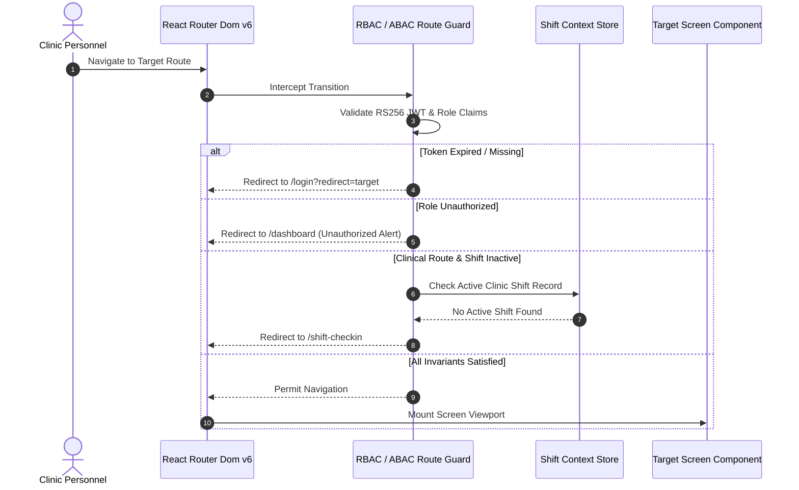

# Namma Clinic Frontend Navigation Architecture & Route Map

## 1. Executive Summary & Routing Philosophy
The Namma Clinic routing architecture provides deterministic, state-preserving, accessible, and high-velocity navigation across all **108 planned screens** of the platform. In busy municipal health clinics where staff transition rapidly between patient intake, vitals entry, clinical consultations, dispensing, and emergency escalations, navigation latency must remain below 50ms, with comprehensive keyboard shortcut bindings and automated unsaved-work protection.

## 2. Global Navigation Topology & Hierarchy
```mermaid
flowchart TD
    Root[/ Root Gateway] --> Auth[/login Authentication]
    Root --> ShiftCheck[/shift-checkin Active Shift Guard]
    ShiftCheck --> Dash[/dashboard Master Hub]
    Dash --> Reg[/patients Registration & Intake]
    Dash --> Triage[/triage Triage & Vitals]
    Dash --> Consult[/clinical Doctor Consultation]
    Dash --> Pharmacy[/pharmacy Dispensing & Stock]
    Dash --> Lab[/laboratory Diagnostic Orders]
    Dash --> Tele[/telemedicine Tele-Consultation]
    Dash --> Admin[/admin Facility Management]
    Dash --> Audit[/audit WORM Compliance]
```

## 3. Core Route Guard Lifecycle


## 4. Master Navigation Route Transition Matrix
| Route ID | Origin Screen | Destination Screen | User Trigger Action | Operational Guard |
| :--- | :--- | :--- | :--- | :--- |
| `NAV-001` | `SCREEN-001` (User Login Screen) | `SCREEN-002` (MFA Verification Screen) | Submit Valid Credentials | MFA Enabled for Role |
| `NAV-002` | `SCREEN-001` (User Login Screen) | `SCREEN-006` (Master Clinic Dashboard) | Submit Valid Credentials (MFA Disabled) | Active Valid Session |
| `NAV-003` | `SCREEN-002` (MFA Verification Screen) | `SCREEN-006` (Master Clinic Dashboard) | Submit Valid TOTP / Hardware Key | MFA Verification Succeeded |
| `NAV-004` | `SCREEN-006` (Master Clinic Dashboard) | `SCREEN-011` (Citizen New Registration Screen) | Click 'New Citizen Registration' CTA | ROLE-001 or ROLE-020 |
| `NAV-005` | `SCREEN-006` (Master Clinic Dashboard) | `SCREEN-012` (Citizen Search & Retrieval Screen) | Click 'Search Patient' Search Bar | Authenticated User |
| `NAV-006` | `SCREEN-012` (Citizen Search & Retrieval Screen) | `SCREEN-013` (Patient Longitudinal Profile View) | Select Patient from Search Results Table | Patient Exists |
| `NAV-007` | `SCREEN-013` (Patient Longitudinal Profile View) | `SCREEN-014` (Repeat Patient Fast Intake) | Click 'Repeat Visit Intake' Button | Active Patient Profile |
| `NAV-008` | `SCREEN-014` (Repeat Patient Fast Intake) | `SCREEN-024` (OPD Token Generation & Print Modal) | Complete Repeat Intake Verification | Token Generated |
| `NAV-009` | `SCREEN-011` (Citizen New Registration Screen) | `SCREEN-019` (DPDP Informed Consent Capture Screen) | Submit New Citizen Demographics | DPDP Consent Required |
| `NAV-010` | `SCREEN-019` (DPDP Informed Consent Capture Screen) | `SCREEN-024` (OPD Token Generation & Print Modal) | Sign and Confirm Consent Agreement | Consent Persisted |
| `NAV-011` | `SCREEN-024` (OPD Token Generation & Print Modal) | `SCREEN-025` (Master Waiting Room Queue Display) | Token Printed; Patient Directed to Waiting Hall | Queue Advanced |
| `NAV-012` | `SCREEN-006` (Master Clinic Dashboard) | `SCREEN-008` (Staff Nurse Triage Workbench) | Nurse Accesses Triage Dashboard | ROLE-003 Authorized |
| `NAV-013` | `SCREEN-008` (Staff Nurse Triage Workbench) | `SCREEN-029` (Triage Vitals Entry Form) | Select Patient from Triage Waiting Queue | Visit In Triage Queue |
| `NAV-014` | `SCREEN-029` (Triage Vitals Entry Form) | `SCREEN-032` (Danger Signs & Triage Warning Modal) | Log Systolic BP > 180 or SpO2 < 90% | Critical Vitals Triggered |
| `NAV-015` | `SCREEN-029` (Triage Vitals Entry Form) | `SCREEN-008` (Staff Nurse Triage Workbench) | Submit Normal Vitals Assessment | Triage Assessment Completed |
| `NAV-016` | `SCREEN-006` (Master Clinic Dashboard) | `SCREEN-007` (Doctor Outpatient Console) | Doctor Accesses Clinical Outpatient Console | ROLE-002 Authorized |
| `NAV-017` | `SCREEN-007` (Doctor Outpatient Console) | `SCREEN-035` (Clinical Consultation Workspace) | Call Next Patient into Consultation Cabin | Patient Waiting in Queue |
| `NAV-018` | `SCREEN-035` (Clinical Consultation Workspace) | `SCREEN-036` (Chief Complaints & Systemic Review) | Click 'Chief Complaints' Section | Consultation Active |
| `NAV-019` | `SCREEN-035` (Clinical Consultation Workspace) | `SCREEN-038` (ICD-10 & SNOMED CT Diagnosis Picker) | Click 'Diagnosis' ICD-10 Search | Consultation Active |
| `NAV-020` | `SCREEN-035` (Clinical Consultation Workspace) | `SCREEN-046` (Electronic Prescription Form) | Click 'Generate Prescription' CTA | Consultation Active |
| `NAV-021` | `SCREEN-046` (Electronic Prescription Form) | `SCREEN-047` (Drug-Drug & Drug-Allergy Warning Modal) | Select Penicillin when Patient has Penicillin Allergy | Drug Conflict Detected |
| `NAV-022` | `SCREEN-046` (Electronic Prescription Form) | `SCREEN-049` (Prescription Bilingual Print Preview) | Sign and Finalize Prescription | Prescription Validated |
| `NAV-023` | `SCREEN-035` (Clinical Consultation Workspace) | `SCREEN-069` (Diagnostic Lab Test Orders Queue) | Click 'Order Laboratory Tests' CTA | Consultation Active |
| `NAV-024` | `SCREEN-035` (Clinical Consultation Workspace) | `SCREEN-077` (Secondary / Tertiary Referral Form) | Click 'Emergency Secondary Referral' CTA | Consultation Active |
| `NAV-025` | `SCREEN-077` (Secondary / Tertiary Referral Form) | `SCREEN-078` (108 Emergency Ambulance Dispatch Screen) | Select 108 Emergency Ambulance Escalation | Urgent Transport Needed |
| `NAV-026` | `SCREEN-035` (Clinical Consultation Workspace) | `SCREEN-044` (Consultation Summary & Lock Dialog) | Click 'Sign & Complete Encounter' CTA | All Sections Validated |
| `NAV-027` | `SCREEN-044` (Consultation Summary & Lock Dialog) | `SCREEN-007` (Doctor Outpatient Console) | Doctor Digitally Signs Encounter; Returns to Queue | Encounter Locked |
| `NAV-028` | `SCREEN-006` (Master Clinic Dashboard) | `SCREEN-009` (Pharmacy Dispensing Console) | Pharmacist Opens Dispensing Console | ROLE-004 Authorized |
| `NAV-029` | `SCREEN-009` (Pharmacy Dispensing Console) | `SCREEN-053` (Pharmacy Active Dispensing Screen) | Select Citizen from Pharmacy Pickup Queue | Prescription Awaiting Dispense |
| `NAV-030` | `SCREEN-053` (Pharmacy Active Dispensing Screen) | `SCREEN-055` (Medicine Counseling Label Print Modal) | Scan Barcodes and Verify Strip Quantities | Medications Dispensed |
| `NAV-031` | `SCREEN-006` (Master Clinic Dashboard) | `SCREEN-010` (Diagnostic Laboratory Workbench) | Lab Tech Opens Laboratory Workbench | ROLE-005 Authorized |
| `NAV-032` | `SCREEN-010` (Diagnostic Laboratory Workbench) | `SCREEN-070` (Specimen Collection & Barcode Label Screen) | Select Order to Collect Specimen Vials | Lab Order Pending Specimen |
| `NAV-033` | `SCREEN-070` (Specimen Collection & Barcode Label Screen) | `SCREEN-071` (Point-of-Care Rapid Test Result Entry) | Scan Vial Barcode and Complete POC Test | Specimen Received |
| `NAV-034` | `SCREEN-071` (Point-of-Care Rapid Test Result Entry) | `SCREEN-073` (Lab Results Validation & Doctor Alert) | Authorize Results and Emit Doctor Notification | Results Completed |
| `NAV-035` | `SCREEN-006` (Master Clinic Dashboard) | `SCREEN-061` (Clinic Stock Inventory Dashboard) | Access Stock Inventory Dashboard | ROLE-004 or ROLE-006 |
| `NAV-036` | `SCREEN-061` (Clinic Stock Inventory Dashboard) | `SCREEN-062` (Stock Goods Receipt Note (GRN) Form) | Receive Shipment from Central Depot | GRN In Progress |
| `NAV-037` | `SCREEN-061` (Clinic Stock Inventory Dashboard) | `SCREEN-063` (Cold Chain Refrigerator Telemetry View) | Open Cold Chain Sensor Monitor | Cold Chain Monitored |
| `NAV-038` | `SCREEN-006` (Master Clinic Dashboard) | `SCREEN-089` (Epidemic Outbreak Surveillance Dashboard) | Access Epidemic Surveillance Heatmap | ROLE-010 or ROLE-008 |
| `NAV-039` | `SCREEN-006` (Master Clinic Dashboard) | `SCREEN-095` (Offline Storage & SQLite WAL Status) | Open Offline Storage & Sync Monitor | System Status Monitored |
| `NAV-040` | `SCREEN-095` (Offline Storage & SQLite WAL Status) | `SCREEN-097` (Sync Conflict Visual Resolution Modal) | Resolve Flagged Sync Conflict | Conflict Detected |
| `NAV-041` | `SCREEN-006` (Master Clinic Dashboard) | `SCREEN-105` (Cryptographic WORM Audit Log Viewer) | Security Auditor Accesses WORM Log Viewer | ROLE-011 or ROLE-012 |
| `NAV-042` | `SCREEN-006` (Master Clinic Dashboard) | `SCREEN-108` (Clinic Master Settings & Hardware Registry) | Administrator Configures Clinic Settings | ROLE-006 Authorized |
| `NAV-043` | `SCREEN-043` (Doctor Teleconsultation Video Room) | `SCREEN-006` (Master Clinic Dashboard) | Click Breadcrumb Home / Return to Dashboard | User Authenticated |
| `NAV-044` | `SCREEN-044` (Consultation Summary & Lock Dialog) | `SCREEN-006` (Master Clinic Dashboard) | Click Breadcrumb Home / Return to Dashboard | User Authenticated |
| `NAV-045` | `SCREEN-045` (Doctor Outpatient Day Book View) | `SCREEN-006` (Master Clinic Dashboard) | Click Breadcrumb Home / Return to Dashboard | User Authenticated |
| `NAV-046` | `SCREEN-046` (Electronic Prescription Form) | `SCREEN-006` (Master Clinic Dashboard) | Click Breadcrumb Home / Return to Dashboard | User Authenticated |
| `NAV-047` | `SCREEN-047` (Drug-Drug & Drug-Allergy Warning Modal) | `SCREEN-006` (Master Clinic Dashboard) | Click Breadcrumb Home / Return to Dashboard | User Authenticated |
| `NAV-048` | `SCREEN-048` (Standard Clinical Treatment Regimen Picker) | `SCREEN-006` (Master Clinic Dashboard) | Click Breadcrumb Home / Return to Dashboard | User Authenticated |
| `NAV-049` | `SCREEN-049` (Prescription Bilingual Print Preview) | `SCREEN-006` (Master Clinic Dashboard) | Click Breadcrumb Home / Return to Dashboard | User Authenticated |
| `NAV-050` | `SCREEN-050` (Medication Modification & Cancellation) | `SCREEN-006` (Master Clinic Dashboard) | Click Breadcrumb Home / Return to Dashboard | User Authenticated |
| `NAV-051` | `SCREEN-051` (Recurring Refill Request Form) | `SCREEN-006` (Master Clinic Dashboard) | Click Breadcrumb Home / Return to Dashboard | User Authenticated |
| `NAV-052` | `SCREEN-052` (Clinic Formulary & Stock Lookup Modal) | `SCREEN-006` (Master Clinic Dashboard) | Click Breadcrumb Home / Return to Dashboard | User Authenticated |
| `NAV-053` | `SCREEN-053` (Pharmacy Active Dispensing Screen) | `SCREEN-006` (Master Clinic Dashboard) | Click Breadcrumb Home / Return to Dashboard | User Authenticated |
| `NAV-054` | `SCREEN-054` (Partial Dispensing & Stockout Dialog) | `SCREEN-006` (Master Clinic Dashboard) | Click Breadcrumb Home / Return to Dashboard | User Authenticated |
| `NAV-055` | `SCREEN-055` (Medicine Counseling Label Print Modal) | `SCREEN-006` (Master Clinic Dashboard) | Click Breadcrumb Home / Return to Dashboard | User Authenticated |

## 5. Exhaustive Screen-by-Screen Routing & Navigation Specifications

### Route Specification for SCREEN-001: User Login Screen
**Canonical URI Route:** `/login` | **Module:** `MODULE-001`

#### 1. Breadcrumb & Hierarchy Path
- **Breadcrumb Chain:** `Home > Login`
- **Parent Route:** `/login`
- **Navigational Depth:** Level 1

#### 2. Deep Linking & URL Query Parameters Contract
- **Supported Query Parameters:**
  - `patientId`: Optional UUIDv7 string focusing the active patient context.
  - `encounterId`: Optional UUIDv7 string linking directly to an ongoing clinical encounter.
  - `tab`: Optional string selecting the active inner workspace tab.
  - `page`: Integer parameter governing paginated data tables.
  - `filter`: URL-encoded search filter string.
- **State Restoration:** Upon page reload or deep-link access, URL parameters are parsed into component state within 20ms.

#### 3. Route Guards & Security Checks
- **Primary Authorized Role:** `ROLE-001` (Receptionist / Registration Clerk)
- **Secondary Role Grants:** Medical Officer / General Physician, Staff Nurse / Triage Specialist, Pharmacist / Dispenser, Laboratory Technician, Clinic Administrative Officer
- **Shift Enforcement:** Strict active shift verification enforced prior to form interaction.
- **Facility Binding:** ABAC check asserts that route query parameters belong to the active clinic facility.

#### 4. Dirty-Form Protection & Unsaved State Interception
- **Interception Hook:** Bound to `COMP-156: UnsavedChangesConfirmationModal` via `useBeforeUnload` and React Router `useBlocker`.
- **Trigger Invariant:** User attempting to navigate away with dirty form state receives modal prompt: *'You have unsaved clinical entries. Discard or Save Draft?'*
- **Emergency Bypass:** Red-alert emergency hotkeys bypass dirty-form blocker to prioritize critical patient safety.

#### 5. Keyboard Navigation & Accessibility Shortcuts
- `Alt + 1`: Fast focus shortcut to primary action area on User Login Screen.
- `Ctrl + S`: Trigger instant local draft save.
- `Ctrl + P`: Trigger direct thermal or document print dispatcher.
- `Esc`: Dismiss modal overlays or cancel non-destructive search queries.

#### 6. Documentation-Only TypeScript Route Contract
```typescript
// DOCUMENTATION-ONLY TYPESCRIPT
export const RouteConfig_SCREEN_001 = {
  screenId: 'SCREEN-001',
  path: '/login',
  titleEn: 'User Login Screen',
  titleKn: 'User Login Screen (ಕನ್ನಡ)',
  requiredRole: 'ROLE-001',
  offlineSupported: true,
  breadcrumb: ['Home', 'login']
};
```

---

### Route Specification for SCREEN-002: MFA Verification Screen
**Canonical URI Route:** `/login/mfa` | **Module:** `MODULE-001`

#### 1. Breadcrumb & Hierarchy Path
- **Breadcrumb Chain:** `Home > Login > Mfa`
- **Parent Route:** `/login`
- **Navigational Depth:** Level 2

#### 2. Deep Linking & URL Query Parameters Contract
- **Supported Query Parameters:**
  - `patientId`: Optional UUIDv7 string focusing the active patient context.
  - `encounterId`: Optional UUIDv7 string linking directly to an ongoing clinical encounter.
  - `tab`: Optional string selecting the active inner workspace tab.
  - `page`: Integer parameter governing paginated data tables.
  - `filter`: URL-encoded search filter string.
- **State Restoration:** Upon page reload or deep-link access, URL parameters are parsed into component state within 20ms.

#### 3. Route Guards & Security Checks
- **Primary Authorized Role:** `ROLE-001` (Receptionist / Registration Clerk)
- **Secondary Role Grants:** Medical Officer / General Physician, Clinic Administrative Officer
- **Shift Enforcement:** Strict active shift verification enforced prior to form interaction.
- **Facility Binding:** ABAC check asserts that route query parameters belong to the active clinic facility.

#### 4. Dirty-Form Protection & Unsaved State Interception
- **Interception Hook:** Bound to `COMP-156: UnsavedChangesConfirmationModal` via `useBeforeUnload` and React Router `useBlocker`.
- **Trigger Invariant:** User attempting to navigate away with dirty form state receives modal prompt: *'You have unsaved clinical entries. Discard or Save Draft?'*
- **Emergency Bypass:** Red-alert emergency hotkeys bypass dirty-form blocker to prioritize critical patient safety.

#### 5. Keyboard Navigation & Accessibility Shortcuts
- `Alt + 2`: Fast focus shortcut to primary action area on MFA Verification Screen.
- `Ctrl + S`: Trigger instant local draft save.
- `Ctrl + P`: Trigger direct thermal or document print dispatcher.
- `Esc`: Dismiss modal overlays or cancel non-destructive search queries.

#### 6. Documentation-Only TypeScript Route Contract
```typescript
// DOCUMENTATION-ONLY TYPESCRIPT
export const RouteConfig_SCREEN_002 = {
  screenId: 'SCREEN-002',
  path: '/login/mfa',
  titleEn: 'MFA Verification Screen',
  titleKn: 'MFA Verification Screen (ಕನ್ನಡ)',
  requiredRole: 'ROLE-001',
  offlineSupported: true,
  breadcrumb: ['Home', 'login', 'mfa']
};
```

---

### Route Specification for SCREEN-003: Terminal Pairing & Device Enrollment
**Canonical URI Route:** `/system/device-enroll` | **Module:** `MODULE-001`

#### 1. Breadcrumb & Hierarchy Path
- **Breadcrumb Chain:** `Home > System > Device-enroll`
- **Parent Route:** `/system`
- **Navigational Depth:** Level 2

#### 2. Deep Linking & URL Query Parameters Contract
- **Supported Query Parameters:**
  - `patientId`: Optional UUIDv7 string focusing the active patient context.
  - `encounterId`: Optional UUIDv7 string linking directly to an ongoing clinical encounter.
  - `tab`: Optional string selecting the active inner workspace tab.
  - `page`: Integer parameter governing paginated data tables.
  - `filter`: URL-encoded search filter string.
- **State Restoration:** Upon page reload or deep-link access, URL parameters are parsed into component state within 20ms.

#### 3. Route Guards & Security Checks
- **Primary Authorized Role:** `ROLE-006` (Clinic Administrative Officer)
- **Secondary Role Grants:** IT Support & Hardware Engineer
- **Shift Enforcement:** Strict active shift verification enforced prior to form interaction.
- **Facility Binding:** ABAC check asserts that route query parameters belong to the active clinic facility.

#### 4. Dirty-Form Protection & Unsaved State Interception
- **Interception Hook:** Bound to `COMP-156: UnsavedChangesConfirmationModal` via `useBeforeUnload` and React Router `useBlocker`.
- **Trigger Invariant:** User attempting to navigate away with dirty form state receives modal prompt: *'You have unsaved clinical entries. Discard or Save Draft?'*
- **Emergency Bypass:** Red-alert emergency hotkeys bypass dirty-form blocker to prioritize critical patient safety.

#### 5. Keyboard Navigation & Accessibility Shortcuts
- `Alt + 3`: Fast focus shortcut to primary action area on Terminal Pairing & Device Enrollment.
- `Ctrl + S`: Trigger instant local draft save.
- `Ctrl + P`: Trigger direct thermal or document print dispatcher.
- `Esc`: Dismiss modal overlays or cancel non-destructive search queries.

#### 6. Documentation-Only TypeScript Route Contract
```typescript
// DOCUMENTATION-ONLY TYPESCRIPT
export const RouteConfig_SCREEN_003 = {
  screenId: 'SCREEN-003',
  path: '/system/device-enroll',
  titleEn: 'Terminal Pairing & Device Enrollment',
  titleKn: 'Terminal Pairing & Device Enrollment (ಕನ್ನಡ)',
  requiredRole: 'ROLE-006',
  offlineSupported: true,
  breadcrumb: ['Home', 'system', 'device-enroll']
};
```

---

### Route Specification for SCREEN-004: Clinic Shift Check-In & Handover
**Canonical URI Route:** `/shift/checkin` | **Module:** `MODULE-001`

#### 1. Breadcrumb & Hierarchy Path
- **Breadcrumb Chain:** `Home > Shift > Checkin`
- **Parent Route:** `/shift`
- **Navigational Depth:** Level 2

#### 2. Deep Linking & URL Query Parameters Contract
- **Supported Query Parameters:**
  - `patientId`: Optional UUIDv7 string focusing the active patient context.
  - `encounterId`: Optional UUIDv7 string linking directly to an ongoing clinical encounter.
  - `tab`: Optional string selecting the active inner workspace tab.
  - `page`: Integer parameter governing paginated data tables.
  - `filter`: URL-encoded search filter string.
- **State Restoration:** Upon page reload or deep-link access, URL parameters are parsed into component state within 20ms.

#### 3. Route Guards & Security Checks
- **Primary Authorized Role:** `ROLE-001` (Receptionist / Registration Clerk)
- **Secondary Role Grants:** Medical Officer / General Physician, Staff Nurse / Triage Specialist, Pharmacist / Dispenser
- **Shift Enforcement:** Strict active shift verification enforced prior to form interaction.
- **Facility Binding:** ABAC check asserts that route query parameters belong to the active clinic facility.

#### 4. Dirty-Form Protection & Unsaved State Interception
- **Interception Hook:** Bound to `COMP-156: UnsavedChangesConfirmationModal` via `useBeforeUnload` and React Router `useBlocker`.
- **Trigger Invariant:** User attempting to navigate away with dirty form state receives modal prompt: *'You have unsaved clinical entries. Discard or Save Draft?'*
- **Emergency Bypass:** Red-alert emergency hotkeys bypass dirty-form blocker to prioritize critical patient safety.

#### 5. Keyboard Navigation & Accessibility Shortcuts
- `Alt + 4`: Fast focus shortcut to primary action area on Clinic Shift Check-In & Handover.
- `Ctrl + S`: Trigger instant local draft save.
- `Ctrl + P`: Trigger direct thermal or document print dispatcher.
- `Esc`: Dismiss modal overlays or cancel non-destructive search queries.

#### 6. Documentation-Only TypeScript Route Contract
```typescript
// DOCUMENTATION-ONLY TYPESCRIPT
export const RouteConfig_SCREEN_004 = {
  screenId: 'SCREEN-004',
  path: '/shift/checkin',
  titleEn: 'Clinic Shift Check-In & Handover',
  titleKn: 'Clinic Shift Check-In & Handover (ಕನ್ನಡ)',
  requiredRole: 'ROLE-001',
  offlineSupported: true,
  breadcrumb: ['Home', 'shift', 'checkin']
};
```

---

### Route Specification for SCREEN-005: Emergency Break-Glass Authorization
**Canonical URI Route:** `/auth/break-glass` | **Module:** `MODULE-001`

#### 1. Breadcrumb & Hierarchy Path
- **Breadcrumb Chain:** `Home > Auth > Break-glass`
- **Parent Route:** `/auth`
- **Navigational Depth:** Level 2

#### 2. Deep Linking & URL Query Parameters Contract
- **Supported Query Parameters:**
  - `patientId`: Optional UUIDv7 string focusing the active patient context.
  - `encounterId`: Optional UUIDv7 string linking directly to an ongoing clinical encounter.
  - `tab`: Optional string selecting the active inner workspace tab.
  - `page`: Integer parameter governing paginated data tables.
  - `filter`: URL-encoded search filter string.
- **State Restoration:** Upon page reload or deep-link access, URL parameters are parsed into component state within 20ms.

#### 3. Route Guards & Security Checks
- **Primary Authorized Role:** `ROLE-002` (Medical Officer / General Physician)
- **Secondary Role Grants:** Staff Nurse / Triage Specialist
- **Shift Enforcement:** Strict active shift verification enforced prior to form interaction.
- **Facility Binding:** ABAC check asserts that route query parameters belong to the active clinic facility.

#### 4. Dirty-Form Protection & Unsaved State Interception
- **Interception Hook:** Bound to `COMP-156: UnsavedChangesConfirmationModal` via `useBeforeUnload` and React Router `useBlocker`.
- **Trigger Invariant:** User attempting to navigate away with dirty form state receives modal prompt: *'You have unsaved clinical entries. Discard or Save Draft?'*
- **Emergency Bypass:** Red-alert emergency hotkeys bypass dirty-form blocker to prioritize critical patient safety.

#### 5. Keyboard Navigation & Accessibility Shortcuts
- `Alt + 5`: Fast focus shortcut to primary action area on Emergency Break-Glass Authorization.
- `Ctrl + S`: Trigger instant local draft save.
- `Ctrl + P`: Trigger direct thermal or document print dispatcher.
- `Esc`: Dismiss modal overlays or cancel non-destructive search queries.

#### 6. Documentation-Only TypeScript Route Contract
```typescript
// DOCUMENTATION-ONLY TYPESCRIPT
export const RouteConfig_SCREEN_005 = {
  screenId: 'SCREEN-005',
  path: '/auth/break-glass',
  titleEn: 'Emergency Break-Glass Authorization',
  titleKn: 'Emergency Break-Glass Authorization (ಕನ್ನಡ)',
  requiredRole: 'ROLE-002',
  offlineSupported: true,
  breadcrumb: ['Home', 'auth', 'break-glass']
};
```

---

### Route Specification for SCREEN-006: Master Clinic Dashboard
**Canonical URI Route:** `/dashboard` | **Module:** `MODULE-002`

#### 1. Breadcrumb & Hierarchy Path
- **Breadcrumb Chain:** `Home > Dashboard`
- **Parent Route:** `/dashboard`
- **Navigational Depth:** Level 1

#### 2. Deep Linking & URL Query Parameters Contract
- **Supported Query Parameters:**
  - `patientId`: Optional UUIDv7 string focusing the active patient context.
  - `encounterId`: Optional UUIDv7 string linking directly to an ongoing clinical encounter.
  - `tab`: Optional string selecting the active inner workspace tab.
  - `page`: Integer parameter governing paginated data tables.
  - `filter`: URL-encoded search filter string.
- **State Restoration:** Upon page reload or deep-link access, URL parameters are parsed into component state within 20ms.

#### 3. Route Guards & Security Checks
- **Primary Authorized Role:** `ROLE-001` (Receptionist / Registration Clerk)
- **Secondary Role Grants:** Medical Officer / General Physician, Staff Nurse / Triage Specialist, Pharmacist / Dispenser, Clinic Administrative Officer
- **Shift Enforcement:** Strict active shift verification enforced prior to form interaction.
- **Facility Binding:** ABAC check asserts that route query parameters belong to the active clinic facility.

#### 4. Dirty-Form Protection & Unsaved State Interception
- **Interception Hook:** Bound to `COMP-156: UnsavedChangesConfirmationModal` via `useBeforeUnload` and React Router `useBlocker`.
- **Trigger Invariant:** User attempting to navigate away with dirty form state receives modal prompt: *'You have unsaved clinical entries. Discard or Save Draft?'*
- **Emergency Bypass:** Red-alert emergency hotkeys bypass dirty-form blocker to prioritize critical patient safety.

#### 5. Keyboard Navigation & Accessibility Shortcuts
- `Alt + 6`: Fast focus shortcut to primary action area on Master Clinic Dashboard.
- `Ctrl + S`: Trigger instant local draft save.
- `Ctrl + P`: Trigger direct thermal or document print dispatcher.
- `Esc`: Dismiss modal overlays or cancel non-destructive search queries.

#### 6. Documentation-Only TypeScript Route Contract
```typescript
// DOCUMENTATION-ONLY TYPESCRIPT
export const RouteConfig_SCREEN_006 = {
  screenId: 'SCREEN-006',
  path: '/dashboard',
  titleEn: 'Master Clinic Dashboard',
  titleKn: 'Master Clinic Dashboard (ಕನ್ನಡ)',
  requiredRole: 'ROLE-001',
  offlineSupported: true,
  breadcrumb: ['Home', 'dashboard']
};
```

---

### Route Specification for SCREEN-007: Doctor Outpatient Console
**Canonical URI Route:** `/doctor/console` | **Module:** `MODULE-002`

#### 1. Breadcrumb & Hierarchy Path
- **Breadcrumb Chain:** `Home > Doctor > Console`
- **Parent Route:** `/doctor`
- **Navigational Depth:** Level 2

#### 2. Deep Linking & URL Query Parameters Contract
- **Supported Query Parameters:**
  - `patientId`: Optional UUIDv7 string focusing the active patient context.
  - `encounterId`: Optional UUIDv7 string linking directly to an ongoing clinical encounter.
  - `tab`: Optional string selecting the active inner workspace tab.
  - `page`: Integer parameter governing paginated data tables.
  - `filter`: URL-encoded search filter string.
- **State Restoration:** Upon page reload or deep-link access, URL parameters are parsed into component state within 20ms.

#### 3. Route Guards & Security Checks
- **Primary Authorized Role:** `ROLE-002` (Medical Officer / General Physician)
- **Secondary Role Grants:** None (Exclusive Role)
- **Shift Enforcement:** Strict active shift verification enforced prior to form interaction.
- **Facility Binding:** ABAC check asserts that route query parameters belong to the active clinic facility.

#### 4. Dirty-Form Protection & Unsaved State Interception
- **Interception Hook:** Bound to `COMP-156: UnsavedChangesConfirmationModal` via `useBeforeUnload` and React Router `useBlocker`.
- **Trigger Invariant:** User attempting to navigate away with dirty form state receives modal prompt: *'You have unsaved clinical entries. Discard or Save Draft?'*
- **Emergency Bypass:** Red-alert emergency hotkeys bypass dirty-form blocker to prioritize critical patient safety.

#### 5. Keyboard Navigation & Accessibility Shortcuts
- `Alt + 7`: Fast focus shortcut to primary action area on Doctor Outpatient Console.
- `Ctrl + S`: Trigger instant local draft save.
- `Ctrl + P`: Trigger direct thermal or document print dispatcher.
- `Esc`: Dismiss modal overlays or cancel non-destructive search queries.

#### 6. Documentation-Only TypeScript Route Contract
```typescript
// DOCUMENTATION-ONLY TYPESCRIPT
export const RouteConfig_SCREEN_007 = {
  screenId: 'SCREEN-007',
  path: '/doctor/console',
  titleEn: 'Doctor Outpatient Console',
  titleKn: 'Doctor Outpatient Console (ಕನ್ನಡ)',
  requiredRole: 'ROLE-002',
  offlineSupported: true,
  breadcrumb: ['Home', 'doctor', 'console']
};
```

---

### Route Specification for SCREEN-008: Staff Nurse Triage Workbench
**Canonical URI Route:** `/nurse/triage` | **Module:** `MODULE-002`

#### 1. Breadcrumb & Hierarchy Path
- **Breadcrumb Chain:** `Home > Nurse > Triage`
- **Parent Route:** `/nurse`
- **Navigational Depth:** Level 2

#### 2. Deep Linking & URL Query Parameters Contract
- **Supported Query Parameters:**
  - `patientId`: Optional UUIDv7 string focusing the active patient context.
  - `encounterId`: Optional UUIDv7 string linking directly to an ongoing clinical encounter.
  - `tab`: Optional string selecting the active inner workspace tab.
  - `page`: Integer parameter governing paginated data tables.
  - `filter`: URL-encoded search filter string.
- **State Restoration:** Upon page reload or deep-link access, URL parameters are parsed into component state within 20ms.

#### 3. Route Guards & Security Checks
- **Primary Authorized Role:** `ROLE-003` (Staff Nurse / Triage Specialist)
- **Secondary Role Grants:** None (Exclusive Role)
- **Shift Enforcement:** Strict active shift verification enforced prior to form interaction.
- **Facility Binding:** ABAC check asserts that route query parameters belong to the active clinic facility.

#### 4. Dirty-Form Protection & Unsaved State Interception
- **Interception Hook:** Bound to `COMP-156: UnsavedChangesConfirmationModal` via `useBeforeUnload` and React Router `useBlocker`.
- **Trigger Invariant:** User attempting to navigate away with dirty form state receives modal prompt: *'You have unsaved clinical entries. Discard or Save Draft?'*
- **Emergency Bypass:** Red-alert emergency hotkeys bypass dirty-form blocker to prioritize critical patient safety.

#### 5. Keyboard Navigation & Accessibility Shortcuts
- `Alt + 8`: Fast focus shortcut to primary action area on Staff Nurse Triage Workbench.
- `Ctrl + S`: Trigger instant local draft save.
- `Ctrl + P`: Trigger direct thermal or document print dispatcher.
- `Esc`: Dismiss modal overlays or cancel non-destructive search queries.

#### 6. Documentation-Only TypeScript Route Contract
```typescript
// DOCUMENTATION-ONLY TYPESCRIPT
export const RouteConfig_SCREEN_008 = {
  screenId: 'SCREEN-008',
  path: '/nurse/triage',
  titleEn: 'Staff Nurse Triage Workbench',
  titleKn: 'Staff Nurse Triage Workbench (ಕನ್ನಡ)',
  requiredRole: 'ROLE-003',
  offlineSupported: true,
  breadcrumb: ['Home', 'nurse', 'triage']
};
```

---

### Route Specification for SCREEN-009: Pharmacy Dispensing Console
**Canonical URI Route:** `/pharmacy/dispense` | **Module:** `MODULE-002`

#### 1. Breadcrumb & Hierarchy Path
- **Breadcrumb Chain:** `Home > Pharmacy > Dispense`
- **Parent Route:** `/pharmacy`
- **Navigational Depth:** Level 2

#### 2. Deep Linking & URL Query Parameters Contract
- **Supported Query Parameters:**
  - `patientId`: Optional UUIDv7 string focusing the active patient context.
  - `encounterId`: Optional UUIDv7 string linking directly to an ongoing clinical encounter.
  - `tab`: Optional string selecting the active inner workspace tab.
  - `page`: Integer parameter governing paginated data tables.
  - `filter`: URL-encoded search filter string.
- **State Restoration:** Upon page reload or deep-link access, URL parameters are parsed into component state within 20ms.

#### 3. Route Guards & Security Checks
- **Primary Authorized Role:** `ROLE-004` (Pharmacist / Dispenser)
- **Secondary Role Grants:** None (Exclusive Role)
- **Shift Enforcement:** Strict active shift verification enforced prior to form interaction.
- **Facility Binding:** ABAC check asserts that route query parameters belong to the active clinic facility.

#### 4. Dirty-Form Protection & Unsaved State Interception
- **Interception Hook:** Bound to `COMP-156: UnsavedChangesConfirmationModal` via `useBeforeUnload` and React Router `useBlocker`.
- **Trigger Invariant:** User attempting to navigate away with dirty form state receives modal prompt: *'You have unsaved clinical entries. Discard or Save Draft?'*
- **Emergency Bypass:** Red-alert emergency hotkeys bypass dirty-form blocker to prioritize critical patient safety.

#### 5. Keyboard Navigation & Accessibility Shortcuts
- `Alt + 9`: Fast focus shortcut to primary action area on Pharmacy Dispensing Console.
- `Ctrl + S`: Trigger instant local draft save.
- `Ctrl + P`: Trigger direct thermal or document print dispatcher.
- `Esc`: Dismiss modal overlays or cancel non-destructive search queries.

#### 6. Documentation-Only TypeScript Route Contract
```typescript
// DOCUMENTATION-ONLY TYPESCRIPT
export const RouteConfig_SCREEN_009 = {
  screenId: 'SCREEN-009',
  path: '/pharmacy/dispense',
  titleEn: 'Pharmacy Dispensing Console',
  titleKn: 'Pharmacy Dispensing Console (ಕನ್ನಡ)',
  requiredRole: 'ROLE-004',
  offlineSupported: true,
  breadcrumb: ['Home', 'pharmacy', 'dispense']
};
```

---

### Route Specification for SCREEN-010: Diagnostic Laboratory Workbench
**Canonical URI Route:** `/lab/workbench` | **Module:** `MODULE-002`

#### 1. Breadcrumb & Hierarchy Path
- **Breadcrumb Chain:** `Home > Lab > Workbench`
- **Parent Route:** `/lab`
- **Navigational Depth:** Level 2

#### 2. Deep Linking & URL Query Parameters Contract
- **Supported Query Parameters:**
  - `patientId`: Optional UUIDv7 string focusing the active patient context.
  - `encounterId`: Optional UUIDv7 string linking directly to an ongoing clinical encounter.
  - `tab`: Optional string selecting the active inner workspace tab.
  - `page`: Integer parameter governing paginated data tables.
  - `filter`: URL-encoded search filter string.
- **State Restoration:** Upon page reload or deep-link access, URL parameters are parsed into component state within 20ms.

#### 3. Route Guards & Security Checks
- **Primary Authorized Role:** `ROLE-005` (Laboratory Technician)
- **Secondary Role Grants:** None (Exclusive Role)
- **Shift Enforcement:** Strict active shift verification enforced prior to form interaction.
- **Facility Binding:** ABAC check asserts that route query parameters belong to the active clinic facility.

#### 4. Dirty-Form Protection & Unsaved State Interception
- **Interception Hook:** Bound to `COMP-156: UnsavedChangesConfirmationModal` via `useBeforeUnload` and React Router `useBlocker`.
- **Trigger Invariant:** User attempting to navigate away with dirty form state receives modal prompt: *'You have unsaved clinical entries. Discard or Save Draft?'*
- **Emergency Bypass:** Red-alert emergency hotkeys bypass dirty-form blocker to prioritize critical patient safety.

#### 5. Keyboard Navigation & Accessibility Shortcuts
- `Alt + 0`: Fast focus shortcut to primary action area on Diagnostic Laboratory Workbench.
- `Ctrl + S`: Trigger instant local draft save.
- `Ctrl + P`: Trigger direct thermal or document print dispatcher.
- `Esc`: Dismiss modal overlays or cancel non-destructive search queries.

#### 6. Documentation-Only TypeScript Route Contract
```typescript
// DOCUMENTATION-ONLY TYPESCRIPT
export const RouteConfig_SCREEN_010 = {
  screenId: 'SCREEN-010',
  path: '/lab/workbench',
  titleEn: 'Diagnostic Laboratory Workbench',
  titleKn: 'Diagnostic Laboratory Workbench (ಕನ್ನಡ)',
  requiredRole: 'ROLE-005',
  offlineSupported: true,
  breadcrumb: ['Home', 'lab', 'workbench']
};
```

---

### Route Specification for SCREEN-011: Citizen New Registration Screen
**Canonical URI Route:** `/patients/new` | **Module:** `MODULE-003`

#### 1. Breadcrumb & Hierarchy Path
- **Breadcrumb Chain:** `Home > Patients > New`
- **Parent Route:** `/patients`
- **Navigational Depth:** Level 2

#### 2. Deep Linking & URL Query Parameters Contract
- **Supported Query Parameters:**
  - `patientId`: Optional UUIDv7 string focusing the active patient context.
  - `encounterId`: Optional UUIDv7 string linking directly to an ongoing clinical encounter.
  - `tab`: Optional string selecting the active inner workspace tab.
  - `page`: Integer parameter governing paginated data tables.
  - `filter`: URL-encoded search filter string.
- **State Restoration:** Upon page reload or deep-link access, URL parameters are parsed into component state within 20ms.

#### 3. Route Guards & Security Checks
- **Primary Authorized Role:** `ROLE-001` (Receptionist / Registration Clerk)
- **Secondary Role Grants:** Staff Nurse / Triage Specialist, Data Entry Operator
- **Shift Enforcement:** Strict active shift verification enforced prior to form interaction.
- **Facility Binding:** ABAC check asserts that route query parameters belong to the active clinic facility.

#### 4. Dirty-Form Protection & Unsaved State Interception
- **Interception Hook:** Bound to `COMP-156: UnsavedChangesConfirmationModal` via `useBeforeUnload` and React Router `useBlocker`.
- **Trigger Invariant:** User attempting to navigate away with dirty form state receives modal prompt: *'You have unsaved clinical entries. Discard or Save Draft?'*
- **Emergency Bypass:** Red-alert emergency hotkeys bypass dirty-form blocker to prioritize critical patient safety.

#### 5. Keyboard Navigation & Accessibility Shortcuts
- `Alt + 1`: Fast focus shortcut to primary action area on Citizen New Registration Screen.
- `Ctrl + S`: Trigger instant local draft save.
- `Ctrl + P`: Trigger direct thermal or document print dispatcher.
- `Esc`: Dismiss modal overlays or cancel non-destructive search queries.

#### 6. Documentation-Only TypeScript Route Contract
```typescript
// DOCUMENTATION-ONLY TYPESCRIPT
export const RouteConfig_SCREEN_011 = {
  screenId: 'SCREEN-011',
  path: '/patients/new',
  titleEn: 'Citizen New Registration Screen',
  titleKn: 'Citizen New Registration Screen (ಕನ್ನಡ)',
  requiredRole: 'ROLE-001',
  offlineSupported: true,
  breadcrumb: ['Home', 'patients', 'new']
};
```

---

### Route Specification for SCREEN-012: Citizen Search & Retrieval Screen
**Canonical URI Route:** `/patients/search` | **Module:** `MODULE-003`

#### 1. Breadcrumb & Hierarchy Path
- **Breadcrumb Chain:** `Home > Patients > Search`
- **Parent Route:** `/patients`
- **Navigational Depth:** Level 2

#### 2. Deep Linking & URL Query Parameters Contract
- **Supported Query Parameters:**
  - `patientId`: Optional UUIDv7 string focusing the active patient context.
  - `encounterId`: Optional UUIDv7 string linking directly to an ongoing clinical encounter.
  - `tab`: Optional string selecting the active inner workspace tab.
  - `page`: Integer parameter governing paginated data tables.
  - `filter`: URL-encoded search filter string.
- **State Restoration:** Upon page reload or deep-link access, URL parameters are parsed into component state within 20ms.

#### 3. Route Guards & Security Checks
- **Primary Authorized Role:** `ROLE-001` (Receptionist / Registration Clerk)
- **Secondary Role Grants:** Medical Officer / General Physician, Staff Nurse / Triage Specialist, Pharmacist / Dispenser
- **Shift Enforcement:** Strict active shift verification enforced prior to form interaction.
- **Facility Binding:** ABAC check asserts that route query parameters belong to the active clinic facility.

#### 4. Dirty-Form Protection & Unsaved State Interception
- **Interception Hook:** Bound to `COMP-156: UnsavedChangesConfirmationModal` via `useBeforeUnload` and React Router `useBlocker`.
- **Trigger Invariant:** User attempting to navigate away with dirty form state receives modal prompt: *'You have unsaved clinical entries. Discard or Save Draft?'*
- **Emergency Bypass:** Red-alert emergency hotkeys bypass dirty-form blocker to prioritize critical patient safety.

#### 5. Keyboard Navigation & Accessibility Shortcuts
- `Alt + 2`: Fast focus shortcut to primary action area on Citizen Search & Retrieval Screen.
- `Ctrl + S`: Trigger instant local draft save.
- `Ctrl + P`: Trigger direct thermal or document print dispatcher.
- `Esc`: Dismiss modal overlays or cancel non-destructive search queries.

#### 6. Documentation-Only TypeScript Route Contract
```typescript
// DOCUMENTATION-ONLY TYPESCRIPT
export const RouteConfig_SCREEN_012 = {
  screenId: 'SCREEN-012',
  path: '/patients/search',
  titleEn: 'Citizen Search & Retrieval Screen',
  titleKn: 'Citizen Search & Retrieval Screen (ಕನ್ನಡ)',
  requiredRole: 'ROLE-001',
  offlineSupported: true,
  breadcrumb: ['Home', 'patients', 'search']
};
```

---

### Route Specification for SCREEN-013: Patient Longitudinal Profile View
**Canonical URI Route:** `/patients/:id` | **Module:** `MODULE-003`

#### 1. Breadcrumb & Hierarchy Path
- **Breadcrumb Chain:** `Home > Patients > :id`
- **Parent Route:** `/patients`
- **Navigational Depth:** Level 2

#### 2. Deep Linking & URL Query Parameters Contract
- **Supported Query Parameters:**
  - `patientId`: Optional UUIDv7 string focusing the active patient context.
  - `encounterId`: Optional UUIDv7 string linking directly to an ongoing clinical encounter.
  - `tab`: Optional string selecting the active inner workspace tab.
  - `page`: Integer parameter governing paginated data tables.
  - `filter`: URL-encoded search filter string.
- **State Restoration:** Upon page reload or deep-link access, URL parameters are parsed into component state within 20ms.

#### 3. Route Guards & Security Checks
- **Primary Authorized Role:** `ROLE-002` (Medical Officer / General Physician)
- **Secondary Role Grants:** Receptionist / Registration Clerk, Staff Nurse / Triage Specialist
- **Shift Enforcement:** Strict active shift verification enforced prior to form interaction.
- **Facility Binding:** ABAC check asserts that route query parameters belong to the active clinic facility.

#### 4. Dirty-Form Protection & Unsaved State Interception
- **Interception Hook:** Bound to `COMP-156: UnsavedChangesConfirmationModal` via `useBeforeUnload` and React Router `useBlocker`.
- **Trigger Invariant:** User attempting to navigate away with dirty form state receives modal prompt: *'You have unsaved clinical entries. Discard or Save Draft?'*
- **Emergency Bypass:** Red-alert emergency hotkeys bypass dirty-form blocker to prioritize critical patient safety.

#### 5. Keyboard Navigation & Accessibility Shortcuts
- `Alt + 3`: Fast focus shortcut to primary action area on Patient Longitudinal Profile View.
- `Ctrl + S`: Trigger instant local draft save.
- `Ctrl + P`: Trigger direct thermal or document print dispatcher.
- `Esc`: Dismiss modal overlays or cancel non-destructive search queries.

#### 6. Documentation-Only TypeScript Route Contract
```typescript
// DOCUMENTATION-ONLY TYPESCRIPT
export const RouteConfig_SCREEN_013 = {
  screenId: 'SCREEN-013',
  path: '/patients/:id',
  titleEn: 'Patient Longitudinal Profile View',
  titleKn: 'Patient Longitudinal Profile View (ಕನ್ನಡ)',
  requiredRole: 'ROLE-002',
  offlineSupported: true,
  breadcrumb: ['Home', 'patients', ':id']
};
```

---

### Route Specification for SCREEN-014: Repeat Patient Fast Intake
**Canonical URI Route:** `/patients/:id/repeat-intake` | **Module:** `MODULE-003`

#### 1. Breadcrumb & Hierarchy Path
- **Breadcrumb Chain:** `Home > Patients > :id > Repeat-intake`
- **Parent Route:** `/patients`
- **Navigational Depth:** Level 3

#### 2. Deep Linking & URL Query Parameters Contract
- **Supported Query Parameters:**
  - `patientId`: Optional UUIDv7 string focusing the active patient context.
  - `encounterId`: Optional UUIDv7 string linking directly to an ongoing clinical encounter.
  - `tab`: Optional string selecting the active inner workspace tab.
  - `page`: Integer parameter governing paginated data tables.
  - `filter`: URL-encoded search filter string.
- **State Restoration:** Upon page reload or deep-link access, URL parameters are parsed into component state within 20ms.

#### 3. Route Guards & Security Checks
- **Primary Authorized Role:** `ROLE-001` (Receptionist / Registration Clerk)
- **Secondary Role Grants:** Staff Nurse / Triage Specialist
- **Shift Enforcement:** Strict active shift verification enforced prior to form interaction.
- **Facility Binding:** ABAC check asserts that route query parameters belong to the active clinic facility.

#### 4. Dirty-Form Protection & Unsaved State Interception
- **Interception Hook:** Bound to `COMP-156: UnsavedChangesConfirmationModal` via `useBeforeUnload` and React Router `useBlocker`.
- **Trigger Invariant:** User attempting to navigate away with dirty form state receives modal prompt: *'You have unsaved clinical entries. Discard or Save Draft?'*
- **Emergency Bypass:** Red-alert emergency hotkeys bypass dirty-form blocker to prioritize critical patient safety.

#### 5. Keyboard Navigation & Accessibility Shortcuts
- `Alt + 4`: Fast focus shortcut to primary action area on Repeat Patient Fast Intake.
- `Ctrl + S`: Trigger instant local draft save.
- `Ctrl + P`: Trigger direct thermal or document print dispatcher.
- `Esc`: Dismiss modal overlays or cancel non-destructive search queries.

#### 6. Documentation-Only TypeScript Route Contract
```typescript
// DOCUMENTATION-ONLY TYPESCRIPT
export const RouteConfig_SCREEN_014 = {
  screenId: 'SCREEN-014',
  path: '/patients/:id/repeat-intake',
  titleEn: 'Repeat Patient Fast Intake',
  titleKn: 'Repeat Patient Fast Intake (ಕನ್ನಡ)',
  requiredRole: 'ROLE-001',
  offlineSupported: true,
  breadcrumb: ['Home', 'patients', ':id', 'repeat-intake']
};
```

---

### Route Specification for SCREEN-015: Biometric & ABHA Card Scan Modal
**Canonical URI Route:** `/patients/abha-scan` | **Module:** `MODULE-003`

#### 1. Breadcrumb & Hierarchy Path
- **Breadcrumb Chain:** `Home > Patients > Abha-scan`
- **Parent Route:** `/patients`
- **Navigational Depth:** Level 2

#### 2. Deep Linking & URL Query Parameters Contract
- **Supported Query Parameters:**
  - `patientId`: Optional UUIDv7 string focusing the active patient context.
  - `encounterId`: Optional UUIDv7 string linking directly to an ongoing clinical encounter.
  - `tab`: Optional string selecting the active inner workspace tab.
  - `page`: Integer parameter governing paginated data tables.
  - `filter`: URL-encoded search filter string.
- **State Restoration:** Upon page reload or deep-link access, URL parameters are parsed into component state within 20ms.

#### 3. Route Guards & Security Checks
- **Primary Authorized Role:** `ROLE-001` (Receptionist / Registration Clerk)
- **Secondary Role Grants:** Staff Nurse / Triage Specialist
- **Shift Enforcement:** Strict active shift verification enforced prior to form interaction.
- **Facility Binding:** ABAC check asserts that route query parameters belong to the active clinic facility.

#### 4. Dirty-Form Protection & Unsaved State Interception
- **Interception Hook:** Bound to `COMP-156: UnsavedChangesConfirmationModal` via `useBeforeUnload` and React Router `useBlocker`.
- **Trigger Invariant:** User attempting to navigate away with dirty form state receives modal prompt: *'You have unsaved clinical entries. Discard or Save Draft?'*
- **Emergency Bypass:** Red-alert emergency hotkeys bypass dirty-form blocker to prioritize critical patient safety.

#### 5. Keyboard Navigation & Accessibility Shortcuts
- `Alt + 5`: Fast focus shortcut to primary action area on Biometric & ABHA Card Scan Modal.
- `Ctrl + S`: Trigger instant local draft save.
- `Ctrl + P`: Trigger direct thermal or document print dispatcher.
- `Esc`: Dismiss modal overlays or cancel non-destructive search queries.

#### 6. Documentation-Only TypeScript Route Contract
```typescript
// DOCUMENTATION-ONLY TYPESCRIPT
export const RouteConfig_SCREEN_015 = {
  screenId: 'SCREEN-015',
  path: '/patients/abha-scan',
  titleEn: 'Biometric & ABHA Card Scan Modal',
  titleKn: 'Biometric & ABHA Card Scan Modal (ಕನ್ನಡ)',
  requiredRole: 'ROLE-001',
  offlineSupported: true,
  breadcrumb: ['Home', 'patients', 'abha-scan']
};
```

---

### Route Specification for SCREEN-016: Citizen Demographic Correction Form
**Canonical URI Route:** `/patients/:id/edit` | **Module:** `MODULE-003`

#### 1. Breadcrumb & Hierarchy Path
- **Breadcrumb Chain:** `Home > Patients > :id > Edit`
- **Parent Route:** `/patients`
- **Navigational Depth:** Level 3

#### 2. Deep Linking & URL Query Parameters Contract
- **Supported Query Parameters:**
  - `patientId`: Optional UUIDv7 string focusing the active patient context.
  - `encounterId`: Optional UUIDv7 string linking directly to an ongoing clinical encounter.
  - `tab`: Optional string selecting the active inner workspace tab.
  - `page`: Integer parameter governing paginated data tables.
  - `filter`: URL-encoded search filter string.
- **State Restoration:** Upon page reload or deep-link access, URL parameters are parsed into component state within 20ms.

#### 3. Route Guards & Security Checks
- **Primary Authorized Role:** `ROLE-001` (Receptionist / Registration Clerk)
- **Secondary Role Grants:** Clinic Administrative Officer
- **Shift Enforcement:** Strict active shift verification enforced prior to form interaction.
- **Facility Binding:** ABAC check asserts that route query parameters belong to the active clinic facility.

#### 4. Dirty-Form Protection & Unsaved State Interception
- **Interception Hook:** Bound to `COMP-156: UnsavedChangesConfirmationModal` via `useBeforeUnload` and React Router `useBlocker`.
- **Trigger Invariant:** User attempting to navigate away with dirty form state receives modal prompt: *'You have unsaved clinical entries. Discard or Save Draft?'*
- **Emergency Bypass:** Red-alert emergency hotkeys bypass dirty-form blocker to prioritize critical patient safety.

#### 5. Keyboard Navigation & Accessibility Shortcuts
- `Alt + 6`: Fast focus shortcut to primary action area on Citizen Demographic Correction Form.
- `Ctrl + S`: Trigger instant local draft save.
- `Ctrl + P`: Trigger direct thermal or document print dispatcher.
- `Esc`: Dismiss modal overlays or cancel non-destructive search queries.

#### 6. Documentation-Only TypeScript Route Contract
```typescript
// DOCUMENTATION-ONLY TYPESCRIPT
export const RouteConfig_SCREEN_016 = {
  screenId: 'SCREEN-016',
  path: '/patients/:id/edit',
  titleEn: 'Citizen Demographic Correction Form',
  titleKn: 'Citizen Demographic Correction Form (ಕನ್ನಡ)',
  requiredRole: 'ROLE-001',
  offlineSupported: true,
  breadcrumb: ['Home', 'patients', ':id', 'edit']
};
```

---

### Route Specification for SCREEN-017: Duplicate Citizen Merge Modal
**Canonical URI Route:** `/patients/merge` | **Module:** `MODULE-003`

#### 1. Breadcrumb & Hierarchy Path
- **Breadcrumb Chain:** `Home > Patients > Merge`
- **Parent Route:** `/patients`
- **Navigational Depth:** Level 2

#### 2. Deep Linking & URL Query Parameters Contract
- **Supported Query Parameters:**
  - `patientId`: Optional UUIDv7 string focusing the active patient context.
  - `encounterId`: Optional UUIDv7 string linking directly to an ongoing clinical encounter.
  - `tab`: Optional string selecting the active inner workspace tab.
  - `page`: Integer parameter governing paginated data tables.
  - `filter`: URL-encoded search filter string.
- **State Restoration:** Upon page reload or deep-link access, URL parameters are parsed into component state within 20ms.

#### 3. Route Guards & Security Checks
- **Primary Authorized Role:** `ROLE-006` (Clinic Administrative Officer)
- **Secondary Role Grants:** Data Protection Officer (DPO)
- **Shift Enforcement:** Strict active shift verification enforced prior to form interaction.
- **Facility Binding:** ABAC check asserts that route query parameters belong to the active clinic facility.

#### 4. Dirty-Form Protection & Unsaved State Interception
- **Interception Hook:** Bound to `COMP-156: UnsavedChangesConfirmationModal` via `useBeforeUnload` and React Router `useBlocker`.
- **Trigger Invariant:** User attempting to navigate away with dirty form state receives modal prompt: *'You have unsaved clinical entries. Discard or Save Draft?'*
- **Emergency Bypass:** Red-alert emergency hotkeys bypass dirty-form blocker to prioritize critical patient safety.

#### 5. Keyboard Navigation & Accessibility Shortcuts
- `Alt + 7`: Fast focus shortcut to primary action area on Duplicate Citizen Merge Modal.
- `Ctrl + S`: Trigger instant local draft save.
- `Ctrl + P`: Trigger direct thermal or document print dispatcher.
- `Esc`: Dismiss modal overlays or cancel non-destructive search queries.

#### 6. Documentation-Only TypeScript Route Contract
```typescript
// DOCUMENTATION-ONLY TYPESCRIPT
export const RouteConfig_SCREEN_017 = {
  screenId: 'SCREEN-017',
  path: '/patients/merge',
  titleEn: 'Duplicate Citizen Merge Modal',
  titleKn: 'Duplicate Citizen Merge Modal (ಕನ್ನಡ)',
  requiredRole: 'ROLE-006',
  offlineSupported: true,
  breadcrumb: ['Home', 'patients', 'merge']
};
```

---

### Route Specification for SCREEN-018: Citizen Digital Photo Capture
**Canonical URI Route:** `/patients/:id/photo` | **Module:** `MODULE-003`

#### 1. Breadcrumb & Hierarchy Path
- **Breadcrumb Chain:** `Home > Patients > :id > Photo`
- **Parent Route:** `/patients`
- **Navigational Depth:** Level 3

#### 2. Deep Linking & URL Query Parameters Contract
- **Supported Query Parameters:**
  - `patientId`: Optional UUIDv7 string focusing the active patient context.
  - `encounterId`: Optional UUIDv7 string linking directly to an ongoing clinical encounter.
  - `tab`: Optional string selecting the active inner workspace tab.
  - `page`: Integer parameter governing paginated data tables.
  - `filter`: URL-encoded search filter string.
- **State Restoration:** Upon page reload or deep-link access, URL parameters are parsed into component state within 20ms.

#### 3. Route Guards & Security Checks
- **Primary Authorized Role:** `ROLE-001` (Receptionist / Registration Clerk)
- **Secondary Role Grants:** Data Entry Operator
- **Shift Enforcement:** Strict active shift verification enforced prior to form interaction.
- **Facility Binding:** ABAC check asserts that route query parameters belong to the active clinic facility.

#### 4. Dirty-Form Protection & Unsaved State Interception
- **Interception Hook:** Bound to `COMP-156: UnsavedChangesConfirmationModal` via `useBeforeUnload` and React Router `useBlocker`.
- **Trigger Invariant:** User attempting to navigate away with dirty form state receives modal prompt: *'You have unsaved clinical entries. Discard or Save Draft?'*
- **Emergency Bypass:** Red-alert emergency hotkeys bypass dirty-form blocker to prioritize critical patient safety.

#### 5. Keyboard Navigation & Accessibility Shortcuts
- `Alt + 8`: Fast focus shortcut to primary action area on Citizen Digital Photo Capture.
- `Ctrl + S`: Trigger instant local draft save.
- `Ctrl + P`: Trigger direct thermal or document print dispatcher.
- `Esc`: Dismiss modal overlays or cancel non-destructive search queries.

#### 6. Documentation-Only TypeScript Route Contract
```typescript
// DOCUMENTATION-ONLY TYPESCRIPT
export const RouteConfig_SCREEN_018 = {
  screenId: 'SCREEN-018',
  path: '/patients/:id/photo',
  titleEn: 'Citizen Digital Photo Capture',
  titleKn: 'Citizen Digital Photo Capture (ಕನ್ನಡ)',
  requiredRole: 'ROLE-001',
  offlineSupported: true,
  breadcrumb: ['Home', 'patients', ':id', 'photo']
};
```

---

### Route Specification for SCREEN-019: DPDP Informed Consent Capture Screen
**Canonical URI Route:** `/patients/:id/consent` | **Module:** `MODULE-004`

#### 1. Breadcrumb & Hierarchy Path
- **Breadcrumb Chain:** `Home > Patients > :id > Consent`
- **Parent Route:** `/patients`
- **Navigational Depth:** Level 3

#### 2. Deep Linking & URL Query Parameters Contract
- **Supported Query Parameters:**
  - `patientId`: Optional UUIDv7 string focusing the active patient context.
  - `encounterId`: Optional UUIDv7 string linking directly to an ongoing clinical encounter.
  - `tab`: Optional string selecting the active inner workspace tab.
  - `page`: Integer parameter governing paginated data tables.
  - `filter`: URL-encoded search filter string.
- **State Restoration:** Upon page reload or deep-link access, URL parameters are parsed into component state within 20ms.

#### 3. Route Guards & Security Checks
- **Primary Authorized Role:** `ROLE-001` (Receptionist / Registration Clerk)
- **Secondary Role Grants:** Medical Officer / General Physician, Staff Nurse / Triage Specialist
- **Shift Enforcement:** Strict active shift verification enforced prior to form interaction.
- **Facility Binding:** ABAC check asserts that route query parameters belong to the active clinic facility.

#### 4. Dirty-Form Protection & Unsaved State Interception
- **Interception Hook:** Bound to `COMP-156: UnsavedChangesConfirmationModal` via `useBeforeUnload` and React Router `useBlocker`.
- **Trigger Invariant:** User attempting to navigate away with dirty form state receives modal prompt: *'You have unsaved clinical entries. Discard or Save Draft?'*
- **Emergency Bypass:** Red-alert emergency hotkeys bypass dirty-form blocker to prioritize critical patient safety.

#### 5. Keyboard Navigation & Accessibility Shortcuts
- `Alt + 9`: Fast focus shortcut to primary action area on DPDP Informed Consent Capture Screen.
- `Ctrl + S`: Trigger instant local draft save.
- `Ctrl + P`: Trigger direct thermal or document print dispatcher.
- `Esc`: Dismiss modal overlays or cancel non-destructive search queries.

#### 6. Documentation-Only TypeScript Route Contract
```typescript
// DOCUMENTATION-ONLY TYPESCRIPT
export const RouteConfig_SCREEN_019 = {
  screenId: 'SCREEN-019',
  path: '/patients/:id/consent',
  titleEn: 'DPDP Informed Consent Capture Screen',
  titleKn: 'DPDP Informed Consent Capture Screen (ಕನ್ನಡ)',
  requiredRole: 'ROLE-001',
  offlineSupported: true,
  breadcrumb: ['Home', 'patients', ':id', 'consent']
};
```

---

### Route Specification for SCREEN-020: Consent History & Revocation Console
**Canonical URI Route:** `/patients/:id/consents` | **Module:** `MODULE-004`

#### 1. Breadcrumb & Hierarchy Path
- **Breadcrumb Chain:** `Home > Patients > :id > Consents`
- **Parent Route:** `/patients`
- **Navigational Depth:** Level 3

#### 2. Deep Linking & URL Query Parameters Contract
- **Supported Query Parameters:**
  - `patientId`: Optional UUIDv7 string focusing the active patient context.
  - `encounterId`: Optional UUIDv7 string linking directly to an ongoing clinical encounter.
  - `tab`: Optional string selecting the active inner workspace tab.
  - `page`: Integer parameter governing paginated data tables.
  - `filter`: URL-encoded search filter string.
- **State Restoration:** Upon page reload or deep-link access, URL parameters are parsed into component state within 20ms.

#### 3. Route Guards & Security Checks
- **Primary Authorized Role:** `ROLE-001` (Receptionist / Registration Clerk)
- **Secondary Role Grants:** Data Protection Officer (DPO)
- **Shift Enforcement:** Strict active shift verification enforced prior to form interaction.
- **Facility Binding:** ABAC check asserts that route query parameters belong to the active clinic facility.

#### 4. Dirty-Form Protection & Unsaved State Interception
- **Interception Hook:** Bound to `COMP-156: UnsavedChangesConfirmationModal` via `useBeforeUnload` and React Router `useBlocker`.
- **Trigger Invariant:** User attempting to navigate away with dirty form state receives modal prompt: *'You have unsaved clinical entries. Discard or Save Draft?'*
- **Emergency Bypass:** Red-alert emergency hotkeys bypass dirty-form blocker to prioritize critical patient safety.

#### 5. Keyboard Navigation & Accessibility Shortcuts
- `Alt + 0`: Fast focus shortcut to primary action area on Consent History & Revocation Console.
- `Ctrl + S`: Trigger instant local draft save.
- `Ctrl + P`: Trigger direct thermal or document print dispatcher.
- `Esc`: Dismiss modal overlays or cancel non-destructive search queries.

#### 6. Documentation-Only TypeScript Route Contract
```typescript
// DOCUMENTATION-ONLY TYPESCRIPT
export const RouteConfig_SCREEN_020 = {
  screenId: 'SCREEN-020',
  path: '/patients/:id/consents',
  titleEn: 'Consent History & Revocation Console',
  titleKn: 'Consent History & Revocation Console (ಕನ್ನಡ)',
  requiredRole: 'ROLE-001',
  offlineSupported: true,
  breadcrumb: ['Home', 'patients', ':id', 'consents']
};
```

---

### Route Specification for SCREEN-021: Data Portability & Export Request
**Canonical URI Route:** `/patients/:id/export` | **Module:** `MODULE-004`

#### 1. Breadcrumb & Hierarchy Path
- **Breadcrumb Chain:** `Home > Patients > :id > Export`
- **Parent Route:** `/patients`
- **Navigational Depth:** Level 3

#### 2. Deep Linking & URL Query Parameters Contract
- **Supported Query Parameters:**
  - `patientId`: Optional UUIDv7 string focusing the active patient context.
  - `encounterId`: Optional UUIDv7 string linking directly to an ongoing clinical encounter.
  - `tab`: Optional string selecting the active inner workspace tab.
  - `page`: Integer parameter governing paginated data tables.
  - `filter`: URL-encoded search filter string.
- **State Restoration:** Upon page reload or deep-link access, URL parameters are parsed into component state within 20ms.

#### 3. Route Guards & Security Checks
- **Primary Authorized Role:** `ROLE-001` (Receptionist / Registration Clerk)
- **Secondary Role Grants:** Data Protection Officer (DPO)
- **Shift Enforcement:** Strict active shift verification enforced prior to form interaction.
- **Facility Binding:** ABAC check asserts that route query parameters belong to the active clinic facility.

#### 4. Dirty-Form Protection & Unsaved State Interception
- **Interception Hook:** Bound to `COMP-156: UnsavedChangesConfirmationModal` via `useBeforeUnload` and React Router `useBlocker`.
- **Trigger Invariant:** User attempting to navigate away with dirty form state receives modal prompt: *'You have unsaved clinical entries. Discard or Save Draft?'*
- **Emergency Bypass:** Red-alert emergency hotkeys bypass dirty-form blocker to prioritize critical patient safety.

#### 5. Keyboard Navigation & Accessibility Shortcuts
- `Alt + 1`: Fast focus shortcut to primary action area on Data Portability & Export Request.
- `Ctrl + S`: Trigger instant local draft save.
- `Ctrl + P`: Trigger direct thermal or document print dispatcher.
- `Esc`: Dismiss modal overlays or cancel non-destructive search queries.

#### 6. Documentation-Only TypeScript Route Contract
```typescript
// DOCUMENTATION-ONLY TYPESCRIPT
export const RouteConfig_SCREEN_021 = {
  screenId: 'SCREEN-021',
  path: '/patients/:id/export',
  titleEn: 'Data Portability & Export Request',
  titleKn: 'Data Portability & Export Request (ಕನ್ನಡ)',
  requiredRole: 'ROLE-001',
  offlineSupported: true,
  breadcrumb: ['Home', 'patients', ':id', 'export']
};
```

---

### Route Specification for SCREEN-022: Citizen Grievance Redressal Intake
**Canonical URI Route:** `/patients/:id/grievance` | **Module:** `MODULE-004`

#### 1. Breadcrumb & Hierarchy Path
- **Breadcrumb Chain:** `Home > Patients > :id > Grievance`
- **Parent Route:** `/patients`
- **Navigational Depth:** Level 3

#### 2. Deep Linking & URL Query Parameters Contract
- **Supported Query Parameters:**
  - `patientId`: Optional UUIDv7 string focusing the active patient context.
  - `encounterId`: Optional UUIDv7 string linking directly to an ongoing clinical encounter.
  - `tab`: Optional string selecting the active inner workspace tab.
  - `page`: Integer parameter governing paginated data tables.
  - `filter`: URL-encoded search filter string.
- **State Restoration:** Upon page reload or deep-link access, URL parameters are parsed into component state within 20ms.

#### 3. Route Guards & Security Checks
- **Primary Authorized Role:** `ROLE-001` (Receptionist / Registration Clerk)
- **Secondary Role Grants:** Grievance Redressal Officer
- **Shift Enforcement:** Strict active shift verification enforced prior to form interaction.
- **Facility Binding:** ABAC check asserts that route query parameters belong to the active clinic facility.

#### 4. Dirty-Form Protection & Unsaved State Interception
- **Interception Hook:** Bound to `COMP-156: UnsavedChangesConfirmationModal` via `useBeforeUnload` and React Router `useBlocker`.
- **Trigger Invariant:** User attempting to navigate away with dirty form state receives modal prompt: *'You have unsaved clinical entries. Discard or Save Draft?'*
- **Emergency Bypass:** Red-alert emergency hotkeys bypass dirty-form blocker to prioritize critical patient safety.

#### 5. Keyboard Navigation & Accessibility Shortcuts
- `Alt + 2`: Fast focus shortcut to primary action area on Citizen Grievance Redressal Intake.
- `Ctrl + S`: Trigger instant local draft save.
- `Ctrl + P`: Trigger direct thermal or document print dispatcher.
- `Esc`: Dismiss modal overlays or cancel non-destructive search queries.

#### 6. Documentation-Only TypeScript Route Contract
```typescript
// DOCUMENTATION-ONLY TYPESCRIPT
export const RouteConfig_SCREEN_022 = {
  screenId: 'SCREEN-022',
  path: '/patients/:id/grievance',
  titleEn: 'Citizen Grievance Redressal Intake',
  titleKn: 'Citizen Grievance Redressal Intake (ಕನ್ನಡ)',
  requiredRole: 'ROLE-001',
  offlineSupported: true,
  breadcrumb: ['Home', 'patients', ':id', 'grievance']
};
```

---

### Route Specification for SCREEN-023: Grievance Investigation & Resolution
**Canonical URI Route:** `/grievances/:id` | **Module:** `MODULE-004`

#### 1. Breadcrumb & Hierarchy Path
- **Breadcrumb Chain:** `Home > Grievances > :id`
- **Parent Route:** `/grievances`
- **Navigational Depth:** Level 2

#### 2. Deep Linking & URL Query Parameters Contract
- **Supported Query Parameters:**
  - `patientId`: Optional UUIDv7 string focusing the active patient context.
  - `encounterId`: Optional UUIDv7 string linking directly to an ongoing clinical encounter.
  - `tab`: Optional string selecting the active inner workspace tab.
  - `page`: Integer parameter governing paginated data tables.
  - `filter`: URL-encoded search filter string.
- **State Restoration:** Upon page reload or deep-link access, URL parameters are parsed into component state within 20ms.

#### 3. Route Guards & Security Checks
- **Primary Authorized Role:** `ROLE-021` (Grievance Redressal Officer)
- **Secondary Role Grants:** Zonal Health Officer (ZHO)
- **Shift Enforcement:** Strict active shift verification enforced prior to form interaction.
- **Facility Binding:** ABAC check asserts that route query parameters belong to the active clinic facility.

#### 4. Dirty-Form Protection & Unsaved State Interception
- **Interception Hook:** Bound to `COMP-156: UnsavedChangesConfirmationModal` via `useBeforeUnload` and React Router `useBlocker`.
- **Trigger Invariant:** User attempting to navigate away with dirty form state receives modal prompt: *'You have unsaved clinical entries. Discard or Save Draft?'*
- **Emergency Bypass:** Red-alert emergency hotkeys bypass dirty-form blocker to prioritize critical patient safety.

#### 5. Keyboard Navigation & Accessibility Shortcuts
- `Alt + 3`: Fast focus shortcut to primary action area on Grievance Investigation & Resolution.
- `Ctrl + S`: Trigger instant local draft save.
- `Ctrl + P`: Trigger direct thermal or document print dispatcher.
- `Esc`: Dismiss modal overlays or cancel non-destructive search queries.

#### 6. Documentation-Only TypeScript Route Contract
```typescript
// DOCUMENTATION-ONLY TYPESCRIPT
export const RouteConfig_SCREEN_023 = {
  screenId: 'SCREEN-023',
  path: '/grievances/:id',
  titleEn: 'Grievance Investigation & Resolution',
  titleKn: 'Grievance Investigation & Resolution (ಕನ್ನಡ)',
  requiredRole: 'ROLE-021',
  offlineSupported: true,
  breadcrumb: ['Home', 'grievances', ':id']
};
```

---

### Route Specification for SCREEN-024: OPD Token Generation & Print Modal
**Canonical URI Route:** `/queue/tokens/new` | **Module:** `MODULE-005`

#### 1. Breadcrumb & Hierarchy Path
- **Breadcrumb Chain:** `Home > Queue > Tokens > New`
- **Parent Route:** `/queue`
- **Navigational Depth:** Level 3

#### 2. Deep Linking & URL Query Parameters Contract
- **Supported Query Parameters:**
  - `patientId`: Optional UUIDv7 string focusing the active patient context.
  - `encounterId`: Optional UUIDv7 string linking directly to an ongoing clinical encounter.
  - `tab`: Optional string selecting the active inner workspace tab.
  - `page`: Integer parameter governing paginated data tables.
  - `filter`: URL-encoded search filter string.
- **State Restoration:** Upon page reload or deep-link access, URL parameters are parsed into component state within 20ms.

#### 3. Route Guards & Security Checks
- **Primary Authorized Role:** `ROLE-001` (Receptionist / Registration Clerk)
- **Secondary Role Grants:** None (Exclusive Role)
- **Shift Enforcement:** Strict active shift verification enforced prior to form interaction.
- **Facility Binding:** ABAC check asserts that route query parameters belong to the active clinic facility.

#### 4. Dirty-Form Protection & Unsaved State Interception
- **Interception Hook:** Bound to `COMP-156: UnsavedChangesConfirmationModal` via `useBeforeUnload` and React Router `useBlocker`.
- **Trigger Invariant:** User attempting to navigate away with dirty form state receives modal prompt: *'You have unsaved clinical entries. Discard or Save Draft?'*
- **Emergency Bypass:** Red-alert emergency hotkeys bypass dirty-form blocker to prioritize critical patient safety.

#### 5. Keyboard Navigation & Accessibility Shortcuts
- `Alt + 4`: Fast focus shortcut to primary action area on OPD Token Generation & Print Modal.
- `Ctrl + S`: Trigger instant local draft save.
- `Ctrl + P`: Trigger direct thermal or document print dispatcher.
- `Esc`: Dismiss modal overlays or cancel non-destructive search queries.

#### 6. Documentation-Only TypeScript Route Contract
```typescript
// DOCUMENTATION-ONLY TYPESCRIPT
export const RouteConfig_SCREEN_024 = {
  screenId: 'SCREEN-024',
  path: '/queue/tokens/new',
  titleEn: 'OPD Token Generation & Print Modal',
  titleKn: 'OPD Token Generation & Print Modal (ಕನ್ನಡ)',
  requiredRole: 'ROLE-001',
  offlineSupported: true,
  breadcrumb: ['Home', 'queue', 'tokens', 'new']
};
```

---

### Route Specification for SCREEN-025: Master Waiting Room Queue Display
**Canonical URI Route:** `/queue/display` | **Module:** `MODULE-005`

#### 1. Breadcrumb & Hierarchy Path
- **Breadcrumb Chain:** `Home > Queue > Display`
- **Parent Route:** `/queue`
- **Navigational Depth:** Level 2

#### 2. Deep Linking & URL Query Parameters Contract
- **Supported Query Parameters:**
  - `patientId`: Optional UUIDv7 string focusing the active patient context.
  - `encounterId`: Optional UUIDv7 string linking directly to an ongoing clinical encounter.
  - `tab`: Optional string selecting the active inner workspace tab.
  - `page`: Integer parameter governing paginated data tables.
  - `filter`: URL-encoded search filter string.
- **State Restoration:** Upon page reload or deep-link access, URL parameters are parsed into component state within 20ms.

#### 3. Route Guards & Security Checks
- **Primary Authorized Role:** `ROLE-001` (Receptionist / Registration Clerk)
- **Secondary Role Grants:** Staff Nurse / Triage Specialist, Clinic Administrative Officer
- **Shift Enforcement:** Strict active shift verification enforced prior to form interaction.
- **Facility Binding:** ABAC check asserts that route query parameters belong to the active clinic facility.

#### 4. Dirty-Form Protection & Unsaved State Interception
- **Interception Hook:** Bound to `COMP-156: UnsavedChangesConfirmationModal` via `useBeforeUnload` and React Router `useBlocker`.
- **Trigger Invariant:** User attempting to navigate away with dirty form state receives modal prompt: *'You have unsaved clinical entries. Discard or Save Draft?'*
- **Emergency Bypass:** Red-alert emergency hotkeys bypass dirty-form blocker to prioritize critical patient safety.

#### 5. Keyboard Navigation & Accessibility Shortcuts
- `Alt + 5`: Fast focus shortcut to primary action area on Master Waiting Room Queue Display.
- `Ctrl + S`: Trigger instant local draft save.
- `Ctrl + P`: Trigger direct thermal or document print dispatcher.
- `Esc`: Dismiss modal overlays or cancel non-destructive search queries.

#### 6. Documentation-Only TypeScript Route Contract
```typescript
// DOCUMENTATION-ONLY TYPESCRIPT
export const RouteConfig_SCREEN_025 = {
  screenId: 'SCREEN-025',
  path: '/queue/display',
  titleEn: 'Master Waiting Room Queue Display',
  titleKn: 'Master Waiting Room Queue Display (ಕನ್ನಡ)',
  requiredRole: 'ROLE-001',
  offlineSupported: true,
  breadcrumb: ['Home', 'queue', 'display']
};
```

---

### Route Specification for SCREEN-026: Queue Management & Rerouting Screen
**Canonical URI Route:** `/queue/manage` | **Module:** `MODULE-005`

#### 1. Breadcrumb & Hierarchy Path
- **Breadcrumb Chain:** `Home > Queue > Manage`
- **Parent Route:** `/queue`
- **Navigational Depth:** Level 2

#### 2. Deep Linking & URL Query Parameters Contract
- **Supported Query Parameters:**
  - `patientId`: Optional UUIDv7 string focusing the active patient context.
  - `encounterId`: Optional UUIDv7 string linking directly to an ongoing clinical encounter.
  - `tab`: Optional string selecting the active inner workspace tab.
  - `page`: Integer parameter governing paginated data tables.
  - `filter`: URL-encoded search filter string.
- **State Restoration:** Upon page reload or deep-link access, URL parameters are parsed into component state within 20ms.

#### 3. Route Guards & Security Checks
- **Primary Authorized Role:** `ROLE-003` (Staff Nurse / Triage Specialist)
- **Secondary Role Grants:** Receptionist / Registration Clerk, Clinic Administrative Officer
- **Shift Enforcement:** Strict active shift verification enforced prior to form interaction.
- **Facility Binding:** ABAC check asserts that route query parameters belong to the active clinic facility.

#### 4. Dirty-Form Protection & Unsaved State Interception
- **Interception Hook:** Bound to `COMP-156: UnsavedChangesConfirmationModal` via `useBeforeUnload` and React Router `useBlocker`.
- **Trigger Invariant:** User attempting to navigate away with dirty form state receives modal prompt: *'You have unsaved clinical entries. Discard or Save Draft?'*
- **Emergency Bypass:** Red-alert emergency hotkeys bypass dirty-form blocker to prioritize critical patient safety.

#### 5. Keyboard Navigation & Accessibility Shortcuts
- `Alt + 6`: Fast focus shortcut to primary action area on Queue Management & Rerouting Screen.
- `Ctrl + S`: Trigger instant local draft save.
- `Ctrl + P`: Trigger direct thermal or document print dispatcher.
- `Esc`: Dismiss modal overlays or cancel non-destructive search queries.

#### 6. Documentation-Only TypeScript Route Contract
```typescript
// DOCUMENTATION-ONLY TYPESCRIPT
export const RouteConfig_SCREEN_026 = {
  screenId: 'SCREEN-026',
  path: '/queue/manage',
  titleEn: 'Queue Management & Rerouting Screen',
  titleKn: 'Queue Management & Rerouting Screen (ಕನ್ನಡ)',
  requiredRole: 'ROLE-003',
  offlineSupported: true,
  breadcrumb: ['Home', 'queue', 'manage']
};
```

---

### Route Specification for SCREEN-027: Express Triage Queue
**Canonical URI Route:** `/queue/triage-express` | **Module:** `MODULE-005`

#### 1. Breadcrumb & Hierarchy Path
- **Breadcrumb Chain:** `Home > Queue > Triage-express`
- **Parent Route:** `/queue`
- **Navigational Depth:** Level 2

#### 2. Deep Linking & URL Query Parameters Contract
- **Supported Query Parameters:**
  - `patientId`: Optional UUIDv7 string focusing the active patient context.
  - `encounterId`: Optional UUIDv7 string linking directly to an ongoing clinical encounter.
  - `tab`: Optional string selecting the active inner workspace tab.
  - `page`: Integer parameter governing paginated data tables.
  - `filter`: URL-encoded search filter string.
- **State Restoration:** Upon page reload or deep-link access, URL parameters are parsed into component state within 20ms.

#### 3. Route Guards & Security Checks
- **Primary Authorized Role:** `ROLE-003` (Staff Nurse / Triage Specialist)
- **Secondary Role Grants:** None (Exclusive Role)
- **Shift Enforcement:** Strict active shift verification enforced prior to form interaction.
- **Facility Binding:** ABAC check asserts that route query parameters belong to the active clinic facility.

#### 4. Dirty-Form Protection & Unsaved State Interception
- **Interception Hook:** Bound to `COMP-156: UnsavedChangesConfirmationModal` via `useBeforeUnload` and React Router `useBlocker`.
- **Trigger Invariant:** User attempting to navigate away with dirty form state receives modal prompt: *'You have unsaved clinical entries. Discard or Save Draft?'*
- **Emergency Bypass:** Red-alert emergency hotkeys bypass dirty-form blocker to prioritize critical patient safety.

#### 5. Keyboard Navigation & Accessibility Shortcuts
- `Alt + 7`: Fast focus shortcut to primary action area on Express Triage Queue.
- `Ctrl + S`: Trigger instant local draft save.
- `Ctrl + P`: Trigger direct thermal or document print dispatcher.
- `Esc`: Dismiss modal overlays or cancel non-destructive search queries.

#### 6. Documentation-Only TypeScript Route Contract
```typescript
// DOCUMENTATION-ONLY TYPESCRIPT
export const RouteConfig_SCREEN_027 = {
  screenId: 'SCREEN-027',
  path: '/queue/triage-express',
  titleEn: 'Express Triage Queue',
  titleKn: 'Express Triage Queue (ಕನ್ನಡ)',
  requiredRole: 'ROLE-003',
  offlineSupported: true,
  breadcrumb: ['Home', 'queue', 'triage-express']
};
```

---

### Route Specification for SCREEN-028: Pharmacy Pickup Waiting Screen
**Canonical URI Route:** `/queue/pharmacy` | **Module:** `MODULE-005`

#### 1. Breadcrumb & Hierarchy Path
- **Breadcrumb Chain:** `Home > Queue > Pharmacy`
- **Parent Route:** `/queue`
- **Navigational Depth:** Level 2

#### 2. Deep Linking & URL Query Parameters Contract
- **Supported Query Parameters:**
  - `patientId`: Optional UUIDv7 string focusing the active patient context.
  - `encounterId`: Optional UUIDv7 string linking directly to an ongoing clinical encounter.
  - `tab`: Optional string selecting the active inner workspace tab.
  - `page`: Integer parameter governing paginated data tables.
  - `filter`: URL-encoded search filter string.
- **State Restoration:** Upon page reload or deep-link access, URL parameters are parsed into component state within 20ms.

#### 3. Route Guards & Security Checks
- **Primary Authorized Role:** `ROLE-004` (Pharmacist / Dispenser)
- **Secondary Role Grants:** None (Exclusive Role)
- **Shift Enforcement:** Strict active shift verification enforced prior to form interaction.
- **Facility Binding:** ABAC check asserts that route query parameters belong to the active clinic facility.

#### 4. Dirty-Form Protection & Unsaved State Interception
- **Interception Hook:** Bound to `COMP-156: UnsavedChangesConfirmationModal` via `useBeforeUnload` and React Router `useBlocker`.
- **Trigger Invariant:** User attempting to navigate away with dirty form state receives modal prompt: *'You have unsaved clinical entries. Discard or Save Draft?'*
- **Emergency Bypass:** Red-alert emergency hotkeys bypass dirty-form blocker to prioritize critical patient safety.

#### 5. Keyboard Navigation & Accessibility Shortcuts
- `Alt + 8`: Fast focus shortcut to primary action area on Pharmacy Pickup Waiting Screen.
- `Ctrl + S`: Trigger instant local draft save.
- `Ctrl + P`: Trigger direct thermal or document print dispatcher.
- `Esc`: Dismiss modal overlays or cancel non-destructive search queries.

#### 6. Documentation-Only TypeScript Route Contract
```typescript
// DOCUMENTATION-ONLY TYPESCRIPT
export const RouteConfig_SCREEN_028 = {
  screenId: 'SCREEN-028',
  path: '/queue/pharmacy',
  titleEn: 'Pharmacy Pickup Waiting Screen',
  titleKn: 'Pharmacy Pickup Waiting Screen (ಕನ್ನಡ)',
  requiredRole: 'ROLE-004',
  offlineSupported: true,
  breadcrumb: ['Home', 'queue', 'pharmacy']
};
```

---

### Route Specification for SCREEN-029: Triage Vitals Entry Form
**Canonical URI Route:** `/triage/:visitId/vitals` | **Module:** `MODULE-006`

#### 1. Breadcrumb & Hierarchy Path
- **Breadcrumb Chain:** `Home > Triage > :visitid > Vitals`
- **Parent Route:** `/triage`
- **Navigational Depth:** Level 3

#### 2. Deep Linking & URL Query Parameters Contract
- **Supported Query Parameters:**
  - `patientId`: Optional UUIDv7 string focusing the active patient context.
  - `encounterId`: Optional UUIDv7 string linking directly to an ongoing clinical encounter.
  - `tab`: Optional string selecting the active inner workspace tab.
  - `page`: Integer parameter governing paginated data tables.
  - `filter`: URL-encoded search filter string.
- **State Restoration:** Upon page reload or deep-link access, URL parameters are parsed into component state within 20ms.

#### 3. Route Guards & Security Checks
- **Primary Authorized Role:** `ROLE-003` (Staff Nurse / Triage Specialist)
- **Secondary Role Grants:** None (Exclusive Role)
- **Shift Enforcement:** Strict active shift verification enforced prior to form interaction.
- **Facility Binding:** ABAC check asserts that route query parameters belong to the active clinic facility.

#### 4. Dirty-Form Protection & Unsaved State Interception
- **Interception Hook:** Bound to `COMP-156: UnsavedChangesConfirmationModal` via `useBeforeUnload` and React Router `useBlocker`.
- **Trigger Invariant:** User attempting to navigate away with dirty form state receives modal prompt: *'You have unsaved clinical entries. Discard or Save Draft?'*
- **Emergency Bypass:** Red-alert emergency hotkeys bypass dirty-form blocker to prioritize critical patient safety.

#### 5. Keyboard Navigation & Accessibility Shortcuts
- `Alt + 9`: Fast focus shortcut to primary action area on Triage Vitals Entry Form.
- `Ctrl + S`: Trigger instant local draft save.
- `Ctrl + P`: Trigger direct thermal or document print dispatcher.
- `Esc`: Dismiss modal overlays or cancel non-destructive search queries.

#### 6. Documentation-Only TypeScript Route Contract
```typescript
// DOCUMENTATION-ONLY TYPESCRIPT
export const RouteConfig_SCREEN_029 = {
  screenId: 'SCREEN-029',
  path: '/triage/:visitId/vitals',
  titleEn: 'Triage Vitals Entry Form',
  titleKn: 'Triage Vitals Entry Form (ಕನ್ನಡ)',
  requiredRole: 'ROLE-003',
  offlineSupported: true,
  breadcrumb: ['Home', 'triage', ':visitId', 'vitals']
};
```

---

### Route Specification for SCREEN-030: Pediatric Growth Chart & Z-Scores
**Canonical URI Route:** `/triage/:visitId/pediatric` | **Module:** `MODULE-006`

#### 1. Breadcrumb & Hierarchy Path
- **Breadcrumb Chain:** `Home > Triage > :visitid > Pediatric`
- **Parent Route:** `/triage`
- **Navigational Depth:** Level 3

#### 2. Deep Linking & URL Query Parameters Contract
- **Supported Query Parameters:**
  - `patientId`: Optional UUIDv7 string focusing the active patient context.
  - `encounterId`: Optional UUIDv7 string linking directly to an ongoing clinical encounter.
  - `tab`: Optional string selecting the active inner workspace tab.
  - `page`: Integer parameter governing paginated data tables.
  - `filter`: URL-encoded search filter string.
- **State Restoration:** Upon page reload or deep-link access, URL parameters are parsed into component state within 20ms.

#### 3. Route Guards & Security Checks
- **Primary Authorized Role:** `ROLE-003` (Staff Nurse / Triage Specialist)
- **Secondary Role Grants:** Medical Officer / General Physician
- **Shift Enforcement:** Strict active shift verification enforced prior to form interaction.
- **Facility Binding:** ABAC check asserts that route query parameters belong to the active clinic facility.

#### 4. Dirty-Form Protection & Unsaved State Interception
- **Interception Hook:** Bound to `COMP-156: UnsavedChangesConfirmationModal` via `useBeforeUnload` and React Router `useBlocker`.
- **Trigger Invariant:** User attempting to navigate away with dirty form state receives modal prompt: *'You have unsaved clinical entries. Discard or Save Draft?'*
- **Emergency Bypass:** Red-alert emergency hotkeys bypass dirty-form blocker to prioritize critical patient safety.

#### 5. Keyboard Navigation & Accessibility Shortcuts
- `Alt + 0`: Fast focus shortcut to primary action area on Pediatric Growth Chart & Z-Scores.
- `Ctrl + S`: Trigger instant local draft save.
- `Ctrl + P`: Trigger direct thermal or document print dispatcher.
- `Esc`: Dismiss modal overlays or cancel non-destructive search queries.

#### 6. Documentation-Only TypeScript Route Contract
```typescript
// DOCUMENTATION-ONLY TYPESCRIPT
export const RouteConfig_SCREEN_030 = {
  screenId: 'SCREEN-030',
  path: '/triage/:visitId/pediatric',
  titleEn: 'Pediatric Growth Chart & Z-Scores',
  titleKn: 'Pediatric Growth Chart & Z-Scores (ಕನ್ನಡ)',
  requiredRole: 'ROLE-003',
  offlineSupported: true,
  breadcrumb: ['Home', 'triage', ':visitId', 'pediatric']
};
```

---

### Route Specification for SCREEN-031: Antenatal Care (ANC) Vitals Intake
**Canonical URI Route:** `/triage/:visitId/anc` | **Module:** `MODULE-006`

#### 1. Breadcrumb & Hierarchy Path
- **Breadcrumb Chain:** `Home > Triage > :visitid > Anc`
- **Parent Route:** `/triage`
- **Navigational Depth:** Level 3

#### 2. Deep Linking & URL Query Parameters Contract
- **Supported Query Parameters:**
  - `patientId`: Optional UUIDv7 string focusing the active patient context.
  - `encounterId`: Optional UUIDv7 string linking directly to an ongoing clinical encounter.
  - `tab`: Optional string selecting the active inner workspace tab.
  - `page`: Integer parameter governing paginated data tables.
  - `filter`: URL-encoded search filter string.
- **State Restoration:** Upon page reload or deep-link access, URL parameters are parsed into component state within 20ms.

#### 3. Route Guards & Security Checks
- **Primary Authorized Role:** `ROLE-003` (Staff Nurse / Triage Specialist)
- **Secondary Role Grants:** ANM / Urban Health Worker
- **Shift Enforcement:** Strict active shift verification enforced prior to form interaction.
- **Facility Binding:** ABAC check asserts that route query parameters belong to the active clinic facility.

#### 4. Dirty-Form Protection & Unsaved State Interception
- **Interception Hook:** Bound to `COMP-156: UnsavedChangesConfirmationModal` via `useBeforeUnload` and React Router `useBlocker`.
- **Trigger Invariant:** User attempting to navigate away with dirty form state receives modal prompt: *'You have unsaved clinical entries. Discard or Save Draft?'*
- **Emergency Bypass:** Red-alert emergency hotkeys bypass dirty-form blocker to prioritize critical patient safety.

#### 5. Keyboard Navigation & Accessibility Shortcuts
- `Alt + 1`: Fast focus shortcut to primary action area on Antenatal Care (ANC) Vitals Intake.
- `Ctrl + S`: Trigger instant local draft save.
- `Ctrl + P`: Trigger direct thermal or document print dispatcher.
- `Esc`: Dismiss modal overlays or cancel non-destructive search queries.

#### 6. Documentation-Only TypeScript Route Contract
```typescript
// DOCUMENTATION-ONLY TYPESCRIPT
export const RouteConfig_SCREEN_031 = {
  screenId: 'SCREEN-031',
  path: '/triage/:visitId/anc',
  titleEn: 'Antenatal Care (ANC) Vitals Intake',
  titleKn: 'Antenatal Care (ANC) Vitals Intake (ಕನ್ನಡ)',
  requiredRole: 'ROLE-003',
  offlineSupported: true,
  breadcrumb: ['Home', 'triage', ':visitId', 'anc']
};
```

---

### Route Specification for SCREEN-032: Danger Signs & Triage Warning Modal
**Canonical URI Route:** `/triage/:visitId/danger-modal` | **Module:** `MODULE-006`

#### 1. Breadcrumb & Hierarchy Path
- **Breadcrumb Chain:** `Home > Triage > :visitid > Danger-modal`
- **Parent Route:** `/triage`
- **Navigational Depth:** Level 3

#### 2. Deep Linking & URL Query Parameters Contract
- **Supported Query Parameters:**
  - `patientId`: Optional UUIDv7 string focusing the active patient context.
  - `encounterId`: Optional UUIDv7 string linking directly to an ongoing clinical encounter.
  - `tab`: Optional string selecting the active inner workspace tab.
  - `page`: Integer parameter governing paginated data tables.
  - `filter`: URL-encoded search filter string.
- **State Restoration:** Upon page reload or deep-link access, URL parameters are parsed into component state within 20ms.

#### 3. Route Guards & Security Checks
- **Primary Authorized Role:** `ROLE-003` (Staff Nurse / Triage Specialist)
- **Secondary Role Grants:** Medical Officer / General Physician
- **Shift Enforcement:** Strict active shift verification enforced prior to form interaction.
- **Facility Binding:** ABAC check asserts that route query parameters belong to the active clinic facility.

#### 4. Dirty-Form Protection & Unsaved State Interception
- **Interception Hook:** Bound to `COMP-156: UnsavedChangesConfirmationModal` via `useBeforeUnload` and React Router `useBlocker`.
- **Trigger Invariant:** User attempting to navigate away with dirty form state receives modal prompt: *'You have unsaved clinical entries. Discard or Save Draft?'*
- **Emergency Bypass:** Red-alert emergency hotkeys bypass dirty-form blocker to prioritize critical patient safety.

#### 5. Keyboard Navigation & Accessibility Shortcuts
- `Alt + 2`: Fast focus shortcut to primary action area on Danger Signs & Triage Warning Modal.
- `Ctrl + S`: Trigger instant local draft save.
- `Ctrl + P`: Trigger direct thermal or document print dispatcher.
- `Esc`: Dismiss modal overlays or cancel non-destructive search queries.

#### 6. Documentation-Only TypeScript Route Contract
```typescript
// DOCUMENTATION-ONLY TYPESCRIPT
export const RouteConfig_SCREEN_032 = {
  screenId: 'SCREEN-032',
  path: '/triage/:visitId/danger-modal',
  titleEn: 'Danger Signs & Triage Warning Modal',
  titleKn: 'Danger Signs & Triage Warning Modal (ಕನ್ನಡ)',
  requiredRole: 'ROLE-003',
  offlineSupported: true,
  breadcrumb: ['Home', 'triage', ':visitId', 'danger-modal']
};
```

---

### Route Specification for SCREEN-033: Point-of-Care Blood Sugar Entry
**Canonical URI Route:** `/triage/:visitId/glucometer` | **Module:** `MODULE-006`

#### 1. Breadcrumb & Hierarchy Path
- **Breadcrumb Chain:** `Home > Triage > :visitid > Glucometer`
- **Parent Route:** `/triage`
- **Navigational Depth:** Level 3

#### 2. Deep Linking & URL Query Parameters Contract
- **Supported Query Parameters:**
  - `patientId`: Optional UUIDv7 string focusing the active patient context.
  - `encounterId`: Optional UUIDv7 string linking directly to an ongoing clinical encounter.
  - `tab`: Optional string selecting the active inner workspace tab.
  - `page`: Integer parameter governing paginated data tables.
  - `filter`: URL-encoded search filter string.
- **State Restoration:** Upon page reload or deep-link access, URL parameters are parsed into component state within 20ms.

#### 3. Route Guards & Security Checks
- **Primary Authorized Role:** `ROLE-003` (Staff Nurse / Triage Specialist)
- **Secondary Role Grants:** Laboratory Technician
- **Shift Enforcement:** Strict active shift verification enforced prior to form interaction.
- **Facility Binding:** ABAC check asserts that route query parameters belong to the active clinic facility.

#### 4. Dirty-Form Protection & Unsaved State Interception
- **Interception Hook:** Bound to `COMP-156: UnsavedChangesConfirmationModal` via `useBeforeUnload` and React Router `useBlocker`.
- **Trigger Invariant:** User attempting to navigate away with dirty form state receives modal prompt: *'You have unsaved clinical entries. Discard or Save Draft?'*
- **Emergency Bypass:** Red-alert emergency hotkeys bypass dirty-form blocker to prioritize critical patient safety.

#### 5. Keyboard Navigation & Accessibility Shortcuts
- `Alt + 3`: Fast focus shortcut to primary action area on Point-of-Care Blood Sugar Entry.
- `Ctrl + S`: Trigger instant local draft save.
- `Ctrl + P`: Trigger direct thermal or document print dispatcher.
- `Esc`: Dismiss modal overlays or cancel non-destructive search queries.

#### 6. Documentation-Only TypeScript Route Contract
```typescript
// DOCUMENTATION-ONLY TYPESCRIPT
export const RouteConfig_SCREEN_033 = {
  screenId: 'SCREEN-033',
  path: '/triage/:visitId/glucometer',
  titleEn: 'Point-of-Care Blood Sugar Entry',
  titleKn: 'Point-of-Care Blood Sugar Entry (ಕನ್ನಡ)',
  requiredRole: 'ROLE-003',
  offlineSupported: true,
  breadcrumb: ['Home', 'triage', ':visitId', 'glucometer']
};
```

---

### Route Specification for SCREEN-034: Triage Station History Log
**Canonical URI Route:** `/triage/station-history` | **Module:** `MODULE-006`

#### 1. Breadcrumb & Hierarchy Path
- **Breadcrumb Chain:** `Home > Triage > Station-history`
- **Parent Route:** `/triage`
- **Navigational Depth:** Level 2

#### 2. Deep Linking & URL Query Parameters Contract
- **Supported Query Parameters:**
  - `patientId`: Optional UUIDv7 string focusing the active patient context.
  - `encounterId`: Optional UUIDv7 string linking directly to an ongoing clinical encounter.
  - `tab`: Optional string selecting the active inner workspace tab.
  - `page`: Integer parameter governing paginated data tables.
  - `filter`: URL-encoded search filter string.
- **State Restoration:** Upon page reload or deep-link access, URL parameters are parsed into component state within 20ms.

#### 3. Route Guards & Security Checks
- **Primary Authorized Role:** `ROLE-003` (Staff Nurse / Triage Specialist)
- **Secondary Role Grants:** None (Exclusive Role)
- **Shift Enforcement:** Strict active shift verification enforced prior to form interaction.
- **Facility Binding:** ABAC check asserts that route query parameters belong to the active clinic facility.

#### 4. Dirty-Form Protection & Unsaved State Interception
- **Interception Hook:** Bound to `COMP-156: UnsavedChangesConfirmationModal` via `useBeforeUnload` and React Router `useBlocker`.
- **Trigger Invariant:** User attempting to navigate away with dirty form state receives modal prompt: *'You have unsaved clinical entries. Discard or Save Draft?'*
- **Emergency Bypass:** Red-alert emergency hotkeys bypass dirty-form blocker to prioritize critical patient safety.

#### 5. Keyboard Navigation & Accessibility Shortcuts
- `Alt + 4`: Fast focus shortcut to primary action area on Triage Station History Log.
- `Ctrl + S`: Trigger instant local draft save.
- `Ctrl + P`: Trigger direct thermal or document print dispatcher.
- `Esc`: Dismiss modal overlays or cancel non-destructive search queries.

#### 6. Documentation-Only TypeScript Route Contract
```typescript
// DOCUMENTATION-ONLY TYPESCRIPT
export const RouteConfig_SCREEN_034 = {
  screenId: 'SCREEN-034',
  path: '/triage/station-history',
  titleEn: 'Triage Station History Log',
  titleKn: 'Triage Station History Log (ಕನ್ನಡ)',
  requiredRole: 'ROLE-003',
  offlineSupported: true,
  breadcrumb: ['Home', 'triage', 'station-history']
};
```

---

### Route Specification for SCREEN-035: Clinical Consultation Workspace
**Canonical URI Route:** `/consultations/:visitId` | **Module:** `MODULE-007`

#### 1. Breadcrumb & Hierarchy Path
- **Breadcrumb Chain:** `Home > Consultations > :visitid`
- **Parent Route:** `/consultations`
- **Navigational Depth:** Level 2

#### 2. Deep Linking & URL Query Parameters Contract
- **Supported Query Parameters:**
  - `patientId`: Optional UUIDv7 string focusing the active patient context.
  - `encounterId`: Optional UUIDv7 string linking directly to an ongoing clinical encounter.
  - `tab`: Optional string selecting the active inner workspace tab.
  - `page`: Integer parameter governing paginated data tables.
  - `filter`: URL-encoded search filter string.
- **State Restoration:** Upon page reload or deep-link access, URL parameters are parsed into component state within 20ms.

#### 3. Route Guards & Security Checks
- **Primary Authorized Role:** `ROLE-002` (Medical Officer / General Physician)
- **Secondary Role Grants:** None (Exclusive Role)
- **Shift Enforcement:** Strict active shift verification enforced prior to form interaction.
- **Facility Binding:** ABAC check asserts that route query parameters belong to the active clinic facility.

#### 4. Dirty-Form Protection & Unsaved State Interception
- **Interception Hook:** Bound to `COMP-156: UnsavedChangesConfirmationModal` via `useBeforeUnload` and React Router `useBlocker`.
- **Trigger Invariant:** User attempting to navigate away with dirty form state receives modal prompt: *'You have unsaved clinical entries. Discard or Save Draft?'*
- **Emergency Bypass:** Red-alert emergency hotkeys bypass dirty-form blocker to prioritize critical patient safety.

#### 5. Keyboard Navigation & Accessibility Shortcuts
- `Alt + 5`: Fast focus shortcut to primary action area on Clinical Consultation Workspace.
- `Ctrl + S`: Trigger instant local draft save.
- `Ctrl + P`: Trigger direct thermal or document print dispatcher.
- `Esc`: Dismiss modal overlays or cancel non-destructive search queries.

#### 6. Documentation-Only TypeScript Route Contract
```typescript
// DOCUMENTATION-ONLY TYPESCRIPT
export const RouteConfig_SCREEN_035 = {
  screenId: 'SCREEN-035',
  path: '/consultations/:visitId',
  titleEn: 'Clinical Consultation Workspace',
  titleKn: 'Clinical Consultation Workspace (ಕನ್ನಡ)',
  requiredRole: 'ROLE-002',
  offlineSupported: true,
  breadcrumb: ['Home', 'consultations', ':visitId']
};
```

---

### Route Specification for SCREEN-036: Chief Complaints & Systemic Review
**Canonical URI Route:** `/consultations/:visitId/symptoms` | **Module:** `MODULE-007`

#### 1. Breadcrumb & Hierarchy Path
- **Breadcrumb Chain:** `Home > Consultations > :visitid > Symptoms`
- **Parent Route:** `/consultations`
- **Navigational Depth:** Level 3

#### 2. Deep Linking & URL Query Parameters Contract
- **Supported Query Parameters:**
  - `patientId`: Optional UUIDv7 string focusing the active patient context.
  - `encounterId`: Optional UUIDv7 string linking directly to an ongoing clinical encounter.
  - `tab`: Optional string selecting the active inner workspace tab.
  - `page`: Integer parameter governing paginated data tables.
  - `filter`: URL-encoded search filter string.
- **State Restoration:** Upon page reload or deep-link access, URL parameters are parsed into component state within 20ms.

#### 3. Route Guards & Security Checks
- **Primary Authorized Role:** `ROLE-002` (Medical Officer / General Physician)
- **Secondary Role Grants:** None (Exclusive Role)
- **Shift Enforcement:** Strict active shift verification enforced prior to form interaction.
- **Facility Binding:** ABAC check asserts that route query parameters belong to the active clinic facility.

#### 4. Dirty-Form Protection & Unsaved State Interception
- **Interception Hook:** Bound to `COMP-156: UnsavedChangesConfirmationModal` via `useBeforeUnload` and React Router `useBlocker`.
- **Trigger Invariant:** User attempting to navigate away with dirty form state receives modal prompt: *'You have unsaved clinical entries. Discard or Save Draft?'*
- **Emergency Bypass:** Red-alert emergency hotkeys bypass dirty-form blocker to prioritize critical patient safety.

#### 5. Keyboard Navigation & Accessibility Shortcuts
- `Alt + 6`: Fast focus shortcut to primary action area on Chief Complaints & Systemic Review.
- `Ctrl + S`: Trigger instant local draft save.
- `Ctrl + P`: Trigger direct thermal or document print dispatcher.
- `Esc`: Dismiss modal overlays or cancel non-destructive search queries.

#### 6. Documentation-Only TypeScript Route Contract
```typescript
// DOCUMENTATION-ONLY TYPESCRIPT
export const RouteConfig_SCREEN_036 = {
  screenId: 'SCREEN-036',
  path: '/consultations/:visitId/symptoms',
  titleEn: 'Chief Complaints & Systemic Review',
  titleKn: 'Chief Complaints & Systemic Review (ಕನ್ನಡ)',
  requiredRole: 'ROLE-002',
  offlineSupported: true,
  breadcrumb: ['Home', 'consultations', ':visitId', 'symptoms']
};
```

---

### Route Specification for SCREEN-037: Physical & Clinical Examination Form
**Canonical URI Route:** `/consultations/:visitId/exam` | **Module:** `MODULE-007`

#### 1. Breadcrumb & Hierarchy Path
- **Breadcrumb Chain:** `Home > Consultations > :visitid > Exam`
- **Parent Route:** `/consultations`
- **Navigational Depth:** Level 3

#### 2. Deep Linking & URL Query Parameters Contract
- **Supported Query Parameters:**
  - `patientId`: Optional UUIDv7 string focusing the active patient context.
  - `encounterId`: Optional UUIDv7 string linking directly to an ongoing clinical encounter.
  - `tab`: Optional string selecting the active inner workspace tab.
  - `page`: Integer parameter governing paginated data tables.
  - `filter`: URL-encoded search filter string.
- **State Restoration:** Upon page reload or deep-link access, URL parameters are parsed into component state within 20ms.

#### 3. Route Guards & Security Checks
- **Primary Authorized Role:** `ROLE-002` (Medical Officer / General Physician)
- **Secondary Role Grants:** None (Exclusive Role)
- **Shift Enforcement:** Strict active shift verification enforced prior to form interaction.
- **Facility Binding:** ABAC check asserts that route query parameters belong to the active clinic facility.

#### 4. Dirty-Form Protection & Unsaved State Interception
- **Interception Hook:** Bound to `COMP-156: UnsavedChangesConfirmationModal` via `useBeforeUnload` and React Router `useBlocker`.
- **Trigger Invariant:** User attempting to navigate away with dirty form state receives modal prompt: *'You have unsaved clinical entries. Discard or Save Draft?'*
- **Emergency Bypass:** Red-alert emergency hotkeys bypass dirty-form blocker to prioritize critical patient safety.

#### 5. Keyboard Navigation & Accessibility Shortcuts
- `Alt + 7`: Fast focus shortcut to primary action area on Physical & Clinical Examination Form.
- `Ctrl + S`: Trigger instant local draft save.
- `Ctrl + P`: Trigger direct thermal or document print dispatcher.
- `Esc`: Dismiss modal overlays or cancel non-destructive search queries.

#### 6. Documentation-Only TypeScript Route Contract
```typescript
// DOCUMENTATION-ONLY TYPESCRIPT
export const RouteConfig_SCREEN_037 = {
  screenId: 'SCREEN-037',
  path: '/consultations/:visitId/exam',
  titleEn: 'Physical & Clinical Examination Form',
  titleKn: 'Physical & Clinical Examination Form (ಕನ್ನಡ)',
  requiredRole: 'ROLE-002',
  offlineSupported: true,
  breadcrumb: ['Home', 'consultations', ':visitId', 'exam']
};
```

---

### Route Specification for SCREEN-038: ICD-10 & SNOMED CT Diagnosis Picker
**Canonical URI Route:** `/consultations/:visitId/diagnosis` | **Module:** `MODULE-007`

#### 1. Breadcrumb & Hierarchy Path
- **Breadcrumb Chain:** `Home > Consultations > :visitid > Diagnosis`
- **Parent Route:** `/consultations`
- **Navigational Depth:** Level 3

#### 2. Deep Linking & URL Query Parameters Contract
- **Supported Query Parameters:**
  - `patientId`: Optional UUIDv7 string focusing the active patient context.
  - `encounterId`: Optional UUIDv7 string linking directly to an ongoing clinical encounter.
  - `tab`: Optional string selecting the active inner workspace tab.
  - `page`: Integer parameter governing paginated data tables.
  - `filter`: URL-encoded search filter string.
- **State Restoration:** Upon page reload or deep-link access, URL parameters are parsed into component state within 20ms.

#### 3. Route Guards & Security Checks
- **Primary Authorized Role:** `ROLE-002` (Medical Officer / General Physician)
- **Secondary Role Grants:** None (Exclusive Role)
- **Shift Enforcement:** Strict active shift verification enforced prior to form interaction.
- **Facility Binding:** ABAC check asserts that route query parameters belong to the active clinic facility.

#### 4. Dirty-Form Protection & Unsaved State Interception
- **Interception Hook:** Bound to `COMP-156: UnsavedChangesConfirmationModal` via `useBeforeUnload` and React Router `useBlocker`.
- **Trigger Invariant:** User attempting to navigate away with dirty form state receives modal prompt: *'You have unsaved clinical entries. Discard or Save Draft?'*
- **Emergency Bypass:** Red-alert emergency hotkeys bypass dirty-form blocker to prioritize critical patient safety.

#### 5. Keyboard Navigation & Accessibility Shortcuts
- `Alt + 8`: Fast focus shortcut to primary action area on ICD-10 & SNOMED CT Diagnosis Picker.
- `Ctrl + S`: Trigger instant local draft save.
- `Ctrl + P`: Trigger direct thermal or document print dispatcher.
- `Esc`: Dismiss modal overlays or cancel non-destructive search queries.

#### 6. Documentation-Only TypeScript Route Contract
```typescript
// DOCUMENTATION-ONLY TYPESCRIPT
export const RouteConfig_SCREEN_038 = {
  screenId: 'SCREEN-038',
  path: '/consultations/:visitId/diagnosis',
  titleEn: 'ICD-10 & SNOMED CT Diagnosis Picker',
  titleKn: 'ICD-10 & SNOMED CT Diagnosis Picker (ಕನ್ನಡ)',
  requiredRole: 'ROLE-002',
  offlineSupported: true,
  breadcrumb: ['Home', 'consultations', ':visitId', 'diagnosis']
};
```

---

### Route Specification for SCREEN-039: NCD Chronic Disease Registry Form
**Canonical URI Route:** `/consultations/:visitId/ncd` | **Module:** `MODULE-007`

#### 1. Breadcrumb & Hierarchy Path
- **Breadcrumb Chain:** `Home > Consultations > :visitid > Ncd`
- **Parent Route:** `/consultations`
- **Navigational Depth:** Level 3

#### 2. Deep Linking & URL Query Parameters Contract
- **Supported Query Parameters:**
  - `patientId`: Optional UUIDv7 string focusing the active patient context.
  - `encounterId`: Optional UUIDv7 string linking directly to an ongoing clinical encounter.
  - `tab`: Optional string selecting the active inner workspace tab.
  - `page`: Integer parameter governing paginated data tables.
  - `filter`: URL-encoded search filter string.
- **State Restoration:** Upon page reload or deep-link access, URL parameters are parsed into component state within 20ms.

#### 3. Route Guards & Security Checks
- **Primary Authorized Role:** `ROLE-002` (Medical Officer / General Physician)
- **Secondary Role Grants:** Staff Nurse / Triage Specialist
- **Shift Enforcement:** Strict active shift verification enforced prior to form interaction.
- **Facility Binding:** ABAC check asserts that route query parameters belong to the active clinic facility.

#### 4. Dirty-Form Protection & Unsaved State Interception
- **Interception Hook:** Bound to `COMP-156: UnsavedChangesConfirmationModal` via `useBeforeUnload` and React Router `useBlocker`.
- **Trigger Invariant:** User attempting to navigate away with dirty form state receives modal prompt: *'You have unsaved clinical entries. Discard or Save Draft?'*
- **Emergency Bypass:** Red-alert emergency hotkeys bypass dirty-form blocker to prioritize critical patient safety.

#### 5. Keyboard Navigation & Accessibility Shortcuts
- `Alt + 9`: Fast focus shortcut to primary action area on NCD Chronic Disease Registry Form.
- `Ctrl + S`: Trigger instant local draft save.
- `Ctrl + P`: Trigger direct thermal or document print dispatcher.
- `Esc`: Dismiss modal overlays or cancel non-destructive search queries.

#### 6. Documentation-Only TypeScript Route Contract
```typescript
// DOCUMENTATION-ONLY TYPESCRIPT
export const RouteConfig_SCREEN_039 = {
  screenId: 'SCREEN-039',
  path: '/consultations/:visitId/ncd',
  titleEn: 'NCD Chronic Disease Registry Form',
  titleKn: 'NCD Chronic Disease Registry Form (ಕನ್ನಡ)',
  requiredRole: 'ROLE-002',
  offlineSupported: true,
  breadcrumb: ['Home', 'consultations', ':visitId', 'ncd']
};
```

---

### Route Specification for SCREEN-040: Past Medical & Surgical History Modal
**Canonical URI Route:** `/consultations/:visitId/history` | **Module:** `MODULE-007`

#### 1. Breadcrumb & Hierarchy Path
- **Breadcrumb Chain:** `Home > Consultations > :visitid > History`
- **Parent Route:** `/consultations`
- **Navigational Depth:** Level 3

#### 2. Deep Linking & URL Query Parameters Contract
- **Supported Query Parameters:**
  - `patientId`: Optional UUIDv7 string focusing the active patient context.
  - `encounterId`: Optional UUIDv7 string linking directly to an ongoing clinical encounter.
  - `tab`: Optional string selecting the active inner workspace tab.
  - `page`: Integer parameter governing paginated data tables.
  - `filter`: URL-encoded search filter string.
- **State Restoration:** Upon page reload or deep-link access, URL parameters are parsed into component state within 20ms.

#### 3. Route Guards & Security Checks
- **Primary Authorized Role:** `ROLE-002` (Medical Officer / General Physician)
- **Secondary Role Grants:** None (Exclusive Role)
- **Shift Enforcement:** Strict active shift verification enforced prior to form interaction.
- **Facility Binding:** ABAC check asserts that route query parameters belong to the active clinic facility.

#### 4. Dirty-Form Protection & Unsaved State Interception
- **Interception Hook:** Bound to `COMP-156: UnsavedChangesConfirmationModal` via `useBeforeUnload` and React Router `useBlocker`.
- **Trigger Invariant:** User attempting to navigate away with dirty form state receives modal prompt: *'You have unsaved clinical entries. Discard or Save Draft?'*
- **Emergency Bypass:** Red-alert emergency hotkeys bypass dirty-form blocker to prioritize critical patient safety.

#### 5. Keyboard Navigation & Accessibility Shortcuts
- `Alt + 0`: Fast focus shortcut to primary action area on Past Medical & Surgical History Modal.
- `Ctrl + S`: Trigger instant local draft save.
- `Ctrl + P`: Trigger direct thermal or document print dispatcher.
- `Esc`: Dismiss modal overlays or cancel non-destructive search queries.

#### 6. Documentation-Only TypeScript Route Contract
```typescript
// DOCUMENTATION-ONLY TYPESCRIPT
export const RouteConfig_SCREEN_040 = {
  screenId: 'SCREEN-040',
  path: '/consultations/:visitId/history',
  titleEn: 'Past Medical & Surgical History Modal',
  titleKn: 'Past Medical & Surgical History Modal (ಕನ್ನಡ)',
  requiredRole: 'ROLE-002',
  offlineSupported: true,
  breadcrumb: ['Home', 'consultations', ':visitId', 'history']
};
```

---

### Route Specification for SCREEN-041: Drug Allergy & Adverse Reaction Logger
**Canonical URI Route:** `/consultations/:visitId/allergies` | **Module:** `MODULE-007`

#### 1. Breadcrumb & Hierarchy Path
- **Breadcrumb Chain:** `Home > Consultations > :visitid > Allergies`
- **Parent Route:** `/consultations`
- **Navigational Depth:** Level 3

#### 2. Deep Linking & URL Query Parameters Contract
- **Supported Query Parameters:**
  - `patientId`: Optional UUIDv7 string focusing the active patient context.
  - `encounterId`: Optional UUIDv7 string linking directly to an ongoing clinical encounter.
  - `tab`: Optional string selecting the active inner workspace tab.
  - `page`: Integer parameter governing paginated data tables.
  - `filter`: URL-encoded search filter string.
- **State Restoration:** Upon page reload or deep-link access, URL parameters are parsed into component state within 20ms.

#### 3. Route Guards & Security Checks
- **Primary Authorized Role:** `ROLE-002` (Medical Officer / General Physician)
- **Secondary Role Grants:** Staff Nurse / Triage Specialist, Pharmacist / Dispenser
- **Shift Enforcement:** Strict active shift verification enforced prior to form interaction.
- **Facility Binding:** ABAC check asserts that route query parameters belong to the active clinic facility.

#### 4. Dirty-Form Protection & Unsaved State Interception
- **Interception Hook:** Bound to `COMP-156: UnsavedChangesConfirmationModal` via `useBeforeUnload` and React Router `useBlocker`.
- **Trigger Invariant:** User attempting to navigate away with dirty form state receives modal prompt: *'You have unsaved clinical entries. Discard or Save Draft?'*
- **Emergency Bypass:** Red-alert emergency hotkeys bypass dirty-form blocker to prioritize critical patient safety.

#### 5. Keyboard Navigation & Accessibility Shortcuts
- `Alt + 1`: Fast focus shortcut to primary action area on Drug Allergy & Adverse Reaction Logger.
- `Ctrl + S`: Trigger instant local draft save.
- `Ctrl + P`: Trigger direct thermal or document print dispatcher.
- `Esc`: Dismiss modal overlays or cancel non-destructive search queries.

#### 6. Documentation-Only TypeScript Route Contract
```typescript
// DOCUMENTATION-ONLY TYPESCRIPT
export const RouteConfig_SCREEN_041 = {
  screenId: 'SCREEN-041',
  path: '/consultations/:visitId/allergies',
  titleEn: 'Drug Allergy & Adverse Reaction Logger',
  titleKn: 'Drug Allergy & Adverse Reaction Logger (ಕನ್ನಡ)',
  requiredRole: 'ROLE-002',
  offlineSupported: true,
  breadcrumb: ['Home', 'consultations', ':visitId', 'allergies']
};
```

---

### Route Specification for SCREEN-042: Clinical Progress Note & Free-Text Area
**Canonical URI Route:** `/consultations/:visitId/notes` | **Module:** `MODULE-007`

#### 1. Breadcrumb & Hierarchy Path
- **Breadcrumb Chain:** `Home > Consultations > :visitid > Notes`
- **Parent Route:** `/consultations`
- **Navigational Depth:** Level 3

#### 2. Deep Linking & URL Query Parameters Contract
- **Supported Query Parameters:**
  - `patientId`: Optional UUIDv7 string focusing the active patient context.
  - `encounterId`: Optional UUIDv7 string linking directly to an ongoing clinical encounter.
  - `tab`: Optional string selecting the active inner workspace tab.
  - `page`: Integer parameter governing paginated data tables.
  - `filter`: URL-encoded search filter string.
- **State Restoration:** Upon page reload or deep-link access, URL parameters are parsed into component state within 20ms.

#### 3. Route Guards & Security Checks
- **Primary Authorized Role:** `ROLE-002` (Medical Officer / General Physician)
- **Secondary Role Grants:** None (Exclusive Role)
- **Shift Enforcement:** Strict active shift verification enforced prior to form interaction.
- **Facility Binding:** ABAC check asserts that route query parameters belong to the active clinic facility.

#### 4. Dirty-Form Protection & Unsaved State Interception
- **Interception Hook:** Bound to `COMP-156: UnsavedChangesConfirmationModal` via `useBeforeUnload` and React Router `useBlocker`.
- **Trigger Invariant:** User attempting to navigate away with dirty form state receives modal prompt: *'You have unsaved clinical entries. Discard or Save Draft?'*
- **Emergency Bypass:** Red-alert emergency hotkeys bypass dirty-form blocker to prioritize critical patient safety.

#### 5. Keyboard Navigation & Accessibility Shortcuts
- `Alt + 2`: Fast focus shortcut to primary action area on Clinical Progress Note & Free-Text Area.
- `Ctrl + S`: Trigger instant local draft save.
- `Ctrl + P`: Trigger direct thermal or document print dispatcher.
- `Esc`: Dismiss modal overlays or cancel non-destructive search queries.

#### 6. Documentation-Only TypeScript Route Contract
```typescript
// DOCUMENTATION-ONLY TYPESCRIPT
export const RouteConfig_SCREEN_042 = {
  screenId: 'SCREEN-042',
  path: '/consultations/:visitId/notes',
  titleEn: 'Clinical Progress Note & Free-Text Area',
  titleKn: 'Clinical Progress Note & Free-Text Area (ಕನ್ನಡ)',
  requiredRole: 'ROLE-002',
  offlineSupported: true,
  breadcrumb: ['Home', 'consultations', ':visitId', 'notes']
};
```

---

### Route Specification for SCREEN-043: Doctor Teleconsultation Video Room
**Canonical URI Route:** `/consultations/:visitId/teleconsult` | **Module:** `MODULE-007`

#### 1. Breadcrumb & Hierarchy Path
- **Breadcrumb Chain:** `Home > Consultations > :visitid > Teleconsult`
- **Parent Route:** `/consultations`
- **Navigational Depth:** Level 3

#### 2. Deep Linking & URL Query Parameters Contract
- **Supported Query Parameters:**
  - `patientId`: Optional UUIDv7 string focusing the active patient context.
  - `encounterId`: Optional UUIDv7 string linking directly to an ongoing clinical encounter.
  - `tab`: Optional string selecting the active inner workspace tab.
  - `page`: Integer parameter governing paginated data tables.
  - `filter`: URL-encoded search filter string.
- **State Restoration:** Upon page reload or deep-link access, URL parameters are parsed into component state within 20ms.

#### 3. Route Guards & Security Checks
- **Primary Authorized Role:** `ROLE-002` (Medical Officer / General Physician)
- **Secondary Role Grants:** Telemedicine Remote Specialist
- **Shift Enforcement:** Strict active shift verification enforced prior to form interaction.
- **Facility Binding:** ABAC check asserts that route query parameters belong to the active clinic facility.

#### 4. Dirty-Form Protection & Unsaved State Interception
- **Interception Hook:** Bound to `COMP-156: UnsavedChangesConfirmationModal` via `useBeforeUnload` and React Router `useBlocker`.
- **Trigger Invariant:** User attempting to navigate away with dirty form state receives modal prompt: *'You have unsaved clinical entries. Discard or Save Draft?'*
- **Emergency Bypass:** Red-alert emergency hotkeys bypass dirty-form blocker to prioritize critical patient safety.

#### 5. Keyboard Navigation & Accessibility Shortcuts
- `Alt + 3`: Fast focus shortcut to primary action area on Doctor Teleconsultation Video Room.
- `Ctrl + S`: Trigger instant local draft save.
- `Ctrl + P`: Trigger direct thermal or document print dispatcher.
- `Esc`: Dismiss modal overlays or cancel non-destructive search queries.

#### 6. Documentation-Only TypeScript Route Contract
```typescript
// DOCUMENTATION-ONLY TYPESCRIPT
export const RouteConfig_SCREEN_043 = {
  screenId: 'SCREEN-043',
  path: '/consultations/:visitId/teleconsult',
  titleEn: 'Doctor Teleconsultation Video Room',
  titleKn: 'Doctor Teleconsultation Video Room (ಕನ್ನಡ)',
  requiredRole: 'ROLE-002',
  offlineSupported: true,
  breadcrumb: ['Home', 'consultations', ':visitId', 'teleconsult']
};
```

---

### Route Specification for SCREEN-044: Consultation Summary & Lock Dialog
**Canonical URI Route:** `/consultations/:visitId/sign` | **Module:** `MODULE-007`

#### 1. Breadcrumb & Hierarchy Path
- **Breadcrumb Chain:** `Home > Consultations > :visitid > Sign`
- **Parent Route:** `/consultations`
- **Navigational Depth:** Level 3

#### 2. Deep Linking & URL Query Parameters Contract
- **Supported Query Parameters:**
  - `patientId`: Optional UUIDv7 string focusing the active patient context.
  - `encounterId`: Optional UUIDv7 string linking directly to an ongoing clinical encounter.
  - `tab`: Optional string selecting the active inner workspace tab.
  - `page`: Integer parameter governing paginated data tables.
  - `filter`: URL-encoded search filter string.
- **State Restoration:** Upon page reload or deep-link access, URL parameters are parsed into component state within 20ms.

#### 3. Route Guards & Security Checks
- **Primary Authorized Role:** `ROLE-002` (Medical Officer / General Physician)
- **Secondary Role Grants:** None (Exclusive Role)
- **Shift Enforcement:** Strict active shift verification enforced prior to form interaction.
- **Facility Binding:** ABAC check asserts that route query parameters belong to the active clinic facility.

#### 4. Dirty-Form Protection & Unsaved State Interception
- **Interception Hook:** Bound to `COMP-156: UnsavedChangesConfirmationModal` via `useBeforeUnload` and React Router `useBlocker`.
- **Trigger Invariant:** User attempting to navigate away with dirty form state receives modal prompt: *'You have unsaved clinical entries. Discard or Save Draft?'*
- **Emergency Bypass:** Red-alert emergency hotkeys bypass dirty-form blocker to prioritize critical patient safety.

#### 5. Keyboard Navigation & Accessibility Shortcuts
- `Alt + 4`: Fast focus shortcut to primary action area on Consultation Summary & Lock Dialog.
- `Ctrl + S`: Trigger instant local draft save.
- `Ctrl + P`: Trigger direct thermal or document print dispatcher.
- `Esc`: Dismiss modal overlays or cancel non-destructive search queries.

#### 6. Documentation-Only TypeScript Route Contract
```typescript
// DOCUMENTATION-ONLY TYPESCRIPT
export const RouteConfig_SCREEN_044 = {
  screenId: 'SCREEN-044',
  path: '/consultations/:visitId/sign',
  titleEn: 'Consultation Summary & Lock Dialog',
  titleKn: 'Consultation Summary & Lock Dialog (ಕನ್ನಡ)',
  requiredRole: 'ROLE-002',
  offlineSupported: true,
  breadcrumb: ['Home', 'consultations', ':visitId', 'sign']
};
```

---

### Route Specification for SCREEN-045: Doctor Outpatient Day Book View
**Canonical URI Route:** `/doctor/daybook` | **Module:** `MODULE-007`

#### 1. Breadcrumb & Hierarchy Path
- **Breadcrumb Chain:** `Home > Doctor > Daybook`
- **Parent Route:** `/doctor`
- **Navigational Depth:** Level 2

#### 2. Deep Linking & URL Query Parameters Contract
- **Supported Query Parameters:**
  - `patientId`: Optional UUIDv7 string focusing the active patient context.
  - `encounterId`: Optional UUIDv7 string linking directly to an ongoing clinical encounter.
  - `tab`: Optional string selecting the active inner workspace tab.
  - `page`: Integer parameter governing paginated data tables.
  - `filter`: URL-encoded search filter string.
- **State Restoration:** Upon page reload or deep-link access, URL parameters are parsed into component state within 20ms.

#### 3. Route Guards & Security Checks
- **Primary Authorized Role:** `ROLE-002` (Medical Officer / General Physician)
- **Secondary Role Grants:** None (Exclusive Role)
- **Shift Enforcement:** Strict active shift verification enforced prior to form interaction.
- **Facility Binding:** ABAC check asserts that route query parameters belong to the active clinic facility.

#### 4. Dirty-Form Protection & Unsaved State Interception
- **Interception Hook:** Bound to `COMP-156: UnsavedChangesConfirmationModal` via `useBeforeUnload` and React Router `useBlocker`.
- **Trigger Invariant:** User attempting to navigate away with dirty form state receives modal prompt: *'You have unsaved clinical entries. Discard or Save Draft?'*
- **Emergency Bypass:** Red-alert emergency hotkeys bypass dirty-form blocker to prioritize critical patient safety.

#### 5. Keyboard Navigation & Accessibility Shortcuts
- `Alt + 5`: Fast focus shortcut to primary action area on Doctor Outpatient Day Book View.
- `Ctrl + S`: Trigger instant local draft save.
- `Ctrl + P`: Trigger direct thermal or document print dispatcher.
- `Esc`: Dismiss modal overlays or cancel non-destructive search queries.

#### 6. Documentation-Only TypeScript Route Contract
```typescript
// DOCUMENTATION-ONLY TYPESCRIPT
export const RouteConfig_SCREEN_045 = {
  screenId: 'SCREEN-045',
  path: '/doctor/daybook',
  titleEn: 'Doctor Outpatient Day Book View',
  titleKn: 'Doctor Outpatient Day Book View (ಕನ್ನಡ)',
  requiredRole: 'ROLE-002',
  offlineSupported: true,
  breadcrumb: ['Home', 'doctor', 'daybook']
};
```

---

### Route Specification for SCREEN-046: Electronic Prescription Form
**Canonical URI Route:** `/prescriptions/:consultationId/new` | **Module:** `MODULE-008`

#### 1. Breadcrumb & Hierarchy Path
- **Breadcrumb Chain:** `Home > Prescriptions > :consultationid > New`
- **Parent Route:** `/prescriptions`
- **Navigational Depth:** Level 3

#### 2. Deep Linking & URL Query Parameters Contract
- **Supported Query Parameters:**
  - `patientId`: Optional UUIDv7 string focusing the active patient context.
  - `encounterId`: Optional UUIDv7 string linking directly to an ongoing clinical encounter.
  - `tab`: Optional string selecting the active inner workspace tab.
  - `page`: Integer parameter governing paginated data tables.
  - `filter`: URL-encoded search filter string.
- **State Restoration:** Upon page reload or deep-link access, URL parameters are parsed into component state within 20ms.

#### 3. Route Guards & Security Checks
- **Primary Authorized Role:** `ROLE-002` (Medical Officer / General Physician)
- **Secondary Role Grants:** None (Exclusive Role)
- **Shift Enforcement:** Strict active shift verification enforced prior to form interaction.
- **Facility Binding:** ABAC check asserts that route query parameters belong to the active clinic facility.

#### 4. Dirty-Form Protection & Unsaved State Interception
- **Interception Hook:** Bound to `COMP-156: UnsavedChangesConfirmationModal` via `useBeforeUnload` and React Router `useBlocker`.
- **Trigger Invariant:** User attempting to navigate away with dirty form state receives modal prompt: *'You have unsaved clinical entries. Discard or Save Draft?'*
- **Emergency Bypass:** Red-alert emergency hotkeys bypass dirty-form blocker to prioritize critical patient safety.

#### 5. Keyboard Navigation & Accessibility Shortcuts
- `Alt + 6`: Fast focus shortcut to primary action area on Electronic Prescription Form.
- `Ctrl + S`: Trigger instant local draft save.
- `Ctrl + P`: Trigger direct thermal or document print dispatcher.
- `Esc`: Dismiss modal overlays or cancel non-destructive search queries.

#### 6. Documentation-Only TypeScript Route Contract
```typescript
// DOCUMENTATION-ONLY TYPESCRIPT
export const RouteConfig_SCREEN_046 = {
  screenId: 'SCREEN-046',
  path: '/prescriptions/:consultationId/new',
  titleEn: 'Electronic Prescription Form',
  titleKn: 'Electronic Prescription Form (ಕನ್ನಡ)',
  requiredRole: 'ROLE-002',
  offlineSupported: true,
  breadcrumb: ['Home', 'prescriptions', ':consultationId', 'new']
};
```

---

### Route Specification for SCREEN-047: Drug-Drug & Drug-Allergy Warning Modal
**Canonical URI Route:** `/prescriptions/interaction-modal` | **Module:** `MODULE-008`

#### 1. Breadcrumb & Hierarchy Path
- **Breadcrumb Chain:** `Home > Prescriptions > Interaction-modal`
- **Parent Route:** `/prescriptions`
- **Navigational Depth:** Level 2

#### 2. Deep Linking & URL Query Parameters Contract
- **Supported Query Parameters:**
  - `patientId`: Optional UUIDv7 string focusing the active patient context.
  - `encounterId`: Optional UUIDv7 string linking directly to an ongoing clinical encounter.
  - `tab`: Optional string selecting the active inner workspace tab.
  - `page`: Integer parameter governing paginated data tables.
  - `filter`: URL-encoded search filter string.
- **State Restoration:** Upon page reload or deep-link access, URL parameters are parsed into component state within 20ms.

#### 3. Route Guards & Security Checks
- **Primary Authorized Role:** `ROLE-002` (Medical Officer / General Physician)
- **Secondary Role Grants:** Pharmacist / Dispenser
- **Shift Enforcement:** Strict active shift verification enforced prior to form interaction.
- **Facility Binding:** ABAC check asserts that route query parameters belong to the active clinic facility.

#### 4. Dirty-Form Protection & Unsaved State Interception
- **Interception Hook:** Bound to `COMP-156: UnsavedChangesConfirmationModal` via `useBeforeUnload` and React Router `useBlocker`.
- **Trigger Invariant:** User attempting to navigate away with dirty form state receives modal prompt: *'You have unsaved clinical entries. Discard or Save Draft?'*
- **Emergency Bypass:** Red-alert emergency hotkeys bypass dirty-form blocker to prioritize critical patient safety.

#### 5. Keyboard Navigation & Accessibility Shortcuts
- `Alt + 7`: Fast focus shortcut to primary action area on Drug-Drug & Drug-Allergy Warning Modal.
- `Ctrl + S`: Trigger instant local draft save.
- `Ctrl + P`: Trigger direct thermal or document print dispatcher.
- `Esc`: Dismiss modal overlays or cancel non-destructive search queries.

#### 6. Documentation-Only TypeScript Route Contract
```typescript
// DOCUMENTATION-ONLY TYPESCRIPT
export const RouteConfig_SCREEN_047 = {
  screenId: 'SCREEN-047',
  path: '/prescriptions/interaction-modal',
  titleEn: 'Drug-Drug & Drug-Allergy Warning Modal',
  titleKn: 'Drug-Drug & Drug-Allergy Warning Modal (ಕನ್ನಡ)',
  requiredRole: 'ROLE-002',
  offlineSupported: true,
  breadcrumb: ['Home', 'prescriptions', 'interaction-modal']
};
```

---

### Route Specification for SCREEN-048: Standard Clinical Treatment Regimen Picker
**Canonical URI Route:** `/prescriptions/templates` | **Module:** `MODULE-008`

#### 1. Breadcrumb & Hierarchy Path
- **Breadcrumb Chain:** `Home > Prescriptions > Templates`
- **Parent Route:** `/prescriptions`
- **Navigational Depth:** Level 2

#### 2. Deep Linking & URL Query Parameters Contract
- **Supported Query Parameters:**
  - `patientId`: Optional UUIDv7 string focusing the active patient context.
  - `encounterId`: Optional UUIDv7 string linking directly to an ongoing clinical encounter.
  - `tab`: Optional string selecting the active inner workspace tab.
  - `page`: Integer parameter governing paginated data tables.
  - `filter`: URL-encoded search filter string.
- **State Restoration:** Upon page reload or deep-link access, URL parameters are parsed into component state within 20ms.

#### 3. Route Guards & Security Checks
- **Primary Authorized Role:** `ROLE-002` (Medical Officer / General Physician)
- **Secondary Role Grants:** None (Exclusive Role)
- **Shift Enforcement:** Strict active shift verification enforced prior to form interaction.
- **Facility Binding:** ABAC check asserts that route query parameters belong to the active clinic facility.

#### 4. Dirty-Form Protection & Unsaved State Interception
- **Interception Hook:** Bound to `COMP-156: UnsavedChangesConfirmationModal` via `useBeforeUnload` and React Router `useBlocker`.
- **Trigger Invariant:** User attempting to navigate away with dirty form state receives modal prompt: *'You have unsaved clinical entries. Discard or Save Draft?'*
- **Emergency Bypass:** Red-alert emergency hotkeys bypass dirty-form blocker to prioritize critical patient safety.

#### 5. Keyboard Navigation & Accessibility Shortcuts
- `Alt + 8`: Fast focus shortcut to primary action area on Standard Clinical Treatment Regimen Picker.
- `Ctrl + S`: Trigger instant local draft save.
- `Ctrl + P`: Trigger direct thermal or document print dispatcher.
- `Esc`: Dismiss modal overlays or cancel non-destructive search queries.

#### 6. Documentation-Only TypeScript Route Contract
```typescript
// DOCUMENTATION-ONLY TYPESCRIPT
export const RouteConfig_SCREEN_048 = {
  screenId: 'SCREEN-048',
  path: '/prescriptions/templates',
  titleEn: 'Standard Clinical Treatment Regimen Picker',
  titleKn: 'Standard Clinical Treatment Regimen Picker (ಕನ್ನಡ)',
  requiredRole: 'ROLE-002',
  offlineSupported: true,
  breadcrumb: ['Home', 'prescriptions', 'templates']
};
```

---

### Route Specification for SCREEN-049: Prescription Bilingual Print Preview
**Canonical URI Route:** `/prescriptions/:id/print` | **Module:** `MODULE-008`

#### 1. Breadcrumb & Hierarchy Path
- **Breadcrumb Chain:** `Home > Prescriptions > :id > Print`
- **Parent Route:** `/prescriptions`
- **Navigational Depth:** Level 3

#### 2. Deep Linking & URL Query Parameters Contract
- **Supported Query Parameters:**
  - `patientId`: Optional UUIDv7 string focusing the active patient context.
  - `encounterId`: Optional UUIDv7 string linking directly to an ongoing clinical encounter.
  - `tab`: Optional string selecting the active inner workspace tab.
  - `page`: Integer parameter governing paginated data tables.
  - `filter`: URL-encoded search filter string.
- **State Restoration:** Upon page reload or deep-link access, URL parameters are parsed into component state within 20ms.

#### 3. Route Guards & Security Checks
- **Primary Authorized Role:** `ROLE-002` (Medical Officer / General Physician)
- **Secondary Role Grants:** Pharmacist / Dispenser
- **Shift Enforcement:** Strict active shift verification enforced prior to form interaction.
- **Facility Binding:** ABAC check asserts that route query parameters belong to the active clinic facility.

#### 4. Dirty-Form Protection & Unsaved State Interception
- **Interception Hook:** Bound to `COMP-156: UnsavedChangesConfirmationModal` via `useBeforeUnload` and React Router `useBlocker`.
- **Trigger Invariant:** User attempting to navigate away with dirty form state receives modal prompt: *'You have unsaved clinical entries. Discard or Save Draft?'*
- **Emergency Bypass:** Red-alert emergency hotkeys bypass dirty-form blocker to prioritize critical patient safety.

#### 5. Keyboard Navigation & Accessibility Shortcuts
- `Alt + 9`: Fast focus shortcut to primary action area on Prescription Bilingual Print Preview.
- `Ctrl + S`: Trigger instant local draft save.
- `Ctrl + P`: Trigger direct thermal or document print dispatcher.
- `Esc`: Dismiss modal overlays or cancel non-destructive search queries.

#### 6. Documentation-Only TypeScript Route Contract
```typescript
// DOCUMENTATION-ONLY TYPESCRIPT
export const RouteConfig_SCREEN_049 = {
  screenId: 'SCREEN-049',
  path: '/prescriptions/:id/print',
  titleEn: 'Prescription Bilingual Print Preview',
  titleKn: 'Prescription Bilingual Print Preview (ಕನ್ನಡ)',
  requiredRole: 'ROLE-002',
  offlineSupported: true,
  breadcrumb: ['Home', 'prescriptions', ':id', 'print']
};
```

---

### Route Specification for SCREEN-050: Medication Modification & Cancellation
**Canonical URI Route:** `/prescriptions/:id/modify` | **Module:** `MODULE-008`

#### 1. Breadcrumb & Hierarchy Path
- **Breadcrumb Chain:** `Home > Prescriptions > :id > Modify`
- **Parent Route:** `/prescriptions`
- **Navigational Depth:** Level 3

#### 2. Deep Linking & URL Query Parameters Contract
- **Supported Query Parameters:**
  - `patientId`: Optional UUIDv7 string focusing the active patient context.
  - `encounterId`: Optional UUIDv7 string linking directly to an ongoing clinical encounter.
  - `tab`: Optional string selecting the active inner workspace tab.
  - `page`: Integer parameter governing paginated data tables.
  - `filter`: URL-encoded search filter string.
- **State Restoration:** Upon page reload or deep-link access, URL parameters are parsed into component state within 20ms.

#### 3. Route Guards & Security Checks
- **Primary Authorized Role:** `ROLE-002` (Medical Officer / General Physician)
- **Secondary Role Grants:** None (Exclusive Role)
- **Shift Enforcement:** Strict active shift verification enforced prior to form interaction.
- **Facility Binding:** ABAC check asserts that route query parameters belong to the active clinic facility.

#### 4. Dirty-Form Protection & Unsaved State Interception
- **Interception Hook:** Bound to `COMP-156: UnsavedChangesConfirmationModal` via `useBeforeUnload` and React Router `useBlocker`.
- **Trigger Invariant:** User attempting to navigate away with dirty form state receives modal prompt: *'You have unsaved clinical entries. Discard or Save Draft?'*
- **Emergency Bypass:** Red-alert emergency hotkeys bypass dirty-form blocker to prioritize critical patient safety.

#### 5. Keyboard Navigation & Accessibility Shortcuts
- `Alt + 0`: Fast focus shortcut to primary action area on Medication Modification & Cancellation.
- `Ctrl + S`: Trigger instant local draft save.
- `Ctrl + P`: Trigger direct thermal or document print dispatcher.
- `Esc`: Dismiss modal overlays or cancel non-destructive search queries.

#### 6. Documentation-Only TypeScript Route Contract
```typescript
// DOCUMENTATION-ONLY TYPESCRIPT
export const RouteConfig_SCREEN_050 = {
  screenId: 'SCREEN-050',
  path: '/prescriptions/:id/modify',
  titleEn: 'Medication Modification & Cancellation',
  titleKn: 'Medication Modification & Cancellation (ಕನ್ನಡ)',
  requiredRole: 'ROLE-002',
  offlineSupported: true,
  breadcrumb: ['Home', 'prescriptions', ':id', 'modify']
};
```

---

### Route Specification for SCREEN-051: Recurring Refill Request Form
**Canonical URI Route:** `/prescriptions/:id/refill` | **Module:** `MODULE-008`

#### 1. Breadcrumb & Hierarchy Path
- **Breadcrumb Chain:** `Home > Prescriptions > :id > Refill`
- **Parent Route:** `/prescriptions`
- **Navigational Depth:** Level 3

#### 2. Deep Linking & URL Query Parameters Contract
- **Supported Query Parameters:**
  - `patientId`: Optional UUIDv7 string focusing the active patient context.
  - `encounterId`: Optional UUIDv7 string linking directly to an ongoing clinical encounter.
  - `tab`: Optional string selecting the active inner workspace tab.
  - `page`: Integer parameter governing paginated data tables.
  - `filter`: URL-encoded search filter string.
- **State Restoration:** Upon page reload or deep-link access, URL parameters are parsed into component state within 20ms.

#### 3. Route Guards & Security Checks
- **Primary Authorized Role:** `ROLE-002` (Medical Officer / General Physician)
- **Secondary Role Grants:** Staff Nurse / Triage Specialist
- **Shift Enforcement:** Strict active shift verification enforced prior to form interaction.
- **Facility Binding:** ABAC check asserts that route query parameters belong to the active clinic facility.

#### 4. Dirty-Form Protection & Unsaved State Interception
- **Interception Hook:** Bound to `COMP-156: UnsavedChangesConfirmationModal` via `useBeforeUnload` and React Router `useBlocker`.
- **Trigger Invariant:** User attempting to navigate away with dirty form state receives modal prompt: *'You have unsaved clinical entries. Discard or Save Draft?'*
- **Emergency Bypass:** Red-alert emergency hotkeys bypass dirty-form blocker to prioritize critical patient safety.

#### 5. Keyboard Navigation & Accessibility Shortcuts
- `Alt + 1`: Fast focus shortcut to primary action area on Recurring Refill Request Form.
- `Ctrl + S`: Trigger instant local draft save.
- `Ctrl + P`: Trigger direct thermal or document print dispatcher.
- `Esc`: Dismiss modal overlays or cancel non-destructive search queries.

#### 6. Documentation-Only TypeScript Route Contract
```typescript
// DOCUMENTATION-ONLY TYPESCRIPT
export const RouteConfig_SCREEN_051 = {
  screenId: 'SCREEN-051',
  path: '/prescriptions/:id/refill',
  titleEn: 'Recurring Refill Request Form',
  titleKn: 'Recurring Refill Request Form (ಕನ್ನಡ)',
  requiredRole: 'ROLE-002',
  offlineSupported: true,
  breadcrumb: ['Home', 'prescriptions', ':id', 'refill']
};
```

---

### Route Specification for SCREEN-052: Clinic Formulary & Stock Lookup Modal
**Canonical URI Route:** `/formulary/lookup` | **Module:** `MODULE-008`

#### 1. Breadcrumb & Hierarchy Path
- **Breadcrumb Chain:** `Home > Formulary > Lookup`
- **Parent Route:** `/formulary`
- **Navigational Depth:** Level 2

#### 2. Deep Linking & URL Query Parameters Contract
- **Supported Query Parameters:**
  - `patientId`: Optional UUIDv7 string focusing the active patient context.
  - `encounterId`: Optional UUIDv7 string linking directly to an ongoing clinical encounter.
  - `tab`: Optional string selecting the active inner workspace tab.
  - `page`: Integer parameter governing paginated data tables.
  - `filter`: URL-encoded search filter string.
- **State Restoration:** Upon page reload or deep-link access, URL parameters are parsed into component state within 20ms.

#### 3. Route Guards & Security Checks
- **Primary Authorized Role:** `ROLE-002` (Medical Officer / General Physician)
- **Secondary Role Grants:** Staff Nurse / Triage Specialist, Pharmacist / Dispenser
- **Shift Enforcement:** Strict active shift verification enforced prior to form interaction.
- **Facility Binding:** ABAC check asserts that route query parameters belong to the active clinic facility.

#### 4. Dirty-Form Protection & Unsaved State Interception
- **Interception Hook:** Bound to `COMP-156: UnsavedChangesConfirmationModal` via `useBeforeUnload` and React Router `useBlocker`.
- **Trigger Invariant:** User attempting to navigate away with dirty form state receives modal prompt: *'You have unsaved clinical entries. Discard or Save Draft?'*
- **Emergency Bypass:** Red-alert emergency hotkeys bypass dirty-form blocker to prioritize critical patient safety.

#### 5. Keyboard Navigation & Accessibility Shortcuts
- `Alt + 2`: Fast focus shortcut to primary action area on Clinic Formulary & Stock Lookup Modal.
- `Ctrl + S`: Trigger instant local draft save.
- `Ctrl + P`: Trigger direct thermal or document print dispatcher.
- `Esc`: Dismiss modal overlays or cancel non-destructive search queries.

#### 6. Documentation-Only TypeScript Route Contract
```typescript
// DOCUMENTATION-ONLY TYPESCRIPT
export const RouteConfig_SCREEN_052 = {
  screenId: 'SCREEN-052',
  path: '/formulary/lookup',
  titleEn: 'Clinic Formulary & Stock Lookup Modal',
  titleKn: 'Clinic Formulary & Stock Lookup Modal (ಕನ್ನಡ)',
  requiredRole: 'ROLE-002',
  offlineSupported: true,
  breadcrumb: ['Home', 'formulary', 'lookup']
};
```

---

### Route Specification for SCREEN-053: Pharmacy Active Dispensing Screen
**Canonical URI Route:** `/pharmacy/dispense/:id` | **Module:** `MODULE-009`

#### 1. Breadcrumb & Hierarchy Path
- **Breadcrumb Chain:** `Home > Pharmacy > Dispense > :id`
- **Parent Route:** `/pharmacy`
- **Navigational Depth:** Level 3

#### 2. Deep Linking & URL Query Parameters Contract
- **Supported Query Parameters:**
  - `patientId`: Optional UUIDv7 string focusing the active patient context.
  - `encounterId`: Optional UUIDv7 string linking directly to an ongoing clinical encounter.
  - `tab`: Optional string selecting the active inner workspace tab.
  - `page`: Integer parameter governing paginated data tables.
  - `filter`: URL-encoded search filter string.
- **State Restoration:** Upon page reload or deep-link access, URL parameters are parsed into component state within 20ms.

#### 3. Route Guards & Security Checks
- **Primary Authorized Role:** `ROLE-004` (Pharmacist / Dispenser)
- **Secondary Role Grants:** None (Exclusive Role)
- **Shift Enforcement:** Strict active shift verification enforced prior to form interaction.
- **Facility Binding:** ABAC check asserts that route query parameters belong to the active clinic facility.

#### 4. Dirty-Form Protection & Unsaved State Interception
- **Interception Hook:** Bound to `COMP-156: UnsavedChangesConfirmationModal` via `useBeforeUnload` and React Router `useBlocker`.
- **Trigger Invariant:** User attempting to navigate away with dirty form state receives modal prompt: *'You have unsaved clinical entries. Discard or Save Draft?'*
- **Emergency Bypass:** Red-alert emergency hotkeys bypass dirty-form blocker to prioritize critical patient safety.

#### 5. Keyboard Navigation & Accessibility Shortcuts
- `Alt + 3`: Fast focus shortcut to primary action area on Pharmacy Active Dispensing Screen.
- `Ctrl + S`: Trigger instant local draft save.
- `Ctrl + P`: Trigger direct thermal or document print dispatcher.
- `Esc`: Dismiss modal overlays or cancel non-destructive search queries.

#### 6. Documentation-Only TypeScript Route Contract
```typescript
// DOCUMENTATION-ONLY TYPESCRIPT
export const RouteConfig_SCREEN_053 = {
  screenId: 'SCREEN-053',
  path: '/pharmacy/dispense/:id',
  titleEn: 'Pharmacy Active Dispensing Screen',
  titleKn: 'Pharmacy Active Dispensing Screen (ಕನ್ನಡ)',
  requiredRole: 'ROLE-004',
  offlineSupported: true,
  breadcrumb: ['Home', 'pharmacy', 'dispense', ':id']
};
```

---

### Route Specification for SCREEN-054: Partial Dispensing & Stockout Dialog
**Canonical URI Route:** `/pharmacy/dispense/:id/partial` | **Module:** `MODULE-009`

#### 1. Breadcrumb & Hierarchy Path
- **Breadcrumb Chain:** `Home > Pharmacy > Dispense > :id > Partial`
- **Parent Route:** `/pharmacy`
- **Navigational Depth:** Level 4

#### 2. Deep Linking & URL Query Parameters Contract
- **Supported Query Parameters:**
  - `patientId`: Optional UUIDv7 string focusing the active patient context.
  - `encounterId`: Optional UUIDv7 string linking directly to an ongoing clinical encounter.
  - `tab`: Optional string selecting the active inner workspace tab.
  - `page`: Integer parameter governing paginated data tables.
  - `filter`: URL-encoded search filter string.
- **State Restoration:** Upon page reload or deep-link access, URL parameters are parsed into component state within 20ms.

#### 3. Route Guards & Security Checks
- **Primary Authorized Role:** `ROLE-004` (Pharmacist / Dispenser)
- **Secondary Role Grants:** None (Exclusive Role)
- **Shift Enforcement:** Strict active shift verification enforced prior to form interaction.
- **Facility Binding:** ABAC check asserts that route query parameters belong to the active clinic facility.

#### 4. Dirty-Form Protection & Unsaved State Interception
- **Interception Hook:** Bound to `COMP-156: UnsavedChangesConfirmationModal` via `useBeforeUnload` and React Router `useBlocker`.
- **Trigger Invariant:** User attempting to navigate away with dirty form state receives modal prompt: *'You have unsaved clinical entries. Discard or Save Draft?'*
- **Emergency Bypass:** Red-alert emergency hotkeys bypass dirty-form blocker to prioritize critical patient safety.

#### 5. Keyboard Navigation & Accessibility Shortcuts
- `Alt + 4`: Fast focus shortcut to primary action area on Partial Dispensing & Stockout Dialog.
- `Ctrl + S`: Trigger instant local draft save.
- `Ctrl + P`: Trigger direct thermal or document print dispatcher.
- `Esc`: Dismiss modal overlays or cancel non-destructive search queries.

#### 6. Documentation-Only TypeScript Route Contract
```typescript
// DOCUMENTATION-ONLY TYPESCRIPT
export const RouteConfig_SCREEN_054 = {
  screenId: 'SCREEN-054',
  path: '/pharmacy/dispense/:id/partial',
  titleEn: 'Partial Dispensing & Stockout Dialog',
  titleKn: 'Partial Dispensing & Stockout Dialog (ಕನ್ನಡ)',
  requiredRole: 'ROLE-004',
  offlineSupported: true,
  breadcrumb: ['Home', 'pharmacy', 'dispense', ':id', 'partial']
};
```

---

### Route Specification for SCREEN-055: Medicine Counseling Label Print Modal
**Canonical URI Route:** `/pharmacy/labels/print` | **Module:** `MODULE-009`

#### 1. Breadcrumb & Hierarchy Path
- **Breadcrumb Chain:** `Home > Pharmacy > Labels > Print`
- **Parent Route:** `/pharmacy`
- **Navigational Depth:** Level 3

#### 2. Deep Linking & URL Query Parameters Contract
- **Supported Query Parameters:**
  - `patientId`: Optional UUIDv7 string focusing the active patient context.
  - `encounterId`: Optional UUIDv7 string linking directly to an ongoing clinical encounter.
  - `tab`: Optional string selecting the active inner workspace tab.
  - `page`: Integer parameter governing paginated data tables.
  - `filter`: URL-encoded search filter string.
- **State Restoration:** Upon page reload or deep-link access, URL parameters are parsed into component state within 20ms.

#### 3. Route Guards & Security Checks
- **Primary Authorized Role:** `ROLE-004` (Pharmacist / Dispenser)
- **Secondary Role Grants:** None (Exclusive Role)
- **Shift Enforcement:** Strict active shift verification enforced prior to form interaction.
- **Facility Binding:** ABAC check asserts that route query parameters belong to the active clinic facility.

#### 4. Dirty-Form Protection & Unsaved State Interception
- **Interception Hook:** Bound to `COMP-156: UnsavedChangesConfirmationModal` via `useBeforeUnload` and React Router `useBlocker`.
- **Trigger Invariant:** User attempting to navigate away with dirty form state receives modal prompt: *'You have unsaved clinical entries. Discard or Save Draft?'*
- **Emergency Bypass:** Red-alert emergency hotkeys bypass dirty-form blocker to prioritize critical patient safety.

#### 5. Keyboard Navigation & Accessibility Shortcuts
- `Alt + 5`: Fast focus shortcut to primary action area on Medicine Counseling Label Print Modal.
- `Ctrl + S`: Trigger instant local draft save.
- `Ctrl + P`: Trigger direct thermal or document print dispatcher.
- `Esc`: Dismiss modal overlays or cancel non-destructive search queries.

#### 6. Documentation-Only TypeScript Route Contract
```typescript
// DOCUMENTATION-ONLY TYPESCRIPT
export const RouteConfig_SCREEN_055 = {
  screenId: 'SCREEN-055',
  path: '/pharmacy/labels/print',
  titleEn: 'Medicine Counseling Label Print Modal',
  titleKn: 'Medicine Counseling Label Print Modal (ಕನ್ನಡ)',
  requiredRole: 'ROLE-004',
  offlineSupported: true,
  breadcrumb: ['Home', 'pharmacy', 'labels', 'print']
};
```

---

### Route Specification for SCREEN-056: Pharmacy Shift Reconciliation Form
**Canonical URI Route:** `/pharmacy/shift-reconciliation` | **Module:** `MODULE-009`

#### 1. Breadcrumb & Hierarchy Path
- **Breadcrumb Chain:** `Home > Pharmacy > Shift-reconciliation`
- **Parent Route:** `/pharmacy`
- **Navigational Depth:** Level 2

#### 2. Deep Linking & URL Query Parameters Contract
- **Supported Query Parameters:**
  - `patientId`: Optional UUIDv7 string focusing the active patient context.
  - `encounterId`: Optional UUIDv7 string linking directly to an ongoing clinical encounter.
  - `tab`: Optional string selecting the active inner workspace tab.
  - `page`: Integer parameter governing paginated data tables.
  - `filter`: URL-encoded search filter string.
- **State Restoration:** Upon page reload or deep-link access, URL parameters are parsed into component state within 20ms.

#### 3. Route Guards & Security Checks
- **Primary Authorized Role:** `ROLE-004` (Pharmacist / Dispenser)
- **Secondary Role Grants:** None (Exclusive Role)
- **Shift Enforcement:** Strict active shift verification enforced prior to form interaction.
- **Facility Binding:** ABAC check asserts that route query parameters belong to the active clinic facility.

#### 4. Dirty-Form Protection & Unsaved State Interception
- **Interception Hook:** Bound to `COMP-156: UnsavedChangesConfirmationModal` via `useBeforeUnload` and React Router `useBlocker`.
- **Trigger Invariant:** User attempting to navigate away with dirty form state receives modal prompt: *'You have unsaved clinical entries. Discard or Save Draft?'*
- **Emergency Bypass:** Red-alert emergency hotkeys bypass dirty-form blocker to prioritize critical patient safety.

#### 5. Keyboard Navigation & Accessibility Shortcuts
- `Alt + 6`: Fast focus shortcut to primary action area on Pharmacy Shift Reconciliation Form.
- `Ctrl + S`: Trigger instant local draft save.
- `Ctrl + P`: Trigger direct thermal or document print dispatcher.
- `Esc`: Dismiss modal overlays or cancel non-destructive search queries.

#### 6. Documentation-Only TypeScript Route Contract
```typescript
// DOCUMENTATION-ONLY TYPESCRIPT
export const RouteConfig_SCREEN_056 = {
  screenId: 'SCREEN-056',
  path: '/pharmacy/shift-reconciliation',
  titleEn: 'Pharmacy Shift Reconciliation Form',
  titleKn: 'Pharmacy Shift Reconciliation Form (ಕನ್ನಡ)',
  requiredRole: 'ROLE-004',
  offlineSupported: true,
  breadcrumb: ['Home', 'pharmacy', 'shift-reconciliation']
};
```

---

### Route Specification for SCREEN-057: Expired & Damaged Drug Quarantine Form
**Canonical URI Route:** `/pharmacy/quarantine` | **Module:** `MODULE-009`

#### 1. Breadcrumb & Hierarchy Path
- **Breadcrumb Chain:** `Home > Pharmacy > Quarantine`
- **Parent Route:** `/pharmacy`
- **Navigational Depth:** Level 2

#### 2. Deep Linking & URL Query Parameters Contract
- **Supported Query Parameters:**
  - `patientId`: Optional UUIDv7 string focusing the active patient context.
  - `encounterId`: Optional UUIDv7 string linking directly to an ongoing clinical encounter.
  - `tab`: Optional string selecting the active inner workspace tab.
  - `page`: Integer parameter governing paginated data tables.
  - `filter`: URL-encoded search filter string.
- **State Restoration:** Upon page reload or deep-link access, URL parameters are parsed into component state within 20ms.

#### 3. Route Guards & Security Checks
- **Primary Authorized Role:** `ROLE-004` (Pharmacist / Dispenser)
- **Secondary Role Grants:** Clinic Administrative Officer
- **Shift Enforcement:** Strict active shift verification enforced prior to form interaction.
- **Facility Binding:** ABAC check asserts that route query parameters belong to the active clinic facility.

#### 4. Dirty-Form Protection & Unsaved State Interception
- **Interception Hook:** Bound to `COMP-156: UnsavedChangesConfirmationModal` via `useBeforeUnload` and React Router `useBlocker`.
- **Trigger Invariant:** User attempting to navigate away with dirty form state receives modal prompt: *'You have unsaved clinical entries. Discard or Save Draft?'*
- **Emergency Bypass:** Red-alert emergency hotkeys bypass dirty-form blocker to prioritize critical patient safety.

#### 5. Keyboard Navigation & Accessibility Shortcuts
- `Alt + 7`: Fast focus shortcut to primary action area on Expired & Damaged Drug Quarantine Form.
- `Ctrl + S`: Trigger instant local draft save.
- `Ctrl + P`: Trigger direct thermal or document print dispatcher.
- `Esc`: Dismiss modal overlays or cancel non-destructive search queries.

#### 6. Documentation-Only TypeScript Route Contract
```typescript
// DOCUMENTATION-ONLY TYPESCRIPT
export const RouteConfig_SCREEN_057 = {
  screenId: 'SCREEN-057',
  path: '/pharmacy/quarantine',
  titleEn: 'Expired & Damaged Drug Quarantine Form',
  titleKn: 'Expired & Damaged Drug Quarantine Form (ಕನ್ನಡ)',
  requiredRole: 'ROLE-004',
  offlineSupported: true,
  breadcrumb: ['Home', 'pharmacy', 'quarantine']
};
```

---

### Route Specification for SCREEN-058: Emergency Stock Requisition Form
**Canonical URI Route:** `/pharmacy/requisitions/new` | **Module:** `MODULE-009`

#### 1. Breadcrumb & Hierarchy Path
- **Breadcrumb Chain:** `Home > Pharmacy > Requisitions > New`
- **Parent Route:** `/pharmacy`
- **Navigational Depth:** Level 3

#### 2. Deep Linking & URL Query Parameters Contract
- **Supported Query Parameters:**
  - `patientId`: Optional UUIDv7 string focusing the active patient context.
  - `encounterId`: Optional UUIDv7 string linking directly to an ongoing clinical encounter.
  - `tab`: Optional string selecting the active inner workspace tab.
  - `page`: Integer parameter governing paginated data tables.
  - `filter`: URL-encoded search filter string.
- **State Restoration:** Upon page reload or deep-link access, URL parameters are parsed into component state within 20ms.

#### 3. Route Guards & Security Checks
- **Primary Authorized Role:** `ROLE-004` (Pharmacist / Dispenser)
- **Secondary Role Grants:** Clinic Administrative Officer
- **Shift Enforcement:** Strict active shift verification enforced prior to form interaction.
- **Facility Binding:** ABAC check asserts that route query parameters belong to the active clinic facility.

#### 4. Dirty-Form Protection & Unsaved State Interception
- **Interception Hook:** Bound to `COMP-156: UnsavedChangesConfirmationModal` via `useBeforeUnload` and React Router `useBlocker`.
- **Trigger Invariant:** User attempting to navigate away with dirty form state receives modal prompt: *'You have unsaved clinical entries. Discard or Save Draft?'*
- **Emergency Bypass:** Red-alert emergency hotkeys bypass dirty-form blocker to prioritize critical patient safety.

#### 5. Keyboard Navigation & Accessibility Shortcuts
- `Alt + 8`: Fast focus shortcut to primary action area on Emergency Stock Requisition Form.
- `Ctrl + S`: Trigger instant local draft save.
- `Ctrl + P`: Trigger direct thermal or document print dispatcher.
- `Esc`: Dismiss modal overlays or cancel non-destructive search queries.

#### 6. Documentation-Only TypeScript Route Contract
```typescript
// DOCUMENTATION-ONLY TYPESCRIPT
export const RouteConfig_SCREEN_058 = {
  screenId: 'SCREEN-058',
  path: '/pharmacy/requisitions/new',
  titleEn: 'Emergency Stock Requisition Form',
  titleKn: 'Emergency Stock Requisition Form (ಕನ್ನಡ)',
  requiredRole: 'ROLE-004',
  offlineSupported: true,
  breadcrumb: ['Home', 'pharmacy', 'requisitions', 'new']
};
```

---

### Route Specification for SCREEN-059: Pharmacy Dispensing Log History
**Canonical URI Route:** `/pharmacy/history` | **Module:** `MODULE-009`

#### 1. Breadcrumb & Hierarchy Path
- **Breadcrumb Chain:** `Home > Pharmacy > History`
- **Parent Route:** `/pharmacy`
- **Navigational Depth:** Level 2

#### 2. Deep Linking & URL Query Parameters Contract
- **Supported Query Parameters:**
  - `patientId`: Optional UUIDv7 string focusing the active patient context.
  - `encounterId`: Optional UUIDv7 string linking directly to an ongoing clinical encounter.
  - `tab`: Optional string selecting the active inner workspace tab.
  - `page`: Integer parameter governing paginated data tables.
  - `filter`: URL-encoded search filter string.
- **State Restoration:** Upon page reload or deep-link access, URL parameters are parsed into component state within 20ms.

#### 3. Route Guards & Security Checks
- **Primary Authorized Role:** `ROLE-004` (Pharmacist / Dispenser)
- **Secondary Role Grants:** Quality & Compliance Auditor
- **Shift Enforcement:** Strict active shift verification enforced prior to form interaction.
- **Facility Binding:** ABAC check asserts that route query parameters belong to the active clinic facility.

#### 4. Dirty-Form Protection & Unsaved State Interception
- **Interception Hook:** Bound to `COMP-156: UnsavedChangesConfirmationModal` via `useBeforeUnload` and React Router `useBlocker`.
- **Trigger Invariant:** User attempting to navigate away with dirty form state receives modal prompt: *'You have unsaved clinical entries. Discard or Save Draft?'*
- **Emergency Bypass:** Red-alert emergency hotkeys bypass dirty-form blocker to prioritize critical patient safety.

#### 5. Keyboard Navigation & Accessibility Shortcuts
- `Alt + 9`: Fast focus shortcut to primary action area on Pharmacy Dispensing Log History.
- `Ctrl + S`: Trigger instant local draft save.
- `Ctrl + P`: Trigger direct thermal or document print dispatcher.
- `Esc`: Dismiss modal overlays or cancel non-destructive search queries.

#### 6. Documentation-Only TypeScript Route Contract
```typescript
// DOCUMENTATION-ONLY TYPESCRIPT
export const RouteConfig_SCREEN_059 = {
  screenId: 'SCREEN-059',
  path: '/pharmacy/history',
  titleEn: 'Pharmacy Dispensing Log History',
  titleKn: 'Pharmacy Dispensing Log History (ಕನ್ನಡ)',
  requiredRole: 'ROLE-004',
  offlineSupported: true,
  breadcrumb: ['Home', 'pharmacy', 'history']
};
```

---

### Route Specification for SCREEN-060: Controlled Substances & High-Alert Register
**Canonical URI Route:** `/pharmacy/controlled-register` | **Module:** `MODULE-009`

#### 1. Breadcrumb & Hierarchy Path
- **Breadcrumb Chain:** `Home > Pharmacy > Controlled-register`
- **Parent Route:** `/pharmacy`
- **Navigational Depth:** Level 2

#### 2. Deep Linking & URL Query Parameters Contract
- **Supported Query Parameters:**
  - `patientId`: Optional UUIDv7 string focusing the active patient context.
  - `encounterId`: Optional UUIDv7 string linking directly to an ongoing clinical encounter.
  - `tab`: Optional string selecting the active inner workspace tab.
  - `page`: Integer parameter governing paginated data tables.
  - `filter`: URL-encoded search filter string.
- **State Restoration:** Upon page reload or deep-link access, URL parameters are parsed into component state within 20ms.

#### 3. Route Guards & Security Checks
- **Primary Authorized Role:** `ROLE-004` (Pharmacist / Dispenser)
- **Secondary Role Grants:** Clinic Administrative Officer, Quality & Compliance Auditor
- **Shift Enforcement:** Strict active shift verification enforced prior to form interaction.
- **Facility Binding:** ABAC check asserts that route query parameters belong to the active clinic facility.

#### 4. Dirty-Form Protection & Unsaved State Interception
- **Interception Hook:** Bound to `COMP-156: UnsavedChangesConfirmationModal` via `useBeforeUnload` and React Router `useBlocker`.
- **Trigger Invariant:** User attempting to navigate away with dirty form state receives modal prompt: *'You have unsaved clinical entries. Discard or Save Draft?'*
- **Emergency Bypass:** Red-alert emergency hotkeys bypass dirty-form blocker to prioritize critical patient safety.

#### 5. Keyboard Navigation & Accessibility Shortcuts
- `Alt + 0`: Fast focus shortcut to primary action area on Controlled Substances & High-Alert Register.
- `Ctrl + S`: Trigger instant local draft save.
- `Ctrl + P`: Trigger direct thermal or document print dispatcher.
- `Esc`: Dismiss modal overlays or cancel non-destructive search queries.

#### 6. Documentation-Only TypeScript Route Contract
```typescript
// DOCUMENTATION-ONLY TYPESCRIPT
export const RouteConfig_SCREEN_060 = {
  screenId: 'SCREEN-060',
  path: '/pharmacy/controlled-register',
  titleEn: 'Controlled Substances & High-Alert Register',
  titleKn: 'Controlled Substances & High-Alert Register (ಕನ್ನಡ)',
  requiredRole: 'ROLE-004',
  offlineSupported: true,
  breadcrumb: ['Home', 'pharmacy', 'controlled-register']
};
```

---

### Route Specification for SCREEN-061: Clinic Stock Inventory Dashboard
**Canonical URI Route:** `/inventory` | **Module:** `MODULE-010`

#### 1. Breadcrumb & Hierarchy Path
- **Breadcrumb Chain:** `Home > Inventory`
- **Parent Route:** `/inventory`
- **Navigational Depth:** Level 1

#### 2. Deep Linking & URL Query Parameters Contract
- **Supported Query Parameters:**
  - `patientId`: Optional UUIDv7 string focusing the active patient context.
  - `encounterId`: Optional UUIDv7 string linking directly to an ongoing clinical encounter.
  - `tab`: Optional string selecting the active inner workspace tab.
  - `page`: Integer parameter governing paginated data tables.
  - `filter`: URL-encoded search filter string.
- **State Restoration:** Upon page reload or deep-link access, URL parameters are parsed into component state within 20ms.

#### 3. Route Guards & Security Checks
- **Primary Authorized Role:** `ROLE-004` (Pharmacist / Dispenser)
- **Secondary Role Grants:** Clinic Administrative Officer, Central Depot Inventory Manager
- **Shift Enforcement:** Strict active shift verification enforced prior to form interaction.
- **Facility Binding:** ABAC check asserts that route query parameters belong to the active clinic facility.

#### 4. Dirty-Form Protection & Unsaved State Interception
- **Interception Hook:** Bound to `COMP-156: UnsavedChangesConfirmationModal` via `useBeforeUnload` and React Router `useBlocker`.
- **Trigger Invariant:** User attempting to navigate away with dirty form state receives modal prompt: *'You have unsaved clinical entries. Discard or Save Draft?'*
- **Emergency Bypass:** Red-alert emergency hotkeys bypass dirty-form blocker to prioritize critical patient safety.

#### 5. Keyboard Navigation & Accessibility Shortcuts
- `Alt + 1`: Fast focus shortcut to primary action area on Clinic Stock Inventory Dashboard.
- `Ctrl + S`: Trigger instant local draft save.
- `Ctrl + P`: Trigger direct thermal or document print dispatcher.
- `Esc`: Dismiss modal overlays or cancel non-destructive search queries.

#### 6. Documentation-Only TypeScript Route Contract
```typescript
// DOCUMENTATION-ONLY TYPESCRIPT
export const RouteConfig_SCREEN_061 = {
  screenId: 'SCREEN-061',
  path: '/inventory',
  titleEn: 'Clinic Stock Inventory Dashboard',
  titleKn: 'Clinic Stock Inventory Dashboard (ಕನ್ನಡ)',
  requiredRole: 'ROLE-004',
  offlineSupported: true,
  breadcrumb: ['Home', 'inventory']
};
```

---

### Route Specification for SCREEN-062: Stock Goods Receipt Note (GRN) Form
**Canonical URI Route:** `/inventory/receipt` | **Module:** `MODULE-010`

#### 1. Breadcrumb & Hierarchy Path
- **Breadcrumb Chain:** `Home > Inventory > Receipt`
- **Parent Route:** `/inventory`
- **Navigational Depth:** Level 2

#### 2. Deep Linking & URL Query Parameters Contract
- **Supported Query Parameters:**
  - `patientId`: Optional UUIDv7 string focusing the active patient context.
  - `encounterId`: Optional UUIDv7 string linking directly to an ongoing clinical encounter.
  - `tab`: Optional string selecting the active inner workspace tab.
  - `page`: Integer parameter governing paginated data tables.
  - `filter`: URL-encoded search filter string.
- **State Restoration:** Upon page reload or deep-link access, URL parameters are parsed into component state within 20ms.

#### 3. Route Guards & Security Checks
- **Primary Authorized Role:** `ROLE-004` (Pharmacist / Dispenser)
- **Secondary Role Grants:** Clinic Administrative Officer
- **Shift Enforcement:** Strict active shift verification enforced prior to form interaction.
- **Facility Binding:** ABAC check asserts that route query parameters belong to the active clinic facility.

#### 4. Dirty-Form Protection & Unsaved State Interception
- **Interception Hook:** Bound to `COMP-156: UnsavedChangesConfirmationModal` via `useBeforeUnload` and React Router `useBlocker`.
- **Trigger Invariant:** User attempting to navigate away with dirty form state receives modal prompt: *'You have unsaved clinical entries. Discard or Save Draft?'*
- **Emergency Bypass:** Red-alert emergency hotkeys bypass dirty-form blocker to prioritize critical patient safety.

#### 5. Keyboard Navigation & Accessibility Shortcuts
- `Alt + 2`: Fast focus shortcut to primary action area on Stock Goods Receipt Note (GRN) Form.
- `Ctrl + S`: Trigger instant local draft save.
- `Ctrl + P`: Trigger direct thermal or document print dispatcher.
- `Esc`: Dismiss modal overlays or cancel non-destructive search queries.

#### 6. Documentation-Only TypeScript Route Contract
```typescript
// DOCUMENTATION-ONLY TYPESCRIPT
export const RouteConfig_SCREEN_062 = {
  screenId: 'SCREEN-062',
  path: '/inventory/receipt',
  titleEn: 'Stock Goods Receipt Note (GRN) Form',
  titleKn: 'Stock Goods Receipt Note (GRN) Form (ಕನ್ನಡ)',
  requiredRole: 'ROLE-004',
  offlineSupported: true,
  breadcrumb: ['Home', 'inventory', 'receipt']
};
```

---

### Route Specification for SCREEN-063: Cold Chain Refrigerator Telemetry View
**Canonical URI Route:** `/inventory/cold-chain` | **Module:** `MODULE-010`

#### 1. Breadcrumb & Hierarchy Path
- **Breadcrumb Chain:** `Home > Inventory > Cold-chain`
- **Parent Route:** `/inventory`
- **Navigational Depth:** Level 2

#### 2. Deep Linking & URL Query Parameters Contract
- **Supported Query Parameters:**
  - `patientId`: Optional UUIDv7 string focusing the active patient context.
  - `encounterId`: Optional UUIDv7 string linking directly to an ongoing clinical encounter.
  - `tab`: Optional string selecting the active inner workspace tab.
  - `page`: Integer parameter governing paginated data tables.
  - `filter`: URL-encoded search filter string.
- **State Restoration:** Upon page reload or deep-link access, URL parameters are parsed into component state within 20ms.

#### 3. Route Guards & Security Checks
- **Primary Authorized Role:** `ROLE-004` (Pharmacist / Dispenser)
- **Secondary Role Grants:** Cold Chain Logistics Technician
- **Shift Enforcement:** Strict active shift verification enforced prior to form interaction.
- **Facility Binding:** ABAC check asserts that route query parameters belong to the active clinic facility.

#### 4. Dirty-Form Protection & Unsaved State Interception
- **Interception Hook:** Bound to `COMP-156: UnsavedChangesConfirmationModal` via `useBeforeUnload` and React Router `useBlocker`.
- **Trigger Invariant:** User attempting to navigate away with dirty form state receives modal prompt: *'You have unsaved clinical entries. Discard or Save Draft?'*
- **Emergency Bypass:** Red-alert emergency hotkeys bypass dirty-form blocker to prioritize critical patient safety.

#### 5. Keyboard Navigation & Accessibility Shortcuts
- `Alt + 3`: Fast focus shortcut to primary action area on Cold Chain Refrigerator Telemetry View.
- `Ctrl + S`: Trigger instant local draft save.
- `Ctrl + P`: Trigger direct thermal or document print dispatcher.
- `Esc`: Dismiss modal overlays or cancel non-destructive search queries.

#### 6. Documentation-Only TypeScript Route Contract
```typescript
// DOCUMENTATION-ONLY TYPESCRIPT
export const RouteConfig_SCREEN_063 = {
  screenId: 'SCREEN-063',
  path: '/inventory/cold-chain',
  titleEn: 'Cold Chain Refrigerator Telemetry View',
  titleKn: 'Cold Chain Refrigerator Telemetry View (ಕನ್ನಡ)',
  requiredRole: 'ROLE-004',
  offlineSupported: true,
  breadcrumb: ['Home', 'inventory', 'cold-chain']
};
```

---

### Route Specification for SCREEN-064: Vaccine Stock & VVM Status Manager
**Canonical URI Route:** `/inventory/vaccines` | **Module:** `MODULE-010`

#### 1. Breadcrumb & Hierarchy Path
- **Breadcrumb Chain:** `Home > Inventory > Vaccines`
- **Parent Route:** `/inventory`
- **Navigational Depth:** Level 2

#### 2. Deep Linking & URL Query Parameters Contract
- **Supported Query Parameters:**
  - `patientId`: Optional UUIDv7 string focusing the active patient context.
  - `encounterId`: Optional UUIDv7 string linking directly to an ongoing clinical encounter.
  - `tab`: Optional string selecting the active inner workspace tab.
  - `page`: Integer parameter governing paginated data tables.
  - `filter`: URL-encoded search filter string.
- **State Restoration:** Upon page reload or deep-link access, URL parameters are parsed into component state within 20ms.

#### 3. Route Guards & Security Checks
- **Primary Authorized Role:** `ROLE-003` (Staff Nurse / Triage Specialist)
- **Secondary Role Grants:** Pharmacist / Dispenser, Cold Chain Logistics Technician
- **Shift Enforcement:** Strict active shift verification enforced prior to form interaction.
- **Facility Binding:** ABAC check asserts that route query parameters belong to the active clinic facility.

#### 4. Dirty-Form Protection & Unsaved State Interception
- **Interception Hook:** Bound to `COMP-156: UnsavedChangesConfirmationModal` via `useBeforeUnload` and React Router `useBlocker`.
- **Trigger Invariant:** User attempting to navigate away with dirty form state receives modal prompt: *'You have unsaved clinical entries. Discard or Save Draft?'*
- **Emergency Bypass:** Red-alert emergency hotkeys bypass dirty-form blocker to prioritize critical patient safety.

#### 5. Keyboard Navigation & Accessibility Shortcuts
- `Alt + 4`: Fast focus shortcut to primary action area on Vaccine Stock & VVM Status Manager.
- `Ctrl + S`: Trigger instant local draft save.
- `Ctrl + P`: Trigger direct thermal or document print dispatcher.
- `Esc`: Dismiss modal overlays or cancel non-destructive search queries.

#### 6. Documentation-Only TypeScript Route Contract
```typescript
// DOCUMENTATION-ONLY TYPESCRIPT
export const RouteConfig_SCREEN_064 = {
  screenId: 'SCREEN-064',
  path: '/inventory/vaccines',
  titleEn: 'Vaccine Stock & VVM Status Manager',
  titleKn: 'Vaccine Stock & VVM Status Manager (ಕನ್ನಡ)',
  requiredRole: 'ROLE-003',
  offlineSupported: true,
  breadcrumb: ['Home', 'inventory', 'vaccines']
};
```

---

### Route Specification for SCREEN-065: Inter-Clinic Stock Transfer Dispatch
**Canonical URI Route:** `/inventory/transfers/out` | **Module:** `MODULE-010`

#### 1. Breadcrumb & Hierarchy Path
- **Breadcrumb Chain:** `Home > Inventory > Transfers > Out`
- **Parent Route:** `/inventory`
- **Navigational Depth:** Level 3

#### 2. Deep Linking & URL Query Parameters Contract
- **Supported Query Parameters:**
  - `patientId`: Optional UUIDv7 string focusing the active patient context.
  - `encounterId`: Optional UUIDv7 string linking directly to an ongoing clinical encounter.
  - `tab`: Optional string selecting the active inner workspace tab.
  - `page`: Integer parameter governing paginated data tables.
  - `filter`: URL-encoded search filter string.
- **State Restoration:** Upon page reload or deep-link access, URL parameters are parsed into component state within 20ms.

#### 3. Route Guards & Security Checks
- **Primary Authorized Role:** `ROLE-004` (Pharmacist / Dispenser)
- **Secondary Role Grants:** Clinic Administrative Officer
- **Shift Enforcement:** Strict active shift verification enforced prior to form interaction.
- **Facility Binding:** ABAC check asserts that route query parameters belong to the active clinic facility.

#### 4. Dirty-Form Protection & Unsaved State Interception
- **Interception Hook:** Bound to `COMP-156: UnsavedChangesConfirmationModal` via `useBeforeUnload` and React Router `useBlocker`.
- **Trigger Invariant:** User attempting to navigate away with dirty form state receives modal prompt: *'You have unsaved clinical entries. Discard or Save Draft?'*
- **Emergency Bypass:** Red-alert emergency hotkeys bypass dirty-form blocker to prioritize critical patient safety.

#### 5. Keyboard Navigation & Accessibility Shortcuts
- `Alt + 5`: Fast focus shortcut to primary action area on Inter-Clinic Stock Transfer Dispatch.
- `Ctrl + S`: Trigger instant local draft save.
- `Ctrl + P`: Trigger direct thermal or document print dispatcher.
- `Esc`: Dismiss modal overlays or cancel non-destructive search queries.

#### 6. Documentation-Only TypeScript Route Contract
```typescript
// DOCUMENTATION-ONLY TYPESCRIPT
export const RouteConfig_SCREEN_065 = {
  screenId: 'SCREEN-065',
  path: '/inventory/transfers/out',
  titleEn: 'Inter-Clinic Stock Transfer Dispatch',
  titleKn: 'Inter-Clinic Stock Transfer Dispatch (ಕನ್ನಡ)',
  requiredRole: 'ROLE-004',
  offlineSupported: true,
  breadcrumb: ['Home', 'inventory', 'transfers', 'out']
};
```

---

### Route Specification for SCREEN-066: Inter-Clinic Stock Transfer Receipt
**Canonical URI Route:** `/inventory/transfers/in` | **Module:** `MODULE-010`

#### 1. Breadcrumb & Hierarchy Path
- **Breadcrumb Chain:** `Home > Inventory > Transfers > In`
- **Parent Route:** `/inventory`
- **Navigational Depth:** Level 3

#### 2. Deep Linking & URL Query Parameters Contract
- **Supported Query Parameters:**
  - `patientId`: Optional UUIDv7 string focusing the active patient context.
  - `encounterId`: Optional UUIDv7 string linking directly to an ongoing clinical encounter.
  - `tab`: Optional string selecting the active inner workspace tab.
  - `page`: Integer parameter governing paginated data tables.
  - `filter`: URL-encoded search filter string.
- **State Restoration:** Upon page reload or deep-link access, URL parameters are parsed into component state within 20ms.

#### 3. Route Guards & Security Checks
- **Primary Authorized Role:** `ROLE-004` (Pharmacist / Dispenser)
- **Secondary Role Grants:** Clinic Administrative Officer
- **Shift Enforcement:** Strict active shift verification enforced prior to form interaction.
- **Facility Binding:** ABAC check asserts that route query parameters belong to the active clinic facility.

#### 4. Dirty-Form Protection & Unsaved State Interception
- **Interception Hook:** Bound to `COMP-156: UnsavedChangesConfirmationModal` via `useBeforeUnload` and React Router `useBlocker`.
- **Trigger Invariant:** User attempting to navigate away with dirty form state receives modal prompt: *'You have unsaved clinical entries. Discard or Save Draft?'*
- **Emergency Bypass:** Red-alert emergency hotkeys bypass dirty-form blocker to prioritize critical patient safety.

#### 5. Keyboard Navigation & Accessibility Shortcuts
- `Alt + 6`: Fast focus shortcut to primary action area on Inter-Clinic Stock Transfer Receipt.
- `Ctrl + S`: Trigger instant local draft save.
- `Ctrl + P`: Trigger direct thermal or document print dispatcher.
- `Esc`: Dismiss modal overlays or cancel non-destructive search queries.

#### 6. Documentation-Only TypeScript Route Contract
```typescript
// DOCUMENTATION-ONLY TYPESCRIPT
export const RouteConfig_SCREEN_066 = {
  screenId: 'SCREEN-066',
  path: '/inventory/transfers/in',
  titleEn: 'Inter-Clinic Stock Transfer Receipt',
  titleKn: 'Inter-Clinic Stock Transfer Receipt (ಕನ್ನಡ)',
  requiredRole: 'ROLE-004',
  offlineSupported: true,
  breadcrumb: ['Home', 'inventory', 'transfers', 'in']
};
```

---

### Route Specification for SCREEN-067: Annual / Monthly Physical Audit Form
**Canonical URI Route:** `/inventory/audit` | **Module:** `MODULE-010`

#### 1. Breadcrumb & Hierarchy Path
- **Breadcrumb Chain:** `Home > Inventory > Audit`
- **Parent Route:** `/inventory`
- **Navigational Depth:** Level 2

#### 2. Deep Linking & URL Query Parameters Contract
- **Supported Query Parameters:**
  - `patientId`: Optional UUIDv7 string focusing the active patient context.
  - `encounterId`: Optional UUIDv7 string linking directly to an ongoing clinical encounter.
  - `tab`: Optional string selecting the active inner workspace tab.
  - `page`: Integer parameter governing paginated data tables.
  - `filter`: URL-encoded search filter string.
- **State Restoration:** Upon page reload or deep-link access, URL parameters are parsed into component state within 20ms.

#### 3. Route Guards & Security Checks
- **Primary Authorized Role:** `ROLE-006` (Clinic Administrative Officer)
- **Secondary Role Grants:** Quality & Compliance Auditor
- **Shift Enforcement:** Strict active shift verification enforced prior to form interaction.
- **Facility Binding:** ABAC check asserts that route query parameters belong to the active clinic facility.

#### 4. Dirty-Form Protection & Unsaved State Interception
- **Interception Hook:** Bound to `COMP-156: UnsavedChangesConfirmationModal` via `useBeforeUnload` and React Router `useBlocker`.
- **Trigger Invariant:** User attempting to navigate away with dirty form state receives modal prompt: *'You have unsaved clinical entries. Discard or Save Draft?'*
- **Emergency Bypass:** Red-alert emergency hotkeys bypass dirty-form blocker to prioritize critical patient safety.

#### 5. Keyboard Navigation & Accessibility Shortcuts
- `Alt + 7`: Fast focus shortcut to primary action area on Annual / Monthly Physical Audit Form.
- `Ctrl + S`: Trigger instant local draft save.
- `Ctrl + P`: Trigger direct thermal or document print dispatcher.
- `Esc`: Dismiss modal overlays or cancel non-destructive search queries.

#### 6. Documentation-Only TypeScript Route Contract
```typescript
// DOCUMENTATION-ONLY TYPESCRIPT
export const RouteConfig_SCREEN_067 = {
  screenId: 'SCREEN-067',
  path: '/inventory/audit',
  titleEn: 'Annual / Monthly Physical Audit Form',
  titleKn: 'Annual / Monthly Physical Audit Form (ಕನ್ನಡ)',
  requiredRole: 'ROLE-006',
  offlineSupported: true,
  breadcrumb: ['Home', 'inventory', 'audit']
};
```

---

### Route Specification for SCREEN-068: Supplier Recall & Ban Notification Modal
**Canonical URI Route:** `/inventory/recalls` | **Module:** `MODULE-010`

#### 1. Breadcrumb & Hierarchy Path
- **Breadcrumb Chain:** `Home > Inventory > Recalls`
- **Parent Route:** `/inventory`
- **Navigational Depth:** Level 2

#### 2. Deep Linking & URL Query Parameters Contract
- **Supported Query Parameters:**
  - `patientId`: Optional UUIDv7 string focusing the active patient context.
  - `encounterId`: Optional UUIDv7 string linking directly to an ongoing clinical encounter.
  - `tab`: Optional string selecting the active inner workspace tab.
  - `page`: Integer parameter governing paginated data tables.
  - `filter`: URL-encoded search filter string.
- **State Restoration:** Upon page reload or deep-link access, URL parameters are parsed into component state within 20ms.

#### 3. Route Guards & Security Checks
- **Primary Authorized Role:** `ROLE-004` (Pharmacist / Dispenser)
- **Secondary Role Grants:** Clinic Administrative Officer
- **Shift Enforcement:** Strict active shift verification enforced prior to form interaction.
- **Facility Binding:** ABAC check asserts that route query parameters belong to the active clinic facility.

#### 4. Dirty-Form Protection & Unsaved State Interception
- **Interception Hook:** Bound to `COMP-156: UnsavedChangesConfirmationModal` via `useBeforeUnload` and React Router `useBlocker`.
- **Trigger Invariant:** User attempting to navigate away with dirty form state receives modal prompt: *'You have unsaved clinical entries. Discard or Save Draft?'*
- **Emergency Bypass:** Red-alert emergency hotkeys bypass dirty-form blocker to prioritize critical patient safety.

#### 5. Keyboard Navigation & Accessibility Shortcuts
- `Alt + 8`: Fast focus shortcut to primary action area on Supplier Recall & Ban Notification Modal.
- `Ctrl + S`: Trigger instant local draft save.
- `Ctrl + P`: Trigger direct thermal or document print dispatcher.
- `Esc`: Dismiss modal overlays or cancel non-destructive search queries.

#### 6. Documentation-Only TypeScript Route Contract
```typescript
// DOCUMENTATION-ONLY TYPESCRIPT
export const RouteConfig_SCREEN_068 = {
  screenId: 'SCREEN-068',
  path: '/inventory/recalls',
  titleEn: 'Supplier Recall & Ban Notification Modal',
  titleKn: 'Supplier Recall & Ban Notification Modal (ಕನ್ನಡ)',
  requiredRole: 'ROLE-004',
  offlineSupported: true,
  breadcrumb: ['Home', 'inventory', 'recalls']
};
```

---

### Route Specification for SCREEN-069: Diagnostic Lab Test Orders Queue
**Canonical URI Route:** `/lab/orders` | **Module:** `MODULE-011`

#### 1. Breadcrumb & Hierarchy Path
- **Breadcrumb Chain:** `Home > Lab > Orders`
- **Parent Route:** `/lab`
- **Navigational Depth:** Level 2

#### 2. Deep Linking & URL Query Parameters Contract
- **Supported Query Parameters:**
  - `patientId`: Optional UUIDv7 string focusing the active patient context.
  - `encounterId`: Optional UUIDv7 string linking directly to an ongoing clinical encounter.
  - `tab`: Optional string selecting the active inner workspace tab.
  - `page`: Integer parameter governing paginated data tables.
  - `filter`: URL-encoded search filter string.
- **State Restoration:** Upon page reload or deep-link access, URL parameters are parsed into component state within 20ms.

#### 3. Route Guards & Security Checks
- **Primary Authorized Role:** `ROLE-005` (Laboratory Technician)
- **Secondary Role Grants:** None (Exclusive Role)
- **Shift Enforcement:** Strict active shift verification enforced prior to form interaction.
- **Facility Binding:** ABAC check asserts that route query parameters belong to the active clinic facility.

#### 4. Dirty-Form Protection & Unsaved State Interception
- **Interception Hook:** Bound to `COMP-156: UnsavedChangesConfirmationModal` via `useBeforeUnload` and React Router `useBlocker`.
- **Trigger Invariant:** User attempting to navigate away with dirty form state receives modal prompt: *'You have unsaved clinical entries. Discard or Save Draft?'*
- **Emergency Bypass:** Red-alert emergency hotkeys bypass dirty-form blocker to prioritize critical patient safety.

#### 5. Keyboard Navigation & Accessibility Shortcuts
- `Alt + 9`: Fast focus shortcut to primary action area on Diagnostic Lab Test Orders Queue.
- `Ctrl + S`: Trigger instant local draft save.
- `Ctrl + P`: Trigger direct thermal or document print dispatcher.
- `Esc`: Dismiss modal overlays or cancel non-destructive search queries.

#### 6. Documentation-Only TypeScript Route Contract
```typescript
// DOCUMENTATION-ONLY TYPESCRIPT
export const RouteConfig_SCREEN_069 = {
  screenId: 'SCREEN-069',
  path: '/lab/orders',
  titleEn: 'Diagnostic Lab Test Orders Queue',
  titleKn: 'Diagnostic Lab Test Orders Queue (ಕನ್ನಡ)',
  requiredRole: 'ROLE-005',
  offlineSupported: true,
  breadcrumb: ['Home', 'lab', 'orders']
};
```

---

### Route Specification for SCREEN-070: Specimen Collection & Barcode Label Screen
**Canonical URI Route:** `/lab/specimen/:id` | **Module:** `MODULE-011`

#### 1. Breadcrumb & Hierarchy Path
- **Breadcrumb Chain:** `Home > Lab > Specimen > :id`
- **Parent Route:** `/lab`
- **Navigational Depth:** Level 3

#### 2. Deep Linking & URL Query Parameters Contract
- **Supported Query Parameters:**
  - `patientId`: Optional UUIDv7 string focusing the active patient context.
  - `encounterId`: Optional UUIDv7 string linking directly to an ongoing clinical encounter.
  - `tab`: Optional string selecting the active inner workspace tab.
  - `page`: Integer parameter governing paginated data tables.
  - `filter`: URL-encoded search filter string.
- **State Restoration:** Upon page reload or deep-link access, URL parameters are parsed into component state within 20ms.

#### 3. Route Guards & Security Checks
- **Primary Authorized Role:** `ROLE-005` (Laboratory Technician)
- **Secondary Role Grants:** Staff Nurse / Triage Specialist
- **Shift Enforcement:** Strict active shift verification enforced prior to form interaction.
- **Facility Binding:** ABAC check asserts that route query parameters belong to the active clinic facility.

#### 4. Dirty-Form Protection & Unsaved State Interception
- **Interception Hook:** Bound to `COMP-156: UnsavedChangesConfirmationModal` via `useBeforeUnload` and React Router `useBlocker`.
- **Trigger Invariant:** User attempting to navigate away with dirty form state receives modal prompt: *'You have unsaved clinical entries. Discard or Save Draft?'*
- **Emergency Bypass:** Red-alert emergency hotkeys bypass dirty-form blocker to prioritize critical patient safety.

#### 5. Keyboard Navigation & Accessibility Shortcuts
- `Alt + 0`: Fast focus shortcut to primary action area on Specimen Collection & Barcode Label Screen.
- `Ctrl + S`: Trigger instant local draft save.
- `Ctrl + P`: Trigger direct thermal or document print dispatcher.
- `Esc`: Dismiss modal overlays or cancel non-destructive search queries.

#### 6. Documentation-Only TypeScript Route Contract
```typescript
// DOCUMENTATION-ONLY TYPESCRIPT
export const RouteConfig_SCREEN_070 = {
  screenId: 'SCREEN-070',
  path: '/lab/specimen/:id',
  titleEn: 'Specimen Collection & Barcode Label Screen',
  titleKn: 'Specimen Collection & Barcode Label Screen (ಕನ್ನಡ)',
  requiredRole: 'ROLE-005',
  offlineSupported: true,
  breadcrumb: ['Home', 'lab', 'specimen', ':id']
};
```

---

### Route Specification for SCREEN-071: Point-of-Care Rapid Test Result Entry
**Canonical URI Route:** `/lab/results/poc/:id` | **Module:** `MODULE-011`

#### 1. Breadcrumb & Hierarchy Path
- **Breadcrumb Chain:** `Home > Lab > Results > Poc > :id`
- **Parent Route:** `/lab`
- **Navigational Depth:** Level 4

#### 2. Deep Linking & URL Query Parameters Contract
- **Supported Query Parameters:**
  - `patientId`: Optional UUIDv7 string focusing the active patient context.
  - `encounterId`: Optional UUIDv7 string linking directly to an ongoing clinical encounter.
  - `tab`: Optional string selecting the active inner workspace tab.
  - `page`: Integer parameter governing paginated data tables.
  - `filter`: URL-encoded search filter string.
- **State Restoration:** Upon page reload or deep-link access, URL parameters are parsed into component state within 20ms.

#### 3. Route Guards & Security Checks
- **Primary Authorized Role:** `ROLE-005` (Laboratory Technician)
- **Secondary Role Grants:** Staff Nurse / Triage Specialist
- **Shift Enforcement:** Strict active shift verification enforced prior to form interaction.
- **Facility Binding:** ABAC check asserts that route query parameters belong to the active clinic facility.

#### 4. Dirty-Form Protection & Unsaved State Interception
- **Interception Hook:** Bound to `COMP-156: UnsavedChangesConfirmationModal` via `useBeforeUnload` and React Router `useBlocker`.
- **Trigger Invariant:** User attempting to navigate away with dirty form state receives modal prompt: *'You have unsaved clinical entries. Discard or Save Draft?'*
- **Emergency Bypass:** Red-alert emergency hotkeys bypass dirty-form blocker to prioritize critical patient safety.

#### 5. Keyboard Navigation & Accessibility Shortcuts
- `Alt + 1`: Fast focus shortcut to primary action area on Point-of-Care Rapid Test Result Entry.
- `Ctrl + S`: Trigger instant local draft save.
- `Ctrl + P`: Trigger direct thermal or document print dispatcher.
- `Esc`: Dismiss modal overlays or cancel non-destructive search queries.

#### 6. Documentation-Only TypeScript Route Contract
```typescript
// DOCUMENTATION-ONLY TYPESCRIPT
export const RouteConfig_SCREEN_071 = {
  screenId: 'SCREEN-071',
  path: '/lab/results/poc/:id',
  titleEn: 'Point-of-Care Rapid Test Result Entry',
  titleKn: 'Point-of-Care Rapid Test Result Entry (ಕನ್ನಡ)',
  requiredRole: 'ROLE-005',
  offlineSupported: true,
  breadcrumb: ['Home', 'lab', 'results', 'poc', ':id']
};
```

---

### Route Specification for SCREEN-072: Hematology Analyzer Data Import Screen
**Canonical URI Route:** `/lab/analyzers/import` | **Module:** `MODULE-011`

#### 1. Breadcrumb & Hierarchy Path
- **Breadcrumb Chain:** `Home > Lab > Analyzers > Import`
- **Parent Route:** `/lab`
- **Navigational Depth:** Level 3

#### 2. Deep Linking & URL Query Parameters Contract
- **Supported Query Parameters:**
  - `patientId`: Optional UUIDv7 string focusing the active patient context.
  - `encounterId`: Optional UUIDv7 string linking directly to an ongoing clinical encounter.
  - `tab`: Optional string selecting the active inner workspace tab.
  - `page`: Integer parameter governing paginated data tables.
  - `filter`: URL-encoded search filter string.
- **State Restoration:** Upon page reload or deep-link access, URL parameters are parsed into component state within 20ms.

#### 3. Route Guards & Security Checks
- **Primary Authorized Role:** `ROLE-005` (Laboratory Technician)
- **Secondary Role Grants:** None (Exclusive Role)
- **Shift Enforcement:** Strict active shift verification enforced prior to form interaction.
- **Facility Binding:** ABAC check asserts that route query parameters belong to the active clinic facility.

#### 4. Dirty-Form Protection & Unsaved State Interception
- **Interception Hook:** Bound to `COMP-156: UnsavedChangesConfirmationModal` via `useBeforeUnload` and React Router `useBlocker`.
- **Trigger Invariant:** User attempting to navigate away with dirty form state receives modal prompt: *'You have unsaved clinical entries. Discard or Save Draft?'*
- **Emergency Bypass:** Red-alert emergency hotkeys bypass dirty-form blocker to prioritize critical patient safety.

#### 5. Keyboard Navigation & Accessibility Shortcuts
- `Alt + 2`: Fast focus shortcut to primary action area on Hematology Analyzer Data Import Screen.
- `Ctrl + S`: Trigger instant local draft save.
- `Ctrl + P`: Trigger direct thermal or document print dispatcher.
- `Esc`: Dismiss modal overlays or cancel non-destructive search queries.

#### 6. Documentation-Only TypeScript Route Contract
```typescript
// DOCUMENTATION-ONLY TYPESCRIPT
export const RouteConfig_SCREEN_072 = {
  screenId: 'SCREEN-072',
  path: '/lab/analyzers/import',
  titleEn: 'Hematology Analyzer Data Import Screen',
  titleKn: 'Hematology Analyzer Data Import Screen (ಕನ್ನಡ)',
  requiredRole: 'ROLE-005',
  offlineSupported: true,
  breadcrumb: ['Home', 'lab', 'analyzers', 'import']
};
```

---

### Route Specification for SCREEN-073: Lab Results Validation & Doctor Alert
**Canonical URI Route:** `/lab/results/validate/:id` | **Module:** `MODULE-011`

#### 1. Breadcrumb & Hierarchy Path
- **Breadcrumb Chain:** `Home > Lab > Results > Validate > :id`
- **Parent Route:** `/lab`
- **Navigational Depth:** Level 4

#### 2. Deep Linking & URL Query Parameters Contract
- **Supported Query Parameters:**
  - `patientId`: Optional UUIDv7 string focusing the active patient context.
  - `encounterId`: Optional UUIDv7 string linking directly to an ongoing clinical encounter.
  - `tab`: Optional string selecting the active inner workspace tab.
  - `page`: Integer parameter governing paginated data tables.
  - `filter`: URL-encoded search filter string.
- **State Restoration:** Upon page reload or deep-link access, URL parameters are parsed into component state within 20ms.

#### 3. Route Guards & Security Checks
- **Primary Authorized Role:** `ROLE-005` (Laboratory Technician)
- **Secondary Role Grants:** Medical Officer / General Physician
- **Shift Enforcement:** Strict active shift verification enforced prior to form interaction.
- **Facility Binding:** ABAC check asserts that route query parameters belong to the active clinic facility.

#### 4. Dirty-Form Protection & Unsaved State Interception
- **Interception Hook:** Bound to `COMP-156: UnsavedChangesConfirmationModal` via `useBeforeUnload` and React Router `useBlocker`.
- **Trigger Invariant:** User attempting to navigate away with dirty form state receives modal prompt: *'You have unsaved clinical entries. Discard or Save Draft?'*
- **Emergency Bypass:** Red-alert emergency hotkeys bypass dirty-form blocker to prioritize critical patient safety.

#### 5. Keyboard Navigation & Accessibility Shortcuts
- `Alt + 3`: Fast focus shortcut to primary action area on Lab Results Validation & Doctor Alert.
- `Ctrl + S`: Trigger instant local draft save.
- `Ctrl + P`: Trigger direct thermal or document print dispatcher.
- `Esc`: Dismiss modal overlays or cancel non-destructive search queries.

#### 6. Documentation-Only TypeScript Route Contract
```typescript
// DOCUMENTATION-ONLY TYPESCRIPT
export const RouteConfig_SCREEN_073 = {
  screenId: 'SCREEN-073',
  path: '/lab/results/validate/:id',
  titleEn: 'Lab Results Validation & Doctor Alert',
  titleKn: 'Lab Results Validation & Doctor Alert (ಕನ್ನಡ)',
  requiredRole: 'ROLE-005',
  offlineSupported: true,
  breadcrumb: ['Home', 'lab', 'results', 'validate', ':id']
};
```

---

### Route Specification for SCREEN-074: Diagnostic Report Bilingual Print Preview
**Canonical URI Route:** `/lab/reports/:id/print` | **Module:** `MODULE-011`

#### 1. Breadcrumb & Hierarchy Path
- **Breadcrumb Chain:** `Home > Lab > Reports > :id > Print`
- **Parent Route:** `/lab`
- **Navigational Depth:** Level 4

#### 2. Deep Linking & URL Query Parameters Contract
- **Supported Query Parameters:**
  - `patientId`: Optional UUIDv7 string focusing the active patient context.
  - `encounterId`: Optional UUIDv7 string linking directly to an ongoing clinical encounter.
  - `tab`: Optional string selecting the active inner workspace tab.
  - `page`: Integer parameter governing paginated data tables.
  - `filter`: URL-encoded search filter string.
- **State Restoration:** Upon page reload or deep-link access, URL parameters are parsed into component state within 20ms.

#### 3. Route Guards & Security Checks
- **Primary Authorized Role:** `ROLE-005` (Laboratory Technician)
- **Secondary Role Grants:** None (Exclusive Role)
- **Shift Enforcement:** Strict active shift verification enforced prior to form interaction.
- **Facility Binding:** ABAC check asserts that route query parameters belong to the active clinic facility.

#### 4. Dirty-Form Protection & Unsaved State Interception
- **Interception Hook:** Bound to `COMP-156: UnsavedChangesConfirmationModal` via `useBeforeUnload` and React Router `useBlocker`.
- **Trigger Invariant:** User attempting to navigate away with dirty form state receives modal prompt: *'You have unsaved clinical entries. Discard or Save Draft?'*
- **Emergency Bypass:** Red-alert emergency hotkeys bypass dirty-form blocker to prioritize critical patient safety.

#### 5. Keyboard Navigation & Accessibility Shortcuts
- `Alt + 4`: Fast focus shortcut to primary action area on Diagnostic Report Bilingual Print Preview.
- `Ctrl + S`: Trigger instant local draft save.
- `Ctrl + P`: Trigger direct thermal or document print dispatcher.
- `Esc`: Dismiss modal overlays or cancel non-destructive search queries.

#### 6. Documentation-Only TypeScript Route Contract
```typescript
// DOCUMENTATION-ONLY TYPESCRIPT
export const RouteConfig_SCREEN_074 = {
  screenId: 'SCREEN-074',
  path: '/lab/reports/:id/print',
  titleEn: 'Diagnostic Report Bilingual Print Preview',
  titleKn: 'Diagnostic Report Bilingual Print Preview (ಕನ್ನಡ)',
  requiredRole: 'ROLE-005',
  offlineSupported: true,
  breadcrumb: ['Home', 'lab', 'reports', ':id', 'print']
};
```

---

### Route Specification for SCREEN-075: External Referral Lab Dispatch Form
**Canonical URI Route:** `/lab/referrals/out` | **Module:** `MODULE-011`

#### 1. Breadcrumb & Hierarchy Path
- **Breadcrumb Chain:** `Home > Lab > Referrals > Out`
- **Parent Route:** `/lab`
- **Navigational Depth:** Level 3

#### 2. Deep Linking & URL Query Parameters Contract
- **Supported Query Parameters:**
  - `patientId`: Optional UUIDv7 string focusing the active patient context.
  - `encounterId`: Optional UUIDv7 string linking directly to an ongoing clinical encounter.
  - `tab`: Optional string selecting the active inner workspace tab.
  - `page`: Integer parameter governing paginated data tables.
  - `filter`: URL-encoded search filter string.
- **State Restoration:** Upon page reload or deep-link access, URL parameters are parsed into component state within 20ms.

#### 3. Route Guards & Security Checks
- **Primary Authorized Role:** `ROLE-005` (Laboratory Technician)
- **Secondary Role Grants:** None (Exclusive Role)
- **Shift Enforcement:** Strict active shift verification enforced prior to form interaction.
- **Facility Binding:** ABAC check asserts that route query parameters belong to the active clinic facility.

#### 4. Dirty-Form Protection & Unsaved State Interception
- **Interception Hook:** Bound to `COMP-156: UnsavedChangesConfirmationModal` via `useBeforeUnload` and React Router `useBlocker`.
- **Trigger Invariant:** User attempting to navigate away with dirty form state receives modal prompt: *'You have unsaved clinical entries. Discard or Save Draft?'*
- **Emergency Bypass:** Red-alert emergency hotkeys bypass dirty-form blocker to prioritize critical patient safety.

#### 5. Keyboard Navigation & Accessibility Shortcuts
- `Alt + 5`: Fast focus shortcut to primary action area on External Referral Lab Dispatch Form.
- `Ctrl + S`: Trigger instant local draft save.
- `Ctrl + P`: Trigger direct thermal or document print dispatcher.
- `Esc`: Dismiss modal overlays or cancel non-destructive search queries.

#### 6. Documentation-Only TypeScript Route Contract
```typescript
// DOCUMENTATION-ONLY TYPESCRIPT
export const RouteConfig_SCREEN_075 = {
  screenId: 'SCREEN-075',
  path: '/lab/referrals/out',
  titleEn: 'External Referral Lab Dispatch Form',
  titleKn: 'External Referral Lab Dispatch Form (ಕನ್ನಡ)',
  requiredRole: 'ROLE-005',
  offlineSupported: true,
  breadcrumb: ['Home', 'lab', 'referrals', 'out']
};
```

---

### Route Specification for SCREEN-076: Lab Reagent & Quality Control Log
**Canonical URI Route:** `/lab/qc` | **Module:** `MODULE-011`

#### 1. Breadcrumb & Hierarchy Path
- **Breadcrumb Chain:** `Home > Lab > Qc`
- **Parent Route:** `/lab`
- **Navigational Depth:** Level 2

#### 2. Deep Linking & URL Query Parameters Contract
- **Supported Query Parameters:**
  - `patientId`: Optional UUIDv7 string focusing the active patient context.
  - `encounterId`: Optional UUIDv7 string linking directly to an ongoing clinical encounter.
  - `tab`: Optional string selecting the active inner workspace tab.
  - `page`: Integer parameter governing paginated data tables.
  - `filter`: URL-encoded search filter string.
- **State Restoration:** Upon page reload or deep-link access, URL parameters are parsed into component state within 20ms.

#### 3. Route Guards & Security Checks
- **Primary Authorized Role:** `ROLE-005` (Laboratory Technician)
- **Secondary Role Grants:** Quality & Compliance Auditor
- **Shift Enforcement:** Strict active shift verification enforced prior to form interaction.
- **Facility Binding:** ABAC check asserts that route query parameters belong to the active clinic facility.

#### 4. Dirty-Form Protection & Unsaved State Interception
- **Interception Hook:** Bound to `COMP-156: UnsavedChangesConfirmationModal` via `useBeforeUnload` and React Router `useBlocker`.
- **Trigger Invariant:** User attempting to navigate away with dirty form state receives modal prompt: *'You have unsaved clinical entries. Discard or Save Draft?'*
- **Emergency Bypass:** Red-alert emergency hotkeys bypass dirty-form blocker to prioritize critical patient safety.

#### 5. Keyboard Navigation & Accessibility Shortcuts
- `Alt + 6`: Fast focus shortcut to primary action area on Lab Reagent & Quality Control Log.
- `Ctrl + S`: Trigger instant local draft save.
- `Ctrl + P`: Trigger direct thermal or document print dispatcher.
- `Esc`: Dismiss modal overlays or cancel non-destructive search queries.

#### 6. Documentation-Only TypeScript Route Contract
```typescript
// DOCUMENTATION-ONLY TYPESCRIPT
export const RouteConfig_SCREEN_076 = {
  screenId: 'SCREEN-076',
  path: '/lab/qc',
  titleEn: 'Lab Reagent & Quality Control Log',
  titleKn: 'Lab Reagent & Quality Control Log (ಕನ್ನಡ)',
  requiredRole: 'ROLE-005',
  offlineSupported: true,
  breadcrumb: ['Home', 'lab', 'qc']
};
```

---

### Route Specification for SCREEN-077: Secondary / Tertiary Referral Form
**Canonical URI Route:** `/referrals/new` | **Module:** `MODULE-012`

#### 1. Breadcrumb & Hierarchy Path
- **Breadcrumb Chain:** `Home > Referrals > New`
- **Parent Route:** `/referrals`
- **Navigational Depth:** Level 2

#### 2. Deep Linking & URL Query Parameters Contract
- **Supported Query Parameters:**
  - `patientId`: Optional UUIDv7 string focusing the active patient context.
  - `encounterId`: Optional UUIDv7 string linking directly to an ongoing clinical encounter.
  - `tab`: Optional string selecting the active inner workspace tab.
  - `page`: Integer parameter governing paginated data tables.
  - `filter`: URL-encoded search filter string.
- **State Restoration:** Upon page reload or deep-link access, URL parameters are parsed into component state within 20ms.

#### 3. Route Guards & Security Checks
- **Primary Authorized Role:** `ROLE-002` (Medical Officer / General Physician)
- **Secondary Role Grants:** None (Exclusive Role)
- **Shift Enforcement:** Strict active shift verification enforced prior to form interaction.
- **Facility Binding:** ABAC check asserts that route query parameters belong to the active clinic facility.

#### 4. Dirty-Form Protection & Unsaved State Interception
- **Interception Hook:** Bound to `COMP-156: UnsavedChangesConfirmationModal` via `useBeforeUnload` and React Router `useBlocker`.
- **Trigger Invariant:** User attempting to navigate away with dirty form state receives modal prompt: *'You have unsaved clinical entries. Discard or Save Draft?'*
- **Emergency Bypass:** Red-alert emergency hotkeys bypass dirty-form blocker to prioritize critical patient safety.

#### 5. Keyboard Navigation & Accessibility Shortcuts
- `Alt + 7`: Fast focus shortcut to primary action area on Secondary / Tertiary Referral Form.
- `Ctrl + S`: Trigger instant local draft save.
- `Ctrl + P`: Trigger direct thermal or document print dispatcher.
- `Esc`: Dismiss modal overlays or cancel non-destructive search queries.

#### 6. Documentation-Only TypeScript Route Contract
```typescript
// DOCUMENTATION-ONLY TYPESCRIPT
export const RouteConfig_SCREEN_077 = {
  screenId: 'SCREEN-077',
  path: '/referrals/new',
  titleEn: 'Secondary / Tertiary Referral Form',
  titleKn: 'Secondary / Tertiary Referral Form (ಕನ್ನಡ)',
  requiredRole: 'ROLE-002',
  offlineSupported: true,
  breadcrumb: ['Home', 'referrals', 'new']
};
```

---

### Route Specification for SCREEN-078: 108 Emergency Ambulance Dispatch Screen
**Canonical URI Route:** `/referrals/ambulance-108` | **Module:** `MODULE-012`

#### 1. Breadcrumb & Hierarchy Path
- **Breadcrumb Chain:** `Home > Referrals > Ambulance-108`
- **Parent Route:** `/referrals`
- **Navigational Depth:** Level 2

#### 2. Deep Linking & URL Query Parameters Contract
- **Supported Query Parameters:**
  - `patientId`: Optional UUIDv7 string focusing the active patient context.
  - `encounterId`: Optional UUIDv7 string linking directly to an ongoing clinical encounter.
  - `tab`: Optional string selecting the active inner workspace tab.
  - `page`: Integer parameter governing paginated data tables.
  - `filter`: URL-encoded search filter string.
- **State Restoration:** Upon page reload or deep-link access, URL parameters are parsed into component state within 20ms.

#### 3. Route Guards & Security Checks
- **Primary Authorized Role:** `ROLE-002` (Medical Officer / General Physician)
- **Secondary Role Grants:** Staff Nurse / Triage Specialist, Receptionist / Registration Clerk
- **Shift Enforcement:** Strict active shift verification enforced prior to form interaction.
- **Facility Binding:** ABAC check asserts that route query parameters belong to the active clinic facility.

#### 4. Dirty-Form Protection & Unsaved State Interception
- **Interception Hook:** Bound to `COMP-156: UnsavedChangesConfirmationModal` via `useBeforeUnload` and React Router `useBlocker`.
- **Trigger Invariant:** User attempting to navigate away with dirty form state receives modal prompt: *'You have unsaved clinical entries. Discard or Save Draft?'*
- **Emergency Bypass:** Red-alert emergency hotkeys bypass dirty-form blocker to prioritize critical patient safety.

#### 5. Keyboard Navigation & Accessibility Shortcuts
- `Alt + 8`: Fast focus shortcut to primary action area on 108 Emergency Ambulance Dispatch Screen.
- `Ctrl + S`: Trigger instant local draft save.
- `Ctrl + P`: Trigger direct thermal or document print dispatcher.
- `Esc`: Dismiss modal overlays or cancel non-destructive search queries.

#### 6. Documentation-Only TypeScript Route Contract
```typescript
// DOCUMENTATION-ONLY TYPESCRIPT
export const RouteConfig_SCREEN_078 = {
  screenId: 'SCREEN-078',
  path: '/referrals/ambulance-108',
  titleEn: '108 Emergency Ambulance Dispatch Screen',
  titleKn: '108 Emergency Ambulance Dispatch Screen (ಕನ್ನಡ)',
  requiredRole: 'ROLE-002',
  offlineSupported: true,
  breadcrumb: ['Home', 'referrals', 'ambulance-108']
};
```

---

### Route Specification for SCREEN-079: Referral Handover Dossier Print Preview
**Canonical URI Route:** `/referrals/:id/print` | **Module:** `MODULE-012`

#### 1. Breadcrumb & Hierarchy Path
- **Breadcrumb Chain:** `Home > Referrals > :id > Print`
- **Parent Route:** `/referrals`
- **Navigational Depth:** Level 3

#### 2. Deep Linking & URL Query Parameters Contract
- **Supported Query Parameters:**
  - `patientId`: Optional UUIDv7 string focusing the active patient context.
  - `encounterId`: Optional UUIDv7 string linking directly to an ongoing clinical encounter.
  - `tab`: Optional string selecting the active inner workspace tab.
  - `page`: Integer parameter governing paginated data tables.
  - `filter`: URL-encoded search filter string.
- **State Restoration:** Upon page reload or deep-link access, URL parameters are parsed into component state within 20ms.

#### 3. Route Guards & Security Checks
- **Primary Authorized Role:** `ROLE-002` (Medical Officer / General Physician)
- **Secondary Role Grants:** Staff Nurse / Triage Specialist
- **Shift Enforcement:** Strict active shift verification enforced prior to form interaction.
- **Facility Binding:** ABAC check asserts that route query parameters belong to the active clinic facility.

#### 4. Dirty-Form Protection & Unsaved State Interception
- **Interception Hook:** Bound to `COMP-156: UnsavedChangesConfirmationModal` via `useBeforeUnload` and React Router `useBlocker`.
- **Trigger Invariant:** User attempting to navigate away with dirty form state receives modal prompt: *'You have unsaved clinical entries. Discard or Save Draft?'*
- **Emergency Bypass:** Red-alert emergency hotkeys bypass dirty-form blocker to prioritize critical patient safety.

#### 5. Keyboard Navigation & Accessibility Shortcuts
- `Alt + 9`: Fast focus shortcut to primary action area on Referral Handover Dossier Print Preview.
- `Ctrl + S`: Trigger instant local draft save.
- `Ctrl + P`: Trigger direct thermal or document print dispatcher.
- `Esc`: Dismiss modal overlays or cancel non-destructive search queries.

#### 6. Documentation-Only TypeScript Route Contract
```typescript
// DOCUMENTATION-ONLY TYPESCRIPT
export const RouteConfig_SCREEN_079 = {
  screenId: 'SCREEN-079',
  path: '/referrals/:id/print',
  titleEn: 'Referral Handover Dossier Print Preview',
  titleKn: 'Referral Handover Dossier Print Preview (ಕನ್ನಡ)',
  requiredRole: 'ROLE-002',
  offlineSupported: true,
  breadcrumb: ['Home', 'referrals', ':id', 'print']
};
```

---

### Route Specification for SCREEN-080: Active Outgoing Referrals Tracker
**Canonical URI Route:** `/referrals/tracking` | **Module:** `MODULE-012`

#### 1. Breadcrumb & Hierarchy Path
- **Breadcrumb Chain:** `Home > Referrals > Tracking`
- **Parent Route:** `/referrals`
- **Navigational Depth:** Level 2

#### 2. Deep Linking & URL Query Parameters Contract
- **Supported Query Parameters:**
  - `patientId`: Optional UUIDv7 string focusing the active patient context.
  - `encounterId`: Optional UUIDv7 string linking directly to an ongoing clinical encounter.
  - `tab`: Optional string selecting the active inner workspace tab.
  - `page`: Integer parameter governing paginated data tables.
  - `filter`: URL-encoded search filter string.
- **State Restoration:** Upon page reload or deep-link access, URL parameters are parsed into component state within 20ms.

#### 3. Route Guards & Security Checks
- **Primary Authorized Role:** `ROLE-003` (Staff Nurse / Triage Specialist)
- **Secondary Role Grants:** Medical Officer / General Physician, Ward Health Supervisor
- **Shift Enforcement:** Strict active shift verification enforced prior to form interaction.
- **Facility Binding:** ABAC check asserts that route query parameters belong to the active clinic facility.

#### 4. Dirty-Form Protection & Unsaved State Interception
- **Interception Hook:** Bound to `COMP-156: UnsavedChangesConfirmationModal` via `useBeforeUnload` and React Router `useBlocker`.
- **Trigger Invariant:** User attempting to navigate away with dirty form state receives modal prompt: *'You have unsaved clinical entries. Discard or Save Draft?'*
- **Emergency Bypass:** Red-alert emergency hotkeys bypass dirty-form blocker to prioritize critical patient safety.

#### 5. Keyboard Navigation & Accessibility Shortcuts
- `Alt + 0`: Fast focus shortcut to primary action area on Active Outgoing Referrals Tracker.
- `Ctrl + S`: Trigger instant local draft save.
- `Ctrl + P`: Trigger direct thermal or document print dispatcher.
- `Esc`: Dismiss modal overlays or cancel non-destructive search queries.

#### 6. Documentation-Only TypeScript Route Contract
```typescript
// DOCUMENTATION-ONLY TYPESCRIPT
export const RouteConfig_SCREEN_080 = {
  screenId: 'SCREEN-080',
  path: '/referrals/tracking',
  titleEn: 'Active Outgoing Referrals Tracker',
  titleKn: 'Active Outgoing Referrals Tracker (ಕನ್ನಡ)',
  requiredRole: 'ROLE-003',
  offlineSupported: true,
  breadcrumb: ['Home', 'referrals', 'tracking']
};
```

---

### Route Specification for SCREEN-081: Discharge / Counter-Referral Ingest Form
**Canonical URI Route:** `/referrals/counter-referral` | **Module:** `MODULE-012`

#### 1. Breadcrumb & Hierarchy Path
- **Breadcrumb Chain:** `Home > Referrals > Counter-referral`
- **Parent Route:** `/referrals`
- **Navigational Depth:** Level 2

#### 2. Deep Linking & URL Query Parameters Contract
- **Supported Query Parameters:**
  - `patientId`: Optional UUIDv7 string focusing the active patient context.
  - `encounterId`: Optional UUIDv7 string linking directly to an ongoing clinical encounter.
  - `tab`: Optional string selecting the active inner workspace tab.
  - `page`: Integer parameter governing paginated data tables.
  - `filter`: URL-encoded search filter string.
- **State Restoration:** Upon page reload or deep-link access, URL parameters are parsed into component state within 20ms.

#### 3. Route Guards & Security Checks
- **Primary Authorized Role:** `ROLE-002` (Medical Officer / General Physician)
- **Secondary Role Grants:** Staff Nurse / Triage Specialist
- **Shift Enforcement:** Strict active shift verification enforced prior to form interaction.
- **Facility Binding:** ABAC check asserts that route query parameters belong to the active clinic facility.

#### 4. Dirty-Form Protection & Unsaved State Interception
- **Interception Hook:** Bound to `COMP-156: UnsavedChangesConfirmationModal` via `useBeforeUnload` and React Router `useBlocker`.
- **Trigger Invariant:** User attempting to navigate away with dirty form state receives modal prompt: *'You have unsaved clinical entries. Discard or Save Draft?'*
- **Emergency Bypass:** Red-alert emergency hotkeys bypass dirty-form blocker to prioritize critical patient safety.

#### 5. Keyboard Navigation & Accessibility Shortcuts
- `Alt + 1`: Fast focus shortcut to primary action area on Discharge / Counter-Referral Ingest Form.
- `Ctrl + S`: Trigger instant local draft save.
- `Ctrl + P`: Trigger direct thermal or document print dispatcher.
- `Esc`: Dismiss modal overlays or cancel non-destructive search queries.

#### 6. Documentation-Only TypeScript Route Contract
```typescript
// DOCUMENTATION-ONLY TYPESCRIPT
export const RouteConfig_SCREEN_081 = {
  screenId: 'SCREEN-081',
  path: '/referrals/counter-referral',
  titleEn: 'Discharge / Counter-Referral Ingest Form',
  titleKn: 'Discharge / Counter-Referral Ingest Form (ಕನ್ನಡ)',
  requiredRole: 'ROLE-002',
  offlineSupported: true,
  breadcrumb: ['Home', 'referrals', 'counter-referral']
};
```

---

### Route Specification for SCREEN-082: Emergency Resuscitation Incident Record
**Canonical URI Route:** `/referrals/resuscitation` | **Module:** `MODULE-012`

#### 1. Breadcrumb & Hierarchy Path
- **Breadcrumb Chain:** `Home > Referrals > Resuscitation`
- **Parent Route:** `/referrals`
- **Navigational Depth:** Level 2

#### 2. Deep Linking & URL Query Parameters Contract
- **Supported Query Parameters:**
  - `patientId`: Optional UUIDv7 string focusing the active patient context.
  - `encounterId`: Optional UUIDv7 string linking directly to an ongoing clinical encounter.
  - `tab`: Optional string selecting the active inner workspace tab.
  - `page`: Integer parameter governing paginated data tables.
  - `filter`: URL-encoded search filter string.
- **State Restoration:** Upon page reload or deep-link access, URL parameters are parsed into component state within 20ms.

#### 3. Route Guards & Security Checks
- **Primary Authorized Role:** `ROLE-002` (Medical Officer / General Physician)
- **Secondary Role Grants:** Staff Nurse / Triage Specialist
- **Shift Enforcement:** Strict active shift verification enforced prior to form interaction.
- **Facility Binding:** ABAC check asserts that route query parameters belong to the active clinic facility.

#### 4. Dirty-Form Protection & Unsaved State Interception
- **Interception Hook:** Bound to `COMP-156: UnsavedChangesConfirmationModal` via `useBeforeUnload` and React Router `useBlocker`.
- **Trigger Invariant:** User attempting to navigate away with dirty form state receives modal prompt: *'You have unsaved clinical entries. Discard or Save Draft?'*
- **Emergency Bypass:** Red-alert emergency hotkeys bypass dirty-form blocker to prioritize critical patient safety.

#### 5. Keyboard Navigation & Accessibility Shortcuts
- `Alt + 2`: Fast focus shortcut to primary action area on Emergency Resuscitation Incident Record.
- `Ctrl + S`: Trigger instant local draft save.
- `Ctrl + P`: Trigger direct thermal or document print dispatcher.
- `Esc`: Dismiss modal overlays or cancel non-destructive search queries.

#### 6. Documentation-Only TypeScript Route Contract
```typescript
// DOCUMENTATION-ONLY TYPESCRIPT
export const RouteConfig_SCREEN_082 = {
  screenId: 'SCREEN-082',
  path: '/referrals/resuscitation',
  titleEn: 'Emergency Resuscitation Incident Record',
  titleKn: 'Emergency Resuscitation Incident Record (ಕನ್ನಡ)',
  requiredRole: 'ROLE-002',
  offlineSupported: true,
  breadcrumb: ['Home', 'referrals', 'resuscitation']
};
```

---

### Route Specification for SCREEN-083: Citizen SMS & Communication Center
**Canonical URI Route:** `/notifications/sms-center` | **Module:** `MODULE-013`

#### 1. Breadcrumb & Hierarchy Path
- **Breadcrumb Chain:** `Home > Notifications > Sms-center`
- **Parent Route:** `/notifications`
- **Navigational Depth:** Level 2

#### 2. Deep Linking & URL Query Parameters Contract
- **Supported Query Parameters:**
  - `patientId`: Optional UUIDv7 string focusing the active patient context.
  - `encounterId`: Optional UUIDv7 string linking directly to an ongoing clinical encounter.
  - `tab`: Optional string selecting the active inner workspace tab.
  - `page`: Integer parameter governing paginated data tables.
  - `filter`: URL-encoded search filter string.
- **State Restoration:** Upon page reload or deep-link access, URL parameters are parsed into component state within 20ms.

#### 3. Route Guards & Security Checks
- **Primary Authorized Role:** `ROLE-001` (Receptionist / Registration Clerk)
- **Secondary Role Grants:** Staff Nurse / Triage Specialist, Clinic Administrative Officer
- **Shift Enforcement:** Strict active shift verification enforced prior to form interaction.
- **Facility Binding:** ABAC check asserts that route query parameters belong to the active clinic facility.

#### 4. Dirty-Form Protection & Unsaved State Interception
- **Interception Hook:** Bound to `COMP-156: UnsavedChangesConfirmationModal` via `useBeforeUnload` and React Router `useBlocker`.
- **Trigger Invariant:** User attempting to navigate away with dirty form state receives modal prompt: *'You have unsaved clinical entries. Discard or Save Draft?'*
- **Emergency Bypass:** Red-alert emergency hotkeys bypass dirty-form blocker to prioritize critical patient safety.

#### 5. Keyboard Navigation & Accessibility Shortcuts
- `Alt + 3`: Fast focus shortcut to primary action area on Citizen SMS & Communication Center.
- `Ctrl + S`: Trigger instant local draft save.
- `Ctrl + P`: Trigger direct thermal or document print dispatcher.
- `Esc`: Dismiss modal overlays or cancel non-destructive search queries.

#### 6. Documentation-Only TypeScript Route Contract
```typescript
// DOCUMENTATION-ONLY TYPESCRIPT
export const RouteConfig_SCREEN_083 = {
  screenId: 'SCREEN-083',
  path: '/notifications/sms-center',
  titleEn: 'Citizen SMS & Communication Center',
  titleKn: 'Citizen SMS & Communication Center (ಕನ್ನಡ)',
  requiredRole: 'ROLE-001',
  offlineSupported: true,
  breadcrumb: ['Home', 'notifications', 'sms-center']
};
```

---

### Route Specification for SCREEN-084: Chronic Disease Follow-Up Schedule
**Canonical URI Route:** `/followup/schedule` | **Module:** `MODULE-013`

#### 1. Breadcrumb & Hierarchy Path
- **Breadcrumb Chain:** `Home > Followup > Schedule`
- **Parent Route:** `/followup`
- **Navigational Depth:** Level 2

#### 2. Deep Linking & URL Query Parameters Contract
- **Supported Query Parameters:**
  - `patientId`: Optional UUIDv7 string focusing the active patient context.
  - `encounterId`: Optional UUIDv7 string linking directly to an ongoing clinical encounter.
  - `tab`: Optional string selecting the active inner workspace tab.
  - `page`: Integer parameter governing paginated data tables.
  - `filter`: URL-encoded search filter string.
- **State Restoration:** Upon page reload or deep-link access, URL parameters are parsed into component state within 20ms.

#### 3. Route Guards & Security Checks
- **Primary Authorized Role:** `ROLE-003` (Staff Nurse / Triage Specialist)
- **Secondary Role Grants:** ANM / Urban Health Worker, ASHA Link Worker Coordinator
- **Shift Enforcement:** Strict active shift verification enforced prior to form interaction.
- **Facility Binding:** ABAC check asserts that route query parameters belong to the active clinic facility.

#### 4. Dirty-Form Protection & Unsaved State Interception
- **Interception Hook:** Bound to `COMP-156: UnsavedChangesConfirmationModal` via `useBeforeUnload` and React Router `useBlocker`.
- **Trigger Invariant:** User attempting to navigate away with dirty form state receives modal prompt: *'You have unsaved clinical entries. Discard or Save Draft?'*
- **Emergency Bypass:** Red-alert emergency hotkeys bypass dirty-form blocker to prioritize critical patient safety.

#### 5. Keyboard Navigation & Accessibility Shortcuts
- `Alt + 4`: Fast focus shortcut to primary action area on Chronic Disease Follow-Up Schedule.
- `Ctrl + S`: Trigger instant local draft save.
- `Ctrl + P`: Trigger direct thermal or document print dispatcher.
- `Esc`: Dismiss modal overlays or cancel non-destructive search queries.

#### 6. Documentation-Only TypeScript Route Contract
```typescript
// DOCUMENTATION-ONLY TYPESCRIPT
export const RouteConfig_SCREEN_084 = {
  screenId: 'SCREEN-084',
  path: '/followup/schedule',
  titleEn: 'Chronic Disease Follow-Up Schedule',
  titleKn: 'Chronic Disease Follow-Up Schedule (ಕನ್ನಡ)',
  requiredRole: 'ROLE-003',
  offlineSupported: true,
  breadcrumb: ['Home', 'followup', 'schedule']
};
```

---

### Route Specification for SCREEN-085: ASHA Worker Community Outreach Tasklist
**Canonical URI Route:** `/followup/asha-tasks` | **Module:** `MODULE-013`

#### 1. Breadcrumb & Hierarchy Path
- **Breadcrumb Chain:** `Home > Followup > Asha-tasks`
- **Parent Route:** `/followup`
- **Navigational Depth:** Level 2

#### 2. Deep Linking & URL Query Parameters Contract
- **Supported Query Parameters:**
  - `patientId`: Optional UUIDv7 string focusing the active patient context.
  - `encounterId`: Optional UUIDv7 string linking directly to an ongoing clinical encounter.
  - `tab`: Optional string selecting the active inner workspace tab.
  - `page`: Integer parameter governing paginated data tables.
  - `filter`: URL-encoded search filter string.
- **State Restoration:** Upon page reload or deep-link access, URL parameters are parsed into component state within 20ms.

#### 3. Route Guards & Security Checks
- **Primary Authorized Role:** `ROLE-019` (ASHA Link Worker Coordinator)
- **Secondary Role Grants:** ANM / Urban Health Worker
- **Shift Enforcement:** Strict active shift verification enforced prior to form interaction.
- **Facility Binding:** ABAC check asserts that route query parameters belong to the active clinic facility.

#### 4. Dirty-Form Protection & Unsaved State Interception
- **Interception Hook:** Bound to `COMP-156: UnsavedChangesConfirmationModal` via `useBeforeUnload` and React Router `useBlocker`.
- **Trigger Invariant:** User attempting to navigate away with dirty form state receives modal prompt: *'You have unsaved clinical entries. Discard or Save Draft?'*
- **Emergency Bypass:** Red-alert emergency hotkeys bypass dirty-form blocker to prioritize critical patient safety.

#### 5. Keyboard Navigation & Accessibility Shortcuts
- `Alt + 5`: Fast focus shortcut to primary action area on ASHA Worker Community Outreach Tasklist.
- `Ctrl + S`: Trigger instant local draft save.
- `Ctrl + P`: Trigger direct thermal or document print dispatcher.
- `Esc`: Dismiss modal overlays or cancel non-destructive search queries.

#### 6. Documentation-Only TypeScript Route Contract
```typescript
// DOCUMENTATION-ONLY TYPESCRIPT
export const RouteConfig_SCREEN_085 = {
  screenId: 'SCREEN-085',
  path: '/followup/asha-tasks',
  titleEn: 'ASHA Worker Community Outreach Tasklist',
  titleKn: 'ASHA Worker Community Outreach Tasklist (ಕನ್ನಡ)',
  requiredRole: 'ROLE-019',
  offlineSupported: true,
  breadcrumb: ['Home', 'followup', 'asha-tasks']
};
```

---

### Route Specification for SCREEN-086: Public Health Broadcast Composer
**Canonical URI Route:** `/notifications/broadcasts` | **Module:** `MODULE-013`

#### 1. Breadcrumb & Hierarchy Path
- **Breadcrumb Chain:** `Home > Notifications > Broadcasts`
- **Parent Route:** `/notifications`
- **Navigational Depth:** Level 2

#### 2. Deep Linking & URL Query Parameters Contract
- **Supported Query Parameters:**
  - `patientId`: Optional UUIDv7 string focusing the active patient context.
  - `encounterId`: Optional UUIDv7 string linking directly to an ongoing clinical encounter.
  - `tab`: Optional string selecting the active inner workspace tab.
  - `page`: Integer parameter governing paginated data tables.
  - `filter`: URL-encoded search filter string.
- **State Restoration:** Upon page reload or deep-link access, URL parameters are parsed into component state within 20ms.

#### 3. Route Guards & Security Checks
- **Primary Authorized Role:** `ROLE-008` (Zonal Health Officer (ZHO))
- **Secondary Role Grants:** Chief Health Officer (CHO)
- **Shift Enforcement:** Strict active shift verification enforced prior to form interaction.
- **Facility Binding:** ABAC check asserts that route query parameters belong to the active clinic facility.

#### 4. Dirty-Form Protection & Unsaved State Interception
- **Interception Hook:** Bound to `COMP-156: UnsavedChangesConfirmationModal` via `useBeforeUnload` and React Router `useBlocker`.
- **Trigger Invariant:** User attempting to navigate away with dirty form state receives modal prompt: *'You have unsaved clinical entries. Discard or Save Draft?'*
- **Emergency Bypass:** Red-alert emergency hotkeys bypass dirty-form blocker to prioritize critical patient safety.

#### 5. Keyboard Navigation & Accessibility Shortcuts
- `Alt + 6`: Fast focus shortcut to primary action area on Public Health Broadcast Composer.
- `Ctrl + S`: Trigger instant local draft save.
- `Ctrl + P`: Trigger direct thermal or document print dispatcher.
- `Esc`: Dismiss modal overlays or cancel non-destructive search queries.

#### 6. Documentation-Only TypeScript Route Contract
```typescript
// DOCUMENTATION-ONLY TYPESCRIPT
export const RouteConfig_SCREEN_086 = {
  screenId: 'SCREEN-086',
  path: '/notifications/broadcasts',
  titleEn: 'Public Health Broadcast Composer',
  titleKn: 'Public Health Broadcast Composer (ಕನ್ನಡ)',
  requiredRole: 'ROLE-008',
  offlineSupported: true,
  breadcrumb: ['Home', 'notifications', 'broadcasts']
};
```

---

### Route Specification for SCREEN-087: Adverse Event Notification Form
**Canonical URI Route:** `/notifications/adverse-events` | **Module:** `MODULE-013`

#### 1. Breadcrumb & Hierarchy Path
- **Breadcrumb Chain:** `Home > Notifications > Adverse-events`
- **Parent Route:** `/notifications`
- **Navigational Depth:** Level 2

#### 2. Deep Linking & URL Query Parameters Contract
- **Supported Query Parameters:**
  - `patientId`: Optional UUIDv7 string focusing the active patient context.
  - `encounterId`: Optional UUIDv7 string linking directly to an ongoing clinical encounter.
  - `tab`: Optional string selecting the active inner workspace tab.
  - `page`: Integer parameter governing paginated data tables.
  - `filter`: URL-encoded search filter string.
- **State Restoration:** Upon page reload or deep-link access, URL parameters are parsed into component state within 20ms.

#### 3. Route Guards & Security Checks
- **Primary Authorized Role:** `ROLE-002` (Medical Officer / General Physician)
- **Secondary Role Grants:** Staff Nurse / Triage Specialist, Pharmacist / Dispenser
- **Shift Enforcement:** Strict active shift verification enforced prior to form interaction.
- **Facility Binding:** ABAC check asserts that route query parameters belong to the active clinic facility.

#### 4. Dirty-Form Protection & Unsaved State Interception
- **Interception Hook:** Bound to `COMP-156: UnsavedChangesConfirmationModal` via `useBeforeUnload` and React Router `useBlocker`.
- **Trigger Invariant:** User attempting to navigate away with dirty form state receives modal prompt: *'You have unsaved clinical entries. Discard or Save Draft?'*
- **Emergency Bypass:** Red-alert emergency hotkeys bypass dirty-form blocker to prioritize critical patient safety.

#### 5. Keyboard Navigation & Accessibility Shortcuts
- `Alt + 7`: Fast focus shortcut to primary action area on Adverse Event Notification Form.
- `Ctrl + S`: Trigger instant local draft save.
- `Ctrl + P`: Trigger direct thermal or document print dispatcher.
- `Esc`: Dismiss modal overlays or cancel non-destructive search queries.

#### 6. Documentation-Only TypeScript Route Contract
```typescript
// DOCUMENTATION-ONLY TYPESCRIPT
export const RouteConfig_SCREEN_087 = {
  screenId: 'SCREEN-087',
  path: '/notifications/adverse-events',
  titleEn: 'Adverse Event Notification Form',
  titleKn: 'Adverse Event Notification Form (ಕನ್ನಡ)',
  requiredRole: 'ROLE-002',
  offlineSupported: true,
  breadcrumb: ['Home', 'notifications', 'adverse-events']
};
```

---

### Route Specification for SCREEN-088: Missed Follow-up Outreach Dialer Console
**Canonical URI Route:** `/followup/dialer` | **Module:** `MODULE-013`

#### 1. Breadcrumb & Hierarchy Path
- **Breadcrumb Chain:** `Home > Followup > Dialer`
- **Parent Route:** `/followup`
- **Navigational Depth:** Level 2

#### 2. Deep Linking & URL Query Parameters Contract
- **Supported Query Parameters:**
  - `patientId`: Optional UUIDv7 string focusing the active patient context.
  - `encounterId`: Optional UUIDv7 string linking directly to an ongoing clinical encounter.
  - `tab`: Optional string selecting the active inner workspace tab.
  - `page`: Integer parameter governing paginated data tables.
  - `filter`: URL-encoded search filter string.
- **State Restoration:** Upon page reload or deep-link access, URL parameters are parsed into component state within 20ms.

#### 3. Route Guards & Security Checks
- **Primary Authorized Role:** `ROLE-001` (Receptionist / Registration Clerk)
- **Secondary Role Grants:** Data Entry Operator
- **Shift Enforcement:** Strict active shift verification enforced prior to form interaction.
- **Facility Binding:** ABAC check asserts that route query parameters belong to the active clinic facility.

#### 4. Dirty-Form Protection & Unsaved State Interception
- **Interception Hook:** Bound to `COMP-156: UnsavedChangesConfirmationModal` via `useBeforeUnload` and React Router `useBlocker`.
- **Trigger Invariant:** User attempting to navigate away with dirty form state receives modal prompt: *'You have unsaved clinical entries. Discard or Save Draft?'*
- **Emergency Bypass:** Red-alert emergency hotkeys bypass dirty-form blocker to prioritize critical patient safety.

#### 5. Keyboard Navigation & Accessibility Shortcuts
- `Alt + 8`: Fast focus shortcut to primary action area on Missed Follow-up Outreach Dialer Console.
- `Ctrl + S`: Trigger instant local draft save.
- `Ctrl + P`: Trigger direct thermal or document print dispatcher.
- `Esc`: Dismiss modal overlays or cancel non-destructive search queries.

#### 6. Documentation-Only TypeScript Route Contract
```typescript
// DOCUMENTATION-ONLY TYPESCRIPT
export const RouteConfig_SCREEN_088 = {
  screenId: 'SCREEN-088',
  path: '/followup/dialer',
  titleEn: 'Missed Follow-up Outreach Dialer Console',
  titleKn: 'Missed Follow-up Outreach Dialer Console (ಕನ್ನಡ)',
  requiredRole: 'ROLE-001',
  offlineSupported: true,
  breadcrumb: ['Home', 'followup', 'dialer']
};
```

---

### Route Specification for SCREEN-089: Epidemic Outbreak Surveillance Dashboard
**Canonical URI Route:** `/analytics/surveillance` | **Module:** `MODULE-014`

#### 1. Breadcrumb & Hierarchy Path
- **Breadcrumb Chain:** `Home > Analytics > Surveillance`
- **Parent Route:** `/analytics`
- **Navigational Depth:** Level 2

#### 2. Deep Linking & URL Query Parameters Contract
- **Supported Query Parameters:**
  - `patientId`: Optional UUIDv7 string focusing the active patient context.
  - `encounterId`: Optional UUIDv7 string linking directly to an ongoing clinical encounter.
  - `tab`: Optional string selecting the active inner workspace tab.
  - `page`: Integer parameter governing paginated data tables.
  - `filter`: URL-encoded search filter string.
- **State Restoration:** Upon page reload or deep-link access, URL parameters are parsed into component state within 20ms.

#### 3. Route Guards & Security Checks
- **Primary Authorized Role:** `ROLE-010` (Epidemiologist / Disease Surveillance Officer)
- **Secondary Role Grants:** Zonal Health Officer (ZHO), Chief Health Officer (CHO)
- **Shift Enforcement:** Strict active shift verification enforced prior to form interaction.
- **Facility Binding:** ABAC check asserts that route query parameters belong to the active clinic facility.

#### 4. Dirty-Form Protection & Unsaved State Interception
- **Interception Hook:** Bound to `COMP-156: UnsavedChangesConfirmationModal` via `useBeforeUnload` and React Router `useBlocker`.
- **Trigger Invariant:** User attempting to navigate away with dirty form state receives modal prompt: *'You have unsaved clinical entries. Discard or Save Draft?'*
- **Emergency Bypass:** Red-alert emergency hotkeys bypass dirty-form blocker to prioritize critical patient safety.

#### 5. Keyboard Navigation & Accessibility Shortcuts
- `Alt + 9`: Fast focus shortcut to primary action area on Epidemic Outbreak Surveillance Dashboard.
- `Ctrl + S`: Trigger instant local draft save.
- `Ctrl + P`: Trigger direct thermal or document print dispatcher.
- `Esc`: Dismiss modal overlays or cancel non-destructive search queries.

#### 6. Documentation-Only TypeScript Route Contract
```typescript
// DOCUMENTATION-ONLY TYPESCRIPT
export const RouteConfig_SCREEN_089 = {
  screenId: 'SCREEN-089',
  path: '/analytics/surveillance',
  titleEn: 'Epidemic Outbreak Surveillance Dashboard',
  titleKn: 'Epidemic Outbreak Surveillance Dashboard (ಕನ್ನಡ)',
  requiredRole: 'ROLE-010',
  offlineSupported: true,
  breadcrumb: ['Home', 'analytics', 'surveillance']
};
```

---

### Route Specification for SCREEN-090: Ward Health Performance & KPI Scorecard
**Canonical URI Route:** `/analytics/ward-kpi` | **Module:** `MODULE-014`

#### 1. Breadcrumb & Hierarchy Path
- **Breadcrumb Chain:** `Home > Analytics > Ward-kpi`
- **Parent Route:** `/analytics`
- **Navigational Depth:** Level 2

#### 2. Deep Linking & URL Query Parameters Contract
- **Supported Query Parameters:**
  - `patientId`: Optional UUIDv7 string focusing the active patient context.
  - `encounterId`: Optional UUIDv7 string linking directly to an ongoing clinical encounter.
  - `tab`: Optional string selecting the active inner workspace tab.
  - `page`: Integer parameter governing paginated data tables.
  - `filter`: URL-encoded search filter string.
- **State Restoration:** Upon page reload or deep-link access, URL parameters are parsed into component state within 20ms.

#### 3. Route Guards & Security Checks
- **Primary Authorized Role:** `ROLE-007` (Ward Health Supervisor)
- **Secondary Role Grants:** Zonal Health Officer (ZHO)
- **Shift Enforcement:** Strict active shift verification enforced prior to form interaction.
- **Facility Binding:** ABAC check asserts that route query parameters belong to the active clinic facility.

#### 4. Dirty-Form Protection & Unsaved State Interception
- **Interception Hook:** Bound to `COMP-156: UnsavedChangesConfirmationModal` via `useBeforeUnload` and React Router `useBlocker`.
- **Trigger Invariant:** User attempting to navigate away with dirty form state receives modal prompt: *'You have unsaved clinical entries. Discard or Save Draft?'*
- **Emergency Bypass:** Red-alert emergency hotkeys bypass dirty-form blocker to prioritize critical patient safety.

#### 5. Keyboard Navigation & Accessibility Shortcuts
- `Alt + 0`: Fast focus shortcut to primary action area on Ward Health Performance & KPI Scorecard.
- `Ctrl + S`: Trigger instant local draft save.
- `Ctrl + P`: Trigger direct thermal or document print dispatcher.
- `Esc`: Dismiss modal overlays or cancel non-destructive search queries.

#### 6. Documentation-Only TypeScript Route Contract
```typescript
// DOCUMENTATION-ONLY TYPESCRIPT
export const RouteConfig_SCREEN_090 = {
  screenId: 'SCREEN-090',
  path: '/analytics/ward-kpi',
  titleEn: 'Ward Health Performance & KPI Scorecard',
  titleKn: 'Ward Health Performance & KPI Scorecard (ಕನ್ನಡ)',
  requiredRole: 'ROLE-007',
  offlineSupported: true,
  breadcrumb: ['Home', 'analytics', 'ward-kpi']
};
```

---

### Route Specification for SCREEN-091: Pharmacy Dispensing & Consumption Analytics
**Canonical URI Route:** `/analytics/drug-utilization` | **Module:** `MODULE-014`

#### 1. Breadcrumb & Hierarchy Path
- **Breadcrumb Chain:** `Home > Analytics > Drug-utilization`
- **Parent Route:** `/analytics`
- **Navigational Depth:** Level 2

#### 2. Deep Linking & URL Query Parameters Contract
- **Supported Query Parameters:**
  - `patientId`: Optional UUIDv7 string focusing the active patient context.
  - `encounterId`: Optional UUIDv7 string linking directly to an ongoing clinical encounter.
  - `tab`: Optional string selecting the active inner workspace tab.
  - `page`: Integer parameter governing paginated data tables.
  - `filter`: URL-encoded search filter string.
- **State Restoration:** Upon page reload or deep-link access, URL parameters are parsed into component state within 20ms.

#### 3. Route Guards & Security Checks
- **Primary Authorized Role:** `ROLE-004` (Pharmacist / Dispenser)
- **Secondary Role Grants:** Central Depot Inventory Manager, Procurement & Vendor Manager
- **Shift Enforcement:** Strict active shift verification enforced prior to form interaction.
- **Facility Binding:** ABAC check asserts that route query parameters belong to the active clinic facility.

#### 4. Dirty-Form Protection & Unsaved State Interception
- **Interception Hook:** Bound to `COMP-156: UnsavedChangesConfirmationModal` via `useBeforeUnload` and React Router `useBlocker`.
- **Trigger Invariant:** User attempting to navigate away with dirty form state receives modal prompt: *'You have unsaved clinical entries. Discard or Save Draft?'*
- **Emergency Bypass:** Red-alert emergency hotkeys bypass dirty-form blocker to prioritize critical patient safety.

#### 5. Keyboard Navigation & Accessibility Shortcuts
- `Alt + 1`: Fast focus shortcut to primary action area on Pharmacy Dispensing & Consumption Analytics.
- `Ctrl + S`: Trigger instant local draft save.
- `Ctrl + P`: Trigger direct thermal or document print dispatcher.
- `Esc`: Dismiss modal overlays or cancel non-destructive search queries.

#### 6. Documentation-Only TypeScript Route Contract
```typescript
// DOCUMENTATION-ONLY TYPESCRIPT
export const RouteConfig_SCREEN_091 = {
  screenId: 'SCREEN-091',
  path: '/analytics/drug-utilization',
  titleEn: 'Pharmacy Dispensing & Consumption Analytics',
  titleKn: 'Pharmacy Dispensing & Consumption Analytics (ಕನ್ನಡ)',
  requiredRole: 'ROLE-004',
  offlineSupported: true,
  breadcrumb: ['Home', 'analytics', 'drug-utilization']
};
```

---

### Route Specification for SCREEN-092: Laboratory Diagnostic Workload Dashboard
**Canonical URI Route:** `/analytics/lab-metrics` | **Module:** `MODULE-014`

#### 1. Breadcrumb & Hierarchy Path
- **Breadcrumb Chain:** `Home > Analytics > Lab-metrics`
- **Parent Route:** `/analytics`
- **Navigational Depth:** Level 2

#### 2. Deep Linking & URL Query Parameters Contract
- **Supported Query Parameters:**
  - `patientId`: Optional UUIDv7 string focusing the active patient context.
  - `encounterId`: Optional UUIDv7 string linking directly to an ongoing clinical encounter.
  - `tab`: Optional string selecting the active inner workspace tab.
  - `page`: Integer parameter governing paginated data tables.
  - `filter`: URL-encoded search filter string.
- **State Restoration:** Upon page reload or deep-link access, URL parameters are parsed into component state within 20ms.

#### 3. Route Guards & Security Checks
- **Primary Authorized Role:** `ROLE-005` (Laboratory Technician)
- **Secondary Role Grants:** Radiologist / Diagnostic Specialist
- **Shift Enforcement:** Strict active shift verification enforced prior to form interaction.
- **Facility Binding:** ABAC check asserts that route query parameters belong to the active clinic facility.

#### 4. Dirty-Form Protection & Unsaved State Interception
- **Interception Hook:** Bound to `COMP-156: UnsavedChangesConfirmationModal` via `useBeforeUnload` and React Router `useBlocker`.
- **Trigger Invariant:** User attempting to navigate away with dirty form state receives modal prompt: *'You have unsaved clinical entries. Discard or Save Draft?'*
- **Emergency Bypass:** Red-alert emergency hotkeys bypass dirty-form blocker to prioritize critical patient safety.

#### 5. Keyboard Navigation & Accessibility Shortcuts
- `Alt + 2`: Fast focus shortcut to primary action area on Laboratory Diagnostic Workload Dashboard.
- `Ctrl + S`: Trigger instant local draft save.
- `Ctrl + P`: Trigger direct thermal or document print dispatcher.
- `Esc`: Dismiss modal overlays or cancel non-destructive search queries.

#### 6. Documentation-Only TypeScript Route Contract
```typescript
// DOCUMENTATION-ONLY TYPESCRIPT
export const RouteConfig_SCREEN_092 = {
  screenId: 'SCREEN-092',
  path: '/analytics/lab-metrics',
  titleEn: 'Laboratory Diagnostic Workload Dashboard',
  titleKn: 'Laboratory Diagnostic Workload Dashboard (ಕನ್ನಡ)',
  requiredRole: 'ROLE-005',
  offlineSupported: true,
  breadcrumb: ['Home', 'analytics', 'lab-metrics']
};
```

---

### Route Specification for SCREEN-093: Maternal & Child Health Coverage Heatmap
**Canonical URI Route:** `/analytics/mch-coverage` | **Module:** `MODULE-014`

#### 1. Breadcrumb & Hierarchy Path
- **Breadcrumb Chain:** `Home > Analytics > Mch-coverage`
- **Parent Route:** `/analytics`
- **Navigational Depth:** Level 2

#### 2. Deep Linking & URL Query Parameters Contract
- **Supported Query Parameters:**
  - `patientId`: Optional UUIDv7 string focusing the active patient context.
  - `encounterId`: Optional UUIDv7 string linking directly to an ongoing clinical encounter.
  - `tab`: Optional string selecting the active inner workspace tab.
  - `page`: Integer parameter governing paginated data tables.
  - `filter`: URL-encoded search filter string.
- **State Restoration:** Upon page reload or deep-link access, URL parameters are parsed into component state within 20ms.

#### 3. Route Guards & Security Checks
- **Primary Authorized Role:** `ROLE-008` (Zonal Health Officer (ZHO))
- **Secondary Role Grants:** ANM / Urban Health Worker
- **Shift Enforcement:** Strict active shift verification enforced prior to form interaction.
- **Facility Binding:** ABAC check asserts that route query parameters belong to the active clinic facility.

#### 4. Dirty-Form Protection & Unsaved State Interception
- **Interception Hook:** Bound to `COMP-156: UnsavedChangesConfirmationModal` via `useBeforeUnload` and React Router `useBlocker`.
- **Trigger Invariant:** User attempting to navigate away with dirty form state receives modal prompt: *'You have unsaved clinical entries. Discard or Save Draft?'*
- **Emergency Bypass:** Red-alert emergency hotkeys bypass dirty-form blocker to prioritize critical patient safety.

#### 5. Keyboard Navigation & Accessibility Shortcuts
- `Alt + 3`: Fast focus shortcut to primary action area on Maternal & Child Health Coverage Heatmap.
- `Ctrl + S`: Trigger instant local draft save.
- `Ctrl + P`: Trigger direct thermal or document print dispatcher.
- `Esc`: Dismiss modal overlays or cancel non-destructive search queries.

#### 6. Documentation-Only TypeScript Route Contract
```typescript
// DOCUMENTATION-ONLY TYPESCRIPT
export const RouteConfig_SCREEN_093 = {
  screenId: 'SCREEN-093',
  path: '/analytics/mch-coverage',
  titleEn: 'Maternal & Child Health Coverage Heatmap',
  titleKn: 'Maternal & Child Health Coverage Heatmap (ಕನ್ನಡ)',
  requiredRole: 'ROLE-008',
  offlineSupported: true,
  breadcrumb: ['Home', 'analytics', 'mch-coverage']
};
```

---

### Route Specification for SCREEN-094: Custom Report Builder & CSV Export
**Canonical URI Route:** `/analytics/custom-reports` | **Module:** `MODULE-014`

#### 1. Breadcrumb & Hierarchy Path
- **Breadcrumb Chain:** `Home > Analytics > Custom-reports`
- **Parent Route:** `/analytics`
- **Navigational Depth:** Level 2

#### 2. Deep Linking & URL Query Parameters Contract
- **Supported Query Parameters:**
  - `patientId`: Optional UUIDv7 string focusing the active patient context.
  - `encounterId`: Optional UUIDv7 string linking directly to an ongoing clinical encounter.
  - `tab`: Optional string selecting the active inner workspace tab.
  - `page`: Integer parameter governing paginated data tables.
  - `filter`: URL-encoded search filter string.
- **State Restoration:** Upon page reload or deep-link access, URL parameters are parsed into component state within 20ms.

#### 3. Route Guards & Security Checks
- **Primary Authorized Role:** `ROLE-006` (Clinic Administrative Officer)
- **Secondary Role Grants:** Zonal Health Officer (ZHO), Quality & Compliance Auditor
- **Shift Enforcement:** Strict active shift verification enforced prior to form interaction.
- **Facility Binding:** ABAC check asserts that route query parameters belong to the active clinic facility.

#### 4. Dirty-Form Protection & Unsaved State Interception
- **Interception Hook:** Bound to `COMP-156: UnsavedChangesConfirmationModal` via `useBeforeUnload` and React Router `useBlocker`.
- **Trigger Invariant:** User attempting to navigate away with dirty form state receives modal prompt: *'You have unsaved clinical entries. Discard or Save Draft?'*
- **Emergency Bypass:** Red-alert emergency hotkeys bypass dirty-form blocker to prioritize critical patient safety.

#### 5. Keyboard Navigation & Accessibility Shortcuts
- `Alt + 4`: Fast focus shortcut to primary action area on Custom Report Builder & CSV Export.
- `Ctrl + S`: Trigger instant local draft save.
- `Ctrl + P`: Trigger direct thermal or document print dispatcher.
- `Esc`: Dismiss modal overlays or cancel non-destructive search queries.

#### 6. Documentation-Only TypeScript Route Contract
```typescript
// DOCUMENTATION-ONLY TYPESCRIPT
export const RouteConfig_SCREEN_094 = {
  screenId: 'SCREEN-094',
  path: '/analytics/custom-reports',
  titleEn: 'Custom Report Builder & CSV Export',
  titleKn: 'Custom Report Builder & CSV Export (ಕನ್ನಡ)',
  requiredRole: 'ROLE-006',
  offlineSupported: true,
  breadcrumb: ['Home', 'analytics', 'custom-reports']
};
```

---

### Route Specification for SCREEN-095: Offline Storage & SQLite WAL Status
**Canonical URI Route:** `/system/offline-storage` | **Module:** `MODULE-015`

#### 1. Breadcrumb & Hierarchy Path
- **Breadcrumb Chain:** `Home > System > Offline-storage`
- **Parent Route:** `/system`
- **Navigational Depth:** Level 2

#### 2. Deep Linking & URL Query Parameters Contract
- **Supported Query Parameters:**
  - `patientId`: Optional UUIDv7 string focusing the active patient context.
  - `encounterId`: Optional UUIDv7 string linking directly to an ongoing clinical encounter.
  - `tab`: Optional string selecting the active inner workspace tab.
  - `page`: Integer parameter governing paginated data tables.
  - `filter`: URL-encoded search filter string.
- **State Restoration:** Upon page reload or deep-link access, URL parameters are parsed into component state within 20ms.

#### 3. Route Guards & Security Checks
- **Primary Authorized Role:** `ROLE-006` (Clinic Administrative Officer)
- **Secondary Role Grants:** IT Support & Hardware Engineer
- **Shift Enforcement:** Strict active shift verification enforced prior to form interaction.
- **Facility Binding:** ABAC check asserts that route query parameters belong to the active clinic facility.

#### 4. Dirty-Form Protection & Unsaved State Interception
- **Interception Hook:** Bound to `COMP-156: UnsavedChangesConfirmationModal` via `useBeforeUnload` and React Router `useBlocker`.
- **Trigger Invariant:** User attempting to navigate away with dirty form state receives modal prompt: *'You have unsaved clinical entries. Discard or Save Draft?'*
- **Emergency Bypass:** Red-alert emergency hotkeys bypass dirty-form blocker to prioritize critical patient safety.

#### 5. Keyboard Navigation & Accessibility Shortcuts
- `Alt + 5`: Fast focus shortcut to primary action area on Offline Storage & SQLite WAL Status.
- `Ctrl + S`: Trigger instant local draft save.
- `Ctrl + P`: Trigger direct thermal or document print dispatcher.
- `Esc`: Dismiss modal overlays or cancel non-destructive search queries.

#### 6. Documentation-Only TypeScript Route Contract
```typescript
// DOCUMENTATION-ONLY TYPESCRIPT
export const RouteConfig_SCREEN_095 = {
  screenId: 'SCREEN-095',
  path: '/system/offline-storage',
  titleEn: 'Offline Storage & SQLite WAL Status',
  titleKn: 'Offline Storage & SQLite WAL Status (ಕನ್ನಡ)',
  requiredRole: 'ROLE-006',
  offlineSupported: true,
  breadcrumb: ['Home', 'system', 'offline-storage']
};
```

---

### Route Specification for SCREEN-096: Sync Queue Monitor & Manual Flush
**Canonical URI Route:** `/system/sync-queue` | **Module:** `MODULE-015`

#### 1. Breadcrumb & Hierarchy Path
- **Breadcrumb Chain:** `Home > System > Sync-queue`
- **Parent Route:** `/system`
- **Navigational Depth:** Level 2

#### 2. Deep Linking & URL Query Parameters Contract
- **Supported Query Parameters:**
  - `patientId`: Optional UUIDv7 string focusing the active patient context.
  - `encounterId`: Optional UUIDv7 string linking directly to an ongoing clinical encounter.
  - `tab`: Optional string selecting the active inner workspace tab.
  - `page`: Integer parameter governing paginated data tables.
  - `filter`: URL-encoded search filter string.
- **State Restoration:** Upon page reload or deep-link access, URL parameters are parsed into component state within 20ms.

#### 3. Route Guards & Security Checks
- **Primary Authorized Role:** `ROLE-006` (Clinic Administrative Officer)
- **Secondary Role Grants:** IT Support & Hardware Engineer
- **Shift Enforcement:** Strict active shift verification enforced prior to form interaction.
- **Facility Binding:** ABAC check asserts that route query parameters belong to the active clinic facility.

#### 4. Dirty-Form Protection & Unsaved State Interception
- **Interception Hook:** Bound to `COMP-156: UnsavedChangesConfirmationModal` via `useBeforeUnload` and React Router `useBlocker`.
- **Trigger Invariant:** User attempting to navigate away with dirty form state receives modal prompt: *'You have unsaved clinical entries. Discard or Save Draft?'*
- **Emergency Bypass:** Red-alert emergency hotkeys bypass dirty-form blocker to prioritize critical patient safety.

#### 5. Keyboard Navigation & Accessibility Shortcuts
- `Alt + 6`: Fast focus shortcut to primary action area on Sync Queue Monitor & Manual Flush.
- `Ctrl + S`: Trigger instant local draft save.
- `Ctrl + P`: Trigger direct thermal or document print dispatcher.
- `Esc`: Dismiss modal overlays or cancel non-destructive search queries.

#### 6. Documentation-Only TypeScript Route Contract
```typescript
// DOCUMENTATION-ONLY TYPESCRIPT
export const RouteConfig_SCREEN_096 = {
  screenId: 'SCREEN-096',
  path: '/system/sync-queue',
  titleEn: 'Sync Queue Monitor & Manual Flush',
  titleKn: 'Sync Queue Monitor & Manual Flush (ಕನ್ನಡ)',
  requiredRole: 'ROLE-006',
  offlineSupported: true,
  breadcrumb: ['Home', 'system', 'sync-queue']
};
```

---

### Route Specification for SCREEN-097: Sync Conflict Visual Resolution Modal
**Canonical URI Route:** `/system/conflicts/:id` | **Module:** `MODULE-015`

#### 1. Breadcrumb & Hierarchy Path
- **Breadcrumb Chain:** `Home > System > Conflicts > :id`
- **Parent Route:** `/system`
- **Navigational Depth:** Level 3

#### 2. Deep Linking & URL Query Parameters Contract
- **Supported Query Parameters:**
  - `patientId`: Optional UUIDv7 string focusing the active patient context.
  - `encounterId`: Optional UUIDv7 string linking directly to an ongoing clinical encounter.
  - `tab`: Optional string selecting the active inner workspace tab.
  - `page`: Integer parameter governing paginated data tables.
  - `filter`: URL-encoded search filter string.
- **State Restoration:** Upon page reload or deep-link access, URL parameters are parsed into component state within 20ms.

#### 3. Route Guards & Security Checks
- **Primary Authorized Role:** `ROLE-006` (Clinic Administrative Officer)
- **Secondary Role Grants:** Medical Officer / General Physician
- **Shift Enforcement:** Strict active shift verification enforced prior to form interaction.
- **Facility Binding:** ABAC check asserts that route query parameters belong to the active clinic facility.

#### 4. Dirty-Form Protection & Unsaved State Interception
- **Interception Hook:** Bound to `COMP-156: UnsavedChangesConfirmationModal` via `useBeforeUnload` and React Router `useBlocker`.
- **Trigger Invariant:** User attempting to navigate away with dirty form state receives modal prompt: *'You have unsaved clinical entries. Discard or Save Draft?'*
- **Emergency Bypass:** Red-alert emergency hotkeys bypass dirty-form blocker to prioritize critical patient safety.

#### 5. Keyboard Navigation & Accessibility Shortcuts
- `Alt + 7`: Fast focus shortcut to primary action area on Sync Conflict Visual Resolution Modal.
- `Ctrl + S`: Trigger instant local draft save.
- `Ctrl + P`: Trigger direct thermal or document print dispatcher.
- `Esc`: Dismiss modal overlays or cancel non-destructive search queries.

#### 6. Documentation-Only TypeScript Route Contract
```typescript
// DOCUMENTATION-ONLY TYPESCRIPT
export const RouteConfig_SCREEN_097 = {
  screenId: 'SCREEN-097',
  path: '/system/conflicts/:id',
  titleEn: 'Sync Conflict Visual Resolution Modal',
  titleKn: 'Sync Conflict Visual Resolution Modal (ಕನ್ನಡ)',
  requiredRole: 'ROLE-006',
  offlineSupported: true,
  breadcrumb: ['Home', 'system', 'conflicts', ':id']
};
```

---

### Route Specification for SCREEN-098: Peer-to-Peer Local WiFi Sync Setup
**Canonical URI Route:** `/system/p2p-sync` | **Module:** `MODULE-015`

#### 1. Breadcrumb & Hierarchy Path
- **Breadcrumb Chain:** `Home > System > P2p-sync`
- **Parent Route:** `/system`
- **Navigational Depth:** Level 2

#### 2. Deep Linking & URL Query Parameters Contract
- **Supported Query Parameters:**
  - `patientId`: Optional UUIDv7 string focusing the active patient context.
  - `encounterId`: Optional UUIDv7 string linking directly to an ongoing clinical encounter.
  - `tab`: Optional string selecting the active inner workspace tab.
  - `page`: Integer parameter governing paginated data tables.
  - `filter`: URL-encoded search filter string.
- **State Restoration:** Upon page reload or deep-link access, URL parameters are parsed into component state within 20ms.

#### 3. Route Guards & Security Checks
- **Primary Authorized Role:** `ROLE-024` (IT Support & Hardware Engineer)
- **Secondary Role Grants:** Clinic Administrative Officer
- **Shift Enforcement:** Strict active shift verification enforced prior to form interaction.
- **Facility Binding:** ABAC check asserts that route query parameters belong to the active clinic facility.

#### 4. Dirty-Form Protection & Unsaved State Interception
- **Interception Hook:** Bound to `COMP-156: UnsavedChangesConfirmationModal` via `useBeforeUnload` and React Router `useBlocker`.
- **Trigger Invariant:** User attempting to navigate away with dirty form state receives modal prompt: *'You have unsaved clinical entries. Discard or Save Draft?'*
- **Emergency Bypass:** Red-alert emergency hotkeys bypass dirty-form blocker to prioritize critical patient safety.

#### 5. Keyboard Navigation & Accessibility Shortcuts
- `Alt + 8`: Fast focus shortcut to primary action area on Peer-to-Peer Local WiFi Sync Setup.
- `Ctrl + S`: Trigger instant local draft save.
- `Ctrl + P`: Trigger direct thermal or document print dispatcher.
- `Esc`: Dismiss modal overlays or cancel non-destructive search queries.

#### 6. Documentation-Only TypeScript Route Contract
```typescript
// DOCUMENTATION-ONLY TYPESCRIPT
export const RouteConfig_SCREEN_098 = {
  screenId: 'SCREEN-098',
  path: '/system/p2p-sync',
  titleEn: 'Peer-to-Peer Local WiFi Sync Setup',
  titleKn: 'Peer-to-Peer Local WiFi Sync Setup (ಕನ್ನಡ)',
  requiredRole: 'ROLE-024',
  offlineSupported: true,
  breadcrumb: ['Home', 'system', 'p2p-sync']
};
```

---

### Route Specification for SCREEN-099: Offline Cryptographic Token Cache
**Canonical URI Route:** `/system/offline-auth` | **Module:** `MODULE-015`

#### 1. Breadcrumb & Hierarchy Path
- **Breadcrumb Chain:** `Home > System > Offline-auth`
- **Parent Route:** `/system`
- **Navigational Depth:** Level 2

#### 2. Deep Linking & URL Query Parameters Contract
- **Supported Query Parameters:**
  - `patientId`: Optional UUIDv7 string focusing the active patient context.
  - `encounterId`: Optional UUIDv7 string linking directly to an ongoing clinical encounter.
  - `tab`: Optional string selecting the active inner workspace tab.
  - `page`: Integer parameter governing paginated data tables.
  - `filter`: URL-encoded search filter string.
- **State Restoration:** Upon page reload or deep-link access, URL parameters are parsed into component state within 20ms.

#### 3. Route Guards & Security Checks
- **Primary Authorized Role:** `ROLE-006` (Clinic Administrative Officer)
- **Secondary Role Grants:** Security Administrator / CISO
- **Shift Enforcement:** Strict active shift verification enforced prior to form interaction.
- **Facility Binding:** ABAC check asserts that route query parameters belong to the active clinic facility.

#### 4. Dirty-Form Protection & Unsaved State Interception
- **Interception Hook:** Bound to `COMP-156: UnsavedChangesConfirmationModal` via `useBeforeUnload` and React Router `useBlocker`.
- **Trigger Invariant:** User attempting to navigate away with dirty form state receives modal prompt: *'You have unsaved clinical entries. Discard or Save Draft?'*
- **Emergency Bypass:** Red-alert emergency hotkeys bypass dirty-form blocker to prioritize critical patient safety.

#### 5. Keyboard Navigation & Accessibility Shortcuts
- `Alt + 9`: Fast focus shortcut to primary action area on Offline Cryptographic Token Cache.
- `Ctrl + S`: Trigger instant local draft save.
- `Ctrl + P`: Trigger direct thermal or document print dispatcher.
- `Esc`: Dismiss modal overlays or cancel non-destructive search queries.

#### 6. Documentation-Only TypeScript Route Contract
```typescript
// DOCUMENTATION-ONLY TYPESCRIPT
export const RouteConfig_SCREEN_099 = {
  screenId: 'SCREEN-099',
  path: '/system/offline-auth',
  titleEn: 'Offline Cryptographic Token Cache',
  titleKn: 'Offline Cryptographic Token Cache (ಕನ್ನಡ)',
  requiredRole: 'ROLE-006',
  offlineSupported: true,
  breadcrumb: ['Home', 'system', 'offline-auth']
};
```

---

### Route Specification for SCREEN-100: Local Backup & USB Snapshot Export
**Canonical URI Route:** `/system/local-backup` | **Module:** `MODULE-015`

#### 1. Breadcrumb & Hierarchy Path
- **Breadcrumb Chain:** `Home > System > Local-backup`
- **Parent Route:** `/system`
- **Navigational Depth:** Level 2

#### 2. Deep Linking & URL Query Parameters Contract
- **Supported Query Parameters:**
  - `patientId`: Optional UUIDv7 string focusing the active patient context.
  - `encounterId`: Optional UUIDv7 string linking directly to an ongoing clinical encounter.
  - `tab`: Optional string selecting the active inner workspace tab.
  - `page`: Integer parameter governing paginated data tables.
  - `filter`: URL-encoded search filter string.
- **State Restoration:** Upon page reload or deep-link access, URL parameters are parsed into component state within 20ms.

#### 3. Route Guards & Security Checks
- **Primary Authorized Role:** `ROLE-006` (Clinic Administrative Officer)
- **Secondary Role Grants:** IT Support & Hardware Engineer
- **Shift Enforcement:** Strict active shift verification enforced prior to form interaction.
- **Facility Binding:** ABAC check asserts that route query parameters belong to the active clinic facility.

#### 4. Dirty-Form Protection & Unsaved State Interception
- **Interception Hook:** Bound to `COMP-156: UnsavedChangesConfirmationModal` via `useBeforeUnload` and React Router `useBlocker`.
- **Trigger Invariant:** User attempting to navigate away with dirty form state receives modal prompt: *'You have unsaved clinical entries. Discard or Save Draft?'*
- **Emergency Bypass:** Red-alert emergency hotkeys bypass dirty-form blocker to prioritize critical patient safety.

#### 5. Keyboard Navigation & Accessibility Shortcuts
- `Alt + 0`: Fast focus shortcut to primary action area on Local Backup & USB Snapshot Export.
- `Ctrl + S`: Trigger instant local draft save.
- `Ctrl + P`: Trigger direct thermal or document print dispatcher.
- `Esc`: Dismiss modal overlays or cancel non-destructive search queries.

#### 6. Documentation-Only TypeScript Route Contract
```typescript
// DOCUMENTATION-ONLY TYPESCRIPT
export const RouteConfig_SCREEN_100 = {
  screenId: 'SCREEN-100',
  path: '/system/local-backup',
  titleEn: 'Local Backup & USB Snapshot Export',
  titleKn: 'Local Backup & USB Snapshot Export (ಕನ್ನಡ)',
  requiredRole: 'ROLE-006',
  offlineSupported: true,
  breadcrumb: ['Home', 'system', 'local-backup']
};
```

---

### Route Specification for SCREEN-101: ABHA Creation & Mobile Verification
**Canonical URI Route:** `/abdm/abha-create` | **Module:** `MODULE-016`

#### 1. Breadcrumb & Hierarchy Path
- **Breadcrumb Chain:** `Home > Abdm > Abha-create`
- **Parent Route:** `/abdm`
- **Navigational Depth:** Level 2

#### 2. Deep Linking & URL Query Parameters Contract
- **Supported Query Parameters:**
  - `patientId`: Optional UUIDv7 string focusing the active patient context.
  - `encounterId`: Optional UUIDv7 string linking directly to an ongoing clinical encounter.
  - `tab`: Optional string selecting the active inner workspace tab.
  - `page`: Integer parameter governing paginated data tables.
  - `filter`: URL-encoded search filter string.
- **State Restoration:** Upon page reload or deep-link access, URL parameters are parsed into component state within 20ms.

#### 3. Route Guards & Security Checks
- **Primary Authorized Role:** `ROLE-001` (Receptionist / Registration Clerk)
- **Secondary Role Grants:** ABDM National Integration Officer
- **Shift Enforcement:** Strict active shift verification enforced prior to form interaction.
- **Facility Binding:** ABAC check asserts that route query parameters belong to the active clinic facility.

#### 4. Dirty-Form Protection & Unsaved State Interception
- **Interception Hook:** Bound to `COMP-156: UnsavedChangesConfirmationModal` via `useBeforeUnload` and React Router `useBlocker`.
- **Trigger Invariant:** User attempting to navigate away with dirty form state receives modal prompt: *'You have unsaved clinical entries. Discard or Save Draft?'*
- **Emergency Bypass:** Red-alert emergency hotkeys bypass dirty-form blocker to prioritize critical patient safety.

#### 5. Keyboard Navigation & Accessibility Shortcuts
- `Alt + 1`: Fast focus shortcut to primary action area on ABHA Creation & Mobile Verification.
- `Ctrl + S`: Trigger instant local draft save.
- `Ctrl + P`: Trigger direct thermal or document print dispatcher.
- `Esc`: Dismiss modal overlays or cancel non-destructive search queries.

#### 6. Documentation-Only TypeScript Route Contract
```typescript
// DOCUMENTATION-ONLY TYPESCRIPT
export const RouteConfig_SCREEN_101 = {
  screenId: 'SCREEN-101',
  path: '/abdm/abha-create',
  titleEn: 'ABHA Creation & Mobile Verification',
  titleKn: 'ABHA Creation & Mobile Verification (ಕನ್ನಡ)',
  requiredRole: 'ROLE-001',
  offlineSupported: true,
  breadcrumb: ['Home', 'abdm', 'abha-create']
};
```

---

### Route Specification for SCREEN-102: ABDM Consent Request & Artifact Drawer
**Canonical URI Route:** `/abdm/consent-requests` | **Module:** `MODULE-016`

#### 1. Breadcrumb & Hierarchy Path
- **Breadcrumb Chain:** `Home > Abdm > Consent-requests`
- **Parent Route:** `/abdm`
- **Navigational Depth:** Level 2

#### 2. Deep Linking & URL Query Parameters Contract
- **Supported Query Parameters:**
  - `patientId`: Optional UUIDv7 string focusing the active patient context.
  - `encounterId`: Optional UUIDv7 string linking directly to an ongoing clinical encounter.
  - `tab`: Optional string selecting the active inner workspace tab.
  - `page`: Integer parameter governing paginated data tables.
  - `filter`: URL-encoded search filter string.
- **State Restoration:** Upon page reload or deep-link access, URL parameters are parsed into component state within 20ms.

#### 3. Route Guards & Security Checks
- **Primary Authorized Role:** `ROLE-002` (Medical Officer / General Physician)
- **Secondary Role Grants:** ABDM National Integration Officer
- **Shift Enforcement:** Strict active shift verification enforced prior to form interaction.
- **Facility Binding:** ABAC check asserts that route query parameters belong to the active clinic facility.

#### 4. Dirty-Form Protection & Unsaved State Interception
- **Interception Hook:** Bound to `COMP-156: UnsavedChangesConfirmationModal` via `useBeforeUnload` and React Router `useBlocker`.
- **Trigger Invariant:** User attempting to navigate away with dirty form state receives modal prompt: *'You have unsaved clinical entries. Discard or Save Draft?'*
- **Emergency Bypass:** Red-alert emergency hotkeys bypass dirty-form blocker to prioritize critical patient safety.

#### 5. Keyboard Navigation & Accessibility Shortcuts
- `Alt + 2`: Fast focus shortcut to primary action area on ABDM Consent Request & Artifact Drawer.
- `Ctrl + S`: Trigger instant local draft save.
- `Ctrl + P`: Trigger direct thermal or document print dispatcher.
- `Esc`: Dismiss modal overlays or cancel non-destructive search queries.

#### 6. Documentation-Only TypeScript Route Contract
```typescript
// DOCUMENTATION-ONLY TYPESCRIPT
export const RouteConfig_SCREEN_102 = {
  screenId: 'SCREEN-102',
  path: '/abdm/consent-requests',
  titleEn: 'ABDM Consent Request & Artifact Drawer',
  titleKn: 'ABDM Consent Request & Artifact Drawer (ಕನ್ನಡ)',
  requiredRole: 'ROLE-002',
  offlineSupported: true,
  breadcrumb: ['Home', 'abdm', 'consent-requests']
};
```

---

### Route Specification for SCREEN-103: FHIR R4 Health Data Push Monitor
**Canonical URI Route:** `/abdm/fhir-push` | **Module:** `MODULE-016`

#### 1. Breadcrumb & Hierarchy Path
- **Breadcrumb Chain:** `Home > Abdm > Fhir-push`
- **Parent Route:** `/abdm`
- **Navigational Depth:** Level 2

#### 2. Deep Linking & URL Query Parameters Contract
- **Supported Query Parameters:**
  - `patientId`: Optional UUIDv7 string focusing the active patient context.
  - `encounterId`: Optional UUIDv7 string linking directly to an ongoing clinical encounter.
  - `tab`: Optional string selecting the active inner workspace tab.
  - `page`: Integer parameter governing paginated data tables.
  - `filter`: URL-encoded search filter string.
- **State Restoration:** Upon page reload or deep-link access, URL parameters are parsed into component state within 20ms.

#### 3. Route Guards & Security Checks
- **Primary Authorized Role:** `ROLE-022` (ABDM National Integration Officer)
- **Secondary Role Grants:** Clinic Administrative Officer
- **Shift Enforcement:** Strict active shift verification enforced prior to form interaction.
- **Facility Binding:** ABAC check asserts that route query parameters belong to the active clinic facility.

#### 4. Dirty-Form Protection & Unsaved State Interception
- **Interception Hook:** Bound to `COMP-156: UnsavedChangesConfirmationModal` via `useBeforeUnload` and React Router `useBlocker`.
- **Trigger Invariant:** User attempting to navigate away with dirty form state receives modal prompt: *'You have unsaved clinical entries. Discard or Save Draft?'*
- **Emergency Bypass:** Red-alert emergency hotkeys bypass dirty-form blocker to prioritize critical patient safety.

#### 5. Keyboard Navigation & Accessibility Shortcuts
- `Alt + 3`: Fast focus shortcut to primary action area on FHIR R4 Health Data Push Monitor.
- `Ctrl + S`: Trigger instant local draft save.
- `Ctrl + P`: Trigger direct thermal or document print dispatcher.
- `Esc`: Dismiss modal overlays or cancel non-destructive search queries.

#### 6. Documentation-Only TypeScript Route Contract
```typescript
// DOCUMENTATION-ONLY TYPESCRIPT
export const RouteConfig_SCREEN_103 = {
  screenId: 'SCREEN-103',
  path: '/abdm/fhir-push',
  titleEn: 'FHIR R4 Health Data Push Monitor',
  titleKn: 'FHIR R4 Health Data Push Monitor (ಕನ್ನಡ)',
  requiredRole: 'ROLE-022',
  offlineSupported: true,
  breadcrumb: ['Home', 'abdm', 'fhir-push']
};
```

---

### Route Specification for SCREEN-104: External Hospital Records Viewer
**Canonical URI Route:** `/abdm/external-records/:uhid` | **Module:** `MODULE-016`

#### 1. Breadcrumb & Hierarchy Path
- **Breadcrumb Chain:** `Home > Abdm > External-records > :uhid`
- **Parent Route:** `/abdm`
- **Navigational Depth:** Level 3

#### 2. Deep Linking & URL Query Parameters Contract
- **Supported Query Parameters:**
  - `patientId`: Optional UUIDv7 string focusing the active patient context.
  - `encounterId`: Optional UUIDv7 string linking directly to an ongoing clinical encounter.
  - `tab`: Optional string selecting the active inner workspace tab.
  - `page`: Integer parameter governing paginated data tables.
  - `filter`: URL-encoded search filter string.
- **State Restoration:** Upon page reload or deep-link access, URL parameters are parsed into component state within 20ms.

#### 3. Route Guards & Security Checks
- **Primary Authorized Role:** `ROLE-002` (Medical Officer / General Physician)
- **Secondary Role Grants:** None (Exclusive Role)
- **Shift Enforcement:** Strict active shift verification enforced prior to form interaction.
- **Facility Binding:** ABAC check asserts that route query parameters belong to the active clinic facility.

#### 4. Dirty-Form Protection & Unsaved State Interception
- **Interception Hook:** Bound to `COMP-156: UnsavedChangesConfirmationModal` via `useBeforeUnload` and React Router `useBlocker`.
- **Trigger Invariant:** User attempting to navigate away with dirty form state receives modal prompt: *'You have unsaved clinical entries. Discard or Save Draft?'*
- **Emergency Bypass:** Red-alert emergency hotkeys bypass dirty-form blocker to prioritize critical patient safety.

#### 5. Keyboard Navigation & Accessibility Shortcuts
- `Alt + 4`: Fast focus shortcut to primary action area on External Hospital Records Viewer.
- `Ctrl + S`: Trigger instant local draft save.
- `Ctrl + P`: Trigger direct thermal or document print dispatcher.
- `Esc`: Dismiss modal overlays or cancel non-destructive search queries.

#### 6. Documentation-Only TypeScript Route Contract
```typescript
// DOCUMENTATION-ONLY TYPESCRIPT
export const RouteConfig_SCREEN_104 = {
  screenId: 'SCREEN-104',
  path: '/abdm/external-records/:uhid',
  titleEn: 'External Hospital Records Viewer',
  titleKn: 'External Hospital Records Viewer (ಕನ್ನಡ)',
  requiredRole: 'ROLE-002',
  offlineSupported: true,
  breadcrumb: ['Home', 'abdm', 'external-records', ':uhid']
};
```

---

### Route Specification for SCREEN-105: Cryptographic WORM Audit Log Viewer
**Canonical URI Route:** `/audit/logs` | **Module:** `MODULE-017`

#### 1. Breadcrumb & Hierarchy Path
- **Breadcrumb Chain:** `Home > Audit > Logs`
- **Parent Route:** `/audit`
- **Navigational Depth:** Level 2

#### 2. Deep Linking & URL Query Parameters Contract
- **Supported Query Parameters:**
  - `patientId`: Optional UUIDv7 string focusing the active patient context.
  - `encounterId`: Optional UUIDv7 string linking directly to an ongoing clinical encounter.
  - `tab`: Optional string selecting the active inner workspace tab.
  - `page`: Integer parameter governing paginated data tables.
  - `filter`: URL-encoded search filter string.
- **State Restoration:** Upon page reload or deep-link access, URL parameters are parsed into component state within 20ms.

#### 3. Route Guards & Security Checks
- **Primary Authorized Role:** `ROLE-011` (Quality & Compliance Auditor)
- **Secondary Role Grants:** Security Administrator / CISO, Super Administrator
- **Shift Enforcement:** Strict active shift verification enforced prior to form interaction.
- **Facility Binding:** ABAC check asserts that route query parameters belong to the active clinic facility.

#### 4. Dirty-Form Protection & Unsaved State Interception
- **Interception Hook:** Bound to `COMP-156: UnsavedChangesConfirmationModal` via `useBeforeUnload` and React Router `useBlocker`.
- **Trigger Invariant:** User attempting to navigate away with dirty form state receives modal prompt: *'You have unsaved clinical entries. Discard or Save Draft?'*
- **Emergency Bypass:** Red-alert emergency hotkeys bypass dirty-form blocker to prioritize critical patient safety.

#### 5. Keyboard Navigation & Accessibility Shortcuts
- `Alt + 5`: Fast focus shortcut to primary action area on Cryptographic WORM Audit Log Viewer.
- `Ctrl + S`: Trigger instant local draft save.
- `Ctrl + P`: Trigger direct thermal or document print dispatcher.
- `Esc`: Dismiss modal overlays or cancel non-destructive search queries.

#### 6. Documentation-Only TypeScript Route Contract
```typescript
// DOCUMENTATION-ONLY TYPESCRIPT
export const RouteConfig_SCREEN_105 = {
  screenId: 'SCREEN-105',
  path: '/audit/logs',
  titleEn: 'Cryptographic WORM Audit Log Viewer',
  titleKn: 'Cryptographic WORM Audit Log Viewer (ಕನ್ನಡ)',
  requiredRole: 'ROLE-011',
  offlineSupported: true,
  breadcrumb: ['Home', 'audit', 'logs']
};
```

---

### Route Specification for SCREEN-106: Security Incident & Intrusion Alert Board
**Canonical URI Route:** `/security/alerts` | **Module:** `MODULE-017`

#### 1. Breadcrumb & Hierarchy Path
- **Breadcrumb Chain:** `Home > Security > Alerts`
- **Parent Route:** `/security`
- **Navigational Depth:** Level 2

#### 2. Deep Linking & URL Query Parameters Contract
- **Supported Query Parameters:**
  - `patientId`: Optional UUIDv7 string focusing the active patient context.
  - `encounterId`: Optional UUIDv7 string linking directly to an ongoing clinical encounter.
  - `tab`: Optional string selecting the active inner workspace tab.
  - `page`: Integer parameter governing paginated data tables.
  - `filter`: URL-encoded search filter string.
- **State Restoration:** Upon page reload or deep-link access, URL parameters are parsed into component state within 20ms.

#### 3. Route Guards & Security Checks
- **Primary Authorized Role:** `ROLE-012` (Security Administrator / CISO)
- **Secondary Role Grants:** Super Administrator
- **Shift Enforcement:** Strict active shift verification enforced prior to form interaction.
- **Facility Binding:** ABAC check asserts that route query parameters belong to the active clinic facility.

#### 4. Dirty-Form Protection & Unsaved State Interception
- **Interception Hook:** Bound to `COMP-156: UnsavedChangesConfirmationModal` via `useBeforeUnload` and React Router `useBlocker`.
- **Trigger Invariant:** User attempting to navigate away with dirty form state receives modal prompt: *'You have unsaved clinical entries. Discard or Save Draft?'*
- **Emergency Bypass:** Red-alert emergency hotkeys bypass dirty-form blocker to prioritize critical patient safety.

#### 5. Keyboard Navigation & Accessibility Shortcuts
- `Alt + 6`: Fast focus shortcut to primary action area on Security Incident & Intrusion Alert Board.
- `Ctrl + S`: Trigger instant local draft save.
- `Ctrl + P`: Trigger direct thermal or document print dispatcher.
- `Esc`: Dismiss modal overlays or cancel non-destructive search queries.

#### 6. Documentation-Only TypeScript Route Contract
```typescript
// DOCUMENTATION-ONLY TYPESCRIPT
export const RouteConfig_SCREEN_106 = {
  screenId: 'SCREEN-106',
  path: '/security/alerts',
  titleEn: 'Security Incident & Intrusion Alert Board',
  titleKn: 'Security Incident & Intrusion Alert Board (ಕನ್ನಡ)',
  requiredRole: 'ROLE-012',
  offlineSupported: true,
  breadcrumb: ['Home', 'security', 'alerts']
};
```

---

### Route Specification for SCREEN-107: User Management & Role Assignment
**Canonical URI Route:** `/admin/users` | **Module:** `MODULE-017`

#### 1. Breadcrumb & Hierarchy Path
- **Breadcrumb Chain:** `Home > Admin > Users`
- **Parent Route:** `/admin`
- **Navigational Depth:** Level 2

#### 2. Deep Linking & URL Query Parameters Contract
- **Supported Query Parameters:**
  - `patientId`: Optional UUIDv7 string focusing the active patient context.
  - `encounterId`: Optional UUIDv7 string linking directly to an ongoing clinical encounter.
  - `tab`: Optional string selecting the active inner workspace tab.
  - `page`: Integer parameter governing paginated data tables.
  - `filter`: URL-encoded search filter string.
- **State Restoration:** Upon page reload or deep-link access, URL parameters are parsed into component state within 20ms.

#### 3. Route Guards & Security Checks
- **Primary Authorized Role:** `ROLE-006` (Clinic Administrative Officer)
- **Secondary Role Grants:** Super Administrator
- **Shift Enforcement:** Strict active shift verification enforced prior to form interaction.
- **Facility Binding:** ABAC check asserts that route query parameters belong to the active clinic facility.

#### 4. Dirty-Form Protection & Unsaved State Interception
- **Interception Hook:** Bound to `COMP-156: UnsavedChangesConfirmationModal` via `useBeforeUnload` and React Router `useBlocker`.
- **Trigger Invariant:** User attempting to navigate away with dirty form state receives modal prompt: *'You have unsaved clinical entries. Discard or Save Draft?'*
- **Emergency Bypass:** Red-alert emergency hotkeys bypass dirty-form blocker to prioritize critical patient safety.

#### 5. Keyboard Navigation & Accessibility Shortcuts
- `Alt + 7`: Fast focus shortcut to primary action area on User Management & Role Assignment.
- `Ctrl + S`: Trigger instant local draft save.
- `Ctrl + P`: Trigger direct thermal or document print dispatcher.
- `Esc`: Dismiss modal overlays or cancel non-destructive search queries.

#### 6. Documentation-Only TypeScript Route Contract
```typescript
// DOCUMENTATION-ONLY TYPESCRIPT
export const RouteConfig_SCREEN_107 = {
  screenId: 'SCREEN-107',
  path: '/admin/users',
  titleEn: 'User Management & Role Assignment',
  titleKn: 'User Management & Role Assignment (ಕನ್ನಡ)',
  requiredRole: 'ROLE-006',
  offlineSupported: true,
  breadcrumb: ['Home', 'admin', 'users']
};
```

---

### Route Specification for SCREEN-108: Clinic Master Settings & Hardware Registry
**Canonical URI Route:** `/admin/settings` | **Module:** `MODULE-017`

#### 1. Breadcrumb & Hierarchy Path
- **Breadcrumb Chain:** `Home > Admin > Settings`
- **Parent Route:** `/admin`
- **Navigational Depth:** Level 2

#### 2. Deep Linking & URL Query Parameters Contract
- **Supported Query Parameters:**
  - `patientId`: Optional UUIDv7 string focusing the active patient context.
  - `encounterId`: Optional UUIDv7 string linking directly to an ongoing clinical encounter.
  - `tab`: Optional string selecting the active inner workspace tab.
  - `page`: Integer parameter governing paginated data tables.
  - `filter`: URL-encoded search filter string.
- **State Restoration:** Upon page reload or deep-link access, URL parameters are parsed into component state within 20ms.

#### 3. Route Guards & Security Checks
- **Primary Authorized Role:** `ROLE-006` (Clinic Administrative Officer)
- **Secondary Role Grants:** IT Support & Hardware Engineer
- **Shift Enforcement:** Strict active shift verification enforced prior to form interaction.
- **Facility Binding:** ABAC check asserts that route query parameters belong to the active clinic facility.

#### 4. Dirty-Form Protection & Unsaved State Interception
- **Interception Hook:** Bound to `COMP-156: UnsavedChangesConfirmationModal` via `useBeforeUnload` and React Router `useBlocker`.
- **Trigger Invariant:** User attempting to navigate away with dirty form state receives modal prompt: *'You have unsaved clinical entries. Discard or Save Draft?'*
- **Emergency Bypass:** Red-alert emergency hotkeys bypass dirty-form blocker to prioritize critical patient safety.

#### 5. Keyboard Navigation & Accessibility Shortcuts
- `Alt + 8`: Fast focus shortcut to primary action area on Clinic Master Settings & Hardware Registry.
- `Ctrl + S`: Trigger instant local draft save.
- `Ctrl + P`: Trigger direct thermal or document print dispatcher.
- `Esc`: Dismiss modal overlays or cancel non-destructive search queries.

#### 6. Documentation-Only TypeScript Route Contract
```typescript
// DOCUMENTATION-ONLY TYPESCRIPT
export const RouteConfig_SCREEN_108 = {
  screenId: 'SCREEN-108',
  path: '/admin/settings',
  titleEn: 'Clinic Master Settings & Hardware Registry',
  titleKn: 'Clinic Master Settings & Hardware Registry (ಕನ್ನಡ)',
  requiredRole: 'ROLE-006',
  offlineSupported: true,
  breadcrumb: ['Home', 'admin', 'settings']
};
```

---

## 6. Mobile & Tablet Responsive Navigation Behavior
1. **Desktop Viewport (>= 1024px):** Fixed left navigation drawer (`COMP-003: RoleSidebar`) with collapsible sub-sections and active route indicator.
2. **Clinic Tablet Viewport (768px - 1023px):** Collapsible off-canvas slide-out menu with prominent bottom quick-action bar for rapid bedside vitals entry.
3. **Handheld Mobile Viewport (< 768px):** Sticky bottom navigation bar with 4 primary action icons (Registration, Triage, Queue, Settings) and swipe-to-dismiss panels.
