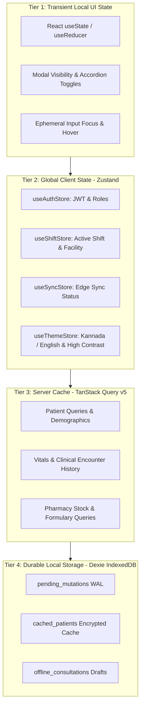

# Namma Clinic Frontend State Management Architecture

## 1. Executive Summary & State Philosophy
The Namma Clinic State Management Architecture establishes a robust, deterministic, reactive client-side state model designed specifically for high-throughput urban outpatient clinics. It operates under a **local-first, multi-tier state tiering hierarchy**: transient component UI state resides in local React hooks; shared client session state is governed by lightweight Zustand stores; server-replicated clinical data is orchestrated via TanStack Query v5; and durable, offline-resilient clinical encounters and mutation logs are anchored directly in local browser IndexedDB managed by Dexie.js.

## 2. Multi-Tier State Hierarchy


## 3. Global Zustand Store Specifications
The platform implements four strictly typed global Zustand stores to govern application lifecycle:

### Zustand Store: `useAuthStore`
**Operational Scope:** Governs RS256 JWT tokens, active user profile, municipal role assignments, and token refresh timers.

```typescript
// DOCUMENTATION-ONLY TYPESCRIPT
export interface useAuthStoreState {
  accessToken: string | null; // Encrypted active RS256 JWT
  refreshToken: string | null; // Hardware-bound refresh token
  userProfile: ClinicStaffProfile; // Current authenticated staff profile
  roles: string[]; // Array of authorized role codes (e.g. ROLE-002)
  isAuthenticated: boolean; // Boolean authentication flag
  login: (creds: Credentials) => Promise<void>; // Authenticates against API gateway
  logout: () => void; // Wipes session memory and revokes tokens
}
```

### Zustand Store: `useShiftStore`
**Operational Scope:** Governs the active clinic facility, ward assignment, shift roster status, and emergency override states.

```typescript
// DOCUMENTATION-ONLY TYPESCRIPT
export interface useShiftStoreState {
  facilityId: string; // Current BBMP clinic identifier (e.g. BBMP-NAMMA-042)
  shiftId: string | null; // Active shift session identifier
  shiftStatus: 'OPEN' | 'CLOSED' | 'HANDOVER'; // Current shift status
  breakGlassActive: boolean; // Flag indicating clinical emergency bypass
  startShift: (details: ShiftDetails) => Promise<void>; // Initiates clinic shift record
  endShift: () => Promise<void>; // Commits shift closure ledger
}
```

### Zustand Store: `useSyncStore`
**Operational Scope:** Coordinates background sync workers, mutation queues, network heartbeat, and conflict notifications.

```typescript
// DOCUMENTATION-ONLY TYPESCRIPT
export interface useSyncStoreState {
  networkStatus: 'ONLINE' | 'DEGRADED' | 'OFFLINE'; // Active network state
  pendingMutationCount: number; // Number of uncommitted WAL records
  lastSuccessfulSync: Date | null; // Timestamp of last gateway sync
  isSyncing: boolean; // Background sync worker active flag
  triggerManualSync: () => Promise<void>; // Manually invokes sync worker
  clearSyncedMutations: () => Promise<void>; // Purges acknowledged transactions
}
```

### Zustand Store: `usePreferencesStore`
**Operational Scope:** Governs bilingual localization (Kannada / English), high-contrast accessibility themes, and font size scaling.

```typescript
// DOCUMENTATION-ONLY TYPESCRIPT
export interface usePreferencesStoreState {
  locale: 'kn-IN' | 'en-IN'; // Active UI language
  themeMode: 'light' | 'dark' | 'high-contrast'; // Visual display theme
  fontSizeModifier: number; // Scale factor (1.0 to 1.4) for low-vision clinic monitors
  audioAlertsEnabled: boolean; // Triggers audio tokens and triage alarms
  toggleLocale: () => void; // Switches between Kannada and English
  setTheme: (mode: ThemeMode) => void; // Applies accessibility CSS classes
}
```

## 4. TanStack Query v5 Server Cache Architecture
Server queries enforce strict query-key factories, deterministic garbage collection, and optimistic rollback policies.

| Query Key Domain | Query Key Factory Pattern | Stale Time | Cache GC Time | Network Mode |
| :--- | :--- | :--- | :--- | :--- |
| Patient Demographic | `['patients', patientId]` | 10 Minutes | 60 Minutes | `offlineFirst` |
| Patient OPD Queue | `['queue', facilityId, 'active']` | 15 Seconds | 5 Minutes | `always` |
| Clinical Encounter | `['encounters', encounterId]` | 5 Minutes | 30 Minutes | `offlineFirst` |
| Dispensary Inventory | `['inventory', facilityId, 'stock']` | 2 Minutes | 15 Minutes | `offlineFirst` |
| Laboratory Orders | `['lab-orders', facilityId, 'pending']` | 30 Seconds | 10 Minutes | `always` |
| Essential Formulary | `['formulary', 'essential-52']` | 24 Hours | 7 Days | `cacheFirst` |
| Master ICD-10 Codes | `['terminology', 'icd10-subset']` | 7 Days | 30 Days | `cacheFirst` |

## 5. Exhaustive Module-Level State Contracts
Every planned screen is bound to an explicit state schema, detailing local form state, query subscriptions, and IndexedDB sync tables.

### State Specification for Screen: SCREEN-001 — User Login Screen
**Module:** `MODULE-001` | **Route:** `/login` | **Offline Mode:** `Online Only`

#### 1. Form & Local State Schema
Manages user inputs and local validations for User Login Screen. Backed by React Hook Form with Zod schema resolution.

#### 2. Query Subscriptions & Cache Invalidation
- **Subscribed Query Key:** `['module-001', 'screen-001']`
- **Primary API Target:** `API-AUTH-001`
- **Local Dexie Entity:** `auth_users`
- **Optimistic Update Rollback:** Retains previous snapshot in `queryClient` context; rolls back on HTTP 4xx/5xx errors.

#### 3. Documentation-Only TypeScript State Contract
```typescript
// DOCUMENTATION-ONLY TYPESCRIPT
export interface SCREEN_001_State {
  screenId: 'SCREEN-001';
  isDirty: boolean;
  isSubmitting: boolean;
  lastSavedTimestamp: number;
  cachedPayload: Record<string, unknown>;
  validationErrors: Record<string, string>;
}
```

---

### State Specification for Screen: SCREEN-002 — MFA Verification Screen
**Module:** `MODULE-001` | **Route:** `/login/mfa` | **Offline Mode:** `Online Only`

#### 1. Form & Local State Schema
Manages user inputs and local validations for MFA Verification Screen. Backed by React Hook Form with Zod schema resolution.

#### 2. Query Subscriptions & Cache Invalidation
- **Subscribed Query Key:** `['module-001', 'screen-002']`
- **Primary API Target:** `API-AUTH-002`
- **Local Dexie Entity:** `user_sessions`
- **Optimistic Update Rollback:** Retains previous snapshot in `queryClient` context; rolls back on HTTP 4xx/5xx errors.

#### 3. Documentation-Only TypeScript State Contract
```typescript
// DOCUMENTATION-ONLY TYPESCRIPT
export interface SCREEN_002_State {
  screenId: 'SCREEN-002';
  isDirty: boolean;
  isSubmitting: boolean;
  lastSavedTimestamp: number;
  cachedPayload: Record<string, unknown>;
  validationErrors: Record<string, string>;
}
```

---

### State Specification for Screen: SCREEN-003 — Terminal Pairing & Device Enrollment
**Module:** `MODULE-001` | **Route:** `/system/device-enroll` | **Offline Mode:** `Online Only`

#### 1. Form & Local State Schema
Manages user inputs and local validations for Terminal Pairing & Device Enrollment. Backed by React Hook Form with Zod schema resolution.

#### 2. Query Subscriptions & Cache Invalidation
- **Subscribed Query Key:** `['module-001', 'screen-003']`
- **Primary API Target:** `API-SYS-001`
- **Local Dexie Entity:** `hardware_terminals`
- **Optimistic Update Rollback:** Retains previous snapshot in `queryClient` context; rolls back on HTTP 4xx/5xx errors.

#### 3. Documentation-Only TypeScript State Contract
```typescript
// DOCUMENTATION-ONLY TYPESCRIPT
export interface SCREEN_003_State {
  screenId: 'SCREEN-003';
  isDirty: boolean;
  isSubmitting: boolean;
  lastSavedTimestamp: number;
  cachedPayload: Record<string, unknown>;
  validationErrors: Record<string, string>;
}
```

---

### State Specification for Screen: SCREEN-004 — Clinic Shift Check-In & Handover
**Module:** `MODULE-001` | **Route:** `/shift/checkin` | **Offline Mode:** `Degraded Offline`

#### 1. Form & Local State Schema
Manages user inputs and local validations for Clinic Shift Check-In & Handover. Backed by React Hook Form with Zod schema resolution.

#### 2. Query Subscriptions & Cache Invalidation
- **Subscribed Query Key:** `['module-001', 'screen-004']`
- **Primary API Target:** `API-AUTH-005`
- **Local Dexie Entity:** `clinic_shifts`
- **Optimistic Update Rollback:** Retains previous snapshot in `queryClient` context; rolls back on HTTP 4xx/5xx errors.

#### 3. Documentation-Only TypeScript State Contract
```typescript
// DOCUMENTATION-ONLY TYPESCRIPT
export interface SCREEN_004_State {
  screenId: 'SCREEN-004';
  isDirty: boolean;
  isSubmitting: boolean;
  lastSavedTimestamp: number;
  cachedPayload: Record<string, unknown>;
  validationErrors: Record<string, string>;
}
```

---

### State Specification for Screen: SCREEN-005 — Emergency Break-Glass Authorization
**Module:** `MODULE-001` | **Route:** `/auth/break-glass` | **Offline Mode:** `Full Offline`

#### 1. Form & Local State Schema
Manages user inputs and local validations for Emergency Break-Glass Authorization. Backed by React Hook Form with Zod schema resolution.

#### 2. Query Subscriptions & Cache Invalidation
- **Subscribed Query Key:** `['module-001', 'screen-005']`
- **Primary API Target:** `API-AUTH-004`
- **Local Dexie Entity:** `audit_events`
- **Optimistic Update Rollback:** Retains previous snapshot in `queryClient` context; rolls back on HTTP 4xx/5xx errors.

#### 3. Documentation-Only TypeScript State Contract
```typescript
// DOCUMENTATION-ONLY TYPESCRIPT
export interface SCREEN_005_State {
  screenId: 'SCREEN-005';
  isDirty: boolean;
  isSubmitting: boolean;
  lastSavedTimestamp: number;
  cachedPayload: Record<string, unknown>;
  validationErrors: Record<string, string>;
}
```

---

### State Specification for Screen: SCREEN-006 — Master Clinic Dashboard
**Module:** `MODULE-002` | **Route:** `/dashboard` | **Offline Mode:** `Degraded Offline`

#### 1. Form & Local State Schema
Manages user inputs and local validations for Master Clinic Dashboard. Backed by React Hook Form with Zod schema resolution.

#### 2. Query Subscriptions & Cache Invalidation
- **Subscribed Query Key:** `['module-002', 'screen-006']`
- **Primary API Target:** `API-ANL-001`
- **Local Dexie Entity:** `visits`
- **Optimistic Update Rollback:** Retains previous snapshot in `queryClient` context; rolls back on HTTP 4xx/5xx errors.

#### 3. Documentation-Only TypeScript State Contract
```typescript
// DOCUMENTATION-ONLY TYPESCRIPT
export interface SCREEN_006_State {
  screenId: 'SCREEN-006';
  isDirty: boolean;
  isSubmitting: boolean;
  lastSavedTimestamp: number;
  cachedPayload: Record<string, unknown>;
  validationErrors: Record<string, string>;
}
```

---

### State Specification for Screen: SCREEN-007 — Doctor Outpatient Console
**Module:** `MODULE-002` | **Route:** `/doctor/console` | **Offline Mode:** `Full Offline`

#### 1. Form & Local State Schema
Manages user inputs and local validations for Doctor Outpatient Console. Backed by React Hook Form with Zod schema resolution.

#### 2. Query Subscriptions & Cache Invalidation
- **Subscribed Query Key:** `['module-002', 'screen-007']`
- **Primary API Target:** `API-VST-001`
- **Local Dexie Entity:** `visits`
- **Optimistic Update Rollback:** Retains previous snapshot in `queryClient` context; rolls back on HTTP 4xx/5xx errors.

#### 3. Documentation-Only TypeScript State Contract
```typescript
// DOCUMENTATION-ONLY TYPESCRIPT
export interface SCREEN_007_State {
  screenId: 'SCREEN-007';
  isDirty: boolean;
  isSubmitting: boolean;
  lastSavedTimestamp: number;
  cachedPayload: Record<string, unknown>;
  validationErrors: Record<string, string>;
}
```

---

### State Specification for Screen: SCREEN-008 — Staff Nurse Triage Workbench
**Module:** `MODULE-002` | **Route:** `/nurse/triage` | **Offline Mode:** `Full Offline`

#### 1. Form & Local State Schema
Manages user inputs and local validations for Staff Nurse Triage Workbench. Backed by React Hook Form with Zod schema resolution.

#### 2. Query Subscriptions & Cache Invalidation
- **Subscribed Query Key:** `['module-002', 'screen-008']`
- **Primary API Target:** `API-TRG-001`
- **Local Dexie Entity:** `triage_assessments`
- **Optimistic Update Rollback:** Retains previous snapshot in `queryClient` context; rolls back on HTTP 4xx/5xx errors.

#### 3. Documentation-Only TypeScript State Contract
```typescript
// DOCUMENTATION-ONLY TYPESCRIPT
export interface SCREEN_008_State {
  screenId: 'SCREEN-008';
  isDirty: boolean;
  isSubmitting: boolean;
  lastSavedTimestamp: number;
  cachedPayload: Record<string, unknown>;
  validationErrors: Record<string, string>;
}
```

---

### State Specification for Screen: SCREEN-009 — Pharmacy Dispensing Console
**Module:** `MODULE-002` | **Route:** `/pharmacy/dispense` | **Offline Mode:** `Full Offline`

#### 1. Form & Local State Schema
Manages user inputs and local validations for Pharmacy Dispensing Console. Backed by React Hook Form with Zod schema resolution.

#### 2. Query Subscriptions & Cache Invalidation
- **Subscribed Query Key:** `['module-002', 'screen-009']`
- **Primary API Target:** `API-PHR-001`
- **Local Dexie Entity:** `prescriptions`
- **Optimistic Update Rollback:** Retains previous snapshot in `queryClient` context; rolls back on HTTP 4xx/5xx errors.

#### 3. Documentation-Only TypeScript State Contract
```typescript
// DOCUMENTATION-ONLY TYPESCRIPT
export interface SCREEN_009_State {
  screenId: 'SCREEN-009';
  isDirty: boolean;
  isSubmitting: boolean;
  lastSavedTimestamp: number;
  cachedPayload: Record<string, unknown>;
  validationErrors: Record<string, string>;
}
```

---

### State Specification for Screen: SCREEN-010 — Diagnostic Laboratory Workbench
**Module:** `MODULE-002` | **Route:** `/lab/workbench` | **Offline Mode:** `Full Offline`

#### 1. Form & Local State Schema
Manages user inputs and local validations for Diagnostic Laboratory Workbench. Backed by React Hook Form with Zod schema resolution.

#### 2. Query Subscriptions & Cache Invalidation
- **Subscribed Query Key:** `['module-002', 'screen-010']`
- **Primary API Target:** `API-LAB-001`
- **Local Dexie Entity:** `lab_orders`
- **Optimistic Update Rollback:** Retains previous snapshot in `queryClient` context; rolls back on HTTP 4xx/5xx errors.

#### 3. Documentation-Only TypeScript State Contract
```typescript
// DOCUMENTATION-ONLY TYPESCRIPT
export interface SCREEN_010_State {
  screenId: 'SCREEN-010';
  isDirty: boolean;
  isSubmitting: boolean;
  lastSavedTimestamp: number;
  cachedPayload: Record<string, unknown>;
  validationErrors: Record<string, string>;
}
```

---

### State Specification for Screen: SCREEN-011 — Citizen New Registration Screen
**Module:** `MODULE-003` | **Route:** `/patients/new` | **Offline Mode:** `Full Offline`

#### 1. Form & Local State Schema
Manages user inputs and local validations for Citizen New Registration Screen. Backed by React Hook Form with Zod schema resolution.

#### 2. Query Subscriptions & Cache Invalidation
- **Subscribed Query Key:** `['module-003', 'screen-011']`
- **Primary API Target:** `API-PAT-001`
- **Local Dexie Entity:** `patients`
- **Optimistic Update Rollback:** Retains previous snapshot in `queryClient` context; rolls back on HTTP 4xx/5xx errors.

#### 3. Documentation-Only TypeScript State Contract
```typescript
// DOCUMENTATION-ONLY TYPESCRIPT
export interface SCREEN_011_State {
  screenId: 'SCREEN-011';
  isDirty: boolean;
  isSubmitting: boolean;
  lastSavedTimestamp: number;
  cachedPayload: Record<string, unknown>;
  validationErrors: Record<string, string>;
}
```

---

### State Specification for Screen: SCREEN-012 — Citizen Search & Retrieval Screen
**Module:** `MODULE-003` | **Route:** `/patients/search` | **Offline Mode:** `Full Offline`

#### 1. Form & Local State Schema
Manages user inputs and local validations for Citizen Search & Retrieval Screen. Backed by React Hook Form with Zod schema resolution.

#### 2. Query Subscriptions & Cache Invalidation
- **Subscribed Query Key:** `['module-003', 'screen-012']`
- **Primary API Target:** `API-PAT-002`
- **Local Dexie Entity:** `patients`
- **Optimistic Update Rollback:** Retains previous snapshot in `queryClient` context; rolls back on HTTP 4xx/5xx errors.

#### 3. Documentation-Only TypeScript State Contract
```typescript
// DOCUMENTATION-ONLY TYPESCRIPT
export interface SCREEN_012_State {
  screenId: 'SCREEN-012';
  isDirty: boolean;
  isSubmitting: boolean;
  lastSavedTimestamp: number;
  cachedPayload: Record<string, unknown>;
  validationErrors: Record<string, string>;
}
```

---

### State Specification for Screen: SCREEN-013 — Patient Longitudinal Profile View
**Module:** `MODULE-003` | **Route:** `/patients/:id` | **Offline Mode:** `Full Offline`

#### 1. Form & Local State Schema
Manages user inputs and local validations for Patient Longitudinal Profile View. Backed by React Hook Form with Zod schema resolution.

#### 2. Query Subscriptions & Cache Invalidation
- **Subscribed Query Key:** `['module-003', 'screen-013']`
- **Primary API Target:** `API-PAT-003`
- **Local Dexie Entity:** `patients`
- **Optimistic Update Rollback:** Retains previous snapshot in `queryClient` context; rolls back on HTTP 4xx/5xx errors.

#### 3. Documentation-Only TypeScript State Contract
```typescript
// DOCUMENTATION-ONLY TYPESCRIPT
export interface SCREEN_013_State {
  screenId: 'SCREEN-013';
  isDirty: boolean;
  isSubmitting: boolean;
  lastSavedTimestamp: number;
  cachedPayload: Record<string, unknown>;
  validationErrors: Record<string, string>;
}
```

---

### State Specification for Screen: SCREEN-014 — Repeat Patient Fast Intake
**Module:** `MODULE-003` | **Route:** `/patients/:id/repeat-intake` | **Offline Mode:** `Full Offline`

#### 1. Form & Local State Schema
Manages user inputs and local validations for Repeat Patient Fast Intake. Backed by React Hook Form with Zod schema resolution.

#### 2. Query Subscriptions & Cache Invalidation
- **Subscribed Query Key:** `['module-003', 'screen-014']`
- **Primary API Target:** `API-VST-001`
- **Local Dexie Entity:** `visits`
- **Optimistic Update Rollback:** Retains previous snapshot in `queryClient` context; rolls back on HTTP 4xx/5xx errors.

#### 3. Documentation-Only TypeScript State Contract
```typescript
// DOCUMENTATION-ONLY TYPESCRIPT
export interface SCREEN_014_State {
  screenId: 'SCREEN-014';
  isDirty: boolean;
  isSubmitting: boolean;
  lastSavedTimestamp: number;
  cachedPayload: Record<string, unknown>;
  validationErrors: Record<string, string>;
}
```

---

### State Specification for Screen: SCREEN-015 — Biometric & ABHA Card Scan Modal
**Module:** `MODULE-003` | **Route:** `/patients/abha-scan` | **Offline Mode:** `Degraded Offline`

#### 1. Form & Local State Schema
Manages user inputs and local validations for Biometric & ABHA Card Scan Modal. Backed by React Hook Form with Zod schema resolution.

#### 2. Query Subscriptions & Cache Invalidation
- **Subscribed Query Key:** `['module-003', 'screen-015']`
- **Primary API Target:** `API-ABDM-001`
- **Local Dexie Entity:** `patients`
- **Optimistic Update Rollback:** Retains previous snapshot in `queryClient` context; rolls back on HTTP 4xx/5xx errors.

#### 3. Documentation-Only TypeScript State Contract
```typescript
// DOCUMENTATION-ONLY TYPESCRIPT
export interface SCREEN_015_State {
  screenId: 'SCREEN-015';
  isDirty: boolean;
  isSubmitting: boolean;
  lastSavedTimestamp: number;
  cachedPayload: Record<string, unknown>;
  validationErrors: Record<string, string>;
}
```

---

### State Specification for Screen: SCREEN-016 — Citizen Demographic Correction Form
**Module:** `MODULE-003` | **Route:** `/patients/:id/edit` | **Offline Mode:** `Degraded Offline`

#### 1. Form & Local State Schema
Manages user inputs and local validations for Citizen Demographic Correction Form. Backed by React Hook Form with Zod schema resolution.

#### 2. Query Subscriptions & Cache Invalidation
- **Subscribed Query Key:** `['module-003', 'screen-016']`
- **Primary API Target:** `API-PAT-004`
- **Local Dexie Entity:** `patients`
- **Optimistic Update Rollback:** Retains previous snapshot in `queryClient` context; rolls back on HTTP 4xx/5xx errors.

#### 3. Documentation-Only TypeScript State Contract
```typescript
// DOCUMENTATION-ONLY TYPESCRIPT
export interface SCREEN_016_State {
  screenId: 'SCREEN-016';
  isDirty: boolean;
  isSubmitting: boolean;
  lastSavedTimestamp: number;
  cachedPayload: Record<string, unknown>;
  validationErrors: Record<string, string>;
}
```

---

### State Specification for Screen: SCREEN-017 — Duplicate Citizen Merge Modal
**Module:** `MODULE-003` | **Route:** `/patients/merge` | **Offline Mode:** `Online Only`

#### 1. Form & Local State Schema
Manages user inputs and local validations for Duplicate Citizen Merge Modal. Backed by React Hook Form with Zod schema resolution.

#### 2. Query Subscriptions & Cache Invalidation
- **Subscribed Query Key:** `['module-003', 'screen-017']`
- **Primary API Target:** `API-PAT-005`
- **Local Dexie Entity:** `patients`
- **Optimistic Update Rollback:** Retains previous snapshot in `queryClient` context; rolls back on HTTP 4xx/5xx errors.

#### 3. Documentation-Only TypeScript State Contract
```typescript
// DOCUMENTATION-ONLY TYPESCRIPT
export interface SCREEN_017_State {
  screenId: 'SCREEN-017';
  isDirty: boolean;
  isSubmitting: boolean;
  lastSavedTimestamp: number;
  cachedPayload: Record<string, unknown>;
  validationErrors: Record<string, string>;
}
```

---

### State Specification for Screen: SCREEN-018 — Citizen Digital Photo Capture
**Module:** `MODULE-003` | **Route:** `/patients/:id/photo` | **Offline Mode:** `Full Offline`

#### 1. Form & Local State Schema
Manages user inputs and local validations for Citizen Digital Photo Capture. Backed by React Hook Form with Zod schema resolution.

#### 2. Query Subscriptions & Cache Invalidation
- **Subscribed Query Key:** `['module-003', 'screen-018']`
- **Primary API Target:** `API-PAT-006`
- **Local Dexie Entity:** `patients`
- **Optimistic Update Rollback:** Retains previous snapshot in `queryClient` context; rolls back on HTTP 4xx/5xx errors.

#### 3. Documentation-Only TypeScript State Contract
```typescript
// DOCUMENTATION-ONLY TYPESCRIPT
export interface SCREEN_018_State {
  screenId: 'SCREEN-018';
  isDirty: boolean;
  isSubmitting: boolean;
  lastSavedTimestamp: number;
  cachedPayload: Record<string, unknown>;
  validationErrors: Record<string, string>;
}
```

---

### State Specification for Screen: SCREEN-019 — DPDP Informed Consent Capture Screen
**Module:** `MODULE-004` | **Route:** `/patients/:id/consent` | **Offline Mode:** `Full Offline`

#### 1. Form & Local State Schema
Manages user inputs and local validations for DPDP Informed Consent Capture Screen. Backed by React Hook Form with Zod schema resolution.

#### 2. Query Subscriptions & Cache Invalidation
- **Subscribed Query Key:** `['module-004', 'screen-019']`
- **Primary API Target:** `API-PAT-007`
- **Local Dexie Entity:** `patient_consents`
- **Optimistic Update Rollback:** Retains previous snapshot in `queryClient` context; rolls back on HTTP 4xx/5xx errors.

#### 3. Documentation-Only TypeScript State Contract
```typescript
// DOCUMENTATION-ONLY TYPESCRIPT
export interface SCREEN_019_State {
  screenId: 'SCREEN-019';
  isDirty: boolean;
  isSubmitting: boolean;
  lastSavedTimestamp: number;
  cachedPayload: Record<string, unknown>;
  validationErrors: Record<string, string>;
}
```

---

### State Specification for Screen: SCREEN-020 — Consent History & Revocation Console
**Module:** `MODULE-004` | **Route:** `/patients/:id/consents` | **Offline Mode:** `Full Offline`

#### 1. Form & Local State Schema
Manages user inputs and local validations for Consent History & Revocation Console. Backed by React Hook Form with Zod schema resolution.

#### 2. Query Subscriptions & Cache Invalidation
- **Subscribed Query Key:** `['module-004', 'screen-020']`
- **Primary API Target:** `API-PAT-008`
- **Local Dexie Entity:** `patient_consents`
- **Optimistic Update Rollback:** Retains previous snapshot in `queryClient` context; rolls back on HTTP 4xx/5xx errors.

#### 3. Documentation-Only TypeScript State Contract
```typescript
// DOCUMENTATION-ONLY TYPESCRIPT
export interface SCREEN_020_State {
  screenId: 'SCREEN-020';
  isDirty: boolean;
  isSubmitting: boolean;
  lastSavedTimestamp: number;
  cachedPayload: Record<string, unknown>;
  validationErrors: Record<string, string>;
}
```

---

### State Specification for Screen: SCREEN-021 — Data Portability & Export Request
**Module:** `MODULE-004` | **Route:** `/patients/:id/export` | **Offline Mode:** `Degraded Offline`

#### 1. Form & Local State Schema
Manages user inputs and local validations for Data Portability & Export Request. Backed by React Hook Form with Zod schema resolution.

#### 2. Query Subscriptions & Cache Invalidation
- **Subscribed Query Key:** `['module-004', 'screen-021']`
- **Primary API Target:** `API-PORT-001`
- **Local Dexie Entity:** `patient_exports`
- **Optimistic Update Rollback:** Retains previous snapshot in `queryClient` context; rolls back on HTTP 4xx/5xx errors.

#### 3. Documentation-Only TypeScript State Contract
```typescript
// DOCUMENTATION-ONLY TYPESCRIPT
export interface SCREEN_021_State {
  screenId: 'SCREEN-021';
  isDirty: boolean;
  isSubmitting: boolean;
  lastSavedTimestamp: number;
  cachedPayload: Record<string, unknown>;
  validationErrors: Record<string, string>;
}
```

---

### State Specification for Screen: SCREEN-022 — Citizen Grievance Redressal Intake
**Module:** `MODULE-004` | **Route:** `/patients/:id/grievance` | **Offline Mode:** `Full Offline`

#### 1. Form & Local State Schema
Manages user inputs and local validations for Citizen Grievance Redressal Intake. Backed by React Hook Form with Zod schema resolution.

#### 2. Query Subscriptions & Cache Invalidation
- **Subscribed Query Key:** `['module-004', 'screen-022']`
- **Primary API Target:** `API-SYS-002`
- **Local Dexie Entity:** `citizen_grievances`
- **Optimistic Update Rollback:** Retains previous snapshot in `queryClient` context; rolls back on HTTP 4xx/5xx errors.

#### 3. Documentation-Only TypeScript State Contract
```typescript
// DOCUMENTATION-ONLY TYPESCRIPT
export interface SCREEN_022_State {
  screenId: 'SCREEN-022';
  isDirty: boolean;
  isSubmitting: boolean;
  lastSavedTimestamp: number;
  cachedPayload: Record<string, unknown>;
  validationErrors: Record<string, string>;
}
```

---

### State Specification for Screen: SCREEN-023 — Grievance Investigation & Resolution
**Module:** `MODULE-004` | **Route:** `/grievances/:id` | **Offline Mode:** `Online Only`

#### 1. Form & Local State Schema
Manages user inputs and local validations for Grievance Investigation & Resolution. Backed by React Hook Form with Zod schema resolution.

#### 2. Query Subscriptions & Cache Invalidation
- **Subscribed Query Key:** `['module-004', 'screen-023']`
- **Primary API Target:** `API-SYS-003`
- **Local Dexie Entity:** `citizen_grievances`
- **Optimistic Update Rollback:** Retains previous snapshot in `queryClient` context; rolls back on HTTP 4xx/5xx errors.

#### 3. Documentation-Only TypeScript State Contract
```typescript
// DOCUMENTATION-ONLY TYPESCRIPT
export interface SCREEN_023_State {
  screenId: 'SCREEN-023';
  isDirty: boolean;
  isSubmitting: boolean;
  lastSavedTimestamp: number;
  cachedPayload: Record<string, unknown>;
  validationErrors: Record<string, string>;
}
```

---

### State Specification for Screen: SCREEN-024 — OPD Token Generation & Print Modal
**Module:** `MODULE-005` | **Route:** `/queue/tokens/new` | **Offline Mode:** `Full Offline`

#### 1. Form & Local State Schema
Manages user inputs and local validations for OPD Token Generation & Print Modal. Backed by React Hook Form with Zod schema resolution.

#### 2. Query Subscriptions & Cache Invalidation
- **Subscribed Query Key:** `['module-005', 'screen-024']`
- **Primary API Target:** `API-VST-002`
- **Local Dexie Entity:** `visits`
- **Optimistic Update Rollback:** Retains previous snapshot in `queryClient` context; rolls back on HTTP 4xx/5xx errors.

#### 3. Documentation-Only TypeScript State Contract
```typescript
// DOCUMENTATION-ONLY TYPESCRIPT
export interface SCREEN_024_State {
  screenId: 'SCREEN-024';
  isDirty: boolean;
  isSubmitting: boolean;
  lastSavedTimestamp: number;
  cachedPayload: Record<string, unknown>;
  validationErrors: Record<string, string>;
}
```

---

### State Specification for Screen: SCREEN-025 — Master Waiting Room Queue Display
**Module:** `MODULE-005` | **Route:** `/queue/display` | **Offline Mode:** `Full Offline`

#### 1. Form & Local State Schema
Manages user inputs and local validations for Master Waiting Room Queue Display. Backed by React Hook Form with Zod schema resolution.

#### 2. Query Subscriptions & Cache Invalidation
- **Subscribed Query Key:** `['module-005', 'screen-025']`
- **Primary API Target:** `API-VST-003`
- **Local Dexie Entity:** `opd_queues`
- **Optimistic Update Rollback:** Retains previous snapshot in `queryClient` context; rolls back on HTTP 4xx/5xx errors.

#### 3. Documentation-Only TypeScript State Contract
```typescript
// DOCUMENTATION-ONLY TYPESCRIPT
export interface SCREEN_025_State {
  screenId: 'SCREEN-025';
  isDirty: boolean;
  isSubmitting: boolean;
  lastSavedTimestamp: number;
  cachedPayload: Record<string, unknown>;
  validationErrors: Record<string, string>;
}
```

---

### State Specification for Screen: SCREEN-026 — Queue Management & Rerouting Screen
**Module:** `MODULE-005` | **Route:** `/queue/manage` | **Offline Mode:** `Full Offline`

#### 1. Form & Local State Schema
Manages user inputs and local validations for Queue Management & Rerouting Screen. Backed by React Hook Form with Zod schema resolution.

#### 2. Query Subscriptions & Cache Invalidation
- **Subscribed Query Key:** `['module-005', 'screen-026']`
- **Primary API Target:** `API-VST-004`
- **Local Dexie Entity:** `opd_queues`
- **Optimistic Update Rollback:** Retains previous snapshot in `queryClient` context; rolls back on HTTP 4xx/5xx errors.

#### 3. Documentation-Only TypeScript State Contract
```typescript
// DOCUMENTATION-ONLY TYPESCRIPT
export interface SCREEN_026_State {
  screenId: 'SCREEN-026';
  isDirty: boolean;
  isSubmitting: boolean;
  lastSavedTimestamp: number;
  cachedPayload: Record<string, unknown>;
  validationErrors: Record<string, string>;
}
```

---

### State Specification for Screen: SCREEN-027 — Express Triage Queue
**Module:** `MODULE-005` | **Route:** `/queue/triage-express` | **Offline Mode:** `Full Offline`

#### 1. Form & Local State Schema
Manages user inputs and local validations for Express Triage Queue. Backed by React Hook Form with Zod schema resolution.

#### 2. Query Subscriptions & Cache Invalidation
- **Subscribed Query Key:** `['module-005', 'screen-027']`
- **Primary API Target:** `API-VST-005`
- **Local Dexie Entity:** `opd_queues`
- **Optimistic Update Rollback:** Retains previous snapshot in `queryClient` context; rolls back on HTTP 4xx/5xx errors.

#### 3. Documentation-Only TypeScript State Contract
```typescript
// DOCUMENTATION-ONLY TYPESCRIPT
export interface SCREEN_027_State {
  screenId: 'SCREEN-027';
  isDirty: boolean;
  isSubmitting: boolean;
  lastSavedTimestamp: number;
  cachedPayload: Record<string, unknown>;
  validationErrors: Record<string, string>;
}
```

---

### State Specification for Screen: SCREEN-028 — Pharmacy Pickup Waiting Screen
**Module:** `MODULE-005` | **Route:** `/queue/pharmacy` | **Offline Mode:** `Full Offline`

#### 1. Form & Local State Schema
Manages user inputs and local validations for Pharmacy Pickup Waiting Screen. Backed by React Hook Form with Zod schema resolution.

#### 2. Query Subscriptions & Cache Invalidation
- **Subscribed Query Key:** `['module-005', 'screen-028']`
- **Primary API Target:** `API-PHR-002`
- **Local Dexie Entity:** `prescriptions`
- **Optimistic Update Rollback:** Retains previous snapshot in `queryClient` context; rolls back on HTTP 4xx/5xx errors.

#### 3. Documentation-Only TypeScript State Contract
```typescript
// DOCUMENTATION-ONLY TYPESCRIPT
export interface SCREEN_028_State {
  screenId: 'SCREEN-028';
  isDirty: boolean;
  isSubmitting: boolean;
  lastSavedTimestamp: number;
  cachedPayload: Record<string, unknown>;
  validationErrors: Record<string, string>;
}
```

---

### State Specification for Screen: SCREEN-029 — Triage Vitals Entry Form
**Module:** `MODULE-006` | **Route:** `/triage/:visitId/vitals` | **Offline Mode:** `Full Offline`

#### 1. Form & Local State Schema
Manages user inputs and local validations for Triage Vitals Entry Form. Backed by React Hook Form with Zod schema resolution.

#### 2. Query Subscriptions & Cache Invalidation
- **Subscribed Query Key:** `['module-006', 'screen-029']`
- **Primary API Target:** `API-TRG-002`
- **Local Dexie Entity:** `triage_assessments`
- **Optimistic Update Rollback:** Retains previous snapshot in `queryClient` context; rolls back on HTTP 4xx/5xx errors.

#### 3. Documentation-Only TypeScript State Contract
```typescript
// DOCUMENTATION-ONLY TYPESCRIPT
export interface SCREEN_029_State {
  screenId: 'SCREEN-029';
  isDirty: boolean;
  isSubmitting: boolean;
  lastSavedTimestamp: number;
  cachedPayload: Record<string, unknown>;
  validationErrors: Record<string, string>;
}
```

---

### State Specification for Screen: SCREEN-030 — Pediatric Growth Chart & Z-Scores
**Module:** `MODULE-006` | **Route:** `/triage/:visitId/pediatric` | **Offline Mode:** `Full Offline`

#### 1. Form & Local State Schema
Manages user inputs and local validations for Pediatric Growth Chart & Z-Scores. Backed by React Hook Form with Zod schema resolution.

#### 2. Query Subscriptions & Cache Invalidation
- **Subscribed Query Key:** `['module-006', 'screen-030']`
- **Primary API Target:** `API-TRG-003`
- **Local Dexie Entity:** `triage_assessments`
- **Optimistic Update Rollback:** Retains previous snapshot in `queryClient` context; rolls back on HTTP 4xx/5xx errors.

#### 3. Documentation-Only TypeScript State Contract
```typescript
// DOCUMENTATION-ONLY TYPESCRIPT
export interface SCREEN_030_State {
  screenId: 'SCREEN-030';
  isDirty: boolean;
  isSubmitting: boolean;
  lastSavedTimestamp: number;
  cachedPayload: Record<string, unknown>;
  validationErrors: Record<string, string>;
}
```

---

### State Specification for Screen: SCREEN-031 — Antenatal Care (ANC) Vitals Intake
**Module:** `MODULE-006` | **Route:** `/triage/:visitId/anc` | **Offline Mode:** `Full Offline`

#### 1. Form & Local State Schema
Manages user inputs and local validations for Antenatal Care (ANC) Vitals Intake. Backed by React Hook Form with Zod schema resolution.

#### 2. Query Subscriptions & Cache Invalidation
- **Subscribed Query Key:** `['module-006', 'screen-031']`
- **Primary API Target:** `API-TRG-004`
- **Local Dexie Entity:** `triage_assessments`
- **Optimistic Update Rollback:** Retains previous snapshot in `queryClient` context; rolls back on HTTP 4xx/5xx errors.

#### 3. Documentation-Only TypeScript State Contract
```typescript
// DOCUMENTATION-ONLY TYPESCRIPT
export interface SCREEN_031_State {
  screenId: 'SCREEN-031';
  isDirty: boolean;
  isSubmitting: boolean;
  lastSavedTimestamp: number;
  cachedPayload: Record<string, unknown>;
  validationErrors: Record<string, string>;
}
```

---

### State Specification for Screen: SCREEN-032 — Danger Signs & Triage Warning Modal
**Module:** `MODULE-006` | **Route:** `/triage/:visitId/danger-modal` | **Offline Mode:** `Full Offline`

#### 1. Form & Local State Schema
Manages user inputs and local validations for Danger Signs & Triage Warning Modal. Backed by React Hook Form with Zod schema resolution.

#### 2. Query Subscriptions & Cache Invalidation
- **Subscribed Query Key:** `['module-006', 'screen-032']`
- **Primary API Target:** `API-TRG-005`
- **Local Dexie Entity:** `triage_assessments`
- **Optimistic Update Rollback:** Retains previous snapshot in `queryClient` context; rolls back on HTTP 4xx/5xx errors.

#### 3. Documentation-Only TypeScript State Contract
```typescript
// DOCUMENTATION-ONLY TYPESCRIPT
export interface SCREEN_032_State {
  screenId: 'SCREEN-032';
  isDirty: boolean;
  isSubmitting: boolean;
  lastSavedTimestamp: number;
  cachedPayload: Record<string, unknown>;
  validationErrors: Record<string, string>;
}
```

---

### State Specification for Screen: SCREEN-033 — Point-of-Care Blood Sugar Entry
**Module:** `MODULE-006` | **Route:** `/triage/:visitId/glucometer` | **Offline Mode:** `Full Offline`

#### 1. Form & Local State Schema
Manages user inputs and local validations for Point-of-Care Blood Sugar Entry. Backed by React Hook Form with Zod schema resolution.

#### 2. Query Subscriptions & Cache Invalidation
- **Subscribed Query Key:** `['module-006', 'screen-033']`
- **Primary API Target:** `API-TRG-006`
- **Local Dexie Entity:** `triage_assessments`
- **Optimistic Update Rollback:** Retains previous snapshot in `queryClient` context; rolls back on HTTP 4xx/5xx errors.

#### 3. Documentation-Only TypeScript State Contract
```typescript
// DOCUMENTATION-ONLY TYPESCRIPT
export interface SCREEN_033_State {
  screenId: 'SCREEN-033';
  isDirty: boolean;
  isSubmitting: boolean;
  lastSavedTimestamp: number;
  cachedPayload: Record<string, unknown>;
  validationErrors: Record<string, string>;
}
```

---

### State Specification for Screen: SCREEN-034 — Triage Station History Log
**Module:** `MODULE-006` | **Route:** `/triage/station-history` | **Offline Mode:** `Full Offline`

#### 1. Form & Local State Schema
Manages user inputs and local validations for Triage Station History Log. Backed by React Hook Form with Zod schema resolution.

#### 2. Query Subscriptions & Cache Invalidation
- **Subscribed Query Key:** `['module-006', 'screen-034']`
- **Primary API Target:** `API-TRG-007`
- **Local Dexie Entity:** `triage_assessments`
- **Optimistic Update Rollback:** Retains previous snapshot in `queryClient` context; rolls back on HTTP 4xx/5xx errors.

#### 3. Documentation-Only TypeScript State Contract
```typescript
// DOCUMENTATION-ONLY TYPESCRIPT
export interface SCREEN_034_State {
  screenId: 'SCREEN-034';
  isDirty: boolean;
  isSubmitting: boolean;
  lastSavedTimestamp: number;
  cachedPayload: Record<string, unknown>;
  validationErrors: Record<string, string>;
}
```

---

### State Specification for Screen: SCREEN-035 — Clinical Consultation Workspace
**Module:** `MODULE-007` | **Route:** `/consultations/:visitId` | **Offline Mode:** `Full Offline`

#### 1. Form & Local State Schema
Manages user inputs and local validations for Clinical Consultation Workspace. Backed by React Hook Form with Zod schema resolution.

#### 2. Query Subscriptions & Cache Invalidation
- **Subscribed Query Key:** `['module-007', 'screen-035']`
- **Primary API Target:** `API-CON-002`
- **Local Dexie Entity:** `consultations`
- **Optimistic Update Rollback:** Retains previous snapshot in `queryClient` context; rolls back on HTTP 4xx/5xx errors.

#### 3. Documentation-Only TypeScript State Contract
```typescript
// DOCUMENTATION-ONLY TYPESCRIPT
export interface SCREEN_035_State {
  screenId: 'SCREEN-035';
  isDirty: boolean;
  isSubmitting: boolean;
  lastSavedTimestamp: number;
  cachedPayload: Record<string, unknown>;
  validationErrors: Record<string, string>;
}
```

---

### State Specification for Screen: SCREEN-036 — Chief Complaints & Systemic Review
**Module:** `MODULE-007` | **Route:** `/consultations/:visitId/symptoms` | **Offline Mode:** `Full Offline`

#### 1. Form & Local State Schema
Manages user inputs and local validations for Chief Complaints & Systemic Review. Backed by React Hook Form with Zod schema resolution.

#### 2. Query Subscriptions & Cache Invalidation
- **Subscribed Query Key:** `['module-007', 'screen-036']`
- **Primary API Target:** `API-CON-003`
- **Local Dexie Entity:** `consultations`
- **Optimistic Update Rollback:** Retains previous snapshot in `queryClient` context; rolls back on HTTP 4xx/5xx errors.

#### 3. Documentation-Only TypeScript State Contract
```typescript
// DOCUMENTATION-ONLY TYPESCRIPT
export interface SCREEN_036_State {
  screenId: 'SCREEN-036';
  isDirty: boolean;
  isSubmitting: boolean;
  lastSavedTimestamp: number;
  cachedPayload: Record<string, unknown>;
  validationErrors: Record<string, string>;
}
```

---

### State Specification for Screen: SCREEN-037 — Physical & Clinical Examination Form
**Module:** `MODULE-007` | **Route:** `/consultations/:visitId/exam` | **Offline Mode:** `Full Offline`

#### 1. Form & Local State Schema
Manages user inputs and local validations for Physical & Clinical Examination Form. Backed by React Hook Form with Zod schema resolution.

#### 2. Query Subscriptions & Cache Invalidation
- **Subscribed Query Key:** `['module-007', 'screen-037']`
- **Primary API Target:** `API-CON-004`
- **Local Dexie Entity:** `consultations`
- **Optimistic Update Rollback:** Retains previous snapshot in `queryClient` context; rolls back on HTTP 4xx/5xx errors.

#### 3. Documentation-Only TypeScript State Contract
```typescript
// DOCUMENTATION-ONLY TYPESCRIPT
export interface SCREEN_037_State {
  screenId: 'SCREEN-037';
  isDirty: boolean;
  isSubmitting: boolean;
  lastSavedTimestamp: number;
  cachedPayload: Record<string, unknown>;
  validationErrors: Record<string, string>;
}
```

---

### State Specification for Screen: SCREEN-038 — ICD-10 & SNOMED CT Diagnosis Picker
**Module:** `MODULE-007` | **Route:** `/consultations/:visitId/diagnosis` | **Offline Mode:** `Full Offline`

#### 1. Form & Local State Schema
Manages user inputs and local validations for ICD-10 & SNOMED CT Diagnosis Picker. Backed by React Hook Form with Zod schema resolution.

#### 2. Query Subscriptions & Cache Invalidation
- **Subscribed Query Key:** `['module-007', 'screen-038']`
- **Primary API Target:** `API-CON-005`
- **Local Dexie Entity:** `consultations`
- **Optimistic Update Rollback:** Retains previous snapshot in `queryClient` context; rolls back on HTTP 4xx/5xx errors.

#### 3. Documentation-Only TypeScript State Contract
```typescript
// DOCUMENTATION-ONLY TYPESCRIPT
export interface SCREEN_038_State {
  screenId: 'SCREEN-038';
  isDirty: boolean;
  isSubmitting: boolean;
  lastSavedTimestamp: number;
  cachedPayload: Record<string, unknown>;
  validationErrors: Record<string, string>;
}
```

---

### State Specification for Screen: SCREEN-039 — NCD Chronic Disease Registry Form
**Module:** `MODULE-007` | **Route:** `/consultations/:visitId/ncd` | **Offline Mode:** `Full Offline`

#### 1. Form & Local State Schema
Manages user inputs and local validations for NCD Chronic Disease Registry Form. Backed by React Hook Form with Zod schema resolution.

#### 2. Query Subscriptions & Cache Invalidation
- **Subscribed Query Key:** `['module-007', 'screen-039']`
- **Primary API Target:** `API-CON-006`
- **Local Dexie Entity:** `consultations`
- **Optimistic Update Rollback:** Retains previous snapshot in `queryClient` context; rolls back on HTTP 4xx/5xx errors.

#### 3. Documentation-Only TypeScript State Contract
```typescript
// DOCUMENTATION-ONLY TYPESCRIPT
export interface SCREEN_039_State {
  screenId: 'SCREEN-039';
  isDirty: boolean;
  isSubmitting: boolean;
  lastSavedTimestamp: number;
  cachedPayload: Record<string, unknown>;
  validationErrors: Record<string, string>;
}
```

---

### State Specification for Screen: SCREEN-040 — Past Medical & Surgical History Modal
**Module:** `MODULE-007` | **Route:** `/consultations/:visitId/history` | **Offline Mode:** `Full Offline`

#### 1. Form & Local State Schema
Manages user inputs and local validations for Past Medical & Surgical History Modal. Backed by React Hook Form with Zod schema resolution.

#### 2. Query Subscriptions & Cache Invalidation
- **Subscribed Query Key:** `['module-007', 'screen-040']`
- **Primary API Target:** `API-CON-007`
- **Local Dexie Entity:** `consultations`
- **Optimistic Update Rollback:** Retains previous snapshot in `queryClient` context; rolls back on HTTP 4xx/5xx errors.

#### 3. Documentation-Only TypeScript State Contract
```typescript
// DOCUMENTATION-ONLY TYPESCRIPT
export interface SCREEN_040_State {
  screenId: 'SCREEN-040';
  isDirty: boolean;
  isSubmitting: boolean;
  lastSavedTimestamp: number;
  cachedPayload: Record<string, unknown>;
  validationErrors: Record<string, string>;
}
```

---

### State Specification for Screen: SCREEN-041 — Drug Allergy & Adverse Reaction Logger
**Module:** `MODULE-007` | **Route:** `/consultations/:visitId/allergies` | **Offline Mode:** `Full Offline`

#### 1. Form & Local State Schema
Manages user inputs and local validations for Drug Allergy & Adverse Reaction Logger. Backed by React Hook Form with Zod schema resolution.

#### 2. Query Subscriptions & Cache Invalidation
- **Subscribed Query Key:** `['module-007', 'screen-041']`
- **Primary API Target:** `API-CON-008`
- **Local Dexie Entity:** `patient_allergies`
- **Optimistic Update Rollback:** Retains previous snapshot in `queryClient` context; rolls back on HTTP 4xx/5xx errors.

#### 3. Documentation-Only TypeScript State Contract
```typescript
// DOCUMENTATION-ONLY TYPESCRIPT
export interface SCREEN_041_State {
  screenId: 'SCREEN-041';
  isDirty: boolean;
  isSubmitting: boolean;
  lastSavedTimestamp: number;
  cachedPayload: Record<string, unknown>;
  validationErrors: Record<string, string>;
}
```

---

### State Specification for Screen: SCREEN-042 — Clinical Progress Note & Free-Text Area
**Module:** `MODULE-007` | **Route:** `/consultations/:visitId/notes` | **Offline Mode:** `Full Offline`

#### 1. Form & Local State Schema
Manages user inputs and local validations for Clinical Progress Note & Free-Text Area. Backed by React Hook Form with Zod schema resolution.

#### 2. Query Subscriptions & Cache Invalidation
- **Subscribed Query Key:** `['module-007', 'screen-042']`
- **Primary API Target:** `API-CON-009`
- **Local Dexie Entity:** `consultations`
- **Optimistic Update Rollback:** Retains previous snapshot in `queryClient` context; rolls back on HTTP 4xx/5xx errors.

#### 3. Documentation-Only TypeScript State Contract
```typescript
// DOCUMENTATION-ONLY TYPESCRIPT
export interface SCREEN_042_State {
  screenId: 'SCREEN-042';
  isDirty: boolean;
  isSubmitting: boolean;
  lastSavedTimestamp: number;
  cachedPayload: Record<string, unknown>;
  validationErrors: Record<string, string>;
}
```

---

### State Specification for Screen: SCREEN-043 — Doctor Teleconsultation Video Room
**Module:** `MODULE-007` | **Route:** `/consultations/:visitId/teleconsult` | **Offline Mode:** `Online Only`

#### 1. Form & Local State Schema
Manages user inputs and local validations for Doctor Teleconsultation Video Room. Backed by React Hook Form with Zod schema resolution.

#### 2. Query Subscriptions & Cache Invalidation
- **Subscribed Query Key:** `['module-007', 'screen-043']`
- **Primary API Target:** `API-CON-010`
- **Local Dexie Entity:** `consultations`
- **Optimistic Update Rollback:** Retains previous snapshot in `queryClient` context; rolls back on HTTP 4xx/5xx errors.

#### 3. Documentation-Only TypeScript State Contract
```typescript
// DOCUMENTATION-ONLY TYPESCRIPT
export interface SCREEN_043_State {
  screenId: 'SCREEN-043';
  isDirty: boolean;
  isSubmitting: boolean;
  lastSavedTimestamp: number;
  cachedPayload: Record<string, unknown>;
  validationErrors: Record<string, string>;
}
```

---

### State Specification for Screen: SCREEN-044 — Consultation Summary & Lock Dialog
**Module:** `MODULE-007` | **Route:** `/consultations/:visitId/sign` | **Offline Mode:** `Full Offline`

#### 1. Form & Local State Schema
Manages user inputs and local validations for Consultation Summary & Lock Dialog. Backed by React Hook Form with Zod schema resolution.

#### 2. Query Subscriptions & Cache Invalidation
- **Subscribed Query Key:** `['module-007', 'screen-044']`
- **Primary API Target:** `API-CON-011`
- **Local Dexie Entity:** `consultations`
- **Optimistic Update Rollback:** Retains previous snapshot in `queryClient` context; rolls back on HTTP 4xx/5xx errors.

#### 3. Documentation-Only TypeScript State Contract
```typescript
// DOCUMENTATION-ONLY TYPESCRIPT
export interface SCREEN_044_State {
  screenId: 'SCREEN-044';
  isDirty: boolean;
  isSubmitting: boolean;
  lastSavedTimestamp: number;
  cachedPayload: Record<string, unknown>;
  validationErrors: Record<string, string>;
}
```

---

### State Specification for Screen: SCREEN-045 — Doctor Outpatient Day Book View
**Module:** `MODULE-007` | **Route:** `/doctor/daybook` | **Offline Mode:** `Full Offline`

#### 1. Form & Local State Schema
Manages user inputs and local validations for Doctor Outpatient Day Book View. Backed by React Hook Form with Zod schema resolution.

#### 2. Query Subscriptions & Cache Invalidation
- **Subscribed Query Key:** `['module-007', 'screen-045']`
- **Primary API Target:** `API-CON-012`
- **Local Dexie Entity:** `consultations`
- **Optimistic Update Rollback:** Retains previous snapshot in `queryClient` context; rolls back on HTTP 4xx/5xx errors.

#### 3. Documentation-Only TypeScript State Contract
```typescript
// DOCUMENTATION-ONLY TYPESCRIPT
export interface SCREEN_045_State {
  screenId: 'SCREEN-045';
  isDirty: boolean;
  isSubmitting: boolean;
  lastSavedTimestamp: number;
  cachedPayload: Record<string, unknown>;
  validationErrors: Record<string, string>;
}
```

---

### State Specification for Screen: SCREEN-046 — Electronic Prescription Form
**Module:** `MODULE-008` | **Route:** `/prescriptions/:consultationId/new` | **Offline Mode:** `Full Offline`

#### 1. Form & Local State Schema
Manages user inputs and local validations for Electronic Prescription Form. Backed by React Hook Form with Zod schema resolution.

#### 2. Query Subscriptions & Cache Invalidation
- **Subscribed Query Key:** `['module-008', 'screen-046']`
- **Primary API Target:** `API-RX-001`
- **Local Dexie Entity:** `prescriptions`
- **Optimistic Update Rollback:** Retains previous snapshot in `queryClient` context; rolls back on HTTP 4xx/5xx errors.

#### 3. Documentation-Only TypeScript State Contract
```typescript
// DOCUMENTATION-ONLY TYPESCRIPT
export interface SCREEN_046_State {
  screenId: 'SCREEN-046';
  isDirty: boolean;
  isSubmitting: boolean;
  lastSavedTimestamp: number;
  cachedPayload: Record<string, unknown>;
  validationErrors: Record<string, string>;
}
```

---

### State Specification for Screen: SCREEN-047 — Drug-Drug & Drug-Allergy Warning Modal
**Module:** `MODULE-008` | **Route:** `/prescriptions/interaction-modal` | **Offline Mode:** `Full Offline`

#### 1. Form & Local State Schema
Manages user inputs and local validations for Drug-Drug & Drug-Allergy Warning Modal. Backed by React Hook Form with Zod schema resolution.

#### 2. Query Subscriptions & Cache Invalidation
- **Subscribed Query Key:** `['module-008', 'screen-047']`
- **Primary API Target:** `API-RX-002`
- **Local Dexie Entity:** `prescription_items`
- **Optimistic Update Rollback:** Retains previous snapshot in `queryClient` context; rolls back on HTTP 4xx/5xx errors.

#### 3. Documentation-Only TypeScript State Contract
```typescript
// DOCUMENTATION-ONLY TYPESCRIPT
export interface SCREEN_047_State {
  screenId: 'SCREEN-047';
  isDirty: boolean;
  isSubmitting: boolean;
  lastSavedTimestamp: number;
  cachedPayload: Record<string, unknown>;
  validationErrors: Record<string, string>;
}
```

---

### State Specification for Screen: SCREEN-048 — Standard Clinical Treatment Regimen Picker
**Module:** `MODULE-008` | **Route:** `/prescriptions/templates` | **Offline Mode:** `Full Offline`

#### 1. Form & Local State Schema
Manages user inputs and local validations for Standard Clinical Treatment Regimen Picker. Backed by React Hook Form with Zod schema resolution.

#### 2. Query Subscriptions & Cache Invalidation
- **Subscribed Query Key:** `['module-008', 'screen-048']`
- **Primary API Target:** `API-RX-003`
- **Local Dexie Entity:** `prescription_templates`
- **Optimistic Update Rollback:** Retains previous snapshot in `queryClient` context; rolls back on HTTP 4xx/5xx errors.

#### 3. Documentation-Only TypeScript State Contract
```typescript
// DOCUMENTATION-ONLY TYPESCRIPT
export interface SCREEN_048_State {
  screenId: 'SCREEN-048';
  isDirty: boolean;
  isSubmitting: boolean;
  lastSavedTimestamp: number;
  cachedPayload: Record<string, unknown>;
  validationErrors: Record<string, string>;
}
```

---

### State Specification for Screen: SCREEN-049 — Prescription Bilingual Print Preview
**Module:** `MODULE-008` | **Route:** `/prescriptions/:id/print` | **Offline Mode:** `Full Offline`

#### 1. Form & Local State Schema
Manages user inputs and local validations for Prescription Bilingual Print Preview. Backed by React Hook Form with Zod schema resolution.

#### 2. Query Subscriptions & Cache Invalidation
- **Subscribed Query Key:** `['module-008', 'screen-049']`
- **Primary API Target:** `API-RX-004`
- **Local Dexie Entity:** `prescriptions`
- **Optimistic Update Rollback:** Retains previous snapshot in `queryClient` context; rolls back on HTTP 4xx/5xx errors.

#### 3. Documentation-Only TypeScript State Contract
```typescript
// DOCUMENTATION-ONLY TYPESCRIPT
export interface SCREEN_049_State {
  screenId: 'SCREEN-049';
  isDirty: boolean;
  isSubmitting: boolean;
  lastSavedTimestamp: number;
  cachedPayload: Record<string, unknown>;
  validationErrors: Record<string, string>;
}
```

---

### State Specification for Screen: SCREEN-050 — Medication Modification & Cancellation
**Module:** `MODULE-008` | **Route:** `/prescriptions/:id/modify` | **Offline Mode:** `Full Offline`

#### 1. Form & Local State Schema
Manages user inputs and local validations for Medication Modification & Cancellation. Backed by React Hook Form with Zod schema resolution.

#### 2. Query Subscriptions & Cache Invalidation
- **Subscribed Query Key:** `['module-008', 'screen-050']`
- **Primary API Target:** `API-RX-005`
- **Local Dexie Entity:** `prescriptions`
- **Optimistic Update Rollback:** Retains previous snapshot in `queryClient` context; rolls back on HTTP 4xx/5xx errors.

#### 3. Documentation-Only TypeScript State Contract
```typescript
// DOCUMENTATION-ONLY TYPESCRIPT
export interface SCREEN_050_State {
  screenId: 'SCREEN-050';
  isDirty: boolean;
  isSubmitting: boolean;
  lastSavedTimestamp: number;
  cachedPayload: Record<string, unknown>;
  validationErrors: Record<string, string>;
}
```

---

### State Specification for Screen: SCREEN-051 — Recurring Refill Request Form
**Module:** `MODULE-008` | **Route:** `/prescriptions/:id/refill` | **Offline Mode:** `Full Offline`

#### 1. Form & Local State Schema
Manages user inputs and local validations for Recurring Refill Request Form. Backed by React Hook Form with Zod schema resolution.

#### 2. Query Subscriptions & Cache Invalidation
- **Subscribed Query Key:** `['module-008', 'screen-051']`
- **Primary API Target:** `API-RX-006`
- **Local Dexie Entity:** `prescriptions`
- **Optimistic Update Rollback:** Retains previous snapshot in `queryClient` context; rolls back on HTTP 4xx/5xx errors.

#### 3. Documentation-Only TypeScript State Contract
```typescript
// DOCUMENTATION-ONLY TYPESCRIPT
export interface SCREEN_051_State {
  screenId: 'SCREEN-051';
  isDirty: boolean;
  isSubmitting: boolean;
  lastSavedTimestamp: number;
  cachedPayload: Record<string, unknown>;
  validationErrors: Record<string, string>;
}
```

---

### State Specification for Screen: SCREEN-052 — Clinic Formulary & Stock Lookup Modal
**Module:** `MODULE-008` | **Route:** `/formulary/lookup` | **Offline Mode:** `Full Offline`

#### 1. Form & Local State Schema
Manages user inputs and local validations for Clinic Formulary & Stock Lookup Modal. Backed by React Hook Form with Zod schema resolution.

#### 2. Query Subscriptions & Cache Invalidation
- **Subscribed Query Key:** `['module-008', 'screen-052']`
- **Primary API Target:** `API-INV-001`
- **Local Dexie Entity:** `pharmacy_batches`
- **Optimistic Update Rollback:** Retains previous snapshot in `queryClient` context; rolls back on HTTP 4xx/5xx errors.

#### 3. Documentation-Only TypeScript State Contract
```typescript
// DOCUMENTATION-ONLY TYPESCRIPT
export interface SCREEN_052_State {
  screenId: 'SCREEN-052';
  isDirty: boolean;
  isSubmitting: boolean;
  lastSavedTimestamp: number;
  cachedPayload: Record<string, unknown>;
  validationErrors: Record<string, string>;
}
```

---

### State Specification for Screen: SCREEN-053 — Pharmacy Active Dispensing Screen
**Module:** `MODULE-009` | **Route:** `/pharmacy/dispense/:id` | **Offline Mode:** `Full Offline`

#### 1. Form & Local State Schema
Manages user inputs and local validations for Pharmacy Active Dispensing Screen. Backed by React Hook Form with Zod schema resolution.

#### 2. Query Subscriptions & Cache Invalidation
- **Subscribed Query Key:** `['module-009', 'screen-053']`
- **Primary API Target:** `API-PHR-003`
- **Local Dexie Entity:** `prescriptions`
- **Optimistic Update Rollback:** Retains previous snapshot in `queryClient` context; rolls back on HTTP 4xx/5xx errors.

#### 3. Documentation-Only TypeScript State Contract
```typescript
// DOCUMENTATION-ONLY TYPESCRIPT
export interface SCREEN_053_State {
  screenId: 'SCREEN-053';
  isDirty: boolean;
  isSubmitting: boolean;
  lastSavedTimestamp: number;
  cachedPayload: Record<string, unknown>;
  validationErrors: Record<string, string>;
}
```

---

### State Specification for Screen: SCREEN-054 — Partial Dispensing & Stockout Dialog
**Module:** `MODULE-009` | **Route:** `/pharmacy/dispense/:id/partial` | **Offline Mode:** `Full Offline`

#### 1. Form & Local State Schema
Manages user inputs and local validations for Partial Dispensing & Stockout Dialog. Backed by React Hook Form with Zod schema resolution.

#### 2. Query Subscriptions & Cache Invalidation
- **Subscribed Query Key:** `['module-009', 'screen-054']`
- **Primary API Target:** `API-PHR-004`
- **Local Dexie Entity:** `dispensing_logs`
- **Optimistic Update Rollback:** Retains previous snapshot in `queryClient` context; rolls back on HTTP 4xx/5xx errors.

#### 3. Documentation-Only TypeScript State Contract
```typescript
// DOCUMENTATION-ONLY TYPESCRIPT
export interface SCREEN_054_State {
  screenId: 'SCREEN-054';
  isDirty: boolean;
  isSubmitting: boolean;
  lastSavedTimestamp: number;
  cachedPayload: Record<string, unknown>;
  validationErrors: Record<string, string>;
}
```

---

### State Specification for Screen: SCREEN-055 — Medicine Counseling Label Print Modal
**Module:** `MODULE-009` | **Route:** `/pharmacy/labels/print` | **Offline Mode:** `Full Offline`

#### 1. Form & Local State Schema
Manages user inputs and local validations for Medicine Counseling Label Print Modal. Backed by React Hook Form with Zod schema resolution.

#### 2. Query Subscriptions & Cache Invalidation
- **Subscribed Query Key:** `['module-009', 'screen-055']`
- **Primary API Target:** `API-PHR-005`
- **Local Dexie Entity:** `prescriptions`
- **Optimistic Update Rollback:** Retains previous snapshot in `queryClient` context; rolls back on HTTP 4xx/5xx errors.

#### 3. Documentation-Only TypeScript State Contract
```typescript
// DOCUMENTATION-ONLY TYPESCRIPT
export interface SCREEN_055_State {
  screenId: 'SCREEN-055';
  isDirty: boolean;
  isSubmitting: boolean;
  lastSavedTimestamp: number;
  cachedPayload: Record<string, unknown>;
  validationErrors: Record<string, string>;
}
```

---

### State Specification for Screen: SCREEN-056 — Pharmacy Shift Reconciliation Form
**Module:** `MODULE-009` | **Route:** `/pharmacy/shift-reconciliation` | **Offline Mode:** `Full Offline`

#### 1. Form & Local State Schema
Manages user inputs and local validations for Pharmacy Shift Reconciliation Form. Backed by React Hook Form with Zod schema resolution.

#### 2. Query Subscriptions & Cache Invalidation
- **Subscribed Query Key:** `['module-009', 'screen-056']`
- **Primary API Target:** `API-PHR-006`
- **Local Dexie Entity:** `pharmacy_stock_ledger`
- **Optimistic Update Rollback:** Retains previous snapshot in `queryClient` context; rolls back on HTTP 4xx/5xx errors.

#### 3. Documentation-Only TypeScript State Contract
```typescript
// DOCUMENTATION-ONLY TYPESCRIPT
export interface SCREEN_056_State {
  screenId: 'SCREEN-056';
  isDirty: boolean;
  isSubmitting: boolean;
  lastSavedTimestamp: number;
  cachedPayload: Record<string, unknown>;
  validationErrors: Record<string, string>;
}
```

---

### State Specification for Screen: SCREEN-057 — Expired & Damaged Drug Quarantine Form
**Module:** `MODULE-009` | **Route:** `/pharmacy/quarantine` | **Offline Mode:** `Full Offline`

#### 1. Form & Local State Schema
Manages user inputs and local validations for Expired & Damaged Drug Quarantine Form. Backed by React Hook Form with Zod schema resolution.

#### 2. Query Subscriptions & Cache Invalidation
- **Subscribed Query Key:** `['module-009', 'screen-057']`
- **Primary API Target:** `API-INV-002`
- **Local Dexie Entity:** `pharmacy_batches`
- **Optimistic Update Rollback:** Retains previous snapshot in `queryClient` context; rolls back on HTTP 4xx/5xx errors.

#### 3. Documentation-Only TypeScript State Contract
```typescript
// DOCUMENTATION-ONLY TYPESCRIPT
export interface SCREEN_057_State {
  screenId: 'SCREEN-057';
  isDirty: boolean;
  isSubmitting: boolean;
  lastSavedTimestamp: number;
  cachedPayload: Record<string, unknown>;
  validationErrors: Record<string, string>;
}
```

---

### State Specification for Screen: SCREEN-058 — Emergency Stock Requisition Form
**Module:** `MODULE-009` | **Route:** `/pharmacy/requisitions/new` | **Offline Mode:** `Degraded Offline`

#### 1. Form & Local State Schema
Manages user inputs and local validations for Emergency Stock Requisition Form. Backed by React Hook Form with Zod schema resolution.

#### 2. Query Subscriptions & Cache Invalidation
- **Subscribed Query Key:** `['module-009', 'screen-058']`
- **Primary API Target:** `API-INV-003`
- **Local Dexie Entity:** `stock_requisitions`
- **Optimistic Update Rollback:** Retains previous snapshot in `queryClient` context; rolls back on HTTP 4xx/5xx errors.

#### 3. Documentation-Only TypeScript State Contract
```typescript
// DOCUMENTATION-ONLY TYPESCRIPT
export interface SCREEN_058_State {
  screenId: 'SCREEN-058';
  isDirty: boolean;
  isSubmitting: boolean;
  lastSavedTimestamp: number;
  cachedPayload: Record<string, unknown>;
  validationErrors: Record<string, string>;
}
```

---

### State Specification for Screen: SCREEN-059 — Pharmacy Dispensing Log History
**Module:** `MODULE-009` | **Route:** `/pharmacy/history` | **Offline Mode:** `Full Offline`

#### 1. Form & Local State Schema
Manages user inputs and local validations for Pharmacy Dispensing Log History. Backed by React Hook Form with Zod schema resolution.

#### 2. Query Subscriptions & Cache Invalidation
- **Subscribed Query Key:** `['module-009', 'screen-059']`
- **Primary API Target:** `API-PHR-007`
- **Local Dexie Entity:** `dispensing_logs`
- **Optimistic Update Rollback:** Retains previous snapshot in `queryClient` context; rolls back on HTTP 4xx/5xx errors.

#### 3. Documentation-Only TypeScript State Contract
```typescript
// DOCUMENTATION-ONLY TYPESCRIPT
export interface SCREEN_059_State {
  screenId: 'SCREEN-059';
  isDirty: boolean;
  isSubmitting: boolean;
  lastSavedTimestamp: number;
  cachedPayload: Record<string, unknown>;
  validationErrors: Record<string, string>;
}
```

---

### State Specification for Screen: SCREEN-060 — Controlled Substances & High-Alert Register
**Module:** `MODULE-009` | **Route:** `/pharmacy/controlled-register` | **Offline Mode:** `Online Only`

#### 1. Form & Local State Schema
Manages user inputs and local validations for Controlled Substances & High-Alert Register. Backed by React Hook Form with Zod schema resolution.

#### 2. Query Subscriptions & Cache Invalidation
- **Subscribed Query Key:** `['module-009', 'screen-060']`
- **Primary API Target:** `API-PHR-008`
- **Local Dexie Entity:** `pharmacy_stock_ledger`
- **Optimistic Update Rollback:** Retains previous snapshot in `queryClient` context; rolls back on HTTP 4xx/5xx errors.

#### 3. Documentation-Only TypeScript State Contract
```typescript
// DOCUMENTATION-ONLY TYPESCRIPT
export interface SCREEN_060_State {
  screenId: 'SCREEN-060';
  isDirty: boolean;
  isSubmitting: boolean;
  lastSavedTimestamp: number;
  cachedPayload: Record<string, unknown>;
  validationErrors: Record<string, string>;
}
```

---

### State Specification for Screen: SCREEN-061 — Clinic Stock Inventory Dashboard
**Module:** `MODULE-010` | **Route:** `/inventory` | **Offline Mode:** `Full Offline`

#### 1. Form & Local State Schema
Manages user inputs and local validations for Clinic Stock Inventory Dashboard. Backed by React Hook Form with Zod schema resolution.

#### 2. Query Subscriptions & Cache Invalidation
- **Subscribed Query Key:** `['module-010', 'screen-061']`
- **Primary API Target:** `API-INV-004`
- **Local Dexie Entity:** `pharmacy_batches`
- **Optimistic Update Rollback:** Retains previous snapshot in `queryClient` context; rolls back on HTTP 4xx/5xx errors.

#### 3. Documentation-Only TypeScript State Contract
```typescript
// DOCUMENTATION-ONLY TYPESCRIPT
export interface SCREEN_061_State {
  screenId: 'SCREEN-061';
  isDirty: boolean;
  isSubmitting: boolean;
  lastSavedTimestamp: number;
  cachedPayload: Record<string, unknown>;
  validationErrors: Record<string, string>;
}
```

---

### State Specification for Screen: SCREEN-062 — Stock Goods Receipt Note (GRN) Form
**Module:** `MODULE-010` | **Route:** `/inventory/receipt` | **Offline Mode:** `Full Offline`

#### 1. Form & Local State Schema
Manages user inputs and local validations for Stock Goods Receipt Note (GRN) Form. Backed by React Hook Form with Zod schema resolution.

#### 2. Query Subscriptions & Cache Invalidation
- **Subscribed Query Key:** `['module-010', 'screen-062']`
- **Primary API Target:** `API-INV-005`
- **Local Dexie Entity:** `pharmacy_batches`
- **Optimistic Update Rollback:** Retains previous snapshot in `queryClient` context; rolls back on HTTP 4xx/5xx errors.

#### 3. Documentation-Only TypeScript State Contract
```typescript
// DOCUMENTATION-ONLY TYPESCRIPT
export interface SCREEN_062_State {
  screenId: 'SCREEN-062';
  isDirty: boolean;
  isSubmitting: boolean;
  lastSavedTimestamp: number;
  cachedPayload: Record<string, unknown>;
  validationErrors: Record<string, string>;
}
```

---

### State Specification for Screen: SCREEN-063 — Cold Chain Refrigerator Telemetry View
**Module:** `MODULE-010` | **Route:** `/inventory/cold-chain` | **Offline Mode:** `Full Offline`

#### 1. Form & Local State Schema
Manages user inputs and local validations for Cold Chain Refrigerator Telemetry View. Backed by React Hook Form with Zod schema resolution.

#### 2. Query Subscriptions & Cache Invalidation
- **Subscribed Query Key:** `['module-010', 'screen-063']`
- **Primary API Target:** `API-INV-006`
- **Local Dexie Entity:** `cold_chain_telemetry`
- **Optimistic Update Rollback:** Retains previous snapshot in `queryClient` context; rolls back on HTTP 4xx/5xx errors.

#### 3. Documentation-Only TypeScript State Contract
```typescript
// DOCUMENTATION-ONLY TYPESCRIPT
export interface SCREEN_063_State {
  screenId: 'SCREEN-063';
  isDirty: boolean;
  isSubmitting: boolean;
  lastSavedTimestamp: number;
  cachedPayload: Record<string, unknown>;
  validationErrors: Record<string, string>;
}
```

---

### State Specification for Screen: SCREEN-064 — Vaccine Stock & VVM Status Manager
**Module:** `MODULE-010` | **Route:** `/inventory/vaccines` | **Offline Mode:** `Full Offline`

#### 1. Form & Local State Schema
Manages user inputs and local validations for Vaccine Stock & VVM Status Manager. Backed by React Hook Form with Zod schema resolution.

#### 2. Query Subscriptions & Cache Invalidation
- **Subscribed Query Key:** `['module-010', 'screen-064']`
- **Primary API Target:** `API-INV-007`
- **Local Dexie Entity:** `vaccine_batches`
- **Optimistic Update Rollback:** Retains previous snapshot in `queryClient` context; rolls back on HTTP 4xx/5xx errors.

#### 3. Documentation-Only TypeScript State Contract
```typescript
// DOCUMENTATION-ONLY TYPESCRIPT
export interface SCREEN_064_State {
  screenId: 'SCREEN-064';
  isDirty: boolean;
  isSubmitting: boolean;
  lastSavedTimestamp: number;
  cachedPayload: Record<string, unknown>;
  validationErrors: Record<string, string>;
}
```

---

### State Specification for Screen: SCREEN-065 — Inter-Clinic Stock Transfer Dispatch
**Module:** `MODULE-010` | **Route:** `/inventory/transfers/out` | **Offline Mode:** `Degraded Offline`

#### 1. Form & Local State Schema
Manages user inputs and local validations for Inter-Clinic Stock Transfer Dispatch. Backed by React Hook Form with Zod schema resolution.

#### 2. Query Subscriptions & Cache Invalidation
- **Subscribed Query Key:** `['module-010', 'screen-065']`
- **Primary API Target:** `API-INV-008`
- **Local Dexie Entity:** `stock_transfers`
- **Optimistic Update Rollback:** Retains previous snapshot in `queryClient` context; rolls back on HTTP 4xx/5xx errors.

#### 3. Documentation-Only TypeScript State Contract
```typescript
// DOCUMENTATION-ONLY TYPESCRIPT
export interface SCREEN_065_State {
  screenId: 'SCREEN-065';
  isDirty: boolean;
  isSubmitting: boolean;
  lastSavedTimestamp: number;
  cachedPayload: Record<string, unknown>;
  validationErrors: Record<string, string>;
}
```

---

### State Specification for Screen: SCREEN-066 — Inter-Clinic Stock Transfer Receipt
**Module:** `MODULE-010` | **Route:** `/inventory/transfers/in` | **Offline Mode:** `Degraded Offline`

#### 1. Form & Local State Schema
Manages user inputs and local validations for Inter-Clinic Stock Transfer Receipt. Backed by React Hook Form with Zod schema resolution.

#### 2. Query Subscriptions & Cache Invalidation
- **Subscribed Query Key:** `['module-010', 'screen-066']`
- **Primary API Target:** `API-INV-009`
- **Local Dexie Entity:** `stock_transfers`
- **Optimistic Update Rollback:** Retains previous snapshot in `queryClient` context; rolls back on HTTP 4xx/5xx errors.

#### 3. Documentation-Only TypeScript State Contract
```typescript
// DOCUMENTATION-ONLY TYPESCRIPT
export interface SCREEN_066_State {
  screenId: 'SCREEN-066';
  isDirty: boolean;
  isSubmitting: boolean;
  lastSavedTimestamp: number;
  cachedPayload: Record<string, unknown>;
  validationErrors: Record<string, string>;
}
```

---

### State Specification for Screen: SCREEN-067 — Annual / Monthly Physical Audit Form
**Module:** `MODULE-010` | **Route:** `/inventory/audit` | **Offline Mode:** `Online Only`

#### 1. Form & Local State Schema
Manages user inputs and local validations for Annual / Monthly Physical Audit Form. Backed by React Hook Form with Zod schema resolution.

#### 2. Query Subscriptions & Cache Invalidation
- **Subscribed Query Key:** `['module-010', 'screen-067']`
- **Primary API Target:** `API-INV-010`
- **Local Dexie Entity:** `inventory_audits`
- **Optimistic Update Rollback:** Retains previous snapshot in `queryClient` context; rolls back on HTTP 4xx/5xx errors.

#### 3. Documentation-Only TypeScript State Contract
```typescript
// DOCUMENTATION-ONLY TYPESCRIPT
export interface SCREEN_067_State {
  screenId: 'SCREEN-067';
  isDirty: boolean;
  isSubmitting: boolean;
  lastSavedTimestamp: number;
  cachedPayload: Record<string, unknown>;
  validationErrors: Record<string, string>;
}
```

---

### State Specification for Screen: SCREEN-068 — Supplier Recall & Ban Notification Modal
**Module:** `MODULE-010` | **Route:** `/inventory/recalls` | **Offline Mode:** `Full Offline`

#### 1. Form & Local State Schema
Manages user inputs and local validations for Supplier Recall & Ban Notification Modal. Backed by React Hook Form with Zod schema resolution.

#### 2. Query Subscriptions & Cache Invalidation
- **Subscribed Query Key:** `['module-010', 'screen-068']`
- **Primary API Target:** `API-INV-011`
- **Local Dexie Entity:** `pharmacy_batches`
- **Optimistic Update Rollback:** Retains previous snapshot in `queryClient` context; rolls back on HTTP 4xx/5xx errors.

#### 3. Documentation-Only TypeScript State Contract
```typescript
// DOCUMENTATION-ONLY TYPESCRIPT
export interface SCREEN_068_State {
  screenId: 'SCREEN-068';
  isDirty: boolean;
  isSubmitting: boolean;
  lastSavedTimestamp: number;
  cachedPayload: Record<string, unknown>;
  validationErrors: Record<string, string>;
}
```

---

### State Specification for Screen: SCREEN-069 — Diagnostic Lab Test Orders Queue
**Module:** `MODULE-011` | **Route:** `/lab/orders` | **Offline Mode:** `Full Offline`

#### 1. Form & Local State Schema
Manages user inputs and local validations for Diagnostic Lab Test Orders Queue. Backed by React Hook Form with Zod schema resolution.

#### 2. Query Subscriptions & Cache Invalidation
- **Subscribed Query Key:** `['module-011', 'screen-069']`
- **Primary API Target:** `API-LAB-002`
- **Local Dexie Entity:** `lab_orders`
- **Optimistic Update Rollback:** Retains previous snapshot in `queryClient` context; rolls back on HTTP 4xx/5xx errors.

#### 3. Documentation-Only TypeScript State Contract
```typescript
// DOCUMENTATION-ONLY TYPESCRIPT
export interface SCREEN_069_State {
  screenId: 'SCREEN-069';
  isDirty: boolean;
  isSubmitting: boolean;
  lastSavedTimestamp: number;
  cachedPayload: Record<string, unknown>;
  validationErrors: Record<string, string>;
}
```

---

### State Specification for Screen: SCREEN-070 — Specimen Collection & Barcode Label Screen
**Module:** `MODULE-011` | **Route:** `/lab/specimen/:id` | **Offline Mode:** `Full Offline`

#### 1. Form & Local State Schema
Manages user inputs and local validations for Specimen Collection & Barcode Label Screen. Backed by React Hook Form with Zod schema resolution.

#### 2. Query Subscriptions & Cache Invalidation
- **Subscribed Query Key:** `['module-011', 'screen-070']`
- **Primary API Target:** `API-LAB-003`
- **Local Dexie Entity:** `lab_specimens`
- **Optimistic Update Rollback:** Retains previous snapshot in `queryClient` context; rolls back on HTTP 4xx/5xx errors.

#### 3. Documentation-Only TypeScript State Contract
```typescript
// DOCUMENTATION-ONLY TYPESCRIPT
export interface SCREEN_070_State {
  screenId: 'SCREEN-070';
  isDirty: boolean;
  isSubmitting: boolean;
  lastSavedTimestamp: number;
  cachedPayload: Record<string, unknown>;
  validationErrors: Record<string, string>;
}
```

---

### State Specification for Screen: SCREEN-071 — Point-of-Care Rapid Test Result Entry
**Module:** `MODULE-011` | **Route:** `/lab/results/poc/:id` | **Offline Mode:** `Full Offline`

#### 1. Form & Local State Schema
Manages user inputs and local validations for Point-of-Care Rapid Test Result Entry. Backed by React Hook Form with Zod schema resolution.

#### 2. Query Subscriptions & Cache Invalidation
- **Subscribed Query Key:** `['module-011', 'screen-071']`
- **Primary API Target:** `API-LAB-004`
- **Local Dexie Entity:** `lab_results`
- **Optimistic Update Rollback:** Retains previous snapshot in `queryClient` context; rolls back on HTTP 4xx/5xx errors.

#### 3. Documentation-Only TypeScript State Contract
```typescript
// DOCUMENTATION-ONLY TYPESCRIPT
export interface SCREEN_071_State {
  screenId: 'SCREEN-071';
  isDirty: boolean;
  isSubmitting: boolean;
  lastSavedTimestamp: number;
  cachedPayload: Record<string, unknown>;
  validationErrors: Record<string, string>;
}
```

---

### State Specification for Screen: SCREEN-072 — Hematology Analyzer Data Import Screen
**Module:** `MODULE-011` | **Route:** `/lab/analyzers/import` | **Offline Mode:** `Full Offline`

#### 1. Form & Local State Schema
Manages user inputs and local validations for Hematology Analyzer Data Import Screen. Backed by React Hook Form with Zod schema resolution.

#### 2. Query Subscriptions & Cache Invalidation
- **Subscribed Query Key:** `['module-011', 'screen-072']`
- **Primary API Target:** `API-LAB-005`
- **Local Dexie Entity:** `lab_results`
- **Optimistic Update Rollback:** Retains previous snapshot in `queryClient` context; rolls back on HTTP 4xx/5xx errors.

#### 3. Documentation-Only TypeScript State Contract
```typescript
// DOCUMENTATION-ONLY TYPESCRIPT
export interface SCREEN_072_State {
  screenId: 'SCREEN-072';
  isDirty: boolean;
  isSubmitting: boolean;
  lastSavedTimestamp: number;
  cachedPayload: Record<string, unknown>;
  validationErrors: Record<string, string>;
}
```

---

### State Specification for Screen: SCREEN-073 — Lab Results Validation & Doctor Alert
**Module:** `MODULE-011` | **Route:** `/lab/results/validate/:id` | **Offline Mode:** `Full Offline`

#### 1. Form & Local State Schema
Manages user inputs and local validations for Lab Results Validation & Doctor Alert. Backed by React Hook Form with Zod schema resolution.

#### 2. Query Subscriptions & Cache Invalidation
- **Subscribed Query Key:** `['module-011', 'screen-073']`
- **Primary API Target:** `API-LAB-006`
- **Local Dexie Entity:** `lab_results`
- **Optimistic Update Rollback:** Retains previous snapshot in `queryClient` context; rolls back on HTTP 4xx/5xx errors.

#### 3. Documentation-Only TypeScript State Contract
```typescript
// DOCUMENTATION-ONLY TYPESCRIPT
export interface SCREEN_073_State {
  screenId: 'SCREEN-073';
  isDirty: boolean;
  isSubmitting: boolean;
  lastSavedTimestamp: number;
  cachedPayload: Record<string, unknown>;
  validationErrors: Record<string, string>;
}
```

---

### State Specification for Screen: SCREEN-074 — Diagnostic Report Bilingual Print Preview
**Module:** `MODULE-011` | **Route:** `/lab/reports/:id/print` | **Offline Mode:** `Full Offline`

#### 1. Form & Local State Schema
Manages user inputs and local validations for Diagnostic Report Bilingual Print Preview. Backed by React Hook Form with Zod schema resolution.

#### 2. Query Subscriptions & Cache Invalidation
- **Subscribed Query Key:** `['module-011', 'screen-074']`
- **Primary API Target:** `API-LAB-007`
- **Local Dexie Entity:** `lab_results`
- **Optimistic Update Rollback:** Retains previous snapshot in `queryClient` context; rolls back on HTTP 4xx/5xx errors.

#### 3. Documentation-Only TypeScript State Contract
```typescript
// DOCUMENTATION-ONLY TYPESCRIPT
export interface SCREEN_074_State {
  screenId: 'SCREEN-074';
  isDirty: boolean;
  isSubmitting: boolean;
  lastSavedTimestamp: number;
  cachedPayload: Record<string, unknown>;
  validationErrors: Record<string, string>;
}
```

---

### State Specification for Screen: SCREEN-075 — External Referral Lab Dispatch Form
**Module:** `MODULE-011` | **Route:** `/lab/referrals/out` | **Offline Mode:** `Degraded Offline`

#### 1. Form & Local State Schema
Manages user inputs and local validations for External Referral Lab Dispatch Form. Backed by React Hook Form with Zod schema resolution.

#### 2. Query Subscriptions & Cache Invalidation
- **Subscribed Query Key:** `['module-011', 'screen-075']`
- **Primary API Target:** `API-LAB-008`
- **Local Dexie Entity:** `lab_orders`
- **Optimistic Update Rollback:** Retains previous snapshot in `queryClient` context; rolls back on HTTP 4xx/5xx errors.

#### 3. Documentation-Only TypeScript State Contract
```typescript
// DOCUMENTATION-ONLY TYPESCRIPT
export interface SCREEN_075_State {
  screenId: 'SCREEN-075';
  isDirty: boolean;
  isSubmitting: boolean;
  lastSavedTimestamp: number;
  cachedPayload: Record<string, unknown>;
  validationErrors: Record<string, string>;
}
```

---

### State Specification for Screen: SCREEN-076 — Lab Reagent & Quality Control Log
**Module:** `MODULE-011` | **Route:** `/lab/qc` | **Offline Mode:** `Full Offline`

#### 1. Form & Local State Schema
Manages user inputs and local validations for Lab Reagent & Quality Control Log. Backed by React Hook Form with Zod schema resolution.

#### 2. Query Subscriptions & Cache Invalidation
- **Subscribed Query Key:** `['module-011', 'screen-076']`
- **Primary API Target:** `API-LAB-009`
- **Local Dexie Entity:** `lab_qc_logs`
- **Optimistic Update Rollback:** Retains previous snapshot in `queryClient` context; rolls back on HTTP 4xx/5xx errors.

#### 3. Documentation-Only TypeScript State Contract
```typescript
// DOCUMENTATION-ONLY TYPESCRIPT
export interface SCREEN_076_State {
  screenId: 'SCREEN-076';
  isDirty: boolean;
  isSubmitting: boolean;
  lastSavedTimestamp: number;
  cachedPayload: Record<string, unknown>;
  validationErrors: Record<string, string>;
}
```

---

### State Specification for Screen: SCREEN-077 — Secondary / Tertiary Referral Form
**Module:** `MODULE-012` | **Route:** `/referrals/new` | **Offline Mode:** `Full Offline`

#### 1. Form & Local State Schema
Manages user inputs and local validations for Secondary / Tertiary Referral Form. Backed by React Hook Form with Zod schema resolution.

#### 2. Query Subscriptions & Cache Invalidation
- **Subscribed Query Key:** `['module-012', 'screen-077']`
- **Primary API Target:** `API-REF-001`
- **Local Dexie Entity:** `patient_referrals`
- **Optimistic Update Rollback:** Retains previous snapshot in `queryClient` context; rolls back on HTTP 4xx/5xx errors.

#### 3. Documentation-Only TypeScript State Contract
```typescript
// DOCUMENTATION-ONLY TYPESCRIPT
export interface SCREEN_077_State {
  screenId: 'SCREEN-077';
  isDirty: boolean;
  isSubmitting: boolean;
  lastSavedTimestamp: number;
  cachedPayload: Record<string, unknown>;
  validationErrors: Record<string, string>;
}
```

---

### State Specification for Screen: SCREEN-078 — 108 Emergency Ambulance Dispatch Screen
**Module:** `MODULE-012` | **Route:** `/referrals/ambulance-108` | **Offline Mode:** `Degraded Offline`

#### 1. Form & Local State Schema
Manages user inputs and local validations for 108 Emergency Ambulance Dispatch Screen. Backed by React Hook Form with Zod schema resolution.

#### 2. Query Subscriptions & Cache Invalidation
- **Subscribed Query Key:** `['module-012', 'screen-078']`
- **Primary API Target:** `API-REF-002`
- **Local Dexie Entity:** `patient_referrals`
- **Optimistic Update Rollback:** Retains previous snapshot in `queryClient` context; rolls back on HTTP 4xx/5xx errors.

#### 3. Documentation-Only TypeScript State Contract
```typescript
// DOCUMENTATION-ONLY TYPESCRIPT
export interface SCREEN_078_State {
  screenId: 'SCREEN-078';
  isDirty: boolean;
  isSubmitting: boolean;
  lastSavedTimestamp: number;
  cachedPayload: Record<string, unknown>;
  validationErrors: Record<string, string>;
}
```

---

### State Specification for Screen: SCREEN-079 — Referral Handover Dossier Print Preview
**Module:** `MODULE-012` | **Route:** `/referrals/:id/print` | **Offline Mode:** `Full Offline`

#### 1. Form & Local State Schema
Manages user inputs and local validations for Referral Handover Dossier Print Preview. Backed by React Hook Form with Zod schema resolution.

#### 2. Query Subscriptions & Cache Invalidation
- **Subscribed Query Key:** `['module-012', 'screen-079']`
- **Primary API Target:** `API-REF-003`
- **Local Dexie Entity:** `patient_referrals`
- **Optimistic Update Rollback:** Retains previous snapshot in `queryClient` context; rolls back on HTTP 4xx/5xx errors.

#### 3. Documentation-Only TypeScript State Contract
```typescript
// DOCUMENTATION-ONLY TYPESCRIPT
export interface SCREEN_079_State {
  screenId: 'SCREEN-079';
  isDirty: boolean;
  isSubmitting: boolean;
  lastSavedTimestamp: number;
  cachedPayload: Record<string, unknown>;
  validationErrors: Record<string, string>;
}
```

---

### State Specification for Screen: SCREEN-080 — Active Outgoing Referrals Tracker
**Module:** `MODULE-012` | **Route:** `/referrals/tracking` | **Offline Mode:** `Degraded Offline`

#### 1. Form & Local State Schema
Manages user inputs and local validations for Active Outgoing Referrals Tracker. Backed by React Hook Form with Zod schema resolution.

#### 2. Query Subscriptions & Cache Invalidation
- **Subscribed Query Key:** `['module-012', 'screen-080']`
- **Primary API Target:** `API-REF-004`
- **Local Dexie Entity:** `patient_referrals`
- **Optimistic Update Rollback:** Retains previous snapshot in `queryClient` context; rolls back on HTTP 4xx/5xx errors.

#### 3. Documentation-Only TypeScript State Contract
```typescript
// DOCUMENTATION-ONLY TYPESCRIPT
export interface SCREEN_080_State {
  screenId: 'SCREEN-080';
  isDirty: boolean;
  isSubmitting: boolean;
  lastSavedTimestamp: number;
  cachedPayload: Record<string, unknown>;
  validationErrors: Record<string, string>;
}
```

---

### State Specification for Screen: SCREEN-081 — Discharge / Counter-Referral Ingest Form
**Module:** `MODULE-012` | **Route:** `/referrals/counter-referral` | **Offline Mode:** `Full Offline`

#### 1. Form & Local State Schema
Manages user inputs and local validations for Discharge / Counter-Referral Ingest Form. Backed by React Hook Form with Zod schema resolution.

#### 2. Query Subscriptions & Cache Invalidation
- **Subscribed Query Key:** `['module-012', 'screen-081']`
- **Primary API Target:** `API-REF-005`
- **Local Dexie Entity:** `patient_referrals`
- **Optimistic Update Rollback:** Retains previous snapshot in `queryClient` context; rolls back on HTTP 4xx/5xx errors.

#### 3. Documentation-Only TypeScript State Contract
```typescript
// DOCUMENTATION-ONLY TYPESCRIPT
export interface SCREEN_081_State {
  screenId: 'SCREEN-081';
  isDirty: boolean;
  isSubmitting: boolean;
  lastSavedTimestamp: number;
  cachedPayload: Record<string, unknown>;
  validationErrors: Record<string, string>;
}
```

---

### State Specification for Screen: SCREEN-082 — Emergency Resuscitation Incident Record
**Module:** `MODULE-012` | **Route:** `/referrals/resuscitation` | **Offline Mode:** `Full Offline`

#### 1. Form & Local State Schema
Manages user inputs and local validations for Emergency Resuscitation Incident Record. Backed by React Hook Form with Zod schema resolution.

#### 2. Query Subscriptions & Cache Invalidation
- **Subscribed Query Key:** `['module-012', 'screen-082']`
- **Primary API Target:** `API-REF-006`
- **Local Dexie Entity:** `consultations`
- **Optimistic Update Rollback:** Retains previous snapshot in `queryClient` context; rolls back on HTTP 4xx/5xx errors.

#### 3. Documentation-Only TypeScript State Contract
```typescript
// DOCUMENTATION-ONLY TYPESCRIPT
export interface SCREEN_082_State {
  screenId: 'SCREEN-082';
  isDirty: boolean;
  isSubmitting: boolean;
  lastSavedTimestamp: number;
  cachedPayload: Record<string, unknown>;
  validationErrors: Record<string, string>;
}
```

---

### State Specification for Screen: SCREEN-083 — Citizen SMS & Communication Center
**Module:** `MODULE-013` | **Route:** `/notifications/sms-center` | **Offline Mode:** `Degraded Offline`

#### 1. Form & Local State Schema
Manages user inputs and local validations for Citizen SMS & Communication Center. Backed by React Hook Form with Zod schema resolution.

#### 2. Query Subscriptions & Cache Invalidation
- **Subscribed Query Key:** `['module-013', 'screen-083']`
- **Primary API Target:** `API-NOTIF-001`
- **Local Dexie Entity:** `notification_logs`
- **Optimistic Update Rollback:** Retains previous snapshot in `queryClient` context; rolls back on HTTP 4xx/5xx errors.

#### 3. Documentation-Only TypeScript State Contract
```typescript
// DOCUMENTATION-ONLY TYPESCRIPT
export interface SCREEN_083_State {
  screenId: 'SCREEN-083';
  isDirty: boolean;
  isSubmitting: boolean;
  lastSavedTimestamp: number;
  cachedPayload: Record<string, unknown>;
  validationErrors: Record<string, string>;
}
```

---

### State Specification for Screen: SCREEN-084 — Chronic Disease Follow-Up Schedule
**Module:** `MODULE-013` | **Route:** `/followup/schedule` | **Offline Mode:** `Full Offline`

#### 1. Form & Local State Schema
Manages user inputs and local validations for Chronic Disease Follow-Up Schedule. Backed by React Hook Form with Zod schema resolution.

#### 2. Query Subscriptions & Cache Invalidation
- **Subscribed Query Key:** `['module-013', 'screen-084']`
- **Primary API Target:** `API-NOTIF-002`
- **Local Dexie Entity:** `followup_schedules`
- **Optimistic Update Rollback:** Retains previous snapshot in `queryClient` context; rolls back on HTTP 4xx/5xx errors.

#### 3. Documentation-Only TypeScript State Contract
```typescript
// DOCUMENTATION-ONLY TYPESCRIPT
export interface SCREEN_084_State {
  screenId: 'SCREEN-084';
  isDirty: boolean;
  isSubmitting: boolean;
  lastSavedTimestamp: number;
  cachedPayload: Record<string, unknown>;
  validationErrors: Record<string, string>;
}
```

---

### State Specification for Screen: SCREEN-085 — ASHA Worker Community Outreach Tasklist
**Module:** `MODULE-013` | **Route:** `/followup/asha-tasks` | **Offline Mode:** `Full Offline`

#### 1. Form & Local State Schema
Manages user inputs and local validations for ASHA Worker Community Outreach Tasklist. Backed by React Hook Form with Zod schema resolution.

#### 2. Query Subscriptions & Cache Invalidation
- **Subscribed Query Key:** `['module-013', 'screen-085']`
- **Primary API Target:** `API-NOTIF-003`
- **Local Dexie Entity:** `followup_schedules`
- **Optimistic Update Rollback:** Retains previous snapshot in `queryClient` context; rolls back on HTTP 4xx/5xx errors.

#### 3. Documentation-Only TypeScript State Contract
```typescript
// DOCUMENTATION-ONLY TYPESCRIPT
export interface SCREEN_085_State {
  screenId: 'SCREEN-085';
  isDirty: boolean;
  isSubmitting: boolean;
  lastSavedTimestamp: number;
  cachedPayload: Record<string, unknown>;
  validationErrors: Record<string, string>;
}
```

---

### State Specification for Screen: SCREEN-086 — Public Health Broadcast Composer
**Module:** `MODULE-013` | **Route:** `/notifications/broadcasts` | **Offline Mode:** `Online Only`

#### 1. Form & Local State Schema
Manages user inputs and local validations for Public Health Broadcast Composer. Backed by React Hook Form with Zod schema resolution.

#### 2. Query Subscriptions & Cache Invalidation
- **Subscribed Query Key:** `['module-013', 'screen-086']`
- **Primary API Target:** `API-NOTIF-004`
- **Local Dexie Entity:** `notification_logs`
- **Optimistic Update Rollback:** Retains previous snapshot in `queryClient` context; rolls back on HTTP 4xx/5xx errors.

#### 3. Documentation-Only TypeScript State Contract
```typescript
// DOCUMENTATION-ONLY TYPESCRIPT
export interface SCREEN_086_State {
  screenId: 'SCREEN-086';
  isDirty: boolean;
  isSubmitting: boolean;
  lastSavedTimestamp: number;
  cachedPayload: Record<string, unknown>;
  validationErrors: Record<string, string>;
}
```

---

### State Specification for Screen: SCREEN-087 — Adverse Event Notification Form
**Module:** `MODULE-013` | **Route:** `/notifications/adverse-events` | **Offline Mode:** `Full Offline`

#### 1. Form & Local State Schema
Manages user inputs and local validations for Adverse Event Notification Form. Backed by React Hook Form with Zod schema resolution.

#### 2. Query Subscriptions & Cache Invalidation
- **Subscribed Query Key:** `['module-013', 'screen-087']`
- **Primary API Target:** `API-NOTIF-005`
- **Local Dexie Entity:** `adverse_events`
- **Optimistic Update Rollback:** Retains previous snapshot in `queryClient` context; rolls back on HTTP 4xx/5xx errors.

#### 3. Documentation-Only TypeScript State Contract
```typescript
// DOCUMENTATION-ONLY TYPESCRIPT
export interface SCREEN_087_State {
  screenId: 'SCREEN-087';
  isDirty: boolean;
  isSubmitting: boolean;
  lastSavedTimestamp: number;
  cachedPayload: Record<string, unknown>;
  validationErrors: Record<string, string>;
}
```

---

### State Specification for Screen: SCREEN-088 — Missed Follow-up Outreach Dialer Console
**Module:** `MODULE-013` | **Route:** `/followup/dialer` | **Offline Mode:** `Online Only`

#### 1. Form & Local State Schema
Manages user inputs and local validations for Missed Follow-up Outreach Dialer Console. Backed by React Hook Form with Zod schema resolution.

#### 2. Query Subscriptions & Cache Invalidation
- **Subscribed Query Key:** `['module-013', 'screen-088']`
- **Primary API Target:** `API-NOTIF-006`
- **Local Dexie Entity:** `followup_schedules`
- **Optimistic Update Rollback:** Retains previous snapshot in `queryClient` context; rolls back on HTTP 4xx/5xx errors.

#### 3. Documentation-Only TypeScript State Contract
```typescript
// DOCUMENTATION-ONLY TYPESCRIPT
export interface SCREEN_088_State {
  screenId: 'SCREEN-088';
  isDirty: boolean;
  isSubmitting: boolean;
  lastSavedTimestamp: number;
  cachedPayload: Record<string, unknown>;
  validationErrors: Record<string, string>;
}
```

---

### State Specification for Screen: SCREEN-089 — Epidemic Outbreak Surveillance Dashboard
**Module:** `MODULE-014` | **Route:** `/analytics/surveillance` | **Offline Mode:** `Degraded Offline`

#### 1. Form & Local State Schema
Manages user inputs and local validations for Epidemic Outbreak Surveillance Dashboard. Backed by React Hook Form with Zod schema resolution.

#### 2. Query Subscriptions & Cache Invalidation
- **Subscribed Query Key:** `['module-014', 'screen-089']`
- **Primary API Target:** `API-ANL-002`
- **Local Dexie Entity:** `epidemic_signals`
- **Optimistic Update Rollback:** Retains previous snapshot in `queryClient` context; rolls back on HTTP 4xx/5xx errors.

#### 3. Documentation-Only TypeScript State Contract
```typescript
// DOCUMENTATION-ONLY TYPESCRIPT
export interface SCREEN_089_State {
  screenId: 'SCREEN-089';
  isDirty: boolean;
  isSubmitting: boolean;
  lastSavedTimestamp: number;
  cachedPayload: Record<string, unknown>;
  validationErrors: Record<string, string>;
}
```

---

### State Specification for Screen: SCREEN-090 — Ward Health Performance & KPI Scorecard
**Module:** `MODULE-014` | **Route:** `/analytics/ward-kpi` | **Offline Mode:** `Degraded Offline`

#### 1. Form & Local State Schema
Manages user inputs and local validations for Ward Health Performance & KPI Scorecard. Backed by React Hook Form with Zod schema resolution.

#### 2. Query Subscriptions & Cache Invalidation
- **Subscribed Query Key:** `['module-014', 'screen-090']`
- **Primary API Target:** `API-ANL-003`
- **Local Dexie Entity:** `analytics_aggregates`
- **Optimistic Update Rollback:** Retains previous snapshot in `queryClient` context; rolls back on HTTP 4xx/5xx errors.

#### 3. Documentation-Only TypeScript State Contract
```typescript
// DOCUMENTATION-ONLY TYPESCRIPT
export interface SCREEN_090_State {
  screenId: 'SCREEN-090';
  isDirty: boolean;
  isSubmitting: boolean;
  lastSavedTimestamp: number;
  cachedPayload: Record<string, unknown>;
  validationErrors: Record<string, string>;
}
```

---

### State Specification for Screen: SCREEN-091 — Pharmacy Dispensing & Consumption Analytics
**Module:** `MODULE-014` | **Route:** `/analytics/drug-utilization` | **Offline Mode:** `Degraded Offline`

#### 1. Form & Local State Schema
Manages user inputs and local validations for Pharmacy Dispensing & Consumption Analytics. Backed by React Hook Form with Zod schema resolution.

#### 2. Query Subscriptions & Cache Invalidation
- **Subscribed Query Key:** `['module-014', 'screen-091']`
- **Primary API Target:** `API-ANL-004`
- **Local Dexie Entity:** `analytics_aggregates`
- **Optimistic Update Rollback:** Retains previous snapshot in `queryClient` context; rolls back on HTTP 4xx/5xx errors.

#### 3. Documentation-Only TypeScript State Contract
```typescript
// DOCUMENTATION-ONLY TYPESCRIPT
export interface SCREEN_091_State {
  screenId: 'SCREEN-091';
  isDirty: boolean;
  isSubmitting: boolean;
  lastSavedTimestamp: number;
  cachedPayload: Record<string, unknown>;
  validationErrors: Record<string, string>;
}
```

---

### State Specification for Screen: SCREEN-092 — Laboratory Diagnostic Workload Dashboard
**Module:** `MODULE-014` | **Route:** `/analytics/lab-metrics` | **Offline Mode:** `Degraded Offline`

#### 1. Form & Local State Schema
Manages user inputs and local validations for Laboratory Diagnostic Workload Dashboard. Backed by React Hook Form with Zod schema resolution.

#### 2. Query Subscriptions & Cache Invalidation
- **Subscribed Query Key:** `['module-014', 'screen-092']`
- **Primary API Target:** `API-ANL-005`
- **Local Dexie Entity:** `analytics_aggregates`
- **Optimistic Update Rollback:** Retains previous snapshot in `queryClient` context; rolls back on HTTP 4xx/5xx errors.

#### 3. Documentation-Only TypeScript State Contract
```typescript
// DOCUMENTATION-ONLY TYPESCRIPT
export interface SCREEN_092_State {
  screenId: 'SCREEN-092';
  isDirty: boolean;
  isSubmitting: boolean;
  lastSavedTimestamp: number;
  cachedPayload: Record<string, unknown>;
  validationErrors: Record<string, string>;
}
```

---

### State Specification for Screen: SCREEN-093 — Maternal & Child Health Coverage Heatmap
**Module:** `MODULE-014` | **Route:** `/analytics/mch-coverage` | **Offline Mode:** `Degraded Offline`

#### 1. Form & Local State Schema
Manages user inputs and local validations for Maternal & Child Health Coverage Heatmap. Backed by React Hook Form with Zod schema resolution.

#### 2. Query Subscriptions & Cache Invalidation
- **Subscribed Query Key:** `['module-014', 'screen-093']`
- **Primary API Target:** `API-ANL-006`
- **Local Dexie Entity:** `analytics_aggregates`
- **Optimistic Update Rollback:** Retains previous snapshot in `queryClient` context; rolls back on HTTP 4xx/5xx errors.

#### 3. Documentation-Only TypeScript State Contract
```typescript
// DOCUMENTATION-ONLY TYPESCRIPT
export interface SCREEN_093_State {
  screenId: 'SCREEN-093';
  isDirty: boolean;
  isSubmitting: boolean;
  lastSavedTimestamp: number;
  cachedPayload: Record<string, unknown>;
  validationErrors: Record<string, string>;
}
```

---

### State Specification for Screen: SCREEN-094 — Custom Report Builder & CSV Export
**Module:** `MODULE-014` | **Route:** `/analytics/custom-reports` | **Offline Mode:** `Online Only`

#### 1. Form & Local State Schema
Manages user inputs and local validations for Custom Report Builder & CSV Export. Backed by React Hook Form with Zod schema resolution.

#### 2. Query Subscriptions & Cache Invalidation
- **Subscribed Query Key:** `['module-014', 'screen-094']`
- **Primary API Target:** `API-ANL-007`
- **Local Dexie Entity:** `analytics_aggregates`
- **Optimistic Update Rollback:** Retains previous snapshot in `queryClient` context; rolls back on HTTP 4xx/5xx errors.

#### 3. Documentation-Only TypeScript State Contract
```typescript
// DOCUMENTATION-ONLY TYPESCRIPT
export interface SCREEN_094_State {
  screenId: 'SCREEN-094';
  isDirty: boolean;
  isSubmitting: boolean;
  lastSavedTimestamp: number;
  cachedPayload: Record<string, unknown>;
  validationErrors: Record<string, string>;
}
```

---

### State Specification for Screen: SCREEN-095 — Offline Storage & SQLite WAL Status
**Module:** `MODULE-015` | **Route:** `/system/offline-storage` | **Offline Mode:** `Full Offline`

#### 1. Form & Local State Schema
Manages user inputs and local validations for Offline Storage & SQLite WAL Status. Backed by React Hook Form with Zod schema resolution.

#### 2. Query Subscriptions & Cache Invalidation
- **Subscribed Query Key:** `['module-015', 'screen-095']`
- **Primary API Target:** `API-SYS-004`
- **Local Dexie Entity:** `sync_queue`
- **Optimistic Update Rollback:** Retains previous snapshot in `queryClient` context; rolls back on HTTP 4xx/5xx errors.

#### 3. Documentation-Only TypeScript State Contract
```typescript
// DOCUMENTATION-ONLY TYPESCRIPT
export interface SCREEN_095_State {
  screenId: 'SCREEN-095';
  isDirty: boolean;
  isSubmitting: boolean;
  lastSavedTimestamp: number;
  cachedPayload: Record<string, unknown>;
  validationErrors: Record<string, string>;
}
```

---

### State Specification for Screen: SCREEN-096 — Sync Queue Monitor & Manual Flush
**Module:** `MODULE-015` | **Route:** `/system/sync-queue` | **Offline Mode:** `Full Offline`

#### 1. Form & Local State Schema
Manages user inputs and local validations for Sync Queue Monitor & Manual Flush. Backed by React Hook Form with Zod schema resolution.

#### 2. Query Subscriptions & Cache Invalidation
- **Subscribed Query Key:** `['module-015', 'screen-096']`
- **Primary API Target:** `API-SYS-005`
- **Local Dexie Entity:** `sync_queue`
- **Optimistic Update Rollback:** Retains previous snapshot in `queryClient` context; rolls back on HTTP 4xx/5xx errors.

#### 3. Documentation-Only TypeScript State Contract
```typescript
// DOCUMENTATION-ONLY TYPESCRIPT
export interface SCREEN_096_State {
  screenId: 'SCREEN-096';
  isDirty: boolean;
  isSubmitting: boolean;
  lastSavedTimestamp: number;
  cachedPayload: Record<string, unknown>;
  validationErrors: Record<string, string>;
}
```

---

### State Specification for Screen: SCREEN-097 — Sync Conflict Visual Resolution Modal
**Module:** `MODULE-015` | **Route:** `/system/conflicts/:id` | **Offline Mode:** `Degraded Offline`

#### 1. Form & Local State Schema
Manages user inputs and local validations for Sync Conflict Visual Resolution Modal. Backed by React Hook Form with Zod schema resolution.

#### 2. Query Subscriptions & Cache Invalidation
- **Subscribed Query Key:** `['module-015', 'screen-097']`
- **Primary API Target:** `API-SYS-006`
- **Local Dexie Entity:** `sync_conflicts`
- **Optimistic Update Rollback:** Retains previous snapshot in `queryClient` context; rolls back on HTTP 4xx/5xx errors.

#### 3. Documentation-Only TypeScript State Contract
```typescript
// DOCUMENTATION-ONLY TYPESCRIPT
export interface SCREEN_097_State {
  screenId: 'SCREEN-097';
  isDirty: boolean;
  isSubmitting: boolean;
  lastSavedTimestamp: number;
  cachedPayload: Record<string, unknown>;
  validationErrors: Record<string, string>;
}
```

---

### State Specification for Screen: SCREEN-098 — Peer-to-Peer Local WiFi Sync Setup
**Module:** `MODULE-015` | **Route:** `/system/p2p-sync` | **Offline Mode:** `Full Offline`

#### 1. Form & Local State Schema
Manages user inputs and local validations for Peer-to-Peer Local WiFi Sync Setup. Backed by React Hook Form with Zod schema resolution.

#### 2. Query Subscriptions & Cache Invalidation
- **Subscribed Query Key:** `['module-015', 'screen-098']`
- **Primary API Target:** `API-SYS-007`
- **Local Dexie Entity:** `system_configs`
- **Optimistic Update Rollback:** Retains previous snapshot in `queryClient` context; rolls back on HTTP 4xx/5xx errors.

#### 3. Documentation-Only TypeScript State Contract
```typescript
// DOCUMENTATION-ONLY TYPESCRIPT
export interface SCREEN_098_State {
  screenId: 'SCREEN-098';
  isDirty: boolean;
  isSubmitting: boolean;
  lastSavedTimestamp: number;
  cachedPayload: Record<string, unknown>;
  validationErrors: Record<string, string>;
}
```

---

### State Specification for Screen: SCREEN-099 — Offline Cryptographic Token Cache
**Module:** `MODULE-015` | **Route:** `/system/offline-auth` | **Offline Mode:** `Full Offline`

#### 1. Form & Local State Schema
Manages user inputs and local validations for Offline Cryptographic Token Cache. Backed by React Hook Form with Zod schema resolution.

#### 2. Query Subscriptions & Cache Invalidation
- **Subscribed Query Key:** `['module-015', 'screen-099']`
- **Primary API Target:** `API-AUTH-006`
- **Local Dexie Entity:** `auth_offline_credentials`
- **Optimistic Update Rollback:** Retains previous snapshot in `queryClient` context; rolls back on HTTP 4xx/5xx errors.

#### 3. Documentation-Only TypeScript State Contract
```typescript
// DOCUMENTATION-ONLY TYPESCRIPT
export interface SCREEN_099_State {
  screenId: 'SCREEN-099';
  isDirty: boolean;
  isSubmitting: boolean;
  lastSavedTimestamp: number;
  cachedPayload: Record<string, unknown>;
  validationErrors: Record<string, string>;
}
```

---

### State Specification for Screen: SCREEN-100 — Local Backup & USB Snapshot Export
**Module:** `MODULE-015` | **Route:** `/system/local-backup` | **Offline Mode:** `Full Offline`

#### 1. Form & Local State Schema
Manages user inputs and local validations for Local Backup & USB Snapshot Export. Backed by React Hook Form with Zod schema resolution.

#### 2. Query Subscriptions & Cache Invalidation
- **Subscribed Query Key:** `['module-015', 'screen-100']`
- **Primary API Target:** `API-SYS-008`
- **Local Dexie Entity:** `system_backups`
- **Optimistic Update Rollback:** Retains previous snapshot in `queryClient` context; rolls back on HTTP 4xx/5xx errors.

#### 3. Documentation-Only TypeScript State Contract
```typescript
// DOCUMENTATION-ONLY TYPESCRIPT
export interface SCREEN_100_State {
  screenId: 'SCREEN-100';
  isDirty: boolean;
  isSubmitting: boolean;
  lastSavedTimestamp: number;
  cachedPayload: Record<string, unknown>;
  validationErrors: Record<string, string>;
}
```

---

### State Specification for Screen: SCREEN-101 — ABHA Creation & Mobile Verification
**Module:** `MODULE-016` | **Route:** `/abdm/abha-create` | **Offline Mode:** `Online Only`

#### 1. Form & Local State Schema
Manages user inputs and local validations for ABHA Creation & Mobile Verification. Backed by React Hook Form with Zod schema resolution.

#### 2. Query Subscriptions & Cache Invalidation
- **Subscribed Query Key:** `['module-016', 'screen-101']`
- **Primary API Target:** `API-ABDM-002`
- **Local Dexie Entity:** `abdm_profiles`
- **Optimistic Update Rollback:** Retains previous snapshot in `queryClient` context; rolls back on HTTP 4xx/5xx errors.

#### 3. Documentation-Only TypeScript State Contract
```typescript
// DOCUMENTATION-ONLY TYPESCRIPT
export interface SCREEN_101_State {
  screenId: 'SCREEN-101';
  isDirty: boolean;
  isSubmitting: boolean;
  lastSavedTimestamp: number;
  cachedPayload: Record<string, unknown>;
  validationErrors: Record<string, string>;
}
```

---

### State Specification for Screen: SCREEN-102 — ABDM Consent Request & Artifact Drawer
**Module:** `MODULE-016` | **Route:** `/abdm/consent-requests` | **Offline Mode:** `Online Only`

#### 1. Form & Local State Schema
Manages user inputs and local validations for ABDM Consent Request & Artifact Drawer. Backed by React Hook Form with Zod schema resolution.

#### 2. Query Subscriptions & Cache Invalidation
- **Subscribed Query Key:** `['module-016', 'screen-102']`
- **Primary API Target:** `API-ABDM-003`
- **Local Dexie Entity:** `abdm_consents`
- **Optimistic Update Rollback:** Retains previous snapshot in `queryClient` context; rolls back on HTTP 4xx/5xx errors.

#### 3. Documentation-Only TypeScript State Contract
```typescript
// DOCUMENTATION-ONLY TYPESCRIPT
export interface SCREEN_102_State {
  screenId: 'SCREEN-102';
  isDirty: boolean;
  isSubmitting: boolean;
  lastSavedTimestamp: number;
  cachedPayload: Record<string, unknown>;
  validationErrors: Record<string, string>;
}
```

---

### State Specification for Screen: SCREEN-103 — FHIR R4 Health Data Push Monitor
**Module:** `MODULE-016` | **Route:** `/abdm/fhir-push` | **Offline Mode:** `Degraded Offline`

#### 1. Form & Local State Schema
Manages user inputs and local validations for FHIR R4 Health Data Push Monitor. Backed by React Hook Form with Zod schema resolution.

#### 2. Query Subscriptions & Cache Invalidation
- **Subscribed Query Key:** `['module-016', 'screen-103']`
- **Primary API Target:** `API-ABDM-004`
- **Local Dexie Entity:** `abdm_transactions`
- **Optimistic Update Rollback:** Retains previous snapshot in `queryClient` context; rolls back on HTTP 4xx/5xx errors.

#### 3. Documentation-Only TypeScript State Contract
```typescript
// DOCUMENTATION-ONLY TYPESCRIPT
export interface SCREEN_103_State {
  screenId: 'SCREEN-103';
  isDirty: boolean;
  isSubmitting: boolean;
  lastSavedTimestamp: number;
  cachedPayload: Record<string, unknown>;
  validationErrors: Record<string, string>;
}
```

---

### State Specification for Screen: SCREEN-104 — External Hospital Records Viewer
**Module:** `MODULE-016` | **Route:** `/abdm/external-records/:uhid` | **Offline Mode:** `Online Only`

#### 1. Form & Local State Schema
Manages user inputs and local validations for External Hospital Records Viewer. Backed by React Hook Form with Zod schema resolution.

#### 2. Query Subscriptions & Cache Invalidation
- **Subscribed Query Key:** `['module-016', 'screen-104']`
- **Primary API Target:** `API-ABDM-005`
- **Local Dexie Entity:** `abdm_records`
- **Optimistic Update Rollback:** Retains previous snapshot in `queryClient` context; rolls back on HTTP 4xx/5xx errors.

#### 3. Documentation-Only TypeScript State Contract
```typescript
// DOCUMENTATION-ONLY TYPESCRIPT
export interface SCREEN_104_State {
  screenId: 'SCREEN-104';
  isDirty: boolean;
  isSubmitting: boolean;
  lastSavedTimestamp: number;
  cachedPayload: Record<string, unknown>;
  validationErrors: Record<string, string>;
}
```

---

### State Specification for Screen: SCREEN-105 — Cryptographic WORM Audit Log Viewer
**Module:** `MODULE-017` | **Route:** `/audit/logs` | **Offline Mode:** `Full Offline`

#### 1. Form & Local State Schema
Manages user inputs and local validations for Cryptographic WORM Audit Log Viewer. Backed by React Hook Form with Zod schema resolution.

#### 2. Query Subscriptions & Cache Invalidation
- **Subscribed Query Key:** `['module-017', 'screen-105']`
- **Primary API Target:** `API-AUD-001`
- **Local Dexie Entity:** `audit_events`
- **Optimistic Update Rollback:** Retains previous snapshot in `queryClient` context; rolls back on HTTP 4xx/5xx errors.

#### 3. Documentation-Only TypeScript State Contract
```typescript
// DOCUMENTATION-ONLY TYPESCRIPT
export interface SCREEN_105_State {
  screenId: 'SCREEN-105';
  isDirty: boolean;
  isSubmitting: boolean;
  lastSavedTimestamp: number;
  cachedPayload: Record<string, unknown>;
  validationErrors: Record<string, string>;
}
```

---

### State Specification for Screen: SCREEN-106 — Security Incident & Intrusion Alert Board
**Module:** `MODULE-017` | **Route:** `/security/alerts` | **Offline Mode:** `Degraded Offline`

#### 1. Form & Local State Schema
Manages user inputs and local validations for Security Incident & Intrusion Alert Board. Backed by React Hook Form with Zod schema resolution.

#### 2. Query Subscriptions & Cache Invalidation
- **Subscribed Query Key:** `['module-017', 'screen-106']`
- **Primary API Target:** `API-SEC-001`
- **Local Dexie Entity:** `security_incidents`
- **Optimistic Update Rollback:** Retains previous snapshot in `queryClient` context; rolls back on HTTP 4xx/5xx errors.

#### 3. Documentation-Only TypeScript State Contract
```typescript
// DOCUMENTATION-ONLY TYPESCRIPT
export interface SCREEN_106_State {
  screenId: 'SCREEN-106';
  isDirty: boolean;
  isSubmitting: boolean;
  lastSavedTimestamp: number;
  cachedPayload: Record<string, unknown>;
  validationErrors: Record<string, string>;
}
```

---

### State Specification for Screen: SCREEN-107 — User Management & Role Assignment
**Module:** `MODULE-017` | **Route:** `/admin/users` | **Offline Mode:** `Online Only`

#### 1. Form & Local State Schema
Manages user inputs and local validations for User Management & Role Assignment. Backed by React Hook Form with Zod schema resolution.

#### 2. Query Subscriptions & Cache Invalidation
- **Subscribed Query Key:** `['module-017', 'screen-107']`
- **Primary API Target:** `API-AUTH-007`
- **Local Dexie Entity:** `auth_users`
- **Optimistic Update Rollback:** Retains previous snapshot in `queryClient` context; rolls back on HTTP 4xx/5xx errors.

#### 3. Documentation-Only TypeScript State Contract
```typescript
// DOCUMENTATION-ONLY TYPESCRIPT
export interface SCREEN_107_State {
  screenId: 'SCREEN-107';
  isDirty: boolean;
  isSubmitting: boolean;
  lastSavedTimestamp: number;
  cachedPayload: Record<string, unknown>;
  validationErrors: Record<string, string>;
}
```

---

### State Specification for Screen: SCREEN-108 — Clinic Master Settings & Hardware Registry
**Module:** `MODULE-017` | **Route:** `/admin/settings` | **Offline Mode:** `Full Offline`

#### 1. Form & Local State Schema
Manages user inputs and local validations for Clinic Master Settings & Hardware Registry. Backed by React Hook Form with Zod schema resolution.

#### 2. Query Subscriptions & Cache Invalidation
- **Subscribed Query Key:** `['module-017', 'screen-108']`
- **Primary API Target:** `API-SYS-009`
- **Local Dexie Entity:** `system_configs`
- **Optimistic Update Rollback:** Retains previous snapshot in `queryClient` context; rolls back on HTTP 4xx/5xx errors.

#### 3. Documentation-Only TypeScript State Contract
```typescript
// DOCUMENTATION-ONLY TYPESCRIPT
export interface SCREEN_108_State {
  screenId: 'SCREEN-108';
  isDirty: boolean;
  isSubmitting: boolean;
  lastSavedTimestamp: number;
  cachedPayload: Record<string, unknown>;
  validationErrors: Record<string, string>;
}
```

---

## 6. Dexie.js IndexedDB Schema & WAL Invariants
```typescript
// DOCUMENTATION-ONLY TYPESCRIPT
export const DEXIE_SCHEMA_VERSION = 3;
export const DEXIE_TABLE_DEFINITIONS = {
  pending_mutations: '++id, trackingId, endpoint, method, createdAt, status',
  cached_encounters: 'id, patientId, doctorId, facilityId, encounterDate, syncStatus',
  cached_patients: 'id, abhaId, phone, uhid, fullNameEn, fullNameKn, updatedAt',
  cached_formulary: 'id, drugCode, genericName, brandName, currentStock, minStockLevel',
  local_audit_log: '++id, eventId, eventType, userId, terminalId, timestamp, syncStatus'
};
```
