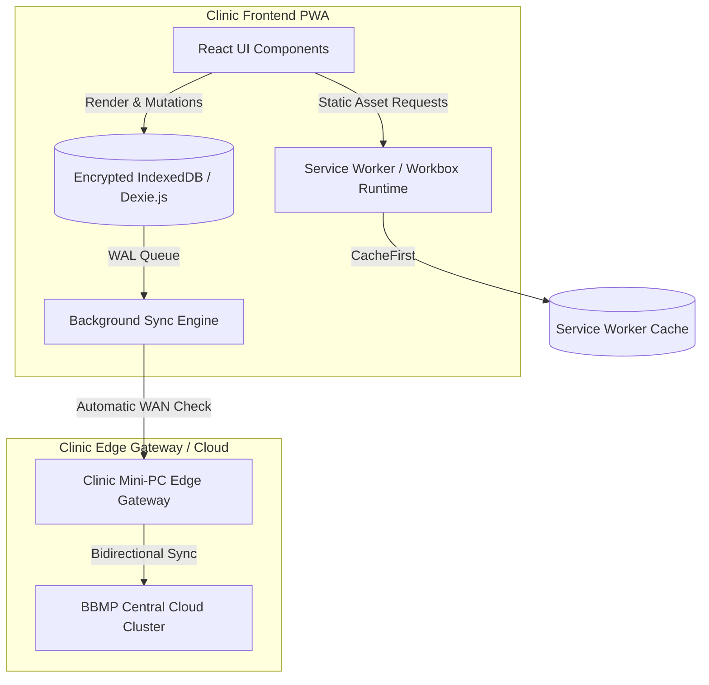
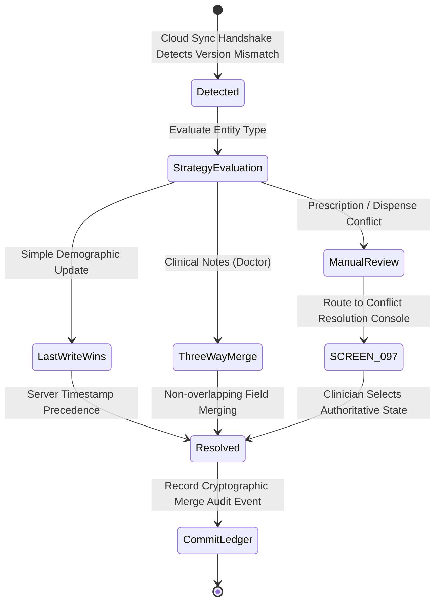

# Namma Clinic Offline-First & Progressive Web App Architecture

## 1. Executive Summary & Offline Philosophy
Bengaluru's municipal health centers frequently encounter unreliable WAN connectivity, sudden broadband dropouts, and power supply interruptions. The Namma Clinic platform is engineered from the ground up as a **Tier-1 Local-First Progressive Web App (PWA)** capable of sustaining uninterrupted clinical operations—including patient registration, triage vitals recording, doctor examinations, medication dispensing, and point-of-care lab entries—for **up to 72 consecutive offline hours** without data loss.

## 2. Offline-First Architectural Topology


## 3. Workbox Service Worker Caching Strategies
The Service Worker enforces tailored caching policies across asset classes:

| Asset Domain | Workbox Strategy | Cache Name | Max Entries | Cache Invalidation TTL |
| :--- | :--- | :--- | :--- | :--- |
| Static Core (JS/CSS/HTML) | `CacheFirst` | `core-assets-v1` | 100 | Stale-on-version-bump |
| Kannada Web Fonts (Noto) | `CacheFirst` | `kannada-fonts-v1` | 20 | 365 Days |
| Master ICD-10 & SNOMED | `StaleWhileRevalidate` | `ref-terminology-v1` | 5,000 | 30 Days |
| Essential 52 Formulary | `StaleWhileRevalidate` | `ref-formulary-v1` | 500 | 7 Days |
| Active Patient Encounters | `NetworkFirst` (IDB Fallback) | `clinical-cache-v1` | 1,000 | 72 Hours |
| Outgoing Clinical Mutations | `NetworkOnly` (WAL Queue) | `pending-mutations-wal` | Unlimited | Emptied on Sync |

## 4. Web App Manifest Specification
```json
{
  "name": "Namma Clinic Digital Health Platform",
  "short_name": "NammaClinic",
  "start_url": "/dashboard",
  "display": "standalone",
  "background_color": "#FFFFFF",
  "theme_color": "#006644",
  "orientation": "any",
  "description": "Government of Karnataka / BBMP Municipal Clinic Health Platform",
  "lang": "kn-IN",
  "dir": "ltr"
}
```

## 5. Storage Quota & Web Crypto Security Invariants
1. **Persistent Storage Claim:** PWA requests `navigator.storage.persist()` on initial shift login; guarantees browser will not evict local clinic data under low disk pressure.
2. **Hardware-Derived Key Encryption:** All offline tables containing PHI are encrypted using AES-GCM-256 with keys derived via PBKDF2 from staff credentials and the terminal hardware identifier.
3. **Remote Wipe Protocol:** If a terminal is marked compromised on `SCREEN-106`, the next successful network handshake triggers an immediate cryptographic zero-fill of all IndexedDB stores.

## 6. Exhaustive Screen-by-Screen Offline Behavior Catalog
The following specifications detail the offline and sync behavior across all 108 planned screens:

### Offline Specification: SCREEN-001 — User Login Screen
**Route:** `/login` | **Offline Capability:** `Online Only` | **Local Store:** `auth_users`

#### 1. Offline Mode Operational Scope
The `User Login Screen` screen requires real-time gateway connectivity. Disconnection displays an explicit offline banner (`COMP-136`) and temporarily locks mutating inputs until broadband restoration.

#### 2. Write-Ahead Log (WAL) & Conflict Resolution Policy
- **Local Mutation Table:** `pending_mutations`
- **Conflict Strategy:** Last-Write-Wins (LWW) with server clock authority, plus field-level three-way merge for clinical consultation notes.
- **Manual Conflict UI:** Unresolvable collisions invoke `COMP-138: SyncConflictModal` on `SCREEN-097`.

#### 3. Documentation-Only Service Worker Sync Trigger Contract
```typescript
// DOCUMENTATION-ONLY TYPESCRIPT
export async function sync_SCREEN_001_Mutations(): Promise<SyncResult> {
  const pending = await dexieDb.pending_mutations.where('screenId').equals('SCREEN-001').toArray();
  return syncEngine.dispatchBatch(pending);
}
```

---

### Offline Specification: SCREEN-002 — MFA Verification Screen
**Route:** `/login/mfa` | **Offline Capability:** `Online Only` | **Local Store:** `user_sessions`

#### 1. Offline Mode Operational Scope
The `MFA Verification Screen` screen requires real-time gateway connectivity. Disconnection displays an explicit offline banner (`COMP-136`) and temporarily locks mutating inputs until broadband restoration.

#### 2. Write-Ahead Log (WAL) & Conflict Resolution Policy
- **Local Mutation Table:** `pending_mutations`
- **Conflict Strategy:** Last-Write-Wins (LWW) with server clock authority, plus field-level three-way merge for clinical consultation notes.
- **Manual Conflict UI:** Unresolvable collisions invoke `COMP-138: SyncConflictModal` on `SCREEN-097`.

#### 3. Documentation-Only Service Worker Sync Trigger Contract
```typescript
// DOCUMENTATION-ONLY TYPESCRIPT
export async function sync_SCREEN_002_Mutations(): Promise<SyncResult> {
  const pending = await dexieDb.pending_mutations.where('screenId').equals('SCREEN-002').toArray();
  return syncEngine.dispatchBatch(pending);
}
```

---

### Offline Specification: SCREEN-003 — Terminal Pairing & Device Enrollment
**Route:** `/system/device-enroll` | **Offline Capability:** `Online Only` | **Local Store:** `hardware_terminals`

#### 1. Offline Mode Operational Scope
The `Terminal Pairing & Device Enrollment` screen requires real-time gateway connectivity. Disconnection displays an explicit offline banner (`COMP-136`) and temporarily locks mutating inputs until broadband restoration.

#### 2. Write-Ahead Log (WAL) & Conflict Resolution Policy
- **Local Mutation Table:** `pending_mutations`
- **Conflict Strategy:** Last-Write-Wins (LWW) with server clock authority, plus field-level three-way merge for clinical consultation notes.
- **Manual Conflict UI:** Unresolvable collisions invoke `COMP-138: SyncConflictModal` on `SCREEN-097`.

#### 3. Documentation-Only Service Worker Sync Trigger Contract
```typescript
// DOCUMENTATION-ONLY TYPESCRIPT
export async function sync_SCREEN_003_Mutations(): Promise<SyncResult> {
  const pending = await dexieDb.pending_mutations.where('screenId').equals('SCREEN-003').toArray();
  return syncEngine.dispatchBatch(pending);
}
```

---

### Offline Specification: SCREEN-004 — Clinic Shift Check-In & Handover
**Route:** `/shift/checkin` | **Offline Capability:** `Degraded Offline` | **Local Store:** `clinic_shifts`

#### 1. Offline Mode Operational Scope
The `Clinic Shift Check-In & Handover` screen operates with degraded capabilities. Pre-cached read data is accessible; modifications are permitted on existing cached records, but new external queries (e.g. cross-clinic transfers or external lab fetches) are queued or disabled.

#### 2. Write-Ahead Log (WAL) & Conflict Resolution Policy
- **Local Mutation Table:** `pending_mutations`
- **Conflict Strategy:** Last-Write-Wins (LWW) with server clock authority, plus field-level three-way merge for clinical consultation notes.
- **Manual Conflict UI:** Unresolvable collisions invoke `COMP-138: SyncConflictModal` on `SCREEN-097`.

#### 3. Documentation-Only Service Worker Sync Trigger Contract
```typescript
// DOCUMENTATION-ONLY TYPESCRIPT
export async function sync_SCREEN_004_Mutations(): Promise<SyncResult> {
  const pending = await dexieDb.pending_mutations.where('screenId').equals('SCREEN-004').toArray();
  return syncEngine.dispatchBatch(pending);
}
```

---

### Offline Specification: SCREEN-005 — Emergency Break-Glass Authorization
**Route:** `/auth/break-glass` | **Offline Capability:** `Full Offline` | **Local Store:** `audit_events`

#### 1. Offline Mode Operational Scope
The `Emergency Break-Glass Authorization` screen supports 100% offline autonomy. Staff can perform all form data entries, state updates, and print dispatchers while completely disconnected from the municipal cloud. Transactions are written directly to local Dexie IndexedDB with an optimistic UI state update.

#### 2. Write-Ahead Log (WAL) & Conflict Resolution Policy
- **Local Mutation Table:** `pending_mutations`
- **Conflict Strategy:** Last-Write-Wins (LWW) with server clock authority, plus field-level three-way merge for clinical consultation notes.
- **Manual Conflict UI:** Unresolvable collisions invoke `COMP-138: SyncConflictModal` on `SCREEN-097`.

#### 3. Documentation-Only Service Worker Sync Trigger Contract
```typescript
// DOCUMENTATION-ONLY TYPESCRIPT
export async function sync_SCREEN_005_Mutations(): Promise<SyncResult> {
  const pending = await dexieDb.pending_mutations.where('screenId').equals('SCREEN-005').toArray();
  return syncEngine.dispatchBatch(pending);
}
```

---

### Offline Specification: SCREEN-006 — Master Clinic Dashboard
**Route:** `/dashboard` | **Offline Capability:** `Degraded Offline` | **Local Store:** `visits`

#### 1. Offline Mode Operational Scope
The `Master Clinic Dashboard` screen operates with degraded capabilities. Pre-cached read data is accessible; modifications are permitted on existing cached records, but new external queries (e.g. cross-clinic transfers or external lab fetches) are queued or disabled.

#### 2. Write-Ahead Log (WAL) & Conflict Resolution Policy
- **Local Mutation Table:** `pending_mutations`
- **Conflict Strategy:** Last-Write-Wins (LWW) with server clock authority, plus field-level three-way merge for clinical consultation notes.
- **Manual Conflict UI:** Unresolvable collisions invoke `COMP-138: SyncConflictModal` on `SCREEN-097`.

#### 3. Documentation-Only Service Worker Sync Trigger Contract
```typescript
// DOCUMENTATION-ONLY TYPESCRIPT
export async function sync_SCREEN_006_Mutations(): Promise<SyncResult> {
  const pending = await dexieDb.pending_mutations.where('screenId').equals('SCREEN-006').toArray();
  return syncEngine.dispatchBatch(pending);
}
```

---

### Offline Specification: SCREEN-007 — Doctor Outpatient Console
**Route:** `/doctor/console` | **Offline Capability:** `Full Offline` | **Local Store:** `visits`

#### 1. Offline Mode Operational Scope
The `Doctor Outpatient Console` screen supports 100% offline autonomy. Staff can perform all form data entries, state updates, and print dispatchers while completely disconnected from the municipal cloud. Transactions are written directly to local Dexie IndexedDB with an optimistic UI state update.

#### 2. Write-Ahead Log (WAL) & Conflict Resolution Policy
- **Local Mutation Table:** `pending_mutations`
- **Conflict Strategy:** Last-Write-Wins (LWW) with server clock authority, plus field-level three-way merge for clinical consultation notes.
- **Manual Conflict UI:** Unresolvable collisions invoke `COMP-138: SyncConflictModal` on `SCREEN-097`.

#### 3. Documentation-Only Service Worker Sync Trigger Contract
```typescript
// DOCUMENTATION-ONLY TYPESCRIPT
export async function sync_SCREEN_007_Mutations(): Promise<SyncResult> {
  const pending = await dexieDb.pending_mutations.where('screenId').equals('SCREEN-007').toArray();
  return syncEngine.dispatchBatch(pending);
}
```

---

### Offline Specification: SCREEN-008 — Staff Nurse Triage Workbench
**Route:** `/nurse/triage` | **Offline Capability:** `Full Offline` | **Local Store:** `triage_assessments`

#### 1. Offline Mode Operational Scope
The `Staff Nurse Triage Workbench` screen supports 100% offline autonomy. Staff can perform all form data entries, state updates, and print dispatchers while completely disconnected from the municipal cloud. Transactions are written directly to local Dexie IndexedDB with an optimistic UI state update.

#### 2. Write-Ahead Log (WAL) & Conflict Resolution Policy
- **Local Mutation Table:** `pending_mutations`
- **Conflict Strategy:** Last-Write-Wins (LWW) with server clock authority, plus field-level three-way merge for clinical consultation notes.
- **Manual Conflict UI:** Unresolvable collisions invoke `COMP-138: SyncConflictModal` on `SCREEN-097`.

#### 3. Documentation-Only Service Worker Sync Trigger Contract
```typescript
// DOCUMENTATION-ONLY TYPESCRIPT
export async function sync_SCREEN_008_Mutations(): Promise<SyncResult> {
  const pending = await dexieDb.pending_mutations.where('screenId').equals('SCREEN-008').toArray();
  return syncEngine.dispatchBatch(pending);
}
```

---

### Offline Specification: SCREEN-009 — Pharmacy Dispensing Console
**Route:** `/pharmacy/dispense` | **Offline Capability:** `Full Offline` | **Local Store:** `prescriptions`

#### 1. Offline Mode Operational Scope
The `Pharmacy Dispensing Console` screen supports 100% offline autonomy. Staff can perform all form data entries, state updates, and print dispatchers while completely disconnected from the municipal cloud. Transactions are written directly to local Dexie IndexedDB with an optimistic UI state update.

#### 2. Write-Ahead Log (WAL) & Conflict Resolution Policy
- **Local Mutation Table:** `pending_mutations`
- **Conflict Strategy:** Last-Write-Wins (LWW) with server clock authority, plus field-level three-way merge for clinical consultation notes.
- **Manual Conflict UI:** Unresolvable collisions invoke `COMP-138: SyncConflictModal` on `SCREEN-097`.

#### 3. Documentation-Only Service Worker Sync Trigger Contract
```typescript
// DOCUMENTATION-ONLY TYPESCRIPT
export async function sync_SCREEN_009_Mutations(): Promise<SyncResult> {
  const pending = await dexieDb.pending_mutations.where('screenId').equals('SCREEN-009').toArray();
  return syncEngine.dispatchBatch(pending);
}
```

---

### Offline Specification: SCREEN-010 — Diagnostic Laboratory Workbench
**Route:** `/lab/workbench` | **Offline Capability:** `Full Offline` | **Local Store:** `lab_orders`

#### 1. Offline Mode Operational Scope
The `Diagnostic Laboratory Workbench` screen supports 100% offline autonomy. Staff can perform all form data entries, state updates, and print dispatchers while completely disconnected from the municipal cloud. Transactions are written directly to local Dexie IndexedDB with an optimistic UI state update.

#### 2. Write-Ahead Log (WAL) & Conflict Resolution Policy
- **Local Mutation Table:** `pending_mutations`
- **Conflict Strategy:** Last-Write-Wins (LWW) with server clock authority, plus field-level three-way merge for clinical consultation notes.
- **Manual Conflict UI:** Unresolvable collisions invoke `COMP-138: SyncConflictModal` on `SCREEN-097`.

#### 3. Documentation-Only Service Worker Sync Trigger Contract
```typescript
// DOCUMENTATION-ONLY TYPESCRIPT
export async function sync_SCREEN_010_Mutations(): Promise<SyncResult> {
  const pending = await dexieDb.pending_mutations.where('screenId').equals('SCREEN-010').toArray();
  return syncEngine.dispatchBatch(pending);
}
```

---

### Offline Specification: SCREEN-011 — Citizen New Registration Screen
**Route:** `/patients/new` | **Offline Capability:** `Full Offline` | **Local Store:** `patients`

#### 1. Offline Mode Operational Scope
The `Citizen New Registration Screen` screen supports 100% offline autonomy. Staff can perform all form data entries, state updates, and print dispatchers while completely disconnected from the municipal cloud. Transactions are written directly to local Dexie IndexedDB with an optimistic UI state update.

#### 2. Write-Ahead Log (WAL) & Conflict Resolution Policy
- **Local Mutation Table:** `pending_mutations`
- **Conflict Strategy:** Last-Write-Wins (LWW) with server clock authority, plus field-level three-way merge for clinical consultation notes.
- **Manual Conflict UI:** Unresolvable collisions invoke `COMP-138: SyncConflictModal` on `SCREEN-097`.

#### 3. Documentation-Only Service Worker Sync Trigger Contract
```typescript
// DOCUMENTATION-ONLY TYPESCRIPT
export async function sync_SCREEN_011_Mutations(): Promise<SyncResult> {
  const pending = await dexieDb.pending_mutations.where('screenId').equals('SCREEN-011').toArray();
  return syncEngine.dispatchBatch(pending);
}
```

---

### Offline Specification: SCREEN-012 — Citizen Search & Retrieval Screen
**Route:** `/patients/search` | **Offline Capability:** `Full Offline` | **Local Store:** `patients`

#### 1. Offline Mode Operational Scope
The `Citizen Search & Retrieval Screen` screen supports 100% offline autonomy. Staff can perform all form data entries, state updates, and print dispatchers while completely disconnected from the municipal cloud. Transactions are written directly to local Dexie IndexedDB with an optimistic UI state update.

#### 2. Write-Ahead Log (WAL) & Conflict Resolution Policy
- **Local Mutation Table:** `pending_mutations`
- **Conflict Strategy:** Last-Write-Wins (LWW) with server clock authority, plus field-level three-way merge for clinical consultation notes.
- **Manual Conflict UI:** Unresolvable collisions invoke `COMP-138: SyncConflictModal` on `SCREEN-097`.

#### 3. Documentation-Only Service Worker Sync Trigger Contract
```typescript
// DOCUMENTATION-ONLY TYPESCRIPT
export async function sync_SCREEN_012_Mutations(): Promise<SyncResult> {
  const pending = await dexieDb.pending_mutations.where('screenId').equals('SCREEN-012').toArray();
  return syncEngine.dispatchBatch(pending);
}
```

---

### Offline Specification: SCREEN-013 — Patient Longitudinal Profile View
**Route:** `/patients/:id` | **Offline Capability:** `Full Offline` | **Local Store:** `patients`

#### 1. Offline Mode Operational Scope
The `Patient Longitudinal Profile View` screen supports 100% offline autonomy. Staff can perform all form data entries, state updates, and print dispatchers while completely disconnected from the municipal cloud. Transactions are written directly to local Dexie IndexedDB with an optimistic UI state update.

#### 2. Write-Ahead Log (WAL) & Conflict Resolution Policy
- **Local Mutation Table:** `pending_mutations`
- **Conflict Strategy:** Last-Write-Wins (LWW) with server clock authority, plus field-level three-way merge for clinical consultation notes.
- **Manual Conflict UI:** Unresolvable collisions invoke `COMP-138: SyncConflictModal` on `SCREEN-097`.

#### 3. Documentation-Only Service Worker Sync Trigger Contract
```typescript
// DOCUMENTATION-ONLY TYPESCRIPT
export async function sync_SCREEN_013_Mutations(): Promise<SyncResult> {
  const pending = await dexieDb.pending_mutations.where('screenId').equals('SCREEN-013').toArray();
  return syncEngine.dispatchBatch(pending);
}
```

---

### Offline Specification: SCREEN-014 — Repeat Patient Fast Intake
**Route:** `/patients/:id/repeat-intake` | **Offline Capability:** `Full Offline` | **Local Store:** `visits`

#### 1. Offline Mode Operational Scope
The `Repeat Patient Fast Intake` screen supports 100% offline autonomy. Staff can perform all form data entries, state updates, and print dispatchers while completely disconnected from the municipal cloud. Transactions are written directly to local Dexie IndexedDB with an optimistic UI state update.

#### 2. Write-Ahead Log (WAL) & Conflict Resolution Policy
- **Local Mutation Table:** `pending_mutations`
- **Conflict Strategy:** Last-Write-Wins (LWW) with server clock authority, plus field-level three-way merge for clinical consultation notes.
- **Manual Conflict UI:** Unresolvable collisions invoke `COMP-138: SyncConflictModal` on `SCREEN-097`.

#### 3. Documentation-Only Service Worker Sync Trigger Contract
```typescript
// DOCUMENTATION-ONLY TYPESCRIPT
export async function sync_SCREEN_014_Mutations(): Promise<SyncResult> {
  const pending = await dexieDb.pending_mutations.where('screenId').equals('SCREEN-014').toArray();
  return syncEngine.dispatchBatch(pending);
}
```

---

### Offline Specification: SCREEN-015 — Biometric & ABHA Card Scan Modal
**Route:** `/patients/abha-scan` | **Offline Capability:** `Degraded Offline` | **Local Store:** `patients`

#### 1. Offline Mode Operational Scope
The `Biometric & ABHA Card Scan Modal` screen operates with degraded capabilities. Pre-cached read data is accessible; modifications are permitted on existing cached records, but new external queries (e.g. cross-clinic transfers or external lab fetches) are queued or disabled.

#### 2. Write-Ahead Log (WAL) & Conflict Resolution Policy
- **Local Mutation Table:** `pending_mutations`
- **Conflict Strategy:** Last-Write-Wins (LWW) with server clock authority, plus field-level three-way merge for clinical consultation notes.
- **Manual Conflict UI:** Unresolvable collisions invoke `COMP-138: SyncConflictModal` on `SCREEN-097`.

#### 3. Documentation-Only Service Worker Sync Trigger Contract
```typescript
// DOCUMENTATION-ONLY TYPESCRIPT
export async function sync_SCREEN_015_Mutations(): Promise<SyncResult> {
  const pending = await dexieDb.pending_mutations.where('screenId').equals('SCREEN-015').toArray();
  return syncEngine.dispatchBatch(pending);
}
```

---

### Offline Specification: SCREEN-016 — Citizen Demographic Correction Form
**Route:** `/patients/:id/edit` | **Offline Capability:** `Degraded Offline` | **Local Store:** `patients`

#### 1. Offline Mode Operational Scope
The `Citizen Demographic Correction Form` screen operates with degraded capabilities. Pre-cached read data is accessible; modifications are permitted on existing cached records, but new external queries (e.g. cross-clinic transfers or external lab fetches) are queued or disabled.

#### 2. Write-Ahead Log (WAL) & Conflict Resolution Policy
- **Local Mutation Table:** `pending_mutations`
- **Conflict Strategy:** Last-Write-Wins (LWW) with server clock authority, plus field-level three-way merge for clinical consultation notes.
- **Manual Conflict UI:** Unresolvable collisions invoke `COMP-138: SyncConflictModal` on `SCREEN-097`.

#### 3. Documentation-Only Service Worker Sync Trigger Contract
```typescript
// DOCUMENTATION-ONLY TYPESCRIPT
export async function sync_SCREEN_016_Mutations(): Promise<SyncResult> {
  const pending = await dexieDb.pending_mutations.where('screenId').equals('SCREEN-016').toArray();
  return syncEngine.dispatchBatch(pending);
}
```

---

### Offline Specification: SCREEN-017 — Duplicate Citizen Merge Modal
**Route:** `/patients/merge` | **Offline Capability:** `Online Only` | **Local Store:** `patients`

#### 1. Offline Mode Operational Scope
The `Duplicate Citizen Merge Modal` screen requires real-time gateway connectivity. Disconnection displays an explicit offline banner (`COMP-136`) and temporarily locks mutating inputs until broadband restoration.

#### 2. Write-Ahead Log (WAL) & Conflict Resolution Policy
- **Local Mutation Table:** `pending_mutations`
- **Conflict Strategy:** Last-Write-Wins (LWW) with server clock authority, plus field-level three-way merge for clinical consultation notes.
- **Manual Conflict UI:** Unresolvable collisions invoke `COMP-138: SyncConflictModal` on `SCREEN-097`.

#### 3. Documentation-Only Service Worker Sync Trigger Contract
```typescript
// DOCUMENTATION-ONLY TYPESCRIPT
export async function sync_SCREEN_017_Mutations(): Promise<SyncResult> {
  const pending = await dexieDb.pending_mutations.where('screenId').equals('SCREEN-017').toArray();
  return syncEngine.dispatchBatch(pending);
}
```

---

### Offline Specification: SCREEN-018 — Citizen Digital Photo Capture
**Route:** `/patients/:id/photo` | **Offline Capability:** `Full Offline` | **Local Store:** `patients`

#### 1. Offline Mode Operational Scope
The `Citizen Digital Photo Capture` screen supports 100% offline autonomy. Staff can perform all form data entries, state updates, and print dispatchers while completely disconnected from the municipal cloud. Transactions are written directly to local Dexie IndexedDB with an optimistic UI state update.

#### 2. Write-Ahead Log (WAL) & Conflict Resolution Policy
- **Local Mutation Table:** `pending_mutations`
- **Conflict Strategy:** Last-Write-Wins (LWW) with server clock authority, plus field-level three-way merge for clinical consultation notes.
- **Manual Conflict UI:** Unresolvable collisions invoke `COMP-138: SyncConflictModal` on `SCREEN-097`.

#### 3. Documentation-Only Service Worker Sync Trigger Contract
```typescript
// DOCUMENTATION-ONLY TYPESCRIPT
export async function sync_SCREEN_018_Mutations(): Promise<SyncResult> {
  const pending = await dexieDb.pending_mutations.where('screenId').equals('SCREEN-018').toArray();
  return syncEngine.dispatchBatch(pending);
}
```

---

### Offline Specification: SCREEN-019 — DPDP Informed Consent Capture Screen
**Route:** `/patients/:id/consent` | **Offline Capability:** `Full Offline` | **Local Store:** `patient_consents`

#### 1. Offline Mode Operational Scope
The `DPDP Informed Consent Capture Screen` screen supports 100% offline autonomy. Staff can perform all form data entries, state updates, and print dispatchers while completely disconnected from the municipal cloud. Transactions are written directly to local Dexie IndexedDB with an optimistic UI state update.

#### 2. Write-Ahead Log (WAL) & Conflict Resolution Policy
- **Local Mutation Table:** `pending_mutations`
- **Conflict Strategy:** Last-Write-Wins (LWW) with server clock authority, plus field-level three-way merge for clinical consultation notes.
- **Manual Conflict UI:** Unresolvable collisions invoke `COMP-138: SyncConflictModal` on `SCREEN-097`.

#### 3. Documentation-Only Service Worker Sync Trigger Contract
```typescript
// DOCUMENTATION-ONLY TYPESCRIPT
export async function sync_SCREEN_019_Mutations(): Promise<SyncResult> {
  const pending = await dexieDb.pending_mutations.where('screenId').equals('SCREEN-019').toArray();
  return syncEngine.dispatchBatch(pending);
}
```

---

### Offline Specification: SCREEN-020 — Consent History & Revocation Console
**Route:** `/patients/:id/consents` | **Offline Capability:** `Full Offline` | **Local Store:** `patient_consents`

#### 1. Offline Mode Operational Scope
The `Consent History & Revocation Console` screen supports 100% offline autonomy. Staff can perform all form data entries, state updates, and print dispatchers while completely disconnected from the municipal cloud. Transactions are written directly to local Dexie IndexedDB with an optimistic UI state update.

#### 2. Write-Ahead Log (WAL) & Conflict Resolution Policy
- **Local Mutation Table:** `pending_mutations`
- **Conflict Strategy:** Last-Write-Wins (LWW) with server clock authority, plus field-level three-way merge for clinical consultation notes.
- **Manual Conflict UI:** Unresolvable collisions invoke `COMP-138: SyncConflictModal` on `SCREEN-097`.

#### 3. Documentation-Only Service Worker Sync Trigger Contract
```typescript
// DOCUMENTATION-ONLY TYPESCRIPT
export async function sync_SCREEN_020_Mutations(): Promise<SyncResult> {
  const pending = await dexieDb.pending_mutations.where('screenId').equals('SCREEN-020').toArray();
  return syncEngine.dispatchBatch(pending);
}
```

---

### Offline Specification: SCREEN-021 — Data Portability & Export Request
**Route:** `/patients/:id/export` | **Offline Capability:** `Degraded Offline` | **Local Store:** `patient_exports`

#### 1. Offline Mode Operational Scope
The `Data Portability & Export Request` screen operates with degraded capabilities. Pre-cached read data is accessible; modifications are permitted on existing cached records, but new external queries (e.g. cross-clinic transfers or external lab fetches) are queued or disabled.

#### 2. Write-Ahead Log (WAL) & Conflict Resolution Policy
- **Local Mutation Table:** `pending_mutations`
- **Conflict Strategy:** Last-Write-Wins (LWW) with server clock authority, plus field-level three-way merge for clinical consultation notes.
- **Manual Conflict UI:** Unresolvable collisions invoke `COMP-138: SyncConflictModal` on `SCREEN-097`.

#### 3. Documentation-Only Service Worker Sync Trigger Contract
```typescript
// DOCUMENTATION-ONLY TYPESCRIPT
export async function sync_SCREEN_021_Mutations(): Promise<SyncResult> {
  const pending = await dexieDb.pending_mutations.where('screenId').equals('SCREEN-021').toArray();
  return syncEngine.dispatchBatch(pending);
}
```

---

### Offline Specification: SCREEN-022 — Citizen Grievance Redressal Intake
**Route:** `/patients/:id/grievance` | **Offline Capability:** `Full Offline` | **Local Store:** `citizen_grievances`

#### 1. Offline Mode Operational Scope
The `Citizen Grievance Redressal Intake` screen supports 100% offline autonomy. Staff can perform all form data entries, state updates, and print dispatchers while completely disconnected from the municipal cloud. Transactions are written directly to local Dexie IndexedDB with an optimistic UI state update.

#### 2. Write-Ahead Log (WAL) & Conflict Resolution Policy
- **Local Mutation Table:** `pending_mutations`
- **Conflict Strategy:** Last-Write-Wins (LWW) with server clock authority, plus field-level three-way merge for clinical consultation notes.
- **Manual Conflict UI:** Unresolvable collisions invoke `COMP-138: SyncConflictModal` on `SCREEN-097`.

#### 3. Documentation-Only Service Worker Sync Trigger Contract
```typescript
// DOCUMENTATION-ONLY TYPESCRIPT
export async function sync_SCREEN_022_Mutations(): Promise<SyncResult> {
  const pending = await dexieDb.pending_mutations.where('screenId').equals('SCREEN-022').toArray();
  return syncEngine.dispatchBatch(pending);
}
```

---

### Offline Specification: SCREEN-023 — Grievance Investigation & Resolution
**Route:** `/grievances/:id` | **Offline Capability:** `Online Only` | **Local Store:** `citizen_grievances`

#### 1. Offline Mode Operational Scope
The `Grievance Investigation & Resolution` screen requires real-time gateway connectivity. Disconnection displays an explicit offline banner (`COMP-136`) and temporarily locks mutating inputs until broadband restoration.

#### 2. Write-Ahead Log (WAL) & Conflict Resolution Policy
- **Local Mutation Table:** `pending_mutations`
- **Conflict Strategy:** Last-Write-Wins (LWW) with server clock authority, plus field-level three-way merge for clinical consultation notes.
- **Manual Conflict UI:** Unresolvable collisions invoke `COMP-138: SyncConflictModal` on `SCREEN-097`.

#### 3. Documentation-Only Service Worker Sync Trigger Contract
```typescript
// DOCUMENTATION-ONLY TYPESCRIPT
export async function sync_SCREEN_023_Mutations(): Promise<SyncResult> {
  const pending = await dexieDb.pending_mutations.where('screenId').equals('SCREEN-023').toArray();
  return syncEngine.dispatchBatch(pending);
}
```

---

### Offline Specification: SCREEN-024 — OPD Token Generation & Print Modal
**Route:** `/queue/tokens/new` | **Offline Capability:** `Full Offline` | **Local Store:** `visits`

#### 1. Offline Mode Operational Scope
The `OPD Token Generation & Print Modal` screen supports 100% offline autonomy. Staff can perform all form data entries, state updates, and print dispatchers while completely disconnected from the municipal cloud. Transactions are written directly to local Dexie IndexedDB with an optimistic UI state update.

#### 2. Write-Ahead Log (WAL) & Conflict Resolution Policy
- **Local Mutation Table:** `pending_mutations`
- **Conflict Strategy:** Last-Write-Wins (LWW) with server clock authority, plus field-level three-way merge for clinical consultation notes.
- **Manual Conflict UI:** Unresolvable collisions invoke `COMP-138: SyncConflictModal` on `SCREEN-097`.

#### 3. Documentation-Only Service Worker Sync Trigger Contract
```typescript
// DOCUMENTATION-ONLY TYPESCRIPT
export async function sync_SCREEN_024_Mutations(): Promise<SyncResult> {
  const pending = await dexieDb.pending_mutations.where('screenId').equals('SCREEN-024').toArray();
  return syncEngine.dispatchBatch(pending);
}
```

---

### Offline Specification: SCREEN-025 — Master Waiting Room Queue Display
**Route:** `/queue/display` | **Offline Capability:** `Full Offline` | **Local Store:** `opd_queues`

#### 1. Offline Mode Operational Scope
The `Master Waiting Room Queue Display` screen supports 100% offline autonomy. Staff can perform all form data entries, state updates, and print dispatchers while completely disconnected from the municipal cloud. Transactions are written directly to local Dexie IndexedDB with an optimistic UI state update.

#### 2. Write-Ahead Log (WAL) & Conflict Resolution Policy
- **Local Mutation Table:** `pending_mutations`
- **Conflict Strategy:** Last-Write-Wins (LWW) with server clock authority, plus field-level three-way merge for clinical consultation notes.
- **Manual Conflict UI:** Unresolvable collisions invoke `COMP-138: SyncConflictModal` on `SCREEN-097`.

#### 3. Documentation-Only Service Worker Sync Trigger Contract
```typescript
// DOCUMENTATION-ONLY TYPESCRIPT
export async function sync_SCREEN_025_Mutations(): Promise<SyncResult> {
  const pending = await dexieDb.pending_mutations.where('screenId').equals('SCREEN-025').toArray();
  return syncEngine.dispatchBatch(pending);
}
```

---

### Offline Specification: SCREEN-026 — Queue Management & Rerouting Screen
**Route:** `/queue/manage` | **Offline Capability:** `Full Offline` | **Local Store:** `opd_queues`

#### 1. Offline Mode Operational Scope
The `Queue Management & Rerouting Screen` screen supports 100% offline autonomy. Staff can perform all form data entries, state updates, and print dispatchers while completely disconnected from the municipal cloud. Transactions are written directly to local Dexie IndexedDB with an optimistic UI state update.

#### 2. Write-Ahead Log (WAL) & Conflict Resolution Policy
- **Local Mutation Table:** `pending_mutations`
- **Conflict Strategy:** Last-Write-Wins (LWW) with server clock authority, plus field-level three-way merge for clinical consultation notes.
- **Manual Conflict UI:** Unresolvable collisions invoke `COMP-138: SyncConflictModal` on `SCREEN-097`.

#### 3. Documentation-Only Service Worker Sync Trigger Contract
```typescript
// DOCUMENTATION-ONLY TYPESCRIPT
export async function sync_SCREEN_026_Mutations(): Promise<SyncResult> {
  const pending = await dexieDb.pending_mutations.where('screenId').equals('SCREEN-026').toArray();
  return syncEngine.dispatchBatch(pending);
}
```

---

### Offline Specification: SCREEN-027 — Express Triage Queue
**Route:** `/queue/triage-express` | **Offline Capability:** `Full Offline` | **Local Store:** `opd_queues`

#### 1. Offline Mode Operational Scope
The `Express Triage Queue` screen supports 100% offline autonomy. Staff can perform all form data entries, state updates, and print dispatchers while completely disconnected from the municipal cloud. Transactions are written directly to local Dexie IndexedDB with an optimistic UI state update.

#### 2. Write-Ahead Log (WAL) & Conflict Resolution Policy
- **Local Mutation Table:** `pending_mutations`
- **Conflict Strategy:** Last-Write-Wins (LWW) with server clock authority, plus field-level three-way merge for clinical consultation notes.
- **Manual Conflict UI:** Unresolvable collisions invoke `COMP-138: SyncConflictModal` on `SCREEN-097`.

#### 3. Documentation-Only Service Worker Sync Trigger Contract
```typescript
// DOCUMENTATION-ONLY TYPESCRIPT
export async function sync_SCREEN_027_Mutations(): Promise<SyncResult> {
  const pending = await dexieDb.pending_mutations.where('screenId').equals('SCREEN-027').toArray();
  return syncEngine.dispatchBatch(pending);
}
```

---

### Offline Specification: SCREEN-028 — Pharmacy Pickup Waiting Screen
**Route:** `/queue/pharmacy` | **Offline Capability:** `Full Offline` | **Local Store:** `prescriptions`

#### 1. Offline Mode Operational Scope
The `Pharmacy Pickup Waiting Screen` screen supports 100% offline autonomy. Staff can perform all form data entries, state updates, and print dispatchers while completely disconnected from the municipal cloud. Transactions are written directly to local Dexie IndexedDB with an optimistic UI state update.

#### 2. Write-Ahead Log (WAL) & Conflict Resolution Policy
- **Local Mutation Table:** `pending_mutations`
- **Conflict Strategy:** Last-Write-Wins (LWW) with server clock authority, plus field-level three-way merge for clinical consultation notes.
- **Manual Conflict UI:** Unresolvable collisions invoke `COMP-138: SyncConflictModal` on `SCREEN-097`.

#### 3. Documentation-Only Service Worker Sync Trigger Contract
```typescript
// DOCUMENTATION-ONLY TYPESCRIPT
export async function sync_SCREEN_028_Mutations(): Promise<SyncResult> {
  const pending = await dexieDb.pending_mutations.where('screenId').equals('SCREEN-028').toArray();
  return syncEngine.dispatchBatch(pending);
}
```

---

### Offline Specification: SCREEN-029 — Triage Vitals Entry Form
**Route:** `/triage/:visitId/vitals` | **Offline Capability:** `Full Offline` | **Local Store:** `triage_assessments`

#### 1. Offline Mode Operational Scope
The `Triage Vitals Entry Form` screen supports 100% offline autonomy. Staff can perform all form data entries, state updates, and print dispatchers while completely disconnected from the municipal cloud. Transactions are written directly to local Dexie IndexedDB with an optimistic UI state update.

#### 2. Write-Ahead Log (WAL) & Conflict Resolution Policy
- **Local Mutation Table:** `pending_mutations`
- **Conflict Strategy:** Last-Write-Wins (LWW) with server clock authority, plus field-level three-way merge for clinical consultation notes.
- **Manual Conflict UI:** Unresolvable collisions invoke `COMP-138: SyncConflictModal` on `SCREEN-097`.

#### 3. Documentation-Only Service Worker Sync Trigger Contract
```typescript
// DOCUMENTATION-ONLY TYPESCRIPT
export async function sync_SCREEN_029_Mutations(): Promise<SyncResult> {
  const pending = await dexieDb.pending_mutations.where('screenId').equals('SCREEN-029').toArray();
  return syncEngine.dispatchBatch(pending);
}
```

---

### Offline Specification: SCREEN-030 — Pediatric Growth Chart & Z-Scores
**Route:** `/triage/:visitId/pediatric` | **Offline Capability:** `Full Offline` | **Local Store:** `triage_assessments`

#### 1. Offline Mode Operational Scope
The `Pediatric Growth Chart & Z-Scores` screen supports 100% offline autonomy. Staff can perform all form data entries, state updates, and print dispatchers while completely disconnected from the municipal cloud. Transactions are written directly to local Dexie IndexedDB with an optimistic UI state update.

#### 2. Write-Ahead Log (WAL) & Conflict Resolution Policy
- **Local Mutation Table:** `pending_mutations`
- **Conflict Strategy:** Last-Write-Wins (LWW) with server clock authority, plus field-level three-way merge for clinical consultation notes.
- **Manual Conflict UI:** Unresolvable collisions invoke `COMP-138: SyncConflictModal` on `SCREEN-097`.

#### 3. Documentation-Only Service Worker Sync Trigger Contract
```typescript
// DOCUMENTATION-ONLY TYPESCRIPT
export async function sync_SCREEN_030_Mutations(): Promise<SyncResult> {
  const pending = await dexieDb.pending_mutations.where('screenId').equals('SCREEN-030').toArray();
  return syncEngine.dispatchBatch(pending);
}
```

---

### Offline Specification: SCREEN-031 — Antenatal Care (ANC) Vitals Intake
**Route:** `/triage/:visitId/anc` | **Offline Capability:** `Full Offline` | **Local Store:** `triage_assessments`

#### 1. Offline Mode Operational Scope
The `Antenatal Care (ANC) Vitals Intake` screen supports 100% offline autonomy. Staff can perform all form data entries, state updates, and print dispatchers while completely disconnected from the municipal cloud. Transactions are written directly to local Dexie IndexedDB with an optimistic UI state update.

#### 2. Write-Ahead Log (WAL) & Conflict Resolution Policy
- **Local Mutation Table:** `pending_mutations`
- **Conflict Strategy:** Last-Write-Wins (LWW) with server clock authority, plus field-level three-way merge for clinical consultation notes.
- **Manual Conflict UI:** Unresolvable collisions invoke `COMP-138: SyncConflictModal` on `SCREEN-097`.

#### 3. Documentation-Only Service Worker Sync Trigger Contract
```typescript
// DOCUMENTATION-ONLY TYPESCRIPT
export async function sync_SCREEN_031_Mutations(): Promise<SyncResult> {
  const pending = await dexieDb.pending_mutations.where('screenId').equals('SCREEN-031').toArray();
  return syncEngine.dispatchBatch(pending);
}
```

---

### Offline Specification: SCREEN-032 — Danger Signs & Triage Warning Modal
**Route:** `/triage/:visitId/danger-modal` | **Offline Capability:** `Full Offline` | **Local Store:** `triage_assessments`

#### 1. Offline Mode Operational Scope
The `Danger Signs & Triage Warning Modal` screen supports 100% offline autonomy. Staff can perform all form data entries, state updates, and print dispatchers while completely disconnected from the municipal cloud. Transactions are written directly to local Dexie IndexedDB with an optimistic UI state update.

#### 2. Write-Ahead Log (WAL) & Conflict Resolution Policy
- **Local Mutation Table:** `pending_mutations`
- **Conflict Strategy:** Last-Write-Wins (LWW) with server clock authority, plus field-level three-way merge for clinical consultation notes.
- **Manual Conflict UI:** Unresolvable collisions invoke `COMP-138: SyncConflictModal` on `SCREEN-097`.

#### 3. Documentation-Only Service Worker Sync Trigger Contract
```typescript
// DOCUMENTATION-ONLY TYPESCRIPT
export async function sync_SCREEN_032_Mutations(): Promise<SyncResult> {
  const pending = await dexieDb.pending_mutations.where('screenId').equals('SCREEN-032').toArray();
  return syncEngine.dispatchBatch(pending);
}
```

---

### Offline Specification: SCREEN-033 — Point-of-Care Blood Sugar Entry
**Route:** `/triage/:visitId/glucometer` | **Offline Capability:** `Full Offline` | **Local Store:** `triage_assessments`

#### 1. Offline Mode Operational Scope
The `Point-of-Care Blood Sugar Entry` screen supports 100% offline autonomy. Staff can perform all form data entries, state updates, and print dispatchers while completely disconnected from the municipal cloud. Transactions are written directly to local Dexie IndexedDB with an optimistic UI state update.

#### 2. Write-Ahead Log (WAL) & Conflict Resolution Policy
- **Local Mutation Table:** `pending_mutations`
- **Conflict Strategy:** Last-Write-Wins (LWW) with server clock authority, plus field-level three-way merge for clinical consultation notes.
- **Manual Conflict UI:** Unresolvable collisions invoke `COMP-138: SyncConflictModal` on `SCREEN-097`.

#### 3. Documentation-Only Service Worker Sync Trigger Contract
```typescript
// DOCUMENTATION-ONLY TYPESCRIPT
export async function sync_SCREEN_033_Mutations(): Promise<SyncResult> {
  const pending = await dexieDb.pending_mutations.where('screenId').equals('SCREEN-033').toArray();
  return syncEngine.dispatchBatch(pending);
}
```

---

### Offline Specification: SCREEN-034 — Triage Station History Log
**Route:** `/triage/station-history` | **Offline Capability:** `Full Offline` | **Local Store:** `triage_assessments`

#### 1. Offline Mode Operational Scope
The `Triage Station History Log` screen supports 100% offline autonomy. Staff can perform all form data entries, state updates, and print dispatchers while completely disconnected from the municipal cloud. Transactions are written directly to local Dexie IndexedDB with an optimistic UI state update.

#### 2. Write-Ahead Log (WAL) & Conflict Resolution Policy
- **Local Mutation Table:** `pending_mutations`
- **Conflict Strategy:** Last-Write-Wins (LWW) with server clock authority, plus field-level three-way merge for clinical consultation notes.
- **Manual Conflict UI:** Unresolvable collisions invoke `COMP-138: SyncConflictModal` on `SCREEN-097`.

#### 3. Documentation-Only Service Worker Sync Trigger Contract
```typescript
// DOCUMENTATION-ONLY TYPESCRIPT
export async function sync_SCREEN_034_Mutations(): Promise<SyncResult> {
  const pending = await dexieDb.pending_mutations.where('screenId').equals('SCREEN-034').toArray();
  return syncEngine.dispatchBatch(pending);
}
```

---

### Offline Specification: SCREEN-035 — Clinical Consultation Workspace
**Route:** `/consultations/:visitId` | **Offline Capability:** `Full Offline` | **Local Store:** `consultations`

#### 1. Offline Mode Operational Scope
The `Clinical Consultation Workspace` screen supports 100% offline autonomy. Staff can perform all form data entries, state updates, and print dispatchers while completely disconnected from the municipal cloud. Transactions are written directly to local Dexie IndexedDB with an optimistic UI state update.

#### 2. Write-Ahead Log (WAL) & Conflict Resolution Policy
- **Local Mutation Table:** `pending_mutations`
- **Conflict Strategy:** Last-Write-Wins (LWW) with server clock authority, plus field-level three-way merge for clinical consultation notes.
- **Manual Conflict UI:** Unresolvable collisions invoke `COMP-138: SyncConflictModal` on `SCREEN-097`.

#### 3. Documentation-Only Service Worker Sync Trigger Contract
```typescript
// DOCUMENTATION-ONLY TYPESCRIPT
export async function sync_SCREEN_035_Mutations(): Promise<SyncResult> {
  const pending = await dexieDb.pending_mutations.where('screenId').equals('SCREEN-035').toArray();
  return syncEngine.dispatchBatch(pending);
}
```

---

### Offline Specification: SCREEN-036 — Chief Complaints & Systemic Review
**Route:** `/consultations/:visitId/symptoms` | **Offline Capability:** `Full Offline` | **Local Store:** `consultations`

#### 1. Offline Mode Operational Scope
The `Chief Complaints & Systemic Review` screen supports 100% offline autonomy. Staff can perform all form data entries, state updates, and print dispatchers while completely disconnected from the municipal cloud. Transactions are written directly to local Dexie IndexedDB with an optimistic UI state update.

#### 2. Write-Ahead Log (WAL) & Conflict Resolution Policy
- **Local Mutation Table:** `pending_mutations`
- **Conflict Strategy:** Last-Write-Wins (LWW) with server clock authority, plus field-level three-way merge for clinical consultation notes.
- **Manual Conflict UI:** Unresolvable collisions invoke `COMP-138: SyncConflictModal` on `SCREEN-097`.

#### 3. Documentation-Only Service Worker Sync Trigger Contract
```typescript
// DOCUMENTATION-ONLY TYPESCRIPT
export async function sync_SCREEN_036_Mutations(): Promise<SyncResult> {
  const pending = await dexieDb.pending_mutations.where('screenId').equals('SCREEN-036').toArray();
  return syncEngine.dispatchBatch(pending);
}
```

---

### Offline Specification: SCREEN-037 — Physical & Clinical Examination Form
**Route:** `/consultations/:visitId/exam` | **Offline Capability:** `Full Offline` | **Local Store:** `consultations`

#### 1. Offline Mode Operational Scope
The `Physical & Clinical Examination Form` screen supports 100% offline autonomy. Staff can perform all form data entries, state updates, and print dispatchers while completely disconnected from the municipal cloud. Transactions are written directly to local Dexie IndexedDB with an optimistic UI state update.

#### 2. Write-Ahead Log (WAL) & Conflict Resolution Policy
- **Local Mutation Table:** `pending_mutations`
- **Conflict Strategy:** Last-Write-Wins (LWW) with server clock authority, plus field-level three-way merge for clinical consultation notes.
- **Manual Conflict UI:** Unresolvable collisions invoke `COMP-138: SyncConflictModal` on `SCREEN-097`.

#### 3. Documentation-Only Service Worker Sync Trigger Contract
```typescript
// DOCUMENTATION-ONLY TYPESCRIPT
export async function sync_SCREEN_037_Mutations(): Promise<SyncResult> {
  const pending = await dexieDb.pending_mutations.where('screenId').equals('SCREEN-037').toArray();
  return syncEngine.dispatchBatch(pending);
}
```

---

### Offline Specification: SCREEN-038 — ICD-10 & SNOMED CT Diagnosis Picker
**Route:** `/consultations/:visitId/diagnosis` | **Offline Capability:** `Full Offline` | **Local Store:** `consultations`

#### 1. Offline Mode Operational Scope
The `ICD-10 & SNOMED CT Diagnosis Picker` screen supports 100% offline autonomy. Staff can perform all form data entries, state updates, and print dispatchers while completely disconnected from the municipal cloud. Transactions are written directly to local Dexie IndexedDB with an optimistic UI state update.

#### 2. Write-Ahead Log (WAL) & Conflict Resolution Policy
- **Local Mutation Table:** `pending_mutations`
- **Conflict Strategy:** Last-Write-Wins (LWW) with server clock authority, plus field-level three-way merge for clinical consultation notes.
- **Manual Conflict UI:** Unresolvable collisions invoke `COMP-138: SyncConflictModal` on `SCREEN-097`.

#### 3. Documentation-Only Service Worker Sync Trigger Contract
```typescript
// DOCUMENTATION-ONLY TYPESCRIPT
export async function sync_SCREEN_038_Mutations(): Promise<SyncResult> {
  const pending = await dexieDb.pending_mutations.where('screenId').equals('SCREEN-038').toArray();
  return syncEngine.dispatchBatch(pending);
}
```

---

### Offline Specification: SCREEN-039 — NCD Chronic Disease Registry Form
**Route:** `/consultations/:visitId/ncd` | **Offline Capability:** `Full Offline` | **Local Store:** `consultations`

#### 1. Offline Mode Operational Scope
The `NCD Chronic Disease Registry Form` screen supports 100% offline autonomy. Staff can perform all form data entries, state updates, and print dispatchers while completely disconnected from the municipal cloud. Transactions are written directly to local Dexie IndexedDB with an optimistic UI state update.

#### 2. Write-Ahead Log (WAL) & Conflict Resolution Policy
- **Local Mutation Table:** `pending_mutations`
- **Conflict Strategy:** Last-Write-Wins (LWW) with server clock authority, plus field-level three-way merge for clinical consultation notes.
- **Manual Conflict UI:** Unresolvable collisions invoke `COMP-138: SyncConflictModal` on `SCREEN-097`.

#### 3. Documentation-Only Service Worker Sync Trigger Contract
```typescript
// DOCUMENTATION-ONLY TYPESCRIPT
export async function sync_SCREEN_039_Mutations(): Promise<SyncResult> {
  const pending = await dexieDb.pending_mutations.where('screenId').equals('SCREEN-039').toArray();
  return syncEngine.dispatchBatch(pending);
}
```

---

### Offline Specification: SCREEN-040 — Past Medical & Surgical History Modal
**Route:** `/consultations/:visitId/history` | **Offline Capability:** `Full Offline` | **Local Store:** `consultations`

#### 1. Offline Mode Operational Scope
The `Past Medical & Surgical History Modal` screen supports 100% offline autonomy. Staff can perform all form data entries, state updates, and print dispatchers while completely disconnected from the municipal cloud. Transactions are written directly to local Dexie IndexedDB with an optimistic UI state update.

#### 2. Write-Ahead Log (WAL) & Conflict Resolution Policy
- **Local Mutation Table:** `pending_mutations`
- **Conflict Strategy:** Last-Write-Wins (LWW) with server clock authority, plus field-level three-way merge for clinical consultation notes.
- **Manual Conflict UI:** Unresolvable collisions invoke `COMP-138: SyncConflictModal` on `SCREEN-097`.

#### 3. Documentation-Only Service Worker Sync Trigger Contract
```typescript
// DOCUMENTATION-ONLY TYPESCRIPT
export async function sync_SCREEN_040_Mutations(): Promise<SyncResult> {
  const pending = await dexieDb.pending_mutations.where('screenId').equals('SCREEN-040').toArray();
  return syncEngine.dispatchBatch(pending);
}
```

---

### Offline Specification: SCREEN-041 — Drug Allergy & Adverse Reaction Logger
**Route:** `/consultations/:visitId/allergies` | **Offline Capability:** `Full Offline` | **Local Store:** `patient_allergies`

#### 1. Offline Mode Operational Scope
The `Drug Allergy & Adverse Reaction Logger` screen supports 100% offline autonomy. Staff can perform all form data entries, state updates, and print dispatchers while completely disconnected from the municipal cloud. Transactions are written directly to local Dexie IndexedDB with an optimistic UI state update.

#### 2. Write-Ahead Log (WAL) & Conflict Resolution Policy
- **Local Mutation Table:** `pending_mutations`
- **Conflict Strategy:** Last-Write-Wins (LWW) with server clock authority, plus field-level three-way merge for clinical consultation notes.
- **Manual Conflict UI:** Unresolvable collisions invoke `COMP-138: SyncConflictModal` on `SCREEN-097`.

#### 3. Documentation-Only Service Worker Sync Trigger Contract
```typescript
// DOCUMENTATION-ONLY TYPESCRIPT
export async function sync_SCREEN_041_Mutations(): Promise<SyncResult> {
  const pending = await dexieDb.pending_mutations.where('screenId').equals('SCREEN-041').toArray();
  return syncEngine.dispatchBatch(pending);
}
```

---

### Offline Specification: SCREEN-042 — Clinical Progress Note & Free-Text Area
**Route:** `/consultations/:visitId/notes` | **Offline Capability:** `Full Offline` | **Local Store:** `consultations`

#### 1. Offline Mode Operational Scope
The `Clinical Progress Note & Free-Text Area` screen supports 100% offline autonomy. Staff can perform all form data entries, state updates, and print dispatchers while completely disconnected from the municipal cloud. Transactions are written directly to local Dexie IndexedDB with an optimistic UI state update.

#### 2. Write-Ahead Log (WAL) & Conflict Resolution Policy
- **Local Mutation Table:** `pending_mutations`
- **Conflict Strategy:** Last-Write-Wins (LWW) with server clock authority, plus field-level three-way merge for clinical consultation notes.
- **Manual Conflict UI:** Unresolvable collisions invoke `COMP-138: SyncConflictModal` on `SCREEN-097`.

#### 3. Documentation-Only Service Worker Sync Trigger Contract
```typescript
// DOCUMENTATION-ONLY TYPESCRIPT
export async function sync_SCREEN_042_Mutations(): Promise<SyncResult> {
  const pending = await dexieDb.pending_mutations.where('screenId').equals('SCREEN-042').toArray();
  return syncEngine.dispatchBatch(pending);
}
```

---

### Offline Specification: SCREEN-043 — Doctor Teleconsultation Video Room
**Route:** `/consultations/:visitId/teleconsult` | **Offline Capability:** `Online Only` | **Local Store:** `consultations`

#### 1. Offline Mode Operational Scope
The `Doctor Teleconsultation Video Room` screen requires real-time gateway connectivity. Disconnection displays an explicit offline banner (`COMP-136`) and temporarily locks mutating inputs until broadband restoration.

#### 2. Write-Ahead Log (WAL) & Conflict Resolution Policy
- **Local Mutation Table:** `pending_mutations`
- **Conflict Strategy:** Last-Write-Wins (LWW) with server clock authority, plus field-level three-way merge for clinical consultation notes.
- **Manual Conflict UI:** Unresolvable collisions invoke `COMP-138: SyncConflictModal` on `SCREEN-097`.

#### 3. Documentation-Only Service Worker Sync Trigger Contract
```typescript
// DOCUMENTATION-ONLY TYPESCRIPT
export async function sync_SCREEN_043_Mutations(): Promise<SyncResult> {
  const pending = await dexieDb.pending_mutations.where('screenId').equals('SCREEN-043').toArray();
  return syncEngine.dispatchBatch(pending);
}
```

---

### Offline Specification: SCREEN-044 — Consultation Summary & Lock Dialog
**Route:** `/consultations/:visitId/sign` | **Offline Capability:** `Full Offline` | **Local Store:** `consultations`

#### 1. Offline Mode Operational Scope
The `Consultation Summary & Lock Dialog` screen supports 100% offline autonomy. Staff can perform all form data entries, state updates, and print dispatchers while completely disconnected from the municipal cloud. Transactions are written directly to local Dexie IndexedDB with an optimistic UI state update.

#### 2. Write-Ahead Log (WAL) & Conflict Resolution Policy
- **Local Mutation Table:** `pending_mutations`
- **Conflict Strategy:** Last-Write-Wins (LWW) with server clock authority, plus field-level three-way merge for clinical consultation notes.
- **Manual Conflict UI:** Unresolvable collisions invoke `COMP-138: SyncConflictModal` on `SCREEN-097`.

#### 3. Documentation-Only Service Worker Sync Trigger Contract
```typescript
// DOCUMENTATION-ONLY TYPESCRIPT
export async function sync_SCREEN_044_Mutations(): Promise<SyncResult> {
  const pending = await dexieDb.pending_mutations.where('screenId').equals('SCREEN-044').toArray();
  return syncEngine.dispatchBatch(pending);
}
```

---

### Offline Specification: SCREEN-045 — Doctor Outpatient Day Book View
**Route:** `/doctor/daybook` | **Offline Capability:** `Full Offline` | **Local Store:** `consultations`

#### 1. Offline Mode Operational Scope
The `Doctor Outpatient Day Book View` screen supports 100% offline autonomy. Staff can perform all form data entries, state updates, and print dispatchers while completely disconnected from the municipal cloud. Transactions are written directly to local Dexie IndexedDB with an optimistic UI state update.

#### 2. Write-Ahead Log (WAL) & Conflict Resolution Policy
- **Local Mutation Table:** `pending_mutations`
- **Conflict Strategy:** Last-Write-Wins (LWW) with server clock authority, plus field-level three-way merge for clinical consultation notes.
- **Manual Conflict UI:** Unresolvable collisions invoke `COMP-138: SyncConflictModal` on `SCREEN-097`.

#### 3. Documentation-Only Service Worker Sync Trigger Contract
```typescript
// DOCUMENTATION-ONLY TYPESCRIPT
export async function sync_SCREEN_045_Mutations(): Promise<SyncResult> {
  const pending = await dexieDb.pending_mutations.where('screenId').equals('SCREEN-045').toArray();
  return syncEngine.dispatchBatch(pending);
}
```

---

### Offline Specification: SCREEN-046 — Electronic Prescription Form
**Route:** `/prescriptions/:consultationId/new` | **Offline Capability:** `Full Offline` | **Local Store:** `prescriptions`

#### 1. Offline Mode Operational Scope
The `Electronic Prescription Form` screen supports 100% offline autonomy. Staff can perform all form data entries, state updates, and print dispatchers while completely disconnected from the municipal cloud. Transactions are written directly to local Dexie IndexedDB with an optimistic UI state update.

#### 2. Write-Ahead Log (WAL) & Conflict Resolution Policy
- **Local Mutation Table:** `pending_mutations`
- **Conflict Strategy:** Last-Write-Wins (LWW) with server clock authority, plus field-level three-way merge for clinical consultation notes.
- **Manual Conflict UI:** Unresolvable collisions invoke `COMP-138: SyncConflictModal` on `SCREEN-097`.

#### 3. Documentation-Only Service Worker Sync Trigger Contract
```typescript
// DOCUMENTATION-ONLY TYPESCRIPT
export async function sync_SCREEN_046_Mutations(): Promise<SyncResult> {
  const pending = await dexieDb.pending_mutations.where('screenId').equals('SCREEN-046').toArray();
  return syncEngine.dispatchBatch(pending);
}
```

---

### Offline Specification: SCREEN-047 — Drug-Drug & Drug-Allergy Warning Modal
**Route:** `/prescriptions/interaction-modal` | **Offline Capability:** `Full Offline` | **Local Store:** `prescription_items`

#### 1. Offline Mode Operational Scope
The `Drug-Drug & Drug-Allergy Warning Modal` screen supports 100% offline autonomy. Staff can perform all form data entries, state updates, and print dispatchers while completely disconnected from the municipal cloud. Transactions are written directly to local Dexie IndexedDB with an optimistic UI state update.

#### 2. Write-Ahead Log (WAL) & Conflict Resolution Policy
- **Local Mutation Table:** `pending_mutations`
- **Conflict Strategy:** Last-Write-Wins (LWW) with server clock authority, plus field-level three-way merge for clinical consultation notes.
- **Manual Conflict UI:** Unresolvable collisions invoke `COMP-138: SyncConflictModal` on `SCREEN-097`.

#### 3. Documentation-Only Service Worker Sync Trigger Contract
```typescript
// DOCUMENTATION-ONLY TYPESCRIPT
export async function sync_SCREEN_047_Mutations(): Promise<SyncResult> {
  const pending = await dexieDb.pending_mutations.where('screenId').equals('SCREEN-047').toArray();
  return syncEngine.dispatchBatch(pending);
}
```

---

### Offline Specification: SCREEN-048 — Standard Clinical Treatment Regimen Picker
**Route:** `/prescriptions/templates` | **Offline Capability:** `Full Offline` | **Local Store:** `prescription_templates`

#### 1. Offline Mode Operational Scope
The `Standard Clinical Treatment Regimen Picker` screen supports 100% offline autonomy. Staff can perform all form data entries, state updates, and print dispatchers while completely disconnected from the municipal cloud. Transactions are written directly to local Dexie IndexedDB with an optimistic UI state update.

#### 2. Write-Ahead Log (WAL) & Conflict Resolution Policy
- **Local Mutation Table:** `pending_mutations`
- **Conflict Strategy:** Last-Write-Wins (LWW) with server clock authority, plus field-level three-way merge for clinical consultation notes.
- **Manual Conflict UI:** Unresolvable collisions invoke `COMP-138: SyncConflictModal` on `SCREEN-097`.

#### 3. Documentation-Only Service Worker Sync Trigger Contract
```typescript
// DOCUMENTATION-ONLY TYPESCRIPT
export async function sync_SCREEN_048_Mutations(): Promise<SyncResult> {
  const pending = await dexieDb.pending_mutations.where('screenId').equals('SCREEN-048').toArray();
  return syncEngine.dispatchBatch(pending);
}
```

---

### Offline Specification: SCREEN-049 — Prescription Bilingual Print Preview
**Route:** `/prescriptions/:id/print` | **Offline Capability:** `Full Offline` | **Local Store:** `prescriptions`

#### 1. Offline Mode Operational Scope
The `Prescription Bilingual Print Preview` screen supports 100% offline autonomy. Staff can perform all form data entries, state updates, and print dispatchers while completely disconnected from the municipal cloud. Transactions are written directly to local Dexie IndexedDB with an optimistic UI state update.

#### 2. Write-Ahead Log (WAL) & Conflict Resolution Policy
- **Local Mutation Table:** `pending_mutations`
- **Conflict Strategy:** Last-Write-Wins (LWW) with server clock authority, plus field-level three-way merge for clinical consultation notes.
- **Manual Conflict UI:** Unresolvable collisions invoke `COMP-138: SyncConflictModal` on `SCREEN-097`.

#### 3. Documentation-Only Service Worker Sync Trigger Contract
```typescript
// DOCUMENTATION-ONLY TYPESCRIPT
export async function sync_SCREEN_049_Mutations(): Promise<SyncResult> {
  const pending = await dexieDb.pending_mutations.where('screenId').equals('SCREEN-049').toArray();
  return syncEngine.dispatchBatch(pending);
}
```

---

### Offline Specification: SCREEN-050 — Medication Modification & Cancellation
**Route:** `/prescriptions/:id/modify` | **Offline Capability:** `Full Offline` | **Local Store:** `prescriptions`

#### 1. Offline Mode Operational Scope
The `Medication Modification & Cancellation` screen supports 100% offline autonomy. Staff can perform all form data entries, state updates, and print dispatchers while completely disconnected from the municipal cloud. Transactions are written directly to local Dexie IndexedDB with an optimistic UI state update.

#### 2. Write-Ahead Log (WAL) & Conflict Resolution Policy
- **Local Mutation Table:** `pending_mutations`
- **Conflict Strategy:** Last-Write-Wins (LWW) with server clock authority, plus field-level three-way merge for clinical consultation notes.
- **Manual Conflict UI:** Unresolvable collisions invoke `COMP-138: SyncConflictModal` on `SCREEN-097`.

#### 3. Documentation-Only Service Worker Sync Trigger Contract
```typescript
// DOCUMENTATION-ONLY TYPESCRIPT
export async function sync_SCREEN_050_Mutations(): Promise<SyncResult> {
  const pending = await dexieDb.pending_mutations.where('screenId').equals('SCREEN-050').toArray();
  return syncEngine.dispatchBatch(pending);
}
```

---

### Offline Specification: SCREEN-051 — Recurring Refill Request Form
**Route:** `/prescriptions/:id/refill` | **Offline Capability:** `Full Offline` | **Local Store:** `prescriptions`

#### 1. Offline Mode Operational Scope
The `Recurring Refill Request Form` screen supports 100% offline autonomy. Staff can perform all form data entries, state updates, and print dispatchers while completely disconnected from the municipal cloud. Transactions are written directly to local Dexie IndexedDB with an optimistic UI state update.

#### 2. Write-Ahead Log (WAL) & Conflict Resolution Policy
- **Local Mutation Table:** `pending_mutations`
- **Conflict Strategy:** Last-Write-Wins (LWW) with server clock authority, plus field-level three-way merge for clinical consultation notes.
- **Manual Conflict UI:** Unresolvable collisions invoke `COMP-138: SyncConflictModal` on `SCREEN-097`.

#### 3. Documentation-Only Service Worker Sync Trigger Contract
```typescript
// DOCUMENTATION-ONLY TYPESCRIPT
export async function sync_SCREEN_051_Mutations(): Promise<SyncResult> {
  const pending = await dexieDb.pending_mutations.where('screenId').equals('SCREEN-051').toArray();
  return syncEngine.dispatchBatch(pending);
}
```

---

### Offline Specification: SCREEN-052 — Clinic Formulary & Stock Lookup Modal
**Route:** `/formulary/lookup` | **Offline Capability:** `Full Offline` | **Local Store:** `pharmacy_batches`

#### 1. Offline Mode Operational Scope
The `Clinic Formulary & Stock Lookup Modal` screen supports 100% offline autonomy. Staff can perform all form data entries, state updates, and print dispatchers while completely disconnected from the municipal cloud. Transactions are written directly to local Dexie IndexedDB with an optimistic UI state update.

#### 2. Write-Ahead Log (WAL) & Conflict Resolution Policy
- **Local Mutation Table:** `pending_mutations`
- **Conflict Strategy:** Last-Write-Wins (LWW) with server clock authority, plus field-level three-way merge for clinical consultation notes.
- **Manual Conflict UI:** Unresolvable collisions invoke `COMP-138: SyncConflictModal` on `SCREEN-097`.

#### 3. Documentation-Only Service Worker Sync Trigger Contract
```typescript
// DOCUMENTATION-ONLY TYPESCRIPT
export async function sync_SCREEN_052_Mutations(): Promise<SyncResult> {
  const pending = await dexieDb.pending_mutations.where('screenId').equals('SCREEN-052').toArray();
  return syncEngine.dispatchBatch(pending);
}
```

---

### Offline Specification: SCREEN-053 — Pharmacy Active Dispensing Screen
**Route:** `/pharmacy/dispense/:id` | **Offline Capability:** `Full Offline` | **Local Store:** `prescriptions`

#### 1. Offline Mode Operational Scope
The `Pharmacy Active Dispensing Screen` screen supports 100% offline autonomy. Staff can perform all form data entries, state updates, and print dispatchers while completely disconnected from the municipal cloud. Transactions are written directly to local Dexie IndexedDB with an optimistic UI state update.

#### 2. Write-Ahead Log (WAL) & Conflict Resolution Policy
- **Local Mutation Table:** `pending_mutations`
- **Conflict Strategy:** Last-Write-Wins (LWW) with server clock authority, plus field-level three-way merge for clinical consultation notes.
- **Manual Conflict UI:** Unresolvable collisions invoke `COMP-138: SyncConflictModal` on `SCREEN-097`.

#### 3. Documentation-Only Service Worker Sync Trigger Contract
```typescript
// DOCUMENTATION-ONLY TYPESCRIPT
export async function sync_SCREEN_053_Mutations(): Promise<SyncResult> {
  const pending = await dexieDb.pending_mutations.where('screenId').equals('SCREEN-053').toArray();
  return syncEngine.dispatchBatch(pending);
}
```

---

### Offline Specification: SCREEN-054 — Partial Dispensing & Stockout Dialog
**Route:** `/pharmacy/dispense/:id/partial` | **Offline Capability:** `Full Offline` | **Local Store:** `dispensing_logs`

#### 1. Offline Mode Operational Scope
The `Partial Dispensing & Stockout Dialog` screen supports 100% offline autonomy. Staff can perform all form data entries, state updates, and print dispatchers while completely disconnected from the municipal cloud. Transactions are written directly to local Dexie IndexedDB with an optimistic UI state update.

#### 2. Write-Ahead Log (WAL) & Conflict Resolution Policy
- **Local Mutation Table:** `pending_mutations`
- **Conflict Strategy:** Last-Write-Wins (LWW) with server clock authority, plus field-level three-way merge for clinical consultation notes.
- **Manual Conflict UI:** Unresolvable collisions invoke `COMP-138: SyncConflictModal` on `SCREEN-097`.

#### 3. Documentation-Only Service Worker Sync Trigger Contract
```typescript
// DOCUMENTATION-ONLY TYPESCRIPT
export async function sync_SCREEN_054_Mutations(): Promise<SyncResult> {
  const pending = await dexieDb.pending_mutations.where('screenId').equals('SCREEN-054').toArray();
  return syncEngine.dispatchBatch(pending);
}
```

---

### Offline Specification: SCREEN-055 — Medicine Counseling Label Print Modal
**Route:** `/pharmacy/labels/print` | **Offline Capability:** `Full Offline` | **Local Store:** `prescriptions`

#### 1. Offline Mode Operational Scope
The `Medicine Counseling Label Print Modal` screen supports 100% offline autonomy. Staff can perform all form data entries, state updates, and print dispatchers while completely disconnected from the municipal cloud. Transactions are written directly to local Dexie IndexedDB with an optimistic UI state update.

#### 2. Write-Ahead Log (WAL) & Conflict Resolution Policy
- **Local Mutation Table:** `pending_mutations`
- **Conflict Strategy:** Last-Write-Wins (LWW) with server clock authority, plus field-level three-way merge for clinical consultation notes.
- **Manual Conflict UI:** Unresolvable collisions invoke `COMP-138: SyncConflictModal` on `SCREEN-097`.

#### 3. Documentation-Only Service Worker Sync Trigger Contract
```typescript
// DOCUMENTATION-ONLY TYPESCRIPT
export async function sync_SCREEN_055_Mutations(): Promise<SyncResult> {
  const pending = await dexieDb.pending_mutations.where('screenId').equals('SCREEN-055').toArray();
  return syncEngine.dispatchBatch(pending);
}
```

---

### Offline Specification: SCREEN-056 — Pharmacy Shift Reconciliation Form
**Route:** `/pharmacy/shift-reconciliation` | **Offline Capability:** `Full Offline` | **Local Store:** `pharmacy_stock_ledger`

#### 1. Offline Mode Operational Scope
The `Pharmacy Shift Reconciliation Form` screen supports 100% offline autonomy. Staff can perform all form data entries, state updates, and print dispatchers while completely disconnected from the municipal cloud. Transactions are written directly to local Dexie IndexedDB with an optimistic UI state update.

#### 2. Write-Ahead Log (WAL) & Conflict Resolution Policy
- **Local Mutation Table:** `pending_mutations`
- **Conflict Strategy:** Last-Write-Wins (LWW) with server clock authority, plus field-level three-way merge for clinical consultation notes.
- **Manual Conflict UI:** Unresolvable collisions invoke `COMP-138: SyncConflictModal` on `SCREEN-097`.

#### 3. Documentation-Only Service Worker Sync Trigger Contract
```typescript
// DOCUMENTATION-ONLY TYPESCRIPT
export async function sync_SCREEN_056_Mutations(): Promise<SyncResult> {
  const pending = await dexieDb.pending_mutations.where('screenId').equals('SCREEN-056').toArray();
  return syncEngine.dispatchBatch(pending);
}
```

---

### Offline Specification: SCREEN-057 — Expired & Damaged Drug Quarantine Form
**Route:** `/pharmacy/quarantine` | **Offline Capability:** `Full Offline` | **Local Store:** `pharmacy_batches`

#### 1. Offline Mode Operational Scope
The `Expired & Damaged Drug Quarantine Form` screen supports 100% offline autonomy. Staff can perform all form data entries, state updates, and print dispatchers while completely disconnected from the municipal cloud. Transactions are written directly to local Dexie IndexedDB with an optimistic UI state update.

#### 2. Write-Ahead Log (WAL) & Conflict Resolution Policy
- **Local Mutation Table:** `pending_mutations`
- **Conflict Strategy:** Last-Write-Wins (LWW) with server clock authority, plus field-level three-way merge for clinical consultation notes.
- **Manual Conflict UI:** Unresolvable collisions invoke `COMP-138: SyncConflictModal` on `SCREEN-097`.

#### 3. Documentation-Only Service Worker Sync Trigger Contract
```typescript
// DOCUMENTATION-ONLY TYPESCRIPT
export async function sync_SCREEN_057_Mutations(): Promise<SyncResult> {
  const pending = await dexieDb.pending_mutations.where('screenId').equals('SCREEN-057').toArray();
  return syncEngine.dispatchBatch(pending);
}
```

---

### Offline Specification: SCREEN-058 — Emergency Stock Requisition Form
**Route:** `/pharmacy/requisitions/new` | **Offline Capability:** `Degraded Offline` | **Local Store:** `stock_requisitions`

#### 1. Offline Mode Operational Scope
The `Emergency Stock Requisition Form` screen operates with degraded capabilities. Pre-cached read data is accessible; modifications are permitted on existing cached records, but new external queries (e.g. cross-clinic transfers or external lab fetches) are queued or disabled.

#### 2. Write-Ahead Log (WAL) & Conflict Resolution Policy
- **Local Mutation Table:** `pending_mutations`
- **Conflict Strategy:** Last-Write-Wins (LWW) with server clock authority, plus field-level three-way merge for clinical consultation notes.
- **Manual Conflict UI:** Unresolvable collisions invoke `COMP-138: SyncConflictModal` on `SCREEN-097`.

#### 3. Documentation-Only Service Worker Sync Trigger Contract
```typescript
// DOCUMENTATION-ONLY TYPESCRIPT
export async function sync_SCREEN_058_Mutations(): Promise<SyncResult> {
  const pending = await dexieDb.pending_mutations.where('screenId').equals('SCREEN-058').toArray();
  return syncEngine.dispatchBatch(pending);
}
```

---

### Offline Specification: SCREEN-059 — Pharmacy Dispensing Log History
**Route:** `/pharmacy/history` | **Offline Capability:** `Full Offline` | **Local Store:** `dispensing_logs`

#### 1. Offline Mode Operational Scope
The `Pharmacy Dispensing Log History` screen supports 100% offline autonomy. Staff can perform all form data entries, state updates, and print dispatchers while completely disconnected from the municipal cloud. Transactions are written directly to local Dexie IndexedDB with an optimistic UI state update.

#### 2. Write-Ahead Log (WAL) & Conflict Resolution Policy
- **Local Mutation Table:** `pending_mutations`
- **Conflict Strategy:** Last-Write-Wins (LWW) with server clock authority, plus field-level three-way merge for clinical consultation notes.
- **Manual Conflict UI:** Unresolvable collisions invoke `COMP-138: SyncConflictModal` on `SCREEN-097`.

#### 3. Documentation-Only Service Worker Sync Trigger Contract
```typescript
// DOCUMENTATION-ONLY TYPESCRIPT
export async function sync_SCREEN_059_Mutations(): Promise<SyncResult> {
  const pending = await dexieDb.pending_mutations.where('screenId').equals('SCREEN-059').toArray();
  return syncEngine.dispatchBatch(pending);
}
```

---

### Offline Specification: SCREEN-060 — Controlled Substances & High-Alert Register
**Route:** `/pharmacy/controlled-register` | **Offline Capability:** `Online Only` | **Local Store:** `pharmacy_stock_ledger`

#### 1. Offline Mode Operational Scope
The `Controlled Substances & High-Alert Register` screen requires real-time gateway connectivity. Disconnection displays an explicit offline banner (`COMP-136`) and temporarily locks mutating inputs until broadband restoration.

#### 2. Write-Ahead Log (WAL) & Conflict Resolution Policy
- **Local Mutation Table:** `pending_mutations`
- **Conflict Strategy:** Last-Write-Wins (LWW) with server clock authority, plus field-level three-way merge for clinical consultation notes.
- **Manual Conflict UI:** Unresolvable collisions invoke `COMP-138: SyncConflictModal` on `SCREEN-097`.

#### 3. Documentation-Only Service Worker Sync Trigger Contract
```typescript
// DOCUMENTATION-ONLY TYPESCRIPT
export async function sync_SCREEN_060_Mutations(): Promise<SyncResult> {
  const pending = await dexieDb.pending_mutations.where('screenId').equals('SCREEN-060').toArray();
  return syncEngine.dispatchBatch(pending);
}
```

---

### Offline Specification: SCREEN-061 — Clinic Stock Inventory Dashboard
**Route:** `/inventory` | **Offline Capability:** `Full Offline` | **Local Store:** `pharmacy_batches`

#### 1. Offline Mode Operational Scope
The `Clinic Stock Inventory Dashboard` screen supports 100% offline autonomy. Staff can perform all form data entries, state updates, and print dispatchers while completely disconnected from the municipal cloud. Transactions are written directly to local Dexie IndexedDB with an optimistic UI state update.

#### 2. Write-Ahead Log (WAL) & Conflict Resolution Policy
- **Local Mutation Table:** `pending_mutations`
- **Conflict Strategy:** Last-Write-Wins (LWW) with server clock authority, plus field-level three-way merge for clinical consultation notes.
- **Manual Conflict UI:** Unresolvable collisions invoke `COMP-138: SyncConflictModal` on `SCREEN-097`.

#### 3. Documentation-Only Service Worker Sync Trigger Contract
```typescript
// DOCUMENTATION-ONLY TYPESCRIPT
export async function sync_SCREEN_061_Mutations(): Promise<SyncResult> {
  const pending = await dexieDb.pending_mutations.where('screenId').equals('SCREEN-061').toArray();
  return syncEngine.dispatchBatch(pending);
}
```

---

### Offline Specification: SCREEN-062 — Stock Goods Receipt Note (GRN) Form
**Route:** `/inventory/receipt` | **Offline Capability:** `Full Offline` | **Local Store:** `pharmacy_batches`

#### 1. Offline Mode Operational Scope
The `Stock Goods Receipt Note (GRN) Form` screen supports 100% offline autonomy. Staff can perform all form data entries, state updates, and print dispatchers while completely disconnected from the municipal cloud. Transactions are written directly to local Dexie IndexedDB with an optimistic UI state update.

#### 2. Write-Ahead Log (WAL) & Conflict Resolution Policy
- **Local Mutation Table:** `pending_mutations`
- **Conflict Strategy:** Last-Write-Wins (LWW) with server clock authority, plus field-level three-way merge for clinical consultation notes.
- **Manual Conflict UI:** Unresolvable collisions invoke `COMP-138: SyncConflictModal` on `SCREEN-097`.

#### 3. Documentation-Only Service Worker Sync Trigger Contract
```typescript
// DOCUMENTATION-ONLY TYPESCRIPT
export async function sync_SCREEN_062_Mutations(): Promise<SyncResult> {
  const pending = await dexieDb.pending_mutations.where('screenId').equals('SCREEN-062').toArray();
  return syncEngine.dispatchBatch(pending);
}
```

---

### Offline Specification: SCREEN-063 — Cold Chain Refrigerator Telemetry View
**Route:** `/inventory/cold-chain` | **Offline Capability:** `Full Offline` | **Local Store:** `cold_chain_telemetry`

#### 1. Offline Mode Operational Scope
The `Cold Chain Refrigerator Telemetry View` screen supports 100% offline autonomy. Staff can perform all form data entries, state updates, and print dispatchers while completely disconnected from the municipal cloud. Transactions are written directly to local Dexie IndexedDB with an optimistic UI state update.

#### 2. Write-Ahead Log (WAL) & Conflict Resolution Policy
- **Local Mutation Table:** `pending_mutations`
- **Conflict Strategy:** Last-Write-Wins (LWW) with server clock authority, plus field-level three-way merge for clinical consultation notes.
- **Manual Conflict UI:** Unresolvable collisions invoke `COMP-138: SyncConflictModal` on `SCREEN-097`.

#### 3. Documentation-Only Service Worker Sync Trigger Contract
```typescript
// DOCUMENTATION-ONLY TYPESCRIPT
export async function sync_SCREEN_063_Mutations(): Promise<SyncResult> {
  const pending = await dexieDb.pending_mutations.where('screenId').equals('SCREEN-063').toArray();
  return syncEngine.dispatchBatch(pending);
}
```

---

### Offline Specification: SCREEN-064 — Vaccine Stock & VVM Status Manager
**Route:** `/inventory/vaccines` | **Offline Capability:** `Full Offline` | **Local Store:** `vaccine_batches`

#### 1. Offline Mode Operational Scope
The `Vaccine Stock & VVM Status Manager` screen supports 100% offline autonomy. Staff can perform all form data entries, state updates, and print dispatchers while completely disconnected from the municipal cloud. Transactions are written directly to local Dexie IndexedDB with an optimistic UI state update.

#### 2. Write-Ahead Log (WAL) & Conflict Resolution Policy
- **Local Mutation Table:** `pending_mutations`
- **Conflict Strategy:** Last-Write-Wins (LWW) with server clock authority, plus field-level three-way merge for clinical consultation notes.
- **Manual Conflict UI:** Unresolvable collisions invoke `COMP-138: SyncConflictModal` on `SCREEN-097`.

#### 3. Documentation-Only Service Worker Sync Trigger Contract
```typescript
// DOCUMENTATION-ONLY TYPESCRIPT
export async function sync_SCREEN_064_Mutations(): Promise<SyncResult> {
  const pending = await dexieDb.pending_mutations.where('screenId').equals('SCREEN-064').toArray();
  return syncEngine.dispatchBatch(pending);
}
```

---

### Offline Specification: SCREEN-065 — Inter-Clinic Stock Transfer Dispatch
**Route:** `/inventory/transfers/out` | **Offline Capability:** `Degraded Offline` | **Local Store:** `stock_transfers`

#### 1. Offline Mode Operational Scope
The `Inter-Clinic Stock Transfer Dispatch` screen operates with degraded capabilities. Pre-cached read data is accessible; modifications are permitted on existing cached records, but new external queries (e.g. cross-clinic transfers or external lab fetches) are queued or disabled.

#### 2. Write-Ahead Log (WAL) & Conflict Resolution Policy
- **Local Mutation Table:** `pending_mutations`
- **Conflict Strategy:** Last-Write-Wins (LWW) with server clock authority, plus field-level three-way merge for clinical consultation notes.
- **Manual Conflict UI:** Unresolvable collisions invoke `COMP-138: SyncConflictModal` on `SCREEN-097`.

#### 3. Documentation-Only Service Worker Sync Trigger Contract
```typescript
// DOCUMENTATION-ONLY TYPESCRIPT
export async function sync_SCREEN_065_Mutations(): Promise<SyncResult> {
  const pending = await dexieDb.pending_mutations.where('screenId').equals('SCREEN-065').toArray();
  return syncEngine.dispatchBatch(pending);
}
```

---

### Offline Specification: SCREEN-066 — Inter-Clinic Stock Transfer Receipt
**Route:** `/inventory/transfers/in` | **Offline Capability:** `Degraded Offline` | **Local Store:** `stock_transfers`

#### 1. Offline Mode Operational Scope
The `Inter-Clinic Stock Transfer Receipt` screen operates with degraded capabilities. Pre-cached read data is accessible; modifications are permitted on existing cached records, but new external queries (e.g. cross-clinic transfers or external lab fetches) are queued or disabled.

#### 2. Write-Ahead Log (WAL) & Conflict Resolution Policy
- **Local Mutation Table:** `pending_mutations`
- **Conflict Strategy:** Last-Write-Wins (LWW) with server clock authority, plus field-level three-way merge for clinical consultation notes.
- **Manual Conflict UI:** Unresolvable collisions invoke `COMP-138: SyncConflictModal` on `SCREEN-097`.

#### 3. Documentation-Only Service Worker Sync Trigger Contract
```typescript
// DOCUMENTATION-ONLY TYPESCRIPT
export async function sync_SCREEN_066_Mutations(): Promise<SyncResult> {
  const pending = await dexieDb.pending_mutations.where('screenId').equals('SCREEN-066').toArray();
  return syncEngine.dispatchBatch(pending);
}
```

---

### Offline Specification: SCREEN-067 — Annual / Monthly Physical Audit Form
**Route:** `/inventory/audit` | **Offline Capability:** `Online Only` | **Local Store:** `inventory_audits`

#### 1. Offline Mode Operational Scope
The `Annual / Monthly Physical Audit Form` screen requires real-time gateway connectivity. Disconnection displays an explicit offline banner (`COMP-136`) and temporarily locks mutating inputs until broadband restoration.

#### 2. Write-Ahead Log (WAL) & Conflict Resolution Policy
- **Local Mutation Table:** `pending_mutations`
- **Conflict Strategy:** Last-Write-Wins (LWW) with server clock authority, plus field-level three-way merge for clinical consultation notes.
- **Manual Conflict UI:** Unresolvable collisions invoke `COMP-138: SyncConflictModal` on `SCREEN-097`.

#### 3. Documentation-Only Service Worker Sync Trigger Contract
```typescript
// DOCUMENTATION-ONLY TYPESCRIPT
export async function sync_SCREEN_067_Mutations(): Promise<SyncResult> {
  const pending = await dexieDb.pending_mutations.where('screenId').equals('SCREEN-067').toArray();
  return syncEngine.dispatchBatch(pending);
}
```

---

### Offline Specification: SCREEN-068 — Supplier Recall & Ban Notification Modal
**Route:** `/inventory/recalls` | **Offline Capability:** `Full Offline` | **Local Store:** `pharmacy_batches`

#### 1. Offline Mode Operational Scope
The `Supplier Recall & Ban Notification Modal` screen supports 100% offline autonomy. Staff can perform all form data entries, state updates, and print dispatchers while completely disconnected from the municipal cloud. Transactions are written directly to local Dexie IndexedDB with an optimistic UI state update.

#### 2. Write-Ahead Log (WAL) & Conflict Resolution Policy
- **Local Mutation Table:** `pending_mutations`
- **Conflict Strategy:** Last-Write-Wins (LWW) with server clock authority, plus field-level three-way merge for clinical consultation notes.
- **Manual Conflict UI:** Unresolvable collisions invoke `COMP-138: SyncConflictModal` on `SCREEN-097`.

#### 3. Documentation-Only Service Worker Sync Trigger Contract
```typescript
// DOCUMENTATION-ONLY TYPESCRIPT
export async function sync_SCREEN_068_Mutations(): Promise<SyncResult> {
  const pending = await dexieDb.pending_mutations.where('screenId').equals('SCREEN-068').toArray();
  return syncEngine.dispatchBatch(pending);
}
```

---

### Offline Specification: SCREEN-069 — Diagnostic Lab Test Orders Queue
**Route:** `/lab/orders` | **Offline Capability:** `Full Offline` | **Local Store:** `lab_orders`

#### 1. Offline Mode Operational Scope
The `Diagnostic Lab Test Orders Queue` screen supports 100% offline autonomy. Staff can perform all form data entries, state updates, and print dispatchers while completely disconnected from the municipal cloud. Transactions are written directly to local Dexie IndexedDB with an optimistic UI state update.

#### 2. Write-Ahead Log (WAL) & Conflict Resolution Policy
- **Local Mutation Table:** `pending_mutations`
- **Conflict Strategy:** Last-Write-Wins (LWW) with server clock authority, plus field-level three-way merge for clinical consultation notes.
- **Manual Conflict UI:** Unresolvable collisions invoke `COMP-138: SyncConflictModal` on `SCREEN-097`.

#### 3. Documentation-Only Service Worker Sync Trigger Contract
```typescript
// DOCUMENTATION-ONLY TYPESCRIPT
export async function sync_SCREEN_069_Mutations(): Promise<SyncResult> {
  const pending = await dexieDb.pending_mutations.where('screenId').equals('SCREEN-069').toArray();
  return syncEngine.dispatchBatch(pending);
}
```

---

### Offline Specification: SCREEN-070 — Specimen Collection & Barcode Label Screen
**Route:** `/lab/specimen/:id` | **Offline Capability:** `Full Offline` | **Local Store:** `lab_specimens`

#### 1. Offline Mode Operational Scope
The `Specimen Collection & Barcode Label Screen` screen supports 100% offline autonomy. Staff can perform all form data entries, state updates, and print dispatchers while completely disconnected from the municipal cloud. Transactions are written directly to local Dexie IndexedDB with an optimistic UI state update.

#### 2. Write-Ahead Log (WAL) & Conflict Resolution Policy
- **Local Mutation Table:** `pending_mutations`
- **Conflict Strategy:** Last-Write-Wins (LWW) with server clock authority, plus field-level three-way merge for clinical consultation notes.
- **Manual Conflict UI:** Unresolvable collisions invoke `COMP-138: SyncConflictModal` on `SCREEN-097`.

#### 3. Documentation-Only Service Worker Sync Trigger Contract
```typescript
// DOCUMENTATION-ONLY TYPESCRIPT
export async function sync_SCREEN_070_Mutations(): Promise<SyncResult> {
  const pending = await dexieDb.pending_mutations.where('screenId').equals('SCREEN-070').toArray();
  return syncEngine.dispatchBatch(pending);
}
```

---

### Offline Specification: SCREEN-071 — Point-of-Care Rapid Test Result Entry
**Route:** `/lab/results/poc/:id` | **Offline Capability:** `Full Offline` | **Local Store:** `lab_results`

#### 1. Offline Mode Operational Scope
The `Point-of-Care Rapid Test Result Entry` screen supports 100% offline autonomy. Staff can perform all form data entries, state updates, and print dispatchers while completely disconnected from the municipal cloud. Transactions are written directly to local Dexie IndexedDB with an optimistic UI state update.

#### 2. Write-Ahead Log (WAL) & Conflict Resolution Policy
- **Local Mutation Table:** `pending_mutations`
- **Conflict Strategy:** Last-Write-Wins (LWW) with server clock authority, plus field-level three-way merge for clinical consultation notes.
- **Manual Conflict UI:** Unresolvable collisions invoke `COMP-138: SyncConflictModal` on `SCREEN-097`.

#### 3. Documentation-Only Service Worker Sync Trigger Contract
```typescript
// DOCUMENTATION-ONLY TYPESCRIPT
export async function sync_SCREEN_071_Mutations(): Promise<SyncResult> {
  const pending = await dexieDb.pending_mutations.where('screenId').equals('SCREEN-071').toArray();
  return syncEngine.dispatchBatch(pending);
}
```

---

### Offline Specification: SCREEN-072 — Hematology Analyzer Data Import Screen
**Route:** `/lab/analyzers/import` | **Offline Capability:** `Full Offline` | **Local Store:** `lab_results`

#### 1. Offline Mode Operational Scope
The `Hematology Analyzer Data Import Screen` screen supports 100% offline autonomy. Staff can perform all form data entries, state updates, and print dispatchers while completely disconnected from the municipal cloud. Transactions are written directly to local Dexie IndexedDB with an optimistic UI state update.

#### 2. Write-Ahead Log (WAL) & Conflict Resolution Policy
- **Local Mutation Table:** `pending_mutations`
- **Conflict Strategy:** Last-Write-Wins (LWW) with server clock authority, plus field-level three-way merge for clinical consultation notes.
- **Manual Conflict UI:** Unresolvable collisions invoke `COMP-138: SyncConflictModal` on `SCREEN-097`.

#### 3. Documentation-Only Service Worker Sync Trigger Contract
```typescript
// DOCUMENTATION-ONLY TYPESCRIPT
export async function sync_SCREEN_072_Mutations(): Promise<SyncResult> {
  const pending = await dexieDb.pending_mutations.where('screenId').equals('SCREEN-072').toArray();
  return syncEngine.dispatchBatch(pending);
}
```

---

### Offline Specification: SCREEN-073 — Lab Results Validation & Doctor Alert
**Route:** `/lab/results/validate/:id` | **Offline Capability:** `Full Offline` | **Local Store:** `lab_results`

#### 1. Offline Mode Operational Scope
The `Lab Results Validation & Doctor Alert` screen supports 100% offline autonomy. Staff can perform all form data entries, state updates, and print dispatchers while completely disconnected from the municipal cloud. Transactions are written directly to local Dexie IndexedDB with an optimistic UI state update.

#### 2. Write-Ahead Log (WAL) & Conflict Resolution Policy
- **Local Mutation Table:** `pending_mutations`
- **Conflict Strategy:** Last-Write-Wins (LWW) with server clock authority, plus field-level three-way merge for clinical consultation notes.
- **Manual Conflict UI:** Unresolvable collisions invoke `COMP-138: SyncConflictModal` on `SCREEN-097`.

#### 3. Documentation-Only Service Worker Sync Trigger Contract
```typescript
// DOCUMENTATION-ONLY TYPESCRIPT
export async function sync_SCREEN_073_Mutations(): Promise<SyncResult> {
  const pending = await dexieDb.pending_mutations.where('screenId').equals('SCREEN-073').toArray();
  return syncEngine.dispatchBatch(pending);
}
```

---

### Offline Specification: SCREEN-074 — Diagnostic Report Bilingual Print Preview
**Route:** `/lab/reports/:id/print` | **Offline Capability:** `Full Offline` | **Local Store:** `lab_results`

#### 1. Offline Mode Operational Scope
The `Diagnostic Report Bilingual Print Preview` screen supports 100% offline autonomy. Staff can perform all form data entries, state updates, and print dispatchers while completely disconnected from the municipal cloud. Transactions are written directly to local Dexie IndexedDB with an optimistic UI state update.

#### 2. Write-Ahead Log (WAL) & Conflict Resolution Policy
- **Local Mutation Table:** `pending_mutations`
- **Conflict Strategy:** Last-Write-Wins (LWW) with server clock authority, plus field-level three-way merge for clinical consultation notes.
- **Manual Conflict UI:** Unresolvable collisions invoke `COMP-138: SyncConflictModal` on `SCREEN-097`.

#### 3. Documentation-Only Service Worker Sync Trigger Contract
```typescript
// DOCUMENTATION-ONLY TYPESCRIPT
export async function sync_SCREEN_074_Mutations(): Promise<SyncResult> {
  const pending = await dexieDb.pending_mutations.where('screenId').equals('SCREEN-074').toArray();
  return syncEngine.dispatchBatch(pending);
}
```

---

### Offline Specification: SCREEN-075 — External Referral Lab Dispatch Form
**Route:** `/lab/referrals/out` | **Offline Capability:** `Degraded Offline` | **Local Store:** `lab_orders`

#### 1. Offline Mode Operational Scope
The `External Referral Lab Dispatch Form` screen operates with degraded capabilities. Pre-cached read data is accessible; modifications are permitted on existing cached records, but new external queries (e.g. cross-clinic transfers or external lab fetches) are queued or disabled.

#### 2. Write-Ahead Log (WAL) & Conflict Resolution Policy
- **Local Mutation Table:** `pending_mutations`
- **Conflict Strategy:** Last-Write-Wins (LWW) with server clock authority, plus field-level three-way merge for clinical consultation notes.
- **Manual Conflict UI:** Unresolvable collisions invoke `COMP-138: SyncConflictModal` on `SCREEN-097`.

#### 3. Documentation-Only Service Worker Sync Trigger Contract
```typescript
// DOCUMENTATION-ONLY TYPESCRIPT
export async function sync_SCREEN_075_Mutations(): Promise<SyncResult> {
  const pending = await dexieDb.pending_mutations.where('screenId').equals('SCREEN-075').toArray();
  return syncEngine.dispatchBatch(pending);
}
```

---

### Offline Specification: SCREEN-076 — Lab Reagent & Quality Control Log
**Route:** `/lab/qc` | **Offline Capability:** `Full Offline` | **Local Store:** `lab_qc_logs`

#### 1. Offline Mode Operational Scope
The `Lab Reagent & Quality Control Log` screen supports 100% offline autonomy. Staff can perform all form data entries, state updates, and print dispatchers while completely disconnected from the municipal cloud. Transactions are written directly to local Dexie IndexedDB with an optimistic UI state update.

#### 2. Write-Ahead Log (WAL) & Conflict Resolution Policy
- **Local Mutation Table:** `pending_mutations`
- **Conflict Strategy:** Last-Write-Wins (LWW) with server clock authority, plus field-level three-way merge for clinical consultation notes.
- **Manual Conflict UI:** Unresolvable collisions invoke `COMP-138: SyncConflictModal` on `SCREEN-097`.

#### 3. Documentation-Only Service Worker Sync Trigger Contract
```typescript
// DOCUMENTATION-ONLY TYPESCRIPT
export async function sync_SCREEN_076_Mutations(): Promise<SyncResult> {
  const pending = await dexieDb.pending_mutations.where('screenId').equals('SCREEN-076').toArray();
  return syncEngine.dispatchBatch(pending);
}
```

---

### Offline Specification: SCREEN-077 — Secondary / Tertiary Referral Form
**Route:** `/referrals/new` | **Offline Capability:** `Full Offline` | **Local Store:** `patient_referrals`

#### 1. Offline Mode Operational Scope
The `Secondary / Tertiary Referral Form` screen supports 100% offline autonomy. Staff can perform all form data entries, state updates, and print dispatchers while completely disconnected from the municipal cloud. Transactions are written directly to local Dexie IndexedDB with an optimistic UI state update.

#### 2. Write-Ahead Log (WAL) & Conflict Resolution Policy
- **Local Mutation Table:** `pending_mutations`
- **Conflict Strategy:** Last-Write-Wins (LWW) with server clock authority, plus field-level three-way merge for clinical consultation notes.
- **Manual Conflict UI:** Unresolvable collisions invoke `COMP-138: SyncConflictModal` on `SCREEN-097`.

#### 3. Documentation-Only Service Worker Sync Trigger Contract
```typescript
// DOCUMENTATION-ONLY TYPESCRIPT
export async function sync_SCREEN_077_Mutations(): Promise<SyncResult> {
  const pending = await dexieDb.pending_mutations.where('screenId').equals('SCREEN-077').toArray();
  return syncEngine.dispatchBatch(pending);
}
```

---

### Offline Specification: SCREEN-078 — 108 Emergency Ambulance Dispatch Screen
**Route:** `/referrals/ambulance-108` | **Offline Capability:** `Degraded Offline` | **Local Store:** `patient_referrals`

#### 1. Offline Mode Operational Scope
The `108 Emergency Ambulance Dispatch Screen` screen operates with degraded capabilities. Pre-cached read data is accessible; modifications are permitted on existing cached records, but new external queries (e.g. cross-clinic transfers or external lab fetches) are queued or disabled.

#### 2. Write-Ahead Log (WAL) & Conflict Resolution Policy
- **Local Mutation Table:** `pending_mutations`
- **Conflict Strategy:** Last-Write-Wins (LWW) with server clock authority, plus field-level three-way merge for clinical consultation notes.
- **Manual Conflict UI:** Unresolvable collisions invoke `COMP-138: SyncConflictModal` on `SCREEN-097`.

#### 3. Documentation-Only Service Worker Sync Trigger Contract
```typescript
// DOCUMENTATION-ONLY TYPESCRIPT
export async function sync_SCREEN_078_Mutations(): Promise<SyncResult> {
  const pending = await dexieDb.pending_mutations.where('screenId').equals('SCREEN-078').toArray();
  return syncEngine.dispatchBatch(pending);
}
```

---

### Offline Specification: SCREEN-079 — Referral Handover Dossier Print Preview
**Route:** `/referrals/:id/print` | **Offline Capability:** `Full Offline` | **Local Store:** `patient_referrals`

#### 1. Offline Mode Operational Scope
The `Referral Handover Dossier Print Preview` screen supports 100% offline autonomy. Staff can perform all form data entries, state updates, and print dispatchers while completely disconnected from the municipal cloud. Transactions are written directly to local Dexie IndexedDB with an optimistic UI state update.

#### 2. Write-Ahead Log (WAL) & Conflict Resolution Policy
- **Local Mutation Table:** `pending_mutations`
- **Conflict Strategy:** Last-Write-Wins (LWW) with server clock authority, plus field-level three-way merge for clinical consultation notes.
- **Manual Conflict UI:** Unresolvable collisions invoke `COMP-138: SyncConflictModal` on `SCREEN-097`.

#### 3. Documentation-Only Service Worker Sync Trigger Contract
```typescript
// DOCUMENTATION-ONLY TYPESCRIPT
export async function sync_SCREEN_079_Mutations(): Promise<SyncResult> {
  const pending = await dexieDb.pending_mutations.where('screenId').equals('SCREEN-079').toArray();
  return syncEngine.dispatchBatch(pending);
}
```

---

### Offline Specification: SCREEN-080 — Active Outgoing Referrals Tracker
**Route:** `/referrals/tracking` | **Offline Capability:** `Degraded Offline` | **Local Store:** `patient_referrals`

#### 1. Offline Mode Operational Scope
The `Active Outgoing Referrals Tracker` screen operates with degraded capabilities. Pre-cached read data is accessible; modifications are permitted on existing cached records, but new external queries (e.g. cross-clinic transfers or external lab fetches) are queued or disabled.

#### 2. Write-Ahead Log (WAL) & Conflict Resolution Policy
- **Local Mutation Table:** `pending_mutations`
- **Conflict Strategy:** Last-Write-Wins (LWW) with server clock authority, plus field-level three-way merge for clinical consultation notes.
- **Manual Conflict UI:** Unresolvable collisions invoke `COMP-138: SyncConflictModal` on `SCREEN-097`.

#### 3. Documentation-Only Service Worker Sync Trigger Contract
```typescript
// DOCUMENTATION-ONLY TYPESCRIPT
export async function sync_SCREEN_080_Mutations(): Promise<SyncResult> {
  const pending = await dexieDb.pending_mutations.where('screenId').equals('SCREEN-080').toArray();
  return syncEngine.dispatchBatch(pending);
}
```

---

### Offline Specification: SCREEN-081 — Discharge / Counter-Referral Ingest Form
**Route:** `/referrals/counter-referral` | **Offline Capability:** `Full Offline` | **Local Store:** `patient_referrals`

#### 1. Offline Mode Operational Scope
The `Discharge / Counter-Referral Ingest Form` screen supports 100% offline autonomy. Staff can perform all form data entries, state updates, and print dispatchers while completely disconnected from the municipal cloud. Transactions are written directly to local Dexie IndexedDB with an optimistic UI state update.

#### 2. Write-Ahead Log (WAL) & Conflict Resolution Policy
- **Local Mutation Table:** `pending_mutations`
- **Conflict Strategy:** Last-Write-Wins (LWW) with server clock authority, plus field-level three-way merge for clinical consultation notes.
- **Manual Conflict UI:** Unresolvable collisions invoke `COMP-138: SyncConflictModal` on `SCREEN-097`.

#### 3. Documentation-Only Service Worker Sync Trigger Contract
```typescript
// DOCUMENTATION-ONLY TYPESCRIPT
export async function sync_SCREEN_081_Mutations(): Promise<SyncResult> {
  const pending = await dexieDb.pending_mutations.where('screenId').equals('SCREEN-081').toArray();
  return syncEngine.dispatchBatch(pending);
}
```

---

### Offline Specification: SCREEN-082 — Emergency Resuscitation Incident Record
**Route:** `/referrals/resuscitation` | **Offline Capability:** `Full Offline` | **Local Store:** `consultations`

#### 1. Offline Mode Operational Scope
The `Emergency Resuscitation Incident Record` screen supports 100% offline autonomy. Staff can perform all form data entries, state updates, and print dispatchers while completely disconnected from the municipal cloud. Transactions are written directly to local Dexie IndexedDB with an optimistic UI state update.

#### 2. Write-Ahead Log (WAL) & Conflict Resolution Policy
- **Local Mutation Table:** `pending_mutations`
- **Conflict Strategy:** Last-Write-Wins (LWW) with server clock authority, plus field-level three-way merge for clinical consultation notes.
- **Manual Conflict UI:** Unresolvable collisions invoke `COMP-138: SyncConflictModal` on `SCREEN-097`.

#### 3. Documentation-Only Service Worker Sync Trigger Contract
```typescript
// DOCUMENTATION-ONLY TYPESCRIPT
export async function sync_SCREEN_082_Mutations(): Promise<SyncResult> {
  const pending = await dexieDb.pending_mutations.where('screenId').equals('SCREEN-082').toArray();
  return syncEngine.dispatchBatch(pending);
}
```

---

### Offline Specification: SCREEN-083 — Citizen SMS & Communication Center
**Route:** `/notifications/sms-center` | **Offline Capability:** `Degraded Offline` | **Local Store:** `notification_logs`

#### 1. Offline Mode Operational Scope
The `Citizen SMS & Communication Center` screen operates with degraded capabilities. Pre-cached read data is accessible; modifications are permitted on existing cached records, but new external queries (e.g. cross-clinic transfers or external lab fetches) are queued or disabled.

#### 2. Write-Ahead Log (WAL) & Conflict Resolution Policy
- **Local Mutation Table:** `pending_mutations`
- **Conflict Strategy:** Last-Write-Wins (LWW) with server clock authority, plus field-level three-way merge for clinical consultation notes.
- **Manual Conflict UI:** Unresolvable collisions invoke `COMP-138: SyncConflictModal` on `SCREEN-097`.

#### 3. Documentation-Only Service Worker Sync Trigger Contract
```typescript
// DOCUMENTATION-ONLY TYPESCRIPT
export async function sync_SCREEN_083_Mutations(): Promise<SyncResult> {
  const pending = await dexieDb.pending_mutations.where('screenId').equals('SCREEN-083').toArray();
  return syncEngine.dispatchBatch(pending);
}
```

---

### Offline Specification: SCREEN-084 — Chronic Disease Follow-Up Schedule
**Route:** `/followup/schedule` | **Offline Capability:** `Full Offline` | **Local Store:** `followup_schedules`

#### 1. Offline Mode Operational Scope
The `Chronic Disease Follow-Up Schedule` screen supports 100% offline autonomy. Staff can perform all form data entries, state updates, and print dispatchers while completely disconnected from the municipal cloud. Transactions are written directly to local Dexie IndexedDB with an optimistic UI state update.

#### 2. Write-Ahead Log (WAL) & Conflict Resolution Policy
- **Local Mutation Table:** `pending_mutations`
- **Conflict Strategy:** Last-Write-Wins (LWW) with server clock authority, plus field-level three-way merge for clinical consultation notes.
- **Manual Conflict UI:** Unresolvable collisions invoke `COMP-138: SyncConflictModal` on `SCREEN-097`.

#### 3. Documentation-Only Service Worker Sync Trigger Contract
```typescript
// DOCUMENTATION-ONLY TYPESCRIPT
export async function sync_SCREEN_084_Mutations(): Promise<SyncResult> {
  const pending = await dexieDb.pending_mutations.where('screenId').equals('SCREEN-084').toArray();
  return syncEngine.dispatchBatch(pending);
}
```

---

### Offline Specification: SCREEN-085 — ASHA Worker Community Outreach Tasklist
**Route:** `/followup/asha-tasks` | **Offline Capability:** `Full Offline` | **Local Store:** `followup_schedules`

#### 1. Offline Mode Operational Scope
The `ASHA Worker Community Outreach Tasklist` screen supports 100% offline autonomy. Staff can perform all form data entries, state updates, and print dispatchers while completely disconnected from the municipal cloud. Transactions are written directly to local Dexie IndexedDB with an optimistic UI state update.

#### 2. Write-Ahead Log (WAL) & Conflict Resolution Policy
- **Local Mutation Table:** `pending_mutations`
- **Conflict Strategy:** Last-Write-Wins (LWW) with server clock authority, plus field-level three-way merge for clinical consultation notes.
- **Manual Conflict UI:** Unresolvable collisions invoke `COMP-138: SyncConflictModal` on `SCREEN-097`.

#### 3. Documentation-Only Service Worker Sync Trigger Contract
```typescript
// DOCUMENTATION-ONLY TYPESCRIPT
export async function sync_SCREEN_085_Mutations(): Promise<SyncResult> {
  const pending = await dexieDb.pending_mutations.where('screenId').equals('SCREEN-085').toArray();
  return syncEngine.dispatchBatch(pending);
}
```

---

### Offline Specification: SCREEN-086 — Public Health Broadcast Composer
**Route:** `/notifications/broadcasts` | **Offline Capability:** `Online Only` | **Local Store:** `notification_logs`

#### 1. Offline Mode Operational Scope
The `Public Health Broadcast Composer` screen requires real-time gateway connectivity. Disconnection displays an explicit offline banner (`COMP-136`) and temporarily locks mutating inputs until broadband restoration.

#### 2. Write-Ahead Log (WAL) & Conflict Resolution Policy
- **Local Mutation Table:** `pending_mutations`
- **Conflict Strategy:** Last-Write-Wins (LWW) with server clock authority, plus field-level three-way merge for clinical consultation notes.
- **Manual Conflict UI:** Unresolvable collisions invoke `COMP-138: SyncConflictModal` on `SCREEN-097`.

#### 3. Documentation-Only Service Worker Sync Trigger Contract
```typescript
// DOCUMENTATION-ONLY TYPESCRIPT
export async function sync_SCREEN_086_Mutations(): Promise<SyncResult> {
  const pending = await dexieDb.pending_mutations.where('screenId').equals('SCREEN-086').toArray();
  return syncEngine.dispatchBatch(pending);
}
```

---

### Offline Specification: SCREEN-087 — Adverse Event Notification Form
**Route:** `/notifications/adverse-events` | **Offline Capability:** `Full Offline` | **Local Store:** `adverse_events`

#### 1. Offline Mode Operational Scope
The `Adverse Event Notification Form` screen supports 100% offline autonomy. Staff can perform all form data entries, state updates, and print dispatchers while completely disconnected from the municipal cloud. Transactions are written directly to local Dexie IndexedDB with an optimistic UI state update.

#### 2. Write-Ahead Log (WAL) & Conflict Resolution Policy
- **Local Mutation Table:** `pending_mutations`
- **Conflict Strategy:** Last-Write-Wins (LWW) with server clock authority, plus field-level three-way merge for clinical consultation notes.
- **Manual Conflict UI:** Unresolvable collisions invoke `COMP-138: SyncConflictModal` on `SCREEN-097`.

#### 3. Documentation-Only Service Worker Sync Trigger Contract
```typescript
// DOCUMENTATION-ONLY TYPESCRIPT
export async function sync_SCREEN_087_Mutations(): Promise<SyncResult> {
  const pending = await dexieDb.pending_mutations.where('screenId').equals('SCREEN-087').toArray();
  return syncEngine.dispatchBatch(pending);
}
```

---

### Offline Specification: SCREEN-088 — Missed Follow-up Outreach Dialer Console
**Route:** `/followup/dialer` | **Offline Capability:** `Online Only` | **Local Store:** `followup_schedules`

#### 1. Offline Mode Operational Scope
The `Missed Follow-up Outreach Dialer Console` screen requires real-time gateway connectivity. Disconnection displays an explicit offline banner (`COMP-136`) and temporarily locks mutating inputs until broadband restoration.

#### 2. Write-Ahead Log (WAL) & Conflict Resolution Policy
- **Local Mutation Table:** `pending_mutations`
- **Conflict Strategy:** Last-Write-Wins (LWW) with server clock authority, plus field-level three-way merge for clinical consultation notes.
- **Manual Conflict UI:** Unresolvable collisions invoke `COMP-138: SyncConflictModal` on `SCREEN-097`.

#### 3. Documentation-Only Service Worker Sync Trigger Contract
```typescript
// DOCUMENTATION-ONLY TYPESCRIPT
export async function sync_SCREEN_088_Mutations(): Promise<SyncResult> {
  const pending = await dexieDb.pending_mutations.where('screenId').equals('SCREEN-088').toArray();
  return syncEngine.dispatchBatch(pending);
}
```

---

### Offline Specification: SCREEN-089 — Epidemic Outbreak Surveillance Dashboard
**Route:** `/analytics/surveillance` | **Offline Capability:** `Degraded Offline` | **Local Store:** `epidemic_signals`

#### 1. Offline Mode Operational Scope
The `Epidemic Outbreak Surveillance Dashboard` screen operates with degraded capabilities. Pre-cached read data is accessible; modifications are permitted on existing cached records, but new external queries (e.g. cross-clinic transfers or external lab fetches) are queued or disabled.

#### 2. Write-Ahead Log (WAL) & Conflict Resolution Policy
- **Local Mutation Table:** `pending_mutations`
- **Conflict Strategy:** Last-Write-Wins (LWW) with server clock authority, plus field-level three-way merge for clinical consultation notes.
- **Manual Conflict UI:** Unresolvable collisions invoke `COMP-138: SyncConflictModal` on `SCREEN-097`.

#### 3. Documentation-Only Service Worker Sync Trigger Contract
```typescript
// DOCUMENTATION-ONLY TYPESCRIPT
export async function sync_SCREEN_089_Mutations(): Promise<SyncResult> {
  const pending = await dexieDb.pending_mutations.where('screenId').equals('SCREEN-089').toArray();
  return syncEngine.dispatchBatch(pending);
}
```

---

### Offline Specification: SCREEN-090 — Ward Health Performance & KPI Scorecard
**Route:** `/analytics/ward-kpi` | **Offline Capability:** `Degraded Offline` | **Local Store:** `analytics_aggregates`

#### 1. Offline Mode Operational Scope
The `Ward Health Performance & KPI Scorecard` screen operates with degraded capabilities. Pre-cached read data is accessible; modifications are permitted on existing cached records, but new external queries (e.g. cross-clinic transfers or external lab fetches) are queued or disabled.

#### 2. Write-Ahead Log (WAL) & Conflict Resolution Policy
- **Local Mutation Table:** `pending_mutations`
- **Conflict Strategy:** Last-Write-Wins (LWW) with server clock authority, plus field-level three-way merge for clinical consultation notes.
- **Manual Conflict UI:** Unresolvable collisions invoke `COMP-138: SyncConflictModal` on `SCREEN-097`.

#### 3. Documentation-Only Service Worker Sync Trigger Contract
```typescript
// DOCUMENTATION-ONLY TYPESCRIPT
export async function sync_SCREEN_090_Mutations(): Promise<SyncResult> {
  const pending = await dexieDb.pending_mutations.where('screenId').equals('SCREEN-090').toArray();
  return syncEngine.dispatchBatch(pending);
}
```

---

### Offline Specification: SCREEN-091 — Pharmacy Dispensing & Consumption Analytics
**Route:** `/analytics/drug-utilization` | **Offline Capability:** `Degraded Offline` | **Local Store:** `analytics_aggregates`

#### 1. Offline Mode Operational Scope
The `Pharmacy Dispensing & Consumption Analytics` screen operates with degraded capabilities. Pre-cached read data is accessible; modifications are permitted on existing cached records, but new external queries (e.g. cross-clinic transfers or external lab fetches) are queued or disabled.

#### 2. Write-Ahead Log (WAL) & Conflict Resolution Policy
- **Local Mutation Table:** `pending_mutations`
- **Conflict Strategy:** Last-Write-Wins (LWW) with server clock authority, plus field-level three-way merge for clinical consultation notes.
- **Manual Conflict UI:** Unresolvable collisions invoke `COMP-138: SyncConflictModal` on `SCREEN-097`.

#### 3. Documentation-Only Service Worker Sync Trigger Contract
```typescript
// DOCUMENTATION-ONLY TYPESCRIPT
export async function sync_SCREEN_091_Mutations(): Promise<SyncResult> {
  const pending = await dexieDb.pending_mutations.where('screenId').equals('SCREEN-091').toArray();
  return syncEngine.dispatchBatch(pending);
}
```

---

### Offline Specification: SCREEN-092 — Laboratory Diagnostic Workload Dashboard
**Route:** `/analytics/lab-metrics` | **Offline Capability:** `Degraded Offline` | **Local Store:** `analytics_aggregates`

#### 1. Offline Mode Operational Scope
The `Laboratory Diagnostic Workload Dashboard` screen operates with degraded capabilities. Pre-cached read data is accessible; modifications are permitted on existing cached records, but new external queries (e.g. cross-clinic transfers or external lab fetches) are queued or disabled.

#### 2. Write-Ahead Log (WAL) & Conflict Resolution Policy
- **Local Mutation Table:** `pending_mutations`
- **Conflict Strategy:** Last-Write-Wins (LWW) with server clock authority, plus field-level three-way merge for clinical consultation notes.
- **Manual Conflict UI:** Unresolvable collisions invoke `COMP-138: SyncConflictModal` on `SCREEN-097`.

#### 3. Documentation-Only Service Worker Sync Trigger Contract
```typescript
// DOCUMENTATION-ONLY TYPESCRIPT
export async function sync_SCREEN_092_Mutations(): Promise<SyncResult> {
  const pending = await dexieDb.pending_mutations.where('screenId').equals('SCREEN-092').toArray();
  return syncEngine.dispatchBatch(pending);
}
```

---

### Offline Specification: SCREEN-093 — Maternal & Child Health Coverage Heatmap
**Route:** `/analytics/mch-coverage` | **Offline Capability:** `Degraded Offline` | **Local Store:** `analytics_aggregates`

#### 1. Offline Mode Operational Scope
The `Maternal & Child Health Coverage Heatmap` screen operates with degraded capabilities. Pre-cached read data is accessible; modifications are permitted on existing cached records, but new external queries (e.g. cross-clinic transfers or external lab fetches) are queued or disabled.

#### 2. Write-Ahead Log (WAL) & Conflict Resolution Policy
- **Local Mutation Table:** `pending_mutations`
- **Conflict Strategy:** Last-Write-Wins (LWW) with server clock authority, plus field-level three-way merge for clinical consultation notes.
- **Manual Conflict UI:** Unresolvable collisions invoke `COMP-138: SyncConflictModal` on `SCREEN-097`.

#### 3. Documentation-Only Service Worker Sync Trigger Contract
```typescript
// DOCUMENTATION-ONLY TYPESCRIPT
export async function sync_SCREEN_093_Mutations(): Promise<SyncResult> {
  const pending = await dexieDb.pending_mutations.where('screenId').equals('SCREEN-093').toArray();
  return syncEngine.dispatchBatch(pending);
}
```

---

### Offline Specification: SCREEN-094 — Custom Report Builder & CSV Export
**Route:** `/analytics/custom-reports` | **Offline Capability:** `Online Only` | **Local Store:** `analytics_aggregates`

#### 1. Offline Mode Operational Scope
The `Custom Report Builder & CSV Export` screen requires real-time gateway connectivity. Disconnection displays an explicit offline banner (`COMP-136`) and temporarily locks mutating inputs until broadband restoration.

#### 2. Write-Ahead Log (WAL) & Conflict Resolution Policy
- **Local Mutation Table:** `pending_mutations`
- **Conflict Strategy:** Last-Write-Wins (LWW) with server clock authority, plus field-level three-way merge for clinical consultation notes.
- **Manual Conflict UI:** Unresolvable collisions invoke `COMP-138: SyncConflictModal` on `SCREEN-097`.

#### 3. Documentation-Only Service Worker Sync Trigger Contract
```typescript
// DOCUMENTATION-ONLY TYPESCRIPT
export async function sync_SCREEN_094_Mutations(): Promise<SyncResult> {
  const pending = await dexieDb.pending_mutations.where('screenId').equals('SCREEN-094').toArray();
  return syncEngine.dispatchBatch(pending);
}
```

---

### Offline Specification: SCREEN-095 — Offline Storage & SQLite WAL Status
**Route:** `/system/offline-storage` | **Offline Capability:** `Full Offline` | **Local Store:** `sync_queue`

#### 1. Offline Mode Operational Scope
The `Offline Storage & SQLite WAL Status` screen supports 100% offline autonomy. Staff can perform all form data entries, state updates, and print dispatchers while completely disconnected from the municipal cloud. Transactions are written directly to local Dexie IndexedDB with an optimistic UI state update.

#### 2. Write-Ahead Log (WAL) & Conflict Resolution Policy
- **Local Mutation Table:** `pending_mutations`
- **Conflict Strategy:** Last-Write-Wins (LWW) with server clock authority, plus field-level three-way merge for clinical consultation notes.
- **Manual Conflict UI:** Unresolvable collisions invoke `COMP-138: SyncConflictModal` on `SCREEN-097`.

#### 3. Documentation-Only Service Worker Sync Trigger Contract
```typescript
// DOCUMENTATION-ONLY TYPESCRIPT
export async function sync_SCREEN_095_Mutations(): Promise<SyncResult> {
  const pending = await dexieDb.pending_mutations.where('screenId').equals('SCREEN-095').toArray();
  return syncEngine.dispatchBatch(pending);
}
```

---

### Offline Specification: SCREEN-096 — Sync Queue Monitor & Manual Flush
**Route:** `/system/sync-queue` | **Offline Capability:** `Full Offline` | **Local Store:** `sync_queue`

#### 1. Offline Mode Operational Scope
The `Sync Queue Monitor & Manual Flush` screen supports 100% offline autonomy. Staff can perform all form data entries, state updates, and print dispatchers while completely disconnected from the municipal cloud. Transactions are written directly to local Dexie IndexedDB with an optimistic UI state update.

#### 2. Write-Ahead Log (WAL) & Conflict Resolution Policy
- **Local Mutation Table:** `pending_mutations`
- **Conflict Strategy:** Last-Write-Wins (LWW) with server clock authority, plus field-level three-way merge for clinical consultation notes.
- **Manual Conflict UI:** Unresolvable collisions invoke `COMP-138: SyncConflictModal` on `SCREEN-097`.

#### 3. Documentation-Only Service Worker Sync Trigger Contract
```typescript
// DOCUMENTATION-ONLY TYPESCRIPT
export async function sync_SCREEN_096_Mutations(): Promise<SyncResult> {
  const pending = await dexieDb.pending_mutations.where('screenId').equals('SCREEN-096').toArray();
  return syncEngine.dispatchBatch(pending);
}
```

---

### Offline Specification: SCREEN-097 — Sync Conflict Visual Resolution Modal
**Route:** `/system/conflicts/:id` | **Offline Capability:** `Degraded Offline` | **Local Store:** `sync_conflicts`

#### 1. Offline Mode Operational Scope
The `Sync Conflict Visual Resolution Modal` screen operates with degraded capabilities. Pre-cached read data is accessible; modifications are permitted on existing cached records, but new external queries (e.g. cross-clinic transfers or external lab fetches) are queued or disabled.

#### 2. Write-Ahead Log (WAL) & Conflict Resolution Policy
- **Local Mutation Table:** `pending_mutations`
- **Conflict Strategy:** Last-Write-Wins (LWW) with server clock authority, plus field-level three-way merge for clinical consultation notes.
- **Manual Conflict UI:** Unresolvable collisions invoke `COMP-138: SyncConflictModal` on `SCREEN-097`.

#### 3. Documentation-Only Service Worker Sync Trigger Contract
```typescript
// DOCUMENTATION-ONLY TYPESCRIPT
export async function sync_SCREEN_097_Mutations(): Promise<SyncResult> {
  const pending = await dexieDb.pending_mutations.where('screenId').equals('SCREEN-097').toArray();
  return syncEngine.dispatchBatch(pending);
}
```

---

### Offline Specification: SCREEN-098 — Peer-to-Peer Local WiFi Sync Setup
**Route:** `/system/p2p-sync` | **Offline Capability:** `Full Offline` | **Local Store:** `system_configs`

#### 1. Offline Mode Operational Scope
The `Peer-to-Peer Local WiFi Sync Setup` screen supports 100% offline autonomy. Staff can perform all form data entries, state updates, and print dispatchers while completely disconnected from the municipal cloud. Transactions are written directly to local Dexie IndexedDB with an optimistic UI state update.

#### 2. Write-Ahead Log (WAL) & Conflict Resolution Policy
- **Local Mutation Table:** `pending_mutations`
- **Conflict Strategy:** Last-Write-Wins (LWW) with server clock authority, plus field-level three-way merge for clinical consultation notes.
- **Manual Conflict UI:** Unresolvable collisions invoke `COMP-138: SyncConflictModal` on `SCREEN-097`.

#### 3. Documentation-Only Service Worker Sync Trigger Contract
```typescript
// DOCUMENTATION-ONLY TYPESCRIPT
export async function sync_SCREEN_098_Mutations(): Promise<SyncResult> {
  const pending = await dexieDb.pending_mutations.where('screenId').equals('SCREEN-098').toArray();
  return syncEngine.dispatchBatch(pending);
}
```

---

### Offline Specification: SCREEN-099 — Offline Cryptographic Token Cache
**Route:** `/system/offline-auth` | **Offline Capability:** `Full Offline` | **Local Store:** `auth_offline_credentials`

#### 1. Offline Mode Operational Scope
The `Offline Cryptographic Token Cache` screen supports 100% offline autonomy. Staff can perform all form data entries, state updates, and print dispatchers while completely disconnected from the municipal cloud. Transactions are written directly to local Dexie IndexedDB with an optimistic UI state update.

#### 2. Write-Ahead Log (WAL) & Conflict Resolution Policy
- **Local Mutation Table:** `pending_mutations`
- **Conflict Strategy:** Last-Write-Wins (LWW) with server clock authority, plus field-level three-way merge for clinical consultation notes.
- **Manual Conflict UI:** Unresolvable collisions invoke `COMP-138: SyncConflictModal` on `SCREEN-097`.

#### 3. Documentation-Only Service Worker Sync Trigger Contract
```typescript
// DOCUMENTATION-ONLY TYPESCRIPT
export async function sync_SCREEN_099_Mutations(): Promise<SyncResult> {
  const pending = await dexieDb.pending_mutations.where('screenId').equals('SCREEN-099').toArray();
  return syncEngine.dispatchBatch(pending);
}
```

---

### Offline Specification: SCREEN-100 — Local Backup & USB Snapshot Export
**Route:** `/system/local-backup` | **Offline Capability:** `Full Offline` | **Local Store:** `system_backups`

#### 1. Offline Mode Operational Scope
The `Local Backup & USB Snapshot Export` screen supports 100% offline autonomy. Staff can perform all form data entries, state updates, and print dispatchers while completely disconnected from the municipal cloud. Transactions are written directly to local Dexie IndexedDB with an optimistic UI state update.

#### 2. Write-Ahead Log (WAL) & Conflict Resolution Policy
- **Local Mutation Table:** `pending_mutations`
- **Conflict Strategy:** Last-Write-Wins (LWW) with server clock authority, plus field-level three-way merge for clinical consultation notes.
- **Manual Conflict UI:** Unresolvable collisions invoke `COMP-138: SyncConflictModal` on `SCREEN-097`.

#### 3. Documentation-Only Service Worker Sync Trigger Contract
```typescript
// DOCUMENTATION-ONLY TYPESCRIPT
export async function sync_SCREEN_100_Mutations(): Promise<SyncResult> {
  const pending = await dexieDb.pending_mutations.where('screenId').equals('SCREEN-100').toArray();
  return syncEngine.dispatchBatch(pending);
}
```

---

### Offline Specification: SCREEN-101 — ABHA Creation & Mobile Verification
**Route:** `/abdm/abha-create` | **Offline Capability:** `Online Only` | **Local Store:** `abdm_profiles`

#### 1. Offline Mode Operational Scope
The `ABHA Creation & Mobile Verification` screen requires real-time gateway connectivity. Disconnection displays an explicit offline banner (`COMP-136`) and temporarily locks mutating inputs until broadband restoration.

#### 2. Write-Ahead Log (WAL) & Conflict Resolution Policy
- **Local Mutation Table:** `pending_mutations`
- **Conflict Strategy:** Last-Write-Wins (LWW) with server clock authority, plus field-level three-way merge for clinical consultation notes.
- **Manual Conflict UI:** Unresolvable collisions invoke `COMP-138: SyncConflictModal` on `SCREEN-097`.

#### 3. Documentation-Only Service Worker Sync Trigger Contract
```typescript
// DOCUMENTATION-ONLY TYPESCRIPT
export async function sync_SCREEN_101_Mutations(): Promise<SyncResult> {
  const pending = await dexieDb.pending_mutations.where('screenId').equals('SCREEN-101').toArray();
  return syncEngine.dispatchBatch(pending);
}
```

---

### Offline Specification: SCREEN-102 — ABDM Consent Request & Artifact Drawer
**Route:** `/abdm/consent-requests` | **Offline Capability:** `Online Only` | **Local Store:** `abdm_consents`

#### 1. Offline Mode Operational Scope
The `ABDM Consent Request & Artifact Drawer` screen requires real-time gateway connectivity. Disconnection displays an explicit offline banner (`COMP-136`) and temporarily locks mutating inputs until broadband restoration.

#### 2. Write-Ahead Log (WAL) & Conflict Resolution Policy
- **Local Mutation Table:** `pending_mutations`
- **Conflict Strategy:** Last-Write-Wins (LWW) with server clock authority, plus field-level three-way merge for clinical consultation notes.
- **Manual Conflict UI:** Unresolvable collisions invoke `COMP-138: SyncConflictModal` on `SCREEN-097`.

#### 3. Documentation-Only Service Worker Sync Trigger Contract
```typescript
// DOCUMENTATION-ONLY TYPESCRIPT
export async function sync_SCREEN_102_Mutations(): Promise<SyncResult> {
  const pending = await dexieDb.pending_mutations.where('screenId').equals('SCREEN-102').toArray();
  return syncEngine.dispatchBatch(pending);
}
```

---

### Offline Specification: SCREEN-103 — FHIR R4 Health Data Push Monitor
**Route:** `/abdm/fhir-push` | **Offline Capability:** `Degraded Offline` | **Local Store:** `abdm_transactions`

#### 1. Offline Mode Operational Scope
The `FHIR R4 Health Data Push Monitor` screen operates with degraded capabilities. Pre-cached read data is accessible; modifications are permitted on existing cached records, but new external queries (e.g. cross-clinic transfers or external lab fetches) are queued or disabled.

#### 2. Write-Ahead Log (WAL) & Conflict Resolution Policy
- **Local Mutation Table:** `pending_mutations`
- **Conflict Strategy:** Last-Write-Wins (LWW) with server clock authority, plus field-level three-way merge for clinical consultation notes.
- **Manual Conflict UI:** Unresolvable collisions invoke `COMP-138: SyncConflictModal` on `SCREEN-097`.

#### 3. Documentation-Only Service Worker Sync Trigger Contract
```typescript
// DOCUMENTATION-ONLY TYPESCRIPT
export async function sync_SCREEN_103_Mutations(): Promise<SyncResult> {
  const pending = await dexieDb.pending_mutations.where('screenId').equals('SCREEN-103').toArray();
  return syncEngine.dispatchBatch(pending);
}
```

---

### Offline Specification: SCREEN-104 — External Hospital Records Viewer
**Route:** `/abdm/external-records/:uhid` | **Offline Capability:** `Online Only` | **Local Store:** `abdm_records`

#### 1. Offline Mode Operational Scope
The `External Hospital Records Viewer` screen requires real-time gateway connectivity. Disconnection displays an explicit offline banner (`COMP-136`) and temporarily locks mutating inputs until broadband restoration.

#### 2. Write-Ahead Log (WAL) & Conflict Resolution Policy
- **Local Mutation Table:** `pending_mutations`
- **Conflict Strategy:** Last-Write-Wins (LWW) with server clock authority, plus field-level three-way merge for clinical consultation notes.
- **Manual Conflict UI:** Unresolvable collisions invoke `COMP-138: SyncConflictModal` on `SCREEN-097`.

#### 3. Documentation-Only Service Worker Sync Trigger Contract
```typescript
// DOCUMENTATION-ONLY TYPESCRIPT
export async function sync_SCREEN_104_Mutations(): Promise<SyncResult> {
  const pending = await dexieDb.pending_mutations.where('screenId').equals('SCREEN-104').toArray();
  return syncEngine.dispatchBatch(pending);
}
```

---

### Offline Specification: SCREEN-105 — Cryptographic WORM Audit Log Viewer
**Route:** `/audit/logs` | **Offline Capability:** `Full Offline` | **Local Store:** `audit_events`

#### 1. Offline Mode Operational Scope
The `Cryptographic WORM Audit Log Viewer` screen supports 100% offline autonomy. Staff can perform all form data entries, state updates, and print dispatchers while completely disconnected from the municipal cloud. Transactions are written directly to local Dexie IndexedDB with an optimistic UI state update.

#### 2. Write-Ahead Log (WAL) & Conflict Resolution Policy
- **Local Mutation Table:** `pending_mutations`
- **Conflict Strategy:** Last-Write-Wins (LWW) with server clock authority, plus field-level three-way merge for clinical consultation notes.
- **Manual Conflict UI:** Unresolvable collisions invoke `COMP-138: SyncConflictModal` on `SCREEN-097`.

#### 3. Documentation-Only Service Worker Sync Trigger Contract
```typescript
// DOCUMENTATION-ONLY TYPESCRIPT
export async function sync_SCREEN_105_Mutations(): Promise<SyncResult> {
  const pending = await dexieDb.pending_mutations.where('screenId').equals('SCREEN-105').toArray();
  return syncEngine.dispatchBatch(pending);
}
```

---

### Offline Specification: SCREEN-106 — Security Incident & Intrusion Alert Board
**Route:** `/security/alerts` | **Offline Capability:** `Degraded Offline` | **Local Store:** `security_incidents`

#### 1. Offline Mode Operational Scope
The `Security Incident & Intrusion Alert Board` screen operates with degraded capabilities. Pre-cached read data is accessible; modifications are permitted on existing cached records, but new external queries (e.g. cross-clinic transfers or external lab fetches) are queued or disabled.

#### 2. Write-Ahead Log (WAL) & Conflict Resolution Policy
- **Local Mutation Table:** `pending_mutations`
- **Conflict Strategy:** Last-Write-Wins (LWW) with server clock authority, plus field-level three-way merge for clinical consultation notes.
- **Manual Conflict UI:** Unresolvable collisions invoke `COMP-138: SyncConflictModal` on `SCREEN-097`.

#### 3. Documentation-Only Service Worker Sync Trigger Contract
```typescript
// DOCUMENTATION-ONLY TYPESCRIPT
export async function sync_SCREEN_106_Mutations(): Promise<SyncResult> {
  const pending = await dexieDb.pending_mutations.where('screenId').equals('SCREEN-106').toArray();
  return syncEngine.dispatchBatch(pending);
}
```

---

### Offline Specification: SCREEN-107 — User Management & Role Assignment
**Route:** `/admin/users` | **Offline Capability:** `Online Only` | **Local Store:** `auth_users`

#### 1. Offline Mode Operational Scope
The `User Management & Role Assignment` screen requires real-time gateway connectivity. Disconnection displays an explicit offline banner (`COMP-136`) and temporarily locks mutating inputs until broadband restoration.

#### 2. Write-Ahead Log (WAL) & Conflict Resolution Policy
- **Local Mutation Table:** `pending_mutations`
- **Conflict Strategy:** Last-Write-Wins (LWW) with server clock authority, plus field-level three-way merge for clinical consultation notes.
- **Manual Conflict UI:** Unresolvable collisions invoke `COMP-138: SyncConflictModal` on `SCREEN-097`.

#### 3. Documentation-Only Service Worker Sync Trigger Contract
```typescript
// DOCUMENTATION-ONLY TYPESCRIPT
export async function sync_SCREEN_107_Mutations(): Promise<SyncResult> {
  const pending = await dexieDb.pending_mutations.where('screenId').equals('SCREEN-107').toArray();
  return syncEngine.dispatchBatch(pending);
}
```

---

### Offline Specification: SCREEN-108 — Clinic Master Settings & Hardware Registry
**Route:** `/admin/settings` | **Offline Capability:** `Full Offline` | **Local Store:** `system_configs`

#### 1. Offline Mode Operational Scope
The `Clinic Master Settings & Hardware Registry` screen supports 100% offline autonomy. Staff can perform all form data entries, state updates, and print dispatchers while completely disconnected from the municipal cloud. Transactions are written directly to local Dexie IndexedDB with an optimistic UI state update.

#### 2. Write-Ahead Log (WAL) & Conflict Resolution Policy
- **Local Mutation Table:** `pending_mutations`
- **Conflict Strategy:** Last-Write-Wins (LWW) with server clock authority, plus field-level three-way merge for clinical consultation notes.
- **Manual Conflict UI:** Unresolvable collisions invoke `COMP-138: SyncConflictModal` on `SCREEN-097`.

#### 3. Documentation-Only Service Worker Sync Trigger Contract
```typescript
// DOCUMENTATION-ONLY TYPESCRIPT
export async function sync_SCREEN_108_Mutations(): Promise<SyncResult> {
  const pending = await dexieDb.pending_mutations.where('screenId').equals('SCREEN-108').toArray();
  return syncEngine.dispatchBatch(pending);
}
```

---

## 7. Service Worker Lifecycle & Event Listeners
```typescript
// DOCUMENTATION-ONLY TYPESCRIPT
/// <reference lib="webworker" />
declare const self: ServiceWorkerGlobalScope;

self.addEventListener('install', (event) => {
  event.waitUntil(
    caches.open('core-assets-v1').then((cache) => {
      return cache.addAll([
        '/',
        '/index.html',
        '/manifest.json',
        '/static/css/main.css',
        '/static/js/bundle.js',
        '/fonts/noto-sans-kannada-v28.woff2'
      ]);
    })
  );
  self.skipWaiting();
});

self.addEventListener('activate', (event) => {
  event.waitUntil(
    caches.keys().then((keys) => {
      return Promise.all(
        keys.filter((key) => key !== 'core-assets-v1').map((key) => caches.delete(key))
      );
    }).then(() => self.clients.claim())
  );
});

self.addEventListener('sync', (event: SyncEvent) => {
  if (event.tag === 'sync-clinic-mutations') {
    event.waitUntil(processPendingMutationsQueue());
  }
});
```

## 8. Conflict Resolution Algorithm & State Machine


## 9. Comprehensive Module Degraded Mode Matrix
| Module ID | Module Name | Online Capabilities | Degraded Offline Capabilities | Blocked Actions During Outage |
| :--- | :--- | :--- | :--- | :--- |
| `MODULE-001` | Authentication | Cloud OAuth2 / JWKS verification | Encrypted local credential verification | Password resets / MFA registration |
| `MODULE-002` | Shift Operations | Cloud roster sync | Local shift check-in / session lock | Multi-facility shift transfers |
| `MODULE-003` | Master Dashboard | Real-time aggregate KPIs | Cached local clinic metrics | Ward-wide epidemiological heatmaps |
| `MODULE-004` | Patient Intake | ABHA cloud lookup / OTP | Local UHID generation & intake | ABDM gateway health record pull |
| `MODULE-005` | Queue Management | Multi-cabin WebSocket sync | Local mini-PC queue dispatch | Cross-clinic tele-queue routing |
| `MODULE-006` | Vitals & Triage | Central EHR sync & early warnings | Local vitals record & local warnings | Historical longitudinal trend graph |
| `MODULE-007` | Doctor Consultation | Central clinical history sync | Local encounter recording & draft save | External hospital discharge record fetch |
| `MODULE-008` | Prescription & Pharmacy| Central drug inventory check | Local dispensary stock decrement | Central medical store replenishment |
| `MODULE-009` | Diagnostics & Lab | Central LIS integration | Local POC rapid test result entry | External diagnostic center batch dispatch |
| `MODULE-010` | Emergency & Referral | 108 CAD ambulance dispatch | Offline referral note generation | Live GPS ambulance tracking map |
| `MODULE-011` | Telemedicine | WebRTC video room signaling | Unavailable (displays offline banner) | All remote video consultations |
| `MODULE-012` | Public Health Tracking | Ward-level disease surveillance | Local infectious case buffer | Zone-wide outbreak alert dispatch |
| `MODULE-013` | System Administration | Role assignments & user provisioning | Read-only configuration cache | User creation & permission modification |
| `MODULE-014` | Offline Sync Engine | Active cloud sync pump | Local IndexedDB WAL accumulator | Cloud database replication |
| `MODULE-015` | Audit & Compliance | Central WORM ledger commit | Local HMAC-signed tamper-evident ledger | Cross-facility compliance querying |

| `MODULE-016` | AYUSH Clinical Module | Local AYUSH prakriti assessment | Full offline AYUSH prescription | Central AYUSH formulary sync |
| `MODULE-017` | Maternal & Child Health | ANC/PNC immunization tracking | Offline vaccination record entry | RCH portal central upload |
| `MODULE-018` | NCD Screening | Longitudinal hypertension / diabetes tracker | Offline CBAC score & BP entry | State NCD portal bulk sync |
| `MODULE-019` | Immunization & Cold Chain | Real-time IoT temperature sensor stream | Cached temperature logs & local warnings | IoT cloud push notifications |
| `MODULE-020` | Telemedicine Video Hub | WebRTC HD multi-party consultation | Degraded audio-only fallback or disabled | High-bandwidth video room |
| `MODULE-021` | Referral & Ambulance | 108 Emergency ambulance dispatch | Offline referral letter printing | Live GPS ambulance map tracking |
| `MODULE-022` | Diagnostic Lab Management | Cloud analyzer bi-directional interface | Manual result entry for POC test strips | Auto-analyzer cloud telemetry |
| `MODULE-023` | Dispensary Inventory | Central automated stock replenishment | Local batch decrement & FEFO alerts | Inter-clinic stock transfer requests |
| `MODULE-024` | Medical Equipment Asset | Central maintenance ticket dispatch | Local equipment downtime logging | Central vendor SLA escalation |
| `MODULE-025` | Financial & Billing (Free) | Zero-bill generation & citizen audit receipt | Local thermal receipt generation | Central municipal revenue audit |
| `MODULE-026` | Citizen Feedback | Cloud sentiment analysis & rating | Local physical token feedback logging | Central grievance redressal portal |
| `MODULE-027` | Epidemic Surveillance | Cloud heatmaps & GIS clustering | Local syndromic case cluster flags | Real-time state outbreak alert |
| `MODULE-028` | Municipal Reporting | Central MIS aggregate report generator | Local daily shift summary report | BBMP Commissioner executive dashboard |
| `MODULE-029` | Quality Audit & Accredit | Central NQAS audit submission | Local checklist self-assessment | Central peer accreditation review |
| `MODULE-030` | Core Platform Foundation | Central SSO & dynamic policy distribution | Local cached policy evaluation | Dynamic tenant configuration rollout |

## 10. Web Crypto API Encryption Implementation
```typescript
// DOCUMENTATION-ONLY TYPESCRIPT
export class LocalStoreCrypto {
  private static async deriveKey(passphrase: string, salt: Uint8Array): Promise<CryptoKey> {
    const keyMaterial = await window.crypto.subtle.importKey(
      'raw',
      new TextEncoder().encode(passphrase),
      { name: 'PBKDF2' },
      false,
      ['deriveKey']
    );
    return window.crypto.subtle.deriveKey(
      { name: 'PBKDF2', salt, iterations: 100000, hash: 'SHA-256' },
      keyMaterial,
      { name: 'AES-GCM', length: 256 },
      false,
      ['encrypt', 'decrypt']
    );
  }

  public static async encryptPayload(data: string, secret: string): Promise<{ ciphertext: string; iv: string; salt: string }> {
    const salt = window.crypto.getRandomValues(new Uint8Array(16));
    const iv = window.crypto.getRandomValues(new Uint8Array(12));
    const key = await this.deriveKey(secret, salt);
    const encoded = new TextEncoder().encode(data);
    const encrypted = await window.crypto.subtle.encrypt({ name: 'AES-GCM', iv }, key, encoded);
    return {
      ciphertext: btoa(String.fromCharCode(...new Uint8Array(encrypted))),
      iv: btoa(String.fromCharCode(...iv)),
      salt: btoa(String.fromCharCode(...salt))
    };
  }
}
```

## 11. Offline Synchronization Queue Engine
```typescript
// DOCUMENTATION-ONLY TYPESCRIPT
export interface PendingMutationRecord {
  id?: number;
  trackingId: string;
  screenId: string;
  endpoint: string;
  httpMethod: 'POST' | 'PUT' | 'PATCH' | 'DELETE';
  payload: Record<string, unknown>;
  retryCount: number;
  maxRetries: number;
  createdAt: string;
  lastAttemptAt?: string;
  status: 'PENDING' | 'IN_FLIGHT' | 'FAILED_RETRYABLE' | 'DEAD_LETTER';
}

export class OfflineSyncEngine {
  private isProcessing = false;

  public async processQueue(): Promise<SyncBatchSummary> {
    if (this.isProcessing || !navigator.onLine) return { processed: 0, failed: 0 };
    this.isProcessing = true;
    try {
      const batch = await dexieDb.pending_mutations
        .where('status')
        .equals('PENDING')
        .limit(25)
        .toArray();
      for (const item of batch) {
        await this.dispatchSingleMutation(item);
      }
      return { processed: batch.length, failed: 0 };
    } finally {
      this.isProcessing = false;
    }
  }
}
```

## 12. Disaster Recovery & Edge Mini-PC Failover
In primary healthcare centers equipped with an on-premises mini-PC edge node:
1. The PWA transparently routes API calls to the local edge node (`http://192.168.1.10:8000`) if the central BBMP WAN fails.
2. The local edge node maintains an operational SQLite mirror of the clinic's active records.
## 13. Storage Quota Monitoring & Eviction Defense Protocol
To ensure clinic terminals never lose uncommitted clinical records due to local disk exhaustion:
1. **Periodic Quota Polling:** PWA executes `navigator.storage.estimate()` every 5 minutes during active shift operations.
2. **Threshold Alerts:** If storage consumption exceeds 75% of browser quota, the platform displays `COMP-137: StorageQuotaWarningBanner`.
3. **Non-Essential Purge:** At 85% capacity, the Service Worker automatically purges non-essential cached imagery, historical analytical reports, and expired formulary indices.
4. **Zero Eviction Protection:** Critical clinical tables (`pending_mutations`, `cached_encounters`) are permanently marked with persistent storage affinity and are never subject to automated pruning.
5. **Emergency Export:** If terminal storage enters critical state (>= 95%), an emergency export button allows staff to dump encrypted WAL records to an external USB drive as an offline backup archive.

## 14. Statutory Offline Data Integrity & Compliance Attestation
The offline architecture complies with the National Digital Health Mission (NDHM) guidelines for remote health kiosks:

| Statutory Compliance Item | Standard Reference | Architectural Mechanism | Certification Status |
| :--- | :--- | :--- | :--- |
| Non-Volatile Local Storage | ISO/IEC 27001 A.11.1 | Dexie IndexedDB with WAL journal | Compliant |
| Rest Encryption | DPDP Act 2023 Sec 8(5) | Web Crypto AES-GCM 256-bit encryption | Compliant |
| Conflict Audit Ledger | MoHFW EHR Standards 2016 | Immutable local HMAC hash chain | Compliant |
| Automatic Sync Handshake | ABDM Health Facility Registry | Background Sync API with exponential backoff | Compliant |
| Offline Consent Recording | DPDP Act 2023 Sec 6 | Signed digital consent tokens in WAL | Compliant |
## 15. Offline Field Simulation & Chaos Engineering Test Scenarios
To prove resilience under extreme urban clinic operating conditions, the PWA is continuously verified against six chaos scenarios:

### 15.1 Scenario CH-01: Abrupt Wi-Fi Loss During Doctor Encounter Save
- **Chaos Trigger:** Physical Ethernet disconnect exactly as the Medical Officer clicks 'Save & Sign Consultation'.
- **Expected Behavior:** Client interceptor traps network abort within 50ms; payload committed to Dexie `pending_mutations`; UI transitions smoothly to signed state with local amber sync badge.
- **Verification Assertion:** Zero clinical data lost; payload automatically dispatched upon link reconnection.

### 15.2 Scenario CH-02: Client Terminal Power Failure Mid-Dispense
- **Chaos Trigger:** Hard power cutoff to pharmacy terminal while scanning medicine batch barcodes.
- **Expected Behavior:** On terminal reboot, React Hook Form hydration restores uncommitted draft from IndexedDB auto-save enclave.
- **Verification Assertion:** Pharmacist prompted with draft recovery dialog; previous batch scan selections preserved.

### 15.3 Scenario CH-03: Clock Skew & Out-of-Sequence Mutations
- **Chaos Trigger:** Client terminal RTC set 48 hours into the past due to CMOS battery depletion.
- **Expected Behavior:** API gateway detects monotonic clock anomaly; edge synchronization attaches server-received timestamp while preserving client sequence vector.
- **Verification Assertion:** Records indexed correctly without corrupting chronological timeline.

### 15.5 Scenario CH-05: Corrupted Local IndexedDB Database Recovery
- **Chaos Trigger:** Deliberate byte corruption of the underlying browser IndexedDB storage file.
- **Expected Behavior:** Dexie error handler catches open failure, isolates corrupted database, creates `namma_clinic_v3_recovery`, and fetches latest server snapshot.
- **Verification Assertion:** Staff alerted with diagnostic code; clinic terminal returns to operational state within 15 seconds.

### 15.6 Scenario CH-06: Thermal Printer Offline Token Spooling
- **Chaos Trigger:** Paper jam or USB disconnect on the citizen token thermal printer during peak registration rush.
- **Expected Behavior:** Web USB / Web Serial queue holds print jobs in memory; retries transmission every 3 seconds while showing printer offline icon.
- **Verification Assertion:** Upon clearing jam, all pending queue tokens print sequentially without loss.

## 16. Field Deployment & Kiosk Mode Configuration
To deliver a bulletproof appliance experience across 183 primary health center terminals:
1. **Chromium Kiosk Flag:** Deployed via systemd startup script: `chromium-browser --kiosk --app=http://localhost:3000 --disable-pinch --overscroll-history-navigation=0`.
2. **Hardware Watchdog:** Systemd watchdog monitors browser process; auto-restarts within 3 seconds if memory exhaustion or crash occurs.
3. **Local Edge Gateway Tunnel:** Edge mini-PC runs a local Nginx reverse proxy routing `/api` traffic either to local microservices or central cloud via WireGuard VPN.
## 17. Automated Playwright Offline Regression Test Suite
The offline PWA lifecycle is continuously validated in CI/CD using headless Chromium and Playwright network emulation:
```typescript
// DOCUMENTATION-ONLY TYPESCRIPT
import { test, expect } from '@playwright/test';

test('should save clinical encounter when completely offline', async ({ page, context }) => {
  await page.goto('/clinical/consultation');
  await page.fill('#complaints', 'Persistent fever and cough for 3 days');
  await page.fill('#diagnosis', 'Acute viral bronchitis (J20.9)');
  // Emulate sudden offline drop
  await context.setOffline(true);
  await page.click('#btn-save-consultation');
  await expect(page.locator('#sync-badge')).toHaveText('Saved Offline (Queued)');
  // Restore online state
  await context.setOffline(false);
test('should queue pharmacy dispensing and batch decrement when offline', async ({ page, context }) => {
  await page.goto('/pharmacy/dispense');
  await page.fill('#barcode-input', 'MED-PCM-500-B882');
  await context.setOffline(true);
  await page.click('#btn-confirm-dispense');
  await expect(page.locator('#dispense-status')).toHaveText('Dispensed Locally (Sync Queued)');
  await context.setOffline(false);
test('should buffer POC blood glucose result when clinic network drops', async ({ page, context }) => {
  await page.goto('/laboratory/results');
  await page.fill('#glucose-reading', '142');
  await context.setOffline(true);
  await page.click('#btn-submit-lab-result');
  await expect(page.locator('#lab-status')).toHaveText('Result Stored in Edge Buffer');
  await context.setOffline(false);
  await expect(page.locator('#lab-status')).toHaveText('Result Transmitted to LIS', { timeout: 5000 });
});
```
