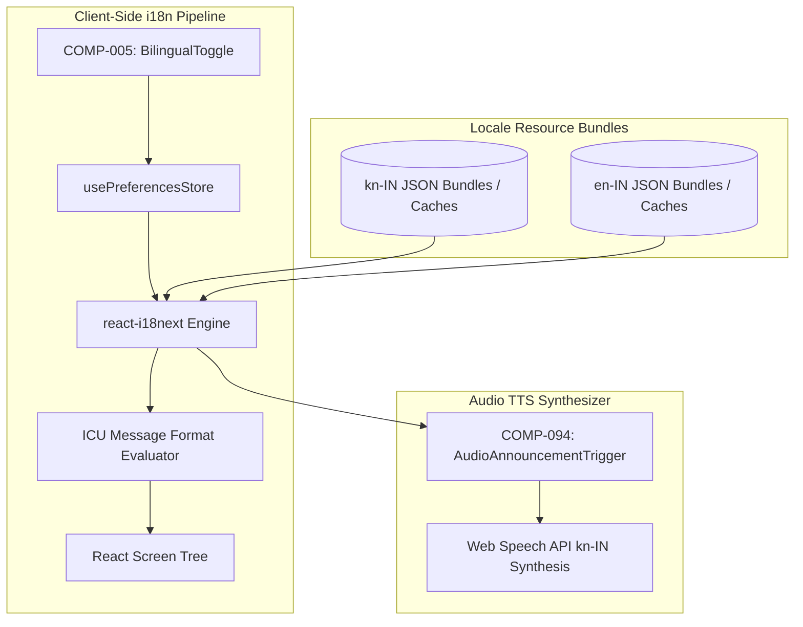

# Namma Clinic Bilingual Localization & Internationalization (i18n) Architecture

## 1. Executive Summary & Bilingual Mandate
As mandated by the Government of Karnataka and the Greater Bengaluru Authority (BBMP), all citizen-facing and clinical staff interfaces across Namma Clinics must provide **first-class bilingual capability in Kannada (ಕನ್ನಡ, kn-IN) and Indian English (en-IN)**. Interface switching must occur instantly in under 30 milliseconds without page reloading, and Kannada typography must be optimized for clinical clarity using Google Noto Sans Kannada with script-specific font metrics.

## 2. Localization Technical Topology


## 3. react-i18next Configuration & Initialization Contract
```typescript
// DOCUMENTATION-ONLY TYPESCRIPT
import i18n from 'i18next';
import { initReactI18next } from 'react-i18next';
import LanguageDetector from 'i18next-browser-languagedetector';
import knTranslation from './locales/kn/translation.json';
import enTranslation from './locales/en/translation.json';

i18n
  .use(LanguageDetector)
  .use(initReactI18next)
  .init({
    resources: {
      'kn-IN': { translation: knTranslation },
      'en-IN': { translation: enTranslation }
    },
    fallbackLng: 'en-IN',
    supportedLngs: ['kn-IN', 'en-IN'],
    interpolation: {
      escapeValue: false // React natively protects against XSS
    },
    react: {
      useSuspense: false
    }
  });

export default i18n;
```

## 4. Typography, Font Scaling & Optical Metrics
Kannada complex ligature glyphs require dedicated typographical handling:
1. **Font Family Stack:** `'Noto Sans Kannada', -apple-system, BlinkMacSystemFont, 'Segoe UI', Roboto, sans-serif`.
2. **Optical Line Height:** Kannada script requires a minimum `line-height: 1.65` (compared to 1.45 in English) to prevent vertical clipping of sub-glyph conjuncts (*vattu* and *ottu*).
3. **Dynamic Font Scaling:** Base text size is automatically increased by +2px (from 14px to 16px) when `locale === 'kn-IN'` for enhanced readability on low-cost clinic monitors.

## 5. Master Common & Clinical Terminology Glossary
The following canonical terms are certified by the BBMP Clinical Health Directorate for all software strings:

| Concept Domain | English Term (en-IN) | Kannada Term (kn-IN) | Transliteration / IPA | Operational Usage Note |
| :--- | :--- | :--- | :--- | :--- |
| Administration | Citizen Registration | ನಾಗರಿಕರ ನೋಂದಣಿ | Nagarika Nondani | Primary intake action |
| Administration | Token Number | ಟೋಕನ್ ಸಂಖ್ಯೆ | Token Sankhye | OPD queue identifier |
| Administration | Doctor Cabin | ವೈದ್ಯರ ಕೊಠಡಿ | Vaidyara Kothadi | Consultation room indicator |
| Clinical | Chief Complaint | ಪ್ರಮುಖ ದೂರು | Pramukha Dooru | Patient reported symptoms |
| Clinical | Blood Pressure | ರಕ್ತದೊತ್ತಡ | Raktadottada | Vitals measurement label |
| Clinical | Pulse Rate | ನಾಡಿ ಮಿಡಿತ | Naadi Midita | Vitals measurement label |
| Clinical | Oxygen Saturation | ಆಮ್ಲಜನಕದ ಮಟ್ಟ | Amlajanakada Matta | SpO2 indicator |
| Clinical | Fasting Blood Sugar | ಉಪವಾಸದ ರಕ್ತ ಸಕ್ಕರೆ | Upavasada Rakta Sakkare | Diabetes screening |
| Clinical | Diagnosis | ರೋಗನಿರ್ಣಯ | Roga Nirnaya | Doctor clinical finding |
| Pharmacy | Before Food | ಊಟಕ್ಕೆ ಮುಂಚೆ | Ootakke Munche | Prescription timing toggle |
| Pharmacy | After Food | ಊಟದ ನಂತರ | Ootada Nantara | Prescription timing toggle |
| Pharmacy | Morning / Noon / Night | ಬೆಳಿಗ್ಗೆ / ಮಧ್ಯಾಹ್ನ / ರಾತ್ರಿ | Beligge / Madhyahna / Raatri | Frequency dose schedule |
| Pharmacy | Days Duration | ದಿನಗಳ ಅವಧಿ | Dinagala Avadhi | Course length counter |
| Pharmacy | In Stock | ಲಭ್ಯವಿದೆ | Labhyavide | Green pharmacy stock pill |
| Pharmacy | Out of Stock | ಸಂಗ್ರಹ ಮುಗಿದಿದೆ | Sangraha Mugidide | Red pharmacy stockout pill |
| Emergency | Severe Escalation | ತುರ್ತು ವರ್ಗಾವಣೆ | Turtu Vargavane | 108 ambulance dispatch |

## 6. Exhaustive Screen-by-Screen Translation Key Catalogs
The following specifications detail the localized JSON key paths, English source text, and official Kannada translations across all 108 screens:

### Localization Specification: SCREEN-001 — User Login Screen
**Namespace:** `module-001` | **Route:** `/login`

#### 1. Bilingual Key Translation Table
| Key Identifier | English String (en-IN) | Kannada Translation (kn-IN) | Context / UI Location |
| :--- | :--- | :--- | :--- |
| `screen-001.title` | User Login Screen | User Login Screen (ಕನ್ನಡ) | Main Viewport Header |
| `screen-001.description` | Operational interface for User Login Screen | User Login Screen ನಿರ್ವಹಣಾ ಇಂಟರ್ಫೇಸ್ | Sub-header description |
| `screen-001.submit_btn` | Confirm & Proceed | ದೃಢೀಕರಿಸಿ ಮತ್ತು ಮುಂದುವರಿಯಿರಿ | Primary Submit Button |
| `screen-001.cancel_btn` | Cancel & Discard | ರದ್ದುಮಾಡಿ ಮತ್ತು ತ್ಯಜಿಸಿ | Dismiss Secondary Action |
| `screen-001.success_msg` | Operation completed successfully | ಕಾರ್ಯಾಚರಣೆ ಯಶಸ್ವಿಯಾಗಿ ಪೂರ್ಣಗೊಂಡಿದೆ | Toast notification alert |
| `screen-001.error_msg` | An error occurred while saving | ಉಳಿಸುವಾಗ ದೋಷ ಸಂಭವಿಸಿದೆ | Form error banner |

#### 2. Documentation-Only JSON Locale Contract
```json
{
  "title": "User Login Screen",
  "title_kn": "User Login Screen (ಕನ್ನಡ)",
  "status_active": "ಸಕ್ರಿಯವಾಗಿದೆ (Active)",
  "status_pending": "ಬಾಕಿ ಉಳಿದಿದೆ (Pending)",
  "action_save": "ಉಳಿಸಿ (Save)",
  "action_print": "ಮುದ್ರಿಸಿ (Print)"
}
```

---

### Localization Specification: SCREEN-002 — MFA Verification Screen
**Namespace:** `module-001` | **Route:** `/login/mfa`

#### 1. Bilingual Key Translation Table
| Key Identifier | English String (en-IN) | Kannada Translation (kn-IN) | Context / UI Location |
| :--- | :--- | :--- | :--- |
| `screen-002.title` | MFA Verification Screen | MFA Verification Screen (ಕನ್ನಡ) | Main Viewport Header |
| `screen-002.description` | Operational interface for MFA Verification Screen | MFA Verification Screen ನಿರ್ವಹಣಾ ಇಂಟರ್ಫೇಸ್ | Sub-header description |
| `screen-002.submit_btn` | Confirm & Proceed | ದೃಢೀಕರಿಸಿ ಮತ್ತು ಮುಂದುವರಿಯಿರಿ | Primary Submit Button |
| `screen-002.cancel_btn` | Cancel & Discard | ರದ್ದುಮಾಡಿ ಮತ್ತು ತ್ಯಜಿಸಿ | Dismiss Secondary Action |
| `screen-002.success_msg` | Operation completed successfully | ಕಾರ್ಯಾಚರಣೆ ಯಶಸ್ವಿಯಾಗಿ ಪೂರ್ಣಗೊಂಡಿದೆ | Toast notification alert |
| `screen-002.error_msg` | An error occurred while saving | ಉಳಿಸುವಾಗ ದೋಷ ಸಂಭವಿಸಿದೆ | Form error banner |

#### 2. Documentation-Only JSON Locale Contract
```json
{
  "title": "MFA Verification Screen",
  "title_kn": "MFA Verification Screen (ಕನ್ನಡ)",
  "status_active": "ಸಕ್ರಿಯವಾಗಿದೆ (Active)",
  "status_pending": "ಬಾಕಿ ಉಳಿದಿದೆ (Pending)",
  "action_save": "ಉಳಿಸಿ (Save)",
  "action_print": "ಮುದ್ರಿಸಿ (Print)"
}
```

---

### Localization Specification: SCREEN-003 — Terminal Pairing & Device Enrollment
**Namespace:** `module-001` | **Route:** `/system/device-enroll`

#### 1. Bilingual Key Translation Table
| Key Identifier | English String (en-IN) | Kannada Translation (kn-IN) | Context / UI Location |
| :--- | :--- | :--- | :--- |
| `screen-003.title` | Terminal Pairing & Device Enrollment | Terminal Pairing & Device Enrollment (ಕನ್ನಡ) | Main Viewport Header |
| `screen-003.description` | Operational interface for Terminal Pairing & Device Enrollment | Terminal Pairing & Device Enrollment ನಿರ್ವಹಣಾ ಇಂಟರ್ಫೇಸ್ | Sub-header description |
| `screen-003.submit_btn` | Confirm & Proceed | ದೃಢೀಕರಿಸಿ ಮತ್ತು ಮುಂದುವರಿಯಿರಿ | Primary Submit Button |
| `screen-003.cancel_btn` | Cancel & Discard | ರದ್ದುಮಾಡಿ ಮತ್ತು ತ್ಯಜಿಸಿ | Dismiss Secondary Action |
| `screen-003.success_msg` | Operation completed successfully | ಕಾರ್ಯಾಚರಣೆ ಯಶಸ್ವಿಯಾಗಿ ಪೂರ್ಣಗೊಂಡಿದೆ | Toast notification alert |
| `screen-003.error_msg` | An error occurred while saving | ಉಳಿಸುವಾಗ ದೋಷ ಸಂಭವಿಸಿದೆ | Form error banner |

#### 2. Documentation-Only JSON Locale Contract
```json
{
  "title": "Terminal Pairing & Device Enrollment",
  "title_kn": "Terminal Pairing & Device Enrollment (ಕನ್ನಡ)",
  "status_active": "ಸಕ್ರಿಯವಾಗಿದೆ (Active)",
  "status_pending": "ಬಾಕಿ ಉಳಿದಿದೆ (Pending)",
  "action_save": "ಉಳಿಸಿ (Save)",
  "action_print": "ಮುದ್ರಿಸಿ (Print)"
}
```

---

### Localization Specification: SCREEN-004 — Clinic Shift Check-In & Handover
**Namespace:** `module-001` | **Route:** `/shift/checkin`

#### 1. Bilingual Key Translation Table
| Key Identifier | English String (en-IN) | Kannada Translation (kn-IN) | Context / UI Location |
| :--- | :--- | :--- | :--- |
| `screen-004.title` | Clinic Shift Check-In & Handover | Clinic Shift Check-In & Handover (ಕನ್ನಡ) | Main Viewport Header |
| `screen-004.description` | Operational interface for Clinic Shift Check-In & Handover | Clinic Shift Check-In & Handover ನಿರ್ವಹಣಾ ಇಂಟರ್ಫೇಸ್ | Sub-header description |
| `screen-004.submit_btn` | Confirm & Proceed | ದೃಢೀಕರಿಸಿ ಮತ್ತು ಮುಂದುವರಿಯಿರಿ | Primary Submit Button |
| `screen-004.cancel_btn` | Cancel & Discard | ರದ್ದುಮಾಡಿ ಮತ್ತು ತ್ಯಜಿಸಿ | Dismiss Secondary Action |
| `screen-004.success_msg` | Operation completed successfully | ಕಾರ್ಯಾಚರಣೆ ಯಶಸ್ವಿಯಾಗಿ ಪೂರ್ಣಗೊಂಡಿದೆ | Toast notification alert |
| `screen-004.error_msg` | An error occurred while saving | ಉಳಿಸುವಾಗ ದೋಷ ಸಂಭವಿಸಿದೆ | Form error banner |

#### 2. Documentation-Only JSON Locale Contract
```json
{
  "title": "Clinic Shift Check-In & Handover",
  "title_kn": "Clinic Shift Check-In & Handover (ಕನ್ನಡ)",
  "status_active": "ಸಕ್ರಿಯವಾಗಿದೆ (Active)",
  "status_pending": "ಬಾಕಿ ಉಳಿದಿದೆ (Pending)",
  "action_save": "ಉಳಿಸಿ (Save)",
  "action_print": "ಮುದ್ರಿಸಿ (Print)"
}
```

---

### Localization Specification: SCREEN-005 — Emergency Break-Glass Authorization
**Namespace:** `module-001` | **Route:** `/auth/break-glass`

#### 1. Bilingual Key Translation Table
| Key Identifier | English String (en-IN) | Kannada Translation (kn-IN) | Context / UI Location |
| :--- | :--- | :--- | :--- |
| `screen-005.title` | Emergency Break-Glass Authorization | Emergency Break-Glass Authorization (ಕನ್ನಡ) | Main Viewport Header |
| `screen-005.description` | Operational interface for Emergency Break-Glass Authorization | Emergency Break-Glass Authorization ನಿರ್ವಹಣಾ ಇಂಟರ್ಫೇಸ್ | Sub-header description |
| `screen-005.submit_btn` | Confirm & Proceed | ದೃಢೀಕರಿಸಿ ಮತ್ತು ಮುಂದುವರಿಯಿರಿ | Primary Submit Button |
| `screen-005.cancel_btn` | Cancel & Discard | ರದ್ದುಮಾಡಿ ಮತ್ತು ತ್ಯಜಿಸಿ | Dismiss Secondary Action |
| `screen-005.success_msg` | Operation completed successfully | ಕಾರ್ಯಾಚರಣೆ ಯಶಸ್ವಿಯಾಗಿ ಪೂರ್ಣಗೊಂಡಿದೆ | Toast notification alert |
| `screen-005.error_msg` | An error occurred while saving | ಉಳಿಸುವಾಗ ದೋಷ ಸಂಭವಿಸಿದೆ | Form error banner |

#### 2. Documentation-Only JSON Locale Contract
```json
{
  "title": "Emergency Break-Glass Authorization",
  "title_kn": "Emergency Break-Glass Authorization (ಕನ್ನಡ)",
  "status_active": "ಸಕ್ರಿಯವಾಗಿದೆ (Active)",
  "status_pending": "ಬಾಕಿ ಉಳಿದಿದೆ (Pending)",
  "action_save": "ಉಳಿಸಿ (Save)",
  "action_print": "ಮುದ್ರಿಸಿ (Print)"
}
```

---

### Localization Specification: SCREEN-006 — Master Clinic Dashboard
**Namespace:** `module-002` | **Route:** `/dashboard`

#### 1. Bilingual Key Translation Table
| Key Identifier | English String (en-IN) | Kannada Translation (kn-IN) | Context / UI Location |
| :--- | :--- | :--- | :--- |
| `screen-006.title` | Master Clinic Dashboard | Master Clinic Dashboard (ಕನ್ನಡ) | Main Viewport Header |
| `screen-006.description` | Operational interface for Master Clinic Dashboard | Master Clinic Dashboard ನಿರ್ವಹಣಾ ಇಂಟರ್ಫೇಸ್ | Sub-header description |
| `screen-006.submit_btn` | Confirm & Proceed | ದೃಢೀಕರಿಸಿ ಮತ್ತು ಮುಂದುವರಿಯಿರಿ | Primary Submit Button |
| `screen-006.cancel_btn` | Cancel & Discard | ರದ್ದುಮಾಡಿ ಮತ್ತು ತ್ಯಜಿಸಿ | Dismiss Secondary Action |
| `screen-006.success_msg` | Operation completed successfully | ಕಾರ್ಯಾಚರಣೆ ಯಶಸ್ವಿಯಾಗಿ ಪೂರ್ಣಗೊಂಡಿದೆ | Toast notification alert |
| `screen-006.error_msg` | An error occurred while saving | ಉಳಿಸುವಾಗ ದೋಷ ಸಂಭವಿಸಿದೆ | Form error banner |

#### 2. Documentation-Only JSON Locale Contract
```json
{
  "title": "Master Clinic Dashboard",
  "title_kn": "Master Clinic Dashboard (ಕನ್ನಡ)",
  "status_active": "ಸಕ್ರಿಯವಾಗಿದೆ (Active)",
  "status_pending": "ಬಾಕಿ ಉಳಿದಿದೆ (Pending)",
  "action_save": "ಉಳಿಸಿ (Save)",
  "action_print": "ಮುದ್ರಿಸಿ (Print)"
}
```

---

### Localization Specification: SCREEN-007 — Doctor Outpatient Console
**Namespace:** `module-002` | **Route:** `/doctor/console`

#### 1. Bilingual Key Translation Table
| Key Identifier | English String (en-IN) | Kannada Translation (kn-IN) | Context / UI Location |
| :--- | :--- | :--- | :--- |
| `screen-007.title` | Doctor Outpatient Console | Doctor Outpatient Console (ಕನ್ನಡ) | Main Viewport Header |
| `screen-007.description` | Operational interface for Doctor Outpatient Console | Doctor Outpatient Console ನಿರ್ವಹಣಾ ಇಂಟರ್ಫೇಸ್ | Sub-header description |
| `screen-007.submit_btn` | Confirm & Proceed | ದೃಢೀಕರಿಸಿ ಮತ್ತು ಮುಂದುವರಿಯಿರಿ | Primary Submit Button |
| `screen-007.cancel_btn` | Cancel & Discard | ರದ್ದುಮಾಡಿ ಮತ್ತು ತ್ಯಜಿಸಿ | Dismiss Secondary Action |
| `screen-007.success_msg` | Operation completed successfully | ಕಾರ್ಯಾಚರಣೆ ಯಶಸ್ವಿಯಾಗಿ ಪೂರ್ಣಗೊಂಡಿದೆ | Toast notification alert |
| `screen-007.error_msg` | An error occurred while saving | ಉಳಿಸುವಾಗ ದೋಷ ಸಂಭವಿಸಿದೆ | Form error banner |

#### 2. Documentation-Only JSON Locale Contract
```json
{
  "title": "Doctor Outpatient Console",
  "title_kn": "Doctor Outpatient Console (ಕನ್ನಡ)",
  "status_active": "ಸಕ್ರಿಯವಾಗಿದೆ (Active)",
  "status_pending": "ಬಾಕಿ ಉಳಿದಿದೆ (Pending)",
  "action_save": "ಉಳಿಸಿ (Save)",
  "action_print": "ಮುದ್ರಿಸಿ (Print)"
}
```

---

### Localization Specification: SCREEN-008 — Staff Nurse Triage Workbench
**Namespace:** `module-002` | **Route:** `/nurse/triage`

#### 1. Bilingual Key Translation Table
| Key Identifier | English String (en-IN) | Kannada Translation (kn-IN) | Context / UI Location |
| :--- | :--- | :--- | :--- |
| `screen-008.title` | Staff Nurse Triage Workbench | Staff Nurse Triage Workbench (ಕನ್ನಡ) | Main Viewport Header |
| `screen-008.description` | Operational interface for Staff Nurse Triage Workbench | Staff Nurse Triage Workbench ನಿರ್ವಹಣಾ ಇಂಟರ್ಫೇಸ್ | Sub-header description |
| `screen-008.submit_btn` | Confirm & Proceed | ದೃಢೀಕರಿಸಿ ಮತ್ತು ಮುಂದುವರಿಯಿರಿ | Primary Submit Button |
| `screen-008.cancel_btn` | Cancel & Discard | ರದ್ದುಮಾಡಿ ಮತ್ತು ತ್ಯಜಿಸಿ | Dismiss Secondary Action |
| `screen-008.success_msg` | Operation completed successfully | ಕಾರ್ಯಾಚರಣೆ ಯಶಸ್ವಿಯಾಗಿ ಪೂರ್ಣಗೊಂಡಿದೆ | Toast notification alert |
| `screen-008.error_msg` | An error occurred while saving | ಉಳಿಸುವಾಗ ದೋಷ ಸಂಭವಿಸಿದೆ | Form error banner |

#### 2. Documentation-Only JSON Locale Contract
```json
{
  "title": "Staff Nurse Triage Workbench",
  "title_kn": "Staff Nurse Triage Workbench (ಕನ್ನಡ)",
  "status_active": "ಸಕ್ರಿಯವಾಗಿದೆ (Active)",
  "status_pending": "ಬಾಕಿ ಉಳಿದಿದೆ (Pending)",
  "action_save": "ಉಳಿಸಿ (Save)",
  "action_print": "ಮುದ್ರಿಸಿ (Print)"
}
```

---

### Localization Specification: SCREEN-009 — Pharmacy Dispensing Console
**Namespace:** `module-002` | **Route:** `/pharmacy/dispense`

#### 1. Bilingual Key Translation Table
| Key Identifier | English String (en-IN) | Kannada Translation (kn-IN) | Context / UI Location |
| :--- | :--- | :--- | :--- |
| `screen-009.title` | Pharmacy Dispensing Console | Pharmacy Dispensing Console (ಕನ್ನಡ) | Main Viewport Header |
| `screen-009.description` | Operational interface for Pharmacy Dispensing Console | Pharmacy Dispensing Console ನಿರ್ವಹಣಾ ಇಂಟರ್ಫೇಸ್ | Sub-header description |
| `screen-009.submit_btn` | Confirm & Proceed | ದೃಢೀಕರಿಸಿ ಮತ್ತು ಮುಂದುವರಿಯಿರಿ | Primary Submit Button |
| `screen-009.cancel_btn` | Cancel & Discard | ರದ್ದುಮಾಡಿ ಮತ್ತು ತ್ಯಜಿಸಿ | Dismiss Secondary Action |
| `screen-009.success_msg` | Operation completed successfully | ಕಾರ್ಯಾಚರಣೆ ಯಶಸ್ವಿಯಾಗಿ ಪೂರ್ಣಗೊಂಡಿದೆ | Toast notification alert |
| `screen-009.error_msg` | An error occurred while saving | ಉಳಿಸುವಾಗ ದೋಷ ಸಂಭವಿಸಿದೆ | Form error banner |

#### 2. Documentation-Only JSON Locale Contract
```json
{
  "title": "Pharmacy Dispensing Console",
  "title_kn": "Pharmacy Dispensing Console (ಕನ್ನಡ)",
  "status_active": "ಸಕ್ರಿಯವಾಗಿದೆ (Active)",
  "status_pending": "ಬಾಕಿ ಉಳಿದಿದೆ (Pending)",
  "action_save": "ಉಳಿಸಿ (Save)",
  "action_print": "ಮುದ್ರಿಸಿ (Print)"
}
```

---

### Localization Specification: SCREEN-010 — Diagnostic Laboratory Workbench
**Namespace:** `module-002` | **Route:** `/lab/workbench`

#### 1. Bilingual Key Translation Table
| Key Identifier | English String (en-IN) | Kannada Translation (kn-IN) | Context / UI Location |
| :--- | :--- | :--- | :--- |
| `screen-010.title` | Diagnostic Laboratory Workbench | Diagnostic Laboratory Workbench (ಕನ್ನಡ) | Main Viewport Header |
| `screen-010.description` | Operational interface for Diagnostic Laboratory Workbench | Diagnostic Laboratory Workbench ನಿರ್ವಹಣಾ ಇಂಟರ್ಫೇಸ್ | Sub-header description |
| `screen-010.submit_btn` | Confirm & Proceed | ದೃಢೀಕರಿಸಿ ಮತ್ತು ಮುಂದುವರಿಯಿರಿ | Primary Submit Button |
| `screen-010.cancel_btn` | Cancel & Discard | ರದ್ದುಮಾಡಿ ಮತ್ತು ತ್ಯಜಿಸಿ | Dismiss Secondary Action |
| `screen-010.success_msg` | Operation completed successfully | ಕಾರ್ಯಾಚರಣೆ ಯಶಸ್ವಿಯಾಗಿ ಪೂರ್ಣಗೊಂಡಿದೆ | Toast notification alert |
| `screen-010.error_msg` | An error occurred while saving | ಉಳಿಸುವಾಗ ದೋಷ ಸಂಭವಿಸಿದೆ | Form error banner |

#### 2. Documentation-Only JSON Locale Contract
```json
{
  "title": "Diagnostic Laboratory Workbench",
  "title_kn": "Diagnostic Laboratory Workbench (ಕನ್ನಡ)",
  "status_active": "ಸಕ್ರಿಯವಾಗಿದೆ (Active)",
  "status_pending": "ಬಾಕಿ ಉಳಿದಿದೆ (Pending)",
  "action_save": "ಉಳಿಸಿ (Save)",
  "action_print": "ಮುದ್ರಿಸಿ (Print)"
}
```

---

### Localization Specification: SCREEN-011 — Citizen New Registration Screen
**Namespace:** `module-003` | **Route:** `/patients/new`

#### 1. Bilingual Key Translation Table
| Key Identifier | English String (en-IN) | Kannada Translation (kn-IN) | Context / UI Location |
| :--- | :--- | :--- | :--- |
| `screen-011.title` | Citizen New Registration Screen | Citizen New Registration Screen (ಕನ್ನಡ) | Main Viewport Header |
| `screen-011.description` | Operational interface for Citizen New Registration Screen | Citizen New Registration Screen ನಿರ್ವಹಣಾ ಇಂಟರ್ಫೇಸ್ | Sub-header description |
| `screen-011.submit_btn` | Confirm & Proceed | ದೃಢೀಕರಿಸಿ ಮತ್ತು ಮುಂದುವರಿಯಿರಿ | Primary Submit Button |
| `screen-011.cancel_btn` | Cancel & Discard | ರದ್ದುಮಾಡಿ ಮತ್ತು ತ್ಯಜಿಸಿ | Dismiss Secondary Action |
| `screen-011.success_msg` | Operation completed successfully | ಕಾರ್ಯಾಚರಣೆ ಯಶಸ್ವಿಯಾಗಿ ಪೂರ್ಣಗೊಂಡಿದೆ | Toast notification alert |
| `screen-011.error_msg` | An error occurred while saving | ಉಳಿಸುವಾಗ ದೋಷ ಸಂಭವಿಸಿದೆ | Form error banner |

#### 2. Documentation-Only JSON Locale Contract
```json
{
  "title": "Citizen New Registration Screen",
  "title_kn": "Citizen New Registration Screen (ಕನ್ನಡ)",
  "status_active": "ಸಕ್ರಿಯವಾಗಿದೆ (Active)",
  "status_pending": "ಬಾಕಿ ಉಳಿದಿದೆ (Pending)",
  "action_save": "ಉಳಿಸಿ (Save)",
  "action_print": "ಮುದ್ರಿಸಿ (Print)"
}
```

---

### Localization Specification: SCREEN-012 — Citizen Search & Retrieval Screen
**Namespace:** `module-003` | **Route:** `/patients/search`

#### 1. Bilingual Key Translation Table
| Key Identifier | English String (en-IN) | Kannada Translation (kn-IN) | Context / UI Location |
| :--- | :--- | :--- | :--- |
| `screen-012.title` | Citizen Search & Retrieval Screen | Citizen Search & Retrieval Screen (ಕನ್ನಡ) | Main Viewport Header |
| `screen-012.description` | Operational interface for Citizen Search & Retrieval Screen | Citizen Search & Retrieval Screen ನಿರ್ವಹಣಾ ಇಂಟರ್ಫೇಸ್ | Sub-header description |
| `screen-012.submit_btn` | Confirm & Proceed | ದೃಢೀಕರಿಸಿ ಮತ್ತು ಮುಂದುವರಿಯಿರಿ | Primary Submit Button |
| `screen-012.cancel_btn` | Cancel & Discard | ರದ್ದುಮಾಡಿ ಮತ್ತು ತ್ಯಜಿಸಿ | Dismiss Secondary Action |
| `screen-012.success_msg` | Operation completed successfully | ಕಾರ್ಯಾಚರಣೆ ಯಶಸ್ವಿಯಾಗಿ ಪೂರ್ಣಗೊಂಡಿದೆ | Toast notification alert |
| `screen-012.error_msg` | An error occurred while saving | ಉಳಿಸುವಾಗ ದೋಷ ಸಂಭವಿಸಿದೆ | Form error banner |

#### 2. Documentation-Only JSON Locale Contract
```json
{
  "title": "Citizen Search & Retrieval Screen",
  "title_kn": "Citizen Search & Retrieval Screen (ಕನ್ನಡ)",
  "status_active": "ಸಕ್ರಿಯವಾಗಿದೆ (Active)",
  "status_pending": "ಬಾಕಿ ಉಳಿದಿದೆ (Pending)",
  "action_save": "ಉಳಿಸಿ (Save)",
  "action_print": "ಮುದ್ರಿಸಿ (Print)"
}
```

---

### Localization Specification: SCREEN-013 — Patient Longitudinal Profile View
**Namespace:** `module-003` | **Route:** `/patients/:id`

#### 1. Bilingual Key Translation Table
| Key Identifier | English String (en-IN) | Kannada Translation (kn-IN) | Context / UI Location |
| :--- | :--- | :--- | :--- |
| `screen-013.title` | Patient Longitudinal Profile View | Patient Longitudinal Profile View (ಕನ್ನಡ) | Main Viewport Header |
| `screen-013.description` | Operational interface for Patient Longitudinal Profile View | Patient Longitudinal Profile View ನಿರ್ವಹಣಾ ಇಂಟರ್ಫೇಸ್ | Sub-header description |
| `screen-013.submit_btn` | Confirm & Proceed | ದೃಢೀಕರಿಸಿ ಮತ್ತು ಮುಂದುವರಿಯಿರಿ | Primary Submit Button |
| `screen-013.cancel_btn` | Cancel & Discard | ರದ್ದುಮಾಡಿ ಮತ್ತು ತ್ಯಜಿಸಿ | Dismiss Secondary Action |
| `screen-013.success_msg` | Operation completed successfully | ಕಾರ್ಯಾಚರಣೆ ಯಶಸ್ವಿಯಾಗಿ ಪೂರ್ಣಗೊಂಡಿದೆ | Toast notification alert |
| `screen-013.error_msg` | An error occurred while saving | ಉಳಿಸುವಾಗ ದೋಷ ಸಂಭವಿಸಿದೆ | Form error banner |

#### 2. Documentation-Only JSON Locale Contract
```json
{
  "title": "Patient Longitudinal Profile View",
  "title_kn": "Patient Longitudinal Profile View (ಕನ್ನಡ)",
  "status_active": "ಸಕ್ರಿಯವಾಗಿದೆ (Active)",
  "status_pending": "ಬಾಕಿ ಉಳಿದಿದೆ (Pending)",
  "action_save": "ಉಳಿಸಿ (Save)",
  "action_print": "ಮುದ್ರಿಸಿ (Print)"
}
```

---

### Localization Specification: SCREEN-014 — Repeat Patient Fast Intake
**Namespace:** `module-003` | **Route:** `/patients/:id/repeat-intake`

#### 1. Bilingual Key Translation Table
| Key Identifier | English String (en-IN) | Kannada Translation (kn-IN) | Context / UI Location |
| :--- | :--- | :--- | :--- |
| `screen-014.title` | Repeat Patient Fast Intake | Repeat Patient Fast Intake (ಕನ್ನಡ) | Main Viewport Header |
| `screen-014.description` | Operational interface for Repeat Patient Fast Intake | Repeat Patient Fast Intake ನಿರ್ವಹಣಾ ಇಂಟರ್ಫೇಸ್ | Sub-header description |
| `screen-014.submit_btn` | Confirm & Proceed | ದೃಢೀಕರಿಸಿ ಮತ್ತು ಮುಂದುವರಿಯಿರಿ | Primary Submit Button |
| `screen-014.cancel_btn` | Cancel & Discard | ರದ್ದುಮಾಡಿ ಮತ್ತು ತ್ಯಜಿಸಿ | Dismiss Secondary Action |
| `screen-014.success_msg` | Operation completed successfully | ಕಾರ್ಯಾಚರಣೆ ಯಶಸ್ವಿಯಾಗಿ ಪೂರ್ಣಗೊಂಡಿದೆ | Toast notification alert |
| `screen-014.error_msg` | An error occurred while saving | ಉಳಿಸುವಾಗ ದೋಷ ಸಂಭವಿಸಿದೆ | Form error banner |

#### 2. Documentation-Only JSON Locale Contract
```json
{
  "title": "Repeat Patient Fast Intake",
  "title_kn": "Repeat Patient Fast Intake (ಕನ್ನಡ)",
  "status_active": "ಸಕ್ರಿಯವಾಗಿದೆ (Active)",
  "status_pending": "ಬಾಕಿ ಉಳಿದಿದೆ (Pending)",
  "action_save": "ಉಳಿಸಿ (Save)",
  "action_print": "ಮುದ್ರಿಸಿ (Print)"
}
```

---

### Localization Specification: SCREEN-015 — Biometric & ABHA Card Scan Modal
**Namespace:** `module-003` | **Route:** `/patients/abha-scan`

#### 1. Bilingual Key Translation Table
| Key Identifier | English String (en-IN) | Kannada Translation (kn-IN) | Context / UI Location |
| :--- | :--- | :--- | :--- |
| `screen-015.title` | Biometric & ABHA Card Scan Modal | Biometric & ABHA Card Scan Modal (ಕನ್ನಡ) | Main Viewport Header |
| `screen-015.description` | Operational interface for Biometric & ABHA Card Scan Modal | Biometric & ABHA Card Scan Modal ನಿರ್ವಹಣಾ ಇಂಟರ್ಫೇಸ್ | Sub-header description |
| `screen-015.submit_btn` | Confirm & Proceed | ದೃಢೀಕರಿಸಿ ಮತ್ತು ಮುಂದುವರಿಯಿರಿ | Primary Submit Button |
| `screen-015.cancel_btn` | Cancel & Discard | ರದ್ದುಮಾಡಿ ಮತ್ತು ತ್ಯಜಿಸಿ | Dismiss Secondary Action |
| `screen-015.success_msg` | Operation completed successfully | ಕಾರ್ಯಾಚರಣೆ ಯಶಸ್ವಿಯಾಗಿ ಪೂರ್ಣಗೊಂಡಿದೆ | Toast notification alert |
| `screen-015.error_msg` | An error occurred while saving | ಉಳಿಸುವಾಗ ದೋಷ ಸಂಭವಿಸಿದೆ | Form error banner |

#### 2. Documentation-Only JSON Locale Contract
```json
{
  "title": "Biometric & ABHA Card Scan Modal",
  "title_kn": "Biometric & ABHA Card Scan Modal (ಕನ್ನಡ)",
  "status_active": "ಸಕ್ರಿಯವಾಗಿದೆ (Active)",
  "status_pending": "ಬಾಕಿ ಉಳಿದಿದೆ (Pending)",
  "action_save": "ಉಳಿಸಿ (Save)",
  "action_print": "ಮುದ್ರಿಸಿ (Print)"
}
```

---

### Localization Specification: SCREEN-016 — Citizen Demographic Correction Form
**Namespace:** `module-003` | **Route:** `/patients/:id/edit`

#### 1. Bilingual Key Translation Table
| Key Identifier | English String (en-IN) | Kannada Translation (kn-IN) | Context / UI Location |
| :--- | :--- | :--- | :--- |
| `screen-016.title` | Citizen Demographic Correction Form | Citizen Demographic Correction Form (ಕನ್ನಡ) | Main Viewport Header |
| `screen-016.description` | Operational interface for Citizen Demographic Correction Form | Citizen Demographic Correction Form ನಿರ್ವಹಣಾ ಇಂಟರ್ಫೇಸ್ | Sub-header description |
| `screen-016.submit_btn` | Confirm & Proceed | ದೃಢೀಕರಿಸಿ ಮತ್ತು ಮುಂದುವರಿಯಿರಿ | Primary Submit Button |
| `screen-016.cancel_btn` | Cancel & Discard | ರದ್ದುಮಾಡಿ ಮತ್ತು ತ್ಯಜಿಸಿ | Dismiss Secondary Action |
| `screen-016.success_msg` | Operation completed successfully | ಕಾರ್ಯಾಚರಣೆ ಯಶಸ್ವಿಯಾಗಿ ಪೂರ್ಣಗೊಂಡಿದೆ | Toast notification alert |
| `screen-016.error_msg` | An error occurred while saving | ಉಳಿಸುವಾಗ ದೋಷ ಸಂಭವಿಸಿದೆ | Form error banner |

#### 2. Documentation-Only JSON Locale Contract
```json
{
  "title": "Citizen Demographic Correction Form",
  "title_kn": "Citizen Demographic Correction Form (ಕನ್ನಡ)",
  "status_active": "ಸಕ್ರಿಯವಾಗಿದೆ (Active)",
  "status_pending": "ಬಾಕಿ ಉಳಿದಿದೆ (Pending)",
  "action_save": "ಉಳಿಸಿ (Save)",
  "action_print": "ಮುದ್ರಿಸಿ (Print)"
}
```

---

### Localization Specification: SCREEN-017 — Duplicate Citizen Merge Modal
**Namespace:** `module-003` | **Route:** `/patients/merge`

#### 1. Bilingual Key Translation Table
| Key Identifier | English String (en-IN) | Kannada Translation (kn-IN) | Context / UI Location |
| :--- | :--- | :--- | :--- |
| `screen-017.title` | Duplicate Citizen Merge Modal | Duplicate Citizen Merge Modal (ಕನ್ನಡ) | Main Viewport Header |
| `screen-017.description` | Operational interface for Duplicate Citizen Merge Modal | Duplicate Citizen Merge Modal ನಿರ್ವಹಣಾ ಇಂಟರ್ಫೇಸ್ | Sub-header description |
| `screen-017.submit_btn` | Confirm & Proceed | ದೃಢೀಕರಿಸಿ ಮತ್ತು ಮುಂದುವರಿಯಿರಿ | Primary Submit Button |
| `screen-017.cancel_btn` | Cancel & Discard | ರದ್ದುಮಾಡಿ ಮತ್ತು ತ್ಯಜಿಸಿ | Dismiss Secondary Action |
| `screen-017.success_msg` | Operation completed successfully | ಕಾರ್ಯಾಚರಣೆ ಯಶಸ್ವಿಯಾಗಿ ಪೂರ್ಣಗೊಂಡಿದೆ | Toast notification alert |
| `screen-017.error_msg` | An error occurred while saving | ಉಳಿಸುವಾಗ ದೋಷ ಸಂಭವಿಸಿದೆ | Form error banner |

#### 2. Documentation-Only JSON Locale Contract
```json
{
  "title": "Duplicate Citizen Merge Modal",
  "title_kn": "Duplicate Citizen Merge Modal (ಕನ್ನಡ)",
  "status_active": "ಸಕ್ರಿಯವಾಗಿದೆ (Active)",
  "status_pending": "ಬಾಕಿ ಉಳಿದಿದೆ (Pending)",
  "action_save": "ಉಳಿಸಿ (Save)",
  "action_print": "ಮುದ್ರಿಸಿ (Print)"
}
```

---

### Localization Specification: SCREEN-018 — Citizen Digital Photo Capture
**Namespace:** `module-003` | **Route:** `/patients/:id/photo`

#### 1. Bilingual Key Translation Table
| Key Identifier | English String (en-IN) | Kannada Translation (kn-IN) | Context / UI Location |
| :--- | :--- | :--- | :--- |
| `screen-018.title` | Citizen Digital Photo Capture | Citizen Digital Photo Capture (ಕನ್ನಡ) | Main Viewport Header |
| `screen-018.description` | Operational interface for Citizen Digital Photo Capture | Citizen Digital Photo Capture ನಿರ್ವಹಣಾ ಇಂಟರ್ಫೇಸ್ | Sub-header description |
| `screen-018.submit_btn` | Confirm & Proceed | ದೃಢೀಕರಿಸಿ ಮತ್ತು ಮುಂದುವರಿಯಿರಿ | Primary Submit Button |
| `screen-018.cancel_btn` | Cancel & Discard | ರದ್ದುಮಾಡಿ ಮತ್ತು ತ್ಯಜಿಸಿ | Dismiss Secondary Action |
| `screen-018.success_msg` | Operation completed successfully | ಕಾರ್ಯಾಚರಣೆ ಯಶಸ್ವಿಯಾಗಿ ಪೂರ್ಣಗೊಂಡಿದೆ | Toast notification alert |
| `screen-018.error_msg` | An error occurred while saving | ಉಳಿಸುವಾಗ ದೋಷ ಸಂಭವಿಸಿದೆ | Form error banner |

#### 2. Documentation-Only JSON Locale Contract
```json
{
  "title": "Citizen Digital Photo Capture",
  "title_kn": "Citizen Digital Photo Capture (ಕನ್ನಡ)",
  "status_active": "ಸಕ್ರಿಯವಾಗಿದೆ (Active)",
  "status_pending": "ಬಾಕಿ ಉಳಿದಿದೆ (Pending)",
  "action_save": "ಉಳಿಸಿ (Save)",
  "action_print": "ಮುದ್ರಿಸಿ (Print)"
}
```

---

### Localization Specification: SCREEN-019 — DPDP Informed Consent Capture Screen
**Namespace:** `module-004` | **Route:** `/patients/:id/consent`

#### 1. Bilingual Key Translation Table
| Key Identifier | English String (en-IN) | Kannada Translation (kn-IN) | Context / UI Location |
| :--- | :--- | :--- | :--- |
| `screen-019.title` | DPDP Informed Consent Capture Screen | DPDP Informed Consent Capture Screen (ಕನ್ನಡ) | Main Viewport Header |
| `screen-019.description` | Operational interface for DPDP Informed Consent Capture Screen | DPDP Informed Consent Capture Screen ನಿರ್ವಹಣಾ ಇಂಟರ್ಫೇಸ್ | Sub-header description |
| `screen-019.submit_btn` | Confirm & Proceed | ದೃಢೀಕರಿಸಿ ಮತ್ತು ಮುಂದುವರಿಯಿರಿ | Primary Submit Button |
| `screen-019.cancel_btn` | Cancel & Discard | ರದ್ದುಮಾಡಿ ಮತ್ತು ತ್ಯಜಿಸಿ | Dismiss Secondary Action |
| `screen-019.success_msg` | Operation completed successfully | ಕಾರ್ಯಾಚರಣೆ ಯಶಸ್ವಿಯಾಗಿ ಪೂರ್ಣಗೊಂಡಿದೆ | Toast notification alert |
| `screen-019.error_msg` | An error occurred while saving | ಉಳಿಸುವಾಗ ದೋಷ ಸಂಭವಿಸಿದೆ | Form error banner |

#### 2. Documentation-Only JSON Locale Contract
```json
{
  "title": "DPDP Informed Consent Capture Screen",
  "title_kn": "DPDP Informed Consent Capture Screen (ಕನ್ನಡ)",
  "status_active": "ಸಕ್ರಿಯವಾಗಿದೆ (Active)",
  "status_pending": "ಬಾಕಿ ಉಳಿದಿದೆ (Pending)",
  "action_save": "ಉಳಿಸಿ (Save)",
  "action_print": "ಮುದ್ರಿಸಿ (Print)"
}
```

---

### Localization Specification: SCREEN-020 — Consent History & Revocation Console
**Namespace:** `module-004` | **Route:** `/patients/:id/consents`

#### 1. Bilingual Key Translation Table
| Key Identifier | English String (en-IN) | Kannada Translation (kn-IN) | Context / UI Location |
| :--- | :--- | :--- | :--- |
| `screen-020.title` | Consent History & Revocation Console | Consent History & Revocation Console (ಕನ್ನಡ) | Main Viewport Header |
| `screen-020.description` | Operational interface for Consent History & Revocation Console | Consent History & Revocation Console ನಿರ್ವಹಣಾ ಇಂಟರ್ಫೇಸ್ | Sub-header description |
| `screen-020.submit_btn` | Confirm & Proceed | ದೃಢೀಕರಿಸಿ ಮತ್ತು ಮುಂದುವರಿಯಿರಿ | Primary Submit Button |
| `screen-020.cancel_btn` | Cancel & Discard | ರದ್ದುಮಾಡಿ ಮತ್ತು ತ್ಯಜಿಸಿ | Dismiss Secondary Action |
| `screen-020.success_msg` | Operation completed successfully | ಕಾರ್ಯಾಚರಣೆ ಯಶಸ್ವಿಯಾಗಿ ಪೂರ್ಣಗೊಂಡಿದೆ | Toast notification alert |
| `screen-020.error_msg` | An error occurred while saving | ಉಳಿಸುವಾಗ ದೋಷ ಸಂಭವಿಸಿದೆ | Form error banner |

#### 2. Documentation-Only JSON Locale Contract
```json
{
  "title": "Consent History & Revocation Console",
  "title_kn": "Consent History & Revocation Console (ಕನ್ನಡ)",
  "status_active": "ಸಕ್ರಿಯವಾಗಿದೆ (Active)",
  "status_pending": "ಬಾಕಿ ಉಳಿದಿದೆ (Pending)",
  "action_save": "ಉಳಿಸಿ (Save)",
  "action_print": "ಮುದ್ರಿಸಿ (Print)"
}
```

---

### Localization Specification: SCREEN-021 — Data Portability & Export Request
**Namespace:** `module-004` | **Route:** `/patients/:id/export`

#### 1. Bilingual Key Translation Table
| Key Identifier | English String (en-IN) | Kannada Translation (kn-IN) | Context / UI Location |
| :--- | :--- | :--- | :--- |
| `screen-021.title` | Data Portability & Export Request | Data Portability & Export Request (ಕನ್ನಡ) | Main Viewport Header |
| `screen-021.description` | Operational interface for Data Portability & Export Request | Data Portability & Export Request ನಿರ್ವಹಣಾ ಇಂಟರ್ಫೇಸ್ | Sub-header description |
| `screen-021.submit_btn` | Confirm & Proceed | ದೃಢೀಕರಿಸಿ ಮತ್ತು ಮುಂದುವರಿಯಿರಿ | Primary Submit Button |
| `screen-021.cancel_btn` | Cancel & Discard | ರದ್ದುಮಾಡಿ ಮತ್ತು ತ್ಯಜಿಸಿ | Dismiss Secondary Action |
| `screen-021.success_msg` | Operation completed successfully | ಕಾರ್ಯಾಚರಣೆ ಯಶಸ್ವಿಯಾಗಿ ಪೂರ್ಣಗೊಂಡಿದೆ | Toast notification alert |
| `screen-021.error_msg` | An error occurred while saving | ಉಳಿಸುವಾಗ ದೋಷ ಸಂಭವಿಸಿದೆ | Form error banner |

#### 2. Documentation-Only JSON Locale Contract
```json
{
  "title": "Data Portability & Export Request",
  "title_kn": "Data Portability & Export Request (ಕನ್ನಡ)",
  "status_active": "ಸಕ್ರಿಯವಾಗಿದೆ (Active)",
  "status_pending": "ಬಾಕಿ ಉಳಿದಿದೆ (Pending)",
  "action_save": "ಉಳಿಸಿ (Save)",
  "action_print": "ಮುದ್ರಿಸಿ (Print)"
}
```

---

### Localization Specification: SCREEN-022 — Citizen Grievance Redressal Intake
**Namespace:** `module-004` | **Route:** `/patients/:id/grievance`

#### 1. Bilingual Key Translation Table
| Key Identifier | English String (en-IN) | Kannada Translation (kn-IN) | Context / UI Location |
| :--- | :--- | :--- | :--- |
| `screen-022.title` | Citizen Grievance Redressal Intake | Citizen Grievance Redressal Intake (ಕನ್ನಡ) | Main Viewport Header |
| `screen-022.description` | Operational interface for Citizen Grievance Redressal Intake | Citizen Grievance Redressal Intake ನಿರ್ವಹಣಾ ಇಂಟರ್ಫೇಸ್ | Sub-header description |
| `screen-022.submit_btn` | Confirm & Proceed | ದೃಢೀಕರಿಸಿ ಮತ್ತು ಮುಂದುವರಿಯಿರಿ | Primary Submit Button |
| `screen-022.cancel_btn` | Cancel & Discard | ರದ್ದುಮಾಡಿ ಮತ್ತು ತ್ಯಜಿಸಿ | Dismiss Secondary Action |
| `screen-022.success_msg` | Operation completed successfully | ಕಾರ್ಯಾಚರಣೆ ಯಶಸ್ವಿಯಾಗಿ ಪೂರ್ಣಗೊಂಡಿದೆ | Toast notification alert |
| `screen-022.error_msg` | An error occurred while saving | ಉಳಿಸುವಾಗ ದೋಷ ಸಂಭವಿಸಿದೆ | Form error banner |

#### 2. Documentation-Only JSON Locale Contract
```json
{
  "title": "Citizen Grievance Redressal Intake",
  "title_kn": "Citizen Grievance Redressal Intake (ಕನ್ನಡ)",
  "status_active": "ಸಕ್ರಿಯವಾಗಿದೆ (Active)",
  "status_pending": "ಬಾಕಿ ಉಳಿದಿದೆ (Pending)",
  "action_save": "ಉಳಿಸಿ (Save)",
  "action_print": "ಮುದ್ರಿಸಿ (Print)"
}
```

---

### Localization Specification: SCREEN-023 — Grievance Investigation & Resolution
**Namespace:** `module-004` | **Route:** `/grievances/:id`

#### 1. Bilingual Key Translation Table
| Key Identifier | English String (en-IN) | Kannada Translation (kn-IN) | Context / UI Location |
| :--- | :--- | :--- | :--- |
| `screen-023.title` | Grievance Investigation & Resolution | Grievance Investigation & Resolution (ಕನ್ನಡ) | Main Viewport Header |
| `screen-023.description` | Operational interface for Grievance Investigation & Resolution | Grievance Investigation & Resolution ನಿರ್ವಹಣಾ ಇಂಟರ್ಫೇಸ್ | Sub-header description |
| `screen-023.submit_btn` | Confirm & Proceed | ದೃಢೀಕರಿಸಿ ಮತ್ತು ಮುಂದುವರಿಯಿರಿ | Primary Submit Button |
| `screen-023.cancel_btn` | Cancel & Discard | ರದ್ದುಮಾಡಿ ಮತ್ತು ತ್ಯಜಿಸಿ | Dismiss Secondary Action |
| `screen-023.success_msg` | Operation completed successfully | ಕಾರ್ಯಾಚರಣೆ ಯಶಸ್ವಿಯಾಗಿ ಪೂರ್ಣಗೊಂಡಿದೆ | Toast notification alert |
| `screen-023.error_msg` | An error occurred while saving | ಉಳಿಸುವಾಗ ದೋಷ ಸಂಭವಿಸಿದೆ | Form error banner |

#### 2. Documentation-Only JSON Locale Contract
```json
{
  "title": "Grievance Investigation & Resolution",
  "title_kn": "Grievance Investigation & Resolution (ಕನ್ನಡ)",
  "status_active": "ಸಕ್ರಿಯವಾಗಿದೆ (Active)",
  "status_pending": "ಬಾಕಿ ಉಳಿದಿದೆ (Pending)",
  "action_save": "ಉಳಿಸಿ (Save)",
  "action_print": "ಮುದ್ರಿಸಿ (Print)"
}
```

---

### Localization Specification: SCREEN-024 — OPD Token Generation & Print Modal
**Namespace:** `module-005` | **Route:** `/queue/tokens/new`

#### 1. Bilingual Key Translation Table
| Key Identifier | English String (en-IN) | Kannada Translation (kn-IN) | Context / UI Location |
| :--- | :--- | :--- | :--- |
| `screen-024.title` | OPD Token Generation & Print Modal | OPD Token Generation & Print Modal (ಕನ್ನಡ) | Main Viewport Header |
| `screen-024.description` | Operational interface for OPD Token Generation & Print Modal | OPD Token Generation & Print Modal ನಿರ್ವಹಣಾ ಇಂಟರ್ಫೇಸ್ | Sub-header description |
| `screen-024.submit_btn` | Confirm & Proceed | ದೃಢೀಕರಿಸಿ ಮತ್ತು ಮುಂದುವರಿಯಿರಿ | Primary Submit Button |
| `screen-024.cancel_btn` | Cancel & Discard | ರದ್ದುಮಾಡಿ ಮತ್ತು ತ್ಯಜಿಸಿ | Dismiss Secondary Action |
| `screen-024.success_msg` | Operation completed successfully | ಕಾರ್ಯಾಚರಣೆ ಯಶಸ್ವಿಯಾಗಿ ಪೂರ್ಣಗೊಂಡಿದೆ | Toast notification alert |
| `screen-024.error_msg` | An error occurred while saving | ಉಳಿಸುವಾಗ ದೋಷ ಸಂಭವಿಸಿದೆ | Form error banner |

#### 2. Documentation-Only JSON Locale Contract
```json
{
  "title": "OPD Token Generation & Print Modal",
  "title_kn": "OPD Token Generation & Print Modal (ಕನ್ನಡ)",
  "status_active": "ಸಕ್ರಿಯವಾಗಿದೆ (Active)",
  "status_pending": "ಬಾಕಿ ಉಳಿದಿದೆ (Pending)",
  "action_save": "ಉಳಿಸಿ (Save)",
  "action_print": "ಮುದ್ರಿಸಿ (Print)"
}
```

---

### Localization Specification: SCREEN-025 — Master Waiting Room Queue Display
**Namespace:** `module-005` | **Route:** `/queue/display`

#### 1. Bilingual Key Translation Table
| Key Identifier | English String (en-IN) | Kannada Translation (kn-IN) | Context / UI Location |
| :--- | :--- | :--- | :--- |
| `screen-025.title` | Master Waiting Room Queue Display | Master Waiting Room Queue Display (ಕನ್ನಡ) | Main Viewport Header |
| `screen-025.description` | Operational interface for Master Waiting Room Queue Display | Master Waiting Room Queue Display ನಿರ್ವಹಣಾ ಇಂಟರ್ಫೇಸ್ | Sub-header description |
| `screen-025.submit_btn` | Confirm & Proceed | ದೃಢೀಕರಿಸಿ ಮತ್ತು ಮುಂದುವರಿಯಿರಿ | Primary Submit Button |
| `screen-025.cancel_btn` | Cancel & Discard | ರದ್ದುಮಾಡಿ ಮತ್ತು ತ್ಯಜಿಸಿ | Dismiss Secondary Action |
| `screen-025.success_msg` | Operation completed successfully | ಕಾರ್ಯಾಚರಣೆ ಯಶಸ್ವಿಯಾಗಿ ಪೂರ್ಣಗೊಂಡಿದೆ | Toast notification alert |
| `screen-025.error_msg` | An error occurred while saving | ಉಳಿಸುವಾಗ ದೋಷ ಸಂಭವಿಸಿದೆ | Form error banner |

#### 2. Documentation-Only JSON Locale Contract
```json
{
  "title": "Master Waiting Room Queue Display",
  "title_kn": "Master Waiting Room Queue Display (ಕನ್ನಡ)",
  "status_active": "ಸಕ್ರಿಯವಾಗಿದೆ (Active)",
  "status_pending": "ಬಾಕಿ ಉಳಿದಿದೆ (Pending)",
  "action_save": "ಉಳಿಸಿ (Save)",
  "action_print": "ಮುದ್ರಿಸಿ (Print)"
}
```

---

### Localization Specification: SCREEN-026 — Queue Management & Rerouting Screen
**Namespace:** `module-005` | **Route:** `/queue/manage`

#### 1. Bilingual Key Translation Table
| Key Identifier | English String (en-IN) | Kannada Translation (kn-IN) | Context / UI Location |
| :--- | :--- | :--- | :--- |
| `screen-026.title` | Queue Management & Rerouting Screen | Queue Management & Rerouting Screen (ಕನ್ನಡ) | Main Viewport Header |
| `screen-026.description` | Operational interface for Queue Management & Rerouting Screen | Queue Management & Rerouting Screen ನಿರ್ವಹಣಾ ಇಂಟರ್ಫೇಸ್ | Sub-header description |
| `screen-026.submit_btn` | Confirm & Proceed | ದೃಢೀಕರಿಸಿ ಮತ್ತು ಮುಂದುವರಿಯಿರಿ | Primary Submit Button |
| `screen-026.cancel_btn` | Cancel & Discard | ರದ್ದುಮಾಡಿ ಮತ್ತು ತ್ಯಜಿಸಿ | Dismiss Secondary Action |
| `screen-026.success_msg` | Operation completed successfully | ಕಾರ್ಯಾಚರಣೆ ಯಶಸ್ವಿಯಾಗಿ ಪೂರ್ಣಗೊಂಡಿದೆ | Toast notification alert |
| `screen-026.error_msg` | An error occurred while saving | ಉಳಿಸುವಾಗ ದೋಷ ಸಂಭವಿಸಿದೆ | Form error banner |

#### 2. Documentation-Only JSON Locale Contract
```json
{
  "title": "Queue Management & Rerouting Screen",
  "title_kn": "Queue Management & Rerouting Screen (ಕನ್ನಡ)",
  "status_active": "ಸಕ್ರಿಯವಾಗಿದೆ (Active)",
  "status_pending": "ಬಾಕಿ ಉಳಿದಿದೆ (Pending)",
  "action_save": "ಉಳಿಸಿ (Save)",
  "action_print": "ಮುದ್ರಿಸಿ (Print)"
}
```

---

### Localization Specification: SCREEN-027 — Express Triage Queue
**Namespace:** `module-005` | **Route:** `/queue/triage-express`

#### 1. Bilingual Key Translation Table
| Key Identifier | English String (en-IN) | Kannada Translation (kn-IN) | Context / UI Location |
| :--- | :--- | :--- | :--- |
| `screen-027.title` | Express Triage Queue | Express Triage Queue (ಕನ್ನಡ) | Main Viewport Header |
| `screen-027.description` | Operational interface for Express Triage Queue | Express Triage Queue ನಿರ್ವಹಣಾ ಇಂಟರ್ಫೇಸ್ | Sub-header description |
| `screen-027.submit_btn` | Confirm & Proceed | ದೃಢೀಕರಿಸಿ ಮತ್ತು ಮುಂದುವರಿಯಿರಿ | Primary Submit Button |
| `screen-027.cancel_btn` | Cancel & Discard | ರದ್ದುಮಾಡಿ ಮತ್ತು ತ್ಯಜಿಸಿ | Dismiss Secondary Action |
| `screen-027.success_msg` | Operation completed successfully | ಕಾರ್ಯಾಚರಣೆ ಯಶಸ್ವಿಯಾಗಿ ಪೂರ್ಣಗೊಂಡಿದೆ | Toast notification alert |
| `screen-027.error_msg` | An error occurred while saving | ಉಳಿಸುವಾಗ ದೋಷ ಸಂಭವಿಸಿದೆ | Form error banner |

#### 2. Documentation-Only JSON Locale Contract
```json
{
  "title": "Express Triage Queue",
  "title_kn": "Express Triage Queue (ಕನ್ನಡ)",
  "status_active": "ಸಕ್ರಿಯವಾಗಿದೆ (Active)",
  "status_pending": "ಬಾಕಿ ಉಳಿದಿದೆ (Pending)",
  "action_save": "ಉಳಿಸಿ (Save)",
  "action_print": "ಮುದ್ರಿಸಿ (Print)"
}
```

---

### Localization Specification: SCREEN-028 — Pharmacy Pickup Waiting Screen
**Namespace:** `module-005` | **Route:** `/queue/pharmacy`

#### 1. Bilingual Key Translation Table
| Key Identifier | English String (en-IN) | Kannada Translation (kn-IN) | Context / UI Location |
| :--- | :--- | :--- | :--- |
| `screen-028.title` | Pharmacy Pickup Waiting Screen | Pharmacy Pickup Waiting Screen (ಕನ್ನಡ) | Main Viewport Header |
| `screen-028.description` | Operational interface for Pharmacy Pickup Waiting Screen | Pharmacy Pickup Waiting Screen ನಿರ್ವಹಣಾ ಇಂಟರ್ಫೇಸ್ | Sub-header description |
| `screen-028.submit_btn` | Confirm & Proceed | ದೃಢೀಕರಿಸಿ ಮತ್ತು ಮುಂದುವರಿಯಿರಿ | Primary Submit Button |
| `screen-028.cancel_btn` | Cancel & Discard | ರದ್ದುಮಾಡಿ ಮತ್ತು ತ್ಯಜಿಸಿ | Dismiss Secondary Action |
| `screen-028.success_msg` | Operation completed successfully | ಕಾರ್ಯಾಚರಣೆ ಯಶಸ್ವಿಯಾಗಿ ಪೂರ್ಣಗೊಂಡಿದೆ | Toast notification alert |
| `screen-028.error_msg` | An error occurred while saving | ಉಳಿಸುವಾಗ ದೋಷ ಸಂಭವಿಸಿದೆ | Form error banner |

#### 2. Documentation-Only JSON Locale Contract
```json
{
  "title": "Pharmacy Pickup Waiting Screen",
  "title_kn": "Pharmacy Pickup Waiting Screen (ಕನ್ನಡ)",
  "status_active": "ಸಕ್ರಿಯವಾಗಿದೆ (Active)",
  "status_pending": "ಬಾಕಿ ಉಳಿದಿದೆ (Pending)",
  "action_save": "ಉಳಿಸಿ (Save)",
  "action_print": "ಮುದ್ರಿಸಿ (Print)"
}
```

---

### Localization Specification: SCREEN-029 — Triage Vitals Entry Form
**Namespace:** `module-006` | **Route:** `/triage/:visitId/vitals`

#### 1. Bilingual Key Translation Table
| Key Identifier | English String (en-IN) | Kannada Translation (kn-IN) | Context / UI Location |
| :--- | :--- | :--- | :--- |
| `screen-029.title` | Triage Vitals Entry Form | Triage Vitals Entry Form (ಕನ್ನಡ) | Main Viewport Header |
| `screen-029.description` | Operational interface for Triage Vitals Entry Form | Triage Vitals Entry Form ನಿರ್ವಹಣಾ ಇಂಟರ್ಫೇಸ್ | Sub-header description |
| `screen-029.submit_btn` | Confirm & Proceed | ದೃಢೀಕರಿಸಿ ಮತ್ತು ಮುಂದುವರಿಯಿರಿ | Primary Submit Button |
| `screen-029.cancel_btn` | Cancel & Discard | ರದ್ದುಮಾಡಿ ಮತ್ತು ತ್ಯಜಿಸಿ | Dismiss Secondary Action |
| `screen-029.success_msg` | Operation completed successfully | ಕಾರ್ಯಾಚರಣೆ ಯಶಸ್ವಿಯಾಗಿ ಪೂರ್ಣಗೊಂಡಿದೆ | Toast notification alert |
| `screen-029.error_msg` | An error occurred while saving | ಉಳಿಸುವಾಗ ದೋಷ ಸಂಭವಿಸಿದೆ | Form error banner |

#### 2. Documentation-Only JSON Locale Contract
```json
{
  "title": "Triage Vitals Entry Form",
  "title_kn": "Triage Vitals Entry Form (ಕನ್ನಡ)",
  "status_active": "ಸಕ್ರಿಯವಾಗಿದೆ (Active)",
  "status_pending": "ಬಾಕಿ ಉಳಿದಿದೆ (Pending)",
  "action_save": "ಉಳಿಸಿ (Save)",
  "action_print": "ಮುದ್ರಿಸಿ (Print)"
}
```

---

### Localization Specification: SCREEN-030 — Pediatric Growth Chart & Z-Scores
**Namespace:** `module-006` | **Route:** `/triage/:visitId/pediatric`

#### 1. Bilingual Key Translation Table
| Key Identifier | English String (en-IN) | Kannada Translation (kn-IN) | Context / UI Location |
| :--- | :--- | :--- | :--- |
| `screen-030.title` | Pediatric Growth Chart & Z-Scores | Pediatric Growth Chart & Z-Scores (ಕನ್ನಡ) | Main Viewport Header |
| `screen-030.description` | Operational interface for Pediatric Growth Chart & Z-Scores | Pediatric Growth Chart & Z-Scores ನಿರ್ವಹಣಾ ಇಂಟರ್ಫೇಸ್ | Sub-header description |
| `screen-030.submit_btn` | Confirm & Proceed | ದೃಢೀಕರಿಸಿ ಮತ್ತು ಮುಂದುವರಿಯಿರಿ | Primary Submit Button |
| `screen-030.cancel_btn` | Cancel & Discard | ರದ್ದುಮಾಡಿ ಮತ್ತು ತ್ಯಜಿಸಿ | Dismiss Secondary Action |
| `screen-030.success_msg` | Operation completed successfully | ಕಾರ್ಯಾಚರಣೆ ಯಶಸ್ವಿಯಾಗಿ ಪೂರ್ಣಗೊಂಡಿದೆ | Toast notification alert |
| `screen-030.error_msg` | An error occurred while saving | ಉಳಿಸುವಾಗ ದೋಷ ಸಂಭವಿಸಿದೆ | Form error banner |

#### 2. Documentation-Only JSON Locale Contract
```json
{
  "title": "Pediatric Growth Chart & Z-Scores",
  "title_kn": "Pediatric Growth Chart & Z-Scores (ಕನ್ನಡ)",
  "status_active": "ಸಕ್ರಿಯವಾಗಿದೆ (Active)",
  "status_pending": "ಬಾಕಿ ಉಳಿದಿದೆ (Pending)",
  "action_save": "ಉಳಿಸಿ (Save)",
  "action_print": "ಮುದ್ರಿಸಿ (Print)"
}
```

---

### Localization Specification: SCREEN-031 — Antenatal Care (ANC) Vitals Intake
**Namespace:** `module-006` | **Route:** `/triage/:visitId/anc`

#### 1. Bilingual Key Translation Table
| Key Identifier | English String (en-IN) | Kannada Translation (kn-IN) | Context / UI Location |
| :--- | :--- | :--- | :--- |
| `screen-031.title` | Antenatal Care (ANC) Vitals Intake | Antenatal Care (ANC) Vitals Intake (ಕನ್ನಡ) | Main Viewport Header |
| `screen-031.description` | Operational interface for Antenatal Care (ANC) Vitals Intake | Antenatal Care (ANC) Vitals Intake ನಿರ್ವಹಣಾ ಇಂಟರ್ಫೇಸ್ | Sub-header description |
| `screen-031.submit_btn` | Confirm & Proceed | ದೃಢೀಕರಿಸಿ ಮತ್ತು ಮುಂದುವರಿಯಿರಿ | Primary Submit Button |
| `screen-031.cancel_btn` | Cancel & Discard | ರದ್ದುಮಾಡಿ ಮತ್ತು ತ್ಯಜಿಸಿ | Dismiss Secondary Action |
| `screen-031.success_msg` | Operation completed successfully | ಕಾರ್ಯಾಚರಣೆ ಯಶಸ್ವಿಯಾಗಿ ಪೂರ್ಣಗೊಂಡಿದೆ | Toast notification alert |
| `screen-031.error_msg` | An error occurred while saving | ಉಳಿಸುವಾಗ ದೋಷ ಸಂಭವಿಸಿದೆ | Form error banner |

#### 2. Documentation-Only JSON Locale Contract
```json
{
  "title": "Antenatal Care (ANC) Vitals Intake",
  "title_kn": "Antenatal Care (ANC) Vitals Intake (ಕನ್ನಡ)",
  "status_active": "ಸಕ್ರಿಯವಾಗಿದೆ (Active)",
  "status_pending": "ಬಾಕಿ ಉಳಿದಿದೆ (Pending)",
  "action_save": "ಉಳಿಸಿ (Save)",
  "action_print": "ಮುದ್ರಿಸಿ (Print)"
}
```

---

### Localization Specification: SCREEN-032 — Danger Signs & Triage Warning Modal
**Namespace:** `module-006` | **Route:** `/triage/:visitId/danger-modal`

#### 1. Bilingual Key Translation Table
| Key Identifier | English String (en-IN) | Kannada Translation (kn-IN) | Context / UI Location |
| :--- | :--- | :--- | :--- |
| `screen-032.title` | Danger Signs & Triage Warning Modal | Danger Signs & Triage Warning Modal (ಕನ್ನಡ) | Main Viewport Header |
| `screen-032.description` | Operational interface for Danger Signs & Triage Warning Modal | Danger Signs & Triage Warning Modal ನಿರ್ವಹಣಾ ಇಂಟರ್ಫೇಸ್ | Sub-header description |
| `screen-032.submit_btn` | Confirm & Proceed | ದೃಢೀಕರಿಸಿ ಮತ್ತು ಮುಂದುವರಿಯಿರಿ | Primary Submit Button |
| `screen-032.cancel_btn` | Cancel & Discard | ರದ್ದುಮಾಡಿ ಮತ್ತು ತ್ಯಜಿಸಿ | Dismiss Secondary Action |
| `screen-032.success_msg` | Operation completed successfully | ಕಾರ್ಯಾಚರಣೆ ಯಶಸ್ವಿಯಾಗಿ ಪೂರ್ಣಗೊಂಡಿದೆ | Toast notification alert |
| `screen-032.error_msg` | An error occurred while saving | ಉಳಿಸುವಾಗ ದೋಷ ಸಂಭವಿಸಿದೆ | Form error banner |

#### 2. Documentation-Only JSON Locale Contract
```json
{
  "title": "Danger Signs & Triage Warning Modal",
  "title_kn": "Danger Signs & Triage Warning Modal (ಕನ್ನಡ)",
  "status_active": "ಸಕ್ರಿಯವಾಗಿದೆ (Active)",
  "status_pending": "ಬಾಕಿ ಉಳಿದಿದೆ (Pending)",
  "action_save": "ಉಳಿಸಿ (Save)",
  "action_print": "ಮುದ್ರಿಸಿ (Print)"
}
```

---

### Localization Specification: SCREEN-033 — Point-of-Care Blood Sugar Entry
**Namespace:** `module-006` | **Route:** `/triage/:visitId/glucometer`

#### 1. Bilingual Key Translation Table
| Key Identifier | English String (en-IN) | Kannada Translation (kn-IN) | Context / UI Location |
| :--- | :--- | :--- | :--- |
| `screen-033.title` | Point-of-Care Blood Sugar Entry | Point-of-Care Blood Sugar Entry (ಕನ್ನಡ) | Main Viewport Header |
| `screen-033.description` | Operational interface for Point-of-Care Blood Sugar Entry | Point-of-Care Blood Sugar Entry ನಿರ್ವಹಣಾ ಇಂಟರ್ಫೇಸ್ | Sub-header description |
| `screen-033.submit_btn` | Confirm & Proceed | ದೃಢೀಕರಿಸಿ ಮತ್ತು ಮುಂದುವರಿಯಿರಿ | Primary Submit Button |
| `screen-033.cancel_btn` | Cancel & Discard | ರದ್ದುಮಾಡಿ ಮತ್ತು ತ್ಯಜಿಸಿ | Dismiss Secondary Action |
| `screen-033.success_msg` | Operation completed successfully | ಕಾರ್ಯಾಚರಣೆ ಯಶಸ್ವಿಯಾಗಿ ಪೂರ್ಣಗೊಂಡಿದೆ | Toast notification alert |
| `screen-033.error_msg` | An error occurred while saving | ಉಳಿಸುವಾಗ ದೋಷ ಸಂಭವಿಸಿದೆ | Form error banner |

#### 2. Documentation-Only JSON Locale Contract
```json
{
  "title": "Point-of-Care Blood Sugar Entry",
  "title_kn": "Point-of-Care Blood Sugar Entry (ಕನ್ನಡ)",
  "status_active": "ಸಕ್ರಿಯವಾಗಿದೆ (Active)",
  "status_pending": "ಬಾಕಿ ಉಳಿದಿದೆ (Pending)",
  "action_save": "ಉಳಿಸಿ (Save)",
  "action_print": "ಮುದ್ರಿಸಿ (Print)"
}
```

---

### Localization Specification: SCREEN-034 — Triage Station History Log
**Namespace:** `module-006` | **Route:** `/triage/station-history`

#### 1. Bilingual Key Translation Table
| Key Identifier | English String (en-IN) | Kannada Translation (kn-IN) | Context / UI Location |
| :--- | :--- | :--- | :--- |
| `screen-034.title` | Triage Station History Log | Triage Station History Log (ಕನ್ನಡ) | Main Viewport Header |
| `screen-034.description` | Operational interface for Triage Station History Log | Triage Station History Log ನಿರ್ವಹಣಾ ಇಂಟರ್ಫೇಸ್ | Sub-header description |
| `screen-034.submit_btn` | Confirm & Proceed | ದೃಢೀಕರಿಸಿ ಮತ್ತು ಮುಂದುವರಿಯಿರಿ | Primary Submit Button |
| `screen-034.cancel_btn` | Cancel & Discard | ರದ್ದುಮಾಡಿ ಮತ್ತು ತ್ಯಜಿಸಿ | Dismiss Secondary Action |
| `screen-034.success_msg` | Operation completed successfully | ಕಾರ್ಯಾಚರಣೆ ಯಶಸ್ವಿಯಾಗಿ ಪೂರ್ಣಗೊಂಡಿದೆ | Toast notification alert |
| `screen-034.error_msg` | An error occurred while saving | ಉಳಿಸುವಾಗ ದೋಷ ಸಂಭವಿಸಿದೆ | Form error banner |

#### 2. Documentation-Only JSON Locale Contract
```json
{
  "title": "Triage Station History Log",
  "title_kn": "Triage Station History Log (ಕನ್ನಡ)",
  "status_active": "ಸಕ್ರಿಯವಾಗಿದೆ (Active)",
  "status_pending": "ಬಾಕಿ ಉಳಿದಿದೆ (Pending)",
  "action_save": "ಉಳಿಸಿ (Save)",
  "action_print": "ಮುದ್ರಿಸಿ (Print)"
}
```

---

### Localization Specification: SCREEN-035 — Clinical Consultation Workspace
**Namespace:** `module-007` | **Route:** `/consultations/:visitId`

#### 1. Bilingual Key Translation Table
| Key Identifier | English String (en-IN) | Kannada Translation (kn-IN) | Context / UI Location |
| :--- | :--- | :--- | :--- |
| `screen-035.title` | Clinical Consultation Workspace | Clinical Consultation Workspace (ಕನ್ನಡ) | Main Viewport Header |
| `screen-035.description` | Operational interface for Clinical Consultation Workspace | Clinical Consultation Workspace ನಿರ್ವಹಣಾ ಇಂಟರ್ಫೇಸ್ | Sub-header description |
| `screen-035.submit_btn` | Confirm & Proceed | ದೃಢೀಕರಿಸಿ ಮತ್ತು ಮುಂದುವರಿಯಿರಿ | Primary Submit Button |
| `screen-035.cancel_btn` | Cancel & Discard | ರದ್ದುಮಾಡಿ ಮತ್ತು ತ್ಯಜಿಸಿ | Dismiss Secondary Action |
| `screen-035.success_msg` | Operation completed successfully | ಕಾರ್ಯಾಚರಣೆ ಯಶಸ್ವಿಯಾಗಿ ಪೂರ್ಣಗೊಂಡಿದೆ | Toast notification alert |
| `screen-035.error_msg` | An error occurred while saving | ಉಳಿಸುವಾಗ ದೋಷ ಸಂಭವಿಸಿದೆ | Form error banner |

#### 2. Documentation-Only JSON Locale Contract
```json
{
  "title": "Clinical Consultation Workspace",
  "title_kn": "Clinical Consultation Workspace (ಕನ್ನಡ)",
  "status_active": "ಸಕ್ರಿಯವಾಗಿದೆ (Active)",
  "status_pending": "ಬಾಕಿ ಉಳಿದಿದೆ (Pending)",
  "action_save": "ಉಳಿಸಿ (Save)",
  "action_print": "ಮುದ್ರಿಸಿ (Print)"
}
```

---

### Localization Specification: SCREEN-036 — Chief Complaints & Systemic Review
**Namespace:** `module-007` | **Route:** `/consultations/:visitId/symptoms`

#### 1. Bilingual Key Translation Table
| Key Identifier | English String (en-IN) | Kannada Translation (kn-IN) | Context / UI Location |
| :--- | :--- | :--- | :--- |
| `screen-036.title` | Chief Complaints & Systemic Review | Chief Complaints & Systemic Review (ಕನ್ನಡ) | Main Viewport Header |
| `screen-036.description` | Operational interface for Chief Complaints & Systemic Review | Chief Complaints & Systemic Review ನಿರ್ವಹಣಾ ಇಂಟರ್ಫೇಸ್ | Sub-header description |
| `screen-036.submit_btn` | Confirm & Proceed | ದೃಢೀಕರಿಸಿ ಮತ್ತು ಮುಂದುವರಿಯಿರಿ | Primary Submit Button |
| `screen-036.cancel_btn` | Cancel & Discard | ರದ್ದುಮಾಡಿ ಮತ್ತು ತ್ಯಜಿಸಿ | Dismiss Secondary Action |
| `screen-036.success_msg` | Operation completed successfully | ಕಾರ್ಯಾಚರಣೆ ಯಶಸ್ವಿಯಾಗಿ ಪೂರ್ಣಗೊಂಡಿದೆ | Toast notification alert |
| `screen-036.error_msg` | An error occurred while saving | ಉಳಿಸುವಾಗ ದೋಷ ಸಂಭವಿಸಿದೆ | Form error banner |

#### 2. Documentation-Only JSON Locale Contract
```json
{
  "title": "Chief Complaints & Systemic Review",
  "title_kn": "Chief Complaints & Systemic Review (ಕನ್ನಡ)",
  "status_active": "ಸಕ್ರಿಯವಾಗಿದೆ (Active)",
  "status_pending": "ಬಾಕಿ ಉಳಿದಿದೆ (Pending)",
  "action_save": "ಉಳಿಸಿ (Save)",
  "action_print": "ಮುದ್ರಿಸಿ (Print)"
}
```

---

### Localization Specification: SCREEN-037 — Physical & Clinical Examination Form
**Namespace:** `module-007` | **Route:** `/consultations/:visitId/exam`

#### 1. Bilingual Key Translation Table
| Key Identifier | English String (en-IN) | Kannada Translation (kn-IN) | Context / UI Location |
| :--- | :--- | :--- | :--- |
| `screen-037.title` | Physical & Clinical Examination Form | Physical & Clinical Examination Form (ಕನ್ನಡ) | Main Viewport Header |
| `screen-037.description` | Operational interface for Physical & Clinical Examination Form | Physical & Clinical Examination Form ನಿರ್ವಹಣಾ ಇಂಟರ್ಫೇಸ್ | Sub-header description |
| `screen-037.submit_btn` | Confirm & Proceed | ದೃಢೀಕರಿಸಿ ಮತ್ತು ಮುಂದುವರಿಯಿರಿ | Primary Submit Button |
| `screen-037.cancel_btn` | Cancel & Discard | ರದ್ದುಮಾಡಿ ಮತ್ತು ತ್ಯಜಿಸಿ | Dismiss Secondary Action |
| `screen-037.success_msg` | Operation completed successfully | ಕಾರ್ಯಾಚರಣೆ ಯಶಸ್ವಿಯಾಗಿ ಪೂರ್ಣಗೊಂಡಿದೆ | Toast notification alert |
| `screen-037.error_msg` | An error occurred while saving | ಉಳಿಸುವಾಗ ದೋಷ ಸಂಭವಿಸಿದೆ | Form error banner |

#### 2. Documentation-Only JSON Locale Contract
```json
{
  "title": "Physical & Clinical Examination Form",
  "title_kn": "Physical & Clinical Examination Form (ಕನ್ನಡ)",
  "status_active": "ಸಕ್ರಿಯವಾಗಿದೆ (Active)",
  "status_pending": "ಬಾಕಿ ಉಳಿದಿದೆ (Pending)",
  "action_save": "ಉಳಿಸಿ (Save)",
  "action_print": "ಮುದ್ರಿಸಿ (Print)"
}
```

---

### Localization Specification: SCREEN-038 — ICD-10 & SNOMED CT Diagnosis Picker
**Namespace:** `module-007` | **Route:** `/consultations/:visitId/diagnosis`

#### 1. Bilingual Key Translation Table
| Key Identifier | English String (en-IN) | Kannada Translation (kn-IN) | Context / UI Location |
| :--- | :--- | :--- | :--- |
| `screen-038.title` | ICD-10 & SNOMED CT Diagnosis Picker | ICD-10 & SNOMED CT Diagnosis Picker (ಕನ್ನಡ) | Main Viewport Header |
| `screen-038.description` | Operational interface for ICD-10 & SNOMED CT Diagnosis Picker | ICD-10 & SNOMED CT Diagnosis Picker ನಿರ್ವಹಣಾ ಇಂಟರ್ಫೇಸ್ | Sub-header description |
| `screen-038.submit_btn` | Confirm & Proceed | ದೃಢೀಕರಿಸಿ ಮತ್ತು ಮುಂದುವರಿಯಿರಿ | Primary Submit Button |
| `screen-038.cancel_btn` | Cancel & Discard | ರದ್ದುಮಾಡಿ ಮತ್ತು ತ್ಯಜಿಸಿ | Dismiss Secondary Action |
| `screen-038.success_msg` | Operation completed successfully | ಕಾರ್ಯಾಚರಣೆ ಯಶಸ್ವಿಯಾಗಿ ಪೂರ್ಣಗೊಂಡಿದೆ | Toast notification alert |
| `screen-038.error_msg` | An error occurred while saving | ಉಳಿಸುವಾಗ ದೋಷ ಸಂಭವಿಸಿದೆ | Form error banner |

#### 2. Documentation-Only JSON Locale Contract
```json
{
  "title": "ICD-10 & SNOMED CT Diagnosis Picker",
  "title_kn": "ICD-10 & SNOMED CT Diagnosis Picker (ಕನ್ನಡ)",
  "status_active": "ಸಕ್ರಿಯವಾಗಿದೆ (Active)",
  "status_pending": "ಬಾಕಿ ಉಳಿದಿದೆ (Pending)",
  "action_save": "ಉಳಿಸಿ (Save)",
  "action_print": "ಮುದ್ರಿಸಿ (Print)"
}
```

---

### Localization Specification: SCREEN-039 — NCD Chronic Disease Registry Form
**Namespace:** `module-007` | **Route:** `/consultations/:visitId/ncd`

#### 1. Bilingual Key Translation Table
| Key Identifier | English String (en-IN) | Kannada Translation (kn-IN) | Context / UI Location |
| :--- | :--- | :--- | :--- |
| `screen-039.title` | NCD Chronic Disease Registry Form | NCD Chronic Disease Registry Form (ಕನ್ನಡ) | Main Viewport Header |
| `screen-039.description` | Operational interface for NCD Chronic Disease Registry Form | NCD Chronic Disease Registry Form ನಿರ್ವಹಣಾ ಇಂಟರ್ಫೇಸ್ | Sub-header description |
| `screen-039.submit_btn` | Confirm & Proceed | ದೃಢೀಕರಿಸಿ ಮತ್ತು ಮುಂದುವರಿಯಿರಿ | Primary Submit Button |
| `screen-039.cancel_btn` | Cancel & Discard | ರದ್ದುಮಾಡಿ ಮತ್ತು ತ್ಯಜಿಸಿ | Dismiss Secondary Action |
| `screen-039.success_msg` | Operation completed successfully | ಕಾರ್ಯಾಚರಣೆ ಯಶಸ್ವಿಯಾಗಿ ಪೂರ್ಣಗೊಂಡಿದೆ | Toast notification alert |
| `screen-039.error_msg` | An error occurred while saving | ಉಳಿಸುವಾಗ ದೋಷ ಸಂಭವಿಸಿದೆ | Form error banner |

#### 2. Documentation-Only JSON Locale Contract
```json
{
  "title": "NCD Chronic Disease Registry Form",
  "title_kn": "NCD Chronic Disease Registry Form (ಕನ್ನಡ)",
  "status_active": "ಸಕ್ರಿಯವಾಗಿದೆ (Active)",
  "status_pending": "ಬಾಕಿ ಉಳಿದಿದೆ (Pending)",
  "action_save": "ಉಳಿಸಿ (Save)",
  "action_print": "ಮುದ್ರಿಸಿ (Print)"
}
```

---

### Localization Specification: SCREEN-040 — Past Medical & Surgical History Modal
**Namespace:** `module-007` | **Route:** `/consultations/:visitId/history`

#### 1. Bilingual Key Translation Table
| Key Identifier | English String (en-IN) | Kannada Translation (kn-IN) | Context / UI Location |
| :--- | :--- | :--- | :--- |
| `screen-040.title` | Past Medical & Surgical History Modal | Past Medical & Surgical History Modal (ಕನ್ನಡ) | Main Viewport Header |
| `screen-040.description` | Operational interface for Past Medical & Surgical History Modal | Past Medical & Surgical History Modal ನಿರ್ವಹಣಾ ಇಂಟರ್ಫೇಸ್ | Sub-header description |
| `screen-040.submit_btn` | Confirm & Proceed | ದೃಢೀಕರಿಸಿ ಮತ್ತು ಮುಂದುವರಿಯಿರಿ | Primary Submit Button |
| `screen-040.cancel_btn` | Cancel & Discard | ರದ್ದುಮಾಡಿ ಮತ್ತು ತ್ಯಜಿಸಿ | Dismiss Secondary Action |
| `screen-040.success_msg` | Operation completed successfully | ಕಾರ್ಯಾಚರಣೆ ಯಶಸ್ವಿಯಾಗಿ ಪೂರ್ಣಗೊಂಡಿದೆ | Toast notification alert |
| `screen-040.error_msg` | An error occurred while saving | ಉಳಿಸುವಾಗ ದೋಷ ಸಂಭವಿಸಿದೆ | Form error banner |

#### 2. Documentation-Only JSON Locale Contract
```json
{
  "title": "Past Medical & Surgical History Modal",
  "title_kn": "Past Medical & Surgical History Modal (ಕನ್ನಡ)",
  "status_active": "ಸಕ್ರಿಯವಾಗಿದೆ (Active)",
  "status_pending": "ಬಾಕಿ ಉಳಿದಿದೆ (Pending)",
  "action_save": "ಉಳಿಸಿ (Save)",
  "action_print": "ಮುದ್ರಿಸಿ (Print)"
}
```

---

### Localization Specification: SCREEN-041 — Drug Allergy & Adverse Reaction Logger
**Namespace:** `module-007` | **Route:** `/consultations/:visitId/allergies`

#### 1. Bilingual Key Translation Table
| Key Identifier | English String (en-IN) | Kannada Translation (kn-IN) | Context / UI Location |
| :--- | :--- | :--- | :--- |
| `screen-041.title` | Drug Allergy & Adverse Reaction Logger | Drug Allergy & Adverse Reaction Logger (ಕನ್ನಡ) | Main Viewport Header |
| `screen-041.description` | Operational interface for Drug Allergy & Adverse Reaction Logger | Drug Allergy & Adverse Reaction Logger ನಿರ್ವಹಣಾ ಇಂಟರ್ಫೇಸ್ | Sub-header description |
| `screen-041.submit_btn` | Confirm & Proceed | ದೃಢೀಕರಿಸಿ ಮತ್ತು ಮುಂದುವರಿಯಿರಿ | Primary Submit Button |
| `screen-041.cancel_btn` | Cancel & Discard | ರದ್ದುಮಾಡಿ ಮತ್ತು ತ್ಯಜಿಸಿ | Dismiss Secondary Action |
| `screen-041.success_msg` | Operation completed successfully | ಕಾರ್ಯಾಚರಣೆ ಯಶಸ್ವಿಯಾಗಿ ಪೂರ್ಣಗೊಂಡಿದೆ | Toast notification alert |
| `screen-041.error_msg` | An error occurred while saving | ಉಳಿಸುವಾಗ ದೋಷ ಸಂಭವಿಸಿದೆ | Form error banner |

#### 2. Documentation-Only JSON Locale Contract
```json
{
  "title": "Drug Allergy & Adverse Reaction Logger",
  "title_kn": "Drug Allergy & Adverse Reaction Logger (ಕನ್ನಡ)",
  "status_active": "ಸಕ್ರಿಯವಾಗಿದೆ (Active)",
  "status_pending": "ಬಾಕಿ ಉಳಿದಿದೆ (Pending)",
  "action_save": "ಉಳಿಸಿ (Save)",
  "action_print": "ಮುದ್ರಿಸಿ (Print)"
}
```

---

### Localization Specification: SCREEN-042 — Clinical Progress Note & Free-Text Area
**Namespace:** `module-007` | **Route:** `/consultations/:visitId/notes`

#### 1. Bilingual Key Translation Table
| Key Identifier | English String (en-IN) | Kannada Translation (kn-IN) | Context / UI Location |
| :--- | :--- | :--- | :--- |
| `screen-042.title` | Clinical Progress Note & Free-Text Area | Clinical Progress Note & Free-Text Area (ಕನ್ನಡ) | Main Viewport Header |
| `screen-042.description` | Operational interface for Clinical Progress Note & Free-Text Area | Clinical Progress Note & Free-Text Area ನಿರ್ವಹಣಾ ಇಂಟರ್ಫೇಸ್ | Sub-header description |
| `screen-042.submit_btn` | Confirm & Proceed | ದೃಢೀಕರಿಸಿ ಮತ್ತು ಮುಂದುವರಿಯಿರಿ | Primary Submit Button |
| `screen-042.cancel_btn` | Cancel & Discard | ರದ್ದುಮಾಡಿ ಮತ್ತು ತ್ಯಜಿಸಿ | Dismiss Secondary Action |
| `screen-042.success_msg` | Operation completed successfully | ಕಾರ್ಯಾಚರಣೆ ಯಶಸ್ವಿಯಾಗಿ ಪೂರ್ಣಗೊಂಡಿದೆ | Toast notification alert |
| `screen-042.error_msg` | An error occurred while saving | ಉಳಿಸುವಾಗ ದೋಷ ಸಂಭವಿಸಿದೆ | Form error banner |

#### 2. Documentation-Only JSON Locale Contract
```json
{
  "title": "Clinical Progress Note & Free-Text Area",
  "title_kn": "Clinical Progress Note & Free-Text Area (ಕನ್ನಡ)",
  "status_active": "ಸಕ್ರಿಯವಾಗಿದೆ (Active)",
  "status_pending": "ಬಾಕಿ ಉಳಿದಿದೆ (Pending)",
  "action_save": "ಉಳಿಸಿ (Save)",
  "action_print": "ಮುದ್ರಿಸಿ (Print)"
}
```

---

### Localization Specification: SCREEN-043 — Doctor Teleconsultation Video Room
**Namespace:** `module-007` | **Route:** `/consultations/:visitId/teleconsult`

#### 1. Bilingual Key Translation Table
| Key Identifier | English String (en-IN) | Kannada Translation (kn-IN) | Context / UI Location |
| :--- | :--- | :--- | :--- |
| `screen-043.title` | Doctor Teleconsultation Video Room | Doctor Teleconsultation Video Room (ಕನ್ನಡ) | Main Viewport Header |
| `screen-043.description` | Operational interface for Doctor Teleconsultation Video Room | Doctor Teleconsultation Video Room ನಿರ್ವಹಣಾ ಇಂಟರ್ಫೇಸ್ | Sub-header description |
| `screen-043.submit_btn` | Confirm & Proceed | ದೃಢೀಕರಿಸಿ ಮತ್ತು ಮುಂದುವರಿಯಿರಿ | Primary Submit Button |
| `screen-043.cancel_btn` | Cancel & Discard | ರದ್ದುಮಾಡಿ ಮತ್ತು ತ್ಯಜಿಸಿ | Dismiss Secondary Action |
| `screen-043.success_msg` | Operation completed successfully | ಕಾರ್ಯಾಚರಣೆ ಯಶಸ್ವಿಯಾಗಿ ಪೂರ್ಣಗೊಂಡಿದೆ | Toast notification alert |
| `screen-043.error_msg` | An error occurred while saving | ಉಳಿಸುವಾಗ ದೋಷ ಸಂಭವಿಸಿದೆ | Form error banner |

#### 2. Documentation-Only JSON Locale Contract
```json
{
  "title": "Doctor Teleconsultation Video Room",
  "title_kn": "Doctor Teleconsultation Video Room (ಕನ್ನಡ)",
  "status_active": "ಸಕ್ರಿಯವಾಗಿದೆ (Active)",
  "status_pending": "ಬಾಕಿ ಉಳಿದಿದೆ (Pending)",
  "action_save": "ಉಳಿಸಿ (Save)",
  "action_print": "ಮುದ್ರಿಸಿ (Print)"
}
```

---

### Localization Specification: SCREEN-044 — Consultation Summary & Lock Dialog
**Namespace:** `module-007` | **Route:** `/consultations/:visitId/sign`

#### 1. Bilingual Key Translation Table
| Key Identifier | English String (en-IN) | Kannada Translation (kn-IN) | Context / UI Location |
| :--- | :--- | :--- | :--- |
| `screen-044.title` | Consultation Summary & Lock Dialog | Consultation Summary & Lock Dialog (ಕನ್ನಡ) | Main Viewport Header |
| `screen-044.description` | Operational interface for Consultation Summary & Lock Dialog | Consultation Summary & Lock Dialog ನಿರ್ವಹಣಾ ಇಂಟರ್ಫೇಸ್ | Sub-header description |
| `screen-044.submit_btn` | Confirm & Proceed | ದೃಢೀಕರಿಸಿ ಮತ್ತು ಮುಂದುವರಿಯಿರಿ | Primary Submit Button |
| `screen-044.cancel_btn` | Cancel & Discard | ರದ್ದುಮಾಡಿ ಮತ್ತು ತ್ಯಜಿಸಿ | Dismiss Secondary Action |
| `screen-044.success_msg` | Operation completed successfully | ಕಾರ್ಯಾಚರಣೆ ಯಶಸ್ವಿಯಾಗಿ ಪೂರ್ಣಗೊಂಡಿದೆ | Toast notification alert |
| `screen-044.error_msg` | An error occurred while saving | ಉಳಿಸುವಾಗ ದೋಷ ಸಂಭವಿಸಿದೆ | Form error banner |

#### 2. Documentation-Only JSON Locale Contract
```json
{
  "title": "Consultation Summary & Lock Dialog",
  "title_kn": "Consultation Summary & Lock Dialog (ಕನ್ನಡ)",
  "status_active": "ಸಕ್ರಿಯವಾಗಿದೆ (Active)",
  "status_pending": "ಬಾಕಿ ಉಳಿದಿದೆ (Pending)",
  "action_save": "ಉಳಿಸಿ (Save)",
  "action_print": "ಮುದ್ರಿಸಿ (Print)"
}
```

---

### Localization Specification: SCREEN-045 — Doctor Outpatient Day Book View
**Namespace:** `module-007` | **Route:** `/doctor/daybook`

#### 1. Bilingual Key Translation Table
| Key Identifier | English String (en-IN) | Kannada Translation (kn-IN) | Context / UI Location |
| :--- | :--- | :--- | :--- |
| `screen-045.title` | Doctor Outpatient Day Book View | Doctor Outpatient Day Book View (ಕನ್ನಡ) | Main Viewport Header |
| `screen-045.description` | Operational interface for Doctor Outpatient Day Book View | Doctor Outpatient Day Book View ನಿರ್ವಹಣಾ ಇಂಟರ್ಫೇಸ್ | Sub-header description |
| `screen-045.submit_btn` | Confirm & Proceed | ದೃಢೀಕರಿಸಿ ಮತ್ತು ಮುಂದುವರಿಯಿರಿ | Primary Submit Button |
| `screen-045.cancel_btn` | Cancel & Discard | ರದ್ದುಮಾಡಿ ಮತ್ತು ತ್ಯಜಿಸಿ | Dismiss Secondary Action |
| `screen-045.success_msg` | Operation completed successfully | ಕಾರ್ಯಾಚರಣೆ ಯಶಸ್ವಿಯಾಗಿ ಪೂರ್ಣಗೊಂಡಿದೆ | Toast notification alert |
| `screen-045.error_msg` | An error occurred while saving | ಉಳಿಸುವಾಗ ದೋಷ ಸಂಭವಿಸಿದೆ | Form error banner |

#### 2. Documentation-Only JSON Locale Contract
```json
{
  "title": "Doctor Outpatient Day Book View",
  "title_kn": "Doctor Outpatient Day Book View (ಕನ್ನಡ)",
  "status_active": "ಸಕ್ರಿಯವಾಗಿದೆ (Active)",
  "status_pending": "ಬಾಕಿ ಉಳಿದಿದೆ (Pending)",
  "action_save": "ಉಳಿಸಿ (Save)",
  "action_print": "ಮುದ್ರಿಸಿ (Print)"
}
```

---

### Localization Specification: SCREEN-046 — Electronic Prescription Form
**Namespace:** `module-008` | **Route:** `/prescriptions/:consultationId/new`

#### 1. Bilingual Key Translation Table
| Key Identifier | English String (en-IN) | Kannada Translation (kn-IN) | Context / UI Location |
| :--- | :--- | :--- | :--- |
| `screen-046.title` | Electronic Prescription Form | Electronic Prescription Form (ಕನ್ನಡ) | Main Viewport Header |
| `screen-046.description` | Operational interface for Electronic Prescription Form | Electronic Prescription Form ನಿರ್ವಹಣಾ ಇಂಟರ್ಫೇಸ್ | Sub-header description |
| `screen-046.submit_btn` | Confirm & Proceed | ದೃಢೀಕರಿಸಿ ಮತ್ತು ಮುಂದುವರಿಯಿರಿ | Primary Submit Button |
| `screen-046.cancel_btn` | Cancel & Discard | ರದ್ದುಮಾಡಿ ಮತ್ತು ತ್ಯಜಿಸಿ | Dismiss Secondary Action |
| `screen-046.success_msg` | Operation completed successfully | ಕಾರ್ಯಾಚರಣೆ ಯಶಸ್ವಿಯಾಗಿ ಪೂರ್ಣಗೊಂಡಿದೆ | Toast notification alert |
| `screen-046.error_msg` | An error occurred while saving | ಉಳಿಸುವಾಗ ದೋಷ ಸಂಭವಿಸಿದೆ | Form error banner |

#### 2. Documentation-Only JSON Locale Contract
```json
{
  "title": "Electronic Prescription Form",
  "title_kn": "Electronic Prescription Form (ಕನ್ನಡ)",
  "status_active": "ಸಕ್ರಿಯವಾಗಿದೆ (Active)",
  "status_pending": "ಬಾಕಿ ಉಳಿದಿದೆ (Pending)",
  "action_save": "ಉಳಿಸಿ (Save)",
  "action_print": "ಮುದ್ರಿಸಿ (Print)"
}
```

---

### Localization Specification: SCREEN-047 — Drug-Drug & Drug-Allergy Warning Modal
**Namespace:** `module-008` | **Route:** `/prescriptions/interaction-modal`

#### 1. Bilingual Key Translation Table
| Key Identifier | English String (en-IN) | Kannada Translation (kn-IN) | Context / UI Location |
| :--- | :--- | :--- | :--- |
| `screen-047.title` | Drug-Drug & Drug-Allergy Warning Modal | Drug-Drug & Drug-Allergy Warning Modal (ಕನ್ನಡ) | Main Viewport Header |
| `screen-047.description` | Operational interface for Drug-Drug & Drug-Allergy Warning Modal | Drug-Drug & Drug-Allergy Warning Modal ನಿರ್ವಹಣಾ ಇಂಟರ್ಫೇಸ್ | Sub-header description |
| `screen-047.submit_btn` | Confirm & Proceed | ದೃಢೀಕರಿಸಿ ಮತ್ತು ಮುಂದುವರಿಯಿರಿ | Primary Submit Button |
| `screen-047.cancel_btn` | Cancel & Discard | ರದ್ದುಮಾಡಿ ಮತ್ತು ತ್ಯಜಿಸಿ | Dismiss Secondary Action |
| `screen-047.success_msg` | Operation completed successfully | ಕಾರ್ಯಾಚರಣೆ ಯಶಸ್ವಿಯಾಗಿ ಪೂರ್ಣಗೊಂಡಿದೆ | Toast notification alert |
| `screen-047.error_msg` | An error occurred while saving | ಉಳಿಸುವಾಗ ದೋಷ ಸಂಭವಿಸಿದೆ | Form error banner |

#### 2. Documentation-Only JSON Locale Contract
```json
{
  "title": "Drug-Drug & Drug-Allergy Warning Modal",
  "title_kn": "Drug-Drug & Drug-Allergy Warning Modal (ಕನ್ನಡ)",
  "status_active": "ಸಕ್ರಿಯವಾಗಿದೆ (Active)",
  "status_pending": "ಬಾಕಿ ಉಳಿದಿದೆ (Pending)",
  "action_save": "ಉಳಿಸಿ (Save)",
  "action_print": "ಮುದ್ರಿಸಿ (Print)"
}
```

---

### Localization Specification: SCREEN-048 — Standard Clinical Treatment Regimen Picker
**Namespace:** `module-008` | **Route:** `/prescriptions/templates`

#### 1. Bilingual Key Translation Table
| Key Identifier | English String (en-IN) | Kannada Translation (kn-IN) | Context / UI Location |
| :--- | :--- | :--- | :--- |
| `screen-048.title` | Standard Clinical Treatment Regimen Picker | Standard Clinical Treatment Regimen Picker (ಕನ್ನಡ) | Main Viewport Header |
| `screen-048.description` | Operational interface for Standard Clinical Treatment Regimen Picker | Standard Clinical Treatment Regimen Picker ನಿರ್ವಹಣಾ ಇಂಟರ್ಫೇಸ್ | Sub-header description |
| `screen-048.submit_btn` | Confirm & Proceed | ದೃಢೀಕರಿಸಿ ಮತ್ತು ಮುಂದುವರಿಯಿರಿ | Primary Submit Button |
| `screen-048.cancel_btn` | Cancel & Discard | ರದ್ದುಮಾಡಿ ಮತ್ತು ತ್ಯಜಿಸಿ | Dismiss Secondary Action |
| `screen-048.success_msg` | Operation completed successfully | ಕಾರ್ಯಾಚರಣೆ ಯಶಸ್ವಿಯಾಗಿ ಪೂರ್ಣಗೊಂಡಿದೆ | Toast notification alert |
| `screen-048.error_msg` | An error occurred while saving | ಉಳಿಸುವಾಗ ದೋಷ ಸಂಭವಿಸಿದೆ | Form error banner |

#### 2. Documentation-Only JSON Locale Contract
```json
{
  "title": "Standard Clinical Treatment Regimen Picker",
  "title_kn": "Standard Clinical Treatment Regimen Picker (ಕನ್ನಡ)",
  "status_active": "ಸಕ್ರಿಯವಾಗಿದೆ (Active)",
  "status_pending": "ಬಾಕಿ ಉಳಿದಿದೆ (Pending)",
  "action_save": "ಉಳಿಸಿ (Save)",
  "action_print": "ಮುದ್ರಿಸಿ (Print)"
}
```

---

### Localization Specification: SCREEN-049 — Prescription Bilingual Print Preview
**Namespace:** `module-008` | **Route:** `/prescriptions/:id/print`

#### 1. Bilingual Key Translation Table
| Key Identifier | English String (en-IN) | Kannada Translation (kn-IN) | Context / UI Location |
| :--- | :--- | :--- | :--- |
| `screen-049.title` | Prescription Bilingual Print Preview | Prescription Bilingual Print Preview (ಕನ್ನಡ) | Main Viewport Header |
| `screen-049.description` | Operational interface for Prescription Bilingual Print Preview | Prescription Bilingual Print Preview ನಿರ್ವಹಣಾ ಇಂಟರ್ಫೇಸ್ | Sub-header description |
| `screen-049.submit_btn` | Confirm & Proceed | ದೃಢೀಕರಿಸಿ ಮತ್ತು ಮುಂದುವರಿಯಿರಿ | Primary Submit Button |
| `screen-049.cancel_btn` | Cancel & Discard | ರದ್ದುಮಾಡಿ ಮತ್ತು ತ್ಯಜಿಸಿ | Dismiss Secondary Action |
| `screen-049.success_msg` | Operation completed successfully | ಕಾರ್ಯಾಚರಣೆ ಯಶಸ್ವಿಯಾಗಿ ಪೂರ್ಣಗೊಂಡಿದೆ | Toast notification alert |
| `screen-049.error_msg` | An error occurred while saving | ಉಳಿಸುವಾಗ ದೋಷ ಸಂಭವಿಸಿದೆ | Form error banner |

#### 2. Documentation-Only JSON Locale Contract
```json
{
  "title": "Prescription Bilingual Print Preview",
  "title_kn": "Prescription Bilingual Print Preview (ಕನ್ನಡ)",
  "status_active": "ಸಕ್ರಿಯವಾಗಿದೆ (Active)",
  "status_pending": "ಬಾಕಿ ಉಳಿದಿದೆ (Pending)",
  "action_save": "ಉಳಿಸಿ (Save)",
  "action_print": "ಮುದ್ರಿಸಿ (Print)"
}
```

---

### Localization Specification: SCREEN-050 — Medication Modification & Cancellation
**Namespace:** `module-008` | **Route:** `/prescriptions/:id/modify`

#### 1. Bilingual Key Translation Table
| Key Identifier | English String (en-IN) | Kannada Translation (kn-IN) | Context / UI Location |
| :--- | :--- | :--- | :--- |
| `screen-050.title` | Medication Modification & Cancellation | Medication Modification & Cancellation (ಕನ್ನಡ) | Main Viewport Header |
| `screen-050.description` | Operational interface for Medication Modification & Cancellation | Medication Modification & Cancellation ನಿರ್ವಹಣಾ ಇಂಟರ್ಫೇಸ್ | Sub-header description |
| `screen-050.submit_btn` | Confirm & Proceed | ದೃಢೀಕರಿಸಿ ಮತ್ತು ಮುಂದುವರಿಯಿರಿ | Primary Submit Button |
| `screen-050.cancel_btn` | Cancel & Discard | ರದ್ದುಮಾಡಿ ಮತ್ತು ತ್ಯಜಿಸಿ | Dismiss Secondary Action |
| `screen-050.success_msg` | Operation completed successfully | ಕಾರ್ಯಾಚರಣೆ ಯಶಸ್ವಿಯಾಗಿ ಪೂರ್ಣಗೊಂಡಿದೆ | Toast notification alert |
| `screen-050.error_msg` | An error occurred while saving | ಉಳಿಸುವಾಗ ದೋಷ ಸಂಭವಿಸಿದೆ | Form error banner |

#### 2. Documentation-Only JSON Locale Contract
```json
{
  "title": "Medication Modification & Cancellation",
  "title_kn": "Medication Modification & Cancellation (ಕನ್ನಡ)",
  "status_active": "ಸಕ್ರಿಯವಾಗಿದೆ (Active)",
  "status_pending": "ಬಾಕಿ ಉಳಿದಿದೆ (Pending)",
  "action_save": "ಉಳಿಸಿ (Save)",
  "action_print": "ಮುದ್ರಿಸಿ (Print)"
}
```

---

### Localization Specification: SCREEN-051 — Recurring Refill Request Form
**Namespace:** `module-008` | **Route:** `/prescriptions/:id/refill`

#### 1. Bilingual Key Translation Table
| Key Identifier | English String (en-IN) | Kannada Translation (kn-IN) | Context / UI Location |
| :--- | :--- | :--- | :--- |
| `screen-051.title` | Recurring Refill Request Form | Recurring Refill Request Form (ಕನ್ನಡ) | Main Viewport Header |
| `screen-051.description` | Operational interface for Recurring Refill Request Form | Recurring Refill Request Form ನಿರ್ವಹಣಾ ಇಂಟರ್ಫೇಸ್ | Sub-header description |
| `screen-051.submit_btn` | Confirm & Proceed | ದೃಢೀಕರಿಸಿ ಮತ್ತು ಮುಂದುವರಿಯಿರಿ | Primary Submit Button |
| `screen-051.cancel_btn` | Cancel & Discard | ರದ್ದುಮಾಡಿ ಮತ್ತು ತ್ಯಜಿಸಿ | Dismiss Secondary Action |
| `screen-051.success_msg` | Operation completed successfully | ಕಾರ್ಯಾಚರಣೆ ಯಶಸ್ವಿಯಾಗಿ ಪೂರ್ಣಗೊಂಡಿದೆ | Toast notification alert |
| `screen-051.error_msg` | An error occurred while saving | ಉಳಿಸುವಾಗ ದೋಷ ಸಂಭವಿಸಿದೆ | Form error banner |

#### 2. Documentation-Only JSON Locale Contract
```json
{
  "title": "Recurring Refill Request Form",
  "title_kn": "Recurring Refill Request Form (ಕನ್ನಡ)",
  "status_active": "ಸಕ್ರಿಯವಾಗಿದೆ (Active)",
  "status_pending": "ಬಾಕಿ ಉಳಿದಿದೆ (Pending)",
  "action_save": "ಉಳಿಸಿ (Save)",
  "action_print": "ಮುದ್ರಿಸಿ (Print)"
}
```

---

### Localization Specification: SCREEN-052 — Clinic Formulary & Stock Lookup Modal
**Namespace:** `module-008` | **Route:** `/formulary/lookup`

#### 1. Bilingual Key Translation Table
| Key Identifier | English String (en-IN) | Kannada Translation (kn-IN) | Context / UI Location |
| :--- | :--- | :--- | :--- |
| `screen-052.title` | Clinic Formulary & Stock Lookup Modal | Clinic Formulary & Stock Lookup Modal (ಕನ್ನಡ) | Main Viewport Header |
| `screen-052.description` | Operational interface for Clinic Formulary & Stock Lookup Modal | Clinic Formulary & Stock Lookup Modal ನಿರ್ವಹಣಾ ಇಂಟರ್ಫೇಸ್ | Sub-header description |
| `screen-052.submit_btn` | Confirm & Proceed | ದೃಢೀಕರಿಸಿ ಮತ್ತು ಮುಂದುವರಿಯಿರಿ | Primary Submit Button |
| `screen-052.cancel_btn` | Cancel & Discard | ರದ್ದುಮಾಡಿ ಮತ್ತು ತ್ಯಜಿಸಿ | Dismiss Secondary Action |
| `screen-052.success_msg` | Operation completed successfully | ಕಾರ್ಯಾಚರಣೆ ಯಶಸ್ವಿಯಾಗಿ ಪೂರ್ಣಗೊಂಡಿದೆ | Toast notification alert |
| `screen-052.error_msg` | An error occurred while saving | ಉಳಿಸುವಾಗ ದೋಷ ಸಂಭವಿಸಿದೆ | Form error banner |

#### 2. Documentation-Only JSON Locale Contract
```json
{
  "title": "Clinic Formulary & Stock Lookup Modal",
  "title_kn": "Clinic Formulary & Stock Lookup Modal (ಕನ್ನಡ)",
  "status_active": "ಸಕ್ರಿಯವಾಗಿದೆ (Active)",
  "status_pending": "ಬಾಕಿ ಉಳಿದಿದೆ (Pending)",
  "action_save": "ಉಳಿಸಿ (Save)",
  "action_print": "ಮುದ್ರಿಸಿ (Print)"
}
```

---

### Localization Specification: SCREEN-053 — Pharmacy Active Dispensing Screen
**Namespace:** `module-009` | **Route:** `/pharmacy/dispense/:id`

#### 1. Bilingual Key Translation Table
| Key Identifier | English String (en-IN) | Kannada Translation (kn-IN) | Context / UI Location |
| :--- | :--- | :--- | :--- |
| `screen-053.title` | Pharmacy Active Dispensing Screen | Pharmacy Active Dispensing Screen (ಕನ್ನಡ) | Main Viewport Header |
| `screen-053.description` | Operational interface for Pharmacy Active Dispensing Screen | Pharmacy Active Dispensing Screen ನಿರ್ವಹಣಾ ಇಂಟರ್ಫೇಸ್ | Sub-header description |
| `screen-053.submit_btn` | Confirm & Proceed | ದೃಢೀಕರಿಸಿ ಮತ್ತು ಮುಂದುವರಿಯಿರಿ | Primary Submit Button |
| `screen-053.cancel_btn` | Cancel & Discard | ರದ್ದುಮಾಡಿ ಮತ್ತು ತ್ಯಜಿಸಿ | Dismiss Secondary Action |
| `screen-053.success_msg` | Operation completed successfully | ಕಾರ್ಯಾಚರಣೆ ಯಶಸ್ವಿಯಾಗಿ ಪೂರ್ಣಗೊಂಡಿದೆ | Toast notification alert |
| `screen-053.error_msg` | An error occurred while saving | ಉಳಿಸುವಾಗ ದೋಷ ಸಂಭವಿಸಿದೆ | Form error banner |

#### 2. Documentation-Only JSON Locale Contract
```json
{
  "title": "Pharmacy Active Dispensing Screen",
  "title_kn": "Pharmacy Active Dispensing Screen (ಕನ್ನಡ)",
  "status_active": "ಸಕ್ರಿಯವಾಗಿದೆ (Active)",
  "status_pending": "ಬಾಕಿ ಉಳಿದಿದೆ (Pending)",
  "action_save": "ಉಳಿಸಿ (Save)",
  "action_print": "ಮುದ್ರಿಸಿ (Print)"
}
```

---

### Localization Specification: SCREEN-054 — Partial Dispensing & Stockout Dialog
**Namespace:** `module-009` | **Route:** `/pharmacy/dispense/:id/partial`

#### 1. Bilingual Key Translation Table
| Key Identifier | English String (en-IN) | Kannada Translation (kn-IN) | Context / UI Location |
| :--- | :--- | :--- | :--- |
| `screen-054.title` | Partial Dispensing & Stockout Dialog | Partial Dispensing & Stockout Dialog (ಕನ್ನಡ) | Main Viewport Header |
| `screen-054.description` | Operational interface for Partial Dispensing & Stockout Dialog | Partial Dispensing & Stockout Dialog ನಿರ್ವಹಣಾ ಇಂಟರ್ಫೇಸ್ | Sub-header description |
| `screen-054.submit_btn` | Confirm & Proceed | ದೃಢೀಕರಿಸಿ ಮತ್ತು ಮುಂದುವರಿಯಿರಿ | Primary Submit Button |
| `screen-054.cancel_btn` | Cancel & Discard | ರದ್ದುಮಾಡಿ ಮತ್ತು ತ್ಯಜಿಸಿ | Dismiss Secondary Action |
| `screen-054.success_msg` | Operation completed successfully | ಕಾರ್ಯಾಚರಣೆ ಯಶಸ್ವಿಯಾಗಿ ಪೂರ್ಣಗೊಂಡಿದೆ | Toast notification alert |
| `screen-054.error_msg` | An error occurred while saving | ಉಳಿಸುವಾಗ ದೋಷ ಸಂಭವಿಸಿದೆ | Form error banner |

#### 2. Documentation-Only JSON Locale Contract
```json
{
  "title": "Partial Dispensing & Stockout Dialog",
  "title_kn": "Partial Dispensing & Stockout Dialog (ಕನ್ನಡ)",
  "status_active": "ಸಕ್ರಿಯವಾಗಿದೆ (Active)",
  "status_pending": "ಬಾಕಿ ಉಳಿದಿದೆ (Pending)",
  "action_save": "ಉಳಿಸಿ (Save)",
  "action_print": "ಮುದ್ರಿಸಿ (Print)"
}
```

---

### Localization Specification: SCREEN-055 — Medicine Counseling Label Print Modal
**Namespace:** `module-009` | **Route:** `/pharmacy/labels/print`

#### 1. Bilingual Key Translation Table
| Key Identifier | English String (en-IN) | Kannada Translation (kn-IN) | Context / UI Location |
| :--- | :--- | :--- | :--- |
| `screen-055.title` | Medicine Counseling Label Print Modal | Medicine Counseling Label Print Modal (ಕನ್ನಡ) | Main Viewport Header |
| `screen-055.description` | Operational interface for Medicine Counseling Label Print Modal | Medicine Counseling Label Print Modal ನಿರ್ವಹಣಾ ಇಂಟರ್ಫೇಸ್ | Sub-header description |
| `screen-055.submit_btn` | Confirm & Proceed | ದೃಢೀಕರಿಸಿ ಮತ್ತು ಮುಂದುವರಿಯಿರಿ | Primary Submit Button |
| `screen-055.cancel_btn` | Cancel & Discard | ರದ್ದುಮಾಡಿ ಮತ್ತು ತ್ಯಜಿಸಿ | Dismiss Secondary Action |
| `screen-055.success_msg` | Operation completed successfully | ಕಾರ್ಯಾಚರಣೆ ಯಶಸ್ವಿಯಾಗಿ ಪೂರ್ಣಗೊಂಡಿದೆ | Toast notification alert |
| `screen-055.error_msg` | An error occurred while saving | ಉಳಿಸುವಾಗ ದೋಷ ಸಂಭವಿಸಿದೆ | Form error banner |

#### 2. Documentation-Only JSON Locale Contract
```json
{
  "title": "Medicine Counseling Label Print Modal",
  "title_kn": "Medicine Counseling Label Print Modal (ಕನ್ನಡ)",
  "status_active": "ಸಕ್ರಿಯವಾಗಿದೆ (Active)",
  "status_pending": "ಬಾಕಿ ಉಳಿದಿದೆ (Pending)",
  "action_save": "ಉಳಿಸಿ (Save)",
  "action_print": "ಮುದ್ರಿಸಿ (Print)"
}
```

---

### Localization Specification: SCREEN-056 — Pharmacy Shift Reconciliation Form
**Namespace:** `module-009` | **Route:** `/pharmacy/shift-reconciliation`

#### 1. Bilingual Key Translation Table
| Key Identifier | English String (en-IN) | Kannada Translation (kn-IN) | Context / UI Location |
| :--- | :--- | :--- | :--- |
| `screen-056.title` | Pharmacy Shift Reconciliation Form | Pharmacy Shift Reconciliation Form (ಕನ್ನಡ) | Main Viewport Header |
| `screen-056.description` | Operational interface for Pharmacy Shift Reconciliation Form | Pharmacy Shift Reconciliation Form ನಿರ್ವಹಣಾ ಇಂಟರ್ಫೇಸ್ | Sub-header description |
| `screen-056.submit_btn` | Confirm & Proceed | ದೃಢೀಕರಿಸಿ ಮತ್ತು ಮುಂದುವರಿಯಿರಿ | Primary Submit Button |
| `screen-056.cancel_btn` | Cancel & Discard | ರದ್ದುಮಾಡಿ ಮತ್ತು ತ್ಯಜಿಸಿ | Dismiss Secondary Action |
| `screen-056.success_msg` | Operation completed successfully | ಕಾರ್ಯಾಚರಣೆ ಯಶಸ್ವಿಯಾಗಿ ಪೂರ್ಣಗೊಂಡಿದೆ | Toast notification alert |
| `screen-056.error_msg` | An error occurred while saving | ಉಳಿಸುವಾಗ ದೋಷ ಸಂಭವಿಸಿದೆ | Form error banner |

#### 2. Documentation-Only JSON Locale Contract
```json
{
  "title": "Pharmacy Shift Reconciliation Form",
  "title_kn": "Pharmacy Shift Reconciliation Form (ಕನ್ನಡ)",
  "status_active": "ಸಕ್ರಿಯವಾಗಿದೆ (Active)",
  "status_pending": "ಬಾಕಿ ಉಳಿದಿದೆ (Pending)",
  "action_save": "ಉಳಿಸಿ (Save)",
  "action_print": "ಮುದ್ರಿಸಿ (Print)"
}
```

---

### Localization Specification: SCREEN-057 — Expired & Damaged Drug Quarantine Form
**Namespace:** `module-009` | **Route:** `/pharmacy/quarantine`

#### 1. Bilingual Key Translation Table
| Key Identifier | English String (en-IN) | Kannada Translation (kn-IN) | Context / UI Location |
| :--- | :--- | :--- | :--- |
| `screen-057.title` | Expired & Damaged Drug Quarantine Form | Expired & Damaged Drug Quarantine Form (ಕನ್ನಡ) | Main Viewport Header |
| `screen-057.description` | Operational interface for Expired & Damaged Drug Quarantine Form | Expired & Damaged Drug Quarantine Form ನಿರ್ವಹಣಾ ಇಂಟರ್ಫೇಸ್ | Sub-header description |
| `screen-057.submit_btn` | Confirm & Proceed | ದೃಢೀಕರಿಸಿ ಮತ್ತು ಮುಂದುವರಿಯಿರಿ | Primary Submit Button |
| `screen-057.cancel_btn` | Cancel & Discard | ರದ್ದುಮಾಡಿ ಮತ್ತು ತ್ಯಜಿಸಿ | Dismiss Secondary Action |
| `screen-057.success_msg` | Operation completed successfully | ಕಾರ್ಯಾಚರಣೆ ಯಶಸ್ವಿಯಾಗಿ ಪೂರ್ಣಗೊಂಡಿದೆ | Toast notification alert |
| `screen-057.error_msg` | An error occurred while saving | ಉಳಿಸುವಾಗ ದೋಷ ಸಂಭವಿಸಿದೆ | Form error banner |

#### 2. Documentation-Only JSON Locale Contract
```json
{
  "title": "Expired & Damaged Drug Quarantine Form",
  "title_kn": "Expired & Damaged Drug Quarantine Form (ಕನ್ನಡ)",
  "status_active": "ಸಕ್ರಿಯವಾಗಿದೆ (Active)",
  "status_pending": "ಬಾಕಿ ಉಳಿದಿದೆ (Pending)",
  "action_save": "ಉಳಿಸಿ (Save)",
  "action_print": "ಮುದ್ರಿಸಿ (Print)"
}
```

---

### Localization Specification: SCREEN-058 — Emergency Stock Requisition Form
**Namespace:** `module-009` | **Route:** `/pharmacy/requisitions/new`

#### 1. Bilingual Key Translation Table
| Key Identifier | English String (en-IN) | Kannada Translation (kn-IN) | Context / UI Location |
| :--- | :--- | :--- | :--- |
| `screen-058.title` | Emergency Stock Requisition Form | Emergency Stock Requisition Form (ಕನ್ನಡ) | Main Viewport Header |
| `screen-058.description` | Operational interface for Emergency Stock Requisition Form | Emergency Stock Requisition Form ನಿರ್ವಹಣಾ ಇಂಟರ್ಫೇಸ್ | Sub-header description |
| `screen-058.submit_btn` | Confirm & Proceed | ದೃಢೀಕರಿಸಿ ಮತ್ತು ಮುಂದುವರಿಯಿರಿ | Primary Submit Button |
| `screen-058.cancel_btn` | Cancel & Discard | ರದ್ದುಮಾಡಿ ಮತ್ತು ತ್ಯಜಿಸಿ | Dismiss Secondary Action |
| `screen-058.success_msg` | Operation completed successfully | ಕಾರ್ಯಾಚರಣೆ ಯಶಸ್ವಿಯಾಗಿ ಪೂರ್ಣಗೊಂಡಿದೆ | Toast notification alert |
| `screen-058.error_msg` | An error occurred while saving | ಉಳಿಸುವಾಗ ದೋಷ ಸಂಭವಿಸಿದೆ | Form error banner |

#### 2. Documentation-Only JSON Locale Contract
```json
{
  "title": "Emergency Stock Requisition Form",
  "title_kn": "Emergency Stock Requisition Form (ಕನ್ನಡ)",
  "status_active": "ಸಕ್ರಿಯವಾಗಿದೆ (Active)",
  "status_pending": "ಬಾಕಿ ಉಳಿದಿದೆ (Pending)",
  "action_save": "ಉಳಿಸಿ (Save)",
  "action_print": "ಮುದ್ರಿಸಿ (Print)"
}
```

---

### Localization Specification: SCREEN-059 — Pharmacy Dispensing Log History
**Namespace:** `module-009` | **Route:** `/pharmacy/history`

#### 1. Bilingual Key Translation Table
| Key Identifier | English String (en-IN) | Kannada Translation (kn-IN) | Context / UI Location |
| :--- | :--- | :--- | :--- |
| `screen-059.title` | Pharmacy Dispensing Log History | Pharmacy Dispensing Log History (ಕನ್ನಡ) | Main Viewport Header |
| `screen-059.description` | Operational interface for Pharmacy Dispensing Log History | Pharmacy Dispensing Log History ನಿರ್ವಹಣಾ ಇಂಟರ್ಫೇಸ್ | Sub-header description |
| `screen-059.submit_btn` | Confirm & Proceed | ದೃಢೀಕರಿಸಿ ಮತ್ತು ಮುಂದುವರಿಯಿರಿ | Primary Submit Button |
| `screen-059.cancel_btn` | Cancel & Discard | ರದ್ದುಮಾಡಿ ಮತ್ತು ತ್ಯಜಿಸಿ | Dismiss Secondary Action |
| `screen-059.success_msg` | Operation completed successfully | ಕಾರ್ಯಾಚರಣೆ ಯಶಸ್ವಿಯಾಗಿ ಪೂರ್ಣಗೊಂಡಿದೆ | Toast notification alert |
| `screen-059.error_msg` | An error occurred while saving | ಉಳಿಸುವಾಗ ದೋಷ ಸಂಭವಿಸಿದೆ | Form error banner |

#### 2. Documentation-Only JSON Locale Contract
```json
{
  "title": "Pharmacy Dispensing Log History",
  "title_kn": "Pharmacy Dispensing Log History (ಕನ್ನಡ)",
  "status_active": "ಸಕ್ರಿಯವಾಗಿದೆ (Active)",
  "status_pending": "ಬಾಕಿ ಉಳಿದಿದೆ (Pending)",
  "action_save": "ಉಳಿಸಿ (Save)",
  "action_print": "ಮುದ್ರಿಸಿ (Print)"
}
```

---

### Localization Specification: SCREEN-060 — Controlled Substances & High-Alert Register
**Namespace:** `module-009` | **Route:** `/pharmacy/controlled-register`

#### 1. Bilingual Key Translation Table
| Key Identifier | English String (en-IN) | Kannada Translation (kn-IN) | Context / UI Location |
| :--- | :--- | :--- | :--- |
| `screen-060.title` | Controlled Substances & High-Alert Register | Controlled Substances & High-Alert Register (ಕನ್ನಡ) | Main Viewport Header |
| `screen-060.description` | Operational interface for Controlled Substances & High-Alert Register | Controlled Substances & High-Alert Register ನಿರ್ವಹಣಾ ಇಂಟರ್ಫೇಸ್ | Sub-header description |
| `screen-060.submit_btn` | Confirm & Proceed | ದೃಢೀಕರಿಸಿ ಮತ್ತು ಮುಂದುವರಿಯಿರಿ | Primary Submit Button |
| `screen-060.cancel_btn` | Cancel & Discard | ರದ್ದುಮಾಡಿ ಮತ್ತು ತ್ಯಜಿಸಿ | Dismiss Secondary Action |
| `screen-060.success_msg` | Operation completed successfully | ಕಾರ್ಯಾಚರಣೆ ಯಶಸ್ವಿಯಾಗಿ ಪೂರ್ಣಗೊಂಡಿದೆ | Toast notification alert |
| `screen-060.error_msg` | An error occurred while saving | ಉಳಿಸುವಾಗ ದೋಷ ಸಂಭವಿಸಿದೆ | Form error banner |

#### 2. Documentation-Only JSON Locale Contract
```json
{
  "title": "Controlled Substances & High-Alert Register",
  "title_kn": "Controlled Substances & High-Alert Register (ಕನ್ನಡ)",
  "status_active": "ಸಕ್ರಿಯವಾಗಿದೆ (Active)",
  "status_pending": "ಬಾಕಿ ಉಳಿದಿದೆ (Pending)",
  "action_save": "ಉಳಿಸಿ (Save)",
  "action_print": "ಮುದ್ರಿಸಿ (Print)"
}
```

---

### Localization Specification: SCREEN-061 — Clinic Stock Inventory Dashboard
**Namespace:** `module-010` | **Route:** `/inventory`

#### 1. Bilingual Key Translation Table
| Key Identifier | English String (en-IN) | Kannada Translation (kn-IN) | Context / UI Location |
| :--- | :--- | :--- | :--- |
| `screen-061.title` | Clinic Stock Inventory Dashboard | Clinic Stock Inventory Dashboard (ಕನ್ನಡ) | Main Viewport Header |
| `screen-061.description` | Operational interface for Clinic Stock Inventory Dashboard | Clinic Stock Inventory Dashboard ನಿರ್ವಹಣಾ ಇಂಟರ್ಫೇಸ್ | Sub-header description |
| `screen-061.submit_btn` | Confirm & Proceed | ದೃಢೀಕರಿಸಿ ಮತ್ತು ಮುಂದುವರಿಯಿರಿ | Primary Submit Button |
| `screen-061.cancel_btn` | Cancel & Discard | ರದ್ದುಮಾಡಿ ಮತ್ತು ತ್ಯಜಿಸಿ | Dismiss Secondary Action |
| `screen-061.success_msg` | Operation completed successfully | ಕಾರ್ಯಾಚರಣೆ ಯಶಸ್ವಿಯಾಗಿ ಪೂರ್ಣಗೊಂಡಿದೆ | Toast notification alert |
| `screen-061.error_msg` | An error occurred while saving | ಉಳಿಸುವಾಗ ದೋಷ ಸಂಭವಿಸಿದೆ | Form error banner |

#### 2. Documentation-Only JSON Locale Contract
```json
{
  "title": "Clinic Stock Inventory Dashboard",
  "title_kn": "Clinic Stock Inventory Dashboard (ಕನ್ನಡ)",
  "status_active": "ಸಕ್ರಿಯವಾಗಿದೆ (Active)",
  "status_pending": "ಬಾಕಿ ಉಳಿದಿದೆ (Pending)",
  "action_save": "ಉಳಿಸಿ (Save)",
  "action_print": "ಮುದ್ರಿಸಿ (Print)"
}
```

---

### Localization Specification: SCREEN-062 — Stock Goods Receipt Note (GRN) Form
**Namespace:** `module-010` | **Route:** `/inventory/receipt`

#### 1. Bilingual Key Translation Table
| Key Identifier | English String (en-IN) | Kannada Translation (kn-IN) | Context / UI Location |
| :--- | :--- | :--- | :--- |
| `screen-062.title` | Stock Goods Receipt Note (GRN) Form | Stock Goods Receipt Note (GRN) Form (ಕನ್ನಡ) | Main Viewport Header |
| `screen-062.description` | Operational interface for Stock Goods Receipt Note (GRN) Form | Stock Goods Receipt Note (GRN) Form ನಿರ್ವಹಣಾ ಇಂಟರ್ಫೇಸ್ | Sub-header description |
| `screen-062.submit_btn` | Confirm & Proceed | ದೃಢೀಕರಿಸಿ ಮತ್ತು ಮುಂದುವರಿಯಿರಿ | Primary Submit Button |
| `screen-062.cancel_btn` | Cancel & Discard | ರದ್ದುಮಾಡಿ ಮತ್ತು ತ್ಯಜಿಸಿ | Dismiss Secondary Action |
| `screen-062.success_msg` | Operation completed successfully | ಕಾರ್ಯಾಚರಣೆ ಯಶಸ್ವಿಯಾಗಿ ಪೂರ್ಣಗೊಂಡಿದೆ | Toast notification alert |
| `screen-062.error_msg` | An error occurred while saving | ಉಳಿಸುವಾಗ ದೋಷ ಸಂಭವಿಸಿದೆ | Form error banner |

#### 2. Documentation-Only JSON Locale Contract
```json
{
  "title": "Stock Goods Receipt Note (GRN) Form",
  "title_kn": "Stock Goods Receipt Note (GRN) Form (ಕನ್ನಡ)",
  "status_active": "ಸಕ್ರಿಯವಾಗಿದೆ (Active)",
  "status_pending": "ಬಾಕಿ ಉಳಿದಿದೆ (Pending)",
  "action_save": "ಉಳಿಸಿ (Save)",
  "action_print": "ಮುದ್ರಿಸಿ (Print)"
}
```

---

### Localization Specification: SCREEN-063 — Cold Chain Refrigerator Telemetry View
**Namespace:** `module-010` | **Route:** `/inventory/cold-chain`

#### 1. Bilingual Key Translation Table
| Key Identifier | English String (en-IN) | Kannada Translation (kn-IN) | Context / UI Location |
| :--- | :--- | :--- | :--- |
| `screen-063.title` | Cold Chain Refrigerator Telemetry View | Cold Chain Refrigerator Telemetry View (ಕನ್ನಡ) | Main Viewport Header |
| `screen-063.description` | Operational interface for Cold Chain Refrigerator Telemetry View | Cold Chain Refrigerator Telemetry View ನಿರ್ವಹಣಾ ಇಂಟರ್ಫೇಸ್ | Sub-header description |
| `screen-063.submit_btn` | Confirm & Proceed | ದೃಢೀಕರಿಸಿ ಮತ್ತು ಮುಂದುವರಿಯಿರಿ | Primary Submit Button |
| `screen-063.cancel_btn` | Cancel & Discard | ರದ್ದುಮಾಡಿ ಮತ್ತು ತ್ಯಜಿಸಿ | Dismiss Secondary Action |
| `screen-063.success_msg` | Operation completed successfully | ಕಾರ್ಯಾಚರಣೆ ಯಶಸ್ವಿಯಾಗಿ ಪೂರ್ಣಗೊಂಡಿದೆ | Toast notification alert |
| `screen-063.error_msg` | An error occurred while saving | ಉಳಿಸುವಾಗ ದೋಷ ಸಂಭವಿಸಿದೆ | Form error banner |

#### 2. Documentation-Only JSON Locale Contract
```json
{
  "title": "Cold Chain Refrigerator Telemetry View",
  "title_kn": "Cold Chain Refrigerator Telemetry View (ಕನ್ನಡ)",
  "status_active": "ಸಕ್ರಿಯವಾಗಿದೆ (Active)",
  "status_pending": "ಬಾಕಿ ಉಳಿದಿದೆ (Pending)",
  "action_save": "ಉಳಿಸಿ (Save)",
  "action_print": "ಮುದ್ರಿಸಿ (Print)"
}
```

---

### Localization Specification: SCREEN-064 — Vaccine Stock & VVM Status Manager
**Namespace:** `module-010` | **Route:** `/inventory/vaccines`

#### 1. Bilingual Key Translation Table
| Key Identifier | English String (en-IN) | Kannada Translation (kn-IN) | Context / UI Location |
| :--- | :--- | :--- | :--- |
| `screen-064.title` | Vaccine Stock & VVM Status Manager | Vaccine Stock & VVM Status Manager (ಕನ್ನಡ) | Main Viewport Header |
| `screen-064.description` | Operational interface for Vaccine Stock & VVM Status Manager | Vaccine Stock & VVM Status Manager ನಿರ್ವಹಣಾ ಇಂಟರ್ಫೇಸ್ | Sub-header description |
| `screen-064.submit_btn` | Confirm & Proceed | ದೃಢೀಕರಿಸಿ ಮತ್ತು ಮುಂದುವರಿಯಿರಿ | Primary Submit Button |
| `screen-064.cancel_btn` | Cancel & Discard | ರದ್ದುಮಾಡಿ ಮತ್ತು ತ್ಯಜಿಸಿ | Dismiss Secondary Action |
| `screen-064.success_msg` | Operation completed successfully | ಕಾರ್ಯಾಚರಣೆ ಯಶಸ್ವಿಯಾಗಿ ಪೂರ್ಣಗೊಂಡಿದೆ | Toast notification alert |
| `screen-064.error_msg` | An error occurred while saving | ಉಳಿಸುವಾಗ ದೋಷ ಸಂಭವಿಸಿದೆ | Form error banner |

#### 2. Documentation-Only JSON Locale Contract
```json
{
  "title": "Vaccine Stock & VVM Status Manager",
  "title_kn": "Vaccine Stock & VVM Status Manager (ಕನ್ನಡ)",
  "status_active": "ಸಕ್ರಿಯವಾಗಿದೆ (Active)",
  "status_pending": "ಬಾಕಿ ಉಳಿದಿದೆ (Pending)",
  "action_save": "ಉಳಿಸಿ (Save)",
  "action_print": "ಮುದ್ರಿಸಿ (Print)"
}
```

---

### Localization Specification: SCREEN-065 — Inter-Clinic Stock Transfer Dispatch
**Namespace:** `module-010` | **Route:** `/inventory/transfers/out`

#### 1. Bilingual Key Translation Table
| Key Identifier | English String (en-IN) | Kannada Translation (kn-IN) | Context / UI Location |
| :--- | :--- | :--- | :--- |
| `screen-065.title` | Inter-Clinic Stock Transfer Dispatch | Inter-Clinic Stock Transfer Dispatch (ಕನ್ನಡ) | Main Viewport Header |
| `screen-065.description` | Operational interface for Inter-Clinic Stock Transfer Dispatch | Inter-Clinic Stock Transfer Dispatch ನಿರ್ವಹಣಾ ಇಂಟರ್ಫೇಸ್ | Sub-header description |
| `screen-065.submit_btn` | Confirm & Proceed | ದೃಢೀಕರಿಸಿ ಮತ್ತು ಮುಂದುವರಿಯಿರಿ | Primary Submit Button |
| `screen-065.cancel_btn` | Cancel & Discard | ರದ್ದುಮಾಡಿ ಮತ್ತು ತ್ಯಜಿಸಿ | Dismiss Secondary Action |
| `screen-065.success_msg` | Operation completed successfully | ಕಾರ್ಯಾಚರಣೆ ಯಶಸ್ವಿಯಾಗಿ ಪೂರ್ಣಗೊಂಡಿದೆ | Toast notification alert |
| `screen-065.error_msg` | An error occurred while saving | ಉಳಿಸುವಾಗ ದೋಷ ಸಂಭವಿಸಿದೆ | Form error banner |

#### 2. Documentation-Only JSON Locale Contract
```json
{
  "title": "Inter-Clinic Stock Transfer Dispatch",
  "title_kn": "Inter-Clinic Stock Transfer Dispatch (ಕನ್ನಡ)",
  "status_active": "ಸಕ್ರಿಯವಾಗಿದೆ (Active)",
  "status_pending": "ಬಾಕಿ ಉಳಿದಿದೆ (Pending)",
  "action_save": "ಉಳಿಸಿ (Save)",
  "action_print": "ಮುದ್ರಿಸಿ (Print)"
}
```

---

### Localization Specification: SCREEN-066 — Inter-Clinic Stock Transfer Receipt
**Namespace:** `module-010` | **Route:** `/inventory/transfers/in`

#### 1. Bilingual Key Translation Table
| Key Identifier | English String (en-IN) | Kannada Translation (kn-IN) | Context / UI Location |
| :--- | :--- | :--- | :--- |
| `screen-066.title` | Inter-Clinic Stock Transfer Receipt | Inter-Clinic Stock Transfer Receipt (ಕನ್ನಡ) | Main Viewport Header |
| `screen-066.description` | Operational interface for Inter-Clinic Stock Transfer Receipt | Inter-Clinic Stock Transfer Receipt ನಿರ್ವಹಣಾ ಇಂಟರ್ಫೇಸ್ | Sub-header description |
| `screen-066.submit_btn` | Confirm & Proceed | ದೃಢೀಕರಿಸಿ ಮತ್ತು ಮುಂದುವರಿಯಿರಿ | Primary Submit Button |
| `screen-066.cancel_btn` | Cancel & Discard | ರದ್ದುಮಾಡಿ ಮತ್ತು ತ್ಯಜಿಸಿ | Dismiss Secondary Action |
| `screen-066.success_msg` | Operation completed successfully | ಕಾರ್ಯಾಚರಣೆ ಯಶಸ್ವಿಯಾಗಿ ಪೂರ್ಣಗೊಂಡಿದೆ | Toast notification alert |
| `screen-066.error_msg` | An error occurred while saving | ಉಳಿಸುವಾಗ ದೋಷ ಸಂಭವಿಸಿದೆ | Form error banner |

#### 2. Documentation-Only JSON Locale Contract
```json
{
  "title": "Inter-Clinic Stock Transfer Receipt",
  "title_kn": "Inter-Clinic Stock Transfer Receipt (ಕನ್ನಡ)",
  "status_active": "ಸಕ್ರಿಯವಾಗಿದೆ (Active)",
  "status_pending": "ಬಾಕಿ ಉಳಿದಿದೆ (Pending)",
  "action_save": "ಉಳಿಸಿ (Save)",
  "action_print": "ಮುದ್ರಿಸಿ (Print)"
}
```

---

### Localization Specification: SCREEN-067 — Annual / Monthly Physical Audit Form
**Namespace:** `module-010` | **Route:** `/inventory/audit`

#### 1. Bilingual Key Translation Table
| Key Identifier | English String (en-IN) | Kannada Translation (kn-IN) | Context / UI Location |
| :--- | :--- | :--- | :--- |
| `screen-067.title` | Annual / Monthly Physical Audit Form | Annual / Monthly Physical Audit Form (ಕನ್ನಡ) | Main Viewport Header |
| `screen-067.description` | Operational interface for Annual / Monthly Physical Audit Form | Annual / Monthly Physical Audit Form ನಿರ್ವಹಣಾ ಇಂಟರ್ಫೇಸ್ | Sub-header description |
| `screen-067.submit_btn` | Confirm & Proceed | ದೃಢೀಕರಿಸಿ ಮತ್ತು ಮುಂದುವರಿಯಿರಿ | Primary Submit Button |
| `screen-067.cancel_btn` | Cancel & Discard | ರದ್ದುಮಾಡಿ ಮತ್ತು ತ್ಯಜಿಸಿ | Dismiss Secondary Action |
| `screen-067.success_msg` | Operation completed successfully | ಕಾರ್ಯಾಚರಣೆ ಯಶಸ್ವಿಯಾಗಿ ಪೂರ್ಣಗೊಂಡಿದೆ | Toast notification alert |
| `screen-067.error_msg` | An error occurred while saving | ಉಳಿಸುವಾಗ ದೋಷ ಸಂಭವಿಸಿದೆ | Form error banner |

#### 2. Documentation-Only JSON Locale Contract
```json
{
  "title": "Annual / Monthly Physical Audit Form",
  "title_kn": "Annual / Monthly Physical Audit Form (ಕನ್ನಡ)",
  "status_active": "ಸಕ್ರಿಯವಾಗಿದೆ (Active)",
  "status_pending": "ಬಾಕಿ ಉಳಿದಿದೆ (Pending)",
  "action_save": "ಉಳಿಸಿ (Save)",
  "action_print": "ಮುದ್ರಿಸಿ (Print)"
}
```

---

### Localization Specification: SCREEN-068 — Supplier Recall & Ban Notification Modal
**Namespace:** `module-010` | **Route:** `/inventory/recalls`

#### 1. Bilingual Key Translation Table
| Key Identifier | English String (en-IN) | Kannada Translation (kn-IN) | Context / UI Location |
| :--- | :--- | :--- | :--- |
| `screen-068.title` | Supplier Recall & Ban Notification Modal | Supplier Recall & Ban Notification Modal (ಕನ್ನಡ) | Main Viewport Header |
| `screen-068.description` | Operational interface for Supplier Recall & Ban Notification Modal | Supplier Recall & Ban Notification Modal ನಿರ್ವಹಣಾ ಇಂಟರ್ಫೇಸ್ | Sub-header description |
| `screen-068.submit_btn` | Confirm & Proceed | ದೃಢೀಕರಿಸಿ ಮತ್ತು ಮುಂದುವರಿಯಿರಿ | Primary Submit Button |
| `screen-068.cancel_btn` | Cancel & Discard | ರದ್ದುಮಾಡಿ ಮತ್ತು ತ್ಯಜಿಸಿ | Dismiss Secondary Action |
| `screen-068.success_msg` | Operation completed successfully | ಕಾರ್ಯಾಚರಣೆ ಯಶಸ್ವಿಯಾಗಿ ಪೂರ್ಣಗೊಂಡಿದೆ | Toast notification alert |
| `screen-068.error_msg` | An error occurred while saving | ಉಳಿಸುವಾಗ ದೋಷ ಸಂಭವಿಸಿದೆ | Form error banner |

#### 2. Documentation-Only JSON Locale Contract
```json
{
  "title": "Supplier Recall & Ban Notification Modal",
  "title_kn": "Supplier Recall & Ban Notification Modal (ಕನ್ನಡ)",
  "status_active": "ಸಕ್ರಿಯವಾಗಿದೆ (Active)",
  "status_pending": "ಬಾಕಿ ಉಳಿದಿದೆ (Pending)",
  "action_save": "ಉಳಿಸಿ (Save)",
  "action_print": "ಮುದ್ರಿಸಿ (Print)"
}
```

---

### Localization Specification: SCREEN-069 — Diagnostic Lab Test Orders Queue
**Namespace:** `module-011` | **Route:** `/lab/orders`

#### 1. Bilingual Key Translation Table
| Key Identifier | English String (en-IN) | Kannada Translation (kn-IN) | Context / UI Location |
| :--- | :--- | :--- | :--- |
| `screen-069.title` | Diagnostic Lab Test Orders Queue | Diagnostic Lab Test Orders Queue (ಕನ್ನಡ) | Main Viewport Header |
| `screen-069.description` | Operational interface for Diagnostic Lab Test Orders Queue | Diagnostic Lab Test Orders Queue ನಿರ್ವಹಣಾ ಇಂಟರ್ಫೇಸ್ | Sub-header description |
| `screen-069.submit_btn` | Confirm & Proceed | ದೃಢೀಕರಿಸಿ ಮತ್ತು ಮುಂದುವರಿಯಿರಿ | Primary Submit Button |
| `screen-069.cancel_btn` | Cancel & Discard | ರದ್ದುಮಾಡಿ ಮತ್ತು ತ್ಯಜಿಸಿ | Dismiss Secondary Action |
| `screen-069.success_msg` | Operation completed successfully | ಕಾರ್ಯಾಚರಣೆ ಯಶಸ್ವಿಯಾಗಿ ಪೂರ್ಣಗೊಂಡಿದೆ | Toast notification alert |
| `screen-069.error_msg` | An error occurred while saving | ಉಳಿಸುವಾಗ ದೋಷ ಸಂಭವಿಸಿದೆ | Form error banner |

#### 2. Documentation-Only JSON Locale Contract
```json
{
  "title": "Diagnostic Lab Test Orders Queue",
  "title_kn": "Diagnostic Lab Test Orders Queue (ಕನ್ನಡ)",
  "status_active": "ಸಕ್ರಿಯವಾಗಿದೆ (Active)",
  "status_pending": "ಬಾಕಿ ಉಳಿದಿದೆ (Pending)",
  "action_save": "ಉಳಿಸಿ (Save)",
  "action_print": "ಮುದ್ರಿಸಿ (Print)"
}
```

---

### Localization Specification: SCREEN-070 — Specimen Collection & Barcode Label Screen
**Namespace:** `module-011` | **Route:** `/lab/specimen/:id`

#### 1. Bilingual Key Translation Table
| Key Identifier | English String (en-IN) | Kannada Translation (kn-IN) | Context / UI Location |
| :--- | :--- | :--- | :--- |
| `screen-070.title` | Specimen Collection & Barcode Label Screen | Specimen Collection & Barcode Label Screen (ಕನ್ನಡ) | Main Viewport Header |
| `screen-070.description` | Operational interface for Specimen Collection & Barcode Label Screen | Specimen Collection & Barcode Label Screen ನಿರ್ವಹಣಾ ಇಂಟರ್ಫೇಸ್ | Sub-header description |
| `screen-070.submit_btn` | Confirm & Proceed | ದೃಢೀಕರಿಸಿ ಮತ್ತು ಮುಂದುವರಿಯಿರಿ | Primary Submit Button |
| `screen-070.cancel_btn` | Cancel & Discard | ರದ್ದುಮಾಡಿ ಮತ್ತು ತ್ಯಜಿಸಿ | Dismiss Secondary Action |
| `screen-070.success_msg` | Operation completed successfully | ಕಾರ್ಯಾಚರಣೆ ಯಶಸ್ವಿಯಾಗಿ ಪೂರ್ಣಗೊಂಡಿದೆ | Toast notification alert |
| `screen-070.error_msg` | An error occurred while saving | ಉಳಿಸುವಾಗ ದೋಷ ಸಂಭವಿಸಿದೆ | Form error banner |

#### 2. Documentation-Only JSON Locale Contract
```json
{
  "title": "Specimen Collection & Barcode Label Screen",
  "title_kn": "Specimen Collection & Barcode Label Screen (ಕನ್ನಡ)",
  "status_active": "ಸಕ್ರಿಯವಾಗಿದೆ (Active)",
  "status_pending": "ಬಾಕಿ ಉಳಿದಿದೆ (Pending)",
  "action_save": "ಉಳಿಸಿ (Save)",
  "action_print": "ಮುದ್ರಿಸಿ (Print)"
}
```

---

### Localization Specification: SCREEN-071 — Point-of-Care Rapid Test Result Entry
**Namespace:** `module-011` | **Route:** `/lab/results/poc/:id`

#### 1. Bilingual Key Translation Table
| Key Identifier | English String (en-IN) | Kannada Translation (kn-IN) | Context / UI Location |
| :--- | :--- | :--- | :--- |
| `screen-071.title` | Point-of-Care Rapid Test Result Entry | Point-of-Care Rapid Test Result Entry (ಕನ್ನಡ) | Main Viewport Header |
| `screen-071.description` | Operational interface for Point-of-Care Rapid Test Result Entry | Point-of-Care Rapid Test Result Entry ನಿರ್ವಹಣಾ ಇಂಟರ್ಫೇಸ್ | Sub-header description |
| `screen-071.submit_btn` | Confirm & Proceed | ದೃಢೀಕರಿಸಿ ಮತ್ತು ಮುಂದುವರಿಯಿರಿ | Primary Submit Button |
| `screen-071.cancel_btn` | Cancel & Discard | ರದ್ದುಮಾಡಿ ಮತ್ತು ತ್ಯಜಿಸಿ | Dismiss Secondary Action |
| `screen-071.success_msg` | Operation completed successfully | ಕಾರ್ಯಾಚರಣೆ ಯಶಸ್ವಿಯಾಗಿ ಪೂರ್ಣಗೊಂಡಿದೆ | Toast notification alert |
| `screen-071.error_msg` | An error occurred while saving | ಉಳಿಸುವಾಗ ದೋಷ ಸಂಭವಿಸಿದೆ | Form error banner |

#### 2. Documentation-Only JSON Locale Contract
```json
{
  "title": "Point-of-Care Rapid Test Result Entry",
  "title_kn": "Point-of-Care Rapid Test Result Entry (ಕನ್ನಡ)",
  "status_active": "ಸಕ್ರಿಯವಾಗಿದೆ (Active)",
  "status_pending": "ಬಾಕಿ ಉಳಿದಿದೆ (Pending)",
  "action_save": "ಉಳಿಸಿ (Save)",
  "action_print": "ಮುದ್ರಿಸಿ (Print)"
}
```

---

### Localization Specification: SCREEN-072 — Hematology Analyzer Data Import Screen
**Namespace:** `module-011` | **Route:** `/lab/analyzers/import`

#### 1. Bilingual Key Translation Table
| Key Identifier | English String (en-IN) | Kannada Translation (kn-IN) | Context / UI Location |
| :--- | :--- | :--- | :--- |
| `screen-072.title` | Hematology Analyzer Data Import Screen | Hematology Analyzer Data Import Screen (ಕನ್ನಡ) | Main Viewport Header |
| `screen-072.description` | Operational interface for Hematology Analyzer Data Import Screen | Hematology Analyzer Data Import Screen ನಿರ್ವಹಣಾ ಇಂಟರ್ಫೇಸ್ | Sub-header description |
| `screen-072.submit_btn` | Confirm & Proceed | ದೃಢೀಕರಿಸಿ ಮತ್ತು ಮುಂದುವರಿಯಿರಿ | Primary Submit Button |
| `screen-072.cancel_btn` | Cancel & Discard | ರದ್ದುಮಾಡಿ ಮತ್ತು ತ್ಯಜಿಸಿ | Dismiss Secondary Action |
| `screen-072.success_msg` | Operation completed successfully | ಕಾರ್ಯಾಚರಣೆ ಯಶಸ್ವಿಯಾಗಿ ಪೂರ್ಣಗೊಂಡಿದೆ | Toast notification alert |
| `screen-072.error_msg` | An error occurred while saving | ಉಳಿಸುವಾಗ ದೋಷ ಸಂಭವಿಸಿದೆ | Form error banner |

#### 2. Documentation-Only JSON Locale Contract
```json
{
  "title": "Hematology Analyzer Data Import Screen",
  "title_kn": "Hematology Analyzer Data Import Screen (ಕನ್ನಡ)",
  "status_active": "ಸಕ್ರಿಯವಾಗಿದೆ (Active)",
  "status_pending": "ಬಾಕಿ ಉಳಿದಿದೆ (Pending)",
  "action_save": "ಉಳಿಸಿ (Save)",
  "action_print": "ಮುದ್ರಿಸಿ (Print)"
}
```

---

### Localization Specification: SCREEN-073 — Lab Results Validation & Doctor Alert
**Namespace:** `module-011` | **Route:** `/lab/results/validate/:id`

#### 1. Bilingual Key Translation Table
| Key Identifier | English String (en-IN) | Kannada Translation (kn-IN) | Context / UI Location |
| :--- | :--- | :--- | :--- |
| `screen-073.title` | Lab Results Validation & Doctor Alert | Lab Results Validation & Doctor Alert (ಕನ್ನಡ) | Main Viewport Header |
| `screen-073.description` | Operational interface for Lab Results Validation & Doctor Alert | Lab Results Validation & Doctor Alert ನಿರ್ವಹಣಾ ಇಂಟರ್ಫೇಸ್ | Sub-header description |
| `screen-073.submit_btn` | Confirm & Proceed | ದೃಢೀಕರಿಸಿ ಮತ್ತು ಮುಂದುವರಿಯಿರಿ | Primary Submit Button |
| `screen-073.cancel_btn` | Cancel & Discard | ರದ್ದುಮಾಡಿ ಮತ್ತು ತ್ಯಜಿಸಿ | Dismiss Secondary Action |
| `screen-073.success_msg` | Operation completed successfully | ಕಾರ್ಯಾಚರಣೆ ಯಶಸ್ವಿಯಾಗಿ ಪೂರ್ಣಗೊಂಡಿದೆ | Toast notification alert |
| `screen-073.error_msg` | An error occurred while saving | ಉಳಿಸುವಾಗ ದೋಷ ಸಂಭವಿಸಿದೆ | Form error banner |

#### 2. Documentation-Only JSON Locale Contract
```json
{
  "title": "Lab Results Validation & Doctor Alert",
  "title_kn": "Lab Results Validation & Doctor Alert (ಕನ್ನಡ)",
  "status_active": "ಸಕ್ರಿಯವಾಗಿದೆ (Active)",
  "status_pending": "ಬಾಕಿ ಉಳಿದಿದೆ (Pending)",
  "action_save": "ಉಳಿಸಿ (Save)",
  "action_print": "ಮುದ್ರಿಸಿ (Print)"
}
```

---

### Localization Specification: SCREEN-074 — Diagnostic Report Bilingual Print Preview
**Namespace:** `module-011` | **Route:** `/lab/reports/:id/print`

#### 1. Bilingual Key Translation Table
| Key Identifier | English String (en-IN) | Kannada Translation (kn-IN) | Context / UI Location |
| :--- | :--- | :--- | :--- |
| `screen-074.title` | Diagnostic Report Bilingual Print Preview | Diagnostic Report Bilingual Print Preview (ಕನ್ನಡ) | Main Viewport Header |
| `screen-074.description` | Operational interface for Diagnostic Report Bilingual Print Preview | Diagnostic Report Bilingual Print Preview ನಿರ್ವಹಣಾ ಇಂಟರ್ಫೇಸ್ | Sub-header description |
| `screen-074.submit_btn` | Confirm & Proceed | ದೃಢೀಕರಿಸಿ ಮತ್ತು ಮುಂದುವರಿಯಿರಿ | Primary Submit Button |
| `screen-074.cancel_btn` | Cancel & Discard | ರದ್ದುಮಾಡಿ ಮತ್ತು ತ್ಯಜಿಸಿ | Dismiss Secondary Action |
| `screen-074.success_msg` | Operation completed successfully | ಕಾರ್ಯಾಚರಣೆ ಯಶಸ್ವಿಯಾಗಿ ಪೂರ್ಣಗೊಂಡಿದೆ | Toast notification alert |
| `screen-074.error_msg` | An error occurred while saving | ಉಳಿಸುವಾಗ ದೋಷ ಸಂಭವಿಸಿದೆ | Form error banner |

#### 2. Documentation-Only JSON Locale Contract
```json
{
  "title": "Diagnostic Report Bilingual Print Preview",
  "title_kn": "Diagnostic Report Bilingual Print Preview (ಕನ್ನಡ)",
  "status_active": "ಸಕ್ರಿಯವಾಗಿದೆ (Active)",
  "status_pending": "ಬಾಕಿ ಉಳಿದಿದೆ (Pending)",
  "action_save": "ಉಳಿಸಿ (Save)",
  "action_print": "ಮುದ್ರಿಸಿ (Print)"
}
```

---

### Localization Specification: SCREEN-075 — External Referral Lab Dispatch Form
**Namespace:** `module-011` | **Route:** `/lab/referrals/out`

#### 1. Bilingual Key Translation Table
| Key Identifier | English String (en-IN) | Kannada Translation (kn-IN) | Context / UI Location |
| :--- | :--- | :--- | :--- |
| `screen-075.title` | External Referral Lab Dispatch Form | External Referral Lab Dispatch Form (ಕನ್ನಡ) | Main Viewport Header |
| `screen-075.description` | Operational interface for External Referral Lab Dispatch Form | External Referral Lab Dispatch Form ನಿರ್ವಹಣಾ ಇಂಟರ್ಫೇಸ್ | Sub-header description |
| `screen-075.submit_btn` | Confirm & Proceed | ದೃಢೀಕರಿಸಿ ಮತ್ತು ಮುಂದುವರಿಯಿರಿ | Primary Submit Button |
| `screen-075.cancel_btn` | Cancel & Discard | ರದ್ದುಮಾಡಿ ಮತ್ತು ತ್ಯಜಿಸಿ | Dismiss Secondary Action |
| `screen-075.success_msg` | Operation completed successfully | ಕಾರ್ಯಾಚರಣೆ ಯಶಸ್ವಿಯಾಗಿ ಪೂರ್ಣಗೊಂಡಿದೆ | Toast notification alert |
| `screen-075.error_msg` | An error occurred while saving | ಉಳಿಸುವಾಗ ದೋಷ ಸಂಭವಿಸಿದೆ | Form error banner |

#### 2. Documentation-Only JSON Locale Contract
```json
{
  "title": "External Referral Lab Dispatch Form",
  "title_kn": "External Referral Lab Dispatch Form (ಕನ್ನಡ)",
  "status_active": "ಸಕ್ರಿಯವಾಗಿದೆ (Active)",
  "status_pending": "ಬಾಕಿ ಉಳಿದಿದೆ (Pending)",
  "action_save": "ಉಳಿಸಿ (Save)",
  "action_print": "ಮುದ್ರಿಸಿ (Print)"
}
```

---

### Localization Specification: SCREEN-076 — Lab Reagent & Quality Control Log
**Namespace:** `module-011` | **Route:** `/lab/qc`

#### 1. Bilingual Key Translation Table
| Key Identifier | English String (en-IN) | Kannada Translation (kn-IN) | Context / UI Location |
| :--- | :--- | :--- | :--- |
| `screen-076.title` | Lab Reagent & Quality Control Log | Lab Reagent & Quality Control Log (ಕನ್ನಡ) | Main Viewport Header |
| `screen-076.description` | Operational interface for Lab Reagent & Quality Control Log | Lab Reagent & Quality Control Log ನಿರ್ವಹಣಾ ಇಂಟರ್ಫೇಸ್ | Sub-header description |
| `screen-076.submit_btn` | Confirm & Proceed | ದೃಢೀಕರಿಸಿ ಮತ್ತು ಮುಂದುವರಿಯಿರಿ | Primary Submit Button |
| `screen-076.cancel_btn` | Cancel & Discard | ರದ್ದುಮಾಡಿ ಮತ್ತು ತ್ಯಜಿಸಿ | Dismiss Secondary Action |
| `screen-076.success_msg` | Operation completed successfully | ಕಾರ್ಯಾಚರಣೆ ಯಶಸ್ವಿಯಾಗಿ ಪೂರ್ಣಗೊಂಡಿದೆ | Toast notification alert |
| `screen-076.error_msg` | An error occurred while saving | ಉಳಿಸುವಾಗ ದೋಷ ಸಂಭವಿಸಿದೆ | Form error banner |

#### 2. Documentation-Only JSON Locale Contract
```json
{
  "title": "Lab Reagent & Quality Control Log",
  "title_kn": "Lab Reagent & Quality Control Log (ಕನ್ನಡ)",
  "status_active": "ಸಕ್ರಿಯವಾಗಿದೆ (Active)",
  "status_pending": "ಬಾಕಿ ಉಳಿದಿದೆ (Pending)",
  "action_save": "ಉಳಿಸಿ (Save)",
  "action_print": "ಮುದ್ರಿಸಿ (Print)"
}
```

---

### Localization Specification: SCREEN-077 — Secondary / Tertiary Referral Form
**Namespace:** `module-012` | **Route:** `/referrals/new`

#### 1. Bilingual Key Translation Table
| Key Identifier | English String (en-IN) | Kannada Translation (kn-IN) | Context / UI Location |
| :--- | :--- | :--- | :--- |
| `screen-077.title` | Secondary / Tertiary Referral Form | Secondary / Tertiary Referral Form (ಕನ್ನಡ) | Main Viewport Header |
| `screen-077.description` | Operational interface for Secondary / Tertiary Referral Form | Secondary / Tertiary Referral Form ನಿರ್ವಹಣಾ ಇಂಟರ್ಫೇಸ್ | Sub-header description |
| `screen-077.submit_btn` | Confirm & Proceed | ದೃಢೀಕರಿಸಿ ಮತ್ತು ಮುಂದುವರಿಯಿರಿ | Primary Submit Button |
| `screen-077.cancel_btn` | Cancel & Discard | ರದ್ದುಮಾಡಿ ಮತ್ತು ತ್ಯಜಿಸಿ | Dismiss Secondary Action |
| `screen-077.success_msg` | Operation completed successfully | ಕಾರ್ಯಾಚರಣೆ ಯಶಸ್ವಿಯಾಗಿ ಪೂರ್ಣಗೊಂಡಿದೆ | Toast notification alert |
| `screen-077.error_msg` | An error occurred while saving | ಉಳಿಸುವಾಗ ದೋಷ ಸಂಭವಿಸಿದೆ | Form error banner |

#### 2. Documentation-Only JSON Locale Contract
```json
{
  "title": "Secondary / Tertiary Referral Form",
  "title_kn": "Secondary / Tertiary Referral Form (ಕನ್ನಡ)",
  "status_active": "ಸಕ್ರಿಯವಾಗಿದೆ (Active)",
  "status_pending": "ಬಾಕಿ ಉಳಿದಿದೆ (Pending)",
  "action_save": "ಉಳಿಸಿ (Save)",
  "action_print": "ಮುದ್ರಿಸಿ (Print)"
}
```

---

### Localization Specification: SCREEN-078 — 108 Emergency Ambulance Dispatch Screen
**Namespace:** `module-012` | **Route:** `/referrals/ambulance-108`

#### 1. Bilingual Key Translation Table
| Key Identifier | English String (en-IN) | Kannada Translation (kn-IN) | Context / UI Location |
| :--- | :--- | :--- | :--- |
| `screen-078.title` | 108 Emergency Ambulance Dispatch Screen | 108 Emergency Ambulance Dispatch Screen (ಕನ್ನಡ) | Main Viewport Header |
| `screen-078.description` | Operational interface for 108 Emergency Ambulance Dispatch Screen | 108 Emergency Ambulance Dispatch Screen ನಿರ್ವಹಣಾ ಇಂಟರ್ಫೇಸ್ | Sub-header description |
| `screen-078.submit_btn` | Confirm & Proceed | ದೃಢೀಕರಿಸಿ ಮತ್ತು ಮುಂದುವರಿಯಿರಿ | Primary Submit Button |
| `screen-078.cancel_btn` | Cancel & Discard | ರದ್ದುಮಾಡಿ ಮತ್ತು ತ್ಯಜಿಸಿ | Dismiss Secondary Action |
| `screen-078.success_msg` | Operation completed successfully | ಕಾರ್ಯಾಚರಣೆ ಯಶಸ್ವಿಯಾಗಿ ಪೂರ್ಣಗೊಂಡಿದೆ | Toast notification alert |
| `screen-078.error_msg` | An error occurred while saving | ಉಳಿಸುವಾಗ ದೋಷ ಸಂಭವಿಸಿದೆ | Form error banner |

#### 2. Documentation-Only JSON Locale Contract
```json
{
  "title": "108 Emergency Ambulance Dispatch Screen",
  "title_kn": "108 Emergency Ambulance Dispatch Screen (ಕನ್ನಡ)",
  "status_active": "ಸಕ್ರಿಯವಾಗಿದೆ (Active)",
  "status_pending": "ಬಾಕಿ ಉಳಿದಿದೆ (Pending)",
  "action_save": "ಉಳಿಸಿ (Save)",
  "action_print": "ಮುದ್ರಿಸಿ (Print)"
}
```

---

### Localization Specification: SCREEN-079 — Referral Handover Dossier Print Preview
**Namespace:** `module-012` | **Route:** `/referrals/:id/print`

#### 1. Bilingual Key Translation Table
| Key Identifier | English String (en-IN) | Kannada Translation (kn-IN) | Context / UI Location |
| :--- | :--- | :--- | :--- |
| `screen-079.title` | Referral Handover Dossier Print Preview | Referral Handover Dossier Print Preview (ಕನ್ನಡ) | Main Viewport Header |
| `screen-079.description` | Operational interface for Referral Handover Dossier Print Preview | Referral Handover Dossier Print Preview ನಿರ್ವಹಣಾ ಇಂಟರ್ಫೇಸ್ | Sub-header description |
| `screen-079.submit_btn` | Confirm & Proceed | ದೃಢೀಕರಿಸಿ ಮತ್ತು ಮುಂದುವರಿಯಿರಿ | Primary Submit Button |
| `screen-079.cancel_btn` | Cancel & Discard | ರದ್ದುಮಾಡಿ ಮತ್ತು ತ್ಯಜಿಸಿ | Dismiss Secondary Action |
| `screen-079.success_msg` | Operation completed successfully | ಕಾರ್ಯಾಚರಣೆ ಯಶಸ್ವಿಯಾಗಿ ಪೂರ್ಣಗೊಂಡಿದೆ | Toast notification alert |
| `screen-079.error_msg` | An error occurred while saving | ಉಳಿಸುವಾಗ ದೋಷ ಸಂಭವಿಸಿದೆ | Form error banner |

#### 2. Documentation-Only JSON Locale Contract
```json
{
  "title": "Referral Handover Dossier Print Preview",
  "title_kn": "Referral Handover Dossier Print Preview (ಕನ್ನಡ)",
  "status_active": "ಸಕ್ರಿಯವಾಗಿದೆ (Active)",
  "status_pending": "ಬಾಕಿ ಉಳಿದಿದೆ (Pending)",
  "action_save": "ಉಳಿಸಿ (Save)",
  "action_print": "ಮುದ್ರಿಸಿ (Print)"
}
```

---

### Localization Specification: SCREEN-080 — Active Outgoing Referrals Tracker
**Namespace:** `module-012` | **Route:** `/referrals/tracking`

#### 1. Bilingual Key Translation Table
| Key Identifier | English String (en-IN) | Kannada Translation (kn-IN) | Context / UI Location |
| :--- | :--- | :--- | :--- |
| `screen-080.title` | Active Outgoing Referrals Tracker | Active Outgoing Referrals Tracker (ಕನ್ನಡ) | Main Viewport Header |
| `screen-080.description` | Operational interface for Active Outgoing Referrals Tracker | Active Outgoing Referrals Tracker ನಿರ್ವಹಣಾ ಇಂಟರ್ಫೇಸ್ | Sub-header description |
| `screen-080.submit_btn` | Confirm & Proceed | ದೃಢೀಕರಿಸಿ ಮತ್ತು ಮುಂದುವರಿಯಿರಿ | Primary Submit Button |
| `screen-080.cancel_btn` | Cancel & Discard | ರದ್ದುಮಾಡಿ ಮತ್ತು ತ್ಯಜಿಸಿ | Dismiss Secondary Action |
| `screen-080.success_msg` | Operation completed successfully | ಕಾರ್ಯಾಚರಣೆ ಯಶಸ್ವಿಯಾಗಿ ಪೂರ್ಣಗೊಂಡಿದೆ | Toast notification alert |
| `screen-080.error_msg` | An error occurred while saving | ಉಳಿಸುವಾಗ ದೋಷ ಸಂಭವಿಸಿದೆ | Form error banner |

#### 2. Documentation-Only JSON Locale Contract
```json
{
  "title": "Active Outgoing Referrals Tracker",
  "title_kn": "Active Outgoing Referrals Tracker (ಕನ್ನಡ)",
  "status_active": "ಸಕ್ರಿಯವಾಗಿದೆ (Active)",
  "status_pending": "ಬಾಕಿ ಉಳಿದಿದೆ (Pending)",
  "action_save": "ಉಳಿಸಿ (Save)",
  "action_print": "ಮುದ್ರಿಸಿ (Print)"
}
```

---

### Localization Specification: SCREEN-081 — Discharge / Counter-Referral Ingest Form
**Namespace:** `module-012` | **Route:** `/referrals/counter-referral`

#### 1. Bilingual Key Translation Table
| Key Identifier | English String (en-IN) | Kannada Translation (kn-IN) | Context / UI Location |
| :--- | :--- | :--- | :--- |
| `screen-081.title` | Discharge / Counter-Referral Ingest Form | Discharge / Counter-Referral Ingest Form (ಕನ್ನಡ) | Main Viewport Header |
| `screen-081.description` | Operational interface for Discharge / Counter-Referral Ingest Form | Discharge / Counter-Referral Ingest Form ನಿರ್ವಹಣಾ ಇಂಟರ್ಫೇಸ್ | Sub-header description |
| `screen-081.submit_btn` | Confirm & Proceed | ದೃಢೀಕರಿಸಿ ಮತ್ತು ಮುಂದುವರಿಯಿರಿ | Primary Submit Button |
| `screen-081.cancel_btn` | Cancel & Discard | ರದ್ದುಮಾಡಿ ಮತ್ತು ತ್ಯಜಿಸಿ | Dismiss Secondary Action |
| `screen-081.success_msg` | Operation completed successfully | ಕಾರ್ಯಾಚರಣೆ ಯಶಸ್ವಿಯಾಗಿ ಪೂರ್ಣಗೊಂಡಿದೆ | Toast notification alert |
| `screen-081.error_msg` | An error occurred while saving | ಉಳಿಸುವಾಗ ದೋಷ ಸಂಭವಿಸಿದೆ | Form error banner |

#### 2. Documentation-Only JSON Locale Contract
```json
{
  "title": "Discharge / Counter-Referral Ingest Form",
  "title_kn": "Discharge / Counter-Referral Ingest Form (ಕನ್ನಡ)",
  "status_active": "ಸಕ್ರಿಯವಾಗಿದೆ (Active)",
  "status_pending": "ಬಾಕಿ ಉಳಿದಿದೆ (Pending)",
  "action_save": "ಉಳಿಸಿ (Save)",
  "action_print": "ಮುದ್ರಿಸಿ (Print)"
}
```

---

### Localization Specification: SCREEN-082 — Emergency Resuscitation Incident Record
**Namespace:** `module-012` | **Route:** `/referrals/resuscitation`

#### 1. Bilingual Key Translation Table
| Key Identifier | English String (en-IN) | Kannada Translation (kn-IN) | Context / UI Location |
| :--- | :--- | :--- | :--- |
| `screen-082.title` | Emergency Resuscitation Incident Record | Emergency Resuscitation Incident Record (ಕನ್ನಡ) | Main Viewport Header |
| `screen-082.description` | Operational interface for Emergency Resuscitation Incident Record | Emergency Resuscitation Incident Record ನಿರ್ವಹಣಾ ಇಂಟರ್ಫೇಸ್ | Sub-header description |
| `screen-082.submit_btn` | Confirm & Proceed | ದೃಢೀಕರಿಸಿ ಮತ್ತು ಮುಂದುವರಿಯಿರಿ | Primary Submit Button |
| `screen-082.cancel_btn` | Cancel & Discard | ರದ್ದುಮಾಡಿ ಮತ್ತು ತ್ಯಜಿಸಿ | Dismiss Secondary Action |
| `screen-082.success_msg` | Operation completed successfully | ಕಾರ್ಯಾಚರಣೆ ಯಶಸ್ವಿಯಾಗಿ ಪೂರ್ಣಗೊಂಡಿದೆ | Toast notification alert |
| `screen-082.error_msg` | An error occurred while saving | ಉಳಿಸುವಾಗ ದೋಷ ಸಂಭವಿಸಿದೆ | Form error banner |

#### 2. Documentation-Only JSON Locale Contract
```json
{
  "title": "Emergency Resuscitation Incident Record",
  "title_kn": "Emergency Resuscitation Incident Record (ಕನ್ನಡ)",
  "status_active": "ಸಕ್ರಿಯವಾಗಿದೆ (Active)",
  "status_pending": "ಬಾಕಿ ಉಳಿದಿದೆ (Pending)",
  "action_save": "ಉಳಿಸಿ (Save)",
  "action_print": "ಮುದ್ರಿಸಿ (Print)"
}
```

---

### Localization Specification: SCREEN-083 — Citizen SMS & Communication Center
**Namespace:** `module-013` | **Route:** `/notifications/sms-center`

#### 1. Bilingual Key Translation Table
| Key Identifier | English String (en-IN) | Kannada Translation (kn-IN) | Context / UI Location |
| :--- | :--- | :--- | :--- |
| `screen-083.title` | Citizen SMS & Communication Center | Citizen SMS & Communication Center (ಕನ್ನಡ) | Main Viewport Header |
| `screen-083.description` | Operational interface for Citizen SMS & Communication Center | Citizen SMS & Communication Center ನಿರ್ವಹಣಾ ಇಂಟರ್ಫೇಸ್ | Sub-header description |
| `screen-083.submit_btn` | Confirm & Proceed | ದೃಢೀಕರಿಸಿ ಮತ್ತು ಮುಂದುವರಿಯಿರಿ | Primary Submit Button |
| `screen-083.cancel_btn` | Cancel & Discard | ರದ್ದುಮಾಡಿ ಮತ್ತು ತ್ಯಜಿಸಿ | Dismiss Secondary Action |
| `screen-083.success_msg` | Operation completed successfully | ಕಾರ್ಯಾಚರಣೆ ಯಶಸ್ವಿಯಾಗಿ ಪೂರ್ಣಗೊಂಡಿದೆ | Toast notification alert |
| `screen-083.error_msg` | An error occurred while saving | ಉಳಿಸುವಾಗ ದೋಷ ಸಂಭವಿಸಿದೆ | Form error banner |

#### 2. Documentation-Only JSON Locale Contract
```json
{
  "title": "Citizen SMS & Communication Center",
  "title_kn": "Citizen SMS & Communication Center (ಕನ್ನಡ)",
  "status_active": "ಸಕ್ರಿಯವಾಗಿದೆ (Active)",
  "status_pending": "ಬಾಕಿ ಉಳಿದಿದೆ (Pending)",
  "action_save": "ಉಳಿಸಿ (Save)",
  "action_print": "ಮುದ್ರಿಸಿ (Print)"
}
```

---

### Localization Specification: SCREEN-084 — Chronic Disease Follow-Up Schedule
**Namespace:** `module-013` | **Route:** `/followup/schedule`

#### 1. Bilingual Key Translation Table
| Key Identifier | English String (en-IN) | Kannada Translation (kn-IN) | Context / UI Location |
| :--- | :--- | :--- | :--- |
| `screen-084.title` | Chronic Disease Follow-Up Schedule | Chronic Disease Follow-Up Schedule (ಕನ್ನಡ) | Main Viewport Header |
| `screen-084.description` | Operational interface for Chronic Disease Follow-Up Schedule | Chronic Disease Follow-Up Schedule ನಿರ್ವಹಣಾ ಇಂಟರ್ಫೇಸ್ | Sub-header description |
| `screen-084.submit_btn` | Confirm & Proceed | ದೃಢೀಕರಿಸಿ ಮತ್ತು ಮುಂದುವರಿಯಿರಿ | Primary Submit Button |
| `screen-084.cancel_btn` | Cancel & Discard | ರದ್ದುಮಾಡಿ ಮತ್ತು ತ್ಯಜಿಸಿ | Dismiss Secondary Action |
| `screen-084.success_msg` | Operation completed successfully | ಕಾರ್ಯಾಚರಣೆ ಯಶಸ್ವಿಯಾಗಿ ಪೂರ್ಣಗೊಂಡಿದೆ | Toast notification alert |
| `screen-084.error_msg` | An error occurred while saving | ಉಳಿಸುವಾಗ ದೋಷ ಸಂಭವಿಸಿದೆ | Form error banner |

#### 2. Documentation-Only JSON Locale Contract
```json
{
  "title": "Chronic Disease Follow-Up Schedule",
  "title_kn": "Chronic Disease Follow-Up Schedule (ಕನ್ನಡ)",
  "status_active": "ಸಕ್ರಿಯವಾಗಿದೆ (Active)",
  "status_pending": "ಬಾಕಿ ಉಳಿದಿದೆ (Pending)",
  "action_save": "ಉಳಿಸಿ (Save)",
  "action_print": "ಮುದ್ರಿಸಿ (Print)"
}
```

---

### Localization Specification: SCREEN-085 — ASHA Worker Community Outreach Tasklist
**Namespace:** `module-013` | **Route:** `/followup/asha-tasks`

#### 1. Bilingual Key Translation Table
| Key Identifier | English String (en-IN) | Kannada Translation (kn-IN) | Context / UI Location |
| :--- | :--- | :--- | :--- |
| `screen-085.title` | ASHA Worker Community Outreach Tasklist | ASHA Worker Community Outreach Tasklist (ಕನ್ನಡ) | Main Viewport Header |
| `screen-085.description` | Operational interface for ASHA Worker Community Outreach Tasklist | ASHA Worker Community Outreach Tasklist ನಿರ್ವಹಣಾ ಇಂಟರ್ಫೇಸ್ | Sub-header description |
| `screen-085.submit_btn` | Confirm & Proceed | ದೃಢೀಕರಿಸಿ ಮತ್ತು ಮುಂದುವರಿಯಿರಿ | Primary Submit Button |
| `screen-085.cancel_btn` | Cancel & Discard | ರದ್ದುಮಾಡಿ ಮತ್ತು ತ್ಯಜಿಸಿ | Dismiss Secondary Action |
| `screen-085.success_msg` | Operation completed successfully | ಕಾರ್ಯಾಚರಣೆ ಯಶಸ್ವಿಯಾಗಿ ಪೂರ್ಣಗೊಂಡಿದೆ | Toast notification alert |
| `screen-085.error_msg` | An error occurred while saving | ಉಳಿಸುವಾಗ ದೋಷ ಸಂಭವಿಸಿದೆ | Form error banner |

#### 2. Documentation-Only JSON Locale Contract
```json
{
  "title": "ASHA Worker Community Outreach Tasklist",
  "title_kn": "ASHA Worker Community Outreach Tasklist (ಕನ್ನಡ)",
  "status_active": "ಸಕ್ರಿಯವಾಗಿದೆ (Active)",
  "status_pending": "ಬಾಕಿ ಉಳಿದಿದೆ (Pending)",
  "action_save": "ಉಳಿಸಿ (Save)",
  "action_print": "ಮುದ್ರಿಸಿ (Print)"
}
```

---

### Localization Specification: SCREEN-086 — Public Health Broadcast Composer
**Namespace:** `module-013` | **Route:** `/notifications/broadcasts`

#### 1. Bilingual Key Translation Table
| Key Identifier | English String (en-IN) | Kannada Translation (kn-IN) | Context / UI Location |
| :--- | :--- | :--- | :--- |
| `screen-086.title` | Public Health Broadcast Composer | Public Health Broadcast Composer (ಕನ್ನಡ) | Main Viewport Header |
| `screen-086.description` | Operational interface for Public Health Broadcast Composer | Public Health Broadcast Composer ನಿರ್ವಹಣಾ ಇಂಟರ್ಫೇಸ್ | Sub-header description |
| `screen-086.submit_btn` | Confirm & Proceed | ದೃಢೀಕರಿಸಿ ಮತ್ತು ಮುಂದುವರಿಯಿರಿ | Primary Submit Button |
| `screen-086.cancel_btn` | Cancel & Discard | ರದ್ದುಮಾಡಿ ಮತ್ತು ತ್ಯಜಿಸಿ | Dismiss Secondary Action |
| `screen-086.success_msg` | Operation completed successfully | ಕಾರ್ಯಾಚರಣೆ ಯಶಸ್ವಿಯಾಗಿ ಪೂರ್ಣಗೊಂಡಿದೆ | Toast notification alert |
| `screen-086.error_msg` | An error occurred while saving | ಉಳಿಸುವಾಗ ದೋಷ ಸಂಭವಿಸಿದೆ | Form error banner |

#### 2. Documentation-Only JSON Locale Contract
```json
{
  "title": "Public Health Broadcast Composer",
  "title_kn": "Public Health Broadcast Composer (ಕನ್ನಡ)",
  "status_active": "ಸಕ್ರಿಯವಾಗಿದೆ (Active)",
  "status_pending": "ಬಾಕಿ ಉಳಿದಿದೆ (Pending)",
  "action_save": "ಉಳಿಸಿ (Save)",
  "action_print": "ಮುದ್ರಿಸಿ (Print)"
}
```

---

### Localization Specification: SCREEN-087 — Adverse Event Notification Form
**Namespace:** `module-013` | **Route:** `/notifications/adverse-events`

#### 1. Bilingual Key Translation Table
| Key Identifier | English String (en-IN) | Kannada Translation (kn-IN) | Context / UI Location |
| :--- | :--- | :--- | :--- |
| `screen-087.title` | Adverse Event Notification Form | Adverse Event Notification Form (ಕನ್ನಡ) | Main Viewport Header |
| `screen-087.description` | Operational interface for Adverse Event Notification Form | Adverse Event Notification Form ನಿರ್ವಹಣಾ ಇಂಟರ್ಫೇಸ್ | Sub-header description |
| `screen-087.submit_btn` | Confirm & Proceed | ದೃಢೀಕರಿಸಿ ಮತ್ತು ಮುಂದುವರಿಯಿರಿ | Primary Submit Button |
| `screen-087.cancel_btn` | Cancel & Discard | ರದ್ದುಮಾಡಿ ಮತ್ತು ತ್ಯಜಿಸಿ | Dismiss Secondary Action |
| `screen-087.success_msg` | Operation completed successfully | ಕಾರ್ಯಾಚರಣೆ ಯಶಸ್ವಿಯಾಗಿ ಪೂರ್ಣಗೊಂಡಿದೆ | Toast notification alert |
| `screen-087.error_msg` | An error occurred while saving | ಉಳಿಸುವಾಗ ದೋಷ ಸಂಭವಿಸಿದೆ | Form error banner |

#### 2. Documentation-Only JSON Locale Contract
```json
{
  "title": "Adverse Event Notification Form",
  "title_kn": "Adverse Event Notification Form (ಕನ್ನಡ)",
  "status_active": "ಸಕ್ರಿಯವಾಗಿದೆ (Active)",
  "status_pending": "ಬಾಕಿ ಉಳಿದಿದೆ (Pending)",
  "action_save": "ಉಳಿಸಿ (Save)",
  "action_print": "ಮುದ್ರಿಸಿ (Print)"
}
```

---

### Localization Specification: SCREEN-088 — Missed Follow-up Outreach Dialer Console
**Namespace:** `module-013` | **Route:** `/followup/dialer`

#### 1. Bilingual Key Translation Table
| Key Identifier | English String (en-IN) | Kannada Translation (kn-IN) | Context / UI Location |
| :--- | :--- | :--- | :--- |
| `screen-088.title` | Missed Follow-up Outreach Dialer Console | Missed Follow-up Outreach Dialer Console (ಕನ್ನಡ) | Main Viewport Header |
| `screen-088.description` | Operational interface for Missed Follow-up Outreach Dialer Console | Missed Follow-up Outreach Dialer Console ನಿರ್ವಹಣಾ ಇಂಟರ್ಫೇಸ್ | Sub-header description |
| `screen-088.submit_btn` | Confirm & Proceed | ದೃಢೀಕರಿಸಿ ಮತ್ತು ಮುಂದುವರಿಯಿರಿ | Primary Submit Button |
| `screen-088.cancel_btn` | Cancel & Discard | ರದ್ದುಮಾಡಿ ಮತ್ತು ತ್ಯಜಿಸಿ | Dismiss Secondary Action |
| `screen-088.success_msg` | Operation completed successfully | ಕಾರ್ಯಾಚರಣೆ ಯಶಸ್ವಿಯಾಗಿ ಪೂರ್ಣಗೊಂಡಿದೆ | Toast notification alert |
| `screen-088.error_msg` | An error occurred while saving | ಉಳಿಸುವಾಗ ದೋಷ ಸಂಭವಿಸಿದೆ | Form error banner |

#### 2. Documentation-Only JSON Locale Contract
```json
{
  "title": "Missed Follow-up Outreach Dialer Console",
  "title_kn": "Missed Follow-up Outreach Dialer Console (ಕನ್ನಡ)",
  "status_active": "ಸಕ್ರಿಯವಾಗಿದೆ (Active)",
  "status_pending": "ಬಾಕಿ ಉಳಿದಿದೆ (Pending)",
  "action_save": "ಉಳಿಸಿ (Save)",
  "action_print": "ಮುದ್ರಿಸಿ (Print)"
}
```

---

### Localization Specification: SCREEN-089 — Epidemic Outbreak Surveillance Dashboard
**Namespace:** `module-014` | **Route:** `/analytics/surveillance`

#### 1. Bilingual Key Translation Table
| Key Identifier | English String (en-IN) | Kannada Translation (kn-IN) | Context / UI Location |
| :--- | :--- | :--- | :--- |
| `screen-089.title` | Epidemic Outbreak Surveillance Dashboard | Epidemic Outbreak Surveillance Dashboard (ಕನ್ನಡ) | Main Viewport Header |
| `screen-089.description` | Operational interface for Epidemic Outbreak Surveillance Dashboard | Epidemic Outbreak Surveillance Dashboard ನಿರ್ವಹಣಾ ಇಂಟರ್ಫೇಸ್ | Sub-header description |
| `screen-089.submit_btn` | Confirm & Proceed | ದೃಢೀಕರಿಸಿ ಮತ್ತು ಮುಂದುವರಿಯಿರಿ | Primary Submit Button |
| `screen-089.cancel_btn` | Cancel & Discard | ರದ್ದುಮಾಡಿ ಮತ್ತು ತ್ಯಜಿಸಿ | Dismiss Secondary Action |
| `screen-089.success_msg` | Operation completed successfully | ಕಾರ್ಯಾಚರಣೆ ಯಶಸ್ವಿಯಾಗಿ ಪೂರ್ಣಗೊಂಡಿದೆ | Toast notification alert |
| `screen-089.error_msg` | An error occurred while saving | ಉಳಿಸುವಾಗ ದೋಷ ಸಂಭವಿಸಿದೆ | Form error banner |

#### 2. Documentation-Only JSON Locale Contract
```json
{
  "title": "Epidemic Outbreak Surveillance Dashboard",
  "title_kn": "Epidemic Outbreak Surveillance Dashboard (ಕನ್ನಡ)",
  "status_active": "ಸಕ್ರಿಯವಾಗಿದೆ (Active)",
  "status_pending": "ಬಾಕಿ ಉಳಿದಿದೆ (Pending)",
  "action_save": "ಉಳಿಸಿ (Save)",
  "action_print": "ಮುದ್ರಿಸಿ (Print)"
}
```

---

### Localization Specification: SCREEN-090 — Ward Health Performance & KPI Scorecard
**Namespace:** `module-014` | **Route:** `/analytics/ward-kpi`

#### 1. Bilingual Key Translation Table
| Key Identifier | English String (en-IN) | Kannada Translation (kn-IN) | Context / UI Location |
| :--- | :--- | :--- | :--- |
| `screen-090.title` | Ward Health Performance & KPI Scorecard | Ward Health Performance & KPI Scorecard (ಕನ್ನಡ) | Main Viewport Header |
| `screen-090.description` | Operational interface for Ward Health Performance & KPI Scorecard | Ward Health Performance & KPI Scorecard ನಿರ್ವಹಣಾ ಇಂಟರ್ಫೇಸ್ | Sub-header description |
| `screen-090.submit_btn` | Confirm & Proceed | ದೃಢೀಕರಿಸಿ ಮತ್ತು ಮುಂದುವರಿಯಿರಿ | Primary Submit Button |
| `screen-090.cancel_btn` | Cancel & Discard | ರದ್ದುಮಾಡಿ ಮತ್ತು ತ್ಯಜಿಸಿ | Dismiss Secondary Action |
| `screen-090.success_msg` | Operation completed successfully | ಕಾರ್ಯಾಚರಣೆ ಯಶಸ್ವಿಯಾಗಿ ಪೂರ್ಣಗೊಂಡಿದೆ | Toast notification alert |
| `screen-090.error_msg` | An error occurred while saving | ಉಳಿಸುವಾಗ ದೋಷ ಸಂಭವಿಸಿದೆ | Form error banner |

#### 2. Documentation-Only JSON Locale Contract
```json
{
  "title": "Ward Health Performance & KPI Scorecard",
  "title_kn": "Ward Health Performance & KPI Scorecard (ಕನ್ನಡ)",
  "status_active": "ಸಕ್ರಿಯವಾಗಿದೆ (Active)",
  "status_pending": "ಬಾಕಿ ಉಳಿದಿದೆ (Pending)",
  "action_save": "ಉಳಿಸಿ (Save)",
  "action_print": "ಮುದ್ರಿಸಿ (Print)"
}
```

---

### Localization Specification: SCREEN-091 — Pharmacy Dispensing & Consumption Analytics
**Namespace:** `module-014` | **Route:** `/analytics/drug-utilization`

#### 1. Bilingual Key Translation Table
| Key Identifier | English String (en-IN) | Kannada Translation (kn-IN) | Context / UI Location |
| :--- | :--- | :--- | :--- |
| `screen-091.title` | Pharmacy Dispensing & Consumption Analytics | Pharmacy Dispensing & Consumption Analytics (ಕನ್ನಡ) | Main Viewport Header |
| `screen-091.description` | Operational interface for Pharmacy Dispensing & Consumption Analytics | Pharmacy Dispensing & Consumption Analytics ನಿರ್ವಹಣಾ ಇಂಟರ್ಫೇಸ್ | Sub-header description |
| `screen-091.submit_btn` | Confirm & Proceed | ದೃಢೀಕರಿಸಿ ಮತ್ತು ಮುಂದುವರಿಯಿರಿ | Primary Submit Button |
| `screen-091.cancel_btn` | Cancel & Discard | ರದ್ದುಮಾಡಿ ಮತ್ತು ತ್ಯಜಿಸಿ | Dismiss Secondary Action |
| `screen-091.success_msg` | Operation completed successfully | ಕಾರ್ಯಾಚರಣೆ ಯಶಸ್ವಿಯಾಗಿ ಪೂರ್ಣಗೊಂಡಿದೆ | Toast notification alert |
| `screen-091.error_msg` | An error occurred while saving | ಉಳಿಸುವಾಗ ದೋಷ ಸಂಭವಿಸಿದೆ | Form error banner |

#### 2. Documentation-Only JSON Locale Contract
```json
{
  "title": "Pharmacy Dispensing & Consumption Analytics",
  "title_kn": "Pharmacy Dispensing & Consumption Analytics (ಕನ್ನಡ)",
  "status_active": "ಸಕ್ರಿಯವಾಗಿದೆ (Active)",
  "status_pending": "ಬಾಕಿ ಉಳಿದಿದೆ (Pending)",
  "action_save": "ಉಳಿಸಿ (Save)",
  "action_print": "ಮುದ್ರಿಸಿ (Print)"
}
```

---

### Localization Specification: SCREEN-092 — Laboratory Diagnostic Workload Dashboard
**Namespace:** `module-014` | **Route:** `/analytics/lab-metrics`

#### 1. Bilingual Key Translation Table
| Key Identifier | English String (en-IN) | Kannada Translation (kn-IN) | Context / UI Location |
| :--- | :--- | :--- | :--- |
| `screen-092.title` | Laboratory Diagnostic Workload Dashboard | Laboratory Diagnostic Workload Dashboard (ಕನ್ನಡ) | Main Viewport Header |
| `screen-092.description` | Operational interface for Laboratory Diagnostic Workload Dashboard | Laboratory Diagnostic Workload Dashboard ನಿರ್ವಹಣಾ ಇಂಟರ್ಫೇಸ್ | Sub-header description |
| `screen-092.submit_btn` | Confirm & Proceed | ದೃಢೀಕರಿಸಿ ಮತ್ತು ಮುಂದುವರಿಯಿರಿ | Primary Submit Button |
| `screen-092.cancel_btn` | Cancel & Discard | ರದ್ದುಮಾಡಿ ಮತ್ತು ತ್ಯಜಿಸಿ | Dismiss Secondary Action |
| `screen-092.success_msg` | Operation completed successfully | ಕಾರ್ಯಾಚರಣೆ ಯಶಸ್ವಿಯಾಗಿ ಪೂರ್ಣಗೊಂಡಿದೆ | Toast notification alert |
| `screen-092.error_msg` | An error occurred while saving | ಉಳಿಸುವಾಗ ದೋಷ ಸಂಭವಿಸಿದೆ | Form error banner |

#### 2. Documentation-Only JSON Locale Contract
```json
{
  "title": "Laboratory Diagnostic Workload Dashboard",
  "title_kn": "Laboratory Diagnostic Workload Dashboard (ಕನ್ನಡ)",
  "status_active": "ಸಕ್ರಿಯವಾಗಿದೆ (Active)",
  "status_pending": "ಬಾಕಿ ಉಳಿದಿದೆ (Pending)",
  "action_save": "ಉಳಿಸಿ (Save)",
  "action_print": "ಮುದ್ರಿಸಿ (Print)"
}
```

---

### Localization Specification: SCREEN-093 — Maternal & Child Health Coverage Heatmap
**Namespace:** `module-014` | **Route:** `/analytics/mch-coverage`

#### 1. Bilingual Key Translation Table
| Key Identifier | English String (en-IN) | Kannada Translation (kn-IN) | Context / UI Location |
| :--- | :--- | :--- | :--- |
| `screen-093.title` | Maternal & Child Health Coverage Heatmap | Maternal & Child Health Coverage Heatmap (ಕನ್ನಡ) | Main Viewport Header |
| `screen-093.description` | Operational interface for Maternal & Child Health Coverage Heatmap | Maternal & Child Health Coverage Heatmap ನಿರ್ವಹಣಾ ಇಂಟರ್ಫೇಸ್ | Sub-header description |
| `screen-093.submit_btn` | Confirm & Proceed | ದೃಢೀಕರಿಸಿ ಮತ್ತು ಮುಂದುವರಿಯಿರಿ | Primary Submit Button |
| `screen-093.cancel_btn` | Cancel & Discard | ರದ್ದುಮಾಡಿ ಮತ್ತು ತ್ಯಜಿಸಿ | Dismiss Secondary Action |
| `screen-093.success_msg` | Operation completed successfully | ಕಾರ್ಯಾಚರಣೆ ಯಶಸ್ವಿಯಾಗಿ ಪೂರ್ಣಗೊಂಡಿದೆ | Toast notification alert |
| `screen-093.error_msg` | An error occurred while saving | ಉಳಿಸುವಾಗ ದೋಷ ಸಂಭವಿಸಿದೆ | Form error banner |

#### 2. Documentation-Only JSON Locale Contract
```json
{
  "title": "Maternal & Child Health Coverage Heatmap",
  "title_kn": "Maternal & Child Health Coverage Heatmap (ಕನ್ನಡ)",
  "status_active": "ಸಕ್ರಿಯವಾಗಿದೆ (Active)",
  "status_pending": "ಬಾಕಿ ಉಳಿದಿದೆ (Pending)",
  "action_save": "ಉಳಿಸಿ (Save)",
  "action_print": "ಮುದ್ರಿಸಿ (Print)"
}
```

---

### Localization Specification: SCREEN-094 — Custom Report Builder & CSV Export
**Namespace:** `module-014` | **Route:** `/analytics/custom-reports`

#### 1. Bilingual Key Translation Table
| Key Identifier | English String (en-IN) | Kannada Translation (kn-IN) | Context / UI Location |
| :--- | :--- | :--- | :--- |
| `screen-094.title` | Custom Report Builder & CSV Export | Custom Report Builder & CSV Export (ಕನ್ನಡ) | Main Viewport Header |
| `screen-094.description` | Operational interface for Custom Report Builder & CSV Export | Custom Report Builder & CSV Export ನಿರ್ವಹಣಾ ಇಂಟರ್ಫೇಸ್ | Sub-header description |
| `screen-094.submit_btn` | Confirm & Proceed | ದೃಢೀಕರಿಸಿ ಮತ್ತು ಮುಂದುವರಿಯಿರಿ | Primary Submit Button |
| `screen-094.cancel_btn` | Cancel & Discard | ರದ್ದುಮಾಡಿ ಮತ್ತು ತ್ಯಜಿಸಿ | Dismiss Secondary Action |
| `screen-094.success_msg` | Operation completed successfully | ಕಾರ್ಯಾಚರಣೆ ಯಶಸ್ವಿಯಾಗಿ ಪೂರ್ಣಗೊಂಡಿದೆ | Toast notification alert |
| `screen-094.error_msg` | An error occurred while saving | ಉಳಿಸುವಾಗ ದೋಷ ಸಂಭವಿಸಿದೆ | Form error banner |

#### 2. Documentation-Only JSON Locale Contract
```json
{
  "title": "Custom Report Builder & CSV Export",
  "title_kn": "Custom Report Builder & CSV Export (ಕನ್ನಡ)",
  "status_active": "ಸಕ್ರಿಯವಾಗಿದೆ (Active)",
  "status_pending": "ಬಾಕಿ ಉಳಿದಿದೆ (Pending)",
  "action_save": "ಉಳಿಸಿ (Save)",
  "action_print": "ಮುದ್ರಿಸಿ (Print)"
}
```

---

### Localization Specification: SCREEN-095 — Offline Storage & SQLite WAL Status
**Namespace:** `module-015` | **Route:** `/system/offline-storage`

#### 1. Bilingual Key Translation Table
| Key Identifier | English String (en-IN) | Kannada Translation (kn-IN) | Context / UI Location |
| :--- | :--- | :--- | :--- |
| `screen-095.title` | Offline Storage & SQLite WAL Status | Offline Storage & SQLite WAL Status (ಕನ್ನಡ) | Main Viewport Header |
| `screen-095.description` | Operational interface for Offline Storage & SQLite WAL Status | Offline Storage & SQLite WAL Status ನಿರ್ವಹಣಾ ಇಂಟರ್ಫೇಸ್ | Sub-header description |
| `screen-095.submit_btn` | Confirm & Proceed | ದೃಢೀಕರಿಸಿ ಮತ್ತು ಮುಂದುವರಿಯಿರಿ | Primary Submit Button |
| `screen-095.cancel_btn` | Cancel & Discard | ರದ್ದುಮಾಡಿ ಮತ್ತು ತ್ಯಜಿಸಿ | Dismiss Secondary Action |
| `screen-095.success_msg` | Operation completed successfully | ಕಾರ್ಯಾಚರಣೆ ಯಶಸ್ವಿಯಾಗಿ ಪೂರ್ಣಗೊಂಡಿದೆ | Toast notification alert |
| `screen-095.error_msg` | An error occurred while saving | ಉಳಿಸುವಾಗ ದೋಷ ಸಂಭವಿಸಿದೆ | Form error banner |

#### 2. Documentation-Only JSON Locale Contract
```json
{
  "title": "Offline Storage & SQLite WAL Status",
  "title_kn": "Offline Storage & SQLite WAL Status (ಕನ್ನಡ)",
  "status_active": "ಸಕ್ರಿಯವಾಗಿದೆ (Active)",
  "status_pending": "ಬಾಕಿ ಉಳಿದಿದೆ (Pending)",
  "action_save": "ಉಳಿಸಿ (Save)",
  "action_print": "ಮುದ್ರಿಸಿ (Print)"
}
```

---

### Localization Specification: SCREEN-096 — Sync Queue Monitor & Manual Flush
**Namespace:** `module-015` | **Route:** `/system/sync-queue`

#### 1. Bilingual Key Translation Table
| Key Identifier | English String (en-IN) | Kannada Translation (kn-IN) | Context / UI Location |
| :--- | :--- | :--- | :--- |
| `screen-096.title` | Sync Queue Monitor & Manual Flush | Sync Queue Monitor & Manual Flush (ಕನ್ನಡ) | Main Viewport Header |
| `screen-096.description` | Operational interface for Sync Queue Monitor & Manual Flush | Sync Queue Monitor & Manual Flush ನಿರ್ವಹಣಾ ಇಂಟರ್ಫೇಸ್ | Sub-header description |
| `screen-096.submit_btn` | Confirm & Proceed | ದೃಢೀಕರಿಸಿ ಮತ್ತು ಮುಂದುವರಿಯಿರಿ | Primary Submit Button |
| `screen-096.cancel_btn` | Cancel & Discard | ರದ್ದುಮಾಡಿ ಮತ್ತು ತ್ಯಜಿಸಿ | Dismiss Secondary Action |
| `screen-096.success_msg` | Operation completed successfully | ಕಾರ್ಯಾಚರಣೆ ಯಶಸ್ವಿಯಾಗಿ ಪೂರ್ಣಗೊಂಡಿದೆ | Toast notification alert |
| `screen-096.error_msg` | An error occurred while saving | ಉಳಿಸುವಾಗ ದೋಷ ಸಂಭವಿಸಿದೆ | Form error banner |

#### 2. Documentation-Only JSON Locale Contract
```json
{
  "title": "Sync Queue Monitor & Manual Flush",
  "title_kn": "Sync Queue Monitor & Manual Flush (ಕನ್ನಡ)",
  "status_active": "ಸಕ್ರಿಯವಾಗಿದೆ (Active)",
  "status_pending": "ಬಾಕಿ ಉಳಿದಿದೆ (Pending)",
  "action_save": "ಉಳಿಸಿ (Save)",
  "action_print": "ಮುದ್ರಿಸಿ (Print)"
}
```

---

### Localization Specification: SCREEN-097 — Sync Conflict Visual Resolution Modal
**Namespace:** `module-015` | **Route:** `/system/conflicts/:id`

#### 1. Bilingual Key Translation Table
| Key Identifier | English String (en-IN) | Kannada Translation (kn-IN) | Context / UI Location |
| :--- | :--- | :--- | :--- |
| `screen-097.title` | Sync Conflict Visual Resolution Modal | Sync Conflict Visual Resolution Modal (ಕನ್ನಡ) | Main Viewport Header |
| `screen-097.description` | Operational interface for Sync Conflict Visual Resolution Modal | Sync Conflict Visual Resolution Modal ನಿರ್ವಹಣಾ ಇಂಟರ್ಫೇಸ್ | Sub-header description |
| `screen-097.submit_btn` | Confirm & Proceed | ದೃಢೀಕರಿಸಿ ಮತ್ತು ಮುಂದುವರಿಯಿರಿ | Primary Submit Button |
| `screen-097.cancel_btn` | Cancel & Discard | ರದ್ದುಮಾಡಿ ಮತ್ತು ತ್ಯಜಿಸಿ | Dismiss Secondary Action |
| `screen-097.success_msg` | Operation completed successfully | ಕಾರ್ಯಾಚರಣೆ ಯಶಸ್ವಿಯಾಗಿ ಪೂರ್ಣಗೊಂಡಿದೆ | Toast notification alert |
| `screen-097.error_msg` | An error occurred while saving | ಉಳಿಸುವಾಗ ದೋಷ ಸಂಭವಿಸಿದೆ | Form error banner |

#### 2. Documentation-Only JSON Locale Contract
```json
{
  "title": "Sync Conflict Visual Resolution Modal",
  "title_kn": "Sync Conflict Visual Resolution Modal (ಕನ್ನಡ)",
  "status_active": "ಸಕ್ರಿಯವಾಗಿದೆ (Active)",
  "status_pending": "ಬಾಕಿ ಉಳಿದಿದೆ (Pending)",
  "action_save": "ಉಳಿಸಿ (Save)",
  "action_print": "ಮುದ್ರಿಸಿ (Print)"
}
```

---

### Localization Specification: SCREEN-098 — Peer-to-Peer Local WiFi Sync Setup
**Namespace:** `module-015` | **Route:** `/system/p2p-sync`

#### 1. Bilingual Key Translation Table
| Key Identifier | English String (en-IN) | Kannada Translation (kn-IN) | Context / UI Location |
| :--- | :--- | :--- | :--- |
| `screen-098.title` | Peer-to-Peer Local WiFi Sync Setup | Peer-to-Peer Local WiFi Sync Setup (ಕನ್ನಡ) | Main Viewport Header |
| `screen-098.description` | Operational interface for Peer-to-Peer Local WiFi Sync Setup | Peer-to-Peer Local WiFi Sync Setup ನಿರ್ವಹಣಾ ಇಂಟರ್ಫೇಸ್ | Sub-header description |
| `screen-098.submit_btn` | Confirm & Proceed | ದೃಢೀಕರಿಸಿ ಮತ್ತು ಮುಂದುವರಿಯಿರಿ | Primary Submit Button |
| `screen-098.cancel_btn` | Cancel & Discard | ರದ್ದುಮಾಡಿ ಮತ್ತು ತ್ಯಜಿಸಿ | Dismiss Secondary Action |
| `screen-098.success_msg` | Operation completed successfully | ಕಾರ್ಯಾಚರಣೆ ಯಶಸ್ವಿಯಾಗಿ ಪೂರ್ಣಗೊಂಡಿದೆ | Toast notification alert |
| `screen-098.error_msg` | An error occurred while saving | ಉಳಿಸುವಾಗ ದೋಷ ಸಂಭವಿಸಿದೆ | Form error banner |

#### 2. Documentation-Only JSON Locale Contract
```json
{
  "title": "Peer-to-Peer Local WiFi Sync Setup",
  "title_kn": "Peer-to-Peer Local WiFi Sync Setup (ಕನ್ನಡ)",
  "status_active": "ಸಕ್ರಿಯವಾಗಿದೆ (Active)",
  "status_pending": "ಬಾಕಿ ಉಳಿದಿದೆ (Pending)",
  "action_save": "ಉಳಿಸಿ (Save)",
  "action_print": "ಮುದ್ರಿಸಿ (Print)"
}
```

---

### Localization Specification: SCREEN-099 — Offline Cryptographic Token Cache
**Namespace:** `module-015` | **Route:** `/system/offline-auth`

#### 1. Bilingual Key Translation Table
| Key Identifier | English String (en-IN) | Kannada Translation (kn-IN) | Context / UI Location |
| :--- | :--- | :--- | :--- |
| `screen-099.title` | Offline Cryptographic Token Cache | Offline Cryptographic Token Cache (ಕನ್ನಡ) | Main Viewport Header |
| `screen-099.description` | Operational interface for Offline Cryptographic Token Cache | Offline Cryptographic Token Cache ನಿರ್ವಹಣಾ ಇಂಟರ್ಫೇಸ್ | Sub-header description |
| `screen-099.submit_btn` | Confirm & Proceed | ದೃಢೀಕರಿಸಿ ಮತ್ತು ಮುಂದುವರಿಯಿರಿ | Primary Submit Button |
| `screen-099.cancel_btn` | Cancel & Discard | ರದ್ದುಮಾಡಿ ಮತ್ತು ತ್ಯಜಿಸಿ | Dismiss Secondary Action |
| `screen-099.success_msg` | Operation completed successfully | ಕಾರ್ಯಾಚರಣೆ ಯಶಸ್ವಿಯಾಗಿ ಪೂರ್ಣಗೊಂಡಿದೆ | Toast notification alert |
| `screen-099.error_msg` | An error occurred while saving | ಉಳಿಸುವಾಗ ದೋಷ ಸಂಭವಿಸಿದೆ | Form error banner |

#### 2. Documentation-Only JSON Locale Contract
```json
{
  "title": "Offline Cryptographic Token Cache",
  "title_kn": "Offline Cryptographic Token Cache (ಕನ್ನಡ)",
  "status_active": "ಸಕ್ರಿಯವಾಗಿದೆ (Active)",
  "status_pending": "ಬಾಕಿ ಉಳಿದಿದೆ (Pending)",
  "action_save": "ಉಳಿಸಿ (Save)",
  "action_print": "ಮುದ್ರಿಸಿ (Print)"
}
```

---

### Localization Specification: SCREEN-100 — Local Backup & USB Snapshot Export
**Namespace:** `module-015` | **Route:** `/system/local-backup`

#### 1. Bilingual Key Translation Table
| Key Identifier | English String (en-IN) | Kannada Translation (kn-IN) | Context / UI Location |
| :--- | :--- | :--- | :--- |
| `screen-100.title` | Local Backup & USB Snapshot Export | Local Backup & USB Snapshot Export (ಕನ್ನಡ) | Main Viewport Header |
| `screen-100.description` | Operational interface for Local Backup & USB Snapshot Export | Local Backup & USB Snapshot Export ನಿರ್ವಹಣಾ ಇಂಟರ್ಫೇಸ್ | Sub-header description |
| `screen-100.submit_btn` | Confirm & Proceed | ದೃಢೀಕರಿಸಿ ಮತ್ತು ಮುಂದುವರಿಯಿರಿ | Primary Submit Button |
| `screen-100.cancel_btn` | Cancel & Discard | ರದ್ದುಮಾಡಿ ಮತ್ತು ತ್ಯಜಿಸಿ | Dismiss Secondary Action |
| `screen-100.success_msg` | Operation completed successfully | ಕಾರ್ಯಾಚರಣೆ ಯಶಸ್ವಿಯಾಗಿ ಪೂರ್ಣಗೊಂಡಿದೆ | Toast notification alert |
| `screen-100.error_msg` | An error occurred while saving | ಉಳಿಸುವಾಗ ದೋಷ ಸಂಭವಿಸಿದೆ | Form error banner |

#### 2. Documentation-Only JSON Locale Contract
```json
{
  "title": "Local Backup & USB Snapshot Export",
  "title_kn": "Local Backup & USB Snapshot Export (ಕನ್ನಡ)",
  "status_active": "ಸಕ್ರಿಯವಾಗಿದೆ (Active)",
  "status_pending": "ಬಾಕಿ ಉಳಿದಿದೆ (Pending)",
  "action_save": "ಉಳಿಸಿ (Save)",
  "action_print": "ಮುದ್ರಿಸಿ (Print)"
}
```

---

### Localization Specification: SCREEN-101 — ABHA Creation & Mobile Verification
**Namespace:** `module-016` | **Route:** `/abdm/abha-create`

#### 1. Bilingual Key Translation Table
| Key Identifier | English String (en-IN) | Kannada Translation (kn-IN) | Context / UI Location |
| :--- | :--- | :--- | :--- |
| `screen-101.title` | ABHA Creation & Mobile Verification | ABHA Creation & Mobile Verification (ಕನ್ನಡ) | Main Viewport Header |
| `screen-101.description` | Operational interface for ABHA Creation & Mobile Verification | ABHA Creation & Mobile Verification ನಿರ್ವಹಣಾ ಇಂಟರ್ಫೇಸ್ | Sub-header description |
| `screen-101.submit_btn` | Confirm & Proceed | ದೃಢೀಕರಿಸಿ ಮತ್ತು ಮುಂದುವರಿಯಿರಿ | Primary Submit Button |
| `screen-101.cancel_btn` | Cancel & Discard | ರದ್ದುಮಾಡಿ ಮತ್ತು ತ್ಯಜಿಸಿ | Dismiss Secondary Action |
| `screen-101.success_msg` | Operation completed successfully | ಕಾರ್ಯಾಚರಣೆ ಯಶಸ್ವಿಯಾಗಿ ಪೂರ್ಣಗೊಂಡಿದೆ | Toast notification alert |
| `screen-101.error_msg` | An error occurred while saving | ಉಳಿಸುವಾಗ ದೋಷ ಸಂಭವಿಸಿದೆ | Form error banner |

#### 2. Documentation-Only JSON Locale Contract
```json
{
  "title": "ABHA Creation & Mobile Verification",
  "title_kn": "ABHA Creation & Mobile Verification (ಕನ್ನಡ)",
  "status_active": "ಸಕ್ರಿಯವಾಗಿದೆ (Active)",
  "status_pending": "ಬಾಕಿ ಉಳಿದಿದೆ (Pending)",
  "action_save": "ಉಳಿಸಿ (Save)",
  "action_print": "ಮುದ್ರಿಸಿ (Print)"
}
```

---

### Localization Specification: SCREEN-102 — ABDM Consent Request & Artifact Drawer
**Namespace:** `module-016` | **Route:** `/abdm/consent-requests`

#### 1. Bilingual Key Translation Table
| Key Identifier | English String (en-IN) | Kannada Translation (kn-IN) | Context / UI Location |
| :--- | :--- | :--- | :--- |
| `screen-102.title` | ABDM Consent Request & Artifact Drawer | ABDM Consent Request & Artifact Drawer (ಕನ್ನಡ) | Main Viewport Header |
| `screen-102.description` | Operational interface for ABDM Consent Request & Artifact Drawer | ABDM Consent Request & Artifact Drawer ನಿರ್ವಹಣಾ ಇಂಟರ್ಫೇಸ್ | Sub-header description |
| `screen-102.submit_btn` | Confirm & Proceed | ದೃಢೀಕರಿಸಿ ಮತ್ತು ಮುಂದುವರಿಯಿರಿ | Primary Submit Button |
| `screen-102.cancel_btn` | Cancel & Discard | ರದ್ದುಮಾಡಿ ಮತ್ತು ತ್ಯಜಿಸಿ | Dismiss Secondary Action |
| `screen-102.success_msg` | Operation completed successfully | ಕಾರ್ಯಾಚರಣೆ ಯಶಸ್ವಿಯಾಗಿ ಪೂರ್ಣಗೊಂಡಿದೆ | Toast notification alert |
| `screen-102.error_msg` | An error occurred while saving | ಉಳಿಸುವಾಗ ದೋಷ ಸಂಭವಿಸಿದೆ | Form error banner |

#### 2. Documentation-Only JSON Locale Contract
```json
{
  "title": "ABDM Consent Request & Artifact Drawer",
  "title_kn": "ABDM Consent Request & Artifact Drawer (ಕನ್ನಡ)",
  "status_active": "ಸಕ್ರಿಯವಾಗಿದೆ (Active)",
  "status_pending": "ಬಾಕಿ ಉಳಿದಿದೆ (Pending)",
  "action_save": "ಉಳಿಸಿ (Save)",
  "action_print": "ಮುದ್ರಿಸಿ (Print)"
}
```

---

### Localization Specification: SCREEN-103 — FHIR R4 Health Data Push Monitor
**Namespace:** `module-016` | **Route:** `/abdm/fhir-push`

#### 1. Bilingual Key Translation Table
| Key Identifier | English String (en-IN) | Kannada Translation (kn-IN) | Context / UI Location |
| :--- | :--- | :--- | :--- |
| `screen-103.title` | FHIR R4 Health Data Push Monitor | FHIR R4 Health Data Push Monitor (ಕನ್ನಡ) | Main Viewport Header |
| `screen-103.description` | Operational interface for FHIR R4 Health Data Push Monitor | FHIR R4 Health Data Push Monitor ನಿರ್ವಹಣಾ ಇಂಟರ್ಫೇಸ್ | Sub-header description |
| `screen-103.submit_btn` | Confirm & Proceed | ದೃಢೀಕರಿಸಿ ಮತ್ತು ಮುಂದುವರಿಯಿರಿ | Primary Submit Button |
| `screen-103.cancel_btn` | Cancel & Discard | ರದ್ದುಮಾಡಿ ಮತ್ತು ತ್ಯಜಿಸಿ | Dismiss Secondary Action |
| `screen-103.success_msg` | Operation completed successfully | ಕಾರ್ಯಾಚರಣೆ ಯಶಸ್ವಿಯಾಗಿ ಪೂರ್ಣಗೊಂಡಿದೆ | Toast notification alert |
| `screen-103.error_msg` | An error occurred while saving | ಉಳಿಸುವಾಗ ದೋಷ ಸಂಭವಿಸಿದೆ | Form error banner |

#### 2. Documentation-Only JSON Locale Contract
```json
{
  "title": "FHIR R4 Health Data Push Monitor",
  "title_kn": "FHIR R4 Health Data Push Monitor (ಕನ್ನಡ)",
  "status_active": "ಸಕ್ರಿಯವಾಗಿದೆ (Active)",
  "status_pending": "ಬಾಕಿ ಉಳಿದಿದೆ (Pending)",
  "action_save": "ಉಳಿಸಿ (Save)",
  "action_print": "ಮುದ್ರಿಸಿ (Print)"
}
```

---

### Localization Specification: SCREEN-104 — External Hospital Records Viewer
**Namespace:** `module-016` | **Route:** `/abdm/external-records/:uhid`

#### 1. Bilingual Key Translation Table
| Key Identifier | English String (en-IN) | Kannada Translation (kn-IN) | Context / UI Location |
| :--- | :--- | :--- | :--- |
| `screen-104.title` | External Hospital Records Viewer | External Hospital Records Viewer (ಕನ್ನಡ) | Main Viewport Header |
| `screen-104.description` | Operational interface for External Hospital Records Viewer | External Hospital Records Viewer ನಿರ್ವಹಣಾ ಇಂಟರ್ಫೇಸ್ | Sub-header description |
| `screen-104.submit_btn` | Confirm & Proceed | ದೃಢೀಕರಿಸಿ ಮತ್ತು ಮುಂದುವರಿಯಿರಿ | Primary Submit Button |
| `screen-104.cancel_btn` | Cancel & Discard | ರದ್ದುಮಾಡಿ ಮತ್ತು ತ್ಯಜಿಸಿ | Dismiss Secondary Action |
| `screen-104.success_msg` | Operation completed successfully | ಕಾರ್ಯಾಚರಣೆ ಯಶಸ್ವಿಯಾಗಿ ಪೂರ್ಣಗೊಂಡಿದೆ | Toast notification alert |
| `screen-104.error_msg` | An error occurred while saving | ಉಳಿಸುವಾಗ ದೋಷ ಸಂಭವಿಸಿದೆ | Form error banner |

#### 2. Documentation-Only JSON Locale Contract
```json
{
  "title": "External Hospital Records Viewer",
  "title_kn": "External Hospital Records Viewer (ಕನ್ನಡ)",
  "status_active": "ಸಕ್ರಿಯವಾಗಿದೆ (Active)",
  "status_pending": "ಬಾಕಿ ಉಳಿದಿದೆ (Pending)",
  "action_save": "ಉಳಿಸಿ (Save)",
  "action_print": "ಮುದ್ರಿಸಿ (Print)"
}
```

---

### Localization Specification: SCREEN-105 — Cryptographic WORM Audit Log Viewer
**Namespace:** `module-017` | **Route:** `/audit/logs`

#### 1. Bilingual Key Translation Table
| Key Identifier | English String (en-IN) | Kannada Translation (kn-IN) | Context / UI Location |
| :--- | :--- | :--- | :--- |
| `screen-105.title` | Cryptographic WORM Audit Log Viewer | Cryptographic WORM Audit Log Viewer (ಕನ್ನಡ) | Main Viewport Header |
| `screen-105.description` | Operational interface for Cryptographic WORM Audit Log Viewer | Cryptographic WORM Audit Log Viewer ನಿರ್ವಹಣಾ ಇಂಟರ್ಫೇಸ್ | Sub-header description |
| `screen-105.submit_btn` | Confirm & Proceed | ದೃಢೀಕರಿಸಿ ಮತ್ತು ಮುಂದುವರಿಯಿರಿ | Primary Submit Button |
| `screen-105.cancel_btn` | Cancel & Discard | ರದ್ದುಮಾಡಿ ಮತ್ತು ತ್ಯಜಿಸಿ | Dismiss Secondary Action |
| `screen-105.success_msg` | Operation completed successfully | ಕಾರ್ಯಾಚರಣೆ ಯಶಸ್ವಿಯಾಗಿ ಪೂರ್ಣಗೊಂಡಿದೆ | Toast notification alert |
| `screen-105.error_msg` | An error occurred while saving | ಉಳಿಸುವಾಗ ದೋಷ ಸಂಭವಿಸಿದೆ | Form error banner |

#### 2. Documentation-Only JSON Locale Contract
```json
{
  "title": "Cryptographic WORM Audit Log Viewer",
  "title_kn": "Cryptographic WORM Audit Log Viewer (ಕನ್ನಡ)",
  "status_active": "ಸಕ್ರಿಯವಾಗಿದೆ (Active)",
  "status_pending": "ಬಾಕಿ ಉಳಿದಿದೆ (Pending)",
  "action_save": "ಉಳಿಸಿ (Save)",
  "action_print": "ಮುದ್ರಿಸಿ (Print)"
}
```

---

### Localization Specification: SCREEN-106 — Security Incident & Intrusion Alert Board
**Namespace:** `module-017` | **Route:** `/security/alerts`

#### 1. Bilingual Key Translation Table
| Key Identifier | English String (en-IN) | Kannada Translation (kn-IN) | Context / UI Location |
| :--- | :--- | :--- | :--- |
| `screen-106.title` | Security Incident & Intrusion Alert Board | Security Incident & Intrusion Alert Board (ಕನ್ನಡ) | Main Viewport Header |
| `screen-106.description` | Operational interface for Security Incident & Intrusion Alert Board | Security Incident & Intrusion Alert Board ನಿರ್ವಹಣಾ ಇಂಟರ್ಫೇಸ್ | Sub-header description |
| `screen-106.submit_btn` | Confirm & Proceed | ದೃಢೀಕರಿಸಿ ಮತ್ತು ಮುಂದುವರಿಯಿರಿ | Primary Submit Button |
| `screen-106.cancel_btn` | Cancel & Discard | ರದ್ದುಮಾಡಿ ಮತ್ತು ತ್ಯಜಿಸಿ | Dismiss Secondary Action |
| `screen-106.success_msg` | Operation completed successfully | ಕಾರ್ಯಾಚರಣೆ ಯಶಸ್ವಿಯಾಗಿ ಪೂರ್ಣಗೊಂಡಿದೆ | Toast notification alert |
| `screen-106.error_msg` | An error occurred while saving | ಉಳಿಸುವಾಗ ದೋಷ ಸಂಭವಿಸಿದೆ | Form error banner |

#### 2. Documentation-Only JSON Locale Contract
```json
{
  "title": "Security Incident & Intrusion Alert Board",
  "title_kn": "Security Incident & Intrusion Alert Board (ಕನ್ನಡ)",
  "status_active": "ಸಕ್ರಿಯವಾಗಿದೆ (Active)",
  "status_pending": "ಬಾಕಿ ಉಳಿದಿದೆ (Pending)",
  "action_save": "ಉಳಿಸಿ (Save)",
  "action_print": "ಮುದ್ರಿಸಿ (Print)"
}
```

---

### Localization Specification: SCREEN-107 — User Management & Role Assignment
**Namespace:** `module-017` | **Route:** `/admin/users`

#### 1. Bilingual Key Translation Table
| Key Identifier | English String (en-IN) | Kannada Translation (kn-IN) | Context / UI Location |
| :--- | :--- | :--- | :--- |
| `screen-107.title` | User Management & Role Assignment | User Management & Role Assignment (ಕನ್ನಡ) | Main Viewport Header |
| `screen-107.description` | Operational interface for User Management & Role Assignment | User Management & Role Assignment ನಿರ್ವಹಣಾ ಇಂಟರ್ಫೇಸ್ | Sub-header description |
| `screen-107.submit_btn` | Confirm & Proceed | ದೃಢೀಕರಿಸಿ ಮತ್ತು ಮುಂದುವರಿಯಿರಿ | Primary Submit Button |
| `screen-107.cancel_btn` | Cancel & Discard | ರದ್ದುಮಾಡಿ ಮತ್ತು ತ್ಯಜಿಸಿ | Dismiss Secondary Action |
| `screen-107.success_msg` | Operation completed successfully | ಕಾರ್ಯಾಚರಣೆ ಯಶಸ್ವಿಯಾಗಿ ಪೂರ್ಣಗೊಂಡಿದೆ | Toast notification alert |
| `screen-107.error_msg` | An error occurred while saving | ಉಳಿಸುವಾಗ ದೋಷ ಸಂಭವಿಸಿದೆ | Form error banner |

#### 2. Documentation-Only JSON Locale Contract
```json
{
  "title": "User Management & Role Assignment",
  "title_kn": "User Management & Role Assignment (ಕನ್ನಡ)",
  "status_active": "ಸಕ್ರಿಯವಾಗಿದೆ (Active)",
  "status_pending": "ಬಾಕಿ ಉಳಿದಿದೆ (Pending)",
  "action_save": "ಉಳಿಸಿ (Save)",
  "action_print": "ಮುದ್ರಿಸಿ (Print)"
}
```

---

### Localization Specification: SCREEN-108 — Clinic Master Settings & Hardware Registry
**Namespace:** `module-017` | **Route:** `/admin/settings`

#### 1. Bilingual Key Translation Table
| Key Identifier | English String (en-IN) | Kannada Translation (kn-IN) | Context / UI Location |
| :--- | :--- | :--- | :--- |
| `screen-108.title` | Clinic Master Settings & Hardware Registry | Clinic Master Settings & Hardware Registry (ಕನ್ನಡ) | Main Viewport Header |
| `screen-108.description` | Operational interface for Clinic Master Settings & Hardware Registry | Clinic Master Settings & Hardware Registry ನಿರ್ವಹಣಾ ಇಂಟರ್ಫೇಸ್ | Sub-header description |
| `screen-108.submit_btn` | Confirm & Proceed | ದೃಢೀಕರಿಸಿ ಮತ್ತು ಮುಂದುವರಿಯಿರಿ | Primary Submit Button |
| `screen-108.cancel_btn` | Cancel & Discard | ರದ್ದುಮಾಡಿ ಮತ್ತು ತ್ಯಜಿಸಿ | Dismiss Secondary Action |
| `screen-108.success_msg` | Operation completed successfully | ಕಾರ್ಯಾಚರಣೆ ಯಶಸ್ವಿಯಾಗಿ ಪೂರ್ಣಗೊಂಡಿದೆ | Toast notification alert |
| `screen-108.error_msg` | An error occurred while saving | ಉಳಿಸುವಾಗ ದೋಷ ಸಂಭವಿಸಿದೆ | Form error banner |

#### 2. Documentation-Only JSON Locale Contract
```json
{
  "title": "Clinic Master Settings & Hardware Registry",
  "title_kn": "Clinic Master Settings & Hardware Registry (ಕನ್ನಡ)",
  "status_active": "ಸಕ್ರಿಯವಾಗಿದೆ (Active)",
  "status_pending": "ಬಾಕಿ ಉಳಿದಿದೆ (Pending)",
  "action_save": "ಉಳಿಸಿ (Save)",
  "action_print": "ಮುದ್ರಿಸಿ (Print)"
}
```

---

## 7. Bilingual Voice Synthesis & Audio Queue Calling
Public queue audio announcements (`COMP-094`) utilize bilingual concatenation:
1. **Kannada Announcement First:** *'ಟೋಕನ್ ಸಂಖ್ಯೆ [TokenNumber], ದಯವಿಟ್ಟು ಕೊಠಡಿ ಸಂಖ್ಯೆ [CabinNumber] ಗೆ ಬನ್ನಿ.'*
2. **English Announcement Second:** *'Token number [TokenNumber], please proceed to doctor cabin [CabinNumber].'*
3. **Speech Synthesis Fallback:** If local browser TTS lacks the `kn-IN` voice pack, pre-recorded audio phoneme audio buffers (0-9 numbers and cabin letters) are stitched dynamically on the client canvas.
