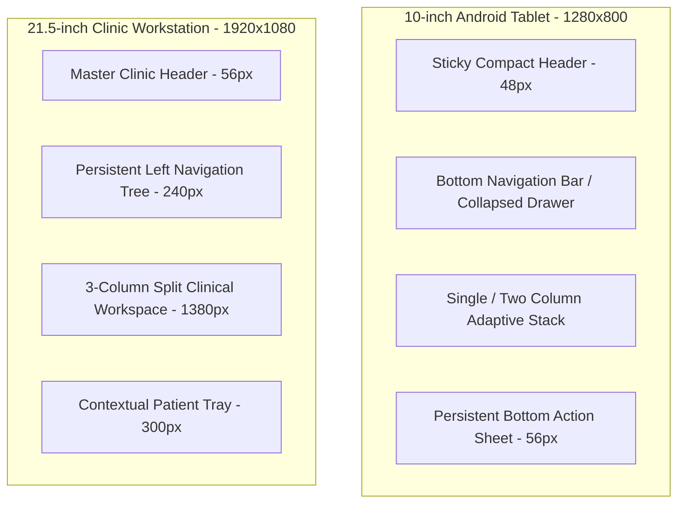

# Namma Clinic Frontend Responsive Design & Multi-Device Viewport Strategy

## 1. Executive Summary & Hardware Form Factor Strategy
Namma Clinic healthcare software operates in diverse clinical environments across 183 primary health centers in the Greater Bengaluru metropolitan area. The user interface must seamlessly scale across two primary hardware form factors:
1. **10-Inch Android Field Tablets (1280x800, WXGA, 149 PPI):** Deployed for ASHA workers, ANM mobile outreach, queue marshals, and portable triage stations. Demands high-contrast, finger-friendly touch targets (minimum 48x48 CSS pixels), single-column fluid stacking, and on-screen virtual keyboard accommodation.
2. **21.5-Inch to 24-Inch Clinic Desktop Workstations (1920x1080, Full HD, 102 PPI):** Deployed in Doctor consultation cabins, pharmacy dispensing counters, diagnostic labs, and reception desks. Demands high-density information architecture, multi-pane split views, persistent contextual sidebars, and rapid keyboard-first data entry.

## 2. Canonical Responsive Breakpoint System
```css
/* DOCUMENTATION-ONLY CSS TOKENS */
:root {
  --breakpoint-sm: 640px;   /* Small mobile field handhelds */
  --breakpoint-md: 768px;   /* Portrait tablets */
  --breakpoint-lg: 1024px;  /* Landscape 10-inch Android tablets */
  --breakpoint-xl: 1280px;  /* Compact desktop monitors / WXGA wide */
  --breakpoint-2xl: 1536px; /* High-definition clinical workstations */
}
```

## 3. Responsive Layout Architecture & Container Rules


## 4. Touch vs. Precision Mouse Interaction Hierarchy
| Dimension | 10-Inch Tablet Target | 21.5-Inch Workstation Target | Clinical Rationale |
| :--- | :--- | :--- | :--- |
| Primary Button Height | 48px min (56px recommended) | 36px - 40px | Prevents missed finger taps during field examinations |
| Input Field Height | 48px min | 36px | Provides comfortable hit area when wearing surgical gloves |
| Table Row Height | 56px | 40px | Increases data density on desktop while preventing fat-finger errors on tablet |
| Modal Width | 92% viewport width | Fixed 560px / 780px / 1020px | Maximizes usable real estate on compact touch screens |
| Font Scale Base | 16px (1rem) | 14px (0.875rem) | Balances arm's-length tablet readability with desktop data density |

## 5. Exhaustive Screen-by-Screen Responsive Layout Specifications
The following section details the exact breakpoint transformations, container grids, and layout adaptations across all 108 screens:

### Responsive Design Specification for Screen SCREEN-001: User Login Screen
**Route:** `/login` | **Module:** `MODULE-001` | **Primary Role:** `ROLE-001`

#### 1. Tablet Layout Behavior (10-Inch Android Tablet @ 1280x800 Landscape / 800x1280 Portrait)
- **Grid Layout:** Single-column fluid layout with `max-width: 100%` and 16px lateral padding.
- **Navigation Pattern:** Drawer collapses into hamburger menu; top app bar pins key action items.
- **Input Accommodations:** Input fields expand to full width (100%); touch targets strictly >= 48px.
- **Soft Keyboard Handling:** Form scrolls active input into visible viewport above virtual keyboard using `scrollIntoViewIfNeeded()`.

#### 2. Desktop Layout Behavior (21.5-Inch Full HD Workstation @ 1920x1080)
- **Grid Layout:** Multi-column CSS Grid (`grid-template-columns: 280px 1fr 340px`) utilizing full 1920px canvas.
- **Sidebar Integration:** Persistent 240px navigation sidebar with active indicator for `SCREEN-001`.
- **Information Density:** Compact 36px inputs, 40px table rows, and dual-column form groups.
- **Keyboard Navigation:** Full keyboard navigation shortcuts (`Alt+S` save, `Alt+N` new, `Esc` cancel).

#### 3. Documentation-Only CSS Grid Definition
```css
/* DOCUMENTATION-ONLY RESPONSIVE CSS */
.screen-screen-001 {
  display: grid;
  gap: var(--spacing-4);
  grid-template-columns: 1fr;
}

@media (min-width: 1024px) {
  .screen-screen-001 {
    grid-template-columns: repeat(2, 1fr);
    gap: var(--spacing-6);
  }
}

@media (min-width: 1536px) {
  .screen-screen-001 {
    grid-template-columns: 280px 1fr 360px;
    gap: var(--spacing-8);
  }
}
```

---

### Responsive Design Specification for Screen SCREEN-002: MFA Verification Screen
**Route:** `/login/mfa` | **Module:** `MODULE-001` | **Primary Role:** `ROLE-001`

#### 1. Tablet Layout Behavior (10-Inch Android Tablet @ 1280x800 Landscape / 800x1280 Portrait)
- **Grid Layout:** Single-column fluid layout with `max-width: 100%` and 16px lateral padding.
- **Navigation Pattern:** Drawer collapses into hamburger menu; top app bar pins key action items.
- **Input Accommodations:** Input fields expand to full width (100%); touch targets strictly >= 48px.
- **Soft Keyboard Handling:** Form scrolls active input into visible viewport above virtual keyboard using `scrollIntoViewIfNeeded()`.

#### 2. Desktop Layout Behavior (21.5-Inch Full HD Workstation @ 1920x1080)
- **Grid Layout:** Multi-column CSS Grid (`grid-template-columns: 280px 1fr 340px`) utilizing full 1920px canvas.
- **Sidebar Integration:** Persistent 240px navigation sidebar with active indicator for `SCREEN-002`.
- **Information Density:** Compact 36px inputs, 40px table rows, and dual-column form groups.
- **Keyboard Navigation:** Full keyboard navigation shortcuts (`Alt+S` save, `Alt+N` new, `Esc` cancel).

#### 3. Documentation-Only CSS Grid Definition
```css
/* DOCUMENTATION-ONLY RESPONSIVE CSS */
.screen-screen-002 {
  display: grid;
  gap: var(--spacing-4);
  grid-template-columns: 1fr;
}

@media (min-width: 1024px) {
  .screen-screen-002 {
    grid-template-columns: repeat(2, 1fr);
    gap: var(--spacing-6);
  }
}

@media (min-width: 1536px) {
  .screen-screen-002 {
    grid-template-columns: 280px 1fr 360px;
    gap: var(--spacing-8);
  }
}
```

---

### Responsive Design Specification for Screen SCREEN-003: Terminal Pairing & Device Enrollment
**Route:** `/system/device-enroll` | **Module:** `MODULE-001` | **Primary Role:** `ROLE-006`

#### 1. Tablet Layout Behavior (10-Inch Android Tablet @ 1280x800 Landscape / 800x1280 Portrait)
- **Grid Layout:** Single-column fluid layout with `max-width: 100%` and 16px lateral padding.
- **Navigation Pattern:** Drawer collapses into hamburger menu; top app bar pins key action items.
- **Input Accommodations:** Input fields expand to full width (100%); touch targets strictly >= 48px.
- **Soft Keyboard Handling:** Form scrolls active input into visible viewport above virtual keyboard using `scrollIntoViewIfNeeded()`.

#### 2. Desktop Layout Behavior (21.5-Inch Full HD Workstation @ 1920x1080)
- **Grid Layout:** Multi-column CSS Grid (`grid-template-columns: 280px 1fr 340px`) utilizing full 1920px canvas.
- **Sidebar Integration:** Persistent 240px navigation sidebar with active indicator for `SCREEN-003`.
- **Information Density:** Compact 36px inputs, 40px table rows, and dual-column form groups.
- **Keyboard Navigation:** Full keyboard navigation shortcuts (`Alt+S` save, `Alt+N` new, `Esc` cancel).

#### 3. Documentation-Only CSS Grid Definition
```css
/* DOCUMENTATION-ONLY RESPONSIVE CSS */
.screen-screen-003 {
  display: grid;
  gap: var(--spacing-4);
  grid-template-columns: 1fr;
}

@media (min-width: 1024px) {
  .screen-screen-003 {
    grid-template-columns: repeat(2, 1fr);
    gap: var(--spacing-6);
  }
}

@media (min-width: 1536px) {
  .screen-screen-003 {
    grid-template-columns: 280px 1fr 360px;
    gap: var(--spacing-8);
  }
}
```

---

### Responsive Design Specification for Screen SCREEN-004: Clinic Shift Check-In & Handover
**Route:** `/shift/checkin` | **Module:** `MODULE-001` | **Primary Role:** `ROLE-001`

#### 1. Tablet Layout Behavior (10-Inch Android Tablet @ 1280x800 Landscape / 800x1280 Portrait)
- **Grid Layout:** Single-column fluid layout with `max-width: 100%` and 16px lateral padding.
- **Navigation Pattern:** Drawer collapses into hamburger menu; top app bar pins key action items.
- **Input Accommodations:** Input fields expand to full width (100%); touch targets strictly >= 48px.
- **Soft Keyboard Handling:** Form scrolls active input into visible viewport above virtual keyboard using `scrollIntoViewIfNeeded()`.

#### 2. Desktop Layout Behavior (21.5-Inch Full HD Workstation @ 1920x1080)
- **Grid Layout:** Multi-column CSS Grid (`grid-template-columns: 280px 1fr 340px`) utilizing full 1920px canvas.
- **Sidebar Integration:** Persistent 240px navigation sidebar with active indicator for `SCREEN-004`.
- **Information Density:** Compact 36px inputs, 40px table rows, and dual-column form groups.
- **Keyboard Navigation:** Full keyboard navigation shortcuts (`Alt+S` save, `Alt+N` new, `Esc` cancel).

#### 3. Documentation-Only CSS Grid Definition
```css
/* DOCUMENTATION-ONLY RESPONSIVE CSS */
.screen-screen-004 {
  display: grid;
  gap: var(--spacing-4);
  grid-template-columns: 1fr;
}

@media (min-width: 1024px) {
  .screen-screen-004 {
    grid-template-columns: repeat(2, 1fr);
    gap: var(--spacing-6);
  }
}

@media (min-width: 1536px) {
  .screen-screen-004 {
    grid-template-columns: 280px 1fr 360px;
    gap: var(--spacing-8);
  }
}
```

---

### Responsive Design Specification for Screen SCREEN-005: Emergency Break-Glass Authorization
**Route:** `/auth/break-glass` | **Module:** `MODULE-001` | **Primary Role:** `ROLE-002`

#### 1. Tablet Layout Behavior (10-Inch Android Tablet @ 1280x800 Landscape / 800x1280 Portrait)
- **Grid Layout:** Single-column fluid layout with `max-width: 100%` and 16px lateral padding.
- **Navigation Pattern:** Drawer collapses into hamburger menu; top app bar pins key action items.
- **Input Accommodations:** Input fields expand to full width (100%); touch targets strictly >= 48px.
- **Soft Keyboard Handling:** Form scrolls active input into visible viewport above virtual keyboard using `scrollIntoViewIfNeeded()`.

#### 2. Desktop Layout Behavior (21.5-Inch Full HD Workstation @ 1920x1080)
- **Grid Layout:** Multi-column CSS Grid (`grid-template-columns: 280px 1fr 340px`) utilizing full 1920px canvas.
- **Sidebar Integration:** Persistent 240px navigation sidebar with active indicator for `SCREEN-005`.
- **Information Density:** Compact 36px inputs, 40px table rows, and dual-column form groups.
- **Keyboard Navigation:** Full keyboard navigation shortcuts (`Alt+S` save, `Alt+N` new, `Esc` cancel).

#### 3. Documentation-Only CSS Grid Definition
```css
/* DOCUMENTATION-ONLY RESPONSIVE CSS */
.screen-screen-005 {
  display: grid;
  gap: var(--spacing-4);
  grid-template-columns: 1fr;
}

@media (min-width: 1024px) {
  .screen-screen-005 {
    grid-template-columns: repeat(2, 1fr);
    gap: var(--spacing-6);
  }
}

@media (min-width: 1536px) {
  .screen-screen-005 {
    grid-template-columns: 280px 1fr 360px;
    gap: var(--spacing-8);
  }
}
```

---

### Responsive Design Specification for Screen SCREEN-006: Master Clinic Dashboard
**Route:** `/dashboard` | **Module:** `MODULE-002` | **Primary Role:** `ROLE-001`

#### 1. Tablet Layout Behavior (10-Inch Android Tablet @ 1280x800 Landscape / 800x1280 Portrait)
- **Grid Layout:** Single-column fluid layout with `max-width: 100%` and 16px lateral padding.
- **Navigation Pattern:** Drawer collapses into hamburger menu; top app bar pins key action items.
- **Input Accommodations:** Input fields expand to full width (100%); touch targets strictly >= 48px.
- **Soft Keyboard Handling:** Form scrolls active input into visible viewport above virtual keyboard using `scrollIntoViewIfNeeded()`.

#### 2. Desktop Layout Behavior (21.5-Inch Full HD Workstation @ 1920x1080)
- **Grid Layout:** Multi-column CSS Grid (`grid-template-columns: 280px 1fr 340px`) utilizing full 1920px canvas.
- **Sidebar Integration:** Persistent 240px navigation sidebar with active indicator for `SCREEN-006`.
- **Information Density:** Compact 36px inputs, 40px table rows, and dual-column form groups.
- **Keyboard Navigation:** Full keyboard navigation shortcuts (`Alt+S` save, `Alt+N` new, `Esc` cancel).

#### 3. Documentation-Only CSS Grid Definition
```css
/* DOCUMENTATION-ONLY RESPONSIVE CSS */
.screen-screen-006 {
  display: grid;
  gap: var(--spacing-4);
  grid-template-columns: 1fr;
}

@media (min-width: 1024px) {
  .screen-screen-006 {
    grid-template-columns: repeat(2, 1fr);
    gap: var(--spacing-6);
  }
}

@media (min-width: 1536px) {
  .screen-screen-006 {
    grid-template-columns: 280px 1fr 360px;
    gap: var(--spacing-8);
  }
}
```

---

### Responsive Design Specification for Screen SCREEN-007: Doctor Outpatient Console
**Route:** `/doctor/console` | **Module:** `MODULE-002` | **Primary Role:** `ROLE-002`

#### 1. Tablet Layout Behavior (10-Inch Android Tablet @ 1280x800 Landscape / 800x1280 Portrait)
- **Grid Layout:** Single-column fluid layout with `max-width: 100%` and 16px lateral padding.
- **Navigation Pattern:** Drawer collapses into hamburger menu; top app bar pins key action items.
- **Input Accommodations:** Input fields expand to full width (100%); touch targets strictly >= 48px.
- **Soft Keyboard Handling:** Form scrolls active input into visible viewport above virtual keyboard using `scrollIntoViewIfNeeded()`.

#### 2. Desktop Layout Behavior (21.5-Inch Full HD Workstation @ 1920x1080)
- **Grid Layout:** Multi-column CSS Grid (`grid-template-columns: 280px 1fr 340px`) utilizing full 1920px canvas.
- **Sidebar Integration:** Persistent 240px navigation sidebar with active indicator for `SCREEN-007`.
- **Information Density:** Compact 36px inputs, 40px table rows, and dual-column form groups.
- **Keyboard Navigation:** Full keyboard navigation shortcuts (`Alt+S` save, `Alt+N` new, `Esc` cancel).

#### 3. Documentation-Only CSS Grid Definition
```css
/* DOCUMENTATION-ONLY RESPONSIVE CSS */
.screen-screen-007 {
  display: grid;
  gap: var(--spacing-4);
  grid-template-columns: 1fr;
}

@media (min-width: 1024px) {
  .screen-screen-007 {
    grid-template-columns: repeat(2, 1fr);
    gap: var(--spacing-6);
  }
}

@media (min-width: 1536px) {
  .screen-screen-007 {
    grid-template-columns: 280px 1fr 360px;
    gap: var(--spacing-8);
  }
}
```

---

### Responsive Design Specification for Screen SCREEN-008: Staff Nurse Triage Workbench
**Route:** `/nurse/triage` | **Module:** `MODULE-002` | **Primary Role:** `ROLE-003`

#### 1. Tablet Layout Behavior (10-Inch Android Tablet @ 1280x800 Landscape / 800x1280 Portrait)
- **Grid Layout:** Single-column fluid layout with `max-width: 100%` and 16px lateral padding.
- **Navigation Pattern:** Drawer collapses into hamburger menu; top app bar pins key action items.
- **Input Accommodations:** Input fields expand to full width (100%); touch targets strictly >= 48px.
- **Soft Keyboard Handling:** Form scrolls active input into visible viewport above virtual keyboard using `scrollIntoViewIfNeeded()`.

#### 2. Desktop Layout Behavior (21.5-Inch Full HD Workstation @ 1920x1080)
- **Grid Layout:** Multi-column CSS Grid (`grid-template-columns: 280px 1fr 340px`) utilizing full 1920px canvas.
- **Sidebar Integration:** Persistent 240px navigation sidebar with active indicator for `SCREEN-008`.
- **Information Density:** Compact 36px inputs, 40px table rows, and dual-column form groups.
- **Keyboard Navigation:** Full keyboard navigation shortcuts (`Alt+S` save, `Alt+N` new, `Esc` cancel).

#### 3. Documentation-Only CSS Grid Definition
```css
/* DOCUMENTATION-ONLY RESPONSIVE CSS */
.screen-screen-008 {
  display: grid;
  gap: var(--spacing-4);
  grid-template-columns: 1fr;
}

@media (min-width: 1024px) {
  .screen-screen-008 {
    grid-template-columns: repeat(2, 1fr);
    gap: var(--spacing-6);
  }
}

@media (min-width: 1536px) {
  .screen-screen-008 {
    grid-template-columns: 280px 1fr 360px;
    gap: var(--spacing-8);
  }
}
```

---

### Responsive Design Specification for Screen SCREEN-009: Pharmacy Dispensing Console
**Route:** `/pharmacy/dispense` | **Module:** `MODULE-002` | **Primary Role:** `ROLE-004`

#### 1. Tablet Layout Behavior (10-Inch Android Tablet @ 1280x800 Landscape / 800x1280 Portrait)
- **Grid Layout:** Single-column fluid layout with `max-width: 100%` and 16px lateral padding.
- **Navigation Pattern:** Drawer collapses into hamburger menu; top app bar pins key action items.
- **Input Accommodations:** Input fields expand to full width (100%); touch targets strictly >= 48px.
- **Soft Keyboard Handling:** Form scrolls active input into visible viewport above virtual keyboard using `scrollIntoViewIfNeeded()`.

#### 2. Desktop Layout Behavior (21.5-Inch Full HD Workstation @ 1920x1080)
- **Grid Layout:** Multi-column CSS Grid (`grid-template-columns: 280px 1fr 340px`) utilizing full 1920px canvas.
- **Sidebar Integration:** Persistent 240px navigation sidebar with active indicator for `SCREEN-009`.
- **Information Density:** Compact 36px inputs, 40px table rows, and dual-column form groups.
- **Keyboard Navigation:** Full keyboard navigation shortcuts (`Alt+S` save, `Alt+N` new, `Esc` cancel).

#### 3. Documentation-Only CSS Grid Definition
```css
/* DOCUMENTATION-ONLY RESPONSIVE CSS */
.screen-screen-009 {
  display: grid;
  gap: var(--spacing-4);
  grid-template-columns: 1fr;
}

@media (min-width: 1024px) {
  .screen-screen-009 {
    grid-template-columns: repeat(2, 1fr);
    gap: var(--spacing-6);
  }
}

@media (min-width: 1536px) {
  .screen-screen-009 {
    grid-template-columns: 280px 1fr 360px;
    gap: var(--spacing-8);
  }
}
```

---

### Responsive Design Specification for Screen SCREEN-010: Diagnostic Laboratory Workbench
**Route:** `/lab/workbench` | **Module:** `MODULE-002` | **Primary Role:** `ROLE-005`

#### 1. Tablet Layout Behavior (10-Inch Android Tablet @ 1280x800 Landscape / 800x1280 Portrait)
- **Grid Layout:** Single-column fluid layout with `max-width: 100%` and 16px lateral padding.
- **Navigation Pattern:** Drawer collapses into hamburger menu; top app bar pins key action items.
- **Input Accommodations:** Input fields expand to full width (100%); touch targets strictly >= 48px.
- **Soft Keyboard Handling:** Form scrolls active input into visible viewport above virtual keyboard using `scrollIntoViewIfNeeded()`.

#### 2. Desktop Layout Behavior (21.5-Inch Full HD Workstation @ 1920x1080)
- **Grid Layout:** Multi-column CSS Grid (`grid-template-columns: 280px 1fr 340px`) utilizing full 1920px canvas.
- **Sidebar Integration:** Persistent 240px navigation sidebar with active indicator for `SCREEN-010`.
- **Information Density:** Compact 36px inputs, 40px table rows, and dual-column form groups.
- **Keyboard Navigation:** Full keyboard navigation shortcuts (`Alt+S` save, `Alt+N` new, `Esc` cancel).

#### 3. Documentation-Only CSS Grid Definition
```css
/* DOCUMENTATION-ONLY RESPONSIVE CSS */
.screen-screen-010 {
  display: grid;
  gap: var(--spacing-4);
  grid-template-columns: 1fr;
}

@media (min-width: 1024px) {
  .screen-screen-010 {
    grid-template-columns: repeat(2, 1fr);
    gap: var(--spacing-6);
  }
}

@media (min-width: 1536px) {
  .screen-screen-010 {
    grid-template-columns: 280px 1fr 360px;
    gap: var(--spacing-8);
  }
}
```

---

### Responsive Design Specification for Screen SCREEN-011: Citizen New Registration Screen
**Route:** `/patients/new` | **Module:** `MODULE-003` | **Primary Role:** `ROLE-001`

#### 1. Tablet Layout Behavior (10-Inch Android Tablet @ 1280x800 Landscape / 800x1280 Portrait)
- **Grid Layout:** Single-column fluid layout with `max-width: 100%` and 16px lateral padding.
- **Navigation Pattern:** Drawer collapses into hamburger menu; top app bar pins key action items.
- **Input Accommodations:** Input fields expand to full width (100%); touch targets strictly >= 48px.
- **Soft Keyboard Handling:** Form scrolls active input into visible viewport above virtual keyboard using `scrollIntoViewIfNeeded()`.

#### 2. Desktop Layout Behavior (21.5-Inch Full HD Workstation @ 1920x1080)
- **Grid Layout:** Multi-column CSS Grid (`grid-template-columns: 280px 1fr 340px`) utilizing full 1920px canvas.
- **Sidebar Integration:** Persistent 240px navigation sidebar with active indicator for `SCREEN-011`.
- **Information Density:** Compact 36px inputs, 40px table rows, and dual-column form groups.
- **Keyboard Navigation:** Full keyboard navigation shortcuts (`Alt+S` save, `Alt+N` new, `Esc` cancel).

#### 3. Documentation-Only CSS Grid Definition
```css
/* DOCUMENTATION-ONLY RESPONSIVE CSS */
.screen-screen-011 {
  display: grid;
  gap: var(--spacing-4);
  grid-template-columns: 1fr;
}

@media (min-width: 1024px) {
  .screen-screen-011 {
    grid-template-columns: repeat(2, 1fr);
    gap: var(--spacing-6);
  }
}

@media (min-width: 1536px) {
  .screen-screen-011 {
    grid-template-columns: 280px 1fr 360px;
    gap: var(--spacing-8);
  }
}
```

---

### Responsive Design Specification for Screen SCREEN-012: Citizen Search & Retrieval Screen
**Route:** `/patients/search` | **Module:** `MODULE-003` | **Primary Role:** `ROLE-001`

#### 1. Tablet Layout Behavior (10-Inch Android Tablet @ 1280x800 Landscape / 800x1280 Portrait)
- **Grid Layout:** Single-column fluid layout with `max-width: 100%` and 16px lateral padding.
- **Navigation Pattern:** Drawer collapses into hamburger menu; top app bar pins key action items.
- **Input Accommodations:** Input fields expand to full width (100%); touch targets strictly >= 48px.
- **Soft Keyboard Handling:** Form scrolls active input into visible viewport above virtual keyboard using `scrollIntoViewIfNeeded()`.

#### 2. Desktop Layout Behavior (21.5-Inch Full HD Workstation @ 1920x1080)
- **Grid Layout:** Multi-column CSS Grid (`grid-template-columns: 280px 1fr 340px`) utilizing full 1920px canvas.
- **Sidebar Integration:** Persistent 240px navigation sidebar with active indicator for `SCREEN-012`.
- **Information Density:** Compact 36px inputs, 40px table rows, and dual-column form groups.
- **Keyboard Navigation:** Full keyboard navigation shortcuts (`Alt+S` save, `Alt+N` new, `Esc` cancel).

#### 3. Documentation-Only CSS Grid Definition
```css
/* DOCUMENTATION-ONLY RESPONSIVE CSS */
.screen-screen-012 {
  display: grid;
  gap: var(--spacing-4);
  grid-template-columns: 1fr;
}

@media (min-width: 1024px) {
  .screen-screen-012 {
    grid-template-columns: repeat(2, 1fr);
    gap: var(--spacing-6);
  }
}

@media (min-width: 1536px) {
  .screen-screen-012 {
    grid-template-columns: 280px 1fr 360px;
    gap: var(--spacing-8);
  }
}
```

---

### Responsive Design Specification for Screen SCREEN-013: Patient Longitudinal Profile View
**Route:** `/patients/:id` | **Module:** `MODULE-003` | **Primary Role:** `ROLE-002`

#### 1. Tablet Layout Behavior (10-Inch Android Tablet @ 1280x800 Landscape / 800x1280 Portrait)
- **Grid Layout:** Single-column fluid layout with `max-width: 100%` and 16px lateral padding.
- **Navigation Pattern:** Drawer collapses into hamburger menu; top app bar pins key action items.
- **Input Accommodations:** Input fields expand to full width (100%); touch targets strictly >= 48px.
- **Soft Keyboard Handling:** Form scrolls active input into visible viewport above virtual keyboard using `scrollIntoViewIfNeeded()`.

#### 2. Desktop Layout Behavior (21.5-Inch Full HD Workstation @ 1920x1080)
- **Grid Layout:** Multi-column CSS Grid (`grid-template-columns: 280px 1fr 340px`) utilizing full 1920px canvas.
- **Sidebar Integration:** Persistent 240px navigation sidebar with active indicator for `SCREEN-013`.
- **Information Density:** Compact 36px inputs, 40px table rows, and dual-column form groups.
- **Keyboard Navigation:** Full keyboard navigation shortcuts (`Alt+S` save, `Alt+N` new, `Esc` cancel).

#### 3. Documentation-Only CSS Grid Definition
```css
/* DOCUMENTATION-ONLY RESPONSIVE CSS */
.screen-screen-013 {
  display: grid;
  gap: var(--spacing-4);
  grid-template-columns: 1fr;
}

@media (min-width: 1024px) {
  .screen-screen-013 {
    grid-template-columns: repeat(2, 1fr);
    gap: var(--spacing-6);
  }
}

@media (min-width: 1536px) {
  .screen-screen-013 {
    grid-template-columns: 280px 1fr 360px;
    gap: var(--spacing-8);
  }
}
```

---

### Responsive Design Specification for Screen SCREEN-014: Repeat Patient Fast Intake
**Route:** `/patients/:id/repeat-intake` | **Module:** `MODULE-003` | **Primary Role:** `ROLE-001`

#### 1. Tablet Layout Behavior (10-Inch Android Tablet @ 1280x800 Landscape / 800x1280 Portrait)
- **Grid Layout:** Single-column fluid layout with `max-width: 100%` and 16px lateral padding.
- **Navigation Pattern:** Drawer collapses into hamburger menu; top app bar pins key action items.
- **Input Accommodations:** Input fields expand to full width (100%); touch targets strictly >= 48px.
- **Soft Keyboard Handling:** Form scrolls active input into visible viewport above virtual keyboard using `scrollIntoViewIfNeeded()`.

#### 2. Desktop Layout Behavior (21.5-Inch Full HD Workstation @ 1920x1080)
- **Grid Layout:** Multi-column CSS Grid (`grid-template-columns: 280px 1fr 340px`) utilizing full 1920px canvas.
- **Sidebar Integration:** Persistent 240px navigation sidebar with active indicator for `SCREEN-014`.
- **Information Density:** Compact 36px inputs, 40px table rows, and dual-column form groups.
- **Keyboard Navigation:** Full keyboard navigation shortcuts (`Alt+S` save, `Alt+N` new, `Esc` cancel).

#### 3. Documentation-Only CSS Grid Definition
```css
/* DOCUMENTATION-ONLY RESPONSIVE CSS */
.screen-screen-014 {
  display: grid;
  gap: var(--spacing-4);
  grid-template-columns: 1fr;
}

@media (min-width: 1024px) {
  .screen-screen-014 {
    grid-template-columns: repeat(2, 1fr);
    gap: var(--spacing-6);
  }
}

@media (min-width: 1536px) {
  .screen-screen-014 {
    grid-template-columns: 280px 1fr 360px;
    gap: var(--spacing-8);
  }
}
```

---

### Responsive Design Specification for Screen SCREEN-015: Biometric & ABHA Card Scan Modal
**Route:** `/patients/abha-scan` | **Module:** `MODULE-003` | **Primary Role:** `ROLE-001`

#### 1. Tablet Layout Behavior (10-Inch Android Tablet @ 1280x800 Landscape / 800x1280 Portrait)
- **Grid Layout:** Single-column fluid layout with `max-width: 100%` and 16px lateral padding.
- **Navigation Pattern:** Drawer collapses into hamburger menu; top app bar pins key action items.
- **Input Accommodations:** Input fields expand to full width (100%); touch targets strictly >= 48px.
- **Soft Keyboard Handling:** Form scrolls active input into visible viewport above virtual keyboard using `scrollIntoViewIfNeeded()`.

#### 2. Desktop Layout Behavior (21.5-Inch Full HD Workstation @ 1920x1080)
- **Grid Layout:** Multi-column CSS Grid (`grid-template-columns: 280px 1fr 340px`) utilizing full 1920px canvas.
- **Sidebar Integration:** Persistent 240px navigation sidebar with active indicator for `SCREEN-015`.
- **Information Density:** Compact 36px inputs, 40px table rows, and dual-column form groups.
- **Keyboard Navigation:** Full keyboard navigation shortcuts (`Alt+S` save, `Alt+N` new, `Esc` cancel).

#### 3. Documentation-Only CSS Grid Definition
```css
/* DOCUMENTATION-ONLY RESPONSIVE CSS */
.screen-screen-015 {
  display: grid;
  gap: var(--spacing-4);
  grid-template-columns: 1fr;
}

@media (min-width: 1024px) {
  .screen-screen-015 {
    grid-template-columns: repeat(2, 1fr);
    gap: var(--spacing-6);
  }
}

@media (min-width: 1536px) {
  .screen-screen-015 {
    grid-template-columns: 280px 1fr 360px;
    gap: var(--spacing-8);
  }
}
```

---

### Responsive Design Specification for Screen SCREEN-016: Citizen Demographic Correction Form
**Route:** `/patients/:id/edit` | **Module:** `MODULE-003` | **Primary Role:** `ROLE-001`

#### 1. Tablet Layout Behavior (10-Inch Android Tablet @ 1280x800 Landscape / 800x1280 Portrait)
- **Grid Layout:** Single-column fluid layout with `max-width: 100%` and 16px lateral padding.
- **Navigation Pattern:** Drawer collapses into hamburger menu; top app bar pins key action items.
- **Input Accommodations:** Input fields expand to full width (100%); touch targets strictly >= 48px.
- **Soft Keyboard Handling:** Form scrolls active input into visible viewport above virtual keyboard using `scrollIntoViewIfNeeded()`.

#### 2. Desktop Layout Behavior (21.5-Inch Full HD Workstation @ 1920x1080)
- **Grid Layout:** Multi-column CSS Grid (`grid-template-columns: 280px 1fr 340px`) utilizing full 1920px canvas.
- **Sidebar Integration:** Persistent 240px navigation sidebar with active indicator for `SCREEN-016`.
- **Information Density:** Compact 36px inputs, 40px table rows, and dual-column form groups.
- **Keyboard Navigation:** Full keyboard navigation shortcuts (`Alt+S` save, `Alt+N` new, `Esc` cancel).

#### 3. Documentation-Only CSS Grid Definition
```css
/* DOCUMENTATION-ONLY RESPONSIVE CSS */
.screen-screen-016 {
  display: grid;
  gap: var(--spacing-4);
  grid-template-columns: 1fr;
}

@media (min-width: 1024px) {
  .screen-screen-016 {
    grid-template-columns: repeat(2, 1fr);
    gap: var(--spacing-6);
  }
}

@media (min-width: 1536px) {
  .screen-screen-016 {
    grid-template-columns: 280px 1fr 360px;
    gap: var(--spacing-8);
  }
}
```

---

### Responsive Design Specification for Screen SCREEN-017: Duplicate Citizen Merge Modal
**Route:** `/patients/merge` | **Module:** `MODULE-003` | **Primary Role:** `ROLE-006`

#### 1. Tablet Layout Behavior (10-Inch Android Tablet @ 1280x800 Landscape / 800x1280 Portrait)
- **Grid Layout:** Single-column fluid layout with `max-width: 100%` and 16px lateral padding.
- **Navigation Pattern:** Drawer collapses into hamburger menu; top app bar pins key action items.
- **Input Accommodations:** Input fields expand to full width (100%); touch targets strictly >= 48px.
- **Soft Keyboard Handling:** Form scrolls active input into visible viewport above virtual keyboard using `scrollIntoViewIfNeeded()`.

#### 2. Desktop Layout Behavior (21.5-Inch Full HD Workstation @ 1920x1080)
- **Grid Layout:** Multi-column CSS Grid (`grid-template-columns: 280px 1fr 340px`) utilizing full 1920px canvas.
- **Sidebar Integration:** Persistent 240px navigation sidebar with active indicator for `SCREEN-017`.
- **Information Density:** Compact 36px inputs, 40px table rows, and dual-column form groups.
- **Keyboard Navigation:** Full keyboard navigation shortcuts (`Alt+S` save, `Alt+N` new, `Esc` cancel).

#### 3. Documentation-Only CSS Grid Definition
```css
/* DOCUMENTATION-ONLY RESPONSIVE CSS */
.screen-screen-017 {
  display: grid;
  gap: var(--spacing-4);
  grid-template-columns: 1fr;
}

@media (min-width: 1024px) {
  .screen-screen-017 {
    grid-template-columns: repeat(2, 1fr);
    gap: var(--spacing-6);
  }
}

@media (min-width: 1536px) {
  .screen-screen-017 {
    grid-template-columns: 280px 1fr 360px;
    gap: var(--spacing-8);
  }
}
```

---

### Responsive Design Specification for Screen SCREEN-018: Citizen Digital Photo Capture
**Route:** `/patients/:id/photo` | **Module:** `MODULE-003` | **Primary Role:** `ROLE-001`

#### 1. Tablet Layout Behavior (10-Inch Android Tablet @ 1280x800 Landscape / 800x1280 Portrait)
- **Grid Layout:** Single-column fluid layout with `max-width: 100%` and 16px lateral padding.
- **Navigation Pattern:** Drawer collapses into hamburger menu; top app bar pins key action items.
- **Input Accommodations:** Input fields expand to full width (100%); touch targets strictly >= 48px.
- **Soft Keyboard Handling:** Form scrolls active input into visible viewport above virtual keyboard using `scrollIntoViewIfNeeded()`.

#### 2. Desktop Layout Behavior (21.5-Inch Full HD Workstation @ 1920x1080)
- **Grid Layout:** Multi-column CSS Grid (`grid-template-columns: 280px 1fr 340px`) utilizing full 1920px canvas.
- **Sidebar Integration:** Persistent 240px navigation sidebar with active indicator for `SCREEN-018`.
- **Information Density:** Compact 36px inputs, 40px table rows, and dual-column form groups.
- **Keyboard Navigation:** Full keyboard navigation shortcuts (`Alt+S` save, `Alt+N` new, `Esc` cancel).

#### 3. Documentation-Only CSS Grid Definition
```css
/* DOCUMENTATION-ONLY RESPONSIVE CSS */
.screen-screen-018 {
  display: grid;
  gap: var(--spacing-4);
  grid-template-columns: 1fr;
}

@media (min-width: 1024px) {
  .screen-screen-018 {
    grid-template-columns: repeat(2, 1fr);
    gap: var(--spacing-6);
  }
}

@media (min-width: 1536px) {
  .screen-screen-018 {
    grid-template-columns: 280px 1fr 360px;
    gap: var(--spacing-8);
  }
}
```

---

### Responsive Design Specification for Screen SCREEN-019: DPDP Informed Consent Capture Screen
**Route:** `/patients/:id/consent` | **Module:** `MODULE-004` | **Primary Role:** `ROLE-001`

#### 1. Tablet Layout Behavior (10-Inch Android Tablet @ 1280x800 Landscape / 800x1280 Portrait)
- **Grid Layout:** Single-column fluid layout with `max-width: 100%` and 16px lateral padding.
- **Navigation Pattern:** Drawer collapses into hamburger menu; top app bar pins key action items.
- **Input Accommodations:** Input fields expand to full width (100%); touch targets strictly >= 48px.
- **Soft Keyboard Handling:** Form scrolls active input into visible viewport above virtual keyboard using `scrollIntoViewIfNeeded()`.

#### 2. Desktop Layout Behavior (21.5-Inch Full HD Workstation @ 1920x1080)
- **Grid Layout:** Multi-column CSS Grid (`grid-template-columns: 280px 1fr 340px`) utilizing full 1920px canvas.
- **Sidebar Integration:** Persistent 240px navigation sidebar with active indicator for `SCREEN-019`.
- **Information Density:** Compact 36px inputs, 40px table rows, and dual-column form groups.
- **Keyboard Navigation:** Full keyboard navigation shortcuts (`Alt+S` save, `Alt+N` new, `Esc` cancel).

#### 3. Documentation-Only CSS Grid Definition
```css
/* DOCUMENTATION-ONLY RESPONSIVE CSS */
.screen-screen-019 {
  display: grid;
  gap: var(--spacing-4);
  grid-template-columns: 1fr;
}

@media (min-width: 1024px) {
  .screen-screen-019 {
    grid-template-columns: repeat(2, 1fr);
    gap: var(--spacing-6);
  }
}

@media (min-width: 1536px) {
  .screen-screen-019 {
    grid-template-columns: 280px 1fr 360px;
    gap: var(--spacing-8);
  }
}
```

---

### Responsive Design Specification for Screen SCREEN-020: Consent History & Revocation Console
**Route:** `/patients/:id/consents` | **Module:** `MODULE-004` | **Primary Role:** `ROLE-001`

#### 1. Tablet Layout Behavior (10-Inch Android Tablet @ 1280x800 Landscape / 800x1280 Portrait)
- **Grid Layout:** Single-column fluid layout with `max-width: 100%` and 16px lateral padding.
- **Navigation Pattern:** Drawer collapses into hamburger menu; top app bar pins key action items.
- **Input Accommodations:** Input fields expand to full width (100%); touch targets strictly >= 48px.
- **Soft Keyboard Handling:** Form scrolls active input into visible viewport above virtual keyboard using `scrollIntoViewIfNeeded()`.

#### 2. Desktop Layout Behavior (21.5-Inch Full HD Workstation @ 1920x1080)
- **Grid Layout:** Multi-column CSS Grid (`grid-template-columns: 280px 1fr 340px`) utilizing full 1920px canvas.
- **Sidebar Integration:** Persistent 240px navigation sidebar with active indicator for `SCREEN-020`.
- **Information Density:** Compact 36px inputs, 40px table rows, and dual-column form groups.
- **Keyboard Navigation:** Full keyboard navigation shortcuts (`Alt+S` save, `Alt+N` new, `Esc` cancel).

#### 3. Documentation-Only CSS Grid Definition
```css
/* DOCUMENTATION-ONLY RESPONSIVE CSS */
.screen-screen-020 {
  display: grid;
  gap: var(--spacing-4);
  grid-template-columns: 1fr;
}

@media (min-width: 1024px) {
  .screen-screen-020 {
    grid-template-columns: repeat(2, 1fr);
    gap: var(--spacing-6);
  }
}

@media (min-width: 1536px) {
  .screen-screen-020 {
    grid-template-columns: 280px 1fr 360px;
    gap: var(--spacing-8);
  }
}
```

---

### Responsive Design Specification for Screen SCREEN-021: Data Portability & Export Request
**Route:** `/patients/:id/export` | **Module:** `MODULE-004` | **Primary Role:** `ROLE-001`

#### 1. Tablet Layout Behavior (10-Inch Android Tablet @ 1280x800 Landscape / 800x1280 Portrait)
- **Grid Layout:** Single-column fluid layout with `max-width: 100%` and 16px lateral padding.
- **Navigation Pattern:** Drawer collapses into hamburger menu; top app bar pins key action items.
- **Input Accommodations:** Input fields expand to full width (100%); touch targets strictly >= 48px.
- **Soft Keyboard Handling:** Form scrolls active input into visible viewport above virtual keyboard using `scrollIntoViewIfNeeded()`.

#### 2. Desktop Layout Behavior (21.5-Inch Full HD Workstation @ 1920x1080)
- **Grid Layout:** Multi-column CSS Grid (`grid-template-columns: 280px 1fr 340px`) utilizing full 1920px canvas.
- **Sidebar Integration:** Persistent 240px navigation sidebar with active indicator for `SCREEN-021`.
- **Information Density:** Compact 36px inputs, 40px table rows, and dual-column form groups.
- **Keyboard Navigation:** Full keyboard navigation shortcuts (`Alt+S` save, `Alt+N` new, `Esc` cancel).

#### 3. Documentation-Only CSS Grid Definition
```css
/* DOCUMENTATION-ONLY RESPONSIVE CSS */
.screen-screen-021 {
  display: grid;
  gap: var(--spacing-4);
  grid-template-columns: 1fr;
}

@media (min-width: 1024px) {
  .screen-screen-021 {
    grid-template-columns: repeat(2, 1fr);
    gap: var(--spacing-6);
  }
}

@media (min-width: 1536px) {
  .screen-screen-021 {
    grid-template-columns: 280px 1fr 360px;
    gap: var(--spacing-8);
  }
}
```

---

### Responsive Design Specification for Screen SCREEN-022: Citizen Grievance Redressal Intake
**Route:** `/patients/:id/grievance` | **Module:** `MODULE-004` | **Primary Role:** `ROLE-001`

#### 1. Tablet Layout Behavior (10-Inch Android Tablet @ 1280x800 Landscape / 800x1280 Portrait)
- **Grid Layout:** Single-column fluid layout with `max-width: 100%` and 16px lateral padding.
- **Navigation Pattern:** Drawer collapses into hamburger menu; top app bar pins key action items.
- **Input Accommodations:** Input fields expand to full width (100%); touch targets strictly >= 48px.
- **Soft Keyboard Handling:** Form scrolls active input into visible viewport above virtual keyboard using `scrollIntoViewIfNeeded()`.

#### 2. Desktop Layout Behavior (21.5-Inch Full HD Workstation @ 1920x1080)
- **Grid Layout:** Multi-column CSS Grid (`grid-template-columns: 280px 1fr 340px`) utilizing full 1920px canvas.
- **Sidebar Integration:** Persistent 240px navigation sidebar with active indicator for `SCREEN-022`.
- **Information Density:** Compact 36px inputs, 40px table rows, and dual-column form groups.
- **Keyboard Navigation:** Full keyboard navigation shortcuts (`Alt+S` save, `Alt+N` new, `Esc` cancel).

#### 3. Documentation-Only CSS Grid Definition
```css
/* DOCUMENTATION-ONLY RESPONSIVE CSS */
.screen-screen-022 {
  display: grid;
  gap: var(--spacing-4);
  grid-template-columns: 1fr;
}

@media (min-width: 1024px) {
  .screen-screen-022 {
    grid-template-columns: repeat(2, 1fr);
    gap: var(--spacing-6);
  }
}

@media (min-width: 1536px) {
  .screen-screen-022 {
    grid-template-columns: 280px 1fr 360px;
    gap: var(--spacing-8);
  }
}
```

---

### Responsive Design Specification for Screen SCREEN-023: Grievance Investigation & Resolution
**Route:** `/grievances/:id` | **Module:** `MODULE-004` | **Primary Role:** `ROLE-021`

#### 1. Tablet Layout Behavior (10-Inch Android Tablet @ 1280x800 Landscape / 800x1280 Portrait)
- **Grid Layout:** Single-column fluid layout with `max-width: 100%` and 16px lateral padding.
- **Navigation Pattern:** Drawer collapses into hamburger menu; top app bar pins key action items.
- **Input Accommodations:** Input fields expand to full width (100%); touch targets strictly >= 48px.
- **Soft Keyboard Handling:** Form scrolls active input into visible viewport above virtual keyboard using `scrollIntoViewIfNeeded()`.

#### 2. Desktop Layout Behavior (21.5-Inch Full HD Workstation @ 1920x1080)
- **Grid Layout:** Multi-column CSS Grid (`grid-template-columns: 280px 1fr 340px`) utilizing full 1920px canvas.
- **Sidebar Integration:** Persistent 240px navigation sidebar with active indicator for `SCREEN-023`.
- **Information Density:** Compact 36px inputs, 40px table rows, and dual-column form groups.
- **Keyboard Navigation:** Full keyboard navigation shortcuts (`Alt+S` save, `Alt+N` new, `Esc` cancel).

#### 3. Documentation-Only CSS Grid Definition
```css
/* DOCUMENTATION-ONLY RESPONSIVE CSS */
.screen-screen-023 {
  display: grid;
  gap: var(--spacing-4);
  grid-template-columns: 1fr;
}

@media (min-width: 1024px) {
  .screen-screen-023 {
    grid-template-columns: repeat(2, 1fr);
    gap: var(--spacing-6);
  }
}

@media (min-width: 1536px) {
  .screen-screen-023 {
    grid-template-columns: 280px 1fr 360px;
    gap: var(--spacing-8);
  }
}
```

---

### Responsive Design Specification for Screen SCREEN-024: OPD Token Generation & Print Modal
**Route:** `/queue/tokens/new` | **Module:** `MODULE-005` | **Primary Role:** `ROLE-001`

#### 1. Tablet Layout Behavior (10-Inch Android Tablet @ 1280x800 Landscape / 800x1280 Portrait)
- **Grid Layout:** Single-column fluid layout with `max-width: 100%` and 16px lateral padding.
- **Navigation Pattern:** Drawer collapses into hamburger menu; top app bar pins key action items.
- **Input Accommodations:** Input fields expand to full width (100%); touch targets strictly >= 48px.
- **Soft Keyboard Handling:** Form scrolls active input into visible viewport above virtual keyboard using `scrollIntoViewIfNeeded()`.

#### 2. Desktop Layout Behavior (21.5-Inch Full HD Workstation @ 1920x1080)
- **Grid Layout:** Multi-column CSS Grid (`grid-template-columns: 280px 1fr 340px`) utilizing full 1920px canvas.
- **Sidebar Integration:** Persistent 240px navigation sidebar with active indicator for `SCREEN-024`.
- **Information Density:** Compact 36px inputs, 40px table rows, and dual-column form groups.
- **Keyboard Navigation:** Full keyboard navigation shortcuts (`Alt+S` save, `Alt+N` new, `Esc` cancel).

#### 3. Documentation-Only CSS Grid Definition
```css
/* DOCUMENTATION-ONLY RESPONSIVE CSS */
.screen-screen-024 {
  display: grid;
  gap: var(--spacing-4);
  grid-template-columns: 1fr;
}

@media (min-width: 1024px) {
  .screen-screen-024 {
    grid-template-columns: repeat(2, 1fr);
    gap: var(--spacing-6);
  }
}

@media (min-width: 1536px) {
  .screen-screen-024 {
    grid-template-columns: 280px 1fr 360px;
    gap: var(--spacing-8);
  }
}
```

---

### Responsive Design Specification for Screen SCREEN-025: Master Waiting Room Queue Display
**Route:** `/queue/display` | **Module:** `MODULE-005` | **Primary Role:** `ROLE-001`

#### 1. Tablet Layout Behavior (10-Inch Android Tablet @ 1280x800 Landscape / 800x1280 Portrait)
- **Grid Layout:** Single-column fluid layout with `max-width: 100%` and 16px lateral padding.
- **Navigation Pattern:** Drawer collapses into hamburger menu; top app bar pins key action items.
- **Input Accommodations:** Input fields expand to full width (100%); touch targets strictly >= 48px.
- **Soft Keyboard Handling:** Form scrolls active input into visible viewport above virtual keyboard using `scrollIntoViewIfNeeded()`.

#### 2. Desktop Layout Behavior (21.5-Inch Full HD Workstation @ 1920x1080)
- **Grid Layout:** Multi-column CSS Grid (`grid-template-columns: 280px 1fr 340px`) utilizing full 1920px canvas.
- **Sidebar Integration:** Persistent 240px navigation sidebar with active indicator for `SCREEN-025`.
- **Information Density:** Compact 36px inputs, 40px table rows, and dual-column form groups.
- **Keyboard Navigation:** Full keyboard navigation shortcuts (`Alt+S` save, `Alt+N` new, `Esc` cancel).

#### 3. Documentation-Only CSS Grid Definition
```css
/* DOCUMENTATION-ONLY RESPONSIVE CSS */
.screen-screen-025 {
  display: grid;
  gap: var(--spacing-4);
  grid-template-columns: 1fr;
}

@media (min-width: 1024px) {
  .screen-screen-025 {
    grid-template-columns: repeat(2, 1fr);
    gap: var(--spacing-6);
  }
}

@media (min-width: 1536px) {
  .screen-screen-025 {
    grid-template-columns: 280px 1fr 360px;
    gap: var(--spacing-8);
  }
}
```

---

### Responsive Design Specification for Screen SCREEN-026: Queue Management & Rerouting Screen
**Route:** `/queue/manage` | **Module:** `MODULE-005` | **Primary Role:** `ROLE-003`

#### 1. Tablet Layout Behavior (10-Inch Android Tablet @ 1280x800 Landscape / 800x1280 Portrait)
- **Grid Layout:** Single-column fluid layout with `max-width: 100%` and 16px lateral padding.
- **Navigation Pattern:** Drawer collapses into hamburger menu; top app bar pins key action items.
- **Input Accommodations:** Input fields expand to full width (100%); touch targets strictly >= 48px.
- **Soft Keyboard Handling:** Form scrolls active input into visible viewport above virtual keyboard using `scrollIntoViewIfNeeded()`.

#### 2. Desktop Layout Behavior (21.5-Inch Full HD Workstation @ 1920x1080)
- **Grid Layout:** Multi-column CSS Grid (`grid-template-columns: 280px 1fr 340px`) utilizing full 1920px canvas.
- **Sidebar Integration:** Persistent 240px navigation sidebar with active indicator for `SCREEN-026`.
- **Information Density:** Compact 36px inputs, 40px table rows, and dual-column form groups.
- **Keyboard Navigation:** Full keyboard navigation shortcuts (`Alt+S` save, `Alt+N` new, `Esc` cancel).

#### 3. Documentation-Only CSS Grid Definition
```css
/* DOCUMENTATION-ONLY RESPONSIVE CSS */
.screen-screen-026 {
  display: grid;
  gap: var(--spacing-4);
  grid-template-columns: 1fr;
}

@media (min-width: 1024px) {
  .screen-screen-026 {
    grid-template-columns: repeat(2, 1fr);
    gap: var(--spacing-6);
  }
}

@media (min-width: 1536px) {
  .screen-screen-026 {
    grid-template-columns: 280px 1fr 360px;
    gap: var(--spacing-8);
  }
}
```

---

### Responsive Design Specification for Screen SCREEN-027: Express Triage Queue
**Route:** `/queue/triage-express` | **Module:** `MODULE-005` | **Primary Role:** `ROLE-003`

#### 1. Tablet Layout Behavior (10-Inch Android Tablet @ 1280x800 Landscape / 800x1280 Portrait)
- **Grid Layout:** Single-column fluid layout with `max-width: 100%` and 16px lateral padding.
- **Navigation Pattern:** Drawer collapses into hamburger menu; top app bar pins key action items.
- **Input Accommodations:** Input fields expand to full width (100%); touch targets strictly >= 48px.
- **Soft Keyboard Handling:** Form scrolls active input into visible viewport above virtual keyboard using `scrollIntoViewIfNeeded()`.

#### 2. Desktop Layout Behavior (21.5-Inch Full HD Workstation @ 1920x1080)
- **Grid Layout:** Multi-column CSS Grid (`grid-template-columns: 280px 1fr 340px`) utilizing full 1920px canvas.
- **Sidebar Integration:** Persistent 240px navigation sidebar with active indicator for `SCREEN-027`.
- **Information Density:** Compact 36px inputs, 40px table rows, and dual-column form groups.
- **Keyboard Navigation:** Full keyboard navigation shortcuts (`Alt+S` save, `Alt+N` new, `Esc` cancel).

#### 3. Documentation-Only CSS Grid Definition
```css
/* DOCUMENTATION-ONLY RESPONSIVE CSS */
.screen-screen-027 {
  display: grid;
  gap: var(--spacing-4);
  grid-template-columns: 1fr;
}

@media (min-width: 1024px) {
  .screen-screen-027 {
    grid-template-columns: repeat(2, 1fr);
    gap: var(--spacing-6);
  }
}

@media (min-width: 1536px) {
  .screen-screen-027 {
    grid-template-columns: 280px 1fr 360px;
    gap: var(--spacing-8);
  }
}
```

---

### Responsive Design Specification for Screen SCREEN-028: Pharmacy Pickup Waiting Screen
**Route:** `/queue/pharmacy` | **Module:** `MODULE-005` | **Primary Role:** `ROLE-004`

#### 1. Tablet Layout Behavior (10-Inch Android Tablet @ 1280x800 Landscape / 800x1280 Portrait)
- **Grid Layout:** Single-column fluid layout with `max-width: 100%` and 16px lateral padding.
- **Navigation Pattern:** Drawer collapses into hamburger menu; top app bar pins key action items.
- **Input Accommodations:** Input fields expand to full width (100%); touch targets strictly >= 48px.
- **Soft Keyboard Handling:** Form scrolls active input into visible viewport above virtual keyboard using `scrollIntoViewIfNeeded()`.

#### 2. Desktop Layout Behavior (21.5-Inch Full HD Workstation @ 1920x1080)
- **Grid Layout:** Multi-column CSS Grid (`grid-template-columns: 280px 1fr 340px`) utilizing full 1920px canvas.
- **Sidebar Integration:** Persistent 240px navigation sidebar with active indicator for `SCREEN-028`.
- **Information Density:** Compact 36px inputs, 40px table rows, and dual-column form groups.
- **Keyboard Navigation:** Full keyboard navigation shortcuts (`Alt+S` save, `Alt+N` new, `Esc` cancel).

#### 3. Documentation-Only CSS Grid Definition
```css
/* DOCUMENTATION-ONLY RESPONSIVE CSS */
.screen-screen-028 {
  display: grid;
  gap: var(--spacing-4);
  grid-template-columns: 1fr;
}

@media (min-width: 1024px) {
  .screen-screen-028 {
    grid-template-columns: repeat(2, 1fr);
    gap: var(--spacing-6);
  }
}

@media (min-width: 1536px) {
  .screen-screen-028 {
    grid-template-columns: 280px 1fr 360px;
    gap: var(--spacing-8);
  }
}
```

---

### Responsive Design Specification for Screen SCREEN-029: Triage Vitals Entry Form
**Route:** `/triage/:visitId/vitals` | **Module:** `MODULE-006` | **Primary Role:** `ROLE-003`

#### 1. Tablet Layout Behavior (10-Inch Android Tablet @ 1280x800 Landscape / 800x1280 Portrait)
- **Grid Layout:** Single-column fluid layout with `max-width: 100%` and 16px lateral padding.
- **Navigation Pattern:** Drawer collapses into hamburger menu; top app bar pins key action items.
- **Input Accommodations:** Input fields expand to full width (100%); touch targets strictly >= 48px.
- **Soft Keyboard Handling:** Form scrolls active input into visible viewport above virtual keyboard using `scrollIntoViewIfNeeded()`.

#### 2. Desktop Layout Behavior (21.5-Inch Full HD Workstation @ 1920x1080)
- **Grid Layout:** Multi-column CSS Grid (`grid-template-columns: 280px 1fr 340px`) utilizing full 1920px canvas.
- **Sidebar Integration:** Persistent 240px navigation sidebar with active indicator for `SCREEN-029`.
- **Information Density:** Compact 36px inputs, 40px table rows, and dual-column form groups.
- **Keyboard Navigation:** Full keyboard navigation shortcuts (`Alt+S` save, `Alt+N` new, `Esc` cancel).

#### 3. Documentation-Only CSS Grid Definition
```css
/* DOCUMENTATION-ONLY RESPONSIVE CSS */
.screen-screen-029 {
  display: grid;
  gap: var(--spacing-4);
  grid-template-columns: 1fr;
}

@media (min-width: 1024px) {
  .screen-screen-029 {
    grid-template-columns: repeat(2, 1fr);
    gap: var(--spacing-6);
  }
}

@media (min-width: 1536px) {
  .screen-screen-029 {
    grid-template-columns: 280px 1fr 360px;
    gap: var(--spacing-8);
  }
}
```

---

### Responsive Design Specification for Screen SCREEN-030: Pediatric Growth Chart & Z-Scores
**Route:** `/triage/:visitId/pediatric` | **Module:** `MODULE-006` | **Primary Role:** `ROLE-003`

#### 1. Tablet Layout Behavior (10-Inch Android Tablet @ 1280x800 Landscape / 800x1280 Portrait)
- **Grid Layout:** Single-column fluid layout with `max-width: 100%` and 16px lateral padding.
- **Navigation Pattern:** Drawer collapses into hamburger menu; top app bar pins key action items.
- **Input Accommodations:** Input fields expand to full width (100%); touch targets strictly >= 48px.
- **Soft Keyboard Handling:** Form scrolls active input into visible viewport above virtual keyboard using `scrollIntoViewIfNeeded()`.

#### 2. Desktop Layout Behavior (21.5-Inch Full HD Workstation @ 1920x1080)
- **Grid Layout:** Multi-column CSS Grid (`grid-template-columns: 280px 1fr 340px`) utilizing full 1920px canvas.
- **Sidebar Integration:** Persistent 240px navigation sidebar with active indicator for `SCREEN-030`.
- **Information Density:** Compact 36px inputs, 40px table rows, and dual-column form groups.
- **Keyboard Navigation:** Full keyboard navigation shortcuts (`Alt+S` save, `Alt+N` new, `Esc` cancel).

#### 3. Documentation-Only CSS Grid Definition
```css
/* DOCUMENTATION-ONLY RESPONSIVE CSS */
.screen-screen-030 {
  display: grid;
  gap: var(--spacing-4);
  grid-template-columns: 1fr;
}

@media (min-width: 1024px) {
  .screen-screen-030 {
    grid-template-columns: repeat(2, 1fr);
    gap: var(--spacing-6);
  }
}

@media (min-width: 1536px) {
  .screen-screen-030 {
    grid-template-columns: 280px 1fr 360px;
    gap: var(--spacing-8);
  }
}
```

---

### Responsive Design Specification for Screen SCREEN-031: Antenatal Care (ANC) Vitals Intake
**Route:** `/triage/:visitId/anc` | **Module:** `MODULE-006` | **Primary Role:** `ROLE-003`

#### 1. Tablet Layout Behavior (10-Inch Android Tablet @ 1280x800 Landscape / 800x1280 Portrait)
- **Grid Layout:** Single-column fluid layout with `max-width: 100%` and 16px lateral padding.
- **Navigation Pattern:** Drawer collapses into hamburger menu; top app bar pins key action items.
- **Input Accommodations:** Input fields expand to full width (100%); touch targets strictly >= 48px.
- **Soft Keyboard Handling:** Form scrolls active input into visible viewport above virtual keyboard using `scrollIntoViewIfNeeded()`.

#### 2. Desktop Layout Behavior (21.5-Inch Full HD Workstation @ 1920x1080)
- **Grid Layout:** Multi-column CSS Grid (`grid-template-columns: 280px 1fr 340px`) utilizing full 1920px canvas.
- **Sidebar Integration:** Persistent 240px navigation sidebar with active indicator for `SCREEN-031`.
- **Information Density:** Compact 36px inputs, 40px table rows, and dual-column form groups.
- **Keyboard Navigation:** Full keyboard navigation shortcuts (`Alt+S` save, `Alt+N` new, `Esc` cancel).

#### 3. Documentation-Only CSS Grid Definition
```css
/* DOCUMENTATION-ONLY RESPONSIVE CSS */
.screen-screen-031 {
  display: grid;
  gap: var(--spacing-4);
  grid-template-columns: 1fr;
}

@media (min-width: 1024px) {
  .screen-screen-031 {
    grid-template-columns: repeat(2, 1fr);
    gap: var(--spacing-6);
  }
}

@media (min-width: 1536px) {
  .screen-screen-031 {
    grid-template-columns: 280px 1fr 360px;
    gap: var(--spacing-8);
  }
}
```

---

### Responsive Design Specification for Screen SCREEN-032: Danger Signs & Triage Warning Modal
**Route:** `/triage/:visitId/danger-modal` | **Module:** `MODULE-006` | **Primary Role:** `ROLE-003`

#### 1. Tablet Layout Behavior (10-Inch Android Tablet @ 1280x800 Landscape / 800x1280 Portrait)
- **Grid Layout:** Single-column fluid layout with `max-width: 100%` and 16px lateral padding.
- **Navigation Pattern:** Drawer collapses into hamburger menu; top app bar pins key action items.
- **Input Accommodations:** Input fields expand to full width (100%); touch targets strictly >= 48px.
- **Soft Keyboard Handling:** Form scrolls active input into visible viewport above virtual keyboard using `scrollIntoViewIfNeeded()`.

#### 2. Desktop Layout Behavior (21.5-Inch Full HD Workstation @ 1920x1080)
- **Grid Layout:** Multi-column CSS Grid (`grid-template-columns: 280px 1fr 340px`) utilizing full 1920px canvas.
- **Sidebar Integration:** Persistent 240px navigation sidebar with active indicator for `SCREEN-032`.
- **Information Density:** Compact 36px inputs, 40px table rows, and dual-column form groups.
- **Keyboard Navigation:** Full keyboard navigation shortcuts (`Alt+S` save, `Alt+N` new, `Esc` cancel).

#### 3. Documentation-Only CSS Grid Definition
```css
/* DOCUMENTATION-ONLY RESPONSIVE CSS */
.screen-screen-032 {
  display: grid;
  gap: var(--spacing-4);
  grid-template-columns: 1fr;
}

@media (min-width: 1024px) {
  .screen-screen-032 {
    grid-template-columns: repeat(2, 1fr);
    gap: var(--spacing-6);
  }
}

@media (min-width: 1536px) {
  .screen-screen-032 {
    grid-template-columns: 280px 1fr 360px;
    gap: var(--spacing-8);
  }
}
```

---

### Responsive Design Specification for Screen SCREEN-033: Point-of-Care Blood Sugar Entry
**Route:** `/triage/:visitId/glucometer` | **Module:** `MODULE-006` | **Primary Role:** `ROLE-003`

#### 1. Tablet Layout Behavior (10-Inch Android Tablet @ 1280x800 Landscape / 800x1280 Portrait)
- **Grid Layout:** Single-column fluid layout with `max-width: 100%` and 16px lateral padding.
- **Navigation Pattern:** Drawer collapses into hamburger menu; top app bar pins key action items.
- **Input Accommodations:** Input fields expand to full width (100%); touch targets strictly >= 48px.
- **Soft Keyboard Handling:** Form scrolls active input into visible viewport above virtual keyboard using `scrollIntoViewIfNeeded()`.

#### 2. Desktop Layout Behavior (21.5-Inch Full HD Workstation @ 1920x1080)
- **Grid Layout:** Multi-column CSS Grid (`grid-template-columns: 280px 1fr 340px`) utilizing full 1920px canvas.
- **Sidebar Integration:** Persistent 240px navigation sidebar with active indicator for `SCREEN-033`.
- **Information Density:** Compact 36px inputs, 40px table rows, and dual-column form groups.
- **Keyboard Navigation:** Full keyboard navigation shortcuts (`Alt+S` save, `Alt+N` new, `Esc` cancel).

#### 3. Documentation-Only CSS Grid Definition
```css
/* DOCUMENTATION-ONLY RESPONSIVE CSS */
.screen-screen-033 {
  display: grid;
  gap: var(--spacing-4);
  grid-template-columns: 1fr;
}

@media (min-width: 1024px) {
  .screen-screen-033 {
    grid-template-columns: repeat(2, 1fr);
    gap: var(--spacing-6);
  }
}

@media (min-width: 1536px) {
  .screen-screen-033 {
    grid-template-columns: 280px 1fr 360px;
    gap: var(--spacing-8);
  }
}
```

---

### Responsive Design Specification for Screen SCREEN-034: Triage Station History Log
**Route:** `/triage/station-history` | **Module:** `MODULE-006` | **Primary Role:** `ROLE-003`

#### 1. Tablet Layout Behavior (10-Inch Android Tablet @ 1280x800 Landscape / 800x1280 Portrait)
- **Grid Layout:** Single-column fluid layout with `max-width: 100%` and 16px lateral padding.
- **Navigation Pattern:** Drawer collapses into hamburger menu; top app bar pins key action items.
- **Input Accommodations:** Input fields expand to full width (100%); touch targets strictly >= 48px.
- **Soft Keyboard Handling:** Form scrolls active input into visible viewport above virtual keyboard using `scrollIntoViewIfNeeded()`.

#### 2. Desktop Layout Behavior (21.5-Inch Full HD Workstation @ 1920x1080)
- **Grid Layout:** Multi-column CSS Grid (`grid-template-columns: 280px 1fr 340px`) utilizing full 1920px canvas.
- **Sidebar Integration:** Persistent 240px navigation sidebar with active indicator for `SCREEN-034`.
- **Information Density:** Compact 36px inputs, 40px table rows, and dual-column form groups.
- **Keyboard Navigation:** Full keyboard navigation shortcuts (`Alt+S` save, `Alt+N` new, `Esc` cancel).

#### 3. Documentation-Only CSS Grid Definition
```css
/* DOCUMENTATION-ONLY RESPONSIVE CSS */
.screen-screen-034 {
  display: grid;
  gap: var(--spacing-4);
  grid-template-columns: 1fr;
}

@media (min-width: 1024px) {
  .screen-screen-034 {
    grid-template-columns: repeat(2, 1fr);
    gap: var(--spacing-6);
  }
}

@media (min-width: 1536px) {
  .screen-screen-034 {
    grid-template-columns: 280px 1fr 360px;
    gap: var(--spacing-8);
  }
}
```

---

### Responsive Design Specification for Screen SCREEN-035: Clinical Consultation Workspace
**Route:** `/consultations/:visitId` | **Module:** `MODULE-007` | **Primary Role:** `ROLE-002`

#### 1. Tablet Layout Behavior (10-Inch Android Tablet @ 1280x800 Landscape / 800x1280 Portrait)
- **Grid Layout:** Single-column fluid layout with `max-width: 100%` and 16px lateral padding.
- **Navigation Pattern:** Drawer collapses into hamburger menu; top app bar pins key action items.
- **Input Accommodations:** Input fields expand to full width (100%); touch targets strictly >= 48px.
- **Soft Keyboard Handling:** Form scrolls active input into visible viewport above virtual keyboard using `scrollIntoViewIfNeeded()`.

#### 2. Desktop Layout Behavior (21.5-Inch Full HD Workstation @ 1920x1080)
- **Grid Layout:** Multi-column CSS Grid (`grid-template-columns: 280px 1fr 340px`) utilizing full 1920px canvas.
- **Sidebar Integration:** Persistent 240px navigation sidebar with active indicator for `SCREEN-035`.
- **Information Density:** Compact 36px inputs, 40px table rows, and dual-column form groups.
- **Keyboard Navigation:** Full keyboard navigation shortcuts (`Alt+S` save, `Alt+N` new, `Esc` cancel).

#### 3. Documentation-Only CSS Grid Definition
```css
/* DOCUMENTATION-ONLY RESPONSIVE CSS */
.screen-screen-035 {
  display: grid;
  gap: var(--spacing-4);
  grid-template-columns: 1fr;
}

@media (min-width: 1024px) {
  .screen-screen-035 {
    grid-template-columns: repeat(2, 1fr);
    gap: var(--spacing-6);
  }
}

@media (min-width: 1536px) {
  .screen-screen-035 {
    grid-template-columns: 280px 1fr 360px;
    gap: var(--spacing-8);
  }
}
```

---

### Responsive Design Specification for Screen SCREEN-036: Chief Complaints & Systemic Review
**Route:** `/consultations/:visitId/symptoms` | **Module:** `MODULE-007` | **Primary Role:** `ROLE-002`

#### 1. Tablet Layout Behavior (10-Inch Android Tablet @ 1280x800 Landscape / 800x1280 Portrait)
- **Grid Layout:** Single-column fluid layout with `max-width: 100%` and 16px lateral padding.
- **Navigation Pattern:** Drawer collapses into hamburger menu; top app bar pins key action items.
- **Input Accommodations:** Input fields expand to full width (100%); touch targets strictly >= 48px.
- **Soft Keyboard Handling:** Form scrolls active input into visible viewport above virtual keyboard using `scrollIntoViewIfNeeded()`.

#### 2. Desktop Layout Behavior (21.5-Inch Full HD Workstation @ 1920x1080)
- **Grid Layout:** Multi-column CSS Grid (`grid-template-columns: 280px 1fr 340px`) utilizing full 1920px canvas.
- **Sidebar Integration:** Persistent 240px navigation sidebar with active indicator for `SCREEN-036`.
- **Information Density:** Compact 36px inputs, 40px table rows, and dual-column form groups.
- **Keyboard Navigation:** Full keyboard navigation shortcuts (`Alt+S` save, `Alt+N` new, `Esc` cancel).

#### 3. Documentation-Only CSS Grid Definition
```css
/* DOCUMENTATION-ONLY RESPONSIVE CSS */
.screen-screen-036 {
  display: grid;
  gap: var(--spacing-4);
  grid-template-columns: 1fr;
}

@media (min-width: 1024px) {
  .screen-screen-036 {
    grid-template-columns: repeat(2, 1fr);
    gap: var(--spacing-6);
  }
}

@media (min-width: 1536px) {
  .screen-screen-036 {
    grid-template-columns: 280px 1fr 360px;
    gap: var(--spacing-8);
  }
}
```

---

### Responsive Design Specification for Screen SCREEN-037: Physical & Clinical Examination Form
**Route:** `/consultations/:visitId/exam` | **Module:** `MODULE-007` | **Primary Role:** `ROLE-002`

#### 1. Tablet Layout Behavior (10-Inch Android Tablet @ 1280x800 Landscape / 800x1280 Portrait)
- **Grid Layout:** Single-column fluid layout with `max-width: 100%` and 16px lateral padding.
- **Navigation Pattern:** Drawer collapses into hamburger menu; top app bar pins key action items.
- **Input Accommodations:** Input fields expand to full width (100%); touch targets strictly >= 48px.
- **Soft Keyboard Handling:** Form scrolls active input into visible viewport above virtual keyboard using `scrollIntoViewIfNeeded()`.

#### 2. Desktop Layout Behavior (21.5-Inch Full HD Workstation @ 1920x1080)
- **Grid Layout:** Multi-column CSS Grid (`grid-template-columns: 280px 1fr 340px`) utilizing full 1920px canvas.
- **Sidebar Integration:** Persistent 240px navigation sidebar with active indicator for `SCREEN-037`.
- **Information Density:** Compact 36px inputs, 40px table rows, and dual-column form groups.
- **Keyboard Navigation:** Full keyboard navigation shortcuts (`Alt+S` save, `Alt+N` new, `Esc` cancel).

#### 3. Documentation-Only CSS Grid Definition
```css
/* DOCUMENTATION-ONLY RESPONSIVE CSS */
.screen-screen-037 {
  display: grid;
  gap: var(--spacing-4);
  grid-template-columns: 1fr;
}

@media (min-width: 1024px) {
  .screen-screen-037 {
    grid-template-columns: repeat(2, 1fr);
    gap: var(--spacing-6);
  }
}

@media (min-width: 1536px) {
  .screen-screen-037 {
    grid-template-columns: 280px 1fr 360px;
    gap: var(--spacing-8);
  }
}
```

---

### Responsive Design Specification for Screen SCREEN-038: ICD-10 & SNOMED CT Diagnosis Picker
**Route:** `/consultations/:visitId/diagnosis` | **Module:** `MODULE-007` | **Primary Role:** `ROLE-002`

#### 1. Tablet Layout Behavior (10-Inch Android Tablet @ 1280x800 Landscape / 800x1280 Portrait)
- **Grid Layout:** Single-column fluid layout with `max-width: 100%` and 16px lateral padding.
- **Navigation Pattern:** Drawer collapses into hamburger menu; top app bar pins key action items.
- **Input Accommodations:** Input fields expand to full width (100%); touch targets strictly >= 48px.
- **Soft Keyboard Handling:** Form scrolls active input into visible viewport above virtual keyboard using `scrollIntoViewIfNeeded()`.

#### 2. Desktop Layout Behavior (21.5-Inch Full HD Workstation @ 1920x1080)
- **Grid Layout:** Multi-column CSS Grid (`grid-template-columns: 280px 1fr 340px`) utilizing full 1920px canvas.
- **Sidebar Integration:** Persistent 240px navigation sidebar with active indicator for `SCREEN-038`.
- **Information Density:** Compact 36px inputs, 40px table rows, and dual-column form groups.
- **Keyboard Navigation:** Full keyboard navigation shortcuts (`Alt+S` save, `Alt+N` new, `Esc` cancel).

#### 3. Documentation-Only CSS Grid Definition
```css
/* DOCUMENTATION-ONLY RESPONSIVE CSS */
.screen-screen-038 {
  display: grid;
  gap: var(--spacing-4);
  grid-template-columns: 1fr;
}

@media (min-width: 1024px) {
  .screen-screen-038 {
    grid-template-columns: repeat(2, 1fr);
    gap: var(--spacing-6);
  }
}

@media (min-width: 1536px) {
  .screen-screen-038 {
    grid-template-columns: 280px 1fr 360px;
    gap: var(--spacing-8);
  }
}
```

---

### Responsive Design Specification for Screen SCREEN-039: NCD Chronic Disease Registry Form
**Route:** `/consultations/:visitId/ncd` | **Module:** `MODULE-007` | **Primary Role:** `ROLE-002`

#### 1. Tablet Layout Behavior (10-Inch Android Tablet @ 1280x800 Landscape / 800x1280 Portrait)
- **Grid Layout:** Single-column fluid layout with `max-width: 100%` and 16px lateral padding.
- **Navigation Pattern:** Drawer collapses into hamburger menu; top app bar pins key action items.
- **Input Accommodations:** Input fields expand to full width (100%); touch targets strictly >= 48px.
- **Soft Keyboard Handling:** Form scrolls active input into visible viewport above virtual keyboard using `scrollIntoViewIfNeeded()`.

#### 2. Desktop Layout Behavior (21.5-Inch Full HD Workstation @ 1920x1080)
- **Grid Layout:** Multi-column CSS Grid (`grid-template-columns: 280px 1fr 340px`) utilizing full 1920px canvas.
- **Sidebar Integration:** Persistent 240px navigation sidebar with active indicator for `SCREEN-039`.
- **Information Density:** Compact 36px inputs, 40px table rows, and dual-column form groups.
- **Keyboard Navigation:** Full keyboard navigation shortcuts (`Alt+S` save, `Alt+N` new, `Esc` cancel).

#### 3. Documentation-Only CSS Grid Definition
```css
/* DOCUMENTATION-ONLY RESPONSIVE CSS */
.screen-screen-039 {
  display: grid;
  gap: var(--spacing-4);
  grid-template-columns: 1fr;
}

@media (min-width: 1024px) {
  .screen-screen-039 {
    grid-template-columns: repeat(2, 1fr);
    gap: var(--spacing-6);
  }
}

@media (min-width: 1536px) {
  .screen-screen-039 {
    grid-template-columns: 280px 1fr 360px;
    gap: var(--spacing-8);
  }
}
```

---

### Responsive Design Specification for Screen SCREEN-040: Past Medical & Surgical History Modal
**Route:** `/consultations/:visitId/history` | **Module:** `MODULE-007` | **Primary Role:** `ROLE-002`

#### 1. Tablet Layout Behavior (10-Inch Android Tablet @ 1280x800 Landscape / 800x1280 Portrait)
- **Grid Layout:** Single-column fluid layout with `max-width: 100%` and 16px lateral padding.
- **Navigation Pattern:** Drawer collapses into hamburger menu; top app bar pins key action items.
- **Input Accommodations:** Input fields expand to full width (100%); touch targets strictly >= 48px.
- **Soft Keyboard Handling:** Form scrolls active input into visible viewport above virtual keyboard using `scrollIntoViewIfNeeded()`.

#### 2. Desktop Layout Behavior (21.5-Inch Full HD Workstation @ 1920x1080)
- **Grid Layout:** Multi-column CSS Grid (`grid-template-columns: 280px 1fr 340px`) utilizing full 1920px canvas.
- **Sidebar Integration:** Persistent 240px navigation sidebar with active indicator for `SCREEN-040`.
- **Information Density:** Compact 36px inputs, 40px table rows, and dual-column form groups.
- **Keyboard Navigation:** Full keyboard navigation shortcuts (`Alt+S` save, `Alt+N` new, `Esc` cancel).

#### 3. Documentation-Only CSS Grid Definition
```css
/* DOCUMENTATION-ONLY RESPONSIVE CSS */
.screen-screen-040 {
  display: grid;
  gap: var(--spacing-4);
  grid-template-columns: 1fr;
}

@media (min-width: 1024px) {
  .screen-screen-040 {
    grid-template-columns: repeat(2, 1fr);
    gap: var(--spacing-6);
  }
}

@media (min-width: 1536px) {
  .screen-screen-040 {
    grid-template-columns: 280px 1fr 360px;
    gap: var(--spacing-8);
  }
}
```

---

### Responsive Design Specification for Screen SCREEN-041: Drug Allergy & Adverse Reaction Logger
**Route:** `/consultations/:visitId/allergies` | **Module:** `MODULE-007` | **Primary Role:** `ROLE-002`

#### 1. Tablet Layout Behavior (10-Inch Android Tablet @ 1280x800 Landscape / 800x1280 Portrait)
- **Grid Layout:** Single-column fluid layout with `max-width: 100%` and 16px lateral padding.
- **Navigation Pattern:** Drawer collapses into hamburger menu; top app bar pins key action items.
- **Input Accommodations:** Input fields expand to full width (100%); touch targets strictly >= 48px.
- **Soft Keyboard Handling:** Form scrolls active input into visible viewport above virtual keyboard using `scrollIntoViewIfNeeded()`.

#### 2. Desktop Layout Behavior (21.5-Inch Full HD Workstation @ 1920x1080)
- **Grid Layout:** Multi-column CSS Grid (`grid-template-columns: 280px 1fr 340px`) utilizing full 1920px canvas.
- **Sidebar Integration:** Persistent 240px navigation sidebar with active indicator for `SCREEN-041`.
- **Information Density:** Compact 36px inputs, 40px table rows, and dual-column form groups.
- **Keyboard Navigation:** Full keyboard navigation shortcuts (`Alt+S` save, `Alt+N` new, `Esc` cancel).

#### 3. Documentation-Only CSS Grid Definition
```css
/* DOCUMENTATION-ONLY RESPONSIVE CSS */
.screen-screen-041 {
  display: grid;
  gap: var(--spacing-4);
  grid-template-columns: 1fr;
}

@media (min-width: 1024px) {
  .screen-screen-041 {
    grid-template-columns: repeat(2, 1fr);
    gap: var(--spacing-6);
  }
}

@media (min-width: 1536px) {
  .screen-screen-041 {
    grid-template-columns: 280px 1fr 360px;
    gap: var(--spacing-8);
  }
}
```

---

### Responsive Design Specification for Screen SCREEN-042: Clinical Progress Note & Free-Text Area
**Route:** `/consultations/:visitId/notes` | **Module:** `MODULE-007` | **Primary Role:** `ROLE-002`

#### 1. Tablet Layout Behavior (10-Inch Android Tablet @ 1280x800 Landscape / 800x1280 Portrait)
- **Grid Layout:** Single-column fluid layout with `max-width: 100%` and 16px lateral padding.
- **Navigation Pattern:** Drawer collapses into hamburger menu; top app bar pins key action items.
- **Input Accommodations:** Input fields expand to full width (100%); touch targets strictly >= 48px.
- **Soft Keyboard Handling:** Form scrolls active input into visible viewport above virtual keyboard using `scrollIntoViewIfNeeded()`.

#### 2. Desktop Layout Behavior (21.5-Inch Full HD Workstation @ 1920x1080)
- **Grid Layout:** Multi-column CSS Grid (`grid-template-columns: 280px 1fr 340px`) utilizing full 1920px canvas.
- **Sidebar Integration:** Persistent 240px navigation sidebar with active indicator for `SCREEN-042`.
- **Information Density:** Compact 36px inputs, 40px table rows, and dual-column form groups.
- **Keyboard Navigation:** Full keyboard navigation shortcuts (`Alt+S` save, `Alt+N` new, `Esc` cancel).

#### 3. Documentation-Only CSS Grid Definition
```css
/* DOCUMENTATION-ONLY RESPONSIVE CSS */
.screen-screen-042 {
  display: grid;
  gap: var(--spacing-4);
  grid-template-columns: 1fr;
}

@media (min-width: 1024px) {
  .screen-screen-042 {
    grid-template-columns: repeat(2, 1fr);
    gap: var(--spacing-6);
  }
}

@media (min-width: 1536px) {
  .screen-screen-042 {
    grid-template-columns: 280px 1fr 360px;
    gap: var(--spacing-8);
  }
}
```

---

### Responsive Design Specification for Screen SCREEN-043: Doctor Teleconsultation Video Room
**Route:** `/consultations/:visitId/teleconsult` | **Module:** `MODULE-007` | **Primary Role:** `ROLE-002`

#### 1. Tablet Layout Behavior (10-Inch Android Tablet @ 1280x800 Landscape / 800x1280 Portrait)
- **Grid Layout:** Single-column fluid layout with `max-width: 100%` and 16px lateral padding.
- **Navigation Pattern:** Drawer collapses into hamburger menu; top app bar pins key action items.
- **Input Accommodations:** Input fields expand to full width (100%); touch targets strictly >= 48px.
- **Soft Keyboard Handling:** Form scrolls active input into visible viewport above virtual keyboard using `scrollIntoViewIfNeeded()`.

#### 2. Desktop Layout Behavior (21.5-Inch Full HD Workstation @ 1920x1080)
- **Grid Layout:** Multi-column CSS Grid (`grid-template-columns: 280px 1fr 340px`) utilizing full 1920px canvas.
- **Sidebar Integration:** Persistent 240px navigation sidebar with active indicator for `SCREEN-043`.
- **Information Density:** Compact 36px inputs, 40px table rows, and dual-column form groups.
- **Keyboard Navigation:** Full keyboard navigation shortcuts (`Alt+S` save, `Alt+N` new, `Esc` cancel).

#### 3. Documentation-Only CSS Grid Definition
```css
/* DOCUMENTATION-ONLY RESPONSIVE CSS */
.screen-screen-043 {
  display: grid;
  gap: var(--spacing-4);
  grid-template-columns: 1fr;
}

@media (min-width: 1024px) {
  .screen-screen-043 {
    grid-template-columns: repeat(2, 1fr);
    gap: var(--spacing-6);
  }
}

@media (min-width: 1536px) {
  .screen-screen-043 {
    grid-template-columns: 280px 1fr 360px;
    gap: var(--spacing-8);
  }
}
```

---

### Responsive Design Specification for Screen SCREEN-044: Consultation Summary & Lock Dialog
**Route:** `/consultations/:visitId/sign` | **Module:** `MODULE-007` | **Primary Role:** `ROLE-002`

#### 1. Tablet Layout Behavior (10-Inch Android Tablet @ 1280x800 Landscape / 800x1280 Portrait)
- **Grid Layout:** Single-column fluid layout with `max-width: 100%` and 16px lateral padding.
- **Navigation Pattern:** Drawer collapses into hamburger menu; top app bar pins key action items.
- **Input Accommodations:** Input fields expand to full width (100%); touch targets strictly >= 48px.
- **Soft Keyboard Handling:** Form scrolls active input into visible viewport above virtual keyboard using `scrollIntoViewIfNeeded()`.

#### 2. Desktop Layout Behavior (21.5-Inch Full HD Workstation @ 1920x1080)
- **Grid Layout:** Multi-column CSS Grid (`grid-template-columns: 280px 1fr 340px`) utilizing full 1920px canvas.
- **Sidebar Integration:** Persistent 240px navigation sidebar with active indicator for `SCREEN-044`.
- **Information Density:** Compact 36px inputs, 40px table rows, and dual-column form groups.
- **Keyboard Navigation:** Full keyboard navigation shortcuts (`Alt+S` save, `Alt+N` new, `Esc` cancel).

#### 3. Documentation-Only CSS Grid Definition
```css
/* DOCUMENTATION-ONLY RESPONSIVE CSS */
.screen-screen-044 {
  display: grid;
  gap: var(--spacing-4);
  grid-template-columns: 1fr;
}

@media (min-width: 1024px) {
  .screen-screen-044 {
    grid-template-columns: repeat(2, 1fr);
    gap: var(--spacing-6);
  }
}

@media (min-width: 1536px) {
  .screen-screen-044 {
    grid-template-columns: 280px 1fr 360px;
    gap: var(--spacing-8);
  }
}
```

---

### Responsive Design Specification for Screen SCREEN-045: Doctor Outpatient Day Book View
**Route:** `/doctor/daybook` | **Module:** `MODULE-007` | **Primary Role:** `ROLE-002`

#### 1. Tablet Layout Behavior (10-Inch Android Tablet @ 1280x800 Landscape / 800x1280 Portrait)
- **Grid Layout:** Single-column fluid layout with `max-width: 100%` and 16px lateral padding.
- **Navigation Pattern:** Drawer collapses into hamburger menu; top app bar pins key action items.
- **Input Accommodations:** Input fields expand to full width (100%); touch targets strictly >= 48px.
- **Soft Keyboard Handling:** Form scrolls active input into visible viewport above virtual keyboard using `scrollIntoViewIfNeeded()`.

#### 2. Desktop Layout Behavior (21.5-Inch Full HD Workstation @ 1920x1080)
- **Grid Layout:** Multi-column CSS Grid (`grid-template-columns: 280px 1fr 340px`) utilizing full 1920px canvas.
- **Sidebar Integration:** Persistent 240px navigation sidebar with active indicator for `SCREEN-045`.
- **Information Density:** Compact 36px inputs, 40px table rows, and dual-column form groups.
- **Keyboard Navigation:** Full keyboard navigation shortcuts (`Alt+S` save, `Alt+N` new, `Esc` cancel).

#### 3. Documentation-Only CSS Grid Definition
```css
/* DOCUMENTATION-ONLY RESPONSIVE CSS */
.screen-screen-045 {
  display: grid;
  gap: var(--spacing-4);
  grid-template-columns: 1fr;
}

@media (min-width: 1024px) {
  .screen-screen-045 {
    grid-template-columns: repeat(2, 1fr);
    gap: var(--spacing-6);
  }
}

@media (min-width: 1536px) {
  .screen-screen-045 {
    grid-template-columns: 280px 1fr 360px;
    gap: var(--spacing-8);
  }
}
```

---

### Responsive Design Specification for Screen SCREEN-046: Electronic Prescription Form
**Route:** `/prescriptions/:consultationId/new` | **Module:** `MODULE-008` | **Primary Role:** `ROLE-002`

#### 1. Tablet Layout Behavior (10-Inch Android Tablet @ 1280x800 Landscape / 800x1280 Portrait)
- **Grid Layout:** Single-column fluid layout with `max-width: 100%` and 16px lateral padding.
- **Navigation Pattern:** Drawer collapses into hamburger menu; top app bar pins key action items.
- **Input Accommodations:** Input fields expand to full width (100%); touch targets strictly >= 48px.
- **Soft Keyboard Handling:** Form scrolls active input into visible viewport above virtual keyboard using `scrollIntoViewIfNeeded()`.

#### 2. Desktop Layout Behavior (21.5-Inch Full HD Workstation @ 1920x1080)
- **Grid Layout:** Multi-column CSS Grid (`grid-template-columns: 280px 1fr 340px`) utilizing full 1920px canvas.
- **Sidebar Integration:** Persistent 240px navigation sidebar with active indicator for `SCREEN-046`.
- **Information Density:** Compact 36px inputs, 40px table rows, and dual-column form groups.
- **Keyboard Navigation:** Full keyboard navigation shortcuts (`Alt+S` save, `Alt+N` new, `Esc` cancel).

#### 3. Documentation-Only CSS Grid Definition
```css
/* DOCUMENTATION-ONLY RESPONSIVE CSS */
.screen-screen-046 {
  display: grid;
  gap: var(--spacing-4);
  grid-template-columns: 1fr;
}

@media (min-width: 1024px) {
  .screen-screen-046 {
    grid-template-columns: repeat(2, 1fr);
    gap: var(--spacing-6);
  }
}

@media (min-width: 1536px) {
  .screen-screen-046 {
    grid-template-columns: 280px 1fr 360px;
    gap: var(--spacing-8);
  }
}
```

---

### Responsive Design Specification for Screen SCREEN-047: Drug-Drug & Drug-Allergy Warning Modal
**Route:** `/prescriptions/interaction-modal` | **Module:** `MODULE-008` | **Primary Role:** `ROLE-002`

#### 1. Tablet Layout Behavior (10-Inch Android Tablet @ 1280x800 Landscape / 800x1280 Portrait)
- **Grid Layout:** Single-column fluid layout with `max-width: 100%` and 16px lateral padding.
- **Navigation Pattern:** Drawer collapses into hamburger menu; top app bar pins key action items.
- **Input Accommodations:** Input fields expand to full width (100%); touch targets strictly >= 48px.
- **Soft Keyboard Handling:** Form scrolls active input into visible viewport above virtual keyboard using `scrollIntoViewIfNeeded()`.

#### 2. Desktop Layout Behavior (21.5-Inch Full HD Workstation @ 1920x1080)
- **Grid Layout:** Multi-column CSS Grid (`grid-template-columns: 280px 1fr 340px`) utilizing full 1920px canvas.
- **Sidebar Integration:** Persistent 240px navigation sidebar with active indicator for `SCREEN-047`.
- **Information Density:** Compact 36px inputs, 40px table rows, and dual-column form groups.
- **Keyboard Navigation:** Full keyboard navigation shortcuts (`Alt+S` save, `Alt+N` new, `Esc` cancel).

#### 3. Documentation-Only CSS Grid Definition
```css
/* DOCUMENTATION-ONLY RESPONSIVE CSS */
.screen-screen-047 {
  display: grid;
  gap: var(--spacing-4);
  grid-template-columns: 1fr;
}

@media (min-width: 1024px) {
  .screen-screen-047 {
    grid-template-columns: repeat(2, 1fr);
    gap: var(--spacing-6);
  }
}

@media (min-width: 1536px) {
  .screen-screen-047 {
    grid-template-columns: 280px 1fr 360px;
    gap: var(--spacing-8);
  }
}
```

---

### Responsive Design Specification for Screen SCREEN-048: Standard Clinical Treatment Regimen Picker
**Route:** `/prescriptions/templates` | **Module:** `MODULE-008` | **Primary Role:** `ROLE-002`

#### 1. Tablet Layout Behavior (10-Inch Android Tablet @ 1280x800 Landscape / 800x1280 Portrait)
- **Grid Layout:** Single-column fluid layout with `max-width: 100%` and 16px lateral padding.
- **Navigation Pattern:** Drawer collapses into hamburger menu; top app bar pins key action items.
- **Input Accommodations:** Input fields expand to full width (100%); touch targets strictly >= 48px.
- **Soft Keyboard Handling:** Form scrolls active input into visible viewport above virtual keyboard using `scrollIntoViewIfNeeded()`.

#### 2. Desktop Layout Behavior (21.5-Inch Full HD Workstation @ 1920x1080)
- **Grid Layout:** Multi-column CSS Grid (`grid-template-columns: 280px 1fr 340px`) utilizing full 1920px canvas.
- **Sidebar Integration:** Persistent 240px navigation sidebar with active indicator for `SCREEN-048`.
- **Information Density:** Compact 36px inputs, 40px table rows, and dual-column form groups.
- **Keyboard Navigation:** Full keyboard navigation shortcuts (`Alt+S` save, `Alt+N` new, `Esc` cancel).

#### 3. Documentation-Only CSS Grid Definition
```css
/* DOCUMENTATION-ONLY RESPONSIVE CSS */
.screen-screen-048 {
  display: grid;
  gap: var(--spacing-4);
  grid-template-columns: 1fr;
}

@media (min-width: 1024px) {
  .screen-screen-048 {
    grid-template-columns: repeat(2, 1fr);
    gap: var(--spacing-6);
  }
}

@media (min-width: 1536px) {
  .screen-screen-048 {
    grid-template-columns: 280px 1fr 360px;
    gap: var(--spacing-8);
  }
}
```

---

### Responsive Design Specification for Screen SCREEN-049: Prescription Bilingual Print Preview
**Route:** `/prescriptions/:id/print` | **Module:** `MODULE-008` | **Primary Role:** `ROLE-002`

#### 1. Tablet Layout Behavior (10-Inch Android Tablet @ 1280x800 Landscape / 800x1280 Portrait)
- **Grid Layout:** Single-column fluid layout with `max-width: 100%` and 16px lateral padding.
- **Navigation Pattern:** Drawer collapses into hamburger menu; top app bar pins key action items.
- **Input Accommodations:** Input fields expand to full width (100%); touch targets strictly >= 48px.
- **Soft Keyboard Handling:** Form scrolls active input into visible viewport above virtual keyboard using `scrollIntoViewIfNeeded()`.

#### 2. Desktop Layout Behavior (21.5-Inch Full HD Workstation @ 1920x1080)
- **Grid Layout:** Multi-column CSS Grid (`grid-template-columns: 280px 1fr 340px`) utilizing full 1920px canvas.
- **Sidebar Integration:** Persistent 240px navigation sidebar with active indicator for `SCREEN-049`.
- **Information Density:** Compact 36px inputs, 40px table rows, and dual-column form groups.
- **Keyboard Navigation:** Full keyboard navigation shortcuts (`Alt+S` save, `Alt+N` new, `Esc` cancel).

#### 3. Documentation-Only CSS Grid Definition
```css
/* DOCUMENTATION-ONLY RESPONSIVE CSS */
.screen-screen-049 {
  display: grid;
  gap: var(--spacing-4);
  grid-template-columns: 1fr;
}

@media (min-width: 1024px) {
  .screen-screen-049 {
    grid-template-columns: repeat(2, 1fr);
    gap: var(--spacing-6);
  }
}

@media (min-width: 1536px) {
  .screen-screen-049 {
    grid-template-columns: 280px 1fr 360px;
    gap: var(--spacing-8);
  }
}
```

---

### Responsive Design Specification for Screen SCREEN-050: Medication Modification & Cancellation
**Route:** `/prescriptions/:id/modify` | **Module:** `MODULE-008` | **Primary Role:** `ROLE-002`

#### 1. Tablet Layout Behavior (10-Inch Android Tablet @ 1280x800 Landscape / 800x1280 Portrait)
- **Grid Layout:** Single-column fluid layout with `max-width: 100%` and 16px lateral padding.
- **Navigation Pattern:** Drawer collapses into hamburger menu; top app bar pins key action items.
- **Input Accommodations:** Input fields expand to full width (100%); touch targets strictly >= 48px.
- **Soft Keyboard Handling:** Form scrolls active input into visible viewport above virtual keyboard using `scrollIntoViewIfNeeded()`.

#### 2. Desktop Layout Behavior (21.5-Inch Full HD Workstation @ 1920x1080)
- **Grid Layout:** Multi-column CSS Grid (`grid-template-columns: 280px 1fr 340px`) utilizing full 1920px canvas.
- **Sidebar Integration:** Persistent 240px navigation sidebar with active indicator for `SCREEN-050`.
- **Information Density:** Compact 36px inputs, 40px table rows, and dual-column form groups.
- **Keyboard Navigation:** Full keyboard navigation shortcuts (`Alt+S` save, `Alt+N` new, `Esc` cancel).

#### 3. Documentation-Only CSS Grid Definition
```css
/* DOCUMENTATION-ONLY RESPONSIVE CSS */
.screen-screen-050 {
  display: grid;
  gap: var(--spacing-4);
  grid-template-columns: 1fr;
}

@media (min-width: 1024px) {
  .screen-screen-050 {
    grid-template-columns: repeat(2, 1fr);
    gap: var(--spacing-6);
  }
}

@media (min-width: 1536px) {
  .screen-screen-050 {
    grid-template-columns: 280px 1fr 360px;
    gap: var(--spacing-8);
  }
}
```

---

### Responsive Design Specification for Screen SCREEN-051: Recurring Refill Request Form
**Route:** `/prescriptions/:id/refill` | **Module:** `MODULE-008` | **Primary Role:** `ROLE-002`

#### 1. Tablet Layout Behavior (10-Inch Android Tablet @ 1280x800 Landscape / 800x1280 Portrait)
- **Grid Layout:** Single-column fluid layout with `max-width: 100%` and 16px lateral padding.
- **Navigation Pattern:** Drawer collapses into hamburger menu; top app bar pins key action items.
- **Input Accommodations:** Input fields expand to full width (100%); touch targets strictly >= 48px.
- **Soft Keyboard Handling:** Form scrolls active input into visible viewport above virtual keyboard using `scrollIntoViewIfNeeded()`.

#### 2. Desktop Layout Behavior (21.5-Inch Full HD Workstation @ 1920x1080)
- **Grid Layout:** Multi-column CSS Grid (`grid-template-columns: 280px 1fr 340px`) utilizing full 1920px canvas.
- **Sidebar Integration:** Persistent 240px navigation sidebar with active indicator for `SCREEN-051`.
- **Information Density:** Compact 36px inputs, 40px table rows, and dual-column form groups.
- **Keyboard Navigation:** Full keyboard navigation shortcuts (`Alt+S` save, `Alt+N` new, `Esc` cancel).

#### 3. Documentation-Only CSS Grid Definition
```css
/* DOCUMENTATION-ONLY RESPONSIVE CSS */
.screen-screen-051 {
  display: grid;
  gap: var(--spacing-4);
  grid-template-columns: 1fr;
}

@media (min-width: 1024px) {
  .screen-screen-051 {
    grid-template-columns: repeat(2, 1fr);
    gap: var(--spacing-6);
  }
}

@media (min-width: 1536px) {
  .screen-screen-051 {
    grid-template-columns: 280px 1fr 360px;
    gap: var(--spacing-8);
  }
}
```

---

### Responsive Design Specification for Screen SCREEN-052: Clinic Formulary & Stock Lookup Modal
**Route:** `/formulary/lookup` | **Module:** `MODULE-008` | **Primary Role:** `ROLE-002`

#### 1. Tablet Layout Behavior (10-Inch Android Tablet @ 1280x800 Landscape / 800x1280 Portrait)
- **Grid Layout:** Single-column fluid layout with `max-width: 100%` and 16px lateral padding.
- **Navigation Pattern:** Drawer collapses into hamburger menu; top app bar pins key action items.
- **Input Accommodations:** Input fields expand to full width (100%); touch targets strictly >= 48px.
- **Soft Keyboard Handling:** Form scrolls active input into visible viewport above virtual keyboard using `scrollIntoViewIfNeeded()`.

#### 2. Desktop Layout Behavior (21.5-Inch Full HD Workstation @ 1920x1080)
- **Grid Layout:** Multi-column CSS Grid (`grid-template-columns: 280px 1fr 340px`) utilizing full 1920px canvas.
- **Sidebar Integration:** Persistent 240px navigation sidebar with active indicator for `SCREEN-052`.
- **Information Density:** Compact 36px inputs, 40px table rows, and dual-column form groups.
- **Keyboard Navigation:** Full keyboard navigation shortcuts (`Alt+S` save, `Alt+N` new, `Esc` cancel).

#### 3. Documentation-Only CSS Grid Definition
```css
/* DOCUMENTATION-ONLY RESPONSIVE CSS */
.screen-screen-052 {
  display: grid;
  gap: var(--spacing-4);
  grid-template-columns: 1fr;
}

@media (min-width: 1024px) {
  .screen-screen-052 {
    grid-template-columns: repeat(2, 1fr);
    gap: var(--spacing-6);
  }
}

@media (min-width: 1536px) {
  .screen-screen-052 {
    grid-template-columns: 280px 1fr 360px;
    gap: var(--spacing-8);
  }
}
```

---

### Responsive Design Specification for Screen SCREEN-053: Pharmacy Active Dispensing Screen
**Route:** `/pharmacy/dispense/:id` | **Module:** `MODULE-009` | **Primary Role:** `ROLE-004`

#### 1. Tablet Layout Behavior (10-Inch Android Tablet @ 1280x800 Landscape / 800x1280 Portrait)
- **Grid Layout:** Single-column fluid layout with `max-width: 100%` and 16px lateral padding.
- **Navigation Pattern:** Drawer collapses into hamburger menu; top app bar pins key action items.
- **Input Accommodations:** Input fields expand to full width (100%); touch targets strictly >= 48px.
- **Soft Keyboard Handling:** Form scrolls active input into visible viewport above virtual keyboard using `scrollIntoViewIfNeeded()`.

#### 2. Desktop Layout Behavior (21.5-Inch Full HD Workstation @ 1920x1080)
- **Grid Layout:** Multi-column CSS Grid (`grid-template-columns: 280px 1fr 340px`) utilizing full 1920px canvas.
- **Sidebar Integration:** Persistent 240px navigation sidebar with active indicator for `SCREEN-053`.
- **Information Density:** Compact 36px inputs, 40px table rows, and dual-column form groups.
- **Keyboard Navigation:** Full keyboard navigation shortcuts (`Alt+S` save, `Alt+N` new, `Esc` cancel).

#### 3. Documentation-Only CSS Grid Definition
```css
/* DOCUMENTATION-ONLY RESPONSIVE CSS */
.screen-screen-053 {
  display: grid;
  gap: var(--spacing-4);
  grid-template-columns: 1fr;
}

@media (min-width: 1024px) {
  .screen-screen-053 {
    grid-template-columns: repeat(2, 1fr);
    gap: var(--spacing-6);
  }
}

@media (min-width: 1536px) {
  .screen-screen-053 {
    grid-template-columns: 280px 1fr 360px;
    gap: var(--spacing-8);
  }
}
```

---

### Responsive Design Specification for Screen SCREEN-054: Partial Dispensing & Stockout Dialog
**Route:** `/pharmacy/dispense/:id/partial` | **Module:** `MODULE-009` | **Primary Role:** `ROLE-004`

#### 1. Tablet Layout Behavior (10-Inch Android Tablet @ 1280x800 Landscape / 800x1280 Portrait)
- **Grid Layout:** Single-column fluid layout with `max-width: 100%` and 16px lateral padding.
- **Navigation Pattern:** Drawer collapses into hamburger menu; top app bar pins key action items.
- **Input Accommodations:** Input fields expand to full width (100%); touch targets strictly >= 48px.
- **Soft Keyboard Handling:** Form scrolls active input into visible viewport above virtual keyboard using `scrollIntoViewIfNeeded()`.

#### 2. Desktop Layout Behavior (21.5-Inch Full HD Workstation @ 1920x1080)
- **Grid Layout:** Multi-column CSS Grid (`grid-template-columns: 280px 1fr 340px`) utilizing full 1920px canvas.
- **Sidebar Integration:** Persistent 240px navigation sidebar with active indicator for `SCREEN-054`.
- **Information Density:** Compact 36px inputs, 40px table rows, and dual-column form groups.
- **Keyboard Navigation:** Full keyboard navigation shortcuts (`Alt+S` save, `Alt+N` new, `Esc` cancel).

#### 3. Documentation-Only CSS Grid Definition
```css
/* DOCUMENTATION-ONLY RESPONSIVE CSS */
.screen-screen-054 {
  display: grid;
  gap: var(--spacing-4);
  grid-template-columns: 1fr;
}

@media (min-width: 1024px) {
  .screen-screen-054 {
    grid-template-columns: repeat(2, 1fr);
    gap: var(--spacing-6);
  }
}

@media (min-width: 1536px) {
  .screen-screen-054 {
    grid-template-columns: 280px 1fr 360px;
    gap: var(--spacing-8);
  }
}
```

---

### Responsive Design Specification for Screen SCREEN-055: Medicine Counseling Label Print Modal
**Route:** `/pharmacy/labels/print` | **Module:** `MODULE-009` | **Primary Role:** `ROLE-004`

#### 1. Tablet Layout Behavior (10-Inch Android Tablet @ 1280x800 Landscape / 800x1280 Portrait)
- **Grid Layout:** Single-column fluid layout with `max-width: 100%` and 16px lateral padding.
- **Navigation Pattern:** Drawer collapses into hamburger menu; top app bar pins key action items.
- **Input Accommodations:** Input fields expand to full width (100%); touch targets strictly >= 48px.
- **Soft Keyboard Handling:** Form scrolls active input into visible viewport above virtual keyboard using `scrollIntoViewIfNeeded()`.

#### 2. Desktop Layout Behavior (21.5-Inch Full HD Workstation @ 1920x1080)
- **Grid Layout:** Multi-column CSS Grid (`grid-template-columns: 280px 1fr 340px`) utilizing full 1920px canvas.
- **Sidebar Integration:** Persistent 240px navigation sidebar with active indicator for `SCREEN-055`.
- **Information Density:** Compact 36px inputs, 40px table rows, and dual-column form groups.
- **Keyboard Navigation:** Full keyboard navigation shortcuts (`Alt+S` save, `Alt+N` new, `Esc` cancel).

#### 3. Documentation-Only CSS Grid Definition
```css
/* DOCUMENTATION-ONLY RESPONSIVE CSS */
.screen-screen-055 {
  display: grid;
  gap: var(--spacing-4);
  grid-template-columns: 1fr;
}

@media (min-width: 1024px) {
  .screen-screen-055 {
    grid-template-columns: repeat(2, 1fr);
    gap: var(--spacing-6);
  }
}

@media (min-width: 1536px) {
  .screen-screen-055 {
    grid-template-columns: 280px 1fr 360px;
    gap: var(--spacing-8);
  }
}
```

---

### Responsive Design Specification for Screen SCREEN-056: Pharmacy Shift Reconciliation Form
**Route:** `/pharmacy/shift-reconciliation` | **Module:** `MODULE-009` | **Primary Role:** `ROLE-004`

#### 1. Tablet Layout Behavior (10-Inch Android Tablet @ 1280x800 Landscape / 800x1280 Portrait)
- **Grid Layout:** Single-column fluid layout with `max-width: 100%` and 16px lateral padding.
- **Navigation Pattern:** Drawer collapses into hamburger menu; top app bar pins key action items.
- **Input Accommodations:** Input fields expand to full width (100%); touch targets strictly >= 48px.
- **Soft Keyboard Handling:** Form scrolls active input into visible viewport above virtual keyboard using `scrollIntoViewIfNeeded()`.

#### 2. Desktop Layout Behavior (21.5-Inch Full HD Workstation @ 1920x1080)
- **Grid Layout:** Multi-column CSS Grid (`grid-template-columns: 280px 1fr 340px`) utilizing full 1920px canvas.
- **Sidebar Integration:** Persistent 240px navigation sidebar with active indicator for `SCREEN-056`.
- **Information Density:** Compact 36px inputs, 40px table rows, and dual-column form groups.
- **Keyboard Navigation:** Full keyboard navigation shortcuts (`Alt+S` save, `Alt+N` new, `Esc` cancel).

#### 3. Documentation-Only CSS Grid Definition
```css
/* DOCUMENTATION-ONLY RESPONSIVE CSS */
.screen-screen-056 {
  display: grid;
  gap: var(--spacing-4);
  grid-template-columns: 1fr;
}

@media (min-width: 1024px) {
  .screen-screen-056 {
    grid-template-columns: repeat(2, 1fr);
    gap: var(--spacing-6);
  }
}

@media (min-width: 1536px) {
  .screen-screen-056 {
    grid-template-columns: 280px 1fr 360px;
    gap: var(--spacing-8);
  }
}
```

---

### Responsive Design Specification for Screen SCREEN-057: Expired & Damaged Drug Quarantine Form
**Route:** `/pharmacy/quarantine` | **Module:** `MODULE-009` | **Primary Role:** `ROLE-004`

#### 1. Tablet Layout Behavior (10-Inch Android Tablet @ 1280x800 Landscape / 800x1280 Portrait)
- **Grid Layout:** Single-column fluid layout with `max-width: 100%` and 16px lateral padding.
- **Navigation Pattern:** Drawer collapses into hamburger menu; top app bar pins key action items.
- **Input Accommodations:** Input fields expand to full width (100%); touch targets strictly >= 48px.
- **Soft Keyboard Handling:** Form scrolls active input into visible viewport above virtual keyboard using `scrollIntoViewIfNeeded()`.

#### 2. Desktop Layout Behavior (21.5-Inch Full HD Workstation @ 1920x1080)
- **Grid Layout:** Multi-column CSS Grid (`grid-template-columns: 280px 1fr 340px`) utilizing full 1920px canvas.
- **Sidebar Integration:** Persistent 240px navigation sidebar with active indicator for `SCREEN-057`.
- **Information Density:** Compact 36px inputs, 40px table rows, and dual-column form groups.
- **Keyboard Navigation:** Full keyboard navigation shortcuts (`Alt+S` save, `Alt+N` new, `Esc` cancel).

#### 3. Documentation-Only CSS Grid Definition
```css
/* DOCUMENTATION-ONLY RESPONSIVE CSS */
.screen-screen-057 {
  display: grid;
  gap: var(--spacing-4);
  grid-template-columns: 1fr;
}

@media (min-width: 1024px) {
  .screen-screen-057 {
    grid-template-columns: repeat(2, 1fr);
    gap: var(--spacing-6);
  }
}

@media (min-width: 1536px) {
  .screen-screen-057 {
    grid-template-columns: 280px 1fr 360px;
    gap: var(--spacing-8);
  }
}
```

---

### Responsive Design Specification for Screen SCREEN-058: Emergency Stock Requisition Form
**Route:** `/pharmacy/requisitions/new` | **Module:** `MODULE-009` | **Primary Role:** `ROLE-004`

#### 1. Tablet Layout Behavior (10-Inch Android Tablet @ 1280x800 Landscape / 800x1280 Portrait)
- **Grid Layout:** Single-column fluid layout with `max-width: 100%` and 16px lateral padding.
- **Navigation Pattern:** Drawer collapses into hamburger menu; top app bar pins key action items.
- **Input Accommodations:** Input fields expand to full width (100%); touch targets strictly >= 48px.
- **Soft Keyboard Handling:** Form scrolls active input into visible viewport above virtual keyboard using `scrollIntoViewIfNeeded()`.

#### 2. Desktop Layout Behavior (21.5-Inch Full HD Workstation @ 1920x1080)
- **Grid Layout:** Multi-column CSS Grid (`grid-template-columns: 280px 1fr 340px`) utilizing full 1920px canvas.
- **Sidebar Integration:** Persistent 240px navigation sidebar with active indicator for `SCREEN-058`.
- **Information Density:** Compact 36px inputs, 40px table rows, and dual-column form groups.
- **Keyboard Navigation:** Full keyboard navigation shortcuts (`Alt+S` save, `Alt+N` new, `Esc` cancel).

#### 3. Documentation-Only CSS Grid Definition
```css
/* DOCUMENTATION-ONLY RESPONSIVE CSS */
.screen-screen-058 {
  display: grid;
  gap: var(--spacing-4);
  grid-template-columns: 1fr;
}

@media (min-width: 1024px) {
  .screen-screen-058 {
    grid-template-columns: repeat(2, 1fr);
    gap: var(--spacing-6);
  }
}

@media (min-width: 1536px) {
  .screen-screen-058 {
    grid-template-columns: 280px 1fr 360px;
    gap: var(--spacing-8);
  }
}
```

---

### Responsive Design Specification for Screen SCREEN-059: Pharmacy Dispensing Log History
**Route:** `/pharmacy/history` | **Module:** `MODULE-009` | **Primary Role:** `ROLE-004`

#### 1. Tablet Layout Behavior (10-Inch Android Tablet @ 1280x800 Landscape / 800x1280 Portrait)
- **Grid Layout:** Single-column fluid layout with `max-width: 100%` and 16px lateral padding.
- **Navigation Pattern:** Drawer collapses into hamburger menu; top app bar pins key action items.
- **Input Accommodations:** Input fields expand to full width (100%); touch targets strictly >= 48px.
- **Soft Keyboard Handling:** Form scrolls active input into visible viewport above virtual keyboard using `scrollIntoViewIfNeeded()`.

#### 2. Desktop Layout Behavior (21.5-Inch Full HD Workstation @ 1920x1080)
- **Grid Layout:** Multi-column CSS Grid (`grid-template-columns: 280px 1fr 340px`) utilizing full 1920px canvas.
- **Sidebar Integration:** Persistent 240px navigation sidebar with active indicator for `SCREEN-059`.
- **Information Density:** Compact 36px inputs, 40px table rows, and dual-column form groups.
- **Keyboard Navigation:** Full keyboard navigation shortcuts (`Alt+S` save, `Alt+N` new, `Esc` cancel).

#### 3. Documentation-Only CSS Grid Definition
```css
/* DOCUMENTATION-ONLY RESPONSIVE CSS */
.screen-screen-059 {
  display: grid;
  gap: var(--spacing-4);
  grid-template-columns: 1fr;
}

@media (min-width: 1024px) {
  .screen-screen-059 {
    grid-template-columns: repeat(2, 1fr);
    gap: var(--spacing-6);
  }
}

@media (min-width: 1536px) {
  .screen-screen-059 {
    grid-template-columns: 280px 1fr 360px;
    gap: var(--spacing-8);
  }
}
```

---

### Responsive Design Specification for Screen SCREEN-060: Controlled Substances & High-Alert Register
**Route:** `/pharmacy/controlled-register` | **Module:** `MODULE-009` | **Primary Role:** `ROLE-004`

#### 1. Tablet Layout Behavior (10-Inch Android Tablet @ 1280x800 Landscape / 800x1280 Portrait)
- **Grid Layout:** Single-column fluid layout with `max-width: 100%` and 16px lateral padding.
- **Navigation Pattern:** Drawer collapses into hamburger menu; top app bar pins key action items.
- **Input Accommodations:** Input fields expand to full width (100%); touch targets strictly >= 48px.
- **Soft Keyboard Handling:** Form scrolls active input into visible viewport above virtual keyboard using `scrollIntoViewIfNeeded()`.

#### 2. Desktop Layout Behavior (21.5-Inch Full HD Workstation @ 1920x1080)
- **Grid Layout:** Multi-column CSS Grid (`grid-template-columns: 280px 1fr 340px`) utilizing full 1920px canvas.
- **Sidebar Integration:** Persistent 240px navigation sidebar with active indicator for `SCREEN-060`.
- **Information Density:** Compact 36px inputs, 40px table rows, and dual-column form groups.
- **Keyboard Navigation:** Full keyboard navigation shortcuts (`Alt+S` save, `Alt+N` new, `Esc` cancel).

#### 3. Documentation-Only CSS Grid Definition
```css
/* DOCUMENTATION-ONLY RESPONSIVE CSS */
.screen-screen-060 {
  display: grid;
  gap: var(--spacing-4);
  grid-template-columns: 1fr;
}

@media (min-width: 1024px) {
  .screen-screen-060 {
    grid-template-columns: repeat(2, 1fr);
    gap: var(--spacing-6);
  }
}

@media (min-width: 1536px) {
  .screen-screen-060 {
    grid-template-columns: 280px 1fr 360px;
    gap: var(--spacing-8);
  }
}
```

---

### Responsive Design Specification for Screen SCREEN-061: Clinic Stock Inventory Dashboard
**Route:** `/inventory` | **Module:** `MODULE-010` | **Primary Role:** `ROLE-004`

#### 1. Tablet Layout Behavior (10-Inch Android Tablet @ 1280x800 Landscape / 800x1280 Portrait)
- **Grid Layout:** Single-column fluid layout with `max-width: 100%` and 16px lateral padding.
- **Navigation Pattern:** Drawer collapses into hamburger menu; top app bar pins key action items.
- **Input Accommodations:** Input fields expand to full width (100%); touch targets strictly >= 48px.
- **Soft Keyboard Handling:** Form scrolls active input into visible viewport above virtual keyboard using `scrollIntoViewIfNeeded()`.

#### 2. Desktop Layout Behavior (21.5-Inch Full HD Workstation @ 1920x1080)
- **Grid Layout:** Multi-column CSS Grid (`grid-template-columns: 280px 1fr 340px`) utilizing full 1920px canvas.
- **Sidebar Integration:** Persistent 240px navigation sidebar with active indicator for `SCREEN-061`.
- **Information Density:** Compact 36px inputs, 40px table rows, and dual-column form groups.
- **Keyboard Navigation:** Full keyboard navigation shortcuts (`Alt+S` save, `Alt+N` new, `Esc` cancel).

#### 3. Documentation-Only CSS Grid Definition
```css
/* DOCUMENTATION-ONLY RESPONSIVE CSS */
.screen-screen-061 {
  display: grid;
  gap: var(--spacing-4);
  grid-template-columns: 1fr;
}

@media (min-width: 1024px) {
  .screen-screen-061 {
    grid-template-columns: repeat(2, 1fr);
    gap: var(--spacing-6);
  }
}

@media (min-width: 1536px) {
  .screen-screen-061 {
    grid-template-columns: 280px 1fr 360px;
    gap: var(--spacing-8);
  }
}
```

---

### Responsive Design Specification for Screen SCREEN-062: Stock Goods Receipt Note (GRN) Form
**Route:** `/inventory/receipt` | **Module:** `MODULE-010` | **Primary Role:** `ROLE-004`

#### 1. Tablet Layout Behavior (10-Inch Android Tablet @ 1280x800 Landscape / 800x1280 Portrait)
- **Grid Layout:** Single-column fluid layout with `max-width: 100%` and 16px lateral padding.
- **Navigation Pattern:** Drawer collapses into hamburger menu; top app bar pins key action items.
- **Input Accommodations:** Input fields expand to full width (100%); touch targets strictly >= 48px.
- **Soft Keyboard Handling:** Form scrolls active input into visible viewport above virtual keyboard using `scrollIntoViewIfNeeded()`.

#### 2. Desktop Layout Behavior (21.5-Inch Full HD Workstation @ 1920x1080)
- **Grid Layout:** Multi-column CSS Grid (`grid-template-columns: 280px 1fr 340px`) utilizing full 1920px canvas.
- **Sidebar Integration:** Persistent 240px navigation sidebar with active indicator for `SCREEN-062`.
- **Information Density:** Compact 36px inputs, 40px table rows, and dual-column form groups.
- **Keyboard Navigation:** Full keyboard navigation shortcuts (`Alt+S` save, `Alt+N` new, `Esc` cancel).

#### 3. Documentation-Only CSS Grid Definition
```css
/* DOCUMENTATION-ONLY RESPONSIVE CSS */
.screen-screen-062 {
  display: grid;
  gap: var(--spacing-4);
  grid-template-columns: 1fr;
}

@media (min-width: 1024px) {
  .screen-screen-062 {
    grid-template-columns: repeat(2, 1fr);
    gap: var(--spacing-6);
  }
}

@media (min-width: 1536px) {
  .screen-screen-062 {
    grid-template-columns: 280px 1fr 360px;
    gap: var(--spacing-8);
  }
}
```

---

### Responsive Design Specification for Screen SCREEN-063: Cold Chain Refrigerator Telemetry View
**Route:** `/inventory/cold-chain` | **Module:** `MODULE-010` | **Primary Role:** `ROLE-004`

#### 1. Tablet Layout Behavior (10-Inch Android Tablet @ 1280x800 Landscape / 800x1280 Portrait)
- **Grid Layout:** Single-column fluid layout with `max-width: 100%` and 16px lateral padding.
- **Navigation Pattern:** Drawer collapses into hamburger menu; top app bar pins key action items.
- **Input Accommodations:** Input fields expand to full width (100%); touch targets strictly >= 48px.
- **Soft Keyboard Handling:** Form scrolls active input into visible viewport above virtual keyboard using `scrollIntoViewIfNeeded()`.

#### 2. Desktop Layout Behavior (21.5-Inch Full HD Workstation @ 1920x1080)
- **Grid Layout:** Multi-column CSS Grid (`grid-template-columns: 280px 1fr 340px`) utilizing full 1920px canvas.
- **Sidebar Integration:** Persistent 240px navigation sidebar with active indicator for `SCREEN-063`.
- **Information Density:** Compact 36px inputs, 40px table rows, and dual-column form groups.
- **Keyboard Navigation:** Full keyboard navigation shortcuts (`Alt+S` save, `Alt+N` new, `Esc` cancel).

#### 3. Documentation-Only CSS Grid Definition
```css
/* DOCUMENTATION-ONLY RESPONSIVE CSS */
.screen-screen-063 {
  display: grid;
  gap: var(--spacing-4);
  grid-template-columns: 1fr;
}

@media (min-width: 1024px) {
  .screen-screen-063 {
    grid-template-columns: repeat(2, 1fr);
    gap: var(--spacing-6);
  }
}

@media (min-width: 1536px) {
  .screen-screen-063 {
    grid-template-columns: 280px 1fr 360px;
    gap: var(--spacing-8);
  }
}
```

---

### Responsive Design Specification for Screen SCREEN-064: Vaccine Stock & VVM Status Manager
**Route:** `/inventory/vaccines` | **Module:** `MODULE-010` | **Primary Role:** `ROLE-003`

#### 1. Tablet Layout Behavior (10-Inch Android Tablet @ 1280x800 Landscape / 800x1280 Portrait)
- **Grid Layout:** Single-column fluid layout with `max-width: 100%` and 16px lateral padding.
- **Navigation Pattern:** Drawer collapses into hamburger menu; top app bar pins key action items.
- **Input Accommodations:** Input fields expand to full width (100%); touch targets strictly >= 48px.
- **Soft Keyboard Handling:** Form scrolls active input into visible viewport above virtual keyboard using `scrollIntoViewIfNeeded()`.

#### 2. Desktop Layout Behavior (21.5-Inch Full HD Workstation @ 1920x1080)
- **Grid Layout:** Multi-column CSS Grid (`grid-template-columns: 280px 1fr 340px`) utilizing full 1920px canvas.
- **Sidebar Integration:** Persistent 240px navigation sidebar with active indicator for `SCREEN-064`.
- **Information Density:** Compact 36px inputs, 40px table rows, and dual-column form groups.
- **Keyboard Navigation:** Full keyboard navigation shortcuts (`Alt+S` save, `Alt+N` new, `Esc` cancel).

#### 3. Documentation-Only CSS Grid Definition
```css
/* DOCUMENTATION-ONLY RESPONSIVE CSS */
.screen-screen-064 {
  display: grid;
  gap: var(--spacing-4);
  grid-template-columns: 1fr;
}

@media (min-width: 1024px) {
  .screen-screen-064 {
    grid-template-columns: repeat(2, 1fr);
    gap: var(--spacing-6);
  }
}

@media (min-width: 1536px) {
  .screen-screen-064 {
    grid-template-columns: 280px 1fr 360px;
    gap: var(--spacing-8);
  }
}
```

---

### Responsive Design Specification for Screen SCREEN-065: Inter-Clinic Stock Transfer Dispatch
**Route:** `/inventory/transfers/out` | **Module:** `MODULE-010` | **Primary Role:** `ROLE-004`

#### 1. Tablet Layout Behavior (10-Inch Android Tablet @ 1280x800 Landscape / 800x1280 Portrait)
- **Grid Layout:** Single-column fluid layout with `max-width: 100%` and 16px lateral padding.
- **Navigation Pattern:** Drawer collapses into hamburger menu; top app bar pins key action items.
- **Input Accommodations:** Input fields expand to full width (100%); touch targets strictly >= 48px.
- **Soft Keyboard Handling:** Form scrolls active input into visible viewport above virtual keyboard using `scrollIntoViewIfNeeded()`.

#### 2. Desktop Layout Behavior (21.5-Inch Full HD Workstation @ 1920x1080)
- **Grid Layout:** Multi-column CSS Grid (`grid-template-columns: 280px 1fr 340px`) utilizing full 1920px canvas.
- **Sidebar Integration:** Persistent 240px navigation sidebar with active indicator for `SCREEN-065`.
- **Information Density:** Compact 36px inputs, 40px table rows, and dual-column form groups.
- **Keyboard Navigation:** Full keyboard navigation shortcuts (`Alt+S` save, `Alt+N` new, `Esc` cancel).

#### 3. Documentation-Only CSS Grid Definition
```css
/* DOCUMENTATION-ONLY RESPONSIVE CSS */
.screen-screen-065 {
  display: grid;
  gap: var(--spacing-4);
  grid-template-columns: 1fr;
}

@media (min-width: 1024px) {
  .screen-screen-065 {
    grid-template-columns: repeat(2, 1fr);
    gap: var(--spacing-6);
  }
}

@media (min-width: 1536px) {
  .screen-screen-065 {
    grid-template-columns: 280px 1fr 360px;
    gap: var(--spacing-8);
  }
}
```

---

### Responsive Design Specification for Screen SCREEN-066: Inter-Clinic Stock Transfer Receipt
**Route:** `/inventory/transfers/in` | **Module:** `MODULE-010` | **Primary Role:** `ROLE-004`

#### 1. Tablet Layout Behavior (10-Inch Android Tablet @ 1280x800 Landscape / 800x1280 Portrait)
- **Grid Layout:** Single-column fluid layout with `max-width: 100%` and 16px lateral padding.
- **Navigation Pattern:** Drawer collapses into hamburger menu; top app bar pins key action items.
- **Input Accommodations:** Input fields expand to full width (100%); touch targets strictly >= 48px.
- **Soft Keyboard Handling:** Form scrolls active input into visible viewport above virtual keyboard using `scrollIntoViewIfNeeded()`.

#### 2. Desktop Layout Behavior (21.5-Inch Full HD Workstation @ 1920x1080)
- **Grid Layout:** Multi-column CSS Grid (`grid-template-columns: 280px 1fr 340px`) utilizing full 1920px canvas.
- **Sidebar Integration:** Persistent 240px navigation sidebar with active indicator for `SCREEN-066`.
- **Information Density:** Compact 36px inputs, 40px table rows, and dual-column form groups.
- **Keyboard Navigation:** Full keyboard navigation shortcuts (`Alt+S` save, `Alt+N` new, `Esc` cancel).

#### 3. Documentation-Only CSS Grid Definition
```css
/* DOCUMENTATION-ONLY RESPONSIVE CSS */
.screen-screen-066 {
  display: grid;
  gap: var(--spacing-4);
  grid-template-columns: 1fr;
}

@media (min-width: 1024px) {
  .screen-screen-066 {
    grid-template-columns: repeat(2, 1fr);
    gap: var(--spacing-6);
  }
}

@media (min-width: 1536px) {
  .screen-screen-066 {
    grid-template-columns: 280px 1fr 360px;
    gap: var(--spacing-8);
  }
}
```

---

### Responsive Design Specification for Screen SCREEN-067: Annual / Monthly Physical Audit Form
**Route:** `/inventory/audit` | **Module:** `MODULE-010` | **Primary Role:** `ROLE-006`

#### 1. Tablet Layout Behavior (10-Inch Android Tablet @ 1280x800 Landscape / 800x1280 Portrait)
- **Grid Layout:** Single-column fluid layout with `max-width: 100%` and 16px lateral padding.
- **Navigation Pattern:** Drawer collapses into hamburger menu; top app bar pins key action items.
- **Input Accommodations:** Input fields expand to full width (100%); touch targets strictly >= 48px.
- **Soft Keyboard Handling:** Form scrolls active input into visible viewport above virtual keyboard using `scrollIntoViewIfNeeded()`.

#### 2. Desktop Layout Behavior (21.5-Inch Full HD Workstation @ 1920x1080)
- **Grid Layout:** Multi-column CSS Grid (`grid-template-columns: 280px 1fr 340px`) utilizing full 1920px canvas.
- **Sidebar Integration:** Persistent 240px navigation sidebar with active indicator for `SCREEN-067`.
- **Information Density:** Compact 36px inputs, 40px table rows, and dual-column form groups.
- **Keyboard Navigation:** Full keyboard navigation shortcuts (`Alt+S` save, `Alt+N` new, `Esc` cancel).

#### 3. Documentation-Only CSS Grid Definition
```css
/* DOCUMENTATION-ONLY RESPONSIVE CSS */
.screen-screen-067 {
  display: grid;
  gap: var(--spacing-4);
  grid-template-columns: 1fr;
}

@media (min-width: 1024px) {
  .screen-screen-067 {
    grid-template-columns: repeat(2, 1fr);
    gap: var(--spacing-6);
  }
}

@media (min-width: 1536px) {
  .screen-screen-067 {
    grid-template-columns: 280px 1fr 360px;
    gap: var(--spacing-8);
  }
}
```

---

### Responsive Design Specification for Screen SCREEN-068: Supplier Recall & Ban Notification Modal
**Route:** `/inventory/recalls` | **Module:** `MODULE-010` | **Primary Role:** `ROLE-004`

#### 1. Tablet Layout Behavior (10-Inch Android Tablet @ 1280x800 Landscape / 800x1280 Portrait)
- **Grid Layout:** Single-column fluid layout with `max-width: 100%` and 16px lateral padding.
- **Navigation Pattern:** Drawer collapses into hamburger menu; top app bar pins key action items.
- **Input Accommodations:** Input fields expand to full width (100%); touch targets strictly >= 48px.
- **Soft Keyboard Handling:** Form scrolls active input into visible viewport above virtual keyboard using `scrollIntoViewIfNeeded()`.

#### 2. Desktop Layout Behavior (21.5-Inch Full HD Workstation @ 1920x1080)
- **Grid Layout:** Multi-column CSS Grid (`grid-template-columns: 280px 1fr 340px`) utilizing full 1920px canvas.
- **Sidebar Integration:** Persistent 240px navigation sidebar with active indicator for `SCREEN-068`.
- **Information Density:** Compact 36px inputs, 40px table rows, and dual-column form groups.
- **Keyboard Navigation:** Full keyboard navigation shortcuts (`Alt+S` save, `Alt+N` new, `Esc` cancel).

#### 3. Documentation-Only CSS Grid Definition
```css
/* DOCUMENTATION-ONLY RESPONSIVE CSS */
.screen-screen-068 {
  display: grid;
  gap: var(--spacing-4);
  grid-template-columns: 1fr;
}

@media (min-width: 1024px) {
  .screen-screen-068 {
    grid-template-columns: repeat(2, 1fr);
    gap: var(--spacing-6);
  }
}

@media (min-width: 1536px) {
  .screen-screen-068 {
    grid-template-columns: 280px 1fr 360px;
    gap: var(--spacing-8);
  }
}
```

---

### Responsive Design Specification for Screen SCREEN-069: Diagnostic Lab Test Orders Queue
**Route:** `/lab/orders` | **Module:** `MODULE-011` | **Primary Role:** `ROLE-005`

#### 1. Tablet Layout Behavior (10-Inch Android Tablet @ 1280x800 Landscape / 800x1280 Portrait)
- **Grid Layout:** Single-column fluid layout with `max-width: 100%` and 16px lateral padding.
- **Navigation Pattern:** Drawer collapses into hamburger menu; top app bar pins key action items.
- **Input Accommodations:** Input fields expand to full width (100%); touch targets strictly >= 48px.
- **Soft Keyboard Handling:** Form scrolls active input into visible viewport above virtual keyboard using `scrollIntoViewIfNeeded()`.

#### 2. Desktop Layout Behavior (21.5-Inch Full HD Workstation @ 1920x1080)
- **Grid Layout:** Multi-column CSS Grid (`grid-template-columns: 280px 1fr 340px`) utilizing full 1920px canvas.
- **Sidebar Integration:** Persistent 240px navigation sidebar with active indicator for `SCREEN-069`.
- **Information Density:** Compact 36px inputs, 40px table rows, and dual-column form groups.
- **Keyboard Navigation:** Full keyboard navigation shortcuts (`Alt+S` save, `Alt+N` new, `Esc` cancel).

#### 3. Documentation-Only CSS Grid Definition
```css
/* DOCUMENTATION-ONLY RESPONSIVE CSS */
.screen-screen-069 {
  display: grid;
  gap: var(--spacing-4);
  grid-template-columns: 1fr;
}

@media (min-width: 1024px) {
  .screen-screen-069 {
    grid-template-columns: repeat(2, 1fr);
    gap: var(--spacing-6);
  }
}

@media (min-width: 1536px) {
  .screen-screen-069 {
    grid-template-columns: 280px 1fr 360px;
    gap: var(--spacing-8);
  }
}
```

---

### Responsive Design Specification for Screen SCREEN-070: Specimen Collection & Barcode Label Screen
**Route:** `/lab/specimen/:id` | **Module:** `MODULE-011` | **Primary Role:** `ROLE-005`

#### 1. Tablet Layout Behavior (10-Inch Android Tablet @ 1280x800 Landscape / 800x1280 Portrait)
- **Grid Layout:** Single-column fluid layout with `max-width: 100%` and 16px lateral padding.
- **Navigation Pattern:** Drawer collapses into hamburger menu; top app bar pins key action items.
- **Input Accommodations:** Input fields expand to full width (100%); touch targets strictly >= 48px.
- **Soft Keyboard Handling:** Form scrolls active input into visible viewport above virtual keyboard using `scrollIntoViewIfNeeded()`.

#### 2. Desktop Layout Behavior (21.5-Inch Full HD Workstation @ 1920x1080)
- **Grid Layout:** Multi-column CSS Grid (`grid-template-columns: 280px 1fr 340px`) utilizing full 1920px canvas.
- **Sidebar Integration:** Persistent 240px navigation sidebar with active indicator for `SCREEN-070`.
- **Information Density:** Compact 36px inputs, 40px table rows, and dual-column form groups.
- **Keyboard Navigation:** Full keyboard navigation shortcuts (`Alt+S` save, `Alt+N` new, `Esc` cancel).

#### 3. Documentation-Only CSS Grid Definition
```css
/* DOCUMENTATION-ONLY RESPONSIVE CSS */
.screen-screen-070 {
  display: grid;
  gap: var(--spacing-4);
  grid-template-columns: 1fr;
}

@media (min-width: 1024px) {
  .screen-screen-070 {
    grid-template-columns: repeat(2, 1fr);
    gap: var(--spacing-6);
  }
}

@media (min-width: 1536px) {
  .screen-screen-070 {
    grid-template-columns: 280px 1fr 360px;
    gap: var(--spacing-8);
  }
}
```

---

### Responsive Design Specification for Screen SCREEN-071: Point-of-Care Rapid Test Result Entry
**Route:** `/lab/results/poc/:id` | **Module:** `MODULE-011` | **Primary Role:** `ROLE-005`

#### 1. Tablet Layout Behavior (10-Inch Android Tablet @ 1280x800 Landscape / 800x1280 Portrait)
- **Grid Layout:** Single-column fluid layout with `max-width: 100%` and 16px lateral padding.
- **Navigation Pattern:** Drawer collapses into hamburger menu; top app bar pins key action items.
- **Input Accommodations:** Input fields expand to full width (100%); touch targets strictly >= 48px.
- **Soft Keyboard Handling:** Form scrolls active input into visible viewport above virtual keyboard using `scrollIntoViewIfNeeded()`.

#### 2. Desktop Layout Behavior (21.5-Inch Full HD Workstation @ 1920x1080)
- **Grid Layout:** Multi-column CSS Grid (`grid-template-columns: 280px 1fr 340px`) utilizing full 1920px canvas.
- **Sidebar Integration:** Persistent 240px navigation sidebar with active indicator for `SCREEN-071`.
- **Information Density:** Compact 36px inputs, 40px table rows, and dual-column form groups.
- **Keyboard Navigation:** Full keyboard navigation shortcuts (`Alt+S` save, `Alt+N` new, `Esc` cancel).

#### 3. Documentation-Only CSS Grid Definition
```css
/* DOCUMENTATION-ONLY RESPONSIVE CSS */
.screen-screen-071 {
  display: grid;
  gap: var(--spacing-4);
  grid-template-columns: 1fr;
}

@media (min-width: 1024px) {
  .screen-screen-071 {
    grid-template-columns: repeat(2, 1fr);
    gap: var(--spacing-6);
  }
}

@media (min-width: 1536px) {
  .screen-screen-071 {
    grid-template-columns: 280px 1fr 360px;
    gap: var(--spacing-8);
  }
}
```

---

### Responsive Design Specification for Screen SCREEN-072: Hematology Analyzer Data Import Screen
**Route:** `/lab/analyzers/import` | **Module:** `MODULE-011` | **Primary Role:** `ROLE-005`

#### 1. Tablet Layout Behavior (10-Inch Android Tablet @ 1280x800 Landscape / 800x1280 Portrait)
- **Grid Layout:** Single-column fluid layout with `max-width: 100%` and 16px lateral padding.
- **Navigation Pattern:** Drawer collapses into hamburger menu; top app bar pins key action items.
- **Input Accommodations:** Input fields expand to full width (100%); touch targets strictly >= 48px.
- **Soft Keyboard Handling:** Form scrolls active input into visible viewport above virtual keyboard using `scrollIntoViewIfNeeded()`.

#### 2. Desktop Layout Behavior (21.5-Inch Full HD Workstation @ 1920x1080)
- **Grid Layout:** Multi-column CSS Grid (`grid-template-columns: 280px 1fr 340px`) utilizing full 1920px canvas.
- **Sidebar Integration:** Persistent 240px navigation sidebar with active indicator for `SCREEN-072`.
- **Information Density:** Compact 36px inputs, 40px table rows, and dual-column form groups.
- **Keyboard Navigation:** Full keyboard navigation shortcuts (`Alt+S` save, `Alt+N` new, `Esc` cancel).

#### 3. Documentation-Only CSS Grid Definition
```css
/* DOCUMENTATION-ONLY RESPONSIVE CSS */
.screen-screen-072 {
  display: grid;
  gap: var(--spacing-4);
  grid-template-columns: 1fr;
}

@media (min-width: 1024px) {
  .screen-screen-072 {
    grid-template-columns: repeat(2, 1fr);
    gap: var(--spacing-6);
  }
}

@media (min-width: 1536px) {
  .screen-screen-072 {
    grid-template-columns: 280px 1fr 360px;
    gap: var(--spacing-8);
  }
}
```

---

### Responsive Design Specification for Screen SCREEN-073: Lab Results Validation & Doctor Alert
**Route:** `/lab/results/validate/:id` | **Module:** `MODULE-011` | **Primary Role:** `ROLE-005`

#### 1. Tablet Layout Behavior (10-Inch Android Tablet @ 1280x800 Landscape / 800x1280 Portrait)
- **Grid Layout:** Single-column fluid layout with `max-width: 100%` and 16px lateral padding.
- **Navigation Pattern:** Drawer collapses into hamburger menu; top app bar pins key action items.
- **Input Accommodations:** Input fields expand to full width (100%); touch targets strictly >= 48px.
- **Soft Keyboard Handling:** Form scrolls active input into visible viewport above virtual keyboard using `scrollIntoViewIfNeeded()`.

#### 2. Desktop Layout Behavior (21.5-Inch Full HD Workstation @ 1920x1080)
- **Grid Layout:** Multi-column CSS Grid (`grid-template-columns: 280px 1fr 340px`) utilizing full 1920px canvas.
- **Sidebar Integration:** Persistent 240px navigation sidebar with active indicator for `SCREEN-073`.
- **Information Density:** Compact 36px inputs, 40px table rows, and dual-column form groups.
- **Keyboard Navigation:** Full keyboard navigation shortcuts (`Alt+S` save, `Alt+N` new, `Esc` cancel).

#### 3. Documentation-Only CSS Grid Definition
```css
/* DOCUMENTATION-ONLY RESPONSIVE CSS */
.screen-screen-073 {
  display: grid;
  gap: var(--spacing-4);
  grid-template-columns: 1fr;
}

@media (min-width: 1024px) {
  .screen-screen-073 {
    grid-template-columns: repeat(2, 1fr);
    gap: var(--spacing-6);
  }
}

@media (min-width: 1536px) {
  .screen-screen-073 {
    grid-template-columns: 280px 1fr 360px;
    gap: var(--spacing-8);
  }
}
```

---

### Responsive Design Specification for Screen SCREEN-074: Diagnostic Report Bilingual Print Preview
**Route:** `/lab/reports/:id/print` | **Module:** `MODULE-011` | **Primary Role:** `ROLE-005`

#### 1. Tablet Layout Behavior (10-Inch Android Tablet @ 1280x800 Landscape / 800x1280 Portrait)
- **Grid Layout:** Single-column fluid layout with `max-width: 100%` and 16px lateral padding.
- **Navigation Pattern:** Drawer collapses into hamburger menu; top app bar pins key action items.
- **Input Accommodations:** Input fields expand to full width (100%); touch targets strictly >= 48px.
- **Soft Keyboard Handling:** Form scrolls active input into visible viewport above virtual keyboard using `scrollIntoViewIfNeeded()`.

#### 2. Desktop Layout Behavior (21.5-Inch Full HD Workstation @ 1920x1080)
- **Grid Layout:** Multi-column CSS Grid (`grid-template-columns: 280px 1fr 340px`) utilizing full 1920px canvas.
- **Sidebar Integration:** Persistent 240px navigation sidebar with active indicator for `SCREEN-074`.
- **Information Density:** Compact 36px inputs, 40px table rows, and dual-column form groups.
- **Keyboard Navigation:** Full keyboard navigation shortcuts (`Alt+S` save, `Alt+N` new, `Esc` cancel).

#### 3. Documentation-Only CSS Grid Definition
```css
/* DOCUMENTATION-ONLY RESPONSIVE CSS */
.screen-screen-074 {
  display: grid;
  gap: var(--spacing-4);
  grid-template-columns: 1fr;
}

@media (min-width: 1024px) {
  .screen-screen-074 {
    grid-template-columns: repeat(2, 1fr);
    gap: var(--spacing-6);
  }
}

@media (min-width: 1536px) {
  .screen-screen-074 {
    grid-template-columns: 280px 1fr 360px;
    gap: var(--spacing-8);
  }
}
```

---

### Responsive Design Specification for Screen SCREEN-075: External Referral Lab Dispatch Form
**Route:** `/lab/referrals/out` | **Module:** `MODULE-011` | **Primary Role:** `ROLE-005`

#### 1. Tablet Layout Behavior (10-Inch Android Tablet @ 1280x800 Landscape / 800x1280 Portrait)
- **Grid Layout:** Single-column fluid layout with `max-width: 100%` and 16px lateral padding.
- **Navigation Pattern:** Drawer collapses into hamburger menu; top app bar pins key action items.
- **Input Accommodations:** Input fields expand to full width (100%); touch targets strictly >= 48px.
- **Soft Keyboard Handling:** Form scrolls active input into visible viewport above virtual keyboard using `scrollIntoViewIfNeeded()`.

#### 2. Desktop Layout Behavior (21.5-Inch Full HD Workstation @ 1920x1080)
- **Grid Layout:** Multi-column CSS Grid (`grid-template-columns: 280px 1fr 340px`) utilizing full 1920px canvas.
- **Sidebar Integration:** Persistent 240px navigation sidebar with active indicator for `SCREEN-075`.
- **Information Density:** Compact 36px inputs, 40px table rows, and dual-column form groups.
- **Keyboard Navigation:** Full keyboard navigation shortcuts (`Alt+S` save, `Alt+N` new, `Esc` cancel).

#### 3. Documentation-Only CSS Grid Definition
```css
/* DOCUMENTATION-ONLY RESPONSIVE CSS */
.screen-screen-075 {
  display: grid;
  gap: var(--spacing-4);
  grid-template-columns: 1fr;
}

@media (min-width: 1024px) {
  .screen-screen-075 {
    grid-template-columns: repeat(2, 1fr);
    gap: var(--spacing-6);
  }
}

@media (min-width: 1536px) {
  .screen-screen-075 {
    grid-template-columns: 280px 1fr 360px;
    gap: var(--spacing-8);
  }
}
```

---

### Responsive Design Specification for Screen SCREEN-076: Lab Reagent & Quality Control Log
**Route:** `/lab/qc` | **Module:** `MODULE-011` | **Primary Role:** `ROLE-005`

#### 1. Tablet Layout Behavior (10-Inch Android Tablet @ 1280x800 Landscape / 800x1280 Portrait)
- **Grid Layout:** Single-column fluid layout with `max-width: 100%` and 16px lateral padding.
- **Navigation Pattern:** Drawer collapses into hamburger menu; top app bar pins key action items.
- **Input Accommodations:** Input fields expand to full width (100%); touch targets strictly >= 48px.
- **Soft Keyboard Handling:** Form scrolls active input into visible viewport above virtual keyboard using `scrollIntoViewIfNeeded()`.

#### 2. Desktop Layout Behavior (21.5-Inch Full HD Workstation @ 1920x1080)
- **Grid Layout:** Multi-column CSS Grid (`grid-template-columns: 280px 1fr 340px`) utilizing full 1920px canvas.
- **Sidebar Integration:** Persistent 240px navigation sidebar with active indicator for `SCREEN-076`.
- **Information Density:** Compact 36px inputs, 40px table rows, and dual-column form groups.
- **Keyboard Navigation:** Full keyboard navigation shortcuts (`Alt+S` save, `Alt+N` new, `Esc` cancel).

#### 3. Documentation-Only CSS Grid Definition
```css
/* DOCUMENTATION-ONLY RESPONSIVE CSS */
.screen-screen-076 {
  display: grid;
  gap: var(--spacing-4);
  grid-template-columns: 1fr;
}

@media (min-width: 1024px) {
  .screen-screen-076 {
    grid-template-columns: repeat(2, 1fr);
    gap: var(--spacing-6);
  }
}

@media (min-width: 1536px) {
  .screen-screen-076 {
    grid-template-columns: 280px 1fr 360px;
    gap: var(--spacing-8);
  }
}
```

---

### Responsive Design Specification for Screen SCREEN-077: Secondary / Tertiary Referral Form
**Route:** `/referrals/new` | **Module:** `MODULE-012` | **Primary Role:** `ROLE-002`

#### 1. Tablet Layout Behavior (10-Inch Android Tablet @ 1280x800 Landscape / 800x1280 Portrait)
- **Grid Layout:** Single-column fluid layout with `max-width: 100%` and 16px lateral padding.
- **Navigation Pattern:** Drawer collapses into hamburger menu; top app bar pins key action items.
- **Input Accommodations:** Input fields expand to full width (100%); touch targets strictly >= 48px.
- **Soft Keyboard Handling:** Form scrolls active input into visible viewport above virtual keyboard using `scrollIntoViewIfNeeded()`.

#### 2. Desktop Layout Behavior (21.5-Inch Full HD Workstation @ 1920x1080)
- **Grid Layout:** Multi-column CSS Grid (`grid-template-columns: 280px 1fr 340px`) utilizing full 1920px canvas.
- **Sidebar Integration:** Persistent 240px navigation sidebar with active indicator for `SCREEN-077`.
- **Information Density:** Compact 36px inputs, 40px table rows, and dual-column form groups.
- **Keyboard Navigation:** Full keyboard navigation shortcuts (`Alt+S` save, `Alt+N` new, `Esc` cancel).

#### 3. Documentation-Only CSS Grid Definition
```css
/* DOCUMENTATION-ONLY RESPONSIVE CSS */
.screen-screen-077 {
  display: grid;
  gap: var(--spacing-4);
  grid-template-columns: 1fr;
}

@media (min-width: 1024px) {
  .screen-screen-077 {
    grid-template-columns: repeat(2, 1fr);
    gap: var(--spacing-6);
  }
}

@media (min-width: 1536px) {
  .screen-screen-077 {
    grid-template-columns: 280px 1fr 360px;
    gap: var(--spacing-8);
  }
}
```

---

### Responsive Design Specification for Screen SCREEN-078: 108 Emergency Ambulance Dispatch Screen
**Route:** `/referrals/ambulance-108` | **Module:** `MODULE-012` | **Primary Role:** `ROLE-002`

#### 1. Tablet Layout Behavior (10-Inch Android Tablet @ 1280x800 Landscape / 800x1280 Portrait)
- **Grid Layout:** Single-column fluid layout with `max-width: 100%` and 16px lateral padding.
- **Navigation Pattern:** Drawer collapses into hamburger menu; top app bar pins key action items.
- **Input Accommodations:** Input fields expand to full width (100%); touch targets strictly >= 48px.
- **Soft Keyboard Handling:** Form scrolls active input into visible viewport above virtual keyboard using `scrollIntoViewIfNeeded()`.

#### 2. Desktop Layout Behavior (21.5-Inch Full HD Workstation @ 1920x1080)
- **Grid Layout:** Multi-column CSS Grid (`grid-template-columns: 280px 1fr 340px`) utilizing full 1920px canvas.
- **Sidebar Integration:** Persistent 240px navigation sidebar with active indicator for `SCREEN-078`.
- **Information Density:** Compact 36px inputs, 40px table rows, and dual-column form groups.
- **Keyboard Navigation:** Full keyboard navigation shortcuts (`Alt+S` save, `Alt+N` new, `Esc` cancel).

#### 3. Documentation-Only CSS Grid Definition
```css
/* DOCUMENTATION-ONLY RESPONSIVE CSS */
.screen-screen-078 {
  display: grid;
  gap: var(--spacing-4);
  grid-template-columns: 1fr;
}

@media (min-width: 1024px) {
  .screen-screen-078 {
    grid-template-columns: repeat(2, 1fr);
    gap: var(--spacing-6);
  }
}

@media (min-width: 1536px) {
  .screen-screen-078 {
    grid-template-columns: 280px 1fr 360px;
    gap: var(--spacing-8);
  }
}
```

---

### Responsive Design Specification for Screen SCREEN-079: Referral Handover Dossier Print Preview
**Route:** `/referrals/:id/print` | **Module:** `MODULE-012` | **Primary Role:** `ROLE-002`

#### 1. Tablet Layout Behavior (10-Inch Android Tablet @ 1280x800 Landscape / 800x1280 Portrait)
- **Grid Layout:** Single-column fluid layout with `max-width: 100%` and 16px lateral padding.
- **Navigation Pattern:** Drawer collapses into hamburger menu; top app bar pins key action items.
- **Input Accommodations:** Input fields expand to full width (100%); touch targets strictly >= 48px.
- **Soft Keyboard Handling:** Form scrolls active input into visible viewport above virtual keyboard using `scrollIntoViewIfNeeded()`.

#### 2. Desktop Layout Behavior (21.5-Inch Full HD Workstation @ 1920x1080)
- **Grid Layout:** Multi-column CSS Grid (`grid-template-columns: 280px 1fr 340px`) utilizing full 1920px canvas.
- **Sidebar Integration:** Persistent 240px navigation sidebar with active indicator for `SCREEN-079`.
- **Information Density:** Compact 36px inputs, 40px table rows, and dual-column form groups.
- **Keyboard Navigation:** Full keyboard navigation shortcuts (`Alt+S` save, `Alt+N` new, `Esc` cancel).

#### 3. Documentation-Only CSS Grid Definition
```css
/* DOCUMENTATION-ONLY RESPONSIVE CSS */
.screen-screen-079 {
  display: grid;
  gap: var(--spacing-4);
  grid-template-columns: 1fr;
}

@media (min-width: 1024px) {
  .screen-screen-079 {
    grid-template-columns: repeat(2, 1fr);
    gap: var(--spacing-6);
  }
}

@media (min-width: 1536px) {
  .screen-screen-079 {
    grid-template-columns: 280px 1fr 360px;
    gap: var(--spacing-8);
  }
}
```

---

### Responsive Design Specification for Screen SCREEN-080: Active Outgoing Referrals Tracker
**Route:** `/referrals/tracking` | **Module:** `MODULE-012` | **Primary Role:** `ROLE-003`

#### 1. Tablet Layout Behavior (10-Inch Android Tablet @ 1280x800 Landscape / 800x1280 Portrait)
- **Grid Layout:** Single-column fluid layout with `max-width: 100%` and 16px lateral padding.
- **Navigation Pattern:** Drawer collapses into hamburger menu; top app bar pins key action items.
- **Input Accommodations:** Input fields expand to full width (100%); touch targets strictly >= 48px.
- **Soft Keyboard Handling:** Form scrolls active input into visible viewport above virtual keyboard using `scrollIntoViewIfNeeded()`.

#### 2. Desktop Layout Behavior (21.5-Inch Full HD Workstation @ 1920x1080)
- **Grid Layout:** Multi-column CSS Grid (`grid-template-columns: 280px 1fr 340px`) utilizing full 1920px canvas.
- **Sidebar Integration:** Persistent 240px navigation sidebar with active indicator for `SCREEN-080`.
- **Information Density:** Compact 36px inputs, 40px table rows, and dual-column form groups.
- **Keyboard Navigation:** Full keyboard navigation shortcuts (`Alt+S` save, `Alt+N` new, `Esc` cancel).

#### 3. Documentation-Only CSS Grid Definition
```css
/* DOCUMENTATION-ONLY RESPONSIVE CSS */
.screen-screen-080 {
  display: grid;
  gap: var(--spacing-4);
  grid-template-columns: 1fr;
}

@media (min-width: 1024px) {
  .screen-screen-080 {
    grid-template-columns: repeat(2, 1fr);
    gap: var(--spacing-6);
  }
}

@media (min-width: 1536px) {
  .screen-screen-080 {
    grid-template-columns: 280px 1fr 360px;
    gap: var(--spacing-8);
  }
}
```

---

### Responsive Design Specification for Screen SCREEN-081: Discharge / Counter-Referral Ingest Form
**Route:** `/referrals/counter-referral` | **Module:** `MODULE-012` | **Primary Role:** `ROLE-002`

#### 1. Tablet Layout Behavior (10-Inch Android Tablet @ 1280x800 Landscape / 800x1280 Portrait)
- **Grid Layout:** Single-column fluid layout with `max-width: 100%` and 16px lateral padding.
- **Navigation Pattern:** Drawer collapses into hamburger menu; top app bar pins key action items.
- **Input Accommodations:** Input fields expand to full width (100%); touch targets strictly >= 48px.
- **Soft Keyboard Handling:** Form scrolls active input into visible viewport above virtual keyboard using `scrollIntoViewIfNeeded()`.

#### 2. Desktop Layout Behavior (21.5-Inch Full HD Workstation @ 1920x1080)
- **Grid Layout:** Multi-column CSS Grid (`grid-template-columns: 280px 1fr 340px`) utilizing full 1920px canvas.
- **Sidebar Integration:** Persistent 240px navigation sidebar with active indicator for `SCREEN-081`.
- **Information Density:** Compact 36px inputs, 40px table rows, and dual-column form groups.
- **Keyboard Navigation:** Full keyboard navigation shortcuts (`Alt+S` save, `Alt+N` new, `Esc` cancel).

#### 3. Documentation-Only CSS Grid Definition
```css
/* DOCUMENTATION-ONLY RESPONSIVE CSS */
.screen-screen-081 {
  display: grid;
  gap: var(--spacing-4);
  grid-template-columns: 1fr;
}

@media (min-width: 1024px) {
  .screen-screen-081 {
    grid-template-columns: repeat(2, 1fr);
    gap: var(--spacing-6);
  }
}

@media (min-width: 1536px) {
  .screen-screen-081 {
    grid-template-columns: 280px 1fr 360px;
    gap: var(--spacing-8);
  }
}
```

---

### Responsive Design Specification for Screen SCREEN-082: Emergency Resuscitation Incident Record
**Route:** `/referrals/resuscitation` | **Module:** `MODULE-012` | **Primary Role:** `ROLE-002`

#### 1. Tablet Layout Behavior (10-Inch Android Tablet @ 1280x800 Landscape / 800x1280 Portrait)
- **Grid Layout:** Single-column fluid layout with `max-width: 100%` and 16px lateral padding.
- **Navigation Pattern:** Drawer collapses into hamburger menu; top app bar pins key action items.
- **Input Accommodations:** Input fields expand to full width (100%); touch targets strictly >= 48px.
- **Soft Keyboard Handling:** Form scrolls active input into visible viewport above virtual keyboard using `scrollIntoViewIfNeeded()`.

#### 2. Desktop Layout Behavior (21.5-Inch Full HD Workstation @ 1920x1080)
- **Grid Layout:** Multi-column CSS Grid (`grid-template-columns: 280px 1fr 340px`) utilizing full 1920px canvas.
- **Sidebar Integration:** Persistent 240px navigation sidebar with active indicator for `SCREEN-082`.
- **Information Density:** Compact 36px inputs, 40px table rows, and dual-column form groups.
- **Keyboard Navigation:** Full keyboard navigation shortcuts (`Alt+S` save, `Alt+N` new, `Esc` cancel).

#### 3. Documentation-Only CSS Grid Definition
```css
/* DOCUMENTATION-ONLY RESPONSIVE CSS */
.screen-screen-082 {
  display: grid;
  gap: var(--spacing-4);
  grid-template-columns: 1fr;
}

@media (min-width: 1024px) {
  .screen-screen-082 {
    grid-template-columns: repeat(2, 1fr);
    gap: var(--spacing-6);
  }
}

@media (min-width: 1536px) {
  .screen-screen-082 {
    grid-template-columns: 280px 1fr 360px;
    gap: var(--spacing-8);
  }
}
```

---

### Responsive Design Specification for Screen SCREEN-083: Citizen SMS & Communication Center
**Route:** `/notifications/sms-center` | **Module:** `MODULE-013` | **Primary Role:** `ROLE-001`

#### 1. Tablet Layout Behavior (10-Inch Android Tablet @ 1280x800 Landscape / 800x1280 Portrait)
- **Grid Layout:** Single-column fluid layout with `max-width: 100%` and 16px lateral padding.
- **Navigation Pattern:** Drawer collapses into hamburger menu; top app bar pins key action items.
- **Input Accommodations:** Input fields expand to full width (100%); touch targets strictly >= 48px.
- **Soft Keyboard Handling:** Form scrolls active input into visible viewport above virtual keyboard using `scrollIntoViewIfNeeded()`.

#### 2. Desktop Layout Behavior (21.5-Inch Full HD Workstation @ 1920x1080)
- **Grid Layout:** Multi-column CSS Grid (`grid-template-columns: 280px 1fr 340px`) utilizing full 1920px canvas.
- **Sidebar Integration:** Persistent 240px navigation sidebar with active indicator for `SCREEN-083`.
- **Information Density:** Compact 36px inputs, 40px table rows, and dual-column form groups.
- **Keyboard Navigation:** Full keyboard navigation shortcuts (`Alt+S` save, `Alt+N` new, `Esc` cancel).

#### 3. Documentation-Only CSS Grid Definition
```css
/* DOCUMENTATION-ONLY RESPONSIVE CSS */
.screen-screen-083 {
  display: grid;
  gap: var(--spacing-4);
  grid-template-columns: 1fr;
}

@media (min-width: 1024px) {
  .screen-screen-083 {
    grid-template-columns: repeat(2, 1fr);
    gap: var(--spacing-6);
  }
}

@media (min-width: 1536px) {
  .screen-screen-083 {
    grid-template-columns: 280px 1fr 360px;
    gap: var(--spacing-8);
  }
}
```

---

### Responsive Design Specification for Screen SCREEN-084: Chronic Disease Follow-Up Schedule
**Route:** `/followup/schedule` | **Module:** `MODULE-013` | **Primary Role:** `ROLE-003`

#### 1. Tablet Layout Behavior (10-Inch Android Tablet @ 1280x800 Landscape / 800x1280 Portrait)
- **Grid Layout:** Single-column fluid layout with `max-width: 100%` and 16px lateral padding.
- **Navigation Pattern:** Drawer collapses into hamburger menu; top app bar pins key action items.
- **Input Accommodations:** Input fields expand to full width (100%); touch targets strictly >= 48px.
- **Soft Keyboard Handling:** Form scrolls active input into visible viewport above virtual keyboard using `scrollIntoViewIfNeeded()`.

#### 2. Desktop Layout Behavior (21.5-Inch Full HD Workstation @ 1920x1080)
- **Grid Layout:** Multi-column CSS Grid (`grid-template-columns: 280px 1fr 340px`) utilizing full 1920px canvas.
- **Sidebar Integration:** Persistent 240px navigation sidebar with active indicator for `SCREEN-084`.
- **Information Density:** Compact 36px inputs, 40px table rows, and dual-column form groups.
- **Keyboard Navigation:** Full keyboard navigation shortcuts (`Alt+S` save, `Alt+N` new, `Esc` cancel).

#### 3. Documentation-Only CSS Grid Definition
```css
/* DOCUMENTATION-ONLY RESPONSIVE CSS */
.screen-screen-084 {
  display: grid;
  gap: var(--spacing-4);
  grid-template-columns: 1fr;
}

@media (min-width: 1024px) {
  .screen-screen-084 {
    grid-template-columns: repeat(2, 1fr);
    gap: var(--spacing-6);
  }
}

@media (min-width: 1536px) {
  .screen-screen-084 {
    grid-template-columns: 280px 1fr 360px;
    gap: var(--spacing-8);
  }
}
```

---

### Responsive Design Specification for Screen SCREEN-085: ASHA Worker Community Outreach Tasklist
**Route:** `/followup/asha-tasks` | **Module:** `MODULE-013` | **Primary Role:** `ROLE-019`

#### 1. Tablet Layout Behavior (10-Inch Android Tablet @ 1280x800 Landscape / 800x1280 Portrait)
- **Grid Layout:** Single-column fluid layout with `max-width: 100%` and 16px lateral padding.
- **Navigation Pattern:** Drawer collapses into hamburger menu; top app bar pins key action items.
- **Input Accommodations:** Input fields expand to full width (100%); touch targets strictly >= 48px.
- **Soft Keyboard Handling:** Form scrolls active input into visible viewport above virtual keyboard using `scrollIntoViewIfNeeded()`.

#### 2. Desktop Layout Behavior (21.5-Inch Full HD Workstation @ 1920x1080)
- **Grid Layout:** Multi-column CSS Grid (`grid-template-columns: 280px 1fr 340px`) utilizing full 1920px canvas.
- **Sidebar Integration:** Persistent 240px navigation sidebar with active indicator for `SCREEN-085`.
- **Information Density:** Compact 36px inputs, 40px table rows, and dual-column form groups.
- **Keyboard Navigation:** Full keyboard navigation shortcuts (`Alt+S` save, `Alt+N` new, `Esc` cancel).

#### 3. Documentation-Only CSS Grid Definition
```css
/* DOCUMENTATION-ONLY RESPONSIVE CSS */
.screen-screen-085 {
  display: grid;
  gap: var(--spacing-4);
  grid-template-columns: 1fr;
}

@media (min-width: 1024px) {
  .screen-screen-085 {
    grid-template-columns: repeat(2, 1fr);
    gap: var(--spacing-6);
  }
}

@media (min-width: 1536px) {
  .screen-screen-085 {
    grid-template-columns: 280px 1fr 360px;
    gap: var(--spacing-8);
  }
}
```

---

### Responsive Design Specification for Screen SCREEN-086: Public Health Broadcast Composer
**Route:** `/notifications/broadcasts` | **Module:** `MODULE-013` | **Primary Role:** `ROLE-008`

#### 1. Tablet Layout Behavior (10-Inch Android Tablet @ 1280x800 Landscape / 800x1280 Portrait)
- **Grid Layout:** Single-column fluid layout with `max-width: 100%` and 16px lateral padding.
- **Navigation Pattern:** Drawer collapses into hamburger menu; top app bar pins key action items.
- **Input Accommodations:** Input fields expand to full width (100%); touch targets strictly >= 48px.
- **Soft Keyboard Handling:** Form scrolls active input into visible viewport above virtual keyboard using `scrollIntoViewIfNeeded()`.

#### 2. Desktop Layout Behavior (21.5-Inch Full HD Workstation @ 1920x1080)
- **Grid Layout:** Multi-column CSS Grid (`grid-template-columns: 280px 1fr 340px`) utilizing full 1920px canvas.
- **Sidebar Integration:** Persistent 240px navigation sidebar with active indicator for `SCREEN-086`.
- **Information Density:** Compact 36px inputs, 40px table rows, and dual-column form groups.
- **Keyboard Navigation:** Full keyboard navigation shortcuts (`Alt+S` save, `Alt+N` new, `Esc` cancel).

#### 3. Documentation-Only CSS Grid Definition
```css
/* DOCUMENTATION-ONLY RESPONSIVE CSS */
.screen-screen-086 {
  display: grid;
  gap: var(--spacing-4);
  grid-template-columns: 1fr;
}

@media (min-width: 1024px) {
  .screen-screen-086 {
    grid-template-columns: repeat(2, 1fr);
    gap: var(--spacing-6);
  }
}

@media (min-width: 1536px) {
  .screen-screen-086 {
    grid-template-columns: 280px 1fr 360px;
    gap: var(--spacing-8);
  }
}
```

---

### Responsive Design Specification for Screen SCREEN-087: Adverse Event Notification Form
**Route:** `/notifications/adverse-events` | **Module:** `MODULE-013` | **Primary Role:** `ROLE-002`

#### 1. Tablet Layout Behavior (10-Inch Android Tablet @ 1280x800 Landscape / 800x1280 Portrait)
- **Grid Layout:** Single-column fluid layout with `max-width: 100%` and 16px lateral padding.
- **Navigation Pattern:** Drawer collapses into hamburger menu; top app bar pins key action items.
- **Input Accommodations:** Input fields expand to full width (100%); touch targets strictly >= 48px.
- **Soft Keyboard Handling:** Form scrolls active input into visible viewport above virtual keyboard using `scrollIntoViewIfNeeded()`.

#### 2. Desktop Layout Behavior (21.5-Inch Full HD Workstation @ 1920x1080)
- **Grid Layout:** Multi-column CSS Grid (`grid-template-columns: 280px 1fr 340px`) utilizing full 1920px canvas.
- **Sidebar Integration:** Persistent 240px navigation sidebar with active indicator for `SCREEN-087`.
- **Information Density:** Compact 36px inputs, 40px table rows, and dual-column form groups.
- **Keyboard Navigation:** Full keyboard navigation shortcuts (`Alt+S` save, `Alt+N` new, `Esc` cancel).

#### 3. Documentation-Only CSS Grid Definition
```css
/* DOCUMENTATION-ONLY RESPONSIVE CSS */
.screen-screen-087 {
  display: grid;
  gap: var(--spacing-4);
  grid-template-columns: 1fr;
}

@media (min-width: 1024px) {
  .screen-screen-087 {
    grid-template-columns: repeat(2, 1fr);
    gap: var(--spacing-6);
  }
}

@media (min-width: 1536px) {
  .screen-screen-087 {
    grid-template-columns: 280px 1fr 360px;
    gap: var(--spacing-8);
  }
}
```

---

### Responsive Design Specification for Screen SCREEN-088: Missed Follow-up Outreach Dialer Console
**Route:** `/followup/dialer` | **Module:** `MODULE-013` | **Primary Role:** `ROLE-001`

#### 1. Tablet Layout Behavior (10-Inch Android Tablet @ 1280x800 Landscape / 800x1280 Portrait)
- **Grid Layout:** Single-column fluid layout with `max-width: 100%` and 16px lateral padding.
- **Navigation Pattern:** Drawer collapses into hamburger menu; top app bar pins key action items.
- **Input Accommodations:** Input fields expand to full width (100%); touch targets strictly >= 48px.
- **Soft Keyboard Handling:** Form scrolls active input into visible viewport above virtual keyboard using `scrollIntoViewIfNeeded()`.

#### 2. Desktop Layout Behavior (21.5-Inch Full HD Workstation @ 1920x1080)
- **Grid Layout:** Multi-column CSS Grid (`grid-template-columns: 280px 1fr 340px`) utilizing full 1920px canvas.
- **Sidebar Integration:** Persistent 240px navigation sidebar with active indicator for `SCREEN-088`.
- **Information Density:** Compact 36px inputs, 40px table rows, and dual-column form groups.
- **Keyboard Navigation:** Full keyboard navigation shortcuts (`Alt+S` save, `Alt+N` new, `Esc` cancel).

#### 3. Documentation-Only CSS Grid Definition
```css
/* DOCUMENTATION-ONLY RESPONSIVE CSS */
.screen-screen-088 {
  display: grid;
  gap: var(--spacing-4);
  grid-template-columns: 1fr;
}

@media (min-width: 1024px) {
  .screen-screen-088 {
    grid-template-columns: repeat(2, 1fr);
    gap: var(--spacing-6);
  }
}

@media (min-width: 1536px) {
  .screen-screen-088 {
    grid-template-columns: 280px 1fr 360px;
    gap: var(--spacing-8);
  }
}
```

---

### Responsive Design Specification for Screen SCREEN-089: Epidemic Outbreak Surveillance Dashboard
**Route:** `/analytics/surveillance` | **Module:** `MODULE-014` | **Primary Role:** `ROLE-010`

#### 1. Tablet Layout Behavior (10-Inch Android Tablet @ 1280x800 Landscape / 800x1280 Portrait)
- **Grid Layout:** Single-column fluid layout with `max-width: 100%` and 16px lateral padding.
- **Navigation Pattern:** Drawer collapses into hamburger menu; top app bar pins key action items.
- **Input Accommodations:** Input fields expand to full width (100%); touch targets strictly >= 48px.
- **Soft Keyboard Handling:** Form scrolls active input into visible viewport above virtual keyboard using `scrollIntoViewIfNeeded()`.

#### 2. Desktop Layout Behavior (21.5-Inch Full HD Workstation @ 1920x1080)
- **Grid Layout:** Multi-column CSS Grid (`grid-template-columns: 280px 1fr 340px`) utilizing full 1920px canvas.
- **Sidebar Integration:** Persistent 240px navigation sidebar with active indicator for `SCREEN-089`.
- **Information Density:** Compact 36px inputs, 40px table rows, and dual-column form groups.
- **Keyboard Navigation:** Full keyboard navigation shortcuts (`Alt+S` save, `Alt+N` new, `Esc` cancel).

#### 3. Documentation-Only CSS Grid Definition
```css
/* DOCUMENTATION-ONLY RESPONSIVE CSS */
.screen-screen-089 {
  display: grid;
  gap: var(--spacing-4);
  grid-template-columns: 1fr;
}

@media (min-width: 1024px) {
  .screen-screen-089 {
    grid-template-columns: repeat(2, 1fr);
    gap: var(--spacing-6);
  }
}

@media (min-width: 1536px) {
  .screen-screen-089 {
    grid-template-columns: 280px 1fr 360px;
    gap: var(--spacing-8);
  }
}
```

---

### Responsive Design Specification for Screen SCREEN-090: Ward Health Performance & KPI Scorecard
**Route:** `/analytics/ward-kpi` | **Module:** `MODULE-014` | **Primary Role:** `ROLE-007`

#### 1. Tablet Layout Behavior (10-Inch Android Tablet @ 1280x800 Landscape / 800x1280 Portrait)
- **Grid Layout:** Single-column fluid layout with `max-width: 100%` and 16px lateral padding.
- **Navigation Pattern:** Drawer collapses into hamburger menu; top app bar pins key action items.
- **Input Accommodations:** Input fields expand to full width (100%); touch targets strictly >= 48px.
- **Soft Keyboard Handling:** Form scrolls active input into visible viewport above virtual keyboard using `scrollIntoViewIfNeeded()`.

#### 2. Desktop Layout Behavior (21.5-Inch Full HD Workstation @ 1920x1080)
- **Grid Layout:** Multi-column CSS Grid (`grid-template-columns: 280px 1fr 340px`) utilizing full 1920px canvas.
- **Sidebar Integration:** Persistent 240px navigation sidebar with active indicator for `SCREEN-090`.
- **Information Density:** Compact 36px inputs, 40px table rows, and dual-column form groups.
- **Keyboard Navigation:** Full keyboard navigation shortcuts (`Alt+S` save, `Alt+N` new, `Esc` cancel).

#### 3. Documentation-Only CSS Grid Definition
```css
/* DOCUMENTATION-ONLY RESPONSIVE CSS */
.screen-screen-090 {
  display: grid;
  gap: var(--spacing-4);
  grid-template-columns: 1fr;
}

@media (min-width: 1024px) {
  .screen-screen-090 {
    grid-template-columns: repeat(2, 1fr);
    gap: var(--spacing-6);
  }
}

@media (min-width: 1536px) {
  .screen-screen-090 {
    grid-template-columns: 280px 1fr 360px;
    gap: var(--spacing-8);
  }
}
```

---

### Responsive Design Specification for Screen SCREEN-091: Pharmacy Dispensing & Consumption Analytics
**Route:** `/analytics/drug-utilization` | **Module:** `MODULE-014` | **Primary Role:** `ROLE-004`

#### 1. Tablet Layout Behavior (10-Inch Android Tablet @ 1280x800 Landscape / 800x1280 Portrait)
- **Grid Layout:** Single-column fluid layout with `max-width: 100%` and 16px lateral padding.
- **Navigation Pattern:** Drawer collapses into hamburger menu; top app bar pins key action items.
- **Input Accommodations:** Input fields expand to full width (100%); touch targets strictly >= 48px.
- **Soft Keyboard Handling:** Form scrolls active input into visible viewport above virtual keyboard using `scrollIntoViewIfNeeded()`.

#### 2. Desktop Layout Behavior (21.5-Inch Full HD Workstation @ 1920x1080)
- **Grid Layout:** Multi-column CSS Grid (`grid-template-columns: 280px 1fr 340px`) utilizing full 1920px canvas.
- **Sidebar Integration:** Persistent 240px navigation sidebar with active indicator for `SCREEN-091`.
- **Information Density:** Compact 36px inputs, 40px table rows, and dual-column form groups.
- **Keyboard Navigation:** Full keyboard navigation shortcuts (`Alt+S` save, `Alt+N` new, `Esc` cancel).

#### 3. Documentation-Only CSS Grid Definition
```css
/* DOCUMENTATION-ONLY RESPONSIVE CSS */
.screen-screen-091 {
  display: grid;
  gap: var(--spacing-4);
  grid-template-columns: 1fr;
}

@media (min-width: 1024px) {
  .screen-screen-091 {
    grid-template-columns: repeat(2, 1fr);
    gap: var(--spacing-6);
  }
}

@media (min-width: 1536px) {
  .screen-screen-091 {
    grid-template-columns: 280px 1fr 360px;
    gap: var(--spacing-8);
  }
}
```

---

### Responsive Design Specification for Screen SCREEN-092: Laboratory Diagnostic Workload Dashboard
**Route:** `/analytics/lab-metrics` | **Module:** `MODULE-014` | **Primary Role:** `ROLE-005`

#### 1. Tablet Layout Behavior (10-Inch Android Tablet @ 1280x800 Landscape / 800x1280 Portrait)
- **Grid Layout:** Single-column fluid layout with `max-width: 100%` and 16px lateral padding.
- **Navigation Pattern:** Drawer collapses into hamburger menu; top app bar pins key action items.
- **Input Accommodations:** Input fields expand to full width (100%); touch targets strictly >= 48px.
- **Soft Keyboard Handling:** Form scrolls active input into visible viewport above virtual keyboard using `scrollIntoViewIfNeeded()`.

#### 2. Desktop Layout Behavior (21.5-Inch Full HD Workstation @ 1920x1080)
- **Grid Layout:** Multi-column CSS Grid (`grid-template-columns: 280px 1fr 340px`) utilizing full 1920px canvas.
- **Sidebar Integration:** Persistent 240px navigation sidebar with active indicator for `SCREEN-092`.
- **Information Density:** Compact 36px inputs, 40px table rows, and dual-column form groups.
- **Keyboard Navigation:** Full keyboard navigation shortcuts (`Alt+S` save, `Alt+N` new, `Esc` cancel).

#### 3. Documentation-Only CSS Grid Definition
```css
/* DOCUMENTATION-ONLY RESPONSIVE CSS */
.screen-screen-092 {
  display: grid;
  gap: var(--spacing-4);
  grid-template-columns: 1fr;
}

@media (min-width: 1024px) {
  .screen-screen-092 {
    grid-template-columns: repeat(2, 1fr);
    gap: var(--spacing-6);
  }
}

@media (min-width: 1536px) {
  .screen-screen-092 {
    grid-template-columns: 280px 1fr 360px;
    gap: var(--spacing-8);
  }
}
```

---

### Responsive Design Specification for Screen SCREEN-093: Maternal & Child Health Coverage Heatmap
**Route:** `/analytics/mch-coverage` | **Module:** `MODULE-014` | **Primary Role:** `ROLE-008`

#### 1. Tablet Layout Behavior (10-Inch Android Tablet @ 1280x800 Landscape / 800x1280 Portrait)
- **Grid Layout:** Single-column fluid layout with `max-width: 100%` and 16px lateral padding.
- **Navigation Pattern:** Drawer collapses into hamburger menu; top app bar pins key action items.
- **Input Accommodations:** Input fields expand to full width (100%); touch targets strictly >= 48px.
- **Soft Keyboard Handling:** Form scrolls active input into visible viewport above virtual keyboard using `scrollIntoViewIfNeeded()`.

#### 2. Desktop Layout Behavior (21.5-Inch Full HD Workstation @ 1920x1080)
- **Grid Layout:** Multi-column CSS Grid (`grid-template-columns: 280px 1fr 340px`) utilizing full 1920px canvas.
- **Sidebar Integration:** Persistent 240px navigation sidebar with active indicator for `SCREEN-093`.
- **Information Density:** Compact 36px inputs, 40px table rows, and dual-column form groups.
- **Keyboard Navigation:** Full keyboard navigation shortcuts (`Alt+S` save, `Alt+N` new, `Esc` cancel).

#### 3. Documentation-Only CSS Grid Definition
```css
/* DOCUMENTATION-ONLY RESPONSIVE CSS */
.screen-screen-093 {
  display: grid;
  gap: var(--spacing-4);
  grid-template-columns: 1fr;
}

@media (min-width: 1024px) {
  .screen-screen-093 {
    grid-template-columns: repeat(2, 1fr);
    gap: var(--spacing-6);
  }
}

@media (min-width: 1536px) {
  .screen-screen-093 {
    grid-template-columns: 280px 1fr 360px;
    gap: var(--spacing-8);
  }
}
```

---

### Responsive Design Specification for Screen SCREEN-094: Custom Report Builder & CSV Export
**Route:** `/analytics/custom-reports` | **Module:** `MODULE-014` | **Primary Role:** `ROLE-006`

#### 1. Tablet Layout Behavior (10-Inch Android Tablet @ 1280x800 Landscape / 800x1280 Portrait)
- **Grid Layout:** Single-column fluid layout with `max-width: 100%` and 16px lateral padding.
- **Navigation Pattern:** Drawer collapses into hamburger menu; top app bar pins key action items.
- **Input Accommodations:** Input fields expand to full width (100%); touch targets strictly >= 48px.
- **Soft Keyboard Handling:** Form scrolls active input into visible viewport above virtual keyboard using `scrollIntoViewIfNeeded()`.

#### 2. Desktop Layout Behavior (21.5-Inch Full HD Workstation @ 1920x1080)
- **Grid Layout:** Multi-column CSS Grid (`grid-template-columns: 280px 1fr 340px`) utilizing full 1920px canvas.
- **Sidebar Integration:** Persistent 240px navigation sidebar with active indicator for `SCREEN-094`.
- **Information Density:** Compact 36px inputs, 40px table rows, and dual-column form groups.
- **Keyboard Navigation:** Full keyboard navigation shortcuts (`Alt+S` save, `Alt+N` new, `Esc` cancel).

#### 3. Documentation-Only CSS Grid Definition
```css
/* DOCUMENTATION-ONLY RESPONSIVE CSS */
.screen-screen-094 {
  display: grid;
  gap: var(--spacing-4);
  grid-template-columns: 1fr;
}

@media (min-width: 1024px) {
  .screen-screen-094 {
    grid-template-columns: repeat(2, 1fr);
    gap: var(--spacing-6);
  }
}

@media (min-width: 1536px) {
  .screen-screen-094 {
    grid-template-columns: 280px 1fr 360px;
    gap: var(--spacing-8);
  }
}
```

---

### Responsive Design Specification for Screen SCREEN-095: Offline Storage & SQLite WAL Status
**Route:** `/system/offline-storage` | **Module:** `MODULE-015` | **Primary Role:** `ROLE-006`

#### 1. Tablet Layout Behavior (10-Inch Android Tablet @ 1280x800 Landscape / 800x1280 Portrait)
- **Grid Layout:** Single-column fluid layout with `max-width: 100%` and 16px lateral padding.
- **Navigation Pattern:** Drawer collapses into hamburger menu; top app bar pins key action items.
- **Input Accommodations:** Input fields expand to full width (100%); touch targets strictly >= 48px.
- **Soft Keyboard Handling:** Form scrolls active input into visible viewport above virtual keyboard using `scrollIntoViewIfNeeded()`.

#### 2. Desktop Layout Behavior (21.5-Inch Full HD Workstation @ 1920x1080)
- **Grid Layout:** Multi-column CSS Grid (`grid-template-columns: 280px 1fr 340px`) utilizing full 1920px canvas.
- **Sidebar Integration:** Persistent 240px navigation sidebar with active indicator for `SCREEN-095`.
- **Information Density:** Compact 36px inputs, 40px table rows, and dual-column form groups.
- **Keyboard Navigation:** Full keyboard navigation shortcuts (`Alt+S` save, `Alt+N` new, `Esc` cancel).

#### 3. Documentation-Only CSS Grid Definition
```css
/* DOCUMENTATION-ONLY RESPONSIVE CSS */
.screen-screen-095 {
  display: grid;
  gap: var(--spacing-4);
  grid-template-columns: 1fr;
}

@media (min-width: 1024px) {
  .screen-screen-095 {
    grid-template-columns: repeat(2, 1fr);
    gap: var(--spacing-6);
  }
}

@media (min-width: 1536px) {
  .screen-screen-095 {
    grid-template-columns: 280px 1fr 360px;
    gap: var(--spacing-8);
  }
}
```

---

### Responsive Design Specification for Screen SCREEN-096: Sync Queue Monitor & Manual Flush
**Route:** `/system/sync-queue` | **Module:** `MODULE-015` | **Primary Role:** `ROLE-006`

#### 1. Tablet Layout Behavior (10-Inch Android Tablet @ 1280x800 Landscape / 800x1280 Portrait)
- **Grid Layout:** Single-column fluid layout with `max-width: 100%` and 16px lateral padding.
- **Navigation Pattern:** Drawer collapses into hamburger menu; top app bar pins key action items.
- **Input Accommodations:** Input fields expand to full width (100%); touch targets strictly >= 48px.
- **Soft Keyboard Handling:** Form scrolls active input into visible viewport above virtual keyboard using `scrollIntoViewIfNeeded()`.

#### 2. Desktop Layout Behavior (21.5-Inch Full HD Workstation @ 1920x1080)
- **Grid Layout:** Multi-column CSS Grid (`grid-template-columns: 280px 1fr 340px`) utilizing full 1920px canvas.
- **Sidebar Integration:** Persistent 240px navigation sidebar with active indicator for `SCREEN-096`.
- **Information Density:** Compact 36px inputs, 40px table rows, and dual-column form groups.
- **Keyboard Navigation:** Full keyboard navigation shortcuts (`Alt+S` save, `Alt+N` new, `Esc` cancel).

#### 3. Documentation-Only CSS Grid Definition
```css
/* DOCUMENTATION-ONLY RESPONSIVE CSS */
.screen-screen-096 {
  display: grid;
  gap: var(--spacing-4);
  grid-template-columns: 1fr;
}

@media (min-width: 1024px) {
  .screen-screen-096 {
    grid-template-columns: repeat(2, 1fr);
    gap: var(--spacing-6);
  }
}

@media (min-width: 1536px) {
  .screen-screen-096 {
    grid-template-columns: 280px 1fr 360px;
    gap: var(--spacing-8);
  }
}
```

---

### Responsive Design Specification for Screen SCREEN-097: Sync Conflict Visual Resolution Modal
**Route:** `/system/conflicts/:id` | **Module:** `MODULE-015` | **Primary Role:** `ROLE-006`

#### 1. Tablet Layout Behavior (10-Inch Android Tablet @ 1280x800 Landscape / 800x1280 Portrait)
- **Grid Layout:** Single-column fluid layout with `max-width: 100%` and 16px lateral padding.
- **Navigation Pattern:** Drawer collapses into hamburger menu; top app bar pins key action items.
- **Input Accommodations:** Input fields expand to full width (100%); touch targets strictly >= 48px.
- **Soft Keyboard Handling:** Form scrolls active input into visible viewport above virtual keyboard using `scrollIntoViewIfNeeded()`.

#### 2. Desktop Layout Behavior (21.5-Inch Full HD Workstation @ 1920x1080)
- **Grid Layout:** Multi-column CSS Grid (`grid-template-columns: 280px 1fr 340px`) utilizing full 1920px canvas.
- **Sidebar Integration:** Persistent 240px navigation sidebar with active indicator for `SCREEN-097`.
- **Information Density:** Compact 36px inputs, 40px table rows, and dual-column form groups.
- **Keyboard Navigation:** Full keyboard navigation shortcuts (`Alt+S` save, `Alt+N` new, `Esc` cancel).

#### 3. Documentation-Only CSS Grid Definition
```css
/* DOCUMENTATION-ONLY RESPONSIVE CSS */
.screen-screen-097 {
  display: grid;
  gap: var(--spacing-4);
  grid-template-columns: 1fr;
}

@media (min-width: 1024px) {
  .screen-screen-097 {
    grid-template-columns: repeat(2, 1fr);
    gap: var(--spacing-6);
  }
}

@media (min-width: 1536px) {
  .screen-screen-097 {
    grid-template-columns: 280px 1fr 360px;
    gap: var(--spacing-8);
  }
}
```

---

### Responsive Design Specification for Screen SCREEN-098: Peer-to-Peer Local WiFi Sync Setup
**Route:** `/system/p2p-sync` | **Module:** `MODULE-015` | **Primary Role:** `ROLE-024`

#### 1. Tablet Layout Behavior (10-Inch Android Tablet @ 1280x800 Landscape / 800x1280 Portrait)
- **Grid Layout:** Single-column fluid layout with `max-width: 100%` and 16px lateral padding.
- **Navigation Pattern:** Drawer collapses into hamburger menu; top app bar pins key action items.
- **Input Accommodations:** Input fields expand to full width (100%); touch targets strictly >= 48px.
- **Soft Keyboard Handling:** Form scrolls active input into visible viewport above virtual keyboard using `scrollIntoViewIfNeeded()`.

#### 2. Desktop Layout Behavior (21.5-Inch Full HD Workstation @ 1920x1080)
- **Grid Layout:** Multi-column CSS Grid (`grid-template-columns: 280px 1fr 340px`) utilizing full 1920px canvas.
- **Sidebar Integration:** Persistent 240px navigation sidebar with active indicator for `SCREEN-098`.
- **Information Density:** Compact 36px inputs, 40px table rows, and dual-column form groups.
- **Keyboard Navigation:** Full keyboard navigation shortcuts (`Alt+S` save, `Alt+N` new, `Esc` cancel).

#### 3. Documentation-Only CSS Grid Definition
```css
/* DOCUMENTATION-ONLY RESPONSIVE CSS */
.screen-screen-098 {
  display: grid;
  gap: var(--spacing-4);
  grid-template-columns: 1fr;
}

@media (min-width: 1024px) {
  .screen-screen-098 {
    grid-template-columns: repeat(2, 1fr);
    gap: var(--spacing-6);
  }
}

@media (min-width: 1536px) {
  .screen-screen-098 {
    grid-template-columns: 280px 1fr 360px;
    gap: var(--spacing-8);
  }
}
```

---

### Responsive Design Specification for Screen SCREEN-099: Offline Cryptographic Token Cache
**Route:** `/system/offline-auth` | **Module:** `MODULE-015` | **Primary Role:** `ROLE-006`

#### 1. Tablet Layout Behavior (10-Inch Android Tablet @ 1280x800 Landscape / 800x1280 Portrait)
- **Grid Layout:** Single-column fluid layout with `max-width: 100%` and 16px lateral padding.
- **Navigation Pattern:** Drawer collapses into hamburger menu; top app bar pins key action items.
- **Input Accommodations:** Input fields expand to full width (100%); touch targets strictly >= 48px.
- **Soft Keyboard Handling:** Form scrolls active input into visible viewport above virtual keyboard using `scrollIntoViewIfNeeded()`.

#### 2. Desktop Layout Behavior (21.5-Inch Full HD Workstation @ 1920x1080)
- **Grid Layout:** Multi-column CSS Grid (`grid-template-columns: 280px 1fr 340px`) utilizing full 1920px canvas.
- **Sidebar Integration:** Persistent 240px navigation sidebar with active indicator for `SCREEN-099`.
- **Information Density:** Compact 36px inputs, 40px table rows, and dual-column form groups.
- **Keyboard Navigation:** Full keyboard navigation shortcuts (`Alt+S` save, `Alt+N` new, `Esc` cancel).

#### 3. Documentation-Only CSS Grid Definition
```css
/* DOCUMENTATION-ONLY RESPONSIVE CSS */
.screen-screen-099 {
  display: grid;
  gap: var(--spacing-4);
  grid-template-columns: 1fr;
}

@media (min-width: 1024px) {
  .screen-screen-099 {
    grid-template-columns: repeat(2, 1fr);
    gap: var(--spacing-6);
  }
}

@media (min-width: 1536px) {
  .screen-screen-099 {
    grid-template-columns: 280px 1fr 360px;
    gap: var(--spacing-8);
  }
}
```

---

### Responsive Design Specification for Screen SCREEN-100: Local Backup & USB Snapshot Export
**Route:** `/system/local-backup` | **Module:** `MODULE-015` | **Primary Role:** `ROLE-006`

#### 1. Tablet Layout Behavior (10-Inch Android Tablet @ 1280x800 Landscape / 800x1280 Portrait)
- **Grid Layout:** Single-column fluid layout with `max-width: 100%` and 16px lateral padding.
- **Navigation Pattern:** Drawer collapses into hamburger menu; top app bar pins key action items.
- **Input Accommodations:** Input fields expand to full width (100%); touch targets strictly >= 48px.
- **Soft Keyboard Handling:** Form scrolls active input into visible viewport above virtual keyboard using `scrollIntoViewIfNeeded()`.

#### 2. Desktop Layout Behavior (21.5-Inch Full HD Workstation @ 1920x1080)
- **Grid Layout:** Multi-column CSS Grid (`grid-template-columns: 280px 1fr 340px`) utilizing full 1920px canvas.
- **Sidebar Integration:** Persistent 240px navigation sidebar with active indicator for `SCREEN-100`.
- **Information Density:** Compact 36px inputs, 40px table rows, and dual-column form groups.
- **Keyboard Navigation:** Full keyboard navigation shortcuts (`Alt+S` save, `Alt+N` new, `Esc` cancel).

#### 3. Documentation-Only CSS Grid Definition
```css
/* DOCUMENTATION-ONLY RESPONSIVE CSS */
.screen-screen-100 {
  display: grid;
  gap: var(--spacing-4);
  grid-template-columns: 1fr;
}

@media (min-width: 1024px) {
  .screen-screen-100 {
    grid-template-columns: repeat(2, 1fr);
    gap: var(--spacing-6);
  }
}

@media (min-width: 1536px) {
  .screen-screen-100 {
    grid-template-columns: 280px 1fr 360px;
    gap: var(--spacing-8);
  }
}
```

---

### Responsive Design Specification for Screen SCREEN-101: ABHA Creation & Mobile Verification
**Route:** `/abdm/abha-create` | **Module:** `MODULE-016` | **Primary Role:** `ROLE-001`

#### 1. Tablet Layout Behavior (10-Inch Android Tablet @ 1280x800 Landscape / 800x1280 Portrait)
- **Grid Layout:** Single-column fluid layout with `max-width: 100%` and 16px lateral padding.
- **Navigation Pattern:** Drawer collapses into hamburger menu; top app bar pins key action items.
- **Input Accommodations:** Input fields expand to full width (100%); touch targets strictly >= 48px.
- **Soft Keyboard Handling:** Form scrolls active input into visible viewport above virtual keyboard using `scrollIntoViewIfNeeded()`.

#### 2. Desktop Layout Behavior (21.5-Inch Full HD Workstation @ 1920x1080)
- **Grid Layout:** Multi-column CSS Grid (`grid-template-columns: 280px 1fr 340px`) utilizing full 1920px canvas.
- **Sidebar Integration:** Persistent 240px navigation sidebar with active indicator for `SCREEN-101`.
- **Information Density:** Compact 36px inputs, 40px table rows, and dual-column form groups.
- **Keyboard Navigation:** Full keyboard navigation shortcuts (`Alt+S` save, `Alt+N` new, `Esc` cancel).

#### 3. Documentation-Only CSS Grid Definition
```css
/* DOCUMENTATION-ONLY RESPONSIVE CSS */
.screen-screen-101 {
  display: grid;
  gap: var(--spacing-4);
  grid-template-columns: 1fr;
}

@media (min-width: 1024px) {
  .screen-screen-101 {
    grid-template-columns: repeat(2, 1fr);
    gap: var(--spacing-6);
  }
}

@media (min-width: 1536px) {
  .screen-screen-101 {
    grid-template-columns: 280px 1fr 360px;
    gap: var(--spacing-8);
  }
}
```

---

### Responsive Design Specification for Screen SCREEN-102: ABDM Consent Request & Artifact Drawer
**Route:** `/abdm/consent-requests` | **Module:** `MODULE-016` | **Primary Role:** `ROLE-002`

#### 1. Tablet Layout Behavior (10-Inch Android Tablet @ 1280x800 Landscape / 800x1280 Portrait)
- **Grid Layout:** Single-column fluid layout with `max-width: 100%` and 16px lateral padding.
- **Navigation Pattern:** Drawer collapses into hamburger menu; top app bar pins key action items.
- **Input Accommodations:** Input fields expand to full width (100%); touch targets strictly >= 48px.
- **Soft Keyboard Handling:** Form scrolls active input into visible viewport above virtual keyboard using `scrollIntoViewIfNeeded()`.

#### 2. Desktop Layout Behavior (21.5-Inch Full HD Workstation @ 1920x1080)
- **Grid Layout:** Multi-column CSS Grid (`grid-template-columns: 280px 1fr 340px`) utilizing full 1920px canvas.
- **Sidebar Integration:** Persistent 240px navigation sidebar with active indicator for `SCREEN-102`.
- **Information Density:** Compact 36px inputs, 40px table rows, and dual-column form groups.
- **Keyboard Navigation:** Full keyboard navigation shortcuts (`Alt+S` save, `Alt+N` new, `Esc` cancel).

#### 3. Documentation-Only CSS Grid Definition
```css
/* DOCUMENTATION-ONLY RESPONSIVE CSS */
.screen-screen-102 {
  display: grid;
  gap: var(--spacing-4);
  grid-template-columns: 1fr;
}

@media (min-width: 1024px) {
  .screen-screen-102 {
    grid-template-columns: repeat(2, 1fr);
    gap: var(--spacing-6);
  }
}

@media (min-width: 1536px) {
  .screen-screen-102 {
    grid-template-columns: 280px 1fr 360px;
    gap: var(--spacing-8);
  }
}
```

---

### Responsive Design Specification for Screen SCREEN-103: FHIR R4 Health Data Push Monitor
**Route:** `/abdm/fhir-push` | **Module:** `MODULE-016` | **Primary Role:** `ROLE-022`

#### 1. Tablet Layout Behavior (10-Inch Android Tablet @ 1280x800 Landscape / 800x1280 Portrait)
- **Grid Layout:** Single-column fluid layout with `max-width: 100%` and 16px lateral padding.
- **Navigation Pattern:** Drawer collapses into hamburger menu; top app bar pins key action items.
- **Input Accommodations:** Input fields expand to full width (100%); touch targets strictly >= 48px.
- **Soft Keyboard Handling:** Form scrolls active input into visible viewport above virtual keyboard using `scrollIntoViewIfNeeded()`.

#### 2. Desktop Layout Behavior (21.5-Inch Full HD Workstation @ 1920x1080)
- **Grid Layout:** Multi-column CSS Grid (`grid-template-columns: 280px 1fr 340px`) utilizing full 1920px canvas.
- **Sidebar Integration:** Persistent 240px navigation sidebar with active indicator for `SCREEN-103`.
- **Information Density:** Compact 36px inputs, 40px table rows, and dual-column form groups.
- **Keyboard Navigation:** Full keyboard navigation shortcuts (`Alt+S` save, `Alt+N` new, `Esc` cancel).

#### 3. Documentation-Only CSS Grid Definition
```css
/* DOCUMENTATION-ONLY RESPONSIVE CSS */
.screen-screen-103 {
  display: grid;
  gap: var(--spacing-4);
  grid-template-columns: 1fr;
}

@media (min-width: 1024px) {
  .screen-screen-103 {
    grid-template-columns: repeat(2, 1fr);
    gap: var(--spacing-6);
  }
}

@media (min-width: 1536px) {
  .screen-screen-103 {
    grid-template-columns: 280px 1fr 360px;
    gap: var(--spacing-8);
  }
}
```

---

### Responsive Design Specification for Screen SCREEN-104: External Hospital Records Viewer
**Route:** `/abdm/external-records/:uhid` | **Module:** `MODULE-016` | **Primary Role:** `ROLE-002`

#### 1. Tablet Layout Behavior (10-Inch Android Tablet @ 1280x800 Landscape / 800x1280 Portrait)
- **Grid Layout:** Single-column fluid layout with `max-width: 100%` and 16px lateral padding.
- **Navigation Pattern:** Drawer collapses into hamburger menu; top app bar pins key action items.
- **Input Accommodations:** Input fields expand to full width (100%); touch targets strictly >= 48px.
- **Soft Keyboard Handling:** Form scrolls active input into visible viewport above virtual keyboard using `scrollIntoViewIfNeeded()`.

#### 2. Desktop Layout Behavior (21.5-Inch Full HD Workstation @ 1920x1080)
- **Grid Layout:** Multi-column CSS Grid (`grid-template-columns: 280px 1fr 340px`) utilizing full 1920px canvas.
- **Sidebar Integration:** Persistent 240px navigation sidebar with active indicator for `SCREEN-104`.
- **Information Density:** Compact 36px inputs, 40px table rows, and dual-column form groups.
- **Keyboard Navigation:** Full keyboard navigation shortcuts (`Alt+S` save, `Alt+N` new, `Esc` cancel).

#### 3. Documentation-Only CSS Grid Definition
```css
/* DOCUMENTATION-ONLY RESPONSIVE CSS */
.screen-screen-104 {
  display: grid;
  gap: var(--spacing-4);
  grid-template-columns: 1fr;
}

@media (min-width: 1024px) {
  .screen-screen-104 {
    grid-template-columns: repeat(2, 1fr);
    gap: var(--spacing-6);
  }
}

@media (min-width: 1536px) {
  .screen-screen-104 {
    grid-template-columns: 280px 1fr 360px;
    gap: var(--spacing-8);
  }
}
```

---

### Responsive Design Specification for Screen SCREEN-105: Cryptographic WORM Audit Log Viewer
**Route:** `/audit/logs` | **Module:** `MODULE-017` | **Primary Role:** `ROLE-011`

#### 1. Tablet Layout Behavior (10-Inch Android Tablet @ 1280x800 Landscape / 800x1280 Portrait)
- **Grid Layout:** Single-column fluid layout with `max-width: 100%` and 16px lateral padding.
- **Navigation Pattern:** Drawer collapses into hamburger menu; top app bar pins key action items.
- **Input Accommodations:** Input fields expand to full width (100%); touch targets strictly >= 48px.
- **Soft Keyboard Handling:** Form scrolls active input into visible viewport above virtual keyboard using `scrollIntoViewIfNeeded()`.

#### 2. Desktop Layout Behavior (21.5-Inch Full HD Workstation @ 1920x1080)
- **Grid Layout:** Multi-column CSS Grid (`grid-template-columns: 280px 1fr 340px`) utilizing full 1920px canvas.
- **Sidebar Integration:** Persistent 240px navigation sidebar with active indicator for `SCREEN-105`.
- **Information Density:** Compact 36px inputs, 40px table rows, and dual-column form groups.
- **Keyboard Navigation:** Full keyboard navigation shortcuts (`Alt+S` save, `Alt+N` new, `Esc` cancel).

#### 3. Documentation-Only CSS Grid Definition
```css
/* DOCUMENTATION-ONLY RESPONSIVE CSS */
.screen-screen-105 {
  display: grid;
  gap: var(--spacing-4);
  grid-template-columns: 1fr;
}

@media (min-width: 1024px) {
  .screen-screen-105 {
    grid-template-columns: repeat(2, 1fr);
    gap: var(--spacing-6);
  }
}

@media (min-width: 1536px) {
  .screen-screen-105 {
    grid-template-columns: 280px 1fr 360px;
    gap: var(--spacing-8);
  }
}
```

---

### Responsive Design Specification for Screen SCREEN-106: Security Incident & Intrusion Alert Board
**Route:** `/security/alerts` | **Module:** `MODULE-017` | **Primary Role:** `ROLE-012`

#### 1. Tablet Layout Behavior (10-Inch Android Tablet @ 1280x800 Landscape / 800x1280 Portrait)
- **Grid Layout:** Single-column fluid layout with `max-width: 100%` and 16px lateral padding.
- **Navigation Pattern:** Drawer collapses into hamburger menu; top app bar pins key action items.
- **Input Accommodations:** Input fields expand to full width (100%); touch targets strictly >= 48px.
- **Soft Keyboard Handling:** Form scrolls active input into visible viewport above virtual keyboard using `scrollIntoViewIfNeeded()`.

#### 2. Desktop Layout Behavior (21.5-Inch Full HD Workstation @ 1920x1080)
- **Grid Layout:** Multi-column CSS Grid (`grid-template-columns: 280px 1fr 340px`) utilizing full 1920px canvas.
- **Sidebar Integration:** Persistent 240px navigation sidebar with active indicator for `SCREEN-106`.
- **Information Density:** Compact 36px inputs, 40px table rows, and dual-column form groups.
- **Keyboard Navigation:** Full keyboard navigation shortcuts (`Alt+S` save, `Alt+N` new, `Esc` cancel).

#### 3. Documentation-Only CSS Grid Definition
```css
/* DOCUMENTATION-ONLY RESPONSIVE CSS */
.screen-screen-106 {
  display: grid;
  gap: var(--spacing-4);
  grid-template-columns: 1fr;
}

@media (min-width: 1024px) {
  .screen-screen-106 {
    grid-template-columns: repeat(2, 1fr);
    gap: var(--spacing-6);
  }
}

@media (min-width: 1536px) {
  .screen-screen-106 {
    grid-template-columns: 280px 1fr 360px;
    gap: var(--spacing-8);
  }
}
```

---

### Responsive Design Specification for Screen SCREEN-107: User Management & Role Assignment
**Route:** `/admin/users` | **Module:** `MODULE-017` | **Primary Role:** `ROLE-006`

#### 1. Tablet Layout Behavior (10-Inch Android Tablet @ 1280x800 Landscape / 800x1280 Portrait)
- **Grid Layout:** Single-column fluid layout with `max-width: 100%` and 16px lateral padding.
- **Navigation Pattern:** Drawer collapses into hamburger menu; top app bar pins key action items.
- **Input Accommodations:** Input fields expand to full width (100%); touch targets strictly >= 48px.
- **Soft Keyboard Handling:** Form scrolls active input into visible viewport above virtual keyboard using `scrollIntoViewIfNeeded()`.

#### 2. Desktop Layout Behavior (21.5-Inch Full HD Workstation @ 1920x1080)
- **Grid Layout:** Multi-column CSS Grid (`grid-template-columns: 280px 1fr 340px`) utilizing full 1920px canvas.
- **Sidebar Integration:** Persistent 240px navigation sidebar with active indicator for `SCREEN-107`.
- **Information Density:** Compact 36px inputs, 40px table rows, and dual-column form groups.
- **Keyboard Navigation:** Full keyboard navigation shortcuts (`Alt+S` save, `Alt+N` new, `Esc` cancel).

#### 3. Documentation-Only CSS Grid Definition
```css
/* DOCUMENTATION-ONLY RESPONSIVE CSS */
.screen-screen-107 {
  display: grid;
  gap: var(--spacing-4);
  grid-template-columns: 1fr;
}

@media (min-width: 1024px) {
  .screen-screen-107 {
    grid-template-columns: repeat(2, 1fr);
    gap: var(--spacing-6);
  }
}

@media (min-width: 1536px) {
  .screen-screen-107 {
    grid-template-columns: 280px 1fr 360px;
    gap: var(--spacing-8);
  }
}
```

---

### Responsive Design Specification for Screen SCREEN-108: Clinic Master Settings & Hardware Registry
**Route:** `/admin/settings` | **Module:** `MODULE-017` | **Primary Role:** `ROLE-006`

#### 1. Tablet Layout Behavior (10-Inch Android Tablet @ 1280x800 Landscape / 800x1280 Portrait)
- **Grid Layout:** Single-column fluid layout with `max-width: 100%` and 16px lateral padding.
- **Navigation Pattern:** Drawer collapses into hamburger menu; top app bar pins key action items.
- **Input Accommodations:** Input fields expand to full width (100%); touch targets strictly >= 48px.
- **Soft Keyboard Handling:** Form scrolls active input into visible viewport above virtual keyboard using `scrollIntoViewIfNeeded()`.

#### 2. Desktop Layout Behavior (21.5-Inch Full HD Workstation @ 1920x1080)
- **Grid Layout:** Multi-column CSS Grid (`grid-template-columns: 280px 1fr 340px`) utilizing full 1920px canvas.
- **Sidebar Integration:** Persistent 240px navigation sidebar with active indicator for `SCREEN-108`.
- **Information Density:** Compact 36px inputs, 40px table rows, and dual-column form groups.
- **Keyboard Navigation:** Full keyboard navigation shortcuts (`Alt+S` save, `Alt+N` new, `Esc` cancel).

#### 3. Documentation-Only CSS Grid Definition
```css
/* DOCUMENTATION-ONLY RESPONSIVE CSS */
.screen-screen-108 {
  display: grid;
  gap: var(--spacing-4);
  grid-template-columns: 1fr;
}

@media (min-width: 1024px) {
  .screen-screen-108 {
    grid-template-columns: repeat(2, 1fr);
    gap: var(--spacing-6);
  }
}

@media (min-width: 1536px) {
  .screen-screen-108 {
    grid-template-columns: 280px 1fr 360px;
    gap: var(--spacing-8);
  }
}
```

---

## 6. High-Density Clinical Data Table Adaptation
When viewing patient registries and laboratory queues on tablets:
1. **Column Priority Visibility:** Lower-priority columns are progressively hidden using `@media (max-width: 1024px) { .col-optional { display: none; } }`.
2. **Horizontal Overflow Container:** Primary identifying columns (UHID, Patient Name) remain sticky on the left (`position: sticky; left: 0`) while diagnostic measures scroll horizontally.
3. **Card Transformation Mode:** On screens <= 768px, table rows seamlessly reflow into stacked card components.
