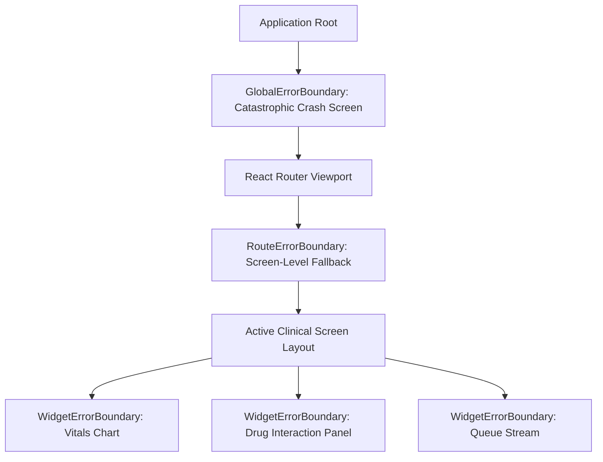

# Namma Clinic Frontend Error Handling, Resilience & Exception Recovery Architecture

## 1. Executive Summary & Resilience Principles
In high-volume public health outpatient departments, unexpected software crashes or lost form state directly compromise clinical safety and patient throughput. The Namma Clinic frontend implements a resilient, multi-tiered error handling architecture designed to prevent unhandled JavaScript exceptions from crashing the application, guarantee deterministic data preservation, and provide clear, actionable recovery workflows for healthcare staff.

## 2. Multi-Tier Error Boundary Architecture


## 3. Global HTTP Status Code Error Interceptors
| Status Code | Error Classification | Client Handling Strategy | UI Representation |
| :--- | :--- | :--- | :--- |
| 400 Bad Request | Schema Validation Failure | Highlights invalid fields; maps server error envelope to form inputs | Red inline helper text under offending input |
| 401 Unauthorized | Session Expired / Token Invalid | Pauses active mutations; pops non-destructive re-auth modal | `<SessionReAuthModal>` preserving form drafts |
| 403 Forbidden | RBAC Permission Denied | Displays unauthorized screen; suggests role escalation if appropriate | `<PermissionDeniedBanner>` with audit stamp |
| 404 Not Found | Resource Missing | Navigates to contextual not-found state; offers return to dashboard | `<ResourceNotFoundCard>` with search suggestion |
| 409 Conflict | Concurrency / Version Conflict | Triggers client-side three-way diff resolution view | `<SyncConflictResolutionModal>` |
| 422 Unprocessable | Clinical Rule Invariant Violation | Displays clinical constraint explanation (e.g., contraindicated drug) | `<ClinicalRuleViolationDialog>` |
| 429 Too Many Requests | Rate Limit Exceeded | Enforces client exponential backoff; displays countdown banner | Amber countdown toast: 'Retrying in X seconds' |
| 500 Internal Error | Server Exception | Logs error payload with trace ID; falls back to offline cached state | Red persistent toast with copyable Incident ID |
| 503 Service Unavailable | Maintenance / Network Partition | Switches frontend instantly to Degraded Offline Cache Mode | Persistent top alert: 'Offline Mode Active' |

## 4. Documentation-Only TypeScript Error Boundary Pattern
```typescript
// DOCUMENTATION-ONLY TYPESCRIPT
export interface ErrorBoundaryProps {
  fallbackComponent: React.ComponentType<{ error: Error; reset: () => void }>;
  onError?: (error: Error, info: React.ErrorInfo) => void;
  children: React.ReactNode;
}

export interface StandardErrorEnvelope {
  errorCode: string;
  message: string;
  details?: Record<string, string[]>;
  traceId: string;
  timestamp: string;
}
```

## 5. Screen-by-Screen Error Handling & Crash Recovery Specifications
The following specifications catalog the error boundaries, fallback UI components, and recovery procedures across all 108 screens:

### Error Handling & Exception Recovery for Screen SCREEN-001: User Login Screen
**Route:** `/login` | **Module:** `MODULE-001` | **Authorized Role:** `ROLE-001`

#### 1. Error Boundary Configuration
- **Boundary Type:** Route-level boundary wrapping `/login` with widget boundaries around external integrations.
- **State Preservation Strategy:** In-flight form state is automatically serialized to `sessionStorage` key `draft_screen-001` before error cascade.
- **Fallback Component:** `<ScreenCrashFallback screenId="{sid}" title="{sname}" />`.

#### 2. Specific Failure Modes & Mitigations
- **Network Disconnection During Mutation:** Operation queued to IndexedDB Outbox with optimistic acknowledgment.
- **Validation Failure:** Focus automatically placed on first invalid input; screen reader announces error string in Kannada and English.
- **Peripheral Failure:** If thermal printer or scanner disconnects, soft-warning banner displays manual override code.

#### 3. Documentation-Only Error Handling Code Pattern
```typescript
// DOCUMENTATION-ONLY RECOVERY HOOK
export const useScreenErrorRecovery_SCREEN_001 = () => {
  const screenId = 'SCREEN-001';
  const recoverDraft = () => {
    const saved = sessionStorage.getItem(`draft_${screenId.toLowerCase()}`);
    return saved ? JSON.parse(saved) : null;
  };
  const clearDraft = () => {
    sessionStorage.removeItem(`draft_${screenId.toLowerCase()}`);
  };
  return { recoverDraft, clearDraft };
};
```

---

### Error Handling & Exception Recovery for Screen SCREEN-002: MFA Verification Screen
**Route:** `/login/mfa` | **Module:** `MODULE-001` | **Authorized Role:** `ROLE-001`

#### 1. Error Boundary Configuration
- **Boundary Type:** Route-level boundary wrapping `/login/mfa` with widget boundaries around external integrations.
- **State Preservation Strategy:** In-flight form state is automatically serialized to `sessionStorage` key `draft_screen-002` before error cascade.
- **Fallback Component:** `<ScreenCrashFallback screenId="{sid}" title="{sname}" />`.

#### 2. Specific Failure Modes & Mitigations
- **Network Disconnection During Mutation:** Operation queued to IndexedDB Outbox with optimistic acknowledgment.
- **Validation Failure:** Focus automatically placed on first invalid input; screen reader announces error string in Kannada and English.
- **Peripheral Failure:** If thermal printer or scanner disconnects, soft-warning banner displays manual override code.

#### 3. Documentation-Only Error Handling Code Pattern
```typescript
// DOCUMENTATION-ONLY RECOVERY HOOK
export const useScreenErrorRecovery_SCREEN_002 = () => {
  const screenId = 'SCREEN-002';
  const recoverDraft = () => {
    const saved = sessionStorage.getItem(`draft_${screenId.toLowerCase()}`);
    return saved ? JSON.parse(saved) : null;
  };
  const clearDraft = () => {
    sessionStorage.removeItem(`draft_${screenId.toLowerCase()}`);
  };
  return { recoverDraft, clearDraft };
};
```

---

### Error Handling & Exception Recovery for Screen SCREEN-003: Terminal Pairing & Device Enrollment
**Route:** `/system/device-enroll` | **Module:** `MODULE-001` | **Authorized Role:** `ROLE-006`

#### 1. Error Boundary Configuration
- **Boundary Type:** Route-level boundary wrapping `/system/device-enroll` with widget boundaries around external integrations.
- **State Preservation Strategy:** In-flight form state is automatically serialized to `sessionStorage` key `draft_screen-003` before error cascade.
- **Fallback Component:** `<ScreenCrashFallback screenId="{sid}" title="{sname}" />`.

#### 2. Specific Failure Modes & Mitigations
- **Network Disconnection During Mutation:** Operation queued to IndexedDB Outbox with optimistic acknowledgment.
- **Validation Failure:** Focus automatically placed on first invalid input; screen reader announces error string in Kannada and English.
- **Peripheral Failure:** If thermal printer or scanner disconnects, soft-warning banner displays manual override code.

#### 3. Documentation-Only Error Handling Code Pattern
```typescript
// DOCUMENTATION-ONLY RECOVERY HOOK
export const useScreenErrorRecovery_SCREEN_003 = () => {
  const screenId = 'SCREEN-003';
  const recoverDraft = () => {
    const saved = sessionStorage.getItem(`draft_${screenId.toLowerCase()}`);
    return saved ? JSON.parse(saved) : null;
  };
  const clearDraft = () => {
    sessionStorage.removeItem(`draft_${screenId.toLowerCase()}`);
  };
  return { recoverDraft, clearDraft };
};
```

---

### Error Handling & Exception Recovery for Screen SCREEN-004: Clinic Shift Check-In & Handover
**Route:** `/shift/checkin` | **Module:** `MODULE-001` | **Authorized Role:** `ROLE-001`

#### 1. Error Boundary Configuration
- **Boundary Type:** Route-level boundary wrapping `/shift/checkin` with widget boundaries around external integrations.
- **State Preservation Strategy:** In-flight form state is automatically serialized to `sessionStorage` key `draft_screen-004` before error cascade.
- **Fallback Component:** `<ScreenCrashFallback screenId="{sid}" title="{sname}" />`.

#### 2. Specific Failure Modes & Mitigations
- **Network Disconnection During Mutation:** Operation queued to IndexedDB Outbox with optimistic acknowledgment.
- **Validation Failure:** Focus automatically placed on first invalid input; screen reader announces error string in Kannada and English.
- **Peripheral Failure:** If thermal printer or scanner disconnects, soft-warning banner displays manual override code.

#### 3. Documentation-Only Error Handling Code Pattern
```typescript
// DOCUMENTATION-ONLY RECOVERY HOOK
export const useScreenErrorRecovery_SCREEN_004 = () => {
  const screenId = 'SCREEN-004';
  const recoverDraft = () => {
    const saved = sessionStorage.getItem(`draft_${screenId.toLowerCase()}`);
    return saved ? JSON.parse(saved) : null;
  };
  const clearDraft = () => {
    sessionStorage.removeItem(`draft_${screenId.toLowerCase()}`);
  };
  return { recoverDraft, clearDraft };
};
```

---

### Error Handling & Exception Recovery for Screen SCREEN-005: Emergency Break-Glass Authorization
**Route:** `/auth/break-glass` | **Module:** `MODULE-001` | **Authorized Role:** `ROLE-002`

#### 1. Error Boundary Configuration
- **Boundary Type:** Route-level boundary wrapping `/auth/break-glass` with widget boundaries around external integrations.
- **State Preservation Strategy:** In-flight form state is automatically serialized to `sessionStorage` key `draft_screen-005` before error cascade.
- **Fallback Component:** `<ScreenCrashFallback screenId="{sid}" title="{sname}" />`.

#### 2. Specific Failure Modes & Mitigations
- **Network Disconnection During Mutation:** Operation queued to IndexedDB Outbox with optimistic acknowledgment.
- **Validation Failure:** Focus automatically placed on first invalid input; screen reader announces error string in Kannada and English.
- **Peripheral Failure:** If thermal printer or scanner disconnects, soft-warning banner displays manual override code.

#### 3. Documentation-Only Error Handling Code Pattern
```typescript
// DOCUMENTATION-ONLY RECOVERY HOOK
export const useScreenErrorRecovery_SCREEN_005 = () => {
  const screenId = 'SCREEN-005';
  const recoverDraft = () => {
    const saved = sessionStorage.getItem(`draft_${screenId.toLowerCase()}`);
    return saved ? JSON.parse(saved) : null;
  };
  const clearDraft = () => {
    sessionStorage.removeItem(`draft_${screenId.toLowerCase()}`);
  };
  return { recoverDraft, clearDraft };
};
```

---

### Error Handling & Exception Recovery for Screen SCREEN-006: Master Clinic Dashboard
**Route:** `/dashboard` | **Module:** `MODULE-002` | **Authorized Role:** `ROLE-001`

#### 1. Error Boundary Configuration
- **Boundary Type:** Route-level boundary wrapping `/dashboard` with widget boundaries around external integrations.
- **State Preservation Strategy:** In-flight form state is automatically serialized to `sessionStorage` key `draft_screen-006` before error cascade.
- **Fallback Component:** `<ScreenCrashFallback screenId="{sid}" title="{sname}" />`.

#### 2. Specific Failure Modes & Mitigations
- **Network Disconnection During Mutation:** Operation queued to IndexedDB Outbox with optimistic acknowledgment.
- **Validation Failure:** Focus automatically placed on first invalid input; screen reader announces error string in Kannada and English.
- **Peripheral Failure:** If thermal printer or scanner disconnects, soft-warning banner displays manual override code.

#### 3. Documentation-Only Error Handling Code Pattern
```typescript
// DOCUMENTATION-ONLY RECOVERY HOOK
export const useScreenErrorRecovery_SCREEN_006 = () => {
  const screenId = 'SCREEN-006';
  const recoverDraft = () => {
    const saved = sessionStorage.getItem(`draft_${screenId.toLowerCase()}`);
    return saved ? JSON.parse(saved) : null;
  };
  const clearDraft = () => {
    sessionStorage.removeItem(`draft_${screenId.toLowerCase()}`);
  };
  return { recoverDraft, clearDraft };
};
```

---

### Error Handling & Exception Recovery for Screen SCREEN-007: Doctor Outpatient Console
**Route:** `/doctor/console` | **Module:** `MODULE-002` | **Authorized Role:** `ROLE-002`

#### 1. Error Boundary Configuration
- **Boundary Type:** Route-level boundary wrapping `/doctor/console` with widget boundaries around external integrations.
- **State Preservation Strategy:** In-flight form state is automatically serialized to `sessionStorage` key `draft_screen-007` before error cascade.
- **Fallback Component:** `<ScreenCrashFallback screenId="{sid}" title="{sname}" />`.

#### 2. Specific Failure Modes & Mitigations
- **Network Disconnection During Mutation:** Operation queued to IndexedDB Outbox with optimistic acknowledgment.
- **Validation Failure:** Focus automatically placed on first invalid input; screen reader announces error string in Kannada and English.
- **Peripheral Failure:** If thermal printer or scanner disconnects, soft-warning banner displays manual override code.

#### 3. Documentation-Only Error Handling Code Pattern
```typescript
// DOCUMENTATION-ONLY RECOVERY HOOK
export const useScreenErrorRecovery_SCREEN_007 = () => {
  const screenId = 'SCREEN-007';
  const recoverDraft = () => {
    const saved = sessionStorage.getItem(`draft_${screenId.toLowerCase()}`);
    return saved ? JSON.parse(saved) : null;
  };
  const clearDraft = () => {
    sessionStorage.removeItem(`draft_${screenId.toLowerCase()}`);
  };
  return { recoverDraft, clearDraft };
};
```

---

### Error Handling & Exception Recovery for Screen SCREEN-008: Staff Nurse Triage Workbench
**Route:** `/nurse/triage` | **Module:** `MODULE-002` | **Authorized Role:** `ROLE-003`

#### 1. Error Boundary Configuration
- **Boundary Type:** Route-level boundary wrapping `/nurse/triage` with widget boundaries around external integrations.
- **State Preservation Strategy:** In-flight form state is automatically serialized to `sessionStorage` key `draft_screen-008` before error cascade.
- **Fallback Component:** `<ScreenCrashFallback screenId="{sid}" title="{sname}" />`.

#### 2. Specific Failure Modes & Mitigations
- **Network Disconnection During Mutation:** Operation queued to IndexedDB Outbox with optimistic acknowledgment.
- **Validation Failure:** Focus automatically placed on first invalid input; screen reader announces error string in Kannada and English.
- **Peripheral Failure:** If thermal printer or scanner disconnects, soft-warning banner displays manual override code.

#### 3. Documentation-Only Error Handling Code Pattern
```typescript
// DOCUMENTATION-ONLY RECOVERY HOOK
export const useScreenErrorRecovery_SCREEN_008 = () => {
  const screenId = 'SCREEN-008';
  const recoverDraft = () => {
    const saved = sessionStorage.getItem(`draft_${screenId.toLowerCase()}`);
    return saved ? JSON.parse(saved) : null;
  };
  const clearDraft = () => {
    sessionStorage.removeItem(`draft_${screenId.toLowerCase()}`);
  };
  return { recoverDraft, clearDraft };
};
```

---

### Error Handling & Exception Recovery for Screen SCREEN-009: Pharmacy Dispensing Console
**Route:** `/pharmacy/dispense` | **Module:** `MODULE-002` | **Authorized Role:** `ROLE-004`

#### 1. Error Boundary Configuration
- **Boundary Type:** Route-level boundary wrapping `/pharmacy/dispense` with widget boundaries around external integrations.
- **State Preservation Strategy:** In-flight form state is automatically serialized to `sessionStorage` key `draft_screen-009` before error cascade.
- **Fallback Component:** `<ScreenCrashFallback screenId="{sid}" title="{sname}" />`.

#### 2. Specific Failure Modes & Mitigations
- **Network Disconnection During Mutation:** Operation queued to IndexedDB Outbox with optimistic acknowledgment.
- **Validation Failure:** Focus automatically placed on first invalid input; screen reader announces error string in Kannada and English.
- **Peripheral Failure:** If thermal printer or scanner disconnects, soft-warning banner displays manual override code.

#### 3. Documentation-Only Error Handling Code Pattern
```typescript
// DOCUMENTATION-ONLY RECOVERY HOOK
export const useScreenErrorRecovery_SCREEN_009 = () => {
  const screenId = 'SCREEN-009';
  const recoverDraft = () => {
    const saved = sessionStorage.getItem(`draft_${screenId.toLowerCase()}`);
    return saved ? JSON.parse(saved) : null;
  };
  const clearDraft = () => {
    sessionStorage.removeItem(`draft_${screenId.toLowerCase()}`);
  };
  return { recoverDraft, clearDraft };
};
```

---

### Error Handling & Exception Recovery for Screen SCREEN-010: Diagnostic Laboratory Workbench
**Route:** `/lab/workbench` | **Module:** `MODULE-002` | **Authorized Role:** `ROLE-005`

#### 1. Error Boundary Configuration
- **Boundary Type:** Route-level boundary wrapping `/lab/workbench` with widget boundaries around external integrations.
- **State Preservation Strategy:** In-flight form state is automatically serialized to `sessionStorage` key `draft_screen-010` before error cascade.
- **Fallback Component:** `<ScreenCrashFallback screenId="{sid}" title="{sname}" />`.

#### 2. Specific Failure Modes & Mitigations
- **Network Disconnection During Mutation:** Operation queued to IndexedDB Outbox with optimistic acknowledgment.
- **Validation Failure:** Focus automatically placed on first invalid input; screen reader announces error string in Kannada and English.
- **Peripheral Failure:** If thermal printer or scanner disconnects, soft-warning banner displays manual override code.

#### 3. Documentation-Only Error Handling Code Pattern
```typescript
// DOCUMENTATION-ONLY RECOVERY HOOK
export const useScreenErrorRecovery_SCREEN_010 = () => {
  const screenId = 'SCREEN-010';
  const recoverDraft = () => {
    const saved = sessionStorage.getItem(`draft_${screenId.toLowerCase()}`);
    return saved ? JSON.parse(saved) : null;
  };
  const clearDraft = () => {
    sessionStorage.removeItem(`draft_${screenId.toLowerCase()}`);
  };
  return { recoverDraft, clearDraft };
};
```

---

### Error Handling & Exception Recovery for Screen SCREEN-011: Citizen New Registration Screen
**Route:** `/patients/new` | **Module:** `MODULE-003` | **Authorized Role:** `ROLE-001`

#### 1. Error Boundary Configuration
- **Boundary Type:** Route-level boundary wrapping `/patients/new` with widget boundaries around external integrations.
- **State Preservation Strategy:** In-flight form state is automatically serialized to `sessionStorage` key `draft_screen-011` before error cascade.
- **Fallback Component:** `<ScreenCrashFallback screenId="{sid}" title="{sname}" />`.

#### 2. Specific Failure Modes & Mitigations
- **Network Disconnection During Mutation:** Operation queued to IndexedDB Outbox with optimistic acknowledgment.
- **Validation Failure:** Focus automatically placed on first invalid input; screen reader announces error string in Kannada and English.
- **Peripheral Failure:** If thermal printer or scanner disconnects, soft-warning banner displays manual override code.

#### 3. Documentation-Only Error Handling Code Pattern
```typescript
// DOCUMENTATION-ONLY RECOVERY HOOK
export const useScreenErrorRecovery_SCREEN_011 = () => {
  const screenId = 'SCREEN-011';
  const recoverDraft = () => {
    const saved = sessionStorage.getItem(`draft_${screenId.toLowerCase()}`);
    return saved ? JSON.parse(saved) : null;
  };
  const clearDraft = () => {
    sessionStorage.removeItem(`draft_${screenId.toLowerCase()}`);
  };
  return { recoverDraft, clearDraft };
};
```

---

### Error Handling & Exception Recovery for Screen SCREEN-012: Citizen Search & Retrieval Screen
**Route:** `/patients/search` | **Module:** `MODULE-003` | **Authorized Role:** `ROLE-001`

#### 1. Error Boundary Configuration
- **Boundary Type:** Route-level boundary wrapping `/patients/search` with widget boundaries around external integrations.
- **State Preservation Strategy:** In-flight form state is automatically serialized to `sessionStorage` key `draft_screen-012` before error cascade.
- **Fallback Component:** `<ScreenCrashFallback screenId="{sid}" title="{sname}" />`.

#### 2. Specific Failure Modes & Mitigations
- **Network Disconnection During Mutation:** Operation queued to IndexedDB Outbox with optimistic acknowledgment.
- **Validation Failure:** Focus automatically placed on first invalid input; screen reader announces error string in Kannada and English.
- **Peripheral Failure:** If thermal printer or scanner disconnects, soft-warning banner displays manual override code.

#### 3. Documentation-Only Error Handling Code Pattern
```typescript
// DOCUMENTATION-ONLY RECOVERY HOOK
export const useScreenErrorRecovery_SCREEN_012 = () => {
  const screenId = 'SCREEN-012';
  const recoverDraft = () => {
    const saved = sessionStorage.getItem(`draft_${screenId.toLowerCase()}`);
    return saved ? JSON.parse(saved) : null;
  };
  const clearDraft = () => {
    sessionStorage.removeItem(`draft_${screenId.toLowerCase()}`);
  };
  return { recoverDraft, clearDraft };
};
```

---

### Error Handling & Exception Recovery for Screen SCREEN-013: Patient Longitudinal Profile View
**Route:** `/patients/:id` | **Module:** `MODULE-003` | **Authorized Role:** `ROLE-002`

#### 1. Error Boundary Configuration
- **Boundary Type:** Route-level boundary wrapping `/patients/:id` with widget boundaries around external integrations.
- **State Preservation Strategy:** In-flight form state is automatically serialized to `sessionStorage` key `draft_screen-013` before error cascade.
- **Fallback Component:** `<ScreenCrashFallback screenId="{sid}" title="{sname}" />`.

#### 2. Specific Failure Modes & Mitigations
- **Network Disconnection During Mutation:** Operation queued to IndexedDB Outbox with optimistic acknowledgment.
- **Validation Failure:** Focus automatically placed on first invalid input; screen reader announces error string in Kannada and English.
- **Peripheral Failure:** If thermal printer or scanner disconnects, soft-warning banner displays manual override code.

#### 3. Documentation-Only Error Handling Code Pattern
```typescript
// DOCUMENTATION-ONLY RECOVERY HOOK
export const useScreenErrorRecovery_SCREEN_013 = () => {
  const screenId = 'SCREEN-013';
  const recoverDraft = () => {
    const saved = sessionStorage.getItem(`draft_${screenId.toLowerCase()}`);
    return saved ? JSON.parse(saved) : null;
  };
  const clearDraft = () => {
    sessionStorage.removeItem(`draft_${screenId.toLowerCase()}`);
  };
  return { recoverDraft, clearDraft };
};
```

---

### Error Handling & Exception Recovery for Screen SCREEN-014: Repeat Patient Fast Intake
**Route:** `/patients/:id/repeat-intake` | **Module:** `MODULE-003` | **Authorized Role:** `ROLE-001`

#### 1. Error Boundary Configuration
- **Boundary Type:** Route-level boundary wrapping `/patients/:id/repeat-intake` with widget boundaries around external integrations.
- **State Preservation Strategy:** In-flight form state is automatically serialized to `sessionStorage` key `draft_screen-014` before error cascade.
- **Fallback Component:** `<ScreenCrashFallback screenId="{sid}" title="{sname}" />`.

#### 2. Specific Failure Modes & Mitigations
- **Network Disconnection During Mutation:** Operation queued to IndexedDB Outbox with optimistic acknowledgment.
- **Validation Failure:** Focus automatically placed on first invalid input; screen reader announces error string in Kannada and English.
- **Peripheral Failure:** If thermal printer or scanner disconnects, soft-warning banner displays manual override code.

#### 3. Documentation-Only Error Handling Code Pattern
```typescript
// DOCUMENTATION-ONLY RECOVERY HOOK
export const useScreenErrorRecovery_SCREEN_014 = () => {
  const screenId = 'SCREEN-014';
  const recoverDraft = () => {
    const saved = sessionStorage.getItem(`draft_${screenId.toLowerCase()}`);
    return saved ? JSON.parse(saved) : null;
  };
  const clearDraft = () => {
    sessionStorage.removeItem(`draft_${screenId.toLowerCase()}`);
  };
  return { recoverDraft, clearDraft };
};
```

---

### Error Handling & Exception Recovery for Screen SCREEN-015: Biometric & ABHA Card Scan Modal
**Route:** `/patients/abha-scan` | **Module:** `MODULE-003` | **Authorized Role:** `ROLE-001`

#### 1. Error Boundary Configuration
- **Boundary Type:** Route-level boundary wrapping `/patients/abha-scan` with widget boundaries around external integrations.
- **State Preservation Strategy:** In-flight form state is automatically serialized to `sessionStorage` key `draft_screen-015` before error cascade.
- **Fallback Component:** `<ScreenCrashFallback screenId="{sid}" title="{sname}" />`.

#### 2. Specific Failure Modes & Mitigations
- **Network Disconnection During Mutation:** Operation queued to IndexedDB Outbox with optimistic acknowledgment.
- **Validation Failure:** Focus automatically placed on first invalid input; screen reader announces error string in Kannada and English.
- **Peripheral Failure:** If thermal printer or scanner disconnects, soft-warning banner displays manual override code.

#### 3. Documentation-Only Error Handling Code Pattern
```typescript
// DOCUMENTATION-ONLY RECOVERY HOOK
export const useScreenErrorRecovery_SCREEN_015 = () => {
  const screenId = 'SCREEN-015';
  const recoverDraft = () => {
    const saved = sessionStorage.getItem(`draft_${screenId.toLowerCase()}`);
    return saved ? JSON.parse(saved) : null;
  };
  const clearDraft = () => {
    sessionStorage.removeItem(`draft_${screenId.toLowerCase()}`);
  };
  return { recoverDraft, clearDraft };
};
```

---

### Error Handling & Exception Recovery for Screen SCREEN-016: Citizen Demographic Correction Form
**Route:** `/patients/:id/edit` | **Module:** `MODULE-003` | **Authorized Role:** `ROLE-001`

#### 1. Error Boundary Configuration
- **Boundary Type:** Route-level boundary wrapping `/patients/:id/edit` with widget boundaries around external integrations.
- **State Preservation Strategy:** In-flight form state is automatically serialized to `sessionStorage` key `draft_screen-016` before error cascade.
- **Fallback Component:** `<ScreenCrashFallback screenId="{sid}" title="{sname}" />`.

#### 2. Specific Failure Modes & Mitigations
- **Network Disconnection During Mutation:** Operation queued to IndexedDB Outbox with optimistic acknowledgment.
- **Validation Failure:** Focus automatically placed on first invalid input; screen reader announces error string in Kannada and English.
- **Peripheral Failure:** If thermal printer or scanner disconnects, soft-warning banner displays manual override code.

#### 3. Documentation-Only Error Handling Code Pattern
```typescript
// DOCUMENTATION-ONLY RECOVERY HOOK
export const useScreenErrorRecovery_SCREEN_016 = () => {
  const screenId = 'SCREEN-016';
  const recoverDraft = () => {
    const saved = sessionStorage.getItem(`draft_${screenId.toLowerCase()}`);
    return saved ? JSON.parse(saved) : null;
  };
  const clearDraft = () => {
    sessionStorage.removeItem(`draft_${screenId.toLowerCase()}`);
  };
  return { recoverDraft, clearDraft };
};
```

---

### Error Handling & Exception Recovery for Screen SCREEN-017: Duplicate Citizen Merge Modal
**Route:** `/patients/merge` | **Module:** `MODULE-003` | **Authorized Role:** `ROLE-006`

#### 1. Error Boundary Configuration
- **Boundary Type:** Route-level boundary wrapping `/patients/merge` with widget boundaries around external integrations.
- **State Preservation Strategy:** In-flight form state is automatically serialized to `sessionStorage` key `draft_screen-017` before error cascade.
- **Fallback Component:** `<ScreenCrashFallback screenId="{sid}" title="{sname}" />`.

#### 2. Specific Failure Modes & Mitigations
- **Network Disconnection During Mutation:** Operation queued to IndexedDB Outbox with optimistic acknowledgment.
- **Validation Failure:** Focus automatically placed on first invalid input; screen reader announces error string in Kannada and English.
- **Peripheral Failure:** If thermal printer or scanner disconnects, soft-warning banner displays manual override code.

#### 3. Documentation-Only Error Handling Code Pattern
```typescript
// DOCUMENTATION-ONLY RECOVERY HOOK
export const useScreenErrorRecovery_SCREEN_017 = () => {
  const screenId = 'SCREEN-017';
  const recoverDraft = () => {
    const saved = sessionStorage.getItem(`draft_${screenId.toLowerCase()}`);
    return saved ? JSON.parse(saved) : null;
  };
  const clearDraft = () => {
    sessionStorage.removeItem(`draft_${screenId.toLowerCase()}`);
  };
  return { recoverDraft, clearDraft };
};
```

---

### Error Handling & Exception Recovery for Screen SCREEN-018: Citizen Digital Photo Capture
**Route:** `/patients/:id/photo` | **Module:** `MODULE-003` | **Authorized Role:** `ROLE-001`

#### 1. Error Boundary Configuration
- **Boundary Type:** Route-level boundary wrapping `/patients/:id/photo` with widget boundaries around external integrations.
- **State Preservation Strategy:** In-flight form state is automatically serialized to `sessionStorage` key `draft_screen-018` before error cascade.
- **Fallback Component:** `<ScreenCrashFallback screenId="{sid}" title="{sname}" />`.

#### 2. Specific Failure Modes & Mitigations
- **Network Disconnection During Mutation:** Operation queued to IndexedDB Outbox with optimistic acknowledgment.
- **Validation Failure:** Focus automatically placed on first invalid input; screen reader announces error string in Kannada and English.
- **Peripheral Failure:** If thermal printer or scanner disconnects, soft-warning banner displays manual override code.

#### 3. Documentation-Only Error Handling Code Pattern
```typescript
// DOCUMENTATION-ONLY RECOVERY HOOK
export const useScreenErrorRecovery_SCREEN_018 = () => {
  const screenId = 'SCREEN-018';
  const recoverDraft = () => {
    const saved = sessionStorage.getItem(`draft_${screenId.toLowerCase()}`);
    return saved ? JSON.parse(saved) : null;
  };
  const clearDraft = () => {
    sessionStorage.removeItem(`draft_${screenId.toLowerCase()}`);
  };
  return { recoverDraft, clearDraft };
};
```

---

### Error Handling & Exception Recovery for Screen SCREEN-019: DPDP Informed Consent Capture Screen
**Route:** `/patients/:id/consent` | **Module:** `MODULE-004` | **Authorized Role:** `ROLE-001`

#### 1. Error Boundary Configuration
- **Boundary Type:** Route-level boundary wrapping `/patients/:id/consent` with widget boundaries around external integrations.
- **State Preservation Strategy:** In-flight form state is automatically serialized to `sessionStorage` key `draft_screen-019` before error cascade.
- **Fallback Component:** `<ScreenCrashFallback screenId="{sid}" title="{sname}" />`.

#### 2. Specific Failure Modes & Mitigations
- **Network Disconnection During Mutation:** Operation queued to IndexedDB Outbox with optimistic acknowledgment.
- **Validation Failure:** Focus automatically placed on first invalid input; screen reader announces error string in Kannada and English.
- **Peripheral Failure:** If thermal printer or scanner disconnects, soft-warning banner displays manual override code.

#### 3. Documentation-Only Error Handling Code Pattern
```typescript
// DOCUMENTATION-ONLY RECOVERY HOOK
export const useScreenErrorRecovery_SCREEN_019 = () => {
  const screenId = 'SCREEN-019';
  const recoverDraft = () => {
    const saved = sessionStorage.getItem(`draft_${screenId.toLowerCase()}`);
    return saved ? JSON.parse(saved) : null;
  };
  const clearDraft = () => {
    sessionStorage.removeItem(`draft_${screenId.toLowerCase()}`);
  };
  return { recoverDraft, clearDraft };
};
```

---

### Error Handling & Exception Recovery for Screen SCREEN-020: Consent History & Revocation Console
**Route:** `/patients/:id/consents` | **Module:** `MODULE-004` | **Authorized Role:** `ROLE-001`

#### 1. Error Boundary Configuration
- **Boundary Type:** Route-level boundary wrapping `/patients/:id/consents` with widget boundaries around external integrations.
- **State Preservation Strategy:** In-flight form state is automatically serialized to `sessionStorage` key `draft_screen-020` before error cascade.
- **Fallback Component:** `<ScreenCrashFallback screenId="{sid}" title="{sname}" />`.

#### 2. Specific Failure Modes & Mitigations
- **Network Disconnection During Mutation:** Operation queued to IndexedDB Outbox with optimistic acknowledgment.
- **Validation Failure:** Focus automatically placed on first invalid input; screen reader announces error string in Kannada and English.
- **Peripheral Failure:** If thermal printer or scanner disconnects, soft-warning banner displays manual override code.

#### 3. Documentation-Only Error Handling Code Pattern
```typescript
// DOCUMENTATION-ONLY RECOVERY HOOK
export const useScreenErrorRecovery_SCREEN_020 = () => {
  const screenId = 'SCREEN-020';
  const recoverDraft = () => {
    const saved = sessionStorage.getItem(`draft_${screenId.toLowerCase()}`);
    return saved ? JSON.parse(saved) : null;
  };
  const clearDraft = () => {
    sessionStorage.removeItem(`draft_${screenId.toLowerCase()}`);
  };
  return { recoverDraft, clearDraft };
};
```

---

### Error Handling & Exception Recovery for Screen SCREEN-021: Data Portability & Export Request
**Route:** `/patients/:id/export` | **Module:** `MODULE-004` | **Authorized Role:** `ROLE-001`

#### 1. Error Boundary Configuration
- **Boundary Type:** Route-level boundary wrapping `/patients/:id/export` with widget boundaries around external integrations.
- **State Preservation Strategy:** In-flight form state is automatically serialized to `sessionStorage` key `draft_screen-021` before error cascade.
- **Fallback Component:** `<ScreenCrashFallback screenId="{sid}" title="{sname}" />`.

#### 2. Specific Failure Modes & Mitigations
- **Network Disconnection During Mutation:** Operation queued to IndexedDB Outbox with optimistic acknowledgment.
- **Validation Failure:** Focus automatically placed on first invalid input; screen reader announces error string in Kannada and English.
- **Peripheral Failure:** If thermal printer or scanner disconnects, soft-warning banner displays manual override code.

#### 3. Documentation-Only Error Handling Code Pattern
```typescript
// DOCUMENTATION-ONLY RECOVERY HOOK
export const useScreenErrorRecovery_SCREEN_021 = () => {
  const screenId = 'SCREEN-021';
  const recoverDraft = () => {
    const saved = sessionStorage.getItem(`draft_${screenId.toLowerCase()}`);
    return saved ? JSON.parse(saved) : null;
  };
  const clearDraft = () => {
    sessionStorage.removeItem(`draft_${screenId.toLowerCase()}`);
  };
  return { recoverDraft, clearDraft };
};
```

---

### Error Handling & Exception Recovery for Screen SCREEN-022: Citizen Grievance Redressal Intake
**Route:** `/patients/:id/grievance` | **Module:** `MODULE-004` | **Authorized Role:** `ROLE-001`

#### 1. Error Boundary Configuration
- **Boundary Type:** Route-level boundary wrapping `/patients/:id/grievance` with widget boundaries around external integrations.
- **State Preservation Strategy:** In-flight form state is automatically serialized to `sessionStorage` key `draft_screen-022` before error cascade.
- **Fallback Component:** `<ScreenCrashFallback screenId="{sid}" title="{sname}" />`.

#### 2. Specific Failure Modes & Mitigations
- **Network Disconnection During Mutation:** Operation queued to IndexedDB Outbox with optimistic acknowledgment.
- **Validation Failure:** Focus automatically placed on first invalid input; screen reader announces error string in Kannada and English.
- **Peripheral Failure:** If thermal printer or scanner disconnects, soft-warning banner displays manual override code.

#### 3. Documentation-Only Error Handling Code Pattern
```typescript
// DOCUMENTATION-ONLY RECOVERY HOOK
export const useScreenErrorRecovery_SCREEN_022 = () => {
  const screenId = 'SCREEN-022';
  const recoverDraft = () => {
    const saved = sessionStorage.getItem(`draft_${screenId.toLowerCase()}`);
    return saved ? JSON.parse(saved) : null;
  };
  const clearDraft = () => {
    sessionStorage.removeItem(`draft_${screenId.toLowerCase()}`);
  };
  return { recoverDraft, clearDraft };
};
```

---

### Error Handling & Exception Recovery for Screen SCREEN-023: Grievance Investigation & Resolution
**Route:** `/grievances/:id` | **Module:** `MODULE-004` | **Authorized Role:** `ROLE-021`

#### 1. Error Boundary Configuration
- **Boundary Type:** Route-level boundary wrapping `/grievances/:id` with widget boundaries around external integrations.
- **State Preservation Strategy:** In-flight form state is automatically serialized to `sessionStorage` key `draft_screen-023` before error cascade.
- **Fallback Component:** `<ScreenCrashFallback screenId="{sid}" title="{sname}" />`.

#### 2. Specific Failure Modes & Mitigations
- **Network Disconnection During Mutation:** Operation queued to IndexedDB Outbox with optimistic acknowledgment.
- **Validation Failure:** Focus automatically placed on first invalid input; screen reader announces error string in Kannada and English.
- **Peripheral Failure:** If thermal printer or scanner disconnects, soft-warning banner displays manual override code.

#### 3. Documentation-Only Error Handling Code Pattern
```typescript
// DOCUMENTATION-ONLY RECOVERY HOOK
export const useScreenErrorRecovery_SCREEN_023 = () => {
  const screenId = 'SCREEN-023';
  const recoverDraft = () => {
    const saved = sessionStorage.getItem(`draft_${screenId.toLowerCase()}`);
    return saved ? JSON.parse(saved) : null;
  };
  const clearDraft = () => {
    sessionStorage.removeItem(`draft_${screenId.toLowerCase()}`);
  };
  return { recoverDraft, clearDraft };
};
```

---

### Error Handling & Exception Recovery for Screen SCREEN-024: OPD Token Generation & Print Modal
**Route:** `/queue/tokens/new` | **Module:** `MODULE-005` | **Authorized Role:** `ROLE-001`

#### 1. Error Boundary Configuration
- **Boundary Type:** Route-level boundary wrapping `/queue/tokens/new` with widget boundaries around external integrations.
- **State Preservation Strategy:** In-flight form state is automatically serialized to `sessionStorage` key `draft_screen-024` before error cascade.
- **Fallback Component:** `<ScreenCrashFallback screenId="{sid}" title="{sname}" />`.

#### 2. Specific Failure Modes & Mitigations
- **Network Disconnection During Mutation:** Operation queued to IndexedDB Outbox with optimistic acknowledgment.
- **Validation Failure:** Focus automatically placed on first invalid input; screen reader announces error string in Kannada and English.
- **Peripheral Failure:** If thermal printer or scanner disconnects, soft-warning banner displays manual override code.

#### 3. Documentation-Only Error Handling Code Pattern
```typescript
// DOCUMENTATION-ONLY RECOVERY HOOK
export const useScreenErrorRecovery_SCREEN_024 = () => {
  const screenId = 'SCREEN-024';
  const recoverDraft = () => {
    const saved = sessionStorage.getItem(`draft_${screenId.toLowerCase()}`);
    return saved ? JSON.parse(saved) : null;
  };
  const clearDraft = () => {
    sessionStorage.removeItem(`draft_${screenId.toLowerCase()}`);
  };
  return { recoverDraft, clearDraft };
};
```

---

### Error Handling & Exception Recovery for Screen SCREEN-025: Master Waiting Room Queue Display
**Route:** `/queue/display` | **Module:** `MODULE-005` | **Authorized Role:** `ROLE-001`

#### 1. Error Boundary Configuration
- **Boundary Type:** Route-level boundary wrapping `/queue/display` with widget boundaries around external integrations.
- **State Preservation Strategy:** In-flight form state is automatically serialized to `sessionStorage` key `draft_screen-025` before error cascade.
- **Fallback Component:** `<ScreenCrashFallback screenId="{sid}" title="{sname}" />`.

#### 2. Specific Failure Modes & Mitigations
- **Network Disconnection During Mutation:** Operation queued to IndexedDB Outbox with optimistic acknowledgment.
- **Validation Failure:** Focus automatically placed on first invalid input; screen reader announces error string in Kannada and English.
- **Peripheral Failure:** If thermal printer or scanner disconnects, soft-warning banner displays manual override code.

#### 3. Documentation-Only Error Handling Code Pattern
```typescript
// DOCUMENTATION-ONLY RECOVERY HOOK
export const useScreenErrorRecovery_SCREEN_025 = () => {
  const screenId = 'SCREEN-025';
  const recoverDraft = () => {
    const saved = sessionStorage.getItem(`draft_${screenId.toLowerCase()}`);
    return saved ? JSON.parse(saved) : null;
  };
  const clearDraft = () => {
    sessionStorage.removeItem(`draft_${screenId.toLowerCase()}`);
  };
  return { recoverDraft, clearDraft };
};
```

---

### Error Handling & Exception Recovery for Screen SCREEN-026: Queue Management & Rerouting Screen
**Route:** `/queue/manage` | **Module:** `MODULE-005` | **Authorized Role:** `ROLE-003`

#### 1. Error Boundary Configuration
- **Boundary Type:** Route-level boundary wrapping `/queue/manage` with widget boundaries around external integrations.
- **State Preservation Strategy:** In-flight form state is automatically serialized to `sessionStorage` key `draft_screen-026` before error cascade.
- **Fallback Component:** `<ScreenCrashFallback screenId="{sid}" title="{sname}" />`.

#### 2. Specific Failure Modes & Mitigations
- **Network Disconnection During Mutation:** Operation queued to IndexedDB Outbox with optimistic acknowledgment.
- **Validation Failure:** Focus automatically placed on first invalid input; screen reader announces error string in Kannada and English.
- **Peripheral Failure:** If thermal printer or scanner disconnects, soft-warning banner displays manual override code.

#### 3. Documentation-Only Error Handling Code Pattern
```typescript
// DOCUMENTATION-ONLY RECOVERY HOOK
export const useScreenErrorRecovery_SCREEN_026 = () => {
  const screenId = 'SCREEN-026';
  const recoverDraft = () => {
    const saved = sessionStorage.getItem(`draft_${screenId.toLowerCase()}`);
    return saved ? JSON.parse(saved) : null;
  };
  const clearDraft = () => {
    sessionStorage.removeItem(`draft_${screenId.toLowerCase()}`);
  };
  return { recoverDraft, clearDraft };
};
```

---

### Error Handling & Exception Recovery for Screen SCREEN-027: Express Triage Queue
**Route:** `/queue/triage-express` | **Module:** `MODULE-005` | **Authorized Role:** `ROLE-003`

#### 1. Error Boundary Configuration
- **Boundary Type:** Route-level boundary wrapping `/queue/triage-express` with widget boundaries around external integrations.
- **State Preservation Strategy:** In-flight form state is automatically serialized to `sessionStorage` key `draft_screen-027` before error cascade.
- **Fallback Component:** `<ScreenCrashFallback screenId="{sid}" title="{sname}" />`.

#### 2. Specific Failure Modes & Mitigations
- **Network Disconnection During Mutation:** Operation queued to IndexedDB Outbox with optimistic acknowledgment.
- **Validation Failure:** Focus automatically placed on first invalid input; screen reader announces error string in Kannada and English.
- **Peripheral Failure:** If thermal printer or scanner disconnects, soft-warning banner displays manual override code.

#### 3. Documentation-Only Error Handling Code Pattern
```typescript
// DOCUMENTATION-ONLY RECOVERY HOOK
export const useScreenErrorRecovery_SCREEN_027 = () => {
  const screenId = 'SCREEN-027';
  const recoverDraft = () => {
    const saved = sessionStorage.getItem(`draft_${screenId.toLowerCase()}`);
    return saved ? JSON.parse(saved) : null;
  };
  const clearDraft = () => {
    sessionStorage.removeItem(`draft_${screenId.toLowerCase()}`);
  };
  return { recoverDraft, clearDraft };
};
```

---

### Error Handling & Exception Recovery for Screen SCREEN-028: Pharmacy Pickup Waiting Screen
**Route:** `/queue/pharmacy` | **Module:** `MODULE-005` | **Authorized Role:** `ROLE-004`

#### 1. Error Boundary Configuration
- **Boundary Type:** Route-level boundary wrapping `/queue/pharmacy` with widget boundaries around external integrations.
- **State Preservation Strategy:** In-flight form state is automatically serialized to `sessionStorage` key `draft_screen-028` before error cascade.
- **Fallback Component:** `<ScreenCrashFallback screenId="{sid}" title="{sname}" />`.

#### 2. Specific Failure Modes & Mitigations
- **Network Disconnection During Mutation:** Operation queued to IndexedDB Outbox with optimistic acknowledgment.
- **Validation Failure:** Focus automatically placed on first invalid input; screen reader announces error string in Kannada and English.
- **Peripheral Failure:** If thermal printer or scanner disconnects, soft-warning banner displays manual override code.

#### 3. Documentation-Only Error Handling Code Pattern
```typescript
// DOCUMENTATION-ONLY RECOVERY HOOK
export const useScreenErrorRecovery_SCREEN_028 = () => {
  const screenId = 'SCREEN-028';
  const recoverDraft = () => {
    const saved = sessionStorage.getItem(`draft_${screenId.toLowerCase()}`);
    return saved ? JSON.parse(saved) : null;
  };
  const clearDraft = () => {
    sessionStorage.removeItem(`draft_${screenId.toLowerCase()}`);
  };
  return { recoverDraft, clearDraft };
};
```

---

### Error Handling & Exception Recovery for Screen SCREEN-029: Triage Vitals Entry Form
**Route:** `/triage/:visitId/vitals` | **Module:** `MODULE-006` | **Authorized Role:** `ROLE-003`

#### 1. Error Boundary Configuration
- **Boundary Type:** Route-level boundary wrapping `/triage/:visitId/vitals` with widget boundaries around external integrations.
- **State Preservation Strategy:** In-flight form state is automatically serialized to `sessionStorage` key `draft_screen-029` before error cascade.
- **Fallback Component:** `<ScreenCrashFallback screenId="{sid}" title="{sname}" />`.

#### 2. Specific Failure Modes & Mitigations
- **Network Disconnection During Mutation:** Operation queued to IndexedDB Outbox with optimistic acknowledgment.
- **Validation Failure:** Focus automatically placed on first invalid input; screen reader announces error string in Kannada and English.
- **Peripheral Failure:** If thermal printer or scanner disconnects, soft-warning banner displays manual override code.

#### 3. Documentation-Only Error Handling Code Pattern
```typescript
// DOCUMENTATION-ONLY RECOVERY HOOK
export const useScreenErrorRecovery_SCREEN_029 = () => {
  const screenId = 'SCREEN-029';
  const recoverDraft = () => {
    const saved = sessionStorage.getItem(`draft_${screenId.toLowerCase()}`);
    return saved ? JSON.parse(saved) : null;
  };
  const clearDraft = () => {
    sessionStorage.removeItem(`draft_${screenId.toLowerCase()}`);
  };
  return { recoverDraft, clearDraft };
};
```

---

### Error Handling & Exception Recovery for Screen SCREEN-030: Pediatric Growth Chart & Z-Scores
**Route:** `/triage/:visitId/pediatric` | **Module:** `MODULE-006` | **Authorized Role:** `ROLE-003`

#### 1. Error Boundary Configuration
- **Boundary Type:** Route-level boundary wrapping `/triage/:visitId/pediatric` with widget boundaries around external integrations.
- **State Preservation Strategy:** In-flight form state is automatically serialized to `sessionStorage` key `draft_screen-030` before error cascade.
- **Fallback Component:** `<ScreenCrashFallback screenId="{sid}" title="{sname}" />`.

#### 2. Specific Failure Modes & Mitigations
- **Network Disconnection During Mutation:** Operation queued to IndexedDB Outbox with optimistic acknowledgment.
- **Validation Failure:** Focus automatically placed on first invalid input; screen reader announces error string in Kannada and English.
- **Peripheral Failure:** If thermal printer or scanner disconnects, soft-warning banner displays manual override code.

#### 3. Documentation-Only Error Handling Code Pattern
```typescript
// DOCUMENTATION-ONLY RECOVERY HOOK
export const useScreenErrorRecovery_SCREEN_030 = () => {
  const screenId = 'SCREEN-030';
  const recoverDraft = () => {
    const saved = sessionStorage.getItem(`draft_${screenId.toLowerCase()}`);
    return saved ? JSON.parse(saved) : null;
  };
  const clearDraft = () => {
    sessionStorage.removeItem(`draft_${screenId.toLowerCase()}`);
  };
  return { recoverDraft, clearDraft };
};
```

---

### Error Handling & Exception Recovery for Screen SCREEN-031: Antenatal Care (ANC) Vitals Intake
**Route:** `/triage/:visitId/anc` | **Module:** `MODULE-006` | **Authorized Role:** `ROLE-003`

#### 1. Error Boundary Configuration
- **Boundary Type:** Route-level boundary wrapping `/triage/:visitId/anc` with widget boundaries around external integrations.
- **State Preservation Strategy:** In-flight form state is automatically serialized to `sessionStorage` key `draft_screen-031` before error cascade.
- **Fallback Component:** `<ScreenCrashFallback screenId="{sid}" title="{sname}" />`.

#### 2. Specific Failure Modes & Mitigations
- **Network Disconnection During Mutation:** Operation queued to IndexedDB Outbox with optimistic acknowledgment.
- **Validation Failure:** Focus automatically placed on first invalid input; screen reader announces error string in Kannada and English.
- **Peripheral Failure:** If thermal printer or scanner disconnects, soft-warning banner displays manual override code.

#### 3. Documentation-Only Error Handling Code Pattern
```typescript
// DOCUMENTATION-ONLY RECOVERY HOOK
export const useScreenErrorRecovery_SCREEN_031 = () => {
  const screenId = 'SCREEN-031';
  const recoverDraft = () => {
    const saved = sessionStorage.getItem(`draft_${screenId.toLowerCase()}`);
    return saved ? JSON.parse(saved) : null;
  };
  const clearDraft = () => {
    sessionStorage.removeItem(`draft_${screenId.toLowerCase()}`);
  };
  return { recoverDraft, clearDraft };
};
```

---

### Error Handling & Exception Recovery for Screen SCREEN-032: Danger Signs & Triage Warning Modal
**Route:** `/triage/:visitId/danger-modal` | **Module:** `MODULE-006` | **Authorized Role:** `ROLE-003`

#### 1. Error Boundary Configuration
- **Boundary Type:** Route-level boundary wrapping `/triage/:visitId/danger-modal` with widget boundaries around external integrations.
- **State Preservation Strategy:** In-flight form state is automatically serialized to `sessionStorage` key `draft_screen-032` before error cascade.
- **Fallback Component:** `<ScreenCrashFallback screenId="{sid}" title="{sname}" />`.

#### 2. Specific Failure Modes & Mitigations
- **Network Disconnection During Mutation:** Operation queued to IndexedDB Outbox with optimistic acknowledgment.
- **Validation Failure:** Focus automatically placed on first invalid input; screen reader announces error string in Kannada and English.
- **Peripheral Failure:** If thermal printer or scanner disconnects, soft-warning banner displays manual override code.

#### 3. Documentation-Only Error Handling Code Pattern
```typescript
// DOCUMENTATION-ONLY RECOVERY HOOK
export const useScreenErrorRecovery_SCREEN_032 = () => {
  const screenId = 'SCREEN-032';
  const recoverDraft = () => {
    const saved = sessionStorage.getItem(`draft_${screenId.toLowerCase()}`);
    return saved ? JSON.parse(saved) : null;
  };
  const clearDraft = () => {
    sessionStorage.removeItem(`draft_${screenId.toLowerCase()}`);
  };
  return { recoverDraft, clearDraft };
};
```

---

### Error Handling & Exception Recovery for Screen SCREEN-033: Point-of-Care Blood Sugar Entry
**Route:** `/triage/:visitId/glucometer` | **Module:** `MODULE-006` | **Authorized Role:** `ROLE-003`

#### 1. Error Boundary Configuration
- **Boundary Type:** Route-level boundary wrapping `/triage/:visitId/glucometer` with widget boundaries around external integrations.
- **State Preservation Strategy:** In-flight form state is automatically serialized to `sessionStorage` key `draft_screen-033` before error cascade.
- **Fallback Component:** `<ScreenCrashFallback screenId="{sid}" title="{sname}" />`.

#### 2. Specific Failure Modes & Mitigations
- **Network Disconnection During Mutation:** Operation queued to IndexedDB Outbox with optimistic acknowledgment.
- **Validation Failure:** Focus automatically placed on first invalid input; screen reader announces error string in Kannada and English.
- **Peripheral Failure:** If thermal printer or scanner disconnects, soft-warning banner displays manual override code.

#### 3. Documentation-Only Error Handling Code Pattern
```typescript
// DOCUMENTATION-ONLY RECOVERY HOOK
export const useScreenErrorRecovery_SCREEN_033 = () => {
  const screenId = 'SCREEN-033';
  const recoverDraft = () => {
    const saved = sessionStorage.getItem(`draft_${screenId.toLowerCase()}`);
    return saved ? JSON.parse(saved) : null;
  };
  const clearDraft = () => {
    sessionStorage.removeItem(`draft_${screenId.toLowerCase()}`);
  };
  return { recoverDraft, clearDraft };
};
```

---

### Error Handling & Exception Recovery for Screen SCREEN-034: Triage Station History Log
**Route:** `/triage/station-history` | **Module:** `MODULE-006` | **Authorized Role:** `ROLE-003`

#### 1. Error Boundary Configuration
- **Boundary Type:** Route-level boundary wrapping `/triage/station-history` with widget boundaries around external integrations.
- **State Preservation Strategy:** In-flight form state is automatically serialized to `sessionStorage` key `draft_screen-034` before error cascade.
- **Fallback Component:** `<ScreenCrashFallback screenId="{sid}" title="{sname}" />`.

#### 2. Specific Failure Modes & Mitigations
- **Network Disconnection During Mutation:** Operation queued to IndexedDB Outbox with optimistic acknowledgment.
- **Validation Failure:** Focus automatically placed on first invalid input; screen reader announces error string in Kannada and English.
- **Peripheral Failure:** If thermal printer or scanner disconnects, soft-warning banner displays manual override code.

#### 3. Documentation-Only Error Handling Code Pattern
```typescript
// DOCUMENTATION-ONLY RECOVERY HOOK
export const useScreenErrorRecovery_SCREEN_034 = () => {
  const screenId = 'SCREEN-034';
  const recoverDraft = () => {
    const saved = sessionStorage.getItem(`draft_${screenId.toLowerCase()}`);
    return saved ? JSON.parse(saved) : null;
  };
  const clearDraft = () => {
    sessionStorage.removeItem(`draft_${screenId.toLowerCase()}`);
  };
  return { recoverDraft, clearDraft };
};
```

---

### Error Handling & Exception Recovery for Screen SCREEN-035: Clinical Consultation Workspace
**Route:** `/consultations/:visitId` | **Module:** `MODULE-007` | **Authorized Role:** `ROLE-002`

#### 1. Error Boundary Configuration
- **Boundary Type:** Route-level boundary wrapping `/consultations/:visitId` with widget boundaries around external integrations.
- **State Preservation Strategy:** In-flight form state is automatically serialized to `sessionStorage` key `draft_screen-035` before error cascade.
- **Fallback Component:** `<ScreenCrashFallback screenId="{sid}" title="{sname}" />`.

#### 2. Specific Failure Modes & Mitigations
- **Network Disconnection During Mutation:** Operation queued to IndexedDB Outbox with optimistic acknowledgment.
- **Validation Failure:** Focus automatically placed on first invalid input; screen reader announces error string in Kannada and English.
- **Peripheral Failure:** If thermal printer or scanner disconnects, soft-warning banner displays manual override code.

#### 3. Documentation-Only Error Handling Code Pattern
```typescript
// DOCUMENTATION-ONLY RECOVERY HOOK
export const useScreenErrorRecovery_SCREEN_035 = () => {
  const screenId = 'SCREEN-035';
  const recoverDraft = () => {
    const saved = sessionStorage.getItem(`draft_${screenId.toLowerCase()}`);
    return saved ? JSON.parse(saved) : null;
  };
  const clearDraft = () => {
    sessionStorage.removeItem(`draft_${screenId.toLowerCase()}`);
  };
  return { recoverDraft, clearDraft };
};
```

---

### Error Handling & Exception Recovery for Screen SCREEN-036: Chief Complaints & Systemic Review
**Route:** `/consultations/:visitId/symptoms` | **Module:** `MODULE-007` | **Authorized Role:** `ROLE-002`

#### 1. Error Boundary Configuration
- **Boundary Type:** Route-level boundary wrapping `/consultations/:visitId/symptoms` with widget boundaries around external integrations.
- **State Preservation Strategy:** In-flight form state is automatically serialized to `sessionStorage` key `draft_screen-036` before error cascade.
- **Fallback Component:** `<ScreenCrashFallback screenId="{sid}" title="{sname}" />`.

#### 2. Specific Failure Modes & Mitigations
- **Network Disconnection During Mutation:** Operation queued to IndexedDB Outbox with optimistic acknowledgment.
- **Validation Failure:** Focus automatically placed on first invalid input; screen reader announces error string in Kannada and English.
- **Peripheral Failure:** If thermal printer or scanner disconnects, soft-warning banner displays manual override code.

#### 3. Documentation-Only Error Handling Code Pattern
```typescript
// DOCUMENTATION-ONLY RECOVERY HOOK
export const useScreenErrorRecovery_SCREEN_036 = () => {
  const screenId = 'SCREEN-036';
  const recoverDraft = () => {
    const saved = sessionStorage.getItem(`draft_${screenId.toLowerCase()}`);
    return saved ? JSON.parse(saved) : null;
  };
  const clearDraft = () => {
    sessionStorage.removeItem(`draft_${screenId.toLowerCase()}`);
  };
  return { recoverDraft, clearDraft };
};
```

---

### Error Handling & Exception Recovery for Screen SCREEN-037: Physical & Clinical Examination Form
**Route:** `/consultations/:visitId/exam` | **Module:** `MODULE-007` | **Authorized Role:** `ROLE-002`

#### 1. Error Boundary Configuration
- **Boundary Type:** Route-level boundary wrapping `/consultations/:visitId/exam` with widget boundaries around external integrations.
- **State Preservation Strategy:** In-flight form state is automatically serialized to `sessionStorage` key `draft_screen-037` before error cascade.
- **Fallback Component:** `<ScreenCrashFallback screenId="{sid}" title="{sname}" />`.

#### 2. Specific Failure Modes & Mitigations
- **Network Disconnection During Mutation:** Operation queued to IndexedDB Outbox with optimistic acknowledgment.
- **Validation Failure:** Focus automatically placed on first invalid input; screen reader announces error string in Kannada and English.
- **Peripheral Failure:** If thermal printer or scanner disconnects, soft-warning banner displays manual override code.

#### 3. Documentation-Only Error Handling Code Pattern
```typescript
// DOCUMENTATION-ONLY RECOVERY HOOK
export const useScreenErrorRecovery_SCREEN_037 = () => {
  const screenId = 'SCREEN-037';
  const recoverDraft = () => {
    const saved = sessionStorage.getItem(`draft_${screenId.toLowerCase()}`);
    return saved ? JSON.parse(saved) : null;
  };
  const clearDraft = () => {
    sessionStorage.removeItem(`draft_${screenId.toLowerCase()}`);
  };
  return { recoverDraft, clearDraft };
};
```

---

### Error Handling & Exception Recovery for Screen SCREEN-038: ICD-10 & SNOMED CT Diagnosis Picker
**Route:** `/consultations/:visitId/diagnosis` | **Module:** `MODULE-007` | **Authorized Role:** `ROLE-002`

#### 1. Error Boundary Configuration
- **Boundary Type:** Route-level boundary wrapping `/consultations/:visitId/diagnosis` with widget boundaries around external integrations.
- **State Preservation Strategy:** In-flight form state is automatically serialized to `sessionStorage` key `draft_screen-038` before error cascade.
- **Fallback Component:** `<ScreenCrashFallback screenId="{sid}" title="{sname}" />`.

#### 2. Specific Failure Modes & Mitigations
- **Network Disconnection During Mutation:** Operation queued to IndexedDB Outbox with optimistic acknowledgment.
- **Validation Failure:** Focus automatically placed on first invalid input; screen reader announces error string in Kannada and English.
- **Peripheral Failure:** If thermal printer or scanner disconnects, soft-warning banner displays manual override code.

#### 3. Documentation-Only Error Handling Code Pattern
```typescript
// DOCUMENTATION-ONLY RECOVERY HOOK
export const useScreenErrorRecovery_SCREEN_038 = () => {
  const screenId = 'SCREEN-038';
  const recoverDraft = () => {
    const saved = sessionStorage.getItem(`draft_${screenId.toLowerCase()}`);
    return saved ? JSON.parse(saved) : null;
  };
  const clearDraft = () => {
    sessionStorage.removeItem(`draft_${screenId.toLowerCase()}`);
  };
  return { recoverDraft, clearDraft };
};
```

---

### Error Handling & Exception Recovery for Screen SCREEN-039: NCD Chronic Disease Registry Form
**Route:** `/consultations/:visitId/ncd` | **Module:** `MODULE-007` | **Authorized Role:** `ROLE-002`

#### 1. Error Boundary Configuration
- **Boundary Type:** Route-level boundary wrapping `/consultations/:visitId/ncd` with widget boundaries around external integrations.
- **State Preservation Strategy:** In-flight form state is automatically serialized to `sessionStorage` key `draft_screen-039` before error cascade.
- **Fallback Component:** `<ScreenCrashFallback screenId="{sid}" title="{sname}" />`.

#### 2. Specific Failure Modes & Mitigations
- **Network Disconnection During Mutation:** Operation queued to IndexedDB Outbox with optimistic acknowledgment.
- **Validation Failure:** Focus automatically placed on first invalid input; screen reader announces error string in Kannada and English.
- **Peripheral Failure:** If thermal printer or scanner disconnects, soft-warning banner displays manual override code.

#### 3. Documentation-Only Error Handling Code Pattern
```typescript
// DOCUMENTATION-ONLY RECOVERY HOOK
export const useScreenErrorRecovery_SCREEN_039 = () => {
  const screenId = 'SCREEN-039';
  const recoverDraft = () => {
    const saved = sessionStorage.getItem(`draft_${screenId.toLowerCase()}`);
    return saved ? JSON.parse(saved) : null;
  };
  const clearDraft = () => {
    sessionStorage.removeItem(`draft_${screenId.toLowerCase()}`);
  };
  return { recoverDraft, clearDraft };
};
```

---

### Error Handling & Exception Recovery for Screen SCREEN-040: Past Medical & Surgical History Modal
**Route:** `/consultations/:visitId/history` | **Module:** `MODULE-007` | **Authorized Role:** `ROLE-002`

#### 1. Error Boundary Configuration
- **Boundary Type:** Route-level boundary wrapping `/consultations/:visitId/history` with widget boundaries around external integrations.
- **State Preservation Strategy:** In-flight form state is automatically serialized to `sessionStorage` key `draft_screen-040` before error cascade.
- **Fallback Component:** `<ScreenCrashFallback screenId="{sid}" title="{sname}" />`.

#### 2. Specific Failure Modes & Mitigations
- **Network Disconnection During Mutation:** Operation queued to IndexedDB Outbox with optimistic acknowledgment.
- **Validation Failure:** Focus automatically placed on first invalid input; screen reader announces error string in Kannada and English.
- **Peripheral Failure:** If thermal printer or scanner disconnects, soft-warning banner displays manual override code.

#### 3. Documentation-Only Error Handling Code Pattern
```typescript
// DOCUMENTATION-ONLY RECOVERY HOOK
export const useScreenErrorRecovery_SCREEN_040 = () => {
  const screenId = 'SCREEN-040';
  const recoverDraft = () => {
    const saved = sessionStorage.getItem(`draft_${screenId.toLowerCase()}`);
    return saved ? JSON.parse(saved) : null;
  };
  const clearDraft = () => {
    sessionStorage.removeItem(`draft_${screenId.toLowerCase()}`);
  };
  return { recoverDraft, clearDraft };
};
```

---

### Error Handling & Exception Recovery for Screen SCREEN-041: Drug Allergy & Adverse Reaction Logger
**Route:** `/consultations/:visitId/allergies` | **Module:** `MODULE-007` | **Authorized Role:** `ROLE-002`

#### 1. Error Boundary Configuration
- **Boundary Type:** Route-level boundary wrapping `/consultations/:visitId/allergies` with widget boundaries around external integrations.
- **State Preservation Strategy:** In-flight form state is automatically serialized to `sessionStorage` key `draft_screen-041` before error cascade.
- **Fallback Component:** `<ScreenCrashFallback screenId="{sid}" title="{sname}" />`.

#### 2. Specific Failure Modes & Mitigations
- **Network Disconnection During Mutation:** Operation queued to IndexedDB Outbox with optimistic acknowledgment.
- **Validation Failure:** Focus automatically placed on first invalid input; screen reader announces error string in Kannada and English.
- **Peripheral Failure:** If thermal printer or scanner disconnects, soft-warning banner displays manual override code.

#### 3. Documentation-Only Error Handling Code Pattern
```typescript
// DOCUMENTATION-ONLY RECOVERY HOOK
export const useScreenErrorRecovery_SCREEN_041 = () => {
  const screenId = 'SCREEN-041';
  const recoverDraft = () => {
    const saved = sessionStorage.getItem(`draft_${screenId.toLowerCase()}`);
    return saved ? JSON.parse(saved) : null;
  };
  const clearDraft = () => {
    sessionStorage.removeItem(`draft_${screenId.toLowerCase()}`);
  };
  return { recoverDraft, clearDraft };
};
```

---

### Error Handling & Exception Recovery for Screen SCREEN-042: Clinical Progress Note & Free-Text Area
**Route:** `/consultations/:visitId/notes` | **Module:** `MODULE-007` | **Authorized Role:** `ROLE-002`

#### 1. Error Boundary Configuration
- **Boundary Type:** Route-level boundary wrapping `/consultations/:visitId/notes` with widget boundaries around external integrations.
- **State Preservation Strategy:** In-flight form state is automatically serialized to `sessionStorage` key `draft_screen-042` before error cascade.
- **Fallback Component:** `<ScreenCrashFallback screenId="{sid}" title="{sname}" />`.

#### 2. Specific Failure Modes & Mitigations
- **Network Disconnection During Mutation:** Operation queued to IndexedDB Outbox with optimistic acknowledgment.
- **Validation Failure:** Focus automatically placed on first invalid input; screen reader announces error string in Kannada and English.
- **Peripheral Failure:** If thermal printer or scanner disconnects, soft-warning banner displays manual override code.

#### 3. Documentation-Only Error Handling Code Pattern
```typescript
// DOCUMENTATION-ONLY RECOVERY HOOK
export const useScreenErrorRecovery_SCREEN_042 = () => {
  const screenId = 'SCREEN-042';
  const recoverDraft = () => {
    const saved = sessionStorage.getItem(`draft_${screenId.toLowerCase()}`);
    return saved ? JSON.parse(saved) : null;
  };
  const clearDraft = () => {
    sessionStorage.removeItem(`draft_${screenId.toLowerCase()}`);
  };
  return { recoverDraft, clearDraft };
};
```

---

### Error Handling & Exception Recovery for Screen SCREEN-043: Doctor Teleconsultation Video Room
**Route:** `/consultations/:visitId/teleconsult` | **Module:** `MODULE-007` | **Authorized Role:** `ROLE-002`

#### 1. Error Boundary Configuration
- **Boundary Type:** Route-level boundary wrapping `/consultations/:visitId/teleconsult` with widget boundaries around external integrations.
- **State Preservation Strategy:** In-flight form state is automatically serialized to `sessionStorage` key `draft_screen-043` before error cascade.
- **Fallback Component:** `<ScreenCrashFallback screenId="{sid}" title="{sname}" />`.

#### 2. Specific Failure Modes & Mitigations
- **Network Disconnection During Mutation:** Operation queued to IndexedDB Outbox with optimistic acknowledgment.
- **Validation Failure:** Focus automatically placed on first invalid input; screen reader announces error string in Kannada and English.
- **Peripheral Failure:** If thermal printer or scanner disconnects, soft-warning banner displays manual override code.

#### 3. Documentation-Only Error Handling Code Pattern
```typescript
// DOCUMENTATION-ONLY RECOVERY HOOK
export const useScreenErrorRecovery_SCREEN_043 = () => {
  const screenId = 'SCREEN-043';
  const recoverDraft = () => {
    const saved = sessionStorage.getItem(`draft_${screenId.toLowerCase()}`);
    return saved ? JSON.parse(saved) : null;
  };
  const clearDraft = () => {
    sessionStorage.removeItem(`draft_${screenId.toLowerCase()}`);
  };
  return { recoverDraft, clearDraft };
};
```

---

### Error Handling & Exception Recovery for Screen SCREEN-044: Consultation Summary & Lock Dialog
**Route:** `/consultations/:visitId/sign` | **Module:** `MODULE-007` | **Authorized Role:** `ROLE-002`

#### 1. Error Boundary Configuration
- **Boundary Type:** Route-level boundary wrapping `/consultations/:visitId/sign` with widget boundaries around external integrations.
- **State Preservation Strategy:** In-flight form state is automatically serialized to `sessionStorage` key `draft_screen-044` before error cascade.
- **Fallback Component:** `<ScreenCrashFallback screenId="{sid}" title="{sname}" />`.

#### 2. Specific Failure Modes & Mitigations
- **Network Disconnection During Mutation:** Operation queued to IndexedDB Outbox with optimistic acknowledgment.
- **Validation Failure:** Focus automatically placed on first invalid input; screen reader announces error string in Kannada and English.
- **Peripheral Failure:** If thermal printer or scanner disconnects, soft-warning banner displays manual override code.

#### 3. Documentation-Only Error Handling Code Pattern
```typescript
// DOCUMENTATION-ONLY RECOVERY HOOK
export const useScreenErrorRecovery_SCREEN_044 = () => {
  const screenId = 'SCREEN-044';
  const recoverDraft = () => {
    const saved = sessionStorage.getItem(`draft_${screenId.toLowerCase()}`);
    return saved ? JSON.parse(saved) : null;
  };
  const clearDraft = () => {
    sessionStorage.removeItem(`draft_${screenId.toLowerCase()}`);
  };
  return { recoverDraft, clearDraft };
};
```

---

### Error Handling & Exception Recovery for Screen SCREEN-045: Doctor Outpatient Day Book View
**Route:** `/doctor/daybook` | **Module:** `MODULE-007` | **Authorized Role:** `ROLE-002`

#### 1. Error Boundary Configuration
- **Boundary Type:** Route-level boundary wrapping `/doctor/daybook` with widget boundaries around external integrations.
- **State Preservation Strategy:** In-flight form state is automatically serialized to `sessionStorage` key `draft_screen-045` before error cascade.
- **Fallback Component:** `<ScreenCrashFallback screenId="{sid}" title="{sname}" />`.

#### 2. Specific Failure Modes & Mitigations
- **Network Disconnection During Mutation:** Operation queued to IndexedDB Outbox with optimistic acknowledgment.
- **Validation Failure:** Focus automatically placed on first invalid input; screen reader announces error string in Kannada and English.
- **Peripheral Failure:** If thermal printer or scanner disconnects, soft-warning banner displays manual override code.

#### 3. Documentation-Only Error Handling Code Pattern
```typescript
// DOCUMENTATION-ONLY RECOVERY HOOK
export const useScreenErrorRecovery_SCREEN_045 = () => {
  const screenId = 'SCREEN-045';
  const recoverDraft = () => {
    const saved = sessionStorage.getItem(`draft_${screenId.toLowerCase()}`);
    return saved ? JSON.parse(saved) : null;
  };
  const clearDraft = () => {
    sessionStorage.removeItem(`draft_${screenId.toLowerCase()}`);
  };
  return { recoverDraft, clearDraft };
};
```

---

### Error Handling & Exception Recovery for Screen SCREEN-046: Electronic Prescription Form
**Route:** `/prescriptions/:consultationId/new` | **Module:** `MODULE-008` | **Authorized Role:** `ROLE-002`

#### 1. Error Boundary Configuration
- **Boundary Type:** Route-level boundary wrapping `/prescriptions/:consultationId/new` with widget boundaries around external integrations.
- **State Preservation Strategy:** In-flight form state is automatically serialized to `sessionStorage` key `draft_screen-046` before error cascade.
- **Fallback Component:** `<ScreenCrashFallback screenId="{sid}" title="{sname}" />`.

#### 2. Specific Failure Modes & Mitigations
- **Network Disconnection During Mutation:** Operation queued to IndexedDB Outbox with optimistic acknowledgment.
- **Validation Failure:** Focus automatically placed on first invalid input; screen reader announces error string in Kannada and English.
- **Peripheral Failure:** If thermal printer or scanner disconnects, soft-warning banner displays manual override code.

#### 3. Documentation-Only Error Handling Code Pattern
```typescript
// DOCUMENTATION-ONLY RECOVERY HOOK
export const useScreenErrorRecovery_SCREEN_046 = () => {
  const screenId = 'SCREEN-046';
  const recoverDraft = () => {
    const saved = sessionStorage.getItem(`draft_${screenId.toLowerCase()}`);
    return saved ? JSON.parse(saved) : null;
  };
  const clearDraft = () => {
    sessionStorage.removeItem(`draft_${screenId.toLowerCase()}`);
  };
  return { recoverDraft, clearDraft };
};
```

---

### Error Handling & Exception Recovery for Screen SCREEN-047: Drug-Drug & Drug-Allergy Warning Modal
**Route:** `/prescriptions/interaction-modal` | **Module:** `MODULE-008` | **Authorized Role:** `ROLE-002`

#### 1. Error Boundary Configuration
- **Boundary Type:** Route-level boundary wrapping `/prescriptions/interaction-modal` with widget boundaries around external integrations.
- **State Preservation Strategy:** In-flight form state is automatically serialized to `sessionStorage` key `draft_screen-047` before error cascade.
- **Fallback Component:** `<ScreenCrashFallback screenId="{sid}" title="{sname}" />`.

#### 2. Specific Failure Modes & Mitigations
- **Network Disconnection During Mutation:** Operation queued to IndexedDB Outbox with optimistic acknowledgment.
- **Validation Failure:** Focus automatically placed on first invalid input; screen reader announces error string in Kannada and English.
- **Peripheral Failure:** If thermal printer or scanner disconnects, soft-warning banner displays manual override code.

#### 3. Documentation-Only Error Handling Code Pattern
```typescript
// DOCUMENTATION-ONLY RECOVERY HOOK
export const useScreenErrorRecovery_SCREEN_047 = () => {
  const screenId = 'SCREEN-047';
  const recoverDraft = () => {
    const saved = sessionStorage.getItem(`draft_${screenId.toLowerCase()}`);
    return saved ? JSON.parse(saved) : null;
  };
  const clearDraft = () => {
    sessionStorage.removeItem(`draft_${screenId.toLowerCase()}`);
  };
  return { recoverDraft, clearDraft };
};
```

---

### Error Handling & Exception Recovery for Screen SCREEN-048: Standard Clinical Treatment Regimen Picker
**Route:** `/prescriptions/templates` | **Module:** `MODULE-008` | **Authorized Role:** `ROLE-002`

#### 1. Error Boundary Configuration
- **Boundary Type:** Route-level boundary wrapping `/prescriptions/templates` with widget boundaries around external integrations.
- **State Preservation Strategy:** In-flight form state is automatically serialized to `sessionStorage` key `draft_screen-048` before error cascade.
- **Fallback Component:** `<ScreenCrashFallback screenId="{sid}" title="{sname}" />`.

#### 2. Specific Failure Modes & Mitigations
- **Network Disconnection During Mutation:** Operation queued to IndexedDB Outbox with optimistic acknowledgment.
- **Validation Failure:** Focus automatically placed on first invalid input; screen reader announces error string in Kannada and English.
- **Peripheral Failure:** If thermal printer or scanner disconnects, soft-warning banner displays manual override code.

#### 3. Documentation-Only Error Handling Code Pattern
```typescript
// DOCUMENTATION-ONLY RECOVERY HOOK
export const useScreenErrorRecovery_SCREEN_048 = () => {
  const screenId = 'SCREEN-048';
  const recoverDraft = () => {
    const saved = sessionStorage.getItem(`draft_${screenId.toLowerCase()}`);
    return saved ? JSON.parse(saved) : null;
  };
  const clearDraft = () => {
    sessionStorage.removeItem(`draft_${screenId.toLowerCase()}`);
  };
  return { recoverDraft, clearDraft };
};
```

---

### Error Handling & Exception Recovery for Screen SCREEN-049: Prescription Bilingual Print Preview
**Route:** `/prescriptions/:id/print` | **Module:** `MODULE-008` | **Authorized Role:** `ROLE-002`

#### 1. Error Boundary Configuration
- **Boundary Type:** Route-level boundary wrapping `/prescriptions/:id/print` with widget boundaries around external integrations.
- **State Preservation Strategy:** In-flight form state is automatically serialized to `sessionStorage` key `draft_screen-049` before error cascade.
- **Fallback Component:** `<ScreenCrashFallback screenId="{sid}" title="{sname}" />`.

#### 2. Specific Failure Modes & Mitigations
- **Network Disconnection During Mutation:** Operation queued to IndexedDB Outbox with optimistic acknowledgment.
- **Validation Failure:** Focus automatically placed on first invalid input; screen reader announces error string in Kannada and English.
- **Peripheral Failure:** If thermal printer or scanner disconnects, soft-warning banner displays manual override code.

#### 3. Documentation-Only Error Handling Code Pattern
```typescript
// DOCUMENTATION-ONLY RECOVERY HOOK
export const useScreenErrorRecovery_SCREEN_049 = () => {
  const screenId = 'SCREEN-049';
  const recoverDraft = () => {
    const saved = sessionStorage.getItem(`draft_${screenId.toLowerCase()}`);
    return saved ? JSON.parse(saved) : null;
  };
  const clearDraft = () => {
    sessionStorage.removeItem(`draft_${screenId.toLowerCase()}`);
  };
  return { recoverDraft, clearDraft };
};
```

---

### Error Handling & Exception Recovery for Screen SCREEN-050: Medication Modification & Cancellation
**Route:** `/prescriptions/:id/modify` | **Module:** `MODULE-008` | **Authorized Role:** `ROLE-002`

#### 1. Error Boundary Configuration
- **Boundary Type:** Route-level boundary wrapping `/prescriptions/:id/modify` with widget boundaries around external integrations.
- **State Preservation Strategy:** In-flight form state is automatically serialized to `sessionStorage` key `draft_screen-050` before error cascade.
- **Fallback Component:** `<ScreenCrashFallback screenId="{sid}" title="{sname}" />`.

#### 2. Specific Failure Modes & Mitigations
- **Network Disconnection During Mutation:** Operation queued to IndexedDB Outbox with optimistic acknowledgment.
- **Validation Failure:** Focus automatically placed on first invalid input; screen reader announces error string in Kannada and English.
- **Peripheral Failure:** If thermal printer or scanner disconnects, soft-warning banner displays manual override code.

#### 3. Documentation-Only Error Handling Code Pattern
```typescript
// DOCUMENTATION-ONLY RECOVERY HOOK
export const useScreenErrorRecovery_SCREEN_050 = () => {
  const screenId = 'SCREEN-050';
  const recoverDraft = () => {
    const saved = sessionStorage.getItem(`draft_${screenId.toLowerCase()}`);
    return saved ? JSON.parse(saved) : null;
  };
  const clearDraft = () => {
    sessionStorage.removeItem(`draft_${screenId.toLowerCase()}`);
  };
  return { recoverDraft, clearDraft };
};
```

---

### Error Handling & Exception Recovery for Screen SCREEN-051: Recurring Refill Request Form
**Route:** `/prescriptions/:id/refill` | **Module:** `MODULE-008` | **Authorized Role:** `ROLE-002`

#### 1. Error Boundary Configuration
- **Boundary Type:** Route-level boundary wrapping `/prescriptions/:id/refill` with widget boundaries around external integrations.
- **State Preservation Strategy:** In-flight form state is automatically serialized to `sessionStorage` key `draft_screen-051` before error cascade.
- **Fallback Component:** `<ScreenCrashFallback screenId="{sid}" title="{sname}" />`.

#### 2. Specific Failure Modes & Mitigations
- **Network Disconnection During Mutation:** Operation queued to IndexedDB Outbox with optimistic acknowledgment.
- **Validation Failure:** Focus automatically placed on first invalid input; screen reader announces error string in Kannada and English.
- **Peripheral Failure:** If thermal printer or scanner disconnects, soft-warning banner displays manual override code.

#### 3. Documentation-Only Error Handling Code Pattern
```typescript
// DOCUMENTATION-ONLY RECOVERY HOOK
export const useScreenErrorRecovery_SCREEN_051 = () => {
  const screenId = 'SCREEN-051';
  const recoverDraft = () => {
    const saved = sessionStorage.getItem(`draft_${screenId.toLowerCase()}`);
    return saved ? JSON.parse(saved) : null;
  };
  const clearDraft = () => {
    sessionStorage.removeItem(`draft_${screenId.toLowerCase()}`);
  };
  return { recoverDraft, clearDraft };
};
```

---

### Error Handling & Exception Recovery for Screen SCREEN-052: Clinic Formulary & Stock Lookup Modal
**Route:** `/formulary/lookup` | **Module:** `MODULE-008` | **Authorized Role:** `ROLE-002`

#### 1. Error Boundary Configuration
- **Boundary Type:** Route-level boundary wrapping `/formulary/lookup` with widget boundaries around external integrations.
- **State Preservation Strategy:** In-flight form state is automatically serialized to `sessionStorage` key `draft_screen-052` before error cascade.
- **Fallback Component:** `<ScreenCrashFallback screenId="{sid}" title="{sname}" />`.

#### 2. Specific Failure Modes & Mitigations
- **Network Disconnection During Mutation:** Operation queued to IndexedDB Outbox with optimistic acknowledgment.
- **Validation Failure:** Focus automatically placed on first invalid input; screen reader announces error string in Kannada and English.
- **Peripheral Failure:** If thermal printer or scanner disconnects, soft-warning banner displays manual override code.

#### 3. Documentation-Only Error Handling Code Pattern
```typescript
// DOCUMENTATION-ONLY RECOVERY HOOK
export const useScreenErrorRecovery_SCREEN_052 = () => {
  const screenId = 'SCREEN-052';
  const recoverDraft = () => {
    const saved = sessionStorage.getItem(`draft_${screenId.toLowerCase()}`);
    return saved ? JSON.parse(saved) : null;
  };
  const clearDraft = () => {
    sessionStorage.removeItem(`draft_${screenId.toLowerCase()}`);
  };
  return { recoverDraft, clearDraft };
};
```

---

### Error Handling & Exception Recovery for Screen SCREEN-053: Pharmacy Active Dispensing Screen
**Route:** `/pharmacy/dispense/:id` | **Module:** `MODULE-009` | **Authorized Role:** `ROLE-004`

#### 1. Error Boundary Configuration
- **Boundary Type:** Route-level boundary wrapping `/pharmacy/dispense/:id` with widget boundaries around external integrations.
- **State Preservation Strategy:** In-flight form state is automatically serialized to `sessionStorage` key `draft_screen-053` before error cascade.
- **Fallback Component:** `<ScreenCrashFallback screenId="{sid}" title="{sname}" />`.

#### 2. Specific Failure Modes & Mitigations
- **Network Disconnection During Mutation:** Operation queued to IndexedDB Outbox with optimistic acknowledgment.
- **Validation Failure:** Focus automatically placed on first invalid input; screen reader announces error string in Kannada and English.
- **Peripheral Failure:** If thermal printer or scanner disconnects, soft-warning banner displays manual override code.

#### 3. Documentation-Only Error Handling Code Pattern
```typescript
// DOCUMENTATION-ONLY RECOVERY HOOK
export const useScreenErrorRecovery_SCREEN_053 = () => {
  const screenId = 'SCREEN-053';
  const recoverDraft = () => {
    const saved = sessionStorage.getItem(`draft_${screenId.toLowerCase()}`);
    return saved ? JSON.parse(saved) : null;
  };
  const clearDraft = () => {
    sessionStorage.removeItem(`draft_${screenId.toLowerCase()}`);
  };
  return { recoverDraft, clearDraft };
};
```

---

### Error Handling & Exception Recovery for Screen SCREEN-054: Partial Dispensing & Stockout Dialog
**Route:** `/pharmacy/dispense/:id/partial` | **Module:** `MODULE-009` | **Authorized Role:** `ROLE-004`

#### 1. Error Boundary Configuration
- **Boundary Type:** Route-level boundary wrapping `/pharmacy/dispense/:id/partial` with widget boundaries around external integrations.
- **State Preservation Strategy:** In-flight form state is automatically serialized to `sessionStorage` key `draft_screen-054` before error cascade.
- **Fallback Component:** `<ScreenCrashFallback screenId="{sid}" title="{sname}" />`.

#### 2. Specific Failure Modes & Mitigations
- **Network Disconnection During Mutation:** Operation queued to IndexedDB Outbox with optimistic acknowledgment.
- **Validation Failure:** Focus automatically placed on first invalid input; screen reader announces error string in Kannada and English.
- **Peripheral Failure:** If thermal printer or scanner disconnects, soft-warning banner displays manual override code.

#### 3. Documentation-Only Error Handling Code Pattern
```typescript
// DOCUMENTATION-ONLY RECOVERY HOOK
export const useScreenErrorRecovery_SCREEN_054 = () => {
  const screenId = 'SCREEN-054';
  const recoverDraft = () => {
    const saved = sessionStorage.getItem(`draft_${screenId.toLowerCase()}`);
    return saved ? JSON.parse(saved) : null;
  };
  const clearDraft = () => {
    sessionStorage.removeItem(`draft_${screenId.toLowerCase()}`);
  };
  return { recoverDraft, clearDraft };
};
```

---

### Error Handling & Exception Recovery for Screen SCREEN-055: Medicine Counseling Label Print Modal
**Route:** `/pharmacy/labels/print` | **Module:** `MODULE-009` | **Authorized Role:** `ROLE-004`

#### 1. Error Boundary Configuration
- **Boundary Type:** Route-level boundary wrapping `/pharmacy/labels/print` with widget boundaries around external integrations.
- **State Preservation Strategy:** In-flight form state is automatically serialized to `sessionStorage` key `draft_screen-055` before error cascade.
- **Fallback Component:** `<ScreenCrashFallback screenId="{sid}" title="{sname}" />`.

#### 2. Specific Failure Modes & Mitigations
- **Network Disconnection During Mutation:** Operation queued to IndexedDB Outbox with optimistic acknowledgment.
- **Validation Failure:** Focus automatically placed on first invalid input; screen reader announces error string in Kannada and English.
- **Peripheral Failure:** If thermal printer or scanner disconnects, soft-warning banner displays manual override code.

#### 3. Documentation-Only Error Handling Code Pattern
```typescript
// DOCUMENTATION-ONLY RECOVERY HOOK
export const useScreenErrorRecovery_SCREEN_055 = () => {
  const screenId = 'SCREEN-055';
  const recoverDraft = () => {
    const saved = sessionStorage.getItem(`draft_${screenId.toLowerCase()}`);
    return saved ? JSON.parse(saved) : null;
  };
  const clearDraft = () => {
    sessionStorage.removeItem(`draft_${screenId.toLowerCase()}`);
  };
  return { recoverDraft, clearDraft };
};
```

---

### Error Handling & Exception Recovery for Screen SCREEN-056: Pharmacy Shift Reconciliation Form
**Route:** `/pharmacy/shift-reconciliation` | **Module:** `MODULE-009` | **Authorized Role:** `ROLE-004`

#### 1. Error Boundary Configuration
- **Boundary Type:** Route-level boundary wrapping `/pharmacy/shift-reconciliation` with widget boundaries around external integrations.
- **State Preservation Strategy:** In-flight form state is automatically serialized to `sessionStorage` key `draft_screen-056` before error cascade.
- **Fallback Component:** `<ScreenCrashFallback screenId="{sid}" title="{sname}" />`.

#### 2. Specific Failure Modes & Mitigations
- **Network Disconnection During Mutation:** Operation queued to IndexedDB Outbox with optimistic acknowledgment.
- **Validation Failure:** Focus automatically placed on first invalid input; screen reader announces error string in Kannada and English.
- **Peripheral Failure:** If thermal printer or scanner disconnects, soft-warning banner displays manual override code.

#### 3. Documentation-Only Error Handling Code Pattern
```typescript
// DOCUMENTATION-ONLY RECOVERY HOOK
export const useScreenErrorRecovery_SCREEN_056 = () => {
  const screenId = 'SCREEN-056';
  const recoverDraft = () => {
    const saved = sessionStorage.getItem(`draft_${screenId.toLowerCase()}`);
    return saved ? JSON.parse(saved) : null;
  };
  const clearDraft = () => {
    sessionStorage.removeItem(`draft_${screenId.toLowerCase()}`);
  };
  return { recoverDraft, clearDraft };
};
```

---

### Error Handling & Exception Recovery for Screen SCREEN-057: Expired & Damaged Drug Quarantine Form
**Route:** `/pharmacy/quarantine` | **Module:** `MODULE-009` | **Authorized Role:** `ROLE-004`

#### 1. Error Boundary Configuration
- **Boundary Type:** Route-level boundary wrapping `/pharmacy/quarantine` with widget boundaries around external integrations.
- **State Preservation Strategy:** In-flight form state is automatically serialized to `sessionStorage` key `draft_screen-057` before error cascade.
- **Fallback Component:** `<ScreenCrashFallback screenId="{sid}" title="{sname}" />`.

#### 2. Specific Failure Modes & Mitigations
- **Network Disconnection During Mutation:** Operation queued to IndexedDB Outbox with optimistic acknowledgment.
- **Validation Failure:** Focus automatically placed on first invalid input; screen reader announces error string in Kannada and English.
- **Peripheral Failure:** If thermal printer or scanner disconnects, soft-warning banner displays manual override code.

#### 3. Documentation-Only Error Handling Code Pattern
```typescript
// DOCUMENTATION-ONLY RECOVERY HOOK
export const useScreenErrorRecovery_SCREEN_057 = () => {
  const screenId = 'SCREEN-057';
  const recoverDraft = () => {
    const saved = sessionStorage.getItem(`draft_${screenId.toLowerCase()}`);
    return saved ? JSON.parse(saved) : null;
  };
  const clearDraft = () => {
    sessionStorage.removeItem(`draft_${screenId.toLowerCase()}`);
  };
  return { recoverDraft, clearDraft };
};
```

---

### Error Handling & Exception Recovery for Screen SCREEN-058: Emergency Stock Requisition Form
**Route:** `/pharmacy/requisitions/new` | **Module:** `MODULE-009` | **Authorized Role:** `ROLE-004`

#### 1. Error Boundary Configuration
- **Boundary Type:** Route-level boundary wrapping `/pharmacy/requisitions/new` with widget boundaries around external integrations.
- **State Preservation Strategy:** In-flight form state is automatically serialized to `sessionStorage` key `draft_screen-058` before error cascade.
- **Fallback Component:** `<ScreenCrashFallback screenId="{sid}" title="{sname}" />`.

#### 2. Specific Failure Modes & Mitigations
- **Network Disconnection During Mutation:** Operation queued to IndexedDB Outbox with optimistic acknowledgment.
- **Validation Failure:** Focus automatically placed on first invalid input; screen reader announces error string in Kannada and English.
- **Peripheral Failure:** If thermal printer or scanner disconnects, soft-warning banner displays manual override code.

#### 3. Documentation-Only Error Handling Code Pattern
```typescript
// DOCUMENTATION-ONLY RECOVERY HOOK
export const useScreenErrorRecovery_SCREEN_058 = () => {
  const screenId = 'SCREEN-058';
  const recoverDraft = () => {
    const saved = sessionStorage.getItem(`draft_${screenId.toLowerCase()}`);
    return saved ? JSON.parse(saved) : null;
  };
  const clearDraft = () => {
    sessionStorage.removeItem(`draft_${screenId.toLowerCase()}`);
  };
  return { recoverDraft, clearDraft };
};
```

---

### Error Handling & Exception Recovery for Screen SCREEN-059: Pharmacy Dispensing Log History
**Route:** `/pharmacy/history` | **Module:** `MODULE-009` | **Authorized Role:** `ROLE-004`

#### 1. Error Boundary Configuration
- **Boundary Type:** Route-level boundary wrapping `/pharmacy/history` with widget boundaries around external integrations.
- **State Preservation Strategy:** In-flight form state is automatically serialized to `sessionStorage` key `draft_screen-059` before error cascade.
- **Fallback Component:** `<ScreenCrashFallback screenId="{sid}" title="{sname}" />`.

#### 2. Specific Failure Modes & Mitigations
- **Network Disconnection During Mutation:** Operation queued to IndexedDB Outbox with optimistic acknowledgment.
- **Validation Failure:** Focus automatically placed on first invalid input; screen reader announces error string in Kannada and English.
- **Peripheral Failure:** If thermal printer or scanner disconnects, soft-warning banner displays manual override code.

#### 3. Documentation-Only Error Handling Code Pattern
```typescript
// DOCUMENTATION-ONLY RECOVERY HOOK
export const useScreenErrorRecovery_SCREEN_059 = () => {
  const screenId = 'SCREEN-059';
  const recoverDraft = () => {
    const saved = sessionStorage.getItem(`draft_${screenId.toLowerCase()}`);
    return saved ? JSON.parse(saved) : null;
  };
  const clearDraft = () => {
    sessionStorage.removeItem(`draft_${screenId.toLowerCase()}`);
  };
  return { recoverDraft, clearDraft };
};
```

---

### Error Handling & Exception Recovery for Screen SCREEN-060: Controlled Substances & High-Alert Register
**Route:** `/pharmacy/controlled-register` | **Module:** `MODULE-009` | **Authorized Role:** `ROLE-004`

#### 1. Error Boundary Configuration
- **Boundary Type:** Route-level boundary wrapping `/pharmacy/controlled-register` with widget boundaries around external integrations.
- **State Preservation Strategy:** In-flight form state is automatically serialized to `sessionStorage` key `draft_screen-060` before error cascade.
- **Fallback Component:** `<ScreenCrashFallback screenId="{sid}" title="{sname}" />`.

#### 2. Specific Failure Modes & Mitigations
- **Network Disconnection During Mutation:** Operation queued to IndexedDB Outbox with optimistic acknowledgment.
- **Validation Failure:** Focus automatically placed on first invalid input; screen reader announces error string in Kannada and English.
- **Peripheral Failure:** If thermal printer or scanner disconnects, soft-warning banner displays manual override code.

#### 3. Documentation-Only Error Handling Code Pattern
```typescript
// DOCUMENTATION-ONLY RECOVERY HOOK
export const useScreenErrorRecovery_SCREEN_060 = () => {
  const screenId = 'SCREEN-060';
  const recoverDraft = () => {
    const saved = sessionStorage.getItem(`draft_${screenId.toLowerCase()}`);
    return saved ? JSON.parse(saved) : null;
  };
  const clearDraft = () => {
    sessionStorage.removeItem(`draft_${screenId.toLowerCase()}`);
  };
  return { recoverDraft, clearDraft };
};
```

---

### Error Handling & Exception Recovery for Screen SCREEN-061: Clinic Stock Inventory Dashboard
**Route:** `/inventory` | **Module:** `MODULE-010` | **Authorized Role:** `ROLE-004`

#### 1. Error Boundary Configuration
- **Boundary Type:** Route-level boundary wrapping `/inventory` with widget boundaries around external integrations.
- **State Preservation Strategy:** In-flight form state is automatically serialized to `sessionStorage` key `draft_screen-061` before error cascade.
- **Fallback Component:** `<ScreenCrashFallback screenId="{sid}" title="{sname}" />`.

#### 2. Specific Failure Modes & Mitigations
- **Network Disconnection During Mutation:** Operation queued to IndexedDB Outbox with optimistic acknowledgment.
- **Validation Failure:** Focus automatically placed on first invalid input; screen reader announces error string in Kannada and English.
- **Peripheral Failure:** If thermal printer or scanner disconnects, soft-warning banner displays manual override code.

#### 3. Documentation-Only Error Handling Code Pattern
```typescript
// DOCUMENTATION-ONLY RECOVERY HOOK
export const useScreenErrorRecovery_SCREEN_061 = () => {
  const screenId = 'SCREEN-061';
  const recoverDraft = () => {
    const saved = sessionStorage.getItem(`draft_${screenId.toLowerCase()}`);
    return saved ? JSON.parse(saved) : null;
  };
  const clearDraft = () => {
    sessionStorage.removeItem(`draft_${screenId.toLowerCase()}`);
  };
  return { recoverDraft, clearDraft };
};
```

---

### Error Handling & Exception Recovery for Screen SCREEN-062: Stock Goods Receipt Note (GRN) Form
**Route:** `/inventory/receipt` | **Module:** `MODULE-010` | **Authorized Role:** `ROLE-004`

#### 1. Error Boundary Configuration
- **Boundary Type:** Route-level boundary wrapping `/inventory/receipt` with widget boundaries around external integrations.
- **State Preservation Strategy:** In-flight form state is automatically serialized to `sessionStorage` key `draft_screen-062` before error cascade.
- **Fallback Component:** `<ScreenCrashFallback screenId="{sid}" title="{sname}" />`.

#### 2. Specific Failure Modes & Mitigations
- **Network Disconnection During Mutation:** Operation queued to IndexedDB Outbox with optimistic acknowledgment.
- **Validation Failure:** Focus automatically placed on first invalid input; screen reader announces error string in Kannada and English.
- **Peripheral Failure:** If thermal printer or scanner disconnects, soft-warning banner displays manual override code.

#### 3. Documentation-Only Error Handling Code Pattern
```typescript
// DOCUMENTATION-ONLY RECOVERY HOOK
export const useScreenErrorRecovery_SCREEN_062 = () => {
  const screenId = 'SCREEN-062';
  const recoverDraft = () => {
    const saved = sessionStorage.getItem(`draft_${screenId.toLowerCase()}`);
    return saved ? JSON.parse(saved) : null;
  };
  const clearDraft = () => {
    sessionStorage.removeItem(`draft_${screenId.toLowerCase()}`);
  };
  return { recoverDraft, clearDraft };
};
```

---

### Error Handling & Exception Recovery for Screen SCREEN-063: Cold Chain Refrigerator Telemetry View
**Route:** `/inventory/cold-chain` | **Module:** `MODULE-010` | **Authorized Role:** `ROLE-004`

#### 1. Error Boundary Configuration
- **Boundary Type:** Route-level boundary wrapping `/inventory/cold-chain` with widget boundaries around external integrations.
- **State Preservation Strategy:** In-flight form state is automatically serialized to `sessionStorage` key `draft_screen-063` before error cascade.
- **Fallback Component:** `<ScreenCrashFallback screenId="{sid}" title="{sname}" />`.

#### 2. Specific Failure Modes & Mitigations
- **Network Disconnection During Mutation:** Operation queued to IndexedDB Outbox with optimistic acknowledgment.
- **Validation Failure:** Focus automatically placed on first invalid input; screen reader announces error string in Kannada and English.
- **Peripheral Failure:** If thermal printer or scanner disconnects, soft-warning banner displays manual override code.

#### 3. Documentation-Only Error Handling Code Pattern
```typescript
// DOCUMENTATION-ONLY RECOVERY HOOK
export const useScreenErrorRecovery_SCREEN_063 = () => {
  const screenId = 'SCREEN-063';
  const recoverDraft = () => {
    const saved = sessionStorage.getItem(`draft_${screenId.toLowerCase()}`);
    return saved ? JSON.parse(saved) : null;
  };
  const clearDraft = () => {
    sessionStorage.removeItem(`draft_${screenId.toLowerCase()}`);
  };
  return { recoverDraft, clearDraft };
};
```

---

### Error Handling & Exception Recovery for Screen SCREEN-064: Vaccine Stock & VVM Status Manager
**Route:** `/inventory/vaccines` | **Module:** `MODULE-010` | **Authorized Role:** `ROLE-003`

#### 1. Error Boundary Configuration
- **Boundary Type:** Route-level boundary wrapping `/inventory/vaccines` with widget boundaries around external integrations.
- **State Preservation Strategy:** In-flight form state is automatically serialized to `sessionStorage` key `draft_screen-064` before error cascade.
- **Fallback Component:** `<ScreenCrashFallback screenId="{sid}" title="{sname}" />`.

#### 2. Specific Failure Modes & Mitigations
- **Network Disconnection During Mutation:** Operation queued to IndexedDB Outbox with optimistic acknowledgment.
- **Validation Failure:** Focus automatically placed on first invalid input; screen reader announces error string in Kannada and English.
- **Peripheral Failure:** If thermal printer or scanner disconnects, soft-warning banner displays manual override code.

#### 3. Documentation-Only Error Handling Code Pattern
```typescript
// DOCUMENTATION-ONLY RECOVERY HOOK
export const useScreenErrorRecovery_SCREEN_064 = () => {
  const screenId = 'SCREEN-064';
  const recoverDraft = () => {
    const saved = sessionStorage.getItem(`draft_${screenId.toLowerCase()}`);
    return saved ? JSON.parse(saved) : null;
  };
  const clearDraft = () => {
    sessionStorage.removeItem(`draft_${screenId.toLowerCase()}`);
  };
  return { recoverDraft, clearDraft };
};
```

---

### Error Handling & Exception Recovery for Screen SCREEN-065: Inter-Clinic Stock Transfer Dispatch
**Route:** `/inventory/transfers/out` | **Module:** `MODULE-010` | **Authorized Role:** `ROLE-004`

#### 1. Error Boundary Configuration
- **Boundary Type:** Route-level boundary wrapping `/inventory/transfers/out` with widget boundaries around external integrations.
- **State Preservation Strategy:** In-flight form state is automatically serialized to `sessionStorage` key `draft_screen-065` before error cascade.
- **Fallback Component:** `<ScreenCrashFallback screenId="{sid}" title="{sname}" />`.

#### 2. Specific Failure Modes & Mitigations
- **Network Disconnection During Mutation:** Operation queued to IndexedDB Outbox with optimistic acknowledgment.
- **Validation Failure:** Focus automatically placed on first invalid input; screen reader announces error string in Kannada and English.
- **Peripheral Failure:** If thermal printer or scanner disconnects, soft-warning banner displays manual override code.

#### 3. Documentation-Only Error Handling Code Pattern
```typescript
// DOCUMENTATION-ONLY RECOVERY HOOK
export const useScreenErrorRecovery_SCREEN_065 = () => {
  const screenId = 'SCREEN-065';
  const recoverDraft = () => {
    const saved = sessionStorage.getItem(`draft_${screenId.toLowerCase()}`);
    return saved ? JSON.parse(saved) : null;
  };
  const clearDraft = () => {
    sessionStorage.removeItem(`draft_${screenId.toLowerCase()}`);
  };
  return { recoverDraft, clearDraft };
};
```

---

### Error Handling & Exception Recovery for Screen SCREEN-066: Inter-Clinic Stock Transfer Receipt
**Route:** `/inventory/transfers/in` | **Module:** `MODULE-010` | **Authorized Role:** `ROLE-004`

#### 1. Error Boundary Configuration
- **Boundary Type:** Route-level boundary wrapping `/inventory/transfers/in` with widget boundaries around external integrations.
- **State Preservation Strategy:** In-flight form state is automatically serialized to `sessionStorage` key `draft_screen-066` before error cascade.
- **Fallback Component:** `<ScreenCrashFallback screenId="{sid}" title="{sname}" />`.

#### 2. Specific Failure Modes & Mitigations
- **Network Disconnection During Mutation:** Operation queued to IndexedDB Outbox with optimistic acknowledgment.
- **Validation Failure:** Focus automatically placed on first invalid input; screen reader announces error string in Kannada and English.
- **Peripheral Failure:** If thermal printer or scanner disconnects, soft-warning banner displays manual override code.

#### 3. Documentation-Only Error Handling Code Pattern
```typescript
// DOCUMENTATION-ONLY RECOVERY HOOK
export const useScreenErrorRecovery_SCREEN_066 = () => {
  const screenId = 'SCREEN-066';
  const recoverDraft = () => {
    const saved = sessionStorage.getItem(`draft_${screenId.toLowerCase()}`);
    return saved ? JSON.parse(saved) : null;
  };
  const clearDraft = () => {
    sessionStorage.removeItem(`draft_${screenId.toLowerCase()}`);
  };
  return { recoverDraft, clearDraft };
};
```

---

### Error Handling & Exception Recovery for Screen SCREEN-067: Annual / Monthly Physical Audit Form
**Route:** `/inventory/audit` | **Module:** `MODULE-010` | **Authorized Role:** `ROLE-006`

#### 1. Error Boundary Configuration
- **Boundary Type:** Route-level boundary wrapping `/inventory/audit` with widget boundaries around external integrations.
- **State Preservation Strategy:** In-flight form state is automatically serialized to `sessionStorage` key `draft_screen-067` before error cascade.
- **Fallback Component:** `<ScreenCrashFallback screenId="{sid}" title="{sname}" />`.

#### 2. Specific Failure Modes & Mitigations
- **Network Disconnection During Mutation:** Operation queued to IndexedDB Outbox with optimistic acknowledgment.
- **Validation Failure:** Focus automatically placed on first invalid input; screen reader announces error string in Kannada and English.
- **Peripheral Failure:** If thermal printer or scanner disconnects, soft-warning banner displays manual override code.

#### 3. Documentation-Only Error Handling Code Pattern
```typescript
// DOCUMENTATION-ONLY RECOVERY HOOK
export const useScreenErrorRecovery_SCREEN_067 = () => {
  const screenId = 'SCREEN-067';
  const recoverDraft = () => {
    const saved = sessionStorage.getItem(`draft_${screenId.toLowerCase()}`);
    return saved ? JSON.parse(saved) : null;
  };
  const clearDraft = () => {
    sessionStorage.removeItem(`draft_${screenId.toLowerCase()}`);
  };
  return { recoverDraft, clearDraft };
};
```

---

### Error Handling & Exception Recovery for Screen SCREEN-068: Supplier Recall & Ban Notification Modal
**Route:** `/inventory/recalls` | **Module:** `MODULE-010` | **Authorized Role:** `ROLE-004`

#### 1. Error Boundary Configuration
- **Boundary Type:** Route-level boundary wrapping `/inventory/recalls` with widget boundaries around external integrations.
- **State Preservation Strategy:** In-flight form state is automatically serialized to `sessionStorage` key `draft_screen-068` before error cascade.
- **Fallback Component:** `<ScreenCrashFallback screenId="{sid}" title="{sname}" />`.

#### 2. Specific Failure Modes & Mitigations
- **Network Disconnection During Mutation:** Operation queued to IndexedDB Outbox with optimistic acknowledgment.
- **Validation Failure:** Focus automatically placed on first invalid input; screen reader announces error string in Kannada and English.
- **Peripheral Failure:** If thermal printer or scanner disconnects, soft-warning banner displays manual override code.

#### 3. Documentation-Only Error Handling Code Pattern
```typescript
// DOCUMENTATION-ONLY RECOVERY HOOK
export const useScreenErrorRecovery_SCREEN_068 = () => {
  const screenId = 'SCREEN-068';
  const recoverDraft = () => {
    const saved = sessionStorage.getItem(`draft_${screenId.toLowerCase()}`);
    return saved ? JSON.parse(saved) : null;
  };
  const clearDraft = () => {
    sessionStorage.removeItem(`draft_${screenId.toLowerCase()}`);
  };
  return { recoverDraft, clearDraft };
};
```

---

### Error Handling & Exception Recovery for Screen SCREEN-069: Diagnostic Lab Test Orders Queue
**Route:** `/lab/orders` | **Module:** `MODULE-011` | **Authorized Role:** `ROLE-005`

#### 1. Error Boundary Configuration
- **Boundary Type:** Route-level boundary wrapping `/lab/orders` with widget boundaries around external integrations.
- **State Preservation Strategy:** In-flight form state is automatically serialized to `sessionStorage` key `draft_screen-069` before error cascade.
- **Fallback Component:** `<ScreenCrashFallback screenId="{sid}" title="{sname}" />`.

#### 2. Specific Failure Modes & Mitigations
- **Network Disconnection During Mutation:** Operation queued to IndexedDB Outbox with optimistic acknowledgment.
- **Validation Failure:** Focus automatically placed on first invalid input; screen reader announces error string in Kannada and English.
- **Peripheral Failure:** If thermal printer or scanner disconnects, soft-warning banner displays manual override code.

#### 3. Documentation-Only Error Handling Code Pattern
```typescript
// DOCUMENTATION-ONLY RECOVERY HOOK
export const useScreenErrorRecovery_SCREEN_069 = () => {
  const screenId = 'SCREEN-069';
  const recoverDraft = () => {
    const saved = sessionStorage.getItem(`draft_${screenId.toLowerCase()}`);
    return saved ? JSON.parse(saved) : null;
  };
  const clearDraft = () => {
    sessionStorage.removeItem(`draft_${screenId.toLowerCase()}`);
  };
  return { recoverDraft, clearDraft };
};
```

---

### Error Handling & Exception Recovery for Screen SCREEN-070: Specimen Collection & Barcode Label Screen
**Route:** `/lab/specimen/:id` | **Module:** `MODULE-011` | **Authorized Role:** `ROLE-005`

#### 1. Error Boundary Configuration
- **Boundary Type:** Route-level boundary wrapping `/lab/specimen/:id` with widget boundaries around external integrations.
- **State Preservation Strategy:** In-flight form state is automatically serialized to `sessionStorage` key `draft_screen-070` before error cascade.
- **Fallback Component:** `<ScreenCrashFallback screenId="{sid}" title="{sname}" />`.

#### 2. Specific Failure Modes & Mitigations
- **Network Disconnection During Mutation:** Operation queued to IndexedDB Outbox with optimistic acknowledgment.
- **Validation Failure:** Focus automatically placed on first invalid input; screen reader announces error string in Kannada and English.
- **Peripheral Failure:** If thermal printer or scanner disconnects, soft-warning banner displays manual override code.

#### 3. Documentation-Only Error Handling Code Pattern
```typescript
// DOCUMENTATION-ONLY RECOVERY HOOK
export const useScreenErrorRecovery_SCREEN_070 = () => {
  const screenId = 'SCREEN-070';
  const recoverDraft = () => {
    const saved = sessionStorage.getItem(`draft_${screenId.toLowerCase()}`);
    return saved ? JSON.parse(saved) : null;
  };
  const clearDraft = () => {
    sessionStorage.removeItem(`draft_${screenId.toLowerCase()}`);
  };
  return { recoverDraft, clearDraft };
};
```

---

### Error Handling & Exception Recovery for Screen SCREEN-071: Point-of-Care Rapid Test Result Entry
**Route:** `/lab/results/poc/:id` | **Module:** `MODULE-011` | **Authorized Role:** `ROLE-005`

#### 1. Error Boundary Configuration
- **Boundary Type:** Route-level boundary wrapping `/lab/results/poc/:id` with widget boundaries around external integrations.
- **State Preservation Strategy:** In-flight form state is automatically serialized to `sessionStorage` key `draft_screen-071` before error cascade.
- **Fallback Component:** `<ScreenCrashFallback screenId="{sid}" title="{sname}" />`.

#### 2. Specific Failure Modes & Mitigations
- **Network Disconnection During Mutation:** Operation queued to IndexedDB Outbox with optimistic acknowledgment.
- **Validation Failure:** Focus automatically placed on first invalid input; screen reader announces error string in Kannada and English.
- **Peripheral Failure:** If thermal printer or scanner disconnects, soft-warning banner displays manual override code.

#### 3. Documentation-Only Error Handling Code Pattern
```typescript
// DOCUMENTATION-ONLY RECOVERY HOOK
export const useScreenErrorRecovery_SCREEN_071 = () => {
  const screenId = 'SCREEN-071';
  const recoverDraft = () => {
    const saved = sessionStorage.getItem(`draft_${screenId.toLowerCase()}`);
    return saved ? JSON.parse(saved) : null;
  };
  const clearDraft = () => {
    sessionStorage.removeItem(`draft_${screenId.toLowerCase()}`);
  };
  return { recoverDraft, clearDraft };
};
```

---

### Error Handling & Exception Recovery for Screen SCREEN-072: Hematology Analyzer Data Import Screen
**Route:** `/lab/analyzers/import` | **Module:** `MODULE-011` | **Authorized Role:** `ROLE-005`

#### 1. Error Boundary Configuration
- **Boundary Type:** Route-level boundary wrapping `/lab/analyzers/import` with widget boundaries around external integrations.
- **State Preservation Strategy:** In-flight form state is automatically serialized to `sessionStorage` key `draft_screen-072` before error cascade.
- **Fallback Component:** `<ScreenCrashFallback screenId="{sid}" title="{sname}" />`.

#### 2. Specific Failure Modes & Mitigations
- **Network Disconnection During Mutation:** Operation queued to IndexedDB Outbox with optimistic acknowledgment.
- **Validation Failure:** Focus automatically placed on first invalid input; screen reader announces error string in Kannada and English.
- **Peripheral Failure:** If thermal printer or scanner disconnects, soft-warning banner displays manual override code.

#### 3. Documentation-Only Error Handling Code Pattern
```typescript
// DOCUMENTATION-ONLY RECOVERY HOOK
export const useScreenErrorRecovery_SCREEN_072 = () => {
  const screenId = 'SCREEN-072';
  const recoverDraft = () => {
    const saved = sessionStorage.getItem(`draft_${screenId.toLowerCase()}`);
    return saved ? JSON.parse(saved) : null;
  };
  const clearDraft = () => {
    sessionStorage.removeItem(`draft_${screenId.toLowerCase()}`);
  };
  return { recoverDraft, clearDraft };
};
```

---

### Error Handling & Exception Recovery for Screen SCREEN-073: Lab Results Validation & Doctor Alert
**Route:** `/lab/results/validate/:id` | **Module:** `MODULE-011` | **Authorized Role:** `ROLE-005`

#### 1. Error Boundary Configuration
- **Boundary Type:** Route-level boundary wrapping `/lab/results/validate/:id` with widget boundaries around external integrations.
- **State Preservation Strategy:** In-flight form state is automatically serialized to `sessionStorage` key `draft_screen-073` before error cascade.
- **Fallback Component:** `<ScreenCrashFallback screenId="{sid}" title="{sname}" />`.

#### 2. Specific Failure Modes & Mitigations
- **Network Disconnection During Mutation:** Operation queued to IndexedDB Outbox with optimistic acknowledgment.
- **Validation Failure:** Focus automatically placed on first invalid input; screen reader announces error string in Kannada and English.
- **Peripheral Failure:** If thermal printer or scanner disconnects, soft-warning banner displays manual override code.

#### 3. Documentation-Only Error Handling Code Pattern
```typescript
// DOCUMENTATION-ONLY RECOVERY HOOK
export const useScreenErrorRecovery_SCREEN_073 = () => {
  const screenId = 'SCREEN-073';
  const recoverDraft = () => {
    const saved = sessionStorage.getItem(`draft_${screenId.toLowerCase()}`);
    return saved ? JSON.parse(saved) : null;
  };
  const clearDraft = () => {
    sessionStorage.removeItem(`draft_${screenId.toLowerCase()}`);
  };
  return { recoverDraft, clearDraft };
};
```

---

### Error Handling & Exception Recovery for Screen SCREEN-074: Diagnostic Report Bilingual Print Preview
**Route:** `/lab/reports/:id/print` | **Module:** `MODULE-011` | **Authorized Role:** `ROLE-005`

#### 1. Error Boundary Configuration
- **Boundary Type:** Route-level boundary wrapping `/lab/reports/:id/print` with widget boundaries around external integrations.
- **State Preservation Strategy:** In-flight form state is automatically serialized to `sessionStorage` key `draft_screen-074` before error cascade.
- **Fallback Component:** `<ScreenCrashFallback screenId="{sid}" title="{sname}" />`.

#### 2. Specific Failure Modes & Mitigations
- **Network Disconnection During Mutation:** Operation queued to IndexedDB Outbox with optimistic acknowledgment.
- **Validation Failure:** Focus automatically placed on first invalid input; screen reader announces error string in Kannada and English.
- **Peripheral Failure:** If thermal printer or scanner disconnects, soft-warning banner displays manual override code.

#### 3. Documentation-Only Error Handling Code Pattern
```typescript
// DOCUMENTATION-ONLY RECOVERY HOOK
export const useScreenErrorRecovery_SCREEN_074 = () => {
  const screenId = 'SCREEN-074';
  const recoverDraft = () => {
    const saved = sessionStorage.getItem(`draft_${screenId.toLowerCase()}`);
    return saved ? JSON.parse(saved) : null;
  };
  const clearDraft = () => {
    sessionStorage.removeItem(`draft_${screenId.toLowerCase()}`);
  };
  return { recoverDraft, clearDraft };
};
```

---

### Error Handling & Exception Recovery for Screen SCREEN-075: External Referral Lab Dispatch Form
**Route:** `/lab/referrals/out` | **Module:** `MODULE-011` | **Authorized Role:** `ROLE-005`

#### 1. Error Boundary Configuration
- **Boundary Type:** Route-level boundary wrapping `/lab/referrals/out` with widget boundaries around external integrations.
- **State Preservation Strategy:** In-flight form state is automatically serialized to `sessionStorage` key `draft_screen-075` before error cascade.
- **Fallback Component:** `<ScreenCrashFallback screenId="{sid}" title="{sname}" />`.

#### 2. Specific Failure Modes & Mitigations
- **Network Disconnection During Mutation:** Operation queued to IndexedDB Outbox with optimistic acknowledgment.
- **Validation Failure:** Focus automatically placed on first invalid input; screen reader announces error string in Kannada and English.
- **Peripheral Failure:** If thermal printer or scanner disconnects, soft-warning banner displays manual override code.

#### 3. Documentation-Only Error Handling Code Pattern
```typescript
// DOCUMENTATION-ONLY RECOVERY HOOK
export const useScreenErrorRecovery_SCREEN_075 = () => {
  const screenId = 'SCREEN-075';
  const recoverDraft = () => {
    const saved = sessionStorage.getItem(`draft_${screenId.toLowerCase()}`);
    return saved ? JSON.parse(saved) : null;
  };
  const clearDraft = () => {
    sessionStorage.removeItem(`draft_${screenId.toLowerCase()}`);
  };
  return { recoverDraft, clearDraft };
};
```

---

### Error Handling & Exception Recovery for Screen SCREEN-076: Lab Reagent & Quality Control Log
**Route:** `/lab/qc` | **Module:** `MODULE-011` | **Authorized Role:** `ROLE-005`

#### 1. Error Boundary Configuration
- **Boundary Type:** Route-level boundary wrapping `/lab/qc` with widget boundaries around external integrations.
- **State Preservation Strategy:** In-flight form state is automatically serialized to `sessionStorage` key `draft_screen-076` before error cascade.
- **Fallback Component:** `<ScreenCrashFallback screenId="{sid}" title="{sname}" />`.

#### 2. Specific Failure Modes & Mitigations
- **Network Disconnection During Mutation:** Operation queued to IndexedDB Outbox with optimistic acknowledgment.
- **Validation Failure:** Focus automatically placed on first invalid input; screen reader announces error string in Kannada and English.
- **Peripheral Failure:** If thermal printer or scanner disconnects, soft-warning banner displays manual override code.

#### 3. Documentation-Only Error Handling Code Pattern
```typescript
// DOCUMENTATION-ONLY RECOVERY HOOK
export const useScreenErrorRecovery_SCREEN_076 = () => {
  const screenId = 'SCREEN-076';
  const recoverDraft = () => {
    const saved = sessionStorage.getItem(`draft_${screenId.toLowerCase()}`);
    return saved ? JSON.parse(saved) : null;
  };
  const clearDraft = () => {
    sessionStorage.removeItem(`draft_${screenId.toLowerCase()}`);
  };
  return { recoverDraft, clearDraft };
};
```

---

### Error Handling & Exception Recovery for Screen SCREEN-077: Secondary / Tertiary Referral Form
**Route:** `/referrals/new` | **Module:** `MODULE-012` | **Authorized Role:** `ROLE-002`

#### 1. Error Boundary Configuration
- **Boundary Type:** Route-level boundary wrapping `/referrals/new` with widget boundaries around external integrations.
- **State Preservation Strategy:** In-flight form state is automatically serialized to `sessionStorage` key `draft_screen-077` before error cascade.
- **Fallback Component:** `<ScreenCrashFallback screenId="{sid}" title="{sname}" />`.

#### 2. Specific Failure Modes & Mitigations
- **Network Disconnection During Mutation:** Operation queued to IndexedDB Outbox with optimistic acknowledgment.
- **Validation Failure:** Focus automatically placed on first invalid input; screen reader announces error string in Kannada and English.
- **Peripheral Failure:** If thermal printer or scanner disconnects, soft-warning banner displays manual override code.

#### 3. Documentation-Only Error Handling Code Pattern
```typescript
// DOCUMENTATION-ONLY RECOVERY HOOK
export const useScreenErrorRecovery_SCREEN_077 = () => {
  const screenId = 'SCREEN-077';
  const recoverDraft = () => {
    const saved = sessionStorage.getItem(`draft_${screenId.toLowerCase()}`);
    return saved ? JSON.parse(saved) : null;
  };
  const clearDraft = () => {
    sessionStorage.removeItem(`draft_${screenId.toLowerCase()}`);
  };
  return { recoverDraft, clearDraft };
};
```

---

### Error Handling & Exception Recovery for Screen SCREEN-078: 108 Emergency Ambulance Dispatch Screen
**Route:** `/referrals/ambulance-108` | **Module:** `MODULE-012` | **Authorized Role:** `ROLE-002`

#### 1. Error Boundary Configuration
- **Boundary Type:** Route-level boundary wrapping `/referrals/ambulance-108` with widget boundaries around external integrations.
- **State Preservation Strategy:** In-flight form state is automatically serialized to `sessionStorage` key `draft_screen-078` before error cascade.
- **Fallback Component:** `<ScreenCrashFallback screenId="{sid}" title="{sname}" />`.

#### 2. Specific Failure Modes & Mitigations
- **Network Disconnection During Mutation:** Operation queued to IndexedDB Outbox with optimistic acknowledgment.
- **Validation Failure:** Focus automatically placed on first invalid input; screen reader announces error string in Kannada and English.
- **Peripheral Failure:** If thermal printer or scanner disconnects, soft-warning banner displays manual override code.

#### 3. Documentation-Only Error Handling Code Pattern
```typescript
// DOCUMENTATION-ONLY RECOVERY HOOK
export const useScreenErrorRecovery_SCREEN_078 = () => {
  const screenId = 'SCREEN-078';
  const recoverDraft = () => {
    const saved = sessionStorage.getItem(`draft_${screenId.toLowerCase()}`);
    return saved ? JSON.parse(saved) : null;
  };
  const clearDraft = () => {
    sessionStorage.removeItem(`draft_${screenId.toLowerCase()}`);
  };
  return { recoverDraft, clearDraft };
};
```

---

### Error Handling & Exception Recovery for Screen SCREEN-079: Referral Handover Dossier Print Preview
**Route:** `/referrals/:id/print` | **Module:** `MODULE-012` | **Authorized Role:** `ROLE-002`

#### 1. Error Boundary Configuration
- **Boundary Type:** Route-level boundary wrapping `/referrals/:id/print` with widget boundaries around external integrations.
- **State Preservation Strategy:** In-flight form state is automatically serialized to `sessionStorage` key `draft_screen-079` before error cascade.
- **Fallback Component:** `<ScreenCrashFallback screenId="{sid}" title="{sname}" />`.

#### 2. Specific Failure Modes & Mitigations
- **Network Disconnection During Mutation:** Operation queued to IndexedDB Outbox with optimistic acknowledgment.
- **Validation Failure:** Focus automatically placed on first invalid input; screen reader announces error string in Kannada and English.
- **Peripheral Failure:** If thermal printer or scanner disconnects, soft-warning banner displays manual override code.

#### 3. Documentation-Only Error Handling Code Pattern
```typescript
// DOCUMENTATION-ONLY RECOVERY HOOK
export const useScreenErrorRecovery_SCREEN_079 = () => {
  const screenId = 'SCREEN-079';
  const recoverDraft = () => {
    const saved = sessionStorage.getItem(`draft_${screenId.toLowerCase()}`);
    return saved ? JSON.parse(saved) : null;
  };
  const clearDraft = () => {
    sessionStorage.removeItem(`draft_${screenId.toLowerCase()}`);
  };
  return { recoverDraft, clearDraft };
};
```

---

### Error Handling & Exception Recovery for Screen SCREEN-080: Active Outgoing Referrals Tracker
**Route:** `/referrals/tracking` | **Module:** `MODULE-012` | **Authorized Role:** `ROLE-003`

#### 1. Error Boundary Configuration
- **Boundary Type:** Route-level boundary wrapping `/referrals/tracking` with widget boundaries around external integrations.
- **State Preservation Strategy:** In-flight form state is automatically serialized to `sessionStorage` key `draft_screen-080` before error cascade.
- **Fallback Component:** `<ScreenCrashFallback screenId="{sid}" title="{sname}" />`.

#### 2. Specific Failure Modes & Mitigations
- **Network Disconnection During Mutation:** Operation queued to IndexedDB Outbox with optimistic acknowledgment.
- **Validation Failure:** Focus automatically placed on first invalid input; screen reader announces error string in Kannada and English.
- **Peripheral Failure:** If thermal printer or scanner disconnects, soft-warning banner displays manual override code.

#### 3. Documentation-Only Error Handling Code Pattern
```typescript
// DOCUMENTATION-ONLY RECOVERY HOOK
export const useScreenErrorRecovery_SCREEN_080 = () => {
  const screenId = 'SCREEN-080';
  const recoverDraft = () => {
    const saved = sessionStorage.getItem(`draft_${screenId.toLowerCase()}`);
    return saved ? JSON.parse(saved) : null;
  };
  const clearDraft = () => {
    sessionStorage.removeItem(`draft_${screenId.toLowerCase()}`);
  };
  return { recoverDraft, clearDraft };
};
```

---

### Error Handling & Exception Recovery for Screen SCREEN-081: Discharge / Counter-Referral Ingest Form
**Route:** `/referrals/counter-referral` | **Module:** `MODULE-012` | **Authorized Role:** `ROLE-002`

#### 1. Error Boundary Configuration
- **Boundary Type:** Route-level boundary wrapping `/referrals/counter-referral` with widget boundaries around external integrations.
- **State Preservation Strategy:** In-flight form state is automatically serialized to `sessionStorage` key `draft_screen-081` before error cascade.
- **Fallback Component:** `<ScreenCrashFallback screenId="{sid}" title="{sname}" />`.

#### 2. Specific Failure Modes & Mitigations
- **Network Disconnection During Mutation:** Operation queued to IndexedDB Outbox with optimistic acknowledgment.
- **Validation Failure:** Focus automatically placed on first invalid input; screen reader announces error string in Kannada and English.
- **Peripheral Failure:** If thermal printer or scanner disconnects, soft-warning banner displays manual override code.

#### 3. Documentation-Only Error Handling Code Pattern
```typescript
// DOCUMENTATION-ONLY RECOVERY HOOK
export const useScreenErrorRecovery_SCREEN_081 = () => {
  const screenId = 'SCREEN-081';
  const recoverDraft = () => {
    const saved = sessionStorage.getItem(`draft_${screenId.toLowerCase()}`);
    return saved ? JSON.parse(saved) : null;
  };
  const clearDraft = () => {
    sessionStorage.removeItem(`draft_${screenId.toLowerCase()}`);
  };
  return { recoverDraft, clearDraft };
};
```

---

### Error Handling & Exception Recovery for Screen SCREEN-082: Emergency Resuscitation Incident Record
**Route:** `/referrals/resuscitation` | **Module:** `MODULE-012` | **Authorized Role:** `ROLE-002`

#### 1. Error Boundary Configuration
- **Boundary Type:** Route-level boundary wrapping `/referrals/resuscitation` with widget boundaries around external integrations.
- **State Preservation Strategy:** In-flight form state is automatically serialized to `sessionStorage` key `draft_screen-082` before error cascade.
- **Fallback Component:** `<ScreenCrashFallback screenId="{sid}" title="{sname}" />`.

#### 2. Specific Failure Modes & Mitigations
- **Network Disconnection During Mutation:** Operation queued to IndexedDB Outbox with optimistic acknowledgment.
- **Validation Failure:** Focus automatically placed on first invalid input; screen reader announces error string in Kannada and English.
- **Peripheral Failure:** If thermal printer or scanner disconnects, soft-warning banner displays manual override code.

#### 3. Documentation-Only Error Handling Code Pattern
```typescript
// DOCUMENTATION-ONLY RECOVERY HOOK
export const useScreenErrorRecovery_SCREEN_082 = () => {
  const screenId = 'SCREEN-082';
  const recoverDraft = () => {
    const saved = sessionStorage.getItem(`draft_${screenId.toLowerCase()}`);
    return saved ? JSON.parse(saved) : null;
  };
  const clearDraft = () => {
    sessionStorage.removeItem(`draft_${screenId.toLowerCase()}`);
  };
  return { recoverDraft, clearDraft };
};
```

---

### Error Handling & Exception Recovery for Screen SCREEN-083: Citizen SMS & Communication Center
**Route:** `/notifications/sms-center` | **Module:** `MODULE-013` | **Authorized Role:** `ROLE-001`

#### 1. Error Boundary Configuration
- **Boundary Type:** Route-level boundary wrapping `/notifications/sms-center` with widget boundaries around external integrations.
- **State Preservation Strategy:** In-flight form state is automatically serialized to `sessionStorage` key `draft_screen-083` before error cascade.
- **Fallback Component:** `<ScreenCrashFallback screenId="{sid}" title="{sname}" />`.

#### 2. Specific Failure Modes & Mitigations
- **Network Disconnection During Mutation:** Operation queued to IndexedDB Outbox with optimistic acknowledgment.
- **Validation Failure:** Focus automatically placed on first invalid input; screen reader announces error string in Kannada and English.
- **Peripheral Failure:** If thermal printer or scanner disconnects, soft-warning banner displays manual override code.

#### 3. Documentation-Only Error Handling Code Pattern
```typescript
// DOCUMENTATION-ONLY RECOVERY HOOK
export const useScreenErrorRecovery_SCREEN_083 = () => {
  const screenId = 'SCREEN-083';
  const recoverDraft = () => {
    const saved = sessionStorage.getItem(`draft_${screenId.toLowerCase()}`);
    return saved ? JSON.parse(saved) : null;
  };
  const clearDraft = () => {
    sessionStorage.removeItem(`draft_${screenId.toLowerCase()}`);
  };
  return { recoverDraft, clearDraft };
};
```

---

### Error Handling & Exception Recovery for Screen SCREEN-084: Chronic Disease Follow-Up Schedule
**Route:** `/followup/schedule` | **Module:** `MODULE-013` | **Authorized Role:** `ROLE-003`

#### 1. Error Boundary Configuration
- **Boundary Type:** Route-level boundary wrapping `/followup/schedule` with widget boundaries around external integrations.
- **State Preservation Strategy:** In-flight form state is automatically serialized to `sessionStorage` key `draft_screen-084` before error cascade.
- **Fallback Component:** `<ScreenCrashFallback screenId="{sid}" title="{sname}" />`.

#### 2. Specific Failure Modes & Mitigations
- **Network Disconnection During Mutation:** Operation queued to IndexedDB Outbox with optimistic acknowledgment.
- **Validation Failure:** Focus automatically placed on first invalid input; screen reader announces error string in Kannada and English.
- **Peripheral Failure:** If thermal printer or scanner disconnects, soft-warning banner displays manual override code.

#### 3. Documentation-Only Error Handling Code Pattern
```typescript
// DOCUMENTATION-ONLY RECOVERY HOOK
export const useScreenErrorRecovery_SCREEN_084 = () => {
  const screenId = 'SCREEN-084';
  const recoverDraft = () => {
    const saved = sessionStorage.getItem(`draft_${screenId.toLowerCase()}`);
    return saved ? JSON.parse(saved) : null;
  };
  const clearDraft = () => {
    sessionStorage.removeItem(`draft_${screenId.toLowerCase()}`);
  };
  return { recoverDraft, clearDraft };
};
```

---

### Error Handling & Exception Recovery for Screen SCREEN-085: ASHA Worker Community Outreach Tasklist
**Route:** `/followup/asha-tasks` | **Module:** `MODULE-013` | **Authorized Role:** `ROLE-019`

#### 1. Error Boundary Configuration
- **Boundary Type:** Route-level boundary wrapping `/followup/asha-tasks` with widget boundaries around external integrations.
- **State Preservation Strategy:** In-flight form state is automatically serialized to `sessionStorage` key `draft_screen-085` before error cascade.
- **Fallback Component:** `<ScreenCrashFallback screenId="{sid}" title="{sname}" />`.

#### 2. Specific Failure Modes & Mitigations
- **Network Disconnection During Mutation:** Operation queued to IndexedDB Outbox with optimistic acknowledgment.
- **Validation Failure:** Focus automatically placed on first invalid input; screen reader announces error string in Kannada and English.
- **Peripheral Failure:** If thermal printer or scanner disconnects, soft-warning banner displays manual override code.

#### 3. Documentation-Only Error Handling Code Pattern
```typescript
// DOCUMENTATION-ONLY RECOVERY HOOK
export const useScreenErrorRecovery_SCREEN_085 = () => {
  const screenId = 'SCREEN-085';
  const recoverDraft = () => {
    const saved = sessionStorage.getItem(`draft_${screenId.toLowerCase()}`);
    return saved ? JSON.parse(saved) : null;
  };
  const clearDraft = () => {
    sessionStorage.removeItem(`draft_${screenId.toLowerCase()}`);
  };
  return { recoverDraft, clearDraft };
};
```

---

### Error Handling & Exception Recovery for Screen SCREEN-086: Public Health Broadcast Composer
**Route:** `/notifications/broadcasts` | **Module:** `MODULE-013` | **Authorized Role:** `ROLE-008`

#### 1. Error Boundary Configuration
- **Boundary Type:** Route-level boundary wrapping `/notifications/broadcasts` with widget boundaries around external integrations.
- **State Preservation Strategy:** In-flight form state is automatically serialized to `sessionStorage` key `draft_screen-086` before error cascade.
- **Fallback Component:** `<ScreenCrashFallback screenId="{sid}" title="{sname}" />`.

#### 2. Specific Failure Modes & Mitigations
- **Network Disconnection During Mutation:** Operation queued to IndexedDB Outbox with optimistic acknowledgment.
- **Validation Failure:** Focus automatically placed on first invalid input; screen reader announces error string in Kannada and English.
- **Peripheral Failure:** If thermal printer or scanner disconnects, soft-warning banner displays manual override code.

#### 3. Documentation-Only Error Handling Code Pattern
```typescript
// DOCUMENTATION-ONLY RECOVERY HOOK
export const useScreenErrorRecovery_SCREEN_086 = () => {
  const screenId = 'SCREEN-086';
  const recoverDraft = () => {
    const saved = sessionStorage.getItem(`draft_${screenId.toLowerCase()}`);
    return saved ? JSON.parse(saved) : null;
  };
  const clearDraft = () => {
    sessionStorage.removeItem(`draft_${screenId.toLowerCase()}`);
  };
  return { recoverDraft, clearDraft };
};
```

---

### Error Handling & Exception Recovery for Screen SCREEN-087: Adverse Event Notification Form
**Route:** `/notifications/adverse-events` | **Module:** `MODULE-013` | **Authorized Role:** `ROLE-002`

#### 1. Error Boundary Configuration
- **Boundary Type:** Route-level boundary wrapping `/notifications/adverse-events` with widget boundaries around external integrations.
- **State Preservation Strategy:** In-flight form state is automatically serialized to `sessionStorage` key `draft_screen-087` before error cascade.
- **Fallback Component:** `<ScreenCrashFallback screenId="{sid}" title="{sname}" />`.

#### 2. Specific Failure Modes & Mitigations
- **Network Disconnection During Mutation:** Operation queued to IndexedDB Outbox with optimistic acknowledgment.
- **Validation Failure:** Focus automatically placed on first invalid input; screen reader announces error string in Kannada and English.
- **Peripheral Failure:** If thermal printer or scanner disconnects, soft-warning banner displays manual override code.

#### 3. Documentation-Only Error Handling Code Pattern
```typescript
// DOCUMENTATION-ONLY RECOVERY HOOK
export const useScreenErrorRecovery_SCREEN_087 = () => {
  const screenId = 'SCREEN-087';
  const recoverDraft = () => {
    const saved = sessionStorage.getItem(`draft_${screenId.toLowerCase()}`);
    return saved ? JSON.parse(saved) : null;
  };
  const clearDraft = () => {
    sessionStorage.removeItem(`draft_${screenId.toLowerCase()}`);
  };
  return { recoverDraft, clearDraft };
};
```

---

### Error Handling & Exception Recovery for Screen SCREEN-088: Missed Follow-up Outreach Dialer Console
**Route:** `/followup/dialer` | **Module:** `MODULE-013` | **Authorized Role:** `ROLE-001`

#### 1. Error Boundary Configuration
- **Boundary Type:** Route-level boundary wrapping `/followup/dialer` with widget boundaries around external integrations.
- **State Preservation Strategy:** In-flight form state is automatically serialized to `sessionStorage` key `draft_screen-088` before error cascade.
- **Fallback Component:** `<ScreenCrashFallback screenId="{sid}" title="{sname}" />`.

#### 2. Specific Failure Modes & Mitigations
- **Network Disconnection During Mutation:** Operation queued to IndexedDB Outbox with optimistic acknowledgment.
- **Validation Failure:** Focus automatically placed on first invalid input; screen reader announces error string in Kannada and English.
- **Peripheral Failure:** If thermal printer or scanner disconnects, soft-warning banner displays manual override code.

#### 3. Documentation-Only Error Handling Code Pattern
```typescript
// DOCUMENTATION-ONLY RECOVERY HOOK
export const useScreenErrorRecovery_SCREEN_088 = () => {
  const screenId = 'SCREEN-088';
  const recoverDraft = () => {
    const saved = sessionStorage.getItem(`draft_${screenId.toLowerCase()}`);
    return saved ? JSON.parse(saved) : null;
  };
  const clearDraft = () => {
    sessionStorage.removeItem(`draft_${screenId.toLowerCase()}`);
  };
  return { recoverDraft, clearDraft };
};
```

---

### Error Handling & Exception Recovery for Screen SCREEN-089: Epidemic Outbreak Surveillance Dashboard
**Route:** `/analytics/surveillance` | **Module:** `MODULE-014` | **Authorized Role:** `ROLE-010`

#### 1. Error Boundary Configuration
- **Boundary Type:** Route-level boundary wrapping `/analytics/surveillance` with widget boundaries around external integrations.
- **State Preservation Strategy:** In-flight form state is automatically serialized to `sessionStorage` key `draft_screen-089` before error cascade.
- **Fallback Component:** `<ScreenCrashFallback screenId="{sid}" title="{sname}" />`.

#### 2. Specific Failure Modes & Mitigations
- **Network Disconnection During Mutation:** Operation queued to IndexedDB Outbox with optimistic acknowledgment.
- **Validation Failure:** Focus automatically placed on first invalid input; screen reader announces error string in Kannada and English.
- **Peripheral Failure:** If thermal printer or scanner disconnects, soft-warning banner displays manual override code.

#### 3. Documentation-Only Error Handling Code Pattern
```typescript
// DOCUMENTATION-ONLY RECOVERY HOOK
export const useScreenErrorRecovery_SCREEN_089 = () => {
  const screenId = 'SCREEN-089';
  const recoverDraft = () => {
    const saved = sessionStorage.getItem(`draft_${screenId.toLowerCase()}`);
    return saved ? JSON.parse(saved) : null;
  };
  const clearDraft = () => {
    sessionStorage.removeItem(`draft_${screenId.toLowerCase()}`);
  };
  return { recoverDraft, clearDraft };
};
```

---

### Error Handling & Exception Recovery for Screen SCREEN-090: Ward Health Performance & KPI Scorecard
**Route:** `/analytics/ward-kpi` | **Module:** `MODULE-014` | **Authorized Role:** `ROLE-007`

#### 1. Error Boundary Configuration
- **Boundary Type:** Route-level boundary wrapping `/analytics/ward-kpi` with widget boundaries around external integrations.
- **State Preservation Strategy:** In-flight form state is automatically serialized to `sessionStorage` key `draft_screen-090` before error cascade.
- **Fallback Component:** `<ScreenCrashFallback screenId="{sid}" title="{sname}" />`.

#### 2. Specific Failure Modes & Mitigations
- **Network Disconnection During Mutation:** Operation queued to IndexedDB Outbox with optimistic acknowledgment.
- **Validation Failure:** Focus automatically placed on first invalid input; screen reader announces error string in Kannada and English.
- **Peripheral Failure:** If thermal printer or scanner disconnects, soft-warning banner displays manual override code.

#### 3. Documentation-Only Error Handling Code Pattern
```typescript
// DOCUMENTATION-ONLY RECOVERY HOOK
export const useScreenErrorRecovery_SCREEN_090 = () => {
  const screenId = 'SCREEN-090';
  const recoverDraft = () => {
    const saved = sessionStorage.getItem(`draft_${screenId.toLowerCase()}`);
    return saved ? JSON.parse(saved) : null;
  };
  const clearDraft = () => {
    sessionStorage.removeItem(`draft_${screenId.toLowerCase()}`);
  };
  return { recoverDraft, clearDraft };
};
```

---

### Error Handling & Exception Recovery for Screen SCREEN-091: Pharmacy Dispensing & Consumption Analytics
**Route:** `/analytics/drug-utilization` | **Module:** `MODULE-014` | **Authorized Role:** `ROLE-004`

#### 1. Error Boundary Configuration
- **Boundary Type:** Route-level boundary wrapping `/analytics/drug-utilization` with widget boundaries around external integrations.
- **State Preservation Strategy:** In-flight form state is automatically serialized to `sessionStorage` key `draft_screen-091` before error cascade.
- **Fallback Component:** `<ScreenCrashFallback screenId="{sid}" title="{sname}" />`.

#### 2. Specific Failure Modes & Mitigations
- **Network Disconnection During Mutation:** Operation queued to IndexedDB Outbox with optimistic acknowledgment.
- **Validation Failure:** Focus automatically placed on first invalid input; screen reader announces error string in Kannada and English.
- **Peripheral Failure:** If thermal printer or scanner disconnects, soft-warning banner displays manual override code.

#### 3. Documentation-Only Error Handling Code Pattern
```typescript
// DOCUMENTATION-ONLY RECOVERY HOOK
export const useScreenErrorRecovery_SCREEN_091 = () => {
  const screenId = 'SCREEN-091';
  const recoverDraft = () => {
    const saved = sessionStorage.getItem(`draft_${screenId.toLowerCase()}`);
    return saved ? JSON.parse(saved) : null;
  };
  const clearDraft = () => {
    sessionStorage.removeItem(`draft_${screenId.toLowerCase()}`);
  };
  return { recoverDraft, clearDraft };
};
```

---

### Error Handling & Exception Recovery for Screen SCREEN-092: Laboratory Diagnostic Workload Dashboard
**Route:** `/analytics/lab-metrics` | **Module:** `MODULE-014` | **Authorized Role:** `ROLE-005`

#### 1. Error Boundary Configuration
- **Boundary Type:** Route-level boundary wrapping `/analytics/lab-metrics` with widget boundaries around external integrations.
- **State Preservation Strategy:** In-flight form state is automatically serialized to `sessionStorage` key `draft_screen-092` before error cascade.
- **Fallback Component:** `<ScreenCrashFallback screenId="{sid}" title="{sname}" />`.

#### 2. Specific Failure Modes & Mitigations
- **Network Disconnection During Mutation:** Operation queued to IndexedDB Outbox with optimistic acknowledgment.
- **Validation Failure:** Focus automatically placed on first invalid input; screen reader announces error string in Kannada and English.
- **Peripheral Failure:** If thermal printer or scanner disconnects, soft-warning banner displays manual override code.

#### 3. Documentation-Only Error Handling Code Pattern
```typescript
// DOCUMENTATION-ONLY RECOVERY HOOK
export const useScreenErrorRecovery_SCREEN_092 = () => {
  const screenId = 'SCREEN-092';
  const recoverDraft = () => {
    const saved = sessionStorage.getItem(`draft_${screenId.toLowerCase()}`);
    return saved ? JSON.parse(saved) : null;
  };
  const clearDraft = () => {
    sessionStorage.removeItem(`draft_${screenId.toLowerCase()}`);
  };
  return { recoverDraft, clearDraft };
};
```

---

### Error Handling & Exception Recovery for Screen SCREEN-093: Maternal & Child Health Coverage Heatmap
**Route:** `/analytics/mch-coverage` | **Module:** `MODULE-014` | **Authorized Role:** `ROLE-008`

#### 1. Error Boundary Configuration
- **Boundary Type:** Route-level boundary wrapping `/analytics/mch-coverage` with widget boundaries around external integrations.
- **State Preservation Strategy:** In-flight form state is automatically serialized to `sessionStorage` key `draft_screen-093` before error cascade.
- **Fallback Component:** `<ScreenCrashFallback screenId="{sid}" title="{sname}" />`.

#### 2. Specific Failure Modes & Mitigations
- **Network Disconnection During Mutation:** Operation queued to IndexedDB Outbox with optimistic acknowledgment.
- **Validation Failure:** Focus automatically placed on first invalid input; screen reader announces error string in Kannada and English.
- **Peripheral Failure:** If thermal printer or scanner disconnects, soft-warning banner displays manual override code.

#### 3. Documentation-Only Error Handling Code Pattern
```typescript
// DOCUMENTATION-ONLY RECOVERY HOOK
export const useScreenErrorRecovery_SCREEN_093 = () => {
  const screenId = 'SCREEN-093';
  const recoverDraft = () => {
    const saved = sessionStorage.getItem(`draft_${screenId.toLowerCase()}`);
    return saved ? JSON.parse(saved) : null;
  };
  const clearDraft = () => {
    sessionStorage.removeItem(`draft_${screenId.toLowerCase()}`);
  };
  return { recoverDraft, clearDraft };
};
```

---

### Error Handling & Exception Recovery for Screen SCREEN-094: Custom Report Builder & CSV Export
**Route:** `/analytics/custom-reports` | **Module:** `MODULE-014` | **Authorized Role:** `ROLE-006`

#### 1. Error Boundary Configuration
- **Boundary Type:** Route-level boundary wrapping `/analytics/custom-reports` with widget boundaries around external integrations.
- **State Preservation Strategy:** In-flight form state is automatically serialized to `sessionStorage` key `draft_screen-094` before error cascade.
- **Fallback Component:** `<ScreenCrashFallback screenId="{sid}" title="{sname}" />`.

#### 2. Specific Failure Modes & Mitigations
- **Network Disconnection During Mutation:** Operation queued to IndexedDB Outbox with optimistic acknowledgment.
- **Validation Failure:** Focus automatically placed on first invalid input; screen reader announces error string in Kannada and English.
- **Peripheral Failure:** If thermal printer or scanner disconnects, soft-warning banner displays manual override code.

#### 3. Documentation-Only Error Handling Code Pattern
```typescript
// DOCUMENTATION-ONLY RECOVERY HOOK
export const useScreenErrorRecovery_SCREEN_094 = () => {
  const screenId = 'SCREEN-094';
  const recoverDraft = () => {
    const saved = sessionStorage.getItem(`draft_${screenId.toLowerCase()}`);
    return saved ? JSON.parse(saved) : null;
  };
  const clearDraft = () => {
    sessionStorage.removeItem(`draft_${screenId.toLowerCase()}`);
  };
  return { recoverDraft, clearDraft };
};
```

---

### Error Handling & Exception Recovery for Screen SCREEN-095: Offline Storage & SQLite WAL Status
**Route:** `/system/offline-storage` | **Module:** `MODULE-015` | **Authorized Role:** `ROLE-006`

#### 1. Error Boundary Configuration
- **Boundary Type:** Route-level boundary wrapping `/system/offline-storage` with widget boundaries around external integrations.
- **State Preservation Strategy:** In-flight form state is automatically serialized to `sessionStorage` key `draft_screen-095` before error cascade.
- **Fallback Component:** `<ScreenCrashFallback screenId="{sid}" title="{sname}" />`.

#### 2. Specific Failure Modes & Mitigations
- **Network Disconnection During Mutation:** Operation queued to IndexedDB Outbox with optimistic acknowledgment.
- **Validation Failure:** Focus automatically placed on first invalid input; screen reader announces error string in Kannada and English.
- **Peripheral Failure:** If thermal printer or scanner disconnects, soft-warning banner displays manual override code.

#### 3. Documentation-Only Error Handling Code Pattern
```typescript
// DOCUMENTATION-ONLY RECOVERY HOOK
export const useScreenErrorRecovery_SCREEN_095 = () => {
  const screenId = 'SCREEN-095';
  const recoverDraft = () => {
    const saved = sessionStorage.getItem(`draft_${screenId.toLowerCase()}`);
    return saved ? JSON.parse(saved) : null;
  };
  const clearDraft = () => {
    sessionStorage.removeItem(`draft_${screenId.toLowerCase()}`);
  };
  return { recoverDraft, clearDraft };
};
```

---

### Error Handling & Exception Recovery for Screen SCREEN-096: Sync Queue Monitor & Manual Flush
**Route:** `/system/sync-queue` | **Module:** `MODULE-015` | **Authorized Role:** `ROLE-006`

#### 1. Error Boundary Configuration
- **Boundary Type:** Route-level boundary wrapping `/system/sync-queue` with widget boundaries around external integrations.
- **State Preservation Strategy:** In-flight form state is automatically serialized to `sessionStorage` key `draft_screen-096` before error cascade.
- **Fallback Component:** `<ScreenCrashFallback screenId="{sid}" title="{sname}" />`.

#### 2. Specific Failure Modes & Mitigations
- **Network Disconnection During Mutation:** Operation queued to IndexedDB Outbox with optimistic acknowledgment.
- **Validation Failure:** Focus automatically placed on first invalid input; screen reader announces error string in Kannada and English.
- **Peripheral Failure:** If thermal printer or scanner disconnects, soft-warning banner displays manual override code.

#### 3. Documentation-Only Error Handling Code Pattern
```typescript
// DOCUMENTATION-ONLY RECOVERY HOOK
export const useScreenErrorRecovery_SCREEN_096 = () => {
  const screenId = 'SCREEN-096';
  const recoverDraft = () => {
    const saved = sessionStorage.getItem(`draft_${screenId.toLowerCase()}`);
    return saved ? JSON.parse(saved) : null;
  };
  const clearDraft = () => {
    sessionStorage.removeItem(`draft_${screenId.toLowerCase()}`);
  };
  return { recoverDraft, clearDraft };
};
```

---

### Error Handling & Exception Recovery for Screen SCREEN-097: Sync Conflict Visual Resolution Modal
**Route:** `/system/conflicts/:id` | **Module:** `MODULE-015` | **Authorized Role:** `ROLE-006`

#### 1. Error Boundary Configuration
- **Boundary Type:** Route-level boundary wrapping `/system/conflicts/:id` with widget boundaries around external integrations.
- **State Preservation Strategy:** In-flight form state is automatically serialized to `sessionStorage` key `draft_screen-097` before error cascade.
- **Fallback Component:** `<ScreenCrashFallback screenId="{sid}" title="{sname}" />`.

#### 2. Specific Failure Modes & Mitigations
- **Network Disconnection During Mutation:** Operation queued to IndexedDB Outbox with optimistic acknowledgment.
- **Validation Failure:** Focus automatically placed on first invalid input; screen reader announces error string in Kannada and English.
- **Peripheral Failure:** If thermal printer or scanner disconnects, soft-warning banner displays manual override code.

#### 3. Documentation-Only Error Handling Code Pattern
```typescript
// DOCUMENTATION-ONLY RECOVERY HOOK
export const useScreenErrorRecovery_SCREEN_097 = () => {
  const screenId = 'SCREEN-097';
  const recoverDraft = () => {
    const saved = sessionStorage.getItem(`draft_${screenId.toLowerCase()}`);
    return saved ? JSON.parse(saved) : null;
  };
  const clearDraft = () => {
    sessionStorage.removeItem(`draft_${screenId.toLowerCase()}`);
  };
  return { recoverDraft, clearDraft };
};
```

---

### Error Handling & Exception Recovery for Screen SCREEN-098: Peer-to-Peer Local WiFi Sync Setup
**Route:** `/system/p2p-sync` | **Module:** `MODULE-015` | **Authorized Role:** `ROLE-024`

#### 1. Error Boundary Configuration
- **Boundary Type:** Route-level boundary wrapping `/system/p2p-sync` with widget boundaries around external integrations.
- **State Preservation Strategy:** In-flight form state is automatically serialized to `sessionStorage` key `draft_screen-098` before error cascade.
- **Fallback Component:** `<ScreenCrashFallback screenId="{sid}" title="{sname}" />`.

#### 2. Specific Failure Modes & Mitigations
- **Network Disconnection During Mutation:** Operation queued to IndexedDB Outbox with optimistic acknowledgment.
- **Validation Failure:** Focus automatically placed on first invalid input; screen reader announces error string in Kannada and English.
- **Peripheral Failure:** If thermal printer or scanner disconnects, soft-warning banner displays manual override code.

#### 3. Documentation-Only Error Handling Code Pattern
```typescript
// DOCUMENTATION-ONLY RECOVERY HOOK
export const useScreenErrorRecovery_SCREEN_098 = () => {
  const screenId = 'SCREEN-098';
  const recoverDraft = () => {
    const saved = sessionStorage.getItem(`draft_${screenId.toLowerCase()}`);
    return saved ? JSON.parse(saved) : null;
  };
  const clearDraft = () => {
    sessionStorage.removeItem(`draft_${screenId.toLowerCase()}`);
  };
  return { recoverDraft, clearDraft };
};
```

---

### Error Handling & Exception Recovery for Screen SCREEN-099: Offline Cryptographic Token Cache
**Route:** `/system/offline-auth` | **Module:** `MODULE-015` | **Authorized Role:** `ROLE-006`

#### 1. Error Boundary Configuration
- **Boundary Type:** Route-level boundary wrapping `/system/offline-auth` with widget boundaries around external integrations.
- **State Preservation Strategy:** In-flight form state is automatically serialized to `sessionStorage` key `draft_screen-099` before error cascade.
- **Fallback Component:** `<ScreenCrashFallback screenId="{sid}" title="{sname}" />`.

#### 2. Specific Failure Modes & Mitigations
- **Network Disconnection During Mutation:** Operation queued to IndexedDB Outbox with optimistic acknowledgment.
- **Validation Failure:** Focus automatically placed on first invalid input; screen reader announces error string in Kannada and English.
- **Peripheral Failure:** If thermal printer or scanner disconnects, soft-warning banner displays manual override code.

#### 3. Documentation-Only Error Handling Code Pattern
```typescript
// DOCUMENTATION-ONLY RECOVERY HOOK
export const useScreenErrorRecovery_SCREEN_099 = () => {
  const screenId = 'SCREEN-099';
  const recoverDraft = () => {
    const saved = sessionStorage.getItem(`draft_${screenId.toLowerCase()}`);
    return saved ? JSON.parse(saved) : null;
  };
  const clearDraft = () => {
    sessionStorage.removeItem(`draft_${screenId.toLowerCase()}`);
  };
  return { recoverDraft, clearDraft };
};
```

---

### Error Handling & Exception Recovery for Screen SCREEN-100: Local Backup & USB Snapshot Export
**Route:** `/system/local-backup` | **Module:** `MODULE-015` | **Authorized Role:** `ROLE-006`

#### 1. Error Boundary Configuration
- **Boundary Type:** Route-level boundary wrapping `/system/local-backup` with widget boundaries around external integrations.
- **State Preservation Strategy:** In-flight form state is automatically serialized to `sessionStorage` key `draft_screen-100` before error cascade.
- **Fallback Component:** `<ScreenCrashFallback screenId="{sid}" title="{sname}" />`.

#### 2. Specific Failure Modes & Mitigations
- **Network Disconnection During Mutation:** Operation queued to IndexedDB Outbox with optimistic acknowledgment.
- **Validation Failure:** Focus automatically placed on first invalid input; screen reader announces error string in Kannada and English.
- **Peripheral Failure:** If thermal printer or scanner disconnects, soft-warning banner displays manual override code.

#### 3. Documentation-Only Error Handling Code Pattern
```typescript
// DOCUMENTATION-ONLY RECOVERY HOOK
export const useScreenErrorRecovery_SCREEN_100 = () => {
  const screenId = 'SCREEN-100';
  const recoverDraft = () => {
    const saved = sessionStorage.getItem(`draft_${screenId.toLowerCase()}`);
    return saved ? JSON.parse(saved) : null;
  };
  const clearDraft = () => {
    sessionStorage.removeItem(`draft_${screenId.toLowerCase()}`);
  };
  return { recoverDraft, clearDraft };
};
```

---

### Error Handling & Exception Recovery for Screen SCREEN-101: ABHA Creation & Mobile Verification
**Route:** `/abdm/abha-create` | **Module:** `MODULE-016` | **Authorized Role:** `ROLE-001`

#### 1. Error Boundary Configuration
- **Boundary Type:** Route-level boundary wrapping `/abdm/abha-create` with widget boundaries around external integrations.
- **State Preservation Strategy:** In-flight form state is automatically serialized to `sessionStorage` key `draft_screen-101` before error cascade.
- **Fallback Component:** `<ScreenCrashFallback screenId="{sid}" title="{sname}" />`.

#### 2. Specific Failure Modes & Mitigations
- **Network Disconnection During Mutation:** Operation queued to IndexedDB Outbox with optimistic acknowledgment.
- **Validation Failure:** Focus automatically placed on first invalid input; screen reader announces error string in Kannada and English.
- **Peripheral Failure:** If thermal printer or scanner disconnects, soft-warning banner displays manual override code.

#### 3. Documentation-Only Error Handling Code Pattern
```typescript
// DOCUMENTATION-ONLY RECOVERY HOOK
export const useScreenErrorRecovery_SCREEN_101 = () => {
  const screenId = 'SCREEN-101';
  const recoverDraft = () => {
    const saved = sessionStorage.getItem(`draft_${screenId.toLowerCase()}`);
    return saved ? JSON.parse(saved) : null;
  };
  const clearDraft = () => {
    sessionStorage.removeItem(`draft_${screenId.toLowerCase()}`);
  };
  return { recoverDraft, clearDraft };
};
```

---

### Error Handling & Exception Recovery for Screen SCREEN-102: ABDM Consent Request & Artifact Drawer
**Route:** `/abdm/consent-requests` | **Module:** `MODULE-016` | **Authorized Role:** `ROLE-002`

#### 1. Error Boundary Configuration
- **Boundary Type:** Route-level boundary wrapping `/abdm/consent-requests` with widget boundaries around external integrations.
- **State Preservation Strategy:** In-flight form state is automatically serialized to `sessionStorage` key `draft_screen-102` before error cascade.
- **Fallback Component:** `<ScreenCrashFallback screenId="{sid}" title="{sname}" />`.

#### 2. Specific Failure Modes & Mitigations
- **Network Disconnection During Mutation:** Operation queued to IndexedDB Outbox with optimistic acknowledgment.
- **Validation Failure:** Focus automatically placed on first invalid input; screen reader announces error string in Kannada and English.
- **Peripheral Failure:** If thermal printer or scanner disconnects, soft-warning banner displays manual override code.

#### 3. Documentation-Only Error Handling Code Pattern
```typescript
// DOCUMENTATION-ONLY RECOVERY HOOK
export const useScreenErrorRecovery_SCREEN_102 = () => {
  const screenId = 'SCREEN-102';
  const recoverDraft = () => {
    const saved = sessionStorage.getItem(`draft_${screenId.toLowerCase()}`);
    return saved ? JSON.parse(saved) : null;
  };
  const clearDraft = () => {
    sessionStorage.removeItem(`draft_${screenId.toLowerCase()}`);
  };
  return { recoverDraft, clearDraft };
};
```

---

### Error Handling & Exception Recovery for Screen SCREEN-103: FHIR R4 Health Data Push Monitor
**Route:** `/abdm/fhir-push` | **Module:** `MODULE-016` | **Authorized Role:** `ROLE-022`

#### 1. Error Boundary Configuration
- **Boundary Type:** Route-level boundary wrapping `/abdm/fhir-push` with widget boundaries around external integrations.
- **State Preservation Strategy:** In-flight form state is automatically serialized to `sessionStorage` key `draft_screen-103` before error cascade.
- **Fallback Component:** `<ScreenCrashFallback screenId="{sid}" title="{sname}" />`.

#### 2. Specific Failure Modes & Mitigations
- **Network Disconnection During Mutation:** Operation queued to IndexedDB Outbox with optimistic acknowledgment.
- **Validation Failure:** Focus automatically placed on first invalid input; screen reader announces error string in Kannada and English.
- **Peripheral Failure:** If thermal printer or scanner disconnects, soft-warning banner displays manual override code.

#### 3. Documentation-Only Error Handling Code Pattern
```typescript
// DOCUMENTATION-ONLY RECOVERY HOOK
export const useScreenErrorRecovery_SCREEN_103 = () => {
  const screenId = 'SCREEN-103';
  const recoverDraft = () => {
    const saved = sessionStorage.getItem(`draft_${screenId.toLowerCase()}`);
    return saved ? JSON.parse(saved) : null;
  };
  const clearDraft = () => {
    sessionStorage.removeItem(`draft_${screenId.toLowerCase()}`);
  };
  return { recoverDraft, clearDraft };
};
```

---

### Error Handling & Exception Recovery for Screen SCREEN-104: External Hospital Records Viewer
**Route:** `/abdm/external-records/:uhid` | **Module:** `MODULE-016` | **Authorized Role:** `ROLE-002`

#### 1. Error Boundary Configuration
- **Boundary Type:** Route-level boundary wrapping `/abdm/external-records/:uhid` with widget boundaries around external integrations.
- **State Preservation Strategy:** In-flight form state is automatically serialized to `sessionStorage` key `draft_screen-104` before error cascade.
- **Fallback Component:** `<ScreenCrashFallback screenId="{sid}" title="{sname}" />`.

#### 2. Specific Failure Modes & Mitigations
- **Network Disconnection During Mutation:** Operation queued to IndexedDB Outbox with optimistic acknowledgment.
- **Validation Failure:** Focus automatically placed on first invalid input; screen reader announces error string in Kannada and English.
- **Peripheral Failure:** If thermal printer or scanner disconnects, soft-warning banner displays manual override code.

#### 3. Documentation-Only Error Handling Code Pattern
```typescript
// DOCUMENTATION-ONLY RECOVERY HOOK
export const useScreenErrorRecovery_SCREEN_104 = () => {
  const screenId = 'SCREEN-104';
  const recoverDraft = () => {
    const saved = sessionStorage.getItem(`draft_${screenId.toLowerCase()}`);
    return saved ? JSON.parse(saved) : null;
  };
  const clearDraft = () => {
    sessionStorage.removeItem(`draft_${screenId.toLowerCase()}`);
  };
  return { recoverDraft, clearDraft };
};
```

---

### Error Handling & Exception Recovery for Screen SCREEN-105: Cryptographic WORM Audit Log Viewer
**Route:** `/audit/logs` | **Module:** `MODULE-017` | **Authorized Role:** `ROLE-011`

#### 1. Error Boundary Configuration
- **Boundary Type:** Route-level boundary wrapping `/audit/logs` with widget boundaries around external integrations.
- **State Preservation Strategy:** In-flight form state is automatically serialized to `sessionStorage` key `draft_screen-105` before error cascade.
- **Fallback Component:** `<ScreenCrashFallback screenId="{sid}" title="{sname}" />`.

#### 2. Specific Failure Modes & Mitigations
- **Network Disconnection During Mutation:** Operation queued to IndexedDB Outbox with optimistic acknowledgment.
- **Validation Failure:** Focus automatically placed on first invalid input; screen reader announces error string in Kannada and English.
- **Peripheral Failure:** If thermal printer or scanner disconnects, soft-warning banner displays manual override code.

#### 3. Documentation-Only Error Handling Code Pattern
```typescript
// DOCUMENTATION-ONLY RECOVERY HOOK
export const useScreenErrorRecovery_SCREEN_105 = () => {
  const screenId = 'SCREEN-105';
  const recoverDraft = () => {
    const saved = sessionStorage.getItem(`draft_${screenId.toLowerCase()}`);
    return saved ? JSON.parse(saved) : null;
  };
  const clearDraft = () => {
    sessionStorage.removeItem(`draft_${screenId.toLowerCase()}`);
  };
  return { recoverDraft, clearDraft };
};
```

---

### Error Handling & Exception Recovery for Screen SCREEN-106: Security Incident & Intrusion Alert Board
**Route:** `/security/alerts` | **Module:** `MODULE-017` | **Authorized Role:** `ROLE-012`

#### 1. Error Boundary Configuration
- **Boundary Type:** Route-level boundary wrapping `/security/alerts` with widget boundaries around external integrations.
- **State Preservation Strategy:** In-flight form state is automatically serialized to `sessionStorage` key `draft_screen-106` before error cascade.
- **Fallback Component:** `<ScreenCrashFallback screenId="{sid}" title="{sname}" />`.

#### 2. Specific Failure Modes & Mitigations
- **Network Disconnection During Mutation:** Operation queued to IndexedDB Outbox with optimistic acknowledgment.
- **Validation Failure:** Focus automatically placed on first invalid input; screen reader announces error string in Kannada and English.
- **Peripheral Failure:** If thermal printer or scanner disconnects, soft-warning banner displays manual override code.

#### 3. Documentation-Only Error Handling Code Pattern
```typescript
// DOCUMENTATION-ONLY RECOVERY HOOK
export const useScreenErrorRecovery_SCREEN_106 = () => {
  const screenId = 'SCREEN-106';
  const recoverDraft = () => {
    const saved = sessionStorage.getItem(`draft_${screenId.toLowerCase()}`);
    return saved ? JSON.parse(saved) : null;
  };
  const clearDraft = () => {
    sessionStorage.removeItem(`draft_${screenId.toLowerCase()}`);
  };
  return { recoverDraft, clearDraft };
};
```

---

### Error Handling & Exception Recovery for Screen SCREEN-107: User Management & Role Assignment
**Route:** `/admin/users` | **Module:** `MODULE-017` | **Authorized Role:** `ROLE-006`

#### 1. Error Boundary Configuration
- **Boundary Type:** Route-level boundary wrapping `/admin/users` with widget boundaries around external integrations.
- **State Preservation Strategy:** In-flight form state is automatically serialized to `sessionStorage` key `draft_screen-107` before error cascade.
- **Fallback Component:** `<ScreenCrashFallback screenId="{sid}" title="{sname}" />`.

#### 2. Specific Failure Modes & Mitigations
- **Network Disconnection During Mutation:** Operation queued to IndexedDB Outbox with optimistic acknowledgment.
- **Validation Failure:** Focus automatically placed on first invalid input; screen reader announces error string in Kannada and English.
- **Peripheral Failure:** If thermal printer or scanner disconnects, soft-warning banner displays manual override code.

#### 3. Documentation-Only Error Handling Code Pattern
```typescript
// DOCUMENTATION-ONLY RECOVERY HOOK
export const useScreenErrorRecovery_SCREEN_107 = () => {
  const screenId = 'SCREEN-107';
  const recoverDraft = () => {
    const saved = sessionStorage.getItem(`draft_${screenId.toLowerCase()}`);
    return saved ? JSON.parse(saved) : null;
  };
  const clearDraft = () => {
    sessionStorage.removeItem(`draft_${screenId.toLowerCase()}`);
  };
  return { recoverDraft, clearDraft };
};
```

---

### Error Handling & Exception Recovery for Screen SCREEN-108: Clinic Master Settings & Hardware Registry
**Route:** `/admin/settings` | **Module:** `MODULE-017` | **Authorized Role:** `ROLE-006`

#### 1. Error Boundary Configuration
- **Boundary Type:** Route-level boundary wrapping `/admin/settings` with widget boundaries around external integrations.
- **State Preservation Strategy:** In-flight form state is automatically serialized to `sessionStorage` key `draft_screen-108` before error cascade.
- **Fallback Component:** `<ScreenCrashFallback screenId="{sid}" title="{sname}" />`.

#### 2. Specific Failure Modes & Mitigations
- **Network Disconnection During Mutation:** Operation queued to IndexedDB Outbox with optimistic acknowledgment.
- **Validation Failure:** Focus automatically placed on first invalid input; screen reader announces error string in Kannada and English.
- **Peripheral Failure:** If thermal printer or scanner disconnects, soft-warning banner displays manual override code.

#### 3. Documentation-Only Error Handling Code Pattern
```typescript
// DOCUMENTATION-ONLY RECOVERY HOOK
export const useScreenErrorRecovery_SCREEN_108 = () => {
  const screenId = 'SCREEN-108';
  const recoverDraft = () => {
    const saved = sessionStorage.getItem(`draft_${screenId.toLowerCase()}`);
    return saved ? JSON.parse(saved) : null;
  };
  const clearDraft = () => {
    sessionStorage.removeItem(`draft_${screenId.toLowerCase()}`);
  };
  return { recoverDraft, clearDraft };
};
```

---

## 6. Telemetry & Error Logging Pipeline
All unhandled frontend errors are captured and routed to the central observability pipeline via `/api/v1/telemetry/errors`. Payloads include user agent, active route, role token, IndexedDB sync status, breadcrumb history (last 10 user clicks), and sanitized stack trace with PII stripped.
