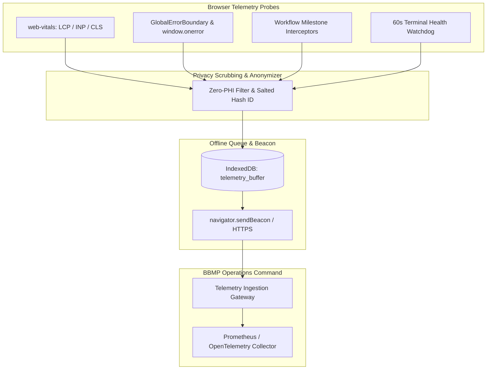

# Namma Clinic Frontend Observability, Real User Monitoring (RUM) & Telemetry

## 1. Executive Summary & Privacy Mandate
To ensure operational excellence across 183 decentralized urban clinics without compromising citizen privacy, the Namma Clinic frontend implements a **privacy-preserving telemetry and observability pipeline**. The platform captures Real User Monitoring (RUM) metrics, client-side error telemetry, clinical workflow milestones, and peripheral health signals. In strict compliance with the **Digital Personal Data Protection (DPDP) Act 2023**, all telemetry events are cryptographically anonymized with zero protected health information (PHI) persisted or transmitted.

## 2. Client Observability Architecture


## 3. Real User Monitoring (RUM) & Core Web Vitals Beacon Contract
```typescript
// DOCUMENTATION-ONLY TYPESCRIPT
import { onCLS, onINP, onLCP, onFCP, onTTFB } from 'web-vitals';

function sendTelemetryMetric(metric: { name: string; value: number; id: string }) {
  const payload = JSON.stringify({
    metricName: metric.name,
    value: Math.round(metric.value),
    metricId: metric.id,
    clinicId: window.__NAMMA_CLINIC_CONFIG__.clinicId,
    clientTimestamp: new Date().toISOString()
  });
  navigator.sendBeacon('/api/v1/telemetry/rum', payload);
}

export function initWebVitals() {
  onCLS(sendTelemetryMetric);
  onINP(sendTelemetryMetric);
  onLCP(sendTelemetryMetric);
  onFCP(sendTelemetryMetric);
  onTTFB(sendTelemetryMetric);
}
```

## 4. 60-Second Terminal Health Heartbeat Specification
Every clinic terminal emits a periodic heartbeat reporting system health:
1. **Payload Schema:** Terminal UUID, battery/AC power state, offline sync queue length, IndexedDB storage consumption, connected USB peripherals, active user shift.
2. **Anomaly Alerting:** If 3 consecutive heartbeats are missed, the municipal command center triggers a network connectivity alert for that specific ward dispensary.
3. **Offline Buffering:** If the terminal is disconnected, heartbeat events are consolidated and queued in `telemetry_buffer`.

## 5. Exhaustive Screen-by-Screen Telemetry Event Catalog
The following specifications detail the lifecycle metrics, error triggers, and milestone beacons across all 108 screens:

### Telemetry Specification for Screen SCREEN-001: User Login Screen
**Route:** `/login` | **Module Area:** `MODULE-001`

#### 1. Screen Lifecycle & Milestone Events
- `SCREEN_VIEW_SCREEN_001`: Dispatched when User Login Screen mounts in DOM; records initial render latency.
- `ACTION_SUBMIT_SCREEN_001`: Dispatched upon primary form submission or transaction confirmation.
- `VALIDATION_ERROR_SCREEN_001`: Dispatched when client-side Zod validation fails; records field identifier.
- `TRANSITION_EXIT_SCREEN_001`: Dispatched upon unmounting; records total staff interaction time.

#### 2. Error Boundary & Fault Capture Policy
- **Exception Capture:** React error boundary catches rendering faults within `SCREEN-001`; dispatches error stack to `/api/v1/telemetry/errors`.
- **User Recovery Action:** Renders friendly error fallback with 'Retry Transaction' button.

#### 3. Documentation-Only Telemetry Event Contract
```typescript
// DOCUMENTATION-ONLY TYPESCRIPT
export const TELEMETRY_EVENT_SCREEN_001 = {
  screenId: 'SCREEN-001',
  eventName: 'CLINICAL_SCREEN_INTERACTION',
  capturedFields: ['interactionDurationMs', 'validationErrorsCount', 'offlineQueuedMutations'],
  privacyScrubbingLevel: 'STRICT_ANONYMOUS_DPDP_COMPLIANT'
};
```

---

### Telemetry Specification for Screen SCREEN-002: MFA Verification Screen
**Route:** `/login/mfa` | **Module Area:** `MODULE-001`

#### 1. Screen Lifecycle & Milestone Events
- `SCREEN_VIEW_SCREEN_002`: Dispatched when MFA Verification Screen mounts in DOM; records initial render latency.
- `ACTION_SUBMIT_SCREEN_002`: Dispatched upon primary form submission or transaction confirmation.
- `VALIDATION_ERROR_SCREEN_002`: Dispatched when client-side Zod validation fails; records field identifier.
- `TRANSITION_EXIT_SCREEN_002`: Dispatched upon unmounting; records total staff interaction time.

#### 2. Error Boundary & Fault Capture Policy
- **Exception Capture:** React error boundary catches rendering faults within `SCREEN-002`; dispatches error stack to `/api/v1/telemetry/errors`.
- **User Recovery Action:** Renders friendly error fallback with 'Retry Transaction' button.

#### 3. Documentation-Only Telemetry Event Contract
```typescript
// DOCUMENTATION-ONLY TYPESCRIPT
export const TELEMETRY_EVENT_SCREEN_002 = {
  screenId: 'SCREEN-002',
  eventName: 'CLINICAL_SCREEN_INTERACTION',
  capturedFields: ['interactionDurationMs', 'validationErrorsCount', 'offlineQueuedMutations'],
  privacyScrubbingLevel: 'STRICT_ANONYMOUS_DPDP_COMPLIANT'
};
```

---

### Telemetry Specification for Screen SCREEN-003: Terminal Pairing & Device Enrollment
**Route:** `/system/device-enroll` | **Module Area:** `MODULE-001`

#### 1. Screen Lifecycle & Milestone Events
- `SCREEN_VIEW_SCREEN_003`: Dispatched when Terminal Pairing & Device Enrollment mounts in DOM; records initial render latency.
- `ACTION_SUBMIT_SCREEN_003`: Dispatched upon primary form submission or transaction confirmation.
- `VALIDATION_ERROR_SCREEN_003`: Dispatched when client-side Zod validation fails; records field identifier.
- `TRANSITION_EXIT_SCREEN_003`: Dispatched upon unmounting; records total staff interaction time.

#### 2. Error Boundary & Fault Capture Policy
- **Exception Capture:** React error boundary catches rendering faults within `SCREEN-003`; dispatches error stack to `/api/v1/telemetry/errors`.
- **User Recovery Action:** Renders friendly error fallback with 'Retry Transaction' button.

#### 3. Documentation-Only Telemetry Event Contract
```typescript
// DOCUMENTATION-ONLY TYPESCRIPT
export const TELEMETRY_EVENT_SCREEN_003 = {
  screenId: 'SCREEN-003',
  eventName: 'CLINICAL_SCREEN_INTERACTION',
  capturedFields: ['interactionDurationMs', 'validationErrorsCount', 'offlineQueuedMutations'],
  privacyScrubbingLevel: 'STRICT_ANONYMOUS_DPDP_COMPLIANT'
};
```

---

### Telemetry Specification for Screen SCREEN-004: Clinic Shift Check-In & Handover
**Route:** `/shift/checkin` | **Module Area:** `MODULE-001`

#### 1. Screen Lifecycle & Milestone Events
- `SCREEN_VIEW_SCREEN_004`: Dispatched when Clinic Shift Check-In & Handover mounts in DOM; records initial render latency.
- `ACTION_SUBMIT_SCREEN_004`: Dispatched upon primary form submission or transaction confirmation.
- `VALIDATION_ERROR_SCREEN_004`: Dispatched when client-side Zod validation fails; records field identifier.
- `TRANSITION_EXIT_SCREEN_004`: Dispatched upon unmounting; records total staff interaction time.

#### 2. Error Boundary & Fault Capture Policy
- **Exception Capture:** React error boundary catches rendering faults within `SCREEN-004`; dispatches error stack to `/api/v1/telemetry/errors`.
- **User Recovery Action:** Renders friendly error fallback with 'Retry Transaction' button.

#### 3. Documentation-Only Telemetry Event Contract
```typescript
// DOCUMENTATION-ONLY TYPESCRIPT
export const TELEMETRY_EVENT_SCREEN_004 = {
  screenId: 'SCREEN-004',
  eventName: 'CLINICAL_SCREEN_INTERACTION',
  capturedFields: ['interactionDurationMs', 'validationErrorsCount', 'offlineQueuedMutations'],
  privacyScrubbingLevel: 'STRICT_ANONYMOUS_DPDP_COMPLIANT'
};
```

---

### Telemetry Specification for Screen SCREEN-005: Emergency Break-Glass Authorization
**Route:** `/auth/break-glass` | **Module Area:** `MODULE-001`

#### 1. Screen Lifecycle & Milestone Events
- `SCREEN_VIEW_SCREEN_005`: Dispatched when Emergency Break-Glass Authorization mounts in DOM; records initial render latency.
- `ACTION_SUBMIT_SCREEN_005`: Dispatched upon primary form submission or transaction confirmation.
- `VALIDATION_ERROR_SCREEN_005`: Dispatched when client-side Zod validation fails; records field identifier.
- `TRANSITION_EXIT_SCREEN_005`: Dispatched upon unmounting; records total staff interaction time.

#### 2. Error Boundary & Fault Capture Policy
- **Exception Capture:** React error boundary catches rendering faults within `SCREEN-005`; dispatches error stack to `/api/v1/telemetry/errors`.
- **User Recovery Action:** Renders friendly error fallback with 'Retry Transaction' button.

#### 3. Documentation-Only Telemetry Event Contract
```typescript
// DOCUMENTATION-ONLY TYPESCRIPT
export const TELEMETRY_EVENT_SCREEN_005 = {
  screenId: 'SCREEN-005',
  eventName: 'CLINICAL_SCREEN_INTERACTION',
  capturedFields: ['interactionDurationMs', 'validationErrorsCount', 'offlineQueuedMutations'],
  privacyScrubbingLevel: 'STRICT_ANONYMOUS_DPDP_COMPLIANT'
};
```

---

### Telemetry Specification for Screen SCREEN-006: Master Clinic Dashboard
**Route:** `/dashboard` | **Module Area:** `MODULE-002`

#### 1. Screen Lifecycle & Milestone Events
- `SCREEN_VIEW_SCREEN_006`: Dispatched when Master Clinic Dashboard mounts in DOM; records initial render latency.
- `ACTION_SUBMIT_SCREEN_006`: Dispatched upon primary form submission or transaction confirmation.
- `VALIDATION_ERROR_SCREEN_006`: Dispatched when client-side Zod validation fails; records field identifier.
- `TRANSITION_EXIT_SCREEN_006`: Dispatched upon unmounting; records total staff interaction time.

#### 2. Error Boundary & Fault Capture Policy
- **Exception Capture:** React error boundary catches rendering faults within `SCREEN-006`; dispatches error stack to `/api/v1/telemetry/errors`.
- **User Recovery Action:** Renders friendly error fallback with 'Retry Transaction' button.

#### 3. Documentation-Only Telemetry Event Contract
```typescript
// DOCUMENTATION-ONLY TYPESCRIPT
export const TELEMETRY_EVENT_SCREEN_006 = {
  screenId: 'SCREEN-006',
  eventName: 'CLINICAL_SCREEN_INTERACTION',
  capturedFields: ['interactionDurationMs', 'validationErrorsCount', 'offlineQueuedMutations'],
  privacyScrubbingLevel: 'STRICT_ANONYMOUS_DPDP_COMPLIANT'
};
```

---

### Telemetry Specification for Screen SCREEN-007: Doctor Outpatient Console
**Route:** `/doctor/console` | **Module Area:** `MODULE-002`

#### 1. Screen Lifecycle & Milestone Events
- `SCREEN_VIEW_SCREEN_007`: Dispatched when Doctor Outpatient Console mounts in DOM; records initial render latency.
- `ACTION_SUBMIT_SCREEN_007`: Dispatched upon primary form submission or transaction confirmation.
- `VALIDATION_ERROR_SCREEN_007`: Dispatched when client-side Zod validation fails; records field identifier.
- `TRANSITION_EXIT_SCREEN_007`: Dispatched upon unmounting; records total staff interaction time.

#### 2. Error Boundary & Fault Capture Policy
- **Exception Capture:** React error boundary catches rendering faults within `SCREEN-007`; dispatches error stack to `/api/v1/telemetry/errors`.
- **User Recovery Action:** Renders friendly error fallback with 'Retry Transaction' button.

#### 3. Documentation-Only Telemetry Event Contract
```typescript
// DOCUMENTATION-ONLY TYPESCRIPT
export const TELEMETRY_EVENT_SCREEN_007 = {
  screenId: 'SCREEN-007',
  eventName: 'CLINICAL_SCREEN_INTERACTION',
  capturedFields: ['interactionDurationMs', 'validationErrorsCount', 'offlineQueuedMutations'],
  privacyScrubbingLevel: 'STRICT_ANONYMOUS_DPDP_COMPLIANT'
};
```

---

### Telemetry Specification for Screen SCREEN-008: Staff Nurse Triage Workbench
**Route:** `/nurse/triage` | **Module Area:** `MODULE-002`

#### 1. Screen Lifecycle & Milestone Events
- `SCREEN_VIEW_SCREEN_008`: Dispatched when Staff Nurse Triage Workbench mounts in DOM; records initial render latency.
- `ACTION_SUBMIT_SCREEN_008`: Dispatched upon primary form submission or transaction confirmation.
- `VALIDATION_ERROR_SCREEN_008`: Dispatched when client-side Zod validation fails; records field identifier.
- `TRANSITION_EXIT_SCREEN_008`: Dispatched upon unmounting; records total staff interaction time.

#### 2. Error Boundary & Fault Capture Policy
- **Exception Capture:** React error boundary catches rendering faults within `SCREEN-008`; dispatches error stack to `/api/v1/telemetry/errors`.
- **User Recovery Action:** Renders friendly error fallback with 'Retry Transaction' button.

#### 3. Documentation-Only Telemetry Event Contract
```typescript
// DOCUMENTATION-ONLY TYPESCRIPT
export const TELEMETRY_EVENT_SCREEN_008 = {
  screenId: 'SCREEN-008',
  eventName: 'CLINICAL_SCREEN_INTERACTION',
  capturedFields: ['interactionDurationMs', 'validationErrorsCount', 'offlineQueuedMutations'],
  privacyScrubbingLevel: 'STRICT_ANONYMOUS_DPDP_COMPLIANT'
};
```

---

### Telemetry Specification for Screen SCREEN-009: Pharmacy Dispensing Console
**Route:** `/pharmacy/dispense` | **Module Area:** `MODULE-002`

#### 1. Screen Lifecycle & Milestone Events
- `SCREEN_VIEW_SCREEN_009`: Dispatched when Pharmacy Dispensing Console mounts in DOM; records initial render latency.
- `ACTION_SUBMIT_SCREEN_009`: Dispatched upon primary form submission or transaction confirmation.
- `VALIDATION_ERROR_SCREEN_009`: Dispatched when client-side Zod validation fails; records field identifier.
- `TRANSITION_EXIT_SCREEN_009`: Dispatched upon unmounting; records total staff interaction time.

#### 2. Error Boundary & Fault Capture Policy
- **Exception Capture:** React error boundary catches rendering faults within `SCREEN-009`; dispatches error stack to `/api/v1/telemetry/errors`.
- **User Recovery Action:** Renders friendly error fallback with 'Retry Transaction' button.

#### 3. Documentation-Only Telemetry Event Contract
```typescript
// DOCUMENTATION-ONLY TYPESCRIPT
export const TELEMETRY_EVENT_SCREEN_009 = {
  screenId: 'SCREEN-009',
  eventName: 'CLINICAL_SCREEN_INTERACTION',
  capturedFields: ['interactionDurationMs', 'validationErrorsCount', 'offlineQueuedMutations'],
  privacyScrubbingLevel: 'STRICT_ANONYMOUS_DPDP_COMPLIANT'
};
```

---

### Telemetry Specification for Screen SCREEN-010: Diagnostic Laboratory Workbench
**Route:** `/lab/workbench` | **Module Area:** `MODULE-002`

#### 1. Screen Lifecycle & Milestone Events
- `SCREEN_VIEW_SCREEN_010`: Dispatched when Diagnostic Laboratory Workbench mounts in DOM; records initial render latency.
- `ACTION_SUBMIT_SCREEN_010`: Dispatched upon primary form submission or transaction confirmation.
- `VALIDATION_ERROR_SCREEN_010`: Dispatched when client-side Zod validation fails; records field identifier.
- `TRANSITION_EXIT_SCREEN_010`: Dispatched upon unmounting; records total staff interaction time.

#### 2. Error Boundary & Fault Capture Policy
- **Exception Capture:** React error boundary catches rendering faults within `SCREEN-010`; dispatches error stack to `/api/v1/telemetry/errors`.
- **User Recovery Action:** Renders friendly error fallback with 'Retry Transaction' button.

#### 3. Documentation-Only Telemetry Event Contract
```typescript
// DOCUMENTATION-ONLY TYPESCRIPT
export const TELEMETRY_EVENT_SCREEN_010 = {
  screenId: 'SCREEN-010',
  eventName: 'CLINICAL_SCREEN_INTERACTION',
  capturedFields: ['interactionDurationMs', 'validationErrorsCount', 'offlineQueuedMutations'],
  privacyScrubbingLevel: 'STRICT_ANONYMOUS_DPDP_COMPLIANT'
};
```

---

### Telemetry Specification for Screen SCREEN-011: Citizen New Registration Screen
**Route:** `/patients/new` | **Module Area:** `MODULE-003`

#### 1. Screen Lifecycle & Milestone Events
- `SCREEN_VIEW_SCREEN_011`: Dispatched when Citizen New Registration Screen mounts in DOM; records initial render latency.
- `ACTION_SUBMIT_SCREEN_011`: Dispatched upon primary form submission or transaction confirmation.
- `VALIDATION_ERROR_SCREEN_011`: Dispatched when client-side Zod validation fails; records field identifier.
- `TRANSITION_EXIT_SCREEN_011`: Dispatched upon unmounting; records total staff interaction time.

#### 2. Error Boundary & Fault Capture Policy
- **Exception Capture:** React error boundary catches rendering faults within `SCREEN-011`; dispatches error stack to `/api/v1/telemetry/errors`.
- **User Recovery Action:** Renders friendly error fallback with 'Retry Transaction' button.

#### 3. Documentation-Only Telemetry Event Contract
```typescript
// DOCUMENTATION-ONLY TYPESCRIPT
export const TELEMETRY_EVENT_SCREEN_011 = {
  screenId: 'SCREEN-011',
  eventName: 'CLINICAL_SCREEN_INTERACTION',
  capturedFields: ['interactionDurationMs', 'validationErrorsCount', 'offlineQueuedMutations'],
  privacyScrubbingLevel: 'STRICT_ANONYMOUS_DPDP_COMPLIANT'
};
```

---

### Telemetry Specification for Screen SCREEN-012: Citizen Search & Retrieval Screen
**Route:** `/patients/search` | **Module Area:** `MODULE-003`

#### 1. Screen Lifecycle & Milestone Events
- `SCREEN_VIEW_SCREEN_012`: Dispatched when Citizen Search & Retrieval Screen mounts in DOM; records initial render latency.
- `ACTION_SUBMIT_SCREEN_012`: Dispatched upon primary form submission or transaction confirmation.
- `VALIDATION_ERROR_SCREEN_012`: Dispatched when client-side Zod validation fails; records field identifier.
- `TRANSITION_EXIT_SCREEN_012`: Dispatched upon unmounting; records total staff interaction time.

#### 2. Error Boundary & Fault Capture Policy
- **Exception Capture:** React error boundary catches rendering faults within `SCREEN-012`; dispatches error stack to `/api/v1/telemetry/errors`.
- **User Recovery Action:** Renders friendly error fallback with 'Retry Transaction' button.

#### 3. Documentation-Only Telemetry Event Contract
```typescript
// DOCUMENTATION-ONLY TYPESCRIPT
export const TELEMETRY_EVENT_SCREEN_012 = {
  screenId: 'SCREEN-012',
  eventName: 'CLINICAL_SCREEN_INTERACTION',
  capturedFields: ['interactionDurationMs', 'validationErrorsCount', 'offlineQueuedMutations'],
  privacyScrubbingLevel: 'STRICT_ANONYMOUS_DPDP_COMPLIANT'
};
```

---

### Telemetry Specification for Screen SCREEN-013: Patient Longitudinal Profile View
**Route:** `/patients/:id` | **Module Area:** `MODULE-003`

#### 1. Screen Lifecycle & Milestone Events
- `SCREEN_VIEW_SCREEN_013`: Dispatched when Patient Longitudinal Profile View mounts in DOM; records initial render latency.
- `ACTION_SUBMIT_SCREEN_013`: Dispatched upon primary form submission or transaction confirmation.
- `VALIDATION_ERROR_SCREEN_013`: Dispatched when client-side Zod validation fails; records field identifier.
- `TRANSITION_EXIT_SCREEN_013`: Dispatched upon unmounting; records total staff interaction time.

#### 2. Error Boundary & Fault Capture Policy
- **Exception Capture:** React error boundary catches rendering faults within `SCREEN-013`; dispatches error stack to `/api/v1/telemetry/errors`.
- **User Recovery Action:** Renders friendly error fallback with 'Retry Transaction' button.

#### 3. Documentation-Only Telemetry Event Contract
```typescript
// DOCUMENTATION-ONLY TYPESCRIPT
export const TELEMETRY_EVENT_SCREEN_013 = {
  screenId: 'SCREEN-013',
  eventName: 'CLINICAL_SCREEN_INTERACTION',
  capturedFields: ['interactionDurationMs', 'validationErrorsCount', 'offlineQueuedMutations'],
  privacyScrubbingLevel: 'STRICT_ANONYMOUS_DPDP_COMPLIANT'
};
```

---

### Telemetry Specification for Screen SCREEN-014: Repeat Patient Fast Intake
**Route:** `/patients/:id/repeat-intake` | **Module Area:** `MODULE-003`

#### 1. Screen Lifecycle & Milestone Events
- `SCREEN_VIEW_SCREEN_014`: Dispatched when Repeat Patient Fast Intake mounts in DOM; records initial render latency.
- `ACTION_SUBMIT_SCREEN_014`: Dispatched upon primary form submission or transaction confirmation.
- `VALIDATION_ERROR_SCREEN_014`: Dispatched when client-side Zod validation fails; records field identifier.
- `TRANSITION_EXIT_SCREEN_014`: Dispatched upon unmounting; records total staff interaction time.

#### 2. Error Boundary & Fault Capture Policy
- **Exception Capture:** React error boundary catches rendering faults within `SCREEN-014`; dispatches error stack to `/api/v1/telemetry/errors`.
- **User Recovery Action:** Renders friendly error fallback with 'Retry Transaction' button.

#### 3. Documentation-Only Telemetry Event Contract
```typescript
// DOCUMENTATION-ONLY TYPESCRIPT
export const TELEMETRY_EVENT_SCREEN_014 = {
  screenId: 'SCREEN-014',
  eventName: 'CLINICAL_SCREEN_INTERACTION',
  capturedFields: ['interactionDurationMs', 'validationErrorsCount', 'offlineQueuedMutations'],
  privacyScrubbingLevel: 'STRICT_ANONYMOUS_DPDP_COMPLIANT'
};
```

---

### Telemetry Specification for Screen SCREEN-015: Biometric & ABHA Card Scan Modal
**Route:** `/patients/abha-scan` | **Module Area:** `MODULE-003`

#### 1. Screen Lifecycle & Milestone Events
- `SCREEN_VIEW_SCREEN_015`: Dispatched when Biometric & ABHA Card Scan Modal mounts in DOM; records initial render latency.
- `ACTION_SUBMIT_SCREEN_015`: Dispatched upon primary form submission or transaction confirmation.
- `VALIDATION_ERROR_SCREEN_015`: Dispatched when client-side Zod validation fails; records field identifier.
- `TRANSITION_EXIT_SCREEN_015`: Dispatched upon unmounting; records total staff interaction time.

#### 2. Error Boundary & Fault Capture Policy
- **Exception Capture:** React error boundary catches rendering faults within `SCREEN-015`; dispatches error stack to `/api/v1/telemetry/errors`.
- **User Recovery Action:** Renders friendly error fallback with 'Retry Transaction' button.

#### 3. Documentation-Only Telemetry Event Contract
```typescript
// DOCUMENTATION-ONLY TYPESCRIPT
export const TELEMETRY_EVENT_SCREEN_015 = {
  screenId: 'SCREEN-015',
  eventName: 'CLINICAL_SCREEN_INTERACTION',
  capturedFields: ['interactionDurationMs', 'validationErrorsCount', 'offlineQueuedMutations'],
  privacyScrubbingLevel: 'STRICT_ANONYMOUS_DPDP_COMPLIANT'
};
```

---

### Telemetry Specification for Screen SCREEN-016: Citizen Demographic Correction Form
**Route:** `/patients/:id/edit` | **Module Area:** `MODULE-003`

#### 1. Screen Lifecycle & Milestone Events
- `SCREEN_VIEW_SCREEN_016`: Dispatched when Citizen Demographic Correction Form mounts in DOM; records initial render latency.
- `ACTION_SUBMIT_SCREEN_016`: Dispatched upon primary form submission or transaction confirmation.
- `VALIDATION_ERROR_SCREEN_016`: Dispatched when client-side Zod validation fails; records field identifier.
- `TRANSITION_EXIT_SCREEN_016`: Dispatched upon unmounting; records total staff interaction time.

#### 2. Error Boundary & Fault Capture Policy
- **Exception Capture:** React error boundary catches rendering faults within `SCREEN-016`; dispatches error stack to `/api/v1/telemetry/errors`.
- **User Recovery Action:** Renders friendly error fallback with 'Retry Transaction' button.

#### 3. Documentation-Only Telemetry Event Contract
```typescript
// DOCUMENTATION-ONLY TYPESCRIPT
export const TELEMETRY_EVENT_SCREEN_016 = {
  screenId: 'SCREEN-016',
  eventName: 'CLINICAL_SCREEN_INTERACTION',
  capturedFields: ['interactionDurationMs', 'validationErrorsCount', 'offlineQueuedMutations'],
  privacyScrubbingLevel: 'STRICT_ANONYMOUS_DPDP_COMPLIANT'
};
```

---

### Telemetry Specification for Screen SCREEN-017: Duplicate Citizen Merge Modal
**Route:** `/patients/merge` | **Module Area:** `MODULE-003`

#### 1. Screen Lifecycle & Milestone Events
- `SCREEN_VIEW_SCREEN_017`: Dispatched when Duplicate Citizen Merge Modal mounts in DOM; records initial render latency.
- `ACTION_SUBMIT_SCREEN_017`: Dispatched upon primary form submission or transaction confirmation.
- `VALIDATION_ERROR_SCREEN_017`: Dispatched when client-side Zod validation fails; records field identifier.
- `TRANSITION_EXIT_SCREEN_017`: Dispatched upon unmounting; records total staff interaction time.

#### 2. Error Boundary & Fault Capture Policy
- **Exception Capture:** React error boundary catches rendering faults within `SCREEN-017`; dispatches error stack to `/api/v1/telemetry/errors`.
- **User Recovery Action:** Renders friendly error fallback with 'Retry Transaction' button.

#### 3. Documentation-Only Telemetry Event Contract
```typescript
// DOCUMENTATION-ONLY TYPESCRIPT
export const TELEMETRY_EVENT_SCREEN_017 = {
  screenId: 'SCREEN-017',
  eventName: 'CLINICAL_SCREEN_INTERACTION',
  capturedFields: ['interactionDurationMs', 'validationErrorsCount', 'offlineQueuedMutations'],
  privacyScrubbingLevel: 'STRICT_ANONYMOUS_DPDP_COMPLIANT'
};
```

---

### Telemetry Specification for Screen SCREEN-018: Citizen Digital Photo Capture
**Route:** `/patients/:id/photo` | **Module Area:** `MODULE-003`

#### 1. Screen Lifecycle & Milestone Events
- `SCREEN_VIEW_SCREEN_018`: Dispatched when Citizen Digital Photo Capture mounts in DOM; records initial render latency.
- `ACTION_SUBMIT_SCREEN_018`: Dispatched upon primary form submission or transaction confirmation.
- `VALIDATION_ERROR_SCREEN_018`: Dispatched when client-side Zod validation fails; records field identifier.
- `TRANSITION_EXIT_SCREEN_018`: Dispatched upon unmounting; records total staff interaction time.

#### 2. Error Boundary & Fault Capture Policy
- **Exception Capture:** React error boundary catches rendering faults within `SCREEN-018`; dispatches error stack to `/api/v1/telemetry/errors`.
- **User Recovery Action:** Renders friendly error fallback with 'Retry Transaction' button.

#### 3. Documentation-Only Telemetry Event Contract
```typescript
// DOCUMENTATION-ONLY TYPESCRIPT
export const TELEMETRY_EVENT_SCREEN_018 = {
  screenId: 'SCREEN-018',
  eventName: 'CLINICAL_SCREEN_INTERACTION',
  capturedFields: ['interactionDurationMs', 'validationErrorsCount', 'offlineQueuedMutations'],
  privacyScrubbingLevel: 'STRICT_ANONYMOUS_DPDP_COMPLIANT'
};
```

---

### Telemetry Specification for Screen SCREEN-019: DPDP Informed Consent Capture Screen
**Route:** `/patients/:id/consent` | **Module Area:** `MODULE-004`

#### 1. Screen Lifecycle & Milestone Events
- `SCREEN_VIEW_SCREEN_019`: Dispatched when DPDP Informed Consent Capture Screen mounts in DOM; records initial render latency.
- `ACTION_SUBMIT_SCREEN_019`: Dispatched upon primary form submission or transaction confirmation.
- `VALIDATION_ERROR_SCREEN_019`: Dispatched when client-side Zod validation fails; records field identifier.
- `TRANSITION_EXIT_SCREEN_019`: Dispatched upon unmounting; records total staff interaction time.

#### 2. Error Boundary & Fault Capture Policy
- **Exception Capture:** React error boundary catches rendering faults within `SCREEN-019`; dispatches error stack to `/api/v1/telemetry/errors`.
- **User Recovery Action:** Renders friendly error fallback with 'Retry Transaction' button.

#### 3. Documentation-Only Telemetry Event Contract
```typescript
// DOCUMENTATION-ONLY TYPESCRIPT
export const TELEMETRY_EVENT_SCREEN_019 = {
  screenId: 'SCREEN-019',
  eventName: 'CLINICAL_SCREEN_INTERACTION',
  capturedFields: ['interactionDurationMs', 'validationErrorsCount', 'offlineQueuedMutations'],
  privacyScrubbingLevel: 'STRICT_ANONYMOUS_DPDP_COMPLIANT'
};
```

---

### Telemetry Specification for Screen SCREEN-020: Consent History & Revocation Console
**Route:** `/patients/:id/consents` | **Module Area:** `MODULE-004`

#### 1. Screen Lifecycle & Milestone Events
- `SCREEN_VIEW_SCREEN_020`: Dispatched when Consent History & Revocation Console mounts in DOM; records initial render latency.
- `ACTION_SUBMIT_SCREEN_020`: Dispatched upon primary form submission or transaction confirmation.
- `VALIDATION_ERROR_SCREEN_020`: Dispatched when client-side Zod validation fails; records field identifier.
- `TRANSITION_EXIT_SCREEN_020`: Dispatched upon unmounting; records total staff interaction time.

#### 2. Error Boundary & Fault Capture Policy
- **Exception Capture:** React error boundary catches rendering faults within `SCREEN-020`; dispatches error stack to `/api/v1/telemetry/errors`.
- **User Recovery Action:** Renders friendly error fallback with 'Retry Transaction' button.

#### 3. Documentation-Only Telemetry Event Contract
```typescript
// DOCUMENTATION-ONLY TYPESCRIPT
export const TELEMETRY_EVENT_SCREEN_020 = {
  screenId: 'SCREEN-020',
  eventName: 'CLINICAL_SCREEN_INTERACTION',
  capturedFields: ['interactionDurationMs', 'validationErrorsCount', 'offlineQueuedMutations'],
  privacyScrubbingLevel: 'STRICT_ANONYMOUS_DPDP_COMPLIANT'
};
```

---

### Telemetry Specification for Screen SCREEN-021: Data Portability & Export Request
**Route:** `/patients/:id/export` | **Module Area:** `MODULE-004`

#### 1. Screen Lifecycle & Milestone Events
- `SCREEN_VIEW_SCREEN_021`: Dispatched when Data Portability & Export Request mounts in DOM; records initial render latency.
- `ACTION_SUBMIT_SCREEN_021`: Dispatched upon primary form submission or transaction confirmation.
- `VALIDATION_ERROR_SCREEN_021`: Dispatched when client-side Zod validation fails; records field identifier.
- `TRANSITION_EXIT_SCREEN_021`: Dispatched upon unmounting; records total staff interaction time.

#### 2. Error Boundary & Fault Capture Policy
- **Exception Capture:** React error boundary catches rendering faults within `SCREEN-021`; dispatches error stack to `/api/v1/telemetry/errors`.
- **User Recovery Action:** Renders friendly error fallback with 'Retry Transaction' button.

#### 3. Documentation-Only Telemetry Event Contract
```typescript
// DOCUMENTATION-ONLY TYPESCRIPT
export const TELEMETRY_EVENT_SCREEN_021 = {
  screenId: 'SCREEN-021',
  eventName: 'CLINICAL_SCREEN_INTERACTION',
  capturedFields: ['interactionDurationMs', 'validationErrorsCount', 'offlineQueuedMutations'],
  privacyScrubbingLevel: 'STRICT_ANONYMOUS_DPDP_COMPLIANT'
};
```

---

### Telemetry Specification for Screen SCREEN-022: Citizen Grievance Redressal Intake
**Route:** `/patients/:id/grievance` | **Module Area:** `MODULE-004`

#### 1. Screen Lifecycle & Milestone Events
- `SCREEN_VIEW_SCREEN_022`: Dispatched when Citizen Grievance Redressal Intake mounts in DOM; records initial render latency.
- `ACTION_SUBMIT_SCREEN_022`: Dispatched upon primary form submission or transaction confirmation.
- `VALIDATION_ERROR_SCREEN_022`: Dispatched when client-side Zod validation fails; records field identifier.
- `TRANSITION_EXIT_SCREEN_022`: Dispatched upon unmounting; records total staff interaction time.

#### 2. Error Boundary & Fault Capture Policy
- **Exception Capture:** React error boundary catches rendering faults within `SCREEN-022`; dispatches error stack to `/api/v1/telemetry/errors`.
- **User Recovery Action:** Renders friendly error fallback with 'Retry Transaction' button.

#### 3. Documentation-Only Telemetry Event Contract
```typescript
// DOCUMENTATION-ONLY TYPESCRIPT
export const TELEMETRY_EVENT_SCREEN_022 = {
  screenId: 'SCREEN-022',
  eventName: 'CLINICAL_SCREEN_INTERACTION',
  capturedFields: ['interactionDurationMs', 'validationErrorsCount', 'offlineQueuedMutations'],
  privacyScrubbingLevel: 'STRICT_ANONYMOUS_DPDP_COMPLIANT'
};
```

---

### Telemetry Specification for Screen SCREEN-023: Grievance Investigation & Resolution
**Route:** `/grievances/:id` | **Module Area:** `MODULE-004`

#### 1. Screen Lifecycle & Milestone Events
- `SCREEN_VIEW_SCREEN_023`: Dispatched when Grievance Investigation & Resolution mounts in DOM; records initial render latency.
- `ACTION_SUBMIT_SCREEN_023`: Dispatched upon primary form submission or transaction confirmation.
- `VALIDATION_ERROR_SCREEN_023`: Dispatched when client-side Zod validation fails; records field identifier.
- `TRANSITION_EXIT_SCREEN_023`: Dispatched upon unmounting; records total staff interaction time.

#### 2. Error Boundary & Fault Capture Policy
- **Exception Capture:** React error boundary catches rendering faults within `SCREEN-023`; dispatches error stack to `/api/v1/telemetry/errors`.
- **User Recovery Action:** Renders friendly error fallback with 'Retry Transaction' button.

#### 3. Documentation-Only Telemetry Event Contract
```typescript
// DOCUMENTATION-ONLY TYPESCRIPT
export const TELEMETRY_EVENT_SCREEN_023 = {
  screenId: 'SCREEN-023',
  eventName: 'CLINICAL_SCREEN_INTERACTION',
  capturedFields: ['interactionDurationMs', 'validationErrorsCount', 'offlineQueuedMutations'],
  privacyScrubbingLevel: 'STRICT_ANONYMOUS_DPDP_COMPLIANT'
};
```

---

### Telemetry Specification for Screen SCREEN-024: OPD Token Generation & Print Modal
**Route:** `/queue/tokens/new` | **Module Area:** `MODULE-005`

#### 1. Screen Lifecycle & Milestone Events
- `SCREEN_VIEW_SCREEN_024`: Dispatched when OPD Token Generation & Print Modal mounts in DOM; records initial render latency.
- `ACTION_SUBMIT_SCREEN_024`: Dispatched upon primary form submission or transaction confirmation.
- `VALIDATION_ERROR_SCREEN_024`: Dispatched when client-side Zod validation fails; records field identifier.
- `TRANSITION_EXIT_SCREEN_024`: Dispatched upon unmounting; records total staff interaction time.

#### 2. Error Boundary & Fault Capture Policy
- **Exception Capture:** React error boundary catches rendering faults within `SCREEN-024`; dispatches error stack to `/api/v1/telemetry/errors`.
- **User Recovery Action:** Renders friendly error fallback with 'Retry Transaction' button.

#### 3. Documentation-Only Telemetry Event Contract
```typescript
// DOCUMENTATION-ONLY TYPESCRIPT
export const TELEMETRY_EVENT_SCREEN_024 = {
  screenId: 'SCREEN-024',
  eventName: 'CLINICAL_SCREEN_INTERACTION',
  capturedFields: ['interactionDurationMs', 'validationErrorsCount', 'offlineQueuedMutations'],
  privacyScrubbingLevel: 'STRICT_ANONYMOUS_DPDP_COMPLIANT'
};
```

---

### Telemetry Specification for Screen SCREEN-025: Master Waiting Room Queue Display
**Route:** `/queue/display` | **Module Area:** `MODULE-005`

#### 1. Screen Lifecycle & Milestone Events
- `SCREEN_VIEW_SCREEN_025`: Dispatched when Master Waiting Room Queue Display mounts in DOM; records initial render latency.
- `ACTION_SUBMIT_SCREEN_025`: Dispatched upon primary form submission or transaction confirmation.
- `VALIDATION_ERROR_SCREEN_025`: Dispatched when client-side Zod validation fails; records field identifier.
- `TRANSITION_EXIT_SCREEN_025`: Dispatched upon unmounting; records total staff interaction time.

#### 2. Error Boundary & Fault Capture Policy
- **Exception Capture:** React error boundary catches rendering faults within `SCREEN-025`; dispatches error stack to `/api/v1/telemetry/errors`.
- **User Recovery Action:** Renders friendly error fallback with 'Retry Transaction' button.

#### 3. Documentation-Only Telemetry Event Contract
```typescript
// DOCUMENTATION-ONLY TYPESCRIPT
export const TELEMETRY_EVENT_SCREEN_025 = {
  screenId: 'SCREEN-025',
  eventName: 'CLINICAL_SCREEN_INTERACTION',
  capturedFields: ['interactionDurationMs', 'validationErrorsCount', 'offlineQueuedMutations'],
  privacyScrubbingLevel: 'STRICT_ANONYMOUS_DPDP_COMPLIANT'
};
```

---

### Telemetry Specification for Screen SCREEN-026: Queue Management & Rerouting Screen
**Route:** `/queue/manage` | **Module Area:** `MODULE-005`

#### 1. Screen Lifecycle & Milestone Events
- `SCREEN_VIEW_SCREEN_026`: Dispatched when Queue Management & Rerouting Screen mounts in DOM; records initial render latency.
- `ACTION_SUBMIT_SCREEN_026`: Dispatched upon primary form submission or transaction confirmation.
- `VALIDATION_ERROR_SCREEN_026`: Dispatched when client-side Zod validation fails; records field identifier.
- `TRANSITION_EXIT_SCREEN_026`: Dispatched upon unmounting; records total staff interaction time.

#### 2. Error Boundary & Fault Capture Policy
- **Exception Capture:** React error boundary catches rendering faults within `SCREEN-026`; dispatches error stack to `/api/v1/telemetry/errors`.
- **User Recovery Action:** Renders friendly error fallback with 'Retry Transaction' button.

#### 3. Documentation-Only Telemetry Event Contract
```typescript
// DOCUMENTATION-ONLY TYPESCRIPT
export const TELEMETRY_EVENT_SCREEN_026 = {
  screenId: 'SCREEN-026',
  eventName: 'CLINICAL_SCREEN_INTERACTION',
  capturedFields: ['interactionDurationMs', 'validationErrorsCount', 'offlineQueuedMutations'],
  privacyScrubbingLevel: 'STRICT_ANONYMOUS_DPDP_COMPLIANT'
};
```

---

### Telemetry Specification for Screen SCREEN-027: Express Triage Queue
**Route:** `/queue/triage-express` | **Module Area:** `MODULE-005`

#### 1. Screen Lifecycle & Milestone Events
- `SCREEN_VIEW_SCREEN_027`: Dispatched when Express Triage Queue mounts in DOM; records initial render latency.
- `ACTION_SUBMIT_SCREEN_027`: Dispatched upon primary form submission or transaction confirmation.
- `VALIDATION_ERROR_SCREEN_027`: Dispatched when client-side Zod validation fails; records field identifier.
- `TRANSITION_EXIT_SCREEN_027`: Dispatched upon unmounting; records total staff interaction time.

#### 2. Error Boundary & Fault Capture Policy
- **Exception Capture:** React error boundary catches rendering faults within `SCREEN-027`; dispatches error stack to `/api/v1/telemetry/errors`.
- **User Recovery Action:** Renders friendly error fallback with 'Retry Transaction' button.

#### 3. Documentation-Only Telemetry Event Contract
```typescript
// DOCUMENTATION-ONLY TYPESCRIPT
export const TELEMETRY_EVENT_SCREEN_027 = {
  screenId: 'SCREEN-027',
  eventName: 'CLINICAL_SCREEN_INTERACTION',
  capturedFields: ['interactionDurationMs', 'validationErrorsCount', 'offlineQueuedMutations'],
  privacyScrubbingLevel: 'STRICT_ANONYMOUS_DPDP_COMPLIANT'
};
```

---

### Telemetry Specification for Screen SCREEN-028: Pharmacy Pickup Waiting Screen
**Route:** `/queue/pharmacy` | **Module Area:** `MODULE-005`

#### 1. Screen Lifecycle & Milestone Events
- `SCREEN_VIEW_SCREEN_028`: Dispatched when Pharmacy Pickup Waiting Screen mounts in DOM; records initial render latency.
- `ACTION_SUBMIT_SCREEN_028`: Dispatched upon primary form submission or transaction confirmation.
- `VALIDATION_ERROR_SCREEN_028`: Dispatched when client-side Zod validation fails; records field identifier.
- `TRANSITION_EXIT_SCREEN_028`: Dispatched upon unmounting; records total staff interaction time.

#### 2. Error Boundary & Fault Capture Policy
- **Exception Capture:** React error boundary catches rendering faults within `SCREEN-028`; dispatches error stack to `/api/v1/telemetry/errors`.
- **User Recovery Action:** Renders friendly error fallback with 'Retry Transaction' button.

#### 3. Documentation-Only Telemetry Event Contract
```typescript
// DOCUMENTATION-ONLY TYPESCRIPT
export const TELEMETRY_EVENT_SCREEN_028 = {
  screenId: 'SCREEN-028',
  eventName: 'CLINICAL_SCREEN_INTERACTION',
  capturedFields: ['interactionDurationMs', 'validationErrorsCount', 'offlineQueuedMutations'],
  privacyScrubbingLevel: 'STRICT_ANONYMOUS_DPDP_COMPLIANT'
};
```

---

### Telemetry Specification for Screen SCREEN-029: Triage Vitals Entry Form
**Route:** `/triage/:visitId/vitals` | **Module Area:** `MODULE-006`

#### 1. Screen Lifecycle & Milestone Events
- `SCREEN_VIEW_SCREEN_029`: Dispatched when Triage Vitals Entry Form mounts in DOM; records initial render latency.
- `ACTION_SUBMIT_SCREEN_029`: Dispatched upon primary form submission or transaction confirmation.
- `VALIDATION_ERROR_SCREEN_029`: Dispatched when client-side Zod validation fails; records field identifier.
- `TRANSITION_EXIT_SCREEN_029`: Dispatched upon unmounting; records total staff interaction time.

#### 2. Error Boundary & Fault Capture Policy
- **Exception Capture:** React error boundary catches rendering faults within `SCREEN-029`; dispatches error stack to `/api/v1/telemetry/errors`.
- **User Recovery Action:** Renders friendly error fallback with 'Retry Transaction' button.

#### 3. Documentation-Only Telemetry Event Contract
```typescript
// DOCUMENTATION-ONLY TYPESCRIPT
export const TELEMETRY_EVENT_SCREEN_029 = {
  screenId: 'SCREEN-029',
  eventName: 'CLINICAL_SCREEN_INTERACTION',
  capturedFields: ['interactionDurationMs', 'validationErrorsCount', 'offlineQueuedMutations'],
  privacyScrubbingLevel: 'STRICT_ANONYMOUS_DPDP_COMPLIANT'
};
```

---

### Telemetry Specification for Screen SCREEN-030: Pediatric Growth Chart & Z-Scores
**Route:** `/triage/:visitId/pediatric` | **Module Area:** `MODULE-006`

#### 1. Screen Lifecycle & Milestone Events
- `SCREEN_VIEW_SCREEN_030`: Dispatched when Pediatric Growth Chart & Z-Scores mounts in DOM; records initial render latency.
- `ACTION_SUBMIT_SCREEN_030`: Dispatched upon primary form submission or transaction confirmation.
- `VALIDATION_ERROR_SCREEN_030`: Dispatched when client-side Zod validation fails; records field identifier.
- `TRANSITION_EXIT_SCREEN_030`: Dispatched upon unmounting; records total staff interaction time.

#### 2. Error Boundary & Fault Capture Policy
- **Exception Capture:** React error boundary catches rendering faults within `SCREEN-030`; dispatches error stack to `/api/v1/telemetry/errors`.
- **User Recovery Action:** Renders friendly error fallback with 'Retry Transaction' button.

#### 3. Documentation-Only Telemetry Event Contract
```typescript
// DOCUMENTATION-ONLY TYPESCRIPT
export const TELEMETRY_EVENT_SCREEN_030 = {
  screenId: 'SCREEN-030',
  eventName: 'CLINICAL_SCREEN_INTERACTION',
  capturedFields: ['interactionDurationMs', 'validationErrorsCount', 'offlineQueuedMutations'],
  privacyScrubbingLevel: 'STRICT_ANONYMOUS_DPDP_COMPLIANT'
};
```

---

### Telemetry Specification for Screen SCREEN-031: Antenatal Care (ANC) Vitals Intake
**Route:** `/triage/:visitId/anc` | **Module Area:** `MODULE-006`

#### 1. Screen Lifecycle & Milestone Events
- `SCREEN_VIEW_SCREEN_031`: Dispatched when Antenatal Care (ANC) Vitals Intake mounts in DOM; records initial render latency.
- `ACTION_SUBMIT_SCREEN_031`: Dispatched upon primary form submission or transaction confirmation.
- `VALIDATION_ERROR_SCREEN_031`: Dispatched when client-side Zod validation fails; records field identifier.
- `TRANSITION_EXIT_SCREEN_031`: Dispatched upon unmounting; records total staff interaction time.

#### 2. Error Boundary & Fault Capture Policy
- **Exception Capture:** React error boundary catches rendering faults within `SCREEN-031`; dispatches error stack to `/api/v1/telemetry/errors`.
- **User Recovery Action:** Renders friendly error fallback with 'Retry Transaction' button.

#### 3. Documentation-Only Telemetry Event Contract
```typescript
// DOCUMENTATION-ONLY TYPESCRIPT
export const TELEMETRY_EVENT_SCREEN_031 = {
  screenId: 'SCREEN-031',
  eventName: 'CLINICAL_SCREEN_INTERACTION',
  capturedFields: ['interactionDurationMs', 'validationErrorsCount', 'offlineQueuedMutations'],
  privacyScrubbingLevel: 'STRICT_ANONYMOUS_DPDP_COMPLIANT'
};
```

---

### Telemetry Specification for Screen SCREEN-032: Danger Signs & Triage Warning Modal
**Route:** `/triage/:visitId/danger-modal` | **Module Area:** `MODULE-006`

#### 1. Screen Lifecycle & Milestone Events
- `SCREEN_VIEW_SCREEN_032`: Dispatched when Danger Signs & Triage Warning Modal mounts in DOM; records initial render latency.
- `ACTION_SUBMIT_SCREEN_032`: Dispatched upon primary form submission or transaction confirmation.
- `VALIDATION_ERROR_SCREEN_032`: Dispatched when client-side Zod validation fails; records field identifier.
- `TRANSITION_EXIT_SCREEN_032`: Dispatched upon unmounting; records total staff interaction time.

#### 2. Error Boundary & Fault Capture Policy
- **Exception Capture:** React error boundary catches rendering faults within `SCREEN-032`; dispatches error stack to `/api/v1/telemetry/errors`.
- **User Recovery Action:** Renders friendly error fallback with 'Retry Transaction' button.

#### 3. Documentation-Only Telemetry Event Contract
```typescript
// DOCUMENTATION-ONLY TYPESCRIPT
export const TELEMETRY_EVENT_SCREEN_032 = {
  screenId: 'SCREEN-032',
  eventName: 'CLINICAL_SCREEN_INTERACTION',
  capturedFields: ['interactionDurationMs', 'validationErrorsCount', 'offlineQueuedMutations'],
  privacyScrubbingLevel: 'STRICT_ANONYMOUS_DPDP_COMPLIANT'
};
```

---

### Telemetry Specification for Screen SCREEN-033: Point-of-Care Blood Sugar Entry
**Route:** `/triage/:visitId/glucometer` | **Module Area:** `MODULE-006`

#### 1. Screen Lifecycle & Milestone Events
- `SCREEN_VIEW_SCREEN_033`: Dispatched when Point-of-Care Blood Sugar Entry mounts in DOM; records initial render latency.
- `ACTION_SUBMIT_SCREEN_033`: Dispatched upon primary form submission or transaction confirmation.
- `VALIDATION_ERROR_SCREEN_033`: Dispatched when client-side Zod validation fails; records field identifier.
- `TRANSITION_EXIT_SCREEN_033`: Dispatched upon unmounting; records total staff interaction time.

#### 2. Error Boundary & Fault Capture Policy
- **Exception Capture:** React error boundary catches rendering faults within `SCREEN-033`; dispatches error stack to `/api/v1/telemetry/errors`.
- **User Recovery Action:** Renders friendly error fallback with 'Retry Transaction' button.

#### 3. Documentation-Only Telemetry Event Contract
```typescript
// DOCUMENTATION-ONLY TYPESCRIPT
export const TELEMETRY_EVENT_SCREEN_033 = {
  screenId: 'SCREEN-033',
  eventName: 'CLINICAL_SCREEN_INTERACTION',
  capturedFields: ['interactionDurationMs', 'validationErrorsCount', 'offlineQueuedMutations'],
  privacyScrubbingLevel: 'STRICT_ANONYMOUS_DPDP_COMPLIANT'
};
```

---

### Telemetry Specification for Screen SCREEN-034: Triage Station History Log
**Route:** `/triage/station-history` | **Module Area:** `MODULE-006`

#### 1. Screen Lifecycle & Milestone Events
- `SCREEN_VIEW_SCREEN_034`: Dispatched when Triage Station History Log mounts in DOM; records initial render latency.
- `ACTION_SUBMIT_SCREEN_034`: Dispatched upon primary form submission or transaction confirmation.
- `VALIDATION_ERROR_SCREEN_034`: Dispatched when client-side Zod validation fails; records field identifier.
- `TRANSITION_EXIT_SCREEN_034`: Dispatched upon unmounting; records total staff interaction time.

#### 2. Error Boundary & Fault Capture Policy
- **Exception Capture:** React error boundary catches rendering faults within `SCREEN-034`; dispatches error stack to `/api/v1/telemetry/errors`.
- **User Recovery Action:** Renders friendly error fallback with 'Retry Transaction' button.

#### 3. Documentation-Only Telemetry Event Contract
```typescript
// DOCUMENTATION-ONLY TYPESCRIPT
export const TELEMETRY_EVENT_SCREEN_034 = {
  screenId: 'SCREEN-034',
  eventName: 'CLINICAL_SCREEN_INTERACTION',
  capturedFields: ['interactionDurationMs', 'validationErrorsCount', 'offlineQueuedMutations'],
  privacyScrubbingLevel: 'STRICT_ANONYMOUS_DPDP_COMPLIANT'
};
```

---

### Telemetry Specification for Screen SCREEN-035: Clinical Consultation Workspace
**Route:** `/consultations/:visitId` | **Module Area:** `MODULE-007`

#### 1. Screen Lifecycle & Milestone Events
- `SCREEN_VIEW_SCREEN_035`: Dispatched when Clinical Consultation Workspace mounts in DOM; records initial render latency.
- `ACTION_SUBMIT_SCREEN_035`: Dispatched upon primary form submission or transaction confirmation.
- `VALIDATION_ERROR_SCREEN_035`: Dispatched when client-side Zod validation fails; records field identifier.
- `TRANSITION_EXIT_SCREEN_035`: Dispatched upon unmounting; records total staff interaction time.

#### 2. Error Boundary & Fault Capture Policy
- **Exception Capture:** React error boundary catches rendering faults within `SCREEN-035`; dispatches error stack to `/api/v1/telemetry/errors`.
- **User Recovery Action:** Renders friendly error fallback with 'Retry Transaction' button.

#### 3. Documentation-Only Telemetry Event Contract
```typescript
// DOCUMENTATION-ONLY TYPESCRIPT
export const TELEMETRY_EVENT_SCREEN_035 = {
  screenId: 'SCREEN-035',
  eventName: 'CLINICAL_SCREEN_INTERACTION',
  capturedFields: ['interactionDurationMs', 'validationErrorsCount', 'offlineQueuedMutations'],
  privacyScrubbingLevel: 'STRICT_ANONYMOUS_DPDP_COMPLIANT'
};
```

---

### Telemetry Specification for Screen SCREEN-036: Chief Complaints & Systemic Review
**Route:** `/consultations/:visitId/symptoms` | **Module Area:** `MODULE-007`

#### 1. Screen Lifecycle & Milestone Events
- `SCREEN_VIEW_SCREEN_036`: Dispatched when Chief Complaints & Systemic Review mounts in DOM; records initial render latency.
- `ACTION_SUBMIT_SCREEN_036`: Dispatched upon primary form submission or transaction confirmation.
- `VALIDATION_ERROR_SCREEN_036`: Dispatched when client-side Zod validation fails; records field identifier.
- `TRANSITION_EXIT_SCREEN_036`: Dispatched upon unmounting; records total staff interaction time.

#### 2. Error Boundary & Fault Capture Policy
- **Exception Capture:** React error boundary catches rendering faults within `SCREEN-036`; dispatches error stack to `/api/v1/telemetry/errors`.
- **User Recovery Action:** Renders friendly error fallback with 'Retry Transaction' button.

#### 3. Documentation-Only Telemetry Event Contract
```typescript
// DOCUMENTATION-ONLY TYPESCRIPT
export const TELEMETRY_EVENT_SCREEN_036 = {
  screenId: 'SCREEN-036',
  eventName: 'CLINICAL_SCREEN_INTERACTION',
  capturedFields: ['interactionDurationMs', 'validationErrorsCount', 'offlineQueuedMutations'],
  privacyScrubbingLevel: 'STRICT_ANONYMOUS_DPDP_COMPLIANT'
};
```

---

### Telemetry Specification for Screen SCREEN-037: Physical & Clinical Examination Form
**Route:** `/consultations/:visitId/exam` | **Module Area:** `MODULE-007`

#### 1. Screen Lifecycle & Milestone Events
- `SCREEN_VIEW_SCREEN_037`: Dispatched when Physical & Clinical Examination Form mounts in DOM; records initial render latency.
- `ACTION_SUBMIT_SCREEN_037`: Dispatched upon primary form submission or transaction confirmation.
- `VALIDATION_ERROR_SCREEN_037`: Dispatched when client-side Zod validation fails; records field identifier.
- `TRANSITION_EXIT_SCREEN_037`: Dispatched upon unmounting; records total staff interaction time.

#### 2. Error Boundary & Fault Capture Policy
- **Exception Capture:** React error boundary catches rendering faults within `SCREEN-037`; dispatches error stack to `/api/v1/telemetry/errors`.
- **User Recovery Action:** Renders friendly error fallback with 'Retry Transaction' button.

#### 3. Documentation-Only Telemetry Event Contract
```typescript
// DOCUMENTATION-ONLY TYPESCRIPT
export const TELEMETRY_EVENT_SCREEN_037 = {
  screenId: 'SCREEN-037',
  eventName: 'CLINICAL_SCREEN_INTERACTION',
  capturedFields: ['interactionDurationMs', 'validationErrorsCount', 'offlineQueuedMutations'],
  privacyScrubbingLevel: 'STRICT_ANONYMOUS_DPDP_COMPLIANT'
};
```

---

### Telemetry Specification for Screen SCREEN-038: ICD-10 & SNOMED CT Diagnosis Picker
**Route:** `/consultations/:visitId/diagnosis` | **Module Area:** `MODULE-007`

#### 1. Screen Lifecycle & Milestone Events
- `SCREEN_VIEW_SCREEN_038`: Dispatched when ICD-10 & SNOMED CT Diagnosis Picker mounts in DOM; records initial render latency.
- `ACTION_SUBMIT_SCREEN_038`: Dispatched upon primary form submission or transaction confirmation.
- `VALIDATION_ERROR_SCREEN_038`: Dispatched when client-side Zod validation fails; records field identifier.
- `TRANSITION_EXIT_SCREEN_038`: Dispatched upon unmounting; records total staff interaction time.

#### 2. Error Boundary & Fault Capture Policy
- **Exception Capture:** React error boundary catches rendering faults within `SCREEN-038`; dispatches error stack to `/api/v1/telemetry/errors`.
- **User Recovery Action:** Renders friendly error fallback with 'Retry Transaction' button.

#### 3. Documentation-Only Telemetry Event Contract
```typescript
// DOCUMENTATION-ONLY TYPESCRIPT
export const TELEMETRY_EVENT_SCREEN_038 = {
  screenId: 'SCREEN-038',
  eventName: 'CLINICAL_SCREEN_INTERACTION',
  capturedFields: ['interactionDurationMs', 'validationErrorsCount', 'offlineQueuedMutations'],
  privacyScrubbingLevel: 'STRICT_ANONYMOUS_DPDP_COMPLIANT'
};
```

---

### Telemetry Specification for Screen SCREEN-039: NCD Chronic Disease Registry Form
**Route:** `/consultations/:visitId/ncd` | **Module Area:** `MODULE-007`

#### 1. Screen Lifecycle & Milestone Events
- `SCREEN_VIEW_SCREEN_039`: Dispatched when NCD Chronic Disease Registry Form mounts in DOM; records initial render latency.
- `ACTION_SUBMIT_SCREEN_039`: Dispatched upon primary form submission or transaction confirmation.
- `VALIDATION_ERROR_SCREEN_039`: Dispatched when client-side Zod validation fails; records field identifier.
- `TRANSITION_EXIT_SCREEN_039`: Dispatched upon unmounting; records total staff interaction time.

#### 2. Error Boundary & Fault Capture Policy
- **Exception Capture:** React error boundary catches rendering faults within `SCREEN-039`; dispatches error stack to `/api/v1/telemetry/errors`.
- **User Recovery Action:** Renders friendly error fallback with 'Retry Transaction' button.

#### 3. Documentation-Only Telemetry Event Contract
```typescript
// DOCUMENTATION-ONLY TYPESCRIPT
export const TELEMETRY_EVENT_SCREEN_039 = {
  screenId: 'SCREEN-039',
  eventName: 'CLINICAL_SCREEN_INTERACTION',
  capturedFields: ['interactionDurationMs', 'validationErrorsCount', 'offlineQueuedMutations'],
  privacyScrubbingLevel: 'STRICT_ANONYMOUS_DPDP_COMPLIANT'
};
```

---

### Telemetry Specification for Screen SCREEN-040: Past Medical & Surgical History Modal
**Route:** `/consultations/:visitId/history` | **Module Area:** `MODULE-007`

#### 1. Screen Lifecycle & Milestone Events
- `SCREEN_VIEW_SCREEN_040`: Dispatched when Past Medical & Surgical History Modal mounts in DOM; records initial render latency.
- `ACTION_SUBMIT_SCREEN_040`: Dispatched upon primary form submission or transaction confirmation.
- `VALIDATION_ERROR_SCREEN_040`: Dispatched when client-side Zod validation fails; records field identifier.
- `TRANSITION_EXIT_SCREEN_040`: Dispatched upon unmounting; records total staff interaction time.

#### 2. Error Boundary & Fault Capture Policy
- **Exception Capture:** React error boundary catches rendering faults within `SCREEN-040`; dispatches error stack to `/api/v1/telemetry/errors`.
- **User Recovery Action:** Renders friendly error fallback with 'Retry Transaction' button.

#### 3. Documentation-Only Telemetry Event Contract
```typescript
// DOCUMENTATION-ONLY TYPESCRIPT
export const TELEMETRY_EVENT_SCREEN_040 = {
  screenId: 'SCREEN-040',
  eventName: 'CLINICAL_SCREEN_INTERACTION',
  capturedFields: ['interactionDurationMs', 'validationErrorsCount', 'offlineQueuedMutations'],
  privacyScrubbingLevel: 'STRICT_ANONYMOUS_DPDP_COMPLIANT'
};
```

---

### Telemetry Specification for Screen SCREEN-041: Drug Allergy & Adverse Reaction Logger
**Route:** `/consultations/:visitId/allergies` | **Module Area:** `MODULE-007`

#### 1. Screen Lifecycle & Milestone Events
- `SCREEN_VIEW_SCREEN_041`: Dispatched when Drug Allergy & Adverse Reaction Logger mounts in DOM; records initial render latency.
- `ACTION_SUBMIT_SCREEN_041`: Dispatched upon primary form submission or transaction confirmation.
- `VALIDATION_ERROR_SCREEN_041`: Dispatched when client-side Zod validation fails; records field identifier.
- `TRANSITION_EXIT_SCREEN_041`: Dispatched upon unmounting; records total staff interaction time.

#### 2. Error Boundary & Fault Capture Policy
- **Exception Capture:** React error boundary catches rendering faults within `SCREEN-041`; dispatches error stack to `/api/v1/telemetry/errors`.
- **User Recovery Action:** Renders friendly error fallback with 'Retry Transaction' button.

#### 3. Documentation-Only Telemetry Event Contract
```typescript
// DOCUMENTATION-ONLY TYPESCRIPT
export const TELEMETRY_EVENT_SCREEN_041 = {
  screenId: 'SCREEN-041',
  eventName: 'CLINICAL_SCREEN_INTERACTION',
  capturedFields: ['interactionDurationMs', 'validationErrorsCount', 'offlineQueuedMutations'],
  privacyScrubbingLevel: 'STRICT_ANONYMOUS_DPDP_COMPLIANT'
};
```

---

### Telemetry Specification for Screen SCREEN-042: Clinical Progress Note & Free-Text Area
**Route:** `/consultations/:visitId/notes` | **Module Area:** `MODULE-007`

#### 1. Screen Lifecycle & Milestone Events
- `SCREEN_VIEW_SCREEN_042`: Dispatched when Clinical Progress Note & Free-Text Area mounts in DOM; records initial render latency.
- `ACTION_SUBMIT_SCREEN_042`: Dispatched upon primary form submission or transaction confirmation.
- `VALIDATION_ERROR_SCREEN_042`: Dispatched when client-side Zod validation fails; records field identifier.
- `TRANSITION_EXIT_SCREEN_042`: Dispatched upon unmounting; records total staff interaction time.

#### 2. Error Boundary & Fault Capture Policy
- **Exception Capture:** React error boundary catches rendering faults within `SCREEN-042`; dispatches error stack to `/api/v1/telemetry/errors`.
- **User Recovery Action:** Renders friendly error fallback with 'Retry Transaction' button.

#### 3. Documentation-Only Telemetry Event Contract
```typescript
// DOCUMENTATION-ONLY TYPESCRIPT
export const TELEMETRY_EVENT_SCREEN_042 = {
  screenId: 'SCREEN-042',
  eventName: 'CLINICAL_SCREEN_INTERACTION',
  capturedFields: ['interactionDurationMs', 'validationErrorsCount', 'offlineQueuedMutations'],
  privacyScrubbingLevel: 'STRICT_ANONYMOUS_DPDP_COMPLIANT'
};
```

---

### Telemetry Specification for Screen SCREEN-043: Doctor Teleconsultation Video Room
**Route:** `/consultations/:visitId/teleconsult` | **Module Area:** `MODULE-007`

#### 1. Screen Lifecycle & Milestone Events
- `SCREEN_VIEW_SCREEN_043`: Dispatched when Doctor Teleconsultation Video Room mounts in DOM; records initial render latency.
- `ACTION_SUBMIT_SCREEN_043`: Dispatched upon primary form submission or transaction confirmation.
- `VALIDATION_ERROR_SCREEN_043`: Dispatched when client-side Zod validation fails; records field identifier.
- `TRANSITION_EXIT_SCREEN_043`: Dispatched upon unmounting; records total staff interaction time.

#### 2. Error Boundary & Fault Capture Policy
- **Exception Capture:** React error boundary catches rendering faults within `SCREEN-043`; dispatches error stack to `/api/v1/telemetry/errors`.
- **User Recovery Action:** Renders friendly error fallback with 'Retry Transaction' button.

#### 3. Documentation-Only Telemetry Event Contract
```typescript
// DOCUMENTATION-ONLY TYPESCRIPT
export const TELEMETRY_EVENT_SCREEN_043 = {
  screenId: 'SCREEN-043',
  eventName: 'CLINICAL_SCREEN_INTERACTION',
  capturedFields: ['interactionDurationMs', 'validationErrorsCount', 'offlineQueuedMutations'],
  privacyScrubbingLevel: 'STRICT_ANONYMOUS_DPDP_COMPLIANT'
};
```

---

### Telemetry Specification for Screen SCREEN-044: Consultation Summary & Lock Dialog
**Route:** `/consultations/:visitId/sign` | **Module Area:** `MODULE-007`

#### 1. Screen Lifecycle & Milestone Events
- `SCREEN_VIEW_SCREEN_044`: Dispatched when Consultation Summary & Lock Dialog mounts in DOM; records initial render latency.
- `ACTION_SUBMIT_SCREEN_044`: Dispatched upon primary form submission or transaction confirmation.
- `VALIDATION_ERROR_SCREEN_044`: Dispatched when client-side Zod validation fails; records field identifier.
- `TRANSITION_EXIT_SCREEN_044`: Dispatched upon unmounting; records total staff interaction time.

#### 2. Error Boundary & Fault Capture Policy
- **Exception Capture:** React error boundary catches rendering faults within `SCREEN-044`; dispatches error stack to `/api/v1/telemetry/errors`.
- **User Recovery Action:** Renders friendly error fallback with 'Retry Transaction' button.

#### 3. Documentation-Only Telemetry Event Contract
```typescript
// DOCUMENTATION-ONLY TYPESCRIPT
export const TELEMETRY_EVENT_SCREEN_044 = {
  screenId: 'SCREEN-044',
  eventName: 'CLINICAL_SCREEN_INTERACTION',
  capturedFields: ['interactionDurationMs', 'validationErrorsCount', 'offlineQueuedMutations'],
  privacyScrubbingLevel: 'STRICT_ANONYMOUS_DPDP_COMPLIANT'
};
```

---

### Telemetry Specification for Screen SCREEN-045: Doctor Outpatient Day Book View
**Route:** `/doctor/daybook` | **Module Area:** `MODULE-007`

#### 1. Screen Lifecycle & Milestone Events
- `SCREEN_VIEW_SCREEN_045`: Dispatched when Doctor Outpatient Day Book View mounts in DOM; records initial render latency.
- `ACTION_SUBMIT_SCREEN_045`: Dispatched upon primary form submission or transaction confirmation.
- `VALIDATION_ERROR_SCREEN_045`: Dispatched when client-side Zod validation fails; records field identifier.
- `TRANSITION_EXIT_SCREEN_045`: Dispatched upon unmounting; records total staff interaction time.

#### 2. Error Boundary & Fault Capture Policy
- **Exception Capture:** React error boundary catches rendering faults within `SCREEN-045`; dispatches error stack to `/api/v1/telemetry/errors`.
- **User Recovery Action:** Renders friendly error fallback with 'Retry Transaction' button.

#### 3. Documentation-Only Telemetry Event Contract
```typescript
// DOCUMENTATION-ONLY TYPESCRIPT
export const TELEMETRY_EVENT_SCREEN_045 = {
  screenId: 'SCREEN-045',
  eventName: 'CLINICAL_SCREEN_INTERACTION',
  capturedFields: ['interactionDurationMs', 'validationErrorsCount', 'offlineQueuedMutations'],
  privacyScrubbingLevel: 'STRICT_ANONYMOUS_DPDP_COMPLIANT'
};
```

---

### Telemetry Specification for Screen SCREEN-046: Electronic Prescription Form
**Route:** `/prescriptions/:consultationId/new` | **Module Area:** `MODULE-008`

#### 1. Screen Lifecycle & Milestone Events
- `SCREEN_VIEW_SCREEN_046`: Dispatched when Electronic Prescription Form mounts in DOM; records initial render latency.
- `ACTION_SUBMIT_SCREEN_046`: Dispatched upon primary form submission or transaction confirmation.
- `VALIDATION_ERROR_SCREEN_046`: Dispatched when client-side Zod validation fails; records field identifier.
- `TRANSITION_EXIT_SCREEN_046`: Dispatched upon unmounting; records total staff interaction time.

#### 2. Error Boundary & Fault Capture Policy
- **Exception Capture:** React error boundary catches rendering faults within `SCREEN-046`; dispatches error stack to `/api/v1/telemetry/errors`.
- **User Recovery Action:** Renders friendly error fallback with 'Retry Transaction' button.

#### 3. Documentation-Only Telemetry Event Contract
```typescript
// DOCUMENTATION-ONLY TYPESCRIPT
export const TELEMETRY_EVENT_SCREEN_046 = {
  screenId: 'SCREEN-046',
  eventName: 'CLINICAL_SCREEN_INTERACTION',
  capturedFields: ['interactionDurationMs', 'validationErrorsCount', 'offlineQueuedMutations'],
  privacyScrubbingLevel: 'STRICT_ANONYMOUS_DPDP_COMPLIANT'
};
```

---

### Telemetry Specification for Screen SCREEN-047: Drug-Drug & Drug-Allergy Warning Modal
**Route:** `/prescriptions/interaction-modal` | **Module Area:** `MODULE-008`

#### 1. Screen Lifecycle & Milestone Events
- `SCREEN_VIEW_SCREEN_047`: Dispatched when Drug-Drug & Drug-Allergy Warning Modal mounts in DOM; records initial render latency.
- `ACTION_SUBMIT_SCREEN_047`: Dispatched upon primary form submission or transaction confirmation.
- `VALIDATION_ERROR_SCREEN_047`: Dispatched when client-side Zod validation fails; records field identifier.
- `TRANSITION_EXIT_SCREEN_047`: Dispatched upon unmounting; records total staff interaction time.

#### 2. Error Boundary & Fault Capture Policy
- **Exception Capture:** React error boundary catches rendering faults within `SCREEN-047`; dispatches error stack to `/api/v1/telemetry/errors`.
- **User Recovery Action:** Renders friendly error fallback with 'Retry Transaction' button.

#### 3. Documentation-Only Telemetry Event Contract
```typescript
// DOCUMENTATION-ONLY TYPESCRIPT
export const TELEMETRY_EVENT_SCREEN_047 = {
  screenId: 'SCREEN-047',
  eventName: 'CLINICAL_SCREEN_INTERACTION',
  capturedFields: ['interactionDurationMs', 'validationErrorsCount', 'offlineQueuedMutations'],
  privacyScrubbingLevel: 'STRICT_ANONYMOUS_DPDP_COMPLIANT'
};
```

---

### Telemetry Specification for Screen SCREEN-048: Standard Clinical Treatment Regimen Picker
**Route:** `/prescriptions/templates` | **Module Area:** `MODULE-008`

#### 1. Screen Lifecycle & Milestone Events
- `SCREEN_VIEW_SCREEN_048`: Dispatched when Standard Clinical Treatment Regimen Picker mounts in DOM; records initial render latency.
- `ACTION_SUBMIT_SCREEN_048`: Dispatched upon primary form submission or transaction confirmation.
- `VALIDATION_ERROR_SCREEN_048`: Dispatched when client-side Zod validation fails; records field identifier.
- `TRANSITION_EXIT_SCREEN_048`: Dispatched upon unmounting; records total staff interaction time.

#### 2. Error Boundary & Fault Capture Policy
- **Exception Capture:** React error boundary catches rendering faults within `SCREEN-048`; dispatches error stack to `/api/v1/telemetry/errors`.
- **User Recovery Action:** Renders friendly error fallback with 'Retry Transaction' button.

#### 3. Documentation-Only Telemetry Event Contract
```typescript
// DOCUMENTATION-ONLY TYPESCRIPT
export const TELEMETRY_EVENT_SCREEN_048 = {
  screenId: 'SCREEN-048',
  eventName: 'CLINICAL_SCREEN_INTERACTION',
  capturedFields: ['interactionDurationMs', 'validationErrorsCount', 'offlineQueuedMutations'],
  privacyScrubbingLevel: 'STRICT_ANONYMOUS_DPDP_COMPLIANT'
};
```

---

### Telemetry Specification for Screen SCREEN-049: Prescription Bilingual Print Preview
**Route:** `/prescriptions/:id/print` | **Module Area:** `MODULE-008`

#### 1. Screen Lifecycle & Milestone Events
- `SCREEN_VIEW_SCREEN_049`: Dispatched when Prescription Bilingual Print Preview mounts in DOM; records initial render latency.
- `ACTION_SUBMIT_SCREEN_049`: Dispatched upon primary form submission or transaction confirmation.
- `VALIDATION_ERROR_SCREEN_049`: Dispatched when client-side Zod validation fails; records field identifier.
- `TRANSITION_EXIT_SCREEN_049`: Dispatched upon unmounting; records total staff interaction time.

#### 2. Error Boundary & Fault Capture Policy
- **Exception Capture:** React error boundary catches rendering faults within `SCREEN-049`; dispatches error stack to `/api/v1/telemetry/errors`.
- **User Recovery Action:** Renders friendly error fallback with 'Retry Transaction' button.

#### 3. Documentation-Only Telemetry Event Contract
```typescript
// DOCUMENTATION-ONLY TYPESCRIPT
export const TELEMETRY_EVENT_SCREEN_049 = {
  screenId: 'SCREEN-049',
  eventName: 'CLINICAL_SCREEN_INTERACTION',
  capturedFields: ['interactionDurationMs', 'validationErrorsCount', 'offlineQueuedMutations'],
  privacyScrubbingLevel: 'STRICT_ANONYMOUS_DPDP_COMPLIANT'
};
```

---

### Telemetry Specification for Screen SCREEN-050: Medication Modification & Cancellation
**Route:** `/prescriptions/:id/modify` | **Module Area:** `MODULE-008`

#### 1. Screen Lifecycle & Milestone Events
- `SCREEN_VIEW_SCREEN_050`: Dispatched when Medication Modification & Cancellation mounts in DOM; records initial render latency.
- `ACTION_SUBMIT_SCREEN_050`: Dispatched upon primary form submission or transaction confirmation.
- `VALIDATION_ERROR_SCREEN_050`: Dispatched when client-side Zod validation fails; records field identifier.
- `TRANSITION_EXIT_SCREEN_050`: Dispatched upon unmounting; records total staff interaction time.

#### 2. Error Boundary & Fault Capture Policy
- **Exception Capture:** React error boundary catches rendering faults within `SCREEN-050`; dispatches error stack to `/api/v1/telemetry/errors`.
- **User Recovery Action:** Renders friendly error fallback with 'Retry Transaction' button.

#### 3. Documentation-Only Telemetry Event Contract
```typescript
// DOCUMENTATION-ONLY TYPESCRIPT
export const TELEMETRY_EVENT_SCREEN_050 = {
  screenId: 'SCREEN-050',
  eventName: 'CLINICAL_SCREEN_INTERACTION',
  capturedFields: ['interactionDurationMs', 'validationErrorsCount', 'offlineQueuedMutations'],
  privacyScrubbingLevel: 'STRICT_ANONYMOUS_DPDP_COMPLIANT'
};
```

---

### Telemetry Specification for Screen SCREEN-051: Recurring Refill Request Form
**Route:** `/prescriptions/:id/refill` | **Module Area:** `MODULE-008`

#### 1. Screen Lifecycle & Milestone Events
- `SCREEN_VIEW_SCREEN_051`: Dispatched when Recurring Refill Request Form mounts in DOM; records initial render latency.
- `ACTION_SUBMIT_SCREEN_051`: Dispatched upon primary form submission or transaction confirmation.
- `VALIDATION_ERROR_SCREEN_051`: Dispatched when client-side Zod validation fails; records field identifier.
- `TRANSITION_EXIT_SCREEN_051`: Dispatched upon unmounting; records total staff interaction time.

#### 2. Error Boundary & Fault Capture Policy
- **Exception Capture:** React error boundary catches rendering faults within `SCREEN-051`; dispatches error stack to `/api/v1/telemetry/errors`.
- **User Recovery Action:** Renders friendly error fallback with 'Retry Transaction' button.

#### 3. Documentation-Only Telemetry Event Contract
```typescript
// DOCUMENTATION-ONLY TYPESCRIPT
export const TELEMETRY_EVENT_SCREEN_051 = {
  screenId: 'SCREEN-051',
  eventName: 'CLINICAL_SCREEN_INTERACTION',
  capturedFields: ['interactionDurationMs', 'validationErrorsCount', 'offlineQueuedMutations'],
  privacyScrubbingLevel: 'STRICT_ANONYMOUS_DPDP_COMPLIANT'
};
```

---

### Telemetry Specification for Screen SCREEN-052: Clinic Formulary & Stock Lookup Modal
**Route:** `/formulary/lookup` | **Module Area:** `MODULE-008`

#### 1. Screen Lifecycle & Milestone Events
- `SCREEN_VIEW_SCREEN_052`: Dispatched when Clinic Formulary & Stock Lookup Modal mounts in DOM; records initial render latency.
- `ACTION_SUBMIT_SCREEN_052`: Dispatched upon primary form submission or transaction confirmation.
- `VALIDATION_ERROR_SCREEN_052`: Dispatched when client-side Zod validation fails; records field identifier.
- `TRANSITION_EXIT_SCREEN_052`: Dispatched upon unmounting; records total staff interaction time.

#### 2. Error Boundary & Fault Capture Policy
- **Exception Capture:** React error boundary catches rendering faults within `SCREEN-052`; dispatches error stack to `/api/v1/telemetry/errors`.
- **User Recovery Action:** Renders friendly error fallback with 'Retry Transaction' button.

#### 3. Documentation-Only Telemetry Event Contract
```typescript
// DOCUMENTATION-ONLY TYPESCRIPT
export const TELEMETRY_EVENT_SCREEN_052 = {
  screenId: 'SCREEN-052',
  eventName: 'CLINICAL_SCREEN_INTERACTION',
  capturedFields: ['interactionDurationMs', 'validationErrorsCount', 'offlineQueuedMutations'],
  privacyScrubbingLevel: 'STRICT_ANONYMOUS_DPDP_COMPLIANT'
};
```

---

### Telemetry Specification for Screen SCREEN-053: Pharmacy Active Dispensing Screen
**Route:** `/pharmacy/dispense/:id` | **Module Area:** `MODULE-009`

#### 1. Screen Lifecycle & Milestone Events
- `SCREEN_VIEW_SCREEN_053`: Dispatched when Pharmacy Active Dispensing Screen mounts in DOM; records initial render latency.
- `ACTION_SUBMIT_SCREEN_053`: Dispatched upon primary form submission or transaction confirmation.
- `VALIDATION_ERROR_SCREEN_053`: Dispatched when client-side Zod validation fails; records field identifier.
- `TRANSITION_EXIT_SCREEN_053`: Dispatched upon unmounting; records total staff interaction time.

#### 2. Error Boundary & Fault Capture Policy
- **Exception Capture:** React error boundary catches rendering faults within `SCREEN-053`; dispatches error stack to `/api/v1/telemetry/errors`.
- **User Recovery Action:** Renders friendly error fallback with 'Retry Transaction' button.

#### 3. Documentation-Only Telemetry Event Contract
```typescript
// DOCUMENTATION-ONLY TYPESCRIPT
export const TELEMETRY_EVENT_SCREEN_053 = {
  screenId: 'SCREEN-053',
  eventName: 'CLINICAL_SCREEN_INTERACTION',
  capturedFields: ['interactionDurationMs', 'validationErrorsCount', 'offlineQueuedMutations'],
  privacyScrubbingLevel: 'STRICT_ANONYMOUS_DPDP_COMPLIANT'
};
```

---

### Telemetry Specification for Screen SCREEN-054: Partial Dispensing & Stockout Dialog
**Route:** `/pharmacy/dispense/:id/partial` | **Module Area:** `MODULE-009`

#### 1. Screen Lifecycle & Milestone Events
- `SCREEN_VIEW_SCREEN_054`: Dispatched when Partial Dispensing & Stockout Dialog mounts in DOM; records initial render latency.
- `ACTION_SUBMIT_SCREEN_054`: Dispatched upon primary form submission or transaction confirmation.
- `VALIDATION_ERROR_SCREEN_054`: Dispatched when client-side Zod validation fails; records field identifier.
- `TRANSITION_EXIT_SCREEN_054`: Dispatched upon unmounting; records total staff interaction time.

#### 2. Error Boundary & Fault Capture Policy
- **Exception Capture:** React error boundary catches rendering faults within `SCREEN-054`; dispatches error stack to `/api/v1/telemetry/errors`.
- **User Recovery Action:** Renders friendly error fallback with 'Retry Transaction' button.

#### 3. Documentation-Only Telemetry Event Contract
```typescript
// DOCUMENTATION-ONLY TYPESCRIPT
export const TELEMETRY_EVENT_SCREEN_054 = {
  screenId: 'SCREEN-054',
  eventName: 'CLINICAL_SCREEN_INTERACTION',
  capturedFields: ['interactionDurationMs', 'validationErrorsCount', 'offlineQueuedMutations'],
  privacyScrubbingLevel: 'STRICT_ANONYMOUS_DPDP_COMPLIANT'
};
```

---

### Telemetry Specification for Screen SCREEN-055: Medicine Counseling Label Print Modal
**Route:** `/pharmacy/labels/print` | **Module Area:** `MODULE-009`

#### 1. Screen Lifecycle & Milestone Events
- `SCREEN_VIEW_SCREEN_055`: Dispatched when Medicine Counseling Label Print Modal mounts in DOM; records initial render latency.
- `ACTION_SUBMIT_SCREEN_055`: Dispatched upon primary form submission or transaction confirmation.
- `VALIDATION_ERROR_SCREEN_055`: Dispatched when client-side Zod validation fails; records field identifier.
- `TRANSITION_EXIT_SCREEN_055`: Dispatched upon unmounting; records total staff interaction time.

#### 2. Error Boundary & Fault Capture Policy
- **Exception Capture:** React error boundary catches rendering faults within `SCREEN-055`; dispatches error stack to `/api/v1/telemetry/errors`.
- **User Recovery Action:** Renders friendly error fallback with 'Retry Transaction' button.

#### 3. Documentation-Only Telemetry Event Contract
```typescript
// DOCUMENTATION-ONLY TYPESCRIPT
export const TELEMETRY_EVENT_SCREEN_055 = {
  screenId: 'SCREEN-055',
  eventName: 'CLINICAL_SCREEN_INTERACTION',
  capturedFields: ['interactionDurationMs', 'validationErrorsCount', 'offlineQueuedMutations'],
  privacyScrubbingLevel: 'STRICT_ANONYMOUS_DPDP_COMPLIANT'
};
```

---

### Telemetry Specification for Screen SCREEN-056: Pharmacy Shift Reconciliation Form
**Route:** `/pharmacy/shift-reconciliation` | **Module Area:** `MODULE-009`

#### 1. Screen Lifecycle & Milestone Events
- `SCREEN_VIEW_SCREEN_056`: Dispatched when Pharmacy Shift Reconciliation Form mounts in DOM; records initial render latency.
- `ACTION_SUBMIT_SCREEN_056`: Dispatched upon primary form submission or transaction confirmation.
- `VALIDATION_ERROR_SCREEN_056`: Dispatched when client-side Zod validation fails; records field identifier.
- `TRANSITION_EXIT_SCREEN_056`: Dispatched upon unmounting; records total staff interaction time.

#### 2. Error Boundary & Fault Capture Policy
- **Exception Capture:** React error boundary catches rendering faults within `SCREEN-056`; dispatches error stack to `/api/v1/telemetry/errors`.
- **User Recovery Action:** Renders friendly error fallback with 'Retry Transaction' button.

#### 3. Documentation-Only Telemetry Event Contract
```typescript
// DOCUMENTATION-ONLY TYPESCRIPT
export const TELEMETRY_EVENT_SCREEN_056 = {
  screenId: 'SCREEN-056',
  eventName: 'CLINICAL_SCREEN_INTERACTION',
  capturedFields: ['interactionDurationMs', 'validationErrorsCount', 'offlineQueuedMutations'],
  privacyScrubbingLevel: 'STRICT_ANONYMOUS_DPDP_COMPLIANT'
};
```

---

### Telemetry Specification for Screen SCREEN-057: Expired & Damaged Drug Quarantine Form
**Route:** `/pharmacy/quarantine` | **Module Area:** `MODULE-009`

#### 1. Screen Lifecycle & Milestone Events
- `SCREEN_VIEW_SCREEN_057`: Dispatched when Expired & Damaged Drug Quarantine Form mounts in DOM; records initial render latency.
- `ACTION_SUBMIT_SCREEN_057`: Dispatched upon primary form submission or transaction confirmation.
- `VALIDATION_ERROR_SCREEN_057`: Dispatched when client-side Zod validation fails; records field identifier.
- `TRANSITION_EXIT_SCREEN_057`: Dispatched upon unmounting; records total staff interaction time.

#### 2. Error Boundary & Fault Capture Policy
- **Exception Capture:** React error boundary catches rendering faults within `SCREEN-057`; dispatches error stack to `/api/v1/telemetry/errors`.
- **User Recovery Action:** Renders friendly error fallback with 'Retry Transaction' button.

#### 3. Documentation-Only Telemetry Event Contract
```typescript
// DOCUMENTATION-ONLY TYPESCRIPT
export const TELEMETRY_EVENT_SCREEN_057 = {
  screenId: 'SCREEN-057',
  eventName: 'CLINICAL_SCREEN_INTERACTION',
  capturedFields: ['interactionDurationMs', 'validationErrorsCount', 'offlineQueuedMutations'],
  privacyScrubbingLevel: 'STRICT_ANONYMOUS_DPDP_COMPLIANT'
};
```

---

### Telemetry Specification for Screen SCREEN-058: Emergency Stock Requisition Form
**Route:** `/pharmacy/requisitions/new` | **Module Area:** `MODULE-009`

#### 1. Screen Lifecycle & Milestone Events
- `SCREEN_VIEW_SCREEN_058`: Dispatched when Emergency Stock Requisition Form mounts in DOM; records initial render latency.
- `ACTION_SUBMIT_SCREEN_058`: Dispatched upon primary form submission or transaction confirmation.
- `VALIDATION_ERROR_SCREEN_058`: Dispatched when client-side Zod validation fails; records field identifier.
- `TRANSITION_EXIT_SCREEN_058`: Dispatched upon unmounting; records total staff interaction time.

#### 2. Error Boundary & Fault Capture Policy
- **Exception Capture:** React error boundary catches rendering faults within `SCREEN-058`; dispatches error stack to `/api/v1/telemetry/errors`.
- **User Recovery Action:** Renders friendly error fallback with 'Retry Transaction' button.

#### 3. Documentation-Only Telemetry Event Contract
```typescript
// DOCUMENTATION-ONLY TYPESCRIPT
export const TELEMETRY_EVENT_SCREEN_058 = {
  screenId: 'SCREEN-058',
  eventName: 'CLINICAL_SCREEN_INTERACTION',
  capturedFields: ['interactionDurationMs', 'validationErrorsCount', 'offlineQueuedMutations'],
  privacyScrubbingLevel: 'STRICT_ANONYMOUS_DPDP_COMPLIANT'
};
```

---

### Telemetry Specification for Screen SCREEN-059: Pharmacy Dispensing Log History
**Route:** `/pharmacy/history` | **Module Area:** `MODULE-009`

#### 1. Screen Lifecycle & Milestone Events
- `SCREEN_VIEW_SCREEN_059`: Dispatched when Pharmacy Dispensing Log History mounts in DOM; records initial render latency.
- `ACTION_SUBMIT_SCREEN_059`: Dispatched upon primary form submission or transaction confirmation.
- `VALIDATION_ERROR_SCREEN_059`: Dispatched when client-side Zod validation fails; records field identifier.
- `TRANSITION_EXIT_SCREEN_059`: Dispatched upon unmounting; records total staff interaction time.

#### 2. Error Boundary & Fault Capture Policy
- **Exception Capture:** React error boundary catches rendering faults within `SCREEN-059`; dispatches error stack to `/api/v1/telemetry/errors`.
- **User Recovery Action:** Renders friendly error fallback with 'Retry Transaction' button.

#### 3. Documentation-Only Telemetry Event Contract
```typescript
// DOCUMENTATION-ONLY TYPESCRIPT
export const TELEMETRY_EVENT_SCREEN_059 = {
  screenId: 'SCREEN-059',
  eventName: 'CLINICAL_SCREEN_INTERACTION',
  capturedFields: ['interactionDurationMs', 'validationErrorsCount', 'offlineQueuedMutations'],
  privacyScrubbingLevel: 'STRICT_ANONYMOUS_DPDP_COMPLIANT'
};
```

---

### Telemetry Specification for Screen SCREEN-060: Controlled Substances & High-Alert Register
**Route:** `/pharmacy/controlled-register` | **Module Area:** `MODULE-009`

#### 1. Screen Lifecycle & Milestone Events
- `SCREEN_VIEW_SCREEN_060`: Dispatched when Controlled Substances & High-Alert Register mounts in DOM; records initial render latency.
- `ACTION_SUBMIT_SCREEN_060`: Dispatched upon primary form submission or transaction confirmation.
- `VALIDATION_ERROR_SCREEN_060`: Dispatched when client-side Zod validation fails; records field identifier.
- `TRANSITION_EXIT_SCREEN_060`: Dispatched upon unmounting; records total staff interaction time.

#### 2. Error Boundary & Fault Capture Policy
- **Exception Capture:** React error boundary catches rendering faults within `SCREEN-060`; dispatches error stack to `/api/v1/telemetry/errors`.
- **User Recovery Action:** Renders friendly error fallback with 'Retry Transaction' button.

#### 3. Documentation-Only Telemetry Event Contract
```typescript
// DOCUMENTATION-ONLY TYPESCRIPT
export const TELEMETRY_EVENT_SCREEN_060 = {
  screenId: 'SCREEN-060',
  eventName: 'CLINICAL_SCREEN_INTERACTION',
  capturedFields: ['interactionDurationMs', 'validationErrorsCount', 'offlineQueuedMutations'],
  privacyScrubbingLevel: 'STRICT_ANONYMOUS_DPDP_COMPLIANT'
};
```

---

### Telemetry Specification for Screen SCREEN-061: Clinic Stock Inventory Dashboard
**Route:** `/inventory` | **Module Area:** `MODULE-010`

#### 1. Screen Lifecycle & Milestone Events
- `SCREEN_VIEW_SCREEN_061`: Dispatched when Clinic Stock Inventory Dashboard mounts in DOM; records initial render latency.
- `ACTION_SUBMIT_SCREEN_061`: Dispatched upon primary form submission or transaction confirmation.
- `VALIDATION_ERROR_SCREEN_061`: Dispatched when client-side Zod validation fails; records field identifier.
- `TRANSITION_EXIT_SCREEN_061`: Dispatched upon unmounting; records total staff interaction time.

#### 2. Error Boundary & Fault Capture Policy
- **Exception Capture:** React error boundary catches rendering faults within `SCREEN-061`; dispatches error stack to `/api/v1/telemetry/errors`.
- **User Recovery Action:** Renders friendly error fallback with 'Retry Transaction' button.

#### 3. Documentation-Only Telemetry Event Contract
```typescript
// DOCUMENTATION-ONLY TYPESCRIPT
export const TELEMETRY_EVENT_SCREEN_061 = {
  screenId: 'SCREEN-061',
  eventName: 'CLINICAL_SCREEN_INTERACTION',
  capturedFields: ['interactionDurationMs', 'validationErrorsCount', 'offlineQueuedMutations'],
  privacyScrubbingLevel: 'STRICT_ANONYMOUS_DPDP_COMPLIANT'
};
```

---

### Telemetry Specification for Screen SCREEN-062: Stock Goods Receipt Note (GRN) Form
**Route:** `/inventory/receipt` | **Module Area:** `MODULE-010`

#### 1. Screen Lifecycle & Milestone Events
- `SCREEN_VIEW_SCREEN_062`: Dispatched when Stock Goods Receipt Note (GRN) Form mounts in DOM; records initial render latency.
- `ACTION_SUBMIT_SCREEN_062`: Dispatched upon primary form submission or transaction confirmation.
- `VALIDATION_ERROR_SCREEN_062`: Dispatched when client-side Zod validation fails; records field identifier.
- `TRANSITION_EXIT_SCREEN_062`: Dispatched upon unmounting; records total staff interaction time.

#### 2. Error Boundary & Fault Capture Policy
- **Exception Capture:** React error boundary catches rendering faults within `SCREEN-062`; dispatches error stack to `/api/v1/telemetry/errors`.
- **User Recovery Action:** Renders friendly error fallback with 'Retry Transaction' button.

#### 3. Documentation-Only Telemetry Event Contract
```typescript
// DOCUMENTATION-ONLY TYPESCRIPT
export const TELEMETRY_EVENT_SCREEN_062 = {
  screenId: 'SCREEN-062',
  eventName: 'CLINICAL_SCREEN_INTERACTION',
  capturedFields: ['interactionDurationMs', 'validationErrorsCount', 'offlineQueuedMutations'],
  privacyScrubbingLevel: 'STRICT_ANONYMOUS_DPDP_COMPLIANT'
};
```

---

### Telemetry Specification for Screen SCREEN-063: Cold Chain Refrigerator Telemetry View
**Route:** `/inventory/cold-chain` | **Module Area:** `MODULE-010`

#### 1. Screen Lifecycle & Milestone Events
- `SCREEN_VIEW_SCREEN_063`: Dispatched when Cold Chain Refrigerator Telemetry View mounts in DOM; records initial render latency.
- `ACTION_SUBMIT_SCREEN_063`: Dispatched upon primary form submission or transaction confirmation.
- `VALIDATION_ERROR_SCREEN_063`: Dispatched when client-side Zod validation fails; records field identifier.
- `TRANSITION_EXIT_SCREEN_063`: Dispatched upon unmounting; records total staff interaction time.

#### 2. Error Boundary & Fault Capture Policy
- **Exception Capture:** React error boundary catches rendering faults within `SCREEN-063`; dispatches error stack to `/api/v1/telemetry/errors`.
- **User Recovery Action:** Renders friendly error fallback with 'Retry Transaction' button.

#### 3. Documentation-Only Telemetry Event Contract
```typescript
// DOCUMENTATION-ONLY TYPESCRIPT
export const TELEMETRY_EVENT_SCREEN_063 = {
  screenId: 'SCREEN-063',
  eventName: 'CLINICAL_SCREEN_INTERACTION',
  capturedFields: ['interactionDurationMs', 'validationErrorsCount', 'offlineQueuedMutations'],
  privacyScrubbingLevel: 'STRICT_ANONYMOUS_DPDP_COMPLIANT'
};
```

---

### Telemetry Specification for Screen SCREEN-064: Vaccine Stock & VVM Status Manager
**Route:** `/inventory/vaccines` | **Module Area:** `MODULE-010`

#### 1. Screen Lifecycle & Milestone Events
- `SCREEN_VIEW_SCREEN_064`: Dispatched when Vaccine Stock & VVM Status Manager mounts in DOM; records initial render latency.
- `ACTION_SUBMIT_SCREEN_064`: Dispatched upon primary form submission or transaction confirmation.
- `VALIDATION_ERROR_SCREEN_064`: Dispatched when client-side Zod validation fails; records field identifier.
- `TRANSITION_EXIT_SCREEN_064`: Dispatched upon unmounting; records total staff interaction time.

#### 2. Error Boundary & Fault Capture Policy
- **Exception Capture:** React error boundary catches rendering faults within `SCREEN-064`; dispatches error stack to `/api/v1/telemetry/errors`.
- **User Recovery Action:** Renders friendly error fallback with 'Retry Transaction' button.

#### 3. Documentation-Only Telemetry Event Contract
```typescript
// DOCUMENTATION-ONLY TYPESCRIPT
export const TELEMETRY_EVENT_SCREEN_064 = {
  screenId: 'SCREEN-064',
  eventName: 'CLINICAL_SCREEN_INTERACTION',
  capturedFields: ['interactionDurationMs', 'validationErrorsCount', 'offlineQueuedMutations'],
  privacyScrubbingLevel: 'STRICT_ANONYMOUS_DPDP_COMPLIANT'
};
```

---

### Telemetry Specification for Screen SCREEN-065: Inter-Clinic Stock Transfer Dispatch
**Route:** `/inventory/transfers/out` | **Module Area:** `MODULE-010`

#### 1. Screen Lifecycle & Milestone Events
- `SCREEN_VIEW_SCREEN_065`: Dispatched when Inter-Clinic Stock Transfer Dispatch mounts in DOM; records initial render latency.
- `ACTION_SUBMIT_SCREEN_065`: Dispatched upon primary form submission or transaction confirmation.
- `VALIDATION_ERROR_SCREEN_065`: Dispatched when client-side Zod validation fails; records field identifier.
- `TRANSITION_EXIT_SCREEN_065`: Dispatched upon unmounting; records total staff interaction time.

#### 2. Error Boundary & Fault Capture Policy
- **Exception Capture:** React error boundary catches rendering faults within `SCREEN-065`; dispatches error stack to `/api/v1/telemetry/errors`.
- **User Recovery Action:** Renders friendly error fallback with 'Retry Transaction' button.

#### 3. Documentation-Only Telemetry Event Contract
```typescript
// DOCUMENTATION-ONLY TYPESCRIPT
export const TELEMETRY_EVENT_SCREEN_065 = {
  screenId: 'SCREEN-065',
  eventName: 'CLINICAL_SCREEN_INTERACTION',
  capturedFields: ['interactionDurationMs', 'validationErrorsCount', 'offlineQueuedMutations'],
  privacyScrubbingLevel: 'STRICT_ANONYMOUS_DPDP_COMPLIANT'
};
```

---

### Telemetry Specification for Screen SCREEN-066: Inter-Clinic Stock Transfer Receipt
**Route:** `/inventory/transfers/in` | **Module Area:** `MODULE-010`

#### 1. Screen Lifecycle & Milestone Events
- `SCREEN_VIEW_SCREEN_066`: Dispatched when Inter-Clinic Stock Transfer Receipt mounts in DOM; records initial render latency.
- `ACTION_SUBMIT_SCREEN_066`: Dispatched upon primary form submission or transaction confirmation.
- `VALIDATION_ERROR_SCREEN_066`: Dispatched when client-side Zod validation fails; records field identifier.
- `TRANSITION_EXIT_SCREEN_066`: Dispatched upon unmounting; records total staff interaction time.

#### 2. Error Boundary & Fault Capture Policy
- **Exception Capture:** React error boundary catches rendering faults within `SCREEN-066`; dispatches error stack to `/api/v1/telemetry/errors`.
- **User Recovery Action:** Renders friendly error fallback with 'Retry Transaction' button.

#### 3. Documentation-Only Telemetry Event Contract
```typescript
// DOCUMENTATION-ONLY TYPESCRIPT
export const TELEMETRY_EVENT_SCREEN_066 = {
  screenId: 'SCREEN-066',
  eventName: 'CLINICAL_SCREEN_INTERACTION',
  capturedFields: ['interactionDurationMs', 'validationErrorsCount', 'offlineQueuedMutations'],
  privacyScrubbingLevel: 'STRICT_ANONYMOUS_DPDP_COMPLIANT'
};
```

---

### Telemetry Specification for Screen SCREEN-067: Annual / Monthly Physical Audit Form
**Route:** `/inventory/audit` | **Module Area:** `MODULE-010`

#### 1. Screen Lifecycle & Milestone Events
- `SCREEN_VIEW_SCREEN_067`: Dispatched when Annual / Monthly Physical Audit Form mounts in DOM; records initial render latency.
- `ACTION_SUBMIT_SCREEN_067`: Dispatched upon primary form submission or transaction confirmation.
- `VALIDATION_ERROR_SCREEN_067`: Dispatched when client-side Zod validation fails; records field identifier.
- `TRANSITION_EXIT_SCREEN_067`: Dispatched upon unmounting; records total staff interaction time.

#### 2. Error Boundary & Fault Capture Policy
- **Exception Capture:** React error boundary catches rendering faults within `SCREEN-067`; dispatches error stack to `/api/v1/telemetry/errors`.
- **User Recovery Action:** Renders friendly error fallback with 'Retry Transaction' button.

#### 3. Documentation-Only Telemetry Event Contract
```typescript
// DOCUMENTATION-ONLY TYPESCRIPT
export const TELEMETRY_EVENT_SCREEN_067 = {
  screenId: 'SCREEN-067',
  eventName: 'CLINICAL_SCREEN_INTERACTION',
  capturedFields: ['interactionDurationMs', 'validationErrorsCount', 'offlineQueuedMutations'],
  privacyScrubbingLevel: 'STRICT_ANONYMOUS_DPDP_COMPLIANT'
};
```

---

### Telemetry Specification for Screen SCREEN-068: Supplier Recall & Ban Notification Modal
**Route:** `/inventory/recalls` | **Module Area:** `MODULE-010`

#### 1. Screen Lifecycle & Milestone Events
- `SCREEN_VIEW_SCREEN_068`: Dispatched when Supplier Recall & Ban Notification Modal mounts in DOM; records initial render latency.
- `ACTION_SUBMIT_SCREEN_068`: Dispatched upon primary form submission or transaction confirmation.
- `VALIDATION_ERROR_SCREEN_068`: Dispatched when client-side Zod validation fails; records field identifier.
- `TRANSITION_EXIT_SCREEN_068`: Dispatched upon unmounting; records total staff interaction time.

#### 2. Error Boundary & Fault Capture Policy
- **Exception Capture:** React error boundary catches rendering faults within `SCREEN-068`; dispatches error stack to `/api/v1/telemetry/errors`.
- **User Recovery Action:** Renders friendly error fallback with 'Retry Transaction' button.

#### 3. Documentation-Only Telemetry Event Contract
```typescript
// DOCUMENTATION-ONLY TYPESCRIPT
export const TELEMETRY_EVENT_SCREEN_068 = {
  screenId: 'SCREEN-068',
  eventName: 'CLINICAL_SCREEN_INTERACTION',
  capturedFields: ['interactionDurationMs', 'validationErrorsCount', 'offlineQueuedMutations'],
  privacyScrubbingLevel: 'STRICT_ANONYMOUS_DPDP_COMPLIANT'
};
```

---

### Telemetry Specification for Screen SCREEN-069: Diagnostic Lab Test Orders Queue
**Route:** `/lab/orders` | **Module Area:** `MODULE-011`

#### 1. Screen Lifecycle & Milestone Events
- `SCREEN_VIEW_SCREEN_069`: Dispatched when Diagnostic Lab Test Orders Queue mounts in DOM; records initial render latency.
- `ACTION_SUBMIT_SCREEN_069`: Dispatched upon primary form submission or transaction confirmation.
- `VALIDATION_ERROR_SCREEN_069`: Dispatched when client-side Zod validation fails; records field identifier.
- `TRANSITION_EXIT_SCREEN_069`: Dispatched upon unmounting; records total staff interaction time.

#### 2. Error Boundary & Fault Capture Policy
- **Exception Capture:** React error boundary catches rendering faults within `SCREEN-069`; dispatches error stack to `/api/v1/telemetry/errors`.
- **User Recovery Action:** Renders friendly error fallback with 'Retry Transaction' button.

#### 3. Documentation-Only Telemetry Event Contract
```typescript
// DOCUMENTATION-ONLY TYPESCRIPT
export const TELEMETRY_EVENT_SCREEN_069 = {
  screenId: 'SCREEN-069',
  eventName: 'CLINICAL_SCREEN_INTERACTION',
  capturedFields: ['interactionDurationMs', 'validationErrorsCount', 'offlineQueuedMutations'],
  privacyScrubbingLevel: 'STRICT_ANONYMOUS_DPDP_COMPLIANT'
};
```

---

### Telemetry Specification for Screen SCREEN-070: Specimen Collection & Barcode Label Screen
**Route:** `/lab/specimen/:id` | **Module Area:** `MODULE-011`

#### 1. Screen Lifecycle & Milestone Events
- `SCREEN_VIEW_SCREEN_070`: Dispatched when Specimen Collection & Barcode Label Screen mounts in DOM; records initial render latency.
- `ACTION_SUBMIT_SCREEN_070`: Dispatched upon primary form submission or transaction confirmation.
- `VALIDATION_ERROR_SCREEN_070`: Dispatched when client-side Zod validation fails; records field identifier.
- `TRANSITION_EXIT_SCREEN_070`: Dispatched upon unmounting; records total staff interaction time.

#### 2. Error Boundary & Fault Capture Policy
- **Exception Capture:** React error boundary catches rendering faults within `SCREEN-070`; dispatches error stack to `/api/v1/telemetry/errors`.
- **User Recovery Action:** Renders friendly error fallback with 'Retry Transaction' button.

#### 3. Documentation-Only Telemetry Event Contract
```typescript
// DOCUMENTATION-ONLY TYPESCRIPT
export const TELEMETRY_EVENT_SCREEN_070 = {
  screenId: 'SCREEN-070',
  eventName: 'CLINICAL_SCREEN_INTERACTION',
  capturedFields: ['interactionDurationMs', 'validationErrorsCount', 'offlineQueuedMutations'],
  privacyScrubbingLevel: 'STRICT_ANONYMOUS_DPDP_COMPLIANT'
};
```

---

### Telemetry Specification for Screen SCREEN-071: Point-of-Care Rapid Test Result Entry
**Route:** `/lab/results/poc/:id` | **Module Area:** `MODULE-011`

#### 1. Screen Lifecycle & Milestone Events
- `SCREEN_VIEW_SCREEN_071`: Dispatched when Point-of-Care Rapid Test Result Entry mounts in DOM; records initial render latency.
- `ACTION_SUBMIT_SCREEN_071`: Dispatched upon primary form submission or transaction confirmation.
- `VALIDATION_ERROR_SCREEN_071`: Dispatched when client-side Zod validation fails; records field identifier.
- `TRANSITION_EXIT_SCREEN_071`: Dispatched upon unmounting; records total staff interaction time.

#### 2. Error Boundary & Fault Capture Policy
- **Exception Capture:** React error boundary catches rendering faults within `SCREEN-071`; dispatches error stack to `/api/v1/telemetry/errors`.
- **User Recovery Action:** Renders friendly error fallback with 'Retry Transaction' button.

#### 3. Documentation-Only Telemetry Event Contract
```typescript
// DOCUMENTATION-ONLY TYPESCRIPT
export const TELEMETRY_EVENT_SCREEN_071 = {
  screenId: 'SCREEN-071',
  eventName: 'CLINICAL_SCREEN_INTERACTION',
  capturedFields: ['interactionDurationMs', 'validationErrorsCount', 'offlineQueuedMutations'],
  privacyScrubbingLevel: 'STRICT_ANONYMOUS_DPDP_COMPLIANT'
};
```

---

### Telemetry Specification for Screen SCREEN-072: Hematology Analyzer Data Import Screen
**Route:** `/lab/analyzers/import` | **Module Area:** `MODULE-011`

#### 1. Screen Lifecycle & Milestone Events
- `SCREEN_VIEW_SCREEN_072`: Dispatched when Hematology Analyzer Data Import Screen mounts in DOM; records initial render latency.
- `ACTION_SUBMIT_SCREEN_072`: Dispatched upon primary form submission or transaction confirmation.
- `VALIDATION_ERROR_SCREEN_072`: Dispatched when client-side Zod validation fails; records field identifier.
- `TRANSITION_EXIT_SCREEN_072`: Dispatched upon unmounting; records total staff interaction time.

#### 2. Error Boundary & Fault Capture Policy
- **Exception Capture:** React error boundary catches rendering faults within `SCREEN-072`; dispatches error stack to `/api/v1/telemetry/errors`.
- **User Recovery Action:** Renders friendly error fallback with 'Retry Transaction' button.

#### 3. Documentation-Only Telemetry Event Contract
```typescript
// DOCUMENTATION-ONLY TYPESCRIPT
export const TELEMETRY_EVENT_SCREEN_072 = {
  screenId: 'SCREEN-072',
  eventName: 'CLINICAL_SCREEN_INTERACTION',
  capturedFields: ['interactionDurationMs', 'validationErrorsCount', 'offlineQueuedMutations'],
  privacyScrubbingLevel: 'STRICT_ANONYMOUS_DPDP_COMPLIANT'
};
```

---

### Telemetry Specification for Screen SCREEN-073: Lab Results Validation & Doctor Alert
**Route:** `/lab/results/validate/:id` | **Module Area:** `MODULE-011`

#### 1. Screen Lifecycle & Milestone Events
- `SCREEN_VIEW_SCREEN_073`: Dispatched when Lab Results Validation & Doctor Alert mounts in DOM; records initial render latency.
- `ACTION_SUBMIT_SCREEN_073`: Dispatched upon primary form submission or transaction confirmation.
- `VALIDATION_ERROR_SCREEN_073`: Dispatched when client-side Zod validation fails; records field identifier.
- `TRANSITION_EXIT_SCREEN_073`: Dispatched upon unmounting; records total staff interaction time.

#### 2. Error Boundary & Fault Capture Policy
- **Exception Capture:** React error boundary catches rendering faults within `SCREEN-073`; dispatches error stack to `/api/v1/telemetry/errors`.
- **User Recovery Action:** Renders friendly error fallback with 'Retry Transaction' button.

#### 3. Documentation-Only Telemetry Event Contract
```typescript
// DOCUMENTATION-ONLY TYPESCRIPT
export const TELEMETRY_EVENT_SCREEN_073 = {
  screenId: 'SCREEN-073',
  eventName: 'CLINICAL_SCREEN_INTERACTION',
  capturedFields: ['interactionDurationMs', 'validationErrorsCount', 'offlineQueuedMutations'],
  privacyScrubbingLevel: 'STRICT_ANONYMOUS_DPDP_COMPLIANT'
};
```

---

### Telemetry Specification for Screen SCREEN-074: Diagnostic Report Bilingual Print Preview
**Route:** `/lab/reports/:id/print` | **Module Area:** `MODULE-011`

#### 1. Screen Lifecycle & Milestone Events
- `SCREEN_VIEW_SCREEN_074`: Dispatched when Diagnostic Report Bilingual Print Preview mounts in DOM; records initial render latency.
- `ACTION_SUBMIT_SCREEN_074`: Dispatched upon primary form submission or transaction confirmation.
- `VALIDATION_ERROR_SCREEN_074`: Dispatched when client-side Zod validation fails; records field identifier.
- `TRANSITION_EXIT_SCREEN_074`: Dispatched upon unmounting; records total staff interaction time.

#### 2. Error Boundary & Fault Capture Policy
- **Exception Capture:** React error boundary catches rendering faults within `SCREEN-074`; dispatches error stack to `/api/v1/telemetry/errors`.
- **User Recovery Action:** Renders friendly error fallback with 'Retry Transaction' button.

#### 3. Documentation-Only Telemetry Event Contract
```typescript
// DOCUMENTATION-ONLY TYPESCRIPT
export const TELEMETRY_EVENT_SCREEN_074 = {
  screenId: 'SCREEN-074',
  eventName: 'CLINICAL_SCREEN_INTERACTION',
  capturedFields: ['interactionDurationMs', 'validationErrorsCount', 'offlineQueuedMutations'],
  privacyScrubbingLevel: 'STRICT_ANONYMOUS_DPDP_COMPLIANT'
};
```

---

### Telemetry Specification for Screen SCREEN-075: External Referral Lab Dispatch Form
**Route:** `/lab/referrals/out` | **Module Area:** `MODULE-011`

#### 1. Screen Lifecycle & Milestone Events
- `SCREEN_VIEW_SCREEN_075`: Dispatched when External Referral Lab Dispatch Form mounts in DOM; records initial render latency.
- `ACTION_SUBMIT_SCREEN_075`: Dispatched upon primary form submission or transaction confirmation.
- `VALIDATION_ERROR_SCREEN_075`: Dispatched when client-side Zod validation fails; records field identifier.
- `TRANSITION_EXIT_SCREEN_075`: Dispatched upon unmounting; records total staff interaction time.

#### 2. Error Boundary & Fault Capture Policy
- **Exception Capture:** React error boundary catches rendering faults within `SCREEN-075`; dispatches error stack to `/api/v1/telemetry/errors`.
- **User Recovery Action:** Renders friendly error fallback with 'Retry Transaction' button.

#### 3. Documentation-Only Telemetry Event Contract
```typescript
// DOCUMENTATION-ONLY TYPESCRIPT
export const TELEMETRY_EVENT_SCREEN_075 = {
  screenId: 'SCREEN-075',
  eventName: 'CLINICAL_SCREEN_INTERACTION',
  capturedFields: ['interactionDurationMs', 'validationErrorsCount', 'offlineQueuedMutations'],
  privacyScrubbingLevel: 'STRICT_ANONYMOUS_DPDP_COMPLIANT'
};
```

---

### Telemetry Specification for Screen SCREEN-076: Lab Reagent & Quality Control Log
**Route:** `/lab/qc` | **Module Area:** `MODULE-011`

#### 1. Screen Lifecycle & Milestone Events
- `SCREEN_VIEW_SCREEN_076`: Dispatched when Lab Reagent & Quality Control Log mounts in DOM; records initial render latency.
- `ACTION_SUBMIT_SCREEN_076`: Dispatched upon primary form submission or transaction confirmation.
- `VALIDATION_ERROR_SCREEN_076`: Dispatched when client-side Zod validation fails; records field identifier.
- `TRANSITION_EXIT_SCREEN_076`: Dispatched upon unmounting; records total staff interaction time.

#### 2. Error Boundary & Fault Capture Policy
- **Exception Capture:** React error boundary catches rendering faults within `SCREEN-076`; dispatches error stack to `/api/v1/telemetry/errors`.
- **User Recovery Action:** Renders friendly error fallback with 'Retry Transaction' button.

#### 3. Documentation-Only Telemetry Event Contract
```typescript
// DOCUMENTATION-ONLY TYPESCRIPT
export const TELEMETRY_EVENT_SCREEN_076 = {
  screenId: 'SCREEN-076',
  eventName: 'CLINICAL_SCREEN_INTERACTION',
  capturedFields: ['interactionDurationMs', 'validationErrorsCount', 'offlineQueuedMutations'],
  privacyScrubbingLevel: 'STRICT_ANONYMOUS_DPDP_COMPLIANT'
};
```

---

### Telemetry Specification for Screen SCREEN-077: Secondary / Tertiary Referral Form
**Route:** `/referrals/new` | **Module Area:** `MODULE-012`

#### 1. Screen Lifecycle & Milestone Events
- `SCREEN_VIEW_SCREEN_077`: Dispatched when Secondary / Tertiary Referral Form mounts in DOM; records initial render latency.
- `ACTION_SUBMIT_SCREEN_077`: Dispatched upon primary form submission or transaction confirmation.
- `VALIDATION_ERROR_SCREEN_077`: Dispatched when client-side Zod validation fails; records field identifier.
- `TRANSITION_EXIT_SCREEN_077`: Dispatched upon unmounting; records total staff interaction time.

#### 2. Error Boundary & Fault Capture Policy
- **Exception Capture:** React error boundary catches rendering faults within `SCREEN-077`; dispatches error stack to `/api/v1/telemetry/errors`.
- **User Recovery Action:** Renders friendly error fallback with 'Retry Transaction' button.

#### 3. Documentation-Only Telemetry Event Contract
```typescript
// DOCUMENTATION-ONLY TYPESCRIPT
export const TELEMETRY_EVENT_SCREEN_077 = {
  screenId: 'SCREEN-077',
  eventName: 'CLINICAL_SCREEN_INTERACTION',
  capturedFields: ['interactionDurationMs', 'validationErrorsCount', 'offlineQueuedMutations'],
  privacyScrubbingLevel: 'STRICT_ANONYMOUS_DPDP_COMPLIANT'
};
```

---

### Telemetry Specification for Screen SCREEN-078: 108 Emergency Ambulance Dispatch Screen
**Route:** `/referrals/ambulance-108` | **Module Area:** `MODULE-012`

#### 1. Screen Lifecycle & Milestone Events
- `SCREEN_VIEW_SCREEN_078`: Dispatched when 108 Emergency Ambulance Dispatch Screen mounts in DOM; records initial render latency.
- `ACTION_SUBMIT_SCREEN_078`: Dispatched upon primary form submission or transaction confirmation.
- `VALIDATION_ERROR_SCREEN_078`: Dispatched when client-side Zod validation fails; records field identifier.
- `TRANSITION_EXIT_SCREEN_078`: Dispatched upon unmounting; records total staff interaction time.

#### 2. Error Boundary & Fault Capture Policy
- **Exception Capture:** React error boundary catches rendering faults within `SCREEN-078`; dispatches error stack to `/api/v1/telemetry/errors`.
- **User Recovery Action:** Renders friendly error fallback with 'Retry Transaction' button.

#### 3. Documentation-Only Telemetry Event Contract
```typescript
// DOCUMENTATION-ONLY TYPESCRIPT
export const TELEMETRY_EVENT_SCREEN_078 = {
  screenId: 'SCREEN-078',
  eventName: 'CLINICAL_SCREEN_INTERACTION',
  capturedFields: ['interactionDurationMs', 'validationErrorsCount', 'offlineQueuedMutations'],
  privacyScrubbingLevel: 'STRICT_ANONYMOUS_DPDP_COMPLIANT'
};
```

---

### Telemetry Specification for Screen SCREEN-079: Referral Handover Dossier Print Preview
**Route:** `/referrals/:id/print` | **Module Area:** `MODULE-012`

#### 1. Screen Lifecycle & Milestone Events
- `SCREEN_VIEW_SCREEN_079`: Dispatched when Referral Handover Dossier Print Preview mounts in DOM; records initial render latency.
- `ACTION_SUBMIT_SCREEN_079`: Dispatched upon primary form submission or transaction confirmation.
- `VALIDATION_ERROR_SCREEN_079`: Dispatched when client-side Zod validation fails; records field identifier.
- `TRANSITION_EXIT_SCREEN_079`: Dispatched upon unmounting; records total staff interaction time.

#### 2. Error Boundary & Fault Capture Policy
- **Exception Capture:** React error boundary catches rendering faults within `SCREEN-079`; dispatches error stack to `/api/v1/telemetry/errors`.
- **User Recovery Action:** Renders friendly error fallback with 'Retry Transaction' button.

#### 3. Documentation-Only Telemetry Event Contract
```typescript
// DOCUMENTATION-ONLY TYPESCRIPT
export const TELEMETRY_EVENT_SCREEN_079 = {
  screenId: 'SCREEN-079',
  eventName: 'CLINICAL_SCREEN_INTERACTION',
  capturedFields: ['interactionDurationMs', 'validationErrorsCount', 'offlineQueuedMutations'],
  privacyScrubbingLevel: 'STRICT_ANONYMOUS_DPDP_COMPLIANT'
};
```

---

### Telemetry Specification for Screen SCREEN-080: Active Outgoing Referrals Tracker
**Route:** `/referrals/tracking` | **Module Area:** `MODULE-012`

#### 1. Screen Lifecycle & Milestone Events
- `SCREEN_VIEW_SCREEN_080`: Dispatched when Active Outgoing Referrals Tracker mounts in DOM; records initial render latency.
- `ACTION_SUBMIT_SCREEN_080`: Dispatched upon primary form submission or transaction confirmation.
- `VALIDATION_ERROR_SCREEN_080`: Dispatched when client-side Zod validation fails; records field identifier.
- `TRANSITION_EXIT_SCREEN_080`: Dispatched upon unmounting; records total staff interaction time.

#### 2. Error Boundary & Fault Capture Policy
- **Exception Capture:** React error boundary catches rendering faults within `SCREEN-080`; dispatches error stack to `/api/v1/telemetry/errors`.
- **User Recovery Action:** Renders friendly error fallback with 'Retry Transaction' button.

#### 3. Documentation-Only Telemetry Event Contract
```typescript
// DOCUMENTATION-ONLY TYPESCRIPT
export const TELEMETRY_EVENT_SCREEN_080 = {
  screenId: 'SCREEN-080',
  eventName: 'CLINICAL_SCREEN_INTERACTION',
  capturedFields: ['interactionDurationMs', 'validationErrorsCount', 'offlineQueuedMutations'],
  privacyScrubbingLevel: 'STRICT_ANONYMOUS_DPDP_COMPLIANT'
};
```

---

### Telemetry Specification for Screen SCREEN-081: Discharge / Counter-Referral Ingest Form
**Route:** `/referrals/counter-referral` | **Module Area:** `MODULE-012`

#### 1. Screen Lifecycle & Milestone Events
- `SCREEN_VIEW_SCREEN_081`: Dispatched when Discharge / Counter-Referral Ingest Form mounts in DOM; records initial render latency.
- `ACTION_SUBMIT_SCREEN_081`: Dispatched upon primary form submission or transaction confirmation.
- `VALIDATION_ERROR_SCREEN_081`: Dispatched when client-side Zod validation fails; records field identifier.
- `TRANSITION_EXIT_SCREEN_081`: Dispatched upon unmounting; records total staff interaction time.

#### 2. Error Boundary & Fault Capture Policy
- **Exception Capture:** React error boundary catches rendering faults within `SCREEN-081`; dispatches error stack to `/api/v1/telemetry/errors`.
- **User Recovery Action:** Renders friendly error fallback with 'Retry Transaction' button.

#### 3. Documentation-Only Telemetry Event Contract
```typescript
// DOCUMENTATION-ONLY TYPESCRIPT
export const TELEMETRY_EVENT_SCREEN_081 = {
  screenId: 'SCREEN-081',
  eventName: 'CLINICAL_SCREEN_INTERACTION',
  capturedFields: ['interactionDurationMs', 'validationErrorsCount', 'offlineQueuedMutations'],
  privacyScrubbingLevel: 'STRICT_ANONYMOUS_DPDP_COMPLIANT'
};
```

---

### Telemetry Specification for Screen SCREEN-082: Emergency Resuscitation Incident Record
**Route:** `/referrals/resuscitation` | **Module Area:** `MODULE-012`

#### 1. Screen Lifecycle & Milestone Events
- `SCREEN_VIEW_SCREEN_082`: Dispatched when Emergency Resuscitation Incident Record mounts in DOM; records initial render latency.
- `ACTION_SUBMIT_SCREEN_082`: Dispatched upon primary form submission or transaction confirmation.
- `VALIDATION_ERROR_SCREEN_082`: Dispatched when client-side Zod validation fails; records field identifier.
- `TRANSITION_EXIT_SCREEN_082`: Dispatched upon unmounting; records total staff interaction time.

#### 2. Error Boundary & Fault Capture Policy
- **Exception Capture:** React error boundary catches rendering faults within `SCREEN-082`; dispatches error stack to `/api/v1/telemetry/errors`.
- **User Recovery Action:** Renders friendly error fallback with 'Retry Transaction' button.

#### 3. Documentation-Only Telemetry Event Contract
```typescript
// DOCUMENTATION-ONLY TYPESCRIPT
export const TELEMETRY_EVENT_SCREEN_082 = {
  screenId: 'SCREEN-082',
  eventName: 'CLINICAL_SCREEN_INTERACTION',
  capturedFields: ['interactionDurationMs', 'validationErrorsCount', 'offlineQueuedMutations'],
  privacyScrubbingLevel: 'STRICT_ANONYMOUS_DPDP_COMPLIANT'
};
```

---

### Telemetry Specification for Screen SCREEN-083: Citizen SMS & Communication Center
**Route:** `/notifications/sms-center` | **Module Area:** `MODULE-013`

#### 1. Screen Lifecycle & Milestone Events
- `SCREEN_VIEW_SCREEN_083`: Dispatched when Citizen SMS & Communication Center mounts in DOM; records initial render latency.
- `ACTION_SUBMIT_SCREEN_083`: Dispatched upon primary form submission or transaction confirmation.
- `VALIDATION_ERROR_SCREEN_083`: Dispatched when client-side Zod validation fails; records field identifier.
- `TRANSITION_EXIT_SCREEN_083`: Dispatched upon unmounting; records total staff interaction time.

#### 2. Error Boundary & Fault Capture Policy
- **Exception Capture:** React error boundary catches rendering faults within `SCREEN-083`; dispatches error stack to `/api/v1/telemetry/errors`.
- **User Recovery Action:** Renders friendly error fallback with 'Retry Transaction' button.

#### 3. Documentation-Only Telemetry Event Contract
```typescript
// DOCUMENTATION-ONLY TYPESCRIPT
export const TELEMETRY_EVENT_SCREEN_083 = {
  screenId: 'SCREEN-083',
  eventName: 'CLINICAL_SCREEN_INTERACTION',
  capturedFields: ['interactionDurationMs', 'validationErrorsCount', 'offlineQueuedMutations'],
  privacyScrubbingLevel: 'STRICT_ANONYMOUS_DPDP_COMPLIANT'
};
```

---

### Telemetry Specification for Screen SCREEN-084: Chronic Disease Follow-Up Schedule
**Route:** `/followup/schedule` | **Module Area:** `MODULE-013`

#### 1. Screen Lifecycle & Milestone Events
- `SCREEN_VIEW_SCREEN_084`: Dispatched when Chronic Disease Follow-Up Schedule mounts in DOM; records initial render latency.
- `ACTION_SUBMIT_SCREEN_084`: Dispatched upon primary form submission or transaction confirmation.
- `VALIDATION_ERROR_SCREEN_084`: Dispatched when client-side Zod validation fails; records field identifier.
- `TRANSITION_EXIT_SCREEN_084`: Dispatched upon unmounting; records total staff interaction time.

#### 2. Error Boundary & Fault Capture Policy
- **Exception Capture:** React error boundary catches rendering faults within `SCREEN-084`; dispatches error stack to `/api/v1/telemetry/errors`.
- **User Recovery Action:** Renders friendly error fallback with 'Retry Transaction' button.

#### 3. Documentation-Only Telemetry Event Contract
```typescript
// DOCUMENTATION-ONLY TYPESCRIPT
export const TELEMETRY_EVENT_SCREEN_084 = {
  screenId: 'SCREEN-084',
  eventName: 'CLINICAL_SCREEN_INTERACTION',
  capturedFields: ['interactionDurationMs', 'validationErrorsCount', 'offlineQueuedMutations'],
  privacyScrubbingLevel: 'STRICT_ANONYMOUS_DPDP_COMPLIANT'
};
```

---

### Telemetry Specification for Screen SCREEN-085: ASHA Worker Community Outreach Tasklist
**Route:** `/followup/asha-tasks` | **Module Area:** `MODULE-013`

#### 1. Screen Lifecycle & Milestone Events
- `SCREEN_VIEW_SCREEN_085`: Dispatched when ASHA Worker Community Outreach Tasklist mounts in DOM; records initial render latency.
- `ACTION_SUBMIT_SCREEN_085`: Dispatched upon primary form submission or transaction confirmation.
- `VALIDATION_ERROR_SCREEN_085`: Dispatched when client-side Zod validation fails; records field identifier.
- `TRANSITION_EXIT_SCREEN_085`: Dispatched upon unmounting; records total staff interaction time.

#### 2. Error Boundary & Fault Capture Policy
- **Exception Capture:** React error boundary catches rendering faults within `SCREEN-085`; dispatches error stack to `/api/v1/telemetry/errors`.
- **User Recovery Action:** Renders friendly error fallback with 'Retry Transaction' button.

#### 3. Documentation-Only Telemetry Event Contract
```typescript
// DOCUMENTATION-ONLY TYPESCRIPT
export const TELEMETRY_EVENT_SCREEN_085 = {
  screenId: 'SCREEN-085',
  eventName: 'CLINICAL_SCREEN_INTERACTION',
  capturedFields: ['interactionDurationMs', 'validationErrorsCount', 'offlineQueuedMutations'],
  privacyScrubbingLevel: 'STRICT_ANONYMOUS_DPDP_COMPLIANT'
};
```

---

### Telemetry Specification for Screen SCREEN-086: Public Health Broadcast Composer
**Route:** `/notifications/broadcasts` | **Module Area:** `MODULE-013`

#### 1. Screen Lifecycle & Milestone Events
- `SCREEN_VIEW_SCREEN_086`: Dispatched when Public Health Broadcast Composer mounts in DOM; records initial render latency.
- `ACTION_SUBMIT_SCREEN_086`: Dispatched upon primary form submission or transaction confirmation.
- `VALIDATION_ERROR_SCREEN_086`: Dispatched when client-side Zod validation fails; records field identifier.
- `TRANSITION_EXIT_SCREEN_086`: Dispatched upon unmounting; records total staff interaction time.

#### 2. Error Boundary & Fault Capture Policy
- **Exception Capture:** React error boundary catches rendering faults within `SCREEN-086`; dispatches error stack to `/api/v1/telemetry/errors`.
- **User Recovery Action:** Renders friendly error fallback with 'Retry Transaction' button.

#### 3. Documentation-Only Telemetry Event Contract
```typescript
// DOCUMENTATION-ONLY TYPESCRIPT
export const TELEMETRY_EVENT_SCREEN_086 = {
  screenId: 'SCREEN-086',
  eventName: 'CLINICAL_SCREEN_INTERACTION',
  capturedFields: ['interactionDurationMs', 'validationErrorsCount', 'offlineQueuedMutations'],
  privacyScrubbingLevel: 'STRICT_ANONYMOUS_DPDP_COMPLIANT'
};
```

---

### Telemetry Specification for Screen SCREEN-087: Adverse Event Notification Form
**Route:** `/notifications/adverse-events` | **Module Area:** `MODULE-013`

#### 1. Screen Lifecycle & Milestone Events
- `SCREEN_VIEW_SCREEN_087`: Dispatched when Adverse Event Notification Form mounts in DOM; records initial render latency.
- `ACTION_SUBMIT_SCREEN_087`: Dispatched upon primary form submission or transaction confirmation.
- `VALIDATION_ERROR_SCREEN_087`: Dispatched when client-side Zod validation fails; records field identifier.
- `TRANSITION_EXIT_SCREEN_087`: Dispatched upon unmounting; records total staff interaction time.

#### 2. Error Boundary & Fault Capture Policy
- **Exception Capture:** React error boundary catches rendering faults within `SCREEN-087`; dispatches error stack to `/api/v1/telemetry/errors`.
- **User Recovery Action:** Renders friendly error fallback with 'Retry Transaction' button.

#### 3. Documentation-Only Telemetry Event Contract
```typescript
// DOCUMENTATION-ONLY TYPESCRIPT
export const TELEMETRY_EVENT_SCREEN_087 = {
  screenId: 'SCREEN-087',
  eventName: 'CLINICAL_SCREEN_INTERACTION',
  capturedFields: ['interactionDurationMs', 'validationErrorsCount', 'offlineQueuedMutations'],
  privacyScrubbingLevel: 'STRICT_ANONYMOUS_DPDP_COMPLIANT'
};
```

---

### Telemetry Specification for Screen SCREEN-088: Missed Follow-up Outreach Dialer Console
**Route:** `/followup/dialer` | **Module Area:** `MODULE-013`

#### 1. Screen Lifecycle & Milestone Events
- `SCREEN_VIEW_SCREEN_088`: Dispatched when Missed Follow-up Outreach Dialer Console mounts in DOM; records initial render latency.
- `ACTION_SUBMIT_SCREEN_088`: Dispatched upon primary form submission or transaction confirmation.
- `VALIDATION_ERROR_SCREEN_088`: Dispatched when client-side Zod validation fails; records field identifier.
- `TRANSITION_EXIT_SCREEN_088`: Dispatched upon unmounting; records total staff interaction time.

#### 2. Error Boundary & Fault Capture Policy
- **Exception Capture:** React error boundary catches rendering faults within `SCREEN-088`; dispatches error stack to `/api/v1/telemetry/errors`.
- **User Recovery Action:** Renders friendly error fallback with 'Retry Transaction' button.

#### 3. Documentation-Only Telemetry Event Contract
```typescript
// DOCUMENTATION-ONLY TYPESCRIPT
export const TELEMETRY_EVENT_SCREEN_088 = {
  screenId: 'SCREEN-088',
  eventName: 'CLINICAL_SCREEN_INTERACTION',
  capturedFields: ['interactionDurationMs', 'validationErrorsCount', 'offlineQueuedMutations'],
  privacyScrubbingLevel: 'STRICT_ANONYMOUS_DPDP_COMPLIANT'
};
```

---

### Telemetry Specification for Screen SCREEN-089: Epidemic Outbreak Surveillance Dashboard
**Route:** `/analytics/surveillance` | **Module Area:** `MODULE-014`

#### 1. Screen Lifecycle & Milestone Events
- `SCREEN_VIEW_SCREEN_089`: Dispatched when Epidemic Outbreak Surveillance Dashboard mounts in DOM; records initial render latency.
- `ACTION_SUBMIT_SCREEN_089`: Dispatched upon primary form submission or transaction confirmation.
- `VALIDATION_ERROR_SCREEN_089`: Dispatched when client-side Zod validation fails; records field identifier.
- `TRANSITION_EXIT_SCREEN_089`: Dispatched upon unmounting; records total staff interaction time.

#### 2. Error Boundary & Fault Capture Policy
- **Exception Capture:** React error boundary catches rendering faults within `SCREEN-089`; dispatches error stack to `/api/v1/telemetry/errors`.
- **User Recovery Action:** Renders friendly error fallback with 'Retry Transaction' button.

#### 3. Documentation-Only Telemetry Event Contract
```typescript
// DOCUMENTATION-ONLY TYPESCRIPT
export const TELEMETRY_EVENT_SCREEN_089 = {
  screenId: 'SCREEN-089',
  eventName: 'CLINICAL_SCREEN_INTERACTION',
  capturedFields: ['interactionDurationMs', 'validationErrorsCount', 'offlineQueuedMutations'],
  privacyScrubbingLevel: 'STRICT_ANONYMOUS_DPDP_COMPLIANT'
};
```

---

### Telemetry Specification for Screen SCREEN-090: Ward Health Performance & KPI Scorecard
**Route:** `/analytics/ward-kpi` | **Module Area:** `MODULE-014`

#### 1. Screen Lifecycle & Milestone Events
- `SCREEN_VIEW_SCREEN_090`: Dispatched when Ward Health Performance & KPI Scorecard mounts in DOM; records initial render latency.
- `ACTION_SUBMIT_SCREEN_090`: Dispatched upon primary form submission or transaction confirmation.
- `VALIDATION_ERROR_SCREEN_090`: Dispatched when client-side Zod validation fails; records field identifier.
- `TRANSITION_EXIT_SCREEN_090`: Dispatched upon unmounting; records total staff interaction time.

#### 2. Error Boundary & Fault Capture Policy
- **Exception Capture:** React error boundary catches rendering faults within `SCREEN-090`; dispatches error stack to `/api/v1/telemetry/errors`.
- **User Recovery Action:** Renders friendly error fallback with 'Retry Transaction' button.

#### 3. Documentation-Only Telemetry Event Contract
```typescript
// DOCUMENTATION-ONLY TYPESCRIPT
export const TELEMETRY_EVENT_SCREEN_090 = {
  screenId: 'SCREEN-090',
  eventName: 'CLINICAL_SCREEN_INTERACTION',
  capturedFields: ['interactionDurationMs', 'validationErrorsCount', 'offlineQueuedMutations'],
  privacyScrubbingLevel: 'STRICT_ANONYMOUS_DPDP_COMPLIANT'
};
```

---

### Telemetry Specification for Screen SCREEN-091: Pharmacy Dispensing & Consumption Analytics
**Route:** `/analytics/drug-utilization` | **Module Area:** `MODULE-014`

#### 1. Screen Lifecycle & Milestone Events
- `SCREEN_VIEW_SCREEN_091`: Dispatched when Pharmacy Dispensing & Consumption Analytics mounts in DOM; records initial render latency.
- `ACTION_SUBMIT_SCREEN_091`: Dispatched upon primary form submission or transaction confirmation.
- `VALIDATION_ERROR_SCREEN_091`: Dispatched when client-side Zod validation fails; records field identifier.
- `TRANSITION_EXIT_SCREEN_091`: Dispatched upon unmounting; records total staff interaction time.

#### 2. Error Boundary & Fault Capture Policy
- **Exception Capture:** React error boundary catches rendering faults within `SCREEN-091`; dispatches error stack to `/api/v1/telemetry/errors`.
- **User Recovery Action:** Renders friendly error fallback with 'Retry Transaction' button.

#### 3. Documentation-Only Telemetry Event Contract
```typescript
// DOCUMENTATION-ONLY TYPESCRIPT
export const TELEMETRY_EVENT_SCREEN_091 = {
  screenId: 'SCREEN-091',
  eventName: 'CLINICAL_SCREEN_INTERACTION',
  capturedFields: ['interactionDurationMs', 'validationErrorsCount', 'offlineQueuedMutations'],
  privacyScrubbingLevel: 'STRICT_ANONYMOUS_DPDP_COMPLIANT'
};
```

---

### Telemetry Specification for Screen SCREEN-092: Laboratory Diagnostic Workload Dashboard
**Route:** `/analytics/lab-metrics` | **Module Area:** `MODULE-014`

#### 1. Screen Lifecycle & Milestone Events
- `SCREEN_VIEW_SCREEN_092`: Dispatched when Laboratory Diagnostic Workload Dashboard mounts in DOM; records initial render latency.
- `ACTION_SUBMIT_SCREEN_092`: Dispatched upon primary form submission or transaction confirmation.
- `VALIDATION_ERROR_SCREEN_092`: Dispatched when client-side Zod validation fails; records field identifier.
- `TRANSITION_EXIT_SCREEN_092`: Dispatched upon unmounting; records total staff interaction time.

#### 2. Error Boundary & Fault Capture Policy
- **Exception Capture:** React error boundary catches rendering faults within `SCREEN-092`; dispatches error stack to `/api/v1/telemetry/errors`.
- **User Recovery Action:** Renders friendly error fallback with 'Retry Transaction' button.

#### 3. Documentation-Only Telemetry Event Contract
```typescript
// DOCUMENTATION-ONLY TYPESCRIPT
export const TELEMETRY_EVENT_SCREEN_092 = {
  screenId: 'SCREEN-092',
  eventName: 'CLINICAL_SCREEN_INTERACTION',
  capturedFields: ['interactionDurationMs', 'validationErrorsCount', 'offlineQueuedMutations'],
  privacyScrubbingLevel: 'STRICT_ANONYMOUS_DPDP_COMPLIANT'
};
```

---

### Telemetry Specification for Screen SCREEN-093: Maternal & Child Health Coverage Heatmap
**Route:** `/analytics/mch-coverage` | **Module Area:** `MODULE-014`

#### 1. Screen Lifecycle & Milestone Events
- `SCREEN_VIEW_SCREEN_093`: Dispatched when Maternal & Child Health Coverage Heatmap mounts in DOM; records initial render latency.
- `ACTION_SUBMIT_SCREEN_093`: Dispatched upon primary form submission or transaction confirmation.
- `VALIDATION_ERROR_SCREEN_093`: Dispatched when client-side Zod validation fails; records field identifier.
- `TRANSITION_EXIT_SCREEN_093`: Dispatched upon unmounting; records total staff interaction time.

#### 2. Error Boundary & Fault Capture Policy
- **Exception Capture:** React error boundary catches rendering faults within `SCREEN-093`; dispatches error stack to `/api/v1/telemetry/errors`.
- **User Recovery Action:** Renders friendly error fallback with 'Retry Transaction' button.

#### 3. Documentation-Only Telemetry Event Contract
```typescript
// DOCUMENTATION-ONLY TYPESCRIPT
export const TELEMETRY_EVENT_SCREEN_093 = {
  screenId: 'SCREEN-093',
  eventName: 'CLINICAL_SCREEN_INTERACTION',
  capturedFields: ['interactionDurationMs', 'validationErrorsCount', 'offlineQueuedMutations'],
  privacyScrubbingLevel: 'STRICT_ANONYMOUS_DPDP_COMPLIANT'
};
```

---

### Telemetry Specification for Screen SCREEN-094: Custom Report Builder & CSV Export
**Route:** `/analytics/custom-reports` | **Module Area:** `MODULE-014`

#### 1. Screen Lifecycle & Milestone Events
- `SCREEN_VIEW_SCREEN_094`: Dispatched when Custom Report Builder & CSV Export mounts in DOM; records initial render latency.
- `ACTION_SUBMIT_SCREEN_094`: Dispatched upon primary form submission or transaction confirmation.
- `VALIDATION_ERROR_SCREEN_094`: Dispatched when client-side Zod validation fails; records field identifier.
- `TRANSITION_EXIT_SCREEN_094`: Dispatched upon unmounting; records total staff interaction time.

#### 2. Error Boundary & Fault Capture Policy
- **Exception Capture:** React error boundary catches rendering faults within `SCREEN-094`; dispatches error stack to `/api/v1/telemetry/errors`.
- **User Recovery Action:** Renders friendly error fallback with 'Retry Transaction' button.

#### 3. Documentation-Only Telemetry Event Contract
```typescript
// DOCUMENTATION-ONLY TYPESCRIPT
export const TELEMETRY_EVENT_SCREEN_094 = {
  screenId: 'SCREEN-094',
  eventName: 'CLINICAL_SCREEN_INTERACTION',
  capturedFields: ['interactionDurationMs', 'validationErrorsCount', 'offlineQueuedMutations'],
  privacyScrubbingLevel: 'STRICT_ANONYMOUS_DPDP_COMPLIANT'
};
```

---

### Telemetry Specification for Screen SCREEN-095: Offline Storage & SQLite WAL Status
**Route:** `/system/offline-storage` | **Module Area:** `MODULE-015`

#### 1. Screen Lifecycle & Milestone Events
- `SCREEN_VIEW_SCREEN_095`: Dispatched when Offline Storage & SQLite WAL Status mounts in DOM; records initial render latency.
- `ACTION_SUBMIT_SCREEN_095`: Dispatched upon primary form submission or transaction confirmation.
- `VALIDATION_ERROR_SCREEN_095`: Dispatched when client-side Zod validation fails; records field identifier.
- `TRANSITION_EXIT_SCREEN_095`: Dispatched upon unmounting; records total staff interaction time.

#### 2. Error Boundary & Fault Capture Policy
- **Exception Capture:** React error boundary catches rendering faults within `SCREEN-095`; dispatches error stack to `/api/v1/telemetry/errors`.
- **User Recovery Action:** Renders friendly error fallback with 'Retry Transaction' button.

#### 3. Documentation-Only Telemetry Event Contract
```typescript
// DOCUMENTATION-ONLY TYPESCRIPT
export const TELEMETRY_EVENT_SCREEN_095 = {
  screenId: 'SCREEN-095',
  eventName: 'CLINICAL_SCREEN_INTERACTION',
  capturedFields: ['interactionDurationMs', 'validationErrorsCount', 'offlineQueuedMutations'],
  privacyScrubbingLevel: 'STRICT_ANONYMOUS_DPDP_COMPLIANT'
};
```

---

### Telemetry Specification for Screen SCREEN-096: Sync Queue Monitor & Manual Flush
**Route:** `/system/sync-queue` | **Module Area:** `MODULE-015`

#### 1. Screen Lifecycle & Milestone Events
- `SCREEN_VIEW_SCREEN_096`: Dispatched when Sync Queue Monitor & Manual Flush mounts in DOM; records initial render latency.
- `ACTION_SUBMIT_SCREEN_096`: Dispatched upon primary form submission or transaction confirmation.
- `VALIDATION_ERROR_SCREEN_096`: Dispatched when client-side Zod validation fails; records field identifier.
- `TRANSITION_EXIT_SCREEN_096`: Dispatched upon unmounting; records total staff interaction time.

#### 2. Error Boundary & Fault Capture Policy
- **Exception Capture:** React error boundary catches rendering faults within `SCREEN-096`; dispatches error stack to `/api/v1/telemetry/errors`.
- **User Recovery Action:** Renders friendly error fallback with 'Retry Transaction' button.

#### 3. Documentation-Only Telemetry Event Contract
```typescript
// DOCUMENTATION-ONLY TYPESCRIPT
export const TELEMETRY_EVENT_SCREEN_096 = {
  screenId: 'SCREEN-096',
  eventName: 'CLINICAL_SCREEN_INTERACTION',
  capturedFields: ['interactionDurationMs', 'validationErrorsCount', 'offlineQueuedMutations'],
  privacyScrubbingLevel: 'STRICT_ANONYMOUS_DPDP_COMPLIANT'
};
```

---

### Telemetry Specification for Screen SCREEN-097: Sync Conflict Visual Resolution Modal
**Route:** `/system/conflicts/:id` | **Module Area:** `MODULE-015`

#### 1. Screen Lifecycle & Milestone Events
- `SCREEN_VIEW_SCREEN_097`: Dispatched when Sync Conflict Visual Resolution Modal mounts in DOM; records initial render latency.
- `ACTION_SUBMIT_SCREEN_097`: Dispatched upon primary form submission or transaction confirmation.
- `VALIDATION_ERROR_SCREEN_097`: Dispatched when client-side Zod validation fails; records field identifier.
- `TRANSITION_EXIT_SCREEN_097`: Dispatched upon unmounting; records total staff interaction time.

#### 2. Error Boundary & Fault Capture Policy
- **Exception Capture:** React error boundary catches rendering faults within `SCREEN-097`; dispatches error stack to `/api/v1/telemetry/errors`.
- **User Recovery Action:** Renders friendly error fallback with 'Retry Transaction' button.

#### 3. Documentation-Only Telemetry Event Contract
```typescript
// DOCUMENTATION-ONLY TYPESCRIPT
export const TELEMETRY_EVENT_SCREEN_097 = {
  screenId: 'SCREEN-097',
  eventName: 'CLINICAL_SCREEN_INTERACTION',
  capturedFields: ['interactionDurationMs', 'validationErrorsCount', 'offlineQueuedMutations'],
  privacyScrubbingLevel: 'STRICT_ANONYMOUS_DPDP_COMPLIANT'
};
```

---

### Telemetry Specification for Screen SCREEN-098: Peer-to-Peer Local WiFi Sync Setup
**Route:** `/system/p2p-sync` | **Module Area:** `MODULE-015`

#### 1. Screen Lifecycle & Milestone Events
- `SCREEN_VIEW_SCREEN_098`: Dispatched when Peer-to-Peer Local WiFi Sync Setup mounts in DOM; records initial render latency.
- `ACTION_SUBMIT_SCREEN_098`: Dispatched upon primary form submission or transaction confirmation.
- `VALIDATION_ERROR_SCREEN_098`: Dispatched when client-side Zod validation fails; records field identifier.
- `TRANSITION_EXIT_SCREEN_098`: Dispatched upon unmounting; records total staff interaction time.

#### 2. Error Boundary & Fault Capture Policy
- **Exception Capture:** React error boundary catches rendering faults within `SCREEN-098`; dispatches error stack to `/api/v1/telemetry/errors`.
- **User Recovery Action:** Renders friendly error fallback with 'Retry Transaction' button.

#### 3. Documentation-Only Telemetry Event Contract
```typescript
// DOCUMENTATION-ONLY TYPESCRIPT
export const TELEMETRY_EVENT_SCREEN_098 = {
  screenId: 'SCREEN-098',
  eventName: 'CLINICAL_SCREEN_INTERACTION',
  capturedFields: ['interactionDurationMs', 'validationErrorsCount', 'offlineQueuedMutations'],
  privacyScrubbingLevel: 'STRICT_ANONYMOUS_DPDP_COMPLIANT'
};
```

---

### Telemetry Specification for Screen SCREEN-099: Offline Cryptographic Token Cache
**Route:** `/system/offline-auth` | **Module Area:** `MODULE-015`

#### 1. Screen Lifecycle & Milestone Events
- `SCREEN_VIEW_SCREEN_099`: Dispatched when Offline Cryptographic Token Cache mounts in DOM; records initial render latency.
- `ACTION_SUBMIT_SCREEN_099`: Dispatched upon primary form submission or transaction confirmation.
- `VALIDATION_ERROR_SCREEN_099`: Dispatched when client-side Zod validation fails; records field identifier.
- `TRANSITION_EXIT_SCREEN_099`: Dispatched upon unmounting; records total staff interaction time.

#### 2. Error Boundary & Fault Capture Policy
- **Exception Capture:** React error boundary catches rendering faults within `SCREEN-099`; dispatches error stack to `/api/v1/telemetry/errors`.
- **User Recovery Action:** Renders friendly error fallback with 'Retry Transaction' button.

#### 3. Documentation-Only Telemetry Event Contract
```typescript
// DOCUMENTATION-ONLY TYPESCRIPT
export const TELEMETRY_EVENT_SCREEN_099 = {
  screenId: 'SCREEN-099',
  eventName: 'CLINICAL_SCREEN_INTERACTION',
  capturedFields: ['interactionDurationMs', 'validationErrorsCount', 'offlineQueuedMutations'],
  privacyScrubbingLevel: 'STRICT_ANONYMOUS_DPDP_COMPLIANT'
};
```

---

### Telemetry Specification for Screen SCREEN-100: Local Backup & USB Snapshot Export
**Route:** `/system/local-backup` | **Module Area:** `MODULE-015`

#### 1. Screen Lifecycle & Milestone Events
- `SCREEN_VIEW_SCREEN_100`: Dispatched when Local Backup & USB Snapshot Export mounts in DOM; records initial render latency.
- `ACTION_SUBMIT_SCREEN_100`: Dispatched upon primary form submission or transaction confirmation.
- `VALIDATION_ERROR_SCREEN_100`: Dispatched when client-side Zod validation fails; records field identifier.
- `TRANSITION_EXIT_SCREEN_100`: Dispatched upon unmounting; records total staff interaction time.

#### 2. Error Boundary & Fault Capture Policy
- **Exception Capture:** React error boundary catches rendering faults within `SCREEN-100`; dispatches error stack to `/api/v1/telemetry/errors`.
- **User Recovery Action:** Renders friendly error fallback with 'Retry Transaction' button.

#### 3. Documentation-Only Telemetry Event Contract
```typescript
// DOCUMENTATION-ONLY TYPESCRIPT
export const TELEMETRY_EVENT_SCREEN_100 = {
  screenId: 'SCREEN-100',
  eventName: 'CLINICAL_SCREEN_INTERACTION',
  capturedFields: ['interactionDurationMs', 'validationErrorsCount', 'offlineQueuedMutations'],
  privacyScrubbingLevel: 'STRICT_ANONYMOUS_DPDP_COMPLIANT'
};
```

---

### Telemetry Specification for Screen SCREEN-101: ABHA Creation & Mobile Verification
**Route:** `/abdm/abha-create` | **Module Area:** `MODULE-016`

#### 1. Screen Lifecycle & Milestone Events
- `SCREEN_VIEW_SCREEN_101`: Dispatched when ABHA Creation & Mobile Verification mounts in DOM; records initial render latency.
- `ACTION_SUBMIT_SCREEN_101`: Dispatched upon primary form submission or transaction confirmation.
- `VALIDATION_ERROR_SCREEN_101`: Dispatched when client-side Zod validation fails; records field identifier.
- `TRANSITION_EXIT_SCREEN_101`: Dispatched upon unmounting; records total staff interaction time.

#### 2. Error Boundary & Fault Capture Policy
- **Exception Capture:** React error boundary catches rendering faults within `SCREEN-101`; dispatches error stack to `/api/v1/telemetry/errors`.
- **User Recovery Action:** Renders friendly error fallback with 'Retry Transaction' button.

#### 3. Documentation-Only Telemetry Event Contract
```typescript
// DOCUMENTATION-ONLY TYPESCRIPT
export const TELEMETRY_EVENT_SCREEN_101 = {
  screenId: 'SCREEN-101',
  eventName: 'CLINICAL_SCREEN_INTERACTION',
  capturedFields: ['interactionDurationMs', 'validationErrorsCount', 'offlineQueuedMutations'],
  privacyScrubbingLevel: 'STRICT_ANONYMOUS_DPDP_COMPLIANT'
};
```

---

### Telemetry Specification for Screen SCREEN-102: ABDM Consent Request & Artifact Drawer
**Route:** `/abdm/consent-requests` | **Module Area:** `MODULE-016`

#### 1. Screen Lifecycle & Milestone Events
- `SCREEN_VIEW_SCREEN_102`: Dispatched when ABDM Consent Request & Artifact Drawer mounts in DOM; records initial render latency.
- `ACTION_SUBMIT_SCREEN_102`: Dispatched upon primary form submission or transaction confirmation.
- `VALIDATION_ERROR_SCREEN_102`: Dispatched when client-side Zod validation fails; records field identifier.
- `TRANSITION_EXIT_SCREEN_102`: Dispatched upon unmounting; records total staff interaction time.

#### 2. Error Boundary & Fault Capture Policy
- **Exception Capture:** React error boundary catches rendering faults within `SCREEN-102`; dispatches error stack to `/api/v1/telemetry/errors`.
- **User Recovery Action:** Renders friendly error fallback with 'Retry Transaction' button.

#### 3. Documentation-Only Telemetry Event Contract
```typescript
// DOCUMENTATION-ONLY TYPESCRIPT
export const TELEMETRY_EVENT_SCREEN_102 = {
  screenId: 'SCREEN-102',
  eventName: 'CLINICAL_SCREEN_INTERACTION',
  capturedFields: ['interactionDurationMs', 'validationErrorsCount', 'offlineQueuedMutations'],
  privacyScrubbingLevel: 'STRICT_ANONYMOUS_DPDP_COMPLIANT'
};
```

---

### Telemetry Specification for Screen SCREEN-103: FHIR R4 Health Data Push Monitor
**Route:** `/abdm/fhir-push` | **Module Area:** `MODULE-016`

#### 1. Screen Lifecycle & Milestone Events
- `SCREEN_VIEW_SCREEN_103`: Dispatched when FHIR R4 Health Data Push Monitor mounts in DOM; records initial render latency.
- `ACTION_SUBMIT_SCREEN_103`: Dispatched upon primary form submission or transaction confirmation.
- `VALIDATION_ERROR_SCREEN_103`: Dispatched when client-side Zod validation fails; records field identifier.
- `TRANSITION_EXIT_SCREEN_103`: Dispatched upon unmounting; records total staff interaction time.

#### 2. Error Boundary & Fault Capture Policy
- **Exception Capture:** React error boundary catches rendering faults within `SCREEN-103`; dispatches error stack to `/api/v1/telemetry/errors`.
- **User Recovery Action:** Renders friendly error fallback with 'Retry Transaction' button.

#### 3. Documentation-Only Telemetry Event Contract
```typescript
// DOCUMENTATION-ONLY TYPESCRIPT
export const TELEMETRY_EVENT_SCREEN_103 = {
  screenId: 'SCREEN-103',
  eventName: 'CLINICAL_SCREEN_INTERACTION',
  capturedFields: ['interactionDurationMs', 'validationErrorsCount', 'offlineQueuedMutations'],
  privacyScrubbingLevel: 'STRICT_ANONYMOUS_DPDP_COMPLIANT'
};
```

---

### Telemetry Specification for Screen SCREEN-104: External Hospital Records Viewer
**Route:** `/abdm/external-records/:uhid` | **Module Area:** `MODULE-016`

#### 1. Screen Lifecycle & Milestone Events
- `SCREEN_VIEW_SCREEN_104`: Dispatched when External Hospital Records Viewer mounts in DOM; records initial render latency.
- `ACTION_SUBMIT_SCREEN_104`: Dispatched upon primary form submission or transaction confirmation.
- `VALIDATION_ERROR_SCREEN_104`: Dispatched when client-side Zod validation fails; records field identifier.
- `TRANSITION_EXIT_SCREEN_104`: Dispatched upon unmounting; records total staff interaction time.

#### 2. Error Boundary & Fault Capture Policy
- **Exception Capture:** React error boundary catches rendering faults within `SCREEN-104`; dispatches error stack to `/api/v1/telemetry/errors`.
- **User Recovery Action:** Renders friendly error fallback with 'Retry Transaction' button.

#### 3. Documentation-Only Telemetry Event Contract
```typescript
// DOCUMENTATION-ONLY TYPESCRIPT
export const TELEMETRY_EVENT_SCREEN_104 = {
  screenId: 'SCREEN-104',
  eventName: 'CLINICAL_SCREEN_INTERACTION',
  capturedFields: ['interactionDurationMs', 'validationErrorsCount', 'offlineQueuedMutations'],
  privacyScrubbingLevel: 'STRICT_ANONYMOUS_DPDP_COMPLIANT'
};
```

---

### Telemetry Specification for Screen SCREEN-105: Cryptographic WORM Audit Log Viewer
**Route:** `/audit/logs` | **Module Area:** `MODULE-017`

#### 1. Screen Lifecycle & Milestone Events
- `SCREEN_VIEW_SCREEN_105`: Dispatched when Cryptographic WORM Audit Log Viewer mounts in DOM; records initial render latency.
- `ACTION_SUBMIT_SCREEN_105`: Dispatched upon primary form submission or transaction confirmation.
- `VALIDATION_ERROR_SCREEN_105`: Dispatched when client-side Zod validation fails; records field identifier.
- `TRANSITION_EXIT_SCREEN_105`: Dispatched upon unmounting; records total staff interaction time.

#### 2. Error Boundary & Fault Capture Policy
- **Exception Capture:** React error boundary catches rendering faults within `SCREEN-105`; dispatches error stack to `/api/v1/telemetry/errors`.
- **User Recovery Action:** Renders friendly error fallback with 'Retry Transaction' button.

#### 3. Documentation-Only Telemetry Event Contract
```typescript
// DOCUMENTATION-ONLY TYPESCRIPT
export const TELEMETRY_EVENT_SCREEN_105 = {
  screenId: 'SCREEN-105',
  eventName: 'CLINICAL_SCREEN_INTERACTION',
  capturedFields: ['interactionDurationMs', 'validationErrorsCount', 'offlineQueuedMutations'],
  privacyScrubbingLevel: 'STRICT_ANONYMOUS_DPDP_COMPLIANT'
};
```

---

### Telemetry Specification for Screen SCREEN-106: Security Incident & Intrusion Alert Board
**Route:** `/security/alerts` | **Module Area:** `MODULE-017`

#### 1. Screen Lifecycle & Milestone Events
- `SCREEN_VIEW_SCREEN_106`: Dispatched when Security Incident & Intrusion Alert Board mounts in DOM; records initial render latency.
- `ACTION_SUBMIT_SCREEN_106`: Dispatched upon primary form submission or transaction confirmation.
- `VALIDATION_ERROR_SCREEN_106`: Dispatched when client-side Zod validation fails; records field identifier.
- `TRANSITION_EXIT_SCREEN_106`: Dispatched upon unmounting; records total staff interaction time.

#### 2. Error Boundary & Fault Capture Policy
- **Exception Capture:** React error boundary catches rendering faults within `SCREEN-106`; dispatches error stack to `/api/v1/telemetry/errors`.
- **User Recovery Action:** Renders friendly error fallback with 'Retry Transaction' button.

#### 3. Documentation-Only Telemetry Event Contract
```typescript
// DOCUMENTATION-ONLY TYPESCRIPT
export const TELEMETRY_EVENT_SCREEN_106 = {
  screenId: 'SCREEN-106',
  eventName: 'CLINICAL_SCREEN_INTERACTION',
  capturedFields: ['interactionDurationMs', 'validationErrorsCount', 'offlineQueuedMutations'],
  privacyScrubbingLevel: 'STRICT_ANONYMOUS_DPDP_COMPLIANT'
};
```

---

### Telemetry Specification for Screen SCREEN-107: User Management & Role Assignment
**Route:** `/admin/users` | **Module Area:** `MODULE-017`

#### 1. Screen Lifecycle & Milestone Events
- `SCREEN_VIEW_SCREEN_107`: Dispatched when User Management & Role Assignment mounts in DOM; records initial render latency.
- `ACTION_SUBMIT_SCREEN_107`: Dispatched upon primary form submission or transaction confirmation.
- `VALIDATION_ERROR_SCREEN_107`: Dispatched when client-side Zod validation fails; records field identifier.
- `TRANSITION_EXIT_SCREEN_107`: Dispatched upon unmounting; records total staff interaction time.

#### 2. Error Boundary & Fault Capture Policy
- **Exception Capture:** React error boundary catches rendering faults within `SCREEN-107`; dispatches error stack to `/api/v1/telemetry/errors`.
- **User Recovery Action:** Renders friendly error fallback with 'Retry Transaction' button.

#### 3. Documentation-Only Telemetry Event Contract
```typescript
// DOCUMENTATION-ONLY TYPESCRIPT
export const TELEMETRY_EVENT_SCREEN_107 = {
  screenId: 'SCREEN-107',
  eventName: 'CLINICAL_SCREEN_INTERACTION',
  capturedFields: ['interactionDurationMs', 'validationErrorsCount', 'offlineQueuedMutations'],
  privacyScrubbingLevel: 'STRICT_ANONYMOUS_DPDP_COMPLIANT'
};
```

---

### Telemetry Specification for Screen SCREEN-108: Clinic Master Settings & Hardware Registry
**Route:** `/admin/settings` | **Module Area:** `MODULE-017`

#### 1. Screen Lifecycle & Milestone Events
- `SCREEN_VIEW_SCREEN_108`: Dispatched when Clinic Master Settings & Hardware Registry mounts in DOM; records initial render latency.
- `ACTION_SUBMIT_SCREEN_108`: Dispatched upon primary form submission or transaction confirmation.
- `VALIDATION_ERROR_SCREEN_108`: Dispatched when client-side Zod validation fails; records field identifier.
- `TRANSITION_EXIT_SCREEN_108`: Dispatched upon unmounting; records total staff interaction time.

#### 2. Error Boundary & Fault Capture Policy
- **Exception Capture:** React error boundary catches rendering faults within `SCREEN-108`; dispatches error stack to `/api/v1/telemetry/errors`.
- **User Recovery Action:** Renders friendly error fallback with 'Retry Transaction' button.

#### 3. Documentation-Only Telemetry Event Contract
```typescript
// DOCUMENTATION-ONLY TYPESCRIPT
export const TELEMETRY_EVENT_SCREEN_108 = {
  screenId: 'SCREEN-108',
  eventName: 'CLINICAL_SCREEN_INTERACTION',
  capturedFields: ['interactionDurationMs', 'validationErrorsCount', 'offlineQueuedMutations'],
  privacyScrubbingLevel: 'STRICT_ANONYMOUS_DPDP_COMPLIANT'
};
```

---

## 6. Sentry & OpenTelemetry Client-Side Initialization Contract
```typescript
// DOCUMENTATION-ONLY TYPESCRIPT
import * as Sentry from '@sentry/react';

Sentry.init({
  dsn: 'https://client-telemetry@sentry.namma-clinic.bbmp.gov.in/42',
  tracesSampleRate: 0.1, // Sample 10% of clinical transactions
  beforeSend(event) {
    // Strip all potential PHI headers and patient payload references
    delete event.user?.ip_address;
    return event;
  }
});
```
