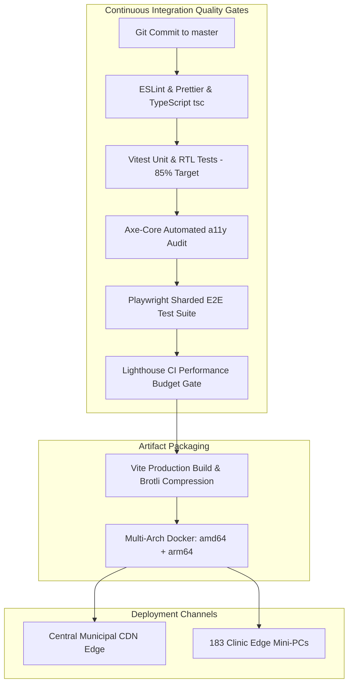

# Namma Clinic Frontend CI/CD, Containerization & Deployment Pipeline

## 1. Executive Summary & Zero-Downtime Deployment Mandate
Namma Clinic healthcare software is distributed across 183 physical clinics in the Greater Bengaluru metropolitan area. The frontend build, validation, and release engineering pipeline guarantees **zero clinical disruption during software updates**. Through progressive service worker activation, immutable CDN asset hosting, and multi-architecture Docker containerization for edge mini-PCs (x86_64 and ARM64), clinic staff experience seamless continuous deployment without ever losing in-progress clinical encounters.

## 2. Release Engineering & Pipeline Topology


## 3. GitHub Actions CI/CD Pipeline Workflow Contract
```yaml
# DOCUMENTATION-ONLY CI WORKFLOW SPECIFICATION
name: Frontend Production Quality Gate & Deployment
on:
  push:
    branches: [master, release/*]
jobs:
  quality_gate:
    runs-on: ubuntu-latest
    steps:
      - uses: actions/checkout@v4
      - uses: actions/setup-node@v4
        with:
          node-version: 20
          cache: 'npm'
      - run: npm ci
      - run: npm run lint
      - run: npm run typecheck
      - run: npm run test:coverage -- --coverage.branches=85
      - run: npx playwright test --shard=1/4
      - run: npm run build
      - uses: treosh/lighthouse-ci-action@v11
```

## 4. Multi-Arch Docker Container & Edge Nginx Configuration
Clinic edge mini-PCs run a hardened Nginx alpine image serving static PWA assets locally:
```dockerfile
# DOCUMENTATION-ONLY DOCKERFILE
FROM --platform=$TARGETPLATFORM nginx:1.25-alpine
COPY dist/ /usr/share/nginx/html/
COPY nginx/default.conf /etc/nginx/conf.d/default.conf
EXPOSE 80
STOPSIGNAL SIGQUIT
CMD ["nginx", "-g", "daemon off;"]
```

## 5. Exhaustive Screen-by-Screen Deployment Validation Matrix
Post-deployment smoke testing verification steps across all 108 screens:

### Deployment Smoke Test for Screen SCREEN-001: User Login Screen
**Route:** `/login` | **Module Area:** `MODULE-001`

#### 1. Smoke Test Assertions & HTTP Response Checks
- **HTTP Route Status:** GET `/login` returns HTTP 200 OK with `Content-Type: text/html`.
- **Asset Hash Verification:** JavaScript and CSS bundles load with 200/304 status and valid subresource integrity hashes.
- **Security Headers:** Response includes strict CSP, `X-Frame-Options: DENY`, and `X-Content-Type-Options: nosniff`.

#### 2. Rollback Criteria & Health Gate
- **Critical Failure Threshold:** If client-side error rate on `SCREEN-001` exceeds 0.5% within 10 minutes of release, deployment automatically halts.
- **Canary Progression:** Canary rollout starts with 5 pilot clinics (Ward 93, 112, 140, 150, 172) before sweeping across all 183 clinics.

#### 3. Documentation-Only Smoke Test Script
```typescript
// DOCUMENTATION-ONLY TYPESCRIPT
export const SMOKE_TEST_SCREEN_001 = {
  screenId: 'SCREEN-001',
  route: '/login',
  expectedHttpStatus: 200,
  criticalSelectors: ['h1', 'button[type="submit"]'],
  maxLoadTimeMs: 1500
};
```

---

### Deployment Smoke Test for Screen SCREEN-002: MFA Verification Screen
**Route:** `/login/mfa` | **Module Area:** `MODULE-001`

#### 1. Smoke Test Assertions & HTTP Response Checks
- **HTTP Route Status:** GET `/login/mfa` returns HTTP 200 OK with `Content-Type: text/html`.
- **Asset Hash Verification:** JavaScript and CSS bundles load with 200/304 status and valid subresource integrity hashes.
- **Security Headers:** Response includes strict CSP, `X-Frame-Options: DENY`, and `X-Content-Type-Options: nosniff`.

#### 2. Rollback Criteria & Health Gate
- **Critical Failure Threshold:** If client-side error rate on `SCREEN-002` exceeds 0.5% within 10 minutes of release, deployment automatically halts.
- **Canary Progression:** Canary rollout starts with 5 pilot clinics (Ward 93, 112, 140, 150, 172) before sweeping across all 183 clinics.

#### 3. Documentation-Only Smoke Test Script
```typescript
// DOCUMENTATION-ONLY TYPESCRIPT
export const SMOKE_TEST_SCREEN_002 = {
  screenId: 'SCREEN-002',
  route: '/login/mfa',
  expectedHttpStatus: 200,
  criticalSelectors: ['h1', 'button[type="submit"]'],
  maxLoadTimeMs: 1500
};
```

---

### Deployment Smoke Test for Screen SCREEN-003: Terminal Pairing & Device Enrollment
**Route:** `/system/device-enroll` | **Module Area:** `MODULE-001`

#### 1. Smoke Test Assertions & HTTP Response Checks
- **HTTP Route Status:** GET `/system/device-enroll` returns HTTP 200 OK with `Content-Type: text/html`.
- **Asset Hash Verification:** JavaScript and CSS bundles load with 200/304 status and valid subresource integrity hashes.
- **Security Headers:** Response includes strict CSP, `X-Frame-Options: DENY`, and `X-Content-Type-Options: nosniff`.

#### 2. Rollback Criteria & Health Gate
- **Critical Failure Threshold:** If client-side error rate on `SCREEN-003` exceeds 0.5% within 10 minutes of release, deployment automatically halts.
- **Canary Progression:** Canary rollout starts with 5 pilot clinics (Ward 93, 112, 140, 150, 172) before sweeping across all 183 clinics.

#### 3. Documentation-Only Smoke Test Script
```typescript
// DOCUMENTATION-ONLY TYPESCRIPT
export const SMOKE_TEST_SCREEN_003 = {
  screenId: 'SCREEN-003',
  route: '/system/device-enroll',
  expectedHttpStatus: 200,
  criticalSelectors: ['h1', 'button[type="submit"]'],
  maxLoadTimeMs: 1500
};
```

---

### Deployment Smoke Test for Screen SCREEN-004: Clinic Shift Check-In & Handover
**Route:** `/shift/checkin` | **Module Area:** `MODULE-001`

#### 1. Smoke Test Assertions & HTTP Response Checks
- **HTTP Route Status:** GET `/shift/checkin` returns HTTP 200 OK with `Content-Type: text/html`.
- **Asset Hash Verification:** JavaScript and CSS bundles load with 200/304 status and valid subresource integrity hashes.
- **Security Headers:** Response includes strict CSP, `X-Frame-Options: DENY`, and `X-Content-Type-Options: nosniff`.

#### 2. Rollback Criteria & Health Gate
- **Critical Failure Threshold:** If client-side error rate on `SCREEN-004` exceeds 0.5% within 10 minutes of release, deployment automatically halts.
- **Canary Progression:** Canary rollout starts with 5 pilot clinics (Ward 93, 112, 140, 150, 172) before sweeping across all 183 clinics.

#### 3. Documentation-Only Smoke Test Script
```typescript
// DOCUMENTATION-ONLY TYPESCRIPT
export const SMOKE_TEST_SCREEN_004 = {
  screenId: 'SCREEN-004',
  route: '/shift/checkin',
  expectedHttpStatus: 200,
  criticalSelectors: ['h1', 'button[type="submit"]'],
  maxLoadTimeMs: 1500
};
```

---

### Deployment Smoke Test for Screen SCREEN-005: Emergency Break-Glass Authorization
**Route:** `/auth/break-glass` | **Module Area:** `MODULE-001`

#### 1. Smoke Test Assertions & HTTP Response Checks
- **HTTP Route Status:** GET `/auth/break-glass` returns HTTP 200 OK with `Content-Type: text/html`.
- **Asset Hash Verification:** JavaScript and CSS bundles load with 200/304 status and valid subresource integrity hashes.
- **Security Headers:** Response includes strict CSP, `X-Frame-Options: DENY`, and `X-Content-Type-Options: nosniff`.

#### 2. Rollback Criteria & Health Gate
- **Critical Failure Threshold:** If client-side error rate on `SCREEN-005` exceeds 0.5% within 10 minutes of release, deployment automatically halts.
- **Canary Progression:** Canary rollout starts with 5 pilot clinics (Ward 93, 112, 140, 150, 172) before sweeping across all 183 clinics.

#### 3. Documentation-Only Smoke Test Script
```typescript
// DOCUMENTATION-ONLY TYPESCRIPT
export const SMOKE_TEST_SCREEN_005 = {
  screenId: 'SCREEN-005',
  route: '/auth/break-glass',
  expectedHttpStatus: 200,
  criticalSelectors: ['h1', 'button[type="submit"]'],
  maxLoadTimeMs: 1500
};
```

---

### Deployment Smoke Test for Screen SCREEN-006: Master Clinic Dashboard
**Route:** `/dashboard` | **Module Area:** `MODULE-002`

#### 1. Smoke Test Assertions & HTTP Response Checks
- **HTTP Route Status:** GET `/dashboard` returns HTTP 200 OK with `Content-Type: text/html`.
- **Asset Hash Verification:** JavaScript and CSS bundles load with 200/304 status and valid subresource integrity hashes.
- **Security Headers:** Response includes strict CSP, `X-Frame-Options: DENY`, and `X-Content-Type-Options: nosniff`.

#### 2. Rollback Criteria & Health Gate
- **Critical Failure Threshold:** If client-side error rate on `SCREEN-006` exceeds 0.5% within 10 minutes of release, deployment automatically halts.
- **Canary Progression:** Canary rollout starts with 5 pilot clinics (Ward 93, 112, 140, 150, 172) before sweeping across all 183 clinics.

#### 3. Documentation-Only Smoke Test Script
```typescript
// DOCUMENTATION-ONLY TYPESCRIPT
export const SMOKE_TEST_SCREEN_006 = {
  screenId: 'SCREEN-006',
  route: '/dashboard',
  expectedHttpStatus: 200,
  criticalSelectors: ['h1', 'button[type="submit"]'],
  maxLoadTimeMs: 1500
};
```

---

### Deployment Smoke Test for Screen SCREEN-007: Doctor Outpatient Console
**Route:** `/doctor/console` | **Module Area:** `MODULE-002`

#### 1. Smoke Test Assertions & HTTP Response Checks
- **HTTP Route Status:** GET `/doctor/console` returns HTTP 200 OK with `Content-Type: text/html`.
- **Asset Hash Verification:** JavaScript and CSS bundles load with 200/304 status and valid subresource integrity hashes.
- **Security Headers:** Response includes strict CSP, `X-Frame-Options: DENY`, and `X-Content-Type-Options: nosniff`.

#### 2. Rollback Criteria & Health Gate
- **Critical Failure Threshold:** If client-side error rate on `SCREEN-007` exceeds 0.5% within 10 minutes of release, deployment automatically halts.
- **Canary Progression:** Canary rollout starts with 5 pilot clinics (Ward 93, 112, 140, 150, 172) before sweeping across all 183 clinics.

#### 3. Documentation-Only Smoke Test Script
```typescript
// DOCUMENTATION-ONLY TYPESCRIPT
export const SMOKE_TEST_SCREEN_007 = {
  screenId: 'SCREEN-007',
  route: '/doctor/console',
  expectedHttpStatus: 200,
  criticalSelectors: ['h1', 'button[type="submit"]'],
  maxLoadTimeMs: 1500
};
```

---

### Deployment Smoke Test for Screen SCREEN-008: Staff Nurse Triage Workbench
**Route:** `/nurse/triage` | **Module Area:** `MODULE-002`

#### 1. Smoke Test Assertions & HTTP Response Checks
- **HTTP Route Status:** GET `/nurse/triage` returns HTTP 200 OK with `Content-Type: text/html`.
- **Asset Hash Verification:** JavaScript and CSS bundles load with 200/304 status and valid subresource integrity hashes.
- **Security Headers:** Response includes strict CSP, `X-Frame-Options: DENY`, and `X-Content-Type-Options: nosniff`.

#### 2. Rollback Criteria & Health Gate
- **Critical Failure Threshold:** If client-side error rate on `SCREEN-008` exceeds 0.5% within 10 minutes of release, deployment automatically halts.
- **Canary Progression:** Canary rollout starts with 5 pilot clinics (Ward 93, 112, 140, 150, 172) before sweeping across all 183 clinics.

#### 3. Documentation-Only Smoke Test Script
```typescript
// DOCUMENTATION-ONLY TYPESCRIPT
export const SMOKE_TEST_SCREEN_008 = {
  screenId: 'SCREEN-008',
  route: '/nurse/triage',
  expectedHttpStatus: 200,
  criticalSelectors: ['h1', 'button[type="submit"]'],
  maxLoadTimeMs: 1500
};
```

---

### Deployment Smoke Test for Screen SCREEN-009: Pharmacy Dispensing Console
**Route:** `/pharmacy/dispense` | **Module Area:** `MODULE-002`

#### 1. Smoke Test Assertions & HTTP Response Checks
- **HTTP Route Status:** GET `/pharmacy/dispense` returns HTTP 200 OK with `Content-Type: text/html`.
- **Asset Hash Verification:** JavaScript and CSS bundles load with 200/304 status and valid subresource integrity hashes.
- **Security Headers:** Response includes strict CSP, `X-Frame-Options: DENY`, and `X-Content-Type-Options: nosniff`.

#### 2. Rollback Criteria & Health Gate
- **Critical Failure Threshold:** If client-side error rate on `SCREEN-009` exceeds 0.5% within 10 minutes of release, deployment automatically halts.
- **Canary Progression:** Canary rollout starts with 5 pilot clinics (Ward 93, 112, 140, 150, 172) before sweeping across all 183 clinics.

#### 3. Documentation-Only Smoke Test Script
```typescript
// DOCUMENTATION-ONLY TYPESCRIPT
export const SMOKE_TEST_SCREEN_009 = {
  screenId: 'SCREEN-009',
  route: '/pharmacy/dispense',
  expectedHttpStatus: 200,
  criticalSelectors: ['h1', 'button[type="submit"]'],
  maxLoadTimeMs: 1500
};
```

---

### Deployment Smoke Test for Screen SCREEN-010: Diagnostic Laboratory Workbench
**Route:** `/lab/workbench` | **Module Area:** `MODULE-002`

#### 1. Smoke Test Assertions & HTTP Response Checks
- **HTTP Route Status:** GET `/lab/workbench` returns HTTP 200 OK with `Content-Type: text/html`.
- **Asset Hash Verification:** JavaScript and CSS bundles load with 200/304 status and valid subresource integrity hashes.
- **Security Headers:** Response includes strict CSP, `X-Frame-Options: DENY`, and `X-Content-Type-Options: nosniff`.

#### 2. Rollback Criteria & Health Gate
- **Critical Failure Threshold:** If client-side error rate on `SCREEN-010` exceeds 0.5% within 10 minutes of release, deployment automatically halts.
- **Canary Progression:** Canary rollout starts with 5 pilot clinics (Ward 93, 112, 140, 150, 172) before sweeping across all 183 clinics.

#### 3. Documentation-Only Smoke Test Script
```typescript
// DOCUMENTATION-ONLY TYPESCRIPT
export const SMOKE_TEST_SCREEN_010 = {
  screenId: 'SCREEN-010',
  route: '/lab/workbench',
  expectedHttpStatus: 200,
  criticalSelectors: ['h1', 'button[type="submit"]'],
  maxLoadTimeMs: 1500
};
```

---

### Deployment Smoke Test for Screen SCREEN-011: Citizen New Registration Screen
**Route:** `/patients/new` | **Module Area:** `MODULE-003`

#### 1. Smoke Test Assertions & HTTP Response Checks
- **HTTP Route Status:** GET `/patients/new` returns HTTP 200 OK with `Content-Type: text/html`.
- **Asset Hash Verification:** JavaScript and CSS bundles load with 200/304 status and valid subresource integrity hashes.
- **Security Headers:** Response includes strict CSP, `X-Frame-Options: DENY`, and `X-Content-Type-Options: nosniff`.

#### 2. Rollback Criteria & Health Gate
- **Critical Failure Threshold:** If client-side error rate on `SCREEN-011` exceeds 0.5% within 10 minutes of release, deployment automatically halts.
- **Canary Progression:** Canary rollout starts with 5 pilot clinics (Ward 93, 112, 140, 150, 172) before sweeping across all 183 clinics.

#### 3. Documentation-Only Smoke Test Script
```typescript
// DOCUMENTATION-ONLY TYPESCRIPT
export const SMOKE_TEST_SCREEN_011 = {
  screenId: 'SCREEN-011',
  route: '/patients/new',
  expectedHttpStatus: 200,
  criticalSelectors: ['h1', 'button[type="submit"]'],
  maxLoadTimeMs: 1500
};
```

---

### Deployment Smoke Test for Screen SCREEN-012: Citizen Search & Retrieval Screen
**Route:** `/patients/search` | **Module Area:** `MODULE-003`

#### 1. Smoke Test Assertions & HTTP Response Checks
- **HTTP Route Status:** GET `/patients/search` returns HTTP 200 OK with `Content-Type: text/html`.
- **Asset Hash Verification:** JavaScript and CSS bundles load with 200/304 status and valid subresource integrity hashes.
- **Security Headers:** Response includes strict CSP, `X-Frame-Options: DENY`, and `X-Content-Type-Options: nosniff`.

#### 2. Rollback Criteria & Health Gate
- **Critical Failure Threshold:** If client-side error rate on `SCREEN-012` exceeds 0.5% within 10 minutes of release, deployment automatically halts.
- **Canary Progression:** Canary rollout starts with 5 pilot clinics (Ward 93, 112, 140, 150, 172) before sweeping across all 183 clinics.

#### 3. Documentation-Only Smoke Test Script
```typescript
// DOCUMENTATION-ONLY TYPESCRIPT
export const SMOKE_TEST_SCREEN_012 = {
  screenId: 'SCREEN-012',
  route: '/patients/search',
  expectedHttpStatus: 200,
  criticalSelectors: ['h1', 'button[type="submit"]'],
  maxLoadTimeMs: 1500
};
```

---

### Deployment Smoke Test for Screen SCREEN-013: Patient Longitudinal Profile View
**Route:** `/patients/:id` | **Module Area:** `MODULE-003`

#### 1. Smoke Test Assertions & HTTP Response Checks
- **HTTP Route Status:** GET `/patients/:id` returns HTTP 200 OK with `Content-Type: text/html`.
- **Asset Hash Verification:** JavaScript and CSS bundles load with 200/304 status and valid subresource integrity hashes.
- **Security Headers:** Response includes strict CSP, `X-Frame-Options: DENY`, and `X-Content-Type-Options: nosniff`.

#### 2. Rollback Criteria & Health Gate
- **Critical Failure Threshold:** If client-side error rate on `SCREEN-013` exceeds 0.5% within 10 minutes of release, deployment automatically halts.
- **Canary Progression:** Canary rollout starts with 5 pilot clinics (Ward 93, 112, 140, 150, 172) before sweeping across all 183 clinics.

#### 3. Documentation-Only Smoke Test Script
```typescript
// DOCUMENTATION-ONLY TYPESCRIPT
export const SMOKE_TEST_SCREEN_013 = {
  screenId: 'SCREEN-013',
  route: '/patients/:id',
  expectedHttpStatus: 200,
  criticalSelectors: ['h1', 'button[type="submit"]'],
  maxLoadTimeMs: 1500
};
```

---

### Deployment Smoke Test for Screen SCREEN-014: Repeat Patient Fast Intake
**Route:** `/patients/:id/repeat-intake` | **Module Area:** `MODULE-003`

#### 1. Smoke Test Assertions & HTTP Response Checks
- **HTTP Route Status:** GET `/patients/:id/repeat-intake` returns HTTP 200 OK with `Content-Type: text/html`.
- **Asset Hash Verification:** JavaScript and CSS bundles load with 200/304 status and valid subresource integrity hashes.
- **Security Headers:** Response includes strict CSP, `X-Frame-Options: DENY`, and `X-Content-Type-Options: nosniff`.

#### 2. Rollback Criteria & Health Gate
- **Critical Failure Threshold:** If client-side error rate on `SCREEN-014` exceeds 0.5% within 10 minutes of release, deployment automatically halts.
- **Canary Progression:** Canary rollout starts with 5 pilot clinics (Ward 93, 112, 140, 150, 172) before sweeping across all 183 clinics.

#### 3. Documentation-Only Smoke Test Script
```typescript
// DOCUMENTATION-ONLY TYPESCRIPT
export const SMOKE_TEST_SCREEN_014 = {
  screenId: 'SCREEN-014',
  route: '/patients/:id/repeat-intake',
  expectedHttpStatus: 200,
  criticalSelectors: ['h1', 'button[type="submit"]'],
  maxLoadTimeMs: 1500
};
```

---

### Deployment Smoke Test for Screen SCREEN-015: Biometric & ABHA Card Scan Modal
**Route:** `/patients/abha-scan` | **Module Area:** `MODULE-003`

#### 1. Smoke Test Assertions & HTTP Response Checks
- **HTTP Route Status:** GET `/patients/abha-scan` returns HTTP 200 OK with `Content-Type: text/html`.
- **Asset Hash Verification:** JavaScript and CSS bundles load with 200/304 status and valid subresource integrity hashes.
- **Security Headers:** Response includes strict CSP, `X-Frame-Options: DENY`, and `X-Content-Type-Options: nosniff`.

#### 2. Rollback Criteria & Health Gate
- **Critical Failure Threshold:** If client-side error rate on `SCREEN-015` exceeds 0.5% within 10 minutes of release, deployment automatically halts.
- **Canary Progression:** Canary rollout starts with 5 pilot clinics (Ward 93, 112, 140, 150, 172) before sweeping across all 183 clinics.

#### 3. Documentation-Only Smoke Test Script
```typescript
// DOCUMENTATION-ONLY TYPESCRIPT
export const SMOKE_TEST_SCREEN_015 = {
  screenId: 'SCREEN-015',
  route: '/patients/abha-scan',
  expectedHttpStatus: 200,
  criticalSelectors: ['h1', 'button[type="submit"]'],
  maxLoadTimeMs: 1500
};
```

---

### Deployment Smoke Test for Screen SCREEN-016: Citizen Demographic Correction Form
**Route:** `/patients/:id/edit` | **Module Area:** `MODULE-003`

#### 1. Smoke Test Assertions & HTTP Response Checks
- **HTTP Route Status:** GET `/patients/:id/edit` returns HTTP 200 OK with `Content-Type: text/html`.
- **Asset Hash Verification:** JavaScript and CSS bundles load with 200/304 status and valid subresource integrity hashes.
- **Security Headers:** Response includes strict CSP, `X-Frame-Options: DENY`, and `X-Content-Type-Options: nosniff`.

#### 2. Rollback Criteria & Health Gate
- **Critical Failure Threshold:** If client-side error rate on `SCREEN-016` exceeds 0.5% within 10 minutes of release, deployment automatically halts.
- **Canary Progression:** Canary rollout starts with 5 pilot clinics (Ward 93, 112, 140, 150, 172) before sweeping across all 183 clinics.

#### 3. Documentation-Only Smoke Test Script
```typescript
// DOCUMENTATION-ONLY TYPESCRIPT
export const SMOKE_TEST_SCREEN_016 = {
  screenId: 'SCREEN-016',
  route: '/patients/:id/edit',
  expectedHttpStatus: 200,
  criticalSelectors: ['h1', 'button[type="submit"]'],
  maxLoadTimeMs: 1500
};
```

---

### Deployment Smoke Test for Screen SCREEN-017: Duplicate Citizen Merge Modal
**Route:** `/patients/merge` | **Module Area:** `MODULE-003`

#### 1. Smoke Test Assertions & HTTP Response Checks
- **HTTP Route Status:** GET `/patients/merge` returns HTTP 200 OK with `Content-Type: text/html`.
- **Asset Hash Verification:** JavaScript and CSS bundles load with 200/304 status and valid subresource integrity hashes.
- **Security Headers:** Response includes strict CSP, `X-Frame-Options: DENY`, and `X-Content-Type-Options: nosniff`.

#### 2. Rollback Criteria & Health Gate
- **Critical Failure Threshold:** If client-side error rate on `SCREEN-017` exceeds 0.5% within 10 minutes of release, deployment automatically halts.
- **Canary Progression:** Canary rollout starts with 5 pilot clinics (Ward 93, 112, 140, 150, 172) before sweeping across all 183 clinics.

#### 3. Documentation-Only Smoke Test Script
```typescript
// DOCUMENTATION-ONLY TYPESCRIPT
export const SMOKE_TEST_SCREEN_017 = {
  screenId: 'SCREEN-017',
  route: '/patients/merge',
  expectedHttpStatus: 200,
  criticalSelectors: ['h1', 'button[type="submit"]'],
  maxLoadTimeMs: 1500
};
```

---

### Deployment Smoke Test for Screen SCREEN-018: Citizen Digital Photo Capture
**Route:** `/patients/:id/photo` | **Module Area:** `MODULE-003`

#### 1. Smoke Test Assertions & HTTP Response Checks
- **HTTP Route Status:** GET `/patients/:id/photo` returns HTTP 200 OK with `Content-Type: text/html`.
- **Asset Hash Verification:** JavaScript and CSS bundles load with 200/304 status and valid subresource integrity hashes.
- **Security Headers:** Response includes strict CSP, `X-Frame-Options: DENY`, and `X-Content-Type-Options: nosniff`.

#### 2. Rollback Criteria & Health Gate
- **Critical Failure Threshold:** If client-side error rate on `SCREEN-018` exceeds 0.5% within 10 minutes of release, deployment automatically halts.
- **Canary Progression:** Canary rollout starts with 5 pilot clinics (Ward 93, 112, 140, 150, 172) before sweeping across all 183 clinics.

#### 3. Documentation-Only Smoke Test Script
```typescript
// DOCUMENTATION-ONLY TYPESCRIPT
export const SMOKE_TEST_SCREEN_018 = {
  screenId: 'SCREEN-018',
  route: '/patients/:id/photo',
  expectedHttpStatus: 200,
  criticalSelectors: ['h1', 'button[type="submit"]'],
  maxLoadTimeMs: 1500
};
```

---

### Deployment Smoke Test for Screen SCREEN-019: DPDP Informed Consent Capture Screen
**Route:** `/patients/:id/consent` | **Module Area:** `MODULE-004`

#### 1. Smoke Test Assertions & HTTP Response Checks
- **HTTP Route Status:** GET `/patients/:id/consent` returns HTTP 200 OK with `Content-Type: text/html`.
- **Asset Hash Verification:** JavaScript and CSS bundles load with 200/304 status and valid subresource integrity hashes.
- **Security Headers:** Response includes strict CSP, `X-Frame-Options: DENY`, and `X-Content-Type-Options: nosniff`.

#### 2. Rollback Criteria & Health Gate
- **Critical Failure Threshold:** If client-side error rate on `SCREEN-019` exceeds 0.5% within 10 minutes of release, deployment automatically halts.
- **Canary Progression:** Canary rollout starts with 5 pilot clinics (Ward 93, 112, 140, 150, 172) before sweeping across all 183 clinics.

#### 3. Documentation-Only Smoke Test Script
```typescript
// DOCUMENTATION-ONLY TYPESCRIPT
export const SMOKE_TEST_SCREEN_019 = {
  screenId: 'SCREEN-019',
  route: '/patients/:id/consent',
  expectedHttpStatus: 200,
  criticalSelectors: ['h1', 'button[type="submit"]'],
  maxLoadTimeMs: 1500
};
```

---

### Deployment Smoke Test for Screen SCREEN-020: Consent History & Revocation Console
**Route:** `/patients/:id/consents` | **Module Area:** `MODULE-004`

#### 1. Smoke Test Assertions & HTTP Response Checks
- **HTTP Route Status:** GET `/patients/:id/consents` returns HTTP 200 OK with `Content-Type: text/html`.
- **Asset Hash Verification:** JavaScript and CSS bundles load with 200/304 status and valid subresource integrity hashes.
- **Security Headers:** Response includes strict CSP, `X-Frame-Options: DENY`, and `X-Content-Type-Options: nosniff`.

#### 2. Rollback Criteria & Health Gate
- **Critical Failure Threshold:** If client-side error rate on `SCREEN-020` exceeds 0.5% within 10 minutes of release, deployment automatically halts.
- **Canary Progression:** Canary rollout starts with 5 pilot clinics (Ward 93, 112, 140, 150, 172) before sweeping across all 183 clinics.

#### 3. Documentation-Only Smoke Test Script
```typescript
// DOCUMENTATION-ONLY TYPESCRIPT
export const SMOKE_TEST_SCREEN_020 = {
  screenId: 'SCREEN-020',
  route: '/patients/:id/consents',
  expectedHttpStatus: 200,
  criticalSelectors: ['h1', 'button[type="submit"]'],
  maxLoadTimeMs: 1500
};
```

---

### Deployment Smoke Test for Screen SCREEN-021: Data Portability & Export Request
**Route:** `/patients/:id/export` | **Module Area:** `MODULE-004`

#### 1. Smoke Test Assertions & HTTP Response Checks
- **HTTP Route Status:** GET `/patients/:id/export` returns HTTP 200 OK with `Content-Type: text/html`.
- **Asset Hash Verification:** JavaScript and CSS bundles load with 200/304 status and valid subresource integrity hashes.
- **Security Headers:** Response includes strict CSP, `X-Frame-Options: DENY`, and `X-Content-Type-Options: nosniff`.

#### 2. Rollback Criteria & Health Gate
- **Critical Failure Threshold:** If client-side error rate on `SCREEN-021` exceeds 0.5% within 10 minutes of release, deployment automatically halts.
- **Canary Progression:** Canary rollout starts with 5 pilot clinics (Ward 93, 112, 140, 150, 172) before sweeping across all 183 clinics.

#### 3. Documentation-Only Smoke Test Script
```typescript
// DOCUMENTATION-ONLY TYPESCRIPT
export const SMOKE_TEST_SCREEN_021 = {
  screenId: 'SCREEN-021',
  route: '/patients/:id/export',
  expectedHttpStatus: 200,
  criticalSelectors: ['h1', 'button[type="submit"]'],
  maxLoadTimeMs: 1500
};
```

---

### Deployment Smoke Test for Screen SCREEN-022: Citizen Grievance Redressal Intake
**Route:** `/patients/:id/grievance` | **Module Area:** `MODULE-004`

#### 1. Smoke Test Assertions & HTTP Response Checks
- **HTTP Route Status:** GET `/patients/:id/grievance` returns HTTP 200 OK with `Content-Type: text/html`.
- **Asset Hash Verification:** JavaScript and CSS bundles load with 200/304 status and valid subresource integrity hashes.
- **Security Headers:** Response includes strict CSP, `X-Frame-Options: DENY`, and `X-Content-Type-Options: nosniff`.

#### 2. Rollback Criteria & Health Gate
- **Critical Failure Threshold:** If client-side error rate on `SCREEN-022` exceeds 0.5% within 10 minutes of release, deployment automatically halts.
- **Canary Progression:** Canary rollout starts with 5 pilot clinics (Ward 93, 112, 140, 150, 172) before sweeping across all 183 clinics.

#### 3. Documentation-Only Smoke Test Script
```typescript
// DOCUMENTATION-ONLY TYPESCRIPT
export const SMOKE_TEST_SCREEN_022 = {
  screenId: 'SCREEN-022',
  route: '/patients/:id/grievance',
  expectedHttpStatus: 200,
  criticalSelectors: ['h1', 'button[type="submit"]'],
  maxLoadTimeMs: 1500
};
```

---

### Deployment Smoke Test for Screen SCREEN-023: Grievance Investigation & Resolution
**Route:** `/grievances/:id` | **Module Area:** `MODULE-004`

#### 1. Smoke Test Assertions & HTTP Response Checks
- **HTTP Route Status:** GET `/grievances/:id` returns HTTP 200 OK with `Content-Type: text/html`.
- **Asset Hash Verification:** JavaScript and CSS bundles load with 200/304 status and valid subresource integrity hashes.
- **Security Headers:** Response includes strict CSP, `X-Frame-Options: DENY`, and `X-Content-Type-Options: nosniff`.

#### 2. Rollback Criteria & Health Gate
- **Critical Failure Threshold:** If client-side error rate on `SCREEN-023` exceeds 0.5% within 10 minutes of release, deployment automatically halts.
- **Canary Progression:** Canary rollout starts with 5 pilot clinics (Ward 93, 112, 140, 150, 172) before sweeping across all 183 clinics.

#### 3. Documentation-Only Smoke Test Script
```typescript
// DOCUMENTATION-ONLY TYPESCRIPT
export const SMOKE_TEST_SCREEN_023 = {
  screenId: 'SCREEN-023',
  route: '/grievances/:id',
  expectedHttpStatus: 200,
  criticalSelectors: ['h1', 'button[type="submit"]'],
  maxLoadTimeMs: 1500
};
```

---

### Deployment Smoke Test for Screen SCREEN-024: OPD Token Generation & Print Modal
**Route:** `/queue/tokens/new` | **Module Area:** `MODULE-005`

#### 1. Smoke Test Assertions & HTTP Response Checks
- **HTTP Route Status:** GET `/queue/tokens/new` returns HTTP 200 OK with `Content-Type: text/html`.
- **Asset Hash Verification:** JavaScript and CSS bundles load with 200/304 status and valid subresource integrity hashes.
- **Security Headers:** Response includes strict CSP, `X-Frame-Options: DENY`, and `X-Content-Type-Options: nosniff`.

#### 2. Rollback Criteria & Health Gate
- **Critical Failure Threshold:** If client-side error rate on `SCREEN-024` exceeds 0.5% within 10 minutes of release, deployment automatically halts.
- **Canary Progression:** Canary rollout starts with 5 pilot clinics (Ward 93, 112, 140, 150, 172) before sweeping across all 183 clinics.

#### 3. Documentation-Only Smoke Test Script
```typescript
// DOCUMENTATION-ONLY TYPESCRIPT
export const SMOKE_TEST_SCREEN_024 = {
  screenId: 'SCREEN-024',
  route: '/queue/tokens/new',
  expectedHttpStatus: 200,
  criticalSelectors: ['h1', 'button[type="submit"]'],
  maxLoadTimeMs: 1500
};
```

---

### Deployment Smoke Test for Screen SCREEN-025: Master Waiting Room Queue Display
**Route:** `/queue/display` | **Module Area:** `MODULE-005`

#### 1. Smoke Test Assertions & HTTP Response Checks
- **HTTP Route Status:** GET `/queue/display` returns HTTP 200 OK with `Content-Type: text/html`.
- **Asset Hash Verification:** JavaScript and CSS bundles load with 200/304 status and valid subresource integrity hashes.
- **Security Headers:** Response includes strict CSP, `X-Frame-Options: DENY`, and `X-Content-Type-Options: nosniff`.

#### 2. Rollback Criteria & Health Gate
- **Critical Failure Threshold:** If client-side error rate on `SCREEN-025` exceeds 0.5% within 10 minutes of release, deployment automatically halts.
- **Canary Progression:** Canary rollout starts with 5 pilot clinics (Ward 93, 112, 140, 150, 172) before sweeping across all 183 clinics.

#### 3. Documentation-Only Smoke Test Script
```typescript
// DOCUMENTATION-ONLY TYPESCRIPT
export const SMOKE_TEST_SCREEN_025 = {
  screenId: 'SCREEN-025',
  route: '/queue/display',
  expectedHttpStatus: 200,
  criticalSelectors: ['h1', 'button[type="submit"]'],
  maxLoadTimeMs: 1500
};
```

---

### Deployment Smoke Test for Screen SCREEN-026: Queue Management & Rerouting Screen
**Route:** `/queue/manage` | **Module Area:** `MODULE-005`

#### 1. Smoke Test Assertions & HTTP Response Checks
- **HTTP Route Status:** GET `/queue/manage` returns HTTP 200 OK with `Content-Type: text/html`.
- **Asset Hash Verification:** JavaScript and CSS bundles load with 200/304 status and valid subresource integrity hashes.
- **Security Headers:** Response includes strict CSP, `X-Frame-Options: DENY`, and `X-Content-Type-Options: nosniff`.

#### 2. Rollback Criteria & Health Gate
- **Critical Failure Threshold:** If client-side error rate on `SCREEN-026` exceeds 0.5% within 10 minutes of release, deployment automatically halts.
- **Canary Progression:** Canary rollout starts with 5 pilot clinics (Ward 93, 112, 140, 150, 172) before sweeping across all 183 clinics.

#### 3. Documentation-Only Smoke Test Script
```typescript
// DOCUMENTATION-ONLY TYPESCRIPT
export const SMOKE_TEST_SCREEN_026 = {
  screenId: 'SCREEN-026',
  route: '/queue/manage',
  expectedHttpStatus: 200,
  criticalSelectors: ['h1', 'button[type="submit"]'],
  maxLoadTimeMs: 1500
};
```

---

### Deployment Smoke Test for Screen SCREEN-027: Express Triage Queue
**Route:** `/queue/triage-express` | **Module Area:** `MODULE-005`

#### 1. Smoke Test Assertions & HTTP Response Checks
- **HTTP Route Status:** GET `/queue/triage-express` returns HTTP 200 OK with `Content-Type: text/html`.
- **Asset Hash Verification:** JavaScript and CSS bundles load with 200/304 status and valid subresource integrity hashes.
- **Security Headers:** Response includes strict CSP, `X-Frame-Options: DENY`, and `X-Content-Type-Options: nosniff`.

#### 2. Rollback Criteria & Health Gate
- **Critical Failure Threshold:** If client-side error rate on `SCREEN-027` exceeds 0.5% within 10 minutes of release, deployment automatically halts.
- **Canary Progression:** Canary rollout starts with 5 pilot clinics (Ward 93, 112, 140, 150, 172) before sweeping across all 183 clinics.

#### 3. Documentation-Only Smoke Test Script
```typescript
// DOCUMENTATION-ONLY TYPESCRIPT
export const SMOKE_TEST_SCREEN_027 = {
  screenId: 'SCREEN-027',
  route: '/queue/triage-express',
  expectedHttpStatus: 200,
  criticalSelectors: ['h1', 'button[type="submit"]'],
  maxLoadTimeMs: 1500
};
```

---

### Deployment Smoke Test for Screen SCREEN-028: Pharmacy Pickup Waiting Screen
**Route:** `/queue/pharmacy` | **Module Area:** `MODULE-005`

#### 1. Smoke Test Assertions & HTTP Response Checks
- **HTTP Route Status:** GET `/queue/pharmacy` returns HTTP 200 OK with `Content-Type: text/html`.
- **Asset Hash Verification:** JavaScript and CSS bundles load with 200/304 status and valid subresource integrity hashes.
- **Security Headers:** Response includes strict CSP, `X-Frame-Options: DENY`, and `X-Content-Type-Options: nosniff`.

#### 2. Rollback Criteria & Health Gate
- **Critical Failure Threshold:** If client-side error rate on `SCREEN-028` exceeds 0.5% within 10 minutes of release, deployment automatically halts.
- **Canary Progression:** Canary rollout starts with 5 pilot clinics (Ward 93, 112, 140, 150, 172) before sweeping across all 183 clinics.

#### 3. Documentation-Only Smoke Test Script
```typescript
// DOCUMENTATION-ONLY TYPESCRIPT
export const SMOKE_TEST_SCREEN_028 = {
  screenId: 'SCREEN-028',
  route: '/queue/pharmacy',
  expectedHttpStatus: 200,
  criticalSelectors: ['h1', 'button[type="submit"]'],
  maxLoadTimeMs: 1500
};
```

---

### Deployment Smoke Test for Screen SCREEN-029: Triage Vitals Entry Form
**Route:** `/triage/:visitId/vitals` | **Module Area:** `MODULE-006`

#### 1. Smoke Test Assertions & HTTP Response Checks
- **HTTP Route Status:** GET `/triage/:visitId/vitals` returns HTTP 200 OK with `Content-Type: text/html`.
- **Asset Hash Verification:** JavaScript and CSS bundles load with 200/304 status and valid subresource integrity hashes.
- **Security Headers:** Response includes strict CSP, `X-Frame-Options: DENY`, and `X-Content-Type-Options: nosniff`.

#### 2. Rollback Criteria & Health Gate
- **Critical Failure Threshold:** If client-side error rate on `SCREEN-029` exceeds 0.5% within 10 minutes of release, deployment automatically halts.
- **Canary Progression:** Canary rollout starts with 5 pilot clinics (Ward 93, 112, 140, 150, 172) before sweeping across all 183 clinics.

#### 3. Documentation-Only Smoke Test Script
```typescript
// DOCUMENTATION-ONLY TYPESCRIPT
export const SMOKE_TEST_SCREEN_029 = {
  screenId: 'SCREEN-029',
  route: '/triage/:visitId/vitals',
  expectedHttpStatus: 200,
  criticalSelectors: ['h1', 'button[type="submit"]'],
  maxLoadTimeMs: 1500
};
```

---

### Deployment Smoke Test for Screen SCREEN-030: Pediatric Growth Chart & Z-Scores
**Route:** `/triage/:visitId/pediatric` | **Module Area:** `MODULE-006`

#### 1. Smoke Test Assertions & HTTP Response Checks
- **HTTP Route Status:** GET `/triage/:visitId/pediatric` returns HTTP 200 OK with `Content-Type: text/html`.
- **Asset Hash Verification:** JavaScript and CSS bundles load with 200/304 status and valid subresource integrity hashes.
- **Security Headers:** Response includes strict CSP, `X-Frame-Options: DENY`, and `X-Content-Type-Options: nosniff`.

#### 2. Rollback Criteria & Health Gate
- **Critical Failure Threshold:** If client-side error rate on `SCREEN-030` exceeds 0.5% within 10 minutes of release, deployment automatically halts.
- **Canary Progression:** Canary rollout starts with 5 pilot clinics (Ward 93, 112, 140, 150, 172) before sweeping across all 183 clinics.

#### 3. Documentation-Only Smoke Test Script
```typescript
// DOCUMENTATION-ONLY TYPESCRIPT
export const SMOKE_TEST_SCREEN_030 = {
  screenId: 'SCREEN-030',
  route: '/triage/:visitId/pediatric',
  expectedHttpStatus: 200,
  criticalSelectors: ['h1', 'button[type="submit"]'],
  maxLoadTimeMs: 1500
};
```

---

### Deployment Smoke Test for Screen SCREEN-031: Antenatal Care (ANC) Vitals Intake
**Route:** `/triage/:visitId/anc` | **Module Area:** `MODULE-006`

#### 1. Smoke Test Assertions & HTTP Response Checks
- **HTTP Route Status:** GET `/triage/:visitId/anc` returns HTTP 200 OK with `Content-Type: text/html`.
- **Asset Hash Verification:** JavaScript and CSS bundles load with 200/304 status and valid subresource integrity hashes.
- **Security Headers:** Response includes strict CSP, `X-Frame-Options: DENY`, and `X-Content-Type-Options: nosniff`.

#### 2. Rollback Criteria & Health Gate
- **Critical Failure Threshold:** If client-side error rate on `SCREEN-031` exceeds 0.5% within 10 minutes of release, deployment automatically halts.
- **Canary Progression:** Canary rollout starts with 5 pilot clinics (Ward 93, 112, 140, 150, 172) before sweeping across all 183 clinics.

#### 3. Documentation-Only Smoke Test Script
```typescript
// DOCUMENTATION-ONLY TYPESCRIPT
export const SMOKE_TEST_SCREEN_031 = {
  screenId: 'SCREEN-031',
  route: '/triage/:visitId/anc',
  expectedHttpStatus: 200,
  criticalSelectors: ['h1', 'button[type="submit"]'],
  maxLoadTimeMs: 1500
};
```

---

### Deployment Smoke Test for Screen SCREEN-032: Danger Signs & Triage Warning Modal
**Route:** `/triage/:visitId/danger-modal` | **Module Area:** `MODULE-006`

#### 1. Smoke Test Assertions & HTTP Response Checks
- **HTTP Route Status:** GET `/triage/:visitId/danger-modal` returns HTTP 200 OK with `Content-Type: text/html`.
- **Asset Hash Verification:** JavaScript and CSS bundles load with 200/304 status and valid subresource integrity hashes.
- **Security Headers:** Response includes strict CSP, `X-Frame-Options: DENY`, and `X-Content-Type-Options: nosniff`.

#### 2. Rollback Criteria & Health Gate
- **Critical Failure Threshold:** If client-side error rate on `SCREEN-032` exceeds 0.5% within 10 minutes of release, deployment automatically halts.
- **Canary Progression:** Canary rollout starts with 5 pilot clinics (Ward 93, 112, 140, 150, 172) before sweeping across all 183 clinics.

#### 3. Documentation-Only Smoke Test Script
```typescript
// DOCUMENTATION-ONLY TYPESCRIPT
export const SMOKE_TEST_SCREEN_032 = {
  screenId: 'SCREEN-032',
  route: '/triage/:visitId/danger-modal',
  expectedHttpStatus: 200,
  criticalSelectors: ['h1', 'button[type="submit"]'],
  maxLoadTimeMs: 1500
};
```

---

### Deployment Smoke Test for Screen SCREEN-033: Point-of-Care Blood Sugar Entry
**Route:** `/triage/:visitId/glucometer` | **Module Area:** `MODULE-006`

#### 1. Smoke Test Assertions & HTTP Response Checks
- **HTTP Route Status:** GET `/triage/:visitId/glucometer` returns HTTP 200 OK with `Content-Type: text/html`.
- **Asset Hash Verification:** JavaScript and CSS bundles load with 200/304 status and valid subresource integrity hashes.
- **Security Headers:** Response includes strict CSP, `X-Frame-Options: DENY`, and `X-Content-Type-Options: nosniff`.

#### 2. Rollback Criteria & Health Gate
- **Critical Failure Threshold:** If client-side error rate on `SCREEN-033` exceeds 0.5% within 10 minutes of release, deployment automatically halts.
- **Canary Progression:** Canary rollout starts with 5 pilot clinics (Ward 93, 112, 140, 150, 172) before sweeping across all 183 clinics.

#### 3. Documentation-Only Smoke Test Script
```typescript
// DOCUMENTATION-ONLY TYPESCRIPT
export const SMOKE_TEST_SCREEN_033 = {
  screenId: 'SCREEN-033',
  route: '/triage/:visitId/glucometer',
  expectedHttpStatus: 200,
  criticalSelectors: ['h1', 'button[type="submit"]'],
  maxLoadTimeMs: 1500
};
```

---

### Deployment Smoke Test for Screen SCREEN-034: Triage Station History Log
**Route:** `/triage/station-history` | **Module Area:** `MODULE-006`

#### 1. Smoke Test Assertions & HTTP Response Checks
- **HTTP Route Status:** GET `/triage/station-history` returns HTTP 200 OK with `Content-Type: text/html`.
- **Asset Hash Verification:** JavaScript and CSS bundles load with 200/304 status and valid subresource integrity hashes.
- **Security Headers:** Response includes strict CSP, `X-Frame-Options: DENY`, and `X-Content-Type-Options: nosniff`.

#### 2. Rollback Criteria & Health Gate
- **Critical Failure Threshold:** If client-side error rate on `SCREEN-034` exceeds 0.5% within 10 minutes of release, deployment automatically halts.
- **Canary Progression:** Canary rollout starts with 5 pilot clinics (Ward 93, 112, 140, 150, 172) before sweeping across all 183 clinics.

#### 3. Documentation-Only Smoke Test Script
```typescript
// DOCUMENTATION-ONLY TYPESCRIPT
export const SMOKE_TEST_SCREEN_034 = {
  screenId: 'SCREEN-034',
  route: '/triage/station-history',
  expectedHttpStatus: 200,
  criticalSelectors: ['h1', 'button[type="submit"]'],
  maxLoadTimeMs: 1500
};
```

---

### Deployment Smoke Test for Screen SCREEN-035: Clinical Consultation Workspace
**Route:** `/consultations/:visitId` | **Module Area:** `MODULE-007`

#### 1. Smoke Test Assertions & HTTP Response Checks
- **HTTP Route Status:** GET `/consultations/:visitId` returns HTTP 200 OK with `Content-Type: text/html`.
- **Asset Hash Verification:** JavaScript and CSS bundles load with 200/304 status and valid subresource integrity hashes.
- **Security Headers:** Response includes strict CSP, `X-Frame-Options: DENY`, and `X-Content-Type-Options: nosniff`.

#### 2. Rollback Criteria & Health Gate
- **Critical Failure Threshold:** If client-side error rate on `SCREEN-035` exceeds 0.5% within 10 minutes of release, deployment automatically halts.
- **Canary Progression:** Canary rollout starts with 5 pilot clinics (Ward 93, 112, 140, 150, 172) before sweeping across all 183 clinics.

#### 3. Documentation-Only Smoke Test Script
```typescript
// DOCUMENTATION-ONLY TYPESCRIPT
export const SMOKE_TEST_SCREEN_035 = {
  screenId: 'SCREEN-035',
  route: '/consultations/:visitId',
  expectedHttpStatus: 200,
  criticalSelectors: ['h1', 'button[type="submit"]'],
  maxLoadTimeMs: 1500
};
```

---

### Deployment Smoke Test for Screen SCREEN-036: Chief Complaints & Systemic Review
**Route:** `/consultations/:visitId/symptoms` | **Module Area:** `MODULE-007`

#### 1. Smoke Test Assertions & HTTP Response Checks
- **HTTP Route Status:** GET `/consultations/:visitId/symptoms` returns HTTP 200 OK with `Content-Type: text/html`.
- **Asset Hash Verification:** JavaScript and CSS bundles load with 200/304 status and valid subresource integrity hashes.
- **Security Headers:** Response includes strict CSP, `X-Frame-Options: DENY`, and `X-Content-Type-Options: nosniff`.

#### 2. Rollback Criteria & Health Gate
- **Critical Failure Threshold:** If client-side error rate on `SCREEN-036` exceeds 0.5% within 10 minutes of release, deployment automatically halts.
- **Canary Progression:** Canary rollout starts with 5 pilot clinics (Ward 93, 112, 140, 150, 172) before sweeping across all 183 clinics.

#### 3. Documentation-Only Smoke Test Script
```typescript
// DOCUMENTATION-ONLY TYPESCRIPT
export const SMOKE_TEST_SCREEN_036 = {
  screenId: 'SCREEN-036',
  route: '/consultations/:visitId/symptoms',
  expectedHttpStatus: 200,
  criticalSelectors: ['h1', 'button[type="submit"]'],
  maxLoadTimeMs: 1500
};
```

---

### Deployment Smoke Test for Screen SCREEN-037: Physical & Clinical Examination Form
**Route:** `/consultations/:visitId/exam` | **Module Area:** `MODULE-007`

#### 1. Smoke Test Assertions & HTTP Response Checks
- **HTTP Route Status:** GET `/consultations/:visitId/exam` returns HTTP 200 OK with `Content-Type: text/html`.
- **Asset Hash Verification:** JavaScript and CSS bundles load with 200/304 status and valid subresource integrity hashes.
- **Security Headers:** Response includes strict CSP, `X-Frame-Options: DENY`, and `X-Content-Type-Options: nosniff`.

#### 2. Rollback Criteria & Health Gate
- **Critical Failure Threshold:** If client-side error rate on `SCREEN-037` exceeds 0.5% within 10 minutes of release, deployment automatically halts.
- **Canary Progression:** Canary rollout starts with 5 pilot clinics (Ward 93, 112, 140, 150, 172) before sweeping across all 183 clinics.

#### 3. Documentation-Only Smoke Test Script
```typescript
// DOCUMENTATION-ONLY TYPESCRIPT
export const SMOKE_TEST_SCREEN_037 = {
  screenId: 'SCREEN-037',
  route: '/consultations/:visitId/exam',
  expectedHttpStatus: 200,
  criticalSelectors: ['h1', 'button[type="submit"]'],
  maxLoadTimeMs: 1500
};
```

---

### Deployment Smoke Test for Screen SCREEN-038: ICD-10 & SNOMED CT Diagnosis Picker
**Route:** `/consultations/:visitId/diagnosis` | **Module Area:** `MODULE-007`

#### 1. Smoke Test Assertions & HTTP Response Checks
- **HTTP Route Status:** GET `/consultations/:visitId/diagnosis` returns HTTP 200 OK with `Content-Type: text/html`.
- **Asset Hash Verification:** JavaScript and CSS bundles load with 200/304 status and valid subresource integrity hashes.
- **Security Headers:** Response includes strict CSP, `X-Frame-Options: DENY`, and `X-Content-Type-Options: nosniff`.

#### 2. Rollback Criteria & Health Gate
- **Critical Failure Threshold:** If client-side error rate on `SCREEN-038` exceeds 0.5% within 10 minutes of release, deployment automatically halts.
- **Canary Progression:** Canary rollout starts with 5 pilot clinics (Ward 93, 112, 140, 150, 172) before sweeping across all 183 clinics.

#### 3. Documentation-Only Smoke Test Script
```typescript
// DOCUMENTATION-ONLY TYPESCRIPT
export const SMOKE_TEST_SCREEN_038 = {
  screenId: 'SCREEN-038',
  route: '/consultations/:visitId/diagnosis',
  expectedHttpStatus: 200,
  criticalSelectors: ['h1', 'button[type="submit"]'],
  maxLoadTimeMs: 1500
};
```

---

### Deployment Smoke Test for Screen SCREEN-039: NCD Chronic Disease Registry Form
**Route:** `/consultations/:visitId/ncd` | **Module Area:** `MODULE-007`

#### 1. Smoke Test Assertions & HTTP Response Checks
- **HTTP Route Status:** GET `/consultations/:visitId/ncd` returns HTTP 200 OK with `Content-Type: text/html`.
- **Asset Hash Verification:** JavaScript and CSS bundles load with 200/304 status and valid subresource integrity hashes.
- **Security Headers:** Response includes strict CSP, `X-Frame-Options: DENY`, and `X-Content-Type-Options: nosniff`.

#### 2. Rollback Criteria & Health Gate
- **Critical Failure Threshold:** If client-side error rate on `SCREEN-039` exceeds 0.5% within 10 minutes of release, deployment automatically halts.
- **Canary Progression:** Canary rollout starts with 5 pilot clinics (Ward 93, 112, 140, 150, 172) before sweeping across all 183 clinics.

#### 3. Documentation-Only Smoke Test Script
```typescript
// DOCUMENTATION-ONLY TYPESCRIPT
export const SMOKE_TEST_SCREEN_039 = {
  screenId: 'SCREEN-039',
  route: '/consultations/:visitId/ncd',
  expectedHttpStatus: 200,
  criticalSelectors: ['h1', 'button[type="submit"]'],
  maxLoadTimeMs: 1500
};
```

---

### Deployment Smoke Test for Screen SCREEN-040: Past Medical & Surgical History Modal
**Route:** `/consultations/:visitId/history` | **Module Area:** `MODULE-007`

#### 1. Smoke Test Assertions & HTTP Response Checks
- **HTTP Route Status:** GET `/consultations/:visitId/history` returns HTTP 200 OK with `Content-Type: text/html`.
- **Asset Hash Verification:** JavaScript and CSS bundles load with 200/304 status and valid subresource integrity hashes.
- **Security Headers:** Response includes strict CSP, `X-Frame-Options: DENY`, and `X-Content-Type-Options: nosniff`.

#### 2. Rollback Criteria & Health Gate
- **Critical Failure Threshold:** If client-side error rate on `SCREEN-040` exceeds 0.5% within 10 minutes of release, deployment automatically halts.
- **Canary Progression:** Canary rollout starts with 5 pilot clinics (Ward 93, 112, 140, 150, 172) before sweeping across all 183 clinics.

#### 3. Documentation-Only Smoke Test Script
```typescript
// DOCUMENTATION-ONLY TYPESCRIPT
export const SMOKE_TEST_SCREEN_040 = {
  screenId: 'SCREEN-040',
  route: '/consultations/:visitId/history',
  expectedHttpStatus: 200,
  criticalSelectors: ['h1', 'button[type="submit"]'],
  maxLoadTimeMs: 1500
};
```

---

### Deployment Smoke Test for Screen SCREEN-041: Drug Allergy & Adverse Reaction Logger
**Route:** `/consultations/:visitId/allergies` | **Module Area:** `MODULE-007`

#### 1. Smoke Test Assertions & HTTP Response Checks
- **HTTP Route Status:** GET `/consultations/:visitId/allergies` returns HTTP 200 OK with `Content-Type: text/html`.
- **Asset Hash Verification:** JavaScript and CSS bundles load with 200/304 status and valid subresource integrity hashes.
- **Security Headers:** Response includes strict CSP, `X-Frame-Options: DENY`, and `X-Content-Type-Options: nosniff`.

#### 2. Rollback Criteria & Health Gate
- **Critical Failure Threshold:** If client-side error rate on `SCREEN-041` exceeds 0.5% within 10 minutes of release, deployment automatically halts.
- **Canary Progression:** Canary rollout starts with 5 pilot clinics (Ward 93, 112, 140, 150, 172) before sweeping across all 183 clinics.

#### 3. Documentation-Only Smoke Test Script
```typescript
// DOCUMENTATION-ONLY TYPESCRIPT
export const SMOKE_TEST_SCREEN_041 = {
  screenId: 'SCREEN-041',
  route: '/consultations/:visitId/allergies',
  expectedHttpStatus: 200,
  criticalSelectors: ['h1', 'button[type="submit"]'],
  maxLoadTimeMs: 1500
};
```

---

### Deployment Smoke Test for Screen SCREEN-042: Clinical Progress Note & Free-Text Area
**Route:** `/consultations/:visitId/notes` | **Module Area:** `MODULE-007`

#### 1. Smoke Test Assertions & HTTP Response Checks
- **HTTP Route Status:** GET `/consultations/:visitId/notes` returns HTTP 200 OK with `Content-Type: text/html`.
- **Asset Hash Verification:** JavaScript and CSS bundles load with 200/304 status and valid subresource integrity hashes.
- **Security Headers:** Response includes strict CSP, `X-Frame-Options: DENY`, and `X-Content-Type-Options: nosniff`.

#### 2. Rollback Criteria & Health Gate
- **Critical Failure Threshold:** If client-side error rate on `SCREEN-042` exceeds 0.5% within 10 minutes of release, deployment automatically halts.
- **Canary Progression:** Canary rollout starts with 5 pilot clinics (Ward 93, 112, 140, 150, 172) before sweeping across all 183 clinics.

#### 3. Documentation-Only Smoke Test Script
```typescript
// DOCUMENTATION-ONLY TYPESCRIPT
export const SMOKE_TEST_SCREEN_042 = {
  screenId: 'SCREEN-042',
  route: '/consultations/:visitId/notes',
  expectedHttpStatus: 200,
  criticalSelectors: ['h1', 'button[type="submit"]'],
  maxLoadTimeMs: 1500
};
```

---

### Deployment Smoke Test for Screen SCREEN-043: Doctor Teleconsultation Video Room
**Route:** `/consultations/:visitId/teleconsult` | **Module Area:** `MODULE-007`

#### 1. Smoke Test Assertions & HTTP Response Checks
- **HTTP Route Status:** GET `/consultations/:visitId/teleconsult` returns HTTP 200 OK with `Content-Type: text/html`.
- **Asset Hash Verification:** JavaScript and CSS bundles load with 200/304 status and valid subresource integrity hashes.
- **Security Headers:** Response includes strict CSP, `X-Frame-Options: DENY`, and `X-Content-Type-Options: nosniff`.

#### 2. Rollback Criteria & Health Gate
- **Critical Failure Threshold:** If client-side error rate on `SCREEN-043` exceeds 0.5% within 10 minutes of release, deployment automatically halts.
- **Canary Progression:** Canary rollout starts with 5 pilot clinics (Ward 93, 112, 140, 150, 172) before sweeping across all 183 clinics.

#### 3. Documentation-Only Smoke Test Script
```typescript
// DOCUMENTATION-ONLY TYPESCRIPT
export const SMOKE_TEST_SCREEN_043 = {
  screenId: 'SCREEN-043',
  route: '/consultations/:visitId/teleconsult',
  expectedHttpStatus: 200,
  criticalSelectors: ['h1', 'button[type="submit"]'],
  maxLoadTimeMs: 1500
};
```

---

### Deployment Smoke Test for Screen SCREEN-044: Consultation Summary & Lock Dialog
**Route:** `/consultations/:visitId/sign` | **Module Area:** `MODULE-007`

#### 1. Smoke Test Assertions & HTTP Response Checks
- **HTTP Route Status:** GET `/consultations/:visitId/sign` returns HTTP 200 OK with `Content-Type: text/html`.
- **Asset Hash Verification:** JavaScript and CSS bundles load with 200/304 status and valid subresource integrity hashes.
- **Security Headers:** Response includes strict CSP, `X-Frame-Options: DENY`, and `X-Content-Type-Options: nosniff`.

#### 2. Rollback Criteria & Health Gate
- **Critical Failure Threshold:** If client-side error rate on `SCREEN-044` exceeds 0.5% within 10 minutes of release, deployment automatically halts.
- **Canary Progression:** Canary rollout starts with 5 pilot clinics (Ward 93, 112, 140, 150, 172) before sweeping across all 183 clinics.

#### 3. Documentation-Only Smoke Test Script
```typescript
// DOCUMENTATION-ONLY TYPESCRIPT
export const SMOKE_TEST_SCREEN_044 = {
  screenId: 'SCREEN-044',
  route: '/consultations/:visitId/sign',
  expectedHttpStatus: 200,
  criticalSelectors: ['h1', 'button[type="submit"]'],
  maxLoadTimeMs: 1500
};
```

---

### Deployment Smoke Test for Screen SCREEN-045: Doctor Outpatient Day Book View
**Route:** `/doctor/daybook` | **Module Area:** `MODULE-007`

#### 1. Smoke Test Assertions & HTTP Response Checks
- **HTTP Route Status:** GET `/doctor/daybook` returns HTTP 200 OK with `Content-Type: text/html`.
- **Asset Hash Verification:** JavaScript and CSS bundles load with 200/304 status and valid subresource integrity hashes.
- **Security Headers:** Response includes strict CSP, `X-Frame-Options: DENY`, and `X-Content-Type-Options: nosniff`.

#### 2. Rollback Criteria & Health Gate
- **Critical Failure Threshold:** If client-side error rate on `SCREEN-045` exceeds 0.5% within 10 minutes of release, deployment automatically halts.
- **Canary Progression:** Canary rollout starts with 5 pilot clinics (Ward 93, 112, 140, 150, 172) before sweeping across all 183 clinics.

#### 3. Documentation-Only Smoke Test Script
```typescript
// DOCUMENTATION-ONLY TYPESCRIPT
export const SMOKE_TEST_SCREEN_045 = {
  screenId: 'SCREEN-045',
  route: '/doctor/daybook',
  expectedHttpStatus: 200,
  criticalSelectors: ['h1', 'button[type="submit"]'],
  maxLoadTimeMs: 1500
};
```

---

### Deployment Smoke Test for Screen SCREEN-046: Electronic Prescription Form
**Route:** `/prescriptions/:consultationId/new` | **Module Area:** `MODULE-008`

#### 1. Smoke Test Assertions & HTTP Response Checks
- **HTTP Route Status:** GET `/prescriptions/:consultationId/new` returns HTTP 200 OK with `Content-Type: text/html`.
- **Asset Hash Verification:** JavaScript and CSS bundles load with 200/304 status and valid subresource integrity hashes.
- **Security Headers:** Response includes strict CSP, `X-Frame-Options: DENY`, and `X-Content-Type-Options: nosniff`.

#### 2. Rollback Criteria & Health Gate
- **Critical Failure Threshold:** If client-side error rate on `SCREEN-046` exceeds 0.5% within 10 minutes of release, deployment automatically halts.
- **Canary Progression:** Canary rollout starts with 5 pilot clinics (Ward 93, 112, 140, 150, 172) before sweeping across all 183 clinics.

#### 3. Documentation-Only Smoke Test Script
```typescript
// DOCUMENTATION-ONLY TYPESCRIPT
export const SMOKE_TEST_SCREEN_046 = {
  screenId: 'SCREEN-046',
  route: '/prescriptions/:consultationId/new',
  expectedHttpStatus: 200,
  criticalSelectors: ['h1', 'button[type="submit"]'],
  maxLoadTimeMs: 1500
};
```

---

### Deployment Smoke Test for Screen SCREEN-047: Drug-Drug & Drug-Allergy Warning Modal
**Route:** `/prescriptions/interaction-modal` | **Module Area:** `MODULE-008`

#### 1. Smoke Test Assertions & HTTP Response Checks
- **HTTP Route Status:** GET `/prescriptions/interaction-modal` returns HTTP 200 OK with `Content-Type: text/html`.
- **Asset Hash Verification:** JavaScript and CSS bundles load with 200/304 status and valid subresource integrity hashes.
- **Security Headers:** Response includes strict CSP, `X-Frame-Options: DENY`, and `X-Content-Type-Options: nosniff`.

#### 2. Rollback Criteria & Health Gate
- **Critical Failure Threshold:** If client-side error rate on `SCREEN-047` exceeds 0.5% within 10 minutes of release, deployment automatically halts.
- **Canary Progression:** Canary rollout starts with 5 pilot clinics (Ward 93, 112, 140, 150, 172) before sweeping across all 183 clinics.

#### 3. Documentation-Only Smoke Test Script
```typescript
// DOCUMENTATION-ONLY TYPESCRIPT
export const SMOKE_TEST_SCREEN_047 = {
  screenId: 'SCREEN-047',
  route: '/prescriptions/interaction-modal',
  expectedHttpStatus: 200,
  criticalSelectors: ['h1', 'button[type="submit"]'],
  maxLoadTimeMs: 1500
};
```

---

### Deployment Smoke Test for Screen SCREEN-048: Standard Clinical Treatment Regimen Picker
**Route:** `/prescriptions/templates` | **Module Area:** `MODULE-008`

#### 1. Smoke Test Assertions & HTTP Response Checks
- **HTTP Route Status:** GET `/prescriptions/templates` returns HTTP 200 OK with `Content-Type: text/html`.
- **Asset Hash Verification:** JavaScript and CSS bundles load with 200/304 status and valid subresource integrity hashes.
- **Security Headers:** Response includes strict CSP, `X-Frame-Options: DENY`, and `X-Content-Type-Options: nosniff`.

#### 2. Rollback Criteria & Health Gate
- **Critical Failure Threshold:** If client-side error rate on `SCREEN-048` exceeds 0.5% within 10 minutes of release, deployment automatically halts.
- **Canary Progression:** Canary rollout starts with 5 pilot clinics (Ward 93, 112, 140, 150, 172) before sweeping across all 183 clinics.

#### 3. Documentation-Only Smoke Test Script
```typescript
// DOCUMENTATION-ONLY TYPESCRIPT
export const SMOKE_TEST_SCREEN_048 = {
  screenId: 'SCREEN-048',
  route: '/prescriptions/templates',
  expectedHttpStatus: 200,
  criticalSelectors: ['h1', 'button[type="submit"]'],
  maxLoadTimeMs: 1500
};
```

---

### Deployment Smoke Test for Screen SCREEN-049: Prescription Bilingual Print Preview
**Route:** `/prescriptions/:id/print` | **Module Area:** `MODULE-008`

#### 1. Smoke Test Assertions & HTTP Response Checks
- **HTTP Route Status:** GET `/prescriptions/:id/print` returns HTTP 200 OK with `Content-Type: text/html`.
- **Asset Hash Verification:** JavaScript and CSS bundles load with 200/304 status and valid subresource integrity hashes.
- **Security Headers:** Response includes strict CSP, `X-Frame-Options: DENY`, and `X-Content-Type-Options: nosniff`.

#### 2. Rollback Criteria & Health Gate
- **Critical Failure Threshold:** If client-side error rate on `SCREEN-049` exceeds 0.5% within 10 minutes of release, deployment automatically halts.
- **Canary Progression:** Canary rollout starts with 5 pilot clinics (Ward 93, 112, 140, 150, 172) before sweeping across all 183 clinics.

#### 3. Documentation-Only Smoke Test Script
```typescript
// DOCUMENTATION-ONLY TYPESCRIPT
export const SMOKE_TEST_SCREEN_049 = {
  screenId: 'SCREEN-049',
  route: '/prescriptions/:id/print',
  expectedHttpStatus: 200,
  criticalSelectors: ['h1', 'button[type="submit"]'],
  maxLoadTimeMs: 1500
};
```

---

### Deployment Smoke Test for Screen SCREEN-050: Medication Modification & Cancellation
**Route:** `/prescriptions/:id/modify` | **Module Area:** `MODULE-008`

#### 1. Smoke Test Assertions & HTTP Response Checks
- **HTTP Route Status:** GET `/prescriptions/:id/modify` returns HTTP 200 OK with `Content-Type: text/html`.
- **Asset Hash Verification:** JavaScript and CSS bundles load with 200/304 status and valid subresource integrity hashes.
- **Security Headers:** Response includes strict CSP, `X-Frame-Options: DENY`, and `X-Content-Type-Options: nosniff`.

#### 2. Rollback Criteria & Health Gate
- **Critical Failure Threshold:** If client-side error rate on `SCREEN-050` exceeds 0.5% within 10 minutes of release, deployment automatically halts.
- **Canary Progression:** Canary rollout starts with 5 pilot clinics (Ward 93, 112, 140, 150, 172) before sweeping across all 183 clinics.

#### 3. Documentation-Only Smoke Test Script
```typescript
// DOCUMENTATION-ONLY TYPESCRIPT
export const SMOKE_TEST_SCREEN_050 = {
  screenId: 'SCREEN-050',
  route: '/prescriptions/:id/modify',
  expectedHttpStatus: 200,
  criticalSelectors: ['h1', 'button[type="submit"]'],
  maxLoadTimeMs: 1500
};
```

---

### Deployment Smoke Test for Screen SCREEN-051: Recurring Refill Request Form
**Route:** `/prescriptions/:id/refill` | **Module Area:** `MODULE-008`

#### 1. Smoke Test Assertions & HTTP Response Checks
- **HTTP Route Status:** GET `/prescriptions/:id/refill` returns HTTP 200 OK with `Content-Type: text/html`.
- **Asset Hash Verification:** JavaScript and CSS bundles load with 200/304 status and valid subresource integrity hashes.
- **Security Headers:** Response includes strict CSP, `X-Frame-Options: DENY`, and `X-Content-Type-Options: nosniff`.

#### 2. Rollback Criteria & Health Gate
- **Critical Failure Threshold:** If client-side error rate on `SCREEN-051` exceeds 0.5% within 10 minutes of release, deployment automatically halts.
- **Canary Progression:** Canary rollout starts with 5 pilot clinics (Ward 93, 112, 140, 150, 172) before sweeping across all 183 clinics.

#### 3. Documentation-Only Smoke Test Script
```typescript
// DOCUMENTATION-ONLY TYPESCRIPT
export const SMOKE_TEST_SCREEN_051 = {
  screenId: 'SCREEN-051',
  route: '/prescriptions/:id/refill',
  expectedHttpStatus: 200,
  criticalSelectors: ['h1', 'button[type="submit"]'],
  maxLoadTimeMs: 1500
};
```

---

### Deployment Smoke Test for Screen SCREEN-052: Clinic Formulary & Stock Lookup Modal
**Route:** `/formulary/lookup` | **Module Area:** `MODULE-008`

#### 1. Smoke Test Assertions & HTTP Response Checks
- **HTTP Route Status:** GET `/formulary/lookup` returns HTTP 200 OK with `Content-Type: text/html`.
- **Asset Hash Verification:** JavaScript and CSS bundles load with 200/304 status and valid subresource integrity hashes.
- **Security Headers:** Response includes strict CSP, `X-Frame-Options: DENY`, and `X-Content-Type-Options: nosniff`.

#### 2. Rollback Criteria & Health Gate
- **Critical Failure Threshold:** If client-side error rate on `SCREEN-052` exceeds 0.5% within 10 minutes of release, deployment automatically halts.
- **Canary Progression:** Canary rollout starts with 5 pilot clinics (Ward 93, 112, 140, 150, 172) before sweeping across all 183 clinics.

#### 3. Documentation-Only Smoke Test Script
```typescript
// DOCUMENTATION-ONLY TYPESCRIPT
export const SMOKE_TEST_SCREEN_052 = {
  screenId: 'SCREEN-052',
  route: '/formulary/lookup',
  expectedHttpStatus: 200,
  criticalSelectors: ['h1', 'button[type="submit"]'],
  maxLoadTimeMs: 1500
};
```

---

### Deployment Smoke Test for Screen SCREEN-053: Pharmacy Active Dispensing Screen
**Route:** `/pharmacy/dispense/:id` | **Module Area:** `MODULE-009`

#### 1. Smoke Test Assertions & HTTP Response Checks
- **HTTP Route Status:** GET `/pharmacy/dispense/:id` returns HTTP 200 OK with `Content-Type: text/html`.
- **Asset Hash Verification:** JavaScript and CSS bundles load with 200/304 status and valid subresource integrity hashes.
- **Security Headers:** Response includes strict CSP, `X-Frame-Options: DENY`, and `X-Content-Type-Options: nosniff`.

#### 2. Rollback Criteria & Health Gate
- **Critical Failure Threshold:** If client-side error rate on `SCREEN-053` exceeds 0.5% within 10 minutes of release, deployment automatically halts.
- **Canary Progression:** Canary rollout starts with 5 pilot clinics (Ward 93, 112, 140, 150, 172) before sweeping across all 183 clinics.

#### 3. Documentation-Only Smoke Test Script
```typescript
// DOCUMENTATION-ONLY TYPESCRIPT
export const SMOKE_TEST_SCREEN_053 = {
  screenId: 'SCREEN-053',
  route: '/pharmacy/dispense/:id',
  expectedHttpStatus: 200,
  criticalSelectors: ['h1', 'button[type="submit"]'],
  maxLoadTimeMs: 1500
};
```

---

### Deployment Smoke Test for Screen SCREEN-054: Partial Dispensing & Stockout Dialog
**Route:** `/pharmacy/dispense/:id/partial` | **Module Area:** `MODULE-009`

#### 1. Smoke Test Assertions & HTTP Response Checks
- **HTTP Route Status:** GET `/pharmacy/dispense/:id/partial` returns HTTP 200 OK with `Content-Type: text/html`.
- **Asset Hash Verification:** JavaScript and CSS bundles load with 200/304 status and valid subresource integrity hashes.
- **Security Headers:** Response includes strict CSP, `X-Frame-Options: DENY`, and `X-Content-Type-Options: nosniff`.

#### 2. Rollback Criteria & Health Gate
- **Critical Failure Threshold:** If client-side error rate on `SCREEN-054` exceeds 0.5% within 10 minutes of release, deployment automatically halts.
- **Canary Progression:** Canary rollout starts with 5 pilot clinics (Ward 93, 112, 140, 150, 172) before sweeping across all 183 clinics.

#### 3. Documentation-Only Smoke Test Script
```typescript
// DOCUMENTATION-ONLY TYPESCRIPT
export const SMOKE_TEST_SCREEN_054 = {
  screenId: 'SCREEN-054',
  route: '/pharmacy/dispense/:id/partial',
  expectedHttpStatus: 200,
  criticalSelectors: ['h1', 'button[type="submit"]'],
  maxLoadTimeMs: 1500
};
```

---

### Deployment Smoke Test for Screen SCREEN-055: Medicine Counseling Label Print Modal
**Route:** `/pharmacy/labels/print` | **Module Area:** `MODULE-009`

#### 1. Smoke Test Assertions & HTTP Response Checks
- **HTTP Route Status:** GET `/pharmacy/labels/print` returns HTTP 200 OK with `Content-Type: text/html`.
- **Asset Hash Verification:** JavaScript and CSS bundles load with 200/304 status and valid subresource integrity hashes.
- **Security Headers:** Response includes strict CSP, `X-Frame-Options: DENY`, and `X-Content-Type-Options: nosniff`.

#### 2. Rollback Criteria & Health Gate
- **Critical Failure Threshold:** If client-side error rate on `SCREEN-055` exceeds 0.5% within 10 minutes of release, deployment automatically halts.
- **Canary Progression:** Canary rollout starts with 5 pilot clinics (Ward 93, 112, 140, 150, 172) before sweeping across all 183 clinics.

#### 3. Documentation-Only Smoke Test Script
```typescript
// DOCUMENTATION-ONLY TYPESCRIPT
export const SMOKE_TEST_SCREEN_055 = {
  screenId: 'SCREEN-055',
  route: '/pharmacy/labels/print',
  expectedHttpStatus: 200,
  criticalSelectors: ['h1', 'button[type="submit"]'],
  maxLoadTimeMs: 1500
};
```

---

### Deployment Smoke Test for Screen SCREEN-056: Pharmacy Shift Reconciliation Form
**Route:** `/pharmacy/shift-reconciliation` | **Module Area:** `MODULE-009`

#### 1. Smoke Test Assertions & HTTP Response Checks
- **HTTP Route Status:** GET `/pharmacy/shift-reconciliation` returns HTTP 200 OK with `Content-Type: text/html`.
- **Asset Hash Verification:** JavaScript and CSS bundles load with 200/304 status and valid subresource integrity hashes.
- **Security Headers:** Response includes strict CSP, `X-Frame-Options: DENY`, and `X-Content-Type-Options: nosniff`.

#### 2. Rollback Criteria & Health Gate
- **Critical Failure Threshold:** If client-side error rate on `SCREEN-056` exceeds 0.5% within 10 minutes of release, deployment automatically halts.
- **Canary Progression:** Canary rollout starts with 5 pilot clinics (Ward 93, 112, 140, 150, 172) before sweeping across all 183 clinics.

#### 3. Documentation-Only Smoke Test Script
```typescript
// DOCUMENTATION-ONLY TYPESCRIPT
export const SMOKE_TEST_SCREEN_056 = {
  screenId: 'SCREEN-056',
  route: '/pharmacy/shift-reconciliation',
  expectedHttpStatus: 200,
  criticalSelectors: ['h1', 'button[type="submit"]'],
  maxLoadTimeMs: 1500
};
```

---

### Deployment Smoke Test for Screen SCREEN-057: Expired & Damaged Drug Quarantine Form
**Route:** `/pharmacy/quarantine` | **Module Area:** `MODULE-009`

#### 1. Smoke Test Assertions & HTTP Response Checks
- **HTTP Route Status:** GET `/pharmacy/quarantine` returns HTTP 200 OK with `Content-Type: text/html`.
- **Asset Hash Verification:** JavaScript and CSS bundles load with 200/304 status and valid subresource integrity hashes.
- **Security Headers:** Response includes strict CSP, `X-Frame-Options: DENY`, and `X-Content-Type-Options: nosniff`.

#### 2. Rollback Criteria & Health Gate
- **Critical Failure Threshold:** If client-side error rate on `SCREEN-057` exceeds 0.5% within 10 minutes of release, deployment automatically halts.
- **Canary Progression:** Canary rollout starts with 5 pilot clinics (Ward 93, 112, 140, 150, 172) before sweeping across all 183 clinics.

#### 3. Documentation-Only Smoke Test Script
```typescript
// DOCUMENTATION-ONLY TYPESCRIPT
export const SMOKE_TEST_SCREEN_057 = {
  screenId: 'SCREEN-057',
  route: '/pharmacy/quarantine',
  expectedHttpStatus: 200,
  criticalSelectors: ['h1', 'button[type="submit"]'],
  maxLoadTimeMs: 1500
};
```

---

### Deployment Smoke Test for Screen SCREEN-058: Emergency Stock Requisition Form
**Route:** `/pharmacy/requisitions/new` | **Module Area:** `MODULE-009`

#### 1. Smoke Test Assertions & HTTP Response Checks
- **HTTP Route Status:** GET `/pharmacy/requisitions/new` returns HTTP 200 OK with `Content-Type: text/html`.
- **Asset Hash Verification:** JavaScript and CSS bundles load with 200/304 status and valid subresource integrity hashes.
- **Security Headers:** Response includes strict CSP, `X-Frame-Options: DENY`, and `X-Content-Type-Options: nosniff`.

#### 2. Rollback Criteria & Health Gate
- **Critical Failure Threshold:** If client-side error rate on `SCREEN-058` exceeds 0.5% within 10 minutes of release, deployment automatically halts.
- **Canary Progression:** Canary rollout starts with 5 pilot clinics (Ward 93, 112, 140, 150, 172) before sweeping across all 183 clinics.

#### 3. Documentation-Only Smoke Test Script
```typescript
// DOCUMENTATION-ONLY TYPESCRIPT
export const SMOKE_TEST_SCREEN_058 = {
  screenId: 'SCREEN-058',
  route: '/pharmacy/requisitions/new',
  expectedHttpStatus: 200,
  criticalSelectors: ['h1', 'button[type="submit"]'],
  maxLoadTimeMs: 1500
};
```

---

### Deployment Smoke Test for Screen SCREEN-059: Pharmacy Dispensing Log History
**Route:** `/pharmacy/history` | **Module Area:** `MODULE-009`

#### 1. Smoke Test Assertions & HTTP Response Checks
- **HTTP Route Status:** GET `/pharmacy/history` returns HTTP 200 OK with `Content-Type: text/html`.
- **Asset Hash Verification:** JavaScript and CSS bundles load with 200/304 status and valid subresource integrity hashes.
- **Security Headers:** Response includes strict CSP, `X-Frame-Options: DENY`, and `X-Content-Type-Options: nosniff`.

#### 2. Rollback Criteria & Health Gate
- **Critical Failure Threshold:** If client-side error rate on `SCREEN-059` exceeds 0.5% within 10 minutes of release, deployment automatically halts.
- **Canary Progression:** Canary rollout starts with 5 pilot clinics (Ward 93, 112, 140, 150, 172) before sweeping across all 183 clinics.

#### 3. Documentation-Only Smoke Test Script
```typescript
// DOCUMENTATION-ONLY TYPESCRIPT
export const SMOKE_TEST_SCREEN_059 = {
  screenId: 'SCREEN-059',
  route: '/pharmacy/history',
  expectedHttpStatus: 200,
  criticalSelectors: ['h1', 'button[type="submit"]'],
  maxLoadTimeMs: 1500
};
```

---

### Deployment Smoke Test for Screen SCREEN-060: Controlled Substances & High-Alert Register
**Route:** `/pharmacy/controlled-register` | **Module Area:** `MODULE-009`

#### 1. Smoke Test Assertions & HTTP Response Checks
- **HTTP Route Status:** GET `/pharmacy/controlled-register` returns HTTP 200 OK with `Content-Type: text/html`.
- **Asset Hash Verification:** JavaScript and CSS bundles load with 200/304 status and valid subresource integrity hashes.
- **Security Headers:** Response includes strict CSP, `X-Frame-Options: DENY`, and `X-Content-Type-Options: nosniff`.

#### 2. Rollback Criteria & Health Gate
- **Critical Failure Threshold:** If client-side error rate on `SCREEN-060` exceeds 0.5% within 10 minutes of release, deployment automatically halts.
- **Canary Progression:** Canary rollout starts with 5 pilot clinics (Ward 93, 112, 140, 150, 172) before sweeping across all 183 clinics.

#### 3. Documentation-Only Smoke Test Script
```typescript
// DOCUMENTATION-ONLY TYPESCRIPT
export const SMOKE_TEST_SCREEN_060 = {
  screenId: 'SCREEN-060',
  route: '/pharmacy/controlled-register',
  expectedHttpStatus: 200,
  criticalSelectors: ['h1', 'button[type="submit"]'],
  maxLoadTimeMs: 1500
};
```

---

### Deployment Smoke Test for Screen SCREEN-061: Clinic Stock Inventory Dashboard
**Route:** `/inventory` | **Module Area:** `MODULE-010`

#### 1. Smoke Test Assertions & HTTP Response Checks
- **HTTP Route Status:** GET `/inventory` returns HTTP 200 OK with `Content-Type: text/html`.
- **Asset Hash Verification:** JavaScript and CSS bundles load with 200/304 status and valid subresource integrity hashes.
- **Security Headers:** Response includes strict CSP, `X-Frame-Options: DENY`, and `X-Content-Type-Options: nosniff`.

#### 2. Rollback Criteria & Health Gate
- **Critical Failure Threshold:** If client-side error rate on `SCREEN-061` exceeds 0.5% within 10 minutes of release, deployment automatically halts.
- **Canary Progression:** Canary rollout starts with 5 pilot clinics (Ward 93, 112, 140, 150, 172) before sweeping across all 183 clinics.

#### 3. Documentation-Only Smoke Test Script
```typescript
// DOCUMENTATION-ONLY TYPESCRIPT
export const SMOKE_TEST_SCREEN_061 = {
  screenId: 'SCREEN-061',
  route: '/inventory',
  expectedHttpStatus: 200,
  criticalSelectors: ['h1', 'button[type="submit"]'],
  maxLoadTimeMs: 1500
};
```

---

### Deployment Smoke Test for Screen SCREEN-062: Stock Goods Receipt Note (GRN) Form
**Route:** `/inventory/receipt` | **Module Area:** `MODULE-010`

#### 1. Smoke Test Assertions & HTTP Response Checks
- **HTTP Route Status:** GET `/inventory/receipt` returns HTTP 200 OK with `Content-Type: text/html`.
- **Asset Hash Verification:** JavaScript and CSS bundles load with 200/304 status and valid subresource integrity hashes.
- **Security Headers:** Response includes strict CSP, `X-Frame-Options: DENY`, and `X-Content-Type-Options: nosniff`.

#### 2. Rollback Criteria & Health Gate
- **Critical Failure Threshold:** If client-side error rate on `SCREEN-062` exceeds 0.5% within 10 minutes of release, deployment automatically halts.
- **Canary Progression:** Canary rollout starts with 5 pilot clinics (Ward 93, 112, 140, 150, 172) before sweeping across all 183 clinics.

#### 3. Documentation-Only Smoke Test Script
```typescript
// DOCUMENTATION-ONLY TYPESCRIPT
export const SMOKE_TEST_SCREEN_062 = {
  screenId: 'SCREEN-062',
  route: '/inventory/receipt',
  expectedHttpStatus: 200,
  criticalSelectors: ['h1', 'button[type="submit"]'],
  maxLoadTimeMs: 1500
};
```

---

### Deployment Smoke Test for Screen SCREEN-063: Cold Chain Refrigerator Telemetry View
**Route:** `/inventory/cold-chain` | **Module Area:** `MODULE-010`

#### 1. Smoke Test Assertions & HTTP Response Checks
- **HTTP Route Status:** GET `/inventory/cold-chain` returns HTTP 200 OK with `Content-Type: text/html`.
- **Asset Hash Verification:** JavaScript and CSS bundles load with 200/304 status and valid subresource integrity hashes.
- **Security Headers:** Response includes strict CSP, `X-Frame-Options: DENY`, and `X-Content-Type-Options: nosniff`.

#### 2. Rollback Criteria & Health Gate
- **Critical Failure Threshold:** If client-side error rate on `SCREEN-063` exceeds 0.5% within 10 minutes of release, deployment automatically halts.
- **Canary Progression:** Canary rollout starts with 5 pilot clinics (Ward 93, 112, 140, 150, 172) before sweeping across all 183 clinics.

#### 3. Documentation-Only Smoke Test Script
```typescript
// DOCUMENTATION-ONLY TYPESCRIPT
export const SMOKE_TEST_SCREEN_063 = {
  screenId: 'SCREEN-063',
  route: '/inventory/cold-chain',
  expectedHttpStatus: 200,
  criticalSelectors: ['h1', 'button[type="submit"]'],
  maxLoadTimeMs: 1500
};
```

---

### Deployment Smoke Test for Screen SCREEN-064: Vaccine Stock & VVM Status Manager
**Route:** `/inventory/vaccines` | **Module Area:** `MODULE-010`

#### 1. Smoke Test Assertions & HTTP Response Checks
- **HTTP Route Status:** GET `/inventory/vaccines` returns HTTP 200 OK with `Content-Type: text/html`.
- **Asset Hash Verification:** JavaScript and CSS bundles load with 200/304 status and valid subresource integrity hashes.
- **Security Headers:** Response includes strict CSP, `X-Frame-Options: DENY`, and `X-Content-Type-Options: nosniff`.

#### 2. Rollback Criteria & Health Gate
- **Critical Failure Threshold:** If client-side error rate on `SCREEN-064` exceeds 0.5% within 10 minutes of release, deployment automatically halts.
- **Canary Progression:** Canary rollout starts with 5 pilot clinics (Ward 93, 112, 140, 150, 172) before sweeping across all 183 clinics.

#### 3. Documentation-Only Smoke Test Script
```typescript
// DOCUMENTATION-ONLY TYPESCRIPT
export const SMOKE_TEST_SCREEN_064 = {
  screenId: 'SCREEN-064',
  route: '/inventory/vaccines',
  expectedHttpStatus: 200,
  criticalSelectors: ['h1', 'button[type="submit"]'],
  maxLoadTimeMs: 1500
};
```

---

### Deployment Smoke Test for Screen SCREEN-065: Inter-Clinic Stock Transfer Dispatch
**Route:** `/inventory/transfers/out` | **Module Area:** `MODULE-010`

#### 1. Smoke Test Assertions & HTTP Response Checks
- **HTTP Route Status:** GET `/inventory/transfers/out` returns HTTP 200 OK with `Content-Type: text/html`.
- **Asset Hash Verification:** JavaScript and CSS bundles load with 200/304 status and valid subresource integrity hashes.
- **Security Headers:** Response includes strict CSP, `X-Frame-Options: DENY`, and `X-Content-Type-Options: nosniff`.

#### 2. Rollback Criteria & Health Gate
- **Critical Failure Threshold:** If client-side error rate on `SCREEN-065` exceeds 0.5% within 10 minutes of release, deployment automatically halts.
- **Canary Progression:** Canary rollout starts with 5 pilot clinics (Ward 93, 112, 140, 150, 172) before sweeping across all 183 clinics.

#### 3. Documentation-Only Smoke Test Script
```typescript
// DOCUMENTATION-ONLY TYPESCRIPT
export const SMOKE_TEST_SCREEN_065 = {
  screenId: 'SCREEN-065',
  route: '/inventory/transfers/out',
  expectedHttpStatus: 200,
  criticalSelectors: ['h1', 'button[type="submit"]'],
  maxLoadTimeMs: 1500
};
```

---

### Deployment Smoke Test for Screen SCREEN-066: Inter-Clinic Stock Transfer Receipt
**Route:** `/inventory/transfers/in` | **Module Area:** `MODULE-010`

#### 1. Smoke Test Assertions & HTTP Response Checks
- **HTTP Route Status:** GET `/inventory/transfers/in` returns HTTP 200 OK with `Content-Type: text/html`.
- **Asset Hash Verification:** JavaScript and CSS bundles load with 200/304 status and valid subresource integrity hashes.
- **Security Headers:** Response includes strict CSP, `X-Frame-Options: DENY`, and `X-Content-Type-Options: nosniff`.

#### 2. Rollback Criteria & Health Gate
- **Critical Failure Threshold:** If client-side error rate on `SCREEN-066` exceeds 0.5% within 10 minutes of release, deployment automatically halts.
- **Canary Progression:** Canary rollout starts with 5 pilot clinics (Ward 93, 112, 140, 150, 172) before sweeping across all 183 clinics.

#### 3. Documentation-Only Smoke Test Script
```typescript
// DOCUMENTATION-ONLY TYPESCRIPT
export const SMOKE_TEST_SCREEN_066 = {
  screenId: 'SCREEN-066',
  route: '/inventory/transfers/in',
  expectedHttpStatus: 200,
  criticalSelectors: ['h1', 'button[type="submit"]'],
  maxLoadTimeMs: 1500
};
```

---

### Deployment Smoke Test for Screen SCREEN-067: Annual / Monthly Physical Audit Form
**Route:** `/inventory/audit` | **Module Area:** `MODULE-010`

#### 1. Smoke Test Assertions & HTTP Response Checks
- **HTTP Route Status:** GET `/inventory/audit` returns HTTP 200 OK with `Content-Type: text/html`.
- **Asset Hash Verification:** JavaScript and CSS bundles load with 200/304 status and valid subresource integrity hashes.
- **Security Headers:** Response includes strict CSP, `X-Frame-Options: DENY`, and `X-Content-Type-Options: nosniff`.

#### 2. Rollback Criteria & Health Gate
- **Critical Failure Threshold:** If client-side error rate on `SCREEN-067` exceeds 0.5% within 10 minutes of release, deployment automatically halts.
- **Canary Progression:** Canary rollout starts with 5 pilot clinics (Ward 93, 112, 140, 150, 172) before sweeping across all 183 clinics.

#### 3. Documentation-Only Smoke Test Script
```typescript
// DOCUMENTATION-ONLY TYPESCRIPT
export const SMOKE_TEST_SCREEN_067 = {
  screenId: 'SCREEN-067',
  route: '/inventory/audit',
  expectedHttpStatus: 200,
  criticalSelectors: ['h1', 'button[type="submit"]'],
  maxLoadTimeMs: 1500
};
```

---

### Deployment Smoke Test for Screen SCREEN-068: Supplier Recall & Ban Notification Modal
**Route:** `/inventory/recalls` | **Module Area:** `MODULE-010`

#### 1. Smoke Test Assertions & HTTP Response Checks
- **HTTP Route Status:** GET `/inventory/recalls` returns HTTP 200 OK with `Content-Type: text/html`.
- **Asset Hash Verification:** JavaScript and CSS bundles load with 200/304 status and valid subresource integrity hashes.
- **Security Headers:** Response includes strict CSP, `X-Frame-Options: DENY`, and `X-Content-Type-Options: nosniff`.

#### 2. Rollback Criteria & Health Gate
- **Critical Failure Threshold:** If client-side error rate on `SCREEN-068` exceeds 0.5% within 10 minutes of release, deployment automatically halts.
- **Canary Progression:** Canary rollout starts with 5 pilot clinics (Ward 93, 112, 140, 150, 172) before sweeping across all 183 clinics.

#### 3. Documentation-Only Smoke Test Script
```typescript
// DOCUMENTATION-ONLY TYPESCRIPT
export const SMOKE_TEST_SCREEN_068 = {
  screenId: 'SCREEN-068',
  route: '/inventory/recalls',
  expectedHttpStatus: 200,
  criticalSelectors: ['h1', 'button[type="submit"]'],
  maxLoadTimeMs: 1500
};
```

---

### Deployment Smoke Test for Screen SCREEN-069: Diagnostic Lab Test Orders Queue
**Route:** `/lab/orders` | **Module Area:** `MODULE-011`

#### 1. Smoke Test Assertions & HTTP Response Checks
- **HTTP Route Status:** GET `/lab/orders` returns HTTP 200 OK with `Content-Type: text/html`.
- **Asset Hash Verification:** JavaScript and CSS bundles load with 200/304 status and valid subresource integrity hashes.
- **Security Headers:** Response includes strict CSP, `X-Frame-Options: DENY`, and `X-Content-Type-Options: nosniff`.

#### 2. Rollback Criteria & Health Gate
- **Critical Failure Threshold:** If client-side error rate on `SCREEN-069` exceeds 0.5% within 10 minutes of release, deployment automatically halts.
- **Canary Progression:** Canary rollout starts with 5 pilot clinics (Ward 93, 112, 140, 150, 172) before sweeping across all 183 clinics.

#### 3. Documentation-Only Smoke Test Script
```typescript
// DOCUMENTATION-ONLY TYPESCRIPT
export const SMOKE_TEST_SCREEN_069 = {
  screenId: 'SCREEN-069',
  route: '/lab/orders',
  expectedHttpStatus: 200,
  criticalSelectors: ['h1', 'button[type="submit"]'],
  maxLoadTimeMs: 1500
};
```

---

### Deployment Smoke Test for Screen SCREEN-070: Specimen Collection & Barcode Label Screen
**Route:** `/lab/specimen/:id` | **Module Area:** `MODULE-011`

#### 1. Smoke Test Assertions & HTTP Response Checks
- **HTTP Route Status:** GET `/lab/specimen/:id` returns HTTP 200 OK with `Content-Type: text/html`.
- **Asset Hash Verification:** JavaScript and CSS bundles load with 200/304 status and valid subresource integrity hashes.
- **Security Headers:** Response includes strict CSP, `X-Frame-Options: DENY`, and `X-Content-Type-Options: nosniff`.

#### 2. Rollback Criteria & Health Gate
- **Critical Failure Threshold:** If client-side error rate on `SCREEN-070` exceeds 0.5% within 10 minutes of release, deployment automatically halts.
- **Canary Progression:** Canary rollout starts with 5 pilot clinics (Ward 93, 112, 140, 150, 172) before sweeping across all 183 clinics.

#### 3. Documentation-Only Smoke Test Script
```typescript
// DOCUMENTATION-ONLY TYPESCRIPT
export const SMOKE_TEST_SCREEN_070 = {
  screenId: 'SCREEN-070',
  route: '/lab/specimen/:id',
  expectedHttpStatus: 200,
  criticalSelectors: ['h1', 'button[type="submit"]'],
  maxLoadTimeMs: 1500
};
```

---

### Deployment Smoke Test for Screen SCREEN-071: Point-of-Care Rapid Test Result Entry
**Route:** `/lab/results/poc/:id` | **Module Area:** `MODULE-011`

#### 1. Smoke Test Assertions & HTTP Response Checks
- **HTTP Route Status:** GET `/lab/results/poc/:id` returns HTTP 200 OK with `Content-Type: text/html`.
- **Asset Hash Verification:** JavaScript and CSS bundles load with 200/304 status and valid subresource integrity hashes.
- **Security Headers:** Response includes strict CSP, `X-Frame-Options: DENY`, and `X-Content-Type-Options: nosniff`.

#### 2. Rollback Criteria & Health Gate
- **Critical Failure Threshold:** If client-side error rate on `SCREEN-071` exceeds 0.5% within 10 minutes of release, deployment automatically halts.
- **Canary Progression:** Canary rollout starts with 5 pilot clinics (Ward 93, 112, 140, 150, 172) before sweeping across all 183 clinics.

#### 3. Documentation-Only Smoke Test Script
```typescript
// DOCUMENTATION-ONLY TYPESCRIPT
export const SMOKE_TEST_SCREEN_071 = {
  screenId: 'SCREEN-071',
  route: '/lab/results/poc/:id',
  expectedHttpStatus: 200,
  criticalSelectors: ['h1', 'button[type="submit"]'],
  maxLoadTimeMs: 1500
};
```

---

### Deployment Smoke Test for Screen SCREEN-072: Hematology Analyzer Data Import Screen
**Route:** `/lab/analyzers/import` | **Module Area:** `MODULE-011`

#### 1. Smoke Test Assertions & HTTP Response Checks
- **HTTP Route Status:** GET `/lab/analyzers/import` returns HTTP 200 OK with `Content-Type: text/html`.
- **Asset Hash Verification:** JavaScript and CSS bundles load with 200/304 status and valid subresource integrity hashes.
- **Security Headers:** Response includes strict CSP, `X-Frame-Options: DENY`, and `X-Content-Type-Options: nosniff`.

#### 2. Rollback Criteria & Health Gate
- **Critical Failure Threshold:** If client-side error rate on `SCREEN-072` exceeds 0.5% within 10 minutes of release, deployment automatically halts.
- **Canary Progression:** Canary rollout starts with 5 pilot clinics (Ward 93, 112, 140, 150, 172) before sweeping across all 183 clinics.

#### 3. Documentation-Only Smoke Test Script
```typescript
// DOCUMENTATION-ONLY TYPESCRIPT
export const SMOKE_TEST_SCREEN_072 = {
  screenId: 'SCREEN-072',
  route: '/lab/analyzers/import',
  expectedHttpStatus: 200,
  criticalSelectors: ['h1', 'button[type="submit"]'],
  maxLoadTimeMs: 1500
};
```

---

### Deployment Smoke Test for Screen SCREEN-073: Lab Results Validation & Doctor Alert
**Route:** `/lab/results/validate/:id` | **Module Area:** `MODULE-011`

#### 1. Smoke Test Assertions & HTTP Response Checks
- **HTTP Route Status:** GET `/lab/results/validate/:id` returns HTTP 200 OK with `Content-Type: text/html`.
- **Asset Hash Verification:** JavaScript and CSS bundles load with 200/304 status and valid subresource integrity hashes.
- **Security Headers:** Response includes strict CSP, `X-Frame-Options: DENY`, and `X-Content-Type-Options: nosniff`.

#### 2. Rollback Criteria & Health Gate
- **Critical Failure Threshold:** If client-side error rate on `SCREEN-073` exceeds 0.5% within 10 minutes of release, deployment automatically halts.
- **Canary Progression:** Canary rollout starts with 5 pilot clinics (Ward 93, 112, 140, 150, 172) before sweeping across all 183 clinics.

#### 3. Documentation-Only Smoke Test Script
```typescript
// DOCUMENTATION-ONLY TYPESCRIPT
export const SMOKE_TEST_SCREEN_073 = {
  screenId: 'SCREEN-073',
  route: '/lab/results/validate/:id',
  expectedHttpStatus: 200,
  criticalSelectors: ['h1', 'button[type="submit"]'],
  maxLoadTimeMs: 1500
};
```

---

### Deployment Smoke Test for Screen SCREEN-074: Diagnostic Report Bilingual Print Preview
**Route:** `/lab/reports/:id/print` | **Module Area:** `MODULE-011`

#### 1. Smoke Test Assertions & HTTP Response Checks
- **HTTP Route Status:** GET `/lab/reports/:id/print` returns HTTP 200 OK with `Content-Type: text/html`.
- **Asset Hash Verification:** JavaScript and CSS bundles load with 200/304 status and valid subresource integrity hashes.
- **Security Headers:** Response includes strict CSP, `X-Frame-Options: DENY`, and `X-Content-Type-Options: nosniff`.

#### 2. Rollback Criteria & Health Gate
- **Critical Failure Threshold:** If client-side error rate on `SCREEN-074` exceeds 0.5% within 10 minutes of release, deployment automatically halts.
- **Canary Progression:** Canary rollout starts with 5 pilot clinics (Ward 93, 112, 140, 150, 172) before sweeping across all 183 clinics.

#### 3. Documentation-Only Smoke Test Script
```typescript
// DOCUMENTATION-ONLY TYPESCRIPT
export const SMOKE_TEST_SCREEN_074 = {
  screenId: 'SCREEN-074',
  route: '/lab/reports/:id/print',
  expectedHttpStatus: 200,
  criticalSelectors: ['h1', 'button[type="submit"]'],
  maxLoadTimeMs: 1500
};
```

---

### Deployment Smoke Test for Screen SCREEN-075: External Referral Lab Dispatch Form
**Route:** `/lab/referrals/out` | **Module Area:** `MODULE-011`

#### 1. Smoke Test Assertions & HTTP Response Checks
- **HTTP Route Status:** GET `/lab/referrals/out` returns HTTP 200 OK with `Content-Type: text/html`.
- **Asset Hash Verification:** JavaScript and CSS bundles load with 200/304 status and valid subresource integrity hashes.
- **Security Headers:** Response includes strict CSP, `X-Frame-Options: DENY`, and `X-Content-Type-Options: nosniff`.

#### 2. Rollback Criteria & Health Gate
- **Critical Failure Threshold:** If client-side error rate on `SCREEN-075` exceeds 0.5% within 10 minutes of release, deployment automatically halts.
- **Canary Progression:** Canary rollout starts with 5 pilot clinics (Ward 93, 112, 140, 150, 172) before sweeping across all 183 clinics.

#### 3. Documentation-Only Smoke Test Script
```typescript
// DOCUMENTATION-ONLY TYPESCRIPT
export const SMOKE_TEST_SCREEN_075 = {
  screenId: 'SCREEN-075',
  route: '/lab/referrals/out',
  expectedHttpStatus: 200,
  criticalSelectors: ['h1', 'button[type="submit"]'],
  maxLoadTimeMs: 1500
};
```

---

### Deployment Smoke Test for Screen SCREEN-076: Lab Reagent & Quality Control Log
**Route:** `/lab/qc` | **Module Area:** `MODULE-011`

#### 1. Smoke Test Assertions & HTTP Response Checks
- **HTTP Route Status:** GET `/lab/qc` returns HTTP 200 OK with `Content-Type: text/html`.
- **Asset Hash Verification:** JavaScript and CSS bundles load with 200/304 status and valid subresource integrity hashes.
- **Security Headers:** Response includes strict CSP, `X-Frame-Options: DENY`, and `X-Content-Type-Options: nosniff`.

#### 2. Rollback Criteria & Health Gate
- **Critical Failure Threshold:** If client-side error rate on `SCREEN-076` exceeds 0.5% within 10 minutes of release, deployment automatically halts.
- **Canary Progression:** Canary rollout starts with 5 pilot clinics (Ward 93, 112, 140, 150, 172) before sweeping across all 183 clinics.

#### 3. Documentation-Only Smoke Test Script
```typescript
// DOCUMENTATION-ONLY TYPESCRIPT
export const SMOKE_TEST_SCREEN_076 = {
  screenId: 'SCREEN-076',
  route: '/lab/qc',
  expectedHttpStatus: 200,
  criticalSelectors: ['h1', 'button[type="submit"]'],
  maxLoadTimeMs: 1500
};
```

---

### Deployment Smoke Test for Screen SCREEN-077: Secondary / Tertiary Referral Form
**Route:** `/referrals/new` | **Module Area:** `MODULE-012`

#### 1. Smoke Test Assertions & HTTP Response Checks
- **HTTP Route Status:** GET `/referrals/new` returns HTTP 200 OK with `Content-Type: text/html`.
- **Asset Hash Verification:** JavaScript and CSS bundles load with 200/304 status and valid subresource integrity hashes.
- **Security Headers:** Response includes strict CSP, `X-Frame-Options: DENY`, and `X-Content-Type-Options: nosniff`.

#### 2. Rollback Criteria & Health Gate
- **Critical Failure Threshold:** If client-side error rate on `SCREEN-077` exceeds 0.5% within 10 minutes of release, deployment automatically halts.
- **Canary Progression:** Canary rollout starts with 5 pilot clinics (Ward 93, 112, 140, 150, 172) before sweeping across all 183 clinics.

#### 3. Documentation-Only Smoke Test Script
```typescript
// DOCUMENTATION-ONLY TYPESCRIPT
export const SMOKE_TEST_SCREEN_077 = {
  screenId: 'SCREEN-077',
  route: '/referrals/new',
  expectedHttpStatus: 200,
  criticalSelectors: ['h1', 'button[type="submit"]'],
  maxLoadTimeMs: 1500
};
```

---

### Deployment Smoke Test for Screen SCREEN-078: 108 Emergency Ambulance Dispatch Screen
**Route:** `/referrals/ambulance-108` | **Module Area:** `MODULE-012`

#### 1. Smoke Test Assertions & HTTP Response Checks
- **HTTP Route Status:** GET `/referrals/ambulance-108` returns HTTP 200 OK with `Content-Type: text/html`.
- **Asset Hash Verification:** JavaScript and CSS bundles load with 200/304 status and valid subresource integrity hashes.
- **Security Headers:** Response includes strict CSP, `X-Frame-Options: DENY`, and `X-Content-Type-Options: nosniff`.

#### 2. Rollback Criteria & Health Gate
- **Critical Failure Threshold:** If client-side error rate on `SCREEN-078` exceeds 0.5% within 10 minutes of release, deployment automatically halts.
- **Canary Progression:** Canary rollout starts with 5 pilot clinics (Ward 93, 112, 140, 150, 172) before sweeping across all 183 clinics.

#### 3. Documentation-Only Smoke Test Script
```typescript
// DOCUMENTATION-ONLY TYPESCRIPT
export const SMOKE_TEST_SCREEN_078 = {
  screenId: 'SCREEN-078',
  route: '/referrals/ambulance-108',
  expectedHttpStatus: 200,
  criticalSelectors: ['h1', 'button[type="submit"]'],
  maxLoadTimeMs: 1500
};
```

---

### Deployment Smoke Test for Screen SCREEN-079: Referral Handover Dossier Print Preview
**Route:** `/referrals/:id/print` | **Module Area:** `MODULE-012`

#### 1. Smoke Test Assertions & HTTP Response Checks
- **HTTP Route Status:** GET `/referrals/:id/print` returns HTTP 200 OK with `Content-Type: text/html`.
- **Asset Hash Verification:** JavaScript and CSS bundles load with 200/304 status and valid subresource integrity hashes.
- **Security Headers:** Response includes strict CSP, `X-Frame-Options: DENY`, and `X-Content-Type-Options: nosniff`.

#### 2. Rollback Criteria & Health Gate
- **Critical Failure Threshold:** If client-side error rate on `SCREEN-079` exceeds 0.5% within 10 minutes of release, deployment automatically halts.
- **Canary Progression:** Canary rollout starts with 5 pilot clinics (Ward 93, 112, 140, 150, 172) before sweeping across all 183 clinics.

#### 3. Documentation-Only Smoke Test Script
```typescript
// DOCUMENTATION-ONLY TYPESCRIPT
export const SMOKE_TEST_SCREEN_079 = {
  screenId: 'SCREEN-079',
  route: '/referrals/:id/print',
  expectedHttpStatus: 200,
  criticalSelectors: ['h1', 'button[type="submit"]'],
  maxLoadTimeMs: 1500
};
```

---

### Deployment Smoke Test for Screen SCREEN-080: Active Outgoing Referrals Tracker
**Route:** `/referrals/tracking` | **Module Area:** `MODULE-012`

#### 1. Smoke Test Assertions & HTTP Response Checks
- **HTTP Route Status:** GET `/referrals/tracking` returns HTTP 200 OK with `Content-Type: text/html`.
- **Asset Hash Verification:** JavaScript and CSS bundles load with 200/304 status and valid subresource integrity hashes.
- **Security Headers:** Response includes strict CSP, `X-Frame-Options: DENY`, and `X-Content-Type-Options: nosniff`.

#### 2. Rollback Criteria & Health Gate
- **Critical Failure Threshold:** If client-side error rate on `SCREEN-080` exceeds 0.5% within 10 minutes of release, deployment automatically halts.
- **Canary Progression:** Canary rollout starts with 5 pilot clinics (Ward 93, 112, 140, 150, 172) before sweeping across all 183 clinics.

#### 3. Documentation-Only Smoke Test Script
```typescript
// DOCUMENTATION-ONLY TYPESCRIPT
export const SMOKE_TEST_SCREEN_080 = {
  screenId: 'SCREEN-080',
  route: '/referrals/tracking',
  expectedHttpStatus: 200,
  criticalSelectors: ['h1', 'button[type="submit"]'],
  maxLoadTimeMs: 1500
};
```

---

### Deployment Smoke Test for Screen SCREEN-081: Discharge / Counter-Referral Ingest Form
**Route:** `/referrals/counter-referral` | **Module Area:** `MODULE-012`

#### 1. Smoke Test Assertions & HTTP Response Checks
- **HTTP Route Status:** GET `/referrals/counter-referral` returns HTTP 200 OK with `Content-Type: text/html`.
- **Asset Hash Verification:** JavaScript and CSS bundles load with 200/304 status and valid subresource integrity hashes.
- **Security Headers:** Response includes strict CSP, `X-Frame-Options: DENY`, and `X-Content-Type-Options: nosniff`.

#### 2. Rollback Criteria & Health Gate
- **Critical Failure Threshold:** If client-side error rate on `SCREEN-081` exceeds 0.5% within 10 minutes of release, deployment automatically halts.
- **Canary Progression:** Canary rollout starts with 5 pilot clinics (Ward 93, 112, 140, 150, 172) before sweeping across all 183 clinics.

#### 3. Documentation-Only Smoke Test Script
```typescript
// DOCUMENTATION-ONLY TYPESCRIPT
export const SMOKE_TEST_SCREEN_081 = {
  screenId: 'SCREEN-081',
  route: '/referrals/counter-referral',
  expectedHttpStatus: 200,
  criticalSelectors: ['h1', 'button[type="submit"]'],
  maxLoadTimeMs: 1500
};
```

---

### Deployment Smoke Test for Screen SCREEN-082: Emergency Resuscitation Incident Record
**Route:** `/referrals/resuscitation` | **Module Area:** `MODULE-012`

#### 1. Smoke Test Assertions & HTTP Response Checks
- **HTTP Route Status:** GET `/referrals/resuscitation` returns HTTP 200 OK with `Content-Type: text/html`.
- **Asset Hash Verification:** JavaScript and CSS bundles load with 200/304 status and valid subresource integrity hashes.
- **Security Headers:** Response includes strict CSP, `X-Frame-Options: DENY`, and `X-Content-Type-Options: nosniff`.

#### 2. Rollback Criteria & Health Gate
- **Critical Failure Threshold:** If client-side error rate on `SCREEN-082` exceeds 0.5% within 10 minutes of release, deployment automatically halts.
- **Canary Progression:** Canary rollout starts with 5 pilot clinics (Ward 93, 112, 140, 150, 172) before sweeping across all 183 clinics.

#### 3. Documentation-Only Smoke Test Script
```typescript
// DOCUMENTATION-ONLY TYPESCRIPT
export const SMOKE_TEST_SCREEN_082 = {
  screenId: 'SCREEN-082',
  route: '/referrals/resuscitation',
  expectedHttpStatus: 200,
  criticalSelectors: ['h1', 'button[type="submit"]'],
  maxLoadTimeMs: 1500
};
```

---

### Deployment Smoke Test for Screen SCREEN-083: Citizen SMS & Communication Center
**Route:** `/notifications/sms-center` | **Module Area:** `MODULE-013`

#### 1. Smoke Test Assertions & HTTP Response Checks
- **HTTP Route Status:** GET `/notifications/sms-center` returns HTTP 200 OK with `Content-Type: text/html`.
- **Asset Hash Verification:** JavaScript and CSS bundles load with 200/304 status and valid subresource integrity hashes.
- **Security Headers:** Response includes strict CSP, `X-Frame-Options: DENY`, and `X-Content-Type-Options: nosniff`.

#### 2. Rollback Criteria & Health Gate
- **Critical Failure Threshold:** If client-side error rate on `SCREEN-083` exceeds 0.5% within 10 minutes of release, deployment automatically halts.
- **Canary Progression:** Canary rollout starts with 5 pilot clinics (Ward 93, 112, 140, 150, 172) before sweeping across all 183 clinics.

#### 3. Documentation-Only Smoke Test Script
```typescript
// DOCUMENTATION-ONLY TYPESCRIPT
export const SMOKE_TEST_SCREEN_083 = {
  screenId: 'SCREEN-083',
  route: '/notifications/sms-center',
  expectedHttpStatus: 200,
  criticalSelectors: ['h1', 'button[type="submit"]'],
  maxLoadTimeMs: 1500
};
```

---

### Deployment Smoke Test for Screen SCREEN-084: Chronic Disease Follow-Up Schedule
**Route:** `/followup/schedule` | **Module Area:** `MODULE-013`

#### 1. Smoke Test Assertions & HTTP Response Checks
- **HTTP Route Status:** GET `/followup/schedule` returns HTTP 200 OK with `Content-Type: text/html`.
- **Asset Hash Verification:** JavaScript and CSS bundles load with 200/304 status and valid subresource integrity hashes.
- **Security Headers:** Response includes strict CSP, `X-Frame-Options: DENY`, and `X-Content-Type-Options: nosniff`.

#### 2. Rollback Criteria & Health Gate
- **Critical Failure Threshold:** If client-side error rate on `SCREEN-084` exceeds 0.5% within 10 minutes of release, deployment automatically halts.
- **Canary Progression:** Canary rollout starts with 5 pilot clinics (Ward 93, 112, 140, 150, 172) before sweeping across all 183 clinics.

#### 3. Documentation-Only Smoke Test Script
```typescript
// DOCUMENTATION-ONLY TYPESCRIPT
export const SMOKE_TEST_SCREEN_084 = {
  screenId: 'SCREEN-084',
  route: '/followup/schedule',
  expectedHttpStatus: 200,
  criticalSelectors: ['h1', 'button[type="submit"]'],
  maxLoadTimeMs: 1500
};
```

---

### Deployment Smoke Test for Screen SCREEN-085: ASHA Worker Community Outreach Tasklist
**Route:** `/followup/asha-tasks` | **Module Area:** `MODULE-013`

#### 1. Smoke Test Assertions & HTTP Response Checks
- **HTTP Route Status:** GET `/followup/asha-tasks` returns HTTP 200 OK with `Content-Type: text/html`.
- **Asset Hash Verification:** JavaScript and CSS bundles load with 200/304 status and valid subresource integrity hashes.
- **Security Headers:** Response includes strict CSP, `X-Frame-Options: DENY`, and `X-Content-Type-Options: nosniff`.

#### 2. Rollback Criteria & Health Gate
- **Critical Failure Threshold:** If client-side error rate on `SCREEN-085` exceeds 0.5% within 10 minutes of release, deployment automatically halts.
- **Canary Progression:** Canary rollout starts with 5 pilot clinics (Ward 93, 112, 140, 150, 172) before sweeping across all 183 clinics.

#### 3. Documentation-Only Smoke Test Script
```typescript
// DOCUMENTATION-ONLY TYPESCRIPT
export const SMOKE_TEST_SCREEN_085 = {
  screenId: 'SCREEN-085',
  route: '/followup/asha-tasks',
  expectedHttpStatus: 200,
  criticalSelectors: ['h1', 'button[type="submit"]'],
  maxLoadTimeMs: 1500
};
```

---

### Deployment Smoke Test for Screen SCREEN-086: Public Health Broadcast Composer
**Route:** `/notifications/broadcasts` | **Module Area:** `MODULE-013`

#### 1. Smoke Test Assertions & HTTP Response Checks
- **HTTP Route Status:** GET `/notifications/broadcasts` returns HTTP 200 OK with `Content-Type: text/html`.
- **Asset Hash Verification:** JavaScript and CSS bundles load with 200/304 status and valid subresource integrity hashes.
- **Security Headers:** Response includes strict CSP, `X-Frame-Options: DENY`, and `X-Content-Type-Options: nosniff`.

#### 2. Rollback Criteria & Health Gate
- **Critical Failure Threshold:** If client-side error rate on `SCREEN-086` exceeds 0.5% within 10 minutes of release, deployment automatically halts.
- **Canary Progression:** Canary rollout starts with 5 pilot clinics (Ward 93, 112, 140, 150, 172) before sweeping across all 183 clinics.

#### 3. Documentation-Only Smoke Test Script
```typescript
// DOCUMENTATION-ONLY TYPESCRIPT
export const SMOKE_TEST_SCREEN_086 = {
  screenId: 'SCREEN-086',
  route: '/notifications/broadcasts',
  expectedHttpStatus: 200,
  criticalSelectors: ['h1', 'button[type="submit"]'],
  maxLoadTimeMs: 1500
};
```

---

### Deployment Smoke Test for Screen SCREEN-087: Adverse Event Notification Form
**Route:** `/notifications/adverse-events` | **Module Area:** `MODULE-013`

#### 1. Smoke Test Assertions & HTTP Response Checks
- **HTTP Route Status:** GET `/notifications/adverse-events` returns HTTP 200 OK with `Content-Type: text/html`.
- **Asset Hash Verification:** JavaScript and CSS bundles load with 200/304 status and valid subresource integrity hashes.
- **Security Headers:** Response includes strict CSP, `X-Frame-Options: DENY`, and `X-Content-Type-Options: nosniff`.

#### 2. Rollback Criteria & Health Gate
- **Critical Failure Threshold:** If client-side error rate on `SCREEN-087` exceeds 0.5% within 10 minutes of release, deployment automatically halts.
- **Canary Progression:** Canary rollout starts with 5 pilot clinics (Ward 93, 112, 140, 150, 172) before sweeping across all 183 clinics.

#### 3. Documentation-Only Smoke Test Script
```typescript
// DOCUMENTATION-ONLY TYPESCRIPT
export const SMOKE_TEST_SCREEN_087 = {
  screenId: 'SCREEN-087',
  route: '/notifications/adverse-events',
  expectedHttpStatus: 200,
  criticalSelectors: ['h1', 'button[type="submit"]'],
  maxLoadTimeMs: 1500
};
```

---

### Deployment Smoke Test for Screen SCREEN-088: Missed Follow-up Outreach Dialer Console
**Route:** `/followup/dialer` | **Module Area:** `MODULE-013`

#### 1. Smoke Test Assertions & HTTP Response Checks
- **HTTP Route Status:** GET `/followup/dialer` returns HTTP 200 OK with `Content-Type: text/html`.
- **Asset Hash Verification:** JavaScript and CSS bundles load with 200/304 status and valid subresource integrity hashes.
- **Security Headers:** Response includes strict CSP, `X-Frame-Options: DENY`, and `X-Content-Type-Options: nosniff`.

#### 2. Rollback Criteria & Health Gate
- **Critical Failure Threshold:** If client-side error rate on `SCREEN-088` exceeds 0.5% within 10 minutes of release, deployment automatically halts.
- **Canary Progression:** Canary rollout starts with 5 pilot clinics (Ward 93, 112, 140, 150, 172) before sweeping across all 183 clinics.

#### 3. Documentation-Only Smoke Test Script
```typescript
// DOCUMENTATION-ONLY TYPESCRIPT
export const SMOKE_TEST_SCREEN_088 = {
  screenId: 'SCREEN-088',
  route: '/followup/dialer',
  expectedHttpStatus: 200,
  criticalSelectors: ['h1', 'button[type="submit"]'],
  maxLoadTimeMs: 1500
};
```

---

### Deployment Smoke Test for Screen SCREEN-089: Epidemic Outbreak Surveillance Dashboard
**Route:** `/analytics/surveillance` | **Module Area:** `MODULE-014`

#### 1. Smoke Test Assertions & HTTP Response Checks
- **HTTP Route Status:** GET `/analytics/surveillance` returns HTTP 200 OK with `Content-Type: text/html`.
- **Asset Hash Verification:** JavaScript and CSS bundles load with 200/304 status and valid subresource integrity hashes.
- **Security Headers:** Response includes strict CSP, `X-Frame-Options: DENY`, and `X-Content-Type-Options: nosniff`.

#### 2. Rollback Criteria & Health Gate
- **Critical Failure Threshold:** If client-side error rate on `SCREEN-089` exceeds 0.5% within 10 minutes of release, deployment automatically halts.
- **Canary Progression:** Canary rollout starts with 5 pilot clinics (Ward 93, 112, 140, 150, 172) before sweeping across all 183 clinics.

#### 3. Documentation-Only Smoke Test Script
```typescript
// DOCUMENTATION-ONLY TYPESCRIPT
export const SMOKE_TEST_SCREEN_089 = {
  screenId: 'SCREEN-089',
  route: '/analytics/surveillance',
  expectedHttpStatus: 200,
  criticalSelectors: ['h1', 'button[type="submit"]'],
  maxLoadTimeMs: 1500
};
```

---

### Deployment Smoke Test for Screen SCREEN-090: Ward Health Performance & KPI Scorecard
**Route:** `/analytics/ward-kpi` | **Module Area:** `MODULE-014`

#### 1. Smoke Test Assertions & HTTP Response Checks
- **HTTP Route Status:** GET `/analytics/ward-kpi` returns HTTP 200 OK with `Content-Type: text/html`.
- **Asset Hash Verification:** JavaScript and CSS bundles load with 200/304 status and valid subresource integrity hashes.
- **Security Headers:** Response includes strict CSP, `X-Frame-Options: DENY`, and `X-Content-Type-Options: nosniff`.

#### 2. Rollback Criteria & Health Gate
- **Critical Failure Threshold:** If client-side error rate on `SCREEN-090` exceeds 0.5% within 10 minutes of release, deployment automatically halts.
- **Canary Progression:** Canary rollout starts with 5 pilot clinics (Ward 93, 112, 140, 150, 172) before sweeping across all 183 clinics.

#### 3. Documentation-Only Smoke Test Script
```typescript
// DOCUMENTATION-ONLY TYPESCRIPT
export const SMOKE_TEST_SCREEN_090 = {
  screenId: 'SCREEN-090',
  route: '/analytics/ward-kpi',
  expectedHttpStatus: 200,
  criticalSelectors: ['h1', 'button[type="submit"]'],
  maxLoadTimeMs: 1500
};
```

---

### Deployment Smoke Test for Screen SCREEN-091: Pharmacy Dispensing & Consumption Analytics
**Route:** `/analytics/drug-utilization` | **Module Area:** `MODULE-014`

#### 1. Smoke Test Assertions & HTTP Response Checks
- **HTTP Route Status:** GET `/analytics/drug-utilization` returns HTTP 200 OK with `Content-Type: text/html`.
- **Asset Hash Verification:** JavaScript and CSS bundles load with 200/304 status and valid subresource integrity hashes.
- **Security Headers:** Response includes strict CSP, `X-Frame-Options: DENY`, and `X-Content-Type-Options: nosniff`.

#### 2. Rollback Criteria & Health Gate
- **Critical Failure Threshold:** If client-side error rate on `SCREEN-091` exceeds 0.5% within 10 minutes of release, deployment automatically halts.
- **Canary Progression:** Canary rollout starts with 5 pilot clinics (Ward 93, 112, 140, 150, 172) before sweeping across all 183 clinics.

#### 3. Documentation-Only Smoke Test Script
```typescript
// DOCUMENTATION-ONLY TYPESCRIPT
export const SMOKE_TEST_SCREEN_091 = {
  screenId: 'SCREEN-091',
  route: '/analytics/drug-utilization',
  expectedHttpStatus: 200,
  criticalSelectors: ['h1', 'button[type="submit"]'],
  maxLoadTimeMs: 1500
};
```

---

### Deployment Smoke Test for Screen SCREEN-092: Laboratory Diagnostic Workload Dashboard
**Route:** `/analytics/lab-metrics` | **Module Area:** `MODULE-014`

#### 1. Smoke Test Assertions & HTTP Response Checks
- **HTTP Route Status:** GET `/analytics/lab-metrics` returns HTTP 200 OK with `Content-Type: text/html`.
- **Asset Hash Verification:** JavaScript and CSS bundles load with 200/304 status and valid subresource integrity hashes.
- **Security Headers:** Response includes strict CSP, `X-Frame-Options: DENY`, and `X-Content-Type-Options: nosniff`.

#### 2. Rollback Criteria & Health Gate
- **Critical Failure Threshold:** If client-side error rate on `SCREEN-092` exceeds 0.5% within 10 minutes of release, deployment automatically halts.
- **Canary Progression:** Canary rollout starts with 5 pilot clinics (Ward 93, 112, 140, 150, 172) before sweeping across all 183 clinics.

#### 3. Documentation-Only Smoke Test Script
```typescript
// DOCUMENTATION-ONLY TYPESCRIPT
export const SMOKE_TEST_SCREEN_092 = {
  screenId: 'SCREEN-092',
  route: '/analytics/lab-metrics',
  expectedHttpStatus: 200,
  criticalSelectors: ['h1', 'button[type="submit"]'],
  maxLoadTimeMs: 1500
};
```

---

### Deployment Smoke Test for Screen SCREEN-093: Maternal & Child Health Coverage Heatmap
**Route:** `/analytics/mch-coverage` | **Module Area:** `MODULE-014`

#### 1. Smoke Test Assertions & HTTP Response Checks
- **HTTP Route Status:** GET `/analytics/mch-coverage` returns HTTP 200 OK with `Content-Type: text/html`.
- **Asset Hash Verification:** JavaScript and CSS bundles load with 200/304 status and valid subresource integrity hashes.
- **Security Headers:** Response includes strict CSP, `X-Frame-Options: DENY`, and `X-Content-Type-Options: nosniff`.

#### 2. Rollback Criteria & Health Gate
- **Critical Failure Threshold:** If client-side error rate on `SCREEN-093` exceeds 0.5% within 10 minutes of release, deployment automatically halts.
- **Canary Progression:** Canary rollout starts with 5 pilot clinics (Ward 93, 112, 140, 150, 172) before sweeping across all 183 clinics.

#### 3. Documentation-Only Smoke Test Script
```typescript
// DOCUMENTATION-ONLY TYPESCRIPT
export const SMOKE_TEST_SCREEN_093 = {
  screenId: 'SCREEN-093',
  route: '/analytics/mch-coverage',
  expectedHttpStatus: 200,
  criticalSelectors: ['h1', 'button[type="submit"]'],
  maxLoadTimeMs: 1500
};
```

---

### Deployment Smoke Test for Screen SCREEN-094: Custom Report Builder & CSV Export
**Route:** `/analytics/custom-reports` | **Module Area:** `MODULE-014`

#### 1. Smoke Test Assertions & HTTP Response Checks
- **HTTP Route Status:** GET `/analytics/custom-reports` returns HTTP 200 OK with `Content-Type: text/html`.
- **Asset Hash Verification:** JavaScript and CSS bundles load with 200/304 status and valid subresource integrity hashes.
- **Security Headers:** Response includes strict CSP, `X-Frame-Options: DENY`, and `X-Content-Type-Options: nosniff`.

#### 2. Rollback Criteria & Health Gate
- **Critical Failure Threshold:** If client-side error rate on `SCREEN-094` exceeds 0.5% within 10 minutes of release, deployment automatically halts.
- **Canary Progression:** Canary rollout starts with 5 pilot clinics (Ward 93, 112, 140, 150, 172) before sweeping across all 183 clinics.

#### 3. Documentation-Only Smoke Test Script
```typescript
// DOCUMENTATION-ONLY TYPESCRIPT
export const SMOKE_TEST_SCREEN_094 = {
  screenId: 'SCREEN-094',
  route: '/analytics/custom-reports',
  expectedHttpStatus: 200,
  criticalSelectors: ['h1', 'button[type="submit"]'],
  maxLoadTimeMs: 1500
};
```

---

### Deployment Smoke Test for Screen SCREEN-095: Offline Storage & SQLite WAL Status
**Route:** `/system/offline-storage` | **Module Area:** `MODULE-015`

#### 1. Smoke Test Assertions & HTTP Response Checks
- **HTTP Route Status:** GET `/system/offline-storage` returns HTTP 200 OK with `Content-Type: text/html`.
- **Asset Hash Verification:** JavaScript and CSS bundles load with 200/304 status and valid subresource integrity hashes.
- **Security Headers:** Response includes strict CSP, `X-Frame-Options: DENY`, and `X-Content-Type-Options: nosniff`.

#### 2. Rollback Criteria & Health Gate
- **Critical Failure Threshold:** If client-side error rate on `SCREEN-095` exceeds 0.5% within 10 minutes of release, deployment automatically halts.
- **Canary Progression:** Canary rollout starts with 5 pilot clinics (Ward 93, 112, 140, 150, 172) before sweeping across all 183 clinics.

#### 3. Documentation-Only Smoke Test Script
```typescript
// DOCUMENTATION-ONLY TYPESCRIPT
export const SMOKE_TEST_SCREEN_095 = {
  screenId: 'SCREEN-095',
  route: '/system/offline-storage',
  expectedHttpStatus: 200,
  criticalSelectors: ['h1', 'button[type="submit"]'],
  maxLoadTimeMs: 1500
};
```

---

### Deployment Smoke Test for Screen SCREEN-096: Sync Queue Monitor & Manual Flush
**Route:** `/system/sync-queue` | **Module Area:** `MODULE-015`

#### 1. Smoke Test Assertions & HTTP Response Checks
- **HTTP Route Status:** GET `/system/sync-queue` returns HTTP 200 OK with `Content-Type: text/html`.
- **Asset Hash Verification:** JavaScript and CSS bundles load with 200/304 status and valid subresource integrity hashes.
- **Security Headers:** Response includes strict CSP, `X-Frame-Options: DENY`, and `X-Content-Type-Options: nosniff`.

#### 2. Rollback Criteria & Health Gate
- **Critical Failure Threshold:** If client-side error rate on `SCREEN-096` exceeds 0.5% within 10 minutes of release, deployment automatically halts.
- **Canary Progression:** Canary rollout starts with 5 pilot clinics (Ward 93, 112, 140, 150, 172) before sweeping across all 183 clinics.

#### 3. Documentation-Only Smoke Test Script
```typescript
// DOCUMENTATION-ONLY TYPESCRIPT
export const SMOKE_TEST_SCREEN_096 = {
  screenId: 'SCREEN-096',
  route: '/system/sync-queue',
  expectedHttpStatus: 200,
  criticalSelectors: ['h1', 'button[type="submit"]'],
  maxLoadTimeMs: 1500
};
```

---

### Deployment Smoke Test for Screen SCREEN-097: Sync Conflict Visual Resolution Modal
**Route:** `/system/conflicts/:id` | **Module Area:** `MODULE-015`

#### 1. Smoke Test Assertions & HTTP Response Checks
- **HTTP Route Status:** GET `/system/conflicts/:id` returns HTTP 200 OK with `Content-Type: text/html`.
- **Asset Hash Verification:** JavaScript and CSS bundles load with 200/304 status and valid subresource integrity hashes.
- **Security Headers:** Response includes strict CSP, `X-Frame-Options: DENY`, and `X-Content-Type-Options: nosniff`.

#### 2. Rollback Criteria & Health Gate
- **Critical Failure Threshold:** If client-side error rate on `SCREEN-097` exceeds 0.5% within 10 minutes of release, deployment automatically halts.
- **Canary Progression:** Canary rollout starts with 5 pilot clinics (Ward 93, 112, 140, 150, 172) before sweeping across all 183 clinics.

#### 3. Documentation-Only Smoke Test Script
```typescript
// DOCUMENTATION-ONLY TYPESCRIPT
export const SMOKE_TEST_SCREEN_097 = {
  screenId: 'SCREEN-097',
  route: '/system/conflicts/:id',
  expectedHttpStatus: 200,
  criticalSelectors: ['h1', 'button[type="submit"]'],
  maxLoadTimeMs: 1500
};
```

---

### Deployment Smoke Test for Screen SCREEN-098: Peer-to-Peer Local WiFi Sync Setup
**Route:** `/system/p2p-sync` | **Module Area:** `MODULE-015`

#### 1. Smoke Test Assertions & HTTP Response Checks
- **HTTP Route Status:** GET `/system/p2p-sync` returns HTTP 200 OK with `Content-Type: text/html`.
- **Asset Hash Verification:** JavaScript and CSS bundles load with 200/304 status and valid subresource integrity hashes.
- **Security Headers:** Response includes strict CSP, `X-Frame-Options: DENY`, and `X-Content-Type-Options: nosniff`.

#### 2. Rollback Criteria & Health Gate
- **Critical Failure Threshold:** If client-side error rate on `SCREEN-098` exceeds 0.5% within 10 minutes of release, deployment automatically halts.
- **Canary Progression:** Canary rollout starts with 5 pilot clinics (Ward 93, 112, 140, 150, 172) before sweeping across all 183 clinics.

#### 3. Documentation-Only Smoke Test Script
```typescript
// DOCUMENTATION-ONLY TYPESCRIPT
export const SMOKE_TEST_SCREEN_098 = {
  screenId: 'SCREEN-098',
  route: '/system/p2p-sync',
  expectedHttpStatus: 200,
  criticalSelectors: ['h1', 'button[type="submit"]'],
  maxLoadTimeMs: 1500
};
```

---

### Deployment Smoke Test for Screen SCREEN-099: Offline Cryptographic Token Cache
**Route:** `/system/offline-auth` | **Module Area:** `MODULE-015`

#### 1. Smoke Test Assertions & HTTP Response Checks
- **HTTP Route Status:** GET `/system/offline-auth` returns HTTP 200 OK with `Content-Type: text/html`.
- **Asset Hash Verification:** JavaScript and CSS bundles load with 200/304 status and valid subresource integrity hashes.
- **Security Headers:** Response includes strict CSP, `X-Frame-Options: DENY`, and `X-Content-Type-Options: nosniff`.

#### 2. Rollback Criteria & Health Gate
- **Critical Failure Threshold:** If client-side error rate on `SCREEN-099` exceeds 0.5% within 10 minutes of release, deployment automatically halts.
- **Canary Progression:** Canary rollout starts with 5 pilot clinics (Ward 93, 112, 140, 150, 172) before sweeping across all 183 clinics.

#### 3. Documentation-Only Smoke Test Script
```typescript
// DOCUMENTATION-ONLY TYPESCRIPT
export const SMOKE_TEST_SCREEN_099 = {
  screenId: 'SCREEN-099',
  route: '/system/offline-auth',
  expectedHttpStatus: 200,
  criticalSelectors: ['h1', 'button[type="submit"]'],
  maxLoadTimeMs: 1500
};
```

---

### Deployment Smoke Test for Screen SCREEN-100: Local Backup & USB Snapshot Export
**Route:** `/system/local-backup` | **Module Area:** `MODULE-015`

#### 1. Smoke Test Assertions & HTTP Response Checks
- **HTTP Route Status:** GET `/system/local-backup` returns HTTP 200 OK with `Content-Type: text/html`.
- **Asset Hash Verification:** JavaScript and CSS bundles load with 200/304 status and valid subresource integrity hashes.
- **Security Headers:** Response includes strict CSP, `X-Frame-Options: DENY`, and `X-Content-Type-Options: nosniff`.

#### 2. Rollback Criteria & Health Gate
- **Critical Failure Threshold:** If client-side error rate on `SCREEN-100` exceeds 0.5% within 10 minutes of release, deployment automatically halts.
- **Canary Progression:** Canary rollout starts with 5 pilot clinics (Ward 93, 112, 140, 150, 172) before sweeping across all 183 clinics.

#### 3. Documentation-Only Smoke Test Script
```typescript
// DOCUMENTATION-ONLY TYPESCRIPT
export const SMOKE_TEST_SCREEN_100 = {
  screenId: 'SCREEN-100',
  route: '/system/local-backup',
  expectedHttpStatus: 200,
  criticalSelectors: ['h1', 'button[type="submit"]'],
  maxLoadTimeMs: 1500
};
```

---

### Deployment Smoke Test for Screen SCREEN-101: ABHA Creation & Mobile Verification
**Route:** `/abdm/abha-create` | **Module Area:** `MODULE-016`

#### 1. Smoke Test Assertions & HTTP Response Checks
- **HTTP Route Status:** GET `/abdm/abha-create` returns HTTP 200 OK with `Content-Type: text/html`.
- **Asset Hash Verification:** JavaScript and CSS bundles load with 200/304 status and valid subresource integrity hashes.
- **Security Headers:** Response includes strict CSP, `X-Frame-Options: DENY`, and `X-Content-Type-Options: nosniff`.

#### 2. Rollback Criteria & Health Gate
- **Critical Failure Threshold:** If client-side error rate on `SCREEN-101` exceeds 0.5% within 10 minutes of release, deployment automatically halts.
- **Canary Progression:** Canary rollout starts with 5 pilot clinics (Ward 93, 112, 140, 150, 172) before sweeping across all 183 clinics.

#### 3. Documentation-Only Smoke Test Script
```typescript
// DOCUMENTATION-ONLY TYPESCRIPT
export const SMOKE_TEST_SCREEN_101 = {
  screenId: 'SCREEN-101',
  route: '/abdm/abha-create',
  expectedHttpStatus: 200,
  criticalSelectors: ['h1', 'button[type="submit"]'],
  maxLoadTimeMs: 1500
};
```

---

### Deployment Smoke Test for Screen SCREEN-102: ABDM Consent Request & Artifact Drawer
**Route:** `/abdm/consent-requests` | **Module Area:** `MODULE-016`

#### 1. Smoke Test Assertions & HTTP Response Checks
- **HTTP Route Status:** GET `/abdm/consent-requests` returns HTTP 200 OK with `Content-Type: text/html`.
- **Asset Hash Verification:** JavaScript and CSS bundles load with 200/304 status and valid subresource integrity hashes.
- **Security Headers:** Response includes strict CSP, `X-Frame-Options: DENY`, and `X-Content-Type-Options: nosniff`.

#### 2. Rollback Criteria & Health Gate
- **Critical Failure Threshold:** If client-side error rate on `SCREEN-102` exceeds 0.5% within 10 minutes of release, deployment automatically halts.
- **Canary Progression:** Canary rollout starts with 5 pilot clinics (Ward 93, 112, 140, 150, 172) before sweeping across all 183 clinics.

#### 3. Documentation-Only Smoke Test Script
```typescript
// DOCUMENTATION-ONLY TYPESCRIPT
export const SMOKE_TEST_SCREEN_102 = {
  screenId: 'SCREEN-102',
  route: '/abdm/consent-requests',
  expectedHttpStatus: 200,
  criticalSelectors: ['h1', 'button[type="submit"]'],
  maxLoadTimeMs: 1500
};
```

---

### Deployment Smoke Test for Screen SCREEN-103: FHIR R4 Health Data Push Monitor
**Route:** `/abdm/fhir-push` | **Module Area:** `MODULE-016`

#### 1. Smoke Test Assertions & HTTP Response Checks
- **HTTP Route Status:** GET `/abdm/fhir-push` returns HTTP 200 OK with `Content-Type: text/html`.
- **Asset Hash Verification:** JavaScript and CSS bundles load with 200/304 status and valid subresource integrity hashes.
- **Security Headers:** Response includes strict CSP, `X-Frame-Options: DENY`, and `X-Content-Type-Options: nosniff`.

#### 2. Rollback Criteria & Health Gate
- **Critical Failure Threshold:** If client-side error rate on `SCREEN-103` exceeds 0.5% within 10 minutes of release, deployment automatically halts.
- **Canary Progression:** Canary rollout starts with 5 pilot clinics (Ward 93, 112, 140, 150, 172) before sweeping across all 183 clinics.

#### 3. Documentation-Only Smoke Test Script
```typescript
// DOCUMENTATION-ONLY TYPESCRIPT
export const SMOKE_TEST_SCREEN_103 = {
  screenId: 'SCREEN-103',
  route: '/abdm/fhir-push',
  expectedHttpStatus: 200,
  criticalSelectors: ['h1', 'button[type="submit"]'],
  maxLoadTimeMs: 1500
};
```

---

### Deployment Smoke Test for Screen SCREEN-104: External Hospital Records Viewer
**Route:** `/abdm/external-records/:uhid` | **Module Area:** `MODULE-016`

#### 1. Smoke Test Assertions & HTTP Response Checks
- **HTTP Route Status:** GET `/abdm/external-records/:uhid` returns HTTP 200 OK with `Content-Type: text/html`.
- **Asset Hash Verification:** JavaScript and CSS bundles load with 200/304 status and valid subresource integrity hashes.
- **Security Headers:** Response includes strict CSP, `X-Frame-Options: DENY`, and `X-Content-Type-Options: nosniff`.

#### 2. Rollback Criteria & Health Gate
- **Critical Failure Threshold:** If client-side error rate on `SCREEN-104` exceeds 0.5% within 10 minutes of release, deployment automatically halts.
- **Canary Progression:** Canary rollout starts with 5 pilot clinics (Ward 93, 112, 140, 150, 172) before sweeping across all 183 clinics.

#### 3. Documentation-Only Smoke Test Script
```typescript
// DOCUMENTATION-ONLY TYPESCRIPT
export const SMOKE_TEST_SCREEN_104 = {
  screenId: 'SCREEN-104',
  route: '/abdm/external-records/:uhid',
  expectedHttpStatus: 200,
  criticalSelectors: ['h1', 'button[type="submit"]'],
  maxLoadTimeMs: 1500
};
```

---

### Deployment Smoke Test for Screen SCREEN-105: Cryptographic WORM Audit Log Viewer
**Route:** `/audit/logs` | **Module Area:** `MODULE-017`

#### 1. Smoke Test Assertions & HTTP Response Checks
- **HTTP Route Status:** GET `/audit/logs` returns HTTP 200 OK with `Content-Type: text/html`.
- **Asset Hash Verification:** JavaScript and CSS bundles load with 200/304 status and valid subresource integrity hashes.
- **Security Headers:** Response includes strict CSP, `X-Frame-Options: DENY`, and `X-Content-Type-Options: nosniff`.

#### 2. Rollback Criteria & Health Gate
- **Critical Failure Threshold:** If client-side error rate on `SCREEN-105` exceeds 0.5% within 10 minutes of release, deployment automatically halts.
- **Canary Progression:** Canary rollout starts with 5 pilot clinics (Ward 93, 112, 140, 150, 172) before sweeping across all 183 clinics.

#### 3. Documentation-Only Smoke Test Script
```typescript
// DOCUMENTATION-ONLY TYPESCRIPT
export const SMOKE_TEST_SCREEN_105 = {
  screenId: 'SCREEN-105',
  route: '/audit/logs',
  expectedHttpStatus: 200,
  criticalSelectors: ['h1', 'button[type="submit"]'],
  maxLoadTimeMs: 1500
};
```

---

### Deployment Smoke Test for Screen SCREEN-106: Security Incident & Intrusion Alert Board
**Route:** `/security/alerts` | **Module Area:** `MODULE-017`

#### 1. Smoke Test Assertions & HTTP Response Checks
- **HTTP Route Status:** GET `/security/alerts` returns HTTP 200 OK with `Content-Type: text/html`.
- **Asset Hash Verification:** JavaScript and CSS bundles load with 200/304 status and valid subresource integrity hashes.
- **Security Headers:** Response includes strict CSP, `X-Frame-Options: DENY`, and `X-Content-Type-Options: nosniff`.

#### 2. Rollback Criteria & Health Gate
- **Critical Failure Threshold:** If client-side error rate on `SCREEN-106` exceeds 0.5% within 10 minutes of release, deployment automatically halts.
- **Canary Progression:** Canary rollout starts with 5 pilot clinics (Ward 93, 112, 140, 150, 172) before sweeping across all 183 clinics.

#### 3. Documentation-Only Smoke Test Script
```typescript
// DOCUMENTATION-ONLY TYPESCRIPT
export const SMOKE_TEST_SCREEN_106 = {
  screenId: 'SCREEN-106',
  route: '/security/alerts',
  expectedHttpStatus: 200,
  criticalSelectors: ['h1', 'button[type="submit"]'],
  maxLoadTimeMs: 1500
};
```

---

### Deployment Smoke Test for Screen SCREEN-107: User Management & Role Assignment
**Route:** `/admin/users` | **Module Area:** `MODULE-017`

#### 1. Smoke Test Assertions & HTTP Response Checks
- **HTTP Route Status:** GET `/admin/users` returns HTTP 200 OK with `Content-Type: text/html`.
- **Asset Hash Verification:** JavaScript and CSS bundles load with 200/304 status and valid subresource integrity hashes.
- **Security Headers:** Response includes strict CSP, `X-Frame-Options: DENY`, and `X-Content-Type-Options: nosniff`.

#### 2. Rollback Criteria & Health Gate
- **Critical Failure Threshold:** If client-side error rate on `SCREEN-107` exceeds 0.5% within 10 minutes of release, deployment automatically halts.
- **Canary Progression:** Canary rollout starts with 5 pilot clinics (Ward 93, 112, 140, 150, 172) before sweeping across all 183 clinics.

#### 3. Documentation-Only Smoke Test Script
```typescript
// DOCUMENTATION-ONLY TYPESCRIPT
export const SMOKE_TEST_SCREEN_107 = {
  screenId: 'SCREEN-107',
  route: '/admin/users',
  expectedHttpStatus: 200,
  criticalSelectors: ['h1', 'button[type="submit"]'],
  maxLoadTimeMs: 1500
};
```

---

### Deployment Smoke Test for Screen SCREEN-108: Clinic Master Settings & Hardware Registry
**Route:** `/admin/settings` | **Module Area:** `MODULE-017`

#### 1. Smoke Test Assertions & HTTP Response Checks
- **HTTP Route Status:** GET `/admin/settings` returns HTTP 200 OK with `Content-Type: text/html`.
- **Asset Hash Verification:** JavaScript and CSS bundles load with 200/304 status and valid subresource integrity hashes.
- **Security Headers:** Response includes strict CSP, `X-Frame-Options: DENY`, and `X-Content-Type-Options: nosniff`.

#### 2. Rollback Criteria & Health Gate
- **Critical Failure Threshold:** If client-side error rate on `SCREEN-108` exceeds 0.5% within 10 minutes of release, deployment automatically halts.
- **Canary Progression:** Canary rollout starts with 5 pilot clinics (Ward 93, 112, 140, 150, 172) before sweeping across all 183 clinics.

#### 3. Documentation-Only Smoke Test Script
```typescript
// DOCUMENTATION-ONLY TYPESCRIPT
export const SMOKE_TEST_SCREEN_108 = {
  screenId: 'SCREEN-108',
  route: '/admin/settings',
  expectedHttpStatus: 200,
  criticalSelectors: ['h1', 'button[type="submit"]'],
  maxLoadTimeMs: 1500
};
```

---

## 6. Zero-Disruption Service Worker Update Protocol
1. **Background Discovery:** The service worker polls for `sw.js` byte changes every 15 minutes.
2. **Silent Pre-Caching:** New app bundles are downloaded into a standby cache partition while the user continues working.
3. **Non-Intrusive Prompt:** `COMP-014: AppUpdateBanner` informs staff: *'A new update is available. Click to reload or it will update at the end of your shift.'*
4. **Session Guard:** The update is deferred if the user currently has an unsaved clinical consultation or triage assessment in memory.
