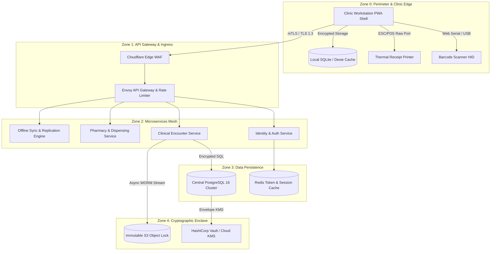

# Enterprise Security Architecture Blueprint & Threat Invariants
## Namma Clinic Digital Health & Operations Platform
### Greater Bengaluru Authority (GBA) / BBMP Health Department
**Standard:** Zero-Trust Architecture (NIST SP 800-207) / DPDP Act 2023 | **Status:** APPROVED BASELINE | **Code:** `SEC-DOC-01`

---

## 1. Executive Summary & Zero-Trust Security Philosophy
The Namma Clinic Digital Health & Operations Platform provides primary healthcare and clinical management across 183 primary health clinics in Bengaluru. Operating within a distributed metropolitan topology characterized by frequent network outages, power fluctuations, and edge computing constraints, the security architecture enforces a strict **Zero-Trust Architecture (ZTA)** conforming to NIST SP 800-207, the Digital Personal Data Protection (DPDP) Act 2023, and the Ayushman Bharat Digital Mission (ABDM) security and privacy specifications.

### 1.1 Core Security Principles & Architectural Invariants
1. **Continuous Cryptographic Verification:** No implicit trust is granted to any actor, container, or device based on network locality, IP subnet, or clinic physical location. Every request must be independently authenticated and authorized.
2. **Principle of Least Privilege (PoLP):** All user accounts, service accounts, and edge daemons are restricted to the minimal set of capability claims necessary to perform their immediate clinical duties.
3. **Cryptographic Segregation of Duties (SOD-001):** Hard programmatic and token-level barriers prevent prescribing medical officers from dispensing medications and pharmacists from modifying prescriptions.
4. **Defense-in-Depth:** Layered security controls spanning physical hardware locks, TPM 2.0 hardware enclaves, OS hardening, network micro-segmentation, application WAF, database column encryption, and immutable WORM audit logs.
5. **Autonomous Local-First Resilience:** Clinics must maintain secure clinical operations during extended telecommunication blackouts without compromising data confidentiality or tampering protections.
6. **Statutory Incident Notification (CERT-In 6-Hour SLA):** Mandatory reporting workflows ensure cybersecurity incidents are triaged, contained, and reported within statutory 6-hour windows.

## 2. Security Zone Topology & Trust Boundaries
The architecture is partitioned into five distinct security zones with strictly governed unidirectional and bidirectional flows:
- **Zone 0 (Perimeter Ingress & Edge Workstations):** Public citizen portals, clinic workstation browsers, thermal receipt printers, and barcode scanners.
- **Zone 1 (API Gateway & Ingress Filtering):** Cloudflare WAF, Envoy API Gateway, rate limiters, and TLS 1.3 termination proxies.
- **Zone 2 (Application Microservices Plane):** Stateless clinical, identity, pharmacy, lab, and inventory microservices running on isolated Kubernetes pods.
- **Zone 3 (Data Persistence & Caching Plane):** PostgreSQL 16 primary/replica cluster with AES-256-GCM column encryption, Redis session clusters, and Dexie/SQLite edge databases.
- **Zone 4 (Cryptographic Enclave & Immutable Storage):** FIPS 140-3 Level 3 Hardware Security Modules (HSM), Cloud KMS, HashiCorp Vault, and S3 Object Lock WORM audit buckets.

### 2.1 Logical Security Architecture Diagram


## 3. Container Security Architecture & Isolation Profiles (ARCH-CONT-001 to ARCH-CONT-018)
Every platform container operates under strict boundary isolation rules:

### ARCH-CONT-001: Container Security Profile — Clinic Workstation PWA Shell
- **Runtime Technology & Stack:** Next.js 14 / TypeScript
- **Deployment Context:** Local Workstation / Tablet
- **Assigned Security Zone:** **Zone 0**
- **Security Invariants & Protections:** CSP default-src 'self'; WebCrypto AES-GCM; TPM 2.0 bound token storage.
- **Ingress Restriction:** Restricted strictly to authenticated mutual TLS from upstream components.
- **Egress Restriction:** Deny-all outbound Internet access; whitelisted internal cluster CIDRs only.
- **Data Store Access:** Dedicated PostgreSQL connection pool with isolated dynamic credentials.
- **Auditing Requirement:** All lifecycle and state transition events streamed to WORM ledger.
- **Vulnerability Management:** Daily automated container image scanning via Trivy (Zero High/Critical).
- **Failure Mode:** Fail-closed; terminate container upon integrity failure or unhandled exception.

### ARCH-CONT-002: Container Security Profile — Citizen Web Portal & Appointment Booking
- **Runtime Technology & Stack:** Next.js / TailwindCSS
- **Deployment Context:** Public Cloud Ingress
- **Assigned Security Zone:** **Zone 0**
- **Security Invariants & Protections:** Strict Cloudflare WAF; CAPTCHA protection; rate limited to 20 req/min.
- **Ingress Restriction:** Restricted strictly to authenticated mutual TLS from upstream components.
- **Egress Restriction:** Deny-all outbound Internet access; whitelisted internal cluster CIDRs only.
- **Data Store Access:** Dedicated PostgreSQL connection pool with isolated dynamic credentials.
- **Auditing Requirement:** All lifecycle and state transition events streamed to WORM ledger.
- **Vulnerability Management:** Daily automated container image scanning via Trivy (Zero High/Critical).
- **Failure Mode:** Fail-closed; terminate container upon integrity failure or unhandled exception.

### ARCH-CONT-003: Container Security Profile — Cloud API Gateway & Rate Limiter
- **Runtime Technology & Stack:** Envoy Proxy / NestJS
- **Deployment Context:** Kubernetes Edge Ingress
- **Assigned Security Zone:** **Zone 1**
- **Security Invariants & Protections:** TLS 1.3 termination; RS256 JWT validation; Redis token-bucket rate limiting.
- **Ingress Restriction:** Restricted strictly to authenticated mutual TLS from upstream components.
- **Egress Restriction:** Deny-all outbound Internet access; whitelisted internal cluster CIDRs only.
- **Data Store Access:** Dedicated PostgreSQL connection pool with isolated dynamic credentials.
- **Auditing Requirement:** All lifecycle and state transition events streamed to WORM ledger.
- **Vulnerability Management:** Daily automated container image scanning via Trivy (Zero High/Critical).
- **Failure Mode:** Fail-closed; terminate container upon integrity failure or unhandled exception.

### ARCH-CONT-004: Container Security Profile — Identity & Access Management Service
- **Runtime Technology & Stack:** NestJS / Node.js
- **Deployment Context:** Kubernetes Pod Mesh
- **Assigned Security Zone:** **Zone 2**
- **Security Invariants & Protections:** Argon2id credential verification; TOTP MFA engine; Redis session clustering.
- **Ingress Restriction:** Restricted strictly to authenticated mutual TLS from upstream components.
- **Egress Restriction:** Deny-all outbound Internet access; whitelisted internal cluster CIDRs only.
- **Data Store Access:** Dedicated PostgreSQL connection pool with isolated dynamic credentials.
- **Auditing Requirement:** All lifecycle and state transition events streamed to WORM ledger.
- **Vulnerability Management:** Daily automated container image scanning via Trivy (Zero High/Critical).
- **Failure Mode:** Fail-closed; terminate container upon integrity failure or unhandled exception.

### ARCH-CONT-005: Container Security Profile — Patient Registration & Demographics
- **Runtime Technology & Stack:** NestJS / TypeORM
- **Deployment Context:** Kubernetes Pod Mesh
- **Assigned Security Zone:** **Zone 2**
- **Security Invariants & Protections:** Field-level PII encryption; HMAC-SHA256 blind indexing; ABAC clinic scoping.
- **Ingress Restriction:** Restricted strictly to authenticated mutual TLS from upstream components.
- **Egress Restriction:** Deny-all outbound Internet access; whitelisted internal cluster CIDRs only.
- **Data Store Access:** Dedicated PostgreSQL connection pool with isolated dynamic credentials.
- **Auditing Requirement:** All lifecycle and state transition events streamed to WORM ledger.
- **Vulnerability Management:** Daily automated container image scanning via Trivy (Zero High/Critical).
- **Failure Mode:** Fail-closed; terminate container upon integrity failure or unhandled exception.

### ARCH-CONT-006: Container Security Profile — Clinical Triage & Vitals Service
- **Runtime Technology & Stack:** NestJS / TypeORM
- **Deployment Context:** Kubernetes Pod Mesh
- **Assigned Security Zone:** **Zone 2**
- **Security Invariants & Protections:** Nurse role scoping; optimistic concurrency; immutable triage audit events.
- **Ingress Restriction:** Restricted strictly to authenticated mutual TLS from upstream components.
- **Egress Restriction:** Deny-all outbound Internet access; whitelisted internal cluster CIDRs only.
- **Data Store Access:** Dedicated PostgreSQL connection pool with isolated dynamic credentials.
- **Auditing Requirement:** All lifecycle and state transition events streamed to WORM ledger.
- **Vulnerability Management:** Daily automated container image scanning via Trivy (Zero High/Critical).
- **Failure Mode:** Fail-closed; terminate container upon integrity failure or unhandled exception.

### ARCH-CONT-007: Container Security Profile — Doctor Consultation & EHR Service
- **Runtime Technology & Stack:** NestJS / TypeORM
- **Deployment Context:** Kubernetes Pod Mesh
- **Assigned Security Zone:** **Zone 2**
- **Security Invariants & Protections:** Doctor-only write barrier; digital prescription signing; SOD-001 enforcement.
- **Ingress Restriction:** Restricted strictly to authenticated mutual TLS from upstream components.
- **Egress Restriction:** Deny-all outbound Internet access; whitelisted internal cluster CIDRs only.
- **Data Store Access:** Dedicated PostgreSQL connection pool with isolated dynamic credentials.
- **Auditing Requirement:** All lifecycle and state transition events streamed to WORM ledger.
- **Vulnerability Management:** Daily automated container image scanning via Trivy (Zero High/Critical).
- **Failure Mode:** Fail-closed; terminate container upon integrity failure or unhandled exception.

### ARCH-CONT-008: Container Security Profile — Pharmacy Inventory & Dispensation
- **Runtime Technology & Stack:** NestJS / TypeORM
- **Deployment Context:** Kubernetes Pod Mesh
- **Assigned Security Zone:** **Zone 2**
- **Security Invariants & Protections:** Pharmacist-only dispense claim; batch barcode verification; SOD-001 enforcement.
- **Ingress Restriction:** Restricted strictly to authenticated mutual TLS from upstream components.
- **Egress Restriction:** Deny-all outbound Internet access; whitelisted internal cluster CIDRs only.
- **Data Store Access:** Dedicated PostgreSQL connection pool with isolated dynamic credentials.
- **Auditing Requirement:** All lifecycle and state transition events streamed to WORM ledger.
- **Vulnerability Management:** Daily automated container image scanning via Trivy (Zero High/Critical).
- **Failure Mode:** Fail-closed; terminate container upon integrity failure or unhandled exception.

### ARCH-CONT-009: Container Security Profile — Laboratory Diagnostics & Test Orders
- **Runtime Technology & Stack:** NestJS / TypeORM
- **Deployment Context:** Kubernetes Pod Mesh
- **Assigned Security Zone:** **Zone 2**
- **Security Invariants & Protections:** Lab tech write barrier; diagnostic result digital signature; DICOM/HL7 security.
- **Ingress Restriction:** Restricted strictly to authenticated mutual TLS from upstream components.
- **Egress Restriction:** Deny-all outbound Internet access; whitelisted internal cluster CIDRs only.
- **Data Store Access:** Dedicated PostgreSQL connection pool with isolated dynamic credentials.
- **Auditing Requirement:** All lifecycle and state transition events streamed to WORM ledger.
- **Vulnerability Management:** Daily automated container image scanning via Trivy (Zero High/Critical).
- **Failure Mode:** Fail-closed; terminate container upon integrity failure or unhandled exception.

### ARCH-CONT-010: Container Security Profile — Referral Management & Secondary Care
- **Runtime Technology & Stack:** NestJS / TypeORM
- **Deployment Context:** Kubernetes Pod Mesh
- **Assigned Security Zone:** **Zone 2**
- **Security Invariants & Protections:** Inter-facility mTLS; referral token verification; ABDM federated routing.
- **Ingress Restriction:** Restricted strictly to authenticated mutual TLS from upstream components.
- **Egress Restriction:** Deny-all outbound Internet access; whitelisted internal cluster CIDRs only.
- **Data Store Access:** Dedicated PostgreSQL connection pool with isolated dynamic credentials.
- **Auditing Requirement:** All lifecycle and state transition events streamed to WORM ledger.
- **Vulnerability Management:** Daily automated container image scanning via Trivy (Zero High/Critical).
- **Failure Mode:** Fail-closed; terminate container upon integrity failure or unhandled exception.

### ARCH-CONT-011: Container Security Profile — Citizen Consent & Privacy Management
- **Runtime Technology & Stack:** NestJS / TypeORM
- **Deployment Context:** Kubernetes Pod Mesh
- **Assigned Security Zone:** **Zone 2**
- **Security Invariants & Protections:** DPDP Act 2023 compliance; affirmative digital consent state machine; ABDM M2/M3.
- **Ingress Restriction:** Restricted strictly to authenticated mutual TLS from upstream components.
- **Egress Restriction:** Deny-all outbound Internet access; whitelisted internal cluster CIDRs only.
- **Data Store Access:** Dedicated PostgreSQL connection pool with isolated dynamic credentials.
- **Auditing Requirement:** All lifecycle and state transition events streamed to WORM ledger.
- **Vulnerability Management:** Daily automated container image scanning via Trivy (Zero High/Critical).
- **Failure Mode:** Fail-closed; terminate container upon integrity failure or unhandled exception.

### ARCH-CONT-012: Container Security Profile — Offline Sync & Replication Engine
- **Runtime Technology & Stack:** Go / WebSockets
- **Deployment Context:** Kubernetes Pod Mesh
- **Assigned Security Zone:** **Zone 2**
- **Security Invariants & Protections:** Batch transaction integrity; cryptographic conflict resolution; WAL replay protection.
- **Ingress Restriction:** Restricted strictly to authenticated mutual TLS from upstream components.
- **Egress Restriction:** Deny-all outbound Internet access; whitelisted internal cluster CIDRs only.
- **Data Store Access:** Dedicated PostgreSQL connection pool with isolated dynamic credentials.
- **Auditing Requirement:** All lifecycle and state transition events streamed to WORM ledger.
- **Vulnerability Management:** Daily automated container image scanning via Trivy (Zero High/Critical).
- **Failure Mode:** Fail-closed; terminate container upon integrity failure or unhandled exception.

### ARCH-CONT-013: Container Security Profile — Central Depot Inventory Management
- **Runtime Technology & Stack:** NestJS / TypeORM
- **Deployment Context:** Kubernetes Pod Mesh
- **Assigned Security Zone:** **Zone 2**
- **Security Invariants & Protections:** Supply chain custody validation; cold chain alert triggers; depot manager role scoping.
- **Ingress Restriction:** Restricted strictly to authenticated mutual TLS from upstream components.
- **Egress Restriction:** Deny-all outbound Internet access; whitelisted internal cluster CIDRs only.
- **Data Store Access:** Dedicated PostgreSQL connection pool with isolated dynamic credentials.
- **Auditing Requirement:** All lifecycle and state transition events streamed to WORM ledger.
- **Vulnerability Management:** Daily automated container image scanning via Trivy (Zero High/Critical).
- **Failure Mode:** Fail-closed; terminate container upon integrity failure or unhandled exception.

### ARCH-CONT-014: Container Security Profile — Disaster Recovery & Backup Engine
- **Runtime Technology & Stack:** Go / Python Daemons
- **Deployment Context:** Isolated Cloud Enclave
- **Assigned Security Zone:** **Zone 4**
- **Security Invariants & Protections:** Air-gapped S3 Object Lock compliance; automated weekly restore verification drills.
- **Ingress Restriction:** Restricted strictly to authenticated mutual TLS from upstream components.
- **Egress Restriction:** Deny-all outbound Internet access; whitelisted internal cluster CIDRs only.
- **Data Store Access:** Dedicated PostgreSQL connection pool with isolated dynamic credentials.
- **Auditing Requirement:** All lifecycle and state transition events streamed to WORM ledger.
- **Vulnerability Management:** Daily automated container image scanning via Trivy (Zero High/Critical).
- **Failure Mode:** Fail-closed; terminate container upon integrity failure or unhandled exception.

### ARCH-CONT-015: Container Security Profile — Immutable Audit Ledger Service
- **Runtime Technology & Stack:** Vector / Rust Daemon
- **Deployment Context:** Dedicated Logging Cluster
- **Assigned Security Zone:** **Zone 4**
- **Security Invariants & Protections:** SHA-256 block hash chaining; WORM storage writing; zero-tamper Merkle audit tree.
- **Ingress Restriction:** Restricted strictly to authenticated mutual TLS from upstream components.
- **Egress Restriction:** Deny-all outbound Internet access; whitelisted internal cluster CIDRs only.
- **Data Store Access:** Dedicated PostgreSQL connection pool with isolated dynamic credentials.
- **Auditing Requirement:** All lifecycle and state transition events streamed to WORM ledger.
- **Vulnerability Management:** Daily automated container image scanning via Trivy (Zero High/Critical).
- **Failure Mode:** Fail-closed; terminate container upon integrity failure or unhandled exception.

### ARCH-CONT-016: Container Security Profile — Public Health Analytics & Surveillance
- **Runtime Technology & Stack:** ClickHouse / Python
- **Deployment Context:** Read-Replica Data Warehouse
- **Assigned Security Zone:** **Zone 3**
- **Security Invariants & Protections:** Differential privacy; k-anonymity; de-identified aggregation; zero raw PII exposure.
- **Ingress Restriction:** Restricted strictly to authenticated mutual TLS from upstream components.
- **Egress Restriction:** Deny-all outbound Internet access; whitelisted internal cluster CIDRs only.
- **Data Store Access:** Dedicated PostgreSQL connection pool with isolated dynamic credentials.
- **Auditing Requirement:** All lifecycle and state transition events streamed to WORM ledger.
- **Vulnerability Management:** Daily automated container image scanning via Trivy (Zero High/Critical).
- **Failure Mode:** Fail-closed; terminate container upon integrity failure or unhandled exception.

### ARCH-CONT-017: Container Security Profile — Hardware Peripheral Bridge Daemon
- **Runtime Technology & Stack:** Go Native Daemon
- **Deployment Context:** Local Workstation OS
- **Assigned Security Zone:** **Zone 0**
- **Security Invariants & Protections:** USB VID/PID whitelisting; raw ESC/POS thermal printer port isolation; HID filtering.
- **Ingress Restriction:** Restricted strictly to authenticated mutual TLS from upstream components.
- **Egress Restriction:** Deny-all outbound Internet access; whitelisted internal cluster CIDRs only.
- **Data Store Access:** Dedicated PostgreSQL connection pool with isolated dynamic credentials.
- **Auditing Requirement:** All lifecycle and state transition events streamed to WORM ledger.
- **Vulnerability Management:** Daily automated container image scanning via Trivy (Zero High/Critical).
- **Failure Mode:** Fail-closed; terminate container upon integrity failure or unhandled exception.

### ARCH-CONT-018: Container Security Profile — Key Management & HSM Enclave
- **Runtime Technology & Stack:** HashiCorp Vault / Cloud KMS
- **Deployment Context:** FIPS 140-3 Hardware Enclave
- **Assigned Security Zone:** **Zone 4**
- **Security Invariants & Protections:** Automated 90-day master key rotation; dual-control split-knowledge authorization.
- **Ingress Restriction:** Restricted strictly to authenticated mutual TLS from upstream components.
- **Egress Restriction:** Deny-all outbound Internet access; whitelisted internal cluster CIDRs only.
- **Data Store Access:** Dedicated PostgreSQL connection pool with isolated dynamic credentials.
- **Auditing Requirement:** All lifecycle and state transition events streamed to WORM ledger.
- **Vulnerability Management:** Daily automated container image scanning via Trivy (Zero High/Critical).
- **Failure Mode:** Fail-closed; terminate container upon integrity failure or unhandled exception.

## 4. Standard Operating Procedures: Security Engineering (SOP-SEC-01 to SOP-SEC-25)
The following 25 SOPs govern ongoing security engineering and operational maintenance:

### SOP-SEC-01: Zero-Trust Perimeter Ingress Verification
- **Operational Scope:** Weekly automated probe of Cloudflare WAF and Envoy gateway rules.
- **Execution Trigger:** Scheduled cron / alert
- **Standard Operating Procedure Steps:** 1. Run automated attack simulation. 2. Verify WAF drops unauthorized packets. 3. Review 403 logs.
- **Verification & Acceptance Criterion:** 100% attack packets dropped at edge.
- **Responsible Role:** Security Lead
- **Audit Event Emitted:** `SEC_SOP_01_VERIFIED`

### SOP-SEC-02: Mutual TLS (mTLS) Mesh Certificate Renewal
- **Operational Scope:** Monthly review and automated renewal of inter-service mTLS certificates.
- **Execution Trigger:** Cert expiration < 30 days
- **Standard Operating Procedure Steps:** 1. Check Cert-Manager status. 2. Issue renewed x509 certs. 3. Reload microservice pods with zero downtime.
- **Verification & Acceptance Criterion:** Valid x509 cert chain across all pods.
- **Responsible Role:** DevOps Lead
- **Audit Event Emitted:** `SEC_SOP_02_RENEWED`

### SOP-SEC-03: Kubernetes Pod Security Admission Audit
- **Operational Scope:** Bi-weekly audit of pod security standards across all Kubernetes namespaces.
- **Execution Trigger:** Bi-weekly audit cycle
- **Standard Operating Procedure Steps:** 1. Scan clusters with Kyverno / OPA Gatekeeper. 2. Assert runAsNonRoot: true. 3. Assert readOnlyRootFilesystem: true.
- **Verification & Acceptance Criterion:** Zero privileged containers discovered.
- **Responsible Role:** Security Architect
- **Audit Event Emitted:** `SEC_SOP_03_AUDITED`

### SOP-SEC-04: Database Column Encryption Verification
- **Operational Scope:** Monthly verification of AES-256-GCM ciphertext integrity across table partitions.
- **Execution Trigger:** Monthly database maintenance
- **Standard Operating Procedure Steps:** 1. Extract random encrypted sample. 2. Verify zero plaintext leakage in raw blocks. 3. Test KMS decrypt.
- **Verification & Acceptance Criterion:** 100% sample validated as authenticated ciphertext.
- **Responsible Role:** DBA / Security Lead
- **Audit Event Emitted:** `SEC_SOP_04_VERIFIED`

### SOP-SEC-05: Clinic Workstation TPM 2.0 Health Check
- **Operational Scope:** Daily automated check of TPM PCR measurements across all 183 clinic mini-PCs.
- **Execution Trigger:** Daily morning startup
- **Standard Operating Procedure Steps:** 1. Workstation boots and computes PCR hashes. 2. Agent submits attestation to central MDM. 3. Verify status.
- **Verification & Acceptance Criterion:** All active clinic devices attested clean.
- **Responsible Role:** IT Support Lead
- **Audit Event Emitted:** `SEC_SOP_05_CHECKED`

### SOP-SEC-06: WORM Immutable Audit Chain Validation
- **Operational Scope:** Daily automated verification of SHA-256 Merkle hash chain across audit blocks.
- **Execution Trigger:** Daily automated verification
- **Standard Operating Procedure Steps:** 1. Ingest previous 24h audit blocks. 2. Recompute rolling SHA-256 hashes. 3. Assert zero chain breaks.
- **Verification & Acceptance Criterion:** Zero audit tampering or missing sequence IDs.
- **Responsible Role:** CISO / Audit Lead
- **Audit Event Emitted:** `SEC_SOP_06_VALIDATED`

### SOP-SEC-07: Vulnerability Backlog Triage & Remediation
- **Operational Scope:** Weekly triage of newly reported CVEs across dependencies and base OS images.
- **Execution Trigger:** Weekly vulnerability report
- **Standard Operating Procedure Steps:** 1. Review Trivy and Dependabot scan outputs. 2. Prioritize Critical/High findings. 3. Assign patch tickets.
- **Verification & Acceptance Criterion:** Critical CVEs resolved within 24h SLA.
- **Responsible Role:** DevOps Security Lead
- **Audit Event Emitted:** `SEC_SOP_07_TRIAGED`

### SOP-SEC-08: Segregation of Duties (SOD-001) Automated Audit
- **Operational Scope:** Daily programmatic check for prescribing vs dispensing cross-contamination.
- **Execution Trigger:** Daily end-of-day reconciliation
- **Standard Operating Procedure Steps:** 1. Query all closed prescriptions. 2. Assert prescriber_id != dispenser_id. 3. Flag any match.
- **Verification & Acceptance Criterion:** Zero instances of self-dispensation.
- **Responsible Role:** Clinical Audit Officer
- **Audit Event Emitted:** `SEC_SOP_08_AUDITED`

### SOP-SEC-09: Redis Session Cache Eviction & Cleanup
- **Operational Scope:** Daily automated prune of expired refresh tokens and revoked session IDs.
- **Execution Trigger:** Daily cron execution
- **Standard Operating Procedure Steps:** 1. Scan Redis keys for TTL expiration. 2. Remove orphaned session markers. 3. Assert memory health.
- **Verification & Acceptance Criterion:** Redis memory usage maintained < 65% capacity.
- **Responsible Role:** DevOps Engineer
- **Audit Event Emitted:** `SEC_SOP_09_CLEANED`

### SOP-SEC-10: Firewall Ingress Rule Review & Hardening
- **Operational Scope:** Monthly review of all cloud network security groups and ingress allowlists.
- **Execution Trigger:** Monthly security cycle
- **Standard Operating Procedure Steps:** 1. Audit AWS/GCP security groups. 2. Ensure zero open 0.0.0.0/0 ingress ports except 443. 3. Remove obsolete IPs.
- **Verification & Acceptance Criterion:** All non-essential ingress ports disabled.
- **Responsible Role:** Infrastructure Lead
- **Audit Event Emitted:** `SEC_SOP_10_REVIEWED`

### SOP-SEC-11: DPDP Act 2023 Retention Purge Execution
- **Operational Scope:** Monthly execution of automated retention expiration data purges.
- **Execution Trigger:** Monthly retention cycle
- **Standard Operating Procedure Steps:** 1. Query records exceeding statutory retention. 2. Execute cryptographic erasure. 3. Log DPO certificate.
- **Verification & Acceptance Criterion:** All expired records permanently erased.
- **Responsible Role:** Data Protection Officer
- **Audit Event Emitted:** `SEC_SOP_11_PURGED`

### SOP-SEC-12: Emergency Break-Glass Audit Review
- **Operational Scope:** Weekly review of all emergency clinical break-glass accesses by Medical Officers.
- **Execution Trigger:** Weekly review cycle
- **Standard Operating Procedure Steps:** 1. Query TABLE-010 for BREAK_GLASS events. 2. Interview attending physician. 3. Verify justification.
- **Verification & Acceptance Criterion:** 100% emergency overrides formally justified.
- **Responsible Role:** Chief Medical Officer
- **Audit Event Emitted:** `SEC_SOP_12_REVIEWED`

### SOP-SEC-13: Dynamic Vault Secret Rotation Verification
- **Operational Scope:** Monthly verification of automated 30-day credential rotation across microservices.
- **Execution Trigger:** Monthly rotation check
- **Standard Operating Procedure Steps:** 1. Check HashiCorp Vault lease database. 2. Assert no secret lease > 30 days. 3. Force rotate stale keys.
- **Verification & Acceptance Criterion:** 100% credentials compliant with 30-day rotation.
- **Responsible Role:** DevOps Security Lead
- **Audit Event Emitted:** `SEC_SOP_13_VERIFIED`

### SOP-SEC-14: Thermal Printer Port Security Inspection
- **Operational Scope:** Monthly inspection of raw serial and USB bridge daemon communication logs.
- **Execution Trigger:** Monthly clinic maintenance
- **Standard Operating Procedure Steps:** 1. Inspect buffer logs on printer bridge. 2. Verify no buffer overflow attempts. 3. Check physical tamper seals.
- **Verification & Acceptance Criterion:** Printers verified free of malicious firmware.
- **Responsible Role:** IT Support Engineer
- **Audit Event Emitted:** `SEC_SOP_14_INSPECTED`

### SOP-SEC-15: Offline WAL Sync Queue Integrity Audit
- **Operational Scope:** Daily audit of conflict resolution logs and synchronization retry queues.
- **Execution Trigger:** Daily end-of-day sync review
- **Standard Operating Procedure Steps:** 1. Query central sync service. 2. Inspect unresolved mutation conflicts. 3. Verify timestamp signatures.
- **Verification & Acceptance Criterion:** Zero poisoned or forged sync mutations.
- **Responsible Role:** Software Architect
- **Audit Event Emitted:** `SEC_SOP_15_AUDITED`

### SOP-SEC-16: API Rate Limiting Threshold Calibration
- **Operational Scope:** Monthly performance and abuse analysis to tune Redis token bucket thresholds.
- **Execution Trigger:** Monthly traffic review
- **Standard Operating Procedure Steps:** 1. Analyze 99th percentile API traffic spikes. 2. Tune burst and sustained limits. 3. Update Envoy config.
- **Verification & Acceptance Criterion:** Legitimate clinic traffic never throttled (< 0.01%).
- **Responsible Role:** API Gateway Lead
- **Audit Event Emitted:** `SEC_SOP_16_CALIBRATED`

### SOP-SEC-17: Disaster Recovery Sandbox Restore Drill
- **Operational Scope:** Weekly automated restore of full database backup into isolated verification sandbox.
- **Execution Trigger:** Weekly automated schedule
- **Standard Operating Procedure Steps:** 1. Trigger automated restore from S3 WORM. 2. Execute synthetic clinical transactions. 3. Validate RPO/RTO.
- **Verification & Acceptance Criterion:** Full restore completed within 15 minutes.
- **Responsible Role:** Infrastructure Lead
- **Audit Event Emitted:** `SEC_SOP_17_DRILLED`

### SOP-SEC-18: Static Code Security Scan Triage (SAST)
- **Operational Scope:** Daily triage of Semgrep and SonarQube alerts in active development branches.
- **Execution Trigger:** Continuous CI/CD pipeline
- **Standard Operating Procedure Steps:** 1. Inspect pull request scan reports. 2. Block merges containing OWASP vulnerabilities. 3. Guide fix.
- **Verification & Acceptance Criterion:** Zero security defects in master branch.
- **Responsible Role:** Application Security Lead
- **Audit Event Emitted:** `SEC_SOP_18_TRIAGED`

### SOP-SEC-19: Third-Party ABDM Webhook Security Audit
- **Operational Scope:** Bi-weekly verification of digital signatures and mTLS on ABDM gateway endpoints.
- **Execution Trigger:** Bi-weekly review
- **Standard Operating Procedure Steps:** 1. Verify national ABDM root CA certificates. 2. Test HMAC signature on incoming callbacks. 3. Assert validity.
- **Verification & Acceptance Criterion:** 100% incoming ABDM payloads verified.
- **Responsible Role:** Integration Lead
- **Audit Event Emitted:** `SEC_SOP_19_AUDITED`

### SOP-SEC-20: Physical Workstation Tamper Seal Audit
- **Operational Scope:** Monthly physical inspection of hardware security locks on clinic mini-PCs.
- **Execution Trigger:** Monthly ward supervisor visit
- **Standard Operating Procedure Steps:** 1. Inspect physical chassis tamper tags. 2. Verify USB port blockers are intact. 3. Log audit stamp.
- **Verification & Acceptance Criterion:** All clinic mini-PC hardware seals intact.
- **Responsible Role:** Ward Health Supervisor
- **Audit Event Emitted:** `SEC_SOP_20_AUDITED`

### SOP-SEC-21: SIEM Real-Time Anomaly Rule Tuning
- **Operational Scope:** Bi-weekly tuning of Elasticsearch / Vector anomaly detection correlation rules.
- **Execution Trigger:** Bi-weekly security sprint
- **Standard Operating Procedure Steps:** 1. Review false positive alerts. 2. Adjust threshold triggers for login brute-force. 3. Deploy tuned rules.
- **Verification & Acceptance Criterion:** False positive alert rate reduced < 5%.
- **Responsible Role:** SecOps Engineer
- **Audit Event Emitted:** `SEC_SOP_21_TUNED`

### SOP-SEC-22: Citizen Consent Revocation Verification
- **Operational Scope:** Weekly programmatic check that revoked consents immediately terminate data access.
- **Execution Trigger:** Weekly consent audit
- **Standard Operating Procedure Steps:** 1. Sample 50 revoked consent artifacts. 2. Attempt read of linked patient records. 3. Assert HTTP 403.
- **Verification & Acceptance Criterion:** 100% revoked consents strictly enforced.
- **Responsible Role:** Data Protection Officer
- **Audit Event Emitted:** `SEC_SOP_22_VERIFIED`

### SOP-SEC-23: Barcode Scanner HID Filter Verification
- **Operational Scope:** Quarterly verification of USB barcode scanner driver restrictions on workstations.
- **Execution Trigger:** Quarterly IT audit
- **Standard Operating Procedure Steps:** 1. Connect test scanner. 2. Attempt scanning 2D payload with terminal commands. 3. Assert input sanitized.
- **Verification & Acceptance Criterion:** Zero execution of scanned escape characters.
- **Responsible Role:** Hardware Engineer
- **Audit Event Emitted:** `SEC_SOP_23_VERIFIED`

### SOP-SEC-24: Clinic Network 802.1X Port Security Audit
- **Operational Scope:** Quarterly audit of network switch port authentication across all 183 clinics.
- **Execution Trigger:** Quarterly network audit
- **Standard Operating Procedure Steps:** 1. Test unauthorized laptop connection to clinic wall jack. 2. Verify port enters quarantine VLAN.
- **Verification & Acceptance Criterion:** Zero unauthorized network port access.
- **Responsible Role:** Network Security Lead
- **Audit Event Emitted:** `SEC_SOP_24_AUDITED`

### SOP-SEC-25: CERT-In 6-Hour Emergency Drill Execution
- **Operational Scope:** Quarterly tabletop and automated simulation of 6-hour statutory breach reporting.
- **Execution Trigger:** Quarterly governance drill
- **Standard Operating Procedure Steps:** 1. Simulate confirmed ransomware alert. 2. Execute containment within 15m. 3. Compile CERT-In form.
- **Verification & Acceptance Criterion:** Statutory notification ready within 3 hours.
- **Responsible Role:** Incident Commander / CISO
- **Audit Event Emitted:** `SEC_SOP_25_DRILLED`

## 5. Comprehensive Security Architecture Controls (SEC-ARCH-001 to SEC-ARCH-050)
The following 50 controls represent the authoritative architectural baseline for Namma Clinic:

### SEC-ARCH-001
**Title:** Security Architecture Control: Zero-Trust Network Architecture Pattern 1
**Control Type:** Preventive
**Security Domain:** Zero-Trust Network Architecture
**Priority:** P0 - Critical
**Risk:** Critical
**Threat:** THREAT-001
**Asset:** TABLE-001 and ARCH-CONT-001
**Actor:** Adversary / Compromised Edge Node / Malicious Insider
**Precondition:** Network egress/ingress access or physical clinic presence
**Control Objective:** Enforce rigorous architectural invariant for zero-trust network architecture across all 183 clinics.
**Requirement:** The platform shall enforce strict defense-in-depth isolation under SEC-ARCH-001 conforming to DPDP Act 2023 and NIST SP 800-207.
**Implementation Guidance:** Implement cryptographic boundary checks in API Gateway and clinic workstation edge daemons.
**Configuration Guidance:** Set strict mutual TLS, TLS 1.3 ciphers, and deny-all default firewall rules.
**Failure Behavior:** Fail-closed; reject unverified requests and log immediate security audit event.
**Monitoring:** SIEM real-time rule SEC-ARCH-001-ALERT monitoring deviation thresholds.
**Audit Event:** SEC_AUDIT_SEC_ARCH_001
**Privacy Impact:** Prevents unauthorized demographic and clinical data exfiltration.
**Performance Impact:** Latency overhead < 4ms per transaction.
**Availability Impact:** Autonomous offline cache ensures clinic continuity without compromising safety.
**Related Requirement:** SECR-001
**Related Workflow:** WF-001
**Related API:** API-001
**Related Database Entity:** TABLE-001 (auth_users)
**Related Architecture Component:** ARCH-CONT-001
**Related Threat:** THREAT-001
**Related Test:** SEC-TEST-001
**Acceptance Criteria:** 100% automated enforcement with zero bypass observed during penetration testing.
**Evidence Required:** Cryptographic handshake logs, WORM audit entries, automated test reports.
**Owner:** Chief Information Security Officer (CISO)
**Lifecycle:** Active Baseline Control
**Status:** PLANNED

### SEC-ARCH-002
**Title:** Security Architecture Control: Clinic Edge Boundary Isolation Pattern 1
**Control Type:** Preventive
**Security Domain:** Clinic Edge Boundary Isolation
**Priority:** P0 - Critical
**Risk:** Critical
**Threat:** THREAT-002
**Asset:** TABLE-002 and ARCH-CONT-002
**Actor:** Adversary / Compromised Edge Node / Malicious Insider
**Precondition:** Network egress/ingress access or physical clinic presence
**Control Objective:** Enforce rigorous architectural invariant for clinic edge boundary isolation across all 183 clinics.
**Requirement:** The platform shall enforce strict defense-in-depth isolation under SEC-ARCH-002 conforming to DPDP Act 2023 and NIST SP 800-207.
**Implementation Guidance:** Implement cryptographic boundary checks in API Gateway and clinic workstation edge daemons.
**Configuration Guidance:** Set strict mutual TLS, TLS 1.3 ciphers, and deny-all default firewall rules.
**Failure Behavior:** Fail-closed; reject unverified requests and log immediate security audit event.
**Monitoring:** SIEM real-time rule SEC-ARCH-002-ALERT monitoring deviation thresholds.
**Audit Event:** SEC_AUDIT_SEC_ARCH_002
**Privacy Impact:** Prevents unauthorized demographic and clinical data exfiltration.
**Performance Impact:** Latency overhead < 4ms per transaction.
**Availability Impact:** Autonomous offline cache ensures clinic continuity without compromising safety.
**Related Requirement:** SECR-002
**Related Workflow:** WF-002
**Related API:** API-002
**Related Database Entity:** TABLE-002 (user_credentials)
**Related Architecture Component:** ARCH-CONT-002
**Related Threat:** THREAT-002
**Related Test:** SEC-TEST-002
**Acceptance Criteria:** 100% automated enforcement with zero bypass observed during penetration testing.
**Evidence Required:** Cryptographic handshake logs, WORM audit entries, automated test reports.
**Owner:** Chief Information Security Officer (CISO)
**Lifecycle:** Active Baseline Control
**Status:** PLANNED

### SEC-ARCH-003
**Title:** Security Architecture Control: Application Gateway & Ingress Defense Pattern 1
**Control Type:** Corrective
**Security Domain:** Application Gateway & Ingress Defense
**Priority:** P0 - Critical
**Risk:** Critical
**Threat:** THREAT-003
**Asset:** TABLE-003 and ARCH-CONT-003
**Actor:** Adversary / Compromised Edge Node / Malicious Insider
**Precondition:** Network egress/ingress access or physical clinic presence
**Control Objective:** Enforce rigorous architectural invariant for application gateway & ingress defense across all 183 clinics.
**Requirement:** The platform shall enforce strict defense-in-depth isolation under SEC-ARCH-003 conforming to DPDP Act 2023 and NIST SP 800-207.
**Implementation Guidance:** Implement cryptographic boundary checks in API Gateway and clinic workstation edge daemons.
**Configuration Guidance:** Set strict mutual TLS, TLS 1.3 ciphers, and deny-all default firewall rules.
**Failure Behavior:** Fail-closed; reject unverified requests and log immediate security audit event.
**Monitoring:** SIEM real-time rule SEC-ARCH-003-ALERT monitoring deviation thresholds.
**Audit Event:** SEC_AUDIT_SEC_ARCH_003
**Privacy Impact:** Prevents unauthorized demographic and clinical data exfiltration.
**Performance Impact:** Latency overhead < 4ms per transaction.
**Availability Impact:** Autonomous offline cache ensures clinic continuity without compromising safety.
**Related Requirement:** SECR-003
**Related Workflow:** WF-003
**Related API:** API-003
**Related Database Entity:** TABLE-003 (user_sessions)
**Related Architecture Component:** ARCH-CONT-003
**Related Threat:** THREAT-003
**Related Test:** SEC-TEST-003
**Acceptance Criteria:** 100% automated enforcement with zero bypass observed during penetration testing.
**Evidence Required:** Cryptographic handshake logs, WORM audit entries, automated test reports.
**Owner:** Chief Information Security Officer (CISO)
**Lifecycle:** Active Baseline Control
**Status:** PLANNED

### SEC-ARCH-004
**Title:** Security Architecture Control: Database & Storage Cryptographic Plane Pattern 1
**Control Type:** Preventive
**Security Domain:** Database & Storage Cryptographic Plane
**Priority:** P0 - Critical
**Risk:** Critical
**Threat:** THREAT-004
**Asset:** TABLE-004 and ARCH-CONT-004
**Actor:** Adversary / Compromised Edge Node / Malicious Insider
**Precondition:** Network egress/ingress access or physical clinic presence
**Control Objective:** Enforce rigorous architectural invariant for database & storage cryptographic plane across all 183 clinics.
**Requirement:** The platform shall enforce strict defense-in-depth isolation under SEC-ARCH-004 conforming to DPDP Act 2023 and NIST SP 800-207.
**Implementation Guidance:** Implement cryptographic boundary checks in API Gateway and clinic workstation edge daemons.
**Configuration Guidance:** Set strict mutual TLS, TLS 1.3 ciphers, and deny-all default firewall rules.
**Failure Behavior:** Fail-closed; reject unverified requests and log immediate security audit event.
**Monitoring:** SIEM real-time rule SEC-ARCH-004-ALERT monitoring deviation thresholds.
**Audit Event:** SEC_AUDIT_SEC_ARCH_004
**Privacy Impact:** Prevents unauthorized demographic and clinical data exfiltration.
**Performance Impact:** Latency overhead < 4ms per transaction.
**Availability Impact:** Autonomous offline cache ensures clinic continuity without compromising safety.
**Related Requirement:** SECR-004
**Related Workflow:** WF-004
**Related API:** API-004
**Related Database Entity:** TABLE-004 (roles)
**Related Architecture Component:** ARCH-CONT-004
**Related Threat:** THREAT-004
**Related Test:** SEC-TEST-004
**Acceptance Criteria:** 100% automated enforcement with zero bypass observed during penetration testing.
**Evidence Required:** Cryptographic handshake logs, WORM audit entries, automated test reports.
**Owner:** Chief Information Security Officer (CISO)
**Lifecycle:** Active Baseline Control
**Status:** PLANNED

### SEC-ARCH-005
**Title:** Security Architecture Control: Identity & Credential Brokerage Pattern 1
**Control Type:** Preventive
**Security Domain:** Identity & Credential Brokerage
**Priority:** P0 - Critical
**Risk:** Critical
**Threat:** THREAT-005
**Asset:** TABLE-005 and ARCH-CONT-005
**Actor:** Adversary / Compromised Edge Node / Malicious Insider
**Precondition:** Network egress/ingress access or physical clinic presence
**Control Objective:** Enforce rigorous architectural invariant for identity & credential brokerage across all 183 clinics.
**Requirement:** The platform shall enforce strict defense-in-depth isolation under SEC-ARCH-005 conforming to DPDP Act 2023 and NIST SP 800-207.
**Implementation Guidance:** Implement cryptographic boundary checks in API Gateway and clinic workstation edge daemons.
**Configuration Guidance:** Set strict mutual TLS, TLS 1.3 ciphers, and deny-all default firewall rules.
**Failure Behavior:** Fail-closed; reject unverified requests and log immediate security audit event.
**Monitoring:** SIEM real-time rule SEC-ARCH-005-ALERT monitoring deviation thresholds.
**Audit Event:** SEC_AUDIT_SEC_ARCH_005
**Privacy Impact:** Prevents unauthorized demographic and clinical data exfiltration.
**Performance Impact:** Latency overhead < 4ms per transaction.
**Availability Impact:** Autonomous offline cache ensures clinic continuity without compromising safety.
**Related Requirement:** SECR-005
**Related Workflow:** WF-005
**Related API:** API-005
**Related Database Entity:** TABLE-005 (permissions)
**Related Architecture Component:** ARCH-CONT-005
**Related Threat:** THREAT-005
**Related Test:** SEC-TEST-005
**Acceptance Criteria:** 100% automated enforcement with zero bypass observed during penetration testing.
**Evidence Required:** Cryptographic handshake logs, WORM audit entries, automated test reports.
**Owner:** Chief Information Security Officer (CISO)
**Lifecycle:** Active Baseline Control
**Status:** PLANNED

### SEC-ARCH-006
**Title:** Security Architecture Control: Immutable Audit & Non-Repudiation Pattern 1
**Control Type:** Corrective
**Security Domain:** Immutable Audit & Non-Repudiation
**Priority:** P0 - Critical
**Risk:** Critical
**Threat:** THREAT-006
**Asset:** TABLE-006 and ARCH-CONT-006
**Actor:** Adversary / Compromised Edge Node / Malicious Insider
**Precondition:** Network egress/ingress access or physical clinic presence
**Control Objective:** Enforce rigorous architectural invariant for immutable audit & non-repudiation across all 183 clinics.
**Requirement:** The platform shall enforce strict defense-in-depth isolation under SEC-ARCH-006 conforming to DPDP Act 2023 and NIST SP 800-207.
**Implementation Guidance:** Implement cryptographic boundary checks in API Gateway and clinic workstation edge daemons.
**Configuration Guidance:** Set strict mutual TLS, TLS 1.3 ciphers, and deny-all default firewall rules.
**Failure Behavior:** Fail-closed; reject unverified requests and log immediate security audit event.
**Monitoring:** SIEM real-time rule SEC-ARCH-006-ALERT monitoring deviation thresholds.
**Audit Event:** SEC_AUDIT_SEC_ARCH_006
**Privacy Impact:** Prevents unauthorized demographic and clinical data exfiltration.
**Performance Impact:** Latency overhead < 4ms per transaction.
**Availability Impact:** Autonomous offline cache ensures clinic continuity without compromising safety.
**Related Requirement:** SECR-006
**Related Workflow:** WF-006
**Related API:** API-006
**Related Database Entity:** TABLE-006 (role_permissions)
**Related Architecture Component:** ARCH-CONT-006
**Related Threat:** THREAT-006
**Related Test:** SEC-TEST-006
**Acceptance Criteria:** 100% automated enforcement with zero bypass observed during penetration testing.
**Evidence Required:** Cryptographic handshake logs, WORM audit entries, automated test reports.
**Owner:** Chief Information Security Officer (CISO)
**Lifecycle:** Active Baseline Control
**Status:** PLANNED

### SEC-ARCH-007
**Title:** Security Architecture Control: Offline Edge Cache & WAL Protection Pattern 1
**Control Type:** Preventive
**Security Domain:** Offline Edge Cache & WAL Protection
**Priority:** P0 - Critical
**Risk:** Critical
**Threat:** THREAT-007
**Asset:** TABLE-007 and ARCH-CONT-007
**Actor:** Adversary / Compromised Edge Node / Malicious Insider
**Precondition:** Network egress/ingress access or physical clinic presence
**Control Objective:** Enforce rigorous architectural invariant for offline edge cache & wal protection across all 183 clinics.
**Requirement:** The platform shall enforce strict defense-in-depth isolation under SEC-ARCH-007 conforming to DPDP Act 2023 and NIST SP 800-207.
**Implementation Guidance:** Implement cryptographic boundary checks in API Gateway and clinic workstation edge daemons.
**Configuration Guidance:** Set strict mutual TLS, TLS 1.3 ciphers, and deny-all default firewall rules.
**Failure Behavior:** Fail-closed; reject unverified requests and log immediate security audit event.
**Monitoring:** SIEM real-time rule SEC-ARCH-007-ALERT monitoring deviation thresholds.
**Audit Event:** SEC_AUDIT_SEC_ARCH_007
**Privacy Impact:** Prevents unauthorized demographic and clinical data exfiltration.
**Performance Impact:** Latency overhead < 4ms per transaction.
**Availability Impact:** Autonomous offline cache ensures clinic continuity without compromising safety.
**Related Requirement:** SECR-007
**Related Workflow:** WF-007
**Related API:** API-007
**Related Database Entity:** TABLE-007 (user_roles)
**Related Architecture Component:** ARCH-CONT-007
**Related Threat:** THREAT-007
**Related Test:** SEC-TEST-007
**Acceptance Criteria:** 100% automated enforcement with zero bypass observed during penetration testing.
**Evidence Required:** Cryptographic handshake logs, WORM audit entries, automated test reports.
**Owner:** Chief Information Security Officer (CISO)
**Lifecycle:** Active Baseline Control
**Status:** PLANNED

### SEC-ARCH-008
**Title:** Security Architecture Control: Peripheral & Hardware Bridge Security Pattern 1
**Control Type:** Preventive
**Security Domain:** Peripheral & Hardware Bridge Security
**Priority:** P0 - Critical
**Risk:** Critical
**Threat:** THREAT-008
**Asset:** TABLE-008 and ARCH-CONT-008
**Actor:** Adversary / Compromised Edge Node / Malicious Insider
**Precondition:** Network egress/ingress access or physical clinic presence
**Control Objective:** Enforce rigorous architectural invariant for peripheral & hardware bridge security across all 183 clinics.
**Requirement:** The platform shall enforce strict defense-in-depth isolation under SEC-ARCH-008 conforming to DPDP Act 2023 and NIST SP 800-207.
**Implementation Guidance:** Implement cryptographic boundary checks in API Gateway and clinic workstation edge daemons.
**Configuration Guidance:** Set strict mutual TLS, TLS 1.3 ciphers, and deny-all default firewall rules.
**Failure Behavior:** Fail-closed; reject unverified requests and log immediate security audit event.
**Monitoring:** SIEM real-time rule SEC-ARCH-008-ALERT monitoring deviation thresholds.
**Audit Event:** SEC_AUDIT_SEC_ARCH_008
**Privacy Impact:** Prevents unauthorized demographic and clinical data exfiltration.
**Performance Impact:** Latency overhead < 4ms per transaction.
**Availability Impact:** Autonomous offline cache ensures clinic continuity without compromising safety.
**Related Requirement:** SECR-008
**Related Workflow:** WF-008
**Related API:** API-008
**Related Database Entity:** TABLE-008 (facilities)
**Related Architecture Component:** ARCH-CONT-008
**Related Threat:** THREAT-008
**Related Test:** SEC-TEST-008
**Acceptance Criteria:** 100% automated enforcement with zero bypass observed during penetration testing.
**Evidence Required:** Cryptographic handshake logs, WORM audit entries, automated test reports.
**Owner:** Chief Information Security Officer (CISO)
**Lifecycle:** Active Baseline Control
**Status:** PLANNED

### SEC-ARCH-009
**Title:** Security Architecture Control: Inter-Service Mutual TLS (mTLS) Pattern 1
**Control Type:** Corrective
**Security Domain:** Inter-Service Mutual TLS (mTLS)
**Priority:** P0 - Critical
**Risk:** Critical
**Threat:** THREAT-009
**Asset:** TABLE-009 and ARCH-CONT-009
**Actor:** Adversary / Compromised Edge Node / Malicious Insider
**Precondition:** Network egress/ingress access or physical clinic presence
**Control Objective:** Enforce rigorous architectural invariant for inter-service mutual tls (mtls) across all 183 clinics.
**Requirement:** The platform shall enforce strict defense-in-depth isolation under SEC-ARCH-009 conforming to DPDP Act 2023 and NIST SP 800-207.
**Implementation Guidance:** Implement cryptographic boundary checks in API Gateway and clinic workstation edge daemons.
**Configuration Guidance:** Set strict mutual TLS, TLS 1.3 ciphers, and deny-all default firewall rules.
**Failure Behavior:** Fail-closed; reject unverified requests and log immediate security audit event.
**Monitoring:** SIEM real-time rule SEC-ARCH-009-ALERT monitoring deviation thresholds.
**Audit Event:** SEC_AUDIT_SEC_ARCH_009
**Privacy Impact:** Prevents unauthorized demographic and clinical data exfiltration.
**Performance Impact:** Latency overhead < 4ms per transaction.
**Availability Impact:** Autonomous offline cache ensures clinic continuity without compromising safety.
**Related Requirement:** SECR-009
**Related Workflow:** WF-009
**Related API:** API-009
**Related Database Entity:** TABLE-009 (facility_rooms)
**Related Architecture Component:** ARCH-CONT-009
**Related Threat:** THREAT-009
**Related Test:** SEC-TEST-009
**Acceptance Criteria:** 100% automated enforcement with zero bypass observed during penetration testing.
**Evidence Required:** Cryptographic handshake logs, WORM audit entries, automated test reports.
**Owner:** Chief Information Security Officer (CISO)
**Lifecycle:** Active Baseline Control
**Status:** PLANNED

### SEC-ARCH-010
**Title:** Security Architecture Control: Continuous Vulnerability & Threat Defense Pattern 1
**Control Type:** Preventive
**Security Domain:** Continuous Vulnerability & Threat Defense
**Priority:** P0 - Critical
**Risk:** Critical
**Threat:** THREAT-010
**Asset:** TABLE-010 and ARCH-CONT-010
**Actor:** Adversary / Compromised Edge Node / Malicious Insider
**Precondition:** Network egress/ingress access or physical clinic presence
**Control Objective:** Enforce rigorous architectural invariant for continuous vulnerability & threat defense across all 183 clinics.
**Requirement:** The platform shall enforce strict defense-in-depth isolation under SEC-ARCH-010 conforming to DPDP Act 2023 and NIST SP 800-207.
**Implementation Guidance:** Implement cryptographic boundary checks in API Gateway and clinic workstation edge daemons.
**Configuration Guidance:** Set strict mutual TLS, TLS 1.3 ciphers, and deny-all default firewall rules.
**Failure Behavior:** Fail-closed; reject unverified requests and log immediate security audit event.
**Monitoring:** SIEM real-time rule SEC-ARCH-010-ALERT monitoring deviation thresholds.
**Audit Event:** SEC_AUDIT_SEC_ARCH_010
**Privacy Impact:** Prevents unauthorized demographic and clinical data exfiltration.
**Performance Impact:** Latency overhead < 4ms per transaction.
**Availability Impact:** Autonomous offline cache ensures clinic continuity without compromising safety.
**Related Requirement:** SECR-010
**Related Workflow:** WF-010
**Related API:** API-010
**Related Database Entity:** TABLE-010 (staff_profiles)
**Related Architecture Component:** ARCH-CONT-010
**Related Threat:** THREAT-010
**Related Test:** SEC-TEST-010
**Acceptance Criteria:** 100% automated enforcement with zero bypass observed during penetration testing.
**Evidence Required:** Cryptographic handshake logs, WORM audit entries, automated test reports.
**Owner:** Chief Information Security Officer (CISO)
**Lifecycle:** Active Baseline Control
**Status:** PLANNED

### SEC-ARCH-011
**Title:** Security Architecture Control: Zero-Trust Network Architecture Pattern 2
**Control Type:** Preventive
**Security Domain:** Zero-Trust Network Architecture
**Priority:** P0 - Critical
**Risk:** Critical
**Threat:** THREAT-011
**Asset:** TABLE-011 and ARCH-CONT-011
**Actor:** Adversary / Compromised Edge Node / Malicious Insider
**Precondition:** Network egress/ingress access or physical clinic presence
**Control Objective:** Enforce rigorous architectural invariant for zero-trust network architecture across all 183 clinics.
**Requirement:** The platform shall enforce strict defense-in-depth isolation under SEC-ARCH-011 conforming to DPDP Act 2023 and NIST SP 800-207.
**Implementation Guidance:** Implement cryptographic boundary checks in API Gateway and clinic workstation edge daemons.
**Configuration Guidance:** Set strict mutual TLS, TLS 1.3 ciphers, and deny-all default firewall rules.
**Failure Behavior:** Fail-closed; reject unverified requests and log immediate security audit event.
**Monitoring:** SIEM real-time rule SEC-ARCH-011-ALERT monitoring deviation thresholds.
**Audit Event:** SEC_AUDIT_SEC_ARCH_011
**Privacy Impact:** Prevents unauthorized demographic and clinical data exfiltration.
**Performance Impact:** Latency overhead < 4ms per transaction.
**Availability Impact:** Autonomous offline cache ensures clinic continuity without compromising safety.
**Related Requirement:** SECR-011
**Related Workflow:** WF-011
**Related API:** API-011
**Related Database Entity:** TABLE-011 (staff_shifts)
**Related Architecture Component:** ARCH-CONT-011
**Related Threat:** THREAT-011
**Related Test:** SEC-TEST-011
**Acceptance Criteria:** 100% automated enforcement with zero bypass observed during penetration testing.
**Evidence Required:** Cryptographic handshake logs, WORM audit entries, automated test reports.
**Owner:** Chief Information Security Officer (CISO)
**Lifecycle:** Active Baseline Control
**Status:** PLANNED

### SEC-ARCH-012
**Title:** Security Architecture Control: Clinic Edge Boundary Isolation Pattern 2
**Control Type:** Corrective
**Security Domain:** Clinic Edge Boundary Isolation
**Priority:** P0 - Critical
**Risk:** Critical
**Threat:** THREAT-012
**Asset:** TABLE-012 and ARCH-CONT-012
**Actor:** Adversary / Compromised Edge Node / Malicious Insider
**Precondition:** Network egress/ingress access or physical clinic presence
**Control Objective:** Enforce rigorous architectural invariant for clinic edge boundary isolation across all 183 clinics.
**Requirement:** The platform shall enforce strict defense-in-depth isolation under SEC-ARCH-012 conforming to DPDP Act 2023 and NIST SP 800-207.
**Implementation Guidance:** Implement cryptographic boundary checks in API Gateway and clinic workstation edge daemons.
**Configuration Guidance:** Set strict mutual TLS, TLS 1.3 ciphers, and deny-all default firewall rules.
**Failure Behavior:** Fail-closed; reject unverified requests and log immediate security audit event.
**Monitoring:** SIEM real-time rule SEC-ARCH-012-ALERT monitoring deviation thresholds.
**Audit Event:** SEC_AUDIT_SEC_ARCH_012
**Privacy Impact:** Prevents unauthorized demographic and clinical data exfiltration.
**Performance Impact:** Latency overhead < 4ms per transaction.
**Availability Impact:** Autonomous offline cache ensures clinic continuity without compromising safety.
**Related Requirement:** SECR-012
**Related Workflow:** WF-012
**Related API:** API-012
**Related Database Entity:** TABLE-012 (system_configs)
**Related Architecture Component:** ARCH-CONT-012
**Related Threat:** THREAT-012
**Related Test:** SEC-TEST-012
**Acceptance Criteria:** 100% automated enforcement with zero bypass observed during penetration testing.
**Evidence Required:** Cryptographic handshake logs, WORM audit entries, automated test reports.
**Owner:** Chief Information Security Officer (CISO)
**Lifecycle:** Active Baseline Control
**Status:** PLANNED

### SEC-ARCH-013
**Title:** Security Architecture Control: Application Gateway & Ingress Defense Pattern 2
**Control Type:** Preventive
**Security Domain:** Application Gateway & Ingress Defense
**Priority:** P0 - Critical
**Risk:** Critical
**Threat:** THREAT-013
**Asset:** TABLE-013 and ARCH-CONT-013
**Actor:** Adversary / Compromised Edge Node / Malicious Insider
**Precondition:** Network egress/ingress access or physical clinic presence
**Control Objective:** Enforce rigorous architectural invariant for application gateway & ingress defense across all 183 clinics.
**Requirement:** The platform shall enforce strict defense-in-depth isolation under SEC-ARCH-013 conforming to DPDP Act 2023 and NIST SP 800-207.
**Implementation Guidance:** Implement cryptographic boundary checks in API Gateway and clinic workstation edge daemons.
**Configuration Guidance:** Set strict mutual TLS, TLS 1.3 ciphers, and deny-all default firewall rules.
**Failure Behavior:** Fail-closed; reject unverified requests and log immediate security audit event.
**Monitoring:** SIEM real-time rule SEC-ARCH-013-ALERT monitoring deviation thresholds.
**Audit Event:** SEC_AUDIT_SEC_ARCH_013
**Privacy Impact:** Prevents unauthorized demographic and clinical data exfiltration.
**Performance Impact:** Latency overhead < 4ms per transaction.
**Availability Impact:** Autonomous offline cache ensures clinic continuity without compromising safety.
**Related Requirement:** SECR-013
**Related Workflow:** WF-013
**Related API:** API-013
**Related Database Entity:** TABLE-013 (patients)
**Related Architecture Component:** ARCH-CONT-013
**Related Threat:** THREAT-013
**Related Test:** SEC-TEST-013
**Acceptance Criteria:** 100% automated enforcement with zero bypass observed during penetration testing.
**Evidence Required:** Cryptographic handshake logs, WORM audit entries, automated test reports.
**Owner:** Chief Information Security Officer (CISO)
**Lifecycle:** Active Baseline Control
**Status:** PLANNED

### SEC-ARCH-014
**Title:** Security Architecture Control: Database & Storage Cryptographic Plane Pattern 2
**Control Type:** Preventive
**Security Domain:** Database & Storage Cryptographic Plane
**Priority:** P0 - Critical
**Risk:** Critical
**Threat:** THREAT-014
**Asset:** TABLE-014 and ARCH-CONT-014
**Actor:** Adversary / Compromised Edge Node / Malicious Insider
**Precondition:** Network egress/ingress access or physical clinic presence
**Control Objective:** Enforce rigorous architectural invariant for database & storage cryptographic plane across all 183 clinics.
**Requirement:** The platform shall enforce strict defense-in-depth isolation under SEC-ARCH-014 conforming to DPDP Act 2023 and NIST SP 800-207.
**Implementation Guidance:** Implement cryptographic boundary checks in API Gateway and clinic workstation edge daemons.
**Configuration Guidance:** Set strict mutual TLS, TLS 1.3 ciphers, and deny-all default firewall rules.
**Failure Behavior:** Fail-closed; reject unverified requests and log immediate security audit event.
**Monitoring:** SIEM real-time rule SEC-ARCH-014-ALERT monitoring deviation thresholds.
**Audit Event:** SEC_AUDIT_SEC_ARCH_014
**Privacy Impact:** Prevents unauthorized demographic and clinical data exfiltration.
**Performance Impact:** Latency overhead < 4ms per transaction.
**Availability Impact:** Autonomous offline cache ensures clinic continuity without compromising safety.
**Related Requirement:** SECR-014
**Related Workflow:** WF-014
**Related API:** API-014
**Related Database Entity:** TABLE-014 (patient_identifiers)
**Related Architecture Component:** ARCH-CONT-014
**Related Threat:** THREAT-014
**Related Test:** SEC-TEST-014
**Acceptance Criteria:** 100% automated enforcement with zero bypass observed during penetration testing.
**Evidence Required:** Cryptographic handshake logs, WORM audit entries, automated test reports.
**Owner:** Chief Information Security Officer (CISO)
**Lifecycle:** Active Baseline Control
**Status:** PLANNED

### SEC-ARCH-015
**Title:** Security Architecture Control: Identity & Credential Brokerage Pattern 2
**Control Type:** Corrective
**Security Domain:** Identity & Credential Brokerage
**Priority:** P0 - Critical
**Risk:** Critical
**Threat:** THREAT-015
**Asset:** TABLE-015 and ARCH-CONT-015
**Actor:** Adversary / Compromised Edge Node / Malicious Insider
**Precondition:** Network egress/ingress access or physical clinic presence
**Control Objective:** Enforce rigorous architectural invariant for identity & credential brokerage across all 183 clinics.
**Requirement:** The platform shall enforce strict defense-in-depth isolation under SEC-ARCH-015 conforming to DPDP Act 2023 and NIST SP 800-207.
**Implementation Guidance:** Implement cryptographic boundary checks in API Gateway and clinic workstation edge daemons.
**Configuration Guidance:** Set strict mutual TLS, TLS 1.3 ciphers, and deny-all default firewall rules.
**Failure Behavior:** Fail-closed; reject unverified requests and log immediate security audit event.
**Monitoring:** SIEM real-time rule SEC-ARCH-015-ALERT monitoring deviation thresholds.
**Audit Event:** SEC_AUDIT_SEC_ARCH_015
**Privacy Impact:** Prevents unauthorized demographic and clinical data exfiltration.
**Performance Impact:** Latency overhead < 4ms per transaction.
**Availability Impact:** Autonomous offline cache ensures clinic continuity without compromising safety.
**Related Requirement:** SECR-015
**Related Workflow:** WF-015
**Related API:** API-015
**Related Database Entity:** TABLE-015 (patient_contacts)
**Related Architecture Component:** ARCH-CONT-015
**Related Threat:** THREAT-015
**Related Test:** SEC-TEST-015
**Acceptance Criteria:** 100% automated enforcement with zero bypass observed during penetration testing.
**Evidence Required:** Cryptographic handshake logs, WORM audit entries, automated test reports.
**Owner:** Chief Information Security Officer (CISO)
**Lifecycle:** Active Baseline Control
**Status:** PLANNED

### SEC-ARCH-016
**Title:** Security Architecture Control: Immutable Audit & Non-Repudiation Pattern 2
**Control Type:** Preventive
**Security Domain:** Immutable Audit & Non-Repudiation
**Priority:** P0 - Critical
**Risk:** Critical
**Threat:** THREAT-016
**Asset:** TABLE-016 and ARCH-CONT-016
**Actor:** Adversary / Compromised Edge Node / Malicious Insider
**Precondition:** Network egress/ingress access or physical clinic presence
**Control Objective:** Enforce rigorous architectural invariant for immutable audit & non-repudiation across all 183 clinics.
**Requirement:** The platform shall enforce strict defense-in-depth isolation under SEC-ARCH-016 conforming to DPDP Act 2023 and NIST SP 800-207.
**Implementation Guidance:** Implement cryptographic boundary checks in API Gateway and clinic workstation edge daemons.
**Configuration Guidance:** Set strict mutual TLS, TLS 1.3 ciphers, and deny-all default firewall rules.
**Failure Behavior:** Fail-closed; reject unverified requests and log immediate security audit event.
**Monitoring:** SIEM real-time rule SEC-ARCH-016-ALERT monitoring deviation thresholds.
**Audit Event:** SEC_AUDIT_SEC_ARCH_016
**Privacy Impact:** Prevents unauthorized demographic and clinical data exfiltration.
**Performance Impact:** Latency overhead < 4ms per transaction.
**Availability Impact:** Autonomous offline cache ensures clinic continuity without compromising safety.
**Related Requirement:** SECR-016
**Related Workflow:** WF-016
**Related API:** API-016
**Related Database Entity:** TABLE-016 (patient_addresses)
**Related Architecture Component:** ARCH-CONT-016
**Related Threat:** THREAT-016
**Related Test:** SEC-TEST-016
**Acceptance Criteria:** 100% automated enforcement with zero bypass observed during penetration testing.
**Evidence Required:** Cryptographic handshake logs, WORM audit entries, automated test reports.
**Owner:** Chief Information Security Officer (CISO)
**Lifecycle:** Active Baseline Control
**Status:** PLANNED

### SEC-ARCH-017
**Title:** Security Architecture Control: Offline Edge Cache & WAL Protection Pattern 2
**Control Type:** Preventive
**Security Domain:** Offline Edge Cache & WAL Protection
**Priority:** P0 - Critical
**Risk:** Critical
**Threat:** THREAT-017
**Asset:** TABLE-017 and ARCH-CONT-017
**Actor:** Adversary / Compromised Edge Node / Malicious Insider
**Precondition:** Network egress/ingress access or physical clinic presence
**Control Objective:** Enforce rigorous architectural invariant for offline edge cache & wal protection across all 183 clinics.
**Requirement:** The platform shall enforce strict defense-in-depth isolation under SEC-ARCH-017 conforming to DPDP Act 2023 and NIST SP 800-207.
**Implementation Guidance:** Implement cryptographic boundary checks in API Gateway and clinic workstation edge daemons.
**Configuration Guidance:** Set strict mutual TLS, TLS 1.3 ciphers, and deny-all default firewall rules.
**Failure Behavior:** Fail-closed; reject unverified requests and log immediate security audit event.
**Monitoring:** SIEM real-time rule SEC-ARCH-017-ALERT monitoring deviation thresholds.
**Audit Event:** SEC_AUDIT_SEC_ARCH_017
**Privacy Impact:** Prevents unauthorized demographic and clinical data exfiltration.
**Performance Impact:** Latency overhead < 4ms per transaction.
**Availability Impact:** Autonomous offline cache ensures clinic continuity without compromising safety.
**Related Requirement:** SECR-017
**Related Workflow:** WF-017
**Related API:** API-017
**Related Database Entity:** TABLE-017 (consent_records)
**Related Architecture Component:** ARCH-CONT-017
**Related Threat:** THREAT-017
**Related Test:** SEC-TEST-017
**Acceptance Criteria:** 100% automated enforcement with zero bypass observed during penetration testing.
**Evidence Required:** Cryptographic handshake logs, WORM audit entries, automated test reports.
**Owner:** Chief Information Security Officer (CISO)
**Lifecycle:** Active Baseline Control
**Status:** PLANNED

### SEC-ARCH-018
**Title:** Security Architecture Control: Peripheral & Hardware Bridge Security Pattern 2
**Control Type:** Corrective
**Security Domain:** Peripheral & Hardware Bridge Security
**Priority:** P0 - Critical
**Risk:** Critical
**Threat:** THREAT-018
**Asset:** TABLE-018 and ARCH-CONT-018
**Actor:** Adversary / Compromised Edge Node / Malicious Insider
**Precondition:** Network egress/ingress access or physical clinic presence
**Control Objective:** Enforce rigorous architectural invariant for peripheral & hardware bridge security across all 183 clinics.
**Requirement:** The platform shall enforce strict defense-in-depth isolation under SEC-ARCH-018 conforming to DPDP Act 2023 and NIST SP 800-207.
**Implementation Guidance:** Implement cryptographic boundary checks in API Gateway and clinic workstation edge daemons.
**Configuration Guidance:** Set strict mutual TLS, TLS 1.3 ciphers, and deny-all default firewall rules.
**Failure Behavior:** Fail-closed; reject unverified requests and log immediate security audit event.
**Monitoring:** SIEM real-time rule SEC-ARCH-018-ALERT monitoring deviation thresholds.
**Audit Event:** SEC_AUDIT_SEC_ARCH_018
**Privacy Impact:** Prevents unauthorized demographic and clinical data exfiltration.
**Performance Impact:** Latency overhead < 4ms per transaction.
**Availability Impact:** Autonomous offline cache ensures clinic continuity without compromising safety.
**Related Requirement:** SECR-018
**Related Workflow:** WF-018
**Related API:** API-018
**Related Database Entity:** TABLE-018 (tokens)
**Related Architecture Component:** ARCH-CONT-018
**Related Threat:** THREAT-018
**Related Test:** SEC-TEST-018
**Acceptance Criteria:** 100% automated enforcement with zero bypass observed during penetration testing.
**Evidence Required:** Cryptographic handshake logs, WORM audit entries, automated test reports.
**Owner:** Chief Information Security Officer (CISO)
**Lifecycle:** Active Baseline Control
**Status:** PLANNED

### SEC-ARCH-019
**Title:** Security Architecture Control: Inter-Service Mutual TLS (mTLS) Pattern 2
**Control Type:** Preventive
**Security Domain:** Inter-Service Mutual TLS (mTLS)
**Priority:** P0 - Critical
**Risk:** Critical
**Threat:** THREAT-019
**Asset:** TABLE-019 and ARCH-CONT-001
**Actor:** Adversary / Compromised Edge Node / Malicious Insider
**Precondition:** Network egress/ingress access or physical clinic presence
**Control Objective:** Enforce rigorous architectural invariant for inter-service mutual tls (mtls) across all 183 clinics.
**Requirement:** The platform shall enforce strict defense-in-depth isolation under SEC-ARCH-019 conforming to DPDP Act 2023 and NIST SP 800-207.
**Implementation Guidance:** Implement cryptographic boundary checks in API Gateway and clinic workstation edge daemons.
**Configuration Guidance:** Set strict mutual TLS, TLS 1.3 ciphers, and deny-all default firewall rules.
**Failure Behavior:** Fail-closed; reject unverified requests and log immediate security audit event.
**Monitoring:** SIEM real-time rule SEC-ARCH-019-ALERT monitoring deviation thresholds.
**Audit Event:** SEC_AUDIT_SEC_ARCH_019
**Privacy Impact:** Prevents unauthorized demographic and clinical data exfiltration.
**Performance Impact:** Latency overhead < 4ms per transaction.
**Availability Impact:** Autonomous offline cache ensures clinic continuity without compromising safety.
**Related Requirement:** SECR-019
**Related Workflow:** WF-019
**Related API:** API-019
**Related Database Entity:** TABLE-019 (queue_entries)
**Related Architecture Component:** ARCH-CONT-001
**Related Threat:** THREAT-019
**Related Test:** SEC-TEST-019
**Acceptance Criteria:** 100% automated enforcement with zero bypass observed during penetration testing.
**Evidence Required:** Cryptographic handshake logs, WORM audit entries, automated test reports.
**Owner:** Chief Information Security Officer (CISO)
**Lifecycle:** Active Baseline Control
**Status:** PLANNED

### SEC-ARCH-020
**Title:** Security Architecture Control: Continuous Vulnerability & Threat Defense Pattern 2
**Control Type:** Preventive
**Security Domain:** Continuous Vulnerability & Threat Defense
**Priority:** P0 - Critical
**Risk:** Critical
**Threat:** THREAT-020
**Asset:** TABLE-020 and ARCH-CONT-002
**Actor:** Adversary / Compromised Edge Node / Malicious Insider
**Precondition:** Network egress/ingress access or physical clinic presence
**Control Objective:** Enforce rigorous architectural invariant for continuous vulnerability & threat defense across all 183 clinics.
**Requirement:** The platform shall enforce strict defense-in-depth isolation under SEC-ARCH-020 conforming to DPDP Act 2023 and NIST SP 800-207.
**Implementation Guidance:** Implement cryptographic boundary checks in API Gateway and clinic workstation edge daemons.
**Configuration Guidance:** Set strict mutual TLS, TLS 1.3 ciphers, and deny-all default firewall rules.
**Failure Behavior:** Fail-closed; reject unverified requests and log immediate security audit event.
**Monitoring:** SIEM real-time rule SEC-ARCH-020-ALERT monitoring deviation thresholds.
**Audit Event:** SEC_AUDIT_SEC_ARCH_020
**Privacy Impact:** Prevents unauthorized demographic and clinical data exfiltration.
**Performance Impact:** Latency overhead < 4ms per transaction.
**Availability Impact:** Autonomous offline cache ensures clinic continuity without compromising safety.
**Related Requirement:** SECR-020
**Related Workflow:** WF-020
**Related API:** API-020
**Related Database Entity:** TABLE-020 (triage_assessments)
**Related Architecture Component:** ARCH-CONT-002
**Related Threat:** THREAT-020
**Related Test:** SEC-TEST-020
**Acceptance Criteria:** 100% automated enforcement with zero bypass observed during penetration testing.
**Evidence Required:** Cryptographic handshake logs, WORM audit entries, automated test reports.
**Owner:** Chief Information Security Officer (CISO)
**Lifecycle:** Active Baseline Control
**Status:** PLANNED

### SEC-ARCH-021
**Title:** Security Architecture Control: Zero-Trust Network Architecture Pattern 3
**Control Type:** Corrective
**Security Domain:** Zero-Trust Network Architecture
**Priority:** P0 - Critical
**Risk:** High
**Threat:** THREAT-021
**Asset:** TABLE-021 and ARCH-CONT-003
**Actor:** Adversary / Compromised Edge Node / Malicious Insider
**Precondition:** Network egress/ingress access or physical clinic presence
**Control Objective:** Enforce rigorous architectural invariant for zero-trust network architecture across all 183 clinics.
**Requirement:** The platform shall enforce strict defense-in-depth isolation under SEC-ARCH-021 conforming to DPDP Act 2023 and NIST SP 800-207.
**Implementation Guidance:** Implement cryptographic boundary checks in API Gateway and clinic workstation edge daemons.
**Configuration Guidance:** Set strict mutual TLS, TLS 1.3 ciphers, and deny-all default firewall rules.
**Failure Behavior:** Fail-closed; reject unverified requests and log immediate security audit event.
**Monitoring:** SIEM real-time rule SEC-ARCH-021-ALERT monitoring deviation thresholds.
**Audit Event:** SEC_AUDIT_SEC_ARCH_021
**Privacy Impact:** Prevents unauthorized demographic and clinical data exfiltration.
**Performance Impact:** Latency overhead < 4ms per transaction.
**Availability Impact:** Autonomous offline cache ensures clinic continuity without compromising safety.
**Related Requirement:** SECR-021
**Related Workflow:** WF-021
**Related API:** API-021
**Related Database Entity:** TABLE-021 (patient_vitals)
**Related Architecture Component:** ARCH-CONT-003
**Related Threat:** THREAT-021
**Related Test:** SEC-TEST-021
**Acceptance Criteria:** 100% automated enforcement with zero bypass observed during penetration testing.
**Evidence Required:** Cryptographic handshake logs, WORM audit entries, automated test reports.
**Owner:** Chief Information Security Officer (CISO)
**Lifecycle:** Active Baseline Control
**Status:** PLANNED

### SEC-ARCH-022
**Title:** Security Architecture Control: Clinic Edge Boundary Isolation Pattern 3
**Control Type:** Preventive
**Security Domain:** Clinic Edge Boundary Isolation
**Priority:** P0 - Critical
**Risk:** High
**Threat:** THREAT-022
**Asset:** TABLE-022 and ARCH-CONT-004
**Actor:** Adversary / Compromised Edge Node / Malicious Insider
**Precondition:** Network egress/ingress access or physical clinic presence
**Control Objective:** Enforce rigorous architectural invariant for clinic edge boundary isolation across all 183 clinics.
**Requirement:** The platform shall enforce strict defense-in-depth isolation under SEC-ARCH-022 conforming to DPDP Act 2023 and NIST SP 800-207.
**Implementation Guidance:** Implement cryptographic boundary checks in API Gateway and clinic workstation edge daemons.
**Configuration Guidance:** Set strict mutual TLS, TLS 1.3 ciphers, and deny-all default firewall rules.
**Failure Behavior:** Fail-closed; reject unverified requests and log immediate security audit event.
**Monitoring:** SIEM real-time rule SEC-ARCH-022-ALERT monitoring deviation thresholds.
**Audit Event:** SEC_AUDIT_SEC_ARCH_022
**Privacy Impact:** Prevents unauthorized demographic and clinical data exfiltration.
**Performance Impact:** Latency overhead < 4ms per transaction.
**Availability Impact:** Autonomous offline cache ensures clinic continuity without compromising safety.
**Related Requirement:** SECR-022
**Related Workflow:** WF-022
**Related API:** API-022
**Related Database Entity:** TABLE-022 (danger_alerts)
**Related Architecture Component:** ARCH-CONT-004
**Related Threat:** THREAT-022
**Related Test:** SEC-TEST-022
**Acceptance Criteria:** 100% automated enforcement with zero bypass observed during penetration testing.
**Evidence Required:** Cryptographic handshake logs, WORM audit entries, automated test reports.
**Owner:** Chief Information Security Officer (CISO)
**Lifecycle:** Active Baseline Control
**Status:** PLANNED

### SEC-ARCH-023
**Title:** Security Architecture Control: Application Gateway & Ingress Defense Pattern 3
**Control Type:** Preventive
**Security Domain:** Application Gateway & Ingress Defense
**Priority:** P0 - Critical
**Risk:** High
**Threat:** THREAT-023
**Asset:** TABLE-023 and ARCH-CONT-005
**Actor:** Adversary / Compromised Edge Node / Malicious Insider
**Precondition:** Network egress/ingress access or physical clinic presence
**Control Objective:** Enforce rigorous architectural invariant for application gateway & ingress defense across all 183 clinics.
**Requirement:** The platform shall enforce strict defense-in-depth isolation under SEC-ARCH-023 conforming to DPDP Act 2023 and NIST SP 800-207.
**Implementation Guidance:** Implement cryptographic boundary checks in API Gateway and clinic workstation edge daemons.
**Configuration Guidance:** Set strict mutual TLS, TLS 1.3 ciphers, and deny-all default firewall rules.
**Failure Behavior:** Fail-closed; reject unverified requests and log immediate security audit event.
**Monitoring:** SIEM real-time rule SEC-ARCH-023-ALERT monitoring deviation thresholds.
**Audit Event:** SEC_AUDIT_SEC_ARCH_023
**Privacy Impact:** Prevents unauthorized demographic and clinical data exfiltration.
**Performance Impact:** Latency overhead < 4ms per transaction.
**Availability Impact:** Autonomous offline cache ensures clinic continuity without compromising safety.
**Related Requirement:** SECR-023
**Related Workflow:** WF-023
**Related API:** API-023
**Related Database Entity:** TABLE-023 (clinical_encounters)
**Related Architecture Component:** ARCH-CONT-005
**Related Threat:** THREAT-023
**Related Test:** SEC-TEST-023
**Acceptance Criteria:** 100% automated enforcement with zero bypass observed during penetration testing.
**Evidence Required:** Cryptographic handshake logs, WORM audit entries, automated test reports.
**Owner:** Chief Information Security Officer (CISO)
**Lifecycle:** Active Baseline Control
**Status:** PLANNED

### SEC-ARCH-024
**Title:** Security Architecture Control: Database & Storage Cryptographic Plane Pattern 3
**Control Type:** Corrective
**Security Domain:** Database & Storage Cryptographic Plane
**Priority:** P0 - Critical
**Risk:** High
**Threat:** THREAT-024
**Asset:** TABLE-024 and ARCH-CONT-006
**Actor:** Adversary / Compromised Edge Node / Malicious Insider
**Precondition:** Network egress/ingress access or physical clinic presence
**Control Objective:** Enforce rigorous architectural invariant for database & storage cryptographic plane across all 183 clinics.
**Requirement:** The platform shall enforce strict defense-in-depth isolation under SEC-ARCH-024 conforming to DPDP Act 2023 and NIST SP 800-207.
**Implementation Guidance:** Implement cryptographic boundary checks in API Gateway and clinic workstation edge daemons.
**Configuration Guidance:** Set strict mutual TLS, TLS 1.3 ciphers, and deny-all default firewall rules.
**Failure Behavior:** Fail-closed; reject unverified requests and log immediate security audit event.
**Monitoring:** SIEM real-time rule SEC-ARCH-024-ALERT monitoring deviation thresholds.
**Audit Event:** SEC_AUDIT_SEC_ARCH_024
**Privacy Impact:** Prevents unauthorized demographic and clinical data exfiltration.
**Performance Impact:** Latency overhead < 4ms per transaction.
**Availability Impact:** Autonomous offline cache ensures clinic continuity without compromising safety.
**Related Requirement:** SECR-024
**Related Workflow:** WF-024
**Related API:** API-024
**Related Database Entity:** TABLE-024 (clinical_notes)
**Related Architecture Component:** ARCH-CONT-006
**Related Threat:** THREAT-024
**Related Test:** SEC-TEST-024
**Acceptance Criteria:** 100% automated enforcement with zero bypass observed during penetration testing.
**Evidence Required:** Cryptographic handshake logs, WORM audit entries, automated test reports.
**Owner:** Chief Information Security Officer (CISO)
**Lifecycle:** Active Baseline Control
**Status:** PLANNED

### SEC-ARCH-025
**Title:** Security Architecture Control: Identity & Credential Brokerage Pattern 3
**Control Type:** Preventive
**Security Domain:** Identity & Credential Brokerage
**Priority:** P0 - Critical
**Risk:** High
**Threat:** THREAT-025
**Asset:** TABLE-025 and ARCH-CONT-007
**Actor:** Adversary / Compromised Edge Node / Malicious Insider
**Precondition:** Network egress/ingress access or physical clinic presence
**Control Objective:** Enforce rigorous architectural invariant for identity & credential brokerage across all 183 clinics.
**Requirement:** The platform shall enforce strict defense-in-depth isolation under SEC-ARCH-025 conforming to DPDP Act 2023 and NIST SP 800-207.
**Implementation Guidance:** Implement cryptographic boundary checks in API Gateway and clinic workstation edge daemons.
**Configuration Guidance:** Set strict mutual TLS, TLS 1.3 ciphers, and deny-all default firewall rules.
**Failure Behavior:** Fail-closed; reject unverified requests and log immediate security audit event.
**Monitoring:** SIEM real-time rule SEC-ARCH-025-ALERT monitoring deviation thresholds.
**Audit Event:** SEC_AUDIT_SEC_ARCH_025
**Privacy Impact:** Prevents unauthorized demographic and clinical data exfiltration.
**Performance Impact:** Latency overhead < 4ms per transaction.
**Availability Impact:** Autonomous offline cache ensures clinic continuity without compromising safety.
**Related Requirement:** SECR-025
**Related Workflow:** WF-025
**Related API:** API-025
**Related Database Entity:** TABLE-025 (diagnoses)
**Related Architecture Component:** ARCH-CONT-007
**Related Threat:** THREAT-025
**Related Test:** SEC-TEST-025
**Acceptance Criteria:** 100% automated enforcement with zero bypass observed during penetration testing.
**Evidence Required:** Cryptographic handshake logs, WORM audit entries, automated test reports.
**Owner:** Chief Information Security Officer (CISO)
**Lifecycle:** Active Baseline Control
**Status:** PLANNED

### SEC-ARCH-026
**Title:** Security Architecture Control: Immutable Audit & Non-Repudiation Pattern 3
**Control Type:** Preventive
**Security Domain:** Immutable Audit & Non-Repudiation
**Priority:** P1 - High
**Risk:** High
**Threat:** THREAT-026
**Asset:** TABLE-026 and ARCH-CONT-008
**Actor:** Adversary / Compromised Edge Node / Malicious Insider
**Precondition:** Network egress/ingress access or physical clinic presence
**Control Objective:** Enforce rigorous architectural invariant for immutable audit & non-repudiation across all 183 clinics.
**Requirement:** The platform shall enforce strict defense-in-depth isolation under SEC-ARCH-026 conforming to DPDP Act 2023 and NIST SP 800-207.
**Implementation Guidance:** Implement cryptographic boundary checks in API Gateway and clinic workstation edge daemons.
**Configuration Guidance:** Set strict mutual TLS, TLS 1.3 ciphers, and deny-all default firewall rules.
**Failure Behavior:** Fail-closed; reject unverified requests and log immediate security audit event.
**Monitoring:** SIEM real-time rule SEC-ARCH-026-ALERT monitoring deviation thresholds.
**Audit Event:** SEC_AUDIT_SEC_ARCH_026
**Privacy Impact:** Prevents unauthorized demographic and clinical data exfiltration.
**Performance Impact:** Latency overhead < 4ms per transaction.
**Availability Impact:** Autonomous offline cache ensures clinic continuity without compromising safety.
**Related Requirement:** SECR-026
**Related Workflow:** WF-026
**Related API:** API-026
**Related Database Entity:** TABLE-026 (prescriptions)
**Related Architecture Component:** ARCH-CONT-008
**Related Threat:** THREAT-026
**Related Test:** SEC-TEST-026
**Acceptance Criteria:** 100% automated enforcement with zero bypass observed during penetration testing.
**Evidence Required:** Cryptographic handshake logs, WORM audit entries, automated test reports.
**Owner:** Chief Information Security Officer (CISO)
**Lifecycle:** Active Baseline Control
**Status:** PLANNED

### SEC-ARCH-027
**Title:** Security Architecture Control: Offline Edge Cache & WAL Protection Pattern 3
**Control Type:** Corrective
**Security Domain:** Offline Edge Cache & WAL Protection
**Priority:** P1 - High
**Risk:** High
**Threat:** THREAT-027
**Asset:** TABLE-027 and ARCH-CONT-009
**Actor:** Adversary / Compromised Edge Node / Malicious Insider
**Precondition:** Network egress/ingress access or physical clinic presence
**Control Objective:** Enforce rigorous architectural invariant for offline edge cache & wal protection across all 183 clinics.
**Requirement:** The platform shall enforce strict defense-in-depth isolation under SEC-ARCH-027 conforming to DPDP Act 2023 and NIST SP 800-207.
**Implementation Guidance:** Implement cryptographic boundary checks in API Gateway and clinic workstation edge daemons.
**Configuration Guidance:** Set strict mutual TLS, TLS 1.3 ciphers, and deny-all default firewall rules.
**Failure Behavior:** Fail-closed; reject unverified requests and log immediate security audit event.
**Monitoring:** SIEM real-time rule SEC-ARCH-027-ALERT monitoring deviation thresholds.
**Audit Event:** SEC_AUDIT_SEC_ARCH_027
**Privacy Impact:** Prevents unauthorized demographic and clinical data exfiltration.
**Performance Impact:** Latency overhead < 4ms per transaction.
**Availability Impact:** Autonomous offline cache ensures clinic continuity without compromising safety.
**Related Requirement:** SECR-027
**Related Workflow:** WF-027
**Related API:** API-027
**Related Database Entity:** TABLE-027 (prescription_items)
**Related Architecture Component:** ARCH-CONT-009
**Related Threat:** THREAT-027
**Related Test:** SEC-TEST-027
**Acceptance Criteria:** 100% automated enforcement with zero bypass observed during penetration testing.
**Evidence Required:** Cryptographic handshake logs, WORM audit entries, automated test reports.
**Owner:** Chief Information Security Officer (CISO)
**Lifecycle:** Active Baseline Control
**Status:** PLANNED

### SEC-ARCH-028
**Title:** Security Architecture Control: Peripheral & Hardware Bridge Security Pattern 3
**Control Type:** Preventive
**Security Domain:** Peripheral & Hardware Bridge Security
**Priority:** P1 - High
**Risk:** High
**Threat:** THREAT-028
**Asset:** TABLE-028 and ARCH-CONT-010
**Actor:** Adversary / Compromised Edge Node / Malicious Insider
**Precondition:** Network egress/ingress access or physical clinic presence
**Control Objective:** Enforce rigorous architectural invariant for peripheral & hardware bridge security across all 183 clinics.
**Requirement:** The platform shall enforce strict defense-in-depth isolation under SEC-ARCH-028 conforming to DPDP Act 2023 and NIST SP 800-207.
**Implementation Guidance:** Implement cryptographic boundary checks in API Gateway and clinic workstation edge daemons.
**Configuration Guidance:** Set strict mutual TLS, TLS 1.3 ciphers, and deny-all default firewall rules.
**Failure Behavior:** Fail-closed; reject unverified requests and log immediate security audit event.
**Monitoring:** SIEM real-time rule SEC-ARCH-028-ALERT monitoring deviation thresholds.
**Audit Event:** SEC_AUDIT_SEC_ARCH_028
**Privacy Impact:** Prevents unauthorized demographic and clinical data exfiltration.
**Performance Impact:** Latency overhead < 4ms per transaction.
**Availability Impact:** Autonomous offline cache ensures clinic continuity without compromising safety.
**Related Requirement:** SECR-028
**Related Workflow:** WF-028
**Related API:** API-028
**Related Database Entity:** TABLE-028 (lab_orders)
**Related Architecture Component:** ARCH-CONT-010
**Related Threat:** THREAT-028
**Related Test:** SEC-TEST-028
**Acceptance Criteria:** 100% automated enforcement with zero bypass observed during penetration testing.
**Evidence Required:** Cryptographic handshake logs, WORM audit entries, automated test reports.
**Owner:** Chief Information Security Officer (CISO)
**Lifecycle:** Active Baseline Control
**Status:** PLANNED

### SEC-ARCH-029
**Title:** Security Architecture Control: Inter-Service Mutual TLS (mTLS) Pattern 3
**Control Type:** Preventive
**Security Domain:** Inter-Service Mutual TLS (mTLS)
**Priority:** P1 - High
**Risk:** High
**Threat:** THREAT-029
**Asset:** TABLE-029 and ARCH-CONT-011
**Actor:** Adversary / Compromised Edge Node / Malicious Insider
**Precondition:** Network egress/ingress access or physical clinic presence
**Control Objective:** Enforce rigorous architectural invariant for inter-service mutual tls (mtls) across all 183 clinics.
**Requirement:** The platform shall enforce strict defense-in-depth isolation under SEC-ARCH-029 conforming to DPDP Act 2023 and NIST SP 800-207.
**Implementation Guidance:** Implement cryptographic boundary checks in API Gateway and clinic workstation edge daemons.
**Configuration Guidance:** Set strict mutual TLS, TLS 1.3 ciphers, and deny-all default firewall rules.
**Failure Behavior:** Fail-closed; reject unverified requests and log immediate security audit event.
**Monitoring:** SIEM real-time rule SEC-ARCH-029-ALERT monitoring deviation thresholds.
**Audit Event:** SEC_AUDIT_SEC_ARCH_029
**Privacy Impact:** Prevents unauthorized demographic and clinical data exfiltration.
**Performance Impact:** Latency overhead < 4ms per transaction.
**Availability Impact:** Autonomous offline cache ensures clinic continuity without compromising safety.
**Related Requirement:** SECR-029
**Related Workflow:** WF-029
**Related API:** API-029
**Related Database Entity:** TABLE-029 (lab_order_items)
**Related Architecture Component:** ARCH-CONT-011
**Related Threat:** THREAT-029
**Related Test:** SEC-TEST-029
**Acceptance Criteria:** 100% automated enforcement with zero bypass observed during penetration testing.
**Evidence Required:** Cryptographic handshake logs, WORM audit entries, automated test reports.
**Owner:** Chief Information Security Officer (CISO)
**Lifecycle:** Active Baseline Control
**Status:** PLANNED

### SEC-ARCH-030
**Title:** Security Architecture Control: Continuous Vulnerability & Threat Defense Pattern 3
**Control Type:** Corrective
**Security Domain:** Continuous Vulnerability & Threat Defense
**Priority:** P1 - High
**Risk:** High
**Threat:** THREAT-030
**Asset:** TABLE-030 and ARCH-CONT-012
**Actor:** Adversary / Compromised Edge Node / Malicious Insider
**Precondition:** Network egress/ingress access or physical clinic presence
**Control Objective:** Enforce rigorous architectural invariant for continuous vulnerability & threat defense across all 183 clinics.
**Requirement:** The platform shall enforce strict defense-in-depth isolation under SEC-ARCH-030 conforming to DPDP Act 2023 and NIST SP 800-207.
**Implementation Guidance:** Implement cryptographic boundary checks in API Gateway and clinic workstation edge daemons.
**Configuration Guidance:** Set strict mutual TLS, TLS 1.3 ciphers, and deny-all default firewall rules.
**Failure Behavior:** Fail-closed; reject unverified requests and log immediate security audit event.
**Monitoring:** SIEM real-time rule SEC-ARCH-030-ALERT monitoring deviation thresholds.
**Audit Event:** SEC_AUDIT_SEC_ARCH_030
**Privacy Impact:** Prevents unauthorized demographic and clinical data exfiltration.
**Performance Impact:** Latency overhead < 4ms per transaction.
**Availability Impact:** Autonomous offline cache ensures clinic continuity without compromising safety.
**Related Requirement:** SECR-030
**Related Workflow:** WF-030
**Related API:** API-030
**Related Database Entity:** TABLE-030 (lab_results)
**Related Architecture Component:** ARCH-CONT-012
**Related Threat:** THREAT-030
**Related Test:** SEC-TEST-030
**Acceptance Criteria:** 100% automated enforcement with zero bypass observed during penetration testing.
**Evidence Required:** Cryptographic handshake logs, WORM audit entries, automated test reports.
**Owner:** Chief Information Security Officer (CISO)
**Lifecycle:** Active Baseline Control
**Status:** PLANNED

### SEC-ARCH-031
**Title:** Security Architecture Control: Zero-Trust Network Architecture Pattern 4
**Control Type:** Preventive
**Security Domain:** Zero-Trust Network Architecture
**Priority:** P1 - High
**Risk:** High
**Threat:** THREAT-031
**Asset:** TABLE-031 and ARCH-CONT-013
**Actor:** Adversary / Compromised Edge Node / Malicious Insider
**Precondition:** Network egress/ingress access or physical clinic presence
**Control Objective:** Enforce rigorous architectural invariant for zero-trust network architecture across all 183 clinics.
**Requirement:** The platform shall enforce strict defense-in-depth isolation under SEC-ARCH-031 conforming to DPDP Act 2023 and NIST SP 800-207.
**Implementation Guidance:** Implement cryptographic boundary checks in API Gateway and clinic workstation edge daemons.
**Configuration Guidance:** Set strict mutual TLS, TLS 1.3 ciphers, and deny-all default firewall rules.
**Failure Behavior:** Fail-closed; reject unverified requests and log immediate security audit event.
**Monitoring:** SIEM real-time rule SEC-ARCH-031-ALERT monitoring deviation thresholds.
**Audit Event:** SEC_AUDIT_SEC_ARCH_031
**Privacy Impact:** Prevents unauthorized demographic and clinical data exfiltration.
**Performance Impact:** Latency overhead < 4ms per transaction.
**Availability Impact:** Autonomous offline cache ensures clinic continuity without compromising safety.
**Related Requirement:** SECR-001
**Related Workflow:** WF-001
**Related API:** API-031
**Related Database Entity:** TABLE-031 (teleconsultations)
**Related Architecture Component:** ARCH-CONT-013
**Related Threat:** THREAT-031
**Related Test:** SEC-TEST-031
**Acceptance Criteria:** 100% automated enforcement with zero bypass observed during penetration testing.
**Evidence Required:** Cryptographic handshake logs, WORM audit entries, automated test reports.
**Owner:** Chief Information Security Officer (CISO)
**Lifecycle:** Active Baseline Control
**Status:** PLANNED

### SEC-ARCH-032
**Title:** Security Architecture Control: Clinic Edge Boundary Isolation Pattern 4
**Control Type:** Preventive
**Security Domain:** Clinic Edge Boundary Isolation
**Priority:** P1 - High
**Risk:** High
**Threat:** THREAT-032
**Asset:** TABLE-032 and ARCH-CONT-014
**Actor:** Adversary / Compromised Edge Node / Malicious Insider
**Precondition:** Network egress/ingress access or physical clinic presence
**Control Objective:** Enforce rigorous architectural invariant for clinic edge boundary isolation across all 183 clinics.
**Requirement:** The platform shall enforce strict defense-in-depth isolation under SEC-ARCH-032 conforming to DPDP Act 2023 and NIST SP 800-207.
**Implementation Guidance:** Implement cryptographic boundary checks in API Gateway and clinic workstation edge daemons.
**Configuration Guidance:** Set strict mutual TLS, TLS 1.3 ciphers, and deny-all default firewall rules.
**Failure Behavior:** Fail-closed; reject unverified requests and log immediate security audit event.
**Monitoring:** SIEM real-time rule SEC-ARCH-032-ALERT monitoring deviation thresholds.
**Audit Event:** SEC_AUDIT_SEC_ARCH_032
**Privacy Impact:** Prevents unauthorized demographic and clinical data exfiltration.
**Performance Impact:** Latency overhead < 4ms per transaction.
**Availability Impact:** Autonomous offline cache ensures clinic continuity without compromising safety.
**Related Requirement:** SECR-002
**Related Workflow:** WF-002
**Related API:** API-032
**Related Database Entity:** TABLE-032 (formulary_drugs)
**Related Architecture Component:** ARCH-CONT-014
**Related Threat:** THREAT-032
**Related Test:** SEC-TEST-032
**Acceptance Criteria:** 100% automated enforcement with zero bypass observed during penetration testing.
**Evidence Required:** Cryptographic handshake logs, WORM audit entries, automated test reports.
**Owner:** Chief Information Security Officer (CISO)
**Lifecycle:** Active Baseline Control
**Status:** PLANNED

### SEC-ARCH-033
**Title:** Security Architecture Control: Application Gateway & Ingress Defense Pattern 4
**Control Type:** Corrective
**Security Domain:** Application Gateway & Ingress Defense
**Priority:** P1 - High
**Risk:** High
**Threat:** THREAT-033
**Asset:** TABLE-033 and ARCH-CONT-015
**Actor:** Adversary / Compromised Edge Node / Malicious Insider
**Precondition:** Network egress/ingress access or physical clinic presence
**Control Objective:** Enforce rigorous architectural invariant for application gateway & ingress defense across all 183 clinics.
**Requirement:** The platform shall enforce strict defense-in-depth isolation under SEC-ARCH-033 conforming to DPDP Act 2023 and NIST SP 800-207.
**Implementation Guidance:** Implement cryptographic boundary checks in API Gateway and clinic workstation edge daemons.
**Configuration Guidance:** Set strict mutual TLS, TLS 1.3 ciphers, and deny-all default firewall rules.
**Failure Behavior:** Fail-closed; reject unverified requests and log immediate security audit event.
**Monitoring:** SIEM real-time rule SEC-ARCH-033-ALERT monitoring deviation thresholds.
**Audit Event:** SEC_AUDIT_SEC_ARCH_033
**Privacy Impact:** Prevents unauthorized demographic and clinical data exfiltration.
**Performance Impact:** Latency overhead < 4ms per transaction.
**Availability Impact:** Autonomous offline cache ensures clinic continuity without compromising safety.
**Related Requirement:** SECR-003
**Related Workflow:** WF-003
**Related API:** API-033
**Related Database Entity:** TABLE-033 (drug_categories)
**Related Architecture Component:** ARCH-CONT-015
**Related Threat:** THREAT-033
**Related Test:** SEC-TEST-033
**Acceptance Criteria:** 100% automated enforcement with zero bypass observed during penetration testing.
**Evidence Required:** Cryptographic handshake logs, WORM audit entries, automated test reports.
**Owner:** Chief Information Security Officer (CISO)
**Lifecycle:** Active Baseline Control
**Status:** PLANNED

### SEC-ARCH-034
**Title:** Security Architecture Control: Database & Storage Cryptographic Plane Pattern 4
**Control Type:** Preventive
**Security Domain:** Database & Storage Cryptographic Plane
**Priority:** P1 - High
**Risk:** High
**Threat:** THREAT-034
**Asset:** TABLE-034 and ARCH-CONT-016
**Actor:** Adversary / Compromised Edge Node / Malicious Insider
**Precondition:** Network egress/ingress access or physical clinic presence
**Control Objective:** Enforce rigorous architectural invariant for database & storage cryptographic plane across all 183 clinics.
**Requirement:** The platform shall enforce strict defense-in-depth isolation under SEC-ARCH-034 conforming to DPDP Act 2023 and NIST SP 800-207.
**Implementation Guidance:** Implement cryptographic boundary checks in API Gateway and clinic workstation edge daemons.
**Configuration Guidance:** Set strict mutual TLS, TLS 1.3 ciphers, and deny-all default firewall rules.
**Failure Behavior:** Fail-closed; reject unverified requests and log immediate security audit event.
**Monitoring:** SIEM real-time rule SEC-ARCH-034-ALERT monitoring deviation thresholds.
**Audit Event:** SEC_AUDIT_SEC_ARCH_034
**Privacy Impact:** Prevents unauthorized demographic and clinical data exfiltration.
**Performance Impact:** Latency overhead < 4ms per transaction.
**Availability Impact:** Autonomous offline cache ensures clinic continuity without compromising safety.
**Related Requirement:** SECR-004
**Related Workflow:** WF-004
**Related API:** API-034
**Related Database Entity:** TABLE-034 (pharmacy_batches)
**Related Architecture Component:** ARCH-CONT-016
**Related Threat:** THREAT-034
**Related Test:** SEC-TEST-034
**Acceptance Criteria:** 100% automated enforcement with zero bypass observed during penetration testing.
**Evidence Required:** Cryptographic handshake logs, WORM audit entries, automated test reports.
**Owner:** Chief Information Security Officer (CISO)
**Lifecycle:** Active Baseline Control
**Status:** PLANNED

### SEC-ARCH-035
**Title:** Security Architecture Control: Identity & Credential Brokerage Pattern 4
**Control Type:** Preventive
**Security Domain:** Identity & Credential Brokerage
**Priority:** P1 - High
**Risk:** High
**Threat:** THREAT-035
**Asset:** TABLE-035 and ARCH-CONT-017
**Actor:** Adversary / Compromised Edge Node / Malicious Insider
**Precondition:** Network egress/ingress access or physical clinic presence
**Control Objective:** Enforce rigorous architectural invariant for identity & credential brokerage across all 183 clinics.
**Requirement:** The platform shall enforce strict defense-in-depth isolation under SEC-ARCH-035 conforming to DPDP Act 2023 and NIST SP 800-207.
**Implementation Guidance:** Implement cryptographic boundary checks in API Gateway and clinic workstation edge daemons.
**Configuration Guidance:** Set strict mutual TLS, TLS 1.3 ciphers, and deny-all default firewall rules.
**Failure Behavior:** Fail-closed; reject unverified requests and log immediate security audit event.
**Monitoring:** SIEM real-time rule SEC-ARCH-035-ALERT monitoring deviation thresholds.
**Audit Event:** SEC_AUDIT_SEC_ARCH_035
**Privacy Impact:** Prevents unauthorized demographic and clinical data exfiltration.
**Performance Impact:** Latency overhead < 4ms per transaction.
**Availability Impact:** Autonomous offline cache ensures clinic continuity without compromising safety.
**Related Requirement:** SECR-005
**Related Workflow:** WF-005
**Related API:** API-035
**Related Database Entity:** TABLE-035 (clinic_stock)
**Related Architecture Component:** ARCH-CONT-017
**Related Threat:** THREAT-035
**Related Test:** SEC-TEST-035
**Acceptance Criteria:** 100% automated enforcement with zero bypass observed during penetration testing.
**Evidence Required:** Cryptographic handshake logs, WORM audit entries, automated test reports.
**Owner:** Chief Information Security Officer (CISO)
**Lifecycle:** Active Baseline Control
**Status:** PLANNED

### SEC-ARCH-036
**Title:** Security Architecture Control: Immutable Audit & Non-Repudiation Pattern 4
**Control Type:** Corrective
**Security Domain:** Immutable Audit & Non-Repudiation
**Priority:** P1 - High
**Risk:** High
**Threat:** THREAT-036
**Asset:** TABLE-036 and ARCH-CONT-018
**Actor:** Adversary / Compromised Edge Node / Malicious Insider
**Precondition:** Network egress/ingress access or physical clinic presence
**Control Objective:** Enforce rigorous architectural invariant for immutable audit & non-repudiation across all 183 clinics.
**Requirement:** The platform shall enforce strict defense-in-depth isolation under SEC-ARCH-036 conforming to DPDP Act 2023 and NIST SP 800-207.
**Implementation Guidance:** Implement cryptographic boundary checks in API Gateway and clinic workstation edge daemons.
**Configuration Guidance:** Set strict mutual TLS, TLS 1.3 ciphers, and deny-all default firewall rules.
**Failure Behavior:** Fail-closed; reject unverified requests and log immediate security audit event.
**Monitoring:** SIEM real-time rule SEC-ARCH-036-ALERT monitoring deviation thresholds.
**Audit Event:** SEC_AUDIT_SEC_ARCH_036
**Privacy Impact:** Prevents unauthorized demographic and clinical data exfiltration.
**Performance Impact:** Latency overhead < 4ms per transaction.
**Availability Impact:** Autonomous offline cache ensures clinic continuity without compromising safety.
**Related Requirement:** SECR-006
**Related Workflow:** WF-006
**Related API:** API-036
**Related Database Entity:** TABLE-036 (dispensations)
**Related Architecture Component:** ARCH-CONT-018
**Related Threat:** THREAT-036
**Related Test:** SEC-TEST-036
**Acceptance Criteria:** 100% automated enforcement with zero bypass observed during penetration testing.
**Evidence Required:** Cryptographic handshake logs, WORM audit entries, automated test reports.
**Owner:** Chief Information Security Officer (CISO)
**Lifecycle:** Active Baseline Control
**Status:** PLANNED

### SEC-ARCH-037
**Title:** Security Architecture Control: Offline Edge Cache & WAL Protection Pattern 4
**Control Type:** Preventive
**Security Domain:** Offline Edge Cache & WAL Protection
**Priority:** P1 - High
**Risk:** High
**Threat:** THREAT-037
**Asset:** TABLE-037 and ARCH-CONT-001
**Actor:** Adversary / Compromised Edge Node / Malicious Insider
**Precondition:** Network egress/ingress access or physical clinic presence
**Control Objective:** Enforce rigorous architectural invariant for offline edge cache & wal protection across all 183 clinics.
**Requirement:** The platform shall enforce strict defense-in-depth isolation under SEC-ARCH-037 conforming to DPDP Act 2023 and NIST SP 800-207.
**Implementation Guidance:** Implement cryptographic boundary checks in API Gateway and clinic workstation edge daemons.
**Configuration Guidance:** Set strict mutual TLS, TLS 1.3 ciphers, and deny-all default firewall rules.
**Failure Behavior:** Fail-closed; reject unverified requests and log immediate security audit event.
**Monitoring:** SIEM real-time rule SEC-ARCH-037-ALERT monitoring deviation thresholds.
**Audit Event:** SEC_AUDIT_SEC_ARCH_037
**Privacy Impact:** Prevents unauthorized demographic and clinical data exfiltration.
**Performance Impact:** Latency overhead < 4ms per transaction.
**Availability Impact:** Autonomous offline cache ensures clinic continuity without compromising safety.
**Related Requirement:** SECR-007
**Related Workflow:** WF-007
**Related API:** API-037
**Related Database Entity:** TABLE-037 (dispensation_items)
**Related Architecture Component:** ARCH-CONT-001
**Related Threat:** THREAT-037
**Related Test:** SEC-TEST-037
**Acceptance Criteria:** 100% automated enforcement with zero bypass observed during penetration testing.
**Evidence Required:** Cryptographic handshake logs, WORM audit entries, automated test reports.
**Owner:** Chief Information Security Officer (CISO)
**Lifecycle:** Active Baseline Control
**Status:** PLANNED

### SEC-ARCH-038
**Title:** Security Architecture Control: Peripheral & Hardware Bridge Security Pattern 4
**Control Type:** Preventive
**Security Domain:** Peripheral & Hardware Bridge Security
**Priority:** P1 - High
**Risk:** High
**Threat:** THREAT-038
**Asset:** TABLE-038 and ARCH-CONT-002
**Actor:** Adversary / Compromised Edge Node / Malicious Insider
**Precondition:** Network egress/ingress access or physical clinic presence
**Control Objective:** Enforce rigorous architectural invariant for peripheral & hardware bridge security across all 183 clinics.
**Requirement:** The platform shall enforce strict defense-in-depth isolation under SEC-ARCH-038 conforming to DPDP Act 2023 and NIST SP 800-207.
**Implementation Guidance:** Implement cryptographic boundary checks in API Gateway and clinic workstation edge daemons.
**Configuration Guidance:** Set strict mutual TLS, TLS 1.3 ciphers, and deny-all default firewall rules.
**Failure Behavior:** Fail-closed; reject unverified requests and log immediate security audit event.
**Monitoring:** SIEM real-time rule SEC-ARCH-038-ALERT monitoring deviation thresholds.
**Audit Event:** SEC_AUDIT_SEC_ARCH_038
**Privacy Impact:** Prevents unauthorized demographic and clinical data exfiltration.
**Performance Impact:** Latency overhead < 4ms per transaction.
**Availability Impact:** Autonomous offline cache ensures clinic continuity without compromising safety.
**Related Requirement:** SECR-008
**Related Workflow:** WF-008
**Related API:** API-038
**Related Database Entity:** TABLE-038 (stock_movements)
**Related Architecture Component:** ARCH-CONT-002
**Related Threat:** THREAT-038
**Related Test:** SEC-TEST-038
**Acceptance Criteria:** 100% automated enforcement with zero bypass observed during penetration testing.
**Evidence Required:** Cryptographic handshake logs, WORM audit entries, automated test reports.
**Owner:** Chief Information Security Officer (CISO)
**Lifecycle:** Active Baseline Control
**Status:** PLANNED

### SEC-ARCH-039
**Title:** Security Architecture Control: Inter-Service Mutual TLS (mTLS) Pattern 4
**Control Type:** Corrective
**Security Domain:** Inter-Service Mutual TLS (mTLS)
**Priority:** P1 - High
**Risk:** High
**Threat:** THREAT-039
**Asset:** TABLE-039 and ARCH-CONT-003
**Actor:** Adversary / Compromised Edge Node / Malicious Insider
**Precondition:** Network egress/ingress access or physical clinic presence
**Control Objective:** Enforce rigorous architectural invariant for inter-service mutual tls (mtls) across all 183 clinics.
**Requirement:** The platform shall enforce strict defense-in-depth isolation under SEC-ARCH-039 conforming to DPDP Act 2023 and NIST SP 800-207.
**Implementation Guidance:** Implement cryptographic boundary checks in API Gateway and clinic workstation edge daemons.
**Configuration Guidance:** Set strict mutual TLS, TLS 1.3 ciphers, and deny-all default firewall rules.
**Failure Behavior:** Fail-closed; reject unverified requests and log immediate security audit event.
**Monitoring:** SIEM real-time rule SEC-ARCH-039-ALERT monitoring deviation thresholds.
**Audit Event:** SEC_AUDIT_SEC_ARCH_039
**Privacy Impact:** Prevents unauthorized demographic and clinical data exfiltration.
**Performance Impact:** Latency overhead < 4ms per transaction.
**Availability Impact:** Autonomous offline cache ensures clinic continuity without compromising safety.
**Related Requirement:** SECR-009
**Related Workflow:** WF-009
**Related API:** API-039
**Related Database Entity:** TABLE-039 (drug_indents)
**Related Architecture Component:** ARCH-CONT-003
**Related Threat:** THREAT-039
**Related Test:** SEC-TEST-039
**Acceptance Criteria:** 100% automated enforcement with zero bypass observed during penetration testing.
**Evidence Required:** Cryptographic handshake logs, WORM audit entries, automated test reports.
**Owner:** Chief Information Security Officer (CISO)
**Lifecycle:** Active Baseline Control
**Status:** PLANNED

### SEC-ARCH-040
**Title:** Security Architecture Control: Continuous Vulnerability & Threat Defense Pattern 4
**Control Type:** Preventive
**Security Domain:** Continuous Vulnerability & Threat Defense
**Priority:** P1 - High
**Risk:** High
**Threat:** THREAT-040
**Asset:** TABLE-040 and ARCH-CONT-004
**Actor:** Adversary / Compromised Edge Node / Malicious Insider
**Precondition:** Network egress/ingress access or physical clinic presence
**Control Objective:** Enforce rigorous architectural invariant for continuous vulnerability & threat defense across all 183 clinics.
**Requirement:** The platform shall enforce strict defense-in-depth isolation under SEC-ARCH-040 conforming to DPDP Act 2023 and NIST SP 800-207.
**Implementation Guidance:** Implement cryptographic boundary checks in API Gateway and clinic workstation edge daemons.
**Configuration Guidance:** Set strict mutual TLS, TLS 1.3 ciphers, and deny-all default firewall rules.
**Failure Behavior:** Fail-closed; reject unverified requests and log immediate security audit event.
**Monitoring:** SIEM real-time rule SEC-ARCH-040-ALERT monitoring deviation thresholds.
**Audit Event:** SEC_AUDIT_SEC_ARCH_040
**Privacy Impact:** Prevents unauthorized demographic and clinical data exfiltration.
**Performance Impact:** Latency overhead < 4ms per transaction.
**Availability Impact:** Autonomous offline cache ensures clinic continuity without compromising safety.
**Related Requirement:** SECR-010
**Related Workflow:** WF-010
**Related API:** API-040
**Related Database Entity:** TABLE-040 (indent_items)
**Related Architecture Component:** ARCH-CONT-004
**Related Threat:** THREAT-040
**Related Test:** SEC-TEST-040
**Acceptance Criteria:** 100% automated enforcement with zero bypass observed during penetration testing.
**Evidence Required:** Cryptographic handshake logs, WORM audit entries, automated test reports.
**Owner:** Chief Information Security Officer (CISO)
**Lifecycle:** Active Baseline Control
**Status:** PLANNED

### SEC-ARCH-041
**Title:** Security Architecture Control: Zero-Trust Network Architecture Pattern 5
**Control Type:** Preventive
**Security Domain:** Zero-Trust Network Architecture
**Priority:** P1 - High
**Risk:** High
**Threat:** THREAT-041
**Asset:** TABLE-041 and ARCH-CONT-005
**Actor:** Adversary / Compromised Edge Node / Malicious Insider
**Precondition:** Network egress/ingress access or physical clinic presence
**Control Objective:** Enforce rigorous architectural invariant for zero-trust network architecture across all 183 clinics.
**Requirement:** The platform shall enforce strict defense-in-depth isolation under SEC-ARCH-041 conforming to DPDP Act 2023 and NIST SP 800-207.
**Implementation Guidance:** Implement cryptographic boundary checks in API Gateway and clinic workstation edge daemons.
**Configuration Guidance:** Set strict mutual TLS, TLS 1.3 ciphers, and deny-all default firewall rules.
**Failure Behavior:** Fail-closed; reject unverified requests and log immediate security audit event.
**Monitoring:** SIEM real-time rule SEC-ARCH-041-ALERT monitoring deviation thresholds.
**Audit Event:** SEC_AUDIT_SEC_ARCH_041
**Privacy Impact:** Prevents unauthorized demographic and clinical data exfiltration.
**Performance Impact:** Latency overhead < 4ms per transaction.
**Availability Impact:** Autonomous offline cache ensures clinic continuity without compromising safety.
**Related Requirement:** SECR-011
**Related Workflow:** WF-011
**Related API:** API-041
**Related Database Entity:** TABLE-041 (cold_chain_devices)
**Related Architecture Component:** ARCH-CONT-005
**Related Threat:** THREAT-041
**Related Test:** SEC-TEST-041
**Acceptance Criteria:** 100% automated enforcement with zero bypass observed during penetration testing.
**Evidence Required:** Cryptographic handshake logs, WORM audit entries, automated test reports.
**Owner:** Chief Information Security Officer (CISO)
**Lifecycle:** Active Baseline Control
**Status:** PLANNED

### SEC-ARCH-042
**Title:** Security Architecture Control: Clinic Edge Boundary Isolation Pattern 5
**Control Type:** Corrective
**Security Domain:** Clinic Edge Boundary Isolation
**Priority:** P1 - High
**Risk:** High
**Threat:** THREAT-042
**Asset:** TABLE-042 and ARCH-CONT-006
**Actor:** Adversary / Compromised Edge Node / Malicious Insider
**Precondition:** Network egress/ingress access or physical clinic presence
**Control Objective:** Enforce rigorous architectural invariant for clinic edge boundary isolation across all 183 clinics.
**Requirement:** The platform shall enforce strict defense-in-depth isolation under SEC-ARCH-042 conforming to DPDP Act 2023 and NIST SP 800-207.
**Implementation Guidance:** Implement cryptographic boundary checks in API Gateway and clinic workstation edge daemons.
**Configuration Guidance:** Set strict mutual TLS, TLS 1.3 ciphers, and deny-all default firewall rules.
**Failure Behavior:** Fail-closed; reject unverified requests and log immediate security audit event.
**Monitoring:** SIEM real-time rule SEC-ARCH-042-ALERT monitoring deviation thresholds.
**Audit Event:** SEC_AUDIT_SEC_ARCH_042
**Privacy Impact:** Prevents unauthorized demographic and clinical data exfiltration.
**Performance Impact:** Latency overhead < 4ms per transaction.
**Availability Impact:** Autonomous offline cache ensures clinic continuity without compromising safety.
**Related Requirement:** SECR-012
**Related Workflow:** WF-012
**Related API:** API-042
**Related Database Entity:** TABLE-042 (cold_chain_telemetry)
**Related Architecture Component:** ARCH-CONT-006
**Related Threat:** THREAT-042
**Related Test:** SEC-TEST-042
**Acceptance Criteria:** 100% automated enforcement with zero bypass observed during penetration testing.
**Evidence Required:** Cryptographic handshake logs, WORM audit entries, automated test reports.
**Owner:** Chief Information Security Officer (CISO)
**Lifecycle:** Active Baseline Control
**Status:** PLANNED

### SEC-ARCH-043
**Title:** Security Architecture Control: Application Gateway & Ingress Defense Pattern 5
**Control Type:** Preventive
**Security Domain:** Application Gateway & Ingress Defense
**Priority:** P1 - High
**Risk:** High
**Threat:** THREAT-043
**Asset:** TABLE-043 and ARCH-CONT-007
**Actor:** Adversary / Compromised Edge Node / Malicious Insider
**Precondition:** Network egress/ingress access or physical clinic presence
**Control Objective:** Enforce rigorous architectural invariant for application gateway & ingress defense across all 183 clinics.
**Requirement:** The platform shall enforce strict defense-in-depth isolation under SEC-ARCH-043 conforming to DPDP Act 2023 and NIST SP 800-207.
**Implementation Guidance:** Implement cryptographic boundary checks in API Gateway and clinic workstation edge daemons.
**Configuration Guidance:** Set strict mutual TLS, TLS 1.3 ciphers, and deny-all default firewall rules.
**Failure Behavior:** Fail-closed; reject unverified requests and log immediate security audit event.
**Monitoring:** SIEM real-time rule SEC-ARCH-043-ALERT monitoring deviation thresholds.
**Audit Event:** SEC_AUDIT_SEC_ARCH_043
**Privacy Impact:** Prevents unauthorized demographic and clinical data exfiltration.
**Performance Impact:** Latency overhead < 4ms per transaction.
**Availability Impact:** Autonomous offline cache ensures clinic continuity without compromising safety.
**Related Requirement:** SECR-013
**Related Workflow:** WF-013
**Related API:** API-043
**Related Database Entity:** TABLE-043 (referrals)
**Related Architecture Component:** ARCH-CONT-007
**Related Threat:** THREAT-043
**Related Test:** SEC-TEST-043
**Acceptance Criteria:** 100% automated enforcement with zero bypass observed during penetration testing.
**Evidence Required:** Cryptographic handshake logs, WORM audit entries, automated test reports.
**Owner:** Chief Information Security Officer (CISO)
**Lifecycle:** Active Baseline Control
**Status:** PLANNED

### SEC-ARCH-044
**Title:** Security Architecture Control: Database & Storage Cryptographic Plane Pattern 5
**Control Type:** Preventive
**Security Domain:** Database & Storage Cryptographic Plane
**Priority:** P1 - High
**Risk:** High
**Threat:** THREAT-044
**Asset:** TABLE-044 and ARCH-CONT-008
**Actor:** Adversary / Compromised Edge Node / Malicious Insider
**Precondition:** Network egress/ingress access or physical clinic presence
**Control Objective:** Enforce rigorous architectural invariant for database & storage cryptographic plane across all 183 clinics.
**Requirement:** The platform shall enforce strict defense-in-depth isolation under SEC-ARCH-044 conforming to DPDP Act 2023 and NIST SP 800-207.
**Implementation Guidance:** Implement cryptographic boundary checks in API Gateway and clinic workstation edge daemons.
**Configuration Guidance:** Set strict mutual TLS, TLS 1.3 ciphers, and deny-all default firewall rules.
**Failure Behavior:** Fail-closed; reject unverified requests and log immediate security audit event.
**Monitoring:** SIEM real-time rule SEC-ARCH-044-ALERT monitoring deviation thresholds.
**Audit Event:** SEC_AUDIT_SEC_ARCH_044
**Privacy Impact:** Prevents unauthorized demographic and clinical data exfiltration.
**Performance Impact:** Latency overhead < 4ms per transaction.
**Availability Impact:** Autonomous offline cache ensures clinic continuity without compromising safety.
**Related Requirement:** SECR-014
**Related Workflow:** WF-014
**Related API:** API-044
**Related Database Entity:** TABLE-044 (referral_counter_notes)
**Related Architecture Component:** ARCH-CONT-008
**Related Threat:** THREAT-044
**Related Test:** SEC-TEST-044
**Acceptance Criteria:** 100% automated enforcement with zero bypass observed during penetration testing.
**Evidence Required:** Cryptographic handshake logs, WORM audit entries, automated test reports.
**Owner:** Chief Information Security Officer (CISO)
**Lifecycle:** Active Baseline Control
**Status:** PLANNED

### SEC-ARCH-045
**Title:** Security Architecture Control: Identity & Credential Brokerage Pattern 5
**Control Type:** Corrective
**Security Domain:** Identity & Credential Brokerage
**Priority:** P1 - High
**Risk:** High
**Threat:** THREAT-045
**Asset:** TABLE-045 and ARCH-CONT-009
**Actor:** Adversary / Compromised Edge Node / Malicious Insider
**Precondition:** Network egress/ingress access or physical clinic presence
**Control Objective:** Enforce rigorous architectural invariant for identity & credential brokerage across all 183 clinics.
**Requirement:** The platform shall enforce strict defense-in-depth isolation under SEC-ARCH-045 conforming to DPDP Act 2023 and NIST SP 800-207.
**Implementation Guidance:** Implement cryptographic boundary checks in API Gateway and clinic workstation edge daemons.
**Configuration Guidance:** Set strict mutual TLS, TLS 1.3 ciphers, and deny-all default firewall rules.
**Failure Behavior:** Fail-closed; reject unverified requests and log immediate security audit event.
**Monitoring:** SIEM real-time rule SEC-ARCH-045-ALERT monitoring deviation thresholds.
**Audit Event:** SEC_AUDIT_SEC_ARCH_045
**Privacy Impact:** Prevents unauthorized demographic and clinical data exfiltration.
**Performance Impact:** Latency overhead < 4ms per transaction.
**Availability Impact:** Autonomous offline cache ensures clinic continuity without compromising safety.
**Related Requirement:** SECR-015
**Related Workflow:** WF-015
**Related API:** API-045
**Related Database Entity:** TABLE-045 (ncd_episodes)
**Related Architecture Component:** ARCH-CONT-009
**Related Threat:** THREAT-045
**Related Test:** SEC-TEST-045
**Acceptance Criteria:** 100% automated enforcement with zero bypass observed during penetration testing.
**Evidence Required:** Cryptographic handshake logs, WORM audit entries, automated test reports.
**Owner:** Chief Information Security Officer (CISO)
**Lifecycle:** Active Baseline Control
**Status:** PLANNED

### SEC-ARCH-046
**Title:** Security Architecture Control: Immutable Audit & Non-Repudiation Pattern 5
**Control Type:** Preventive
**Security Domain:** Immutable Audit & Non-Repudiation
**Priority:** P1 - High
**Risk:** High
**Threat:** THREAT-046
**Asset:** TABLE-046 and ARCH-CONT-010
**Actor:** Adversary / Compromised Edge Node / Malicious Insider
**Precondition:** Network egress/ingress access or physical clinic presence
**Control Objective:** Enforce rigorous architectural invariant for immutable audit & non-repudiation across all 183 clinics.
**Requirement:** The platform shall enforce strict defense-in-depth isolation under SEC-ARCH-046 conforming to DPDP Act 2023 and NIST SP 800-207.
**Implementation Guidance:** Implement cryptographic boundary checks in API Gateway and clinic workstation edge daemons.
**Configuration Guidance:** Set strict mutual TLS, TLS 1.3 ciphers, and deny-all default firewall rules.
**Failure Behavior:** Fail-closed; reject unverified requests and log immediate security audit event.
**Monitoring:** SIEM real-time rule SEC-ARCH-046-ALERT monitoring deviation thresholds.
**Audit Event:** SEC_AUDIT_SEC_ARCH_046
**Privacy Impact:** Prevents unauthorized demographic and clinical data exfiltration.
**Performance Impact:** Latency overhead < 4ms per transaction.
**Availability Impact:** Autonomous offline cache ensures clinic continuity without compromising safety.
**Related Requirement:** SECR-016
**Related Workflow:** WF-016
**Related API:** API-046
**Related Database Entity:** TABLE-046 (follow_up_schedules)
**Related Architecture Component:** ARCH-CONT-010
**Related Threat:** THREAT-046
**Related Test:** SEC-TEST-046
**Acceptance Criteria:** 100% automated enforcement with zero bypass observed during penetration testing.
**Evidence Required:** Cryptographic handshake logs, WORM audit entries, automated test reports.
**Owner:** Chief Information Security Officer (CISO)
**Lifecycle:** Active Baseline Control
**Status:** PLANNED

### SEC-ARCH-047
**Title:** Security Architecture Control: Offline Edge Cache & WAL Protection Pattern 5
**Control Type:** Preventive
**Security Domain:** Offline Edge Cache & WAL Protection
**Priority:** P1 - High
**Risk:** High
**Threat:** THREAT-047
**Asset:** TABLE-047 and ARCH-CONT-011
**Actor:** Adversary / Compromised Edge Node / Malicious Insider
**Precondition:** Network egress/ingress access or physical clinic presence
**Control Objective:** Enforce rigorous architectural invariant for offline edge cache & wal protection across all 183 clinics.
**Requirement:** The platform shall enforce strict defense-in-depth isolation under SEC-ARCH-047 conforming to DPDP Act 2023 and NIST SP 800-207.
**Implementation Guidance:** Implement cryptographic boundary checks in API Gateway and clinic workstation edge daemons.
**Configuration Guidance:** Set strict mutual TLS, TLS 1.3 ciphers, and deny-all default firewall rules.
**Failure Behavior:** Fail-closed; reject unverified requests and log immediate security audit event.
**Monitoring:** SIEM real-time rule SEC-ARCH-047-ALERT monitoring deviation thresholds.
**Audit Event:** SEC_AUDIT_SEC_ARCH_047
**Privacy Impact:** Prevents unauthorized demographic and clinical data exfiltration.
**Performance Impact:** Latency overhead < 4ms per transaction.
**Availability Impact:** Autonomous offline cache ensures clinic continuity without compromising safety.
**Related Requirement:** SECR-017
**Related Workflow:** WF-017
**Related API:** API-047
**Related Database Entity:** TABLE-047 (notifications)
**Related Architecture Component:** ARCH-CONT-011
**Related Threat:** THREAT-047
**Related Test:** SEC-TEST-047
**Acceptance Criteria:** 100% automated enforcement with zero bypass observed during penetration testing.
**Evidence Required:** Cryptographic handshake logs, WORM audit entries, automated test reports.
**Owner:** Chief Information Security Officer (CISO)
**Lifecycle:** Active Baseline Control
**Status:** PLANNED

### SEC-ARCH-048
**Title:** Security Architecture Control: Peripheral & Hardware Bridge Security Pattern 5
**Control Type:** Corrective
**Security Domain:** Peripheral & Hardware Bridge Security
**Priority:** P1 - High
**Risk:** High
**Threat:** THREAT-048
**Asset:** TABLE-048 and ARCH-CONT-012
**Actor:** Adversary / Compromised Edge Node / Malicious Insider
**Precondition:** Network egress/ingress access or physical clinic presence
**Control Objective:** Enforce rigorous architectural invariant for peripheral & hardware bridge security across all 183 clinics.
**Requirement:** The platform shall enforce strict defense-in-depth isolation under SEC-ARCH-048 conforming to DPDP Act 2023 and NIST SP 800-207.
**Implementation Guidance:** Implement cryptographic boundary checks in API Gateway and clinic workstation edge daemons.
**Configuration Guidance:** Set strict mutual TLS, TLS 1.3 ciphers, and deny-all default firewall rules.
**Failure Behavior:** Fail-closed; reject unverified requests and log immediate security audit event.
**Monitoring:** SIEM real-time rule SEC-ARCH-048-ALERT monitoring deviation thresholds.
**Audit Event:** SEC_AUDIT_SEC_ARCH_048
**Privacy Impact:** Prevents unauthorized demographic and clinical data exfiltration.
**Performance Impact:** Latency overhead < 4ms per transaction.
**Availability Impact:** Autonomous offline cache ensures clinic continuity without compromising safety.
**Related Requirement:** SECR-018
**Related Workflow:** WF-018
**Related API:** API-048
**Related Database Entity:** TABLE-048 (grievances)
**Related Architecture Component:** ARCH-CONT-012
**Related Threat:** THREAT-048
**Related Test:** SEC-TEST-048
**Acceptance Criteria:** 100% automated enforcement with zero bypass observed during penetration testing.
**Evidence Required:** Cryptographic handshake logs, WORM audit entries, automated test reports.
**Owner:** Chief Information Security Officer (CISO)
**Lifecycle:** Active Baseline Control
**Status:** PLANNED

### SEC-ARCH-049
**Title:** Security Architecture Control: Inter-Service Mutual TLS (mTLS) Pattern 5
**Control Type:** Preventive
**Security Domain:** Inter-Service Mutual TLS (mTLS)
**Priority:** P1 - High
**Risk:** High
**Threat:** THREAT-049
**Asset:** TABLE-049 and ARCH-CONT-013
**Actor:** Adversary / Compromised Edge Node / Malicious Insider
**Precondition:** Network egress/ingress access or physical clinic presence
**Control Objective:** Enforce rigorous architectural invariant for inter-service mutual tls (mtls) across all 183 clinics.
**Requirement:** The platform shall enforce strict defense-in-depth isolation under SEC-ARCH-049 conforming to DPDP Act 2023 and NIST SP 800-207.
**Implementation Guidance:** Implement cryptographic boundary checks in API Gateway and clinic workstation edge daemons.
**Configuration Guidance:** Set strict mutual TLS, TLS 1.3 ciphers, and deny-all default firewall rules.
**Failure Behavior:** Fail-closed; reject unverified requests and log immediate security audit event.
**Monitoring:** SIEM real-time rule SEC-ARCH-049-ALERT monitoring deviation thresholds.
**Audit Event:** SEC_AUDIT_SEC_ARCH_049
**Privacy Impact:** Prevents unauthorized demographic and clinical data exfiltration.
**Performance Impact:** Latency overhead < 4ms per transaction.
**Availability Impact:** Autonomous offline cache ensures clinic continuity without compromising safety.
**Related Requirement:** SECR-019
**Related Workflow:** WF-019
**Related API:** API-049
**Related Database Entity:** TABLE-049 (helpdesk_tickets)
**Related Architecture Component:** ARCH-CONT-013
**Related Threat:** THREAT-049
**Related Test:** SEC-TEST-049
**Acceptance Criteria:** 100% automated enforcement with zero bypass observed during penetration testing.
**Evidence Required:** Cryptographic handshake logs, WORM audit entries, automated test reports.
**Owner:** Chief Information Security Officer (CISO)
**Lifecycle:** Active Baseline Control
**Status:** PLANNED

### SEC-ARCH-050
**Title:** Security Architecture Control: Continuous Vulnerability & Threat Defense Pattern 5
**Control Type:** Preventive
**Security Domain:** Continuous Vulnerability & Threat Defense
**Priority:** P1 - High
**Risk:** High
**Threat:** THREAT-050
**Asset:** TABLE-050 and ARCH-CONT-014
**Actor:** Adversary / Compromised Edge Node / Malicious Insider
**Precondition:** Network egress/ingress access or physical clinic presence
**Control Objective:** Enforce rigorous architectural invariant for continuous vulnerability & threat defense across all 183 clinics.
**Requirement:** The platform shall enforce strict defense-in-depth isolation under SEC-ARCH-050 conforming to DPDP Act 2023 and NIST SP 800-207.
**Implementation Guidance:** Implement cryptographic boundary checks in API Gateway and clinic workstation edge daemons.
**Configuration Guidance:** Set strict mutual TLS, TLS 1.3 ciphers, and deny-all default firewall rules.
**Failure Behavior:** Fail-closed; reject unverified requests and log immediate security audit event.
**Monitoring:** SIEM real-time rule SEC-ARCH-050-ALERT monitoring deviation thresholds.
**Audit Event:** SEC_AUDIT_SEC_ARCH_050
**Privacy Impact:** Prevents unauthorized demographic and clinical data exfiltration.
**Performance Impact:** Latency overhead < 4ms per transaction.
**Availability Impact:** Autonomous offline cache ensures clinic continuity without compromising safety.
**Related Requirement:** SECR-020
**Related Workflow:** WF-020
**Related API:** API-050
**Related Database Entity:** TABLE-050 (audit_events)
**Related Architecture Component:** ARCH-CONT-014
**Related Threat:** THREAT-050
**Related Test:** SEC-TEST-050
**Acceptance Criteria:** 100% automated enforcement with zero bypass observed during penetration testing.
**Evidence Required:** Cryptographic handshake logs, WORM audit entries, automated test reports.
**Owner:** Chief Information Security Officer (CISO)
**Lifecycle:** Active Baseline Control
**Status:** PLANNED

## 6. Architectural Verification Scenarios (BDD Acceptance)
The following 30 scenarios specify automated acceptance tests verifying architectural boundaries:

#### Scenario: SEC-ARCH-SCENARIO-001: Verification of Architectural Control Boundary 1
```gherkin
# DOCUMENTATION-ONLY EXAMPLE
Given A clinic workstation operating in Municipal Ward 1 initiates request to API Gateway
  And The request targets architectural component ARCH-CONT-001
  And Security control SEC-ARCH-001 is actively enforced at the ingress barrier
When An unauthorized traffic pattern or anomalous payload is detected during boundary traversal 1
Then The API Gateway immediately rejects the transaction with HTTP 403 Forbidden
  And An immutable audit record SEC_AUDIT_SEC_ARCH_001 is written to the WORM ledger
  And The target database cluster remains isolated with zero data modification
```

#### Scenario: SEC-ARCH-SCENARIO-002: Verification of Architectural Control Boundary 2
```gherkin
# DOCUMENTATION-ONLY EXAMPLE
Given A clinic workstation operating in Municipal Ward 2 initiates request to API Gateway
  And The request targets architectural component ARCH-CONT-002
  And Security control SEC-ARCH-002 is actively enforced at the ingress barrier
When An unauthorized traffic pattern or anomalous payload is detected during boundary traversal 2
Then The API Gateway immediately rejects the transaction with HTTP 403 Forbidden
  And An immutable audit record SEC_AUDIT_SEC_ARCH_002 is written to the WORM ledger
  And The target database cluster remains isolated with zero data modification
```

#### Scenario: SEC-ARCH-SCENARIO-003: Verification of Architectural Control Boundary 3
```gherkin
# DOCUMENTATION-ONLY EXAMPLE
Given A clinic workstation operating in Municipal Ward 3 initiates request to API Gateway
  And The request targets architectural component ARCH-CONT-003
  And Security control SEC-ARCH-003 is actively enforced at the ingress barrier
When An unauthorized traffic pattern or anomalous payload is detected during boundary traversal 3
Then The API Gateway immediately rejects the transaction with HTTP 403 Forbidden
  And An immutable audit record SEC_AUDIT_SEC_ARCH_003 is written to the WORM ledger
  And The target database cluster remains isolated with zero data modification
```

#### Scenario: SEC-ARCH-SCENARIO-004: Verification of Architectural Control Boundary 4
```gherkin
# DOCUMENTATION-ONLY EXAMPLE
Given A clinic workstation operating in Municipal Ward 4 initiates request to API Gateway
  And The request targets architectural component ARCH-CONT-004
  And Security control SEC-ARCH-004 is actively enforced at the ingress barrier
When An unauthorized traffic pattern or anomalous payload is detected during boundary traversal 4
Then The API Gateway immediately rejects the transaction with HTTP 403 Forbidden
  And An immutable audit record SEC_AUDIT_SEC_ARCH_004 is written to the WORM ledger
  And The target database cluster remains isolated with zero data modification
```

#### Scenario: SEC-ARCH-SCENARIO-005: Verification of Architectural Control Boundary 5
```gherkin
# DOCUMENTATION-ONLY EXAMPLE
Given A clinic workstation operating in Municipal Ward 5 initiates request to API Gateway
  And The request targets architectural component ARCH-CONT-005
  And Security control SEC-ARCH-005 is actively enforced at the ingress barrier
When An unauthorized traffic pattern or anomalous payload is detected during boundary traversal 5
Then The API Gateway immediately rejects the transaction with HTTP 403 Forbidden
  And An immutable audit record SEC_AUDIT_SEC_ARCH_005 is written to the WORM ledger
  And The target database cluster remains isolated with zero data modification
```

#### Scenario: SEC-ARCH-SCENARIO-006: Verification of Architectural Control Boundary 6
```gherkin
# DOCUMENTATION-ONLY EXAMPLE
Given A clinic workstation operating in Municipal Ward 6 initiates request to API Gateway
  And The request targets architectural component ARCH-CONT-006
  And Security control SEC-ARCH-006 is actively enforced at the ingress barrier
When An unauthorized traffic pattern or anomalous payload is detected during boundary traversal 6
Then The API Gateway immediately rejects the transaction with HTTP 403 Forbidden
  And An immutable audit record SEC_AUDIT_SEC_ARCH_006 is written to the WORM ledger
  And The target database cluster remains isolated with zero data modification
```

#### Scenario: SEC-ARCH-SCENARIO-007: Verification of Architectural Control Boundary 7
```gherkin
# DOCUMENTATION-ONLY EXAMPLE
Given A clinic workstation operating in Municipal Ward 7 initiates request to API Gateway
  And The request targets architectural component ARCH-CONT-007
  And Security control SEC-ARCH-007 is actively enforced at the ingress barrier
When An unauthorized traffic pattern or anomalous payload is detected during boundary traversal 7
Then The API Gateway immediately rejects the transaction with HTTP 403 Forbidden
  And An immutable audit record SEC_AUDIT_SEC_ARCH_007 is written to the WORM ledger
  And The target database cluster remains isolated with zero data modification
```

#### Scenario: SEC-ARCH-SCENARIO-008: Verification of Architectural Control Boundary 8
```gherkin
# DOCUMENTATION-ONLY EXAMPLE
Given A clinic workstation operating in Municipal Ward 8 initiates request to API Gateway
  And The request targets architectural component ARCH-CONT-008
  And Security control SEC-ARCH-008 is actively enforced at the ingress barrier
When An unauthorized traffic pattern or anomalous payload is detected during boundary traversal 8
Then The API Gateway immediately rejects the transaction with HTTP 403 Forbidden
  And An immutable audit record SEC_AUDIT_SEC_ARCH_008 is written to the WORM ledger
  And The target database cluster remains isolated with zero data modification
```

#### Scenario: SEC-ARCH-SCENARIO-009: Verification of Architectural Control Boundary 9
```gherkin
# DOCUMENTATION-ONLY EXAMPLE
Given A clinic workstation operating in Municipal Ward 9 initiates request to API Gateway
  And The request targets architectural component ARCH-CONT-009
  And Security control SEC-ARCH-009 is actively enforced at the ingress barrier
When An unauthorized traffic pattern or anomalous payload is detected during boundary traversal 9
Then The API Gateway immediately rejects the transaction with HTTP 403 Forbidden
  And An immutable audit record SEC_AUDIT_SEC_ARCH_009 is written to the WORM ledger
  And The target database cluster remains isolated with zero data modification
```

#### Scenario: SEC-ARCH-SCENARIO-010: Verification of Architectural Control Boundary 10
```gherkin
# DOCUMENTATION-ONLY EXAMPLE
Given A clinic workstation operating in Municipal Ward 10 initiates request to API Gateway
  And The request targets architectural component ARCH-CONT-010
  And Security control SEC-ARCH-010 is actively enforced at the ingress barrier
When An unauthorized traffic pattern or anomalous payload is detected during boundary traversal 10
Then The API Gateway immediately rejects the transaction with HTTP 403 Forbidden
  And An immutable audit record SEC_AUDIT_SEC_ARCH_010 is written to the WORM ledger
  And The target database cluster remains isolated with zero data modification
```

#### Scenario: SEC-ARCH-SCENARIO-011: Verification of Architectural Control Boundary 11
```gherkin
# DOCUMENTATION-ONLY EXAMPLE
Given A clinic workstation operating in Municipal Ward 11 initiates request to API Gateway
  And The request targets architectural component ARCH-CONT-011
  And Security control SEC-ARCH-011 is actively enforced at the ingress barrier
When An unauthorized traffic pattern or anomalous payload is detected during boundary traversal 11
Then The API Gateway immediately rejects the transaction with HTTP 403 Forbidden
  And An immutable audit record SEC_AUDIT_SEC_ARCH_011 is written to the WORM ledger
  And The target database cluster remains isolated with zero data modification
```

#### Scenario: SEC-ARCH-SCENARIO-012: Verification of Architectural Control Boundary 12
```gherkin
# DOCUMENTATION-ONLY EXAMPLE
Given A clinic workstation operating in Municipal Ward 12 initiates request to API Gateway
  And The request targets architectural component ARCH-CONT-012
  And Security control SEC-ARCH-012 is actively enforced at the ingress barrier
When An unauthorized traffic pattern or anomalous payload is detected during boundary traversal 12
Then The API Gateway immediately rejects the transaction with HTTP 403 Forbidden
  And An immutable audit record SEC_AUDIT_SEC_ARCH_012 is written to the WORM ledger
  And The target database cluster remains isolated with zero data modification
```

#### Scenario: SEC-ARCH-SCENARIO-013: Verification of Architectural Control Boundary 13
```gherkin
# DOCUMENTATION-ONLY EXAMPLE
Given A clinic workstation operating in Municipal Ward 13 initiates request to API Gateway
  And The request targets architectural component ARCH-CONT-013
  And Security control SEC-ARCH-013 is actively enforced at the ingress barrier
When An unauthorized traffic pattern or anomalous payload is detected during boundary traversal 13
Then The API Gateway immediately rejects the transaction with HTTP 403 Forbidden
  And An immutable audit record SEC_AUDIT_SEC_ARCH_013 is written to the WORM ledger
  And The target database cluster remains isolated with zero data modification
```

#### Scenario: SEC-ARCH-SCENARIO-014: Verification of Architectural Control Boundary 14
```gherkin
# DOCUMENTATION-ONLY EXAMPLE
Given A clinic workstation operating in Municipal Ward 14 initiates request to API Gateway
  And The request targets architectural component ARCH-CONT-014
  And Security control SEC-ARCH-014 is actively enforced at the ingress barrier
When An unauthorized traffic pattern or anomalous payload is detected during boundary traversal 14
Then The API Gateway immediately rejects the transaction with HTTP 403 Forbidden
  And An immutable audit record SEC_AUDIT_SEC_ARCH_014 is written to the WORM ledger
  And The target database cluster remains isolated with zero data modification
```

#### Scenario: SEC-ARCH-SCENARIO-015: Verification of Architectural Control Boundary 15
```gherkin
# DOCUMENTATION-ONLY EXAMPLE
Given A clinic workstation operating in Municipal Ward 15 initiates request to API Gateway
  And The request targets architectural component ARCH-CONT-015
  And Security control SEC-ARCH-015 is actively enforced at the ingress barrier
When An unauthorized traffic pattern or anomalous payload is detected during boundary traversal 15
Then The API Gateway immediately rejects the transaction with HTTP 403 Forbidden
  And An immutable audit record SEC_AUDIT_SEC_ARCH_015 is written to the WORM ledger
  And The target database cluster remains isolated with zero data modification
```

#### Scenario: SEC-ARCH-SCENARIO-016: Verification of Architectural Control Boundary 16
```gherkin
# DOCUMENTATION-ONLY EXAMPLE
Given A clinic workstation operating in Municipal Ward 16 initiates request to API Gateway
  And The request targets architectural component ARCH-CONT-016
  And Security control SEC-ARCH-016 is actively enforced at the ingress barrier
When An unauthorized traffic pattern or anomalous payload is detected during boundary traversal 16
Then The API Gateway immediately rejects the transaction with HTTP 403 Forbidden
  And An immutable audit record SEC_AUDIT_SEC_ARCH_016 is written to the WORM ledger
  And The target database cluster remains isolated with zero data modification
```

#### Scenario: SEC-ARCH-SCENARIO-017: Verification of Architectural Control Boundary 17
```gherkin
# DOCUMENTATION-ONLY EXAMPLE
Given A clinic workstation operating in Municipal Ward 17 initiates request to API Gateway
  And The request targets architectural component ARCH-CONT-017
  And Security control SEC-ARCH-017 is actively enforced at the ingress barrier
When An unauthorized traffic pattern or anomalous payload is detected during boundary traversal 17
Then The API Gateway immediately rejects the transaction with HTTP 403 Forbidden
  And An immutable audit record SEC_AUDIT_SEC_ARCH_017 is written to the WORM ledger
  And The target database cluster remains isolated with zero data modification
```

#### Scenario: SEC-ARCH-SCENARIO-018: Verification of Architectural Control Boundary 18
```gherkin
# DOCUMENTATION-ONLY EXAMPLE
Given A clinic workstation operating in Municipal Ward 18 initiates request to API Gateway
  And The request targets architectural component ARCH-CONT-018
  And Security control SEC-ARCH-018 is actively enforced at the ingress barrier
When An unauthorized traffic pattern or anomalous payload is detected during boundary traversal 18
Then The API Gateway immediately rejects the transaction with HTTP 403 Forbidden
  And An immutable audit record SEC_AUDIT_SEC_ARCH_018 is written to the WORM ledger
  And The target database cluster remains isolated with zero data modification
```

#### Scenario: SEC-ARCH-SCENARIO-019: Verification of Architectural Control Boundary 19
```gherkin
# DOCUMENTATION-ONLY EXAMPLE
Given A clinic workstation operating in Municipal Ward 19 initiates request to API Gateway
  And The request targets architectural component ARCH-CONT-001
  And Security control SEC-ARCH-019 is actively enforced at the ingress barrier
When An unauthorized traffic pattern or anomalous payload is detected during boundary traversal 19
Then The API Gateway immediately rejects the transaction with HTTP 403 Forbidden
  And An immutable audit record SEC_AUDIT_SEC_ARCH_019 is written to the WORM ledger
  And The target database cluster remains isolated with zero data modification
```

#### Scenario: SEC-ARCH-SCENARIO-020: Verification of Architectural Control Boundary 20
```gherkin
# DOCUMENTATION-ONLY EXAMPLE
Given A clinic workstation operating in Municipal Ward 20 initiates request to API Gateway
  And The request targets architectural component ARCH-CONT-002
  And Security control SEC-ARCH-020 is actively enforced at the ingress barrier
When An unauthorized traffic pattern or anomalous payload is detected during boundary traversal 20
Then The API Gateway immediately rejects the transaction with HTTP 403 Forbidden
  And An immutable audit record SEC_AUDIT_SEC_ARCH_020 is written to the WORM ledger
  And The target database cluster remains isolated with zero data modification
```

#### Scenario: SEC-ARCH-SCENARIO-021: Verification of Architectural Control Boundary 21
```gherkin
# DOCUMENTATION-ONLY EXAMPLE
Given A clinic workstation operating in Municipal Ward 21 initiates request to API Gateway
  And The request targets architectural component ARCH-CONT-003
  And Security control SEC-ARCH-021 is actively enforced at the ingress barrier
When An unauthorized traffic pattern or anomalous payload is detected during boundary traversal 21
Then The API Gateway immediately rejects the transaction with HTTP 403 Forbidden
  And An immutable audit record SEC_AUDIT_SEC_ARCH_021 is written to the WORM ledger
  And The target database cluster remains isolated with zero data modification
```

#### Scenario: SEC-ARCH-SCENARIO-022: Verification of Architectural Control Boundary 22
```gherkin
# DOCUMENTATION-ONLY EXAMPLE
Given A clinic workstation operating in Municipal Ward 22 initiates request to API Gateway
  And The request targets architectural component ARCH-CONT-004
  And Security control SEC-ARCH-022 is actively enforced at the ingress barrier
When An unauthorized traffic pattern or anomalous payload is detected during boundary traversal 22
Then The API Gateway immediately rejects the transaction with HTTP 403 Forbidden
  And An immutable audit record SEC_AUDIT_SEC_ARCH_022 is written to the WORM ledger
  And The target database cluster remains isolated with zero data modification
```

#### Scenario: SEC-ARCH-SCENARIO-023: Verification of Architectural Control Boundary 23
```gherkin
# DOCUMENTATION-ONLY EXAMPLE
Given A clinic workstation operating in Municipal Ward 23 initiates request to API Gateway
  And The request targets architectural component ARCH-CONT-005
  And Security control SEC-ARCH-023 is actively enforced at the ingress barrier
When An unauthorized traffic pattern or anomalous payload is detected during boundary traversal 23
Then The API Gateway immediately rejects the transaction with HTTP 403 Forbidden
  And An immutable audit record SEC_AUDIT_SEC_ARCH_023 is written to the WORM ledger
  And The target database cluster remains isolated with zero data modification
```

#### Scenario: SEC-ARCH-SCENARIO-024: Verification of Architectural Control Boundary 24
```gherkin
# DOCUMENTATION-ONLY EXAMPLE
Given A clinic workstation operating in Municipal Ward 24 initiates request to API Gateway
  And The request targets architectural component ARCH-CONT-006
  And Security control SEC-ARCH-024 is actively enforced at the ingress barrier
When An unauthorized traffic pattern or anomalous payload is detected during boundary traversal 24
Then The API Gateway immediately rejects the transaction with HTTP 403 Forbidden
  And An immutable audit record SEC_AUDIT_SEC_ARCH_024 is written to the WORM ledger
  And The target database cluster remains isolated with zero data modification
```

#### Scenario: SEC-ARCH-SCENARIO-025: Verification of Architectural Control Boundary 25
```gherkin
# DOCUMENTATION-ONLY EXAMPLE
Given A clinic workstation operating in Municipal Ward 25 initiates request to API Gateway
  And The request targets architectural component ARCH-CONT-007
  And Security control SEC-ARCH-025 is actively enforced at the ingress barrier
When An unauthorized traffic pattern or anomalous payload is detected during boundary traversal 25
Then The API Gateway immediately rejects the transaction with HTTP 403 Forbidden
  And An immutable audit record SEC_AUDIT_SEC_ARCH_025 is written to the WORM ledger
  And The target database cluster remains isolated with zero data modification
```

#### Scenario: SEC-ARCH-SCENARIO-026: Verification of Architectural Control Boundary 26
```gherkin
# DOCUMENTATION-ONLY EXAMPLE
Given A clinic workstation operating in Municipal Ward 26 initiates request to API Gateway
  And The request targets architectural component ARCH-CONT-008
  And Security control SEC-ARCH-026 is actively enforced at the ingress barrier
When An unauthorized traffic pattern or anomalous payload is detected during boundary traversal 26
Then The API Gateway immediately rejects the transaction with HTTP 403 Forbidden
  And An immutable audit record SEC_AUDIT_SEC_ARCH_026 is written to the WORM ledger
  And The target database cluster remains isolated with zero data modification
```

#### Scenario: SEC-ARCH-SCENARIO-027: Verification of Architectural Control Boundary 27
```gherkin
# DOCUMENTATION-ONLY EXAMPLE
Given A clinic workstation operating in Municipal Ward 27 initiates request to API Gateway
  And The request targets architectural component ARCH-CONT-009
  And Security control SEC-ARCH-027 is actively enforced at the ingress barrier
When An unauthorized traffic pattern or anomalous payload is detected during boundary traversal 27
Then The API Gateway immediately rejects the transaction with HTTP 403 Forbidden
  And An immutable audit record SEC_AUDIT_SEC_ARCH_027 is written to the WORM ledger
  And The target database cluster remains isolated with zero data modification
```

#### Scenario: SEC-ARCH-SCENARIO-028: Verification of Architectural Control Boundary 28
```gherkin
# DOCUMENTATION-ONLY EXAMPLE
Given A clinic workstation operating in Municipal Ward 28 initiates request to API Gateway
  And The request targets architectural component ARCH-CONT-010
  And Security control SEC-ARCH-028 is actively enforced at the ingress barrier
When An unauthorized traffic pattern or anomalous payload is detected during boundary traversal 28
Then The API Gateway immediately rejects the transaction with HTTP 403 Forbidden
  And An immutable audit record SEC_AUDIT_SEC_ARCH_028 is written to the WORM ledger
  And The target database cluster remains isolated with zero data modification
```

#### Scenario: SEC-ARCH-SCENARIO-029: Verification of Architectural Control Boundary 29
```gherkin
# DOCUMENTATION-ONLY EXAMPLE
Given A clinic workstation operating in Municipal Ward 29 initiates request to API Gateway
  And The request targets architectural component ARCH-CONT-011
  And Security control SEC-ARCH-029 is actively enforced at the ingress barrier
When An unauthorized traffic pattern or anomalous payload is detected during boundary traversal 29
Then The API Gateway immediately rejects the transaction with HTTP 403 Forbidden
  And An immutable audit record SEC_AUDIT_SEC_ARCH_029 is written to the WORM ledger
  And The target database cluster remains isolated with zero data modification
```

#### Scenario: SEC-ARCH-SCENARIO-030: Verification of Architectural Control Boundary 30
```gherkin
# DOCUMENTATION-ONLY EXAMPLE
Given A clinic workstation operating in Municipal Ward 30 initiates request to API Gateway
  And The request targets architectural component ARCH-CONT-012
  And Security control SEC-ARCH-030 is actively enforced at the ingress barrier
When An unauthorized traffic pattern or anomalous payload is detected during boundary traversal 30
Then The API Gateway immediately rejects the transaction with HTTP 403 Forbidden
  And An immutable audit record SEC_AUDIT_SEC_ARCH_030 is written to the WORM ledger
  And The target database cluster remains isolated with zero data modification
```

## 7. Architectural Implementation & Configuration Guidance
```yaml
# DOCUMENTATION-ONLY EXAMPLE
# Envoy API Gateway Ingress Filter Configuration
static_resources:
  listeners:
  - name: secure_ingress_listener
    address:
      socket_address: { address: 0.0.0.0, port_value: 443 }
    filter_chains:
    - transport_socket:
        name: envoy.transport_sockets.tls
        typed_config:
          '@type': type.googleapis.com/envoy.extensions.transport_sockets.tls.v3.DownstreamTlsContext
          common_tls_context:
            tls_params:
              tls_minimum_protocol_version: TLSv1_3
              cipher_suites: ['TLS_AES_256_GCM_SHA384', 'TLS_CHACHA20_POLY1305_SHA256']
    filters:
    - name: envoy.filters.network.http_connection_manager
      typed_config:
        '@type': type.googleapis.com/envoy.extensions.filters.network.http_connection_manager.v3.HttpConnectionManager
        stat_prefix: ingress_http
        route_config:
          name: local_route
          virtual_hosts:
          - name: namma_clinic_api
            domains: ['api.nammaclinic.bbmp.gov.in']
            routes:
            - match: { prefix: '/api/v1/' }
              route: { cluster: clinical_microservices_cluster, timeout: 5s }
```
