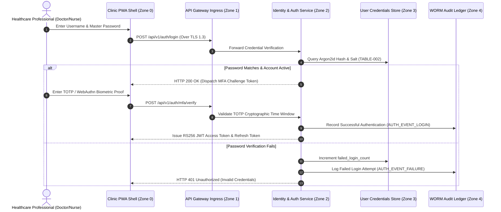

# Authentication & Identity Lifecycle Engineering Specification
## Namma Clinic Digital Health & Operations Platform
### Greater Bengaluru Authority (GBA) / BBMP Health Department
**Standard:** W3C WebAuthn / RFC 6238 TOTP / Argon2id / DPDP Act 2023 | **Status:** APPROVED BASELINE | **Code:** `SEC-DOC-02`

---

## 1. Authentication Architecture & Identity Foundation
The Namma Clinic Authentication Subsystem provides identity verification, credential validation, cryptographic token issuance, and account lifecycle governance for over 5,000 healthcare professionals, administrative officers, and automated daemons across Bengaluru. Due to the high sensitivity of electronic health records, authentication is strictly multi-factor, session-bound, and audited in real time.

### 1.1 Identity Lifecycle States
Every system identity traverses a formal five-state lifecycle machine:
1. **PROVISIONED:** Account registered by Clinic Administrator; initial temporary credential generated with mandatory 24-hour expiration.
2. **ACTIVE:** Primary password set; MFA authenticator enrolled; account entitled to perform role-scoped clinical duties.
3. **LOCKED:** Automated temporary lockout triggered after 5 consecutive failed authentication attempts; locked for 30 minutes.
4. **SUSPENDED:** Account administratively frozen during disciplinary review, extended leave, or security investigation.
5. **DECOMMISSIONED:** Account permanently deactivated upon staff offboarding; active sessions instantly revoked; retained 10 years per audit policy.

### 1.2 Authentication Sequence Diagram


### 1.3 Offline Authentication & Edge Resilience
During municipal telecommunication fiber breaks, clinic workstations operate autonomously in offline mode:
- Staff credentials for locally rostered staff are cached in encrypted SQLite databases bound to hardware TPM 2.0 keys.
- Local authentication requires physical workstation presence and biometric/password verification.
- Offline tokens have restricted 8-hour lifetimes and are restricted strictly to local clinic ward operations.
- Upon network restoration, all offline authentication logs are synchronized to the central WORM audit ledger.

## 2. Role-Specific Authentication & Credential Profiles (ROLE-000 to ROLE-029)
Authentication parameters are customized per healthcare role profile:

### ROLE-001: Authentication Profile for Receptionist / Registration Clerk (`RECEPTIONIST`)
- **Primary Authentication:** Argon2id master password (minimum 12 chars, entropy >= 3.2 bits/char).
- **Mandatory Secondary Factor:** TOTP / WebAuthn Hardware Key required for all active sessions.
- **Failed Login Lockout:** 5 consecutive failures triggers 30-minute lockout on account and clinic IP.
- **Session Token Lifetime:** 15-minute access token TTL; 12-hour rotating refresh token TTL.
- **Offline Authentication Support:** Enabled for locally rostered staff on assigned clinic workstations.
- **Step-Up Verification:** Mandatory before executing high-risk mutations or batch drug dispenses.
- **Deprovisioning Trigger:** Automatic session revocation upon HR offboarding webhook.

### ROLE-002: Authentication Profile for Medical Officer / General Physician (`DOCTOR`)
- **Primary Authentication:** Argon2id master password (minimum 12 chars, entropy >= 3.2 bits/char).
- **Mandatory Secondary Factor:** TOTP / WebAuthn Hardware Key required for all active sessions.
- **Failed Login Lockout:** 5 consecutive failures triggers 30-minute lockout on account and clinic IP.
- **Session Token Lifetime:** 15-minute access token TTL; 12-hour rotating refresh token TTL.
- **Offline Authentication Support:** Enabled for locally rostered staff on assigned clinic workstations.
- **Step-Up Verification:** Mandatory before executing high-risk mutations or batch drug dispenses.
- **Deprovisioning Trigger:** Automatic session revocation upon HR offboarding webhook.

### ROLE-003: Authentication Profile for Staff Nurse / Triage Specialist (`NURSE`)
- **Primary Authentication:** Argon2id master password (minimum 12 chars, entropy >= 3.2 bits/char).
- **Mandatory Secondary Factor:** TOTP / WebAuthn Hardware Key required for all active sessions.
- **Failed Login Lockout:** 5 consecutive failures triggers 30-minute lockout on account and clinic IP.
- **Session Token Lifetime:** 15-minute access token TTL; 12-hour rotating refresh token TTL.
- **Offline Authentication Support:** Enabled for locally rostered staff on assigned clinic workstations.
- **Step-Up Verification:** Mandatory before executing high-risk mutations or batch drug dispenses.
- **Deprovisioning Trigger:** Automatic session revocation upon HR offboarding webhook.

### ROLE-004: Authentication Profile for Pharmacist / Dispenser (`PHARMACIST`)
- **Primary Authentication:** Argon2id master password (minimum 12 chars, entropy >= 3.2 bits/char).
- **Mandatory Secondary Factor:** TOTP / WebAuthn Hardware Key required for all active sessions.
- **Failed Login Lockout:** 5 consecutive failures triggers 30-minute lockout on account and clinic IP.
- **Session Token Lifetime:** 15-minute access token TTL; 12-hour rotating refresh token TTL.
- **Offline Authentication Support:** Enabled for locally rostered staff on assigned clinic workstations.
- **Step-Up Verification:** Mandatory before executing high-risk mutations or batch drug dispenses.
- **Deprovisioning Trigger:** Automatic session revocation upon HR offboarding webhook.

### ROLE-005: Authentication Profile for Laboratory Technician (`LAB_TECH`)
- **Primary Authentication:** Argon2id master password (minimum 12 chars, entropy >= 3.2 bits/char).
- **Mandatory Secondary Factor:** TOTP / WebAuthn Hardware Key required for all active sessions.
- **Failed Login Lockout:** 5 consecutive failures triggers 30-minute lockout on account and clinic IP.
- **Session Token Lifetime:** 15-minute access token TTL; 12-hour rotating refresh token TTL.
- **Offline Authentication Support:** Enabled for locally rostered staff on assigned clinic workstations.
- **Step-Up Verification:** Mandatory before executing high-risk mutations or batch drug dispenses.
- **Deprovisioning Trigger:** Automatic session revocation upon HR offboarding webhook.

### ROLE-006: Authentication Profile for Clinic Administrative Officer (`CLINIC_ADMIN`)
- **Primary Authentication:** Argon2id master password (minimum 12 chars, entropy >= 3.2 bits/char).
- **Mandatory Secondary Factor:** TOTP / WebAuthn Hardware Key required for all active sessions.
- **Failed Login Lockout:** 5 consecutive failures triggers 30-minute lockout on account and clinic IP.
- **Session Token Lifetime:** 15-minute access token TTL; 12-hour rotating refresh token TTL.
- **Offline Authentication Support:** Enabled for locally rostered staff on assigned clinic workstations.
- **Step-Up Verification:** Mandatory before executing high-risk mutations or batch drug dispenses.
- **Deprovisioning Trigger:** Automatic session revocation upon HR offboarding webhook.

### ROLE-007: Authentication Profile for Ward Health Supervisor (`WARD_SUPERVISOR`)
- **Primary Authentication:** Argon2id master password (minimum 12 chars, entropy >= 3.2 bits/char).
- **Mandatory Secondary Factor:** TOTP / WebAuthn Hardware Key required for all active sessions.
- **Failed Login Lockout:** 5 consecutive failures triggers 30-minute lockout on account and clinic IP.
- **Session Token Lifetime:** 15-minute access token TTL; 12-hour rotating refresh token TTL.
- **Offline Authentication Support:** Enabled for locally rostered staff on assigned clinic workstations.
- **Step-Up Verification:** Mandatory before executing high-risk mutations or batch drug dispenses.
- **Deprovisioning Trigger:** Automatic session revocation upon HR offboarding webhook.

### ROLE-008: Authentication Profile for Zonal Health Officer (ZHO) (`ZONAL_OFFICER`)
- **Primary Authentication:** Argon2id master password (minimum 12 chars, entropy >= 3.2 bits/char).
- **Mandatory Secondary Factor:** TOTP / WebAuthn Hardware Key required for all active sessions.
- **Failed Login Lockout:** 5 consecutive failures triggers 30-minute lockout on account and clinic IP.
- **Session Token Lifetime:** 15-minute access token TTL; 12-hour rotating refresh token TTL.
- **Offline Authentication Support:** Enabled for locally rostered staff on assigned clinic workstations.
- **Step-Up Verification:** Mandatory before executing high-risk mutations or batch drug dispenses.
- **Deprovisioning Trigger:** Automatic session revocation upon HR offboarding webhook.

### ROLE-009: Authentication Profile for Chief Health Officer (CHO) (`CHIEF_OFFICER`)
- **Primary Authentication:** Argon2id master password (minimum 12 chars, entropy >= 3.2 bits/char).
- **Mandatory Secondary Factor:** TOTP / WebAuthn Hardware Key required for all active sessions.
- **Failed Login Lockout:** 5 consecutive failures triggers 30-minute lockout on account and clinic IP.
- **Session Token Lifetime:** 15-minute access token TTL; 12-hour rotating refresh token TTL.
- **Offline Authentication Support:** Enabled for locally rostered staff on assigned clinic workstations.
- **Step-Up Verification:** Mandatory before executing high-risk mutations or batch drug dispenses.
- **Deprovisioning Trigger:** Automatic session revocation upon HR offboarding webhook.

### ROLE-010: Authentication Profile for Epidemiologist / Disease Surveillance Officer (`EPIDEMIOLOGIST`)
- **Primary Authentication:** Argon2id master password (minimum 12 chars, entropy >= 3.2 bits/char).
- **Mandatory Secondary Factor:** TOTP / WebAuthn Hardware Key required for all active sessions.
- **Failed Login Lockout:** 5 consecutive failures triggers 30-minute lockout on account and clinic IP.
- **Session Token Lifetime:** 15-minute access token TTL; 12-hour rotating refresh token TTL.
- **Offline Authentication Support:** Enabled for locally rostered staff on assigned clinic workstations.
- **Step-Up Verification:** Mandatory before executing high-risk mutations or batch drug dispenses.
- **Deprovisioning Trigger:** Automatic session revocation upon HR offboarding webhook.

### ROLE-011: Authentication Profile for Quality & Compliance Auditor (`AUDITOR`)
- **Primary Authentication:** Argon2id master password (minimum 12 chars, entropy >= 3.2 bits/char).
- **Mandatory Secondary Factor:** TOTP / WebAuthn Hardware Key required for all active sessions.
- **Failed Login Lockout:** 5 consecutive failures triggers 30-minute lockout on account and clinic IP.
- **Session Token Lifetime:** 15-minute access token TTL; 12-hour rotating refresh token TTL.
- **Offline Authentication Support:** Enabled for locally rostered staff on assigned clinic workstations.
- **Step-Up Verification:** Mandatory before executing high-risk mutations or batch drug dispenses.
- **Deprovisioning Trigger:** Automatic session revocation upon HR offboarding webhook.

### ROLE-012: Authentication Profile for Security Administrator / CISO (`SECURITY_ADMIN`)
- **Primary Authentication:** Argon2id master password (minimum 12 chars, entropy >= 3.2 bits/char).
- **Mandatory Secondary Factor:** TOTP / WebAuthn Hardware Key required for all active sessions.
- **Failed Login Lockout:** 5 consecutive failures triggers 30-minute lockout on account and clinic IP.
- **Session Token Lifetime:** 15-minute access token TTL; 12-hour rotating refresh token TTL.
- **Offline Authentication Support:** Enabled for locally rostered staff on assigned clinic workstations.
- **Step-Up Verification:** Mandatory before executing high-risk mutations or batch drug dispenses.
- **Deprovisioning Trigger:** Automatic session revocation upon HR offboarding webhook.

### ROLE-013: Authentication Profile for Central Depot Inventory Manager (`DEPOT_MANAGER`)
- **Primary Authentication:** Argon2id master password (minimum 12 chars, entropy >= 3.2 bits/char).
- **Mandatory Secondary Factor:** TOTP / WebAuthn Hardware Key required for all active sessions.
- **Failed Login Lockout:** 5 consecutive failures triggers 30-minute lockout on account and clinic IP.
- **Session Token Lifetime:** 15-minute access token TTL; 12-hour rotating refresh token TTL.
- **Offline Authentication Support:** Enabled for locally rostered staff on assigned clinic workstations.
- **Step-Up Verification:** Mandatory before executing high-risk mutations or batch drug dispenses.
- **Deprovisioning Trigger:** Automatic session revocation upon HR offboarding webhook.

### ROLE-014: Authentication Profile for Cold Chain Logistics Technician (`COLD_CHAIN_TECH`)
- **Primary Authentication:** Argon2id master password (minimum 12 chars, entropy >= 3.2 bits/char).
- **Mandatory Secondary Factor:** TOTP / WebAuthn Hardware Key required for all active sessions.
- **Failed Login Lockout:** 5 consecutive failures triggers 30-minute lockout on account and clinic IP.
- **Session Token Lifetime:** 15-minute access token TTL; 12-hour rotating refresh token TTL.
- **Offline Authentication Support:** Enabled for locally rostered staff on assigned clinic workstations.
- **Step-Up Verification:** Mandatory before executing high-risk mutations or batch drug dispenses.
- **Deprovisioning Trigger:** Automatic session revocation upon HR offboarding webhook.

### ROLE-015: Authentication Profile for Radiologist / Diagnostic Specialist (`RADIOLOGIST`)
- **Primary Authentication:** Argon2id master password (minimum 12 chars, entropy >= 3.2 bits/char).
- **Mandatory Secondary Factor:** TOTP / WebAuthn Hardware Key required for all active sessions.
- **Failed Login Lockout:** 5 consecutive failures triggers 30-minute lockout on account and clinic IP.
- **Session Token Lifetime:** 15-minute access token TTL; 12-hour rotating refresh token TTL.
- **Offline Authentication Support:** Enabled for locally rostered staff on assigned clinic workstations.
- **Step-Up Verification:** Mandatory before executing high-risk mutations or batch drug dispenses.
- **Deprovisioning Trigger:** Automatic session revocation upon HR offboarding webhook.

### ROLE-016: Authentication Profile for Ayush Practitioner (`AYUSH_DOC`)
- **Primary Authentication:** Argon2id master password (minimum 12 chars, entropy >= 3.2 bits/char).
- **Mandatory Secondary Factor:** TOTP / WebAuthn Hardware Key required for all active sessions.
- **Failed Login Lockout:** 5 consecutive failures triggers 30-minute lockout on account and clinic IP.
- **Session Token Lifetime:** 15-minute access token TTL; 12-hour rotating refresh token TTL.
- **Offline Authentication Support:** Enabled for locally rostered staff on assigned clinic workstations.
- **Step-Up Verification:** Mandatory before executing high-risk mutations or batch drug dispenses.
- **Deprovisioning Trigger:** Automatic session revocation upon HR offboarding webhook.

### ROLE-017: Authentication Profile for Counselor / Mental Health Worker (`COUNSELOR`)
- **Primary Authentication:** Argon2id master password (minimum 12 chars, entropy >= 3.2 bits/char).
- **Mandatory Secondary Factor:** TOTP / WebAuthn Hardware Key required for all active sessions.
- **Failed Login Lockout:** 5 consecutive failures triggers 30-minute lockout on account and clinic IP.
- **Session Token Lifetime:** 15-minute access token TTL; 12-hour rotating refresh token TTL.
- **Offline Authentication Support:** Enabled for locally rostered staff on assigned clinic workstations.
- **Step-Up Verification:** Mandatory before executing high-risk mutations or batch drug dispenses.
- **Deprovisioning Trigger:** Automatic session revocation upon HR offboarding webhook.

### ROLE-018: Authentication Profile for ANM / Urban Health Worker (`ANM_WORKER`)
- **Primary Authentication:** Argon2id master password (minimum 12 chars, entropy >= 3.2 bits/char).
- **Mandatory Secondary Factor:** TOTP / WebAuthn Hardware Key required for all active sessions.
- **Failed Login Lockout:** 5 consecutive failures triggers 30-minute lockout on account and clinic IP.
- **Session Token Lifetime:** 15-minute access token TTL; 12-hour rotating refresh token TTL.
- **Offline Authentication Support:** Enabled for locally rostered staff on assigned clinic workstations.
- **Step-Up Verification:** Mandatory before executing high-risk mutations or batch drug dispenses.
- **Deprovisioning Trigger:** Automatic session revocation upon HR offboarding webhook.

### ROLE-019: Authentication Profile for ASHA Link Worker Coordinator (`ASHA_COORD`)
- **Primary Authentication:** Argon2id master password (minimum 12 chars, entropy >= 3.2 bits/char).
- **Mandatory Secondary Factor:** TOTP / WebAuthn Hardware Key required for all active sessions.
- **Failed Login Lockout:** 5 consecutive failures triggers 30-minute lockout on account and clinic IP.
- **Session Token Lifetime:** 15-minute access token TTL; 12-hour rotating refresh token TTL.
- **Offline Authentication Support:** Enabled for locally rostered staff on assigned clinic workstations.
- **Step-Up Verification:** Mandatory before executing high-risk mutations or batch drug dispenses.
- **Deprovisioning Trigger:** Automatic session revocation upon HR offboarding webhook.

### ROLE-020: Authentication Profile for Data Entry Operator (`DATA_ENTRY`)
- **Primary Authentication:** Argon2id master password (minimum 12 chars, entropy >= 3.2 bits/char).
- **Mandatory Secondary Factor:** TOTP / WebAuthn Hardware Key required for all active sessions.
- **Failed Login Lockout:** 5 consecutive failures triggers 30-minute lockout on account and clinic IP.
- **Session Token Lifetime:** 15-minute access token TTL; 12-hour rotating refresh token TTL.
- **Offline Authentication Support:** Enabled for locally rostered staff on assigned clinic workstations.
- **Step-Up Verification:** Mandatory before executing high-risk mutations or batch drug dispenses.
- **Deprovisioning Trigger:** Automatic session revocation upon HR offboarding webhook.

### ROLE-021: Authentication Profile for Grievance Redressal Officer (`GRIEVANCE_OFFICER`)
- **Primary Authentication:** Argon2id master password (minimum 12 chars, entropy >= 3.2 bits/char).
- **Mandatory Secondary Factor:** TOTP / WebAuthn Hardware Key required for all active sessions.
- **Failed Login Lockout:** 5 consecutive failures triggers 30-minute lockout on account and clinic IP.
- **Session Token Lifetime:** 15-minute access token TTL; 12-hour rotating refresh token TTL.
- **Offline Authentication Support:** Enabled for locally rostered staff on assigned clinic workstations.
- **Step-Up Verification:** Mandatory before executing high-risk mutations or batch drug dispenses.
- **Deprovisioning Trigger:** Automatic session revocation upon HR offboarding webhook.

### ROLE-022: Authentication Profile for ABDM National Integration Officer (`ABDM_OFFICER`)
- **Primary Authentication:** Argon2id master password (minimum 12 chars, entropy >= 3.2 bits/char).
- **Mandatory Secondary Factor:** TOTP / WebAuthn Hardware Key required for all active sessions.
- **Failed Login Lockout:** 5 consecutive failures triggers 30-minute lockout on account and clinic IP.
- **Session Token Lifetime:** 15-minute access token TTL; 12-hour rotating refresh token TTL.
- **Offline Authentication Support:** Enabled for locally rostered staff on assigned clinic workstations.
- **Step-Up Verification:** Mandatory before executing high-risk mutations or batch drug dispenses.
- **Deprovisioning Trigger:** Automatic session revocation upon HR offboarding webhook.

### ROLE-023: Authentication Profile for Data Protection Officer (DPO) (`PRIVACY_OFFICER`)
- **Primary Authentication:** Argon2id master password (minimum 12 chars, entropy >= 3.2 bits/char).
- **Mandatory Secondary Factor:** TOTP / WebAuthn Hardware Key required for all active sessions.
- **Failed Login Lockout:** 5 consecutive failures triggers 30-minute lockout on account and clinic IP.
- **Session Token Lifetime:** 15-minute access token TTL; 12-hour rotating refresh token TTL.
- **Offline Authentication Support:** Enabled for locally rostered staff on assigned clinic workstations.
- **Step-Up Verification:** Mandatory before executing high-risk mutations or batch drug dispenses.
- **Deprovisioning Trigger:** Automatic session revocation upon HR offboarding webhook.

### ROLE-024: Authentication Profile for IT Support & Hardware Engineer (`IT_SUPPORT`)
- **Primary Authentication:** Argon2id master password (minimum 12 chars, entropy >= 3.2 bits/char).
- **Mandatory Secondary Factor:** TOTP / WebAuthn Hardware Key required for all active sessions.
- **Failed Login Lockout:** 5 consecutive failures triggers 30-minute lockout on account and clinic IP.
- **Session Token Lifetime:** 15-minute access token TTL; 12-hour rotating refresh token TTL.
- **Offline Authentication Support:** Enabled for locally rostered staff on assigned clinic workstations.
- **Step-Up Verification:** Mandatory before executing high-risk mutations or batch drug dispenses.
- **Deprovisioning Trigger:** Automatic session revocation upon HR offboarding webhook.

### ROLE-025: Authentication Profile for Clinical Audit Committee Member (`CLINICAL_AUDITOR`)
- **Primary Authentication:** Argon2id master password (minimum 12 chars, entropy >= 3.2 bits/char).
- **Mandatory Secondary Factor:** TOTP / WebAuthn Hardware Key required for all active sessions.
- **Failed Login Lockout:** 5 consecutive failures triggers 30-minute lockout on account and clinic IP.
- **Session Token Lifetime:** 15-minute access token TTL; 12-hour rotating refresh token TTL.
- **Offline Authentication Support:** Enabled for locally rostered staff on assigned clinic workstations.
- **Step-Up Verification:** Mandatory before executing high-risk mutations or batch drug dispenses.
- **Deprovisioning Trigger:** Automatic session revocation upon HR offboarding webhook.

### ROLE-026: Authentication Profile for Procurement & Vendor Manager (`PROCUREMENT_MGR`)
- **Primary Authentication:** Argon2id master password (minimum 12 chars, entropy >= 3.2 bits/char).
- **Mandatory Secondary Factor:** TOTP / WebAuthn Hardware Key required for all active sessions.
- **Failed Login Lockout:** 5 consecutive failures triggers 30-minute lockout on account and clinic IP.
- **Session Token Lifetime:** 15-minute access token TTL; 12-hour rotating refresh token TTL.
- **Offline Authentication Support:** Enabled for locally rostered staff on assigned clinic workstations.
- **Step-Up Verification:** Mandatory before executing high-risk mutations or batch drug dispenses.
- **Deprovisioning Trigger:** Automatic session revocation upon HR offboarding webhook.

### ROLE-027: Authentication Profile for Biomedical Waste Supervisor (`WASTE_SUPERVISOR`)
- **Primary Authentication:** Argon2id master password (minimum 12 chars, entropy >= 3.2 bits/char).
- **Mandatory Secondary Factor:** TOTP / WebAuthn Hardware Key required for all active sessions.
- **Failed Login Lockout:** 5 consecutive failures triggers 30-minute lockout on account and clinic IP.
- **Session Token Lifetime:** 15-minute access token TTL; 12-hour rotating refresh token TTL.
- **Offline Authentication Support:** Enabled for locally rostered staff on assigned clinic workstations.
- **Step-Up Verification:** Mandatory before executing high-risk mutations or batch drug dispenses.
- **Deprovisioning Trigger:** Automatic session revocation upon HR offboarding webhook.

### ROLE-028: Authentication Profile for Telemedicine Remote Specialist (`TELE_SPECIALIST`)
- **Primary Authentication:** Argon2id master password (minimum 12 chars, entropy >= 3.2 bits/char).
- **Mandatory Secondary Factor:** TOTP / WebAuthn Hardware Key required for all active sessions.
- **Failed Login Lockout:** 5 consecutive failures triggers 30-minute lockout on account and clinic IP.
- **Session Token Lifetime:** 15-minute access token TTL; 12-hour rotating refresh token TTL.
- **Offline Authentication Support:** Enabled for locally rostered staff on assigned clinic workstations.
- **Step-Up Verification:** Mandatory before executing high-risk mutations or batch drug dispenses.
- **Deprovisioning Trigger:** Automatic session revocation upon HR offboarding webhook.

### ROLE-029: Authentication Profile for Field Public Health Inspector (`HEALTH_INSPECTOR`)
- **Primary Authentication:** Argon2id master password (minimum 12 chars, entropy >= 3.2 bits/char).
- **Mandatory Secondary Factor:** TOTP / WebAuthn Hardware Key required for all active sessions.
- **Failed Login Lockout:** 5 consecutive failures triggers 30-minute lockout on account and clinic IP.
- **Session Token Lifetime:** 15-minute access token TTL; 12-hour rotating refresh token TTL.
- **Offline Authentication Support:** Enabled for locally rostered staff on assigned clinic workstations.
- **Step-Up Verification:** Mandatory before executing high-risk mutations or batch drug dispenses.
- **Deprovisioning Trigger:** Automatic session revocation upon HR offboarding webhook.

### ROLE-030: Authentication Profile for Super Administrator (`SUPER_ADMIN`)
- **Primary Authentication:** Argon2id master password (minimum 12 chars, entropy >= 3.2 bits/char).
- **Mandatory Secondary Factor:** TOTP / WebAuthn Hardware Key required for all active sessions.
- **Failed Login Lockout:** 5 consecutive failures triggers 30-minute lockout on account and clinic IP.
- **Session Token Lifetime:** 15-minute access token TTL; 12-hour rotating refresh token TTL.
- **Offline Authentication Support:** Enabled for locally rostered staff on assigned clinic workstations.
- **Step-Up Verification:** Mandatory before executing high-risk mutations or batch drug dispenses.
- **Deprovisioning Trigger:** Automatic session revocation upon HR offboarding webhook.

## 3. Operational Procedures: Identity & Authentication (SOP-AUTH-01 to SOP-AUTH-25)
The following 25 SOPs govern day-to-day identity operations across BBMP health facilities:

### SOP-AUTH-01: Clinician Onboarding & Credential Provisioning
- **Trigger Condition:** HR onboarding notice received.
- **Execution Steps:** 1. Create user in TABLE-001. 2. Generate temporary 24h password. 3. Dispatch secure SMS token.
- **Verification Criterion:** Clinician successfully completes initial password setup.
- **Responsible Role:** Clinic Admin
- **Audit Event Emitted:** `AUTH_SOP_01_PROVISIONED`

### SOP-AUTH-02: Emergency Break-Glass Account Activation
- **Trigger Condition:** Critical medical emergency during system outage.
- **Execution Steps:** 1. Request break-glass from supervisor. 2. Verify patient emergency flag. 3. Issue 2-hour bypass.
- **Verification Criterion:** All break-glass actions audited with justification.
- **Responsible Role:** Medical Officer
- **Audit Event Emitted:** `AUTH_SOP_02_BREAKGLASS`

### SOP-AUTH-03: Locked Account Administrative Unlock
- **Trigger Condition:** Staff account locked after 5 failed login attempts.
- **Execution Steps:** 1. Verify staff identity via photo ID. 2. Check failed attempt IP. 3. Reset failed counter.
- **Verification Criterion:** Account unlocked and temporary password issued if forgotten.
- **Responsible Role:** IT Support
- **Audit Event Emitted:** `AUTH_SOP_03_UNLOCKED`

### SOP-AUTH-04: Clinician Offboarding & Instant Revocation
- **Trigger Condition:** Staff member resigns or transfers out of facility.
- **Execution Steps:** 1. Trigger deprovisioning API. 2. Invalidate all active Redis tokens. 3. Mark user SUSPENDED.
- **Verification Criterion:** All active sessions terminated within 2 seconds.
- **Responsible Role:** HR Officer
- **Audit Event Emitted:** `AUTH_SOP_04_DEPROVISIONED`

### SOP-AUTH-05: Suspicious Geolocation Login Investigation
- **Trigger Condition:** Login attempt from outside Bengaluru municipal boundary.
- **Execution Steps:** 1. SIEM flags abnormal IP geo. 2. Block token issuance. 3. Dispatch SMS alert to staff.
- **Verification Criterion:** Unauthorized access blocked; security ticket logged.
- **Responsible Role:** SecOps Lead
- **Audit Event Emitted:** `AUTH_SOP_05_INVESTIGATED`

### SOP-AUTH-06: Offline Credential Cache Synchronization
- **Trigger Condition:** Workstation reconnects after offline clinic hours.
- **Execution Steps:** 1. Sync worker ingests offline auth logs. 2. Verify HMAC signatures. 3. Commit to central audit.
- **Verification Criterion:** 100% offline logins reconciled in central ledger.
- **Responsible Role:** Sync Worker
- **Audit Event Emitted:** `AUTH_SOP_06_SYNCED`

### SOP-AUTH-07: Service Account API Token Rotation
- **Trigger Condition:** Monthly automated rotation of microservice credentials.
- **Execution Steps:** 1. Issue new token pair. 2. Update Kubernetes secret. 3. Revoke predecessor after 24h grace.
- **Verification Criterion:** Zero service downtime during token rotation.
- **Responsible Role:** DevOps Lead
- **Audit Event Emitted:** `AUTH_SOP_07_ROTATED`

### SOP-AUTH-08: Biometric UIDAI RD Service Device Check
- **Trigger Condition:** Daily morning clinic scanner diagnostic.
- **Execution Steps:** 1. Ping registered biometric scanner. 2. Validate device certificate. 3. Perform test capture.
- **Verification Criterion:** Device certified ready for citizen ABHA verification.
- **Responsible Role:** Staff Nurse
- **Audit Event Emitted:** `AUTH_SOP_08_TESTED`

### SOP-AUTH-09: Staff Password Expiration Notification
- **Trigger Condition:** Password age reaches 80 days (90-day cycle).
- **Execution Steps:** 1. Display in-app reminder banner. 2. Allow self-service reset. 3. Warn of lockout at day 90.
- **Verification Criterion:** Clinician updates password before forced expiration.
- **Responsible Role:** Identity Service
- **Audit Event Emitted:** `AUTH_SOP_09_NOTIFIED`

### SOP-AUTH-10: Concurrent Session Revocation Handling
- **Trigger Condition:** Staff logs into second workstation while active on first.
- **Execution Steps:** 1. Detect active session in Redis. 2. Terminate session on workstation 1. 3. Alert user.
- **Verification Criterion:** Single active session enforced per staff account.
- **Responsible Role:** Session Engine
- **Audit Event Emitted:** `AUTH_SOP_10_REVOKED`

### SOP-AUTH-11: Temporary Credential Expiry Enforcement
- **Trigger Condition:** Temporary initial password not changed within 24 hours.
- **Execution Steps:** 1. Check user credential created_at. 2. Expire password if unchanged. 3. Require admin reset.
- **Verification Criterion:** Unused temporary credentials automatically invalidated.
- **Responsible Role:** Cron Daemon
- **Audit Event Emitted:** `AUTH_SOP_11_EXPIRED`

### SOP-AUTH-12: Hardware Security Key Registration
- **Trigger Condition:** Staff enrolls new YubiKey / FIDO2 security key.
- **Execution Steps:** 1. Initiate WebAuthn ceremony. 2. User touches hardware key. 3. Store public key in TABLE-002.
- **Verification Criterion:** Hardware key registered for non-phishable authentication.
- **Responsible Role:** Clinic Admin
- **Audit Event Emitted:** `AUTH_SOP_12_ENROLLED`

### SOP-AUTH-13: Lost MFA Device Recovery Protocol
- **Trigger Condition:** Staff member loses smartphone with TOTP app.
- **Execution Steps:** 1. Verify staff identity in person. 2. Invalidate old TOTP secret. 3. Re-enroll new device.
- **Verification Criterion:** Account recovered without compromising active sessions.
- **Responsible Role:** Security Admin
- **Audit Event Emitted:** `AUTH_SOP_13_RECOVERED`

### SOP-AUTH-14: Aadhaar OTP Identity Verification
- **Trigger Condition:** Citizen registration without biometric scanner.
- **Execution Steps:** 1. Request Aadhaar OTP via UIDAI gateway. 2. Citizen inputs 6-digit OTP. 3. Confirm demographic match.
- **Verification Criterion:** Citizen identity verified for ABHA card creation.
- **Responsible Role:** Registration Clerk
- **Audit Event Emitted:** `AUTH_SOP_14_VERIFIED`

### SOP-AUTH-15: Machine-to-Machine Ingress Handshake
- **Trigger Condition:** Lab diagnostic equipment connects to clinic bridge.
- **Execution Steps:** 1. Validate equipment client TLS certificate. 2. Check MAC address whitelist. 3. Permit connection.
- **Verification Criterion:** Equipment authenticated without human credentials.
- **Responsible Role:** Edge Daemon
- **Audit Event Emitted:** `AUTH_SOP_15_HANDSHAKE`

### SOP-AUTH-16: Compromised Credential Blacklist Ingestion
- **Trigger Condition:** Daily feed from HaveIBeenPwned breach database.
- **Execution Steps:** 1. Ingest new SHA-1 hash prefixes. 2. Screen all active credential hashes. 3. Force reset if matched.
- **Verification Criterion:** Compromised passwords flagged within 24 hours.
- **Responsible Role:** SecOps Lead
- **Audit Event Emitted:** `AUTH_SOP_16_INGESTED`

### SOP-AUTH-17: Privileged Administrative Elevation
- **Trigger Condition:** System administrator performs database maintenance.
- **Execution Steps:** 1. Request elevation ticket. 2. Enforce step-up WebAuthn. 3. Grant 30-minute elevated scope.
- **Verification Criterion:** All elevated commands logged to immutable audit ledger.
- **Responsible Role:** CISO
- **Audit Event Emitted:** `AUTH_SOP_17_ELEVATED`

### SOP-AUTH-18: Clinic Ward Reassignment Authentication
- **Trigger Condition:** Doctor transferred from Ward 12 to Ward 15.
- **Execution Steps:** 1. Update staff facility_id in TABLE-001. 2. Invalidate active tokens. 3. Re-issue ward-scoped JWT.
- **Verification Criterion:** New ward boundaries take effect immediately on next login.
- **Responsible Role:** Zonal Officer
- **Audit Event Emitted:** `AUTH_SOP_18_REASSIGNED`

### SOP-AUTH-19: Automated Brute Force Attack Mitigation
- **Trigger Condition:** Rapid failed logins detected across municipal subnet.
- **Execution Steps:** 1. WAF triggers IP block at 50 failed req/min. 2. Alert on-call security engineer. 3. Capture PCAP.
- **Verification Criterion:** Subnet attack mitigated without affecting other clinics.
- **Responsible Role:** WAF / Gateway
- **Audit Event Emitted:** `AUTH_SOP_19_BLOCKED`

### SOP-AUTH-20: Nightly Identity Database Reconciliation
- **Trigger Condition:** Nightly check between HR portal and auth_users table.
- **Execution Steps:** 1. Diff active HR roster with database. 2. Flag discrepancies. 3. Reconcile account states.
- **Verification Criterion:** Zero ghost accounts or unauthorized active profiles.
- **Responsible Role:** Audit Lead
- **Audit Event Emitted:** `AUTH_SOP_20_RECONCILED`

### SOP-AUTH-21: Biometric False Rejection Handling
- **Trigger Condition:** Citizen fingerprint fails matching due to worn skin.
- **Execution Steps:** 1. Fallback to iris scan or Aadhaar OTP. 2. Document exception in clinic register. 3. Complete check-in.
- **Verification Criterion:** Patient care delivered without administrative delay.
- **Responsible Role:** Staff Nurse
- **Audit Event Emitted:** `AUTH_SOP_21_FALLBACK`

### SOP-AUTH-22: Audit Log Tamper Proofing for Logins
- **Trigger Condition:** Verification of digital signatures on login audit events.
- **Execution Steps:** 1. Extract 24h login events. 2. Verify HMAC signature on each record. 3. Check sequence continuity.
- **Verification Criterion:** Zero dropped or modified authentication audit logs.
- **Responsible Role:** Security Auditor
- **Audit Event Emitted:** `AUTH_SOP_22_CHECKED`

### SOP-AUTH-23: Emergency Doctor Roster Rerouting
- **Trigger Condition:** Visiting specialist covers clinic due to staff illness.
- **Execution Steps:** 1. Issue temporary secondary facility claim. 2. Restrict scope to active day. 3. Require supervisor approval.
- **Verification Criterion:** Visiting physician authenticated with full clinical rights.
- **Responsible Role:** Clinic Admin
- **Audit Event Emitted:** `AUTH_SOP_23_ROSTERED`

### SOP-AUTH-24: Third-Party Telemedicine Specialist Auth
- **Trigger Condition:** Remote specialist logs into teleconsultation portal.
- **Execution Steps:** 1. Verify medical council registration. 2. Enforce mTLS and WebAuthn. 3. Scoped session to booking.
- **Verification Criterion:** Remote specialist authenticated under strict clinical oversight.
- **Responsible Role:** Telehealth Coord
- **Audit Event Emitted:** `AUTH_SOP_24_VERIFIED`

### SOP-AUTH-25: Post-Incident Credential Invalidation
- **Trigger Condition:** Confirmed credential compromise on clinic workstation.
- **Execution Steps:** 1. Execute global session purge for affected user. 2. Rotate password salt and hash. 3. Lock device.
- **Verification Criterion:** Adversary access terminated across all cloud endpoints.
- **Responsible Role:** Incident Commander
- **Audit Event Emitted:** `AUTH_SOP_25_REVOKED`

## 4. Comprehensive Authentication Requirements (AUTH-001 to AUTH-050)
The following 50 specifications define the complete authentication mandate:

### AUTH-001
**Title:** Authentication Requirement: Staff Identity Login & Verification Specification 1
**Control Type:** Preventive
**Security Domain:** Authentication & Identity Lifecycle
**Priority:** P0 - Critical
**Risk:** Critical
**Threat:** THREAT-002
**Asset:** TABLE-001 (auth_users) and TABLE-002 (user_credentials)
**Actor:** Staff User / System Service Account / Attacker
**Precondition:** User initiates authentication session or token exchange
**Control Objective:** Ensure robust identity verification under Staff Identity Login & Verification preventing credential abuse.
**Requirement:** The authentication service shall strictly enforce staff identity login & verification with multi-factor proof.
**Implementation Guidance:** Implement utilizing Argon2id, cryptographically bound tokens, and hardware TPM storage.
**Configuration Guidance:** Lockout threshold set to 5 failed attempts; lockout duration 30 minutes minimum.
**Failure Behavior:** Immediate authentication failure; increment failed counter and trigger audit alert.
**Monitoring:** Prometheus counter auth_failures_total tagged with AUTH-001.
**Audit Event:** AUTH_EVENT_AUTH_001
**Privacy Impact:** Guarantees that only verified healthcare personnel access protected health data.
**Performance Impact:** Authentication verification completed within 80ms.
**Availability Impact:** High availability identity service with redundant edge authentication cache.
**Related Requirement:** SECR-001
**Related Workflow:** WF-001
**Related API:** API-001
**Related Database Entity:** TABLE-001 (auth_users)
**Related Architecture Component:** ARCH-CONT-004 (Identity & Access Gateway)
**Related Threat:** THREAT-002
**Related Test:** SEC-TEST-001
**Acceptance Criteria:** Zero unauthorized token issuance under all boundary conditions.
**Evidence Required:** Authentication audit logs, failed login counter records, test suite runs.
**Owner:** Security Engineering Lead
**Lifecycle:** Active Baseline Control
**Status:** PLANNED

### AUTH-002
**Title:** Authentication Requirement: Credential Hashing & Salts Specification 1
**Control Type:** Detective
**Security Domain:** Authentication & Identity Lifecycle
**Priority:** P0 - Critical
**Risk:** Critical
**Threat:** THREAT-004
**Asset:** TABLE-001 (auth_users) and TABLE-002 (user_credentials)
**Actor:** Staff User / System Service Account / Attacker
**Precondition:** User initiates authentication session or token exchange
**Control Objective:** Ensure robust identity verification under Credential Hashing & Salts preventing credential abuse.
**Requirement:** The authentication service shall strictly enforce credential hashing & salts with multi-factor proof.
**Implementation Guidance:** Implement utilizing Argon2id, cryptographically bound tokens, and hardware TPM storage.
**Configuration Guidance:** Lockout threshold set to 5 failed attempts; lockout duration 30 minutes minimum.
**Failure Behavior:** Immediate authentication failure; increment failed counter and trigger audit alert.
**Monitoring:** Prometheus counter auth_failures_total tagged with AUTH-002.
**Audit Event:** AUTH_EVENT_AUTH_002
**Privacy Impact:** Guarantees that only verified healthcare personnel access protected health data.
**Performance Impact:** Authentication verification completed within 80ms.
**Availability Impact:** High availability identity service with redundant edge authentication cache.
**Related Requirement:** SECR-002
**Related Workflow:** WF-002
**Related API:** API-002
**Related Database Entity:** TABLE-002 (user_credentials)
**Related Architecture Component:** ARCH-CONT-004 (Identity & Access Gateway)
**Related Threat:** THREAT-004
**Related Test:** SEC-TEST-002
**Acceptance Criteria:** Zero unauthorized token issuance under all boundary conditions.
**Evidence Required:** Authentication audit logs, failed login counter records, test suite runs.
**Owner:** Security Engineering Lead
**Lifecycle:** Active Baseline Control
**Status:** PLANNED

### AUTH-003
**Title:** Authentication Requirement: Federated Identity & ABDM Provider Specification 1
**Control Type:** Preventive
**Security Domain:** Authentication & Identity Lifecycle
**Priority:** P0 - Critical
**Risk:** Critical
**Threat:** THREAT-006
**Asset:** TABLE-001 (auth_users) and TABLE-002 (user_credentials)
**Actor:** Staff User / System Service Account / Attacker
**Precondition:** User initiates authentication session or token exchange
**Control Objective:** Ensure robust identity verification under Federated Identity & ABDM Provider preventing credential abuse.
**Requirement:** The authentication service shall strictly enforce federated identity & abdm provider with multi-factor proof.
**Implementation Guidance:** Implement utilizing Argon2id, cryptographically bound tokens, and hardware TPM storage.
**Configuration Guidance:** Lockout threshold set to 5 failed attempts; lockout duration 30 minutes minimum.
**Failure Behavior:** Immediate authentication failure; increment failed counter and trigger audit alert.
**Monitoring:** Prometheus counter auth_failures_total tagged with AUTH-003.
**Audit Event:** AUTH_EVENT_AUTH_003
**Privacy Impact:** Guarantees that only verified healthcare personnel access protected health data.
**Performance Impact:** Authentication verification completed within 80ms.
**Availability Impact:** High availability identity service with redundant edge authentication cache.
**Related Requirement:** SECR-003
**Related Workflow:** WF-003
**Related API:** API-003
**Related Database Entity:** TABLE-003 (user_sessions)
**Related Architecture Component:** ARCH-CONT-004 (Identity & Access Gateway)
**Related Threat:** THREAT-006
**Related Test:** SEC-TEST-003
**Acceptance Criteria:** Zero unauthorized token issuance under all boundary conditions.
**Evidence Required:** Authentication audit logs, failed login counter records, test suite runs.
**Owner:** Security Engineering Lead
**Lifecycle:** Active Baseline Control
**Status:** PLANNED

### AUTH-004
**Title:** Authentication Requirement: Account Lifecycle & Deprovisioning Specification 1
**Control Type:** Detective
**Security Domain:** Authentication & Identity Lifecycle
**Priority:** P0 - Critical
**Risk:** Critical
**Threat:** THREAT-008
**Asset:** TABLE-001 (auth_users) and TABLE-002 (user_credentials)
**Actor:** Staff User / System Service Account / Attacker
**Precondition:** User initiates authentication session or token exchange
**Control Objective:** Ensure robust identity verification under Account Lifecycle & Deprovisioning preventing credential abuse.
**Requirement:** The authentication service shall strictly enforce account lifecycle & deprovisioning with multi-factor proof.
**Implementation Guidance:** Implement utilizing Argon2id, cryptographically bound tokens, and hardware TPM storage.
**Configuration Guidance:** Lockout threshold set to 5 failed attempts; lockout duration 30 minutes minimum.
**Failure Behavior:** Immediate authentication failure; increment failed counter and trigger audit alert.
**Monitoring:** Prometheus counter auth_failures_total tagged with AUTH-004.
**Audit Event:** AUTH_EVENT_AUTH_004
**Privacy Impact:** Guarantees that only verified healthcare personnel access protected health data.
**Performance Impact:** Authentication verification completed within 80ms.
**Availability Impact:** High availability identity service with redundant edge authentication cache.
**Related Requirement:** SECR-004
**Related Workflow:** WF-004
**Related API:** API-004
**Related Database Entity:** TABLE-004 (roles)
**Related Architecture Component:** ARCH-CONT-004 (Identity & Access Gateway)
**Related Threat:** THREAT-008
**Related Test:** SEC-TEST-004
**Acceptance Criteria:** Zero unauthorized token issuance under all boundary conditions.
**Evidence Required:** Authentication audit logs, failed login counter records, test suite runs.
**Owner:** Security Engineering Lead
**Lifecycle:** Active Baseline Control
**Status:** PLANNED

### AUTH-005
**Title:** Authentication Requirement: Brute Force Defense & Lockout Specification 1
**Control Type:** Preventive
**Security Domain:** Authentication & Identity Lifecycle
**Priority:** P0 - Critical
**Risk:** Critical
**Threat:** THREAT-010
**Asset:** TABLE-001 (auth_users) and TABLE-002 (user_credentials)
**Actor:** Staff User / System Service Account / Attacker
**Precondition:** User initiates authentication session or token exchange
**Control Objective:** Ensure robust identity verification under Brute Force Defense & Lockout preventing credential abuse.
**Requirement:** The authentication service shall strictly enforce brute force defense & lockout with multi-factor proof.
**Implementation Guidance:** Implement utilizing Argon2id, cryptographically bound tokens, and hardware TPM storage.
**Configuration Guidance:** Lockout threshold set to 5 failed attempts; lockout duration 30 minutes minimum.
**Failure Behavior:** Immediate authentication failure; increment failed counter and trigger audit alert.
**Monitoring:** Prometheus counter auth_failures_total tagged with AUTH-005.
**Audit Event:** AUTH_EVENT_AUTH_005
**Privacy Impact:** Guarantees that only verified healthcare personnel access protected health data.
**Performance Impact:** Authentication verification completed within 80ms.
**Availability Impact:** High availability identity service with redundant edge authentication cache.
**Related Requirement:** SECR-005
**Related Workflow:** WF-005
**Related API:** API-005
**Related Database Entity:** TABLE-005 (permissions)
**Related Architecture Component:** ARCH-CONT-004 (Identity & Access Gateway)
**Related Threat:** THREAT-010
**Related Test:** SEC-TEST-005
**Acceptance Criteria:** Zero unauthorized token issuance under all boundary conditions.
**Evidence Required:** Authentication audit logs, failed login counter records, test suite runs.
**Owner:** Security Engineering Lead
**Lifecycle:** Active Baseline Control
**Status:** PLANNED

### AUTH-006
**Title:** Authentication Requirement: Privileged Administrative Elevation Specification 1
**Control Type:** Detective
**Security Domain:** Authentication & Identity Lifecycle
**Priority:** P0 - Critical
**Risk:** Critical
**Threat:** THREAT-012
**Asset:** TABLE-001 (auth_users) and TABLE-002 (user_credentials)
**Actor:** Staff User / System Service Account / Attacker
**Precondition:** User initiates authentication session or token exchange
**Control Objective:** Ensure robust identity verification under Privileged Administrative Elevation preventing credential abuse.
**Requirement:** The authentication service shall strictly enforce privileged administrative elevation with multi-factor proof.
**Implementation Guidance:** Implement utilizing Argon2id, cryptographically bound tokens, and hardware TPM storage.
**Configuration Guidance:** Lockout threshold set to 5 failed attempts; lockout duration 30 minutes minimum.
**Failure Behavior:** Immediate authentication failure; increment failed counter and trigger audit alert.
**Monitoring:** Prometheus counter auth_failures_total tagged with AUTH-006.
**Audit Event:** AUTH_EVENT_AUTH_006
**Privacy Impact:** Guarantees that only verified healthcare personnel access protected health data.
**Performance Impact:** Authentication verification completed within 80ms.
**Availability Impact:** High availability identity service with redundant edge authentication cache.
**Related Requirement:** SECR-006
**Related Workflow:** WF-006
**Related API:** API-006
**Related Database Entity:** TABLE-006 (role_permissions)
**Related Architecture Component:** ARCH-CONT-004 (Identity & Access Gateway)
**Related Threat:** THREAT-012
**Related Test:** SEC-TEST-006
**Acceptance Criteria:** Zero unauthorized token issuance under all boundary conditions.
**Evidence Required:** Authentication audit logs, failed login counter records, test suite runs.
**Owner:** Security Engineering Lead
**Lifecycle:** Active Baseline Control
**Status:** PLANNED

### AUTH-007
**Title:** Authentication Requirement: Machine & Service Account Tokens Specification 1
**Control Type:** Preventive
**Security Domain:** Authentication & Identity Lifecycle
**Priority:** P0 - Critical
**Risk:** Critical
**Threat:** THREAT-014
**Asset:** TABLE-001 (auth_users) and TABLE-002 (user_credentials)
**Actor:** Staff User / System Service Account / Attacker
**Precondition:** User initiates authentication session or token exchange
**Control Objective:** Ensure robust identity verification under Machine & Service Account Tokens preventing credential abuse.
**Requirement:** The authentication service shall strictly enforce machine & service account tokens with multi-factor proof.
**Implementation Guidance:** Implement utilizing Argon2id, cryptographically bound tokens, and hardware TPM storage.
**Configuration Guidance:** Lockout threshold set to 5 failed attempts; lockout duration 30 minutes minimum.
**Failure Behavior:** Immediate authentication failure; increment failed counter and trigger audit alert.
**Monitoring:** Prometheus counter auth_failures_total tagged with AUTH-007.
**Audit Event:** AUTH_EVENT_AUTH_007
**Privacy Impact:** Guarantees that only verified healthcare personnel access protected health data.
**Performance Impact:** Authentication verification completed within 80ms.
**Availability Impact:** High availability identity service with redundant edge authentication cache.
**Related Requirement:** SECR-007
**Related Workflow:** WF-007
**Related API:** API-007
**Related Database Entity:** TABLE-007 (user_roles)
**Related Architecture Component:** ARCH-CONT-004 (Identity & Access Gateway)
**Related Threat:** THREAT-014
**Related Test:** SEC-TEST-007
**Acceptance Criteria:** Zero unauthorized token issuance under all boundary conditions.
**Evidence Required:** Authentication audit logs, failed login counter records, test suite runs.
**Owner:** Security Engineering Lead
**Lifecycle:** Active Baseline Control
**Status:** PLANNED

### AUTH-008
**Title:** Authentication Requirement: Offline Staff Credential Verification Specification 1
**Control Type:** Detective
**Security Domain:** Authentication & Identity Lifecycle
**Priority:** P0 - Critical
**Risk:** Critical
**Threat:** THREAT-016
**Asset:** TABLE-001 (auth_users) and TABLE-002 (user_credentials)
**Actor:** Staff User / System Service Account / Attacker
**Precondition:** User initiates authentication session or token exchange
**Control Objective:** Ensure robust identity verification under Offline Staff Credential Verification preventing credential abuse.
**Requirement:** The authentication service shall strictly enforce offline staff credential verification with multi-factor proof.
**Implementation Guidance:** Implement utilizing Argon2id, cryptographically bound tokens, and hardware TPM storage.
**Configuration Guidance:** Lockout threshold set to 5 failed attempts; lockout duration 30 minutes minimum.
**Failure Behavior:** Immediate authentication failure; increment failed counter and trigger audit alert.
**Monitoring:** Prometheus counter auth_failures_total tagged with AUTH-008.
**Audit Event:** AUTH_EVENT_AUTH_008
**Privacy Impact:** Guarantees that only verified healthcare personnel access protected health data.
**Performance Impact:** Authentication verification completed within 80ms.
**Availability Impact:** High availability identity service with redundant edge authentication cache.
**Related Requirement:** SECR-008
**Related Workflow:** WF-008
**Related API:** API-008
**Related Database Entity:** TABLE-008 (facilities)
**Related Architecture Component:** ARCH-CONT-004 (Identity & Access Gateway)
**Related Threat:** THREAT-016
**Related Test:** SEC-TEST-008
**Acceptance Criteria:** Zero unauthorized token issuance under all boundary conditions.
**Evidence Required:** Authentication audit logs, failed login counter records, test suite runs.
**Owner:** Security Engineering Lead
**Lifecycle:** Active Baseline Control
**Status:** PLANNED

### AUTH-009
**Title:** Authentication Requirement: Emergency Break-Glass Authentication Specification 1
**Control Type:** Preventive
**Security Domain:** Authentication & Identity Lifecycle
**Priority:** P0 - Critical
**Risk:** Critical
**Threat:** THREAT-018
**Asset:** TABLE-001 (auth_users) and TABLE-002 (user_credentials)
**Actor:** Staff User / System Service Account / Attacker
**Precondition:** User initiates authentication session or token exchange
**Control Objective:** Ensure robust identity verification under Emergency Break-Glass Authentication preventing credential abuse.
**Requirement:** The authentication service shall strictly enforce emergency break-glass authentication with multi-factor proof.
**Implementation Guidance:** Implement utilizing Argon2id, cryptographically bound tokens, and hardware TPM storage.
**Configuration Guidance:** Lockout threshold set to 5 failed attempts; lockout duration 30 minutes minimum.
**Failure Behavior:** Immediate authentication failure; increment failed counter and trigger audit alert.
**Monitoring:** Prometheus counter auth_failures_total tagged with AUTH-009.
**Audit Event:** AUTH_EVENT_AUTH_009
**Privacy Impact:** Guarantees that only verified healthcare personnel access protected health data.
**Performance Impact:** Authentication verification completed within 80ms.
**Availability Impact:** High availability identity service with redundant edge authentication cache.
**Related Requirement:** SECR-009
**Related Workflow:** WF-009
**Related API:** API-009
**Related Database Entity:** TABLE-009 (facility_rooms)
**Related Architecture Component:** ARCH-CONT-004 (Identity & Access Gateway)
**Related Threat:** THREAT-018
**Related Test:** SEC-TEST-009
**Acceptance Criteria:** Zero unauthorized token issuance under all boundary conditions.
**Evidence Required:** Authentication audit logs, failed login counter records, test suite runs.
**Owner:** Security Engineering Lead
**Lifecycle:** Active Baseline Control
**Status:** PLANNED

### AUTH-010
**Title:** Authentication Requirement: Biometric / Aadhaar OTP Verification Specification 1
**Control Type:** Detective
**Security Domain:** Authentication & Identity Lifecycle
**Priority:** P0 - Critical
**Risk:** Critical
**Threat:** THREAT-020
**Asset:** TABLE-001 (auth_users) and TABLE-002 (user_credentials)
**Actor:** Staff User / System Service Account / Attacker
**Precondition:** User initiates authentication session or token exchange
**Control Objective:** Ensure robust identity verification under Biometric / Aadhaar OTP Verification preventing credential abuse.
**Requirement:** The authentication service shall strictly enforce biometric / aadhaar otp verification with multi-factor proof.
**Implementation Guidance:** Implement utilizing Argon2id, cryptographically bound tokens, and hardware TPM storage.
**Configuration Guidance:** Lockout threshold set to 5 failed attempts; lockout duration 30 minutes minimum.
**Failure Behavior:** Immediate authentication failure; increment failed counter and trigger audit alert.
**Monitoring:** Prometheus counter auth_failures_total tagged with AUTH-010.
**Audit Event:** AUTH_EVENT_AUTH_010
**Privacy Impact:** Guarantees that only verified healthcare personnel access protected health data.
**Performance Impact:** Authentication verification completed within 80ms.
**Availability Impact:** High availability identity service with redundant edge authentication cache.
**Related Requirement:** SECR-010
**Related Workflow:** WF-010
**Related API:** API-010
**Related Database Entity:** TABLE-010 (staff_profiles)
**Related Architecture Component:** ARCH-CONT-004 (Identity & Access Gateway)
**Related Threat:** THREAT-020
**Related Test:** SEC-TEST-010
**Acceptance Criteria:** Zero unauthorized token issuance under all boundary conditions.
**Evidence Required:** Authentication audit logs, failed login counter records, test suite runs.
**Owner:** Security Engineering Lead
**Lifecycle:** Active Baseline Control
**Status:** PLANNED

### AUTH-011
**Title:** Authentication Requirement: Staff Identity Login & Verification Specification 2
**Control Type:** Preventive
**Security Domain:** Authentication & Identity Lifecycle
**Priority:** P0 - Critical
**Risk:** Critical
**Threat:** THREAT-022
**Asset:** TABLE-001 (auth_users) and TABLE-002 (user_credentials)
**Actor:** Staff User / System Service Account / Attacker
**Precondition:** User initiates authentication session or token exchange
**Control Objective:** Ensure robust identity verification under Staff Identity Login & Verification preventing credential abuse.
**Requirement:** The authentication service shall strictly enforce staff identity login & verification with multi-factor proof.
**Implementation Guidance:** Implement utilizing Argon2id, cryptographically bound tokens, and hardware TPM storage.
**Configuration Guidance:** Lockout threshold set to 5 failed attempts; lockout duration 30 minutes minimum.
**Failure Behavior:** Immediate authentication failure; increment failed counter and trigger audit alert.
**Monitoring:** Prometheus counter auth_failures_total tagged with AUTH-011.
**Audit Event:** AUTH_EVENT_AUTH_011
**Privacy Impact:** Guarantees that only verified healthcare personnel access protected health data.
**Performance Impact:** Authentication verification completed within 80ms.
**Availability Impact:** High availability identity service with redundant edge authentication cache.
**Related Requirement:** SECR-011
**Related Workflow:** WF-011
**Related API:** API-011
**Related Database Entity:** TABLE-011 (staff_shifts)
**Related Architecture Component:** ARCH-CONT-004 (Identity & Access Gateway)
**Related Threat:** THREAT-022
**Related Test:** SEC-TEST-011
**Acceptance Criteria:** Zero unauthorized token issuance under all boundary conditions.
**Evidence Required:** Authentication audit logs, failed login counter records, test suite runs.
**Owner:** Security Engineering Lead
**Lifecycle:** Active Baseline Control
**Status:** PLANNED

### AUTH-012
**Title:** Authentication Requirement: Credential Hashing & Salts Specification 2
**Control Type:** Detective
**Security Domain:** Authentication & Identity Lifecycle
**Priority:** P0 - Critical
**Risk:** Critical
**Threat:** THREAT-024
**Asset:** TABLE-001 (auth_users) and TABLE-002 (user_credentials)
**Actor:** Staff User / System Service Account / Attacker
**Precondition:** User initiates authentication session or token exchange
**Control Objective:** Ensure robust identity verification under Credential Hashing & Salts preventing credential abuse.
**Requirement:** The authentication service shall strictly enforce credential hashing & salts with multi-factor proof.
**Implementation Guidance:** Implement utilizing Argon2id, cryptographically bound tokens, and hardware TPM storage.
**Configuration Guidance:** Lockout threshold set to 5 failed attempts; lockout duration 30 minutes minimum.
**Failure Behavior:** Immediate authentication failure; increment failed counter and trigger audit alert.
**Monitoring:** Prometheus counter auth_failures_total tagged with AUTH-012.
**Audit Event:** AUTH_EVENT_AUTH_012
**Privacy Impact:** Guarantees that only verified healthcare personnel access protected health data.
**Performance Impact:** Authentication verification completed within 80ms.
**Availability Impact:** High availability identity service with redundant edge authentication cache.
**Related Requirement:** SECR-012
**Related Workflow:** WF-012
**Related API:** API-012
**Related Database Entity:** TABLE-012 (system_configs)
**Related Architecture Component:** ARCH-CONT-004 (Identity & Access Gateway)
**Related Threat:** THREAT-024
**Related Test:** SEC-TEST-012
**Acceptance Criteria:** Zero unauthorized token issuance under all boundary conditions.
**Evidence Required:** Authentication audit logs, failed login counter records, test suite runs.
**Owner:** Security Engineering Lead
**Lifecycle:** Active Baseline Control
**Status:** PLANNED

### AUTH-013
**Title:** Authentication Requirement: Federated Identity & ABDM Provider Specification 2
**Control Type:** Preventive
**Security Domain:** Authentication & Identity Lifecycle
**Priority:** P0 - Critical
**Risk:** Critical
**Threat:** THREAT-026
**Asset:** TABLE-001 (auth_users) and TABLE-002 (user_credentials)
**Actor:** Staff User / System Service Account / Attacker
**Precondition:** User initiates authentication session or token exchange
**Control Objective:** Ensure robust identity verification under Federated Identity & ABDM Provider preventing credential abuse.
**Requirement:** The authentication service shall strictly enforce federated identity & abdm provider with multi-factor proof.
**Implementation Guidance:** Implement utilizing Argon2id, cryptographically bound tokens, and hardware TPM storage.
**Configuration Guidance:** Lockout threshold set to 5 failed attempts; lockout duration 30 minutes minimum.
**Failure Behavior:** Immediate authentication failure; increment failed counter and trigger audit alert.
**Monitoring:** Prometheus counter auth_failures_total tagged with AUTH-013.
**Audit Event:** AUTH_EVENT_AUTH_013
**Privacy Impact:** Guarantees that only verified healthcare personnel access protected health data.
**Performance Impact:** Authentication verification completed within 80ms.
**Availability Impact:** High availability identity service with redundant edge authentication cache.
**Related Requirement:** SECR-013
**Related Workflow:** WF-013
**Related API:** API-013
**Related Database Entity:** TABLE-013 (patients)
**Related Architecture Component:** ARCH-CONT-004 (Identity & Access Gateway)
**Related Threat:** THREAT-026
**Related Test:** SEC-TEST-013
**Acceptance Criteria:** Zero unauthorized token issuance under all boundary conditions.
**Evidence Required:** Authentication audit logs, failed login counter records, test suite runs.
**Owner:** Security Engineering Lead
**Lifecycle:** Active Baseline Control
**Status:** PLANNED

### AUTH-014
**Title:** Authentication Requirement: Account Lifecycle & Deprovisioning Specification 2
**Control Type:** Detective
**Security Domain:** Authentication & Identity Lifecycle
**Priority:** P0 - Critical
**Risk:** Critical
**Threat:** THREAT-028
**Asset:** TABLE-001 (auth_users) and TABLE-002 (user_credentials)
**Actor:** Staff User / System Service Account / Attacker
**Precondition:** User initiates authentication session or token exchange
**Control Objective:** Ensure robust identity verification under Account Lifecycle & Deprovisioning preventing credential abuse.
**Requirement:** The authentication service shall strictly enforce account lifecycle & deprovisioning with multi-factor proof.
**Implementation Guidance:** Implement utilizing Argon2id, cryptographically bound tokens, and hardware TPM storage.
**Configuration Guidance:** Lockout threshold set to 5 failed attempts; lockout duration 30 minutes minimum.
**Failure Behavior:** Immediate authentication failure; increment failed counter and trigger audit alert.
**Monitoring:** Prometheus counter auth_failures_total tagged with AUTH-014.
**Audit Event:** AUTH_EVENT_AUTH_014
**Privacy Impact:** Guarantees that only verified healthcare personnel access protected health data.
**Performance Impact:** Authentication verification completed within 80ms.
**Availability Impact:** High availability identity service with redundant edge authentication cache.
**Related Requirement:** SECR-014
**Related Workflow:** WF-014
**Related API:** API-014
**Related Database Entity:** TABLE-014 (patient_identifiers)
**Related Architecture Component:** ARCH-CONT-004 (Identity & Access Gateway)
**Related Threat:** THREAT-028
**Related Test:** SEC-TEST-014
**Acceptance Criteria:** Zero unauthorized token issuance under all boundary conditions.
**Evidence Required:** Authentication audit logs, failed login counter records, test suite runs.
**Owner:** Security Engineering Lead
**Lifecycle:** Active Baseline Control
**Status:** PLANNED

### AUTH-015
**Title:** Authentication Requirement: Brute Force Defense & Lockout Specification 2
**Control Type:** Preventive
**Security Domain:** Authentication & Identity Lifecycle
**Priority:** P0 - Critical
**Risk:** Critical
**Threat:** THREAT-030
**Asset:** TABLE-001 (auth_users) and TABLE-002 (user_credentials)
**Actor:** Staff User / System Service Account / Attacker
**Precondition:** User initiates authentication session or token exchange
**Control Objective:** Ensure robust identity verification under Brute Force Defense & Lockout preventing credential abuse.
**Requirement:** The authentication service shall strictly enforce brute force defense & lockout with multi-factor proof.
**Implementation Guidance:** Implement utilizing Argon2id, cryptographically bound tokens, and hardware TPM storage.
**Configuration Guidance:** Lockout threshold set to 5 failed attempts; lockout duration 30 minutes minimum.
**Failure Behavior:** Immediate authentication failure; increment failed counter and trigger audit alert.
**Monitoring:** Prometheus counter auth_failures_total tagged with AUTH-015.
**Audit Event:** AUTH_EVENT_AUTH_015
**Privacy Impact:** Guarantees that only verified healthcare personnel access protected health data.
**Performance Impact:** Authentication verification completed within 80ms.
**Availability Impact:** High availability identity service with redundant edge authentication cache.
**Related Requirement:** SECR-015
**Related Workflow:** WF-015
**Related API:** API-015
**Related Database Entity:** TABLE-015 (patient_contacts)
**Related Architecture Component:** ARCH-CONT-004 (Identity & Access Gateway)
**Related Threat:** THREAT-030
**Related Test:** SEC-TEST-015
**Acceptance Criteria:** Zero unauthorized token issuance under all boundary conditions.
**Evidence Required:** Authentication audit logs, failed login counter records, test suite runs.
**Owner:** Security Engineering Lead
**Lifecycle:** Active Baseline Control
**Status:** PLANNED

### AUTH-016
**Title:** Authentication Requirement: Privileged Administrative Elevation Specification 2
**Control Type:** Detective
**Security Domain:** Authentication & Identity Lifecycle
**Priority:** P0 - Critical
**Risk:** Critical
**Threat:** THREAT-032
**Asset:** TABLE-001 (auth_users) and TABLE-002 (user_credentials)
**Actor:** Staff User / System Service Account / Attacker
**Precondition:** User initiates authentication session or token exchange
**Control Objective:** Ensure robust identity verification under Privileged Administrative Elevation preventing credential abuse.
**Requirement:** The authentication service shall strictly enforce privileged administrative elevation with multi-factor proof.
**Implementation Guidance:** Implement utilizing Argon2id, cryptographically bound tokens, and hardware TPM storage.
**Configuration Guidance:** Lockout threshold set to 5 failed attempts; lockout duration 30 minutes minimum.
**Failure Behavior:** Immediate authentication failure; increment failed counter and trigger audit alert.
**Monitoring:** Prometheus counter auth_failures_total tagged with AUTH-016.
**Audit Event:** AUTH_EVENT_AUTH_016
**Privacy Impact:** Guarantees that only verified healthcare personnel access protected health data.
**Performance Impact:** Authentication verification completed within 80ms.
**Availability Impact:** High availability identity service with redundant edge authentication cache.
**Related Requirement:** SECR-016
**Related Workflow:** WF-016
**Related API:** API-016
**Related Database Entity:** TABLE-016 (patient_addresses)
**Related Architecture Component:** ARCH-CONT-004 (Identity & Access Gateway)
**Related Threat:** THREAT-032
**Related Test:** SEC-TEST-016
**Acceptance Criteria:** Zero unauthorized token issuance under all boundary conditions.
**Evidence Required:** Authentication audit logs, failed login counter records, test suite runs.
**Owner:** Security Engineering Lead
**Lifecycle:** Active Baseline Control
**Status:** PLANNED

### AUTH-017
**Title:** Authentication Requirement: Machine & Service Account Tokens Specification 2
**Control Type:** Preventive
**Security Domain:** Authentication & Identity Lifecycle
**Priority:** P0 - Critical
**Risk:** Critical
**Threat:** THREAT-034
**Asset:** TABLE-001 (auth_users) and TABLE-002 (user_credentials)
**Actor:** Staff User / System Service Account / Attacker
**Precondition:** User initiates authentication session or token exchange
**Control Objective:** Ensure robust identity verification under Machine & Service Account Tokens preventing credential abuse.
**Requirement:** The authentication service shall strictly enforce machine & service account tokens with multi-factor proof.
**Implementation Guidance:** Implement utilizing Argon2id, cryptographically bound tokens, and hardware TPM storage.
**Configuration Guidance:** Lockout threshold set to 5 failed attempts; lockout duration 30 minutes minimum.
**Failure Behavior:** Immediate authentication failure; increment failed counter and trigger audit alert.
**Monitoring:** Prometheus counter auth_failures_total tagged with AUTH-017.
**Audit Event:** AUTH_EVENT_AUTH_017
**Privacy Impact:** Guarantees that only verified healthcare personnel access protected health data.
**Performance Impact:** Authentication verification completed within 80ms.
**Availability Impact:** High availability identity service with redundant edge authentication cache.
**Related Requirement:** SECR-017
**Related Workflow:** WF-017
**Related API:** API-017
**Related Database Entity:** TABLE-017 (consent_records)
**Related Architecture Component:** ARCH-CONT-004 (Identity & Access Gateway)
**Related Threat:** THREAT-034
**Related Test:** SEC-TEST-017
**Acceptance Criteria:** Zero unauthorized token issuance under all boundary conditions.
**Evidence Required:** Authentication audit logs, failed login counter records, test suite runs.
**Owner:** Security Engineering Lead
**Lifecycle:** Active Baseline Control
**Status:** PLANNED

### AUTH-018
**Title:** Authentication Requirement: Offline Staff Credential Verification Specification 2
**Control Type:** Detective
**Security Domain:** Authentication & Identity Lifecycle
**Priority:** P0 - Critical
**Risk:** Critical
**Threat:** THREAT-036
**Asset:** TABLE-001 (auth_users) and TABLE-002 (user_credentials)
**Actor:** Staff User / System Service Account / Attacker
**Precondition:** User initiates authentication session or token exchange
**Control Objective:** Ensure robust identity verification under Offline Staff Credential Verification preventing credential abuse.
**Requirement:** The authentication service shall strictly enforce offline staff credential verification with multi-factor proof.
**Implementation Guidance:** Implement utilizing Argon2id, cryptographically bound tokens, and hardware TPM storage.
**Configuration Guidance:** Lockout threshold set to 5 failed attempts; lockout duration 30 minutes minimum.
**Failure Behavior:** Immediate authentication failure; increment failed counter and trigger audit alert.
**Monitoring:** Prometheus counter auth_failures_total tagged with AUTH-018.
**Audit Event:** AUTH_EVENT_AUTH_018
**Privacy Impact:** Guarantees that only verified healthcare personnel access protected health data.
**Performance Impact:** Authentication verification completed within 80ms.
**Availability Impact:** High availability identity service with redundant edge authentication cache.
**Related Requirement:** SECR-018
**Related Workflow:** WF-018
**Related API:** API-018
**Related Database Entity:** TABLE-018 (tokens)
**Related Architecture Component:** ARCH-CONT-004 (Identity & Access Gateway)
**Related Threat:** THREAT-036
**Related Test:** SEC-TEST-018
**Acceptance Criteria:** Zero unauthorized token issuance under all boundary conditions.
**Evidence Required:** Authentication audit logs, failed login counter records, test suite runs.
**Owner:** Security Engineering Lead
**Lifecycle:** Active Baseline Control
**Status:** PLANNED

### AUTH-019
**Title:** Authentication Requirement: Emergency Break-Glass Authentication Specification 2
**Control Type:** Preventive
**Security Domain:** Authentication & Identity Lifecycle
**Priority:** P0 - Critical
**Risk:** Critical
**Threat:** THREAT-038
**Asset:** TABLE-001 (auth_users) and TABLE-002 (user_credentials)
**Actor:** Staff User / System Service Account / Attacker
**Precondition:** User initiates authentication session or token exchange
**Control Objective:** Ensure robust identity verification under Emergency Break-Glass Authentication preventing credential abuse.
**Requirement:** The authentication service shall strictly enforce emergency break-glass authentication with multi-factor proof.
**Implementation Guidance:** Implement utilizing Argon2id, cryptographically bound tokens, and hardware TPM storage.
**Configuration Guidance:** Lockout threshold set to 5 failed attempts; lockout duration 30 minutes minimum.
**Failure Behavior:** Immediate authentication failure; increment failed counter and trigger audit alert.
**Monitoring:** Prometheus counter auth_failures_total tagged with AUTH-019.
**Audit Event:** AUTH_EVENT_AUTH_019
**Privacy Impact:** Guarantees that only verified healthcare personnel access protected health data.
**Performance Impact:** Authentication verification completed within 80ms.
**Availability Impact:** High availability identity service with redundant edge authentication cache.
**Related Requirement:** SECR-019
**Related Workflow:** WF-019
**Related API:** API-019
**Related Database Entity:** TABLE-019 (queue_entries)
**Related Architecture Component:** ARCH-CONT-004 (Identity & Access Gateway)
**Related Threat:** THREAT-038
**Related Test:** SEC-TEST-019
**Acceptance Criteria:** Zero unauthorized token issuance under all boundary conditions.
**Evidence Required:** Authentication audit logs, failed login counter records, test suite runs.
**Owner:** Security Engineering Lead
**Lifecycle:** Active Baseline Control
**Status:** PLANNED

### AUTH-020
**Title:** Authentication Requirement: Biometric / Aadhaar OTP Verification Specification 2
**Control Type:** Detective
**Security Domain:** Authentication & Identity Lifecycle
**Priority:** P0 - Critical
**Risk:** Critical
**Threat:** THREAT-040
**Asset:** TABLE-001 (auth_users) and TABLE-002 (user_credentials)
**Actor:** Staff User / System Service Account / Attacker
**Precondition:** User initiates authentication session or token exchange
**Control Objective:** Ensure robust identity verification under Biometric / Aadhaar OTP Verification preventing credential abuse.
**Requirement:** The authentication service shall strictly enforce biometric / aadhaar otp verification with multi-factor proof.
**Implementation Guidance:** Implement utilizing Argon2id, cryptographically bound tokens, and hardware TPM storage.
**Configuration Guidance:** Lockout threshold set to 5 failed attempts; lockout duration 30 minutes minimum.
**Failure Behavior:** Immediate authentication failure; increment failed counter and trigger audit alert.
**Monitoring:** Prometheus counter auth_failures_total tagged with AUTH-020.
**Audit Event:** AUTH_EVENT_AUTH_020
**Privacy Impact:** Guarantees that only verified healthcare personnel access protected health data.
**Performance Impact:** Authentication verification completed within 80ms.
**Availability Impact:** High availability identity service with redundant edge authentication cache.
**Related Requirement:** SECR-020
**Related Workflow:** WF-020
**Related API:** API-020
**Related Database Entity:** TABLE-020 (triage_assessments)
**Related Architecture Component:** ARCH-CONT-004 (Identity & Access Gateway)
**Related Threat:** THREAT-040
**Related Test:** SEC-TEST-020
**Acceptance Criteria:** Zero unauthorized token issuance under all boundary conditions.
**Evidence Required:** Authentication audit logs, failed login counter records, test suite runs.
**Owner:** Security Engineering Lead
**Lifecycle:** Active Baseline Control
**Status:** PLANNED

### AUTH-021
**Title:** Authentication Requirement: Staff Identity Login & Verification Specification 3
**Control Type:** Preventive
**Security Domain:** Authentication & Identity Lifecycle
**Priority:** P0 - Critical
**Risk:** Critical
**Threat:** THREAT-042
**Asset:** TABLE-001 (auth_users) and TABLE-002 (user_credentials)
**Actor:** Staff User / System Service Account / Attacker
**Precondition:** User initiates authentication session or token exchange
**Control Objective:** Ensure robust identity verification under Staff Identity Login & Verification preventing credential abuse.
**Requirement:** The authentication service shall strictly enforce staff identity login & verification with multi-factor proof.
**Implementation Guidance:** Implement utilizing Argon2id, cryptographically bound tokens, and hardware TPM storage.
**Configuration Guidance:** Lockout threshold set to 5 failed attempts; lockout duration 30 minutes minimum.
**Failure Behavior:** Immediate authentication failure; increment failed counter and trigger audit alert.
**Monitoring:** Prometheus counter auth_failures_total tagged with AUTH-021.
**Audit Event:** AUTH_EVENT_AUTH_021
**Privacy Impact:** Guarantees that only verified healthcare personnel access protected health data.
**Performance Impact:** Authentication verification completed within 80ms.
**Availability Impact:** High availability identity service with redundant edge authentication cache.
**Related Requirement:** SECR-021
**Related Workflow:** WF-021
**Related API:** API-021
**Related Database Entity:** TABLE-021 (patient_vitals)
**Related Architecture Component:** ARCH-CONT-004 (Identity & Access Gateway)
**Related Threat:** THREAT-042
**Related Test:** SEC-TEST-021
**Acceptance Criteria:** Zero unauthorized token issuance under all boundary conditions.
**Evidence Required:** Authentication audit logs, failed login counter records, test suite runs.
**Owner:** Security Engineering Lead
**Lifecycle:** Active Baseline Control
**Status:** PLANNED

### AUTH-022
**Title:** Authentication Requirement: Credential Hashing & Salts Specification 3
**Control Type:** Detective
**Security Domain:** Authentication & Identity Lifecycle
**Priority:** P0 - Critical
**Risk:** Critical
**Threat:** THREAT-044
**Asset:** TABLE-001 (auth_users) and TABLE-002 (user_credentials)
**Actor:** Staff User / System Service Account / Attacker
**Precondition:** User initiates authentication session or token exchange
**Control Objective:** Ensure robust identity verification under Credential Hashing & Salts preventing credential abuse.
**Requirement:** The authentication service shall strictly enforce credential hashing & salts with multi-factor proof.
**Implementation Guidance:** Implement utilizing Argon2id, cryptographically bound tokens, and hardware TPM storage.
**Configuration Guidance:** Lockout threshold set to 5 failed attempts; lockout duration 30 minutes minimum.
**Failure Behavior:** Immediate authentication failure; increment failed counter and trigger audit alert.
**Monitoring:** Prometheus counter auth_failures_total tagged with AUTH-022.
**Audit Event:** AUTH_EVENT_AUTH_022
**Privacy Impact:** Guarantees that only verified healthcare personnel access protected health data.
**Performance Impact:** Authentication verification completed within 80ms.
**Availability Impact:** High availability identity service with redundant edge authentication cache.
**Related Requirement:** SECR-022
**Related Workflow:** WF-022
**Related API:** API-022
**Related Database Entity:** TABLE-022 (danger_alerts)
**Related Architecture Component:** ARCH-CONT-004 (Identity & Access Gateway)
**Related Threat:** THREAT-044
**Related Test:** SEC-TEST-022
**Acceptance Criteria:** Zero unauthorized token issuance under all boundary conditions.
**Evidence Required:** Authentication audit logs, failed login counter records, test suite runs.
**Owner:** Security Engineering Lead
**Lifecycle:** Active Baseline Control
**Status:** PLANNED

### AUTH-023
**Title:** Authentication Requirement: Federated Identity & ABDM Provider Specification 3
**Control Type:** Preventive
**Security Domain:** Authentication & Identity Lifecycle
**Priority:** P0 - Critical
**Risk:** Critical
**Threat:** THREAT-046
**Asset:** TABLE-001 (auth_users) and TABLE-002 (user_credentials)
**Actor:** Staff User / System Service Account / Attacker
**Precondition:** User initiates authentication session or token exchange
**Control Objective:** Ensure robust identity verification under Federated Identity & ABDM Provider preventing credential abuse.
**Requirement:** The authentication service shall strictly enforce federated identity & abdm provider with multi-factor proof.
**Implementation Guidance:** Implement utilizing Argon2id, cryptographically bound tokens, and hardware TPM storage.
**Configuration Guidance:** Lockout threshold set to 5 failed attempts; lockout duration 30 minutes minimum.
**Failure Behavior:** Immediate authentication failure; increment failed counter and trigger audit alert.
**Monitoring:** Prometheus counter auth_failures_total tagged with AUTH-023.
**Audit Event:** AUTH_EVENT_AUTH_023
**Privacy Impact:** Guarantees that only verified healthcare personnel access protected health data.
**Performance Impact:** Authentication verification completed within 80ms.
**Availability Impact:** High availability identity service with redundant edge authentication cache.
**Related Requirement:** SECR-023
**Related Workflow:** WF-023
**Related API:** API-023
**Related Database Entity:** TABLE-023 (clinical_encounters)
**Related Architecture Component:** ARCH-CONT-004 (Identity & Access Gateway)
**Related Threat:** THREAT-046
**Related Test:** SEC-TEST-023
**Acceptance Criteria:** Zero unauthorized token issuance under all boundary conditions.
**Evidence Required:** Authentication audit logs, failed login counter records, test suite runs.
**Owner:** Security Engineering Lead
**Lifecycle:** Active Baseline Control
**Status:** PLANNED

### AUTH-024
**Title:** Authentication Requirement: Account Lifecycle & Deprovisioning Specification 3
**Control Type:** Detective
**Security Domain:** Authentication & Identity Lifecycle
**Priority:** P0 - Critical
**Risk:** Critical
**Threat:** THREAT-048
**Asset:** TABLE-001 (auth_users) and TABLE-002 (user_credentials)
**Actor:** Staff User / System Service Account / Attacker
**Precondition:** User initiates authentication session or token exchange
**Control Objective:** Ensure robust identity verification under Account Lifecycle & Deprovisioning preventing credential abuse.
**Requirement:** The authentication service shall strictly enforce account lifecycle & deprovisioning with multi-factor proof.
**Implementation Guidance:** Implement utilizing Argon2id, cryptographically bound tokens, and hardware TPM storage.
**Configuration Guidance:** Lockout threshold set to 5 failed attempts; lockout duration 30 minutes minimum.
**Failure Behavior:** Immediate authentication failure; increment failed counter and trigger audit alert.
**Monitoring:** Prometheus counter auth_failures_total tagged with AUTH-024.
**Audit Event:** AUTH_EVENT_AUTH_024
**Privacy Impact:** Guarantees that only verified healthcare personnel access protected health data.
**Performance Impact:** Authentication verification completed within 80ms.
**Availability Impact:** High availability identity service with redundant edge authentication cache.
**Related Requirement:** SECR-024
**Related Workflow:** WF-024
**Related API:** API-024
**Related Database Entity:** TABLE-024 (clinical_notes)
**Related Architecture Component:** ARCH-CONT-004 (Identity & Access Gateway)
**Related Threat:** THREAT-048
**Related Test:** SEC-TEST-024
**Acceptance Criteria:** Zero unauthorized token issuance under all boundary conditions.
**Evidence Required:** Authentication audit logs, failed login counter records, test suite runs.
**Owner:** Security Engineering Lead
**Lifecycle:** Active Baseline Control
**Status:** PLANNED

### AUTH-025
**Title:** Authentication Requirement: Brute Force Defense & Lockout Specification 3
**Control Type:** Preventive
**Security Domain:** Authentication & Identity Lifecycle
**Priority:** P0 - Critical
**Risk:** Critical
**Threat:** THREAT-050
**Asset:** TABLE-001 (auth_users) and TABLE-002 (user_credentials)
**Actor:** Staff User / System Service Account / Attacker
**Precondition:** User initiates authentication session or token exchange
**Control Objective:** Ensure robust identity verification under Brute Force Defense & Lockout preventing credential abuse.
**Requirement:** The authentication service shall strictly enforce brute force defense & lockout with multi-factor proof.
**Implementation Guidance:** Implement utilizing Argon2id, cryptographically bound tokens, and hardware TPM storage.
**Configuration Guidance:** Lockout threshold set to 5 failed attempts; lockout duration 30 minutes minimum.
**Failure Behavior:** Immediate authentication failure; increment failed counter and trigger audit alert.
**Monitoring:** Prometheus counter auth_failures_total tagged with AUTH-025.
**Audit Event:** AUTH_EVENT_AUTH_025
**Privacy Impact:** Guarantees that only verified healthcare personnel access protected health data.
**Performance Impact:** Authentication verification completed within 80ms.
**Availability Impact:** High availability identity service with redundant edge authentication cache.
**Related Requirement:** SECR-025
**Related Workflow:** WF-025
**Related API:** API-025
**Related Database Entity:** TABLE-025 (diagnoses)
**Related Architecture Component:** ARCH-CONT-004 (Identity & Access Gateway)
**Related Threat:** THREAT-050
**Related Test:** SEC-TEST-025
**Acceptance Criteria:** Zero unauthorized token issuance under all boundary conditions.
**Evidence Required:** Authentication audit logs, failed login counter records, test suite runs.
**Owner:** Security Engineering Lead
**Lifecycle:** Active Baseline Control
**Status:** PLANNED

### AUTH-026
**Title:** Authentication Requirement: Privileged Administrative Elevation Specification 3
**Control Type:** Detective
**Security Domain:** Authentication & Identity Lifecycle
**Priority:** P0 - Critical
**Risk:** High
**Threat:** THREAT-052
**Asset:** TABLE-001 (auth_users) and TABLE-002 (user_credentials)
**Actor:** Staff User / System Service Account / Attacker
**Precondition:** User initiates authentication session or token exchange
**Control Objective:** Ensure robust identity verification under Privileged Administrative Elevation preventing credential abuse.
**Requirement:** The authentication service shall strictly enforce privileged administrative elevation with multi-factor proof.
**Implementation Guidance:** Implement utilizing Argon2id, cryptographically bound tokens, and hardware TPM storage.
**Configuration Guidance:** Lockout threshold set to 5 failed attempts; lockout duration 30 minutes minimum.
**Failure Behavior:** Immediate authentication failure; increment failed counter and trigger audit alert.
**Monitoring:** Prometheus counter auth_failures_total tagged with AUTH-026.
**Audit Event:** AUTH_EVENT_AUTH_026
**Privacy Impact:** Guarantees that only verified healthcare personnel access protected health data.
**Performance Impact:** Authentication verification completed within 80ms.
**Availability Impact:** High availability identity service with redundant edge authentication cache.
**Related Requirement:** SECR-026
**Related Workflow:** WF-026
**Related API:** API-026
**Related Database Entity:** TABLE-026 (prescriptions)
**Related Architecture Component:** ARCH-CONT-004 (Identity & Access Gateway)
**Related Threat:** THREAT-052
**Related Test:** SEC-TEST-026
**Acceptance Criteria:** Zero unauthorized token issuance under all boundary conditions.
**Evidence Required:** Authentication audit logs, failed login counter records, test suite runs.
**Owner:** Security Engineering Lead
**Lifecycle:** Active Baseline Control
**Status:** PLANNED

### AUTH-027
**Title:** Authentication Requirement: Machine & Service Account Tokens Specification 3
**Control Type:** Preventive
**Security Domain:** Authentication & Identity Lifecycle
**Priority:** P0 - Critical
**Risk:** High
**Threat:** THREAT-054
**Asset:** TABLE-001 (auth_users) and TABLE-002 (user_credentials)
**Actor:** Staff User / System Service Account / Attacker
**Precondition:** User initiates authentication session or token exchange
**Control Objective:** Ensure robust identity verification under Machine & Service Account Tokens preventing credential abuse.
**Requirement:** The authentication service shall strictly enforce machine & service account tokens with multi-factor proof.
**Implementation Guidance:** Implement utilizing Argon2id, cryptographically bound tokens, and hardware TPM storage.
**Configuration Guidance:** Lockout threshold set to 5 failed attempts; lockout duration 30 minutes minimum.
**Failure Behavior:** Immediate authentication failure; increment failed counter and trigger audit alert.
**Monitoring:** Prometheus counter auth_failures_total tagged with AUTH-027.
**Audit Event:** AUTH_EVENT_AUTH_027
**Privacy Impact:** Guarantees that only verified healthcare personnel access protected health data.
**Performance Impact:** Authentication verification completed within 80ms.
**Availability Impact:** High availability identity service with redundant edge authentication cache.
**Related Requirement:** SECR-027
**Related Workflow:** WF-027
**Related API:** API-027
**Related Database Entity:** TABLE-027 (prescription_items)
**Related Architecture Component:** ARCH-CONT-004 (Identity & Access Gateway)
**Related Threat:** THREAT-054
**Related Test:** SEC-TEST-027
**Acceptance Criteria:** Zero unauthorized token issuance under all boundary conditions.
**Evidence Required:** Authentication audit logs, failed login counter records, test suite runs.
**Owner:** Security Engineering Lead
**Lifecycle:** Active Baseline Control
**Status:** PLANNED

### AUTH-028
**Title:** Authentication Requirement: Offline Staff Credential Verification Specification 3
**Control Type:** Detective
**Security Domain:** Authentication & Identity Lifecycle
**Priority:** P0 - Critical
**Risk:** High
**Threat:** THREAT-056
**Asset:** TABLE-001 (auth_users) and TABLE-002 (user_credentials)
**Actor:** Staff User / System Service Account / Attacker
**Precondition:** User initiates authentication session or token exchange
**Control Objective:** Ensure robust identity verification under Offline Staff Credential Verification preventing credential abuse.
**Requirement:** The authentication service shall strictly enforce offline staff credential verification with multi-factor proof.
**Implementation Guidance:** Implement utilizing Argon2id, cryptographically bound tokens, and hardware TPM storage.
**Configuration Guidance:** Lockout threshold set to 5 failed attempts; lockout duration 30 minutes minimum.
**Failure Behavior:** Immediate authentication failure; increment failed counter and trigger audit alert.
**Monitoring:** Prometheus counter auth_failures_total tagged with AUTH-028.
**Audit Event:** AUTH_EVENT_AUTH_028
**Privacy Impact:** Guarantees that only verified healthcare personnel access protected health data.
**Performance Impact:** Authentication verification completed within 80ms.
**Availability Impact:** High availability identity service with redundant edge authentication cache.
**Related Requirement:** SECR-028
**Related Workflow:** WF-028
**Related API:** API-028
**Related Database Entity:** TABLE-028 (lab_orders)
**Related Architecture Component:** ARCH-CONT-004 (Identity & Access Gateway)
**Related Threat:** THREAT-056
**Related Test:** SEC-TEST-028
**Acceptance Criteria:** Zero unauthorized token issuance under all boundary conditions.
**Evidence Required:** Authentication audit logs, failed login counter records, test suite runs.
**Owner:** Security Engineering Lead
**Lifecycle:** Active Baseline Control
**Status:** PLANNED

### AUTH-029
**Title:** Authentication Requirement: Emergency Break-Glass Authentication Specification 3
**Control Type:** Preventive
**Security Domain:** Authentication & Identity Lifecycle
**Priority:** P0 - Critical
**Risk:** High
**Threat:** THREAT-058
**Asset:** TABLE-001 (auth_users) and TABLE-002 (user_credentials)
**Actor:** Staff User / System Service Account / Attacker
**Precondition:** User initiates authentication session or token exchange
**Control Objective:** Ensure robust identity verification under Emergency Break-Glass Authentication preventing credential abuse.
**Requirement:** The authentication service shall strictly enforce emergency break-glass authentication with multi-factor proof.
**Implementation Guidance:** Implement utilizing Argon2id, cryptographically bound tokens, and hardware TPM storage.
**Configuration Guidance:** Lockout threshold set to 5 failed attempts; lockout duration 30 minutes minimum.
**Failure Behavior:** Immediate authentication failure; increment failed counter and trigger audit alert.
**Monitoring:** Prometheus counter auth_failures_total tagged with AUTH-029.
**Audit Event:** AUTH_EVENT_AUTH_029
**Privacy Impact:** Guarantees that only verified healthcare personnel access protected health data.
**Performance Impact:** Authentication verification completed within 80ms.
**Availability Impact:** High availability identity service with redundant edge authentication cache.
**Related Requirement:** SECR-029
**Related Workflow:** WF-029
**Related API:** API-029
**Related Database Entity:** TABLE-029 (lab_order_items)
**Related Architecture Component:** ARCH-CONT-004 (Identity & Access Gateway)
**Related Threat:** THREAT-058
**Related Test:** SEC-TEST-029
**Acceptance Criteria:** Zero unauthorized token issuance under all boundary conditions.
**Evidence Required:** Authentication audit logs, failed login counter records, test suite runs.
**Owner:** Security Engineering Lead
**Lifecycle:** Active Baseline Control
**Status:** PLANNED

### AUTH-030
**Title:** Authentication Requirement: Biometric / Aadhaar OTP Verification Specification 3
**Control Type:** Detective
**Security Domain:** Authentication & Identity Lifecycle
**Priority:** P0 - Critical
**Risk:** High
**Threat:** THREAT-060
**Asset:** TABLE-001 (auth_users) and TABLE-002 (user_credentials)
**Actor:** Staff User / System Service Account / Attacker
**Precondition:** User initiates authentication session or token exchange
**Control Objective:** Ensure robust identity verification under Biometric / Aadhaar OTP Verification preventing credential abuse.
**Requirement:** The authentication service shall strictly enforce biometric / aadhaar otp verification with multi-factor proof.
**Implementation Guidance:** Implement utilizing Argon2id, cryptographically bound tokens, and hardware TPM storage.
**Configuration Guidance:** Lockout threshold set to 5 failed attempts; lockout duration 30 minutes minimum.
**Failure Behavior:** Immediate authentication failure; increment failed counter and trigger audit alert.
**Monitoring:** Prometheus counter auth_failures_total tagged with AUTH-030.
**Audit Event:** AUTH_EVENT_AUTH_030
**Privacy Impact:** Guarantees that only verified healthcare personnel access protected health data.
**Performance Impact:** Authentication verification completed within 80ms.
**Availability Impact:** High availability identity service with redundant edge authentication cache.
**Related Requirement:** SECR-030
**Related Workflow:** WF-030
**Related API:** API-030
**Related Database Entity:** TABLE-030 (lab_results)
**Related Architecture Component:** ARCH-CONT-004 (Identity & Access Gateway)
**Related Threat:** THREAT-060
**Related Test:** SEC-TEST-030
**Acceptance Criteria:** Zero unauthorized token issuance under all boundary conditions.
**Evidence Required:** Authentication audit logs, failed login counter records, test suite runs.
**Owner:** Security Engineering Lead
**Lifecycle:** Active Baseline Control
**Status:** PLANNED

### AUTH-031
**Title:** Authentication Requirement: Staff Identity Login & Verification Specification 4
**Control Type:** Preventive
**Security Domain:** Authentication & Identity Lifecycle
**Priority:** P1 - High
**Risk:** High
**Threat:** THREAT-062
**Asset:** TABLE-001 (auth_users) and TABLE-002 (user_credentials)
**Actor:** Staff User / System Service Account / Attacker
**Precondition:** User initiates authentication session or token exchange
**Control Objective:** Ensure robust identity verification under Staff Identity Login & Verification preventing credential abuse.
**Requirement:** The authentication service shall strictly enforce staff identity login & verification with multi-factor proof.
**Implementation Guidance:** Implement utilizing Argon2id, cryptographically bound tokens, and hardware TPM storage.
**Configuration Guidance:** Lockout threshold set to 5 failed attempts; lockout duration 30 minutes minimum.
**Failure Behavior:** Immediate authentication failure; increment failed counter and trigger audit alert.
**Monitoring:** Prometheus counter auth_failures_total tagged with AUTH-031.
**Audit Event:** AUTH_EVENT_AUTH_031
**Privacy Impact:** Guarantees that only verified healthcare personnel access protected health data.
**Performance Impact:** Authentication verification completed within 80ms.
**Availability Impact:** High availability identity service with redundant edge authentication cache.
**Related Requirement:** SECR-001
**Related Workflow:** WF-001
**Related API:** API-031
**Related Database Entity:** TABLE-031 (teleconsultations)
**Related Architecture Component:** ARCH-CONT-004 (Identity & Access Gateway)
**Related Threat:** THREAT-062
**Related Test:** SEC-TEST-031
**Acceptance Criteria:** Zero unauthorized token issuance under all boundary conditions.
**Evidence Required:** Authentication audit logs, failed login counter records, test suite runs.
**Owner:** Security Engineering Lead
**Lifecycle:** Active Baseline Control
**Status:** PLANNED

### AUTH-032
**Title:** Authentication Requirement: Credential Hashing & Salts Specification 4
**Control Type:** Detective
**Security Domain:** Authentication & Identity Lifecycle
**Priority:** P1 - High
**Risk:** High
**Threat:** THREAT-064
**Asset:** TABLE-001 (auth_users) and TABLE-002 (user_credentials)
**Actor:** Staff User / System Service Account / Attacker
**Precondition:** User initiates authentication session or token exchange
**Control Objective:** Ensure robust identity verification under Credential Hashing & Salts preventing credential abuse.
**Requirement:** The authentication service shall strictly enforce credential hashing & salts with multi-factor proof.
**Implementation Guidance:** Implement utilizing Argon2id, cryptographically bound tokens, and hardware TPM storage.
**Configuration Guidance:** Lockout threshold set to 5 failed attempts; lockout duration 30 minutes minimum.
**Failure Behavior:** Immediate authentication failure; increment failed counter and trigger audit alert.
**Monitoring:** Prometheus counter auth_failures_total tagged with AUTH-032.
**Audit Event:** AUTH_EVENT_AUTH_032
**Privacy Impact:** Guarantees that only verified healthcare personnel access protected health data.
**Performance Impact:** Authentication verification completed within 80ms.
**Availability Impact:** High availability identity service with redundant edge authentication cache.
**Related Requirement:** SECR-002
**Related Workflow:** WF-002
**Related API:** API-032
**Related Database Entity:** TABLE-032 (formulary_drugs)
**Related Architecture Component:** ARCH-CONT-004 (Identity & Access Gateway)
**Related Threat:** THREAT-064
**Related Test:** SEC-TEST-032
**Acceptance Criteria:** Zero unauthorized token issuance under all boundary conditions.
**Evidence Required:** Authentication audit logs, failed login counter records, test suite runs.
**Owner:** Security Engineering Lead
**Lifecycle:** Active Baseline Control
**Status:** PLANNED

### AUTH-033
**Title:** Authentication Requirement: Federated Identity & ABDM Provider Specification 4
**Control Type:** Preventive
**Security Domain:** Authentication & Identity Lifecycle
**Priority:** P1 - High
**Risk:** High
**Threat:** THREAT-066
**Asset:** TABLE-001 (auth_users) and TABLE-002 (user_credentials)
**Actor:** Staff User / System Service Account / Attacker
**Precondition:** User initiates authentication session or token exchange
**Control Objective:** Ensure robust identity verification under Federated Identity & ABDM Provider preventing credential abuse.
**Requirement:** The authentication service shall strictly enforce federated identity & abdm provider with multi-factor proof.
**Implementation Guidance:** Implement utilizing Argon2id, cryptographically bound tokens, and hardware TPM storage.
**Configuration Guidance:** Lockout threshold set to 5 failed attempts; lockout duration 30 minutes minimum.
**Failure Behavior:** Immediate authentication failure; increment failed counter and trigger audit alert.
**Monitoring:** Prometheus counter auth_failures_total tagged with AUTH-033.
**Audit Event:** AUTH_EVENT_AUTH_033
**Privacy Impact:** Guarantees that only verified healthcare personnel access protected health data.
**Performance Impact:** Authentication verification completed within 80ms.
**Availability Impact:** High availability identity service with redundant edge authentication cache.
**Related Requirement:** SECR-003
**Related Workflow:** WF-003
**Related API:** API-033
**Related Database Entity:** TABLE-033 (drug_categories)
**Related Architecture Component:** ARCH-CONT-004 (Identity & Access Gateway)
**Related Threat:** THREAT-066
**Related Test:** SEC-TEST-033
**Acceptance Criteria:** Zero unauthorized token issuance under all boundary conditions.
**Evidence Required:** Authentication audit logs, failed login counter records, test suite runs.
**Owner:** Security Engineering Lead
**Lifecycle:** Active Baseline Control
**Status:** PLANNED

### AUTH-034
**Title:** Authentication Requirement: Account Lifecycle & Deprovisioning Specification 4
**Control Type:** Detective
**Security Domain:** Authentication & Identity Lifecycle
**Priority:** P1 - High
**Risk:** High
**Threat:** THREAT-068
**Asset:** TABLE-001 (auth_users) and TABLE-002 (user_credentials)
**Actor:** Staff User / System Service Account / Attacker
**Precondition:** User initiates authentication session or token exchange
**Control Objective:** Ensure robust identity verification under Account Lifecycle & Deprovisioning preventing credential abuse.
**Requirement:** The authentication service shall strictly enforce account lifecycle & deprovisioning with multi-factor proof.
**Implementation Guidance:** Implement utilizing Argon2id, cryptographically bound tokens, and hardware TPM storage.
**Configuration Guidance:** Lockout threshold set to 5 failed attempts; lockout duration 30 minutes minimum.
**Failure Behavior:** Immediate authentication failure; increment failed counter and trigger audit alert.
**Monitoring:** Prometheus counter auth_failures_total tagged with AUTH-034.
**Audit Event:** AUTH_EVENT_AUTH_034
**Privacy Impact:** Guarantees that only verified healthcare personnel access protected health data.
**Performance Impact:** Authentication verification completed within 80ms.
**Availability Impact:** High availability identity service with redundant edge authentication cache.
**Related Requirement:** SECR-004
**Related Workflow:** WF-004
**Related API:** API-034
**Related Database Entity:** TABLE-034 (pharmacy_batches)
**Related Architecture Component:** ARCH-CONT-004 (Identity & Access Gateway)
**Related Threat:** THREAT-068
**Related Test:** SEC-TEST-034
**Acceptance Criteria:** Zero unauthorized token issuance under all boundary conditions.
**Evidence Required:** Authentication audit logs, failed login counter records, test suite runs.
**Owner:** Security Engineering Lead
**Lifecycle:** Active Baseline Control
**Status:** PLANNED

### AUTH-035
**Title:** Authentication Requirement: Brute Force Defense & Lockout Specification 4
**Control Type:** Preventive
**Security Domain:** Authentication & Identity Lifecycle
**Priority:** P1 - High
**Risk:** High
**Threat:** THREAT-070
**Asset:** TABLE-001 (auth_users) and TABLE-002 (user_credentials)
**Actor:** Staff User / System Service Account / Attacker
**Precondition:** User initiates authentication session or token exchange
**Control Objective:** Ensure robust identity verification under Brute Force Defense & Lockout preventing credential abuse.
**Requirement:** The authentication service shall strictly enforce brute force defense & lockout with multi-factor proof.
**Implementation Guidance:** Implement utilizing Argon2id, cryptographically bound tokens, and hardware TPM storage.
**Configuration Guidance:** Lockout threshold set to 5 failed attempts; lockout duration 30 minutes minimum.
**Failure Behavior:** Immediate authentication failure; increment failed counter and trigger audit alert.
**Monitoring:** Prometheus counter auth_failures_total tagged with AUTH-035.
**Audit Event:** AUTH_EVENT_AUTH_035
**Privacy Impact:** Guarantees that only verified healthcare personnel access protected health data.
**Performance Impact:** Authentication verification completed within 80ms.
**Availability Impact:** High availability identity service with redundant edge authentication cache.
**Related Requirement:** SECR-005
**Related Workflow:** WF-005
**Related API:** API-035
**Related Database Entity:** TABLE-035 (clinic_stock)
**Related Architecture Component:** ARCH-CONT-004 (Identity & Access Gateway)
**Related Threat:** THREAT-070
**Related Test:** SEC-TEST-035
**Acceptance Criteria:** Zero unauthorized token issuance under all boundary conditions.
**Evidence Required:** Authentication audit logs, failed login counter records, test suite runs.
**Owner:** Security Engineering Lead
**Lifecycle:** Active Baseline Control
**Status:** PLANNED

### AUTH-036
**Title:** Authentication Requirement: Privileged Administrative Elevation Specification 4
**Control Type:** Detective
**Security Domain:** Authentication & Identity Lifecycle
**Priority:** P1 - High
**Risk:** High
**Threat:** THREAT-072
**Asset:** TABLE-001 (auth_users) and TABLE-002 (user_credentials)
**Actor:** Staff User / System Service Account / Attacker
**Precondition:** User initiates authentication session or token exchange
**Control Objective:** Ensure robust identity verification under Privileged Administrative Elevation preventing credential abuse.
**Requirement:** The authentication service shall strictly enforce privileged administrative elevation with multi-factor proof.
**Implementation Guidance:** Implement utilizing Argon2id, cryptographically bound tokens, and hardware TPM storage.
**Configuration Guidance:** Lockout threshold set to 5 failed attempts; lockout duration 30 minutes minimum.
**Failure Behavior:** Immediate authentication failure; increment failed counter and trigger audit alert.
**Monitoring:** Prometheus counter auth_failures_total tagged with AUTH-036.
**Audit Event:** AUTH_EVENT_AUTH_036
**Privacy Impact:** Guarantees that only verified healthcare personnel access protected health data.
**Performance Impact:** Authentication verification completed within 80ms.
**Availability Impact:** High availability identity service with redundant edge authentication cache.
**Related Requirement:** SECR-006
**Related Workflow:** WF-006
**Related API:** API-036
**Related Database Entity:** TABLE-036 (dispensations)
**Related Architecture Component:** ARCH-CONT-004 (Identity & Access Gateway)
**Related Threat:** THREAT-072
**Related Test:** SEC-TEST-036
**Acceptance Criteria:** Zero unauthorized token issuance under all boundary conditions.
**Evidence Required:** Authentication audit logs, failed login counter records, test suite runs.
**Owner:** Security Engineering Lead
**Lifecycle:** Active Baseline Control
**Status:** PLANNED

### AUTH-037
**Title:** Authentication Requirement: Machine & Service Account Tokens Specification 4
**Control Type:** Preventive
**Security Domain:** Authentication & Identity Lifecycle
**Priority:** P1 - High
**Risk:** High
**Threat:** THREAT-074
**Asset:** TABLE-001 (auth_users) and TABLE-002 (user_credentials)
**Actor:** Staff User / System Service Account / Attacker
**Precondition:** User initiates authentication session or token exchange
**Control Objective:** Ensure robust identity verification under Machine & Service Account Tokens preventing credential abuse.
**Requirement:** The authentication service shall strictly enforce machine & service account tokens with multi-factor proof.
**Implementation Guidance:** Implement utilizing Argon2id, cryptographically bound tokens, and hardware TPM storage.
**Configuration Guidance:** Lockout threshold set to 5 failed attempts; lockout duration 30 minutes minimum.
**Failure Behavior:** Immediate authentication failure; increment failed counter and trigger audit alert.
**Monitoring:** Prometheus counter auth_failures_total tagged with AUTH-037.
**Audit Event:** AUTH_EVENT_AUTH_037
**Privacy Impact:** Guarantees that only verified healthcare personnel access protected health data.
**Performance Impact:** Authentication verification completed within 80ms.
**Availability Impact:** High availability identity service with redundant edge authentication cache.
**Related Requirement:** SECR-007
**Related Workflow:** WF-007
**Related API:** API-037
**Related Database Entity:** TABLE-037 (dispensation_items)
**Related Architecture Component:** ARCH-CONT-004 (Identity & Access Gateway)
**Related Threat:** THREAT-074
**Related Test:** SEC-TEST-037
**Acceptance Criteria:** Zero unauthorized token issuance under all boundary conditions.
**Evidence Required:** Authentication audit logs, failed login counter records, test suite runs.
**Owner:** Security Engineering Lead
**Lifecycle:** Active Baseline Control
**Status:** PLANNED

### AUTH-038
**Title:** Authentication Requirement: Offline Staff Credential Verification Specification 4
**Control Type:** Detective
**Security Domain:** Authentication & Identity Lifecycle
**Priority:** P1 - High
**Risk:** High
**Threat:** THREAT-076
**Asset:** TABLE-001 (auth_users) and TABLE-002 (user_credentials)
**Actor:** Staff User / System Service Account / Attacker
**Precondition:** User initiates authentication session or token exchange
**Control Objective:** Ensure robust identity verification under Offline Staff Credential Verification preventing credential abuse.
**Requirement:** The authentication service shall strictly enforce offline staff credential verification with multi-factor proof.
**Implementation Guidance:** Implement utilizing Argon2id, cryptographically bound tokens, and hardware TPM storage.
**Configuration Guidance:** Lockout threshold set to 5 failed attempts; lockout duration 30 minutes minimum.
**Failure Behavior:** Immediate authentication failure; increment failed counter and trigger audit alert.
**Monitoring:** Prometheus counter auth_failures_total tagged with AUTH-038.
**Audit Event:** AUTH_EVENT_AUTH_038
**Privacy Impact:** Guarantees that only verified healthcare personnel access protected health data.
**Performance Impact:** Authentication verification completed within 80ms.
**Availability Impact:** High availability identity service with redundant edge authentication cache.
**Related Requirement:** SECR-008
**Related Workflow:** WF-008
**Related API:** API-038
**Related Database Entity:** TABLE-038 (stock_movements)
**Related Architecture Component:** ARCH-CONT-004 (Identity & Access Gateway)
**Related Threat:** THREAT-076
**Related Test:** SEC-TEST-038
**Acceptance Criteria:** Zero unauthorized token issuance under all boundary conditions.
**Evidence Required:** Authentication audit logs, failed login counter records, test suite runs.
**Owner:** Security Engineering Lead
**Lifecycle:** Active Baseline Control
**Status:** PLANNED

### AUTH-039
**Title:** Authentication Requirement: Emergency Break-Glass Authentication Specification 4
**Control Type:** Preventive
**Security Domain:** Authentication & Identity Lifecycle
**Priority:** P1 - High
**Risk:** High
**Threat:** THREAT-078
**Asset:** TABLE-001 (auth_users) and TABLE-002 (user_credentials)
**Actor:** Staff User / System Service Account / Attacker
**Precondition:** User initiates authentication session or token exchange
**Control Objective:** Ensure robust identity verification under Emergency Break-Glass Authentication preventing credential abuse.
**Requirement:** The authentication service shall strictly enforce emergency break-glass authentication with multi-factor proof.
**Implementation Guidance:** Implement utilizing Argon2id, cryptographically bound tokens, and hardware TPM storage.
**Configuration Guidance:** Lockout threshold set to 5 failed attempts; lockout duration 30 minutes minimum.
**Failure Behavior:** Immediate authentication failure; increment failed counter and trigger audit alert.
**Monitoring:** Prometheus counter auth_failures_total tagged with AUTH-039.
**Audit Event:** AUTH_EVENT_AUTH_039
**Privacy Impact:** Guarantees that only verified healthcare personnel access protected health data.
**Performance Impact:** Authentication verification completed within 80ms.
**Availability Impact:** High availability identity service with redundant edge authentication cache.
**Related Requirement:** SECR-009
**Related Workflow:** WF-009
**Related API:** API-039
**Related Database Entity:** TABLE-039 (drug_indents)
**Related Architecture Component:** ARCH-CONT-004 (Identity & Access Gateway)
**Related Threat:** THREAT-078
**Related Test:** SEC-TEST-039
**Acceptance Criteria:** Zero unauthorized token issuance under all boundary conditions.
**Evidence Required:** Authentication audit logs, failed login counter records, test suite runs.
**Owner:** Security Engineering Lead
**Lifecycle:** Active Baseline Control
**Status:** PLANNED

### AUTH-040
**Title:** Authentication Requirement: Biometric / Aadhaar OTP Verification Specification 4
**Control Type:** Detective
**Security Domain:** Authentication & Identity Lifecycle
**Priority:** P1 - High
**Risk:** High
**Threat:** THREAT-080
**Asset:** TABLE-001 (auth_users) and TABLE-002 (user_credentials)
**Actor:** Staff User / System Service Account / Attacker
**Precondition:** User initiates authentication session or token exchange
**Control Objective:** Ensure robust identity verification under Biometric / Aadhaar OTP Verification preventing credential abuse.
**Requirement:** The authentication service shall strictly enforce biometric / aadhaar otp verification with multi-factor proof.
**Implementation Guidance:** Implement utilizing Argon2id, cryptographically bound tokens, and hardware TPM storage.
**Configuration Guidance:** Lockout threshold set to 5 failed attempts; lockout duration 30 minutes minimum.
**Failure Behavior:** Immediate authentication failure; increment failed counter and trigger audit alert.
**Monitoring:** Prometheus counter auth_failures_total tagged with AUTH-040.
**Audit Event:** AUTH_EVENT_AUTH_040
**Privacy Impact:** Guarantees that only verified healthcare personnel access protected health data.
**Performance Impact:** Authentication verification completed within 80ms.
**Availability Impact:** High availability identity service with redundant edge authentication cache.
**Related Requirement:** SECR-010
**Related Workflow:** WF-010
**Related API:** API-040
**Related Database Entity:** TABLE-040 (indent_items)
**Related Architecture Component:** ARCH-CONT-004 (Identity & Access Gateway)
**Related Threat:** THREAT-080
**Related Test:** SEC-TEST-040
**Acceptance Criteria:** Zero unauthorized token issuance under all boundary conditions.
**Evidence Required:** Authentication audit logs, failed login counter records, test suite runs.
**Owner:** Security Engineering Lead
**Lifecycle:** Active Baseline Control
**Status:** PLANNED

### AUTH-041
**Title:** Authentication Requirement: Staff Identity Login & Verification Specification 5
**Control Type:** Preventive
**Security Domain:** Authentication & Identity Lifecycle
**Priority:** P1 - High
**Risk:** High
**Threat:** THREAT-082
**Asset:** TABLE-001 (auth_users) and TABLE-002 (user_credentials)
**Actor:** Staff User / System Service Account / Attacker
**Precondition:** User initiates authentication session or token exchange
**Control Objective:** Ensure robust identity verification under Staff Identity Login & Verification preventing credential abuse.
**Requirement:** The authentication service shall strictly enforce staff identity login & verification with multi-factor proof.
**Implementation Guidance:** Implement utilizing Argon2id, cryptographically bound tokens, and hardware TPM storage.
**Configuration Guidance:** Lockout threshold set to 5 failed attempts; lockout duration 30 minutes minimum.
**Failure Behavior:** Immediate authentication failure; increment failed counter and trigger audit alert.
**Monitoring:** Prometheus counter auth_failures_total tagged with AUTH-041.
**Audit Event:** AUTH_EVENT_AUTH_041
**Privacy Impact:** Guarantees that only verified healthcare personnel access protected health data.
**Performance Impact:** Authentication verification completed within 80ms.
**Availability Impact:** High availability identity service with redundant edge authentication cache.
**Related Requirement:** SECR-011
**Related Workflow:** WF-011
**Related API:** API-041
**Related Database Entity:** TABLE-041 (cold_chain_devices)
**Related Architecture Component:** ARCH-CONT-004 (Identity & Access Gateway)
**Related Threat:** THREAT-082
**Related Test:** SEC-TEST-041
**Acceptance Criteria:** Zero unauthorized token issuance under all boundary conditions.
**Evidence Required:** Authentication audit logs, failed login counter records, test suite runs.
**Owner:** Security Engineering Lead
**Lifecycle:** Active Baseline Control
**Status:** PLANNED

### AUTH-042
**Title:** Authentication Requirement: Credential Hashing & Salts Specification 5
**Control Type:** Detective
**Security Domain:** Authentication & Identity Lifecycle
**Priority:** P1 - High
**Risk:** High
**Threat:** THREAT-084
**Asset:** TABLE-001 (auth_users) and TABLE-002 (user_credentials)
**Actor:** Staff User / System Service Account / Attacker
**Precondition:** User initiates authentication session or token exchange
**Control Objective:** Ensure robust identity verification under Credential Hashing & Salts preventing credential abuse.
**Requirement:** The authentication service shall strictly enforce credential hashing & salts with multi-factor proof.
**Implementation Guidance:** Implement utilizing Argon2id, cryptographically bound tokens, and hardware TPM storage.
**Configuration Guidance:** Lockout threshold set to 5 failed attempts; lockout duration 30 minutes minimum.
**Failure Behavior:** Immediate authentication failure; increment failed counter and trigger audit alert.
**Monitoring:** Prometheus counter auth_failures_total tagged with AUTH-042.
**Audit Event:** AUTH_EVENT_AUTH_042
**Privacy Impact:** Guarantees that only verified healthcare personnel access protected health data.
**Performance Impact:** Authentication verification completed within 80ms.
**Availability Impact:** High availability identity service with redundant edge authentication cache.
**Related Requirement:** SECR-012
**Related Workflow:** WF-012
**Related API:** API-042
**Related Database Entity:** TABLE-042 (cold_chain_telemetry)
**Related Architecture Component:** ARCH-CONT-004 (Identity & Access Gateway)
**Related Threat:** THREAT-084
**Related Test:** SEC-TEST-042
**Acceptance Criteria:** Zero unauthorized token issuance under all boundary conditions.
**Evidence Required:** Authentication audit logs, failed login counter records, test suite runs.
**Owner:** Security Engineering Lead
**Lifecycle:** Active Baseline Control
**Status:** PLANNED

### AUTH-043
**Title:** Authentication Requirement: Federated Identity & ABDM Provider Specification 5
**Control Type:** Preventive
**Security Domain:** Authentication & Identity Lifecycle
**Priority:** P1 - High
**Risk:** High
**Threat:** THREAT-086
**Asset:** TABLE-001 (auth_users) and TABLE-002 (user_credentials)
**Actor:** Staff User / System Service Account / Attacker
**Precondition:** User initiates authentication session or token exchange
**Control Objective:** Ensure robust identity verification under Federated Identity & ABDM Provider preventing credential abuse.
**Requirement:** The authentication service shall strictly enforce federated identity & abdm provider with multi-factor proof.
**Implementation Guidance:** Implement utilizing Argon2id, cryptographically bound tokens, and hardware TPM storage.
**Configuration Guidance:** Lockout threshold set to 5 failed attempts; lockout duration 30 minutes minimum.
**Failure Behavior:** Immediate authentication failure; increment failed counter and trigger audit alert.
**Monitoring:** Prometheus counter auth_failures_total tagged with AUTH-043.
**Audit Event:** AUTH_EVENT_AUTH_043
**Privacy Impact:** Guarantees that only verified healthcare personnel access protected health data.
**Performance Impact:** Authentication verification completed within 80ms.
**Availability Impact:** High availability identity service with redundant edge authentication cache.
**Related Requirement:** SECR-013
**Related Workflow:** WF-013
**Related API:** API-043
**Related Database Entity:** TABLE-043 (referrals)
**Related Architecture Component:** ARCH-CONT-004 (Identity & Access Gateway)
**Related Threat:** THREAT-086
**Related Test:** SEC-TEST-043
**Acceptance Criteria:** Zero unauthorized token issuance under all boundary conditions.
**Evidence Required:** Authentication audit logs, failed login counter records, test suite runs.
**Owner:** Security Engineering Lead
**Lifecycle:** Active Baseline Control
**Status:** PLANNED

### AUTH-044
**Title:** Authentication Requirement: Account Lifecycle & Deprovisioning Specification 5
**Control Type:** Detective
**Security Domain:** Authentication & Identity Lifecycle
**Priority:** P1 - High
**Risk:** High
**Threat:** THREAT-088
**Asset:** TABLE-001 (auth_users) and TABLE-002 (user_credentials)
**Actor:** Staff User / System Service Account / Attacker
**Precondition:** User initiates authentication session or token exchange
**Control Objective:** Ensure robust identity verification under Account Lifecycle & Deprovisioning preventing credential abuse.
**Requirement:** The authentication service shall strictly enforce account lifecycle & deprovisioning with multi-factor proof.
**Implementation Guidance:** Implement utilizing Argon2id, cryptographically bound tokens, and hardware TPM storage.
**Configuration Guidance:** Lockout threshold set to 5 failed attempts; lockout duration 30 minutes minimum.
**Failure Behavior:** Immediate authentication failure; increment failed counter and trigger audit alert.
**Monitoring:** Prometheus counter auth_failures_total tagged with AUTH-044.
**Audit Event:** AUTH_EVENT_AUTH_044
**Privacy Impact:** Guarantees that only verified healthcare personnel access protected health data.
**Performance Impact:** Authentication verification completed within 80ms.
**Availability Impact:** High availability identity service with redundant edge authentication cache.
**Related Requirement:** SECR-014
**Related Workflow:** WF-014
**Related API:** API-044
**Related Database Entity:** TABLE-044 (referral_counter_notes)
**Related Architecture Component:** ARCH-CONT-004 (Identity & Access Gateway)
**Related Threat:** THREAT-088
**Related Test:** SEC-TEST-044
**Acceptance Criteria:** Zero unauthorized token issuance under all boundary conditions.
**Evidence Required:** Authentication audit logs, failed login counter records, test suite runs.
**Owner:** Security Engineering Lead
**Lifecycle:** Active Baseline Control
**Status:** PLANNED

### AUTH-045
**Title:** Authentication Requirement: Brute Force Defense & Lockout Specification 5
**Control Type:** Preventive
**Security Domain:** Authentication & Identity Lifecycle
**Priority:** P1 - High
**Risk:** High
**Threat:** THREAT-090
**Asset:** TABLE-001 (auth_users) and TABLE-002 (user_credentials)
**Actor:** Staff User / System Service Account / Attacker
**Precondition:** User initiates authentication session or token exchange
**Control Objective:** Ensure robust identity verification under Brute Force Defense & Lockout preventing credential abuse.
**Requirement:** The authentication service shall strictly enforce brute force defense & lockout with multi-factor proof.
**Implementation Guidance:** Implement utilizing Argon2id, cryptographically bound tokens, and hardware TPM storage.
**Configuration Guidance:** Lockout threshold set to 5 failed attempts; lockout duration 30 minutes minimum.
**Failure Behavior:** Immediate authentication failure; increment failed counter and trigger audit alert.
**Monitoring:** Prometheus counter auth_failures_total tagged with AUTH-045.
**Audit Event:** AUTH_EVENT_AUTH_045
**Privacy Impact:** Guarantees that only verified healthcare personnel access protected health data.
**Performance Impact:** Authentication verification completed within 80ms.
**Availability Impact:** High availability identity service with redundant edge authentication cache.
**Related Requirement:** SECR-015
**Related Workflow:** WF-015
**Related API:** API-045
**Related Database Entity:** TABLE-045 (ncd_episodes)
**Related Architecture Component:** ARCH-CONT-004 (Identity & Access Gateway)
**Related Threat:** THREAT-090
**Related Test:** SEC-TEST-045
**Acceptance Criteria:** Zero unauthorized token issuance under all boundary conditions.
**Evidence Required:** Authentication audit logs, failed login counter records, test suite runs.
**Owner:** Security Engineering Lead
**Lifecycle:** Active Baseline Control
**Status:** PLANNED

### AUTH-046
**Title:** Authentication Requirement: Privileged Administrative Elevation Specification 5
**Control Type:** Detective
**Security Domain:** Authentication & Identity Lifecycle
**Priority:** P1 - High
**Risk:** High
**Threat:** THREAT-092
**Asset:** TABLE-001 (auth_users) and TABLE-002 (user_credentials)
**Actor:** Staff User / System Service Account / Attacker
**Precondition:** User initiates authentication session or token exchange
**Control Objective:** Ensure robust identity verification under Privileged Administrative Elevation preventing credential abuse.
**Requirement:** The authentication service shall strictly enforce privileged administrative elevation with multi-factor proof.
**Implementation Guidance:** Implement utilizing Argon2id, cryptographically bound tokens, and hardware TPM storage.
**Configuration Guidance:** Lockout threshold set to 5 failed attempts; lockout duration 30 minutes minimum.
**Failure Behavior:** Immediate authentication failure; increment failed counter and trigger audit alert.
**Monitoring:** Prometheus counter auth_failures_total tagged with AUTH-046.
**Audit Event:** AUTH_EVENT_AUTH_046
**Privacy Impact:** Guarantees that only verified healthcare personnel access protected health data.
**Performance Impact:** Authentication verification completed within 80ms.
**Availability Impact:** High availability identity service with redundant edge authentication cache.
**Related Requirement:** SECR-016
**Related Workflow:** WF-016
**Related API:** API-046
**Related Database Entity:** TABLE-046 (follow_up_schedules)
**Related Architecture Component:** ARCH-CONT-004 (Identity & Access Gateway)
**Related Threat:** THREAT-092
**Related Test:** SEC-TEST-046
**Acceptance Criteria:** Zero unauthorized token issuance under all boundary conditions.
**Evidence Required:** Authentication audit logs, failed login counter records, test suite runs.
**Owner:** Security Engineering Lead
**Lifecycle:** Active Baseline Control
**Status:** PLANNED

### AUTH-047
**Title:** Authentication Requirement: Machine & Service Account Tokens Specification 5
**Control Type:** Preventive
**Security Domain:** Authentication & Identity Lifecycle
**Priority:** P1 - High
**Risk:** High
**Threat:** THREAT-094
**Asset:** TABLE-001 (auth_users) and TABLE-002 (user_credentials)
**Actor:** Staff User / System Service Account / Attacker
**Precondition:** User initiates authentication session or token exchange
**Control Objective:** Ensure robust identity verification under Machine & Service Account Tokens preventing credential abuse.
**Requirement:** The authentication service shall strictly enforce machine & service account tokens with multi-factor proof.
**Implementation Guidance:** Implement utilizing Argon2id, cryptographically bound tokens, and hardware TPM storage.
**Configuration Guidance:** Lockout threshold set to 5 failed attempts; lockout duration 30 minutes minimum.
**Failure Behavior:** Immediate authentication failure; increment failed counter and trigger audit alert.
**Monitoring:** Prometheus counter auth_failures_total tagged with AUTH-047.
**Audit Event:** AUTH_EVENT_AUTH_047
**Privacy Impact:** Guarantees that only verified healthcare personnel access protected health data.
**Performance Impact:** Authentication verification completed within 80ms.
**Availability Impact:** High availability identity service with redundant edge authentication cache.
**Related Requirement:** SECR-017
**Related Workflow:** WF-017
**Related API:** API-047
**Related Database Entity:** TABLE-047 (notifications)
**Related Architecture Component:** ARCH-CONT-004 (Identity & Access Gateway)
**Related Threat:** THREAT-094
**Related Test:** SEC-TEST-047
**Acceptance Criteria:** Zero unauthorized token issuance under all boundary conditions.
**Evidence Required:** Authentication audit logs, failed login counter records, test suite runs.
**Owner:** Security Engineering Lead
**Lifecycle:** Active Baseline Control
**Status:** PLANNED

### AUTH-048
**Title:** Authentication Requirement: Offline Staff Credential Verification Specification 5
**Control Type:** Detective
**Security Domain:** Authentication & Identity Lifecycle
**Priority:** P1 - High
**Risk:** High
**Threat:** THREAT-096
**Asset:** TABLE-001 (auth_users) and TABLE-002 (user_credentials)
**Actor:** Staff User / System Service Account / Attacker
**Precondition:** User initiates authentication session or token exchange
**Control Objective:** Ensure robust identity verification under Offline Staff Credential Verification preventing credential abuse.
**Requirement:** The authentication service shall strictly enforce offline staff credential verification with multi-factor proof.
**Implementation Guidance:** Implement utilizing Argon2id, cryptographically bound tokens, and hardware TPM storage.
**Configuration Guidance:** Lockout threshold set to 5 failed attempts; lockout duration 30 minutes minimum.
**Failure Behavior:** Immediate authentication failure; increment failed counter and trigger audit alert.
**Monitoring:** Prometheus counter auth_failures_total tagged with AUTH-048.
**Audit Event:** AUTH_EVENT_AUTH_048
**Privacy Impact:** Guarantees that only verified healthcare personnel access protected health data.
**Performance Impact:** Authentication verification completed within 80ms.
**Availability Impact:** High availability identity service with redundant edge authentication cache.
**Related Requirement:** SECR-018
**Related Workflow:** WF-018
**Related API:** API-048
**Related Database Entity:** TABLE-048 (grievances)
**Related Architecture Component:** ARCH-CONT-004 (Identity & Access Gateway)
**Related Threat:** THREAT-096
**Related Test:** SEC-TEST-048
**Acceptance Criteria:** Zero unauthorized token issuance under all boundary conditions.
**Evidence Required:** Authentication audit logs, failed login counter records, test suite runs.
**Owner:** Security Engineering Lead
**Lifecycle:** Active Baseline Control
**Status:** PLANNED

### AUTH-049
**Title:** Authentication Requirement: Emergency Break-Glass Authentication Specification 5
**Control Type:** Preventive
**Security Domain:** Authentication & Identity Lifecycle
**Priority:** P1 - High
**Risk:** High
**Threat:** THREAT-098
**Asset:** TABLE-001 (auth_users) and TABLE-002 (user_credentials)
**Actor:** Staff User / System Service Account / Attacker
**Precondition:** User initiates authentication session or token exchange
**Control Objective:** Ensure robust identity verification under Emergency Break-Glass Authentication preventing credential abuse.
**Requirement:** The authentication service shall strictly enforce emergency break-glass authentication with multi-factor proof.
**Implementation Guidance:** Implement utilizing Argon2id, cryptographically bound tokens, and hardware TPM storage.
**Configuration Guidance:** Lockout threshold set to 5 failed attempts; lockout duration 30 minutes minimum.
**Failure Behavior:** Immediate authentication failure; increment failed counter and trigger audit alert.
**Monitoring:** Prometheus counter auth_failures_total tagged with AUTH-049.
**Audit Event:** AUTH_EVENT_AUTH_049
**Privacy Impact:** Guarantees that only verified healthcare personnel access protected health data.
**Performance Impact:** Authentication verification completed within 80ms.
**Availability Impact:** High availability identity service with redundant edge authentication cache.
**Related Requirement:** SECR-019
**Related Workflow:** WF-019
**Related API:** API-049
**Related Database Entity:** TABLE-049 (helpdesk_tickets)
**Related Architecture Component:** ARCH-CONT-004 (Identity & Access Gateway)
**Related Threat:** THREAT-098
**Related Test:** SEC-TEST-049
**Acceptance Criteria:** Zero unauthorized token issuance under all boundary conditions.
**Evidence Required:** Authentication audit logs, failed login counter records, test suite runs.
**Owner:** Security Engineering Lead
**Lifecycle:** Active Baseline Control
**Status:** PLANNED

### AUTH-050
**Title:** Authentication Requirement: Biometric / Aadhaar OTP Verification Specification 5
**Control Type:** Detective
**Security Domain:** Authentication & Identity Lifecycle
**Priority:** P1 - High
**Risk:** High
**Threat:** THREAT-100
**Asset:** TABLE-001 (auth_users) and TABLE-002 (user_credentials)
**Actor:** Staff User / System Service Account / Attacker
**Precondition:** User initiates authentication session or token exchange
**Control Objective:** Ensure robust identity verification under Biometric / Aadhaar OTP Verification preventing credential abuse.
**Requirement:** The authentication service shall strictly enforce biometric / aadhaar otp verification with multi-factor proof.
**Implementation Guidance:** Implement utilizing Argon2id, cryptographically bound tokens, and hardware TPM storage.
**Configuration Guidance:** Lockout threshold set to 5 failed attempts; lockout duration 30 minutes minimum.
**Failure Behavior:** Immediate authentication failure; increment failed counter and trigger audit alert.
**Monitoring:** Prometheus counter auth_failures_total tagged with AUTH-050.
**Audit Event:** AUTH_EVENT_AUTH_050
**Privacy Impact:** Guarantees that only verified healthcare personnel access protected health data.
**Performance Impact:** Authentication verification completed within 80ms.
**Availability Impact:** High availability identity service with redundant edge authentication cache.
**Related Requirement:** SECR-020
**Related Workflow:** WF-020
**Related API:** API-050
**Related Database Entity:** TABLE-050 (audit_events)
**Related Architecture Component:** ARCH-CONT-004 (Identity & Access Gateway)
**Related Threat:** THREAT-100
**Related Test:** SEC-TEST-050
**Acceptance Criteria:** Zero unauthorized token issuance under all boundary conditions.
**Evidence Required:** Authentication audit logs, failed login counter records, test suite runs.
**Owner:** Security Engineering Lead
**Lifecycle:** Active Baseline Control
**Status:** PLANNED

## 5. Authentication Verification Scenarios (BDD Acceptance)
The following 30 scenarios specify automated acceptance tests verifying authentication gates:

#### Scenario: AUTH-SCENARIO-001: Verification of Authentication Requirement 1
```gherkin
# DOCUMENTATION-ONLY EXAMPLE
Given A staff member with username 'staff.clinician.001' initiates login sequence
  And The target account is in state ACTIVE with MFA enabled
  And Authentication requirement AUTH-001 governs the transaction
When The staff member submits primary credentials and required proof variant 1
Then The identity engine verifies credentials against Argon2id hash parameters
  And The session state updates with active token claims and device fingerprint
  And An audit log AUTH_EVENT_AUTH_001 is recorded in the ledger
```

#### Scenario: AUTH-SCENARIO-002: Verification of Authentication Requirement 2
```gherkin
# DOCUMENTATION-ONLY EXAMPLE
Given A staff member with username 'staff.clinician.002' initiates login sequence
  And The target account is in state ACTIVE with MFA enabled
  And Authentication requirement AUTH-002 governs the transaction
When The staff member submits primary credentials and required proof variant 2
Then The identity engine verifies credentials against Argon2id hash parameters
  And The session state updates with active token claims and device fingerprint
  And An audit log AUTH_EVENT_AUTH_002 is recorded in the ledger
```

#### Scenario: AUTH-SCENARIO-003: Verification of Authentication Requirement 3
```gherkin
# DOCUMENTATION-ONLY EXAMPLE
Given A staff member with username 'staff.clinician.003' initiates login sequence
  And The target account is in state ACTIVE with MFA enabled
  And Authentication requirement AUTH-003 governs the transaction
When The staff member submits primary credentials and required proof variant 3
Then The identity engine verifies credentials against Argon2id hash parameters
  And The session state updates with active token claims and device fingerprint
  And An audit log AUTH_EVENT_AUTH_003 is recorded in the ledger
```

#### Scenario: AUTH-SCENARIO-004: Verification of Authentication Requirement 4
```gherkin
# DOCUMENTATION-ONLY EXAMPLE
Given A staff member with username 'staff.clinician.004' initiates login sequence
  And The target account is in state ACTIVE with MFA enabled
  And Authentication requirement AUTH-004 governs the transaction
When The staff member submits primary credentials and required proof variant 4
Then The identity engine verifies credentials against Argon2id hash parameters
  And The session state updates with active token claims and device fingerprint
  And An audit log AUTH_EVENT_AUTH_004 is recorded in the ledger
```

#### Scenario: AUTH-SCENARIO-005: Verification of Authentication Requirement 5
```gherkin
# DOCUMENTATION-ONLY EXAMPLE
Given A staff member with username 'staff.clinician.005' initiates login sequence
  And The target account is in state ACTIVE with MFA enabled
  And Authentication requirement AUTH-005 governs the transaction
When The staff member submits primary credentials and required proof variant 5
Then The identity engine verifies credentials against Argon2id hash parameters
  And The session state updates with active token claims and device fingerprint
  And An audit log AUTH_EVENT_AUTH_005 is recorded in the ledger
```

#### Scenario: AUTH-SCENARIO-006: Verification of Authentication Requirement 6
```gherkin
# DOCUMENTATION-ONLY EXAMPLE
Given A staff member with username 'staff.clinician.006' initiates login sequence
  And The target account is in state ACTIVE with MFA enabled
  And Authentication requirement AUTH-006 governs the transaction
When The staff member submits primary credentials and required proof variant 6
Then The identity engine verifies credentials against Argon2id hash parameters
  And The session state updates with active token claims and device fingerprint
  And An audit log AUTH_EVENT_AUTH_006 is recorded in the ledger
```

#### Scenario: AUTH-SCENARIO-007: Verification of Authentication Requirement 7
```gherkin
# DOCUMENTATION-ONLY EXAMPLE
Given A staff member with username 'staff.clinician.007' initiates login sequence
  And The target account is in state ACTIVE with MFA enabled
  And Authentication requirement AUTH-007 governs the transaction
When The staff member submits primary credentials and required proof variant 7
Then The identity engine verifies credentials against Argon2id hash parameters
  And The session state updates with active token claims and device fingerprint
  And An audit log AUTH_EVENT_AUTH_007 is recorded in the ledger
```

#### Scenario: AUTH-SCENARIO-008: Verification of Authentication Requirement 8
```gherkin
# DOCUMENTATION-ONLY EXAMPLE
Given A staff member with username 'staff.clinician.008' initiates login sequence
  And The target account is in state ACTIVE with MFA enabled
  And Authentication requirement AUTH-008 governs the transaction
When The staff member submits primary credentials and required proof variant 8
Then The identity engine verifies credentials against Argon2id hash parameters
  And The session state updates with active token claims and device fingerprint
  And An audit log AUTH_EVENT_AUTH_008 is recorded in the ledger
```

#### Scenario: AUTH-SCENARIO-009: Verification of Authentication Requirement 9
```gherkin
# DOCUMENTATION-ONLY EXAMPLE
Given A staff member with username 'staff.clinician.009' initiates login sequence
  And The target account is in state ACTIVE with MFA enabled
  And Authentication requirement AUTH-009 governs the transaction
When The staff member submits primary credentials and required proof variant 9
Then The identity engine verifies credentials against Argon2id hash parameters
  And The session state updates with active token claims and device fingerprint
  And An audit log AUTH_EVENT_AUTH_009 is recorded in the ledger
```

#### Scenario: AUTH-SCENARIO-010: Verification of Authentication Requirement 10
```gherkin
# DOCUMENTATION-ONLY EXAMPLE
Given A staff member with username 'staff.clinician.010' initiates login sequence
  And The target account is in state ACTIVE with MFA enabled
  And Authentication requirement AUTH-010 governs the transaction
When The staff member submits primary credentials and required proof variant 10
Then The identity engine verifies credentials against Argon2id hash parameters
  And The session state updates with active token claims and device fingerprint
  And An audit log AUTH_EVENT_AUTH_010 is recorded in the ledger
```

#### Scenario: AUTH-SCENARIO-011: Verification of Authentication Requirement 11
```gherkin
# DOCUMENTATION-ONLY EXAMPLE
Given A staff member with username 'staff.clinician.011' initiates login sequence
  And The target account is in state ACTIVE with MFA enabled
  And Authentication requirement AUTH-011 governs the transaction
When The staff member submits primary credentials and required proof variant 11
Then The identity engine verifies credentials against Argon2id hash parameters
  And The session state updates with active token claims and device fingerprint
  And An audit log AUTH_EVENT_AUTH_011 is recorded in the ledger
```

#### Scenario: AUTH-SCENARIO-012: Verification of Authentication Requirement 12
```gherkin
# DOCUMENTATION-ONLY EXAMPLE
Given A staff member with username 'staff.clinician.012' initiates login sequence
  And The target account is in state ACTIVE with MFA enabled
  And Authentication requirement AUTH-012 governs the transaction
When The staff member submits primary credentials and required proof variant 12
Then The identity engine verifies credentials against Argon2id hash parameters
  And The session state updates with active token claims and device fingerprint
  And An audit log AUTH_EVENT_AUTH_012 is recorded in the ledger
```

#### Scenario: AUTH-SCENARIO-013: Verification of Authentication Requirement 13
```gherkin
# DOCUMENTATION-ONLY EXAMPLE
Given A staff member with username 'staff.clinician.013' initiates login sequence
  And The target account is in state ACTIVE with MFA enabled
  And Authentication requirement AUTH-013 governs the transaction
When The staff member submits primary credentials and required proof variant 13
Then The identity engine verifies credentials against Argon2id hash parameters
  And The session state updates with active token claims and device fingerprint
  And An audit log AUTH_EVENT_AUTH_013 is recorded in the ledger
```

#### Scenario: AUTH-SCENARIO-014: Verification of Authentication Requirement 14
```gherkin
# DOCUMENTATION-ONLY EXAMPLE
Given A staff member with username 'staff.clinician.014' initiates login sequence
  And The target account is in state ACTIVE with MFA enabled
  And Authentication requirement AUTH-014 governs the transaction
When The staff member submits primary credentials and required proof variant 14
Then The identity engine verifies credentials against Argon2id hash parameters
  And The session state updates with active token claims and device fingerprint
  And An audit log AUTH_EVENT_AUTH_014 is recorded in the ledger
```

#### Scenario: AUTH-SCENARIO-015: Verification of Authentication Requirement 15
```gherkin
# DOCUMENTATION-ONLY EXAMPLE
Given A staff member with username 'staff.clinician.015' initiates login sequence
  And The target account is in state ACTIVE with MFA enabled
  And Authentication requirement AUTH-015 governs the transaction
When The staff member submits primary credentials and required proof variant 15
Then The identity engine verifies credentials against Argon2id hash parameters
  And The session state updates with active token claims and device fingerprint
  And An audit log AUTH_EVENT_AUTH_015 is recorded in the ledger
```

#### Scenario: AUTH-SCENARIO-016: Verification of Authentication Requirement 16
```gherkin
# DOCUMENTATION-ONLY EXAMPLE
Given A staff member with username 'staff.clinician.016' initiates login sequence
  And The target account is in state ACTIVE with MFA enabled
  And Authentication requirement AUTH-016 governs the transaction
When The staff member submits primary credentials and required proof variant 16
Then The identity engine verifies credentials against Argon2id hash parameters
  And The session state updates with active token claims and device fingerprint
  And An audit log AUTH_EVENT_AUTH_016 is recorded in the ledger
```

#### Scenario: AUTH-SCENARIO-017: Verification of Authentication Requirement 17
```gherkin
# DOCUMENTATION-ONLY EXAMPLE
Given A staff member with username 'staff.clinician.017' initiates login sequence
  And The target account is in state ACTIVE with MFA enabled
  And Authentication requirement AUTH-017 governs the transaction
When The staff member submits primary credentials and required proof variant 17
Then The identity engine verifies credentials against Argon2id hash parameters
  And The session state updates with active token claims and device fingerprint
  And An audit log AUTH_EVENT_AUTH_017 is recorded in the ledger
```

#### Scenario: AUTH-SCENARIO-018: Verification of Authentication Requirement 18
```gherkin
# DOCUMENTATION-ONLY EXAMPLE
Given A staff member with username 'staff.clinician.018' initiates login sequence
  And The target account is in state ACTIVE with MFA enabled
  And Authentication requirement AUTH-018 governs the transaction
When The staff member submits primary credentials and required proof variant 18
Then The identity engine verifies credentials against Argon2id hash parameters
  And The session state updates with active token claims and device fingerprint
  And An audit log AUTH_EVENT_AUTH_018 is recorded in the ledger
```

#### Scenario: AUTH-SCENARIO-019: Verification of Authentication Requirement 19
```gherkin
# DOCUMENTATION-ONLY EXAMPLE
Given A staff member with username 'staff.clinician.019' initiates login sequence
  And The target account is in state ACTIVE with MFA enabled
  And Authentication requirement AUTH-019 governs the transaction
When The staff member submits primary credentials and required proof variant 19
Then The identity engine verifies credentials against Argon2id hash parameters
  And The session state updates with active token claims and device fingerprint
  And An audit log AUTH_EVENT_AUTH_019 is recorded in the ledger
```

#### Scenario: AUTH-SCENARIO-020: Verification of Authentication Requirement 20
```gherkin
# DOCUMENTATION-ONLY EXAMPLE
Given A staff member with username 'staff.clinician.020' initiates login sequence
  And The target account is in state ACTIVE with MFA enabled
  And Authentication requirement AUTH-020 governs the transaction
When The staff member submits primary credentials and required proof variant 20
Then The identity engine verifies credentials against Argon2id hash parameters
  And The session state updates with active token claims and device fingerprint
  And An audit log AUTH_EVENT_AUTH_020 is recorded in the ledger
```

#### Scenario: AUTH-SCENARIO-021: Verification of Authentication Requirement 21
```gherkin
# DOCUMENTATION-ONLY EXAMPLE
Given A staff member with username 'staff.clinician.021' initiates login sequence
  And The target account is in state ACTIVE with MFA enabled
  And Authentication requirement AUTH-021 governs the transaction
When The staff member submits primary credentials and required proof variant 21
Then The identity engine verifies credentials against Argon2id hash parameters
  And The session state updates with active token claims and device fingerprint
  And An audit log AUTH_EVENT_AUTH_021 is recorded in the ledger
```

#### Scenario: AUTH-SCENARIO-022: Verification of Authentication Requirement 22
```gherkin
# DOCUMENTATION-ONLY EXAMPLE
Given A staff member with username 'staff.clinician.022' initiates login sequence
  And The target account is in state ACTIVE with MFA enabled
  And Authentication requirement AUTH-022 governs the transaction
When The staff member submits primary credentials and required proof variant 22
Then The identity engine verifies credentials against Argon2id hash parameters
  And The session state updates with active token claims and device fingerprint
  And An audit log AUTH_EVENT_AUTH_022 is recorded in the ledger
```

#### Scenario: AUTH-SCENARIO-023: Verification of Authentication Requirement 23
```gherkin
# DOCUMENTATION-ONLY EXAMPLE
Given A staff member with username 'staff.clinician.023' initiates login sequence
  And The target account is in state ACTIVE with MFA enabled
  And Authentication requirement AUTH-023 governs the transaction
When The staff member submits primary credentials and required proof variant 23
Then The identity engine verifies credentials against Argon2id hash parameters
  And The session state updates with active token claims and device fingerprint
  And An audit log AUTH_EVENT_AUTH_023 is recorded in the ledger
```

#### Scenario: AUTH-SCENARIO-024: Verification of Authentication Requirement 24
```gherkin
# DOCUMENTATION-ONLY EXAMPLE
Given A staff member with username 'staff.clinician.024' initiates login sequence
  And The target account is in state ACTIVE with MFA enabled
  And Authentication requirement AUTH-024 governs the transaction
When The staff member submits primary credentials and required proof variant 24
Then The identity engine verifies credentials against Argon2id hash parameters
  And The session state updates with active token claims and device fingerprint
  And An audit log AUTH_EVENT_AUTH_024 is recorded in the ledger
```

#### Scenario: AUTH-SCENARIO-025: Verification of Authentication Requirement 25
```gherkin
# DOCUMENTATION-ONLY EXAMPLE
Given A staff member with username 'staff.clinician.025' initiates login sequence
  And The target account is in state ACTIVE with MFA enabled
  And Authentication requirement AUTH-025 governs the transaction
When The staff member submits primary credentials and required proof variant 25
Then The identity engine verifies credentials against Argon2id hash parameters
  And The session state updates with active token claims and device fingerprint
  And An audit log AUTH_EVENT_AUTH_025 is recorded in the ledger
```

#### Scenario: AUTH-SCENARIO-026: Verification of Authentication Requirement 26
```gherkin
# DOCUMENTATION-ONLY EXAMPLE
Given A staff member with username 'staff.clinician.026' initiates login sequence
  And The target account is in state ACTIVE with MFA enabled
  And Authentication requirement AUTH-026 governs the transaction
When The staff member submits primary credentials and required proof variant 26
Then The identity engine verifies credentials against Argon2id hash parameters
  And The session state updates with active token claims and device fingerprint
  And An audit log AUTH_EVENT_AUTH_026 is recorded in the ledger
```

#### Scenario: AUTH-SCENARIO-027: Verification of Authentication Requirement 27
```gherkin
# DOCUMENTATION-ONLY EXAMPLE
Given A staff member with username 'staff.clinician.027' initiates login sequence
  And The target account is in state ACTIVE with MFA enabled
  And Authentication requirement AUTH-027 governs the transaction
When The staff member submits primary credentials and required proof variant 27
Then The identity engine verifies credentials against Argon2id hash parameters
  And The session state updates with active token claims and device fingerprint
  And An audit log AUTH_EVENT_AUTH_027 is recorded in the ledger
```

#### Scenario: AUTH-SCENARIO-028: Verification of Authentication Requirement 28
```gherkin
# DOCUMENTATION-ONLY EXAMPLE
Given A staff member with username 'staff.clinician.028' initiates login sequence
  And The target account is in state ACTIVE with MFA enabled
  And Authentication requirement AUTH-028 governs the transaction
When The staff member submits primary credentials and required proof variant 28
Then The identity engine verifies credentials against Argon2id hash parameters
  And The session state updates with active token claims and device fingerprint
  And An audit log AUTH_EVENT_AUTH_028 is recorded in the ledger
```

#### Scenario: AUTH-SCENARIO-029: Verification of Authentication Requirement 29
```gherkin
# DOCUMENTATION-ONLY EXAMPLE
Given A staff member with username 'staff.clinician.029' initiates login sequence
  And The target account is in state ACTIVE with MFA enabled
  And Authentication requirement AUTH-029 governs the transaction
When The staff member submits primary credentials and required proof variant 29
Then The identity engine verifies credentials against Argon2id hash parameters
  And The session state updates with active token claims and device fingerprint
  And An audit log AUTH_EVENT_AUTH_029 is recorded in the ledger
```

#### Scenario: AUTH-SCENARIO-030: Verification of Authentication Requirement 30
```gherkin
# DOCUMENTATION-ONLY EXAMPLE
Given A staff member with username 'staff.clinician.030' initiates login sequence
  And The target account is in state ACTIVE with MFA enabled
  And Authentication requirement AUTH-030 governs the transaction
When The staff member submits primary credentials and required proof variant 30
Then The identity engine verifies credentials against Argon2id hash parameters
  And The session state updates with active token claims and device fingerprint
  And An audit log AUTH_EVENT_AUTH_030 is recorded in the ledger
```

## 6. Documentation-Only Code Example: Credential Verification Handler
```typescript
// DOCUMENTATION-ONLY EXAMPLE
// NestJS Authentication Controller Verification Fragment
import { Controller, Post, Body, HttpCode, HttpStatus, UnauthorizedException } from '@nestjs/common';
import * as argon2 from 'argon2';

@Controller('api/v1/auth')
export class AuthController {
  @Post('login')
  @HttpCode(HttpStatus.OK)
  async login(@Body() loginDto: LoginRequestDto): Promise<AuthChallengeResponse> {
    const user = await this.userService.findByUsername(loginDto.username);
    if (!user || user.accountStatus !== 'ACTIVE') {
      throw new UnauthorizedException('Invalid credentials or account locked.');
    }
    const isPasswordValid = await argon2.verify(user.credential.passwordHash, loginDto.password);
    if (!isPasswordValid) {
      await this.userService.recordFailedLogin(user.id);
      throw new UnauthorizedException('Invalid credentials.');
    }
    return this.mfaService.generateChallengeToken(user);
  }
}
```
