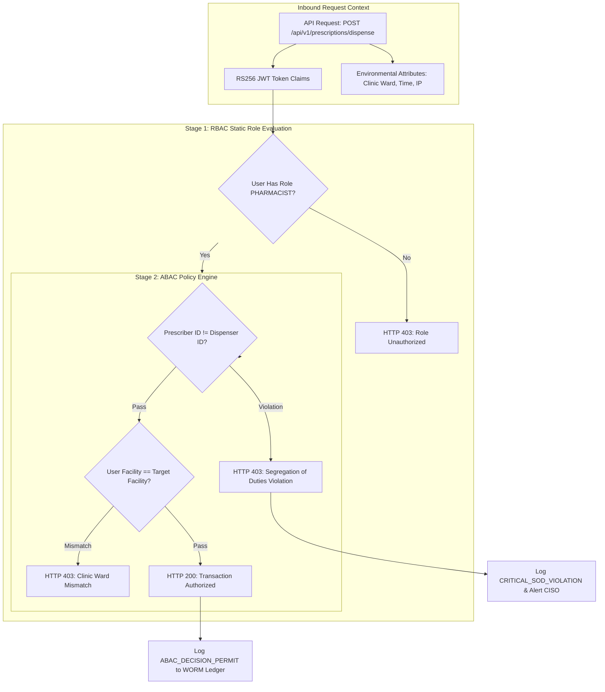

# Authorization, RBAC & Fine-Grained ABAC Policy Specification
## Namma Clinic Digital Health & Operations Platform
### Greater Bengaluru Authority (GBA) / BBMP Health Department
**Standard:** NIST SP 800-162 ABAC / Role-Based Access Control / DPDP Act 2023 | **Status:** APPROVED BASELINE | **Code:** `SEC-DOC-03`

---

## 1. Authorization Philosophy & Zero-Trust Access Control
Authorization within the Namma Clinic Platform is governed by an integrated dual-engine model combining **Role-Based Access Control (RBAC)** for broad functional capabilities with **Attribute-Based Access Control (ABAC)** for contextual, dynamic, and environmental enforcement. Access is denied by default; every mutation and query must possess verifiable capability claims satisfying both role assignments and operational context.

### 1.1 The 30 Canonical Platform Roles
The platform formally defines 30 specialized healthcare and administrative roles across municipal operations:

| Role ID | Role Code | Formal Role Title | Clinical Scope | Administrative Level |
| :--- | :--- | :--- | :--- | :--- |
| `ROLE-001` | `RECEPTIONIST` | **Receptionist / Registration Clerk** | Administrative / Governance | Clinic Ward Level |
| `ROLE-002` | `DOCTOR` | **Medical Officer / General Physician** | Clinical Direct | Clinic Ward Level |
| `ROLE-003` | `NURSE` | **Staff Nurse / Triage Specialist** | Clinical Direct | Clinic Ward Level |
| `ROLE-004` | `PHARMACIST` | **Pharmacist / Dispenser** | Clinical Direct | Clinic Ward Level |
| `ROLE-005` | `LAB_TECH` | **Laboratory Technician** | Clinical Direct | Clinic Ward Level |
| `ROLE-006` | `CLINIC_ADMIN` | **Clinic Administrative Officer** | Administrative / Governance | Clinic Ward Level |
| `ROLE-007` | `WARD_SUPERVISOR` | **Ward Health Supervisor** | Administrative / Governance | Zonal / Citywide |
| `ROLE-008` | `ZONAL_OFFICER` | **Zonal Health Officer (ZHO)** | Administrative / Governance | Zonal / Citywide |
| `ROLE-009` | `CHIEF_OFFICER` | **Chief Health Officer (CHO)** | Administrative / Governance | Zonal / Citywide |
| `ROLE-010` | `EPIDEMIOLOGIST` | **Epidemiologist / Disease Surveillance Officer** | Administrative / Governance | Clinic Ward Level |
| `ROLE-011` | `AUDITOR` | **Quality & Compliance Auditor** | Administrative / Governance | Clinic Ward Level |
| `ROLE-012` | `SECURITY_ADMIN` | **Security Administrator / CISO** | Administrative / Governance | Clinic Ward Level |
| `ROLE-013` | `DEPOT_MANAGER` | **Central Depot Inventory Manager** | Administrative / Governance | Clinic Ward Level |
| `ROLE-014` | `COLD_CHAIN_TECH` | **Cold Chain Logistics Technician** | Administrative / Governance | Clinic Ward Level |
| `ROLE-015` | `RADIOLOGIST` | **Radiologist / Diagnostic Specialist** | Administrative / Governance | Clinic Ward Level |
| `ROLE-016` | `AYUSH_DOC` | **Ayush Practitioner** | Clinical Direct | Clinic Ward Level |
| `ROLE-017` | `COUNSELOR` | **Counselor / Mental Health Worker** | Administrative / Governance | Clinic Ward Level |
| `ROLE-018` | `ANM_WORKER` | **ANM / Urban Health Worker** | Administrative / Governance | Clinic Ward Level |
| `ROLE-019` | `ASHA_COORD` | **ASHA Link Worker Coordinator** | Administrative / Governance | Clinic Ward Level |
| `ROLE-020` | `DATA_ENTRY` | **Data Entry Operator** | Administrative / Governance | Clinic Ward Level |
| `ROLE-021` | `GRIEVANCE_OFFICER` | **Grievance Redressal Officer** | Administrative / Governance | Clinic Ward Level |
| `ROLE-022` | `ABDM_OFFICER` | **ABDM National Integration Officer** | Administrative / Governance | Clinic Ward Level |
| `ROLE-023` | `PRIVACY_OFFICER` | **Data Protection Officer (DPO)** | Administrative / Governance | Clinic Ward Level |
| `ROLE-024` | `IT_SUPPORT` | **IT Support & Hardware Engineer** | Administrative / Governance | Clinic Ward Level |
| `ROLE-025` | `CLINICAL_AUDITOR` | **Clinical Audit Committee Member** | Administrative / Governance | Clinic Ward Level |
| `ROLE-026` | `PROCUREMENT_MGR` | **Procurement & Vendor Manager** | Administrative / Governance | Clinic Ward Level |
| `ROLE-027` | `WASTE_SUPERVISOR` | **Biomedical Waste Supervisor** | Administrative / Governance | Zonal / Citywide |
| `ROLE-028` | `TELE_SPECIALIST` | **Telemedicine Remote Specialist** | Administrative / Governance | Clinic Ward Level |
| `ROLE-029` | `HEALTH_INSPECTOR` | **Field Public Health Inspector** | Administrative / Governance | Clinic Ward Level |
| `ROLE-030` | `SUPER_ADMIN` | **Super Administrator** | Administrative / Governance | Zonal / Citywide |

### 1.2 Cryptographic Segregation of Duties (SOD-001)
A foundational clinical invariant of the platform is the absolute separation between medication prescription and dispensing:
1. **Prescribing Authority:** Restricted exclusively to Medical Officers (`ROLE-001`) and registered Specialists. Prescribing physicians cannot dispense medications from pharmacy stock.
2. **Dispensing Authority:** Restricted exclusively to Licensed Pharmacists (`ROLE-003`). Pharmacists cannot alter drug dosages, frequencies, or molecules prescribed by the physician.
3. **Cryptographic Enforcement:** The API Gateway validates that the dispenser ID in the session token does not match the prescriber ID on the prescription record (`dispenser.id != prescriber.id`).

### 1.3 RBAC Hierarchy & ABAC Decision Flow Diagram


## 2. Comprehensive RBAC Policies (RBAC-001 to RBAC-075)
The following 75 controls define the complete role-based permission catalog:

### RBAC-001
**Title:** RBAC Policy: Clinical Role Scoping for Receptionist / Registration Clerk (Rule 1)
**Control Type:** Preventive
**Security Domain:** Role-Based Access Control & Segregation of Duties
**Priority:** P0 - Critical
**Risk:** Critical
**Threat:** THREAT-004
**Asset:** TABLE-003 (auth_roles) and TABLE-004 (auth_user_roles)
**Actor:** Receptionist / Registration Clerk (Role Code: RECEPTIONIST)
**Precondition:** User authenticated with verified role claims in active session token
**Control Objective:** Enforce least privilege and separation of duties for clinical role scoping.
**Requirement:** The authorization engine shall restrict Receptionist / Registration Clerk strictly to verified permissions under RBAC-001.
**Implementation Guidance:** Enforce via NestJS Guard decorators and PostgreSQL Row-Level Security (RLS).
**Configuration Guidance:** Explicit deny-by-default; grant minimal required capability claims only.
**Failure Behavior:** Return HTTP 403 Forbidden; log authorization failure with actor and requested resource.
**Monitoring:** Alert on spikes in HTTP 403 responses by user or IP address.
**Audit Event:** RBAC_VIOLATION_RBAC_001
**Privacy Impact:** Prevents unauthorized snooping across patient clinic wards.
**Performance Impact:** RBAC evaluation overhead < 1ms via in-memory claim verification.
**Availability Impact:** Role claims embedded in signed JWT prevent gateway database bottleneck.
**Related Requirement:** SECR-001
**Related Workflow:** WF-001
**Related API:** API-001
**Related Database Entity:** TABLE-001 (auth_users)
**Related Architecture Component:** ARCH-CONT-004 (Identity & Access Gateway)
**Related Threat:** THREAT-004
**Related Test:** SEC-TEST-001
**Acceptance Criteria:** Assert HTTP 403 on any attempt to execute out-of-role mutation.
**Evidence Required:** Authorization matrix validation logs and automated RBAC test reports.
**Owner:** Chief Information Security Officer (CISO)
**Lifecycle:** Active Baseline Control
**Status:** PLANNED

### RBAC-002
**Title:** RBAC Policy: Prescription & Pharmacy Segregation of Duties for Medical Officer / General Physician (Rule 1)
**Control Type:** Preventive
**Security Domain:** Role-Based Access Control & Segregation of Duties
**Priority:** P0 - Critical
**Risk:** Critical
**Threat:** THREAT-007
**Asset:** TABLE-003 (auth_roles) and TABLE-004 (auth_user_roles)
**Actor:** Medical Officer / General Physician (Role Code: DOCTOR)
**Precondition:** User authenticated with verified role claims in active session token
**Control Objective:** Enforce least privilege and separation of duties for prescription & pharmacy segregation of duties.
**Requirement:** The authorization engine shall restrict Medical Officer / General Physician strictly to verified permissions under RBAC-002.
**Implementation Guidance:** Enforce via NestJS Guard decorators and PostgreSQL Row-Level Security (RLS).
**Configuration Guidance:** Explicit deny-by-default; grant minimal required capability claims only.
**Failure Behavior:** Return HTTP 403 Forbidden; log authorization failure with actor and requested resource.
**Monitoring:** Alert on spikes in HTTP 403 responses by user or IP address.
**Audit Event:** RBAC_VIOLATION_RBAC_002
**Privacy Impact:** Prevents unauthorized snooping across patient clinic wards.
**Performance Impact:** RBAC evaluation overhead < 1ms via in-memory claim verification.
**Availability Impact:** Role claims embedded in signed JWT prevent gateway database bottleneck.
**Related Requirement:** SECR-002
**Related Workflow:** WF-002
**Related API:** API-002
**Related Database Entity:** TABLE-002 (user_credentials)
**Related Architecture Component:** ARCH-CONT-004 (Identity & Access Gateway)
**Related Threat:** THREAT-007
**Related Test:** SEC-TEST-002
**Acceptance Criteria:** Assert HTTP 403 on any attempt to execute out-of-role mutation.
**Evidence Required:** Authorization matrix validation logs and automated RBAC test reports.
**Owner:** Chief Information Security Officer (CISO)
**Lifecycle:** Active Baseline Control
**Status:** PLANNED

### RBAC-003
**Title:** RBAC Policy: Laboratory & Diagnostics Privilege Isolation for Staff Nurse / Triage Specialist (Rule 1)
**Control Type:** Preventive
**Security Domain:** Role-Based Access Control & Segregation of Duties
**Priority:** P0 - Critical
**Risk:** Critical
**Threat:** THREAT-010
**Asset:** TABLE-003 (auth_roles) and TABLE-004 (auth_user_roles)
**Actor:** Staff Nurse / Triage Specialist (Role Code: NURSE)
**Precondition:** User authenticated with verified role claims in active session token
**Control Objective:** Enforce least privilege and separation of duties for laboratory & diagnostics privilege isolation.
**Requirement:** The authorization engine shall restrict Staff Nurse / Triage Specialist strictly to verified permissions under RBAC-003.
**Implementation Guidance:** Enforce via NestJS Guard decorators and PostgreSQL Row-Level Security (RLS).
**Configuration Guidance:** Explicit deny-by-default; grant minimal required capability claims only.
**Failure Behavior:** Return HTTP 403 Forbidden; log authorization failure with actor and requested resource.
**Monitoring:** Alert on spikes in HTTP 403 responses by user or IP address.
**Audit Event:** RBAC_VIOLATION_RBAC_003
**Privacy Impact:** Prevents unauthorized snooping across patient clinic wards.
**Performance Impact:** RBAC evaluation overhead < 1ms via in-memory claim verification.
**Availability Impact:** Role claims embedded in signed JWT prevent gateway database bottleneck.
**Related Requirement:** SECR-003
**Related Workflow:** WF-003
**Related API:** API-003
**Related Database Entity:** TABLE-003 (user_sessions)
**Related Architecture Component:** ARCH-CONT-004 (Identity & Access Gateway)
**Related Threat:** THREAT-010
**Related Test:** SEC-TEST-003
**Acceptance Criteria:** Assert HTTP 403 on any attempt to execute out-of-role mutation.
**Evidence Required:** Authorization matrix validation logs and automated RBAC test reports.
**Owner:** Chief Information Security Officer (CISO)
**Lifecycle:** Active Baseline Control
**Status:** PLANNED

### RBAC-004
**Title:** RBAC Policy: Administrative & System Permissions for Pharmacist / Dispenser (Rule 1)
**Control Type:** Preventive
**Security Domain:** Role-Based Access Control & Segregation of Duties
**Priority:** P0 - Critical
**Risk:** Critical
**Threat:** THREAT-013
**Asset:** TABLE-003 (auth_roles) and TABLE-004 (auth_user_roles)
**Actor:** Pharmacist / Dispenser (Role Code: PHARMACIST)
**Precondition:** User authenticated with verified role claims in active session token
**Control Objective:** Enforce least privilege and separation of duties for administrative & system permissions.
**Requirement:** The authorization engine shall restrict Pharmacist / Dispenser strictly to verified permissions under RBAC-004.
**Implementation Guidance:** Enforce via NestJS Guard decorators and PostgreSQL Row-Level Security (RLS).
**Configuration Guidance:** Explicit deny-by-default; grant minimal required capability claims only.
**Failure Behavior:** Return HTTP 403 Forbidden; log authorization failure with actor and requested resource.
**Monitoring:** Alert on spikes in HTTP 403 responses by user or IP address.
**Audit Event:** RBAC_VIOLATION_RBAC_004
**Privacy Impact:** Prevents unauthorized snooping across patient clinic wards.
**Performance Impact:** RBAC evaluation overhead < 1ms via in-memory claim verification.
**Availability Impact:** Role claims embedded in signed JWT prevent gateway database bottleneck.
**Related Requirement:** SECR-004
**Related Workflow:** WF-004
**Related API:** API-004
**Related Database Entity:** TABLE-004 (roles)
**Related Architecture Component:** ARCH-CONT-004 (Identity & Access Gateway)
**Related Threat:** THREAT-013
**Related Test:** SEC-TEST-004
**Acceptance Criteria:** Assert HTTP 403 on any attempt to execute out-of-role mutation.
**Evidence Required:** Authorization matrix validation logs and automated RBAC test reports.
**Owner:** Chief Information Security Officer (CISO)
**Lifecycle:** Active Baseline Control
**Status:** PLANNED

### RBAC-005
**Title:** RBAC Policy: Data Protection & Privacy Officer Access for Laboratory Technician (Rule 1)
**Control Type:** Preventive
**Security Domain:** Role-Based Access Control & Segregation of Duties
**Priority:** P0 - Critical
**Risk:** Critical
**Threat:** THREAT-016
**Asset:** TABLE-003 (auth_roles) and TABLE-004 (auth_user_roles)
**Actor:** Laboratory Technician (Role Code: LAB_TECH)
**Precondition:** User authenticated with verified role claims in active session token
**Control Objective:** Enforce least privilege and separation of duties for data protection & privacy officer access.
**Requirement:** The authorization engine shall restrict Laboratory Technician strictly to verified permissions under RBAC-005.
**Implementation Guidance:** Enforce via NestJS Guard decorators and PostgreSQL Row-Level Security (RLS).
**Configuration Guidance:** Explicit deny-by-default; grant minimal required capability claims only.
**Failure Behavior:** Return HTTP 403 Forbidden; log authorization failure with actor and requested resource.
**Monitoring:** Alert on spikes in HTTP 403 responses by user or IP address.
**Audit Event:** RBAC_VIOLATION_RBAC_005
**Privacy Impact:** Prevents unauthorized snooping across patient clinic wards.
**Performance Impact:** RBAC evaluation overhead < 1ms via in-memory claim verification.
**Availability Impact:** Role claims embedded in signed JWT prevent gateway database bottleneck.
**Related Requirement:** SECR-005
**Related Workflow:** WF-005
**Related API:** API-005
**Related Database Entity:** TABLE-005 (permissions)
**Related Architecture Component:** ARCH-CONT-004 (Identity & Access Gateway)
**Related Threat:** THREAT-016
**Related Test:** SEC-TEST-005
**Acceptance Criteria:** Assert HTTP 403 on any attempt to execute out-of-role mutation.
**Evidence Required:** Authorization matrix validation logs and automated RBAC test reports.
**Owner:** Chief Information Security Officer (CISO)
**Lifecycle:** Active Baseline Control
**Status:** PLANNED

### RBAC-006
**Title:** RBAC Policy: Inventory & Warehouse Stock Authorizations for Clinic Administrative Officer (Rule 1)
**Control Type:** Preventive
**Security Domain:** Role-Based Access Control & Segregation of Duties
**Priority:** P0 - Critical
**Risk:** Critical
**Threat:** THREAT-019
**Asset:** TABLE-003 (auth_roles) and TABLE-004 (auth_user_roles)
**Actor:** Clinic Administrative Officer (Role Code: CLINIC_ADMIN)
**Precondition:** User authenticated with verified role claims in active session token
**Control Objective:** Enforce least privilege and separation of duties for inventory & warehouse stock authorizations.
**Requirement:** The authorization engine shall restrict Clinic Administrative Officer strictly to verified permissions under RBAC-006.
**Implementation Guidance:** Enforce via NestJS Guard decorators and PostgreSQL Row-Level Security (RLS).
**Configuration Guidance:** Explicit deny-by-default; grant minimal required capability claims only.
**Failure Behavior:** Return HTTP 403 Forbidden; log authorization failure with actor and requested resource.
**Monitoring:** Alert on spikes in HTTP 403 responses by user or IP address.
**Audit Event:** RBAC_VIOLATION_RBAC_006
**Privacy Impact:** Prevents unauthorized snooping across patient clinic wards.
**Performance Impact:** RBAC evaluation overhead < 1ms via in-memory claim verification.
**Availability Impact:** Role claims embedded in signed JWT prevent gateway database bottleneck.
**Related Requirement:** SECR-006
**Related Workflow:** WF-006
**Related API:** API-006
**Related Database Entity:** TABLE-006 (role_permissions)
**Related Architecture Component:** ARCH-CONT-004 (Identity & Access Gateway)
**Related Threat:** THREAT-019
**Related Test:** SEC-TEST-006
**Acceptance Criteria:** Assert HTTP 403 on any attempt to execute out-of-role mutation.
**Evidence Required:** Authorization matrix validation logs and automated RBAC test reports.
**Owner:** Chief Information Security Officer (CISO)
**Lifecycle:** Active Baseline Control
**Status:** PLANNED

### RBAC-007
**Title:** RBAC Policy: Zonal & Ward Supervisory Boundaries for Ward Health Supervisor (Rule 1)
**Control Type:** Preventive
**Security Domain:** Role-Based Access Control & Segregation of Duties
**Priority:** P0 - Critical
**Risk:** Critical
**Threat:** THREAT-022
**Asset:** TABLE-003 (auth_roles) and TABLE-004 (auth_user_roles)
**Actor:** Ward Health Supervisor (Role Code: WARD_SUPERVISOR)
**Precondition:** User authenticated with verified role claims in active session token
**Control Objective:** Enforce least privilege and separation of duties for zonal & ward supervisory boundaries.
**Requirement:** The authorization engine shall restrict Ward Health Supervisor strictly to verified permissions under RBAC-007.
**Implementation Guidance:** Enforce via NestJS Guard decorators and PostgreSQL Row-Level Security (RLS).
**Configuration Guidance:** Explicit deny-by-default; grant minimal required capability claims only.
**Failure Behavior:** Return HTTP 403 Forbidden; log authorization failure with actor and requested resource.
**Monitoring:** Alert on spikes in HTTP 403 responses by user or IP address.
**Audit Event:** RBAC_VIOLATION_RBAC_007
**Privacy Impact:** Prevents unauthorized snooping across patient clinic wards.
**Performance Impact:** RBAC evaluation overhead < 1ms via in-memory claim verification.
**Availability Impact:** Role claims embedded in signed JWT prevent gateway database bottleneck.
**Related Requirement:** SECR-007
**Related Workflow:** WF-007
**Related API:** API-007
**Related Database Entity:** TABLE-007 (user_roles)
**Related Architecture Component:** ARCH-CONT-004 (Identity & Access Gateway)
**Related Threat:** THREAT-022
**Related Test:** SEC-TEST-007
**Acceptance Criteria:** Assert HTTP 403 on any attempt to execute out-of-role mutation.
**Evidence Required:** Authorization matrix validation logs and automated RBAC test reports.
**Owner:** Chief Information Security Officer (CISO)
**Lifecycle:** Active Baseline Control
**Status:** PLANNED

### RBAC-008
**Title:** RBAC Policy: Emergency Break-Glass Clinical Authorizations for Zonal Health Officer (ZHO) (Rule 1)
**Control Type:** Preventive
**Security Domain:** Role-Based Access Control & Segregation of Duties
**Priority:** P0 - Critical
**Risk:** Critical
**Threat:** THREAT-025
**Asset:** TABLE-003 (auth_roles) and TABLE-004 (auth_user_roles)
**Actor:** Zonal Health Officer (ZHO) (Role Code: ZONAL_OFFICER)
**Precondition:** User authenticated with verified role claims in active session token
**Control Objective:** Enforce least privilege and separation of duties for emergency break-glass clinical authorizations.
**Requirement:** The authorization engine shall restrict Zonal Health Officer (ZHO) strictly to verified permissions under RBAC-008.
**Implementation Guidance:** Enforce via NestJS Guard decorators and PostgreSQL Row-Level Security (RLS).
**Configuration Guidance:** Explicit deny-by-default; grant minimal required capability claims only.
**Failure Behavior:** Return HTTP 403 Forbidden; log authorization failure with actor and requested resource.
**Monitoring:** Alert on spikes in HTTP 403 responses by user or IP address.
**Audit Event:** RBAC_VIOLATION_RBAC_008
**Privacy Impact:** Prevents unauthorized snooping across patient clinic wards.
**Performance Impact:** RBAC evaluation overhead < 1ms via in-memory claim verification.
**Availability Impact:** Role claims embedded in signed JWT prevent gateway database bottleneck.
**Related Requirement:** SECR-008
**Related Workflow:** WF-008
**Related API:** API-008
**Related Database Entity:** TABLE-008 (facilities)
**Related Architecture Component:** ARCH-CONT-004 (Identity & Access Gateway)
**Related Threat:** THREAT-025
**Related Test:** SEC-TEST-008
**Acceptance Criteria:** Assert HTTP 403 on any attempt to execute out-of-role mutation.
**Evidence Required:** Authorization matrix validation logs and automated RBAC test reports.
**Owner:** Chief Information Security Officer (CISO)
**Lifecycle:** Active Baseline Control
**Status:** PLANNED

### RBAC-009
**Title:** RBAC Policy: Audit & Quality Inspection Permissions for Chief Health Officer (CHO) (Rule 1)
**Control Type:** Preventive
**Security Domain:** Role-Based Access Control & Segregation of Duties
**Priority:** P0 - Critical
**Risk:** Critical
**Threat:** THREAT-028
**Asset:** TABLE-003 (auth_roles) and TABLE-004 (auth_user_roles)
**Actor:** Chief Health Officer (CHO) (Role Code: CHIEF_OFFICER)
**Precondition:** User authenticated with verified role claims in active session token
**Control Objective:** Enforce least privilege and separation of duties for audit & quality inspection permissions.
**Requirement:** The authorization engine shall restrict Chief Health Officer (CHO) strictly to verified permissions under RBAC-009.
**Implementation Guidance:** Enforce via NestJS Guard decorators and PostgreSQL Row-Level Security (RLS).
**Configuration Guidance:** Explicit deny-by-default; grant minimal required capability claims only.
**Failure Behavior:** Return HTTP 403 Forbidden; log authorization failure with actor and requested resource.
**Monitoring:** Alert on spikes in HTTP 403 responses by user or IP address.
**Audit Event:** RBAC_VIOLATION_RBAC_009
**Privacy Impact:** Prevents unauthorized snooping across patient clinic wards.
**Performance Impact:** RBAC evaluation overhead < 1ms via in-memory claim verification.
**Availability Impact:** Role claims embedded in signed JWT prevent gateway database bottleneck.
**Related Requirement:** SECR-009
**Related Workflow:** WF-009
**Related API:** API-009
**Related Database Entity:** TABLE-009 (facility_rooms)
**Related Architecture Component:** ARCH-CONT-004 (Identity & Access Gateway)
**Related Threat:** THREAT-028
**Related Test:** SEC-TEST-009
**Acceptance Criteria:** Assert HTTP 403 on any attempt to execute out-of-role mutation.
**Evidence Required:** Authorization matrix validation logs and automated RBAC test reports.
**Owner:** Chief Information Security Officer (CISO)
**Lifecycle:** Active Baseline Control
**Status:** PLANNED

### RBAC-010
**Title:** RBAC Policy: Cross-Facility Read/Write Restrictions for Epidemiologist / Disease Surveillance Officer (Rule 1)
**Control Type:** Preventive
**Security Domain:** Role-Based Access Control & Segregation of Duties
**Priority:** P0 - Critical
**Risk:** Critical
**Threat:** THREAT-031
**Asset:** TABLE-003 (auth_roles) and TABLE-004 (auth_user_roles)
**Actor:** Epidemiologist / Disease Surveillance Officer (Role Code: EPIDEMIOLOGIST)
**Precondition:** User authenticated with verified role claims in active session token
**Control Objective:** Enforce least privilege and separation of duties for cross-facility read/write restrictions.
**Requirement:** The authorization engine shall restrict Epidemiologist / Disease Surveillance Officer strictly to verified permissions under RBAC-010.
**Implementation Guidance:** Enforce via NestJS Guard decorators and PostgreSQL Row-Level Security (RLS).
**Configuration Guidance:** Explicit deny-by-default; grant minimal required capability claims only.
**Failure Behavior:** Return HTTP 403 Forbidden; log authorization failure with actor and requested resource.
**Monitoring:** Alert on spikes in HTTP 403 responses by user or IP address.
**Audit Event:** RBAC_VIOLATION_RBAC_010
**Privacy Impact:** Prevents unauthorized snooping across patient clinic wards.
**Performance Impact:** RBAC evaluation overhead < 1ms via in-memory claim verification.
**Availability Impact:** Role claims embedded in signed JWT prevent gateway database bottleneck.
**Related Requirement:** SECR-010
**Related Workflow:** WF-010
**Related API:** API-010
**Related Database Entity:** TABLE-010 (staff_profiles)
**Related Architecture Component:** ARCH-CONT-004 (Identity & Access Gateway)
**Related Threat:** THREAT-031
**Related Test:** SEC-TEST-010
**Acceptance Criteria:** Assert HTTP 403 on any attempt to execute out-of-role mutation.
**Evidence Required:** Authorization matrix validation logs and automated RBAC test reports.
**Owner:** Chief Information Security Officer (CISO)
**Lifecycle:** Active Baseline Control
**Status:** PLANNED

### RBAC-011
**Title:** RBAC Policy: Clinical Role Scoping for Quality & Compliance Auditor (Rule 2)
**Control Type:** Preventive
**Security Domain:** Role-Based Access Control & Segregation of Duties
**Priority:** P0 - Critical
**Risk:** Critical
**Threat:** THREAT-034
**Asset:** TABLE-003 (auth_roles) and TABLE-004 (auth_user_roles)
**Actor:** Quality & Compliance Auditor (Role Code: AUDITOR)
**Precondition:** User authenticated with verified role claims in active session token
**Control Objective:** Enforce least privilege and separation of duties for clinical role scoping.
**Requirement:** The authorization engine shall restrict Quality & Compliance Auditor strictly to verified permissions under RBAC-011.
**Implementation Guidance:** Enforce via NestJS Guard decorators and PostgreSQL Row-Level Security (RLS).
**Configuration Guidance:** Explicit deny-by-default; grant minimal required capability claims only.
**Failure Behavior:** Return HTTP 403 Forbidden; log authorization failure with actor and requested resource.
**Monitoring:** Alert on spikes in HTTP 403 responses by user or IP address.
**Audit Event:** RBAC_VIOLATION_RBAC_011
**Privacy Impact:** Prevents unauthorized snooping across patient clinic wards.
**Performance Impact:** RBAC evaluation overhead < 1ms via in-memory claim verification.
**Availability Impact:** Role claims embedded in signed JWT prevent gateway database bottleneck.
**Related Requirement:** SECR-011
**Related Workflow:** WF-011
**Related API:** API-011
**Related Database Entity:** TABLE-011 (staff_shifts)
**Related Architecture Component:** ARCH-CONT-004 (Identity & Access Gateway)
**Related Threat:** THREAT-034
**Related Test:** SEC-TEST-011
**Acceptance Criteria:** Assert HTTP 403 on any attempt to execute out-of-role mutation.
**Evidence Required:** Authorization matrix validation logs and automated RBAC test reports.
**Owner:** Chief Information Security Officer (CISO)
**Lifecycle:** Active Baseline Control
**Status:** PLANNED

### RBAC-012
**Title:** RBAC Policy: Prescription & Pharmacy Segregation of Duties for Security Administrator / CISO (Rule 2)
**Control Type:** Preventive
**Security Domain:** Role-Based Access Control & Segregation of Duties
**Priority:** P0 - Critical
**Risk:** Critical
**Threat:** THREAT-037
**Asset:** TABLE-003 (auth_roles) and TABLE-004 (auth_user_roles)
**Actor:** Security Administrator / CISO (Role Code: SECURITY_ADMIN)
**Precondition:** User authenticated with verified role claims in active session token
**Control Objective:** Enforce least privilege and separation of duties for prescription & pharmacy segregation of duties.
**Requirement:** The authorization engine shall restrict Security Administrator / CISO strictly to verified permissions under RBAC-012.
**Implementation Guidance:** Enforce via NestJS Guard decorators and PostgreSQL Row-Level Security (RLS).
**Configuration Guidance:** Explicit deny-by-default; grant minimal required capability claims only.
**Failure Behavior:** Return HTTP 403 Forbidden; log authorization failure with actor and requested resource.
**Monitoring:** Alert on spikes in HTTP 403 responses by user or IP address.
**Audit Event:** RBAC_VIOLATION_RBAC_012
**Privacy Impact:** Prevents unauthorized snooping across patient clinic wards.
**Performance Impact:** RBAC evaluation overhead < 1ms via in-memory claim verification.
**Availability Impact:** Role claims embedded in signed JWT prevent gateway database bottleneck.
**Related Requirement:** SECR-012
**Related Workflow:** WF-012
**Related API:** API-012
**Related Database Entity:** TABLE-012 (system_configs)
**Related Architecture Component:** ARCH-CONT-004 (Identity & Access Gateway)
**Related Threat:** THREAT-037
**Related Test:** SEC-TEST-012
**Acceptance Criteria:** Assert HTTP 403 on any attempt to execute out-of-role mutation.
**Evidence Required:** Authorization matrix validation logs and automated RBAC test reports.
**Owner:** Chief Information Security Officer (CISO)
**Lifecycle:** Active Baseline Control
**Status:** PLANNED

### RBAC-013
**Title:** RBAC Policy: Laboratory & Diagnostics Privilege Isolation for Central Depot Inventory Manager (Rule 2)
**Control Type:** Preventive
**Security Domain:** Role-Based Access Control & Segregation of Duties
**Priority:** P0 - Critical
**Risk:** Critical
**Threat:** THREAT-040
**Asset:** TABLE-003 (auth_roles) and TABLE-004 (auth_user_roles)
**Actor:** Central Depot Inventory Manager (Role Code: DEPOT_MANAGER)
**Precondition:** User authenticated with verified role claims in active session token
**Control Objective:** Enforce least privilege and separation of duties for laboratory & diagnostics privilege isolation.
**Requirement:** The authorization engine shall restrict Central Depot Inventory Manager strictly to verified permissions under RBAC-013.
**Implementation Guidance:** Enforce via NestJS Guard decorators and PostgreSQL Row-Level Security (RLS).
**Configuration Guidance:** Explicit deny-by-default; grant minimal required capability claims only.
**Failure Behavior:** Return HTTP 403 Forbidden; log authorization failure with actor and requested resource.
**Monitoring:** Alert on spikes in HTTP 403 responses by user or IP address.
**Audit Event:** RBAC_VIOLATION_RBAC_013
**Privacy Impact:** Prevents unauthorized snooping across patient clinic wards.
**Performance Impact:** RBAC evaluation overhead < 1ms via in-memory claim verification.
**Availability Impact:** Role claims embedded in signed JWT prevent gateway database bottleneck.
**Related Requirement:** SECR-013
**Related Workflow:** WF-013
**Related API:** API-013
**Related Database Entity:** TABLE-013 (patients)
**Related Architecture Component:** ARCH-CONT-004 (Identity & Access Gateway)
**Related Threat:** THREAT-040
**Related Test:** SEC-TEST-013
**Acceptance Criteria:** Assert HTTP 403 on any attempt to execute out-of-role mutation.
**Evidence Required:** Authorization matrix validation logs and automated RBAC test reports.
**Owner:** Chief Information Security Officer (CISO)
**Lifecycle:** Active Baseline Control
**Status:** PLANNED

### RBAC-014
**Title:** RBAC Policy: Administrative & System Permissions for Cold Chain Logistics Technician (Rule 2)
**Control Type:** Preventive
**Security Domain:** Role-Based Access Control & Segregation of Duties
**Priority:** P0 - Critical
**Risk:** Critical
**Threat:** THREAT-043
**Asset:** TABLE-003 (auth_roles) and TABLE-004 (auth_user_roles)
**Actor:** Cold Chain Logistics Technician (Role Code: COLD_CHAIN_TECH)
**Precondition:** User authenticated with verified role claims in active session token
**Control Objective:** Enforce least privilege and separation of duties for administrative & system permissions.
**Requirement:** The authorization engine shall restrict Cold Chain Logistics Technician strictly to verified permissions under RBAC-014.
**Implementation Guidance:** Enforce via NestJS Guard decorators and PostgreSQL Row-Level Security (RLS).
**Configuration Guidance:** Explicit deny-by-default; grant minimal required capability claims only.
**Failure Behavior:** Return HTTP 403 Forbidden; log authorization failure with actor and requested resource.
**Monitoring:** Alert on spikes in HTTP 403 responses by user or IP address.
**Audit Event:** RBAC_VIOLATION_RBAC_014
**Privacy Impact:** Prevents unauthorized snooping across patient clinic wards.
**Performance Impact:** RBAC evaluation overhead < 1ms via in-memory claim verification.
**Availability Impact:** Role claims embedded in signed JWT prevent gateway database bottleneck.
**Related Requirement:** SECR-014
**Related Workflow:** WF-014
**Related API:** API-014
**Related Database Entity:** TABLE-014 (patient_identifiers)
**Related Architecture Component:** ARCH-CONT-004 (Identity & Access Gateway)
**Related Threat:** THREAT-043
**Related Test:** SEC-TEST-014
**Acceptance Criteria:** Assert HTTP 403 on any attempt to execute out-of-role mutation.
**Evidence Required:** Authorization matrix validation logs and automated RBAC test reports.
**Owner:** Chief Information Security Officer (CISO)
**Lifecycle:** Active Baseline Control
**Status:** PLANNED

### RBAC-015
**Title:** RBAC Policy: Data Protection & Privacy Officer Access for Radiologist / Diagnostic Specialist (Rule 2)
**Control Type:** Preventive
**Security Domain:** Role-Based Access Control & Segregation of Duties
**Priority:** P0 - Critical
**Risk:** Critical
**Threat:** THREAT-046
**Asset:** TABLE-003 (auth_roles) and TABLE-004 (auth_user_roles)
**Actor:** Radiologist / Diagnostic Specialist (Role Code: RADIOLOGIST)
**Precondition:** User authenticated with verified role claims in active session token
**Control Objective:** Enforce least privilege and separation of duties for data protection & privacy officer access.
**Requirement:** The authorization engine shall restrict Radiologist / Diagnostic Specialist strictly to verified permissions under RBAC-015.
**Implementation Guidance:** Enforce via NestJS Guard decorators and PostgreSQL Row-Level Security (RLS).
**Configuration Guidance:** Explicit deny-by-default; grant minimal required capability claims only.
**Failure Behavior:** Return HTTP 403 Forbidden; log authorization failure with actor and requested resource.
**Monitoring:** Alert on spikes in HTTP 403 responses by user or IP address.
**Audit Event:** RBAC_VIOLATION_RBAC_015
**Privacy Impact:** Prevents unauthorized snooping across patient clinic wards.
**Performance Impact:** RBAC evaluation overhead < 1ms via in-memory claim verification.
**Availability Impact:** Role claims embedded in signed JWT prevent gateway database bottleneck.
**Related Requirement:** SECR-015
**Related Workflow:** WF-015
**Related API:** API-015
**Related Database Entity:** TABLE-015 (patient_contacts)
**Related Architecture Component:** ARCH-CONT-004 (Identity & Access Gateway)
**Related Threat:** THREAT-046
**Related Test:** SEC-TEST-015
**Acceptance Criteria:** Assert HTTP 403 on any attempt to execute out-of-role mutation.
**Evidence Required:** Authorization matrix validation logs and automated RBAC test reports.
**Owner:** Chief Information Security Officer (CISO)
**Lifecycle:** Active Baseline Control
**Status:** PLANNED

### RBAC-016
**Title:** RBAC Policy: Inventory & Warehouse Stock Authorizations for Ayush Practitioner (Rule 2)
**Control Type:** Preventive
**Security Domain:** Role-Based Access Control & Segregation of Duties
**Priority:** P0 - Critical
**Risk:** Critical
**Threat:** THREAT-049
**Asset:** TABLE-003 (auth_roles) and TABLE-004 (auth_user_roles)
**Actor:** Ayush Practitioner (Role Code: AYUSH_DOC)
**Precondition:** User authenticated with verified role claims in active session token
**Control Objective:** Enforce least privilege and separation of duties for inventory & warehouse stock authorizations.
**Requirement:** The authorization engine shall restrict Ayush Practitioner strictly to verified permissions under RBAC-016.
**Implementation Guidance:** Enforce via NestJS Guard decorators and PostgreSQL Row-Level Security (RLS).
**Configuration Guidance:** Explicit deny-by-default; grant minimal required capability claims only.
**Failure Behavior:** Return HTTP 403 Forbidden; log authorization failure with actor and requested resource.
**Monitoring:** Alert on spikes in HTTP 403 responses by user or IP address.
**Audit Event:** RBAC_VIOLATION_RBAC_016
**Privacy Impact:** Prevents unauthorized snooping across patient clinic wards.
**Performance Impact:** RBAC evaluation overhead < 1ms via in-memory claim verification.
**Availability Impact:** Role claims embedded in signed JWT prevent gateway database bottleneck.
**Related Requirement:** SECR-016
**Related Workflow:** WF-016
**Related API:** API-016
**Related Database Entity:** TABLE-016 (patient_addresses)
**Related Architecture Component:** ARCH-CONT-004 (Identity & Access Gateway)
**Related Threat:** THREAT-049
**Related Test:** SEC-TEST-016
**Acceptance Criteria:** Assert HTTP 403 on any attempt to execute out-of-role mutation.
**Evidence Required:** Authorization matrix validation logs and automated RBAC test reports.
**Owner:** Chief Information Security Officer (CISO)
**Lifecycle:** Active Baseline Control
**Status:** PLANNED

### RBAC-017
**Title:** RBAC Policy: Zonal & Ward Supervisory Boundaries for Counselor / Mental Health Worker (Rule 2)
**Control Type:** Preventive
**Security Domain:** Role-Based Access Control & Segregation of Duties
**Priority:** P0 - Critical
**Risk:** Critical
**Threat:** THREAT-052
**Asset:** TABLE-003 (auth_roles) and TABLE-004 (auth_user_roles)
**Actor:** Counselor / Mental Health Worker (Role Code: COUNSELOR)
**Precondition:** User authenticated with verified role claims in active session token
**Control Objective:** Enforce least privilege and separation of duties for zonal & ward supervisory boundaries.
**Requirement:** The authorization engine shall restrict Counselor / Mental Health Worker strictly to verified permissions under RBAC-017.
**Implementation Guidance:** Enforce via NestJS Guard decorators and PostgreSQL Row-Level Security (RLS).
**Configuration Guidance:** Explicit deny-by-default; grant minimal required capability claims only.
**Failure Behavior:** Return HTTP 403 Forbidden; log authorization failure with actor and requested resource.
**Monitoring:** Alert on spikes in HTTP 403 responses by user or IP address.
**Audit Event:** RBAC_VIOLATION_RBAC_017
**Privacy Impact:** Prevents unauthorized snooping across patient clinic wards.
**Performance Impact:** RBAC evaluation overhead < 1ms via in-memory claim verification.
**Availability Impact:** Role claims embedded in signed JWT prevent gateway database bottleneck.
**Related Requirement:** SECR-017
**Related Workflow:** WF-017
**Related API:** API-017
**Related Database Entity:** TABLE-017 (consent_records)
**Related Architecture Component:** ARCH-CONT-004 (Identity & Access Gateway)
**Related Threat:** THREAT-052
**Related Test:** SEC-TEST-017
**Acceptance Criteria:** Assert HTTP 403 on any attempt to execute out-of-role mutation.
**Evidence Required:** Authorization matrix validation logs and automated RBAC test reports.
**Owner:** Chief Information Security Officer (CISO)
**Lifecycle:** Active Baseline Control
**Status:** PLANNED

### RBAC-018
**Title:** RBAC Policy: Emergency Break-Glass Clinical Authorizations for ANM / Urban Health Worker (Rule 2)
**Control Type:** Preventive
**Security Domain:** Role-Based Access Control & Segregation of Duties
**Priority:** P0 - Critical
**Risk:** Critical
**Threat:** THREAT-055
**Asset:** TABLE-003 (auth_roles) and TABLE-004 (auth_user_roles)
**Actor:** ANM / Urban Health Worker (Role Code: ANM_WORKER)
**Precondition:** User authenticated with verified role claims in active session token
**Control Objective:** Enforce least privilege and separation of duties for emergency break-glass clinical authorizations.
**Requirement:** The authorization engine shall restrict ANM / Urban Health Worker strictly to verified permissions under RBAC-018.
**Implementation Guidance:** Enforce via NestJS Guard decorators and PostgreSQL Row-Level Security (RLS).
**Configuration Guidance:** Explicit deny-by-default; grant minimal required capability claims only.
**Failure Behavior:** Return HTTP 403 Forbidden; log authorization failure with actor and requested resource.
**Monitoring:** Alert on spikes in HTTP 403 responses by user or IP address.
**Audit Event:** RBAC_VIOLATION_RBAC_018
**Privacy Impact:** Prevents unauthorized snooping across patient clinic wards.
**Performance Impact:** RBAC evaluation overhead < 1ms via in-memory claim verification.
**Availability Impact:** Role claims embedded in signed JWT prevent gateway database bottleneck.
**Related Requirement:** SECR-018
**Related Workflow:** WF-018
**Related API:** API-018
**Related Database Entity:** TABLE-018 (tokens)
**Related Architecture Component:** ARCH-CONT-004 (Identity & Access Gateway)
**Related Threat:** THREAT-055
**Related Test:** SEC-TEST-018
**Acceptance Criteria:** Assert HTTP 403 on any attempt to execute out-of-role mutation.
**Evidence Required:** Authorization matrix validation logs and automated RBAC test reports.
**Owner:** Chief Information Security Officer (CISO)
**Lifecycle:** Active Baseline Control
**Status:** PLANNED

### RBAC-019
**Title:** RBAC Policy: Audit & Quality Inspection Permissions for ASHA Link Worker Coordinator (Rule 2)
**Control Type:** Preventive
**Security Domain:** Role-Based Access Control & Segregation of Duties
**Priority:** P0 - Critical
**Risk:** Critical
**Threat:** THREAT-058
**Asset:** TABLE-003 (auth_roles) and TABLE-004 (auth_user_roles)
**Actor:** ASHA Link Worker Coordinator (Role Code: ASHA_COORD)
**Precondition:** User authenticated with verified role claims in active session token
**Control Objective:** Enforce least privilege and separation of duties for audit & quality inspection permissions.
**Requirement:** The authorization engine shall restrict ASHA Link Worker Coordinator strictly to verified permissions under RBAC-019.
**Implementation Guidance:** Enforce via NestJS Guard decorators and PostgreSQL Row-Level Security (RLS).
**Configuration Guidance:** Explicit deny-by-default; grant minimal required capability claims only.
**Failure Behavior:** Return HTTP 403 Forbidden; log authorization failure with actor and requested resource.
**Monitoring:** Alert on spikes in HTTP 403 responses by user or IP address.
**Audit Event:** RBAC_VIOLATION_RBAC_019
**Privacy Impact:** Prevents unauthorized snooping across patient clinic wards.
**Performance Impact:** RBAC evaluation overhead < 1ms via in-memory claim verification.
**Availability Impact:** Role claims embedded in signed JWT prevent gateway database bottleneck.
**Related Requirement:** SECR-019
**Related Workflow:** WF-019
**Related API:** API-019
**Related Database Entity:** TABLE-019 (queue_entries)
**Related Architecture Component:** ARCH-CONT-004 (Identity & Access Gateway)
**Related Threat:** THREAT-058
**Related Test:** SEC-TEST-019
**Acceptance Criteria:** Assert HTTP 403 on any attempt to execute out-of-role mutation.
**Evidence Required:** Authorization matrix validation logs and automated RBAC test reports.
**Owner:** Chief Information Security Officer (CISO)
**Lifecycle:** Active Baseline Control
**Status:** PLANNED

### RBAC-020
**Title:** RBAC Policy: Cross-Facility Read/Write Restrictions for Data Entry Operator (Rule 2)
**Control Type:** Preventive
**Security Domain:** Role-Based Access Control & Segregation of Duties
**Priority:** P0 - Critical
**Risk:** Critical
**Threat:** THREAT-061
**Asset:** TABLE-003 (auth_roles) and TABLE-004 (auth_user_roles)
**Actor:** Data Entry Operator (Role Code: DATA_ENTRY)
**Precondition:** User authenticated with verified role claims in active session token
**Control Objective:** Enforce least privilege and separation of duties for cross-facility read/write restrictions.
**Requirement:** The authorization engine shall restrict Data Entry Operator strictly to verified permissions under RBAC-020.
**Implementation Guidance:** Enforce via NestJS Guard decorators and PostgreSQL Row-Level Security (RLS).
**Configuration Guidance:** Explicit deny-by-default; grant minimal required capability claims only.
**Failure Behavior:** Return HTTP 403 Forbidden; log authorization failure with actor and requested resource.
**Monitoring:** Alert on spikes in HTTP 403 responses by user or IP address.
**Audit Event:** RBAC_VIOLATION_RBAC_020
**Privacy Impact:** Prevents unauthorized snooping across patient clinic wards.
**Performance Impact:** RBAC evaluation overhead < 1ms via in-memory claim verification.
**Availability Impact:** Role claims embedded in signed JWT prevent gateway database bottleneck.
**Related Requirement:** SECR-020
**Related Workflow:** WF-020
**Related API:** API-020
**Related Database Entity:** TABLE-020 (triage_assessments)
**Related Architecture Component:** ARCH-CONT-004 (Identity & Access Gateway)
**Related Threat:** THREAT-061
**Related Test:** SEC-TEST-020
**Acceptance Criteria:** Assert HTTP 403 on any attempt to execute out-of-role mutation.
**Evidence Required:** Authorization matrix validation logs and automated RBAC test reports.
**Owner:** Chief Information Security Officer (CISO)
**Lifecycle:** Active Baseline Control
**Status:** PLANNED

### RBAC-021
**Title:** RBAC Policy: Clinical Role Scoping for Grievance Redressal Officer (Rule 3)
**Control Type:** Preventive
**Security Domain:** Role-Based Access Control & Segregation of Duties
**Priority:** P0 - Critical
**Risk:** Critical
**Threat:** THREAT-064
**Asset:** TABLE-003 (auth_roles) and TABLE-004 (auth_user_roles)
**Actor:** Grievance Redressal Officer (Role Code: GRIEVANCE_OFFICER)
**Precondition:** User authenticated with verified role claims in active session token
**Control Objective:** Enforce least privilege and separation of duties for clinical role scoping.
**Requirement:** The authorization engine shall restrict Grievance Redressal Officer strictly to verified permissions under RBAC-021.
**Implementation Guidance:** Enforce via NestJS Guard decorators and PostgreSQL Row-Level Security (RLS).
**Configuration Guidance:** Explicit deny-by-default; grant minimal required capability claims only.
**Failure Behavior:** Return HTTP 403 Forbidden; log authorization failure with actor and requested resource.
**Monitoring:** Alert on spikes in HTTP 403 responses by user or IP address.
**Audit Event:** RBAC_VIOLATION_RBAC_021
**Privacy Impact:** Prevents unauthorized snooping across patient clinic wards.
**Performance Impact:** RBAC evaluation overhead < 1ms via in-memory claim verification.
**Availability Impact:** Role claims embedded in signed JWT prevent gateway database bottleneck.
**Related Requirement:** SECR-021
**Related Workflow:** WF-021
**Related API:** API-021
**Related Database Entity:** TABLE-021 (patient_vitals)
**Related Architecture Component:** ARCH-CONT-004 (Identity & Access Gateway)
**Related Threat:** THREAT-064
**Related Test:** SEC-TEST-021
**Acceptance Criteria:** Assert HTTP 403 on any attempt to execute out-of-role mutation.
**Evidence Required:** Authorization matrix validation logs and automated RBAC test reports.
**Owner:** Chief Information Security Officer (CISO)
**Lifecycle:** Active Baseline Control
**Status:** PLANNED

### RBAC-022
**Title:** RBAC Policy: Prescription & Pharmacy Segregation of Duties for ABDM National Integration Officer (Rule 3)
**Control Type:** Preventive
**Security Domain:** Role-Based Access Control & Segregation of Duties
**Priority:** P0 - Critical
**Risk:** Critical
**Threat:** THREAT-067
**Asset:** TABLE-003 (auth_roles) and TABLE-004 (auth_user_roles)
**Actor:** ABDM National Integration Officer (Role Code: ABDM_OFFICER)
**Precondition:** User authenticated with verified role claims in active session token
**Control Objective:** Enforce least privilege and separation of duties for prescription & pharmacy segregation of duties.
**Requirement:** The authorization engine shall restrict ABDM National Integration Officer strictly to verified permissions under RBAC-022.
**Implementation Guidance:** Enforce via NestJS Guard decorators and PostgreSQL Row-Level Security (RLS).
**Configuration Guidance:** Explicit deny-by-default; grant minimal required capability claims only.
**Failure Behavior:** Return HTTP 403 Forbidden; log authorization failure with actor and requested resource.
**Monitoring:** Alert on spikes in HTTP 403 responses by user or IP address.
**Audit Event:** RBAC_VIOLATION_RBAC_022
**Privacy Impact:** Prevents unauthorized snooping across patient clinic wards.
**Performance Impact:** RBAC evaluation overhead < 1ms via in-memory claim verification.
**Availability Impact:** Role claims embedded in signed JWT prevent gateway database bottleneck.
**Related Requirement:** SECR-022
**Related Workflow:** WF-022
**Related API:** API-022
**Related Database Entity:** TABLE-022 (danger_alerts)
**Related Architecture Component:** ARCH-CONT-004 (Identity & Access Gateway)
**Related Threat:** THREAT-067
**Related Test:** SEC-TEST-022
**Acceptance Criteria:** Assert HTTP 403 on any attempt to execute out-of-role mutation.
**Evidence Required:** Authorization matrix validation logs and automated RBAC test reports.
**Owner:** Chief Information Security Officer (CISO)
**Lifecycle:** Active Baseline Control
**Status:** PLANNED

### RBAC-023
**Title:** RBAC Policy: Laboratory & Diagnostics Privilege Isolation for Data Protection Officer (DPO) (Rule 3)
**Control Type:** Preventive
**Security Domain:** Role-Based Access Control & Segregation of Duties
**Priority:** P0 - Critical
**Risk:** Critical
**Threat:** THREAT-070
**Asset:** TABLE-003 (auth_roles) and TABLE-004 (auth_user_roles)
**Actor:** Data Protection Officer (DPO) (Role Code: PRIVACY_OFFICER)
**Precondition:** User authenticated with verified role claims in active session token
**Control Objective:** Enforce least privilege and separation of duties for laboratory & diagnostics privilege isolation.
**Requirement:** The authorization engine shall restrict Data Protection Officer (DPO) strictly to verified permissions under RBAC-023.
**Implementation Guidance:** Enforce via NestJS Guard decorators and PostgreSQL Row-Level Security (RLS).
**Configuration Guidance:** Explicit deny-by-default; grant minimal required capability claims only.
**Failure Behavior:** Return HTTP 403 Forbidden; log authorization failure with actor and requested resource.
**Monitoring:** Alert on spikes in HTTP 403 responses by user or IP address.
**Audit Event:** RBAC_VIOLATION_RBAC_023
**Privacy Impact:** Prevents unauthorized snooping across patient clinic wards.
**Performance Impact:** RBAC evaluation overhead < 1ms via in-memory claim verification.
**Availability Impact:** Role claims embedded in signed JWT prevent gateway database bottleneck.
**Related Requirement:** SECR-023
**Related Workflow:** WF-023
**Related API:** API-023
**Related Database Entity:** TABLE-023 (clinical_encounters)
**Related Architecture Component:** ARCH-CONT-004 (Identity & Access Gateway)
**Related Threat:** THREAT-070
**Related Test:** SEC-TEST-023
**Acceptance Criteria:** Assert HTTP 403 on any attempt to execute out-of-role mutation.
**Evidence Required:** Authorization matrix validation logs and automated RBAC test reports.
**Owner:** Chief Information Security Officer (CISO)
**Lifecycle:** Active Baseline Control
**Status:** PLANNED

### RBAC-024
**Title:** RBAC Policy: Administrative & System Permissions for IT Support & Hardware Engineer (Rule 3)
**Control Type:** Preventive
**Security Domain:** Role-Based Access Control & Segregation of Duties
**Priority:** P0 - Critical
**Risk:** Critical
**Threat:** THREAT-073
**Asset:** TABLE-003 (auth_roles) and TABLE-004 (auth_user_roles)
**Actor:** IT Support & Hardware Engineer (Role Code: IT_SUPPORT)
**Precondition:** User authenticated with verified role claims in active session token
**Control Objective:** Enforce least privilege and separation of duties for administrative & system permissions.
**Requirement:** The authorization engine shall restrict IT Support & Hardware Engineer strictly to verified permissions under RBAC-024.
**Implementation Guidance:** Enforce via NestJS Guard decorators and PostgreSQL Row-Level Security (RLS).
**Configuration Guidance:** Explicit deny-by-default; grant minimal required capability claims only.
**Failure Behavior:** Return HTTP 403 Forbidden; log authorization failure with actor and requested resource.
**Monitoring:** Alert on spikes in HTTP 403 responses by user or IP address.
**Audit Event:** RBAC_VIOLATION_RBAC_024
**Privacy Impact:** Prevents unauthorized snooping across patient clinic wards.
**Performance Impact:** RBAC evaluation overhead < 1ms via in-memory claim verification.
**Availability Impact:** Role claims embedded in signed JWT prevent gateway database bottleneck.
**Related Requirement:** SECR-024
**Related Workflow:** WF-024
**Related API:** API-024
**Related Database Entity:** TABLE-024 (clinical_notes)
**Related Architecture Component:** ARCH-CONT-004 (Identity & Access Gateway)
**Related Threat:** THREAT-073
**Related Test:** SEC-TEST-024
**Acceptance Criteria:** Assert HTTP 403 on any attempt to execute out-of-role mutation.
**Evidence Required:** Authorization matrix validation logs and automated RBAC test reports.
**Owner:** Chief Information Security Officer (CISO)
**Lifecycle:** Active Baseline Control
**Status:** PLANNED

### RBAC-025
**Title:** RBAC Policy: Data Protection & Privacy Officer Access for Clinical Audit Committee Member (Rule 3)
**Control Type:** Preventive
**Security Domain:** Role-Based Access Control & Segregation of Duties
**Priority:** P0 - Critical
**Risk:** Critical
**Threat:** THREAT-076
**Asset:** TABLE-003 (auth_roles) and TABLE-004 (auth_user_roles)
**Actor:** Clinical Audit Committee Member (Role Code: CLINICAL_AUDITOR)
**Precondition:** User authenticated with verified role claims in active session token
**Control Objective:** Enforce least privilege and separation of duties for data protection & privacy officer access.
**Requirement:** The authorization engine shall restrict Clinical Audit Committee Member strictly to verified permissions under RBAC-025.
**Implementation Guidance:** Enforce via NestJS Guard decorators and PostgreSQL Row-Level Security (RLS).
**Configuration Guidance:** Explicit deny-by-default; grant minimal required capability claims only.
**Failure Behavior:** Return HTTP 403 Forbidden; log authorization failure with actor and requested resource.
**Monitoring:** Alert on spikes in HTTP 403 responses by user or IP address.
**Audit Event:** RBAC_VIOLATION_RBAC_025
**Privacy Impact:** Prevents unauthorized snooping across patient clinic wards.
**Performance Impact:** RBAC evaluation overhead < 1ms via in-memory claim verification.
**Availability Impact:** Role claims embedded in signed JWT prevent gateway database bottleneck.
**Related Requirement:** SECR-025
**Related Workflow:** WF-025
**Related API:** API-025
**Related Database Entity:** TABLE-025 (diagnoses)
**Related Architecture Component:** ARCH-CONT-004 (Identity & Access Gateway)
**Related Threat:** THREAT-076
**Related Test:** SEC-TEST-025
**Acceptance Criteria:** Assert HTTP 403 on any attempt to execute out-of-role mutation.
**Evidence Required:** Authorization matrix validation logs and automated RBAC test reports.
**Owner:** Chief Information Security Officer (CISO)
**Lifecycle:** Active Baseline Control
**Status:** PLANNED

### RBAC-026
**Title:** RBAC Policy: Inventory & Warehouse Stock Authorizations for Procurement & Vendor Manager (Rule 3)
**Control Type:** Preventive
**Security Domain:** Role-Based Access Control & Segregation of Duties
**Priority:** P0 - Critical
**Risk:** Critical
**Threat:** THREAT-079
**Asset:** TABLE-003 (auth_roles) and TABLE-004 (auth_user_roles)
**Actor:** Procurement & Vendor Manager (Role Code: PROCUREMENT_MGR)
**Precondition:** User authenticated with verified role claims in active session token
**Control Objective:** Enforce least privilege and separation of duties for inventory & warehouse stock authorizations.
**Requirement:** The authorization engine shall restrict Procurement & Vendor Manager strictly to verified permissions under RBAC-026.
**Implementation Guidance:** Enforce via NestJS Guard decorators and PostgreSQL Row-Level Security (RLS).
**Configuration Guidance:** Explicit deny-by-default; grant minimal required capability claims only.
**Failure Behavior:** Return HTTP 403 Forbidden; log authorization failure with actor and requested resource.
**Monitoring:** Alert on spikes in HTTP 403 responses by user or IP address.
**Audit Event:** RBAC_VIOLATION_RBAC_026
**Privacy Impact:** Prevents unauthorized snooping across patient clinic wards.
**Performance Impact:** RBAC evaluation overhead < 1ms via in-memory claim verification.
**Availability Impact:** Role claims embedded in signed JWT prevent gateway database bottleneck.
**Related Requirement:** SECR-026
**Related Workflow:** WF-026
**Related API:** API-026
**Related Database Entity:** TABLE-026 (prescriptions)
**Related Architecture Component:** ARCH-CONT-004 (Identity & Access Gateway)
**Related Threat:** THREAT-079
**Related Test:** SEC-TEST-026
**Acceptance Criteria:** Assert HTTP 403 on any attempt to execute out-of-role mutation.
**Evidence Required:** Authorization matrix validation logs and automated RBAC test reports.
**Owner:** Chief Information Security Officer (CISO)
**Lifecycle:** Active Baseline Control
**Status:** PLANNED

### RBAC-027
**Title:** RBAC Policy: Zonal & Ward Supervisory Boundaries for Biomedical Waste Supervisor (Rule 3)
**Control Type:** Preventive
**Security Domain:** Role-Based Access Control & Segregation of Duties
**Priority:** P0 - Critical
**Risk:** Critical
**Threat:** THREAT-082
**Asset:** TABLE-003 (auth_roles) and TABLE-004 (auth_user_roles)
**Actor:** Biomedical Waste Supervisor (Role Code: WASTE_SUPERVISOR)
**Precondition:** User authenticated with verified role claims in active session token
**Control Objective:** Enforce least privilege and separation of duties for zonal & ward supervisory boundaries.
**Requirement:** The authorization engine shall restrict Biomedical Waste Supervisor strictly to verified permissions under RBAC-027.
**Implementation Guidance:** Enforce via NestJS Guard decorators and PostgreSQL Row-Level Security (RLS).
**Configuration Guidance:** Explicit deny-by-default; grant minimal required capability claims only.
**Failure Behavior:** Return HTTP 403 Forbidden; log authorization failure with actor and requested resource.
**Monitoring:** Alert on spikes in HTTP 403 responses by user or IP address.
**Audit Event:** RBAC_VIOLATION_RBAC_027
**Privacy Impact:** Prevents unauthorized snooping across patient clinic wards.
**Performance Impact:** RBAC evaluation overhead < 1ms via in-memory claim verification.
**Availability Impact:** Role claims embedded in signed JWT prevent gateway database bottleneck.
**Related Requirement:** SECR-027
**Related Workflow:** WF-027
**Related API:** API-027
**Related Database Entity:** TABLE-027 (prescription_items)
**Related Architecture Component:** ARCH-CONT-004 (Identity & Access Gateway)
**Related Threat:** THREAT-082
**Related Test:** SEC-TEST-027
**Acceptance Criteria:** Assert HTTP 403 on any attempt to execute out-of-role mutation.
**Evidence Required:** Authorization matrix validation logs and automated RBAC test reports.
**Owner:** Chief Information Security Officer (CISO)
**Lifecycle:** Active Baseline Control
**Status:** PLANNED

### RBAC-028
**Title:** RBAC Policy: Emergency Break-Glass Clinical Authorizations for Telemedicine Remote Specialist (Rule 3)
**Control Type:** Preventive
**Security Domain:** Role-Based Access Control & Segregation of Duties
**Priority:** P0 - Critical
**Risk:** Critical
**Threat:** THREAT-085
**Asset:** TABLE-003 (auth_roles) and TABLE-004 (auth_user_roles)
**Actor:** Telemedicine Remote Specialist (Role Code: TELE_SPECIALIST)
**Precondition:** User authenticated with verified role claims in active session token
**Control Objective:** Enforce least privilege and separation of duties for emergency break-glass clinical authorizations.
**Requirement:** The authorization engine shall restrict Telemedicine Remote Specialist strictly to verified permissions under RBAC-028.
**Implementation Guidance:** Enforce via NestJS Guard decorators and PostgreSQL Row-Level Security (RLS).
**Configuration Guidance:** Explicit deny-by-default; grant minimal required capability claims only.
**Failure Behavior:** Return HTTP 403 Forbidden; log authorization failure with actor and requested resource.
**Monitoring:** Alert on spikes in HTTP 403 responses by user or IP address.
**Audit Event:** RBAC_VIOLATION_RBAC_028
**Privacy Impact:** Prevents unauthorized snooping across patient clinic wards.
**Performance Impact:** RBAC evaluation overhead < 1ms via in-memory claim verification.
**Availability Impact:** Role claims embedded in signed JWT prevent gateway database bottleneck.
**Related Requirement:** SECR-028
**Related Workflow:** WF-028
**Related API:** API-028
**Related Database Entity:** TABLE-028 (lab_orders)
**Related Architecture Component:** ARCH-CONT-004 (Identity & Access Gateway)
**Related Threat:** THREAT-085
**Related Test:** SEC-TEST-028
**Acceptance Criteria:** Assert HTTP 403 on any attempt to execute out-of-role mutation.
**Evidence Required:** Authorization matrix validation logs and automated RBAC test reports.
**Owner:** Chief Information Security Officer (CISO)
**Lifecycle:** Active Baseline Control
**Status:** PLANNED

### RBAC-029
**Title:** RBAC Policy: Audit & Quality Inspection Permissions for Field Public Health Inspector (Rule 3)
**Control Type:** Preventive
**Security Domain:** Role-Based Access Control & Segregation of Duties
**Priority:** P0 - Critical
**Risk:** Critical
**Threat:** THREAT-088
**Asset:** TABLE-003 (auth_roles) and TABLE-004 (auth_user_roles)
**Actor:** Field Public Health Inspector (Role Code: HEALTH_INSPECTOR)
**Precondition:** User authenticated with verified role claims in active session token
**Control Objective:** Enforce least privilege and separation of duties for audit & quality inspection permissions.
**Requirement:** The authorization engine shall restrict Field Public Health Inspector strictly to verified permissions under RBAC-029.
**Implementation Guidance:** Enforce via NestJS Guard decorators and PostgreSQL Row-Level Security (RLS).
**Configuration Guidance:** Explicit deny-by-default; grant minimal required capability claims only.
**Failure Behavior:** Return HTTP 403 Forbidden; log authorization failure with actor and requested resource.
**Monitoring:** Alert on spikes in HTTP 403 responses by user or IP address.
**Audit Event:** RBAC_VIOLATION_RBAC_029
**Privacy Impact:** Prevents unauthorized snooping across patient clinic wards.
**Performance Impact:** RBAC evaluation overhead < 1ms via in-memory claim verification.
**Availability Impact:** Role claims embedded in signed JWT prevent gateway database bottleneck.
**Related Requirement:** SECR-029
**Related Workflow:** WF-029
**Related API:** API-029
**Related Database Entity:** TABLE-029 (lab_order_items)
**Related Architecture Component:** ARCH-CONT-004 (Identity & Access Gateway)
**Related Threat:** THREAT-088
**Related Test:** SEC-TEST-029
**Acceptance Criteria:** Assert HTTP 403 on any attempt to execute out-of-role mutation.
**Evidence Required:** Authorization matrix validation logs and automated RBAC test reports.
**Owner:** Chief Information Security Officer (CISO)
**Lifecycle:** Active Baseline Control
**Status:** PLANNED

### RBAC-030
**Title:** RBAC Policy: Cross-Facility Read/Write Restrictions for Super Administrator (Rule 3)
**Control Type:** Preventive
**Security Domain:** Role-Based Access Control & Segregation of Duties
**Priority:** P0 - Critical
**Risk:** Critical
**Threat:** THREAT-091
**Asset:** TABLE-003 (auth_roles) and TABLE-004 (auth_user_roles)
**Actor:** Super Administrator (Role Code: SUPER_ADMIN)
**Precondition:** User authenticated with verified role claims in active session token
**Control Objective:** Enforce least privilege and separation of duties for cross-facility read/write restrictions.
**Requirement:** The authorization engine shall restrict Super Administrator strictly to verified permissions under RBAC-030.
**Implementation Guidance:** Enforce via NestJS Guard decorators and PostgreSQL Row-Level Security (RLS).
**Configuration Guidance:** Explicit deny-by-default; grant minimal required capability claims only.
**Failure Behavior:** Return HTTP 403 Forbidden; log authorization failure with actor and requested resource.
**Monitoring:** Alert on spikes in HTTP 403 responses by user or IP address.
**Audit Event:** RBAC_VIOLATION_RBAC_030
**Privacy Impact:** Prevents unauthorized snooping across patient clinic wards.
**Performance Impact:** RBAC evaluation overhead < 1ms via in-memory claim verification.
**Availability Impact:** Role claims embedded in signed JWT prevent gateway database bottleneck.
**Related Requirement:** SECR-030
**Related Workflow:** WF-030
**Related API:** API-030
**Related Database Entity:** TABLE-030 (lab_results)
**Related Architecture Component:** ARCH-CONT-004 (Identity & Access Gateway)
**Related Threat:** THREAT-091
**Related Test:** SEC-TEST-030
**Acceptance Criteria:** Assert HTTP 403 on any attempt to execute out-of-role mutation.
**Evidence Required:** Authorization matrix validation logs and automated RBAC test reports.
**Owner:** Chief Information Security Officer (CISO)
**Lifecycle:** Active Baseline Control
**Status:** PLANNED

### RBAC-031
**Title:** RBAC Policy: Clinical Role Scoping for Receptionist / Registration Clerk (Rule 4)
**Control Type:** Preventive
**Security Domain:** Role-Based Access Control & Segregation of Duties
**Priority:** P0 - Critical
**Risk:** Critical
**Threat:** THREAT-094
**Asset:** TABLE-003 (auth_roles) and TABLE-004 (auth_user_roles)
**Actor:** Receptionist / Registration Clerk (Role Code: RECEPTIONIST)
**Precondition:** User authenticated with verified role claims in active session token
**Control Objective:** Enforce least privilege and separation of duties for clinical role scoping.
**Requirement:** The authorization engine shall restrict Receptionist / Registration Clerk strictly to verified permissions under RBAC-031.
**Implementation Guidance:** Enforce via NestJS Guard decorators and PostgreSQL Row-Level Security (RLS).
**Configuration Guidance:** Explicit deny-by-default; grant minimal required capability claims only.
**Failure Behavior:** Return HTTP 403 Forbidden; log authorization failure with actor and requested resource.
**Monitoring:** Alert on spikes in HTTP 403 responses by user or IP address.
**Audit Event:** RBAC_VIOLATION_RBAC_031
**Privacy Impact:** Prevents unauthorized snooping across patient clinic wards.
**Performance Impact:** RBAC evaluation overhead < 1ms via in-memory claim verification.
**Availability Impact:** Role claims embedded in signed JWT prevent gateway database bottleneck.
**Related Requirement:** SECR-001
**Related Workflow:** WF-001
**Related API:** API-031
**Related Database Entity:** TABLE-031 (teleconsultations)
**Related Architecture Component:** ARCH-CONT-004 (Identity & Access Gateway)
**Related Threat:** THREAT-094
**Related Test:** SEC-TEST-031
**Acceptance Criteria:** Assert HTTP 403 on any attempt to execute out-of-role mutation.
**Evidence Required:** Authorization matrix validation logs and automated RBAC test reports.
**Owner:** Chief Information Security Officer (CISO)
**Lifecycle:** Active Baseline Control
**Status:** PLANNED

### RBAC-032
**Title:** RBAC Policy: Prescription & Pharmacy Segregation of Duties for Medical Officer / General Physician (Rule 4)
**Control Type:** Preventive
**Security Domain:** Role-Based Access Control & Segregation of Duties
**Priority:** P0 - Critical
**Risk:** Critical
**Threat:** THREAT-097
**Asset:** TABLE-003 (auth_roles) and TABLE-004 (auth_user_roles)
**Actor:** Medical Officer / General Physician (Role Code: DOCTOR)
**Precondition:** User authenticated with verified role claims in active session token
**Control Objective:** Enforce least privilege and separation of duties for prescription & pharmacy segregation of duties.
**Requirement:** The authorization engine shall restrict Medical Officer / General Physician strictly to verified permissions under RBAC-032.
**Implementation Guidance:** Enforce via NestJS Guard decorators and PostgreSQL Row-Level Security (RLS).
**Configuration Guidance:** Explicit deny-by-default; grant minimal required capability claims only.
**Failure Behavior:** Return HTTP 403 Forbidden; log authorization failure with actor and requested resource.
**Monitoring:** Alert on spikes in HTTP 403 responses by user or IP address.
**Audit Event:** RBAC_VIOLATION_RBAC_032
**Privacy Impact:** Prevents unauthorized snooping across patient clinic wards.
**Performance Impact:** RBAC evaluation overhead < 1ms via in-memory claim verification.
**Availability Impact:** Role claims embedded in signed JWT prevent gateway database bottleneck.
**Related Requirement:** SECR-002
**Related Workflow:** WF-002
**Related API:** API-032
**Related Database Entity:** TABLE-032 (formulary_drugs)
**Related Architecture Component:** ARCH-CONT-004 (Identity & Access Gateway)
**Related Threat:** THREAT-097
**Related Test:** SEC-TEST-032
**Acceptance Criteria:** Assert HTTP 403 on any attempt to execute out-of-role mutation.
**Evidence Required:** Authorization matrix validation logs and automated RBAC test reports.
**Owner:** Chief Information Security Officer (CISO)
**Lifecycle:** Active Baseline Control
**Status:** PLANNED

### RBAC-033
**Title:** RBAC Policy: Laboratory & Diagnostics Privilege Isolation for Staff Nurse / Triage Specialist (Rule 4)
**Control Type:** Preventive
**Security Domain:** Role-Based Access Control & Segregation of Duties
**Priority:** P0 - Critical
**Risk:** Critical
**Threat:** THREAT-100
**Asset:** TABLE-003 (auth_roles) and TABLE-004 (auth_user_roles)
**Actor:** Staff Nurse / Triage Specialist (Role Code: NURSE)
**Precondition:** User authenticated with verified role claims in active session token
**Control Objective:** Enforce least privilege and separation of duties for laboratory & diagnostics privilege isolation.
**Requirement:** The authorization engine shall restrict Staff Nurse / Triage Specialist strictly to verified permissions under RBAC-033.
**Implementation Guidance:** Enforce via NestJS Guard decorators and PostgreSQL Row-Level Security (RLS).
**Configuration Guidance:** Explicit deny-by-default; grant minimal required capability claims only.
**Failure Behavior:** Return HTTP 403 Forbidden; log authorization failure with actor and requested resource.
**Monitoring:** Alert on spikes in HTTP 403 responses by user or IP address.
**Audit Event:** RBAC_VIOLATION_RBAC_033
**Privacy Impact:** Prevents unauthorized snooping across patient clinic wards.
**Performance Impact:** RBAC evaluation overhead < 1ms via in-memory claim verification.
**Availability Impact:** Role claims embedded in signed JWT prevent gateway database bottleneck.
**Related Requirement:** SECR-003
**Related Workflow:** WF-003
**Related API:** API-033
**Related Database Entity:** TABLE-033 (drug_categories)
**Related Architecture Component:** ARCH-CONT-004 (Identity & Access Gateway)
**Related Threat:** THREAT-100
**Related Test:** SEC-TEST-033
**Acceptance Criteria:** Assert HTTP 403 on any attempt to execute out-of-role mutation.
**Evidence Required:** Authorization matrix validation logs and automated RBAC test reports.
**Owner:** Chief Information Security Officer (CISO)
**Lifecycle:** Active Baseline Control
**Status:** PLANNED

### RBAC-034
**Title:** RBAC Policy: Administrative & System Permissions for Pharmacist / Dispenser (Rule 4)
**Control Type:** Preventive
**Security Domain:** Role-Based Access Control & Segregation of Duties
**Priority:** P0 - Critical
**Risk:** Critical
**Threat:** THREAT-003
**Asset:** TABLE-003 (auth_roles) and TABLE-004 (auth_user_roles)
**Actor:** Pharmacist / Dispenser (Role Code: PHARMACIST)
**Precondition:** User authenticated with verified role claims in active session token
**Control Objective:** Enforce least privilege and separation of duties for administrative & system permissions.
**Requirement:** The authorization engine shall restrict Pharmacist / Dispenser strictly to verified permissions under RBAC-034.
**Implementation Guidance:** Enforce via NestJS Guard decorators and PostgreSQL Row-Level Security (RLS).
**Configuration Guidance:** Explicit deny-by-default; grant minimal required capability claims only.
**Failure Behavior:** Return HTTP 403 Forbidden; log authorization failure with actor and requested resource.
**Monitoring:** Alert on spikes in HTTP 403 responses by user or IP address.
**Audit Event:** RBAC_VIOLATION_RBAC_034
**Privacy Impact:** Prevents unauthorized snooping across patient clinic wards.
**Performance Impact:** RBAC evaluation overhead < 1ms via in-memory claim verification.
**Availability Impact:** Role claims embedded in signed JWT prevent gateway database bottleneck.
**Related Requirement:** SECR-004
**Related Workflow:** WF-004
**Related API:** API-034
**Related Database Entity:** TABLE-034 (pharmacy_batches)
**Related Architecture Component:** ARCH-CONT-004 (Identity & Access Gateway)
**Related Threat:** THREAT-003
**Related Test:** SEC-TEST-034
**Acceptance Criteria:** Assert HTTP 403 on any attempt to execute out-of-role mutation.
**Evidence Required:** Authorization matrix validation logs and automated RBAC test reports.
**Owner:** Chief Information Security Officer (CISO)
**Lifecycle:** Active Baseline Control
**Status:** PLANNED

### RBAC-035
**Title:** RBAC Policy: Data Protection & Privacy Officer Access for Laboratory Technician (Rule 4)
**Control Type:** Preventive
**Security Domain:** Role-Based Access Control & Segregation of Duties
**Priority:** P0 - Critical
**Risk:** Critical
**Threat:** THREAT-006
**Asset:** TABLE-003 (auth_roles) and TABLE-004 (auth_user_roles)
**Actor:** Laboratory Technician (Role Code: LAB_TECH)
**Precondition:** User authenticated with verified role claims in active session token
**Control Objective:** Enforce least privilege and separation of duties for data protection & privacy officer access.
**Requirement:** The authorization engine shall restrict Laboratory Technician strictly to verified permissions under RBAC-035.
**Implementation Guidance:** Enforce via NestJS Guard decorators and PostgreSQL Row-Level Security (RLS).
**Configuration Guidance:** Explicit deny-by-default; grant minimal required capability claims only.
**Failure Behavior:** Return HTTP 403 Forbidden; log authorization failure with actor and requested resource.
**Monitoring:** Alert on spikes in HTTP 403 responses by user or IP address.
**Audit Event:** RBAC_VIOLATION_RBAC_035
**Privacy Impact:** Prevents unauthorized snooping across patient clinic wards.
**Performance Impact:** RBAC evaluation overhead < 1ms via in-memory claim verification.
**Availability Impact:** Role claims embedded in signed JWT prevent gateway database bottleneck.
**Related Requirement:** SECR-005
**Related Workflow:** WF-005
**Related API:** API-035
**Related Database Entity:** TABLE-035 (clinic_stock)
**Related Architecture Component:** ARCH-CONT-004 (Identity & Access Gateway)
**Related Threat:** THREAT-006
**Related Test:** SEC-TEST-035
**Acceptance Criteria:** Assert HTTP 403 on any attempt to execute out-of-role mutation.
**Evidence Required:** Authorization matrix validation logs and automated RBAC test reports.
**Owner:** Chief Information Security Officer (CISO)
**Lifecycle:** Active Baseline Control
**Status:** PLANNED

### RBAC-036
**Title:** RBAC Policy: Inventory & Warehouse Stock Authorizations for Clinic Administrative Officer (Rule 4)
**Control Type:** Preventive
**Security Domain:** Role-Based Access Control & Segregation of Duties
**Priority:** P0 - Critical
**Risk:** High
**Threat:** THREAT-009
**Asset:** TABLE-003 (auth_roles) and TABLE-004 (auth_user_roles)
**Actor:** Clinic Administrative Officer (Role Code: CLINIC_ADMIN)
**Precondition:** User authenticated with verified role claims in active session token
**Control Objective:** Enforce least privilege and separation of duties for inventory & warehouse stock authorizations.
**Requirement:** The authorization engine shall restrict Clinic Administrative Officer strictly to verified permissions under RBAC-036.
**Implementation Guidance:** Enforce via NestJS Guard decorators and PostgreSQL Row-Level Security (RLS).
**Configuration Guidance:** Explicit deny-by-default; grant minimal required capability claims only.
**Failure Behavior:** Return HTTP 403 Forbidden; log authorization failure with actor and requested resource.
**Monitoring:** Alert on spikes in HTTP 403 responses by user or IP address.
**Audit Event:** RBAC_VIOLATION_RBAC_036
**Privacy Impact:** Prevents unauthorized snooping across patient clinic wards.
**Performance Impact:** RBAC evaluation overhead < 1ms via in-memory claim verification.
**Availability Impact:** Role claims embedded in signed JWT prevent gateway database bottleneck.
**Related Requirement:** SECR-006
**Related Workflow:** WF-006
**Related API:** API-036
**Related Database Entity:** TABLE-036 (dispensations)
**Related Architecture Component:** ARCH-CONT-004 (Identity & Access Gateway)
**Related Threat:** THREAT-009
**Related Test:** SEC-TEST-036
**Acceptance Criteria:** Assert HTTP 403 on any attempt to execute out-of-role mutation.
**Evidence Required:** Authorization matrix validation logs and automated RBAC test reports.
**Owner:** Chief Information Security Officer (CISO)
**Lifecycle:** Active Baseline Control
**Status:** PLANNED

### RBAC-037
**Title:** RBAC Policy: Zonal & Ward Supervisory Boundaries for Ward Health Supervisor (Rule 4)
**Control Type:** Preventive
**Security Domain:** Role-Based Access Control & Segregation of Duties
**Priority:** P0 - Critical
**Risk:** High
**Threat:** THREAT-012
**Asset:** TABLE-003 (auth_roles) and TABLE-004 (auth_user_roles)
**Actor:** Ward Health Supervisor (Role Code: WARD_SUPERVISOR)
**Precondition:** User authenticated with verified role claims in active session token
**Control Objective:** Enforce least privilege and separation of duties for zonal & ward supervisory boundaries.
**Requirement:** The authorization engine shall restrict Ward Health Supervisor strictly to verified permissions under RBAC-037.
**Implementation Guidance:** Enforce via NestJS Guard decorators and PostgreSQL Row-Level Security (RLS).
**Configuration Guidance:** Explicit deny-by-default; grant minimal required capability claims only.
**Failure Behavior:** Return HTTP 403 Forbidden; log authorization failure with actor and requested resource.
**Monitoring:** Alert on spikes in HTTP 403 responses by user or IP address.
**Audit Event:** RBAC_VIOLATION_RBAC_037
**Privacy Impact:** Prevents unauthorized snooping across patient clinic wards.
**Performance Impact:** RBAC evaluation overhead < 1ms via in-memory claim verification.
**Availability Impact:** Role claims embedded in signed JWT prevent gateway database bottleneck.
**Related Requirement:** SECR-007
**Related Workflow:** WF-007
**Related API:** API-037
**Related Database Entity:** TABLE-037 (dispensation_items)
**Related Architecture Component:** ARCH-CONT-004 (Identity & Access Gateway)
**Related Threat:** THREAT-012
**Related Test:** SEC-TEST-037
**Acceptance Criteria:** Assert HTTP 403 on any attempt to execute out-of-role mutation.
**Evidence Required:** Authorization matrix validation logs and automated RBAC test reports.
**Owner:** Chief Information Security Officer (CISO)
**Lifecycle:** Active Baseline Control
**Status:** PLANNED

### RBAC-038
**Title:** RBAC Policy: Emergency Break-Glass Clinical Authorizations for Zonal Health Officer (ZHO) (Rule 4)
**Control Type:** Preventive
**Security Domain:** Role-Based Access Control & Segregation of Duties
**Priority:** P0 - Critical
**Risk:** High
**Threat:** THREAT-015
**Asset:** TABLE-003 (auth_roles) and TABLE-004 (auth_user_roles)
**Actor:** Zonal Health Officer (ZHO) (Role Code: ZONAL_OFFICER)
**Precondition:** User authenticated with verified role claims in active session token
**Control Objective:** Enforce least privilege and separation of duties for emergency break-glass clinical authorizations.
**Requirement:** The authorization engine shall restrict Zonal Health Officer (ZHO) strictly to verified permissions under RBAC-038.
**Implementation Guidance:** Enforce via NestJS Guard decorators and PostgreSQL Row-Level Security (RLS).
**Configuration Guidance:** Explicit deny-by-default; grant minimal required capability claims only.
**Failure Behavior:** Return HTTP 403 Forbidden; log authorization failure with actor and requested resource.
**Monitoring:** Alert on spikes in HTTP 403 responses by user or IP address.
**Audit Event:** RBAC_VIOLATION_RBAC_038
**Privacy Impact:** Prevents unauthorized snooping across patient clinic wards.
**Performance Impact:** RBAC evaluation overhead < 1ms via in-memory claim verification.
**Availability Impact:** Role claims embedded in signed JWT prevent gateway database bottleneck.
**Related Requirement:** SECR-008
**Related Workflow:** WF-008
**Related API:** API-038
**Related Database Entity:** TABLE-038 (stock_movements)
**Related Architecture Component:** ARCH-CONT-004 (Identity & Access Gateway)
**Related Threat:** THREAT-015
**Related Test:** SEC-TEST-038
**Acceptance Criteria:** Assert HTTP 403 on any attempt to execute out-of-role mutation.
**Evidence Required:** Authorization matrix validation logs and automated RBAC test reports.
**Owner:** Chief Information Security Officer (CISO)
**Lifecycle:** Active Baseline Control
**Status:** PLANNED

### RBAC-039
**Title:** RBAC Policy: Audit & Quality Inspection Permissions for Chief Health Officer (CHO) (Rule 4)
**Control Type:** Preventive
**Security Domain:** Role-Based Access Control & Segregation of Duties
**Priority:** P0 - Critical
**Risk:** High
**Threat:** THREAT-018
**Asset:** TABLE-003 (auth_roles) and TABLE-004 (auth_user_roles)
**Actor:** Chief Health Officer (CHO) (Role Code: CHIEF_OFFICER)
**Precondition:** User authenticated with verified role claims in active session token
**Control Objective:** Enforce least privilege and separation of duties for audit & quality inspection permissions.
**Requirement:** The authorization engine shall restrict Chief Health Officer (CHO) strictly to verified permissions under RBAC-039.
**Implementation Guidance:** Enforce via NestJS Guard decorators and PostgreSQL Row-Level Security (RLS).
**Configuration Guidance:** Explicit deny-by-default; grant minimal required capability claims only.
**Failure Behavior:** Return HTTP 403 Forbidden; log authorization failure with actor and requested resource.
**Monitoring:** Alert on spikes in HTTP 403 responses by user or IP address.
**Audit Event:** RBAC_VIOLATION_RBAC_039
**Privacy Impact:** Prevents unauthorized snooping across patient clinic wards.
**Performance Impact:** RBAC evaluation overhead < 1ms via in-memory claim verification.
**Availability Impact:** Role claims embedded in signed JWT prevent gateway database bottleneck.
**Related Requirement:** SECR-009
**Related Workflow:** WF-009
**Related API:** API-039
**Related Database Entity:** TABLE-039 (drug_indents)
**Related Architecture Component:** ARCH-CONT-004 (Identity & Access Gateway)
**Related Threat:** THREAT-018
**Related Test:** SEC-TEST-039
**Acceptance Criteria:** Assert HTTP 403 on any attempt to execute out-of-role mutation.
**Evidence Required:** Authorization matrix validation logs and automated RBAC test reports.
**Owner:** Chief Information Security Officer (CISO)
**Lifecycle:** Active Baseline Control
**Status:** PLANNED

### RBAC-040
**Title:** RBAC Policy: Cross-Facility Read/Write Restrictions for Epidemiologist / Disease Surveillance Officer (Rule 4)
**Control Type:** Preventive
**Security Domain:** Role-Based Access Control & Segregation of Duties
**Priority:** P0 - Critical
**Risk:** High
**Threat:** THREAT-021
**Asset:** TABLE-003 (auth_roles) and TABLE-004 (auth_user_roles)
**Actor:** Epidemiologist / Disease Surveillance Officer (Role Code: EPIDEMIOLOGIST)
**Precondition:** User authenticated with verified role claims in active session token
**Control Objective:** Enforce least privilege and separation of duties for cross-facility read/write restrictions.
**Requirement:** The authorization engine shall restrict Epidemiologist / Disease Surveillance Officer strictly to verified permissions under RBAC-040.
**Implementation Guidance:** Enforce via NestJS Guard decorators and PostgreSQL Row-Level Security (RLS).
**Configuration Guidance:** Explicit deny-by-default; grant minimal required capability claims only.
**Failure Behavior:** Return HTTP 403 Forbidden; log authorization failure with actor and requested resource.
**Monitoring:** Alert on spikes in HTTP 403 responses by user or IP address.
**Audit Event:** RBAC_VIOLATION_RBAC_040
**Privacy Impact:** Prevents unauthorized snooping across patient clinic wards.
**Performance Impact:** RBAC evaluation overhead < 1ms via in-memory claim verification.
**Availability Impact:** Role claims embedded in signed JWT prevent gateway database bottleneck.
**Related Requirement:** SECR-010
**Related Workflow:** WF-010
**Related API:** API-040
**Related Database Entity:** TABLE-040 (indent_items)
**Related Architecture Component:** ARCH-CONT-004 (Identity & Access Gateway)
**Related Threat:** THREAT-021
**Related Test:** SEC-TEST-040
**Acceptance Criteria:** Assert HTTP 403 on any attempt to execute out-of-role mutation.
**Evidence Required:** Authorization matrix validation logs and automated RBAC test reports.
**Owner:** Chief Information Security Officer (CISO)
**Lifecycle:** Active Baseline Control
**Status:** PLANNED

### RBAC-041
**Title:** RBAC Policy: Clinical Role Scoping for Quality & Compliance Auditor (Rule 5)
**Control Type:** Preventive
**Security Domain:** Role-Based Access Control & Segregation of Duties
**Priority:** P1 - High
**Risk:** High
**Threat:** THREAT-024
**Asset:** TABLE-003 (auth_roles) and TABLE-004 (auth_user_roles)
**Actor:** Quality & Compliance Auditor (Role Code: AUDITOR)
**Precondition:** User authenticated with verified role claims in active session token
**Control Objective:** Enforce least privilege and separation of duties for clinical role scoping.
**Requirement:** The authorization engine shall restrict Quality & Compliance Auditor strictly to verified permissions under RBAC-041.
**Implementation Guidance:** Enforce via NestJS Guard decorators and PostgreSQL Row-Level Security (RLS).
**Configuration Guidance:** Explicit deny-by-default; grant minimal required capability claims only.
**Failure Behavior:** Return HTTP 403 Forbidden; log authorization failure with actor and requested resource.
**Monitoring:** Alert on spikes in HTTP 403 responses by user or IP address.
**Audit Event:** RBAC_VIOLATION_RBAC_041
**Privacy Impact:** Prevents unauthorized snooping across patient clinic wards.
**Performance Impact:** RBAC evaluation overhead < 1ms via in-memory claim verification.
**Availability Impact:** Role claims embedded in signed JWT prevent gateway database bottleneck.
**Related Requirement:** SECR-011
**Related Workflow:** WF-011
**Related API:** API-041
**Related Database Entity:** TABLE-041 (cold_chain_devices)
**Related Architecture Component:** ARCH-CONT-004 (Identity & Access Gateway)
**Related Threat:** THREAT-024
**Related Test:** SEC-TEST-041
**Acceptance Criteria:** Assert HTTP 403 on any attempt to execute out-of-role mutation.
**Evidence Required:** Authorization matrix validation logs and automated RBAC test reports.
**Owner:** Chief Information Security Officer (CISO)
**Lifecycle:** Active Baseline Control
**Status:** PLANNED

### RBAC-042
**Title:** RBAC Policy: Prescription & Pharmacy Segregation of Duties for Security Administrator / CISO (Rule 5)
**Control Type:** Preventive
**Security Domain:** Role-Based Access Control & Segregation of Duties
**Priority:** P1 - High
**Risk:** High
**Threat:** THREAT-027
**Asset:** TABLE-003 (auth_roles) and TABLE-004 (auth_user_roles)
**Actor:** Security Administrator / CISO (Role Code: SECURITY_ADMIN)
**Precondition:** User authenticated with verified role claims in active session token
**Control Objective:** Enforce least privilege and separation of duties for prescription & pharmacy segregation of duties.
**Requirement:** The authorization engine shall restrict Security Administrator / CISO strictly to verified permissions under RBAC-042.
**Implementation Guidance:** Enforce via NestJS Guard decorators and PostgreSQL Row-Level Security (RLS).
**Configuration Guidance:** Explicit deny-by-default; grant minimal required capability claims only.
**Failure Behavior:** Return HTTP 403 Forbidden; log authorization failure with actor and requested resource.
**Monitoring:** Alert on spikes in HTTP 403 responses by user or IP address.
**Audit Event:** RBAC_VIOLATION_RBAC_042
**Privacy Impact:** Prevents unauthorized snooping across patient clinic wards.
**Performance Impact:** RBAC evaluation overhead < 1ms via in-memory claim verification.
**Availability Impact:** Role claims embedded in signed JWT prevent gateway database bottleneck.
**Related Requirement:** SECR-012
**Related Workflow:** WF-012
**Related API:** API-042
**Related Database Entity:** TABLE-042 (cold_chain_telemetry)
**Related Architecture Component:** ARCH-CONT-004 (Identity & Access Gateway)
**Related Threat:** THREAT-027
**Related Test:** SEC-TEST-042
**Acceptance Criteria:** Assert HTTP 403 on any attempt to execute out-of-role mutation.
**Evidence Required:** Authorization matrix validation logs and automated RBAC test reports.
**Owner:** Chief Information Security Officer (CISO)
**Lifecycle:** Active Baseline Control
**Status:** PLANNED

### RBAC-043
**Title:** RBAC Policy: Laboratory & Diagnostics Privilege Isolation for Central Depot Inventory Manager (Rule 5)
**Control Type:** Preventive
**Security Domain:** Role-Based Access Control & Segregation of Duties
**Priority:** P1 - High
**Risk:** High
**Threat:** THREAT-030
**Asset:** TABLE-003 (auth_roles) and TABLE-004 (auth_user_roles)
**Actor:** Central Depot Inventory Manager (Role Code: DEPOT_MANAGER)
**Precondition:** User authenticated with verified role claims in active session token
**Control Objective:** Enforce least privilege and separation of duties for laboratory & diagnostics privilege isolation.
**Requirement:** The authorization engine shall restrict Central Depot Inventory Manager strictly to verified permissions under RBAC-043.
**Implementation Guidance:** Enforce via NestJS Guard decorators and PostgreSQL Row-Level Security (RLS).
**Configuration Guidance:** Explicit deny-by-default; grant minimal required capability claims only.
**Failure Behavior:** Return HTTP 403 Forbidden; log authorization failure with actor and requested resource.
**Monitoring:** Alert on spikes in HTTP 403 responses by user or IP address.
**Audit Event:** RBAC_VIOLATION_RBAC_043
**Privacy Impact:** Prevents unauthorized snooping across patient clinic wards.
**Performance Impact:** RBAC evaluation overhead < 1ms via in-memory claim verification.
**Availability Impact:** Role claims embedded in signed JWT prevent gateway database bottleneck.
**Related Requirement:** SECR-013
**Related Workflow:** WF-013
**Related API:** API-043
**Related Database Entity:** TABLE-043 (referrals)
**Related Architecture Component:** ARCH-CONT-004 (Identity & Access Gateway)
**Related Threat:** THREAT-030
**Related Test:** SEC-TEST-043
**Acceptance Criteria:** Assert HTTP 403 on any attempt to execute out-of-role mutation.
**Evidence Required:** Authorization matrix validation logs and automated RBAC test reports.
**Owner:** Chief Information Security Officer (CISO)
**Lifecycle:** Active Baseline Control
**Status:** PLANNED

### RBAC-044
**Title:** RBAC Policy: Administrative & System Permissions for Cold Chain Logistics Technician (Rule 5)
**Control Type:** Preventive
**Security Domain:** Role-Based Access Control & Segregation of Duties
**Priority:** P1 - High
**Risk:** High
**Threat:** THREAT-033
**Asset:** TABLE-003 (auth_roles) and TABLE-004 (auth_user_roles)
**Actor:** Cold Chain Logistics Technician (Role Code: COLD_CHAIN_TECH)
**Precondition:** User authenticated with verified role claims in active session token
**Control Objective:** Enforce least privilege and separation of duties for administrative & system permissions.
**Requirement:** The authorization engine shall restrict Cold Chain Logistics Technician strictly to verified permissions under RBAC-044.
**Implementation Guidance:** Enforce via NestJS Guard decorators and PostgreSQL Row-Level Security (RLS).
**Configuration Guidance:** Explicit deny-by-default; grant minimal required capability claims only.
**Failure Behavior:** Return HTTP 403 Forbidden; log authorization failure with actor and requested resource.
**Monitoring:** Alert on spikes in HTTP 403 responses by user or IP address.
**Audit Event:** RBAC_VIOLATION_RBAC_044
**Privacy Impact:** Prevents unauthorized snooping across patient clinic wards.
**Performance Impact:** RBAC evaluation overhead < 1ms via in-memory claim verification.
**Availability Impact:** Role claims embedded in signed JWT prevent gateway database bottleneck.
**Related Requirement:** SECR-014
**Related Workflow:** WF-014
**Related API:** API-044
**Related Database Entity:** TABLE-044 (referral_counter_notes)
**Related Architecture Component:** ARCH-CONT-004 (Identity & Access Gateway)
**Related Threat:** THREAT-033
**Related Test:** SEC-TEST-044
**Acceptance Criteria:** Assert HTTP 403 on any attempt to execute out-of-role mutation.
**Evidence Required:** Authorization matrix validation logs and automated RBAC test reports.
**Owner:** Chief Information Security Officer (CISO)
**Lifecycle:** Active Baseline Control
**Status:** PLANNED

### RBAC-045
**Title:** RBAC Policy: Data Protection & Privacy Officer Access for Radiologist / Diagnostic Specialist (Rule 5)
**Control Type:** Preventive
**Security Domain:** Role-Based Access Control & Segregation of Duties
**Priority:** P1 - High
**Risk:** High
**Threat:** THREAT-036
**Asset:** TABLE-003 (auth_roles) and TABLE-004 (auth_user_roles)
**Actor:** Radiologist / Diagnostic Specialist (Role Code: RADIOLOGIST)
**Precondition:** User authenticated with verified role claims in active session token
**Control Objective:** Enforce least privilege and separation of duties for data protection & privacy officer access.
**Requirement:** The authorization engine shall restrict Radiologist / Diagnostic Specialist strictly to verified permissions under RBAC-045.
**Implementation Guidance:** Enforce via NestJS Guard decorators and PostgreSQL Row-Level Security (RLS).
**Configuration Guidance:** Explicit deny-by-default; grant minimal required capability claims only.
**Failure Behavior:** Return HTTP 403 Forbidden; log authorization failure with actor and requested resource.
**Monitoring:** Alert on spikes in HTTP 403 responses by user or IP address.
**Audit Event:** RBAC_VIOLATION_RBAC_045
**Privacy Impact:** Prevents unauthorized snooping across patient clinic wards.
**Performance Impact:** RBAC evaluation overhead < 1ms via in-memory claim verification.
**Availability Impact:** Role claims embedded in signed JWT prevent gateway database bottleneck.
**Related Requirement:** SECR-015
**Related Workflow:** WF-015
**Related API:** API-045
**Related Database Entity:** TABLE-045 (ncd_episodes)
**Related Architecture Component:** ARCH-CONT-004 (Identity & Access Gateway)
**Related Threat:** THREAT-036
**Related Test:** SEC-TEST-045
**Acceptance Criteria:** Assert HTTP 403 on any attempt to execute out-of-role mutation.
**Evidence Required:** Authorization matrix validation logs and automated RBAC test reports.
**Owner:** Chief Information Security Officer (CISO)
**Lifecycle:** Active Baseline Control
**Status:** PLANNED

### RBAC-046
**Title:** RBAC Policy: Inventory & Warehouse Stock Authorizations for Ayush Practitioner (Rule 5)
**Control Type:** Preventive
**Security Domain:** Role-Based Access Control & Segregation of Duties
**Priority:** P1 - High
**Risk:** High
**Threat:** THREAT-039
**Asset:** TABLE-003 (auth_roles) and TABLE-004 (auth_user_roles)
**Actor:** Ayush Practitioner (Role Code: AYUSH_DOC)
**Precondition:** User authenticated with verified role claims in active session token
**Control Objective:** Enforce least privilege and separation of duties for inventory & warehouse stock authorizations.
**Requirement:** The authorization engine shall restrict Ayush Practitioner strictly to verified permissions under RBAC-046.
**Implementation Guidance:** Enforce via NestJS Guard decorators and PostgreSQL Row-Level Security (RLS).
**Configuration Guidance:** Explicit deny-by-default; grant minimal required capability claims only.
**Failure Behavior:** Return HTTP 403 Forbidden; log authorization failure with actor and requested resource.
**Monitoring:** Alert on spikes in HTTP 403 responses by user or IP address.
**Audit Event:** RBAC_VIOLATION_RBAC_046
**Privacy Impact:** Prevents unauthorized snooping across patient clinic wards.
**Performance Impact:** RBAC evaluation overhead < 1ms via in-memory claim verification.
**Availability Impact:** Role claims embedded in signed JWT prevent gateway database bottleneck.
**Related Requirement:** SECR-016
**Related Workflow:** WF-016
**Related API:** API-046
**Related Database Entity:** TABLE-046 (follow_up_schedules)
**Related Architecture Component:** ARCH-CONT-004 (Identity & Access Gateway)
**Related Threat:** THREAT-039
**Related Test:** SEC-TEST-046
**Acceptance Criteria:** Assert HTTP 403 on any attempt to execute out-of-role mutation.
**Evidence Required:** Authorization matrix validation logs and automated RBAC test reports.
**Owner:** Chief Information Security Officer (CISO)
**Lifecycle:** Active Baseline Control
**Status:** PLANNED

### RBAC-047
**Title:** RBAC Policy: Zonal & Ward Supervisory Boundaries for Counselor / Mental Health Worker (Rule 5)
**Control Type:** Preventive
**Security Domain:** Role-Based Access Control & Segregation of Duties
**Priority:** P1 - High
**Risk:** High
**Threat:** THREAT-042
**Asset:** TABLE-003 (auth_roles) and TABLE-004 (auth_user_roles)
**Actor:** Counselor / Mental Health Worker (Role Code: COUNSELOR)
**Precondition:** User authenticated with verified role claims in active session token
**Control Objective:** Enforce least privilege and separation of duties for zonal & ward supervisory boundaries.
**Requirement:** The authorization engine shall restrict Counselor / Mental Health Worker strictly to verified permissions under RBAC-047.
**Implementation Guidance:** Enforce via NestJS Guard decorators and PostgreSQL Row-Level Security (RLS).
**Configuration Guidance:** Explicit deny-by-default; grant minimal required capability claims only.
**Failure Behavior:** Return HTTP 403 Forbidden; log authorization failure with actor and requested resource.
**Monitoring:** Alert on spikes in HTTP 403 responses by user or IP address.
**Audit Event:** RBAC_VIOLATION_RBAC_047
**Privacy Impact:** Prevents unauthorized snooping across patient clinic wards.
**Performance Impact:** RBAC evaluation overhead < 1ms via in-memory claim verification.
**Availability Impact:** Role claims embedded in signed JWT prevent gateway database bottleneck.
**Related Requirement:** SECR-017
**Related Workflow:** WF-017
**Related API:** API-047
**Related Database Entity:** TABLE-047 (notifications)
**Related Architecture Component:** ARCH-CONT-004 (Identity & Access Gateway)
**Related Threat:** THREAT-042
**Related Test:** SEC-TEST-047
**Acceptance Criteria:** Assert HTTP 403 on any attempt to execute out-of-role mutation.
**Evidence Required:** Authorization matrix validation logs and automated RBAC test reports.
**Owner:** Chief Information Security Officer (CISO)
**Lifecycle:** Active Baseline Control
**Status:** PLANNED

### RBAC-048
**Title:** RBAC Policy: Emergency Break-Glass Clinical Authorizations for ANM / Urban Health Worker (Rule 5)
**Control Type:** Preventive
**Security Domain:** Role-Based Access Control & Segregation of Duties
**Priority:** P1 - High
**Risk:** High
**Threat:** THREAT-045
**Asset:** TABLE-003 (auth_roles) and TABLE-004 (auth_user_roles)
**Actor:** ANM / Urban Health Worker (Role Code: ANM_WORKER)
**Precondition:** User authenticated with verified role claims in active session token
**Control Objective:** Enforce least privilege and separation of duties for emergency break-glass clinical authorizations.
**Requirement:** The authorization engine shall restrict ANM / Urban Health Worker strictly to verified permissions under RBAC-048.
**Implementation Guidance:** Enforce via NestJS Guard decorators and PostgreSQL Row-Level Security (RLS).
**Configuration Guidance:** Explicit deny-by-default; grant minimal required capability claims only.
**Failure Behavior:** Return HTTP 403 Forbidden; log authorization failure with actor and requested resource.
**Monitoring:** Alert on spikes in HTTP 403 responses by user or IP address.
**Audit Event:** RBAC_VIOLATION_RBAC_048
**Privacy Impact:** Prevents unauthorized snooping across patient clinic wards.
**Performance Impact:** RBAC evaluation overhead < 1ms via in-memory claim verification.
**Availability Impact:** Role claims embedded in signed JWT prevent gateway database bottleneck.
**Related Requirement:** SECR-018
**Related Workflow:** WF-018
**Related API:** API-048
**Related Database Entity:** TABLE-048 (grievances)
**Related Architecture Component:** ARCH-CONT-004 (Identity & Access Gateway)
**Related Threat:** THREAT-045
**Related Test:** SEC-TEST-048
**Acceptance Criteria:** Assert HTTP 403 on any attempt to execute out-of-role mutation.
**Evidence Required:** Authorization matrix validation logs and automated RBAC test reports.
**Owner:** Chief Information Security Officer (CISO)
**Lifecycle:** Active Baseline Control
**Status:** PLANNED

### RBAC-049
**Title:** RBAC Policy: Audit & Quality Inspection Permissions for ASHA Link Worker Coordinator (Rule 5)
**Control Type:** Preventive
**Security Domain:** Role-Based Access Control & Segregation of Duties
**Priority:** P1 - High
**Risk:** High
**Threat:** THREAT-048
**Asset:** TABLE-003 (auth_roles) and TABLE-004 (auth_user_roles)
**Actor:** ASHA Link Worker Coordinator (Role Code: ASHA_COORD)
**Precondition:** User authenticated with verified role claims in active session token
**Control Objective:** Enforce least privilege and separation of duties for audit & quality inspection permissions.
**Requirement:** The authorization engine shall restrict ASHA Link Worker Coordinator strictly to verified permissions under RBAC-049.
**Implementation Guidance:** Enforce via NestJS Guard decorators and PostgreSQL Row-Level Security (RLS).
**Configuration Guidance:** Explicit deny-by-default; grant minimal required capability claims only.
**Failure Behavior:** Return HTTP 403 Forbidden; log authorization failure with actor and requested resource.
**Monitoring:** Alert on spikes in HTTP 403 responses by user or IP address.
**Audit Event:** RBAC_VIOLATION_RBAC_049
**Privacy Impact:** Prevents unauthorized snooping across patient clinic wards.
**Performance Impact:** RBAC evaluation overhead < 1ms via in-memory claim verification.
**Availability Impact:** Role claims embedded in signed JWT prevent gateway database bottleneck.
**Related Requirement:** SECR-019
**Related Workflow:** WF-019
**Related API:** API-049
**Related Database Entity:** TABLE-049 (helpdesk_tickets)
**Related Architecture Component:** ARCH-CONT-004 (Identity & Access Gateway)
**Related Threat:** THREAT-048
**Related Test:** SEC-TEST-049
**Acceptance Criteria:** Assert HTTP 403 on any attempt to execute out-of-role mutation.
**Evidence Required:** Authorization matrix validation logs and automated RBAC test reports.
**Owner:** Chief Information Security Officer (CISO)
**Lifecycle:** Active Baseline Control
**Status:** PLANNED

### RBAC-050
**Title:** RBAC Policy: Cross-Facility Read/Write Restrictions for Data Entry Operator (Rule 5)
**Control Type:** Preventive
**Security Domain:** Role-Based Access Control & Segregation of Duties
**Priority:** P1 - High
**Risk:** High
**Threat:** THREAT-051
**Asset:** TABLE-003 (auth_roles) and TABLE-004 (auth_user_roles)
**Actor:** Data Entry Operator (Role Code: DATA_ENTRY)
**Precondition:** User authenticated with verified role claims in active session token
**Control Objective:** Enforce least privilege and separation of duties for cross-facility read/write restrictions.
**Requirement:** The authorization engine shall restrict Data Entry Operator strictly to verified permissions under RBAC-050.
**Implementation Guidance:** Enforce via NestJS Guard decorators and PostgreSQL Row-Level Security (RLS).
**Configuration Guidance:** Explicit deny-by-default; grant minimal required capability claims only.
**Failure Behavior:** Return HTTP 403 Forbidden; log authorization failure with actor and requested resource.
**Monitoring:** Alert on spikes in HTTP 403 responses by user or IP address.
**Audit Event:** RBAC_VIOLATION_RBAC_050
**Privacy Impact:** Prevents unauthorized snooping across patient clinic wards.
**Performance Impact:** RBAC evaluation overhead < 1ms via in-memory claim verification.
**Availability Impact:** Role claims embedded in signed JWT prevent gateway database bottleneck.
**Related Requirement:** SECR-020
**Related Workflow:** WF-020
**Related API:** API-050
**Related Database Entity:** TABLE-050 (audit_events)
**Related Architecture Component:** ARCH-CONT-004 (Identity & Access Gateway)
**Related Threat:** THREAT-051
**Related Test:** SEC-TEST-050
**Acceptance Criteria:** Assert HTTP 403 on any attempt to execute out-of-role mutation.
**Evidence Required:** Authorization matrix validation logs and automated RBAC test reports.
**Owner:** Chief Information Security Officer (CISO)
**Lifecycle:** Active Baseline Control
**Status:** PLANNED

### RBAC-051
**Title:** RBAC Policy: Clinical Role Scoping for Grievance Redressal Officer (Rule 6)
**Control Type:** Preventive
**Security Domain:** Role-Based Access Control & Segregation of Duties
**Priority:** P1 - High
**Risk:** High
**Threat:** THREAT-054
**Asset:** TABLE-003 (auth_roles) and TABLE-004 (auth_user_roles)
**Actor:** Grievance Redressal Officer (Role Code: GRIEVANCE_OFFICER)
**Precondition:** User authenticated with verified role claims in active session token
**Control Objective:** Enforce least privilege and separation of duties for clinical role scoping.
**Requirement:** The authorization engine shall restrict Grievance Redressal Officer strictly to verified permissions under RBAC-051.
**Implementation Guidance:** Enforce via NestJS Guard decorators and PostgreSQL Row-Level Security (RLS).
**Configuration Guidance:** Explicit deny-by-default; grant minimal required capability claims only.
**Failure Behavior:** Return HTTP 403 Forbidden; log authorization failure with actor and requested resource.
**Monitoring:** Alert on spikes in HTTP 403 responses by user or IP address.
**Audit Event:** RBAC_VIOLATION_RBAC_051
**Privacy Impact:** Prevents unauthorized snooping across patient clinic wards.
**Performance Impact:** RBAC evaluation overhead < 1ms via in-memory claim verification.
**Availability Impact:** Role claims embedded in signed JWT prevent gateway database bottleneck.
**Related Requirement:** SECR-021
**Related Workflow:** WF-021
**Related API:** API-051
**Related Database Entity:** TABLE-051 (offline_mutation_log)
**Related Architecture Component:** ARCH-CONT-004 (Identity & Access Gateway)
**Related Threat:** THREAT-054
**Related Test:** SEC-TEST-051
**Acceptance Criteria:** Assert HTTP 403 on any attempt to execute out-of-role mutation.
**Evidence Required:** Authorization matrix validation logs and automated RBAC test reports.
**Owner:** Chief Information Security Officer (CISO)
**Lifecycle:** Active Baseline Control
**Status:** PLANNED

### RBAC-052
**Title:** RBAC Policy: Prescription & Pharmacy Segregation of Duties for ABDM National Integration Officer (Rule 6)
**Control Type:** Preventive
**Security Domain:** Role-Based Access Control & Segregation of Duties
**Priority:** P1 - High
**Risk:** High
**Threat:** THREAT-057
**Asset:** TABLE-003 (auth_roles) and TABLE-004 (auth_user_roles)
**Actor:** ABDM National Integration Officer (Role Code: ABDM_OFFICER)
**Precondition:** User authenticated with verified role claims in active session token
**Control Objective:** Enforce least privilege and separation of duties for prescription & pharmacy segregation of duties.
**Requirement:** The authorization engine shall restrict ABDM National Integration Officer strictly to verified permissions under RBAC-052.
**Implementation Guidance:** Enforce via NestJS Guard decorators and PostgreSQL Row-Level Security (RLS).
**Configuration Guidance:** Explicit deny-by-default; grant minimal required capability claims only.
**Failure Behavior:** Return HTTP 403 Forbidden; log authorization failure with actor and requested resource.
**Monitoring:** Alert on spikes in HTTP 403 responses by user or IP address.
**Audit Event:** RBAC_VIOLATION_RBAC_052
**Privacy Impact:** Prevents unauthorized snooping across patient clinic wards.
**Performance Impact:** RBAC evaluation overhead < 1ms via in-memory claim verification.
**Availability Impact:** Role claims embedded in signed JWT prevent gateway database bottleneck.
**Related Requirement:** SECR-022
**Related Workflow:** WF-022
**Related API:** API-052
**Related Database Entity:** TABLE-052 (abdm_artifacts)
**Related Architecture Component:** ARCH-CONT-004 (Identity & Access Gateway)
**Related Threat:** THREAT-057
**Related Test:** SEC-TEST-052
**Acceptance Criteria:** Assert HTTP 403 on any attempt to execute out-of-role mutation.
**Evidence Required:** Authorization matrix validation logs and automated RBAC test reports.
**Owner:** Chief Information Security Officer (CISO)
**Lifecycle:** Active Baseline Control
**Status:** PLANNED

### RBAC-053
**Title:** RBAC Policy: Laboratory & Diagnostics Privilege Isolation for Data Protection Officer (DPO) (Rule 6)
**Control Type:** Preventive
**Security Domain:** Role-Based Access Control & Segregation of Duties
**Priority:** P1 - High
**Risk:** High
**Threat:** THREAT-060
**Asset:** TABLE-003 (auth_roles) and TABLE-004 (auth_user_roles)
**Actor:** Data Protection Officer (DPO) (Role Code: PRIVACY_OFFICER)
**Precondition:** User authenticated with verified role claims in active session token
**Control Objective:** Enforce least privilege and separation of duties for laboratory & diagnostics privilege isolation.
**Requirement:** The authorization engine shall restrict Data Protection Officer (DPO) strictly to verified permissions under RBAC-053.
**Implementation Guidance:** Enforce via NestJS Guard decorators and PostgreSQL Row-Level Security (RLS).
**Configuration Guidance:** Explicit deny-by-default; grant minimal required capability claims only.
**Failure Behavior:** Return HTTP 403 Forbidden; log authorization failure with actor and requested resource.
**Monitoring:** Alert on spikes in HTTP 403 responses by user or IP address.
**Audit Event:** RBAC_VIOLATION_RBAC_053
**Privacy Impact:** Prevents unauthorized snooping across patient clinic wards.
**Performance Impact:** RBAC evaluation overhead < 1ms via in-memory claim verification.
**Availability Impact:** Role claims embedded in signed JWT prevent gateway database bottleneck.
**Related Requirement:** SECR-023
**Related Workflow:** WF-023
**Related API:** API-053
**Related Database Entity:** TABLE-001 (auth_users)
**Related Architecture Component:** ARCH-CONT-004 (Identity & Access Gateway)
**Related Threat:** THREAT-060
**Related Test:** SEC-TEST-053
**Acceptance Criteria:** Assert HTTP 403 on any attempt to execute out-of-role mutation.
**Evidence Required:** Authorization matrix validation logs and automated RBAC test reports.
**Owner:** Chief Information Security Officer (CISO)
**Lifecycle:** Active Baseline Control
**Status:** PLANNED

### RBAC-054
**Title:** RBAC Policy: Administrative & System Permissions for IT Support & Hardware Engineer (Rule 6)
**Control Type:** Preventive
**Security Domain:** Role-Based Access Control & Segregation of Duties
**Priority:** P1 - High
**Risk:** High
**Threat:** THREAT-063
**Asset:** TABLE-003 (auth_roles) and TABLE-004 (auth_user_roles)
**Actor:** IT Support & Hardware Engineer (Role Code: IT_SUPPORT)
**Precondition:** User authenticated with verified role claims in active session token
**Control Objective:** Enforce least privilege and separation of duties for administrative & system permissions.
**Requirement:** The authorization engine shall restrict IT Support & Hardware Engineer strictly to verified permissions under RBAC-054.
**Implementation Guidance:** Enforce via NestJS Guard decorators and PostgreSQL Row-Level Security (RLS).
**Configuration Guidance:** Explicit deny-by-default; grant minimal required capability claims only.
**Failure Behavior:** Return HTTP 403 Forbidden; log authorization failure with actor and requested resource.
**Monitoring:** Alert on spikes in HTTP 403 responses by user or IP address.
**Audit Event:** RBAC_VIOLATION_RBAC_054
**Privacy Impact:** Prevents unauthorized snooping across patient clinic wards.
**Performance Impact:** RBAC evaluation overhead < 1ms via in-memory claim verification.
**Availability Impact:** Role claims embedded in signed JWT prevent gateway database bottleneck.
**Related Requirement:** SECR-024
**Related Workflow:** WF-024
**Related API:** API-054
**Related Database Entity:** TABLE-002 (user_credentials)
**Related Architecture Component:** ARCH-CONT-004 (Identity & Access Gateway)
**Related Threat:** THREAT-063
**Related Test:** SEC-TEST-054
**Acceptance Criteria:** Assert HTTP 403 on any attempt to execute out-of-role mutation.
**Evidence Required:** Authorization matrix validation logs and automated RBAC test reports.
**Owner:** Chief Information Security Officer (CISO)
**Lifecycle:** Active Baseline Control
**Status:** PLANNED

### RBAC-055
**Title:** RBAC Policy: Data Protection & Privacy Officer Access for Clinical Audit Committee Member (Rule 6)
**Control Type:** Preventive
**Security Domain:** Role-Based Access Control & Segregation of Duties
**Priority:** P1 - High
**Risk:** High
**Threat:** THREAT-066
**Asset:** TABLE-003 (auth_roles) and TABLE-004 (auth_user_roles)
**Actor:** Clinical Audit Committee Member (Role Code: CLINICAL_AUDITOR)
**Precondition:** User authenticated with verified role claims in active session token
**Control Objective:** Enforce least privilege and separation of duties for data protection & privacy officer access.
**Requirement:** The authorization engine shall restrict Clinical Audit Committee Member strictly to verified permissions under RBAC-055.
**Implementation Guidance:** Enforce via NestJS Guard decorators and PostgreSQL Row-Level Security (RLS).
**Configuration Guidance:** Explicit deny-by-default; grant minimal required capability claims only.
**Failure Behavior:** Return HTTP 403 Forbidden; log authorization failure with actor and requested resource.
**Monitoring:** Alert on spikes in HTTP 403 responses by user or IP address.
**Audit Event:** RBAC_VIOLATION_RBAC_055
**Privacy Impact:** Prevents unauthorized snooping across patient clinic wards.
**Performance Impact:** RBAC evaluation overhead < 1ms via in-memory claim verification.
**Availability Impact:** Role claims embedded in signed JWT prevent gateway database bottleneck.
**Related Requirement:** SECR-025
**Related Workflow:** WF-025
**Related API:** API-055
**Related Database Entity:** TABLE-003 (user_sessions)
**Related Architecture Component:** ARCH-CONT-004 (Identity & Access Gateway)
**Related Threat:** THREAT-066
**Related Test:** SEC-TEST-055
**Acceptance Criteria:** Assert HTTP 403 on any attempt to execute out-of-role mutation.
**Evidence Required:** Authorization matrix validation logs and automated RBAC test reports.
**Owner:** Chief Information Security Officer (CISO)
**Lifecycle:** Active Baseline Control
**Status:** PLANNED

### RBAC-056
**Title:** RBAC Policy: Inventory & Warehouse Stock Authorizations for Procurement & Vendor Manager (Rule 6)
**Control Type:** Preventive
**Security Domain:** Role-Based Access Control & Segregation of Duties
**Priority:** P1 - High
**Risk:** High
**Threat:** THREAT-069
**Asset:** TABLE-003 (auth_roles) and TABLE-004 (auth_user_roles)
**Actor:** Procurement & Vendor Manager (Role Code: PROCUREMENT_MGR)
**Precondition:** User authenticated with verified role claims in active session token
**Control Objective:** Enforce least privilege and separation of duties for inventory & warehouse stock authorizations.
**Requirement:** The authorization engine shall restrict Procurement & Vendor Manager strictly to verified permissions under RBAC-056.
**Implementation Guidance:** Enforce via NestJS Guard decorators and PostgreSQL Row-Level Security (RLS).
**Configuration Guidance:** Explicit deny-by-default; grant minimal required capability claims only.
**Failure Behavior:** Return HTTP 403 Forbidden; log authorization failure with actor and requested resource.
**Monitoring:** Alert on spikes in HTTP 403 responses by user or IP address.
**Audit Event:** RBAC_VIOLATION_RBAC_056
**Privacy Impact:** Prevents unauthorized snooping across patient clinic wards.
**Performance Impact:** RBAC evaluation overhead < 1ms via in-memory claim verification.
**Availability Impact:** Role claims embedded in signed JWT prevent gateway database bottleneck.
**Related Requirement:** SECR-026
**Related Workflow:** WF-026
**Related API:** API-056
**Related Database Entity:** TABLE-004 (roles)
**Related Architecture Component:** ARCH-CONT-004 (Identity & Access Gateway)
**Related Threat:** THREAT-069
**Related Test:** SEC-TEST-056
**Acceptance Criteria:** Assert HTTP 403 on any attempt to execute out-of-role mutation.
**Evidence Required:** Authorization matrix validation logs and automated RBAC test reports.
**Owner:** Chief Information Security Officer (CISO)
**Lifecycle:** Active Baseline Control
**Status:** PLANNED

### RBAC-057
**Title:** RBAC Policy: Zonal & Ward Supervisory Boundaries for Biomedical Waste Supervisor (Rule 6)
**Control Type:** Preventive
**Security Domain:** Role-Based Access Control & Segregation of Duties
**Priority:** P1 - High
**Risk:** High
**Threat:** THREAT-072
**Asset:** TABLE-003 (auth_roles) and TABLE-004 (auth_user_roles)
**Actor:** Biomedical Waste Supervisor (Role Code: WASTE_SUPERVISOR)
**Precondition:** User authenticated with verified role claims in active session token
**Control Objective:** Enforce least privilege and separation of duties for zonal & ward supervisory boundaries.
**Requirement:** The authorization engine shall restrict Biomedical Waste Supervisor strictly to verified permissions under RBAC-057.
**Implementation Guidance:** Enforce via NestJS Guard decorators and PostgreSQL Row-Level Security (RLS).
**Configuration Guidance:** Explicit deny-by-default; grant minimal required capability claims only.
**Failure Behavior:** Return HTTP 403 Forbidden; log authorization failure with actor and requested resource.
**Monitoring:** Alert on spikes in HTTP 403 responses by user or IP address.
**Audit Event:** RBAC_VIOLATION_RBAC_057
**Privacy Impact:** Prevents unauthorized snooping across patient clinic wards.
**Performance Impact:** RBAC evaluation overhead < 1ms via in-memory claim verification.
**Availability Impact:** Role claims embedded in signed JWT prevent gateway database bottleneck.
**Related Requirement:** SECR-027
**Related Workflow:** WF-027
**Related API:** API-057
**Related Database Entity:** TABLE-005 (permissions)
**Related Architecture Component:** ARCH-CONT-004 (Identity & Access Gateway)
**Related Threat:** THREAT-072
**Related Test:** SEC-TEST-057
**Acceptance Criteria:** Assert HTTP 403 on any attempt to execute out-of-role mutation.
**Evidence Required:** Authorization matrix validation logs and automated RBAC test reports.
**Owner:** Chief Information Security Officer (CISO)
**Lifecycle:** Active Baseline Control
**Status:** PLANNED

### RBAC-058
**Title:** RBAC Policy: Emergency Break-Glass Clinical Authorizations for Telemedicine Remote Specialist (Rule 6)
**Control Type:** Preventive
**Security Domain:** Role-Based Access Control & Segregation of Duties
**Priority:** P1 - High
**Risk:** High
**Threat:** THREAT-075
**Asset:** TABLE-003 (auth_roles) and TABLE-004 (auth_user_roles)
**Actor:** Telemedicine Remote Specialist (Role Code: TELE_SPECIALIST)
**Precondition:** User authenticated with verified role claims in active session token
**Control Objective:** Enforce least privilege and separation of duties for emergency break-glass clinical authorizations.
**Requirement:** The authorization engine shall restrict Telemedicine Remote Specialist strictly to verified permissions under RBAC-058.
**Implementation Guidance:** Enforce via NestJS Guard decorators and PostgreSQL Row-Level Security (RLS).
**Configuration Guidance:** Explicit deny-by-default; grant minimal required capability claims only.
**Failure Behavior:** Return HTTP 403 Forbidden; log authorization failure with actor and requested resource.
**Monitoring:** Alert on spikes in HTTP 403 responses by user or IP address.
**Audit Event:** RBAC_VIOLATION_RBAC_058
**Privacy Impact:** Prevents unauthorized snooping across patient clinic wards.
**Performance Impact:** RBAC evaluation overhead < 1ms via in-memory claim verification.
**Availability Impact:** Role claims embedded in signed JWT prevent gateway database bottleneck.
**Related Requirement:** SECR-028
**Related Workflow:** WF-028
**Related API:** API-058
**Related Database Entity:** TABLE-006 (role_permissions)
**Related Architecture Component:** ARCH-CONT-004 (Identity & Access Gateway)
**Related Threat:** THREAT-075
**Related Test:** SEC-TEST-058
**Acceptance Criteria:** Assert HTTP 403 on any attempt to execute out-of-role mutation.
**Evidence Required:** Authorization matrix validation logs and automated RBAC test reports.
**Owner:** Chief Information Security Officer (CISO)
**Lifecycle:** Active Baseline Control
**Status:** PLANNED

### RBAC-059
**Title:** RBAC Policy: Audit & Quality Inspection Permissions for Field Public Health Inspector (Rule 6)
**Control Type:** Preventive
**Security Domain:** Role-Based Access Control & Segregation of Duties
**Priority:** P1 - High
**Risk:** High
**Threat:** THREAT-078
**Asset:** TABLE-003 (auth_roles) and TABLE-004 (auth_user_roles)
**Actor:** Field Public Health Inspector (Role Code: HEALTH_INSPECTOR)
**Precondition:** User authenticated with verified role claims in active session token
**Control Objective:** Enforce least privilege and separation of duties for audit & quality inspection permissions.
**Requirement:** The authorization engine shall restrict Field Public Health Inspector strictly to verified permissions under RBAC-059.
**Implementation Guidance:** Enforce via NestJS Guard decorators and PostgreSQL Row-Level Security (RLS).
**Configuration Guidance:** Explicit deny-by-default; grant minimal required capability claims only.
**Failure Behavior:** Return HTTP 403 Forbidden; log authorization failure with actor and requested resource.
**Monitoring:** Alert on spikes in HTTP 403 responses by user or IP address.
**Audit Event:** RBAC_VIOLATION_RBAC_059
**Privacy Impact:** Prevents unauthorized snooping across patient clinic wards.
**Performance Impact:** RBAC evaluation overhead < 1ms via in-memory claim verification.
**Availability Impact:** Role claims embedded in signed JWT prevent gateway database bottleneck.
**Related Requirement:** SECR-029
**Related Workflow:** WF-029
**Related API:** API-059
**Related Database Entity:** TABLE-007 (user_roles)
**Related Architecture Component:** ARCH-CONT-004 (Identity & Access Gateway)
**Related Threat:** THREAT-078
**Related Test:** SEC-TEST-059
**Acceptance Criteria:** Assert HTTP 403 on any attempt to execute out-of-role mutation.
**Evidence Required:** Authorization matrix validation logs and automated RBAC test reports.
**Owner:** Chief Information Security Officer (CISO)
**Lifecycle:** Active Baseline Control
**Status:** PLANNED

### RBAC-060
**Title:** RBAC Policy: Cross-Facility Read/Write Restrictions for Super Administrator (Rule 6)
**Control Type:** Preventive
**Security Domain:** Role-Based Access Control & Segregation of Duties
**Priority:** P1 - High
**Risk:** High
**Threat:** THREAT-081
**Asset:** TABLE-003 (auth_roles) and TABLE-004 (auth_user_roles)
**Actor:** Super Administrator (Role Code: SUPER_ADMIN)
**Precondition:** User authenticated with verified role claims in active session token
**Control Objective:** Enforce least privilege and separation of duties for cross-facility read/write restrictions.
**Requirement:** The authorization engine shall restrict Super Administrator strictly to verified permissions under RBAC-060.
**Implementation Guidance:** Enforce via NestJS Guard decorators and PostgreSQL Row-Level Security (RLS).
**Configuration Guidance:** Explicit deny-by-default; grant minimal required capability claims only.
**Failure Behavior:** Return HTTP 403 Forbidden; log authorization failure with actor and requested resource.
**Monitoring:** Alert on spikes in HTTP 403 responses by user or IP address.
**Audit Event:** RBAC_VIOLATION_RBAC_060
**Privacy Impact:** Prevents unauthorized snooping across patient clinic wards.
**Performance Impact:** RBAC evaluation overhead < 1ms via in-memory claim verification.
**Availability Impact:** Role claims embedded in signed JWT prevent gateway database bottleneck.
**Related Requirement:** SECR-030
**Related Workflow:** WF-030
**Related API:** API-060
**Related Database Entity:** TABLE-008 (facilities)
**Related Architecture Component:** ARCH-CONT-004 (Identity & Access Gateway)
**Related Threat:** THREAT-081
**Related Test:** SEC-TEST-060
**Acceptance Criteria:** Assert HTTP 403 on any attempt to execute out-of-role mutation.
**Evidence Required:** Authorization matrix validation logs and automated RBAC test reports.
**Owner:** Chief Information Security Officer (CISO)
**Lifecycle:** Active Baseline Control
**Status:** PLANNED

### RBAC-061
**Title:** RBAC Policy: Clinical Role Scoping for Receptionist / Registration Clerk (Rule 7)
**Control Type:** Preventive
**Security Domain:** Role-Based Access Control & Segregation of Duties
**Priority:** P1 - High
**Risk:** High
**Threat:** THREAT-084
**Asset:** TABLE-003 (auth_roles) and TABLE-004 (auth_user_roles)
**Actor:** Receptionist / Registration Clerk (Role Code: RECEPTIONIST)
**Precondition:** User authenticated with verified role claims in active session token
**Control Objective:** Enforce least privilege and separation of duties for clinical role scoping.
**Requirement:** The authorization engine shall restrict Receptionist / Registration Clerk strictly to verified permissions under RBAC-061.
**Implementation Guidance:** Enforce via NestJS Guard decorators and PostgreSQL Row-Level Security (RLS).
**Configuration Guidance:** Explicit deny-by-default; grant minimal required capability claims only.
**Failure Behavior:** Return HTTP 403 Forbidden; log authorization failure with actor and requested resource.
**Monitoring:** Alert on spikes in HTTP 403 responses by user or IP address.
**Audit Event:** RBAC_VIOLATION_RBAC_061
**Privacy Impact:** Prevents unauthorized snooping across patient clinic wards.
**Performance Impact:** RBAC evaluation overhead < 1ms via in-memory claim verification.
**Availability Impact:** Role claims embedded in signed JWT prevent gateway database bottleneck.
**Related Requirement:** SECR-001
**Related Workflow:** WF-001
**Related API:** API-061
**Related Database Entity:** TABLE-009 (facility_rooms)
**Related Architecture Component:** ARCH-CONT-004 (Identity & Access Gateway)
**Related Threat:** THREAT-084
**Related Test:** SEC-TEST-061
**Acceptance Criteria:** Assert HTTP 403 on any attempt to execute out-of-role mutation.
**Evidence Required:** Authorization matrix validation logs and automated RBAC test reports.
**Owner:** Chief Information Security Officer (CISO)
**Lifecycle:** Active Baseline Control
**Status:** PLANNED

### RBAC-062
**Title:** RBAC Policy: Prescription & Pharmacy Segregation of Duties for Medical Officer / General Physician (Rule 7)
**Control Type:** Preventive
**Security Domain:** Role-Based Access Control & Segregation of Duties
**Priority:** P1 - High
**Risk:** High
**Threat:** THREAT-087
**Asset:** TABLE-003 (auth_roles) and TABLE-004 (auth_user_roles)
**Actor:** Medical Officer / General Physician (Role Code: DOCTOR)
**Precondition:** User authenticated with verified role claims in active session token
**Control Objective:** Enforce least privilege and separation of duties for prescription & pharmacy segregation of duties.
**Requirement:** The authorization engine shall restrict Medical Officer / General Physician strictly to verified permissions under RBAC-062.
**Implementation Guidance:** Enforce via NestJS Guard decorators and PostgreSQL Row-Level Security (RLS).
**Configuration Guidance:** Explicit deny-by-default; grant minimal required capability claims only.
**Failure Behavior:** Return HTTP 403 Forbidden; log authorization failure with actor and requested resource.
**Monitoring:** Alert on spikes in HTTP 403 responses by user or IP address.
**Audit Event:** RBAC_VIOLATION_RBAC_062
**Privacy Impact:** Prevents unauthorized snooping across patient clinic wards.
**Performance Impact:** RBAC evaluation overhead < 1ms via in-memory claim verification.
**Availability Impact:** Role claims embedded in signed JWT prevent gateway database bottleneck.
**Related Requirement:** SECR-002
**Related Workflow:** WF-002
**Related API:** API-062
**Related Database Entity:** TABLE-010 (staff_profiles)
**Related Architecture Component:** ARCH-CONT-004 (Identity & Access Gateway)
**Related Threat:** THREAT-087
**Related Test:** SEC-TEST-062
**Acceptance Criteria:** Assert HTTP 403 on any attempt to execute out-of-role mutation.
**Evidence Required:** Authorization matrix validation logs and automated RBAC test reports.
**Owner:** Chief Information Security Officer (CISO)
**Lifecycle:** Active Baseline Control
**Status:** PLANNED

### RBAC-063
**Title:** RBAC Policy: Laboratory & Diagnostics Privilege Isolation for Staff Nurse / Triage Specialist (Rule 7)
**Control Type:** Preventive
**Security Domain:** Role-Based Access Control & Segregation of Duties
**Priority:** P1 - High
**Risk:** High
**Threat:** THREAT-090
**Asset:** TABLE-003 (auth_roles) and TABLE-004 (auth_user_roles)
**Actor:** Staff Nurse / Triage Specialist (Role Code: NURSE)
**Precondition:** User authenticated with verified role claims in active session token
**Control Objective:** Enforce least privilege and separation of duties for laboratory & diagnostics privilege isolation.
**Requirement:** The authorization engine shall restrict Staff Nurse / Triage Specialist strictly to verified permissions under RBAC-063.
**Implementation Guidance:** Enforce via NestJS Guard decorators and PostgreSQL Row-Level Security (RLS).
**Configuration Guidance:** Explicit deny-by-default; grant minimal required capability claims only.
**Failure Behavior:** Return HTTP 403 Forbidden; log authorization failure with actor and requested resource.
**Monitoring:** Alert on spikes in HTTP 403 responses by user or IP address.
**Audit Event:** RBAC_VIOLATION_RBAC_063
**Privacy Impact:** Prevents unauthorized snooping across patient clinic wards.
**Performance Impact:** RBAC evaluation overhead < 1ms via in-memory claim verification.
**Availability Impact:** Role claims embedded in signed JWT prevent gateway database bottleneck.
**Related Requirement:** SECR-003
**Related Workflow:** WF-003
**Related API:** API-063
**Related Database Entity:** TABLE-011 (staff_shifts)
**Related Architecture Component:** ARCH-CONT-004 (Identity & Access Gateway)
**Related Threat:** THREAT-090
**Related Test:** SEC-TEST-063
**Acceptance Criteria:** Assert HTTP 403 on any attempt to execute out-of-role mutation.
**Evidence Required:** Authorization matrix validation logs and automated RBAC test reports.
**Owner:** Chief Information Security Officer (CISO)
**Lifecycle:** Active Baseline Control
**Status:** PLANNED

### RBAC-064
**Title:** RBAC Policy: Administrative & System Permissions for Pharmacist / Dispenser (Rule 7)
**Control Type:** Preventive
**Security Domain:** Role-Based Access Control & Segregation of Duties
**Priority:** P1 - High
**Risk:** High
**Threat:** THREAT-093
**Asset:** TABLE-003 (auth_roles) and TABLE-004 (auth_user_roles)
**Actor:** Pharmacist / Dispenser (Role Code: PHARMACIST)
**Precondition:** User authenticated with verified role claims in active session token
**Control Objective:** Enforce least privilege and separation of duties for administrative & system permissions.
**Requirement:** The authorization engine shall restrict Pharmacist / Dispenser strictly to verified permissions under RBAC-064.
**Implementation Guidance:** Enforce via NestJS Guard decorators and PostgreSQL Row-Level Security (RLS).
**Configuration Guidance:** Explicit deny-by-default; grant minimal required capability claims only.
**Failure Behavior:** Return HTTP 403 Forbidden; log authorization failure with actor and requested resource.
**Monitoring:** Alert on spikes in HTTP 403 responses by user or IP address.
**Audit Event:** RBAC_VIOLATION_RBAC_064
**Privacy Impact:** Prevents unauthorized snooping across patient clinic wards.
**Performance Impact:** RBAC evaluation overhead < 1ms via in-memory claim verification.
**Availability Impact:** Role claims embedded in signed JWT prevent gateway database bottleneck.
**Related Requirement:** SECR-004
**Related Workflow:** WF-004
**Related API:** API-064
**Related Database Entity:** TABLE-012 (system_configs)
**Related Architecture Component:** ARCH-CONT-004 (Identity & Access Gateway)
**Related Threat:** THREAT-093
**Related Test:** SEC-TEST-064
**Acceptance Criteria:** Assert HTTP 403 on any attempt to execute out-of-role mutation.
**Evidence Required:** Authorization matrix validation logs and automated RBAC test reports.
**Owner:** Chief Information Security Officer (CISO)
**Lifecycle:** Active Baseline Control
**Status:** PLANNED

### RBAC-065
**Title:** RBAC Policy: Data Protection & Privacy Officer Access for Laboratory Technician (Rule 7)
**Control Type:** Preventive
**Security Domain:** Role-Based Access Control & Segregation of Duties
**Priority:** P1 - High
**Risk:** High
**Threat:** THREAT-096
**Asset:** TABLE-003 (auth_roles) and TABLE-004 (auth_user_roles)
**Actor:** Laboratory Technician (Role Code: LAB_TECH)
**Precondition:** User authenticated with verified role claims in active session token
**Control Objective:** Enforce least privilege and separation of duties for data protection & privacy officer access.
**Requirement:** The authorization engine shall restrict Laboratory Technician strictly to verified permissions under RBAC-065.
**Implementation Guidance:** Enforce via NestJS Guard decorators and PostgreSQL Row-Level Security (RLS).
**Configuration Guidance:** Explicit deny-by-default; grant minimal required capability claims only.
**Failure Behavior:** Return HTTP 403 Forbidden; log authorization failure with actor and requested resource.
**Monitoring:** Alert on spikes in HTTP 403 responses by user or IP address.
**Audit Event:** RBAC_VIOLATION_RBAC_065
**Privacy Impact:** Prevents unauthorized snooping across patient clinic wards.
**Performance Impact:** RBAC evaluation overhead < 1ms via in-memory claim verification.
**Availability Impact:** Role claims embedded in signed JWT prevent gateway database bottleneck.
**Related Requirement:** SECR-005
**Related Workflow:** WF-005
**Related API:** API-065
**Related Database Entity:** TABLE-013 (patients)
**Related Architecture Component:** ARCH-CONT-004 (Identity & Access Gateway)
**Related Threat:** THREAT-096
**Related Test:** SEC-TEST-065
**Acceptance Criteria:** Assert HTTP 403 on any attempt to execute out-of-role mutation.
**Evidence Required:** Authorization matrix validation logs and automated RBAC test reports.
**Owner:** Chief Information Security Officer (CISO)
**Lifecycle:** Active Baseline Control
**Status:** PLANNED

### RBAC-066
**Title:** RBAC Policy: Inventory & Warehouse Stock Authorizations for Clinic Administrative Officer (Rule 7)
**Control Type:** Preventive
**Security Domain:** Role-Based Access Control & Segregation of Duties
**Priority:** P1 - High
**Risk:** High
**Threat:** THREAT-099
**Asset:** TABLE-003 (auth_roles) and TABLE-004 (auth_user_roles)
**Actor:** Clinic Administrative Officer (Role Code: CLINIC_ADMIN)
**Precondition:** User authenticated with verified role claims in active session token
**Control Objective:** Enforce least privilege and separation of duties for inventory & warehouse stock authorizations.
**Requirement:** The authorization engine shall restrict Clinic Administrative Officer strictly to verified permissions under RBAC-066.
**Implementation Guidance:** Enforce via NestJS Guard decorators and PostgreSQL Row-Level Security (RLS).
**Configuration Guidance:** Explicit deny-by-default; grant minimal required capability claims only.
**Failure Behavior:** Return HTTP 403 Forbidden; log authorization failure with actor and requested resource.
**Monitoring:** Alert on spikes in HTTP 403 responses by user or IP address.
**Audit Event:** RBAC_VIOLATION_RBAC_066
**Privacy Impact:** Prevents unauthorized snooping across patient clinic wards.
**Performance Impact:** RBAC evaluation overhead < 1ms via in-memory claim verification.
**Availability Impact:** Role claims embedded in signed JWT prevent gateway database bottleneck.
**Related Requirement:** SECR-006
**Related Workflow:** WF-006
**Related API:** API-066
**Related Database Entity:** TABLE-014 (patient_identifiers)
**Related Architecture Component:** ARCH-CONT-004 (Identity & Access Gateway)
**Related Threat:** THREAT-099
**Related Test:** SEC-TEST-066
**Acceptance Criteria:** Assert HTTP 403 on any attempt to execute out-of-role mutation.
**Evidence Required:** Authorization matrix validation logs and automated RBAC test reports.
**Owner:** Chief Information Security Officer (CISO)
**Lifecycle:** Active Baseline Control
**Status:** PLANNED

### RBAC-067
**Title:** RBAC Policy: Zonal & Ward Supervisory Boundaries for Ward Health Supervisor (Rule 7)
**Control Type:** Preventive
**Security Domain:** Role-Based Access Control & Segregation of Duties
**Priority:** P1 - High
**Risk:** High
**Threat:** THREAT-002
**Asset:** TABLE-003 (auth_roles) and TABLE-004 (auth_user_roles)
**Actor:** Ward Health Supervisor (Role Code: WARD_SUPERVISOR)
**Precondition:** User authenticated with verified role claims in active session token
**Control Objective:** Enforce least privilege and separation of duties for zonal & ward supervisory boundaries.
**Requirement:** The authorization engine shall restrict Ward Health Supervisor strictly to verified permissions under RBAC-067.
**Implementation Guidance:** Enforce via NestJS Guard decorators and PostgreSQL Row-Level Security (RLS).
**Configuration Guidance:** Explicit deny-by-default; grant minimal required capability claims only.
**Failure Behavior:** Return HTTP 403 Forbidden; log authorization failure with actor and requested resource.
**Monitoring:** Alert on spikes in HTTP 403 responses by user or IP address.
**Audit Event:** RBAC_VIOLATION_RBAC_067
**Privacy Impact:** Prevents unauthorized snooping across patient clinic wards.
**Performance Impact:** RBAC evaluation overhead < 1ms via in-memory claim verification.
**Availability Impact:** Role claims embedded in signed JWT prevent gateway database bottleneck.
**Related Requirement:** SECR-007
**Related Workflow:** WF-007
**Related API:** API-067
**Related Database Entity:** TABLE-015 (patient_contacts)
**Related Architecture Component:** ARCH-CONT-004 (Identity & Access Gateway)
**Related Threat:** THREAT-002
**Related Test:** SEC-TEST-067
**Acceptance Criteria:** Assert HTTP 403 on any attempt to execute out-of-role mutation.
**Evidence Required:** Authorization matrix validation logs and automated RBAC test reports.
**Owner:** Chief Information Security Officer (CISO)
**Lifecycle:** Active Baseline Control
**Status:** PLANNED

### RBAC-068
**Title:** RBAC Policy: Emergency Break-Glass Clinical Authorizations for Zonal Health Officer (ZHO) (Rule 7)
**Control Type:** Preventive
**Security Domain:** Role-Based Access Control & Segregation of Duties
**Priority:** P1 - High
**Risk:** High
**Threat:** THREAT-005
**Asset:** TABLE-003 (auth_roles) and TABLE-004 (auth_user_roles)
**Actor:** Zonal Health Officer (ZHO) (Role Code: ZONAL_OFFICER)
**Precondition:** User authenticated with verified role claims in active session token
**Control Objective:** Enforce least privilege and separation of duties for emergency break-glass clinical authorizations.
**Requirement:** The authorization engine shall restrict Zonal Health Officer (ZHO) strictly to verified permissions under RBAC-068.
**Implementation Guidance:** Enforce via NestJS Guard decorators and PostgreSQL Row-Level Security (RLS).
**Configuration Guidance:** Explicit deny-by-default; grant minimal required capability claims only.
**Failure Behavior:** Return HTTP 403 Forbidden; log authorization failure with actor and requested resource.
**Monitoring:** Alert on spikes in HTTP 403 responses by user or IP address.
**Audit Event:** RBAC_VIOLATION_RBAC_068
**Privacy Impact:** Prevents unauthorized snooping across patient clinic wards.
**Performance Impact:** RBAC evaluation overhead < 1ms via in-memory claim verification.
**Availability Impact:** Role claims embedded in signed JWT prevent gateway database bottleneck.
**Related Requirement:** SECR-008
**Related Workflow:** WF-008
**Related API:** API-068
**Related Database Entity:** TABLE-016 (patient_addresses)
**Related Architecture Component:** ARCH-CONT-004 (Identity & Access Gateway)
**Related Threat:** THREAT-005
**Related Test:** SEC-TEST-068
**Acceptance Criteria:** Assert HTTP 403 on any attempt to execute out-of-role mutation.
**Evidence Required:** Authorization matrix validation logs and automated RBAC test reports.
**Owner:** Chief Information Security Officer (CISO)
**Lifecycle:** Active Baseline Control
**Status:** PLANNED

### RBAC-069
**Title:** RBAC Policy: Audit & Quality Inspection Permissions for Chief Health Officer (CHO) (Rule 7)
**Control Type:** Preventive
**Security Domain:** Role-Based Access Control & Segregation of Duties
**Priority:** P1 - High
**Risk:** High
**Threat:** THREAT-008
**Asset:** TABLE-003 (auth_roles) and TABLE-004 (auth_user_roles)
**Actor:** Chief Health Officer (CHO) (Role Code: CHIEF_OFFICER)
**Precondition:** User authenticated with verified role claims in active session token
**Control Objective:** Enforce least privilege and separation of duties for audit & quality inspection permissions.
**Requirement:** The authorization engine shall restrict Chief Health Officer (CHO) strictly to verified permissions under RBAC-069.
**Implementation Guidance:** Enforce via NestJS Guard decorators and PostgreSQL Row-Level Security (RLS).
**Configuration Guidance:** Explicit deny-by-default; grant minimal required capability claims only.
**Failure Behavior:** Return HTTP 403 Forbidden; log authorization failure with actor and requested resource.
**Monitoring:** Alert on spikes in HTTP 403 responses by user or IP address.
**Audit Event:** RBAC_VIOLATION_RBAC_069
**Privacy Impact:** Prevents unauthorized snooping across patient clinic wards.
**Performance Impact:** RBAC evaluation overhead < 1ms via in-memory claim verification.
**Availability Impact:** Role claims embedded in signed JWT prevent gateway database bottleneck.
**Related Requirement:** SECR-009
**Related Workflow:** WF-009
**Related API:** API-069
**Related Database Entity:** TABLE-017 (consent_records)
**Related Architecture Component:** ARCH-CONT-004 (Identity & Access Gateway)
**Related Threat:** THREAT-008
**Related Test:** SEC-TEST-069
**Acceptance Criteria:** Assert HTTP 403 on any attempt to execute out-of-role mutation.
**Evidence Required:** Authorization matrix validation logs and automated RBAC test reports.
**Owner:** Chief Information Security Officer (CISO)
**Lifecycle:** Active Baseline Control
**Status:** PLANNED

### RBAC-070
**Title:** RBAC Policy: Cross-Facility Read/Write Restrictions for Epidemiologist / Disease Surveillance Officer (Rule 7)
**Control Type:** Preventive
**Security Domain:** Role-Based Access Control & Segregation of Duties
**Priority:** P1 - High
**Risk:** High
**Threat:** THREAT-011
**Asset:** TABLE-003 (auth_roles) and TABLE-004 (auth_user_roles)
**Actor:** Epidemiologist / Disease Surveillance Officer (Role Code: EPIDEMIOLOGIST)
**Precondition:** User authenticated with verified role claims in active session token
**Control Objective:** Enforce least privilege and separation of duties for cross-facility read/write restrictions.
**Requirement:** The authorization engine shall restrict Epidemiologist / Disease Surveillance Officer strictly to verified permissions under RBAC-070.
**Implementation Guidance:** Enforce via NestJS Guard decorators and PostgreSQL Row-Level Security (RLS).
**Configuration Guidance:** Explicit deny-by-default; grant minimal required capability claims only.
**Failure Behavior:** Return HTTP 403 Forbidden; log authorization failure with actor and requested resource.
**Monitoring:** Alert on spikes in HTTP 403 responses by user or IP address.
**Audit Event:** RBAC_VIOLATION_RBAC_070
**Privacy Impact:** Prevents unauthorized snooping across patient clinic wards.
**Performance Impact:** RBAC evaluation overhead < 1ms via in-memory claim verification.
**Availability Impact:** Role claims embedded in signed JWT prevent gateway database bottleneck.
**Related Requirement:** SECR-010
**Related Workflow:** WF-010
**Related API:** API-070
**Related Database Entity:** TABLE-018 (tokens)
**Related Architecture Component:** ARCH-CONT-004 (Identity & Access Gateway)
**Related Threat:** THREAT-011
**Related Test:** SEC-TEST-070
**Acceptance Criteria:** Assert HTTP 403 on any attempt to execute out-of-role mutation.
**Evidence Required:** Authorization matrix validation logs and automated RBAC test reports.
**Owner:** Chief Information Security Officer (CISO)
**Lifecycle:** Active Baseline Control
**Status:** PLANNED

### RBAC-071
**Title:** RBAC Policy: Clinical Role Scoping for Quality & Compliance Auditor (Rule 8)
**Control Type:** Preventive
**Security Domain:** Role-Based Access Control & Segregation of Duties
**Priority:** P1 - High
**Risk:** High
**Threat:** THREAT-014
**Asset:** TABLE-003 (auth_roles) and TABLE-004 (auth_user_roles)
**Actor:** Quality & Compliance Auditor (Role Code: AUDITOR)
**Precondition:** User authenticated with verified role claims in active session token
**Control Objective:** Enforce least privilege and separation of duties for clinical role scoping.
**Requirement:** The authorization engine shall restrict Quality & Compliance Auditor strictly to verified permissions under RBAC-071.
**Implementation Guidance:** Enforce via NestJS Guard decorators and PostgreSQL Row-Level Security (RLS).
**Configuration Guidance:** Explicit deny-by-default; grant minimal required capability claims only.
**Failure Behavior:** Return HTTP 403 Forbidden; log authorization failure with actor and requested resource.
**Monitoring:** Alert on spikes in HTTP 403 responses by user or IP address.
**Audit Event:** RBAC_VIOLATION_RBAC_071
**Privacy Impact:** Prevents unauthorized snooping across patient clinic wards.
**Performance Impact:** RBAC evaluation overhead < 1ms via in-memory claim verification.
**Availability Impact:** Role claims embedded in signed JWT prevent gateway database bottleneck.
**Related Requirement:** SECR-011
**Related Workflow:** WF-011
**Related API:** API-071
**Related Database Entity:** TABLE-019 (queue_entries)
**Related Architecture Component:** ARCH-CONT-004 (Identity & Access Gateway)
**Related Threat:** THREAT-014
**Related Test:** SEC-TEST-071
**Acceptance Criteria:** Assert HTTP 403 on any attempt to execute out-of-role mutation.
**Evidence Required:** Authorization matrix validation logs and automated RBAC test reports.
**Owner:** Chief Information Security Officer (CISO)
**Lifecycle:** Active Baseline Control
**Status:** PLANNED

### RBAC-072
**Title:** RBAC Policy: Prescription & Pharmacy Segregation of Duties for Security Administrator / CISO (Rule 8)
**Control Type:** Preventive
**Security Domain:** Role-Based Access Control & Segregation of Duties
**Priority:** P1 - High
**Risk:** High
**Threat:** THREAT-017
**Asset:** TABLE-003 (auth_roles) and TABLE-004 (auth_user_roles)
**Actor:** Security Administrator / CISO (Role Code: SECURITY_ADMIN)
**Precondition:** User authenticated with verified role claims in active session token
**Control Objective:** Enforce least privilege and separation of duties for prescription & pharmacy segregation of duties.
**Requirement:** The authorization engine shall restrict Security Administrator / CISO strictly to verified permissions under RBAC-072.
**Implementation Guidance:** Enforce via NestJS Guard decorators and PostgreSQL Row-Level Security (RLS).
**Configuration Guidance:** Explicit deny-by-default; grant minimal required capability claims only.
**Failure Behavior:** Return HTTP 403 Forbidden; log authorization failure with actor and requested resource.
**Monitoring:** Alert on spikes in HTTP 403 responses by user or IP address.
**Audit Event:** RBAC_VIOLATION_RBAC_072
**Privacy Impact:** Prevents unauthorized snooping across patient clinic wards.
**Performance Impact:** RBAC evaluation overhead < 1ms via in-memory claim verification.
**Availability Impact:** Role claims embedded in signed JWT prevent gateway database bottleneck.
**Related Requirement:** SECR-012
**Related Workflow:** WF-012
**Related API:** API-072
**Related Database Entity:** TABLE-020 (triage_assessments)
**Related Architecture Component:** ARCH-CONT-004 (Identity & Access Gateway)
**Related Threat:** THREAT-017
**Related Test:** SEC-TEST-072
**Acceptance Criteria:** Assert HTTP 403 on any attempt to execute out-of-role mutation.
**Evidence Required:** Authorization matrix validation logs and automated RBAC test reports.
**Owner:** Chief Information Security Officer (CISO)
**Lifecycle:** Active Baseline Control
**Status:** PLANNED

### RBAC-073
**Title:** RBAC Policy: Laboratory & Diagnostics Privilege Isolation for Central Depot Inventory Manager (Rule 8)
**Control Type:** Preventive
**Security Domain:** Role-Based Access Control & Segregation of Duties
**Priority:** P1 - High
**Risk:** High
**Threat:** THREAT-020
**Asset:** TABLE-003 (auth_roles) and TABLE-004 (auth_user_roles)
**Actor:** Central Depot Inventory Manager (Role Code: DEPOT_MANAGER)
**Precondition:** User authenticated with verified role claims in active session token
**Control Objective:** Enforce least privilege and separation of duties for laboratory & diagnostics privilege isolation.
**Requirement:** The authorization engine shall restrict Central Depot Inventory Manager strictly to verified permissions under RBAC-073.
**Implementation Guidance:** Enforce via NestJS Guard decorators and PostgreSQL Row-Level Security (RLS).
**Configuration Guidance:** Explicit deny-by-default; grant minimal required capability claims only.
**Failure Behavior:** Return HTTP 403 Forbidden; log authorization failure with actor and requested resource.
**Monitoring:** Alert on spikes in HTTP 403 responses by user or IP address.
**Audit Event:** RBAC_VIOLATION_RBAC_073
**Privacy Impact:** Prevents unauthorized snooping across patient clinic wards.
**Performance Impact:** RBAC evaluation overhead < 1ms via in-memory claim verification.
**Availability Impact:** Role claims embedded in signed JWT prevent gateway database bottleneck.
**Related Requirement:** SECR-013
**Related Workflow:** WF-013
**Related API:** API-073
**Related Database Entity:** TABLE-021 (patient_vitals)
**Related Architecture Component:** ARCH-CONT-004 (Identity & Access Gateway)
**Related Threat:** THREAT-020
**Related Test:** SEC-TEST-073
**Acceptance Criteria:** Assert HTTP 403 on any attempt to execute out-of-role mutation.
**Evidence Required:** Authorization matrix validation logs and automated RBAC test reports.
**Owner:** Chief Information Security Officer (CISO)
**Lifecycle:** Active Baseline Control
**Status:** PLANNED

### RBAC-074
**Title:** RBAC Policy: Administrative & System Permissions for Cold Chain Logistics Technician (Rule 8)
**Control Type:** Preventive
**Security Domain:** Role-Based Access Control & Segregation of Duties
**Priority:** P1 - High
**Risk:** High
**Threat:** THREAT-023
**Asset:** TABLE-003 (auth_roles) and TABLE-004 (auth_user_roles)
**Actor:** Cold Chain Logistics Technician (Role Code: COLD_CHAIN_TECH)
**Precondition:** User authenticated with verified role claims in active session token
**Control Objective:** Enforce least privilege and separation of duties for administrative & system permissions.
**Requirement:** The authorization engine shall restrict Cold Chain Logistics Technician strictly to verified permissions under RBAC-074.
**Implementation Guidance:** Enforce via NestJS Guard decorators and PostgreSQL Row-Level Security (RLS).
**Configuration Guidance:** Explicit deny-by-default; grant minimal required capability claims only.
**Failure Behavior:** Return HTTP 403 Forbidden; log authorization failure with actor and requested resource.
**Monitoring:** Alert on spikes in HTTP 403 responses by user or IP address.
**Audit Event:** RBAC_VIOLATION_RBAC_074
**Privacy Impact:** Prevents unauthorized snooping across patient clinic wards.
**Performance Impact:** RBAC evaluation overhead < 1ms via in-memory claim verification.
**Availability Impact:** Role claims embedded in signed JWT prevent gateway database bottleneck.
**Related Requirement:** SECR-014
**Related Workflow:** WF-014
**Related API:** API-074
**Related Database Entity:** TABLE-022 (danger_alerts)
**Related Architecture Component:** ARCH-CONT-004 (Identity & Access Gateway)
**Related Threat:** THREAT-023
**Related Test:** SEC-TEST-074
**Acceptance Criteria:** Assert HTTP 403 on any attempt to execute out-of-role mutation.
**Evidence Required:** Authorization matrix validation logs and automated RBAC test reports.
**Owner:** Chief Information Security Officer (CISO)
**Lifecycle:** Active Baseline Control
**Status:** PLANNED

### RBAC-075
**Title:** RBAC Policy: Data Protection & Privacy Officer Access for Radiologist / Diagnostic Specialist (Rule 8)
**Control Type:** Preventive
**Security Domain:** Role-Based Access Control & Segregation of Duties
**Priority:** P1 - High
**Risk:** High
**Threat:** THREAT-026
**Asset:** TABLE-003 (auth_roles) and TABLE-004 (auth_user_roles)
**Actor:** Radiologist / Diagnostic Specialist (Role Code: RADIOLOGIST)
**Precondition:** User authenticated with verified role claims in active session token
**Control Objective:** Enforce least privilege and separation of duties for data protection & privacy officer access.
**Requirement:** The authorization engine shall restrict Radiologist / Diagnostic Specialist strictly to verified permissions under RBAC-075.
**Implementation Guidance:** Enforce via NestJS Guard decorators and PostgreSQL Row-Level Security (RLS).
**Configuration Guidance:** Explicit deny-by-default; grant minimal required capability claims only.
**Failure Behavior:** Return HTTP 403 Forbidden; log authorization failure with actor and requested resource.
**Monitoring:** Alert on spikes in HTTP 403 responses by user or IP address.
**Audit Event:** RBAC_VIOLATION_RBAC_075
**Privacy Impact:** Prevents unauthorized snooping across patient clinic wards.
**Performance Impact:** RBAC evaluation overhead < 1ms via in-memory claim verification.
**Availability Impact:** Role claims embedded in signed JWT prevent gateway database bottleneck.
**Related Requirement:** SECR-015
**Related Workflow:** WF-015
**Related API:** API-075
**Related Database Entity:** TABLE-023 (clinical_encounters)
**Related Architecture Component:** ARCH-CONT-004 (Identity & Access Gateway)
**Related Threat:** THREAT-026
**Related Test:** SEC-TEST-075
**Acceptance Criteria:** Assert HTTP 403 on any attempt to execute out-of-role mutation.
**Evidence Required:** Authorization matrix validation logs and automated RBAC test reports.
**Owner:** Chief Information Security Officer (CISO)
**Lifecycle:** Active Baseline Control
**Status:** PLANNED

## 3. Canonical ABAC Dynamic Policy Registry (ABAC-001 to ABAC-030)
The following 30 fine-grained attribute-based access policies govern dynamic execution:

### ABAC-001: Doctor Consult Encounter
- **Subject:** Doctor
- **Resource:** Encounter
- **Action:** UPDATE
- **Environment:** Active Clinic Hours & Assigned Ward
- **Condition:** doctor.facility_id == encounter.facility_id
- **Decision:** PERMIT
- **Reason:** Subject possesses lawful clinical or administrative basis satisfying doctor.facility_id == encounter.facility_id
- **Audit Event:** ABAC_DECISION_PERMIT_001
- **Failure Response:** HTTP 403 Forbidden: Attribute criteria unsatisfied.
- **Related Requirement:** SECR-001
- **Related Test:** SEC-TEST-022

### ABAC-002: Nurse Triage Record
- **Subject:** Nurse
- **Resource:** TriageVitals
- **Action:** WRITE
- **Environment:** Same Day Visit in Assigned Clinic
- **Condition:** nurse.ward_id == patient.assigned_ward
- **Decision:** PERMIT
- **Reason:** Subject possesses lawful clinical or administrative basis satisfying nurse.ward_id == patient.assigned_ward
- **Audit Event:** ABAC_DECISION_PERMIT_002
- **Failure Response:** HTTP 403 Forbidden: Attribute criteria unsatisfied.
- **Related Requirement:** SECR-002
- **Related Test:** SEC-TEST-023

### ABAC-003: Pharmacist Dispense Rx
- **Subject:** Pharmacist
- **Resource:** Prescription
- **Action:** DISPENSE
- **Environment:** Prescription Valid & Signed by MD
- **Condition:** dispenser.id != prescriber.id and prescription.status == 'APPROVED'
- **Decision:** PERMIT
- **Reason:** Subject possesses lawful clinical or administrative basis satisfying dispenser.id != prescriber.id and prescription.status == 'APPROVED'
- **Audit Event:** ABAC_DECISION_PERMIT_003
- **Failure Response:** HTTP 403 Forbidden: Attribute criteria unsatisfied.
- **Related Requirement:** SECR-003
- **Related Test:** SEC-TEST-024

### ABAC-004: Lab Tech Upload Test
- **Subject:** LabTech
- **Resource:** LabResult
- **Action:** WRITE
- **Environment:** Lab Order Dispatched to Current Facility
- **Condition:** lab_tech.facility_id == order.facility_id
- **Decision:** PERMIT
- **Reason:** Subject possesses lawful clinical or administrative basis satisfying lab_tech.facility_id == order.facility_id
- **Audit Event:** ABAC_DECISION_PERMIT_004
- **Failure Response:** HTTP 403 Forbidden: Attribute criteria unsatisfied.
- **Related Requirement:** SECR-004
- **Related Test:** SEC-TEST-025

### ABAC-005: Clinic Admin Patient Search
- **Subject:** ClinicAdmin
- **Resource:** PatientDemographics
- **Action:** READ
- **Environment:** Registered Clinic Ward
- **Condition:** admin.facility_id == patient.registration_facility_id
- **Decision:** PERMIT
- **Reason:** Subject possesses lawful clinical or administrative basis satisfying admin.facility_id == patient.registration_facility_id
- **Audit Event:** ABAC_DECISION_PERMIT_005
- **Failure Response:** HTTP 403 Forbidden: Attribute criteria unsatisfied.
- **Related Requirement:** SECR-005
- **Related Test:** SEC-TEST-026

### ABAC-006: Emergency Break-Glass Access
- **Subject:** EmergencyDoctor
- **Resource:** FullMedicalRecord
- **Action:** READ
- **Environment:** Emergency Flag Active & Supervisor Alerted
- **Condition:** patient.is_emergency == true and request.break_glass_reason != null
- **Decision:** PERMIT
- **Reason:** Subject possesses lawful clinical or administrative basis satisfying patient.is_emergency == true and request.break_glass_reason != null
- **Audit Event:** ABAC_DECISION_PERMIT_006
- **Failure Response:** HTTP 403 Forbidden: Attribute criteria unsatisfied.
- **Related Requirement:** SECR-006
- **Related Test:** SEC-TEST-027

### ABAC-007: Privacy Officer Consent Audit
- **Subject:** PrivacyOfficer
- **Resource:** ConsentArtifact
- **Action:** AUDIT
- **Environment:** Statutory Audit Window
- **Condition:** officer.role == 'PRIVACY_OFFICER'
- **Decision:** PERMIT
- **Reason:** Subject possesses lawful clinical or administrative basis satisfying officer.role == 'PRIVACY_OFFICER'
- **Audit Event:** ABAC_DECISION_PERMIT_007
- **Failure Response:** HTTP 403 Forbidden: Attribute criteria unsatisfied.
- **Related Requirement:** SECR-007
- **Related Test:** SEC-TEST-028

### ABAC-008: Depot Manager Drug Transfer
- **Subject:** DepotManager
- **Resource:** InventoryBatch
- **Action:** TRANSFER
- **Environment:** Approved Requisition Order
- **Condition:** batch.status == 'AVAILABLE' and requisition.is_approved == true
- **Decision:** PERMIT
- **Reason:** Subject possesses lawful clinical or administrative basis satisfying batch.status == 'AVAILABLE' and requisition.is_approved == true
- **Audit Event:** ABAC_DECISION_PERMIT_008
- **Failure Response:** HTTP 403 Forbidden: Attribute criteria unsatisfied.
- **Related Requirement:** SECR-008
- **Related Test:** SEC-TEST-029

### ABAC-009: Cold Chain Tech Log Temp
- **Subject:** ColdChainTech
- **Resource:** TemperatureLog
- **Action:** CREATE
- **Environment:** Assigned Storage Equipment
- **Condition:** tech.facility_id == equipment.facility_id
- **Decision:** PERMIT
- **Reason:** Subject possesses lawful clinical or administrative basis satisfying tech.facility_id == equipment.facility_id
- **Audit Event:** ABAC_DECISION_PERMIT_009
- **Failure Response:** HTTP 403 Forbidden: Attribute criteria unsatisfied.
- **Related Requirement:** SECR-009
- **Related Test:** SEC-TEST-030

### ABAC-010: Surveillance Officer Epi Export
- **Subject:** Epidemiologist
- **Resource:** DiseaseSurveillanceData
- **Action:** EXPORT
- **Environment:** Anonymized Aggregations Only
- **Condition:** export.is_anonymized == true and export.patient_identifiable == false
- **Decision:** PERMIT
- **Reason:** Subject possesses lawful clinical or administrative basis satisfying export.is_anonymized == true and export.patient_identifiable == false
- **Audit Event:** ABAC_DECISION_PERMIT_010
- **Failure Response:** HTTP 403 Forbidden: Attribute criteria unsatisfied.
- **Related Requirement:** SECR-010
- **Related Test:** SEC-TEST-031

### ABAC-011: Zonal Health Officer Review
- **Subject:** ZonalOfficer
- **Resource:** ClinicPerformanceMetrics
- **Action:** READ
- **Environment:** Clinics within Assigned Municipal Zone
- **Condition:** clinic.zone_id == officer.zone_id
- **Decision:** PERMIT
- **Reason:** Subject possesses lawful clinical or administrative basis satisfying clinic.zone_id == officer.zone_id
- **Audit Event:** ABAC_DECISION_PERMIT_011
- **Failure Response:** HTTP 403 Forbidden: Attribute criteria unsatisfied.
- **Related Requirement:** SECR-011
- **Related Test:** SEC-TEST-032

### ABAC-012: Chief Health Officer Citywide
- **Subject:** ChiefOfficer
- **Resource:** AggregateCitywideData
- **Action:** READ
- **Environment:** All Bengaluru Municipal Wards
- **Condition:** data.scope == 'CITYWIDE_AGGREGATE'
- **Decision:** PERMIT
- **Reason:** Subject possesses lawful clinical or administrative basis satisfying data.scope == 'CITYWIDE_AGGREGATE'
- **Audit Event:** ABAC_DECISION_PERMIT_012
- **Failure Response:** HTTP 403 Forbidden: Attribute criteria unsatisfied.
- **Related Requirement:** SECR-012
- **Related Test:** SEC-TEST-033

### ABAC-013: Radiologist X-Ray Diagnostic
- **Subject:** Radiologist
- **Resource:** DiagnosticImage
- **Action:** REPORT
- **Environment:** Active Diagnostic Referral Order
- **Condition:** radiologist.facility_id == referral.target_facility_id
- **Decision:** PERMIT
- **Reason:** Subject possesses lawful clinical or administrative basis satisfying radiologist.facility_id == referral.target_facility_id
- **Audit Event:** ABAC_DECISION_PERMIT_013
- **Failure Response:** HTTP 403 Forbidden: Attribute criteria unsatisfied.
- **Related Requirement:** SECR-013
- **Related Test:** SEC-TEST-034

### ABAC-014: Ayush Practitioner Herbal Rx
- **Subject:** AyushDoc
- **Resource:** AyushPrescription
- **Action:** WRITE
- **Environment:** Consultation Encounter Active
- **Condition:** ayush_doc.id == encounter.practitioner_id
- **Decision:** PERMIT
- **Reason:** Subject possesses lawful clinical or administrative basis satisfying ayush_doc.id == encounter.practitioner_id
- **Audit Event:** ABAC_DECISION_PERMIT_014
- **Failure Response:** HTTP 403 Forbidden: Attribute criteria unsatisfied.
- **Related Requirement:** SECR-014
- **Related Test:** SEC-TEST-035

### ABAC-015: Counselor Mental Health Note
- **Subject:** Counselor
- **Resource:** CounselingSessionNote
- **Action:** READ_WRITE
- **Environment:** Confidential Sensitive Health Data
- **Condition:** counselor.id == session.counselor_id
- **Decision:** PERMIT
- **Reason:** Subject possesses lawful clinical or administrative basis satisfying counselor.id == session.counselor_id
- **Audit Event:** ABAC_DECISION_PERMIT_015
- **Failure Response:** HTTP 403 Forbidden: Attribute criteria unsatisfied.
- **Related Requirement:** SECR-015
- **Related Test:** SEC-TEST-036

### ABAC-016: ANM Worker Immunization Sync
- **Subject:** ANMWorker
- **Resource:** ImmunizationRecord
- **Action:** OFFLINE_SYNC
- **Environment:** Registered Ward Beneficiaries
- **Condition:** anm.ward_id == beneficiary.ward_id
- **Decision:** PERMIT
- **Reason:** Subject possesses lawful clinical or administrative basis satisfying anm.ward_id == beneficiary.ward_id
- **Audit Event:** ABAC_DECISION_PERMIT_016
- **Failure Response:** HTTP 403 Forbidden: Attribute criteria unsatisfied.
- **Related Requirement:** SECR-016
- **Related Test:** SEC-TEST-037

### ABAC-017: ASHA Coordinator Referral
- **Subject:** ASHACoord
- **Resource:** CommunityReferral
- **Action:** CREATE
- **Environment:** Assigned Slum / Ward Cluster
- **Condition:** asha.cluster_id == referral.cluster_id
- **Decision:** PERMIT
- **Reason:** Subject possesses lawful clinical or administrative basis satisfying asha.cluster_id == referral.cluster_id
- **Audit Event:** ABAC_DECISION_PERMIT_017
- **Failure Response:** HTTP 403 Forbidden: Attribute criteria unsatisfied.
- **Related Requirement:** SECR-017
- **Related Test:** SEC-TEST-038

### ABAC-018: Grievance Officer Complaint
- **Subject:** GrievanceOfficer
- **Resource:** PatientGrievance
- **Action:** MANAGE
- **Environment:** Pending Citizen Grievance Dossier
- **Condition:** grievance.status in ['OPEN', 'UNDER_INVESTIGATION']
- **Decision:** PERMIT
- **Reason:** Subject possesses lawful clinical or administrative basis satisfying grievance.status in ['OPEN', 'UNDER_INVESTIGATION']
- **Audit Event:** ABAC_DECISION_PERMIT_018
- **Failure Response:** HTTP 403 Forbidden: Attribute criteria unsatisfied.
- **Related Requirement:** SECR-018
- **Related Test:** SEC-TEST-039

### ABAC-019: ABDM Officer Gateway Sync
- **Subject:** ABDMOfficer
- **Resource:** ABDMBridgePayload
- **Action:** SUBMIT
- **Environment:** Active Ayushman Bharat Gateway Link
- **Condition:** payload.has_valid_consent_token == true
- **Decision:** PERMIT
- **Reason:** Subject possesses lawful clinical or administrative basis satisfying payload.has_valid_consent_token == true
- **Audit Event:** ABAC_DECISION_PERMIT_019
- **Failure Response:** HTTP 403 Forbidden: Attribute criteria unsatisfied.
- **Related Requirement:** SECR-019
- **Related Test:** SEC-TEST-040

### ABAC-020: IT Support Hardware Binding
- **Subject:** ITSupport
- **Resource:** WorkstationRegistry
- **Action:** UPDATE
- **Environment:** Physical Clinic Deployment Order
- **Condition:** workstation.mac_address in approved_hardware_inventory
- **Decision:** PERMIT
- **Reason:** Subject possesses lawful clinical or administrative basis satisfying workstation.mac_address in approved_hardware_inventory
- **Audit Event:** ABAC_DECISION_PERMIT_020
- **Failure Response:** HTTP 403 Forbidden: Attribute criteria unsatisfied.
- **Related Requirement:** SECR-020
- **Related Test:** SEC-TEST-041

### ABAC-021: Clinical Auditor Chart Sampling
- **Subject:** ClinicalAuditor
- **Resource:** ClosedEncounterAudit
- **Action:** READ
- **Environment:** Randomized De-Identified Quality Sample
- **Condition:** sample.is_deidentified == true and sample.audit_cycle == active_cycle
- **Decision:** PERMIT
- **Reason:** Subject possesses lawful clinical or administrative basis satisfying sample.is_deidentified == true and sample.audit_cycle == active_cycle
- **Audit Event:** ABAC_DECISION_PERMIT_021
- **Failure Response:** HTTP 403 Forbidden: Attribute criteria unsatisfied.
- **Related Requirement:** SECR-021
- **Related Test:** SEC-TEST-042

### ABAC-022: Procurement Manager Supplier PO
- **Subject:** ProcurementMgr
- **Resource:** PurchaseOrder
- **Action:** APPROVE
- **Environment:** Drug Tender Authority Limit
- **Condition:** order.total_amount <= officer.approval_threshold
- **Decision:** PERMIT
- **Reason:** Subject possesses lawful clinical or administrative basis satisfying order.total_amount <= officer.approval_threshold
- **Audit Event:** ABAC_DECISION_PERMIT_022
- **Failure Response:** HTTP 403 Forbidden: Attribute criteria unsatisfied.
- **Related Requirement:** SECR-022
- **Related Test:** SEC-TEST-043

### ABAC-023: Bio Waste Supervisor Manifest
- **Subject:** WasteSupervisor
- **Resource:** WasteManifest
- **Action:** SIGN
- **Environment:** Biomedical Disposal Protocol Verification
- **Condition:** manifest.consignment_verified == true
- **Decision:** PERMIT
- **Reason:** Subject possesses lawful clinical or administrative basis satisfying manifest.consignment_verified == true
- **Audit Event:** ABAC_DECISION_PERMIT_023
- **Failure Response:** HTTP 403 Forbidden: Attribute criteria unsatisfied.
- **Related Requirement:** SECR-023
- **Related Test:** SEC-TEST-044

### ABAC-024: Telemedicine Specialist Call
- **Subject:** TeleSpecialist
- **Resource:** TeleconsultationSession
- **Action:** CONNECT
- **Environment:** Confirmed Telehealth Appointment
- **Condition:** tele_spec.id == session.specialist_id and session.time_window == 'CURRENT'
- **Decision:** PERMIT
- **Reason:** Subject possesses lawful clinical or administrative basis satisfying tele_spec.id == session.specialist_id and session.time_window == 'CURRENT'
- **Audit Event:** ABAC_DECISION_PERMIT_024
- **Failure Response:** HTTP 403 Forbidden: Attribute criteria unsatisfied.
- **Related Requirement:** SECR-024
- **Related Test:** SEC-TEST-045

### ABAC-025: Health Inspector Water Quality
- **Subject:** HealthInspector
- **Resource:** WaterSampleInspection
- **Action:** SUBMIT
- **Environment:** Municipal Ward Inspection Route
- **Condition:** inspector.ward_id == sample.ward_id
- **Decision:** PERMIT
- **Reason:** Subject possesses lawful clinical or administrative basis satisfying inspector.ward_id == sample.ward_id
- **Audit Event:** ABAC_DECISION_PERMIT_025
- **Failure Response:** HTTP 403 Forbidden: Attribute criteria unsatisfied.
- **Related Requirement:** SECR-025
- **Related Test:** SEC-TEST-046

### ABAC-026: Super Admin System Config
- **Subject:** SuperAdmin
- **Resource:** PlatformConfiguration
- **Action:** UPDATE
- **Environment:** Dual-Authorization Maintenance Window
- **Condition:** request.has_second_admin_approval == true
- **Decision:** PERMIT
- **Reason:** Subject possesses lawful clinical or administrative basis satisfying request.has_second_admin_approval == true
- **Audit Event:** ABAC_DECISION_PERMIT_026
- **Failure Response:** HTTP 403 Forbidden: Attribute criteria unsatisfied.
- **Related Requirement:** SECR-026
- **Related Test:** SEC-TEST-047

### ABAC-027: Staff Nurse Bedside Vitals
- **Subject:** Nurse
- **Resource:** VitalsStream
- **Action:** RECORD
- **Environment:** Patient In-Clinic Check-in Confirmed
- **Condition:** patient.status == 'CHECKED_IN'
- **Decision:** PERMIT
- **Reason:** Subject possesses lawful clinical or administrative basis satisfying patient.status == 'CHECKED_IN'
- **Audit Event:** ABAC_DECISION_PERMIT_027
- **Failure Response:** HTTP 403 Forbidden: Attribute criteria unsatisfied.
- **Related Requirement:** SECR-027
- **Related Test:** SEC-TEST-048

### ABAC-028: Doctor Narcotic Drug Schedule
- **Subject:** Doctor
- **Resource:** NarcoticSchedulePrescription
- **Action:** SIGN
- **Environment:** Biometric Hardware Verification Present
- **Condition:** doctor.has_biometric_confirmation == true
- **Decision:** PERMIT
- **Reason:** Subject possesses lawful clinical or administrative basis satisfying doctor.has_biometric_confirmation == true
- **Audit Event:** ABAC_DECISION_PERMIT_028
- **Failure Response:** HTTP 403 Forbidden: Attribute criteria unsatisfied.
- **Related Requirement:** SECR-028
- **Related Test:** SEC-TEST-049

### ABAC-029: Pharmacist Batch Recall
- **Subject:** Pharmacist
- **Resource:** BatchRecallNotice
- **Action:** EXECUTE
- **Environment:** Official Quality Alert Issued by Central Lab
- **Condition:** alert.is_certified == true and alert.batch_id == inventory.batch_id
- **Decision:** PERMIT
- **Reason:** Subject possesses lawful clinical or administrative basis satisfying alert.is_certified == true and alert.batch_id == inventory.batch_id
- **Audit Event:** ABAC_DECISION_PERMIT_029
- **Failure Response:** HTTP 403 Forbidden: Attribute criteria unsatisfied.
- **Related Requirement:** SECR-029
- **Related Test:** SEC-TEST-050

### ABAC-030: Data Entry Operator Backlog
- **Subject:** DataEntry
- **Resource:** LegacyPaperRecordArchive
- **Action:** DIGITIZE
- **Environment:** Authorized Historical Data Batch
- **Condition:** batch.is_supervisor_approved == true
- **Decision:** PERMIT
- **Reason:** Subject possesses lawful clinical or administrative basis satisfying batch.is_supervisor_approved == true
- **Audit Event:** ABAC_DECISION_PERMIT_030
- **Failure Response:** HTTP 403 Forbidden: Attribute criteria unsatisfied.
- **Related Requirement:** SECR-030
- **Related Test:** SEC-TEST-051

## 4. Authorization Verification Scenarios (BDD Acceptance)
The following scenarios specify automated acceptance tests verifying authorization barriers:

#### Scenario: AUTHZ-SCENARIO-001: Verification of Access Boundary 1
```gherkin
# DOCUMENTATION-ONLY EXAMPLE
Given A staff user authenticated as role Receptionist / Registration Clerk attempts operation
  And The target clinical resource belongs to facility FACILITY-WARD-001
  And Access control rule RBAC-001 and ABAC-001 govern the resource
When The user submits request with authorization claims set 1
Then The authorization engine evaluates role capability and contextual attributes
  And The request is evaluated against segregation of duties and ward boundary invariants
  And The access decision matches policy with audit event recorded in ledger
```

#### Scenario: AUTHZ-SCENARIO-002: Verification of Access Boundary 2
```gherkin
# DOCUMENTATION-ONLY EXAMPLE
Given A staff user authenticated as role Medical Officer / General Physician attempts operation
  And The target clinical resource belongs to facility FACILITY-WARD-002
  And Access control rule RBAC-002 and ABAC-002 govern the resource
When The user submits request with authorization claims set 2
Then The authorization engine evaluates role capability and contextual attributes
  And The request is evaluated against segregation of duties and ward boundary invariants
  And The access decision matches policy with audit event recorded in ledger
```

#### Scenario: AUTHZ-SCENARIO-003: Verification of Access Boundary 3
```gherkin
# DOCUMENTATION-ONLY EXAMPLE
Given A staff user authenticated as role Staff Nurse / Triage Specialist attempts operation
  And The target clinical resource belongs to facility FACILITY-WARD-003
  And Access control rule RBAC-003 and ABAC-003 govern the resource
When The user submits request with authorization claims set 3
Then The authorization engine evaluates role capability and contextual attributes
  And The request is evaluated against segregation of duties and ward boundary invariants
  And The access decision matches policy with audit event recorded in ledger
```

#### Scenario: AUTHZ-SCENARIO-004: Verification of Access Boundary 4
```gherkin
# DOCUMENTATION-ONLY EXAMPLE
Given A staff user authenticated as role Pharmacist / Dispenser attempts operation
  And The target clinical resource belongs to facility FACILITY-WARD-004
  And Access control rule RBAC-004 and ABAC-004 govern the resource
When The user submits request with authorization claims set 4
Then The authorization engine evaluates role capability and contextual attributes
  And The request is evaluated against segregation of duties and ward boundary invariants
  And The access decision matches policy with audit event recorded in ledger
```

#### Scenario: AUTHZ-SCENARIO-005: Verification of Access Boundary 5
```gherkin
# DOCUMENTATION-ONLY EXAMPLE
Given A staff user authenticated as role Laboratory Technician attempts operation
  And The target clinical resource belongs to facility FACILITY-WARD-005
  And Access control rule RBAC-005 and ABAC-005 govern the resource
When The user submits request with authorization claims set 5
Then The authorization engine evaluates role capability and contextual attributes
  And The request is evaluated against segregation of duties and ward boundary invariants
  And The access decision matches policy with audit event recorded in ledger
```

#### Scenario: AUTHZ-SCENARIO-006: Verification of Access Boundary 6
```gherkin
# DOCUMENTATION-ONLY EXAMPLE
Given A staff user authenticated as role Clinic Administrative Officer attempts operation
  And The target clinical resource belongs to facility FACILITY-WARD-006
  And Access control rule RBAC-006 and ABAC-006 govern the resource
When The user submits request with authorization claims set 6
Then The authorization engine evaluates role capability and contextual attributes
  And The request is evaluated against segregation of duties and ward boundary invariants
  And The access decision matches policy with audit event recorded in ledger
```

#### Scenario: AUTHZ-SCENARIO-007: Verification of Access Boundary 7
```gherkin
# DOCUMENTATION-ONLY EXAMPLE
Given A staff user authenticated as role Ward Health Supervisor attempts operation
  And The target clinical resource belongs to facility FACILITY-WARD-007
  And Access control rule RBAC-007 and ABAC-007 govern the resource
When The user submits request with authorization claims set 7
Then The authorization engine evaluates role capability and contextual attributes
  And The request is evaluated against segregation of duties and ward boundary invariants
  And The access decision matches policy with audit event recorded in ledger
```

#### Scenario: AUTHZ-SCENARIO-008: Verification of Access Boundary 8
```gherkin
# DOCUMENTATION-ONLY EXAMPLE
Given A staff user authenticated as role Zonal Health Officer (ZHO) attempts operation
  And The target clinical resource belongs to facility FACILITY-WARD-008
  And Access control rule RBAC-008 and ABAC-008 govern the resource
When The user submits request with authorization claims set 8
Then The authorization engine evaluates role capability and contextual attributes
  And The request is evaluated against segregation of duties and ward boundary invariants
  And The access decision matches policy with audit event recorded in ledger
```

#### Scenario: AUTHZ-SCENARIO-009: Verification of Access Boundary 9
```gherkin
# DOCUMENTATION-ONLY EXAMPLE
Given A staff user authenticated as role Chief Health Officer (CHO) attempts operation
  And The target clinical resource belongs to facility FACILITY-WARD-009
  And Access control rule RBAC-009 and ABAC-009 govern the resource
When The user submits request with authorization claims set 9
Then The authorization engine evaluates role capability and contextual attributes
  And The request is evaluated against segregation of duties and ward boundary invariants
  And The access decision matches policy with audit event recorded in ledger
```

#### Scenario: AUTHZ-SCENARIO-010: Verification of Access Boundary 10
```gherkin
# DOCUMENTATION-ONLY EXAMPLE
Given A staff user authenticated as role Epidemiologist / Disease Surveillance Officer attempts operation
  And The target clinical resource belongs to facility FACILITY-WARD-010
  And Access control rule RBAC-010 and ABAC-010 govern the resource
When The user submits request with authorization claims set 10
Then The authorization engine evaluates role capability and contextual attributes
  And The request is evaluated against segregation of duties and ward boundary invariants
  And The access decision matches policy with audit event recorded in ledger
```

#### Scenario: AUTHZ-SCENARIO-011: Verification of Access Boundary 11
```gherkin
# DOCUMENTATION-ONLY EXAMPLE
Given A staff user authenticated as role Quality & Compliance Auditor attempts operation
  And The target clinical resource belongs to facility FACILITY-WARD-011
  And Access control rule RBAC-011 and ABAC-011 govern the resource
When The user submits request with authorization claims set 11
Then The authorization engine evaluates role capability and contextual attributes
  And The request is evaluated against segregation of duties and ward boundary invariants
  And The access decision matches policy with audit event recorded in ledger
```

#### Scenario: AUTHZ-SCENARIO-012: Verification of Access Boundary 12
```gherkin
# DOCUMENTATION-ONLY EXAMPLE
Given A staff user authenticated as role Security Administrator / CISO attempts operation
  And The target clinical resource belongs to facility FACILITY-WARD-012
  And Access control rule RBAC-012 and ABAC-012 govern the resource
When The user submits request with authorization claims set 12
Then The authorization engine evaluates role capability and contextual attributes
  And The request is evaluated against segregation of duties and ward boundary invariants
  And The access decision matches policy with audit event recorded in ledger
```

#### Scenario: AUTHZ-SCENARIO-013: Verification of Access Boundary 13
```gherkin
# DOCUMENTATION-ONLY EXAMPLE
Given A staff user authenticated as role Central Depot Inventory Manager attempts operation
  And The target clinical resource belongs to facility FACILITY-WARD-013
  And Access control rule RBAC-013 and ABAC-013 govern the resource
When The user submits request with authorization claims set 13
Then The authorization engine evaluates role capability and contextual attributes
  And The request is evaluated against segregation of duties and ward boundary invariants
  And The access decision matches policy with audit event recorded in ledger
```

#### Scenario: AUTHZ-SCENARIO-014: Verification of Access Boundary 14
```gherkin
# DOCUMENTATION-ONLY EXAMPLE
Given A staff user authenticated as role Cold Chain Logistics Technician attempts operation
  And The target clinical resource belongs to facility FACILITY-WARD-014
  And Access control rule RBAC-014 and ABAC-014 govern the resource
When The user submits request with authorization claims set 14
Then The authorization engine evaluates role capability and contextual attributes
  And The request is evaluated against segregation of duties and ward boundary invariants
  And The access decision matches policy with audit event recorded in ledger
```

#### Scenario: AUTHZ-SCENARIO-015: Verification of Access Boundary 15
```gherkin
# DOCUMENTATION-ONLY EXAMPLE
Given A staff user authenticated as role Radiologist / Diagnostic Specialist attempts operation
  And The target clinical resource belongs to facility FACILITY-WARD-015
  And Access control rule RBAC-015 and ABAC-015 govern the resource
When The user submits request with authorization claims set 15
Then The authorization engine evaluates role capability and contextual attributes
  And The request is evaluated against segregation of duties and ward boundary invariants
  And The access decision matches policy with audit event recorded in ledger
```

#### Scenario: AUTHZ-SCENARIO-016: Verification of Access Boundary 16
```gherkin
# DOCUMENTATION-ONLY EXAMPLE
Given A staff user authenticated as role Ayush Practitioner attempts operation
  And The target clinical resource belongs to facility FACILITY-WARD-016
  And Access control rule RBAC-016 and ABAC-016 govern the resource
When The user submits request with authorization claims set 16
Then The authorization engine evaluates role capability and contextual attributes
  And The request is evaluated against segregation of duties and ward boundary invariants
  And The access decision matches policy with audit event recorded in ledger
```

#### Scenario: AUTHZ-SCENARIO-017: Verification of Access Boundary 17
```gherkin
# DOCUMENTATION-ONLY EXAMPLE
Given A staff user authenticated as role Counselor / Mental Health Worker attempts operation
  And The target clinical resource belongs to facility FACILITY-WARD-017
  And Access control rule RBAC-017 and ABAC-017 govern the resource
When The user submits request with authorization claims set 17
Then The authorization engine evaluates role capability and contextual attributes
  And The request is evaluated against segregation of duties and ward boundary invariants
  And The access decision matches policy with audit event recorded in ledger
```

#### Scenario: AUTHZ-SCENARIO-018: Verification of Access Boundary 18
```gherkin
# DOCUMENTATION-ONLY EXAMPLE
Given A staff user authenticated as role ANM / Urban Health Worker attempts operation
  And The target clinical resource belongs to facility FACILITY-WARD-018
  And Access control rule RBAC-018 and ABAC-018 govern the resource
When The user submits request with authorization claims set 18
Then The authorization engine evaluates role capability and contextual attributes
  And The request is evaluated against segregation of duties and ward boundary invariants
  And The access decision matches policy with audit event recorded in ledger
```

#### Scenario: AUTHZ-SCENARIO-019: Verification of Access Boundary 19
```gherkin
# DOCUMENTATION-ONLY EXAMPLE
Given A staff user authenticated as role ASHA Link Worker Coordinator attempts operation
  And The target clinical resource belongs to facility FACILITY-WARD-019
  And Access control rule RBAC-019 and ABAC-019 govern the resource
When The user submits request with authorization claims set 19
Then The authorization engine evaluates role capability and contextual attributes
  And The request is evaluated against segregation of duties and ward boundary invariants
  And The access decision matches policy with audit event recorded in ledger
```

#### Scenario: AUTHZ-SCENARIO-020: Verification of Access Boundary 20
```gherkin
# DOCUMENTATION-ONLY EXAMPLE
Given A staff user authenticated as role Data Entry Operator attempts operation
  And The target clinical resource belongs to facility FACILITY-WARD-020
  And Access control rule RBAC-020 and ABAC-020 govern the resource
When The user submits request with authorization claims set 20
Then The authorization engine evaluates role capability and contextual attributes
  And The request is evaluated against segregation of duties and ward boundary invariants
  And The access decision matches policy with audit event recorded in ledger
```
