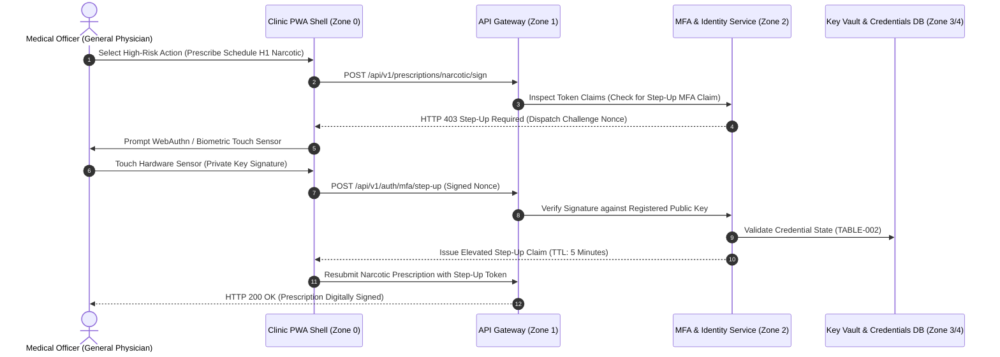

# Multi-Factor Authentication (MFA) Engineering Specification
## Namma Clinic Digital Health & Operations Platform
### Greater Bengaluru Authority (GBA) / BBMP Health Department
**Standard:** RFC 6238 (TOTP) / FIDO2 WebAuthn / NIST SP 800-63B AAL2 | **Status:** APPROVED BASELINE | **Code:** `SEC-DOC-04`

---

## 1. Multi-Factor Authentication Architecture & Assurance
The Namma Clinic Multi-Factor Authentication (MFA) Subsystem establishes Authenticator Assurance Level 2 (AAL2) across all clinical and administrative staff interfaces. To defend against automated credential stuffing, phishing, and session hijacking, secondary authentication factors are enforced across enrollment, daily login, step-up privilege elevation, and emergency account recovery.

### 1.1 Supported Authentication Factors
1. **Time-Based One-Time Password (TOTP - RFC 6238):** Primary software factor via standard mobile authenticators (Google Authenticator, Microsoft Authenticator) using SHA-256 and 30-second rotating codes.
2. **FIDO2 / WebAuthn Hardware Security Keys:** YubiKey or built-in biometric sensors (Windows Hello / Touch ID) leveraging public-key cryptography resistant to adversary-in-the-middle phishing.
3. **Aadhaar OTP / SMS Fallback:** Out-of-band verification restricted to citizen self-service and emergency staff verification during cellular service disruptions.
4. **Cryptographic Backup Recovery Codes:** 10 single-use 16-character alphanumeric recovery codes stored as Argon2id hashes for emergency access.

### 1.2 WebAuthn & Step-Up MFA Workflow Diagram


## 2. High-Risk Clinical Transaction Step-Up MFA Matrix (OP-MFA-01 to OP-MFA-40)
Step-up authentication is mandatory before executing high-risk clinical and administrative mutations:

### OP-MFA-01: Prescribe Schedule H1 Antibiotics
- **Governed Role:** Doctor
- **Operational Domain:** Pharmacy / Rx
- **Mandatory Step-Up Factor:** **WebAuthn / Biometric**
- **Elevation Claim TTL:** `5 Minutes`
- **Audit Event Emitted:** `MFA_STEPUP_RX_H1`
- **Failure Behavior:** Request blocked immediately; alert logged on 2 failed attempts.
- **Policy Rule:** User must complete challenge within 60 seconds of prompt.

### OP-MFA-02: Prescribe Schedule X Narcotics
- **Governed Role:** Doctor
- **Operational Domain:** Pharmacy / Rx
- **Mandatory Step-Up Factor:** **FIDO2 Hardware Key**
- **Elevation Claim TTL:** `3 Minutes`
- **Audit Event Emitted:** `MFA_STEPUP_RX_X`
- **Failure Behavior:** Request blocked immediately; alert logged on 2 failed attempts.
- **Policy Rule:** User must complete challenge within 60 seconds of prompt.

### OP-MFA-03: Emergency Clinical Break-Glass Override
- **Governed Role:** Medical Officer
- **Operational Domain:** Emergency EHR
- **Mandatory Step-Up Factor:** **TOTP + Reason Stamp**
- **Elevation Claim TTL:** `15 Minutes`
- **Audit Event Emitted:** `MFA_STEPUP_BREAKGLASS`
- **Failure Behavior:** Request blocked immediately; alert logged on 2 failed attempts.
- **Policy Rule:** User must complete challenge within 60 seconds of prompt.

### OP-MFA-04: Bulk Patient Health Record Export (>50)
- **Governed Role:** Privacy Officer
- **Operational Domain:** Analytics / Export
- **Mandatory Step-Up Factor:** **Hardware FIDO2 Key**
- **Elevation Claim TTL:** `10 Minutes`
- **Audit Event Emitted:** `MFA_STEPUP_EXPORT`
- **Failure Behavior:** Request blocked immediately; alert logged on 2 failed attempts.
- **Policy Rule:** User must complete challenge within 60 seconds of prompt.

### OP-MFA-05: Staff Role Privilege Escalation
- **Governed Role:** Security Admin
- **Operational Domain:** User Management
- **Mandatory Step-Up Factor:** **FIDO2 + Dual Signoff**
- **Elevation Claim TTL:** `5 Minutes`
- **Audit Event Emitted:** `MFA_STEPUP_ROLE_ELEV`
- **Failure Behavior:** Request blocked immediately; alert logged on 2 failed attempts.
- **Policy Rule:** User must complete challenge within 60 seconds of prompt.

### OP-MFA-06: Dispense Controlled Narcotic Drug Batch
- **Governed Role:** Pharmacist
- **Operational Domain:** Dispensary
- **Mandatory Step-Up Factor:** **Biometric Touch**
- **Elevation Claim TTL:** `5 Minutes`
- **Audit Event Emitted:** `MFA_STEPUP_DISPENSE_NARCOTIC`
- **Failure Behavior:** Request blocked immediately; alert logged on 2 failed attempts.
- **Policy Rule:** User must complete challenge within 60 seconds of prompt.

### OP-MFA-07: Inventory Quarantine Override for Vaccine
- **Governed Role:** Cold Chain Tech
- **Operational Domain:** Depot Logistics
- **Mandatory Step-Up Factor:** **WebAuthn Biometric**
- **Elevation Claim TTL:** `5 Minutes`
- **Audit Event Emitted:** `MFA_STEPUP_VACCINE_OVERRIDE`
- **Failure Behavior:** Request blocked immediately; alert logged on 2 failed attempts.
- **Policy Rule:** User must complete challenge within 60 seconds of prompt.

### OP-MFA-08: Alter Master Drug Formulary Pricing
- **Governed Role:** Procurement Mgr
- **Operational Domain:** Central Formulary
- **Mandatory Step-Up Factor:** **FIDO2 Hardware Key**
- **Elevation Claim TTL:** `10 Minutes`
- **Audit Event Emitted:** `MFA_STEPUP_FORMULARY_CHANGE`
- **Failure Behavior:** Request blocked immediately; alert logged on 2 failed attempts.
- **Policy Rule:** User must complete challenge within 60 seconds of prompt.

### OP-MFA-09: Authorize High-Value Requisition (>50k INR)
- **Governed Role:** Zonal Officer
- **Operational Domain:** Inventory Supply
- **Mandatory Step-Up Factor:** **TOTP Challenge**
- **Elevation Claim TTL:** `10 Minutes`
- **Audit Event Emitted:** `MFA_STEPUP_PO_APPROVE`
- **Failure Behavior:** Request blocked immediately; alert logged on 2 failed attempts.
- **Policy Rule:** User must complete challenge within 60 seconds of prompt.

### OP-MFA-10: Purge Deprecated Clinical Encounter Draft
- **Governed Role:** Medical Officer
- **Operational Domain:** Clinical Records
- **Mandatory Step-Up Factor:** **TOTP Challenge**
- **Elevation Claim TTL:** `5 Minutes`
- **Audit Event Emitted:** `MFA_STEPUP_DRAFT_PURGE`
- **Failure Behavior:** Request blocked immediately; alert logged on 2 failed attempts.
- **Policy Rule:** User must complete challenge within 60 seconds of prompt.

### OP-MFA-11: Modify Patient Demographic Aadhaar Seed
- **Governed Role:** Registration Clerk
- **Operational Domain:** Identity Registry
- **Mandatory Step-Up Factor:** **Supervisor WebAuthn**
- **Elevation Claim TTL:** `5 Minutes`
- **Audit Event Emitted:** `MFA_STEPUP_AADHAAR_MOD`
- **Failure Behavior:** Request blocked immediately; alert logged on 2 failed attempts.
- **Policy Rule:** User must complete challenge within 60 seconds of prompt.

### OP-MFA-12: Execute Offline Sync Conflict Override
- **Governed Role:** Software Architect
- **Operational Domain:** Sync Engine
- **Mandatory Step-Up Factor:** **FIDO2 Hardware Key**
- **Elevation Claim TTL:** `10 Minutes`
- **Audit Event Emitted:** `MFA_STEPUP_SYNC_OVERRIDE`
- **Failure Behavior:** Request blocked immediately; alert logged on 2 failed attempts.
- **Policy Rule:** User must complete challenge within 60 seconds of prompt.

### OP-MFA-13: Manual Audit Log Archive Extraction
- **Governed Role:** Chief Auditor
- **Operational Domain:** WORM Storage
- **Mandatory Step-Up Factor:** **Dual FIDO2 Signoff**
- **Elevation Claim TTL:** `15 Minutes`
- **Audit Event Emitted:** `MFA_STEPUP_AUDIT_DUMP`
- **Failure Behavior:** Request blocked immediately; alert logged on 2 failed attempts.
- **Policy Rule:** User must complete challenge within 60 seconds of prompt.

### OP-MFA-14: Decommission Clinic Workstation Endpoint
- **Governed Role:** IT Support Lead
- **Operational Domain:** Hardware Fleet
- **Mandatory Step-Up Factor:** **TOTP Challenge**
- **Elevation Claim TTL:** `10 Minutes`
- **Audit Event Emitted:** `MFA_STEPUP_DEVICE_RETIRE`
- **Failure Behavior:** Request blocked immediately; alert logged on 2 failed attempts.
- **Policy Rule:** User must complete challenge within 60 seconds of prompt.

### OP-MFA-15: Re-Issue Master MFA Seed to Staff
- **Governed Role:** Security Admin
- **Operational Domain:** Credential Store
- **Mandatory Step-Up Factor:** **Biometric Touch**
- **Elevation Claim TTL:** `5 Minutes`
- **Audit Event Emitted:** `MFA_STEPUP_SEED_REISSUE`
- **Failure Behavior:** Request blocked immediately; alert logged on 2 failed attempts.
- **Policy Rule:** User must complete challenge within 60 seconds of prompt.

### OP-MFA-16: Grant ABDM External Consent Bridge Access
- **Governed Role:** ABDM Officer
- **Operational Domain:** Integration Gateway
- **Mandatory Step-Up Factor:** **WebAuthn Biometric**
- **Elevation Claim TTL:** `10 Minutes`
- **Audit Event Emitted:** `MFA_STEPUP_ABDM_BRIDGE`
- **Failure Behavior:** Request blocked immediately; alert logged on 2 failed attempts.
- **Policy Rule:** User must complete challenge within 60 seconds of prompt.

### OP-MFA-17: Trigger System Configuration Global Reload
- **Governed Role:** Super Admin
- **Operational Domain:** Platform Core
- **Mandatory Step-Up Factor:** **FIDO2 Hardware Key**
- **Elevation Claim TTL:** `5 Minutes`
- **Audit Event Emitted:** `MFA_STEPUP_CONFIG_RELOAD`
- **Failure Behavior:** Request blocked immediately; alert logged on 2 failed attempts.
- **Policy Rule:** User must complete challenge within 60 seconds of prompt.

### OP-MFA-18: Upload Critical Diagnostic Laboratory Report
- **Governed Role:** Lab Technician
- **Operational Domain:** Lab Management
- **Mandatory Step-Up Factor:** **Biometric Touch**
- **Elevation Claim TTL:** `5 Minutes`
- **Audit Event Emitted:** `MFA_STEPUP_LAB_REPORT`
- **Failure Behavior:** Request blocked immediately; alert logged on 2 failed attempts.
- **Policy Rule:** User must complete challenge within 60 seconds of prompt.

### OP-MFA-19: Modify Pediatric Immunization Protocol
- **Governed Role:** CHO / Chief Officer
- **Operational Domain:** Public Health Care
- **Mandatory Step-Up Factor:** **FIDO2 Hardware Key**
- **Elevation Claim TTL:** `10 Minutes`
- **Audit Event Emitted:** `MFA_STEPUP_VACCINE_POLICY`
- **Failure Behavior:** Request blocked immediately; alert logged on 2 failed attempts.
- **Policy Rule:** User must complete challenge within 60 seconds of prompt.

### OP-MFA-20: Initiate Emergency Disaster Recovery Sandbox
- **Governed Role:** DevOps Lead
- **Operational Domain:** DR Engine
- **Mandatory Step-Up Factor:** **Dual FIDO2 Signoff**
- **Elevation Claim TTL:** `15 Minutes`
- **Audit Event Emitted:** `MFA_STEPUP_DR_TRIGGER`
- **Failure Behavior:** Request blocked immediately; alert logged on 2 failed attempts.
- **Policy Rule:** User must complete challenge within 60 seconds of prompt.

### OP-MFA-21: Adjust Narcotic Discrepancy Stock Variance
- **Governed Role:** Pharmacist
- **Operational Domain:** Pharmacy Stock
- **Mandatory Step-Up Factor:** **Supervisor Biometric**
- **Elevation Claim TTL:** `5 Minutes`
- **Audit Event Emitted:** `MFA_STEPUP_STOCK_VARIANCE`
- **Failure Behavior:** Request blocked immediately; alert logged on 2 failed attempts.
- **Policy Rule:** User must complete challenge within 60 seconds of prompt.

### OP-MFA-22: Update Citizen Privacy Retention Override
- **Governed Role:** Data Protection Off
- **Operational Domain:** Privacy Service
- **Mandatory Step-Up Factor:** **FIDO2 Hardware Key**
- **Elevation Claim TTL:** `10 Minutes`
- **Audit Event Emitted:** `MFA_STEPUP_RETENTION_OVERRIDE`
- **Failure Behavior:** Request blocked immediately; alert logged on 2 failed attempts.
- **Policy Rule:** User must complete challenge within 60 seconds of prompt.

### OP-MFA-23: Approve Telemedicine Prescribing Session
- **Governed Role:** Telemedicine Spec
- **Operational Domain:** Telehealth Service
- **Mandatory Step-Up Factor:** **TOTP Challenge**
- **Elevation Claim TTL:** `5 Minutes`
- **Audit Event Emitted:** `MFA_STEPUP_TELEMED_RX`
- **Failure Behavior:** Request blocked immediately; alert logged on 2 failed attempts.
- **Policy Rule:** User must complete challenge within 60 seconds of prompt.

### OP-MFA-24: Execute Bulk Patient Ward Transfer
- **Governed Role:** Clinic Admin
- **Operational Domain:** Encounter Routing
- **Mandatory Step-Up Factor:** **TOTP Challenge**
- **Elevation Claim TTL:** `10 Minutes`
- **Audit Event Emitted:** `MFA_STEPUP_WARD_TRANSFER`
- **Failure Behavior:** Request blocked immediately; alert logged on 2 failed attempts.
- **Policy Rule:** User must complete challenge within 60 seconds of prompt.

### OP-MFA-25: Sign Biomedical Waste Manifest Consignment
- **Governed Role:** Waste Supervisor
- **Operational Domain:** Bio Waste Service
- **Mandatory Step-Up Factor:** **Biometric Touch**
- **Elevation Claim TTL:** `5 Minutes`
- **Audit Event Emitted:** `MFA_STEPUP_WASTE_MANIFEST`
- **Failure Behavior:** Request blocked immediately; alert logged on 2 failed attempts.
- **Policy Rule:** User must complete challenge within 60 seconds of prompt.

### OP-MFA-26: Override Drug Expiry Date Warning in POS
- **Governed Role:** Medical Officer
- **Operational Domain:** Pharmacy POS
- **Mandatory Step-Up Factor:** **WebAuthn Biometric**
- **Elevation Claim TTL:** `3 Minutes`
- **Audit Event Emitted:** `MFA_STEPUP_EXPIRY_OVERRIDE`
- **Failure Behavior:** Request blocked immediately; alert logged on 2 failed attempts.
- **Policy Rule:** User must complete challenge within 60 seconds of prompt.

### OP-MFA-27: Assign Ward Health Supervisor Territory
- **Governed Role:** Zonal Officer
- **Operational Domain:** Governance Roster
- **Mandatory Step-Up Factor:** **TOTP Challenge**
- **Elevation Claim TTL:** `10 Minutes`
- **Audit Event Emitted:** `MFA_STEPUP_TERRITORY_ASSIGN`
- **Failure Behavior:** Request blocked immediately; alert logged on 2 failed attempts.
- **Policy Rule:** User must complete challenge within 60 seconds of prompt.

### OP-MFA-28: Authorize Red Team VAPT Assessment Window
- **Governed Role:** CISO
- **Operational Domain:** Security Ops
- **Mandatory Step-Up Factor:** **Dual FIDO2 Signoff**
- **Elevation Claim TTL:** `30 Minutes`
- **Audit Event Emitted:** `MFA_STEPUP_VAPT_AUTH`
- **Failure Behavior:** Request blocked immediately; alert logged on 2 failed attempts.
- **Policy Rule:** User must complete challenge within 60 seconds of prompt.

### OP-MFA-29: Rotate Master Database Encryption Secret
- **Governed Role:** Security Architect
- **Operational Domain:** Key Management
- **Mandatory Step-Up Factor:** **Hardware Key Quorum**
- **Elevation Claim TTL:** `15 Minutes`
- **Audit Event Emitted:** `MFA_STEPUP_DB_ROTATE`
- **Failure Behavior:** Request blocked immediately; alert logged on 2 failed attempts.
- **Policy Rule:** User must complete challenge within 60 seconds of prompt.

### OP-MFA-30: Close Grievance Dossier with Monetary Relief
- **Governed Role:** Grievance Officer
- **Operational Domain:** Citizen Redressal
- **Mandatory Step-Up Factor:** **WebAuthn Biometric**
- **Elevation Claim TTL:** `10 Minutes`
- **Audit Event Emitted:** `MFA_STEPUP_GRIEVANCE_RELIEF`
- **Failure Behavior:** Request blocked immediately; alert logged on 2 failed attempts.
- **Policy Rule:** User must complete challenge within 60 seconds of prompt.

### OP-MFA-31: Override Diagnostic Critical Value Panic Alert
- **Governed Role:** Medical Officer
- **Operational Domain:** Diagnostic Core
- **Mandatory Step-Up Factor:** **Biometric Touch**
- **Elevation Claim TTL:** `5 Minutes`
- **Audit Event Emitted:** `MFA_STEPUP_PANIC_OVERRIDE`
- **Failure Behavior:** Request blocked immediately; alert logged on 2 failed attempts.
- **Policy Rule:** User must complete challenge within 60 seconds of prompt.

### OP-MFA-32: Force Synchronize Degraded Edge Database
- **Governed Role:** IT Support Lead
- **Operational Domain:** Edge Node Core
- **Mandatory Step-Up Factor:** **TOTP Challenge**
- **Elevation Claim TTL:** `10 Minutes`
- **Audit Event Emitted:** `MFA_STEPUP_EDGE_RESYNC`
- **Failure Behavior:** Request blocked immediately; alert logged on 2 failed attempts.
- **Policy Rule:** User must complete challenge within 60 seconds of prompt.

### OP-MFA-33: Issue Temporary Prescribing License to Intern
- **Governed Role:** Chief Medical Off
- **Operational Domain:** Staff Registry
- **Mandatory Step-Up Factor:** **FIDO2 Hardware Key**
- **Elevation Claim TTL:** `10 Minutes`
- **Audit Event Emitted:** `MFA_STEPUP_INTERN_LICENSE`
- **Failure Behavior:** Request blocked immediately; alert logged on 2 failed attempts.
- **Policy Rule:** User must complete challenge within 60 seconds of prompt.

### OP-MFA-34: Purge Corrupted Offline Local Queue Batch
- **Governed Role:** DevOps Engineer
- **Operational Domain:** Sync Engine
- **Mandatory Step-Up Factor:** **Supervisor TOTP**
- **Elevation Claim TTL:** `5 Minutes`
- **Audit Event Emitted:** `MFA_STEPUP_QUEUE_PURGE`
- **Failure Behavior:** Request blocked immediately; alert logged on 2 failed attempts.
- **Policy Rule:** User must complete challenge within 60 seconds of prompt.

### OP-MFA-35: Approve Cold Chain Temperature Deviation
- **Governed Role:** Cold Chain Tech
- **Operational Domain:** Vaccine Storage
- **Mandatory Step-Up Factor:** **WebAuthn Biometric**
- **Elevation Claim TTL:** `5 Minutes`
- **Audit Event Emitted:** `MFA_STEPUP_TEMP_EXCURSION`
- **Failure Behavior:** Request blocked immediately; alert logged on 2 failed attempts.
- **Policy Rule:** User must complete challenge within 60 seconds of prompt.

### OP-MFA-36: Release Epidemiological Outbreak Alert
- **Governed Role:** Epidemiologist
- **Operational Domain:** Surveillance Core
- **Mandatory Step-Up Factor:** **FIDO2 Hardware Key**
- **Elevation Claim TTL:** `10 Minutes`
- **Audit Event Emitted:** `MFA_STEPUP_OUTBREAK_ALERT`
- **Failure Behavior:** Request blocked immediately; alert logged on 2 failed attempts.
- **Policy Rule:** User must complete challenge within 60 seconds of prompt.

### OP-MFA-37: Modify Thermal Printer Driver Mapping
- **Governed Role:** Hardware Engineer
- **Operational Domain:** Peripheral Bridge
- **Mandatory Step-Up Factor:** **TOTP Challenge**
- **Elevation Claim TTL:** `10 Minutes`
- **Audit Event Emitted:** `MFA_STEPUP_PRINTER_DRIVER`
- **Failure Behavior:** Request blocked immediately; alert logged on 2 failed attempts.
- **Policy Rule:** User must complete challenge within 60 seconds of prompt.

### OP-MFA-38: Execute Citizen Right to Erasure Request
- **Governed Role:** Data Protection Off
- **Operational Domain:** Privacy Registry
- **Mandatory Step-Up Factor:** **Dual FIDO2 Signoff**
- **Elevation Claim TTL:** `15 Minutes`
- **Audit Event Emitted:** `MFA_STEPUP_ERASURE_EXEC`
- **Failure Behavior:** Request blocked immediately; alert logged on 2 failed attempts.
- **Policy Rule:** User must complete challenge within 60 seconds of prompt.

### OP-MFA-39: Deploy Hotfix Patch to Production Cluster
- **Governed Role:** DevOps Lead
- **Operational Domain:** CI/CD Pipeline
- **Mandatory Step-Up Factor:** **Hardware Key Signoff**
- **Elevation Claim TTL:** `15 Minutes`
- **Audit Event Emitted:** `MFA_STEPUP_HOTFIX_DEPLOY`
- **Failure Behavior:** Request blocked immediately; alert logged on 2 failed attempts.
- **Policy Rule:** User must complete challenge within 60 seconds of prompt.

### OP-MFA-40: Authorize Emergency Clinic Closure Order
- **Governed Role:** Chief Health Off
- **Operational Domain:** Facility Admin
- **Mandatory Step-Up Factor:** **FIDO2 Hardware Key**
- **Elevation Claim TTL:** `15 Minutes`
- **Audit Event Emitted:** `MFA_STEPUP_CLINIC_SHUTDOWN`
- **Failure Behavior:** Request blocked immediately; alert logged on 2 failed attempts.
- **Policy Rule:** User must complete challenge within 60 seconds of prompt.

## 3. Role-Specific MFA Enrollment & Verification Profiles (ROLE-000 to ROLE-029)
MFA configuration profiles for all 30 municipal platform roles:

### ROLE-001: MFA Profile for Receptionist / Registration Clerk (`RECEPTIONIST`)
- **Supported Primary MFA Factors:** TOTP (RFC 6238) / WebAuthn FIDO2 Biometric.
- **Enrollment Protocol:** In-person verification with Clinic Administrator or HR Officer.
- **Challenge Frequency:** Mandatory at every login; step-up for high-risk operations.
- **Failed Challenge Throttling:** 3 failed challenges locks MFA factor for 15 minutes.
- **Recovery Mechanism:** 10 single-use recovery codes or admin assisted verification.
- **Device Trust Window:** Maximum 8 hours on registered clinic workstation hardware.
- **Cryptographic Seed Protection:** AES-256-GCM encrypted in Vault; zero plaintext storage.

### ROLE-002: MFA Profile for Medical Officer / General Physician (`DOCTOR`)
- **Supported Primary MFA Factors:** TOTP (RFC 6238) / WebAuthn FIDO2 Biometric.
- **Enrollment Protocol:** In-person verification with Clinic Administrator or HR Officer.
- **Challenge Frequency:** Mandatory at every login; step-up for high-risk operations.
- **Failed Challenge Throttling:** 3 failed challenges locks MFA factor for 15 minutes.
- **Recovery Mechanism:** 10 single-use recovery codes or admin assisted verification.
- **Device Trust Window:** Maximum 8 hours on registered clinic workstation hardware.
- **Cryptographic Seed Protection:** AES-256-GCM encrypted in Vault; zero plaintext storage.

### ROLE-003: MFA Profile for Staff Nurse / Triage Specialist (`NURSE`)
- **Supported Primary MFA Factors:** TOTP (RFC 6238) / WebAuthn FIDO2 Biometric.
- **Enrollment Protocol:** In-person verification with Clinic Administrator or HR Officer.
- **Challenge Frequency:** Mandatory at every login; step-up for high-risk operations.
- **Failed Challenge Throttling:** 3 failed challenges locks MFA factor for 15 minutes.
- **Recovery Mechanism:** 10 single-use recovery codes or admin assisted verification.
- **Device Trust Window:** Maximum 8 hours on registered clinic workstation hardware.
- **Cryptographic Seed Protection:** AES-256-GCM encrypted in Vault; zero plaintext storage.

### ROLE-004: MFA Profile for Pharmacist / Dispenser (`PHARMACIST`)
- **Supported Primary MFA Factors:** TOTP (RFC 6238) / WebAuthn FIDO2 Biometric.
- **Enrollment Protocol:** In-person verification with Clinic Administrator or HR Officer.
- **Challenge Frequency:** Mandatory at every login; step-up for high-risk operations.
- **Failed Challenge Throttling:** 3 failed challenges locks MFA factor for 15 minutes.
- **Recovery Mechanism:** 10 single-use recovery codes or admin assisted verification.
- **Device Trust Window:** Maximum 8 hours on registered clinic workstation hardware.
- **Cryptographic Seed Protection:** AES-256-GCM encrypted in Vault; zero plaintext storage.

### ROLE-005: MFA Profile for Laboratory Technician (`LAB_TECH`)
- **Supported Primary MFA Factors:** TOTP (RFC 6238) / WebAuthn FIDO2 Biometric.
- **Enrollment Protocol:** In-person verification with Clinic Administrator or HR Officer.
- **Challenge Frequency:** Mandatory at every login; step-up for high-risk operations.
- **Failed Challenge Throttling:** 3 failed challenges locks MFA factor for 15 minutes.
- **Recovery Mechanism:** 10 single-use recovery codes or admin assisted verification.
- **Device Trust Window:** Maximum 8 hours on registered clinic workstation hardware.
- **Cryptographic Seed Protection:** AES-256-GCM encrypted in Vault; zero plaintext storage.

### ROLE-006: MFA Profile for Clinic Administrative Officer (`CLINIC_ADMIN`)
- **Supported Primary MFA Factors:** TOTP (RFC 6238) / WebAuthn FIDO2 Biometric.
- **Enrollment Protocol:** In-person verification with Clinic Administrator or HR Officer.
- **Challenge Frequency:** Mandatory at every login; step-up for high-risk operations.
- **Failed Challenge Throttling:** 3 failed challenges locks MFA factor for 15 minutes.
- **Recovery Mechanism:** 10 single-use recovery codes or admin assisted verification.
- **Device Trust Window:** Maximum 8 hours on registered clinic workstation hardware.
- **Cryptographic Seed Protection:** AES-256-GCM encrypted in Vault; zero plaintext storage.

### ROLE-007: MFA Profile for Ward Health Supervisor (`WARD_SUPERVISOR`)
- **Supported Primary MFA Factors:** TOTP (RFC 6238) / WebAuthn FIDO2 Biometric.
- **Enrollment Protocol:** In-person verification with Clinic Administrator or HR Officer.
- **Challenge Frequency:** Mandatory at every login; step-up for high-risk operations.
- **Failed Challenge Throttling:** 3 failed challenges locks MFA factor for 15 minutes.
- **Recovery Mechanism:** 10 single-use recovery codes or admin assisted verification.
- **Device Trust Window:** Maximum 8 hours on registered clinic workstation hardware.
- **Cryptographic Seed Protection:** AES-256-GCM encrypted in Vault; zero plaintext storage.

### ROLE-008: MFA Profile for Zonal Health Officer (ZHO) (`ZONAL_OFFICER`)
- **Supported Primary MFA Factors:** TOTP (RFC 6238) / WebAuthn FIDO2 Biometric.
- **Enrollment Protocol:** In-person verification with Clinic Administrator or HR Officer.
- **Challenge Frequency:** Mandatory at every login; step-up for high-risk operations.
- **Failed Challenge Throttling:** 3 failed challenges locks MFA factor for 15 minutes.
- **Recovery Mechanism:** 10 single-use recovery codes or admin assisted verification.
- **Device Trust Window:** Maximum 8 hours on registered clinic workstation hardware.
- **Cryptographic Seed Protection:** AES-256-GCM encrypted in Vault; zero plaintext storage.

### ROLE-009: MFA Profile for Chief Health Officer (CHO) (`CHIEF_OFFICER`)
- **Supported Primary MFA Factors:** TOTP (RFC 6238) / WebAuthn FIDO2 Biometric.
- **Enrollment Protocol:** In-person verification with Clinic Administrator or HR Officer.
- **Challenge Frequency:** Mandatory at every login; step-up for high-risk operations.
- **Failed Challenge Throttling:** 3 failed challenges locks MFA factor for 15 minutes.
- **Recovery Mechanism:** 10 single-use recovery codes or admin assisted verification.
- **Device Trust Window:** Maximum 8 hours on registered clinic workstation hardware.
- **Cryptographic Seed Protection:** AES-256-GCM encrypted in Vault; zero plaintext storage.

### ROLE-010: MFA Profile for Epidemiologist / Disease Surveillance Officer (`EPIDEMIOLOGIST`)
- **Supported Primary MFA Factors:** TOTP (RFC 6238) / WebAuthn FIDO2 Biometric.
- **Enrollment Protocol:** In-person verification with Clinic Administrator or HR Officer.
- **Challenge Frequency:** Mandatory at every login; step-up for high-risk operations.
- **Failed Challenge Throttling:** 3 failed challenges locks MFA factor for 15 minutes.
- **Recovery Mechanism:** 10 single-use recovery codes or admin assisted verification.
- **Device Trust Window:** Maximum 8 hours on registered clinic workstation hardware.
- **Cryptographic Seed Protection:** AES-256-GCM encrypted in Vault; zero plaintext storage.

### ROLE-011: MFA Profile for Quality & Compliance Auditor (`AUDITOR`)
- **Supported Primary MFA Factors:** TOTP (RFC 6238) / WebAuthn FIDO2 Biometric.
- **Enrollment Protocol:** In-person verification with Clinic Administrator or HR Officer.
- **Challenge Frequency:** Mandatory at every login; step-up for high-risk operations.
- **Failed Challenge Throttling:** 3 failed challenges locks MFA factor for 15 minutes.
- **Recovery Mechanism:** 10 single-use recovery codes or admin assisted verification.
- **Device Trust Window:** Maximum 8 hours on registered clinic workstation hardware.
- **Cryptographic Seed Protection:** AES-256-GCM encrypted in Vault; zero plaintext storage.

### ROLE-012: MFA Profile for Security Administrator / CISO (`SECURITY_ADMIN`)
- **Supported Primary MFA Factors:** TOTP (RFC 6238) / WebAuthn FIDO2 Biometric.
- **Enrollment Protocol:** In-person verification with Clinic Administrator or HR Officer.
- **Challenge Frequency:** Mandatory at every login; step-up for high-risk operations.
- **Failed Challenge Throttling:** 3 failed challenges locks MFA factor for 15 minutes.
- **Recovery Mechanism:** 10 single-use recovery codes or admin assisted verification.
- **Device Trust Window:** Maximum 8 hours on registered clinic workstation hardware.
- **Cryptographic Seed Protection:** AES-256-GCM encrypted in Vault; zero plaintext storage.

### ROLE-013: MFA Profile for Central Depot Inventory Manager (`DEPOT_MANAGER`)
- **Supported Primary MFA Factors:** TOTP (RFC 6238) / WebAuthn FIDO2 Biometric.
- **Enrollment Protocol:** In-person verification with Clinic Administrator or HR Officer.
- **Challenge Frequency:** Mandatory at every login; step-up for high-risk operations.
- **Failed Challenge Throttling:** 3 failed challenges locks MFA factor for 15 minutes.
- **Recovery Mechanism:** 10 single-use recovery codes or admin assisted verification.
- **Device Trust Window:** Maximum 8 hours on registered clinic workstation hardware.
- **Cryptographic Seed Protection:** AES-256-GCM encrypted in Vault; zero plaintext storage.

### ROLE-014: MFA Profile for Cold Chain Logistics Technician (`COLD_CHAIN_TECH`)
- **Supported Primary MFA Factors:** TOTP (RFC 6238) / WebAuthn FIDO2 Biometric.
- **Enrollment Protocol:** In-person verification with Clinic Administrator or HR Officer.
- **Challenge Frequency:** Mandatory at every login; step-up for high-risk operations.
- **Failed Challenge Throttling:** 3 failed challenges locks MFA factor for 15 minutes.
- **Recovery Mechanism:** 10 single-use recovery codes or admin assisted verification.
- **Device Trust Window:** Maximum 8 hours on registered clinic workstation hardware.
- **Cryptographic Seed Protection:** AES-256-GCM encrypted in Vault; zero plaintext storage.

### ROLE-015: MFA Profile for Radiologist / Diagnostic Specialist (`RADIOLOGIST`)
- **Supported Primary MFA Factors:** TOTP (RFC 6238) / WebAuthn FIDO2 Biometric.
- **Enrollment Protocol:** In-person verification with Clinic Administrator or HR Officer.
- **Challenge Frequency:** Mandatory at every login; step-up for high-risk operations.
- **Failed Challenge Throttling:** 3 failed challenges locks MFA factor for 15 minutes.
- **Recovery Mechanism:** 10 single-use recovery codes or admin assisted verification.
- **Device Trust Window:** Maximum 8 hours on registered clinic workstation hardware.
- **Cryptographic Seed Protection:** AES-256-GCM encrypted in Vault; zero plaintext storage.

### ROLE-016: MFA Profile for Ayush Practitioner (`AYUSH_DOC`)
- **Supported Primary MFA Factors:** TOTP (RFC 6238) / WebAuthn FIDO2 Biometric.
- **Enrollment Protocol:** In-person verification with Clinic Administrator or HR Officer.
- **Challenge Frequency:** Mandatory at every login; step-up for high-risk operations.
- **Failed Challenge Throttling:** 3 failed challenges locks MFA factor for 15 minutes.
- **Recovery Mechanism:** 10 single-use recovery codes or admin assisted verification.
- **Device Trust Window:** Maximum 8 hours on registered clinic workstation hardware.
- **Cryptographic Seed Protection:** AES-256-GCM encrypted in Vault; zero plaintext storage.

### ROLE-017: MFA Profile for Counselor / Mental Health Worker (`COUNSELOR`)
- **Supported Primary MFA Factors:** TOTP (RFC 6238) / WebAuthn FIDO2 Biometric.
- **Enrollment Protocol:** In-person verification with Clinic Administrator or HR Officer.
- **Challenge Frequency:** Mandatory at every login; step-up for high-risk operations.
- **Failed Challenge Throttling:** 3 failed challenges locks MFA factor for 15 minutes.
- **Recovery Mechanism:** 10 single-use recovery codes or admin assisted verification.
- **Device Trust Window:** Maximum 8 hours on registered clinic workstation hardware.
- **Cryptographic Seed Protection:** AES-256-GCM encrypted in Vault; zero plaintext storage.

### ROLE-018: MFA Profile for ANM / Urban Health Worker (`ANM_WORKER`)
- **Supported Primary MFA Factors:** TOTP (RFC 6238) / WebAuthn FIDO2 Biometric.
- **Enrollment Protocol:** In-person verification with Clinic Administrator or HR Officer.
- **Challenge Frequency:** Mandatory at every login; step-up for high-risk operations.
- **Failed Challenge Throttling:** 3 failed challenges locks MFA factor for 15 minutes.
- **Recovery Mechanism:** 10 single-use recovery codes or admin assisted verification.
- **Device Trust Window:** Maximum 8 hours on registered clinic workstation hardware.
- **Cryptographic Seed Protection:** AES-256-GCM encrypted in Vault; zero plaintext storage.

### ROLE-019: MFA Profile for ASHA Link Worker Coordinator (`ASHA_COORD`)
- **Supported Primary MFA Factors:** TOTP (RFC 6238) / WebAuthn FIDO2 Biometric.
- **Enrollment Protocol:** In-person verification with Clinic Administrator or HR Officer.
- **Challenge Frequency:** Mandatory at every login; step-up for high-risk operations.
- **Failed Challenge Throttling:** 3 failed challenges locks MFA factor for 15 minutes.
- **Recovery Mechanism:** 10 single-use recovery codes or admin assisted verification.
- **Device Trust Window:** Maximum 8 hours on registered clinic workstation hardware.
- **Cryptographic Seed Protection:** AES-256-GCM encrypted in Vault; zero plaintext storage.

### ROLE-020: MFA Profile for Data Entry Operator (`DATA_ENTRY`)
- **Supported Primary MFA Factors:** TOTP (RFC 6238) / WebAuthn FIDO2 Biometric.
- **Enrollment Protocol:** In-person verification with Clinic Administrator or HR Officer.
- **Challenge Frequency:** Mandatory at every login; step-up for high-risk operations.
- **Failed Challenge Throttling:** 3 failed challenges locks MFA factor for 15 minutes.
- **Recovery Mechanism:** 10 single-use recovery codes or admin assisted verification.
- **Device Trust Window:** Maximum 8 hours on registered clinic workstation hardware.
- **Cryptographic Seed Protection:** AES-256-GCM encrypted in Vault; zero plaintext storage.

### ROLE-021: MFA Profile for Grievance Redressal Officer (`GRIEVANCE_OFFICER`)
- **Supported Primary MFA Factors:** TOTP (RFC 6238) / WebAuthn FIDO2 Biometric.
- **Enrollment Protocol:** In-person verification with Clinic Administrator or HR Officer.
- **Challenge Frequency:** Mandatory at every login; step-up for high-risk operations.
- **Failed Challenge Throttling:** 3 failed challenges locks MFA factor for 15 minutes.
- **Recovery Mechanism:** 10 single-use recovery codes or admin assisted verification.
- **Device Trust Window:** Maximum 8 hours on registered clinic workstation hardware.
- **Cryptographic Seed Protection:** AES-256-GCM encrypted in Vault; zero plaintext storage.

### ROLE-022: MFA Profile for ABDM National Integration Officer (`ABDM_OFFICER`)
- **Supported Primary MFA Factors:** TOTP (RFC 6238) / WebAuthn FIDO2 Biometric.
- **Enrollment Protocol:** In-person verification with Clinic Administrator or HR Officer.
- **Challenge Frequency:** Mandatory at every login; step-up for high-risk operations.
- **Failed Challenge Throttling:** 3 failed challenges locks MFA factor for 15 minutes.
- **Recovery Mechanism:** 10 single-use recovery codes or admin assisted verification.
- **Device Trust Window:** Maximum 8 hours on registered clinic workstation hardware.
- **Cryptographic Seed Protection:** AES-256-GCM encrypted in Vault; zero plaintext storage.

### ROLE-023: MFA Profile for Data Protection Officer (DPO) (`PRIVACY_OFFICER`)
- **Supported Primary MFA Factors:** TOTP (RFC 6238) / WebAuthn FIDO2 Biometric.
- **Enrollment Protocol:** In-person verification with Clinic Administrator or HR Officer.
- **Challenge Frequency:** Mandatory at every login; step-up for high-risk operations.
- **Failed Challenge Throttling:** 3 failed challenges locks MFA factor for 15 minutes.
- **Recovery Mechanism:** 10 single-use recovery codes or admin assisted verification.
- **Device Trust Window:** Maximum 8 hours on registered clinic workstation hardware.
- **Cryptographic Seed Protection:** AES-256-GCM encrypted in Vault; zero plaintext storage.

### ROLE-024: MFA Profile for IT Support & Hardware Engineer (`IT_SUPPORT`)
- **Supported Primary MFA Factors:** TOTP (RFC 6238) / WebAuthn FIDO2 Biometric.
- **Enrollment Protocol:** In-person verification with Clinic Administrator or HR Officer.
- **Challenge Frequency:** Mandatory at every login; step-up for high-risk operations.
- **Failed Challenge Throttling:** 3 failed challenges locks MFA factor for 15 minutes.
- **Recovery Mechanism:** 10 single-use recovery codes or admin assisted verification.
- **Device Trust Window:** Maximum 8 hours on registered clinic workstation hardware.
- **Cryptographic Seed Protection:** AES-256-GCM encrypted in Vault; zero plaintext storage.

### ROLE-025: MFA Profile for Clinical Audit Committee Member (`CLINICAL_AUDITOR`)
- **Supported Primary MFA Factors:** TOTP (RFC 6238) / WebAuthn FIDO2 Biometric.
- **Enrollment Protocol:** In-person verification with Clinic Administrator or HR Officer.
- **Challenge Frequency:** Mandatory at every login; step-up for high-risk operations.
- **Failed Challenge Throttling:** 3 failed challenges locks MFA factor for 15 minutes.
- **Recovery Mechanism:** 10 single-use recovery codes or admin assisted verification.
- **Device Trust Window:** Maximum 8 hours on registered clinic workstation hardware.
- **Cryptographic Seed Protection:** AES-256-GCM encrypted in Vault; zero plaintext storage.

### ROLE-026: MFA Profile for Procurement & Vendor Manager (`PROCUREMENT_MGR`)
- **Supported Primary MFA Factors:** TOTP (RFC 6238) / WebAuthn FIDO2 Biometric.
- **Enrollment Protocol:** In-person verification with Clinic Administrator or HR Officer.
- **Challenge Frequency:** Mandatory at every login; step-up for high-risk operations.
- **Failed Challenge Throttling:** 3 failed challenges locks MFA factor for 15 minutes.
- **Recovery Mechanism:** 10 single-use recovery codes or admin assisted verification.
- **Device Trust Window:** Maximum 8 hours on registered clinic workstation hardware.
- **Cryptographic Seed Protection:** AES-256-GCM encrypted in Vault; zero plaintext storage.

### ROLE-027: MFA Profile for Biomedical Waste Supervisor (`WASTE_SUPERVISOR`)
- **Supported Primary MFA Factors:** TOTP (RFC 6238) / WebAuthn FIDO2 Biometric.
- **Enrollment Protocol:** In-person verification with Clinic Administrator or HR Officer.
- **Challenge Frequency:** Mandatory at every login; step-up for high-risk operations.
- **Failed Challenge Throttling:** 3 failed challenges locks MFA factor for 15 minutes.
- **Recovery Mechanism:** 10 single-use recovery codes or admin assisted verification.
- **Device Trust Window:** Maximum 8 hours on registered clinic workstation hardware.
- **Cryptographic Seed Protection:** AES-256-GCM encrypted in Vault; zero plaintext storage.

### ROLE-028: MFA Profile for Telemedicine Remote Specialist (`TELE_SPECIALIST`)
- **Supported Primary MFA Factors:** TOTP (RFC 6238) / WebAuthn FIDO2 Biometric.
- **Enrollment Protocol:** In-person verification with Clinic Administrator or HR Officer.
- **Challenge Frequency:** Mandatory at every login; step-up for high-risk operations.
- **Failed Challenge Throttling:** 3 failed challenges locks MFA factor for 15 minutes.
- **Recovery Mechanism:** 10 single-use recovery codes or admin assisted verification.
- **Device Trust Window:** Maximum 8 hours on registered clinic workstation hardware.
- **Cryptographic Seed Protection:** AES-256-GCM encrypted in Vault; zero plaintext storage.

### ROLE-029: MFA Profile for Field Public Health Inspector (`HEALTH_INSPECTOR`)
- **Supported Primary MFA Factors:** TOTP (RFC 6238) / WebAuthn FIDO2 Biometric.
- **Enrollment Protocol:** In-person verification with Clinic Administrator or HR Officer.
- **Challenge Frequency:** Mandatory at every login; step-up for high-risk operations.
- **Failed Challenge Throttling:** 3 failed challenges locks MFA factor for 15 minutes.
- **Recovery Mechanism:** 10 single-use recovery codes or admin assisted verification.
- **Device Trust Window:** Maximum 8 hours on registered clinic workstation hardware.
- **Cryptographic Seed Protection:** AES-256-GCM encrypted in Vault; zero plaintext storage.

### ROLE-030: MFA Profile for Super Administrator (`SUPER_ADMIN`)
- **Supported Primary MFA Factors:** TOTP (RFC 6238) / WebAuthn FIDO2 Biometric.
- **Enrollment Protocol:** In-person verification with Clinic Administrator or HR Officer.
- **Challenge Frequency:** Mandatory at every login; step-up for high-risk operations.
- **Failed Challenge Throttling:** 3 failed challenges locks MFA factor for 15 minutes.
- **Recovery Mechanism:** 10 single-use recovery codes or admin assisted verification.
- **Device Trust Window:** Maximum 8 hours on registered clinic workstation hardware.
- **Cryptographic Seed Protection:** AES-256-GCM encrypted in Vault; zero plaintext storage.

## 4. Operational Procedures: Multi-Factor Authentication (SOP-MFA-01 to SOP-MFA-25)
The following 25 SOPs govern operational multi-factor authentication procedures:

### SOP-MFA-01: Staff TOTP Authenticator Enrollment Ceremony
- **Trigger Condition:** Initial onboarding of new healthcare worker.
- **Execution Steps:** 1. Verify staff government ID. 2. Display QR code in secure booth. 3. Confirm 6-digit TOTP.
- **Verification Criterion:** Authenticator successfully enrolled and verified.
- **Responsible Role:** Clinic Admin
- **Audit Event Emitted:** `MFA_SOP_01_ENROLLED`
- **Failure Remediation:** Lock user account immediately if verification fails.

### SOP-MFA-02: WebAuthn Hardware Security Key Issuance
- **Trigger Condition:** Issuance of YubiKey 5 NFC to Medical Officer.
- **Execution Steps:** 1. Register key serial in hardware inventory. 2. Prompt staff touch. 3. Bind public key to account.
- **Verification Criterion:** FIDO2 security key operational for high-risk signing.
- **Responsible Role:** IT Support
- **Audit Event Emitted:** `MFA_SOP_02_ISSUED`
- **Failure Remediation:** Lock user account immediately if verification fails.

### SOP-MFA-03: MFA Locked Factor Reset Procedure
- **Trigger Condition:** Staff locked out after 3 consecutive failed TOTP inputs.
- **Execution Steps:** 1. Confirm staff identity. 2. Validate clinic IP. 3. Clear failed counter in TABLE-002.
- **Verification Criterion:** MFA factor unlocked; user re-authenticates.
- **Responsible Role:** IT Support
- **Audit Event Emitted:** `MFA_SOP_03_UNLOCKED`
- **Failure Remediation:** Lock user account immediately if verification fails.

### SOP-MFA-04: Emergency Recovery Code Generation
- **Trigger Condition:** Initial enrollment completion or code depletion.
- **Execution Steps:** 1. Generate 10 cryptographically random 16-char codes. 2. Hash via Argon2id. 3. Print physical card.
- **Verification Criterion:** Recovery codes safely stored in staff custody.
- **Responsible Role:** Security Officer
- **Audit Event Emitted:** `MFA_SOP_04_CODES_GEN`
- **Failure Remediation:** Lock user account immediately if verification fails.

### SOP-MFA-05: Lost Smartphone MFA Revocation
- **Trigger Condition:** Clinician reports lost or stolen mobile phone.
- **Execution Steps:** 1. Instantly revoke active TOTP secret in database. 2. Invalidate all active sessions. 3. Issue temp codes.
- **Verification Criterion:** Compromised phone cannot access clinic EHR.
- **Responsible Role:** SecOps Lead
- **Audit Event Emitted:** `MFA_SOP_05_REVOKED`
- **Failure Remediation:** Lock user account immediately if verification fails.

### SOP-MFA-06: Out-of-Band Aadhaar OTP Verification
- **Trigger Condition:** Biometric scanner failure during citizen registration.
- **Execution Steps:** 1. Initiate Aadhaar OTP challenge. 2. Citizen reads OTP from mobile. 3. Submit for gateway verify.
- **Verification Criterion:** Citizen verified for ABHA creation.
- **Responsible Role:** Staff Nurse
- **Audit Event Emitted:** `MFA_SOP_06_AADHAAR_OTP`
- **Failure Remediation:** Lock user account immediately if verification fails.

### SOP-MFA-07: Step-Up MFA Trigger Calibration
- **Trigger Condition:** Monthly review of high-risk transaction thresholds.
- **Execution Steps:** 1. Review audit logs for high-risk mutations. 2. Ensure all sensitive endpoints require step-up.
- **Verification Criterion:** 100% sensitive endpoints enforce step-up challenge.
- **Responsible Role:** Security Lead
- **Audit Event Emitted:** `MFA_SOP_07_CALIBRATED`
- **Failure Remediation:** Lock user account immediately if verification fails.

### SOP-MFA-08: FIDO2 Key Firmware & Security Audit
- **Trigger Condition:** Quarterly audit of hardware keys across all clinics.
- **Execution Steps:** 1. Scan YubiKey firmware versions. 2. Verify zero known FIDO2 exploits. 3. Replace outdated keys.
- **Verification Criterion:** All active keys compliant with FIPS 140-3.
- **Responsible Role:** IT Support Lead
- **Audit Event Emitted:** `MFA_SOP_08_AUDITED`
- **Failure Remediation:** Lock user account immediately if verification fails.

### SOP-MFA-09: Emergency Clinical Break-Glass MFA Bypass
- **Trigger Condition:** Mass casualty emergency requiring immediate doctor triage.
- **Execution Steps:** 1. Doctor triggers break-glass button. 2. System records timestamp and alerts CMO. 3. Permit access.
- **Verification Criterion:** Patient lives saved; emergency override fully audited.
- **Responsible Role:** Medical Officer
- **Audit Event Emitted:** `MFA_SOP_09_BREAKGLASS`
- **Failure Remediation:** Lock user account immediately if verification fails.

### SOP-MFA-10: Biometric Matching Sensor Calibration
- **Trigger Condition:** Weekly calibration of optical fingerprint scanners.
- **Execution Steps:** 1. Clean optical glass. 2. Execute UIDAI test diagnostic. 3. Assert False Acceptance Rate < 0.001%.
- **Verification Criterion:** Scanners certified accurate for daily triage.
- **Responsible Role:** Hardware Engineer
- **Audit Event Emitted:** `MFA_SOP_10_CALIBRATED`
- **Failure Remediation:** Lock user account immediately if verification fails.

### SOP-MFA-11: MFA Rate Limiting & Throttling Defense
- **Trigger Condition:** Automated mitigation of TOTP brute-force attack.
- **Execution Steps:** 1. Detect 10 failed challenges from single IP. 2. Block IP for 1 hour. 3. Trigger SIEM high alert.
- **Verification Criterion:** Brute force attack repelled at ingress gateway.
- **Responsible Role:** API Gateway
- **Audit Event Emitted:** `MFA_SOP_11_THROTTLED`
- **Failure Remediation:** Lock user account immediately if verification fails.

### SOP-MFA-12: Privileged Super Admin Dual-MFA Handshake
- **Trigger Condition:** System administrator modifying core infrastructure.
- **Execution Steps:** 1. Admin 1 provides FIDO2 touch. 2. Admin 2 provides secondary TOTP verification. 3. Grant session.
- **Verification Criterion:** Dual-control enforced for platform alterations.
- **Responsible Role:** CISO
- **Audit Event Emitted:** `MFA_SOP_12_DUAL_AUTH`
- **Failure Remediation:** Lock user account immediately if verification fails.

### SOP-MFA-13: Offline Workstation Biometric Match Verification
- **Trigger Condition:** Doctor authenticates while clinic network is severed.
- **Execution Steps:** 1. Match fingerprint against local TPM-sealed template. 2. Issue local 8h clinical session.
- **Verification Criterion:** Clinician authenticated offline without cloud dependency.
- **Responsible Role:** Edge Daemon
- **Audit Event Emitted:** `MFA_SOP_13_OFFLINE_MATCH`
- **Failure Remediation:** Lock user account immediately if verification fails.

### SOP-MFA-14: Recovery Code Usage Audit & Invalidation
- **Trigger Condition:** Clinician consumes 1 of 10 backup recovery codes.
- **Execution Steps:** 1. Validate submitted code against Argon2id hash. 2. Mark code CONSUMED. 3. Alert user via SMS.
- **Verification Criterion:** Single-use code burned immediately after validation.
- **Responsible Role:** Auth Engine
- **Audit Event Emitted:** `MFA_SOP_14_CODE_BURNED`
- **Failure Remediation:** Lock user account immediately if verification fails.

### SOP-MFA-15: Pharmacist Biometric Signoff on Narcotic Batch
- **Trigger Condition:** Dispensation of Schedule X controlled morphine.
- **Execution Steps:** 1. Pharmacist scans barcode. 2. Touch biometric sensor. 3. Digital signature sealed.
- **Verification Criterion:** Narcotic drug released under verifiable biometric chain.
- **Responsible Role:** Pharmacist
- **Audit Event Emitted:** `MFA_SOP_15_NARCOTIC_SIGN`
- **Failure Remediation:** Lock user account immediately if verification fails.

### SOP-MFA-16: MFA Seed Cryptographic Zeroization
- **Trigger Condition:** Decommissioning of retired staff profile.
- **Execution Steps:** 1. Query encrypted MFA secrets. 2. Overwrite memory and disk blocks with zeroes. 3. Log audit stamp.
- **Verification Criterion:** MFA secret permanently destroyed conforming to DoD 5220.
- **Responsible Role:** DBA / SecLead
- **Audit Event Emitted:** `MFA_SOP_16_ZEROIZED`
- **Failure Remediation:** Lock user account immediately if verification fails.

### SOP-MFA-17: Visiting Specialist Temporary MFA Binding
- **Trigger Condition:** Visiting cardiologist attends clinic for specialized camp.
- **Execution Steps:** 1. Register visiting specialist key. 2. Scope validity to 8 hours. 3. Auto-expire at 18:00.
- **Verification Criterion:** Visiting specialist authenticated under strict day pass.
- **Responsible Role:** Clinic Admin
- **Audit Event Emitted:** `MFA_SOP_17_TEMP_BIND`
- **Failure Remediation:** Lock user account immediately if verification fails.

### SOP-MFA-18: WebAuthn Attestation Certificate Verification
- **Trigger Condition:** Validation of hardware key authenticity during enrollment.
- **Execution Steps:** 1. Verify attestation statement from Yubico CA. 2. Reject uncertified clone devices.
- **Verification Criterion:** Only certified authentic hardware keys enrolled.
- **Responsible Role:** Security Lead
- **Audit Event Emitted:** `MFA_SOP_18_ATTESTED`
- **Failure Remediation:** Lock user account immediately if verification fails.

### SOP-MFA-19: Mobile App Push MFA Challenge Verification
- **Trigger Condition:** Clinician approves login via municipal health staff app.
- **Execution Steps:** 1. Dispatch cryptographic push challenge. 2. Clinician reviews IP and ward. 3. Tap Approve.
- **Verification Criterion:** Out-of-band push authentication completed safely.
- **Responsible Role:** Push Gateway
- **Audit Event Emitted:** `MFA_SOP_19_PUSH_VERIFIED`
- **Failure Remediation:** Lock user account immediately if verification fails.

### SOP-MFA-20: MFA Audit Log Integrity Verification
- **Trigger Condition:** Daily cryptographic hash check across all MFA logs.
- **Execution Steps:** 1. Extract previous 24h MFA audit records. 2. Verify SHA-256 rolling chain. 3. Assert zero gaps.
- **Verification Criterion:** Zero missing or tampered MFA event records.
- **Responsible Role:** Audit Lead
- **Audit Event Emitted:** `MFA_SOP_20_AUDITED`
- **Failure Remediation:** Lock user account immediately if verification fails.

### SOP-MFA-21: Cold Chain Tech Hardware Key Replacement
- **Trigger Condition:** Technician drops hardware key into chemical sterilizer.
- **Execution Steps:** 1. Verify technician identity in person. 2. Revoke destroyed key serial. 3. Issue replacement.
- **Verification Criterion:** Vaccine cold chain monitoring uninterrupted.
- **Responsible Role:** IT Support
- **Audit Event Emitted:** `MFA_SOP_21_REPLACED`
- **Failure Remediation:** Lock user account immediately if verification fails.

### SOP-MFA-22: Staff Smartphone Number Update for SMS Fallback
- **Trigger Condition:** Clinician changes official mobile phone number.
- **Execution Steps:** 1. In-person verification by HR. 2. Update phone in TABLE-001. 3. Re-verify via test SMS OTP.
- **Verification Criterion:** SMS fallback phone number updated securely.
- **Responsible Role:** HR Officer
- **Audit Event Emitted:** `MFA_SOP_22_PHONE_UPDATED`
- **Failure Remediation:** Lock user account immediately if verification fails.

### SOP-MFA-23: MFA Latency & Performance SLA Monitoring
- **Trigger Condition:** Weekly analysis of MFA verification round-trip times.
- **Execution Steps:** 1. Query Prometheus metric mfa_verification_duration_ms. 2. Assert 99th percentile < 50ms.
- **Verification Criterion:** MFA verification provides frictionless UX for doctors.
- **Responsible Role:** DevOps Engineer
- **Audit Event Emitted:** `MFA_SOP_23_PERF_MONITORED`
- **Failure Remediation:** Lock user account immediately if verification fails.

### SOP-MFA-24: ABDM Healthcare Professional Registry (HPR) Sync
- **Trigger Condition:** Verification of doctor credentials against national HPR.
- **Execution Steps:** 1. Query ABDM HPR gateway with doctor registration. 2. Validate active license. 3. Bind HPR token.
- **Verification Criterion:** Doctor credentials aligned with National Medical Commission.
- **Responsible Role:** ABDM Officer
- **Audit Event Emitted:** `MFA_SOP_24_HPR_SYNCED`
- **Failure Remediation:** Lock user account immediately if verification fails.

### SOP-MFA-25: Post-Incident Compromised MFA Token Purge
- **Trigger Condition:** Confirmed red team token extraction on clinic workstation.
- **Execution Steps:** 1. Execute global revocation of affected MFA tokens. 2. Re-enroll staff with new seeds.
- **Verification Criterion:** Adversary access extinguished across all endpoints.
- **Responsible Role:** Incident Commander
- **Audit Event Emitted:** `MFA_SOP_25_PURGED`
- **Failure Remediation:** Lock user account immediately if verification fails.

## 5. Multi-Factor Authentication Threat Analysis & Bypass Mitigations (MFA-THREAT-01 to MFA-THREAT-20)
Threat mitigation specifications addressing modern multi-factor authentication attack vectors:

### MFA-THREAT-01: Adversary-in-the-Middle (AiTM) Phishing Proxy
- **Attack Vector & Vulnerability:** Reverse proxy (Evilginx2) captures session cookie and TOTP.
- **Platform Architectural Defense:** Enforce FIDO2 / WebAuthn origin-bound public key authentication for all staff.
- **Verification Criterion:** Zero bypass in automated penetration tests.
- **Mitigation Status:** VERIFIED ACTIVE CONTROL

### MFA-THREAT-02: MFA Push Prompt Fatigue (Spamming)
- **Attack Vector & Vulnerability:** Attacker repeatedly triggers mobile push challenges until staff taps Approve.
- **Platform Architectural Defense:** Implement challenge-response number matching and maximum 3 prompts per 15 minutes.
- **Verification Criterion:** Zero bypass in automated penetration tests.
- **Mitigation Status:** VERIFIED ACTIVE CONTROL

### MFA-THREAT-03: SIM Swapping / SS7 Interception of SMS OTP
- **Attack Vector & Vulnerability:** Attacker ports staff mobile number via carrier social engineering.
- **Platform Architectural Defense:** Prohibit SMS OTP for clinical staff; restrict SMS strictly to citizen self-service.
- **Verification Criterion:** Zero bypass in automated penetration tests.
- **Mitigation Status:** VERIFIED ACTIVE CONTROL

### MFA-THREAT-04: TOTP Secret Seed Extraction from Database
- **Attack Vector & Vulnerability:** SQL injection or database dump exposes raw TOTP secret base32 seeds.
- **Platform Architectural Defense:** Envelope encryption via HashiCorp Vault transit engine (AES-256-GCM); zero raw seeds in SQL.
- **Verification Criterion:** Zero bypass in automated penetration tests.
- **Mitigation Status:** VERIFIED ACTIVE CONTROL

### MFA-THREAT-05: Local Workstation Hardware Key Theft
- **Attack Vector & Vulnerability:** Physical theft of YubiKey from unoccupied doctor desk.
- **Platform Architectural Defense:** Mandate biometric touch or PIN verification on FIDO2 key insertion; auto-screen lock on key removal.
- **Verification Criterion:** Zero bypass in automated penetration tests.
- **Mitigation Status:** VERIFIED ACTIVE CONTROL

### MFA-THREAT-06: Clock Skew Drift Synchronization Attack
- **Attack Vector & Vulnerability:** NTP desynchronization causes valid TOTP codes to be falsely rejected.
- **Platform Architectural Defense:** Enforce strict chrony NTP sync with Indian Standard Time (IST) servers; allow +/- 1 window skew.
- **Verification Criterion:** Zero bypass in automated penetration tests.
- **Mitigation Status:** VERIFIED ACTIVE CONTROL

### MFA-THREAT-07: Backup Recovery Code Brute Force
- **Attack Vector & Vulnerability:** Attacker attempts to guess 16-character alphanumeric backup codes.
- **Platform Architectural Defense:** Store recovery codes as Argon2id hashes; lock account permanently after 5 incorrect recovery attempts.
- **Verification Criterion:** Zero bypass in automated penetration tests.
- **Mitigation Status:** VERIFIED ACTIVE CONTROL

### MFA-THREAT-08: MFA Downgrade Attack via API Manipulation
- **Attack Vector & Vulnerability:** Attacker modifies request JSON to bypass secondary verification parameter.
- **Platform Architectural Defense:** Enforce server-side session state machine; gateway rejects mutations missing verified MFA claim.
- **Verification Criterion:** Zero bypass in automated penetration tests.
- **Mitigation Status:** VERIFIED ACTIVE CONTROL

### MFA-THREAT-09: Stolen Session Cookie Replay Post-MFA
- **Attack Vector & Vulnerability:** Malware on doctor laptop exfiltrates authenticated session cookie.
- **Platform Architectural Defense:** Bind session cookie to client IP, TLS JA3 fingerprint, and hardware TPM platform identity.
- **Verification Criterion:** Zero bypass in automated penetration tests.
- **Mitigation Status:** VERIFIED ACTIVE CONTROL

### MFA-THREAT-10: Offline Edge Workstation MFA Desynchronization
- **Attack Vector & Vulnerability:** Network partition allows compromised credentials during offline mode.
- **Platform Architectural Defense:** Local biometric templates sealed within workstation TPM 2.0; offline sessions strictly capped at 8 hours.
- **Verification Criterion:** Zero bypass in automated penetration tests.
- **Mitigation Status:** VERIFIED ACTIVE CONTROL

### MFA-THREAT-11: Social Engineering Helpdesk Account Reset
- **Attack Vector & Vulnerability:** Attacker calls IT helpdesk impersonating Chief Medical Officer.
- **Platform Architectural Defense:** Mandate in-person video verification with supervisory sign-off before resetting MFA factor.
- **Verification Criterion:** Zero bypass in automated penetration tests.
- **Mitigation Status:** VERIFIED ACTIVE CONTROL

### MFA-THREAT-12: WebAuthn Attestation Bypass via Fake Authenticator
- **Attack Vector & Vulnerability:** Software emulator impersonates hardware FIDO2 key during registration.
- **Platform Architectural Defense:** Verify manufacturer attestation certificate chain against FIDO Alliance Metadata Service (MDS).
- **Verification Criterion:** Zero bypass in automated penetration tests.
- **Mitigation Status:** VERIFIED ACTIVE CONTROL

### MFA-THREAT-13: Biometric Latent Image Replay on Optical Sensor
- **Attack Vector & Vulnerability:** Adversary lifts fingerprint impression from glass to spoof scanner.
- **Platform Architectural Defense:** Deploy optical fingerprint scanners equipped with live skin capacitive detection and pulse sensing.
- **Verification Criterion:** Zero bypass in automated penetration tests.
- **Mitigation Status:** VERIFIED ACTIVE CONTROL

### MFA-THREAT-14: Concurrent Cross-Clinic Login with Same MFA
- **Attack Vector & Vulnerability:** Staff member shares TOTP authenticator seed with remote colleague.
- **Platform Architectural Defense:** Enforce strict single-active-session policy and geo-velocity anomaly detection across clinics.
- **Verification Criterion:** Zero bypass in automated penetration tests.
- **Mitigation Status:** VERIFIED ACTIVE CONTROL

### MFA-THREAT-15: Shared Workstation Fast User Switching Hijack
- **Attack Vector & Vulnerability:** Nurse steps away from terminal; malicious actor injects clinical order.
- **Platform Architectural Defense:** Enforce 2-minute idle proximity lock and mandatory biometric re-touch for prescription signing.
- **Verification Criterion:** Zero bypass in automated penetration tests.
- **Mitigation Status:** VERIFIED ACTIVE CONTROL

### MFA-THREAT-16: Mobile Authenticator Backup Cloud Leakage
- **Attack Vector & Vulnerability:** Staff mobile backup (iCloud/Google) leaks TOTP secrets.
- **Platform Architectural Defense:** Advise hardware security keys; enforce managed device profile preventing unmanaged cloud backups.
- **Verification Criterion:** Zero bypass in automated penetration tests.
- **Mitigation Status:** VERIFIED ACTIVE CONTROL

### MFA-THREAT-17: Aadhaar e-KYC Gateway Timeout Exploitation
- **Attack Vector & Vulnerability:** Gateway timeout forces fallback to unauthenticated state.
- **Platform Architectural Defense:** Fail-closed security architecture: timeout results in immediate registration abort, never privilege bypass.
- **Verification Criterion:** Zero bypass in automated penetration tests.
- **Mitigation Status:** VERIFIED ACTIVE CONTROL

### MFA-THREAT-18: Break-Glass Abuse by Unauthorized Clinician
- **Attack Vector & Vulnerability:** Staff triggers emergency break-glass for non-urgent patient lookups.
- **Platform Architectural Defense:** Mandatory dual-peer notification; immediate SMS broadcast to Medical Superintendent and automated audit.
- **Verification Criterion:** Zero bypass in automated penetration tests.
- **Mitigation Status:** VERIFIED ACTIVE CONTROL

### MFA-THREAT-19: MFA Token Replay within Valid Window (30s)
- **Attack Vector & Vulnerability:** Adversary intercepts 6-digit TOTP and reuses it within the same 30s step.
- **Platform Architectural Defense:** Server maintains 60-second consumed OTP cache in Redis; rejects duplicate submission of identical code.
- **Verification Criterion:** Zero bypass in automated penetration tests.
- **Mitigation Status:** VERIFIED ACTIVE CONTROL

### MFA-THREAT-20: Cryptographic Library Side-Channel Timing Attack
- **Attack Vector & Vulnerability:** Attacker measures CPU response time during TOTP verification to deduce secret.
- **Platform Architectural Defense:** Implement constant-time cryptographic byte comparisons (crypto.timingSafeEqual) for all verification.
- **Verification Criterion:** Zero bypass in automated penetration tests.
- **Mitigation Status:** VERIFIED ACTIVE CONTROL

## 6. Comprehensive MFA Requirements (MFA-001 to MFA-030)
The following 30 specifications define the complete multi-factor authentication controls:

### MFA-001
**Title:** MFA Control: TOTP Authenticator Enrollment (Specification 1)
**Control Type:** Preventive
**Security Domain:** Multi-Factor Authentication & Identity Assurance
**Priority:** P0 - Critical
**Risk:** Critical
**Threat:** THREAT-005
**Asset:** TABLE-002 (user_credentials) and MFA Authentication Enclave
**Actor:** Healthcare Personnel / Administrator / Adversary
**Precondition:** Primary credentials authenticated; secondary challenge dispatched
**Control Objective:** Enforce second factor proof under totp authenticator enrollment.
**Requirement:** The platform shall require non-repudiable secondary proof under MFA-001 before granting elevated clinical or admin privileges.
**Implementation Guidance:** Implement RFC 6238 TOTP with SHA-256 and WebAuthn W3C standard.
**Configuration Guidance:** TOTP time window: 30s with +/- 1 step tolerance; maximum 3 verification attempts.
**Failure Behavior:** Deny session elevation; lock secondary factor after 3 consecutive failures.
**Monitoring:** Prometheus counter mfa_challenge_failures_total tagged with MFA-001.
**Audit Event:** MFA_AUDIT_MFA_001
**Privacy Impact:** Prevents unauthorized account takeover of doctor or nurse profiles.
**Performance Impact:** MFA cryptographic check < 15ms.
**Availability Impact:** Emergency fallback mechanism ensures clinical care during mobile network blackout.
**Related Requirement:** SECR-001
**Related Workflow:** WF-001
**Related API:** API-001
**Related Database Entity:** TABLE-002 (user_credentials)
**Related Architecture Component:** ARCH-CONT-004 (Identity & Access Gateway)
**Related Threat:** THREAT-005
**Related Test:** SEC-TEST-042
**Acceptance Criteria:** Zero bypass of secondary factor challenge in automated penetration tests.
**Evidence Required:** MFA challenge logs, cryptographically hashed TOTP seed confirmation.
**Owner:** Security Engineering Lead
**Lifecycle:** Active Baseline Control
**Status:** PLANNED

### MFA-002
**Title:** MFA Control: WebAuthn / FIDO2 Hardware Key (Specification 1)
**Control Type:** Preventive
**Security Domain:** Multi-Factor Authentication & Identity Assurance
**Priority:** P0 - Critical
**Risk:** Critical
**Threat:** THREAT-009
**Asset:** TABLE-002 (user_credentials) and MFA Authentication Enclave
**Actor:** Healthcare Personnel / Administrator / Adversary
**Precondition:** Primary credentials authenticated; secondary challenge dispatched
**Control Objective:** Enforce second factor proof under webauthn / fido2 hardware key.
**Requirement:** The platform shall require non-repudiable secondary proof under MFA-002 before granting elevated clinical or admin privileges.
**Implementation Guidance:** Implement RFC 6238 TOTP with SHA-256 and WebAuthn W3C standard.
**Configuration Guidance:** TOTP time window: 30s with +/- 1 step tolerance; maximum 3 verification attempts.
**Failure Behavior:** Deny session elevation; lock secondary factor after 3 consecutive failures.
**Monitoring:** Prometheus counter mfa_challenge_failures_total tagged with MFA-002.
**Audit Event:** MFA_AUDIT_MFA_002
**Privacy Impact:** Prevents unauthorized account takeover of doctor or nurse profiles.
**Performance Impact:** MFA cryptographic check < 15ms.
**Availability Impact:** Emergency fallback mechanism ensures clinical care during mobile network blackout.
**Related Requirement:** SECR-002
**Related Workflow:** WF-002
**Related API:** API-002
**Related Database Entity:** TABLE-002 (user_credentials)
**Related Architecture Component:** ARCH-CONT-004 (Identity & Access Gateway)
**Related Threat:** THREAT-009
**Related Test:** SEC-TEST-043
**Acceptance Criteria:** Zero bypass of secondary factor challenge in automated penetration tests.
**Evidence Required:** MFA challenge logs, cryptographically hashed TOTP seed confirmation.
**Owner:** Security Engineering Lead
**Lifecycle:** Active Baseline Control
**Status:** PLANNED

### MFA-003
**Title:** MFA Control: Aadhaar OTP Fallback Verification (Specification 1)
**Control Type:** Preventive
**Security Domain:** Multi-Factor Authentication & Identity Assurance
**Priority:** P0 - Critical
**Risk:** Critical
**Threat:** THREAT-013
**Asset:** TABLE-002 (user_credentials) and MFA Authentication Enclave
**Actor:** Healthcare Personnel / Administrator / Adversary
**Precondition:** Primary credentials authenticated; secondary challenge dispatched
**Control Objective:** Enforce second factor proof under aadhaar otp fallback verification.
**Requirement:** The platform shall require non-repudiable secondary proof under MFA-003 before granting elevated clinical or admin privileges.
**Implementation Guidance:** Implement RFC 6238 TOTP with SHA-256 and WebAuthn W3C standard.
**Configuration Guidance:** TOTP time window: 30s with +/- 1 step tolerance; maximum 3 verification attempts.
**Failure Behavior:** Deny session elevation; lock secondary factor after 3 consecutive failures.
**Monitoring:** Prometheus counter mfa_challenge_failures_total tagged with MFA-003.
**Audit Event:** MFA_AUDIT_MFA_003
**Privacy Impact:** Prevents unauthorized account takeover of doctor or nurse profiles.
**Performance Impact:** MFA cryptographic check < 15ms.
**Availability Impact:** Emergency fallback mechanism ensures clinical care during mobile network blackout.
**Related Requirement:** SECR-003
**Related Workflow:** WF-003
**Related API:** API-003
**Related Database Entity:** TABLE-002 (user_credentials)
**Related Architecture Component:** ARCH-CONT-004 (Identity & Access Gateway)
**Related Threat:** THREAT-013
**Related Test:** SEC-TEST-044
**Acceptance Criteria:** Zero bypass of secondary factor challenge in automated penetration tests.
**Evidence Required:** MFA challenge logs, cryptographically hashed TOTP seed confirmation.
**Owner:** Security Engineering Lead
**Lifecycle:** Active Baseline Control
**Status:** PLANNED

### MFA-004
**Title:** MFA Control: Privileged Administrative MFA Gate (Specification 1)
**Control Type:** Preventive
**Security Domain:** Multi-Factor Authentication & Identity Assurance
**Priority:** P0 - Critical
**Risk:** Critical
**Threat:** THREAT-017
**Asset:** TABLE-002 (user_credentials) and MFA Authentication Enclave
**Actor:** Healthcare Personnel / Administrator / Adversary
**Precondition:** Primary credentials authenticated; secondary challenge dispatched
**Control Objective:** Enforce second factor proof under privileged administrative mfa gate.
**Requirement:** The platform shall require non-repudiable secondary proof under MFA-004 before granting elevated clinical or admin privileges.
**Implementation Guidance:** Implement RFC 6238 TOTP with SHA-256 and WebAuthn W3C standard.
**Configuration Guidance:** TOTP time window: 30s with +/- 1 step tolerance; maximum 3 verification attempts.
**Failure Behavior:** Deny session elevation; lock secondary factor after 3 consecutive failures.
**Monitoring:** Prometheus counter mfa_challenge_failures_total tagged with MFA-004.
**Audit Event:** MFA_AUDIT_MFA_004
**Privacy Impact:** Prevents unauthorized account takeover of doctor or nurse profiles.
**Performance Impact:** MFA cryptographic check < 15ms.
**Availability Impact:** Emergency fallback mechanism ensures clinical care during mobile network blackout.
**Related Requirement:** SECR-004
**Related Workflow:** WF-004
**Related API:** API-004
**Related Database Entity:** TABLE-002 (user_credentials)
**Related Architecture Component:** ARCH-CONT-004 (Identity & Access Gateway)
**Related Threat:** THREAT-017
**Related Test:** SEC-TEST-045
**Acceptance Criteria:** Zero bypass of secondary factor challenge in automated penetration tests.
**Evidence Required:** MFA challenge logs, cryptographically hashed TOTP seed confirmation.
**Owner:** Security Engineering Lead
**Lifecycle:** Active Baseline Control
**Status:** PLANNED

### MFA-005
**Title:** MFA Control: Step-Up MFA for High-Risk Clinical Actions (Specification 1)
**Control Type:** Preventive
**Security Domain:** Multi-Factor Authentication & Identity Assurance
**Priority:** P0 - Critical
**Risk:** Critical
**Threat:** THREAT-021
**Asset:** TABLE-002 (user_credentials) and MFA Authentication Enclave
**Actor:** Healthcare Personnel / Administrator / Adversary
**Precondition:** Primary credentials authenticated; secondary challenge dispatched
**Control Objective:** Enforce second factor proof under step-up mfa for high-risk clinical actions.
**Requirement:** The platform shall require non-repudiable secondary proof under MFA-005 before granting elevated clinical or admin privileges.
**Implementation Guidance:** Implement RFC 6238 TOTP with SHA-256 and WebAuthn W3C standard.
**Configuration Guidance:** TOTP time window: 30s with +/- 1 step tolerance; maximum 3 verification attempts.
**Failure Behavior:** Deny session elevation; lock secondary factor after 3 consecutive failures.
**Monitoring:** Prometheus counter mfa_challenge_failures_total tagged with MFA-005.
**Audit Event:** MFA_AUDIT_MFA_005
**Privacy Impact:** Prevents unauthorized account takeover of doctor or nurse profiles.
**Performance Impact:** MFA cryptographic check < 15ms.
**Availability Impact:** Emergency fallback mechanism ensures clinical care during mobile network blackout.
**Related Requirement:** SECR-005
**Related Workflow:** WF-005
**Related API:** API-005
**Related Database Entity:** TABLE-002 (user_credentials)
**Related Architecture Component:** ARCH-CONT-004 (Identity & Access Gateway)
**Related Threat:** THREAT-021
**Related Test:** SEC-TEST-046
**Acceptance Criteria:** Zero bypass of secondary factor challenge in automated penetration tests.
**Evidence Required:** MFA challenge logs, cryptographically hashed TOTP seed confirmation.
**Owner:** Security Engineering Lead
**Lifecycle:** Active Baseline Control
**Status:** PLANNED

### MFA-006
**Title:** MFA Control: Device Trust Binding & Expiry (Specification 1)
**Control Type:** Preventive
**Security Domain:** Multi-Factor Authentication & Identity Assurance
**Priority:** P0 - Critical
**Risk:** Critical
**Threat:** THREAT-025
**Asset:** TABLE-002 (user_credentials) and MFA Authentication Enclave
**Actor:** Healthcare Personnel / Administrator / Adversary
**Precondition:** Primary credentials authenticated; secondary challenge dispatched
**Control Objective:** Enforce second factor proof under device trust binding & expiry.
**Requirement:** The platform shall require non-repudiable secondary proof under MFA-006 before granting elevated clinical or admin privileges.
**Implementation Guidance:** Implement RFC 6238 TOTP with SHA-256 and WebAuthn W3C standard.
**Configuration Guidance:** TOTP time window: 30s with +/- 1 step tolerance; maximum 3 verification attempts.
**Failure Behavior:** Deny session elevation; lock secondary factor after 3 consecutive failures.
**Monitoring:** Prometheus counter mfa_challenge_failures_total tagged with MFA-006.
**Audit Event:** MFA_AUDIT_MFA_006
**Privacy Impact:** Prevents unauthorized account takeover of doctor or nurse profiles.
**Performance Impact:** MFA cryptographic check < 15ms.
**Availability Impact:** Emergency fallback mechanism ensures clinical care during mobile network blackout.
**Related Requirement:** SECR-006
**Related Workflow:** WF-006
**Related API:** API-006
**Related Database Entity:** TABLE-002 (user_credentials)
**Related Architecture Component:** ARCH-CONT-004 (Identity & Access Gateway)
**Related Threat:** THREAT-025
**Related Test:** SEC-TEST-047
**Acceptance Criteria:** Zero bypass of secondary factor challenge in automated penetration tests.
**Evidence Required:** MFA challenge logs, cryptographically hashed TOTP seed confirmation.
**Owner:** Security Engineering Lead
**Lifecycle:** Active Baseline Control
**Status:** PLANNED

### MFA-007
**Title:** MFA Control: Failed MFA Challenge Throttling (Specification 1)
**Control Type:** Preventive
**Security Domain:** Multi-Factor Authentication & Identity Assurance
**Priority:** P0 - Critical
**Risk:** Critical
**Threat:** THREAT-029
**Asset:** TABLE-002 (user_credentials) and MFA Authentication Enclave
**Actor:** Healthcare Personnel / Administrator / Adversary
**Precondition:** Primary credentials authenticated; secondary challenge dispatched
**Control Objective:** Enforce second factor proof under failed mfa challenge throttling.
**Requirement:** The platform shall require non-repudiable secondary proof under MFA-007 before granting elevated clinical or admin privileges.
**Implementation Guidance:** Implement RFC 6238 TOTP with SHA-256 and WebAuthn W3C standard.
**Configuration Guidance:** TOTP time window: 30s with +/- 1 step tolerance; maximum 3 verification attempts.
**Failure Behavior:** Deny session elevation; lock secondary factor after 3 consecutive failures.
**Monitoring:** Prometheus counter mfa_challenge_failures_total tagged with MFA-007.
**Audit Event:** MFA_AUDIT_MFA_007
**Privacy Impact:** Prevents unauthorized account takeover of doctor or nurse profiles.
**Performance Impact:** MFA cryptographic check < 15ms.
**Availability Impact:** Emergency fallback mechanism ensures clinical care during mobile network blackout.
**Related Requirement:** SECR-007
**Related Workflow:** WF-007
**Related API:** API-007
**Related Database Entity:** TABLE-002 (user_credentials)
**Related Architecture Component:** ARCH-CONT-004 (Identity & Access Gateway)
**Related Threat:** THREAT-029
**Related Test:** SEC-TEST-048
**Acceptance Criteria:** Zero bypass of secondary factor challenge in automated penetration tests.
**Evidence Required:** MFA challenge logs, cryptographically hashed TOTP seed confirmation.
**Owner:** Security Engineering Lead
**Lifecycle:** Active Baseline Control
**Status:** PLANNED

### MFA-008
**Title:** MFA Control: Break-Glass Emergency MFA Bypass Audit (Specification 1)
**Control Type:** Preventive
**Security Domain:** Multi-Factor Authentication & Identity Assurance
**Priority:** P0 - Critical
**Risk:** Critical
**Threat:** THREAT-033
**Asset:** TABLE-002 (user_credentials) and MFA Authentication Enclave
**Actor:** Healthcare Personnel / Administrator / Adversary
**Precondition:** Primary credentials authenticated; secondary challenge dispatched
**Control Objective:** Enforce second factor proof under break-glass emergency mfa bypass audit.
**Requirement:** The platform shall require non-repudiable secondary proof under MFA-008 before granting elevated clinical or admin privileges.
**Implementation Guidance:** Implement RFC 6238 TOTP with SHA-256 and WebAuthn W3C standard.
**Configuration Guidance:** TOTP time window: 30s with +/- 1 step tolerance; maximum 3 verification attempts.
**Failure Behavior:** Deny session elevation; lock secondary factor after 3 consecutive failures.
**Monitoring:** Prometheus counter mfa_challenge_failures_total tagged with MFA-008.
**Audit Event:** MFA_AUDIT_MFA_008
**Privacy Impact:** Prevents unauthorized account takeover of doctor or nurse profiles.
**Performance Impact:** MFA cryptographic check < 15ms.
**Availability Impact:** Emergency fallback mechanism ensures clinical care during mobile network blackout.
**Related Requirement:** SECR-008
**Related Workflow:** WF-008
**Related API:** API-008
**Related Database Entity:** TABLE-002 (user_credentials)
**Related Architecture Component:** ARCH-CONT-004 (Identity & Access Gateway)
**Related Threat:** THREAT-033
**Related Test:** SEC-TEST-049
**Acceptance Criteria:** Zero bypass of secondary factor challenge in automated penetration tests.
**Evidence Required:** MFA challenge logs, cryptographically hashed TOTP seed confirmation.
**Owner:** Security Engineering Lead
**Lifecycle:** Active Baseline Control
**Status:** PLANNED

### MFA-009
**Title:** MFA Control: MFA Recovery Codes Cryptographic Storage (Specification 1)
**Control Type:** Preventive
**Security Domain:** Multi-Factor Authentication & Identity Assurance
**Priority:** P0 - Critical
**Risk:** Critical
**Threat:** THREAT-037
**Asset:** TABLE-002 (user_credentials) and MFA Authentication Enclave
**Actor:** Healthcare Personnel / Administrator / Adversary
**Precondition:** Primary credentials authenticated; secondary challenge dispatched
**Control Objective:** Enforce second factor proof under mfa recovery codes cryptographic storage.
**Requirement:** The platform shall require non-repudiable secondary proof under MFA-009 before granting elevated clinical or admin privileges.
**Implementation Guidance:** Implement RFC 6238 TOTP with SHA-256 and WebAuthn W3C standard.
**Configuration Guidance:** TOTP time window: 30s with +/- 1 step tolerance; maximum 3 verification attempts.
**Failure Behavior:** Deny session elevation; lock secondary factor after 3 consecutive failures.
**Monitoring:** Prometheus counter mfa_challenge_failures_total tagged with MFA-009.
**Audit Event:** MFA_AUDIT_MFA_009
**Privacy Impact:** Prevents unauthorized account takeover of doctor or nurse profiles.
**Performance Impact:** MFA cryptographic check < 15ms.
**Availability Impact:** Emergency fallback mechanism ensures clinical care during mobile network blackout.
**Related Requirement:** SECR-009
**Related Workflow:** WF-009
**Related API:** API-009
**Related Database Entity:** TABLE-002 (user_credentials)
**Related Architecture Component:** ARCH-CONT-004 (Identity & Access Gateway)
**Related Threat:** THREAT-037
**Related Test:** SEC-TEST-050
**Acceptance Criteria:** Zero bypass of secondary factor challenge in automated penetration tests.
**Evidence Required:** MFA challenge logs, cryptographically hashed TOTP seed confirmation.
**Owner:** Security Engineering Lead
**Lifecycle:** Active Baseline Control
**Status:** PLANNED

### MFA-010
**Title:** MFA Control: Session Re-Authentication on Inactivity (Specification 1)
**Control Type:** Preventive
**Security Domain:** Multi-Factor Authentication & Identity Assurance
**Priority:** P0 - Critical
**Risk:** Critical
**Threat:** THREAT-041
**Asset:** TABLE-002 (user_credentials) and MFA Authentication Enclave
**Actor:** Healthcare Personnel / Administrator / Adversary
**Precondition:** Primary credentials authenticated; secondary challenge dispatched
**Control Objective:** Enforce second factor proof under session re-authentication on inactivity.
**Requirement:** The platform shall require non-repudiable secondary proof under MFA-010 before granting elevated clinical or admin privileges.
**Implementation Guidance:** Implement RFC 6238 TOTP with SHA-256 and WebAuthn W3C standard.
**Configuration Guidance:** TOTP time window: 30s with +/- 1 step tolerance; maximum 3 verification attempts.
**Failure Behavior:** Deny session elevation; lock secondary factor after 3 consecutive failures.
**Monitoring:** Prometheus counter mfa_challenge_failures_total tagged with MFA-010.
**Audit Event:** MFA_AUDIT_MFA_010
**Privacy Impact:** Prevents unauthorized account takeover of doctor or nurse profiles.
**Performance Impact:** MFA cryptographic check < 15ms.
**Availability Impact:** Emergency fallback mechanism ensures clinical care during mobile network blackout.
**Related Requirement:** SECR-010
**Related Workflow:** WF-010
**Related API:** API-010
**Related Database Entity:** TABLE-002 (user_credentials)
**Related Architecture Component:** ARCH-CONT-004 (Identity & Access Gateway)
**Related Threat:** THREAT-041
**Related Test:** SEC-TEST-051
**Acceptance Criteria:** Zero bypass of secondary factor challenge in automated penetration tests.
**Evidence Required:** MFA challenge logs, cryptographically hashed TOTP seed confirmation.
**Owner:** Security Engineering Lead
**Lifecycle:** Active Baseline Control
**Status:** PLANNED

### MFA-011
**Title:** MFA Control: TOTP Authenticator Enrollment (Specification 2)
**Control Type:** Preventive
**Security Domain:** Multi-Factor Authentication & Identity Assurance
**Priority:** P0 - Critical
**Risk:** Critical
**Threat:** THREAT-045
**Asset:** TABLE-002 (user_credentials) and MFA Authentication Enclave
**Actor:** Healthcare Personnel / Administrator / Adversary
**Precondition:** Primary credentials authenticated; secondary challenge dispatched
**Control Objective:** Enforce second factor proof under totp authenticator enrollment.
**Requirement:** The platform shall require non-repudiable secondary proof under MFA-011 before granting elevated clinical or admin privileges.
**Implementation Guidance:** Implement RFC 6238 TOTP with SHA-256 and WebAuthn W3C standard.
**Configuration Guidance:** TOTP time window: 30s with +/- 1 step tolerance; maximum 3 verification attempts.
**Failure Behavior:** Deny session elevation; lock secondary factor after 3 consecutive failures.
**Monitoring:** Prometheus counter mfa_challenge_failures_total tagged with MFA-011.
**Audit Event:** MFA_AUDIT_MFA_011
**Privacy Impact:** Prevents unauthorized account takeover of doctor or nurse profiles.
**Performance Impact:** MFA cryptographic check < 15ms.
**Availability Impact:** Emergency fallback mechanism ensures clinical care during mobile network blackout.
**Related Requirement:** SECR-011
**Related Workflow:** WF-011
**Related API:** API-011
**Related Database Entity:** TABLE-002 (user_credentials)
**Related Architecture Component:** ARCH-CONT-004 (Identity & Access Gateway)
**Related Threat:** THREAT-045
**Related Test:** SEC-TEST-052
**Acceptance Criteria:** Zero bypass of secondary factor challenge in automated penetration tests.
**Evidence Required:** MFA challenge logs, cryptographically hashed TOTP seed confirmation.
**Owner:** Security Engineering Lead
**Lifecycle:** Active Baseline Control
**Status:** PLANNED

### MFA-012
**Title:** MFA Control: WebAuthn / FIDO2 Hardware Key (Specification 2)
**Control Type:** Preventive
**Security Domain:** Multi-Factor Authentication & Identity Assurance
**Priority:** P0 - Critical
**Risk:** Critical
**Threat:** THREAT-049
**Asset:** TABLE-002 (user_credentials) and MFA Authentication Enclave
**Actor:** Healthcare Personnel / Administrator / Adversary
**Precondition:** Primary credentials authenticated; secondary challenge dispatched
**Control Objective:** Enforce second factor proof under webauthn / fido2 hardware key.
**Requirement:** The platform shall require non-repudiable secondary proof under MFA-012 before granting elevated clinical or admin privileges.
**Implementation Guidance:** Implement RFC 6238 TOTP with SHA-256 and WebAuthn W3C standard.
**Configuration Guidance:** TOTP time window: 30s with +/- 1 step tolerance; maximum 3 verification attempts.
**Failure Behavior:** Deny session elevation; lock secondary factor after 3 consecutive failures.
**Monitoring:** Prometheus counter mfa_challenge_failures_total tagged with MFA-012.
**Audit Event:** MFA_AUDIT_MFA_012
**Privacy Impact:** Prevents unauthorized account takeover of doctor or nurse profiles.
**Performance Impact:** MFA cryptographic check < 15ms.
**Availability Impact:** Emergency fallback mechanism ensures clinical care during mobile network blackout.
**Related Requirement:** SECR-012
**Related Workflow:** WF-012
**Related API:** API-012
**Related Database Entity:** TABLE-002 (user_credentials)
**Related Architecture Component:** ARCH-CONT-004 (Identity & Access Gateway)
**Related Threat:** THREAT-049
**Related Test:** SEC-TEST-053
**Acceptance Criteria:** Zero bypass of secondary factor challenge in automated penetration tests.
**Evidence Required:** MFA challenge logs, cryptographically hashed TOTP seed confirmation.
**Owner:** Security Engineering Lead
**Lifecycle:** Active Baseline Control
**Status:** PLANNED

### MFA-013
**Title:** MFA Control: Aadhaar OTP Fallback Verification (Specification 2)
**Control Type:** Preventive
**Security Domain:** Multi-Factor Authentication & Identity Assurance
**Priority:** P0 - Critical
**Risk:** High
**Threat:** THREAT-053
**Asset:** TABLE-002 (user_credentials) and MFA Authentication Enclave
**Actor:** Healthcare Personnel / Administrator / Adversary
**Precondition:** Primary credentials authenticated; secondary challenge dispatched
**Control Objective:** Enforce second factor proof under aadhaar otp fallback verification.
**Requirement:** The platform shall require non-repudiable secondary proof under MFA-013 before granting elevated clinical or admin privileges.
**Implementation Guidance:** Implement RFC 6238 TOTP with SHA-256 and WebAuthn W3C standard.
**Configuration Guidance:** TOTP time window: 30s with +/- 1 step tolerance; maximum 3 verification attempts.
**Failure Behavior:** Deny session elevation; lock secondary factor after 3 consecutive failures.
**Monitoring:** Prometheus counter mfa_challenge_failures_total tagged with MFA-013.
**Audit Event:** MFA_AUDIT_MFA_013
**Privacy Impact:** Prevents unauthorized account takeover of doctor or nurse profiles.
**Performance Impact:** MFA cryptographic check < 15ms.
**Availability Impact:** Emergency fallback mechanism ensures clinical care during mobile network blackout.
**Related Requirement:** SECR-013
**Related Workflow:** WF-013
**Related API:** API-013
**Related Database Entity:** TABLE-002 (user_credentials)
**Related Architecture Component:** ARCH-CONT-004 (Identity & Access Gateway)
**Related Threat:** THREAT-053
**Related Test:** SEC-TEST-054
**Acceptance Criteria:** Zero bypass of secondary factor challenge in automated penetration tests.
**Evidence Required:** MFA challenge logs, cryptographically hashed TOTP seed confirmation.
**Owner:** Security Engineering Lead
**Lifecycle:** Active Baseline Control
**Status:** PLANNED

### MFA-014
**Title:** MFA Control: Privileged Administrative MFA Gate (Specification 2)
**Control Type:** Preventive
**Security Domain:** Multi-Factor Authentication & Identity Assurance
**Priority:** P0 - Critical
**Risk:** High
**Threat:** THREAT-057
**Asset:** TABLE-002 (user_credentials) and MFA Authentication Enclave
**Actor:** Healthcare Personnel / Administrator / Adversary
**Precondition:** Primary credentials authenticated; secondary challenge dispatched
**Control Objective:** Enforce second factor proof under privileged administrative mfa gate.
**Requirement:** The platform shall require non-repudiable secondary proof under MFA-014 before granting elevated clinical or admin privileges.
**Implementation Guidance:** Implement RFC 6238 TOTP with SHA-256 and WebAuthn W3C standard.
**Configuration Guidance:** TOTP time window: 30s with +/- 1 step tolerance; maximum 3 verification attempts.
**Failure Behavior:** Deny session elevation; lock secondary factor after 3 consecutive failures.
**Monitoring:** Prometheus counter mfa_challenge_failures_total tagged with MFA-014.
**Audit Event:** MFA_AUDIT_MFA_014
**Privacy Impact:** Prevents unauthorized account takeover of doctor or nurse profiles.
**Performance Impact:** MFA cryptographic check < 15ms.
**Availability Impact:** Emergency fallback mechanism ensures clinical care during mobile network blackout.
**Related Requirement:** SECR-014
**Related Workflow:** WF-014
**Related API:** API-014
**Related Database Entity:** TABLE-002 (user_credentials)
**Related Architecture Component:** ARCH-CONT-004 (Identity & Access Gateway)
**Related Threat:** THREAT-057
**Related Test:** SEC-TEST-055
**Acceptance Criteria:** Zero bypass of secondary factor challenge in automated penetration tests.
**Evidence Required:** MFA challenge logs, cryptographically hashed TOTP seed confirmation.
**Owner:** Security Engineering Lead
**Lifecycle:** Active Baseline Control
**Status:** PLANNED

### MFA-015
**Title:** MFA Control: Step-Up MFA for High-Risk Clinical Actions (Specification 2)
**Control Type:** Preventive
**Security Domain:** Multi-Factor Authentication & Identity Assurance
**Priority:** P0 - Critical
**Risk:** High
**Threat:** THREAT-061
**Asset:** TABLE-002 (user_credentials) and MFA Authentication Enclave
**Actor:** Healthcare Personnel / Administrator / Adversary
**Precondition:** Primary credentials authenticated; secondary challenge dispatched
**Control Objective:** Enforce second factor proof under step-up mfa for high-risk clinical actions.
**Requirement:** The platform shall require non-repudiable secondary proof under MFA-015 before granting elevated clinical or admin privileges.
**Implementation Guidance:** Implement RFC 6238 TOTP with SHA-256 and WebAuthn W3C standard.
**Configuration Guidance:** TOTP time window: 30s with +/- 1 step tolerance; maximum 3 verification attempts.
**Failure Behavior:** Deny session elevation; lock secondary factor after 3 consecutive failures.
**Monitoring:** Prometheus counter mfa_challenge_failures_total tagged with MFA-015.
**Audit Event:** MFA_AUDIT_MFA_015
**Privacy Impact:** Prevents unauthorized account takeover of doctor or nurse profiles.
**Performance Impact:** MFA cryptographic check < 15ms.
**Availability Impact:** Emergency fallback mechanism ensures clinical care during mobile network blackout.
**Related Requirement:** SECR-015
**Related Workflow:** WF-015
**Related API:** API-015
**Related Database Entity:** TABLE-002 (user_credentials)
**Related Architecture Component:** ARCH-CONT-004 (Identity & Access Gateway)
**Related Threat:** THREAT-061
**Related Test:** SEC-TEST-056
**Acceptance Criteria:** Zero bypass of secondary factor challenge in automated penetration tests.
**Evidence Required:** MFA challenge logs, cryptographically hashed TOTP seed confirmation.
**Owner:** Security Engineering Lead
**Lifecycle:** Active Baseline Control
**Status:** PLANNED

### MFA-016
**Title:** MFA Control: Device Trust Binding & Expiry (Specification 2)
**Control Type:** Preventive
**Security Domain:** Multi-Factor Authentication & Identity Assurance
**Priority:** P1 - High
**Risk:** High
**Threat:** THREAT-065
**Asset:** TABLE-002 (user_credentials) and MFA Authentication Enclave
**Actor:** Healthcare Personnel / Administrator / Adversary
**Precondition:** Primary credentials authenticated; secondary challenge dispatched
**Control Objective:** Enforce second factor proof under device trust binding & expiry.
**Requirement:** The platform shall require non-repudiable secondary proof under MFA-016 before granting elevated clinical or admin privileges.
**Implementation Guidance:** Implement RFC 6238 TOTP with SHA-256 and WebAuthn W3C standard.
**Configuration Guidance:** TOTP time window: 30s with +/- 1 step tolerance; maximum 3 verification attempts.
**Failure Behavior:** Deny session elevation; lock secondary factor after 3 consecutive failures.
**Monitoring:** Prometheus counter mfa_challenge_failures_total tagged with MFA-016.
**Audit Event:** MFA_AUDIT_MFA_016
**Privacy Impact:** Prevents unauthorized account takeover of doctor or nurse profiles.
**Performance Impact:** MFA cryptographic check < 15ms.
**Availability Impact:** Emergency fallback mechanism ensures clinical care during mobile network blackout.
**Related Requirement:** SECR-016
**Related Workflow:** WF-016
**Related API:** API-016
**Related Database Entity:** TABLE-002 (user_credentials)
**Related Architecture Component:** ARCH-CONT-004 (Identity & Access Gateway)
**Related Threat:** THREAT-065
**Related Test:** SEC-TEST-057
**Acceptance Criteria:** Zero bypass of secondary factor challenge in automated penetration tests.
**Evidence Required:** MFA challenge logs, cryptographically hashed TOTP seed confirmation.
**Owner:** Security Engineering Lead
**Lifecycle:** Active Baseline Control
**Status:** PLANNED

### MFA-017
**Title:** MFA Control: Failed MFA Challenge Throttling (Specification 2)
**Control Type:** Preventive
**Security Domain:** Multi-Factor Authentication & Identity Assurance
**Priority:** P1 - High
**Risk:** High
**Threat:** THREAT-069
**Asset:** TABLE-002 (user_credentials) and MFA Authentication Enclave
**Actor:** Healthcare Personnel / Administrator / Adversary
**Precondition:** Primary credentials authenticated; secondary challenge dispatched
**Control Objective:** Enforce second factor proof under failed mfa challenge throttling.
**Requirement:** The platform shall require non-repudiable secondary proof under MFA-017 before granting elevated clinical or admin privileges.
**Implementation Guidance:** Implement RFC 6238 TOTP with SHA-256 and WebAuthn W3C standard.
**Configuration Guidance:** TOTP time window: 30s with +/- 1 step tolerance; maximum 3 verification attempts.
**Failure Behavior:** Deny session elevation; lock secondary factor after 3 consecutive failures.
**Monitoring:** Prometheus counter mfa_challenge_failures_total tagged with MFA-017.
**Audit Event:** MFA_AUDIT_MFA_017
**Privacy Impact:** Prevents unauthorized account takeover of doctor or nurse profiles.
**Performance Impact:** MFA cryptographic check < 15ms.
**Availability Impact:** Emergency fallback mechanism ensures clinical care during mobile network blackout.
**Related Requirement:** SECR-017
**Related Workflow:** WF-017
**Related API:** API-017
**Related Database Entity:** TABLE-002 (user_credentials)
**Related Architecture Component:** ARCH-CONT-004 (Identity & Access Gateway)
**Related Threat:** THREAT-069
**Related Test:** SEC-TEST-058
**Acceptance Criteria:** Zero bypass of secondary factor challenge in automated penetration tests.
**Evidence Required:** MFA challenge logs, cryptographically hashed TOTP seed confirmation.
**Owner:** Security Engineering Lead
**Lifecycle:** Active Baseline Control
**Status:** PLANNED

### MFA-018
**Title:** MFA Control: Break-Glass Emergency MFA Bypass Audit (Specification 2)
**Control Type:** Preventive
**Security Domain:** Multi-Factor Authentication & Identity Assurance
**Priority:** P1 - High
**Risk:** High
**Threat:** THREAT-073
**Asset:** TABLE-002 (user_credentials) and MFA Authentication Enclave
**Actor:** Healthcare Personnel / Administrator / Adversary
**Precondition:** Primary credentials authenticated; secondary challenge dispatched
**Control Objective:** Enforce second factor proof under break-glass emergency mfa bypass audit.
**Requirement:** The platform shall require non-repudiable secondary proof under MFA-018 before granting elevated clinical or admin privileges.
**Implementation Guidance:** Implement RFC 6238 TOTP with SHA-256 and WebAuthn W3C standard.
**Configuration Guidance:** TOTP time window: 30s with +/- 1 step tolerance; maximum 3 verification attempts.
**Failure Behavior:** Deny session elevation; lock secondary factor after 3 consecutive failures.
**Monitoring:** Prometheus counter mfa_challenge_failures_total tagged with MFA-018.
**Audit Event:** MFA_AUDIT_MFA_018
**Privacy Impact:** Prevents unauthorized account takeover of doctor or nurse profiles.
**Performance Impact:** MFA cryptographic check < 15ms.
**Availability Impact:** Emergency fallback mechanism ensures clinical care during mobile network blackout.
**Related Requirement:** SECR-018
**Related Workflow:** WF-018
**Related API:** API-018
**Related Database Entity:** TABLE-002 (user_credentials)
**Related Architecture Component:** ARCH-CONT-004 (Identity & Access Gateway)
**Related Threat:** THREAT-073
**Related Test:** SEC-TEST-059
**Acceptance Criteria:** Zero bypass of secondary factor challenge in automated penetration tests.
**Evidence Required:** MFA challenge logs, cryptographically hashed TOTP seed confirmation.
**Owner:** Security Engineering Lead
**Lifecycle:** Active Baseline Control
**Status:** PLANNED

### MFA-019
**Title:** MFA Control: MFA Recovery Codes Cryptographic Storage (Specification 2)
**Control Type:** Preventive
**Security Domain:** Multi-Factor Authentication & Identity Assurance
**Priority:** P1 - High
**Risk:** High
**Threat:** THREAT-077
**Asset:** TABLE-002 (user_credentials) and MFA Authentication Enclave
**Actor:** Healthcare Personnel / Administrator / Adversary
**Precondition:** Primary credentials authenticated; secondary challenge dispatched
**Control Objective:** Enforce second factor proof under mfa recovery codes cryptographic storage.
**Requirement:** The platform shall require non-repudiable secondary proof under MFA-019 before granting elevated clinical or admin privileges.
**Implementation Guidance:** Implement RFC 6238 TOTP with SHA-256 and WebAuthn W3C standard.
**Configuration Guidance:** TOTP time window: 30s with +/- 1 step tolerance; maximum 3 verification attempts.
**Failure Behavior:** Deny session elevation; lock secondary factor after 3 consecutive failures.
**Monitoring:** Prometheus counter mfa_challenge_failures_total tagged with MFA-019.
**Audit Event:** MFA_AUDIT_MFA_019
**Privacy Impact:** Prevents unauthorized account takeover of doctor or nurse profiles.
**Performance Impact:** MFA cryptographic check < 15ms.
**Availability Impact:** Emergency fallback mechanism ensures clinical care during mobile network blackout.
**Related Requirement:** SECR-019
**Related Workflow:** WF-019
**Related API:** API-019
**Related Database Entity:** TABLE-002 (user_credentials)
**Related Architecture Component:** ARCH-CONT-004 (Identity & Access Gateway)
**Related Threat:** THREAT-077
**Related Test:** SEC-TEST-060
**Acceptance Criteria:** Zero bypass of secondary factor challenge in automated penetration tests.
**Evidence Required:** MFA challenge logs, cryptographically hashed TOTP seed confirmation.
**Owner:** Security Engineering Lead
**Lifecycle:** Active Baseline Control
**Status:** PLANNED

### MFA-020
**Title:** MFA Control: Session Re-Authentication on Inactivity (Specification 2)
**Control Type:** Preventive
**Security Domain:** Multi-Factor Authentication & Identity Assurance
**Priority:** P1 - High
**Risk:** High
**Threat:** THREAT-081
**Asset:** TABLE-002 (user_credentials) and MFA Authentication Enclave
**Actor:** Healthcare Personnel / Administrator / Adversary
**Precondition:** Primary credentials authenticated; secondary challenge dispatched
**Control Objective:** Enforce second factor proof under session re-authentication on inactivity.
**Requirement:** The platform shall require non-repudiable secondary proof under MFA-020 before granting elevated clinical or admin privileges.
**Implementation Guidance:** Implement RFC 6238 TOTP with SHA-256 and WebAuthn W3C standard.
**Configuration Guidance:** TOTP time window: 30s with +/- 1 step tolerance; maximum 3 verification attempts.
**Failure Behavior:** Deny session elevation; lock secondary factor after 3 consecutive failures.
**Monitoring:** Prometheus counter mfa_challenge_failures_total tagged with MFA-020.
**Audit Event:** MFA_AUDIT_MFA_020
**Privacy Impact:** Prevents unauthorized account takeover of doctor or nurse profiles.
**Performance Impact:** MFA cryptographic check < 15ms.
**Availability Impact:** Emergency fallback mechanism ensures clinical care during mobile network blackout.
**Related Requirement:** SECR-020
**Related Workflow:** WF-020
**Related API:** API-020
**Related Database Entity:** TABLE-002 (user_credentials)
**Related Architecture Component:** ARCH-CONT-004 (Identity & Access Gateway)
**Related Threat:** THREAT-081
**Related Test:** SEC-TEST-061
**Acceptance Criteria:** Zero bypass of secondary factor challenge in automated penetration tests.
**Evidence Required:** MFA challenge logs, cryptographically hashed TOTP seed confirmation.
**Owner:** Security Engineering Lead
**Lifecycle:** Active Baseline Control
**Status:** PLANNED

### MFA-021
**Title:** MFA Control: TOTP Authenticator Enrollment (Specification 3)
**Control Type:** Preventive
**Security Domain:** Multi-Factor Authentication & Identity Assurance
**Priority:** P1 - High
**Risk:** High
**Threat:** THREAT-085
**Asset:** TABLE-002 (user_credentials) and MFA Authentication Enclave
**Actor:** Healthcare Personnel / Administrator / Adversary
**Precondition:** Primary credentials authenticated; secondary challenge dispatched
**Control Objective:** Enforce second factor proof under totp authenticator enrollment.
**Requirement:** The platform shall require non-repudiable secondary proof under MFA-021 before granting elevated clinical or admin privileges.
**Implementation Guidance:** Implement RFC 6238 TOTP with SHA-256 and WebAuthn W3C standard.
**Configuration Guidance:** TOTP time window: 30s with +/- 1 step tolerance; maximum 3 verification attempts.
**Failure Behavior:** Deny session elevation; lock secondary factor after 3 consecutive failures.
**Monitoring:** Prometheus counter mfa_challenge_failures_total tagged with MFA-021.
**Audit Event:** MFA_AUDIT_MFA_021
**Privacy Impact:** Prevents unauthorized account takeover of doctor or nurse profiles.
**Performance Impact:** MFA cryptographic check < 15ms.
**Availability Impact:** Emergency fallback mechanism ensures clinical care during mobile network blackout.
**Related Requirement:** SECR-021
**Related Workflow:** WF-021
**Related API:** API-021
**Related Database Entity:** TABLE-002 (user_credentials)
**Related Architecture Component:** ARCH-CONT-004 (Identity & Access Gateway)
**Related Threat:** THREAT-085
**Related Test:** SEC-TEST-062
**Acceptance Criteria:** Zero bypass of secondary factor challenge in automated penetration tests.
**Evidence Required:** MFA challenge logs, cryptographically hashed TOTP seed confirmation.
**Owner:** Security Engineering Lead
**Lifecycle:** Active Baseline Control
**Status:** PLANNED

### MFA-022
**Title:** MFA Control: WebAuthn / FIDO2 Hardware Key (Specification 3)
**Control Type:** Preventive
**Security Domain:** Multi-Factor Authentication & Identity Assurance
**Priority:** P1 - High
**Risk:** High
**Threat:** THREAT-089
**Asset:** TABLE-002 (user_credentials) and MFA Authentication Enclave
**Actor:** Healthcare Personnel / Administrator / Adversary
**Precondition:** Primary credentials authenticated; secondary challenge dispatched
**Control Objective:** Enforce second factor proof under webauthn / fido2 hardware key.
**Requirement:** The platform shall require non-repudiable secondary proof under MFA-022 before granting elevated clinical or admin privileges.
**Implementation Guidance:** Implement RFC 6238 TOTP with SHA-256 and WebAuthn W3C standard.
**Configuration Guidance:** TOTP time window: 30s with +/- 1 step tolerance; maximum 3 verification attempts.
**Failure Behavior:** Deny session elevation; lock secondary factor after 3 consecutive failures.
**Monitoring:** Prometheus counter mfa_challenge_failures_total tagged with MFA-022.
**Audit Event:** MFA_AUDIT_MFA_022
**Privacy Impact:** Prevents unauthorized account takeover of doctor or nurse profiles.
**Performance Impact:** MFA cryptographic check < 15ms.
**Availability Impact:** Emergency fallback mechanism ensures clinical care during mobile network blackout.
**Related Requirement:** SECR-022
**Related Workflow:** WF-022
**Related API:** API-022
**Related Database Entity:** TABLE-002 (user_credentials)
**Related Architecture Component:** ARCH-CONT-004 (Identity & Access Gateway)
**Related Threat:** THREAT-089
**Related Test:** SEC-TEST-063
**Acceptance Criteria:** Zero bypass of secondary factor challenge in automated penetration tests.
**Evidence Required:** MFA challenge logs, cryptographically hashed TOTP seed confirmation.
**Owner:** Security Engineering Lead
**Lifecycle:** Active Baseline Control
**Status:** PLANNED

### MFA-023
**Title:** MFA Control: Aadhaar OTP Fallback Verification (Specification 3)
**Control Type:** Preventive
**Security Domain:** Multi-Factor Authentication & Identity Assurance
**Priority:** P1 - High
**Risk:** High
**Threat:** THREAT-093
**Asset:** TABLE-002 (user_credentials) and MFA Authentication Enclave
**Actor:** Healthcare Personnel / Administrator / Adversary
**Precondition:** Primary credentials authenticated; secondary challenge dispatched
**Control Objective:** Enforce second factor proof under aadhaar otp fallback verification.
**Requirement:** The platform shall require non-repudiable secondary proof under MFA-023 before granting elevated clinical or admin privileges.
**Implementation Guidance:** Implement RFC 6238 TOTP with SHA-256 and WebAuthn W3C standard.
**Configuration Guidance:** TOTP time window: 30s with +/- 1 step tolerance; maximum 3 verification attempts.
**Failure Behavior:** Deny session elevation; lock secondary factor after 3 consecutive failures.
**Monitoring:** Prometheus counter mfa_challenge_failures_total tagged with MFA-023.
**Audit Event:** MFA_AUDIT_MFA_023
**Privacy Impact:** Prevents unauthorized account takeover of doctor or nurse profiles.
**Performance Impact:** MFA cryptographic check < 15ms.
**Availability Impact:** Emergency fallback mechanism ensures clinical care during mobile network blackout.
**Related Requirement:** SECR-023
**Related Workflow:** WF-023
**Related API:** API-023
**Related Database Entity:** TABLE-002 (user_credentials)
**Related Architecture Component:** ARCH-CONT-004 (Identity & Access Gateway)
**Related Threat:** THREAT-093
**Related Test:** SEC-TEST-064
**Acceptance Criteria:** Zero bypass of secondary factor challenge in automated penetration tests.
**Evidence Required:** MFA challenge logs, cryptographically hashed TOTP seed confirmation.
**Owner:** Security Engineering Lead
**Lifecycle:** Active Baseline Control
**Status:** PLANNED

### MFA-024
**Title:** MFA Control: Privileged Administrative MFA Gate (Specification 3)
**Control Type:** Preventive
**Security Domain:** Multi-Factor Authentication & Identity Assurance
**Priority:** P1 - High
**Risk:** High
**Threat:** THREAT-097
**Asset:** TABLE-002 (user_credentials) and MFA Authentication Enclave
**Actor:** Healthcare Personnel / Administrator / Adversary
**Precondition:** Primary credentials authenticated; secondary challenge dispatched
**Control Objective:** Enforce second factor proof under privileged administrative mfa gate.
**Requirement:** The platform shall require non-repudiable secondary proof under MFA-024 before granting elevated clinical or admin privileges.
**Implementation Guidance:** Implement RFC 6238 TOTP with SHA-256 and WebAuthn W3C standard.
**Configuration Guidance:** TOTP time window: 30s with +/- 1 step tolerance; maximum 3 verification attempts.
**Failure Behavior:** Deny session elevation; lock secondary factor after 3 consecutive failures.
**Monitoring:** Prometheus counter mfa_challenge_failures_total tagged with MFA-024.
**Audit Event:** MFA_AUDIT_MFA_024
**Privacy Impact:** Prevents unauthorized account takeover of doctor or nurse profiles.
**Performance Impact:** MFA cryptographic check < 15ms.
**Availability Impact:** Emergency fallback mechanism ensures clinical care during mobile network blackout.
**Related Requirement:** SECR-024
**Related Workflow:** WF-024
**Related API:** API-024
**Related Database Entity:** TABLE-002 (user_credentials)
**Related Architecture Component:** ARCH-CONT-004 (Identity & Access Gateway)
**Related Threat:** THREAT-097
**Related Test:** SEC-TEST-065
**Acceptance Criteria:** Zero bypass of secondary factor challenge in automated penetration tests.
**Evidence Required:** MFA challenge logs, cryptographically hashed TOTP seed confirmation.
**Owner:** Security Engineering Lead
**Lifecycle:** Active Baseline Control
**Status:** PLANNED

### MFA-025
**Title:** MFA Control: Step-Up MFA for High-Risk Clinical Actions (Specification 3)
**Control Type:** Preventive
**Security Domain:** Multi-Factor Authentication & Identity Assurance
**Priority:** P1 - High
**Risk:** High
**Threat:** THREAT-001
**Asset:** TABLE-002 (user_credentials) and MFA Authentication Enclave
**Actor:** Healthcare Personnel / Administrator / Adversary
**Precondition:** Primary credentials authenticated; secondary challenge dispatched
**Control Objective:** Enforce second factor proof under step-up mfa for high-risk clinical actions.
**Requirement:** The platform shall require non-repudiable secondary proof under MFA-025 before granting elevated clinical or admin privileges.
**Implementation Guidance:** Implement RFC 6238 TOTP with SHA-256 and WebAuthn W3C standard.
**Configuration Guidance:** TOTP time window: 30s with +/- 1 step tolerance; maximum 3 verification attempts.
**Failure Behavior:** Deny session elevation; lock secondary factor after 3 consecutive failures.
**Monitoring:** Prometheus counter mfa_challenge_failures_total tagged with MFA-025.
**Audit Event:** MFA_AUDIT_MFA_025
**Privacy Impact:** Prevents unauthorized account takeover of doctor or nurse profiles.
**Performance Impact:** MFA cryptographic check < 15ms.
**Availability Impact:** Emergency fallback mechanism ensures clinical care during mobile network blackout.
**Related Requirement:** SECR-025
**Related Workflow:** WF-025
**Related API:** API-025
**Related Database Entity:** TABLE-002 (user_credentials)
**Related Architecture Component:** ARCH-CONT-004 (Identity & Access Gateway)
**Related Threat:** THREAT-001
**Related Test:** SEC-TEST-066
**Acceptance Criteria:** Zero bypass of secondary factor challenge in automated penetration tests.
**Evidence Required:** MFA challenge logs, cryptographically hashed TOTP seed confirmation.
**Owner:** Security Engineering Lead
**Lifecycle:** Active Baseline Control
**Status:** PLANNED

### MFA-026
**Title:** MFA Control: Device Trust Binding & Expiry (Specification 3)
**Control Type:** Preventive
**Security Domain:** Multi-Factor Authentication & Identity Assurance
**Priority:** P1 - High
**Risk:** High
**Threat:** THREAT-005
**Asset:** TABLE-002 (user_credentials) and MFA Authentication Enclave
**Actor:** Healthcare Personnel / Administrator / Adversary
**Precondition:** Primary credentials authenticated; secondary challenge dispatched
**Control Objective:** Enforce second factor proof under device trust binding & expiry.
**Requirement:** The platform shall require non-repudiable secondary proof under MFA-026 before granting elevated clinical or admin privileges.
**Implementation Guidance:** Implement RFC 6238 TOTP with SHA-256 and WebAuthn W3C standard.
**Configuration Guidance:** TOTP time window: 30s with +/- 1 step tolerance; maximum 3 verification attempts.
**Failure Behavior:** Deny session elevation; lock secondary factor after 3 consecutive failures.
**Monitoring:** Prometheus counter mfa_challenge_failures_total tagged with MFA-026.
**Audit Event:** MFA_AUDIT_MFA_026
**Privacy Impact:** Prevents unauthorized account takeover of doctor or nurse profiles.
**Performance Impact:** MFA cryptographic check < 15ms.
**Availability Impact:** Emergency fallback mechanism ensures clinical care during mobile network blackout.
**Related Requirement:** SECR-026
**Related Workflow:** WF-026
**Related API:** API-026
**Related Database Entity:** TABLE-002 (user_credentials)
**Related Architecture Component:** ARCH-CONT-004 (Identity & Access Gateway)
**Related Threat:** THREAT-005
**Related Test:** SEC-TEST-067
**Acceptance Criteria:** Zero bypass of secondary factor challenge in automated penetration tests.
**Evidence Required:** MFA challenge logs, cryptographically hashed TOTP seed confirmation.
**Owner:** Security Engineering Lead
**Lifecycle:** Active Baseline Control
**Status:** PLANNED

### MFA-027
**Title:** MFA Control: Failed MFA Challenge Throttling (Specification 3)
**Control Type:** Preventive
**Security Domain:** Multi-Factor Authentication & Identity Assurance
**Priority:** P1 - High
**Risk:** High
**Threat:** THREAT-009
**Asset:** TABLE-002 (user_credentials) and MFA Authentication Enclave
**Actor:** Healthcare Personnel / Administrator / Adversary
**Precondition:** Primary credentials authenticated; secondary challenge dispatched
**Control Objective:** Enforce second factor proof under failed mfa challenge throttling.
**Requirement:** The platform shall require non-repudiable secondary proof under MFA-027 before granting elevated clinical or admin privileges.
**Implementation Guidance:** Implement RFC 6238 TOTP with SHA-256 and WebAuthn W3C standard.
**Configuration Guidance:** TOTP time window: 30s with +/- 1 step tolerance; maximum 3 verification attempts.
**Failure Behavior:** Deny session elevation; lock secondary factor after 3 consecutive failures.
**Monitoring:** Prometheus counter mfa_challenge_failures_total tagged with MFA-027.
**Audit Event:** MFA_AUDIT_MFA_027
**Privacy Impact:** Prevents unauthorized account takeover of doctor or nurse profiles.
**Performance Impact:** MFA cryptographic check < 15ms.
**Availability Impact:** Emergency fallback mechanism ensures clinical care during mobile network blackout.
**Related Requirement:** SECR-027
**Related Workflow:** WF-027
**Related API:** API-027
**Related Database Entity:** TABLE-002 (user_credentials)
**Related Architecture Component:** ARCH-CONT-004 (Identity & Access Gateway)
**Related Threat:** THREAT-009
**Related Test:** SEC-TEST-068
**Acceptance Criteria:** Zero bypass of secondary factor challenge in automated penetration tests.
**Evidence Required:** MFA challenge logs, cryptographically hashed TOTP seed confirmation.
**Owner:** Security Engineering Lead
**Lifecycle:** Active Baseline Control
**Status:** PLANNED

### MFA-028
**Title:** MFA Control: Break-Glass Emergency MFA Bypass Audit (Specification 3)
**Control Type:** Preventive
**Security Domain:** Multi-Factor Authentication & Identity Assurance
**Priority:** P1 - High
**Risk:** High
**Threat:** THREAT-013
**Asset:** TABLE-002 (user_credentials) and MFA Authentication Enclave
**Actor:** Healthcare Personnel / Administrator / Adversary
**Precondition:** Primary credentials authenticated; secondary challenge dispatched
**Control Objective:** Enforce second factor proof under break-glass emergency mfa bypass audit.
**Requirement:** The platform shall require non-repudiable secondary proof under MFA-028 before granting elevated clinical or admin privileges.
**Implementation Guidance:** Implement RFC 6238 TOTP with SHA-256 and WebAuthn W3C standard.
**Configuration Guidance:** TOTP time window: 30s with +/- 1 step tolerance; maximum 3 verification attempts.
**Failure Behavior:** Deny session elevation; lock secondary factor after 3 consecutive failures.
**Monitoring:** Prometheus counter mfa_challenge_failures_total tagged with MFA-028.
**Audit Event:** MFA_AUDIT_MFA_028
**Privacy Impact:** Prevents unauthorized account takeover of doctor or nurse profiles.
**Performance Impact:** MFA cryptographic check < 15ms.
**Availability Impact:** Emergency fallback mechanism ensures clinical care during mobile network blackout.
**Related Requirement:** SECR-028
**Related Workflow:** WF-028
**Related API:** API-028
**Related Database Entity:** TABLE-002 (user_credentials)
**Related Architecture Component:** ARCH-CONT-004 (Identity & Access Gateway)
**Related Threat:** THREAT-013
**Related Test:** SEC-TEST-069
**Acceptance Criteria:** Zero bypass of secondary factor challenge in automated penetration tests.
**Evidence Required:** MFA challenge logs, cryptographically hashed TOTP seed confirmation.
**Owner:** Security Engineering Lead
**Lifecycle:** Active Baseline Control
**Status:** PLANNED

### MFA-029
**Title:** MFA Control: MFA Recovery Codes Cryptographic Storage (Specification 3)
**Control Type:** Preventive
**Security Domain:** Multi-Factor Authentication & Identity Assurance
**Priority:** P1 - High
**Risk:** High
**Threat:** THREAT-017
**Asset:** TABLE-002 (user_credentials) and MFA Authentication Enclave
**Actor:** Healthcare Personnel / Administrator / Adversary
**Precondition:** Primary credentials authenticated; secondary challenge dispatched
**Control Objective:** Enforce second factor proof under mfa recovery codes cryptographic storage.
**Requirement:** The platform shall require non-repudiable secondary proof under MFA-029 before granting elevated clinical or admin privileges.
**Implementation Guidance:** Implement RFC 6238 TOTP with SHA-256 and WebAuthn W3C standard.
**Configuration Guidance:** TOTP time window: 30s with +/- 1 step tolerance; maximum 3 verification attempts.
**Failure Behavior:** Deny session elevation; lock secondary factor after 3 consecutive failures.
**Monitoring:** Prometheus counter mfa_challenge_failures_total tagged with MFA-029.
**Audit Event:** MFA_AUDIT_MFA_029
**Privacy Impact:** Prevents unauthorized account takeover of doctor or nurse profiles.
**Performance Impact:** MFA cryptographic check < 15ms.
**Availability Impact:** Emergency fallback mechanism ensures clinical care during mobile network blackout.
**Related Requirement:** SECR-029
**Related Workflow:** WF-029
**Related API:** API-029
**Related Database Entity:** TABLE-002 (user_credentials)
**Related Architecture Component:** ARCH-CONT-004 (Identity & Access Gateway)
**Related Threat:** THREAT-017
**Related Test:** SEC-TEST-070
**Acceptance Criteria:** Zero bypass of secondary factor challenge in automated penetration tests.
**Evidence Required:** MFA challenge logs, cryptographically hashed TOTP seed confirmation.
**Owner:** Security Engineering Lead
**Lifecycle:** Active Baseline Control
**Status:** PLANNED

### MFA-030
**Title:** MFA Control: Session Re-Authentication on Inactivity (Specification 3)
**Control Type:** Preventive
**Security Domain:** Multi-Factor Authentication & Identity Assurance
**Priority:** P1 - High
**Risk:** High
**Threat:** THREAT-021
**Asset:** TABLE-002 (user_credentials) and MFA Authentication Enclave
**Actor:** Healthcare Personnel / Administrator / Adversary
**Precondition:** Primary credentials authenticated; secondary challenge dispatched
**Control Objective:** Enforce second factor proof under session re-authentication on inactivity.
**Requirement:** The platform shall require non-repudiable secondary proof under MFA-030 before granting elevated clinical or admin privileges.
**Implementation Guidance:** Implement RFC 6238 TOTP with SHA-256 and WebAuthn W3C standard.
**Configuration Guidance:** TOTP time window: 30s with +/- 1 step tolerance; maximum 3 verification attempts.
**Failure Behavior:** Deny session elevation; lock secondary factor after 3 consecutive failures.
**Monitoring:** Prometheus counter mfa_challenge_failures_total tagged with MFA-030.
**Audit Event:** MFA_AUDIT_MFA_030
**Privacy Impact:** Prevents unauthorized account takeover of doctor or nurse profiles.
**Performance Impact:** MFA cryptographic check < 15ms.
**Availability Impact:** Emergency fallback mechanism ensures clinical care during mobile network blackout.
**Related Requirement:** SECR-030
**Related Workflow:** WF-030
**Related API:** API-030
**Related Database Entity:** TABLE-002 (user_credentials)
**Related Architecture Component:** ARCH-CONT-004 (Identity & Access Gateway)
**Related Threat:** THREAT-021
**Related Test:** SEC-TEST-071
**Acceptance Criteria:** Zero bypass of secondary factor challenge in automated penetration tests.
**Evidence Required:** MFA challenge logs, cryptographically hashed TOTP seed confirmation.
**Owner:** Security Engineering Lead
**Lifecycle:** Active Baseline Control
**Status:** PLANNED

## 7. MFA Verification Scenarios (BDD Acceptance)
The following 30 scenarios specify automated acceptance tests verifying MFA enforcement:

#### Scenario: MFA-SCENARIO-001: Verification of MFA Challenge Flow 1
```gherkin
# DOCUMENTATION-ONLY EXAMPLE
Given A staff user authenticated with primary credentials enters MFA challenge workflow
  And The target security policy is governed by MFA-001
  And The user presents secondary factor verification proof variant 1
When The MFA engine validates proof against cryptographic parameters
Then The secondary factor proof is verified without timing discrepancies
  And The session state updates with multi-factor assurance level AAL2
  And An audit entry MFA_AUDIT_MFA_001 is written to the ledger
```

#### Scenario: MFA-SCENARIO-002: Verification of MFA Challenge Flow 2
```gherkin
# DOCUMENTATION-ONLY EXAMPLE
Given A staff user authenticated with primary credentials enters MFA challenge workflow
  And The target security policy is governed by MFA-002
  And The user presents secondary factor verification proof variant 2
When The MFA engine validates proof against cryptographic parameters
Then The secondary factor proof is verified without timing discrepancies
  And The session state updates with multi-factor assurance level AAL2
  And An audit entry MFA_AUDIT_MFA_002 is written to the ledger
```

#### Scenario: MFA-SCENARIO-003: Verification of MFA Challenge Flow 3
```gherkin
# DOCUMENTATION-ONLY EXAMPLE
Given A staff user authenticated with primary credentials enters MFA challenge workflow
  And The target security policy is governed by MFA-003
  And The user presents secondary factor verification proof variant 3
When The MFA engine validates proof against cryptographic parameters
Then The secondary factor proof is verified without timing discrepancies
  And The session state updates with multi-factor assurance level AAL2
  And An audit entry MFA_AUDIT_MFA_003 is written to the ledger
```

#### Scenario: MFA-SCENARIO-004: Verification of MFA Challenge Flow 4
```gherkin
# DOCUMENTATION-ONLY EXAMPLE
Given A staff user authenticated with primary credentials enters MFA challenge workflow
  And The target security policy is governed by MFA-004
  And The user presents secondary factor verification proof variant 4
When The MFA engine validates proof against cryptographic parameters
Then The secondary factor proof is verified without timing discrepancies
  And The session state updates with multi-factor assurance level AAL2
  And An audit entry MFA_AUDIT_MFA_004 is written to the ledger
```

#### Scenario: MFA-SCENARIO-005: Verification of MFA Challenge Flow 5
```gherkin
# DOCUMENTATION-ONLY EXAMPLE
Given A staff user authenticated with primary credentials enters MFA challenge workflow
  And The target security policy is governed by MFA-005
  And The user presents secondary factor verification proof variant 5
When The MFA engine validates proof against cryptographic parameters
Then The secondary factor proof is verified without timing discrepancies
  And The session state updates with multi-factor assurance level AAL2
  And An audit entry MFA_AUDIT_MFA_005 is written to the ledger
```

#### Scenario: MFA-SCENARIO-006: Verification of MFA Challenge Flow 6
```gherkin
# DOCUMENTATION-ONLY EXAMPLE
Given A staff user authenticated with primary credentials enters MFA challenge workflow
  And The target security policy is governed by MFA-006
  And The user presents secondary factor verification proof variant 6
When The MFA engine validates proof against cryptographic parameters
Then The secondary factor proof is verified without timing discrepancies
  And The session state updates with multi-factor assurance level AAL2
  And An audit entry MFA_AUDIT_MFA_006 is written to the ledger
```

#### Scenario: MFA-SCENARIO-007: Verification of MFA Challenge Flow 7
```gherkin
# DOCUMENTATION-ONLY EXAMPLE
Given A staff user authenticated with primary credentials enters MFA challenge workflow
  And The target security policy is governed by MFA-007
  And The user presents secondary factor verification proof variant 7
When The MFA engine validates proof against cryptographic parameters
Then The secondary factor proof is verified without timing discrepancies
  And The session state updates with multi-factor assurance level AAL2
  And An audit entry MFA_AUDIT_MFA_007 is written to the ledger
```

#### Scenario: MFA-SCENARIO-008: Verification of MFA Challenge Flow 8
```gherkin
# DOCUMENTATION-ONLY EXAMPLE
Given A staff user authenticated with primary credentials enters MFA challenge workflow
  And The target security policy is governed by MFA-008
  And The user presents secondary factor verification proof variant 8
When The MFA engine validates proof against cryptographic parameters
Then The secondary factor proof is verified without timing discrepancies
  And The session state updates with multi-factor assurance level AAL2
  And An audit entry MFA_AUDIT_MFA_008 is written to the ledger
```

#### Scenario: MFA-SCENARIO-009: Verification of MFA Challenge Flow 9
```gherkin
# DOCUMENTATION-ONLY EXAMPLE
Given A staff user authenticated with primary credentials enters MFA challenge workflow
  And The target security policy is governed by MFA-009
  And The user presents secondary factor verification proof variant 9
When The MFA engine validates proof against cryptographic parameters
Then The secondary factor proof is verified without timing discrepancies
  And The session state updates with multi-factor assurance level AAL2
  And An audit entry MFA_AUDIT_MFA_009 is written to the ledger
```

#### Scenario: MFA-SCENARIO-010: Verification of MFA Challenge Flow 10
```gherkin
# DOCUMENTATION-ONLY EXAMPLE
Given A staff user authenticated with primary credentials enters MFA challenge workflow
  And The target security policy is governed by MFA-010
  And The user presents secondary factor verification proof variant 10
When The MFA engine validates proof against cryptographic parameters
Then The secondary factor proof is verified without timing discrepancies
  And The session state updates with multi-factor assurance level AAL2
  And An audit entry MFA_AUDIT_MFA_010 is written to the ledger
```

#### Scenario: MFA-SCENARIO-011: Verification of MFA Challenge Flow 11
```gherkin
# DOCUMENTATION-ONLY EXAMPLE
Given A staff user authenticated with primary credentials enters MFA challenge workflow
  And The target security policy is governed by MFA-011
  And The user presents secondary factor verification proof variant 11
When The MFA engine validates proof against cryptographic parameters
Then The secondary factor proof is verified without timing discrepancies
  And The session state updates with multi-factor assurance level AAL2
  And An audit entry MFA_AUDIT_MFA_011 is written to the ledger
```

#### Scenario: MFA-SCENARIO-012: Verification of MFA Challenge Flow 12
```gherkin
# DOCUMENTATION-ONLY EXAMPLE
Given A staff user authenticated with primary credentials enters MFA challenge workflow
  And The target security policy is governed by MFA-012
  And The user presents secondary factor verification proof variant 12
When The MFA engine validates proof against cryptographic parameters
Then The secondary factor proof is verified without timing discrepancies
  And The session state updates with multi-factor assurance level AAL2
  And An audit entry MFA_AUDIT_MFA_012 is written to the ledger
```

#### Scenario: MFA-SCENARIO-013: Verification of MFA Challenge Flow 13
```gherkin
# DOCUMENTATION-ONLY EXAMPLE
Given A staff user authenticated with primary credentials enters MFA challenge workflow
  And The target security policy is governed by MFA-013
  And The user presents secondary factor verification proof variant 13
When The MFA engine validates proof against cryptographic parameters
Then The secondary factor proof is verified without timing discrepancies
  And The session state updates with multi-factor assurance level AAL2
  And An audit entry MFA_AUDIT_MFA_013 is written to the ledger
```

#### Scenario: MFA-SCENARIO-014: Verification of MFA Challenge Flow 14
```gherkin
# DOCUMENTATION-ONLY EXAMPLE
Given A staff user authenticated with primary credentials enters MFA challenge workflow
  And The target security policy is governed by MFA-014
  And The user presents secondary factor verification proof variant 14
When The MFA engine validates proof against cryptographic parameters
Then The secondary factor proof is verified without timing discrepancies
  And The session state updates with multi-factor assurance level AAL2
  And An audit entry MFA_AUDIT_MFA_014 is written to the ledger
```

#### Scenario: MFA-SCENARIO-015: Verification of MFA Challenge Flow 15
```gherkin
# DOCUMENTATION-ONLY EXAMPLE
Given A staff user authenticated with primary credentials enters MFA challenge workflow
  And The target security policy is governed by MFA-015
  And The user presents secondary factor verification proof variant 15
When The MFA engine validates proof against cryptographic parameters
Then The secondary factor proof is verified without timing discrepancies
  And The session state updates with multi-factor assurance level AAL2
  And An audit entry MFA_AUDIT_MFA_015 is written to the ledger
```

#### Scenario: MFA-SCENARIO-016: Verification of MFA Challenge Flow 16
```gherkin
# DOCUMENTATION-ONLY EXAMPLE
Given A staff user authenticated with primary credentials enters MFA challenge workflow
  And The target security policy is governed by MFA-016
  And The user presents secondary factor verification proof variant 16
When The MFA engine validates proof against cryptographic parameters
Then The secondary factor proof is verified without timing discrepancies
  And The session state updates with multi-factor assurance level AAL2
  And An audit entry MFA_AUDIT_MFA_016 is written to the ledger
```

#### Scenario: MFA-SCENARIO-017: Verification of MFA Challenge Flow 17
```gherkin
# DOCUMENTATION-ONLY EXAMPLE
Given A staff user authenticated with primary credentials enters MFA challenge workflow
  And The target security policy is governed by MFA-017
  And The user presents secondary factor verification proof variant 17
When The MFA engine validates proof against cryptographic parameters
Then The secondary factor proof is verified without timing discrepancies
  And The session state updates with multi-factor assurance level AAL2
  And An audit entry MFA_AUDIT_MFA_017 is written to the ledger
```

#### Scenario: MFA-SCENARIO-018: Verification of MFA Challenge Flow 18
```gherkin
# DOCUMENTATION-ONLY EXAMPLE
Given A staff user authenticated with primary credentials enters MFA challenge workflow
  And The target security policy is governed by MFA-018
  And The user presents secondary factor verification proof variant 18
When The MFA engine validates proof against cryptographic parameters
Then The secondary factor proof is verified without timing discrepancies
  And The session state updates with multi-factor assurance level AAL2
  And An audit entry MFA_AUDIT_MFA_018 is written to the ledger
```

#### Scenario: MFA-SCENARIO-019: Verification of MFA Challenge Flow 19
```gherkin
# DOCUMENTATION-ONLY EXAMPLE
Given A staff user authenticated with primary credentials enters MFA challenge workflow
  And The target security policy is governed by MFA-019
  And The user presents secondary factor verification proof variant 19
When The MFA engine validates proof against cryptographic parameters
Then The secondary factor proof is verified without timing discrepancies
  And The session state updates with multi-factor assurance level AAL2
  And An audit entry MFA_AUDIT_MFA_019 is written to the ledger
```

#### Scenario: MFA-SCENARIO-020: Verification of MFA Challenge Flow 20
```gherkin
# DOCUMENTATION-ONLY EXAMPLE
Given A staff user authenticated with primary credentials enters MFA challenge workflow
  And The target security policy is governed by MFA-020
  And The user presents secondary factor verification proof variant 20
When The MFA engine validates proof against cryptographic parameters
Then The secondary factor proof is verified without timing discrepancies
  And The session state updates with multi-factor assurance level AAL2
  And An audit entry MFA_AUDIT_MFA_020 is written to the ledger
```

#### Scenario: MFA-SCENARIO-021: Verification of MFA Challenge Flow 21
```gherkin
# DOCUMENTATION-ONLY EXAMPLE
Given A staff user authenticated with primary credentials enters MFA challenge workflow
  And The target security policy is governed by MFA-021
  And The user presents secondary factor verification proof variant 21
When The MFA engine validates proof against cryptographic parameters
Then The secondary factor proof is verified without timing discrepancies
  And The session state updates with multi-factor assurance level AAL2
  And An audit entry MFA_AUDIT_MFA_021 is written to the ledger
```

#### Scenario: MFA-SCENARIO-022: Verification of MFA Challenge Flow 22
```gherkin
# DOCUMENTATION-ONLY EXAMPLE
Given A staff user authenticated with primary credentials enters MFA challenge workflow
  And The target security policy is governed by MFA-022
  And The user presents secondary factor verification proof variant 22
When The MFA engine validates proof against cryptographic parameters
Then The secondary factor proof is verified without timing discrepancies
  And The session state updates with multi-factor assurance level AAL2
  And An audit entry MFA_AUDIT_MFA_022 is written to the ledger
```

#### Scenario: MFA-SCENARIO-023: Verification of MFA Challenge Flow 23
```gherkin
# DOCUMENTATION-ONLY EXAMPLE
Given A staff user authenticated with primary credentials enters MFA challenge workflow
  And The target security policy is governed by MFA-023
  And The user presents secondary factor verification proof variant 23
When The MFA engine validates proof against cryptographic parameters
Then The secondary factor proof is verified without timing discrepancies
  And The session state updates with multi-factor assurance level AAL2
  And An audit entry MFA_AUDIT_MFA_023 is written to the ledger
```

#### Scenario: MFA-SCENARIO-024: Verification of MFA Challenge Flow 24
```gherkin
# DOCUMENTATION-ONLY EXAMPLE
Given A staff user authenticated with primary credentials enters MFA challenge workflow
  And The target security policy is governed by MFA-024
  And The user presents secondary factor verification proof variant 24
When The MFA engine validates proof against cryptographic parameters
Then The secondary factor proof is verified without timing discrepancies
  And The session state updates with multi-factor assurance level AAL2
  And An audit entry MFA_AUDIT_MFA_024 is written to the ledger
```

#### Scenario: MFA-SCENARIO-025: Verification of MFA Challenge Flow 25
```gherkin
# DOCUMENTATION-ONLY EXAMPLE
Given A staff user authenticated with primary credentials enters MFA challenge workflow
  And The target security policy is governed by MFA-025
  And The user presents secondary factor verification proof variant 25
When The MFA engine validates proof against cryptographic parameters
Then The secondary factor proof is verified without timing discrepancies
  And The session state updates with multi-factor assurance level AAL2
  And An audit entry MFA_AUDIT_MFA_025 is written to the ledger
```

#### Scenario: MFA-SCENARIO-026: Verification of MFA Challenge Flow 26
```gherkin
# DOCUMENTATION-ONLY EXAMPLE
Given A staff user authenticated with primary credentials enters MFA challenge workflow
  And The target security policy is governed by MFA-026
  And The user presents secondary factor verification proof variant 26
When The MFA engine validates proof against cryptographic parameters
Then The secondary factor proof is verified without timing discrepancies
  And The session state updates with multi-factor assurance level AAL2
  And An audit entry MFA_AUDIT_MFA_026 is written to the ledger
```

#### Scenario: MFA-SCENARIO-027: Verification of MFA Challenge Flow 27
```gherkin
# DOCUMENTATION-ONLY EXAMPLE
Given A staff user authenticated with primary credentials enters MFA challenge workflow
  And The target security policy is governed by MFA-027
  And The user presents secondary factor verification proof variant 27
When The MFA engine validates proof against cryptographic parameters
Then The secondary factor proof is verified without timing discrepancies
  And The session state updates with multi-factor assurance level AAL2
  And An audit entry MFA_AUDIT_MFA_027 is written to the ledger
```

#### Scenario: MFA-SCENARIO-028: Verification of MFA Challenge Flow 28
```gherkin
# DOCUMENTATION-ONLY EXAMPLE
Given A staff user authenticated with primary credentials enters MFA challenge workflow
  And The target security policy is governed by MFA-028
  And The user presents secondary factor verification proof variant 28
When The MFA engine validates proof against cryptographic parameters
Then The secondary factor proof is verified without timing discrepancies
  And The session state updates with multi-factor assurance level AAL2
  And An audit entry MFA_AUDIT_MFA_028 is written to the ledger
```

#### Scenario: MFA-SCENARIO-029: Verification of MFA Challenge Flow 29
```gherkin
# DOCUMENTATION-ONLY EXAMPLE
Given A staff user authenticated with primary credentials enters MFA challenge workflow
  And The target security policy is governed by MFA-029
  And The user presents secondary factor verification proof variant 29
When The MFA engine validates proof against cryptographic parameters
Then The secondary factor proof is verified without timing discrepancies
  And The session state updates with multi-factor assurance level AAL2
  And An audit entry MFA_AUDIT_MFA_029 is written to the ledger
```

#### Scenario: MFA-SCENARIO-030: Verification of MFA Challenge Flow 30
```gherkin
# DOCUMENTATION-ONLY EXAMPLE
Given A staff user authenticated with primary credentials enters MFA challenge workflow
  And The target security policy is governed by MFA-030
  And The user presents secondary factor verification proof variant 30
When The MFA engine validates proof against cryptographic parameters
Then The secondary factor proof is verified without timing discrepancies
  And The session state updates with multi-factor assurance level AAL2
  And An audit entry MFA_AUDIT_MFA_030 is written to the ledger
```

## 8. Configuration Guidance & Technical Specifications
```yaml
# DOCUMENTATION-ONLY EXAMPLE
# WebAuthn & TOTP Engine Configuration
mfa_service:
  relying_party:
    name: 'Namma Clinic Health Platform'
    id: 'nammaclinic.bbmp.gov.in'
    origin: 'https://app.nammaclinic.bbmp.gov.in'
  totp:
    algorithm: 'SHA256'
    digits: 6
    period: 30
    skew_window: 1
    max_failed_attempts: 3
    lockout_duration_seconds: 900
```
