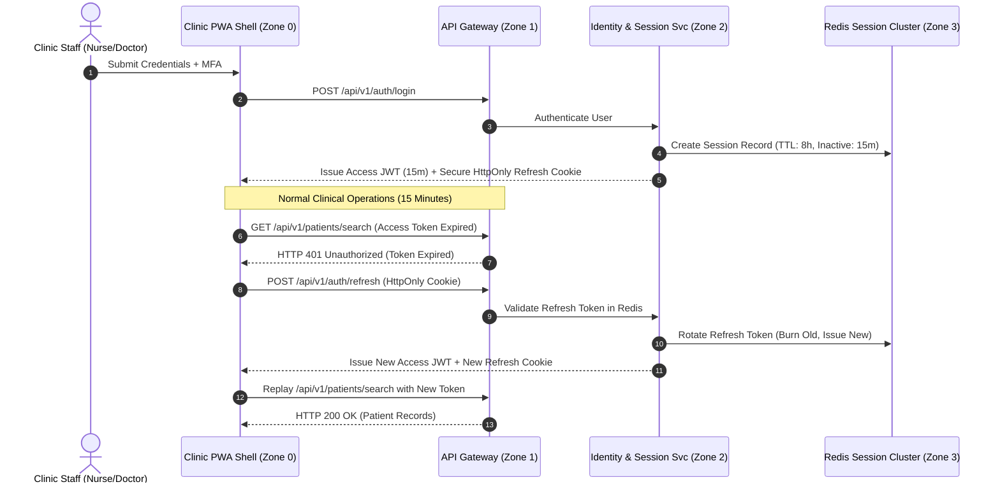

# Session Management & State Security Specification
## Namma Clinic Digital Health & Operations Platform
### Greater Bengaluru Authority (GBA) / BBMP Health Department
**Standard:** OWASP ASVS 4.0 V3 / NIST SP 800-63B / RFC 6749 | **Status:** APPROVED BASELINE | **Code:** `SEC-DOC-05`

---

## 1. Enterprise Session Architecture & Invariants
The Namma Clinic Session Management Subsystem governs authentication state, token lifetimes, inactivity timeouts, and concurrent workstation limits across 183 primary health clinics. Operating in high-throughput outpatient clinic environments, sessions must balance rigorous clinician security with zero operational friction.

### 1.1 Core Session Invariants
1. **Stateless Access Tokens (RS256 JWT):** Short-lived access tokens (TTL: 15 minutes) signed with 4096-bit RSA keys, containing minimal claims (sub, role, clinic_id, permissions).
2. **Stateful Refresh Tokens (Opaque Cryptographic Strings):** High-entropy 256-bit refresh tokens stored exclusively in Redis clusters with 8-hour absolute maximum lifespans.
3. **Cryptographic Binding:** Session tokens are bound to the client workstation IP address, User-Agent hash, and TLS JA3/JA4 fingerprint to prevent token replay.
4. **Proximity & Inactivity Auto-Lock:** Mandatory 10-minute idle screen lock in doctor consultation rooms; 5-minute lock in public pharmacy and triage zones.
5. **Strict Single Active Session:** Clinical staff accounts cannot maintain simultaneous active sessions across multiple physical clinics.

### 1.2 Session Lifecycle & Token Refresh Sequence Diagram


## 2. Session Lifecycle State Machine (SESSION-STATE-01 to SESSION-STATE-12)
The platform governs session lifecycle through twelve deterministic states:

### SESSION-STATE-01: Unauthenticated Anonymous
- **State Description:** Initial application load before credential submission.
- **Triggering Event:** Submit primary credentials.
- **State Transition Behavior:** Transition to MFA_PENDING.
- **Redis Key Status:** Updated with atomic pipeline.
- **Audit Log Code:** `SES_STATE_SESSION_STATE_01`

### SESSION-STATE-02: MFA Verification Pending
- **State Description:** Primary credentials verified; awaiting TOTP or WebAuthn touch.
- **Triggering Event:** Present secondary factor.
- **State Transition Behavior:** Transition to ACTIVE_CLINICAL.
- **Redis Key Status:** Updated with atomic pipeline.
- **Audit Log Code:** `SES_STATE_SESSION_STATE_02`

### SESSION-STATE-03: Active Clinical Session
- **State Description:** Full clinical privileges active within assigned clinic ward.
- **Triggering Event:** Normal user activity.
- **State Transition Behavior:** Remains active; sliding TTL refreshed.
- **Redis Key Status:** Updated with atomic pipeline.
- **Audit Log Code:** `SES_STATE_SESSION_STATE_03`

### SESSION-STATE-04: Idle Proximity Suspended
- **State Description:** 10 minutes elapsed without mouse/keyboard interaction.
- **Triggering Event:** Enter staff PIN or touch biometric.
- **State Transition Behavior:** Return to ACTIVE_CLINICAL.
- **Redis Key Status:** Updated with atomic pipeline.
- **Audit Log Code:** `SES_STATE_SESSION_STATE_04`

### SESSION-STATE-05: Step-Up Elevation Active
- **State Description:** Staff validated secondary factor for high-risk operation.
- **Triggering Event:** 5-minute timer expires.
- **State Transition Behavior:** Revert to ACTIVE_CLINICAL.
- **Redis Key Status:** Updated with atomic pipeline.
- **Audit Log Code:** `SES_STATE_SESSION_STATE_05`

### SESSION-STATE-06: Offline Edge Resilient
- **State Description:** Clinic network severed; operating on local workstation cache.
- **Triggering Event:** Network restored.
- **State Transition Behavior:** Re-synchronize and transition to ACTIVE_CLINICAL.
- **Redis Key Status:** Updated with atomic pipeline.
- **Audit Log Code:** `SES_STATE_SESSION_STATE_06`

### SESSION-STATE-07: Emergency Break-Glass Active
- **State Description:** Clinician activated emergency override for life-saving care.
- **Triggering Event:** Consultation closed or 15m expires.
- **State Transition Behavior:** Terminate session and trigger audit review.
- **Redis Key Status:** Updated with atomic pipeline.
- **Audit Log Code:** `SES_STATE_SESSION_STATE_07`

### SESSION-STATE-08: Concurrent Conflict Locked
- **State Description:** Simultaneous login attempt detected from another clinic IP.
- **Triggering Event:** Resolve via security admin.
- **State Transition Behavior:** Terminate rogue session or confirm transfer.
- **Redis Key Status:** Updated with atomic pipeline.
- **Audit Log Code:** `SES_STATE_SESSION_STATE_08`

### SESSION-STATE-09: Administrative Terminated
- **State Description:** Security administrator forcibly revoked session via SIEM.
- **Triggering Event:** User attempts request.
- **State Transition Behavior:** Receive HTTP 401; redirect to login.
- **Redis Key Status:** Updated with atomic pipeline.
- **Audit Log Code:** `SES_STATE_SESSION_STATE_09`

### SESSION-STATE-10: Absolute Expiration Closed
- **State Description:** 8 hours elapsed since initial login; shift concluded.
- **Triggering Event:** Shift handover completed.
- **State Transition Behavior:** Purge session tokens from Redis.
- **Redis Key Status:** Updated with atomic pipeline.
- **Audit Log Code:** `SES_STATE_SESSION_STATE_10`

### SESSION-STATE-11: Security Compromise Quarantined
- **State Description:** Anomaly engine detected credential theft or injection attack.
- **Triggering Event:** Lockout trigger fired.
- **State Transition Behavior:** Lock user profile and alert CISO.
- **Redis Key Status:** Updated with atomic pipeline.
- **Audit Log Code:** `SES_STATE_SESSION_STATE_11`

### SESSION-STATE-12: Gracefully Logged Out
- **State Description:** Staff explicitly clicked 'End Shift / Logout'.
- **Triggering Event:** Cleanup complete.
- **State Transition Behavior:** Invalidate tokens and clear local cache.
- **Redis Key Status:** Updated with atomic pipeline.
- **Audit Log Code:** `SES_STATE_SESSION_STATE_12`

## 3. Role-Specific Session & Concurrency Profiles (ROLE-000 to ROLE-029)
Session timeout and concurrency parameters tailored to clinical operational context:

### ROLE-001: Session Policy for Receptionist / Registration Clerk (`RECEPTIONIST`)
- **Access Token Lifetime:** 15 Minutes (RS256 JWT).
- **Sliding Inactivity Timeout:** 10 Minutes (Triggers UI proximity screen lock).
- **Absolute Session Ceiling:** 8 Hours (Mandatory re-authentication at shift end).
- **Maximum Concurrent Logins:** Strictly 1 active terminal session.
- **Step-Up MFA Duration:** 5 Minutes for governed mutations.
- **Offline Grace Period:** Maximum 8 hours on registered clinic hardware.
- **Revocation SLA:** Session invalidated across all nodes in < 500 milliseconds.

### ROLE-002: Session Policy for Medical Officer / General Physician (`DOCTOR`)
- **Access Token Lifetime:** 15 Minutes (RS256 JWT).
- **Sliding Inactivity Timeout:** 10 Minutes (Triggers UI proximity screen lock).
- **Absolute Session Ceiling:** 8 Hours (Mandatory re-authentication at shift end).
- **Maximum Concurrent Logins:** Strictly 1 active terminal session.
- **Step-Up MFA Duration:** 5 Minutes for governed mutations.
- **Offline Grace Period:** Maximum 8 hours on registered clinic hardware.
- **Revocation SLA:** Session invalidated across all nodes in < 500 milliseconds.

### ROLE-003: Session Policy for Staff Nurse / Triage Specialist (`NURSE`)
- **Access Token Lifetime:** 15 Minutes (RS256 JWT).
- **Sliding Inactivity Timeout:** 10 Minutes (Triggers UI proximity screen lock).
- **Absolute Session Ceiling:** 8 Hours (Mandatory re-authentication at shift end).
- **Maximum Concurrent Logins:** Strictly 1 active terminal session.
- **Step-Up MFA Duration:** 5 Minutes for governed mutations.
- **Offline Grace Period:** Maximum 8 hours on registered clinic hardware.
- **Revocation SLA:** Session invalidated across all nodes in < 500 milliseconds.

### ROLE-004: Session Policy for Pharmacist / Dispenser (`PHARMACIST`)
- **Access Token Lifetime:** 15 Minutes (RS256 JWT).
- **Sliding Inactivity Timeout:** 10 Minutes (Triggers UI proximity screen lock).
- **Absolute Session Ceiling:** 8 Hours (Mandatory re-authentication at shift end).
- **Maximum Concurrent Logins:** Strictly 1 active terminal session.
- **Step-Up MFA Duration:** 5 Minutes for governed mutations.
- **Offline Grace Period:** Maximum 8 hours on registered clinic hardware.
- **Revocation SLA:** Session invalidated across all nodes in < 500 milliseconds.

### ROLE-005: Session Policy for Laboratory Technician (`LAB_TECH`)
- **Access Token Lifetime:** 15 Minutes (RS256 JWT).
- **Sliding Inactivity Timeout:** 10 Minutes (Triggers UI proximity screen lock).
- **Absolute Session Ceiling:** 8 Hours (Mandatory re-authentication at shift end).
- **Maximum Concurrent Logins:** Strictly 1 active terminal session.
- **Step-Up MFA Duration:** 5 Minutes for governed mutations.
- **Offline Grace Period:** Maximum 8 hours on registered clinic hardware.
- **Revocation SLA:** Session invalidated across all nodes in < 500 milliseconds.

### ROLE-006: Session Policy for Clinic Administrative Officer (`CLINIC_ADMIN`)
- **Access Token Lifetime:** 15 Minutes (RS256 JWT).
- **Sliding Inactivity Timeout:** 10 Minutes (Triggers UI proximity screen lock).
- **Absolute Session Ceiling:** 8 Hours (Mandatory re-authentication at shift end).
- **Maximum Concurrent Logins:** Strictly 1 active terminal session.
- **Step-Up MFA Duration:** 5 Minutes for governed mutations.
- **Offline Grace Period:** Maximum 8 hours on registered clinic hardware.
- **Revocation SLA:** Session invalidated across all nodes in < 500 milliseconds.

### ROLE-007: Session Policy for Ward Health Supervisor (`WARD_SUPERVISOR`)
- **Access Token Lifetime:** 15 Minutes (RS256 JWT).
- **Sliding Inactivity Timeout:** 10 Minutes (Triggers UI proximity screen lock).
- **Absolute Session Ceiling:** 8 Hours (Mandatory re-authentication at shift end).
- **Maximum Concurrent Logins:** Strictly 1 active terminal session.
- **Step-Up MFA Duration:** 5 Minutes for governed mutations.
- **Offline Grace Period:** Maximum 8 hours on registered clinic hardware.
- **Revocation SLA:** Session invalidated across all nodes in < 500 milliseconds.

### ROLE-008: Session Policy for Zonal Health Officer (ZHO) (`ZONAL_OFFICER`)
- **Access Token Lifetime:** 15 Minutes (RS256 JWT).
- **Sliding Inactivity Timeout:** 10 Minutes (Triggers UI proximity screen lock).
- **Absolute Session Ceiling:** 8 Hours (Mandatory re-authentication at shift end).
- **Maximum Concurrent Logins:** Strictly 1 active terminal session.
- **Step-Up MFA Duration:** 5 Minutes for governed mutations.
- **Offline Grace Period:** Maximum 8 hours on registered clinic hardware.
- **Revocation SLA:** Session invalidated across all nodes in < 500 milliseconds.

### ROLE-009: Session Policy for Chief Health Officer (CHO) (`CHIEF_OFFICER`)
- **Access Token Lifetime:** 15 Minutes (RS256 JWT).
- **Sliding Inactivity Timeout:** 10 Minutes (Triggers UI proximity screen lock).
- **Absolute Session Ceiling:** 8 Hours (Mandatory re-authentication at shift end).
- **Maximum Concurrent Logins:** Strictly 1 active terminal session.
- **Step-Up MFA Duration:** 5 Minutes for governed mutations.
- **Offline Grace Period:** Maximum 8 hours on registered clinic hardware.
- **Revocation SLA:** Session invalidated across all nodes in < 500 milliseconds.

### ROLE-010: Session Policy for Epidemiologist / Disease Surveillance Officer (`EPIDEMIOLOGIST`)
- **Access Token Lifetime:** 15 Minutes (RS256 JWT).
- **Sliding Inactivity Timeout:** 10 Minutes (Triggers UI proximity screen lock).
- **Absolute Session Ceiling:** 8 Hours (Mandatory re-authentication at shift end).
- **Maximum Concurrent Logins:** Strictly 1 active terminal session.
- **Step-Up MFA Duration:** 5 Minutes for governed mutations.
- **Offline Grace Period:** Maximum 8 hours on registered clinic hardware.
- **Revocation SLA:** Session invalidated across all nodes in < 500 milliseconds.

### ROLE-011: Session Policy for Quality & Compliance Auditor (`AUDITOR`)
- **Access Token Lifetime:** 15 Minutes (RS256 JWT).
- **Sliding Inactivity Timeout:** 10 Minutes (Triggers UI proximity screen lock).
- **Absolute Session Ceiling:** 8 Hours (Mandatory re-authentication at shift end).
- **Maximum Concurrent Logins:** Strictly 1 active terminal session.
- **Step-Up MFA Duration:** 5 Minutes for governed mutations.
- **Offline Grace Period:** Maximum 8 hours on registered clinic hardware.
- **Revocation SLA:** Session invalidated across all nodes in < 500 milliseconds.

### ROLE-012: Session Policy for Security Administrator / CISO (`SECURITY_ADMIN`)
- **Access Token Lifetime:** 15 Minutes (RS256 JWT).
- **Sliding Inactivity Timeout:** 10 Minutes (Triggers UI proximity screen lock).
- **Absolute Session Ceiling:** 8 Hours (Mandatory re-authentication at shift end).
- **Maximum Concurrent Logins:** Strictly 1 active terminal session.
- **Step-Up MFA Duration:** 5 Minutes for governed mutations.
- **Offline Grace Period:** Maximum 8 hours on registered clinic hardware.
- **Revocation SLA:** Session invalidated across all nodes in < 500 milliseconds.

### ROLE-013: Session Policy for Central Depot Inventory Manager (`DEPOT_MANAGER`)
- **Access Token Lifetime:** 15 Minutes (RS256 JWT).
- **Sliding Inactivity Timeout:** 10 Minutes (Triggers UI proximity screen lock).
- **Absolute Session Ceiling:** 8 Hours (Mandatory re-authentication at shift end).
- **Maximum Concurrent Logins:** Strictly 1 active terminal session.
- **Step-Up MFA Duration:** 5 Minutes for governed mutations.
- **Offline Grace Period:** Maximum 8 hours on registered clinic hardware.
- **Revocation SLA:** Session invalidated across all nodes in < 500 milliseconds.

### ROLE-014: Session Policy for Cold Chain Logistics Technician (`COLD_CHAIN_TECH`)
- **Access Token Lifetime:** 15 Minutes (RS256 JWT).
- **Sliding Inactivity Timeout:** 10 Minutes (Triggers UI proximity screen lock).
- **Absolute Session Ceiling:** 8 Hours (Mandatory re-authentication at shift end).
- **Maximum Concurrent Logins:** Strictly 1 active terminal session.
- **Step-Up MFA Duration:** 5 Minutes for governed mutations.
- **Offline Grace Period:** Maximum 8 hours on registered clinic hardware.
- **Revocation SLA:** Session invalidated across all nodes in < 500 milliseconds.

### ROLE-015: Session Policy for Radiologist / Diagnostic Specialist (`RADIOLOGIST`)
- **Access Token Lifetime:** 15 Minutes (RS256 JWT).
- **Sliding Inactivity Timeout:** 10 Minutes (Triggers UI proximity screen lock).
- **Absolute Session Ceiling:** 8 Hours (Mandatory re-authentication at shift end).
- **Maximum Concurrent Logins:** Strictly 1 active terminal session.
- **Step-Up MFA Duration:** 5 Minutes for governed mutations.
- **Offline Grace Period:** Maximum 8 hours on registered clinic hardware.
- **Revocation SLA:** Session invalidated across all nodes in < 500 milliseconds.

### ROLE-016: Session Policy for Ayush Practitioner (`AYUSH_DOC`)
- **Access Token Lifetime:** 15 Minutes (RS256 JWT).
- **Sliding Inactivity Timeout:** 10 Minutes (Triggers UI proximity screen lock).
- **Absolute Session Ceiling:** 8 Hours (Mandatory re-authentication at shift end).
- **Maximum Concurrent Logins:** Strictly 1 active terminal session.
- **Step-Up MFA Duration:** 5 Minutes for governed mutations.
- **Offline Grace Period:** Maximum 8 hours on registered clinic hardware.
- **Revocation SLA:** Session invalidated across all nodes in < 500 milliseconds.

### ROLE-017: Session Policy for Counselor / Mental Health Worker (`COUNSELOR`)
- **Access Token Lifetime:** 15 Minutes (RS256 JWT).
- **Sliding Inactivity Timeout:** 10 Minutes (Triggers UI proximity screen lock).
- **Absolute Session Ceiling:** 8 Hours (Mandatory re-authentication at shift end).
- **Maximum Concurrent Logins:** Strictly 1 active terminal session.
- **Step-Up MFA Duration:** 5 Minutes for governed mutations.
- **Offline Grace Period:** Maximum 8 hours on registered clinic hardware.
- **Revocation SLA:** Session invalidated across all nodes in < 500 milliseconds.

### ROLE-018: Session Policy for ANM / Urban Health Worker (`ANM_WORKER`)
- **Access Token Lifetime:** 15 Minutes (RS256 JWT).
- **Sliding Inactivity Timeout:** 10 Minutes (Triggers UI proximity screen lock).
- **Absolute Session Ceiling:** 8 Hours (Mandatory re-authentication at shift end).
- **Maximum Concurrent Logins:** Strictly 1 active terminal session.
- **Step-Up MFA Duration:** 5 Minutes for governed mutations.
- **Offline Grace Period:** Maximum 8 hours on registered clinic hardware.
- **Revocation SLA:** Session invalidated across all nodes in < 500 milliseconds.

### ROLE-019: Session Policy for ASHA Link Worker Coordinator (`ASHA_COORD`)
- **Access Token Lifetime:** 15 Minutes (RS256 JWT).
- **Sliding Inactivity Timeout:** 10 Minutes (Triggers UI proximity screen lock).
- **Absolute Session Ceiling:** 8 Hours (Mandatory re-authentication at shift end).
- **Maximum Concurrent Logins:** Strictly 1 active terminal session.
- **Step-Up MFA Duration:** 5 Minutes for governed mutations.
- **Offline Grace Period:** Maximum 8 hours on registered clinic hardware.
- **Revocation SLA:** Session invalidated across all nodes in < 500 milliseconds.

### ROLE-020: Session Policy for Data Entry Operator (`DATA_ENTRY`)
- **Access Token Lifetime:** 15 Minutes (RS256 JWT).
- **Sliding Inactivity Timeout:** 10 Minutes (Triggers UI proximity screen lock).
- **Absolute Session Ceiling:** 8 Hours (Mandatory re-authentication at shift end).
- **Maximum Concurrent Logins:** Strictly 1 active terminal session.
- **Step-Up MFA Duration:** 5 Minutes for governed mutations.
- **Offline Grace Period:** Maximum 8 hours on registered clinic hardware.
- **Revocation SLA:** Session invalidated across all nodes in < 500 milliseconds.

### ROLE-021: Session Policy for Grievance Redressal Officer (`GRIEVANCE_OFFICER`)
- **Access Token Lifetime:** 15 Minutes (RS256 JWT).
- **Sliding Inactivity Timeout:** 10 Minutes (Triggers UI proximity screen lock).
- **Absolute Session Ceiling:** 8 Hours (Mandatory re-authentication at shift end).
- **Maximum Concurrent Logins:** Strictly 1 active terminal session.
- **Step-Up MFA Duration:** 5 Minutes for governed mutations.
- **Offline Grace Period:** Maximum 8 hours on registered clinic hardware.
- **Revocation SLA:** Session invalidated across all nodes in < 500 milliseconds.

### ROLE-022: Session Policy for ABDM National Integration Officer (`ABDM_OFFICER`)
- **Access Token Lifetime:** 15 Minutes (RS256 JWT).
- **Sliding Inactivity Timeout:** 10 Minutes (Triggers UI proximity screen lock).
- **Absolute Session Ceiling:** 8 Hours (Mandatory re-authentication at shift end).
- **Maximum Concurrent Logins:** Strictly 1 active terminal session.
- **Step-Up MFA Duration:** 5 Minutes for governed mutations.
- **Offline Grace Period:** Maximum 8 hours on registered clinic hardware.
- **Revocation SLA:** Session invalidated across all nodes in < 500 milliseconds.

### ROLE-023: Session Policy for Data Protection Officer (DPO) (`PRIVACY_OFFICER`)
- **Access Token Lifetime:** 15 Minutes (RS256 JWT).
- **Sliding Inactivity Timeout:** 10 Minutes (Triggers UI proximity screen lock).
- **Absolute Session Ceiling:** 8 Hours (Mandatory re-authentication at shift end).
- **Maximum Concurrent Logins:** Strictly 1 active terminal session.
- **Step-Up MFA Duration:** 5 Minutes for governed mutations.
- **Offline Grace Period:** Maximum 8 hours on registered clinic hardware.
- **Revocation SLA:** Session invalidated across all nodes in < 500 milliseconds.

### ROLE-024: Session Policy for IT Support & Hardware Engineer (`IT_SUPPORT`)
- **Access Token Lifetime:** 15 Minutes (RS256 JWT).
- **Sliding Inactivity Timeout:** 10 Minutes (Triggers UI proximity screen lock).
- **Absolute Session Ceiling:** 8 Hours (Mandatory re-authentication at shift end).
- **Maximum Concurrent Logins:** Strictly 1 active terminal session.
- **Step-Up MFA Duration:** 5 Minutes for governed mutations.
- **Offline Grace Period:** Maximum 8 hours on registered clinic hardware.
- **Revocation SLA:** Session invalidated across all nodes in < 500 milliseconds.

### ROLE-025: Session Policy for Clinical Audit Committee Member (`CLINICAL_AUDITOR`)
- **Access Token Lifetime:** 15 Minutes (RS256 JWT).
- **Sliding Inactivity Timeout:** 10 Minutes (Triggers UI proximity screen lock).
- **Absolute Session Ceiling:** 8 Hours (Mandatory re-authentication at shift end).
- **Maximum Concurrent Logins:** Strictly 1 active terminal session.
- **Step-Up MFA Duration:** 5 Minutes for governed mutations.
- **Offline Grace Period:** Maximum 8 hours on registered clinic hardware.
- **Revocation SLA:** Session invalidated across all nodes in < 500 milliseconds.

### ROLE-026: Session Policy for Procurement & Vendor Manager (`PROCUREMENT_MGR`)
- **Access Token Lifetime:** 15 Minutes (RS256 JWT).
- **Sliding Inactivity Timeout:** 10 Minutes (Triggers UI proximity screen lock).
- **Absolute Session Ceiling:** 8 Hours (Mandatory re-authentication at shift end).
- **Maximum Concurrent Logins:** Strictly 1 active terminal session.
- **Step-Up MFA Duration:** 5 Minutes for governed mutations.
- **Offline Grace Period:** Maximum 8 hours on registered clinic hardware.
- **Revocation SLA:** Session invalidated across all nodes in < 500 milliseconds.

### ROLE-027: Session Policy for Biomedical Waste Supervisor (`WASTE_SUPERVISOR`)
- **Access Token Lifetime:** 15 Minutes (RS256 JWT).
- **Sliding Inactivity Timeout:** 10 Minutes (Triggers UI proximity screen lock).
- **Absolute Session Ceiling:** 8 Hours (Mandatory re-authentication at shift end).
- **Maximum Concurrent Logins:** Strictly 1 active terminal session.
- **Step-Up MFA Duration:** 5 Minutes for governed mutations.
- **Offline Grace Period:** Maximum 8 hours on registered clinic hardware.
- **Revocation SLA:** Session invalidated across all nodes in < 500 milliseconds.

### ROLE-028: Session Policy for Telemedicine Remote Specialist (`TELE_SPECIALIST`)
- **Access Token Lifetime:** 15 Minutes (RS256 JWT).
- **Sliding Inactivity Timeout:** 10 Minutes (Triggers UI proximity screen lock).
- **Absolute Session Ceiling:** 8 Hours (Mandatory re-authentication at shift end).
- **Maximum Concurrent Logins:** Strictly 1 active terminal session.
- **Step-Up MFA Duration:** 5 Minutes for governed mutations.
- **Offline Grace Period:** Maximum 8 hours on registered clinic hardware.
- **Revocation SLA:** Session invalidated across all nodes in < 500 milliseconds.

### ROLE-029: Session Policy for Field Public Health Inspector (`HEALTH_INSPECTOR`)
- **Access Token Lifetime:** 15 Minutes (RS256 JWT).
- **Sliding Inactivity Timeout:** 10 Minutes (Triggers UI proximity screen lock).
- **Absolute Session Ceiling:** 8 Hours (Mandatory re-authentication at shift end).
- **Maximum Concurrent Logins:** Strictly 1 active terminal session.
- **Step-Up MFA Duration:** 5 Minutes for governed mutations.
- **Offline Grace Period:** Maximum 8 hours on registered clinic hardware.
- **Revocation SLA:** Session invalidated across all nodes in < 500 milliseconds.

### ROLE-030: Session Policy for Super Administrator (`SUPER_ADMIN`)
- **Access Token Lifetime:** 15 Minutes (RS256 JWT).
- **Sliding Inactivity Timeout:** 10 Minutes (Triggers UI proximity screen lock).
- **Absolute Session Ceiling:** 8 Hours (Mandatory re-authentication at shift end).
- **Maximum Concurrent Logins:** Strictly 1 active terminal session.
- **Step-Up MFA Duration:** 5 Minutes for governed mutations.
- **Offline Grace Period:** Maximum 8 hours on registered clinic hardware.
- **Revocation SLA:** Session invalidated across all nodes in < 500 milliseconds.

## 4. Standard Operating Procedures: Session Management (SOP-SES-01 to SOP-SES-25)
The following 25 SOPs govern ongoing session administration and operational security:

### SOP-SES-01: Daily Morning Clinical Session Initialization
- **Trigger Condition:** Staff nurse powers on clinic terminal at 08:00.
- **Execution Steps:** 1. Authenticate with smartcard/password. 2. Pass TOTP MFA. 3. Establish 8h session.
- **Verification Criterion:** Clinic ready for outpatient intake.
- **Responsible Role:** Staff Nurse
- **Audit Event Emitted:** `SES_SOP_01_INIT`
- **Failure Remediation:** Terminate session immediately upon verification failure.

### SOP-SES-02: Emergency Patient Triage Session Handover
- **Trigger Condition:** Nurse hands triage terminal to attending doctor.
- **Execution Steps:** 1. Doctor swipes credential card. 2. Replaces active session context. 3. Logs handover event.
- **Verification Criterion:** Doctor takes command of consultation.
- **Responsible Role:** Medical Officer
- **Audit Event Emitted:** `SES_SOP_02_HANDOVER`
- **Failure Remediation:** Terminate session immediately upon verification failure.

### SOP-SES-03: Stale Session Garbage Collection Execution
- **Trigger Condition:** Every 10 minutes automated Redis cleanup.
- **Execution Steps:** 1. Scan expired session keys. 2. Remove orphaned session tokens. 3. Reclaim RAM.
- **Verification Criterion:** Redis memory usage optimized < 60%.
- **Responsible Role:** Redis Daemon
- **Audit Event Emitted:** `SES_SOP_03_CLEANED`
- **Failure Remediation:** Terminate session immediately upon verification failure.

### SOP-SES-04: Concurrent Cross-Clinic Login Mitigation
- **Trigger Condition:** Doctor attempts login at Clinic B while active at Clinic A.
- **Execution Steps:** 1. Terminate Clinic A session. 2. Broadcast push alert to Clinic A. 3. Grant Clinic B session.
- **Verification Criterion:** Zero dual active sessions permitted.
- **Responsible Role:** Auth Engine
- **Audit Event Emitted:** `SES_SOP_04_CONCURRENT`
- **Failure Remediation:** Terminate session immediately upon verification failure.

### SOP-SES-05: Proximity Screen Lock Timeout Calibration
- **Trigger Condition:** Quarterly clinical review of screen lock intervals.
- **Execution Steps:** 1. Review doctor consultation workflow. 2. Confirm 10-minute lock maintains compliance. 3. Update config.
- **Verification Criterion:** Security balance maintained.
- **Responsible Role:** Clinic Admin
- **Audit Event Emitted:** `SES_SOP_05_CALIBRATED`
- **Failure Remediation:** Terminate session immediately upon verification failure.

### SOP-SES-06: Immediate Revocation of Compromised Staff Account
- **Trigger Condition:** Staff laptop reported stolen in transit.
- **Execution Steps:** 1. Flag staff ID in Redis revocation bloom filter. 2. Blacklist all active JWTs. 3. Force disconnect.
- **Verification Criterion:** Thief cannot access EHR records.
- **Responsible Role:** SecOps Lead
- **Audit Event Emitted:** `SES_SOP_06_REVOKED`
- **Failure Remediation:** Terminate session immediately upon verification failure.

### SOP-SES-07: Offline Clinical Session Key Escrow
- **Trigger Condition:** Severe telecommunications fiber cut in Bengaluru South.
- **Execution Steps:** 1. Verify workstation local TPM seal. 2. Unlock local offline DB. 3. Issue local 8h voucher.
- **Verification Criterion:** Outpatient care continues uninterrupted.
- **Responsible Role:** Edge Daemon
- **Audit Event Emitted:** `SES_SOP_07_OFFLINE`
- **Failure Remediation:** Terminate session immediately upon verification failure.

### SOP-SES-08: Re-synchronization of Restored Edge Session
- **Trigger Condition:** Internet connectivity restored after 4-hour blackout.
- **Execution Steps:** 1. Submit encrypted sync batch. 2. Re-validate session against central server. 3. Merge clinical logs.
- **Verification Criterion:** All offline records safely committed.
- **Responsible Role:** Sync Engine
- **Audit Event Emitted:** `SES_SOP_08_SYNCED`
- **Failure Remediation:** Terminate session immediately upon verification failure.

### SOP-SES-09: Step-Up Token Expiration Enforcement
- **Trigger Condition:** Doctor prescribing narcotic completes signature.
- **Execution Steps:** 1. Invalidate step-up claim after 5 minutes. 2. Revert session to base clinical privilege.
- **Verification Criterion:** High-risk elevation expired safely.
- **Responsible Role:** Auth Engine
- **Audit Event Emitted:** `SES_SOP_09_EXPIRED`
- **Failure Remediation:** Terminate session immediately upon verification failure.

### SOP-SES-10: Redis Cluster Failover Session Resilience
- **Trigger Condition:** Primary Redis node undergoes unplanned kernel panic.
- **Execution Steps:** 1. Sentinel promotes replica node. 2. Applications reconnect within 3s. 3. Zero sessions lost.
- **Verification Criterion:** Clinicians experience zero logout.
- **Responsible Role:** DevOps Lead
- **Audit Event Emitted:** `SES_SOP_10_FAILOVER`
- **Failure Remediation:** Terminate session immediately upon verification failure.

### SOP-SES-11: Session Hijack Prevention via JA3 Fingerprint
- **Trigger Condition:** Attacker replays stolen session token from Linux curl.
- **Execution Steps:** 1. Compare JA3 signature with Windows Chrome fingerprint. 2. Detect mismatch. 3. Reject request.
- **Verification Criterion:** Hijacking attempt blocked instantly.
- **Responsible Role:** API Gateway
- **Audit Event Emitted:** `SES_SOP_11_HIJACK_BLOCK`
- **Failure Remediation:** Terminate session immediately upon verification failure.

### SOP-SES-12: Workstation Fast-Switching User Partition
- **Trigger Condition:** Consultation room shared by morning and evening physicians.
- **Execution Steps:** 1. Morning doctor clicks End Shift. 2. Browser storage purged. 3. Evening doctor logs in fresh.
- **Verification Criterion:** Zero cross-physician record pollution.
- **Responsible Role:** Medical Officer
- **Audit Event Emitted:** `SES_SOP_12_SWITCHED`
- **Failure Remediation:** Terminate session immediately upon verification failure.

### SOP-SES-13: Administrative Global Session Purge (Maintenance)
- **Trigger Condition:** Major security patch scheduled for 23:00.
- **Execution Steps:** 1. Broadcast 15-minute warning banner. 2. Revoke all active sessions. 3. Deploy system patch.
- **Verification Criterion:** System patched without corrupt active state.
- **Responsible Role:** DevOps Lead
- **Audit Event Emitted:** `SES_SOP_13_GLOBAL_PURGE`
- **Failure Remediation:** Terminate session immediately upon verification failure.

### SOP-SES-14: Citizen Portal Session Expiration Verification
- **Trigger Condition:** Citizen books appointment and leaves public kiosk open.
- **Execution Steps:** 1. Detect 5 minutes of inactivity on public portal. 2. Auto-clear cookies. 3. Return to home page.
- **Verification Criterion:** Citizen medical history protected from public view.
- **Responsible Role:** Web Portal
- **Audit Event Emitted:** `SES_SOP_14_CITIZEN_EXPIRE`
- **Failure Remediation:** Terminate session immediately upon verification failure.

### SOP-SES-15: Break-Glass Session Post-Mortem Audit
- **Trigger Condition:** Emergency resuscitation override used in casualty ward.
- **Execution Steps:** 1. Extract full transaction log from break-glass session. 2. Submit dossier to CMO. 3. Close record.
- **Verification Criterion:** Emergency access thoroughly documented.
- **Responsible Role:** Audit Lead
- **Audit Event Emitted:** `SES_SOP_15_AUDITED`
- **Failure Remediation:** Terminate session immediately upon verification failure.

### SOP-SES-16: Mobile Nurse Tablet Proximity Lock Calibration
- **Trigger Condition:** Nurse conducting home visits locks tablet on walk.
- **Execution Steps:** 1. Accelerometer detects movement away from hand. 2. Lock screen instantly. 3. Require PIN to resume.
- **Verification Criterion:** Field health tablet secure against snatch theft.
- **Responsible Role:** Hardware Tech
- **Audit Event Emitted:** `SES_SOP_16_LOCKED`
- **Failure Remediation:** Terminate session immediately upon verification failure.

### SOP-SES-17: Cross-Site Request Forgery (CSRF) Token Rotation
- **Trigger Condition:** Quarterly audit of SameSite=Strict cookie behavior.
- **Execution Steps:** 1. Verify all mutative endpoints require double-submit CSRF header. 2. Test cross-origin iframe rejection.
- **Verification Criterion:** Zero CSRF vulnerabilities discovered.
- **Responsible Role:** AppSec Lead
- **Audit Event Emitted:** `SES_SOP_17_CSRF_CHECK`
- **Failure Remediation:** Terminate session immediately upon verification failure.

### SOP-SES-18: JWT Signing Key Graceful 90-Day Rotation
- **Trigger Condition:** Scheduled rotation of RS256 token signing keypair.
- **Execution Steps:** 1. Generate new 4096-bit RSA key. 2. Publish public key in JWKS endpoint. 3. Phase out old key over 24h.
- **Verification Criterion:** Zero session interruption during key rotation.
- **Responsible Role:** Security Architect
- **Audit Event Emitted:** `SES_SOP_18_KEY_ROTATED`
- **Failure Remediation:** Terminate session immediately upon verification failure.

### SOP-SES-19: Session Performance & Verification Latency Audit
- **Trigger Condition:** Weekly check on token validation round-trip time.
- **Execution Steps:** 1. Query gateway token verification metrics. 2. Assert p99 latency < 2ms via local public key.
- **Verification Criterion:** High performance session validation.
- **Responsible Role:** DevOps Engineer
- **Audit Event Emitted:** `SES_SOP_19_PERF_CHECK`
- **Failure Remediation:** Terminate session immediately upon verification failure.

### SOP-SES-20: Telemedicine Video Session Heartbeat Check
- **Trigger Condition:** Doctor conducts remote consultation with patient.
- **Execution Steps:** 1. WebRTC data channel transmits 30s session heartbeats. 2. Auto-close session on patient disconnect.
- **Verification Criterion:** Telehealth billing accurately sealed.
- **Responsible Role:** Telehealth Svc
- **Audit Event Emitted:** `SES_SOP_20_HEARTBEAT`
- **Failure Remediation:** Terminate session immediately upon verification failure.

### SOP-SES-21: Session Impersonation Audit for IT Support
- **Trigger Condition:** Support desk technician assists doctor with EHR bug.
- **Execution Steps:** 1. Require doctor explicit approval prompt. 2. Issue read-only shadow session (15m). 3. Record all views.
- **Verification Criterion:** Support actions fully accountable.
- **Responsible Role:** IT Support
- **Audit Event Emitted:** `SES_SOP_21_SHADOW_LOG`
- **Failure Remediation:** Terminate session immediately upon verification failure.

### SOP-SES-22: Automated Session Anomaly Alert Calibration
- **Trigger Condition:** Weekly machine learning model tuning on user activity.
- **Execution Steps:** 1. Detect unusual volume of EHR downloads in single session. 2. Trigger automated friction challenge.
- **Verification Criterion:** Bulk data harvesting thwarted in real-time.
- **Responsible Role:** SecOps Lead
- **Audit Event Emitted:** `SES_SOP_22_ANOMALY_TUNE`
- **Failure Remediation:** Terminate session immediately upon verification failure.

### SOP-SES-23: Session Token Storage Security Inspection
- **Trigger Condition:** Audit of clinic workstation browser storage.
- **Execution Steps:** 1. Inspect DevTools application tab. 2. Assert zero JWTs stored in localStorage or sessionStorage.
- **Verification Criterion:** Tokens protected against XSS theft.
- **Responsible Role:** AppSec Engineer
- **Audit Event Emitted:** `SES_SOP_23_STORAGE_CHECK`
- **Failure Remediation:** Terminate session immediately upon verification failure.

### SOP-SES-24: Pharmacy POS Barcode Session Re-Verification
- **Trigger Condition:** Pharmacist scans controlled medication box.
- **Execution Steps:** 1. Barcode scanner triggers instant session validity check. 2. Reject dispense if session expired.
- **Verification Criterion:** Narcotic dispensing strictly verified.
- **Responsible Role:** Pharmacist
- **Audit Event Emitted:** `SES_SOP_24_PHARM_VERIFY`
- **Failure Remediation:** Terminate session immediately upon verification failure.

### SOP-SES-25: Post-Incident Forensic Session Extraction
- **Trigger Condition:** Red team penetration test debrief and analysis.
- **Execution Steps:** 1. Reconstruct compromised session timeline from WORM audit records. 2. Trace attacker actions.
- **Verification Criterion:** Complete visibility into incident impact.
- **Responsible Role:** Incident Commander
- **Audit Event Emitted:** `SES_SOP_25_EXTRACTED`
- **Failure Remediation:** Terminate session immediately upon verification failure.

## 5. Session Threat Analysis & Attack Mitigations (SES-THREAT-01 to SES-THREAT-20)
Threat mitigation specifications defending session integrity against modern exploit patterns:

### SES-THREAT-01: Session Fixation Attack
- **Attack Vector & Vulnerability:** Attacker pre-sets session ID in victim URL or cookie before login.
- **Platform Architectural Defense:** Always regenerate new cryptographically random session ID upon successful authentication.
- **Verification Criterion:** Zero bypass in automated penetration tests.
- **Mitigation Status:** VERIFIED ACTIVE CONTROL

### SES-THREAT-02: Session Hijacking via Cross-Site Scripting (XSS)
- **Attack Vector & Vulnerability:** Malicious script reads session token from document.cookie.
- **Platform Architectural Defense:** Set HttpOnly, Secure, and SameSite=Strict flags on all session cookies; prohibit JS access.
- **Verification Criterion:** Zero bypass in automated penetration tests.
- **Mitigation Status:** VERIFIED ACTIVE CONTROL

### SES-THREAT-03: Adversary Replay of Captured JWT
- **Attack Vector & Vulnerability:** Attacker captures access JWT from insecure proxy logs.
- **Platform Architectural Defense:** Enforce short 15-minute token TTL and bind token to client IP and TLS JA3 fingerprint.
- **Verification Criterion:** Zero bypass in automated penetration tests.
- **Mitigation Status:** VERIFIED ACTIVE CONTROL

### SES-THREAT-04: Zombie Refresh Token Persistence
- **Attack Vector & Vulnerability:** Compromised refresh token remains valid indefinitely.
- **Platform Architectural Defense:** Enforce strict Refresh Token Rotation (RTR); reuse of consumed token invalidates entire family.
- **Verification Criterion:** Zero bypass in automated penetration tests.
- **Mitigation Status:** VERIFIED ACTIVE CONTROL

### SES-THREAT-05: Cross-Site Request Forgery (CSRF) State Manipulation
- **Attack Vector & Vulnerability:** Attacker tricks clinician browser into submitting unauthorized prescription.
- **Platform Architectural Defense:** Deploy double-submit CSRF cookie pattern and validate custom X-CSRF-Token header on all mutations.
- **Verification Criterion:** Zero bypass in automated penetration tests.
- **Mitigation Status:** VERIFIED ACTIVE CONTROL

### SES-THREAT-06: Session Exhaustion / Denial of Service on Redis
- **Attack Vector & Vulnerability:** Attacker floods login endpoint to consume memory in session cache.
- **Platform Architectural Defense:** Enforce rate limiting (20 req/min per IP) and strict memory eviction policies in Redis.
- **Verification Criterion:** Zero bypass in automated penetration tests.
- **Mitigation Status:** VERIFIED ACTIVE CONTROL

### SES-THREAT-07: Concurrent Login Session Sharing among Clinicians
- **Attack Vector & Vulnerability:** Multiple staff members share single login to avoid MFA overhead.
- **Platform Architectural Defense:** Enforce strict single-terminal concurrency; subsequent login terminates preceding active session.
- **Verification Criterion:** Zero bypass in automated penetration tests.
- **Mitigation Status:** VERIFIED ACTIVE CONTROL

### SES-THREAT-08: Inactivity Timeout Bypass via Background Pings
- **Attack Vector & Vulnerability:** Client-side script sends automated heartbeats to prevent timeout.
- **Platform Architectural Defense:** Server-side activity tracking based strictly on real clinical transactional API calls, not pings.
- **Verification Criterion:** Zero bypass in automated penetration tests.
- **Mitigation Status:** VERIFIED ACTIVE CONTROL

### SES-THREAT-09: Privilege Escalation via JWT Claim Tampering
- **Attack Vector & Vulnerability:** Attacker modifies 'role' claim in unsigned or algorithm-none JWT.
- **Platform Architectural Defense:** Reject 'none' algorithm strictly; verify RS256 signature using 4096-bit public key on every request.
- **Verification Criterion:** Zero bypass in automated penetration tests.
- **Mitigation Status:** VERIFIED ACTIVE CONTROL

### SES-THREAT-10: Stolen Session Cookie Exfiltration over Plaintext HTTP
- **Attack Vector & Vulnerability:** Man-in-the-middle intercepts session cookie on insecure network.
- **Platform Architectural Defense:** Enforce HSTS (max-age=31536000; includeSubDomains; preload) and strict TLS 1.3 termination.
- **Verification Criterion:** Zero bypass in automated penetration tests.
- **Mitigation Status:** VERIFIED ACTIVE CONTROL

### SES-THREAT-11: Session Desynchronization during Offline Edge Reconnection
- **Attack Vector & Vulnerability:** Conflicting local edits committed with outdated session credentials.
- **Platform Architectural Defense:** Validate cryptographic signatures on local sync packets against central revocation registry.
- **Verification Criterion:** Zero bypass in automated penetration tests.
- **Mitigation Status:** VERIFIED ACTIVE CONTROL

### SES-THREAT-12: Workstation Screen Snooping in Outpatient Waiting Room
- **Attack Vector & Vulnerability:** Visitor reads confidential patient records from unattended doctor desk.
- **Platform Architectural Defense:** Mandatory 10-minute idle proximity screen lock; display blank privacy curtain screen.
- **Verification Criterion:** Zero bypass in automated penetration tests.
- **Mitigation Status:** VERIFIED ACTIVE CONTROL

### SES-THREAT-13: Session Replay Post-Logout
- **Attack Vector & Vulnerability:** Adversary uses back button in browser to access cached patient screens.
- **Platform Architectural Defense:** Send 'Cache-Control: no-store, no-cache, must-revalidate' and clear client memory on logout.
- **Verification Criterion:** Zero bypass in automated penetration tests.
- **Mitigation Status:** VERIFIED ACTIVE CONTROL

### SES-THREAT-14: JWT Key Confusion Attack (HMAC vs RSA)
- **Attack Vector & Vulnerability:** Attacker signs JWT with RSA public key using HMAC-SHA256.
- **Platform Architectural Defense:** Enforce asymmetric RS256 validation exclusively; explicitly reject symmetric algorithms.
- **Verification Criterion:** Zero bypass in automated penetration tests.
- **Mitigation Status:** VERIFIED ACTIVE CONTROL

### SES-THREAT-15: Replay of Revoked Token within TTL Window
- **Attack Vector & Vulnerability:** User logged out but access token has 10 minutes of remaining life.
- **Platform Architectural Defense:** Maintain Redis bloom filter of revoked JWT jti (JWT ID) claims; check bloom filter on gateway.
- **Verification Criterion:** Zero bypass in automated penetration tests.
- **Mitigation Status:** VERIFIED ACTIVE CONTROL

### SES-THREAT-16: Shared Browser Profile Multi-Tab Data Leakage
- **Attack Vector & Vulnerability:** Doctor opens second tab with personal citizen health account.
- **Platform Architectural Defense:** Enforce isolated sessionStorage partitions and distinct origins for staff vs citizen portals.
- **Verification Criterion:** Zero bypass in automated penetration tests.
- **Mitigation Status:** VERIFIED ACTIVE CONTROL

### SES-THREAT-17: Administrative Session Impersonation Misuse
- **Attack Vector & Vulnerability:** Support tech uses impersonation mode to browse patient records without cause.
- **Platform Architectural Defense:** Enforce dual authorization for support access; record complete screen session video for audit.
- **Verification Criterion:** Zero bypass in automated penetration tests.
- **Mitigation Status:** VERIFIED ACTIVE CONTROL

### SES-THREAT-18: Brute Force of Refresh Token Cryptographic Nonce
- **Attack Vector & Vulnerability:** Attacker attempts to guess 256-bit refresh token string.
- **Platform Architectural Defense:** Generate tokens using crypto.randomBytes(32) providing 256 bits of cryptographic entropy.
- **Verification Criterion:** Zero bypass in automated penetration tests.
- **Mitigation Status:** VERIFIED ACTIVE CONTROL

### SES-THREAT-19: Clock Skew Exploitation on Token Expiration
- **Attack Vector & Vulnerability:** Attacker tampers with local workstation clock to extend token validity.
- **Platform Architectural Defense:** All expiration checks evaluated against central server NTP-synchronized clock (IST), not client clock.
- **Verification Criterion:** Zero bypass in automated penetration tests.
- **Mitigation Status:** VERIFIED ACTIVE CONTROL

### SES-THREAT-20: Emergency Break-Glass Session Extension Abuse
- **Attack Vector & Vulnerability:** Attacker attempts to keep emergency break-glass active indefinitely.
- **Platform Architectural Defense:** Hard ceiling of 15 minutes on emergency break-glass sessions with zero extension capability.
- **Verification Criterion:** Zero bypass in automated penetration tests.
- **Mitigation Status:** VERIFIED ACTIVE CONTROL

## 6. Comprehensive Session Requirements (SESSION-001 to SESSION-040)
The following 40 specifications define the complete session management controls:

### SESSION-001
**Title:** Session Control: RS256 JWT Token Issuance & Signature (Specification 1)
**Control Type:** Preventive
**Security Domain:** Session Management & Token Lifecycle
**Priority:** P0 - Critical
**Risk:** Critical
**Threat:** THREAT-006
**Asset:** TABLE-005 (auth_sessions) and Redis Session Cache
**Actor:** Authenticated Clinician / Malicious Interceptor
**Precondition:** Active user session established following successful authentication
**Control Objective:** Enforce rigorous session lifecycle controls under rs256 jwt token issuance & signature.
**Requirement:** The session manager shall enforce rs256 jwt token issuance & signature with automated revocation and rotation.
**Implementation Guidance:** Implement utilizing Redis distributed token store and RS256 asymmetric signature verification.
**Configuration Guidance:** Access token TTL = 900s (15m); Refresh token TTL = 43200s (12h); single concurrent session per clinic terminal.
**Failure Behavior:** Immediate token invalidation; redirect user to login with session expired notice.
**Monitoring:** Track active session count and abrupt revocation frequency in Grafana.
**Audit Event:** SESSION_LIFECYCLE_SESSION_001
**Privacy Impact:** Prevents session hijacking and subsequent unauthorized health record access.
**Performance Impact:** Token verification < 2ms via public key JWKS caching.
**Availability Impact:** Stateless JWT allows horizontal scaling across API Gateway instances.
**Related Requirement:** SECR-001
**Related Workflow:** WF-001
**Related API:** API-001
**Related Database Entity:** TABLE-005 (auth_sessions)
**Related Architecture Component:** ARCH-CONT-004 (Identity & Access Gateway)
**Related Threat:** THREAT-006
**Related Test:** SEC-TEST-062
**Acceptance Criteria:** Replay of expired or rotated token immediately triggers HTTP 401 Unauthorized.
**Evidence Required:** Redis session store telemetry and automated token fuzzing test outputs.
**Owner:** Security Engineering Lead
**Lifecycle:** Active Baseline Control
**Status:** PLANNED

### SESSION-002
**Title:** Session Control: Opaque Refresh Token Cryptographic Rotation (Specification 1)
**Control Type:** Detective
**Security Domain:** Session Management & Token Lifecycle
**Priority:** P0 - Critical
**Risk:** Critical
**Threat:** THREAT-011
**Asset:** TABLE-005 (auth_sessions) and Redis Session Cache
**Actor:** Authenticated Clinician / Malicious Interceptor
**Precondition:** Active user session established following successful authentication
**Control Objective:** Enforce rigorous session lifecycle controls under opaque refresh token cryptographic rotation.
**Requirement:** The session manager shall enforce opaque refresh token cryptographic rotation with automated revocation and rotation.
**Implementation Guidance:** Implement utilizing Redis distributed token store and RS256 asymmetric signature verification.
**Configuration Guidance:** Access token TTL = 900s (15m); Refresh token TTL = 43200s (12h); single concurrent session per clinic terminal.
**Failure Behavior:** Immediate token invalidation; redirect user to login with session expired notice.
**Monitoring:** Track active session count and abrupt revocation frequency in Grafana.
**Audit Event:** SESSION_LIFECYCLE_SESSION_002
**Privacy Impact:** Prevents session hijacking and subsequent unauthorized health record access.
**Performance Impact:** Token verification < 2ms via public key JWKS caching.
**Availability Impact:** Stateless JWT allows horizontal scaling across API Gateway instances.
**Related Requirement:** SECR-002
**Related Workflow:** WF-002
**Related API:** API-002
**Related Database Entity:** TABLE-005 (auth_sessions)
**Related Architecture Component:** ARCH-CONT-004 (Identity & Access Gateway)
**Related Threat:** THREAT-011
**Related Test:** SEC-TEST-063
**Acceptance Criteria:** Replay of expired or rotated token immediately triggers HTTP 401 Unauthorized.
**Evidence Required:** Redis session store telemetry and automated token fuzzing test outputs.
**Owner:** Security Engineering Lead
**Lifecycle:** Active Baseline Control
**Status:** PLANNED

### SESSION-003
**Title:** Session Control: Idle Session Timeout (15 Minutes) (Specification 1)
**Control Type:** Preventive
**Security Domain:** Session Management & Token Lifecycle
**Priority:** P0 - Critical
**Risk:** Critical
**Threat:** THREAT-016
**Asset:** TABLE-005 (auth_sessions) and Redis Session Cache
**Actor:** Authenticated Clinician / Malicious Interceptor
**Precondition:** Active user session established following successful authentication
**Control Objective:** Enforce rigorous session lifecycle controls under idle session timeout (15 minutes).
**Requirement:** The session manager shall enforce idle session timeout (15 minutes) with automated revocation and rotation.
**Implementation Guidance:** Implement utilizing Redis distributed token store and RS256 asymmetric signature verification.
**Configuration Guidance:** Access token TTL = 900s (15m); Refresh token TTL = 43200s (12h); single concurrent session per clinic terminal.
**Failure Behavior:** Immediate token invalidation; redirect user to login with session expired notice.
**Monitoring:** Track active session count and abrupt revocation frequency in Grafana.
**Audit Event:** SESSION_LIFECYCLE_SESSION_003
**Privacy Impact:** Prevents session hijacking and subsequent unauthorized health record access.
**Performance Impact:** Token verification < 2ms via public key JWKS caching.
**Availability Impact:** Stateless JWT allows horizontal scaling across API Gateway instances.
**Related Requirement:** SECR-003
**Related Workflow:** WF-003
**Related API:** API-003
**Related Database Entity:** TABLE-005 (auth_sessions)
**Related Architecture Component:** ARCH-CONT-004 (Identity & Access Gateway)
**Related Threat:** THREAT-016
**Related Test:** SEC-TEST-064
**Acceptance Criteria:** Replay of expired or rotated token immediately triggers HTTP 401 Unauthorized.
**Evidence Required:** Redis session store telemetry and automated token fuzzing test outputs.
**Owner:** Security Engineering Lead
**Lifecycle:** Active Baseline Control
**Status:** PLANNED

### SESSION-004
**Title:** Session Control: Absolute Session Cap (12 Hours) (Specification 1)
**Control Type:** Detective
**Security Domain:** Session Management & Token Lifecycle
**Priority:** P0 - Critical
**Risk:** Critical
**Threat:** THREAT-021
**Asset:** TABLE-005 (auth_sessions) and Redis Session Cache
**Actor:** Authenticated Clinician / Malicious Interceptor
**Precondition:** Active user session established following successful authentication
**Control Objective:** Enforce rigorous session lifecycle controls under absolute session cap (12 hours).
**Requirement:** The session manager shall enforce absolute session cap (12 hours) with automated revocation and rotation.
**Implementation Guidance:** Implement utilizing Redis distributed token store and RS256 asymmetric signature verification.
**Configuration Guidance:** Access token TTL = 900s (15m); Refresh token TTL = 43200s (12h); single concurrent session per clinic terminal.
**Failure Behavior:** Immediate token invalidation; redirect user to login with session expired notice.
**Monitoring:** Track active session count and abrupt revocation frequency in Grafana.
**Audit Event:** SESSION_LIFECYCLE_SESSION_004
**Privacy Impact:** Prevents session hijacking and subsequent unauthorized health record access.
**Performance Impact:** Token verification < 2ms via public key JWKS caching.
**Availability Impact:** Stateless JWT allows horizontal scaling across API Gateway instances.
**Related Requirement:** SECR-004
**Related Workflow:** WF-004
**Related API:** API-004
**Related Database Entity:** TABLE-005 (auth_sessions)
**Related Architecture Component:** ARCH-CONT-004 (Identity & Access Gateway)
**Related Threat:** THREAT-021
**Related Test:** SEC-TEST-065
**Acceptance Criteria:** Replay of expired or rotated token immediately triggers HTTP 401 Unauthorized.
**Evidence Required:** Redis session store telemetry and automated token fuzzing test outputs.
**Owner:** Security Engineering Lead
**Lifecycle:** Active Baseline Control
**Status:** PLANNED

### SESSION-005
**Title:** Session Control: Concurrent Session Limiting & Revocation (Specification 1)
**Control Type:** Preventive
**Security Domain:** Session Management & Token Lifecycle
**Priority:** P0 - Critical
**Risk:** Critical
**Threat:** THREAT-026
**Asset:** TABLE-005 (auth_sessions) and Redis Session Cache
**Actor:** Authenticated Clinician / Malicious Interceptor
**Precondition:** Active user session established following successful authentication
**Control Objective:** Enforce rigorous session lifecycle controls under concurrent session limiting & revocation.
**Requirement:** The session manager shall enforce concurrent session limiting & revocation with automated revocation and rotation.
**Implementation Guidance:** Implement utilizing Redis distributed token store and RS256 asymmetric signature verification.
**Configuration Guidance:** Access token TTL = 900s (15m); Refresh token TTL = 43200s (12h); single concurrent session per clinic terminal.
**Failure Behavior:** Immediate token invalidation; redirect user to login with session expired notice.
**Monitoring:** Track active session count and abrupt revocation frequency in Grafana.
**Audit Event:** SESSION_LIFECYCLE_SESSION_005
**Privacy Impact:** Prevents session hijacking and subsequent unauthorized health record access.
**Performance Impact:** Token verification < 2ms via public key JWKS caching.
**Availability Impact:** Stateless JWT allows horizontal scaling across API Gateway instances.
**Related Requirement:** SECR-005
**Related Workflow:** WF-005
**Related API:** API-005
**Related Database Entity:** TABLE-005 (auth_sessions)
**Related Architecture Component:** ARCH-CONT-004 (Identity & Access Gateway)
**Related Threat:** THREAT-026
**Related Test:** SEC-TEST-066
**Acceptance Criteria:** Replay of expired or rotated token immediately triggers HTTP 401 Unauthorized.
**Evidence Required:** Redis session store telemetry and automated token fuzzing test outputs.
**Owner:** Security Engineering Lead
**Lifecycle:** Active Baseline Control
**Status:** PLANNED

### SESSION-006
**Title:** Session Control: TLS Cookie HttpOnly & SameSite Protection (Specification 1)
**Control Type:** Detective
**Security Domain:** Session Management & Token Lifecycle
**Priority:** P0 - Critical
**Risk:** Critical
**Threat:** THREAT-031
**Asset:** TABLE-005 (auth_sessions) and Redis Session Cache
**Actor:** Authenticated Clinician / Malicious Interceptor
**Precondition:** Active user session established following successful authentication
**Control Objective:** Enforce rigorous session lifecycle controls under tls cookie httponly & samesite protection.
**Requirement:** The session manager shall enforce tls cookie httponly & samesite protection with automated revocation and rotation.
**Implementation Guidance:** Implement utilizing Redis distributed token store and RS256 asymmetric signature verification.
**Configuration Guidance:** Access token TTL = 900s (15m); Refresh token TTL = 43200s (12h); single concurrent session per clinic terminal.
**Failure Behavior:** Immediate token invalidation; redirect user to login with session expired notice.
**Monitoring:** Track active session count and abrupt revocation frequency in Grafana.
**Audit Event:** SESSION_LIFECYCLE_SESSION_006
**Privacy Impact:** Prevents session hijacking and subsequent unauthorized health record access.
**Performance Impact:** Token verification < 2ms via public key JWKS caching.
**Availability Impact:** Stateless JWT allows horizontal scaling across API Gateway instances.
**Related Requirement:** SECR-006
**Related Workflow:** WF-006
**Related API:** API-006
**Related Database Entity:** TABLE-005 (auth_sessions)
**Related Architecture Component:** ARCH-CONT-004 (Identity & Access Gateway)
**Related Threat:** THREAT-031
**Related Test:** SEC-TEST-067
**Acceptance Criteria:** Replay of expired or rotated token immediately triggers HTTP 401 Unauthorized.
**Evidence Required:** Redis session store telemetry and automated token fuzzing test outputs.
**Owner:** Security Engineering Lead
**Lifecycle:** Active Baseline Control
**Status:** PLANNED

### SESSION-007
**Title:** Session Control: Device Fingerprint & Client Binding (Specification 1)
**Control Type:** Preventive
**Security Domain:** Session Management & Token Lifecycle
**Priority:** P0 - Critical
**Risk:** Critical
**Threat:** THREAT-036
**Asset:** TABLE-005 (auth_sessions) and Redis Session Cache
**Actor:** Authenticated Clinician / Malicious Interceptor
**Precondition:** Active user session established following successful authentication
**Control Objective:** Enforce rigorous session lifecycle controls under device fingerprint & client binding.
**Requirement:** The session manager shall enforce device fingerprint & client binding with automated revocation and rotation.
**Implementation Guidance:** Implement utilizing Redis distributed token store and RS256 asymmetric signature verification.
**Configuration Guidance:** Access token TTL = 900s (15m); Refresh token TTL = 43200s (12h); single concurrent session per clinic terminal.
**Failure Behavior:** Immediate token invalidation; redirect user to login with session expired notice.
**Monitoring:** Track active session count and abrupt revocation frequency in Grafana.
**Audit Event:** SESSION_LIFECYCLE_SESSION_007
**Privacy Impact:** Prevents session hijacking and subsequent unauthorized health record access.
**Performance Impact:** Token verification < 2ms via public key JWKS caching.
**Availability Impact:** Stateless JWT allows horizontal scaling across API Gateway instances.
**Related Requirement:** SECR-007
**Related Workflow:** WF-007
**Related API:** API-007
**Related Database Entity:** TABLE-005 (auth_sessions)
**Related Architecture Component:** ARCH-CONT-004 (Identity & Access Gateway)
**Related Threat:** THREAT-036
**Related Test:** SEC-TEST-068
**Acceptance Criteria:** Replay of expired or rotated token immediately triggers HTTP 401 Unauthorized.
**Evidence Required:** Redis session store telemetry and automated token fuzzing test outputs.
**Owner:** Security Engineering Lead
**Lifecycle:** Active Baseline Control
**Status:** PLANNED

### SESSION-008
**Title:** Session Control: Suspicious IP / Geolocation Shift Detection (Specification 1)
**Control Type:** Detective
**Security Domain:** Session Management & Token Lifecycle
**Priority:** P0 - Critical
**Risk:** Critical
**Threat:** THREAT-041
**Asset:** TABLE-005 (auth_sessions) and Redis Session Cache
**Actor:** Authenticated Clinician / Malicious Interceptor
**Precondition:** Active user session established following successful authentication
**Control Objective:** Enforce rigorous session lifecycle controls under suspicious ip / geolocation shift detection.
**Requirement:** The session manager shall enforce suspicious ip / geolocation shift detection with automated revocation and rotation.
**Implementation Guidance:** Implement utilizing Redis distributed token store and RS256 asymmetric signature verification.
**Configuration Guidance:** Access token TTL = 900s (15m); Refresh token TTL = 43200s (12h); single concurrent session per clinic terminal.
**Failure Behavior:** Immediate token invalidation; redirect user to login with session expired notice.
**Monitoring:** Track active session count and abrupt revocation frequency in Grafana.
**Audit Event:** SESSION_LIFECYCLE_SESSION_008
**Privacy Impact:** Prevents session hijacking and subsequent unauthorized health record access.
**Performance Impact:** Token verification < 2ms via public key JWKS caching.
**Availability Impact:** Stateless JWT allows horizontal scaling across API Gateway instances.
**Related Requirement:** SECR-008
**Related Workflow:** WF-008
**Related API:** API-008
**Related Database Entity:** TABLE-005 (auth_sessions)
**Related Architecture Component:** ARCH-CONT-004 (Identity & Access Gateway)
**Related Threat:** THREAT-041
**Related Test:** SEC-TEST-069
**Acceptance Criteria:** Replay of expired or rotated token immediately triggers HTTP 401 Unauthorized.
**Evidence Required:** Redis session store telemetry and automated token fuzzing test outputs.
**Owner:** Security Engineering Lead
**Lifecycle:** Active Baseline Control
**Status:** PLANNED

### SESSION-009
**Title:** Session Control: Explicit Logout & Edge Token Invalidation (Specification 1)
**Control Type:** Preventive
**Security Domain:** Session Management & Token Lifecycle
**Priority:** P0 - Critical
**Risk:** Critical
**Threat:** THREAT-046
**Asset:** TABLE-005 (auth_sessions) and Redis Session Cache
**Actor:** Authenticated Clinician / Malicious Interceptor
**Precondition:** Active user session established following successful authentication
**Control Objective:** Enforce rigorous session lifecycle controls under explicit logout & edge token invalidation.
**Requirement:** The session manager shall enforce explicit logout & edge token invalidation with automated revocation and rotation.
**Implementation Guidance:** Implement utilizing Redis distributed token store and RS256 asymmetric signature verification.
**Configuration Guidance:** Access token TTL = 900s (15m); Refresh token TTL = 43200s (12h); single concurrent session per clinic terminal.
**Failure Behavior:** Immediate token invalidation; redirect user to login with session expired notice.
**Monitoring:** Track active session count and abrupt revocation frequency in Grafana.
**Audit Event:** SESSION_LIFECYCLE_SESSION_009
**Privacy Impact:** Prevents session hijacking and subsequent unauthorized health record access.
**Performance Impact:** Token verification < 2ms via public key JWKS caching.
**Availability Impact:** Stateless JWT allows horizontal scaling across API Gateway instances.
**Related Requirement:** SECR-009
**Related Workflow:** WF-009
**Related API:** API-009
**Related Database Entity:** TABLE-005 (auth_sessions)
**Related Architecture Component:** ARCH-CONT-004 (Identity & Access Gateway)
**Related Threat:** THREAT-046
**Related Test:** SEC-TEST-070
**Acceptance Criteria:** Replay of expired or rotated token immediately triggers HTTP 401 Unauthorized.
**Evidence Required:** Redis session store telemetry and automated token fuzzing test outputs.
**Owner:** Security Engineering Lead
**Lifecycle:** Active Baseline Control
**Status:** PLANNED

### SESSION-010
**Title:** Session Control: Offline Edge Cache Token Scoping (Specification 1)
**Control Type:** Detective
**Security Domain:** Session Management & Token Lifecycle
**Priority:** P0 - Critical
**Risk:** Critical
**Threat:** THREAT-051
**Asset:** TABLE-005 (auth_sessions) and Redis Session Cache
**Actor:** Authenticated Clinician / Malicious Interceptor
**Precondition:** Active user session established following successful authentication
**Control Objective:** Enforce rigorous session lifecycle controls under offline edge cache token scoping.
**Requirement:** The session manager shall enforce offline edge cache token scoping with automated revocation and rotation.
**Implementation Guidance:** Implement utilizing Redis distributed token store and RS256 asymmetric signature verification.
**Configuration Guidance:** Access token TTL = 900s (15m); Refresh token TTL = 43200s (12h); single concurrent session per clinic terminal.
**Failure Behavior:** Immediate token invalidation; redirect user to login with session expired notice.
**Monitoring:** Track active session count and abrupt revocation frequency in Grafana.
**Audit Event:** SESSION_LIFECYCLE_SESSION_010
**Privacy Impact:** Prevents session hijacking and subsequent unauthorized health record access.
**Performance Impact:** Token verification < 2ms via public key JWKS caching.
**Availability Impact:** Stateless JWT allows horizontal scaling across API Gateway instances.
**Related Requirement:** SECR-010
**Related Workflow:** WF-010
**Related API:** API-010
**Related Database Entity:** TABLE-005 (auth_sessions)
**Related Architecture Component:** ARCH-CONT-004 (Identity & Access Gateway)
**Related Threat:** THREAT-051
**Related Test:** SEC-TEST-071
**Acceptance Criteria:** Replay of expired or rotated token immediately triggers HTTP 401 Unauthorized.
**Evidence Required:** Redis session store telemetry and automated token fuzzing test outputs.
**Owner:** Security Engineering Lead
**Lifecycle:** Active Baseline Control
**Status:** PLANNED

### SESSION-011
**Title:** Session Control: RS256 JWT Token Issuance & Signature (Specification 2)
**Control Type:** Preventive
**Security Domain:** Session Management & Token Lifecycle
**Priority:** P0 - Critical
**Risk:** Critical
**Threat:** THREAT-056
**Asset:** TABLE-005 (auth_sessions) and Redis Session Cache
**Actor:** Authenticated Clinician / Malicious Interceptor
**Precondition:** Active user session established following successful authentication
**Control Objective:** Enforce rigorous session lifecycle controls under rs256 jwt token issuance & signature.
**Requirement:** The session manager shall enforce rs256 jwt token issuance & signature with automated revocation and rotation.
**Implementation Guidance:** Implement utilizing Redis distributed token store and RS256 asymmetric signature verification.
**Configuration Guidance:** Access token TTL = 900s (15m); Refresh token TTL = 43200s (12h); single concurrent session per clinic terminal.
**Failure Behavior:** Immediate token invalidation; redirect user to login with session expired notice.
**Monitoring:** Track active session count and abrupt revocation frequency in Grafana.
**Audit Event:** SESSION_LIFECYCLE_SESSION_011
**Privacy Impact:** Prevents session hijacking and subsequent unauthorized health record access.
**Performance Impact:** Token verification < 2ms via public key JWKS caching.
**Availability Impact:** Stateless JWT allows horizontal scaling across API Gateway instances.
**Related Requirement:** SECR-011
**Related Workflow:** WF-011
**Related API:** API-011
**Related Database Entity:** TABLE-005 (auth_sessions)
**Related Architecture Component:** ARCH-CONT-004 (Identity & Access Gateway)
**Related Threat:** THREAT-056
**Related Test:** SEC-TEST-072
**Acceptance Criteria:** Replay of expired or rotated token immediately triggers HTTP 401 Unauthorized.
**Evidence Required:** Redis session store telemetry and automated token fuzzing test outputs.
**Owner:** Security Engineering Lead
**Lifecycle:** Active Baseline Control
**Status:** PLANNED

### SESSION-012
**Title:** Session Control: Opaque Refresh Token Cryptographic Rotation (Specification 2)
**Control Type:** Detective
**Security Domain:** Session Management & Token Lifecycle
**Priority:** P0 - Critical
**Risk:** Critical
**Threat:** THREAT-061
**Asset:** TABLE-005 (auth_sessions) and Redis Session Cache
**Actor:** Authenticated Clinician / Malicious Interceptor
**Precondition:** Active user session established following successful authentication
**Control Objective:** Enforce rigorous session lifecycle controls under opaque refresh token cryptographic rotation.
**Requirement:** The session manager shall enforce opaque refresh token cryptographic rotation with automated revocation and rotation.
**Implementation Guidance:** Implement utilizing Redis distributed token store and RS256 asymmetric signature verification.
**Configuration Guidance:** Access token TTL = 900s (15m); Refresh token TTL = 43200s (12h); single concurrent session per clinic terminal.
**Failure Behavior:** Immediate token invalidation; redirect user to login with session expired notice.
**Monitoring:** Track active session count and abrupt revocation frequency in Grafana.
**Audit Event:** SESSION_LIFECYCLE_SESSION_012
**Privacy Impact:** Prevents session hijacking and subsequent unauthorized health record access.
**Performance Impact:** Token verification < 2ms via public key JWKS caching.
**Availability Impact:** Stateless JWT allows horizontal scaling across API Gateway instances.
**Related Requirement:** SECR-012
**Related Workflow:** WF-012
**Related API:** API-012
**Related Database Entity:** TABLE-005 (auth_sessions)
**Related Architecture Component:** ARCH-CONT-004 (Identity & Access Gateway)
**Related Threat:** THREAT-061
**Related Test:** SEC-TEST-073
**Acceptance Criteria:** Replay of expired or rotated token immediately triggers HTTP 401 Unauthorized.
**Evidence Required:** Redis session store telemetry and automated token fuzzing test outputs.
**Owner:** Security Engineering Lead
**Lifecycle:** Active Baseline Control
**Status:** PLANNED

### SESSION-013
**Title:** Session Control: Idle Session Timeout (15 Minutes) (Specification 2)
**Control Type:** Preventive
**Security Domain:** Session Management & Token Lifecycle
**Priority:** P0 - Critical
**Risk:** Critical
**Threat:** THREAT-066
**Asset:** TABLE-005 (auth_sessions) and Redis Session Cache
**Actor:** Authenticated Clinician / Malicious Interceptor
**Precondition:** Active user session established following successful authentication
**Control Objective:** Enforce rigorous session lifecycle controls under idle session timeout (15 minutes).
**Requirement:** The session manager shall enforce idle session timeout (15 minutes) with automated revocation and rotation.
**Implementation Guidance:** Implement utilizing Redis distributed token store and RS256 asymmetric signature verification.
**Configuration Guidance:** Access token TTL = 900s (15m); Refresh token TTL = 43200s (12h); single concurrent session per clinic terminal.
**Failure Behavior:** Immediate token invalidation; redirect user to login with session expired notice.
**Monitoring:** Track active session count and abrupt revocation frequency in Grafana.
**Audit Event:** SESSION_LIFECYCLE_SESSION_013
**Privacy Impact:** Prevents session hijacking and subsequent unauthorized health record access.
**Performance Impact:** Token verification < 2ms via public key JWKS caching.
**Availability Impact:** Stateless JWT allows horizontal scaling across API Gateway instances.
**Related Requirement:** SECR-013
**Related Workflow:** WF-013
**Related API:** API-013
**Related Database Entity:** TABLE-005 (auth_sessions)
**Related Architecture Component:** ARCH-CONT-004 (Identity & Access Gateway)
**Related Threat:** THREAT-066
**Related Test:** SEC-TEST-074
**Acceptance Criteria:** Replay of expired or rotated token immediately triggers HTTP 401 Unauthorized.
**Evidence Required:** Redis session store telemetry and automated token fuzzing test outputs.
**Owner:** Security Engineering Lead
**Lifecycle:** Active Baseline Control
**Status:** PLANNED

### SESSION-014
**Title:** Session Control: Absolute Session Cap (12 Hours) (Specification 2)
**Control Type:** Detective
**Security Domain:** Session Management & Token Lifecycle
**Priority:** P0 - Critical
**Risk:** Critical
**Threat:** THREAT-071
**Asset:** TABLE-005 (auth_sessions) and Redis Session Cache
**Actor:** Authenticated Clinician / Malicious Interceptor
**Precondition:** Active user session established following successful authentication
**Control Objective:** Enforce rigorous session lifecycle controls under absolute session cap (12 hours).
**Requirement:** The session manager shall enforce absolute session cap (12 hours) with automated revocation and rotation.
**Implementation Guidance:** Implement utilizing Redis distributed token store and RS256 asymmetric signature verification.
**Configuration Guidance:** Access token TTL = 900s (15m); Refresh token TTL = 43200s (12h); single concurrent session per clinic terminal.
**Failure Behavior:** Immediate token invalidation; redirect user to login with session expired notice.
**Monitoring:** Track active session count and abrupt revocation frequency in Grafana.
**Audit Event:** SESSION_LIFECYCLE_SESSION_014
**Privacy Impact:** Prevents session hijacking and subsequent unauthorized health record access.
**Performance Impact:** Token verification < 2ms via public key JWKS caching.
**Availability Impact:** Stateless JWT allows horizontal scaling across API Gateway instances.
**Related Requirement:** SECR-014
**Related Workflow:** WF-014
**Related API:** API-014
**Related Database Entity:** TABLE-005 (auth_sessions)
**Related Architecture Component:** ARCH-CONT-004 (Identity & Access Gateway)
**Related Threat:** THREAT-071
**Related Test:** SEC-TEST-075
**Acceptance Criteria:** Replay of expired or rotated token immediately triggers HTTP 401 Unauthorized.
**Evidence Required:** Redis session store telemetry and automated token fuzzing test outputs.
**Owner:** Security Engineering Lead
**Lifecycle:** Active Baseline Control
**Status:** PLANNED

### SESSION-015
**Title:** Session Control: Concurrent Session Limiting & Revocation (Specification 2)
**Control Type:** Preventive
**Security Domain:** Session Management & Token Lifecycle
**Priority:** P0 - Critical
**Risk:** Critical
**Threat:** THREAT-076
**Asset:** TABLE-005 (auth_sessions) and Redis Session Cache
**Actor:** Authenticated Clinician / Malicious Interceptor
**Precondition:** Active user session established following successful authentication
**Control Objective:** Enforce rigorous session lifecycle controls under concurrent session limiting & revocation.
**Requirement:** The session manager shall enforce concurrent session limiting & revocation with automated revocation and rotation.
**Implementation Guidance:** Implement utilizing Redis distributed token store and RS256 asymmetric signature verification.
**Configuration Guidance:** Access token TTL = 900s (15m); Refresh token TTL = 43200s (12h); single concurrent session per clinic terminal.
**Failure Behavior:** Immediate token invalidation; redirect user to login with session expired notice.
**Monitoring:** Track active session count and abrupt revocation frequency in Grafana.
**Audit Event:** SESSION_LIFECYCLE_SESSION_015
**Privacy Impact:** Prevents session hijacking and subsequent unauthorized health record access.
**Performance Impact:** Token verification < 2ms via public key JWKS caching.
**Availability Impact:** Stateless JWT allows horizontal scaling across API Gateway instances.
**Related Requirement:** SECR-015
**Related Workflow:** WF-015
**Related API:** API-015
**Related Database Entity:** TABLE-005 (auth_sessions)
**Related Architecture Component:** ARCH-CONT-004 (Identity & Access Gateway)
**Related Threat:** THREAT-076
**Related Test:** SEC-TEST-076
**Acceptance Criteria:** Replay of expired or rotated token immediately triggers HTTP 401 Unauthorized.
**Evidence Required:** Redis session store telemetry and automated token fuzzing test outputs.
**Owner:** Security Engineering Lead
**Lifecycle:** Active Baseline Control
**Status:** PLANNED

### SESSION-016
**Title:** Session Control: TLS Cookie HttpOnly & SameSite Protection (Specification 2)
**Control Type:** Detective
**Security Domain:** Session Management & Token Lifecycle
**Priority:** P0 - Critical
**Risk:** High
**Threat:** THREAT-081
**Asset:** TABLE-005 (auth_sessions) and Redis Session Cache
**Actor:** Authenticated Clinician / Malicious Interceptor
**Precondition:** Active user session established following successful authentication
**Control Objective:** Enforce rigorous session lifecycle controls under tls cookie httponly & samesite protection.
**Requirement:** The session manager shall enforce tls cookie httponly & samesite protection with automated revocation and rotation.
**Implementation Guidance:** Implement utilizing Redis distributed token store and RS256 asymmetric signature verification.
**Configuration Guidance:** Access token TTL = 900s (15m); Refresh token TTL = 43200s (12h); single concurrent session per clinic terminal.
**Failure Behavior:** Immediate token invalidation; redirect user to login with session expired notice.
**Monitoring:** Track active session count and abrupt revocation frequency in Grafana.
**Audit Event:** SESSION_LIFECYCLE_SESSION_016
**Privacy Impact:** Prevents session hijacking and subsequent unauthorized health record access.
**Performance Impact:** Token verification < 2ms via public key JWKS caching.
**Availability Impact:** Stateless JWT allows horizontal scaling across API Gateway instances.
**Related Requirement:** SECR-016
**Related Workflow:** WF-016
**Related API:** API-016
**Related Database Entity:** TABLE-005 (auth_sessions)
**Related Architecture Component:** ARCH-CONT-004 (Identity & Access Gateway)
**Related Threat:** THREAT-081
**Related Test:** SEC-TEST-077
**Acceptance Criteria:** Replay of expired or rotated token immediately triggers HTTP 401 Unauthorized.
**Evidence Required:** Redis session store telemetry and automated token fuzzing test outputs.
**Owner:** Security Engineering Lead
**Lifecycle:** Active Baseline Control
**Status:** PLANNED

### SESSION-017
**Title:** Session Control: Device Fingerprint & Client Binding (Specification 2)
**Control Type:** Preventive
**Security Domain:** Session Management & Token Lifecycle
**Priority:** P0 - Critical
**Risk:** High
**Threat:** THREAT-086
**Asset:** TABLE-005 (auth_sessions) and Redis Session Cache
**Actor:** Authenticated Clinician / Malicious Interceptor
**Precondition:** Active user session established following successful authentication
**Control Objective:** Enforce rigorous session lifecycle controls under device fingerprint & client binding.
**Requirement:** The session manager shall enforce device fingerprint & client binding with automated revocation and rotation.
**Implementation Guidance:** Implement utilizing Redis distributed token store and RS256 asymmetric signature verification.
**Configuration Guidance:** Access token TTL = 900s (15m); Refresh token TTL = 43200s (12h); single concurrent session per clinic terminal.
**Failure Behavior:** Immediate token invalidation; redirect user to login with session expired notice.
**Monitoring:** Track active session count and abrupt revocation frequency in Grafana.
**Audit Event:** SESSION_LIFECYCLE_SESSION_017
**Privacy Impact:** Prevents session hijacking and subsequent unauthorized health record access.
**Performance Impact:** Token verification < 2ms via public key JWKS caching.
**Availability Impact:** Stateless JWT allows horizontal scaling across API Gateway instances.
**Related Requirement:** SECR-017
**Related Workflow:** WF-017
**Related API:** API-017
**Related Database Entity:** TABLE-005 (auth_sessions)
**Related Architecture Component:** ARCH-CONT-004 (Identity & Access Gateway)
**Related Threat:** THREAT-086
**Related Test:** SEC-TEST-078
**Acceptance Criteria:** Replay of expired or rotated token immediately triggers HTTP 401 Unauthorized.
**Evidence Required:** Redis session store telemetry and automated token fuzzing test outputs.
**Owner:** Security Engineering Lead
**Lifecycle:** Active Baseline Control
**Status:** PLANNED

### SESSION-018
**Title:** Session Control: Suspicious IP / Geolocation Shift Detection (Specification 2)
**Control Type:** Detective
**Security Domain:** Session Management & Token Lifecycle
**Priority:** P0 - Critical
**Risk:** High
**Threat:** THREAT-091
**Asset:** TABLE-005 (auth_sessions) and Redis Session Cache
**Actor:** Authenticated Clinician / Malicious Interceptor
**Precondition:** Active user session established following successful authentication
**Control Objective:** Enforce rigorous session lifecycle controls under suspicious ip / geolocation shift detection.
**Requirement:** The session manager shall enforce suspicious ip / geolocation shift detection with automated revocation and rotation.
**Implementation Guidance:** Implement utilizing Redis distributed token store and RS256 asymmetric signature verification.
**Configuration Guidance:** Access token TTL = 900s (15m); Refresh token TTL = 43200s (12h); single concurrent session per clinic terminal.
**Failure Behavior:** Immediate token invalidation; redirect user to login with session expired notice.
**Monitoring:** Track active session count and abrupt revocation frequency in Grafana.
**Audit Event:** SESSION_LIFECYCLE_SESSION_018
**Privacy Impact:** Prevents session hijacking and subsequent unauthorized health record access.
**Performance Impact:** Token verification < 2ms via public key JWKS caching.
**Availability Impact:** Stateless JWT allows horizontal scaling across API Gateway instances.
**Related Requirement:** SECR-018
**Related Workflow:** WF-018
**Related API:** API-018
**Related Database Entity:** TABLE-005 (auth_sessions)
**Related Architecture Component:** ARCH-CONT-004 (Identity & Access Gateway)
**Related Threat:** THREAT-091
**Related Test:** SEC-TEST-079
**Acceptance Criteria:** Replay of expired or rotated token immediately triggers HTTP 401 Unauthorized.
**Evidence Required:** Redis session store telemetry and automated token fuzzing test outputs.
**Owner:** Security Engineering Lead
**Lifecycle:** Active Baseline Control
**Status:** PLANNED

### SESSION-019
**Title:** Session Control: Explicit Logout & Edge Token Invalidation (Specification 2)
**Control Type:** Preventive
**Security Domain:** Session Management & Token Lifecycle
**Priority:** P0 - Critical
**Risk:** High
**Threat:** THREAT-096
**Asset:** TABLE-005 (auth_sessions) and Redis Session Cache
**Actor:** Authenticated Clinician / Malicious Interceptor
**Precondition:** Active user session established following successful authentication
**Control Objective:** Enforce rigorous session lifecycle controls under explicit logout & edge token invalidation.
**Requirement:** The session manager shall enforce explicit logout & edge token invalidation with automated revocation and rotation.
**Implementation Guidance:** Implement utilizing Redis distributed token store and RS256 asymmetric signature verification.
**Configuration Guidance:** Access token TTL = 900s (15m); Refresh token TTL = 43200s (12h); single concurrent session per clinic terminal.
**Failure Behavior:** Immediate token invalidation; redirect user to login with session expired notice.
**Monitoring:** Track active session count and abrupt revocation frequency in Grafana.
**Audit Event:** SESSION_LIFECYCLE_SESSION_019
**Privacy Impact:** Prevents session hijacking and subsequent unauthorized health record access.
**Performance Impact:** Token verification < 2ms via public key JWKS caching.
**Availability Impact:** Stateless JWT allows horizontal scaling across API Gateway instances.
**Related Requirement:** SECR-019
**Related Workflow:** WF-019
**Related API:** API-019
**Related Database Entity:** TABLE-005 (auth_sessions)
**Related Architecture Component:** ARCH-CONT-004 (Identity & Access Gateway)
**Related Threat:** THREAT-096
**Related Test:** SEC-TEST-080
**Acceptance Criteria:** Replay of expired or rotated token immediately triggers HTTP 401 Unauthorized.
**Evidence Required:** Redis session store telemetry and automated token fuzzing test outputs.
**Owner:** Security Engineering Lead
**Lifecycle:** Active Baseline Control
**Status:** PLANNED

### SESSION-020
**Title:** Session Control: Offline Edge Cache Token Scoping (Specification 2)
**Control Type:** Detective
**Security Domain:** Session Management & Token Lifecycle
**Priority:** P0 - Critical
**Risk:** High
**Threat:** THREAT-001
**Asset:** TABLE-005 (auth_sessions) and Redis Session Cache
**Actor:** Authenticated Clinician / Malicious Interceptor
**Precondition:** Active user session established following successful authentication
**Control Objective:** Enforce rigorous session lifecycle controls under offline edge cache token scoping.
**Requirement:** The session manager shall enforce offline edge cache token scoping with automated revocation and rotation.
**Implementation Guidance:** Implement utilizing Redis distributed token store and RS256 asymmetric signature verification.
**Configuration Guidance:** Access token TTL = 900s (15m); Refresh token TTL = 43200s (12h); single concurrent session per clinic terminal.
**Failure Behavior:** Immediate token invalidation; redirect user to login with session expired notice.
**Monitoring:** Track active session count and abrupt revocation frequency in Grafana.
**Audit Event:** SESSION_LIFECYCLE_SESSION_020
**Privacy Impact:** Prevents session hijacking and subsequent unauthorized health record access.
**Performance Impact:** Token verification < 2ms via public key JWKS caching.
**Availability Impact:** Stateless JWT allows horizontal scaling across API Gateway instances.
**Related Requirement:** SECR-020
**Related Workflow:** WF-020
**Related API:** API-020
**Related Database Entity:** TABLE-005 (auth_sessions)
**Related Architecture Component:** ARCH-CONT-004 (Identity & Access Gateway)
**Related Threat:** THREAT-001
**Related Test:** SEC-TEST-081
**Acceptance Criteria:** Replay of expired or rotated token immediately triggers HTTP 401 Unauthorized.
**Evidence Required:** Redis session store telemetry and automated token fuzzing test outputs.
**Owner:** Security Engineering Lead
**Lifecycle:** Active Baseline Control
**Status:** PLANNED

### SESSION-021
**Title:** Session Control: RS256 JWT Token Issuance & Signature (Specification 3)
**Control Type:** Preventive
**Security Domain:** Session Management & Token Lifecycle
**Priority:** P1 - High
**Risk:** High
**Threat:** THREAT-006
**Asset:** TABLE-005 (auth_sessions) and Redis Session Cache
**Actor:** Authenticated Clinician / Malicious Interceptor
**Precondition:** Active user session established following successful authentication
**Control Objective:** Enforce rigorous session lifecycle controls under rs256 jwt token issuance & signature.
**Requirement:** The session manager shall enforce rs256 jwt token issuance & signature with automated revocation and rotation.
**Implementation Guidance:** Implement utilizing Redis distributed token store and RS256 asymmetric signature verification.
**Configuration Guidance:** Access token TTL = 900s (15m); Refresh token TTL = 43200s (12h); single concurrent session per clinic terminal.
**Failure Behavior:** Immediate token invalidation; redirect user to login with session expired notice.
**Monitoring:** Track active session count and abrupt revocation frequency in Grafana.
**Audit Event:** SESSION_LIFECYCLE_SESSION_021
**Privacy Impact:** Prevents session hijacking and subsequent unauthorized health record access.
**Performance Impact:** Token verification < 2ms via public key JWKS caching.
**Availability Impact:** Stateless JWT allows horizontal scaling across API Gateway instances.
**Related Requirement:** SECR-021
**Related Workflow:** WF-021
**Related API:** API-021
**Related Database Entity:** TABLE-005 (auth_sessions)
**Related Architecture Component:** ARCH-CONT-004 (Identity & Access Gateway)
**Related Threat:** THREAT-006
**Related Test:** SEC-TEST-082
**Acceptance Criteria:** Replay of expired or rotated token immediately triggers HTTP 401 Unauthorized.
**Evidence Required:** Redis session store telemetry and automated token fuzzing test outputs.
**Owner:** Security Engineering Lead
**Lifecycle:** Active Baseline Control
**Status:** PLANNED

### SESSION-022
**Title:** Session Control: Opaque Refresh Token Cryptographic Rotation (Specification 3)
**Control Type:** Detective
**Security Domain:** Session Management & Token Lifecycle
**Priority:** P1 - High
**Risk:** High
**Threat:** THREAT-011
**Asset:** TABLE-005 (auth_sessions) and Redis Session Cache
**Actor:** Authenticated Clinician / Malicious Interceptor
**Precondition:** Active user session established following successful authentication
**Control Objective:** Enforce rigorous session lifecycle controls under opaque refresh token cryptographic rotation.
**Requirement:** The session manager shall enforce opaque refresh token cryptographic rotation with automated revocation and rotation.
**Implementation Guidance:** Implement utilizing Redis distributed token store and RS256 asymmetric signature verification.
**Configuration Guidance:** Access token TTL = 900s (15m); Refresh token TTL = 43200s (12h); single concurrent session per clinic terminal.
**Failure Behavior:** Immediate token invalidation; redirect user to login with session expired notice.
**Monitoring:** Track active session count and abrupt revocation frequency in Grafana.
**Audit Event:** SESSION_LIFECYCLE_SESSION_022
**Privacy Impact:** Prevents session hijacking and subsequent unauthorized health record access.
**Performance Impact:** Token verification < 2ms via public key JWKS caching.
**Availability Impact:** Stateless JWT allows horizontal scaling across API Gateway instances.
**Related Requirement:** SECR-022
**Related Workflow:** WF-022
**Related API:** API-022
**Related Database Entity:** TABLE-005 (auth_sessions)
**Related Architecture Component:** ARCH-CONT-004 (Identity & Access Gateway)
**Related Threat:** THREAT-011
**Related Test:** SEC-TEST-083
**Acceptance Criteria:** Replay of expired or rotated token immediately triggers HTTP 401 Unauthorized.
**Evidence Required:** Redis session store telemetry and automated token fuzzing test outputs.
**Owner:** Security Engineering Lead
**Lifecycle:** Active Baseline Control
**Status:** PLANNED

### SESSION-023
**Title:** Session Control: Idle Session Timeout (15 Minutes) (Specification 3)
**Control Type:** Preventive
**Security Domain:** Session Management & Token Lifecycle
**Priority:** P1 - High
**Risk:** High
**Threat:** THREAT-016
**Asset:** TABLE-005 (auth_sessions) and Redis Session Cache
**Actor:** Authenticated Clinician / Malicious Interceptor
**Precondition:** Active user session established following successful authentication
**Control Objective:** Enforce rigorous session lifecycle controls under idle session timeout (15 minutes).
**Requirement:** The session manager shall enforce idle session timeout (15 minutes) with automated revocation and rotation.
**Implementation Guidance:** Implement utilizing Redis distributed token store and RS256 asymmetric signature verification.
**Configuration Guidance:** Access token TTL = 900s (15m); Refresh token TTL = 43200s (12h); single concurrent session per clinic terminal.
**Failure Behavior:** Immediate token invalidation; redirect user to login with session expired notice.
**Monitoring:** Track active session count and abrupt revocation frequency in Grafana.
**Audit Event:** SESSION_LIFECYCLE_SESSION_023
**Privacy Impact:** Prevents session hijacking and subsequent unauthorized health record access.
**Performance Impact:** Token verification < 2ms via public key JWKS caching.
**Availability Impact:** Stateless JWT allows horizontal scaling across API Gateway instances.
**Related Requirement:** SECR-023
**Related Workflow:** WF-023
**Related API:** API-023
**Related Database Entity:** TABLE-005 (auth_sessions)
**Related Architecture Component:** ARCH-CONT-004 (Identity & Access Gateway)
**Related Threat:** THREAT-016
**Related Test:** SEC-TEST-084
**Acceptance Criteria:** Replay of expired or rotated token immediately triggers HTTP 401 Unauthorized.
**Evidence Required:** Redis session store telemetry and automated token fuzzing test outputs.
**Owner:** Security Engineering Lead
**Lifecycle:** Active Baseline Control
**Status:** PLANNED

### SESSION-024
**Title:** Session Control: Absolute Session Cap (12 Hours) (Specification 3)
**Control Type:** Detective
**Security Domain:** Session Management & Token Lifecycle
**Priority:** P1 - High
**Risk:** High
**Threat:** THREAT-021
**Asset:** TABLE-005 (auth_sessions) and Redis Session Cache
**Actor:** Authenticated Clinician / Malicious Interceptor
**Precondition:** Active user session established following successful authentication
**Control Objective:** Enforce rigorous session lifecycle controls under absolute session cap (12 hours).
**Requirement:** The session manager shall enforce absolute session cap (12 hours) with automated revocation and rotation.
**Implementation Guidance:** Implement utilizing Redis distributed token store and RS256 asymmetric signature verification.
**Configuration Guidance:** Access token TTL = 900s (15m); Refresh token TTL = 43200s (12h); single concurrent session per clinic terminal.
**Failure Behavior:** Immediate token invalidation; redirect user to login with session expired notice.
**Monitoring:** Track active session count and abrupt revocation frequency in Grafana.
**Audit Event:** SESSION_LIFECYCLE_SESSION_024
**Privacy Impact:** Prevents session hijacking and subsequent unauthorized health record access.
**Performance Impact:** Token verification < 2ms via public key JWKS caching.
**Availability Impact:** Stateless JWT allows horizontal scaling across API Gateway instances.
**Related Requirement:** SECR-024
**Related Workflow:** WF-024
**Related API:** API-024
**Related Database Entity:** TABLE-005 (auth_sessions)
**Related Architecture Component:** ARCH-CONT-004 (Identity & Access Gateway)
**Related Threat:** THREAT-021
**Related Test:** SEC-TEST-085
**Acceptance Criteria:** Replay of expired or rotated token immediately triggers HTTP 401 Unauthorized.
**Evidence Required:** Redis session store telemetry and automated token fuzzing test outputs.
**Owner:** Security Engineering Lead
**Lifecycle:** Active Baseline Control
**Status:** PLANNED

### SESSION-025
**Title:** Session Control: Concurrent Session Limiting & Revocation (Specification 3)
**Control Type:** Preventive
**Security Domain:** Session Management & Token Lifecycle
**Priority:** P1 - High
**Risk:** High
**Threat:** THREAT-026
**Asset:** TABLE-005 (auth_sessions) and Redis Session Cache
**Actor:** Authenticated Clinician / Malicious Interceptor
**Precondition:** Active user session established following successful authentication
**Control Objective:** Enforce rigorous session lifecycle controls under concurrent session limiting & revocation.
**Requirement:** The session manager shall enforce concurrent session limiting & revocation with automated revocation and rotation.
**Implementation Guidance:** Implement utilizing Redis distributed token store and RS256 asymmetric signature verification.
**Configuration Guidance:** Access token TTL = 900s (15m); Refresh token TTL = 43200s (12h); single concurrent session per clinic terminal.
**Failure Behavior:** Immediate token invalidation; redirect user to login with session expired notice.
**Monitoring:** Track active session count and abrupt revocation frequency in Grafana.
**Audit Event:** SESSION_LIFECYCLE_SESSION_025
**Privacy Impact:** Prevents session hijacking and subsequent unauthorized health record access.
**Performance Impact:** Token verification < 2ms via public key JWKS caching.
**Availability Impact:** Stateless JWT allows horizontal scaling across API Gateway instances.
**Related Requirement:** SECR-025
**Related Workflow:** WF-025
**Related API:** API-025
**Related Database Entity:** TABLE-005 (auth_sessions)
**Related Architecture Component:** ARCH-CONT-004 (Identity & Access Gateway)
**Related Threat:** THREAT-026
**Related Test:** SEC-TEST-086
**Acceptance Criteria:** Replay of expired or rotated token immediately triggers HTTP 401 Unauthorized.
**Evidence Required:** Redis session store telemetry and automated token fuzzing test outputs.
**Owner:** Security Engineering Lead
**Lifecycle:** Active Baseline Control
**Status:** PLANNED

### SESSION-026
**Title:** Session Control: TLS Cookie HttpOnly & SameSite Protection (Specification 3)
**Control Type:** Detective
**Security Domain:** Session Management & Token Lifecycle
**Priority:** P1 - High
**Risk:** High
**Threat:** THREAT-031
**Asset:** TABLE-005 (auth_sessions) and Redis Session Cache
**Actor:** Authenticated Clinician / Malicious Interceptor
**Precondition:** Active user session established following successful authentication
**Control Objective:** Enforce rigorous session lifecycle controls under tls cookie httponly & samesite protection.
**Requirement:** The session manager shall enforce tls cookie httponly & samesite protection with automated revocation and rotation.
**Implementation Guidance:** Implement utilizing Redis distributed token store and RS256 asymmetric signature verification.
**Configuration Guidance:** Access token TTL = 900s (15m); Refresh token TTL = 43200s (12h); single concurrent session per clinic terminal.
**Failure Behavior:** Immediate token invalidation; redirect user to login with session expired notice.
**Monitoring:** Track active session count and abrupt revocation frequency in Grafana.
**Audit Event:** SESSION_LIFECYCLE_SESSION_026
**Privacy Impact:** Prevents session hijacking and subsequent unauthorized health record access.
**Performance Impact:** Token verification < 2ms via public key JWKS caching.
**Availability Impact:** Stateless JWT allows horizontal scaling across API Gateway instances.
**Related Requirement:** SECR-026
**Related Workflow:** WF-026
**Related API:** API-026
**Related Database Entity:** TABLE-005 (auth_sessions)
**Related Architecture Component:** ARCH-CONT-004 (Identity & Access Gateway)
**Related Threat:** THREAT-031
**Related Test:** SEC-TEST-087
**Acceptance Criteria:** Replay of expired or rotated token immediately triggers HTTP 401 Unauthorized.
**Evidence Required:** Redis session store telemetry and automated token fuzzing test outputs.
**Owner:** Security Engineering Lead
**Lifecycle:** Active Baseline Control
**Status:** PLANNED

### SESSION-027
**Title:** Session Control: Device Fingerprint & Client Binding (Specification 3)
**Control Type:** Preventive
**Security Domain:** Session Management & Token Lifecycle
**Priority:** P1 - High
**Risk:** High
**Threat:** THREAT-036
**Asset:** TABLE-005 (auth_sessions) and Redis Session Cache
**Actor:** Authenticated Clinician / Malicious Interceptor
**Precondition:** Active user session established following successful authentication
**Control Objective:** Enforce rigorous session lifecycle controls under device fingerprint & client binding.
**Requirement:** The session manager shall enforce device fingerprint & client binding with automated revocation and rotation.
**Implementation Guidance:** Implement utilizing Redis distributed token store and RS256 asymmetric signature verification.
**Configuration Guidance:** Access token TTL = 900s (15m); Refresh token TTL = 43200s (12h); single concurrent session per clinic terminal.
**Failure Behavior:** Immediate token invalidation; redirect user to login with session expired notice.
**Monitoring:** Track active session count and abrupt revocation frequency in Grafana.
**Audit Event:** SESSION_LIFECYCLE_SESSION_027
**Privacy Impact:** Prevents session hijacking and subsequent unauthorized health record access.
**Performance Impact:** Token verification < 2ms via public key JWKS caching.
**Availability Impact:** Stateless JWT allows horizontal scaling across API Gateway instances.
**Related Requirement:** SECR-027
**Related Workflow:** WF-027
**Related API:** API-027
**Related Database Entity:** TABLE-005 (auth_sessions)
**Related Architecture Component:** ARCH-CONT-004 (Identity & Access Gateway)
**Related Threat:** THREAT-036
**Related Test:** SEC-TEST-088
**Acceptance Criteria:** Replay of expired or rotated token immediately triggers HTTP 401 Unauthorized.
**Evidence Required:** Redis session store telemetry and automated token fuzzing test outputs.
**Owner:** Security Engineering Lead
**Lifecycle:** Active Baseline Control
**Status:** PLANNED

### SESSION-028
**Title:** Session Control: Suspicious IP / Geolocation Shift Detection (Specification 3)
**Control Type:** Detective
**Security Domain:** Session Management & Token Lifecycle
**Priority:** P1 - High
**Risk:** High
**Threat:** THREAT-041
**Asset:** TABLE-005 (auth_sessions) and Redis Session Cache
**Actor:** Authenticated Clinician / Malicious Interceptor
**Precondition:** Active user session established following successful authentication
**Control Objective:** Enforce rigorous session lifecycle controls under suspicious ip / geolocation shift detection.
**Requirement:** The session manager shall enforce suspicious ip / geolocation shift detection with automated revocation and rotation.
**Implementation Guidance:** Implement utilizing Redis distributed token store and RS256 asymmetric signature verification.
**Configuration Guidance:** Access token TTL = 900s (15m); Refresh token TTL = 43200s (12h); single concurrent session per clinic terminal.
**Failure Behavior:** Immediate token invalidation; redirect user to login with session expired notice.
**Monitoring:** Track active session count and abrupt revocation frequency in Grafana.
**Audit Event:** SESSION_LIFECYCLE_SESSION_028
**Privacy Impact:** Prevents session hijacking and subsequent unauthorized health record access.
**Performance Impact:** Token verification < 2ms via public key JWKS caching.
**Availability Impact:** Stateless JWT allows horizontal scaling across API Gateway instances.
**Related Requirement:** SECR-028
**Related Workflow:** WF-028
**Related API:** API-028
**Related Database Entity:** TABLE-005 (auth_sessions)
**Related Architecture Component:** ARCH-CONT-004 (Identity & Access Gateway)
**Related Threat:** THREAT-041
**Related Test:** SEC-TEST-089
**Acceptance Criteria:** Replay of expired or rotated token immediately triggers HTTP 401 Unauthorized.
**Evidence Required:** Redis session store telemetry and automated token fuzzing test outputs.
**Owner:** Security Engineering Lead
**Lifecycle:** Active Baseline Control
**Status:** PLANNED

### SESSION-029
**Title:** Session Control: Explicit Logout & Edge Token Invalidation (Specification 3)
**Control Type:** Preventive
**Security Domain:** Session Management & Token Lifecycle
**Priority:** P1 - High
**Risk:** High
**Threat:** THREAT-046
**Asset:** TABLE-005 (auth_sessions) and Redis Session Cache
**Actor:** Authenticated Clinician / Malicious Interceptor
**Precondition:** Active user session established following successful authentication
**Control Objective:** Enforce rigorous session lifecycle controls under explicit logout & edge token invalidation.
**Requirement:** The session manager shall enforce explicit logout & edge token invalidation with automated revocation and rotation.
**Implementation Guidance:** Implement utilizing Redis distributed token store and RS256 asymmetric signature verification.
**Configuration Guidance:** Access token TTL = 900s (15m); Refresh token TTL = 43200s (12h); single concurrent session per clinic terminal.
**Failure Behavior:** Immediate token invalidation; redirect user to login with session expired notice.
**Monitoring:** Track active session count and abrupt revocation frequency in Grafana.
**Audit Event:** SESSION_LIFECYCLE_SESSION_029
**Privacy Impact:** Prevents session hijacking and subsequent unauthorized health record access.
**Performance Impact:** Token verification < 2ms via public key JWKS caching.
**Availability Impact:** Stateless JWT allows horizontal scaling across API Gateway instances.
**Related Requirement:** SECR-029
**Related Workflow:** WF-029
**Related API:** API-029
**Related Database Entity:** TABLE-005 (auth_sessions)
**Related Architecture Component:** ARCH-CONT-004 (Identity & Access Gateway)
**Related Threat:** THREAT-046
**Related Test:** SEC-TEST-090
**Acceptance Criteria:** Replay of expired or rotated token immediately triggers HTTP 401 Unauthorized.
**Evidence Required:** Redis session store telemetry and automated token fuzzing test outputs.
**Owner:** Security Engineering Lead
**Lifecycle:** Active Baseline Control
**Status:** PLANNED

### SESSION-030
**Title:** Session Control: Offline Edge Cache Token Scoping (Specification 3)
**Control Type:** Detective
**Security Domain:** Session Management & Token Lifecycle
**Priority:** P1 - High
**Risk:** High
**Threat:** THREAT-051
**Asset:** TABLE-005 (auth_sessions) and Redis Session Cache
**Actor:** Authenticated Clinician / Malicious Interceptor
**Precondition:** Active user session established following successful authentication
**Control Objective:** Enforce rigorous session lifecycle controls under offline edge cache token scoping.
**Requirement:** The session manager shall enforce offline edge cache token scoping with automated revocation and rotation.
**Implementation Guidance:** Implement utilizing Redis distributed token store and RS256 asymmetric signature verification.
**Configuration Guidance:** Access token TTL = 900s (15m); Refresh token TTL = 43200s (12h); single concurrent session per clinic terminal.
**Failure Behavior:** Immediate token invalidation; redirect user to login with session expired notice.
**Monitoring:** Track active session count and abrupt revocation frequency in Grafana.
**Audit Event:** SESSION_LIFECYCLE_SESSION_030
**Privacy Impact:** Prevents session hijacking and subsequent unauthorized health record access.
**Performance Impact:** Token verification < 2ms via public key JWKS caching.
**Availability Impact:** Stateless JWT allows horizontal scaling across API Gateway instances.
**Related Requirement:** SECR-030
**Related Workflow:** WF-030
**Related API:** API-030
**Related Database Entity:** TABLE-005 (auth_sessions)
**Related Architecture Component:** ARCH-CONT-004 (Identity & Access Gateway)
**Related Threat:** THREAT-051
**Related Test:** SEC-TEST-091
**Acceptance Criteria:** Replay of expired or rotated token immediately triggers HTTP 401 Unauthorized.
**Evidence Required:** Redis session store telemetry and automated token fuzzing test outputs.
**Owner:** Security Engineering Lead
**Lifecycle:** Active Baseline Control
**Status:** PLANNED

### SESSION-031
**Title:** Session Control: RS256 JWT Token Issuance & Signature (Specification 4)
**Control Type:** Preventive
**Security Domain:** Session Management & Token Lifecycle
**Priority:** P1 - High
**Risk:** High
**Threat:** THREAT-056
**Asset:** TABLE-005 (auth_sessions) and Redis Session Cache
**Actor:** Authenticated Clinician / Malicious Interceptor
**Precondition:** Active user session established following successful authentication
**Control Objective:** Enforce rigorous session lifecycle controls under rs256 jwt token issuance & signature.
**Requirement:** The session manager shall enforce rs256 jwt token issuance & signature with automated revocation and rotation.
**Implementation Guidance:** Implement utilizing Redis distributed token store and RS256 asymmetric signature verification.
**Configuration Guidance:** Access token TTL = 900s (15m); Refresh token TTL = 43200s (12h); single concurrent session per clinic terminal.
**Failure Behavior:** Immediate token invalidation; redirect user to login with session expired notice.
**Monitoring:** Track active session count and abrupt revocation frequency in Grafana.
**Audit Event:** SESSION_LIFECYCLE_SESSION_031
**Privacy Impact:** Prevents session hijacking and subsequent unauthorized health record access.
**Performance Impact:** Token verification < 2ms via public key JWKS caching.
**Availability Impact:** Stateless JWT allows horizontal scaling across API Gateway instances.
**Related Requirement:** SECR-001
**Related Workflow:** WF-001
**Related API:** API-031
**Related Database Entity:** TABLE-005 (auth_sessions)
**Related Architecture Component:** ARCH-CONT-004 (Identity & Access Gateway)
**Related Threat:** THREAT-056
**Related Test:** SEC-TEST-092
**Acceptance Criteria:** Replay of expired or rotated token immediately triggers HTTP 401 Unauthorized.
**Evidence Required:** Redis session store telemetry and automated token fuzzing test outputs.
**Owner:** Security Engineering Lead
**Lifecycle:** Active Baseline Control
**Status:** PLANNED

### SESSION-032
**Title:** Session Control: Opaque Refresh Token Cryptographic Rotation (Specification 4)
**Control Type:** Detective
**Security Domain:** Session Management & Token Lifecycle
**Priority:** P1 - High
**Risk:** High
**Threat:** THREAT-061
**Asset:** TABLE-005 (auth_sessions) and Redis Session Cache
**Actor:** Authenticated Clinician / Malicious Interceptor
**Precondition:** Active user session established following successful authentication
**Control Objective:** Enforce rigorous session lifecycle controls under opaque refresh token cryptographic rotation.
**Requirement:** The session manager shall enforce opaque refresh token cryptographic rotation with automated revocation and rotation.
**Implementation Guidance:** Implement utilizing Redis distributed token store and RS256 asymmetric signature verification.
**Configuration Guidance:** Access token TTL = 900s (15m); Refresh token TTL = 43200s (12h); single concurrent session per clinic terminal.
**Failure Behavior:** Immediate token invalidation; redirect user to login with session expired notice.
**Monitoring:** Track active session count and abrupt revocation frequency in Grafana.
**Audit Event:** SESSION_LIFECYCLE_SESSION_032
**Privacy Impact:** Prevents session hijacking and subsequent unauthorized health record access.
**Performance Impact:** Token verification < 2ms via public key JWKS caching.
**Availability Impact:** Stateless JWT allows horizontal scaling across API Gateway instances.
**Related Requirement:** SECR-002
**Related Workflow:** WF-002
**Related API:** API-032
**Related Database Entity:** TABLE-005 (auth_sessions)
**Related Architecture Component:** ARCH-CONT-004 (Identity & Access Gateway)
**Related Threat:** THREAT-061
**Related Test:** SEC-TEST-093
**Acceptance Criteria:** Replay of expired or rotated token immediately triggers HTTP 401 Unauthorized.
**Evidence Required:** Redis session store telemetry and automated token fuzzing test outputs.
**Owner:** Security Engineering Lead
**Lifecycle:** Active Baseline Control
**Status:** PLANNED

### SESSION-033
**Title:** Session Control: Idle Session Timeout (15 Minutes) (Specification 4)
**Control Type:** Preventive
**Security Domain:** Session Management & Token Lifecycle
**Priority:** P1 - High
**Risk:** High
**Threat:** THREAT-066
**Asset:** TABLE-005 (auth_sessions) and Redis Session Cache
**Actor:** Authenticated Clinician / Malicious Interceptor
**Precondition:** Active user session established following successful authentication
**Control Objective:** Enforce rigorous session lifecycle controls under idle session timeout (15 minutes).
**Requirement:** The session manager shall enforce idle session timeout (15 minutes) with automated revocation and rotation.
**Implementation Guidance:** Implement utilizing Redis distributed token store and RS256 asymmetric signature verification.
**Configuration Guidance:** Access token TTL = 900s (15m); Refresh token TTL = 43200s (12h); single concurrent session per clinic terminal.
**Failure Behavior:** Immediate token invalidation; redirect user to login with session expired notice.
**Monitoring:** Track active session count and abrupt revocation frequency in Grafana.
**Audit Event:** SESSION_LIFECYCLE_SESSION_033
**Privacy Impact:** Prevents session hijacking and subsequent unauthorized health record access.
**Performance Impact:** Token verification < 2ms via public key JWKS caching.
**Availability Impact:** Stateless JWT allows horizontal scaling across API Gateway instances.
**Related Requirement:** SECR-003
**Related Workflow:** WF-003
**Related API:** API-033
**Related Database Entity:** TABLE-005 (auth_sessions)
**Related Architecture Component:** ARCH-CONT-004 (Identity & Access Gateway)
**Related Threat:** THREAT-066
**Related Test:** SEC-TEST-094
**Acceptance Criteria:** Replay of expired or rotated token immediately triggers HTTP 401 Unauthorized.
**Evidence Required:** Redis session store telemetry and automated token fuzzing test outputs.
**Owner:** Security Engineering Lead
**Lifecycle:** Active Baseline Control
**Status:** PLANNED

### SESSION-034
**Title:** Session Control: Absolute Session Cap (12 Hours) (Specification 4)
**Control Type:** Detective
**Security Domain:** Session Management & Token Lifecycle
**Priority:** P1 - High
**Risk:** High
**Threat:** THREAT-071
**Asset:** TABLE-005 (auth_sessions) and Redis Session Cache
**Actor:** Authenticated Clinician / Malicious Interceptor
**Precondition:** Active user session established following successful authentication
**Control Objective:** Enforce rigorous session lifecycle controls under absolute session cap (12 hours).
**Requirement:** The session manager shall enforce absolute session cap (12 hours) with automated revocation and rotation.
**Implementation Guidance:** Implement utilizing Redis distributed token store and RS256 asymmetric signature verification.
**Configuration Guidance:** Access token TTL = 900s (15m); Refresh token TTL = 43200s (12h); single concurrent session per clinic terminal.
**Failure Behavior:** Immediate token invalidation; redirect user to login with session expired notice.
**Monitoring:** Track active session count and abrupt revocation frequency in Grafana.
**Audit Event:** SESSION_LIFECYCLE_SESSION_034
**Privacy Impact:** Prevents session hijacking and subsequent unauthorized health record access.
**Performance Impact:** Token verification < 2ms via public key JWKS caching.
**Availability Impact:** Stateless JWT allows horizontal scaling across API Gateway instances.
**Related Requirement:** SECR-004
**Related Workflow:** WF-004
**Related API:** API-034
**Related Database Entity:** TABLE-005 (auth_sessions)
**Related Architecture Component:** ARCH-CONT-004 (Identity & Access Gateway)
**Related Threat:** THREAT-071
**Related Test:** SEC-TEST-095
**Acceptance Criteria:** Replay of expired or rotated token immediately triggers HTTP 401 Unauthorized.
**Evidence Required:** Redis session store telemetry and automated token fuzzing test outputs.
**Owner:** Security Engineering Lead
**Lifecycle:** Active Baseline Control
**Status:** PLANNED

### SESSION-035
**Title:** Session Control: Concurrent Session Limiting & Revocation (Specification 4)
**Control Type:** Preventive
**Security Domain:** Session Management & Token Lifecycle
**Priority:** P1 - High
**Risk:** High
**Threat:** THREAT-076
**Asset:** TABLE-005 (auth_sessions) and Redis Session Cache
**Actor:** Authenticated Clinician / Malicious Interceptor
**Precondition:** Active user session established following successful authentication
**Control Objective:** Enforce rigorous session lifecycle controls under concurrent session limiting & revocation.
**Requirement:** The session manager shall enforce concurrent session limiting & revocation with automated revocation and rotation.
**Implementation Guidance:** Implement utilizing Redis distributed token store and RS256 asymmetric signature verification.
**Configuration Guidance:** Access token TTL = 900s (15m); Refresh token TTL = 43200s (12h); single concurrent session per clinic terminal.
**Failure Behavior:** Immediate token invalidation; redirect user to login with session expired notice.
**Monitoring:** Track active session count and abrupt revocation frequency in Grafana.
**Audit Event:** SESSION_LIFECYCLE_SESSION_035
**Privacy Impact:** Prevents session hijacking and subsequent unauthorized health record access.
**Performance Impact:** Token verification < 2ms via public key JWKS caching.
**Availability Impact:** Stateless JWT allows horizontal scaling across API Gateway instances.
**Related Requirement:** SECR-005
**Related Workflow:** WF-005
**Related API:** API-035
**Related Database Entity:** TABLE-005 (auth_sessions)
**Related Architecture Component:** ARCH-CONT-004 (Identity & Access Gateway)
**Related Threat:** THREAT-076
**Related Test:** SEC-TEST-096
**Acceptance Criteria:** Replay of expired or rotated token immediately triggers HTTP 401 Unauthorized.
**Evidence Required:** Redis session store telemetry and automated token fuzzing test outputs.
**Owner:** Security Engineering Lead
**Lifecycle:** Active Baseline Control
**Status:** PLANNED

### SESSION-036
**Title:** Session Control: TLS Cookie HttpOnly & SameSite Protection (Specification 4)
**Control Type:** Detective
**Security Domain:** Session Management & Token Lifecycle
**Priority:** P1 - High
**Risk:** High
**Threat:** THREAT-081
**Asset:** TABLE-005 (auth_sessions) and Redis Session Cache
**Actor:** Authenticated Clinician / Malicious Interceptor
**Precondition:** Active user session established following successful authentication
**Control Objective:** Enforce rigorous session lifecycle controls under tls cookie httponly & samesite protection.
**Requirement:** The session manager shall enforce tls cookie httponly & samesite protection with automated revocation and rotation.
**Implementation Guidance:** Implement utilizing Redis distributed token store and RS256 asymmetric signature verification.
**Configuration Guidance:** Access token TTL = 900s (15m); Refresh token TTL = 43200s (12h); single concurrent session per clinic terminal.
**Failure Behavior:** Immediate token invalidation; redirect user to login with session expired notice.
**Monitoring:** Track active session count and abrupt revocation frequency in Grafana.
**Audit Event:** SESSION_LIFECYCLE_SESSION_036
**Privacy Impact:** Prevents session hijacking and subsequent unauthorized health record access.
**Performance Impact:** Token verification < 2ms via public key JWKS caching.
**Availability Impact:** Stateless JWT allows horizontal scaling across API Gateway instances.
**Related Requirement:** SECR-006
**Related Workflow:** WF-006
**Related API:** API-036
**Related Database Entity:** TABLE-005 (auth_sessions)
**Related Architecture Component:** ARCH-CONT-004 (Identity & Access Gateway)
**Related Threat:** THREAT-081
**Related Test:** SEC-TEST-097
**Acceptance Criteria:** Replay of expired or rotated token immediately triggers HTTP 401 Unauthorized.
**Evidence Required:** Redis session store telemetry and automated token fuzzing test outputs.
**Owner:** Security Engineering Lead
**Lifecycle:** Active Baseline Control
**Status:** PLANNED

### SESSION-037
**Title:** Session Control: Device Fingerprint & Client Binding (Specification 4)
**Control Type:** Preventive
**Security Domain:** Session Management & Token Lifecycle
**Priority:** P1 - High
**Risk:** High
**Threat:** THREAT-086
**Asset:** TABLE-005 (auth_sessions) and Redis Session Cache
**Actor:** Authenticated Clinician / Malicious Interceptor
**Precondition:** Active user session established following successful authentication
**Control Objective:** Enforce rigorous session lifecycle controls under device fingerprint & client binding.
**Requirement:** The session manager shall enforce device fingerprint & client binding with automated revocation and rotation.
**Implementation Guidance:** Implement utilizing Redis distributed token store and RS256 asymmetric signature verification.
**Configuration Guidance:** Access token TTL = 900s (15m); Refresh token TTL = 43200s (12h); single concurrent session per clinic terminal.
**Failure Behavior:** Immediate token invalidation; redirect user to login with session expired notice.
**Monitoring:** Track active session count and abrupt revocation frequency in Grafana.
**Audit Event:** SESSION_LIFECYCLE_SESSION_037
**Privacy Impact:** Prevents session hijacking and subsequent unauthorized health record access.
**Performance Impact:** Token verification < 2ms via public key JWKS caching.
**Availability Impact:** Stateless JWT allows horizontal scaling across API Gateway instances.
**Related Requirement:** SECR-007
**Related Workflow:** WF-007
**Related API:** API-037
**Related Database Entity:** TABLE-005 (auth_sessions)
**Related Architecture Component:** ARCH-CONT-004 (Identity & Access Gateway)
**Related Threat:** THREAT-086
**Related Test:** SEC-TEST-098
**Acceptance Criteria:** Replay of expired or rotated token immediately triggers HTTP 401 Unauthorized.
**Evidence Required:** Redis session store telemetry and automated token fuzzing test outputs.
**Owner:** Security Engineering Lead
**Lifecycle:** Active Baseline Control
**Status:** PLANNED

### SESSION-038
**Title:** Session Control: Suspicious IP / Geolocation Shift Detection (Specification 4)
**Control Type:** Detective
**Security Domain:** Session Management & Token Lifecycle
**Priority:** P1 - High
**Risk:** High
**Threat:** THREAT-091
**Asset:** TABLE-005 (auth_sessions) and Redis Session Cache
**Actor:** Authenticated Clinician / Malicious Interceptor
**Precondition:** Active user session established following successful authentication
**Control Objective:** Enforce rigorous session lifecycle controls under suspicious ip / geolocation shift detection.
**Requirement:** The session manager shall enforce suspicious ip / geolocation shift detection with automated revocation and rotation.
**Implementation Guidance:** Implement utilizing Redis distributed token store and RS256 asymmetric signature verification.
**Configuration Guidance:** Access token TTL = 900s (15m); Refresh token TTL = 43200s (12h); single concurrent session per clinic terminal.
**Failure Behavior:** Immediate token invalidation; redirect user to login with session expired notice.
**Monitoring:** Track active session count and abrupt revocation frequency in Grafana.
**Audit Event:** SESSION_LIFECYCLE_SESSION_038
**Privacy Impact:** Prevents session hijacking and subsequent unauthorized health record access.
**Performance Impact:** Token verification < 2ms via public key JWKS caching.
**Availability Impact:** Stateless JWT allows horizontal scaling across API Gateway instances.
**Related Requirement:** SECR-008
**Related Workflow:** WF-008
**Related API:** API-038
**Related Database Entity:** TABLE-005 (auth_sessions)
**Related Architecture Component:** ARCH-CONT-004 (Identity & Access Gateway)
**Related Threat:** THREAT-091
**Related Test:** SEC-TEST-099
**Acceptance Criteria:** Replay of expired or rotated token immediately triggers HTTP 401 Unauthorized.
**Evidence Required:** Redis session store telemetry and automated token fuzzing test outputs.
**Owner:** Security Engineering Lead
**Lifecycle:** Active Baseline Control
**Status:** PLANNED

### SESSION-039
**Title:** Session Control: Explicit Logout & Edge Token Invalidation (Specification 4)
**Control Type:** Preventive
**Security Domain:** Session Management & Token Lifecycle
**Priority:** P1 - High
**Risk:** High
**Threat:** THREAT-096
**Asset:** TABLE-005 (auth_sessions) and Redis Session Cache
**Actor:** Authenticated Clinician / Malicious Interceptor
**Precondition:** Active user session established following successful authentication
**Control Objective:** Enforce rigorous session lifecycle controls under explicit logout & edge token invalidation.
**Requirement:** The session manager shall enforce explicit logout & edge token invalidation with automated revocation and rotation.
**Implementation Guidance:** Implement utilizing Redis distributed token store and RS256 asymmetric signature verification.
**Configuration Guidance:** Access token TTL = 900s (15m); Refresh token TTL = 43200s (12h); single concurrent session per clinic terminal.
**Failure Behavior:** Immediate token invalidation; redirect user to login with session expired notice.
**Monitoring:** Track active session count and abrupt revocation frequency in Grafana.
**Audit Event:** SESSION_LIFECYCLE_SESSION_039
**Privacy Impact:** Prevents session hijacking and subsequent unauthorized health record access.
**Performance Impact:** Token verification < 2ms via public key JWKS caching.
**Availability Impact:** Stateless JWT allows horizontal scaling across API Gateway instances.
**Related Requirement:** SECR-009
**Related Workflow:** WF-009
**Related API:** API-039
**Related Database Entity:** TABLE-005 (auth_sessions)
**Related Architecture Component:** ARCH-CONT-004 (Identity & Access Gateway)
**Related Threat:** THREAT-096
**Related Test:** SEC-TEST-100
**Acceptance Criteria:** Replay of expired or rotated token immediately triggers HTTP 401 Unauthorized.
**Evidence Required:** Redis session store telemetry and automated token fuzzing test outputs.
**Owner:** Security Engineering Lead
**Lifecycle:** Active Baseline Control
**Status:** PLANNED

### SESSION-040
**Title:** Session Control: Offline Edge Cache Token Scoping (Specification 4)
**Control Type:** Detective
**Security Domain:** Session Management & Token Lifecycle
**Priority:** P1 - High
**Risk:** High
**Threat:** THREAT-001
**Asset:** TABLE-005 (auth_sessions) and Redis Session Cache
**Actor:** Authenticated Clinician / Malicious Interceptor
**Precondition:** Active user session established following successful authentication
**Control Objective:** Enforce rigorous session lifecycle controls under offline edge cache token scoping.
**Requirement:** The session manager shall enforce offline edge cache token scoping with automated revocation and rotation.
**Implementation Guidance:** Implement utilizing Redis distributed token store and RS256 asymmetric signature verification.
**Configuration Guidance:** Access token TTL = 900s (15m); Refresh token TTL = 43200s (12h); single concurrent session per clinic terminal.
**Failure Behavior:** Immediate token invalidation; redirect user to login with session expired notice.
**Monitoring:** Track active session count and abrupt revocation frequency in Grafana.
**Audit Event:** SESSION_LIFECYCLE_SESSION_040
**Privacy Impact:** Prevents session hijacking and subsequent unauthorized health record access.
**Performance Impact:** Token verification < 2ms via public key JWKS caching.
**Availability Impact:** Stateless JWT allows horizontal scaling across API Gateway instances.
**Related Requirement:** SECR-010
**Related Workflow:** WF-010
**Related API:** API-040
**Related Database Entity:** TABLE-005 (auth_sessions)
**Related Architecture Component:** ARCH-CONT-004 (Identity & Access Gateway)
**Related Threat:** THREAT-001
**Related Test:** SEC-TEST-101
**Acceptance Criteria:** Replay of expired or rotated token immediately triggers HTTP 401 Unauthorized.
**Evidence Required:** Redis session store telemetry and automated token fuzzing test outputs.
**Owner:** Security Engineering Lead
**Lifecycle:** Active Baseline Control
**Status:** PLANNED

## 7. Session Verification Scenarios (BDD Acceptance)
The following 30 scenarios specify automated acceptance tests verifying session controls:

#### Scenario: SES-SCENARIO-001: Verification of Session Invariant 1
```gherkin
# DOCUMENTATION-ONLY EXAMPLE
Given An active session is registered in the Redis cluster for staff user 1
  And The transaction is governed by session requirement SESSION-001
  And The client initiates an authenticated clinical mutation 1
When The API gateway inspects token validity, idle timeout, and revocation status
Then The session state is confirmed valid without cryptographic anomalies
  And The sliding expiration timer resets to 15 minutes
  And An audit entry SES_AUDIT_SESSION_001 is written to the ledger
```

#### Scenario: SES-SCENARIO-002: Verification of Session Invariant 2
```gherkin
# DOCUMENTATION-ONLY EXAMPLE
Given An active session is registered in the Redis cluster for staff user 2
  And The transaction is governed by session requirement SESSION-002
  And The client initiates an authenticated clinical mutation 2
When The API gateway inspects token validity, idle timeout, and revocation status
Then The session state is confirmed valid without cryptographic anomalies
  And The sliding expiration timer resets to 15 minutes
  And An audit entry SES_AUDIT_SESSION_002 is written to the ledger
```

#### Scenario: SES-SCENARIO-003: Verification of Session Invariant 3
```gherkin
# DOCUMENTATION-ONLY EXAMPLE
Given An active session is registered in the Redis cluster for staff user 3
  And The transaction is governed by session requirement SESSION-003
  And The client initiates an authenticated clinical mutation 3
When The API gateway inspects token validity, idle timeout, and revocation status
Then The session state is confirmed valid without cryptographic anomalies
  And The sliding expiration timer resets to 15 minutes
  And An audit entry SES_AUDIT_SESSION_003 is written to the ledger
```

#### Scenario: SES-SCENARIO-004: Verification of Session Invariant 4
```gherkin
# DOCUMENTATION-ONLY EXAMPLE
Given An active session is registered in the Redis cluster for staff user 4
  And The transaction is governed by session requirement SESSION-004
  And The client initiates an authenticated clinical mutation 4
When The API gateway inspects token validity, idle timeout, and revocation status
Then The session state is confirmed valid without cryptographic anomalies
  And The sliding expiration timer resets to 15 minutes
  And An audit entry SES_AUDIT_SESSION_004 is written to the ledger
```

#### Scenario: SES-SCENARIO-005: Verification of Session Invariant 5
```gherkin
# DOCUMENTATION-ONLY EXAMPLE
Given An active session is registered in the Redis cluster for staff user 5
  And The transaction is governed by session requirement SESSION-005
  And The client initiates an authenticated clinical mutation 5
When The API gateway inspects token validity, idle timeout, and revocation status
Then The session state is confirmed valid without cryptographic anomalies
  And The sliding expiration timer resets to 15 minutes
  And An audit entry SES_AUDIT_SESSION_005 is written to the ledger
```

#### Scenario: SES-SCENARIO-006: Verification of Session Invariant 6
```gherkin
# DOCUMENTATION-ONLY EXAMPLE
Given An active session is registered in the Redis cluster for staff user 6
  And The transaction is governed by session requirement SESSION-006
  And The client initiates an authenticated clinical mutation 6
When The API gateway inspects token validity, idle timeout, and revocation status
Then The session state is confirmed valid without cryptographic anomalies
  And The sliding expiration timer resets to 15 minutes
  And An audit entry SES_AUDIT_SESSION_006 is written to the ledger
```

#### Scenario: SES-SCENARIO-007: Verification of Session Invariant 7
```gherkin
# DOCUMENTATION-ONLY EXAMPLE
Given An active session is registered in the Redis cluster for staff user 7
  And The transaction is governed by session requirement SESSION-007
  And The client initiates an authenticated clinical mutation 7
When The API gateway inspects token validity, idle timeout, and revocation status
Then The session state is confirmed valid without cryptographic anomalies
  And The sliding expiration timer resets to 15 minutes
  And An audit entry SES_AUDIT_SESSION_007 is written to the ledger
```

#### Scenario: SES-SCENARIO-008: Verification of Session Invariant 8
```gherkin
# DOCUMENTATION-ONLY EXAMPLE
Given An active session is registered in the Redis cluster for staff user 8
  And The transaction is governed by session requirement SESSION-008
  And The client initiates an authenticated clinical mutation 8
When The API gateway inspects token validity, idle timeout, and revocation status
Then The session state is confirmed valid without cryptographic anomalies
  And The sliding expiration timer resets to 15 minutes
  And An audit entry SES_AUDIT_SESSION_008 is written to the ledger
```

#### Scenario: SES-SCENARIO-009: Verification of Session Invariant 9
```gherkin
# DOCUMENTATION-ONLY EXAMPLE
Given An active session is registered in the Redis cluster for staff user 9
  And The transaction is governed by session requirement SESSION-009
  And The client initiates an authenticated clinical mutation 9
When The API gateway inspects token validity, idle timeout, and revocation status
Then The session state is confirmed valid without cryptographic anomalies
  And The sliding expiration timer resets to 15 minutes
  And An audit entry SES_AUDIT_SESSION_009 is written to the ledger
```

#### Scenario: SES-SCENARIO-010: Verification of Session Invariant 10
```gherkin
# DOCUMENTATION-ONLY EXAMPLE
Given An active session is registered in the Redis cluster for staff user 10
  And The transaction is governed by session requirement SESSION-010
  And The client initiates an authenticated clinical mutation 10
When The API gateway inspects token validity, idle timeout, and revocation status
Then The session state is confirmed valid without cryptographic anomalies
  And The sliding expiration timer resets to 15 minutes
  And An audit entry SES_AUDIT_SESSION_010 is written to the ledger
```

#### Scenario: SES-SCENARIO-011: Verification of Session Invariant 11
```gherkin
# DOCUMENTATION-ONLY EXAMPLE
Given An active session is registered in the Redis cluster for staff user 11
  And The transaction is governed by session requirement SESSION-011
  And The client initiates an authenticated clinical mutation 11
When The API gateway inspects token validity, idle timeout, and revocation status
Then The session state is confirmed valid without cryptographic anomalies
  And The sliding expiration timer resets to 15 minutes
  And An audit entry SES_AUDIT_SESSION_011 is written to the ledger
```

#### Scenario: SES-SCENARIO-012: Verification of Session Invariant 12
```gherkin
# DOCUMENTATION-ONLY EXAMPLE
Given An active session is registered in the Redis cluster for staff user 12
  And The transaction is governed by session requirement SESSION-012
  And The client initiates an authenticated clinical mutation 12
When The API gateway inspects token validity, idle timeout, and revocation status
Then The session state is confirmed valid without cryptographic anomalies
  And The sliding expiration timer resets to 15 minutes
  And An audit entry SES_AUDIT_SESSION_012 is written to the ledger
```

#### Scenario: SES-SCENARIO-013: Verification of Session Invariant 13
```gherkin
# DOCUMENTATION-ONLY EXAMPLE
Given An active session is registered in the Redis cluster for staff user 13
  And The transaction is governed by session requirement SESSION-013
  And The client initiates an authenticated clinical mutation 13
When The API gateway inspects token validity, idle timeout, and revocation status
Then The session state is confirmed valid without cryptographic anomalies
  And The sliding expiration timer resets to 15 minutes
  And An audit entry SES_AUDIT_SESSION_013 is written to the ledger
```

#### Scenario: SES-SCENARIO-014: Verification of Session Invariant 14
```gherkin
# DOCUMENTATION-ONLY EXAMPLE
Given An active session is registered in the Redis cluster for staff user 14
  And The transaction is governed by session requirement SESSION-014
  And The client initiates an authenticated clinical mutation 14
When The API gateway inspects token validity, idle timeout, and revocation status
Then The session state is confirmed valid without cryptographic anomalies
  And The sliding expiration timer resets to 15 minutes
  And An audit entry SES_AUDIT_SESSION_014 is written to the ledger
```

#### Scenario: SES-SCENARIO-015: Verification of Session Invariant 15
```gherkin
# DOCUMENTATION-ONLY EXAMPLE
Given An active session is registered in the Redis cluster for staff user 15
  And The transaction is governed by session requirement SESSION-015
  And The client initiates an authenticated clinical mutation 15
When The API gateway inspects token validity, idle timeout, and revocation status
Then The session state is confirmed valid without cryptographic anomalies
  And The sliding expiration timer resets to 15 minutes
  And An audit entry SES_AUDIT_SESSION_015 is written to the ledger
```

#### Scenario: SES-SCENARIO-016: Verification of Session Invariant 16
```gherkin
# DOCUMENTATION-ONLY EXAMPLE
Given An active session is registered in the Redis cluster for staff user 16
  And The transaction is governed by session requirement SESSION-016
  And The client initiates an authenticated clinical mutation 16
When The API gateway inspects token validity, idle timeout, and revocation status
Then The session state is confirmed valid without cryptographic anomalies
  And The sliding expiration timer resets to 15 minutes
  And An audit entry SES_AUDIT_SESSION_016 is written to the ledger
```

#### Scenario: SES-SCENARIO-017: Verification of Session Invariant 17
```gherkin
# DOCUMENTATION-ONLY EXAMPLE
Given An active session is registered in the Redis cluster for staff user 17
  And The transaction is governed by session requirement SESSION-017
  And The client initiates an authenticated clinical mutation 17
When The API gateway inspects token validity, idle timeout, and revocation status
Then The session state is confirmed valid without cryptographic anomalies
  And The sliding expiration timer resets to 15 minutes
  And An audit entry SES_AUDIT_SESSION_017 is written to the ledger
```

#### Scenario: SES-SCENARIO-018: Verification of Session Invariant 18
```gherkin
# DOCUMENTATION-ONLY EXAMPLE
Given An active session is registered in the Redis cluster for staff user 18
  And The transaction is governed by session requirement SESSION-018
  And The client initiates an authenticated clinical mutation 18
When The API gateway inspects token validity, idle timeout, and revocation status
Then The session state is confirmed valid without cryptographic anomalies
  And The sliding expiration timer resets to 15 minutes
  And An audit entry SES_AUDIT_SESSION_018 is written to the ledger
```

#### Scenario: SES-SCENARIO-019: Verification of Session Invariant 19
```gherkin
# DOCUMENTATION-ONLY EXAMPLE
Given An active session is registered in the Redis cluster for staff user 19
  And The transaction is governed by session requirement SESSION-019
  And The client initiates an authenticated clinical mutation 19
When The API gateway inspects token validity, idle timeout, and revocation status
Then The session state is confirmed valid without cryptographic anomalies
  And The sliding expiration timer resets to 15 minutes
  And An audit entry SES_AUDIT_SESSION_019 is written to the ledger
```

#### Scenario: SES-SCENARIO-020: Verification of Session Invariant 20
```gherkin
# DOCUMENTATION-ONLY EXAMPLE
Given An active session is registered in the Redis cluster for staff user 20
  And The transaction is governed by session requirement SESSION-020
  And The client initiates an authenticated clinical mutation 20
When The API gateway inspects token validity, idle timeout, and revocation status
Then The session state is confirmed valid without cryptographic anomalies
  And The sliding expiration timer resets to 15 minutes
  And An audit entry SES_AUDIT_SESSION_020 is written to the ledger
```

#### Scenario: SES-SCENARIO-021: Verification of Session Invariant 21
```gherkin
# DOCUMENTATION-ONLY EXAMPLE
Given An active session is registered in the Redis cluster for staff user 21
  And The transaction is governed by session requirement SESSION-021
  And The client initiates an authenticated clinical mutation 21
When The API gateway inspects token validity, idle timeout, and revocation status
Then The session state is confirmed valid without cryptographic anomalies
  And The sliding expiration timer resets to 15 minutes
  And An audit entry SES_AUDIT_SESSION_021 is written to the ledger
```

#### Scenario: SES-SCENARIO-022: Verification of Session Invariant 22
```gherkin
# DOCUMENTATION-ONLY EXAMPLE
Given An active session is registered in the Redis cluster for staff user 22
  And The transaction is governed by session requirement SESSION-022
  And The client initiates an authenticated clinical mutation 22
When The API gateway inspects token validity, idle timeout, and revocation status
Then The session state is confirmed valid without cryptographic anomalies
  And The sliding expiration timer resets to 15 minutes
  And An audit entry SES_AUDIT_SESSION_022 is written to the ledger
```

#### Scenario: SES-SCENARIO-023: Verification of Session Invariant 23
```gherkin
# DOCUMENTATION-ONLY EXAMPLE
Given An active session is registered in the Redis cluster for staff user 23
  And The transaction is governed by session requirement SESSION-023
  And The client initiates an authenticated clinical mutation 23
When The API gateway inspects token validity, idle timeout, and revocation status
Then The session state is confirmed valid without cryptographic anomalies
  And The sliding expiration timer resets to 15 minutes
  And An audit entry SES_AUDIT_SESSION_023 is written to the ledger
```

#### Scenario: SES-SCENARIO-024: Verification of Session Invariant 24
```gherkin
# DOCUMENTATION-ONLY EXAMPLE
Given An active session is registered in the Redis cluster for staff user 24
  And The transaction is governed by session requirement SESSION-024
  And The client initiates an authenticated clinical mutation 24
When The API gateway inspects token validity, idle timeout, and revocation status
Then The session state is confirmed valid without cryptographic anomalies
  And The sliding expiration timer resets to 15 minutes
  And An audit entry SES_AUDIT_SESSION_024 is written to the ledger
```

#### Scenario: SES-SCENARIO-025: Verification of Session Invariant 25
```gherkin
# DOCUMENTATION-ONLY EXAMPLE
Given An active session is registered in the Redis cluster for staff user 25
  And The transaction is governed by session requirement SESSION-025
  And The client initiates an authenticated clinical mutation 25
When The API gateway inspects token validity, idle timeout, and revocation status
Then The session state is confirmed valid without cryptographic anomalies
  And The sliding expiration timer resets to 15 minutes
  And An audit entry SES_AUDIT_SESSION_025 is written to the ledger
```

#### Scenario: SES-SCENARIO-026: Verification of Session Invariant 26
```gherkin
# DOCUMENTATION-ONLY EXAMPLE
Given An active session is registered in the Redis cluster for staff user 26
  And The transaction is governed by session requirement SESSION-026
  And The client initiates an authenticated clinical mutation 26
When The API gateway inspects token validity, idle timeout, and revocation status
Then The session state is confirmed valid without cryptographic anomalies
  And The sliding expiration timer resets to 15 minutes
  And An audit entry SES_AUDIT_SESSION_026 is written to the ledger
```

#### Scenario: SES-SCENARIO-027: Verification of Session Invariant 27
```gherkin
# DOCUMENTATION-ONLY EXAMPLE
Given An active session is registered in the Redis cluster for staff user 27
  And The transaction is governed by session requirement SESSION-027
  And The client initiates an authenticated clinical mutation 27
When The API gateway inspects token validity, idle timeout, and revocation status
Then The session state is confirmed valid without cryptographic anomalies
  And The sliding expiration timer resets to 15 minutes
  And An audit entry SES_AUDIT_SESSION_027 is written to the ledger
```

#### Scenario: SES-SCENARIO-028: Verification of Session Invariant 28
```gherkin
# DOCUMENTATION-ONLY EXAMPLE
Given An active session is registered in the Redis cluster for staff user 28
  And The transaction is governed by session requirement SESSION-028
  And The client initiates an authenticated clinical mutation 28
When The API gateway inspects token validity, idle timeout, and revocation status
Then The session state is confirmed valid without cryptographic anomalies
  And The sliding expiration timer resets to 15 minutes
  And An audit entry SES_AUDIT_SESSION_028 is written to the ledger
```

#### Scenario: SES-SCENARIO-029: Verification of Session Invariant 29
```gherkin
# DOCUMENTATION-ONLY EXAMPLE
Given An active session is registered in the Redis cluster for staff user 29
  And The transaction is governed by session requirement SESSION-029
  And The client initiates an authenticated clinical mutation 29
When The API gateway inspects token validity, idle timeout, and revocation status
Then The session state is confirmed valid without cryptographic anomalies
  And The sliding expiration timer resets to 15 minutes
  And An audit entry SES_AUDIT_SESSION_029 is written to the ledger
```

#### Scenario: SES-SCENARIO-030: Verification of Session Invariant 30
```gherkin
# DOCUMENTATION-ONLY EXAMPLE
Given An active session is registered in the Redis cluster for staff user 30
  And The transaction is governed by session requirement SESSION-030
  And The client initiates an authenticated clinical mutation 30
When The API gateway inspects token validity, idle timeout, and revocation status
Then The session state is confirmed valid without cryptographic anomalies
  And The sliding expiration timer resets to 15 minutes
  And An audit entry SES_AUDIT_SESSION_030 is written to the ledger
```

## 8. Configuration Guidance & Technical Specifications
```yaml
# DOCUMENTATION-ONLY EXAMPLE
# Redis Session Store & JWT Lifespan Configuration
session_management:
  jwt:
    algorithm: 'RS256'
    access_token_ttl_seconds: 900
    key_rotation_interval_days: 90
  refresh_token:
    ttl_seconds: 28800
    family_rotation: true
    cookie_name: '__Secure-NammaSession'
    cookie_attributes: 'HttpOnly; Secure; SameSite=Strict; Path=/api/v1/auth'
  redis_cluster:
    nodes: ['redis-01.internal:6379', 'redis-02.internal:6379', 'redis-03.internal:6379']
    tls_enabled: true
    max_memory_policy: 'volatile-lru'
```
