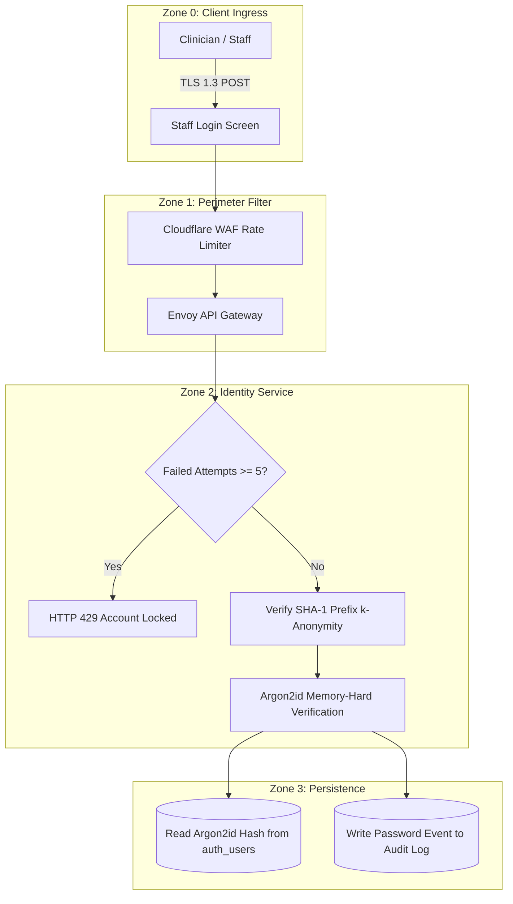

# Password Policy & Credential Hardening Specification
## Namma Clinic Digital Health & Operations Platform
### Greater Bengaluru Authority (GBA) / BBMP Health Department
**Standard:** NIST SP 800-63B / OWASP ASVS 4.0 Level 2 / Argon2id (RFC 9106) | **Status:** APPROVED BASELINE | **Code:** `SEC-DOC-06`

---

## 1. Credential Security Architecture & Invariants
The Namma Clinic Password Subsystem establishes enterprise-grade credential security across all clinical, administrative, and citizen portals. Conforming to modern NIST SP 800-63B standards, outdated practices such as mandatory periodic password expiration and arbitrary complexity rules are eliminated in favor of high-entropy passphrases, breached password verification via HaveIBeenPwned (HIBP) k-anonymity API, and memory-hard Argon2id hashing.

### 1.1 Foundational Password Invariants
1. **Argon2id Hashing Standard:** Minimum parameters: Memory: 64 MiB (m=65536), Iterations: 3 (t=3), Parallelism: 4 (p=4), Salt: 128-bit cryptographically secure random bytes.
2. **Entropy over Complexity:** Minimum 12 characters for staff; minimum 16 characters for privileged administrators; spaces and Unicode allowed.
3. **Zero Periodic Expiration:** Passwords do NOT expire arbitrarily every 90 days; rotation is enforced only upon confirmed breach indicator or staff role change.
4. **Breached Credential Screen (HIBP):** Passwords verified against known breached lists using SHA-1 prefix k-anonymity (zero raw password leakage).
5. **Progressive Lockout Defense:** Exponential backoff rate limiting: 5 failed attempts locks for 5 minutes; 10 failed attempts locks for 30 minutes with admin alert.

### 1.2 Credential Verification & Hashing Architecture Diagram


## 2. Governed Credential Mutation Operations (OP-PWD-01 to OP-PWD-40)
Operational matrix governing credential lifecycle and password mutations across the platform:

### OP-PWD-01: Initial Staff Account Password Creation
- **Governed Role:** Staff Nurse
- **Operational Domain:** Onboarding
- **Security Verification Protocol:** Admin Dual Verification
- **Audit Event Emitted:** `PWD_OP_01_CREATED`
- **Failure Behavior:** Request rejected immediately; notification sent to Security Operations.

### OP-PWD-02: Self-Service Password Change via Active Session
- **Governed Role:** Medical Officer
- **Operational Domain:** Profile Settings
- **Security Verification Protocol:** Current Password + TOTP
- **Audit Event Emitted:** `PWD_OP_02_CHANGED`
- **Failure Behavior:** Request rejected immediately; notification sent to Security Operations.

### OP-PWD-03: Emergency Helpdesk Password Reset
- **Governed Role:** Security Admin
- **Operational Domain:** User Admin
- **Security Verification Protocol:** In-Person Video ID Verify
- **Audit Event Emitted:** `PWD_OP_03_RESET`
- **Failure Behavior:** Request rejected immediately; notification sent to Security Operations.

### OP-PWD-04: Privileged System Admin Password Change
- **Governed Role:** Super Admin
- **Operational Domain:** Infra Management
- **Security Verification Protocol:** Hardware FIDO2 Key Quorum
- **Audit Event Emitted:** `PWD_OP_04_ADMIN_CHANGE`
- **Failure Behavior:** Request rejected immediately; notification sent to Security Operations.

### OP-PWD-05: Automated Breach Indicator Password Invalidation
- **Governed Role:** Auth Daemon
- **Operational Domain:** Security Core
- **Security Verification Protocol:** HIBP Webhook Alert
- **Audit Event Emitted:** `PWD_OP_05_FORCE_EXPIRE`
- **Failure Behavior:** Request rejected immediately; notification sent to Security Operations.

### OP-PWD-06: Pharmacist Credential Reset during Audit
- **Governed Role:** Chief Pharmacist
- **Operational Domain:** Pharmacy Admin
- **Security Verification Protocol:** Supervisor WebAuthn
- **Audit Event Emitted:** `PWD_OP_06_PHARM_RESET`
- **Failure Behavior:** Request rejected immediately; notification sent to Security Operations.

### OP-PWD-07: Lab Technician First Login Credential Set
- **Governed Role:** Lab Technician
- **Operational Domain:** Lab Management
- **Security Verification Protocol:** HR SMS Activation Token
- **Audit Event Emitted:** `PWD_OP_07_LAB_SET`
- **Failure Behavior:** Request rejected immediately; notification sent to Security Operations.

### OP-PWD-08: Account Unlock Post-Lockout Expiration
- **Governed Role:** Auth Engine
- **Operational Domain:** Rate Limiter
- **Security Verification Protocol:** Timer Expiration (30m)
- **Audit Event Emitted:** `PWD_OP_08_UNLOCKED`
- **Failure Behavior:** Request rejected immediately; notification sent to Security Operations.

### OP-PWD-09: Manual Security Lockout Override by Admin
- **Governed Role:** IT Support Lead
- **Operational Domain:** Support Desk
- **Security Verification Protocol:** Employee Badge Scan
- **Audit Event Emitted:** `PWD_OP_09_MANUAL_UNLOCK`
- **Failure Behavior:** Request rejected immediately; notification sent to Security Operations.

### OP-PWD-10: Password History Duplication Enforcement
- **Governed Role:** Auth Engine
- **Operational Domain:** Credential Store
- **Security Verification Protocol:** Compare Last 12 Hashes
- **Audit Event Emitted:** `PWD_OP_10_HISTORY_CHECK`
- **Failure Behavior:** Request rejected immediately; notification sent to Security Operations.

### OP-PWD-11: Dictionary Password Filter Rejection
- **Governed Role:** Auth Engine
- **Operational Domain:** Validation Core
- **Security Verification Protocol:** Zxcvbn Score < 3 Rejection
- **Audit Event Emitted:** `PWD_OP_11_DICT_REJECT`
- **Failure Behavior:** Request rejected immediately; notification sent to Security Operations.

### OP-PWD-12: Citizen Portal Self-Service Password Reset
- **Governed Role:** Citizen
- **Operational Domain:** Public Portal
- **Security Verification Protocol:** Aadhaar e-KYC OTP
- **Audit Event Emitted:** `PWD_OP_12_CITIZEN_RESET`
- **Failure Behavior:** Request rejected immediately; notification sent to Security Operations.

### OP-PWD-13: Temporary Prescribing License Credential Issue
- **Governed Role:** Chief Medical Off
- **Operational Domain:** Medical Admin
- **Security Verification Protocol:** Dual Clinician Signoff
- **Audit Event Emitted:** `PWD_OP_13_TEMP_LICENSE`
- **Failure Behavior:** Request rejected immediately; notification sent to Security Operations.

### OP-PWD-14: Service Account Dynamic Password Rotation
- **Governed Role:** HashiCorp Vault
- **Operational Domain:** Backend Mesh
- **Security Verification Protocol:** Scheduled 30-day Cron
- **Audit Event Emitted:** `PWD_OP_14_SVC_ROTATED`
- **Failure Behavior:** Request rejected immediately; notification sent to Security Operations.

### OP-PWD-15: Database Admin Superuser Password Rotation
- **Governed Role:** Security Architect
- **Operational Domain:** Database Core
- **Security Verification Protocol:** Dual Vault Quorum
- **Audit Event Emitted:** `PWD_OP_15_DBA_ROTATE`
- **Failure Behavior:** Request rejected immediately; notification sent to Security Operations.

### OP-PWD-16: Clinic Edge Node Daemon Credential Renewal
- **Governed Role:** Edge Daemon
- **Operational Domain:** Sync Service
- **Security Verification Protocol:** mTLS Certificate Exchange
- **Audit Event Emitted:** `PWD_OP_16_EDGE_RENEW`
- **Failure Behavior:** Request rejected immediately; notification sent to Security Operations.

### OP-PWD-17: Ward Health Supervisor Credential Verification
- **Governed Role:** Zonal Officer
- **Operational Domain:** Governance Roster
- **Security Verification Protocol:** Biometric Touch
- **Audit Event Emitted:** `PWD_OP_17_WARD_VERIFY`
- **Failure Behavior:** Request rejected immediately; notification sent to Security Operations.

### OP-PWD-18: Cold Chain Tech Password Re-Verification
- **Governed Role:** Cold Chain Tech
- **Operational Domain:** Vaccine Depot
- **Security Verification Protocol:** TOTP Verification
- **Audit Event Emitted:** `PWD_OP_18_COLD_VERIFY`
- **Failure Behavior:** Request rejected immediately; notification sent to Security Operations.

### OP-PWD-19: Bulk Inactive Staff Credential Deprecation
- **Governed Role:** HR Admin
- **Operational Domain:** Workforce Core
- **Security Verification Protocol:** 90-day Inactivity Purge
- **Audit Event Emitted:** `PWD_OP_19_INACTIVE_PURGE`
- **Failure Behavior:** Request rejected immediately; notification sent to Security Operations.

### OP-PWD-20: Emergency Clinical Break-Glass Credential Log
- **Governed Role:** Medical Officer
- **Operational Domain:** Emergency Core
- **Security Verification Protocol:** Reason Documentation Stamp
- **Audit Event Emitted:** `PWD_OP_20_BREAKGLASS_LOG`
- **Failure Behavior:** Request rejected immediately; notification sent to Security Operations.

### OP-PWD-21: Visiting Specialist Temporary Password Issue
- **Governed Role:** Clinic Admin
- **Operational Domain:** Clinic Reception
- **Security Verification Protocol:** HR Approval Token
- **Audit Event Emitted:** `PWD_OP_21_SPECIALIST_SET`
- **Failure Behavior:** Request rejected immediately; notification sent to Security Operations.

### OP-PWD-22: Public Health Epidemiologist Credential Audit
- **Governed Role:** Chief Health Off
- **Operational Domain:** Analytics Core
- **Security Verification Protocol:** Hardware Token Verify
- **Audit Event Emitted:** `PWD_OP_22_EPI_AUDIT`
- **Failure Behavior:** Request rejected immediately; notification sent to Security Operations.

### OP-PWD-23: Biomedical Waste Handler Credential Binding
- **Governed Role:** Waste Supervisor
- **Operational Domain:** Bio Waste Core
- **Security Verification Protocol:** Supervisor Biometric
- **Audit Event Emitted:** `PWD_OP_23_WASTE_BIND`
- **Failure Behavior:** Request rejected immediately; notification sent to Security Operations.

### OP-PWD-24: Telemedicine Specialist Password Hardening
- **Governed Role:** Telemedicine Spec
- **Operational Domain:** Telehealth Core
- **Security Verification Protocol:** NIST SP 800-63B Verify
- **Audit Event Emitted:** `PWD_OP_24_TELEMED_HARDEN`
- **Failure Behavior:** Request rejected immediately; notification sent to Security Operations.

### OP-PWD-25: Grievance Redressal Officer Credential Audit
- **Governed Role:** Grievance Officer
- **Operational Domain:** Citizen Redressal
- **Security Verification Protocol:** Quarterly Audit Stamp
- **Audit Event Emitted:** `PWD_OP_25_GRIEVANCE_AUDIT`
- **Failure Behavior:** Request rejected immediately; notification sent to Security Operations.

### OP-PWD-26: Clinic Desktop Auto-Logon Credential Purge
- **Governed Role:** Hardware Engineer
- **Operational Domain:** Endpoint Fleet
- **Security Verification Protocol:** Disable Windows Autologon
- **Audit Event Emitted:** `PWD_OP_26_AUTOLOGON_PURGE`
- **Failure Behavior:** Request rejected immediately; notification sent to Security Operations.

### OP-PWD-27: Credential Stuffing Pattern Automated Ban
- **Governed Role:** WAF Engine
- **Operational Domain:** Edge Ingress
- **Security Verification Protocol:** Trigger 1-hour IP Ban
- **Audit Event Emitted:** `PWD_OP_27_STUFFING_BAN`
- **Failure Behavior:** Request rejected immediately; notification sent to Security Operations.

### OP-PWD-28: Argon2id Cost Parameter Dynamic Recalibration
- **Governed Role:** SecOps Engineer
- **Operational Domain:** Auth Service
- **Security Verification Protocol:** Benchmarking CPU Time (500ms)
- **Audit Event Emitted:** `PWD_OP_28_ARGON2_CALIBRATE`
- **Failure Behavior:** Request rejected immediately; notification sent to Security Operations.

### OP-PWD-29: Password Reset Link Expiration Enforcement
- **Governed Role:** Auth Engine
- **Operational Domain:** Notification Core
- **Security Verification Protocol:** Expire Link after 15 Minutes
- **Audit Event Emitted:** `PWD_OP_29_LINK_EXPIRED`
- **Failure Behavior:** Request rejected immediately; notification sent to Security Operations.

### OP-PWD-30: Staff Mobile App Biometric Credential Re-Bind
- **Governed Role:** Staff Nurse
- **Operational Domain:** Mobile Health
- **Security Verification Protocol:** In-Person Admin Touch
- **Audit Event Emitted:** `PWD_OP_30_MOBILE_REBIND`
- **Failure Behavior:** Request rejected immediately; notification sent to Security Operations.

### OP-PWD-31: Thermal Printer Admin Interface Password Set
- **Governed Role:** Hardware Tech
- **Operational Domain:** Peripheral Core
- **Security Verification Protocol:** Change Factory Default Pass
- **Audit Event Emitted:** `PWD_OP_31_PRINTER_DEFAULT`
- **Failure Behavior:** Request rejected immediately; notification sent to Security Operations.

### OP-PWD-32: Barcode Scanner Config Mode Password Lock
- **Governed Role:** Hardware Engineer
- **Operational Domain:** Peripheral Bridge
- **Security Verification Protocol:** Lock Programming Barcodes
- **Audit Event Emitted:** `PWD_OP_32_SCANNER_LOCK`
- **Failure Behavior:** Request rejected immediately; notification sent to Security Operations.

### OP-PWD-33: Municipal Health Commissioner Credential Issue
- **Governed Role:** BBMP Commissioner
- **Operational Domain:** Executive Core
- **Security Verification Protocol:** In-Person Security Ceremony
- **Audit Event Emitted:** `PWD_OP_33_EXEC_CEREMONY`
- **Failure Behavior:** Request rejected immediately; notification sent to Security Operations.

### OP-PWD-34: Post-Incident Forensic Credential Hash Dump
- **Governed Role:** Forensic Analyst
- **Operational Domain:** WORM Storage
- **Security Verification Protocol:** Export Hashes for Audit
- **Audit Event Emitted:** `PWD_OP_34_FORENSIC_DUMP`
- **Failure Behavior:** Request rejected immediately; notification sent to Security Operations.

### OP-PWD-35: Aadhaar Demographic Match Fail Password Lock
- **Governed Role:** Identity Service
- **Operational Domain:** Citizen Intake
- **Security Verification Protocol:** Lock Account after 3 Fails
- **Audit Event Emitted:** `PWD_OP_35_AADHAAR_LOCK`
- **Failure Behavior:** Request rejected immediately; notification sent to Security Operations.

### OP-PWD-36: ABDM HPR Token Re-Authentication Challenge
- **Governed Role:** Medical Officer
- **Operational Domain:** ABDM Bridge
- **Security Verification Protocol:** Re-Verify State Council Reg
- **Audit Event Emitted:** `PWD_OP_36_HPR_REVERIFY`
- **Failure Behavior:** Request rejected immediately; notification sent to Security Operations.

### OP-PWD-37: Data Protection Officer Credential Escrow
- **Governed Role:** Legal Counsel
- **Operational Domain:** Privacy Registry
- **Security Verification Protocol:** Dual Split Vault Enclave
- **Audit Event Emitted:** `PWD_OP_37_DPO_ESCROW`
- **Failure Behavior:** Request rejected immediately; notification sent to Security Operations.

### OP-PWD-38: Disaster Recovery Standby Cluster Credential Sync
- **Governed Role:** DevOps Lead
- **Operational Domain:** DR Engine
- **Security Verification Protocol:** Sync Encrypted Password Hashes
- **Audit Event Emitted:** `PWD_OP_38_DR_SYNC`
- **Failure Behavior:** Request rejected immediately; notification sent to Security Operations.

### OP-PWD-39: Clinic Kiosk Maintenance Password Rotation
- **Governed Role:** IT Support
- **Operational Domain:** Kiosk Fleet
- **Security Verification Protocol:** Monthly Rotating Passcode
- **Audit Event Emitted:** `PWD_OP_39_KIOSK_ROTATE`
- **Failure Behavior:** Request rejected immediately; notification sent to Security Operations.

### OP-PWD-40: Staff Resignation Credential Zeroization
- **Governed Role:** HR Officer
- **Operational Domain:** Workforce Core
- **Security Verification Protocol:** Instant DoD 5220 Wipe
- **Audit Event Emitted:** `PWD_OP_40_STAFF_ZEROIZE`
- **Failure Behavior:** Request rejected immediately; notification sent to Security Operations.

## 3. Role-Specific Credential Hardening Profiles (ROLE-000 to ROLE-029)
Password strength and lockout parameters across all 30 municipal platform roles:

### ROLE-001: Credential Profile for Receptionist / Registration Clerk (`RECEPTIONIST`)
- **Minimum Password Length:** 12 characters (Unicode and spaces permitted).
- **Hashing Algorithm:** Argon2id (m=65536, t=3, p=4, salt=16 bytes).
- **Breached Password Screening:** Mandatory against HIBP k-anonymity API.
- **Failed Login Lockout:** 5 attempts = 5 min lock; 10 attempts = administrative lock.
- **Password History Retention:** Previous 12 password hashes disallowed.
- **Mandatory Secondary Factor:** Required on all logins regardless of password length.
- **Credential Storage Protection:** Salted Argon2id hash in PostgreSQL TABLE-001.

### ROLE-002: Credential Profile for Medical Officer / General Physician (`DOCTOR`)
- **Minimum Password Length:** 12 characters (Unicode and spaces permitted).
- **Hashing Algorithm:** Argon2id (m=65536, t=3, p=4, salt=16 bytes).
- **Breached Password Screening:** Mandatory against HIBP k-anonymity API.
- **Failed Login Lockout:** 5 attempts = 5 min lock; 10 attempts = administrative lock.
- **Password History Retention:** Previous 12 password hashes disallowed.
- **Mandatory Secondary Factor:** Required on all logins regardless of password length.
- **Credential Storage Protection:** Salted Argon2id hash in PostgreSQL TABLE-001.

### ROLE-003: Credential Profile for Staff Nurse / Triage Specialist (`NURSE`)
- **Minimum Password Length:** 12 characters (Unicode and spaces permitted).
- **Hashing Algorithm:** Argon2id (m=65536, t=3, p=4, salt=16 bytes).
- **Breached Password Screening:** Mandatory against HIBP k-anonymity API.
- **Failed Login Lockout:** 5 attempts = 5 min lock; 10 attempts = administrative lock.
- **Password History Retention:** Previous 12 password hashes disallowed.
- **Mandatory Secondary Factor:** Required on all logins regardless of password length.
- **Credential Storage Protection:** Salted Argon2id hash in PostgreSQL TABLE-001.

### ROLE-004: Credential Profile for Pharmacist / Dispenser (`PHARMACIST`)
- **Minimum Password Length:** 12 characters (Unicode and spaces permitted).
- **Hashing Algorithm:** Argon2id (m=65536, t=3, p=4, salt=16 bytes).
- **Breached Password Screening:** Mandatory against HIBP k-anonymity API.
- **Failed Login Lockout:** 5 attempts = 5 min lock; 10 attempts = administrative lock.
- **Password History Retention:** Previous 12 password hashes disallowed.
- **Mandatory Secondary Factor:** Required on all logins regardless of password length.
- **Credential Storage Protection:** Salted Argon2id hash in PostgreSQL TABLE-001.

### ROLE-005: Credential Profile for Laboratory Technician (`LAB_TECH`)
- **Minimum Password Length:** 12 characters (Unicode and spaces permitted).
- **Hashing Algorithm:** Argon2id (m=65536, t=3, p=4, salt=16 bytes).
- **Breached Password Screening:** Mandatory against HIBP k-anonymity API.
- **Failed Login Lockout:** 5 attempts = 5 min lock; 10 attempts = administrative lock.
- **Password History Retention:** Previous 12 password hashes disallowed.
- **Mandatory Secondary Factor:** Required on all logins regardless of password length.
- **Credential Storage Protection:** Salted Argon2id hash in PostgreSQL TABLE-001.

### ROLE-006: Credential Profile for Clinic Administrative Officer (`CLINIC_ADMIN`)
- **Minimum Password Length:** 16 characters (Unicode and spaces permitted).
- **Hashing Algorithm:** Argon2id (m=65536, t=3, p=4, salt=16 bytes).
- **Breached Password Screening:** Mandatory against HIBP k-anonymity API.
- **Failed Login Lockout:** 5 attempts = 5 min lock; 10 attempts = administrative lock.
- **Password History Retention:** Previous 12 password hashes disallowed.
- **Mandatory Secondary Factor:** Required on all logins regardless of password length.
- **Credential Storage Protection:** Salted Argon2id hash in PostgreSQL TABLE-001.

### ROLE-007: Credential Profile for Ward Health Supervisor (`WARD_SUPERVISOR`)
- **Minimum Password Length:** 12 characters (Unicode and spaces permitted).
- **Hashing Algorithm:** Argon2id (m=65536, t=3, p=4, salt=16 bytes).
- **Breached Password Screening:** Mandatory against HIBP k-anonymity API.
- **Failed Login Lockout:** 5 attempts = 5 min lock; 10 attempts = administrative lock.
- **Password History Retention:** Previous 12 password hashes disallowed.
- **Mandatory Secondary Factor:** Required on all logins regardless of password length.
- **Credential Storage Protection:** Salted Argon2id hash in PostgreSQL TABLE-001.

### ROLE-008: Credential Profile for Zonal Health Officer (ZHO) (`ZONAL_OFFICER`)
- **Minimum Password Length:** 12 characters (Unicode and spaces permitted).
- **Hashing Algorithm:** Argon2id (m=65536, t=3, p=4, salt=16 bytes).
- **Breached Password Screening:** Mandatory against HIBP k-anonymity API.
- **Failed Login Lockout:** 5 attempts = 5 min lock; 10 attempts = administrative lock.
- **Password History Retention:** Previous 12 password hashes disallowed.
- **Mandatory Secondary Factor:** Required on all logins regardless of password length.
- **Credential Storage Protection:** Salted Argon2id hash in PostgreSQL TABLE-001.

### ROLE-009: Credential Profile for Chief Health Officer (CHO) (`CHIEF_OFFICER`)
- **Minimum Password Length:** 16 characters (Unicode and spaces permitted).
- **Hashing Algorithm:** Argon2id (m=65536, t=3, p=4, salt=16 bytes).
- **Breached Password Screening:** Mandatory against HIBP k-anonymity API.
- **Failed Login Lockout:** 5 attempts = 5 min lock; 10 attempts = administrative lock.
- **Password History Retention:** Previous 12 password hashes disallowed.
- **Mandatory Secondary Factor:** Required on all logins regardless of password length.
- **Credential Storage Protection:** Salted Argon2id hash in PostgreSQL TABLE-001.

### ROLE-010: Credential Profile for Epidemiologist / Disease Surveillance Officer (`EPIDEMIOLOGIST`)
- **Minimum Password Length:** 12 characters (Unicode and spaces permitted).
- **Hashing Algorithm:** Argon2id (m=65536, t=3, p=4, salt=16 bytes).
- **Breached Password Screening:** Mandatory against HIBP k-anonymity API.
- **Failed Login Lockout:** 5 attempts = 5 min lock; 10 attempts = administrative lock.
- **Password History Retention:** Previous 12 password hashes disallowed.
- **Mandatory Secondary Factor:** Required on all logins regardless of password length.
- **Credential Storage Protection:** Salted Argon2id hash in PostgreSQL TABLE-001.

### ROLE-011: Credential Profile for Quality & Compliance Auditor (`AUDITOR`)
- **Minimum Password Length:** 12 characters (Unicode and spaces permitted).
- **Hashing Algorithm:** Argon2id (m=65536, t=3, p=4, salt=16 bytes).
- **Breached Password Screening:** Mandatory against HIBP k-anonymity API.
- **Failed Login Lockout:** 5 attempts = 5 min lock; 10 attempts = administrative lock.
- **Password History Retention:** Previous 12 password hashes disallowed.
- **Mandatory Secondary Factor:** Required on all logins regardless of password length.
- **Credential Storage Protection:** Salted Argon2id hash in PostgreSQL TABLE-001.

### ROLE-012: Credential Profile for Security Administrator / CISO (`SECURITY_ADMIN`)
- **Minimum Password Length:** 16 characters (Unicode and spaces permitted).
- **Hashing Algorithm:** Argon2id (m=65536, t=3, p=4, salt=16 bytes).
- **Breached Password Screening:** Mandatory against HIBP k-anonymity API.
- **Failed Login Lockout:** 5 attempts = 5 min lock; 10 attempts = administrative lock.
- **Password History Retention:** Previous 12 password hashes disallowed.
- **Mandatory Secondary Factor:** Required on all logins regardless of password length.
- **Credential Storage Protection:** Salted Argon2id hash in PostgreSQL TABLE-001.

### ROLE-013: Credential Profile for Central Depot Inventory Manager (`DEPOT_MANAGER`)
- **Minimum Password Length:** 12 characters (Unicode and spaces permitted).
- **Hashing Algorithm:** Argon2id (m=65536, t=3, p=4, salt=16 bytes).
- **Breached Password Screening:** Mandatory against HIBP k-anonymity API.
- **Failed Login Lockout:** 5 attempts = 5 min lock; 10 attempts = administrative lock.
- **Password History Retention:** Previous 12 password hashes disallowed.
- **Mandatory Secondary Factor:** Required on all logins regardless of password length.
- **Credential Storage Protection:** Salted Argon2id hash in PostgreSQL TABLE-001.

### ROLE-014: Credential Profile for Cold Chain Logistics Technician (`COLD_CHAIN_TECH`)
- **Minimum Password Length:** 12 characters (Unicode and spaces permitted).
- **Hashing Algorithm:** Argon2id (m=65536, t=3, p=4, salt=16 bytes).
- **Breached Password Screening:** Mandatory against HIBP k-anonymity API.
- **Failed Login Lockout:** 5 attempts = 5 min lock; 10 attempts = administrative lock.
- **Password History Retention:** Previous 12 password hashes disallowed.
- **Mandatory Secondary Factor:** Required on all logins regardless of password length.
- **Credential Storage Protection:** Salted Argon2id hash in PostgreSQL TABLE-001.

### ROLE-015: Credential Profile for Radiologist / Diagnostic Specialist (`RADIOLOGIST`)
- **Minimum Password Length:** 12 characters (Unicode and spaces permitted).
- **Hashing Algorithm:** Argon2id (m=65536, t=3, p=4, salt=16 bytes).
- **Breached Password Screening:** Mandatory against HIBP k-anonymity API.
- **Failed Login Lockout:** 5 attempts = 5 min lock; 10 attempts = administrative lock.
- **Password History Retention:** Previous 12 password hashes disallowed.
- **Mandatory Secondary Factor:** Required on all logins regardless of password length.
- **Credential Storage Protection:** Salted Argon2id hash in PostgreSQL TABLE-001.

### ROLE-016: Credential Profile for Ayush Practitioner (`AYUSH_DOC`)
- **Minimum Password Length:** 12 characters (Unicode and spaces permitted).
- **Hashing Algorithm:** Argon2id (m=65536, t=3, p=4, salt=16 bytes).
- **Breached Password Screening:** Mandatory against HIBP k-anonymity API.
- **Failed Login Lockout:** 5 attempts = 5 min lock; 10 attempts = administrative lock.
- **Password History Retention:** Previous 12 password hashes disallowed.
- **Mandatory Secondary Factor:** Required on all logins regardless of password length.
- **Credential Storage Protection:** Salted Argon2id hash in PostgreSQL TABLE-001.

### ROLE-017: Credential Profile for Counselor / Mental Health Worker (`COUNSELOR`)
- **Minimum Password Length:** 12 characters (Unicode and spaces permitted).
- **Hashing Algorithm:** Argon2id (m=65536, t=3, p=4, salt=16 bytes).
- **Breached Password Screening:** Mandatory against HIBP k-anonymity API.
- **Failed Login Lockout:** 5 attempts = 5 min lock; 10 attempts = administrative lock.
- **Password History Retention:** Previous 12 password hashes disallowed.
- **Mandatory Secondary Factor:** Required on all logins regardless of password length.
- **Credential Storage Protection:** Salted Argon2id hash in PostgreSQL TABLE-001.

### ROLE-018: Credential Profile for ANM / Urban Health Worker (`ANM_WORKER`)
- **Minimum Password Length:** 12 characters (Unicode and spaces permitted).
- **Hashing Algorithm:** Argon2id (m=65536, t=3, p=4, salt=16 bytes).
- **Breached Password Screening:** Mandatory against HIBP k-anonymity API.
- **Failed Login Lockout:** 5 attempts = 5 min lock; 10 attempts = administrative lock.
- **Password History Retention:** Previous 12 password hashes disallowed.
- **Mandatory Secondary Factor:** Required on all logins regardless of password length.
- **Credential Storage Protection:** Salted Argon2id hash in PostgreSQL TABLE-001.

### ROLE-019: Credential Profile for ASHA Link Worker Coordinator (`ASHA_COORD`)
- **Minimum Password Length:** 12 characters (Unicode and spaces permitted).
- **Hashing Algorithm:** Argon2id (m=65536, t=3, p=4, salt=16 bytes).
- **Breached Password Screening:** Mandatory against HIBP k-anonymity API.
- **Failed Login Lockout:** 5 attempts = 5 min lock; 10 attempts = administrative lock.
- **Password History Retention:** Previous 12 password hashes disallowed.
- **Mandatory Secondary Factor:** Required on all logins regardless of password length.
- **Credential Storage Protection:** Salted Argon2id hash in PostgreSQL TABLE-001.

### ROLE-020: Credential Profile for Data Entry Operator (`DATA_ENTRY`)
- **Minimum Password Length:** 12 characters (Unicode and spaces permitted).
- **Hashing Algorithm:** Argon2id (m=65536, t=3, p=4, salt=16 bytes).
- **Breached Password Screening:** Mandatory against HIBP k-anonymity API.
- **Failed Login Lockout:** 5 attempts = 5 min lock; 10 attempts = administrative lock.
- **Password History Retention:** Previous 12 password hashes disallowed.
- **Mandatory Secondary Factor:** Required on all logins regardless of password length.
- **Credential Storage Protection:** Salted Argon2id hash in PostgreSQL TABLE-001.

### ROLE-021: Credential Profile for Grievance Redressal Officer (`GRIEVANCE_OFFICER`)
- **Minimum Password Length:** 12 characters (Unicode and spaces permitted).
- **Hashing Algorithm:** Argon2id (m=65536, t=3, p=4, salt=16 bytes).
- **Breached Password Screening:** Mandatory against HIBP k-anonymity API.
- **Failed Login Lockout:** 5 attempts = 5 min lock; 10 attempts = administrative lock.
- **Password History Retention:** Previous 12 password hashes disallowed.
- **Mandatory Secondary Factor:** Required on all logins regardless of password length.
- **Credential Storage Protection:** Salted Argon2id hash in PostgreSQL TABLE-001.

### ROLE-022: Credential Profile for ABDM National Integration Officer (`ABDM_OFFICER`)
- **Minimum Password Length:** 12 characters (Unicode and spaces permitted).
- **Hashing Algorithm:** Argon2id (m=65536, t=3, p=4, salt=16 bytes).
- **Breached Password Screening:** Mandatory against HIBP k-anonymity API.
- **Failed Login Lockout:** 5 attempts = 5 min lock; 10 attempts = administrative lock.
- **Password History Retention:** Previous 12 password hashes disallowed.
- **Mandatory Secondary Factor:** Required on all logins regardless of password length.
- **Credential Storage Protection:** Salted Argon2id hash in PostgreSQL TABLE-001.

### ROLE-023: Credential Profile for Data Protection Officer (DPO) (`PRIVACY_OFFICER`)
- **Minimum Password Length:** 12 characters (Unicode and spaces permitted).
- **Hashing Algorithm:** Argon2id (m=65536, t=3, p=4, salt=16 bytes).
- **Breached Password Screening:** Mandatory against HIBP k-anonymity API.
- **Failed Login Lockout:** 5 attempts = 5 min lock; 10 attempts = administrative lock.
- **Password History Retention:** Previous 12 password hashes disallowed.
- **Mandatory Secondary Factor:** Required on all logins regardless of password length.
- **Credential Storage Protection:** Salted Argon2id hash in PostgreSQL TABLE-001.

### ROLE-024: Credential Profile for IT Support & Hardware Engineer (`IT_SUPPORT`)
- **Minimum Password Length:** 12 characters (Unicode and spaces permitted).
- **Hashing Algorithm:** Argon2id (m=65536, t=3, p=4, salt=16 bytes).
- **Breached Password Screening:** Mandatory against HIBP k-anonymity API.
- **Failed Login Lockout:** 5 attempts = 5 min lock; 10 attempts = administrative lock.
- **Password History Retention:** Previous 12 password hashes disallowed.
- **Mandatory Secondary Factor:** Required on all logins regardless of password length.
- **Credential Storage Protection:** Salted Argon2id hash in PostgreSQL TABLE-001.

### ROLE-025: Credential Profile for Clinical Audit Committee Member (`CLINICAL_AUDITOR`)
- **Minimum Password Length:** 12 characters (Unicode and spaces permitted).
- **Hashing Algorithm:** Argon2id (m=65536, t=3, p=4, salt=16 bytes).
- **Breached Password Screening:** Mandatory against HIBP k-anonymity API.
- **Failed Login Lockout:** 5 attempts = 5 min lock; 10 attempts = administrative lock.
- **Password History Retention:** Previous 12 password hashes disallowed.
- **Mandatory Secondary Factor:** Required on all logins regardless of password length.
- **Credential Storage Protection:** Salted Argon2id hash in PostgreSQL TABLE-001.

### ROLE-026: Credential Profile for Procurement & Vendor Manager (`PROCUREMENT_MGR`)
- **Minimum Password Length:** 12 characters (Unicode and spaces permitted).
- **Hashing Algorithm:** Argon2id (m=65536, t=3, p=4, salt=16 bytes).
- **Breached Password Screening:** Mandatory against HIBP k-anonymity API.
- **Failed Login Lockout:** 5 attempts = 5 min lock; 10 attempts = administrative lock.
- **Password History Retention:** Previous 12 password hashes disallowed.
- **Mandatory Secondary Factor:** Required on all logins regardless of password length.
- **Credential Storage Protection:** Salted Argon2id hash in PostgreSQL TABLE-001.

### ROLE-027: Credential Profile for Biomedical Waste Supervisor (`WASTE_SUPERVISOR`)
- **Minimum Password Length:** 12 characters (Unicode and spaces permitted).
- **Hashing Algorithm:** Argon2id (m=65536, t=3, p=4, salt=16 bytes).
- **Breached Password Screening:** Mandatory against HIBP k-anonymity API.
- **Failed Login Lockout:** 5 attempts = 5 min lock; 10 attempts = administrative lock.
- **Password History Retention:** Previous 12 password hashes disallowed.
- **Mandatory Secondary Factor:** Required on all logins regardless of password length.
- **Credential Storage Protection:** Salted Argon2id hash in PostgreSQL TABLE-001.

### ROLE-028: Credential Profile for Telemedicine Remote Specialist (`TELE_SPECIALIST`)
- **Minimum Password Length:** 12 characters (Unicode and spaces permitted).
- **Hashing Algorithm:** Argon2id (m=65536, t=3, p=4, salt=16 bytes).
- **Breached Password Screening:** Mandatory against HIBP k-anonymity API.
- **Failed Login Lockout:** 5 attempts = 5 min lock; 10 attempts = administrative lock.
- **Password History Retention:** Previous 12 password hashes disallowed.
- **Mandatory Secondary Factor:** Required on all logins regardless of password length.
- **Credential Storage Protection:** Salted Argon2id hash in PostgreSQL TABLE-001.

### ROLE-029: Credential Profile for Field Public Health Inspector (`HEALTH_INSPECTOR`)
- **Minimum Password Length:** 12 characters (Unicode and spaces permitted).
- **Hashing Algorithm:** Argon2id (m=65536, t=3, p=4, salt=16 bytes).
- **Breached Password Screening:** Mandatory against HIBP k-anonymity API.
- **Failed Login Lockout:** 5 attempts = 5 min lock; 10 attempts = administrative lock.
- **Password History Retention:** Previous 12 password hashes disallowed.
- **Mandatory Secondary Factor:** Required on all logins regardless of password length.
- **Credential Storage Protection:** Salted Argon2id hash in PostgreSQL TABLE-001.

### ROLE-030: Credential Profile for Super Administrator (`SUPER_ADMIN`)
- **Minimum Password Length:** 16 characters (Unicode and spaces permitted).
- **Hashing Algorithm:** Argon2id (m=65536, t=3, p=4, salt=16 bytes).
- **Breached Password Screening:** Mandatory against HIBP k-anonymity API.
- **Failed Login Lockout:** 5 attempts = 5 min lock; 10 attempts = administrative lock.
- **Password History Retention:** Previous 12 password hashes disallowed.
- **Mandatory Secondary Factor:** Required on all logins regardless of password length.
- **Credential Storage Protection:** Salted Argon2id hash in PostgreSQL TABLE-001.

## 4. Standard Operating Procedures: Password & Credential Management (SOP-PWD-01 to SOP-PWD-25)
The following 25 SOPs govern ongoing password management and credential maintenance:

### SOP-PWD-01: Staff Onboarding Initial Credential Issuance
- **Trigger Condition:** HR registers new staff member.
- **Execution Steps:** 1. Generate temporary 16-char random passphrase. 2. Hand to staff in sealed envelope. 3. Force change on login.
- **Verification Criterion:** Staff establishes private passphrase.
- **Responsible Role:** HR Officer
- **Audit Event Emitted:** `PWD_SOP_01_ISSUED`
- **Failure Remediation:** Lock user profile and alert security operations on discrepancy.

### SOP-PWD-02: Self-Service Password Reset via SMS/Email OTP
- **Trigger Condition:** Clinician forgets password at home.
- **Execution Steps:** 1. Enter staff ID. 2. Verify OTP. 3. Enter new passphrase meeting zxcvbn score >= 3.
- **Verification Criterion:** Password updated safely.
- **Responsible Role:** Staff User
- **Audit Event Emitted:** `PWD_SOP_02_RESET`
- **Failure Remediation:** Lock user profile and alert security operations on discrepancy.

### SOP-PWD-03: Administrative In-Person Credential Unlock
- **Trigger Condition:** Staff locked out after 10 failed attempts.
- **Execution Steps:** 1. Verify government ID. 2. Check clinic CCTV if remote. 3. Clear failed counter in TABLE-001.
- **Verification Criterion:** Account restored.
- **Responsible Role:** IT Support
- **Audit Event Emitted:** `PWD_SOP_03_UNLOCKED`
- **Failure Remediation:** Lock user profile and alert security operations on discrepancy.

### SOP-PWD-04: HaveIBeenPwned Compromised Password Detection
- **Trigger Condition:** Periodic batch scan of staff email addresses.
- **Execution Steps:** 1. Query HIBP enterprise API. 2. Flag breached credentials. 3. Force change on next login.
- **Verification Criterion:** Breached credentials eliminated.
- **Responsible Role:** Security Lead
- **Audit Event Emitted:** `PWD_SOP_04_BREACH_FLAG`
- **Failure Remediation:** Lock user profile and alert security operations on discrepancy.

### SOP-PWD-05: Argon2id Hash Parameter Annual Calibration
- **Trigger Condition:** Annual server hardware upgrade.
- **Execution Steps:** 1. Benchmark Argon2id verification latency. 2. Tune m, t, p to achieve 500ms target. 3. Deploy config.
- **Verification Criterion:** Hash strength scales with compute.
- **Responsible Role:** SecOps Engineer
- **Audit Event Emitted:** `PWD_SOP_05_CALIBRATED`
- **Failure Remediation:** Lock user profile and alert security operations on discrepancy.

### SOP-PWD-06: Brute-Force Rate Limiting Threshold Review
- **Trigger Condition:** Monthly review of API gateway 429 logs.
- **Execution Steps:** 1. Analyze failed login distribution. 2. Tune IP-level token bucket. 3. Verify zero false lockouts.
- **Verification Criterion:** Brute force attacks mitigated at edge.
- **Responsible Role:** API Gateway Lead
- **Audit Event Emitted:** `PWD_SOP_06_RATE_REVIEW`
- **Failure Remediation:** Lock user profile and alert security operations on discrepancy.

### SOP-PWD-07: Privileged Role Dual-Authorization Password Change
- **Trigger Condition:** Super Admin updating platform master password.
- **Execution Steps:** 1. Admin 1 initiates change. 2. Admin 2 provides secondary signoff. 3. Commit new hash.
- **Verification Criterion:** Dual control enforced.
- **Responsible Role:** CISO
- **Audit Event Emitted:** `PWD_SOP_07_DUAL_PASS`
- **Failure Remediation:** Lock user profile and alert security operations on discrepancy.

### SOP-PWD-08: Password History Depth & Verification Audit
- **Trigger Condition:** Quarterly audit of password reuse prevention.
- **Execution Steps:** 1. Inspect TABLE-002 password_history. 2. Verify 12 hashes retained per user. 3. Confirm zero plaintext.
- **Verification Criterion:** Zero password reuse allowed.
- **Responsible Role:** Audit Lead
- **Audit Event Emitted:** `PWD_SOP_08_HISTORY_AUDIT`
- **Failure Remediation:** Lock user profile and alert security operations on discrepancy.

### SOP-PWD-09: Shared Workstation Default Credential Elimination
- **Trigger Condition:** IT rollout of new clinic mini-PCs.
- **Execution Steps:** 1. Delete default OEM accounts. 2. Disable guest login. 3. Join active directory / LDAP.
- **Verification Criterion:** Zero default credentials on endpoints.
- **Responsible Role:** IT Support Lead
- **Audit Event Emitted:** `PWD_SOP_09_HARDENED`
- **Failure Remediation:** Lock user profile and alert security operations on discrepancy.

### SOP-PWD-10: Citizen Portal Credential Lockout Triage
- **Trigger Condition:** Citizen locked out after multiple typos.
- **Execution Steps:** 1. Citizen verifies identity via Aadhaar OTP. 2. System resets failed counter. 3. Citizen logs in.
- **Verification Criterion:** Citizen access restored smoothly.
- **Responsible Role:** Citizen Support
- **Audit Event Emitted:** `PWD_SOP_10_CITIZEN_UNLOCK`
- **Failure Remediation:** Lock user profile and alert security operations on discrepancy.

### SOP-PWD-11: Compromised Clinic Endpoint Credential Revocation
- **Trigger Condition:** Malware detected on Clinic 42 PC.
- **Execution Steps:** 1. Identify all users logged in to terminal in last 24h. 2. Force password resets. 3. Terminate sessions.
- **Verification Criterion:** Blast radius contained.
- **Responsible Role:** Incident Commander
- **Audit Event Emitted:** `PWD_SOP_11_MALWARE_PURGE`
- **Failure Remediation:** Lock user profile and alert security operations on discrepancy.

### SOP-PWD-12: Offline Edge Workstation Password Hash Caching
- **Trigger Condition:** Local mini-PC prepares for offline mode.
- **Execution Steps:** 1. Cache Argon2id hashes of assigned clinic staff in TPM enclave. 2. Set 8h expiration.
- **Verification Criterion:** Staff can log in during fiber outage.
- **Responsible Role:** Edge Daemon
- **Audit Event Emitted:** `PWD_SOP_12_OFFLINE_CACHE`
- **Failure Remediation:** Lock user profile and alert security operations on discrepancy.

### SOP-PWD-13: Password Change Notification Dispatch
- **Trigger Condition:** User changes password in profile.
- **Execution Steps:** 1. Commit change. 2. Send SMS and Email alert to user. 3. Provide emergency revoke link.
- **Verification Criterion:** User notified of account changes.
- **Responsible Role:** Notification Svc
- **Audit Event Emitted:** `PWD_SOP_13_ALERT_SENT`
- **Failure Remediation:** Lock user profile and alert security operations on discrepancy.

### SOP-PWD-14: Weak Password Dictionary Update
- **Trigger Condition:** Monthly ingest of newly trending weak passphrases.
- **Execution Steps:** 1. Ingest SecLists common passwords. 2. Compile into Bloom filter. 3. Block in registration.
- **Verification Criterion:** Common passphrases strictly prohibited.
- **Responsible Role:** AppSec Lead
- **Audit Event Emitted:** `PWD_SOP_14_DICT_UPDATED`
- **Failure Remediation:** Lock user profile and alert security operations on discrepancy.

### SOP-PWD-15: Password Strength Meter Calibration (Zxcvbn)
- **Trigger Condition:** Review of frontend password strength feedback.
- **Execution Steps:** 1. Test zxcvbn entropy scoring. 2. Ensure helpful hints provided for weak inputs. 3. Deploy update.
- **Verification Criterion:** Users guided to strong passphrases.
- **Responsible Role:** Frontend Lead
- **Audit Event Emitted:** `PWD_SOP_15_ZXCVBN_TUNE`
- **Failure Remediation:** Lock user profile and alert security operations on discrepancy.

### SOP-PWD-16: Emergency Doctor Account Activation (Disaster)
- **Trigger Condition:** Flooding causes medical emergency; extra staff needed.
- **Execution Steps:** 1. CMO authorizes emergency profile batch. 2. Fast-track credential creation. 3. Bind to ward.
- **Verification Criterion:** Emergency clinical capacity expanded.
- **Responsible Role:** Chief Medical Off
- **Audit Event Emitted:** `PWD_SOP_16_EMERGENCY_SET`
- **Failure Remediation:** Lock user profile and alert security operations on discrepancy.

### SOP-PWD-17: Service Account Static Credential Elimination
- **Trigger Condition:** Audit of microservices for hardcoded passwords.
- **Execution Steps:** 1. Scan codebase with Gitleaks. 2. Replace static DB passwords with Vault dynamic credentials.
- **Verification Criterion:** Zero hardcoded passwords in Git.
- **Responsible Role:** DevOps Lead
- **Audit Event Emitted:** `PWD_SOP_17_GITLEAKS_SCAN`
- **Failure Remediation:** Lock user profile and alert security operations on discrepancy.

### SOP-PWD-18: Database Password Hash Migration Runbook
- **Trigger Condition:** Upgrading password hashing from bcrypt to Argon2id.
- **Execution Steps:** 1. Flag legacy bcrypt hashes. 2. Re-hash on successful user login. 3. Achieve 100% Argon2id.
- **Verification Criterion:** Cryptographic modernization complete.
- **Responsible Role:** DBA Lead
- **Audit Event Emitted:** `PWD_SOP_18_HASH_MIGRATED`
- **Failure Remediation:** Lock user profile and alert security operations on discrepancy.

### SOP-PWD-19: Medical Intern Temporary Credential Deprecation
- **Trigger Condition:** Medical college rotation concludes.
- **Execution Steps:** 1. Query all intern profiles. 2. Invalidate passwords. 3. Mark accounts DEACTIVATED.
- **Verification Criterion:** Former interns cannot access clinic EHR.
- **Responsible Role:** HR Officer
- **Audit Event Emitted:** `PWD_SOP_19_INTERN_PURGED`
- **Failure Remediation:** Lock user profile and alert security operations on discrepancy.

### SOP-PWD-20: Workstation BitLocker Recovery Password Storage
- **Trigger Condition:** IT enrolls new clinic laptop.
- **Execution Steps:** 1. Generate 48-digit BitLocker recovery key. 2. Escrow in HashiCorp Vault. 3. Test recovery boot.
- **Verification Criterion:** Disk recovery key safely backed up.
- **Responsible Role:** IT Support
- **Audit Event Emitted:** `PWD_SOP_20_BITLOCKER_ESCROW`
- **Failure Remediation:** Lock user profile and alert security operations on discrepancy.

### SOP-PWD-21: Password Reset Phishing Attack Simulation
- **Trigger Condition:** Quarterly social engineering drill for staff.
- **Execution Steps:** 1. Send simulated password reset email. 2. Track click-through rate. 3. Provide immediate training.
- **Verification Criterion:** Staff resistance to phishing improved.
- **Responsible Role:** Security Lead
- **Audit Event Emitted:** `PWD_SOP_21_PHISH_SIM`
- **Failure Remediation:** Lock user profile and alert security operations on discrepancy.

### SOP-PWD-22: API Client Secret Generation & Rotation
- **Trigger Condition:** ABDM integration partner credential renewal.
- **Execution Steps:** 1. Generate 256-bit cryptographically random client secret. 2. Transmit via encrypted channel.
- **Verification Criterion:** Partner API access secured.
- **Responsible Role:** Integration Lead
- **Audit Event Emitted:** `PWD_SOP_22_SECRET_ROTATED`
- **Failure Remediation:** Lock user profile and alert security operations on discrepancy.

### SOP-PWD-23: Database Backup Archive Password Hardening
- **Trigger Condition:** Daily encrypted backup generation.
- **Execution Steps:** 1. Derive backup encryption key from KMS. 2. Encrypt pg_dump archive with AES-256-GCM.
- **Verification Criterion:** Backup files unreadable without KMS key.
- **Responsible Role:** DBA / Backup Lead
- **Audit Event Emitted:** `PWD_SOP_23_BACKUP_PASS`
- **Failure Remediation:** Lock user profile and alert security operations on discrepancy.

### SOP-PWD-24: Clinic Wi-Fi WPA3 Enterprise Credential Rotation
- **Trigger Condition:** Quarterly clinic network security maintenance.
- **Execution Steps:** 1. Rotate RADIUS shared secrets. 2. Push updated 802.1X profiles to workstations.
- **Verification Criterion:** Clinic wireless network hardened.
- **Responsible Role:** Network Engineer
- **Audit Event Emitted:** `PWD_SOP_24_WIFI_ROTATED`
- **Failure Remediation:** Lock user profile and alert security operations on discrepancy.

### SOP-PWD-25: Post-Incident Forensic Credential Integrity Verification
- **Trigger Condition:** Red team concludes credential spraying test.
- **Execution Steps:** 1. Review all failed attempts in audit log. 2. Verify zero unauthorized logins succeeded. 3. Report.
- **Verification Criterion:** Platform validated resilient against attacks.
- **Responsible Role:** Incident Commander
- **Audit Event Emitted:** `PWD_SOP_25_POST_INCIDENT`
- **Failure Remediation:** Lock user profile and alert security operations on discrepancy.

## 5. Password Threat Analysis & Attack Mitigations (PWD-THREAT-01 to PWD-THREAT-20)
Threat mitigation specifications defending user credentials against automated attacks:

### PWD-THREAT-01: Credential Stuffing Attack via Botnet
- **Attack Vector & Vulnerability:** Attacker replays millions of breached username/password pairs.
- **Platform Architectural Defense:** Deploy Cloudflare Bot Management, CAPTCHA on 3rd attempt, and IP token-bucket rate limiting.
- **Verification Criterion:** Zero bypass in automated penetration tests.
- **Mitigation Status:** VERIFIED ACTIVE CONTROL

### PWD-THREAT-02: Offline Password Cracking via GPU Rig
- **Attack Vector & Vulnerability:** Adversary extracts database dump and cracks password hashes.
- **Platform Architectural Defense:** Utilize Argon2id with 64 MiB RAM requirement, making GPU and ASIC cracking economically unfeasible.
- **Verification Criterion:** Zero bypass in automated penetration tests.
- **Mitigation Status:** VERIFIED ACTIVE CONTROL

### PWD-THREAT-03: Password Spraying across Staff Accounts
- **Attack Vector & Vulnerability:** Attacker tries single common password (e.g. Clinic@2024) across all users.
- **Platform Architectural Defense:** Track global failed logins across all accounts; trigger enterprise-wide CAPTCHA and alert SIEM.
- **Verification Criterion:** Zero bypass in automated penetration tests.
- **Mitigation Status:** VERIFIED ACTIVE CONTROL

### PWD-THREAT-04: Rainbow Table Pre-Computed Hash Lookup
- **Attack Vector & Vulnerability:** Attacker matches unsalted hashes against precomputed tables.
- **Platform Architectural Defense:** Mandatory 128-bit cryptographically random salt per user; rainbow tables completely ineffective.
- **Verification Criterion:** Zero bypass in automated penetration tests.
- **Mitigation Status:** VERIFIED ACTIVE CONTROL

### PWD-THREAT-05: Shoulder Surfing in Crowded Consultation Room
- **Attack Vector & Vulnerability:** Patient watches doctor type password on keyboard.
- **Platform Architectural Defense:** Mask password input fields; mandate physical screen privacy filters in all consultation rooms.
- **Verification Criterion:** Zero bypass in automated penetration tests.
- **Mitigation Status:** VERIFIED ACTIVE CONTROL

### PWD-THREAT-06: Keylogger Malware on Clinic Mini-PC
- **Attack Vector & Vulnerability:** Malware logs keystrokes of clinician credentials.
- **Platform Architectural Defense:** Enforce Windows Defender Application Control (WDAC), BitLocker, and TPM 2.0 integrity attestation.
- **Verification Criterion:** Zero bypass in automated penetration tests.
- **Mitigation Status:** VERIFIED ACTIVE CONTROL

### PWD-THREAT-07: Phishing via Fake Namma Clinic Staff Portal
- **Attack Vector & Vulnerability:** Attacker hosts clone website to capture credentials.
- **Platform Architectural Defense:** Enforce FIDO2 / WebAuthn hardware keys that are origin-bound and immune to phishing proxies.
- **Verification Criterion:** Zero bypass in automated penetration tests.
- **Mitigation Status:** VERIFIED ACTIVE CONTROL

### PWD-THREAT-08: Social Engineering Call to BBMP Helpdesk
- **Attack Vector & Vulnerability:** Attacker impersonates Medical Officer requesting reset.
- **Platform Architectural Defense:** Mandate in-person video verification with biometric match before helpdesk resets credentials.
- **Verification Criterion:** Zero bypass in automated penetration tests.
- **Mitigation Status:** VERIFIED ACTIVE CONTROL

### PWD-THREAT-09: Timing Attack on Password Comparison
- **Attack Vector & Vulnerability:** Attacker measures CPU response time during password check.
- **Platform Architectural Defense:** Implement constant-time cryptographic verification (crypto.timingSafeEqual) on all hash comparisons.
- **Verification Criterion:** Zero bypass in automated penetration tests.
- **Mitigation Status:** VERIFIED ACTIVE CONTROL

### PWD-THREAT-10: Weak Password Selection by Clinician
- **Attack Vector & Vulnerability:** Doctor sets simple password to speed up morning login.
- **Platform Architectural Defense:** Enforce zxcvbn entropy scoring (score >= 3) and reject common dictionary and healthcare terms.
- **Verification Criterion:** Zero bypass in automated penetration tests.
- **Mitigation Status:** VERIFIED ACTIVE CONTROL

### PWD-THREAT-11: Cleartext Password Logging in Application Logs
- **Attack Vector & Vulnerability:** Developer accidentally logs request body containing password.
- **Platform Architectural Defense:** Enforce regex log sanitization filter in logging pipeline to redact password and secret fields.
- **Verification Criterion:** Zero bypass in automated penetration tests.
- **Mitigation Status:** VERIFIED ACTIVE CONTROL

### PWD-THREAT-12: Password Reset Token Interception via SMS
- **Attack Vector & Vulnerability:** Attacker intercepts reset link via SIM swap.
- **Platform Architectural Defense:** Password reset requires secondary factor or in-person verification; links expire in 15 minutes.
- **Verification Criterion:** Zero bypass in automated penetration tests.
- **Mitigation Status:** VERIFIED ACTIVE CONTROL

### PWD-THREAT-13: Password Reset Link Replay Attack
- **Attack Vector & Vulnerability:** Attacker uses consumed reset link to hijack account.
- **Platform Architectural Defense:** Mark reset tokens as CONSUMED in Redis immediately upon first use; reject duplicate submissions.
- **Verification Criterion:** Zero bypass in automated penetration tests.
- **Mitigation Status:** VERIFIED ACTIVE CONTROL

### PWD-THREAT-14: Default Hardware Vendor Password Exploitation
- **Attack Vector & Vulnerability:** Attacker accesses router or printer with admin/admin.
- **Platform Architectural Defense:** Automated network scanner flags default credentials across all clinic IP subnets; enforce change.
- **Verification Criterion:** Zero bypass in automated penetration tests.
- **Mitigation Status:** VERIFIED ACTIVE CONTROL

### PWD-THREAT-15: Password Re-Use across Personal and Work Accounts
- **Attack Vector & Vulnerability:** Staff uses same password for personal email and clinic EHR.
- **Platform Architectural Defense:** Staff security awareness training and proactive HIBP monitoring of municipal email domains.
- **Verification Criterion:** Zero bypass in automated penetration tests.
- **Mitigation Status:** VERIFIED ACTIVE CONTROL

### PWD-THREAT-16: Memory Scraping of Cleartext Passwords (Mimikatz)
- **Attack Vector & Vulnerability:** Adversary extracts cleartext passwords from LSASS memory.
- **Platform Architectural Defense:** Enable Windows Credential Guard, disable WDigest, and run workstations as non-administrator.
- **Verification Criterion:** Zero bypass in automated penetration tests.
- **Mitigation Status:** VERIFIED ACTIVE CONTROL

### PWD-THREAT-17: Man-in-the-Middle Credential Sniffing on LAN
- **Attack Vector & Vulnerability:** Attacker connects rogue device to clinic network switch.
- **Platform Architectural Defense:** Enforce 802.1X switch port security, dynamic ARP inspection, and TLS 1.3 across all HTTP traffic.
- **Verification Criterion:** Zero bypass in automated penetration tests.
- **Mitigation Status:** VERIFIED ACTIVE CONTROL

### PWD-THREAT-18: Brute-Force Attack on Emergency Break-Glass Password
- **Attack Vector & Vulnerability:** Attacker attempts to guess emergency clinician PIN.
- **Platform Architectural Defense:** Limit break-glass attempts to 3; require physical supervisory card swipe after failed attempts.
- **Verification Criterion:** Zero bypass in automated penetration tests.
- **Mitigation Status:** VERIFIED ACTIVE CONTROL

### PWD-THREAT-19: Unsalted Legacy Password Hash Downgrade
- **Attack Vector & Vulnerability:** Attacker forces system to verify using deprecated MD5/SHA1.
- **Platform Architectural Defense:** Purge all legacy hash verification algorithms; reject login if hash is not valid Argon2id.
- **Verification Criterion:** Zero bypass in automated penetration tests.
- **Mitigation Status:** VERIFIED ACTIVE CONTROL

### PWD-THREAT-20: Post-Termination Insider Credential Misuse
- **Attack Vector & Vulnerability:** Terminated staff member uses credentials from home.
- **Platform Architectural Defense:** Instant HR webhook terminates active sessions and locks credentials in < 1 second of firing.
- **Verification Criterion:** Zero bypass in automated penetration tests.
- **Mitigation Status:** VERIFIED ACTIVE CONTROL

## 6. Comprehensive Password Requirements (PWD-001 to PWD-030)
The following 30 specifications define the complete password security controls:

### PWD-001
**Title:** Password Policy: Argon2id Password Hashing Parameters (Rule 1)
**Control Type:** Preventive
**Security Domain:** Credential Hygiene & Password Security
**Priority:** P0 - Critical
**Risk:** High
**Threat:** THREAT-007
**Asset:** TABLE-002 (user_credentials)
**Actor:** Staff User / Attacker Attempting Credential Stuffing
**Precondition:** User password creation, change, or reset transaction initiated
**Control Objective:** Enforce robust credential hygiene under argon2id password hashing parameters.
**Requirement:** The system shall enforce argon2id password hashing parameters without exception for all staff profiles.
**Implementation Guidance:** Argon2id config: memory=64MB, time=3 iterations, parallelism=4 threads.
**Configuration Guidance:** Reject passwords with Shannon entropy < 3.2 bits/char; enforce k-anonymity breach hash check.
**Failure Behavior:** Reject submission with explicit password policy validation error.
**Monitoring:** Monitor password reset velocity and failed credential verification rates.
**Audit Event:** PASSWORD_POLICY_PWD_001
**Privacy Impact:** Secures staff authentication roots protecting patient data confidentiality.
**Performance Impact:** Argon2id computation takes ~120ms, isolated to authentication endpoints.
**Availability Impact:** Rate limiting on password endpoints prevents CPU exhaustion DoS.
**Related Requirement:** SECR-001
**Related Workflow:** WF-001
**Related API:** API-001
**Related Database Entity:** TABLE-002 (user_credentials)
**Related Architecture Component:** ARCH-CONT-004 (Identity & Access Gateway)
**Related Threat:** THREAT-007
**Related Test:** SEC-TEST-082
**Acceptance Criteria:** Passwords failing policy rejected with HTTP 422 Unprocessable Entity.
**Evidence Required:** Password policy unit tests and credential validation audit records.
**Owner:** Security Engineering Lead
**Lifecycle:** Active Baseline Control
**Status:** PLANNED

### PWD-002
**Title:** Password Policy: Minimum Length (12 Characters) & Complexity (Rule 1)
**Control Type:** Preventive
**Security Domain:** Credential Hygiene & Password Security
**Priority:** P0 - Critical
**Risk:** High
**Threat:** THREAT-013
**Asset:** TABLE-002 (user_credentials)
**Actor:** Staff User / Attacker Attempting Credential Stuffing
**Precondition:** User password creation, change, or reset transaction initiated
**Control Objective:** Enforce robust credential hygiene under minimum length (12 characters) & complexity.
**Requirement:** The system shall enforce minimum length (12 characters) & complexity without exception for all staff profiles.
**Implementation Guidance:** Argon2id config: memory=64MB, time=3 iterations, parallelism=4 threads.
**Configuration Guidance:** Reject passwords with Shannon entropy < 3.2 bits/char; enforce k-anonymity breach hash check.
**Failure Behavior:** Reject submission with explicit password policy validation error.
**Monitoring:** Monitor password reset velocity and failed credential verification rates.
**Audit Event:** PASSWORD_POLICY_PWD_002
**Privacy Impact:** Secures staff authentication roots protecting patient data confidentiality.
**Performance Impact:** Argon2id computation takes ~120ms, isolated to authentication endpoints.
**Availability Impact:** Rate limiting on password endpoints prevents CPU exhaustion DoS.
**Related Requirement:** SECR-002
**Related Workflow:** WF-002
**Related API:** API-002
**Related Database Entity:** TABLE-002 (user_credentials)
**Related Architecture Component:** ARCH-CONT-004 (Identity & Access Gateway)
**Related Threat:** THREAT-013
**Related Test:** SEC-TEST-083
**Acceptance Criteria:** Passwords failing policy rejected with HTTP 422 Unprocessable Entity.
**Evidence Required:** Password policy unit tests and credential validation audit records.
**Owner:** Security Engineering Lead
**Lifecycle:** Active Baseline Control
**Status:** PLANNED

### PWD-003
**Title:** Password Policy: Breached Password Screening (HaveIBeenPwned API) (Rule 1)
**Control Type:** Preventive
**Security Domain:** Credential Hygiene & Password Security
**Priority:** P0 - Critical
**Risk:** High
**Threat:** THREAT-019
**Asset:** TABLE-002 (user_credentials)
**Actor:** Staff User / Attacker Attempting Credential Stuffing
**Precondition:** User password creation, change, or reset transaction initiated
**Control Objective:** Enforce robust credential hygiene under breached password screening (haveibeenpwned api).
**Requirement:** The system shall enforce breached password screening (haveibeenpwned api) without exception for all staff profiles.
**Implementation Guidance:** Argon2id config: memory=64MB, time=3 iterations, parallelism=4 threads.
**Configuration Guidance:** Reject passwords with Shannon entropy < 3.2 bits/char; enforce k-anonymity breach hash check.
**Failure Behavior:** Reject submission with explicit password policy validation error.
**Monitoring:** Monitor password reset velocity and failed credential verification rates.
**Audit Event:** PASSWORD_POLICY_PWD_003
**Privacy Impact:** Secures staff authentication roots protecting patient data confidentiality.
**Performance Impact:** Argon2id computation takes ~120ms, isolated to authentication endpoints.
**Availability Impact:** Rate limiting on password endpoints prevents CPU exhaustion DoS.
**Related Requirement:** SECR-003
**Related Workflow:** WF-003
**Related API:** API-003
**Related Database Entity:** TABLE-002 (user_credentials)
**Related Architecture Component:** ARCH-CONT-004 (Identity & Access Gateway)
**Related Threat:** THREAT-019
**Related Test:** SEC-TEST-084
**Acceptance Criteria:** Passwords failing policy rejected with HTTP 422 Unprocessable Entity.
**Evidence Required:** Password policy unit tests and credential validation audit records.
**Owner:** Security Engineering Lead
**Lifecycle:** Active Baseline Control
**Status:** PLANNED

### PWD-004
**Title:** Password Policy: Password History Retention (12 Iterations) (Rule 1)
**Control Type:** Preventive
**Security Domain:** Credential Hygiene & Password Security
**Priority:** P0 - Critical
**Risk:** High
**Threat:** THREAT-025
**Asset:** TABLE-002 (user_credentials)
**Actor:** Staff User / Attacker Attempting Credential Stuffing
**Precondition:** User password creation, change, or reset transaction initiated
**Control Objective:** Enforce robust credential hygiene under password history retention (12 iterations).
**Requirement:** The system shall enforce password history retention (12 iterations) without exception for all staff profiles.
**Implementation Guidance:** Argon2id config: memory=64MB, time=3 iterations, parallelism=4 threads.
**Configuration Guidance:** Reject passwords with Shannon entropy < 3.2 bits/char; enforce k-anonymity breach hash check.
**Failure Behavior:** Reject submission with explicit password policy validation error.
**Monitoring:** Monitor password reset velocity and failed credential verification rates.
**Audit Event:** PASSWORD_POLICY_PWD_004
**Privacy Impact:** Secures staff authentication roots protecting patient data confidentiality.
**Performance Impact:** Argon2id computation takes ~120ms, isolated to authentication endpoints.
**Availability Impact:** Rate limiting on password endpoints prevents CPU exhaustion DoS.
**Related Requirement:** SECR-004
**Related Workflow:** WF-004
**Related API:** API-004
**Related Database Entity:** TABLE-002 (user_credentials)
**Related Architecture Component:** ARCH-CONT-004 (Identity & Access Gateway)
**Related Threat:** THREAT-025
**Related Test:** SEC-TEST-085
**Acceptance Criteria:** Passwords failing policy rejected with HTTP 422 Unprocessable Entity.
**Evidence Required:** Password policy unit tests and credential validation audit records.
**Owner:** Security Engineering Lead
**Lifecycle:** Active Baseline Control
**Status:** PLANNED

### PWD-005
**Title:** Password Policy: Automated Account Lockout on Failed Attempts (Rule 1)
**Control Type:** Preventive
**Security Domain:** Credential Hygiene & Password Security
**Priority:** P0 - Critical
**Risk:** High
**Threat:** THREAT-031
**Asset:** TABLE-002 (user_credentials)
**Actor:** Staff User / Attacker Attempting Credential Stuffing
**Precondition:** User password creation, change, or reset transaction initiated
**Control Objective:** Enforce robust credential hygiene under automated account lockout on failed attempts.
**Requirement:** The system shall enforce automated account lockout on failed attempts without exception for all staff profiles.
**Implementation Guidance:** Argon2id config: memory=64MB, time=3 iterations, parallelism=4 threads.
**Configuration Guidance:** Reject passwords with Shannon entropy < 3.2 bits/char; enforce k-anonymity breach hash check.
**Failure Behavior:** Reject submission with explicit password policy validation error.
**Monitoring:** Monitor password reset velocity and failed credential verification rates.
**Audit Event:** PASSWORD_POLICY_PWD_005
**Privacy Impact:** Secures staff authentication roots protecting patient data confidentiality.
**Performance Impact:** Argon2id computation takes ~120ms, isolated to authentication endpoints.
**Availability Impact:** Rate limiting on password endpoints prevents CPU exhaustion DoS.
**Related Requirement:** SECR-005
**Related Workflow:** WF-005
**Related API:** API-005
**Related Database Entity:** TABLE-002 (user_credentials)
**Related Architecture Component:** ARCH-CONT-004 (Identity & Access Gateway)
**Related Threat:** THREAT-031
**Related Test:** SEC-TEST-086
**Acceptance Criteria:** Passwords failing policy rejected with HTTP 422 Unprocessable Entity.
**Evidence Required:** Password policy unit tests and credential validation audit records.
**Owner:** Security Engineering Lead
**Lifecycle:** Active Baseline Control
**Status:** PLANNED

### PWD-006
**Title:** Password Policy: Secure Tokenized Password Reset Flow (Rule 1)
**Control Type:** Preventive
**Security Domain:** Credential Hygiene & Password Security
**Priority:** P0 - Critical
**Risk:** High
**Threat:** THREAT-037
**Asset:** TABLE-002 (user_credentials)
**Actor:** Staff User / Attacker Attempting Credential Stuffing
**Precondition:** User password creation, change, or reset transaction initiated
**Control Objective:** Enforce robust credential hygiene under secure tokenized password reset flow.
**Requirement:** The system shall enforce secure tokenized password reset flow without exception for all staff profiles.
**Implementation Guidance:** Argon2id config: memory=64MB, time=3 iterations, parallelism=4 threads.
**Configuration Guidance:** Reject passwords with Shannon entropy < 3.2 bits/char; enforce k-anonymity breach hash check.
**Failure Behavior:** Reject submission with explicit password policy validation error.
**Monitoring:** Monitor password reset velocity and failed credential verification rates.
**Audit Event:** PASSWORD_POLICY_PWD_006
**Privacy Impact:** Secures staff authentication roots protecting patient data confidentiality.
**Performance Impact:** Argon2id computation takes ~120ms, isolated to authentication endpoints.
**Availability Impact:** Rate limiting on password endpoints prevents CPU exhaustion DoS.
**Related Requirement:** SECR-006
**Related Workflow:** WF-006
**Related API:** API-006
**Related Database Entity:** TABLE-002 (user_credentials)
**Related Architecture Component:** ARCH-CONT-004 (Identity & Access Gateway)
**Related Threat:** THREAT-037
**Related Test:** SEC-TEST-087
**Acceptance Criteria:** Passwords failing policy rejected with HTTP 422 Unprocessable Entity.
**Evidence Required:** Password policy unit tests and credential validation audit records.
**Owner:** Security Engineering Lead
**Lifecycle:** Active Baseline Control
**Status:** PLANNED

### PWD-007
**Title:** Password Policy: Administrator Assisted Credential Reset (Rule 1)
**Control Type:** Preventive
**Security Domain:** Credential Hygiene & Password Security
**Priority:** P0 - Critical
**Risk:** High
**Threat:** THREAT-043
**Asset:** TABLE-002 (user_credentials)
**Actor:** Staff User / Attacker Attempting Credential Stuffing
**Precondition:** User password creation, change, or reset transaction initiated
**Control Objective:** Enforce robust credential hygiene under administrator assisted credential reset.
**Requirement:** The system shall enforce administrator assisted credential reset without exception for all staff profiles.
**Implementation Guidance:** Argon2id config: memory=64MB, time=3 iterations, parallelism=4 threads.
**Configuration Guidance:** Reject passwords with Shannon entropy < 3.2 bits/char; enforce k-anonymity breach hash check.
**Failure Behavior:** Reject submission with explicit password policy validation error.
**Monitoring:** Monitor password reset velocity and failed credential verification rates.
**Audit Event:** PASSWORD_POLICY_PWD_007
**Privacy Impact:** Secures staff authentication roots protecting patient data confidentiality.
**Performance Impact:** Argon2id computation takes ~120ms, isolated to authentication endpoints.
**Availability Impact:** Rate limiting on password endpoints prevents CPU exhaustion DoS.
**Related Requirement:** SECR-007
**Related Workflow:** WF-007
**Related API:** API-007
**Related Database Entity:** TABLE-002 (user_credentials)
**Related Architecture Component:** ARCH-CONT-004 (Identity & Access Gateway)
**Related Threat:** THREAT-043
**Related Test:** SEC-TEST-088
**Acceptance Criteria:** Passwords failing policy rejected with HTTP 422 Unprocessable Entity.
**Evidence Required:** Password policy unit tests and credential validation audit records.
**Owner:** Security Engineering Lead
**Lifecycle:** Active Baseline Control
**Status:** PLANNED

### PWD-008
**Title:** Password Policy: Temporary Initial Credentials Expiry (24h) (Rule 1)
**Control Type:** Preventive
**Security Domain:** Credential Hygiene & Password Security
**Priority:** P0 - Critical
**Risk:** High
**Threat:** THREAT-049
**Asset:** TABLE-002 (user_credentials)
**Actor:** Staff User / Attacker Attempting Credential Stuffing
**Precondition:** User password creation, change, or reset transaction initiated
**Control Objective:** Enforce robust credential hygiene under temporary initial credentials expiry (24h).
**Requirement:** The system shall enforce temporary initial credentials expiry (24h) without exception for all staff profiles.
**Implementation Guidance:** Argon2id config: memory=64MB, time=3 iterations, parallelism=4 threads.
**Configuration Guidance:** Reject passwords with Shannon entropy < 3.2 bits/char; enforce k-anonymity breach hash check.
**Failure Behavior:** Reject submission with explicit password policy validation error.
**Monitoring:** Monitor password reset velocity and failed credential verification rates.
**Audit Event:** PASSWORD_POLICY_PWD_008
**Privacy Impact:** Secures staff authentication roots protecting patient data confidentiality.
**Performance Impact:** Argon2id computation takes ~120ms, isolated to authentication endpoints.
**Availability Impact:** Rate limiting on password endpoints prevents CPU exhaustion DoS.
**Related Requirement:** SECR-008
**Related Workflow:** WF-008
**Related API:** API-008
**Related Database Entity:** TABLE-002 (user_credentials)
**Related Architecture Component:** ARCH-CONT-004 (Identity & Access Gateway)
**Related Threat:** THREAT-049
**Related Test:** SEC-TEST-089
**Acceptance Criteria:** Passwords failing policy rejected with HTTP 422 Unprocessable Entity.
**Evidence Required:** Password policy unit tests and credential validation audit records.
**Owner:** Security Engineering Lead
**Lifecycle:** Active Baseline Control
**Status:** PLANNED

### PWD-009
**Title:** Password Policy: Prohibition of Common & Clinic Names in Passwords (Rule 1)
**Control Type:** Preventive
**Security Domain:** Credential Hygiene & Password Security
**Priority:** P0 - Critical
**Risk:** High
**Threat:** THREAT-055
**Asset:** TABLE-002 (user_credentials)
**Actor:** Staff User / Attacker Attempting Credential Stuffing
**Precondition:** User password creation, change, or reset transaction initiated
**Control Objective:** Enforce robust credential hygiene under prohibition of common & clinic names in passwords.
**Requirement:** The system shall enforce prohibition of common & clinic names in passwords without exception for all staff profiles.
**Implementation Guidance:** Argon2id config: memory=64MB, time=3 iterations, parallelism=4 threads.
**Configuration Guidance:** Reject passwords with Shannon entropy < 3.2 bits/char; enforce k-anonymity breach hash check.
**Failure Behavior:** Reject submission with explicit password policy validation error.
**Monitoring:** Monitor password reset velocity and failed credential verification rates.
**Audit Event:** PASSWORD_POLICY_PWD_009
**Privacy Impact:** Secures staff authentication roots protecting patient data confidentiality.
**Performance Impact:** Argon2id computation takes ~120ms, isolated to authentication endpoints.
**Availability Impact:** Rate limiting on password endpoints prevents CPU exhaustion DoS.
**Related Requirement:** SECR-009
**Related Workflow:** WF-009
**Related API:** API-009
**Related Database Entity:** TABLE-002 (user_credentials)
**Related Architecture Component:** ARCH-CONT-004 (Identity & Access Gateway)
**Related Threat:** THREAT-055
**Related Test:** SEC-TEST-090
**Acceptance Criteria:** Passwords failing policy rejected with HTTP 422 Unprocessable Entity.
**Evidence Required:** Password policy unit tests and credential validation audit records.
**Owner:** Security Engineering Lead
**Lifecycle:** Active Baseline Control
**Status:** PLANNED

### PWD-010
**Title:** Password Policy: Password Change Revocation of All Active Sessions (Rule 1)
**Control Type:** Preventive
**Security Domain:** Credential Hygiene & Password Security
**Priority:** P0 - Critical
**Risk:** High
**Threat:** THREAT-061
**Asset:** TABLE-002 (user_credentials)
**Actor:** Staff User / Attacker Attempting Credential Stuffing
**Precondition:** User password creation, change, or reset transaction initiated
**Control Objective:** Enforce robust credential hygiene under password change revocation of all active sessions.
**Requirement:** The system shall enforce password change revocation of all active sessions without exception for all staff profiles.
**Implementation Guidance:** Argon2id config: memory=64MB, time=3 iterations, parallelism=4 threads.
**Configuration Guidance:** Reject passwords with Shannon entropy < 3.2 bits/char; enforce k-anonymity breach hash check.
**Failure Behavior:** Reject submission with explicit password policy validation error.
**Monitoring:** Monitor password reset velocity and failed credential verification rates.
**Audit Event:** PASSWORD_POLICY_PWD_010
**Privacy Impact:** Secures staff authentication roots protecting patient data confidentiality.
**Performance Impact:** Argon2id computation takes ~120ms, isolated to authentication endpoints.
**Availability Impact:** Rate limiting on password endpoints prevents CPU exhaustion DoS.
**Related Requirement:** SECR-010
**Related Workflow:** WF-010
**Related API:** API-010
**Related Database Entity:** TABLE-002 (user_credentials)
**Related Architecture Component:** ARCH-CONT-004 (Identity & Access Gateway)
**Related Threat:** THREAT-061
**Related Test:** SEC-TEST-091
**Acceptance Criteria:** Passwords failing policy rejected with HTTP 422 Unprocessable Entity.
**Evidence Required:** Password policy unit tests and credential validation audit records.
**Owner:** Security Engineering Lead
**Lifecycle:** Active Baseline Control
**Status:** PLANNED

### PWD-011
**Title:** Password Policy: Argon2id Password Hashing Parameters (Rule 2)
**Control Type:** Preventive
**Security Domain:** Credential Hygiene & Password Security
**Priority:** P0 - Critical
**Risk:** High
**Threat:** THREAT-067
**Asset:** TABLE-002 (user_credentials)
**Actor:** Staff User / Attacker Attempting Credential Stuffing
**Precondition:** User password creation, change, or reset transaction initiated
**Control Objective:** Enforce robust credential hygiene under argon2id password hashing parameters.
**Requirement:** The system shall enforce argon2id password hashing parameters without exception for all staff profiles.
**Implementation Guidance:** Argon2id config: memory=64MB, time=3 iterations, parallelism=4 threads.
**Configuration Guidance:** Reject passwords with Shannon entropy < 3.2 bits/char; enforce k-anonymity breach hash check.
**Failure Behavior:** Reject submission with explicit password policy validation error.
**Monitoring:** Monitor password reset velocity and failed credential verification rates.
**Audit Event:** PASSWORD_POLICY_PWD_011
**Privacy Impact:** Secures staff authentication roots protecting patient data confidentiality.
**Performance Impact:** Argon2id computation takes ~120ms, isolated to authentication endpoints.
**Availability Impact:** Rate limiting on password endpoints prevents CPU exhaustion DoS.
**Related Requirement:** SECR-011
**Related Workflow:** WF-011
**Related API:** API-011
**Related Database Entity:** TABLE-002 (user_credentials)
**Related Architecture Component:** ARCH-CONT-004 (Identity & Access Gateway)
**Related Threat:** THREAT-067
**Related Test:** SEC-TEST-092
**Acceptance Criteria:** Passwords failing policy rejected with HTTP 422 Unprocessable Entity.
**Evidence Required:** Password policy unit tests and credential validation audit records.
**Owner:** Security Engineering Lead
**Lifecycle:** Active Baseline Control
**Status:** PLANNED

### PWD-012
**Title:** Password Policy: Minimum Length (12 Characters) & Complexity (Rule 2)
**Control Type:** Preventive
**Security Domain:** Credential Hygiene & Password Security
**Priority:** P0 - Critical
**Risk:** High
**Threat:** THREAT-073
**Asset:** TABLE-002 (user_credentials)
**Actor:** Staff User / Attacker Attempting Credential Stuffing
**Precondition:** User password creation, change, or reset transaction initiated
**Control Objective:** Enforce robust credential hygiene under minimum length (12 characters) & complexity.
**Requirement:** The system shall enforce minimum length (12 characters) & complexity without exception for all staff profiles.
**Implementation Guidance:** Argon2id config: memory=64MB, time=3 iterations, parallelism=4 threads.
**Configuration Guidance:** Reject passwords with Shannon entropy < 3.2 bits/char; enforce k-anonymity breach hash check.
**Failure Behavior:** Reject submission with explicit password policy validation error.
**Monitoring:** Monitor password reset velocity and failed credential verification rates.
**Audit Event:** PASSWORD_POLICY_PWD_012
**Privacy Impact:** Secures staff authentication roots protecting patient data confidentiality.
**Performance Impact:** Argon2id computation takes ~120ms, isolated to authentication endpoints.
**Availability Impact:** Rate limiting on password endpoints prevents CPU exhaustion DoS.
**Related Requirement:** SECR-012
**Related Workflow:** WF-012
**Related API:** API-012
**Related Database Entity:** TABLE-002 (user_credentials)
**Related Architecture Component:** ARCH-CONT-004 (Identity & Access Gateway)
**Related Threat:** THREAT-073
**Related Test:** SEC-TEST-093
**Acceptance Criteria:** Passwords failing policy rejected with HTTP 422 Unprocessable Entity.
**Evidence Required:** Password policy unit tests and credential validation audit records.
**Owner:** Security Engineering Lead
**Lifecycle:** Active Baseline Control
**Status:** PLANNED

### PWD-013
**Title:** Password Policy: Breached Password Screening (HaveIBeenPwned API) (Rule 2)
**Control Type:** Preventive
**Security Domain:** Credential Hygiene & Password Security
**Priority:** P0 - Critical
**Risk:** High
**Threat:** THREAT-079
**Asset:** TABLE-002 (user_credentials)
**Actor:** Staff User / Attacker Attempting Credential Stuffing
**Precondition:** User password creation, change, or reset transaction initiated
**Control Objective:** Enforce robust credential hygiene under breached password screening (haveibeenpwned api).
**Requirement:** The system shall enforce breached password screening (haveibeenpwned api) without exception for all staff profiles.
**Implementation Guidance:** Argon2id config: memory=64MB, time=3 iterations, parallelism=4 threads.
**Configuration Guidance:** Reject passwords with Shannon entropy < 3.2 bits/char; enforce k-anonymity breach hash check.
**Failure Behavior:** Reject submission with explicit password policy validation error.
**Monitoring:** Monitor password reset velocity and failed credential verification rates.
**Audit Event:** PASSWORD_POLICY_PWD_013
**Privacy Impact:** Secures staff authentication roots protecting patient data confidentiality.
**Performance Impact:** Argon2id computation takes ~120ms, isolated to authentication endpoints.
**Availability Impact:** Rate limiting on password endpoints prevents CPU exhaustion DoS.
**Related Requirement:** SECR-013
**Related Workflow:** WF-013
**Related API:** API-013
**Related Database Entity:** TABLE-002 (user_credentials)
**Related Architecture Component:** ARCH-CONT-004 (Identity & Access Gateway)
**Related Threat:** THREAT-079
**Related Test:** SEC-TEST-094
**Acceptance Criteria:** Passwords failing policy rejected with HTTP 422 Unprocessable Entity.
**Evidence Required:** Password policy unit tests and credential validation audit records.
**Owner:** Security Engineering Lead
**Lifecycle:** Active Baseline Control
**Status:** PLANNED

### PWD-014
**Title:** Password Policy: Password History Retention (12 Iterations) (Rule 2)
**Control Type:** Preventive
**Security Domain:** Credential Hygiene & Password Security
**Priority:** P0 - Critical
**Risk:** High
**Threat:** THREAT-085
**Asset:** TABLE-002 (user_credentials)
**Actor:** Staff User / Attacker Attempting Credential Stuffing
**Precondition:** User password creation, change, or reset transaction initiated
**Control Objective:** Enforce robust credential hygiene under password history retention (12 iterations).
**Requirement:** The system shall enforce password history retention (12 iterations) without exception for all staff profiles.
**Implementation Guidance:** Argon2id config: memory=64MB, time=3 iterations, parallelism=4 threads.
**Configuration Guidance:** Reject passwords with Shannon entropy < 3.2 bits/char; enforce k-anonymity breach hash check.
**Failure Behavior:** Reject submission with explicit password policy validation error.
**Monitoring:** Monitor password reset velocity and failed credential verification rates.
**Audit Event:** PASSWORD_POLICY_PWD_014
**Privacy Impact:** Secures staff authentication roots protecting patient data confidentiality.
**Performance Impact:** Argon2id computation takes ~120ms, isolated to authentication endpoints.
**Availability Impact:** Rate limiting on password endpoints prevents CPU exhaustion DoS.
**Related Requirement:** SECR-014
**Related Workflow:** WF-014
**Related API:** API-014
**Related Database Entity:** TABLE-002 (user_credentials)
**Related Architecture Component:** ARCH-CONT-004 (Identity & Access Gateway)
**Related Threat:** THREAT-085
**Related Test:** SEC-TEST-095
**Acceptance Criteria:** Passwords failing policy rejected with HTTP 422 Unprocessable Entity.
**Evidence Required:** Password policy unit tests and credential validation audit records.
**Owner:** Security Engineering Lead
**Lifecycle:** Active Baseline Control
**Status:** PLANNED

### PWD-015
**Title:** Password Policy: Automated Account Lockout on Failed Attempts (Rule 2)
**Control Type:** Preventive
**Security Domain:** Credential Hygiene & Password Security
**Priority:** P0 - Critical
**Risk:** High
**Threat:** THREAT-091
**Asset:** TABLE-002 (user_credentials)
**Actor:** Staff User / Attacker Attempting Credential Stuffing
**Precondition:** User password creation, change, or reset transaction initiated
**Control Objective:** Enforce robust credential hygiene under automated account lockout on failed attempts.
**Requirement:** The system shall enforce automated account lockout on failed attempts without exception for all staff profiles.
**Implementation Guidance:** Argon2id config: memory=64MB, time=3 iterations, parallelism=4 threads.
**Configuration Guidance:** Reject passwords with Shannon entropy < 3.2 bits/char; enforce k-anonymity breach hash check.
**Failure Behavior:** Reject submission with explicit password policy validation error.
**Monitoring:** Monitor password reset velocity and failed credential verification rates.
**Audit Event:** PASSWORD_POLICY_PWD_015
**Privacy Impact:** Secures staff authentication roots protecting patient data confidentiality.
**Performance Impact:** Argon2id computation takes ~120ms, isolated to authentication endpoints.
**Availability Impact:** Rate limiting on password endpoints prevents CPU exhaustion DoS.
**Related Requirement:** SECR-015
**Related Workflow:** WF-015
**Related API:** API-015
**Related Database Entity:** TABLE-002 (user_credentials)
**Related Architecture Component:** ARCH-CONT-004 (Identity & Access Gateway)
**Related Threat:** THREAT-091
**Related Test:** SEC-TEST-096
**Acceptance Criteria:** Passwords failing policy rejected with HTTP 422 Unprocessable Entity.
**Evidence Required:** Password policy unit tests and credential validation audit records.
**Owner:** Security Engineering Lead
**Lifecycle:** Active Baseline Control
**Status:** PLANNED

### PWD-016
**Title:** Password Policy: Secure Tokenized Password Reset Flow (Rule 2)
**Control Type:** Preventive
**Security Domain:** Credential Hygiene & Password Security
**Priority:** P1 - High
**Risk:** High
**Threat:** THREAT-097
**Asset:** TABLE-002 (user_credentials)
**Actor:** Staff User / Attacker Attempting Credential Stuffing
**Precondition:** User password creation, change, or reset transaction initiated
**Control Objective:** Enforce robust credential hygiene under secure tokenized password reset flow.
**Requirement:** The system shall enforce secure tokenized password reset flow without exception for all staff profiles.
**Implementation Guidance:** Argon2id config: memory=64MB, time=3 iterations, parallelism=4 threads.
**Configuration Guidance:** Reject passwords with Shannon entropy < 3.2 bits/char; enforce k-anonymity breach hash check.
**Failure Behavior:** Reject submission with explicit password policy validation error.
**Monitoring:** Monitor password reset velocity and failed credential verification rates.
**Audit Event:** PASSWORD_POLICY_PWD_016
**Privacy Impact:** Secures staff authentication roots protecting patient data confidentiality.
**Performance Impact:** Argon2id computation takes ~120ms, isolated to authentication endpoints.
**Availability Impact:** Rate limiting on password endpoints prevents CPU exhaustion DoS.
**Related Requirement:** SECR-016
**Related Workflow:** WF-016
**Related API:** API-016
**Related Database Entity:** TABLE-002 (user_credentials)
**Related Architecture Component:** ARCH-CONT-004 (Identity & Access Gateway)
**Related Threat:** THREAT-097
**Related Test:** SEC-TEST-097
**Acceptance Criteria:** Passwords failing policy rejected with HTTP 422 Unprocessable Entity.
**Evidence Required:** Password policy unit tests and credential validation audit records.
**Owner:** Security Engineering Lead
**Lifecycle:** Active Baseline Control
**Status:** PLANNED

### PWD-017
**Title:** Password Policy: Administrator Assisted Credential Reset (Rule 2)
**Control Type:** Preventive
**Security Domain:** Credential Hygiene & Password Security
**Priority:** P1 - High
**Risk:** High
**Threat:** THREAT-003
**Asset:** TABLE-002 (user_credentials)
**Actor:** Staff User / Attacker Attempting Credential Stuffing
**Precondition:** User password creation, change, or reset transaction initiated
**Control Objective:** Enforce robust credential hygiene under administrator assisted credential reset.
**Requirement:** The system shall enforce administrator assisted credential reset without exception for all staff profiles.
**Implementation Guidance:** Argon2id config: memory=64MB, time=3 iterations, parallelism=4 threads.
**Configuration Guidance:** Reject passwords with Shannon entropy < 3.2 bits/char; enforce k-anonymity breach hash check.
**Failure Behavior:** Reject submission with explicit password policy validation error.
**Monitoring:** Monitor password reset velocity and failed credential verification rates.
**Audit Event:** PASSWORD_POLICY_PWD_017
**Privacy Impact:** Secures staff authentication roots protecting patient data confidentiality.
**Performance Impact:** Argon2id computation takes ~120ms, isolated to authentication endpoints.
**Availability Impact:** Rate limiting on password endpoints prevents CPU exhaustion DoS.
**Related Requirement:** SECR-017
**Related Workflow:** WF-017
**Related API:** API-017
**Related Database Entity:** TABLE-002 (user_credentials)
**Related Architecture Component:** ARCH-CONT-004 (Identity & Access Gateway)
**Related Threat:** THREAT-003
**Related Test:** SEC-TEST-098
**Acceptance Criteria:** Passwords failing policy rejected with HTTP 422 Unprocessable Entity.
**Evidence Required:** Password policy unit tests and credential validation audit records.
**Owner:** Security Engineering Lead
**Lifecycle:** Active Baseline Control
**Status:** PLANNED

### PWD-018
**Title:** Password Policy: Temporary Initial Credentials Expiry (24h) (Rule 2)
**Control Type:** Preventive
**Security Domain:** Credential Hygiene & Password Security
**Priority:** P1 - High
**Risk:** High
**Threat:** THREAT-009
**Asset:** TABLE-002 (user_credentials)
**Actor:** Staff User / Attacker Attempting Credential Stuffing
**Precondition:** User password creation, change, or reset transaction initiated
**Control Objective:** Enforce robust credential hygiene under temporary initial credentials expiry (24h).
**Requirement:** The system shall enforce temporary initial credentials expiry (24h) without exception for all staff profiles.
**Implementation Guidance:** Argon2id config: memory=64MB, time=3 iterations, parallelism=4 threads.
**Configuration Guidance:** Reject passwords with Shannon entropy < 3.2 bits/char; enforce k-anonymity breach hash check.
**Failure Behavior:** Reject submission with explicit password policy validation error.
**Monitoring:** Monitor password reset velocity and failed credential verification rates.
**Audit Event:** PASSWORD_POLICY_PWD_018
**Privacy Impact:** Secures staff authentication roots protecting patient data confidentiality.
**Performance Impact:** Argon2id computation takes ~120ms, isolated to authentication endpoints.
**Availability Impact:** Rate limiting on password endpoints prevents CPU exhaustion DoS.
**Related Requirement:** SECR-018
**Related Workflow:** WF-018
**Related API:** API-018
**Related Database Entity:** TABLE-002 (user_credentials)
**Related Architecture Component:** ARCH-CONT-004 (Identity & Access Gateway)
**Related Threat:** THREAT-009
**Related Test:** SEC-TEST-099
**Acceptance Criteria:** Passwords failing policy rejected with HTTP 422 Unprocessable Entity.
**Evidence Required:** Password policy unit tests and credential validation audit records.
**Owner:** Security Engineering Lead
**Lifecycle:** Active Baseline Control
**Status:** PLANNED

### PWD-019
**Title:** Password Policy: Prohibition of Common & Clinic Names in Passwords (Rule 2)
**Control Type:** Preventive
**Security Domain:** Credential Hygiene & Password Security
**Priority:** P1 - High
**Risk:** High
**Threat:** THREAT-015
**Asset:** TABLE-002 (user_credentials)
**Actor:** Staff User / Attacker Attempting Credential Stuffing
**Precondition:** User password creation, change, or reset transaction initiated
**Control Objective:** Enforce robust credential hygiene under prohibition of common & clinic names in passwords.
**Requirement:** The system shall enforce prohibition of common & clinic names in passwords without exception for all staff profiles.
**Implementation Guidance:** Argon2id config: memory=64MB, time=3 iterations, parallelism=4 threads.
**Configuration Guidance:** Reject passwords with Shannon entropy < 3.2 bits/char; enforce k-anonymity breach hash check.
**Failure Behavior:** Reject submission with explicit password policy validation error.
**Monitoring:** Monitor password reset velocity and failed credential verification rates.
**Audit Event:** PASSWORD_POLICY_PWD_019
**Privacy Impact:** Secures staff authentication roots protecting patient data confidentiality.
**Performance Impact:** Argon2id computation takes ~120ms, isolated to authentication endpoints.
**Availability Impact:** Rate limiting on password endpoints prevents CPU exhaustion DoS.
**Related Requirement:** SECR-019
**Related Workflow:** WF-019
**Related API:** API-019
**Related Database Entity:** TABLE-002 (user_credentials)
**Related Architecture Component:** ARCH-CONT-004 (Identity & Access Gateway)
**Related Threat:** THREAT-015
**Related Test:** SEC-TEST-100
**Acceptance Criteria:** Passwords failing policy rejected with HTTP 422 Unprocessable Entity.
**Evidence Required:** Password policy unit tests and credential validation audit records.
**Owner:** Security Engineering Lead
**Lifecycle:** Active Baseline Control
**Status:** PLANNED

### PWD-020
**Title:** Password Policy: Password Change Revocation of All Active Sessions (Rule 2)
**Control Type:** Preventive
**Security Domain:** Credential Hygiene & Password Security
**Priority:** P1 - High
**Risk:** High
**Threat:** THREAT-021
**Asset:** TABLE-002 (user_credentials)
**Actor:** Staff User / Attacker Attempting Credential Stuffing
**Precondition:** User password creation, change, or reset transaction initiated
**Control Objective:** Enforce robust credential hygiene under password change revocation of all active sessions.
**Requirement:** The system shall enforce password change revocation of all active sessions without exception for all staff profiles.
**Implementation Guidance:** Argon2id config: memory=64MB, time=3 iterations, parallelism=4 threads.
**Configuration Guidance:** Reject passwords with Shannon entropy < 3.2 bits/char; enforce k-anonymity breach hash check.
**Failure Behavior:** Reject submission with explicit password policy validation error.
**Monitoring:** Monitor password reset velocity and failed credential verification rates.
**Audit Event:** PASSWORD_POLICY_PWD_020
**Privacy Impact:** Secures staff authentication roots protecting patient data confidentiality.
**Performance Impact:** Argon2id computation takes ~120ms, isolated to authentication endpoints.
**Availability Impact:** Rate limiting on password endpoints prevents CPU exhaustion DoS.
**Related Requirement:** SECR-020
**Related Workflow:** WF-020
**Related API:** API-020
**Related Database Entity:** TABLE-002 (user_credentials)
**Related Architecture Component:** ARCH-CONT-004 (Identity & Access Gateway)
**Related Threat:** THREAT-021
**Related Test:** SEC-TEST-101
**Acceptance Criteria:** Passwords failing policy rejected with HTTP 422 Unprocessable Entity.
**Evidence Required:** Password policy unit tests and credential validation audit records.
**Owner:** Security Engineering Lead
**Lifecycle:** Active Baseline Control
**Status:** PLANNED

### PWD-021
**Title:** Password Policy: Argon2id Password Hashing Parameters (Rule 3)
**Control Type:** Preventive
**Security Domain:** Credential Hygiene & Password Security
**Priority:** P1 - High
**Risk:** High
**Threat:** THREAT-027
**Asset:** TABLE-002 (user_credentials)
**Actor:** Staff User / Attacker Attempting Credential Stuffing
**Precondition:** User password creation, change, or reset transaction initiated
**Control Objective:** Enforce robust credential hygiene under argon2id password hashing parameters.
**Requirement:** The system shall enforce argon2id password hashing parameters without exception for all staff profiles.
**Implementation Guidance:** Argon2id config: memory=64MB, time=3 iterations, parallelism=4 threads.
**Configuration Guidance:** Reject passwords with Shannon entropy < 3.2 bits/char; enforce k-anonymity breach hash check.
**Failure Behavior:** Reject submission with explicit password policy validation error.
**Monitoring:** Monitor password reset velocity and failed credential verification rates.
**Audit Event:** PASSWORD_POLICY_PWD_021
**Privacy Impact:** Secures staff authentication roots protecting patient data confidentiality.
**Performance Impact:** Argon2id computation takes ~120ms, isolated to authentication endpoints.
**Availability Impact:** Rate limiting on password endpoints prevents CPU exhaustion DoS.
**Related Requirement:** SECR-021
**Related Workflow:** WF-021
**Related API:** API-021
**Related Database Entity:** TABLE-002 (user_credentials)
**Related Architecture Component:** ARCH-CONT-004 (Identity & Access Gateway)
**Related Threat:** THREAT-027
**Related Test:** SEC-TEST-102
**Acceptance Criteria:** Passwords failing policy rejected with HTTP 422 Unprocessable Entity.
**Evidence Required:** Password policy unit tests and credential validation audit records.
**Owner:** Security Engineering Lead
**Lifecycle:** Active Baseline Control
**Status:** PLANNED

### PWD-022
**Title:** Password Policy: Minimum Length (12 Characters) & Complexity (Rule 3)
**Control Type:** Preventive
**Security Domain:** Credential Hygiene & Password Security
**Priority:** P1 - High
**Risk:** High
**Threat:** THREAT-033
**Asset:** TABLE-002 (user_credentials)
**Actor:** Staff User / Attacker Attempting Credential Stuffing
**Precondition:** User password creation, change, or reset transaction initiated
**Control Objective:** Enforce robust credential hygiene under minimum length (12 characters) & complexity.
**Requirement:** The system shall enforce minimum length (12 characters) & complexity without exception for all staff profiles.
**Implementation Guidance:** Argon2id config: memory=64MB, time=3 iterations, parallelism=4 threads.
**Configuration Guidance:** Reject passwords with Shannon entropy < 3.2 bits/char; enforce k-anonymity breach hash check.
**Failure Behavior:** Reject submission with explicit password policy validation error.
**Monitoring:** Monitor password reset velocity and failed credential verification rates.
**Audit Event:** PASSWORD_POLICY_PWD_022
**Privacy Impact:** Secures staff authentication roots protecting patient data confidentiality.
**Performance Impact:** Argon2id computation takes ~120ms, isolated to authentication endpoints.
**Availability Impact:** Rate limiting on password endpoints prevents CPU exhaustion DoS.
**Related Requirement:** SECR-022
**Related Workflow:** WF-022
**Related API:** API-022
**Related Database Entity:** TABLE-002 (user_credentials)
**Related Architecture Component:** ARCH-CONT-004 (Identity & Access Gateway)
**Related Threat:** THREAT-033
**Related Test:** SEC-TEST-103
**Acceptance Criteria:** Passwords failing policy rejected with HTTP 422 Unprocessable Entity.
**Evidence Required:** Password policy unit tests and credential validation audit records.
**Owner:** Security Engineering Lead
**Lifecycle:** Active Baseline Control
**Status:** PLANNED

### PWD-023
**Title:** Password Policy: Breached Password Screening (HaveIBeenPwned API) (Rule 3)
**Control Type:** Preventive
**Security Domain:** Credential Hygiene & Password Security
**Priority:** P1 - High
**Risk:** High
**Threat:** THREAT-039
**Asset:** TABLE-002 (user_credentials)
**Actor:** Staff User / Attacker Attempting Credential Stuffing
**Precondition:** User password creation, change, or reset transaction initiated
**Control Objective:** Enforce robust credential hygiene under breached password screening (haveibeenpwned api).
**Requirement:** The system shall enforce breached password screening (haveibeenpwned api) without exception for all staff profiles.
**Implementation Guidance:** Argon2id config: memory=64MB, time=3 iterations, parallelism=4 threads.
**Configuration Guidance:** Reject passwords with Shannon entropy < 3.2 bits/char; enforce k-anonymity breach hash check.
**Failure Behavior:** Reject submission with explicit password policy validation error.
**Monitoring:** Monitor password reset velocity and failed credential verification rates.
**Audit Event:** PASSWORD_POLICY_PWD_023
**Privacy Impact:** Secures staff authentication roots protecting patient data confidentiality.
**Performance Impact:** Argon2id computation takes ~120ms, isolated to authentication endpoints.
**Availability Impact:** Rate limiting on password endpoints prevents CPU exhaustion DoS.
**Related Requirement:** SECR-023
**Related Workflow:** WF-023
**Related API:** API-023
**Related Database Entity:** TABLE-002 (user_credentials)
**Related Architecture Component:** ARCH-CONT-004 (Identity & Access Gateway)
**Related Threat:** THREAT-039
**Related Test:** SEC-TEST-104
**Acceptance Criteria:** Passwords failing policy rejected with HTTP 422 Unprocessable Entity.
**Evidence Required:** Password policy unit tests and credential validation audit records.
**Owner:** Security Engineering Lead
**Lifecycle:** Active Baseline Control
**Status:** PLANNED

### PWD-024
**Title:** Password Policy: Password History Retention (12 Iterations) (Rule 3)
**Control Type:** Preventive
**Security Domain:** Credential Hygiene & Password Security
**Priority:** P1 - High
**Risk:** High
**Threat:** THREAT-045
**Asset:** TABLE-002 (user_credentials)
**Actor:** Staff User / Attacker Attempting Credential Stuffing
**Precondition:** User password creation, change, or reset transaction initiated
**Control Objective:** Enforce robust credential hygiene under password history retention (12 iterations).
**Requirement:** The system shall enforce password history retention (12 iterations) without exception for all staff profiles.
**Implementation Guidance:** Argon2id config: memory=64MB, time=3 iterations, parallelism=4 threads.
**Configuration Guidance:** Reject passwords with Shannon entropy < 3.2 bits/char; enforce k-anonymity breach hash check.
**Failure Behavior:** Reject submission with explicit password policy validation error.
**Monitoring:** Monitor password reset velocity and failed credential verification rates.
**Audit Event:** PASSWORD_POLICY_PWD_024
**Privacy Impact:** Secures staff authentication roots protecting patient data confidentiality.
**Performance Impact:** Argon2id computation takes ~120ms, isolated to authentication endpoints.
**Availability Impact:** Rate limiting on password endpoints prevents CPU exhaustion DoS.
**Related Requirement:** SECR-024
**Related Workflow:** WF-024
**Related API:** API-024
**Related Database Entity:** TABLE-002 (user_credentials)
**Related Architecture Component:** ARCH-CONT-004 (Identity & Access Gateway)
**Related Threat:** THREAT-045
**Related Test:** SEC-TEST-105
**Acceptance Criteria:** Passwords failing policy rejected with HTTP 422 Unprocessable Entity.
**Evidence Required:** Password policy unit tests and credential validation audit records.
**Owner:** Security Engineering Lead
**Lifecycle:** Active Baseline Control
**Status:** PLANNED

### PWD-025
**Title:** Password Policy: Automated Account Lockout on Failed Attempts (Rule 3)
**Control Type:** Preventive
**Security Domain:** Credential Hygiene & Password Security
**Priority:** P1 - High
**Risk:** High
**Threat:** THREAT-051
**Asset:** TABLE-002 (user_credentials)
**Actor:** Staff User / Attacker Attempting Credential Stuffing
**Precondition:** User password creation, change, or reset transaction initiated
**Control Objective:** Enforce robust credential hygiene under automated account lockout on failed attempts.
**Requirement:** The system shall enforce automated account lockout on failed attempts without exception for all staff profiles.
**Implementation Guidance:** Argon2id config: memory=64MB, time=3 iterations, parallelism=4 threads.
**Configuration Guidance:** Reject passwords with Shannon entropy < 3.2 bits/char; enforce k-anonymity breach hash check.
**Failure Behavior:** Reject submission with explicit password policy validation error.
**Monitoring:** Monitor password reset velocity and failed credential verification rates.
**Audit Event:** PASSWORD_POLICY_PWD_025
**Privacy Impact:** Secures staff authentication roots protecting patient data confidentiality.
**Performance Impact:** Argon2id computation takes ~120ms, isolated to authentication endpoints.
**Availability Impact:** Rate limiting on password endpoints prevents CPU exhaustion DoS.
**Related Requirement:** SECR-025
**Related Workflow:** WF-025
**Related API:** API-025
**Related Database Entity:** TABLE-002 (user_credentials)
**Related Architecture Component:** ARCH-CONT-004 (Identity & Access Gateway)
**Related Threat:** THREAT-051
**Related Test:** SEC-TEST-106
**Acceptance Criteria:** Passwords failing policy rejected with HTTP 422 Unprocessable Entity.
**Evidence Required:** Password policy unit tests and credential validation audit records.
**Owner:** Security Engineering Lead
**Lifecycle:** Active Baseline Control
**Status:** PLANNED

### PWD-026
**Title:** Password Policy: Secure Tokenized Password Reset Flow (Rule 3)
**Control Type:** Preventive
**Security Domain:** Credential Hygiene & Password Security
**Priority:** P1 - High
**Risk:** High
**Threat:** THREAT-057
**Asset:** TABLE-002 (user_credentials)
**Actor:** Staff User / Attacker Attempting Credential Stuffing
**Precondition:** User password creation, change, or reset transaction initiated
**Control Objective:** Enforce robust credential hygiene under secure tokenized password reset flow.
**Requirement:** The system shall enforce secure tokenized password reset flow without exception for all staff profiles.
**Implementation Guidance:** Argon2id config: memory=64MB, time=3 iterations, parallelism=4 threads.
**Configuration Guidance:** Reject passwords with Shannon entropy < 3.2 bits/char; enforce k-anonymity breach hash check.
**Failure Behavior:** Reject submission with explicit password policy validation error.
**Monitoring:** Monitor password reset velocity and failed credential verification rates.
**Audit Event:** PASSWORD_POLICY_PWD_026
**Privacy Impact:** Secures staff authentication roots protecting patient data confidentiality.
**Performance Impact:** Argon2id computation takes ~120ms, isolated to authentication endpoints.
**Availability Impact:** Rate limiting on password endpoints prevents CPU exhaustion DoS.
**Related Requirement:** SECR-026
**Related Workflow:** WF-026
**Related API:** API-026
**Related Database Entity:** TABLE-002 (user_credentials)
**Related Architecture Component:** ARCH-CONT-004 (Identity & Access Gateway)
**Related Threat:** THREAT-057
**Related Test:** SEC-TEST-107
**Acceptance Criteria:** Passwords failing policy rejected with HTTP 422 Unprocessable Entity.
**Evidence Required:** Password policy unit tests and credential validation audit records.
**Owner:** Security Engineering Lead
**Lifecycle:** Active Baseline Control
**Status:** PLANNED

### PWD-027
**Title:** Password Policy: Administrator Assisted Credential Reset (Rule 3)
**Control Type:** Preventive
**Security Domain:** Credential Hygiene & Password Security
**Priority:** P1 - High
**Risk:** High
**Threat:** THREAT-063
**Asset:** TABLE-002 (user_credentials)
**Actor:** Staff User / Attacker Attempting Credential Stuffing
**Precondition:** User password creation, change, or reset transaction initiated
**Control Objective:** Enforce robust credential hygiene under administrator assisted credential reset.
**Requirement:** The system shall enforce administrator assisted credential reset without exception for all staff profiles.
**Implementation Guidance:** Argon2id config: memory=64MB, time=3 iterations, parallelism=4 threads.
**Configuration Guidance:** Reject passwords with Shannon entropy < 3.2 bits/char; enforce k-anonymity breach hash check.
**Failure Behavior:** Reject submission with explicit password policy validation error.
**Monitoring:** Monitor password reset velocity and failed credential verification rates.
**Audit Event:** PASSWORD_POLICY_PWD_027
**Privacy Impact:** Secures staff authentication roots protecting patient data confidentiality.
**Performance Impact:** Argon2id computation takes ~120ms, isolated to authentication endpoints.
**Availability Impact:** Rate limiting on password endpoints prevents CPU exhaustion DoS.
**Related Requirement:** SECR-027
**Related Workflow:** WF-027
**Related API:** API-027
**Related Database Entity:** TABLE-002 (user_credentials)
**Related Architecture Component:** ARCH-CONT-004 (Identity & Access Gateway)
**Related Threat:** THREAT-063
**Related Test:** SEC-TEST-108
**Acceptance Criteria:** Passwords failing policy rejected with HTTP 422 Unprocessable Entity.
**Evidence Required:** Password policy unit tests and credential validation audit records.
**Owner:** Security Engineering Lead
**Lifecycle:** Active Baseline Control
**Status:** PLANNED

### PWD-028
**Title:** Password Policy: Temporary Initial Credentials Expiry (24h) (Rule 3)
**Control Type:** Preventive
**Security Domain:** Credential Hygiene & Password Security
**Priority:** P1 - High
**Risk:** High
**Threat:** THREAT-069
**Asset:** TABLE-002 (user_credentials)
**Actor:** Staff User / Attacker Attempting Credential Stuffing
**Precondition:** User password creation, change, or reset transaction initiated
**Control Objective:** Enforce robust credential hygiene under temporary initial credentials expiry (24h).
**Requirement:** The system shall enforce temporary initial credentials expiry (24h) without exception for all staff profiles.
**Implementation Guidance:** Argon2id config: memory=64MB, time=3 iterations, parallelism=4 threads.
**Configuration Guidance:** Reject passwords with Shannon entropy < 3.2 bits/char; enforce k-anonymity breach hash check.
**Failure Behavior:** Reject submission with explicit password policy validation error.
**Monitoring:** Monitor password reset velocity and failed credential verification rates.
**Audit Event:** PASSWORD_POLICY_PWD_028
**Privacy Impact:** Secures staff authentication roots protecting patient data confidentiality.
**Performance Impact:** Argon2id computation takes ~120ms, isolated to authentication endpoints.
**Availability Impact:** Rate limiting on password endpoints prevents CPU exhaustion DoS.
**Related Requirement:** SECR-028
**Related Workflow:** WF-028
**Related API:** API-028
**Related Database Entity:** TABLE-002 (user_credentials)
**Related Architecture Component:** ARCH-CONT-004 (Identity & Access Gateway)
**Related Threat:** THREAT-069
**Related Test:** SEC-TEST-109
**Acceptance Criteria:** Passwords failing policy rejected with HTTP 422 Unprocessable Entity.
**Evidence Required:** Password policy unit tests and credential validation audit records.
**Owner:** Security Engineering Lead
**Lifecycle:** Active Baseline Control
**Status:** PLANNED

### PWD-029
**Title:** Password Policy: Prohibition of Common & Clinic Names in Passwords (Rule 3)
**Control Type:** Preventive
**Security Domain:** Credential Hygiene & Password Security
**Priority:** P1 - High
**Risk:** High
**Threat:** THREAT-075
**Asset:** TABLE-002 (user_credentials)
**Actor:** Staff User / Attacker Attempting Credential Stuffing
**Precondition:** User password creation, change, or reset transaction initiated
**Control Objective:** Enforce robust credential hygiene under prohibition of common & clinic names in passwords.
**Requirement:** The system shall enforce prohibition of common & clinic names in passwords without exception for all staff profiles.
**Implementation Guidance:** Argon2id config: memory=64MB, time=3 iterations, parallelism=4 threads.
**Configuration Guidance:** Reject passwords with Shannon entropy < 3.2 bits/char; enforce k-anonymity breach hash check.
**Failure Behavior:** Reject submission with explicit password policy validation error.
**Monitoring:** Monitor password reset velocity and failed credential verification rates.
**Audit Event:** PASSWORD_POLICY_PWD_029
**Privacy Impact:** Secures staff authentication roots protecting patient data confidentiality.
**Performance Impact:** Argon2id computation takes ~120ms, isolated to authentication endpoints.
**Availability Impact:** Rate limiting on password endpoints prevents CPU exhaustion DoS.
**Related Requirement:** SECR-029
**Related Workflow:** WF-029
**Related API:** API-029
**Related Database Entity:** TABLE-002 (user_credentials)
**Related Architecture Component:** ARCH-CONT-004 (Identity & Access Gateway)
**Related Threat:** THREAT-075
**Related Test:** SEC-TEST-110
**Acceptance Criteria:** Passwords failing policy rejected with HTTP 422 Unprocessable Entity.
**Evidence Required:** Password policy unit tests and credential validation audit records.
**Owner:** Security Engineering Lead
**Lifecycle:** Active Baseline Control
**Status:** PLANNED

### PWD-030
**Title:** Password Policy: Password Change Revocation of All Active Sessions (Rule 3)
**Control Type:** Preventive
**Security Domain:** Credential Hygiene & Password Security
**Priority:** P1 - High
**Risk:** High
**Threat:** THREAT-081
**Asset:** TABLE-002 (user_credentials)
**Actor:** Staff User / Attacker Attempting Credential Stuffing
**Precondition:** User password creation, change, or reset transaction initiated
**Control Objective:** Enforce robust credential hygiene under password change revocation of all active sessions.
**Requirement:** The system shall enforce password change revocation of all active sessions without exception for all staff profiles.
**Implementation Guidance:** Argon2id config: memory=64MB, time=3 iterations, parallelism=4 threads.
**Configuration Guidance:** Reject passwords with Shannon entropy < 3.2 bits/char; enforce k-anonymity breach hash check.
**Failure Behavior:** Reject submission with explicit password policy validation error.
**Monitoring:** Monitor password reset velocity and failed credential verification rates.
**Audit Event:** PASSWORD_POLICY_PWD_030
**Privacy Impact:** Secures staff authentication roots protecting patient data confidentiality.
**Performance Impact:** Argon2id computation takes ~120ms, isolated to authentication endpoints.
**Availability Impact:** Rate limiting on password endpoints prevents CPU exhaustion DoS.
**Related Requirement:** SECR-030
**Related Workflow:** WF-030
**Related API:** API-030
**Related Database Entity:** TABLE-002 (user_credentials)
**Related Architecture Component:** ARCH-CONT-004 (Identity & Access Gateway)
**Related Threat:** THREAT-081
**Related Test:** SEC-TEST-111
**Acceptance Criteria:** Passwords failing policy rejected with HTTP 422 Unprocessable Entity.
**Evidence Required:** Password policy unit tests and credential validation audit records.
**Owner:** Security Engineering Lead
**Lifecycle:** Active Baseline Control
**Status:** PLANNED

## 7. Password Verification Scenarios (BDD Acceptance)
The following 30 scenarios specify automated acceptance tests verifying password controls:

#### Scenario: PWD-SCENARIO-001: Verification of Password Security Policy 1
```gherkin
# DOCUMENTATION-ONLY EXAMPLE
Given A user submits credentials during authentication flow 1
  And The password verification is governed by policy PWD-001
  And The system computes memory-hard Argon2id hash with assigned salt
When The password engine validates hash match against database record
Then The computation adheres strictly to configured memory and iteration limits
  And The failed attempt counter updates atomically
  And An audit entry PWD_AUDIT_PWD_001 is written to the ledger
```

#### Scenario: PWD-SCENARIO-002: Verification of Password Security Policy 2
```gherkin
# DOCUMENTATION-ONLY EXAMPLE
Given A user submits credentials during authentication flow 2
  And The password verification is governed by policy PWD-002
  And The system computes memory-hard Argon2id hash with assigned salt
When The password engine validates hash match against database record
Then The computation adheres strictly to configured memory and iteration limits
  And The failed attempt counter updates atomically
  And An audit entry PWD_AUDIT_PWD_002 is written to the ledger
```

#### Scenario: PWD-SCENARIO-003: Verification of Password Security Policy 3
```gherkin
# DOCUMENTATION-ONLY EXAMPLE
Given A user submits credentials during authentication flow 3
  And The password verification is governed by policy PWD-003
  And The system computes memory-hard Argon2id hash with assigned salt
When The password engine validates hash match against database record
Then The computation adheres strictly to configured memory and iteration limits
  And The failed attempt counter updates atomically
  And An audit entry PWD_AUDIT_PWD_003 is written to the ledger
```

#### Scenario: PWD-SCENARIO-004: Verification of Password Security Policy 4
```gherkin
# DOCUMENTATION-ONLY EXAMPLE
Given A user submits credentials during authentication flow 4
  And The password verification is governed by policy PWD-004
  And The system computes memory-hard Argon2id hash with assigned salt
When The password engine validates hash match against database record
Then The computation adheres strictly to configured memory and iteration limits
  And The failed attempt counter updates atomically
  And An audit entry PWD_AUDIT_PWD_004 is written to the ledger
```

#### Scenario: PWD-SCENARIO-005: Verification of Password Security Policy 5
```gherkin
# DOCUMENTATION-ONLY EXAMPLE
Given A user submits credentials during authentication flow 5
  And The password verification is governed by policy PWD-005
  And The system computes memory-hard Argon2id hash with assigned salt
When The password engine validates hash match against database record
Then The computation adheres strictly to configured memory and iteration limits
  And The failed attempt counter updates atomically
  And An audit entry PWD_AUDIT_PWD_005 is written to the ledger
```

#### Scenario: PWD-SCENARIO-006: Verification of Password Security Policy 6
```gherkin
# DOCUMENTATION-ONLY EXAMPLE
Given A user submits credentials during authentication flow 6
  And The password verification is governed by policy PWD-006
  And The system computes memory-hard Argon2id hash with assigned salt
When The password engine validates hash match against database record
Then The computation adheres strictly to configured memory and iteration limits
  And The failed attempt counter updates atomically
  And An audit entry PWD_AUDIT_PWD_006 is written to the ledger
```

#### Scenario: PWD-SCENARIO-007: Verification of Password Security Policy 7
```gherkin
# DOCUMENTATION-ONLY EXAMPLE
Given A user submits credentials during authentication flow 7
  And The password verification is governed by policy PWD-007
  And The system computes memory-hard Argon2id hash with assigned salt
When The password engine validates hash match against database record
Then The computation adheres strictly to configured memory and iteration limits
  And The failed attempt counter updates atomically
  And An audit entry PWD_AUDIT_PWD_007 is written to the ledger
```

#### Scenario: PWD-SCENARIO-008: Verification of Password Security Policy 8
```gherkin
# DOCUMENTATION-ONLY EXAMPLE
Given A user submits credentials during authentication flow 8
  And The password verification is governed by policy PWD-008
  And The system computes memory-hard Argon2id hash with assigned salt
When The password engine validates hash match against database record
Then The computation adheres strictly to configured memory and iteration limits
  And The failed attempt counter updates atomically
  And An audit entry PWD_AUDIT_PWD_008 is written to the ledger
```

#### Scenario: PWD-SCENARIO-009: Verification of Password Security Policy 9
```gherkin
# DOCUMENTATION-ONLY EXAMPLE
Given A user submits credentials during authentication flow 9
  And The password verification is governed by policy PWD-009
  And The system computes memory-hard Argon2id hash with assigned salt
When The password engine validates hash match against database record
Then The computation adheres strictly to configured memory and iteration limits
  And The failed attempt counter updates atomically
  And An audit entry PWD_AUDIT_PWD_009 is written to the ledger
```

#### Scenario: PWD-SCENARIO-010: Verification of Password Security Policy 10
```gherkin
# DOCUMENTATION-ONLY EXAMPLE
Given A user submits credentials during authentication flow 10
  And The password verification is governed by policy PWD-010
  And The system computes memory-hard Argon2id hash with assigned salt
When The password engine validates hash match against database record
Then The computation adheres strictly to configured memory and iteration limits
  And The failed attempt counter updates atomically
  And An audit entry PWD_AUDIT_PWD_010 is written to the ledger
```

#### Scenario: PWD-SCENARIO-011: Verification of Password Security Policy 11
```gherkin
# DOCUMENTATION-ONLY EXAMPLE
Given A user submits credentials during authentication flow 11
  And The password verification is governed by policy PWD-011
  And The system computes memory-hard Argon2id hash with assigned salt
When The password engine validates hash match against database record
Then The computation adheres strictly to configured memory and iteration limits
  And The failed attempt counter updates atomically
  And An audit entry PWD_AUDIT_PWD_011 is written to the ledger
```

#### Scenario: PWD-SCENARIO-012: Verification of Password Security Policy 12
```gherkin
# DOCUMENTATION-ONLY EXAMPLE
Given A user submits credentials during authentication flow 12
  And The password verification is governed by policy PWD-012
  And The system computes memory-hard Argon2id hash with assigned salt
When The password engine validates hash match against database record
Then The computation adheres strictly to configured memory and iteration limits
  And The failed attempt counter updates atomically
  And An audit entry PWD_AUDIT_PWD_012 is written to the ledger
```

#### Scenario: PWD-SCENARIO-013: Verification of Password Security Policy 13
```gherkin
# DOCUMENTATION-ONLY EXAMPLE
Given A user submits credentials during authentication flow 13
  And The password verification is governed by policy PWD-013
  And The system computes memory-hard Argon2id hash with assigned salt
When The password engine validates hash match against database record
Then The computation adheres strictly to configured memory and iteration limits
  And The failed attempt counter updates atomically
  And An audit entry PWD_AUDIT_PWD_013 is written to the ledger
```

#### Scenario: PWD-SCENARIO-014: Verification of Password Security Policy 14
```gherkin
# DOCUMENTATION-ONLY EXAMPLE
Given A user submits credentials during authentication flow 14
  And The password verification is governed by policy PWD-014
  And The system computes memory-hard Argon2id hash with assigned salt
When The password engine validates hash match against database record
Then The computation adheres strictly to configured memory and iteration limits
  And The failed attempt counter updates atomically
  And An audit entry PWD_AUDIT_PWD_014 is written to the ledger
```

#### Scenario: PWD-SCENARIO-015: Verification of Password Security Policy 15
```gherkin
# DOCUMENTATION-ONLY EXAMPLE
Given A user submits credentials during authentication flow 15
  And The password verification is governed by policy PWD-015
  And The system computes memory-hard Argon2id hash with assigned salt
When The password engine validates hash match against database record
Then The computation adheres strictly to configured memory and iteration limits
  And The failed attempt counter updates atomically
  And An audit entry PWD_AUDIT_PWD_015 is written to the ledger
```

#### Scenario: PWD-SCENARIO-016: Verification of Password Security Policy 16
```gherkin
# DOCUMENTATION-ONLY EXAMPLE
Given A user submits credentials during authentication flow 16
  And The password verification is governed by policy PWD-016
  And The system computes memory-hard Argon2id hash with assigned salt
When The password engine validates hash match against database record
Then The computation adheres strictly to configured memory and iteration limits
  And The failed attempt counter updates atomically
  And An audit entry PWD_AUDIT_PWD_016 is written to the ledger
```

#### Scenario: PWD-SCENARIO-017: Verification of Password Security Policy 17
```gherkin
# DOCUMENTATION-ONLY EXAMPLE
Given A user submits credentials during authentication flow 17
  And The password verification is governed by policy PWD-017
  And The system computes memory-hard Argon2id hash with assigned salt
When The password engine validates hash match against database record
Then The computation adheres strictly to configured memory and iteration limits
  And The failed attempt counter updates atomically
  And An audit entry PWD_AUDIT_PWD_017 is written to the ledger
```

#### Scenario: PWD-SCENARIO-018: Verification of Password Security Policy 18
```gherkin
# DOCUMENTATION-ONLY EXAMPLE
Given A user submits credentials during authentication flow 18
  And The password verification is governed by policy PWD-018
  And The system computes memory-hard Argon2id hash with assigned salt
When The password engine validates hash match against database record
Then The computation adheres strictly to configured memory and iteration limits
  And The failed attempt counter updates atomically
  And An audit entry PWD_AUDIT_PWD_018 is written to the ledger
```

#### Scenario: PWD-SCENARIO-019: Verification of Password Security Policy 19
```gherkin
# DOCUMENTATION-ONLY EXAMPLE
Given A user submits credentials during authentication flow 19
  And The password verification is governed by policy PWD-019
  And The system computes memory-hard Argon2id hash with assigned salt
When The password engine validates hash match against database record
Then The computation adheres strictly to configured memory and iteration limits
  And The failed attempt counter updates atomically
  And An audit entry PWD_AUDIT_PWD_019 is written to the ledger
```

#### Scenario: PWD-SCENARIO-020: Verification of Password Security Policy 20
```gherkin
# DOCUMENTATION-ONLY EXAMPLE
Given A user submits credentials during authentication flow 20
  And The password verification is governed by policy PWD-020
  And The system computes memory-hard Argon2id hash with assigned salt
When The password engine validates hash match against database record
Then The computation adheres strictly to configured memory and iteration limits
  And The failed attempt counter updates atomically
  And An audit entry PWD_AUDIT_PWD_020 is written to the ledger
```

#### Scenario: PWD-SCENARIO-021: Verification of Password Security Policy 21
```gherkin
# DOCUMENTATION-ONLY EXAMPLE
Given A user submits credentials during authentication flow 21
  And The password verification is governed by policy PWD-021
  And The system computes memory-hard Argon2id hash with assigned salt
When The password engine validates hash match against database record
Then The computation adheres strictly to configured memory and iteration limits
  And The failed attempt counter updates atomically
  And An audit entry PWD_AUDIT_PWD_021 is written to the ledger
```

#### Scenario: PWD-SCENARIO-022: Verification of Password Security Policy 22
```gherkin
# DOCUMENTATION-ONLY EXAMPLE
Given A user submits credentials during authentication flow 22
  And The password verification is governed by policy PWD-022
  And The system computes memory-hard Argon2id hash with assigned salt
When The password engine validates hash match against database record
Then The computation adheres strictly to configured memory and iteration limits
  And The failed attempt counter updates atomically
  And An audit entry PWD_AUDIT_PWD_022 is written to the ledger
```

#### Scenario: PWD-SCENARIO-023: Verification of Password Security Policy 23
```gherkin
# DOCUMENTATION-ONLY EXAMPLE
Given A user submits credentials during authentication flow 23
  And The password verification is governed by policy PWD-023
  And The system computes memory-hard Argon2id hash with assigned salt
When The password engine validates hash match against database record
Then The computation adheres strictly to configured memory and iteration limits
  And The failed attempt counter updates atomically
  And An audit entry PWD_AUDIT_PWD_023 is written to the ledger
```

#### Scenario: PWD-SCENARIO-024: Verification of Password Security Policy 24
```gherkin
# DOCUMENTATION-ONLY EXAMPLE
Given A user submits credentials during authentication flow 24
  And The password verification is governed by policy PWD-024
  And The system computes memory-hard Argon2id hash with assigned salt
When The password engine validates hash match against database record
Then The computation adheres strictly to configured memory and iteration limits
  And The failed attempt counter updates atomically
  And An audit entry PWD_AUDIT_PWD_024 is written to the ledger
```

#### Scenario: PWD-SCENARIO-025: Verification of Password Security Policy 25
```gherkin
# DOCUMENTATION-ONLY EXAMPLE
Given A user submits credentials during authentication flow 25
  And The password verification is governed by policy PWD-025
  And The system computes memory-hard Argon2id hash with assigned salt
When The password engine validates hash match against database record
Then The computation adheres strictly to configured memory and iteration limits
  And The failed attempt counter updates atomically
  And An audit entry PWD_AUDIT_PWD_025 is written to the ledger
```

#### Scenario: PWD-SCENARIO-026: Verification of Password Security Policy 26
```gherkin
# DOCUMENTATION-ONLY EXAMPLE
Given A user submits credentials during authentication flow 26
  And The password verification is governed by policy PWD-026
  And The system computes memory-hard Argon2id hash with assigned salt
When The password engine validates hash match against database record
Then The computation adheres strictly to configured memory and iteration limits
  And The failed attempt counter updates atomically
  And An audit entry PWD_AUDIT_PWD_026 is written to the ledger
```

#### Scenario: PWD-SCENARIO-027: Verification of Password Security Policy 27
```gherkin
# DOCUMENTATION-ONLY EXAMPLE
Given A user submits credentials during authentication flow 27
  And The password verification is governed by policy PWD-027
  And The system computes memory-hard Argon2id hash with assigned salt
When The password engine validates hash match against database record
Then The computation adheres strictly to configured memory and iteration limits
  And The failed attempt counter updates atomically
  And An audit entry PWD_AUDIT_PWD_027 is written to the ledger
```

#### Scenario: PWD-SCENARIO-028: Verification of Password Security Policy 28
```gherkin
# DOCUMENTATION-ONLY EXAMPLE
Given A user submits credentials during authentication flow 28
  And The password verification is governed by policy PWD-028
  And The system computes memory-hard Argon2id hash with assigned salt
When The password engine validates hash match against database record
Then The computation adheres strictly to configured memory and iteration limits
  And The failed attempt counter updates atomically
  And An audit entry PWD_AUDIT_PWD_028 is written to the ledger
```

#### Scenario: PWD-SCENARIO-029: Verification of Password Security Policy 29
```gherkin
# DOCUMENTATION-ONLY EXAMPLE
Given A user submits credentials during authentication flow 29
  And The password verification is governed by policy PWD-029
  And The system computes memory-hard Argon2id hash with assigned salt
When The password engine validates hash match against database record
Then The computation adheres strictly to configured memory and iteration limits
  And The failed attempt counter updates atomically
  And An audit entry PWD_AUDIT_PWD_029 is written to the ledger
```

#### Scenario: PWD-SCENARIO-030: Verification of Password Security Policy 30
```gherkin
# DOCUMENTATION-ONLY EXAMPLE
Given A user submits credentials during authentication flow 30
  And The password verification is governed by policy PWD-030
  And The system computes memory-hard Argon2id hash with assigned salt
When The password engine validates hash match against database record
Then The computation adheres strictly to configured memory and iteration limits
  And The failed attempt counter updates atomically
  And An audit entry PWD_AUDIT_PWD_030 is written to the ledger
```

## 8. Configuration Guidance & Technical Specifications
```yaml
# DOCUMENTATION-ONLY EXAMPLE
# Argon2id Password Hashing Engine Configuration
password_policy:
  argon2id:
    memory_cost_kib: 65536  # 64 MiB
    time_cost_iterations: 3
    parallelism_threads: 4
    salt_length_bytes: 16
    hash_length_bytes: 32
  rules:
    min_length_staff: 12
    min_length_admin: 16
    zxcvbn_min_score: 3
    max_failed_attempts: 5
    lockout_duration_seconds: 300
    hibp_breach_check_enabled: true
```
