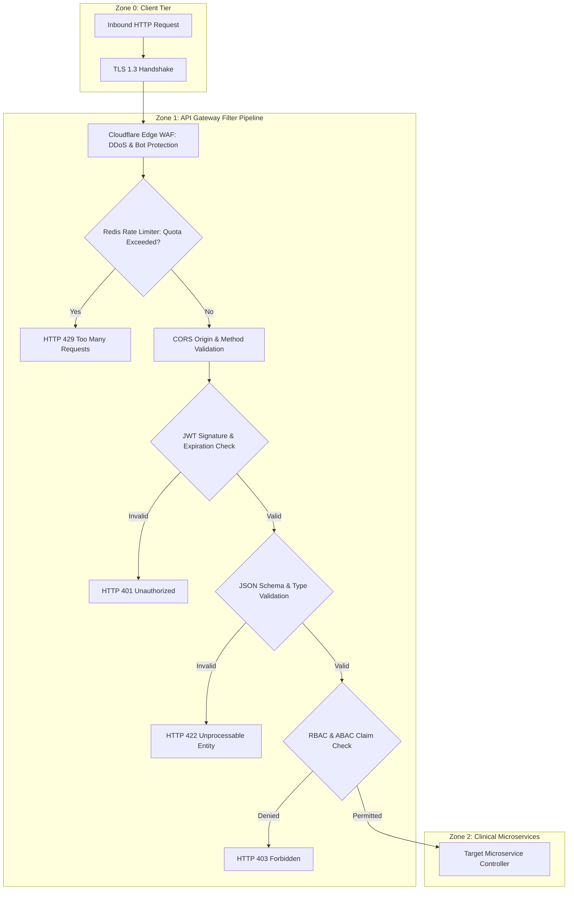

# API Security Architecture & Perimeter Protection Specification
## Namma Clinic Digital Health & Operations Platform
### Greater Bengaluru Authority (GBA) / BBMP Health Department
**Standard:** OWASP API Security Top 10 (2023) / RFC 7519 / DPDP Act 2023 | **Status:** APPROVED BASELINE | **Code:** `SEC-DOC-07`

---

## 1. API Security Architecture & Threat Surface Defense
The Namma Clinic API Gateway governs access to 341 authoritative endpoints across 16 clinical and administrative domains. Operating as the primary defensive perimeter between clinic edge clients, national health networks (ABDM), and backend microservices, the API security architecture implements comprehensive protection against all vulnerabilities identified in the OWASP API Security Top 10.

### 1.1 OWASP API Security Top 10 Mitigations
1. **API1:2023 Broken Object Level Authorization (BOLA):** Strict validation that the authenticated user has explicit lawful basis and clinical assignment to access the requested patient or encounter ID.
2. **API2:2023 Broken Authentication:** Multi-factor authentication, Argon2id hashing, short-lived 15-minute RS256 JWT tokens, and rotating refresh tokens.
3. **API3:2023 Broken Object Property Level Authorization:** Strict request and response filtering ensuring clients cannot mutate sensitive internal fields (`is_admin`, `verified_status`).
4. **API4:2023 Unrestricted Resource Consumption:** Multi-tiered Redis token bucket rate limiting; maximum request payload size restricted to 10MB.
5. **API5:2023 Broken Function Level Authorization (BFLA):** Cryptographic RBAC Guard decorators blocking clinical roles from invoking administrative or financial endpoints.
6. **API6:2023 Unrestricted Access to Sensitive Business Flows:** Step-up MFA and biometric verification required for narcotic drug dispensing and mass data exports.
7. **API7:2023 Server-Side Request Forgery (SSRF):** Strict URL allowlists and isolated network egress proxies for external webhook and ABDM callbacks.
8. **API8:2023 Security Misconfiguration:** Hardened HTTP security response headers (`HSTS`, `CSP`, `X-Content-Type-Options`, `X-Frame-Options`); stack traces disabled.
9. **API9:2023 Improper Inventory Management:** Formal API versioning (`/api/v1/`), automated OpenAPI contract documentation, and sunsetting of deprecated endpoints.
10. **API10:2023 Unsafe Consumption of APIs:** Strict schema validation and mutual TLS on all inbound callbacks from third-party and national health exchanges.

### 1.2 Multi-Layer Ingress Filtering Architecture


## 2. Comprehensive API Security Controls (API-SEC-001 to API-SEC-060)
The following 60 controls define the complete API security baseline:

### API-SEC-001
**Title:** API Security Control: JSON Schema Validation & Strict Typing applied to Staff Credential Login & Session Issuance
**Control Type:** Preventive
**Security Domain:** API Security & Perimeter Defense
**Priority:** P0 - Critical
**Risk:** Critical
**Threat:** THREAT-008
**Asset:** Endpoint API-AUTH-001 (POST /api/v1/auth/login)
**Actor:** API Consumer / External Adversary / Automated Botnet
**Precondition:** Inbound HTTP request received at /api/v1/auth/login
**Control Objective:** Enforce json schema validation & strict typing guarding API endpoint API-AUTH-001.
**Requirement:** The API gateway and microservice controller shall enforce json schema validation & strict typing on /api/v1/auth/login.
**Implementation Guidance:** Implement middleware filters, zod/class-validator schemas, and parameterized queries.
**Configuration Guidance:** Strict CORS allowlist matching clinic domains; HSTS max-age=31536000; CSP default-src 'self'.
**Failure Behavior:** Return HTTP 400/403/422/429 depending on violation; terminate request immediately.
**Monitoring:** Prometheus metric api_security_violations_total tagged with endpoint API-AUTH-001.
**Audit Event:** API_SEC_VIOLATION_API_SEC_001
**Privacy Impact:** Prevents unauthorized data scraping and injection into patient records.
**Performance Impact:** Header validation and schema parsing adds < 3ms.
**Availability Impact:** Rate limiting protects backend databases from cascading denial of service.
**Related Requirement:** SECR-001
**Related Workflow:** WF-001
**Related API:** API-AUTH-001
**Related Database Entity:** TABLE-001 (auth_users)
**Related Architecture Component:** ARCH-CONT-003 (Cloud API Gateway)
**Related Threat:** THREAT-008
**Related Test:** SEC-TEST-092
**Acceptance Criteria:** Malicious payload rejected with expected HTTP error code and audit alert.
**Evidence Required:** Automated DAST scanning reports and API security integration tests.
**Owner:** Security Engineering Lead
**Lifecycle:** Active Baseline Control
**Status:** PLANNED

### API-SEC-002
**Title:** API Security Control: SQL / NoSQL Injection Prevention applied to Token Rotation & Refresh Exchange
**Control Type:** Preventive
**Security Domain:** API Security & Perimeter Defense
**Priority:** P0 - Critical
**Risk:** Critical
**Threat:** THREAT-015
**Asset:** Endpoint API-AUTH-002 (POST /api/v1/auth/refresh)
**Actor:** API Consumer / External Adversary / Automated Botnet
**Precondition:** Inbound HTTP request received at /api/v1/auth/refresh
**Control Objective:** Enforce sql / nosql injection prevention guarding API endpoint API-AUTH-002.
**Requirement:** The API gateway and microservice controller shall enforce sql / nosql injection prevention on /api/v1/auth/refresh.
**Implementation Guidance:** Implement middleware filters, zod/class-validator schemas, and parameterized queries.
**Configuration Guidance:** Strict CORS allowlist matching clinic domains; HSTS max-age=31536000; CSP default-src 'self'.
**Failure Behavior:** Return HTTP 400/403/422/429 depending on violation; terminate request immediately.
**Monitoring:** Prometheus metric api_security_violations_total tagged with endpoint API-AUTH-002.
**Audit Event:** API_SEC_VIOLATION_API_SEC_002
**Privacy Impact:** Prevents unauthorized data scraping and injection into patient records.
**Performance Impact:** Header validation and schema parsing adds < 3ms.
**Availability Impact:** Rate limiting protects backend databases from cascading denial of service.
**Related Requirement:** SECR-002
**Related Workflow:** WF-002
**Related API:** API-AUTH-002
**Related Database Entity:** TABLE-002 (user_credentials)
**Related Architecture Component:** ARCH-CONT-003 (Cloud API Gateway)
**Related Threat:** THREAT-015
**Related Test:** SEC-TEST-093
**Acceptance Criteria:** Malicious payload rejected with expected HTTP error code and audit alert.
**Evidence Required:** Automated DAST scanning reports and API security integration tests.
**Owner:** Security Engineering Lead
**Lifecycle:** Active Baseline Control
**Status:** PLANNED

### API-SEC-003
**Title:** API Security Control: Cross-Site Scripting (XSS) Sanitization applied to Session Termination & Token Revocation
**Control Type:** Preventive
**Security Domain:** API Security & Perimeter Defense
**Priority:** P0 - Critical
**Risk:** Critical
**Threat:** THREAT-022
**Asset:** Endpoint API-AUTH-003 (POST /api/v1/auth/logout)
**Actor:** API Consumer / External Adversary / Automated Botnet
**Precondition:** Inbound HTTP request received at /api/v1/auth/logout
**Control Objective:** Enforce cross-site scripting (xss) sanitization guarding API endpoint API-AUTH-003.
**Requirement:** The API gateway and microservice controller shall enforce cross-site scripting (xss) sanitization on /api/v1/auth/logout.
**Implementation Guidance:** Implement middleware filters, zod/class-validator schemas, and parameterized queries.
**Configuration Guidance:** Strict CORS allowlist matching clinic domains; HSTS max-age=31536000; CSP default-src 'self'.
**Failure Behavior:** Return HTTP 400/403/422/429 depending on violation; terminate request immediately.
**Monitoring:** Prometheus metric api_security_violations_total tagged with endpoint API-AUTH-003.
**Audit Event:** API_SEC_VIOLATION_API_SEC_003
**Privacy Impact:** Prevents unauthorized data scraping and injection into patient records.
**Performance Impact:** Header validation and schema parsing adds < 3ms.
**Availability Impact:** Rate limiting protects backend databases from cascading denial of service.
**Related Requirement:** SECR-003
**Related Workflow:** WF-003
**Related API:** API-AUTH-003
**Related Database Entity:** TABLE-003 (user_sessions)
**Related Architecture Component:** ARCH-CONT-003 (Cloud API Gateway)
**Related Threat:** THREAT-022
**Related Test:** SEC-TEST-094
**Acceptance Criteria:** Malicious payload rejected with expected HTTP error code and audit alert.
**Evidence Required:** Automated DAST scanning reports and API security integration tests.
**Owner:** Security Engineering Lead
**Lifecycle:** Active Baseline Control
**Status:** PLANNED

### API-SEC-004
**Title:** API Security Control: Server-Side Request Forgery (SSRF) Defense applied to Current Staff Profile & Entitlements Lookup
**Control Type:** Preventive
**Security Domain:** API Security & Perimeter Defense
**Priority:** P0 - Critical
**Risk:** Critical
**Threat:** THREAT-029
**Asset:** Endpoint API-AUTH-004 (GET /api/v1/auth/me)
**Actor:** API Consumer / External Adversary / Automated Botnet
**Precondition:** Inbound HTTP request received at /api/v1/auth/me
**Control Objective:** Enforce server-side request forgery (ssrf) defense guarding API endpoint API-AUTH-004.
**Requirement:** The API gateway and microservice controller shall enforce server-side request forgery (ssrf) defense on /api/v1/auth/me.
**Implementation Guidance:** Implement middleware filters, zod/class-validator schemas, and parameterized queries.
**Configuration Guidance:** Strict CORS allowlist matching clinic domains; HSTS max-age=31536000; CSP default-src 'self'.
**Failure Behavior:** Return HTTP 400/403/422/429 depending on violation; terminate request immediately.
**Monitoring:** Prometheus metric api_security_violations_total tagged with endpoint API-AUTH-004.
**Audit Event:** API_SEC_VIOLATION_API_SEC_004
**Privacy Impact:** Prevents unauthorized data scraping and injection into patient records.
**Performance Impact:** Header validation and schema parsing adds < 3ms.
**Availability Impact:** Rate limiting protects backend databases from cascading denial of service.
**Related Requirement:** SECR-004
**Related Workflow:** WF-004
**Related API:** API-AUTH-004
**Related Database Entity:** TABLE-004 (roles)
**Related Architecture Component:** ARCH-CONT-003 (Cloud API Gateway)
**Related Threat:** THREAT-029
**Related Test:** SEC-TEST-095
**Acceptance Criteria:** Malicious payload rejected with expected HTTP error code and audit alert.
**Evidence Required:** Automated DAST scanning reports and API security integration tests.
**Owner:** Security Engineering Lead
**Lifecycle:** Active Baseline Control
**Status:** PLANNED

### API-SEC-005
**Title:** API Security Control: Cross-Origin Resource Sharing (CORS) Allowlists applied to Self-Service Staff Password Update
**Control Type:** Preventive
**Security Domain:** API Security & Perimeter Defense
**Priority:** P0 - Critical
**Risk:** Critical
**Threat:** THREAT-036
**Asset:** Endpoint API-AUTH-005 (POST /api/v1/auth/password/change)
**Actor:** API Consumer / External Adversary / Automated Botnet
**Precondition:** Inbound HTTP request received at /api/v1/auth/password/change
**Control Objective:** Enforce cross-origin resource sharing (cors) allowlists guarding API endpoint API-AUTH-005.
**Requirement:** The API gateway and microservice controller shall enforce cross-origin resource sharing (cors) allowlists on /api/v1/auth/password/change.
**Implementation Guidance:** Implement middleware filters, zod/class-validator schemas, and parameterized queries.
**Configuration Guidance:** Strict CORS allowlist matching clinic domains; HSTS max-age=31536000; CSP default-src 'self'.
**Failure Behavior:** Return HTTP 400/403/422/429 depending on violation; terminate request immediately.
**Monitoring:** Prometheus metric api_security_violations_total tagged with endpoint API-AUTH-005.
**Audit Event:** API_SEC_VIOLATION_API_SEC_005
**Privacy Impact:** Prevents unauthorized data scraping and injection into patient records.
**Performance Impact:** Header validation and schema parsing adds < 3ms.
**Availability Impact:** Rate limiting protects backend databases from cascading denial of service.
**Related Requirement:** SECR-005
**Related Workflow:** WF-005
**Related API:** API-AUTH-005
**Related Database Entity:** TABLE-005 (permissions)
**Related Architecture Component:** ARCH-CONT-003 (Cloud API Gateway)
**Related Threat:** THREAT-036
**Related Test:** SEC-TEST-096
**Acceptance Criteria:** Malicious payload rejected with expected HTTP error code and audit alert.
**Evidence Required:** Automated DAST scanning reports and API security integration tests.
**Owner:** Security Engineering Lead
**Lifecycle:** Active Baseline Control
**Status:** PLANNED

### API-SEC-006
**Title:** API Security Control: Anti-CSRF Tokens & SameSite Cookies applied to JSON Web Key Set (JWKS) Public Verification Keys
**Control Type:** Preventive
**Security Domain:** API Security & Perimeter Defense
**Priority:** P0 - Critical
**Risk:** Critical
**Threat:** THREAT-043
**Asset:** Endpoint API-AUTH-006 (GET /api/v1/auth/.well-known/jwks.json)
**Actor:** API Consumer / External Adversary / Automated Botnet
**Precondition:** Inbound HTTP request received at /api/v1/auth/.well-known/jwks.json
**Control Objective:** Enforce anti-csrf tokens & samesite cookies guarding API endpoint API-AUTH-006.
**Requirement:** The API gateway and microservice controller shall enforce anti-csrf tokens & samesite cookies on /api/v1/auth/.well-known/jwks.json.
**Implementation Guidance:** Implement middleware filters, zod/class-validator schemas, and parameterized queries.
**Configuration Guidance:** Strict CORS allowlist matching clinic domains; HSTS max-age=31536000; CSP default-src 'self'.
**Failure Behavior:** Return HTTP 400/403/422/429 depending on violation; terminate request immediately.
**Monitoring:** Prometheus metric api_security_violations_total tagged with endpoint API-AUTH-006.
**Audit Event:** API_SEC_VIOLATION_API_SEC_006
**Privacy Impact:** Prevents unauthorized data scraping and injection into patient records.
**Performance Impact:** Header validation and schema parsing adds < 3ms.
**Availability Impact:** Rate limiting protects backend databases from cascading denial of service.
**Related Requirement:** SECR-006
**Related Workflow:** WF-006
**Related API:** API-AUTH-006
**Related Database Entity:** TABLE-006 (role_permissions)
**Related Architecture Component:** ARCH-CONT-003 (Cloud API Gateway)
**Related Threat:** THREAT-043
**Related Test:** SEC-TEST-097
**Acceptance Criteria:** Malicious payload rejected with expected HTTP error code and audit alert.
**Evidence Required:** Automated DAST scanning reports and API security integration tests.
**Owner:** Security Engineering Lead
**Lifecycle:** Active Baseline Control
**Status:** PLANNED

### API-SEC-007
**Title:** API Security Control: Cryptographic Idempotency Keys (X-Idempotency-Key) applied to Multi-Factor Authentication (TOTP) Verification
**Control Type:** Preventive
**Security Domain:** API Security & Perimeter Defense
**Priority:** P0 - Critical
**Risk:** Critical
**Threat:** THREAT-050
**Asset:** Endpoint API-AUTH-007 (POST /api/v1/auth/mfa/verify)
**Actor:** API Consumer / External Adversary / Automated Botnet
**Precondition:** Inbound HTTP request received at /api/v1/auth/mfa/verify
**Control Objective:** Enforce cryptographic idempotency keys (x-idempotency-key) guarding API endpoint API-AUTH-007.
**Requirement:** The API gateway and microservice controller shall enforce cryptographic idempotency keys (x-idempotency-key) on /api/v1/auth/mfa/verify.
**Implementation Guidance:** Implement middleware filters, zod/class-validator schemas, and parameterized queries.
**Configuration Guidance:** Strict CORS allowlist matching clinic domains; HSTS max-age=31536000; CSP default-src 'self'.
**Failure Behavior:** Return HTTP 400/403/422/429 depending on violation; terminate request immediately.
**Monitoring:** Prometheus metric api_security_violations_total tagged with endpoint API-AUTH-007.
**Audit Event:** API_SEC_VIOLATION_API_SEC_007
**Privacy Impact:** Prevents unauthorized data scraping and injection into patient records.
**Performance Impact:** Header validation and schema parsing adds < 3ms.
**Availability Impact:** Rate limiting protects backend databases from cascading denial of service.
**Related Requirement:** SECR-007
**Related Workflow:** WF-007
**Related API:** API-AUTH-007
**Related Database Entity:** TABLE-007 (user_roles)
**Related Architecture Component:** ARCH-CONT-003 (Cloud API Gateway)
**Related Threat:** THREAT-050
**Related Test:** SEC-TEST-098
**Acceptance Criteria:** Malicious payload rejected with expected HTTP error code and audit alert.
**Evidence Required:** Automated DAST scanning reports and API security integration tests.
**Owner:** Security Engineering Lead
**Lifecycle:** Active Baseline Control
**Status:** PLANNED

### API-SEC-008
**Title:** API Security Control: Token Bucket Rate Limiting (Redis Backed) applied to Clinical Break-Glass Emergency Access Activation
**Control Type:** Preventive
**Security Domain:** API Security & Perimeter Defense
**Priority:** P0 - Critical
**Risk:** Critical
**Threat:** THREAT-057
**Asset:** Endpoint API-AUTH-008 (POST /api/v1/auth/break-glass)
**Actor:** API Consumer / External Adversary / Automated Botnet
**Precondition:** Inbound HTTP request received at /api/v1/auth/break-glass
**Control Objective:** Enforce token bucket rate limiting (redis backed) guarding API endpoint API-AUTH-008.
**Requirement:** The API gateway and microservice controller shall enforce token bucket rate limiting (redis backed) on /api/v1/auth/break-glass.
**Implementation Guidance:** Implement middleware filters, zod/class-validator schemas, and parameterized queries.
**Configuration Guidance:** Strict CORS allowlist matching clinic domains; HSTS max-age=31536000; CSP default-src 'self'.
**Failure Behavior:** Return HTTP 400/403/422/429 depending on violation; terminate request immediately.
**Monitoring:** Prometheus metric api_security_violations_total tagged with endpoint API-AUTH-008.
**Audit Event:** API_SEC_VIOLATION_API_SEC_008
**Privacy Impact:** Prevents unauthorized data scraping and injection into patient records.
**Performance Impact:** Header validation and schema parsing adds < 3ms.
**Availability Impact:** Rate limiting protects backend databases from cascading denial of service.
**Related Requirement:** SECR-008
**Related Workflow:** WF-008
**Related API:** API-AUTH-008
**Related Database Entity:** TABLE-008 (facilities)
**Related Architecture Component:** ARCH-CONT-003 (Cloud API Gateway)
**Related Threat:** THREAT-057
**Related Test:** SEC-TEST-099
**Acceptance Criteria:** Malicious payload rejected with expected HTTP error code and audit alert.
**Evidence Required:** Automated DAST scanning reports and API security integration tests.
**Owner:** Security Engineering Lead
**Lifecycle:** Active Baseline Control
**Status:** PLANNED

### API-SEC-009
**Title:** API Security Control: Security Response Headers (HSTS, CSP, X-Frame) applied to Clinic Tablet Hardware Device Registration
**Control Type:** Preventive
**Security Domain:** API Security & Perimeter Defense
**Priority:** P0 - Critical
**Risk:** Critical
**Threat:** THREAT-064
**Asset:** Endpoint API-AUTH-009 (POST /api/v1/auth/devices/register)
**Actor:** API Consumer / External Adversary / Automated Botnet
**Precondition:** Inbound HTTP request received at /api/v1/auth/devices/register
**Control Objective:** Enforce security response headers (hsts, csp, x-frame) guarding API endpoint API-AUTH-009.
**Requirement:** The API gateway and microservice controller shall enforce security response headers (hsts, csp, x-frame) on /api/v1/auth/devices/register.
**Implementation Guidance:** Implement middleware filters, zod/class-validator schemas, and parameterized queries.
**Configuration Guidance:** Strict CORS allowlist matching clinic domains; HSTS max-age=31536000; CSP default-src 'self'.
**Failure Behavior:** Return HTTP 400/403/422/429 depending on violation; terminate request immediately.
**Monitoring:** Prometheus metric api_security_violations_total tagged with endpoint API-AUTH-009.
**Audit Event:** API_SEC_VIOLATION_API_SEC_009
**Privacy Impact:** Prevents unauthorized data scraping and injection into patient records.
**Performance Impact:** Header validation and schema parsing adds < 3ms.
**Availability Impact:** Rate limiting protects backend databases from cascading denial of service.
**Related Requirement:** SECR-009
**Related Workflow:** WF-009
**Related API:** API-AUTH-009
**Related Database Entity:** TABLE-009 (facility_rooms)
**Related Architecture Component:** ARCH-CONT-003 (Cloud API Gateway)
**Related Threat:** THREAT-064
**Related Test:** SEC-TEST-100
**Acceptance Criteria:** Malicious payload rejected with expected HTTP error code and audit alert.
**Evidence Required:** Automated DAST scanning reports and API security integration tests.
**Owner:** Security Engineering Lead
**Lifecycle:** Active Baseline Control
**Status:** PLANNED

### API-SEC-010
**Title:** API Security Control: API Version Deprecation & Sunset Security applied to Facility Registered Workstations List
**Control Type:** Preventive
**Security Domain:** API Security & Perimeter Defense
**Priority:** P0 - Critical
**Risk:** Critical
**Threat:** THREAT-071
**Asset:** Endpoint API-AUTH-010 (GET /api/v1/auth/devices)
**Actor:** API Consumer / External Adversary / Automated Botnet
**Precondition:** Inbound HTTP request received at /api/v1/auth/devices
**Control Objective:** Enforce api version deprecation & sunset security guarding API endpoint API-AUTH-010.
**Requirement:** The API gateway and microservice controller shall enforce api version deprecation & sunset security on /api/v1/auth/devices.
**Implementation Guidance:** Implement middleware filters, zod/class-validator schemas, and parameterized queries.
**Configuration Guidance:** Strict CORS allowlist matching clinic domains; HSTS max-age=31536000; CSP default-src 'self'.
**Failure Behavior:** Return HTTP 400/403/422/429 depending on violation; terminate request immediately.
**Monitoring:** Prometheus metric api_security_violations_total tagged with endpoint API-AUTH-010.
**Audit Event:** API_SEC_VIOLATION_API_SEC_010
**Privacy Impact:** Prevents unauthorized data scraping and injection into patient records.
**Performance Impact:** Header validation and schema parsing adds < 3ms.
**Availability Impact:** Rate limiting protects backend databases from cascading denial of service.
**Related Requirement:** SECR-010
**Related Workflow:** WF-010
**Related API:** API-AUTH-010
**Related Database Entity:** TABLE-010 (staff_profiles)
**Related Architecture Component:** ARCH-CONT-003 (Cloud API Gateway)
**Related Threat:** THREAT-071
**Related Test:** SEC-TEST-101
**Acceptance Criteria:** Malicious payload rejected with expected HTTP error code and audit alert.
**Evidence Required:** Automated DAST scanning reports and API security integration tests.
**Owner:** Security Engineering Lead
**Lifecycle:** Active Baseline Control
**Status:** PLANNED

### API-SEC-011
**Title:** API Security Control: Request Payload Size Enforcement (Max 10MB) applied to De-register & Revoke Workstation Trust
**Control Type:** Preventive
**Security Domain:** API Security & Perimeter Defense
**Priority:** P0 - Critical
**Risk:** Critical
**Threat:** THREAT-078
**Asset:** Endpoint API-AUTH-011 (DELETE /api/v1/auth/devices/{deviceId})
**Actor:** API Consumer / External Adversary / Automated Botnet
**Precondition:** Inbound HTTP request received at /api/v1/auth/devices/{deviceId}
**Control Objective:** Enforce request payload size enforcement (max 10mb) guarding API endpoint API-AUTH-011.
**Requirement:** The API gateway and microservice controller shall enforce request payload size enforcement (max 10mb) on /api/v1/auth/devices/{deviceId}.
**Implementation Guidance:** Implement middleware filters, zod/class-validator schemas, and parameterized queries.
**Configuration Guidance:** Strict CORS allowlist matching clinic domains; HSTS max-age=31536000; CSP default-src 'self'.
**Failure Behavior:** Return HTTP 400/403/422/429 depending on violation; terminate request immediately.
**Monitoring:** Prometheus metric api_security_violations_total tagged with endpoint API-AUTH-011.
**Audit Event:** API_SEC_VIOLATION_API_SEC_011
**Privacy Impact:** Prevents unauthorized data scraping and injection into patient records.
**Performance Impact:** Header validation and schema parsing adds < 3ms.
**Availability Impact:** Rate limiting protects backend databases from cascading denial of service.
**Related Requirement:** SECR-011
**Related Workflow:** WF-011
**Related API:** API-AUTH-011
**Related Database Entity:** TABLE-011 (staff_shifts)
**Related Architecture Component:** ARCH-CONT-003 (Cloud API Gateway)
**Related Threat:** THREAT-078
**Related Test:** SEC-TEST-102
**Acceptance Criteria:** Malicious payload rejected with expected HTTP error code and audit alert.
**Evidence Required:** Automated DAST scanning reports and API security integration tests.
**Owner:** Security Engineering Lead
**Lifecycle:** Active Baseline Control
**Status:** PLANNED

### API-SEC-012
**Title:** API Security Control: Detailed Error Masking (No Stack Traces) applied to Master RBAC Roles Catalog Listing
**Control Type:** Preventive
**Security Domain:** API Security & Perimeter Defense
**Priority:** P0 - Critical
**Risk:** Critical
**Threat:** THREAT-085
**Asset:** Endpoint API-AUTH-012 (GET /api/v1/auth/roles)
**Actor:** API Consumer / External Adversary / Automated Botnet
**Precondition:** Inbound HTTP request received at /api/v1/auth/roles
**Control Objective:** Enforce detailed error masking (no stack traces) guarding API endpoint API-AUTH-012.
**Requirement:** The API gateway and microservice controller shall enforce detailed error masking (no stack traces) on /api/v1/auth/roles.
**Implementation Guidance:** Implement middleware filters, zod/class-validator schemas, and parameterized queries.
**Configuration Guidance:** Strict CORS allowlist matching clinic domains; HSTS max-age=31536000; CSP default-src 'self'.
**Failure Behavior:** Return HTTP 400/403/422/429 depending on violation; terminate request immediately.
**Monitoring:** Prometheus metric api_security_violations_total tagged with endpoint API-AUTH-012.
**Audit Event:** API_SEC_VIOLATION_API_SEC_012
**Privacy Impact:** Prevents unauthorized data scraping and injection into patient records.
**Performance Impact:** Header validation and schema parsing adds < 3ms.
**Availability Impact:** Rate limiting protects backend databases from cascading denial of service.
**Related Requirement:** SECR-012
**Related Workflow:** WF-012
**Related API:** API-AUTH-012
**Related Database Entity:** TABLE-012 (system_configs)
**Related Architecture Component:** ARCH-CONT-003 (Cloud API Gateway)
**Related Threat:** THREAT-085
**Related Test:** SEC-TEST-103
**Acceptance Criteria:** Malicious payload rejected with expected HTTP error code and audit alert.
**Evidence Required:** Automated DAST scanning reports and API security integration tests.
**Owner:** Security Engineering Lead
**Lifecycle:** Active Baseline Control
**Status:** PLANNED

### API-SEC-013
**Title:** API Security Control: JSON Schema Validation & Strict Typing applied to Assign Roles and Facility Scope to Staff
**Control Type:** Preventive
**Security Domain:** API Security & Perimeter Defense
**Priority:** P0 - Critical
**Risk:** Critical
**Threat:** THREAT-092
**Asset:** Endpoint API-AUTH-013 (POST /api/v1/auth/users/{userId}/roles)
**Actor:** API Consumer / External Adversary / Automated Botnet
**Precondition:** Inbound HTTP request received at /api/v1/auth/users/{userId}/roles
**Control Objective:** Enforce json schema validation & strict typing guarding API endpoint API-AUTH-013.
**Requirement:** The API gateway and microservice controller shall enforce json schema validation & strict typing on /api/v1/auth/users/{userId}/roles.
**Implementation Guidance:** Implement middleware filters, zod/class-validator schemas, and parameterized queries.
**Configuration Guidance:** Strict CORS allowlist matching clinic domains; HSTS max-age=31536000; CSP default-src 'self'.
**Failure Behavior:** Return HTTP 400/403/422/429 depending on violation; terminate request immediately.
**Monitoring:** Prometheus metric api_security_violations_total tagged with endpoint API-AUTH-013.
**Audit Event:** API_SEC_VIOLATION_API_SEC_013
**Privacy Impact:** Prevents unauthorized data scraping and injection into patient records.
**Performance Impact:** Header validation and schema parsing adds < 3ms.
**Availability Impact:** Rate limiting protects backend databases from cascading denial of service.
**Related Requirement:** SECR-013
**Related Workflow:** WF-013
**Related API:** API-AUTH-013
**Related Database Entity:** TABLE-013 (patients)
**Related Architecture Component:** ARCH-CONT-003 (Cloud API Gateway)
**Related Threat:** THREAT-092
**Related Test:** SEC-TEST-104
**Acceptance Criteria:** Malicious payload rejected with expected HTTP error code and audit alert.
**Evidence Required:** Automated DAST scanning reports and API security integration tests.
**Owner:** Security Engineering Lead
**Lifecycle:** Active Baseline Control
**Status:** PLANNED

### API-SEC-014
**Title:** API Security Control: SQL / NoSQL Injection Prevention applied to Active Staff Sessions Listing
**Control Type:** Preventive
**Security Domain:** API Security & Perimeter Defense
**Priority:** P0 - Critical
**Risk:** Critical
**Threat:** THREAT-099
**Asset:** Endpoint API-AUTH-014 (GET /api/v1/auth/sessions)
**Actor:** API Consumer / External Adversary / Automated Botnet
**Precondition:** Inbound HTTP request received at /api/v1/auth/sessions
**Control Objective:** Enforce sql / nosql injection prevention guarding API endpoint API-AUTH-014.
**Requirement:** The API gateway and microservice controller shall enforce sql / nosql injection prevention on /api/v1/auth/sessions.
**Implementation Guidance:** Implement middleware filters, zod/class-validator schemas, and parameterized queries.
**Configuration Guidance:** Strict CORS allowlist matching clinic domains; HSTS max-age=31536000; CSP default-src 'self'.
**Failure Behavior:** Return HTTP 400/403/422/429 depending on violation; terminate request immediately.
**Monitoring:** Prometheus metric api_security_violations_total tagged with endpoint API-AUTH-014.
**Audit Event:** API_SEC_VIOLATION_API_SEC_014
**Privacy Impact:** Prevents unauthorized data scraping and injection into patient records.
**Performance Impact:** Header validation and schema parsing adds < 3ms.
**Availability Impact:** Rate limiting protects backend databases from cascading denial of service.
**Related Requirement:** SECR-014
**Related Workflow:** WF-014
**Related API:** API-AUTH-014
**Related Database Entity:** TABLE-014 (patient_identifiers)
**Related Architecture Component:** ARCH-CONT-003 (Cloud API Gateway)
**Related Threat:** THREAT-099
**Related Test:** SEC-TEST-105
**Acceptance Criteria:** Malicious payload rejected with expected HTTP error code and audit alert.
**Evidence Required:** Automated DAST scanning reports and API security integration tests.
**Owner:** Security Engineering Lead
**Lifecycle:** Active Baseline Control
**Status:** PLANNED

### API-SEC-015
**Title:** API Security Control: Cross-Site Scripting (XSS) Sanitization applied to Force Invalidate Specific Session
**Control Type:** Preventive
**Security Domain:** API Security & Perimeter Defense
**Priority:** P0 - Critical
**Risk:** Critical
**Threat:** THREAT-006
**Asset:** Endpoint API-AUTH-015 (DELETE /api/v1/auth/sessions/{sessionId})
**Actor:** API Consumer / External Adversary / Automated Botnet
**Precondition:** Inbound HTTP request received at /api/v1/auth/sessions/{sessionId}
**Control Objective:** Enforce cross-site scripting (xss) sanitization guarding API endpoint API-AUTH-015.
**Requirement:** The API gateway and microservice controller shall enforce cross-site scripting (xss) sanitization on /api/v1/auth/sessions/{sessionId}.
**Implementation Guidance:** Implement middleware filters, zod/class-validator schemas, and parameterized queries.
**Configuration Guidance:** Strict CORS allowlist matching clinic domains; HSTS max-age=31536000; CSP default-src 'self'.
**Failure Behavior:** Return HTTP 400/403/422/429 depending on violation; terminate request immediately.
**Monitoring:** Prometheus metric api_security_violations_total tagged with endpoint API-AUTH-015.
**Audit Event:** API_SEC_VIOLATION_API_SEC_015
**Privacy Impact:** Prevents unauthorized data scraping and injection into patient records.
**Performance Impact:** Header validation and schema parsing adds < 3ms.
**Availability Impact:** Rate limiting protects backend databases from cascading denial of service.
**Related Requirement:** SECR-015
**Related Workflow:** WF-015
**Related API:** API-AUTH-015
**Related Database Entity:** TABLE-015 (patient_contacts)
**Related Architecture Component:** ARCH-CONT-003 (Cloud API Gateway)
**Related Threat:** THREAT-006
**Related Test:** SEC-TEST-106
**Acceptance Criteria:** Malicious payload rejected with expected HTTP error code and audit alert.
**Evidence Required:** Automated DAST scanning reports and API security integration tests.
**Owner:** Security Engineering Lead
**Lifecycle:** Active Baseline Control
**Status:** PLANNED

### API-SEC-016
**Title:** API Security Control: Server-Side Request Forgery (SSRF) Defense applied to Staff Duty Shift Clock-In
**Control Type:** Preventive
**Security Domain:** API Security & Perimeter Defense
**Priority:** P0 - Critical
**Risk:** Critical
**Threat:** THREAT-013
**Asset:** Endpoint API-AUTH-016 (POST /api/v1/auth/shifts/clock-in)
**Actor:** API Consumer / External Adversary / Automated Botnet
**Precondition:** Inbound HTTP request received at /api/v1/auth/shifts/clock-in
**Control Objective:** Enforce server-side request forgery (ssrf) defense guarding API endpoint API-AUTH-016.
**Requirement:** The API gateway and microservice controller shall enforce server-side request forgery (ssrf) defense on /api/v1/auth/shifts/clock-in.
**Implementation Guidance:** Implement middleware filters, zod/class-validator schemas, and parameterized queries.
**Configuration Guidance:** Strict CORS allowlist matching clinic domains; HSTS max-age=31536000; CSP default-src 'self'.
**Failure Behavior:** Return HTTP 400/403/422/429 depending on violation; terminate request immediately.
**Monitoring:** Prometheus metric api_security_violations_total tagged with endpoint API-AUTH-016.
**Audit Event:** API_SEC_VIOLATION_API_SEC_016
**Privacy Impact:** Prevents unauthorized data scraping and injection into patient records.
**Performance Impact:** Header validation and schema parsing adds < 3ms.
**Availability Impact:** Rate limiting protects backend databases from cascading denial of service.
**Related Requirement:** SECR-016
**Related Workflow:** WF-016
**Related API:** API-AUTH-016
**Related Database Entity:** TABLE-016 (patient_addresses)
**Related Architecture Component:** ARCH-CONT-003 (Cloud API Gateway)
**Related Threat:** THREAT-013
**Related Test:** SEC-TEST-107
**Acceptance Criteria:** Malicious payload rejected with expected HTTP error code and audit alert.
**Evidence Required:** Automated DAST scanning reports and API security integration tests.
**Owner:** Security Engineering Lead
**Lifecycle:** Active Baseline Control
**Status:** PLANNED

### API-SEC-017
**Title:** API Security Control: Cross-Origin Resource Sharing (CORS) Allowlists applied to Register New Citizen Patient Profile
**Control Type:** Preventive
**Security Domain:** API Security & Perimeter Defense
**Priority:** P0 - Critical
**Risk:** Critical
**Threat:** THREAT-020
**Asset:** Endpoint API-PATIENT-001 (POST /api/v1/patients)
**Actor:** API Consumer / External Adversary / Automated Botnet
**Precondition:** Inbound HTTP request received at /api/v1/patients
**Control Objective:** Enforce cross-origin resource sharing (cors) allowlists guarding API endpoint API-PATIENT-001.
**Requirement:** The API gateway and microservice controller shall enforce cross-origin resource sharing (cors) allowlists on /api/v1/patients.
**Implementation Guidance:** Implement middleware filters, zod/class-validator schemas, and parameterized queries.
**Configuration Guidance:** Strict CORS allowlist matching clinic domains; HSTS max-age=31536000; CSP default-src 'self'.
**Failure Behavior:** Return HTTP 400/403/422/429 depending on violation; terminate request immediately.
**Monitoring:** Prometheus metric api_security_violations_total tagged with endpoint API-PATIENT-001.
**Audit Event:** API_SEC_VIOLATION_API_SEC_017
**Privacy Impact:** Prevents unauthorized data scraping and injection into patient records.
**Performance Impact:** Header validation and schema parsing adds < 3ms.
**Availability Impact:** Rate limiting protects backend databases from cascading denial of service.
**Related Requirement:** SECR-017
**Related Workflow:** WF-017
**Related API:** API-PATIENT-001
**Related Database Entity:** TABLE-017 (consent_records)
**Related Architecture Component:** ARCH-CONT-003 (Cloud API Gateway)
**Related Threat:** THREAT-020
**Related Test:** SEC-TEST-108
**Acceptance Criteria:** Malicious payload rejected with expected HTTP error code and audit alert.
**Evidence Required:** Automated DAST scanning reports and API security integration tests.
**Owner:** Security Engineering Lead
**Lifecycle:** Active Baseline Control
**Status:** PLANNED

### API-SEC-018
**Title:** API Security Control: Anti-CSRF Tokens & SameSite Cookies applied to Retrieve Citizen Demographic & Clinical Summary
**Control Type:** Preventive
**Security Domain:** API Security & Perimeter Defense
**Priority:** P0 - Critical
**Risk:** Critical
**Threat:** THREAT-027
**Asset:** Endpoint API-PATIENT-002 (GET /api/v1/patients/{patientId})
**Actor:** API Consumer / External Adversary / Automated Botnet
**Precondition:** Inbound HTTP request received at /api/v1/patients/{patientId}
**Control Objective:** Enforce anti-csrf tokens & samesite cookies guarding API endpoint API-PATIENT-002.
**Requirement:** The API gateway and microservice controller shall enforce anti-csrf tokens & samesite cookies on /api/v1/patients/{patientId}.
**Implementation Guidance:** Implement middleware filters, zod/class-validator schemas, and parameterized queries.
**Configuration Guidance:** Strict CORS allowlist matching clinic domains; HSTS max-age=31536000; CSP default-src 'self'.
**Failure Behavior:** Return HTTP 400/403/422/429 depending on violation; terminate request immediately.
**Monitoring:** Prometheus metric api_security_violations_total tagged with endpoint API-PATIENT-002.
**Audit Event:** API_SEC_VIOLATION_API_SEC_018
**Privacy Impact:** Prevents unauthorized data scraping and injection into patient records.
**Performance Impact:** Header validation and schema parsing adds < 3ms.
**Availability Impact:** Rate limiting protects backend databases from cascading denial of service.
**Related Requirement:** SECR-018
**Related Workflow:** WF-018
**Related API:** API-PATIENT-002
**Related Database Entity:** TABLE-018 (tokens)
**Related Architecture Component:** ARCH-CONT-003 (Cloud API Gateway)
**Related Threat:** THREAT-027
**Related Test:** SEC-TEST-109
**Acceptance Criteria:** Malicious payload rejected with expected HTTP error code and audit alert.
**Evidence Required:** Automated DAST scanning reports and API security integration tests.
**Owner:** Security Engineering Lead
**Lifecycle:** Active Baseline Control
**Status:** PLANNED

### API-SEC-019
**Title:** API Security Control: Cryptographic Idempotency Keys (X-Idempotency-Key) applied to Search Patients via UHID, Phone, or Phonetic Query
**Control Type:** Preventive
**Security Domain:** API Security & Perimeter Defense
**Priority:** P0 - Critical
**Risk:** Critical
**Threat:** THREAT-034
**Asset:** Endpoint API-PATIENT-003 (GET /api/v1/patients)
**Actor:** API Consumer / External Adversary / Automated Botnet
**Precondition:** Inbound HTTP request received at /api/v1/patients
**Control Objective:** Enforce cryptographic idempotency keys (x-idempotency-key) guarding API endpoint API-PATIENT-003.
**Requirement:** The API gateway and microservice controller shall enforce cryptographic idempotency keys (x-idempotency-key) on /api/v1/patients.
**Implementation Guidance:** Implement middleware filters, zod/class-validator schemas, and parameterized queries.
**Configuration Guidance:** Strict CORS allowlist matching clinic domains; HSTS max-age=31536000; CSP default-src 'self'.
**Failure Behavior:** Return HTTP 400/403/422/429 depending on violation; terminate request immediately.
**Monitoring:** Prometheus metric api_security_violations_total tagged with endpoint API-PATIENT-003.
**Audit Event:** API_SEC_VIOLATION_API_SEC_019
**Privacy Impact:** Prevents unauthorized data scraping and injection into patient records.
**Performance Impact:** Header validation and schema parsing adds < 3ms.
**Availability Impact:** Rate limiting protects backend databases from cascading denial of service.
**Related Requirement:** SECR-019
**Related Workflow:** WF-019
**Related API:** API-PATIENT-003
**Related Database Entity:** TABLE-019 (queue_entries)
**Related Architecture Component:** ARCH-CONT-003 (Cloud API Gateway)
**Related Threat:** THREAT-034
**Related Test:** SEC-TEST-110
**Acceptance Criteria:** Malicious payload rejected with expected HTTP error code and audit alert.
**Evidence Required:** Automated DAST scanning reports and API security integration tests.
**Owner:** Security Engineering Lead
**Lifecycle:** Active Baseline Control
**Status:** PLANNED

### API-SEC-020
**Title:** API Security Control: Token Bucket Rate Limiting (Redis Backed) applied to Update Patient Demographic & Contact Details
**Control Type:** Preventive
**Security Domain:** API Security & Perimeter Defense
**Priority:** P0 - Critical
**Risk:** Critical
**Threat:** THREAT-041
**Asset:** Endpoint API-PATIENT-004 (PUT /api/v1/patients/{patientId})
**Actor:** API Consumer / External Adversary / Automated Botnet
**Precondition:** Inbound HTTP request received at /api/v1/patients/{patientId}
**Control Objective:** Enforce token bucket rate limiting (redis backed) guarding API endpoint API-PATIENT-004.
**Requirement:** The API gateway and microservice controller shall enforce token bucket rate limiting (redis backed) on /api/v1/patients/{patientId}.
**Implementation Guidance:** Implement middleware filters, zod/class-validator schemas, and parameterized queries.
**Configuration Guidance:** Strict CORS allowlist matching clinic domains; HSTS max-age=31536000; CSP default-src 'self'.
**Failure Behavior:** Return HTTP 400/403/422/429 depending on violation; terminate request immediately.
**Monitoring:** Prometheus metric api_security_violations_total tagged with endpoint API-PATIENT-004.
**Audit Event:** API_SEC_VIOLATION_API_SEC_020
**Privacy Impact:** Prevents unauthorized data scraping and injection into patient records.
**Performance Impact:** Header validation and schema parsing adds < 3ms.
**Availability Impact:** Rate limiting protects backend databases from cascading denial of service.
**Related Requirement:** SECR-020
**Related Workflow:** WF-020
**Related API:** API-PATIENT-004
**Related Database Entity:** TABLE-020 (triage_assessments)
**Related Architecture Component:** ARCH-CONT-003 (Cloud API Gateway)
**Related Threat:** THREAT-041
**Related Test:** SEC-TEST-111
**Acceptance Criteria:** Malicious payload rejected with expected HTTP error code and audit alert.
**Evidence Required:** Automated DAST scanning reports and API security integration tests.
**Owner:** Security Engineering Lead
**Lifecycle:** Active Baseline Control
**Status:** PLANNED

### API-SEC-021
**Title:** API Security Control: Security Response Headers (HSTS, CSP, X-Frame) applied to Check Duplicate Citizen Candidate Matches
**Control Type:** Preventive
**Security Domain:** API Security & Perimeter Defense
**Priority:** P0 - Critical
**Risk:** Critical
**Threat:** THREAT-048
**Asset:** Endpoint API-PATIENT-005 (POST /api/v1/patients/duplicates/check)
**Actor:** API Consumer / External Adversary / Automated Botnet
**Precondition:** Inbound HTTP request received at /api/v1/patients/duplicates/check
**Control Objective:** Enforce security response headers (hsts, csp, x-frame) guarding API endpoint API-PATIENT-005.
**Requirement:** The API gateway and microservice controller shall enforce security response headers (hsts, csp, x-frame) on /api/v1/patients/duplicates/check.
**Implementation Guidance:** Implement middleware filters, zod/class-validator schemas, and parameterized queries.
**Configuration Guidance:** Strict CORS allowlist matching clinic domains; HSTS max-age=31536000; CSP default-src 'self'.
**Failure Behavior:** Return HTTP 400/403/422/429 depending on violation; terminate request immediately.
**Monitoring:** Prometheus metric api_security_violations_total tagged with endpoint API-PATIENT-005.
**Audit Event:** API_SEC_VIOLATION_API_SEC_021
**Privacy Impact:** Prevents unauthorized data scraping and injection into patient records.
**Performance Impact:** Header validation and schema parsing adds < 3ms.
**Availability Impact:** Rate limiting protects backend databases from cascading denial of service.
**Related Requirement:** SECR-021
**Related Workflow:** WF-021
**Related API:** API-PATIENT-005
**Related Database Entity:** TABLE-021 (patient_vitals)
**Related Architecture Component:** ARCH-CONT-003 (Cloud API Gateway)
**Related Threat:** THREAT-048
**Related Test:** SEC-TEST-112
**Acceptance Criteria:** Malicious payload rejected with expected HTTP error code and audit alert.
**Evidence Required:** Automated DAST scanning reports and API security integration tests.
**Owner:** Security Engineering Lead
**Lifecycle:** Active Baseline Control
**Status:** PLANNED

### API-SEC-022
**Title:** API Security Control: API Version Deprecation & Sunset Security applied to Merge Subsumed Patient into Primary Profile
**Control Type:** Preventive
**Security Domain:** API Security & Perimeter Defense
**Priority:** P0 - Critical
**Risk:** Critical
**Threat:** THREAT-055
**Asset:** Endpoint API-PATIENT-006 (POST /api/v1/patients/merge)
**Actor:** API Consumer / External Adversary / Automated Botnet
**Precondition:** Inbound HTTP request received at /api/v1/patients/merge
**Control Objective:** Enforce api version deprecation & sunset security guarding API endpoint API-PATIENT-006.
**Requirement:** The API gateway and microservice controller shall enforce api version deprecation & sunset security on /api/v1/patients/merge.
**Implementation Guidance:** Implement middleware filters, zod/class-validator schemas, and parameterized queries.
**Configuration Guidance:** Strict CORS allowlist matching clinic domains; HSTS max-age=31536000; CSP default-src 'self'.
**Failure Behavior:** Return HTTP 400/403/422/429 depending on violation; terminate request immediately.
**Monitoring:** Prometheus metric api_security_violations_total tagged with endpoint API-PATIENT-006.
**Audit Event:** API_SEC_VIOLATION_API_SEC_022
**Privacy Impact:** Prevents unauthorized data scraping and injection into patient records.
**Performance Impact:** Header validation and schema parsing adds < 3ms.
**Availability Impact:** Rate limiting protects backend databases from cascading denial of service.
**Related Requirement:** SECR-022
**Related Workflow:** WF-022
**Related API:** API-PATIENT-006
**Related Database Entity:** TABLE-022 (danger_alerts)
**Related Architecture Component:** ARCH-CONT-003 (Cloud API Gateway)
**Related Threat:** THREAT-055
**Related Test:** SEC-TEST-113
**Acceptance Criteria:** Malicious payload rejected with expected HTTP error code and audit alert.
**Evidence Required:** Automated DAST scanning reports and API security integration tests.
**Owner:** Security Engineering Lead
**Lifecycle:** Active Baseline Control
**Status:** PLANNED

### API-SEC-023
**Title:** API Security Control: Request Payload Size Enforcement (Max 10MB) applied to Link Verified ABHA ID to Patient UHID
**Control Type:** Preventive
**Security Domain:** API Security & Perimeter Defense
**Priority:** P0 - Critical
**Risk:** Critical
**Threat:** THREAT-062
**Asset:** Endpoint API-PATIENT-007 (POST /api/v1/patients/{patientId}/abha/link)
**Actor:** API Consumer / External Adversary / Automated Botnet
**Precondition:** Inbound HTTP request received at /api/v1/patients/{patientId}/abha/link
**Control Objective:** Enforce request payload size enforcement (max 10mb) guarding API endpoint API-PATIENT-007.
**Requirement:** The API gateway and microservice controller shall enforce request payload size enforcement (max 10mb) on /api/v1/patients/{patientId}/abha/link.
**Implementation Guidance:** Implement middleware filters, zod/class-validator schemas, and parameterized queries.
**Configuration Guidance:** Strict CORS allowlist matching clinic domains; HSTS max-age=31536000; CSP default-src 'self'.
**Failure Behavior:** Return HTTP 400/403/422/429 depending on violation; terminate request immediately.
**Monitoring:** Prometheus metric api_security_violations_total tagged with endpoint API-PATIENT-007.
**Audit Event:** API_SEC_VIOLATION_API_SEC_023
**Privacy Impact:** Prevents unauthorized data scraping and injection into patient records.
**Performance Impact:** Header validation and schema parsing adds < 3ms.
**Availability Impact:** Rate limiting protects backend databases from cascading denial of service.
**Related Requirement:** SECR-023
**Related Workflow:** WF-023
**Related API:** API-PATIENT-007
**Related Database Entity:** TABLE-023 (clinical_encounters)
**Related Architecture Component:** ARCH-CONT-003 (Cloud API Gateway)
**Related Threat:** THREAT-062
**Related Test:** SEC-TEST-114
**Acceptance Criteria:** Malicious payload rejected with expected HTTP error code and audit alert.
**Evidence Required:** Automated DAST scanning reports and API security integration tests.
**Owner:** Security Engineering Lead
**Lifecycle:** Active Baseline Control
**Status:** PLANNED

### API-SEC-024
**Title:** API Security Control: Detailed Error Masking (No Stack Traces) applied to Unlink ABHA Identity from Citizen UHID
**Control Type:** Preventive
**Security Domain:** API Security & Perimeter Defense
**Priority:** P0 - Critical
**Risk:** Critical
**Threat:** THREAT-069
**Asset:** Endpoint API-PATIENT-008 (DELETE /api/v1/patients/{patientId}/abha/unlink)
**Actor:** API Consumer / External Adversary / Automated Botnet
**Precondition:** Inbound HTTP request received at /api/v1/patients/{patientId}/abha/unlink
**Control Objective:** Enforce detailed error masking (no stack traces) guarding API endpoint API-PATIENT-008.
**Requirement:** The API gateway and microservice controller shall enforce detailed error masking (no stack traces) on /api/v1/patients/{patientId}/abha/unlink.
**Implementation Guidance:** Implement middleware filters, zod/class-validator schemas, and parameterized queries.
**Configuration Guidance:** Strict CORS allowlist matching clinic domains; HSTS max-age=31536000; CSP default-src 'self'.
**Failure Behavior:** Return HTTP 400/403/422/429 depending on violation; terminate request immediately.
**Monitoring:** Prometheus metric api_security_violations_total tagged with endpoint API-PATIENT-008.
**Audit Event:** API_SEC_VIOLATION_API_SEC_024
**Privacy Impact:** Prevents unauthorized data scraping and injection into patient records.
**Performance Impact:** Header validation and schema parsing adds < 3ms.
**Availability Impact:** Rate limiting protects backend databases from cascading denial of service.
**Related Requirement:** SECR-024
**Related Workflow:** WF-024
**Related API:** API-PATIENT-008
**Related Database Entity:** TABLE-024 (clinical_notes)
**Related Architecture Component:** ARCH-CONT-003 (Cloud API Gateway)
**Related Threat:** THREAT-069
**Related Test:** SEC-TEST-115
**Acceptance Criteria:** Malicious payload rejected with expected HTTP error code and audit alert.
**Evidence Required:** Automated DAST scanning reports and API security integration tests.
**Owner:** Security Engineering Lead
**Lifecycle:** Active Baseline Control
**Status:** PLANNED

### API-SEC-025
**Title:** API Security Control: JSON Schema Validation & Strict Typing applied to Longitudinal Encounter & Clinical History
**Control Type:** Preventive
**Security Domain:** API Security & Perimeter Defense
**Priority:** P0 - Critical
**Risk:** Critical
**Threat:** THREAT-076
**Asset:** Endpoint API-PATIENT-009 (GET /api/v1/patients/{patientId}/history)
**Actor:** API Consumer / External Adversary / Automated Botnet
**Precondition:** Inbound HTTP request received at /api/v1/patients/{patientId}/history
**Control Objective:** Enforce json schema validation & strict typing guarding API endpoint API-PATIENT-009.
**Requirement:** The API gateway and microservice controller shall enforce json schema validation & strict typing on /api/v1/patients/{patientId}/history.
**Implementation Guidance:** Implement middleware filters, zod/class-validator schemas, and parameterized queries.
**Configuration Guidance:** Strict CORS allowlist matching clinic domains; HSTS max-age=31536000; CSP default-src 'self'.
**Failure Behavior:** Return HTTP 400/403/422/429 depending on violation; terminate request immediately.
**Monitoring:** Prometheus metric api_security_violations_total tagged with endpoint API-PATIENT-009.
**Audit Event:** API_SEC_VIOLATION_API_SEC_025
**Privacy Impact:** Prevents unauthorized data scraping and injection into patient records.
**Performance Impact:** Header validation and schema parsing adds < 3ms.
**Availability Impact:** Rate limiting protects backend databases from cascading denial of service.
**Related Requirement:** SECR-025
**Related Workflow:** WF-025
**Related API:** API-PATIENT-009
**Related Database Entity:** TABLE-025 (diagnoses)
**Related Architecture Component:** ARCH-CONT-003 (Cloud API Gateway)
**Related Threat:** THREAT-076
**Related Test:** SEC-TEST-116
**Acceptance Criteria:** Malicious payload rejected with expected HTTP error code and audit alert.
**Evidence Required:** Automated DAST scanning reports and API security integration tests.
**Owner:** Security Engineering Lead
**Lifecycle:** Active Baseline Control
**Status:** PLANNED

### API-SEC-026
**Title:** API Security Control: SQL / NoSQL Injection Prevention applied to Citizen Consent Artifacts & Preferences
**Control Type:** Preventive
**Security Domain:** API Security & Perimeter Defense
**Priority:** P0 - Critical
**Risk:** High
**Threat:** THREAT-083
**Asset:** Endpoint API-PATIENT-010 (GET /api/v1/patients/{patientId}/consents)
**Actor:** API Consumer / External Adversary / Automated Botnet
**Precondition:** Inbound HTTP request received at /api/v1/patients/{patientId}/consents
**Control Objective:** Enforce sql / nosql injection prevention guarding API endpoint API-PATIENT-010.
**Requirement:** The API gateway and microservice controller shall enforce sql / nosql injection prevention on /api/v1/patients/{patientId}/consents.
**Implementation Guidance:** Implement middleware filters, zod/class-validator schemas, and parameterized queries.
**Configuration Guidance:** Strict CORS allowlist matching clinic domains; HSTS max-age=31536000; CSP default-src 'self'.
**Failure Behavior:** Return HTTP 400/403/422/429 depending on violation; terminate request immediately.
**Monitoring:** Prometheus metric api_security_violations_total tagged with endpoint API-PATIENT-010.
**Audit Event:** API_SEC_VIOLATION_API_SEC_026
**Privacy Impact:** Prevents unauthorized data scraping and injection into patient records.
**Performance Impact:** Header validation and schema parsing adds < 3ms.
**Availability Impact:** Rate limiting protects backend databases from cascading denial of service.
**Related Requirement:** SECR-026
**Related Workflow:** WF-026
**Related API:** API-PATIENT-010
**Related Database Entity:** TABLE-026 (prescriptions)
**Related Architecture Component:** ARCH-CONT-003 (Cloud API Gateway)
**Related Threat:** THREAT-083
**Related Test:** SEC-TEST-117
**Acceptance Criteria:** Malicious payload rejected with expected HTTP error code and audit alert.
**Evidence Required:** Automated DAST scanning reports and API security integration tests.
**Owner:** Security Engineering Lead
**Lifecycle:** Active Baseline Control
**Status:** PLANNED

### API-SEC-027
**Title:** API Security Control: Cross-Site Scripting (XSS) Sanitization applied to Record Citizen Consent Directive
**Control Type:** Preventive
**Security Domain:** API Security & Perimeter Defense
**Priority:** P0 - Critical
**Risk:** High
**Threat:** THREAT-090
**Asset:** Endpoint API-PATIENT-011 (POST /api/v1/patients/{patientId}/consents)
**Actor:** API Consumer / External Adversary / Automated Botnet
**Precondition:** Inbound HTTP request received at /api/v1/patients/{patientId}/consents
**Control Objective:** Enforce cross-site scripting (xss) sanitization guarding API endpoint API-PATIENT-011.
**Requirement:** The API gateway and microservice controller shall enforce cross-site scripting (xss) sanitization on /api/v1/patients/{patientId}/consents.
**Implementation Guidance:** Implement middleware filters, zod/class-validator schemas, and parameterized queries.
**Configuration Guidance:** Strict CORS allowlist matching clinic domains; HSTS max-age=31536000; CSP default-src 'self'.
**Failure Behavior:** Return HTTP 400/403/422/429 depending on violation; terminate request immediately.
**Monitoring:** Prometheus metric api_security_violations_total tagged with endpoint API-PATIENT-011.
**Audit Event:** API_SEC_VIOLATION_API_SEC_027
**Privacy Impact:** Prevents unauthorized data scraping and injection into patient records.
**Performance Impact:** Header validation and schema parsing adds < 3ms.
**Availability Impact:** Rate limiting protects backend databases from cascading denial of service.
**Related Requirement:** SECR-027
**Related Workflow:** WF-027
**Related API:** API-PATIENT-011
**Related Database Entity:** TABLE-027 (prescription_items)
**Related Architecture Component:** ARCH-CONT-003 (Cloud API Gateway)
**Related Threat:** THREAT-090
**Related Test:** SEC-TEST-118
**Acceptance Criteria:** Malicious payload rejected with expected HTTP error code and audit alert.
**Evidence Required:** Automated DAST scanning reports and API security integration tests.
**Owner:** Security Engineering Lead
**Lifecycle:** Active Baseline Control
**Status:** PLANNED

### API-SEC-028
**Title:** API Security Control: Server-Side Request Forgery (SSRF) Defense applied to Revoke Citizen Consent Directive
**Control Type:** Preventive
**Security Domain:** API Security & Perimeter Defense
**Priority:** P0 - Critical
**Risk:** High
**Threat:** THREAT-097
**Asset:** Endpoint API-PATIENT-012 (DELETE /api/v1/patients/{patientId}/consents/{consentId})
**Actor:** API Consumer / External Adversary / Automated Botnet
**Precondition:** Inbound HTTP request received at /api/v1/patients/{patientId}/consents/{consentId}
**Control Objective:** Enforce server-side request forgery (ssrf) defense guarding API endpoint API-PATIENT-012.
**Requirement:** The API gateway and microservice controller shall enforce server-side request forgery (ssrf) defense on /api/v1/patients/{patientId}/consents/{consentId}.
**Implementation Guidance:** Implement middleware filters, zod/class-validator schemas, and parameterized queries.
**Configuration Guidance:** Strict CORS allowlist matching clinic domains; HSTS max-age=31536000; CSP default-src 'self'.
**Failure Behavior:** Return HTTP 400/403/422/429 depending on violation; terminate request immediately.
**Monitoring:** Prometheus metric api_security_violations_total tagged with endpoint API-PATIENT-012.
**Audit Event:** API_SEC_VIOLATION_API_SEC_028
**Privacy Impact:** Prevents unauthorized data scraping and injection into patient records.
**Performance Impact:** Header validation and schema parsing adds < 3ms.
**Availability Impact:** Rate limiting protects backend databases from cascading denial of service.
**Related Requirement:** SECR-028
**Related Workflow:** WF-028
**Related API:** API-PATIENT-012
**Related Database Entity:** TABLE-028 (lab_orders)
**Related Architecture Component:** ARCH-CONT-003 (Cloud API Gateway)
**Related Threat:** THREAT-097
**Related Test:** SEC-TEST-119
**Acceptance Criteria:** Malicious payload rejected with expected HTTP error code and audit alert.
**Evidence Required:** Automated DAST scanning reports and API security integration tests.
**Owner:** Security Engineering Lead
**Lifecycle:** Active Baseline Control
**Status:** PLANNED

### API-SEC-029
**Title:** API Security Control: Cross-Origin Resource Sharing (CORS) Allowlists applied to Citizen Record Access Audit Trail
**Control Type:** Preventive
**Security Domain:** API Security & Perimeter Defense
**Priority:** P0 - Critical
**Risk:** High
**Threat:** THREAT-004
**Asset:** Endpoint API-PATIENT-013 (GET /api/v1/patients/{patientId}/audit)
**Actor:** API Consumer / External Adversary / Automated Botnet
**Precondition:** Inbound HTTP request received at /api/v1/patients/{patientId}/audit
**Control Objective:** Enforce cross-origin resource sharing (cors) allowlists guarding API endpoint API-PATIENT-013.
**Requirement:** The API gateway and microservice controller shall enforce cross-origin resource sharing (cors) allowlists on /api/v1/patients/{patientId}/audit.
**Implementation Guidance:** Implement middleware filters, zod/class-validator schemas, and parameterized queries.
**Configuration Guidance:** Strict CORS allowlist matching clinic domains; HSTS max-age=31536000; CSP default-src 'self'.
**Failure Behavior:** Return HTTP 400/403/422/429 depending on violation; terminate request immediately.
**Monitoring:** Prometheus metric api_security_violations_total tagged with endpoint API-PATIENT-013.
**Audit Event:** API_SEC_VIOLATION_API_SEC_029
**Privacy Impact:** Prevents unauthorized data scraping and injection into patient records.
**Performance Impact:** Header validation and schema parsing adds < 3ms.
**Availability Impact:** Rate limiting protects backend databases from cascading denial of service.
**Related Requirement:** SECR-029
**Related Workflow:** WF-029
**Related API:** API-PATIENT-013
**Related Database Entity:** TABLE-029 (lab_order_items)
**Related Architecture Component:** ARCH-CONT-003 (Cloud API Gateway)
**Related Threat:** THREAT-004
**Related Test:** SEC-TEST-120
**Acceptance Criteria:** Malicious payload rejected with expected HTTP error code and audit alert.
**Evidence Required:** Automated DAST scanning reports and API security integration tests.
**Owner:** Security Engineering Lead
**Lifecycle:** Active Baseline Control
**Status:** PLANNED

### API-SEC-030
**Title:** API Security Control: Anti-CSRF Tokens & SameSite Cookies applied to Enroll Patient in NCD Chronic Care Registry
**Control Type:** Preventive
**Security Domain:** API Security & Perimeter Defense
**Priority:** P0 - Critical
**Risk:** High
**Threat:** THREAT-011
**Asset:** Endpoint API-PATIENT-014 (POST /api/v1/patients/{patientId}/ncd-enroll)
**Actor:** API Consumer / External Adversary / Automated Botnet
**Precondition:** Inbound HTTP request received at /api/v1/patients/{patientId}/ncd-enroll
**Control Objective:** Enforce anti-csrf tokens & samesite cookies guarding API endpoint API-PATIENT-014.
**Requirement:** The API gateway and microservice controller shall enforce anti-csrf tokens & samesite cookies on /api/v1/patients/{patientId}/ncd-enroll.
**Implementation Guidance:** Implement middleware filters, zod/class-validator schemas, and parameterized queries.
**Configuration Guidance:** Strict CORS allowlist matching clinic domains; HSTS max-age=31536000; CSP default-src 'self'.
**Failure Behavior:** Return HTTP 400/403/422/429 depending on violation; terminate request immediately.
**Monitoring:** Prometheus metric api_security_violations_total tagged with endpoint API-PATIENT-014.
**Audit Event:** API_SEC_VIOLATION_API_SEC_030
**Privacy Impact:** Prevents unauthorized data scraping and injection into patient records.
**Performance Impact:** Header validation and schema parsing adds < 3ms.
**Availability Impact:** Rate limiting protects backend databases from cascading denial of service.
**Related Requirement:** SECR-030
**Related Workflow:** WF-030
**Related API:** API-PATIENT-014
**Related Database Entity:** TABLE-030 (lab_results)
**Related Architecture Component:** ARCH-CONT-003 (Cloud API Gateway)
**Related Threat:** THREAT-011
**Related Test:** SEC-TEST-121
**Acceptance Criteria:** Malicious payload rejected with expected HTTP error code and audit alert.
**Evidence Required:** Automated DAST scanning reports and API security integration tests.
**Owner:** Security Engineering Lead
**Lifecycle:** Active Baseline Control
**Status:** PLANNED

### API-SEC-031
**Title:** API Security Control: Cryptographic Idempotency Keys (X-Idempotency-Key) applied to Retrieve NCD Chronic Episode Status
**Control Type:** Preventive
**Security Domain:** API Security & Perimeter Defense
**Priority:** P1 - High
**Risk:** High
**Threat:** THREAT-018
**Asset:** Endpoint API-PATIENT-015 (GET /api/v1/patients/{patientId}/ncd-status)
**Actor:** API Consumer / External Adversary / Automated Botnet
**Precondition:** Inbound HTTP request received at /api/v1/patients/{patientId}/ncd-status
**Control Objective:** Enforce cryptographic idempotency keys (x-idempotency-key) guarding API endpoint API-PATIENT-015.
**Requirement:** The API gateway and microservice controller shall enforce cryptographic idempotency keys (x-idempotency-key) on /api/v1/patients/{patientId}/ncd-status.
**Implementation Guidance:** Implement middleware filters, zod/class-validator schemas, and parameterized queries.
**Configuration Guidance:** Strict CORS allowlist matching clinic domains; HSTS max-age=31536000; CSP default-src 'self'.
**Failure Behavior:** Return HTTP 400/403/422/429 depending on violation; terminate request immediately.
**Monitoring:** Prometheus metric api_security_violations_total tagged with endpoint API-PATIENT-015.
**Audit Event:** API_SEC_VIOLATION_API_SEC_031
**Privacy Impact:** Prevents unauthorized data scraping and injection into patient records.
**Performance Impact:** Header validation and schema parsing adds < 3ms.
**Availability Impact:** Rate limiting protects backend databases from cascading denial of service.
**Related Requirement:** SECR-001
**Related Workflow:** WF-001
**Related API:** API-PATIENT-015
**Related Database Entity:** TABLE-031 (teleconsultations)
**Related Architecture Component:** ARCH-CONT-003 (Cloud API Gateway)
**Related Threat:** THREAT-018
**Related Test:** SEC-TEST-122
**Acceptance Criteria:** Malicious payload rejected with expected HTTP error code and audit alert.
**Evidence Required:** Automated DAST scanning reports and API security integration tests.
**Owner:** Security Engineering Lead
**Lifecycle:** Active Baseline Control
**Status:** PLANNED

### API-SEC-032
**Title:** API Security Control: Token Bucket Rate Limiting (Redis Backed) applied to Add Emergency Contact / Guardian
**Control Type:** Preventive
**Security Domain:** API Security & Perimeter Defense
**Priority:** P1 - High
**Risk:** High
**Threat:** THREAT-025
**Asset:** Endpoint API-PATIENT-016 (POST /api/v1/patients/{patientId}/emergency-contacts)
**Actor:** API Consumer / External Adversary / Automated Botnet
**Precondition:** Inbound HTTP request received at /api/v1/patients/{patientId}/emergency-contacts
**Control Objective:** Enforce token bucket rate limiting (redis backed) guarding API endpoint API-PATIENT-016.
**Requirement:** The API gateway and microservice controller shall enforce token bucket rate limiting (redis backed) on /api/v1/patients/{patientId}/emergency-contacts.
**Implementation Guidance:** Implement middleware filters, zod/class-validator schemas, and parameterized queries.
**Configuration Guidance:** Strict CORS allowlist matching clinic domains; HSTS max-age=31536000; CSP default-src 'self'.
**Failure Behavior:** Return HTTP 400/403/422/429 depending on violation; terminate request immediately.
**Monitoring:** Prometheus metric api_security_violations_total tagged with endpoint API-PATIENT-016.
**Audit Event:** API_SEC_VIOLATION_API_SEC_032
**Privacy Impact:** Prevents unauthorized data scraping and injection into patient records.
**Performance Impact:** Header validation and schema parsing adds < 3ms.
**Availability Impact:** Rate limiting protects backend databases from cascading denial of service.
**Related Requirement:** SECR-002
**Related Workflow:** WF-002
**Related API:** API-PATIENT-016
**Related Database Entity:** TABLE-032 (formulary_drugs)
**Related Architecture Component:** ARCH-CONT-003 (Cloud API Gateway)
**Related Threat:** THREAT-025
**Related Test:** SEC-TEST-123
**Acceptance Criteria:** Malicious payload rejected with expected HTTP error code and audit alert.
**Evidence Required:** Automated DAST scanning reports and API security integration tests.
**Owner:** Security Engineering Lead
**Lifecycle:** Active Baseline Control
**Status:** PLANNED

### API-SEC-033
**Title:** API Security Control: Security Response Headers (HSTS, CSP, X-Frame) applied to List All Registered Patient Identifiers
**Control Type:** Preventive
**Security Domain:** API Security & Perimeter Defense
**Priority:** P1 - High
**Risk:** High
**Threat:** THREAT-032
**Asset:** Endpoint API-PATIENT-017 (GET /api/v1/patients/{patientId}/identifiers)
**Actor:** API Consumer / External Adversary / Automated Botnet
**Precondition:** Inbound HTTP request received at /api/v1/patients/{patientId}/identifiers
**Control Objective:** Enforce security response headers (hsts, csp, x-frame) guarding API endpoint API-PATIENT-017.
**Requirement:** The API gateway and microservice controller shall enforce security response headers (hsts, csp, x-frame) on /api/v1/patients/{patientId}/identifiers.
**Implementation Guidance:** Implement middleware filters, zod/class-validator schemas, and parameterized queries.
**Configuration Guidance:** Strict CORS allowlist matching clinic domains; HSTS max-age=31536000; CSP default-src 'self'.
**Failure Behavior:** Return HTTP 400/403/422/429 depending on violation; terminate request immediately.
**Monitoring:** Prometheus metric api_security_violations_total tagged with endpoint API-PATIENT-017.
**Audit Event:** API_SEC_VIOLATION_API_SEC_033
**Privacy Impact:** Prevents unauthorized data scraping and injection into patient records.
**Performance Impact:** Header validation and schema parsing adds < 3ms.
**Availability Impact:** Rate limiting protects backend databases from cascading denial of service.
**Related Requirement:** SECR-003
**Related Workflow:** WF-003
**Related API:** API-PATIENT-017
**Related Database Entity:** TABLE-033 (drug_categories)
**Related Architecture Component:** ARCH-CONT-003 (Cloud API Gateway)
**Related Threat:** THREAT-032
**Related Test:** SEC-TEST-124
**Acceptance Criteria:** Malicious payload rejected with expected HTTP error code and audit alert.
**Evidence Required:** Automated DAST scanning reports and API security integration tests.
**Owner:** Security Engineering Lead
**Lifecycle:** Active Baseline Control
**Status:** PLANNED

### API-SEC-034
**Title:** API Security Control: API Version Deprecation & Sunset Security applied to Bind Supplemental Identifier to Citizen Profile
**Control Type:** Preventive
**Security Domain:** API Security & Perimeter Defense
**Priority:** P1 - High
**Risk:** High
**Threat:** THREAT-039
**Asset:** Endpoint API-PATIENT-018 (POST /api/v1/patients/{patientId}/identifiers)
**Actor:** API Consumer / External Adversary / Automated Botnet
**Precondition:** Inbound HTTP request received at /api/v1/patients/{patientId}/identifiers
**Control Objective:** Enforce api version deprecation & sunset security guarding API endpoint API-PATIENT-018.
**Requirement:** The API gateway and microservice controller shall enforce api version deprecation & sunset security on /api/v1/patients/{patientId}/identifiers.
**Implementation Guidance:** Implement middleware filters, zod/class-validator schemas, and parameterized queries.
**Configuration Guidance:** Strict CORS allowlist matching clinic domains; HSTS max-age=31536000; CSP default-src 'self'.
**Failure Behavior:** Return HTTP 400/403/422/429 depending on violation; terminate request immediately.
**Monitoring:** Prometheus metric api_security_violations_total tagged with endpoint API-PATIENT-018.
**Audit Event:** API_SEC_VIOLATION_API_SEC_034
**Privacy Impact:** Prevents unauthorized data scraping and injection into patient records.
**Performance Impact:** Header validation and schema parsing adds < 3ms.
**Availability Impact:** Rate limiting protects backend databases from cascading denial of service.
**Related Requirement:** SECR-004
**Related Workflow:** WF-004
**Related API:** API-PATIENT-018
**Related Database Entity:** TABLE-034 (pharmacy_batches)
**Related Architecture Component:** ARCH-CONT-003 (Cloud API Gateway)
**Related Threat:** THREAT-039
**Related Test:** SEC-TEST-125
**Acceptance Criteria:** Malicious payload rejected with expected HTTP error code and audit alert.
**Evidence Required:** Automated DAST scanning reports and API security integration tests.
**Owner:** Security Engineering Lead
**Lifecycle:** Active Baseline Control
**Status:** PLANNED

### API-SEC-035
**Title:** API Security Control: Request Payload Size Enforcement (Max 10MB) applied to Remove Erroneous Supplemental Identifier
**Control Type:** Preventive
**Security Domain:** API Security & Perimeter Defense
**Priority:** P1 - High
**Risk:** High
**Threat:** THREAT-046
**Asset:** Endpoint API-PATIENT-019 (DELETE /api/v1/patients/{patientId}/identifiers/{identifierId})
**Actor:** API Consumer / External Adversary / Automated Botnet
**Precondition:** Inbound HTTP request received at /api/v1/patients/{patientId}/identifiers/{identifierId}
**Control Objective:** Enforce request payload size enforcement (max 10mb) guarding API endpoint API-PATIENT-019.
**Requirement:** The API gateway and microservice controller shall enforce request payload size enforcement (max 10mb) on /api/v1/patients/{patientId}/identifiers/{identifierId}.
**Implementation Guidance:** Implement middleware filters, zod/class-validator schemas, and parameterized queries.
**Configuration Guidance:** Strict CORS allowlist matching clinic domains; HSTS max-age=31536000; CSP default-src 'self'.
**Failure Behavior:** Return HTTP 400/403/422/429 depending on violation; terminate request immediately.
**Monitoring:** Prometheus metric api_security_violations_total tagged with endpoint API-PATIENT-019.
**Audit Event:** API_SEC_VIOLATION_API_SEC_035
**Privacy Impact:** Prevents unauthorized data scraping and injection into patient records.
**Performance Impact:** Header validation and schema parsing adds < 3ms.
**Availability Impact:** Rate limiting protects backend databases from cascading denial of service.
**Related Requirement:** SECR-005
**Related Workflow:** WF-005
**Related API:** API-PATIENT-019
**Related Database Entity:** TABLE-035 (clinic_stock)
**Related Architecture Component:** ARCH-CONT-003 (Cloud API Gateway)
**Related Threat:** THREAT-046
**Related Test:** SEC-TEST-126
**Acceptance Criteria:** Malicious payload rejected with expected HTTP error code and audit alert.
**Evidence Required:** Automated DAST scanning reports and API security integration tests.
**Owner:** Security Engineering Lead
**Lifecycle:** Active Baseline Control
**Status:** PLANNED

### API-SEC-036
**Title:** API Security Control: Detailed Error Masking (No Stack Traces) applied to Mark Patient Record Deceased
**Control Type:** Preventive
**Security Domain:** API Security & Perimeter Defense
**Priority:** P1 - High
**Risk:** High
**Threat:** THREAT-053
**Asset:** Endpoint API-PATIENT-020 (POST /api/v1/patients/{patientId}/flag-deceased)
**Actor:** API Consumer / External Adversary / Automated Botnet
**Precondition:** Inbound HTTP request received at /api/v1/patients/{patientId}/flag-deceased
**Control Objective:** Enforce detailed error masking (no stack traces) guarding API endpoint API-PATIENT-020.
**Requirement:** The API gateway and microservice controller shall enforce detailed error masking (no stack traces) on /api/v1/patients/{patientId}/flag-deceased.
**Implementation Guidance:** Implement middleware filters, zod/class-validator schemas, and parameterized queries.
**Configuration Guidance:** Strict CORS allowlist matching clinic domains; HSTS max-age=31536000; CSP default-src 'self'.
**Failure Behavior:** Return HTTP 400/403/422/429 depending on violation; terminate request immediately.
**Monitoring:** Prometheus metric api_security_violations_total tagged with endpoint API-PATIENT-020.
**Audit Event:** API_SEC_VIOLATION_API_SEC_036
**Privacy Impact:** Prevents unauthorized data scraping and injection into patient records.
**Performance Impact:** Header validation and schema parsing adds < 3ms.
**Availability Impact:** Rate limiting protects backend databases from cascading denial of service.
**Related Requirement:** SECR-006
**Related Workflow:** WF-006
**Related API:** API-PATIENT-020
**Related Database Entity:** TABLE-036 (dispensations)
**Related Architecture Component:** ARCH-CONT-003 (Cloud API Gateway)
**Related Threat:** THREAT-053
**Related Test:** SEC-TEST-127
**Acceptance Criteria:** Malicious payload rejected with expected HTTP error code and audit alert.
**Evidence Required:** Automated DAST scanning reports and API security integration tests.
**Owner:** Security Engineering Lead
**Lifecycle:** Active Baseline Control
**Status:** PLANNED

### API-SEC-037
**Title:** API Security Control: JSON Schema Validation & Strict Typing applied to List Patient Past Encounters
**Control Type:** Preventive
**Security Domain:** API Security & Perimeter Defense
**Priority:** P1 - High
**Risk:** High
**Threat:** THREAT-060
**Asset:** Endpoint API-PATIENT-021 (GET /api/v1/patients/{patientId}/encounters)
**Actor:** API Consumer / External Adversary / Automated Botnet
**Precondition:** Inbound HTTP request received at /api/v1/patients/{patientId}/encounters
**Control Objective:** Enforce json schema validation & strict typing guarding API endpoint API-PATIENT-021.
**Requirement:** The API gateway and microservice controller shall enforce json schema validation & strict typing on /api/v1/patients/{patientId}/encounters.
**Implementation Guidance:** Implement middleware filters, zod/class-validator schemas, and parameterized queries.
**Configuration Guidance:** Strict CORS allowlist matching clinic domains; HSTS max-age=31536000; CSP default-src 'self'.
**Failure Behavior:** Return HTTP 400/403/422/429 depending on violation; terminate request immediately.
**Monitoring:** Prometheus metric api_security_violations_total tagged with endpoint API-PATIENT-021.
**Audit Event:** API_SEC_VIOLATION_API_SEC_037
**Privacy Impact:** Prevents unauthorized data scraping and injection into patient records.
**Performance Impact:** Header validation and schema parsing adds < 3ms.
**Availability Impact:** Rate limiting protects backend databases from cascading denial of service.
**Related Requirement:** SECR-007
**Related Workflow:** WF-007
**Related API:** API-PATIENT-021
**Related Database Entity:** TABLE-037 (dispensation_items)
**Related Architecture Component:** ARCH-CONT-003 (Cloud API Gateway)
**Related Threat:** THREAT-060
**Related Test:** SEC-TEST-128
**Acceptance Criteria:** Malicious payload rejected with expected HTTP error code and audit alert.
**Evidence Required:** Automated DAST scanning reports and API security integration tests.
**Owner:** Security Engineering Lead
**Lifecycle:** Active Baseline Control
**Status:** PLANNED

### API-SEC-038
**Title:** API Security Control: SQL / NoSQL Injection Prevention applied to List Patient Historical Prescriptions
**Control Type:** Preventive
**Security Domain:** API Security & Perimeter Defense
**Priority:** P1 - High
**Risk:** High
**Threat:** THREAT-067
**Asset:** Endpoint API-PATIENT-022 (GET /api/v1/patients/{patientId}/prescriptions)
**Actor:** API Consumer / External Adversary / Automated Botnet
**Precondition:** Inbound HTTP request received at /api/v1/patients/{patientId}/prescriptions
**Control Objective:** Enforce sql / nosql injection prevention guarding API endpoint API-PATIENT-022.
**Requirement:** The API gateway and microservice controller shall enforce sql / nosql injection prevention on /api/v1/patients/{patientId}/prescriptions.
**Implementation Guidance:** Implement middleware filters, zod/class-validator schemas, and parameterized queries.
**Configuration Guidance:** Strict CORS allowlist matching clinic domains; HSTS max-age=31536000; CSP default-src 'self'.
**Failure Behavior:** Return HTTP 400/403/422/429 depending on violation; terminate request immediately.
**Monitoring:** Prometheus metric api_security_violations_total tagged with endpoint API-PATIENT-022.
**Audit Event:** API_SEC_VIOLATION_API_SEC_038
**Privacy Impact:** Prevents unauthorized data scraping and injection into patient records.
**Performance Impact:** Header validation and schema parsing adds < 3ms.
**Availability Impact:** Rate limiting protects backend databases from cascading denial of service.
**Related Requirement:** SECR-008
**Related Workflow:** WF-008
**Related API:** API-PATIENT-022
**Related Database Entity:** TABLE-038 (stock_movements)
**Related Architecture Component:** ARCH-CONT-003 (Cloud API Gateway)
**Related Threat:** THREAT-067
**Related Test:** SEC-TEST-129
**Acceptance Criteria:** Malicious payload rejected with expected HTTP error code and audit alert.
**Evidence Required:** Automated DAST scanning reports and API security integration tests.
**Owner:** Security Engineering Lead
**Lifecycle:** Active Baseline Control
**Status:** PLANNED

### API-SEC-039
**Title:** API Security Control: Cross-Site Scripting (XSS) Sanitization applied to List Patient Historical Diagnostic Lab Results
**Control Type:** Preventive
**Security Domain:** API Security & Perimeter Defense
**Priority:** P1 - High
**Risk:** High
**Threat:** THREAT-074
**Asset:** Endpoint API-PATIENT-023 (GET /api/v1/patients/{patientId}/lab-reports)
**Actor:** API Consumer / External Adversary / Automated Botnet
**Precondition:** Inbound HTTP request received at /api/v1/patients/{patientId}/lab-reports
**Control Objective:** Enforce cross-site scripting (xss) sanitization guarding API endpoint API-PATIENT-023.
**Requirement:** The API gateway and microservice controller shall enforce cross-site scripting (xss) sanitization on /api/v1/patients/{patientId}/lab-reports.
**Implementation Guidance:** Implement middleware filters, zod/class-validator schemas, and parameterized queries.
**Configuration Guidance:** Strict CORS allowlist matching clinic domains; HSTS max-age=31536000; CSP default-src 'self'.
**Failure Behavior:** Return HTTP 400/403/422/429 depending on violation; terminate request immediately.
**Monitoring:** Prometheus metric api_security_violations_total tagged with endpoint API-PATIENT-023.
**Audit Event:** API_SEC_VIOLATION_API_SEC_039
**Privacy Impact:** Prevents unauthorized data scraping and injection into patient records.
**Performance Impact:** Header validation and schema parsing adds < 3ms.
**Availability Impact:** Rate limiting protects backend databases from cascading denial of service.
**Related Requirement:** SECR-009
**Related Workflow:** WF-009
**Related API:** API-PATIENT-023
**Related Database Entity:** TABLE-039 (drug_indents)
**Related Architecture Component:** ARCH-CONT-003 (Cloud API Gateway)
**Related Threat:** THREAT-074
**Related Test:** SEC-TEST-130
**Acceptance Criteria:** Malicious payload rejected with expected HTTP error code and audit alert.
**Evidence Required:** Automated DAST scanning reports and API security integration tests.
**Owner:** Security Engineering Lead
**Lifecycle:** Active Baseline Control
**Status:** PLANNED

### API-SEC-040
**Title:** API Security Control: Server-Side Request Forgery (SSRF) Defense applied to Upload Citizen Web-Cam Identification Photo
**Control Type:** Preventive
**Security Domain:** API Security & Perimeter Defense
**Priority:** P1 - High
**Risk:** High
**Threat:** THREAT-081
**Asset:** Endpoint API-PATIENT-024 (POST /api/v1/patients/{patientId}/photo)
**Actor:** API Consumer / External Adversary / Automated Botnet
**Precondition:** Inbound HTTP request received at /api/v1/patients/{patientId}/photo
**Control Objective:** Enforce server-side request forgery (ssrf) defense guarding API endpoint API-PATIENT-024.
**Requirement:** The API gateway and microservice controller shall enforce server-side request forgery (ssrf) defense on /api/v1/patients/{patientId}/photo.
**Implementation Guidance:** Implement middleware filters, zod/class-validator schemas, and parameterized queries.
**Configuration Guidance:** Strict CORS allowlist matching clinic domains; HSTS max-age=31536000; CSP default-src 'self'.
**Failure Behavior:** Return HTTP 400/403/422/429 depending on violation; terminate request immediately.
**Monitoring:** Prometheus metric api_security_violations_total tagged with endpoint API-PATIENT-024.
**Audit Event:** API_SEC_VIOLATION_API_SEC_040
**Privacy Impact:** Prevents unauthorized data scraping and injection into patient records.
**Performance Impact:** Header validation and schema parsing adds < 3ms.
**Availability Impact:** Rate limiting protects backend databases from cascading denial of service.
**Related Requirement:** SECR-010
**Related Workflow:** WF-010
**Related API:** API-PATIENT-024
**Related Database Entity:** TABLE-040 (indent_items)
**Related Architecture Component:** ARCH-CONT-003 (Cloud API Gateway)
**Related Threat:** THREAT-081
**Related Test:** SEC-TEST-131
**Acceptance Criteria:** Malicious payload rejected with expected HTTP error code and audit alert.
**Evidence Required:** Automated DAST scanning reports and API security integration tests.
**Owner:** Security Engineering Lead
**Lifecycle:** Active Baseline Control
**Status:** PLANNED

### API-SEC-041
**Title:** API Security Control: Cross-Origin Resource Sharing (CORS) Allowlists applied to Fetch Citizen Verification Photo
**Control Type:** Preventive
**Security Domain:** API Security & Perimeter Defense
**Priority:** P1 - High
**Risk:** High
**Threat:** THREAT-088
**Asset:** Endpoint API-PATIENT-025 (GET /api/v1/patients/{patientId}/photo)
**Actor:** API Consumer / External Adversary / Automated Botnet
**Precondition:** Inbound HTTP request received at /api/v1/patients/{patientId}/photo
**Control Objective:** Enforce cross-origin resource sharing (cors) allowlists guarding API endpoint API-PATIENT-025.
**Requirement:** The API gateway and microservice controller shall enforce cross-origin resource sharing (cors) allowlists on /api/v1/patients/{patientId}/photo.
**Implementation Guidance:** Implement middleware filters, zod/class-validator schemas, and parameterized queries.
**Configuration Guidance:** Strict CORS allowlist matching clinic domains; HSTS max-age=31536000; CSP default-src 'self'.
**Failure Behavior:** Return HTTP 400/403/422/429 depending on violation; terminate request immediately.
**Monitoring:** Prometheus metric api_security_violations_total tagged with endpoint API-PATIENT-025.
**Audit Event:** API_SEC_VIOLATION_API_SEC_041
**Privacy Impact:** Prevents unauthorized data scraping and injection into patient records.
**Performance Impact:** Header validation and schema parsing adds < 3ms.
**Availability Impact:** Rate limiting protects backend databases from cascading denial of service.
**Related Requirement:** SECR-011
**Related Workflow:** WF-011
**Related API:** API-PATIENT-025
**Related Database Entity:** TABLE-041 (cold_chain_devices)
**Related Architecture Component:** ARCH-CONT-003 (Cloud API Gateway)
**Related Threat:** THREAT-088
**Related Test:** SEC-TEST-132
**Acceptance Criteria:** Malicious payload rejected with expected HTTP error code and audit alert.
**Evidence Required:** Automated DAST scanning reports and API security integration tests.
**Owner:** Security Engineering Lead
**Lifecycle:** Active Baseline Control
**Status:** PLANNED

### API-SEC-042
**Title:** API Security Control: Anti-CSRF Tokens & SameSite Cookies applied to Batch Patient UHID Verification
**Control Type:** Preventive
**Security Domain:** API Security & Perimeter Defense
**Priority:** P1 - High
**Risk:** High
**Threat:** THREAT-095
**Asset:** Endpoint API-PATIENT-026 (POST /api/v1/patients/batch-lookup)
**Actor:** API Consumer / External Adversary / Automated Botnet
**Precondition:** Inbound HTTP request received at /api/v1/patients/batch-lookup
**Control Objective:** Enforce anti-csrf tokens & samesite cookies guarding API endpoint API-PATIENT-026.
**Requirement:** The API gateway and microservice controller shall enforce anti-csrf tokens & samesite cookies on /api/v1/patients/batch-lookup.
**Implementation Guidance:** Implement middleware filters, zod/class-validator schemas, and parameterized queries.
**Configuration Guidance:** Strict CORS allowlist matching clinic domains; HSTS max-age=31536000; CSP default-src 'self'.
**Failure Behavior:** Return HTTP 400/403/422/429 depending on violation; terminate request immediately.
**Monitoring:** Prometheus metric api_security_violations_total tagged with endpoint API-PATIENT-026.
**Audit Event:** API_SEC_VIOLATION_API_SEC_042
**Privacy Impact:** Prevents unauthorized data scraping and injection into patient records.
**Performance Impact:** Header validation and schema parsing adds < 3ms.
**Availability Impact:** Rate limiting protects backend databases from cascading denial of service.
**Related Requirement:** SECR-012
**Related Workflow:** WF-012
**Related API:** API-PATIENT-026
**Related Database Entity:** TABLE-042 (cold_chain_telemetry)
**Related Architecture Component:** ARCH-CONT-003 (Cloud API Gateway)
**Related Threat:** THREAT-095
**Related Test:** SEC-TEST-133
**Acceptance Criteria:** Malicious payload rejected with expected HTTP error code and audit alert.
**Evidence Required:** Automated DAST scanning reports and API security integration tests.
**Owner:** Security Engineering Lead
**Lifecycle:** Active Baseline Control
**Status:** PLANNED

### API-SEC-043
**Title:** API Security Control: Cryptographic Idempotency Keys (X-Idempotency-Key) applied to Create New Visit & Queue Record
**Control Type:** Preventive
**Security Domain:** API Security & Perimeter Defense
**Priority:** P1 - High
**Risk:** High
**Threat:** THREAT-002
**Asset:** Endpoint API-VISIT-001 (POST /api/v1/visits)
**Actor:** API Consumer / External Adversary / Automated Botnet
**Precondition:** Inbound HTTP request received at /api/v1/visits
**Control Objective:** Enforce cryptographic idempotency keys (x-idempotency-key) guarding API endpoint API-VISIT-001.
**Requirement:** The API gateway and microservice controller shall enforce cryptographic idempotency keys (x-idempotency-key) on /api/v1/visits.
**Implementation Guidance:** Implement middleware filters, zod/class-validator schemas, and parameterized queries.
**Configuration Guidance:** Strict CORS allowlist matching clinic domains; HSTS max-age=31536000; CSP default-src 'self'.
**Failure Behavior:** Return HTTP 400/403/422/429 depending on violation; terminate request immediately.
**Monitoring:** Prometheus metric api_security_violations_total tagged with endpoint API-VISIT-001.
**Audit Event:** API_SEC_VIOLATION_API_SEC_043
**Privacy Impact:** Prevents unauthorized data scraping and injection into patient records.
**Performance Impact:** Header validation and schema parsing adds < 3ms.
**Availability Impact:** Rate limiting protects backend databases from cascading denial of service.
**Related Requirement:** SECR-013
**Related Workflow:** WF-013
**Related API:** API-VISIT-001
**Related Database Entity:** TABLE-043 (referrals)
**Related Architecture Component:** ARCH-CONT-003 (Cloud API Gateway)
**Related Threat:** THREAT-002
**Related Test:** SEC-TEST-134
**Acceptance Criteria:** Malicious payload rejected with expected HTTP error code and audit alert.
**Evidence Required:** Automated DAST scanning reports and API security integration tests.
**Owner:** Security Engineering Lead
**Lifecycle:** Active Baseline Control
**Status:** PLANNED

### API-SEC-044
**Title:** API Security Control: Token Bucket Rate Limiting (Redis Backed) applied to Retrieve Visit & Queue Details by ID
**Control Type:** Preventive
**Security Domain:** API Security & Perimeter Defense
**Priority:** P1 - High
**Risk:** High
**Threat:** THREAT-009
**Asset:** Endpoint API-VISIT-002 (GET /api/v1/visits/{visitId})
**Actor:** API Consumer / External Adversary / Automated Botnet
**Precondition:** Inbound HTTP request received at /api/v1/visits/{visitId}
**Control Objective:** Enforce token bucket rate limiting (redis backed) guarding API endpoint API-VISIT-002.
**Requirement:** The API gateway and microservice controller shall enforce token bucket rate limiting (redis backed) on /api/v1/visits/{visitId}.
**Implementation Guidance:** Implement middleware filters, zod/class-validator schemas, and parameterized queries.
**Configuration Guidance:** Strict CORS allowlist matching clinic domains; HSTS max-age=31536000; CSP default-src 'self'.
**Failure Behavior:** Return HTTP 400/403/422/429 depending on violation; terminate request immediately.
**Monitoring:** Prometheus metric api_security_violations_total tagged with endpoint API-VISIT-002.
**Audit Event:** API_SEC_VIOLATION_API_SEC_044
**Privacy Impact:** Prevents unauthorized data scraping and injection into patient records.
**Performance Impact:** Header validation and schema parsing adds < 3ms.
**Availability Impact:** Rate limiting protects backend databases from cascading denial of service.
**Related Requirement:** SECR-014
**Related Workflow:** WF-014
**Related API:** API-VISIT-002
**Related Database Entity:** TABLE-044 (referral_counter_notes)
**Related Architecture Component:** ARCH-CONT-003 (Cloud API Gateway)
**Related Threat:** THREAT-009
**Related Test:** SEC-TEST-135
**Acceptance Criteria:** Malicious payload rejected with expected HTTP error code and audit alert.
**Evidence Required:** Automated DAST scanning reports and API security integration tests.
**Owner:** Security Engineering Lead
**Lifecycle:** Active Baseline Control
**Status:** PLANNED

### API-SEC-045
**Title:** API Security Control: Security Response Headers (HSTS, CSP, X-Frame) applied to List and Filter Visit & Queue Records
**Control Type:** Preventive
**Security Domain:** API Security & Perimeter Defense
**Priority:** P1 - High
**Risk:** High
**Threat:** THREAT-016
**Asset:** Endpoint API-VISIT-003 (GET /api/v1/visits)
**Actor:** API Consumer / External Adversary / Automated Botnet
**Precondition:** Inbound HTTP request received at /api/v1/visits
**Control Objective:** Enforce security response headers (hsts, csp, x-frame) guarding API endpoint API-VISIT-003.
**Requirement:** The API gateway and microservice controller shall enforce security response headers (hsts, csp, x-frame) on /api/v1/visits.
**Implementation Guidance:** Implement middleware filters, zod/class-validator schemas, and parameterized queries.
**Configuration Guidance:** Strict CORS allowlist matching clinic domains; HSTS max-age=31536000; CSP default-src 'self'.
**Failure Behavior:** Return HTTP 400/403/422/429 depending on violation; terminate request immediately.
**Monitoring:** Prometheus metric api_security_violations_total tagged with endpoint API-VISIT-003.
**Audit Event:** API_SEC_VIOLATION_API_SEC_045
**Privacy Impact:** Prevents unauthorized data scraping and injection into patient records.
**Performance Impact:** Header validation and schema parsing adds < 3ms.
**Availability Impact:** Rate limiting protects backend databases from cascading denial of service.
**Related Requirement:** SECR-015
**Related Workflow:** WF-015
**Related API:** API-VISIT-003
**Related Database Entity:** TABLE-045 (ncd_episodes)
**Related Architecture Component:** ARCH-CONT-003 (Cloud API Gateway)
**Related Threat:** THREAT-016
**Related Test:** SEC-TEST-136
**Acceptance Criteria:** Malicious payload rejected with expected HTTP error code and audit alert.
**Evidence Required:** Automated DAST scanning reports and API security integration tests.
**Owner:** Security Engineering Lead
**Lifecycle:** Active Baseline Control
**Status:** PLANNED

### API-SEC-046
**Title:** API Security Control: API Version Deprecation & Sunset Security applied to Update Full Visit & Queue Specification
**Control Type:** Preventive
**Security Domain:** API Security & Perimeter Defense
**Priority:** P1 - High
**Risk:** High
**Threat:** THREAT-023
**Asset:** Endpoint API-VISIT-004 (PUT /api/v1/visits/{visitId})
**Actor:** API Consumer / External Adversary / Automated Botnet
**Precondition:** Inbound HTTP request received at /api/v1/visits/{visitId}
**Control Objective:** Enforce api version deprecation & sunset security guarding API endpoint API-VISIT-004.
**Requirement:** The API gateway and microservice controller shall enforce api version deprecation & sunset security on /api/v1/visits/{visitId}.
**Implementation Guidance:** Implement middleware filters, zod/class-validator schemas, and parameterized queries.
**Configuration Guidance:** Strict CORS allowlist matching clinic domains; HSTS max-age=31536000; CSP default-src 'self'.
**Failure Behavior:** Return HTTP 400/403/422/429 depending on violation; terminate request immediately.
**Monitoring:** Prometheus metric api_security_violations_total tagged with endpoint API-VISIT-004.
**Audit Event:** API_SEC_VIOLATION_API_SEC_046
**Privacy Impact:** Prevents unauthorized data scraping and injection into patient records.
**Performance Impact:** Header validation and schema parsing adds < 3ms.
**Availability Impact:** Rate limiting protects backend databases from cascading denial of service.
**Related Requirement:** SECR-016
**Related Workflow:** WF-016
**Related API:** API-VISIT-004
**Related Database Entity:** TABLE-046 (follow_up_schedules)
**Related Architecture Component:** ARCH-CONT-003 (Cloud API Gateway)
**Related Threat:** THREAT-023
**Related Test:** SEC-TEST-137
**Acceptance Criteria:** Malicious payload rejected with expected HTTP error code and audit alert.
**Evidence Required:** Automated DAST scanning reports and API security integration tests.
**Owner:** Security Engineering Lead
**Lifecycle:** Active Baseline Control
**Status:** PLANNED

### API-SEC-047
**Title:** API Security Control: Request Payload Size Enforcement (Max 10MB) applied to Update Visit & Queue Operational State
**Control Type:** Preventive
**Security Domain:** API Security & Perimeter Defense
**Priority:** P1 - High
**Risk:** High
**Threat:** THREAT-030
**Asset:** Endpoint API-VISIT-005 (PATCH /api/v1/visits/{visitId}/status)
**Actor:** API Consumer / External Adversary / Automated Botnet
**Precondition:** Inbound HTTP request received at /api/v1/visits/{visitId}/status
**Control Objective:** Enforce request payload size enforcement (max 10mb) guarding API endpoint API-VISIT-005.
**Requirement:** The API gateway and microservice controller shall enforce request payload size enforcement (max 10mb) on /api/v1/visits/{visitId}/status.
**Implementation Guidance:** Implement middleware filters, zod/class-validator schemas, and parameterized queries.
**Configuration Guidance:** Strict CORS allowlist matching clinic domains; HSTS max-age=31536000; CSP default-src 'self'.
**Failure Behavior:** Return HTTP 400/403/422/429 depending on violation; terminate request immediately.
**Monitoring:** Prometheus metric api_security_violations_total tagged with endpoint API-VISIT-005.
**Audit Event:** API_SEC_VIOLATION_API_SEC_047
**Privacy Impact:** Prevents unauthorized data scraping and injection into patient records.
**Performance Impact:** Header validation and schema parsing adds < 3ms.
**Availability Impact:** Rate limiting protects backend databases from cascading denial of service.
**Related Requirement:** SECR-017
**Related Workflow:** WF-017
**Related API:** API-VISIT-005
**Related Database Entity:** TABLE-047 (notifications)
**Related Architecture Component:** ARCH-CONT-003 (Cloud API Gateway)
**Related Threat:** THREAT-030
**Related Test:** SEC-TEST-138
**Acceptance Criteria:** Malicious payload rejected with expected HTTP error code and audit alert.
**Evidence Required:** Automated DAST scanning reports and API security integration tests.
**Owner:** Security Engineering Lead
**Lifecycle:** Active Baseline Control
**Status:** PLANNED

### API-SEC-048
**Title:** API Security Control: Detailed Error Masking (No Stack Traces) applied to Search Visit & Queue Workflow Operation
**Control Type:** Preventive
**Security Domain:** API Security & Perimeter Defense
**Priority:** P1 - High
**Risk:** High
**Threat:** THREAT-037
**Asset:** Endpoint API-VISIT-006 (GET /api/v1/visits/{visitId}/search)
**Actor:** API Consumer / External Adversary / Automated Botnet
**Precondition:** Inbound HTTP request received at /api/v1/visits/{visitId}/search
**Control Objective:** Enforce detailed error masking (no stack traces) guarding API endpoint API-VISIT-006.
**Requirement:** The API gateway and microservice controller shall enforce detailed error masking (no stack traces) on /api/v1/visits/{visitId}/search.
**Implementation Guidance:** Implement middleware filters, zod/class-validator schemas, and parameterized queries.
**Configuration Guidance:** Strict CORS allowlist matching clinic domains; HSTS max-age=31536000; CSP default-src 'self'.
**Failure Behavior:** Return HTTP 400/403/422/429 depending on violation; terminate request immediately.
**Monitoring:** Prometheus metric api_security_violations_total tagged with endpoint API-VISIT-006.
**Audit Event:** API_SEC_VIOLATION_API_SEC_048
**Privacy Impact:** Prevents unauthorized data scraping and injection into patient records.
**Performance Impact:** Header validation and schema parsing adds < 3ms.
**Availability Impact:** Rate limiting protects backend databases from cascading denial of service.
**Related Requirement:** SECR-018
**Related Workflow:** WF-018
**Related API:** API-VISIT-006
**Related Database Entity:** TABLE-048 (grievances)
**Related Architecture Component:** ARCH-CONT-003 (Cloud API Gateway)
**Related Threat:** THREAT-037
**Related Test:** SEC-TEST-139
**Acceptance Criteria:** Malicious payload rejected with expected HTTP error code and audit alert.
**Evidence Required:** Automated DAST scanning reports and API security integration tests.
**Owner:** Security Engineering Lead
**Lifecycle:** Active Baseline Control
**Status:** PLANNED

### API-SEC-049
**Title:** API Security Control: JSON Schema Validation & Strict Typing applied to History Visit & Queue Workflow Operation
**Control Type:** Preventive
**Security Domain:** API Security & Perimeter Defense
**Priority:** P1 - High
**Risk:** High
**Threat:** THREAT-044
**Asset:** Endpoint API-VISIT-007 (GET /api/v1/visits/history)
**Actor:** API Consumer / External Adversary / Automated Botnet
**Precondition:** Inbound HTTP request received at /api/v1/visits/history
**Control Objective:** Enforce json schema validation & strict typing guarding API endpoint API-VISIT-007.
**Requirement:** The API gateway and microservice controller shall enforce json schema validation & strict typing on /api/v1/visits/history.
**Implementation Guidance:** Implement middleware filters, zod/class-validator schemas, and parameterized queries.
**Configuration Guidance:** Strict CORS allowlist matching clinic domains; HSTS max-age=31536000; CSP default-src 'self'.
**Failure Behavior:** Return HTTP 400/403/422/429 depending on violation; terminate request immediately.
**Monitoring:** Prometheus metric api_security_violations_total tagged with endpoint API-VISIT-007.
**Audit Event:** API_SEC_VIOLATION_API_SEC_049
**Privacy Impact:** Prevents unauthorized data scraping and injection into patient records.
**Performance Impact:** Header validation and schema parsing adds < 3ms.
**Availability Impact:** Rate limiting protects backend databases from cascading denial of service.
**Related Requirement:** SECR-019
**Related Workflow:** WF-019
**Related API:** API-VISIT-007
**Related Database Entity:** TABLE-049 (helpdesk_tickets)
**Related Architecture Component:** ARCH-CONT-003 (Cloud API Gateway)
**Related Threat:** THREAT-044
**Related Test:** SEC-TEST-140
**Acceptance Criteria:** Malicious payload rejected with expected HTTP error code and audit alert.
**Evidence Required:** Automated DAST scanning reports and API security integration tests.
**Owner:** Security Engineering Lead
**Lifecycle:** Active Baseline Control
**Status:** PLANNED

### API-SEC-050
**Title:** API Security Control: SQL / NoSQL Injection Prevention applied to Audit Visit & Queue Workflow Operation
**Control Type:** Preventive
**Security Domain:** API Security & Perimeter Defense
**Priority:** P1 - High
**Risk:** High
**Threat:** THREAT-051
**Asset:** Endpoint API-VISIT-008 (GET /api/v1/visits/{visitId}/audit)
**Actor:** API Consumer / External Adversary / Automated Botnet
**Precondition:** Inbound HTTP request received at /api/v1/visits/{visitId}/audit
**Control Objective:** Enforce sql / nosql injection prevention guarding API endpoint API-VISIT-008.
**Requirement:** The API gateway and microservice controller shall enforce sql / nosql injection prevention on /api/v1/visits/{visitId}/audit.
**Implementation Guidance:** Implement middleware filters, zod/class-validator schemas, and parameterized queries.
**Configuration Guidance:** Strict CORS allowlist matching clinic domains; HSTS max-age=31536000; CSP default-src 'self'.
**Failure Behavior:** Return HTTP 400/403/422/429 depending on violation; terminate request immediately.
**Monitoring:** Prometheus metric api_security_violations_total tagged with endpoint API-VISIT-008.
**Audit Event:** API_SEC_VIOLATION_API_SEC_050
**Privacy Impact:** Prevents unauthorized data scraping and injection into patient records.
**Performance Impact:** Header validation and schema parsing adds < 3ms.
**Availability Impact:** Rate limiting protects backend databases from cascading denial of service.
**Related Requirement:** SECR-020
**Related Workflow:** WF-020
**Related API:** API-VISIT-008
**Related Database Entity:** TABLE-050 (audit_events)
**Related Architecture Component:** ARCH-CONT-003 (Cloud API Gateway)
**Related Threat:** THREAT-051
**Related Test:** SEC-TEST-141
**Acceptance Criteria:** Malicious payload rejected with expected HTTP error code and audit alert.
**Evidence Required:** Automated DAST scanning reports and API security integration tests.
**Owner:** Security Engineering Lead
**Lifecycle:** Active Baseline Control
**Status:** PLANNED

### API-SEC-051
**Title:** API Security Control: Cross-Site Scripting (XSS) Sanitization applied to Cancel Visit & Queue Workflow Operation
**Control Type:** Preventive
**Security Domain:** API Security & Perimeter Defense
**Priority:** P1 - High
**Risk:** High
**Threat:** THREAT-058
**Asset:** Endpoint API-VISIT-009 (POST /api/v1/visits/cancel)
**Actor:** API Consumer / External Adversary / Automated Botnet
**Precondition:** Inbound HTTP request received at /api/v1/visits/cancel
**Control Objective:** Enforce cross-site scripting (xss) sanitization guarding API endpoint API-VISIT-009.
**Requirement:** The API gateway and microservice controller shall enforce cross-site scripting (xss) sanitization on /api/v1/visits/cancel.
**Implementation Guidance:** Implement middleware filters, zod/class-validator schemas, and parameterized queries.
**Configuration Guidance:** Strict CORS allowlist matching clinic domains; HSTS max-age=31536000; CSP default-src 'self'.
**Failure Behavior:** Return HTTP 400/403/422/429 depending on violation; terminate request immediately.
**Monitoring:** Prometheus metric api_security_violations_total tagged with endpoint API-VISIT-009.
**Audit Event:** API_SEC_VIOLATION_API_SEC_051
**Privacy Impact:** Prevents unauthorized data scraping and injection into patient records.
**Performance Impact:** Header validation and schema parsing adds < 3ms.
**Availability Impact:** Rate limiting protects backend databases from cascading denial of service.
**Related Requirement:** SECR-021
**Related Workflow:** WF-021
**Related API:** API-VISIT-009
**Related Database Entity:** TABLE-051 (offline_mutation_log)
**Related Architecture Component:** ARCH-CONT-003 (Cloud API Gateway)
**Related Threat:** THREAT-058
**Related Test:** SEC-TEST-142
**Acceptance Criteria:** Malicious payload rejected with expected HTTP error code and audit alert.
**Evidence Required:** Automated DAST scanning reports and API security integration tests.
**Owner:** Security Engineering Lead
**Lifecycle:** Active Baseline Control
**Status:** PLANNED

### API-SEC-052
**Title:** API Security Control: Server-Side Request Forgery (SSRF) Defense applied to Verify Visit & Queue Workflow Operation
**Control Type:** Preventive
**Security Domain:** API Security & Perimeter Defense
**Priority:** P1 - High
**Risk:** High
**Threat:** THREAT-065
**Asset:** Endpoint API-VISIT-010 (POST /api/v1/visits/verify)
**Actor:** API Consumer / External Adversary / Automated Botnet
**Precondition:** Inbound HTTP request received at /api/v1/visits/verify
**Control Objective:** Enforce server-side request forgery (ssrf) defense guarding API endpoint API-VISIT-010.
**Requirement:** The API gateway and microservice controller shall enforce server-side request forgery (ssrf) defense on /api/v1/visits/verify.
**Implementation Guidance:** Implement middleware filters, zod/class-validator schemas, and parameterized queries.
**Configuration Guidance:** Strict CORS allowlist matching clinic domains; HSTS max-age=31536000; CSP default-src 'self'.
**Failure Behavior:** Return HTTP 400/403/422/429 depending on violation; terminate request immediately.
**Monitoring:** Prometheus metric api_security_violations_total tagged with endpoint API-VISIT-010.
**Audit Event:** API_SEC_VIOLATION_API_SEC_052
**Privacy Impact:** Prevents unauthorized data scraping and injection into patient records.
**Performance Impact:** Header validation and schema parsing adds < 3ms.
**Availability Impact:** Rate limiting protects backend databases from cascading denial of service.
**Related Requirement:** SECR-022
**Related Workflow:** WF-022
**Related API:** API-VISIT-010
**Related Database Entity:** TABLE-052 (abdm_artifacts)
**Related Architecture Component:** ARCH-CONT-003 (Cloud API Gateway)
**Related Threat:** THREAT-065
**Related Test:** SEC-TEST-143
**Acceptance Criteria:** Malicious payload rejected with expected HTTP error code and audit alert.
**Evidence Required:** Automated DAST scanning reports and API security integration tests.
**Owner:** Security Engineering Lead
**Lifecycle:** Active Baseline Control
**Status:** PLANNED

### API-SEC-053
**Title:** API Security Control: Cross-Origin Resource Sharing (CORS) Allowlists applied to Export Visit & Queue Workflow Operation
**Control Type:** Preventive
**Security Domain:** API Security & Perimeter Defense
**Priority:** P1 - High
**Risk:** High
**Threat:** THREAT-072
**Asset:** Endpoint API-VISIT-011 (GET /api/v1/visits/export)
**Actor:** API Consumer / External Adversary / Automated Botnet
**Precondition:** Inbound HTTP request received at /api/v1/visits/export
**Control Objective:** Enforce cross-origin resource sharing (cors) allowlists guarding API endpoint API-VISIT-011.
**Requirement:** The API gateway and microservice controller shall enforce cross-origin resource sharing (cors) allowlists on /api/v1/visits/export.
**Implementation Guidance:** Implement middleware filters, zod/class-validator schemas, and parameterized queries.
**Configuration Guidance:** Strict CORS allowlist matching clinic domains; HSTS max-age=31536000; CSP default-src 'self'.
**Failure Behavior:** Return HTTP 400/403/422/429 depending on violation; terminate request immediately.
**Monitoring:** Prometheus metric api_security_violations_total tagged with endpoint API-VISIT-011.
**Audit Event:** API_SEC_VIOLATION_API_SEC_053
**Privacy Impact:** Prevents unauthorized data scraping and injection into patient records.
**Performance Impact:** Header validation and schema parsing adds < 3ms.
**Availability Impact:** Rate limiting protects backend databases from cascading denial of service.
**Related Requirement:** SECR-023
**Related Workflow:** WF-023
**Related API:** API-VISIT-011
**Related Database Entity:** TABLE-001 (auth_users)
**Related Architecture Component:** ARCH-CONT-003 (Cloud API Gateway)
**Related Threat:** THREAT-072
**Related Test:** SEC-TEST-144
**Acceptance Criteria:** Malicious payload rejected with expected HTTP error code and audit alert.
**Evidence Required:** Automated DAST scanning reports and API security integration tests.
**Owner:** Security Engineering Lead
**Lifecycle:** Active Baseline Control
**Status:** PLANNED

### API-SEC-054
**Title:** API Security Control: Anti-CSRF Tokens & SameSite Cookies applied to Metrics Visit & Queue Workflow Operation
**Control Type:** Preventive
**Security Domain:** API Security & Perimeter Defense
**Priority:** P1 - High
**Risk:** High
**Threat:** THREAT-079
**Asset:** Endpoint API-VISIT-012 (GET /api/v1/visits/{visitId}/metrics)
**Actor:** API Consumer / External Adversary / Automated Botnet
**Precondition:** Inbound HTTP request received at /api/v1/visits/{visitId}/metrics
**Control Objective:** Enforce anti-csrf tokens & samesite cookies guarding API endpoint API-VISIT-012.
**Requirement:** The API gateway and microservice controller shall enforce anti-csrf tokens & samesite cookies on /api/v1/visits/{visitId}/metrics.
**Implementation Guidance:** Implement middleware filters, zod/class-validator schemas, and parameterized queries.
**Configuration Guidance:** Strict CORS allowlist matching clinic domains; HSTS max-age=31536000; CSP default-src 'self'.
**Failure Behavior:** Return HTTP 400/403/422/429 depending on violation; terminate request immediately.
**Monitoring:** Prometheus metric api_security_violations_total tagged with endpoint API-VISIT-012.
**Audit Event:** API_SEC_VIOLATION_API_SEC_054
**Privacy Impact:** Prevents unauthorized data scraping and injection into patient records.
**Performance Impact:** Header validation and schema parsing adds < 3ms.
**Availability Impact:** Rate limiting protects backend databases from cascading denial of service.
**Related Requirement:** SECR-024
**Related Workflow:** WF-024
**Related API:** API-VISIT-012
**Related Database Entity:** TABLE-002 (user_credentials)
**Related Architecture Component:** ARCH-CONT-003 (Cloud API Gateway)
**Related Threat:** THREAT-079
**Related Test:** SEC-TEST-145
**Acceptance Criteria:** Malicious payload rejected with expected HTTP error code and audit alert.
**Evidence Required:** Automated DAST scanning reports and API security integration tests.
**Owner:** Security Engineering Lead
**Lifecycle:** Active Baseline Control
**Status:** PLANNED

### API-SEC-055
**Title:** API Security Control: Cryptographic Idempotency Keys (X-Idempotency-Key) applied to Reconcile Visit & Queue Workflow Operation
**Control Type:** Preventive
**Security Domain:** API Security & Perimeter Defense
**Priority:** P1 - High
**Risk:** High
**Threat:** THREAT-086
**Asset:** Endpoint API-VISIT-013 (POST /api/v1/visits/reconcile)
**Actor:** API Consumer / External Adversary / Automated Botnet
**Precondition:** Inbound HTTP request received at /api/v1/visits/reconcile
**Control Objective:** Enforce cryptographic idempotency keys (x-idempotency-key) guarding API endpoint API-VISIT-013.
**Requirement:** The API gateway and microservice controller shall enforce cryptographic idempotency keys (x-idempotency-key) on /api/v1/visits/reconcile.
**Implementation Guidance:** Implement middleware filters, zod/class-validator schemas, and parameterized queries.
**Configuration Guidance:** Strict CORS allowlist matching clinic domains; HSTS max-age=31536000; CSP default-src 'self'.
**Failure Behavior:** Return HTTP 400/403/422/429 depending on violation; terminate request immediately.
**Monitoring:** Prometheus metric api_security_violations_total tagged with endpoint API-VISIT-013.
**Audit Event:** API_SEC_VIOLATION_API_SEC_055
**Privacy Impact:** Prevents unauthorized data scraping and injection into patient records.
**Performance Impact:** Header validation and schema parsing adds < 3ms.
**Availability Impact:** Rate limiting protects backend databases from cascading denial of service.
**Related Requirement:** SECR-025
**Related Workflow:** WF-025
**Related API:** API-VISIT-013
**Related Database Entity:** TABLE-003 (user_sessions)
**Related Architecture Component:** ARCH-CONT-003 (Cloud API Gateway)
**Related Threat:** THREAT-086
**Related Test:** SEC-TEST-146
**Acceptance Criteria:** Malicious payload rejected with expected HTTP error code and audit alert.
**Evidence Required:** Automated DAST scanning reports and API security integration tests.
**Owner:** Security Engineering Lead
**Lifecycle:** Active Baseline Control
**Status:** PLANNED

### API-SEC-056
**Title:** API Security Control: Token Bucket Rate Limiting (Redis Backed) applied to Batch Visit & Queue Workflow Operation
**Control Type:** Preventive
**Security Domain:** API Security & Perimeter Defense
**Priority:** P1 - High
**Risk:** High
**Threat:** THREAT-093
**Asset:** Endpoint API-VISIT-014 (POST /api/v1/visits/batch)
**Actor:** API Consumer / External Adversary / Automated Botnet
**Precondition:** Inbound HTTP request received at /api/v1/visits/batch
**Control Objective:** Enforce token bucket rate limiting (redis backed) guarding API endpoint API-VISIT-014.
**Requirement:** The API gateway and microservice controller shall enforce token bucket rate limiting (redis backed) on /api/v1/visits/batch.
**Implementation Guidance:** Implement middleware filters, zod/class-validator schemas, and parameterized queries.
**Configuration Guidance:** Strict CORS allowlist matching clinic domains; HSTS max-age=31536000; CSP default-src 'self'.
**Failure Behavior:** Return HTTP 400/403/422/429 depending on violation; terminate request immediately.
**Monitoring:** Prometheus metric api_security_violations_total tagged with endpoint API-VISIT-014.
**Audit Event:** API_SEC_VIOLATION_API_SEC_056
**Privacy Impact:** Prevents unauthorized data scraping and injection into patient records.
**Performance Impact:** Header validation and schema parsing adds < 3ms.
**Availability Impact:** Rate limiting protects backend databases from cascading denial of service.
**Related Requirement:** SECR-026
**Related Workflow:** WF-026
**Related API:** API-VISIT-014
**Related Database Entity:** TABLE-004 (roles)
**Related Architecture Component:** ARCH-CONT-003 (Cloud API Gateway)
**Related Threat:** THREAT-093
**Related Test:** SEC-TEST-147
**Acceptance Criteria:** Malicious payload rejected with expected HTTP error code and audit alert.
**Evidence Required:** Automated DAST scanning reports and API security integration tests.
**Owner:** Security Engineering Lead
**Lifecycle:** Active Baseline Control
**Status:** PLANNED

### API-SEC-057
**Title:** API Security Control: Security Response Headers (HSTS, CSP, X-Frame) applied to Sync Visit & Queue Workflow Operation
**Control Type:** Preventive
**Security Domain:** API Security & Perimeter Defense
**Priority:** P1 - High
**Risk:** High
**Threat:** THREAT-100
**Asset:** Endpoint API-VISIT-015 (GET /api/v1/visits/sync)
**Actor:** API Consumer / External Adversary / Automated Botnet
**Precondition:** Inbound HTTP request received at /api/v1/visits/sync
**Control Objective:** Enforce security response headers (hsts, csp, x-frame) guarding API endpoint API-VISIT-015.
**Requirement:** The API gateway and microservice controller shall enforce security response headers (hsts, csp, x-frame) on /api/v1/visits/sync.
**Implementation Guidance:** Implement middleware filters, zod/class-validator schemas, and parameterized queries.
**Configuration Guidance:** Strict CORS allowlist matching clinic domains; HSTS max-age=31536000; CSP default-src 'self'.
**Failure Behavior:** Return HTTP 400/403/422/429 depending on violation; terminate request immediately.
**Monitoring:** Prometheus metric api_security_violations_total tagged with endpoint API-VISIT-015.
**Audit Event:** API_SEC_VIOLATION_API_SEC_057
**Privacy Impact:** Prevents unauthorized data scraping and injection into patient records.
**Performance Impact:** Header validation and schema parsing adds < 3ms.
**Availability Impact:** Rate limiting protects backend databases from cascading denial of service.
**Related Requirement:** SECR-027
**Related Workflow:** WF-027
**Related API:** API-VISIT-015
**Related Database Entity:** TABLE-005 (permissions)
**Related Architecture Component:** ARCH-CONT-003 (Cloud API Gateway)
**Related Threat:** THREAT-100
**Related Test:** SEC-TEST-148
**Acceptance Criteria:** Malicious payload rejected with expected HTTP error code and audit alert.
**Evidence Required:** Automated DAST scanning reports and API security integration tests.
**Owner:** Security Engineering Lead
**Lifecycle:** Active Baseline Control
**Status:** PLANNED

### API-SEC-058
**Title:** API Security Control: API Version Deprecation & Sunset Security applied to Alerts Visit & Queue Workflow Operation
**Control Type:** Preventive
**Security Domain:** API Security & Perimeter Defense
**Priority:** P1 - High
**Risk:** High
**Threat:** THREAT-007
**Asset:** Endpoint API-VISIT-016 (GET /api/v1/visits/{visitId}/alerts)
**Actor:** API Consumer / External Adversary / Automated Botnet
**Precondition:** Inbound HTTP request received at /api/v1/visits/{visitId}/alerts
**Control Objective:** Enforce api version deprecation & sunset security guarding API endpoint API-VISIT-016.
**Requirement:** The API gateway and microservice controller shall enforce api version deprecation & sunset security on /api/v1/visits/{visitId}/alerts.
**Implementation Guidance:** Implement middleware filters, zod/class-validator schemas, and parameterized queries.
**Configuration Guidance:** Strict CORS allowlist matching clinic domains; HSTS max-age=31536000; CSP default-src 'self'.
**Failure Behavior:** Return HTTP 400/403/422/429 depending on violation; terminate request immediately.
**Monitoring:** Prometheus metric api_security_violations_total tagged with endpoint API-VISIT-016.
**Audit Event:** API_SEC_VIOLATION_API_SEC_058
**Privacy Impact:** Prevents unauthorized data scraping and injection into patient records.
**Performance Impact:** Header validation and schema parsing adds < 3ms.
**Availability Impact:** Rate limiting protects backend databases from cascading denial of service.
**Related Requirement:** SECR-028
**Related Workflow:** WF-028
**Related API:** API-VISIT-016
**Related Database Entity:** TABLE-006 (role_permissions)
**Related Architecture Component:** ARCH-CONT-003 (Cloud API Gateway)
**Related Threat:** THREAT-007
**Related Test:** SEC-TEST-149
**Acceptance Criteria:** Malicious payload rejected with expected HTTP error code and audit alert.
**Evidence Required:** Automated DAST scanning reports and API security integration tests.
**Owner:** Security Engineering Lead
**Lifecycle:** Active Baseline Control
**Status:** PLANNED

### API-SEC-059
**Title:** API Security Control: Request Payload Size Enforcement (Max 10MB) applied to Escalate Visit & Queue Workflow Operation
**Control Type:** Preventive
**Security Domain:** API Security & Perimeter Defense
**Priority:** P1 - High
**Risk:** High
**Threat:** THREAT-014
**Asset:** Endpoint API-VISIT-017 (POST /api/v1/visits/escalate)
**Actor:** API Consumer / External Adversary / Automated Botnet
**Precondition:** Inbound HTTP request received at /api/v1/visits/escalate
**Control Objective:** Enforce request payload size enforcement (max 10mb) guarding API endpoint API-VISIT-017.
**Requirement:** The API gateway and microservice controller shall enforce request payload size enforcement (max 10mb) on /api/v1/visits/escalate.
**Implementation Guidance:** Implement middleware filters, zod/class-validator schemas, and parameterized queries.
**Configuration Guidance:** Strict CORS allowlist matching clinic domains; HSTS max-age=31536000; CSP default-src 'self'.
**Failure Behavior:** Return HTTP 400/403/422/429 depending on violation; terminate request immediately.
**Monitoring:** Prometheus metric api_security_violations_total tagged with endpoint API-VISIT-017.
**Audit Event:** API_SEC_VIOLATION_API_SEC_059
**Privacy Impact:** Prevents unauthorized data scraping and injection into patient records.
**Performance Impact:** Header validation and schema parsing adds < 3ms.
**Availability Impact:** Rate limiting protects backend databases from cascading denial of service.
**Related Requirement:** SECR-029
**Related Workflow:** WF-029
**Related API:** API-VISIT-017
**Related Database Entity:** TABLE-007 (user_roles)
**Related Architecture Component:** ARCH-CONT-003 (Cloud API Gateway)
**Related Threat:** THREAT-014
**Related Test:** SEC-TEST-150
**Acceptance Criteria:** Malicious payload rejected with expected HTTP error code and audit alert.
**Evidence Required:** Automated DAST scanning reports and API security integration tests.
**Owner:** Security Engineering Lead
**Lifecycle:** Active Baseline Control
**Status:** PLANNED

### API-SEC-060
**Title:** API Security Control: Detailed Error Masking (No Stack Traces) applied to Approve Visit & Queue Workflow Operation
**Control Type:** Preventive
**Security Domain:** API Security & Perimeter Defense
**Priority:** P1 - High
**Risk:** High
**Threat:** THREAT-021
**Asset:** Endpoint API-VISIT-018 (POST /api/v1/visits/approve)
**Actor:** API Consumer / External Adversary / Automated Botnet
**Precondition:** Inbound HTTP request received at /api/v1/visits/approve
**Control Objective:** Enforce detailed error masking (no stack traces) guarding API endpoint API-VISIT-018.
**Requirement:** The API gateway and microservice controller shall enforce detailed error masking (no stack traces) on /api/v1/visits/approve.
**Implementation Guidance:** Implement middleware filters, zod/class-validator schemas, and parameterized queries.
**Configuration Guidance:** Strict CORS allowlist matching clinic domains; HSTS max-age=31536000; CSP default-src 'self'.
**Failure Behavior:** Return HTTP 400/403/422/429 depending on violation; terminate request immediately.
**Monitoring:** Prometheus metric api_security_violations_total tagged with endpoint API-VISIT-018.
**Audit Event:** API_SEC_VIOLATION_API_SEC_060
**Privacy Impact:** Prevents unauthorized data scraping and injection into patient records.
**Performance Impact:** Header validation and schema parsing adds < 3ms.
**Availability Impact:** Rate limiting protects backend databases from cascading denial of service.
**Related Requirement:** SECR-030
**Related Workflow:** WF-030
**Related API:** API-VISIT-018
**Related Database Entity:** TABLE-008 (facilities)
**Related Architecture Component:** ARCH-CONT-003 (Cloud API Gateway)
**Related Threat:** THREAT-021
**Related Test:** SEC-TEST-001
**Acceptance Criteria:** Malicious payload rejected with expected HTTP error code and audit alert.
**Evidence Required:** Automated DAST scanning reports and API security integration tests.
**Owner:** Security Engineering Lead
**Lifecycle:** Active Baseline Control
**Status:** PLANNED

## 3. API Security Verification Scenarios (BDD Acceptance)
The following scenarios specify automated acceptance tests verifying API security gates:

#### Scenario: API-SEC-SCENARIO-001: Verification of API Security Defense 1
```gherkin
# DOCUMENTATION-ONLY EXAMPLE
Given An external client issues request to API endpoint API-AUTH-001
  And The request is evaluated under security policy API-SEC-001
  And The client transmits request payload variant 1 across the gateway
When The API gateway security pipeline processes the request
Then The gateway enforces rate limiting, input validation, and authorization claims
  And Malicious or malformed payloads are rejected prior to backend service dispatch
  And An audit log API_SEC_VIOLATION_API_SEC_001 is generated if rejected
```

#### Scenario: API-SEC-SCENARIO-002: Verification of API Security Defense 2
```gherkin
# DOCUMENTATION-ONLY EXAMPLE
Given An external client issues request to API endpoint API-AUTH-002
  And The request is evaluated under security policy API-SEC-002
  And The client transmits request payload variant 2 across the gateway
When The API gateway security pipeline processes the request
Then The gateway enforces rate limiting, input validation, and authorization claims
  And Malicious or malformed payloads are rejected prior to backend service dispatch
  And An audit log API_SEC_VIOLATION_API_SEC_002 is generated if rejected
```

#### Scenario: API-SEC-SCENARIO-003: Verification of API Security Defense 3
```gherkin
# DOCUMENTATION-ONLY EXAMPLE
Given An external client issues request to API endpoint API-AUTH-003
  And The request is evaluated under security policy API-SEC-003
  And The client transmits request payload variant 3 across the gateway
When The API gateway security pipeline processes the request
Then The gateway enforces rate limiting, input validation, and authorization claims
  And Malicious or malformed payloads are rejected prior to backend service dispatch
  And An audit log API_SEC_VIOLATION_API_SEC_003 is generated if rejected
```

#### Scenario: API-SEC-SCENARIO-004: Verification of API Security Defense 4
```gherkin
# DOCUMENTATION-ONLY EXAMPLE
Given An external client issues request to API endpoint API-AUTH-004
  And The request is evaluated under security policy API-SEC-004
  And The client transmits request payload variant 4 across the gateway
When The API gateway security pipeline processes the request
Then The gateway enforces rate limiting, input validation, and authorization claims
  And Malicious or malformed payloads are rejected prior to backend service dispatch
  And An audit log API_SEC_VIOLATION_API_SEC_004 is generated if rejected
```

#### Scenario: API-SEC-SCENARIO-005: Verification of API Security Defense 5
```gherkin
# DOCUMENTATION-ONLY EXAMPLE
Given An external client issues request to API endpoint API-AUTH-005
  And The request is evaluated under security policy API-SEC-005
  And The client transmits request payload variant 5 across the gateway
When The API gateway security pipeline processes the request
Then The gateway enforces rate limiting, input validation, and authorization claims
  And Malicious or malformed payloads are rejected prior to backend service dispatch
  And An audit log API_SEC_VIOLATION_API_SEC_005 is generated if rejected
```

#### Scenario: API-SEC-SCENARIO-006: Verification of API Security Defense 6
```gherkin
# DOCUMENTATION-ONLY EXAMPLE
Given An external client issues request to API endpoint API-AUTH-006
  And The request is evaluated under security policy API-SEC-006
  And The client transmits request payload variant 6 across the gateway
When The API gateway security pipeline processes the request
Then The gateway enforces rate limiting, input validation, and authorization claims
  And Malicious or malformed payloads are rejected prior to backend service dispatch
  And An audit log API_SEC_VIOLATION_API_SEC_006 is generated if rejected
```

#### Scenario: API-SEC-SCENARIO-007: Verification of API Security Defense 7
```gherkin
# DOCUMENTATION-ONLY EXAMPLE
Given An external client issues request to API endpoint API-AUTH-007
  And The request is evaluated under security policy API-SEC-007
  And The client transmits request payload variant 7 across the gateway
When The API gateway security pipeline processes the request
Then The gateway enforces rate limiting, input validation, and authorization claims
  And Malicious or malformed payloads are rejected prior to backend service dispatch
  And An audit log API_SEC_VIOLATION_API_SEC_007 is generated if rejected
```

#### Scenario: API-SEC-SCENARIO-008: Verification of API Security Defense 8
```gherkin
# DOCUMENTATION-ONLY EXAMPLE
Given An external client issues request to API endpoint API-AUTH-008
  And The request is evaluated under security policy API-SEC-008
  And The client transmits request payload variant 8 across the gateway
When The API gateway security pipeline processes the request
Then The gateway enforces rate limiting, input validation, and authorization claims
  And Malicious or malformed payloads are rejected prior to backend service dispatch
  And An audit log API_SEC_VIOLATION_API_SEC_008 is generated if rejected
```

#### Scenario: API-SEC-SCENARIO-009: Verification of API Security Defense 9
```gherkin
# DOCUMENTATION-ONLY EXAMPLE
Given An external client issues request to API endpoint API-AUTH-009
  And The request is evaluated under security policy API-SEC-009
  And The client transmits request payload variant 9 across the gateway
When The API gateway security pipeline processes the request
Then The gateway enforces rate limiting, input validation, and authorization claims
  And Malicious or malformed payloads are rejected prior to backend service dispatch
  And An audit log API_SEC_VIOLATION_API_SEC_009 is generated if rejected
```

#### Scenario: API-SEC-SCENARIO-010: Verification of API Security Defense 10
```gherkin
# DOCUMENTATION-ONLY EXAMPLE
Given An external client issues request to API endpoint API-AUTH-010
  And The request is evaluated under security policy API-SEC-010
  And The client transmits request payload variant 10 across the gateway
When The API gateway security pipeline processes the request
Then The gateway enforces rate limiting, input validation, and authorization claims
  And Malicious or malformed payloads are rejected prior to backend service dispatch
  And An audit log API_SEC_VIOLATION_API_SEC_010 is generated if rejected
```

#### Scenario: API-SEC-SCENARIO-011: Verification of API Security Defense 11
```gherkin
# DOCUMENTATION-ONLY EXAMPLE
Given An external client issues request to API endpoint API-AUTH-011
  And The request is evaluated under security policy API-SEC-011
  And The client transmits request payload variant 11 across the gateway
When The API gateway security pipeline processes the request
Then The gateway enforces rate limiting, input validation, and authorization claims
  And Malicious or malformed payloads are rejected prior to backend service dispatch
  And An audit log API_SEC_VIOLATION_API_SEC_011 is generated if rejected
```

#### Scenario: API-SEC-SCENARIO-012: Verification of API Security Defense 12
```gherkin
# DOCUMENTATION-ONLY EXAMPLE
Given An external client issues request to API endpoint API-AUTH-012
  And The request is evaluated under security policy API-SEC-012
  And The client transmits request payload variant 12 across the gateway
When The API gateway security pipeline processes the request
Then The gateway enforces rate limiting, input validation, and authorization claims
  And Malicious or malformed payloads are rejected prior to backend service dispatch
  And An audit log API_SEC_VIOLATION_API_SEC_012 is generated if rejected
```

#### Scenario: API-SEC-SCENARIO-013: Verification of API Security Defense 13
```gherkin
# DOCUMENTATION-ONLY EXAMPLE
Given An external client issues request to API endpoint API-AUTH-013
  And The request is evaluated under security policy API-SEC-013
  And The client transmits request payload variant 13 across the gateway
When The API gateway security pipeline processes the request
Then The gateway enforces rate limiting, input validation, and authorization claims
  And Malicious or malformed payloads are rejected prior to backend service dispatch
  And An audit log API_SEC_VIOLATION_API_SEC_013 is generated if rejected
```

#### Scenario: API-SEC-SCENARIO-014: Verification of API Security Defense 14
```gherkin
# DOCUMENTATION-ONLY EXAMPLE
Given An external client issues request to API endpoint API-AUTH-014
  And The request is evaluated under security policy API-SEC-014
  And The client transmits request payload variant 14 across the gateway
When The API gateway security pipeline processes the request
Then The gateway enforces rate limiting, input validation, and authorization claims
  And Malicious or malformed payloads are rejected prior to backend service dispatch
  And An audit log API_SEC_VIOLATION_API_SEC_014 is generated if rejected
```

#### Scenario: API-SEC-SCENARIO-015: Verification of API Security Defense 15
```gherkin
# DOCUMENTATION-ONLY EXAMPLE
Given An external client issues request to API endpoint API-AUTH-015
  And The request is evaluated under security policy API-SEC-015
  And The client transmits request payload variant 15 across the gateway
When The API gateway security pipeline processes the request
Then The gateway enforces rate limiting, input validation, and authorization claims
  And Malicious or malformed payloads are rejected prior to backend service dispatch
  And An audit log API_SEC_VIOLATION_API_SEC_015 is generated if rejected
```

#### Scenario: API-SEC-SCENARIO-016: Verification of API Security Defense 16
```gherkin
# DOCUMENTATION-ONLY EXAMPLE
Given An external client issues request to API endpoint API-AUTH-016
  And The request is evaluated under security policy API-SEC-016
  And The client transmits request payload variant 16 across the gateway
When The API gateway security pipeline processes the request
Then The gateway enforces rate limiting, input validation, and authorization claims
  And Malicious or malformed payloads are rejected prior to backend service dispatch
  And An audit log API_SEC_VIOLATION_API_SEC_016 is generated if rejected
```

#### Scenario: API-SEC-SCENARIO-017: Verification of API Security Defense 17
```gherkin
# DOCUMENTATION-ONLY EXAMPLE
Given An external client issues request to API endpoint API-PATIENT-001
  And The request is evaluated under security policy API-SEC-017
  And The client transmits request payload variant 17 across the gateway
When The API gateway security pipeline processes the request
Then The gateway enforces rate limiting, input validation, and authorization claims
  And Malicious or malformed payloads are rejected prior to backend service dispatch
  And An audit log API_SEC_VIOLATION_API_SEC_017 is generated if rejected
```

#### Scenario: API-SEC-SCENARIO-018: Verification of API Security Defense 18
```gherkin
# DOCUMENTATION-ONLY EXAMPLE
Given An external client issues request to API endpoint API-PATIENT-002
  And The request is evaluated under security policy API-SEC-018
  And The client transmits request payload variant 18 across the gateway
When The API gateway security pipeline processes the request
Then The gateway enforces rate limiting, input validation, and authorization claims
  And Malicious or malformed payloads are rejected prior to backend service dispatch
  And An audit log API_SEC_VIOLATION_API_SEC_018 is generated if rejected
```

#### Scenario: API-SEC-SCENARIO-019: Verification of API Security Defense 19
```gherkin
# DOCUMENTATION-ONLY EXAMPLE
Given An external client issues request to API endpoint API-PATIENT-003
  And The request is evaluated under security policy API-SEC-019
  And The client transmits request payload variant 19 across the gateway
When The API gateway security pipeline processes the request
Then The gateway enforces rate limiting, input validation, and authorization claims
  And Malicious or malformed payloads are rejected prior to backend service dispatch
  And An audit log API_SEC_VIOLATION_API_SEC_019 is generated if rejected
```

#### Scenario: API-SEC-SCENARIO-020: Verification of API Security Defense 20
```gherkin
# DOCUMENTATION-ONLY EXAMPLE
Given An external client issues request to API endpoint API-PATIENT-004
  And The request is evaluated under security policy API-SEC-020
  And The client transmits request payload variant 20 across the gateway
When The API gateway security pipeline processes the request
Then The gateway enforces rate limiting, input validation, and authorization claims
  And Malicious or malformed payloads are rejected prior to backend service dispatch
  And An audit log API_SEC_VIOLATION_API_SEC_020 is generated if rejected
```
