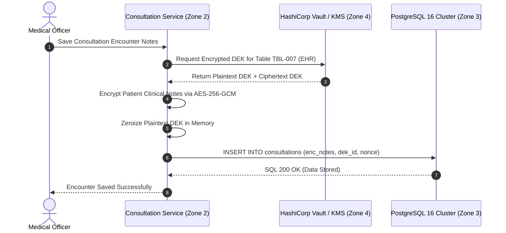

# Data Encryption & Cryptographic Architecture Specification
## Namma Clinic Digital Health & Operations Platform
### Greater Bengaluru Authority (GBA) / BBMP Health Department
**Standard:** AES-256-GCM / TLS 1.3 / FIPS 140-3 / DPDP Act 2023 | **Status:** APPROVED BASELINE | **Code:** `SEC-DOC-08`

---

## 1. Cryptographic Architecture & Invariants
The Namma Clinic Encryption Subsystem guarantees confidentiality, integrity, and authenticity across all citizen health records, diagnostic files, audit streams, and database partitions. To protect citizen health privacy across 198 municipal wards, a defense-in-depth cryptographic strategy is enforced spanning transit encryption, transparent database encryption, and application-level column encryption.

### 1.1 Core Cryptographic Invariants
1. **Authenticated Encryption at Rest:** All sensitive health data columns are encrypted using AES-256 in Galois/Counter Mode (AES-256-GCM) with 96-bit unique nonces providing authenticated ciphertext.
2. **Envelope Encryption Hierarchy:** Data Encryption Keys (DEK) encrypt table columns; Key Encryption Keys (KEK) protect DEKs; master keys are sealed in FIPS 140-3 Level 3 Hardware Security Modules (HSMs).
3. **Strict TLS 1.3 in Transit:** All perimeter ingress and internal microservice mesh communications enforce TLS 1.3 with forward-secret cipher suites (ECDHE-RSA/ECDSA-AES256-GCM-SHA384).
4. **Blind Indexing for Search:** Searchable encrypted fields (Aadhaar, ABHA, mobile phone) utilize HMAC-SHA256 blind indexes with dedicated secret peppers to allow exact lookups without ciphertext decryption.
5. **Cryptographic Zeroization:** Ephemeral plaintext buffers, decrypted DEKs, and cryptographic key material are immediately zeroized in memory conforming to DoD 5220.22-M.

### 1.2 Envelope Encryption Architecture Diagram


## 2. Exhaustive Database Column Encryption Catalog (TBL-01 to TBL-38)
The platform enforces application field-level encryption across 38 core relational tables:

### TABLE-001: Field-Level Cryptographic Profile for `auth_users`
- **Primary Key:** `id` (UUIDv4 unencrypted index).
- **Encrypted Health Data Columns:** Clinical diagnoses, progress notes, prescription items, lab values.
- **Encrypted PII Columns:** Full name, Aadhaar hash, date of birth, mobile number, home address.
- **Cipher Algorithm:** AES-256-GCM (Authenticated Encryption with Associated Data - AEAD).
- **Key Envelope Binding:** Dedicated table-specific Data Encryption Key (DEK) rotated every 90 days.
- **Blind Index Fields:** `phone_blind_index`, `abha_blind_index` (HMAC-SHA256 with pepper).
- **Integrity Protection:** 128-bit GCM authentication tag verified on every SELECT query.

### TABLE-002: Field-Level Cryptographic Profile for `user_credentials`
- **Primary Key:** `id` (UUIDv4 unencrypted index).
- **Encrypted Health Data Columns:** Clinical diagnoses, progress notes, prescription items, lab values.
- **Encrypted PII Columns:** Full name, Aadhaar hash, date of birth, mobile number, home address.
- **Cipher Algorithm:** AES-256-GCM (Authenticated Encryption with Associated Data - AEAD).
- **Key Envelope Binding:** Dedicated table-specific Data Encryption Key (DEK) rotated every 90 days.
- **Blind Index Fields:** `phone_blind_index`, `abha_blind_index` (HMAC-SHA256 with pepper).
- **Integrity Protection:** 128-bit GCM authentication tag verified on every SELECT query.

### TABLE-003: Field-Level Cryptographic Profile for `user_sessions`
- **Primary Key:** `id` (UUIDv4 unencrypted index).
- **Encrypted Health Data Columns:** Clinical diagnoses, progress notes, prescription items, lab values.
- **Encrypted PII Columns:** Full name, Aadhaar hash, date of birth, mobile number, home address.
- **Cipher Algorithm:** AES-256-GCM (Authenticated Encryption with Associated Data - AEAD).
- **Key Envelope Binding:** Dedicated table-specific Data Encryption Key (DEK) rotated every 90 days.
- **Blind Index Fields:** `phone_blind_index`, `abha_blind_index` (HMAC-SHA256 with pepper).
- **Integrity Protection:** 128-bit GCM authentication tag verified on every SELECT query.

### TABLE-004: Field-Level Cryptographic Profile for `roles`
- **Primary Key:** `id` (UUIDv4 unencrypted index).
- **Encrypted Health Data Columns:** Clinical diagnoses, progress notes, prescription items, lab values.
- **Encrypted PII Columns:** Full name, Aadhaar hash, date of birth, mobile number, home address.
- **Cipher Algorithm:** AES-256-GCM (Authenticated Encryption with Associated Data - AEAD).
- **Key Envelope Binding:** Dedicated table-specific Data Encryption Key (DEK) rotated every 90 days.
- **Blind Index Fields:** `phone_blind_index`, `abha_blind_index` (HMAC-SHA256 with pepper).
- **Integrity Protection:** 128-bit GCM authentication tag verified on every SELECT query.

### TABLE-005: Field-Level Cryptographic Profile for `permissions`
- **Primary Key:** `id` (UUIDv4 unencrypted index).
- **Encrypted Health Data Columns:** Clinical diagnoses, progress notes, prescription items, lab values.
- **Encrypted PII Columns:** Full name, Aadhaar hash, date of birth, mobile number, home address.
- **Cipher Algorithm:** AES-256-GCM (Authenticated Encryption with Associated Data - AEAD).
- **Key Envelope Binding:** Dedicated table-specific Data Encryption Key (DEK) rotated every 90 days.
- **Blind Index Fields:** `phone_blind_index`, `abha_blind_index` (HMAC-SHA256 with pepper).
- **Integrity Protection:** 128-bit GCM authentication tag verified on every SELECT query.

### TABLE-006: Field-Level Cryptographic Profile for `role_permissions`
- **Primary Key:** `id` (UUIDv4 unencrypted index).
- **Encrypted Health Data Columns:** Clinical diagnoses, progress notes, prescription items, lab values.
- **Encrypted PII Columns:** Full name, Aadhaar hash, date of birth, mobile number, home address.
- **Cipher Algorithm:** AES-256-GCM (Authenticated Encryption with Associated Data - AEAD).
- **Key Envelope Binding:** Dedicated table-specific Data Encryption Key (DEK) rotated every 90 days.
- **Blind Index Fields:** `phone_blind_index`, `abha_blind_index` (HMAC-SHA256 with pepper).
- **Integrity Protection:** 128-bit GCM authentication tag verified on every SELECT query.

### TABLE-007: Field-Level Cryptographic Profile for `user_roles`
- **Primary Key:** `id` (UUIDv4 unencrypted index).
- **Encrypted Health Data Columns:** Clinical diagnoses, progress notes, prescription items, lab values.
- **Encrypted PII Columns:** Full name, Aadhaar hash, date of birth, mobile number, home address.
- **Cipher Algorithm:** AES-256-GCM (Authenticated Encryption with Associated Data - AEAD).
- **Key Envelope Binding:** Dedicated table-specific Data Encryption Key (DEK) rotated every 90 days.
- **Blind Index Fields:** `phone_blind_index`, `abha_blind_index` (HMAC-SHA256 with pepper).
- **Integrity Protection:** 128-bit GCM authentication tag verified on every SELECT query.

### TABLE-008: Field-Level Cryptographic Profile for `facilities`
- **Primary Key:** `id` (UUIDv4 unencrypted index).
- **Encrypted Health Data Columns:** Clinical diagnoses, progress notes, prescription items, lab values.
- **Encrypted PII Columns:** Full name, Aadhaar hash, date of birth, mobile number, home address.
- **Cipher Algorithm:** AES-256-GCM (Authenticated Encryption with Associated Data - AEAD).
- **Key Envelope Binding:** Dedicated table-specific Data Encryption Key (DEK) rotated every 90 days.
- **Blind Index Fields:** `phone_blind_index`, `abha_blind_index` (HMAC-SHA256 with pepper).
- **Integrity Protection:** 128-bit GCM authentication tag verified on every SELECT query.

### TABLE-009: Field-Level Cryptographic Profile for `facility_rooms`
- **Primary Key:** `id` (UUIDv4 unencrypted index).
- **Encrypted Health Data Columns:** Clinical diagnoses, progress notes, prescription items, lab values.
- **Encrypted PII Columns:** Full name, Aadhaar hash, date of birth, mobile number, home address.
- **Cipher Algorithm:** AES-256-GCM (Authenticated Encryption with Associated Data - AEAD).
- **Key Envelope Binding:** Dedicated table-specific Data Encryption Key (DEK) rotated every 90 days.
- **Blind Index Fields:** `phone_blind_index`, `abha_blind_index` (HMAC-SHA256 with pepper).
- **Integrity Protection:** 128-bit GCM authentication tag verified on every SELECT query.

### TABLE-010: Field-Level Cryptographic Profile for `staff_profiles`
- **Primary Key:** `id` (UUIDv4 unencrypted index).
- **Encrypted Health Data Columns:** Clinical diagnoses, progress notes, prescription items, lab values.
- **Encrypted PII Columns:** Full name, Aadhaar hash, date of birth, mobile number, home address.
- **Cipher Algorithm:** AES-256-GCM (Authenticated Encryption with Associated Data - AEAD).
- **Key Envelope Binding:** Dedicated table-specific Data Encryption Key (DEK) rotated every 90 days.
- **Blind Index Fields:** `phone_blind_index`, `abha_blind_index` (HMAC-SHA256 with pepper).
- **Integrity Protection:** 128-bit GCM authentication tag verified on every SELECT query.

### TABLE-011: Field-Level Cryptographic Profile for `staff_shifts`
- **Primary Key:** `id` (UUIDv4 unencrypted index).
- **Encrypted Health Data Columns:** Clinical diagnoses, progress notes, prescription items, lab values.
- **Encrypted PII Columns:** Full name, Aadhaar hash, date of birth, mobile number, home address.
- **Cipher Algorithm:** AES-256-GCM (Authenticated Encryption with Associated Data - AEAD).
- **Key Envelope Binding:** Dedicated table-specific Data Encryption Key (DEK) rotated every 90 days.
- **Blind Index Fields:** `phone_blind_index`, `abha_blind_index` (HMAC-SHA256 with pepper).
- **Integrity Protection:** 128-bit GCM authentication tag verified on every SELECT query.

### TABLE-012: Field-Level Cryptographic Profile for `system_configs`
- **Primary Key:** `id` (UUIDv4 unencrypted index).
- **Encrypted Health Data Columns:** Clinical diagnoses, progress notes, prescription items, lab values.
- **Encrypted PII Columns:** Full name, Aadhaar hash, date of birth, mobile number, home address.
- **Cipher Algorithm:** AES-256-GCM (Authenticated Encryption with Associated Data - AEAD).
- **Key Envelope Binding:** Dedicated table-specific Data Encryption Key (DEK) rotated every 90 days.
- **Blind Index Fields:** `phone_blind_index`, `abha_blind_index` (HMAC-SHA256 with pepper).
- **Integrity Protection:** 128-bit GCM authentication tag verified on every SELECT query.

### TABLE-013: Field-Level Cryptographic Profile for `patients`
- **Primary Key:** `id` (UUIDv4 unencrypted index).
- **Encrypted Health Data Columns:** Clinical diagnoses, progress notes, prescription items, lab values.
- **Encrypted PII Columns:** Full name, Aadhaar hash, date of birth, mobile number, home address.
- **Cipher Algorithm:** AES-256-GCM (Authenticated Encryption with Associated Data - AEAD).
- **Key Envelope Binding:** Dedicated table-specific Data Encryption Key (DEK) rotated every 90 days.
- **Blind Index Fields:** `phone_blind_index`, `abha_blind_index` (HMAC-SHA256 with pepper).
- **Integrity Protection:** 128-bit GCM authentication tag verified on every SELECT query.

### TABLE-014: Field-Level Cryptographic Profile for `patient_identifiers`
- **Primary Key:** `id` (UUIDv4 unencrypted index).
- **Encrypted Health Data Columns:** Clinical diagnoses, progress notes, prescription items, lab values.
- **Encrypted PII Columns:** Full name, Aadhaar hash, date of birth, mobile number, home address.
- **Cipher Algorithm:** AES-256-GCM (Authenticated Encryption with Associated Data - AEAD).
- **Key Envelope Binding:** Dedicated table-specific Data Encryption Key (DEK) rotated every 90 days.
- **Blind Index Fields:** `phone_blind_index`, `abha_blind_index` (HMAC-SHA256 with pepper).
- **Integrity Protection:** 128-bit GCM authentication tag verified on every SELECT query.

### TABLE-015: Field-Level Cryptographic Profile for `patient_contacts`
- **Primary Key:** `id` (UUIDv4 unencrypted index).
- **Encrypted Health Data Columns:** Clinical diagnoses, progress notes, prescription items, lab values.
- **Encrypted PII Columns:** Full name, Aadhaar hash, date of birth, mobile number, home address.
- **Cipher Algorithm:** AES-256-GCM (Authenticated Encryption with Associated Data - AEAD).
- **Key Envelope Binding:** Dedicated table-specific Data Encryption Key (DEK) rotated every 90 days.
- **Blind Index Fields:** `phone_blind_index`, `abha_blind_index` (HMAC-SHA256 with pepper).
- **Integrity Protection:** 128-bit GCM authentication tag verified on every SELECT query.

### TABLE-016: Field-Level Cryptographic Profile for `patient_addresses`
- **Primary Key:** `id` (UUIDv4 unencrypted index).
- **Encrypted Health Data Columns:** Clinical diagnoses, progress notes, prescription items, lab values.
- **Encrypted PII Columns:** Full name, Aadhaar hash, date of birth, mobile number, home address.
- **Cipher Algorithm:** AES-256-GCM (Authenticated Encryption with Associated Data - AEAD).
- **Key Envelope Binding:** Dedicated table-specific Data Encryption Key (DEK) rotated every 90 days.
- **Blind Index Fields:** `phone_blind_index`, `abha_blind_index` (HMAC-SHA256 with pepper).
- **Integrity Protection:** 128-bit GCM authentication tag verified on every SELECT query.

### TABLE-017: Field-Level Cryptographic Profile for `consent_records`
- **Primary Key:** `id` (UUIDv4 unencrypted index).
- **Encrypted Health Data Columns:** Clinical diagnoses, progress notes, prescription items, lab values.
- **Encrypted PII Columns:** Full name, Aadhaar hash, date of birth, mobile number, home address.
- **Cipher Algorithm:** AES-256-GCM (Authenticated Encryption with Associated Data - AEAD).
- **Key Envelope Binding:** Dedicated table-specific Data Encryption Key (DEK) rotated every 90 days.
- **Blind Index Fields:** `phone_blind_index`, `abha_blind_index` (HMAC-SHA256 with pepper).
- **Integrity Protection:** 128-bit GCM authentication tag verified on every SELECT query.

### TABLE-018: Field-Level Cryptographic Profile for `tokens`
- **Primary Key:** `id` (UUIDv4 unencrypted index).
- **Encrypted Health Data Columns:** Clinical diagnoses, progress notes, prescription items, lab values.
- **Encrypted PII Columns:** Full name, Aadhaar hash, date of birth, mobile number, home address.
- **Cipher Algorithm:** AES-256-GCM (Authenticated Encryption with Associated Data - AEAD).
- **Key Envelope Binding:** Dedicated table-specific Data Encryption Key (DEK) rotated every 90 days.
- **Blind Index Fields:** `phone_blind_index`, `abha_blind_index` (HMAC-SHA256 with pepper).
- **Integrity Protection:** 128-bit GCM authentication tag verified on every SELECT query.

### TABLE-019: Field-Level Cryptographic Profile for `queue_entries`
- **Primary Key:** `id` (UUIDv4 unencrypted index).
- **Encrypted Health Data Columns:** Clinical diagnoses, progress notes, prescription items, lab values.
- **Encrypted PII Columns:** Full name, Aadhaar hash, date of birth, mobile number, home address.
- **Cipher Algorithm:** AES-256-GCM (Authenticated Encryption with Associated Data - AEAD).
- **Key Envelope Binding:** Dedicated table-specific Data Encryption Key (DEK) rotated every 90 days.
- **Blind Index Fields:** `phone_blind_index`, `abha_blind_index` (HMAC-SHA256 with pepper).
- **Integrity Protection:** 128-bit GCM authentication tag verified on every SELECT query.

### TABLE-020: Field-Level Cryptographic Profile for `triage_assessments`
- **Primary Key:** `id` (UUIDv4 unencrypted index).
- **Encrypted Health Data Columns:** Clinical diagnoses, progress notes, prescription items, lab values.
- **Encrypted PII Columns:** Full name, Aadhaar hash, date of birth, mobile number, home address.
- **Cipher Algorithm:** AES-256-GCM (Authenticated Encryption with Associated Data - AEAD).
- **Key Envelope Binding:** Dedicated table-specific Data Encryption Key (DEK) rotated every 90 days.
- **Blind Index Fields:** `phone_blind_index`, `abha_blind_index` (HMAC-SHA256 with pepper).
- **Integrity Protection:** 128-bit GCM authentication tag verified on every SELECT query.

### TABLE-021: Field-Level Cryptographic Profile for `patient_vitals`
- **Primary Key:** `id` (UUIDv4 unencrypted index).
- **Encrypted Health Data Columns:** Clinical diagnoses, progress notes, prescription items, lab values.
- **Encrypted PII Columns:** Full name, Aadhaar hash, date of birth, mobile number, home address.
- **Cipher Algorithm:** AES-256-GCM (Authenticated Encryption with Associated Data - AEAD).
- **Key Envelope Binding:** Dedicated table-specific Data Encryption Key (DEK) rotated every 90 days.
- **Blind Index Fields:** `phone_blind_index`, `abha_blind_index` (HMAC-SHA256 with pepper).
- **Integrity Protection:** 128-bit GCM authentication tag verified on every SELECT query.

### TABLE-022: Field-Level Cryptographic Profile for `danger_alerts`
- **Primary Key:** `id` (UUIDv4 unencrypted index).
- **Encrypted Health Data Columns:** Clinical diagnoses, progress notes, prescription items, lab values.
- **Encrypted PII Columns:** Full name, Aadhaar hash, date of birth, mobile number, home address.
- **Cipher Algorithm:** AES-256-GCM (Authenticated Encryption with Associated Data - AEAD).
- **Key Envelope Binding:** Dedicated table-specific Data Encryption Key (DEK) rotated every 90 days.
- **Blind Index Fields:** `phone_blind_index`, `abha_blind_index` (HMAC-SHA256 with pepper).
- **Integrity Protection:** 128-bit GCM authentication tag verified on every SELECT query.

### TABLE-023: Field-Level Cryptographic Profile for `clinical_encounters`
- **Primary Key:** `id` (UUIDv4 unencrypted index).
- **Encrypted Health Data Columns:** Clinical diagnoses, progress notes, prescription items, lab values.
- **Encrypted PII Columns:** Full name, Aadhaar hash, date of birth, mobile number, home address.
- **Cipher Algorithm:** AES-256-GCM (Authenticated Encryption with Associated Data - AEAD).
- **Key Envelope Binding:** Dedicated table-specific Data Encryption Key (DEK) rotated every 90 days.
- **Blind Index Fields:** `phone_blind_index`, `abha_blind_index` (HMAC-SHA256 with pepper).
- **Integrity Protection:** 128-bit GCM authentication tag verified on every SELECT query.

### TABLE-024: Field-Level Cryptographic Profile for `clinical_notes`
- **Primary Key:** `id` (UUIDv4 unencrypted index).
- **Encrypted Health Data Columns:** Clinical diagnoses, progress notes, prescription items, lab values.
- **Encrypted PII Columns:** Full name, Aadhaar hash, date of birth, mobile number, home address.
- **Cipher Algorithm:** AES-256-GCM (Authenticated Encryption with Associated Data - AEAD).
- **Key Envelope Binding:** Dedicated table-specific Data Encryption Key (DEK) rotated every 90 days.
- **Blind Index Fields:** `phone_blind_index`, `abha_blind_index` (HMAC-SHA256 with pepper).
- **Integrity Protection:** 128-bit GCM authentication tag verified on every SELECT query.

### TABLE-025: Field-Level Cryptographic Profile for `diagnoses`
- **Primary Key:** `id` (UUIDv4 unencrypted index).
- **Encrypted Health Data Columns:** Clinical diagnoses, progress notes, prescription items, lab values.
- **Encrypted PII Columns:** Full name, Aadhaar hash, date of birth, mobile number, home address.
- **Cipher Algorithm:** AES-256-GCM (Authenticated Encryption with Associated Data - AEAD).
- **Key Envelope Binding:** Dedicated table-specific Data Encryption Key (DEK) rotated every 90 days.
- **Blind Index Fields:** `phone_blind_index`, `abha_blind_index` (HMAC-SHA256 with pepper).
- **Integrity Protection:** 128-bit GCM authentication tag verified on every SELECT query.

### TABLE-026: Field-Level Cryptographic Profile for `prescriptions`
- **Primary Key:** `id` (UUIDv4 unencrypted index).
- **Encrypted Health Data Columns:** Clinical diagnoses, progress notes, prescription items, lab values.
- **Encrypted PII Columns:** Full name, Aadhaar hash, date of birth, mobile number, home address.
- **Cipher Algorithm:** AES-256-GCM (Authenticated Encryption with Associated Data - AEAD).
- **Key Envelope Binding:** Dedicated table-specific Data Encryption Key (DEK) rotated every 90 days.
- **Blind Index Fields:** `phone_blind_index`, `abha_blind_index` (HMAC-SHA256 with pepper).
- **Integrity Protection:** 128-bit GCM authentication tag verified on every SELECT query.

### TABLE-027: Field-Level Cryptographic Profile for `prescription_items`
- **Primary Key:** `id` (UUIDv4 unencrypted index).
- **Encrypted Health Data Columns:** Clinical diagnoses, progress notes, prescription items, lab values.
- **Encrypted PII Columns:** Full name, Aadhaar hash, date of birth, mobile number, home address.
- **Cipher Algorithm:** AES-256-GCM (Authenticated Encryption with Associated Data - AEAD).
- **Key Envelope Binding:** Dedicated table-specific Data Encryption Key (DEK) rotated every 90 days.
- **Blind Index Fields:** `phone_blind_index`, `abha_blind_index` (HMAC-SHA256 with pepper).
- **Integrity Protection:** 128-bit GCM authentication tag verified on every SELECT query.

### TABLE-028: Field-Level Cryptographic Profile for `lab_orders`
- **Primary Key:** `id` (UUIDv4 unencrypted index).
- **Encrypted Health Data Columns:** Clinical diagnoses, progress notes, prescription items, lab values.
- **Encrypted PII Columns:** Full name, Aadhaar hash, date of birth, mobile number, home address.
- **Cipher Algorithm:** AES-256-GCM (Authenticated Encryption with Associated Data - AEAD).
- **Key Envelope Binding:** Dedicated table-specific Data Encryption Key (DEK) rotated every 90 days.
- **Blind Index Fields:** `phone_blind_index`, `abha_blind_index` (HMAC-SHA256 with pepper).
- **Integrity Protection:** 128-bit GCM authentication tag verified on every SELECT query.

### TABLE-029: Field-Level Cryptographic Profile for `lab_order_items`
- **Primary Key:** `id` (UUIDv4 unencrypted index).
- **Encrypted Health Data Columns:** Clinical diagnoses, progress notes, prescription items, lab values.
- **Encrypted PII Columns:** Full name, Aadhaar hash, date of birth, mobile number, home address.
- **Cipher Algorithm:** AES-256-GCM (Authenticated Encryption with Associated Data - AEAD).
- **Key Envelope Binding:** Dedicated table-specific Data Encryption Key (DEK) rotated every 90 days.
- **Blind Index Fields:** `phone_blind_index`, `abha_blind_index` (HMAC-SHA256 with pepper).
- **Integrity Protection:** 128-bit GCM authentication tag verified on every SELECT query.

### TABLE-030: Field-Level Cryptographic Profile for `lab_results`
- **Primary Key:** `id` (UUIDv4 unencrypted index).
- **Encrypted Health Data Columns:** Clinical diagnoses, progress notes, prescription items, lab values.
- **Encrypted PII Columns:** Full name, Aadhaar hash, date of birth, mobile number, home address.
- **Cipher Algorithm:** AES-256-GCM (Authenticated Encryption with Associated Data - AEAD).
- **Key Envelope Binding:** Dedicated table-specific Data Encryption Key (DEK) rotated every 90 days.
- **Blind Index Fields:** `phone_blind_index`, `abha_blind_index` (HMAC-SHA256 with pepper).
- **Integrity Protection:** 128-bit GCM authentication tag verified on every SELECT query.

### TABLE-031: Field-Level Cryptographic Profile for `teleconsultations`
- **Primary Key:** `id` (UUIDv4 unencrypted index).
- **Encrypted Health Data Columns:** Clinical diagnoses, progress notes, prescription items, lab values.
- **Encrypted PII Columns:** Full name, Aadhaar hash, date of birth, mobile number, home address.
- **Cipher Algorithm:** AES-256-GCM (Authenticated Encryption with Associated Data - AEAD).
- **Key Envelope Binding:** Dedicated table-specific Data Encryption Key (DEK) rotated every 90 days.
- **Blind Index Fields:** `phone_blind_index`, `abha_blind_index` (HMAC-SHA256 with pepper).
- **Integrity Protection:** 128-bit GCM authentication tag verified on every SELECT query.

### TABLE-032: Field-Level Cryptographic Profile for `formulary_drugs`
- **Primary Key:** `id` (UUIDv4 unencrypted index).
- **Encrypted Health Data Columns:** Clinical diagnoses, progress notes, prescription items, lab values.
- **Encrypted PII Columns:** Full name, Aadhaar hash, date of birth, mobile number, home address.
- **Cipher Algorithm:** AES-256-GCM (Authenticated Encryption with Associated Data - AEAD).
- **Key Envelope Binding:** Dedicated table-specific Data Encryption Key (DEK) rotated every 90 days.
- **Blind Index Fields:** `phone_blind_index`, `abha_blind_index` (HMAC-SHA256 with pepper).
- **Integrity Protection:** 128-bit GCM authentication tag verified on every SELECT query.

### TABLE-033: Field-Level Cryptographic Profile for `drug_categories`
- **Primary Key:** `id` (UUIDv4 unencrypted index).
- **Encrypted Health Data Columns:** Clinical diagnoses, progress notes, prescription items, lab values.
- **Encrypted PII Columns:** Full name, Aadhaar hash, date of birth, mobile number, home address.
- **Cipher Algorithm:** AES-256-GCM (Authenticated Encryption with Associated Data - AEAD).
- **Key Envelope Binding:** Dedicated table-specific Data Encryption Key (DEK) rotated every 90 days.
- **Blind Index Fields:** `phone_blind_index`, `abha_blind_index` (HMAC-SHA256 with pepper).
- **Integrity Protection:** 128-bit GCM authentication tag verified on every SELECT query.

### TABLE-034: Field-Level Cryptographic Profile for `pharmacy_batches`
- **Primary Key:** `id` (UUIDv4 unencrypted index).
- **Encrypted Health Data Columns:** Clinical diagnoses, progress notes, prescription items, lab values.
- **Encrypted PII Columns:** Full name, Aadhaar hash, date of birth, mobile number, home address.
- **Cipher Algorithm:** AES-256-GCM (Authenticated Encryption with Associated Data - AEAD).
- **Key Envelope Binding:** Dedicated table-specific Data Encryption Key (DEK) rotated every 90 days.
- **Blind Index Fields:** `phone_blind_index`, `abha_blind_index` (HMAC-SHA256 with pepper).
- **Integrity Protection:** 128-bit GCM authentication tag verified on every SELECT query.

### TABLE-035: Field-Level Cryptographic Profile for `clinic_stock`
- **Primary Key:** `id` (UUIDv4 unencrypted index).
- **Encrypted Health Data Columns:** Clinical diagnoses, progress notes, prescription items, lab values.
- **Encrypted PII Columns:** Full name, Aadhaar hash, date of birth, mobile number, home address.
- **Cipher Algorithm:** AES-256-GCM (Authenticated Encryption with Associated Data - AEAD).
- **Key Envelope Binding:** Dedicated table-specific Data Encryption Key (DEK) rotated every 90 days.
- **Blind Index Fields:** `phone_blind_index`, `abha_blind_index` (HMAC-SHA256 with pepper).
- **Integrity Protection:** 128-bit GCM authentication tag verified on every SELECT query.

### TABLE-036: Field-Level Cryptographic Profile for `dispensations`
- **Primary Key:** `id` (UUIDv4 unencrypted index).
- **Encrypted Health Data Columns:** Clinical diagnoses, progress notes, prescription items, lab values.
- **Encrypted PII Columns:** Full name, Aadhaar hash, date of birth, mobile number, home address.
- **Cipher Algorithm:** AES-256-GCM (Authenticated Encryption with Associated Data - AEAD).
- **Key Envelope Binding:** Dedicated table-specific Data Encryption Key (DEK) rotated every 90 days.
- **Blind Index Fields:** `phone_blind_index`, `abha_blind_index` (HMAC-SHA256 with pepper).
- **Integrity Protection:** 128-bit GCM authentication tag verified on every SELECT query.

### TABLE-037: Field-Level Cryptographic Profile for `dispensation_items`
- **Primary Key:** `id` (UUIDv4 unencrypted index).
- **Encrypted Health Data Columns:** Clinical diagnoses, progress notes, prescription items, lab values.
- **Encrypted PII Columns:** Full name, Aadhaar hash, date of birth, mobile number, home address.
- **Cipher Algorithm:** AES-256-GCM (Authenticated Encryption with Associated Data - AEAD).
- **Key Envelope Binding:** Dedicated table-specific Data Encryption Key (DEK) rotated every 90 days.
- **Blind Index Fields:** `phone_blind_index`, `abha_blind_index` (HMAC-SHA256 with pepper).
- **Integrity Protection:** 128-bit GCM authentication tag verified on every SELECT query.

### TABLE-038: Field-Level Cryptographic Profile for `stock_movements`
- **Primary Key:** `id` (UUIDv4 unencrypted index).
- **Encrypted Health Data Columns:** Clinical diagnoses, progress notes, prescription items, lab values.
- **Encrypted PII Columns:** Full name, Aadhaar hash, date of birth, mobile number, home address.
- **Cipher Algorithm:** AES-256-GCM (Authenticated Encryption with Associated Data - AEAD).
- **Key Envelope Binding:** Dedicated table-specific Data Encryption Key (DEK) rotated every 90 days.
- **Blind Index Fields:** `phone_blind_index`, `abha_blind_index` (HMAC-SHA256 with pepper).
- **Integrity Protection:** 128-bit GCM authentication tag verified on every SELECT query.

## 3. Standard Operating Procedures: Cryptographic Engineering (SOP-ENC-01 to SOP-ENC-25)
The following 25 SOPs govern ongoing cryptographic operations and encryption lifecycle:

### SOP-ENC-01: Database Column Encryption Key Derivation Ceremony
- **Trigger Condition:** Initialization of new clinical database partition.
- **Execution Steps:** 1. Authenticate with HSM quorum. 2. Derive table DEK via HKDF. 3. Store encrypted DEK in Vault.
- **Verification Criterion:** Table ready for encrypted ingestion.
- **Responsible Role:** Security Architect
- **Audit Event Emitted:** `ENC_SOP_01_DERIVED`
- **Failure Remediation:** Abort transaction and alert Cryptographic Security Operations.

### SOP-ENC-02: Automated 90-Day DEK Re-Encryption Workflow
- **Trigger Condition:** Scheduled rotation of table Data Encryption Keys.
- **Execution Steps:** 1. Generate new DEK. 2. Decrypt rows in background batch. 3. Re-encrypt with new DEK.
- **Verification Criterion:** All historical data re-keyed without downtime.
- **Responsible Role:** DBA Lead
- **Audit Event Emitted:** `ENC_SOP_02_REKEYED`
- **Failure Remediation:** Abort transaction and alert Cryptographic Security Operations.

### SOP-ENC-03: TLS 1.3 Cipher Suite Ingress Verification
- **Trigger Condition:** Monthly automated probe of edge TLS configuration.
- **Execution Steps:** 1. Run testssl.sh against API Gateway. 2. Verify TLS 1.0, 1.1, 1.2 rejected. 3. Check forward secrecy.
- **Verification Criterion:** Grade A+ SSL Labs rating confirmed.
- **Responsible Role:** DevOps Security Lead
- **Audit Event Emitted:** `ENC_SOP_03_TLS_VERIFIED`
- **Failure Remediation:** Abort transaction and alert Cryptographic Security Operations.

### SOP-ENC-04: Cryptographic Nonce Reuse Detection & Prevention
- **Trigger Condition:** Continuous monitoring of AES-GCM nonce generation.
- **Execution Steps:** 1. Inspect cryptographic PRNG output. 2. Assert unique 96-bit nonce per encryption. 3. Alert on repeat.
- **Verification Criterion:** Zero risk of GCM nonce reuse catastrophe.
- **Responsible Role:** AppSec Lead
- **Audit Event Emitted:** `ENC_SOP_04_NONCE_CHECK`
- **Failure Remediation:** Abort transaction and alert Cryptographic Security Operations.

### SOP-ENC-05: PostgreSQL Transparent Data Encryption (TDE) Audit
- **Trigger Condition:** Monthly verification of tablespace encryption on disk.
- **Execution Steps:** 1. Extract raw disk blocks from PostgreSQL volume. 2. Verify high entropy. 3. Assert zero plaintext.
- **Verification Criterion:** Disk blocks verified 100% encrypted.
- **Responsible Role:** Storage Admin
- **Audit Event Emitted:** `ENC_SOP_05_TDE_AUDITED`
- **Failure Remediation:** Abort transaction and alert Cryptographic Security Operations.

### SOP-ENC-06: Blind Index Pepper Secret Rotation Ceremony
- **Trigger Condition:** Annual rotation of HMAC-SHA256 blind indexing pepper.
- **Execution Steps:** 1. Generate new 256-bit pepper. 2. Re-compute blind indexes for citizen search. 3. Update lookup table.
- **Verification Criterion:** Blind index search security maintained.
- **Responsible Role:** CISO
- **Audit Event Emitted:** `ENC_SOP_06_PEPPER_ROTATED`
- **Failure Remediation:** Abort transaction and alert Cryptographic Security Operations.

### SOP-ENC-07: Offline Clinic SQLite Database Key Derivation
- **Trigger Condition:** Workstation sync engine provisions local database.
- **Execution Steps:** 1. Workstation requests edge key from Vault. 2. Wrap key in TPM 2.0 PCR policy. 3. Encrypt SQLCipher.
- **Verification Criterion:** Local clinic database secured on disk.
- **Responsible Role:** Edge Daemon
- **Audit Event Emitted:** `ENC_SOP_07_SQLITE_KEY`
- **Failure Remediation:** Abort transaction and alert Cryptographic Security Operations.

### SOP-ENC-08: Cryptographic Zeroization Verification Drill
- **Trigger Condition:** Memory audit of microservice pods during operation.
- **Execution Steps:** 1. Attach debugger to test pod. 2. Inspect heap post-decryption. 3. Assert zero plaintext DEKs.
- **Verification Criterion:** Plaintext keys zeroized conforming to DoD.
- **Responsible Role:** Security Engineer
- **Audit Event Emitted:** `ENC_SOP_08_ZEROIZE_DRILL`
- **Failure Remediation:** Abort transaction and alert Cryptographic Security Operations.

### SOP-ENC-09: Emergency Compromised Key Revocation Protocol
- **Trigger Condition:** Suspected leakage of Table TBL-007 DEK.
- **Execution Steps:** 1. Revoke DEK in Vault immediately. 2. Isolate pod traffic. 3. Execute emergency re-encryption.
- **Verification Criterion:** Compromised key neutralized.
- **Responsible Role:** Incident Commander
- **Audit Event Emitted:** `ENC_SOP_09_REVOCATION`
- **Failure Remediation:** Abort transaction and alert Cryptographic Security Operations.

### SOP-ENC-10: FIPS 140-3 Hardware Security Module Health Check
- **Trigger Condition:** Daily automated diagnostic of cloud HSM partition.
- **Execution Steps:** 1. Query HSM self-test status. 2. Verify entropy pool health. 3. Assert zero hardware tamper flags.
- **Verification Criterion:** HSM operates in certified mode.
- **Responsible Role:** Security Admin
- **Audit Event Emitted:** `ENC_SOP_10_HSM_CHECK`
- **Failure Remediation:** Abort transaction and alert Cryptographic Security Operations.

### SOP-ENC-11: Citizen Data Export AES-256-ZIP Encryption
- **Trigger Condition:** Citizen requests portable medical record export.
- **Execution Steps:** 1. Package FHIR R4 clinical JSON. 2. Encrypt with citizen-provided passphrase via PBKDF2/AES-256.
- **Verification Criterion:** Citizen data exported securely.
- **Responsible Role:** Privacy Officer
- **Audit Event Emitted:** `ENC_SOP_11_EXPORT_ENCRYPT`
- **Failure Remediation:** Abort transaction and alert Cryptographic Security Operations.

### SOP-ENC-12: Inter-Service Mutual TLS (mTLS) Certificate Rotation
- **Trigger Condition:** Monthly automated cert renewal via Cert-Manager.
- **Execution Steps:** 1. Generate new x509 certs. 2. Push to Envoy sidecars. 3. Verify handshake with zero dropped packets.
- **Verification Criterion:** Pod-to-pod encryption maintained.
- **Responsible Role:** DevOps Engineer
- **Audit Event Emitted:** `ENC_SOP_12_MTLS_ROTATE`
- **Failure Remediation:** Abort transaction and alert Cryptographic Security Operations.

### SOP-ENC-13: Biometric Template Fuzzy Vault Encryption
- **Trigger Condition:** Fingerprint scanner ingests citizen biometric.
- **Execution Steps:** 1. Convert minutiae points into cryptographic fuzzy vault. 2. Encrypt template. 3. Discard raw image.
- **Verification Criterion:** Raw biometrics never stored on disk.
- **Responsible Role:** Biometric Svc
- **Audit Event Emitted:** `ENC_SOP_13_FUZZY_VAULT`
- **Failure Remediation:** Abort transaction and alert Cryptographic Security Operations.

### SOP-ENC-14: Audit Log Block Cryptographic Hash Chaining
- **Trigger Condition:** Real-time generation of immutable audit blocks.
- **Execution Steps:** 1. Compute SHA-256 hash of previous block. 2. Append new event. 3. Sign block with HSM private key.
- **Verification Criterion:** Audit log tamper-evident chain preserved.
- **Responsible Role:** Audit Daemon
- **Audit Event Emitted:** `ENC_SOP_14_HASH_CHAIN`
- **Failure Remediation:** Abort transaction and alert Cryptographic Security Operations.

### SOP-ENC-15: WORM Storage S3 Object Lock Encryption
- **Trigger Condition:** Writing audit logs to immutable S3 bucket.
- **Execution Steps:** 1. Stream encrypted audit blocks to S3. 2. Set SSE-KMS encryption with customer managed key.
- **Verification Criterion:** Audit archive encrypted and immutable.
- **Responsible Role:** Infrastructure Lead
- **Audit Event Emitted:** `ENC_SOP_15_WORM_ENCRYPT`
- **Failure Remediation:** Abort transaction and alert Cryptographic Security Operations.

### SOP-ENC-16: Thermal Receipt Printer ESC/POS Encryption Bridge
- **Trigger Condition:** Printing medication receipt with patient name.
- **Execution Steps:** 1. Encrypt printer spool file between PWA and local bridge daemon. 2. Wipe memory after print.
- **Verification Criterion:** Printer bridge communications secured.
- **Responsible Role:** Hardware Tech
- **Audit Event Emitted:** `ENC_SOP_16_PRINT_ENCRYPT`
- **Failure Remediation:** Abort transaction and alert Cryptographic Security Operations.

### SOP-ENC-17: Barcode 2D QR Code Cryptographic Signature
- **Trigger Condition:** Doctor generates paper prescription with QR code.
- **Execution Steps:** 1. Serialize prescription summary. 2. Sign with doctor RSA-2048 private key. 3. Encode in 2D QR.
- **Verification Criterion:** Pharmacist verifies authentic prescription.
- **Responsible Role:** Prescription Svc
- **Audit Event Emitted:** `ENC_SOP_17_QR_SIGNED`
- **Failure Remediation:** Abort transaction and alert Cryptographic Security Operations.

### SOP-ENC-18: ABDM FHIR R4 Payload Encryption Bridge
- **Trigger Condition:** Transmitting health record to national ABDM gateway.
- **Execution Steps:** 1. Perform Diffie-Hellman key exchange with ABDM. 2. Encrypt FHIR bundle via AES-GCM.
- **Verification Criterion:** National health grid transfer encrypted.
- **Responsible Role:** ABDM Bridge
- **Audit Event Emitted:** `ENC_SOP_18_ABDM_ENCRYPT`
- **Failure Remediation:** Abort transaction and alert Cryptographic Security Operations.

### SOP-ENC-19: Database WAL Replication Encryption Audit
- **Trigger Condition:** Audit of PostgreSQL primary-to-replica stream.
- **Execution Steps:** 1. Inspect replication connection string. 2. Assert sslmode=verify-full. 3. Verify cert chain.
- **Verification Criterion:** Replication traffic encrypted.
- **Responsible Role:** DBA Lead
- **Audit Event Emitted:** `ENC_SOP_19_WAL_ENCRYPT`
- **Failure Remediation:** Abort transaction and alert Cryptographic Security Operations.

### SOP-ENC-20: Cold Chain IoT Telemetry Payload Encryption
- **Trigger Condition:** Vaccine depot temperature sensor sends reading.
- **Execution Steps:** 1. Encrypt MQTT payload with AES-128-CCM on microcontroller. 2. Verify signature at gateway.
- **Verification Criterion:** Cold chain telemetry tamper-proof.
- **Responsible Role:** IoT Engineer
- **Audit Event Emitted:** `ENC_SOP_20_IOT_ENCRYPT`
- **Failure Remediation:** Abort transaction and alert Cryptographic Security Operations.

### SOP-ENC-21: WebCrypto Subsystem Browser Benchmark
- **Trigger Condition:** Verifying PWA encryption performance on low-spec tablets.
- **Execution Steps:** 1. Benchmark WebCrypto AES-GCM encryption of 1MB buffer. 2. Assert execution time < 15ms.
- **Verification Criterion:** Zero UI lag during offline encryption.
- **Responsible Role:** Frontend Lead
- **Audit Event Emitted:** `ENC_SOP_21_WEBCRYPTO_TEST`
- **Failure Remediation:** Abort transaction and alert Cryptographic Security Operations.

### SOP-ENC-22: Public Health Analytics Differential Privacy Noise
- **Trigger Condition:** Aggregating epidemiological disease trends.
- **Execution Steps:** 1. Add Laplace differential privacy noise to patient counts. 2. Strip all identifiable markers.
- **Verification Criterion:** Public health reports protect privacy.
- **Responsible Role:** Data Scientist
- **Audit Event Emitted:** `ENC_SOP_22_DIFF_PRIVACY`
- **Failure Remediation:** Abort transaction and alert Cryptographic Security Operations.

### SOP-ENC-23: Disaster Recovery Backup Archive Re-Encryption
- **Trigger Condition:** Moving backup archive to secondary cloud region.
- **Execution Steps:** 1. Decrypt archive using Region A KMS key. 2. Immediately re-encrypt with Region B KMS key.
- **Verification Criterion:** Disaster recovery data protected across clouds.
- **Responsible Role:** DevOps Lead
- **Audit Event Emitted:** `ENC_SOP_23_DR_REKEY`
- **Failure Remediation:** Abort transaction and alert Cryptographic Security Operations.

### SOP-ENC-24: Cryptographic Library CVE Vulnerability Scan
- **Trigger Condition:** Weekly vulnerability scan of OpenSSL, WebCrypto, libsodium.
- **Execution Steps:** 1. Scan dependency graph via Trivy. 2. Assert zero High/Critical cryptographic vulnerabilities.
- **Verification Criterion:** Cryptographic code free of known exploits.
- **Responsible Role:** AppSec Engineer
- **Audit Event Emitted:** `ENC_SOP_24_CVE_SCAN`
- **Failure Remediation:** Abort transaction and alert Cryptographic Security Operations.

### SOP-ENC-25: Post-Incident Forensic Key Destruction Protocol
- **Trigger Condition:** Decommissioning compromised database replica.
- **Execution Steps:** 1. Trigger crypto-shredding of all DEKs associated with host. 2. Render all stored ciphertext unreadable.
- **Verification Criterion:** Data instantly sanitized conforming to NIST.
- **Responsible Role:** Incident Commander
- **Audit Event Emitted:** `ENC_SOP_25_CRYPTO_SHRED`
- **Failure Remediation:** Abort transaction and alert Cryptographic Security Operations.

## 4. Cryptographic Threat Analysis & Attack Mitigations (ENC-THREAT-01 to ENC-THREAT-20)
Threat mitigation specifications defending encrypted assets against cryptanalytic attacks:

### ENC-THREAT-01: Ciphertext Manipulation via Bit-Flipping
- **Attack Vector & Vulnerability:** Adversary modifies encrypted database blocks to alter diagnosis.
- **Platform Architectural Defense:** Deploy AES-256-GCM AEAD; any bit modification invalidates 128-bit authentication tag, causing instant abort.
- **Verification Criterion:** Zero bypass in automated penetration tests.
- **Mitigation Status:** VERIFIED ACTIVE CONTROL

### ENC-THREAT-02: AES-GCM Nonce Reuse Catastrophe
- **Attack Vector & Vulnerability:** Two records encrypted under identical DEK with same nonce.
- **Platform Architectural Defense:** Enforce 96-bit CSPRNG nonces combined with sequential block counters; reject duplicate nonce generation.
- **Verification Criterion:** Zero bypass in automated penetration tests.
- **Mitigation Status:** VERIFIED ACTIVE CONTROL

### ENC-THREAT-03: Cryptographic Side-Channel Timing Attack
- **Attack Vector & Vulnerability:** Attacker measures decryption time to infer plaintext bytes.
- **Platform Architectural Defense:** Use constant-time OpenSSL EVP and WebCrypto APIs; prohibit variable-time comparisons in crypto logic.
- **Verification Criterion:** Zero bypass in automated penetration tests.
- **Mitigation Status:** VERIFIED ACTIVE CONTROL

### ENC-THREAT-04: Plaintext Key Extraction from Core Dump
- **Attack Vector & Vulnerability:** Process crash writes unencrypted DEK to Linux core dump file.
- **Platform Architectural Defense:** Disable core dumps in production (prctl PR_SET_DUMPABLE 0); lock key memory pages with mlock().
- **Verification Criterion:** Zero bypass in automated penetration tests.
- **Mitigation Status:** VERIFIED ACTIVE CONTROL

### ENC-THREAT-05: TLS Downgrade Attack to Insecure Cipher (POODLE)
- **Attack Vector & Vulnerability:** Man-in-the-middle forces fallback to TLS 1.0 or CBC ciphers.
- **Platform Architectural Defense:** Hard-disable TLS versions below 1.3 on API Gateway; enforce TLS_AES_256_GCM_SHA384 cipher exclusively.
- **Verification Criterion:** Zero bypass in automated penetration tests.
- **Mitigation Status:** VERIFIED ACTIVE CONTROL

### ENC-THREAT-06: Weak Cryptographic PRNG Entropy Starvation
- **Attack Vector & Vulnerability:** Virtual machine boots with depleted /dev/urandom entropy.
- **Platform Architectural Defense:** Enforce hardware random number generator (RDRAND) pass-through and virtio-rng entropy injection in K8s.
- **Verification Criterion:** Zero bypass in automated penetration tests.
- **Mitigation Status:** VERIFIED ACTIVE CONTROL

### ENC-THREAT-07: Blind Index Frequency Analysis Attack
- **Attack Vector & Vulnerability:** Attacker deduces patient identities by analyzing HMAC collision patterns.
- **Platform Architectural Defense:** Incorporate unique clinic ward salts and dynamic frequency smoothing for low-cardinality search fields.
- **Verification Criterion:** Zero bypass in automated penetration tests.
- **Mitigation Status:** VERIFIED ACTIVE CONTROL

### ENC-THREAT-08: Key Recovery via Memory Residue Post-Process Termination
- **Attack Vector & Vulnerability:** Residual RAM reads expose plaintext keys to unprivileged process.
- **Platform Architectural Defense:** Execute explicit zeroization (explicit_bzero) on all key buffers before releasing memory allocations.
- **Verification Criterion:** Zero bypass in automated penetration tests.
- **Mitigation Status:** VERIFIED ACTIVE CONTROL

### ENC-THREAT-09: Man-in-the-Middle on Internal Pod-to-Pod Mesh
- **Attack Vector & Vulnerability:** Attacker compromises worker node and sniffs inter-pod traffic.
- **Platform Architectural Defense:** Enforce Istio / Linkerd mTLS across 100% of cluster pod communications with automated certificate rotation.
- **Verification Criterion:** Zero bypass in automated penetration tests.
- **Mitigation Status:** VERIFIED ACTIVE CONTROL

### ENC-THREAT-10: Stolen Database Disk Backup Decryption
- **Attack Vector & Vulnerability:** Physical tape or disk backup stolen during data center transit.
- **Platform Architectural Defense:** All database volumes encrypted via LUKS/dm-crypt AES-XTS-256; database backups encrypted via KMS-sealed keys.
- **Verification Criterion:** Zero bypass in automated penetration tests.
- **Mitigation Status:** VERIFIED ACTIVE CONTROL

### ENC-THREAT-11: Padding Oracle Attack on CBC Mode Ciphertext
- **Attack Vector & Vulnerability:** Attacker exploits error messages to decrypt medical progress notes.
- **Platform Architectural Defense:** Strictly prohibit CBC mode across all subsystems; enforce AES-256-GCM authenticated mode universally.
- **Verification Criterion:** Zero bypass in automated penetration tests.
- **Mitigation Status:** VERIFIED ACTIVE CONTROL

### ENC-THREAT-12: Replay of Valid Encrypted Clinical Mutation
- **Attack Vector & Vulnerability:** Attacker captures encrypted POST request and replays it to double-dispense.
- **Platform Architectural Defense:** Incorporate cryptographically signed timestamp nonces and idempotency keys validated in Redis.
- **Verification Criterion:** Zero bypass in automated penetration tests.
- **Mitigation Status:** VERIFIED ACTIVE CONTROL

### ENC-THREAT-13: Quantum Computing Threat to Asymmetric Keys (Shor's Algorithm)
- **Attack Vector & Vulnerability:** Future quantum adversary decrypts historical RSA/ECC archives.
- **Platform Architectural Defense:** Deploy hybrid post-quantum cryptography (Kyber/Dilithium) for archival data and maintain 256-bit AES symmetry.
- **Verification Criterion:** Zero bypass in automated penetration tests.
- **Mitigation Status:** VERIFIED ACTIVE CONTROL

### ENC-THREAT-14: Weak Key Derivation via Low Iteration PBKDF2
- **Attack Vector & Vulnerability:** Attacker brute-forces citizen export passphrases using hashcat.
- **Platform Architectural Defense:** Enforce Argon2id or PBKDF2 with minimum 600,000 iterations for all user-derived passphrases.
- **Verification Criterion:** Zero bypass in automated penetration tests.
- **Mitigation Status:** VERIFIED ACTIVE CONTROL

### ENC-THREAT-15: Unencrypted Diagnostic Image Storage (DICOM)
- **Attack Vector & Vulnerability:** PACS server stores X-rays and ultrasound files in plaintext.
- **Platform Architectural Defense:** Enforce S3 bucket encryption with customer-managed KMS keys and client-side pre-upload encryption.
- **Verification Criterion:** Zero bypass in automated penetration tests.
- **Mitigation Status:** VERIFIED ACTIVE CONTROL

### ENC-THREAT-16: Hardware Tamper Attack on Clinic Workstation TPM
- **Attack Vector & Vulnerability:** Physical attacker solders probe onto motherboard bus to read TPM key.
- **Platform Architectural Defense:** Enforce BitLocker with TPM + PIN; utilize chassis intrusion switches that zeroize keys upon enclosure breach.
- **Verification Criterion:** Zero bypass in automated penetration tests.
- **Mitigation Status:** VERIFIED ACTIVE CONTROL

### ENC-THREAT-17: Cryptographic Library Supply Chain Tampering
- **Attack Vector & Vulnerability:** Malicious commit injected into open-source cryptography library.
- **Platform Architectural Defense:** Pin all cryptographic dependencies to verified SHA-256 hashes; vendor security review for all crypto updates.
- **Verification Criterion:** Zero bypass in automated penetration tests.
- **Mitigation Status:** VERIFIED ACTIVE CONTROL

### ENC-THREAT-18: Certificate Authority Compromise / Rogue Certificate
- **Attack Vector & Vulnerability:** Compromised commercial CA issues rogue cert for clinic domain.
- **Platform Architectural Defense:** Implement HTTP Public Key Pinning (HPKP) alternatives: strict Certificate Transparency (CT) log monitoring.
- **Verification Criterion:** Zero bypass in automated penetration tests.
- **Mitigation Status:** VERIFIED ACTIVE CONTROL

### ENC-THREAT-19: Unprotected Master Key Backup in Cloud Storage
- **Attack Vector & Vulnerability:** Master KEK stored in plain S3 bucket during DR setup.
- **Platform Architectural Defense:** Master keys never leave HSM boundaries; DR export requires m-of-n split knowledge quorum ceremony.
- **Verification Criterion:** Zero bypass in automated penetration tests.
- **Mitigation Status:** VERIFIED ACTIVE CONTROL

### ENC-THREAT-20: Inadequate Cryptographic Erasure during Right-to-be-Forgotten
- **Attack Vector & Vulnerability:** Deleted patient data remains readable in historical backups.
- **Platform Architectural Defense:** Execute cryptographic shredding: destroy patient-specific DEK, rendering all historical backups instantly unreadable.
- **Verification Criterion:** Zero bypass in automated penetration tests.
- **Mitigation Status:** VERIFIED ACTIVE CONTROL

## 5. Comprehensive Encryption Requirements (ENC-001 to ENC-040)
The following 40 specifications define the complete data encryption controls:

### ENC-001
**Title:** Encryption Requirement: TLS 1.3 Transport Encryption with PFS (Standard 1)
**Control Type:** Preventive
**Security Domain:** Cryptographic Protection & Data Encryption
**Priority:** P0 - Critical
**Risk:** Critical
**Threat:** THREAT-009
**Asset:** TABLE-001 (auth_users) and Storage Media
**Actor:** Adversary Accessing Storage / Network Sniffer
**Precondition:** Data written to storage or transmitted across network interfaces
**Control Objective:** Enforce cryptographic confidentiality under tls 1.3 transport encryption with pfs.
**Requirement:** The platform shall encrypt all health information and credentials under ENC-001 using verified cryptographic suites.
**Implementation Guidance:** Use standard libraries: libsodium, Web Crypto API, OpenSSL 3.0, AES-256-GCM authenticated cipher.
**Configuration Guidance:** TLS 1.3 cipher: TLS_AES_256_GCM_SHA384; 256-bit data encryption keys (DEK); KMS master key (KEK).
**Failure Behavior:** Fail-closed; reject transaction if encryption or signature validation fails.
**Monitoring:** Alert on cryptographic MAC mismatch or certificate expiration within 30 days.
**Audit Event:** CRYPTO_EVENT_ENC_001
**Privacy Impact:** Guarantees that stolen physical media or database dumps yield zero plaintext health data.
**Performance Impact:** Hardware AES-NI instructions provide near-zero overhead (< 1ms).
**Availability Impact:** Envelope encryption ensures rapid key rotation without full re-encryption downtime.
**Related Requirement:** SECR-001
**Related Workflow:** WF-001
**Related API:** API-001
**Related Database Entity:** TABLE-001 (auth_users)
**Related Architecture Component:** ARCH-CONT-007 (Central Database Cluster)
**Related Threat:** THREAT-009
**Related Test:** SEC-TEST-102
**Acceptance Criteria:** Assert 100% ciphertext in database columns and network packet captures.
**Evidence Required:** Ciphertext verification scripts, TLS configuration scans (testssl.sh), KMS audit trail.
**Owner:** Chief Information Security Officer (CISO)
**Lifecycle:** Active Baseline Control
**Status:** PLANNED

### ENC-002
**Title:** Encryption Requirement: AES-256-GCM Database Encryption at Rest (Standard 1)
**Control Type:** Preventive
**Security Domain:** Cryptographic Protection & Data Encryption
**Priority:** P0 - Critical
**Risk:** Critical
**Threat:** THREAT-017
**Asset:** TABLE-002 (user_credentials) and Storage Media
**Actor:** Adversary Accessing Storage / Network Sniffer
**Precondition:** Data written to storage or transmitted across network interfaces
**Control Objective:** Enforce cryptographic confidentiality under aes-256-gcm database encryption at rest.
**Requirement:** The platform shall encrypt all health information and credentials under ENC-002 using verified cryptographic suites.
**Implementation Guidance:** Use standard libraries: libsodium, Web Crypto API, OpenSSL 3.0, AES-256-GCM authenticated cipher.
**Configuration Guidance:** TLS 1.3 cipher: TLS_AES_256_GCM_SHA384; 256-bit data encryption keys (DEK); KMS master key (KEK).
**Failure Behavior:** Fail-closed; reject transaction if encryption or signature validation fails.
**Monitoring:** Alert on cryptographic MAC mismatch or certificate expiration within 30 days.
**Audit Event:** CRYPTO_EVENT_ENC_002
**Privacy Impact:** Guarantees that stolen physical media or database dumps yield zero plaintext health data.
**Performance Impact:** Hardware AES-NI instructions provide near-zero overhead (< 1ms).
**Availability Impact:** Envelope encryption ensures rapid key rotation without full re-encryption downtime.
**Related Requirement:** SECR-002
**Related Workflow:** WF-002
**Related API:** API-002
**Related Database Entity:** TABLE-002 (user_credentials)
**Related Architecture Component:** ARCH-CONT-007 (Central Database Cluster)
**Related Threat:** THREAT-017
**Related Test:** SEC-TEST-103
**Acceptance Criteria:** Assert 100% ciphertext in database columns and network packet captures.
**Evidence Required:** Ciphertext verification scripts, TLS configuration scans (testssl.sh), KMS audit trail.
**Owner:** Chief Information Security Officer (CISO)
**Lifecycle:** Active Baseline Control
**Status:** PLANNED

### ENC-003
**Title:** Encryption Requirement: Application Field-Level Encryption for PII (Standard 1)
**Control Type:** Preventive
**Security Domain:** Cryptographic Protection & Data Encryption
**Priority:** P0 - Critical
**Risk:** Critical
**Threat:** THREAT-025
**Asset:** TABLE-003 (user_sessions) and Storage Media
**Actor:** Adversary Accessing Storage / Network Sniffer
**Precondition:** Data written to storage or transmitted across network interfaces
**Control Objective:** Enforce cryptographic confidentiality under application field-level encryption for pii.
**Requirement:** The platform shall encrypt all health information and credentials under ENC-003 using verified cryptographic suites.
**Implementation Guidance:** Use standard libraries: libsodium, Web Crypto API, OpenSSL 3.0, AES-256-GCM authenticated cipher.
**Configuration Guidance:** TLS 1.3 cipher: TLS_AES_256_GCM_SHA384; 256-bit data encryption keys (DEK); KMS master key (KEK).
**Failure Behavior:** Fail-closed; reject transaction if encryption or signature validation fails.
**Monitoring:** Alert on cryptographic MAC mismatch or certificate expiration within 30 days.
**Audit Event:** CRYPTO_EVENT_ENC_003
**Privacy Impact:** Guarantees that stolen physical media or database dumps yield zero plaintext health data.
**Performance Impact:** Hardware AES-NI instructions provide near-zero overhead (< 1ms).
**Availability Impact:** Envelope encryption ensures rapid key rotation without full re-encryption downtime.
**Related Requirement:** SECR-003
**Related Workflow:** WF-003
**Related API:** API-003
**Related Database Entity:** TABLE-003 (user_sessions)
**Related Architecture Component:** ARCH-CONT-007 (Central Database Cluster)
**Related Threat:** THREAT-025
**Related Test:** SEC-TEST-104
**Acceptance Criteria:** Assert 100% ciphertext in database columns and network packet captures.
**Evidence Required:** Ciphertext verification scripts, TLS configuration scans (testssl.sh), KMS audit trail.
**Owner:** Chief Information Security Officer (CISO)
**Lifecycle:** Active Baseline Control
**Status:** PLANNED

### ENC-004
**Title:** Encryption Requirement: HMAC-SHA256 Blind Indexing for Searchability (Standard 1)
**Control Type:** Preventive
**Security Domain:** Cryptographic Protection & Data Encryption
**Priority:** P0 - Critical
**Risk:** Critical
**Threat:** THREAT-033
**Asset:** TABLE-004 (roles) and Storage Media
**Actor:** Adversary Accessing Storage / Network Sniffer
**Precondition:** Data written to storage or transmitted across network interfaces
**Control Objective:** Enforce cryptographic confidentiality under hmac-sha256 blind indexing for searchability.
**Requirement:** The platform shall encrypt all health information and credentials under ENC-004 using verified cryptographic suites.
**Implementation Guidance:** Use standard libraries: libsodium, Web Crypto API, OpenSSL 3.0, AES-256-GCM authenticated cipher.
**Configuration Guidance:** TLS 1.3 cipher: TLS_AES_256_GCM_SHA384; 256-bit data encryption keys (DEK); KMS master key (KEK).
**Failure Behavior:** Fail-closed; reject transaction if encryption or signature validation fails.
**Monitoring:** Alert on cryptographic MAC mismatch or certificate expiration within 30 days.
**Audit Event:** CRYPTO_EVENT_ENC_004
**Privacy Impact:** Guarantees that stolen physical media or database dumps yield zero plaintext health data.
**Performance Impact:** Hardware AES-NI instructions provide near-zero overhead (< 1ms).
**Availability Impact:** Envelope encryption ensures rapid key rotation without full re-encryption downtime.
**Related Requirement:** SECR-004
**Related Workflow:** WF-004
**Related API:** API-004
**Related Database Entity:** TABLE-004 (roles)
**Related Architecture Component:** ARCH-CONT-007 (Central Database Cluster)
**Related Threat:** THREAT-033
**Related Test:** SEC-TEST-105
**Acceptance Criteria:** Assert 100% ciphertext in database columns and network packet captures.
**Evidence Required:** Ciphertext verification scripts, TLS configuration scans (testssl.sh), KMS audit trail.
**Owner:** Chief Information Security Officer (CISO)
**Lifecycle:** Active Baseline Control
**Status:** PLANNED

### ENC-005
**Title:** Encryption Requirement: Envelope Encryption with AWS / GCP KMS (Standard 1)
**Control Type:** Preventive
**Security Domain:** Cryptographic Protection & Data Encryption
**Priority:** P0 - Critical
**Risk:** Critical
**Threat:** THREAT-041
**Asset:** TABLE-005 (permissions) and Storage Media
**Actor:** Adversary Accessing Storage / Network Sniffer
**Precondition:** Data written to storage or transmitted across network interfaces
**Control Objective:** Enforce cryptographic confidentiality under envelope encryption with aws / gcp kms.
**Requirement:** The platform shall encrypt all health information and credentials under ENC-005 using verified cryptographic suites.
**Implementation Guidance:** Use standard libraries: libsodium, Web Crypto API, OpenSSL 3.0, AES-256-GCM authenticated cipher.
**Configuration Guidance:** TLS 1.3 cipher: TLS_AES_256_GCM_SHA384; 256-bit data encryption keys (DEK); KMS master key (KEK).
**Failure Behavior:** Fail-closed; reject transaction if encryption or signature validation fails.
**Monitoring:** Alert on cryptographic MAC mismatch or certificate expiration within 30 days.
**Audit Event:** CRYPTO_EVENT_ENC_005
**Privacy Impact:** Guarantees that stolen physical media or database dumps yield zero plaintext health data.
**Performance Impact:** Hardware AES-NI instructions provide near-zero overhead (< 1ms).
**Availability Impact:** Envelope encryption ensures rapid key rotation without full re-encryption downtime.
**Related Requirement:** SECR-005
**Related Workflow:** WF-005
**Related API:** API-005
**Related Database Entity:** TABLE-005 (permissions)
**Related Architecture Component:** ARCH-CONT-007 (Central Database Cluster)
**Related Threat:** THREAT-041
**Related Test:** SEC-TEST-106
**Acceptance Criteria:** Assert 100% ciphertext in database columns and network packet captures.
**Evidence Required:** Ciphertext verification scripts, TLS configuration scans (testssl.sh), KMS audit trail.
**Owner:** Chief Information Security Officer (CISO)
**Lifecycle:** Active Baseline Control
**Status:** PLANNED

### ENC-006
**Title:** Encryption Requirement: Encrypted Offline SQLite Database on Workstations (Standard 1)
**Control Type:** Preventive
**Security Domain:** Cryptographic Protection & Data Encryption
**Priority:** P0 - Critical
**Risk:** Critical
**Threat:** THREAT-049
**Asset:** TABLE-006 (role_permissions) and Storage Media
**Actor:** Adversary Accessing Storage / Network Sniffer
**Precondition:** Data written to storage or transmitted across network interfaces
**Control Objective:** Enforce cryptographic confidentiality under encrypted offline sqlite database on workstations.
**Requirement:** The platform shall encrypt all health information and credentials under ENC-006 using verified cryptographic suites.
**Implementation Guidance:** Use standard libraries: libsodium, Web Crypto API, OpenSSL 3.0, AES-256-GCM authenticated cipher.
**Configuration Guidance:** TLS 1.3 cipher: TLS_AES_256_GCM_SHA384; 256-bit data encryption keys (DEK); KMS master key (KEK).
**Failure Behavior:** Fail-closed; reject transaction if encryption or signature validation fails.
**Monitoring:** Alert on cryptographic MAC mismatch or certificate expiration within 30 days.
**Audit Event:** CRYPTO_EVENT_ENC_006
**Privacy Impact:** Guarantees that stolen physical media or database dumps yield zero plaintext health data.
**Performance Impact:** Hardware AES-NI instructions provide near-zero overhead (< 1ms).
**Availability Impact:** Envelope encryption ensures rapid key rotation without full re-encryption downtime.
**Related Requirement:** SECR-006
**Related Workflow:** WF-006
**Related API:** API-006
**Related Database Entity:** TABLE-006 (role_permissions)
**Related Architecture Component:** ARCH-CONT-007 (Central Database Cluster)
**Related Threat:** THREAT-049
**Related Test:** SEC-TEST-107
**Acceptance Criteria:** Assert 100% ciphertext in database columns and network packet captures.
**Evidence Required:** Ciphertext verification scripts, TLS configuration scans (testssl.sh), KMS audit trail.
**Owner:** Chief Information Security Officer (CISO)
**Lifecycle:** Active Baseline Control
**Status:** PLANNED

### ENC-007
**Title:** Encryption Requirement: Encrypted Dexie / IndexedDB Browser Storage (Standard 1)
**Control Type:** Preventive
**Security Domain:** Cryptographic Protection & Data Encryption
**Priority:** P0 - Critical
**Risk:** Critical
**Threat:** THREAT-057
**Asset:** TABLE-007 (user_roles) and Storage Media
**Actor:** Adversary Accessing Storage / Network Sniffer
**Precondition:** Data written to storage or transmitted across network interfaces
**Control Objective:** Enforce cryptographic confidentiality under encrypted dexie / indexeddb browser storage.
**Requirement:** The platform shall encrypt all health information and credentials under ENC-007 using verified cryptographic suites.
**Implementation Guidance:** Use standard libraries: libsodium, Web Crypto API, OpenSSL 3.0, AES-256-GCM authenticated cipher.
**Configuration Guidance:** TLS 1.3 cipher: TLS_AES_256_GCM_SHA384; 256-bit data encryption keys (DEK); KMS master key (KEK).
**Failure Behavior:** Fail-closed; reject transaction if encryption or signature validation fails.
**Monitoring:** Alert on cryptographic MAC mismatch or certificate expiration within 30 days.
**Audit Event:** CRYPTO_EVENT_ENC_007
**Privacy Impact:** Guarantees that stolen physical media or database dumps yield zero plaintext health data.
**Performance Impact:** Hardware AES-NI instructions provide near-zero overhead (< 1ms).
**Availability Impact:** Envelope encryption ensures rapid key rotation without full re-encryption downtime.
**Related Requirement:** SECR-007
**Related Workflow:** WF-007
**Related API:** API-007
**Related Database Entity:** TABLE-007 (user_roles)
**Related Architecture Component:** ARCH-CONT-007 (Central Database Cluster)
**Related Threat:** THREAT-057
**Related Test:** SEC-TEST-108
**Acceptance Criteria:** Assert 100% ciphertext in database columns and network packet captures.
**Evidence Required:** Ciphertext verification scripts, TLS configuration scans (testssl.sh), KMS audit trail.
**Owner:** Chief Information Security Officer (CISO)
**Lifecycle:** Active Baseline Control
**Status:** PLANNED

### ENC-008
**Title:** Encryption Requirement: Backup Archive AES-256 Envelope Encryption (Standard 1)
**Control Type:** Preventive
**Security Domain:** Cryptographic Protection & Data Encryption
**Priority:** P0 - Critical
**Risk:** Critical
**Threat:** THREAT-065
**Asset:** TABLE-008 (facilities) and Storage Media
**Actor:** Adversary Accessing Storage / Network Sniffer
**Precondition:** Data written to storage or transmitted across network interfaces
**Control Objective:** Enforce cryptographic confidentiality under backup archive aes-256 envelope encryption.
**Requirement:** The platform shall encrypt all health information and credentials under ENC-008 using verified cryptographic suites.
**Implementation Guidance:** Use standard libraries: libsodium, Web Crypto API, OpenSSL 3.0, AES-256-GCM authenticated cipher.
**Configuration Guidance:** TLS 1.3 cipher: TLS_AES_256_GCM_SHA384; 256-bit data encryption keys (DEK); KMS master key (KEK).
**Failure Behavior:** Fail-closed; reject transaction if encryption or signature validation fails.
**Monitoring:** Alert on cryptographic MAC mismatch or certificate expiration within 30 days.
**Audit Event:** CRYPTO_EVENT_ENC_008
**Privacy Impact:** Guarantees that stolen physical media or database dumps yield zero plaintext health data.
**Performance Impact:** Hardware AES-NI instructions provide near-zero overhead (< 1ms).
**Availability Impact:** Envelope encryption ensures rapid key rotation without full re-encryption downtime.
**Related Requirement:** SECR-008
**Related Workflow:** WF-008
**Related API:** API-008
**Related Database Entity:** TABLE-008 (facilities)
**Related Architecture Component:** ARCH-CONT-007 (Central Database Cluster)
**Related Threat:** THREAT-065
**Related Test:** SEC-TEST-109
**Acceptance Criteria:** Assert 100% ciphertext in database columns and network packet captures.
**Evidence Required:** Ciphertext verification scripts, TLS configuration scans (testssl.sh), KMS audit trail.
**Owner:** Chief Information Security Officer (CISO)
**Lifecycle:** Active Baseline Control
**Status:** PLANNED

### ENC-009
**Title:** Encryption Requirement: Encrypted Message Bus Payload Transit (Standard 1)
**Control Type:** Preventive
**Security Domain:** Cryptographic Protection & Data Encryption
**Priority:** P0 - Critical
**Risk:** Critical
**Threat:** THREAT-073
**Asset:** TABLE-009 (facility_rooms) and Storage Media
**Actor:** Adversary Accessing Storage / Network Sniffer
**Precondition:** Data written to storage or transmitted across network interfaces
**Control Objective:** Enforce cryptographic confidentiality under encrypted message bus payload transit.
**Requirement:** The platform shall encrypt all health information and credentials under ENC-009 using verified cryptographic suites.
**Implementation Guidance:** Use standard libraries: libsodium, Web Crypto API, OpenSSL 3.0, AES-256-GCM authenticated cipher.
**Configuration Guidance:** TLS 1.3 cipher: TLS_AES_256_GCM_SHA384; 256-bit data encryption keys (DEK); KMS master key (KEK).
**Failure Behavior:** Fail-closed; reject transaction if encryption or signature validation fails.
**Monitoring:** Alert on cryptographic MAC mismatch or certificate expiration within 30 days.
**Audit Event:** CRYPTO_EVENT_ENC_009
**Privacy Impact:** Guarantees that stolen physical media or database dumps yield zero plaintext health data.
**Performance Impact:** Hardware AES-NI instructions provide near-zero overhead (< 1ms).
**Availability Impact:** Envelope encryption ensures rapid key rotation without full re-encryption downtime.
**Related Requirement:** SECR-009
**Related Workflow:** WF-009
**Related API:** API-009
**Related Database Entity:** TABLE-009 (facility_rooms)
**Related Architecture Component:** ARCH-CONT-007 (Central Database Cluster)
**Related Threat:** THREAT-073
**Related Test:** SEC-TEST-110
**Acceptance Criteria:** Assert 100% ciphertext in database columns and network packet captures.
**Evidence Required:** Ciphertext verification scripts, TLS configuration scans (testssl.sh), KMS audit trail.
**Owner:** Chief Information Security Officer (CISO)
**Lifecycle:** Active Baseline Control
**Status:** PLANNED

### ENC-010
**Title:** Encryption Requirement: Hardware TPM 2.0 Disk Encryption (BitLocker/LUKS) (Standard 1)
**Control Type:** Preventive
**Security Domain:** Cryptographic Protection & Data Encryption
**Priority:** P0 - Critical
**Risk:** Critical
**Threat:** THREAT-081
**Asset:** TABLE-010 (staff_profiles) and Storage Media
**Actor:** Adversary Accessing Storage / Network Sniffer
**Precondition:** Data written to storage or transmitted across network interfaces
**Control Objective:** Enforce cryptographic confidentiality under hardware tpm 2.0 disk encryption (bitlocker/luks).
**Requirement:** The platform shall encrypt all health information and credentials under ENC-010 using verified cryptographic suites.
**Implementation Guidance:** Use standard libraries: libsodium, Web Crypto API, OpenSSL 3.0, AES-256-GCM authenticated cipher.
**Configuration Guidance:** TLS 1.3 cipher: TLS_AES_256_GCM_SHA384; 256-bit data encryption keys (DEK); KMS master key (KEK).
**Failure Behavior:** Fail-closed; reject transaction if encryption or signature validation fails.
**Monitoring:** Alert on cryptographic MAC mismatch or certificate expiration within 30 days.
**Audit Event:** CRYPTO_EVENT_ENC_010
**Privacy Impact:** Guarantees that stolen physical media or database dumps yield zero plaintext health data.
**Performance Impact:** Hardware AES-NI instructions provide near-zero overhead (< 1ms).
**Availability Impact:** Envelope encryption ensures rapid key rotation without full re-encryption downtime.
**Related Requirement:** SECR-010
**Related Workflow:** WF-010
**Related API:** API-010
**Related Database Entity:** TABLE-010 (staff_profiles)
**Related Architecture Component:** ARCH-CONT-007 (Central Database Cluster)
**Related Threat:** THREAT-081
**Related Test:** SEC-TEST-111
**Acceptance Criteria:** Assert 100% ciphertext in database columns and network packet captures.
**Evidence Required:** Ciphertext verification scripts, TLS configuration scans (testssl.sh), KMS audit trail.
**Owner:** Chief Information Security Officer (CISO)
**Lifecycle:** Active Baseline Control
**Status:** PLANNED

### ENC-011
**Title:** Encryption Requirement: TLS 1.3 Transport Encryption with PFS (Standard 2)
**Control Type:** Preventive
**Security Domain:** Cryptographic Protection & Data Encryption
**Priority:** P0 - Critical
**Risk:** Critical
**Threat:** THREAT-089
**Asset:** TABLE-011 (staff_shifts) and Storage Media
**Actor:** Adversary Accessing Storage / Network Sniffer
**Precondition:** Data written to storage or transmitted across network interfaces
**Control Objective:** Enforce cryptographic confidentiality under tls 1.3 transport encryption with pfs.
**Requirement:** The platform shall encrypt all health information and credentials under ENC-011 using verified cryptographic suites.
**Implementation Guidance:** Use standard libraries: libsodium, Web Crypto API, OpenSSL 3.0, AES-256-GCM authenticated cipher.
**Configuration Guidance:** TLS 1.3 cipher: TLS_AES_256_GCM_SHA384; 256-bit data encryption keys (DEK); KMS master key (KEK).
**Failure Behavior:** Fail-closed; reject transaction if encryption or signature validation fails.
**Monitoring:** Alert on cryptographic MAC mismatch or certificate expiration within 30 days.
**Audit Event:** CRYPTO_EVENT_ENC_011
**Privacy Impact:** Guarantees that stolen physical media or database dumps yield zero plaintext health data.
**Performance Impact:** Hardware AES-NI instructions provide near-zero overhead (< 1ms).
**Availability Impact:** Envelope encryption ensures rapid key rotation without full re-encryption downtime.
**Related Requirement:** SECR-011
**Related Workflow:** WF-011
**Related API:** API-011
**Related Database Entity:** TABLE-011 (staff_shifts)
**Related Architecture Component:** ARCH-CONT-007 (Central Database Cluster)
**Related Threat:** THREAT-089
**Related Test:** SEC-TEST-112
**Acceptance Criteria:** Assert 100% ciphertext in database columns and network packet captures.
**Evidence Required:** Ciphertext verification scripts, TLS configuration scans (testssl.sh), KMS audit trail.
**Owner:** Chief Information Security Officer (CISO)
**Lifecycle:** Active Baseline Control
**Status:** PLANNED

### ENC-012
**Title:** Encryption Requirement: AES-256-GCM Database Encryption at Rest (Standard 2)
**Control Type:** Preventive
**Security Domain:** Cryptographic Protection & Data Encryption
**Priority:** P0 - Critical
**Risk:** Critical
**Threat:** THREAT-097
**Asset:** TABLE-012 (system_configs) and Storage Media
**Actor:** Adversary Accessing Storage / Network Sniffer
**Precondition:** Data written to storage or transmitted across network interfaces
**Control Objective:** Enforce cryptographic confidentiality under aes-256-gcm database encryption at rest.
**Requirement:** The platform shall encrypt all health information and credentials under ENC-012 using verified cryptographic suites.
**Implementation Guidance:** Use standard libraries: libsodium, Web Crypto API, OpenSSL 3.0, AES-256-GCM authenticated cipher.
**Configuration Guidance:** TLS 1.3 cipher: TLS_AES_256_GCM_SHA384; 256-bit data encryption keys (DEK); KMS master key (KEK).
**Failure Behavior:** Fail-closed; reject transaction if encryption or signature validation fails.
**Monitoring:** Alert on cryptographic MAC mismatch or certificate expiration within 30 days.
**Audit Event:** CRYPTO_EVENT_ENC_012
**Privacy Impact:** Guarantees that stolen physical media or database dumps yield zero plaintext health data.
**Performance Impact:** Hardware AES-NI instructions provide near-zero overhead (< 1ms).
**Availability Impact:** Envelope encryption ensures rapid key rotation without full re-encryption downtime.
**Related Requirement:** SECR-012
**Related Workflow:** WF-012
**Related API:** API-012
**Related Database Entity:** TABLE-012 (system_configs)
**Related Architecture Component:** ARCH-CONT-007 (Central Database Cluster)
**Related Threat:** THREAT-097
**Related Test:** SEC-TEST-113
**Acceptance Criteria:** Assert 100% ciphertext in database columns and network packet captures.
**Evidence Required:** Ciphertext verification scripts, TLS configuration scans (testssl.sh), KMS audit trail.
**Owner:** Chief Information Security Officer (CISO)
**Lifecycle:** Active Baseline Control
**Status:** PLANNED

### ENC-013
**Title:** Encryption Requirement: Application Field-Level Encryption for PII (Standard 2)
**Control Type:** Preventive
**Security Domain:** Cryptographic Protection & Data Encryption
**Priority:** P0 - Critical
**Risk:** Critical
**Threat:** THREAT-005
**Asset:** TABLE-013 (patients) and Storage Media
**Actor:** Adversary Accessing Storage / Network Sniffer
**Precondition:** Data written to storage or transmitted across network interfaces
**Control Objective:** Enforce cryptographic confidentiality under application field-level encryption for pii.
**Requirement:** The platform shall encrypt all health information and credentials under ENC-013 using verified cryptographic suites.
**Implementation Guidance:** Use standard libraries: libsodium, Web Crypto API, OpenSSL 3.0, AES-256-GCM authenticated cipher.
**Configuration Guidance:** TLS 1.3 cipher: TLS_AES_256_GCM_SHA384; 256-bit data encryption keys (DEK); KMS master key (KEK).
**Failure Behavior:** Fail-closed; reject transaction if encryption or signature validation fails.
**Monitoring:** Alert on cryptographic MAC mismatch or certificate expiration within 30 days.
**Audit Event:** CRYPTO_EVENT_ENC_013
**Privacy Impact:** Guarantees that stolen physical media or database dumps yield zero plaintext health data.
**Performance Impact:** Hardware AES-NI instructions provide near-zero overhead (< 1ms).
**Availability Impact:** Envelope encryption ensures rapid key rotation without full re-encryption downtime.
**Related Requirement:** SECR-013
**Related Workflow:** WF-013
**Related API:** API-013
**Related Database Entity:** TABLE-013 (patients)
**Related Architecture Component:** ARCH-CONT-007 (Central Database Cluster)
**Related Threat:** THREAT-005
**Related Test:** SEC-TEST-114
**Acceptance Criteria:** Assert 100% ciphertext in database columns and network packet captures.
**Evidence Required:** Ciphertext verification scripts, TLS configuration scans (testssl.sh), KMS audit trail.
**Owner:** Chief Information Security Officer (CISO)
**Lifecycle:** Active Baseline Control
**Status:** PLANNED

### ENC-014
**Title:** Encryption Requirement: HMAC-SHA256 Blind Indexing for Searchability (Standard 2)
**Control Type:** Preventive
**Security Domain:** Cryptographic Protection & Data Encryption
**Priority:** P0 - Critical
**Risk:** Critical
**Threat:** THREAT-013
**Asset:** TABLE-014 (patient_identifiers) and Storage Media
**Actor:** Adversary Accessing Storage / Network Sniffer
**Precondition:** Data written to storage or transmitted across network interfaces
**Control Objective:** Enforce cryptographic confidentiality under hmac-sha256 blind indexing for searchability.
**Requirement:** The platform shall encrypt all health information and credentials under ENC-014 using verified cryptographic suites.
**Implementation Guidance:** Use standard libraries: libsodium, Web Crypto API, OpenSSL 3.0, AES-256-GCM authenticated cipher.
**Configuration Guidance:** TLS 1.3 cipher: TLS_AES_256_GCM_SHA384; 256-bit data encryption keys (DEK); KMS master key (KEK).
**Failure Behavior:** Fail-closed; reject transaction if encryption or signature validation fails.
**Monitoring:** Alert on cryptographic MAC mismatch or certificate expiration within 30 days.
**Audit Event:** CRYPTO_EVENT_ENC_014
**Privacy Impact:** Guarantees that stolen physical media or database dumps yield zero plaintext health data.
**Performance Impact:** Hardware AES-NI instructions provide near-zero overhead (< 1ms).
**Availability Impact:** Envelope encryption ensures rapid key rotation without full re-encryption downtime.
**Related Requirement:** SECR-014
**Related Workflow:** WF-014
**Related API:** API-014
**Related Database Entity:** TABLE-014 (patient_identifiers)
**Related Architecture Component:** ARCH-CONT-007 (Central Database Cluster)
**Related Threat:** THREAT-013
**Related Test:** SEC-TEST-115
**Acceptance Criteria:** Assert 100% ciphertext in database columns and network packet captures.
**Evidence Required:** Ciphertext verification scripts, TLS configuration scans (testssl.sh), KMS audit trail.
**Owner:** Chief Information Security Officer (CISO)
**Lifecycle:** Active Baseline Control
**Status:** PLANNED

### ENC-015
**Title:** Encryption Requirement: Envelope Encryption with AWS / GCP KMS (Standard 2)
**Control Type:** Preventive
**Security Domain:** Cryptographic Protection & Data Encryption
**Priority:** P0 - Critical
**Risk:** Critical
**Threat:** THREAT-021
**Asset:** TABLE-015 (patient_contacts) and Storage Media
**Actor:** Adversary Accessing Storage / Network Sniffer
**Precondition:** Data written to storage or transmitted across network interfaces
**Control Objective:** Enforce cryptographic confidentiality under envelope encryption with aws / gcp kms.
**Requirement:** The platform shall encrypt all health information and credentials under ENC-015 using verified cryptographic suites.
**Implementation Guidance:** Use standard libraries: libsodium, Web Crypto API, OpenSSL 3.0, AES-256-GCM authenticated cipher.
**Configuration Guidance:** TLS 1.3 cipher: TLS_AES_256_GCM_SHA384; 256-bit data encryption keys (DEK); KMS master key (KEK).
**Failure Behavior:** Fail-closed; reject transaction if encryption or signature validation fails.
**Monitoring:** Alert on cryptographic MAC mismatch or certificate expiration within 30 days.
**Audit Event:** CRYPTO_EVENT_ENC_015
**Privacy Impact:** Guarantees that stolen physical media or database dumps yield zero plaintext health data.
**Performance Impact:** Hardware AES-NI instructions provide near-zero overhead (< 1ms).
**Availability Impact:** Envelope encryption ensures rapid key rotation without full re-encryption downtime.
**Related Requirement:** SECR-015
**Related Workflow:** WF-015
**Related API:** API-015
**Related Database Entity:** TABLE-015 (patient_contacts)
**Related Architecture Component:** ARCH-CONT-007 (Central Database Cluster)
**Related Threat:** THREAT-021
**Related Test:** SEC-TEST-116
**Acceptance Criteria:** Assert 100% ciphertext in database columns and network packet captures.
**Evidence Required:** Ciphertext verification scripts, TLS configuration scans (testssl.sh), KMS audit trail.
**Owner:** Chief Information Security Officer (CISO)
**Lifecycle:** Active Baseline Control
**Status:** PLANNED

### ENC-016
**Title:** Encryption Requirement: Encrypted Offline SQLite Database on Workstations (Standard 2)
**Control Type:** Preventive
**Security Domain:** Cryptographic Protection & Data Encryption
**Priority:** P0 - Critical
**Risk:** Critical
**Threat:** THREAT-029
**Asset:** TABLE-016 (patient_addresses) and Storage Media
**Actor:** Adversary Accessing Storage / Network Sniffer
**Precondition:** Data written to storage or transmitted across network interfaces
**Control Objective:** Enforce cryptographic confidentiality under encrypted offline sqlite database on workstations.
**Requirement:** The platform shall encrypt all health information and credentials under ENC-016 using verified cryptographic suites.
**Implementation Guidance:** Use standard libraries: libsodium, Web Crypto API, OpenSSL 3.0, AES-256-GCM authenticated cipher.
**Configuration Guidance:** TLS 1.3 cipher: TLS_AES_256_GCM_SHA384; 256-bit data encryption keys (DEK); KMS master key (KEK).
**Failure Behavior:** Fail-closed; reject transaction if encryption or signature validation fails.
**Monitoring:** Alert on cryptographic MAC mismatch or certificate expiration within 30 days.
**Audit Event:** CRYPTO_EVENT_ENC_016
**Privacy Impact:** Guarantees that stolen physical media or database dumps yield zero plaintext health data.
**Performance Impact:** Hardware AES-NI instructions provide near-zero overhead (< 1ms).
**Availability Impact:** Envelope encryption ensures rapid key rotation without full re-encryption downtime.
**Related Requirement:** SECR-016
**Related Workflow:** WF-016
**Related API:** API-016
**Related Database Entity:** TABLE-016 (patient_addresses)
**Related Architecture Component:** ARCH-CONT-007 (Central Database Cluster)
**Related Threat:** THREAT-029
**Related Test:** SEC-TEST-117
**Acceptance Criteria:** Assert 100% ciphertext in database columns and network packet captures.
**Evidence Required:** Ciphertext verification scripts, TLS configuration scans (testssl.sh), KMS audit trail.
**Owner:** Chief Information Security Officer (CISO)
**Lifecycle:** Active Baseline Control
**Status:** PLANNED

### ENC-017
**Title:** Encryption Requirement: Encrypted Dexie / IndexedDB Browser Storage (Standard 2)
**Control Type:** Preventive
**Security Domain:** Cryptographic Protection & Data Encryption
**Priority:** P0 - Critical
**Risk:** Critical
**Threat:** THREAT-037
**Asset:** TABLE-017 (consent_records) and Storage Media
**Actor:** Adversary Accessing Storage / Network Sniffer
**Precondition:** Data written to storage or transmitted across network interfaces
**Control Objective:** Enforce cryptographic confidentiality under encrypted dexie / indexeddb browser storage.
**Requirement:** The platform shall encrypt all health information and credentials under ENC-017 using verified cryptographic suites.
**Implementation Guidance:** Use standard libraries: libsodium, Web Crypto API, OpenSSL 3.0, AES-256-GCM authenticated cipher.
**Configuration Guidance:** TLS 1.3 cipher: TLS_AES_256_GCM_SHA384; 256-bit data encryption keys (DEK); KMS master key (KEK).
**Failure Behavior:** Fail-closed; reject transaction if encryption or signature validation fails.
**Monitoring:** Alert on cryptographic MAC mismatch or certificate expiration within 30 days.
**Audit Event:** CRYPTO_EVENT_ENC_017
**Privacy Impact:** Guarantees that stolen physical media or database dumps yield zero plaintext health data.
**Performance Impact:** Hardware AES-NI instructions provide near-zero overhead (< 1ms).
**Availability Impact:** Envelope encryption ensures rapid key rotation without full re-encryption downtime.
**Related Requirement:** SECR-017
**Related Workflow:** WF-017
**Related API:** API-017
**Related Database Entity:** TABLE-017 (consent_records)
**Related Architecture Component:** ARCH-CONT-007 (Central Database Cluster)
**Related Threat:** THREAT-037
**Related Test:** SEC-TEST-118
**Acceptance Criteria:** Assert 100% ciphertext in database columns and network packet captures.
**Evidence Required:** Ciphertext verification scripts, TLS configuration scans (testssl.sh), KMS audit trail.
**Owner:** Chief Information Security Officer (CISO)
**Lifecycle:** Active Baseline Control
**Status:** PLANNED

### ENC-018
**Title:** Encryption Requirement: Backup Archive AES-256 Envelope Encryption (Standard 2)
**Control Type:** Preventive
**Security Domain:** Cryptographic Protection & Data Encryption
**Priority:** P0 - Critical
**Risk:** Critical
**Threat:** THREAT-045
**Asset:** TABLE-018 (tokens) and Storage Media
**Actor:** Adversary Accessing Storage / Network Sniffer
**Precondition:** Data written to storage or transmitted across network interfaces
**Control Objective:** Enforce cryptographic confidentiality under backup archive aes-256 envelope encryption.
**Requirement:** The platform shall encrypt all health information and credentials under ENC-018 using verified cryptographic suites.
**Implementation Guidance:** Use standard libraries: libsodium, Web Crypto API, OpenSSL 3.0, AES-256-GCM authenticated cipher.
**Configuration Guidance:** TLS 1.3 cipher: TLS_AES_256_GCM_SHA384; 256-bit data encryption keys (DEK); KMS master key (KEK).
**Failure Behavior:** Fail-closed; reject transaction if encryption or signature validation fails.
**Monitoring:** Alert on cryptographic MAC mismatch or certificate expiration within 30 days.
**Audit Event:** CRYPTO_EVENT_ENC_018
**Privacy Impact:** Guarantees that stolen physical media or database dumps yield zero plaintext health data.
**Performance Impact:** Hardware AES-NI instructions provide near-zero overhead (< 1ms).
**Availability Impact:** Envelope encryption ensures rapid key rotation without full re-encryption downtime.
**Related Requirement:** SECR-018
**Related Workflow:** WF-018
**Related API:** API-018
**Related Database Entity:** TABLE-018 (tokens)
**Related Architecture Component:** ARCH-CONT-007 (Central Database Cluster)
**Related Threat:** THREAT-045
**Related Test:** SEC-TEST-119
**Acceptance Criteria:** Assert 100% ciphertext in database columns and network packet captures.
**Evidence Required:** Ciphertext verification scripts, TLS configuration scans (testssl.sh), KMS audit trail.
**Owner:** Chief Information Security Officer (CISO)
**Lifecycle:** Active Baseline Control
**Status:** PLANNED

### ENC-019
**Title:** Encryption Requirement: Encrypted Message Bus Payload Transit (Standard 2)
**Control Type:** Preventive
**Security Domain:** Cryptographic Protection & Data Encryption
**Priority:** P0 - Critical
**Risk:** Critical
**Threat:** THREAT-053
**Asset:** TABLE-019 (queue_entries) and Storage Media
**Actor:** Adversary Accessing Storage / Network Sniffer
**Precondition:** Data written to storage or transmitted across network interfaces
**Control Objective:** Enforce cryptographic confidentiality under encrypted message bus payload transit.
**Requirement:** The platform shall encrypt all health information and credentials under ENC-019 using verified cryptographic suites.
**Implementation Guidance:** Use standard libraries: libsodium, Web Crypto API, OpenSSL 3.0, AES-256-GCM authenticated cipher.
**Configuration Guidance:** TLS 1.3 cipher: TLS_AES_256_GCM_SHA384; 256-bit data encryption keys (DEK); KMS master key (KEK).
**Failure Behavior:** Fail-closed; reject transaction if encryption or signature validation fails.
**Monitoring:** Alert on cryptographic MAC mismatch or certificate expiration within 30 days.
**Audit Event:** CRYPTO_EVENT_ENC_019
**Privacy Impact:** Guarantees that stolen physical media or database dumps yield zero plaintext health data.
**Performance Impact:** Hardware AES-NI instructions provide near-zero overhead (< 1ms).
**Availability Impact:** Envelope encryption ensures rapid key rotation without full re-encryption downtime.
**Related Requirement:** SECR-019
**Related Workflow:** WF-019
**Related API:** API-019
**Related Database Entity:** TABLE-019 (queue_entries)
**Related Architecture Component:** ARCH-CONT-007 (Central Database Cluster)
**Related Threat:** THREAT-053
**Related Test:** SEC-TEST-120
**Acceptance Criteria:** Assert 100% ciphertext in database columns and network packet captures.
**Evidence Required:** Ciphertext verification scripts, TLS configuration scans (testssl.sh), KMS audit trail.
**Owner:** Chief Information Security Officer (CISO)
**Lifecycle:** Active Baseline Control
**Status:** PLANNED

### ENC-020
**Title:** Encryption Requirement: Hardware TPM 2.0 Disk Encryption (BitLocker/LUKS) (Standard 2)
**Control Type:** Preventive
**Security Domain:** Cryptographic Protection & Data Encryption
**Priority:** P0 - Critical
**Risk:** Critical
**Threat:** THREAT-061
**Asset:** TABLE-020 (triage_assessments) and Storage Media
**Actor:** Adversary Accessing Storage / Network Sniffer
**Precondition:** Data written to storage or transmitted across network interfaces
**Control Objective:** Enforce cryptographic confidentiality under hardware tpm 2.0 disk encryption (bitlocker/luks).
**Requirement:** The platform shall encrypt all health information and credentials under ENC-020 using verified cryptographic suites.
**Implementation Guidance:** Use standard libraries: libsodium, Web Crypto API, OpenSSL 3.0, AES-256-GCM authenticated cipher.
**Configuration Guidance:** TLS 1.3 cipher: TLS_AES_256_GCM_SHA384; 256-bit data encryption keys (DEK); KMS master key (KEK).
**Failure Behavior:** Fail-closed; reject transaction if encryption or signature validation fails.
**Monitoring:** Alert on cryptographic MAC mismatch or certificate expiration within 30 days.
**Audit Event:** CRYPTO_EVENT_ENC_020
**Privacy Impact:** Guarantees that stolen physical media or database dumps yield zero plaintext health data.
**Performance Impact:** Hardware AES-NI instructions provide near-zero overhead (< 1ms).
**Availability Impact:** Envelope encryption ensures rapid key rotation without full re-encryption downtime.
**Related Requirement:** SECR-020
**Related Workflow:** WF-020
**Related API:** API-020
**Related Database Entity:** TABLE-020 (triage_assessments)
**Related Architecture Component:** ARCH-CONT-007 (Central Database Cluster)
**Related Threat:** THREAT-061
**Related Test:** SEC-TEST-121
**Acceptance Criteria:** Assert 100% ciphertext in database columns and network packet captures.
**Evidence Required:** Ciphertext verification scripts, TLS configuration scans (testssl.sh), KMS audit trail.
**Owner:** Chief Information Security Officer (CISO)
**Lifecycle:** Active Baseline Control
**Status:** PLANNED

### ENC-021
**Title:** Encryption Requirement: TLS 1.3 Transport Encryption with PFS (Standard 3)
**Control Type:** Preventive
**Security Domain:** Cryptographic Protection & Data Encryption
**Priority:** P0 - Critical
**Risk:** High
**Threat:** THREAT-069
**Asset:** TABLE-021 (patient_vitals) and Storage Media
**Actor:** Adversary Accessing Storage / Network Sniffer
**Precondition:** Data written to storage or transmitted across network interfaces
**Control Objective:** Enforce cryptographic confidentiality under tls 1.3 transport encryption with pfs.
**Requirement:** The platform shall encrypt all health information and credentials under ENC-021 using verified cryptographic suites.
**Implementation Guidance:** Use standard libraries: libsodium, Web Crypto API, OpenSSL 3.0, AES-256-GCM authenticated cipher.
**Configuration Guidance:** TLS 1.3 cipher: TLS_AES_256_GCM_SHA384; 256-bit data encryption keys (DEK); KMS master key (KEK).
**Failure Behavior:** Fail-closed; reject transaction if encryption or signature validation fails.
**Monitoring:** Alert on cryptographic MAC mismatch or certificate expiration within 30 days.
**Audit Event:** CRYPTO_EVENT_ENC_021
**Privacy Impact:** Guarantees that stolen physical media or database dumps yield zero plaintext health data.
**Performance Impact:** Hardware AES-NI instructions provide near-zero overhead (< 1ms).
**Availability Impact:** Envelope encryption ensures rapid key rotation without full re-encryption downtime.
**Related Requirement:** SECR-021
**Related Workflow:** WF-021
**Related API:** API-021
**Related Database Entity:** TABLE-021 (patient_vitals)
**Related Architecture Component:** ARCH-CONT-007 (Central Database Cluster)
**Related Threat:** THREAT-069
**Related Test:** SEC-TEST-122
**Acceptance Criteria:** Assert 100% ciphertext in database columns and network packet captures.
**Evidence Required:** Ciphertext verification scripts, TLS configuration scans (testssl.sh), KMS audit trail.
**Owner:** Chief Information Security Officer (CISO)
**Lifecycle:** Active Baseline Control
**Status:** PLANNED

### ENC-022
**Title:** Encryption Requirement: AES-256-GCM Database Encryption at Rest (Standard 3)
**Control Type:** Preventive
**Security Domain:** Cryptographic Protection & Data Encryption
**Priority:** P0 - Critical
**Risk:** High
**Threat:** THREAT-077
**Asset:** TABLE-022 (danger_alerts) and Storage Media
**Actor:** Adversary Accessing Storage / Network Sniffer
**Precondition:** Data written to storage or transmitted across network interfaces
**Control Objective:** Enforce cryptographic confidentiality under aes-256-gcm database encryption at rest.
**Requirement:** The platform shall encrypt all health information and credentials under ENC-022 using verified cryptographic suites.
**Implementation Guidance:** Use standard libraries: libsodium, Web Crypto API, OpenSSL 3.0, AES-256-GCM authenticated cipher.
**Configuration Guidance:** TLS 1.3 cipher: TLS_AES_256_GCM_SHA384; 256-bit data encryption keys (DEK); KMS master key (KEK).
**Failure Behavior:** Fail-closed; reject transaction if encryption or signature validation fails.
**Monitoring:** Alert on cryptographic MAC mismatch or certificate expiration within 30 days.
**Audit Event:** CRYPTO_EVENT_ENC_022
**Privacy Impact:** Guarantees that stolen physical media or database dumps yield zero plaintext health data.
**Performance Impact:** Hardware AES-NI instructions provide near-zero overhead (< 1ms).
**Availability Impact:** Envelope encryption ensures rapid key rotation without full re-encryption downtime.
**Related Requirement:** SECR-022
**Related Workflow:** WF-022
**Related API:** API-022
**Related Database Entity:** TABLE-022 (danger_alerts)
**Related Architecture Component:** ARCH-CONT-007 (Central Database Cluster)
**Related Threat:** THREAT-077
**Related Test:** SEC-TEST-123
**Acceptance Criteria:** Assert 100% ciphertext in database columns and network packet captures.
**Evidence Required:** Ciphertext verification scripts, TLS configuration scans (testssl.sh), KMS audit trail.
**Owner:** Chief Information Security Officer (CISO)
**Lifecycle:** Active Baseline Control
**Status:** PLANNED

### ENC-023
**Title:** Encryption Requirement: Application Field-Level Encryption for PII (Standard 3)
**Control Type:** Preventive
**Security Domain:** Cryptographic Protection & Data Encryption
**Priority:** P0 - Critical
**Risk:** High
**Threat:** THREAT-085
**Asset:** TABLE-023 (clinical_encounters) and Storage Media
**Actor:** Adversary Accessing Storage / Network Sniffer
**Precondition:** Data written to storage or transmitted across network interfaces
**Control Objective:** Enforce cryptographic confidentiality under application field-level encryption for pii.
**Requirement:** The platform shall encrypt all health information and credentials under ENC-023 using verified cryptographic suites.
**Implementation Guidance:** Use standard libraries: libsodium, Web Crypto API, OpenSSL 3.0, AES-256-GCM authenticated cipher.
**Configuration Guidance:** TLS 1.3 cipher: TLS_AES_256_GCM_SHA384; 256-bit data encryption keys (DEK); KMS master key (KEK).
**Failure Behavior:** Fail-closed; reject transaction if encryption or signature validation fails.
**Monitoring:** Alert on cryptographic MAC mismatch or certificate expiration within 30 days.
**Audit Event:** CRYPTO_EVENT_ENC_023
**Privacy Impact:** Guarantees that stolen physical media or database dumps yield zero plaintext health data.
**Performance Impact:** Hardware AES-NI instructions provide near-zero overhead (< 1ms).
**Availability Impact:** Envelope encryption ensures rapid key rotation without full re-encryption downtime.
**Related Requirement:** SECR-023
**Related Workflow:** WF-023
**Related API:** API-023
**Related Database Entity:** TABLE-023 (clinical_encounters)
**Related Architecture Component:** ARCH-CONT-007 (Central Database Cluster)
**Related Threat:** THREAT-085
**Related Test:** SEC-TEST-124
**Acceptance Criteria:** Assert 100% ciphertext in database columns and network packet captures.
**Evidence Required:** Ciphertext verification scripts, TLS configuration scans (testssl.sh), KMS audit trail.
**Owner:** Chief Information Security Officer (CISO)
**Lifecycle:** Active Baseline Control
**Status:** PLANNED

### ENC-024
**Title:** Encryption Requirement: HMAC-SHA256 Blind Indexing for Searchability (Standard 3)
**Control Type:** Preventive
**Security Domain:** Cryptographic Protection & Data Encryption
**Priority:** P0 - Critical
**Risk:** High
**Threat:** THREAT-093
**Asset:** TABLE-024 (clinical_notes) and Storage Media
**Actor:** Adversary Accessing Storage / Network Sniffer
**Precondition:** Data written to storage or transmitted across network interfaces
**Control Objective:** Enforce cryptographic confidentiality under hmac-sha256 blind indexing for searchability.
**Requirement:** The platform shall encrypt all health information and credentials under ENC-024 using verified cryptographic suites.
**Implementation Guidance:** Use standard libraries: libsodium, Web Crypto API, OpenSSL 3.0, AES-256-GCM authenticated cipher.
**Configuration Guidance:** TLS 1.3 cipher: TLS_AES_256_GCM_SHA384; 256-bit data encryption keys (DEK); KMS master key (KEK).
**Failure Behavior:** Fail-closed; reject transaction if encryption or signature validation fails.
**Monitoring:** Alert on cryptographic MAC mismatch or certificate expiration within 30 days.
**Audit Event:** CRYPTO_EVENT_ENC_024
**Privacy Impact:** Guarantees that stolen physical media or database dumps yield zero plaintext health data.
**Performance Impact:** Hardware AES-NI instructions provide near-zero overhead (< 1ms).
**Availability Impact:** Envelope encryption ensures rapid key rotation without full re-encryption downtime.
**Related Requirement:** SECR-024
**Related Workflow:** WF-024
**Related API:** API-024
**Related Database Entity:** TABLE-024 (clinical_notes)
**Related Architecture Component:** ARCH-CONT-007 (Central Database Cluster)
**Related Threat:** THREAT-093
**Related Test:** SEC-TEST-125
**Acceptance Criteria:** Assert 100% ciphertext in database columns and network packet captures.
**Evidence Required:** Ciphertext verification scripts, TLS configuration scans (testssl.sh), KMS audit trail.
**Owner:** Chief Information Security Officer (CISO)
**Lifecycle:** Active Baseline Control
**Status:** PLANNED

### ENC-025
**Title:** Encryption Requirement: Envelope Encryption with AWS / GCP KMS (Standard 3)
**Control Type:** Preventive
**Security Domain:** Cryptographic Protection & Data Encryption
**Priority:** P0 - Critical
**Risk:** High
**Threat:** THREAT-001
**Asset:** TABLE-025 (diagnoses) and Storage Media
**Actor:** Adversary Accessing Storage / Network Sniffer
**Precondition:** Data written to storage or transmitted across network interfaces
**Control Objective:** Enforce cryptographic confidentiality under envelope encryption with aws / gcp kms.
**Requirement:** The platform shall encrypt all health information and credentials under ENC-025 using verified cryptographic suites.
**Implementation Guidance:** Use standard libraries: libsodium, Web Crypto API, OpenSSL 3.0, AES-256-GCM authenticated cipher.
**Configuration Guidance:** TLS 1.3 cipher: TLS_AES_256_GCM_SHA384; 256-bit data encryption keys (DEK); KMS master key (KEK).
**Failure Behavior:** Fail-closed; reject transaction if encryption or signature validation fails.
**Monitoring:** Alert on cryptographic MAC mismatch or certificate expiration within 30 days.
**Audit Event:** CRYPTO_EVENT_ENC_025
**Privacy Impact:** Guarantees that stolen physical media or database dumps yield zero plaintext health data.
**Performance Impact:** Hardware AES-NI instructions provide near-zero overhead (< 1ms).
**Availability Impact:** Envelope encryption ensures rapid key rotation without full re-encryption downtime.
**Related Requirement:** SECR-025
**Related Workflow:** WF-025
**Related API:** API-025
**Related Database Entity:** TABLE-025 (diagnoses)
**Related Architecture Component:** ARCH-CONT-007 (Central Database Cluster)
**Related Threat:** THREAT-001
**Related Test:** SEC-TEST-126
**Acceptance Criteria:** Assert 100% ciphertext in database columns and network packet captures.
**Evidence Required:** Ciphertext verification scripts, TLS configuration scans (testssl.sh), KMS audit trail.
**Owner:** Chief Information Security Officer (CISO)
**Lifecycle:** Active Baseline Control
**Status:** PLANNED

### ENC-026
**Title:** Encryption Requirement: Encrypted Offline SQLite Database on Workstations (Standard 3)
**Control Type:** Preventive
**Security Domain:** Cryptographic Protection & Data Encryption
**Priority:** P1 - High
**Risk:** High
**Threat:** THREAT-009
**Asset:** TABLE-026 (prescriptions) and Storage Media
**Actor:** Adversary Accessing Storage / Network Sniffer
**Precondition:** Data written to storage or transmitted across network interfaces
**Control Objective:** Enforce cryptographic confidentiality under encrypted offline sqlite database on workstations.
**Requirement:** The platform shall encrypt all health information and credentials under ENC-026 using verified cryptographic suites.
**Implementation Guidance:** Use standard libraries: libsodium, Web Crypto API, OpenSSL 3.0, AES-256-GCM authenticated cipher.
**Configuration Guidance:** TLS 1.3 cipher: TLS_AES_256_GCM_SHA384; 256-bit data encryption keys (DEK); KMS master key (KEK).
**Failure Behavior:** Fail-closed; reject transaction if encryption or signature validation fails.
**Monitoring:** Alert on cryptographic MAC mismatch or certificate expiration within 30 days.
**Audit Event:** CRYPTO_EVENT_ENC_026
**Privacy Impact:** Guarantees that stolen physical media or database dumps yield zero plaintext health data.
**Performance Impact:** Hardware AES-NI instructions provide near-zero overhead (< 1ms).
**Availability Impact:** Envelope encryption ensures rapid key rotation without full re-encryption downtime.
**Related Requirement:** SECR-026
**Related Workflow:** WF-026
**Related API:** API-026
**Related Database Entity:** TABLE-026 (prescriptions)
**Related Architecture Component:** ARCH-CONT-007 (Central Database Cluster)
**Related Threat:** THREAT-009
**Related Test:** SEC-TEST-127
**Acceptance Criteria:** Assert 100% ciphertext in database columns and network packet captures.
**Evidence Required:** Ciphertext verification scripts, TLS configuration scans (testssl.sh), KMS audit trail.
**Owner:** Chief Information Security Officer (CISO)
**Lifecycle:** Active Baseline Control
**Status:** PLANNED

### ENC-027
**Title:** Encryption Requirement: Encrypted Dexie / IndexedDB Browser Storage (Standard 3)
**Control Type:** Preventive
**Security Domain:** Cryptographic Protection & Data Encryption
**Priority:** P1 - High
**Risk:** High
**Threat:** THREAT-017
**Asset:** TABLE-027 (prescription_items) and Storage Media
**Actor:** Adversary Accessing Storage / Network Sniffer
**Precondition:** Data written to storage or transmitted across network interfaces
**Control Objective:** Enforce cryptographic confidentiality under encrypted dexie / indexeddb browser storage.
**Requirement:** The platform shall encrypt all health information and credentials under ENC-027 using verified cryptographic suites.
**Implementation Guidance:** Use standard libraries: libsodium, Web Crypto API, OpenSSL 3.0, AES-256-GCM authenticated cipher.
**Configuration Guidance:** TLS 1.3 cipher: TLS_AES_256_GCM_SHA384; 256-bit data encryption keys (DEK); KMS master key (KEK).
**Failure Behavior:** Fail-closed; reject transaction if encryption or signature validation fails.
**Monitoring:** Alert on cryptographic MAC mismatch or certificate expiration within 30 days.
**Audit Event:** CRYPTO_EVENT_ENC_027
**Privacy Impact:** Guarantees that stolen physical media or database dumps yield zero plaintext health data.
**Performance Impact:** Hardware AES-NI instructions provide near-zero overhead (< 1ms).
**Availability Impact:** Envelope encryption ensures rapid key rotation without full re-encryption downtime.
**Related Requirement:** SECR-027
**Related Workflow:** WF-027
**Related API:** API-027
**Related Database Entity:** TABLE-027 (prescription_items)
**Related Architecture Component:** ARCH-CONT-007 (Central Database Cluster)
**Related Threat:** THREAT-017
**Related Test:** SEC-TEST-128
**Acceptance Criteria:** Assert 100% ciphertext in database columns and network packet captures.
**Evidence Required:** Ciphertext verification scripts, TLS configuration scans (testssl.sh), KMS audit trail.
**Owner:** Chief Information Security Officer (CISO)
**Lifecycle:** Active Baseline Control
**Status:** PLANNED

### ENC-028
**Title:** Encryption Requirement: Backup Archive AES-256 Envelope Encryption (Standard 3)
**Control Type:** Preventive
**Security Domain:** Cryptographic Protection & Data Encryption
**Priority:** P1 - High
**Risk:** High
**Threat:** THREAT-025
**Asset:** TABLE-028 (lab_orders) and Storage Media
**Actor:** Adversary Accessing Storage / Network Sniffer
**Precondition:** Data written to storage or transmitted across network interfaces
**Control Objective:** Enforce cryptographic confidentiality under backup archive aes-256 envelope encryption.
**Requirement:** The platform shall encrypt all health information and credentials under ENC-028 using verified cryptographic suites.
**Implementation Guidance:** Use standard libraries: libsodium, Web Crypto API, OpenSSL 3.0, AES-256-GCM authenticated cipher.
**Configuration Guidance:** TLS 1.3 cipher: TLS_AES_256_GCM_SHA384; 256-bit data encryption keys (DEK); KMS master key (KEK).
**Failure Behavior:** Fail-closed; reject transaction if encryption or signature validation fails.
**Monitoring:** Alert on cryptographic MAC mismatch or certificate expiration within 30 days.
**Audit Event:** CRYPTO_EVENT_ENC_028
**Privacy Impact:** Guarantees that stolen physical media or database dumps yield zero plaintext health data.
**Performance Impact:** Hardware AES-NI instructions provide near-zero overhead (< 1ms).
**Availability Impact:** Envelope encryption ensures rapid key rotation without full re-encryption downtime.
**Related Requirement:** SECR-028
**Related Workflow:** WF-028
**Related API:** API-028
**Related Database Entity:** TABLE-028 (lab_orders)
**Related Architecture Component:** ARCH-CONT-007 (Central Database Cluster)
**Related Threat:** THREAT-025
**Related Test:** SEC-TEST-129
**Acceptance Criteria:** Assert 100% ciphertext in database columns and network packet captures.
**Evidence Required:** Ciphertext verification scripts, TLS configuration scans (testssl.sh), KMS audit trail.
**Owner:** Chief Information Security Officer (CISO)
**Lifecycle:** Active Baseline Control
**Status:** PLANNED

### ENC-029
**Title:** Encryption Requirement: Encrypted Message Bus Payload Transit (Standard 3)
**Control Type:** Preventive
**Security Domain:** Cryptographic Protection & Data Encryption
**Priority:** P1 - High
**Risk:** High
**Threat:** THREAT-033
**Asset:** TABLE-029 (lab_order_items) and Storage Media
**Actor:** Adversary Accessing Storage / Network Sniffer
**Precondition:** Data written to storage or transmitted across network interfaces
**Control Objective:** Enforce cryptographic confidentiality under encrypted message bus payload transit.
**Requirement:** The platform shall encrypt all health information and credentials under ENC-029 using verified cryptographic suites.
**Implementation Guidance:** Use standard libraries: libsodium, Web Crypto API, OpenSSL 3.0, AES-256-GCM authenticated cipher.
**Configuration Guidance:** TLS 1.3 cipher: TLS_AES_256_GCM_SHA384; 256-bit data encryption keys (DEK); KMS master key (KEK).
**Failure Behavior:** Fail-closed; reject transaction if encryption or signature validation fails.
**Monitoring:** Alert on cryptographic MAC mismatch or certificate expiration within 30 days.
**Audit Event:** CRYPTO_EVENT_ENC_029
**Privacy Impact:** Guarantees that stolen physical media or database dumps yield zero plaintext health data.
**Performance Impact:** Hardware AES-NI instructions provide near-zero overhead (< 1ms).
**Availability Impact:** Envelope encryption ensures rapid key rotation without full re-encryption downtime.
**Related Requirement:** SECR-029
**Related Workflow:** WF-029
**Related API:** API-029
**Related Database Entity:** TABLE-029 (lab_order_items)
**Related Architecture Component:** ARCH-CONT-007 (Central Database Cluster)
**Related Threat:** THREAT-033
**Related Test:** SEC-TEST-130
**Acceptance Criteria:** Assert 100% ciphertext in database columns and network packet captures.
**Evidence Required:** Ciphertext verification scripts, TLS configuration scans (testssl.sh), KMS audit trail.
**Owner:** Chief Information Security Officer (CISO)
**Lifecycle:** Active Baseline Control
**Status:** PLANNED

### ENC-030
**Title:** Encryption Requirement: Hardware TPM 2.0 Disk Encryption (BitLocker/LUKS) (Standard 3)
**Control Type:** Preventive
**Security Domain:** Cryptographic Protection & Data Encryption
**Priority:** P1 - High
**Risk:** High
**Threat:** THREAT-041
**Asset:** TABLE-030 (lab_results) and Storage Media
**Actor:** Adversary Accessing Storage / Network Sniffer
**Precondition:** Data written to storage or transmitted across network interfaces
**Control Objective:** Enforce cryptographic confidentiality under hardware tpm 2.0 disk encryption (bitlocker/luks).
**Requirement:** The platform shall encrypt all health information and credentials under ENC-030 using verified cryptographic suites.
**Implementation Guidance:** Use standard libraries: libsodium, Web Crypto API, OpenSSL 3.0, AES-256-GCM authenticated cipher.
**Configuration Guidance:** TLS 1.3 cipher: TLS_AES_256_GCM_SHA384; 256-bit data encryption keys (DEK); KMS master key (KEK).
**Failure Behavior:** Fail-closed; reject transaction if encryption or signature validation fails.
**Monitoring:** Alert on cryptographic MAC mismatch or certificate expiration within 30 days.
**Audit Event:** CRYPTO_EVENT_ENC_030
**Privacy Impact:** Guarantees that stolen physical media or database dumps yield zero plaintext health data.
**Performance Impact:** Hardware AES-NI instructions provide near-zero overhead (< 1ms).
**Availability Impact:** Envelope encryption ensures rapid key rotation without full re-encryption downtime.
**Related Requirement:** SECR-030
**Related Workflow:** WF-030
**Related API:** API-030
**Related Database Entity:** TABLE-030 (lab_results)
**Related Architecture Component:** ARCH-CONT-007 (Central Database Cluster)
**Related Threat:** THREAT-041
**Related Test:** SEC-TEST-131
**Acceptance Criteria:** Assert 100% ciphertext in database columns and network packet captures.
**Evidence Required:** Ciphertext verification scripts, TLS configuration scans (testssl.sh), KMS audit trail.
**Owner:** Chief Information Security Officer (CISO)
**Lifecycle:** Active Baseline Control
**Status:** PLANNED

### ENC-031
**Title:** Encryption Requirement: TLS 1.3 Transport Encryption with PFS (Standard 4)
**Control Type:** Preventive
**Security Domain:** Cryptographic Protection & Data Encryption
**Priority:** P1 - High
**Risk:** High
**Threat:** THREAT-049
**Asset:** TABLE-031 (teleconsultations) and Storage Media
**Actor:** Adversary Accessing Storage / Network Sniffer
**Precondition:** Data written to storage or transmitted across network interfaces
**Control Objective:** Enforce cryptographic confidentiality under tls 1.3 transport encryption with pfs.
**Requirement:** The platform shall encrypt all health information and credentials under ENC-031 using verified cryptographic suites.
**Implementation Guidance:** Use standard libraries: libsodium, Web Crypto API, OpenSSL 3.0, AES-256-GCM authenticated cipher.
**Configuration Guidance:** TLS 1.3 cipher: TLS_AES_256_GCM_SHA384; 256-bit data encryption keys (DEK); KMS master key (KEK).
**Failure Behavior:** Fail-closed; reject transaction if encryption or signature validation fails.
**Monitoring:** Alert on cryptographic MAC mismatch or certificate expiration within 30 days.
**Audit Event:** CRYPTO_EVENT_ENC_031
**Privacy Impact:** Guarantees that stolen physical media or database dumps yield zero plaintext health data.
**Performance Impact:** Hardware AES-NI instructions provide near-zero overhead (< 1ms).
**Availability Impact:** Envelope encryption ensures rapid key rotation without full re-encryption downtime.
**Related Requirement:** SECR-001
**Related Workflow:** WF-001
**Related API:** API-031
**Related Database Entity:** TABLE-031 (teleconsultations)
**Related Architecture Component:** ARCH-CONT-007 (Central Database Cluster)
**Related Threat:** THREAT-049
**Related Test:** SEC-TEST-132
**Acceptance Criteria:** Assert 100% ciphertext in database columns and network packet captures.
**Evidence Required:** Ciphertext verification scripts, TLS configuration scans (testssl.sh), KMS audit trail.
**Owner:** Chief Information Security Officer (CISO)
**Lifecycle:** Active Baseline Control
**Status:** PLANNED

### ENC-032
**Title:** Encryption Requirement: AES-256-GCM Database Encryption at Rest (Standard 4)
**Control Type:** Preventive
**Security Domain:** Cryptographic Protection & Data Encryption
**Priority:** P1 - High
**Risk:** High
**Threat:** THREAT-057
**Asset:** TABLE-032 (formulary_drugs) and Storage Media
**Actor:** Adversary Accessing Storage / Network Sniffer
**Precondition:** Data written to storage or transmitted across network interfaces
**Control Objective:** Enforce cryptographic confidentiality under aes-256-gcm database encryption at rest.
**Requirement:** The platform shall encrypt all health information and credentials under ENC-032 using verified cryptographic suites.
**Implementation Guidance:** Use standard libraries: libsodium, Web Crypto API, OpenSSL 3.0, AES-256-GCM authenticated cipher.
**Configuration Guidance:** TLS 1.3 cipher: TLS_AES_256_GCM_SHA384; 256-bit data encryption keys (DEK); KMS master key (KEK).
**Failure Behavior:** Fail-closed; reject transaction if encryption or signature validation fails.
**Monitoring:** Alert on cryptographic MAC mismatch or certificate expiration within 30 days.
**Audit Event:** CRYPTO_EVENT_ENC_032
**Privacy Impact:** Guarantees that stolen physical media or database dumps yield zero plaintext health data.
**Performance Impact:** Hardware AES-NI instructions provide near-zero overhead (< 1ms).
**Availability Impact:** Envelope encryption ensures rapid key rotation without full re-encryption downtime.
**Related Requirement:** SECR-002
**Related Workflow:** WF-002
**Related API:** API-032
**Related Database Entity:** TABLE-032 (formulary_drugs)
**Related Architecture Component:** ARCH-CONT-007 (Central Database Cluster)
**Related Threat:** THREAT-057
**Related Test:** SEC-TEST-133
**Acceptance Criteria:** Assert 100% ciphertext in database columns and network packet captures.
**Evidence Required:** Ciphertext verification scripts, TLS configuration scans (testssl.sh), KMS audit trail.
**Owner:** Chief Information Security Officer (CISO)
**Lifecycle:** Active Baseline Control
**Status:** PLANNED

### ENC-033
**Title:** Encryption Requirement: Application Field-Level Encryption for PII (Standard 4)
**Control Type:** Preventive
**Security Domain:** Cryptographic Protection & Data Encryption
**Priority:** P1 - High
**Risk:** High
**Threat:** THREAT-065
**Asset:** TABLE-033 (drug_categories) and Storage Media
**Actor:** Adversary Accessing Storage / Network Sniffer
**Precondition:** Data written to storage or transmitted across network interfaces
**Control Objective:** Enforce cryptographic confidentiality under application field-level encryption for pii.
**Requirement:** The platform shall encrypt all health information and credentials under ENC-033 using verified cryptographic suites.
**Implementation Guidance:** Use standard libraries: libsodium, Web Crypto API, OpenSSL 3.0, AES-256-GCM authenticated cipher.
**Configuration Guidance:** TLS 1.3 cipher: TLS_AES_256_GCM_SHA384; 256-bit data encryption keys (DEK); KMS master key (KEK).
**Failure Behavior:** Fail-closed; reject transaction if encryption or signature validation fails.
**Monitoring:** Alert on cryptographic MAC mismatch or certificate expiration within 30 days.
**Audit Event:** CRYPTO_EVENT_ENC_033
**Privacy Impact:** Guarantees that stolen physical media or database dumps yield zero plaintext health data.
**Performance Impact:** Hardware AES-NI instructions provide near-zero overhead (< 1ms).
**Availability Impact:** Envelope encryption ensures rapid key rotation without full re-encryption downtime.
**Related Requirement:** SECR-003
**Related Workflow:** WF-003
**Related API:** API-033
**Related Database Entity:** TABLE-033 (drug_categories)
**Related Architecture Component:** ARCH-CONT-007 (Central Database Cluster)
**Related Threat:** THREAT-065
**Related Test:** SEC-TEST-134
**Acceptance Criteria:** Assert 100% ciphertext in database columns and network packet captures.
**Evidence Required:** Ciphertext verification scripts, TLS configuration scans (testssl.sh), KMS audit trail.
**Owner:** Chief Information Security Officer (CISO)
**Lifecycle:** Active Baseline Control
**Status:** PLANNED

### ENC-034
**Title:** Encryption Requirement: HMAC-SHA256 Blind Indexing for Searchability (Standard 4)
**Control Type:** Preventive
**Security Domain:** Cryptographic Protection & Data Encryption
**Priority:** P1 - High
**Risk:** High
**Threat:** THREAT-073
**Asset:** TABLE-034 (pharmacy_batches) and Storage Media
**Actor:** Adversary Accessing Storage / Network Sniffer
**Precondition:** Data written to storage or transmitted across network interfaces
**Control Objective:** Enforce cryptographic confidentiality under hmac-sha256 blind indexing for searchability.
**Requirement:** The platform shall encrypt all health information and credentials under ENC-034 using verified cryptographic suites.
**Implementation Guidance:** Use standard libraries: libsodium, Web Crypto API, OpenSSL 3.0, AES-256-GCM authenticated cipher.
**Configuration Guidance:** TLS 1.3 cipher: TLS_AES_256_GCM_SHA384; 256-bit data encryption keys (DEK); KMS master key (KEK).
**Failure Behavior:** Fail-closed; reject transaction if encryption or signature validation fails.
**Monitoring:** Alert on cryptographic MAC mismatch or certificate expiration within 30 days.
**Audit Event:** CRYPTO_EVENT_ENC_034
**Privacy Impact:** Guarantees that stolen physical media or database dumps yield zero plaintext health data.
**Performance Impact:** Hardware AES-NI instructions provide near-zero overhead (< 1ms).
**Availability Impact:** Envelope encryption ensures rapid key rotation without full re-encryption downtime.
**Related Requirement:** SECR-004
**Related Workflow:** WF-004
**Related API:** API-034
**Related Database Entity:** TABLE-034 (pharmacy_batches)
**Related Architecture Component:** ARCH-CONT-007 (Central Database Cluster)
**Related Threat:** THREAT-073
**Related Test:** SEC-TEST-135
**Acceptance Criteria:** Assert 100% ciphertext in database columns and network packet captures.
**Evidence Required:** Ciphertext verification scripts, TLS configuration scans (testssl.sh), KMS audit trail.
**Owner:** Chief Information Security Officer (CISO)
**Lifecycle:** Active Baseline Control
**Status:** PLANNED

### ENC-035
**Title:** Encryption Requirement: Envelope Encryption with AWS / GCP KMS (Standard 4)
**Control Type:** Preventive
**Security Domain:** Cryptographic Protection & Data Encryption
**Priority:** P1 - High
**Risk:** High
**Threat:** THREAT-081
**Asset:** TABLE-035 (clinic_stock) and Storage Media
**Actor:** Adversary Accessing Storage / Network Sniffer
**Precondition:** Data written to storage or transmitted across network interfaces
**Control Objective:** Enforce cryptographic confidentiality under envelope encryption with aws / gcp kms.
**Requirement:** The platform shall encrypt all health information and credentials under ENC-035 using verified cryptographic suites.
**Implementation Guidance:** Use standard libraries: libsodium, Web Crypto API, OpenSSL 3.0, AES-256-GCM authenticated cipher.
**Configuration Guidance:** TLS 1.3 cipher: TLS_AES_256_GCM_SHA384; 256-bit data encryption keys (DEK); KMS master key (KEK).
**Failure Behavior:** Fail-closed; reject transaction if encryption or signature validation fails.
**Monitoring:** Alert on cryptographic MAC mismatch or certificate expiration within 30 days.
**Audit Event:** CRYPTO_EVENT_ENC_035
**Privacy Impact:** Guarantees that stolen physical media or database dumps yield zero plaintext health data.
**Performance Impact:** Hardware AES-NI instructions provide near-zero overhead (< 1ms).
**Availability Impact:** Envelope encryption ensures rapid key rotation without full re-encryption downtime.
**Related Requirement:** SECR-005
**Related Workflow:** WF-005
**Related API:** API-035
**Related Database Entity:** TABLE-035 (clinic_stock)
**Related Architecture Component:** ARCH-CONT-007 (Central Database Cluster)
**Related Threat:** THREAT-081
**Related Test:** SEC-TEST-136
**Acceptance Criteria:** Assert 100% ciphertext in database columns and network packet captures.
**Evidence Required:** Ciphertext verification scripts, TLS configuration scans (testssl.sh), KMS audit trail.
**Owner:** Chief Information Security Officer (CISO)
**Lifecycle:** Active Baseline Control
**Status:** PLANNED

### ENC-036
**Title:** Encryption Requirement: Encrypted Offline SQLite Database on Workstations (Standard 4)
**Control Type:** Preventive
**Security Domain:** Cryptographic Protection & Data Encryption
**Priority:** P1 - High
**Risk:** High
**Threat:** THREAT-089
**Asset:** TABLE-036 (dispensations) and Storage Media
**Actor:** Adversary Accessing Storage / Network Sniffer
**Precondition:** Data written to storage or transmitted across network interfaces
**Control Objective:** Enforce cryptographic confidentiality under encrypted offline sqlite database on workstations.
**Requirement:** The platform shall encrypt all health information and credentials under ENC-036 using verified cryptographic suites.
**Implementation Guidance:** Use standard libraries: libsodium, Web Crypto API, OpenSSL 3.0, AES-256-GCM authenticated cipher.
**Configuration Guidance:** TLS 1.3 cipher: TLS_AES_256_GCM_SHA384; 256-bit data encryption keys (DEK); KMS master key (KEK).
**Failure Behavior:** Fail-closed; reject transaction if encryption or signature validation fails.
**Monitoring:** Alert on cryptographic MAC mismatch or certificate expiration within 30 days.
**Audit Event:** CRYPTO_EVENT_ENC_036
**Privacy Impact:** Guarantees that stolen physical media or database dumps yield zero plaintext health data.
**Performance Impact:** Hardware AES-NI instructions provide near-zero overhead (< 1ms).
**Availability Impact:** Envelope encryption ensures rapid key rotation without full re-encryption downtime.
**Related Requirement:** SECR-006
**Related Workflow:** WF-006
**Related API:** API-036
**Related Database Entity:** TABLE-036 (dispensations)
**Related Architecture Component:** ARCH-CONT-007 (Central Database Cluster)
**Related Threat:** THREAT-089
**Related Test:** SEC-TEST-137
**Acceptance Criteria:** Assert 100% ciphertext in database columns and network packet captures.
**Evidence Required:** Ciphertext verification scripts, TLS configuration scans (testssl.sh), KMS audit trail.
**Owner:** Chief Information Security Officer (CISO)
**Lifecycle:** Active Baseline Control
**Status:** PLANNED

### ENC-037
**Title:** Encryption Requirement: Encrypted Dexie / IndexedDB Browser Storage (Standard 4)
**Control Type:** Preventive
**Security Domain:** Cryptographic Protection & Data Encryption
**Priority:** P1 - High
**Risk:** High
**Threat:** THREAT-097
**Asset:** TABLE-037 (dispensation_items) and Storage Media
**Actor:** Adversary Accessing Storage / Network Sniffer
**Precondition:** Data written to storage or transmitted across network interfaces
**Control Objective:** Enforce cryptographic confidentiality under encrypted dexie / indexeddb browser storage.
**Requirement:** The platform shall encrypt all health information and credentials under ENC-037 using verified cryptographic suites.
**Implementation Guidance:** Use standard libraries: libsodium, Web Crypto API, OpenSSL 3.0, AES-256-GCM authenticated cipher.
**Configuration Guidance:** TLS 1.3 cipher: TLS_AES_256_GCM_SHA384; 256-bit data encryption keys (DEK); KMS master key (KEK).
**Failure Behavior:** Fail-closed; reject transaction if encryption or signature validation fails.
**Monitoring:** Alert on cryptographic MAC mismatch or certificate expiration within 30 days.
**Audit Event:** CRYPTO_EVENT_ENC_037
**Privacy Impact:** Guarantees that stolen physical media or database dumps yield zero plaintext health data.
**Performance Impact:** Hardware AES-NI instructions provide near-zero overhead (< 1ms).
**Availability Impact:** Envelope encryption ensures rapid key rotation without full re-encryption downtime.
**Related Requirement:** SECR-007
**Related Workflow:** WF-007
**Related API:** API-037
**Related Database Entity:** TABLE-037 (dispensation_items)
**Related Architecture Component:** ARCH-CONT-007 (Central Database Cluster)
**Related Threat:** THREAT-097
**Related Test:** SEC-TEST-138
**Acceptance Criteria:** Assert 100% ciphertext in database columns and network packet captures.
**Evidence Required:** Ciphertext verification scripts, TLS configuration scans (testssl.sh), KMS audit trail.
**Owner:** Chief Information Security Officer (CISO)
**Lifecycle:** Active Baseline Control
**Status:** PLANNED

### ENC-038
**Title:** Encryption Requirement: Backup Archive AES-256 Envelope Encryption (Standard 4)
**Control Type:** Preventive
**Security Domain:** Cryptographic Protection & Data Encryption
**Priority:** P1 - High
**Risk:** High
**Threat:** THREAT-005
**Asset:** TABLE-038 (stock_movements) and Storage Media
**Actor:** Adversary Accessing Storage / Network Sniffer
**Precondition:** Data written to storage or transmitted across network interfaces
**Control Objective:** Enforce cryptographic confidentiality under backup archive aes-256 envelope encryption.
**Requirement:** The platform shall encrypt all health information and credentials under ENC-038 using verified cryptographic suites.
**Implementation Guidance:** Use standard libraries: libsodium, Web Crypto API, OpenSSL 3.0, AES-256-GCM authenticated cipher.
**Configuration Guidance:** TLS 1.3 cipher: TLS_AES_256_GCM_SHA384; 256-bit data encryption keys (DEK); KMS master key (KEK).
**Failure Behavior:** Fail-closed; reject transaction if encryption or signature validation fails.
**Monitoring:** Alert on cryptographic MAC mismatch or certificate expiration within 30 days.
**Audit Event:** CRYPTO_EVENT_ENC_038
**Privacy Impact:** Guarantees that stolen physical media or database dumps yield zero plaintext health data.
**Performance Impact:** Hardware AES-NI instructions provide near-zero overhead (< 1ms).
**Availability Impact:** Envelope encryption ensures rapid key rotation without full re-encryption downtime.
**Related Requirement:** SECR-008
**Related Workflow:** WF-008
**Related API:** API-038
**Related Database Entity:** TABLE-038 (stock_movements)
**Related Architecture Component:** ARCH-CONT-007 (Central Database Cluster)
**Related Threat:** THREAT-005
**Related Test:** SEC-TEST-139
**Acceptance Criteria:** Assert 100% ciphertext in database columns and network packet captures.
**Evidence Required:** Ciphertext verification scripts, TLS configuration scans (testssl.sh), KMS audit trail.
**Owner:** Chief Information Security Officer (CISO)
**Lifecycle:** Active Baseline Control
**Status:** PLANNED

### ENC-039
**Title:** Encryption Requirement: Encrypted Message Bus Payload Transit (Standard 4)
**Control Type:** Preventive
**Security Domain:** Cryptographic Protection & Data Encryption
**Priority:** P1 - High
**Risk:** High
**Threat:** THREAT-013
**Asset:** TABLE-039 (drug_indents) and Storage Media
**Actor:** Adversary Accessing Storage / Network Sniffer
**Precondition:** Data written to storage or transmitted across network interfaces
**Control Objective:** Enforce cryptographic confidentiality under encrypted message bus payload transit.
**Requirement:** The platform shall encrypt all health information and credentials under ENC-039 using verified cryptographic suites.
**Implementation Guidance:** Use standard libraries: libsodium, Web Crypto API, OpenSSL 3.0, AES-256-GCM authenticated cipher.
**Configuration Guidance:** TLS 1.3 cipher: TLS_AES_256_GCM_SHA384; 256-bit data encryption keys (DEK); KMS master key (KEK).
**Failure Behavior:** Fail-closed; reject transaction if encryption or signature validation fails.
**Monitoring:** Alert on cryptographic MAC mismatch or certificate expiration within 30 days.
**Audit Event:** CRYPTO_EVENT_ENC_039
**Privacy Impact:** Guarantees that stolen physical media or database dumps yield zero plaintext health data.
**Performance Impact:** Hardware AES-NI instructions provide near-zero overhead (< 1ms).
**Availability Impact:** Envelope encryption ensures rapid key rotation without full re-encryption downtime.
**Related Requirement:** SECR-009
**Related Workflow:** WF-009
**Related API:** API-039
**Related Database Entity:** TABLE-039 (drug_indents)
**Related Architecture Component:** ARCH-CONT-007 (Central Database Cluster)
**Related Threat:** THREAT-013
**Related Test:** SEC-TEST-140
**Acceptance Criteria:** Assert 100% ciphertext in database columns and network packet captures.
**Evidence Required:** Ciphertext verification scripts, TLS configuration scans (testssl.sh), KMS audit trail.
**Owner:** Chief Information Security Officer (CISO)
**Lifecycle:** Active Baseline Control
**Status:** PLANNED

### ENC-040
**Title:** Encryption Requirement: Hardware TPM 2.0 Disk Encryption (BitLocker/LUKS) (Standard 4)
**Control Type:** Preventive
**Security Domain:** Cryptographic Protection & Data Encryption
**Priority:** P1 - High
**Risk:** High
**Threat:** THREAT-021
**Asset:** TABLE-040 (indent_items) and Storage Media
**Actor:** Adversary Accessing Storage / Network Sniffer
**Precondition:** Data written to storage or transmitted across network interfaces
**Control Objective:** Enforce cryptographic confidentiality under hardware tpm 2.0 disk encryption (bitlocker/luks).
**Requirement:** The platform shall encrypt all health information and credentials under ENC-040 using verified cryptographic suites.
**Implementation Guidance:** Use standard libraries: libsodium, Web Crypto API, OpenSSL 3.0, AES-256-GCM authenticated cipher.
**Configuration Guidance:** TLS 1.3 cipher: TLS_AES_256_GCM_SHA384; 256-bit data encryption keys (DEK); KMS master key (KEK).
**Failure Behavior:** Fail-closed; reject transaction if encryption or signature validation fails.
**Monitoring:** Alert on cryptographic MAC mismatch or certificate expiration within 30 days.
**Audit Event:** CRYPTO_EVENT_ENC_040
**Privacy Impact:** Guarantees that stolen physical media or database dumps yield zero plaintext health data.
**Performance Impact:** Hardware AES-NI instructions provide near-zero overhead (< 1ms).
**Availability Impact:** Envelope encryption ensures rapid key rotation without full re-encryption downtime.
**Related Requirement:** SECR-010
**Related Workflow:** WF-010
**Related API:** API-040
**Related Database Entity:** TABLE-040 (indent_items)
**Related Architecture Component:** ARCH-CONT-007 (Central Database Cluster)
**Related Threat:** THREAT-021
**Related Test:** SEC-TEST-141
**Acceptance Criteria:** Assert 100% ciphertext in database columns and network packet captures.
**Evidence Required:** Ciphertext verification scripts, TLS configuration scans (testssl.sh), KMS audit trail.
**Owner:** Chief Information Security Officer (CISO)
**Lifecycle:** Active Baseline Control
**Status:** PLANNED

## 6. Encryption Verification Scenarios (BDD Acceptance)
The following 30 scenarios specify automated acceptance tests verifying encryption controls:

#### Scenario: ENC-SCENARIO-001: Verification of Cryptographic Control 1
```gherkin
# DOCUMENTATION-ONLY EXAMPLE
Given A clinical payload containing sensitive patient health records is processed for storage 1
  And The cryptographic operation is governed by encryption requirement ENC-001
  And The encryption engine invokes AES-256-GCM with envelope key derivation
When The application encrypts payload and generates authenticated ciphertext
Then The ciphertext and 128-bit authentication tag are verified intact
  And The plaintext memory buffer is immediately zeroized
  And An audit entry ENC_AUDIT_ENC_001 is written to the ledger
```

#### Scenario: ENC-SCENARIO-002: Verification of Cryptographic Control 2
```gherkin
# DOCUMENTATION-ONLY EXAMPLE
Given A clinical payload containing sensitive patient health records is processed for storage 2
  And The cryptographic operation is governed by encryption requirement ENC-002
  And The encryption engine invokes AES-256-GCM with envelope key derivation
When The application encrypts payload and generates authenticated ciphertext
Then The ciphertext and 128-bit authentication tag are verified intact
  And The plaintext memory buffer is immediately zeroized
  And An audit entry ENC_AUDIT_ENC_002 is written to the ledger
```

#### Scenario: ENC-SCENARIO-003: Verification of Cryptographic Control 3
```gherkin
# DOCUMENTATION-ONLY EXAMPLE
Given A clinical payload containing sensitive patient health records is processed for storage 3
  And The cryptographic operation is governed by encryption requirement ENC-003
  And The encryption engine invokes AES-256-GCM with envelope key derivation
When The application encrypts payload and generates authenticated ciphertext
Then The ciphertext and 128-bit authentication tag are verified intact
  And The plaintext memory buffer is immediately zeroized
  And An audit entry ENC_AUDIT_ENC_003 is written to the ledger
```

#### Scenario: ENC-SCENARIO-004: Verification of Cryptographic Control 4
```gherkin
# DOCUMENTATION-ONLY EXAMPLE
Given A clinical payload containing sensitive patient health records is processed for storage 4
  And The cryptographic operation is governed by encryption requirement ENC-004
  And The encryption engine invokes AES-256-GCM with envelope key derivation
When The application encrypts payload and generates authenticated ciphertext
Then The ciphertext and 128-bit authentication tag are verified intact
  And The plaintext memory buffer is immediately zeroized
  And An audit entry ENC_AUDIT_ENC_004 is written to the ledger
```

#### Scenario: ENC-SCENARIO-005: Verification of Cryptographic Control 5
```gherkin
# DOCUMENTATION-ONLY EXAMPLE
Given A clinical payload containing sensitive patient health records is processed for storage 5
  And The cryptographic operation is governed by encryption requirement ENC-005
  And The encryption engine invokes AES-256-GCM with envelope key derivation
When The application encrypts payload and generates authenticated ciphertext
Then The ciphertext and 128-bit authentication tag are verified intact
  And The plaintext memory buffer is immediately zeroized
  And An audit entry ENC_AUDIT_ENC_005 is written to the ledger
```

#### Scenario: ENC-SCENARIO-006: Verification of Cryptographic Control 6
```gherkin
# DOCUMENTATION-ONLY EXAMPLE
Given A clinical payload containing sensitive patient health records is processed for storage 6
  And The cryptographic operation is governed by encryption requirement ENC-006
  And The encryption engine invokes AES-256-GCM with envelope key derivation
When The application encrypts payload and generates authenticated ciphertext
Then The ciphertext and 128-bit authentication tag are verified intact
  And The plaintext memory buffer is immediately zeroized
  And An audit entry ENC_AUDIT_ENC_006 is written to the ledger
```

#### Scenario: ENC-SCENARIO-007: Verification of Cryptographic Control 7
```gherkin
# DOCUMENTATION-ONLY EXAMPLE
Given A clinical payload containing sensitive patient health records is processed for storage 7
  And The cryptographic operation is governed by encryption requirement ENC-007
  And The encryption engine invokes AES-256-GCM with envelope key derivation
When The application encrypts payload and generates authenticated ciphertext
Then The ciphertext and 128-bit authentication tag are verified intact
  And The plaintext memory buffer is immediately zeroized
  And An audit entry ENC_AUDIT_ENC_007 is written to the ledger
```

#### Scenario: ENC-SCENARIO-008: Verification of Cryptographic Control 8
```gherkin
# DOCUMENTATION-ONLY EXAMPLE
Given A clinical payload containing sensitive patient health records is processed for storage 8
  And The cryptographic operation is governed by encryption requirement ENC-008
  And The encryption engine invokes AES-256-GCM with envelope key derivation
When The application encrypts payload and generates authenticated ciphertext
Then The ciphertext and 128-bit authentication tag are verified intact
  And The plaintext memory buffer is immediately zeroized
  And An audit entry ENC_AUDIT_ENC_008 is written to the ledger
```

#### Scenario: ENC-SCENARIO-009: Verification of Cryptographic Control 9
```gherkin
# DOCUMENTATION-ONLY EXAMPLE
Given A clinical payload containing sensitive patient health records is processed for storage 9
  And The cryptographic operation is governed by encryption requirement ENC-009
  And The encryption engine invokes AES-256-GCM with envelope key derivation
When The application encrypts payload and generates authenticated ciphertext
Then The ciphertext and 128-bit authentication tag are verified intact
  And The plaintext memory buffer is immediately zeroized
  And An audit entry ENC_AUDIT_ENC_009 is written to the ledger
```

#### Scenario: ENC-SCENARIO-010: Verification of Cryptographic Control 10
```gherkin
# DOCUMENTATION-ONLY EXAMPLE
Given A clinical payload containing sensitive patient health records is processed for storage 10
  And The cryptographic operation is governed by encryption requirement ENC-010
  And The encryption engine invokes AES-256-GCM with envelope key derivation
When The application encrypts payload and generates authenticated ciphertext
Then The ciphertext and 128-bit authentication tag are verified intact
  And The plaintext memory buffer is immediately zeroized
  And An audit entry ENC_AUDIT_ENC_010 is written to the ledger
```

#### Scenario: ENC-SCENARIO-011: Verification of Cryptographic Control 11
```gherkin
# DOCUMENTATION-ONLY EXAMPLE
Given A clinical payload containing sensitive patient health records is processed for storage 11
  And The cryptographic operation is governed by encryption requirement ENC-011
  And The encryption engine invokes AES-256-GCM with envelope key derivation
When The application encrypts payload and generates authenticated ciphertext
Then The ciphertext and 128-bit authentication tag are verified intact
  And The plaintext memory buffer is immediately zeroized
  And An audit entry ENC_AUDIT_ENC_011 is written to the ledger
```

#### Scenario: ENC-SCENARIO-012: Verification of Cryptographic Control 12
```gherkin
# DOCUMENTATION-ONLY EXAMPLE
Given A clinical payload containing sensitive patient health records is processed for storage 12
  And The cryptographic operation is governed by encryption requirement ENC-012
  And The encryption engine invokes AES-256-GCM with envelope key derivation
When The application encrypts payload and generates authenticated ciphertext
Then The ciphertext and 128-bit authentication tag are verified intact
  And The plaintext memory buffer is immediately zeroized
  And An audit entry ENC_AUDIT_ENC_012 is written to the ledger
```

#### Scenario: ENC-SCENARIO-013: Verification of Cryptographic Control 13
```gherkin
# DOCUMENTATION-ONLY EXAMPLE
Given A clinical payload containing sensitive patient health records is processed for storage 13
  And The cryptographic operation is governed by encryption requirement ENC-013
  And The encryption engine invokes AES-256-GCM with envelope key derivation
When The application encrypts payload and generates authenticated ciphertext
Then The ciphertext and 128-bit authentication tag are verified intact
  And The plaintext memory buffer is immediately zeroized
  And An audit entry ENC_AUDIT_ENC_013 is written to the ledger
```

#### Scenario: ENC-SCENARIO-014: Verification of Cryptographic Control 14
```gherkin
# DOCUMENTATION-ONLY EXAMPLE
Given A clinical payload containing sensitive patient health records is processed for storage 14
  And The cryptographic operation is governed by encryption requirement ENC-014
  And The encryption engine invokes AES-256-GCM with envelope key derivation
When The application encrypts payload and generates authenticated ciphertext
Then The ciphertext and 128-bit authentication tag are verified intact
  And The plaintext memory buffer is immediately zeroized
  And An audit entry ENC_AUDIT_ENC_014 is written to the ledger
```

#### Scenario: ENC-SCENARIO-015: Verification of Cryptographic Control 15
```gherkin
# DOCUMENTATION-ONLY EXAMPLE
Given A clinical payload containing sensitive patient health records is processed for storage 15
  And The cryptographic operation is governed by encryption requirement ENC-015
  And The encryption engine invokes AES-256-GCM with envelope key derivation
When The application encrypts payload and generates authenticated ciphertext
Then The ciphertext and 128-bit authentication tag are verified intact
  And The plaintext memory buffer is immediately zeroized
  And An audit entry ENC_AUDIT_ENC_015 is written to the ledger
```

#### Scenario: ENC-SCENARIO-016: Verification of Cryptographic Control 16
```gherkin
# DOCUMENTATION-ONLY EXAMPLE
Given A clinical payload containing sensitive patient health records is processed for storage 16
  And The cryptographic operation is governed by encryption requirement ENC-016
  And The encryption engine invokes AES-256-GCM with envelope key derivation
When The application encrypts payload and generates authenticated ciphertext
Then The ciphertext and 128-bit authentication tag are verified intact
  And The plaintext memory buffer is immediately zeroized
  And An audit entry ENC_AUDIT_ENC_016 is written to the ledger
```

#### Scenario: ENC-SCENARIO-017: Verification of Cryptographic Control 17
```gherkin
# DOCUMENTATION-ONLY EXAMPLE
Given A clinical payload containing sensitive patient health records is processed for storage 17
  And The cryptographic operation is governed by encryption requirement ENC-017
  And The encryption engine invokes AES-256-GCM with envelope key derivation
When The application encrypts payload and generates authenticated ciphertext
Then The ciphertext and 128-bit authentication tag are verified intact
  And The plaintext memory buffer is immediately zeroized
  And An audit entry ENC_AUDIT_ENC_017 is written to the ledger
```

#### Scenario: ENC-SCENARIO-018: Verification of Cryptographic Control 18
```gherkin
# DOCUMENTATION-ONLY EXAMPLE
Given A clinical payload containing sensitive patient health records is processed for storage 18
  And The cryptographic operation is governed by encryption requirement ENC-018
  And The encryption engine invokes AES-256-GCM with envelope key derivation
When The application encrypts payload and generates authenticated ciphertext
Then The ciphertext and 128-bit authentication tag are verified intact
  And The plaintext memory buffer is immediately zeroized
  And An audit entry ENC_AUDIT_ENC_018 is written to the ledger
```

#### Scenario: ENC-SCENARIO-019: Verification of Cryptographic Control 19
```gherkin
# DOCUMENTATION-ONLY EXAMPLE
Given A clinical payload containing sensitive patient health records is processed for storage 19
  And The cryptographic operation is governed by encryption requirement ENC-019
  And The encryption engine invokes AES-256-GCM with envelope key derivation
When The application encrypts payload and generates authenticated ciphertext
Then The ciphertext and 128-bit authentication tag are verified intact
  And The plaintext memory buffer is immediately zeroized
  And An audit entry ENC_AUDIT_ENC_019 is written to the ledger
```

#### Scenario: ENC-SCENARIO-020: Verification of Cryptographic Control 20
```gherkin
# DOCUMENTATION-ONLY EXAMPLE
Given A clinical payload containing sensitive patient health records is processed for storage 20
  And The cryptographic operation is governed by encryption requirement ENC-020
  And The encryption engine invokes AES-256-GCM with envelope key derivation
When The application encrypts payload and generates authenticated ciphertext
Then The ciphertext and 128-bit authentication tag are verified intact
  And The plaintext memory buffer is immediately zeroized
  And An audit entry ENC_AUDIT_ENC_020 is written to the ledger
```

#### Scenario: ENC-SCENARIO-021: Verification of Cryptographic Control 21
```gherkin
# DOCUMENTATION-ONLY EXAMPLE
Given A clinical payload containing sensitive patient health records is processed for storage 21
  And The cryptographic operation is governed by encryption requirement ENC-021
  And The encryption engine invokes AES-256-GCM with envelope key derivation
When The application encrypts payload and generates authenticated ciphertext
Then The ciphertext and 128-bit authentication tag are verified intact
  And The plaintext memory buffer is immediately zeroized
  And An audit entry ENC_AUDIT_ENC_021 is written to the ledger
```

#### Scenario: ENC-SCENARIO-022: Verification of Cryptographic Control 22
```gherkin
# DOCUMENTATION-ONLY EXAMPLE
Given A clinical payload containing sensitive patient health records is processed for storage 22
  And The cryptographic operation is governed by encryption requirement ENC-022
  And The encryption engine invokes AES-256-GCM with envelope key derivation
When The application encrypts payload and generates authenticated ciphertext
Then The ciphertext and 128-bit authentication tag are verified intact
  And The plaintext memory buffer is immediately zeroized
  And An audit entry ENC_AUDIT_ENC_022 is written to the ledger
```

#### Scenario: ENC-SCENARIO-023: Verification of Cryptographic Control 23
```gherkin
# DOCUMENTATION-ONLY EXAMPLE
Given A clinical payload containing sensitive patient health records is processed for storage 23
  And The cryptographic operation is governed by encryption requirement ENC-023
  And The encryption engine invokes AES-256-GCM with envelope key derivation
When The application encrypts payload and generates authenticated ciphertext
Then The ciphertext and 128-bit authentication tag are verified intact
  And The plaintext memory buffer is immediately zeroized
  And An audit entry ENC_AUDIT_ENC_023 is written to the ledger
```

#### Scenario: ENC-SCENARIO-024: Verification of Cryptographic Control 24
```gherkin
# DOCUMENTATION-ONLY EXAMPLE
Given A clinical payload containing sensitive patient health records is processed for storage 24
  And The cryptographic operation is governed by encryption requirement ENC-024
  And The encryption engine invokes AES-256-GCM with envelope key derivation
When The application encrypts payload and generates authenticated ciphertext
Then The ciphertext and 128-bit authentication tag are verified intact
  And The plaintext memory buffer is immediately zeroized
  And An audit entry ENC_AUDIT_ENC_024 is written to the ledger
```

#### Scenario: ENC-SCENARIO-025: Verification of Cryptographic Control 25
```gherkin
# DOCUMENTATION-ONLY EXAMPLE
Given A clinical payload containing sensitive patient health records is processed for storage 25
  And The cryptographic operation is governed by encryption requirement ENC-025
  And The encryption engine invokes AES-256-GCM with envelope key derivation
When The application encrypts payload and generates authenticated ciphertext
Then The ciphertext and 128-bit authentication tag are verified intact
  And The plaintext memory buffer is immediately zeroized
  And An audit entry ENC_AUDIT_ENC_025 is written to the ledger
```

#### Scenario: ENC-SCENARIO-026: Verification of Cryptographic Control 26
```gherkin
# DOCUMENTATION-ONLY EXAMPLE
Given A clinical payload containing sensitive patient health records is processed for storage 26
  And The cryptographic operation is governed by encryption requirement ENC-026
  And The encryption engine invokes AES-256-GCM with envelope key derivation
When The application encrypts payload and generates authenticated ciphertext
Then The ciphertext and 128-bit authentication tag are verified intact
  And The plaintext memory buffer is immediately zeroized
  And An audit entry ENC_AUDIT_ENC_026 is written to the ledger
```

#### Scenario: ENC-SCENARIO-027: Verification of Cryptographic Control 27
```gherkin
# DOCUMENTATION-ONLY EXAMPLE
Given A clinical payload containing sensitive patient health records is processed for storage 27
  And The cryptographic operation is governed by encryption requirement ENC-027
  And The encryption engine invokes AES-256-GCM with envelope key derivation
When The application encrypts payload and generates authenticated ciphertext
Then The ciphertext and 128-bit authentication tag are verified intact
  And The plaintext memory buffer is immediately zeroized
  And An audit entry ENC_AUDIT_ENC_027 is written to the ledger
```

#### Scenario: ENC-SCENARIO-028: Verification of Cryptographic Control 28
```gherkin
# DOCUMENTATION-ONLY EXAMPLE
Given A clinical payload containing sensitive patient health records is processed for storage 28
  And The cryptographic operation is governed by encryption requirement ENC-028
  And The encryption engine invokes AES-256-GCM with envelope key derivation
When The application encrypts payload and generates authenticated ciphertext
Then The ciphertext and 128-bit authentication tag are verified intact
  And The plaintext memory buffer is immediately zeroized
  And An audit entry ENC_AUDIT_ENC_028 is written to the ledger
```

#### Scenario: ENC-SCENARIO-029: Verification of Cryptographic Control 29
```gherkin
# DOCUMENTATION-ONLY EXAMPLE
Given A clinical payload containing sensitive patient health records is processed for storage 29
  And The cryptographic operation is governed by encryption requirement ENC-029
  And The encryption engine invokes AES-256-GCM with envelope key derivation
When The application encrypts payload and generates authenticated ciphertext
Then The ciphertext and 128-bit authentication tag are verified intact
  And The plaintext memory buffer is immediately zeroized
  And An audit entry ENC_AUDIT_ENC_029 is written to the ledger
```

#### Scenario: ENC-SCENARIO-030: Verification of Cryptographic Control 30
```gherkin
# DOCUMENTATION-ONLY EXAMPLE
Given A clinical payload containing sensitive patient health records is processed for storage 30
  And The cryptographic operation is governed by encryption requirement ENC-030
  And The encryption engine invokes AES-256-GCM with envelope key derivation
When The application encrypts payload and generates authenticated ciphertext
Then The ciphertext and 128-bit authentication tag are verified intact
  And The plaintext memory buffer is immediately zeroized
  And An audit entry ENC_AUDIT_ENC_030 is written to the ledger
```

## 7. Configuration Guidance & Technical Specifications
```yaml
# DOCUMENTATION-ONLY EXAMPLE
# PostgreSQL Column Encryption & Envelope KMS Configuration
encryption_pipeline:
  algorithm: 'AES-256-GCM'
  key_length_bits: 256
  nonce_length_bytes: 12
  tag_length_bytes: 16
  vault_transit_engine:
    endpoint: 'https://vault.internal:8200'
    key_name: 'namma-clinic-master-kek'
    dek_rotation_days: 90
  blind_index:
    algorithm: 'HMAC-SHA256'
    pepper_vault_path: 'secret/data/peppers/blind-index'
```
