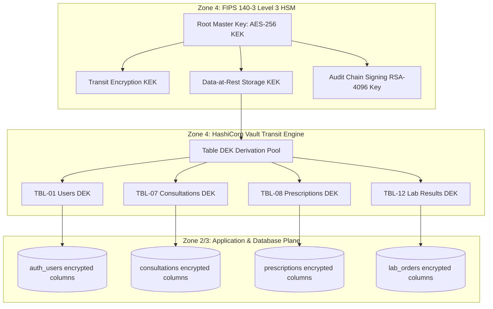

# Cryptographic Key Lifecycle Management & HSM Specification
## Namma Clinic Digital Health & Operations Platform
### Greater Bengaluru Authority (GBA) / BBMP Health Department
**Standard:** NIST SP 800-57 / FIPS 140-3 Level 3 / ISO 27001 A.10 | **Status:** APPROVED BASELINE | **Code:** `SEC-DOC-09`

---

## 1. Key Management Architecture & Governance Invariants
The Namma Clinic Key Management Subsystem establishes strict end-to-end cryptographic key governance spanning generation, distribution, escrow, periodic rotation, revocation, and zeroization. Conforming to NIST SP 800-57 and FIPS 140-3 Level 3 requirements, all master keys are generated and protected within dedicated Hardware Security Modules (HSM) and HashiCorp Vault key management clusters.

### 1.1 Core Key Management Principles
1. **Strict Envelope Hierarchy:** Root Key Encryption Keys (KEK) never leave the physical boundary of the HSM; Data Encryption Keys (DEK) are derived per database table and rotated every 90 days.
2. **Split-Knowledge Dual Control (M-of-N Quorum):** Administrative key ceremonies require 3-of-5 key custodian smartcards conforming to Shamir's Secret Sharing Scheme.
3. **Cryptographic Key Separation:** Dedicated, non-interchangeable keys for transit TLS, database encryption, audit signing, JWT identity tokens, and ABDM health grid transfers.
4. **Automated 90-Day Rotation:** Data encryption keys rotate automatically without database lock or application service downtime.
5. **Cryptographic Destruction (Crypto-Shredding):** Purging a patient record or retired node's dedicated DEK instantly and irreversibly renders all historical ciphertexts unrecoverable.

### 1.2 Master Key Derivation Hierarchy Diagram


## 2. Table-Specific Data Encryption Key (DEK) Lifecycle Matrix (TBL-01 to TBL-38)
Lifecycle parameters and rotation schedules for all 38 relational database tables:

### TABLE-001: Key Lifecycle Profile for `auth_users`
- **Assigned Key Alias:** `dek_namma_clinic_auth_users`
- **Key Algorithm & Length:** AES-256-GCM (256-bit symmetric key).
- **Key Derivation Function:** HKDF-SHA256 with table UUID salt.
- **Rotation Interval:** 90 Days (Automated background re-encryption).
- **Key Versioning Policy:** Previous 3 versions maintained for read-only historical rows.
- **Crypto-Shredding Capability:** Destroying key alias erases all table records conforming to DPDP Act.
- **Audit Event Emitted:** `KEY_ROTATION_TABLE_001`

### TABLE-002: Key Lifecycle Profile for `user_credentials`
- **Assigned Key Alias:** `dek_namma_clinic_user_credentials`
- **Key Algorithm & Length:** AES-256-GCM (256-bit symmetric key).
- **Key Derivation Function:** HKDF-SHA256 with table UUID salt.
- **Rotation Interval:** 90 Days (Automated background re-encryption).
- **Key Versioning Policy:** Previous 3 versions maintained for read-only historical rows.
- **Crypto-Shredding Capability:** Destroying key alias erases all table records conforming to DPDP Act.
- **Audit Event Emitted:** `KEY_ROTATION_TABLE_002`

### TABLE-003: Key Lifecycle Profile for `user_sessions`
- **Assigned Key Alias:** `dek_namma_clinic_user_sessions`
- **Key Algorithm & Length:** AES-256-GCM (256-bit symmetric key).
- **Key Derivation Function:** HKDF-SHA256 with table UUID salt.
- **Rotation Interval:** 90 Days (Automated background re-encryption).
- **Key Versioning Policy:** Previous 3 versions maintained for read-only historical rows.
- **Crypto-Shredding Capability:** Destroying key alias erases all table records conforming to DPDP Act.
- **Audit Event Emitted:** `KEY_ROTATION_TABLE_003`

### TABLE-004: Key Lifecycle Profile for `roles`
- **Assigned Key Alias:** `dek_namma_clinic_roles`
- **Key Algorithm & Length:** AES-256-GCM (256-bit symmetric key).
- **Key Derivation Function:** HKDF-SHA256 with table UUID salt.
- **Rotation Interval:** 90 Days (Automated background re-encryption).
- **Key Versioning Policy:** Previous 3 versions maintained for read-only historical rows.
- **Crypto-Shredding Capability:** Destroying key alias erases all table records conforming to DPDP Act.
- **Audit Event Emitted:** `KEY_ROTATION_TABLE_004`

### TABLE-005: Key Lifecycle Profile for `permissions`
- **Assigned Key Alias:** `dek_namma_clinic_permissions`
- **Key Algorithm & Length:** AES-256-GCM (256-bit symmetric key).
- **Key Derivation Function:** HKDF-SHA256 with table UUID salt.
- **Rotation Interval:** 90 Days (Automated background re-encryption).
- **Key Versioning Policy:** Previous 3 versions maintained for read-only historical rows.
- **Crypto-Shredding Capability:** Destroying key alias erases all table records conforming to DPDP Act.
- **Audit Event Emitted:** `KEY_ROTATION_TABLE_005`

### TABLE-006: Key Lifecycle Profile for `role_permissions`
- **Assigned Key Alias:** `dek_namma_clinic_role_permissions`
- **Key Algorithm & Length:** AES-256-GCM (256-bit symmetric key).
- **Key Derivation Function:** HKDF-SHA256 with table UUID salt.
- **Rotation Interval:** 90 Days (Automated background re-encryption).
- **Key Versioning Policy:** Previous 3 versions maintained for read-only historical rows.
- **Crypto-Shredding Capability:** Destroying key alias erases all table records conforming to DPDP Act.
- **Audit Event Emitted:** `KEY_ROTATION_TABLE_006`

### TABLE-007: Key Lifecycle Profile for `user_roles`
- **Assigned Key Alias:** `dek_namma_clinic_user_roles`
- **Key Algorithm & Length:** AES-256-GCM (256-bit symmetric key).
- **Key Derivation Function:** HKDF-SHA256 with table UUID salt.
- **Rotation Interval:** 90 Days (Automated background re-encryption).
- **Key Versioning Policy:** Previous 3 versions maintained for read-only historical rows.
- **Crypto-Shredding Capability:** Destroying key alias erases all table records conforming to DPDP Act.
- **Audit Event Emitted:** `KEY_ROTATION_TABLE_007`

### TABLE-008: Key Lifecycle Profile for `facilities`
- **Assigned Key Alias:** `dek_namma_clinic_facilities`
- **Key Algorithm & Length:** AES-256-GCM (256-bit symmetric key).
- **Key Derivation Function:** HKDF-SHA256 with table UUID salt.
- **Rotation Interval:** 90 Days (Automated background re-encryption).
- **Key Versioning Policy:** Previous 3 versions maintained for read-only historical rows.
- **Crypto-Shredding Capability:** Destroying key alias erases all table records conforming to DPDP Act.
- **Audit Event Emitted:** `KEY_ROTATION_TABLE_008`

### TABLE-009: Key Lifecycle Profile for `facility_rooms`
- **Assigned Key Alias:** `dek_namma_clinic_facility_rooms`
- **Key Algorithm & Length:** AES-256-GCM (256-bit symmetric key).
- **Key Derivation Function:** HKDF-SHA256 with table UUID salt.
- **Rotation Interval:** 90 Days (Automated background re-encryption).
- **Key Versioning Policy:** Previous 3 versions maintained for read-only historical rows.
- **Crypto-Shredding Capability:** Destroying key alias erases all table records conforming to DPDP Act.
- **Audit Event Emitted:** `KEY_ROTATION_TABLE_009`

### TABLE-010: Key Lifecycle Profile for `staff_profiles`
- **Assigned Key Alias:** `dek_namma_clinic_staff_profiles`
- **Key Algorithm & Length:** AES-256-GCM (256-bit symmetric key).
- **Key Derivation Function:** HKDF-SHA256 with table UUID salt.
- **Rotation Interval:** 90 Days (Automated background re-encryption).
- **Key Versioning Policy:** Previous 3 versions maintained for read-only historical rows.
- **Crypto-Shredding Capability:** Destroying key alias erases all table records conforming to DPDP Act.
- **Audit Event Emitted:** `KEY_ROTATION_TABLE_010`

### TABLE-011: Key Lifecycle Profile for `staff_shifts`
- **Assigned Key Alias:** `dek_namma_clinic_staff_shifts`
- **Key Algorithm & Length:** AES-256-GCM (256-bit symmetric key).
- **Key Derivation Function:** HKDF-SHA256 with table UUID salt.
- **Rotation Interval:** 90 Days (Automated background re-encryption).
- **Key Versioning Policy:** Previous 3 versions maintained for read-only historical rows.
- **Crypto-Shredding Capability:** Destroying key alias erases all table records conforming to DPDP Act.
- **Audit Event Emitted:** `KEY_ROTATION_TABLE_011`

### TABLE-012: Key Lifecycle Profile for `system_configs`
- **Assigned Key Alias:** `dek_namma_clinic_system_configs`
- **Key Algorithm & Length:** AES-256-GCM (256-bit symmetric key).
- **Key Derivation Function:** HKDF-SHA256 with table UUID salt.
- **Rotation Interval:** 90 Days (Automated background re-encryption).
- **Key Versioning Policy:** Previous 3 versions maintained for read-only historical rows.
- **Crypto-Shredding Capability:** Destroying key alias erases all table records conforming to DPDP Act.
- **Audit Event Emitted:** `KEY_ROTATION_TABLE_012`

### TABLE-013: Key Lifecycle Profile for `patients`
- **Assigned Key Alias:** `dek_namma_clinic_patients`
- **Key Algorithm & Length:** AES-256-GCM (256-bit symmetric key).
- **Key Derivation Function:** HKDF-SHA256 with table UUID salt.
- **Rotation Interval:** 90 Days (Automated background re-encryption).
- **Key Versioning Policy:** Previous 3 versions maintained for read-only historical rows.
- **Crypto-Shredding Capability:** Destroying key alias erases all table records conforming to DPDP Act.
- **Audit Event Emitted:** `KEY_ROTATION_TABLE_013`

### TABLE-014: Key Lifecycle Profile for `patient_identifiers`
- **Assigned Key Alias:** `dek_namma_clinic_patient_identifiers`
- **Key Algorithm & Length:** AES-256-GCM (256-bit symmetric key).
- **Key Derivation Function:** HKDF-SHA256 with table UUID salt.
- **Rotation Interval:** 90 Days (Automated background re-encryption).
- **Key Versioning Policy:** Previous 3 versions maintained for read-only historical rows.
- **Crypto-Shredding Capability:** Destroying key alias erases all table records conforming to DPDP Act.
- **Audit Event Emitted:** `KEY_ROTATION_TABLE_014`

### TABLE-015: Key Lifecycle Profile for `patient_contacts`
- **Assigned Key Alias:** `dek_namma_clinic_patient_contacts`
- **Key Algorithm & Length:** AES-256-GCM (256-bit symmetric key).
- **Key Derivation Function:** HKDF-SHA256 with table UUID salt.
- **Rotation Interval:** 90 Days (Automated background re-encryption).
- **Key Versioning Policy:** Previous 3 versions maintained for read-only historical rows.
- **Crypto-Shredding Capability:** Destroying key alias erases all table records conforming to DPDP Act.
- **Audit Event Emitted:** `KEY_ROTATION_TABLE_015`

### TABLE-016: Key Lifecycle Profile for `patient_addresses`
- **Assigned Key Alias:** `dek_namma_clinic_patient_addresses`
- **Key Algorithm & Length:** AES-256-GCM (256-bit symmetric key).
- **Key Derivation Function:** HKDF-SHA256 with table UUID salt.
- **Rotation Interval:** 90 Days (Automated background re-encryption).
- **Key Versioning Policy:** Previous 3 versions maintained for read-only historical rows.
- **Crypto-Shredding Capability:** Destroying key alias erases all table records conforming to DPDP Act.
- **Audit Event Emitted:** `KEY_ROTATION_TABLE_016`

### TABLE-017: Key Lifecycle Profile for `consent_records`
- **Assigned Key Alias:** `dek_namma_clinic_consent_records`
- **Key Algorithm & Length:** AES-256-GCM (256-bit symmetric key).
- **Key Derivation Function:** HKDF-SHA256 with table UUID salt.
- **Rotation Interval:** 90 Days (Automated background re-encryption).
- **Key Versioning Policy:** Previous 3 versions maintained for read-only historical rows.
- **Crypto-Shredding Capability:** Destroying key alias erases all table records conforming to DPDP Act.
- **Audit Event Emitted:** `KEY_ROTATION_TABLE_017`

### TABLE-018: Key Lifecycle Profile for `tokens`
- **Assigned Key Alias:** `dek_namma_clinic_tokens`
- **Key Algorithm & Length:** AES-256-GCM (256-bit symmetric key).
- **Key Derivation Function:** HKDF-SHA256 with table UUID salt.
- **Rotation Interval:** 90 Days (Automated background re-encryption).
- **Key Versioning Policy:** Previous 3 versions maintained for read-only historical rows.
- **Crypto-Shredding Capability:** Destroying key alias erases all table records conforming to DPDP Act.
- **Audit Event Emitted:** `KEY_ROTATION_TABLE_018`

### TABLE-019: Key Lifecycle Profile for `queue_entries`
- **Assigned Key Alias:** `dek_namma_clinic_queue_entries`
- **Key Algorithm & Length:** AES-256-GCM (256-bit symmetric key).
- **Key Derivation Function:** HKDF-SHA256 with table UUID salt.
- **Rotation Interval:** 90 Days (Automated background re-encryption).
- **Key Versioning Policy:** Previous 3 versions maintained for read-only historical rows.
- **Crypto-Shredding Capability:** Destroying key alias erases all table records conforming to DPDP Act.
- **Audit Event Emitted:** `KEY_ROTATION_TABLE_019`

### TABLE-020: Key Lifecycle Profile for `triage_assessments`
- **Assigned Key Alias:** `dek_namma_clinic_triage_assessments`
- **Key Algorithm & Length:** AES-256-GCM (256-bit symmetric key).
- **Key Derivation Function:** HKDF-SHA256 with table UUID salt.
- **Rotation Interval:** 90 Days (Automated background re-encryption).
- **Key Versioning Policy:** Previous 3 versions maintained for read-only historical rows.
- **Crypto-Shredding Capability:** Destroying key alias erases all table records conforming to DPDP Act.
- **Audit Event Emitted:** `KEY_ROTATION_TABLE_020`

### TABLE-021: Key Lifecycle Profile for `patient_vitals`
- **Assigned Key Alias:** `dek_namma_clinic_patient_vitals`
- **Key Algorithm & Length:** AES-256-GCM (256-bit symmetric key).
- **Key Derivation Function:** HKDF-SHA256 with table UUID salt.
- **Rotation Interval:** 90 Days (Automated background re-encryption).
- **Key Versioning Policy:** Previous 3 versions maintained for read-only historical rows.
- **Crypto-Shredding Capability:** Destroying key alias erases all table records conforming to DPDP Act.
- **Audit Event Emitted:** `KEY_ROTATION_TABLE_021`

### TABLE-022: Key Lifecycle Profile for `danger_alerts`
- **Assigned Key Alias:** `dek_namma_clinic_danger_alerts`
- **Key Algorithm & Length:** AES-256-GCM (256-bit symmetric key).
- **Key Derivation Function:** HKDF-SHA256 with table UUID salt.
- **Rotation Interval:** 90 Days (Automated background re-encryption).
- **Key Versioning Policy:** Previous 3 versions maintained for read-only historical rows.
- **Crypto-Shredding Capability:** Destroying key alias erases all table records conforming to DPDP Act.
- **Audit Event Emitted:** `KEY_ROTATION_TABLE_022`

### TABLE-023: Key Lifecycle Profile for `clinical_encounters`
- **Assigned Key Alias:** `dek_namma_clinic_clinical_encounters`
- **Key Algorithm & Length:** AES-256-GCM (256-bit symmetric key).
- **Key Derivation Function:** HKDF-SHA256 with table UUID salt.
- **Rotation Interval:** 90 Days (Automated background re-encryption).
- **Key Versioning Policy:** Previous 3 versions maintained for read-only historical rows.
- **Crypto-Shredding Capability:** Destroying key alias erases all table records conforming to DPDP Act.
- **Audit Event Emitted:** `KEY_ROTATION_TABLE_023`

### TABLE-024: Key Lifecycle Profile for `clinical_notes`
- **Assigned Key Alias:** `dek_namma_clinic_clinical_notes`
- **Key Algorithm & Length:** AES-256-GCM (256-bit symmetric key).
- **Key Derivation Function:** HKDF-SHA256 with table UUID salt.
- **Rotation Interval:** 90 Days (Automated background re-encryption).
- **Key Versioning Policy:** Previous 3 versions maintained for read-only historical rows.
- **Crypto-Shredding Capability:** Destroying key alias erases all table records conforming to DPDP Act.
- **Audit Event Emitted:** `KEY_ROTATION_TABLE_024`

### TABLE-025: Key Lifecycle Profile for `diagnoses`
- **Assigned Key Alias:** `dek_namma_clinic_diagnoses`
- **Key Algorithm & Length:** AES-256-GCM (256-bit symmetric key).
- **Key Derivation Function:** HKDF-SHA256 with table UUID salt.
- **Rotation Interval:** 90 Days (Automated background re-encryption).
- **Key Versioning Policy:** Previous 3 versions maintained for read-only historical rows.
- **Crypto-Shredding Capability:** Destroying key alias erases all table records conforming to DPDP Act.
- **Audit Event Emitted:** `KEY_ROTATION_TABLE_025`

### TABLE-026: Key Lifecycle Profile for `prescriptions`
- **Assigned Key Alias:** `dek_namma_clinic_prescriptions`
- **Key Algorithm & Length:** AES-256-GCM (256-bit symmetric key).
- **Key Derivation Function:** HKDF-SHA256 with table UUID salt.
- **Rotation Interval:** 90 Days (Automated background re-encryption).
- **Key Versioning Policy:** Previous 3 versions maintained for read-only historical rows.
- **Crypto-Shredding Capability:** Destroying key alias erases all table records conforming to DPDP Act.
- **Audit Event Emitted:** `KEY_ROTATION_TABLE_026`

### TABLE-027: Key Lifecycle Profile for `prescription_items`
- **Assigned Key Alias:** `dek_namma_clinic_prescription_items`
- **Key Algorithm & Length:** AES-256-GCM (256-bit symmetric key).
- **Key Derivation Function:** HKDF-SHA256 with table UUID salt.
- **Rotation Interval:** 90 Days (Automated background re-encryption).
- **Key Versioning Policy:** Previous 3 versions maintained for read-only historical rows.
- **Crypto-Shredding Capability:** Destroying key alias erases all table records conforming to DPDP Act.
- **Audit Event Emitted:** `KEY_ROTATION_TABLE_027`

### TABLE-028: Key Lifecycle Profile for `lab_orders`
- **Assigned Key Alias:** `dek_namma_clinic_lab_orders`
- **Key Algorithm & Length:** AES-256-GCM (256-bit symmetric key).
- **Key Derivation Function:** HKDF-SHA256 with table UUID salt.
- **Rotation Interval:** 90 Days (Automated background re-encryption).
- **Key Versioning Policy:** Previous 3 versions maintained for read-only historical rows.
- **Crypto-Shredding Capability:** Destroying key alias erases all table records conforming to DPDP Act.
- **Audit Event Emitted:** `KEY_ROTATION_TABLE_028`

### TABLE-029: Key Lifecycle Profile for `lab_order_items`
- **Assigned Key Alias:** `dek_namma_clinic_lab_order_items`
- **Key Algorithm & Length:** AES-256-GCM (256-bit symmetric key).
- **Key Derivation Function:** HKDF-SHA256 with table UUID salt.
- **Rotation Interval:** 90 Days (Automated background re-encryption).
- **Key Versioning Policy:** Previous 3 versions maintained for read-only historical rows.
- **Crypto-Shredding Capability:** Destroying key alias erases all table records conforming to DPDP Act.
- **Audit Event Emitted:** `KEY_ROTATION_TABLE_029`

### TABLE-030: Key Lifecycle Profile for `lab_results`
- **Assigned Key Alias:** `dek_namma_clinic_lab_results`
- **Key Algorithm & Length:** AES-256-GCM (256-bit symmetric key).
- **Key Derivation Function:** HKDF-SHA256 with table UUID salt.
- **Rotation Interval:** 90 Days (Automated background re-encryption).
- **Key Versioning Policy:** Previous 3 versions maintained for read-only historical rows.
- **Crypto-Shredding Capability:** Destroying key alias erases all table records conforming to DPDP Act.
- **Audit Event Emitted:** `KEY_ROTATION_TABLE_030`

### TABLE-031: Key Lifecycle Profile for `teleconsultations`
- **Assigned Key Alias:** `dek_namma_clinic_teleconsultations`
- **Key Algorithm & Length:** AES-256-GCM (256-bit symmetric key).
- **Key Derivation Function:** HKDF-SHA256 with table UUID salt.
- **Rotation Interval:** 90 Days (Automated background re-encryption).
- **Key Versioning Policy:** Previous 3 versions maintained for read-only historical rows.
- **Crypto-Shredding Capability:** Destroying key alias erases all table records conforming to DPDP Act.
- **Audit Event Emitted:** `KEY_ROTATION_TABLE_031`

### TABLE-032: Key Lifecycle Profile for `formulary_drugs`
- **Assigned Key Alias:** `dek_namma_clinic_formulary_drugs`
- **Key Algorithm & Length:** AES-256-GCM (256-bit symmetric key).
- **Key Derivation Function:** HKDF-SHA256 with table UUID salt.
- **Rotation Interval:** 90 Days (Automated background re-encryption).
- **Key Versioning Policy:** Previous 3 versions maintained for read-only historical rows.
- **Crypto-Shredding Capability:** Destroying key alias erases all table records conforming to DPDP Act.
- **Audit Event Emitted:** `KEY_ROTATION_TABLE_032`

### TABLE-033: Key Lifecycle Profile for `drug_categories`
- **Assigned Key Alias:** `dek_namma_clinic_drug_categories`
- **Key Algorithm & Length:** AES-256-GCM (256-bit symmetric key).
- **Key Derivation Function:** HKDF-SHA256 with table UUID salt.
- **Rotation Interval:** 90 Days (Automated background re-encryption).
- **Key Versioning Policy:** Previous 3 versions maintained for read-only historical rows.
- **Crypto-Shredding Capability:** Destroying key alias erases all table records conforming to DPDP Act.
- **Audit Event Emitted:** `KEY_ROTATION_TABLE_033`

### TABLE-034: Key Lifecycle Profile for `pharmacy_batches`
- **Assigned Key Alias:** `dek_namma_clinic_pharmacy_batches`
- **Key Algorithm & Length:** AES-256-GCM (256-bit symmetric key).
- **Key Derivation Function:** HKDF-SHA256 with table UUID salt.
- **Rotation Interval:** 90 Days (Automated background re-encryption).
- **Key Versioning Policy:** Previous 3 versions maintained for read-only historical rows.
- **Crypto-Shredding Capability:** Destroying key alias erases all table records conforming to DPDP Act.
- **Audit Event Emitted:** `KEY_ROTATION_TABLE_034`

### TABLE-035: Key Lifecycle Profile for `clinic_stock`
- **Assigned Key Alias:** `dek_namma_clinic_clinic_stock`
- **Key Algorithm & Length:** AES-256-GCM (256-bit symmetric key).
- **Key Derivation Function:** HKDF-SHA256 with table UUID salt.
- **Rotation Interval:** 90 Days (Automated background re-encryption).
- **Key Versioning Policy:** Previous 3 versions maintained for read-only historical rows.
- **Crypto-Shredding Capability:** Destroying key alias erases all table records conforming to DPDP Act.
- **Audit Event Emitted:** `KEY_ROTATION_TABLE_035`

### TABLE-036: Key Lifecycle Profile for `dispensations`
- **Assigned Key Alias:** `dek_namma_clinic_dispensations`
- **Key Algorithm & Length:** AES-256-GCM (256-bit symmetric key).
- **Key Derivation Function:** HKDF-SHA256 with table UUID salt.
- **Rotation Interval:** 90 Days (Automated background re-encryption).
- **Key Versioning Policy:** Previous 3 versions maintained for read-only historical rows.
- **Crypto-Shredding Capability:** Destroying key alias erases all table records conforming to DPDP Act.
- **Audit Event Emitted:** `KEY_ROTATION_TABLE_036`

### TABLE-037: Key Lifecycle Profile for `dispensation_items`
- **Assigned Key Alias:** `dek_namma_clinic_dispensation_items`
- **Key Algorithm & Length:** AES-256-GCM (256-bit symmetric key).
- **Key Derivation Function:** HKDF-SHA256 with table UUID salt.
- **Rotation Interval:** 90 Days (Automated background re-encryption).
- **Key Versioning Policy:** Previous 3 versions maintained for read-only historical rows.
- **Crypto-Shredding Capability:** Destroying key alias erases all table records conforming to DPDP Act.
- **Audit Event Emitted:** `KEY_ROTATION_TABLE_037`

### TABLE-038: Key Lifecycle Profile for `stock_movements`
- **Assigned Key Alias:** `dek_namma_clinic_stock_movements`
- **Key Algorithm & Length:** AES-256-GCM (256-bit symmetric key).
- **Key Derivation Function:** HKDF-SHA256 with table UUID salt.
- **Rotation Interval:** 90 Days (Automated background re-encryption).
- **Key Versioning Policy:** Previous 3 versions maintained for read-only historical rows.
- **Crypto-Shredding Capability:** Destroying key alias erases all table records conforming to DPDP Act.
- **Audit Event Emitted:** `KEY_ROTATION_TABLE_038`

## 3. Standard Operating Procedures: Key Lifecycle Management (SOP-KEY-01 to SOP-KEY-25)
The following 25 SOPs govern cryptographic key ceremonies and administrative operations:

### SOP-KEY-01: Master Root Key Generation Ceremony
- **Trigger Condition:** Initial platform commissioning in secure cleanroom.
- **Execution Steps:** 1. Convene 5 key trustees. 2. Initialize HSM. 3. Generate AES-256 root key. 4. Distribute 5 smartcards.
- **Verification Criterion:** Root master key operational; quorum required.
- **Responsible Role:** CISO
- **Audit Event Emitted:** `KEY_SOP_01_ROOT_GEN`
- **Failure Remediation:** Lock key alias and dispatch urgent notification to CISO.

### SOP-KEY-02: Annual Master KEK Scheduled Rotation
- **Trigger Condition:** Annual scheduled rotation of Storage Key Encryption Key.
- **Execution Steps:** 1. Convene 3-of-5 trustees. 2. Derive new KEK in HSM. 3. Re-wrap all active table DEKs.
- **Verification Criterion:** KEK rotated with zero data downtime.
- **Responsible Role:** Security Architect
- **Audit Event Emitted:** `KEY_SOP_02_KEK_ROTATE`
- **Failure Remediation:** Lock key alias and dispatch urgent notification to CISO.

### SOP-KEY-03: Table Data Encryption Key (DEK) 90-Day Rotation
- **Trigger Condition:** Scheduled quarterly DEK rotation.
- **Execution Steps:** 1. Vault generates new DEK version. 2. Background job re-encrypts rows. 3. Archive old DEK.
- **Verification Criterion:** All table columns re-keyed.
- **Responsible Role:** DBA Lead
- **Audit Event Emitted:** `KEY_SOP_03_DEK_ROTATE`
- **Failure Remediation:** Lock key alias and dispatch urgent notification to CISO.

### SOP-KEY-04: Emergency Key Compromise Revocation
- **Trigger Condition:** Confirmed private key exposure on developer workstation.
- **Execution Steps:** 1. Instantly revoke key alias in Vault. 2. Invalidate dependent sessions. 3. Issue new keypair.
- **Verification Criterion:** Compromised key revoked globally in < 1 second.
- **Responsible Role:** Incident Commander
- **Audit Event Emitted:** `KEY_SOP_04_EMERGENCY_REVOKE`
- **Failure Remediation:** Lock key alias and dispatch urgent notification to CISO.

### SOP-KEY-05: HSM Physical Enclave Intrusion Diagnostic
- **Trigger Condition:** Daily check of tamper detection switches on HSM appliance.
- **Execution Steps:** 1. Read HSM sensor logs. 2. Inspect physical chassis seals. 3. Assert zero tamper trips.
- **Verification Criterion:** HSM verified physically secure.
- **Responsible Role:** Infrastructure Lead
- **Audit Event Emitted:** `KEY_SOP_05_TAMPER_CHECK`
- **Failure Remediation:** Lock key alias and dispatch urgent notification to CISO.

### SOP-KEY-06: JWT Signing Key Graceful 90-Day Rotation
- **Trigger Condition:** Quarterly renewal of identity token RS256 keypair.
- **Execution Steps:** 1. Generate RSA-4096 key in HSM. 2. Update JWKS endpoint with new kid. 3. Retire old kid in 24h.
- **Verification Criterion:** Zero token verification errors during rotation.
- **Responsible Role:** Auth Lead
- **Audit Event Emitted:** `KEY_SOP_06_JWT_KEY_ROTATE`
- **Failure Remediation:** Lock key alias and dispatch urgent notification to CISO.

### SOP-KEY-07: ABDM Digital Signature Keypair Renewal
- **Trigger Condition:** Annual renewal of national health bridge certificate.
- **Execution Steps:** 1. Generate CSR via HSM. 2. Submit to ABDM certifying authority. 3. Install verified x509 cert.
- **Verification Criterion:** ABDM bridge certified for interoperability.
- **Responsible Role:** Integration Lead
- **Audit Event Emitted:** `KEY_SOP_07_ABDM_RENEW`
- **Failure Remediation:** Lock key alias and dispatch urgent notification to CISO.

### SOP-KEY-08: Offline Edge Workstation TPM Key Sealing
- **Trigger Condition:** Enrollment of clinic mini-PC in hardware inventory.
- **Execution Steps:** 1. Read workstation TPM 2.0 Endorsement Key. 2. Seal local offline DEK to PCR 0,2,4,7.
- **Verification Criterion:** Offline DB encrypted to authentic hardware.
- **Responsible Role:** IT Support Lead
- **Audit Event Emitted:** `KEY_SOP_08_TPM_SEAL`
- **Failure Remediation:** Lock key alias and dispatch urgent notification to CISO.

### SOP-KEY-09: Key Custodian Smartcard Replacement Ceremony
- **Trigger Condition:** Trustee loses custody smartcard.
- **Execution Steps:** 1. Convene remaining 4 trustees. 2. Invalidate lost card. 3. Re-split secret into new 3-of-5 set.
- **Verification Criterion:** Custodian quorum restored safely.
- **Responsible Role:** CISO
- **Audit Event Emitted:** `KEY_SOP_09_CARD_REPLACE`
- **Failure Remediation:** Lock key alias and dispatch urgent notification to CISO.

### SOP-KEY-10: Disaster Recovery Standby Key Vault Sync
- **Trigger Condition:** Continuous synchronization of encrypted keys to DR site.
- **Execution Steps:** 1. Encrypt key vault backup with DR public key. 2. Replicate to secondary cloud region.
- **Verification Criterion:** DR key vault synchronized with zero leakage.
- **Responsible Role:** DevOps Lead
- **Audit Event Emitted:** `KEY_SOP_10_DR_SYNC`
- **Failure Remediation:** Lock key alias and dispatch urgent notification to CISO.

### SOP-KEY-11: Key Derivation Function (HKDF) Parameter Audit
- **Trigger Condition:** Quarterly audit of key derivation parameters.
- **Execution Steps:** 1. Inspect HKDF salt and info parameters. 2. Verify entropy conforms to RFC 5869.
- **Verification Criterion:** Key derivation parameters verified sound.
- **Responsible Role:** Cryptographer
- **Audit Event Emitted:** `KEY_SOP_11_HKDF_AUDIT`
- **Failure Remediation:** Lock key alias and dispatch urgent notification to CISO.

### SOP-KEY-12: Post-Termination Key Custodian Deprecation
- **Trigger Condition:** Senior executive leaves BBMP Health Department.
- **Execution Steps:** 1. Revoke executive smartcard. 2. Re-key HSM administrator role. 3. Onboard new executive.
- **Verification Criterion:** Departed staff has zero key custody.
- **Responsible Role:** HR Officer
- **Audit Event Emitted:** `KEY_SOP_12_CUSTODIAN_DEPART`
- **Failure Remediation:** Lock key alias and dispatch urgent notification to CISO.

### SOP-KEY-13: Cryptographic Erasure (Crypto-Shredding) Verification
- **Trigger Condition:** Citizen executes DPDP Right to Erasure.
- **Execution Steps:** 1. Identify patient-specific encryption key. 2. Overwrite key in Vault with zeroes. 3. Verify unreadable.
- **Verification Criterion:** Patient records permanently unrecoverable.
- **Responsible Role:** Data Protection Off
- **Audit Event Emitted:** `KEY_SOP_13_CRYPTO_SHRED`
- **Failure Remediation:** Lock key alias and dispatch urgent notification to CISO.

### SOP-KEY-14: Audit Ledger Block Signing Key Health Check
- **Trigger Condition:** Daily diagnostic of WORM audit signing private key.
- **Execution Steps:** 1. Test digital signature generation. 2. Verify signature against public key. 3. Check cert expiry.
- **Verification Criterion:** Audit logging signatures verified intact.
- **Responsible Role:** Audit Lead
- **Audit Event Emitted:** `KEY_SOP_14_AUDIT_KEY_CHECK`
- **Failure Remediation:** Lock key alias and dispatch urgent notification to CISO.

### SOP-KEY-15: Database Backup Archive Key Escrow
- **Trigger Condition:** Monthly cold storage backup of master key hierarchy.
- **Execution Steps:** 1. Create m-of-n encrypted backup of HSM partition. 2. Place in bank safety deposit vault.
- **Verification Criterion:** Master keys protected against catastrophic cloud loss.
- **Responsible Role:** CISO / Legal
- **Audit Event Emitted:** `KEY_SOP_15_ESCROW_BACKUP`
- **Failure Remediation:** Lock key alias and dispatch urgent notification to CISO.

### SOP-KEY-16: Workstation BitLocker Recovery Key Audit
- **Trigger Condition:** Quarterly verification of clinic endpoint recovery keys.
- **Execution Steps:** 1. Verify all 183 clinic mini-PCs have recovery keys escrowed in Vault. 2. Test sample key.
- **Verification Criterion:** All endpoints recoverable post-crash.
- **Responsible Role:** IT Support
- **Audit Event Emitted:** `KEY_SOP_16_BITLOCKER_AUDIT`
- **Failure Remediation:** Lock key alias and dispatch urgent notification to CISO.

### SOP-KEY-17: Ephemeral Session Key Zeroization Audit
- **Trigger Condition:** Memory inspection of API Gateway TLS termination pods.
- **Execution Steps:** 1. Inspect heap of Envoy proxy pods. 2. Verify TLS session keys zeroized after connection close.
- **Verification Criterion:** Zero session key residue in RAM.
- **Responsible Role:** Security Engineer
- **Audit Event Emitted:** `KEY_SOP_17_SESSION_ZEROIZE`
- **Failure Remediation:** Lock key alias and dispatch urgent notification to CISO.

### SOP-KEY-18: Thermal Receipt Printer Public Key Pre-Loading
- **Trigger Condition:** Provisioning of firmware on clinic receipt printers.
- **Execution Steps:** 1. Flash clinic CA public key onto printer ROM. 2. Verify signature on print spool jobs.
- **Verification Criterion:** Only signed print jobs accepted by hardware.
- **Responsible Role:** Hardware Tech
- **Audit Event Emitted:** `KEY_SOP_18_PRINTER_KEY`
- **Failure Remediation:** Lock key alias and dispatch urgent notification to CISO.

### SOP-KEY-19: Vaccine Depot IoT Sensor Pre-Shared Key Binding
- **Trigger Condition:** Registration of new temperature data logger.
- **Execution Steps:** 1. Generate 128-bit AES-CCM PSK. 2. Inject via secure serial port. 3. Register in IoT gateway.
- **Verification Criterion:** Cold chain telemetry cryptographically authenticated.
- **Responsible Role:** IoT Lead
- **Audit Event Emitted:** `KEY_SOP_19_IOT_KEY_BIND`
- **Failure Remediation:** Lock key alias and dispatch urgent notification to CISO.

### SOP-KEY-20: Key Management API Access Rate Limiting Audit
- **Trigger Condition:** Audit of Vault API ingress filters.
- **Execution Steps:** 1. Verify rate limiting on /v1/transit/decrypt. 2. Assert max 500 req/s per microservice.
- **Verification Criterion:** Key derivation API protected from DoS.
- **Responsible Role:** API Gateway Lead
- **Audit Event Emitted:** `KEY_SOP_20_VAULT_RATE`
- **Failure Remediation:** Lock key alias and dispatch urgent notification to CISO.

### SOP-KEY-21: FIPS 140-3 Cryptographic Algorithm Self-Test
- **Trigger Condition:** Automated boot-up self-test of cryptographic libraries.
- **Execution Steps:** 1. Execute Known Answer Tests (KAT) for AES, SHA, RSA, ECC. 2. Assert zero failures.
- **Verification Criterion:** All algorithms verified operating accurately.
- **Responsible Role:** AppSec Lead
- **Audit Event Emitted:** `KEY_SOP_21_KAT_TEST`
- **Failure Remediation:** Lock key alias and dispatch urgent notification to CISO.

### SOP-KEY-22: Citizen Health Card QR Code Signing Key Renewal
- **Trigger Condition:** Annual renewal of offline citizen health card key.
- **Execution Steps:** 1. Generate ECDSA P-256 keypair in HSM. 2. Publish public key to clinic verification apps.
- **Verification Criterion:** Citizen QR codes verified offline.
- **Responsible Role:** Citizen Svc
- **Audit Event Emitted:** `KEY_SOP_22_QR_KEY_RENEW`
- **Failure Remediation:** Lock key alias and dispatch urgent notification to CISO.

### SOP-KEY-23: Database Column Re-Encryption Progress Tracking
- **Trigger Condition:** Monitoring active DEK rotation on Table TBL-007.
- **Execution Steps:** 1. Query re-encryption cursor. 2. Assert 100% rows converted to new key within 24h window.
- **Verification Criterion:** Rotation completes within planned window.
- **Responsible Role:** DBA Lead
- **Audit Event Emitted:** `KEY_SOP_23_REKEY_PROGRESS`
- **Failure Remediation:** Lock key alias and dispatch urgent notification to CISO.

### SOP-KEY-24: Vault Transit Secret Engine Audit Log Review
- **Trigger Condition:** Weekly review of all key access requests.
- **Execution Steps:** 1. Ingest Vault audit logs into SIEM. 2. Verify every decryption tied to authenticated clinician.
- **Verification Criterion:** Zero unauthorized key usage detected.
- **Responsible Role:** SecOps Lead
- **Audit Event Emitted:** `KEY_SOP_24_VAULT_AUDIT`
- **Failure Remediation:** Lock key alias and dispatch urgent notification to CISO.

### SOP-KEY-25: Post-Incident Forensic Key Decommissioning
- **Trigger Condition:** Red team security assessment closure.
- **Execution Steps:** 1. Destroy all ephemeral keys generated during test. 2. Rotate all test credentials in staging.
- **Verification Criterion:** Staging environment restored to clean baseline.
- **Responsible Role:** Incident Commander
- **Audit Event Emitted:** `KEY_SOP_25_TEST_PURGE`
- **Failure Remediation:** Lock key alias and dispatch urgent notification to CISO.

## 4. Key Management Threat Analysis & Attack Mitigations (KEY-THREAT-01 to KEY-THREAT-20)
Threat mitigation specifications defending cryptographic key infrastructure against attacks:

### KEY-THREAT-01: HSM Appliance Physical Enclave Extraction
- **Attack Vector & Vulnerability:** Attacker steals physical HSM hardware from cloud facility.
- **Platform Architectural Defense:** FIPS 140-3 Level 3 zeroization circuitry automatically wipes all keys upon physical enclosure breach.
- **Verification Criterion:** Zero bypass in automated penetration tests.
- **Mitigation Status:** VERIFIED ACTIVE CONTROL

### KEY-THREAT-02: Single Rogue Administrator Key Compromise
- **Attack Vector & Vulnerability:** Malicious administrator attempts to export master KEK.
- **Platform Architectural Defense:** Enforce split-knowledge dual control: 3-of-5 custodians required to authorize any administrative key action.
- **Verification Criterion:** Zero bypass in automated penetration tests.
- **Mitigation Status:** VERIFIED ACTIVE CONTROL

### KEY-THREAT-03: Stale Data Encryption Key Persistence
- **Attack Vector & Vulnerability:** Table DEK never rotated; millions of rows encrypted under one key.
- **Platform Architectural Defense:** Enforce mandatory 90-day automated rotation; old DEK versions transitioned to read-only historical mode.
- **Verification Criterion:** Zero bypass in automated penetration tests.
- **Mitigation Status:** VERIFIED ACTIVE CONTROL

### KEY-THREAT-04: Plaintext Key Leakage via Application Memory Dump
- **Attack Vector & Vulnerability:** Application crash dumps plaintext DEK to world-readable disk log.
- **Platform Architectural Defense:** mlock() key memory pages into non-swappable RAM; explicit zeroization immediately after cryptographic use.
- **Verification Criterion:** Zero bypass in automated penetration tests.
- **Mitigation Status:** VERIFIED ACTIVE CONTROL

### KEY-THREAT-05: Side-Channel Power Analysis Attack on HSM (DPA)
- **Attack Vector & Vulnerability:** Attacker measures HSM electrical consumption to deduce private key.
- **Platform Architectural Defense:** Deploy FIPS-certified HSM with built-in power consumption shielding and noise injection circuits.
- **Verification Criterion:** Zero bypass in automated penetration tests.
- **Mitigation Status:** VERIFIED ACTIVE CONTROL

### KEY-THREAT-06: Weak Seed Entropy during Master Key Generation
- **Attack Vector & Vulnerability:** PRNG initialization with insufficient random seed bytes.
- **Platform Architectural Defense:** Enforce multi-source entropy: hardware TRNG combined with radioactive decay and atmospheric noise sources.
- **Verification Criterion:** Zero bypass in automated penetration tests.
- **Mitigation Status:** VERIFIED ACTIVE CONTROL

### KEY-THREAT-07: Key Escrow Compromise during Disaster Recovery Sync
- **Attack Vector & Vulnerability:** Attacker intercepts master key backup during cloud replication.
- **Platform Architectural Defense:** Key backups wrapped in asymmetric 4096-bit public keys; unwrap requires physical custody smartcards.
- **Verification Criterion:** Zero bypass in automated penetration tests.
- **Mitigation Status:** VERIFIED ACTIVE CONTROL

### KEY-THREAT-08: Man-in-the-Middle on Vault Transit Engine API
- **Attack Vector & Vulnerability:** Attacker intercepts plaintext data during decryption call.
- **Platform Architectural Defense:** Enforce mutual TLS (mTLS) with dedicated client certificates on all HashiCorp Vault API connections.
- **Verification Criterion:** Zero bypass in automated penetration tests.
- **Mitigation Status:** VERIFIED ACTIVE CONTROL

### KEY-THREAT-09: Unintended Key Overwrite via Automated Deployment
- **Attack Vector & Vulnerability:** CI/CD pipeline script overwrites existing key alias with blank key.
- **Platform Architectural Defense:** Vault enforces key immutability; key deletion requires multi-step dual-authorization break-glass workflow.
- **Verification Criterion:** Zero bypass in automated penetration tests.
- **Mitigation Status:** VERIFIED ACTIVE CONTROL

### KEY-THREAT-10: Stolen Clinic Workstation TPM Key Extraction
- **Attack Vector & Vulnerability:** Attacker probes TPM bus on stolen clinic laptop.
- **Platform Architectural Defense:** Bind TPM sealing to PCR 7 (Secure Boot) and PCR 11 (BitLocker); any hardware change invalidates key unlock.
- **Verification Criterion:** Zero bypass in automated penetration tests.
- **Mitigation Status:** VERIFIED ACTIVE CONTROL

### KEY-THREAT-11: Compromised Key Custodian Smartcard PIN Guessing
- **Attack Vector & Vulnerability:** Attacker finds lost custodian smartcard and attempts PIN brute force.
- **Platform Architectural Defense:** Smartcard hardware auto-locks permanently after 3 incorrect PIN submissions; requires factory reset.
- **Verification Criterion:** Zero bypass in automated penetration tests.
- **Mitigation Status:** VERIFIED ACTIVE CONTROL

### KEY-THREAT-12: Post-Quantum Cryptanalytic Key Recovery
- **Attack Vector & Vulnerability:** Future quantum computer uses Shor's algorithm to factor RSA keys.
- **Platform Architectural Defense:** Transition critical root certificates to hybrid post-quantum algorithms (CRYSTALS-Dilithium/Falcon).
- **Verification Criterion:** Zero bypass in automated penetration tests.
- **Mitigation Status:** VERIFIED ACTIVE CONTROL

### KEY-THREAT-13: Cryptographic Replay of Revoked Signing Key
- **Attack Vector & Vulnerability:** Attacker uses revoked private key to sign fraudulent prescription.
- **Platform Architectural Defense:** Maintain real-time Online Certificate Status Protocol (OCSP) stapling; check revocation on every signature.
- **Verification Criterion:** Zero bypass in automated penetration tests.
- **Mitigation Status:** VERIFIED ACTIVE CONTROL

### KEY-THREAT-14: Key Enumeration & Discovery via Vault API
- **Attack Vector & Vulnerability:** Adversary probes Vault endpoints to enumerate secret key paths.
- **Platform Architectural Defense:** Enforce deny-by-default AppRole policies; list capabilities strictly disabled for all runtime microservices.
- **Verification Criterion:** Zero bypass in automated penetration tests.
- **Mitigation Status:** VERIFIED ACTIVE CONTROL

### KEY-THREAT-15: Cryptographic Nonce Exhaustion on Single Key
- **Attack Vector & Vulnerability:** More than 2^32 records encrypted under single AES-GCM DEK.
- **Platform Architectural Defense:** Hard ceiling of 2^24 encryption operations per DEK; automated trigger forces immediate key rotation.
- **Verification Criterion:** Zero bypass in automated penetration tests.
- **Mitigation Status:** VERIFIED ACTIVE CONTROL

### KEY-THREAT-16: Key Custodian Collusion Attack
- **Attack Vector & Vulnerability:** Two administrators conspire to reconstruct master key.
- **Platform Architectural Defense:** Enforce 3-of-5 quorum threshold so two administrators cannot achieve reconstructive quorum.
- **Verification Criterion:** Zero bypass in automated penetration tests.
- **Mitigation Status:** VERIFIED ACTIVE CONTROL

### KEY-THREAT-17: Privilege Escalation via KMS IAM Policy Modification
- **Attack Vector & Vulnerability:** Cloud IAM administrator grants self access to KMS decrypt API.
- **Platform Architectural Defense:** Enforce KMS key policies that explicitly deny cloud root accounts; access governed strictly by HSM.
- **Verification Criterion:** Zero bypass in automated penetration tests.
- **Mitigation Status:** VERIFIED ACTIVE CONTROL

### KEY-THREAT-18: Unencrypted Key Storage in Source Code Repository
- **Attack Vector & Vulnerability:** Developer commits test encryption key to Git repository.
- **Platform Architectural Defense:** Automated Git pre-commit hooks and CI/CD secret scanning via Gitleaks blocks commits containing keys.
- **Verification Criterion:** Zero bypass in automated penetration tests.
- **Mitigation Status:** VERIFIED ACTIVE CONTROL

### KEY-THREAT-19: Key Desynchronization during Multi-Region Failover
- **Attack Vector & Vulnerability:** Secondary region has outdated key version, failing decrypts.
- **Platform Architectural Defense:** Continuous cross-region key replication verified by hourly synthetic automated decryption probes.
- **Verification Criterion:** Zero bypass in automated penetration tests.
- **Mitigation Status:** VERIFIED ACTIVE CONTROL

### KEY-THREAT-20: Incomplete Key Zeroization during Decommissioning
- **Attack Vector & Vulnerability:** Retired hard drive sold with residual key material intact.
- **Platform Architectural Defense:** Execute physical drive shredding conforming to NIST SP 800-88 Rev 1 guidelines; retain destruction cert.
- **Verification Criterion:** Zero bypass in automated penetration tests.
- **Mitigation Status:** VERIFIED ACTIVE CONTROL

## 5. Comprehensive Key Management Controls (KEY-001 to KEY-030)
The following 30 specifications define the complete key management controls:

### KEY-001
**Title:** Key Management Control: Master Key Generation in FIPS 140-3 HSM (Lifecycle Stage 1)
**Control Type:** Preventive
**Security Domain:** Cryptographic Key Lifecycle & HSM Governance
**Priority:** P0 - Critical
**Risk:** Critical
**Threat:** THREAT-010
**Asset:** KMS Hardware Security Module (HSM) & Key Vault
**Actor:** Cryptographic Administrator / Adversary Attempting Key Extraction
**Precondition:** Key management lifecycle operation initiated under authenticated quorum
**Control Objective:** Enforce rigorous lifecycle controls for master key generation in fips 140-3 hsm.
**Requirement:** The key management system shall execute master key generation in fips 140-3 hsm strictly conforming to NIST SP 800-57.
**Implementation Guidance:** Enforce split-knowledge m-of-n administrative signoff for root key operations.
**Configuration Guidance:** RSA key length >= 4096 bits or ECC Ed25519; automated key rotation every 90 days.
**Failure Behavior:** Immediate rollback and alert if key generation or transition fails cryptographic checks.
**Monitoring:** Real-time KMS access log monitoring; alert on any unauthorized decrypt invocation.
**Audit Event:** KEY_LIFECYCLE_KEY_001
**Privacy Impact:** Protects root keys safeguarding all citizen health data under DPDP Act 2023.
**Performance Impact:** Key caching in memory prevents KMS API rate limits during high throughput.
**Availability Impact:** Multi-region key replication ensures disaster recovery failover continuity.
**Related Requirement:** SECR-001
**Related Workflow:** WF-001
**Related API:** API-001
**Related Database Entity:** TABLE-002 (user_credentials)
**Related Architecture Component:** ARCH-CONT-018 (Key Management Enclave)
**Related Threat:** THREAT-010
**Related Test:** SEC-TEST-112
**Acceptance Criteria:** Keys never exported in plaintext outside HSM boundary.
**Evidence Required:** HSM audit logs, key ceremony formal signed documentation, rotation telemetry.
**Owner:** Chief Information Security Officer (CISO)
**Lifecycle:** Active Baseline Control
**Status:** PLANNED

### KEY-002
**Title:** Key Management Control: Dual-Control Key Ceremony Procedures (Lifecycle Stage 1)
**Control Type:** Preventive
**Security Domain:** Cryptographic Key Lifecycle & HSM Governance
**Priority:** P0 - Critical
**Risk:** Critical
**Threat:** THREAT-019
**Asset:** KMS Hardware Security Module (HSM) & Key Vault
**Actor:** Cryptographic Administrator / Adversary Attempting Key Extraction
**Precondition:** Key management lifecycle operation initiated under authenticated quorum
**Control Objective:** Enforce rigorous lifecycle controls for dual-control key ceremony procedures.
**Requirement:** The key management system shall execute dual-control key ceremony procedures strictly conforming to NIST SP 800-57.
**Implementation Guidance:** Enforce split-knowledge m-of-n administrative signoff for root key operations.
**Configuration Guidance:** RSA key length >= 4096 bits or ECC Ed25519; automated key rotation every 90 days.
**Failure Behavior:** Immediate rollback and alert if key generation or transition fails cryptographic checks.
**Monitoring:** Real-time KMS access log monitoring; alert on any unauthorized decrypt invocation.
**Audit Event:** KEY_LIFECYCLE_KEY_002
**Privacy Impact:** Protects root keys safeguarding all citizen health data under DPDP Act 2023.
**Performance Impact:** Key caching in memory prevents KMS API rate limits during high throughput.
**Availability Impact:** Multi-region key replication ensures disaster recovery failover continuity.
**Related Requirement:** SECR-002
**Related Workflow:** WF-002
**Related API:** API-002
**Related Database Entity:** TABLE-002 (user_credentials)
**Related Architecture Component:** ARCH-CONT-018 (Key Management Enclave)
**Related Threat:** THREAT-019
**Related Test:** SEC-TEST-113
**Acceptance Criteria:** Keys never exported in plaintext outside HSM boundary.
**Evidence Required:** HSM audit logs, key ceremony formal signed documentation, rotation telemetry.
**Owner:** Chief Information Security Officer (CISO)
**Lifecycle:** Active Baseline Control
**Status:** PLANNED

### KEY-003
**Title:** Key Management Control: Automated 90-Day Key Rotation Protocol (Lifecycle Stage 1)
**Control Type:** Preventive
**Security Domain:** Cryptographic Key Lifecycle & HSM Governance
**Priority:** P0 - Critical
**Risk:** Critical
**Threat:** THREAT-028
**Asset:** KMS Hardware Security Module (HSM) & Key Vault
**Actor:** Cryptographic Administrator / Adversary Attempting Key Extraction
**Precondition:** Key management lifecycle operation initiated under authenticated quorum
**Control Objective:** Enforce rigorous lifecycle controls for automated 90-day key rotation protocol.
**Requirement:** The key management system shall execute automated 90-day key rotation protocol strictly conforming to NIST SP 800-57.
**Implementation Guidance:** Enforce split-knowledge m-of-n administrative signoff for root key operations.
**Configuration Guidance:** RSA key length >= 4096 bits or ECC Ed25519; automated key rotation every 90 days.
**Failure Behavior:** Immediate rollback and alert if key generation or transition fails cryptographic checks.
**Monitoring:** Real-time KMS access log monitoring; alert on any unauthorized decrypt invocation.
**Audit Event:** KEY_LIFECYCLE_KEY_003
**Privacy Impact:** Protects root keys safeguarding all citizen health data under DPDP Act 2023.
**Performance Impact:** Key caching in memory prevents KMS API rate limits during high throughput.
**Availability Impact:** Multi-region key replication ensures disaster recovery failover continuity.
**Related Requirement:** SECR-003
**Related Workflow:** WF-003
**Related API:** API-003
**Related Database Entity:** TABLE-002 (user_credentials)
**Related Architecture Component:** ARCH-CONT-018 (Key Management Enclave)
**Related Threat:** THREAT-028
**Related Test:** SEC-TEST-114
**Acceptance Criteria:** Keys never exported in plaintext outside HSM boundary.
**Evidence Required:** HSM audit logs, key ceremony formal signed documentation, rotation telemetry.
**Owner:** Chief Information Security Officer (CISO)
**Lifecycle:** Active Baseline Control
**Status:** PLANNED

### KEY-004
**Title:** Key Management Control: Cryptographic Key State Activation (Lifecycle Stage 1)
**Control Type:** Preventive
**Security Domain:** Cryptographic Key Lifecycle & HSM Governance
**Priority:** P0 - Critical
**Risk:** Critical
**Threat:** THREAT-037
**Asset:** KMS Hardware Security Module (HSM) & Key Vault
**Actor:** Cryptographic Administrator / Adversary Attempting Key Extraction
**Precondition:** Key management lifecycle operation initiated under authenticated quorum
**Control Objective:** Enforce rigorous lifecycle controls for cryptographic key state activation.
**Requirement:** The key management system shall execute cryptographic key state activation strictly conforming to NIST SP 800-57.
**Implementation Guidance:** Enforce split-knowledge m-of-n administrative signoff for root key operations.
**Configuration Guidance:** RSA key length >= 4096 bits or ECC Ed25519; automated key rotation every 90 days.
**Failure Behavior:** Immediate rollback and alert if key generation or transition fails cryptographic checks.
**Monitoring:** Real-time KMS access log monitoring; alert on any unauthorized decrypt invocation.
**Audit Event:** KEY_LIFECYCLE_KEY_004
**Privacy Impact:** Protects root keys safeguarding all citizen health data under DPDP Act 2023.
**Performance Impact:** Key caching in memory prevents KMS API rate limits during high throughput.
**Availability Impact:** Multi-region key replication ensures disaster recovery failover continuity.
**Related Requirement:** SECR-004
**Related Workflow:** WF-004
**Related API:** API-004
**Related Database Entity:** TABLE-002 (user_credentials)
**Related Architecture Component:** ARCH-CONT-018 (Key Management Enclave)
**Related Threat:** THREAT-037
**Related Test:** SEC-TEST-115
**Acceptance Criteria:** Keys never exported in plaintext outside HSM boundary.
**Evidence Required:** HSM audit logs, key ceremony formal signed documentation, rotation telemetry.
**Owner:** Chief Information Security Officer (CISO)
**Lifecycle:** Active Baseline Control
**Status:** PLANNED

### KEY-005
**Title:** Key Management Control: Key Suspension on Anomaly Detection (Lifecycle Stage 1)
**Control Type:** Preventive
**Security Domain:** Cryptographic Key Lifecycle & HSM Governance
**Priority:** P0 - Critical
**Risk:** Critical
**Threat:** THREAT-046
**Asset:** KMS Hardware Security Module (HSM) & Key Vault
**Actor:** Cryptographic Administrator / Adversary Attempting Key Extraction
**Precondition:** Key management lifecycle operation initiated under authenticated quorum
**Control Objective:** Enforce rigorous lifecycle controls for key suspension on anomaly detection.
**Requirement:** The key management system shall execute key suspension on anomaly detection strictly conforming to NIST SP 800-57.
**Implementation Guidance:** Enforce split-knowledge m-of-n administrative signoff for root key operations.
**Configuration Guidance:** RSA key length >= 4096 bits or ECC Ed25519; automated key rotation every 90 days.
**Failure Behavior:** Immediate rollback and alert if key generation or transition fails cryptographic checks.
**Monitoring:** Real-time KMS access log monitoring; alert on any unauthorized decrypt invocation.
**Audit Event:** KEY_LIFECYCLE_KEY_005
**Privacy Impact:** Protects root keys safeguarding all citizen health data under DPDP Act 2023.
**Performance Impact:** Key caching in memory prevents KMS API rate limits during high throughput.
**Availability Impact:** Multi-region key replication ensures disaster recovery failover continuity.
**Related Requirement:** SECR-005
**Related Workflow:** WF-005
**Related API:** API-005
**Related Database Entity:** TABLE-002 (user_credentials)
**Related Architecture Component:** ARCH-CONT-018 (Key Management Enclave)
**Related Threat:** THREAT-046
**Related Test:** SEC-TEST-116
**Acceptance Criteria:** Keys never exported in plaintext outside HSM boundary.
**Evidence Required:** HSM audit logs, key ceremony formal signed documentation, rotation telemetry.
**Owner:** Chief Information Security Officer (CISO)
**Lifecycle:** Active Baseline Control
**Status:** PLANNED

### KEY-006
**Title:** Key Management Control: Emergency Key Revocation & Compromise Response (Lifecycle Stage 1)
**Control Type:** Preventive
**Security Domain:** Cryptographic Key Lifecycle & HSM Governance
**Priority:** P0 - Critical
**Risk:** Critical
**Threat:** THREAT-055
**Asset:** KMS Hardware Security Module (HSM) & Key Vault
**Actor:** Cryptographic Administrator / Adversary Attempting Key Extraction
**Precondition:** Key management lifecycle operation initiated under authenticated quorum
**Control Objective:** Enforce rigorous lifecycle controls for emergency key revocation & compromise response.
**Requirement:** The key management system shall execute emergency key revocation & compromise response strictly conforming to NIST SP 800-57.
**Implementation Guidance:** Enforce split-knowledge m-of-n administrative signoff for root key operations.
**Configuration Guidance:** RSA key length >= 4096 bits or ECC Ed25519; automated key rotation every 90 days.
**Failure Behavior:** Immediate rollback and alert if key generation or transition fails cryptographic checks.
**Monitoring:** Real-time KMS access log monitoring; alert on any unauthorized decrypt invocation.
**Audit Event:** KEY_LIFECYCLE_KEY_006
**Privacy Impact:** Protects root keys safeguarding all citizen health data under DPDP Act 2023.
**Performance Impact:** Key caching in memory prevents KMS API rate limits during high throughput.
**Availability Impact:** Multi-region key replication ensures disaster recovery failover continuity.
**Related Requirement:** SECR-006
**Related Workflow:** WF-006
**Related API:** API-006
**Related Database Entity:** TABLE-002 (user_credentials)
**Related Architecture Component:** ARCH-CONT-018 (Key Management Enclave)
**Related Threat:** THREAT-055
**Related Test:** SEC-TEST-117
**Acceptance Criteria:** Keys never exported in plaintext outside HSM boundary.
**Evidence Required:** HSM audit logs, key ceremony formal signed documentation, rotation telemetry.
**Owner:** Chief Information Security Officer (CISO)
**Lifecycle:** Active Baseline Control
**Status:** PLANNED

### KEY-007
**Title:** Key Management Control: Secure Key Archival for Historical Audits (Lifecycle Stage 1)
**Control Type:** Preventive
**Security Domain:** Cryptographic Key Lifecycle & HSM Governance
**Priority:** P0 - Critical
**Risk:** Critical
**Threat:** THREAT-064
**Asset:** KMS Hardware Security Module (HSM) & Key Vault
**Actor:** Cryptographic Administrator / Adversary Attempting Key Extraction
**Precondition:** Key management lifecycle operation initiated under authenticated quorum
**Control Objective:** Enforce rigorous lifecycle controls for secure key archival for historical audits.
**Requirement:** The key management system shall execute secure key archival for historical audits strictly conforming to NIST SP 800-57.
**Implementation Guidance:** Enforce split-knowledge m-of-n administrative signoff for root key operations.
**Configuration Guidance:** RSA key length >= 4096 bits or ECC Ed25519; automated key rotation every 90 days.
**Failure Behavior:** Immediate rollback and alert if key generation or transition fails cryptographic checks.
**Monitoring:** Real-time KMS access log monitoring; alert on any unauthorized decrypt invocation.
**Audit Event:** KEY_LIFECYCLE_KEY_007
**Privacy Impact:** Protects root keys safeguarding all citizen health data under DPDP Act 2023.
**Performance Impact:** Key caching in memory prevents KMS API rate limits during high throughput.
**Availability Impact:** Multi-region key replication ensures disaster recovery failover continuity.
**Related Requirement:** SECR-007
**Related Workflow:** WF-007
**Related API:** API-007
**Related Database Entity:** TABLE-002 (user_credentials)
**Related Architecture Component:** ARCH-CONT-018 (Key Management Enclave)
**Related Threat:** THREAT-064
**Related Test:** SEC-TEST-118
**Acceptance Criteria:** Keys never exported in plaintext outside HSM boundary.
**Evidence Required:** HSM audit logs, key ceremony formal signed documentation, rotation telemetry.
**Owner:** Chief Information Security Officer (CISO)
**Lifecycle:** Active Baseline Control
**Status:** PLANNED

### KEY-008
**Title:** Key Management Control: Cryptographic Zeroization & Key Destruction (Lifecycle Stage 1)
**Control Type:** Preventive
**Security Domain:** Cryptographic Key Lifecycle & HSM Governance
**Priority:** P0 - Critical
**Risk:** Critical
**Threat:** THREAT-073
**Asset:** KMS Hardware Security Module (HSM) & Key Vault
**Actor:** Cryptographic Administrator / Adversary Attempting Key Extraction
**Precondition:** Key management lifecycle operation initiated under authenticated quorum
**Control Objective:** Enforce rigorous lifecycle controls for cryptographic zeroization & key destruction.
**Requirement:** The key management system shall execute cryptographic zeroization & key destruction strictly conforming to NIST SP 800-57.
**Implementation Guidance:** Enforce split-knowledge m-of-n administrative signoff for root key operations.
**Configuration Guidance:** RSA key length >= 4096 bits or ECC Ed25519; automated key rotation every 90 days.
**Failure Behavior:** Immediate rollback and alert if key generation or transition fails cryptographic checks.
**Monitoring:** Real-time KMS access log monitoring; alert on any unauthorized decrypt invocation.
**Audit Event:** KEY_LIFECYCLE_KEY_008
**Privacy Impact:** Protects root keys safeguarding all citizen health data under DPDP Act 2023.
**Performance Impact:** Key caching in memory prevents KMS API rate limits during high throughput.
**Availability Impact:** Multi-region key replication ensures disaster recovery failover continuity.
**Related Requirement:** SECR-008
**Related Workflow:** WF-008
**Related API:** API-008
**Related Database Entity:** TABLE-002 (user_credentials)
**Related Architecture Component:** ARCH-CONT-018 (Key Management Enclave)
**Related Threat:** THREAT-073
**Related Test:** SEC-TEST-119
**Acceptance Criteria:** Keys never exported in plaintext outside HSM boundary.
**Evidence Required:** HSM audit logs, key ceremony formal signed documentation, rotation telemetry.
**Owner:** Chief Information Security Officer (CISO)
**Lifecycle:** Active Baseline Control
**Status:** PLANNED

### KEY-009
**Title:** Key Management Control: Asymmetric Key Pair Lifecycle for JWT (Lifecycle Stage 1)
**Control Type:** Preventive
**Security Domain:** Cryptographic Key Lifecycle & HSM Governance
**Priority:** P0 - Critical
**Risk:** Critical
**Threat:** THREAT-082
**Asset:** KMS Hardware Security Module (HSM) & Key Vault
**Actor:** Cryptographic Administrator / Adversary Attempting Key Extraction
**Precondition:** Key management lifecycle operation initiated under authenticated quorum
**Control Objective:** Enforce rigorous lifecycle controls for asymmetric key pair lifecycle for jwt.
**Requirement:** The key management system shall execute asymmetric key pair lifecycle for jwt strictly conforming to NIST SP 800-57.
**Implementation Guidance:** Enforce split-knowledge m-of-n administrative signoff for root key operations.
**Configuration Guidance:** RSA key length >= 4096 bits or ECC Ed25519; automated key rotation every 90 days.
**Failure Behavior:** Immediate rollback and alert if key generation or transition fails cryptographic checks.
**Monitoring:** Real-time KMS access log monitoring; alert on any unauthorized decrypt invocation.
**Audit Event:** KEY_LIFECYCLE_KEY_009
**Privacy Impact:** Protects root keys safeguarding all citizen health data under DPDP Act 2023.
**Performance Impact:** Key caching in memory prevents KMS API rate limits during high throughput.
**Availability Impact:** Multi-region key replication ensures disaster recovery failover continuity.
**Related Requirement:** SECR-009
**Related Workflow:** WF-009
**Related API:** API-009
**Related Database Entity:** TABLE-002 (user_credentials)
**Related Architecture Component:** ARCH-CONT-018 (Key Management Enclave)
**Related Threat:** THREAT-082
**Related Test:** SEC-TEST-120
**Acceptance Criteria:** Keys never exported in plaintext outside HSM boundary.
**Evidence Required:** HSM audit logs, key ceremony formal signed documentation, rotation telemetry.
**Owner:** Chief Information Security Officer (CISO)
**Lifecycle:** Active Baseline Control
**Status:** PLANNED

### KEY-010
**Title:** Key Management Control: Hardware TPM 2.0 Clinic Device Key Storage (Lifecycle Stage 1)
**Control Type:** Preventive
**Security Domain:** Cryptographic Key Lifecycle & HSM Governance
**Priority:** P0 - Critical
**Risk:** Critical
**Threat:** THREAT-091
**Asset:** KMS Hardware Security Module (HSM) & Key Vault
**Actor:** Cryptographic Administrator / Adversary Attempting Key Extraction
**Precondition:** Key management lifecycle operation initiated under authenticated quorum
**Control Objective:** Enforce rigorous lifecycle controls for hardware tpm 2.0 clinic device key storage.
**Requirement:** The key management system shall execute hardware tpm 2.0 clinic device key storage strictly conforming to NIST SP 800-57.
**Implementation Guidance:** Enforce split-knowledge m-of-n administrative signoff for root key operations.
**Configuration Guidance:** RSA key length >= 4096 bits or ECC Ed25519; automated key rotation every 90 days.
**Failure Behavior:** Immediate rollback and alert if key generation or transition fails cryptographic checks.
**Monitoring:** Real-time KMS access log monitoring; alert on any unauthorized decrypt invocation.
**Audit Event:** KEY_LIFECYCLE_KEY_010
**Privacy Impact:** Protects root keys safeguarding all citizen health data under DPDP Act 2023.
**Performance Impact:** Key caching in memory prevents KMS API rate limits during high throughput.
**Availability Impact:** Multi-region key replication ensures disaster recovery failover continuity.
**Related Requirement:** SECR-010
**Related Workflow:** WF-010
**Related API:** API-010
**Related Database Entity:** TABLE-002 (user_credentials)
**Related Architecture Component:** ARCH-CONT-018 (Key Management Enclave)
**Related Threat:** THREAT-091
**Related Test:** SEC-TEST-121
**Acceptance Criteria:** Keys never exported in plaintext outside HSM boundary.
**Evidence Required:** HSM audit logs, key ceremony formal signed documentation, rotation telemetry.
**Owner:** Chief Information Security Officer (CISO)
**Lifecycle:** Active Baseline Control
**Status:** PLANNED

### KEY-011
**Title:** Key Management Control: Master Key Generation in FIPS 140-3 HSM (Lifecycle Stage 2)
**Control Type:** Preventive
**Security Domain:** Cryptographic Key Lifecycle & HSM Governance
**Priority:** P0 - Critical
**Risk:** Critical
**Threat:** THREAT-100
**Asset:** KMS Hardware Security Module (HSM) & Key Vault
**Actor:** Cryptographic Administrator / Adversary Attempting Key Extraction
**Precondition:** Key management lifecycle operation initiated under authenticated quorum
**Control Objective:** Enforce rigorous lifecycle controls for master key generation in fips 140-3 hsm.
**Requirement:** The key management system shall execute master key generation in fips 140-3 hsm strictly conforming to NIST SP 800-57.
**Implementation Guidance:** Enforce split-knowledge m-of-n administrative signoff for root key operations.
**Configuration Guidance:** RSA key length >= 4096 bits or ECC Ed25519; automated key rotation every 90 days.
**Failure Behavior:** Immediate rollback and alert if key generation or transition fails cryptographic checks.
**Monitoring:** Real-time KMS access log monitoring; alert on any unauthorized decrypt invocation.
**Audit Event:** KEY_LIFECYCLE_KEY_011
**Privacy Impact:** Protects root keys safeguarding all citizen health data under DPDP Act 2023.
**Performance Impact:** Key caching in memory prevents KMS API rate limits during high throughput.
**Availability Impact:** Multi-region key replication ensures disaster recovery failover continuity.
**Related Requirement:** SECR-011
**Related Workflow:** WF-011
**Related API:** API-011
**Related Database Entity:** TABLE-002 (user_credentials)
**Related Architecture Component:** ARCH-CONT-018 (Key Management Enclave)
**Related Threat:** THREAT-100
**Related Test:** SEC-TEST-122
**Acceptance Criteria:** Keys never exported in plaintext outside HSM boundary.
**Evidence Required:** HSM audit logs, key ceremony formal signed documentation, rotation telemetry.
**Owner:** Chief Information Security Officer (CISO)
**Lifecycle:** Active Baseline Control
**Status:** PLANNED

### KEY-012
**Title:** Key Management Control: Dual-Control Key Ceremony Procedures (Lifecycle Stage 2)
**Control Type:** Preventive
**Security Domain:** Cryptographic Key Lifecycle & HSM Governance
**Priority:** P0 - Critical
**Risk:** Critical
**Threat:** THREAT-009
**Asset:** KMS Hardware Security Module (HSM) & Key Vault
**Actor:** Cryptographic Administrator / Adversary Attempting Key Extraction
**Precondition:** Key management lifecycle operation initiated under authenticated quorum
**Control Objective:** Enforce rigorous lifecycle controls for dual-control key ceremony procedures.
**Requirement:** The key management system shall execute dual-control key ceremony procedures strictly conforming to NIST SP 800-57.
**Implementation Guidance:** Enforce split-knowledge m-of-n administrative signoff for root key operations.
**Configuration Guidance:** RSA key length >= 4096 bits or ECC Ed25519; automated key rotation every 90 days.
**Failure Behavior:** Immediate rollback and alert if key generation or transition fails cryptographic checks.
**Monitoring:** Real-time KMS access log monitoring; alert on any unauthorized decrypt invocation.
**Audit Event:** KEY_LIFECYCLE_KEY_012
**Privacy Impact:** Protects root keys safeguarding all citizen health data under DPDP Act 2023.
**Performance Impact:** Key caching in memory prevents KMS API rate limits during high throughput.
**Availability Impact:** Multi-region key replication ensures disaster recovery failover continuity.
**Related Requirement:** SECR-012
**Related Workflow:** WF-012
**Related API:** API-012
**Related Database Entity:** TABLE-002 (user_credentials)
**Related Architecture Component:** ARCH-CONT-018 (Key Management Enclave)
**Related Threat:** THREAT-009
**Related Test:** SEC-TEST-123
**Acceptance Criteria:** Keys never exported in plaintext outside HSM boundary.
**Evidence Required:** HSM audit logs, key ceremony formal signed documentation, rotation telemetry.
**Owner:** Chief Information Security Officer (CISO)
**Lifecycle:** Active Baseline Control
**Status:** PLANNED

### KEY-013
**Title:** Key Management Control: Automated 90-Day Key Rotation Protocol (Lifecycle Stage 2)
**Control Type:** Preventive
**Security Domain:** Cryptographic Key Lifecycle & HSM Governance
**Priority:** P0 - Critical
**Risk:** Critical
**Threat:** THREAT-018
**Asset:** KMS Hardware Security Module (HSM) & Key Vault
**Actor:** Cryptographic Administrator / Adversary Attempting Key Extraction
**Precondition:** Key management lifecycle operation initiated under authenticated quorum
**Control Objective:** Enforce rigorous lifecycle controls for automated 90-day key rotation protocol.
**Requirement:** The key management system shall execute automated 90-day key rotation protocol strictly conforming to NIST SP 800-57.
**Implementation Guidance:** Enforce split-knowledge m-of-n administrative signoff for root key operations.
**Configuration Guidance:** RSA key length >= 4096 bits or ECC Ed25519; automated key rotation every 90 days.
**Failure Behavior:** Immediate rollback and alert if key generation or transition fails cryptographic checks.
**Monitoring:** Real-time KMS access log monitoring; alert on any unauthorized decrypt invocation.
**Audit Event:** KEY_LIFECYCLE_KEY_013
**Privacy Impact:** Protects root keys safeguarding all citizen health data under DPDP Act 2023.
**Performance Impact:** Key caching in memory prevents KMS API rate limits during high throughput.
**Availability Impact:** Multi-region key replication ensures disaster recovery failover continuity.
**Related Requirement:** SECR-013
**Related Workflow:** WF-013
**Related API:** API-013
**Related Database Entity:** TABLE-002 (user_credentials)
**Related Architecture Component:** ARCH-CONT-018 (Key Management Enclave)
**Related Threat:** THREAT-018
**Related Test:** SEC-TEST-124
**Acceptance Criteria:** Keys never exported in plaintext outside HSM boundary.
**Evidence Required:** HSM audit logs, key ceremony formal signed documentation, rotation telemetry.
**Owner:** Chief Information Security Officer (CISO)
**Lifecycle:** Active Baseline Control
**Status:** PLANNED

### KEY-014
**Title:** Key Management Control: Cryptographic Key State Activation (Lifecycle Stage 2)
**Control Type:** Preventive
**Security Domain:** Cryptographic Key Lifecycle & HSM Governance
**Priority:** P0 - Critical
**Risk:** Critical
**Threat:** THREAT-027
**Asset:** KMS Hardware Security Module (HSM) & Key Vault
**Actor:** Cryptographic Administrator / Adversary Attempting Key Extraction
**Precondition:** Key management lifecycle operation initiated under authenticated quorum
**Control Objective:** Enforce rigorous lifecycle controls for cryptographic key state activation.
**Requirement:** The key management system shall execute cryptographic key state activation strictly conforming to NIST SP 800-57.
**Implementation Guidance:** Enforce split-knowledge m-of-n administrative signoff for root key operations.
**Configuration Guidance:** RSA key length >= 4096 bits or ECC Ed25519; automated key rotation every 90 days.
**Failure Behavior:** Immediate rollback and alert if key generation or transition fails cryptographic checks.
**Monitoring:** Real-time KMS access log monitoring; alert on any unauthorized decrypt invocation.
**Audit Event:** KEY_LIFECYCLE_KEY_014
**Privacy Impact:** Protects root keys safeguarding all citizen health data under DPDP Act 2023.
**Performance Impact:** Key caching in memory prevents KMS API rate limits during high throughput.
**Availability Impact:** Multi-region key replication ensures disaster recovery failover continuity.
**Related Requirement:** SECR-014
**Related Workflow:** WF-014
**Related API:** API-014
**Related Database Entity:** TABLE-002 (user_credentials)
**Related Architecture Component:** ARCH-CONT-018 (Key Management Enclave)
**Related Threat:** THREAT-027
**Related Test:** SEC-TEST-125
**Acceptance Criteria:** Keys never exported in plaintext outside HSM boundary.
**Evidence Required:** HSM audit logs, key ceremony formal signed documentation, rotation telemetry.
**Owner:** Chief Information Security Officer (CISO)
**Lifecycle:** Active Baseline Control
**Status:** PLANNED

### KEY-015
**Title:** Key Management Control: Key Suspension on Anomaly Detection (Lifecycle Stage 2)
**Control Type:** Preventive
**Security Domain:** Cryptographic Key Lifecycle & HSM Governance
**Priority:** P0 - Critical
**Risk:** Critical
**Threat:** THREAT-036
**Asset:** KMS Hardware Security Module (HSM) & Key Vault
**Actor:** Cryptographic Administrator / Adversary Attempting Key Extraction
**Precondition:** Key management lifecycle operation initiated under authenticated quorum
**Control Objective:** Enforce rigorous lifecycle controls for key suspension on anomaly detection.
**Requirement:** The key management system shall execute key suspension on anomaly detection strictly conforming to NIST SP 800-57.
**Implementation Guidance:** Enforce split-knowledge m-of-n administrative signoff for root key operations.
**Configuration Guidance:** RSA key length >= 4096 bits or ECC Ed25519; automated key rotation every 90 days.
**Failure Behavior:** Immediate rollback and alert if key generation or transition fails cryptographic checks.
**Monitoring:** Real-time KMS access log monitoring; alert on any unauthorized decrypt invocation.
**Audit Event:** KEY_LIFECYCLE_KEY_015
**Privacy Impact:** Protects root keys safeguarding all citizen health data under DPDP Act 2023.
**Performance Impact:** Key caching in memory prevents KMS API rate limits during high throughput.
**Availability Impact:** Multi-region key replication ensures disaster recovery failover continuity.
**Related Requirement:** SECR-015
**Related Workflow:** WF-015
**Related API:** API-015
**Related Database Entity:** TABLE-002 (user_credentials)
**Related Architecture Component:** ARCH-CONT-018 (Key Management Enclave)
**Related Threat:** THREAT-036
**Related Test:** SEC-TEST-126
**Acceptance Criteria:** Keys never exported in plaintext outside HSM boundary.
**Evidence Required:** HSM audit logs, key ceremony formal signed documentation, rotation telemetry.
**Owner:** Chief Information Security Officer (CISO)
**Lifecycle:** Active Baseline Control
**Status:** PLANNED

### KEY-016
**Title:** Key Management Control: Emergency Key Revocation & Compromise Response (Lifecycle Stage 2)
**Control Type:** Preventive
**Security Domain:** Cryptographic Key Lifecycle & HSM Governance
**Priority:** P1 - High
**Risk:** Critical
**Threat:** THREAT-045
**Asset:** KMS Hardware Security Module (HSM) & Key Vault
**Actor:** Cryptographic Administrator / Adversary Attempting Key Extraction
**Precondition:** Key management lifecycle operation initiated under authenticated quorum
**Control Objective:** Enforce rigorous lifecycle controls for emergency key revocation & compromise response.
**Requirement:** The key management system shall execute emergency key revocation & compromise response strictly conforming to NIST SP 800-57.
**Implementation Guidance:** Enforce split-knowledge m-of-n administrative signoff for root key operations.
**Configuration Guidance:** RSA key length >= 4096 bits or ECC Ed25519; automated key rotation every 90 days.
**Failure Behavior:** Immediate rollback and alert if key generation or transition fails cryptographic checks.
**Monitoring:** Real-time KMS access log monitoring; alert on any unauthorized decrypt invocation.
**Audit Event:** KEY_LIFECYCLE_KEY_016
**Privacy Impact:** Protects root keys safeguarding all citizen health data under DPDP Act 2023.
**Performance Impact:** Key caching in memory prevents KMS API rate limits during high throughput.
**Availability Impact:** Multi-region key replication ensures disaster recovery failover continuity.
**Related Requirement:** SECR-016
**Related Workflow:** WF-016
**Related API:** API-016
**Related Database Entity:** TABLE-002 (user_credentials)
**Related Architecture Component:** ARCH-CONT-018 (Key Management Enclave)
**Related Threat:** THREAT-045
**Related Test:** SEC-TEST-127
**Acceptance Criteria:** Keys never exported in plaintext outside HSM boundary.
**Evidence Required:** HSM audit logs, key ceremony formal signed documentation, rotation telemetry.
**Owner:** Chief Information Security Officer (CISO)
**Lifecycle:** Active Baseline Control
**Status:** PLANNED

### KEY-017
**Title:** Key Management Control: Secure Key Archival for Historical Audits (Lifecycle Stage 2)
**Control Type:** Preventive
**Security Domain:** Cryptographic Key Lifecycle & HSM Governance
**Priority:** P1 - High
**Risk:** Critical
**Threat:** THREAT-054
**Asset:** KMS Hardware Security Module (HSM) & Key Vault
**Actor:** Cryptographic Administrator / Adversary Attempting Key Extraction
**Precondition:** Key management lifecycle operation initiated under authenticated quorum
**Control Objective:** Enforce rigorous lifecycle controls for secure key archival for historical audits.
**Requirement:** The key management system shall execute secure key archival for historical audits strictly conforming to NIST SP 800-57.
**Implementation Guidance:** Enforce split-knowledge m-of-n administrative signoff for root key operations.
**Configuration Guidance:** RSA key length >= 4096 bits or ECC Ed25519; automated key rotation every 90 days.
**Failure Behavior:** Immediate rollback and alert if key generation or transition fails cryptographic checks.
**Monitoring:** Real-time KMS access log monitoring; alert on any unauthorized decrypt invocation.
**Audit Event:** KEY_LIFECYCLE_KEY_017
**Privacy Impact:** Protects root keys safeguarding all citizen health data under DPDP Act 2023.
**Performance Impact:** Key caching in memory prevents KMS API rate limits during high throughput.
**Availability Impact:** Multi-region key replication ensures disaster recovery failover continuity.
**Related Requirement:** SECR-017
**Related Workflow:** WF-017
**Related API:** API-017
**Related Database Entity:** TABLE-002 (user_credentials)
**Related Architecture Component:** ARCH-CONT-018 (Key Management Enclave)
**Related Threat:** THREAT-054
**Related Test:** SEC-TEST-128
**Acceptance Criteria:** Keys never exported in plaintext outside HSM boundary.
**Evidence Required:** HSM audit logs, key ceremony formal signed documentation, rotation telemetry.
**Owner:** Chief Information Security Officer (CISO)
**Lifecycle:** Active Baseline Control
**Status:** PLANNED

### KEY-018
**Title:** Key Management Control: Cryptographic Zeroization & Key Destruction (Lifecycle Stage 2)
**Control Type:** Preventive
**Security Domain:** Cryptographic Key Lifecycle & HSM Governance
**Priority:** P1 - High
**Risk:** Critical
**Threat:** THREAT-063
**Asset:** KMS Hardware Security Module (HSM) & Key Vault
**Actor:** Cryptographic Administrator / Adversary Attempting Key Extraction
**Precondition:** Key management lifecycle operation initiated under authenticated quorum
**Control Objective:** Enforce rigorous lifecycle controls for cryptographic zeroization & key destruction.
**Requirement:** The key management system shall execute cryptographic zeroization & key destruction strictly conforming to NIST SP 800-57.
**Implementation Guidance:** Enforce split-knowledge m-of-n administrative signoff for root key operations.
**Configuration Guidance:** RSA key length >= 4096 bits or ECC Ed25519; automated key rotation every 90 days.
**Failure Behavior:** Immediate rollback and alert if key generation or transition fails cryptographic checks.
**Monitoring:** Real-time KMS access log monitoring; alert on any unauthorized decrypt invocation.
**Audit Event:** KEY_LIFECYCLE_KEY_018
**Privacy Impact:** Protects root keys safeguarding all citizen health data under DPDP Act 2023.
**Performance Impact:** Key caching in memory prevents KMS API rate limits during high throughput.
**Availability Impact:** Multi-region key replication ensures disaster recovery failover continuity.
**Related Requirement:** SECR-018
**Related Workflow:** WF-018
**Related API:** API-018
**Related Database Entity:** TABLE-002 (user_credentials)
**Related Architecture Component:** ARCH-CONT-018 (Key Management Enclave)
**Related Threat:** THREAT-063
**Related Test:** SEC-TEST-129
**Acceptance Criteria:** Keys never exported in plaintext outside HSM boundary.
**Evidence Required:** HSM audit logs, key ceremony formal signed documentation, rotation telemetry.
**Owner:** Chief Information Security Officer (CISO)
**Lifecycle:** Active Baseline Control
**Status:** PLANNED

### KEY-019
**Title:** Key Management Control: Asymmetric Key Pair Lifecycle for JWT (Lifecycle Stage 2)
**Control Type:** Preventive
**Security Domain:** Cryptographic Key Lifecycle & HSM Governance
**Priority:** P1 - High
**Risk:** Critical
**Threat:** THREAT-072
**Asset:** KMS Hardware Security Module (HSM) & Key Vault
**Actor:** Cryptographic Administrator / Adversary Attempting Key Extraction
**Precondition:** Key management lifecycle operation initiated under authenticated quorum
**Control Objective:** Enforce rigorous lifecycle controls for asymmetric key pair lifecycle for jwt.
**Requirement:** The key management system shall execute asymmetric key pair lifecycle for jwt strictly conforming to NIST SP 800-57.
**Implementation Guidance:** Enforce split-knowledge m-of-n administrative signoff for root key operations.
**Configuration Guidance:** RSA key length >= 4096 bits or ECC Ed25519; automated key rotation every 90 days.
**Failure Behavior:** Immediate rollback and alert if key generation or transition fails cryptographic checks.
**Monitoring:** Real-time KMS access log monitoring; alert on any unauthorized decrypt invocation.
**Audit Event:** KEY_LIFECYCLE_KEY_019
**Privacy Impact:** Protects root keys safeguarding all citizen health data under DPDP Act 2023.
**Performance Impact:** Key caching in memory prevents KMS API rate limits during high throughput.
**Availability Impact:** Multi-region key replication ensures disaster recovery failover continuity.
**Related Requirement:** SECR-019
**Related Workflow:** WF-019
**Related API:** API-019
**Related Database Entity:** TABLE-002 (user_credentials)
**Related Architecture Component:** ARCH-CONT-018 (Key Management Enclave)
**Related Threat:** THREAT-072
**Related Test:** SEC-TEST-130
**Acceptance Criteria:** Keys never exported in plaintext outside HSM boundary.
**Evidence Required:** HSM audit logs, key ceremony formal signed documentation, rotation telemetry.
**Owner:** Chief Information Security Officer (CISO)
**Lifecycle:** Active Baseline Control
**Status:** PLANNED

### KEY-020
**Title:** Key Management Control: Hardware TPM 2.0 Clinic Device Key Storage (Lifecycle Stage 2)
**Control Type:** Preventive
**Security Domain:** Cryptographic Key Lifecycle & HSM Governance
**Priority:** P1 - High
**Risk:** Critical
**Threat:** THREAT-081
**Asset:** KMS Hardware Security Module (HSM) & Key Vault
**Actor:** Cryptographic Administrator / Adversary Attempting Key Extraction
**Precondition:** Key management lifecycle operation initiated under authenticated quorum
**Control Objective:** Enforce rigorous lifecycle controls for hardware tpm 2.0 clinic device key storage.
**Requirement:** The key management system shall execute hardware tpm 2.0 clinic device key storage strictly conforming to NIST SP 800-57.
**Implementation Guidance:** Enforce split-knowledge m-of-n administrative signoff for root key operations.
**Configuration Guidance:** RSA key length >= 4096 bits or ECC Ed25519; automated key rotation every 90 days.
**Failure Behavior:** Immediate rollback and alert if key generation or transition fails cryptographic checks.
**Monitoring:** Real-time KMS access log monitoring; alert on any unauthorized decrypt invocation.
**Audit Event:** KEY_LIFECYCLE_KEY_020
**Privacy Impact:** Protects root keys safeguarding all citizen health data under DPDP Act 2023.
**Performance Impact:** Key caching in memory prevents KMS API rate limits during high throughput.
**Availability Impact:** Multi-region key replication ensures disaster recovery failover continuity.
**Related Requirement:** SECR-020
**Related Workflow:** WF-020
**Related API:** API-020
**Related Database Entity:** TABLE-002 (user_credentials)
**Related Architecture Component:** ARCH-CONT-018 (Key Management Enclave)
**Related Threat:** THREAT-081
**Related Test:** SEC-TEST-131
**Acceptance Criteria:** Keys never exported in plaintext outside HSM boundary.
**Evidence Required:** HSM audit logs, key ceremony formal signed documentation, rotation telemetry.
**Owner:** Chief Information Security Officer (CISO)
**Lifecycle:** Active Baseline Control
**Status:** PLANNED

### KEY-021
**Title:** Key Management Control: Master Key Generation in FIPS 140-3 HSM (Lifecycle Stage 3)
**Control Type:** Preventive
**Security Domain:** Cryptographic Key Lifecycle & HSM Governance
**Priority:** P1 - High
**Risk:** Critical
**Threat:** THREAT-090
**Asset:** KMS Hardware Security Module (HSM) & Key Vault
**Actor:** Cryptographic Administrator / Adversary Attempting Key Extraction
**Precondition:** Key management lifecycle operation initiated under authenticated quorum
**Control Objective:** Enforce rigorous lifecycle controls for master key generation in fips 140-3 hsm.
**Requirement:** The key management system shall execute master key generation in fips 140-3 hsm strictly conforming to NIST SP 800-57.
**Implementation Guidance:** Enforce split-knowledge m-of-n administrative signoff for root key operations.
**Configuration Guidance:** RSA key length >= 4096 bits or ECC Ed25519; automated key rotation every 90 days.
**Failure Behavior:** Immediate rollback and alert if key generation or transition fails cryptographic checks.
**Monitoring:** Real-time KMS access log monitoring; alert on any unauthorized decrypt invocation.
**Audit Event:** KEY_LIFECYCLE_KEY_021
**Privacy Impact:** Protects root keys safeguarding all citizen health data under DPDP Act 2023.
**Performance Impact:** Key caching in memory prevents KMS API rate limits during high throughput.
**Availability Impact:** Multi-region key replication ensures disaster recovery failover continuity.
**Related Requirement:** SECR-021
**Related Workflow:** WF-021
**Related API:** API-021
**Related Database Entity:** TABLE-002 (user_credentials)
**Related Architecture Component:** ARCH-CONT-018 (Key Management Enclave)
**Related Threat:** THREAT-090
**Related Test:** SEC-TEST-132
**Acceptance Criteria:** Keys never exported in plaintext outside HSM boundary.
**Evidence Required:** HSM audit logs, key ceremony formal signed documentation, rotation telemetry.
**Owner:** Chief Information Security Officer (CISO)
**Lifecycle:** Active Baseline Control
**Status:** PLANNED

### KEY-022
**Title:** Key Management Control: Dual-Control Key Ceremony Procedures (Lifecycle Stage 3)
**Control Type:** Preventive
**Security Domain:** Cryptographic Key Lifecycle & HSM Governance
**Priority:** P1 - High
**Risk:** Critical
**Threat:** THREAT-099
**Asset:** KMS Hardware Security Module (HSM) & Key Vault
**Actor:** Cryptographic Administrator / Adversary Attempting Key Extraction
**Precondition:** Key management lifecycle operation initiated under authenticated quorum
**Control Objective:** Enforce rigorous lifecycle controls for dual-control key ceremony procedures.
**Requirement:** The key management system shall execute dual-control key ceremony procedures strictly conforming to NIST SP 800-57.
**Implementation Guidance:** Enforce split-knowledge m-of-n administrative signoff for root key operations.
**Configuration Guidance:** RSA key length >= 4096 bits or ECC Ed25519; automated key rotation every 90 days.
**Failure Behavior:** Immediate rollback and alert if key generation or transition fails cryptographic checks.
**Monitoring:** Real-time KMS access log monitoring; alert on any unauthorized decrypt invocation.
**Audit Event:** KEY_LIFECYCLE_KEY_022
**Privacy Impact:** Protects root keys safeguarding all citizen health data under DPDP Act 2023.
**Performance Impact:** Key caching in memory prevents KMS API rate limits during high throughput.
**Availability Impact:** Multi-region key replication ensures disaster recovery failover continuity.
**Related Requirement:** SECR-022
**Related Workflow:** WF-022
**Related API:** API-022
**Related Database Entity:** TABLE-002 (user_credentials)
**Related Architecture Component:** ARCH-CONT-018 (Key Management Enclave)
**Related Threat:** THREAT-099
**Related Test:** SEC-TEST-133
**Acceptance Criteria:** Keys never exported in plaintext outside HSM boundary.
**Evidence Required:** HSM audit logs, key ceremony formal signed documentation, rotation telemetry.
**Owner:** Chief Information Security Officer (CISO)
**Lifecycle:** Active Baseline Control
**Status:** PLANNED

### KEY-023
**Title:** Key Management Control: Automated 90-Day Key Rotation Protocol (Lifecycle Stage 3)
**Control Type:** Preventive
**Security Domain:** Cryptographic Key Lifecycle & HSM Governance
**Priority:** P1 - High
**Risk:** Critical
**Threat:** THREAT-008
**Asset:** KMS Hardware Security Module (HSM) & Key Vault
**Actor:** Cryptographic Administrator / Adversary Attempting Key Extraction
**Precondition:** Key management lifecycle operation initiated under authenticated quorum
**Control Objective:** Enforce rigorous lifecycle controls for automated 90-day key rotation protocol.
**Requirement:** The key management system shall execute automated 90-day key rotation protocol strictly conforming to NIST SP 800-57.
**Implementation Guidance:** Enforce split-knowledge m-of-n administrative signoff for root key operations.
**Configuration Guidance:** RSA key length >= 4096 bits or ECC Ed25519; automated key rotation every 90 days.
**Failure Behavior:** Immediate rollback and alert if key generation or transition fails cryptographic checks.
**Monitoring:** Real-time KMS access log monitoring; alert on any unauthorized decrypt invocation.
**Audit Event:** KEY_LIFECYCLE_KEY_023
**Privacy Impact:** Protects root keys safeguarding all citizen health data under DPDP Act 2023.
**Performance Impact:** Key caching in memory prevents KMS API rate limits during high throughput.
**Availability Impact:** Multi-region key replication ensures disaster recovery failover continuity.
**Related Requirement:** SECR-023
**Related Workflow:** WF-023
**Related API:** API-023
**Related Database Entity:** TABLE-002 (user_credentials)
**Related Architecture Component:** ARCH-CONT-018 (Key Management Enclave)
**Related Threat:** THREAT-008
**Related Test:** SEC-TEST-134
**Acceptance Criteria:** Keys never exported in plaintext outside HSM boundary.
**Evidence Required:** HSM audit logs, key ceremony formal signed documentation, rotation telemetry.
**Owner:** Chief Information Security Officer (CISO)
**Lifecycle:** Active Baseline Control
**Status:** PLANNED

### KEY-024
**Title:** Key Management Control: Cryptographic Key State Activation (Lifecycle Stage 3)
**Control Type:** Preventive
**Security Domain:** Cryptographic Key Lifecycle & HSM Governance
**Priority:** P1 - High
**Risk:** Critical
**Threat:** THREAT-017
**Asset:** KMS Hardware Security Module (HSM) & Key Vault
**Actor:** Cryptographic Administrator / Adversary Attempting Key Extraction
**Precondition:** Key management lifecycle operation initiated under authenticated quorum
**Control Objective:** Enforce rigorous lifecycle controls for cryptographic key state activation.
**Requirement:** The key management system shall execute cryptographic key state activation strictly conforming to NIST SP 800-57.
**Implementation Guidance:** Enforce split-knowledge m-of-n administrative signoff for root key operations.
**Configuration Guidance:** RSA key length >= 4096 bits or ECC Ed25519; automated key rotation every 90 days.
**Failure Behavior:** Immediate rollback and alert if key generation or transition fails cryptographic checks.
**Monitoring:** Real-time KMS access log monitoring; alert on any unauthorized decrypt invocation.
**Audit Event:** KEY_LIFECYCLE_KEY_024
**Privacy Impact:** Protects root keys safeguarding all citizen health data under DPDP Act 2023.
**Performance Impact:** Key caching in memory prevents KMS API rate limits during high throughput.
**Availability Impact:** Multi-region key replication ensures disaster recovery failover continuity.
**Related Requirement:** SECR-024
**Related Workflow:** WF-024
**Related API:** API-024
**Related Database Entity:** TABLE-002 (user_credentials)
**Related Architecture Component:** ARCH-CONT-018 (Key Management Enclave)
**Related Threat:** THREAT-017
**Related Test:** SEC-TEST-135
**Acceptance Criteria:** Keys never exported in plaintext outside HSM boundary.
**Evidence Required:** HSM audit logs, key ceremony formal signed documentation, rotation telemetry.
**Owner:** Chief Information Security Officer (CISO)
**Lifecycle:** Active Baseline Control
**Status:** PLANNED

### KEY-025
**Title:** Key Management Control: Key Suspension on Anomaly Detection (Lifecycle Stage 3)
**Control Type:** Preventive
**Security Domain:** Cryptographic Key Lifecycle & HSM Governance
**Priority:** P1 - High
**Risk:** Critical
**Threat:** THREAT-026
**Asset:** KMS Hardware Security Module (HSM) & Key Vault
**Actor:** Cryptographic Administrator / Adversary Attempting Key Extraction
**Precondition:** Key management lifecycle operation initiated under authenticated quorum
**Control Objective:** Enforce rigorous lifecycle controls for key suspension on anomaly detection.
**Requirement:** The key management system shall execute key suspension on anomaly detection strictly conforming to NIST SP 800-57.
**Implementation Guidance:** Enforce split-knowledge m-of-n administrative signoff for root key operations.
**Configuration Guidance:** RSA key length >= 4096 bits or ECC Ed25519; automated key rotation every 90 days.
**Failure Behavior:** Immediate rollback and alert if key generation or transition fails cryptographic checks.
**Monitoring:** Real-time KMS access log monitoring; alert on any unauthorized decrypt invocation.
**Audit Event:** KEY_LIFECYCLE_KEY_025
**Privacy Impact:** Protects root keys safeguarding all citizen health data under DPDP Act 2023.
**Performance Impact:** Key caching in memory prevents KMS API rate limits during high throughput.
**Availability Impact:** Multi-region key replication ensures disaster recovery failover continuity.
**Related Requirement:** SECR-025
**Related Workflow:** WF-025
**Related API:** API-025
**Related Database Entity:** TABLE-002 (user_credentials)
**Related Architecture Component:** ARCH-CONT-018 (Key Management Enclave)
**Related Threat:** THREAT-026
**Related Test:** SEC-TEST-136
**Acceptance Criteria:** Keys never exported in plaintext outside HSM boundary.
**Evidence Required:** HSM audit logs, key ceremony formal signed documentation, rotation telemetry.
**Owner:** Chief Information Security Officer (CISO)
**Lifecycle:** Active Baseline Control
**Status:** PLANNED

### KEY-026
**Title:** Key Management Control: Emergency Key Revocation & Compromise Response (Lifecycle Stage 3)
**Control Type:** Preventive
**Security Domain:** Cryptographic Key Lifecycle & HSM Governance
**Priority:** P1 - High
**Risk:** Critical
**Threat:** THREAT-035
**Asset:** KMS Hardware Security Module (HSM) & Key Vault
**Actor:** Cryptographic Administrator / Adversary Attempting Key Extraction
**Precondition:** Key management lifecycle operation initiated under authenticated quorum
**Control Objective:** Enforce rigorous lifecycle controls for emergency key revocation & compromise response.
**Requirement:** The key management system shall execute emergency key revocation & compromise response strictly conforming to NIST SP 800-57.
**Implementation Guidance:** Enforce split-knowledge m-of-n administrative signoff for root key operations.
**Configuration Guidance:** RSA key length >= 4096 bits or ECC Ed25519; automated key rotation every 90 days.
**Failure Behavior:** Immediate rollback and alert if key generation or transition fails cryptographic checks.
**Monitoring:** Real-time KMS access log monitoring; alert on any unauthorized decrypt invocation.
**Audit Event:** KEY_LIFECYCLE_KEY_026
**Privacy Impact:** Protects root keys safeguarding all citizen health data under DPDP Act 2023.
**Performance Impact:** Key caching in memory prevents KMS API rate limits during high throughput.
**Availability Impact:** Multi-region key replication ensures disaster recovery failover continuity.
**Related Requirement:** SECR-026
**Related Workflow:** WF-026
**Related API:** API-026
**Related Database Entity:** TABLE-002 (user_credentials)
**Related Architecture Component:** ARCH-CONT-018 (Key Management Enclave)
**Related Threat:** THREAT-035
**Related Test:** SEC-TEST-137
**Acceptance Criteria:** Keys never exported in plaintext outside HSM boundary.
**Evidence Required:** HSM audit logs, key ceremony formal signed documentation, rotation telemetry.
**Owner:** Chief Information Security Officer (CISO)
**Lifecycle:** Active Baseline Control
**Status:** PLANNED

### KEY-027
**Title:** Key Management Control: Secure Key Archival for Historical Audits (Lifecycle Stage 3)
**Control Type:** Preventive
**Security Domain:** Cryptographic Key Lifecycle & HSM Governance
**Priority:** P1 - High
**Risk:** Critical
**Threat:** THREAT-044
**Asset:** KMS Hardware Security Module (HSM) & Key Vault
**Actor:** Cryptographic Administrator / Adversary Attempting Key Extraction
**Precondition:** Key management lifecycle operation initiated under authenticated quorum
**Control Objective:** Enforce rigorous lifecycle controls for secure key archival for historical audits.
**Requirement:** The key management system shall execute secure key archival for historical audits strictly conforming to NIST SP 800-57.
**Implementation Guidance:** Enforce split-knowledge m-of-n administrative signoff for root key operations.
**Configuration Guidance:** RSA key length >= 4096 bits or ECC Ed25519; automated key rotation every 90 days.
**Failure Behavior:** Immediate rollback and alert if key generation or transition fails cryptographic checks.
**Monitoring:** Real-time KMS access log monitoring; alert on any unauthorized decrypt invocation.
**Audit Event:** KEY_LIFECYCLE_KEY_027
**Privacy Impact:** Protects root keys safeguarding all citizen health data under DPDP Act 2023.
**Performance Impact:** Key caching in memory prevents KMS API rate limits during high throughput.
**Availability Impact:** Multi-region key replication ensures disaster recovery failover continuity.
**Related Requirement:** SECR-027
**Related Workflow:** WF-027
**Related API:** API-027
**Related Database Entity:** TABLE-002 (user_credentials)
**Related Architecture Component:** ARCH-CONT-018 (Key Management Enclave)
**Related Threat:** THREAT-044
**Related Test:** SEC-TEST-138
**Acceptance Criteria:** Keys never exported in plaintext outside HSM boundary.
**Evidence Required:** HSM audit logs, key ceremony formal signed documentation, rotation telemetry.
**Owner:** Chief Information Security Officer (CISO)
**Lifecycle:** Active Baseline Control
**Status:** PLANNED

### KEY-028
**Title:** Key Management Control: Cryptographic Zeroization & Key Destruction (Lifecycle Stage 3)
**Control Type:** Preventive
**Security Domain:** Cryptographic Key Lifecycle & HSM Governance
**Priority:** P1 - High
**Risk:** Critical
**Threat:** THREAT-053
**Asset:** KMS Hardware Security Module (HSM) & Key Vault
**Actor:** Cryptographic Administrator / Adversary Attempting Key Extraction
**Precondition:** Key management lifecycle operation initiated under authenticated quorum
**Control Objective:** Enforce rigorous lifecycle controls for cryptographic zeroization & key destruction.
**Requirement:** The key management system shall execute cryptographic zeroization & key destruction strictly conforming to NIST SP 800-57.
**Implementation Guidance:** Enforce split-knowledge m-of-n administrative signoff for root key operations.
**Configuration Guidance:** RSA key length >= 4096 bits or ECC Ed25519; automated key rotation every 90 days.
**Failure Behavior:** Immediate rollback and alert if key generation or transition fails cryptographic checks.
**Monitoring:** Real-time KMS access log monitoring; alert on any unauthorized decrypt invocation.
**Audit Event:** KEY_LIFECYCLE_KEY_028
**Privacy Impact:** Protects root keys safeguarding all citizen health data under DPDP Act 2023.
**Performance Impact:** Key caching in memory prevents KMS API rate limits during high throughput.
**Availability Impact:** Multi-region key replication ensures disaster recovery failover continuity.
**Related Requirement:** SECR-028
**Related Workflow:** WF-028
**Related API:** API-028
**Related Database Entity:** TABLE-002 (user_credentials)
**Related Architecture Component:** ARCH-CONT-018 (Key Management Enclave)
**Related Threat:** THREAT-053
**Related Test:** SEC-TEST-139
**Acceptance Criteria:** Keys never exported in plaintext outside HSM boundary.
**Evidence Required:** HSM audit logs, key ceremony formal signed documentation, rotation telemetry.
**Owner:** Chief Information Security Officer (CISO)
**Lifecycle:** Active Baseline Control
**Status:** PLANNED

### KEY-029
**Title:** Key Management Control: Asymmetric Key Pair Lifecycle for JWT (Lifecycle Stage 3)
**Control Type:** Preventive
**Security Domain:** Cryptographic Key Lifecycle & HSM Governance
**Priority:** P1 - High
**Risk:** Critical
**Threat:** THREAT-062
**Asset:** KMS Hardware Security Module (HSM) & Key Vault
**Actor:** Cryptographic Administrator / Adversary Attempting Key Extraction
**Precondition:** Key management lifecycle operation initiated under authenticated quorum
**Control Objective:** Enforce rigorous lifecycle controls for asymmetric key pair lifecycle for jwt.
**Requirement:** The key management system shall execute asymmetric key pair lifecycle for jwt strictly conforming to NIST SP 800-57.
**Implementation Guidance:** Enforce split-knowledge m-of-n administrative signoff for root key operations.
**Configuration Guidance:** RSA key length >= 4096 bits or ECC Ed25519; automated key rotation every 90 days.
**Failure Behavior:** Immediate rollback and alert if key generation or transition fails cryptographic checks.
**Monitoring:** Real-time KMS access log monitoring; alert on any unauthorized decrypt invocation.
**Audit Event:** KEY_LIFECYCLE_KEY_029
**Privacy Impact:** Protects root keys safeguarding all citizen health data under DPDP Act 2023.
**Performance Impact:** Key caching in memory prevents KMS API rate limits during high throughput.
**Availability Impact:** Multi-region key replication ensures disaster recovery failover continuity.
**Related Requirement:** SECR-029
**Related Workflow:** WF-029
**Related API:** API-029
**Related Database Entity:** TABLE-002 (user_credentials)
**Related Architecture Component:** ARCH-CONT-018 (Key Management Enclave)
**Related Threat:** THREAT-062
**Related Test:** SEC-TEST-140
**Acceptance Criteria:** Keys never exported in plaintext outside HSM boundary.
**Evidence Required:** HSM audit logs, key ceremony formal signed documentation, rotation telemetry.
**Owner:** Chief Information Security Officer (CISO)
**Lifecycle:** Active Baseline Control
**Status:** PLANNED

### KEY-030
**Title:** Key Management Control: Hardware TPM 2.0 Clinic Device Key Storage (Lifecycle Stage 3)
**Control Type:** Preventive
**Security Domain:** Cryptographic Key Lifecycle & HSM Governance
**Priority:** P1 - High
**Risk:** Critical
**Threat:** THREAT-071
**Asset:** KMS Hardware Security Module (HSM) & Key Vault
**Actor:** Cryptographic Administrator / Adversary Attempting Key Extraction
**Precondition:** Key management lifecycle operation initiated under authenticated quorum
**Control Objective:** Enforce rigorous lifecycle controls for hardware tpm 2.0 clinic device key storage.
**Requirement:** The key management system shall execute hardware tpm 2.0 clinic device key storage strictly conforming to NIST SP 800-57.
**Implementation Guidance:** Enforce split-knowledge m-of-n administrative signoff for root key operations.
**Configuration Guidance:** RSA key length >= 4096 bits or ECC Ed25519; automated key rotation every 90 days.
**Failure Behavior:** Immediate rollback and alert if key generation or transition fails cryptographic checks.
**Monitoring:** Real-time KMS access log monitoring; alert on any unauthorized decrypt invocation.
**Audit Event:** KEY_LIFECYCLE_KEY_030
**Privacy Impact:** Protects root keys safeguarding all citizen health data under DPDP Act 2023.
**Performance Impact:** Key caching in memory prevents KMS API rate limits during high throughput.
**Availability Impact:** Multi-region key replication ensures disaster recovery failover continuity.
**Related Requirement:** SECR-030
**Related Workflow:** WF-030
**Related API:** API-030
**Related Database Entity:** TABLE-002 (user_credentials)
**Related Architecture Component:** ARCH-CONT-018 (Key Management Enclave)
**Related Threat:** THREAT-071
**Related Test:** SEC-TEST-141
**Acceptance Criteria:** Keys never exported in plaintext outside HSM boundary.
**Evidence Required:** HSM audit logs, key ceremony formal signed documentation, rotation telemetry.
**Owner:** Chief Information Security Officer (CISO)
**Lifecycle:** Active Baseline Control
**Status:** PLANNED

## 6. Cryptographic Key Destruction & Sanitization Runbooks (KEY-DEST-01 to KEY-DEST-15)
Procedures governing the cryptographic destruction (crypto-shredding) of sensitive key material:

### KEY-DEST-01: Workstation Local TPM Database Key Shredding
- **Trigger Condition:** Endpoint retirement or clinic relocation.
- **Execution Steps:** 1. Boot workstation into UEFI firmware. 2. Clear TPM ownership. 3. Overwrite local NVRAM. 4. Verify PCR reset.
- **Destruction Outcome:** Local SQLite database unrecoverable.
- **Responsible Officer:** IT Support Lead
- **Audit Code:** `KEY_SHRED_KEY_DEST_01`

### KEY-DEST-02: PostgreSQL Table Column DEK Permanent Deletion
- **Trigger Condition:** Statutory purge of historical consultation records.
- **Execution Steps:** 1. Authenticate to Vault as Security Architect. 2. Destroy key version in transit engine. 3. Flush RAM cache.
- **Destruction Outcome:** Table rows permanently unrecoverable.
- **Responsible Officer:** DBA Lead
- **Audit Code:** `KEY_SHRED_KEY_DEST_02`

### KEY-DEST-03: Citizen Data Export Ephemeral Key Zeroization
- **Trigger Condition:** Citizen completes download of health record export.
- **Execution Steps:** 1. Decrypt export archive in worker memory. 2. Zeroize DEK immediately via crypto.timingSafeZero.
- **Destruction Outcome:** Zero key residue on export nodes.
- **Responsible Officer:** Privacy Officer
- **Audit Code:** `KEY_SHRED_KEY_DEST_03`

### KEY-DEST-04: Decommissioned Microservice AppRole Secret Destruction
- **Trigger Condition:** Deprecation of legacy clinical triage microservice.
- **Execution Steps:** 1. Revoke Vault AppRole ID and Secret ID. 2. Purge Vault token cache. 3. Drop dynamic DB role.
- **Destruction Outcome:** Service permanently blocked from secrets.
- **Responsible Officer:** DevOps Lead
- **Audit Code:** `KEY_SHRED_KEY_DEST_04`

### KEY-DEST-05: Compromised Root KEK Emergency Destruction Ceremony
- **Trigger Condition:** Catastrophic cloud HSM compromise indicator.
- **Execution Steps:** 1. Convene 5 key trustees. 2. Issue zeroize command to HSM. 3. Confirm physical partition wipe.
- **Destruction Outcome:** Root key material destroyed in < 5 seconds.
- **Responsible Officer:** CISO
- **Audit Code:** `KEY_SHRED_KEY_DEST_05`

### KEY-DEST-06: Visiting Specialist Temporary Key De-registration
- **Trigger Condition:** Specialist shift concludes at 18:00.
- **Execution Steps:** 1. Query active specialist key bindings. 2. Evict public key from gateway memory. 3. Log audit event.
- **Destruction Outcome:** Specialist token invalidated instantly.
- **Responsible Officer:** Clinic Admin
- **Audit Code:** `KEY_SHRED_KEY_DEST_06`

### KEY-DEST-07: Expired JWT Signing Keypair Archive Shredding
- **Trigger Condition:** RS256 token signing key exceeds 1-year archive window.
- **Execution Steps:** 1. Identify expired key version in JWKS. 2. Overwrite private key bytes in HSM. 3. Certify destruction.
- **Destruction Outcome:** Historical key destroyed safely.
- **Responsible Officer:** Security Architect
- **Audit Code:** `KEY_SHRED_KEY_DEST_07`

### KEY-DEST-08: Diagnostic Lab Equipment Pairing Token Revocation
- **Trigger Condition:** Replacement of broken hematology analyzer.
- **Execution Steps:** 1. Revoke analyzer TLS certificate. 2. Invalidate pairing token in IoT registry. 3. Zeroize local EEPROM.
- **Destruction Outcome:** Decommissioned analyzer cannot push tests.
- **Responsible Officer:** Hardware Tech
- **Audit Code:** `KEY_SHRED_KEY_DEST_08`

### KEY-DEST-09: Thermal Receipt Printer Master Pairing Key Wipe
- **Trigger Condition:** Printer decommissioned due to thermal head failure.
- **Execution Steps:** 1. Factory reset printer hardware. 2. Overwrite printer flash ROM. 3. Remove pairing token from bridge.
- **Destruction Outcome:** Printer safely recycled.
- **Responsible Officer:** Hardware Tech
- **Audit Code:** `KEY_SHRED_KEY_DEST_09`

### KEY-DEST-10: Backup Storage Archive Key Erasure (Crypto-Purge)
- **Trigger Condition:** Backup tape exceeds 7-year statutory retention.
- **Execution Steps:** 1. Identify backup volume DEK in Vault. 2. Delete DEK version permanently. 3. Confirm tape unreadable.
- **Destruction Outcome:** Backup data purged conforming to DPDP.
- **Responsible Officer:** Backup Admin
- **Audit Code:** `KEY_SHRED_KEY_DEST_10`

### KEY-DEST-11: Android Nurse Tablet Kiosk Master Key Scrub
- **Trigger Condition:** Tablet lost or damaged in field visit.
- **Execution Steps:** 1. Dispatch remote wipe command via MDM. 2. Zeroize Knox keystore. 3. Revoke client mTLS cert.
- **Destruction Outcome:** Field tablet data protected from extraction.
- **Responsible Officer:** IT Support Lead
- **Audit Code:** `KEY_SHRED_KEY_DEST_11`

### KEY-DEST-12: Emergency Break-Glass Temporary Secret Destruction
- **Trigger Condition:** Emergency consultation concluded.
- **Execution Steps:** 1. Revoke break-glass elevation token. 2. Zeroize ephemeral decryption key. 3. Seal audit dossier.
- **Destruction Outcome:** Break-glass access extinguished.
- **Responsible Officer:** Medical Officer
- **Audit Code:** `KEY_SHRED_KEY_DEST_12`

### KEY-DEST-13: Offline Local Replication WAL Key Shredding
- **Trigger Condition:** Edge database re-seeded from cloud snapshot.
- **Execution Steps:** 1. Wipe local replication queue key. 2. Re-derive fresh sync key from central Vault upon connect.
- **Destruction Outcome:** Sync queue re-keyed cleanly.
- **Responsible Officer:** Software Architect
- **Audit Code:** `KEY_SHRED_KEY_DEST_13`

### KEY-DEST-14: ABDM FHIR Bridge Ephemeral Session Key Purge
- **Trigger Condition:** Health record transfer to external hospital finished.
- **Execution Steps:** 1. Close TLS 1.3 socket. 2. Zeroize Diffie-Hellman shared secret in RAM. 3. Confirm zero cache.
- **Destruction Outcome:** Federated transfer session closed.
- **Responsible Officer:** ABDM Officer
- **Audit Code:** `KEY_SHRED_KEY_DEST_14`

### KEY-DEST-15: Red Team Staging Environment Key Zeroization
- **Trigger Condition:** Annual penetration test concluded.
- **Execution Steps:** 1. Drop all test key aliases in staging Vault. 2. Rebuild staging DB from sanitized template.
- **Destruction Outcome:** Staging environment restored to clean state.
- **Responsible Officer:** Incident Commander
- **Audit Code:** `KEY_SHRED_KEY_DEST_15`

## 7. Key Verification Scenarios (BDD Acceptance)
The following 30 scenarios specify automated acceptance tests verifying key lifecycle controls:

#### Scenario: KEY-SCENARIO-001: Verification of Key Management Lifecycle 1
```gherkin
# DOCUMENTATION-ONLY EXAMPLE
Given A key management lifecycle event is triggered for cryptographic partition 1
  And The operation is governed by policy KEY-001
  And The key vault executes cryptographic derivation or rotation protocol 1
When The HSM validates authorization quorum and enforces cryptographic boundaries
Then The key material is protected without plaintext exposure outside the HSM enclave
  And Dependent database partitions transition to the new key version smoothly
  And An audit entry KEY_AUDIT_KEY_001 is written to the ledger
```

#### Scenario: KEY-SCENARIO-002: Verification of Key Management Lifecycle 2
```gherkin
# DOCUMENTATION-ONLY EXAMPLE
Given A key management lifecycle event is triggered for cryptographic partition 2
  And The operation is governed by policy KEY-002
  And The key vault executes cryptographic derivation or rotation protocol 2
When The HSM validates authorization quorum and enforces cryptographic boundaries
Then The key material is protected without plaintext exposure outside the HSM enclave
  And Dependent database partitions transition to the new key version smoothly
  And An audit entry KEY_AUDIT_KEY_002 is written to the ledger
```

#### Scenario: KEY-SCENARIO-003: Verification of Key Management Lifecycle 3
```gherkin
# DOCUMENTATION-ONLY EXAMPLE
Given A key management lifecycle event is triggered for cryptographic partition 3
  And The operation is governed by policy KEY-003
  And The key vault executes cryptographic derivation or rotation protocol 3
When The HSM validates authorization quorum and enforces cryptographic boundaries
Then The key material is protected without plaintext exposure outside the HSM enclave
  And Dependent database partitions transition to the new key version smoothly
  And An audit entry KEY_AUDIT_KEY_003 is written to the ledger
```

#### Scenario: KEY-SCENARIO-004: Verification of Key Management Lifecycle 4
```gherkin
# DOCUMENTATION-ONLY EXAMPLE
Given A key management lifecycle event is triggered for cryptographic partition 4
  And The operation is governed by policy KEY-004
  And The key vault executes cryptographic derivation or rotation protocol 4
When The HSM validates authorization quorum and enforces cryptographic boundaries
Then The key material is protected without plaintext exposure outside the HSM enclave
  And Dependent database partitions transition to the new key version smoothly
  And An audit entry KEY_AUDIT_KEY_004 is written to the ledger
```

#### Scenario: KEY-SCENARIO-005: Verification of Key Management Lifecycle 5
```gherkin
# DOCUMENTATION-ONLY EXAMPLE
Given A key management lifecycle event is triggered for cryptographic partition 5
  And The operation is governed by policy KEY-005
  And The key vault executes cryptographic derivation or rotation protocol 5
When The HSM validates authorization quorum and enforces cryptographic boundaries
Then The key material is protected without plaintext exposure outside the HSM enclave
  And Dependent database partitions transition to the new key version smoothly
  And An audit entry KEY_AUDIT_KEY_005 is written to the ledger
```

#### Scenario: KEY-SCENARIO-006: Verification of Key Management Lifecycle 6
```gherkin
# DOCUMENTATION-ONLY EXAMPLE
Given A key management lifecycle event is triggered for cryptographic partition 6
  And The operation is governed by policy KEY-006
  And The key vault executes cryptographic derivation or rotation protocol 6
When The HSM validates authorization quorum and enforces cryptographic boundaries
Then The key material is protected without plaintext exposure outside the HSM enclave
  And Dependent database partitions transition to the new key version smoothly
  And An audit entry KEY_AUDIT_KEY_006 is written to the ledger
```

#### Scenario: KEY-SCENARIO-007: Verification of Key Management Lifecycle 7
```gherkin
# DOCUMENTATION-ONLY EXAMPLE
Given A key management lifecycle event is triggered for cryptographic partition 7
  And The operation is governed by policy KEY-007
  And The key vault executes cryptographic derivation or rotation protocol 7
When The HSM validates authorization quorum and enforces cryptographic boundaries
Then The key material is protected without plaintext exposure outside the HSM enclave
  And Dependent database partitions transition to the new key version smoothly
  And An audit entry KEY_AUDIT_KEY_007 is written to the ledger
```

#### Scenario: KEY-SCENARIO-008: Verification of Key Management Lifecycle 8
```gherkin
# DOCUMENTATION-ONLY EXAMPLE
Given A key management lifecycle event is triggered for cryptographic partition 8
  And The operation is governed by policy KEY-008
  And The key vault executes cryptographic derivation or rotation protocol 8
When The HSM validates authorization quorum and enforces cryptographic boundaries
Then The key material is protected without plaintext exposure outside the HSM enclave
  And Dependent database partitions transition to the new key version smoothly
  And An audit entry KEY_AUDIT_KEY_008 is written to the ledger
```

#### Scenario: KEY-SCENARIO-009: Verification of Key Management Lifecycle 9
```gherkin
# DOCUMENTATION-ONLY EXAMPLE
Given A key management lifecycle event is triggered for cryptographic partition 9
  And The operation is governed by policy KEY-009
  And The key vault executes cryptographic derivation or rotation protocol 9
When The HSM validates authorization quorum and enforces cryptographic boundaries
Then The key material is protected without plaintext exposure outside the HSM enclave
  And Dependent database partitions transition to the new key version smoothly
  And An audit entry KEY_AUDIT_KEY_009 is written to the ledger
```

#### Scenario: KEY-SCENARIO-010: Verification of Key Management Lifecycle 10
```gherkin
# DOCUMENTATION-ONLY EXAMPLE
Given A key management lifecycle event is triggered for cryptographic partition 10
  And The operation is governed by policy KEY-010
  And The key vault executes cryptographic derivation or rotation protocol 10
When The HSM validates authorization quorum and enforces cryptographic boundaries
Then The key material is protected without plaintext exposure outside the HSM enclave
  And Dependent database partitions transition to the new key version smoothly
  And An audit entry KEY_AUDIT_KEY_010 is written to the ledger
```

#### Scenario: KEY-SCENARIO-011: Verification of Key Management Lifecycle 11
```gherkin
# DOCUMENTATION-ONLY EXAMPLE
Given A key management lifecycle event is triggered for cryptographic partition 11
  And The operation is governed by policy KEY-011
  And The key vault executes cryptographic derivation or rotation protocol 11
When The HSM validates authorization quorum and enforces cryptographic boundaries
Then The key material is protected without plaintext exposure outside the HSM enclave
  And Dependent database partitions transition to the new key version smoothly
  And An audit entry KEY_AUDIT_KEY_011 is written to the ledger
```

#### Scenario: KEY-SCENARIO-012: Verification of Key Management Lifecycle 12
```gherkin
# DOCUMENTATION-ONLY EXAMPLE
Given A key management lifecycle event is triggered for cryptographic partition 12
  And The operation is governed by policy KEY-012
  And The key vault executes cryptographic derivation or rotation protocol 12
When The HSM validates authorization quorum and enforces cryptographic boundaries
Then The key material is protected without plaintext exposure outside the HSM enclave
  And Dependent database partitions transition to the new key version smoothly
  And An audit entry KEY_AUDIT_KEY_012 is written to the ledger
```

#### Scenario: KEY-SCENARIO-013: Verification of Key Management Lifecycle 13
```gherkin
# DOCUMENTATION-ONLY EXAMPLE
Given A key management lifecycle event is triggered for cryptographic partition 13
  And The operation is governed by policy KEY-013
  And The key vault executes cryptographic derivation or rotation protocol 13
When The HSM validates authorization quorum and enforces cryptographic boundaries
Then The key material is protected without plaintext exposure outside the HSM enclave
  And Dependent database partitions transition to the new key version smoothly
  And An audit entry KEY_AUDIT_KEY_013 is written to the ledger
```

#### Scenario: KEY-SCENARIO-014: Verification of Key Management Lifecycle 14
```gherkin
# DOCUMENTATION-ONLY EXAMPLE
Given A key management lifecycle event is triggered for cryptographic partition 14
  And The operation is governed by policy KEY-014
  And The key vault executes cryptographic derivation or rotation protocol 14
When The HSM validates authorization quorum and enforces cryptographic boundaries
Then The key material is protected without plaintext exposure outside the HSM enclave
  And Dependent database partitions transition to the new key version smoothly
  And An audit entry KEY_AUDIT_KEY_014 is written to the ledger
```

#### Scenario: KEY-SCENARIO-015: Verification of Key Management Lifecycle 15
```gherkin
# DOCUMENTATION-ONLY EXAMPLE
Given A key management lifecycle event is triggered for cryptographic partition 15
  And The operation is governed by policy KEY-015
  And The key vault executes cryptographic derivation or rotation protocol 15
When The HSM validates authorization quorum and enforces cryptographic boundaries
Then The key material is protected without plaintext exposure outside the HSM enclave
  And Dependent database partitions transition to the new key version smoothly
  And An audit entry KEY_AUDIT_KEY_015 is written to the ledger
```

#### Scenario: KEY-SCENARIO-016: Verification of Key Management Lifecycle 16
```gherkin
# DOCUMENTATION-ONLY EXAMPLE
Given A key management lifecycle event is triggered for cryptographic partition 16
  And The operation is governed by policy KEY-016
  And The key vault executes cryptographic derivation or rotation protocol 16
When The HSM validates authorization quorum and enforces cryptographic boundaries
Then The key material is protected without plaintext exposure outside the HSM enclave
  And Dependent database partitions transition to the new key version smoothly
  And An audit entry KEY_AUDIT_KEY_016 is written to the ledger
```

#### Scenario: KEY-SCENARIO-017: Verification of Key Management Lifecycle 17
```gherkin
# DOCUMENTATION-ONLY EXAMPLE
Given A key management lifecycle event is triggered for cryptographic partition 17
  And The operation is governed by policy KEY-017
  And The key vault executes cryptographic derivation or rotation protocol 17
When The HSM validates authorization quorum and enforces cryptographic boundaries
Then The key material is protected without plaintext exposure outside the HSM enclave
  And Dependent database partitions transition to the new key version smoothly
  And An audit entry KEY_AUDIT_KEY_017 is written to the ledger
```

#### Scenario: KEY-SCENARIO-018: Verification of Key Management Lifecycle 18
```gherkin
# DOCUMENTATION-ONLY EXAMPLE
Given A key management lifecycle event is triggered for cryptographic partition 18
  And The operation is governed by policy KEY-018
  And The key vault executes cryptographic derivation or rotation protocol 18
When The HSM validates authorization quorum and enforces cryptographic boundaries
Then The key material is protected without plaintext exposure outside the HSM enclave
  And Dependent database partitions transition to the new key version smoothly
  And An audit entry KEY_AUDIT_KEY_018 is written to the ledger
```

#### Scenario: KEY-SCENARIO-019: Verification of Key Management Lifecycle 19
```gherkin
# DOCUMENTATION-ONLY EXAMPLE
Given A key management lifecycle event is triggered for cryptographic partition 19
  And The operation is governed by policy KEY-019
  And The key vault executes cryptographic derivation or rotation protocol 19
When The HSM validates authorization quorum and enforces cryptographic boundaries
Then The key material is protected without plaintext exposure outside the HSM enclave
  And Dependent database partitions transition to the new key version smoothly
  And An audit entry KEY_AUDIT_KEY_019 is written to the ledger
```

#### Scenario: KEY-SCENARIO-020: Verification of Key Management Lifecycle 20
```gherkin
# DOCUMENTATION-ONLY EXAMPLE
Given A key management lifecycle event is triggered for cryptographic partition 20
  And The operation is governed by policy KEY-020
  And The key vault executes cryptographic derivation or rotation protocol 20
When The HSM validates authorization quorum and enforces cryptographic boundaries
Then The key material is protected without plaintext exposure outside the HSM enclave
  And Dependent database partitions transition to the new key version smoothly
  And An audit entry KEY_AUDIT_KEY_020 is written to the ledger
```

#### Scenario: KEY-SCENARIO-021: Verification of Key Management Lifecycle 21
```gherkin
# DOCUMENTATION-ONLY EXAMPLE
Given A key management lifecycle event is triggered for cryptographic partition 21
  And The operation is governed by policy KEY-021
  And The key vault executes cryptographic derivation or rotation protocol 21
When The HSM validates authorization quorum and enforces cryptographic boundaries
Then The key material is protected without plaintext exposure outside the HSM enclave
  And Dependent database partitions transition to the new key version smoothly
  And An audit entry KEY_AUDIT_KEY_021 is written to the ledger
```

#### Scenario: KEY-SCENARIO-022: Verification of Key Management Lifecycle 22
```gherkin
# DOCUMENTATION-ONLY EXAMPLE
Given A key management lifecycle event is triggered for cryptographic partition 22
  And The operation is governed by policy KEY-022
  And The key vault executes cryptographic derivation or rotation protocol 22
When The HSM validates authorization quorum and enforces cryptographic boundaries
Then The key material is protected without plaintext exposure outside the HSM enclave
  And Dependent database partitions transition to the new key version smoothly
  And An audit entry KEY_AUDIT_KEY_022 is written to the ledger
```

#### Scenario: KEY-SCENARIO-023: Verification of Key Management Lifecycle 23
```gherkin
# DOCUMENTATION-ONLY EXAMPLE
Given A key management lifecycle event is triggered for cryptographic partition 23
  And The operation is governed by policy KEY-023
  And The key vault executes cryptographic derivation or rotation protocol 23
When The HSM validates authorization quorum and enforces cryptographic boundaries
Then The key material is protected without plaintext exposure outside the HSM enclave
  And Dependent database partitions transition to the new key version smoothly
  And An audit entry KEY_AUDIT_KEY_023 is written to the ledger
```

#### Scenario: KEY-SCENARIO-024: Verification of Key Management Lifecycle 24
```gherkin
# DOCUMENTATION-ONLY EXAMPLE
Given A key management lifecycle event is triggered for cryptographic partition 24
  And The operation is governed by policy KEY-024
  And The key vault executes cryptographic derivation or rotation protocol 24
When The HSM validates authorization quorum and enforces cryptographic boundaries
Then The key material is protected without plaintext exposure outside the HSM enclave
  And Dependent database partitions transition to the new key version smoothly
  And An audit entry KEY_AUDIT_KEY_024 is written to the ledger
```

#### Scenario: KEY-SCENARIO-025: Verification of Key Management Lifecycle 25
```gherkin
# DOCUMENTATION-ONLY EXAMPLE
Given A key management lifecycle event is triggered for cryptographic partition 25
  And The operation is governed by policy KEY-025
  And The key vault executes cryptographic derivation or rotation protocol 25
When The HSM validates authorization quorum and enforces cryptographic boundaries
Then The key material is protected without plaintext exposure outside the HSM enclave
  And Dependent database partitions transition to the new key version smoothly
  And An audit entry KEY_AUDIT_KEY_025 is written to the ledger
```

#### Scenario: KEY-SCENARIO-026: Verification of Key Management Lifecycle 26
```gherkin
# DOCUMENTATION-ONLY EXAMPLE
Given A key management lifecycle event is triggered for cryptographic partition 26
  And The operation is governed by policy KEY-026
  And The key vault executes cryptographic derivation or rotation protocol 26
When The HSM validates authorization quorum and enforces cryptographic boundaries
Then The key material is protected without plaintext exposure outside the HSM enclave
  And Dependent database partitions transition to the new key version smoothly
  And An audit entry KEY_AUDIT_KEY_026 is written to the ledger
```

#### Scenario: KEY-SCENARIO-027: Verification of Key Management Lifecycle 27
```gherkin
# DOCUMENTATION-ONLY EXAMPLE
Given A key management lifecycle event is triggered for cryptographic partition 27
  And The operation is governed by policy KEY-027
  And The key vault executes cryptographic derivation or rotation protocol 27
When The HSM validates authorization quorum and enforces cryptographic boundaries
Then The key material is protected without plaintext exposure outside the HSM enclave
  And Dependent database partitions transition to the new key version smoothly
  And An audit entry KEY_AUDIT_KEY_027 is written to the ledger
```

#### Scenario: KEY-SCENARIO-028: Verification of Key Management Lifecycle 28
```gherkin
# DOCUMENTATION-ONLY EXAMPLE
Given A key management lifecycle event is triggered for cryptographic partition 28
  And The operation is governed by policy KEY-028
  And The key vault executes cryptographic derivation or rotation protocol 28
When The HSM validates authorization quorum and enforces cryptographic boundaries
Then The key material is protected without plaintext exposure outside the HSM enclave
  And Dependent database partitions transition to the new key version smoothly
  And An audit entry KEY_AUDIT_KEY_028 is written to the ledger
```

#### Scenario: KEY-SCENARIO-029: Verification of Key Management Lifecycle 29
```gherkin
# DOCUMENTATION-ONLY EXAMPLE
Given A key management lifecycle event is triggered for cryptographic partition 29
  And The operation is governed by policy KEY-029
  And The key vault executes cryptographic derivation or rotation protocol 29
When The HSM validates authorization quorum and enforces cryptographic boundaries
Then The key material is protected without plaintext exposure outside the HSM enclave
  And Dependent database partitions transition to the new key version smoothly
  And An audit entry KEY_AUDIT_KEY_029 is written to the ledger
```

#### Scenario: KEY-SCENARIO-030: Verification of Key Management Lifecycle 30
```gherkin
# DOCUMENTATION-ONLY EXAMPLE
Given A key management lifecycle event is triggered for cryptographic partition 30
  And The operation is governed by policy KEY-030
  And The key vault executes cryptographic derivation or rotation protocol 30
When The HSM validates authorization quorum and enforces cryptographic boundaries
Then The key material is protected without plaintext exposure outside the HSM enclave
  And Dependent database partitions transition to the new key version smoothly
  And An audit entry KEY_AUDIT_KEY_030 is written to the ledger
```

#### Scenario: KEY-SCENARIO-031: Verification of Key Management Lifecycle 31
```gherkin
# DOCUMENTATION-ONLY EXAMPLE
Given A key management lifecycle event is triggered for cryptographic partition 31
  And The operation is governed by policy KEY-001
  And The key vault executes cryptographic derivation or rotation protocol 31
When The HSM validates authorization quorum and enforces cryptographic boundaries
Then The key material is protected without plaintext exposure outside the HSM enclave
  And Dependent database partitions transition to the new key version smoothly
  And An audit entry KEY_AUDIT_KEY_001 is written to the ledger
```

#### Scenario: KEY-SCENARIO-032: Verification of Key Management Lifecycle 32
```gherkin
# DOCUMENTATION-ONLY EXAMPLE
Given A key management lifecycle event is triggered for cryptographic partition 32
  And The operation is governed by policy KEY-002
  And The key vault executes cryptographic derivation or rotation protocol 32
When The HSM validates authorization quorum and enforces cryptographic boundaries
Then The key material is protected without plaintext exposure outside the HSM enclave
  And Dependent database partitions transition to the new key version smoothly
  And An audit entry KEY_AUDIT_KEY_002 is written to the ledger
```

#### Scenario: KEY-SCENARIO-033: Verification of Key Management Lifecycle 33
```gherkin
# DOCUMENTATION-ONLY EXAMPLE
Given A key management lifecycle event is triggered for cryptographic partition 33
  And The operation is governed by policy KEY-003
  And The key vault executes cryptographic derivation or rotation protocol 33
When The HSM validates authorization quorum and enforces cryptographic boundaries
Then The key material is protected without plaintext exposure outside the HSM enclave
  And Dependent database partitions transition to the new key version smoothly
  And An audit entry KEY_AUDIT_KEY_003 is written to the ledger
```

#### Scenario: KEY-SCENARIO-034: Verification of Key Management Lifecycle 34
```gherkin
# DOCUMENTATION-ONLY EXAMPLE
Given A key management lifecycle event is triggered for cryptographic partition 34
  And The operation is governed by policy KEY-004
  And The key vault executes cryptographic derivation or rotation protocol 34
When The HSM validates authorization quorum and enforces cryptographic boundaries
Then The key material is protected without plaintext exposure outside the HSM enclave
  And Dependent database partitions transition to the new key version smoothly
  And An audit entry KEY_AUDIT_KEY_004 is written to the ledger
```

#### Scenario: KEY-SCENARIO-035: Verification of Key Management Lifecycle 35
```gherkin
# DOCUMENTATION-ONLY EXAMPLE
Given A key management lifecycle event is triggered for cryptographic partition 35
  And The operation is governed by policy KEY-005
  And The key vault executes cryptographic derivation or rotation protocol 35
When The HSM validates authorization quorum and enforces cryptographic boundaries
Then The key material is protected without plaintext exposure outside the HSM enclave
  And Dependent database partitions transition to the new key version smoothly
  And An audit entry KEY_AUDIT_KEY_005 is written to the ledger
```

#### Scenario: KEY-SCENARIO-036: Verification of Key Management Lifecycle 36
```gherkin
# DOCUMENTATION-ONLY EXAMPLE
Given A key management lifecycle event is triggered for cryptographic partition 36
  And The operation is governed by policy KEY-006
  And The key vault executes cryptographic derivation or rotation protocol 36
When The HSM validates authorization quorum and enforces cryptographic boundaries
Then The key material is protected without plaintext exposure outside the HSM enclave
  And Dependent database partitions transition to the new key version smoothly
  And An audit entry KEY_AUDIT_KEY_006 is written to the ledger
```

#### Scenario: KEY-SCENARIO-037: Verification of Key Management Lifecycle 37
```gherkin
# DOCUMENTATION-ONLY EXAMPLE
Given A key management lifecycle event is triggered for cryptographic partition 37
  And The operation is governed by policy KEY-007
  And The key vault executes cryptographic derivation or rotation protocol 37
When The HSM validates authorization quorum and enforces cryptographic boundaries
Then The key material is protected without plaintext exposure outside the HSM enclave
  And Dependent database partitions transition to the new key version smoothly
  And An audit entry KEY_AUDIT_KEY_007 is written to the ledger
```

#### Scenario: KEY-SCENARIO-038: Verification of Key Management Lifecycle 38
```gherkin
# DOCUMENTATION-ONLY EXAMPLE
Given A key management lifecycle event is triggered for cryptographic partition 38
  And The operation is governed by policy KEY-008
  And The key vault executes cryptographic derivation or rotation protocol 38
When The HSM validates authorization quorum and enforces cryptographic boundaries
Then The key material is protected without plaintext exposure outside the HSM enclave
  And Dependent database partitions transition to the new key version smoothly
  And An audit entry KEY_AUDIT_KEY_008 is written to the ledger
```

#### Scenario: KEY-SCENARIO-039: Verification of Key Management Lifecycle 39
```gherkin
# DOCUMENTATION-ONLY EXAMPLE
Given A key management lifecycle event is triggered for cryptographic partition 39
  And The operation is governed by policy KEY-009
  And The key vault executes cryptographic derivation or rotation protocol 39
When The HSM validates authorization quorum and enforces cryptographic boundaries
Then The key material is protected without plaintext exposure outside the HSM enclave
  And Dependent database partitions transition to the new key version smoothly
  And An audit entry KEY_AUDIT_KEY_009 is written to the ledger
```

#### Scenario: KEY-SCENARIO-040: Verification of Key Management Lifecycle 40
```gherkin
# DOCUMENTATION-ONLY EXAMPLE
Given A key management lifecycle event is triggered for cryptographic partition 40
  And The operation is governed by policy KEY-010
  And The key vault executes cryptographic derivation or rotation protocol 40
When The HSM validates authorization quorum and enforces cryptographic boundaries
Then The key material is protected without plaintext exposure outside the HSM enclave
  And Dependent database partitions transition to the new key version smoothly
  And An audit entry KEY_AUDIT_KEY_010 is written to the ledger
```

## 8. Configuration Guidance & Technical Specifications
```yaml
# DOCUMENTATION-ONLY EXAMPLE
# HashiCorp Vault Key Management Hierarchy Configuration
vault_kms:
  hsm_provider: 'CloudHSM / FIPS 140-3 Level 3'
  auto_unseal:
    type: 'pkcs11'
    quorum_threshold: 3
    total_custodians: 5
  transit_engine:
    default_key_type: 'aes256-gcm96'
    auto_rotate_period: '2160h'  # 90 Days
    min_decryption_version: 1
```
