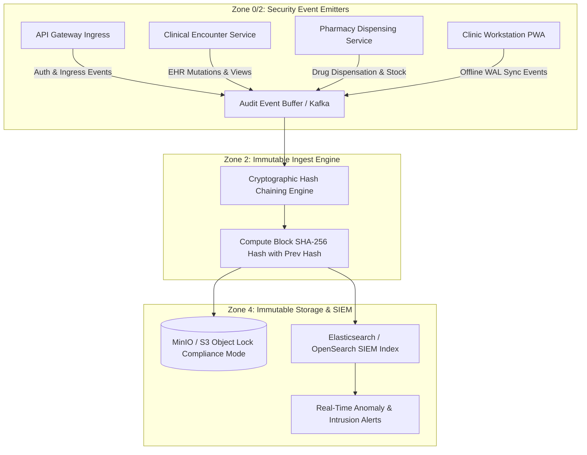

# Immutable Audit Logging & Non-Repudiation Engineering Specification
## Namma Clinic Digital Health & Operations Platform
### Greater Bengaluru Authority (GBA) / BBMP Health Department
**Standard:** WORM Storage / NIST SP 800-92 / ISO 27001 A.12.4 / DPDP Act 2023 | **Status:** APPROVED BASELINE | **Code:** `SEC-DOC-10`

---

## 1. Audit Logging Architecture & Non-Repudiation Philosophy
The Namma Clinic Audit Logging Subsystem provides an immutable, tamper-evident, append-only record of all security-relevant transactions, clinical mutations, health record views, and administrative operations. Designed to satisfy strict healthcare non-repudiation and statutory requirements under the DPDP Act 2023, audit records are protected against tampering or deletion by any system user, including database superusers and cloud platform administrators.

### 1.1 Core Audit Logging Invariants
1. **WORM Storage:** Audit logs are written to an immutable Write-Once-Read-Many (WORM) storage bucket backed by S3 Object Lock in Compliance Mode.
2. **Cryptographic SHA-256 Hash Chaining:** Every audit block embeds the cryptographic hash of the preceding block, creating a verifiable Merkle audit chain that instantly exposes any retroactive deletion or modification.
3. **Comprehensive Actor Attribution:** Every event captures actor ID, primary role, clinic facility ID, municipal ward, workstation MAC address, client IP, UTC timestamp, and before/after mutation diffs.
4. **Patient Access Accountability:** Every view of a patient medical record generates an access log entry, fulfilling citizen rights under the DPDP Act 2023.
5. **Mandatory 10-Year Retention:** Clinical and security audit records are retained for exactly 10 years per statutory healthcare regulatory standards.

### 1.2 WORM Audit Pipeline Architecture Diagram


## 2. Comprehensive Audit Requirements (AUDIT-SEC-001 to AUDIT-SEC-060)
The following 60 controls define the complete audit logging baseline:

### AUDIT-SEC-001
**Title:** Audit Logging Requirement: Staff Authentication & Session Event Logging (Specification 1)
**Control Type:** Detective
**Security Domain:** Immutable Audit Logging & Non-Repudiation
**Priority:** P0 - Critical
**Risk:** High
**Threat:** THREAT-011
**Asset:** TABLE-010 (audit_events) and TABLE-011 (audit_event_actors)
**Actor:** Any System Actor / Staff Member / Automated Daemon
**Precondition:** Security-relevant domain event, mutation, or query executed
**Control Objective:** Capture immutable, non-repudiable audit evidence for staff authentication & session event logging.
**Requirement:** The audit engine shall log every occurrence of staff authentication & session event logging with full actor, IP, timestamp, and payload context.
**Implementation Guidance:** Stream logs asynchronously to immutable WORM append-only S3 bucket with Object Lock.
**Configuration Guidance:** Retain audit logs for 10 years per statutory healthcare compliance; cryptographic SHA-256 chaining.
**Failure Behavior:** Queue locally in WAL if remote audit collector unavailable; alert if queue reaches 80% capacity.
**Monitoring:** Audit pipeline throughput and ingest latency monitored via Prometheus and Vector.
**Audit Event:** AUDIT_RECORD_WRITTEN_AUDIT_SEC_001
**Privacy Impact:** Enables citizen right to know who accessed their medical records under DPDP Act 2023.
**Performance Impact:** Asynchronous event streaming adds < 1ms to API request thread.
**Availability Impact:** Decoupled audit pipeline prevents database lock contention.
**Related Requirement:** SECR-001
**Related Workflow:** WF-001
**Related API:** API-001
**Related Database Entity:** TABLE-010 (audit_events)
**Related Architecture Component:** ARCH-CONT-015 (Immutable Audit Ledger Service)
**Related Threat:** THREAT-011
**Related Test:** SEC-TEST-122
**Acceptance Criteria:** Audit record verifiable against SHA-256 hash chain with zero dropped events.
**Evidence Required:** WORM storage immutability verification reports and audit integrity test runs.
**Owner:** Security Operations Lead
**Lifecycle:** Active Baseline Control
**Status:** PLANNED

### AUDIT-SEC-002
**Title:** Audit Logging Requirement: Authorization Failure & Privilege Rejection (Specification 1)
**Control Type:** Detective
**Security Domain:** Immutable Audit Logging & Non-Repudiation
**Priority:** P0 - Critical
**Risk:** High
**Threat:** THREAT-021
**Asset:** TABLE-010 (audit_events) and TABLE-011 (audit_event_actors)
**Actor:** Any System Actor / Staff Member / Automated Daemon
**Precondition:** Security-relevant domain event, mutation, or query executed
**Control Objective:** Capture immutable, non-repudiable audit evidence for authorization failure & privilege rejection.
**Requirement:** The audit engine shall log every occurrence of authorization failure & privilege rejection with full actor, IP, timestamp, and payload context.
**Implementation Guidance:** Stream logs asynchronously to immutable WORM append-only S3 bucket with Object Lock.
**Configuration Guidance:** Retain audit logs for 10 years per statutory healthcare compliance; cryptographic SHA-256 chaining.
**Failure Behavior:** Queue locally in WAL if remote audit collector unavailable; alert if queue reaches 80% capacity.
**Monitoring:** Audit pipeline throughput and ingest latency monitored via Prometheus and Vector.
**Audit Event:** AUDIT_RECORD_WRITTEN_AUDIT_SEC_002
**Privacy Impact:** Enables citizen right to know who accessed their medical records under DPDP Act 2023.
**Performance Impact:** Asynchronous event streaming adds < 1ms to API request thread.
**Availability Impact:** Decoupled audit pipeline prevents database lock contention.
**Related Requirement:** SECR-002
**Related Workflow:** WF-002
**Related API:** API-002
**Related Database Entity:** TABLE-010 (audit_events)
**Related Architecture Component:** ARCH-CONT-015 (Immutable Audit Ledger Service)
**Related Threat:** THREAT-021
**Related Test:** SEC-TEST-123
**Acceptance Criteria:** Audit record verifiable against SHA-256 hash chain with zero dropped events.
**Evidence Required:** WORM storage immutability verification reports and audit integrity test runs.
**Owner:** Security Operations Lead
**Lifecycle:** Active Baseline Control
**Status:** PLANNED

### AUDIT-SEC-003
**Title:** Audit Logging Requirement: Patient Health Record View Capture (Access Log) (Specification 1)
**Control Type:** Detective
**Security Domain:** Immutable Audit Logging & Non-Repudiation
**Priority:** P0 - Critical
**Risk:** High
**Threat:** THREAT-031
**Asset:** TABLE-010 (audit_events) and TABLE-011 (audit_event_actors)
**Actor:** Any System Actor / Staff Member / Automated Daemon
**Precondition:** Security-relevant domain event, mutation, or query executed
**Control Objective:** Capture immutable, non-repudiable audit evidence for patient health record view capture (access log).
**Requirement:** The audit engine shall log every occurrence of patient health record view capture (access log) with full actor, IP, timestamp, and payload context.
**Implementation Guidance:** Stream logs asynchronously to immutable WORM append-only S3 bucket with Object Lock.
**Configuration Guidance:** Retain audit logs for 10 years per statutory healthcare compliance; cryptographic SHA-256 chaining.
**Failure Behavior:** Queue locally in WAL if remote audit collector unavailable; alert if queue reaches 80% capacity.
**Monitoring:** Audit pipeline throughput and ingest latency monitored via Prometheus and Vector.
**Audit Event:** AUDIT_RECORD_WRITTEN_AUDIT_SEC_003
**Privacy Impact:** Enables citizen right to know who accessed their medical records under DPDP Act 2023.
**Performance Impact:** Asynchronous event streaming adds < 1ms to API request thread.
**Availability Impact:** Decoupled audit pipeline prevents database lock contention.
**Related Requirement:** SECR-003
**Related Workflow:** WF-003
**Related API:** API-003
**Related Database Entity:** TABLE-010 (audit_events)
**Related Architecture Component:** ARCH-CONT-015 (Immutable Audit Ledger Service)
**Related Threat:** THREAT-031
**Related Test:** SEC-TEST-124
**Acceptance Criteria:** Audit record verifiable against SHA-256 hash chain with zero dropped events.
**Evidence Required:** WORM storage immutability verification reports and audit integrity test runs.
**Owner:** Security Operations Lead
**Lifecycle:** Active Baseline Control
**Status:** PLANNED

### AUDIT-SEC-004
**Title:** Audit Logging Requirement: Clinical Encounter & Diagnosis Modification (Specification 1)
**Control Type:** Detective
**Security Domain:** Immutable Audit Logging & Non-Repudiation
**Priority:** P0 - Critical
**Risk:** High
**Threat:** THREAT-041
**Asset:** TABLE-010 (audit_events) and TABLE-011 (audit_event_actors)
**Actor:** Any System Actor / Staff Member / Automated Daemon
**Precondition:** Security-relevant domain event, mutation, or query executed
**Control Objective:** Capture immutable, non-repudiable audit evidence for clinical encounter & diagnosis modification.
**Requirement:** The audit engine shall log every occurrence of clinical encounter & diagnosis modification with full actor, IP, timestamp, and payload context.
**Implementation Guidance:** Stream logs asynchronously to immutable WORM append-only S3 bucket with Object Lock.
**Configuration Guidance:** Retain audit logs for 10 years per statutory healthcare compliance; cryptographic SHA-256 chaining.
**Failure Behavior:** Queue locally in WAL if remote audit collector unavailable; alert if queue reaches 80% capacity.
**Monitoring:** Audit pipeline throughput and ingest latency monitored via Prometheus and Vector.
**Audit Event:** AUDIT_RECORD_WRITTEN_AUDIT_SEC_004
**Privacy Impact:** Enables citizen right to know who accessed their medical records under DPDP Act 2023.
**Performance Impact:** Asynchronous event streaming adds < 1ms to API request thread.
**Availability Impact:** Decoupled audit pipeline prevents database lock contention.
**Related Requirement:** SECR-004
**Related Workflow:** WF-004
**Related API:** API-004
**Related Database Entity:** TABLE-010 (audit_events)
**Related Architecture Component:** ARCH-CONT-015 (Immutable Audit Ledger Service)
**Related Threat:** THREAT-041
**Related Test:** SEC-TEST-125
**Acceptance Criteria:** Audit record verifiable against SHA-256 hash chain with zero dropped events.
**Evidence Required:** WORM storage immutability verification reports and audit integrity test runs.
**Owner:** Security Operations Lead
**Lifecycle:** Active Baseline Control
**Status:** PLANNED

### AUDIT-SEC-005
**Title:** Audit Logging Requirement: Prescription Issuance & Modification Tracking (Specification 1)
**Control Type:** Detective
**Security Domain:** Immutable Audit Logging & Non-Repudiation
**Priority:** P0 - Critical
**Risk:** High
**Threat:** THREAT-051
**Asset:** TABLE-010 (audit_events) and TABLE-011 (audit_event_actors)
**Actor:** Any System Actor / Staff Member / Automated Daemon
**Precondition:** Security-relevant domain event, mutation, or query executed
**Control Objective:** Capture immutable, non-repudiable audit evidence for prescription issuance & modification tracking.
**Requirement:** The audit engine shall log every occurrence of prescription issuance & modification tracking with full actor, IP, timestamp, and payload context.
**Implementation Guidance:** Stream logs asynchronously to immutable WORM append-only S3 bucket with Object Lock.
**Configuration Guidance:** Retain audit logs for 10 years per statutory healthcare compliance; cryptographic SHA-256 chaining.
**Failure Behavior:** Queue locally in WAL if remote audit collector unavailable; alert if queue reaches 80% capacity.
**Monitoring:** Audit pipeline throughput and ingest latency monitored via Prometheus and Vector.
**Audit Event:** AUDIT_RECORD_WRITTEN_AUDIT_SEC_005
**Privacy Impact:** Enables citizen right to know who accessed their medical records under DPDP Act 2023.
**Performance Impact:** Asynchronous event streaming adds < 1ms to API request thread.
**Availability Impact:** Decoupled audit pipeline prevents database lock contention.
**Related Requirement:** SECR-005
**Related Workflow:** WF-005
**Related API:** API-005
**Related Database Entity:** TABLE-010 (audit_events)
**Related Architecture Component:** ARCH-CONT-015 (Immutable Audit Ledger Service)
**Related Threat:** THREAT-051
**Related Test:** SEC-TEST-126
**Acceptance Criteria:** Audit record verifiable against SHA-256 hash chain with zero dropped events.
**Evidence Required:** WORM storage immutability verification reports and audit integrity test runs.
**Owner:** Security Operations Lead
**Lifecycle:** Active Baseline Control
**Status:** PLANNED

### AUDIT-SEC-006
**Title:** Audit Logging Requirement: Pharmacy Dispensation & Batch Allocation Audit (Specification 1)
**Control Type:** Detective
**Security Domain:** Immutable Audit Logging & Non-Repudiation
**Priority:** P0 - Critical
**Risk:** High
**Threat:** THREAT-061
**Asset:** TABLE-010 (audit_events) and TABLE-011 (audit_event_actors)
**Actor:** Any System Actor / Staff Member / Automated Daemon
**Precondition:** Security-relevant domain event, mutation, or query executed
**Control Objective:** Capture immutable, non-repudiable audit evidence for pharmacy dispensation & batch allocation audit.
**Requirement:** The audit engine shall log every occurrence of pharmacy dispensation & batch allocation audit with full actor, IP, timestamp, and payload context.
**Implementation Guidance:** Stream logs asynchronously to immutable WORM append-only S3 bucket with Object Lock.
**Configuration Guidance:** Retain audit logs for 10 years per statutory healthcare compliance; cryptographic SHA-256 chaining.
**Failure Behavior:** Queue locally in WAL if remote audit collector unavailable; alert if queue reaches 80% capacity.
**Monitoring:** Audit pipeline throughput and ingest latency monitored via Prometheus and Vector.
**Audit Event:** AUDIT_RECORD_WRITTEN_AUDIT_SEC_006
**Privacy Impact:** Enables citizen right to know who accessed their medical records under DPDP Act 2023.
**Performance Impact:** Asynchronous event streaming adds < 1ms to API request thread.
**Availability Impact:** Decoupled audit pipeline prevents database lock contention.
**Related Requirement:** SECR-006
**Related Workflow:** WF-006
**Related API:** API-006
**Related Database Entity:** TABLE-010 (audit_events)
**Related Architecture Component:** ARCH-CONT-015 (Immutable Audit Ledger Service)
**Related Threat:** THREAT-061
**Related Test:** SEC-TEST-127
**Acceptance Criteria:** Audit record verifiable against SHA-256 hash chain with zero dropped events.
**Evidence Required:** WORM storage immutability verification reports and audit integrity test runs.
**Owner:** Security Operations Lead
**Lifecycle:** Active Baseline Control
**Status:** PLANNED

### AUDIT-SEC-007
**Title:** Audit Logging Requirement: Inventory Requisition & Adjustment Attribution (Specification 1)
**Control Type:** Detective
**Security Domain:** Immutable Audit Logging & Non-Repudiation
**Priority:** P0 - Critical
**Risk:** High
**Threat:** THREAT-071
**Asset:** TABLE-010 (audit_events) and TABLE-011 (audit_event_actors)
**Actor:** Any System Actor / Staff Member / Automated Daemon
**Precondition:** Security-relevant domain event, mutation, or query executed
**Control Objective:** Capture immutable, non-repudiable audit evidence for inventory requisition & adjustment attribution.
**Requirement:** The audit engine shall log every occurrence of inventory requisition & adjustment attribution with full actor, IP, timestamp, and payload context.
**Implementation Guidance:** Stream logs asynchronously to immutable WORM append-only S3 bucket with Object Lock.
**Configuration Guidance:** Retain audit logs for 10 years per statutory healthcare compliance; cryptographic SHA-256 chaining.
**Failure Behavior:** Queue locally in WAL if remote audit collector unavailable; alert if queue reaches 80% capacity.
**Monitoring:** Audit pipeline throughput and ingest latency monitored via Prometheus and Vector.
**Audit Event:** AUDIT_RECORD_WRITTEN_AUDIT_SEC_007
**Privacy Impact:** Enables citizen right to know who accessed their medical records under DPDP Act 2023.
**Performance Impact:** Asynchronous event streaming adds < 1ms to API request thread.
**Availability Impact:** Decoupled audit pipeline prevents database lock contention.
**Related Requirement:** SECR-007
**Related Workflow:** WF-007
**Related API:** API-007
**Related Database Entity:** TABLE-010 (audit_events)
**Related Architecture Component:** ARCH-CONT-015 (Immutable Audit Ledger Service)
**Related Threat:** THREAT-071
**Related Test:** SEC-TEST-128
**Acceptance Criteria:** Audit record verifiable against SHA-256 hash chain with zero dropped events.
**Evidence Required:** WORM storage immutability verification reports and audit integrity test runs.
**Owner:** Security Operations Lead
**Lifecycle:** Active Baseline Control
**Status:** PLANNED

### AUDIT-SEC-008
**Title:** Audit Logging Requirement: Consent Grant, Renewal, & Revocation Recording (Specification 1)
**Control Type:** Detective
**Security Domain:** Immutable Audit Logging & Non-Repudiation
**Priority:** P0 - Critical
**Risk:** High
**Threat:** THREAT-081
**Asset:** TABLE-010 (audit_events) and TABLE-011 (audit_event_actors)
**Actor:** Any System Actor / Staff Member / Automated Daemon
**Precondition:** Security-relevant domain event, mutation, or query executed
**Control Objective:** Capture immutable, non-repudiable audit evidence for consent grant, renewal, & revocation recording.
**Requirement:** The audit engine shall log every occurrence of consent grant, renewal, & revocation recording with full actor, IP, timestamp, and payload context.
**Implementation Guidance:** Stream logs asynchronously to immutable WORM append-only S3 bucket with Object Lock.
**Configuration Guidance:** Retain audit logs for 10 years per statutory healthcare compliance; cryptographic SHA-256 chaining.
**Failure Behavior:** Queue locally in WAL if remote audit collector unavailable; alert if queue reaches 80% capacity.
**Monitoring:** Audit pipeline throughput and ingest latency monitored via Prometheus and Vector.
**Audit Event:** AUDIT_RECORD_WRITTEN_AUDIT_SEC_008
**Privacy Impact:** Enables citizen right to know who accessed their medical records under DPDP Act 2023.
**Performance Impact:** Asynchronous event streaming adds < 1ms to API request thread.
**Availability Impact:** Decoupled audit pipeline prevents database lock contention.
**Related Requirement:** SECR-008
**Related Workflow:** WF-008
**Related API:** API-008
**Related Database Entity:** TABLE-010 (audit_events)
**Related Architecture Component:** ARCH-CONT-015 (Immutable Audit Ledger Service)
**Related Threat:** THREAT-081
**Related Test:** SEC-TEST-129
**Acceptance Criteria:** Audit record verifiable against SHA-256 hash chain with zero dropped events.
**Evidence Required:** WORM storage immutability verification reports and audit integrity test runs.
**Owner:** Security Operations Lead
**Lifecycle:** Active Baseline Control
**Status:** PLANNED

### AUDIT-SEC-009
**Title:** Audit Logging Requirement: Administrative Configuration & User Role Alteration (Specification 1)
**Control Type:** Detective
**Security Domain:** Immutable Audit Logging & Non-Repudiation
**Priority:** P0 - Critical
**Risk:** High
**Threat:** THREAT-091
**Asset:** TABLE-010 (audit_events) and TABLE-011 (audit_event_actors)
**Actor:** Any System Actor / Staff Member / Automated Daemon
**Precondition:** Security-relevant domain event, mutation, or query executed
**Control Objective:** Capture immutable, non-repudiable audit evidence for administrative configuration & user role alteration.
**Requirement:** The audit engine shall log every occurrence of administrative configuration & user role alteration with full actor, IP, timestamp, and payload context.
**Implementation Guidance:** Stream logs asynchronously to immutable WORM append-only S3 bucket with Object Lock.
**Configuration Guidance:** Retain audit logs for 10 years per statutory healthcare compliance; cryptographic SHA-256 chaining.
**Failure Behavior:** Queue locally in WAL if remote audit collector unavailable; alert if queue reaches 80% capacity.
**Monitoring:** Audit pipeline throughput and ingest latency monitored via Prometheus and Vector.
**Audit Event:** AUDIT_RECORD_WRITTEN_AUDIT_SEC_009
**Privacy Impact:** Enables citizen right to know who accessed their medical records under DPDP Act 2023.
**Performance Impact:** Asynchronous event streaming adds < 1ms to API request thread.
**Availability Impact:** Decoupled audit pipeline prevents database lock contention.
**Related Requirement:** SECR-009
**Related Workflow:** WF-009
**Related API:** API-009
**Related Database Entity:** TABLE-010 (audit_events)
**Related Architecture Component:** ARCH-CONT-015 (Immutable Audit Ledger Service)
**Related Threat:** THREAT-091
**Related Test:** SEC-TEST-130
**Acceptance Criteria:** Audit record verifiable against SHA-256 hash chain with zero dropped events.
**Evidence Required:** WORM storage immutability verification reports and audit integrity test runs.
**Owner:** Security Operations Lead
**Lifecycle:** Active Baseline Control
**Status:** PLANNED

### AUDIT-SEC-010
**Title:** Audit Logging Requirement: Cryptographic WORM SHA-256 Hash Chaining (Specification 1)
**Control Type:** Detective
**Security Domain:** Immutable Audit Logging & Non-Repudiation
**Priority:** P0 - Critical
**Risk:** High
**Threat:** THREAT-001
**Asset:** TABLE-010 (audit_events) and TABLE-011 (audit_event_actors)
**Actor:** Any System Actor / Staff Member / Automated Daemon
**Precondition:** Security-relevant domain event, mutation, or query executed
**Control Objective:** Capture immutable, non-repudiable audit evidence for cryptographic worm sha-256 hash chaining.
**Requirement:** The audit engine shall log every occurrence of cryptographic worm sha-256 hash chaining with full actor, IP, timestamp, and payload context.
**Implementation Guidance:** Stream logs asynchronously to immutable WORM append-only S3 bucket with Object Lock.
**Configuration Guidance:** Retain audit logs for 10 years per statutory healthcare compliance; cryptographic SHA-256 chaining.
**Failure Behavior:** Queue locally in WAL if remote audit collector unavailable; alert if queue reaches 80% capacity.
**Monitoring:** Audit pipeline throughput and ingest latency monitored via Prometheus and Vector.
**Audit Event:** AUDIT_RECORD_WRITTEN_AUDIT_SEC_010
**Privacy Impact:** Enables citizen right to know who accessed their medical records under DPDP Act 2023.
**Performance Impact:** Asynchronous event streaming adds < 1ms to API request thread.
**Availability Impact:** Decoupled audit pipeline prevents database lock contention.
**Related Requirement:** SECR-010
**Related Workflow:** WF-010
**Related API:** API-010
**Related Database Entity:** TABLE-010 (audit_events)
**Related Architecture Component:** ARCH-CONT-015 (Immutable Audit Ledger Service)
**Related Threat:** THREAT-001
**Related Test:** SEC-TEST-131
**Acceptance Criteria:** Audit record verifiable against SHA-256 hash chain with zero dropped events.
**Evidence Required:** WORM storage immutability verification reports and audit integrity test runs.
**Owner:** Security Operations Lead
**Lifecycle:** Active Baseline Control
**Status:** PLANNED

### AUDIT-SEC-011
**Title:** Audit Logging Requirement: Emergency Break-Glass Clinical Access Logging (Specification 1)
**Control Type:** Detective
**Security Domain:** Immutable Audit Logging & Non-Repudiation
**Priority:** P0 - Critical
**Risk:** High
**Threat:** THREAT-011
**Asset:** TABLE-010 (audit_events) and TABLE-011 (audit_event_actors)
**Actor:** Any System Actor / Staff Member / Automated Daemon
**Precondition:** Security-relevant domain event, mutation, or query executed
**Control Objective:** Capture immutable, non-repudiable audit evidence for emergency break-glass clinical access logging.
**Requirement:** The audit engine shall log every occurrence of emergency break-glass clinical access logging with full actor, IP, timestamp, and payload context.
**Implementation Guidance:** Stream logs asynchronously to immutable WORM append-only S3 bucket with Object Lock.
**Configuration Guidance:** Retain audit logs for 10 years per statutory healthcare compliance; cryptographic SHA-256 chaining.
**Failure Behavior:** Queue locally in WAL if remote audit collector unavailable; alert if queue reaches 80% capacity.
**Monitoring:** Audit pipeline throughput and ingest latency monitored via Prometheus and Vector.
**Audit Event:** AUDIT_RECORD_WRITTEN_AUDIT_SEC_011
**Privacy Impact:** Enables citizen right to know who accessed their medical records under DPDP Act 2023.
**Performance Impact:** Asynchronous event streaming adds < 1ms to API request thread.
**Availability Impact:** Decoupled audit pipeline prevents database lock contention.
**Related Requirement:** SECR-011
**Related Workflow:** WF-011
**Related API:** API-011
**Related Database Entity:** TABLE-010 (audit_events)
**Related Architecture Component:** ARCH-CONT-015 (Immutable Audit Ledger Service)
**Related Threat:** THREAT-011
**Related Test:** SEC-TEST-132
**Acceptance Criteria:** Audit record verifiable against SHA-256 hash chain with zero dropped events.
**Evidence Required:** WORM storage immutability verification reports and audit integrity test runs.
**Owner:** Security Operations Lead
**Lifecycle:** Active Baseline Control
**Status:** PLANNED

### AUDIT-SEC-012
**Title:** Audit Logging Requirement: Automated Security Alert & Threat Detection (Specification 1)
**Control Type:** Detective
**Security Domain:** Immutable Audit Logging & Non-Repudiation
**Priority:** P0 - Critical
**Risk:** High
**Threat:** THREAT-021
**Asset:** TABLE-010 (audit_events) and TABLE-011 (audit_event_actors)
**Actor:** Any System Actor / Staff Member / Automated Daemon
**Precondition:** Security-relevant domain event, mutation, or query executed
**Control Objective:** Capture immutable, non-repudiable audit evidence for automated security alert & threat detection.
**Requirement:** The audit engine shall log every occurrence of automated security alert & threat detection with full actor, IP, timestamp, and payload context.
**Implementation Guidance:** Stream logs asynchronously to immutable WORM append-only S3 bucket with Object Lock.
**Configuration Guidance:** Retain audit logs for 10 years per statutory healthcare compliance; cryptographic SHA-256 chaining.
**Failure Behavior:** Queue locally in WAL if remote audit collector unavailable; alert if queue reaches 80% capacity.
**Monitoring:** Audit pipeline throughput and ingest latency monitored via Prometheus and Vector.
**Audit Event:** AUDIT_RECORD_WRITTEN_AUDIT_SEC_012
**Privacy Impact:** Enables citizen right to know who accessed their medical records under DPDP Act 2023.
**Performance Impact:** Asynchronous event streaming adds < 1ms to API request thread.
**Availability Impact:** Decoupled audit pipeline prevents database lock contention.
**Related Requirement:** SECR-012
**Related Workflow:** WF-012
**Related API:** API-012
**Related Database Entity:** TABLE-010 (audit_events)
**Related Architecture Component:** ARCH-CONT-015 (Immutable Audit Ledger Service)
**Related Threat:** THREAT-021
**Related Test:** SEC-TEST-133
**Acceptance Criteria:** Audit record verifiable against SHA-256 hash chain with zero dropped events.
**Evidence Required:** WORM storage immutability verification reports and audit integrity test runs.
**Owner:** Security Operations Lead
**Lifecycle:** Active Baseline Control
**Status:** PLANNED

### AUDIT-SEC-013
**Title:** Audit Logging Requirement: Staff Authentication & Session Event Logging (Specification 2)
**Control Type:** Detective
**Security Domain:** Immutable Audit Logging & Non-Repudiation
**Priority:** P0 - Critical
**Risk:** High
**Threat:** THREAT-031
**Asset:** TABLE-010 (audit_events) and TABLE-011 (audit_event_actors)
**Actor:** Any System Actor / Staff Member / Automated Daemon
**Precondition:** Security-relevant domain event, mutation, or query executed
**Control Objective:** Capture immutable, non-repudiable audit evidence for staff authentication & session event logging.
**Requirement:** The audit engine shall log every occurrence of staff authentication & session event logging with full actor, IP, timestamp, and payload context.
**Implementation Guidance:** Stream logs asynchronously to immutable WORM append-only S3 bucket with Object Lock.
**Configuration Guidance:** Retain audit logs for 10 years per statutory healthcare compliance; cryptographic SHA-256 chaining.
**Failure Behavior:** Queue locally in WAL if remote audit collector unavailable; alert if queue reaches 80% capacity.
**Monitoring:** Audit pipeline throughput and ingest latency monitored via Prometheus and Vector.
**Audit Event:** AUDIT_RECORD_WRITTEN_AUDIT_SEC_013
**Privacy Impact:** Enables citizen right to know who accessed their medical records under DPDP Act 2023.
**Performance Impact:** Asynchronous event streaming adds < 1ms to API request thread.
**Availability Impact:** Decoupled audit pipeline prevents database lock contention.
**Related Requirement:** SECR-013
**Related Workflow:** WF-013
**Related API:** API-013
**Related Database Entity:** TABLE-010 (audit_events)
**Related Architecture Component:** ARCH-CONT-015 (Immutable Audit Ledger Service)
**Related Threat:** THREAT-031
**Related Test:** SEC-TEST-134
**Acceptance Criteria:** Audit record verifiable against SHA-256 hash chain with zero dropped events.
**Evidence Required:** WORM storage immutability verification reports and audit integrity test runs.
**Owner:** Security Operations Lead
**Lifecycle:** Active Baseline Control
**Status:** PLANNED

### AUDIT-SEC-014
**Title:** Audit Logging Requirement: Authorization Failure & Privilege Rejection (Specification 2)
**Control Type:** Detective
**Security Domain:** Immutable Audit Logging & Non-Repudiation
**Priority:** P0 - Critical
**Risk:** High
**Threat:** THREAT-041
**Asset:** TABLE-010 (audit_events) and TABLE-011 (audit_event_actors)
**Actor:** Any System Actor / Staff Member / Automated Daemon
**Precondition:** Security-relevant domain event, mutation, or query executed
**Control Objective:** Capture immutable, non-repudiable audit evidence for authorization failure & privilege rejection.
**Requirement:** The audit engine shall log every occurrence of authorization failure & privilege rejection with full actor, IP, timestamp, and payload context.
**Implementation Guidance:** Stream logs asynchronously to immutable WORM append-only S3 bucket with Object Lock.
**Configuration Guidance:** Retain audit logs for 10 years per statutory healthcare compliance; cryptographic SHA-256 chaining.
**Failure Behavior:** Queue locally in WAL if remote audit collector unavailable; alert if queue reaches 80% capacity.
**Monitoring:** Audit pipeline throughput and ingest latency monitored via Prometheus and Vector.
**Audit Event:** AUDIT_RECORD_WRITTEN_AUDIT_SEC_014
**Privacy Impact:** Enables citizen right to know who accessed their medical records under DPDP Act 2023.
**Performance Impact:** Asynchronous event streaming adds < 1ms to API request thread.
**Availability Impact:** Decoupled audit pipeline prevents database lock contention.
**Related Requirement:** SECR-014
**Related Workflow:** WF-014
**Related API:** API-014
**Related Database Entity:** TABLE-010 (audit_events)
**Related Architecture Component:** ARCH-CONT-015 (Immutable Audit Ledger Service)
**Related Threat:** THREAT-041
**Related Test:** SEC-TEST-135
**Acceptance Criteria:** Audit record verifiable against SHA-256 hash chain with zero dropped events.
**Evidence Required:** WORM storage immutability verification reports and audit integrity test runs.
**Owner:** Security Operations Lead
**Lifecycle:** Active Baseline Control
**Status:** PLANNED

### AUDIT-SEC-015
**Title:** Audit Logging Requirement: Patient Health Record View Capture (Access Log) (Specification 2)
**Control Type:** Detective
**Security Domain:** Immutable Audit Logging & Non-Repudiation
**Priority:** P0 - Critical
**Risk:** High
**Threat:** THREAT-051
**Asset:** TABLE-010 (audit_events) and TABLE-011 (audit_event_actors)
**Actor:** Any System Actor / Staff Member / Automated Daemon
**Precondition:** Security-relevant domain event, mutation, or query executed
**Control Objective:** Capture immutable, non-repudiable audit evidence for patient health record view capture (access log).
**Requirement:** The audit engine shall log every occurrence of patient health record view capture (access log) with full actor, IP, timestamp, and payload context.
**Implementation Guidance:** Stream logs asynchronously to immutable WORM append-only S3 bucket with Object Lock.
**Configuration Guidance:** Retain audit logs for 10 years per statutory healthcare compliance; cryptographic SHA-256 chaining.
**Failure Behavior:** Queue locally in WAL if remote audit collector unavailable; alert if queue reaches 80% capacity.
**Monitoring:** Audit pipeline throughput and ingest latency monitored via Prometheus and Vector.
**Audit Event:** AUDIT_RECORD_WRITTEN_AUDIT_SEC_015
**Privacy Impact:** Enables citizen right to know who accessed their medical records under DPDP Act 2023.
**Performance Impact:** Asynchronous event streaming adds < 1ms to API request thread.
**Availability Impact:** Decoupled audit pipeline prevents database lock contention.
**Related Requirement:** SECR-015
**Related Workflow:** WF-015
**Related API:** API-015
**Related Database Entity:** TABLE-010 (audit_events)
**Related Architecture Component:** ARCH-CONT-015 (Immutable Audit Ledger Service)
**Related Threat:** THREAT-051
**Related Test:** SEC-TEST-136
**Acceptance Criteria:** Audit record verifiable against SHA-256 hash chain with zero dropped events.
**Evidence Required:** WORM storage immutability verification reports and audit integrity test runs.
**Owner:** Security Operations Lead
**Lifecycle:** Active Baseline Control
**Status:** PLANNED

### AUDIT-SEC-016
**Title:** Audit Logging Requirement: Clinical Encounter & Diagnosis Modification (Specification 2)
**Control Type:** Detective
**Security Domain:** Immutable Audit Logging & Non-Repudiation
**Priority:** P0 - Critical
**Risk:** High
**Threat:** THREAT-061
**Asset:** TABLE-010 (audit_events) and TABLE-011 (audit_event_actors)
**Actor:** Any System Actor / Staff Member / Automated Daemon
**Precondition:** Security-relevant domain event, mutation, or query executed
**Control Objective:** Capture immutable, non-repudiable audit evidence for clinical encounter & diagnosis modification.
**Requirement:** The audit engine shall log every occurrence of clinical encounter & diagnosis modification with full actor, IP, timestamp, and payload context.
**Implementation Guidance:** Stream logs asynchronously to immutable WORM append-only S3 bucket with Object Lock.
**Configuration Guidance:** Retain audit logs for 10 years per statutory healthcare compliance; cryptographic SHA-256 chaining.
**Failure Behavior:** Queue locally in WAL if remote audit collector unavailable; alert if queue reaches 80% capacity.
**Monitoring:** Audit pipeline throughput and ingest latency monitored via Prometheus and Vector.
**Audit Event:** AUDIT_RECORD_WRITTEN_AUDIT_SEC_016
**Privacy Impact:** Enables citizen right to know who accessed their medical records under DPDP Act 2023.
**Performance Impact:** Asynchronous event streaming adds < 1ms to API request thread.
**Availability Impact:** Decoupled audit pipeline prevents database lock contention.
**Related Requirement:** SECR-016
**Related Workflow:** WF-016
**Related API:** API-016
**Related Database Entity:** TABLE-010 (audit_events)
**Related Architecture Component:** ARCH-CONT-015 (Immutable Audit Ledger Service)
**Related Threat:** THREAT-061
**Related Test:** SEC-TEST-137
**Acceptance Criteria:** Audit record verifiable against SHA-256 hash chain with zero dropped events.
**Evidence Required:** WORM storage immutability verification reports and audit integrity test runs.
**Owner:** Security Operations Lead
**Lifecycle:** Active Baseline Control
**Status:** PLANNED

### AUDIT-SEC-017
**Title:** Audit Logging Requirement: Prescription Issuance & Modification Tracking (Specification 2)
**Control Type:** Detective
**Security Domain:** Immutable Audit Logging & Non-Repudiation
**Priority:** P0 - Critical
**Risk:** High
**Threat:** THREAT-071
**Asset:** TABLE-010 (audit_events) and TABLE-011 (audit_event_actors)
**Actor:** Any System Actor / Staff Member / Automated Daemon
**Precondition:** Security-relevant domain event, mutation, or query executed
**Control Objective:** Capture immutable, non-repudiable audit evidence for prescription issuance & modification tracking.
**Requirement:** The audit engine shall log every occurrence of prescription issuance & modification tracking with full actor, IP, timestamp, and payload context.
**Implementation Guidance:** Stream logs asynchronously to immutable WORM append-only S3 bucket with Object Lock.
**Configuration Guidance:** Retain audit logs for 10 years per statutory healthcare compliance; cryptographic SHA-256 chaining.
**Failure Behavior:** Queue locally in WAL if remote audit collector unavailable; alert if queue reaches 80% capacity.
**Monitoring:** Audit pipeline throughput and ingest latency monitored via Prometheus and Vector.
**Audit Event:** AUDIT_RECORD_WRITTEN_AUDIT_SEC_017
**Privacy Impact:** Enables citizen right to know who accessed their medical records under DPDP Act 2023.
**Performance Impact:** Asynchronous event streaming adds < 1ms to API request thread.
**Availability Impact:** Decoupled audit pipeline prevents database lock contention.
**Related Requirement:** SECR-017
**Related Workflow:** WF-017
**Related API:** API-017
**Related Database Entity:** TABLE-010 (audit_events)
**Related Architecture Component:** ARCH-CONT-015 (Immutable Audit Ledger Service)
**Related Threat:** THREAT-071
**Related Test:** SEC-TEST-138
**Acceptance Criteria:** Audit record verifiable against SHA-256 hash chain with zero dropped events.
**Evidence Required:** WORM storage immutability verification reports and audit integrity test runs.
**Owner:** Security Operations Lead
**Lifecycle:** Active Baseline Control
**Status:** PLANNED

### AUDIT-SEC-018
**Title:** Audit Logging Requirement: Pharmacy Dispensation & Batch Allocation Audit (Specification 2)
**Control Type:** Detective
**Security Domain:** Immutable Audit Logging & Non-Repudiation
**Priority:** P0 - Critical
**Risk:** High
**Threat:** THREAT-081
**Asset:** TABLE-010 (audit_events) and TABLE-011 (audit_event_actors)
**Actor:** Any System Actor / Staff Member / Automated Daemon
**Precondition:** Security-relevant domain event, mutation, or query executed
**Control Objective:** Capture immutable, non-repudiable audit evidence for pharmacy dispensation & batch allocation audit.
**Requirement:** The audit engine shall log every occurrence of pharmacy dispensation & batch allocation audit with full actor, IP, timestamp, and payload context.
**Implementation Guidance:** Stream logs asynchronously to immutable WORM append-only S3 bucket with Object Lock.
**Configuration Guidance:** Retain audit logs for 10 years per statutory healthcare compliance; cryptographic SHA-256 chaining.
**Failure Behavior:** Queue locally in WAL if remote audit collector unavailable; alert if queue reaches 80% capacity.
**Monitoring:** Audit pipeline throughput and ingest latency monitored via Prometheus and Vector.
**Audit Event:** AUDIT_RECORD_WRITTEN_AUDIT_SEC_018
**Privacy Impact:** Enables citizen right to know who accessed their medical records under DPDP Act 2023.
**Performance Impact:** Asynchronous event streaming adds < 1ms to API request thread.
**Availability Impact:** Decoupled audit pipeline prevents database lock contention.
**Related Requirement:** SECR-018
**Related Workflow:** WF-018
**Related API:** API-018
**Related Database Entity:** TABLE-010 (audit_events)
**Related Architecture Component:** ARCH-CONT-015 (Immutable Audit Ledger Service)
**Related Threat:** THREAT-081
**Related Test:** SEC-TEST-139
**Acceptance Criteria:** Audit record verifiable against SHA-256 hash chain with zero dropped events.
**Evidence Required:** WORM storage immutability verification reports and audit integrity test runs.
**Owner:** Security Operations Lead
**Lifecycle:** Active Baseline Control
**Status:** PLANNED

### AUDIT-SEC-019
**Title:** Audit Logging Requirement: Inventory Requisition & Adjustment Attribution (Specification 2)
**Control Type:** Detective
**Security Domain:** Immutable Audit Logging & Non-Repudiation
**Priority:** P0 - Critical
**Risk:** High
**Threat:** THREAT-091
**Asset:** TABLE-010 (audit_events) and TABLE-011 (audit_event_actors)
**Actor:** Any System Actor / Staff Member / Automated Daemon
**Precondition:** Security-relevant domain event, mutation, or query executed
**Control Objective:** Capture immutable, non-repudiable audit evidence for inventory requisition & adjustment attribution.
**Requirement:** The audit engine shall log every occurrence of inventory requisition & adjustment attribution with full actor, IP, timestamp, and payload context.
**Implementation Guidance:** Stream logs asynchronously to immutable WORM append-only S3 bucket with Object Lock.
**Configuration Guidance:** Retain audit logs for 10 years per statutory healthcare compliance; cryptographic SHA-256 chaining.
**Failure Behavior:** Queue locally in WAL if remote audit collector unavailable; alert if queue reaches 80% capacity.
**Monitoring:** Audit pipeline throughput and ingest latency monitored via Prometheus and Vector.
**Audit Event:** AUDIT_RECORD_WRITTEN_AUDIT_SEC_019
**Privacy Impact:** Enables citizen right to know who accessed their medical records under DPDP Act 2023.
**Performance Impact:** Asynchronous event streaming adds < 1ms to API request thread.
**Availability Impact:** Decoupled audit pipeline prevents database lock contention.
**Related Requirement:** SECR-019
**Related Workflow:** WF-019
**Related API:** API-019
**Related Database Entity:** TABLE-010 (audit_events)
**Related Architecture Component:** ARCH-CONT-015 (Immutable Audit Ledger Service)
**Related Threat:** THREAT-091
**Related Test:** SEC-TEST-140
**Acceptance Criteria:** Audit record verifiable against SHA-256 hash chain with zero dropped events.
**Evidence Required:** WORM storage immutability verification reports and audit integrity test runs.
**Owner:** Security Operations Lead
**Lifecycle:** Active Baseline Control
**Status:** PLANNED

### AUDIT-SEC-020
**Title:** Audit Logging Requirement: Consent Grant, Renewal, & Revocation Recording (Specification 2)
**Control Type:** Detective
**Security Domain:** Immutable Audit Logging & Non-Repudiation
**Priority:** P0 - Critical
**Risk:** High
**Threat:** THREAT-001
**Asset:** TABLE-010 (audit_events) and TABLE-011 (audit_event_actors)
**Actor:** Any System Actor / Staff Member / Automated Daemon
**Precondition:** Security-relevant domain event, mutation, or query executed
**Control Objective:** Capture immutable, non-repudiable audit evidence for consent grant, renewal, & revocation recording.
**Requirement:** The audit engine shall log every occurrence of consent grant, renewal, & revocation recording with full actor, IP, timestamp, and payload context.
**Implementation Guidance:** Stream logs asynchronously to immutable WORM append-only S3 bucket with Object Lock.
**Configuration Guidance:** Retain audit logs for 10 years per statutory healthcare compliance; cryptographic SHA-256 chaining.
**Failure Behavior:** Queue locally in WAL if remote audit collector unavailable; alert if queue reaches 80% capacity.
**Monitoring:** Audit pipeline throughput and ingest latency monitored via Prometheus and Vector.
**Audit Event:** AUDIT_RECORD_WRITTEN_AUDIT_SEC_020
**Privacy Impact:** Enables citizen right to know who accessed their medical records under DPDP Act 2023.
**Performance Impact:** Asynchronous event streaming adds < 1ms to API request thread.
**Availability Impact:** Decoupled audit pipeline prevents database lock contention.
**Related Requirement:** SECR-020
**Related Workflow:** WF-020
**Related API:** API-020
**Related Database Entity:** TABLE-010 (audit_events)
**Related Architecture Component:** ARCH-CONT-015 (Immutable Audit Ledger Service)
**Related Threat:** THREAT-001
**Related Test:** SEC-TEST-141
**Acceptance Criteria:** Audit record verifiable against SHA-256 hash chain with zero dropped events.
**Evidence Required:** WORM storage immutability verification reports and audit integrity test runs.
**Owner:** Security Operations Lead
**Lifecycle:** Active Baseline Control
**Status:** PLANNED

### AUDIT-SEC-021
**Title:** Audit Logging Requirement: Administrative Configuration & User Role Alteration (Specification 2)
**Control Type:** Detective
**Security Domain:** Immutable Audit Logging & Non-Repudiation
**Priority:** P0 - Critical
**Risk:** High
**Threat:** THREAT-011
**Asset:** TABLE-010 (audit_events) and TABLE-011 (audit_event_actors)
**Actor:** Any System Actor / Staff Member / Automated Daemon
**Precondition:** Security-relevant domain event, mutation, or query executed
**Control Objective:** Capture immutable, non-repudiable audit evidence for administrative configuration & user role alteration.
**Requirement:** The audit engine shall log every occurrence of administrative configuration & user role alteration with full actor, IP, timestamp, and payload context.
**Implementation Guidance:** Stream logs asynchronously to immutable WORM append-only S3 bucket with Object Lock.
**Configuration Guidance:** Retain audit logs for 10 years per statutory healthcare compliance; cryptographic SHA-256 chaining.
**Failure Behavior:** Queue locally in WAL if remote audit collector unavailable; alert if queue reaches 80% capacity.
**Monitoring:** Audit pipeline throughput and ingest latency monitored via Prometheus and Vector.
**Audit Event:** AUDIT_RECORD_WRITTEN_AUDIT_SEC_021
**Privacy Impact:** Enables citizen right to know who accessed their medical records under DPDP Act 2023.
**Performance Impact:** Asynchronous event streaming adds < 1ms to API request thread.
**Availability Impact:** Decoupled audit pipeline prevents database lock contention.
**Related Requirement:** SECR-021
**Related Workflow:** WF-021
**Related API:** API-021
**Related Database Entity:** TABLE-010 (audit_events)
**Related Architecture Component:** ARCH-CONT-015 (Immutable Audit Ledger Service)
**Related Threat:** THREAT-011
**Related Test:** SEC-TEST-142
**Acceptance Criteria:** Audit record verifiable against SHA-256 hash chain with zero dropped events.
**Evidence Required:** WORM storage immutability verification reports and audit integrity test runs.
**Owner:** Security Operations Lead
**Lifecycle:** Active Baseline Control
**Status:** PLANNED

### AUDIT-SEC-022
**Title:** Audit Logging Requirement: Cryptographic WORM SHA-256 Hash Chaining (Specification 2)
**Control Type:** Detective
**Security Domain:** Immutable Audit Logging & Non-Repudiation
**Priority:** P0 - Critical
**Risk:** High
**Threat:** THREAT-021
**Asset:** TABLE-010 (audit_events) and TABLE-011 (audit_event_actors)
**Actor:** Any System Actor / Staff Member / Automated Daemon
**Precondition:** Security-relevant domain event, mutation, or query executed
**Control Objective:** Capture immutable, non-repudiable audit evidence for cryptographic worm sha-256 hash chaining.
**Requirement:** The audit engine shall log every occurrence of cryptographic worm sha-256 hash chaining with full actor, IP, timestamp, and payload context.
**Implementation Guidance:** Stream logs asynchronously to immutable WORM append-only S3 bucket with Object Lock.
**Configuration Guidance:** Retain audit logs for 10 years per statutory healthcare compliance; cryptographic SHA-256 chaining.
**Failure Behavior:** Queue locally in WAL if remote audit collector unavailable; alert if queue reaches 80% capacity.
**Monitoring:** Audit pipeline throughput and ingest latency monitored via Prometheus and Vector.
**Audit Event:** AUDIT_RECORD_WRITTEN_AUDIT_SEC_022
**Privacy Impact:** Enables citizen right to know who accessed their medical records under DPDP Act 2023.
**Performance Impact:** Asynchronous event streaming adds < 1ms to API request thread.
**Availability Impact:** Decoupled audit pipeline prevents database lock contention.
**Related Requirement:** SECR-022
**Related Workflow:** WF-022
**Related API:** API-022
**Related Database Entity:** TABLE-010 (audit_events)
**Related Architecture Component:** ARCH-CONT-015 (Immutable Audit Ledger Service)
**Related Threat:** THREAT-021
**Related Test:** SEC-TEST-143
**Acceptance Criteria:** Audit record verifiable against SHA-256 hash chain with zero dropped events.
**Evidence Required:** WORM storage immutability verification reports and audit integrity test runs.
**Owner:** Security Operations Lead
**Lifecycle:** Active Baseline Control
**Status:** PLANNED

### AUDIT-SEC-023
**Title:** Audit Logging Requirement: Emergency Break-Glass Clinical Access Logging (Specification 2)
**Control Type:** Detective
**Security Domain:** Immutable Audit Logging & Non-Repudiation
**Priority:** P0 - Critical
**Risk:** High
**Threat:** THREAT-031
**Asset:** TABLE-010 (audit_events) and TABLE-011 (audit_event_actors)
**Actor:** Any System Actor / Staff Member / Automated Daemon
**Precondition:** Security-relevant domain event, mutation, or query executed
**Control Objective:** Capture immutable, non-repudiable audit evidence for emergency break-glass clinical access logging.
**Requirement:** The audit engine shall log every occurrence of emergency break-glass clinical access logging with full actor, IP, timestamp, and payload context.
**Implementation Guidance:** Stream logs asynchronously to immutable WORM append-only S3 bucket with Object Lock.
**Configuration Guidance:** Retain audit logs for 10 years per statutory healthcare compliance; cryptographic SHA-256 chaining.
**Failure Behavior:** Queue locally in WAL if remote audit collector unavailable; alert if queue reaches 80% capacity.
**Monitoring:** Audit pipeline throughput and ingest latency monitored via Prometheus and Vector.
**Audit Event:** AUDIT_RECORD_WRITTEN_AUDIT_SEC_023
**Privacy Impact:** Enables citizen right to know who accessed their medical records under DPDP Act 2023.
**Performance Impact:** Asynchronous event streaming adds < 1ms to API request thread.
**Availability Impact:** Decoupled audit pipeline prevents database lock contention.
**Related Requirement:** SECR-023
**Related Workflow:** WF-023
**Related API:** API-023
**Related Database Entity:** TABLE-010 (audit_events)
**Related Architecture Component:** ARCH-CONT-015 (Immutable Audit Ledger Service)
**Related Threat:** THREAT-031
**Related Test:** SEC-TEST-144
**Acceptance Criteria:** Audit record verifiable against SHA-256 hash chain with zero dropped events.
**Evidence Required:** WORM storage immutability verification reports and audit integrity test runs.
**Owner:** Security Operations Lead
**Lifecycle:** Active Baseline Control
**Status:** PLANNED

### AUDIT-SEC-024
**Title:** Audit Logging Requirement: Automated Security Alert & Threat Detection (Specification 2)
**Control Type:** Detective
**Security Domain:** Immutable Audit Logging & Non-Repudiation
**Priority:** P0 - Critical
**Risk:** High
**Threat:** THREAT-041
**Asset:** TABLE-010 (audit_events) and TABLE-011 (audit_event_actors)
**Actor:** Any System Actor / Staff Member / Automated Daemon
**Precondition:** Security-relevant domain event, mutation, or query executed
**Control Objective:** Capture immutable, non-repudiable audit evidence for automated security alert & threat detection.
**Requirement:** The audit engine shall log every occurrence of automated security alert & threat detection with full actor, IP, timestamp, and payload context.
**Implementation Guidance:** Stream logs asynchronously to immutable WORM append-only S3 bucket with Object Lock.
**Configuration Guidance:** Retain audit logs for 10 years per statutory healthcare compliance; cryptographic SHA-256 chaining.
**Failure Behavior:** Queue locally in WAL if remote audit collector unavailable; alert if queue reaches 80% capacity.
**Monitoring:** Audit pipeline throughput and ingest latency monitored via Prometheus and Vector.
**Audit Event:** AUDIT_RECORD_WRITTEN_AUDIT_SEC_024
**Privacy Impact:** Enables citizen right to know who accessed their medical records under DPDP Act 2023.
**Performance Impact:** Asynchronous event streaming adds < 1ms to API request thread.
**Availability Impact:** Decoupled audit pipeline prevents database lock contention.
**Related Requirement:** SECR-024
**Related Workflow:** WF-024
**Related API:** API-024
**Related Database Entity:** TABLE-010 (audit_events)
**Related Architecture Component:** ARCH-CONT-015 (Immutable Audit Ledger Service)
**Related Threat:** THREAT-041
**Related Test:** SEC-TEST-145
**Acceptance Criteria:** Audit record verifiable against SHA-256 hash chain with zero dropped events.
**Evidence Required:** WORM storage immutability verification reports and audit integrity test runs.
**Owner:** Security Operations Lead
**Lifecycle:** Active Baseline Control
**Status:** PLANNED

### AUDIT-SEC-025
**Title:** Audit Logging Requirement: Staff Authentication & Session Event Logging (Specification 3)
**Control Type:** Detective
**Security Domain:** Immutable Audit Logging & Non-Repudiation
**Priority:** P0 - Critical
**Risk:** High
**Threat:** THREAT-051
**Asset:** TABLE-010 (audit_events) and TABLE-011 (audit_event_actors)
**Actor:** Any System Actor / Staff Member / Automated Daemon
**Precondition:** Security-relevant domain event, mutation, or query executed
**Control Objective:** Capture immutable, non-repudiable audit evidence for staff authentication & session event logging.
**Requirement:** The audit engine shall log every occurrence of staff authentication & session event logging with full actor, IP, timestamp, and payload context.
**Implementation Guidance:** Stream logs asynchronously to immutable WORM append-only S3 bucket with Object Lock.
**Configuration Guidance:** Retain audit logs for 10 years per statutory healthcare compliance; cryptographic SHA-256 chaining.
**Failure Behavior:** Queue locally in WAL if remote audit collector unavailable; alert if queue reaches 80% capacity.
**Monitoring:** Audit pipeline throughput and ingest latency monitored via Prometheus and Vector.
**Audit Event:** AUDIT_RECORD_WRITTEN_AUDIT_SEC_025
**Privacy Impact:** Enables citizen right to know who accessed their medical records under DPDP Act 2023.
**Performance Impact:** Asynchronous event streaming adds < 1ms to API request thread.
**Availability Impact:** Decoupled audit pipeline prevents database lock contention.
**Related Requirement:** SECR-025
**Related Workflow:** WF-025
**Related API:** API-025
**Related Database Entity:** TABLE-010 (audit_events)
**Related Architecture Component:** ARCH-CONT-015 (Immutable Audit Ledger Service)
**Related Threat:** THREAT-051
**Related Test:** SEC-TEST-146
**Acceptance Criteria:** Audit record verifiable against SHA-256 hash chain with zero dropped events.
**Evidence Required:** WORM storage immutability verification reports and audit integrity test runs.
**Owner:** Security Operations Lead
**Lifecycle:** Active Baseline Control
**Status:** PLANNED

### AUDIT-SEC-026
**Title:** Audit Logging Requirement: Authorization Failure & Privilege Rejection (Specification 3)
**Control Type:** Detective
**Security Domain:** Immutable Audit Logging & Non-Repudiation
**Priority:** P0 - Critical
**Risk:** High
**Threat:** THREAT-061
**Asset:** TABLE-010 (audit_events) and TABLE-011 (audit_event_actors)
**Actor:** Any System Actor / Staff Member / Automated Daemon
**Precondition:** Security-relevant domain event, mutation, or query executed
**Control Objective:** Capture immutable, non-repudiable audit evidence for authorization failure & privilege rejection.
**Requirement:** The audit engine shall log every occurrence of authorization failure & privilege rejection with full actor, IP, timestamp, and payload context.
**Implementation Guidance:** Stream logs asynchronously to immutable WORM append-only S3 bucket with Object Lock.
**Configuration Guidance:** Retain audit logs for 10 years per statutory healthcare compliance; cryptographic SHA-256 chaining.
**Failure Behavior:** Queue locally in WAL if remote audit collector unavailable; alert if queue reaches 80% capacity.
**Monitoring:** Audit pipeline throughput and ingest latency monitored via Prometheus and Vector.
**Audit Event:** AUDIT_RECORD_WRITTEN_AUDIT_SEC_026
**Privacy Impact:** Enables citizen right to know who accessed their medical records under DPDP Act 2023.
**Performance Impact:** Asynchronous event streaming adds < 1ms to API request thread.
**Availability Impact:** Decoupled audit pipeline prevents database lock contention.
**Related Requirement:** SECR-026
**Related Workflow:** WF-026
**Related API:** API-026
**Related Database Entity:** TABLE-010 (audit_events)
**Related Architecture Component:** ARCH-CONT-015 (Immutable Audit Ledger Service)
**Related Threat:** THREAT-061
**Related Test:** SEC-TEST-147
**Acceptance Criteria:** Audit record verifiable against SHA-256 hash chain with zero dropped events.
**Evidence Required:** WORM storage immutability verification reports and audit integrity test runs.
**Owner:** Security Operations Lead
**Lifecycle:** Active Baseline Control
**Status:** PLANNED

### AUDIT-SEC-027
**Title:** Audit Logging Requirement: Patient Health Record View Capture (Access Log) (Specification 3)
**Control Type:** Detective
**Security Domain:** Immutable Audit Logging & Non-Repudiation
**Priority:** P0 - Critical
**Risk:** High
**Threat:** THREAT-071
**Asset:** TABLE-010 (audit_events) and TABLE-011 (audit_event_actors)
**Actor:** Any System Actor / Staff Member / Automated Daemon
**Precondition:** Security-relevant domain event, mutation, or query executed
**Control Objective:** Capture immutable, non-repudiable audit evidence for patient health record view capture (access log).
**Requirement:** The audit engine shall log every occurrence of patient health record view capture (access log) with full actor, IP, timestamp, and payload context.
**Implementation Guidance:** Stream logs asynchronously to immutable WORM append-only S3 bucket with Object Lock.
**Configuration Guidance:** Retain audit logs for 10 years per statutory healthcare compliance; cryptographic SHA-256 chaining.
**Failure Behavior:** Queue locally in WAL if remote audit collector unavailable; alert if queue reaches 80% capacity.
**Monitoring:** Audit pipeline throughput and ingest latency monitored via Prometheus and Vector.
**Audit Event:** AUDIT_RECORD_WRITTEN_AUDIT_SEC_027
**Privacy Impact:** Enables citizen right to know who accessed their medical records under DPDP Act 2023.
**Performance Impact:** Asynchronous event streaming adds < 1ms to API request thread.
**Availability Impact:** Decoupled audit pipeline prevents database lock contention.
**Related Requirement:** SECR-027
**Related Workflow:** WF-027
**Related API:** API-027
**Related Database Entity:** TABLE-010 (audit_events)
**Related Architecture Component:** ARCH-CONT-015 (Immutable Audit Ledger Service)
**Related Threat:** THREAT-071
**Related Test:** SEC-TEST-148
**Acceptance Criteria:** Audit record verifiable against SHA-256 hash chain with zero dropped events.
**Evidence Required:** WORM storage immutability verification reports and audit integrity test runs.
**Owner:** Security Operations Lead
**Lifecycle:** Active Baseline Control
**Status:** PLANNED

### AUDIT-SEC-028
**Title:** Audit Logging Requirement: Clinical Encounter & Diagnosis Modification (Specification 3)
**Control Type:** Detective
**Security Domain:** Immutable Audit Logging & Non-Repudiation
**Priority:** P0 - Critical
**Risk:** High
**Threat:** THREAT-081
**Asset:** TABLE-010 (audit_events) and TABLE-011 (audit_event_actors)
**Actor:** Any System Actor / Staff Member / Automated Daemon
**Precondition:** Security-relevant domain event, mutation, or query executed
**Control Objective:** Capture immutable, non-repudiable audit evidence for clinical encounter & diagnosis modification.
**Requirement:** The audit engine shall log every occurrence of clinical encounter & diagnosis modification with full actor, IP, timestamp, and payload context.
**Implementation Guidance:** Stream logs asynchronously to immutable WORM append-only S3 bucket with Object Lock.
**Configuration Guidance:** Retain audit logs for 10 years per statutory healthcare compliance; cryptographic SHA-256 chaining.
**Failure Behavior:** Queue locally in WAL if remote audit collector unavailable; alert if queue reaches 80% capacity.
**Monitoring:** Audit pipeline throughput and ingest latency monitored via Prometheus and Vector.
**Audit Event:** AUDIT_RECORD_WRITTEN_AUDIT_SEC_028
**Privacy Impact:** Enables citizen right to know who accessed their medical records under DPDP Act 2023.
**Performance Impact:** Asynchronous event streaming adds < 1ms to API request thread.
**Availability Impact:** Decoupled audit pipeline prevents database lock contention.
**Related Requirement:** SECR-028
**Related Workflow:** WF-028
**Related API:** API-028
**Related Database Entity:** TABLE-010 (audit_events)
**Related Architecture Component:** ARCH-CONT-015 (Immutable Audit Ledger Service)
**Related Threat:** THREAT-081
**Related Test:** SEC-TEST-149
**Acceptance Criteria:** Audit record verifiable against SHA-256 hash chain with zero dropped events.
**Evidence Required:** WORM storage immutability verification reports and audit integrity test runs.
**Owner:** Security Operations Lead
**Lifecycle:** Active Baseline Control
**Status:** PLANNED

### AUDIT-SEC-029
**Title:** Audit Logging Requirement: Prescription Issuance & Modification Tracking (Specification 3)
**Control Type:** Detective
**Security Domain:** Immutable Audit Logging & Non-Repudiation
**Priority:** P0 - Critical
**Risk:** High
**Threat:** THREAT-091
**Asset:** TABLE-010 (audit_events) and TABLE-011 (audit_event_actors)
**Actor:** Any System Actor / Staff Member / Automated Daemon
**Precondition:** Security-relevant domain event, mutation, or query executed
**Control Objective:** Capture immutable, non-repudiable audit evidence for prescription issuance & modification tracking.
**Requirement:** The audit engine shall log every occurrence of prescription issuance & modification tracking with full actor, IP, timestamp, and payload context.
**Implementation Guidance:** Stream logs asynchronously to immutable WORM append-only S3 bucket with Object Lock.
**Configuration Guidance:** Retain audit logs for 10 years per statutory healthcare compliance; cryptographic SHA-256 chaining.
**Failure Behavior:** Queue locally in WAL if remote audit collector unavailable; alert if queue reaches 80% capacity.
**Monitoring:** Audit pipeline throughput and ingest latency monitored via Prometheus and Vector.
**Audit Event:** AUDIT_RECORD_WRITTEN_AUDIT_SEC_029
**Privacy Impact:** Enables citizen right to know who accessed their medical records under DPDP Act 2023.
**Performance Impact:** Asynchronous event streaming adds < 1ms to API request thread.
**Availability Impact:** Decoupled audit pipeline prevents database lock contention.
**Related Requirement:** SECR-029
**Related Workflow:** WF-029
**Related API:** API-029
**Related Database Entity:** TABLE-010 (audit_events)
**Related Architecture Component:** ARCH-CONT-015 (Immutable Audit Ledger Service)
**Related Threat:** THREAT-091
**Related Test:** SEC-TEST-150
**Acceptance Criteria:** Audit record verifiable against SHA-256 hash chain with zero dropped events.
**Evidence Required:** WORM storage immutability verification reports and audit integrity test runs.
**Owner:** Security Operations Lead
**Lifecycle:** Active Baseline Control
**Status:** PLANNED

### AUDIT-SEC-030
**Title:** Audit Logging Requirement: Pharmacy Dispensation & Batch Allocation Audit (Specification 3)
**Control Type:** Detective
**Security Domain:** Immutable Audit Logging & Non-Repudiation
**Priority:** P0 - Critical
**Risk:** High
**Threat:** THREAT-001
**Asset:** TABLE-010 (audit_events) and TABLE-011 (audit_event_actors)
**Actor:** Any System Actor / Staff Member / Automated Daemon
**Precondition:** Security-relevant domain event, mutation, or query executed
**Control Objective:** Capture immutable, non-repudiable audit evidence for pharmacy dispensation & batch allocation audit.
**Requirement:** The audit engine shall log every occurrence of pharmacy dispensation & batch allocation audit with full actor, IP, timestamp, and payload context.
**Implementation Guidance:** Stream logs asynchronously to immutable WORM append-only S3 bucket with Object Lock.
**Configuration Guidance:** Retain audit logs for 10 years per statutory healthcare compliance; cryptographic SHA-256 chaining.
**Failure Behavior:** Queue locally in WAL if remote audit collector unavailable; alert if queue reaches 80% capacity.
**Monitoring:** Audit pipeline throughput and ingest latency monitored via Prometheus and Vector.
**Audit Event:** AUDIT_RECORD_WRITTEN_AUDIT_SEC_030
**Privacy Impact:** Enables citizen right to know who accessed their medical records under DPDP Act 2023.
**Performance Impact:** Asynchronous event streaming adds < 1ms to API request thread.
**Availability Impact:** Decoupled audit pipeline prevents database lock contention.
**Related Requirement:** SECR-030
**Related Workflow:** WF-030
**Related API:** API-030
**Related Database Entity:** TABLE-010 (audit_events)
**Related Architecture Component:** ARCH-CONT-015 (Immutable Audit Ledger Service)
**Related Threat:** THREAT-001
**Related Test:** SEC-TEST-001
**Acceptance Criteria:** Audit record verifiable against SHA-256 hash chain with zero dropped events.
**Evidence Required:** WORM storage immutability verification reports and audit integrity test runs.
**Owner:** Security Operations Lead
**Lifecycle:** Active Baseline Control
**Status:** PLANNED

### AUDIT-SEC-031
**Title:** Audit Logging Requirement: Inventory Requisition & Adjustment Attribution (Specification 3)
**Control Type:** Detective
**Security Domain:** Immutable Audit Logging & Non-Repudiation
**Priority:** P1 - High
**Risk:** High
**Threat:** THREAT-011
**Asset:** TABLE-010 (audit_events) and TABLE-011 (audit_event_actors)
**Actor:** Any System Actor / Staff Member / Automated Daemon
**Precondition:** Security-relevant domain event, mutation, or query executed
**Control Objective:** Capture immutable, non-repudiable audit evidence for inventory requisition & adjustment attribution.
**Requirement:** The audit engine shall log every occurrence of inventory requisition & adjustment attribution with full actor, IP, timestamp, and payload context.
**Implementation Guidance:** Stream logs asynchronously to immutable WORM append-only S3 bucket with Object Lock.
**Configuration Guidance:** Retain audit logs for 10 years per statutory healthcare compliance; cryptographic SHA-256 chaining.
**Failure Behavior:** Queue locally in WAL if remote audit collector unavailable; alert if queue reaches 80% capacity.
**Monitoring:** Audit pipeline throughput and ingest latency monitored via Prometheus and Vector.
**Audit Event:** AUDIT_RECORD_WRITTEN_AUDIT_SEC_031
**Privacy Impact:** Enables citizen right to know who accessed their medical records under DPDP Act 2023.
**Performance Impact:** Asynchronous event streaming adds < 1ms to API request thread.
**Availability Impact:** Decoupled audit pipeline prevents database lock contention.
**Related Requirement:** SECR-001
**Related Workflow:** WF-001
**Related API:** API-031
**Related Database Entity:** TABLE-010 (audit_events)
**Related Architecture Component:** ARCH-CONT-015 (Immutable Audit Ledger Service)
**Related Threat:** THREAT-011
**Related Test:** SEC-TEST-002
**Acceptance Criteria:** Audit record verifiable against SHA-256 hash chain with zero dropped events.
**Evidence Required:** WORM storage immutability verification reports and audit integrity test runs.
**Owner:** Security Operations Lead
**Lifecycle:** Active Baseline Control
**Status:** PLANNED

### AUDIT-SEC-032
**Title:** Audit Logging Requirement: Consent Grant, Renewal, & Revocation Recording (Specification 3)
**Control Type:** Detective
**Security Domain:** Immutable Audit Logging & Non-Repudiation
**Priority:** P1 - High
**Risk:** High
**Threat:** THREAT-021
**Asset:** TABLE-010 (audit_events) and TABLE-011 (audit_event_actors)
**Actor:** Any System Actor / Staff Member / Automated Daemon
**Precondition:** Security-relevant domain event, mutation, or query executed
**Control Objective:** Capture immutable, non-repudiable audit evidence for consent grant, renewal, & revocation recording.
**Requirement:** The audit engine shall log every occurrence of consent grant, renewal, & revocation recording with full actor, IP, timestamp, and payload context.
**Implementation Guidance:** Stream logs asynchronously to immutable WORM append-only S3 bucket with Object Lock.
**Configuration Guidance:** Retain audit logs for 10 years per statutory healthcare compliance; cryptographic SHA-256 chaining.
**Failure Behavior:** Queue locally in WAL if remote audit collector unavailable; alert if queue reaches 80% capacity.
**Monitoring:** Audit pipeline throughput and ingest latency monitored via Prometheus and Vector.
**Audit Event:** AUDIT_RECORD_WRITTEN_AUDIT_SEC_032
**Privacy Impact:** Enables citizen right to know who accessed their medical records under DPDP Act 2023.
**Performance Impact:** Asynchronous event streaming adds < 1ms to API request thread.
**Availability Impact:** Decoupled audit pipeline prevents database lock contention.
**Related Requirement:** SECR-002
**Related Workflow:** WF-002
**Related API:** API-032
**Related Database Entity:** TABLE-010 (audit_events)
**Related Architecture Component:** ARCH-CONT-015 (Immutable Audit Ledger Service)
**Related Threat:** THREAT-021
**Related Test:** SEC-TEST-003
**Acceptance Criteria:** Audit record verifiable against SHA-256 hash chain with zero dropped events.
**Evidence Required:** WORM storage immutability verification reports and audit integrity test runs.
**Owner:** Security Operations Lead
**Lifecycle:** Active Baseline Control
**Status:** PLANNED

### AUDIT-SEC-033
**Title:** Audit Logging Requirement: Administrative Configuration & User Role Alteration (Specification 3)
**Control Type:** Detective
**Security Domain:** Immutable Audit Logging & Non-Repudiation
**Priority:** P1 - High
**Risk:** High
**Threat:** THREAT-031
**Asset:** TABLE-010 (audit_events) and TABLE-011 (audit_event_actors)
**Actor:** Any System Actor / Staff Member / Automated Daemon
**Precondition:** Security-relevant domain event, mutation, or query executed
**Control Objective:** Capture immutable, non-repudiable audit evidence for administrative configuration & user role alteration.
**Requirement:** The audit engine shall log every occurrence of administrative configuration & user role alteration with full actor, IP, timestamp, and payload context.
**Implementation Guidance:** Stream logs asynchronously to immutable WORM append-only S3 bucket with Object Lock.
**Configuration Guidance:** Retain audit logs for 10 years per statutory healthcare compliance; cryptographic SHA-256 chaining.
**Failure Behavior:** Queue locally in WAL if remote audit collector unavailable; alert if queue reaches 80% capacity.
**Monitoring:** Audit pipeline throughput and ingest latency monitored via Prometheus and Vector.
**Audit Event:** AUDIT_RECORD_WRITTEN_AUDIT_SEC_033
**Privacy Impact:** Enables citizen right to know who accessed their medical records under DPDP Act 2023.
**Performance Impact:** Asynchronous event streaming adds < 1ms to API request thread.
**Availability Impact:** Decoupled audit pipeline prevents database lock contention.
**Related Requirement:** SECR-003
**Related Workflow:** WF-003
**Related API:** API-033
**Related Database Entity:** TABLE-010 (audit_events)
**Related Architecture Component:** ARCH-CONT-015 (Immutable Audit Ledger Service)
**Related Threat:** THREAT-031
**Related Test:** SEC-TEST-004
**Acceptance Criteria:** Audit record verifiable against SHA-256 hash chain with zero dropped events.
**Evidence Required:** WORM storage immutability verification reports and audit integrity test runs.
**Owner:** Security Operations Lead
**Lifecycle:** Active Baseline Control
**Status:** PLANNED

### AUDIT-SEC-034
**Title:** Audit Logging Requirement: Cryptographic WORM SHA-256 Hash Chaining (Specification 3)
**Control Type:** Detective
**Security Domain:** Immutable Audit Logging & Non-Repudiation
**Priority:** P1 - High
**Risk:** High
**Threat:** THREAT-041
**Asset:** TABLE-010 (audit_events) and TABLE-011 (audit_event_actors)
**Actor:** Any System Actor / Staff Member / Automated Daemon
**Precondition:** Security-relevant domain event, mutation, or query executed
**Control Objective:** Capture immutable, non-repudiable audit evidence for cryptographic worm sha-256 hash chaining.
**Requirement:** The audit engine shall log every occurrence of cryptographic worm sha-256 hash chaining with full actor, IP, timestamp, and payload context.
**Implementation Guidance:** Stream logs asynchronously to immutable WORM append-only S3 bucket with Object Lock.
**Configuration Guidance:** Retain audit logs for 10 years per statutory healthcare compliance; cryptographic SHA-256 chaining.
**Failure Behavior:** Queue locally in WAL if remote audit collector unavailable; alert if queue reaches 80% capacity.
**Monitoring:** Audit pipeline throughput and ingest latency monitored via Prometheus and Vector.
**Audit Event:** AUDIT_RECORD_WRITTEN_AUDIT_SEC_034
**Privacy Impact:** Enables citizen right to know who accessed their medical records under DPDP Act 2023.
**Performance Impact:** Asynchronous event streaming adds < 1ms to API request thread.
**Availability Impact:** Decoupled audit pipeline prevents database lock contention.
**Related Requirement:** SECR-004
**Related Workflow:** WF-004
**Related API:** API-034
**Related Database Entity:** TABLE-010 (audit_events)
**Related Architecture Component:** ARCH-CONT-015 (Immutable Audit Ledger Service)
**Related Threat:** THREAT-041
**Related Test:** SEC-TEST-005
**Acceptance Criteria:** Audit record verifiable against SHA-256 hash chain with zero dropped events.
**Evidence Required:** WORM storage immutability verification reports and audit integrity test runs.
**Owner:** Security Operations Lead
**Lifecycle:** Active Baseline Control
**Status:** PLANNED

### AUDIT-SEC-035
**Title:** Audit Logging Requirement: Emergency Break-Glass Clinical Access Logging (Specification 3)
**Control Type:** Detective
**Security Domain:** Immutable Audit Logging & Non-Repudiation
**Priority:** P1 - High
**Risk:** High
**Threat:** THREAT-051
**Asset:** TABLE-010 (audit_events) and TABLE-011 (audit_event_actors)
**Actor:** Any System Actor / Staff Member / Automated Daemon
**Precondition:** Security-relevant domain event, mutation, or query executed
**Control Objective:** Capture immutable, non-repudiable audit evidence for emergency break-glass clinical access logging.
**Requirement:** The audit engine shall log every occurrence of emergency break-glass clinical access logging with full actor, IP, timestamp, and payload context.
**Implementation Guidance:** Stream logs asynchronously to immutable WORM append-only S3 bucket with Object Lock.
**Configuration Guidance:** Retain audit logs for 10 years per statutory healthcare compliance; cryptographic SHA-256 chaining.
**Failure Behavior:** Queue locally in WAL if remote audit collector unavailable; alert if queue reaches 80% capacity.
**Monitoring:** Audit pipeline throughput and ingest latency monitored via Prometheus and Vector.
**Audit Event:** AUDIT_RECORD_WRITTEN_AUDIT_SEC_035
**Privacy Impact:** Enables citizen right to know who accessed their medical records under DPDP Act 2023.
**Performance Impact:** Asynchronous event streaming adds < 1ms to API request thread.
**Availability Impact:** Decoupled audit pipeline prevents database lock contention.
**Related Requirement:** SECR-005
**Related Workflow:** WF-005
**Related API:** API-035
**Related Database Entity:** TABLE-010 (audit_events)
**Related Architecture Component:** ARCH-CONT-015 (Immutable Audit Ledger Service)
**Related Threat:** THREAT-051
**Related Test:** SEC-TEST-006
**Acceptance Criteria:** Audit record verifiable against SHA-256 hash chain with zero dropped events.
**Evidence Required:** WORM storage immutability verification reports and audit integrity test runs.
**Owner:** Security Operations Lead
**Lifecycle:** Active Baseline Control
**Status:** PLANNED

### AUDIT-SEC-036
**Title:** Audit Logging Requirement: Automated Security Alert & Threat Detection (Specification 3)
**Control Type:** Detective
**Security Domain:** Immutable Audit Logging & Non-Repudiation
**Priority:** P1 - High
**Risk:** High
**Threat:** THREAT-061
**Asset:** TABLE-010 (audit_events) and TABLE-011 (audit_event_actors)
**Actor:** Any System Actor / Staff Member / Automated Daemon
**Precondition:** Security-relevant domain event, mutation, or query executed
**Control Objective:** Capture immutable, non-repudiable audit evidence for automated security alert & threat detection.
**Requirement:** The audit engine shall log every occurrence of automated security alert & threat detection with full actor, IP, timestamp, and payload context.
**Implementation Guidance:** Stream logs asynchronously to immutable WORM append-only S3 bucket with Object Lock.
**Configuration Guidance:** Retain audit logs for 10 years per statutory healthcare compliance; cryptographic SHA-256 chaining.
**Failure Behavior:** Queue locally in WAL if remote audit collector unavailable; alert if queue reaches 80% capacity.
**Monitoring:** Audit pipeline throughput and ingest latency monitored via Prometheus and Vector.
**Audit Event:** AUDIT_RECORD_WRITTEN_AUDIT_SEC_036
**Privacy Impact:** Enables citizen right to know who accessed their medical records under DPDP Act 2023.
**Performance Impact:** Asynchronous event streaming adds < 1ms to API request thread.
**Availability Impact:** Decoupled audit pipeline prevents database lock contention.
**Related Requirement:** SECR-006
**Related Workflow:** WF-006
**Related API:** API-036
**Related Database Entity:** TABLE-010 (audit_events)
**Related Architecture Component:** ARCH-CONT-015 (Immutable Audit Ledger Service)
**Related Threat:** THREAT-061
**Related Test:** SEC-TEST-007
**Acceptance Criteria:** Audit record verifiable against SHA-256 hash chain with zero dropped events.
**Evidence Required:** WORM storage immutability verification reports and audit integrity test runs.
**Owner:** Security Operations Lead
**Lifecycle:** Active Baseline Control
**Status:** PLANNED

### AUDIT-SEC-037
**Title:** Audit Logging Requirement: Staff Authentication & Session Event Logging (Specification 4)
**Control Type:** Detective
**Security Domain:** Immutable Audit Logging & Non-Repudiation
**Priority:** P1 - High
**Risk:** High
**Threat:** THREAT-071
**Asset:** TABLE-010 (audit_events) and TABLE-011 (audit_event_actors)
**Actor:** Any System Actor / Staff Member / Automated Daemon
**Precondition:** Security-relevant domain event, mutation, or query executed
**Control Objective:** Capture immutable, non-repudiable audit evidence for staff authentication & session event logging.
**Requirement:** The audit engine shall log every occurrence of staff authentication & session event logging with full actor, IP, timestamp, and payload context.
**Implementation Guidance:** Stream logs asynchronously to immutable WORM append-only S3 bucket with Object Lock.
**Configuration Guidance:** Retain audit logs for 10 years per statutory healthcare compliance; cryptographic SHA-256 chaining.
**Failure Behavior:** Queue locally in WAL if remote audit collector unavailable; alert if queue reaches 80% capacity.
**Monitoring:** Audit pipeline throughput and ingest latency monitored via Prometheus and Vector.
**Audit Event:** AUDIT_RECORD_WRITTEN_AUDIT_SEC_037
**Privacy Impact:** Enables citizen right to know who accessed their medical records under DPDP Act 2023.
**Performance Impact:** Asynchronous event streaming adds < 1ms to API request thread.
**Availability Impact:** Decoupled audit pipeline prevents database lock contention.
**Related Requirement:** SECR-007
**Related Workflow:** WF-007
**Related API:** API-037
**Related Database Entity:** TABLE-010 (audit_events)
**Related Architecture Component:** ARCH-CONT-015 (Immutable Audit Ledger Service)
**Related Threat:** THREAT-071
**Related Test:** SEC-TEST-008
**Acceptance Criteria:** Audit record verifiable against SHA-256 hash chain with zero dropped events.
**Evidence Required:** WORM storage immutability verification reports and audit integrity test runs.
**Owner:** Security Operations Lead
**Lifecycle:** Active Baseline Control
**Status:** PLANNED

### AUDIT-SEC-038
**Title:** Audit Logging Requirement: Authorization Failure & Privilege Rejection (Specification 4)
**Control Type:** Detective
**Security Domain:** Immutable Audit Logging & Non-Repudiation
**Priority:** P1 - High
**Risk:** High
**Threat:** THREAT-081
**Asset:** TABLE-010 (audit_events) and TABLE-011 (audit_event_actors)
**Actor:** Any System Actor / Staff Member / Automated Daemon
**Precondition:** Security-relevant domain event, mutation, or query executed
**Control Objective:** Capture immutable, non-repudiable audit evidence for authorization failure & privilege rejection.
**Requirement:** The audit engine shall log every occurrence of authorization failure & privilege rejection with full actor, IP, timestamp, and payload context.
**Implementation Guidance:** Stream logs asynchronously to immutable WORM append-only S3 bucket with Object Lock.
**Configuration Guidance:** Retain audit logs for 10 years per statutory healthcare compliance; cryptographic SHA-256 chaining.
**Failure Behavior:** Queue locally in WAL if remote audit collector unavailable; alert if queue reaches 80% capacity.
**Monitoring:** Audit pipeline throughput and ingest latency monitored via Prometheus and Vector.
**Audit Event:** AUDIT_RECORD_WRITTEN_AUDIT_SEC_038
**Privacy Impact:** Enables citizen right to know who accessed their medical records under DPDP Act 2023.
**Performance Impact:** Asynchronous event streaming adds < 1ms to API request thread.
**Availability Impact:** Decoupled audit pipeline prevents database lock contention.
**Related Requirement:** SECR-008
**Related Workflow:** WF-008
**Related API:** API-038
**Related Database Entity:** TABLE-010 (audit_events)
**Related Architecture Component:** ARCH-CONT-015 (Immutable Audit Ledger Service)
**Related Threat:** THREAT-081
**Related Test:** SEC-TEST-009
**Acceptance Criteria:** Audit record verifiable against SHA-256 hash chain with zero dropped events.
**Evidence Required:** WORM storage immutability verification reports and audit integrity test runs.
**Owner:** Security Operations Lead
**Lifecycle:** Active Baseline Control
**Status:** PLANNED

### AUDIT-SEC-039
**Title:** Audit Logging Requirement: Patient Health Record View Capture (Access Log) (Specification 4)
**Control Type:** Detective
**Security Domain:** Immutable Audit Logging & Non-Repudiation
**Priority:** P1 - High
**Risk:** High
**Threat:** THREAT-091
**Asset:** TABLE-010 (audit_events) and TABLE-011 (audit_event_actors)
**Actor:** Any System Actor / Staff Member / Automated Daemon
**Precondition:** Security-relevant domain event, mutation, or query executed
**Control Objective:** Capture immutable, non-repudiable audit evidence for patient health record view capture (access log).
**Requirement:** The audit engine shall log every occurrence of patient health record view capture (access log) with full actor, IP, timestamp, and payload context.
**Implementation Guidance:** Stream logs asynchronously to immutable WORM append-only S3 bucket with Object Lock.
**Configuration Guidance:** Retain audit logs for 10 years per statutory healthcare compliance; cryptographic SHA-256 chaining.
**Failure Behavior:** Queue locally in WAL if remote audit collector unavailable; alert if queue reaches 80% capacity.
**Monitoring:** Audit pipeline throughput and ingest latency monitored via Prometheus and Vector.
**Audit Event:** AUDIT_RECORD_WRITTEN_AUDIT_SEC_039
**Privacy Impact:** Enables citizen right to know who accessed their medical records under DPDP Act 2023.
**Performance Impact:** Asynchronous event streaming adds < 1ms to API request thread.
**Availability Impact:** Decoupled audit pipeline prevents database lock contention.
**Related Requirement:** SECR-009
**Related Workflow:** WF-009
**Related API:** API-039
**Related Database Entity:** TABLE-010 (audit_events)
**Related Architecture Component:** ARCH-CONT-015 (Immutable Audit Ledger Service)
**Related Threat:** THREAT-091
**Related Test:** SEC-TEST-010
**Acceptance Criteria:** Audit record verifiable against SHA-256 hash chain with zero dropped events.
**Evidence Required:** WORM storage immutability verification reports and audit integrity test runs.
**Owner:** Security Operations Lead
**Lifecycle:** Active Baseline Control
**Status:** PLANNED

### AUDIT-SEC-040
**Title:** Audit Logging Requirement: Clinical Encounter & Diagnosis Modification (Specification 4)
**Control Type:** Detective
**Security Domain:** Immutable Audit Logging & Non-Repudiation
**Priority:** P1 - High
**Risk:** High
**Threat:** THREAT-001
**Asset:** TABLE-010 (audit_events) and TABLE-011 (audit_event_actors)
**Actor:** Any System Actor / Staff Member / Automated Daemon
**Precondition:** Security-relevant domain event, mutation, or query executed
**Control Objective:** Capture immutable, non-repudiable audit evidence for clinical encounter & diagnosis modification.
**Requirement:** The audit engine shall log every occurrence of clinical encounter & diagnosis modification with full actor, IP, timestamp, and payload context.
**Implementation Guidance:** Stream logs asynchronously to immutable WORM append-only S3 bucket with Object Lock.
**Configuration Guidance:** Retain audit logs for 10 years per statutory healthcare compliance; cryptographic SHA-256 chaining.
**Failure Behavior:** Queue locally in WAL if remote audit collector unavailable; alert if queue reaches 80% capacity.
**Monitoring:** Audit pipeline throughput and ingest latency monitored via Prometheus and Vector.
**Audit Event:** AUDIT_RECORD_WRITTEN_AUDIT_SEC_040
**Privacy Impact:** Enables citizen right to know who accessed their medical records under DPDP Act 2023.
**Performance Impact:** Asynchronous event streaming adds < 1ms to API request thread.
**Availability Impact:** Decoupled audit pipeline prevents database lock contention.
**Related Requirement:** SECR-010
**Related Workflow:** WF-010
**Related API:** API-040
**Related Database Entity:** TABLE-010 (audit_events)
**Related Architecture Component:** ARCH-CONT-015 (Immutable Audit Ledger Service)
**Related Threat:** THREAT-001
**Related Test:** SEC-TEST-011
**Acceptance Criteria:** Audit record verifiable against SHA-256 hash chain with zero dropped events.
**Evidence Required:** WORM storage immutability verification reports and audit integrity test runs.
**Owner:** Security Operations Lead
**Lifecycle:** Active Baseline Control
**Status:** PLANNED

### AUDIT-SEC-041
**Title:** Audit Logging Requirement: Prescription Issuance & Modification Tracking (Specification 4)
**Control Type:** Detective
**Security Domain:** Immutable Audit Logging & Non-Repudiation
**Priority:** P1 - High
**Risk:** High
**Threat:** THREAT-011
**Asset:** TABLE-010 (audit_events) and TABLE-011 (audit_event_actors)
**Actor:** Any System Actor / Staff Member / Automated Daemon
**Precondition:** Security-relevant domain event, mutation, or query executed
**Control Objective:** Capture immutable, non-repudiable audit evidence for prescription issuance & modification tracking.
**Requirement:** The audit engine shall log every occurrence of prescription issuance & modification tracking with full actor, IP, timestamp, and payload context.
**Implementation Guidance:** Stream logs asynchronously to immutable WORM append-only S3 bucket with Object Lock.
**Configuration Guidance:** Retain audit logs for 10 years per statutory healthcare compliance; cryptographic SHA-256 chaining.
**Failure Behavior:** Queue locally in WAL if remote audit collector unavailable; alert if queue reaches 80% capacity.
**Monitoring:** Audit pipeline throughput and ingest latency monitored via Prometheus and Vector.
**Audit Event:** AUDIT_RECORD_WRITTEN_AUDIT_SEC_041
**Privacy Impact:** Enables citizen right to know who accessed their medical records under DPDP Act 2023.
**Performance Impact:** Asynchronous event streaming adds < 1ms to API request thread.
**Availability Impact:** Decoupled audit pipeline prevents database lock contention.
**Related Requirement:** SECR-011
**Related Workflow:** WF-011
**Related API:** API-041
**Related Database Entity:** TABLE-010 (audit_events)
**Related Architecture Component:** ARCH-CONT-015 (Immutable Audit Ledger Service)
**Related Threat:** THREAT-011
**Related Test:** SEC-TEST-012
**Acceptance Criteria:** Audit record verifiable against SHA-256 hash chain with zero dropped events.
**Evidence Required:** WORM storage immutability verification reports and audit integrity test runs.
**Owner:** Security Operations Lead
**Lifecycle:** Active Baseline Control
**Status:** PLANNED

### AUDIT-SEC-042
**Title:** Audit Logging Requirement: Pharmacy Dispensation & Batch Allocation Audit (Specification 4)
**Control Type:** Detective
**Security Domain:** Immutable Audit Logging & Non-Repudiation
**Priority:** P1 - High
**Risk:** High
**Threat:** THREAT-021
**Asset:** TABLE-010 (audit_events) and TABLE-011 (audit_event_actors)
**Actor:** Any System Actor / Staff Member / Automated Daemon
**Precondition:** Security-relevant domain event, mutation, or query executed
**Control Objective:** Capture immutable, non-repudiable audit evidence for pharmacy dispensation & batch allocation audit.
**Requirement:** The audit engine shall log every occurrence of pharmacy dispensation & batch allocation audit with full actor, IP, timestamp, and payload context.
**Implementation Guidance:** Stream logs asynchronously to immutable WORM append-only S3 bucket with Object Lock.
**Configuration Guidance:** Retain audit logs for 10 years per statutory healthcare compliance; cryptographic SHA-256 chaining.
**Failure Behavior:** Queue locally in WAL if remote audit collector unavailable; alert if queue reaches 80% capacity.
**Monitoring:** Audit pipeline throughput and ingest latency monitored via Prometheus and Vector.
**Audit Event:** AUDIT_RECORD_WRITTEN_AUDIT_SEC_042
**Privacy Impact:** Enables citizen right to know who accessed their medical records under DPDP Act 2023.
**Performance Impact:** Asynchronous event streaming adds < 1ms to API request thread.
**Availability Impact:** Decoupled audit pipeline prevents database lock contention.
**Related Requirement:** SECR-012
**Related Workflow:** WF-012
**Related API:** API-042
**Related Database Entity:** TABLE-010 (audit_events)
**Related Architecture Component:** ARCH-CONT-015 (Immutable Audit Ledger Service)
**Related Threat:** THREAT-021
**Related Test:** SEC-TEST-013
**Acceptance Criteria:** Audit record verifiable against SHA-256 hash chain with zero dropped events.
**Evidence Required:** WORM storage immutability verification reports and audit integrity test runs.
**Owner:** Security Operations Lead
**Lifecycle:** Active Baseline Control
**Status:** PLANNED

### AUDIT-SEC-043
**Title:** Audit Logging Requirement: Inventory Requisition & Adjustment Attribution (Specification 4)
**Control Type:** Detective
**Security Domain:** Immutable Audit Logging & Non-Repudiation
**Priority:** P1 - High
**Risk:** High
**Threat:** THREAT-031
**Asset:** TABLE-010 (audit_events) and TABLE-011 (audit_event_actors)
**Actor:** Any System Actor / Staff Member / Automated Daemon
**Precondition:** Security-relevant domain event, mutation, or query executed
**Control Objective:** Capture immutable, non-repudiable audit evidence for inventory requisition & adjustment attribution.
**Requirement:** The audit engine shall log every occurrence of inventory requisition & adjustment attribution with full actor, IP, timestamp, and payload context.
**Implementation Guidance:** Stream logs asynchronously to immutable WORM append-only S3 bucket with Object Lock.
**Configuration Guidance:** Retain audit logs for 10 years per statutory healthcare compliance; cryptographic SHA-256 chaining.
**Failure Behavior:** Queue locally in WAL if remote audit collector unavailable; alert if queue reaches 80% capacity.
**Monitoring:** Audit pipeline throughput and ingest latency monitored via Prometheus and Vector.
**Audit Event:** AUDIT_RECORD_WRITTEN_AUDIT_SEC_043
**Privacy Impact:** Enables citizen right to know who accessed their medical records under DPDP Act 2023.
**Performance Impact:** Asynchronous event streaming adds < 1ms to API request thread.
**Availability Impact:** Decoupled audit pipeline prevents database lock contention.
**Related Requirement:** SECR-013
**Related Workflow:** WF-013
**Related API:** API-043
**Related Database Entity:** TABLE-010 (audit_events)
**Related Architecture Component:** ARCH-CONT-015 (Immutable Audit Ledger Service)
**Related Threat:** THREAT-031
**Related Test:** SEC-TEST-014
**Acceptance Criteria:** Audit record verifiable against SHA-256 hash chain with zero dropped events.
**Evidence Required:** WORM storage immutability verification reports and audit integrity test runs.
**Owner:** Security Operations Lead
**Lifecycle:** Active Baseline Control
**Status:** PLANNED

### AUDIT-SEC-044
**Title:** Audit Logging Requirement: Consent Grant, Renewal, & Revocation Recording (Specification 4)
**Control Type:** Detective
**Security Domain:** Immutable Audit Logging & Non-Repudiation
**Priority:** P1 - High
**Risk:** High
**Threat:** THREAT-041
**Asset:** TABLE-010 (audit_events) and TABLE-011 (audit_event_actors)
**Actor:** Any System Actor / Staff Member / Automated Daemon
**Precondition:** Security-relevant domain event, mutation, or query executed
**Control Objective:** Capture immutable, non-repudiable audit evidence for consent grant, renewal, & revocation recording.
**Requirement:** The audit engine shall log every occurrence of consent grant, renewal, & revocation recording with full actor, IP, timestamp, and payload context.
**Implementation Guidance:** Stream logs asynchronously to immutable WORM append-only S3 bucket with Object Lock.
**Configuration Guidance:** Retain audit logs for 10 years per statutory healthcare compliance; cryptographic SHA-256 chaining.
**Failure Behavior:** Queue locally in WAL if remote audit collector unavailable; alert if queue reaches 80% capacity.
**Monitoring:** Audit pipeline throughput and ingest latency monitored via Prometheus and Vector.
**Audit Event:** AUDIT_RECORD_WRITTEN_AUDIT_SEC_044
**Privacy Impact:** Enables citizen right to know who accessed their medical records under DPDP Act 2023.
**Performance Impact:** Asynchronous event streaming adds < 1ms to API request thread.
**Availability Impact:** Decoupled audit pipeline prevents database lock contention.
**Related Requirement:** SECR-014
**Related Workflow:** WF-014
**Related API:** API-044
**Related Database Entity:** TABLE-010 (audit_events)
**Related Architecture Component:** ARCH-CONT-015 (Immutable Audit Ledger Service)
**Related Threat:** THREAT-041
**Related Test:** SEC-TEST-015
**Acceptance Criteria:** Audit record verifiable against SHA-256 hash chain with zero dropped events.
**Evidence Required:** WORM storage immutability verification reports and audit integrity test runs.
**Owner:** Security Operations Lead
**Lifecycle:** Active Baseline Control
**Status:** PLANNED

### AUDIT-SEC-045
**Title:** Audit Logging Requirement: Administrative Configuration & User Role Alteration (Specification 4)
**Control Type:** Detective
**Security Domain:** Immutable Audit Logging & Non-Repudiation
**Priority:** P1 - High
**Risk:** High
**Threat:** THREAT-051
**Asset:** TABLE-010 (audit_events) and TABLE-011 (audit_event_actors)
**Actor:** Any System Actor / Staff Member / Automated Daemon
**Precondition:** Security-relevant domain event, mutation, or query executed
**Control Objective:** Capture immutable, non-repudiable audit evidence for administrative configuration & user role alteration.
**Requirement:** The audit engine shall log every occurrence of administrative configuration & user role alteration with full actor, IP, timestamp, and payload context.
**Implementation Guidance:** Stream logs asynchronously to immutable WORM append-only S3 bucket with Object Lock.
**Configuration Guidance:** Retain audit logs for 10 years per statutory healthcare compliance; cryptographic SHA-256 chaining.
**Failure Behavior:** Queue locally in WAL if remote audit collector unavailable; alert if queue reaches 80% capacity.
**Monitoring:** Audit pipeline throughput and ingest latency monitored via Prometheus and Vector.
**Audit Event:** AUDIT_RECORD_WRITTEN_AUDIT_SEC_045
**Privacy Impact:** Enables citizen right to know who accessed their medical records under DPDP Act 2023.
**Performance Impact:** Asynchronous event streaming adds < 1ms to API request thread.
**Availability Impact:** Decoupled audit pipeline prevents database lock contention.
**Related Requirement:** SECR-015
**Related Workflow:** WF-015
**Related API:** API-045
**Related Database Entity:** TABLE-010 (audit_events)
**Related Architecture Component:** ARCH-CONT-015 (Immutable Audit Ledger Service)
**Related Threat:** THREAT-051
**Related Test:** SEC-TEST-016
**Acceptance Criteria:** Audit record verifiable against SHA-256 hash chain with zero dropped events.
**Evidence Required:** WORM storage immutability verification reports and audit integrity test runs.
**Owner:** Security Operations Lead
**Lifecycle:** Active Baseline Control
**Status:** PLANNED

### AUDIT-SEC-046
**Title:** Audit Logging Requirement: Cryptographic WORM SHA-256 Hash Chaining (Specification 4)
**Control Type:** Detective
**Security Domain:** Immutable Audit Logging & Non-Repudiation
**Priority:** P1 - High
**Risk:** High
**Threat:** THREAT-061
**Asset:** TABLE-010 (audit_events) and TABLE-011 (audit_event_actors)
**Actor:** Any System Actor / Staff Member / Automated Daemon
**Precondition:** Security-relevant domain event, mutation, or query executed
**Control Objective:** Capture immutable, non-repudiable audit evidence for cryptographic worm sha-256 hash chaining.
**Requirement:** The audit engine shall log every occurrence of cryptographic worm sha-256 hash chaining with full actor, IP, timestamp, and payload context.
**Implementation Guidance:** Stream logs asynchronously to immutable WORM append-only S3 bucket with Object Lock.
**Configuration Guidance:** Retain audit logs for 10 years per statutory healthcare compliance; cryptographic SHA-256 chaining.
**Failure Behavior:** Queue locally in WAL if remote audit collector unavailable; alert if queue reaches 80% capacity.
**Monitoring:** Audit pipeline throughput and ingest latency monitored via Prometheus and Vector.
**Audit Event:** AUDIT_RECORD_WRITTEN_AUDIT_SEC_046
**Privacy Impact:** Enables citizen right to know who accessed their medical records under DPDP Act 2023.
**Performance Impact:** Asynchronous event streaming adds < 1ms to API request thread.
**Availability Impact:** Decoupled audit pipeline prevents database lock contention.
**Related Requirement:** SECR-016
**Related Workflow:** WF-016
**Related API:** API-046
**Related Database Entity:** TABLE-010 (audit_events)
**Related Architecture Component:** ARCH-CONT-015 (Immutable Audit Ledger Service)
**Related Threat:** THREAT-061
**Related Test:** SEC-TEST-017
**Acceptance Criteria:** Audit record verifiable against SHA-256 hash chain with zero dropped events.
**Evidence Required:** WORM storage immutability verification reports and audit integrity test runs.
**Owner:** Security Operations Lead
**Lifecycle:** Active Baseline Control
**Status:** PLANNED

### AUDIT-SEC-047
**Title:** Audit Logging Requirement: Emergency Break-Glass Clinical Access Logging (Specification 4)
**Control Type:** Detective
**Security Domain:** Immutable Audit Logging & Non-Repudiation
**Priority:** P1 - High
**Risk:** High
**Threat:** THREAT-071
**Asset:** TABLE-010 (audit_events) and TABLE-011 (audit_event_actors)
**Actor:** Any System Actor / Staff Member / Automated Daemon
**Precondition:** Security-relevant domain event, mutation, or query executed
**Control Objective:** Capture immutable, non-repudiable audit evidence for emergency break-glass clinical access logging.
**Requirement:** The audit engine shall log every occurrence of emergency break-glass clinical access logging with full actor, IP, timestamp, and payload context.
**Implementation Guidance:** Stream logs asynchronously to immutable WORM append-only S3 bucket with Object Lock.
**Configuration Guidance:** Retain audit logs for 10 years per statutory healthcare compliance; cryptographic SHA-256 chaining.
**Failure Behavior:** Queue locally in WAL if remote audit collector unavailable; alert if queue reaches 80% capacity.
**Monitoring:** Audit pipeline throughput and ingest latency monitored via Prometheus and Vector.
**Audit Event:** AUDIT_RECORD_WRITTEN_AUDIT_SEC_047
**Privacy Impact:** Enables citizen right to know who accessed their medical records under DPDP Act 2023.
**Performance Impact:** Asynchronous event streaming adds < 1ms to API request thread.
**Availability Impact:** Decoupled audit pipeline prevents database lock contention.
**Related Requirement:** SECR-017
**Related Workflow:** WF-017
**Related API:** API-047
**Related Database Entity:** TABLE-010 (audit_events)
**Related Architecture Component:** ARCH-CONT-015 (Immutable Audit Ledger Service)
**Related Threat:** THREAT-071
**Related Test:** SEC-TEST-018
**Acceptance Criteria:** Audit record verifiable against SHA-256 hash chain with zero dropped events.
**Evidence Required:** WORM storage immutability verification reports and audit integrity test runs.
**Owner:** Security Operations Lead
**Lifecycle:** Active Baseline Control
**Status:** PLANNED

### AUDIT-SEC-048
**Title:** Audit Logging Requirement: Automated Security Alert & Threat Detection (Specification 4)
**Control Type:** Detective
**Security Domain:** Immutable Audit Logging & Non-Repudiation
**Priority:** P1 - High
**Risk:** High
**Threat:** THREAT-081
**Asset:** TABLE-010 (audit_events) and TABLE-011 (audit_event_actors)
**Actor:** Any System Actor / Staff Member / Automated Daemon
**Precondition:** Security-relevant domain event, mutation, or query executed
**Control Objective:** Capture immutable, non-repudiable audit evidence for automated security alert & threat detection.
**Requirement:** The audit engine shall log every occurrence of automated security alert & threat detection with full actor, IP, timestamp, and payload context.
**Implementation Guidance:** Stream logs asynchronously to immutable WORM append-only S3 bucket with Object Lock.
**Configuration Guidance:** Retain audit logs for 10 years per statutory healthcare compliance; cryptographic SHA-256 chaining.
**Failure Behavior:** Queue locally in WAL if remote audit collector unavailable; alert if queue reaches 80% capacity.
**Monitoring:** Audit pipeline throughput and ingest latency monitored via Prometheus and Vector.
**Audit Event:** AUDIT_RECORD_WRITTEN_AUDIT_SEC_048
**Privacy Impact:** Enables citizen right to know who accessed their medical records under DPDP Act 2023.
**Performance Impact:** Asynchronous event streaming adds < 1ms to API request thread.
**Availability Impact:** Decoupled audit pipeline prevents database lock contention.
**Related Requirement:** SECR-018
**Related Workflow:** WF-018
**Related API:** API-048
**Related Database Entity:** TABLE-010 (audit_events)
**Related Architecture Component:** ARCH-CONT-015 (Immutable Audit Ledger Service)
**Related Threat:** THREAT-081
**Related Test:** SEC-TEST-019
**Acceptance Criteria:** Audit record verifiable against SHA-256 hash chain with zero dropped events.
**Evidence Required:** WORM storage immutability verification reports and audit integrity test runs.
**Owner:** Security Operations Lead
**Lifecycle:** Active Baseline Control
**Status:** PLANNED

### AUDIT-SEC-049
**Title:** Audit Logging Requirement: Staff Authentication & Session Event Logging (Specification 5)
**Control Type:** Detective
**Security Domain:** Immutable Audit Logging & Non-Repudiation
**Priority:** P1 - High
**Risk:** High
**Threat:** THREAT-091
**Asset:** TABLE-010 (audit_events) and TABLE-011 (audit_event_actors)
**Actor:** Any System Actor / Staff Member / Automated Daemon
**Precondition:** Security-relevant domain event, mutation, or query executed
**Control Objective:** Capture immutable, non-repudiable audit evidence for staff authentication & session event logging.
**Requirement:** The audit engine shall log every occurrence of staff authentication & session event logging with full actor, IP, timestamp, and payload context.
**Implementation Guidance:** Stream logs asynchronously to immutable WORM append-only S3 bucket with Object Lock.
**Configuration Guidance:** Retain audit logs for 10 years per statutory healthcare compliance; cryptographic SHA-256 chaining.
**Failure Behavior:** Queue locally in WAL if remote audit collector unavailable; alert if queue reaches 80% capacity.
**Monitoring:** Audit pipeline throughput and ingest latency monitored via Prometheus and Vector.
**Audit Event:** AUDIT_RECORD_WRITTEN_AUDIT_SEC_049
**Privacy Impact:** Enables citizen right to know who accessed their medical records under DPDP Act 2023.
**Performance Impact:** Asynchronous event streaming adds < 1ms to API request thread.
**Availability Impact:** Decoupled audit pipeline prevents database lock contention.
**Related Requirement:** SECR-019
**Related Workflow:** WF-019
**Related API:** API-049
**Related Database Entity:** TABLE-010 (audit_events)
**Related Architecture Component:** ARCH-CONT-015 (Immutable Audit Ledger Service)
**Related Threat:** THREAT-091
**Related Test:** SEC-TEST-020
**Acceptance Criteria:** Audit record verifiable against SHA-256 hash chain with zero dropped events.
**Evidence Required:** WORM storage immutability verification reports and audit integrity test runs.
**Owner:** Security Operations Lead
**Lifecycle:** Active Baseline Control
**Status:** PLANNED

### AUDIT-SEC-050
**Title:** Audit Logging Requirement: Authorization Failure & Privilege Rejection (Specification 5)
**Control Type:** Detective
**Security Domain:** Immutable Audit Logging & Non-Repudiation
**Priority:** P1 - High
**Risk:** High
**Threat:** THREAT-001
**Asset:** TABLE-010 (audit_events) and TABLE-011 (audit_event_actors)
**Actor:** Any System Actor / Staff Member / Automated Daemon
**Precondition:** Security-relevant domain event, mutation, or query executed
**Control Objective:** Capture immutable, non-repudiable audit evidence for authorization failure & privilege rejection.
**Requirement:** The audit engine shall log every occurrence of authorization failure & privilege rejection with full actor, IP, timestamp, and payload context.
**Implementation Guidance:** Stream logs asynchronously to immutable WORM append-only S3 bucket with Object Lock.
**Configuration Guidance:** Retain audit logs for 10 years per statutory healthcare compliance; cryptographic SHA-256 chaining.
**Failure Behavior:** Queue locally in WAL if remote audit collector unavailable; alert if queue reaches 80% capacity.
**Monitoring:** Audit pipeline throughput and ingest latency monitored via Prometheus and Vector.
**Audit Event:** AUDIT_RECORD_WRITTEN_AUDIT_SEC_050
**Privacy Impact:** Enables citizen right to know who accessed their medical records under DPDP Act 2023.
**Performance Impact:** Asynchronous event streaming adds < 1ms to API request thread.
**Availability Impact:** Decoupled audit pipeline prevents database lock contention.
**Related Requirement:** SECR-020
**Related Workflow:** WF-020
**Related API:** API-050
**Related Database Entity:** TABLE-010 (audit_events)
**Related Architecture Component:** ARCH-CONT-015 (Immutable Audit Ledger Service)
**Related Threat:** THREAT-001
**Related Test:** SEC-TEST-021
**Acceptance Criteria:** Audit record verifiable against SHA-256 hash chain with zero dropped events.
**Evidence Required:** WORM storage immutability verification reports and audit integrity test runs.
**Owner:** Security Operations Lead
**Lifecycle:** Active Baseline Control
**Status:** PLANNED

### AUDIT-SEC-051
**Title:** Audit Logging Requirement: Patient Health Record View Capture (Access Log) (Specification 5)
**Control Type:** Detective
**Security Domain:** Immutable Audit Logging & Non-Repudiation
**Priority:** P1 - High
**Risk:** High
**Threat:** THREAT-011
**Asset:** TABLE-010 (audit_events) and TABLE-011 (audit_event_actors)
**Actor:** Any System Actor / Staff Member / Automated Daemon
**Precondition:** Security-relevant domain event, mutation, or query executed
**Control Objective:** Capture immutable, non-repudiable audit evidence for patient health record view capture (access log).
**Requirement:** The audit engine shall log every occurrence of patient health record view capture (access log) with full actor, IP, timestamp, and payload context.
**Implementation Guidance:** Stream logs asynchronously to immutable WORM append-only S3 bucket with Object Lock.
**Configuration Guidance:** Retain audit logs for 10 years per statutory healthcare compliance; cryptographic SHA-256 chaining.
**Failure Behavior:** Queue locally in WAL if remote audit collector unavailable; alert if queue reaches 80% capacity.
**Monitoring:** Audit pipeline throughput and ingest latency monitored via Prometheus and Vector.
**Audit Event:** AUDIT_RECORD_WRITTEN_AUDIT_SEC_051
**Privacy Impact:** Enables citizen right to know who accessed their medical records under DPDP Act 2023.
**Performance Impact:** Asynchronous event streaming adds < 1ms to API request thread.
**Availability Impact:** Decoupled audit pipeline prevents database lock contention.
**Related Requirement:** SECR-021
**Related Workflow:** WF-021
**Related API:** API-051
**Related Database Entity:** TABLE-010 (audit_events)
**Related Architecture Component:** ARCH-CONT-015 (Immutable Audit Ledger Service)
**Related Threat:** THREAT-011
**Related Test:** SEC-TEST-022
**Acceptance Criteria:** Audit record verifiable against SHA-256 hash chain with zero dropped events.
**Evidence Required:** WORM storage immutability verification reports and audit integrity test runs.
**Owner:** Security Operations Lead
**Lifecycle:** Active Baseline Control
**Status:** PLANNED

### AUDIT-SEC-052
**Title:** Audit Logging Requirement: Clinical Encounter & Diagnosis Modification (Specification 5)
**Control Type:** Detective
**Security Domain:** Immutable Audit Logging & Non-Repudiation
**Priority:** P1 - High
**Risk:** High
**Threat:** THREAT-021
**Asset:** TABLE-010 (audit_events) and TABLE-011 (audit_event_actors)
**Actor:** Any System Actor / Staff Member / Automated Daemon
**Precondition:** Security-relevant domain event, mutation, or query executed
**Control Objective:** Capture immutable, non-repudiable audit evidence for clinical encounter & diagnosis modification.
**Requirement:** The audit engine shall log every occurrence of clinical encounter & diagnosis modification with full actor, IP, timestamp, and payload context.
**Implementation Guidance:** Stream logs asynchronously to immutable WORM append-only S3 bucket with Object Lock.
**Configuration Guidance:** Retain audit logs for 10 years per statutory healthcare compliance; cryptographic SHA-256 chaining.
**Failure Behavior:** Queue locally in WAL if remote audit collector unavailable; alert if queue reaches 80% capacity.
**Monitoring:** Audit pipeline throughput and ingest latency monitored via Prometheus and Vector.
**Audit Event:** AUDIT_RECORD_WRITTEN_AUDIT_SEC_052
**Privacy Impact:** Enables citizen right to know who accessed their medical records under DPDP Act 2023.
**Performance Impact:** Asynchronous event streaming adds < 1ms to API request thread.
**Availability Impact:** Decoupled audit pipeline prevents database lock contention.
**Related Requirement:** SECR-022
**Related Workflow:** WF-022
**Related API:** API-052
**Related Database Entity:** TABLE-010 (audit_events)
**Related Architecture Component:** ARCH-CONT-015 (Immutable Audit Ledger Service)
**Related Threat:** THREAT-021
**Related Test:** SEC-TEST-023
**Acceptance Criteria:** Audit record verifiable against SHA-256 hash chain with zero dropped events.
**Evidence Required:** WORM storage immutability verification reports and audit integrity test runs.
**Owner:** Security Operations Lead
**Lifecycle:** Active Baseline Control
**Status:** PLANNED

### AUDIT-SEC-053
**Title:** Audit Logging Requirement: Prescription Issuance & Modification Tracking (Specification 5)
**Control Type:** Detective
**Security Domain:** Immutable Audit Logging & Non-Repudiation
**Priority:** P1 - High
**Risk:** High
**Threat:** THREAT-031
**Asset:** TABLE-010 (audit_events) and TABLE-011 (audit_event_actors)
**Actor:** Any System Actor / Staff Member / Automated Daemon
**Precondition:** Security-relevant domain event, mutation, or query executed
**Control Objective:** Capture immutable, non-repudiable audit evidence for prescription issuance & modification tracking.
**Requirement:** The audit engine shall log every occurrence of prescription issuance & modification tracking with full actor, IP, timestamp, and payload context.
**Implementation Guidance:** Stream logs asynchronously to immutable WORM append-only S3 bucket with Object Lock.
**Configuration Guidance:** Retain audit logs for 10 years per statutory healthcare compliance; cryptographic SHA-256 chaining.
**Failure Behavior:** Queue locally in WAL if remote audit collector unavailable; alert if queue reaches 80% capacity.
**Monitoring:** Audit pipeline throughput and ingest latency monitored via Prometheus and Vector.
**Audit Event:** AUDIT_RECORD_WRITTEN_AUDIT_SEC_053
**Privacy Impact:** Enables citizen right to know who accessed their medical records under DPDP Act 2023.
**Performance Impact:** Asynchronous event streaming adds < 1ms to API request thread.
**Availability Impact:** Decoupled audit pipeline prevents database lock contention.
**Related Requirement:** SECR-023
**Related Workflow:** WF-023
**Related API:** API-053
**Related Database Entity:** TABLE-010 (audit_events)
**Related Architecture Component:** ARCH-CONT-015 (Immutable Audit Ledger Service)
**Related Threat:** THREAT-031
**Related Test:** SEC-TEST-024
**Acceptance Criteria:** Audit record verifiable against SHA-256 hash chain with zero dropped events.
**Evidence Required:** WORM storage immutability verification reports and audit integrity test runs.
**Owner:** Security Operations Lead
**Lifecycle:** Active Baseline Control
**Status:** PLANNED

### AUDIT-SEC-054
**Title:** Audit Logging Requirement: Pharmacy Dispensation & Batch Allocation Audit (Specification 5)
**Control Type:** Detective
**Security Domain:** Immutable Audit Logging & Non-Repudiation
**Priority:** P1 - High
**Risk:** High
**Threat:** THREAT-041
**Asset:** TABLE-010 (audit_events) and TABLE-011 (audit_event_actors)
**Actor:** Any System Actor / Staff Member / Automated Daemon
**Precondition:** Security-relevant domain event, mutation, or query executed
**Control Objective:** Capture immutable, non-repudiable audit evidence for pharmacy dispensation & batch allocation audit.
**Requirement:** The audit engine shall log every occurrence of pharmacy dispensation & batch allocation audit with full actor, IP, timestamp, and payload context.
**Implementation Guidance:** Stream logs asynchronously to immutable WORM append-only S3 bucket with Object Lock.
**Configuration Guidance:** Retain audit logs for 10 years per statutory healthcare compliance; cryptographic SHA-256 chaining.
**Failure Behavior:** Queue locally in WAL if remote audit collector unavailable; alert if queue reaches 80% capacity.
**Monitoring:** Audit pipeline throughput and ingest latency monitored via Prometheus and Vector.
**Audit Event:** AUDIT_RECORD_WRITTEN_AUDIT_SEC_054
**Privacy Impact:** Enables citizen right to know who accessed their medical records under DPDP Act 2023.
**Performance Impact:** Asynchronous event streaming adds < 1ms to API request thread.
**Availability Impact:** Decoupled audit pipeline prevents database lock contention.
**Related Requirement:** SECR-024
**Related Workflow:** WF-024
**Related API:** API-054
**Related Database Entity:** TABLE-010 (audit_events)
**Related Architecture Component:** ARCH-CONT-015 (Immutable Audit Ledger Service)
**Related Threat:** THREAT-041
**Related Test:** SEC-TEST-025
**Acceptance Criteria:** Audit record verifiable against SHA-256 hash chain with zero dropped events.
**Evidence Required:** WORM storage immutability verification reports and audit integrity test runs.
**Owner:** Security Operations Lead
**Lifecycle:** Active Baseline Control
**Status:** PLANNED

### AUDIT-SEC-055
**Title:** Audit Logging Requirement: Inventory Requisition & Adjustment Attribution (Specification 5)
**Control Type:** Detective
**Security Domain:** Immutable Audit Logging & Non-Repudiation
**Priority:** P1 - High
**Risk:** High
**Threat:** THREAT-051
**Asset:** TABLE-010 (audit_events) and TABLE-011 (audit_event_actors)
**Actor:** Any System Actor / Staff Member / Automated Daemon
**Precondition:** Security-relevant domain event, mutation, or query executed
**Control Objective:** Capture immutable, non-repudiable audit evidence for inventory requisition & adjustment attribution.
**Requirement:** The audit engine shall log every occurrence of inventory requisition & adjustment attribution with full actor, IP, timestamp, and payload context.
**Implementation Guidance:** Stream logs asynchronously to immutable WORM append-only S3 bucket with Object Lock.
**Configuration Guidance:** Retain audit logs for 10 years per statutory healthcare compliance; cryptographic SHA-256 chaining.
**Failure Behavior:** Queue locally in WAL if remote audit collector unavailable; alert if queue reaches 80% capacity.
**Monitoring:** Audit pipeline throughput and ingest latency monitored via Prometheus and Vector.
**Audit Event:** AUDIT_RECORD_WRITTEN_AUDIT_SEC_055
**Privacy Impact:** Enables citizen right to know who accessed their medical records under DPDP Act 2023.
**Performance Impact:** Asynchronous event streaming adds < 1ms to API request thread.
**Availability Impact:** Decoupled audit pipeline prevents database lock contention.
**Related Requirement:** SECR-025
**Related Workflow:** WF-025
**Related API:** API-055
**Related Database Entity:** TABLE-010 (audit_events)
**Related Architecture Component:** ARCH-CONT-015 (Immutable Audit Ledger Service)
**Related Threat:** THREAT-051
**Related Test:** SEC-TEST-026
**Acceptance Criteria:** Audit record verifiable against SHA-256 hash chain with zero dropped events.
**Evidence Required:** WORM storage immutability verification reports and audit integrity test runs.
**Owner:** Security Operations Lead
**Lifecycle:** Active Baseline Control
**Status:** PLANNED

### AUDIT-SEC-056
**Title:** Audit Logging Requirement: Consent Grant, Renewal, & Revocation Recording (Specification 5)
**Control Type:** Detective
**Security Domain:** Immutable Audit Logging & Non-Repudiation
**Priority:** P1 - High
**Risk:** High
**Threat:** THREAT-061
**Asset:** TABLE-010 (audit_events) and TABLE-011 (audit_event_actors)
**Actor:** Any System Actor / Staff Member / Automated Daemon
**Precondition:** Security-relevant domain event, mutation, or query executed
**Control Objective:** Capture immutable, non-repudiable audit evidence for consent grant, renewal, & revocation recording.
**Requirement:** The audit engine shall log every occurrence of consent grant, renewal, & revocation recording with full actor, IP, timestamp, and payload context.
**Implementation Guidance:** Stream logs asynchronously to immutable WORM append-only S3 bucket with Object Lock.
**Configuration Guidance:** Retain audit logs for 10 years per statutory healthcare compliance; cryptographic SHA-256 chaining.
**Failure Behavior:** Queue locally in WAL if remote audit collector unavailable; alert if queue reaches 80% capacity.
**Monitoring:** Audit pipeline throughput and ingest latency monitored via Prometheus and Vector.
**Audit Event:** AUDIT_RECORD_WRITTEN_AUDIT_SEC_056
**Privacy Impact:** Enables citizen right to know who accessed their medical records under DPDP Act 2023.
**Performance Impact:** Asynchronous event streaming adds < 1ms to API request thread.
**Availability Impact:** Decoupled audit pipeline prevents database lock contention.
**Related Requirement:** SECR-026
**Related Workflow:** WF-026
**Related API:** API-056
**Related Database Entity:** TABLE-010 (audit_events)
**Related Architecture Component:** ARCH-CONT-015 (Immutable Audit Ledger Service)
**Related Threat:** THREAT-061
**Related Test:** SEC-TEST-027
**Acceptance Criteria:** Audit record verifiable against SHA-256 hash chain with zero dropped events.
**Evidence Required:** WORM storage immutability verification reports and audit integrity test runs.
**Owner:** Security Operations Lead
**Lifecycle:** Active Baseline Control
**Status:** PLANNED

### AUDIT-SEC-057
**Title:** Audit Logging Requirement: Administrative Configuration & User Role Alteration (Specification 5)
**Control Type:** Detective
**Security Domain:** Immutable Audit Logging & Non-Repudiation
**Priority:** P1 - High
**Risk:** High
**Threat:** THREAT-071
**Asset:** TABLE-010 (audit_events) and TABLE-011 (audit_event_actors)
**Actor:** Any System Actor / Staff Member / Automated Daemon
**Precondition:** Security-relevant domain event, mutation, or query executed
**Control Objective:** Capture immutable, non-repudiable audit evidence for administrative configuration & user role alteration.
**Requirement:** The audit engine shall log every occurrence of administrative configuration & user role alteration with full actor, IP, timestamp, and payload context.
**Implementation Guidance:** Stream logs asynchronously to immutable WORM append-only S3 bucket with Object Lock.
**Configuration Guidance:** Retain audit logs for 10 years per statutory healthcare compliance; cryptographic SHA-256 chaining.
**Failure Behavior:** Queue locally in WAL if remote audit collector unavailable; alert if queue reaches 80% capacity.
**Monitoring:** Audit pipeline throughput and ingest latency monitored via Prometheus and Vector.
**Audit Event:** AUDIT_RECORD_WRITTEN_AUDIT_SEC_057
**Privacy Impact:** Enables citizen right to know who accessed their medical records under DPDP Act 2023.
**Performance Impact:** Asynchronous event streaming adds < 1ms to API request thread.
**Availability Impact:** Decoupled audit pipeline prevents database lock contention.
**Related Requirement:** SECR-027
**Related Workflow:** WF-027
**Related API:** API-057
**Related Database Entity:** TABLE-010 (audit_events)
**Related Architecture Component:** ARCH-CONT-015 (Immutable Audit Ledger Service)
**Related Threat:** THREAT-071
**Related Test:** SEC-TEST-028
**Acceptance Criteria:** Audit record verifiable against SHA-256 hash chain with zero dropped events.
**Evidence Required:** WORM storage immutability verification reports and audit integrity test runs.
**Owner:** Security Operations Lead
**Lifecycle:** Active Baseline Control
**Status:** PLANNED

### AUDIT-SEC-058
**Title:** Audit Logging Requirement: Cryptographic WORM SHA-256 Hash Chaining (Specification 5)
**Control Type:** Detective
**Security Domain:** Immutable Audit Logging & Non-Repudiation
**Priority:** P1 - High
**Risk:** High
**Threat:** THREAT-081
**Asset:** TABLE-010 (audit_events) and TABLE-011 (audit_event_actors)
**Actor:** Any System Actor / Staff Member / Automated Daemon
**Precondition:** Security-relevant domain event, mutation, or query executed
**Control Objective:** Capture immutable, non-repudiable audit evidence for cryptographic worm sha-256 hash chaining.
**Requirement:** The audit engine shall log every occurrence of cryptographic worm sha-256 hash chaining with full actor, IP, timestamp, and payload context.
**Implementation Guidance:** Stream logs asynchronously to immutable WORM append-only S3 bucket with Object Lock.
**Configuration Guidance:** Retain audit logs for 10 years per statutory healthcare compliance; cryptographic SHA-256 chaining.
**Failure Behavior:** Queue locally in WAL if remote audit collector unavailable; alert if queue reaches 80% capacity.
**Monitoring:** Audit pipeline throughput and ingest latency monitored via Prometheus and Vector.
**Audit Event:** AUDIT_RECORD_WRITTEN_AUDIT_SEC_058
**Privacy Impact:** Enables citizen right to know who accessed their medical records under DPDP Act 2023.
**Performance Impact:** Asynchronous event streaming adds < 1ms to API request thread.
**Availability Impact:** Decoupled audit pipeline prevents database lock contention.
**Related Requirement:** SECR-028
**Related Workflow:** WF-028
**Related API:** API-058
**Related Database Entity:** TABLE-010 (audit_events)
**Related Architecture Component:** ARCH-CONT-015 (Immutable Audit Ledger Service)
**Related Threat:** THREAT-081
**Related Test:** SEC-TEST-029
**Acceptance Criteria:** Audit record verifiable against SHA-256 hash chain with zero dropped events.
**Evidence Required:** WORM storage immutability verification reports and audit integrity test runs.
**Owner:** Security Operations Lead
**Lifecycle:** Active Baseline Control
**Status:** PLANNED

### AUDIT-SEC-059
**Title:** Audit Logging Requirement: Emergency Break-Glass Clinical Access Logging (Specification 5)
**Control Type:** Detective
**Security Domain:** Immutable Audit Logging & Non-Repudiation
**Priority:** P1 - High
**Risk:** High
**Threat:** THREAT-091
**Asset:** TABLE-010 (audit_events) and TABLE-011 (audit_event_actors)
**Actor:** Any System Actor / Staff Member / Automated Daemon
**Precondition:** Security-relevant domain event, mutation, or query executed
**Control Objective:** Capture immutable, non-repudiable audit evidence for emergency break-glass clinical access logging.
**Requirement:** The audit engine shall log every occurrence of emergency break-glass clinical access logging with full actor, IP, timestamp, and payload context.
**Implementation Guidance:** Stream logs asynchronously to immutable WORM append-only S3 bucket with Object Lock.
**Configuration Guidance:** Retain audit logs for 10 years per statutory healthcare compliance; cryptographic SHA-256 chaining.
**Failure Behavior:** Queue locally in WAL if remote audit collector unavailable; alert if queue reaches 80% capacity.
**Monitoring:** Audit pipeline throughput and ingest latency monitored via Prometheus and Vector.
**Audit Event:** AUDIT_RECORD_WRITTEN_AUDIT_SEC_059
**Privacy Impact:** Enables citizen right to know who accessed their medical records under DPDP Act 2023.
**Performance Impact:** Asynchronous event streaming adds < 1ms to API request thread.
**Availability Impact:** Decoupled audit pipeline prevents database lock contention.
**Related Requirement:** SECR-029
**Related Workflow:** WF-029
**Related API:** API-059
**Related Database Entity:** TABLE-010 (audit_events)
**Related Architecture Component:** ARCH-CONT-015 (Immutable Audit Ledger Service)
**Related Threat:** THREAT-091
**Related Test:** SEC-TEST-030
**Acceptance Criteria:** Audit record verifiable against SHA-256 hash chain with zero dropped events.
**Evidence Required:** WORM storage immutability verification reports and audit integrity test runs.
**Owner:** Security Operations Lead
**Lifecycle:** Active Baseline Control
**Status:** PLANNED

### AUDIT-SEC-060
**Title:** Audit Logging Requirement: Automated Security Alert & Threat Detection (Specification 5)
**Control Type:** Detective
**Security Domain:** Immutable Audit Logging & Non-Repudiation
**Priority:** P1 - High
**Risk:** High
**Threat:** THREAT-001
**Asset:** TABLE-010 (audit_events) and TABLE-011 (audit_event_actors)
**Actor:** Any System Actor / Staff Member / Automated Daemon
**Precondition:** Security-relevant domain event, mutation, or query executed
**Control Objective:** Capture immutable, non-repudiable audit evidence for automated security alert & threat detection.
**Requirement:** The audit engine shall log every occurrence of automated security alert & threat detection with full actor, IP, timestamp, and payload context.
**Implementation Guidance:** Stream logs asynchronously to immutable WORM append-only S3 bucket with Object Lock.
**Configuration Guidance:** Retain audit logs for 10 years per statutory healthcare compliance; cryptographic SHA-256 chaining.
**Failure Behavior:** Queue locally in WAL if remote audit collector unavailable; alert if queue reaches 80% capacity.
**Monitoring:** Audit pipeline throughput and ingest latency monitored via Prometheus and Vector.
**Audit Event:** AUDIT_RECORD_WRITTEN_AUDIT_SEC_060
**Privacy Impact:** Enables citizen right to know who accessed their medical records under DPDP Act 2023.
**Performance Impact:** Asynchronous event streaming adds < 1ms to API request thread.
**Availability Impact:** Decoupled audit pipeline prevents database lock contention.
**Related Requirement:** SECR-030
**Related Workflow:** WF-030
**Related API:** API-060
**Related Database Entity:** TABLE-010 (audit_events)
**Related Architecture Component:** ARCH-CONT-015 (Immutable Audit Ledger Service)
**Related Threat:** THREAT-001
**Related Test:** SEC-TEST-031
**Acceptance Criteria:** Audit record verifiable against SHA-256 hash chain with zero dropped events.
**Evidence Required:** WORM storage immutability verification reports and audit integrity test runs.
**Owner:** Security Operations Lead
**Lifecycle:** Active Baseline Control
**Status:** PLANNED

## 3. Audit Verification Scenarios (BDD Acceptance)
The following scenarios specify automated acceptance tests verifying audit immutability:

#### Scenario: AUDIT-SCENARIO-001: Verification of Audit Record Integrity 1
```gherkin
# DOCUMENTATION-ONLY EXAMPLE
Given A domain event of category 1 is emitted by the application
  And The transaction is governed by audit requirement AUDIT-SEC-001
  And The audit logging pipeline ingests event with complete actor attribution
When The audit engine appends record to SHA-256 cryptographic chain 1
Then The record is committed to WORM storage with verified cryptographic hash chaining
  And Attempts to modify or purge the audit log are rejected by S3 Object Lock
  And The event is indexed in the SIEM for real-time security observability
```

#### Scenario: AUDIT-SCENARIO-002: Verification of Audit Record Integrity 2
```gherkin
# DOCUMENTATION-ONLY EXAMPLE
Given A domain event of category 2 is emitted by the application
  And The transaction is governed by audit requirement AUDIT-SEC-002
  And The audit logging pipeline ingests event with complete actor attribution
When The audit engine appends record to SHA-256 cryptographic chain 2
Then The record is committed to WORM storage with verified cryptographic hash chaining
  And Attempts to modify or purge the audit log are rejected by S3 Object Lock
  And The event is indexed in the SIEM for real-time security observability
```

#### Scenario: AUDIT-SCENARIO-003: Verification of Audit Record Integrity 3
```gherkin
# DOCUMENTATION-ONLY EXAMPLE
Given A domain event of category 3 is emitted by the application
  And The transaction is governed by audit requirement AUDIT-SEC-003
  And The audit logging pipeline ingests event with complete actor attribution
When The audit engine appends record to SHA-256 cryptographic chain 3
Then The record is committed to WORM storage with verified cryptographic hash chaining
  And Attempts to modify or purge the audit log are rejected by S3 Object Lock
  And The event is indexed in the SIEM for real-time security observability
```

#### Scenario: AUDIT-SCENARIO-004: Verification of Audit Record Integrity 4
```gherkin
# DOCUMENTATION-ONLY EXAMPLE
Given A domain event of category 4 is emitted by the application
  And The transaction is governed by audit requirement AUDIT-SEC-004
  And The audit logging pipeline ingests event with complete actor attribution
When The audit engine appends record to SHA-256 cryptographic chain 4
Then The record is committed to WORM storage with verified cryptographic hash chaining
  And Attempts to modify or purge the audit log are rejected by S3 Object Lock
  And The event is indexed in the SIEM for real-time security observability
```

#### Scenario: AUDIT-SCENARIO-005: Verification of Audit Record Integrity 5
```gherkin
# DOCUMENTATION-ONLY EXAMPLE
Given A domain event of category 5 is emitted by the application
  And The transaction is governed by audit requirement AUDIT-SEC-005
  And The audit logging pipeline ingests event with complete actor attribution
When The audit engine appends record to SHA-256 cryptographic chain 5
Then The record is committed to WORM storage with verified cryptographic hash chaining
  And Attempts to modify or purge the audit log are rejected by S3 Object Lock
  And The event is indexed in the SIEM for real-time security observability
```

#### Scenario: AUDIT-SCENARIO-006: Verification of Audit Record Integrity 6
```gherkin
# DOCUMENTATION-ONLY EXAMPLE
Given A domain event of category 6 is emitted by the application
  And The transaction is governed by audit requirement AUDIT-SEC-006
  And The audit logging pipeline ingests event with complete actor attribution
When The audit engine appends record to SHA-256 cryptographic chain 6
Then The record is committed to WORM storage with verified cryptographic hash chaining
  And Attempts to modify or purge the audit log are rejected by S3 Object Lock
  And The event is indexed in the SIEM for real-time security observability
```

#### Scenario: AUDIT-SCENARIO-007: Verification of Audit Record Integrity 7
```gherkin
# DOCUMENTATION-ONLY EXAMPLE
Given A domain event of category 7 is emitted by the application
  And The transaction is governed by audit requirement AUDIT-SEC-007
  And The audit logging pipeline ingests event with complete actor attribution
When The audit engine appends record to SHA-256 cryptographic chain 7
Then The record is committed to WORM storage with verified cryptographic hash chaining
  And Attempts to modify or purge the audit log are rejected by S3 Object Lock
  And The event is indexed in the SIEM for real-time security observability
```

#### Scenario: AUDIT-SCENARIO-008: Verification of Audit Record Integrity 8
```gherkin
# DOCUMENTATION-ONLY EXAMPLE
Given A domain event of category 8 is emitted by the application
  And The transaction is governed by audit requirement AUDIT-SEC-008
  And The audit logging pipeline ingests event with complete actor attribution
When The audit engine appends record to SHA-256 cryptographic chain 8
Then The record is committed to WORM storage with verified cryptographic hash chaining
  And Attempts to modify or purge the audit log are rejected by S3 Object Lock
  And The event is indexed in the SIEM for real-time security observability
```

#### Scenario: AUDIT-SCENARIO-009: Verification of Audit Record Integrity 9
```gherkin
# DOCUMENTATION-ONLY EXAMPLE
Given A domain event of category 9 is emitted by the application
  And The transaction is governed by audit requirement AUDIT-SEC-009
  And The audit logging pipeline ingests event with complete actor attribution
When The audit engine appends record to SHA-256 cryptographic chain 9
Then The record is committed to WORM storage with verified cryptographic hash chaining
  And Attempts to modify or purge the audit log are rejected by S3 Object Lock
  And The event is indexed in the SIEM for real-time security observability
```

#### Scenario: AUDIT-SCENARIO-010: Verification of Audit Record Integrity 10
```gherkin
# DOCUMENTATION-ONLY EXAMPLE
Given A domain event of category 10 is emitted by the application
  And The transaction is governed by audit requirement AUDIT-SEC-010
  And The audit logging pipeline ingests event with complete actor attribution
When The audit engine appends record to SHA-256 cryptographic chain 10
Then The record is committed to WORM storage with verified cryptographic hash chaining
  And Attempts to modify or purge the audit log are rejected by S3 Object Lock
  And The event is indexed in the SIEM for real-time security observability
```

#### Scenario: AUDIT-SCENARIO-011: Verification of Audit Record Integrity 11
```gherkin
# DOCUMENTATION-ONLY EXAMPLE
Given A domain event of category 11 is emitted by the application
  And The transaction is governed by audit requirement AUDIT-SEC-011
  And The audit logging pipeline ingests event with complete actor attribution
When The audit engine appends record to SHA-256 cryptographic chain 11
Then The record is committed to WORM storage with verified cryptographic hash chaining
  And Attempts to modify or purge the audit log are rejected by S3 Object Lock
  And The event is indexed in the SIEM for real-time security observability
```

#### Scenario: AUDIT-SCENARIO-012: Verification of Audit Record Integrity 12
```gherkin
# DOCUMENTATION-ONLY EXAMPLE
Given A domain event of category 12 is emitted by the application
  And The transaction is governed by audit requirement AUDIT-SEC-012
  And The audit logging pipeline ingests event with complete actor attribution
When The audit engine appends record to SHA-256 cryptographic chain 12
Then The record is committed to WORM storage with verified cryptographic hash chaining
  And Attempts to modify or purge the audit log are rejected by S3 Object Lock
  And The event is indexed in the SIEM for real-time security observability
```

#### Scenario: AUDIT-SCENARIO-013: Verification of Audit Record Integrity 13
```gherkin
# DOCUMENTATION-ONLY EXAMPLE
Given A domain event of category 13 is emitted by the application
  And The transaction is governed by audit requirement AUDIT-SEC-013
  And The audit logging pipeline ingests event with complete actor attribution
When The audit engine appends record to SHA-256 cryptographic chain 13
Then The record is committed to WORM storage with verified cryptographic hash chaining
  And Attempts to modify or purge the audit log are rejected by S3 Object Lock
  And The event is indexed in the SIEM for real-time security observability
```

#### Scenario: AUDIT-SCENARIO-014: Verification of Audit Record Integrity 14
```gherkin
# DOCUMENTATION-ONLY EXAMPLE
Given A domain event of category 14 is emitted by the application
  And The transaction is governed by audit requirement AUDIT-SEC-014
  And The audit logging pipeline ingests event with complete actor attribution
When The audit engine appends record to SHA-256 cryptographic chain 14
Then The record is committed to WORM storage with verified cryptographic hash chaining
  And Attempts to modify or purge the audit log are rejected by S3 Object Lock
  And The event is indexed in the SIEM for real-time security observability
```

#### Scenario: AUDIT-SCENARIO-015: Verification of Audit Record Integrity 15
```gherkin
# DOCUMENTATION-ONLY EXAMPLE
Given A domain event of category 15 is emitted by the application
  And The transaction is governed by audit requirement AUDIT-SEC-015
  And The audit logging pipeline ingests event with complete actor attribution
When The audit engine appends record to SHA-256 cryptographic chain 15
Then The record is committed to WORM storage with verified cryptographic hash chaining
  And Attempts to modify or purge the audit log are rejected by S3 Object Lock
  And The event is indexed in the SIEM for real-time security observability
```

#### Scenario: AUDIT-SCENARIO-016: Verification of Audit Record Integrity 16
```gherkin
# DOCUMENTATION-ONLY EXAMPLE
Given A domain event of category 16 is emitted by the application
  And The transaction is governed by audit requirement AUDIT-SEC-016
  And The audit logging pipeline ingests event with complete actor attribution
When The audit engine appends record to SHA-256 cryptographic chain 16
Then The record is committed to WORM storage with verified cryptographic hash chaining
  And Attempts to modify or purge the audit log are rejected by S3 Object Lock
  And The event is indexed in the SIEM for real-time security observability
```

#### Scenario: AUDIT-SCENARIO-017: Verification of Audit Record Integrity 17
```gherkin
# DOCUMENTATION-ONLY EXAMPLE
Given A domain event of category 17 is emitted by the application
  And The transaction is governed by audit requirement AUDIT-SEC-017
  And The audit logging pipeline ingests event with complete actor attribution
When The audit engine appends record to SHA-256 cryptographic chain 17
Then The record is committed to WORM storage with verified cryptographic hash chaining
  And Attempts to modify or purge the audit log are rejected by S3 Object Lock
  And The event is indexed in the SIEM for real-time security observability
```

#### Scenario: AUDIT-SCENARIO-018: Verification of Audit Record Integrity 18
```gherkin
# DOCUMENTATION-ONLY EXAMPLE
Given A domain event of category 18 is emitted by the application
  And The transaction is governed by audit requirement AUDIT-SEC-018
  And The audit logging pipeline ingests event with complete actor attribution
When The audit engine appends record to SHA-256 cryptographic chain 18
Then The record is committed to WORM storage with verified cryptographic hash chaining
  And Attempts to modify or purge the audit log are rejected by S3 Object Lock
  And The event is indexed in the SIEM for real-time security observability
```

#### Scenario: AUDIT-SCENARIO-019: Verification of Audit Record Integrity 19
```gherkin
# DOCUMENTATION-ONLY EXAMPLE
Given A domain event of category 19 is emitted by the application
  And The transaction is governed by audit requirement AUDIT-SEC-019
  And The audit logging pipeline ingests event with complete actor attribution
When The audit engine appends record to SHA-256 cryptographic chain 19
Then The record is committed to WORM storage with verified cryptographic hash chaining
  And Attempts to modify or purge the audit log are rejected by S3 Object Lock
  And The event is indexed in the SIEM for real-time security observability
```

#### Scenario: AUDIT-SCENARIO-020: Verification of Audit Record Integrity 20
```gherkin
# DOCUMENTATION-ONLY EXAMPLE
Given A domain event of category 20 is emitted by the application
  And The transaction is governed by audit requirement AUDIT-SEC-020
  And The audit logging pipeline ingests event with complete actor attribution
When The audit engine appends record to SHA-256 cryptographic chain 20
Then The record is committed to WORM storage with verified cryptographic hash chaining
  And Attempts to modify or purge the audit log are rejected by S3 Object Lock
  And The event is indexed in the SIEM for real-time security observability
```
