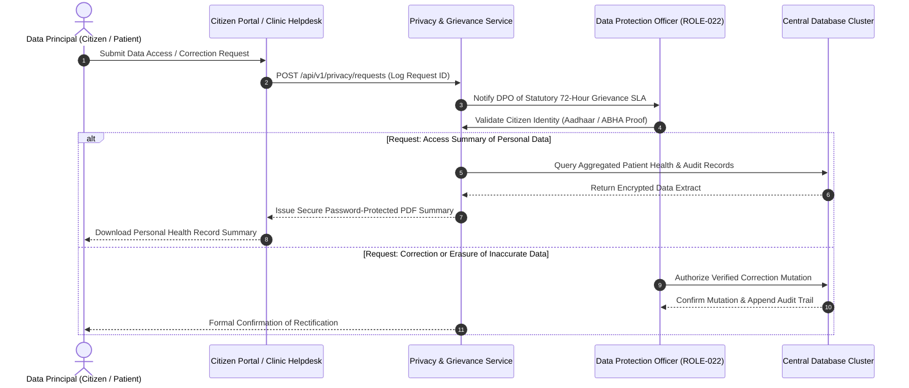

# Data Privacy & DPDP Act 2023 Governance Specification
## Namma Clinic Digital Health & Operations Platform
### Greater Bengaluru Authority (GBA) / BBMP Health Department
**Standard:** Digital Personal Data Protection Act 2023 / ISO 27701 / MoHFW EHR Standards | **Status:** APPROVED BASELINE | **Code:** `SEC-DOC-11`

---

## 1. Privacy Architecture & Statutory Fiduciary Obligations
The Namma Clinic Platform operates as a **Data Fiduciary** under the Digital Personal Data Protection (DPDP) Act 2023, serving the citizens of Bengaluru across 198 municipal wards. Because electronic health records contain sensitive personal data, privacy is embedded as an inviolable architectural foundation. Where legal interpretation is involved, controls explicitly mandate legal and compliance validation rather than inventing informal interpretations.

### 1.1 Foundational Privacy Principles
1. **Data Minimization:** Only demographic and clinical data strictly necessary for immediate diagnostic, treatment, and public health surveillance purposes are collected.
2. **Purpose Limitation:** Health data collected for outpatient consultation cannot be repurposed for commercial analysis or unapproved third-party processing.
3. **Lawful Processing Grounds:** Processing occurs exclusively under affirmative citizen consent or specific statutory exemptions (medical emergency, epidemics).
4. **Multilingual Transparent Notice:** Clear, accessible privacy notices provided in **Kannada** and **English** prior to personal data capture.
5. **Citizen Data Rights:** Full technical enablement of the right to access summaries, right to correction/updating, and right to erasure upon retention expiry.
6. **Data Protection Officer (DPO):** Independent institutional role with direct reporting to BBMP leadership and statutory grievance redressal workflows.

### 1.2 Citizen Privacy Rights Workflow Diagram


## 2. Comprehensive Privacy Requirements (PRIV-SEC-001 to PRIV-SEC-060)
The following 60 specifications define the complete data privacy baseline:

### PRIV-SEC-001
**Title:** Privacy Requirement: Data Minimization at Intake & Registration (Mandate 1)
**Control Type:** Preventive
**Security Domain:** Data Privacy & DPDP Act 2023 Governance
**Priority:** P0 - Critical
**Risk:** Critical
**Threat:** THREAT-012
**Asset:** TABLE-001 (auth_users)
**Actor:** Data Fiduciary (BBMP) / Data Processor / Data Principal (Citizen)
**Precondition:** Collection, storage, or processing of citizen personal data
**Control Objective:** Ensure full compliance with statutory privacy obligations under data minimization at intake & registration.
**Requirement:** The platform shall adhere to data minimization at intake & registration requiring legal/compliance confirmation where statutory rules evolve.
**Implementation Guidance:** Implement automated data retention purges, privacy notices, and consent verification checks.
**Configuration Guidance:** Data retention timers configured in accordance with RETENTION-001 through RETENTION-020.
**Failure Behavior:** Halt unauthorized processing; escalate to Data Protection Officer (DPO).
**Monitoring:** Monthly automated audit of data retention compliance and consent active states.
**Audit Event:** PRIVACY_EVENT_PRIV_SEC_001
**Privacy Impact:** Directly preserves citizen rights under the Digital Personal Data Protection Act 2023.
**Performance Impact:** Negligible impact; retention purges run during off-peak maintenance hours.
**Availability Impact:** Zero disruption to active clinical care.
**Related Requirement:** SECR-001
**Related Workflow:** WF-001
**Related API:** API-001
**Related Database Entity:** TABLE-001 (auth_users)
**Related Architecture Component:** ARCH-CONT-011 (Consent & Privacy Management)
**Related Threat:** THREAT-012
**Related Test:** SEC-TEST-012
**Acceptance Criteria:** Automated privacy audit confirms zero unconsented data leakage or retained expired data.
**Evidence Required:** Privacy impact assessment reports, consent logs, retention purge records.
**Owner:** Data Protection Officer (DPO)
**Lifecycle:** Active Baseline Control
**Status:** PLANNED

### PRIV-SEC-002
**Title:** Privacy Requirement: Purpose Limitation for Health Data Processing (Mandate 1)
**Control Type:** Detective
**Security Domain:** Data Privacy & DPDP Act 2023 Governance
**Priority:** P0 - Critical
**Risk:** Critical
**Threat:** THREAT-023
**Asset:** TABLE-002 (user_credentials)
**Actor:** Data Fiduciary (BBMP) / Data Processor / Data Principal (Citizen)
**Precondition:** Collection, storage, or processing of citizen personal data
**Control Objective:** Ensure full compliance with statutory privacy obligations under purpose limitation for health data processing.
**Requirement:** The platform shall adhere to purpose limitation for health data processing requiring legal/compliance confirmation where statutory rules evolve.
**Implementation Guidance:** Implement automated data retention purges, privacy notices, and consent verification checks.
**Configuration Guidance:** Data retention timers configured in accordance with RETENTION-001 through RETENTION-020.
**Failure Behavior:** Halt unauthorized processing; escalate to Data Protection Officer (DPO).
**Monitoring:** Monthly automated audit of data retention compliance and consent active states.
**Audit Event:** PRIVACY_EVENT_PRIV_SEC_002
**Privacy Impact:** Directly preserves citizen rights under the Digital Personal Data Protection Act 2023.
**Performance Impact:** Negligible impact; retention purges run during off-peak maintenance hours.
**Availability Impact:** Zero disruption to active clinical care.
**Related Requirement:** SECR-002
**Related Workflow:** WF-002
**Related API:** API-002
**Related Database Entity:** TABLE-002 (user_credentials)
**Related Architecture Component:** ARCH-CONT-011 (Consent & Privacy Management)
**Related Threat:** THREAT-023
**Related Test:** SEC-TEST-013
**Acceptance Criteria:** Automated privacy audit confirms zero unconsented data leakage or retained expired data.
**Evidence Required:** Privacy impact assessment reports, consent logs, retention purge records.
**Owner:** Data Protection Officer (DPO)
**Lifecycle:** Active Baseline Control
**Status:** PLANNED

### PRIV-SEC-003
**Title:** Privacy Requirement: Lawful Grounds of Processing (DPDP Act 2023) (Mandate 1)
**Control Type:** Preventive
**Security Domain:** Data Privacy & DPDP Act 2023 Governance
**Priority:** P0 - Critical
**Risk:** Critical
**Threat:** THREAT-034
**Asset:** TABLE-003 (user_sessions)
**Actor:** Data Fiduciary (BBMP) / Data Processor / Data Principal (Citizen)
**Precondition:** Collection, storage, or processing of citizen personal data
**Control Objective:** Ensure full compliance with statutory privacy obligations under lawful grounds of processing (dpdp act 2023).
**Requirement:** The platform shall adhere to lawful grounds of processing (dpdp act 2023) requiring legal/compliance confirmation where statutory rules evolve.
**Implementation Guidance:** Implement automated data retention purges, privacy notices, and consent verification checks.
**Configuration Guidance:** Data retention timers configured in accordance with RETENTION-001 through RETENTION-020.
**Failure Behavior:** Halt unauthorized processing; escalate to Data Protection Officer (DPO).
**Monitoring:** Monthly automated audit of data retention compliance and consent active states.
**Audit Event:** PRIVACY_EVENT_PRIV_SEC_003
**Privacy Impact:** Directly preserves citizen rights under the Digital Personal Data Protection Act 2023.
**Performance Impact:** Negligible impact; retention purges run during off-peak maintenance hours.
**Availability Impact:** Zero disruption to active clinical care.
**Related Requirement:** SECR-003
**Related Workflow:** WF-003
**Related API:** API-003
**Related Database Entity:** TABLE-003 (user_sessions)
**Related Architecture Component:** ARCH-CONT-011 (Consent & Privacy Management)
**Related Threat:** THREAT-034
**Related Test:** SEC-TEST-014
**Acceptance Criteria:** Automated privacy audit confirms zero unconsented data leakage or retained expired data.
**Evidence Required:** Privacy impact assessment reports, consent logs, retention purge records.
**Owner:** Data Protection Officer (DPO)
**Lifecycle:** Active Baseline Control
**Status:** PLANNED

### PRIV-SEC-004
**Title:** Privacy Requirement: Notice in Kannada & English Languages (Mandate 1)
**Control Type:** Detective
**Security Domain:** Data Privacy & DPDP Act 2023 Governance
**Priority:** P0 - Critical
**Risk:** Critical
**Threat:** THREAT-045
**Asset:** TABLE-004 (roles)
**Actor:** Data Fiduciary (BBMP) / Data Processor / Data Principal (Citizen)
**Precondition:** Collection, storage, or processing of citizen personal data
**Control Objective:** Ensure full compliance with statutory privacy obligations under notice in kannada & english languages.
**Requirement:** The platform shall adhere to notice in kannada & english languages requiring legal/compliance confirmation where statutory rules evolve.
**Implementation Guidance:** Implement automated data retention purges, privacy notices, and consent verification checks.
**Configuration Guidance:** Data retention timers configured in accordance with RETENTION-001 through RETENTION-020.
**Failure Behavior:** Halt unauthorized processing; escalate to Data Protection Officer (DPO).
**Monitoring:** Monthly automated audit of data retention compliance and consent active states.
**Audit Event:** PRIVACY_EVENT_PRIV_SEC_004
**Privacy Impact:** Directly preserves citizen rights under the Digital Personal Data Protection Act 2023.
**Performance Impact:** Negligible impact; retention purges run during off-peak maintenance hours.
**Availability Impact:** Zero disruption to active clinical care.
**Related Requirement:** SECR-004
**Related Workflow:** WF-004
**Related API:** API-004
**Related Database Entity:** TABLE-004 (roles)
**Related Architecture Component:** ARCH-CONT-011 (Consent & Privacy Management)
**Related Threat:** THREAT-045
**Related Test:** SEC-TEST-015
**Acceptance Criteria:** Automated privacy audit confirms zero unconsented data leakage or retained expired data.
**Evidence Required:** Privacy impact assessment reports, consent logs, retention purge records.
**Owner:** Data Protection Officer (DPO)
**Lifecycle:** Active Baseline Control
**Status:** PLANNED

### PRIV-SEC-005
**Title:** Privacy Requirement: Citizen Right to Access Personal Health Data (Mandate 1)
**Control Type:** Preventive
**Security Domain:** Data Privacy & DPDP Act 2023 Governance
**Priority:** P0 - Critical
**Risk:** Critical
**Threat:** THREAT-056
**Asset:** TABLE-005 (permissions)
**Actor:** Data Fiduciary (BBMP) / Data Processor / Data Principal (Citizen)
**Precondition:** Collection, storage, or processing of citizen personal data
**Control Objective:** Ensure full compliance with statutory privacy obligations under citizen right to access personal health data.
**Requirement:** The platform shall adhere to citizen right to access personal health data requiring legal/compliance confirmation where statutory rules evolve.
**Implementation Guidance:** Implement automated data retention purges, privacy notices, and consent verification checks.
**Configuration Guidance:** Data retention timers configured in accordance with RETENTION-001 through RETENTION-020.
**Failure Behavior:** Halt unauthorized processing; escalate to Data Protection Officer (DPO).
**Monitoring:** Monthly automated audit of data retention compliance and consent active states.
**Audit Event:** PRIVACY_EVENT_PRIV_SEC_005
**Privacy Impact:** Directly preserves citizen rights under the Digital Personal Data Protection Act 2023.
**Performance Impact:** Negligible impact; retention purges run during off-peak maintenance hours.
**Availability Impact:** Zero disruption to active clinical care.
**Related Requirement:** SECR-005
**Related Workflow:** WF-005
**Related API:** API-005
**Related Database Entity:** TABLE-005 (permissions)
**Related Architecture Component:** ARCH-CONT-011 (Consent & Privacy Management)
**Related Threat:** THREAT-056
**Related Test:** SEC-TEST-016
**Acceptance Criteria:** Automated privacy audit confirms zero unconsented data leakage or retained expired data.
**Evidence Required:** Privacy impact assessment reports, consent logs, retention purge records.
**Owner:** Data Protection Officer (DPO)
**Lifecycle:** Active Baseline Control
**Status:** PLANNED

### PRIV-SEC-006
**Title:** Privacy Requirement: Citizen Right to Correction & Updating (Mandate 1)
**Control Type:** Detective
**Security Domain:** Data Privacy & DPDP Act 2023 Governance
**Priority:** P0 - Critical
**Risk:** Critical
**Threat:** THREAT-067
**Asset:** TABLE-006 (role_permissions)
**Actor:** Data Fiduciary (BBMP) / Data Processor / Data Principal (Citizen)
**Precondition:** Collection, storage, or processing of citizen personal data
**Control Objective:** Ensure full compliance with statutory privacy obligations under citizen right to correction & updating.
**Requirement:** The platform shall adhere to citizen right to correction & updating requiring legal/compliance confirmation where statutory rules evolve.
**Implementation Guidance:** Implement automated data retention purges, privacy notices, and consent verification checks.
**Configuration Guidance:** Data retention timers configured in accordance with RETENTION-001 through RETENTION-020.
**Failure Behavior:** Halt unauthorized processing; escalate to Data Protection Officer (DPO).
**Monitoring:** Monthly automated audit of data retention compliance and consent active states.
**Audit Event:** PRIVACY_EVENT_PRIV_SEC_006
**Privacy Impact:** Directly preserves citizen rights under the Digital Personal Data Protection Act 2023.
**Performance Impact:** Negligible impact; retention purges run during off-peak maintenance hours.
**Availability Impact:** Zero disruption to active clinical care.
**Related Requirement:** SECR-006
**Related Workflow:** WF-006
**Related API:** API-006
**Related Database Entity:** TABLE-006 (role_permissions)
**Related Architecture Component:** ARCH-CONT-011 (Consent & Privacy Management)
**Related Threat:** THREAT-067
**Related Test:** SEC-TEST-017
**Acceptance Criteria:** Automated privacy audit confirms zero unconsented data leakage or retained expired data.
**Evidence Required:** Privacy impact assessment reports, consent logs, retention purge records.
**Owner:** Data Protection Officer (DPO)
**Lifecycle:** Active Baseline Control
**Status:** PLANNED

### PRIV-SEC-007
**Title:** Privacy Requirement: Citizen Right to Erasure & Retention Limits (Mandate 1)
**Control Type:** Preventive
**Security Domain:** Data Privacy & DPDP Act 2023 Governance
**Priority:** P0 - Critical
**Risk:** Critical
**Threat:** THREAT-078
**Asset:** TABLE-007 (user_roles)
**Actor:** Data Fiduciary (BBMP) / Data Processor / Data Principal (Citizen)
**Precondition:** Collection, storage, or processing of citizen personal data
**Control Objective:** Ensure full compliance with statutory privacy obligations under citizen right to erasure & retention limits.
**Requirement:** The platform shall adhere to citizen right to erasure & retention limits requiring legal/compliance confirmation where statutory rules evolve.
**Implementation Guidance:** Implement automated data retention purges, privacy notices, and consent verification checks.
**Configuration Guidance:** Data retention timers configured in accordance with RETENTION-001 through RETENTION-020.
**Failure Behavior:** Halt unauthorized processing; escalate to Data Protection Officer (DPO).
**Monitoring:** Monthly automated audit of data retention compliance and consent active states.
**Audit Event:** PRIVACY_EVENT_PRIV_SEC_007
**Privacy Impact:** Directly preserves citizen rights under the Digital Personal Data Protection Act 2023.
**Performance Impact:** Negligible impact; retention purges run during off-peak maintenance hours.
**Availability Impact:** Zero disruption to active clinical care.
**Related Requirement:** SECR-007
**Related Workflow:** WF-007
**Related API:** API-007
**Related Database Entity:** TABLE-007 (user_roles)
**Related Architecture Component:** ARCH-CONT-011 (Consent & Privacy Management)
**Related Threat:** THREAT-078
**Related Test:** SEC-TEST-018
**Acceptance Criteria:** Automated privacy audit confirms zero unconsented data leakage or retained expired data.
**Evidence Required:** Privacy impact assessment reports, consent logs, retention purge records.
**Owner:** Data Protection Officer (DPO)
**Lifecycle:** Active Baseline Control
**Status:** PLANNED

### PRIV-SEC-008
**Title:** Privacy Requirement: Data Protection Officer (DPO) Grievance Handling (Mandate 1)
**Control Type:** Detective
**Security Domain:** Data Privacy & DPDP Act 2023 Governance
**Priority:** P0 - Critical
**Risk:** Critical
**Threat:** THREAT-089
**Asset:** TABLE-008 (facilities)
**Actor:** Data Fiduciary (BBMP) / Data Processor / Data Principal (Citizen)
**Precondition:** Collection, storage, or processing of citizen personal data
**Control Objective:** Ensure full compliance with statutory privacy obligations under data protection officer (dpo) grievance handling.
**Requirement:** The platform shall adhere to data protection officer (dpo) grievance handling requiring legal/compliance confirmation where statutory rules evolve.
**Implementation Guidance:** Implement automated data retention purges, privacy notices, and consent verification checks.
**Configuration Guidance:** Data retention timers configured in accordance with RETENTION-001 through RETENTION-020.
**Failure Behavior:** Halt unauthorized processing; escalate to Data Protection Officer (DPO).
**Monitoring:** Monthly automated audit of data retention compliance and consent active states.
**Audit Event:** PRIVACY_EVENT_PRIV_SEC_008
**Privacy Impact:** Directly preserves citizen rights under the Digital Personal Data Protection Act 2023.
**Performance Impact:** Negligible impact; retention purges run during off-peak maintenance hours.
**Availability Impact:** Zero disruption to active clinical care.
**Related Requirement:** SECR-008
**Related Workflow:** WF-008
**Related API:** API-008
**Related Database Entity:** TABLE-008 (facilities)
**Related Architecture Component:** ARCH-CONT-011 (Consent & Privacy Management)
**Related Threat:** THREAT-089
**Related Test:** SEC-TEST-019
**Acceptance Criteria:** Automated privacy audit confirms zero unconsented data leakage or retained expired data.
**Evidence Required:** Privacy impact assessment reports, consent logs, retention purge records.
**Owner:** Data Protection Officer (DPO)
**Lifecycle:** Active Baseline Control
**Status:** PLANNED

### PRIV-SEC-009
**Title:** Privacy Requirement: Data Processor & Cloud Vendor Privacy Safeguards (Mandate 1)
**Control Type:** Preventive
**Security Domain:** Data Privacy & DPDP Act 2023 Governance
**Priority:** P0 - Critical
**Risk:** Critical
**Threat:** THREAT-100
**Asset:** TABLE-009 (facility_rooms)
**Actor:** Data Fiduciary (BBMP) / Data Processor / Data Principal (Citizen)
**Precondition:** Collection, storage, or processing of citizen personal data
**Control Objective:** Ensure full compliance with statutory privacy obligations under data processor & cloud vendor privacy safeguards.
**Requirement:** The platform shall adhere to data processor & cloud vendor privacy safeguards requiring legal/compliance confirmation where statutory rules evolve.
**Implementation Guidance:** Implement automated data retention purges, privacy notices, and consent verification checks.
**Configuration Guidance:** Data retention timers configured in accordance with RETENTION-001 through RETENTION-020.
**Failure Behavior:** Halt unauthorized processing; escalate to Data Protection Officer (DPO).
**Monitoring:** Monthly automated audit of data retention compliance and consent active states.
**Audit Event:** PRIVACY_EVENT_PRIV_SEC_009
**Privacy Impact:** Directly preserves citizen rights under the Digital Personal Data Protection Act 2023.
**Performance Impact:** Negligible impact; retention purges run during off-peak maintenance hours.
**Availability Impact:** Zero disruption to active clinical care.
**Related Requirement:** SECR-009
**Related Workflow:** WF-009
**Related API:** API-009
**Related Database Entity:** TABLE-009 (facility_rooms)
**Related Architecture Component:** ARCH-CONT-011 (Consent & Privacy Management)
**Related Threat:** THREAT-100
**Related Test:** SEC-TEST-020
**Acceptance Criteria:** Automated privacy audit confirms zero unconsented data leakage or retained expired data.
**Evidence Required:** Privacy impact assessment reports, consent logs, retention purge records.
**Owner:** Data Protection Officer (DPO)
**Lifecycle:** Active Baseline Control
**Status:** PLANNED

### PRIV-SEC-010
**Title:** Privacy Requirement: Mandatory Privacy Impact Assessments (PIA) (Mandate 1)
**Control Type:** Detective
**Security Domain:** Data Privacy & DPDP Act 2023 Governance
**Priority:** P0 - Critical
**Risk:** Critical
**Threat:** THREAT-011
**Asset:** TABLE-010 (staff_profiles)
**Actor:** Data Fiduciary (BBMP) / Data Processor / Data Principal (Citizen)
**Precondition:** Collection, storage, or processing of citizen personal data
**Control Objective:** Ensure full compliance with statutory privacy obligations under mandatory privacy impact assessments (pia).
**Requirement:** The platform shall adhere to mandatory privacy impact assessments (pia) requiring legal/compliance confirmation where statutory rules evolve.
**Implementation Guidance:** Implement automated data retention purges, privacy notices, and consent verification checks.
**Configuration Guidance:** Data retention timers configured in accordance with RETENTION-001 through RETENTION-020.
**Failure Behavior:** Halt unauthorized processing; escalate to Data Protection Officer (DPO).
**Monitoring:** Monthly automated audit of data retention compliance and consent active states.
**Audit Event:** PRIVACY_EVENT_PRIV_SEC_010
**Privacy Impact:** Directly preserves citizen rights under the Digital Personal Data Protection Act 2023.
**Performance Impact:** Negligible impact; retention purges run during off-peak maintenance hours.
**Availability Impact:** Zero disruption to active clinical care.
**Related Requirement:** SECR-010
**Related Workflow:** WF-010
**Related API:** API-010
**Related Database Entity:** TABLE-010 (staff_profiles)
**Related Architecture Component:** ARCH-CONT-011 (Consent & Privacy Management)
**Related Threat:** THREAT-011
**Related Test:** SEC-TEST-021
**Acceptance Criteria:** Automated privacy audit confirms zero unconsented data leakage or retained expired data.
**Evidence Required:** Privacy impact assessment reports, consent logs, retention purge records.
**Owner:** Data Protection Officer (DPO)
**Lifecycle:** Active Baseline Control
**Status:** PLANNED

### PRIV-SEC-011
**Title:** Privacy Requirement: Personal Data Breach Notification (CERT-In / DPDP) (Mandate 1)
**Control Type:** Preventive
**Security Domain:** Data Privacy & DPDP Act 2023 Governance
**Priority:** P0 - Critical
**Risk:** Critical
**Threat:** THREAT-022
**Asset:** TABLE-011 (staff_shifts)
**Actor:** Data Fiduciary (BBMP) / Data Processor / Data Principal (Citizen)
**Precondition:** Collection, storage, or processing of citizen personal data
**Control Objective:** Ensure full compliance with statutory privacy obligations under personal data breach notification (cert-in / dpdp).
**Requirement:** The platform shall adhere to personal data breach notification (cert-in / dpdp) requiring legal/compliance confirmation where statutory rules evolve.
**Implementation Guidance:** Implement automated data retention purges, privacy notices, and consent verification checks.
**Configuration Guidance:** Data retention timers configured in accordance with RETENTION-001 through RETENTION-020.
**Failure Behavior:** Halt unauthorized processing; escalate to Data Protection Officer (DPO).
**Monitoring:** Monthly automated audit of data retention compliance and consent active states.
**Audit Event:** PRIVACY_EVENT_PRIV_SEC_011
**Privacy Impact:** Directly preserves citizen rights under the Digital Personal Data Protection Act 2023.
**Performance Impact:** Negligible impact; retention purges run during off-peak maintenance hours.
**Availability Impact:** Zero disruption to active clinical care.
**Related Requirement:** SECR-011
**Related Workflow:** WF-011
**Related API:** API-011
**Related Database Entity:** TABLE-011 (staff_shifts)
**Related Architecture Component:** ARCH-CONT-011 (Consent & Privacy Management)
**Related Threat:** THREAT-022
**Related Test:** SEC-TEST-022
**Acceptance Criteria:** Automated privacy audit confirms zero unconsented data leakage or retained expired data.
**Evidence Required:** Privacy impact assessment reports, consent logs, retention purge records.
**Owner:** Data Protection Officer (DPO)
**Lifecycle:** Active Baseline Control
**Status:** PLANNED

### PRIV-SEC-012
**Title:** Privacy Requirement: Sensitive Health Information Special Protections (Mandate 1)
**Control Type:** Detective
**Security Domain:** Data Privacy & DPDP Act 2023 Governance
**Priority:** P0 - Critical
**Risk:** Critical
**Threat:** THREAT-033
**Asset:** TABLE-012 (system_configs)
**Actor:** Data Fiduciary (BBMP) / Data Processor / Data Principal (Citizen)
**Precondition:** Collection, storage, or processing of citizen personal data
**Control Objective:** Ensure full compliance with statutory privacy obligations under sensitive health information special protections.
**Requirement:** The platform shall adhere to sensitive health information special protections requiring legal/compliance confirmation where statutory rules evolve.
**Implementation Guidance:** Implement automated data retention purges, privacy notices, and consent verification checks.
**Configuration Guidance:** Data retention timers configured in accordance with RETENTION-001 through RETENTION-020.
**Failure Behavior:** Halt unauthorized processing; escalate to Data Protection Officer (DPO).
**Monitoring:** Monthly automated audit of data retention compliance and consent active states.
**Audit Event:** PRIVACY_EVENT_PRIV_SEC_012
**Privacy Impact:** Directly preserves citizen rights under the Digital Personal Data Protection Act 2023.
**Performance Impact:** Negligible impact; retention purges run during off-peak maintenance hours.
**Availability Impact:** Zero disruption to active clinical care.
**Related Requirement:** SECR-012
**Related Workflow:** WF-012
**Related API:** API-012
**Related Database Entity:** TABLE-012 (system_configs)
**Related Architecture Component:** ARCH-CONT-011 (Consent & Privacy Management)
**Related Threat:** THREAT-033
**Related Test:** SEC-TEST-023
**Acceptance Criteria:** Automated privacy audit confirms zero unconsented data leakage or retained expired data.
**Evidence Required:** Privacy impact assessment reports, consent logs, retention purge records.
**Owner:** Data Protection Officer (DPO)
**Lifecycle:** Active Baseline Control
**Status:** PLANNED

### PRIV-SEC-013
**Title:** Privacy Requirement: Data Minimization at Intake & Registration (Mandate 2)
**Control Type:** Preventive
**Security Domain:** Data Privacy & DPDP Act 2023 Governance
**Priority:** P0 - Critical
**Risk:** Critical
**Threat:** THREAT-044
**Asset:** TABLE-013 (patients)
**Actor:** Data Fiduciary (BBMP) / Data Processor / Data Principal (Citizen)
**Precondition:** Collection, storage, or processing of citizen personal data
**Control Objective:** Ensure full compliance with statutory privacy obligations under data minimization at intake & registration.
**Requirement:** The platform shall adhere to data minimization at intake & registration requiring legal/compliance confirmation where statutory rules evolve.
**Implementation Guidance:** Implement automated data retention purges, privacy notices, and consent verification checks.
**Configuration Guidance:** Data retention timers configured in accordance with RETENTION-001 through RETENTION-020.
**Failure Behavior:** Halt unauthorized processing; escalate to Data Protection Officer (DPO).
**Monitoring:** Monthly automated audit of data retention compliance and consent active states.
**Audit Event:** PRIVACY_EVENT_PRIV_SEC_013
**Privacy Impact:** Directly preserves citizen rights under the Digital Personal Data Protection Act 2023.
**Performance Impact:** Negligible impact; retention purges run during off-peak maintenance hours.
**Availability Impact:** Zero disruption to active clinical care.
**Related Requirement:** SECR-013
**Related Workflow:** WF-013
**Related API:** API-013
**Related Database Entity:** TABLE-013 (patients)
**Related Architecture Component:** ARCH-CONT-011 (Consent & Privacy Management)
**Related Threat:** THREAT-044
**Related Test:** SEC-TEST-024
**Acceptance Criteria:** Automated privacy audit confirms zero unconsented data leakage or retained expired data.
**Evidence Required:** Privacy impact assessment reports, consent logs, retention purge records.
**Owner:** Data Protection Officer (DPO)
**Lifecycle:** Active Baseline Control
**Status:** PLANNED

### PRIV-SEC-014
**Title:** Privacy Requirement: Purpose Limitation for Health Data Processing (Mandate 2)
**Control Type:** Detective
**Security Domain:** Data Privacy & DPDP Act 2023 Governance
**Priority:** P0 - Critical
**Risk:** Critical
**Threat:** THREAT-055
**Asset:** TABLE-014 (patient_identifiers)
**Actor:** Data Fiduciary (BBMP) / Data Processor / Data Principal (Citizen)
**Precondition:** Collection, storage, or processing of citizen personal data
**Control Objective:** Ensure full compliance with statutory privacy obligations under purpose limitation for health data processing.
**Requirement:** The platform shall adhere to purpose limitation for health data processing requiring legal/compliance confirmation where statutory rules evolve.
**Implementation Guidance:** Implement automated data retention purges, privacy notices, and consent verification checks.
**Configuration Guidance:** Data retention timers configured in accordance with RETENTION-001 through RETENTION-020.
**Failure Behavior:** Halt unauthorized processing; escalate to Data Protection Officer (DPO).
**Monitoring:** Monthly automated audit of data retention compliance and consent active states.
**Audit Event:** PRIVACY_EVENT_PRIV_SEC_014
**Privacy Impact:** Directly preserves citizen rights under the Digital Personal Data Protection Act 2023.
**Performance Impact:** Negligible impact; retention purges run during off-peak maintenance hours.
**Availability Impact:** Zero disruption to active clinical care.
**Related Requirement:** SECR-014
**Related Workflow:** WF-014
**Related API:** API-014
**Related Database Entity:** TABLE-014 (patient_identifiers)
**Related Architecture Component:** ARCH-CONT-011 (Consent & Privacy Management)
**Related Threat:** THREAT-055
**Related Test:** SEC-TEST-025
**Acceptance Criteria:** Automated privacy audit confirms zero unconsented data leakage or retained expired data.
**Evidence Required:** Privacy impact assessment reports, consent logs, retention purge records.
**Owner:** Data Protection Officer (DPO)
**Lifecycle:** Active Baseline Control
**Status:** PLANNED

### PRIV-SEC-015
**Title:** Privacy Requirement: Lawful Grounds of Processing (DPDP Act 2023) (Mandate 2)
**Control Type:** Preventive
**Security Domain:** Data Privacy & DPDP Act 2023 Governance
**Priority:** P0 - Critical
**Risk:** Critical
**Threat:** THREAT-066
**Asset:** TABLE-015 (patient_contacts)
**Actor:** Data Fiduciary (BBMP) / Data Processor / Data Principal (Citizen)
**Precondition:** Collection, storage, or processing of citizen personal data
**Control Objective:** Ensure full compliance with statutory privacy obligations under lawful grounds of processing (dpdp act 2023).
**Requirement:** The platform shall adhere to lawful grounds of processing (dpdp act 2023) requiring legal/compliance confirmation where statutory rules evolve.
**Implementation Guidance:** Implement automated data retention purges, privacy notices, and consent verification checks.
**Configuration Guidance:** Data retention timers configured in accordance with RETENTION-001 through RETENTION-020.
**Failure Behavior:** Halt unauthorized processing; escalate to Data Protection Officer (DPO).
**Monitoring:** Monthly automated audit of data retention compliance and consent active states.
**Audit Event:** PRIVACY_EVENT_PRIV_SEC_015
**Privacy Impact:** Directly preserves citizen rights under the Digital Personal Data Protection Act 2023.
**Performance Impact:** Negligible impact; retention purges run during off-peak maintenance hours.
**Availability Impact:** Zero disruption to active clinical care.
**Related Requirement:** SECR-015
**Related Workflow:** WF-015
**Related API:** API-015
**Related Database Entity:** TABLE-015 (patient_contacts)
**Related Architecture Component:** ARCH-CONT-011 (Consent & Privacy Management)
**Related Threat:** THREAT-066
**Related Test:** SEC-TEST-026
**Acceptance Criteria:** Automated privacy audit confirms zero unconsented data leakage or retained expired data.
**Evidence Required:** Privacy impact assessment reports, consent logs, retention purge records.
**Owner:** Data Protection Officer (DPO)
**Lifecycle:** Active Baseline Control
**Status:** PLANNED

### PRIV-SEC-016
**Title:** Privacy Requirement: Notice in Kannada & English Languages (Mandate 2)
**Control Type:** Detective
**Security Domain:** Data Privacy & DPDP Act 2023 Governance
**Priority:** P0 - Critical
**Risk:** Critical
**Threat:** THREAT-077
**Asset:** TABLE-016 (patient_addresses)
**Actor:** Data Fiduciary (BBMP) / Data Processor / Data Principal (Citizen)
**Precondition:** Collection, storage, or processing of citizen personal data
**Control Objective:** Ensure full compliance with statutory privacy obligations under notice in kannada & english languages.
**Requirement:** The platform shall adhere to notice in kannada & english languages requiring legal/compliance confirmation where statutory rules evolve.
**Implementation Guidance:** Implement automated data retention purges, privacy notices, and consent verification checks.
**Configuration Guidance:** Data retention timers configured in accordance with RETENTION-001 through RETENTION-020.
**Failure Behavior:** Halt unauthorized processing; escalate to Data Protection Officer (DPO).
**Monitoring:** Monthly automated audit of data retention compliance and consent active states.
**Audit Event:** PRIVACY_EVENT_PRIV_SEC_016
**Privacy Impact:** Directly preserves citizen rights under the Digital Personal Data Protection Act 2023.
**Performance Impact:** Negligible impact; retention purges run during off-peak maintenance hours.
**Availability Impact:** Zero disruption to active clinical care.
**Related Requirement:** SECR-016
**Related Workflow:** WF-016
**Related API:** API-016
**Related Database Entity:** TABLE-016 (patient_addresses)
**Related Architecture Component:** ARCH-CONT-011 (Consent & Privacy Management)
**Related Threat:** THREAT-077
**Related Test:** SEC-TEST-027
**Acceptance Criteria:** Automated privacy audit confirms zero unconsented data leakage or retained expired data.
**Evidence Required:** Privacy impact assessment reports, consent logs, retention purge records.
**Owner:** Data Protection Officer (DPO)
**Lifecycle:** Active Baseline Control
**Status:** PLANNED

### PRIV-SEC-017
**Title:** Privacy Requirement: Citizen Right to Access Personal Health Data (Mandate 2)
**Control Type:** Preventive
**Security Domain:** Data Privacy & DPDP Act 2023 Governance
**Priority:** P0 - Critical
**Risk:** Critical
**Threat:** THREAT-088
**Asset:** TABLE-017 (consent_records)
**Actor:** Data Fiduciary (BBMP) / Data Processor / Data Principal (Citizen)
**Precondition:** Collection, storage, or processing of citizen personal data
**Control Objective:** Ensure full compliance with statutory privacy obligations under citizen right to access personal health data.
**Requirement:** The platform shall adhere to citizen right to access personal health data requiring legal/compliance confirmation where statutory rules evolve.
**Implementation Guidance:** Implement automated data retention purges, privacy notices, and consent verification checks.
**Configuration Guidance:** Data retention timers configured in accordance with RETENTION-001 through RETENTION-020.
**Failure Behavior:** Halt unauthorized processing; escalate to Data Protection Officer (DPO).
**Monitoring:** Monthly automated audit of data retention compliance and consent active states.
**Audit Event:** PRIVACY_EVENT_PRIV_SEC_017
**Privacy Impact:** Directly preserves citizen rights under the Digital Personal Data Protection Act 2023.
**Performance Impact:** Negligible impact; retention purges run during off-peak maintenance hours.
**Availability Impact:** Zero disruption to active clinical care.
**Related Requirement:** SECR-017
**Related Workflow:** WF-017
**Related API:** API-017
**Related Database Entity:** TABLE-017 (consent_records)
**Related Architecture Component:** ARCH-CONT-011 (Consent & Privacy Management)
**Related Threat:** THREAT-088
**Related Test:** SEC-TEST-028
**Acceptance Criteria:** Automated privacy audit confirms zero unconsented data leakage or retained expired data.
**Evidence Required:** Privacy impact assessment reports, consent logs, retention purge records.
**Owner:** Data Protection Officer (DPO)
**Lifecycle:** Active Baseline Control
**Status:** PLANNED

### PRIV-SEC-018
**Title:** Privacy Requirement: Citizen Right to Correction & Updating (Mandate 2)
**Control Type:** Detective
**Security Domain:** Data Privacy & DPDP Act 2023 Governance
**Priority:** P0 - Critical
**Risk:** Critical
**Threat:** THREAT-099
**Asset:** TABLE-018 (tokens)
**Actor:** Data Fiduciary (BBMP) / Data Processor / Data Principal (Citizen)
**Precondition:** Collection, storage, or processing of citizen personal data
**Control Objective:** Ensure full compliance with statutory privacy obligations under citizen right to correction & updating.
**Requirement:** The platform shall adhere to citizen right to correction & updating requiring legal/compliance confirmation where statutory rules evolve.
**Implementation Guidance:** Implement automated data retention purges, privacy notices, and consent verification checks.
**Configuration Guidance:** Data retention timers configured in accordance with RETENTION-001 through RETENTION-020.
**Failure Behavior:** Halt unauthorized processing; escalate to Data Protection Officer (DPO).
**Monitoring:** Monthly automated audit of data retention compliance and consent active states.
**Audit Event:** PRIVACY_EVENT_PRIV_SEC_018
**Privacy Impact:** Directly preserves citizen rights under the Digital Personal Data Protection Act 2023.
**Performance Impact:** Negligible impact; retention purges run during off-peak maintenance hours.
**Availability Impact:** Zero disruption to active clinical care.
**Related Requirement:** SECR-018
**Related Workflow:** WF-018
**Related API:** API-018
**Related Database Entity:** TABLE-018 (tokens)
**Related Architecture Component:** ARCH-CONT-011 (Consent & Privacy Management)
**Related Threat:** THREAT-099
**Related Test:** SEC-TEST-029
**Acceptance Criteria:** Automated privacy audit confirms zero unconsented data leakage or retained expired data.
**Evidence Required:** Privacy impact assessment reports, consent logs, retention purge records.
**Owner:** Data Protection Officer (DPO)
**Lifecycle:** Active Baseline Control
**Status:** PLANNED

### PRIV-SEC-019
**Title:** Privacy Requirement: Citizen Right to Erasure & Retention Limits (Mandate 2)
**Control Type:** Preventive
**Security Domain:** Data Privacy & DPDP Act 2023 Governance
**Priority:** P0 - Critical
**Risk:** Critical
**Threat:** THREAT-010
**Asset:** TABLE-019 (queue_entries)
**Actor:** Data Fiduciary (BBMP) / Data Processor / Data Principal (Citizen)
**Precondition:** Collection, storage, or processing of citizen personal data
**Control Objective:** Ensure full compliance with statutory privacy obligations under citizen right to erasure & retention limits.
**Requirement:** The platform shall adhere to citizen right to erasure & retention limits requiring legal/compliance confirmation where statutory rules evolve.
**Implementation Guidance:** Implement automated data retention purges, privacy notices, and consent verification checks.
**Configuration Guidance:** Data retention timers configured in accordance with RETENTION-001 through RETENTION-020.
**Failure Behavior:** Halt unauthorized processing; escalate to Data Protection Officer (DPO).
**Monitoring:** Monthly automated audit of data retention compliance and consent active states.
**Audit Event:** PRIVACY_EVENT_PRIV_SEC_019
**Privacy Impact:** Directly preserves citizen rights under the Digital Personal Data Protection Act 2023.
**Performance Impact:** Negligible impact; retention purges run during off-peak maintenance hours.
**Availability Impact:** Zero disruption to active clinical care.
**Related Requirement:** SECR-019
**Related Workflow:** WF-019
**Related API:** API-019
**Related Database Entity:** TABLE-019 (queue_entries)
**Related Architecture Component:** ARCH-CONT-011 (Consent & Privacy Management)
**Related Threat:** THREAT-010
**Related Test:** SEC-TEST-030
**Acceptance Criteria:** Automated privacy audit confirms zero unconsented data leakage or retained expired data.
**Evidence Required:** Privacy impact assessment reports, consent logs, retention purge records.
**Owner:** Data Protection Officer (DPO)
**Lifecycle:** Active Baseline Control
**Status:** PLANNED

### PRIV-SEC-020
**Title:** Privacy Requirement: Data Protection Officer (DPO) Grievance Handling (Mandate 2)
**Control Type:** Detective
**Security Domain:** Data Privacy & DPDP Act 2023 Governance
**Priority:** P0 - Critical
**Risk:** Critical
**Threat:** THREAT-021
**Asset:** TABLE-020 (triage_assessments)
**Actor:** Data Fiduciary (BBMP) / Data Processor / Data Principal (Citizen)
**Precondition:** Collection, storage, or processing of citizen personal data
**Control Objective:** Ensure full compliance with statutory privacy obligations under data protection officer (dpo) grievance handling.
**Requirement:** The platform shall adhere to data protection officer (dpo) grievance handling requiring legal/compliance confirmation where statutory rules evolve.
**Implementation Guidance:** Implement automated data retention purges, privacy notices, and consent verification checks.
**Configuration Guidance:** Data retention timers configured in accordance with RETENTION-001 through RETENTION-020.
**Failure Behavior:** Halt unauthorized processing; escalate to Data Protection Officer (DPO).
**Monitoring:** Monthly automated audit of data retention compliance and consent active states.
**Audit Event:** PRIVACY_EVENT_PRIV_SEC_020
**Privacy Impact:** Directly preserves citizen rights under the Digital Personal Data Protection Act 2023.
**Performance Impact:** Negligible impact; retention purges run during off-peak maintenance hours.
**Availability Impact:** Zero disruption to active clinical care.
**Related Requirement:** SECR-020
**Related Workflow:** WF-020
**Related API:** API-020
**Related Database Entity:** TABLE-020 (triage_assessments)
**Related Architecture Component:** ARCH-CONT-011 (Consent & Privacy Management)
**Related Threat:** THREAT-021
**Related Test:** SEC-TEST-031
**Acceptance Criteria:** Automated privacy audit confirms zero unconsented data leakage or retained expired data.
**Evidence Required:** Privacy impact assessment reports, consent logs, retention purge records.
**Owner:** Data Protection Officer (DPO)
**Lifecycle:** Active Baseline Control
**Status:** PLANNED

### PRIV-SEC-021
**Title:** Privacy Requirement: Data Processor & Cloud Vendor Privacy Safeguards (Mandate 2)
**Control Type:** Preventive
**Security Domain:** Data Privacy & DPDP Act 2023 Governance
**Priority:** P0 - Critical
**Risk:** High
**Threat:** THREAT-032
**Asset:** TABLE-021 (patient_vitals)
**Actor:** Data Fiduciary (BBMP) / Data Processor / Data Principal (Citizen)
**Precondition:** Collection, storage, or processing of citizen personal data
**Control Objective:** Ensure full compliance with statutory privacy obligations under data processor & cloud vendor privacy safeguards.
**Requirement:** The platform shall adhere to data processor & cloud vendor privacy safeguards requiring legal/compliance confirmation where statutory rules evolve.
**Implementation Guidance:** Implement automated data retention purges, privacy notices, and consent verification checks.
**Configuration Guidance:** Data retention timers configured in accordance with RETENTION-001 through RETENTION-020.
**Failure Behavior:** Halt unauthorized processing; escalate to Data Protection Officer (DPO).
**Monitoring:** Monthly automated audit of data retention compliance and consent active states.
**Audit Event:** PRIVACY_EVENT_PRIV_SEC_021
**Privacy Impact:** Directly preserves citizen rights under the Digital Personal Data Protection Act 2023.
**Performance Impact:** Negligible impact; retention purges run during off-peak maintenance hours.
**Availability Impact:** Zero disruption to active clinical care.
**Related Requirement:** SECR-021
**Related Workflow:** WF-021
**Related API:** API-021
**Related Database Entity:** TABLE-021 (patient_vitals)
**Related Architecture Component:** ARCH-CONT-011 (Consent & Privacy Management)
**Related Threat:** THREAT-032
**Related Test:** SEC-TEST-032
**Acceptance Criteria:** Automated privacy audit confirms zero unconsented data leakage or retained expired data.
**Evidence Required:** Privacy impact assessment reports, consent logs, retention purge records.
**Owner:** Data Protection Officer (DPO)
**Lifecycle:** Active Baseline Control
**Status:** PLANNED

### PRIV-SEC-022
**Title:** Privacy Requirement: Mandatory Privacy Impact Assessments (PIA) (Mandate 2)
**Control Type:** Detective
**Security Domain:** Data Privacy & DPDP Act 2023 Governance
**Priority:** P0 - Critical
**Risk:** High
**Threat:** THREAT-043
**Asset:** TABLE-022 (danger_alerts)
**Actor:** Data Fiduciary (BBMP) / Data Processor / Data Principal (Citizen)
**Precondition:** Collection, storage, or processing of citizen personal data
**Control Objective:** Ensure full compliance with statutory privacy obligations under mandatory privacy impact assessments (pia).
**Requirement:** The platform shall adhere to mandatory privacy impact assessments (pia) requiring legal/compliance confirmation where statutory rules evolve.
**Implementation Guidance:** Implement automated data retention purges, privacy notices, and consent verification checks.
**Configuration Guidance:** Data retention timers configured in accordance with RETENTION-001 through RETENTION-020.
**Failure Behavior:** Halt unauthorized processing; escalate to Data Protection Officer (DPO).
**Monitoring:** Monthly automated audit of data retention compliance and consent active states.
**Audit Event:** PRIVACY_EVENT_PRIV_SEC_022
**Privacy Impact:** Directly preserves citizen rights under the Digital Personal Data Protection Act 2023.
**Performance Impact:** Negligible impact; retention purges run during off-peak maintenance hours.
**Availability Impact:** Zero disruption to active clinical care.
**Related Requirement:** SECR-022
**Related Workflow:** WF-022
**Related API:** API-022
**Related Database Entity:** TABLE-022 (danger_alerts)
**Related Architecture Component:** ARCH-CONT-011 (Consent & Privacy Management)
**Related Threat:** THREAT-043
**Related Test:** SEC-TEST-033
**Acceptance Criteria:** Automated privacy audit confirms zero unconsented data leakage or retained expired data.
**Evidence Required:** Privacy impact assessment reports, consent logs, retention purge records.
**Owner:** Data Protection Officer (DPO)
**Lifecycle:** Active Baseline Control
**Status:** PLANNED

### PRIV-SEC-023
**Title:** Privacy Requirement: Personal Data Breach Notification (CERT-In / DPDP) (Mandate 2)
**Control Type:** Preventive
**Security Domain:** Data Privacy & DPDP Act 2023 Governance
**Priority:** P0 - Critical
**Risk:** High
**Threat:** THREAT-054
**Asset:** TABLE-023 (clinical_encounters)
**Actor:** Data Fiduciary (BBMP) / Data Processor / Data Principal (Citizen)
**Precondition:** Collection, storage, or processing of citizen personal data
**Control Objective:** Ensure full compliance with statutory privacy obligations under personal data breach notification (cert-in / dpdp).
**Requirement:** The platform shall adhere to personal data breach notification (cert-in / dpdp) requiring legal/compliance confirmation where statutory rules evolve.
**Implementation Guidance:** Implement automated data retention purges, privacy notices, and consent verification checks.
**Configuration Guidance:** Data retention timers configured in accordance with RETENTION-001 through RETENTION-020.
**Failure Behavior:** Halt unauthorized processing; escalate to Data Protection Officer (DPO).
**Monitoring:** Monthly automated audit of data retention compliance and consent active states.
**Audit Event:** PRIVACY_EVENT_PRIV_SEC_023
**Privacy Impact:** Directly preserves citizen rights under the Digital Personal Data Protection Act 2023.
**Performance Impact:** Negligible impact; retention purges run during off-peak maintenance hours.
**Availability Impact:** Zero disruption to active clinical care.
**Related Requirement:** SECR-023
**Related Workflow:** WF-023
**Related API:** API-023
**Related Database Entity:** TABLE-023 (clinical_encounters)
**Related Architecture Component:** ARCH-CONT-011 (Consent & Privacy Management)
**Related Threat:** THREAT-054
**Related Test:** SEC-TEST-034
**Acceptance Criteria:** Automated privacy audit confirms zero unconsented data leakage or retained expired data.
**Evidence Required:** Privacy impact assessment reports, consent logs, retention purge records.
**Owner:** Data Protection Officer (DPO)
**Lifecycle:** Active Baseline Control
**Status:** PLANNED

### PRIV-SEC-024
**Title:** Privacy Requirement: Sensitive Health Information Special Protections (Mandate 2)
**Control Type:** Detective
**Security Domain:** Data Privacy & DPDP Act 2023 Governance
**Priority:** P0 - Critical
**Risk:** High
**Threat:** THREAT-065
**Asset:** TABLE-024 (clinical_notes)
**Actor:** Data Fiduciary (BBMP) / Data Processor / Data Principal (Citizen)
**Precondition:** Collection, storage, or processing of citizen personal data
**Control Objective:** Ensure full compliance with statutory privacy obligations under sensitive health information special protections.
**Requirement:** The platform shall adhere to sensitive health information special protections requiring legal/compliance confirmation where statutory rules evolve.
**Implementation Guidance:** Implement automated data retention purges, privacy notices, and consent verification checks.
**Configuration Guidance:** Data retention timers configured in accordance with RETENTION-001 through RETENTION-020.
**Failure Behavior:** Halt unauthorized processing; escalate to Data Protection Officer (DPO).
**Monitoring:** Monthly automated audit of data retention compliance and consent active states.
**Audit Event:** PRIVACY_EVENT_PRIV_SEC_024
**Privacy Impact:** Directly preserves citizen rights under the Digital Personal Data Protection Act 2023.
**Performance Impact:** Negligible impact; retention purges run during off-peak maintenance hours.
**Availability Impact:** Zero disruption to active clinical care.
**Related Requirement:** SECR-024
**Related Workflow:** WF-024
**Related API:** API-024
**Related Database Entity:** TABLE-024 (clinical_notes)
**Related Architecture Component:** ARCH-CONT-011 (Consent & Privacy Management)
**Related Threat:** THREAT-065
**Related Test:** SEC-TEST-035
**Acceptance Criteria:** Automated privacy audit confirms zero unconsented data leakage or retained expired data.
**Evidence Required:** Privacy impact assessment reports, consent logs, retention purge records.
**Owner:** Data Protection Officer (DPO)
**Lifecycle:** Active Baseline Control
**Status:** PLANNED

### PRIV-SEC-025
**Title:** Privacy Requirement: Data Minimization at Intake & Registration (Mandate 3)
**Control Type:** Preventive
**Security Domain:** Data Privacy & DPDP Act 2023 Governance
**Priority:** P0 - Critical
**Risk:** High
**Threat:** THREAT-076
**Asset:** TABLE-025 (diagnoses)
**Actor:** Data Fiduciary (BBMP) / Data Processor / Data Principal (Citizen)
**Precondition:** Collection, storage, or processing of citizen personal data
**Control Objective:** Ensure full compliance with statutory privacy obligations under data minimization at intake & registration.
**Requirement:** The platform shall adhere to data minimization at intake & registration requiring legal/compliance confirmation where statutory rules evolve.
**Implementation Guidance:** Implement automated data retention purges, privacy notices, and consent verification checks.
**Configuration Guidance:** Data retention timers configured in accordance with RETENTION-001 through RETENTION-020.
**Failure Behavior:** Halt unauthorized processing; escalate to Data Protection Officer (DPO).
**Monitoring:** Monthly automated audit of data retention compliance and consent active states.
**Audit Event:** PRIVACY_EVENT_PRIV_SEC_025
**Privacy Impact:** Directly preserves citizen rights under the Digital Personal Data Protection Act 2023.
**Performance Impact:** Negligible impact; retention purges run during off-peak maintenance hours.
**Availability Impact:** Zero disruption to active clinical care.
**Related Requirement:** SECR-025
**Related Workflow:** WF-025
**Related API:** API-025
**Related Database Entity:** TABLE-025 (diagnoses)
**Related Architecture Component:** ARCH-CONT-011 (Consent & Privacy Management)
**Related Threat:** THREAT-076
**Related Test:** SEC-TEST-036
**Acceptance Criteria:** Automated privacy audit confirms zero unconsented data leakage or retained expired data.
**Evidence Required:** Privacy impact assessment reports, consent logs, retention purge records.
**Owner:** Data Protection Officer (DPO)
**Lifecycle:** Active Baseline Control
**Status:** PLANNED

### PRIV-SEC-026
**Title:** Privacy Requirement: Purpose Limitation for Health Data Processing (Mandate 3)
**Control Type:** Detective
**Security Domain:** Data Privacy & DPDP Act 2023 Governance
**Priority:** P0 - Critical
**Risk:** High
**Threat:** THREAT-087
**Asset:** TABLE-026 (prescriptions)
**Actor:** Data Fiduciary (BBMP) / Data Processor / Data Principal (Citizen)
**Precondition:** Collection, storage, or processing of citizen personal data
**Control Objective:** Ensure full compliance with statutory privacy obligations under purpose limitation for health data processing.
**Requirement:** The platform shall adhere to purpose limitation for health data processing requiring legal/compliance confirmation where statutory rules evolve.
**Implementation Guidance:** Implement automated data retention purges, privacy notices, and consent verification checks.
**Configuration Guidance:** Data retention timers configured in accordance with RETENTION-001 through RETENTION-020.
**Failure Behavior:** Halt unauthorized processing; escalate to Data Protection Officer (DPO).
**Monitoring:** Monthly automated audit of data retention compliance and consent active states.
**Audit Event:** PRIVACY_EVENT_PRIV_SEC_026
**Privacy Impact:** Directly preserves citizen rights under the Digital Personal Data Protection Act 2023.
**Performance Impact:** Negligible impact; retention purges run during off-peak maintenance hours.
**Availability Impact:** Zero disruption to active clinical care.
**Related Requirement:** SECR-026
**Related Workflow:** WF-026
**Related API:** API-026
**Related Database Entity:** TABLE-026 (prescriptions)
**Related Architecture Component:** ARCH-CONT-011 (Consent & Privacy Management)
**Related Threat:** THREAT-087
**Related Test:** SEC-TEST-037
**Acceptance Criteria:** Automated privacy audit confirms zero unconsented data leakage or retained expired data.
**Evidence Required:** Privacy impact assessment reports, consent logs, retention purge records.
**Owner:** Data Protection Officer (DPO)
**Lifecycle:** Active Baseline Control
**Status:** PLANNED

### PRIV-SEC-027
**Title:** Privacy Requirement: Lawful Grounds of Processing (DPDP Act 2023) (Mandate 3)
**Control Type:** Preventive
**Security Domain:** Data Privacy & DPDP Act 2023 Governance
**Priority:** P0 - Critical
**Risk:** High
**Threat:** THREAT-098
**Asset:** TABLE-027 (prescription_items)
**Actor:** Data Fiduciary (BBMP) / Data Processor / Data Principal (Citizen)
**Precondition:** Collection, storage, or processing of citizen personal data
**Control Objective:** Ensure full compliance with statutory privacy obligations under lawful grounds of processing (dpdp act 2023).
**Requirement:** The platform shall adhere to lawful grounds of processing (dpdp act 2023) requiring legal/compliance confirmation where statutory rules evolve.
**Implementation Guidance:** Implement automated data retention purges, privacy notices, and consent verification checks.
**Configuration Guidance:** Data retention timers configured in accordance with RETENTION-001 through RETENTION-020.
**Failure Behavior:** Halt unauthorized processing; escalate to Data Protection Officer (DPO).
**Monitoring:** Monthly automated audit of data retention compliance and consent active states.
**Audit Event:** PRIVACY_EVENT_PRIV_SEC_027
**Privacy Impact:** Directly preserves citizen rights under the Digital Personal Data Protection Act 2023.
**Performance Impact:** Negligible impact; retention purges run during off-peak maintenance hours.
**Availability Impact:** Zero disruption to active clinical care.
**Related Requirement:** SECR-027
**Related Workflow:** WF-027
**Related API:** API-027
**Related Database Entity:** TABLE-027 (prescription_items)
**Related Architecture Component:** ARCH-CONT-011 (Consent & Privacy Management)
**Related Threat:** THREAT-098
**Related Test:** SEC-TEST-038
**Acceptance Criteria:** Automated privacy audit confirms zero unconsented data leakage or retained expired data.
**Evidence Required:** Privacy impact assessment reports, consent logs, retention purge records.
**Owner:** Data Protection Officer (DPO)
**Lifecycle:** Active Baseline Control
**Status:** PLANNED

### PRIV-SEC-028
**Title:** Privacy Requirement: Notice in Kannada & English Languages (Mandate 3)
**Control Type:** Detective
**Security Domain:** Data Privacy & DPDP Act 2023 Governance
**Priority:** P0 - Critical
**Risk:** High
**Threat:** THREAT-009
**Asset:** TABLE-028 (lab_orders)
**Actor:** Data Fiduciary (BBMP) / Data Processor / Data Principal (Citizen)
**Precondition:** Collection, storage, or processing of citizen personal data
**Control Objective:** Ensure full compliance with statutory privacy obligations under notice in kannada & english languages.
**Requirement:** The platform shall adhere to notice in kannada & english languages requiring legal/compliance confirmation where statutory rules evolve.
**Implementation Guidance:** Implement automated data retention purges, privacy notices, and consent verification checks.
**Configuration Guidance:** Data retention timers configured in accordance with RETENTION-001 through RETENTION-020.
**Failure Behavior:** Halt unauthorized processing; escalate to Data Protection Officer (DPO).
**Monitoring:** Monthly automated audit of data retention compliance and consent active states.
**Audit Event:** PRIVACY_EVENT_PRIV_SEC_028
**Privacy Impact:** Directly preserves citizen rights under the Digital Personal Data Protection Act 2023.
**Performance Impact:** Negligible impact; retention purges run during off-peak maintenance hours.
**Availability Impact:** Zero disruption to active clinical care.
**Related Requirement:** SECR-028
**Related Workflow:** WF-028
**Related API:** API-028
**Related Database Entity:** TABLE-028 (lab_orders)
**Related Architecture Component:** ARCH-CONT-011 (Consent & Privacy Management)
**Related Threat:** THREAT-009
**Related Test:** SEC-TEST-039
**Acceptance Criteria:** Automated privacy audit confirms zero unconsented data leakage or retained expired data.
**Evidence Required:** Privacy impact assessment reports, consent logs, retention purge records.
**Owner:** Data Protection Officer (DPO)
**Lifecycle:** Active Baseline Control
**Status:** PLANNED

### PRIV-SEC-029
**Title:** Privacy Requirement: Citizen Right to Access Personal Health Data (Mandate 3)
**Control Type:** Preventive
**Security Domain:** Data Privacy & DPDP Act 2023 Governance
**Priority:** P0 - Critical
**Risk:** High
**Threat:** THREAT-020
**Asset:** TABLE-029 (lab_order_items)
**Actor:** Data Fiduciary (BBMP) / Data Processor / Data Principal (Citizen)
**Precondition:** Collection, storage, or processing of citizen personal data
**Control Objective:** Ensure full compliance with statutory privacy obligations under citizen right to access personal health data.
**Requirement:** The platform shall adhere to citizen right to access personal health data requiring legal/compliance confirmation where statutory rules evolve.
**Implementation Guidance:** Implement automated data retention purges, privacy notices, and consent verification checks.
**Configuration Guidance:** Data retention timers configured in accordance with RETENTION-001 through RETENTION-020.
**Failure Behavior:** Halt unauthorized processing; escalate to Data Protection Officer (DPO).
**Monitoring:** Monthly automated audit of data retention compliance and consent active states.
**Audit Event:** PRIVACY_EVENT_PRIV_SEC_029
**Privacy Impact:** Directly preserves citizen rights under the Digital Personal Data Protection Act 2023.
**Performance Impact:** Negligible impact; retention purges run during off-peak maintenance hours.
**Availability Impact:** Zero disruption to active clinical care.
**Related Requirement:** SECR-029
**Related Workflow:** WF-029
**Related API:** API-029
**Related Database Entity:** TABLE-029 (lab_order_items)
**Related Architecture Component:** ARCH-CONT-011 (Consent & Privacy Management)
**Related Threat:** THREAT-020
**Related Test:** SEC-TEST-040
**Acceptance Criteria:** Automated privacy audit confirms zero unconsented data leakage or retained expired data.
**Evidence Required:** Privacy impact assessment reports, consent logs, retention purge records.
**Owner:** Data Protection Officer (DPO)
**Lifecycle:** Active Baseline Control
**Status:** PLANNED

### PRIV-SEC-030
**Title:** Privacy Requirement: Citizen Right to Correction & Updating (Mandate 3)
**Control Type:** Detective
**Security Domain:** Data Privacy & DPDP Act 2023 Governance
**Priority:** P0 - Critical
**Risk:** High
**Threat:** THREAT-031
**Asset:** TABLE-030 (lab_results)
**Actor:** Data Fiduciary (BBMP) / Data Processor / Data Principal (Citizen)
**Precondition:** Collection, storage, or processing of citizen personal data
**Control Objective:** Ensure full compliance with statutory privacy obligations under citizen right to correction & updating.
**Requirement:** The platform shall adhere to citizen right to correction & updating requiring legal/compliance confirmation where statutory rules evolve.
**Implementation Guidance:** Implement automated data retention purges, privacy notices, and consent verification checks.
**Configuration Guidance:** Data retention timers configured in accordance with RETENTION-001 through RETENTION-020.
**Failure Behavior:** Halt unauthorized processing; escalate to Data Protection Officer (DPO).
**Monitoring:** Monthly automated audit of data retention compliance and consent active states.
**Audit Event:** PRIVACY_EVENT_PRIV_SEC_030
**Privacy Impact:** Directly preserves citizen rights under the Digital Personal Data Protection Act 2023.
**Performance Impact:** Negligible impact; retention purges run during off-peak maintenance hours.
**Availability Impact:** Zero disruption to active clinical care.
**Related Requirement:** SECR-030
**Related Workflow:** WF-030
**Related API:** API-030
**Related Database Entity:** TABLE-030 (lab_results)
**Related Architecture Component:** ARCH-CONT-011 (Consent & Privacy Management)
**Related Threat:** THREAT-031
**Related Test:** SEC-TEST-041
**Acceptance Criteria:** Automated privacy audit confirms zero unconsented data leakage or retained expired data.
**Evidence Required:** Privacy impact assessment reports, consent logs, retention purge records.
**Owner:** Data Protection Officer (DPO)
**Lifecycle:** Active Baseline Control
**Status:** PLANNED

### PRIV-SEC-031
**Title:** Privacy Requirement: Citizen Right to Erasure & Retention Limits (Mandate 3)
**Control Type:** Preventive
**Security Domain:** Data Privacy & DPDP Act 2023 Governance
**Priority:** P1 - High
**Risk:** High
**Threat:** THREAT-042
**Asset:** TABLE-031 (teleconsultations)
**Actor:** Data Fiduciary (BBMP) / Data Processor / Data Principal (Citizen)
**Precondition:** Collection, storage, or processing of citizen personal data
**Control Objective:** Ensure full compliance with statutory privacy obligations under citizen right to erasure & retention limits.
**Requirement:** The platform shall adhere to citizen right to erasure & retention limits requiring legal/compliance confirmation where statutory rules evolve.
**Implementation Guidance:** Implement automated data retention purges, privacy notices, and consent verification checks.
**Configuration Guidance:** Data retention timers configured in accordance with RETENTION-001 through RETENTION-020.
**Failure Behavior:** Halt unauthorized processing; escalate to Data Protection Officer (DPO).
**Monitoring:** Monthly automated audit of data retention compliance and consent active states.
**Audit Event:** PRIVACY_EVENT_PRIV_SEC_031
**Privacy Impact:** Directly preserves citizen rights under the Digital Personal Data Protection Act 2023.
**Performance Impact:** Negligible impact; retention purges run during off-peak maintenance hours.
**Availability Impact:** Zero disruption to active clinical care.
**Related Requirement:** SECR-001
**Related Workflow:** WF-001
**Related API:** API-031
**Related Database Entity:** TABLE-031 (teleconsultations)
**Related Architecture Component:** ARCH-CONT-011 (Consent & Privacy Management)
**Related Threat:** THREAT-042
**Related Test:** SEC-TEST-042
**Acceptance Criteria:** Automated privacy audit confirms zero unconsented data leakage or retained expired data.
**Evidence Required:** Privacy impact assessment reports, consent logs, retention purge records.
**Owner:** Data Protection Officer (DPO)
**Lifecycle:** Active Baseline Control
**Status:** PLANNED

### PRIV-SEC-032
**Title:** Privacy Requirement: Data Protection Officer (DPO) Grievance Handling (Mandate 3)
**Control Type:** Detective
**Security Domain:** Data Privacy & DPDP Act 2023 Governance
**Priority:** P1 - High
**Risk:** High
**Threat:** THREAT-053
**Asset:** TABLE-032 (formulary_drugs)
**Actor:** Data Fiduciary (BBMP) / Data Processor / Data Principal (Citizen)
**Precondition:** Collection, storage, or processing of citizen personal data
**Control Objective:** Ensure full compliance with statutory privacy obligations under data protection officer (dpo) grievance handling.
**Requirement:** The platform shall adhere to data protection officer (dpo) grievance handling requiring legal/compliance confirmation where statutory rules evolve.
**Implementation Guidance:** Implement automated data retention purges, privacy notices, and consent verification checks.
**Configuration Guidance:** Data retention timers configured in accordance with RETENTION-001 through RETENTION-020.
**Failure Behavior:** Halt unauthorized processing; escalate to Data Protection Officer (DPO).
**Monitoring:** Monthly automated audit of data retention compliance and consent active states.
**Audit Event:** PRIVACY_EVENT_PRIV_SEC_032
**Privacy Impact:** Directly preserves citizen rights under the Digital Personal Data Protection Act 2023.
**Performance Impact:** Negligible impact; retention purges run during off-peak maintenance hours.
**Availability Impact:** Zero disruption to active clinical care.
**Related Requirement:** SECR-002
**Related Workflow:** WF-002
**Related API:** API-032
**Related Database Entity:** TABLE-032 (formulary_drugs)
**Related Architecture Component:** ARCH-CONT-011 (Consent & Privacy Management)
**Related Threat:** THREAT-053
**Related Test:** SEC-TEST-043
**Acceptance Criteria:** Automated privacy audit confirms zero unconsented data leakage or retained expired data.
**Evidence Required:** Privacy impact assessment reports, consent logs, retention purge records.
**Owner:** Data Protection Officer (DPO)
**Lifecycle:** Active Baseline Control
**Status:** PLANNED

### PRIV-SEC-033
**Title:** Privacy Requirement: Data Processor & Cloud Vendor Privacy Safeguards (Mandate 3)
**Control Type:** Preventive
**Security Domain:** Data Privacy & DPDP Act 2023 Governance
**Priority:** P1 - High
**Risk:** High
**Threat:** THREAT-064
**Asset:** TABLE-033 (drug_categories)
**Actor:** Data Fiduciary (BBMP) / Data Processor / Data Principal (Citizen)
**Precondition:** Collection, storage, or processing of citizen personal data
**Control Objective:** Ensure full compliance with statutory privacy obligations under data processor & cloud vendor privacy safeguards.
**Requirement:** The platform shall adhere to data processor & cloud vendor privacy safeguards requiring legal/compliance confirmation where statutory rules evolve.
**Implementation Guidance:** Implement automated data retention purges, privacy notices, and consent verification checks.
**Configuration Guidance:** Data retention timers configured in accordance with RETENTION-001 through RETENTION-020.
**Failure Behavior:** Halt unauthorized processing; escalate to Data Protection Officer (DPO).
**Monitoring:** Monthly automated audit of data retention compliance and consent active states.
**Audit Event:** PRIVACY_EVENT_PRIV_SEC_033
**Privacy Impact:** Directly preserves citizen rights under the Digital Personal Data Protection Act 2023.
**Performance Impact:** Negligible impact; retention purges run during off-peak maintenance hours.
**Availability Impact:** Zero disruption to active clinical care.
**Related Requirement:** SECR-003
**Related Workflow:** WF-003
**Related API:** API-033
**Related Database Entity:** TABLE-033 (drug_categories)
**Related Architecture Component:** ARCH-CONT-011 (Consent & Privacy Management)
**Related Threat:** THREAT-064
**Related Test:** SEC-TEST-044
**Acceptance Criteria:** Automated privacy audit confirms zero unconsented data leakage or retained expired data.
**Evidence Required:** Privacy impact assessment reports, consent logs, retention purge records.
**Owner:** Data Protection Officer (DPO)
**Lifecycle:** Active Baseline Control
**Status:** PLANNED

### PRIV-SEC-034
**Title:** Privacy Requirement: Mandatory Privacy Impact Assessments (PIA) (Mandate 3)
**Control Type:** Detective
**Security Domain:** Data Privacy & DPDP Act 2023 Governance
**Priority:** P1 - High
**Risk:** High
**Threat:** THREAT-075
**Asset:** TABLE-034 (pharmacy_batches)
**Actor:** Data Fiduciary (BBMP) / Data Processor / Data Principal (Citizen)
**Precondition:** Collection, storage, or processing of citizen personal data
**Control Objective:** Ensure full compliance with statutory privacy obligations under mandatory privacy impact assessments (pia).
**Requirement:** The platform shall adhere to mandatory privacy impact assessments (pia) requiring legal/compliance confirmation where statutory rules evolve.
**Implementation Guidance:** Implement automated data retention purges, privacy notices, and consent verification checks.
**Configuration Guidance:** Data retention timers configured in accordance with RETENTION-001 through RETENTION-020.
**Failure Behavior:** Halt unauthorized processing; escalate to Data Protection Officer (DPO).
**Monitoring:** Monthly automated audit of data retention compliance and consent active states.
**Audit Event:** PRIVACY_EVENT_PRIV_SEC_034
**Privacy Impact:** Directly preserves citizen rights under the Digital Personal Data Protection Act 2023.
**Performance Impact:** Negligible impact; retention purges run during off-peak maintenance hours.
**Availability Impact:** Zero disruption to active clinical care.
**Related Requirement:** SECR-004
**Related Workflow:** WF-004
**Related API:** API-034
**Related Database Entity:** TABLE-034 (pharmacy_batches)
**Related Architecture Component:** ARCH-CONT-011 (Consent & Privacy Management)
**Related Threat:** THREAT-075
**Related Test:** SEC-TEST-045
**Acceptance Criteria:** Automated privacy audit confirms zero unconsented data leakage or retained expired data.
**Evidence Required:** Privacy impact assessment reports, consent logs, retention purge records.
**Owner:** Data Protection Officer (DPO)
**Lifecycle:** Active Baseline Control
**Status:** PLANNED

### PRIV-SEC-035
**Title:** Privacy Requirement: Personal Data Breach Notification (CERT-In / DPDP) (Mandate 3)
**Control Type:** Preventive
**Security Domain:** Data Privacy & DPDP Act 2023 Governance
**Priority:** P1 - High
**Risk:** High
**Threat:** THREAT-086
**Asset:** TABLE-035 (clinic_stock)
**Actor:** Data Fiduciary (BBMP) / Data Processor / Data Principal (Citizen)
**Precondition:** Collection, storage, or processing of citizen personal data
**Control Objective:** Ensure full compliance with statutory privacy obligations under personal data breach notification (cert-in / dpdp).
**Requirement:** The platform shall adhere to personal data breach notification (cert-in / dpdp) requiring legal/compliance confirmation where statutory rules evolve.
**Implementation Guidance:** Implement automated data retention purges, privacy notices, and consent verification checks.
**Configuration Guidance:** Data retention timers configured in accordance with RETENTION-001 through RETENTION-020.
**Failure Behavior:** Halt unauthorized processing; escalate to Data Protection Officer (DPO).
**Monitoring:** Monthly automated audit of data retention compliance and consent active states.
**Audit Event:** PRIVACY_EVENT_PRIV_SEC_035
**Privacy Impact:** Directly preserves citizen rights under the Digital Personal Data Protection Act 2023.
**Performance Impact:** Negligible impact; retention purges run during off-peak maintenance hours.
**Availability Impact:** Zero disruption to active clinical care.
**Related Requirement:** SECR-005
**Related Workflow:** WF-005
**Related API:** API-035
**Related Database Entity:** TABLE-035 (clinic_stock)
**Related Architecture Component:** ARCH-CONT-011 (Consent & Privacy Management)
**Related Threat:** THREAT-086
**Related Test:** SEC-TEST-046
**Acceptance Criteria:** Automated privacy audit confirms zero unconsented data leakage or retained expired data.
**Evidence Required:** Privacy impact assessment reports, consent logs, retention purge records.
**Owner:** Data Protection Officer (DPO)
**Lifecycle:** Active Baseline Control
**Status:** PLANNED

### PRIV-SEC-036
**Title:** Privacy Requirement: Sensitive Health Information Special Protections (Mandate 3)
**Control Type:** Detective
**Security Domain:** Data Privacy & DPDP Act 2023 Governance
**Priority:** P1 - High
**Risk:** High
**Threat:** THREAT-097
**Asset:** TABLE-036 (dispensations)
**Actor:** Data Fiduciary (BBMP) / Data Processor / Data Principal (Citizen)
**Precondition:** Collection, storage, or processing of citizen personal data
**Control Objective:** Ensure full compliance with statutory privacy obligations under sensitive health information special protections.
**Requirement:** The platform shall adhere to sensitive health information special protections requiring legal/compliance confirmation where statutory rules evolve.
**Implementation Guidance:** Implement automated data retention purges, privacy notices, and consent verification checks.
**Configuration Guidance:** Data retention timers configured in accordance with RETENTION-001 through RETENTION-020.
**Failure Behavior:** Halt unauthorized processing; escalate to Data Protection Officer (DPO).
**Monitoring:** Monthly automated audit of data retention compliance and consent active states.
**Audit Event:** PRIVACY_EVENT_PRIV_SEC_036
**Privacy Impact:** Directly preserves citizen rights under the Digital Personal Data Protection Act 2023.
**Performance Impact:** Negligible impact; retention purges run during off-peak maintenance hours.
**Availability Impact:** Zero disruption to active clinical care.
**Related Requirement:** SECR-006
**Related Workflow:** WF-006
**Related API:** API-036
**Related Database Entity:** TABLE-036 (dispensations)
**Related Architecture Component:** ARCH-CONT-011 (Consent & Privacy Management)
**Related Threat:** THREAT-097
**Related Test:** SEC-TEST-047
**Acceptance Criteria:** Automated privacy audit confirms zero unconsented data leakage or retained expired data.
**Evidence Required:** Privacy impact assessment reports, consent logs, retention purge records.
**Owner:** Data Protection Officer (DPO)
**Lifecycle:** Active Baseline Control
**Status:** PLANNED

### PRIV-SEC-037
**Title:** Privacy Requirement: Data Minimization at Intake & Registration (Mandate 4)
**Control Type:** Preventive
**Security Domain:** Data Privacy & DPDP Act 2023 Governance
**Priority:** P1 - High
**Risk:** High
**Threat:** THREAT-008
**Asset:** TABLE-037 (dispensation_items)
**Actor:** Data Fiduciary (BBMP) / Data Processor / Data Principal (Citizen)
**Precondition:** Collection, storage, or processing of citizen personal data
**Control Objective:** Ensure full compliance with statutory privacy obligations under data minimization at intake & registration.
**Requirement:** The platform shall adhere to data minimization at intake & registration requiring legal/compliance confirmation where statutory rules evolve.
**Implementation Guidance:** Implement automated data retention purges, privacy notices, and consent verification checks.
**Configuration Guidance:** Data retention timers configured in accordance with RETENTION-001 through RETENTION-020.
**Failure Behavior:** Halt unauthorized processing; escalate to Data Protection Officer (DPO).
**Monitoring:** Monthly automated audit of data retention compliance and consent active states.
**Audit Event:** PRIVACY_EVENT_PRIV_SEC_037
**Privacy Impact:** Directly preserves citizen rights under the Digital Personal Data Protection Act 2023.
**Performance Impact:** Negligible impact; retention purges run during off-peak maintenance hours.
**Availability Impact:** Zero disruption to active clinical care.
**Related Requirement:** SECR-007
**Related Workflow:** WF-007
**Related API:** API-037
**Related Database Entity:** TABLE-037 (dispensation_items)
**Related Architecture Component:** ARCH-CONT-011 (Consent & Privacy Management)
**Related Threat:** THREAT-008
**Related Test:** SEC-TEST-048
**Acceptance Criteria:** Automated privacy audit confirms zero unconsented data leakage or retained expired data.
**Evidence Required:** Privacy impact assessment reports, consent logs, retention purge records.
**Owner:** Data Protection Officer (DPO)
**Lifecycle:** Active Baseline Control
**Status:** PLANNED

### PRIV-SEC-038
**Title:** Privacy Requirement: Purpose Limitation for Health Data Processing (Mandate 4)
**Control Type:** Detective
**Security Domain:** Data Privacy & DPDP Act 2023 Governance
**Priority:** P1 - High
**Risk:** High
**Threat:** THREAT-019
**Asset:** TABLE-038 (stock_movements)
**Actor:** Data Fiduciary (BBMP) / Data Processor / Data Principal (Citizen)
**Precondition:** Collection, storage, or processing of citizen personal data
**Control Objective:** Ensure full compliance with statutory privacy obligations under purpose limitation for health data processing.
**Requirement:** The platform shall adhere to purpose limitation for health data processing requiring legal/compliance confirmation where statutory rules evolve.
**Implementation Guidance:** Implement automated data retention purges, privacy notices, and consent verification checks.
**Configuration Guidance:** Data retention timers configured in accordance with RETENTION-001 through RETENTION-020.
**Failure Behavior:** Halt unauthorized processing; escalate to Data Protection Officer (DPO).
**Monitoring:** Monthly automated audit of data retention compliance and consent active states.
**Audit Event:** PRIVACY_EVENT_PRIV_SEC_038
**Privacy Impact:** Directly preserves citizen rights under the Digital Personal Data Protection Act 2023.
**Performance Impact:** Negligible impact; retention purges run during off-peak maintenance hours.
**Availability Impact:** Zero disruption to active clinical care.
**Related Requirement:** SECR-008
**Related Workflow:** WF-008
**Related API:** API-038
**Related Database Entity:** TABLE-038 (stock_movements)
**Related Architecture Component:** ARCH-CONT-011 (Consent & Privacy Management)
**Related Threat:** THREAT-019
**Related Test:** SEC-TEST-049
**Acceptance Criteria:** Automated privacy audit confirms zero unconsented data leakage or retained expired data.
**Evidence Required:** Privacy impact assessment reports, consent logs, retention purge records.
**Owner:** Data Protection Officer (DPO)
**Lifecycle:** Active Baseline Control
**Status:** PLANNED

### PRIV-SEC-039
**Title:** Privacy Requirement: Lawful Grounds of Processing (DPDP Act 2023) (Mandate 4)
**Control Type:** Preventive
**Security Domain:** Data Privacy & DPDP Act 2023 Governance
**Priority:** P1 - High
**Risk:** High
**Threat:** THREAT-030
**Asset:** TABLE-039 (drug_indents)
**Actor:** Data Fiduciary (BBMP) / Data Processor / Data Principal (Citizen)
**Precondition:** Collection, storage, or processing of citizen personal data
**Control Objective:** Ensure full compliance with statutory privacy obligations under lawful grounds of processing (dpdp act 2023).
**Requirement:** The platform shall adhere to lawful grounds of processing (dpdp act 2023) requiring legal/compliance confirmation where statutory rules evolve.
**Implementation Guidance:** Implement automated data retention purges, privacy notices, and consent verification checks.
**Configuration Guidance:** Data retention timers configured in accordance with RETENTION-001 through RETENTION-020.
**Failure Behavior:** Halt unauthorized processing; escalate to Data Protection Officer (DPO).
**Monitoring:** Monthly automated audit of data retention compliance and consent active states.
**Audit Event:** PRIVACY_EVENT_PRIV_SEC_039
**Privacy Impact:** Directly preserves citizen rights under the Digital Personal Data Protection Act 2023.
**Performance Impact:** Negligible impact; retention purges run during off-peak maintenance hours.
**Availability Impact:** Zero disruption to active clinical care.
**Related Requirement:** SECR-009
**Related Workflow:** WF-009
**Related API:** API-039
**Related Database Entity:** TABLE-039 (drug_indents)
**Related Architecture Component:** ARCH-CONT-011 (Consent & Privacy Management)
**Related Threat:** THREAT-030
**Related Test:** SEC-TEST-050
**Acceptance Criteria:** Automated privacy audit confirms zero unconsented data leakage or retained expired data.
**Evidence Required:** Privacy impact assessment reports, consent logs, retention purge records.
**Owner:** Data Protection Officer (DPO)
**Lifecycle:** Active Baseline Control
**Status:** PLANNED

### PRIV-SEC-040
**Title:** Privacy Requirement: Notice in Kannada & English Languages (Mandate 4)
**Control Type:** Detective
**Security Domain:** Data Privacy & DPDP Act 2023 Governance
**Priority:** P1 - High
**Risk:** High
**Threat:** THREAT-041
**Asset:** TABLE-040 (indent_items)
**Actor:** Data Fiduciary (BBMP) / Data Processor / Data Principal (Citizen)
**Precondition:** Collection, storage, or processing of citizen personal data
**Control Objective:** Ensure full compliance with statutory privacy obligations under notice in kannada & english languages.
**Requirement:** The platform shall adhere to notice in kannada & english languages requiring legal/compliance confirmation where statutory rules evolve.
**Implementation Guidance:** Implement automated data retention purges, privacy notices, and consent verification checks.
**Configuration Guidance:** Data retention timers configured in accordance with RETENTION-001 through RETENTION-020.
**Failure Behavior:** Halt unauthorized processing; escalate to Data Protection Officer (DPO).
**Monitoring:** Monthly automated audit of data retention compliance and consent active states.
**Audit Event:** PRIVACY_EVENT_PRIV_SEC_040
**Privacy Impact:** Directly preserves citizen rights under the Digital Personal Data Protection Act 2023.
**Performance Impact:** Negligible impact; retention purges run during off-peak maintenance hours.
**Availability Impact:** Zero disruption to active clinical care.
**Related Requirement:** SECR-010
**Related Workflow:** WF-010
**Related API:** API-040
**Related Database Entity:** TABLE-040 (indent_items)
**Related Architecture Component:** ARCH-CONT-011 (Consent & Privacy Management)
**Related Threat:** THREAT-041
**Related Test:** SEC-TEST-051
**Acceptance Criteria:** Automated privacy audit confirms zero unconsented data leakage or retained expired data.
**Evidence Required:** Privacy impact assessment reports, consent logs, retention purge records.
**Owner:** Data Protection Officer (DPO)
**Lifecycle:** Active Baseline Control
**Status:** PLANNED

### PRIV-SEC-041
**Title:** Privacy Requirement: Citizen Right to Access Personal Health Data (Mandate 4)
**Control Type:** Preventive
**Security Domain:** Data Privacy & DPDP Act 2023 Governance
**Priority:** P1 - High
**Risk:** High
**Threat:** THREAT-052
**Asset:** TABLE-041 (cold_chain_devices)
**Actor:** Data Fiduciary (BBMP) / Data Processor / Data Principal (Citizen)
**Precondition:** Collection, storage, or processing of citizen personal data
**Control Objective:** Ensure full compliance with statutory privacy obligations under citizen right to access personal health data.
**Requirement:** The platform shall adhere to citizen right to access personal health data requiring legal/compliance confirmation where statutory rules evolve.
**Implementation Guidance:** Implement automated data retention purges, privacy notices, and consent verification checks.
**Configuration Guidance:** Data retention timers configured in accordance with RETENTION-001 through RETENTION-020.
**Failure Behavior:** Halt unauthorized processing; escalate to Data Protection Officer (DPO).
**Monitoring:** Monthly automated audit of data retention compliance and consent active states.
**Audit Event:** PRIVACY_EVENT_PRIV_SEC_041
**Privacy Impact:** Directly preserves citizen rights under the Digital Personal Data Protection Act 2023.
**Performance Impact:** Negligible impact; retention purges run during off-peak maintenance hours.
**Availability Impact:** Zero disruption to active clinical care.
**Related Requirement:** SECR-011
**Related Workflow:** WF-011
**Related API:** API-041
**Related Database Entity:** TABLE-041 (cold_chain_devices)
**Related Architecture Component:** ARCH-CONT-011 (Consent & Privacy Management)
**Related Threat:** THREAT-052
**Related Test:** SEC-TEST-052
**Acceptance Criteria:** Automated privacy audit confirms zero unconsented data leakage or retained expired data.
**Evidence Required:** Privacy impact assessment reports, consent logs, retention purge records.
**Owner:** Data Protection Officer (DPO)
**Lifecycle:** Active Baseline Control
**Status:** PLANNED

### PRIV-SEC-042
**Title:** Privacy Requirement: Citizen Right to Correction & Updating (Mandate 4)
**Control Type:** Detective
**Security Domain:** Data Privacy & DPDP Act 2023 Governance
**Priority:** P1 - High
**Risk:** High
**Threat:** THREAT-063
**Asset:** TABLE-042 (cold_chain_telemetry)
**Actor:** Data Fiduciary (BBMP) / Data Processor / Data Principal (Citizen)
**Precondition:** Collection, storage, or processing of citizen personal data
**Control Objective:** Ensure full compliance with statutory privacy obligations under citizen right to correction & updating.
**Requirement:** The platform shall adhere to citizen right to correction & updating requiring legal/compliance confirmation where statutory rules evolve.
**Implementation Guidance:** Implement automated data retention purges, privacy notices, and consent verification checks.
**Configuration Guidance:** Data retention timers configured in accordance with RETENTION-001 through RETENTION-020.
**Failure Behavior:** Halt unauthorized processing; escalate to Data Protection Officer (DPO).
**Monitoring:** Monthly automated audit of data retention compliance and consent active states.
**Audit Event:** PRIVACY_EVENT_PRIV_SEC_042
**Privacy Impact:** Directly preserves citizen rights under the Digital Personal Data Protection Act 2023.
**Performance Impact:** Negligible impact; retention purges run during off-peak maintenance hours.
**Availability Impact:** Zero disruption to active clinical care.
**Related Requirement:** SECR-012
**Related Workflow:** WF-012
**Related API:** API-042
**Related Database Entity:** TABLE-042 (cold_chain_telemetry)
**Related Architecture Component:** ARCH-CONT-011 (Consent & Privacy Management)
**Related Threat:** THREAT-063
**Related Test:** SEC-TEST-053
**Acceptance Criteria:** Automated privacy audit confirms zero unconsented data leakage or retained expired data.
**Evidence Required:** Privacy impact assessment reports, consent logs, retention purge records.
**Owner:** Data Protection Officer (DPO)
**Lifecycle:** Active Baseline Control
**Status:** PLANNED

### PRIV-SEC-043
**Title:** Privacy Requirement: Citizen Right to Erasure & Retention Limits (Mandate 4)
**Control Type:** Preventive
**Security Domain:** Data Privacy & DPDP Act 2023 Governance
**Priority:** P1 - High
**Risk:** High
**Threat:** THREAT-074
**Asset:** TABLE-043 (referrals)
**Actor:** Data Fiduciary (BBMP) / Data Processor / Data Principal (Citizen)
**Precondition:** Collection, storage, or processing of citizen personal data
**Control Objective:** Ensure full compliance with statutory privacy obligations under citizen right to erasure & retention limits.
**Requirement:** The platform shall adhere to citizen right to erasure & retention limits requiring legal/compliance confirmation where statutory rules evolve.
**Implementation Guidance:** Implement automated data retention purges, privacy notices, and consent verification checks.
**Configuration Guidance:** Data retention timers configured in accordance with RETENTION-001 through RETENTION-020.
**Failure Behavior:** Halt unauthorized processing; escalate to Data Protection Officer (DPO).
**Monitoring:** Monthly automated audit of data retention compliance and consent active states.
**Audit Event:** PRIVACY_EVENT_PRIV_SEC_043
**Privacy Impact:** Directly preserves citizen rights under the Digital Personal Data Protection Act 2023.
**Performance Impact:** Negligible impact; retention purges run during off-peak maintenance hours.
**Availability Impact:** Zero disruption to active clinical care.
**Related Requirement:** SECR-013
**Related Workflow:** WF-013
**Related API:** API-043
**Related Database Entity:** TABLE-043 (referrals)
**Related Architecture Component:** ARCH-CONT-011 (Consent & Privacy Management)
**Related Threat:** THREAT-074
**Related Test:** SEC-TEST-054
**Acceptance Criteria:** Automated privacy audit confirms zero unconsented data leakage or retained expired data.
**Evidence Required:** Privacy impact assessment reports, consent logs, retention purge records.
**Owner:** Data Protection Officer (DPO)
**Lifecycle:** Active Baseline Control
**Status:** PLANNED

### PRIV-SEC-044
**Title:** Privacy Requirement: Data Protection Officer (DPO) Grievance Handling (Mandate 4)
**Control Type:** Detective
**Security Domain:** Data Privacy & DPDP Act 2023 Governance
**Priority:** P1 - High
**Risk:** High
**Threat:** THREAT-085
**Asset:** TABLE-044 (referral_counter_notes)
**Actor:** Data Fiduciary (BBMP) / Data Processor / Data Principal (Citizen)
**Precondition:** Collection, storage, or processing of citizen personal data
**Control Objective:** Ensure full compliance with statutory privacy obligations under data protection officer (dpo) grievance handling.
**Requirement:** The platform shall adhere to data protection officer (dpo) grievance handling requiring legal/compliance confirmation where statutory rules evolve.
**Implementation Guidance:** Implement automated data retention purges, privacy notices, and consent verification checks.
**Configuration Guidance:** Data retention timers configured in accordance with RETENTION-001 through RETENTION-020.
**Failure Behavior:** Halt unauthorized processing; escalate to Data Protection Officer (DPO).
**Monitoring:** Monthly automated audit of data retention compliance and consent active states.
**Audit Event:** PRIVACY_EVENT_PRIV_SEC_044
**Privacy Impact:** Directly preserves citizen rights under the Digital Personal Data Protection Act 2023.
**Performance Impact:** Negligible impact; retention purges run during off-peak maintenance hours.
**Availability Impact:** Zero disruption to active clinical care.
**Related Requirement:** SECR-014
**Related Workflow:** WF-014
**Related API:** API-044
**Related Database Entity:** TABLE-044 (referral_counter_notes)
**Related Architecture Component:** ARCH-CONT-011 (Consent & Privacy Management)
**Related Threat:** THREAT-085
**Related Test:** SEC-TEST-055
**Acceptance Criteria:** Automated privacy audit confirms zero unconsented data leakage or retained expired data.
**Evidence Required:** Privacy impact assessment reports, consent logs, retention purge records.
**Owner:** Data Protection Officer (DPO)
**Lifecycle:** Active Baseline Control
**Status:** PLANNED

### PRIV-SEC-045
**Title:** Privacy Requirement: Data Processor & Cloud Vendor Privacy Safeguards (Mandate 4)
**Control Type:** Preventive
**Security Domain:** Data Privacy & DPDP Act 2023 Governance
**Priority:** P1 - High
**Risk:** High
**Threat:** THREAT-096
**Asset:** TABLE-045 (ncd_episodes)
**Actor:** Data Fiduciary (BBMP) / Data Processor / Data Principal (Citizen)
**Precondition:** Collection, storage, or processing of citizen personal data
**Control Objective:** Ensure full compliance with statutory privacy obligations under data processor & cloud vendor privacy safeguards.
**Requirement:** The platform shall adhere to data processor & cloud vendor privacy safeguards requiring legal/compliance confirmation where statutory rules evolve.
**Implementation Guidance:** Implement automated data retention purges, privacy notices, and consent verification checks.
**Configuration Guidance:** Data retention timers configured in accordance with RETENTION-001 through RETENTION-020.
**Failure Behavior:** Halt unauthorized processing; escalate to Data Protection Officer (DPO).
**Monitoring:** Monthly automated audit of data retention compliance and consent active states.
**Audit Event:** PRIVACY_EVENT_PRIV_SEC_045
**Privacy Impact:** Directly preserves citizen rights under the Digital Personal Data Protection Act 2023.
**Performance Impact:** Negligible impact; retention purges run during off-peak maintenance hours.
**Availability Impact:** Zero disruption to active clinical care.
**Related Requirement:** SECR-015
**Related Workflow:** WF-015
**Related API:** API-045
**Related Database Entity:** TABLE-045 (ncd_episodes)
**Related Architecture Component:** ARCH-CONT-011 (Consent & Privacy Management)
**Related Threat:** THREAT-096
**Related Test:** SEC-TEST-056
**Acceptance Criteria:** Automated privacy audit confirms zero unconsented data leakage or retained expired data.
**Evidence Required:** Privacy impact assessment reports, consent logs, retention purge records.
**Owner:** Data Protection Officer (DPO)
**Lifecycle:** Active Baseline Control
**Status:** PLANNED

### PRIV-SEC-046
**Title:** Privacy Requirement: Mandatory Privacy Impact Assessments (PIA) (Mandate 4)
**Control Type:** Detective
**Security Domain:** Data Privacy & DPDP Act 2023 Governance
**Priority:** P1 - High
**Risk:** High
**Threat:** THREAT-007
**Asset:** TABLE-046 (follow_up_schedules)
**Actor:** Data Fiduciary (BBMP) / Data Processor / Data Principal (Citizen)
**Precondition:** Collection, storage, or processing of citizen personal data
**Control Objective:** Ensure full compliance with statutory privacy obligations under mandatory privacy impact assessments (pia).
**Requirement:** The platform shall adhere to mandatory privacy impact assessments (pia) requiring legal/compliance confirmation where statutory rules evolve.
**Implementation Guidance:** Implement automated data retention purges, privacy notices, and consent verification checks.
**Configuration Guidance:** Data retention timers configured in accordance with RETENTION-001 through RETENTION-020.
**Failure Behavior:** Halt unauthorized processing; escalate to Data Protection Officer (DPO).
**Monitoring:** Monthly automated audit of data retention compliance and consent active states.
**Audit Event:** PRIVACY_EVENT_PRIV_SEC_046
**Privacy Impact:** Directly preserves citizen rights under the Digital Personal Data Protection Act 2023.
**Performance Impact:** Negligible impact; retention purges run during off-peak maintenance hours.
**Availability Impact:** Zero disruption to active clinical care.
**Related Requirement:** SECR-016
**Related Workflow:** WF-016
**Related API:** API-046
**Related Database Entity:** TABLE-046 (follow_up_schedules)
**Related Architecture Component:** ARCH-CONT-011 (Consent & Privacy Management)
**Related Threat:** THREAT-007
**Related Test:** SEC-TEST-057
**Acceptance Criteria:** Automated privacy audit confirms zero unconsented data leakage or retained expired data.
**Evidence Required:** Privacy impact assessment reports, consent logs, retention purge records.
**Owner:** Data Protection Officer (DPO)
**Lifecycle:** Active Baseline Control
**Status:** PLANNED

### PRIV-SEC-047
**Title:** Privacy Requirement: Personal Data Breach Notification (CERT-In / DPDP) (Mandate 4)
**Control Type:** Preventive
**Security Domain:** Data Privacy & DPDP Act 2023 Governance
**Priority:** P1 - High
**Risk:** High
**Threat:** THREAT-018
**Asset:** TABLE-047 (notifications)
**Actor:** Data Fiduciary (BBMP) / Data Processor / Data Principal (Citizen)
**Precondition:** Collection, storage, or processing of citizen personal data
**Control Objective:** Ensure full compliance with statutory privacy obligations under personal data breach notification (cert-in / dpdp).
**Requirement:** The platform shall adhere to personal data breach notification (cert-in / dpdp) requiring legal/compliance confirmation where statutory rules evolve.
**Implementation Guidance:** Implement automated data retention purges, privacy notices, and consent verification checks.
**Configuration Guidance:** Data retention timers configured in accordance with RETENTION-001 through RETENTION-020.
**Failure Behavior:** Halt unauthorized processing; escalate to Data Protection Officer (DPO).
**Monitoring:** Monthly automated audit of data retention compliance and consent active states.
**Audit Event:** PRIVACY_EVENT_PRIV_SEC_047
**Privacy Impact:** Directly preserves citizen rights under the Digital Personal Data Protection Act 2023.
**Performance Impact:** Negligible impact; retention purges run during off-peak maintenance hours.
**Availability Impact:** Zero disruption to active clinical care.
**Related Requirement:** SECR-017
**Related Workflow:** WF-017
**Related API:** API-047
**Related Database Entity:** TABLE-047 (notifications)
**Related Architecture Component:** ARCH-CONT-011 (Consent & Privacy Management)
**Related Threat:** THREAT-018
**Related Test:** SEC-TEST-058
**Acceptance Criteria:** Automated privacy audit confirms zero unconsented data leakage or retained expired data.
**Evidence Required:** Privacy impact assessment reports, consent logs, retention purge records.
**Owner:** Data Protection Officer (DPO)
**Lifecycle:** Active Baseline Control
**Status:** PLANNED

### PRIV-SEC-048
**Title:** Privacy Requirement: Sensitive Health Information Special Protections (Mandate 4)
**Control Type:** Detective
**Security Domain:** Data Privacy & DPDP Act 2023 Governance
**Priority:** P1 - High
**Risk:** High
**Threat:** THREAT-029
**Asset:** TABLE-048 (grievances)
**Actor:** Data Fiduciary (BBMP) / Data Processor / Data Principal (Citizen)
**Precondition:** Collection, storage, or processing of citizen personal data
**Control Objective:** Ensure full compliance with statutory privacy obligations under sensitive health information special protections.
**Requirement:** The platform shall adhere to sensitive health information special protections requiring legal/compliance confirmation where statutory rules evolve.
**Implementation Guidance:** Implement automated data retention purges, privacy notices, and consent verification checks.
**Configuration Guidance:** Data retention timers configured in accordance with RETENTION-001 through RETENTION-020.
**Failure Behavior:** Halt unauthorized processing; escalate to Data Protection Officer (DPO).
**Monitoring:** Monthly automated audit of data retention compliance and consent active states.
**Audit Event:** PRIVACY_EVENT_PRIV_SEC_048
**Privacy Impact:** Directly preserves citizen rights under the Digital Personal Data Protection Act 2023.
**Performance Impact:** Negligible impact; retention purges run during off-peak maintenance hours.
**Availability Impact:** Zero disruption to active clinical care.
**Related Requirement:** SECR-018
**Related Workflow:** WF-018
**Related API:** API-048
**Related Database Entity:** TABLE-048 (grievances)
**Related Architecture Component:** ARCH-CONT-011 (Consent & Privacy Management)
**Related Threat:** THREAT-029
**Related Test:** SEC-TEST-059
**Acceptance Criteria:** Automated privacy audit confirms zero unconsented data leakage or retained expired data.
**Evidence Required:** Privacy impact assessment reports, consent logs, retention purge records.
**Owner:** Data Protection Officer (DPO)
**Lifecycle:** Active Baseline Control
**Status:** PLANNED

### PRIV-SEC-049
**Title:** Privacy Requirement: Data Minimization at Intake & Registration (Mandate 5)
**Control Type:** Preventive
**Security Domain:** Data Privacy & DPDP Act 2023 Governance
**Priority:** P1 - High
**Risk:** High
**Threat:** THREAT-040
**Asset:** TABLE-049 (helpdesk_tickets)
**Actor:** Data Fiduciary (BBMP) / Data Processor / Data Principal (Citizen)
**Precondition:** Collection, storage, or processing of citizen personal data
**Control Objective:** Ensure full compliance with statutory privacy obligations under data minimization at intake & registration.
**Requirement:** The platform shall adhere to data minimization at intake & registration requiring legal/compliance confirmation where statutory rules evolve.
**Implementation Guidance:** Implement automated data retention purges, privacy notices, and consent verification checks.
**Configuration Guidance:** Data retention timers configured in accordance with RETENTION-001 through RETENTION-020.
**Failure Behavior:** Halt unauthorized processing; escalate to Data Protection Officer (DPO).
**Monitoring:** Monthly automated audit of data retention compliance and consent active states.
**Audit Event:** PRIVACY_EVENT_PRIV_SEC_049
**Privacy Impact:** Directly preserves citizen rights under the Digital Personal Data Protection Act 2023.
**Performance Impact:** Negligible impact; retention purges run during off-peak maintenance hours.
**Availability Impact:** Zero disruption to active clinical care.
**Related Requirement:** SECR-019
**Related Workflow:** WF-019
**Related API:** API-049
**Related Database Entity:** TABLE-049 (helpdesk_tickets)
**Related Architecture Component:** ARCH-CONT-011 (Consent & Privacy Management)
**Related Threat:** THREAT-040
**Related Test:** SEC-TEST-060
**Acceptance Criteria:** Automated privacy audit confirms zero unconsented data leakage or retained expired data.
**Evidence Required:** Privacy impact assessment reports, consent logs, retention purge records.
**Owner:** Data Protection Officer (DPO)
**Lifecycle:** Active Baseline Control
**Status:** PLANNED

### PRIV-SEC-050
**Title:** Privacy Requirement: Purpose Limitation for Health Data Processing (Mandate 5)
**Control Type:** Detective
**Security Domain:** Data Privacy & DPDP Act 2023 Governance
**Priority:** P1 - High
**Risk:** High
**Threat:** THREAT-051
**Asset:** TABLE-050 (audit_events)
**Actor:** Data Fiduciary (BBMP) / Data Processor / Data Principal (Citizen)
**Precondition:** Collection, storage, or processing of citizen personal data
**Control Objective:** Ensure full compliance with statutory privacy obligations under purpose limitation for health data processing.
**Requirement:** The platform shall adhere to purpose limitation for health data processing requiring legal/compliance confirmation where statutory rules evolve.
**Implementation Guidance:** Implement automated data retention purges, privacy notices, and consent verification checks.
**Configuration Guidance:** Data retention timers configured in accordance with RETENTION-001 through RETENTION-020.
**Failure Behavior:** Halt unauthorized processing; escalate to Data Protection Officer (DPO).
**Monitoring:** Monthly automated audit of data retention compliance and consent active states.
**Audit Event:** PRIVACY_EVENT_PRIV_SEC_050
**Privacy Impact:** Directly preserves citizen rights under the Digital Personal Data Protection Act 2023.
**Performance Impact:** Negligible impact; retention purges run during off-peak maintenance hours.
**Availability Impact:** Zero disruption to active clinical care.
**Related Requirement:** SECR-020
**Related Workflow:** WF-020
**Related API:** API-050
**Related Database Entity:** TABLE-050 (audit_events)
**Related Architecture Component:** ARCH-CONT-011 (Consent & Privacy Management)
**Related Threat:** THREAT-051
**Related Test:** SEC-TEST-061
**Acceptance Criteria:** Automated privacy audit confirms zero unconsented data leakage or retained expired data.
**Evidence Required:** Privacy impact assessment reports, consent logs, retention purge records.
**Owner:** Data Protection Officer (DPO)
**Lifecycle:** Active Baseline Control
**Status:** PLANNED

### PRIV-SEC-051
**Title:** Privacy Requirement: Lawful Grounds of Processing (DPDP Act 2023) (Mandate 5)
**Control Type:** Preventive
**Security Domain:** Data Privacy & DPDP Act 2023 Governance
**Priority:** P1 - High
**Risk:** High
**Threat:** THREAT-062
**Asset:** TABLE-051 (offline_mutation_log)
**Actor:** Data Fiduciary (BBMP) / Data Processor / Data Principal (Citizen)
**Precondition:** Collection, storage, or processing of citizen personal data
**Control Objective:** Ensure full compliance with statutory privacy obligations under lawful grounds of processing (dpdp act 2023).
**Requirement:** The platform shall adhere to lawful grounds of processing (dpdp act 2023) requiring legal/compliance confirmation where statutory rules evolve.
**Implementation Guidance:** Implement automated data retention purges, privacy notices, and consent verification checks.
**Configuration Guidance:** Data retention timers configured in accordance with RETENTION-001 through RETENTION-020.
**Failure Behavior:** Halt unauthorized processing; escalate to Data Protection Officer (DPO).
**Monitoring:** Monthly automated audit of data retention compliance and consent active states.
**Audit Event:** PRIVACY_EVENT_PRIV_SEC_051
**Privacy Impact:** Directly preserves citizen rights under the Digital Personal Data Protection Act 2023.
**Performance Impact:** Negligible impact; retention purges run during off-peak maintenance hours.
**Availability Impact:** Zero disruption to active clinical care.
**Related Requirement:** SECR-021
**Related Workflow:** WF-021
**Related API:** API-051
**Related Database Entity:** TABLE-051 (offline_mutation_log)
**Related Architecture Component:** ARCH-CONT-011 (Consent & Privacy Management)
**Related Threat:** THREAT-062
**Related Test:** SEC-TEST-062
**Acceptance Criteria:** Automated privacy audit confirms zero unconsented data leakage or retained expired data.
**Evidence Required:** Privacy impact assessment reports, consent logs, retention purge records.
**Owner:** Data Protection Officer (DPO)
**Lifecycle:** Active Baseline Control
**Status:** PLANNED

### PRIV-SEC-052
**Title:** Privacy Requirement: Notice in Kannada & English Languages (Mandate 5)
**Control Type:** Detective
**Security Domain:** Data Privacy & DPDP Act 2023 Governance
**Priority:** P1 - High
**Risk:** High
**Threat:** THREAT-073
**Asset:** TABLE-052 (abdm_artifacts)
**Actor:** Data Fiduciary (BBMP) / Data Processor / Data Principal (Citizen)
**Precondition:** Collection, storage, or processing of citizen personal data
**Control Objective:** Ensure full compliance with statutory privacy obligations under notice in kannada & english languages.
**Requirement:** The platform shall adhere to notice in kannada & english languages requiring legal/compliance confirmation where statutory rules evolve.
**Implementation Guidance:** Implement automated data retention purges, privacy notices, and consent verification checks.
**Configuration Guidance:** Data retention timers configured in accordance with RETENTION-001 through RETENTION-020.
**Failure Behavior:** Halt unauthorized processing; escalate to Data Protection Officer (DPO).
**Monitoring:** Monthly automated audit of data retention compliance and consent active states.
**Audit Event:** PRIVACY_EVENT_PRIV_SEC_052
**Privacy Impact:** Directly preserves citizen rights under the Digital Personal Data Protection Act 2023.
**Performance Impact:** Negligible impact; retention purges run during off-peak maintenance hours.
**Availability Impact:** Zero disruption to active clinical care.
**Related Requirement:** SECR-022
**Related Workflow:** WF-022
**Related API:** API-052
**Related Database Entity:** TABLE-052 (abdm_artifacts)
**Related Architecture Component:** ARCH-CONT-011 (Consent & Privacy Management)
**Related Threat:** THREAT-073
**Related Test:** SEC-TEST-063
**Acceptance Criteria:** Automated privacy audit confirms zero unconsented data leakage or retained expired data.
**Evidence Required:** Privacy impact assessment reports, consent logs, retention purge records.
**Owner:** Data Protection Officer (DPO)
**Lifecycle:** Active Baseline Control
**Status:** PLANNED

### PRIV-SEC-053
**Title:** Privacy Requirement: Citizen Right to Access Personal Health Data (Mandate 5)
**Control Type:** Preventive
**Security Domain:** Data Privacy & DPDP Act 2023 Governance
**Priority:** P1 - High
**Risk:** High
**Threat:** THREAT-084
**Asset:** TABLE-001 (auth_users)
**Actor:** Data Fiduciary (BBMP) / Data Processor / Data Principal (Citizen)
**Precondition:** Collection, storage, or processing of citizen personal data
**Control Objective:** Ensure full compliance with statutory privacy obligations under citizen right to access personal health data.
**Requirement:** The platform shall adhere to citizen right to access personal health data requiring legal/compliance confirmation where statutory rules evolve.
**Implementation Guidance:** Implement automated data retention purges, privacy notices, and consent verification checks.
**Configuration Guidance:** Data retention timers configured in accordance with RETENTION-001 through RETENTION-020.
**Failure Behavior:** Halt unauthorized processing; escalate to Data Protection Officer (DPO).
**Monitoring:** Monthly automated audit of data retention compliance and consent active states.
**Audit Event:** PRIVACY_EVENT_PRIV_SEC_053
**Privacy Impact:** Directly preserves citizen rights under the Digital Personal Data Protection Act 2023.
**Performance Impact:** Negligible impact; retention purges run during off-peak maintenance hours.
**Availability Impact:** Zero disruption to active clinical care.
**Related Requirement:** SECR-023
**Related Workflow:** WF-023
**Related API:** API-053
**Related Database Entity:** TABLE-001 (auth_users)
**Related Architecture Component:** ARCH-CONT-011 (Consent & Privacy Management)
**Related Threat:** THREAT-084
**Related Test:** SEC-TEST-064
**Acceptance Criteria:** Automated privacy audit confirms zero unconsented data leakage or retained expired data.
**Evidence Required:** Privacy impact assessment reports, consent logs, retention purge records.
**Owner:** Data Protection Officer (DPO)
**Lifecycle:** Active Baseline Control
**Status:** PLANNED

### PRIV-SEC-054
**Title:** Privacy Requirement: Citizen Right to Correction & Updating (Mandate 5)
**Control Type:** Detective
**Security Domain:** Data Privacy & DPDP Act 2023 Governance
**Priority:** P1 - High
**Risk:** High
**Threat:** THREAT-095
**Asset:** TABLE-002 (user_credentials)
**Actor:** Data Fiduciary (BBMP) / Data Processor / Data Principal (Citizen)
**Precondition:** Collection, storage, or processing of citizen personal data
**Control Objective:** Ensure full compliance with statutory privacy obligations under citizen right to correction & updating.
**Requirement:** The platform shall adhere to citizen right to correction & updating requiring legal/compliance confirmation where statutory rules evolve.
**Implementation Guidance:** Implement automated data retention purges, privacy notices, and consent verification checks.
**Configuration Guidance:** Data retention timers configured in accordance with RETENTION-001 through RETENTION-020.
**Failure Behavior:** Halt unauthorized processing; escalate to Data Protection Officer (DPO).
**Monitoring:** Monthly automated audit of data retention compliance and consent active states.
**Audit Event:** PRIVACY_EVENT_PRIV_SEC_054
**Privacy Impact:** Directly preserves citizen rights under the Digital Personal Data Protection Act 2023.
**Performance Impact:** Negligible impact; retention purges run during off-peak maintenance hours.
**Availability Impact:** Zero disruption to active clinical care.
**Related Requirement:** SECR-024
**Related Workflow:** WF-024
**Related API:** API-054
**Related Database Entity:** TABLE-002 (user_credentials)
**Related Architecture Component:** ARCH-CONT-011 (Consent & Privacy Management)
**Related Threat:** THREAT-095
**Related Test:** SEC-TEST-065
**Acceptance Criteria:** Automated privacy audit confirms zero unconsented data leakage or retained expired data.
**Evidence Required:** Privacy impact assessment reports, consent logs, retention purge records.
**Owner:** Data Protection Officer (DPO)
**Lifecycle:** Active Baseline Control
**Status:** PLANNED

### PRIV-SEC-055
**Title:** Privacy Requirement: Citizen Right to Erasure & Retention Limits (Mandate 5)
**Control Type:** Preventive
**Security Domain:** Data Privacy & DPDP Act 2023 Governance
**Priority:** P1 - High
**Risk:** High
**Threat:** THREAT-006
**Asset:** TABLE-003 (user_sessions)
**Actor:** Data Fiduciary (BBMP) / Data Processor / Data Principal (Citizen)
**Precondition:** Collection, storage, or processing of citizen personal data
**Control Objective:** Ensure full compliance with statutory privacy obligations under citizen right to erasure & retention limits.
**Requirement:** The platform shall adhere to citizen right to erasure & retention limits requiring legal/compliance confirmation where statutory rules evolve.
**Implementation Guidance:** Implement automated data retention purges, privacy notices, and consent verification checks.
**Configuration Guidance:** Data retention timers configured in accordance with RETENTION-001 through RETENTION-020.
**Failure Behavior:** Halt unauthorized processing; escalate to Data Protection Officer (DPO).
**Monitoring:** Monthly automated audit of data retention compliance and consent active states.
**Audit Event:** PRIVACY_EVENT_PRIV_SEC_055
**Privacy Impact:** Directly preserves citizen rights under the Digital Personal Data Protection Act 2023.
**Performance Impact:** Negligible impact; retention purges run during off-peak maintenance hours.
**Availability Impact:** Zero disruption to active clinical care.
**Related Requirement:** SECR-025
**Related Workflow:** WF-025
**Related API:** API-055
**Related Database Entity:** TABLE-003 (user_sessions)
**Related Architecture Component:** ARCH-CONT-011 (Consent & Privacy Management)
**Related Threat:** THREAT-006
**Related Test:** SEC-TEST-066
**Acceptance Criteria:** Automated privacy audit confirms zero unconsented data leakage or retained expired data.
**Evidence Required:** Privacy impact assessment reports, consent logs, retention purge records.
**Owner:** Data Protection Officer (DPO)
**Lifecycle:** Active Baseline Control
**Status:** PLANNED

### PRIV-SEC-056
**Title:** Privacy Requirement: Data Protection Officer (DPO) Grievance Handling (Mandate 5)
**Control Type:** Detective
**Security Domain:** Data Privacy & DPDP Act 2023 Governance
**Priority:** P1 - High
**Risk:** High
**Threat:** THREAT-017
**Asset:** TABLE-004 (roles)
**Actor:** Data Fiduciary (BBMP) / Data Processor / Data Principal (Citizen)
**Precondition:** Collection, storage, or processing of citizen personal data
**Control Objective:** Ensure full compliance with statutory privacy obligations under data protection officer (dpo) grievance handling.
**Requirement:** The platform shall adhere to data protection officer (dpo) grievance handling requiring legal/compliance confirmation where statutory rules evolve.
**Implementation Guidance:** Implement automated data retention purges, privacy notices, and consent verification checks.
**Configuration Guidance:** Data retention timers configured in accordance with RETENTION-001 through RETENTION-020.
**Failure Behavior:** Halt unauthorized processing; escalate to Data Protection Officer (DPO).
**Monitoring:** Monthly automated audit of data retention compliance and consent active states.
**Audit Event:** PRIVACY_EVENT_PRIV_SEC_056
**Privacy Impact:** Directly preserves citizen rights under the Digital Personal Data Protection Act 2023.
**Performance Impact:** Negligible impact; retention purges run during off-peak maintenance hours.
**Availability Impact:** Zero disruption to active clinical care.
**Related Requirement:** SECR-026
**Related Workflow:** WF-026
**Related API:** API-056
**Related Database Entity:** TABLE-004 (roles)
**Related Architecture Component:** ARCH-CONT-011 (Consent & Privacy Management)
**Related Threat:** THREAT-017
**Related Test:** SEC-TEST-067
**Acceptance Criteria:** Automated privacy audit confirms zero unconsented data leakage or retained expired data.
**Evidence Required:** Privacy impact assessment reports, consent logs, retention purge records.
**Owner:** Data Protection Officer (DPO)
**Lifecycle:** Active Baseline Control
**Status:** PLANNED

### PRIV-SEC-057
**Title:** Privacy Requirement: Data Processor & Cloud Vendor Privacy Safeguards (Mandate 5)
**Control Type:** Preventive
**Security Domain:** Data Privacy & DPDP Act 2023 Governance
**Priority:** P1 - High
**Risk:** High
**Threat:** THREAT-028
**Asset:** TABLE-005 (permissions)
**Actor:** Data Fiduciary (BBMP) / Data Processor / Data Principal (Citizen)
**Precondition:** Collection, storage, or processing of citizen personal data
**Control Objective:** Ensure full compliance with statutory privacy obligations under data processor & cloud vendor privacy safeguards.
**Requirement:** The platform shall adhere to data processor & cloud vendor privacy safeguards requiring legal/compliance confirmation where statutory rules evolve.
**Implementation Guidance:** Implement automated data retention purges, privacy notices, and consent verification checks.
**Configuration Guidance:** Data retention timers configured in accordance with RETENTION-001 through RETENTION-020.
**Failure Behavior:** Halt unauthorized processing; escalate to Data Protection Officer (DPO).
**Monitoring:** Monthly automated audit of data retention compliance and consent active states.
**Audit Event:** PRIVACY_EVENT_PRIV_SEC_057
**Privacy Impact:** Directly preserves citizen rights under the Digital Personal Data Protection Act 2023.
**Performance Impact:** Negligible impact; retention purges run during off-peak maintenance hours.
**Availability Impact:** Zero disruption to active clinical care.
**Related Requirement:** SECR-027
**Related Workflow:** WF-027
**Related API:** API-057
**Related Database Entity:** TABLE-005 (permissions)
**Related Architecture Component:** ARCH-CONT-011 (Consent & Privacy Management)
**Related Threat:** THREAT-028
**Related Test:** SEC-TEST-068
**Acceptance Criteria:** Automated privacy audit confirms zero unconsented data leakage or retained expired data.
**Evidence Required:** Privacy impact assessment reports, consent logs, retention purge records.
**Owner:** Data Protection Officer (DPO)
**Lifecycle:** Active Baseline Control
**Status:** PLANNED

### PRIV-SEC-058
**Title:** Privacy Requirement: Mandatory Privacy Impact Assessments (PIA) (Mandate 5)
**Control Type:** Detective
**Security Domain:** Data Privacy & DPDP Act 2023 Governance
**Priority:** P1 - High
**Risk:** High
**Threat:** THREAT-039
**Asset:** TABLE-006 (role_permissions)
**Actor:** Data Fiduciary (BBMP) / Data Processor / Data Principal (Citizen)
**Precondition:** Collection, storage, or processing of citizen personal data
**Control Objective:** Ensure full compliance with statutory privacy obligations under mandatory privacy impact assessments (pia).
**Requirement:** The platform shall adhere to mandatory privacy impact assessments (pia) requiring legal/compliance confirmation where statutory rules evolve.
**Implementation Guidance:** Implement automated data retention purges, privacy notices, and consent verification checks.
**Configuration Guidance:** Data retention timers configured in accordance with RETENTION-001 through RETENTION-020.
**Failure Behavior:** Halt unauthorized processing; escalate to Data Protection Officer (DPO).
**Monitoring:** Monthly automated audit of data retention compliance and consent active states.
**Audit Event:** PRIVACY_EVENT_PRIV_SEC_058
**Privacy Impact:** Directly preserves citizen rights under the Digital Personal Data Protection Act 2023.
**Performance Impact:** Negligible impact; retention purges run during off-peak maintenance hours.
**Availability Impact:** Zero disruption to active clinical care.
**Related Requirement:** SECR-028
**Related Workflow:** WF-028
**Related API:** API-058
**Related Database Entity:** TABLE-006 (role_permissions)
**Related Architecture Component:** ARCH-CONT-011 (Consent & Privacy Management)
**Related Threat:** THREAT-039
**Related Test:** SEC-TEST-069
**Acceptance Criteria:** Automated privacy audit confirms zero unconsented data leakage or retained expired data.
**Evidence Required:** Privacy impact assessment reports, consent logs, retention purge records.
**Owner:** Data Protection Officer (DPO)
**Lifecycle:** Active Baseline Control
**Status:** PLANNED

### PRIV-SEC-059
**Title:** Privacy Requirement: Personal Data Breach Notification (CERT-In / DPDP) (Mandate 5)
**Control Type:** Preventive
**Security Domain:** Data Privacy & DPDP Act 2023 Governance
**Priority:** P1 - High
**Risk:** High
**Threat:** THREAT-050
**Asset:** TABLE-007 (user_roles)
**Actor:** Data Fiduciary (BBMP) / Data Processor / Data Principal (Citizen)
**Precondition:** Collection, storage, or processing of citizen personal data
**Control Objective:** Ensure full compliance with statutory privacy obligations under personal data breach notification (cert-in / dpdp).
**Requirement:** The platform shall adhere to personal data breach notification (cert-in / dpdp) requiring legal/compliance confirmation where statutory rules evolve.
**Implementation Guidance:** Implement automated data retention purges, privacy notices, and consent verification checks.
**Configuration Guidance:** Data retention timers configured in accordance with RETENTION-001 through RETENTION-020.
**Failure Behavior:** Halt unauthorized processing; escalate to Data Protection Officer (DPO).
**Monitoring:** Monthly automated audit of data retention compliance and consent active states.
**Audit Event:** PRIVACY_EVENT_PRIV_SEC_059
**Privacy Impact:** Directly preserves citizen rights under the Digital Personal Data Protection Act 2023.
**Performance Impact:** Negligible impact; retention purges run during off-peak maintenance hours.
**Availability Impact:** Zero disruption to active clinical care.
**Related Requirement:** SECR-029
**Related Workflow:** WF-029
**Related API:** API-059
**Related Database Entity:** TABLE-007 (user_roles)
**Related Architecture Component:** ARCH-CONT-011 (Consent & Privacy Management)
**Related Threat:** THREAT-050
**Related Test:** SEC-TEST-070
**Acceptance Criteria:** Automated privacy audit confirms zero unconsented data leakage or retained expired data.
**Evidence Required:** Privacy impact assessment reports, consent logs, retention purge records.
**Owner:** Data Protection Officer (DPO)
**Lifecycle:** Active Baseline Control
**Status:** PLANNED

### PRIV-SEC-060
**Title:** Privacy Requirement: Sensitive Health Information Special Protections (Mandate 5)
**Control Type:** Detective
**Security Domain:** Data Privacy & DPDP Act 2023 Governance
**Priority:** P1 - High
**Risk:** High
**Threat:** THREAT-061
**Asset:** TABLE-008 (facilities)
**Actor:** Data Fiduciary (BBMP) / Data Processor / Data Principal (Citizen)
**Precondition:** Collection, storage, or processing of citizen personal data
**Control Objective:** Ensure full compliance with statutory privacy obligations under sensitive health information special protections.
**Requirement:** The platform shall adhere to sensitive health information special protections requiring legal/compliance confirmation where statutory rules evolve.
**Implementation Guidance:** Implement automated data retention purges, privacy notices, and consent verification checks.
**Configuration Guidance:** Data retention timers configured in accordance with RETENTION-001 through RETENTION-020.
**Failure Behavior:** Halt unauthorized processing; escalate to Data Protection Officer (DPO).
**Monitoring:** Monthly automated audit of data retention compliance and consent active states.
**Audit Event:** PRIVACY_EVENT_PRIV_SEC_060
**Privacy Impact:** Directly preserves citizen rights under the Digital Personal Data Protection Act 2023.
**Performance Impact:** Negligible impact; retention purges run during off-peak maintenance hours.
**Availability Impact:** Zero disruption to active clinical care.
**Related Requirement:** SECR-030
**Related Workflow:** WF-030
**Related API:** API-060
**Related Database Entity:** TABLE-008 (facilities)
**Related Architecture Component:** ARCH-CONT-011 (Consent & Privacy Management)
**Related Threat:** THREAT-061
**Related Test:** SEC-TEST-071
**Acceptance Criteria:** Automated privacy audit confirms zero unconsented data leakage or retained expired data.
**Evidence Required:** Privacy impact assessment reports, consent logs, retention purge records.
**Owner:** Data Protection Officer (DPO)
**Lifecycle:** Active Baseline Control
**Status:** PLANNED

## 3. Privacy Verification Scenarios (BDD Acceptance)
The following scenarios specify automated acceptance tests verifying privacy safeguards:

#### Scenario: PRIV-SCENARIO-001: Verification of Privacy Safeguard 1
```gherkin
# DOCUMENTATION-ONLY EXAMPLE
Given A citizen data processing transaction is initiated under mandate PRIV-SEC-001
  And The processing involves personal data tier 1 and purpose category 1
  And The privacy enforcement filter intercepts the transaction
When The privacy engine assesses compliance with purpose limitation and minimization
Then Processing proceeds strictly within verified lawful consent boundary
  And Unnecessary fields are purged or masked prior to database storage
  And A privacy audit entry PRIVACY_EVENT_PRIV_SEC_001 is recorded
```

#### Scenario: PRIV-SCENARIO-002: Verification of Privacy Safeguard 2
```gherkin
# DOCUMENTATION-ONLY EXAMPLE
Given A citizen data processing transaction is initiated under mandate PRIV-SEC-002
  And The processing involves personal data tier 2 and purpose category 2
  And The privacy enforcement filter intercepts the transaction
When The privacy engine assesses compliance with purpose limitation and minimization
Then Processing proceeds strictly within verified lawful consent boundary
  And Unnecessary fields are purged or masked prior to database storage
  And A privacy audit entry PRIVACY_EVENT_PRIV_SEC_002 is recorded
```

#### Scenario: PRIV-SCENARIO-003: Verification of Privacy Safeguard 3
```gherkin
# DOCUMENTATION-ONLY EXAMPLE
Given A citizen data processing transaction is initiated under mandate PRIV-SEC-003
  And The processing involves personal data tier 3 and purpose category 3
  And The privacy enforcement filter intercepts the transaction
When The privacy engine assesses compliance with purpose limitation and minimization
Then Processing proceeds strictly within verified lawful consent boundary
  And Unnecessary fields are purged or masked prior to database storage
  And A privacy audit entry PRIVACY_EVENT_PRIV_SEC_003 is recorded
```

#### Scenario: PRIV-SCENARIO-004: Verification of Privacy Safeguard 4
```gherkin
# DOCUMENTATION-ONLY EXAMPLE
Given A citizen data processing transaction is initiated under mandate PRIV-SEC-004
  And The processing involves personal data tier 4 and purpose category 4
  And The privacy enforcement filter intercepts the transaction
When The privacy engine assesses compliance with purpose limitation and minimization
Then Processing proceeds strictly within verified lawful consent boundary
  And Unnecessary fields are purged or masked prior to database storage
  And A privacy audit entry PRIVACY_EVENT_PRIV_SEC_004 is recorded
```

#### Scenario: PRIV-SCENARIO-005: Verification of Privacy Safeguard 5
```gherkin
# DOCUMENTATION-ONLY EXAMPLE
Given A citizen data processing transaction is initiated under mandate PRIV-SEC-005
  And The processing involves personal data tier 5 and purpose category 5
  And The privacy enforcement filter intercepts the transaction
When The privacy engine assesses compliance with purpose limitation and minimization
Then Processing proceeds strictly within verified lawful consent boundary
  And Unnecessary fields are purged or masked prior to database storage
  And A privacy audit entry PRIVACY_EVENT_PRIV_SEC_005 is recorded
```

#### Scenario: PRIV-SCENARIO-006: Verification of Privacy Safeguard 6
```gherkin
# DOCUMENTATION-ONLY EXAMPLE
Given A citizen data processing transaction is initiated under mandate PRIV-SEC-006
  And The processing involves personal data tier 1 and purpose category 6
  And The privacy enforcement filter intercepts the transaction
When The privacy engine assesses compliance with purpose limitation and minimization
Then Processing proceeds strictly within verified lawful consent boundary
  And Unnecessary fields are purged or masked prior to database storage
  And A privacy audit entry PRIVACY_EVENT_PRIV_SEC_006 is recorded
```

#### Scenario: PRIV-SCENARIO-007: Verification of Privacy Safeguard 7
```gherkin
# DOCUMENTATION-ONLY EXAMPLE
Given A citizen data processing transaction is initiated under mandate PRIV-SEC-007
  And The processing involves personal data tier 2 and purpose category 7
  And The privacy enforcement filter intercepts the transaction
When The privacy engine assesses compliance with purpose limitation and minimization
Then Processing proceeds strictly within verified lawful consent boundary
  And Unnecessary fields are purged or masked prior to database storage
  And A privacy audit entry PRIVACY_EVENT_PRIV_SEC_007 is recorded
```

#### Scenario: PRIV-SCENARIO-008: Verification of Privacy Safeguard 8
```gherkin
# DOCUMENTATION-ONLY EXAMPLE
Given A citizen data processing transaction is initiated under mandate PRIV-SEC-008
  And The processing involves personal data tier 3 and purpose category 8
  And The privacy enforcement filter intercepts the transaction
When The privacy engine assesses compliance with purpose limitation and minimization
Then Processing proceeds strictly within verified lawful consent boundary
  And Unnecessary fields are purged or masked prior to database storage
  And A privacy audit entry PRIVACY_EVENT_PRIV_SEC_008 is recorded
```

#### Scenario: PRIV-SCENARIO-009: Verification of Privacy Safeguard 9
```gherkin
# DOCUMENTATION-ONLY EXAMPLE
Given A citizen data processing transaction is initiated under mandate PRIV-SEC-009
  And The processing involves personal data tier 4 and purpose category 9
  And The privacy enforcement filter intercepts the transaction
When The privacy engine assesses compliance with purpose limitation and minimization
Then Processing proceeds strictly within verified lawful consent boundary
  And Unnecessary fields are purged or masked prior to database storage
  And A privacy audit entry PRIVACY_EVENT_PRIV_SEC_009 is recorded
```

#### Scenario: PRIV-SCENARIO-010: Verification of Privacy Safeguard 10
```gherkin
# DOCUMENTATION-ONLY EXAMPLE
Given A citizen data processing transaction is initiated under mandate PRIV-SEC-010
  And The processing involves personal data tier 5 and purpose category 10
  And The privacy enforcement filter intercepts the transaction
When The privacy engine assesses compliance with purpose limitation and minimization
Then Processing proceeds strictly within verified lawful consent boundary
  And Unnecessary fields are purged or masked prior to database storage
  And A privacy audit entry PRIVACY_EVENT_PRIV_SEC_010 is recorded
```

#### Scenario: PRIV-SCENARIO-011: Verification of Privacy Safeguard 11
```gherkin
# DOCUMENTATION-ONLY EXAMPLE
Given A citizen data processing transaction is initiated under mandate PRIV-SEC-011
  And The processing involves personal data tier 1 and purpose category 11
  And The privacy enforcement filter intercepts the transaction
When The privacy engine assesses compliance with purpose limitation and minimization
Then Processing proceeds strictly within verified lawful consent boundary
  And Unnecessary fields are purged or masked prior to database storage
  And A privacy audit entry PRIVACY_EVENT_PRIV_SEC_011 is recorded
```

#### Scenario: PRIV-SCENARIO-012: Verification of Privacy Safeguard 12
```gherkin
# DOCUMENTATION-ONLY EXAMPLE
Given A citizen data processing transaction is initiated under mandate PRIV-SEC-012
  And The processing involves personal data tier 2 and purpose category 12
  And The privacy enforcement filter intercepts the transaction
When The privacy engine assesses compliance with purpose limitation and minimization
Then Processing proceeds strictly within verified lawful consent boundary
  And Unnecessary fields are purged or masked prior to database storage
  And A privacy audit entry PRIVACY_EVENT_PRIV_SEC_012 is recorded
```

#### Scenario: PRIV-SCENARIO-013: Verification of Privacy Safeguard 13
```gherkin
# DOCUMENTATION-ONLY EXAMPLE
Given A citizen data processing transaction is initiated under mandate PRIV-SEC-013
  And The processing involves personal data tier 3 and purpose category 13
  And The privacy enforcement filter intercepts the transaction
When The privacy engine assesses compliance with purpose limitation and minimization
Then Processing proceeds strictly within verified lawful consent boundary
  And Unnecessary fields are purged or masked prior to database storage
  And A privacy audit entry PRIVACY_EVENT_PRIV_SEC_013 is recorded
```

#### Scenario: PRIV-SCENARIO-014: Verification of Privacy Safeguard 14
```gherkin
# DOCUMENTATION-ONLY EXAMPLE
Given A citizen data processing transaction is initiated under mandate PRIV-SEC-014
  And The processing involves personal data tier 4 and purpose category 14
  And The privacy enforcement filter intercepts the transaction
When The privacy engine assesses compliance with purpose limitation and minimization
Then Processing proceeds strictly within verified lawful consent boundary
  And Unnecessary fields are purged or masked prior to database storage
  And A privacy audit entry PRIVACY_EVENT_PRIV_SEC_014 is recorded
```

#### Scenario: PRIV-SCENARIO-015: Verification of Privacy Safeguard 15
```gherkin
# DOCUMENTATION-ONLY EXAMPLE
Given A citizen data processing transaction is initiated under mandate PRIV-SEC-015
  And The processing involves personal data tier 5 and purpose category 15
  And The privacy enforcement filter intercepts the transaction
When The privacy engine assesses compliance with purpose limitation and minimization
Then Processing proceeds strictly within verified lawful consent boundary
  And Unnecessary fields are purged or masked prior to database storage
  And A privacy audit entry PRIVACY_EVENT_PRIV_SEC_015 is recorded
```

#### Scenario: PRIV-SCENARIO-016: Verification of Privacy Safeguard 16
```gherkin
# DOCUMENTATION-ONLY EXAMPLE
Given A citizen data processing transaction is initiated under mandate PRIV-SEC-016
  And The processing involves personal data tier 1 and purpose category 16
  And The privacy enforcement filter intercepts the transaction
When The privacy engine assesses compliance with purpose limitation and minimization
Then Processing proceeds strictly within verified lawful consent boundary
  And Unnecessary fields are purged or masked prior to database storage
  And A privacy audit entry PRIVACY_EVENT_PRIV_SEC_016 is recorded
```

#### Scenario: PRIV-SCENARIO-017: Verification of Privacy Safeguard 17
```gherkin
# DOCUMENTATION-ONLY EXAMPLE
Given A citizen data processing transaction is initiated under mandate PRIV-SEC-017
  And The processing involves personal data tier 2 and purpose category 17
  And The privacy enforcement filter intercepts the transaction
When The privacy engine assesses compliance with purpose limitation and minimization
Then Processing proceeds strictly within verified lawful consent boundary
  And Unnecessary fields are purged or masked prior to database storage
  And A privacy audit entry PRIVACY_EVENT_PRIV_SEC_017 is recorded
```

#### Scenario: PRIV-SCENARIO-018: Verification of Privacy Safeguard 18
```gherkin
# DOCUMENTATION-ONLY EXAMPLE
Given A citizen data processing transaction is initiated under mandate PRIV-SEC-018
  And The processing involves personal data tier 3 and purpose category 18
  And The privacy enforcement filter intercepts the transaction
When The privacy engine assesses compliance with purpose limitation and minimization
Then Processing proceeds strictly within verified lawful consent boundary
  And Unnecessary fields are purged or masked prior to database storage
  And A privacy audit entry PRIVACY_EVENT_PRIV_SEC_018 is recorded
```

#### Scenario: PRIV-SCENARIO-019: Verification of Privacy Safeguard 19
```gherkin
# DOCUMENTATION-ONLY EXAMPLE
Given A citizen data processing transaction is initiated under mandate PRIV-SEC-019
  And The processing involves personal data tier 4 and purpose category 19
  And The privacy enforcement filter intercepts the transaction
When The privacy engine assesses compliance with purpose limitation and minimization
Then Processing proceeds strictly within verified lawful consent boundary
  And Unnecessary fields are purged or masked prior to database storage
  And A privacy audit entry PRIVACY_EVENT_PRIV_SEC_019 is recorded
```

#### Scenario: PRIV-SCENARIO-020: Verification of Privacy Safeguard 20
```gherkin
# DOCUMENTATION-ONLY EXAMPLE
Given A citizen data processing transaction is initiated under mandate PRIV-SEC-020
  And The processing involves personal data tier 5 and purpose category 20
  And The privacy enforcement filter intercepts the transaction
When The privacy engine assesses compliance with purpose limitation and minimization
Then Processing proceeds strictly within verified lawful consent boundary
  And Unnecessary fields are purged or masked prior to database storage
  And A privacy audit entry PRIVACY_EVENT_PRIV_SEC_020 is recorded
```
